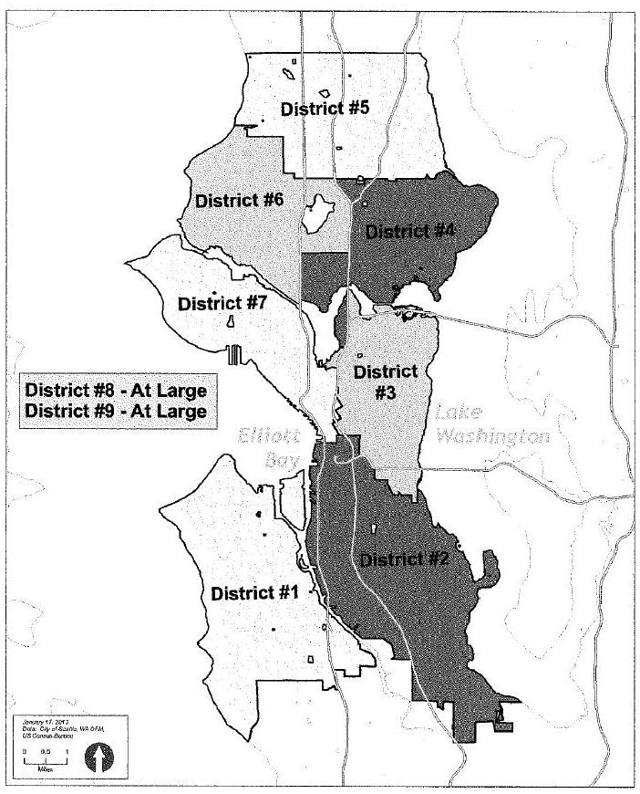

# The Charter

of

The City of Seattle

Adopted at the General Election March 12, 1946as Amended through November 5, 2013

Charter

Table of Contents

Article:

<table>
<tr>
<td></td>
<td>Preamble</td>
<td>C-5</td>
</tr>
<tr>
<td>I</td>
<td>General Rights and Liabilities</td>
<td>C-5</td>
</tr>
<tr>
<td>II</td>
<td>(Reserved)</td>
<td>C-5</td>
</tr>
<tr>
<td>III</td>
<td>Departments of Government</td>
<td>C-5</td>
</tr>
<tr>
<td>IV</td>
<td>Legislative Department</td>
<td>C-6</td>
</tr>
<tr>
<td>V</td>
<td>Executive Department</td>
<td>C-18</td>
</tr>
<tr>
<td>VI</td>
<td>Department of Police</td>
<td>C-19</td>
</tr>
<tr>
<td>VII</td>
<td>Contracting Requirements</td>
<td>C-20</td>
</tr>
<tr>
<td>VIII</td>
<td>Financial and Clerical</td>
<td>C-20</td>
</tr>
<tr>
<td>IX</td>
<td>(Reserved)</td>
<td>C-22</td>
</tr>
<tr>
<td>X</td>
<td>Fire Department</td>
<td>C-22</td>
</tr>
<tr>
<td>XI</td>
<td>Department of Parks</td>
<td>C-22</td>
</tr>
<tr>
<td>XII</td>
<td>The Library Department</td>
<td>C-23</td>
</tr>
<tr>
<td>XIII</td>
<td>The Law Department</td>
<td>C-23</td>
</tr>
<tr>
<td>XIV</td>
<td>City Planning Commission</td>
<td>C-24</td>
</tr>
<tr>
<td>XV</td>
<td>Harbor Department</td>
<td>C-24</td>
</tr>
<tr>
<td>XVI</td>
<td>Personnel System and Civil Service</td>
<td>C-24</td>
</tr>
<tr>
<td>XVII</td>
<td>Salaries and Bonds</td>
<td>C-27</td>
</tr>
<tr>
<td>XVIII</td>
<td>Elections</td>
<td>C-27</td>
</tr>
<tr>
<td>XIX</td>
<td>Officers; Terms and Vacancies</td>
<td>C-28</td>
</tr>
<tr>
<td>XX</td>
<td>Charter Amendments</td>
<td>C-29</td>
</tr>
<tr>
<td>XXI</td>
<td>Streets Upon Tide Lands and Sea and Lake Shores</td>
<td>C-30</td>
</tr>
<tr>
<td>XXII</td>
<td>Miscellaneous Subjects</td>
<td>C-30</td>
</tr>
<tr>
<td>XXIII</td>
<td>City Transit Commission</td>
<td>C-32</td>
</tr>
<tr>
<td></td>
<td>Charter Comparative Table</td>
<td>CT-1</td>
</tr>
</table>

## CHARTER OF THE CITY OF SEATTLE
### PREAMBLE

Under authority conferred by the Constitution of the State of Washington, the People of the City of Seattle enact this Charter as the Law of the City for the purpose of protecting and enhancing the health, safety, environment, and general welfare of the people; to enable municipal government to provide services and meet the needs of the people efficiently; to allow fair and equitable participation of all persons in the affairs of the City; to provide for transparency, accountability, and ethics in governance and civil service; to foster fiscal responsibility; to promote prosperity and to meet the broad needs for a healthy, growing City.

### ARTICLE I - General Rights and Liabilities

Section 1. MUNICIPALITY; NAME, BASIC POWERS: The municipal corporation, now existing and known as The City of Seattle, shall remain and continue a body politic and corporate in name and in fact, by the name "The City of Seattle," and by that name shall have perpetual succession, may sue and defend in all matters and proceedings whatever, have and use a common seal, and alter the same at pleasure, and may purchase, receive, hold and enjoy real and personal property within and without its corporate limits, and may sell, convey, mortgage and dispose of the same for the common benefit, and may receive bequests, devices, gifts and donations of all kinds within and without the City for its own use and benefit, or in trust for charitable or other public purposes, and do all acts necessary to carry out the purposes of such gifts, bequests, devices and donations, with power to manage, sell, lease or otherwise dispose of the same. No gifts of munitions, military supplies, gas or police equipment shall be accepted by The City of Seattle without approval by ordinance.

The public buildings, lands and property, all rights of property and rights of action, all moneys, revenues and income belonging or appertaining to The City of Seattle, are hereby declared to be vested in said City and it shall continue to have, hold and enjoy the same subject to all obligations, debts, liabilities, dues and duties, of the existing municipality.

Suits, actions, and proceedings may be brought in the name of The City of Seattle for the recovery of any property, or for the enforcement of any rights of or contracts with said City, whether made or arising or accruing before or after the adoption of this Charter.

All contracts legally entered into by The City of Seattle, by virtue of any existing law, shall remain valid and be binding to the extent only that they are now valid and binding upon The City of Seattle.

Sec. 2. CONTINUATION OF FORMER PROVISIONS: All provisions of this Charter substantially identical with provisions of the Charter superseded hereby, shall be construed as continuations of such former provisions, and not as new enactments.

In all cases of claims for damages against the city, on which part of the time allowed for presenting and filing the same with the City Clerk has elapsed at the time of the adoption of this Charter, the portion of time elapsed shall be counted as a part of the time fixed by this Charter for presenting and filing such claims.

### ARTICLE II - Reserved

(Article II, relating to Territory and Boundary, deleted at November 2, 1999 election.)

### ARTICLE III - Departments of Government

Section 1. DEPARTMENTS: The Legislative Authority of the City may by ordinance create, consolidate and reorganize the departments, divisions and offices of the City for the conduct of municipal functions except as such creation, consolidation or reorganization shall be precluded by other provisions of this Charter.

Sec. 2. The said departments, with the exception of the Judicial, Library and Transportation Departments, so long as they are constituted in accordance with the provisions of state law, shall be constituted as hereinafter provided, subject only to such changes as are expressly authorized by this Charter.

Sec. 3. HEADS OF DEPARTMENTS; OFFICIAL COMMUNICATIONS: The Mayor shall head the Executive Department; the President of the City Council, the Legislative Department; the Librarian, the Library Department, and the members of the commissions or boards created by this Charter, and the principal unsubordinated officers in departments wherein there is no commission or board shall head their respective departments, but no head of department shall have or exercise any power or authority not provided for elsewhere in this Charter. Official communications between different departments, except as in this Charter otherwise provided, shall be through, or by authority of, the heads of the departments.

### ARTICLE IV - Legislative Department

Section 1. A. LEGISLATIVE POWER, WHERE VESTED: The legislative powers of The City of Seattle shall be vested in a Mayor and City Council, who shall have such powers as are provided for by this Charter; but the power to propose for themselves any ordinance dealing with any matter within the realm of local affairs or municipal business, and to enact or reject the same at the polls, independent of the Mayor and the City Council, is also reserved by the people of The City of Seattle, and provision made for the exercise of such reserved power, and there is further reserved by and provision made for the exercise by the people of the power, at their option, to require submission to the vote of the qualified electors and thereby to approve or reject at the polls any ordinance, or any section, item or part of any ordinance dealing with any matter within the realm of local affairs or municipal business, which may have passed the City Council and Mayor, acting in the usual prescribed manner as the ordinary legislative authority.

B. INITIATIVE AND REFERENDUM; HOW EXERCISED; PETITIONS; VERIFICATION OF SIGNATURES; COMPLETION OF PETITION, CONSIDERATION IN COUNCIL: The first power reserved by the people is the initiative. It may be exercised on petition of a number of registered voters equal to not less than ten (10) percent of the total number of votes cast for the office of Mayor at the last preceding municipal election, proposing and asking for the enactment as an ordinance of a bill or measure, the full text of which shall be included in the petition. Prior to circulation for signatures, such petition shall be filed with the City Clerk in the form prescribed by ordinance, and by such officer assigned a serial number, dated, and approved or rejected as to form, and the petitioner so notified within five (5) days after such filing. Signed petitions shall be filed with the City Clerk within one hundred eighty (180) days after the date of approval of the form of such petitions. Upon such filing, the City Clerk shall convey the signed petition to the officer responsible for the verification of the sufficiency of the signatures to the petition under state law for such verification, and transmit it, together with his or her report thereon to the City Council at a regular meeting not more than twenty (20) days after the City Clerk has received verification of the sufficiency of such petition signatures from the officer responsible for verification of the sufficiency of signatures under state law, and such transmission shall be the introduction of the initiative bill or measure in the City Council. If the officer responsible for verification of the sufficiency of signatures under state law notifies the City Clerk that any petition, which, upon filing had a sufficient number of signatures, has insufficient verified signatures, the City Clerk shall notify the principal petitioners, and an additional twenty (20) days shall be allowed them in which to complete such petition to the required percentage. Consideration of such initiative petition shall take precedence over all other business before the City Council, except appropriation bills and emergency measures.

C. COUNCIL MAY ENACT OR REJECT BUT NOT MODIFY; COUNCIL MAY PASSSUBSTITUTE: The City Council may enact, or reject, any initiative bill or measure, but shall not amend or modify the same. It may, however, after rejection of any initiative bill or measure, propose and pass a different one dealing with the same subject.

D. WHEN REJECTED MEASURE AND SUBSTITUTE SUBMITTED TO PEOPLE; GENERAL AND SPECIAL ELECTIONS: If the City Council rejects any initiative measure, or shall during forty-five (45) days after receipt thereof have failed to take final action thereon, or shall have passed a different measure dealing with the same subject, the said rejected initiative measure and such different measure dealing with the same subject, if any has been passed, shall be taken in charge by the City Clerk and the City Council shall order the measure submitted to the qualified electors for approval or rejection at the next regularly scheduled election, irrespective of whether it is a state or municipal election or a primary or general election; but the City Council may in its discretion designate submission be at a general election rather than a primary or call an earlier special election.

E. WHEN A SPECIAL ELECTION REQUIRED: If an initiative petition shall be signed by a number of qualified voters of not less than twenty (20) percent of the total number of votes cast for the office of Mayor at the last preceding municipal election, or shall at any time be strengthened in qualified signatures up to said percentage, then the City Council shall provide for a special election upon said subject, to be held within sixty (60) days from the proof of sufficiency of the percentage of signatures.

F. MEASURES ADOPTED TO BECOME ORDINANCES, WHEN: Any measure thus submitted to the vote of the people, which shall receive in its favor a majority of all the votes cast for and against the same, shall become an ordinance, and be in full force and effect from and after proclamation by the Mayor, which shall be made, and published in the City official newspaper, within five (5) days after certification of the results of the election. Provided that if such adopted ordinance contemplates any expenditure which is not included in the current budget, or which is not to be paid from an existing bond issue or which eliminates or reduces an existing revenue; such expenditure or elimination shall not be lawful until after the next succeeding budget shall take effect; Provided, further, that the above restriction shall not be operative when less than Twenty Thousand ($20,000.00) Dollars is involved.

G. SUBMISSION OF SUBSTITUTE AND INITIATIVE MEASURES; IF BOTH APPROVED, THAT HAVING HIGHEST VOTE ADOPTED: In case the City Council shall, after rejection of the initiative measure, have passed a different measure, dealing with the same subject, it shall be submitted at the same election with the initiative measure and the vote of the qualified electors also taken for and against the same, and if both such measures be approved by a majority vote, if they be conflicting in any particular, then the one receiving the highest number of affirmative votes shall thereby be adopted, and the other shall be considered as rejected.

H. POWER OF SIMPLE REFERENDUM AS TO ORDINANCES; EXCEPTIONS; BY PETITION OR BY COUNCIL: The second power reserved by the people is the simple referendum, and it may be exercised and ordered (except as to ordinances necessary for the immediate preservation of the public peace, health or safety, or providing for the approval of local improvement assessment rolls, or for the issuance of local improvement bonds), as to any ordinance which has passed the City Council and Mayor (acting in their usual prescribed manner as the ordinary legislative authority of the City), either upon a petition signed by a number of registered voters equal to not less than eight (8) percent of the total number of votes cast for the office of Mayor at the last preceding municipal election, or by the City Council itself without petition.

I. EMERGENCY MEASURES, WHAT TO CONTAIN; VOTE REQUIRED TO PASS: When an emergency exists in which it is necessary for the immediate preservation of the public peace, health or safety, that an ordinance shall become effective without delay, such emergency and necessity, and the facts creating the same, shall be stated in one section of the bill, and it shall not become an ordinance unless on its final passage by the City Council at least three-fourths (/) of all the members vote in its favor (the vote being taken by yeas and nays, and the names of those voting for and against being entered in the journal), and it shall have been approved by the Mayor, whereupon it shall be of full force and effect.

J. REFERENDUM BY PETITION; EFFECT OF; VERIFICATION OF SIGNATURES: The referendum may be invoked by petition bearing the signatures of the required percentage of qualified voters as to any non-emergency law or ordinance or any section, item or part of any such law or ordinance, which petition shall be filed with the City Clerk before the day fixed for the taking effect of the said law or ordinance, which shall in no case be less than thirty (30) days after the final favorable action thereon by the Mayor and City Council, acting in their usual prescribed manner as the ordinary legislative authority of the City, and the filing of such referendum petition as to any such ordinance or section, item or part thereof, shall operate to suspend the taking effect of the same, or any further action thereon, except as herein provided, viz: The City Clerk shall verify the sufficiency of the signatures to the petition and transmit it, together with his or her report thereon, to the City Council, at a regular meeting not less than twenty (20) days after the filing of the petition.

K. SUBMISSION AT GENERAL OR SPECIAL ELECTION: The City Council shall thereupon provide for submitting the said ordinance or section, item or part thereof, to the vote of the qualified electors for ratification or rejection, either at the next regularly scheduled election, irrespective of whether it is a state or municipal election, or at a sooner special election, as the City Council in its discretion may provide.

L. NOTICE AND CONDUCT OF ELECTION: Official publication shall be made, notices of election given, and the manner and conduct of election, the preparation of the official ballots, the counting and canvassing of the votes, and the certifying of the returns of the election, shall in the exercise of both the initiative and referendum be as provided by law for the submission of propositions to the voters.

M. IF ORDINANCE APPROVED, WHEN TO TAKE EFFECT: If the ordinance thus submitted to the referendum shall receive in its favor a majority of all the votes cast for and against the same, it shall be in full force and effect from and after the proclamation by the mayor, which shall be made and published in the City official newspaper, within five (5) days after the election. Provided, however, that if the ordinance itself shall designate a subsequent date for taking effect, the proclamation shall name the said date as the time for taking effect. If the ordinance shall fail to receive the majority vote in its favor, it shall be considered as rejected and shall be of no force or effect.

N. AMENDMENT OR REPEAL OF INITIATED AND REFERRED ORDINANCES: No ordinance so initiated or referred and approved shall be amended or repealed by the City Council within a period of two (2) years following such approval.
 (As amended at November 6, 1973 election, and at September 15, 1981 election.)

Sec. 2. CITY COUNCIL, MEMBERS: To ensure members of the city council are closer to the people they represent, to enable voters to better know their Councilmembers, and to provide a mixed system of district and at-large representation, the City Council shall consist of nine (9) members, with positions 1 through 7 elected by districts and positions 8 and 9 elected from the City at-large.

Subdivision A. ELIGIBILITY: No person shall be eligible for membership in the City Council unless he or she shall be a citizen of the United States and a qualified elector of the State of Washington and a registered voter and a resident of The City of Seattle from at least one hundred twenty (120) days prior to filing the declaration of candidacy through the term of service. A district member shall be a resident of the district represented for at least one hundred twenty (120) days prior to filing the declaration of candidacy through the term of service.

Subdivision B. DISTRICTS: The city council electoral districts are illustrated in the map appended to this charter amendment and made part hereof. The city council electoral district are defined by tract, block, and block group numbers used by the U.S. Bureau of the Census for the 2010 Census, and by street descriptions as follows:

Census Tracts 96, 97.01, 97.02, 98, 99, 105, 106, 107.01, 107.02, 108, 112, 113, 114.01, 114.02, 115, 116, 120, 121, Blocks 4001 - 3, and 5008, Tract 264, and Blocks 1000, 1002 - 3, 1009, and 5008, Tract 265. Description: From the southwest boundary of city at the extension of Seola Beach Dr SW into Puget Sound, north and east along the west boundary of city in Puget Sound and into Elliott Bay to the mouth of the E. Duwamish Waterway, south along the E. Duwamish and Duwamish Waterways to the south boundary of city, then west along the south boundary of city to origin.

Census Tracts 91, 93, 100.01, 100.02, 101, 102, 103, 104.01, 104.02, 109, 110.01, 111.02, 117, 118, 119, Block Group 1 of Tract 92, Block Groups 1 and 3 - 5 of Tract 94, Block Groups 3 and 4, Tract 95, and Blocks 1006, 1008, 1023, 1026 - 28, 1031 and 1032 of Tract 260.01. Description: From the intersection of S Jackson St and Elliott Bay, east along south boundaries of the Seventh and Third districts as described below to the intersection of the extension of the north boundary of Colman Park (S Holgate St), then south along east boundary of city in Lake Washington to the southeast corner of the city at the extension of S Ryan St and Lake Washington, then west along the south boundary of city to origin at the intersection of the south city boundary and the Duwamish waterway, then north on Duwamish Waterway and E. Duwamish Waterways along east boundary of First district to origin at extension of S Jackson St.

Census Tracts 62, 63, 64, 65, 74.01, 74.02, 75, 76, 77, 78, 79, 84, 85, 86, 87, 88, 89, 90, Block Groups 1 and 2 of Tract 61, Blocks 1000 - 1023, 1029, 1031 - 1032, and 1035 - 1045 of Tract 66, Block Group 1 of Tract 83, Block Group 2 of Tract 94, and Block Groups 1 and 2 of Tract 95. Description: From the intersection of Westlake Ave and Valley St, north through Waterway N 3 into Lake Union, north to the extension of vacated E Galer St into Lake Union then follow vacated E Galer St and E Galer St to Interstate 5, north on Interstate 5 to Lake Union, east to Lake Washington, then south along the east boundary of city in Lake Washington to the north boundary of Colman Park (S Holgate St), west on said boundary to Lakeside Ave So, then south to Lake Washington Blvd So, then south to Lake Park Dr S, then south to S McClellan St, then west to 33rd Ave S, then north to S Bayview St, then west to Rainier Ave S, then north to 23rd Ave S, then north to S Holgate St, then west to 18th Ave S, then north on 18th Ave S and extension to Interstate 90, then west to 12th Ave S, then north to Yesler Way, then west to 5th Ave, then follow east boundary of Seventh district, described below, to origin at intersection of Westlake Ave and Valley St.

Census Tracts 24, 25, 26, 38, 39, 40, 41, 42, 43.01, 43.02, 44, 50, 51, 52, 53.01, 53.02, 54, Block Group 4 of Tract 22, Block Group 1 and Blocks 2001 - 2008, 2024 - 2027 of Tract 27, Blocks 1000 - 1033, and 1045 - 1049 of Tract 36, Block Group 1 of Tract 45, Block Groups 3 and 4 of Tract 61, and Block Group 2 and Blocks 1024 - 1028, 1030, and 1033 - 1034 of Block 66. Description: From the intersection of N 85th St and Interstate 5, follow south boundary of the Fifth district described below to Lake Washington, then south along east boundary of city to Union Bay, west through Union Bay and the Lake Washington Ship Canal to Portage Bay to Interstate 5, then south to E Galer St, then west on E Galer St and vacated E Galer St into Lake Union, then north and west in Lake Union to the extension of Aurora Ave N (Troll Ave) into the Lake Washington Ship Canal, then north to origin along the east boundary of the Sixth district as described below.

Census Tracts 1, 2, 3, 4.01, 4.02, 5, 6, 7, 8, 9, 10, 11, 12, 13, 18, 19, 20, 21, Block Groups 1 and 2, and Blocks 4000 - 4004 and 4008 of Tract 14, Block Groups 2 and 3 of Tract 17.01, and Block Groups 1 - 3 of Tract 22. Description: From the north city limits at Puget Sound (extension of NW 145th St) east along north boundary of city to Lake Washington, then south along east city limits (Lake Washington) to north boundary of Sandpoint Country Club, west to Sandpoint Way NE, then northwest to Inverness Dr NE, then southwesterly to street terminus at north boundary of Sandpoint Country Club, then west to northeast corner of Sandpoint Country Club, then northwest across Inverness Ravine Park to the east end of NE 87th St, then southwest to 43rd Ave NE, then south to NE 85th St, then west to 28th Ave NE, then south to NE 83rd St, then west to Ravenna Ave NE, then north to NE 85th St, then west to 14th Ave NE, then south to NE 82nd St, then west to Roosevelt Way Northeast, then north to Northeast 85th St, then west on Northeast and North 85th St to Fremont Ave N, then north to North 87th St, then west to Greenwood Ave N, then north to N 105th St, then west on N and NW 105th St to 14th Ave NW, then north to NW Woodbine Way, then west to NW Norcross Way, then northeast to south boundary of Carkeek Park, then west to Puget Sound, then north on west boundary of city to origin.

Census Tracts 15, 16, 17.02, 28, 29, 30, 31, 32, 33, 34, 35, 46, 47, 48, 49, Block Group 3 and Blocks 4005 - 7 and 4009 - 21 of Tract 14, Block Group 1 of Tract 17, Block Groups 3 and 4 and Blocks 2009 - 23 and 2028 - 31 of Tract 27, Block Groups 2 - 4 and Blocks 1034 - 1044 of Tract 36, and Block Group 2 of Tract 45. Description: From the intersection of south boundary of Carkeek Park with Puget Sound, follow the south boundary of Fifth district described above to the intersection of N 85th St and Interstate 5, then south on Interstate 5 to NE 50th St, then west to Aurora Ave N, then south on Aurora Ave N. to its on ground extension into Lake Washington Ship Canal (Troll Ave), then west on Lake Washington Ship Canal through Salmon Bay to Shilshole Bay, then north in Puget Sound to origin.

Census Tracts 56, 57, 58.01, 58.02, 59, 60, 67, 68, 69, 70, 71, 72, 73, 80.01, 80.02, 81, 82, Block Group 2 of Tract 83, and Block Group 2 of Tract 92. Description: From the outlet of the Lake Washington Ship Canal into Shilshole Bay, then southeast through the Lake Washington Ship Canal to Lake Union, south through Waterway N 3 to the intersection of Westlake Ave and Valley St, then east on Valley St to Fairview Ave N, then south to Interstate 5 on-ramp (intersection of Fairview Ave North and Mercer St), then east on ramp to Interstate 5, then south to Pine St, then east to Minor Ave, then south to University St, then west to Ninth Ave, then south to Marion St, then west on Marion St to 7th Ave, then north to Madison St, then west to 6th Ave, then south to Marion St, then west to 5th Ave, then south to Yesler Way, then west to 4th Ave S, then south to S Jackson St, then west to Elliott Bay, then north along the west boundary of city in Puget Sound to origin in Shilshole Bay and Lake Washington Ship Canal.

In case of any conflict, the census tract and block numbers prevail over the descriptions stated herein. References to a street, or avenue or right of way above refer to the middle of said street, avenue or right of way. Abbreviations used are: "St" for Street, "Ave" for Avenue, "Blvd" for Boulevard, "Dr" for Drive, "city" for the City of Seattle.

Subdivision C. POWERS—LIMITATIONS—RECALL: All the powers of the City Council shall be exercised subject to initiative and referendum powers of the people as set forth herein. The members of the City Council shall be subject to recall in the manner provided by law. (As amended at November 4, 1969 election.)

Subdivision D. COUNCIL REDISTRICTING:

1. By October 31, 2022, and of each tenth year thereafter, a five-member Districting Commission shall be appointed. The Mayor shall appoint two members, and by a two-thirds vote the City Council shall appoint two members. The fifth member shall be appointed by majority vote of the first four members. The Commission shall elect a chair from among its members. No person may serve on the Commission who is an elected official (except precinct committee officer), a registered lobbyist, a candidate for elective office, or a City employee.
2. The Districting Commission shall no later than two months after appointment, or November 30, whichever occurs first, appoint a districting master who shall be qualified by education, training and experience to draw a districting plan. If the Commission is unable to agree upon the appointment of a districting master by November 30, the Mayor shall appoint a districting master. All meetings of the Commission shall be open to the public, and the Commission shall conduct public forums around the City before adopting any plan. At least one public forum shall be held in each existing District.
3. District boundaries shall be drawn to produce compact and contiguous districts that are not gerrymandered. The population of the largest district shall exceed the population of the smallest by no more than one percent. To the extent practical, district boundaries shall follow existing District boundaries, recognized waterways and geographic boundaries, and Seattle communities and neighborhoods. In drawing the plan, neither the Commission nor the districting master shall consider the residence of any person.
4. The districting master shall draw a districting plan for the City, and submit it to the districting Commission by March 15 of the year following their appointment. The Commission shall develop, approve by majority vote, and make public a draft districts proposal and then after public comment, approve by majority vote a final districts plan; and shall have all powers reasonably necessary to carry out its purpose, may employ experts, consultants and attorneys not employed by the city, and shall prepare financial statements and compose and turn over to the City Clerk an official record of all relevant information used. Upon adoption, the districting plan shall be filed with the City Clerk. The plan shall become effective upon filing and cannot be amended by the City Council except to correct data errors upon request by the districting Commission.
5. The City Council shall take all steps necessary to enable the Commission to function, including appropriations sufficient to provide a reasonable per diem for Commission members, compensation for staff and contractors, and reasonable expenses.
Subdivision E. TRANSITION PROVISIONS: Notwithstanding Article XIX, Section 3, the four positions elected at the 2013 general municipal election (positions 2, 4, 6, and 8) shall each be for two year terms ending at midnight, December 31, 2015. The two at large positions created by Section 1 of this Amendment and elected at the 2015 general municipal election shall be for two year terms ending at midnight, December 31, 2017. The seven district positions created by Section 1 of this Amendment and elected at the 2015 general municipal election shall be for four years terms ending at midnight, December 31, 2019. After the 2015 general municipal election, all nine City Council positions shall be for four year terms under Article XIX and this Subdivision shall be of no further effect.

Section 3. QUORUM:

Subsection A. IN GENERAL:

(1) A quorum shall consist of a majority of all nine Councilmembers, except as set forth in Subsection B of this Section 3.

(2) Less than a quorum of Councilmembers may adjourn from day to day, or until the next regular meeting, and may compel the attendance of absent members in such a manner and under such penalties as the Council shall prescribe.

Subsection B. SPECIAL CIRCUMSTANCES: Under any of the following circumstances, a quorum shall be determined under this Subsection B:

(1) Except when Subsection B(2) applies, in order to select a person to fill a vacancy on the City Council under Article XIX of this Charter, a quorum shall consist of a majority of those Councilmembers holding office at the time the Council makes the selection, and for such purpose a majority of such members holding office at the time the Council makes the selection shall constitute a majority of the Council.

(2) During a declared emergency under Article V, Section 2 of this Charter, a quorum shall for all purposes consist of a majority of all those Councilmembers who are available to participate in Council meetings and are capable of performing the duties of office, and a majority of such members available to participate in Council meetings and capable of performing the duties of office shall constitute a majority of the Council.

Sec. 4. POWERS AND DUTIES OF COUNCIL: The City Council shall—

First. ELECTION OF PRESIDENT: Biennially, and also whenever a vacancy occurs, choose from its members its President, who shall perform the usual functions of a presiding officer, and who may be removed by the affirmative vote of not less than two-thirds of all the members.

Second. RULES: Establish rules for its proceedings.

Third. JOURNAL; VOTE: Keep a public journal of its proceedings, and take yeas and nays on any question on demand of any two members and enter the same in the journal.

Fourth. PUNISHMENT AND EXPULSION OF MEMBERS: Have authority to punish its members and others for disorderly or otherwise contemptuous behavior in its presence, and to expel for such behavior in its presence any member by the affirmative vote of not less than two-thirds of its members, specifying in the order of expulsion the cause thereof.

Fifth. COMMITTEES: Have authority to create and use committees of its members to facilitate its legislative functions; Provided, that no committee of the Council and no members shall have or exercise executive or administrative power, except as otherwise expressly provided in this Charter.

Sixth. ATTENDANCE OF WITNESSES AND PRODUCTION OF PAPERS: Have authority to compel attendance of witnesses as well as production of papers and things pertinent to business before it or any of its committees.

Sec. 5. FINANCE COMMITTEE, POWERS AND DUTIES: The City Council shall have a Finance Committee of not less than three members. Such Committee may investigate the transactions and accounts of all officers having the collection, custody and disbursement of public money, or having the power to approve, allow or audit demands on the treasury; it shall have free access to any records, books and papers in all public offices and may administer oaths or affirmations, and examine witnesses and compel attendance by subpoena. Said Committee shall keep a record of its proceedings, with the names of the witnesses examined, and a substantial statement of the evidence taken. If from any examination made by said Committee it shall appear that a misdemeanor in office or a defalcation has been committed by any officer, said Committee shall immediately report to the Mayor, who, if he or she approve such report, shall forthwith suspend such officer, and take the proper steps under this Charter to remove him or her or to cause his or her removal. Any police officer shall execute the process and orders of said Committee.

Sec. 6. REGULAR MEETINGS: Regular meeting dates shall be set by the Council by rule. All sessions shall be public and the Council shall not meet in any other place than its regular place of meeting except when permitted by state law in the event of an emergency or disaster.

SPECIAL MEETINGS: The Mayor, the President of the City Council, or any three Councilmembers, may call a special meeting of the Council. (As amended at November 8, 1988 election.)

Sec. 7. LEGISLATIVE ACTS BY ORDINANCE; SUBJECT MATTER; TITLE; ENACTING CLAUSE; Every legislative act of said City shall be by ordinance. Every ordinance shall be clearly entitled and shall contain but one subject, which shall be clearly expressed in its title. The enacting clause of every ordinance shall be: "Be it ordained by The City of Seattle as follows:"

Sec. 8. MAJORITY VOTE TO PASS ORDINANCE; RECORD: No bill shall become an ordinance unless on its final passage at least a majority of all members vote in its favor, and the vote be taken by yeas and nays, and entered in the journal.

FINAL PASSAGE: No ordinance, other than for payment of salaries or current expenses, shall be passed on its final reading at the meeting at which it is introduced.

Sec. 9. ORDINANCES, HOW AMENDED: No ordinance shall be re-enacted or amended by reference to its title; but the ordinance or codification thereof being re-enacted or the section or subsection of the ordinance or codification thereof being amended shall be set forth in full in the new ordinance.
 (As amended at November 2, 1999 election.)

Sec. 10. MOTION TO RECONSIDER: When a bill is put upon its final passage and fails to pass, and a motion is made to reconsider, the vote upon such a motion shall not be acted on before the next meeting of the Council.

BILLS GRANTING FRANCHISE: No bill granting a franchise shall be finally passed within thirty (30) days after its introduction, nor until it has been published in the official newspaper of the City at the expense of the applicant for ten consecutive press days.

Sec. 11. BILLS, HOW SIGNED: Every bill, after it has passed, shall be signed by the President of the Council in open session, in authentication of its passage. In signing, the President shall call attention to the bill and that he or she is about to sign it, and, if any member so request, the bill shall be read at length for information as to its correctness as enrolled. If any member object that the bill is not the same as when considered and passed, such objection shall be passed upon, and if sustained the President shall withhold his or her signature and the bill shall be corrected and signed before the Council proceeds to any other business.

Section 12. BILLS TO BE PRESENTED TO MAYOR: Every bill which shall have passed shall within five days thereafter be presented to the Mayor.

RETURN OF BILLS; VETO: The Mayor shall return such bill to the Council within ten (10) days after receiving it. If he or she signs the bill or returns it unsigned but without disapproval or if the time for returning the bill shall have elapsed without its return, that shall be deemed a favorable action by the Mayor and it shall become an ordinance. If the Mayor disapproves the bill, he or she shall, when so returning it, specify his or her objections thereto in writing. The objections of the Mayor shall be entered at large on the journal of the Council, and published in the City official newspaper.

RECONSIDERATION OF VETOED BILLS: The Council shall, not less than five days after such publication, and within thirty days after such bill shall have been so returned, reconsider and vote upon the same, and if the same shall, upon such reconsideration, be again passed by the affirmative vote of not less than two-thirds of all the members, the President of the Council shall certify the fact on the bill, and when so certified the bill shall become an ordinance with like effect as if it had not been disapproved by the Mayor; but if the bill so returned shall fail to receive upon the first vote thereon an affirmative vote of two-thirds of all the members it shall be deemed finally lost. The vote on such reconsideration shall be taken by yeas and nays, and the names of the members voting for or against the same shall be entered in the journal thereof.

Section 13. A. RECORD AND PUBLICATION OF ORDINANCES AND RESOLUTIONS: All ordinances and resolutions shall be deposited with the City Clerk, who shall record the same. Notice of all ordinances of a general, public or permanent nature, and those imposing a fine, penalty or forfeiture, shall be published in accordance with state law within three days after the same shall have become a law; Provided, that the publication of notice of all ordinances granting any franchise or private privilege or approving or vacating any plat shall be at the expense of the applicant therefor.

B. The City Clerk shall maintain a compilation of all ordinances enacted each year, such compilation to be accessible to the public at no cost.

Section 14. POWERS BY ORDINANCE: The City Council shall have power by ordinance and not otherwise —

First. ELECTIONS; APPOINTMENT AND ELECTION OF OFFICERS; OFFICER DEFINED: To provide for general and special elections, for questions to be voted upon, and to provide for the appointment and election of officers. Any person who, by the provisions of this Charter or any amendment thereto, may be appointed or elected to any office or employment created in pursuance thereof, shall be deemed an officer within the meaning of this section.

Second. ASSESSMENT, LEVY AND COLLECTION OF TAXES: To provide for the assessment, levy and collecting taxes on real and personal property for the corporate uses and purposes of the City, and to provide for the payment of the debts and expenses of the corporation.

Third. CONTROL OF FINANCES AND PROPERTY: To control the finances and property of the City; Provided, that the City Council shall have no administrative as distinguished from the legislative power.

Fourth. ACQUISITION AND DISPOSAL OF PROPERTY: To acquire by purchase or by exercise of the right of eminent domain or otherwise and for the use and in the name of the City, such lands and other property within or without the corporate limits as may be deemed necessary, proper or convenient for any corporate use, and to acquire for the use of the City any property by gift, bequest or devise, and to dispose of all such property as it shall have, as the interests of the City may from time to time require.

Fifth. BORROWING MONEY AND ISSUING BONDS; FUNDING BONDS: To borrow money for corporate purposes on the credit of the City and to authorize the issue of bonds in the manner prescribed by law, and to authorize the issue of bonds to meet maturing bonds or other indebtedness or for funding the same.

Sixth. ESTABLISH, IMPROVE, CONTROL AND VACATE STREETS AND PUBLIC PLACES; CERTAIN STREETS AND LANDS TO PASS TO OR VEST IN PORT OF SEATTLE: To lay out and improve streets and other public places, and to regulate and control the use thereof, to authorize or prohibit the location of any railroad or public transportation system or the use of electricity, at, in or upon any of said streets or for other purposes, and to prescribe the terms and conditions upon which the same may be so used, and to regulate the use thereof; to vacate streets and to extend, establish or widen any street, over or across or along the harbor, shore or tide lands in the City; Provided, that whenever there shall have been adopted by the voters a comprehensive plan of harbor or port improvement, the control of streets and the title to any lands belonging to the City within the limits of such proposed improvement shall be vested in the Port of Seattle, after said Port has commenced the improvement and has so certified to the City Council.

Seventh. CHANGE OF GRADES; DAMAGES: To change the grade of any street or alley within its corporate limits and to provide for the payment of damages.

Eighth. LOCAL IMPROVEMENTS: To provide for making local improvements and to levy and collect special assessments on property benefited.

Ninth. BRIDGES, VIADUCTS AND TUNNELS: To construct and keep in repair bridges, viaducts and tunnels, and to regulate the use thereof.

Tenth. STONE QUARRIES, ASPHALT PLANTS: To acquire, open and operate stone quarries, either within or without the City limits, and to erect asphalt plants for the preparation, manufacture and sale of all such stone or asphalt products or compositions or other materials for use in street construction or maintenance, and to fix the price at which such materials shall be sold.

Eleventh. PUBLIC UTILITIES: To construct, purchase, condemn or otherwise acquire, maintain and operate works, plants and facilities within or without the City for the following purposes: water supply for domestic and all other uses; production of gas and electricity for light, heat, power and all other uses public and private; public transportation system; telephone service, local and long distance; ferries, docks and terminal facilities; and to control the use thereof, and fix the price of the services and products thereof.

Twelfth. HOSPITALS AND SANITARIUMS: To erect and establish hospitals, sanitariums, sanitoriums and isolation hospitals and to control and regulate the same.

Thirteenth. POLICE POWER: To make all such local, police, sanitary and other regulations as are not in conflict with the laws of the state.

Fourteenth. OFFICERS AND EMPLOYEES: To ordain, establish, modify and abrogate from time to time, as the needs of the City shall require, all proper offices and bureaus, subordinate and auxiliary to the departments and heads thereof constituted by this Charter, and to provide for the conduct and government thereof, and the duties and compensation of officers and employees to fill the same, except as in this Charter otherwise provided.

Fifteenth. AMENDMENT AND REPEAL OF ORDINANCES: To alter, amend or repeal any ordinance or ordinances or parts thereof, except as herein otherwise provided.

Sixteenth. EXECUTION OF VESTED POWERS: To make all rules and regulations necessary or proper to carry into execution all powers vested by this Charter, or by law, in the City or in any department or officer thereof, except as in this Charter otherwise provided.

Seventeenth. HARBOR AND WATERFRONT: To control and regulate the use of the harbor and waterfront.

Eighteenth. CEMETERIES: The establishment or platting of new cemeteries or the extension of existing cemeteries within the limits of The City of Seattle is hereby prohibited.

Section 15. GENERAL LEGISLATIVE POWERS: The City shall, in addition to the powers enumerated in this Charter, have all other powers now or hereafter granted to or exercised by municipal corporations of like character and degree, and also all powers now or hereafter granted to incorporated towns and cities, by the laws of this state, and may exercise the same by ordinance and not otherwise.

Section 16. FRANCHISES: Every grant of a franchise, right or privilege shall be subject to the right of the City Council, or the people of the City acting for themselves by the initiative and referendum, at any time, subsequent to the grant, to repeal, amend or modify the said grant with due regard to the rights of the grantee and the interest of the public; and to cancel, forfeit and abrogate any such grant if the franchise granted thereby is not operated in full accordance with its provisions, or at all; and at any time during the grant to acquire, by purchase or condemnation, for the use of the City itself, all the property of the grantee within the limits of the public streets, at a fair and just value, which shall not include any valuation of the franchise itself, which shall thereupon terminate; and every ordinance making such grant shall contain a reservation of these rights of the City Council, and of the people of the City acting for themselves by the initiative and referendum, to so repeal, amend or modify said ordinance, and to so cancel, forfeit and abrogate the grant, and to so acquire the property of the grantee in the public streets, as herein above set forth. The City Council shall not consider or grant any application for extension of the period of any franchise, nor any new franchise covering all or any substantial part of the rights or privileges of any existing franchise, until within three years of the expiration of the existing grant, and then only after submission to and approval by a majority vote of the qualified electors.

MINORITY OF COUNCIL MAY INVOKE REFERENDUM VOTE: Not less than one-third of all the members of the Council may invoke a referendum vote on a franchise ordinance without a petition.

Section 17. WHARF FRANCHISES, HOW GRANTED; CONDITIONS: The City Council shall not grant any franchise for any wharf except in the manner following: In addition to the requirements under the general laws, every ordinance granting such franchises must receive the vote of at least two-thirds of all the members, and shall provide that work shall commence within six months and be prosecuted continuously and shall be completed within one year thereafter. Said time shall not be extended for any cause, and unless so completed the franchise shall be forfeited.

Section 18. EXCLUSIVE FRANCHISES PROHIBITED: No exclusive franchise or privilege shall be granted for the use of any street or other place or any part thereof.

Section 19. APPROPRIATIONS FOR CERTAIN PURPOSES PROHIBITED: The City Council shall make no appropriation in aid of any corporation, person or society, unless expressly authorized by this Charter or the laws of the state.

Section 20. TEMPORARY LOANS: The City Council, after the taxes have been levied in any year, shall have power to make temporary loans in anticipation of the collection of such taxes, such loans to be applied to the purposes for which such taxes have been levied and to no other purpose, and such taxes shall be applied to pay such loans.

Section 21. ORDINANCES CREATING DEBT: No debt or obligation of any kind against the City shall be created by the City Council except by ordinance specifying the amount and object of such expenditure.

Section 22. RESERVED.

(Section 22, relating to Annual Estimate of Expenses and Revenues, deleted at November 2, 1999 election.)

Section 23. INVALID CLAIMS: Neither the City Council nor any officer, board, department or authority shall allow, make valid or in any manner recognize any demand against the City which was not at the time of its creation a valid claim against the same, nor shall they or any of them ever allow or authorize to be paid any demand which, without such action would be invalid, or which shall then be barred by any statutes of limitation, or for which the City was never liable, and any such action shall be void.

Section 24. CLAIMS FOR DAMAGES: All claims for damages against the City must be filed with the City Clerk within the applicable statute of limitations. All claims for damages must accurately locate and describe the act, omission or defect that caused the injury or damage, specify the date and location of the claimed loss, describe the basis upon which liability is being asserted against the City, including any known witnesses, accurately describe the injury or damage, give residence for six months last past of the claimant, contain the items of damages claimed, and be sworn to by the claimant or an authorized representative. No lawsuit shall be commenced against the City in which monetary damages are being claimed until a written claim for damages has been presented to and filed with the City Clerk. A lawsuit based upon the allegations of a claim for damages may not be commenced within sixty (60) days of the filing of such claim.

No ordinance shall be passed allowing any such claim or any part thereof, or appropriating money or other property to pay or satisfy the same or any part thereof, until such claim has first been referred to the proper department, nor until such department has made its report to the City Council thereon, pursuant to such reference, provided that, the City Council may by general ordinance provide a different procedure for the presentation and payment of any claim in any amount as may be prescribed from time to time by ordinance passed by a two-thirds majority of all members of the City Council.

Notwithstanding any provision of this Charter inconsistent with this section, particularly Article IV, Sec. 1, H. and J. which are hereby superseded to the extent inconsistent herewith, any ordinance which may be required to allow a claim or appropriate money or other property to pay or satisfy the same or any part thereof shall become effective upon approval by the Mayor.
 (As amended at November 6, 1973 election, and at November 6, 1990 election, and at November 2, 1999 election.)

Section 25. ORDINANCE, PENALTIES: Every ordinance prohibiting or requiring any act or omission shall impose a penalty.

Section 26. ORDINANCES, CONTINUED IN FORCE: All ordinances in force in the City at the date of the adoption of this Charter, and not inconsistent therewith, shall remain in force until repealed or until they expire by limitation.

### ARTICLE V - Executive Department

Section 1. QUALIFICATIONS OF MAYOR: The chief executive officer of the City shall be a Mayor. He or she shall be a citizen of the United States and a qualified elector of the State of Washington and a registered voter of The City of Seattle at the time of filing his or her declaration of candidacy.
 (As amended at November 4, 1969 election.)

Sec. 2. POWER AND DUTIES OF MAYOR: The Mayor shall see that the laws in the City are enforced, and shall direct and control all subordinate officers of the City, except in so far as such enforcement, direction and control is by this Charter reposed in some other officer or board, and shall maintain peace and order in the City. He or she may, in any emergency, of which the Mayor shall be the judge, assume command of the whole or any part of the police force of the City; but before assuming such control he or she shall issue his or her proclamation to that effect, and it shall be the duty of the Chief of Police to execute orders promulgated by the Mayor during such emergency. The Mayor shall perform such other duties and exercise such other authority as may be prescribed by law.

Sec. 3. APPOINTIVE OFFICERS: The appointment or removal of officers requiring confirmation by the City Council shall be effective only upon the affirmative vote of a majority of the membership of the City Council. In the absence of any express provision in this Charter as to the manner of appointing any officer, the Mayor shall appoint such officer subject to such confirmation.

Sec. 4. APPOINTMENT AND CONFIRMATION; COUNCIL TO ELECT IF MAYOR FAILS TO NOMINATE: If the City Council shall refuse to confirm any nomination of the Mayor, then the Mayor shall within ninety days thereafter nominate another person to fill the office, and he or she may continue to nominate until confirmation. If the Mayor fails to make another such nomination within ninety days, then the City Council shall elect a suitable person to fill the office during the term.
 (As amended at September 18, 1979 election.)

Sec. 5. VACANCIES BY REMOVAL: Whenever the Mayor shall remove an appointive officer, the vacancy for the unexpired term shall be filled by appointment in the same manner as if at the beginning of the term, except as otherwise provided in this Charter.

Sec. 6. ANNUAL MESSAGES; SPECIAL MESSAGES:

Sec. 7. MAYOR TO ENFORCE CONTRACTS; OFFICERS TO REPORT VIOLATIONS: The Mayor shall see that all contracts and agreements made with the City or for its use and benefit are faithfully kept and performed and to this end he or she shall cause any legal or equitable proceedings to be instituted and prosecuted. And it is the duty of every officer of the City having knowledge that any contract with the City has been violated by the other contracting party, forthwith to report the fact to the Mayor.

Sec. 8. MAYOR TO APPROVE BONDS; WHERE FILED: The Mayor shall, unless in this Charter otherwise provided, take and approve all official undertakings or bonds required of any officer, employee or agent of the City as security for the faithful performance of his or her duty; and the Mayor shall also, except as otherwise provided in this Charter, take and approve any such bond or undertaking as may be required of any contractor for the faithful performance of his or her contract; and when the Mayor approves any bond or undertaking he or she shall immediately file the same with the City Clerk.
 (As amended at November 2, 1999 election.)

Sec. 9. ABSENCE OR INCAPACITY OF MAYOR: In case of the absence of the Mayor from the City, or if he or she from any cause be incapacitated from acting, the President, or in case of his or her disability or absence, the acting president of the City Council shall act as Mayor, and for the time being exercise all his or her powers.

Sec. 10. REMOVAL OF MAYOR: The Mayor may be removed from office after a hearing, for any willful violation of duty, or for the commission of an offense involving moral turpitude, upon written notice from the City Council at least five days before the hearing. He or she shall have the right to be present, to the aid of counsel, to offer evidence and to be heard in his or her own behalf. Upon the affirmative vote of two-thirds of all the members of the City Council, acting as a court of impeachment, the office shall become vacant.
 (As adopted at November 8, 1977 election.)

Sec. 12. RESERVED.

(Section 12, relating to City Planner, deleted at November 2, 1999 election.)

1. It shall be the duty of the Mayor annually at the third regular meeting of the City Council in February, to communicate by message to the Council a statement of the conditions and affairs of the City, and to recommend the adoption of such measures as he or she may deem expedient and proper; and
2. It shall be the duty of the Mayor annually at a regular City Council meeting, at the time he or she presents his or her proposed budget, to communicate by message to the Council his or her recommendation for the adoption of such budget; and
3. The Mayor shall, further, have the right to make special communication to the City Council from time to time as he or she may deem useful and proper.

### ARTICLE VI - Department of Police

Section 1. ORGANIZATION OF POLICE DEPARTMENT: The Police Department shall consist of a Chief of Police and as many subordinate officers and employees as may by ordinance be prescribed. There shall be maintained adequate police protection in each district of the City.

Sec. 2. CHIEF OF POLICE; QUALIFICATIONS, APPOINTMENT, REMOVAL; TO APPOINT SUBORDINATE OFFICERS: The Chief of Police shall be appointed by the Mayor, subject to confirmation by a majority vote of all members of the City Council. He or she shall be selected by the Mayor from among the three highest ranking candidates in a competitive examination to be conducted under the direction of the Mayor. The Mayor may remove the Chief of Police upon filing a statement of his or her reasons for so doing with the City Council. A Chief of Police appointed from the classified civil service may take leave of absence from his or her classified position until completion of his or her tenure as Chief of Police. All subordinate police officers shall be appointed by the Chief of Police under civil service rules and regulations.

Sec. 3. COMPETITIVE EXAMINATION: The competitive examinations shall adequately test the qualifications of all candidates for Chief of Police, and all records of such examinations shall be filed with the City Council by the Mayor together with his or her appointment of the Chief of Police. Such records shall be open to public inspection for at least seven days prior to the City Council taking action on said appointment.

Sec. 4. CHIEF TO MANAGE POLICE DEPARTMENT: The Chief of Police shall manage the Police Department, and shall prescribe rules and regulations, consistent with law, for its government and control; provided, that the Chief of Police shall be responsible to the Mayor for the administration of the Police Department and the enforcement of law.

Sec. 5. First. PROCESS DIRECTED TO CHIEF OF POLICE; CHIEF TO MAINTAIN PEACE: The Chief of Police shall be the chief peace officer of the City, and all process issued by the Police Judge of the City, shall be directed to him or her for service, and may be served and returned by the Chief of Police or any peace officer. The Chief of Police shall maintain the peace and quiet of the City. He or she shall have like powers and responsibilities as the Sheriff of King County in similar cases, and shall perform such other duties as may be imposed by ordinance.

Second. POWERS OF POLICE OFFICERS IN MAKING ARRESTS; POLICE RECORDS: The Chief of Police or any police officer may make arrests for any crime or violation of the laws of the state or any ordinance of the City committed within the City. The Chief of Police shall keep a correct record of all arrests, showing the time and cause of complaint upon which each arrest was made, with a list and description of all property and money taken from each person.

Third. CHIEF RESPONSIBLE FOR PROPERTY TAKEN: The Chief of Police shall be responsible for all property and money taken from any person, and shall be liable therefor on his or her official bond, and any person may recover for loss of any such property or money in an action brought for that purpose.

Fourth. DUTIES OF POLICE OFFICERS: The duties of the subordinate police officers shall be as provided by ordinance or by rules established by the Chief, in addition to the duties hereinbefore prescribed.

Fifth. POLICE OFFICERS NOT TO ENGAGE IN OTHER CALLING, BECOME BAIL OR RECEIVE PAY WHILE ABSENT: No member of the police force shall engage in any other profession or calling, furnish bail or bond for any person charged with any offense whatever, or recommend to persons charged with crime the employment of any particular attorney. No member of the police force shall be allowed pay for any period during which he or she may have been absent from duty, except as otherwise provided in this Charter.
 (As amended at November 6, 1973 election.)

Sec. 6. POLICE OFFICERS; NO COMPENSATION EXCEPT SALARY: No member of the police force shall receive any fees or any compensation whatever, directly or indirectly, from the City, county or state, for any services rendered or act done, while a member of such police force, other than salary, except witness fees in the superior court.

### ARTICLE VII - Contracting Requirements

Section 1. CONTRACTING DUTIES: The responsibility for the award of all contracts for public works, services, supplies, materials or equipment shall be assigned to such department or departments as prescribed by ordinance. (As amended at November 8, 1977 election, and November 5, 1991 election.)

Sec. 2. CONTRACTING REQUIREMENTS: In letting any City contracts, the following shall be required:

Sec. 3. CITY OFFICIAL NEWSPAPER: The "City Official Newspaper," which shall publish all official proceedings required by law to be published, shall be designated annually after a call for bids from the daily newspapers of general circulation published in the City at least six (6) days per week. (As amended at November 8, 1977 election, November 5, 1991 election, and November 2, 1999 election.)

1. All contracts for public works, supplies, materials or equipment involving more than such amount as may be specified by ordinance shall be made on written contract. All such contracts shall be awarded to the lowest and best bidder, after public advertisement as may be prescribed by ordinance.
2. Anyone employed pursuant to a contract for public work awarded by the City shall be paid at not less than the prevailing rate of pay for City employees performing like duties. (As amended at November 8, 1977 election, and November 5, 1991 election.)

### ARTICLE VIII - Financial and Clerical

Section 1. DEPARTMENT OF FINANCE: There shall be a Department of Finance to exercise general supervision over the financial affairs of the City, with such powers and duties as may be prescribed by ordinance. The Director of Finance shall be appointed by the Mayor, subject to confirmation by a majority of the City Council, shall be subject to reappointment and reconfirmation every four years and may be removed by the Mayor upon filing a statement of his or her reasons therefor with the City Council.

Sec. 2. CITY AUDITOR: There shall be a City Auditor who shall examine and verify the accuracy of the accounts and records of the City; inspect the receipt, safekeeping, and disbursement of public funds; and perform such other duties as are prescribed by law. The City Auditor shall have a term of four years and shall be appointed by a majority of the City Council and may be removed for cause by a majority of the City Council.

Sec. 3. DUTIES OF CITY CLERK: The City Council shall select the City Clerk. The City Clerk, or a deputy, shall attend all meetings of the City Council and keep a complete record of the proceedings thereof; and he or she shall have the custody of the City Seal, the original rolls of ordinances, the original contracts, deeds, and certificates relative to the title of any property of the City, official, indemnity or security bonds, and such other records, as are required to be deposited, and he or she shall administer oaths and perform such other duties as prescribed by ordinance. (As amended at November 5, 1991 election, and November 2, 1999 election.)

Sec. 10. CONTINGENT FUND: There shall be established by ordinance a Contingent Fund, into which shall be appropriated from the General Fund moneys to pay employees of the City released between regular pay days. Payments shall be made from said fund on certification by the Director of Finance of amounts due. Said fund shall be reimbursed on the next day following pay day by transfer thereto from the proper funds. Another contingent fund shall be so established for the payment of freight and express charges, telegrams, postage and like incidental expenses of the different departments. Payments shall be made on certification of the Director of Finance, said fund to be reimbursed monthly from the proper funds. (As amended at November 2, 1999 election.)

Sec. 11. MONEY TO BE PAID TREASURER; FAILURE, PENALTY: Every officer or agent of the City, or other person who shall receive or have in his or her hands any money payable to the City in any capacity, shall immediately pay the same to the City Treasury. Any such person who shall fail to so pay any moneys received for more than forty-eight hours, Sundays and holidays excluded, after the money shall have been received by him or her, shall be liable to the City for double the amount of money so received. (As amended at November 2, 1999 election.)

Sec. 12. BOOKS, INSPECTION: The Treasurer's books shall be open for public inspection, subject to such reasonable rules and regulations as prescribed by ordinance.

Sec. 13. RESERVED.(Section 13, relating to Auditing Committee; Examination of Claims, deleted at November 2, 1999 election.)

Sec. 14. CLAIMS; VERIFICATION: All demands and claims against the City required to be verified shall be subscribed and sworn to before the City Clerk or one of his or her deputies, or some officer authorized to administer oaths. Each claim or demand must be accompanied by a detailed statement of the items. (As amended at November 2, 1999 election.)

Sec. 15. GENERAL FUND; SPECIAL FUNDS: There shall be a General Fund into which shall be paid all revenues of the City, except as otherwise provided by law, and from which shall be paid all expenses and liabilities not required to be paid out of some special or other fund. The creation of special funds and the transfer of moneys from one fund to another fund shall be by ordinance and not otherwise; provided, that no transfer shall be made from a bond interest and redemption fund.

The transfer of surplus funds from a City owned public utility, or the collection of any tax from such utility, shall not be permissible until ample provision has been made for the servicing of the debts and obligations of the utility, and for necessary betterments and replacements for the current year.

Sec. 16. CERTAIN DUTIES AND FUNCTIONS MAY BE REASSIGNED: The terms "City Comptroller" and "City Treasurer" as may be used outside this Charter shall refer to the Director of Finance, except as the Council may by ordinance re-assign those functions. The duties and functions of the former City Comptroller and City Treasurer assigned by this or another contemporaneous 1999 charter amendment, or by the 2006 amendment to Subsections 1.D and 1.J of Article IV of this Charter, also may be re-assigned by ordinance.

### ARTICLE IX - Reserved

(Article IX, relating to Public Health Department, deleted at November 2, 1999 election.)

### ARTICLE X - Fire Department

Section 1. The Fire Department shall consist of the Fire Chief, and as many subordinate officers and employees as may be prescribed by ordinance.

Sec. 2. APPOINTMENT OF FIRE CHIEF: The Fire Chief shall be appointed by the Mayor, such appointment to be effective only upon confirmation of the City Council passed by a majority vote of all its members and the Fire Chief may be removed by the Mayor upon filing a statement of the Mayor's reasons therefor with the City Council. The Fire Chief shall have at least ten years service in a fire department in a jurisdiction of not less than one hundred thousand population. In case the Fire Chief be appointed from the civil service, he or she shall resume his or her former position therein upon replacement and the subordinate appointees shall resume their former positions respectively. (As amended at November 2, 1999 election.)

Sec. 3. FIRE CHIEF TO MANAGE DEPARTMENT: The Fire Chief shall manage the Fire Department, and shall prescribe rules and regulations, not inconsistent with law, for its government and control. He or she shall have such further powers and duties as are prescribed by ordinance.

### ARTICLE XI - Department of Parks

Section 1. DEPARTMENT OF PARKS AND RECREATION: There shall be a Department of Parks and Recreation, the head of which shall be the Superintendent of Parks and Recreation, who shall have responsibility for the management and control of the park and recreation system of the City. Such Superintendent shall appoint under civil service laws and rules, supervise and control all officers and employees in the Department of Parks and Recreation, and shall have such further powers and perform such other duties as may be prescribed by ordinance. The Superintendent of Parks and Recreation shall be appointed by the Mayor, subject to confirmation by a majority of the City Council, shall be subject to reappointment and reconfirmation every four years, and may be removed for cause by the Mayor upon filing with the City Council a statement of his or her reasons therefor; provided that upon the resignation of the Superintendent of Parks and Recreation in response to the Mayor's request, the Mayor shall file with the City Council a statement of his or her reasons for making such request.

Sec. 2. BOARD OF PARK COMMISSIONERS. There shall be a Board of Park Commissioners, the function of which shall be to act in an advisory capacity to the Mayor, City Council, Department of Parks and Recreation and other City departments in respect to park and recreation matters. The number of members of such Commission, their terms of office and the manner in which they shall be appointed and may be removed, and their duties, shall be as prescribed by ordinance. (As amended at November 7, 1967 election.)

Sec. 3. There is hereby established in the City Treasury a Park and Recreation Fund for the operation and maintenance of the park and recreation system of the City, in which there shall be placed: such moneys as may be budgeted annually for such operation; gifts, bequests and devises for park and recreation purposes; revenues from park and recreation properties, facilities and areas; ten percent of the gross receipts of the City from all fines, penalties and licenses; and such other moneys as may be provided by ordinance. (As amended at November 7, 1967 election.)

Sec. 4. Any provisions of this Charter inconsistent with this article, particularly Article VII Sec. 1, and Article XIV Sec. 1, are hereby superseded to the extent inconsistent. (As amended at November 7, 1967 election.)

### ARTICLE XII - The Library Department

Section 1. LIBRARY FUND: There shall be a Library Fund, which shall consist of-

First. GIFTS: Such gifts, bequests and devises as may be given, bequeathed or devised to the City of Seattle or any trustee for the uses or purposes of the "Seattle Public Library."

Second. RENTS: The rents, issues and profits derived from any property which may be held or owned in trust for said library by the City or any other trustee.

Third. Such sums as the City Council may provide.

Sec. 2. TITLE TO PROPERTY: The title to all property belonging to the Seattle Public Library shall be and remain in the name of the City, and shall be held inviolable in trust for the use and benefit of said library; except that all persons desirous of making gifts of money, personal property or real estate for the benefit of the Seattle Public Library shall have the right to vest the title thereto in the Library Board to be held and controlled by the Library Board when accepted, according to the terms of the deed of gift, bequest or devise.

Sec. 3. LIBRARY BOARD; APPOINTMENT; TERMS: There shall be five Library Trustees as contemplated by state law who shall constitute and be known as "The Library Board," and be the governing body of the library. The Mayor, with the consent of the City Council, shall appoint the five Trustees, each of whom shall hold office for five years without compensation. The appointees shall be citizens of recognized fitness for the position.

Sec. 4. LIBRARIAN: The Librarian shall be selected and may be removed by the Board. He or she shall possess such qualifications as to fitness for the position as the Board may require. He or she shall, by and with the consent of the Library Board, have the appointment and removal of all subordinate employees of the library.

Sec. 5. MANAGEMENT OF LIBRARY; EXPENDITURES: The Library Board shall manage and control the public library as provided by State Law and shall alone have authority to expend the Library Fund; the Board shall certify expenditures to the Director of Finance, who shall issue warrants therefor payable out of any money in the Library Fund, not otherwise appropriated. (As amended at November 2, 1999 election.)

### ARTICLE XIII - The Law Department

Section 1. OFFICERS: APPOINTMENT; REMOVAL: The Law Department shall consist of a City Attorney who shall appoint the Assistant City Attorneys and City Prosecutors, who may be removed at will. (As amended at November 8, 1977 election.)

Sec. 2. QUALIFICATIONS: The City Attorney shall be an attorney of the Supreme Court of the State, and have been in the practice of his or her profession in The City of Seattle for at least four years next prior to his or her election. (As amended at November 8, 1977 election.)

Sec. 3. DUTIES OF CITY ATTORNEY: The City Attorney shall have full supervisory control of all the litigation of the City, or in which the City or any of its departments are interested, and shall perform such other duties as are or shall be prescribed by ordinance. (As amended at November 8, 1977 election.)

Sec. 4. DUTIES OF ASSISTANTS AND CITY PROSECUTORS: The Assistant City Attorneys and the City Prosecutors shall perform such duties as shall be required by the City Attorney. (As amended at November 8, 1977 election.)

Sec. 5. The City Attorney shall appoint under civil service rules, supervise and control all other officers and employees in the Law Department. (As amended at November 8, 1977 election.)

Sec. 6. Wherever in this Charter, or in any ordinance, resolution, rule or regulation of the city, the term "Corporation Counsel" appears such term shall be deemed to mean and refer to the City Attorney. (As amended at November 8, 1977 election.)

### ARTICLE XIV - City Planning Commission

Section 1. There shall be a City Planning Commission composed of such number of members, with such qualifications and serving such terms of office as shall be provided by ordinance. The manner in which members of such Commission shall be appointed shall be provided by ordinance.

Sec. 2. Members shall receive no compensation for service on said Commission as such.

Sec. 3. It shall be the duty of such Commission to make recommendation to the Legislative and other City departments on the City's broad planning goals and policies and on such plans for the development of the City as its present and future needs may require. The Commission shall also advise and make recommendations to the Legislative and other City departments in connection with matters relating to the City's physical development and redevelopment as may be directed by ordinance. (As amended at March 13, 1962 election.)

Sec. 4. Any provision of this Charter inconsistent with this article, particularly Article XI, Sec. 3 and Article XXIII, Sec. 1 are hereby superseded to the extent inconsistent. (As amended at March 13, 1962 election.)

### ARTICLE XV - Harbor Department

(Article XV of the City Charter which creates a Harbor Department and the office of Port Warden, is repealed and the functions of such department and the duties of such office shall be performed by other City departments and officers as provided by ordinance; and charter provisions inconsistent herewith are superseded.(As adopted at March 13, 1962 election.)

### ARTICLE XVI - Personnel System and Civil Service

Section 1. PERSONNEL SYSTEM: A personnel system for the City shall be established by ordinance. The system shall be administered by the Personnel Director, who shall be appointed by the Mayor, such appointment to be effective only upon confirmation by the City Council passed by a majority of all its members, and shall be subject to reappointment and reconfirmation every four years. The Personnel Director may be removed for cause by the Mayor upon filing a statement of his or her reasons therefor with the City Council; provided that upon the resignation of the Personnel Director in response to the Mayor's request, the Mayor shall file with the City Council a statement of his or her reasons for making such request.

The ordinance shall establish uniform procedures for recruitment, selection, development, and maintenance of an effective and responsible work force, including but not limited to, job advertising, training, job classification, examinations, appointments, transfers within the system, career development, salary administration, labor negotiations, safety, employee benefits, grievance procedures, discipline, discharge, layoff and recall, regulation of political activity, and other personnel matters.

Sec. 2. NONDISCRIMINATION: The personnel system shall be administered in such a manner as to assure equal employment opportunity and affirmative action, as shall be determined by ordinance. (As amended at November 8, 1977 election.)

Sec. 3. CIVIL SERVICE: All City employees shall be members of the civil service except elected officers, persons holding appointive offices established by this Charter, assistant City Attorneys, heads of departments and members of boards and commissions created by this Charter or by ordinance. Additional positions may be exempted by ordinance approved by a two-thirds vote of the City Council.

Any person appointed to an exempt position from civil service shall have the right to return to the same or a like position in the civil service upon the termination of the appointment, unless dismissed from the exempt position for cause.

There may be a separate civil service system established by ordinance for firefighters and police officers, in order to substantially accomplish the purposes of pertinent state law. (As amended at November 8, 1977 election.)

Sec. 4. MERIT PRINCIPLES: The personnel ordinance shall provide that the civil service shall be administered in accordance with the following merit principles:

Recruitment, selection, transfer and advancement of employees on the basis of their relative ability, knowledge, and skills, without regard for political beliefs or activity. The recruitment and selection process shall include job advertising and open consideration of qualified applicants for initial appointment;

Creation of opportunities for entry into the system at all levels;

Creation of opportunities for entry into and advancement in the system by members of underrepresented groups;

Limitation of periods of probationary status to one year and examination of all employees within one year of employment;

Training of employees to assure high quality performance and to encourage advancement;

Retention of employees on the basis of the adequacy of their performance, correction of inadequate performance, and separation of employees whose inadequate performance is not corrected;

Assurance of fair treatment of applicants and employees with proper regard for their privacy and constitutional rights as citizens;

Assurance that employees are protected from coercions or importuning for political purposes and are prohibited from using their official authority for the purpose of interfering with or affecting the result of any election or nomination for office. (As amended at November 8, 1977 election.)

Sec. 5. CIVIL SERVICE COMMISSION: There shall be an independent three-member Civil Service Commission to hear appeals involving the administration of the personnel system.

The Commission may also submit to the Mayor and the City Council such recommendations concerning the personnel system as it deems appropriate.

The members of the Civil Service Commission shall serve staggered three-year terms. One member shall be selected by the Mayor, one by the City Council, and one member shall be elected by the civil service employees; all members shall be removed only for cause by their selecting authority. The manner of election and removal of the member representing the civil service employees shall be as provided by ordinance. Should a member of the Commission be unable for any reason to perform any of his or her Commission duties, then the Commission may select a temporary member in a manner to be established by ordinance. (As amended at November 8, 1977 election, and November 2, 1999 election.)

Sec. 6. CIVIL SERVICE APPEALS PROCESS: The Commission shall establish rules for its own operation. The Commission shall have the power to administer oaths, issue subpoenas, receive relevant evidence, compel the production of documents, question witnesses at hearings which it conducts, and issue such remedial orders as it deems appropriate. In any appeal involving a disciplinary action, the employee shall have the right to cross-examine witnesses, and to ask for the attendance of witnesses and production of relevant evidence. In all cases the appellant or the official whose action is challenged shall have the right to a public hearing and to be represented by a person of his or her choice.

The Commission may delegate to one or more Hearing Examiners any of its powers, but a decision by a Hearing Examiner may be appealed to the Commission by either party. A record of the proceedings shall be made. Neither the Personnel Director, nor his or her staff, shall serve as Hearing Examiner or staff for the Commission.

Hearings shall be conducted on a timely basis and decisions rendered within ninety days after the hearing is completed. If the Commission fails to decide an appeal within ninety days, unless the appellant consents to an extension, the decision, if any, of the Hearing Examiner shall be sustained.

No person shall be entitled to appeal to the Civil Service Commission if the subject of the appeal has previously been the subject of binding arbitration under a labor contract. (As amended at November 8, 1977 election, and November 2, 1999 election.)

Sec. 7. SUSPENSION OR DISMISSAL: No member of the civil service may be suspended or dismissed from employment except for justifiable cause. A written statement of the reasons for suspension or dismissal shall be delivered to the employee by the head of the department and filed with the Commission. Any employee who is suspended or dismissed shall be entitled to an appeal to the Commission except as provided in Section 6. (As amended at November 8, 1977 election.)

Sec. 8. OUTSIDE EMPLOYMENT BY CITY EMPLOYEES: City employees may engage in lawful outside employment to the extent permitted by ordinance. (As amended at November 8, 1977 election.)

Sec. 9. LABOR NEGOTIATIONS: The right of City employees to bargain collectively, through representatives of their own choosing, shall not be abrogated by the City, but no collectively bargained contract shall become effective without ratification by the City Council. The City Council shall not ratify any contract which is inconsistent with this Charter. (As amended at November 8, 1977 election.)

Sec. 10. The ordinance required by Section 1 of this Article shall be enacted by November 8, 1978. The provisions of Article XVI in effect prior to the adoption of this amended Article XVI shall remain in effect until the ordinance required by Section 1 of this Article takes effect. (As amended at November 8, 1977 election.)

### ARTICLE XVII - Salaries and Bonds

Section 1. SALARIES: No officer or employee of the City shall receive any compensation for his or her service as such except by salary, which shall be fixed and paid as prescribed by ordinance. The salary of no officer of the City shall be increased or diminished during his or her term of office.

Sec. 2. ANNUAL VACATIONS: Officers and employees on a five-day-week basis shall receive annual vacations with pay at the rate of at least twelve working days per year, and others shall receive proportionate annual vacations as prescribed by ordinance. Provided, that longer vacation periods may be prescribed by ordinance on a uniform basis.

Sec. 3. OFFICIAL BONDS: All salaried officers of the City other than police officers, detective officers and fire fighters shall, before they enter upon their official duties, give bonds, conditioned on the faithful performance of such duties. The amounts of all such bonds shall be fixed by ordinance.

Sec. 4. BOND OF CHIEF OF POLICE: It shall be one condition of the bond of the Chief of Police that he or she shall pay all such actual damages as may be sustained by any person, arrested without a warrant, or by reason of any false or unlawful imprisonment, by or under the direction of such Chief of Police.

### ARTICLE XVIII - Elections

Section 1. ELECTIONS; GENERAL AND SPECIAL: General municipal elections and special elections shall be held at such times, and for such purposes, as the City Council may, by ordinance, prescribe, subject to state law. (As amended at November 2, 1999 election.)

Sec. 2. OFFICES NONPARTISAN: All municipal elective offices under this Charter shall be nonpartisan. (As amended at November 2, 1999 election.)

Sec. 3. SUBMITTING QUESTIONS TO VOTERS: Whenever any question is to be submitted to the electors of the City and the method of such submission is not specially provided by this Charter or by general law, the same may be submitted at either a general or special election, and the method of submission shall be substantially as follows: The City Clerk shall prepare a notice containing the proposition in full, and shall cause the same to be published in full in the City official newspaper in accordance with state law, and the ballots at such election shall contain such statement of the proposition as shall be prescribed by ordinance.

Sec. 4. DISCLOSURE OF CAMPAIGN CONTRIBUTIONS: The Council shall by ordinance require public disclosure of campaign contributions to and expenditures by or on behalf of candidates and ballot issues in a timely manner prior to and after elections, provide for regulation of such disclosure, and establish penalties for violations. The ordinance shall restrict the use of any facility of public office in support of any campaign. (As amended at November 2, 1976 election.)

Sec. 5. Repealed at November 2, 1976 election.

### ARTICLE XIX - Officers; Terms and Vacancies

Section 1. ELECTIVE OFFICERS: The elective officers of The City of Seattle shall be: A Mayor, a City Attorney, and the members of the City Council. (As amended at November 5, 1991 election.)

Sec. 2. QUALIFICATIONS OF ELECTIVE AND APPOINTIVE OFFICERS: All elective officers of the City shall be citizens of the United States and qualified electors of the State of Washington and registered voters of The City of Seattle at the time of filing their declaration of candidacy and shall be able to read and write the English language. All officers appointed by the Mayor shall be persons with proven administrative ability, and especially fitted by education, training or experience to perform the duties of such offices, and shall, except when otherwise provided in this Charter, be appointed without regard to political affiliation or residence at the time of appointment. (As amended at November 4, 1969 election.)

Sec. 3. TERMS OF ELECTIVE OFFICERS: The terms of the Mayor, the City Attorney, and of Councilmembers shall be four years. (As amended at November 5, 1991 election.)

Sec. 4. OATH OF OFFICE; OFFICIAL BOND: Every Councilmember and every other officer of the City and the head of every department, before entering upon the duties of his or her office, shall take and subscribe an oath or affirmation that he or she possesses all the qualifications prescribed for his or her office, by this Charter; that he or she will support the Constitution of the United States, and of the State of Washington, and the Charter and ordinances of The City of Seattle; and that he or she will faithfully conduct himself or herself in office. Every officer, when so required by law or ordinance, shall, before entering upon the duties of his or her office, and within ten days after his or her election or appointment, give bond to the City in such sum as shall be designated by ordinance or otherwise, conditioned for the faithful performance of his or her duties, and that he or she will pay over all moneys belonging to the City, as provided by law. If any person elected or appointed to any office shall fail to take or subscribe such oath or affirmation, or to give bond, as herein required, his or her office shall be deemed vacant.

Sec. 5. VACANCIES; FAILURE TO QUALIFY; ABSENCE WITHOUT LEAVE; DISABILITY: An office becomes vacant on failure to qualify within the time limited by law; upon the death or removal from office or resignation of the incumbent, or his or her removal from or absence from the City for sixty days without leave of the City Council, or upon an adjudication of insanity; by a conviction of drunkenness, by any permanent disability, preventing the proper discharge of duty; or by any change in residence rendering a member no longer eligible for membership in the position occupied or sought, including change in residence to outside the City of Seattle or, in the case of a district position, change in residence to outside the relevant district.

Sec. 6. VACANCIES: HOW FILLED:

Persons elected, succeeding ex officio, or selected to fill vacancies shall qualify within the same time and in the same manner as prescribed for persons elected for full terms.

Sec. 7. SUSPENSIONS AND REMOVALS; TEMPORARY VACANCIES: Any elective or appointive officer may be suspended and removed for cause by the Council, as hereinafter provided and the Council shall temporarily fill the vacancy, except as hereinafter provided. Any officer appointed by the Mayor may be removed by him or her, except as otherwise provided in this Charter, upon filing with the City Council a statement of his or her reasons therefor.

Sec. 8. SUSPENSION OF ELECTIVE AND APPOINTIVE OFFICERS; NOTICE; MEETING OF THE COUNCIL; CHARGES; HEARING: Whenever the Council shall suspend any officer it shall immediately notify the officer of such suspension and the cause thereof. The accused shall be furnished with a copy of the charges, and shall have the right to appear with counsel and make his or her defense. The City Council shall speedily try such officer on such charge, and for that purpose shall have power to adjourn from time to time until the trial shall be completed, to summon and compel the attendance of witnesses, to hear their testimony, to receive other evidence, and to hear the arguments of counsel.

SUSPENSION OF COUNCILMEMBERS; CHARGES; TRIAL; REMOVAL: In case of the suspension of a member of the City Council by that body, the member so suspended shall be tried in like manner as herein provided, except that the charges may be preferred by any elector or member of the City Council. In either case, the President of the City Council shall preside at such trial, and in his or her absence or disability the acting President. If two-thirds of all the members of the City Council shall by resolution find the accused guilty, then the suspended officer shall thereby be removed from office.

Sec. 9. OFFICERS TO HOLD OVER: Every elective and every appointive officer shall hold office until his or her successor has qualified, except as otherwise in this Charter provided.

"That Section 10 of Article XIX of the City Charter of The City of Seattle relating to the holding of other public offices by City officers, interest in City contracts, acceptance of passes for free transportation, and eligibility of elected officers to an appointive office during the term for which elected is hereby repealed." (As adopted at November 6, 1973 election.)

1. APPOINTIVE OFFICES: If any appointive office shall become vacant, the same shall, except as is otherwise provided in this Charter, be filled in the same manner as if at the beginning of the term, and the person appointed to fill the vacancy shall hold office for the unexpired term.
2. MAYOR AND OTHER ELECTIVE OFFICES: If the office of Mayor shall become vacant, the President of the City Council shall become Mayor; provided, that said President may within five days of such vacancy decline the office of Mayor, in which event the City Council shall select one of its members to be Mayor in the manner provided for filling vacancies in other elective offices. If any other elective office shall become vacant, the City Council shall, within twenty days thereafter, proceed to select by ballot a person to fill such vacancy, who shall possess the qualifications required for election to such office; such selection to be effective only upon the affirmative vote of a majority of all members of the City Council. If any elective office shall not be filled within twenty days after it becomes vacant, the City Council shall meet and ballot at least once each day, excluding Saturdays, Sundays and legal holidays, until such vacancy has been filled.
3. PERSONS FILLING VACANCIES IN ELECTIVE OFFICE; LENGTH OF TERM: A person who thus succeeds to fill a vacancy in an elective office shall hold such office until a successor is elected and qualified. Such successor shall be elected at the next regular municipal general election or at a special election held in concert with the next state general election, whichever occurs first, and shall hold the office for the remainder of the unexpired term and until a successor is elected and qualified; provided, should a vacancy in an elective office occur after the filings for elective office have closed for the next regular municipal general election or state general election, no successor for the unexpired term shall be elected until the next succeeding regular municipal general election or state general election, whichever occurs first.

### ARTICLE XX - Charter Amendments

Section 1. PROPOSED BY COUNCIL: Any amendment or amendments to this Charter may be proposed in the City Council, and if the same be agreed to by a majority of all the members, such proposed amendment or amendments shall be entered upon the journal with the yeas and nays of the members voting thereon. Upon the passage of any such amendment or amendments, the same shall be submitted to electors of the City for their ratification at the next general state or municipal election, which shall be at least sixty days after the adoption of such proposed amendment in the council; and if at such election any such amendment shall be ratified by a majority of the qualified electors voting thereon, the same shall thereby become a part of this Charter, and within five days after certification of the results of such election shall be by the Mayor by proclamation published in the City official newspaper and proclaimed a part thereof: Provided, that if more than one amendment be submitted at the same general state or municipal election the same shall be submitted at such election in such manner that each proposed amendment may be voted on separately without prejudice to others; and provided further, that after the passage of such proposed amendments through the Council the same shall be published in accordance with state law by the City Clerk prior to the day of submitting the same to the electors for their approval.

Sec. 2. PROPOSED BY VOTERS: Whenever fifteen percent in number of the registered voters of the City voting at the last preceding election for the office of Mayor shall file with the City Council a petition for a specified Charter amendment, which shall be set forth in full in such petition, it shall be the duty of the City Council to submit said amendment to the voters of the City for their ratification or rejection at the next general municipal election occurring at least sixty days after the filing of such petition; such amendment shall be submitted in the manner provided by law for the submission of propositions to the voters of the City, provided: That when such petition is filed with the City Council it shall be the duty of the City Clerk to convey the signed petitions to the officer responsible for verification of the sufficiency of signatures under state law, and to convey to the City Council any report received as to the number of valid signatures contained in such petition. The Council shall provide by ordinance a penalty for affixing to any such petition any false signature. If at the general municipal election at which such amendment is submitted, a majority of the lawful voters voting thereon shall by their vote ratify any amendment so submitted, the same shall thereby become a part of the Charter and within five days after certification of the results of such election it shall, by proclamation of the Mayor, which shall be published in the city official newspaper, be so proclaimed, provided: That if more than one amendment be petitioned for and submitted at the same election such amendments shall be submitted in such manner that the electors may vote for or against each amendment separately, and provided further; That, after submission by the City Council, every such amendment shall be published by the City Clerk in accordance with state law prior to such election and such other notice shall be given as may be required by state law for the submission of propositions to the voters of the City for their ratification or rejection.

### ARTICLE XXI - Streets Upon Tide Lands and Sea and Lake Shores

Section 1. STREETS OVER TIDE LANDS AND INTO LAKES: All streets, avenues and other public highways heretofore established upon, over or across any tide lands within The City of Seattle, or into the waters of Lake Washington, Lake Union, Green Lake or other lakes, streams or bodies of fresh water within The City of Seattle, either under and by virtue of the Constitution and laws of the State of Washington or under and by virtue of any charter or ordinance of The City of Seattle, or by the dedication of any plat within the City, or by any other lawful authority established as public streets or highways, are hereby continued, established and declared to be public streets and highways of The City of Seattle, subject to the same power of the City to control, improve or vacate the same as is or shall be provided for other public streets and highways within the City.

The City Council may by ordinance extend, establish or vacate any street over or across or along the harbor, shore or tide lands in the City.

### ARTICLE XXII - Miscellaneous Subjects

Section 1. MONEY IN TREASURY CREDITED TO PROPER FUNDS: All moneys in the City Treasury at the time of the adoption of this Charter shall be credited to the several funds to which the same belong.

Sec. 2. PRIVILEGES GRANTED BY ORDINANCE: No privilege shall be granted that suspends or conflicts with any ordinance, except by ordinance.

Sec. 3. BOOKS AND RECORDS; INSPECTION; CERTIFIED COPIES; FEES: All books and records of every office and department shall be open to the inspection of any citizen at any time during business hours. Copies or extracts from said books and records, duly certified, shall be given by the officer having the same in custody to any person demanding the same, and paying or tendering, for the use of the City, such fees as shall be established by ordinance. (As amended at November 2, 1971 election.)

Sec. 4. PUBLIC OFFICES OPEN; WHEN: Except when otherwise provided by law, all public offices shall be kept open for business on such days and for such hours as the City Council shall by ordinance prescribe.

Sec. 5. OFFICES CREATED, PERSONS EMPLOYED AND COMPENSATION FIXED, BY LAW: No office shall be created, nor shall any person be employed in any capacity, nor shall any officer, clerk or employee receive any salary or compensation for any service of any kind, unless the same is specially provided for or authorized by law.

Sec. 6. CERTAIN OFFICERS MAY ADMINISTER OATHS: Every officer authorized by law or ordinance to allow, audit or certify demands upon the treasury, or to make any official investigation, shall have power to administer oaths and affirmations and take and hear testimony concerning any matter or thing relating thereto.

Sec. 7. OFFICERS LIABLE FOR APPROVAL, ALLOWANCE OR PAYMENT OF UNAUTHORIZED CLAIMS: Every officer who shall approve, allow or pay any demand on the Treasury not authorized by law shall be liable to the City individually and on his or her official bond for the amount paid by the City upon such demand in excess of the amount lawfully due from the City thereon.

Sec. 8. POWER TO APPOINT GIVES POWER TO REMOVE: Unless otherwise provided by law or this Charter, each officer, board or department authorized to appoint any deputy, clerk, assistant or employee, shall have the right to remove any person so appointed.

Sec. 9. APPOINTMENTS IN WRITING; FILING: All appointments of officers and employees to be made under this Charter must be in writing, and authenticated by the board or officer making the same.

Sec. 10. APPOINTIVE OFFICERS TO HOLD UNTIL SUCCESSORS APPOINTED: All appointive officers in office when this Charter takes effect shall continue to hold and exercise their respective offices under and in accordance with the terms and provisions and obligations of this Charter, until the appointment and qualification of their respective successors.

Sec. 11. TERMS OF OFFICERS IN OFFICE WHEN CHARTER ADOPTED: The elective officers of the City in office when this Charter takes effect, shall continue in office for the remainder of their terms, and until their successors shall have qualified.

Sec. 12. ANNUAL REPORTS OF DEPARTMENT HEADS: The head of every department, except the Mayor and President of the City Council, shall annually, on or before the first day of April, make a report to the Mayor and City Council showing the amount of business transacted in his or her department, the condition thereof, and containing recommendations as to any legislation by him or her deemed necessary or advisable to improve the service rendered by his or her department. Such annual report shall be for the year ending December thirty-first preceding the making thereof.

Sec. 13. RETIREMENT, DISABILITY, PENSION AND DEATH BENEFIT SYSTEM: The Legislative Authority may, by ordinance, establish a retirement and pension system for superannuated officers and employees of the City and of the Seattle Public Library, and may likewise so provide for a system of death benefits and for a disability pension system to cover permanent, partial or temporary disability incurred by such officers and employees, and any such disability pension system so established shall thereupon, to the extent of any conflict, supersede the provision for compensation during disability provided for in this Charter. Any such pension system, and death benefit system, shall be financed jointly by the City and the members; provided, that prior to the establishment of any or all such systems, reports shall be secured from a competent actuary of the cost of the same, which report shall constitute the financial basis of any pension or death benefit system adopted hereunder. City officers or employees who are members of other employees' pension systems pursuant to state law shall not at the same time be eligible to membership hereunder.

Sec. 14. CERTAIN INCUMBENTS IN OFFICE: Incumbents, if any, holding the offices of Director of Finance, Superintendent of Parks and Recreation, and Personnel Director on the effective date of the 2006 amendments to Articles VIII, XI and XVI shall first be subject to reappointment and reconfirmation on February 1, 2011.

### ARTICLE XXIII - City Transit Commission

"That as of the effective date of an ordinance providing for the performance of the functions of the Seattle Transit Commission by another City department or departments and officers, Article XXIII of the City Charter which created a Seattle Transit Commission and establishes its powers and authority, be repealed and the functions of such Commission be performed by such other city department or departments and officers as provided by ordinance; and that Charter provisions inconsistent herewith are superseded." (Adopted by vote of electors, November 3, 1970.)

(CERTIFICATION OF CHARTER)

<table>
<tr>
<td>STATE OF WASHINGTON</td>
<td>)</td>
</tr>
<tr>
<td></td>
<td>)</td>
</tr>
<tr>
<td>COUNTY OF KING</td>
<td>)</td>
<td>ss.</td>
</tr>
<tr>
<td></td>
<td>)</td>
</tr>
<tr>
<td>CITY OF SEATTLE</td>
<td>)</td>
</tr>
</table>

We, the undersigned freeholders of The City of Seattle elected at the general municipal election held in said City on the thirteenth day of March, 1945, under the provisions of the constitution and laws of the State of Washington, to prepare a new charter, by altering, changing, revising, adding to or repealing the existing charter of The City of Seattle, do hereby certify that the foregoing charter has been prepared by us, and is hereby submitted as the charter for said City.

IN WITNESS WHEREOF, we have hereunto set our hands this 28th day of September, A.D. 1945.

VICTOR ZEDNICK, ChairmanG. W. ROBERGE, SecretaryM. O. ANDERSONFRED C. BECKERCARROLL CARTERHOWARD G. COSTIGANHENRY W. CRAMERCHAS. W. DOYLEC. L. HOWARDCHAS. T. OLIVERHENRY W. PARROTTALFRED J. WESTBERGLYLE F. WILSONWALTER L. WYCKOFF

