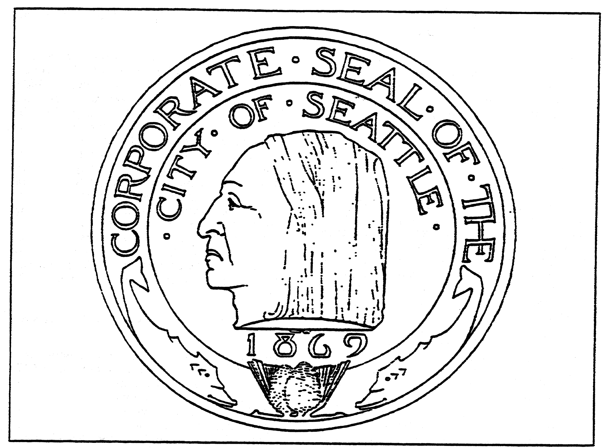

# Title 1 - GENERAL PROVISIONS

This title is intended for those provisions of the Code which apply generally to the Code as a whole.

<table>
<tr>
<td>Chapters:</td>
</tr>
<tr>
<td>1.01</td>
<td>Code Adoption</td>
<td>1-3</td>
</tr>
<tr>
<td>1.04</td>
<td>General Provisions</td>
<td>1-3</td>
</tr>
<tr>
<td>1.08</td>
<td>Official Seal</td>
<td>1-4</td>
</tr>
<tr>
<td>1.16</td>
<td>City Flower</td>
<td>1-5</td>
</tr>
<tr>
<td>1.20</td>
<td>Datum Point</td>
<td>1-5</td>
</tr>
<tr>
<td>1.24</td>
<td>Sister Cities</td>
<td>1-5</td>
</tr>
</table>

## Chapter 1.01 - CODE ADOPTION

Sections:

### 1.01.010 - Code adopted.

The compilation and codification of City ordinances of general application, passed and approved on or before November 19, 1979, through Ordinance 108635, filed with the City Clerk by the City Attorney on September 19, 1980, the 1980 Supplement thereto, including ordinances passed and approved on or before December 31, 1980, filed with the City Clerk on May 30, 1981, and the 1981 Supplement thereto, including ordinances passed and approved on or before December 31, 1981, and filed with the City Clerk, are adopted as the Official Code of The City of Seattle to be known hereafter as the "Seattle Municipal Code." The Code may be cited by its abbreviation "SMC." Ordinances of general applicability passed and approved after December 31, 1981, and numbered from Ordinance 110330 remain valid and subsisting law of the City. Such ordinances shall later be made part of the Seattle Municipal Code in the manner provided in Section 1.01.030.

### 1.01.020 - Copies as proof of ordinances.

In accordance with RCW 35.21.550 (Chapter 7, Section 35.21.550, Laws of Washington 1965), copies of the Seattle Municipal Code shall be received in all courts and administrative tribunals of the City and the state as ordinances of the City of permanent and general effect without further proof; Provided, that in case of conflict between shoreline environmental classifications shown on maps contained in this Code and maps adopted by Section 21A.28 of the Zoning Ordinance (86300) (Sections 24.14.030 and 24.60.365 of the Seattle Municipal Code) together with ordinance amendments thereto, the classifications adopted by the ordinances referred to shall be controlling.

### 1.01.030 - New or amendatory material.

In accordance with RCW 35.12.560 (Chapter 7, Section 35.21.560, Laws of Washington 1965), new, amendatory or other materials altering the Seattle Municipal Code shall be adopted by the City's legislative authority as separate ordinances, as provided by Article IV of the City Charter, prior to inclusion in the Seattle Municipal Code. After adoption of the Code, any ordinance amending the codification shall set forth in full the section or sections, or subsection or subsections of the codification being amended, as the case may be, and the same shall constitute a sufficient compliance with that provision of Article IV of the City Charter requiring sections to be amended to be set forth in full in the text of the amending ordinance.

### 1.01.040 - Single subject requirement met.

In accordance with the provisions of RCW 35.21.570 (Chapter 7, Section 35.21.570, Laws of Washington 1965), adoption of the Seattle Municipal Code by the ordinance codified in this chapter constitutes sufficient compliance with that provision of Article IV of the City Charter requiring that no ordinance shall contain more than one (1) subject to be clearly expressed in its title.

## Chapter 1.04 - GENERAL PROVISIONS

Sections:

### 1.04.010 - Severability.

The provisions of this Code are declared to be separate and severable. The invalidity of any clause, sentence, paragraph, subdivision, section, chapter, title or other portion of this Code, or the invalidity of the application thereof to any person or circumstance shall not affect the validity of the remainder of this Code, or the validity of its application to other persons or circumstances.

### 1.04.020 - Effective dates of ordinances.

Except to the extent otherwise provided in a specific ordinance, each ordinance of the City shall take effect and be in force as follows:

1. If approved by the Mayor and returned to the City Council or the City Clerk within ten (10) days after its presentation to the Mayor, thirty (30) days after the Mayor's approval;
2. If within ten (10) days after its presentation to the Mayor it is returned to the City Council or the City Clerk without the Mayor's approval or disapproval, thirty (30) days after its return;
3. If not returned to the City Council or the City Clerk within ten (10) days after presentation to the Mayor, forty-five (45) days after passage by the City Council; or
4. If disapproved by the Mayor and upon reconsideration again passed by the City Council, thirty (30) days after such reconsidered passage.

## Chapter 1.08 - OFFICIAL SEAL

Sections:

### 1.08.010 - Seal described.

The official common seal of the City shall be an imprint of a drawing in profile of the face and head of Chief Seattle in the center of a circle, and on the upper outer edges of the circle and partially encircling the imprint, the words "Corporate Seal Of The," and in a smaller circle under said words and above the imprint the words "City of Seattle," and within the circle and under the imprint the figures "1869."

## Chapter 1.16 - CITY FLOWER

Sections:

### 1.16.010 - Flower designated.

The dahlia is designated as Seattle's City flower.

### 1.16.020 - Park Board—Requested to plant and display dahlias.

The Park Board is requested to plant and cultivate dahlias in suitable quantities and places, and to make effective displays of said flowers in the City parks and grounds, and to provide dahlias for display and decorations at public and municipal meetings and occasions.

### 1.16.030 - Officers and employees to encourage private cultivation.

The officers and employees of the City are requested to encourage the public to plant and cultivate dahlias and other flowers for beautifying private grounds and parking strips to the end that Seattle may be and become known as "The City Beautiful."

## Chapter 1.20 - DATUM POINT

Sections:

### 1.20.010 - Datum point established.

1. Original datum point. A base or datum point or line is established on the lower step at the entrance to the Pioneer Block in The City of Seattle, at the southwest corner thereof, the point or datum line being 19.79 feet below the top of the step, the point or datum line being in correspondence with the datum point or line heretofore fixed by Ordinance No. 383.*
2. New datum point. The North American Vertical Datum of 1988 (NAVD88) and the North American Datum of 1983 (1991 adjustment) [NAD83 (1991)] are adopted as the new official vertical and horizontal datums of the City of Seattle; said datums being defined by a series of stable, monumented points and reference stations established and maintained by the United States National Geodetic Survey.

## Chapter 1.24 - SISTER CITIES

Sections:

### 1.24.010 - Agreements authorized.

The Mayor is authorized to enter into agreements with Sister Cities and with Sister Cities Affiliation Committees as may be designated by resolution of the City Council.

### 1.24.020 - Sister Cities designated.

The following are recognized as Sister Cities:

Kobe, Japan
Bergen, Norway
Tashkent, U.S.S.R.
Beer Sheva, Israel

Other Sister Cities shall be designated by resolution of the City Council.

