# Title 5 - REVENUE, FINANCE AND TAXATION

This title is intended for those provisions of the Code which relate to City taxation, funds, budgeting and claims against the City.

<table>
<tr>
<td>Chapters:</td>
</tr>
<tr>
<td>Subtitle I General Regulations</td>
</tr>
</table>

<table>
<tr>
<td></td>
<td>Investment of City Funds</td>
<td>5-3</td>
</tr>
<tr>
<td>5.06</td>
<td>City Investments</td>
<td>5-3</td>
</tr>
<tr>
<td>5.08</td>
<td>Transfers Within Department Budgets</td>
<td>5-4</td>
</tr>
<tr>
<td>5.09</td>
<td>Opinion-Gathering Activities</td>
<td>5-5</td>
</tr>
<tr>
<td>5.10</td>
<td>Registration of Bonds</td>
<td>5-9</td>
</tr>
<tr>
<td>5.12</td>
<td>Accounting Procedure</td>
<td>5-11</td>
</tr>
<tr>
<td>5.14</td>
<td>Procedures and Documentation—City Moneys</td>
<td>5-12</td>
</tr>
<tr>
<td>5.16</td>
<td>Warrants</td>
<td>5-13</td>
</tr>
<tr>
<td>5.20</td>
<td>Bills by City Departments for Labor or Materials</td>
<td>5-14</td>
</tr>
<tr>
<td>5.22</td>
<td>Payments via Credit and Debit Cards and Electronic Commerce</td>
<td>5-15</td>
</tr>
<tr>
<td>5.24</td>
<td>Claims for Injuries or Damages</td>
<td>5-16</td>
</tr>
<tr>
<td>5.28</td>
<td>Bonds in Civil Actions</td>
<td>5-18</td>
</tr>
<tr>
<td>5.30</td>
<td>Definitions</td>
<td>5-18</td>
</tr>
<tr>
<td>5.32</td>
<td>Revenue Code</td>
<td>5-33</td>
</tr>
<tr>
<td>5.34</td>
<td>Small Donations</td>
<td>5-34</td>
</tr>
<tr>
<td></td>
</tr>
<tr>
<td>Subtitle II Taxes</td>
</tr>
<tr>
<td>Chapters:</td>
</tr>
<tr>
<td>5.35</td>
<td>Commercial Parking Tax</td>
<td>5-34</td>
</tr>
<tr>
<td>5.40</td>
<td>Admission Tax</td>
<td>5-36</td>
</tr>
<tr>
<td>5.45</td>
<td>Business License Tax</td>
<td>5-45</td>
</tr>
<tr>
<td>5.46</td>
<td>Square Footage Tax</td>
<td>5-57</td>
</tr>
<tr>
<td>5.48</td>
<td>Business Tax—Utilities</td>
<td>5-60</td>
</tr>
<tr>
<td>5.50</td>
<td>Firearms and Ammunition Tax</td>
<td>5-65</td>
</tr>
<tr>
<td>5.52</td>
<td>Gambling Tax</td>
<td>5-66</td>
</tr>
<tr>
<td>5.55</td>
<td>General Administrative Provisions</td>
<td>5-67</td>
</tr>
<tr>
<td>5.56</td>
<td>Leasehold Excise Tax</td>
<td>5-80.2</td>
</tr>
<tr>
<td>5.60</td>
<td>Sales and Use Tax</td>
<td>5-82</td>
</tr>
<tr>
<td>5.64</td>
<td>Tax on Sale of Real Estate</td>
<td>5-83</td>
</tr>
<tr>
<td>5.68</td>
<td>Use Tax—Natural or Manufactured Gas</td>
<td>5-84</td>
</tr>
<tr>
<td>5.72</td>
<td>Multifamily Housing Property Tax Exemption</td>
<td>5-85</td>
</tr>
<tr>
<td>5.73</td>
<td>2004 Multifamily Housing Property Tax Exemption Program</td>
<td>5-104</td>
</tr>
<tr>
<td></td>
</tr>
<tr>
<td>Subtitle III Funds</td>
</tr>
<tr>
<td>5.76</td>
<td>Table of Funds</td>
<td>5-122</td>
</tr>
<tr>
<td>5.78</td>
<td>Gift Catalogue</td>
<td>5-126</td>
</tr>
<tr>
<td>5.80</td>
<td>Cumulative Reserve Subfund</td>
<td>5-130</td>
</tr>
<tr>
<td>5.81</td>
<td>School Zone Fixed Automated Camera Revenues</td>
<td>5-132</td>
</tr>
<tr>
<td>5.82</td>
<td>Automated Traffic Safety Camera Revenues</td>
<td>5-132</td>
</tr>
<tr>
<td></td>
</tr>
</table>

## Subtitle I - General Regulations
### Chapter 5.04 - INVESTMENT OF CITY FUNDS

Sections:

#### 5.04.020 - Property tax—Investment policy.

It shall be the policy of the City to receive collections of property taxes and abatement liens as soon as practical and to invest funds not required or available for immediate expenditure for the benefit of the City as authorized by law.

#### 5.04.030 - Property tax—Transfer from King County.

King County is authorized and requested to distribute to the Director of Finance and Administrative Services for and on behalf of the City all property taxes and abatement liens collected as frequently as daily; and the Director of Finance and Administrative Services is authorized to deliver a receipt therefor whenever funds are delivered to the City. Delivery may be in money or as a transfer of an investment authorized by RCW 36.29.020 and made by King County for the City.

### Chapter 5.06 - CITY INVESTMENTS

Sections:

#### 5.06.010 - Investment authority.

1. As contemplated by RCW 35.39.032, the Director of Finance and Administrative Services, under the supervision of the Mayor, is authorized on behalf of the City to invest all moneys in the City Treasury which in his or her judgment are in excess of current City needs in:

The Director of Finance and Administrative Services is authorized to hold such investments for the credit of the funds for which purchased.

    1. United States bonds;
    2. United States certificates of indebtedness;
    3. Bonds or warrants of this state:
    4. General obligation or utility revenue bonds or warrants of the City or of any other city or town in the state;
    5. Bonds or warrants of a local improvement or condemnation award district of the City which is within the protection of the local improvement guaranty fund;
    6. Repurchase agreements, reverse repurchase agreements, or bankers' acceptances;
    7. The public funds investment account known as the local government investment pool in the State Treasury; and
    8. Other investments authorized by law.
2. The Director of Finance and Administrative Services is further authorized to convert any investments within the City Treasury into cash.

#### 5.06.030 - Fund investments—Interfund loans.

The Director of Finance, after consulting with the Director of Finance and Administrative Services, the City Budget Director, and the Chair of the Finance and Budget Committee of the City Council may in his or her discretion:

1. Determine which funds shall be invested on an individual fund basis, and which funds shall participate within one or more common investment portfolio(s);

    1. Apportion earnings and losses to those funds participating in a common investment portfolio. Trust and bond funds that are approved solely by the Director of Finance, and other funds approved by the Director of Finance after consulting with the Chair of the Finance and Budget Committee of the City Council, with the Director of Finance and Administrative Services, and with the City Budget Director, shall receive a return in proportion to the amount of money earned by each; and the remainder shall be allocated to the general fund, except that investment earnings attributable to the Capital Projects Account of the Cumulative Reserve Subfund shall be deposited in the Unrestricted Subaccount, the South Lake Union Property Proceeds Subaccount, and the Bluefield Habitat Maintenance Subaccount within that Capital Projects Account, all as authorized by RCW 35.39.034 and Chapter 5.80;
2. Approve interfund loans for a duration up to 90 days, and establish a rate of interest thereon when appropriate, provided, any extension or renewal of such a loan shall require approval by ordinance;
3. Establish criteria for identifying when a substantial de facto loan from one fund to another occurs (e.g., an extended delay in making reimbursement without valid cause; a continuous overdrawn status) and, when appropriate, establish an interest charge to be paid to the lending fund;
4. Make loans to individual funds participating in a common investment portfolio by means of carrying funds in a negative cash position for a period of up to 90 days, or for longer period upon approval by ordinance, to the extent and for as long as (i) such loans can be prudently supported by the common investment portfolio and (ii) the borrowing fund is reasonably expected to be able to repay the loan. The Director of Finance, after consulting with the Director of Finance and Administrative Services may also charge interest at the common investment portfolio's rate of return to the borrowing fund.

#### 5.06.040 - Investment policies.

1. The City's common investment portfolio(s) shall be managed to further this financial objective: to preserve principal while maintaining liquidity to meet the City's needs for cash and maximizing income.
2. Investment decisions should further the City's social policies established by ordinance or policy resolutions of the City Council. A City social policy shall take precedence over furthering the City's financial objective when expressly authorized by the City Council resolution or ordinance, except where otherwise provided by law or trust principles.
3. The Director of Finance and Administrative Services shall be guided by investment policies adopted from time to time by ordinance or resolution of the City Council.

#### 5.06.050 - Reports.

The Director of Finance and Administrative Services shall file a monthly report with the City Council on the performance of City investments for the preceding month and fiscal year-to-date. Each monthly report shall include a discussion of:

1. The current investment market;
2. Any material change in the City's investment portfolio and practices;
3. The City's investment return as compared to the City's benchmark return, which shall be the rate of return used by the City Council when estimating investment earnings for the purpose of adopting the current year's budget;
4. The average maturity of the City's investment portfolio; and
5. On a quarterly basis, this report will also include, as an attachment, a list of the contents of the City's investment portfolio.

### Chapter 5.08 - TRANSFERS WITHIN DEPARTMENT BUDGETS

Sections:

#### 5.08.010 - City Budget Director's authority.

The City Budget Director's authority under RCW 35.32A.050 to approve transfers between allowances within the budget of a City department shall be exercised in accordance with regulations as set out in this chapter.

#### 5.08.020 - Transfer between budget control levels

1. The City Budget Director may approve only transfers of appropriations that meet all of the following criteria:

    1. The appropriation was made for the same department to which the City Budget Director allows the appropriation to be transferred. For purposes of this subsection 5.08.020.A.1, a board or commission whose budget is not provided within the budget of a City department shall be deemed a department.
    2. The amount of the appropriation transferred, together with all previous transfers during the same budget year to that budget control level, does not exceed ten percent of the original budgeted allowance for the budget control level to which the transfer is made.
    3. The transfer will not result in a cumulative annual net transfer of more than $500,000 of appropriation into the budget for any one budget control level.
    4. The amount of the appropriation transferred, together with all previous transfers during the same budget year from that budget control level, does not exceed 25 percent of the original budget allowance for the budget control level from which the transfer is made.
    5. The new purpose of the appropriation must be a legal use of that fund source, must comply with terms, conditions, and restrictions controlling the expenditure of the appropriation so transferred, and must not infringe any covenants or any obligations, agreements, or ordinances by which the City received the moneys.
    6. The ordinance making the appropriation did not state that transfer of the appropriation is prohibited.
2. For purposes of this Section 5.08.020:

    1. The "original budgeted allowance" is that amount appearing besides that budget control level in the adopted budget; and
    2. A "budget control level" is the object or purpose shown for a distinct dollar appropriation appearing in the adopted budget or in an amendment thereto. A budget control level is the level at which the budget appropriates money, subject only to transfers consistent with this Chapter 5.08.
3. This Section 5.08.020 does not apply to the Office of Professional Accountability Budget Control Level. Funds may not be transferred into or out of the Office of Professional Accountability Budget Control Level without approval by ordinance.

#### 5.08.040 - Requests procedure.

Requests for transfer between allowances within the budget of any City department shall be made in writing to the City Budget Director on forms provided by him or her, and if the City Budget Director shall approve the same, he or she shall forward a copy of such request with his or her approval in writing thereon to the Chair of the Budget Committee of the City Council and shall notify in like manner the Director of Finance and Administrative Services.

### Chapter 5.09 - OPINION-GATHERING ACTIVITIES

Sections:

#### 5.09.010 - Purpose.

The general purpose of this chapter is to establish a process that enables the Council to oversee the expenditures of appropriated funds on Opinion-gathering Activities so that such funds are being spent in a manner consistent with Council's intent, and that gives Departments a clear and consistent process for planning for, obtaining approval for, and administering Opinion-gathering Activities.

#### 5.09.020 - Definitions

As used in this chapter:

1. "Chairperson" means, for each Relevant Committee, the chairperson identified in the then-current resolution establishing the Committee.
2. "City" means the City of Seattle.
3. "Committee" means each of the Council standing committees established by Council resolution.
4. "Cost" means the total cost of an Opinion-gathering Activity, including but not limited to the costs of consultant contracts, costs (including, if known, costs of employee time) of developing and administering the questions or instrument, and costs (including, if known, costs of employee time) of preparing and reporting the Results, to all Departments, and over every year in the case of a multi-year Opinion-gathering Activity, but excludes:

    1. The value of time spent by City employees in preparing and presenting an outline of a Department's Opinion-gathering Activities in accordance with subsections 5.09.030.A.1—5.09.030.A.3;
    2. The value of time spent by City employees in obtaining the approvals contemplated in subsection 5.09.030.B; and
    3. The value of time spent by City employees in reporting Results pursuant to subsection 5.09.030.C.
5. "Council" means the Seattle City Council.
6. "Department" means each of the following departments, offices, or other entities: the Department of Finance and Administrative Services, Department of Neighborhoods, Department of Parks and Recreation, Human Services Department, Law Department, Legislative Department, City Budget Office, Office of Arts and Culture, Office of Economic Development, Office of Housing, Office of Intergovernmental Relations, Office of Planning and Community Development, Office of Sustainability and Environment, Office of the Mayor, Seattle Department of Construction and Inspections, Seattle Department of Human Resources, Seattle Center, Seattle City Light, Seattle Fire Department, Seattle Information Technology Department, Office for Civil Rights, Seattle Police Department, Seattle Public Utilities and Seattle Department of Transportation. If the name of any Department is changed, or if a function or functions of any Department are transferred to another entity within City government, then the term "Department" shall also include the renamed Department and the entity taking over the function or functions.
7. "Letter" means that letter dated February 27, 2004, from the President of the City Council to the Director of the Department of Finance, clarifying the interim process for complying with the Proviso.
8. "Members" means, for each Relevant Committee, the members identified in the then-current resolution establishing the Committee.
9. "Opinion-gathering Activities" include, but are not limited to, public and internal/employee polls, surveys, questionnaires, focus groups, telephone calling, automated telephone calling, or other mechanisms the primary purpose of which is to gather opinions or data from at least ten persons, and includes all consultant and other contracts related thereto, but excludes:

    1. Public hearings that have been advertised in accordance with law;
    2. Public forums at which the general public is welcome;
    3. Public workshops at which the general public is welcome;
    4. Department newsletters for which the general public is able to sign up;
    5. Citizen input, whether received through letters, e-mails, faxes, phone calls, or in-person contacts, that (a) has not been solicited by the posing of questions by the City or any agent of the City, or (b) is offered in response to a question posed by the City or any agent of the City that is incidental to a communication, an activity, a discussion, or informational material the primary purpose of which is not opinion-gathering, data-gathering, or the providing of opinions or data;
    6. Opinion-gathering activity required by ordinance, or by a contract or collective bargaining agreement approved by City ordinance, or otherwise required by law;
    7. Input on policy issues requested by a Department manager from other managers within the same Department; and
    8. Employee and citizen input, whether received through letters, e-mails, faxes, phone calls, or in-person contacts, concerning evaluations of training programs and routine department administrative matters (for example, placement of office equipment and scheduling of events).
10. "Proviso" means that proviso adopted by the City Council as part of the approved 2004 City Budget at Tab 011, Action ID 1, Option B, Version 3.
11. "Relevant Committee" means the Committee with duties most closely related to a particular Opinion-gathering Activity as determined by the Council President.
12. "Results" means the findings, results, data, analysis, report or other product of an Opinion-gathering Activity, an explanation of how the findings, results, data, analysis, report or other product will be used, and a description of any possible actions to be undertaken as a result of the Opinion-gathering Activity.

#### 5.09.030 - Restriction; approval process.

No Department may spend or encumber appropriated funds on Opinion-gathering Activities unless the Department has complied with the process set forth in this chapter and received approval from the Chairperson, in consultation with Members, to proceed with the Opinion-gathering Activity. For each Opinion-gathering Activity approved pursuant to this chapter, no Department may spend or encumber more appropriated funds than the maximum estimated Cost of that Opinion-gathering Activity indicated in the matrix as approved by the Chairperson.

1. Initial Approval.

    1. Each Department shall submit a description of anticipated Opinion-gathering Activities using the matrix format shown below, along with supporting materials for each Opinion-gathering Activity, to the Chairperson and each Member.
    2. Departments are encouraged to plan Opinion-gathering Activities on a yearly basis and to bring all proposed Opinion-gathering Activities for a calendar year to the Chairperson and Members in one matrix during the first quarter of that budget year. In addition, a Department may submit to the Chairperson and Members a second matrix in the first quarter, one additional matrix in the second quarter, and one final matrix no later than August 31st of the third quarter, for a total of no more than 4 matrices per year. A Department may ask the Chairperson to grant an exception to the quantity and timing requirements of this subsection, which the Chairperson may grant if s/he believes that an exception is warranted and will not unduly burden the Committee.
    3. The Chairperson and Members will review the proposed Opinion-gathering Activities and may request from the Department additional information about each proposed Opinion-gathering Activity until the Chairperson, in consultation with the Members, determines that s/he should approve or reject each Opinion-gathering Activity and its associated range of estimated Costs set forth in the matrix. During the initial approval stage, a Department will provide a Committee briefing on a proposed Opinion-gathering Activity only at the request of the Chairperson or a Member.
    4. After the Chairperson communicates approval of an Opinion-gathering Activity, the Department may proceed to expend appropriated funds to develop or have developed the instrument or questions needed to undertake the Opinion-gathering Activity, but may not expend appropriated funds to administer the instrument or questions except as in described in subsection B of this section.
    5. If the Chairperson communicates a rejection of an Opinion-gathering Activity, the Department may not expend appropriated funds to develop, have developed, administer, or otherwise proceed with the instrument or questions of the Opinion-gathering Activity. The Chairperson, in consultation with the Members, may, but is not required to, reconsider a rejection or consider a modification to a rejected Opinion-gathering Activity upon the request of the Department.
2. Final Approval.

    1. Prior to administering the instrument or questions, the Department shall submit the Opinion-gathering Activity instrument or questions to the Chairperson and Members for their review.
    2. The Chairperson and Members may request and suggest changes to the instrument or questions.
    3. If the Chairperson gives final approval of the instrument or questions, the Department may spend or encumber appropriated funds up to the maximum Cost estimated in the matrix and may administer the Opinion-gathering Activity as described to the Chairperson and Members.
    4. If the Chairperson rejects the instruments or questions, the Department shall not spend or encumber appropriated funds on the Opinion-gathering Activity.
    5. A Department shall not spend or encumber appropriated funds for expenses in excess of the maximum Cost estimated in the matrix for an Opinion-gathering Activity unless the Department has first provided the Chairperson and Members with a justification for the excess expenditures and the Chairperson has approved the excess Cost.
3. Reporting of Results.

    1. The Department shall transmit to the Chairperson and Members the Cost and a written copy of the Results of each Opinion-gathering Activity, within 30 days of preparing or receiving the final Results.
    2. After transmitting the final Results, the Department may request an opportunity to brief the Relevant Committee. In addition, the Department shall provide an oral briefing upon the request of the Chairperson or a Member.
4. Exceptions.

    1. A Department may undertake an Opinion-gathering Activity with a Cost below $2500 without obtaining the approvals required in subsections A and B of this section. Departments are encouraged to include Opinion-gathering Activities with a Cost below $2500 in the matrices they submit to the relevant Committee, even though Committee approval of such Opinion-gathering Activities is not required.
    2. At the conclusion of any Opinion-gathering Activity undertaken pursuant to subsection 1 of this section, the Department must notify the Chairperson and Members in writing of the Cost and Results of each such Opinion-gathering Activity, and, if the Opinion-gathering Activity was never included in a matrix, describe its nature and scope. Opinion-gathering Activities that do not involve the expenditure of appropriated funds are exempt from the provisions of this subsection 2.
5. Changes to Approved Opinion-gathering Activities.

    1. A Department shall not change the scope, purpose, target audience, range of estimated costs, or other aspect of an Opinion-gathering Activity for which the Chairperson has communicated initial approval pursuant to Section 5.09.030(A) of this chapter without first receiving the Chairperson's approval of such change.
    2. Once an Opinion-gathering Activity has received final approval from the Chairperson pursuant to Section 5.09.030(B) of this chapter, a Department shall not change the substance of the instrument or add, remove, or modify questions without first receiving the Chairperson's approval of such change, addition, removal, or modification.

#### 5.09.040 - Opinion-gathering required by ordinance, contract, collective bargaining agreement, or law.

Even though opinion-gathering activities required by ordinance, or by a contract or collective bargaining agreement approved by City ordinance, or otherwise required by law, are excluded from the definition of Opinion-gathering Activity pursuant to Section 5.09.020(I)(6) and are therefore not subject to the approval requirements of this chapter, no Department may spend or encumber appropriated funds on opinion-gathering activities that fall within Section 5.09.020(I)(6) without transmitting to the Chairperson and Members a written copy of the findings, results, data, analysis, report or other product of such opinion-gathering activity within 30 days of preparing or receiving them, along with a statement of the costs of the activity.

#### 5.09.050 - Noncompliance.

A Chairperson may report any instances of noncompliance with this chapter to the Council President and to the Chairperson of the Finance and Budget Committee. Any such instances may be taken into consideration as part of the Council budget process.

#### 5.09.060 - Duration and evaluation.

The Council will reexamine this chapter in 2007 and determine whether the chapter should be amended or repealed.

### Chapter 5.10 - REGISTRATION OF BONDS

Sections:

#### 5.10.010 - Purpose.

This chapter implements RCW Chapter 39.46 (Chapter 167, Laws of Washington 1983) by providing for the registration of ownership of bonds and other interest bearing obligations of The City of Seattle. This chapter should be interpreted and applied in a manner to carry out state law and preserve the exemptions from federal income taxation of interest on City bonds and other obligations.

#### 5.10.020 - Definitions.

As used in this chapter:

1. "Bond" and "obligation" shall have the meaning defined in RCW 39.46.020 (Section 2, Chapter 167, Laws of Washington 1983), as now or hereafter amended.
2. "Registrar" shall be the person or persons designated by The City of Seattle to register the ownership of bonds and other obligations as provided in this chapter.
3. "City" means The City of Seattle.

#### 5.10.030 - Registration—Method—Effect.

1. All bonds and other obligations, which are issued or entered into by the City, bear or require the City to pay interest, have a maturity more than one (1) year, and on which interest is intended by the City to be exempt from federal income taxation, shall be registered as to both principal and interest as provided in this chapter.
2. Such registration may be carried out by:

    1. A book entry system of recording the ownership of a bond or other obligation whether a physical instrument is issued or an obligation is merely entered on the books of the City or one (1) of the fiscal agencies of The State of Washington; or
    2. Recording the ownership of a bond or other obligation together with a requirement that any transfer of ownership may be effected only by the surrender of the old bond or other obligation and either the reissuance of the old bond or other obligation or the issuance of a new bond or other obligation to the new owner.
3. No transfer of any such bonds or other obligations shall be effective until the name of the new owner and the new owner's mailing address, together with such other information required by the United States of America and such other additional information deemed appropriate by the Registrar, shall be recorded on the books of the Registrar of the City.

#### 5.10.040 - Denominations of registered bonds and obligations.

Registered bonds or other obligations may be issued in any denomination. Registered bonds or other obligations may be issued in a denomination to represent several bonds or other obligations of smaller denominations.

#### 5.10.050 - System of registration—Contents.

1. The Director of Finance and Administrative Services shall establish a system of registration for City bonds and other obligations, with a maturity more than one year, on which the interest is intended to be exempt from federal income taxation. The system of registration shall provide for any writing relating to a bond or other obligation that is not issued as a physical instrument; for identifying numbers or other designations; for a sufficient supply of certificates for subsequent transfers; for record and payment dates; for varying denominations; for communications to the owners of bonds or other obligations; for accounting, cancelled certificate destruction, registration and release of securing interests; and, for such other incidental matters pertaining to the registration of bonds or other obligations as appropriate to conform with the United States Internal Revenue Code.
2. Different methods or techniques may be used for separate bond issues and for diverse types of obligations. The method or technique used with respect to a particular bond or other obligation shall conform with the authorizing ordinance.

#### 5.10.060 - Fiscal agents—Designation.

The City may by ordinance designate a fiscal agent to act as an authenticating trustee, transfer agent, registrar or paying agent for the City with respect to bonds or other obligations to be issued. In the absence of a designation by ordinance, the Director of Finance and Administrative Services may in accordance with RCW 39.46.030 designate one or more fiscal agents to act as an authenticating trustee, transfer agent, registrar or paying agent for the City with respect to registered bonds or other obligations which are usually subject to trading, assignment or transfer. Any fiscal agent designated by the City may be a fiscal agent of The State of Washington appointed in accordance with RCW Chapter 43.80.

#### 5.10.070 - Director of Finance and Administrative Services as registrar.

The Director of Finance and Administrative Services may act as a registrar for leases, warrants, installment contracts and other obligations which provide for payment of interest that is intended to be exempt from federal income taxation and which are not usually subject to trading, assignment or transfer.

#### 5.10.080 - Contracts with fiscal agency.

In accordance with RCW 39.46.030, the Director of Finance and Administrative Services is authorized to enter into contracts with one or more fiscal agents of The State of Washington or any other designated fiscal agents of the City in connection with the establishment and maintenance by such fiscal agents of a central depository system for the transfer or pledge of registered bonds or other obligations and for services as authenticating trustee, transfer agent, registrar or paying agent for such bonds and other obligations. Any such contract shall define the rights and duties of the designated fiscal agent and the means of compensation thereof and may adopt by reference relevant terms and conditions of a contract between that fiscal agent and the State Finance Committee of The State of Washington.

#### 5.10.090 - Statement of transfer restrictions.

Any physical instrument issued or executed by the City subject to registration under the ordinance codified in this section shall state in a prominent manner on its face that it is registered.

### Chapter 5.12 - ACCOUNTING PROCEDURE

Sections:

#### 5.12.010 - Authority of Director of Finance and Administrative Services.

When not otherwise prescribed pursuant to state law, the bookkeeping and accounting in all departments of the municipal government shall be done in the manner and form prescribed by, and subject to the approval of, the Director of Finance and Administrative Services.

#### 5.12.020 - Monthly report.

Every department of the municipal government keeping financial accounts shall, on or before the tenth day of each and every month, transmit to the Director of Finance and Administrative Services, a statement and report, in form to be prescribed by the Director of Finance and Administrative Services, showing the financial transactions of the department during the previous month.

#### 5.12.030 - Approval of report before publication.

No statement or report of financial transactions in any department or office shall constitute the official report of the City unless such statement or report shall first be submitted to, and approved by, the Director of Finance and Administrative Services.

#### 5.12.040 - Petty cash accounts—Establishment—Operation and expenditures.

The Director of Finance and Administrative Services is authorized to establish petty cash accounts within the operating funds of City departments for the payment of miscellaneous items not payable by voucher and warrant. The establishment of petty cash accounts shall be requested in writing by the head of the department in the form and detail prescribed by the Director of Finance and Administrative Services. All expenditures from such accounts shall be made from appropriations and for purposes authorized by the department annual budget. The maximum amount of such accounts shall be set by the Director of Finance and Administrative Services in consultation with the City Auditor according to the needs of the petitioning department.

#### 5.12.050 - Petty cash accounts—Administrative rules and regulations.

The Director of Finance and Administrative Services shall promulgate rules and regulations, consistent with this chapter and the Chapter 3.02, establishing standards and procedures for the proper administration of petty cash accounts.

#### 5.12.060 - Billings under one dollar.

It is City policy to bill employees, citizens and businesses only when the billable amount exceeds One Dollar ($1). Whenever the billable amount is less than One Dollar ($1), the amount shall be added to the next billing. If no further billings are contemplated, the receivable and any related revenue shall be deemed waived.

### Chapter 5.14 - PROCEDURES AND DOCUMENTATION—CITY MONEYS

Sections:

#### 5.14.010 - Purpose—Scope.

This chapter implements the City Charter, Article VIII, Sections 9 and 11. When state statute directs a different procedure, state law controls. The term "City moneys" applies to cash and to checks and other negotiable instruments payable in money to the City.

#### 5.14.020 - Authority in Director of Finance and Administrative Services.

The Director of Finance and Administrative Services is authorized to promulgate rules in accordance with Chapter 3.02, for establishing procedures for the receipt, handling and deposit by City officers and employees of City moneys into the City Treasury; for the method of documentation on all such transactions; for regular reporting to the Director of Finance and Administrative Services; for certifying and decertifying by the Director of Finance and Administrative Services of all City officers and employees who are authorized to receive or handle City moneys in the regular course of their employment or departmental activities; for inspection of departmental cash records, including overages or shortages; for inspection of departmental practices and procedures in handling City moneys; and for contracting with agents to collect City moneys and their collection procedures. The Director of Finance and Administrative Services may enforce these rules through on-site inspection; by decertifying any officer or employee who fails to comply with the Director of Finance and Administrative Services' Rules; and, in the event of noncompliance by a department or office, requiring that payments to personnel be authorized by the Director of Finance and Administrative Services, or deposited at his or her office.

#### 5.14.030 - Duties of City personnel.

Any City officer or employee, who receives moneys belonging to the City in the scope and course of his or her duties, shall:

1. Immediately deliver the same to the Director of Finance and Administrative Services or, when so authorized, deposit the moneys with a City depository designated by the Director of Finance and Administrative Services to the credit of the City. The delivery or deposit must be made within 24 hours after receipt unless otherwise authorized by the Director of Finance and Administrative Services;
2. Comply with rules promulgated by the Director of Finance and Administrative Services for handling and processing of City moneys and for documentation and dissemination of records, and with departmental internal procedures established in conformity with the Director of Finance and Administrative Services' rules; and
3. Notify the Seattle Police Department, the Director of Finance and Administrative Services, and the City Auditor of any loss or theft of City money immediately upon discovery. Written notice shall be given to them no later than 24 hours after discovery.

#### 5.14.040 - Certification of receivers, cashiers and tellers.

Only persons who are certified by the Director of Finance and Administrative Services may receive and handle City moneys on a regular basis in the scope and course of their employment. As a condition to certification or maintenance of a certification, the Director of Finance and Administrative Services may require that the officer or employee complete a course of instruction or training and/or pass an examination on the secure processing of moneys, the Director of Finance and Administrative Services' rules, procedures and applicable departmental rules, and thereafter take refresher instruction or training at periodic intervals or when the need arises.

#### 5.14.050 - Departmental functions.

The head of any City department or office who anticipates receiving City moneys on a regular basis in the course of its activities shall:

1. Contract with the Director of Finance and Administrative Services for cash collection services or, after the Director of Finance and Administrative Services' Rules take effect, assign the receiving and handling of City moneys only to those persons who are certified by the Director of Finance and Administrative Services for performing those functions;
2. Establish and maintain a system of procedures, documentation and reporting on receipts handling and deposit of City moneys satisfactory to the Director of Finance and Administrative Services;
3. Notify the Seattle Police Department, the Director of Finance and Administrative Services, and the City Auditor of any loss or theft of City money immediately upon discovery. Written notice shall be given no later than 24 hours after discovery;
4. Allow the Director of Finance and Administrative Services to make on-site inspections and observe the processing of City moneys, and to make inspections of departmental collection records.

#### 5.14.060 - Liability for loss as between department and Director of Finance and Administrative Services.

1. As between a department and its officers and the Director of Finance and Administrative Services, the department has primary responsibility for care and liability for loss of City moneys in its custody until deposited in the City Treasury or entrusted to a cashier certified by the Director of Finance and Administrative Services. When deposit is made in an after-hours drop box of the City's public depository, or an armored car service making collection for the City, losses are assigned to the Director of Finance and Administrative Services if the Director of Finance and Administrative Services' instructions for making deposits have been followed, and to the department otherwise.
2. Compliance with the Director of Finance and Administrative Services' rules and procedures approved by the Director of Finance and Administrative Services establishes a presumption that a City department or office exercised due care in its custody and care of City moneys.

### Chapter 5.16 - WARRANTS

Sections:

#### 5.16.010 - Cancellation of warrants.

Any warrant which is not delivered to the payee within one year from the date of issuance shall be cancelled and the amounts for which said warrants are drawn shall be credited to the several funds against which they are drawn. The Director of Finance and Administrative Services shall keep a record of cancelled warrants.

#### 5.16.030 - Director of Finance and Administrative Services authorized to establish credit.

As authorized by Section 43.09.2853 RCW, with the advice of the Debt Management Policy Advisory Committee, the Director of Finance and Administrative Services is authorized to establish a line of credit for the City with any qualified public depository for cashing City warrants and other financial purposes, to determine the amount of credit extended, to execute written agreements therefor with either a fixed rate of interest adjusted periodically or a fluctuating rate of interest, such rates not greater than 18 percent annually or the maximum rate allowed by law, whichever is less, and to pay interest and other finance or service charges. The total of all lines of credit with all qualified public depositories shall not exceed $10,000,000.

#### 5.16.040 - Lines of credit—Payment.

The line or lines of credit established by the Director of Finance and Administrative Services pursuant to Section 5.16.030 shall be a general obligation of the City. The City hereby pledges its full faith, credit and resources to levy and collect taxes and other revenues sufficient for payment of the principal of, and interest on, the lines of credit extended, and to make prompt payment of the obligation, including interest thereon, as the same are due.

#### 5.16.050 - Warrant overdrafts.

Subject to the following terms and conditions, the Director of Finance and Administrative Services is authorized to contract with the bank at which the City maintains its principal account for the bank to postpone presentment of City warrants until the City can provide for their full payment:

1. The amount of the warrants for which presentment is so delayed shall be aggregated as a warrant overdraft account;
2. The aggregate of the warrant overdrafts shall not exceed $20,000,000;
3. The fee charged by the bank shall not exceed that bank's current prime rate multiplied by 1.5, for the dates for which the credit is outstanding;
4. The Debt Management Policy Advisory Committee shall review the contract with the principal bank and, from time to time, advise the Director of Finance and Administrative Services thereon and on the aggregate of warrant overdrafts that may be outstanding;
5. Fees paid for deferment of presentment shall cease and the bank may present outstanding warrants should any other general fund warrant be presented to the Director of Finance and Administrative Services for payment and marked as presented but not paid for lack of funds.

### Chapter 5.20 - BILLS BY CITY DEPARTMENTS FOR LABOR OR MATERIALS

Sections:

#### 5.20.010 - Issuance of bill for labor or material.

When any department of the City shall furnish any labor or material to any person, the department shall render a bill for the labor or material as follows:

1. Bills of each department to be issued in triplicate and to bear consecutive numbers;
2. The original of the bill to be forwarded to the person receiving the labor or material;
3. The duplicate of the bill to be forwarded, forthwith to the Director of Finance and Administrative Services;
4. The triplicate of the bill to be retained by the department issuing the same.

#### 5.20.020 - Correction of bill by credit voucher.

The head of the department issuing any of the bills described in Section 5.20.010 is authorized to correct the bills at any time prior to their payment by the issuance of credit vouchers directed to the Director of Finance and Administrative Services.

#### 5.20.030 - Recordkeeping—Notification of payment.

The Director of Finance and Administrative Services is directed to preserve the duplicate bills and render proper accounting therefor and to notify each of the various departments as to the payment of the bills upon request of the department.

#### 5.20.040 - Deduction of credit voucher.

When any credit voucher shall have been issued correcting any of the bills, the Director of Finance and Administrative Services is directed to deduct the amount of the credit voucher from the face of the bill and accept the remaining amount thereof as full payment.

#### 5.20.050 - Payments under one dollar.

It shall be a term or condition of contracting with the City that payment warrants are drawn only for and checks shall be issued only for sums of One Dollar ($1) or more. If the sum due or owing to anyone providing services or materials to the City is less than One Dollar ($1), payment shall be made from petty cash to those who present themselves in person. Payment shall be deemed waived if more than ninety (90) days passes from the time payment is due without demand in person therefor.

### Chapter 5.22 - PAYMENTS VIA CREDIT AND DEBIT CARDS AND ELECTRONIC COMMERCE

Sections:

#### 5.22.010 - Authorization for acceptance of credit cards, debit cards, and electronic commerce.

All City departments are authorized to accept credit cards, debit cards, and electronic commerce for payment of City taxes, licenses, fees, and other services, but only if and to the extent approved by the Director of Finance and Administrative Services ("Director"). Before approving a City department's policies and procedures for the acceptance of credit cards, debit cards, or electronic commerce payments for City taxes, licenses, fees, or services, the Director shall consider whether sufficient provision has been made for internal financial controls and security. The Director is further authorized to establish City-wide policies and procedures for the acceptance of credit cards, debit cards, and electronic commerce for payment of City taxes, licenses, fees, and other services.

#### 5.22.020 - Fees for credit, debit, and electronic payments.

With approval by the Director as to the type and amount of any convenience fee ("fee"), a City department may apply a fee and add it to each credit or debit card transaction, or to payments made electronically. The fees, which need not be the same for all departments or for all transactions, shall be established by the Director after consultation with the Head of each City Department that accepts payment through credit or debit cards, or through electronic commerce technology, shall be designed to recover no more than the City's overall costs in accepting and processing payments, and shall not exceed any applicable provision of federal, state, or local law. Upon approval by the Director, City departments may be authorized to absorb part or all of any charges imposed by a bank or other commercial provider in connection with the acceptance of credit and debit cards or payments made electronically.

### Chapter 5.24 - CLAIMS FOR INJURIES OR DAMAGES

Sections:

#### 5.24.005 - Claims for damages.

1. No action shall be commenced against the City in which monetary damages are being claimed until a written Claim for Damages has been presented to and filed with the City Clerk. Such a claim must name the claimant, include the claimant's address, specify the date and location of the claimed loss, describe any alleged act or omission on the part of the City and the basis upon which liability is being asserted against the City, identify any known witnesses, detail the nature and extent of the injury or damage sustained and state the amount being claimed. The claim form must be signed by the claimant or an authorized representative prior to its filing.
2. All claims for damages shall be investigated and evaluated by the Department of Finance and Administrative Services with the assistance of the City Attorney. In anticipation of litigation regarding such claims, the Director of Finance and Administrative Services may request reports from all interested departments concerning any claim and such reports shall be prepared to assist the City Attorney in defense of the City and shall constitute and be treated as privileged communications.
3. A lawsuit based upon the allegations of a Claim for Damages may not be instituted against the City within 60 days of the filing of such claim.

#### 5.24.010 - Judgment/Claims Subfund.

There is established in the City Treasury, as a subfund of the General Fund, a Judgment/Claims Subfund, into which subfund shall be placed such amounts of money as shall be appropriated by the City Council and such funds as are reimbursements from proper source funds for judgments, claims payments, advance claims payments, and litigation expenses; and from which subfund shall be paid: all judgments as authorized by Section 5.24.020; all claims as authorized by Section 5.24.030; all advance payment claims as authorized by Section 5.24.040; and all litigation expenses as authorized by Section 5.24.060.

#### 5.24.020 - Payment of judgments.

The City Attorney may authorize payment of any settlement arising out of litigation against the City or any judgment against the City. Prior to authorizing settlement of any litigation for an amount over $500,000, the City Attorney shall brief the City Council regarding the proposed settlement during executive session called pursuant to RCW 42.30.110. Prior to authorizing a settlement involving significant financial or policy issues, the City Attorney shall consult with the City Budget Director, the Director of Finance and Administrative Services, and the head of the relevant department. Upon a presentation by the City Attorney to the Director of Finance and Administrative Services of either a copy of a Release and Order of Dismissal or a copy of a judgment against the City, entered in an appropriate court, and having attached thereto a statement in writing, signed by the City Attorney, to the effect that the right of appeal from such judgment has been expressly waived, or that the time for an appeal has expired, the Director of Finance and Administrative Services shall issue a check upon the Judgment/Claims Subfund for the amount of such judgment, and costs if awarded to the claimant by the court.

#### 5.24.030 - Payment of claims.

The Director of Finance and Administrative Services may authorize payment of any claim against the City, including claims brought in the small claims department of the district court pursuant to RCW Chapter 12.40. Prior to authorizing settlement of any claim for an amount over $100,000, the Director of Finance and Administrative Services and the City Attorney shall brief the City Council regarding the proposed settlement during executive session called pursuant to RCW 42.30.110. Prior to authorizing a settlement involving significant legal or policy issues, the Director of Finance and Administrative Services shall consult with the City Budget Director, the City Attorney and the head of the relevant department.

#### 5.24.035 - Payments of claims under one dollar.

If the payment of any claim authorized by the City Attorney is less than One Dollar ($1), payment shall be made from petty cash to those who present themselves in person.

#### 5.24.040 - Advance payments—Grounds for payment.

1. The City Attorney and the Director of Finance and Administrative Services are authorized to make periodic payments to a claimant pending settlement or other disposition of his or her claim equivalent to not more than the claimant's pre-injury net take-home pay if the City Attorney or the Director of Finance and Administrative Services finds the following conditions to exist:

    1. The claimant has been physically disabled as a result of an act or omission by the City or its employees and agents and for which the City is legally obligated to respond in damages, which physical disability precludes the claimant from engaging in gainful employment;
    2. The claimant's loss of employment results in financial hardship and the claimant is without alternate financial resources to provide for the necessary cost of living;
    3. Circumstances exist which preclude the early settlement or other disposition of claimant's claim;
    4. The best interest of the City and the claimant will be served by making such interim payments.
2. As a condition to commencing such payments, the City Attorney or the Director of Finance and Administrative Services shall secure from the claimant a written agreement that all payments made pursuant to this section shall be credited to the City against any settlement of the claim which may be arrived at, and shall be credited against any judgment which may be rendered against the City by reason of such claim in any court. The agreement may include such additional terms and conditions as the City Attorney or the Director of Finance and Administrative Services determines are appropriate to serve the best interests of the City.
3. In addition to the payments covering wage losses, the City Attorney or the Director of Finance and Administrative Services may, prior to settlement of the claimant's claim or prior to judgment, pay medical costs and provide necessary transportation and other expenses of treatment which the claimant may be required to pay; provided, that all such payments under this chapter shall cease at such time as the City Attorney or the Director of Finance and Administrative Services shall determine that one or more of the circumstances enumerated above have changed or that the total sum paid the claimant approximates the amount the claimant is likely to recover by reason of his or her injury.

#### 5.24.060 - Litigation expenses.

The City Attorney and the Director of Finance and Administrative Services are authorized to make payment to private and/or public agencies, firms, and/or individuals who provide services to the City in support of any litigation and/or claim and/or threatened litigation or claim filed or contemplated against the City or where the City is a plaintiff or potential plaintiff in legal action.

### Chapter 5.28 - BONDS IN CIVIL ACTIONS

Sections:

#### 5.28.010 - Execution by Mayor and Clerk.

When any civil action is brought by or against the City requiring at any stage thereof its execution of a bond on the part of the City such bond shall be executed by the Mayor and Clerk in behalf of the City and sealed with its Corporate Seal of the City and the Mayor and Clerk are authorized and empowered to execute such bonds.

### Chapter 5.30 - DEFINITIONS

Sections:

#### 5.30.010 - Definition provisions

The definitions contained in this Chapter 5.30 shall apply to the following chapters of the Seattle Municipal Code: Chapters 5.32 (Amusement Devices), 5.35 (Commercial Parking Tax), 5.40 (Admission Tax), 5.45 (Business License Tax), 5.46 (Square Footage Tax), 5.48 (Business Tax—Utilities), 5.50 (Firearms and Ammunition Tax), 5.52 (Gambling Tax), and 5.55 (General Administrative Provisions) unless expressly provided for otherwise therein, and shall also apply to other chapters and sections of the Seattle Municipal Code in the manner and to the extent expressly indicated in each chapter or section. Words in the singular number shall include the plural and the plural shall include the singular. Words in one gender shall include the other genders.

#### 5.30.020 - Definitions, A—B.

1. "Advance," "reimbursement."

    1. "Advance" means money or credits received by a taxpayer from a customer or client with which the taxpayer is to pay costs or fees of the customer or client.
    2. "Reimbursement" means money or credits received from a customer or client to repay the taxpayer for money or credits expended by the taxpayer in payment of costs or fees of the customer or client.
2. "Agricultural product," "farmer."

    1. "Agricultural product" means any product of plant cultivation or animal husbandry including, but not limited to: A product of horticulture, grain cultivation, vermiculture, viticulture, or "aquaculture" as defined in RCW 15.85.020; plantation Christmas trees; turf; or any animal including but not limited to an animal that is a "private sector cultured aquatic product" as defined in RCW 15.85.020, or a bird, or insect, or the substances obtained from such an animal. "Agricultural product" does not include animals intended to be pets and does not include marijuana as defined by RCW 69.50.101(t).
    2. "Farmer" means any person engaged in the business of growing or producing, upon the person's own lands or upon the lands in which the person has a present right of possession, any agricultural product whatsoever for sale. "Farmer" does not include a person using such products as ingredients in a manufacturing process, or a person growing or producing such products for the person's own consumption. "Farmer" does not include a person selling any animal or substance obtained therefrom in connection with the person's business of operating a stockyard or a slaughter or packing house. "Farmer" does not include any person in respect to the business of taking, cultivating or raising timber. "Farmer" does not include any person engaged in the business of growing or producing marijuana as defined by RCW 69.50.101(t).
3. "Amusement device." Any machine or device which provides recreation or entertainment for which a charge is made for use or play. It includes, but is not limited to, pool and billiard tables, shuffleboards, music machines, video games, pinball games, riding devices, panoram and peepshow devices, televisions and devices for display of pictures or views on film; provided, that it does not mean or include any machine or device used exclusively for the vending of merchandise.
4. "Artistic or cultural organization." The term "artistic or cultural organization" means an organization which is organized and operated exclusively for the purpose of providing "artistic or cultural exhibitions, presentations, or performances or cultural or art education programs," as defined in subsection (2), below, of this subsection, for viewing or attendance by the general public. The organization must be:

    1. A not-for-profit corporation under RCW Chapter 24.03 that meets all of the following criteria:

        1. The organization must be managed by a governing board of not less than eight (8) individuals none of whom is a paid employee of the organization or by a corporation sole under RCW Chapter 24.12.
        2. No part of the organization's income may be paid directly or indirectly to its members, stockholders, officers, directors, or trustees except in the form of services rendered by the organization in accordance with its purposes and bylaws.
        3. Salary or compensation paid to its officers and executives must be only for actual services rendered, and at levels comparable to the salary or compensation of like positions within the state.
        4. Assets of the organization must be irrevocably dedicated to the activities for which the exemption is granted and, on the liquidation, dissolution, or abandonment by the organization, may not inure directly or indirectly to the benefit of any member or individual except a non-profit organization, association, or corporation which also would be entitled to the exemption.
        5. The organization must be duly licensed or certified when licensing or certification is required by law or regulation.
        6. The amounts received that qualify for exemption must be used for the activities for which the exemption is granted.
        7. Services must be available regardless of race, color, national origin, or ancestry.
    2. The term "artistic or cultural exhibitions, presentations, or performances or cultural or art education programs" is limited to:

        1. An exhibition or presentation of works of art or objects of cultural or historical significance, such as those commonly displayed in art or history museums;
        2. A musical or dramatic performance or series of performances;
        3. An educational seminar or program, or series of such programs, offered by the organization to the general public on an artistic, cultural, or historical subject.
5. "Beneficial use" has the meaning given in SMC 21.36.010.
6. "Bona-fide charitable organization" means an organization that meets all of the requirements of RCW 9.46.0209, as now existing or hereafter amended, and is organized and operated primarily to provide charitable services as defined by WAC 230-02-160. This term is used in conjunction with the gambling tax provisions contained in SMC Chapter 5.52.
7. "Bona-fide nonprofit organization" means an organization that meets all of the requirements of RCW 9.46.0209. This term is used in conjunction with the gambling tax provisions contained in SMC Chapter 5.52.
8. "Business" includes all activities engaged in with the object of gain, benefit, or advantage to the taxpayer or to another person or class, directly or indirectly.
9. "Business and occupation tax" or "gross receipts tax" means a tax imposed on or measured by the value of products, the gross income of the business, or the gross proceeds of sales, as the case may be, and that is the legal liability of the business.

#### 5.30.025 - Definitions, C—D.

Nothing contained in this or any other subsection of this section shall be construed to modify any other definition of "consumer."

1. "Cash discount" means a deduction from the invoiced amount allowed by the seller if the invoice is paid within a certain time period or before a specified date.
2. "Cellular telephone service" is a voice or data telephone/telecommunications system based in whole or substantial part on wireless radio communications, whether or not the communications are subject to regulation by the Washington Utilities and Transportation Commission (WUTC). This includes cellular mobile service. Cellular mobile service includes other wireless radio communications services such as specialized mobile radio (SMR), personal communications services (PCS), and any other evolving wireless radio communications technology which accomplishes the same purpose as cellular mobile service.
3. "City" means the City of Seattle.
4. "Commercial or industrial use" means the following uses of products, including by-products, by the extractor or manufacturer thereof:

    1. Any use as a consumer; and
    2. The manufacturing of articles, substances or commodities.
5. "Competitive telephone service" means the providing by any person of telecommunications equipment or apparatus, or service related to that equipment or apparatus such as repair or maintenance service, if the equipment or apparatus is of a type which may be provided by persons not subject to regulation as telephone companies under RCW Title 80, and for which a separate charge is made. Competitive telephone service also includes leasing of telephone street directories. Transmission of communication through cellular telephones is classified as "telephone business" rather than "competitive telephone service."
6. "Construction, Demolition and Land Clearing Waste" (or "CDL Waste") has the meaning given in Section 21.36.012.
7. "Consumer" means the following:

    1. Any person who purchases, acquires, owns, holds, or uses any tangible or intangible personal property irrespective of the nature of the person's business and including, among others, without limiting the scope hereof, persons who install, repair, clean, alter, improve, construct, or decorate real or personal property of or for a consumer other than for the purpose of:

        1. Resale as tangible or intangible personal property in the regular course of business;
        2. Incorporating such property as an ingredient or component of real or personal property when installing, repairing, cleaning, altering, imprinting, improving, constructing, or decorating such real or personal property of or for consumers;
        3. Incorporating such property as an ingredient or component of a new product or as a chemical used in processing a new product when the primary purpose of such chemical is to create a chemical reaction directly through contact with an ingredient of a new product; or
        4. Consuming the property in producing ferrosilicon which is subsequently used in producing magnesium for sale, if the primary purpose of such property is to create a chemical reaction directly through contact with an ingredient of ferrosilicon;
    2. Any person engaged in any business activity taxable under subsection 5.45.050.F and subsection 5.45.050.G;
    3. Any person who purchases, acquires, or uses any competitive telephone service as herein defined, other than for resale in the regular course of business;
    4. Any person who purchases, acquires, or uses any personal, business, or professional service defined as a retail sale in Section 5.30.050 other than for resale in the regular course of business;
    5. Any person who is an end user of software;
    6. Any person engaged in the business of "public road construction," as that term is defined in Section 5.30.040, in respect to tangible personal property when that person incorporates the tangible personal property as an ingredient or component of a publicly-owned street, place, road, highway, easement, right-of-way, mass public transportation terminal or parking facility, bridge, tunnel, or trestle by installing, placing or spreading the property in or upon the right-of-way of a publicly-owned street, place, road, highway, easement, bridge, tunnel, or trestle or in or upon the site of a publicly-owned mass public transportation terminal or parking facility;
    7. Any person who is an owner, lessee or has the right of possession to or an easement in real property which is being constructed, repaired, decorated, improved, or otherwise altered by a person engaged in business;
    8. Any person who is an owner, lessee, or has the right of possession, of personal property which is being constructed, repaired, improved, cleaned, imprinted, or otherwise altered by a person engaged in business;
    9. Any person engaged in "government contracting," as that term is defined in Section 5.30.035. Any such person shall be a consumer within the meaning of this subsection in respect to tangible personal property incorporated into, installed in, or attached to such building or other structure by such person;
8. "Customer-owner," with respect to a distribution cooperative, means a person a) having an ownership interest in the distribution cooperative, b) who purchases merchandise for sale at retail from the distribution cooperative or its distribution affiliate, and c) who is entitled to distributions made by the distribution cooperative.
9. "Dangerous waste" has the same meaning as given in Section 21.36.012.
10. "Deficiency" means the amount of tax imposed by law less any tax reported by the taxpayer on a tax return.
11. "Delivery" means the transfer of possession of tangible personal property between the seller and the buyer or the buyer's representative. Delivery to an employee of a buyer is considered delivery to the buyer. Transfer of possession of tangible personal property occurs when the buyer or the buyer's representative first takes physical control of the property or exercises dominion and control over the property. Dominion and control means the buyer has the ability to put the property to the buyer's own purposes. It means the buyer or the buyer's representative has made the final decision to accept or reject the property, and the seller has no further right to possession of the property and the buyer has no right to return the property to the seller, other than under a warranty contract. A buyer does not exercise dominion and control over tangible personal property merely by arranging for shipment of the property from the seller to itself. A buyer's representative is a person, other than an employee of the buyer, who is authorized in writing by the buyer to receive tangible personal property and take dominion and control by making the final decision to accept or reject the property. Neither a shipping company nor a seller can serve as a buyer's representative. It is immaterial where the contract of sale is negotiated or where the buyer obtains title to the property. Delivery terms and other provisions of the Uniform Commercial Code (Title 62A RCW) do not determine when or where delivery of tangible personal property occurs for purposes of Seattle's business license tax.
12. "Digital automated service," "digital codes," and "digital goods" have the same meaning as in RCW 82.04.192.
13. "Digital products" means digital goods, digital codes, digital automated services, and the services described in RCW 82.04.050(2)(g) and (6)(b).
14. "Director" means the Director of Finance and Administrative Services of the City or any officer, agent or employee of the City designated to act on the Director's behalf.
15. "Distribution affiliate" means a partnership, limited liability company or other entity that sells merchandise to the customer-owners of the distribution cooperative and which is owned 50 percent or more by the distribution cooperative.
16. "Distribution cooperative" means a person a) that itself sells, or owns 50 percent or more of a distribution affiliate that sells, merchandise to its customer-owners for resale at retail, b) in which two-thirds of the aggregate outstanding voting ownership interest is owned by its customer-owners, c) that makes distributions to its customer-owners at least partly on the basis of patronage, and d) that qualifies for federal income tax purposes under the provisions of subchapter T of the Internal Revenue Code of 1986, as amended.

#### 5.30.030 - Definitions, E—F

The City expressly intends that engaging in business include any activity sufficient to establish nexus for purposes of applying the tax under the law and the constitutions of the United States and the State of Washington.

Nexus is presumed to continue as long as the taxpayer benefits from the activity that constituted the original nexus generating contact or subsequent contacts.

1. "Eligible gross receipts tax" means a tax which:

    1. Is imposed on the act or privilege of engaging in business activities within Section 5.45.050;
    2. Is measured by the gross volume of business in terms of gross receipts, and is not an income tax or value added tax;
    3. Is not, pursuant to law or custom, separately stated from the sales price;
    4. Is not a sales or use tax, business license fee, franchise fee, royalty or severance tax measured by volume or weight, or concession charge, or payment for the use and enjoyment of property, property right or a privilege; and
    5. Is a tax imposed by a local jurisdiction, whether within or without the State of Washington, and not by a country, state, province, or any other non-local jurisdiction above the county level.
2. "Engaging in business"

    1. The term "engaging in business activity" means commencing, conducting, or continuing in business, and also the exercise of corporate or franchise powers, as well as liquidating a business when the liquidators thereof hold themselves out to the public as conducting such business.
    2. Subsection 5.30.030.B.3 sets forth examples of activities that constitute engaging in business in the City, and establishes safe harbors for certain of those activities so that a person who meets the criteria may engage in de minimis business activities in the City without having to register and obtain a business license tax certificate, obtain a business license, or pay City business and occupation taxes. The activities listed in subsection 5.30.030.B.3 are illustrative only and are not intended to narrow the definition of "engaging in business" in subsection 5.30.030.B.1 above. If an activity is not listed, the issue of whether it constitutes engaging in business in the City shall be determined by considering all the facts and circumstances and applicable law.
    3. Without being all inclusive, any one of the following activities conducted within the City by a person, or its employee, agent, representative, independent contractor, broker or another acting on its behalf constitutes engaging in business and requires a person to register and obtain a business license tax certificate and a business license:

        1. Owning, renting, leasing, maintaining, or having the right to use, or using, tangible personal property, intangible personal property, or real property permanently or temporarily located in the City, in connection with a business activity;
        2. Owning, renting, leasing, using, or maintaining an office, place of business, or other establishment in the City in which business activities are conducted;
        3. Soliciting sales;
        4. Making repairs or providing maintenance or service to real or tangible personal property, including warranty work and property maintenance;
        5. Providing technical assistance or service, including quality control, product inspections, warranty work, or similar services on or in connection with tangible personal property sold by the person or on its behalf;
        6. Installing, constructing, or supervising installation or construction of real or tangible personal property;
        7. Soliciting, negotiating, or approving franchise, license, or other similar agreements;
        8. Collecting current or delinquent accounts;
        9. Picking up and transporting tangible personal property, solid waste construction debris, or excavated materials;
        10. Providing disinfecting and pest control services, employment and labor pool services, home nursing care, janitorial services, appraising, landscape architectural services, security system services, surveying, and real estate services including the listing of homes and managing real property;
        11. Rendering professional services such as those provided by accountants, architects, attorneys, auctioneers, consultants, engineers, professional athletes, barbers, baseball clubs and other sports organizations, chemists, consultants, psychologists, court reporters, dentists, doctors, detectives, laboratory operators, teachers, and veterinarians;
        12. Meeting with customers or potential customers, even when no sales or orders are solicited at the meetings;
        13. Training or recruiting agents, representatives, independent contractors, brokers, or others domiciled or operating on a job in the City, acting on its behalf, or for customers or potential customers;
        14. Investigating, resolving, or otherwise assisting in resolving customer complaints;
        15. In-store stocking or manipulating products or goods, sold to and owned by a customer, regardless of where sale and delivery of the goods took place;
        16. Delivering goods in vehicles owned, rented, leased, used, or maintained by the person who sold the goods or another acting on its behalf; or
        17. Accepting or executing a contract with the City, irrespective of whether the goods or services are delivered within or without the City, or whether the person's office or place of business is within or without the City.
    4. If a person, or its employee, agent, representative, independent contractor, broker, or another acting on the person's behalf, engages in no other activities in or with the City but the following, it need not register and obtain a business license tax certificate or a business license and pay tax:

        1. Meeting with suppliers of goods and services as a customer;
        2. Meeting with government representatives in their official capacity, other than those performing contracting or purchasing functions;
        3. Attending meetings, such as board meetings, retreats, seminars, and conferences or other meetings wherein the person does not provide training in connection with tangible personal property sold by the person or on its behalf. This provision does not apply to any board of director member or attendee engaging in business such as a member of a board of directors who attends a board meeting;
        4. Renting tangible or intangible property as a customer when the property is not used in the City;
        5. Attending, but not participating in, a "trade show". Persons participating at a trade show shall review the City's trade show ordinance, Chapter 6.20;
        6. Conducting advertising through the mail;
        7. Soliciting sales by phone from a location outside the City; or
        8. Accepting or executing a contract with the City when:

            1. The aggregate value of all City contracts with the person during the calendar year is $5,000 or less and the person is engaged in no other business within the City; or
            2. The person's only source of revenue consists of contracts with the City for neighborhood planning purposes, sister city associations, or Arts Commission grants, and is less than the taxable threshold amount provided in subsection 5.55.040.D.
        9. A seller located outside the City merely delivering goods into the City by means of common carrier is not required to register and obtain a business license tax certificate or a business license provided that it engages in no other business activities in the City.
3. "Extracting" means the activity engaged in by an extractor and is reportable under the extracting classification.
4. "Extractor" means every person who from the person's own land or from the land of another under a right or license granted by lease or contract, either directly or by contracting with others for the necessary labor or mechanical services, for sale or for commercial or industrial use, mines, quarries, takes or produces coal, oil, natural gas, ore, stone, sand, gravel, clay, mineral or other natural resource product; or fells, cuts or takes timber, Christmas trees, other than plantation Christmas trees, or other natural products; or takes fish, or takes, cultivates, or raises shellfish, or other sea or inland water foods or products. "Extractor" does not include persons performing under contract the necessary labor or mechanical services for others; persons cultivating or raising fish entirely within confined rearing areas on the person's own land or on land in which the person has a present right of possession; or persons who fell, cut, or take plantation Christmas trees from the person's own land or from land in which the person has a present right of possession, or persons meeting the definition of farmer.
5. "Extractor for Hire" means a person who performs under contract necessary labor or mechanical services for an extractor.
6. "Freight Broker" shall mean persons who sell, provide for, or arrange transportation by a motor carrier for compensation. Freight brokers do not themselves transport or contract to transport property from origin to destination.

#### 5.30.035 - Definitions, G—M.

1. "Garbage" has the meaning given in SMC Section 21.36.014.
2. "Government contracting" means the constructing, repairing, decorating or improving of new or existing buildings or other structures under, upon or above real property of or for the United States, any instrumentality thereof, or a county or city housing authority pursuant to RCW Chapter 35.82, including the installing or attaching of any article of tangible personal property therein or thereto, whether or not such personal property becomes a part of the realty by virtue of installation. The term shall include the clearing of land and the moving of earth of or for the United States, any instrumentality thereof, or a county or city housing authority.
3. "Gross gambling receipts" means the monetary value that would be due to any operator of a gambling activity for any chance taken, other participation fees, any rental or lease fees for amusement games received by a commercial amusement game operation, as evidenced by required records. The value shall be stated in U.S. currency, before any deductions for prizes or any other expenses. In the absence of records, gross gambling receipts shall be the maximum that would be due to an operator from that particular activity if operated at maximum capacity.
4. "Gross income of the business" means the value proceeding or accruing by reason of the transaction of the business activity engaged in and includes gross proceeds of sales, compensation for the rendition of services, gains realized from trading in stocks, bonds or other evidences of indebtedness, interest, discount, rents, royalties, fees, commissions, dividends and other emoluments however designated, all without any deduction on account of the cost of tangible property sold, the cost of materials used, labor costs, interest, discount, delivery costs, taxes or any other expense whatsoever paid or accrued and without any deduction on account of losses.
5. "Gross proceeds of sales" means the value proceeding or accruing from the sale of tangible personal property, digital goods, digital codes, digital automated services or for other services rendered, without any deduction on account of the cost of property sold, the cost of materials used, labor costs, interest, discount paid, delivery costs, taxes, or any other expense whatsoever paid or accrued and without any deduction on account of losses.
6. "Hazardous substances" has the same meaning as given in SMC 21.36.014.
7. "In this City," "within this City." "In this City" or "within this City" includes all federal areas lying within the corporate city limits of the City.
8. "International Investment Management Services." A person is engaged in the business of providing international investment management services if such a person is engaged primarily in the business of providing investment management services and at least ten percent of the gross income of such person is derived from providing investment management services to any of the following: 1) persons or collective investment funds residing outside of the United States; or 2) persons or collective investment funds with at least ten percent of their investments located outside the United States. "Investment management services" means investment research, investment consulting, portfolio management, fund administration, fund distribution, investment transactions, or related investment services. "Collective investment funds" include: 1) a mutual fund or other regulated investment company, as defined in section 851(a) of the Internal Revenue Code of 1986, as amended; 2) an investment company as that term is used in Section 3(a) of the Investment Company Act of 1940, as well as any entity that would be an investment company for this purpose but for the exemptions contained in section 3(c)(1) or (11) of that act; 3) an employee benefit plan, which includes any plan, trust, commingled employee benefit trust, or custodial arrangement that is subject to the Employee Retirement Income Security Act of 1974, as amended, 29 U.S.C. Sec. 1001 et seq., or that is described in sections 125, 401, 403, 408, 457, and 501(c)(9) and (17) through (23) of the Internal Revenue Code of 1986, as amended, or a similar plan maintained by a state or local government, or a plan, trust, or custodial arrangement established to self-insure benefits required by federal, state, or local law; 4) a fund maintained by a tax-exempt organization as defined in Section 501(c)(3) of the Internal Revenue Code of 1986, as amended, for operating, quasi-endowment, or endowment purposes; 5) funds that are established for the benefit of such tax-exempt organizations, such as charitable remainder trusts, charitable lead trusts, charitable annuity trusts, or other similar trusts; or 6) collective investment funds similar to those described in 1) through 5) of this subsection created under the laws of a foreign jurisdiction. Investments are located outside of the United States if the underlying assets in which the investment constitutes a beneficial interest reside or are created, issued, or held outside the United States.
9. "Janitorial Services." The term "janitorial services" shall mean those cleaning and care taking services ordinarily performed by commercial janitor service businesses including, but not limited to, wall and window washing, floor cleaning and waxing, and the cleaning in place of rugs, drapes and upholstery. The term does not include painting, papering, repairing, furnace or septic tank cleaning, snow removal, sandblasting, or cleanup related to construction activities.
10. "Manufacturer," "to manufacture."

    1. "Manufacturer" means every person who, either directly or by contracting with others for the necessary labor or mechanical services, manufactures for sale or for commercial or industrial use from the person's own materials or ingredients any products. When the owner of equipment or facilities furnishes, or sells to the customer prior to manufacture, materials or ingredients equal to less than twenty percent (20%) of the total value of all materials or ingredients that become a part of the finished product, the owner of the equipment or facilities will be deemed to be a processor for hire and not a manufacturer. A business not located in this City that is the owner of materials or ingredients processed for it in this City by a processor for hire shall be deemed to be engaged in business as a manufacturer in this City.
    2. "To manufacture" means all activities of a commercial or industrial nature wherein labor or skill is applied, by hand or machinery, to materials or ingredients so that as a result thereof a new, different or useful product of tangible personal property is produced for sale or commercial or industrial use, and shall include:

        1. The production of special-made articles or custom-made articles;
        2. The production of dental appliances, devices, restorations, substitutes, or other dental laboratory products by a dental laboratory or dental technician;
        3. Crushing and/or blending of rock, sand, stone, gravel, or ore, and
        4. The producing of articles for sale, or for commercial or industrial use from raw materials or prepared materials by giving such materials, articles, and substances of trade or commerce new forms, qualities, properties or combinations including, but not limited to, such activities as making, fabricating, processing, refining, mixing, slaughtering, packing, aging, curing, mild curing, preserving, canning, and the preparing and freezing of fresh fruits and vegetables.
    3. "To manufacture" shall not include the production of digital goods or the production of computer software if the computer software is delivered from the seller to the purchaser by means other than tangible storage media, including the delivery by use of a tangible storage media where the tangible storage media is not physically transferred to the purchaser.
11. "Motor Carrier" shall mean the carrier providing transportation for hire described in the definitions of "common carrier" and "contract carrier" as defined in RCW 81.80.010.

#### 5.30.040 - Definitions, N—R.

A vehicle such as a pick-up, van, truck, boat or other motor vehicle is not an office or place of business. A post office box is not an office or place of business.

If a person has an office or place of business, the person's home is not an office or place of business unless it meets the criteria for office or place of business above. If a person has no office or place of business, the person's home or apartment within the City will be deemed the place of business.

1. "Newspaper," "magazine," "periodical."

    1. "Newspaper" means a publication offered for sale regularly at stated intervals at least once a week and printed on newsprint in tabloid or broadsheet format folded loosely together without stapling, glue, or any other binding of any kind.
    2. "Magazine or periodical" means any printed publication, other than a newspaper, issued and offered for sale regularly at stated intervals at least once every three (3) months, including any supplement or special edition of the publication. Any publication meeting this definition qualifies regardless of its content.
2. "Net gambling receipts" means all gross gambling receipts from any gambling activity, less the monetary value or, in the case of merchandise, the actual cost, of any prizes that were awarded.
3. "Non-profit organization" means an organization in which no part of the income can be distributed to its members, directors, or officers and that holds a current tax exempt status as provided under Sec. 501(c)(3) of the Internal Revenue Code, as hereafter amended, or is specifically exempted from the requirement to apply for tax exempt status under Sec. 501(c)(3).
4. "Office," "place of business." "Office" or "place of business" means a fixed location or permanent facility where the regular business of the person is conducted and which is either owned by the person or over which the person exercises legal dominion and control. The regular business of the person is presumed conducted at a location:

    1. Whose address the person uses as its business mailing address;
    2. Where the place of primary use is shown on a telephone billing or a location containing a telephone line listed in a public telephone directory or other similar publication under the business name;
    3. Where the person holds itself out to the general public as conducting its regular business through signage or other means; and
    4. Where the person is required to obtain any appropriate state and local business license or registration unless exempted by law from such requirement.
5. "Pager Service" means service provided by means of an electronic device that has ability to send or receive voice or digital messages transmitted through the local telephone network, via satellite or any other form of voice or data transmission.
6. "Person" means any individual, receiver, administrator, executor, assignee, trustee in bankruptcy, trust, estate, firm, co-partnership, joint venture, club, company, joint stock company, business trust, municipal corporation, political subdivision of the State of Washington, corporation, limited liability company, association, society or any group of individuals acting as a unit, whether mutual, cooperative, fraternal, nonprofit or otherwise and the United States or any instrumentality thereof.
7. "Precious metal bullion or monetized bullion."

    1. "Precious metal bullion" means any precious metal which has been put a process of smelting or refining, including, but not limited to, gold, silver, platinum, rhodium, and palladium, and which is in such state or condition that its value depends upon its contents and not upon its form.
    2. For purposes of this section, "monetized bullion" means coins or other forms of money manufactured from gold, silver or other metals and heretofore, now or hereafter used as a medium of exchange under the laws of this state, the United States or any foreign nation, but does not include coins or money sold to be manufactured into jewelry or works of art.
8. "Processing for hire" means the performance of labor and mechanical services upon materials or ingredients belonging to others so that as a result a new, different or useful product is produced for sale, or commercial or industrial use. A processor for hire is any person who would be a manufacturer if that person were performing the labor and mechanical services upon that person's own materials or ingredients. If a person furnishes, or sells to the customer prior to manufacture materials or ingredients equal to twenty (20) percent or more of the total value of all materials or ingredients that become a part of the finished product, the person will be deemed to be a manufacturer, and not a processor for hire.
9. "Product," "byproduct."

    1. "Product" means tangible personal property, including articles, substances or commodities created, brought forth, extracted or manufactured by human or mechanical effort.
    2. "Byproduct" means any additional product, other than the principal or intended product, which results from extracting or manufacturing activities and which has a market value, without regard to whether or not such additional product was an expected or intended result of the extracting or manufacturing activities.
10. "Public road construction" means the building, repairing or improving of any street, place, road, highway, easement, right-of-way, mass public transportation terminal or parking facility, bridge, tunnel or trestle which is owned by a municipal corporation or political subdivision of the state or by the United States and which is used or to be used primarily for foot or vehicular traffic including mass transportation vehicles of any kind.
11. "Recovered material" means a usable or marketable product or commodity that results from recycling or material owned or acquired from another, but excludes use for landfill or incineration.
12. "Recyclable materials" has the meaning given in SMC 21.36.016.
13. "Recycling" or "recycle." "Recycling" or "recycle" has the meaning given in SMC Section 21.36.016.
14. "Reporting period," "Monthly," "Quarterly," "Annual." The "reporting period" means one of the following:

    1. A one-month period beginning the first day of each calendar month ("monthly");
    2. A three-month period beginning the first day of January, April, July or October of each year ("quarterly"); or
    3. A twelve-month period beginning the first day of January of each year ("annual").
15. "Retail Service" shall include the sale of or charge made for personal, business, or professional services including amounts designated as interest, rents, fees, admission, and other service emoluments however designated, received by persons engaging in the following business activities:

    1. Amusement and recreation services including but not limited to golf, pool, billiards, skating, bowling, swimming, bungee jumping, ski lifts and tows, basketball, racquet ball, handball, squash, tennis, batting cages, day trips for sightseeing purposes, and others, when provided to consumers. "Amusement and recreation services" also include the provision of related facilities such as basketball courts, tennis courts, handball courts, swimming pools, and charges made for providing the opportunity to dance. The term "amusement and recreation services" does not include instructional lessons to learn a particular activity such as tennis lessons, swimming lessons, or archery lessons.
    2. Abstract, title insurance, and escrow services;
    3. Credit bureau services;
    4. Automobile parking and storage garage services;
    5. Landscape maintenance and horticultural services but excluding (a) horticultural services provided to farmers and (b) pruning, trimming, repairing, removing, and clearing of trees and brush near electric transmission or distribution lines or equipment, if performed by or at the direction of an electric utility;
    6. Service charges associated with tickets to professional sporting events; and
    7. The following personal services: Physical fitness services, tanning salon services, tattoo parlor services, steam bath services, turkish bath services, escort services, and dating services.
    8. The term shall also include the renting or leasing of tangible personal property to consumers and the rental of equipment with an operator.
16. "Retailing" means the activity of engaging in making sales at retail and is reported under the retailing classification.
17. "Return" means any document a person is required by the City to file to satisfy or establish a tax or fee obligation that is administered or collected by the City and that has a statutorily defined due date.
18. "Royalties" mean compensation for the use of intangible property, such as copyrights, patents, licenses, franchises, trademarks, tradenames and similar items.
19. "Rubbish" has the meaning given in SMC Section 21.36.016.

#### 5.30.050 - Definitions, S.

The term "sale at retail" or "retail sale" does not include the sale of or charge made for:

1. Custom software; or
2. The customization of prewritten software.
3. The term also includes the charge made to consumers for the right to access and use prewritten computer software, where possession of the software is maintained by the seller or a third party, regardless of whether the charge for the service is on a per use, per user, per license, subscription, or some other basis.

    1. The service described in subsection 5.30.050.B.5.b.1 includes the right to access and use prewritten software to perform data processing.

        1. For purposes of this subsection 5.30.050.B.5.b.2 "data processing" means the systematic performance of operations on data to extract the required information in an appropriate form or to convert the data to usable information. Data processing includes check processing, image processing, form processing, survey processing, payroll processing, claim processing, and similar activities.
4. "Sale at retail" or "retail sale" shall also include the sale of or charge made for labor and services rendered in respect to the building, repairing, or improving of any street, place, road, highway, easement, right of way, mass public transportation terminal or parking facility, bridge, tunnel, or trestle which is owned by a municipal corporation or political subdivision of the state, the State of Washington, or by the United States and which is used or to be used primarily for foot or vehicular traffic including mass transportation vehicles of any kind. (Public road construction).
5. "Sale at retail" or "retail sale" shall also include the sale of or charge made for labor and services rendered in respect to the constructing, repairing, decorating, or improving of new or existing buildings or other structures under, upon, or above real property of or for the United States, any instrumentality thereof, or a county or city housing authority created pursuant to chapter 35.82 RCW, including the installing, or attaching of any article of tangible personal property therein or thereto, whether or not such personal property becomes a part of the realty by virtue of installation (government contracting).
6. "Sale at retail" or "retail sale" shall also include the sale of or charge made for an extended warranty to a consumer. For purposes of this subsection, "extended warranty" means an agreement for a specified duration to perform the replacement or repair of tangible personal property at no additional charge or a reduced charge for tangible personal property, labor, or both, or to provide indemnification for the replacement or repair of tangible personal property, based on the occurrence of specified events. The term "extended warranty" does not include an agreement, otherwise meeting the definition of extended warranty in this subsection, if no separate charge is made for the agreement and the value of the agreement is included in the sales price of the tangible personal property covered by the agreement.
7. "Sale at retail" or "retail sale" shall not include the sale of services or charges made for the clearing of land and the moving of earth of or for the United States, any instrumentality thereof, or a county or city housing authority. Nor shall the term include the sale of services or charges made for cleaning up for the United States, or its instrumentalities, radioactive waste and other byproducts of weapons production and nuclear research and development. (This is reported under the service or other classification).
8. "Sale at retail" or "retail sale" shall not include the sale of or charge made for labor and services rendered for environmental remedial action (this is reported under the service or other classification).
9. "Sale at retail" or "retail sale" shall also include the following sales to consumers of digital goods, digital codes, and digital automated services:

    1. Sales in which the seller has granted the purchaser the right of permanent use;
    2. Sales in which the seller has granted the purchaser a right of use that is less than permanent;
    3. Sales in which the purchaser is not obligated to make continued payment as a condition of the sale; and
    4. Sales in which the purchaser is obligated to make continued payment as a condition of the sale.
A retail sale of digital goods, digital codes, or digital automated services under this subsection 5.30.050.B.11 includes any services provided by the seller exclusively in connection with the digital goods, digital codes, or digital automated services, whether or not a separate charge is made for such services. For purposes of this subsection 5.30.050.B.11, "permanent" means perpetual or for an indefinite or unspecified length of time. A right of permanent use is presumed to have been granted unless the agreement between the seller and the purchaser specifies or the circumstances surrounding the transaction suggest or indicate that the right to use terminates on the occurrence of a condition subsequent.

1. "Sale at retail" or "retail sale" shall also include the installing, repairing, altering, or improving of digital goods for consumers.
Notwithstanding the above, "sale at wholesale" or "wholesale sale" shall specifically not include a distribution cooperative's or its distribution affiliate's sales of merchandise to a customer-owner of the distribution cooperative for the customer-owner's resale at retail. A distribution cooperative or a distribution affiliate is taxed on such sales pursuant to Section 5.45.050.G of the Seattle Municipal Code.

1. "Sale," "casual or isolated sale."

    1. "Sale" means any transfer of the ownership of, title to, or possession of, property for a valuable consideration and includes any activity classified as a "sale at retail," "retail sale," or "retail service." It includes renting or leasing, conditional sale contracts, leases with option to purchase, and any contract under which possession of the property is given to the purchaser but title is retained by the vendor as security for the payment of the purchase price. It also includes the furnishing of food, drink, or meals for compensation whether consumed upon the premises or not.
    2. "Casual or isolated sale" means a sale of tangible personal property made by a person who is not engaged in the business of selling the type of tangible personal property involved on a routine or continuous basis.
2. "Sale at retail," "retail sale."

Nothing contained in this subsection B 3 shall be construed to modify subsection 1 of this subsection B, and nothing contained in subsection B 1 shall be construed to modify this subsection B 3.

    1. "Sale at retail" or "retail sale" means every sale of tangible personal property (including articles produced, fabricated, or imprinted) to all persons irrespective of the nature of their business and including, among others, without limiting the scope hereof, persons who install, repair, clean, alter, improve, construct, or decorate real or personal property of or for consumers, other than a sale to a person who presents a resale certificate under RCW 82.04.470 and who:

    The term shall include every sale of tangible personal property which is used or consumed or to be used or consumed in the performance of any activity classified as a "sale at retail" or "retail sale" even though such property is resold or utilized as provided in (a), (b), (c), (d), or (e) of this subsection following such use.

        1. Purchases for the purpose of resale as tangible personal property in the regular course of business without intervening use by such person; or
        2. Installs, repairs, cleans, alters, imprints, improves, constructs, or decorates real or personal property of or for consumers, if such tangible personal property becomes an ingredient or component of such real or personal property without intervening use by such person; or
        3. Purchases for the purpose of consuming the property purchased in producing for sale a new article of tangible personal property or substance, of which such property becomes an ingredient or component or is a chemical used in processing, when the primary purpose of such chemical is to create a chemical reaction directly through contact with an ingredient of a new article being produced for sale; or
        4. Purchases for the purpose of consuming the property purchased in producing ferrosilicon which is subsequently used in producing magnesium for sale, if the primary purpose of such property is to create a chemical reaction directly through contact with an ingredient of ferrosilicon; or
        5. Purchases for the purpose of providing the property to consumers as part of competitive telephone service, as defined in RCW 82.04.065.
    2. "Sale at retail" or "retail sale" also means every sale of tangible personal property to persons engaged in any business activity which is taxable under subsections 5.45.050.F and 5.45.050.G.
    3. "Sale at retail" or "retail sale" shall include the sale of or charge made for tangible personal property consumed and/or for labor and services rendered in respect to the following:

        1. The installing, repairing, cleaning, altering, imprinting, or improving of tangible personal property of or for consumers, including charges made for the mere use of facilities in respect thereto, but excluding charges made for the use of coin-operated laundry facilities when such facilities are situated in an apartment house, rooming house, or mobile home park for the exclusive use of the tenants thereof, and also excluding sales of laundry service to nonprofit health care facilities, and excluding services rendered in respect to live animals, birds and insects;
        2. The constructing, repairing, decorating, or improving of new or existing buildings or other structures under, upon, or above real property of or for consumers, including the installing or attaching of any article of tangible personal property therein or thereto, whether or not such personal property becomes a part of the realty by virtue of installation, and shall also include the sale of services or charges made for the clearing of land and the moving of earth excepting the mere leveling of land used in commercial farming or agriculture;
        3. The charge for labor and services rendered in respect to constructing, repairing, or improving any structure upon, above, or under any real property owned by an owner who conveys the property by title, possession, or any other means to the person performing such construction, repair, or improvement for the purpose of performing such construction, repair, or improvement and the property is then reconveyed by title, possession, or any other means to the original owner;
        4. The sale of or charge made for labor and services rendered in respect to the cleaning, fumigating, razing or moving of existing buildings or structures, but shall not include the charge made for janitorial services; and for purposes of this section the term "janitorial services" shall mean those cleaning and caretaking services ordinarily performed by commercial janitor service businesses including, but not limited to, wall and window washing, floor cleaning and waxing, and the cleaning in place of rugs, drapes and upholstery. The term "janitorial services" does not include painting, papering, repairing, furnace or septic tank cleaning, snow removal or sandblasting;
        5. The sale of or charge made for labor and services rendered in respect to automobile towing and similar automotive transportation services, but not in respect to those required to report and pay taxes under chapter 82.16 RCW;
        6. The sale of and charge made for the furnishing of lodging and all other services, except telephone business and cable service, by a hotel, rooming house, tourist court, motel, trailer camp, and the granting of any similar license to use real property, as distinguished from the renting or leasing of real property, and it shall be presumed that the occupancy of real property for a continuous period of one month or more constitutes a rental or lease of real property and not a mere license to use or enjoy the same. For the purposes of this subsection, it shall be presumed that the sale of and charge made for the furnishing of lodging for a continuous period of one month or more to a person is a rental or lease of real property and not a mere license to enjoy the same;
        7. The installing, repairing, altering, or improving of digital goods for consumers;
        8. The sale of or charge made for tangible personal property, labor and services to persons taxable under (a), (b), (c), (d), (e), (f) and (g) of this subsection when such sales or charges are for property, labor and services which are used or consumed in whole or in part by such persons in the performance of any activity defined as a "sale at retail" or "retail sale" even though such property, labor and services may be resold after such use or consumption.
    4. "Sale at retail" or "retail sale" shall also include the providing of competitive telephone service to consumers.
    5. "Sale at retail" or "retail sale" shall also include the sale of prewritten software other than a sale to a person who presents a resale certificate under RCW 82.04.470, regardless of the method of delivery to the end user. For purposes of this subsection 5.30.050.5.a the sale of the sale of prewritten computer software includes the sale of or charge made for a key or an enabling or activation code, where the key or code is required to activate prewritten computer software and put the software into use. There is no separate sale of the key or code from the prewritten computer software, regardless of how the sale may characterized by the vendor or by the purchaser.
3. "Sale at wholesale," "wholesale sale." "Sale at wholesale" or "wholesale sale" means any sale of tangible personal property, digital goods, digital codes, or digital automated services, prewritten computer software, or services described in subsection 5.30.050.B.5.b.1, which is not a retail sale, and any charge made for labor and services rendered for persons who are not consumers, in respect to real or personal property and retail services, if such charge is expressly defined as a retail sale or retail service when rendered to or for consumers. Sale at wholesale also includes the sale of telephone business to another telecommunications company for the purpose of resale, as contemplated by RCW 35.21.715.
4. "Services." A definition of "services" will be adopted when the term is defined in RCW 82.04.
5. "Software," "prewritten software," "custom software," "customization of canned software," "master copies," "retained rights."

    1. "Prewritten software," or "canned software" means computer software, including prewritten upgrades, that is not designed and developed by the author or other creator to the specifications of a specific purchaser. The combining of two or more prewritten computer software programs or prewritten portions thereof does not cause the combination to be other than prewritten computer software. Prewritten computer software includes software designed and developed by the author or other creator to the specifications of a specific purchaser when it is sold to a person other than such purchaser. Where a person modifies or enhances computer software of which such persons is not the author or creator, the person shall be deemed to be the author or creator only of the person's modifications or enhancements. Prewritten computer software or a prewritten portion thereof that is modified or enhanced to any degree, where such modification or enhancement is designed and developed to the specifications of a specific purchaser, remains prewritten computer software; however, where there is a reasonable, separately stated charge or an invoice or other statement of the price given to the purchaser for the modification or enhancement, the modification or enhancement shall not constitute prewritten computer software.
    2. "Custom software" means software created for a single person.
    3. "Customization of canned software" means any alteration, modification, or development of applications using or incorporating canned software to specific individualized requirements of a single person. Customization of canned software includes individualized configuration of software to work with other software and computer hardware but does not include routine installation. Customization of canned software does not change the underlying character or taxability of the original canned software.
    4. "Master copies" of software means copies of software from which a software developer, author, inventor, publisher, licensor, sublicensor, or distributor makes copies for sale or license. The software encoded on a master copy and the media upon which the software resides are both ingredients of the master copy.
    5. "Retained rights" means any and all rights, including intellectual property rights such as those rights arising from copyrights, patents, and trade secret laws, that are owned or are held under contract or license by a software developer, author, inventor, publisher, licensor, sublicensor, or distributor.
    6. "Software" means any information, program, or routine, or any set of one (1) or more programs, routines, or collections of information used, or intended for use, to convey information that causes one (1) or more computers or pieces of computer-related peripheral equipment, or any combination thereof, to perform a task or set of tasks. "Software" includes the associated documentation, materials, or ingredients regardless of the media upon which that documentation is provided, that describes the code and its use, operation, and maintenance and that typically is delivered with the code to the consumer. All software is classified as either canned or custom.
6. "Solid waste" has the meaning given in SMC Section 21.36.016.
7. "Solid waste collection service" means collecting solid waste from customers for transfer, processing, treatment, storage, or disposal. Solid waste collection service includes, but is not limited to the activities of transferring, processing, treating, storing, or disposing of the solid waste collected. Solid waste collection service includes "property clean up services," defined as businesses that contract directly with residences and businesses to clean up property and remove solid waste. It does not include the operation of public or private dumps, transfer stations and similar operations.
8. "Successor" means any person to whom a taxpayer quitting, selling out, exchanging or disposing of a business sells or otherwise conveys, directly or indirectly, in bulk and not in the ordinary course of the taxpayer's business, any part of the materials, supplies, merchandise, inventory, fixtures or equipment of the taxpayer. Any person obligated to fulfill the terms of a contract shall be deemed a successor to any contractor defaulting in the performance of any contract as to which such person is a surety or guarantor.

#### 5.30.060 - Definitions, T—Z

Telecommunication services or telephone business also includes those activities previously used to define telephone business such as the providing by any person of access to a local telephone network, local telephone network switching service, toll service, cellular or mobile telephone service, coin telephone services, pager service or the providing of telephonic, video, data, or similar communication or transmission for hire, via a local telephone network, toll line or channel, cable, microwave, or similar communication or transmission system. The term includes the provision of cooperative or farmer line telephone services or associations operating exchanges. The term also includes the provision of transmission to and from the site of an internet provider via a local telephone network, toll line or channel, cable, microwave, or similar communication or transmission system. "Telecommunication service or telephone business" does not include the providing of competitive telephone service, data processing, providing of cable television service, or other providing of broadcast services by radio or television stations.

1. "Tax year," "taxable year." "Tax year" or "taxable year" means the calendar year.
2. "Taxpayer" means any "person," as herein defined, required by Chapter 5.55 to have a business license tax certificate, or liable for any license, tax or fee, or for the collection of any tax or fee, under Chapters 5.32 (Amusement Devices), 5.35 (Commercial Parking Tax), 5.40 (Admission Tax), 5.45 (Business License Tax), 5.46 (Square Footage Tax), 5.48 (Business Tax—Utilities), 5.50 (Firearms and Ammunition Tax), and 5.52 (Gambling Tax) or who engages in any business or who performs any act for which a tax or fee is imposed under those chapters.
3. "Telecommunications service" or "Telephone business" means the electronic transmission, conveyance, or routing of voice, data, audio, video, or any other information or signals to a point, or between or among points. It includes such transmission, conveyance, or routing in which computer processing applications are used to act on the form, code, or protocol of the content for purposes of transmission, conveyance, or routing without regard to whether such service is referred to as voice over internet protocol services or is classified by the federal communications commission as enhanced or value added. Telecommunication services or telephone business also includes ancillary services that are associated with or incidental to the provision of telecommunication services including, but not limited to conference bridging, detailed telecommunications billing, directory assistance, vertical service, or voice mail services as defined in RCW 82.04.065.
4. "Tour operator business" means a business activity of purchasing various travel components, such as transportation, lodging, meals and other associated services and reselling the same to consumers where the purchaser/reseller is liable itself to pay the vendor of the components purchased and does not make payment solely as an agent for the consumer.
5. "Tuition fee" includes library, laboratory, health service and other special fees, and amounts charged for room and board by an educational institution when the property or service for which such charges are made is furnished exclusively to the students or faculty of such institution. "Educational institution," as used in this section, means only those institutions created or generally accredited as such by the state and includes educational programs that such educational institution cosponsors with a non-profit organization, as defined by Section 501(c)(3) of the Internal Revenue Code, as hereafter amended, if such educational institution grants college credit for coursework successfully completed through the educational program, or an approved branch campus of a foreign degree-granting institution in compliance with chapter 28B.90 RCW, and in accordance with RCW 82.04.4332 or defined as a degree-granting institution under RCW 28B.85.010(3) and accredited by an accrediting association recognized by the United States secretary of education, and offering to students an educational program of a general academic nature or those institutions which are not operated for profit and which are privately endowed under a deed of trust to offer instruction in trade, industry, and agriculture, but not including specialty schools, business colleges, other trade schools, or similar institutions.
6. "Value proceeding or accruing" means the consideration, whether money, credits, rights, or other property expressed in terms of money, a person is entitled to receive or accrue or which is actually received or accrued. The term shall be applied, in each case, on a cash receipts or accrual basis according to which method of accounting is regularly employed in keeping the books of the taxpayer.
7. "Value of products, how determined."

    1. The value of products, including by-products, extracted or manufactured, shall be determined by the gross proceeds derived from the sale thereof, whether such sale is at wholesale or at retail, to which shall be added all subsidies and bonuses received from the purchaser or from any other person with respect to the extraction, manufacture or sale of such products or by-products by the seller.
    2. Where such products, including by-products, are extracted or manufactured for commercial or industrial use, and where such products, including by-products, are shipped, transported or transferred out of the City, or to another person, without prior sale or are sold under circumstances such that the gross proceeds from the sale are not indicative of the true value or the subject matter of the sale, the value shall correspond as nearly as possible to the gross proceeds from sales in this state of similar products of like quality and character, and in similar quantities by other taxpayers, plus the amount of subsidies or bonuses ordinarily payable by the purchaser or by any third person with respect to the extraction, manufacture or sale of such products. In the absence of sales of similar products as a guide to value, such value may be determined upon a cost basis. In such cases, there shall be included every item of cost attributable to the particular article or article extracted or manufactured, including direct and indirect overhead costs. The Director of Finance and Administrative Services may prescribe uniform and equitable rules for the purpose of ascertaining such values.
    3. Notwithstanding subsection 2 above, the value of a product manufactured or produced for purposes of serving as a prototype for the development of a new or improved product shall correspond to:

        1. The retail selling price of such new or improved product when first offered for sale; or
        2. The value of materials incorporate into the prototype in cases in which the new or improved product is not offered for sale.
8. "Wholesaling" means engaging in the activity of making sales at wholesale, and is reported under the wholesaling classification.
9. "Yardwaste" has the meaning given in SMC Section 21.36.016.

#### 5.30.065 - Definitions—References to Chapter 82.32 RCW.

Where provisions of Chapter 82.32 RCW are incorporated in Chapter 5.55 of this Title, "Department" as used in the RCW shall refer to the "Director" as defined in SMC 5.30.025 and "warrant" as used in the RCW shall mean "citation or criminal complaint."

#### 5.30.070 - Severability.

If any part, provision or section of this chapter is held to be void or unconstitutional, all other parts, provisions, and sections of this chapter not expressly so held to be void or unconstitutional shall continue in full force and effect.

### Chapter 5.32 - REVENUE CODE

Sections:

#### Subchapter I - General Provisions
##### 5.32.020 - Exercise of power to license for revenue.

The provisions of this chapter shall be deemed an exercise of the power of the City to license for revenue and regulation. The provisions of this chapter are subject to periodic statutory or administrative rule changes or judicial interpretations of the ordinances or rules. The responsibility rests with the licensee to reconfirm tax computation procedures and remain in compliance with the City code.

#### Subchapter II - Amusement Devices
##### 5.32.150 - Amusement license required

No person shall own any amusement device available for public use without having first obtained an amusement device license issued in accordance with the provisions of this Chapter 5.32. The license shall be attached to the amusement device at all times when in use or play or available for use or play so that it is readily visible. This license is in addition to the business license tax certificate required in Section 5.55.030 and the business license required under Section 6.208.010.

##### 5.32.160 - Exemptions.

No amusement device license is required under this chapter for an amusement device if:

1. An admissions tax is collected upon its use pursuant to Ordinance 72495, as now or hereafter amended;or
2. The maximum price for one (1) use or one (1) play is less than Twenty-five Cents ($.25).

##### 5.32.170 - License fees.

1. The license fee for any amusement device which is operated or activated by the insertion of a coin, currency, token, credit card, debit card or other payment medium shall be based upon the minimum price levied for one (1) play or one (1) use of the device. The annual license fee shall be one hundred (100) times the price of one (1) play or use of the device rounded to the next highest Fifty Dollars ($50). The maximum license fee shall be Fifteen Hundred Dollars ($1,500) per device per year, with the following exceptions:

    1. The license fee for a countertop device or electronic dart board shall not exceed Twenty-five Dollars ($25); and
    2. The license fee for a pool table, billiard table, shuffle board, jukebox or other music device shall not exceed Fifty Dollars ($50).
2. The license fee for any amusement device which is not operated or activated by the insertion of a coin, currency, token, credit card, debit card or other payment medium shall be Five Hundred Dollars ($500) per year; except the license for a pool table, billiard table or shuffle board shall not exceed Fifty Dollars ($50) per year.
3. The operator of an event, not to exceed three (3) calendar days in length, may obtain a Special Event License in lieu of the amusement device license required under this chapter. The fee for the license shall be Five Dollars ($5) per device offered for play at such event; provided, the minimum fee shall be Twenty-five Dollars ($25) and the maximum fee shall be One Hundred Dollars ($100).
4. Revenue from the operation of devices, whether licensed or unlicensed, is subject to the provisions of Chapter 5.45 of the Seattle Municipal Code.

##### 5.32.190 - Records—Location of devices.

Any person licensed pursuant to this subchapter shall maintain records showing the location of each amusement device license issued to such person. Upon request of the Director, a list specifying the locations shall be provided.

##### 5.32.200 - Unlawful acts.

In addition to the unlawful acts contained in SMC Section 5.55.220 the following are also unlawful acts.

1. It is unlawful for any person in charge of any place or location to permit or allow to be used or played in such place any amusement device not having attached thereto an amusement device license.
2. It is unlawful for the owner of any amusement device to fail to display his or her name and current address on each amusement device when in use or play or available for use or play.
3. It is unlawful for the any person in charge of any place or location to permit or allow to be used or played in such place any amusement device not having attached thereto the name and current address of the owner of the amusement device.
4. Remedial action by the City may include fines and imprisonment as provided for in SMC Section 5.55.220.

### Chapter 5.34 - SMALL DONATIONS

The Director of Finance and Administrative Services is authorized, for amounts up to $15,000, to accept and deposit donations to the City for its trust accounts, accept anonymous donations of cash to the City, and accept restricted or unrestricted donations of funds from identified or unidentified donors. The Director shall keep and maintain a record of each such donation including the date of the donation, name (if identified) of the donor, the exact dollar amount of the donation, the receiving department, the fund or funds that the donation dollars were deposited into, and a brief description of the purpose of the donation, if any.

## Subtitle II - Taxes
### Chapter 5.35 - COMMERCIAL PARKING TAX

Sections:

#### 5.35.010 - Administrative Provisions.

All of the provisions contained in Chapter 5.55 of the Seattle Municipal Code shall have full force and application with respect to taxes imposed under the provisions of this chapter except as may be expressly stated to the contrary herein.

#### 5.35.020 - Definitions.

The definitions contained in Chapter 5.30 of the Seattle Municipal Code shall be fully applicable to this chapter except as may be expressly stated to the contrary herein. The following additional definitions shall apply throughout this chapter:

1. "Commercial parking business" means the ownership, lease, operation, or management of a commercial parking lot in which fees are charged for the act or privilege of parking motor vehicles.
2. "Commercial parking lot" means a covered or uncovered area with stall used for the purpose of parking motor vehicles for a fee.
3. "Parking tax" means the commercial parking tax imposed by this chapter.

#### 5.35.030 - Parking Tax Imposed.

1. Pursuant to RCW 82.80.030, there is imposed on every person a tax for the act or privilege of parking a motor vehicle in a commercial parking lot within the City that is operated by a commercial parking business. The privilege of parking includes the right to park, whether or not the right is exercised.
2. The amount of the parking tax shall be equal to the parking fee multiplied by the parking tax rate. Effective July 1, 2009, the parking tax rate is imposed at ten percent (0.10). Effective January 1, 2011, the parking tax rate is imposed at 12.5 percent.

#### 5.35.040 - Measure of Tax: Parking Fee.

1. The measure of the parking tax is the parking fee. Parking fee means the fee paid or due for the act or privilege of parking a motor vehicle in a commercial parking lot.
2. If, in a lease of nonresidential space, a parking fee is combined with other payments, or is otherwise not separately stated, or does not result from an arm's length transaction, or does not fairly reflect the value of the act or privilege of parking, the parking fee shall be determined by the Director according to rules promulgated by the Director to establish the parking fee based on the fair market value of the act or privilege of parking.
3. It shall be conclusively presumed that the posted parking prices do not include the parking tax unless all the following conditions are met:

    1. The fee is advertised as including the tax or that the commercial parking business is paying the tax;
    2. The words "tax included" are stated immediately following the advertised or posted prices in print size at least half as large as the advertised or posted prices print size; and
    3. All advertised or posted parking prices and the words "tax included" are stated in the same medium, whether oral or visual, and if oral, in substantially the same inflection and volume. If these conditions are satisfied, then price lists, reader boards, and other price information mediums need not show separately the parking fee and the actual amount of commercial parking tax being collected.

#### 5.35.050 - Exemptions from the Parking Tax.

The following are exempt from the parking tax:

1. Parking by a person in a stall reserved exclusively for that person for a period of 30 days or longer.
2. Parking of a motor vehicle owned or controlled by a natural person in a stall provided with that person's residence.
3. Parking at stadiums and exhibition centers which the City is precluded from taxing pursuant to RCW 36.38.040.
4. Parking on City of Seattle streets.
5. Parking of vehicles under federal government contracts that is exempt from the retail sales tax.
6. Parking charges directly billed to, and paid by, federal, state, or local government.

#### 5.35.060 - Collection and Remittance Of Tax.

A commercial parking business or person acting on its behalf shall collect the amount of the parking tax from the person paying the parking fee at the time payment is made. The parking tax shall be stated separately from the parking fee on all instruments evidencing the parking fee. Except when all requirements of section 5.35.040 B are satisfied, it shall be conclusively presumed that the parking fee does not include the parking tax. The presumption is not overcome by any oral or written agreement between the parties.

The person receiving payment of the parking fee shall remit the parking tax to the Director according to the provisions contained in SMC Chapter 5.55. The parking tax shall be deemed held in trust by the person required to collect the same until remitted to the Director. Any person who fails to collect the parking tax, or who collects the parking tax but fails to remit the parking tax to the Director, shall be liable to the City for the amount of such tax. Such person shall, unless the remittance is made as required in this section, be guilty of a violation of this chapter whether such failure be the result of the person's own act or the result of acts or conditions beyond its control.

#### 5.35.070 - Use Of Revenues.

The proceeds of the tax imposed herein shall be used for transportation purposes in accordance with RCW 82.80.070. To the extent permitted by applicable law the City may issue bonds, notes, or other evidences of indebtedness payable wholly or in part from the parking tax and may pledge and may apply such tax to the payment of principal of, interest on, and premium (if any) on such bonds, notes, or other evidences of indebtedness and to the payment of costs associated with them.

#### 5.35.080 - Receipts To Transportation Fund.

All receipts from the parking tax shall be placed in and segregated within the Transportation Fund. These receipts may be temporarily deposited or invested in such manner as may be lawful for the investment of City money and interest and other earnings shall be deposited in the Transportation Fund.

### Chapter 5.40 - ADMISSION TAX

Sections:

#### 5.40.005 - General administrative provisions apply.

The provisions of SMC Chapter 5.55 shall be fully applicable to the provisions of this chapter except as expressly stated to the contrary herein.

#### 5.40.010 - Definitions.

For the purposes of this chapter, the words and terms contained in SMC Chapter 5.30 shall apply throughout this chapter unless expressly provided otherwise herein. The following additional definitions shall apply throughout this chapter:

1. "Admission charge" means the price required or paid for entering a premise or location and includes but is not limited in meaning to:

    1. A charge made for season tickets or subscriptions;
    2. A cover charge or a charge made for use of seats or tables, reserved or otherwise, and similar accommodations;
    3. A charge made for food or refreshments in any place where any free entertainment, recreation or amusement is provided;
    4. A charge made for rental or use of equipment or facilities for purposes of recreation or amusement and, where the rental of the equipment or facilities is necessary to the enjoyment of the privilege for which a general admission is charged, the combined charge shall be considered as the admission charge;
    5. A charge made for entrance to any theater, dance hall, amphitheater, private club, auditorium, observation tower, stadium, athletic pavilion or field, baseball or athletic park, circus, side show, outdoor amusement park or any similar place; and includes equipment to which persons are admitted for purposes of recreation such as merry-go-rounds, ferris wheels, dodgems, roller coasters, go-carts and other rides whether such rides are restricted to tracks or not;
    6. A charge made for automobile parking where the amount of the charge is determined according to the number of passengers in an automobile;
    7. A charge made for entrance to any building, enclosure or area in which there is a swimming pool, skating rink, golf driving range, miniature golf course, short nine, or other golf course, or to gain entrance to such pool, rink or course itself, or for the use of the facilities thereof, or any rental paid by the person paying for such entry for the use of equipment and facilities supplied him and appropriate to the enjoyment of the privilege for which the admission is charged, or the aggregate thereof.
2. "Cabaret" means a room where musical entertainment is permitted in connection with a restaurant business.
3. "College" or "university" means any accredited public or private college, junior college or university, or the recognized student body association thereof insofar as the admission charges received by the college, university, or student body association are budgeted, and applied solely for exhibition, performance, study and/or teaching of the performing arts, visual arts, history or science. It specifically excludes any athletic department or division or activities of the college or university or of the recognized student body association thereof.
4. "Department" means the Department of Finance and Administrative Services of The City of Seattle, or its functional successor.
5. "Director" means the Director of Finance and Administrative Services of The City of Seattle, or his or her functional successor, and shall include the Director's authorized representatives.
6. "Market Price" means the price at which a seller is ready and willing to sell and a buyer is ready and willing to buy. Market price is a price that is acceptable to both buyer and seller and which might be different from the listed price.
7. "Nonprofit organization" means an organization in which no part of the income can be distributed to its members, director or officers and that holds a current tax exempt status as provided under Sec. 501(c)(3), (4) or (6) of the Internal Revenue Code of 1986, as amended, or is specifically exempted from the requirement to apply for tax exempt status under Sec. 501(c)(3).

#### 5.40.020 - Tax levied.

1. There is levied and imposed a tax upon everyone, without regard to age, who pays an admission charge as defined in Section 5.40.010 or is admitted, without payment, where an admission charge is collected from other persons as contemplated by Section 5.40.053.
2. The tax here imposed shall be in the amount of five (5) percent on each admission charge or charge for season or series ticket. Any fraction of tax One-half Cent ($.005) or more shall result in a tax at the next highest full cent.
3. Amounts paid for admission by season ticket or subscription shall be exempt if the amount which would be charged to the holder or subscriber for a single admission is One Dollar and Fifty Cents ($1.50) or less.
4. Anyone having the use of a box or seat permanently or for a specified period, shall pay a tax in the amount of five (5) percent of the price of such box or seat, the same to be collected and remitted in the manner provided in Section 5.40.070 by the person selling such tickets.
5. If the ticket price is accompanied by a service charge, mailing fee or other ancillary payment, per ticket and/or per order, the admission tax shall be based upon the total sum of the admission price plus any such surcharge(s), whether or not they are printed on the ticket or order.
6. Anyone who is admitted free of charge or at reduced rates to any place for which other persons pay a charge or a regular higher charge for the same privileges or accommodations shall pay an admission tax as contemplated by Sections 5.40.053 and 5.40.056, respectively.
7. When entertainment or admission to an event or activity accompanies the sale of food, refreshments, merchandise, lodging or services, admission taxes are measured by the total price of the combined transaction, unless the admission price for the entertainment, amusement, rental or use of equipment is printed separately on the ticket or invitation and reflects its true market value as an independent element.
8. The tax levied in this chapter shall be paid by the person paying the admission charge and shall be collected and remitted by the person to whom the same is paid in the manner provided in Sections 5.40.070 and 5.40.090.
9. A discount admission shall be subject to tax as contemplated by Section 5.40.056 even though the discounted price is One Dollar and Fifty Cents ($1.50) or less, unless a criterion in Section 5.40.056 for applying the lower price is satisfied.
10. It is unlawful for any person to request a donation or contribution that effectively represents an admission charge at any event unless the event is held by an exempt organization pursuant to SMC 5.40.025. Donations or contributions requested by such organizations that would otherwise be subject to the admission tax pursuant to SMC 5.40.025 A11c (over 3100 seating capacity or attendance) or SMC 5.40.025 B (athletic or recreational activity) are not subject to the tax; provided, that people are admitted or allowed to remain in attendance without payment of such donation or contribution and the signage, invitation, advertisement, notice or other literature related to the event contains a statement, conspicuously posted, that such donation or contribution is not required for the privilege of entering, attending, or remaining in attendance at the event.
11. The amount subject to admission tax shall exclude dues, and initiation fees paid by a member for the privilege of joining or belonging to an organization. For purposes of this subsection, "dues" are those amounts periodically paid by members solely for the entitlement of those persons to continued membership in the organization or club, and "initiation fees" are amounts paid solely to admit a person as a member to an organization or club and represent the value of membership in the organization or club. However, where dues or initiation fees cover costs for services received by the members and no separate charge (including but not limited to green fees, entertainment costs such as cover charges, facility or equipment rentals, or charges for food and beverages) is imposed for such services, admission taxes will be assessed on the portion of dues or initiation fees that represent the value of those services. In determining the value subject to tax, comparable charges will be used.

#### 5.40.025 - Tax exemptions—Minimum charge—Specific exemptions—Colleges—Universities—Nonprofit organizations.

1. The admission tax as imposed in SMC Section 5.40.020 shall not apply to anyone paying an admission charge:

    1. In the amount of One Dollar and Fifty Cents ($1.50) or less; or
    2. To any activity of any elementary or secondary school as contemplated by RCW 35.21.280; or
    3. To any activity of any Parent-Teacher-Student Association (PTSA), Parent-Teacher Association (PTA), or similar organization, provided that the proceeds of the activity are used to benefit an elementary or secondary school; or
    4. To the annual Bumbershoot Festival held on Labor Day and the preceding Thursday, Friday, Saturday and Sunday; or
    5. To the Woodland Park Zoo; or
    6. To the Folklife Festival held on Memorial Day and the preceding Thursday, Friday, Saturday and Sunday; or
    7. To the Fremont Fair held annually by the Fremont Public Association; or
    8. To an organized athletic event such as tournaments, leagues, and other competitions intended for youth less than 19 years of age, sponsored and held by non-profit organizations; or
    9. To the Children's Charity Bacon Bowl Football Game held annually by the Bacon Bowl Association; or
    10. To actively participate in bowling or to rent bowling shoes or equipment; or
    11. To an event sponsored by a college or university or nonprofit organization, when all of the following three (3) criteria are met:

        1. A college or university or nonprofit organization, as both are defined in Section 5.40.010 and registered under Section 5.40.080, that meets one (1) or more of the following criteria:

            1. Publicly sponsors and through its members, representatives, or personnel promotes, publicizes and distributes most of the tickets for admission; or
            2. Publicly sponsors and presents the event at a facility it owns or leases as lessee for a term of not less than one (1) month; or
            3. Publicly sponsors and:

                1. Performs a major portion of the performance, or
                2. Supplies a major portion of the materials on exhibition, or
                3. When the event is part of a season or series of performances or exhibitions, performs the major portion of the performances or exhibitions in the season or series; and
        2. The college, university or nonprofit organization receives the use and benefit of admission charges collected; and
        3. In the case of a performance, the seating capacity of the location where the event occurs is three thousand one hundred (3,100) people or less, or, in the case of an exhibition, no more than three thousand one hundred (3,100) people are permitted on the premises at any one (1) time.
2. Except as provided in subsections A2, A8, and A10 above, the exemption to the admission tax as provided in subsection A11 of this section shall not apply to:

    1. The admission of spectators to an athletic event, including, but not limited to, football games, basketball games, or baseball games; or
    2. The admission for recreational activities, including, but not limited to, golf, skating, or swimming; or
    3. An event in which a college, university or nonprofit organization lends its name to an endorsement for an ineligible person for the purpose of invoking the tax exemption.

#### 5.40.028 - Tax exemption—Musical venues

A person whose certificate of exemption has been cancelled may re-apply for a certificate for the same premises or location, but no re-application shall be approved unless the person shows that the premises or location is eligible under the requirements of this Section 5.40.028 and all rules and regulations of the Director implementing it at the time of the re-application, and further, that the location or premises has been in compliance with subsection 5.40.028.B during the 30 day period prior to the re-application. Any person wishing to re-apply shall submit the material required in subsection 5.40.028.D, which material shall be current as of the date of the re-application, and, in addition, shall submit all information required by the Director as established by rule, including all information required to have been reported pursuant to subsection 5.40.028.E during any period of time, within the maximum period of limitation applicable under Chapter 5.55 for the assessment of tax, that any previous certificate of exemption was in effect.

1. The admission tax as imposed in Section 5.40.020 shall not apply to any person paying an admission charge to any premises or location for which the Director has issued a certificate of exemption pursuant to this Section 5.40.028; however, the admission tax shall be due for any and all admission charges paid prior to the issuance of a certificate of exemption, or paid after the Director has cancelled a certificate of exemption, or paid at any time during which a cancellation of a certificate of exemption could or should have been in effect under any one or more of subsections 5.40.028.G.1 through 5.40.020.G.6.
2. A premises or location is eligible for a certificate of exemption if either subsection 5.40.028.B.1 or 5.40.028.B.2 applies:

    1. The premises or location has a certificate of occupancy of fewer than 1,000 persons; and

        1. The person conducting or operating the premises or location or any other person authorized by such person hosts or presents live music on at least three separate days per week at the premises or location on a regular schedule. For purposes of this Section 5.40.028, "live music" means an active performance of music by an individual (or individuals) who, at the time of and during the performance, creates music or engages in an audible form of artistic expression, other than, or in addition to, any pre-recorded music, for an audience through the use or manipulation of voice, instruments, or electronic or computerized equipment or formats; and
        2. The person or persons conducting or operating the premises or location or any other authorized person hires one or more musicians to perform the equivalent of 16 individual performances per week at the premises or location. Repeat performances by the same individual or group shall each be counted. Where performances are by a duo, trio, band, ensemble, or other performing group, the number of individual performances shall be determined by multiplying the number of performing group members by the number of performances by the group; and
        3. The premises or location is current with all license and tax requirements.
    2. The premises or location has a certificate of occupancy of 500 or fewer persons; and

        1. The person conducting or operating the premises or location or any other person authorized by such a person hosts or presents live music on at least two separate days per week at the premises or location on a regular schedule; and
        2. The premises or location is current with all license and tax requirements.
3. A premises or location that has obtained more than three violations of law concerning public health, public safety, noise, licensing, taxing or permitting related to the ownership, possession, occupation, operation, use, or maintenance of the location or premises in any 12 month period shall be ineligible for a certificate of exemption for a period of one year from the date of the last violation. For purposes of this Section 5.40.028 a premises or location has obtained a violation if there is a legally binding final decision, order, citation, or other finding of violation entered by any court, adjudicative body, or government agency against any legal owner, operator, manager, or employee of the premises or location, or any other person hosting or presenting live music at the premises or location.
4. Any person conducting or operating a premises or location seeking a certificate of exemption under this Section 5.40.028, who has not previously been issued a certificate of exemption for the same premises or location, shall present to the Director a copy of the certificate of occupancy required under subsection 5.40.028.B, and shall submit a completed application for the certificate of exemption on forms and in a manner prescribed by the Director. The application shall contain a certification that the conditions set forth in subsection 5.40.028.B will be satisfied during the period that the certificate of exemption is to be in effect, and a separate certification that the premises or location is not ineligible under subsection 5.40.028.C. The Director shall issue a certificate of exemption for the premises or location, unless the Director finds that the eligibility requirements of subsections 5.40.028.B and 5.40.028.C cannot be met. A certificate of exemption is non-transferable, shall be valid only with respect to the original applicant, and shall apply only to the premises or location that is the subject of the application.
5. A person to whom a certificate of exemption has been issued under this Section 5.40.028 shall report to the Director as follows:

    1. Each person to whom a certificate of exemption has been issued for a premises or location that has a certificate of occupancy for 501 or more persons shall report, on a quarterly basis, on forms prescribed by the Director, information sufficient to verify that, during the corresponding quarter, the premises or location was in compliance with the requirements of this Section 5.40.028, including, but not limited to, the requirements in subsection 5.40.028.B, and that the premises or location can continue to meet the requirements. The Director shall establish by rule the information required. The report shall be due in accordance with the provisions pertaining to the quarterly due dates for remittance of tax under Chapter 5.55.
    2. Each person to whom a certificate of exemption has been issued for a premises or location that has a certificate of occupancy of 500 or fewer persons shall report, on an annual basis, on forms prescribed by the Director, information sufficient to verify that, during the corresponding year, the premises or location was in compliance with the requirements of this Section 5.40.028, including, but not limited to, the requirements in subsection 5.40.028.B, and that the premises or location can continue to meet the requirements. The Director shall establish by rule the information required. The report shall be due in accordance with the provisions pertaining to the quarterly due dates for remittance of tax under Chapter 5.55.
6. Each person to whom a certificate of exemption has been issued shall immediately notify the Director if a premises or location for which a certificate of exemption has been issued fails to be eligible under subsection 5.40.028.C, or fails to be in compliance with any requirement contained in this Section 5.40.028 or any rule or regulation of the Director implementing it, other than those contained in subsection 5.40.028.B.
7. The Director shall cancel the certificate of exemption of a location or premises upon a determination by the Director:

    1. That a person secured the certificate of exemption by making a false representation in the application for the certificate; or
    2. That the premises or location is ineligible for a certificate of exemption under subsection 5.40.028.C; or
    3. That the premises or location is not in compliance with any requirement contained in this Section 5.40.028 or any rule or regulation of the Director implementing it other than the requirements contained in subsection 5.40.028.B; or
    4. That, during any quarterly period, the premises or location fails to host or present live music on at least 80 percent of the number of days that the premises is required to present live music under subsection 5.40.028.B during that quarterly period; or
    5. That, during any quarterly period, the premises or location fails to hire musicians to perform at least 80 percent of the number of individual performances required under subsection 5.40.028.B during that quarterly period; or
    6. That the person to whom the certificate of exemption has been issued no longer conducts or operates the premises or location that is the subject of the exemption.
8. The Director shall not issue a certificate of exemption to any person who is found by the Director to have made a false representation on any application or re-application made under this Section 5.40.028.
9. Any person to whom a certificate of exemption has been issued shall promptly notify the Director of any change of address. If the Director has cancelled a certificate of exemption, the Director shall provide notice of the cancellation to the person to whom the certificate of exemption was issued by mailing such notice in writing to the address of the person as last reported to the Director. Any person whose certificate of exemption has been cancelled may contest the cancellation by filing a written request for hearing with the Hearing Examiner within ten days after the mailing of the notice of cancellation. If the person whose certificate of exemption has been cancelled files a written request for hearing within the prescribed period, the Hearing Examiner shall schedule and conduct a hearing in accordance with the applicable Hearing Examiner rules.

#### 5.40.030 - Cabarets.

The admission charge to any cabaret, any private club conducting cabaret activities, or any similar place of entertainment is deemed to be the total amount charged as an admission charge, a cover charge, and/or a charge made for the use of seats and tables reserved or otherwise, and other similar accommodations.

#### 5.40.053 - Complimentary admission.

Anyone who is admitted free of charge to any place or for any event for which other persons pay an admission charge shall pay an admission tax measured by the full admission charge, unless:

1. Admission is free to the public generally on the date or for the event; or
2. Admission is free to a general classification of the public (e.g., children, senior citizens, or military personnel in uniform) and the entrant is a member of the classification; or
3. The complimentary admissions are distributed for bona fide charitable purposes or through any bona fide charity, or are distributed through any elementary or secondary school; or
4. The persons so admitted are performers, people assisting in the performance or activity, or bona fide members of the press; or
5. The holder of the certificate of registration has paid the amount of the admission tax on the admission.

#### 5.40.056 - Discount admission.

Anyone who is admitted at a reduced price to any place or for any event for which other persons pay a regular, higher admission charge shall pay an admission tax measured by the regular, higher admission charge, unless:

1. The reduced charge is based on the quantity sold or a payment made before a calendar date in advance of the event; or
2. The reduced charge is available to a general classification of the public identified in rates posted or published for the event (e.g., children, senior citizens, or military personnel); or
3. The event is scheduled at a time less convenient for the public (e.g., a matinee or midnight performance); or
4. The reduced charge is based on the presentment of a coupon distributed broadly as a notice or advertisement; or
5. The reduced charge results from the donation of tangible personal property (e.g., food, clothing or toys) at the place of admission as an organized collection for delivery to a bona fide charity.
In cases that satisfy one (1) or more of these conditions, the admission tax shall be measured based on the reduced charge actually paid for admission.

#### 5.40.060 - Ticket information and unlawful acts

For transactions between the promoter, sponsor, or venue and the original purchaser or customer, the admission tax due shall be based on the total sum of the established price plus any service charge printed on the ticket. When a charge is made for admission, a sign must be posted in a conspicuous place on the entrance or ticket office that breaks down the admission charge as follows:

Established Price

Service Charge (if any)

Sales Tax

City Admission Tax

Total Price

1. Whenever a charge is made for admission to any place, a serially numbered or reserve seat ticket shall be furnished to the person paying such charge unless written approval has been obtained from the Director to use: (1) a turnstile or other counting device which will accurately count the number of paid admissions, or (2) any method established by administrative rule that determines the number of paid admissions for the purposes of this chapter. The established price, service charge, sales tax, City admission tax and total price at which every admission ticket is sold shall be separately, conspicuously and indelibly printed or written on the face or back of that part of the ticket which is to be collected by the management of the place to which admission is gained.
2. No promoter, sponsor, venue, or, anyone contractually related to a promoter, sponsor, or venue, shall sell an admission ticket or card on which the name of the person conducting the event and the price is not so printed, stamped or written, or to sell or offer to sell an admission ticket or card at a price in excess of the price printed, stamped or written thereon. Ticket sales that occur through a subsequent sale(s) of the ticket(s) by the initial purchaser who purchased the ticket(s) from the promoter, sponsor, or venue, or any subsequent sale of such ticket(s), may be made at market price. No admission tax will be assessed by the City on the price of an admission ticket in a secondary market transaction, conducted by the initial purchaser or a subsequent purchaser thereof. However, vendors and other persons regularly engaged in the business of reselling tickets or admissions into events must obtain a business license tax certificate pursuant to Section 5.55.030.
3. The Director or his/her designee, who has been commissioned as a Special Police Officer, or the Seattle Police Chief or his/her designee, is authorized to confiscate, seize or otherwise remove from sale, or offered sale, any ticket in violation of or offered for sale or sold in violation of this subsection.

#### 5.40.070 - Remittance of tax.

Any person who receives any payment for any admission charge on which a tax is levied under this chapter shall collect the amount of the tax from the person making the admission payment at the time payment is made. The person receiving payment shall remit the same admission tax to the Director according to the provision contained in SMC Chapter 5.55 except where specifically provided herein. The tax collected under this chapter shall be deemed held in trust by the person required to collect the same until remitted to the Director. Persons failing to collect the admission tax, or who collects the tax but fails to remit the tax to the Director shall be liable to the City for the amount of such tax. Such person shall, unless the remittance be made as required in this section, be guilty of a violation of this chapter whether such failure be the result of his or its own act or the result of acts or conditions beyond his or its control. Anyone receiving any payment for admissions shall make out a return upon such forms and setting forth such information as the Director may require, showing the amount of the tax upon admissions for which he is liable for the preceding monthly period, and shall sign and transmit the same to the Director with a remittance for said amount. Whenever any theater, circus, show, exhibition, entertainment or amusement makes an admission charge which is subject to the tax levied in this chapter, and the same is of a temporary or transitory nature or there exists a reasonable question of financial responsibility, of which the Director shall be the judge, the Director may require the report and remittance of the admission tax immediately upon the collection of the same, at the conclusion of the performance or exhibition, or at the conclusion of the series of performances or exhibitions or at such other times as he or she shall determine. Failure to comply with any requirement of the Director as to report and remittance of the tax as required shall be a violation of this chapter. Everyone liable for the collection and payment of the tax imposed by this chapter shall keep and preserve for a period of five (5) years all unused tickets, ticket manifests, books and all other records from which can be determined the amount of admission tax which he or she was liable to remit under the provisions of this chapter, and all such tickets, books and records shall be open for examination and audit at all reasonable times by the Director or his or her duly authorized agent. Written permission may be granted by the Director to destroy unused tickets prior to the expiration of the five (5) year period.

#### 5.40.080 - Certificate of registration—Required—Application

Any person conducting or operating any place for entrance to which an admission charge is made shall, prior to the commencement of any such activity, and on a form prescribed by the Director, file an application with the Director to conduct or operate such activity. The application shall be filed whether or not the person has received an exemption from collecting the tax under the provision of this chapter. The Director shall then issue a business license tax certificate with an admission tax endorsement. The endorsement shall be valid for as long as the person maintains a valid business license tax certificate. Failure of any person to obtain the endorsement for conducting any activity for which an admission charge is made within twenty days after the Director notifies the person of the requirement will result in a penalty of $250. This penalty is in addition to any tax and penalties due according to subsection 5.55.110.A, if applicable.

#### 5.40.085 - Certificate of exemption—Application, issuance—Cancellation—Proof of nonprofit status

1. Any person seeking to secure an exemption pursuant to Section 5.40.025 from the admission tax as provided in this Chapter 5.40 shall present, at the time of its application for a business license tax certificate as described in Section 5.55.030, official proof of its exemption from federal income taxation pursuant to Section 501(c)(3), (4) or (6) of the Internal Revenue Code of 1986, as now existing or hereafter amended, or in the alternative provide proof of its specific exemption from the requirement to file IRS Form 1023 in order to obtain tax exempt status. If the exemption applicant already has a business license tax certificate, then the request for exemption and proof required above shall be filed prior to engaging in the activity that requires an admission. If the Director determines that persons paying such admission charge are not subject to the admission tax, the applicant shall receive a certification of such determination for the activity or series of activities, as the case may be. The Director shall issue a person a certificate of exemption that applies retroactively if the person presents proof of eligibility for a certificate of exemption under this Section 5.40.085 for the entire period of retroactive certification and also remits to the City any admission tax collected under subsection 5.40.020.H but not yet remitted. The City shall not refund any admission tax already remitted to the City by the person prior to the issue of the certificate of exemption.
2. The Director may cancel the certificate of exemption of any college, university, or nonprofit organization that (1) secures an exemption from the tax by making a false representation in its application, or (2) otherwise violates Section 5.40.025 or a rule or regulation of the Director implementing it.
3. If the Director has ordered a certificate of exemption cancelled, an aggrieved person may contest the cancellation by filing a notice of appeal and request for hearing with the Hearing Examiner within 30 days after service or mailing of the order. If a request for hearing is filed by the applicant within the prescribed period, a hearing shall be scheduled before the Hearing Examiner and shall be conducted by the Hearing Examiner according to the applicable Hearing Examiner rules.
4. A certificate of exemption issued under subsection 5.40.085.A will be valid for as long as the person receiving the certificate holds a business license tax certificate under Section 5.55.030 and remains eligible to obtain a certificate under subsection 5.40.085.A.

#### 5.40.086 - Elimination of exemptions.

If any exemption from the admission tax is found to be unconstitutional because a court determines it wrongly exempts some events or entities but not others, then that exemption shall be eliminated in its entirety effective on the date of the court decision.

#### 5.40.090 - Certificate of registration—Transitory events—Owner/lessee and promoter/conductor jointly and severally liable.

Whenever the applicant for a certificate of registration is not the owner, lessee, or custodian of the premises or location to which an admission fee is required to be paid, the owner, lessee or custodian of the premises or location shall be jointly and severally liable for the reporting and remittance of the admission tax. The applicant for a certificate of registration in any such case shall furnish the Director with the application, containing the name and address of the owner, lessee or custodian of the premises or location to which an admission fee is required to be paid, and such owner, lessee or custodian shall be notified by the Director of the issuance of such certificate and of his joint and several liability for collection and remittance of the tax.

#### 5.40.120 - Receipts to General Subfund and Arts Account

1. Receipts shall be allocated as follows:

    1. Beginning January 1, 2016, all receipts from the admission tax levied in this Chapter 5.40 shall be placed in the General Subfund of the General Fund, except that 80 percent of all admission tax receipts shall be deposited into the Arts Account of the General Subfund of the General Fund.
    2. Beginning January 1, 2017, all receipts from the admission tax levied in this Chapter 5.40 shall be placed in the General Subfund of the General Fund, except that 90 percent of all admission tax receipts shall be deposited into the Arts Account of the General Subfund of the General Fund.
    3. Beginning January 1, 2018, all receipts from the admission tax levied in this Chapter 5.40 shall be deposited into the Arts Account of the General Subfund of the General Fund.
2. Money in the Arts Account of the General Subfund shall be annually appropriated to the Office of Arts and Culture to support the following purposes:

    1. Arts-related programs and one-time capital expenditures that keep artists living, working and creatively challenged in Seattle;
    2. Initiatives and programs to build community through the arts and create opportunities for the public to intersect with artists and their work; and
    3. Initiatives and programs that provide art opportunities for youth in and out of school.
3. Twenty-five percent of the funds appropriated to the Arts Account from admission tax receipts in 2011 and 2012 shall be directed to fund arts related programs conducted by the City's Department of Parks and Recreation that meet the funding criteria outlined in subsection B of this Section 5.40.120. This provision, designed to reflect temporary economic conditions, shall expire on December 31, 2012. The Director of the Office of Arts and Culture shall be notified by the City's Budget Office when the transfer occurs.
4. By June 1, 2011, the Office of Arts and Culture shall develop policies concerning the use of Arts Account funds, including one or more fiscal policies concerning the retention of revenues to ensure the long-term fiscal health of the Office of Arts and Culture's program funding obligations. A draft of the policies shall be provided to the Seattle Arts Commission for comment, before being submitted to City Council in the form of a resolution for formal Council review and consideration. The policies shall be updated from time to time to ensure that the Office of Arts and Culture's fiscal policies address ongoing budget needs and priorities. Any such update shall follow the same review process as defined in this Section 5.40.120.

### Chapter 5.45 - BUSINESS LICENSE TAX

Sections:

#### 5.45.010 - Exercise of revenue license power.

The provisions of this chapter shall be deemed an exercise of the power of the City to license or tax for revenue. The provisions of this chapter are subject to periodic statutory or administrative rule changes or judicial interpretations of the ordinances or rules. The responsibility rests with the licensee or taxpayer to reconfirm tax computation procedures and remain in compliance with the City Code.

#### 5.45.020 - Administrative provisions.

All of the provisions contained in Chapter 5.55 of the Seattle Municipal Code shall have full force and application with respect to taxes or license fees imposed under the provisions of this chapter except as expressly stated to the contrary herein.

#### 5.45.030 - Definitions.

The definitions contained in Chapter 5.30 of the Seattle Municipal Code shall be fully applicable to this chapter except as expressly stated to the contrary herein.

#### 5.45.040 - Agency—Sales and services by agent, consignee, bailee, factor or auctioneer.

The burden shall be upon the taxpayer in every case to establish the fact that such taxpayer is not engaged in the business of selling tangible personal property but is acting merely as broker or agent in promoting sales or making purchases for a principal. Such claim will be recognized only when the contract or agreement between such persons clearly establishes the relationship of principal and agent and when the following conditions are complied with:

1. The books and records of the broker or agent show the transactions were made in the name and for the account of the principal, and show the name of the actual owner of the property for whom the sale was made, or the actual buyer for whom the purchase was made;
2. The books and records show the amount of the principal's gross sales, the amount of commissions and any other incidental income derived by the broker or agent from such sales. The principal's gross sales must not be reflected as the agent's income on any of the agent's books and records. Commissions must be computed according to a set percentage or amount, which is agreed upon in the agency agreement;
3. No ownership rights may be conferred to the agent unless the principal refuses to pay, or refuses to abide by the agency agreement. Sales or purchases of any goods by a person who has any ownership rights in such goods shall be taxed as retail or wholesale sales; and
4. Bulk goods sold or purchased on behalf of a principal must not be co-mingled with goods belonging to another principal or lose their identity as belonging to the particular principal. Sales or purchases of any goods which have been co-mingled or lost their identity as belonging to the principal shall be taxed as retail or wholesale sales.
Any person who claims to be acting merely as agent in obtaining services for a principal will have such claim recognized only when the contract or agreement between such persons clearly establishes the relationship of principal and agent and when the following conditions are complied with:

1. The books and records of the agent show that the services were obtained in the name and for the account of the principal, and show the actual principal for whom the purchase was made; and
2. The books and records show the amount of the service that was obtained for the principal, the amount of commissions and any other income derived by the agent for acting as such. Amounts received from the principal as advances and reimbursements must not be reflected as the agent's income on any of the agent's books and records. Commissions must be computed according to a set percentage or amount, which is agreed upon in the agency agreement.

1. Sales in Own Name—Sales or Purchases as Agent. Every person, including agents, consignees, bailees, factors or auctioneers, having either actual or constructive possession of tangible personal property or having possession of the documents of title thereto, with power to sell such tangible personal property in his or her or its own name and actually so selling shall be deemed the seller of such tangible personal property within the meaning of this chapter.
2. If the requirements in subsection A above are not met, the consignor, bailor, principal or other shall be deemed a seller of such property to the agent, consignee, bailee, factor or auctioneer.
3. Services in Own Name—Procuring Services as Agent. For purposes of this subsection, SMC Section 5.45.040 C, an agent is a person who acts under the direction and control of the principal in procuring services on behalf of the principal that the person could not itself render or supply. Amounts received by an agent for the account of its principal as advances or reimbursements are exempted from the measure of the tax only when the agent is not primarily or secondarily liable to pay for the services procured.

#### 5.45.050 - Imposition of the tax—Tax or fee levied

Except as provided in subsection 5.55.040.D.1, there is hereby levied upon and shall be collected from every person a tax for the act or privilege of engaging in business activities within the City, whether the person's office or place of business be within or without the City. The tax shall be in amounts to be determined by application of rates against gross proceeds of sale, gross income of business, or value of products, including by-products, as the case may be, as follows:

1. Upon every person engaging within the City in business as an extractor; as to such persons the amount of the tax with respect to such business shall be equal to the value of the products, including by-products, extracted within the City for sale or for commercial or industrial use, multiplied by the rate of .00215. The measure of the tax is the value of the products, including by-products, so extracted, regardless of the place of sale or the fact that deliveries may be made to points outside the City.
2. Upon every person engaging within the City in business as a manufacturer; as to such persons the amount of the tax with respect to such business shall be equal to the value of the products, including by-products, manufactured or processed within the City, multiplied by the rate of .00215. The measure of the tax is the value of the products, including by-products, so manufactured or processed, regardless of the place of sale or the fact that deliveries may be made to points outside the City.
3. Upon every person engaging within the City in the business of making sales of retail services, or making sales at wholesale or retail; as to such persons, the amount of tax with respect to such business shall be equal to the gross proceeds of such sales of the business without regard to the place of delivery of articles, commodities or merchandise sold, multiplied by the rate of .00215.
4. Upon every person engaging within the City in the business of:

    1. Printing;
    2. Both printing and publishing newspapers, magazines, periodicals, books, music, and other printed items;
    3. Publishing newspapers, magazines and periodicals;
    4. Extracting for hire;
    5. Processing for hire; or
    6. Conducting a tour operator business; as to such persons, the amount of tax on such business shall be equal to the gross income of the business multiplied by the rate of .00215.
5. Upon every motor carrier engaging within the City in the business of transporting freight for hire, as to such persons, the amount of the tax with respect to such business shall be equal to the gross income from the transport of freight picked up in the City multiplied by the rate of .00415. The business of transporting freight for hire includes the business of leasing or renting motor vehicles operated by the lessor, or by a person under the control of the lessor, to transport freight for hire.
6. Upon every person engaging within the City in the business of providing international investment management services, as to such persons, the amount of tax with respect to such business shall be equal to the gross income or gross proceeds of sales of the business multiplied by a rate of .0015.
7. Upon every other person engaging within the City in any business activity other than or in addition to those enumerated in the above subsections; as to such persons, the amount of tax on account of such activities shall be equal to the gross income of the business multiplied by the rate of .00415. This subsection includes, among others, and without limiting the scope hereof (whether or not title to material used in the performance of such business passes to another by accession, merger or other than by outright sale), persons engaged in the business of developing, or producing custom software or of customizing canned software, producing royalties or commissions, persons engaged in the business of freight brokering, and persons engaged in the business of rendering any type of service which does not constitute a sale at retail, a sale at wholesale, or a retail service.

#### 5.45.070 - Multiple activities credit when activities take place in one or more cities with eligible gross receipt taxes.

1. Persons who engage in business activities that are within the purview of two (2) or more subsections of SMC Section 5.45.050 shall be taxable under each applicable subsection.
2. Notwithstanding anything to the contrary herein, if imposition of the City's tax would place an undue burden upon interstate commerce or violate constitutional requirements, a taxpayer shall be allowed a credit to the extent necessary to preserve the validity of the City's tax, and still apply the City tax to as much of the taxpayer's activities as may be subject to the City's taxing authority.
3. To take the credit authorized by this section, a taxpayer must be able to document that the amount of tax sought to be credited was paid upon the same gross receipts used in computing the tax against which the credit is applied and that the taxpayer paid the amount of tax sought to be credited.
4. Credit for Persons That Sell in the City Products That They Extract or Manufacture. Persons taxable under the retailing or wholesaling classification with respect to selling products in this City shall be allowed a credit against those taxes for any eligible gross receipts taxes paid:

The amount of the credit shall not exceed the tax liability arising under this chapter with respect to the sale of those products.

    1. With respect to the manufacturing of the products sold in the City; and
    2. With respect to the extracting of the products, or the ingredients used in the products, sold in the City.
5. Credit for Persons That Manufacture Products in the City Using Ingredients They Extract. Persons taxable under the manufacturing classification with respect to manufacturing products in this City shall be allowed a credit against those taxes for any eligible gross receipts tax paid with respect to extracting the ingredients of the products manufactured in the City. The amount of the credit shall not exceed the tax liability arising under this chapter with respect to the manufacturing of those products.
6. Credit for persons that sell within the City products that they print, or publish and print. Persons taxable under the retailing or wholesaling classification with respect to selling products in this City shall be allowed a credit against those taxes for any eligible gross receipts taxes paid with respect to the printing, or the printing and publishing, of the products sold within the City. The amount of the credit shall not exceed the tax liability arising under this chapter with respect to the sale of those products.
7. Amounts subject to an eligible gross receipts tax in another city that also maintains nexus over the same activity. For taxes due prior to January 1, 2008, a taxpayer that is subject to an eligible gross receipts tax on the same activity in more than one jurisdiction may be entitled to a deduction as follows:

    1. A taxpayer that has paid an eligible gross receipts tax with respect to a sale of goods or services, to a jurisdiction in which the goods are delivered or the services are provided, may deduct an amount equal to the gross receipts used to measure that tax from the measure of the tax owed to the City.
    2. Notwithstanding the above, a person who is subject to an eligible gross receipts tax in more than one jurisdiction on the gross income derived from intangibles such as royalties, trademarks, patents, or goodwill shall assign those gross receipts to the jurisdiction where the person is domiciled (its headquarters is located).
    3. A taxpayer that has paid an eligible gross receipts tax on the privilege of accepting or executing a contract with another city may deduct an amount equal to the contract price used to measure the tax due to the other city from the measure of the tax owed to the City.
8. Person manufacturing products within and without the City. A person manufacturing products within the City using products manufactured by the same person outside the City may deduct from the measure of the manufacturing tax the value of products manufactured outside the City and included in the measure of an eligible gross receipts tax paid to the other jurisdiction with respect to manufacturing such products.

#### 5.45.076 - Assignment of gross income derived from intangibles.

Gross income derived from the sale of intangibles such as royalties, trademarks, patents, or goodwill shall be assigned to the jurisdiction where the person is domiciled (its headquarters is located).

#### 5.45.080 - Persons conducting business both within and without the City

This section instructs taxpayers which revenues will be assigned to the City as taxable for periods prior to January 1, 2008. Once the amount subject to tax in Seattle is determined according to this section, then the credit or deductions contained in 5.45.070 and 5.45.075 may be calculated, if applicable.

Allocations of amounts under this Section shall be made in accordance with and in full compliance with the provisions of the interstate commerce clause of the United States Constitution where applicable.

1. A person who maintains an office or place of business in the City shall be taxable on the gross income, gross proceeds of sales, or value of products derived from the business activities rendered by, generated from, or attributable to the office or place of business located within the City, unless specific deductions or exemptions apply.
2. A person engaging in business activities in the City who does not maintain an office or place of business in the City shall allocate to the City that portion of the taxpayer's gross income or gross proceeds of sales that are derived from business activities performed in the City.
3. A person who maintains an office or place of business in the City and also elsewhere:

    1. Shall be taxable on that portion of his gross income or gross proceeds of sales, or value of products that is derived from business activity rendered by, generated from, or attributable to the office or place of business located within the City, unless specific deductions or exemptions apply; and
    2. Shall allocate to the City and be taxable on gross income, or gross proceeds of sales, from business activities performed in the City but supported by the office or place of business located outside the City, where the business activity performed in the City is a significant factor in making or holding the market for the goods or services sold, and

        1. Delivery of product or the performance of services occurs in Seattle; or
        2. The customer is located in Seattle.
4. If the Director determines that the allocation of gross income from business activities for a person subject to subsection C above and taxable under the "other business activities" classification subsection 5.45.050.G does not fairly reflect gross income derived from business activities within the City, the Director shall determine such gross income by either of the following methods: (a) by a fair and equitable formula agreed upon by the Director and the taxpayer after a consideration of the facts; or (b) by the ratio that the cost of doing business within the City bears to the cost of doing business both within and without the City. For apportionment purposes, all costs must be assigned to an office location.
5. This section does not apply to allocate gross income of motor carriers included in the measure of the tax pursuant to subsection 5.45.050 E of the Seattle Municipal Code. This section may apply to allocate gross receipts of motor carriers included in the measure of the tax pursuant to any other subsection of Section 5.45.050.

#### 5.45.081 - Assignment of revenues

Beginning on January 1, 2008, and with the exception of those persons subject to the provisions of chapter 82.14A RCW, this section will be used to assign revenue for purposes of the business license tax imposed under Section 5.45.050.

1. Gross income derived from all activities other than those taxed under subsections 5.45.050.E, 5.45.050.F, and 5.45.050.G shall be assigned to the location where the activity takes place.
2. For sales of tangible personal property, the activity takes place where delivery to the buyer occurs.
3. In the case of sales of digital products, the activity takes place where delivery to the buyer occurs. The delivery of digital products will be deemed to occur at:

    1. The seller's place of business if the purchaser receives the digital product at the seller's place of business;
    2. If not received at the seller's place of business, the location where the purchaser or the purchaser's donee, designated as such by the purchaser, receives the digital product, including the location indicated by instructions for delivery to the purchaser or donee, known to the seller;
    3. If the location where the purchaser or the purchaser's donee receives the digital product is not known, the purchaser's address maintained in the ordinary course of the seller's business when use of this address does not constitute bad faith;
    4. If no address for the purchaser is maintained in the ordinary course of the seller's business, the purchaser's address obtained during the consummation of the sale, including the address of a purchaser's payment instrument, if no other address is available, when use of this address does not constitute bad faith; and
    5. If no address for the purchaser is obtained during the consummation of the sale, the address where the digital good or digital code is first made available for transmission by the seller or the address from which the digital automated service or service described in RCW 82.04.050 (2)(g) or (6)(b) was provided, disregarding for these purposes any location that merely provided the digital transfer of the product sold.
4. If none of the methods in subsection 5.45.081.C for determining where the delivery of digital products occurs are available after a good faith effort by the taxpayer to apply the methods provided in subsections 5.45.081.C.1 through 5.45.081.C.5, then the city and the taxpayer may mutually agree to employ any other method to effectuate an equitable allocation of income from the sale of digital products. The taxpayer will be responsible for petitioning the city to use an alternative method under this subsection 5.45.081.D. The city may employ an alternative method for allocating the income from the sale of digital products if the methods provided in subsections 5.45.081.C.1 through 5.45.081.C.5 are not available and the taxpayer and the city are unable to mutually agree on an alternative method to effectuate an equitable allocation of income from the sale of digital products.
5. For purposes of subsections 5.45.081.C.1 through 5.45.081.C.5, "Receive" has the same meaning as in RCW 82.32.730.
6. Gross income derived from international investment management services taxed under subsection 5.45.050.F and from service and other business activity taxed under subsection 5.45.050.G shall be apportioned to the City by multiplying apportionable income by a fraction, the numerator of which is the payroll factor plus the service and other business activity income factor and the denominator of which is two.

    1. The payroll factor is a fraction, the numerator of which is the total amount paid for compensation in the city during the tax period by the taxpayer and the denominator of which is the total compensation paid everywhere during the tax period. Compensation is paid in the city if:

        1. The individual or employee is primarily assigned within the city;
        2. The individual is not primarily assigned to any place of business for the tax period and the employee performs fifty percent (50%) or more of his or her service for the tax period in the city; or
        3. The individual is not primarily assigned to any place of business for the tax period, the individual does not perform fifty percent (50%) or more of his or her service in any city, and the employee resides in the city.
    2. The service and other business activity income factor is a fraction, the numerator of which is the total service and other business activity income of the taxpayer in the city during the tax period, and the denominator of which is the total service and other business activity income of the taxpayer everywhere during the tax period. Service and other business activity income is in the city if:

        1. The customer location is in the city; or
        2. The income-producing activity is performed in more than one (1) location and a greater proportion of the service-income-producing activity is performed in the city than in any other location, based on costs of performance, and the taxpayer is not taxable at the customer location; or
        3. The service and other business activity income producing activity is performed within the city, and the taxpayer is not taxable in the customer location.
    3. If the allocation and apportionment provisions of this subsection do not fairly represent the extent of the taxpayer's business activity in the city or cities in which the taxpayer does business, the taxpayer may petition for or the tax administrators may jointly require, in respect to all or any part of the taxpayer's business activity, that one of the following methods be used jointly by the cities to allocate or apportion gross income, if reasonable:

        1. Separate accounting;
        2. The use of a single factor;
        3. The inclusion of one or more additional factors that will fairly represent the taxpayer's business activity in the city; or
        4. The employment of any other method to effectuate an equitable allocation and apportionment of the taxpayer's income.
7. The definitions in this subsection apply throughout this section.

    1. "Apportionable income" means the gross income of the business taxable under the service and other business activity classification, including income received from activities outside the city if the income would be taxable under the service and other business activity classification if received from activities within the city, less any exemptions or deductions available.
    2. "Compensation" means wages, salaries, commissions, and any other form of remuneration paid to individuals for personal services that are or would be included in the individual's gross income under the federal Internal Revenue Code.
    3. "Individual" means any individual who, under the usual common law rules applicable in determining the employer-employee relationship, has the status of an employee of that taxpayer.
    4. "Customer location" means the city or unincorporated area of a county where the majority of the contacts between the taxpayer and the customer take place.
    5. "Primarily assigned" means the business location of the taxpayer where the individual performs his or her duties.
    6. "Service-taxable income" or "service income" means gross income of the business subject to tax under the service and other business activity classification, including but not limited to royalty income.
    7. "Tax period" means the calendar year during which tax liability is accrued. If taxes are reported by a taxpayer on a basis more frequent than once per year, taxpayers shall calculate the factors for the previous calendar year for reporting in the current calendar year and correct the reporting for the previous year when the factors are calculated for that year, but not later than the end of the first quarter of the following year.
    8. "Taxable in the customer location" means either that a taxpayer is subject to a gross receipts tax in the customer location for the privilege of doing business, or that the government where the customer is located has the authority to subject the taxpayer to gross receipts tax regardless of whether, in fact, the government does so.
8. Assignment or apportionment of revenue under this section shall be made in accordance with and in full compliance with the provisions of the Interstate Commerce Clause of the United States Constitution where applicable.
9. This section does not apply to allocate gross income of motor carriers included in the measure of the tax pursuant to subsection 5.45.050.E of the Seattle Municipal Code. However, this section does apply to allocate gross receipts of motor carriers included in the measure of the tax pursuant to any other subsection of Section 5.45.050.

#### 5.45.082 - Ancillary activities of motor carriers and freight brokers

1. Ancillary activities of motor carriers include but are not limited to stevedoring, separately billed charges for loading, unloading, sorting, storage, consolidation charges, and other charges not representing the actual transportation charge. The charges for ancillary activities shall be recorded separately from the transportation charges and reported under the "other business activity" classification (Subsection 5.45.050.G).
2. Freight brokers should report revenue from brokering activities under the "other business activity" classification (Subsection 5.45.050.G).
3. Gross receipts from the activities contained in subsections 5.45.082.A and 5.45.082.B above are subject to the apportionment provisions contained in Section 5.45.080.

#### 5.45.090 - Exemptions.

The provisions of this Chapter 5.45 and the licensing requirement in SMC 5.55.030 shall not apply to the following:

Provided, that where the seller holds himself or herself out as being regularly engaged in the business of making sales at wholesale of such property, such sales shall be included in his principal business activity, and not exempt from tax.

1. Adult Family Homes. This chapter does not apply to adult family homes which are licensed as such, or which are specifically exempt from licensing, under rules of the Washington State Department of Social and Health Services.
2. Day Care Provided By Churches. This chapter shall not apply to amounts derived by a church that is exempt from property tax under RCW 84.36.020 from the provision of care for children for periods of less than twenty-four (24) hours.
3. Child Care Resource and Referral Services by Nonprofit Organizations. This chapter does not apply to nonprofit organizations in respect to amounts derived from the provision of child-care resource and referral services.
4. Non-Profit Organizations That are Guarantee Agencies, Issue Debt, or Provide Guarantees for Student Loans. This chapter does not apply to gross income received by non-profit organizations exempt from federal income tax under Section 501(c)(3) of the Internal Revenue Code, as hereafter amended, that:

    1. Are guarantee agencies under the federal guaranteed student loan program or that issue debt to provide or acquire student loans; or
    2. Provide guarantees for student loans made through programs other than the federal guaranteed student loan program.
5. Nonprofit Organizations—Credit and Debt Services. This chapter does not apply to nonprofit organizations in respect to amounts derived from provision of the following services:

    1. Presenting individual and community credit education programs including credit and debt counseling;
    2. Obtaining creditor cooperation allowing a debtor to repay debt in an orderly manner;
    3. Establishing and administering negotiated repayment programs for debtors; or
    4. Providing advice or assistance to a debtor with regard to 1, 2, or 3, above, of this subsection (E).
6. Certain fraternal and beneficiary organizations. This chapter shall not apply to fraternal benefit societies or fraternal fire insurance associations, as described in Title 48 RCW; nor to beneficiary corporations or societies organized under and existing by virtue of Title 24 RCW, if such beneficiary corporations or societies provide in their bylaws for the payment of death benefits. This exemption is limited, however, to gross income from premiums, fees, assessments, dues or other charges directly attributable to the insurance or death benefits provided by such societies, associations, or corporations.
7. Certain Corporations Furnishing Aid and Relief. This chapter shall not apply to the gross sales or the gross income received by corporations which have been incorporated under any act of the congress of the United States of America and whose principal purposes are to furnish volunteer aid to members of the armed forces of the United States and also to carry on a system of national and international relief and to apply the same in mitigating the sufferings caused by pestilence, famine, fire, floods, and other national calamities and to devise and carry on measures for preventing the same.
8. Operation of Sheltered Workshops. This chapter shall not apply to income received from the Department of Social and Health Services for the cost of care, maintenance, support and training of persons with developmental disabilities at nonprofit group training homes as defined by RCW Chapter 71 A.22 or to the business activities of nonprofit organizations from the operation of sheltered workshops. For the purposes of this subsection, SMC 5.45.090 H, "the operation of sheltered workshops" means performance of business activities of any kind on or off the premises of such nonprofit organizations which are performed for the primary purpose of:

    1. Providing gainful employment or rehabilitation services to the handicapped or disabled as an interim step in the rehabilitation process for those who cannot be readily absorbed in the competitive labor market or during such time as employment opportunities for them in the competitive labor market do not exist; or
    2. Providing evaluation and work adjustment services for handicapped or disabled individuals.
9. Investments—Dividends From Subsidiary Corporations. This chapter shall not apply to amounts derived by persons, other than those engaging in banking, loan, security or other financial businesses, from investments or the use of money as such, and also amounts derived as dividends by a parent from its subsidiary corporations, provided that, dividends subject to tax pursuant to SMC 5.45.085 will not be exempt.
10. Certain Hospitals and Clinics. This chapter shall not apply to the gross income received by the United States or any instrumentality thereof by the state, or any municipal subdivision thereof, or by any religious society, religious association or religious corporation, through the operation of any hospital, clinic, resort or other institution devoted exclusively to the care or healing of human beings; provided, that no exemption is granted where the income therefrom inures to the benefit of any physician, surgeon, stockholder or individual by virtue of ownership or control of such hospital, clinic, resort or other institution.
11. Gross Receipts Taxed Under Other Seattle Municipal Code (SMC) Sections. This chapter shall not apply to any person in respect to a business activity with respect to which tax liability is specifically imposed under the provisions of SMC Chapter 5.48 or SMC subsections 5.52.030 B1 and B3 (bona fide charitable or nonprofit organization gambling activity, bingo, raffle and fundraising activities), as amended.
12. Credit Unions. This chapter shall not apply to the gross income of credit unions organized under the laws of this state, any other state, or the United States.
13. International Banking Facilities. This chapter shall not apply to the gross receipts of an international banking facility. As used in this subsection, SMC 5.45.090 M, an "international banking facility" means a facility represented by a set of asset and liability accounts segregated on the books and records of a commercial bank, the principal office of which is located in this state, and which is incorporated and doing business under the laws of the United States or of this state, a United States branch or agency of a foreign bank, an Edge corporation organized under Section 25(A) of the Federal Reserve Act, 12 United States Code 611-631, or an Agreement corporation having an agreement or undertaking with the Board of Governors of the Federal Reserve System under Section 25 of the Federal Reserve Act, 12 United States Code 11 601-604(a), that includes only international banking facility time deposits (as defined in subsection (a)(2) of Section 204.8 of Regulation D (12 CFR Part 204), as promulgated by the Board of Governors of the Federal Reserve System), and international banking facility extensions of credit (as defined in subsection (a)(3) of Section 204.8 of Regulation D).
14. Insurance Business. This chapter shall not apply to amounts received by any person who is an insurer or their appointed insurance producer upon which a tax based on gross premiums is paid to the state pursuant to RCW 48.14.020, and provided further, that the provisions of this subsection shall not exempt any bonding company from tax with respect to gross income derived from the completion of any contract as to which it is a surety, or as to any liability as successor to the liability of the defaulting contractor.
15. Farmers—Agriculture. This chapter shall not apply to any farmer in respect to amounts received from selling fruits, vegetables, berries, butter, eggs, fish, milk poultry, meats or any other agricultural product that is raised, caught, produced or manufactured by such persons.
16. Athletic Exhibitions. This chapter shall not apply to any person in respect to the business of conducting boxing contests and sparring or wrestling matches and exhibitions for the conduct of which a license must be secured from the State Boxing Commission.
17. Racing. This chapter shall not apply to any person in respect to the business of conducting race meets for the conduct of which a license must be secured from the Washington State Horse Racing Commission.
18. Ride Sharing. This chapter does not apply to any funds received in the course of commuter ride sharing or ride sharing for persons with special transportation needs in accordance with RCW 46.74.010.
19. Employees. This chapter shall not apply to any person in respect to his or her employment in the capacity as an employee or servant as distinguished from that of an independent contractor. For the purposes of this subsection, SMC 5.45.090 (S) the definition of employee shall include those persons that are defined in section 3121(d)(3)(B) of the Internal Revenue Code, as hereafter amended. For purposes of this Chapter, a booth renter, as defined by RCW 18.16.020, is an independent contractor.
20. Amounts derived from sale of real estate. This chapter shall not apply to gross proceeds derived from the sale of real estate. This, however, shall not be construed to allow an exemption of amounts received as commissions from the sale of real estate, nor as fees, handling charges, discounts, interest or similar financial charges resulting from, or relating to, real estate transactions. This chapter shall also not apply to amounts received for the rental of real estate if the rental income is derived from a contract to rent for a continuous period of thirty (30) days or longer.
21. Mortgage Brokers' Third-Party Provider Services Trust Accounts. This chapter shall not apply to amounts received from trust accounts to mortgage brokers for the payment of third-party costs if the accounts are operated in a manner consistent with RCW 19.146.050 and any rules adopted by the director of financial institutions.
22. Amounts Derived From Manufacturing, Selling or Distributing Motor Vehicle Fuel. This chapter shall not apply to the manufacturing, selling or distributing motor vehicle fuel, as the term "motor vehicle fuel" is defined in RCW 82.36.010 and exempted under RCW 82.36.440, provided that any fuel not subjected to the state fuel excise tax, or any other applicable deduction or exemption, will be taxable under this chapter.
23. Amounts Derived From Liquor, and the Sale or Distribution of Liquor. This chapter shall not apply to liquor as defined in RCW 66.04.010 and exempted in RCW 66.08.120.
24. Casual and Isolated Sales. This chapter shall not apply to the gross proceeds derived from casual or isolated sales.
25. Health Maintenance Organization, Health Care Service Contractor, Certified Health Plan. Beginning on January 1, 2000, this chapter does not apply to any health maintenance organization, health care service contractor, or certified health plan in respect to premiums or prepayments that are taxable under RCW 48.14.0201. This exemption is limited to premiums and payments for health benefit plans offered by health care service contractors under RCW Chapter 48.44 and health maintenance organizations under RCW chapter 48.46 and does not apply to health care services directly delivered by the employees of a health maintenance organization under RCW Chapter 48.46.
26. Accommodation Sales. This chapter shall not apply to sales for resale by persons regularly engaged in the business of making retail sales of the type of property so sold to other persons similarly engaged in the business of selling such property where:

    1. The amount paid by the buyer does not exceed the amount paid by the seller to his vendor in the acquisition of the article; and
    2. The sale is made as an accommodation to the buyer to enable the buyer to fill a bona fide existing order of a customer or is made within fourteen (14) days to reimburse in kind a previous accommodation sale by the buyer to the seller.
27. Real Estate Brokers and Associated Brokers, Agents, or Salesmen. This chapter does not apply to that portion of a real estate commission assigned to another brokerage office pursuant to the division of revenue between the originating brokerage office and a cooperating brokerage office on a particular transaction. Each brokerage office shall pay the tax upon its respective revenue share of the transaction. Furthermore, where a brokerage office has paid the business license tax on the gross commission earned by that brokerage office, associate brokers, salesmen or agents within the same office shall not be required to pay the tax upon their share of the commission from the same transaction.
28. Taxes Collected as Trust Funds. This chapter shall not apply to amounts collected by the taxpayer from third parties to satisfy third party obligations to pay taxes such as the retail sales tax, use tax, commercial parking tax, and admission tax.

#### 5.45.100 - Deductions.

In computing the license fee or tax, the following may be deducted from the measure of tax:

1. Membership Fees and Certain Service Fees by Nonprofit Youth Organization. For purposes of this subsection, "nonprofit youth organization" means a nonprofit organization engaged in character building of youth which is exempt from property tax under RCW 84.36.030. In computing tax due under this chapter, there may be deducted from the measure of tax all amounts received by a nonprofit youth organization:

    1. As membership fees or dues, irrespective of the fact that the payment of the membership fees or dues to the organization may entitle its members, in addition to other rights or privileges, to receive services from the organization or to use the organization's facilities; or
    2. From members of the organization for camping and recreational services provided by the organization or for the use of the organization's camping and recreational facilities.
2. Fees, Dues, Charges. In computing tax, there may be deducted from the measure of tax amounts derived from bona fide:

Subsection SMC 5.45.100.B, shall not be construed to exempt any person, association, or society from tax liability upon selling tangible personal property or upon providing facilities or services for which a special charge is made to members or others. If dues are in exchange for any significant amount of goods or services rendered by the recipient thereof to members without any additional charge to the member, or if the dues are graduated upon the amount of goods or services rendered, the value of such goods or services shall not be considered as a deduction under this subsection.

    1. Initiation fees;
    2. Dues;
    3. Contributions;
    4. Donations;
    5. Tuition fees;
    6. Charges made by a nonprofit trade or professional organization for attending or occupying space at a trade show, convention, or educational seminar sponsored by the nonprofit trade or professional organization, which trade show, convention, or educational seminar is not open to the general public;
    7. Charges made for operation of privately operated kindergartens; and
    8. Endowment funds.
3. Artistic and Cultural Organizations—Income From Business Activities. In computing tax, there may be deducted from the measure of tax those amounts received by artistic or cultural organizations, as defined in Section 5.30.020, which represent:

    1. Income derived from business activities conducted by the organization, provided that this deduction does not apply to retail sales made by artistic and cultural organizations (the rental of space and the casual sales of props and fixtures used in or culture productions will be exempt from tax);
    2. Amounts received from the United States or any instrumentality thereof or from the State of Washington or any municipal corporation or subdivision thereof as compensation for, or to support, artistic or cultural exhibitions, performances, or programs provided by an artistic or cultural organization for attendance or viewing by the general public; or
    3. Amounts received as tuition charges collected for the privilege of attending artistic or cultural education programs.
4. Artistic or Cultural Organization—Deduction for Tax Under the Manufacturing Classification—Value of Articles for Use in Displaying Art Objects or Presenting Artistic or Cultural Exhibitions, Performances, or Programs. In computing tax, there may be deducted from the measure of tax by persons subject to payment of the tax under the manufacturing classification, the value of articles to the extent manufacturing activities are undertaken by an artistic or cultural organization, as defined in Section 5.30.020, solely for the purpose of manufacturing articles for use by the organization in displaying art objects or presenting artistic or cultural exhibitions, performances, or programs for attendance or viewing by the general public.
5. Day Care Activities. In computing tax, nursery schools, preschools, child care providers and privately operated kindergartens may deduct from the measure of tax amounts derived from the care or education, for periods less than 24 hours, of children who are under eight years of age and not enrolled in or above the first grade. Such persons are, however, subject to the tax upon the gross proceeds derived from providing child care to children who are eight years of age or older or enrolled in or above the first grade. Amounts derived from selling, altering or repairing tangible personal property shall not be deductible.
6. Compensation from Public Entities for Health or Social Welfare Services—Exception. In computing tax, there may be deducted from the measure of tax amounts received from the United States or any instrumentality thereof or from the State of Washington or any municipal corporation or political subdivision thereof as compensation for, or to support, health or social welfare services rendered by a health or social welfare organization (as defined in RCW 82.04.431) or by a municipal corporation or political subdivision, except deductions are not allowed under this section for amounts that are received under an employee benefit plan. For purposes of this subsection, "employee benefit plan" includes the military benefits program authorized in 10 U.S.C. Sec. 1071 et seq., as amended, or amounts payable pursuant thereto.
7. Interest on Investments or Loans Secured by Mortgages or Deeds of Trust. In computing tax, to the extent permitted by Chapter 82.14A RCW, there may be deducted from the measure of tax by those engaged in banking, loan, security or other financial businesses, amounts derived from interest received on investments or loans primarily secured by first mortgages or trust deeds on non-transient residential properties.
8. Interest on Obligations of the State, its Political Subdivisions, and Municipal Corporations. In computing tax, there may be deducted from the measure of tax by those engaged in banking, loan, security or other financial businesses, amounts derived from interest paid on all obligations of the State of Washington, its political subdivisions, and municipal corporations organized pursuant to the laws thereof.
9. Interest on loans to farmers and ranchers, producers or harvesters of aquatic products, or their cooperatives. In computing tax, there may be deducted from the measure of tax amounts derived as interest on loans to bona fide farmers and ranchers, producers or harvesters of aquatic products, or their cooperatives by a lending institution which is owned exclusively by its borrowers or members and which is engaged solely in the business of making loans and providing finance-related services to bona fide farmers and ranchers, producers or harvesters of aquatic products, their cooperatives, rural residents for housing, or persons engaged in furnishing farm-related or aquatic-related services to these individuals or entities.
10. Receipts From the Sale of Tangible Personal Property Delivered Outside the State. In computing tax, there may be deducted from the measure of tax under retailing or wholesaling amounts derived from the sale of tangible personal property that is delivered by the seller to the buyer or the buyer's representative at a location outside the State of Washington.
11. Cash Discount Taken by Purchaser. In computing tax, there may be deducted from the measure of tax the amount of cash discount actually taken by the purchaser. This deduction is not allowed in arriving at the taxable amount under the extracting or manufacturing classifications with respect to articles produced or manufactured, the reported values of which, for the purposes of this tax, have been computed according to the "value of product" provisions.
12. Credit Losses of Accrual Basis Taxpayers. In computing tax, there may be deducted from the measure of tax the amount of credit losses actually sustained by taxpayers whose regular books of account are kept upon an accrual basis.
13. Repair, Maintenance, Replacement, etc., of Residential Structures and Commonly Held Property—Eligible Organizations.

    1. In computing tax, there may be deducted from the measure of tax amounts used solely for repair, maintenance, replacement, management, or improvement of the residential structures and commonly held property, but excluding property where fees or charges are made for use by the public who are not guests accompanied by a member, which are derived by:

        1. A cooperative housing association, corporation, or partnership from a person who resides in a structure owned by the cooperative housing association, corporation, or partnership;
        2. An "association of apartment owners", as defined in RCW 64.32.010, as now or hereafter amended, from a person who is an "apartment owner" as defined in RCW 64.32.010; or
        3. An association of owners of residential property from a person who is a member of the association. "Association of owners of residential property" means any organization of all the owners of residential property in a defined area who all hold the same property in common within the area.
    2. For the purposes of this subsection "commonly held property" includes areas required for common access such as reception areas, halls, stairways, parking, etc., and may include recreation rooms, swimming pools and small parks or recreation areas; but is not intended to include more grounds than are normally required in a residential area, or to include such extensive areas as required for golf courses, campgrounds, hiking and riding areas, boating areas, etc.
    3. To qualify for the deductions under this subsection:

        1. The salary or compensation paid to officers, managers, or employees must be only for actual services rendered and at levels comparable to the salary or compensation of like positions within the county wherein the property is located;
        2. Dues, fees, or assessments in excess of amounts needed for the purposes for which the deduction is allowed must be rebated to the members of the association; and
        3. Assets of the association or organization must be distributable to all members and must not inure to the benefit of any single member or group of members.
14. Sales at Wholesale or Retail of Precious Metal Bullion and Monetized Bullion. In computing tax, there may be deducted from the measure of the tax amounts derived from the sale at wholesale or retail of precious metal bullion and monetized bullion. However, no deduction is allowed of amounts received as commissions upon transactions for the accounts of customers over and above the amount paid to other dealers associated in such transactions, and no deduction or offset is allowed against such commissions on account of salaries or commissions paid to salesmen or other employees.
15. Radio and Television Broadcasting—Advertising Agency Fees—National, Regional, and Network Advertising—Interstate Allocations. In computing tax, there may be deducted from the measure of the tax by radio and television broadcasters amounts representing the following:

    1. Advertising agencies' fees when such fees or allowances are shown as a discount or price reduction in the billing or that the billing is on a net basis, i.e., less the discount;
    2. Actual gross receipts from national network, and regional advertising or a "standard deduction" as provided by RCW 82.04.280; and
    3. Local advertising revenue that represents advertising which is intended to reach potential customers of the advertiser who are located outside the State of Washington. The Director of Finance and Administrative Services may issue a rule that provides detailed guidance as to how these deductions are to be calculated.
16. Constitutional Prohibitions. In computing tax, there may be deducted from the measure of the tax amounts derived from business which the City is prohibited from taxing under the Constitution of the State of Washington or the Constitution of the United States.
17. Distribution Affiliate or Cooperative. In computing tax, there may be deducted from the measure of the tax an amount equal to the actual cost of the merchandise that a distribution cooperative or its distribution affiliate sells to a customer-owner of the distribution cooperative for the customer-owner's resale at retail. Actual cost means the cost actually paid by the distribution cooperative or distribution affiliate after taking into account all cash discounts and other price reductions.
18. In computing tax imposed by subsection 5.45.050.E, there may be deducted from the measure of the tax gross income from the transport of empty containers picked up in the City if 1) a full container transported from outside the City is exchanged for the empty container at the time of pick-up, and 2) the job is billed to the customer as a round trip charge.
19. Interstate Trucking. The tax imposed on motor carriers under subsection 5.45.050.E shall not apply to gross income from freight picked up in the City and transported by the taxpayer to a location outside the State of Washington. A motor carrier that does not transport freight across the state boundary is not entitled to a deduction, even though the freight is destined for and is ultimately transported to a location outside Washington.
20. Sales of Water to Water Districts, Municipalities and other Political Subdivisions of the State of Washington for Resale. In computing tax, there may be deducted from the measure of the tax under the wholesaling classification, amounts derived from the sale of water to any water district, municipality or other political subdivision of the State of Washington.
21. Sales of Electricity for Resale. In computing tax, there may be deducted from the measure of the tax amounts derived from the sale of electricity to any purchaser of electricity for resale.
22. Receipts From the Sale of Tangible Personal Property or Retail Services Delivered Outside the City but Within Washington. Effective January 1, 2008, amounts included in the gross receipts reported on the tax return and which are derived from the sale of tangible personal property or retail services delivered to the buyer or the buyer's representative outside the city but within the State of Washington may be deducted from the measure of tax under the retailing or wholesaling classifications. Retail services include those services defined as such pursuant to Section 5.30.040.
23. Funding provided to non-profit and private sector entities and their sub-recipients as compensation for research and development, or to support research and development, in the life sciences by the United States, State of Washington, local or municipal government or any instrumentality thereof may be deducted from the measure of tax.

#### 5.45.110 - Application to City's business activities

Any department, division, employee association, or other entity of the City that engages in any business activity which if engaged in by any person would, under this Chapter 5.45 or Chapter 5.55, require a business license tax certificate and the payment of any tax or fee shall make application, file returns, and pay any taxes or fees imposed by this Chapter 5.45 or Chapter 5.55.

#### 5.45.120 - Tax part of operating overhead.

It is not the intention of this chapter that the taxes or fees herein levied upon persons engaging in business be construed as taxes or fees upon the purchasers or customer, but that taxes or fees shall be levied upon, and collectible from, the person engaging in the business activities herein designated and that such taxes or fees shall constitute a part of the operating overhead or cost of doing business of such persons.

### Chapter 5.46 - SQUARE FOOTAGE TAX

Sections:

#### 5.46.010 - Administrative Provisions.

All of the provisions contained in Chapter 5.55 of the Seattle Municipal Code shall have full force and application with respect to taxes imposed under the provisions of this chapter except as may be expressly stated to the contrary herein.

#### 5.46.020 - Definitions.

The definitions contained in Chapter 5.30 of the Seattle Municipal Code shall be fully applicable to this chapter except as may be expressly stated to the contrary herein. The following additional definitions shall apply throughout this Chapter:

1. "Business floor space" means rentable square feet of an office or place of business and includes the proportionate share of the building service areas such as lobbies, corridors and other common areas in a building. The rentable square footage shall be computed by measuring to the inside finish of permanent outer building walls and shall include space used by columns and projections necessary to the building. Business floor space does not include vertical penetrations through the building such as stairs, elevators, or heating, ventilation, air conditioning, utility, or telephone systems. Business floor space does not include other floor space as defined in subsection B below. If the business floor space is owned by the taxpayer, the business floor space will be calculated in the same manner as above and as if the area was rented.
2. "Other floor space" means rentable square feet used for dining areas, exercise areas, or warehouse space.

    1. "Dining area" means any space used exclusively by employees for the purpose of purchasing, preparing, or consuming meals.
    2. "Exercise area" means any space used exclusively by employees for the purpose of physical exercise not related to an employee's normal job duties.
    3. "Warehouse space" means any space used exclusively for the storage of merchandise or commodities.
Other floor space will be measured in the same manner as business floor space whether owned or rented.

#### 5.46.030 - Tax Imposed—Measure of the Tax

The tax shall be measured by the number of square feet of business floor space and other floor space for each office or place of business leased, owned, occupied or otherwise maintained within the city during the reporting period.

No person shall owe square footage business tax for engaging in business activities within the city after December 31, 2015 and this Chapter 5.46 shall be limited to determining and collecting the square footage business tax due for persons engaging in business activities within the city prior to December 31, 2015.

When the change in income calculated in subsection 3(b) is a negative number, the amount so calculated shall reduce the amount calculated in subsection 3(a); however, if the sum of the totals calculated under subsections 3(a) and 3(b) is a negative number, then the adjusted gross income derived from the Seattle business location(s) shall be equal to the total gross income derived from the Seattle business location(s).

1. In computing the tax credit, any gross receipts from manufacturing, extracting, and printing, and also subject to a selling tax (such as retailing and wholesaling) according to the Multiple Activity Tax Credit (Section 5.45.070), shall be included in the gross income and the adjusted gross income only once.

1. For all periods from January 1, 2008 through December 31, 2015, a square footage business tax for the act or privilege of engaging in business activities within the city is hereby levied upon and shall be collected from every person that leases, owns, occupies or otherwise maintains an office or place of business within the city.
2. The amount of the tax due shall be equal to the sum of the number of square feet of business floor space for each office or place of business leased, owned, occupied or otherwise maintained within the city multiplied by the rate of $0.39 quarterly ($1.56 annually), and the number of square feet of other floor space for each office or place of business leased, owned, occupied or otherwise maintained within the city multiplied by the rate of $0.13 quarterly ($0.52 annually). The Director will adjust the square footage business tax rate annually for inflation as follows: the tax rate for a year will be equal to the tax rate for the previous year increased (or decreased) by the percentage change in the annual Seattle-Tacoma-Bremerton, WA consumer price index for all urban consumers (CPI-U) for the previous year.
3. Persons with more than one office or place of business must include all business floor space and other floor space for all locations. When a person rents space to another person, the person occupying the rental space is responsible for the square footage business tax on that rental space only if the renter has exclusive right of possession in the space as against the landlord. Space rented for the storage of goods in a warehouse where no walls separate the goods, and where the exclusive right of possession in the space is not held by the person to whom the space is rented, shall be included in the other floor space of the person that operates the warehouse business, and not by the business renting the warehouse space.
4. Persons whose business floor space, other floor space, or period of occupancy changes during a reporting period shall prorate the business floor space or other floor space for the reporting period. A change in the period of occupancy during the reporting period shall be prorated using a ratio of the number of days of occupancy during the reporting period compared to the total number of days within the reporting period. If the amount of business floor space or other floor space changes during the reporting period, floor space for the period shall be computed as a weighted average of the rentable space occupied during different segments of the reporting period. Weighting will be based upon the percentage of the reporting period that a given amount of space was leased, owned, occupied, or otherwise maintained within the city.
5. Any person required to pay the square footage business tax imposed in this chapter that also pays the business license tax as imposed in Section 5.45.050 may take a credit against the square footage business tax computed as follows:

    1. The credit is equal to the square footage business tax owed for the reporting period multiplied by the ratio of adjusted gross income derived from the Seattle business location(s) for the reporting period to the total gross income derived from the Seattle business location(s) for the reporting period.
    2. For the purpose of this section, "total gross income derived from the Seattle business location(s)" is equal to the total gross income derived from the business activities rendered by, generated from, or attributable to the place(s) of business located within the city.
    3. For the purpose of this section, "adjusted gross income derived from the Seattle business location(s)" shall include total gross income derived from the Seattle business location(s) less:

        1. income derived from the sales of tangible personal property and retail services by the Seattle business location(s) delivered to a location within the State of Washington where no local jurisdiction imposes an eligible gross receipts tax; and
        2. the gross income of the Seattle business location(s) subject to the business license tax under subsection 5.45.050.G as determined by Section 5.45.060 through Section 5.45.080 less the gross income of the Seattle business location(s) subject to the business license tax under subsection 5.45.050.G as determined by Section 5.45.060 through Section 5.45.076 and Section 5.45.081.

#### 5.46.040 - Square footage business tax—When due.

The tax imposed by this chapter shall be due and payable in accordance with SMC 5.55.040 in the same manner as the business license tax under SMC 5.45. Taxpayers filing their business license tax on a quarterly basis shall file the square footage business tax on a quarterly basis and taxpayers filing their business license tax on an annual basis shall file the square footage business tax on an annual basis on forms prescribed by the Director. Persons discontinuing their business activities in Seattle shall report and pay the square footage business tax at the same time as they file their final business license tax return.

#### 5.46.050 - Exemptions, credits and deductions from the square footage business tax.

1. The following persons are exempt from the square footage business tax:

    1. Persons that are exempted from taxation by cities pursuant to federal or state statutes or regulations, including, but not limited to, the following:

        1. Insurance businesses and their agents as defined by RCW 48.01.050 and 48.17.010, respectively, and whose total revenue is exempt from the business license tax per SMC 5.45;
        2. Businesses that only sell, manufacture, or distribute motor vehicle fuel as defined in RCW 82.36.010 and exempted under RCW 82.36.440;
        3. Businesses that distribute or sell only liquor as defined in RCW 66.04.010 and exempted in RCW 66.08.120; and
        4. Banks, whose income is apportioned according to WAC Chapter 458-28.
2. The following persons may take a one hundred percent credit against the square footage business tax:

    1. A person not engaged in any business activity during the reporting period.
    2. Any person qualifying under the annual business license tax threshold pursuant to SMC 5.55.040 D 1, provided that the person's taxable gross income was not reduced below the threshold by the intrastate deduction allowed in SMC 5.45.100 V or by using the two-factor formula pursuant to SMC 5.45.081 C. If the person's taxable gross income was reduced under the threshold by the intrastate deduction or two-factor formula, the person must compute its square footage business tax using the tax credits available under SMC 5.46.030 E and SMC 5.46.060.
    3. Persons owing no business license tax during the reporting period pursuant to SMC 5.45.050 due to exemptions or deductions contained in SMC 5.45.090 or SMC 5.45.100 may take a credit against the square footage business tax for the total amount of the tax, provided that the person's taxable gross income was not reduced by the intrastate deduction allowed in SMC 5.45.100 V or reduced by using the two-factor formula pursuant to SMC 5.45.081 C. If such a reduction was claimed, the person must compute its square footage business tax using the tax credits available under SMC 5.46.030 E and SMC 5.46.060.
3. The portion of the business floor space and other floor space that is used exclusively to administer and manage other offices or places of business outside of Seattle shall be considered headquarters activities and shall not be included in the square footage business tax calculation.
4. Persons taxable under the utility tax pursuant to SMC 5.48 are exempt from the square footage business tax provided they generate no gross income from activities taxable under SMC 5.45.050. If taxpayers subject to the utility tax generate gross income from activities taxable under SMC 5.45.050, only the floor space used in generating such gross income will be subject to the square footage business tax provisions of this chapter.
5. Persons may exempt from the square footage business tax computations the square footage they use in conducting their business activities taxable under the manufacturing, printing and publishing, tour operators, transporting freight for hire, and processor for hire tax classifications of the business license tax.

#### 5.46.060 - Maximum Square Footage Business Tax Credit.

After application of the square footage business tax credit provided in SMC 5.46.030 E, if the gross receipts business license tax assessed under SMC Chapter 5.45 and the square footage business tax assessed under SMC Chapter 5.46 combine to result in a tax increase for the taxpayer when compared to the amount of tax that would have been due under the requirements of SMC Chapter 5.45 in effect prior to the implementation of RCW 35.102.130 on January 1, 2008, then an additional credit may be taken against the square footage business tax for the amount of such tax increase.

#### 5.46.070 - Tax In Addition To Other License Fees Or Taxes.

The tax imposed herein shall be in addition to any license fee or tax imposed or levied under any other law, statute or ordinance whether imposed or levied by the City, State or other governmental entity or political subdivision.

### Chapter 5.48 - BUSINESS TAX—UTILITIES

Sections:

#### 5.48.010 - Exercise of revenue license power.

The provisions of this chapter shall be deemed an exercise of the power of The City of Seattle to license for revenue. The provisions of this chapter are subject to periodic statutory or administrative rule changes or judicial interpretations of the ordinances or rules. The responsibility rests with the taxpayer to reconfirm tax computation procedures and remain in compliance with the City code.

#### 5.48.015 - Administrative provisions.

The provisions contained in SMC Chapter 5.55 shall have full force and application with respect to taxes imposed under the provisions of this chapter except as expressly stated to the contrary herein.

#### 5.48.020 - Definitions.

1. The definitions contained in SMC 5.30 shall be fully applicable to the provisions of this chapter unless otherwise expressly defined in this chapter.
2. "Gross income" means the value proceeding or accruing from the sale of tangible property or service, and receipts (including all sums earned or charged, whether received or not), by reason of the investment of capital in the business engaged in, including rentals, royalties, fees or other emoluments, however designated (excluding receipts or proceeds from the use or sale of real property or any interest therein, and proceeds from the sale of notes, bonds, mortgages or other evidences of indebtedness, or stocks and the like) and without any deduction on account of the cost of the property sold, the cost of materials used, labor costs, interest or discount paid, or any expense whatsoever, and without any deduction on account of losses, including the amount of credit losses actually sustained by the taxpayer whose regular books or accounts are kept upon an accrual basis.

#### 5.48.050 - Occupations subject to tax—Amount

There are levied upon, and shall be collected from everyone, including The City of Seattle, on account of certain business activities engaged in or carried on, annual license fees or occupation taxes in the amount to be determined by the application of rates given against gross income as follows:

Provided that as to The City of Seattle in the conduct of its municipal water utility, such tax shall be applicable to the business of such utility done without, as well as within, the City.

1. Upon everyone engaged in or carrying on a telecommunications service or telephone business, a fee or tax equal to six percent of the total gross income from such business provided to customers within the City. The tax liability imposed under this Section 5.48.050 shall not apply for that portion of gross income derived from charges to another telecommunications company, as defined in RCW 80.04.010, for connecting fees, switching charges, or carrier access charges relating to intrastate toll telephone services, or for access to, or charges for, interstate services, or charges for telecommunication service or telephone business that is purchased for the purpose of resale. (Such charges, except for interstate service, shall be taxed under Chapter 5.45.) The total gross income shall also include all charges by the provider of cellular or cellular mobile telephone services provided to its customers in any taxing jurisdiction (intrastate or interstate), which are billed to a "place of primary use" located in Seattle by or for the home service provider, irrespective of whether the services are provided by the home service provider.
2. Upon everyone engaged in or carrying on the business of selling, brokering, or furnishing gas for hire, a fee or tax equal to six percent of the total gross income from such business in the City.
3. Upon everyone, including The City of Seattle, engaged in or carrying on the business of selling or furnishing water for hire to consumers, a fee or tax equal to the total gross income from such retail business in the City multiplied by the following rates:

Effective through March 30, 2009, a rate of 15.54 percent;

Effective March 31, 2009 through December 31, 2010, a rate of 19.87 percent; and

Effective January 1, 2011, a rate of 15.54 percent;

4. Upon everyone, including The City of Seattle, engaged in or carrying on the business of selling or furnishing electric light and power to consumers, a fee or tax equal to six percent of the total gross income from such business in the City. The fee or tax imposed upon the municipal light and power system of the City shall be applicable to the business of such system both within and without the City.
5. Upon everyone conducting or engaged in the business of supplying steam heat or power to consumers, a fee or tax equal to six percent of the total gross income from such business in the City.
6. Upon The City of Seattle and any port district, in respect to the conduct, maintenance, and operation of a drainage system as a public utility, a fee or tax equal to 11.5 percent of the total gross income from drainage charges. For purposes of this Section 5.48.050, "drainage charges" means, for The City of Seattle, the drainage charges provided for under City ordinances; and for any port district, the gross income from the conduct, maintenance, and operation of a drainage system as a public utility in the City.
7. Upon The City of Seattle and any port district, in respect to the conduct, maintenance, and operation of a wastewater system as a public utility, a fee or tax equal to 12 percent of the total gross income from wastewater charges. For purposes of this section 5.48.050, "wastewater charges" means, for The City of Seattle, the wastewater charges provided for under City ordinances; and for any port district, the gross income from the conduct, maintenance, and operation of a wastewater system as a public utility in the City.
8. As to solid waste, see Section 5.48.055.
9. Upon everyone engaged in the business of operating or conducting a cable television system (CATV), a fee or tax equal to ten percent of the total gross income from gross subscriber revenues. For purposes of this Chapter 5.48, "gross subscriber revenues" means and includes those revenues derived from the supplying of subscription service, that is, installation fees, disconnect and reconnect fees, fees for regular cable benefits including the transmission of broadcast signals, and access and origination channels and per-program or per-channel charges; however, the tax liability imposed under this Section 5.48.050 shall not include leased channel revenue, advertising revenues, or any other income derived from the system, which shall be taxed under Chapter 5.45. The business of operating or conducting a cable television system (CATV) does not include the provision of interactive two-way communications over cable. Such activities shall be reported under the telecommunication service or telephone business classification.

#### 5.48.055 - Solid waste activities subject to tax—Amount

There is levied upon, and shall be collected from everyone including The City of Seattle, on account of the following business activities engaged in or carried on with respect to solid waste, an annual license fee or occupation tax in the amount to be determined by the application of the rates given below:

1. Transfer tax. There is imposed upon everyone engaged in or carrying on the business of operating a solid waste transfer station or upon the business of transferring solid waste generated in or outside of Seattle from one mode of transportation to another a transfer tax equal to the solid waste tons handled for transportation or transported for landfill or incineration disposal purposes multiplied by the following rates. Effective January 1, 2011, a rate of $8.69 per ton. Effective January 1, 2012, a rate of $10.30 per ton. Effective January 1, 2013, a rate of $11.69 per ton. Effective January 1, 2014, a rate of $13.27 per ton. To prevent pyramiding of the tax under this subsection when two or more transfers occur in Seattle, the tax is imposed only upon the last transferor and shall not apply to earlier transfers. Solid waste is transferred from one mode of transportation equipment to another, whenever it is moved from a motor vehicle (including, for example, landgrading or earthmoving equipment), barge, train or other carrier to another motor vehicle (including landgrading or earthmoving equipment), barge, train or other carrier, irrespective of whether or not temporary storage occurs in the process. Solid waste shall not be considered transferred if the solid waste was generated and placed in a sealed shipping container outside of the city prior to being moved from one mode of transportation to another within the city or the solid waste was put into a sealed shipping container at a transfer station and subjected to the transfer tax prior to being delivered to the railhead. Beginning January 1, 2009, the transfer tax shall also be imposed on the last transfer in the city of construction, demolition, and landclearing solid waste placed into an intermodal container at the construction, demolition, or landclearing site and transported for landfill or incineration disposal outside of the city. Solid waste transported for recycling, reuse, yard and food waste destined for composting, items to be scrapped for salvage, solid waste used for beneficial use as approved by Seattle Public Utilities, soils, dangerous waste and hazardous substances, and sand and gravel for construction of a public improvement shall not be included in the tonnage by which the transfer tax is measured. The measure of the transfer tax is the actual tonnage of the last in-city transfer of solid waste materials destined for landfill, or incineration disposal unless excluded above, and it is the intent of this subsection that all solid waste generated within the City, unless excluded above, destined to a landfill or incineration disposal be subject to this transfer tax.

    1. Upon everyone, including The City of Seattle, engaged in or carrying on the business of solid waste collection services, a tax measured by the following:

        1. A tax measured by gross income from solid waste collection services in Seattle which includes any charges to customers for transferring, processing, treating, storage, or disposal:

            1. Prior to April 1, 2005, ten (10) percent of the total gross income from solid waste collection services in Seattle, less income derived from the activities identified in subsection C of this section.
            2. Effective April 1, 2005, eleven and one-half (11.5) percent of the total gross income from solid waste collection services in Seattle, less income derived from the activities identified in subsection C of this section.
        2. A tax measured by solid waste tonnage collected:

            1. Effective through December 31, 2006, Twelve Dollars and Forty Cents ($12.40) per ton of solid waste collected in Seattle, excluding the tonnage from recycling when such recycling contains no more than ten (10) percent non-recyclable material by volume, yard and food waste destined for composting, items to be reused or scrapped for salvage, and/or sand and gravel for construction of a public improvement.
            2. Effective January 1, 2007 through December 31, 2009, Thirteen Dollars and Sixty Five Cents ($13.65) per ton of solid waste collected in Seattle, excluding the tonnage from recycling, yard and food waste destined for composting, items to be reused or scrapped for salvage, solid waste used for beneficial use as approved by Seattle Public Utilities, soils, and/or sand and gravel for construction of a public improvement.
            3. After December 31, 2009 the collection tax measured by the tons of solid waste as imposed in this subsection SMC 5.48.055 B 2 is eliminated.
    2. The gross income identified in subsection B of this section above shall exclude income derived from:

        1. Collection and/or sale of recycled materials and/or recovered materials, including charges for the lease or rental of containers used in the collection of recycled/recovered materials;
        2. Collection and/or sale after processing of yard and food waste products, including charges for the lease or rental of containers used in the collection of yard and food waste products;
        3. Sale of containers used for collection of residential solid waste;
        4. Collection of solid waste used for beneficial use as approved by Seattle Public Utilities, and soils;
        5. Grants and contracts from governmental agencies;
        6. The City of Seattle for collecting or disposing of residential garbage and other solid waste;
        7. The portion of the City's solid waste collection receipts expended for collection of recyclable materials and yard and food waste; and
        8. Transportation or deposit of sand and gravel for construction or a public improvement.
    3. The tax imposed under subsection A of this section applies to transferring in the city of all solid waste generated in or outside the city and the tax imposed under subsection B of this section applies only to solid waste collection services within the city. The taxes imposed under subsections A and B of this section are cumulative as to solid waste collected and/or transferred in the city, even though the same tonnage of solid waste may be involved at each successive stage in the disposal process, and the economic burden of the two (2) taxes may aggregate.
    4. Gross income derived from activities excluded from the taxes imposed in subsections A and B and those activities contained in subsection C of this section above shall be taxed under SMC Chapter 5.45.

#### 5.48.060 - City of Seattle subject to tax.

Subsections 5.48.050 C, D, and F, Section 5.48.055, and Sections 5.55.050 C, 5.55.090 A and B, and 5.55.110 shall, so far as permitted by law, be applicable to The City of Seattle, except that the City shall not, as a taxpayer, be required to conform to the other provisions of this chapter.

#### 5.48.070 - Exceptions and deductions.

1. There shall be excepted and deducted from the total gross income upon which the license fee or tax is computed, amounts derived from business which the City is prohibited from taxing under the Constitution or laws of the United States, the Constitution or laws of the state, or the Charter of the City; and any amounts collected by the taxpayer as an excise tax (trust funds) and remitted to the taxing authority, including but not limited to the leasehold excise tax, retail sales and use tax, State's refuse collection tax and admission tax.
2. A taxpayer engaged in a telephone business shall exclude from the total taxable gross income taxed under this chapter charges to another telecommunications company, for such fees and charges as are excluded under SMC Section 5.48.050 A. This excluded revenue shall be recorded and taxed under SMC Chapter 5.45.
3. A deduction from gross income shall be allowed, only to cellular telephone service companies who keep their regular books of account on an accrual basis, for credit losses actually sustained by a taxpayer as a result of cellular telephone service business.

#### 5.48.260 - Allocation of revenues—Cellular telephone service.

1. In determining the total gross income from telephone business in the City for purposes of Section 5.48.050 A, there shall be included all gross income from cellular telephone service (including roaming charges incurred by Seattle customers outside this state) provided to customers whose "place of primary use" is in the City, regardless of the location of the facilities used to provide the service. The customer's "place of primary use" is, with respect to each telephone: (a) the customer's address; or (b) the customer's place of residence if the telephone is for personal use, and in both cases must be located within the licensed service area of the home service provider. Roaming charges and cellular telephone charges to customer whose principal service address is outside Seattle will not be taxable even though those mobile services are provided within Seattle.
2. There is a rebuttable presumption that the "place of primary use" address shown on the cellular telephone service company's records is accurate. If the cellular telephone service company knows or should have known that a customer's place of primary use address for a telephone is within the City then the gross revenue from cellular telephone service provided to that customer with respect to that telephone is to be included in the company's gross income.

### Chapter 5.50 - FIREARMS AND AMMUNITION TAX

Sections:

#### 5.50.010 - Administrative provisions

All of the provisions contained in Chapter 5.55 shall have full force and application with respect to taxes imposed under this Chapter 5.50 except as may be expressly stated to the contrary herein.

#### 5.50.020 - Definitions

The definitions contained in Chapter 5.30 of the Seattle Municipal Code shall be fully applicable to this chapter except as may be expressly stated to the contrary herein. The following additional definitions shall apply throughout this Chapter 5.50:

"Ammunition" means any projectiles with their fuses, propelling charges, or primers designed to be fired from firearms. Ammunition shall include any shotgun shell and any rifle, pistol, or revolver cartridge.

"Round of ammunition" means a single unit of ammunition.

"Antique firearm" means a firearm or replica of a firearm not designed or redesigned for using rim fire or conventional center fire ignition with fixed ammunition and manufactured in or before 1898, including any matchlock, flintlock, percussion cap, or similar type of ignition system and also any firearm using fixed ammunition manufactured in or before 1898, for which ammunition is no longer manufactured in the United States and is not readily available in the ordinary channels of commercial trade.

"Family or household member" means "family" or "household member" as used in RCW 10.99.020.

"Firearm" means a weapon from which a projectile or projectiles may be fired by an explosive such as gunpowder.

"Law enforcement officer" includes a general authority Washington peace officer as defined in RCW 10.93.020, or a specially commissioned Washington peace officer as defined in RCW 10.93.020. "Law enforcement officer" also includes a limited authority Washington peace officer as defined in RCW 10.93.020 if such officer is duly authorized by the officer's employer to carry a concealed pistol.

"Licensed dealer" means a person who is federally licensed under 18 U.S.C. 923(a).

#### 5.50.030 - Tax imposed; rates

1. There is imposed a tax on every person engaging within the City in the business of making retail sales of firearms or ammunition. The amount of the tax due shall be equal to the quantity of firearms sold at retail and the quantity of ammunition sold at retail multiplied by the applicable tax rates that are stated in Section 5.50.030.B.
2. The tax rate shall be $25 per firearm sold at retail, $.02 per round of ammunition that contains a single projectile that measures .22 caliber or less sold at retail, and $.05 per round of ammunition for all other ammunition sold at retail.

#### 5.50.040 - Firearms and ammunition tax—When due

The tax imposed by this Chapter 5.50 shall be due and payable in accordance with Section 5.55.040 in the same manner as the business license tax under Chapter 5.45. Taxpayers filing and paying their business license tax on a quarterly basis shall file and pay the firearms and ammunition tax on a quarterly basis and taxpayers filing and paying their business license tax on an annual basis shall file and pay the firearms and ammunition tax on an annual basis. Forms for such filings shall be prescribed by the Director. Persons discontinuing their business activities in Seattle shall report and pay the firearms and ammunition tax at the same time as they file their final business license tax return.

#### 5.50.050 - Deductions

1. In computing the tax, the taxpayer may deduct from the measure of the tax all firearms or ammunition:

    1. That the taxpayer delivers to the buyer or the buyer's representative at a location outside the State of Washington.
    2. That the taxpayer sells to an office, division, or agency of the United States, or the State of Washington or any of its municipal corporations.
2. In computing the tax, the taxpayer may deduct from the measure of the tax all antique firearms.

#### 5.50.060 - Exemptions

1. A person who sells no more than one firearm within the City in any quarterly tax reporting period is exempt from the tax on the business of making retail sales of firearms for that period.
2. A person who sells fewer than 50 rounds of ammunition within the City in any quarterly tax reporting period is exempt from the tax on the business of making retail sales of ammunition for that period.
3. A licensed dealer is exempt from the tax for retail sales of firearms in which the licensed dealer's only role is to facilitate sales of firearms between two unlicensed persons by conducting background checks under chapter 9.41 RCW.

### Chapter 5.52 - GAMBLING TAX

Sections:

#### 5.52.005 - Administrative provisions.

All of the provisions contained in SMC Chapter 5.55 shall have full force and application with respect to taxes imposed under the provisions of this chapter except as expressly stated to the contrary herein.

#### 5.52.010 - Definitions.

The definitions contained in SMC Chapter 5.30 shall be fully applicable to the provisions of this chapter except as expressly stated to the contrary herein or defined otherwise in RCW Chapter 9.46.

#### 5.52.020 - Filing of intent to conduct activity.

Any person, corporation, association, organization or bona fide charitable or nonprofit organization intending to conduct or operation in the City any such gambling activity or fundraising event as authorized by or under RCW Chapter 9.46, as now existing and hereafter amended, and subject to the tax imposed by Section 5.52.030 shall, prior to the commencement of any such activity, file with the Director a sworn declaration of intent to conduct or operate such activity. A copy of the state license issued in accordance with RCW Chapter 9.46, if such is required, shall accompany such declaration.

#### 5.52.030 - Tax levied.

1. In accordance with RCW Chapter 9.46, as amended, a tax or fee is levied upon all persons, corporations, associations, or organizations conducting or operating within the City any of the following gambling activities authorized by RCW 9.46.010, as amended, and RCW 9.46.033, as follows:

    1. For the conduct of amusement games, a tax equal to two percent of the net gambling receipts; and
    2. For punch boards and pull-tabs, as defined in RCW 9.46.0273, except for those punch boards and pull-tabs taxed under subsection B2 of this section below, a tax equal to five percent of the gross gambling receipts.
2. In accordance with RCW Chapter 9.46, as amended, a tax or fee is levied on all bona fide charitable or nonprofit organizations, as defined in RCW 9.46.0209, conducting or operating in the City any of the following gambling activities, as follows:

    1. Upon and for the conduct of bingo games, as defined in RCW 9.46.0205, and raffles, as defined in RCW 9.46.0277, a tax equal to five percent of the net gambling receipts; and
    2. For punch boards and pull-tabs, as defined in RCW 9.46.0273, a tax equal to ten percent of the net gambling receipts; and
    3. Upon and for the conduct of a fund-raising event, as defined in RCW 9.46.0233, a tax equal to ten percent of the net gambling receipts.
3. Except, no tax shall be imposed:

    1. On bingo or amusement games when such activity, or any combination thereof, is conducted by a bona fide charitable or nonprofit organization as defined in RCW 9.46.0209, when such organization has no paid operating or management personnel and when net gambling receipts from bingo or amusement games or any combination thereof, do not exceed Five Thousand Dollars per year;
    2. On the first Ten Thousand Dollars of net gambling receipts from raffles conducted by any bona fide charitable or nonprofit organization as defined in this chapter;
    3. On the conduct of amusement games at the Seattle Center pursuant to a concession agreement with the City.

### Chapter 5.55 - GENERAL ADMINISTRATIVE PROVISIONS

Sections:

#### 5.55.010 - Application of chapter stated

Unless expressly stated to the contrary in each chapter, the provisions of this Chapter 5.55 shall apply with respect to the licenses and taxes imposed under this Chapter 5.55 and Chapters 5.32 (Amusement Devices), 5.35 (Commercial Parking Tax), 5.37 (Employee Hours Taxes), 5.40 (Admission Tax), 5.45 (Business License Tax), 5.46 (Square Footage Tax), 5.48 (Business Tax—Utilities), 5.50 (Firearms and Ammunition Tax), and 5.52 (Gambling Tax) and under other titles, chapters and sections in such manner and to such extent as indicated in each such title, chapter or section.

#### 5.55.020 - Definitions.

The definitions contained in Chapter 5.30 of the Seattle Municipal Code shall be fully applicable to this chapter except as expressly stated to the contrary herein.

#### 5.55.030 - License requirements

The business license tax certificate shall expire at the end of the calendar year for which it is issued. The business license tax certificate shall be personal and nontransferable except as provided in subsection 5.55.030.G. Applications for the business license tax certificate shall be made to the Director of Finance and Administrative Services on forms provided by the Director. Each business license tax certificate shall be numbered, shall show the name, place and character of the business of the licensee, and such other information as the Director deems necessary, and shall at all times be conspicuously posted in the place of business for which it is issued.

If the licensee changes the place of business, the licensee shall return the business license tax certificate to the Director and a new business license tax certificate shall be issued for the new place of business free of charge.

As used in this subsection, the term "partnership" includes joint venture, and the term "partner" includes a co-venturer.

1. No person, unless specifically exempted, shall engage in any business activity, profession, trade or occupation in the City without having first obtained and being the holder of a valid and subsisting license to do so, to be known as a "business license tax certificate." The fee for the business license tax certificate shall be $110 for persons with worldwide gross income of the business and value of products of more than $20,000 in the current calendar year that engage in any business activity, profession, trade or occupation in the City prior to July 1st and $55 for persons beginning their activity on or after July 1st. The business license tax certificate fee for persons with worldwide gross income of the business and value of products of $20,000 or less in the current calendar year will be $55 if prior to July 1st and $27.50 for persons beginning their activity on or after July 1st. The fee shall accompany the application for the license.
2. When business is transacted at two or more separate places by one taxpayer, a separate business license tax certificate for each place at which business is transacted with the public shall be required. A $10 license fee shall be imposed and accompany each application for the business license tax certificate required for each additional business location.
3. No person to whom a business license tax certificate has been issued pursuant to this chapter shall suffer or allow any other person for whom a separate license is required to operate under or display his or her license; nor shall such other person operate under or display such license.
4. As provided in Section 6.20.040, a participant at an event, identified in the list supplied by the promoter or organizer, shall be exempt from the business license tax certificate fee established by subsection 5.55.030.A, or the fee for a separate business location established by subsection 5.55.030.B, on account of business activities at the licensed event for the duration of the event license; provided however, that such participant is not otherwise engaging in business in the City as such term is defined in Section 5.30.030.B.2.
5. Any business license tax certificate may be renewed by the payment for the ensuing year of the license fee herein prescribed on or before the date of the expiration of such license. Any licensee who fails to make payment on or prior to the expiration date of said business license tax certificate shall be subject to penalties in the following amounts:

    1. $10 if not received on or before the last day of the month following the expiration date.
    2. $20 if not received on or before the last day of the second month following the expiration date.
    3. All business license tax certificates issued subsequent to the initial license period shall be deemed renewal licenses if there has been no discontinuance of the licensee's operations or activities. Nonpayment by the licensee of taxes or business license tax certificate fees other than those due upon expiration for the renewal of a license, when due during the term of any license shall constitute grounds for revocation of or the refusal to renew said license.
6. Licenses for amusement devices will be in addition to this business license tax certificate and will be assessed pursuant to Section 5.32.170. It is unlawful for any person to own any amusement device, which is available for use by the public, without having first obtained an amusement device license issued in accordance with the provisions of this Chapter 5.55 and Chapter 5.32. The license shall be attached to the amusement device at all times when in use or play or available for use or play so that it is readily visible. The amusement device license will be prorated semi-annually in the same manner as the business license tax certificate; however, the amusement device license expires annually on November 30th.
7. A business license tax certificate or amusement device license cannot be assigned or transferred, except that a license may be transferred:

    1. To the surviving or new corporation, whenever the licensed corporation is merged or consolidated pursuant to RCW Chapter 23B.11, as now or hereafter amended;
    2. To the surviving partner, or to a new partnership which consists exclusively of the surviving partners, whenever one partner of a licensed partnership dies;
    3. To the surviving spouse, whenever one spouse of a licensed marital community dies;
    4. To any one or more former partners, whenever a licensed partnership is dissolved and one or more of the former partners of the licensed partnership continue the operation of the business as an individual proprietorship or partnership without the addition of any new partner, and all of the other former partners consent in writing to the transfer of the license, which written consent shall be filed with the application for such transfer;
    5. To one spouse, whenever a licensed marital community is dissolved and the other spouse consents in writing to the transfer of the license, which written consent shall be filed with the application for such transfer;
    6. In case of the death of any licensee before the expiration of his or her license, his or her administrator or executor, duly appointed as such by order of court, may continue to act under said license for the unexpired term thereof upon filing with the City proof of such appointment.

#### 5.55.040 - When due and payable—Reporting periods—Monthly, quarterly, and annual returns—Threshold provisions—Computing time periods—Failure to file returns

1. Other than any annual license fee or registration fee assessed under this Chapter 5.55, the tax imposed by Chapters 5.32 (Amusement Devices), 5.35 (Commercial Parking Tax), 5.40 (Admission Tax), 5.45 (Business License Tax), 5.46 (Square Footage Tax), 5.48 (Business Tax—Utilities), 5.50 (Firearms and Ammunition Tax), and 5.52 (Gambling Tax) shall be due and payable in quarterly installments. The Director may use discretion to assign businesses to a monthly or annual reporting period depending on the tax amount owing or type of tax. Taxes imposed by subsections 5.52.030.A.2 and 5.52.030.B.2 for punchboards and pulltabs shall be due and payable in monthly installments. Tax returns and payments are due on or before the last day of the next month following the end of the assigned reporting period covered by the return.
2. Taxes shall be paid as provided in this chapter and accompanied by a return on forms as prescribed by the Director. The return shall be signed by the taxpayer personally or by a responsible officer or agent of the taxpayer. The individual signing the return shall swear or affirm that the information in the return is true and complete.
3. Tax returns must be filed and taxes must be paid on or before the last day of the next month following the end of the assigned reporting period covered by the return. Tax returns must be filed whether or not any tax is owed. Returns not received on or before the due date are subject to penalties and interest in accordance with this chapter, in addition to any other civil or criminal sanction or remedy that may be available.
4. For purposes of the tax imposed by Chapter 5.45, any person whose gross proceeds of sales, gross income of the business, and value of products, including by-products, as the case may be, from all activities conducted within the city subject to tax after all allowable deductions, is less than the tax threshold amount defined in subsection 5.55.040.D.3 in the current calendar year, shall complete and file a return, declare no tax due on their return, and submit the return to the Director. The gross receipts and deduction amounts shall be entered on the tax return even though no tax may be due.

    1. Any person who reasonably estimates that the gross proceeds of sales, gross income of the business, and value of products, including by-products, as the case may be, from all activities conducted within the city subject to tax after all allowable deductions, will be less than the tax threshold amount defined in subsection 5.55.040.D.3 below, in the current calendar year may file a declaration so stating on a form supplied by the Director at the same time he or she files his or her application for a business license tax certificate or a renewal. The Director may assign any person who files such declaration to an annual reporting period.
    2. For calendar years prior to 2008, the Business and Occupation tax threshold amount shall remain at $50,000 as established under Ordinance 116945. For calendar years 2008 and thereafter, the Business and Occupation tax threshold amount shall be $80,000.
5. A taxpayer who commences to engage in business activity shall file a return and pay the tax or fee for the portion of the reporting period during which he or she is engaged in business activity subject to the conditions set forth in subsection D, above.
6. Except as otherwise specifically provided by any other provision of this chapter, in computing any period of days prescribed by this chapter the day of the act or event from which the designated period of time runs shall not be included. The last day of the period shall be included unless it is a Saturday, Sunday, or City or Federal legal holiday, in which case the last day of such period shall be the next succeeding day which is neither a Saturday, Sunday, or City or Federal legal holiday.
7. If any taxpayer fails, neglects or refuses to file his or her return as and when required in this chapter, the Director is authorized to determine the amount of the tax or fees due by obtaining facts and information upon which to base his or her estimate of the tax or fees due. Such assessment shall be deemed prima facie correct and shall be the amount of tax owed to the City by the taxpayer. The Director shall notify the taxpayer by mail of the amount of tax so determined, together with any penalty, interest, and fees due; the total of such amounts shall thereupon become immediately due and payable.

#### 5.55.050 - Payment methods—Mailing returns or remittances—Time extension—Deposits—Recording payments—Payment must accompany return—NSF checks.

1. Taxes shall be paid to the Director in United States currency by bank draft, certified check, cashier's check, personal check, money order, cash, or by wire transfer or electronic payment if such wire transfer or electronic payment is authorized by the Director. If payment so received is not paid by the bank on which it is drawn, the taxpayer, by whom such payment is tendered, shall remain liable for payment of the tax and for all legal penalties, the same as if such payment had not been tendered. Acceptance of any sum by the Director shall not discharge the tax or fee due unless the amount paid is the full amount due.
2. A return or remittance which is transmitted to the City by United States mail shall be deemed filed or received on the date shown by the cancellation mark stamped by the post office upon the envelope containing it. The Director may allow electronic filing of returns or remittance from any taxpayer. A return or remittance that is transmitted to the City electronically shall be deemed filed or received according to procedures set forth by the Director.
3. If a written request therefor is received prior to the due date, the Director, for good cause, may grant, in writing, additional time within which to make and file returns.
4. The Director shall keep full and accurate records of all funds received or refunded. The Director shall apply payments first against all license fees, then penalties, then interest owing, and finally upon the tax, without regard to any direction of the taxpayer.
5. For any return not accompanied by a remittance of the tax shown to be due thereon, the taxpayer shall be deemed to have failed or refused to file a return and shall be subject to the penalties and interest provided in this chapter.
6. Any payment made that is returned for lack of sufficient funds or for any other reason will not be considered received until payment by certified check, money order, or cash of the original amount due, plus a "non-sufficient funds" (NSF) charge of Twenty Dollars ($20) is received by the Director. Any license issued upon payment with a NSF check will be considered void, and shall be returned to the Director. No license shall be reissued until payment (including the NSF Fee of Twenty Dollars ($20)) is received.
7. The Director is authorized, but not required, to mail tax return forms to taxpayers, but failure of the taxpayer to receive any such forms shall not excuse the taxpayer from filing returns and making payment of the taxes or fees, when and as due under this chapter.

#### 5.55.060 - Records to be preserved—Examination—Inspection—Search warrants—Estoppel to question assessment

1. Every person liable for any fee or tax imposed by this Chapter 5.55 and Chapters 5.32, 5.35, 5.40, 5.45, 5.46, 5.48, 5.50 and 5.52 shall keep and preserve, for a period of five years after filing a tax return, such records as may be necessary to determine the amount of any fee or tax for which the person may be liable; which records shall include copies of all federal income tax and state tax returns and reports made by the person. All books, records, papers, invoices, ticket stubs, vendor lists, gambling games, and payout information, inventories, stocks of merchandise, and other data, including federal income tax and state tax returns, and reports needed to determine the accuracy of any taxes due, shall be open for inspection or examination at any time by the Director or a duly authorized agent. Every person's business premises shall be open for inspection or examination by the Director or a duly authorized agent.
2. If a person does not keep the necessary books and records within the City, it shall be sufficient if such person:

    1. Produces within the City such books and records as may be required by the Director, or
    2. Bears the cost of examination by the Director's agent at the place where such books and records are kept; provided that the person electing to bear such cost shall pay in advance to the Director the estimated amount thereof including round-trip fare, lodging, meals and incidental expenses, subject to adjustment upon completion of the examination.
3. The Director and Department employees that have been commissioned as special police officers pursuant to Section 5.55.225 shall have the right to enter any premises or establishment at reasonable times in order to determine whether a violation constituting a gross misdemeanor under Section 5.55.220 has occurred, is occurring or may occur.

    1. If the Director or his agent is denied access to any premises or establishment, the Director or his agent may apply for a search warrant to any court official of a court of competent jurisdiction authorized to issue a criminal search warrant. A search warrant may be issued for the purposes of inspecting or examining property, buildings, premises, places, books, records, or other physical evidence in order to determine compliance with law and rules administered by the Department. The warrant shall be issued upon probable cause.
4. Any person who fails, or refuses a Department request, to provide or make available records, or to allow inspection or examination of the business premises, shall be forever barred from questioning in any court action, the correctness of any assessment of taxes made by the City based upon any period for which such records have not been provided, made available or kept and preserved, or in respect to which inspection or examination of the business premises has been denied. The Director is authorized to determine the amount of the tax or fees payable by obtaining facts and information upon which to base the estimate of the tax or fees due. Such fee or tax assessment shall be deemed prima facie correct and shall be the amount of tax owing the City by the taxpayer. The Director shall notify the taxpayer by mail of the amount of tax so determined, together with any penalty, interest, and fees due; the total of such amounts shall thereupon become immediately due and payable.

#### 5.55.070 - Accounting methods.

1. A taxpayer may file tax returns in each reporting period with amounts based upon cash receipts only if the taxpayer's books of account are kept on a cash receipts basis. A taxpayer who does not regularly keep books of account on a cash receipts basis must file returns with amounts based on the accrual method.
2. The taxes imposed and the returns required, hereunder, shall be upon a calendar year basis.

#### 5.55.080 - City contracts—Payment of fee and tax before final payment for work.

Before the final payment is issued to any person performing any contract for the City the Director may require such person to pay in full all license fees or taxes due under SMC Title 5 from such person on account of such contract. In regards to a person performing a public work contract for the City, the Director may require such taxpayer to file with the Director a verified list of all subcontractors supplying labor and/or materials in connection with said public work.

#### 5.55.090 - Interest on underpayment of tax.

1. If, upon examination of any returns, or from other information obtained by the Director, it appears that a tax or penalty less than that properly due has been paid, the Director shall assess the additional amount found to be due and shall add thereto interest on the tax only. The Director shall notify the person by mail of the additional amount, which shall become due and shall be paid within thirty (30) days from the date of the notice, or within such time as the Director may provide in writing.
2. After December 31, 2004, the Director shall compute interest in accordance with RCW 82.32.050 as it now exists or as it may be amended. If SMC 5.55.090 B is held to be invalid, then the provisions of RCW 82.32.050 existing at the effective date of this ordinance shall apply.

#### 5.55.095 - Time in which assessment may be made.

The Director shall not assess, or correct an assessment for, additional taxes, penalties, or interest due more than four (4) years after the close of the calendar year in which they were incurred, except that the Director may issue an assessment:

1. Against a person who is not currently registered or licensed or has not filed a tax return as required by this chapter for taxes due within the period commencing ten (10) years prior to the close of the calendar year in which the person was contacted in writing by the Director;
2. Against a person that has committed fraud or who misrepresented a material fact; or
3. Against a person that has executed a written waiver of such limitations.

#### 5.55.100 - Overpayment of tax, penalty, or interest—Credit or refund—Interest rate—Statute of limitations.

1. If, upon receipt of an application for a refund, or during an audit or examination of the taxpayer's records and tax returns, the Director determines that the amount of tax, penalty, or interest paid is in excess of that properly due, the excess amount shall be credited to the taxpayer's account or shall be refunded to the taxpayer. Except as provided in subsection B of this section, no refund or credit shall be made for taxes, penalties, or interest paid more than four (4) years prior to the beginning of the calendar year in which the refund application is made or examination of records is completed.
2. The execution of a written waiver shall extend the time for applying for, or making, a refund or credit of any taxes paid during, or attributable to, the years covered by the waiver if, prior to the expiration of the waiver period, an application for refund of such taxes is made by the taxpayer or the Director discovers that a refund or credit is due.
3. Refunds shall be made by means of vouchers approved by the Director and by the issuance of a City check, warrant or wire transfer drawn upon and payable from such funds as the City may provide.
4. Any final judgment for which a recovery is granted by any court of competent jurisdiction for tax, penalties, interest or costs paid by any person shall be paid in the same manner, as provided in subsection C of this section, upon the filing with the Director a certified copy of the order or judgment of the court.
5. Interest calculation on refunds or overpayments. After December 31, 2004 the Director shall compute interest on refunds or credits of amounts paid or other recovery allowed a taxpayer in accordance with RCW 82.32.060 as it now exists or as it may be amended. If SMC 5.55.100 E is held to be invalid, then the provisions of RCW 82.32.060 existing at the effective date of Ordinance 122270 shall apply.

#### 5.55.110 - Late payment—Disregard of written instructions—Evasion—Penalties.

1. If payment of any tax due on a return to be filed by a taxpayer is not received by the Director by the due date, the Director shall add a penalty in accordance with RCW 82.32.090(1), as it now exists or as it may be amended.
2. If the Director determines that any tax has been substantially underpaid as defined in RCW 82.32.090(2), there shall be added a penalty in accordance with RCW 82.32.090(2), as it now exists or as it may be amended.
3. If a citation or criminal complaint is issued by the Director for the collection of taxes, fees, assessments, interest or penalties, there shall be added thereto a penalty in accordance with RCW 82.32.090(3), as it now exists or as it may be amended.
4. If the Director finds that a person has engaged in any business or performed any act upon which a tax is imposed under this title and that person has not obtained from the Director a license as required by Section 5.55.030, the Director shall impose a penalty in accordance with RCW 82.32.090(4), as it now exists or as it may be amended. No penalty shall be imposed under this subsection D if the person who has engaged in business without a license obtains a license prior to being notified by the Director of the need to be licensed.
5. If the Director determines that all or any part of a deficiency resulted from the taxpayer's failure to follow specific written tax reporting instructions, there shall be assessed a penalty in accordance with RCW 82.32.090(5), as it now exists or as it may be amended.
6. If the Director finds that all or any part of the deficiency resulted from an intent to evade the tax payable, the Director shall assess a penalty in accordance with RCW 82.32.090(6), as it now exists or as it may be amended.
7. The penalties imposed under subsections A through D of this section can each be imposed on the same tax found to be due. This subsection does not prohibit or restrict the application of other penalties authorized by law.
8. The Director shall not impose both the evasion penalty and the penalty for disregarding specific written instructions on the same tax found to be due.
9. For the purposes of this section, "return" means any document a person is required by the City of Seattle to file to satisfy or establish a tax or fee obligation that is administered or collected by the City, and that has a statutorily defined due date.
10. If incorporation into the Seattle Municipal Code of future changes to RCW 82.32.090 is deemed invalid, then the provisions of RCW 82.32.090 existing at the time Ordinance 122270 is effective shall apply.

#### 5.55.120 - Cancellation of penalties.

1. The Director may cancel any penalties imposed by SMC subsections 5.55.110 A and B if the taxpayer shows that its failure to timely file or pay the tax was due to reasonable cause and not willful neglect. Willful neglect is presumed unless the taxpayer shows that it exercised ordinary business care and prudence in making arrangements to file the return and pay the tax but was, nevertheless, due to circumstances beyond its control, unable to file or pay by the due date.
2. A request for cancellation of penalties must be received by the Director within thirty (30) days after the date the Director mails the notice that the penalties are due. The request must be in writing and contain competent proof of all pertinent facts supporting a reasonable cause determination. In all cases the burden of proving the facts rests upon the taxpayer.
3. The Director shall not cancel any interest charged upon amounts due.
4. The Director shall adopt administrative rules for the cancellation of penalties imposed under this chapter.

#### 5.55.125 - Amnesty

The Director may from time to time declare periods of amnesty in which the penalties imposed under SMC 5.55.110 A, B or D, or any combination thereof, may be waived. Such periods of amnesty and the terms thereof may be established upon a finding by the Director that they are likely to have the effect of increasing revenues to the City. The Director may promulgate rules and procedures to implement the provisions of this section.

#### 5.55.130 - Taxpayer quitting business—Liability of successor.

1. Whenever any taxpayer quits business, sells out, exchanges, or otherwise disposes of his business or his stock of goods, any tax payable hereunder shall become immediately due and payable. Such taxpayer shall, within ten (10) days thereafter, make a return and pay the tax due.
2. Any person who becomes a successor shall be liable for the full amount of any tax owing. The successor shall withhold from the purchase price a sum sufficient to pay any tax due to the City from the taxpayer until such time as:

    1. The taxpayer shall produce a receipt from the City showing payment in full of any tax due or a certificate that no tax is due; or
    2. More than six (6) months has passed since the successor notified the Director of the acquisition and the Director has not issued and notified the successor of an assessment.
3. Payment of the tax by the successor shall, to the extent thereof, be deemed a payment upon the purchase price. If such payment is greater in amount than the purchase price, the amount of the difference shall become a debt due such successor from the taxpayer.
4. Notwithstanding the above, if a successor gives written notice to the Director of the acquisition, and the Department does not within six (6) months of the date it received the notice issue an assessment against the taxpayer and mail a copy of that assessment to the successor, the successor shall not be liable for the tax.

#### 5.55.140 - Review of Director's assessment or denial of refund.

1. Any person, except one who has failed to comply with SMC 5.55.060, aggrieved by the amount of the tax, fee, or penalty assessed by the Director, or by the denial of a refund by the Director, may, having paid any tax, fee, interest or penalty owing, except as provided in subsection C below:

The petition or complaint shall be filed within thirty (30) days from the date that the assessment or denial notice was mailed to the taxpayer, or within the period covered by any extension of said due date granted in writing by the Director. The Director may extend the due date for filing an appeal with the Hearing Examiner or a refund suit with the Superior Court only if the taxpayer, within the thirty (30) day period, makes written application showing good cause why an extension is necessary.

    1. Appeal the Director's deficiency assessment or refund denial to the Hearing Examiner by filing a petition for review with the Office of the Hearing Examiner pursuant to Section 5.55.150; or
    2. File a complaint in King County Superior Court for refund of taxes paid.
2. The Director's assessment or refund denial shall be regarded as prima facie correct, and the person shall have the burden to prove that the tax assessed or paid by him is incorrect, either in whole or in part, and to establish the correct amount of tax.
3. Except as provided in SMC subsection 5.55.150 B, assessments totaling less than Fifty Thousand Dollars ($50,000) (including penalty and interest) may be appealed to the Hearing Examiner without prior payment.
4. The methods for obtaining review of the Director's assessment or refund denial set forth in this section and SMC 5.55.150 are exclusive, and must be strictly complied with.

#### 5.55.150 - Appeal to the Hearing Examiner

1. A person electing to appeal to the Hearing Examiner pursuant to Section 5.55.140 must provide a copy of the petition to the Director and the City Attorney on or before the date the petition is filed with the Hearing Examiner. If no such petition is filed with the Hearing Examiner and provided to the Director and City Attorney within the 30 day period, and a complaint is not filed, the assessment covered by the notice shall become final and no refund request may be made for the audit period covered in that assessment.
2. The petition shall set forth the reasons why the assessment should be reversed or modified. The petition shall also include the amount of the tax, fee, interest or penalties that the taxpayer believes to be due. If the assessment is less than $50,000 the taxpayer shall pay that portion of the assessment, if any, conceded to be due. If the appeal is from the denial of a refund, the petition shall set forth the amount of refund or credit believed to be due.
3. The Hearing Examiner shall fix the time and place of the hearing and notify the taxpayer thereof. The hearing shall be conducted in accordance with the procedures for hearing contested cases in Chapter 3.02.
4. The Hearing Examiner may, by subpoena, require the attendance of any person at the hearing, and may also require him or her to produce pertinent books and records. Any person served with such a subpoena shall appear at the time and place therein stated and produce the books and records required, if any, and shall testify truthfully under oath administered by the Hearing Examiner as to any matter required of him or her pertinent to the appeal; and it shall be unlawful for him or her to fail or refuse to do so. The City Attorney shall seek enforcement of a Hearing Examiner subpoena in an appropriate court.
5. The Hearing Examiner shall ascertain the correct amount of the tax, fee, interest or penalty due either by affirming, reversing, or modifying an action of the Director. Reversal or modification is proper if the Director's assessment or refund denial violates the terms of this Chapter 5.55, or Chapters 5.30, 5.32, 5.35, 5.37, 5.40, 5.45, 5.46, 5.48, 5.50, or 5.52.

#### 5.55.160 - Judicial Review of the Hearing Examiner's decision.

1. The taxpayer, any other person beneficially interested, or the Director of Finance and Administrative Services, may obtain judicial review of the decision of the Hearing Examiner by applying for a Writ of Review in the King County Superior Court within 14 days from the date of the decision in accordance with the procedure set forth in Chapter 7.16 RCW, other applicable law and court rules.
2. The decision of the Hearing Examiner shall be final and conclusive unless review is sought in compliance with this section.

#### 5.55.165 - Director of Finance and Administrative Services to make rules

The Director of Finance and Administrative Services shall have the power and it shall be the Director's duty, from time to time, to adopt, publish and enforce rules and regulations not inconsistent with this Chapter 5.55, Chapters 5.30, 5.32, 5.35, 5.40, 5.45, 5.46, 5.48, 5.50, or 5.52, or with law for the purpose of carrying out the provisions of such chapters, and it shall be unlawful to violate or fail to comply with, any such rule or regulation.

#### 5.55.170 - Ancillary authority of Director.

The Director is authorized to enter into agreements with other Washington cities that impose an "eligible gross receipts tax":

1. To conduct an audit or a joint audit of a taxpayer by using an auditor employed by the City of Seattle, another city, or a contract auditor; provided that such contract auditor's pay is not in any manner based upon the amount of tax assessed;
2. To allocate or apportion in a manner that fairly reflects the gross receipts earned from activities conducted within the respective cities the gross proceeds of sales, gross receipts, or gross income of the business, or taxes due from any person that is required to pay an eligible gross receipts tax to more than one Washington city; or
3. To apply the City's tax prospectively where a taxpayer has no office or place of business within the City and has paid tax on all gross income to another Washington city where the taxpayer is located; provided that the other city maintains an eligible gross receipts tax, and the income was not derived from contracts with the City.

#### 5.55.180 - Mailing of notices.

Any notice required by this chapter to be mailed to any taxpayer or licensee shall be sent by ordinary mail, addressed to the address of the taxpayer or licensee as shown by the records of the Director. Failure of the taxpayer or licensee to receive any such mailed notice shall not release the taxpayer or licensee from any tax, fee, interest or any penalties thereon, nor shall such failure operate to extend any time limit set by the provisions of this chapter. It is the responsibility of the taxpayer to inform the Director in writing of a change in the taxpayer's address.

#### 5.55.190 - Tax declared additional.

The license fee and tax herein levied shall be additional to any license fee or tax imposed or levied under any law or any other ordinance of the City of Seattle except as herein otherwise expressly provided.

#### 5.55.200 - Public Disclosure—Confidentiality—Information sharing

1. For purposes of this section:

    1. "Disclose" means to make known to any person in any manner whatever a return or tax information;
    2. "Return" means a tax or information return or claim for refund required by, or provided for or permitted under, the Seattle Municipal Code, which is filed with the Director, on behalf of, or with respect to a person, and any amendment or supplement thereto, including supporting schedules, attachments, or lists that are supplemental to, or part of, the return so filed;
    3. "Tax information" means:

        1. A taxpayer's identity,
        2. The nature, source, or amount of the taxpayer's income, payments, receipts, deductions, exemptions, credits, assets, liabilities, net worth, tax liability deficiencies, overassessments, or tax payments, whether taken from the taxpayer's books and records or any other source,
        3. Whether the taxpayer's return was, is being, or will be examined or subject to other investigation or processing, and
        4. Other data received by, recorded by, prepared by, furnished to, or collected by the Director with respect to the determination of the existence, or possible existence, of liability, or the amount thereof, of a person under the Seattle Municipal Code for a tax, penalty, interest, fine, forfeiture, or other imposition, or offense. However, data, material, or documents that do not disclose information related to a specific or identifiable taxpayer do not constitute tax information under this section. Nothing in this chapter requires any person possessing data, material, or documents made confidential and privileged by this section to delete information from such data, material, or documents so as to permit its disclosure;
    4. "City agency" means every City office, department, division, bureau, board, commission, or other City agency;
    5. "Taxpayer identity" means the taxpayer's name, address, telephone number, registration number, or any combination thereof, or any other information disclosing the identity of the taxpayer.
2. Returns and tax information are confidential and privileged, and except as authorized by this section, neither the Director nor any other person may disclose any return or tax information.
3. This section does not prohibit the Director from:

    1. Disclosing such return or tax information in a civil or criminal judicial proceeding or an administrative proceeding:

        1. In respect of any tax imposed under the Seattle Municipal Code if the taxpayer or its officer or other person liable under the Seattle Municipal Code is a party in the proceeding; or
        2. In which the taxpayer about whom such return or tax information is sought and another City agency are adverse parties in the proceeding;
    2. Disclosing, subject to such requirements and conditions as the Director prescribes by rules adopted pursuant to Section 5.55.165 such return or tax information regarding a taxpayer to such taxpayer or to such person or persons as that taxpayer may designate in a request for, or consent to, such disclosure, or to any other person, at the taxpayer's request, to the extent necessary to comply with a request for information or assistance made by the taxpayer to such other person. However, tax information not received from the taxpayer must not be so disclosed if the Director determines that such disclosure would compromise any investigation or litigation by any federal, state, or local government agency in connection with the civil or criminal liability of the taxpayer or another person, or that such disclosure would identify a confidential informant, or that such disclosure is contrary to any agreement entered into by the Director that provides for the reciprocal exchange of information with other government agencies which agreement requires confidentiality with respect to such information unless such information is required to be disclosed to the taxpayer by the order of any court;
    3. Publishing statistics so classified as to prevent the identification of particular returns or reports or items thereof;
    4. Disclosing such return or tax information, for official purposes only, to the Mayor or City Attorney, or to any City agency, or to any member of the City Council or their authorized designees dealing with matters of taxation, revenue, trade, commerce, the control of industry or the professions;
    5. Permitting the Director's records to be audited and examined by the proper City or state officer, his or her agents and employees;
    6. Disclosing any such return or tax information to a peace officer as defined in RCW 9A.04.110 or county or City prosecuting attorney, for official purposes. The disclosure may be made only in response to a search warrant, subpoena, or other court order, unless the disclosure is for the purpose of criminal tax enforcement. A peace officer or county or City prosecuting attorney who receives the return or tax information may disclose that return or tax information only for use in the investigation and a related court proceeding, or in the court proceeding for which the return or tax information originally was sought;
    7. Disclosing any such return or tax information to the proper officer of the internal revenue service of the United States, the Canadian government or provincial governments of Canada, or to the proper officer of the tax department of any state or city or town or county, for official purposes, but only if the statutes of the United States, Canada or its provincial governments, or of such other state or city or town or county, as the case may be, grants substantially similar privileges to the proper officers of the City;
    8. Disclosing any such return or tax information to the United States Department of Justice, including the Bureau of Alcohol, Tobacco, Firearms and Explosives, the Department of Defense, the Immigration and Customs Enforcement and the Customs and Border Protection agencies of the United States Department of Homeland Security, the United States Coast Guard, the Alcohol and Tobacco Tax and Trade Bureau of the United States Department of Treasury, and the United States Department of Transportation, or any authorized representative of these federal agencies, for official purposes;
    9. Disclosing, in a manner that is not associated with other tax information, the taxpayer name, entity type, business address, mailing address, revenue tax registration numbers, reseller permit numbers and the status of such permits, North American industry classification system or standard industrial classification code of a taxpayer, and the dates of opening and closing of business. This subsection may not be construed as giving authority to the Director to give, sell, or provide access to any list of taxpayers for any commercial purpose;
    10. Disclosing such return or tax information that is also maintained by another Washington state or local governmental agency as a public record available for inspection and copying under the provisions of chapter 42.56 RCW or is a document maintained by a court of record and is not otherwise prohibited from disclosure;
    11. Disclosing such return or tax information to the United States department of agriculture for the limited purpose of investigating food stamp fraud by retailers;
    12. Disclosing to a financial institution, escrow company or title company, in connection with specific real property that is the subject of a real estate transaction, current amounts due the Director for a filed judgment, or lien against the real property;
    13. Disclosing to a person against whom the Director has asserted liability as a successor under Section 5.55.130 return or tax information pertaining to the specific business of the taxpayer to which the person has succeeded;
    14. Disclosing real estate excise tax affidavit forms filed under Chapter 5.64 in the possession of the Director, including real estate excise tax affidavit forms for transactions exempt or otherwise not subject to tax; or
    15. Disclosing such return or tax information to the court or hearing examiner in respect to the Director's application for a subpoena if there is probable cause to believe that records in the possession of a third party will aid the Director in connection with its official duties relating to an audit, collection activity, or a civil or criminal investigation.
4. The Director may disclose return or taxpayer information to a person under investigation or during any court or administrative proceeding against a person under investigation as provided in this subsection 5.55.200.D. The disclosure must be in connection with the Director's official duties relating to an audit, collection activity, or a civil or criminal investigation. The disclosure may occur only when the person under investigation and the person in possession of data, materials, or documents are parties to the return or tax information to be disclosed. The Director may disclose return or tax information such as invoices, contracts, bills, statements, resale or exemption certificates, or checks. However, the Director may not disclose general ledgers, sales or cash receipt journals, check registers, accounts receivable/payable ledgers, general journals, financial statements, expert's workpapers, income tax returns, state tax returns, tax return workpapers, or other similar data, materials, or documents.

    1. Before disclosure of any tax return or tax information under this subsection 5.55.200.D, the Director must, through written correspondence, inform the person in possession of the data, materials, or documents to be disclosed. The correspondence must clearly identify the data, materials, or documents to be disclosed. The Director may not disclose any tax return or tax information under this subsection 5.55.200.D until the time period allowed in subsection 5.55.200.D.3 has expired or until the court has ruled on any challenge brought under subsection 5.55.200.D.3.
    2. The person in possession of the data, materials, or documents to be disclosed by the Director has twenty days from the receipt of the written request required under subsection 5.55.200.D.2 to petition the superior court of the county in which the petitioner resides for injunctive relief. The court must limit or deny the request of the Director if the court determines that:

        1. The data, materials, or documents sought for disclosure are cumulative or duplicative, or are obtainable from some other source that is more convenient, less burdensome, or less expensive;
        2. The production of the data, materials, or documents sought would be unduly burdensome or expensive, taking into account the needs of the Director, the amount in controversy, limitations on the petitioner's resources, and the importance of the issues at stake; or
        3. The data, materials, or documents sought for disclosure contain trade secret information that, if disclosed, could harm the petitioner.
    3. The Director must reimburse reasonable expenses for the production of data, materials, or documents incurred by the person in possession of the data, materials, or documents to be disclosed.
    4. Requesting information under subsection 5.55.200.D.2 that may indicate that a taxpayer is under investigation does not constitute a disclosure of tax return or tax information under this section.
5. Service of a subpoena issued by the court or a hearing examiner does not constitute a disclosure of return or tax information under this section. Notwithstanding anything else to the contrary in this section, a person served with a subpoena issued by the court or a hearing examiner may disclose the existence or content of the subpoena to that person's legal counsel.
6. Any person acquiring knowledge of any return or tax information in the course of his or her employment with the Director and any person acquiring knowledge of any return or tax information as provided under subsection C.4, C.5, C.6, C.7, C.8 or C.11 of Section 5.55.200, who discloses any such return or tax information to another person not entitled to knowledge of such return or tax information under the provisions of this Section 5.55.200, is guilty of a misdemeanor. If the person guilty of such violation is an officer or employee of the City, such person must forfeit such office or employment and is incapable of holding any public office or employment in this City for a period of two years thereafter.

#### 5.55.210 - Tax constitutes debt.

Any license fee or tax due and unpaid under this chapter, and all interest and penalties thereon, shall constitute a debt to the City of Seattle and may be collected in the same manner as any other debt in like amount, which remedy shall be in addition to all other existing remedies.

#### 5.55.220 - Unlawful actions—Violation—Penalties

1. It shall be unlawful for any person subject to the provisions of this Chapter 5.55 or Chapters 5.32, 5.35, 5.40, 5.46, 5.45, 5.48, 5.50, and 5.52:

    1. To violate or fail to comply with any of the provisions of this Chapter 5.55, or Chapters 5.32, 5.35, 5.40, 5.45, 5.46, 5.48, 5.50, and 5.52, or any lawful rule or regulation adopted by the Director;
    2. To make or manufacture any license required by this Chapter 5.55 except upon authority of the Director;
    3. To make any false statement on any license, application or tax return;
    4. To aid or abet any person in any attempt to evade payment of a license fee or tax;
    5. To refuse admission to the Director to inspect the premises and/or records as required by this Chapter 5.55, or to otherwise interfere with the Director in the performance of duties imposed by Chapters 5.32, 5.35, 5.40, 5.45, 5.46, 5.48, 5.50, and 5.52;
    6. To fail to appear or testify in response to a subpoena issued pursuant to Section 3.02.120 in any proceeding to determine compliance with this Chapter 5.55 and Chapters 5.32, 5.35, 5.40, 5.45, 5.46, 5.48, 5.50, and 5.52;
    7. To testify falsely in any investigation, audit or proceeding conducted pursuant to this Chapter 5.55;
    8. To continue to engage in any business activity, profession, trade or occupation after the revocation of or during a period of suspension of a business license tax certificate issued under Section 5.55.030; or
    9. In any manner, to hinder or delay the City or any of its officers in carrying out the provisions of this Chapter 5.55 or Chapters 5.32, 5.35, 5.40, 5.45, 5.46, 5.48, 5.50, and 5.52.
2. Each violation of or failure to comply with the provisions of this Chapter 5.55, or Chapters 5.32, 5.35, 5.37, 5.40, 5.45, 5.46, 5.48, 5.50, or 5.52 shall constitute a separate offense. Except as provided in subsection 5.55.220.C, any person who commits an act defined in subsection 5.55.220.A is guilty of a gross misdemeanor, punishable in accordance with Section 12A.02.070. The provisions of Chapters 12A.02 and 12A.04 apply to the offenses defined in subsection 5.55.220.A of this section, except that liability is absolute and none of the mental states described in Section 12A.04.030 need be proved.
3. Except as provided in subsections C1 and C2 of this section, each violation of SMC Sections 5.32.150, 5.40.080, 5.52.020 or 5.55.030 is a Class 1 civil infraction as contemplated by RCW Chapter 7.80, for which the penalty is Two Hundred Fifty Dollars ($250.00) plus statutory assessments. Each day a person is in violation of SMC Sections 5.32.150, 5.40.080, 5.52.020 or 5.55.030 is a separate violation and the monetary penalties shall accumulate. A civil infraction under these sections shall be processed in the manner contemplated by RCW Chapter 7.80 and notices of infraction for such violations may be issued by law enforcement officers or the Director, or the Director's designees, including License and Standards Inspectors.

    1. Each person who commits a violation of SMC Sections 5.32.150, 5.40.080, 5.52.020 or 5.55.030 after having been found to have committed a previous violation of the same SMC section is guilty of a gross misdemeanor punishable in accordance with SMC Section 12A.02.070. Each day a person is in violation of SMC Sections 5.32.150, 5.40.080, 5.52.020 or 5.55.030 shall be a separate violation.
    2. If a corporation commits a violation of SMC Sections 5.32.150, 5.40.080, 5.52.020 or 5.55.030 after having been found to have committed a previous violation of the same SMC section then any individual who would be criminally liable for the corporation's acts, pursuant to SMC Sections 12A.04.110, 12A.04.120 12A.04.130 or any other provision of the Seattle Municipal Code, is guilty of a gross misdemeanor punishable in accordance with SMC Section 12A.02.070, whether or not the individual has been found to have committed a previous violation of the same SMC section. Each day a person is in violation of SMC Sections 5.32.150, 5.40.080, 5.52.020 or 5.55.030 shall be a separate violation. For purposes of this subsection, corporation shall have the meaning as set forth in SMC 12A.04.110.
4. Prosecution pursuant to this section shall not be commenced more than four (4) years after the Director knew or should have known that the act(s) constituting the offense occurred. The penalties and punishments established by this section shall be in addition to all other penalties provided by law.
5. Upon a determination that a person is subject to criminal prosecution under this section, the Director and agents of the Director, who are commissioned as non-uniformed special police officers pursuant to SMC Section 5.55.225, may issue citations and make arrests for criminal violations of this section.

#### 5.55.225 - Police powers of special commissioned officers.

For purposes of enforcement, Department employees may be commissioned by the Chief of Police as special police officers having the power to issue citations, issue civil infractions, enter and inspect premises and establishments, seize evidence or make arrests for unlawful conduct as defined in SMC Section 5.55.220.

#### 5.55.230 - Denial, revocation of, or refusal to renew business license tax certificate

1. The Director, or the Director's designee, has the power and authority to deny, revoke, or refuse to renew any business license tax certificate or amusement device license issued under the provisions of this Chapter 5.55. The Director, or the Director's designee, shall notify such applicant or licensee in writing by mail in accordance with Section 5.55.180 of the denial, revocation of, or refusal to renew the license and on what grounds such a decision was based. The Director may deny, revoke, or refuse to renew any business license tax certificate or other license issued under this chapter on one or more of the following grounds:

    1. The license was procured by fraud or false representation of fact.
    2. The licensee has failed to comply with any provisions of this Chapter 5.55.
    3. The licensee has failed to comply with any provisions of Chapters 5.32, 5.35, 5.40, 5.45, 5.46, 5.48, 5.50, or 5.52.
    4. The licensee is in default in any payment of any license fee or tax under Title 5 or Title 6.
2. Within 30 days from the date that the notice of denial, revocation, or refusal to renew notice was mailed to the applicant or licensee, the applicant or licensee may appeal such refusal to issue, revocation or refusal to renew by filing a written notice of appeal ("petition") setting forth the grounds therefor with the Office of the Hearing Examiner. The applicant or licensee must provide a copy of the petition to the Director and the City Attorney on or before the date the petition is filed with the Hearing Examiner. The hearing shall be conducted in accordance with the procedures for hearing contested cases in Chapter 3.02. The Director or the Director's designee shall have the burden of proving by a preponderance of the evidence that grounds for denying, suspending, or revoking a license existed. The Hearing Examiner shall set a date for hearing said appeal and notify the licensee of the time and place of the hearing. After the hearing thereon the Hearing Examiner shall, after making appropriate findings of fact and conclusions of law, affirm, modify, or overrule the denial, revocation or refusal to renew, and issue or reinstate the license. The Hearing Examiner may impose any terms upon the issuance or continuance of the license that may be advisable. No denial, revocation of, or refusal to renew a license issued pursuant to the provisions of this Chapter 5.55 shall take effect until 30 days after the mailing of the notice thereof by the Director, and if appeal is taken as herein prescribed, the refusal to issue, revocation or refusal to renew shall be stayed pending final action by the Hearing Examiner. All licenses that are revoked or refused to be renewed by the Director shall be surrendered to the City on the effective date of such revocation or refusal to renew. No business license tax certificate shall be renewed and no new business license tax certificate shall be issued to the licensee or to any person (as defined by subsection 5.30.040.F) in which the licensee is a principal for a period of one year where the license has been revoked or not renewed by a decision of the Director pursuant to this Section 5.55.230. The decision of the Hearing Examiner shall be final. The licensee and/or the Director may seek review of the decision of the Hearing Examiner in the Superior Court of Washington in and for King County within 14 days from the date of the decision.
3. Upon revocation of any license no portion of the license fee shall be returned to the licensee.
4. The period of denial, revocation or non-renewal for grounds stated in subsection 5.55.230.A.1 shall be at least one year, and the licensee or any person (as defined in subsection 5.30.040.F) that is or was a principal of the licensee shall not be re-licensed during such period.
5. The period of denial, revocation or non-renewal for grounds stated in subsections 5.55.230.A.2, 5.55.230.A.3, and 5.55.230.A.4 shall last until the violation or default is cured. If the violation cannot be cured, the period of non-issuance, revocation, or non-renewal shall last until the end of the license period in which the non-issuance, revocation, or non-renewal occurred.

#### 5.55.235 - License not obtained.

License fees shall be collected for the application year only, except in the case of a person found to be engaged in business in the City without a license. Demands for any license fees or penalties due as a result of failure to obtain and maintain a license as provided for under this subchapter may be made by the Director within ten (10) years after the close of the calendar year in which the same accrued.

#### 5.55.238 - Previously-Issued Business Licenses

Any person who obtained a business license for 2015 under Section 5.55.030 shall be deemed to hold for the remainder of 2015, unless otherwise revoked or suspended, a business license tax certificate under this Chapter 5.55.

#### 5.55.240 - Closing agreement provisions.

The Director may enter into an agreement in writing with any person relating to the liability of such person in respect of any tax imposed by any of the chapters within this title and administered by the Director for any taxable period(s). Upon approval of such agreement, evidenced by execution thereof by the Director and to the person so agreeing, the agreement shall be final and conclusive as to the tax liability or tax immunity covered thereby, and, except upon a showing of fraud or malfeasance, or misrepresentation of a material fact:

1. The case shall not be reopened as to the matters agreed upon, or the agreement modified, by the Director or the taxpayer; and
2. In any suit, action or proceeding, such agreement, or any determination, assessment, collection, payment, abatement, refund or credit made in accordance therewith, shall not be annulled, modified, set aside, or disregarded.

#### 5.55.250 - Charge-off of uncollectible taxes.

The Director may charge off any tax, penalty or interest that is owed by a taxpayer, if the Director ascertains that the cost of collecting such amounts would be greater than the total amount that is owed or likely to be collected from the taxpayer.

#### 5.55.260 - Personal liability of persons in control of admission and commercial taxes.

In addition to persons liable for tax pursuant to Sections 5.35.060 and 5.40.070:

1. Any individual who is responsible for collecting, accounting for or paying over the (1) commercial parking tax imposed by Chapter 5.35, or (2) admission tax imposed by Chapter 5.40, and who willfully fails to collect, account for or pay over such tax, or willfully attempts to evade or defeat such tax or the payment thereof, shall, in addition to other penalties provided by law, be liable to pay the total amount of the tax evaded, not collected, or not accounted for and paid over.
2. An individual is responsible for collecting, accounting for, or paying over the tax if he has control over, or supervision of, the receipt of admissions charges or parking fees, the filing of returns or the remittance of the tax.
3. For purposes of this section, "willfully" means that the failure was the result of an intentional, conscious and voluntary course of action.
4. An individual shall be liable only for taxes which became due during the period he was required to collect, account for and pay over the tax, plus interest and penalties on the tax.
5. An individual is not liable under this section if the failure to collect, account for or pay over the tax is due to reasons beyond his control, as determined by rules promulgated by the Director of Finance and Administrative Services.
6. The Director shall assess the liability in the same manner as a tax deficiency pursuant to Section 5.55.095 and shall have the right of review provided by Section 5.55.140. If not appealed within the time provided in Section 5.55.140, the assessment is final and no refund request may be made for the period covered in the assessment.
7. Once established, liability for the tax is joint and several. The Director may collect the total amount of tax, but not more, either from individuals liable under this section or persons liable under Section 5.40.070 or Section 5.35.060, or both. This section does not relieve persons of other tax liabilities or otherwise impair other tax collection remedies afforded by law.

#### 5.55.270 - Severability

If any part, provision or section of this chapter is held to be void or unconstitutional, all other parts, provisions, and sections of this chapter not expressly so held to be void or unconstitutional shall continue in full force and effect.

### Chapter 5.56 - LEASEHOLD EXCISE TAX

Sections:

#### Subchapter I - General Provisions
##### 5.56.010 - Tax levied—Remittance.

There is levied and shall be collected a leasehold excise tax on and after January 1, 1976, upon the act or privilege of occupying or using publicly-owned real or personal property within The City of Seattle through a "leasehold interest" as defined by Section 2, Chapter 61, Laws of 1975-76, Second Extraordinary Session (hereafter "the State Act"), which tax shall be paid, collected, and remitted to the Department of Revenue of the State of Washington at the time and in the manner prescribed by Section 5 of the State Act.

##### 5.56.020 - Rate of tax—Credits allowed.

The rate of the tax imposed by Section 5.56.010 shall be four percent (4%) of the taxable rent (as defined by Section 2 of the State Act); provided, that the following credits shall be allowed in determining the tax payable:

1. With respect to a leasehold interest arising out of any lease or agreement, the terms of which were binding on the lessee prior to July 1, 1970, where such lease or agreement has not been renegotiated (as defined by Section 2 of the State Act) since that date, and excluding from such credit: (1) any leasehold interest arising out of any lease of property covered by the provisions of RCW 28B.20.394 and (2) any lease or agreement including options to renew which extends beyond January 1, 1985, as follows:

With respect to taxes due in calendar year 1976, a credit equal to eighty percent (80%) of the tax produced by the above rate,

With respect to taxes due in calendar year 1977, a credit equal to sixty percent (60%) of the tax produced by the above rate,

With respect to taxes due in calendar year 1978, a credit equal to forty percent (40%) of the tax produced by the above rate,

With respect to taxes due in calendar year 1979, a credit equal to twenty percent (20%) of the tax produced by the above rate;

2. With respect to a product lease (as defined by Section 2 of the State Act), a credit of thirty-three percent (33%) of the tax produced by the above rate.

##### 5.56.030 - Administration and collection—Contract.

The administration and collection of the tax imposed by this chapter shall be in accordance with the provisions of the State Act, and for such purpose the Mayor is authorized for and on behalf of the City to execute a contract with the Washington State Department of Revenue.

##### 5.56.040 - Exemptions.

Leasehold interests exempted by Section 13 of the State Act as it now exists or may hereafter be amended shall be exempt from the tax imposed pursuant to Section 5.56.010.

##### 5.56.050 - Inspection of records.

In furtherance of the administration and collection of the tax imposed by this chapter, and as contemplated by RCW 82.32.330, proper officers of the state for official purposes may inspect such records of the City as may be necessary upon consent by the State Department of Revenue to inspection of similar state records by proper officers of the City.

##### 5.56.060 - Failure to pay tax—Violation and penalty.

1. It is unlawful for any person within the City, upon whom is levied the leasehold excise tax imposed by this chapter, to fail to pay such tax at the time and in the manner prescribed by Section 5 of the State Act.
2. Conduct made unlawful by this chapter shall constitute a violation subject to the provisions of Chapters 12A.02 and 12A.04 of this Code (Seattle Criminal Code) and any person convicted thereof may be punished by a civil fine or forfeiture not to exceed Five Hundred Dollars ($500.00).

#### Subchapter II - City as Lessor
##### 5.56.100 - Tax levied.

Chapter 61, Laws of 1975-76, Second Extraordinary Session (hereafter "the State Act"), imposes a leasehold excise tax upon the act or privilege of occupying or using publicly owned real or personal property through "a leasehold interest," as defined by Section 2 of the State Act. The rate of said tax has been established by the State Act at twelve percent (12%) of taxable rent. The administration and collection of the tax shall be exclusively performed by the Department of Revenue of the State of Washington.

##### 5.56.110 - Collection of tax.

Section 5 of the State Act requires the lessor to collect the tax from the lessee and remit the same to the Department of Revenue. City departments acting as lessors under terms of the State Act shall, effective January 1, 1976, collect the tax as a surcharge upon contract rent in the amount of 12-percent of taxable rent, as defined in Section 2 of the State Act, or according to such different manner as the Department of Revenue may prescribe in accordance with Section 2 of the State Act. Collections of the tax shall be deposited in the appropriate operating funds of those City departments acting as lessors. The amounts shall be paid by the Director of Finance and Administrative Services to the Department of Revenue upon execution of appropriate vouchers by the affected departments and in accordance with such rules as the Department of Revenue may promulgate.

##### 5.56.120 - Remittance of tax.

City departments required to collect the tax shall remit the tax collected to the state upon such forms and in accordance with such rules as the Department of Revenue shall prescribe.

##### 5.56.130 - Establishment of subaccounts.

The Director of Finance and Administrative Services shall establish such subaccounts in the operating funds of departments required to collect the tax as shall be necessary to permit the separate and appropriate accounting of such tax, and shall inform such departments concerning the identity and coding of such subaccounts.

### Chapter 5.60 - SALES AND USE TAX

Sections:

#### 5.60.010 - Imposition of sales and use tax.

There is hereby imposed a sales and use tax, as the case may be, as authorized by RCW 82.14.030(1) and by 82.14.030(2), upon every taxable event, as defined in RCW 82.14.020, occurring within The City of Seattle. The tax shall be imposed upon and collected from those persons from whom the state sales tax or use tax is collected pursuant to RCW Chapters 82.08 and 82.12.

#### 5.60.020 - Rate of tax imposed.

The rate of the tax imposed by Section 5.60.010 shall be the five-tenths () of one percent (1%) of the selling price or value of the article used, as the case may be, as authorized by RCW 82.14.030(1), effective April 1, 1970; and three-tenths () of one percent (1%) effective July 1, 1983, increasing to five-tenths () of one percent (1%) effective January 1, 1988, as authorized by RCW 82.14.030(2); provided however, that during such period as there is in effect a sales tax and use tax imposed by King County under RCW 82.14.030(2) at a rate which is less than the rate imposed by this section, the County shall receive from the tax imposed by Section 5.60.010 that amount of revenues equal to fifteen percent (15%) of the rate of the tax imposed by King County under RCW 82.14.030(2).

#### 5.60.030 - Administration and collection of tax.

The administration and collection of the tax imposed by this chapter shall be in accordance with the provisions of RCW 82.14.050.

#### 5.60.040 - Consent to inspection of records.

The City of Seattle hereby consents to the inspection of such records as are necessary to qualify the City for inspection of records of the Department of Revenue, pursuant to RCW 82.32.330.

#### 5.60.050 - Authorizing execution of contract for administration.

The Mayor is hereby authorized to enter into a contract with the Department of Revenue for the administration of this tax.

#### 5.60.060 - Special initiative.

The ordinance codified in this chapter shall be subject to a special initiative as contemplated by Section 19, Chapter 49, Laws of 1982, First Extraordinary Session, and Article IV, Section 1 of the City Charter.

#### 5.60.070 - Penalties.

Any seller who fails or refuses to collect the tax as required with the intent to violate the provisions of this chapter or to gain some advantage or benefit, either direct or indirect, and any buyer who refuses to pay any tax due under this chapter shall be guilty of a misdemeanor, and upon conviction thereof shall be fined no more than Five Hundred Dollars ($500.00) or imprisoned for not more than six (6) months, or by both such fine and imprisonment.

### Chapter 5.64 - TAX ON SALE OF REAL ESTATE

Sections:

#### 5.64.010 - Imposition of real estate excise tax.

There is hereby imposed an excise tax upon each sale of real property in the corporate limits of this City at the rate of one-quarter (¼) of onepercent (1%) of the selling price as authorized by Chapter 49, Laws of 1982, 1st Extraordinary Session.

#### 5.64.020 - Consistency with state tax.

1. The tax shall be collected in the same manner as the State Real Estate Excise tax imposed by RCW Chapter 82.45.
2. All applicable rules, regulations, laws and court decisions regarding real estate excise taxes as imposed by the state under RCW Chapter 82.45 and implemented by Washington Administrative Code Chapter 458-60 shall apply.

#### 5.64.030 - Deposit and use of tax proceeds.

King County may retain one percent of the proceeds of the taxes collected for the county current expense fund to defray the costs of collection. All remaining proceeds from City taxes collected shall be paid to the Director of Finance and Administrative Services at least monthly and, upon receipt, deposited in the Cumulative Reserve Subfund for municipal capital improvements, including those listed in RCW 35.43.040.

#### 5.64.040 - Lien provisions.

The tax and any interest or penalties thereon are a specific lien upon each piece of real property sold from the time of sale until the tax is paid, which lien may be enforced in the manner prescribed for the foreclosure of mortgages.

#### 5.64.050 - Seller's obligation.

The tax is an obligation of the seller and may be enforced through an action against the seller or in the manner prescribed for the foreclosure of mortgages. Resort to one (1) course of enforcement is not an election not to pursue another.

#### 5.64.060 - Notation of payment.

The tax shall be paid to and collected by the King County Comptroller, who shall act as agent for the City in collecting the tax and perform the duties contemplated by Section 16, Chapter 49, Laws of 1982, First Extraordinary Session.

#### 5.64.070 - Date payable.

The tax is due and payable immediately at the time of sale and, if not paid within thirty (30) days thereafter, shall bear interest at the rate of one percent (1%) per month from the time of sale until the date of payment.

#### 5.64.080 - Refunds of excessive and improper payments.

If the State Department of Revenue authorizes a refund of an excessive amount or an improper payment of the state real estate excise transaction upon a particular sale, King County, upon application of the taxpayer, may make a refund of the City tax paid, and withhold a like amount from the next monthly distribution to the City.

#### 5.64.090 - Apportionment.

When a sale involves a single property bisected by the City's limits, or two or more real properties, some of which are located within the City and some of which are located outside, King County may determine the tax amount due to the City according to information supplied upon accompanying affidavits, and, if unable to determine the appropriate value therefrom, King County may rely upon recommendations of the State Department of Revenue, or the King County Assessor in making a determination of the amount of tax due.

#### 5.64.100 - Additional real estate excise tax.

In accordance with RCW 82.46.035, and in addition to the excise tax on sale of real property imposed by Sections 5.64.010 and 5.64.020, there is hereby imposed an excise tax on each sale of real property located within the corporate limits of The City of Seattle at the rate of one-quarter of one percent (0.25%) of the selling price to be collected by the County as prescribed in RCW 82.46.060. Proceeds from this additional tax shall be deposited in the Real Estate Excise Tax Account Two of the Cumulative Reserve Fund and expended as authorized by law, solely for financing capital projects specified in a capital facilities plan element of a comprehensive plan.

### Chapter 5.68 - USE TAX—NATURAL OR MANUFACTURED GAS

Sections:

#### 5.68.010 - Imposition of use tax.

There is hereby imposed upon every person a use tax for the privilege of using natural gas or manufactured gas in the City as a consumer at the rate of six percent of the value of the gas used, as authorized by RCW 82.14.230.

#### 5.68.020 - Exceptions and deductions.

1. The "Value of the gas used," does not include any amounts that are paid for the hire or use of a natural gas business in transporting the gas subject to tax under this subsection if those amounts are subject to tax under subsection B of Section 5.48.050.
2. The tax imposed under this section shall not apply to the use of natural or manufactured gas if the person who sold the gas to the consumer has paid a tax under subsection B of Section 5.48.050 with respect to the gas for which exemption is sought under this section.
3. There shall be allowed a deduction against the value of the gas used when: (1) the person who sold the gas to the consumer has paid a gross receipts tax similar to that imposed under this section to another state; or (2) the person consuming the gas has paid a gross receipts tax similar to that imposed under this section to another state. The deduction shall be with respect to and in the amount of the value of the gas for which the gross receipts tax was paid.
4. The use tax shall be paid by the consumer.

#### 5.68.030 - Administration and collection of tax.

The administration and collection of the tax imposed by this chapter shall be in accordance with the provisions of RCW 82.14.050.

#### 5.68.040 - Consent to inspection of records.

The City of Seattle hereby consents to the inspection of such records as are necessary to qualify the City for inspection of records of the Department of Revenue, pursuant to RCW 82.32.330.

#### 5.68.050 - Authorizing execution of contract for administration.

The Mayor is hereby authorized for and on behalf of the City to enter into a contract with the Washington State Department of Revenue for the administration of this tax.

### Chapter 5.72 - MULTIFAMILY HOUSING PROPERTY TAX EXEMPTION

Sections:

#### 5.72.010 - Purpose.

1. The purposes of this chapter are:

    1. To encourage more multifamily housing opportunities within the City;
    2. To stimulate the construction of new multifamily housing and the rehabilitation of existing vacant and underutilized buildings for multifamily housing;
    3. To increase the supply of multifamily housing opportunities within the City for low and moderate income households;
    4. To accomplish the planning goals required under the Growth Management Act, RCW Chapter 36.70A, as implemented by the City's Comprehensive Plan;
    5. To promote community development, affordable housing, and neighborhood revitalization;
    6. To preserve and protect buildings, objects, sites, and neighborhoods with historic, cultural, architectural, engineering or geographic significance located within the City; and
    7. To encourage additional housing in areas that are consistent with planning for LINK Light Rail by Sound Transit.
2. Any one (1) or a combination of these purposes may be furthered by the designation of a residential targeted area under this chapter.

#### 5.72.020 - Definitions.

As used in this chapter:

1. "Affordable" means: (1) for rental housing, that the units shall be rented to person(s) with household annual income, at the time of each tenant's initial occupancy, no greater than the percentage of median income designated in this chapter for the tenant's household size; and (2) for owner-occupied housing, that each owner of the property who occupies the unit after issuance of the final certificate of tax exemption under this chapter shall have a household annual income, at the time of each such owner's initial occupancy of the unit, no greater than the percentage of median income designated in this chapter for the owner's household size adjusted for the presumed family size of the unit as set forth above. A unit shall not cease to be affordable solely because the household annual income of the owner of owner-occupied housing, or tenant of rental housing, exceeds the annual income limit set forth in this subsection A after the date of initial occupancy.
2. "Assessor" means the King County Assessor.
3. "Director" means the Director of the City's Office of Housing, or any other City office, department or agency that shall succeed to its functions with respect to this chapter, or his or her authorized designee.
4. "Household annual income" means the aggregate annual income of all persons over eighteen (18) years of age residing within the same household for a period of at least one (1) month.
5. "Median income" means annual median income for the metropolitan statistical area that includes Seattle, as most recently estimated by the United States Department of Housing and Urban Development, as adjusted for household size.
6. "Multifamily housing" means a building or townhouse having four (4) or more dwelling units designed for permanent residential occupancy resulting from new construction or rehabilitation or conversion of vacant, underutilized, or substandard buildings.
7. "Owner" means the property owner of record.
8. "Permanent residential occupancy" means multifamily housing that provides either rental or owner occupancy for a period of at least one (1) month. This excludes hotels and motels that predominately offer rental accommodation on a daily or weekly basis.
9. "Rehabilitation improvements" means (1) modifications to an existing structure the residential portion of which has been vacant for at least twelve (12) months prior to application for exemption under this chapter, that are made to achieve a condition of substantial compliance with the applicable building and construction codes contained in SMC Title 22; or (2) modifications to an existing occupied residential structure or mixed use structure that contains occupied residential units, that add at least four (4) multi-family housing units.
10. "Residential targeted area" means an area within an urban village that has been so designated by the City Council pursuant to this chapter.
11. "Substantial compliance" means compliance with the applicable building and construction codes contained in SMC Title 22 that is typically required for rehabilitation as opposed to new construction.
12. "Urban village" as used in this chapter means a neighborhood that: (1) is within an area designated as either an urban center village, a hub urban village or a residential urban village in the City's Comprehensive Plan; and (2) meets the definition of an "urban center" as defined in RCW Section 84.14.010.

#### 5.72.030 - Residential targeted areas—Criteria—Designation.

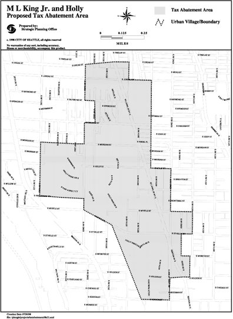

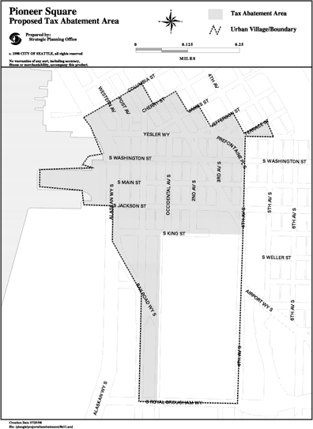

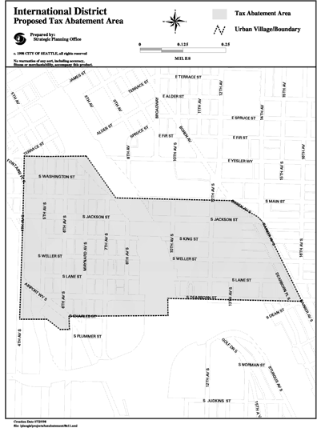

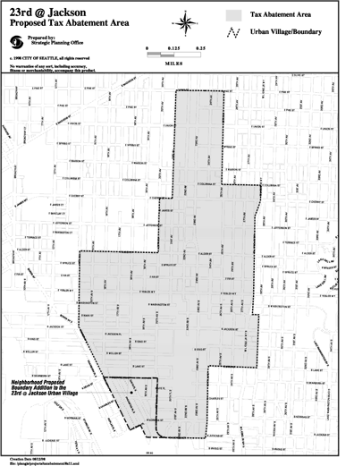

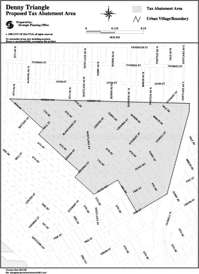

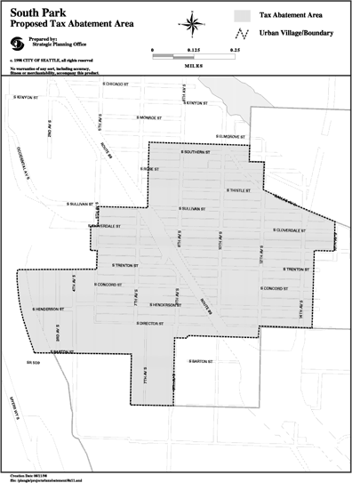

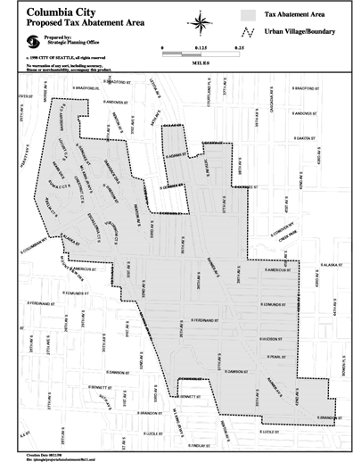

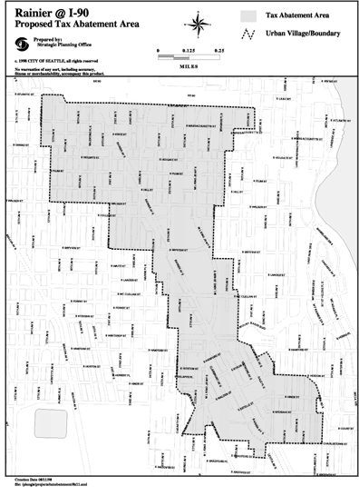

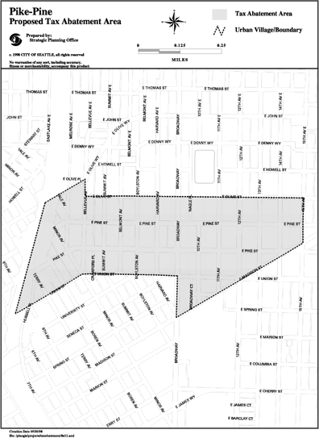

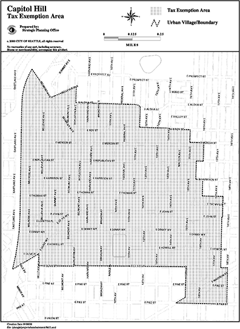

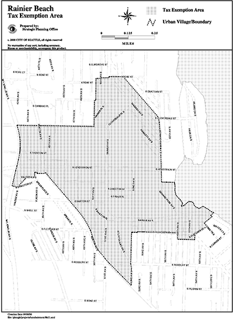

1. Following notice and public hearing as prescribed in RCW 84.14.040, the Council may designate one (1) or more residential targeted areas, upon a finding by the Council in its sole discretion that the residential targeted area meets the following criteria:

    1. The residential targeted area is within an urban village;
    2. The residential targeted area lacks sufficient available, desirable and convenient residential housing to meet the needs of the public who would be likely to live in the urban village if desirable, attractive and livable residences were available; and
    3. Providing additional housing opportunity in the residential targeted area will assist in achieving one (1) or more of the following purposes:

        1. Encourage increased residential opportunities within the City; or
        2. Stimulate the construction of new affordable multifamily housing; and
        3. Encourage the rehabilitation of existing vacant and underutilized buildings for multifamily housing.
2. In designating a residential targeted area, the Council may also consider other factors, including:

    1. Whether additional housing in the residential targeted area will attract and maintain an increase in the number of permanent residents;
    2. Whether providing additional housing opportunities for low and moderate income households would meet the needs of citizens likely to live in the area if affordable residences were available;
    3. Whether an increased permanent residential population in the residential targeted area will help to achieve the planning goals mandated by the Growth Management Act under RCW 36.70A, as implemented through the City's Comprehensive Plan;
    4. Whether encouraging additional housing in the residential targeted area is consistent with plans for LINK Light Rail by Sound Transit; or
    5. Whether additional housing may contribute to revitalization of a distressed neighborhood or area within the City.
3. At any time the Council may, by ordinance, in its sole discretion, amend or rescind the designation of a residential targeted area pursuant to the same procedural requirements as set forth in this chapter for original designation.
4. The following areas, as shown in the attached Attachments 1 through 11, are designated as residential targeted areas under this chapter:

    1. Martin Luther King Jr. Way South at South Holly Street;
    2. Pioneer Square;
    3. International District;
    4. 23rd Avenue South at South Jackson;
    5. Westlake (Denny Triangle);
    6. South Park;
    7. Columbia City;
    8. Rainier Avenue South at I-90;
    9. Pike/Pine;
    10. Capitol Hill;
    11. Rainier Beach.
5. If a part of any legal lot is within a residential targeted area as shown in Attachments 1 through 11, then the entire lot shall be deemed to lie within such residential targeted area.

#### 5.72.040 - Project eligibility.

To be eligible for exemption from property taxation under this chapter, the property must satisfy all of the following requirements:

1. The property must be located in a residential targeted area.
2. The project must be multifamily housing consisting of at least four (4) dwelling units within a residential structure or as part of a mixed use development in which at least fifty (50) percent of the space within such residential structure or mixed use development is intended for permanent residential occupancy.
3. For new construction, a minimum of four (4) new dwelling units must be created; for rehabilitation or conversion of existing occupied structures, a minimum of four (4) additional dwelling units must be added.
4. For rehabilitation or conversion of an existing vacant building, the residential portion of the building shall have been vacant for at least twelve (12) months before application for a conditional exemption, and the rehabilitation improvements shall achieve a condition of substantial compliance with the applicable building and construction codes contained in SMC Title 22.
5. For rehabilitation or conversion of existing occupied structures, there shall be no "displacement" of existing residential tenants, as such term is defined in Section 22.210.030 E of the Seattle Municipal Code.
6. For any new construction project where an existing rental housing structure that contained four (4) or more occupied dwelling units was demolished on the site of the new project within twelve (12) months prior to application for exemption under this chapter, or is to be demolished on that site for purposes of the new project, the owner shall agree, on terms and conditions satisfactory to the Director, to replace any units within such structure that were rented to tenants who receive a tenant relocation assistance payment under SMC Ch. 22.210, subject to the following requirements:

    1. For the first ten (10) calendar years of operation of the replacement units, the replacement units shall be affordable at or below fifty (50) percent of median income.
    2. Replacement may be accomplished either as part of the new construction for which application for exemption is made under this chapter, or through the new construction of additional multiple-unit housing at another location, or through the substantial rehabilitation of vacant multiple-unit housing, or through the preservation of housing that is rented at the time of application to tenants with household annual income at or below fifty (50) percent of median income, and that the Director determines would otherwise be converted to a use other than rental to tenants with such income.
    3. The replacement housing shall be completed, and a temporary or permanent certificate of occupancy shall be issued, within three (3) years from the date of approval of the application; provided, that the Director may extend the time for completion if the Director finds that:

        1. The failure to complete the replacement housing is due to circumstances beyond the owner's control;
        2. The owner has been acting and may reasonably be expected to continue to act in good faith and with due diligence; and
        3. The replacement housing will be completed within a reasonable time.
    4. Projects where the existing rental housing structure was demolished before the effective date of this Chapter 5.72, are not subject to the requirements of this subsection.
    5. Any demolition occurring on or after the date of the application and prior to the issuance of a final certificate of acceptance shall be deemed to have been done for purposes of the project.
    6. For purposes of this subsection F, any units that have not been vacant for at least twelve (12) consecutive months prior to the date of application shall be considered occupied dwelling units.
7. In the following residential targeted areas, at least twenty-five (25) percent of the units in the project shall be affordable at or below eighty (80) percent of median income for the first ten (10) calendar years of operation of the units:

    1. Martin Luther King Jr. Way South at South Holly Street;
    2. Pioneer Square;
    3. 23rd Avenue South at South Jackson;
    4. Westlake (Denny Triangle);
    5. South Park;
    6. Columbia City;
    7. Rainier Avenue South at I-90; and
    8. Rainier Beach.
8. In the following residential targeted areas, at least forty (40) percent of the units in the project shall be affordable at or below sixty (60) percent of median income for the first ten (10) calendar years of operation of the units:

    1. Pike/Pine;
    2. International District; and
    3. Capitol Hill.
9. If the percentage of the number of affordable units in the project required under subsections G and H of this section is a fraction, then the number of affordable units shall be rounded up to the next whole number.
10. The configuration of housing units (e.g., studios, one-bedrooms, two-bedrooms, etc.) used to meet the requirement for affordable units under subsection G or H of this section shall be substantially proportional to the configuration of the total housing units in the project; provided, that all units of two (2) or more bedrooms may be combined into a single category for the purpose of compliance with this provision.
11. Affordable housing units required under subsection G or H of this section shall be substantially the same interior construction quality as market rate units in the project.
12. For owner-occupied projects, the contract with the City required under Section 5.72.060 A of this chapter shall identify those units which shall be affordable as required under subsections G and H of this section. For those owner-occupied units identified as affordable, the City shall have and retain, for the life of the exemption granted under this chapter, a written right of first refusal under terms and conditions approved by the Director, exercisable in the event owner receives a bona fide offer to buy the property from an owner whose household income exceeds the affordability limits in Section 5.72.020 A, giving the City or its assignee the right to purchase the property on substantially the same terms as such bona fide offer. Such right of first refusal shall be included within the contract with the City required under Section 5.72.060 A of this chapter. For rental projects, the City or its assignee shall have and retain, for the life of the exemption granted under this chapter and for one additional year thereafter, a written right of first offer under terms and conditions approved by the Director consistent with this section. Such right of first offer shall be included within the contract with the City required under subsection 5.72.060 A of this chapter.
The right of first offer shall require that the property owner, prior to placing the property on the market for sale, shall inform the City in writing of his or her intent to sell the property. Following receipt of the property owner's notice of intent, the City or the City's assignee shall have twenty (20) days to present the property owner with a written offer setting forth the price, terms and conditions under which the City or its assignee is prepared to purchase the property.

Upon receipt of the offer, the City or its assignee owner shall have thirty (30) calendar days in which to enter into a real estate purchase and sales agreement with the owner containing the price, terms and conditions described in the offer or other price, terms and conditions agreed to by the parties.

In the event that the property owner submits a notice of intent to sell to the City and no sale to the City or its assignee occurs for reasons not the fault of the owner, the owner shall not, with the exception provided below, have further obligations under this provision for a period of one (1) year from the date the notice is received by the City.

Provided, however, that in the event the City or its assignee makes an offer to purchase the property but no sale occurs, the property owner may not offer the property for sale to a third party at a price and under terms and conditions more favorable to the buyer than the terms offered by the City for a period of one (1) year from the date the offer is received by the property owner.

1. For new construction of multifamily housing, the applicant shall complete the design review process under SMC Chapter 23.41, whether or not the project would be subject to design review under Chapter 23.41 if the owner had not applied for property tax exemption under this chapter. For projects not subject to mandatory design review under SMC Section 23.41.004, the applicant shall complete administrative design review under SMC Section 23.41.016.
2. The applicant shall obtain a certificate of approval, permit, or other approval under SMC Chapter 25.12, Landmarks Preservation Ordinance, SMC Chapter 23.66, Special Review Districts, or those provisions of SMC Chapter 25.16, Chapter 25.20, Chapter 25.22, Chapter 25.24, or Chapter 25.28, relating to Landmark or Historical Districts, if such certificate of approval, permit or other approval is required under those chapters. Such certificate of approval, permit or other approval shall satisfy the requirement under subsection M of this section that the applicant complete design review under SMC Chapter 23.41.
3. The project must comply with all applicable zoning requirements, land use regulations, and building and housing code requirements contained in SMC Title 22 and Title 23 at the time of new construction, rehabilitation or conversion.
4. For the duration of the exemption granted under this Chapter 5.72, the property shall have no violations of applicable zoning requirements, land use regulations, and building and housing code requirements contained in Title 22 and Title 23 for which the Seattle Department of Construction and Inspections shall have issued a notice of violation that is not resolved by a certificate of compliance, certificate of release, or withdrawal within the time period for compliance provided in such notice of violation and any extension of the time period for compliance granted by the Director of the Seattle Department of Construction and Inspections.
5. New construction multifamily housing and rehabilitation improvements must be scheduled to be completed within three (3) years from the date of approval of the application.

#### 5.72.050 - Application procedure—Fee.

1. The owner of property applying for exemption under this chapter shall submit an application to the Director, on a form established by the Director. The owner shall verify the application by oath or affirmation. The application shall contain such information as the Director may deem necessary or useful, and shall include:

    1. A brief written description of the project and preliminary schematic site and floor plans of the multifamily units and the structure(s) in which they are proposed to be located;
    2. A statement from the owner acknowledging the potential tax liability when the property ceases to be eligible for exemption under this Chapter 5.72;
    3. Information describing how the applicant shall comply with the affordability requirements in subsections 5.72.040.G and 5.72.040.H; and
    4. In the case of rehabilitation of an existing vacant structure under subsection 5.72.020.I.1 verification from the Seattle Department of Construction and Inspections of noncompliance with applicable building and housing codes as required under subsection 5.72.020.I.1, and an affidavit from the owner verifying that the existing dwelling units have been vacant for a period of 12 months prior to filing the application.
2. At the time of initial application under this section, the applicant shall pay to the City an initial application fee of five hundred dollars ($500). If the City denies the application, the City will retain that portion of the fee attributable to its own actual administrative costs and refund the balance, if any, to the applicant.
3. The Director shall notify the applicant within twenty-eight (28) days of the application being filed if the Director determines that an application is not complete and shall identify what additional information is required before the application will be complete. Within twenty-eight (28) days of receiving additional information, the Director shall notify the applicant in writing if the Director determines that the application is still not complete, and what additional information is necessary. An application shall be deemed to be complete if the Director does not notify the applicant in writing by the deadlines in this section that the application is incomplete; however, a determination of completeness does not preclude the Director from requiring additional information during the review process if more information is needed to evaluate the application according to the criteria in this chapter.
4. Except as otherwise provided in subsection E of this section, the application shall be submitted any time before the earlier of (1) an application for a Master Use Permit or other land use permit under SMC Title 23, and (2) an application for a building or other construction permit under SMC Title 22.
5. If, on the effective date of this Chapter 5.72, the applicant has applied for a permit identified in subsection D of this section, then application for exemption under this section may be submitted any time prior to issuance of a building permit; provided that, for new construction, the applicant shall have completed, or be in the process of completing, design review or administrative design review as required under Section 5.72.040 K, or shall have obtained a certificate of approval, permit, or other approval as provided under Section 5.72.040 L.

#### 5.72.060 - Application review—Issuance of conditional certificate—Denial—Appeal.

1. The Director shall approve or deny an application under this chapter. If the application is approved, the applicant shall enter into a contract with the City, subject to approval by resolution of the City Council, regarding the terms and conditions of the project and eligibility for exemption under this chapter. The City Council's resolution to approve the applicant's contract with the City shall take place within ninety (90) days of the Director's receipt of the completed application. Upon Council approval of the contract, the Director shall execute the contract as approved by the City Council, and the Director shall issue a conditional certificate of acceptance of tax exemption. The conditional certificate shall expire three (3) years from the date of approval unless an extension is granted as provided in this chapter.
2. If the application is denied, the Director shall state in writing the reasons for the denial and send notice of denial to the applicant's last known address within ten (10) days of the denial.
3. An applicant may appeal the Director's denial of the application to the City Council within thirty (30) days of receipt of the denial. The appeal before the City Council will be based upon the record before the Director, and the Director's decision will be upheld unless the applicant can show that there is no substantial evidence on the record to support the Director's decision. The City Council's decision on appeal is final.

#### 5.72.065 - Amendment of contract.

1. Any applicant seeking amendment(s) to the contract approved by the City Council may do so by submitting a request in writing to the Director at any time within three (3) years of the date of the Council's approval of the contract.
2. The Director of Housing shall have authority to approve amendments to the contract between the applicant and the City which are substantially in the form of the contract approved by the City Council. Amendments which are not reasonably within the scope of the approved contract, as determined by the Director, shall be submitted to the City Council for approval by resolution.
3. Any applicant seeking amendments to the approved form of contract which in the sole discretion of the Director require approval by the City Council shall pay to the City an amendment application fee of Five Hundred Dollars ($500). If the City denies the amendment, the City will retain that portion of the fee attributable to its own actual administrative costs and refund the balance, if any, to the applicant.
4. The date for expiration of the Conditional Certificate shall not be extended by contract amendment unless (1) all the conditions for extension set forth in Section 5.72.070 are met, or (2) conditions set forth in Section 5.72.070 A and B are met and the City Council specifically approves the extension.

#### 5.72.070 - Extension of conditional certificate.

The conditional certificate may be extended by the Director for a period not to exceed twenty-four (24) consecutive months. The applicant shall submit a written request stating the grounds for the extension together with a fee of one hundred fifty dollars ($150) for the City's administrative cost to process the request. The Director may grant an extension if the Director determines that:

1. The anticipated failure to complete construction or rehabilitation within the required time period is due to circumstances beyond the control of the owner; and
2. The owner has been acting and could reasonably be expected to continue to act in good faith and with due diligence; and
3. All the conditions of the original contract between the applicant and the City will be satisfied upon completion of the project.

#### 5.72.080 - Final certificate—Application—Issuance—Denial and appeal.

1. Upon completion of the rehabilitation improvements or new construction as provided in the contract between the applicant and the City, and upon issuance of a temporary certificate of occupancy, or a permanent certificate of occupancy if no temporary certificate is issued, the applicant may request a final certificate of tax exemption. The applicant shall file with the Director such information as the Director may deem necessary or useful to evaluate eligibility for the final certificate, and shall include:

    1. A statement of expenditures made with respect to each multifamily housing unit and the total expenditures made with respect to the entire property;
    2. A description of the completed work and a statement of qualification for the exemption;
    3. A statement that the work was completed within the required three (3) year period or any approved extension; and
    4. Information on the applicant's compliance with the affordability requirements in Section 5.72.040 G and H.
2. At the time of application for final certificate under this section, the applicant shall pay to the City a fee of one hundred fifty dollars ($150) to cover the Assessor's administrative costs. If the Director approves the application, the City will forward the fee for the Assessor's administrative costs to the Assessor. If the Director denies the application, the City will refund the fee for the Assessor's administrative costs to the applicant.
3. Within thirty (30) days of receipt of all materials required for a final certificate, the Director shall determine whether the completed work is consistent with the contract between the City and owner and is qualified for exemption under this chapter, and which specific improvements satisfy the requirements of this chapter.
4. If the Director determines that the project has been completed in accordance with the contract between the applicant and the City and the requirements of this chapter, the City shall file a final certificate of tax exemption with the Assessor within ten (10) days of the expiration of the thirty (30) day period provided under subsection C of this section.
5. The Director is authorized to cause to be recorded, or to require the applicant or owner to record, in the real property records of the King County Department of Records and Elections, the contract with the City required under Section 5.72.060 A of this chapter, or such other document(s) as will identify such terms and conditions of eligibility for exemption under this chapter as the Director deems appropriate for recording, including requirements under this chapter relating to affordability of units.
6. The Director shall notify the applicant in writing that the City will not file a final certificate if the Director determines that the project was not completed within the required three (3) year period or any approved extension, or was not completed in accordance with the contract between the applicant and the City and the requirements of this chapter.
7. The applicant may file an appeal of the Director's decision that a final certificate will not be issued to the King County Superior Court within thirty (30) days of receiving notice of that decision.

#### 5.72.090 - Exemption—Duration—Limits.

1. The value of new housing construction and rehabilitation improvements qualifying under this chapter will be exempt from ad valorem property taxation for ten (10) successive years as provided in RCW 84.14.020(1).
2. The exemption does not apply to the value of land or to the value of improvements not qualifying under this chapter, nor does the exemption apply to increases in assessed valuation of land and nonqualifying improvements, or to increases made by lawful order of the King County Board of Equalization, the Washington State Department of Revenue, State Board of Tax Appeals, or King County, to a class of property throughout the county or a specific area of the county to achieve uniformity of assessment or appraisal as required by law. In the case of rehabilitation of existing buildings, the exemption does not include the value of improvements constructed prior to submission of the completed application required under this chapter.

#### 5.72.100 - Annual certification.

1. Within thirty (30) days after the first anniversary of the date the City filed the final certificate of tax exemption and each year thereafter, for a period of ten (10) years, the property owner shall file a certification with the Director, verified upon oath or affirmation, which shall contain such information as the Director may deem necessary or useful, and shall include the following information:

    1. A statement of occupancy and vacancy of the multifamily units during the previous year;
    2. A certification that the property has not changed use since the date of filing of the final certificate of tax exemption, and continues to be in compliance with the contract with the City and the requirements of this chapter;
    3. A description of any improvements or changes to the property made after the filing of the final certificate or last declaration, as applicable; and
    4. Information demonstrating the owner's compliance with the affordability requirements of Section 5.72.040 G and H.
2. Failure to submit the annual declaration may result in cancellation of the tax exemption.

#### 5.72.110 - Cancellation of tax exemption—Appeal.

1. If at any time the Director determines that the property no longer complies with the terms of the contract or with the requirements of this chapter, or for any reason no longer qualifies for the tax exemption, the tax exemption shall be canceled and additional taxes, interest and penalty imposed pursuant to state law.
2. If the owner intends to convert the multifamily housing to another use, the owner must notify the Director and the King County Assessor within sixty (60) days of the change in use. Upon such change in use, the tax exemption shall be canceled and additional taxes, interest and penalty imposed pursuant to state law.
3. Upon determining that a tax exemption shall be canceled, the Director, on behalf of the City Council, shall notify the property owner by certified mail, return receipt requested. The property owner may appeal the determination by filing a notice of appeal with the City Clerk within thirty (30) days, specifying the factual and legal basis for the appeal. The Hearing Examiner will conduct a hearing pursuant to SMC Section 3.02.090 at which all affected parties may be heard and all competent evidence received. The Hearing Examiner will affirm, modify, or repeal the decision to cancel the exemption based on the evidence received. The Hearing Examiner shall give substantial weight to the Director's decision and the burden of overcoming that weight shall be upon the appellant. An aggrieved party may appeal the Hearing Examiner's decision to the King County Superior Court as provided in RCW 34.05.510 through 34.05.598.

#### 5.72.120 - Expiration of program.

The program established by this chapter shall expire four (4) years after the effective date of the ordinance codified in this chapter, unless extended by the City Council by ordinance. Upon expiration, no further applications for a conditional certificate of tax exemption shall be accepted. Incomplete applications shall be returned to the applicant. Pending complete applications for a conditional certificate, extension of conditional certificate and final certificate shall be processed as provided in this chapter.

### Chapter 5.73 - 2004 MULTIFAMILY HOUSING PROPERTY TAX EXEMPTION PROGRAM

Sections:

#### 5.73.010 - Purpose

The purpose of this Chapter 5.73 is to increase the supply of affordable Multifamily Housing opportunities within the City for Low-Income Households and Moderate-Income Households in order to promote fair housing, provide housing choice, and address displacement. This purpose may be furthered by the designation of a Residential Targeted Area under this Chapter 5.73.

#### 5.73.020 - Definitions

"Affordable Rent" means that the monthly rent plus tenant paid utilities and any mandatory recurring fees required as a condition of tenancy for the unit does not exceed 30 percent of the monthly imputed Median Income designated by this Chapter 5.73 for qualifying units.

"Affordable Unit" means a unit that is rented at an Affordable Rent to an Income Eligible Occupant or sold to an Income Eligible Occupant for owner-occupied Multifamily Housing.

"Annual Income" means the annual income of a Family as determined, unless otherwise approved in writing by the City, in accordance with 24 C.F.R Section 5.609 or successor provision. The Owner shall follow the requirements in 24 C.F.R Section 5.617 when making subsequent Annual Income determinations of persons with disabilities after their initial occupancy.

"Assessor" means the King County Assessor.

"Bedroom" means a habitable room in a Dwelling Unit that meets the following criteria: (1) gross floor area measures are no less than 70 square feet; (2) wall dimension measures are no less than 7 feet; (3) lighting is provided through an exterior opening in accordance with Section 1205.2.2 of the Seattle Building Code or, in the case of adjoining spaces, in accordance with Section 1205.2.1 of the Seattle Building Code; (4) ventilation is provided through an exterior opening to the outdoors in accordance with Section 1203.5.1 of the Seattle Building Code or, in the case of adjoining spaces, in accordance with Section 1203.5.1.1 of the Seattle Building Code or, in the case of openings below grade, in accordance with Section 1203.5.1.2 of the Seattle Building Code; and (5) walls and exit access doorway(s), consistent with Chapter 2 of the Seattle Building Code, provide a complete separation from the rest of the Dwelling Unit.

"Compliance Period" means the period beginning with the application for Final Certificate of Tax Exemption and ending on December 31 of the twelfth year of tax exemption, during which time Affordable Units must be occupied by Income Eligible Occupants.

"Congregate Residence" means a use in which rooms or lodging, with or without meals, are provided for nine or more non-transient persons not constituting a single household, excluding single-family Dwelling Units for which special or reasonable accommodation has been granted, pursuant to Section 23.84A.006.

"Director" means the Director of the City's Office of Housing or any other City office, department, or agency that shall succeed to its functions with respect to this Chapter 5.73, or the Director's authorized designee.

"Dwelling Unit" means a room or rooms located within a structure that are configured to meet the standards of Section 23.42.048 and that are occupied or intended to be occupied by not more than one household as living accommodations independent from any other household, pursuant to Section 23.84A.008.

"Economically Distressed Area" means all or a portion of a Housing Investment Area designated in Seattle's Consolidated Plan for Housing and Community Development as updated from time to time.

"Family" has the meaning set forth in 24 C.F.R Section 5.403 or successor provision and includes an individual person.

"HUD" means the United States Department of Housing and Urban Development.

"Income Eligible Occupant" means that the household annual income at initial occupancy of the household that will occupy the unit is no greater than the percentage of Median Income designated in this Chapter 5.73. A person shall continue to be an Income Eligible Occupant as long as the person's household income does not exceed the unit income restriction by 150 percent upon recertification.

"Low Income Household" means a household with an annual income equal to or less than 80 percent of the Median Income.

"Median Income" means median family income for the Seattle area, as published from time to time by the HUD for the Section 8 program. If in any year HUD shall publish median family income data for more than one area that includes Seattle, then unless otherwise approved in writing by the Director of the Office of Housing, the lowest of such median family income figures shall be used. If, at any time, Median Income for a Family size cannot be determined under the foregoing sentences based on data published by HUD for the Seattle area within the most recent 13 months, then the City may determine Median Income for such Family size based on any data for the Seattle area or an area including Seattle, published or reported by a federal, state, or local agency, as the City shall select in its sole discretion, adjusted for Family size in such manner as the City shall determine in its sole discretion.

"Moderate Income Household" means a household with an annual income equal to or less than 120 percent of the Median Income.

"Multifamily Housing" means a building or buildings, including associated housing improvements, having four or more Dwelling Units in each building, or four or more housing units in a Congregate Residence, designed for Permanent Residential Occupancy, either rental or Owner-occupied, resulting from new construction or rehabilitation or conversion of vacant, underutilized, or substandard buildings.

"Owner" means the property owner of record.

"Permanent Residential Occupancy" means Multifamily Housing that provides either rental or owner occupancy for a period of at least one month. This excludes hotels and motels that predominately offer rental accommodation on a daily or weekly basis.

"Project" means the Multifamily Housing or portion of the Multifamily Housing that is to receive the tax exemption.

"Rehabilitation Improvements" means (1) modifications to an existing building, the residential portion of which has been vacant for at least 12 months prior to application for exemption under this Chapter 5.73, that are made to achieve a condition of Substantial Compliance with the applicable building and construction codes contained or incorporated in Title 22; or (2) modifications to an existing occupied residential building or mixed-use building that contains occupied residential units, which add at least four new Dwelling Units, or at least four new housing units in a Congregate Residence.

"Residential Targeted Area" means an area within an Urban Center that has been so designated by the City Council pursuant to this Chapter 5.73.

"Substantial Compliance" means compliance with the applicable building and construction codes contained or incorporated in Title 22 that is typically required for rehabilitation as opposed to new construction.

"Third Party Verification" means independent verification of income by contacting the individual income source(s) supplied by the family.

"Urban Center" means a compact identifiable district where urban residents may obtain a variety of products and services. An urban center must contain:

1. Several existing or previous, or both, business establishments that may include but are not limited to shops, offices, banks, restaurants, and governmental agencies;
2. Adequate public facilities including streets, sidewalks, lighting, transit, domestic water, and sanitary sewer systems; and
3. A mixture of uses and activities that may include housing, recreation, and cultural activities in association with either commercial or office, or both, use.

#### 5.73.030 - Residential Targeted Areas—Criteria—Designation

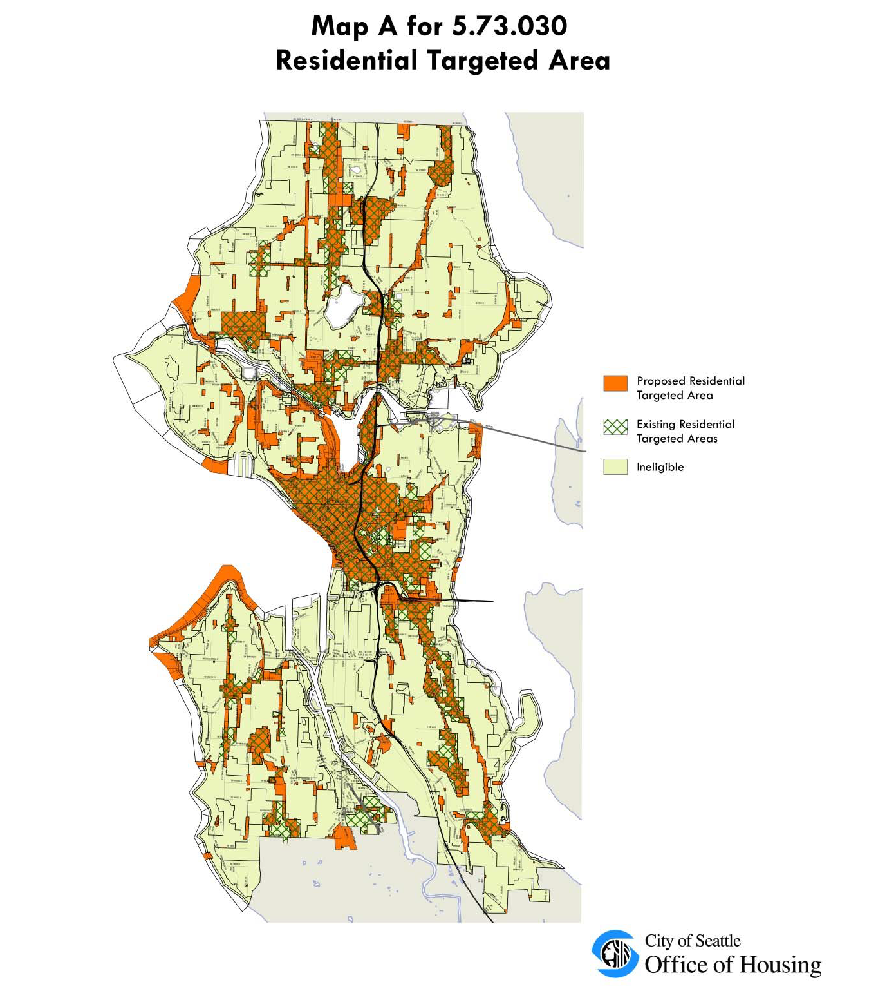

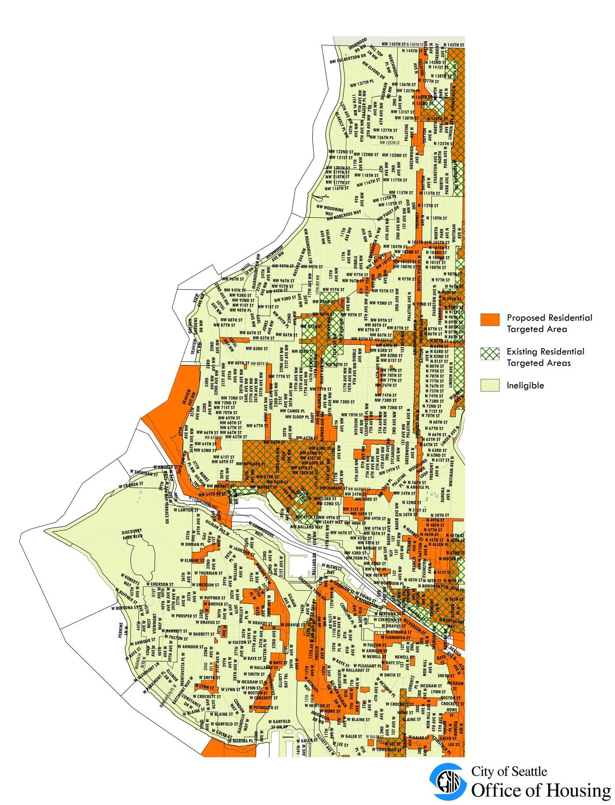

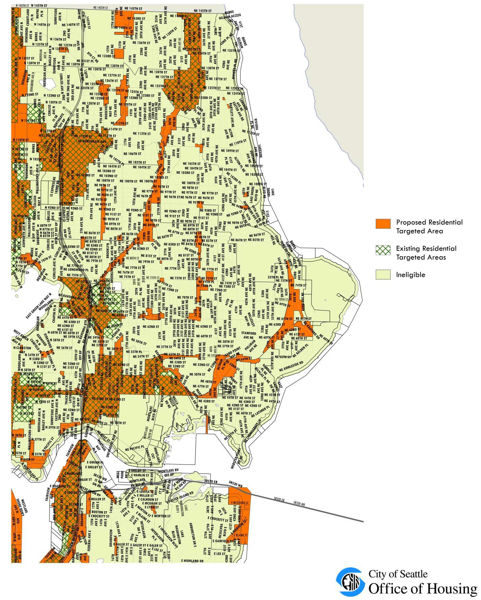

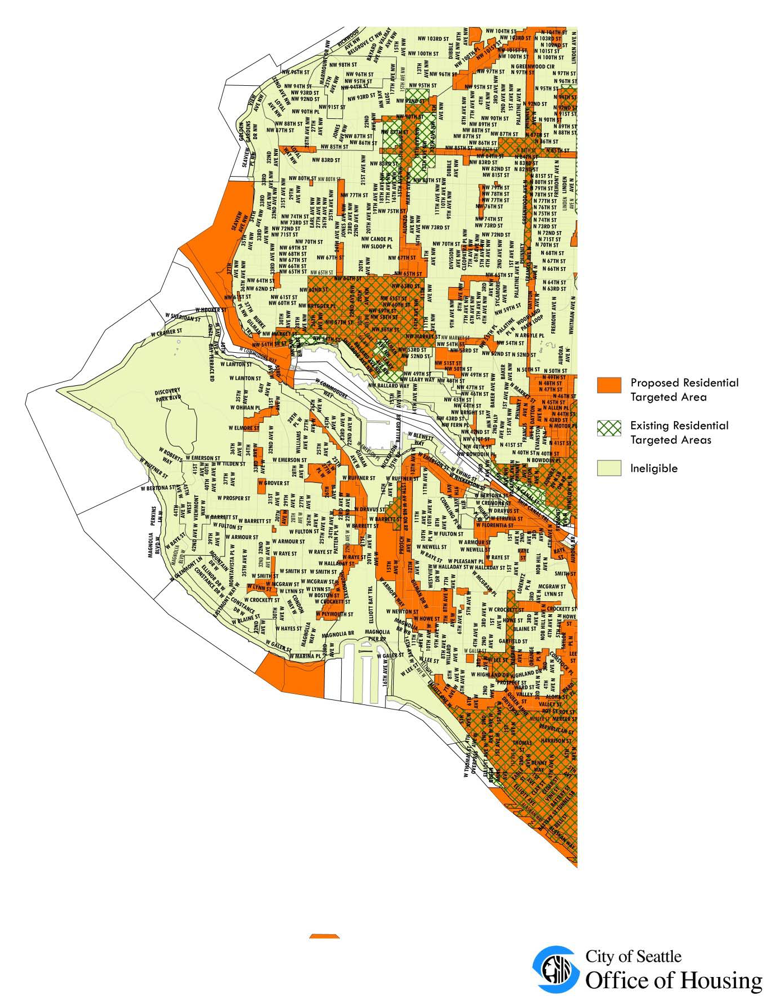

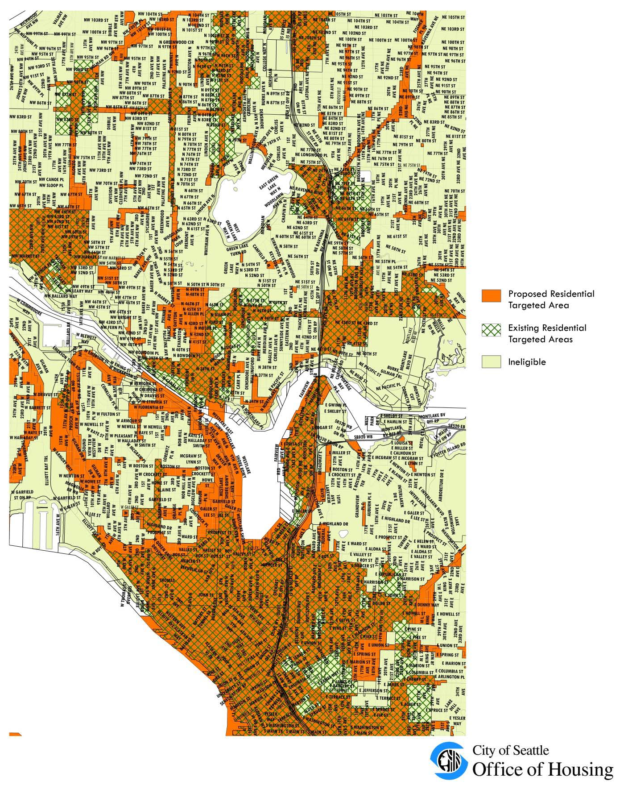

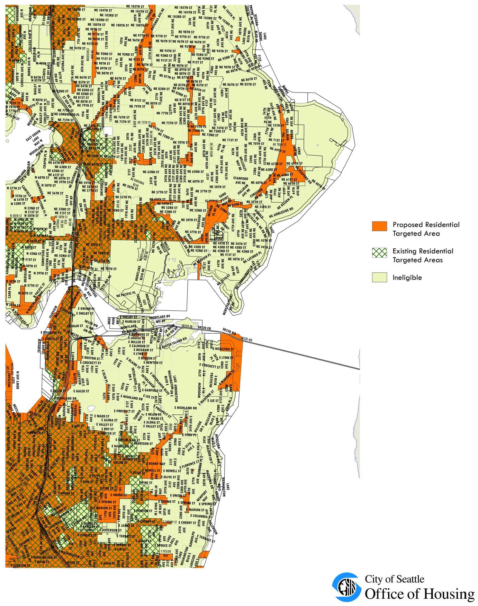

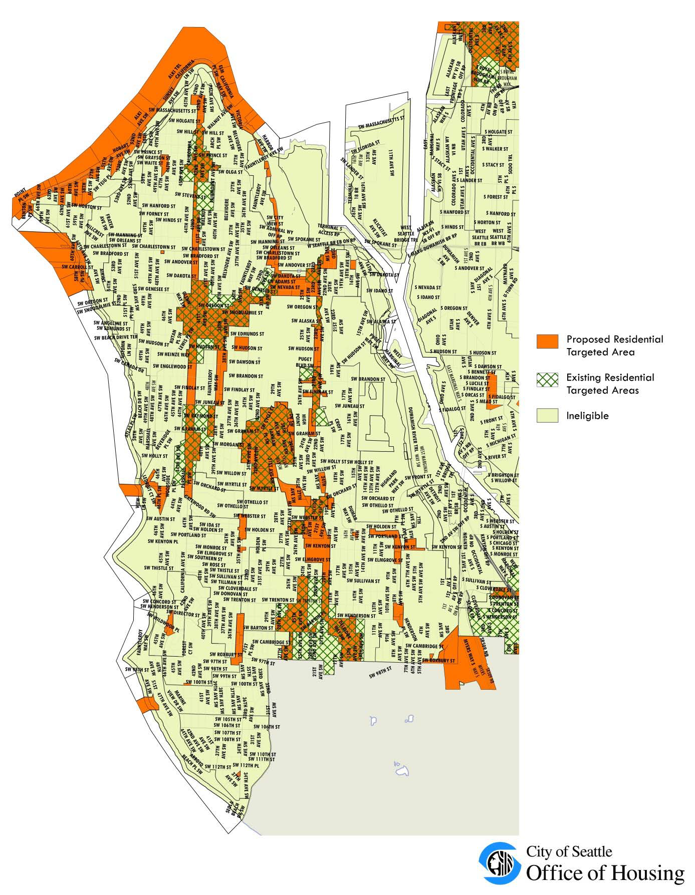

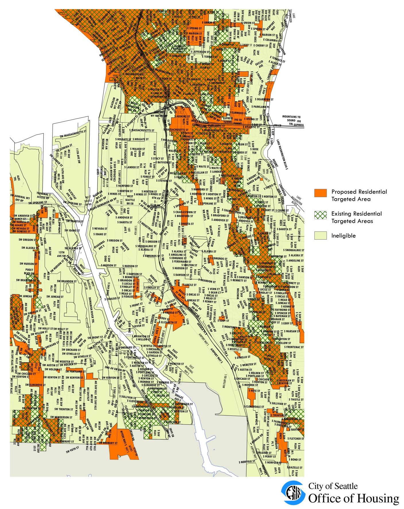

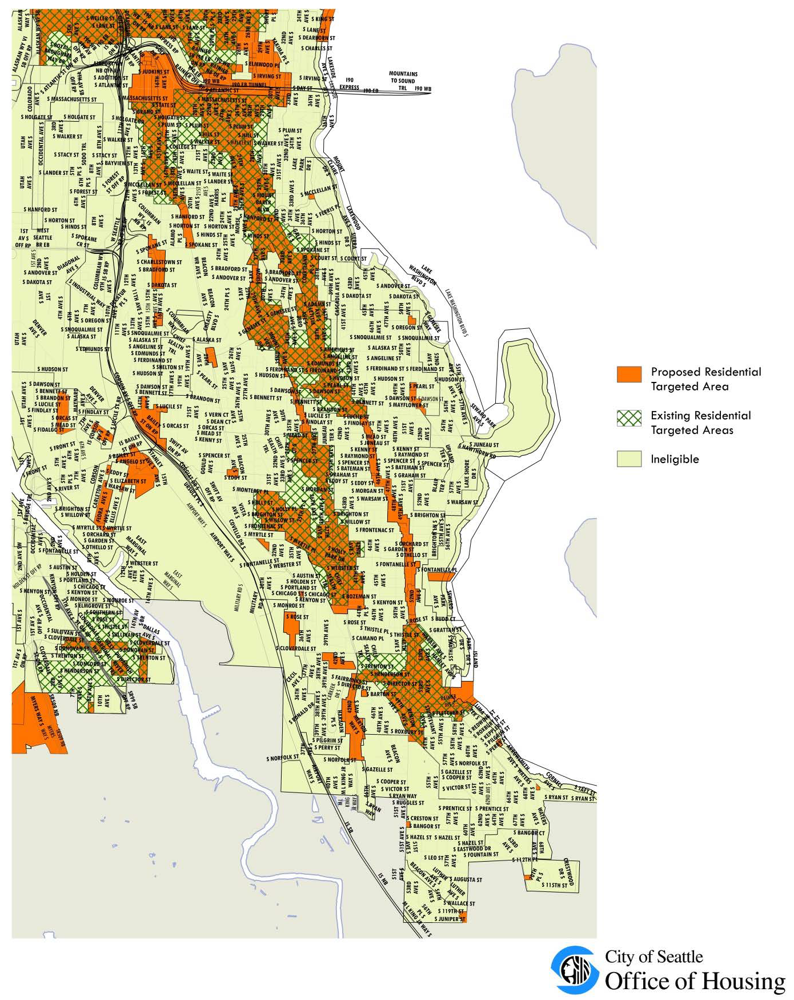

1. Following notice and public hearing as prescribed in RCW 84.14.040, the Council may designate one or more Residential Targeted Areas upon a finding by the Council in its sole discretion that the Residential Targeted Area meets the following criteria:

    1. The Residential Targeted Area is within an Urban Center;
    2. The Residential Targeted Area lacks sufficient available, desirable and convenient residential housing, including affordable housing, to meet the needs of the public who would be likely to live in the Urban Center if desirable, attractive, affordable and livable residences were available; and
    3. Providing additional housing opportunity, including affordable housing, in the Residential Targeted Area will assist in encouraging the creation of affordable Multifamily Housing in new or rehabilitated structures.
2. In designating a Residential Targeted Area, the Council may also consider other factors, including:

    1. Whether an increased permanent residential population in the Residential Targeted Area will help to achieve the planning goals mandated by the Growth Management Act under chapter 36.70A RCW;
    2. Whether the area is an Economically Distressed Area;
    3. Whether the City has identified the area or neighborhood by Resolution as one in which the City wants to encourage the development of mixed-income housing, including affordable housing;
    4. Whether the area or neighborhood was designated as a Residential Targeted Area in the City's prior Multifamily Tax Exemption program, chapter 5.72 RCW, and is one in which the City wants to encourage the development of mixed income housing, including affordable housing.
3. At any time the Council may by ordinance in its sole discretion, amend or rescind the designation of a Residential Targeted Area pursuant to the same procedural requirements set forth in RCW 84.14.040 for original designation.
4. All land zoned to allow Multifamily Housing, as per Chapters 23.45, 23.46, 23.47, 23.48, and 23.49, and as shown in Map A for 5.73.030, is designated as a single Residential Targeted Area under this Chapter 5.73.
5. If a part of any legal lot is within the Residential Targeted Area as shown in Map A for 5.73.030, then the entire lot shall be deemed to lie within such Residential Targeted Area.
6. Any future changes to zoning shall override Map A for 5.73.030 for purposes of determining whether any legal lot is within the Residential Targeted Area.

#### 5.73.040 - Eligibility

1. To be eligible for exemption from property taxation, in addition to other requirements set forth in this Chapter 5.73, the Multifamily Housing, for either rental or homeownership occupancy, must be in compliance with the applicable requirements below for the entire exemption period:

    1. The Multifamily Housing must be located in a Residential Targeted Area.
    2. The Multifamily Housing must be part of a residential or mixed-use project (combining residential and non-residential).
    3. The Multifamily Housing must provide for a minimum of 50 percent of the space in each building for Permanent Residential Occupancy.
    4. For new construction, a minimum of four new Dwelling Units or four housing units in a Congregate Residence must be created; for rehabilitation or conversion of existing occupied structures, a minimum of four additional Dwelling Units, or a minimum of four housing units in a Congregate Residence, must be added.
    5. For rehabilitation or conversion of existing vacant buildings, the residential portion of the buildings shall have been vacant for at least 12 months before application for tax exemption, the buildings must fail to comply with one or more standards of the applicable building and construction code contained or incorporated in Title 22 and upon completion of rehabilitation or conversion the building must achieve a condition of Substantial Compliance.
    6. For rehabilitation or conversion of existing occupied buildings, there shall be no "displacement" of existing residential tenants, as such term is defined in subsection 22.210.030.E;
    7. For new construction, if at any time during the 18 months prior to the date of submission of an application for exemption under this Chapter 5.73, a building containing four or more Dwelling Units exists on the site and any of such units is occupied by a tenant or tenants receiving or eligible to receive a tenant relocation assistance payment under Chapter 22.210, and such building has been or will be demolished, then the Owner shall agree, on terms and conditions satisfactory to the Director, to replace all units that were occupied by a tenant or tenants receiving or eligible to receive a tenant relocation assistance payment under Chapter 22.210, subject to the following requirements:

        1. For the duration of the tax exemption, the replacement units shall be affordable at or below 50 percent of median income as adjusted for household size according to the method used by HUD for income limits in subsidized housing and according to HUD rules for the HOME program for presumed family size based on the number of bedrooms in a unit.
        2. Replacement may be accomplished either as part of the new construction for which application for exemption is made under this Chapter 5.73, or through the new construction of additional multifamily housing at another location, or through the substantial rehabilitation of vacant multifamily housing, or through the preservation of multifamily housing that is rented at the time of application to tenants with household annual income at or below 50 percent of Median Income as adjusted for household size according to the method used by HUD for income limits in subsidized housing and according to HUD rules for the HOME program for presumed family size based on the number of bedrooms in a unit, and that the Director determines would otherwise be converted to a use other than rental to tenants with such income.
        3. The replacement housing shall be completed, and a temporary or permanent certificate of occupancy shall be issued, within three years from the date of approval of the application as described in Section 5.73.060, provided that the Director may extend the time for completion if the Director finds that:

            1. The failure to complete the replacement housing is due to circumstances beyond the Owner's control;
            2. The Owner has been acting and may reasonably be expected to continue to act in good faith and with due diligence; and
            3. The replacement housing will be completed within a reasonable time.
        4. Where the existing rental housing building was demolished before the effective date of this Chapter 5.73, the requirements of this subsection 5.73.040.A do not apply.
    8. The Owner shall obtain a certificate of approval, permit, or other approval under Chapter 25.12, Landmarks Preservation Ordinance, Chapter 23.66, Special Review Districts, or those provisions of Chapter 25.16, Chapter 25.20, Chapter 25.22, Chapter 25.24, or Chapter 25.28, relating to Landmark or Historical Districts, if such certificate of approval, permit, or other approval is required under those chapters.
    9. The Multifamily Housing must comply with all applicable zoning requirements, land use regulations, and building and housing code requirements contained or incorporated in Titles 22, 23, and 25.
    10. For the duration of the exemption granted under this Chapter 5.73, the Multifamily Housing and the property on which it is located shall have no violations of applicable zoning requirements, land use regulations, and building and housing code requirements contained or incorporated in Titles 22, 23, and 25 for which the Seattle Department of Construction and Inspections has issued a notice of violation that is not resolved by a certificate of compliance, certificate of release, or withdrawal within the time period for compliance provided in such notice of violation and any extension of the time period for compliance granted by the Director of the Seattle Department of Construction and Inspections.
    11. The Multifamily Housing must be scheduled to be completed within three years from the date of approval of the application.
2. In addition to the requirements in subsection 5.73.040.A, rental projects must comply with the following affordability requirements from the date of application for the Final Certificate of Tax Exemption ("Final Certificate") for the duration of the exemption period:

    1. In projects that contain at least the minimum number of Dwelling Units with two or more bedrooms, according to Table A for 5.73.040.B, a minimum of 20 percent of all units in the Project shall be Affordable Units rented to tenants whose household annual income is at or below 40 percent of Median Income for housing units in Congregate Residences or small efficiency Dwelling Units, at or below 65 percent of Median Income for studio units, at or below 75 percent of Median Income for one-bedroom units, at or below 85 percent of Median Income for two-bedroom units, and at or below 90 percent of Median Income for three-bedroom and larger units.
    2. In projects containing fewer Dwelling Units with two or more bedrooms than is indicated in Table A for 5.73.040.B, a minimum of 25 percent of all units shall be Affordable Units rented to tenants whose House Annual Income is at or below 40 percent of Median Income for housing units in Congregate Residences or small efficiency dwelling units, at or below 65 percent of Median Income for studio units, at or below 75 percent of Median Income for one-bedroom units, at or below 85 percent of Median Income for two-bedroom units, and at or below 90 percent of Median Income for three-bedroom and larger units.
    3. If, in calculating the total number of Affordable Units, the number contains a fraction, then the number of Affordable Units shall be rounded up to the next whole number.
    4. The mix and configuration of Affordable Units (e.g., housing units in Congregate Residences, small efficiency dwelling units, studios, one-bedrooms, two-bedrooms, three-bedrooms, etc.) shall be substantially proportional to the mix and configuration of the total housing units in the Project; provided that all units with three or more bedrooms may be combined into a single category for the purpose of compliance with this provision. When the Project contains more than one building, all of the Affordable Units required by this subsection 5.73.040.B may not be located in the same building.
3. In addition to the requirements in subsection 5.73.040.A, units eligible for tax exemption in owner-occupied Multifamily Housing must comply with the following:

    1. Units must be sold at a sales price as established by the Director and adjusted periodically to buyers with Household Annual Income at the time of purchase at or below 100 percent of Median Income for studio and one-bedroom units, and at or below 120 percent of Median Income for two-bedroom or larger units.
    2. The contract with the City required under Section 5.73.060 of this Chapter 5.73 shall identify those units that are designated to meet the affordability requirements of this subsection 5.73.040.C.
4. Upfront tenant fees

    1. The Director is authorized to limit fees charged to Income Eligible Occupants upon move-in or transfer in the same building, including, but not limited to, property administrative fees, transfer fees, last month's rent, and security deposits. Any limitations placed on fees shall not include criminal background or credit checks, which may be charged to the Income Eligible Occupant at cost.
    2. Owners shall not authorize a fee to be charged to Income Eligible Occupants for income verification or program administration of the Multifamily Tax Exemption Program.

#### 5.73.050 - Application procedure—Fee

1. The Owner of Multifamily Housing applying for exemption under this Chapter 5.73 shall submit an application to the Director, on a form provided by the Office of Housing. The Owner shall verify the application by oath or affirmation. The application shall contain such information as the Director may deem necessary or useful, and shall include:

    1. A brief written description of the units, and schematic site plans, floor plans, and unit layouts of the Multifamily Housing units and the structure(s) in which they are proposed to be located; every unit layout must include detailed information that adequately demonstrates the number of Bedrooms, consistent with subsection 5.73.020;
    2. A statement from the Owner acknowledging the potential tax liability when the Multifamily Housing ceases to be eligible for exemption under this Chapter 5.73;
    3. Information describing how the Owner will comply with the affordability requirements in subsections 5.73.040.B and 5.73.040.C;
    4. In the case of rehabilitation or conversion of an existing vacant building, verification from the Seattle Department of Construction and Inspections of non-compliance with applicable building and housing codes as required under subsection 5.73.040.A.4, and an affidavit from the owner verifying that the residential portion of the building has been vacant for a period of 24 months prior to filing the application;
    5. A housing market study that includes comparable rents or sales prices in other nearby housing projects; and
    6. A recent title report confirming the legal description and ownership of the property where the Multifamily Housing is or will be located; evidence satisfactory to the Director concerning the type of Owner entity or entities and organizational structure; a sample signature block for the Owner(s); and evidence satisfactory to the Director of authority of the person or persons signing the application.
2. At the time of application under this Section 5.73.050, the Owner shall pay to the City an initial application fee of $10,000 if fewer than 75 percent of the total units in a project for which a tax exemption is sought under this Chapter 5.73 are Affordable Units, or $4,500 if at least 75 percent of the total units in a project for which a tax exemption is sought under this Chapter 5.73 are Affordable Units. The Director shall have authority to increase the application fee by up to five percent each calendar year unless revised by ordinance.
3. The Director shall notify the Owner within 28 days of the application being filed if the Director determines that an application is not complete and shall identify what additional information is required before the application will be complete. Within 28 days of receiving additional information, the Director shall notify the Owner in writing if the Director determines that the application is still not complete, and what additional information is necessary. An application shall be deemed to be complete if the Director does not notify the Owner in writing by the deadlines in this Section 5.73.050 that the application is incomplete; however, a determination of completeness does not preclude the Director from requiring additional information during the review process if more information is needed to evaluate the application according to the criteria in this Chapter 5.73.
4. The deadline for application shall be any time before, but no later than, the date the first building permit under Title 22 is issued.

#### 5.73.060 - Application review—Issuance of conditional certificate—Denial—Appeal—Recording of contract

1. The Director shall approve or deny an application under this Chapter 5.73 within 90 days after a complete application is submitted to the Director.
2. If the application is approved, the Owner shall enter into a contract with the City containing the terms and conditions and eligibility for exemption under this Chapter 5.73.
3. The Director is authorized to cause to be recorded, or require the Owner to record, in the real property records of the King County Recorder's Office, the contract or such other document(s) as will identify such terms and conditions of eligibility for exemption under this Chapter 5.73 as the Director deems appropriate for recording, including the affordability requirements under this Chapter 5.73.
4. Following execution of the contract by the Owner and the City, the Director shall issue a Conditional Certificate of Acceptance of Tax Exemption ("Conditional Certificate"). The Conditional Certificate shall expire three years from the date of approval unless an extension is granted as provided in this Chapter 5.73.
5. If the application is denied, the Director shall state in writing the reasons for the denial and send notice of denial to the Owner's last known address within ten days of the denial.
6. An Owner may appeal the Director's denial of the application by filing an appeal to the City Council with the City Clerk within 30 days of receipt of the denial. The appeal before the City Council will be based on the record before the Director, and the Director's decision will be upheld unless the Owner can show that there is no substantial evidence in the record to support the Director's decision. The City Council's decision on appeal is final.

#### 5.73.065 - Amendment of contract

1. An Owner may seek an amendment of the contract between the Owner and the City by submitting a request in writing to the Director at any time prior to receiving the Final Certificate of Tax Exemption ("Final Certificate").
2. The date for expiration of the Conditional Certificate shall not be extended by contract amendment unless the Director determines that all the conditions for extension set forth in Section 5.73.070 are met.

#### 5.73.070 - Extension of Conditional Certificate

The Conditional Certificate of Tax Exemption may be extended by the Director for a period not to exceed 24 consecutive months. The Owner shall submit to the Director a written request stating the grounds for the extension together with a fee of $200 for the City's administrative cost to process the request. The Director may grant an extension if the Director determines that:

1. The anticipated failure to complete new construction or Rehabilitation Improvements within the required time period is due to circumstances beyond the control of the Owner; and
2. The Owner has been acting and could reasonably be expected to continue to act in good faith and with due diligence; and
3. All the conditions of the original contract between the Owner and the City will be satisfied upon completion of the Project.

#### 5.73.080 - Final Certificate—Application—Issuance—Denial and appeal

1. Upon completion of the rehabilitation improvements or new construction as provided in the contract between the Owner and the City, and upon issuance of a temporary certificate of occupancy, or a permanent certificate of occupancy if no temporary certificate is issued, the Owner may request a Final Certificate. The Owner shall file with the Director such information as the Director may deem necessary or useful to evaluate eligibility for the Final Certificate, and shall include:

    1. A statement of expenditures made with respect to each housing unit and the total expenditures made with respect to the entire multifamily housing project;
    2. A description of the completed work and a statement of qualification for the exemption;
    3. A brief written description of the units, and schematic site plans, floor plans, and unit layouts of the Multifamily Housing units and the structure(s) in which they are proposed to be located; every unit layout must include detailed information that adequately demonstrates the number of Bedrooms, consistent with the definition included in Section 5.73.020;
    4. A statement that the work was completed within the required three-year period or any approved extension; and
    5. Information on the Owner's compliance with the affordability requirements in subsections 5.73.040.B and 5.73.040.C.
2. At the time of application for Final Certificate under this Section 5.73.080, the applicant shall pay a fee as determined by the Assessor to cover the Assessor's administrative costs. If the Director approves the application, the City will forward the fee for the Assessor's administrative costs to the Assessor. If the Director denies the application, the City will refund the fee for the Assessor's administrative costs to the applicant.
3. Within 30 days of receipt of all materials required for a Final Certificate, the Director shall determine whether the completed multifamily housing is consistent with the contract between the City and owner, and whether it satisfies the requirements of and is qualified for exemption under this Chapter 5.73.
4. If the Director determines that the multifamily housing has been completed in accordance with the contract between the applicant and the City and the requirements of this Chapter 5.73, the City shall file a Final Certificate of Tax Exemption with the Assessor within ten days of the expiration of the 30-day period provided under subsection 5.73.080.C.
5. The Director shall notify the applicant in writing that the City will not file a Final Certificate if the Director determines that the multifamily housing was not completed within the required three-year period or any approved extension, or was not completed in accordance with the contract between the applicant and the City and the requirements of this Chapter 5.73.
6. The applicant may file an appeal of the Director's decision that a Final Certificate will not be issued to the King County Superior Court within 30 days of receiving notice of that decision.
7. Within two weeks of lease-up of all Affordable Units and no later than January 31 of the first year of tax exemption, the Owner shall file a compliance certification with the Director substantially similar in format and content to the annual property certification described in subsection 5.73.100.A.

#### 5.73.090 - Exemption—Duration—Limits

1. The value of Multifamily Housing qualifying under this Chapter 5.73 will be exempt from ad valorem property taxation as provided in RCW 84.14.020(1) as follows:

    1. For eligible rental Multifamily Housing as provided in Section 5.73.040, for 12 successive years beginning January 1 of the year immediately following the calendar year of issuance of the Final Certificate; or
    2. For eligible units in owner-occupied Multifamily Housing as provided in Section 5.73.040, for eight successive years beginning January 1st of the year immediately following the calendar year of issuance of the Final Certificate; or if at least 20 percent of all units in the owner-occupied Multifamily Housing are eligible units, for 12 successive years beginning January 1 of the year immediately following the calendar year of issuance of the Final Certificate.
2. The exemption does not apply to the value of land or to the value of improvements not qualifying under this Chapter 5.73, nor does the exemption apply to increases in assessed valuation of land and non-qualifying improvements, or to increases made by lawful order of the King County Board of Equalization, the Washington State Department of Revenue, State Board of Tax Appeals, or King County, to a class of property throughout the county or a specific area of the county to achieve uniformity of assessment or appraisal as required by law.

#### 5.73.100 - Annual property certification

1. At such times as may be required by the Director, but no less than annually for the duration of the Compliance Period, the Owner shall file a certification with the Director, verified upon oath or affirmation, which shall contain such information as the Director may deem necessary or useful, and shall include the following information:

    1. A statement of occupancy and vacancy of the Multifamily Housing units during the previous year;
    2. A certification that the Multifamily Housing has not changed use since the date of filing of the Final Certificate of Tax Exemption, and continues to be in compliance with the contract with the City and the requirements of this Chapter 5.73;
    3. A description of any improvements or changes to the Multifamily Housing made after the filing of the Final Certificate of Tax Exemption or last declaration, as applicable;
    4. Information demonstrating compliance with the affordability requirements of subsections 5.73.040.B and 5.73.040.C; and
    5. The income of each renter household at the time of the most recent income verification during the reporting period and the income of each initial purchaser of owner-occupied units at the time of purchase for each of the units receiving a tax exemption, if available.
2. Failure to submit the annual declaration may result in cancellation of the tax exemption.
3. After the end of the Compliance Period, and at such times as may be required by the Director, the Owner shall file a certification with the Director, verified upon oath or affirmation, containing the rent levels being charged for the units that were designated as Affordable Units in the final year of the Compliance Period and for the year following the Compliance Period.
4. The Director will annually analyze rent level information for Affordable units in buildings that received a Final Certificate of Tax Exemption seven years prior, compared with rent levels for market-rate units of comparable size and age that are located in comparable neighborhoods and include this analysis in the Director's annual report to the City Council.

#### 5.73.105 - Annual income certification

1. For renter-occupied Affordable Units, the Owner shall obtain from each tenant, no less than annually, a certification of Family size and Annual Income in form acceptable to the City. For owner-occupied Affordable Units, the Owner must obtain a certification of Family size and Annual Income at initial purchase. The Owner shall examine the income of each tenant Family in accordance with 24 C.F.R 5.609, with guidance from the HUD Occupancy Handbook, 4350.3 Chapter 5. The Owner also shall examine the income and Family size of any tenant Family at any time when there is evidence that the tenant's written statement was not complete or accurate. If so requested by the City, the Owner shall obtain such certifications and/or examine incomes and Family sizes at any other times upon reasonable advance notice from the City. The Owner shall maintain all certifications and documentation obtained under this subsection 5.73.105.A on file for at least six years after they are obtained, and shall make them available to the City for inspection and copying promptly upon request.
2. Owners must attempt to obtain Third Party Verification whenever possible to substantiate income at each certification. The verification documents must be supplied directly to the independent source by the Owner and returned directly to the Owner from the independent source. In the event that the independent source does not respond to the Owner's faxed, mailed, or emailed request for information, the Owner may pursue oral third party verification. If written or oral third party documentation are not available, the Owner may accept original documents (pay stubs, W-2, etc.) at the discretion of the Director and must document why third party verification was not available. At the discretion of the Director, the Owner may accept tenant self-certifications from households in Affordable Units after the initial income verification and first annual recertification.
3. For renter-occupied Affordable Units, the Owner shall continue to charge Income Eligible Occupants no more than the maximum affordable rent allowable until the income of the Family in the Affordable Unit is determined upon recertification to be more than 150 percent of the income limit for the class of the Affordable Unit.
4. If, upon recertification of income, the Annual Income of a Family in one of the Affordable Units exceeds 150 percent of the income limit for the class of the Unit, the Family ceases to be an Income Eligible Occupant. The next available unit of comparable size and amenities must be designated as an Affordable Unit and leased to an Income Eligible Occupant. The initial over-income unit may then be charged a market-rate rent.

#### 5.73.110 - Cancellation of tax exemption—Appeal

1. If at any time the Director determines that the multifamily housing no longer complies with the terms of the contract or with the requirements of this Chapter 5.73, or for any reason no longer qualifies for the tax exemption, the tax exemption shall be canceled and additional taxes, interest, and penalty imposed pursuant to State law.
2. If the owner intends to convert the multifamily housing to another use, the owner must notify the Director and the King County Assessor within 60 days of the change in use. Upon such change in use, the tax exemption shall be canceled and additional taxes, interest, and penalty imposed pursuant to State law.
3. Upon determining that a tax exemption shall be canceled, the Director shall notify the owner by certified mail, return receipt requested. The owner may appeal the determination by filing a notice of appeal with the Hearing Examiner within 30 days, specifying the factual and legal basis for the appeal. The Hearing Examiner will conduct a hearing pursuant to Section 3.02.090 at which all affected parties may be heard and all competent evidence received. The Hearing Examiner shall affirm, modify, or reverse the decision to cancel the exemption based on the evidence received. The Hearing Examiner shall give substantial weight to the Director's decision and the burden of overcoming that weight shall be upon the appellant. An aggrieved party may appeal the Hearing Examiner's decision to the King County Superior Court as provided in RCW 34.05.510 through 34.05.598.

#### 5.73.120 - Expiration of program.

The program established by this chapter shall expire on December 31, 2019, unless extended by the City Council by ordinance. Upon expiration, no further applications under Section 5.73.050 shall be accepted. Incomplete applications shall be returned to the Owner. Pending applications for a Conditional Certificate, extension of Conditional Certificate and Final Certificate shall be processed as provided in this chapter.

## Subtitle III - Funds
### Chapter 5.76 - TABLE OF FUNDS

The following table provides the Code user with a list of funds established by The City of Seattle and the numbers of the ordinances creating and amending those funds. When the text of an ordinance has been codified, the applicable section or chapter number appears in parentheses following the name of the fund.

FundOrd. No.

Abatement Revolving Fund90578

Antirecessionary Grant Fund105962

Arterial City Street Fund90497, 107296, 120537

Bond Fund, 1987 Bond Account113442

Business Improvement Area Fund111244

Capitol Hill Business Improvement Area Account113029

Downtown Seattle Retail Core Business Improvement Area Account113015

Pioneer Square Account111244

West Seattle Junction Parking and

Business Improvement Area Account113326

Cherry Hill Fund, Program No. Wash. N-599155

City Street Subfund67365, 116441, 120537

Community Development Operating Fund99644

Comprehensive Planning Assistance Fund101637, 103726, 103786, 104523

Consolidated Local Improvement District No. 1

Bond Redemption Fund108419

Construction and Land Use Fund109124

Housing and Abatement Account (See § 22.202.050)114815

Contingent Fund (See Charter Art. VIII § 10)Charter

Contingent Fund A18132, 45599, 96790, 99585

Contingent Fund B8260, 88537, 96234

Contingent Fund D93614

Development Rights Fund117342

Drainage and Wastewater Fund (See § 21.28.280, Ch. 21.33)84390, 91208, 114155

Economic Development Grant Fund106869

Employees Retirement Fund (See § 4.36.020)78444

Entrepreneurial Assistance Program Fund101533

Executive Services Fund109129, 118636

FACE Programs Escrow Fund100628

Fiber Leasing Fund123931

Firemen's Pension Fund98956

General Donations and Gifts Trust Fund88046

Abused Women's Shelter Fund114547

Animal Population Control Clinic Account101212

Anti-Violence Project Fund117035

Aquarium Donations Accounting Unit107599, 107600, 120537

Arboretum Teahouse Reconstruction Account102180

Burke-Gilman Trail Hiking and Biking Fund Account103434

Cardiopulmonary Resuscitation Training Account (See § 3.16.140)100336

Children and Youth Commission Account113260

Chinese Garden Memorial Account115521

Civic Arts Account96845

Arts Newsletter Subaccount103429

Ballard Avenue Project, Miro FitzGerald

Mosaic Subaccount107585

Franceska Ballinger Memorial Subaccount94181

Doris Chase Sculpture Subaccount97366

Committee of 33 Subaccount97366

Jan Evans Sculpture Subaccount107437

Gift Catalogue Account (See Chapter 5.78)112137

Greening Sculpture: Gasworks Park Subaccount105638

Michael Heizer Sculpture Subaccount105840

Noguchi Sculpture Subaccount96348

Office of Urban Conservation Subaccount104615

Westlake Square Fountain Subaccount94283

Christopher Columbus Commemorative Sculpture Account105013

Discovery Park Memorial Account114947

Division on Aging Senior Opportunities Gifts and Donations Account105566

Downtown Health and Human Service Account112602

Elderly Activities Account103416

Family Violence Project Account114881

Help the Animals Account108357

Korean and Vietnam Casualties Memorial Account103140, 103597

Kubota Gardens Account114052

K-9 Unit Gifts Account10664756

Molly Matthews Memorial Account111639

Mayor's Small Business Task Force Account117017

Medic I Program Account102770

Nutcracker Northwest Account100562

OWR Public Information and Educational

Materials Account116598

Police Department Horse Patrol110461, 110866

Police Officer of the Year Award Account102977

PONCHO Display Case Account103077

P-Patch Gardenship Account118546

Seattle Arts Festival Account101347

Seattle Center Gifts Account106102

Tony Smith Sculpture Account103334

Summer Youth Activities Account97902

John N. Sylvester Playfield Internship Program Memorial Account117273

Transportation Systems Management (TSM) Account112514

Volunteer Park Conservatory Account116399

Mrs. Betty Wile Levy Medical Aid Unit Memorial Account108395

Zoo Parent Account112504

General Fund106960

Cable Franchise Fee Subfund118196.

Cumulative Reserve Subfund81301, 116497, 117256, 117977, 119761,120411, 121642, 121661, 122557, 123361

Capital Projects Account116497, 117977, 119761, 120411, 121642,121661, 123361

Real Estate Excise Tax I Subaccount116497, 117977, 119761

Real Estate Excise Tax II Subaccount116497, 117977, 119761

Unrestricted Subaccount116497, 117977, 119761

South Lake Union Property Proceeds Subaccount120411

Asset Preservation Subaccount - General Facilities121642

Street Vacation Subacount121661

Bluefield Habitat Maintenance Subaccount123772

Revenue Stabilization Account116497, 117256, 119761, 122557

Development Rights Subfund117342, 117977

Election Campaign Account (See § 2.04.460)106653, 107772, 108130

Emergency Subfund116642, 117977

Emergency Account116642, 117977

Supplemental Appropriation Account116642, 117977

Group Term Life Insurance Subfund117977

Health Care Subfund114893, 117977

Industrial Insurance Subfund (See § 4.44.060)101715, 117977

Judgment/Claims Subfund (See § 5.24.010)108657, 117977

Neighborhood Matching Subfund113750, 115345, 117977

Refund Account106058, 106295, 106966, 108434, 109133

Special Employment Program Subfund112556, 117977

Unemployment Insurance Subfund (See § 4.40.020)104083, 107063, 117977

General Fund (See Charter Art. VIII § 15)Charter

General Trust Fund112362

Drug Enforcement Forfeiture Account113484

Emergency Management Subfund118617

Vice Enforcement/Money Laundering Forfeiture Account116666

Guaranty Deposits Fund16045

Housing and Community Development Revenue Sharing Fund104195

LID Subaccount107071

Repayment Fund Subaccount109267

Southeast Seattle Economic Development Revolving Account113991

Stevens Neighborhood Strategy Area Revolving Development Account108066

Urban Renewal Close Out Subaccount106797

Housing Rehabilitation Holding Fund103703

Human Resources Operating Fund103014

Indian Federal Integrated Grant Project Fund102358

Library Fund (See Charter Art. XII § 1)Charter

Light Fund96529

Local Improvement Guaranty Fund (See Chapter 20.08)62364, 70894, 102560

Low Income Elderly and Handicapped

Housing Development Bond Redemption Fund110124

General Obligation Bond, 1986 Advance Refunding Account113244

Low-Income Housing Fund113834

Downtown Housing Maintenance Account 112383, 113834

Downtown Housing Preservation Account112342, 113834

Growth-Related Housing Account113834

Housing Matching Account114376

Multi-year Housing Program Account115089

1986 Housing Levy Account112904, 113834

TDR/Mitigation Subfund113752, 113834, 115583, 118307

Weatherization Account115647

Metro Transit Payroll Fund101734

Minimum Maintenance Historic Building Revolving Fund

(See § 25.28.260)107323

Model City Fund96839, 98123, 98770

Municipal Arts Fund (See § 20.32.050)102210, 105389

Lloyd Hamrol Sculpture Subaccount108113

Municipal Light and Power Bond Reserve Fund71917, 92935

NDP Expenditures Fund, Program No. Wash. A-298876

Neighborhood Participation Account115345

Northwest Leschi Rehabilitation Escrow Fund, Program

No. Wash. A-298876

Officers and Employees Claim Fund104526, 105637

Open Spaces and Trails Bond Fund114900

Park Acquisition and Development Fund97059

Aquarium Donations Accounting Unit107599, 107600, 120537

Conservatory Donations Accounting Unit106963, 120537

Park and Recreation Fund (See Charter Art. XI § 3)Charter

Pike Place Project Rehabilitation Escrow Fund, Project No. Wash. R-17104811

Project Temporary Loan Repayment Fund, Project No. Wash. R-1398417

Rapid Transit Study Fund 96366

Residual Cash Investment Fund (See § 5.06.030)111626

Salary Fund107949

Seattle Center Fund92479, 94767

Seattle Municipal Water System 1981 Construction Fund110208

Seattle Sewerage Revenue Bond Reserve Fund87670

Seattle Water Revenue Bond Reserve Fund87220, 91667

Solid Waste Fund (See § 21.40.130)99322, 104455

Survey and Planning Fund, Wash. R-593291

Survey and Planning Fund, Wash. R-1393291

Training Operating Fund101694

Transportation Bond Fund118503

Transportation Fund116441, 120537

Street Utility Subfund116451

Transportation Operating Fund117713

Transportation Improvement Fund114353

Arterial Development Subfund114818

Treasurer's Clearing Fund103415, 106058

Urban Renewal Operating Fund91953

Utility Clearing Fund92358

Vanpool Fund108614, 108807

Voucher Fund107948

Water Construction Fund112034

Waterway Operation and Maintenance Account (See § 16.08.050)87983, 100171, 114227

### Chapter 5.78 - GIFT CATALOGUE

Sections:

#### 5.78.010 - Account established—Donations.

1. There is hereby established a Gift Catalogue account in the General Donations and Gift Trust Fund with subaccounts therein for the purposes set forth in the City's Gift Catalogue, and donations shall be credited to the appropriate subaccounts. The Director of Finance and Administrative Services is authorized and directed to accept donations for the purposes set forth in the Gift Catalogue and to give his or her receipt, and the Director of Finance and Administrative Services shall keep appropriate accounts and subaccounts therefor.
2. "City's Gift Catalogue," as used in this chapter, means the document attached to Ordinance 112137 and such supplemental catalogues as may be issued by the City, with the approval of the Mayor and the City Council by resolution, from time to time.

#### 5.78.020 - Expenditures—Seattle Center programs.

The Director of the Seattle Center is authorized to direct expenditures for the donations made to the Seattle Center programs in the City's Gift Catalogue as designated by the donor; and the Director of Finance and Administrative Services is authorized to draw to pay warrants against the designated program account or subaccount on vouchers approved by The Seattle Center Director as to payee and purpose. If the applicable fund is solvent at the time payment is ordered, the Director of Finance and Administrative Services may elect to make payment by check.

#### 5.78.030 - Expenditures—Office of Arts and Culture

The Director of the Office of Arts and Culture is authorized to direct expenditures for the donations made to the Office of Arts and Culture programs (formerly known as Seattle Arts Commission programs) in the City's Gift Catalogue as designated by the donor; and the Director of Finance and Administrative Services is authorized to draw and to pay warrants against said program accounts or subaccounts on vouchers approved by said Commission as to payee and purpose. If the applicable fund is solvent at the time payment is ordered, the Director of Finance and Administrative Services may elect to make payment by check.

#### 5.78.040 - Expenditures—Seattle Department of Transportation programs.

The Director of Transportation is authorized to direct expenditures for the donations made to Seattle Department of Transportation programs in the City's Gift Catalogue as designated by the donor; and the Director of Finance and Administrative Services is authorized to draw and to pay warrants against said program accounts or subaccounts on vouchers approved by the Director of Transportation as to payee and purpose. If the applicable fund is solvent at the time payment is ordered, the Director of Finance and Administrative Services may elect to make payment by check.

#### 5.78.060 - Expenditures—Office of Housing.

The Director of Housing is authorized to direct expenditures for the donations made to that Office's programs in the City's Gift Catalogue or for other housing activities as designated by the donor; and the Director of Finance and Administrative Services is authorized to draw and to pay warrants against said program accounts or subaccounts on vouchers approved by the Director of Housing as to payee and purpose. If the applicable fund is solvent at the time payment is ordered, the Director of Finance and Administrative Services may elect to make payment by check.

#### 5.78.070 - Expenditures—Public Health—Seattle & King County

The Director of Public Health is authorized to direct expenditures for the donations made to the Public Health—Seattle & King County programs in the City's Gift Catalogue as designated by the donor; and the Director of Finance and Administrative Services is authorized to draw and to pay warrants against said program accounts or subaccounts on vouchers approved by the Director of Public Health as to payee and purpose. If the applicable fund is solvent at the time payment is ordered, the Director of Finance and Administrative Services may elect to make payment by check.

#### 5.78.080 - Expenditures—Seattle Public Utilities.

The Director of Seattle Public Utilities is authorized to direct expenditures for the donations made to the Seattle Public Utilities programs in the City's Gift Catalogue as designated by the donor; and the Director of Finance and Administrative Services is authorized to draw and to pay warrants against said program accounts or subaccounts on vouchers approved by the Director of Seattle Public Utilities as to payee and purpose. If the applicable fund is solvent at the time payment is ordered, the Director of Finance and Administrative Services may elect to make payment by check.

#### 5.78.090 - Expenditures—Police Department.

The Chief of Police is authorized to direct expenditures for the donations made to the Police Department programs in the City's Gift Catalogue as designated by the donor; and the Director of Finance and Administrative Services is authorized to draw to pay warrants against said program accounts or subaccounts on vouchers approved by the Chief as to payee and purpose. If the applicable fund is solvent at the time payment is ordered, the Director of Finance and Administrative Services may elect to make payment by check.

#### 5.78.100 - Expenditures—Fire Department.

The Chief of the Fire Department is authorized to direct expenditures for the donations made to the Fire Department programs in the City's Gift Catalogue as designated by the donor; and the Director of Finance and Administrative Services is authorized to draw and to pay warrants against said program accounts or subaccounts on vouchers approved by the Chief as to payee and purpose. If the applicable fund is solvent at the time payment is ordered, the Director of Finance and Administrative Services may elect to make payment by check.

#### 5.78.110 - Expenditures—Georgetown Steam Plant Landmark Center.

Disbursements from the Gift Catalogue account for the Georgetown Steam Plant Landmark Center program and other programs not provided for by this chapter shall be made by separate ordinance.

#### 5.78.120 - Expenditures—Department of Parks and Recreation.

The Superintendent of Parks and Recreation is authorized to direct expenditures for the donations made to the Department of Parks and Recreation programs in the City's Gift Catalogue as designated by the donor; and the Director of Finance and Administrative Services is authorized to draw and to pay warrants against said program accounts or subaccounts on vouchers approved by the Superintendent as to payee and purpose. If the applicable fund is solvent at the time payment is ordered, the Director of Finance and Administrative Services may elect to make payment by check.

#### 5.78.130 - Expenditures—Seattle Human Resources Director

The Seattle Human Resources Director is authorized to direct expenditures for the donations made to programs of the Seattle Department of Human Resources in the City's Gift Catalogue as designated by the donor; and the City Director of Finance and Administrative Services is authorized to draw and to pay warrants against said program accounts or subaccounts on vouchers approved by the Seattle Human Resources Director as to payee and purpose. If the applicable fund is solvent at the time payment is ordered, the Director of Finance and Administrative Services may elect to make payment by check.

#### 5.78.140 - "In-kind" gift acceptance conditions.

Department heads are authorized to accept "in-kind" gifts and use the same for their respective programs as set forth in the City's Gift Catalogue as designated by the donor.

#### 5.78.150 - Expenditures—Director of Finance and Administrative Services.

The Director of Finance and Administrative Services is authorized to direct expenditures for the donations to programs of the City Budget Office, and to programs of the former Department of Finance, Finance Department, and Department of Licenses and Consumer Affairs in the City's Gift Catalogue as designated by the donor; and to draw and to pay warrants against said program accounts or subaccounts on vouchers. If the applicable fund is solvent at the time payment is ordered, the Director of Finance and Administrative Services may elect to make payment by check.

#### 5.78.160 - Expenditures—Seattle Department of Construction and Inspections

The Director of the Seattle Department of Construction and Inspections is authorized to direct expenditures for donations made to the Seattle Department of Construction and Inspections or former Department of Planning and Development or former Department of Design, Construction and Land Use programs in the City's Gift Catalogue as designated by the donor; and the Director of Finance and Administrative Services is authorized to draw and to pay warrants against said program accounts or subaccounts on vouchers approved by the Director of the Seattle Department of Construction and Inspections as to payee and purpose. If the applicable fund is solvent at the time payment is ordered, the Director of Finance and Administrative Services may elect to make payment by check.

#### 5.78.170 - Expenditures—City Clerk's Office.

The City Council is authorized to direct expenditures for the donations to the City Clerk's Office programs in the City's Gift Catalogue as designated by the donor; and the Director of Finance and Administrative Services is authorized to draw and to pay warrants against such program accounts or subaccounts on vouchers approved by the City Clerk as to payee and purpose. If the applicable fund is solvent at the time payment is ordered, the Director of Finance and Administrative Services may elect to make payment by check.

#### 5.78.180 - Expenditures—Department of Neighborhoods.

The Director of the Department of Neighborhoods is authorized to direct expenditures from the donations made to that Department's programs that are in the City's Gift Catalogue, as amended from time to time, or for which an account or subaccount for deposit of donations is established by ordinance. Such expenditures shall be consistent with the designation by the donor. The Director of Finance and Administrative Services is authorized to draw and to pay warrants against said accounts or subaccounts for such programs, or make appropriate transfers from such accounts or subaccounts, based on vouchers approved by the Director of Neighborhoods as to payee and purpose. If the applicable fund is solvent at the time payment is ordered, the Director of Finance and Administrative Services may elect to make payment by check.

#### 5.78.190 - Expenditures—Human Services Department.

The Director of the Human Services Department is authorized to direct expenditures for the donations made to that Department's programs in the City's Gift Catalogue or for other human services activities as designated by the donor; and the Director of Finance and Administrative Services is authorized to draw and to pay warrants against said program accounts or subaccounts on vouchers approved by the Human Services Director as to payee and purpose. If the applicable fund is solvent at the time payment is ordered, the Director of Finance and Administrative Services may elect to make payment by check.

#### 5.78.200 - Expenditures—Seattle Climate Action Now Program.

The Mayor or the Mayor's designee is authorized to direct expenditures for the donations made to the Seattle Climate Action Now Program as designated by the donor; and the Director of Finance and Administrative Services is authorized to make payments against the Seattle Climate Action Now Subfund of the General Donations and Gift Trust Fund on vouchers approved by the Mayor or the Mayor's designee as to payee and purpose.

#### 5.78.210 - Expenditures—Prostituted Children Rescue Program

The Mayor or the Mayor's designee is authorized to direct expenditures for the donations made to the Prostituted Children Rescue Program as designated by the donor, and the Director of Finance and Administrative Services or the Director's designee is authorized to make payments against the Prostituted Children Rescue Subfund of the General Donations and Gift Trust Fund on vouchers approved by the Mayor or the Mayor's designee as to payee and purpose.

### Chapter 5.80 - CUMULATIVE RESERVE SUBFUND

Sections:

#### 5.80.010 - Purpose of subfund.

There is hereby established under authority of RCW 35.21.070, as a subfund of the General Fund, a cumulative reserve fund for several different municipal purposes as well as certain specific municipal purposes as follows:

1. The making of any public improvement, including but not limited to the construction, alteration, renovation or repair of City buildings; the establishment, widening and extending of streets and highways; and the construction and repair of sewers;
2. Investigations and studies in connection with any public improvement;
3. The acquisition of real property;
4. The purchase of supplies, material or equipment as specified in the ordinance making an appropriation therefor;
5. Civil defense;
6. The provision of low-income housing;
7. The provision of reserves for revenue stabilization for future operations;
8. Short-term loans for capital projects to meet cash-flow requirements, provided that a source of repayment is identified and that a schedule and term of repayment are specified;
9. The financing of capital projects specified in the capital facilities element of the City's Comprehensive Plan and housing relocation assistance, as authorized by Chapter 82.64 RCW;
10. The matching of federal or state funds for any of the foregoing or any other municipal purpose the nature of which shall be specified in the appropriating ordinance.

The subfund shall be known as the Cumulative Reserve Subfund.

#### 5.80.020 - Structure of subfund.

The Cumulative Reserve Subfund shall be comprised of two accounts: the Capital Projects Account, with its several subaccounts, and the Revenue Stabilization Account.

1. The Capital Projects Account shall be comprised of several subaccounts, including but not limited to the Real Estate Excise Tax I Subaccount; the Real Estate Excise Tax II Subaccount; the South Lake Union Property Proceeds Subaccount; the Asset Preservation Subaccount - General Facilities; the Bluefield Habitat Maintenance Subaccount; and the Unrestricted Subaccount. Expenditures from the Capital Projects Account shall require an ordinance adopted by a majority of the members of the City Council.
2. The Revenue Stabilization Account shall be used for revenue stabilization for future City operations and to fund activities that would otherwise be reduced in scope, suspended or eliminated due to unanticipated shortfalls in General Subfund revenues. Transfers into and expenditures from the Revenue Stabilization Account shall occur as follows:

    1. Expenditures from the Revenue Stabilization Account shall require an ordinance. An assessment of the City's long-term financial outlook should be considered when making decisions about how much to expend from the Revenue Stabilization Account, including a projection of how Revenue Stabilization Account resources are expected to be used and at least partially replenished over the following four years.
    2. The Revenue Stabilization Account shall be funded by (a) transfers by ordinance, (b) automatic transfer of 0.25 percent of General Subfund tax revenues forecast for 2012 and the automatic transfer of 0.50 percent of forecast General Subfund tax revenues for each year thereafter, and (c) upon completion of fiscal year accounting, automatic transfer of 50 percent of the ending General Subfund fund balance, less encumbrances, carryforwards as authorized by ordinance or state law, and planned reserve amounts reflected in the adopted budget, that is in excess of the latest revised estimate of the unreserved ending fund balance for that closed fiscal year (as published in the adopted budget). A transfer as described in subsection 5.80.020.B.2.c shall occur at that time the City completes its accounting for the closed fiscal year.
    3. For purposes of this subsection 5.80.020.B, the phrase "tax revenues" means all tax revenues deposited into the General Subfund, including but not limited to, tax revenue from the regular property tax levy, business and occupation tax, utility business taxes, the portion of admissions tax not dedicated to the Arts Account, leasehold excise tax, gambling taxes, and sales and use taxes.
    4. At no time shall the balance of the Revenue Stabilization Account exceed 5 percent of the General Subfund tax revenues forecast underlying the adopted budget for the current fiscal year. Automatic transfers of funds into the Revenue Stabilization Account as required by subsection 5.80.020.B.2 shall be made only to the extent that the fund balance for the Revenue Stabilization Account does not exceed 5 percent of the tax revenues forecast for the current fiscal year, and the automatic transfer of any amount that would result in such an excess shall be suspended.
    5. When the Revenue Stabilization Account balance reaches 5 percent of forecast tax revenues, and automatic transfers are suspended, the amount that would have been automatically transferred into the Revenue Stabilization Account had the Revenue Stabilization Account not reached its maximum-allowed fund balance should be used to pay for existing obligations rather than to fund new programs.
    6. The transfer of 0.50 percent of General Subfund tax revenues and 50 percent of General Subfund year-end balances that is described in subsection 5.80.020.B.2 shall be temporarily suspended when revenue forecasts underlying the adopted budget anticipate a nominal decline in General Subfund revenues, as compared to the revenue forecasts underlying the adopted budget for the fiscal year immediately prior. Automatic transfers shall remain suspended until positive revenue growth is reflected in the revenue forecasts underlying the adopted budget.
    7. In the first year during which positive revenue growth is again forecast, the automatic transfer of tax revenues described in subsection 5.80.020.B.2.b shall be limited to 0.25 percent, followed by an automatic transfer of 0.50 percent in each year thereafter, unless the City again forecasts a nominal decline in General Subfund tax revenues or the value of the Revenue Stabilization Account reaches 5 percent of forecast tax revenues.
    8. The automatic transfer of 0.25 percent or 0.50 percent of General Subfund tax revenues that is described in subsections 5.80.020.B.2.b and 5.80.020.B.7 shall also be temporarily suspended in any year that an expenditure from the Revenue Stabilization Account is authorized in the adopted budget.

#### 5.80.030 - Capital projects subaccounts.

1. The Real Estate Excise Tax I Subaccount shall be comprised of the first 0.25-percent excise tax on real estate sales collected on or after May 1, 1992. It shall be expended only for the purposes and capital projects contemplated by RCW 82.46.010.
2. The Real Estate Excise Tax II Subaccount shall be comprised of the second 0.25-percent excise tax on real estate sales collected on or after May 1, 1992. It shall be used solely for the purposes and capital projects contemplated by RCW 82.46.035.
3. The Unrestricted Subaccount shall, unless provided otherwise by ordinance, be comprised of revenues from sales of surplus City property net of sale proceeds deposited into the South Lake Union Property Proceeds Subaccount, transfers of General Fund balances, investment earnings attributable to the Capital Projects Account of the Cumulative Reserve Subfund net of investment earnings attributable to the South Lake Union Property Proceeds Subaccount and the Asset Preservation Subaccount — General Facilities, and other unrestricted contributions to the Cumulative Reserve Subfund.
4. The South Lake Union Property Proceeds Subaccount shall, unless provided otherwise by ordinance, be comprised of revenues from sales of certain surplus City property located adjacent to South Lake Union, investment earnings attributable to the Subaccount, and other revenues identified through ordinance.
5. The Asset Preservation Subaccount — General Facilities shall, unless provided otherwise by ordinance, be comprised of revenues from space rent charges levied by the Department of Finance and Administrative Services (formerly the Fleets and Facilities Department) on occupants of the facilities it manages, operates, or maintains, investment earnings attributable to the Subaccount, and other fund sources approved through the City's annual budget process or by other ordinance. Expenditures from the Asset Preservation Subaccount — General Facilities shall be limited to projects intended to preserve or extend the useful life and operational capability of capital facilities and shall be appropriated through the annual budget process or by other ordinance, consistent with the Capital Improvement Program of the Department of Finance and Administrative Services.
6. The Street Vacation Subaccount shall, unless provided otherwise by ordinance, be comprised of one-half of the revenue received by the City as compensation for any street or alley that is vacated. Expenditures shall be dedicated to the acquisition, improvement, and development of public open space or transportation capital projects.
7. The Bluefield Habitat Maintenance Subaccount shall, unless provided otherwise by ordinance, be comprised of contributions from Bluefield Holdings along with interest earnings on those contributions. Expenditures from the Bluefield Habitat Maintenance Subaccount shall be limited to expenses required to support the ongoing maintenance of the habitats created by Bluefield Holdings on certain City-owned properties, including the coordination of volunteer efforts, as authorized by Ordinance 122729.

### Chapter 5.81 - SCHOOL ZONE FIXED AUTOMATED CAMERA REVENUES

Section:

#### 5.81.010 - Financial Policies.

The following financial policies govern revenues generated from school zone fixed automated camera fines or civil penalties:

1. Spending for School Traffic and Pedestrian Safety: Funding in an amount equal to the revenue generated annually by school zone fixed automated camera fines and civil penalties will be spent for school traffic and pedestrian safety and directly related infrastructure projects; pedestrian, bicyclist, and driver education campaigns; and installation, administrative, enforcement, operations and maintenance costs associated with the school zone fixed automated cameras.
2. Annual Budget Revenues and Appropriations: The Executive will propose appropriations for the items in Subsection 5.81.010A above in its annual budget submittal to the Council based on the amount of school zone fixed automated camera fines and civil penalties projected to be received in the proposed budget year.
3. Year-End Report: The Executive will provide a year-end report to the City Council on school zone fixed automated camera revenue receipts, appropriation and expenditures by March 1 each year.
4. True-Up of Revenues and Expenditures: To the extent that actual annual revenues from school zone fixed automated cameras differ from the appropriations made through the annual budget, the Executive will propose appropriation changes in supplemental legislation to ensure that funding in an amount at least equal to the actual revenues generated by school zone fixed automated cameras are spent for school traffic and pedestrian safety and directly related infrastructure projects; pedestrian, bicyclist, and driver education campaigns; and installation, administrative, enforcement, operations and maintenance costs associated with the school zone fixed automated cameras.

### Chapter 5.82 - AUTOMATED TRAFFIC SAFETY CAMERA REVENUES

Section:

#### 5.82.010 - Financial policies

The following financial policies govern revenues generated from automated traffic safety camera fines or civil penalties:

1. Spending for school traffic and pedestrian safety: Funding in an amount equal to ten percent of the revenue generated annually by automated traffic safety camera fines and civil penalties will be spent for school traffic and pedestrian safety and directly related infrastructure projects, as well as pedestrian, bicyclist, and driver education campaigns and installation, administrative, enforcement, operations and maintenance costs associated with the automated traffic safety cameras (also known as red light cameras).
2. Annual budget revenues and appropriations: The Executive will propose appropriations for the items in subsection 5.82.010.A in its annual budget submittal to the Council based on the amount of automated traffic safety camera fines and civil penalties projected to be received in the prior budget year.
3. Year-end report: The Executive will provide a year-end report to the Council on automated traffic safety camera revenue receipts, appropriation, and expenditures by March 1 each year.
4. True-up of revenues and expenditures: To the extent that actual annual revenues from automated traffic safety cameras differ from the appropriations made through the annual budget, the Executive will propose appropriation changes in supplemental legislation to ensure that funding in an amount equal to ten percent of the actual revenues generated by automated traffic safety cameras are spent for the purposes described in Section 2 of Ordinance 124230, as amended by the ordinance introduced as Council Bill 118560.

