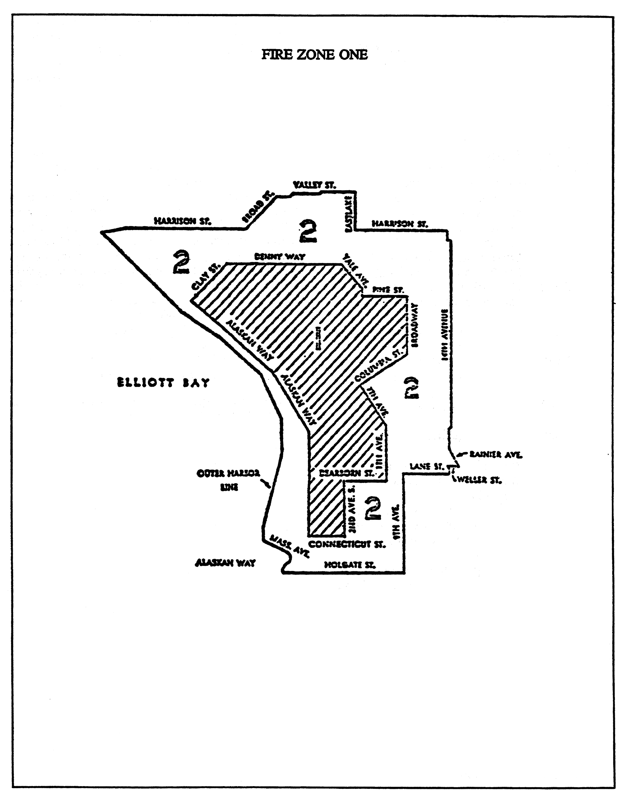
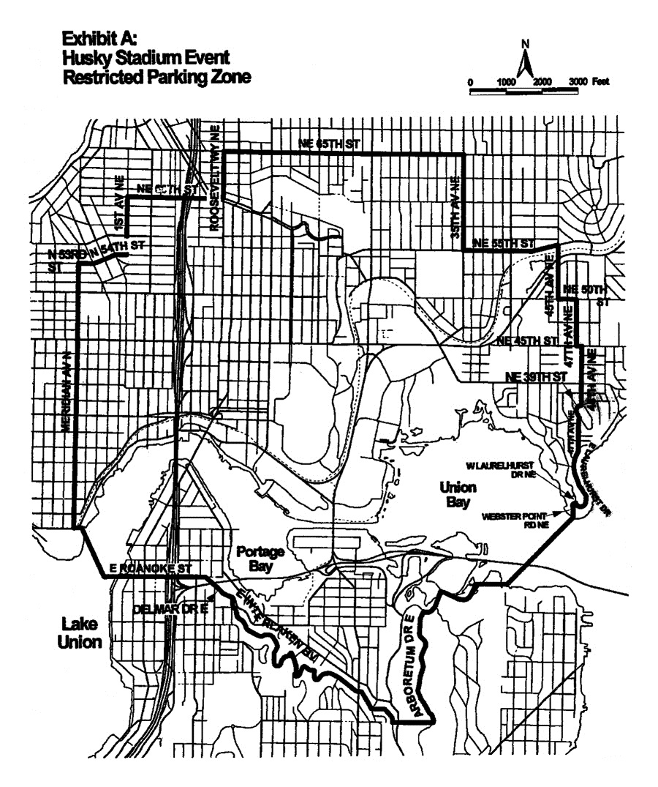
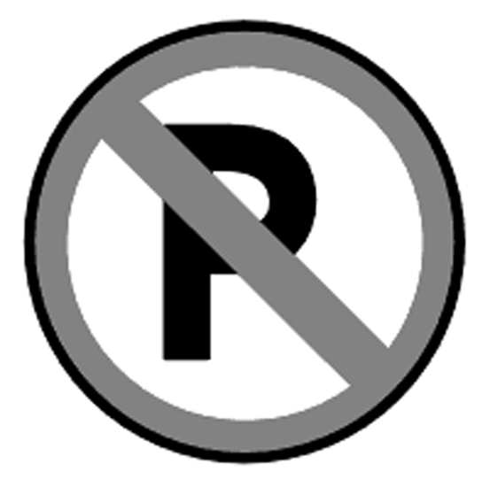

# Title 11 - VEHICLES AND TRAFFIC

This title is intended for those provisions of the Code which relate to the regulation or the operation of vehicles on the streets of the City.

<table>
<tr>
<td>Chapters:</td>
</tr>
<tr>
<td>Subtitle I Traffic Code</td>
</tr>
<tr>
<td>Part 1 General Provisions and Administration</td>
</tr>
<tr>
<td>11.10</td>
<td>General Provisions</td>
<td>11-5</td>
</tr>
<tr>
<td>11.12</td>
<td>Application of Code</td>
<td>11-6</td>
</tr>
<tr>
<td>11.14</td>
<td>Definitions</td>
<td>11-8</td>
</tr>
<tr>
<td>11.16</td>
<td>Traffic Administration</td>
<td>11-27</td>
</tr>
<tr>
<td>11.18</td>
<td>Arterial Streets Designated</td>
<td>11-38</td>
</tr>
<tr>
<td>Part 2 Licenses, Permits and Collision Reports</td>
</tr>
<tr>
<td>11.20</td>
<td>Driver Licenses</td>
<td>11-38</td>
</tr>
<tr>
<td>11.22</td>
<td>Vehicle Licensing</td>
<td>11-42</td>
</tr>
<tr>
<td>11.23</td>
<td>Special Permits and Permit Procedures—Drivers and Vehicles</td>
<td>11-44</td>
</tr>
<tr>
<td>11.24</td>
<td>Property Access Permits and Regulations</td>
<td>11-52</td>
</tr>
<tr>
<td>11.25</td>
<td>Parade Permits</td>
<td>11-52</td>
</tr>
<tr>
<td>11.26</td>
<td>Service Parking Permits</td>
<td>11-60</td>
</tr>
<tr>
<td>11.27</td>
<td>Collision Reports</td>
<td>11-63</td>
</tr>
<tr>
<td>11.28</td>
<td>Abuse of Privileges</td>
<td>11-64</td>
</tr>
<tr>
<td>Part 3 Enforcement</td>
</tr>
<tr>
<td>11.30</td>
<td>Impounding</td>
<td>11-65</td>
</tr>
<tr>
<td>11.31</td>
<td>Disposition of Traffic Offenses</td>
<td>11-72</td>
</tr>
<tr>
<td>11.32</td>
<td>Citations</td>
<td>11-80</td>
</tr>
<tr>
<td>11.34</td>
<td>Penalties</td>
<td>11-81</td>
</tr>
<tr>
<td>11.35</td>
<td>Immobilization</td>
<td>11-82</td>
</tr>
<tr>
<td>Part 4 Pedestrian, Hitchhiking, Bicycle, EPAMD and Motorized Foot Scooter Rules</td>
</tr>
<tr>
<td>11.40</td>
<td>Pedestrian Rules</td>
<td>11-84</td>
</tr>
<tr>
<td>11.42</td>
<td>Hitchhiking Rules</td>
<td>11-87</td>
</tr>
<tr>
<td>11.44</td>
<td>Bicycle Rules</td>
<td>11-88</td>
</tr>
<tr>
<td>11.46</td>
<td>Rules for EPAMDs and Motorized Foot Scooters</td>
<td>11-90</td>
</tr>
<tr>
<td>Part 5 Driving Rules</td>
</tr>
<tr>
<td>11.50</td>
<td>Obedience to Traffic-Control Devices</td>
<td>11-91</td>
</tr>
<tr>
<td>11.52</td>
<td>Speed Regulations</td>
<td>11-97</td>
</tr>
<tr>
<td>11.53</td>
<td>Vehicle Position on Roadway—Overtaking and Passing</td>
<td>11-99</td>
</tr>
<tr>
<td>11.54</td>
<td>Limited Access Facilities</td>
<td>11-103</td>
</tr>
<tr>
<td>11.55</td>
<td>Starting, Stopping and Turning</td>
<td>11-104</td>
</tr>
<tr>
<td>11.56</td>
<td>Serious Traffic Offenses</td>
<td>11-108</td>
</tr>
<tr>
<td>11.57</td>
<td>Motorcycle Regulations</td>
<td>11-119</td>
</tr>
<tr>
<td>11.58</td>
<td>Miscellaneous Driving Rules</td>
<td>11-121</td>
</tr>
<tr>
<td>11.59</td>
<td>Obedience to Peace Officers and Authorized Personnel</td>
<td>11-128</td>
</tr>
<tr>
<td>Part 6 Special Driving and Operating Regulations</td>
</tr>
<tr>
<td>11.60</td>
<td>Size, Weight and Load Regulations</td>
<td>11-130</td>
</tr>
<tr>
<td>11.61</td>
<td>Heavy Haul Industrial Network</td>
<td>11-141</td>
</tr>
<tr>
<td>11.62</td>
<td>Regulating the Kinds and Classes of Traffic on Certain Streets</td>
<td>11-142.3</td>
</tr>
<tr>
<td>11.64</td>
<td>Towing Regulations and Equipment</td>
<td>11-142.4</td>
</tr>
<tr>
<td>11.65</td>
<td>Streetcar Rules</td>
<td>11-144</td>
</tr>
<tr>
<td>11.66</td>
<td>Railroad Operation</td>
<td>11-144</td>
</tr>
<tr>
<td>11.68</td>
<td>Fire Regulations</td>
<td>11-147</td>
</tr>
<tr>
<td>11.69</td>
<td>Traffic Congestion Areas</td>
<td>11-148</td>
</tr>
<tr>
<td>Part 7 Stopping, Standing, Parking and Loading</td>
</tr>
<tr>
<td>11.70</td>
<td>Method of Parking</td>
<td>11-149</td>
</tr>
<tr>
<td>11.72</td>
<td>Stopping, Standing or Parking Restrictions</td>
<td>11-150</td>
</tr>
<tr>
<td>11.73</td>
<td>Restricted Parking Areas</td>
<td>11-159</td>
</tr>
<tr>
<td>11.74</td>
<td>Loading and Load Regulations</td>
<td>11-162</td>
</tr>
<tr>
<td>11.76</td>
<td>Parking Payment Device Operations</td>
<td>11-164</td>
</tr>
<tr>
<td>Part 8 Equipment Regulations</td>
</tr>
<tr>
<td>11.80</td>
<td>Truck, Trailer and Stage Equipment Regulations</td>
<td>11-166</td>
</tr>
<tr>
<td>11.82</td>
<td>Vehicle Lighting Equipment</td>
<td>11-170</td>
</tr>
<tr>
<td>11.84</td>
<td>Brakes and Miscellaneous Equipment</td>
<td>11-176</td>
</tr>
<tr>
<td>11.86</td>
<td>Vehicle Markings</td>
<td>11-187</td>
</tr>
<tr>
<td></td>
<td></td>
<td></td>
</tr>
<tr>
<td>Subtitle II Miscellaneous Provisions</td>
</tr>
<tr>
<td>11.90</td>
<td>Traffic Violations Bureau</td>
<td>11-189</td>
</tr>
<tr>
<td>11.92</td>
<td>Abandoned Vehicles</td>
<td>11-189</td>
</tr>
<tr>
<td>11.94</td>
<td>Railroad Barriers Required</td>
<td>11-190</td>
</tr>
</table>

## Subtitle I - Traffic Code
### Part 1 - GENERAL PROVISIONS AND ADMINISTRATION
#### Chapter 11.10 - GENERAL PROVISIONS

Sections:

##### 11.10.020 - Citation.

The ordinance codified in this subtitle constitutes the "Traffic Code" of the City and may be cited as such. Wherever a reference is made herein to "this Code" it shall be construed to mean "this subtitle."

##### 11.10.040 - Purpose and policy.

This subtitle is enacted as an exercise of the police power of the City to protect and preserve the public peace, health, safety and welfare, and its provisions shall be liberally construed for the accomplishment of these purposes. It is expressly the purpose of this subtitle to provide for and promote the health, safety and welfare of the general public, and not to create or otherwise establish or designate any particular class or group of persons who will or should be especially protected or benefited by the terms of this subtitle. It is the specific intent of this subtitle to place the obligation of complying with its requirements upon the owner or operator of the vehicles or upon the pedestrian within its scope, and no provision of nor term used in this subtitle is intended to impose any duty whatsoever upon the City or any of its officers or employees, for whom the implementation or enforcement of this subtitle shall be discretionary and not mandatory. Nothing contained in this subtitle is intended to be nor shall be construed to create or form the basis for any liability on the part of the City, or its officers, employees or agents, for any injury or damage resulting from the failure of the owner or operator of a vehicle or a pedestrian to comply with the provisions of this subtitle, or by reason or in consequence of any act or omission in connection with the implementation or enforcement of this subtitle on the part of the City by its officers, employees or agents.

##### 11.10.080 - Number, gender and tense.

Whenever consistent with the context of this subtitle, words in the present, past or future tenses shall be construed to be interchangeable with each other, words in the singular number shall be construed to include the plural, words in the plural shall be construed to include the singular, and words in any gender shall apply to the feminine, masculine and neuter genders.

##### 11.10.100 - Effect of headings and references.

Chapter headings, tables of contents, parenthetical references to the Revised Code of Washington (RCW) and former ordinance sections, and section headings as used in this subtitle do not constitute any part of the law. (RCW 46.98.030)

##### 11.10.120 - Existing permits to remain in force.

Except as otherwise provided in this subtitle, all permits lawfully issued under the provisions of any ordinance repealed by the ordinance codified in this subtitle shall remain in force and effect until expiration according to the terms thereof, unless sooner surrendered or revoked; subject, however, to all other provisions of this subtitle.

##### 11.10.130 - Prosecution under expired or repealed ordinance.

No offense committed and no penalty or forfeiture incurred previous to the time when any ordinance expires or is repealed, whether such repeal be express or implied, shall be affected by such expiration or repeal, unless a contrary intention is expressly declared in the expiring or repealing ordinance, and no prosecution for any offense or for the recovery of any penalty or forfeiture pending at the time any ordinance expires or is repealed, whether such repeal be express or implied, shall be affected by such expiration or repeal, but the same shall proceed in all respects as if such ordinance had not expired or been repealed, unless a contrary intention is expressly declared in the expiring or repealing ordinance. Whenever any ordinance defining an offense or making conduct unlawful is amended or repealed, whether such amendment or repeal be express or implied, any offense committed, conduct engaged in or penalty or forfeiture incurred while the ordinance was in force shall be punished or enforced as if the ordinance were in force, notwithstanding such amendment or repeal, unless a contrary intention is expressly declared in the amendatory or repealing ordinance, and every such amendatory or repealing ordinance shall be so construed as to save all proceedings under the amended or repealed ordinance pending at the time of the amendatory or repealing ordinance, unless a contrary intention is expressly declared therein.

##### 11.10.140 - Vehicle owner to act in person—Agents.

Every act or statement required to be made by the owner or operator of any vehicle shall be made or done by the owner or operator in person, unless such owner is a company or corporation or incapable of acting in person, and if the same is made or done by the agent, the necessity thereof shall be stated and shown.

##### 11.10.160 - False representation prohibited.

No person shall knowingly make a false statement or representation in any application, statement or report required by this subtitle to be made.

##### 11.10.180 - Existing regulations to remain in force.

Except as otherwise provided in this subtitle, all existing regulations lawfully established and installed in the streets and alleys by official traffic-control devices are hereby continued in full force and effect.

#### Chapter 11.12 - APPLICATION OF CODE

Sections:

##### 11.12.020 - Uniformity of application.

The provisions of this subtitle relating to the operation of vehicles shall be applicable to and uniform upon all persons operating vehicles upon the streets, alleys and ways open to the public of The City of Seattle except as otherwise specifically provided. (RCW 46.08.030)

##### 11.12.060 - Application to government vehicle.

The provisions of this subtitle shall apply to the operator of any vehicle owned by or used in the service of any government, including the United States government or any agency created by the United States, or of any foreign nation, or of this or any state, or of any political subdivision of this or any other state.

##### 11.12.080 - Exemption of authorized emergency vehicles.

Provided, that ambulances shall not exceed the posted speed limit by more than five (5) miles per hour and shall not proceed through stop signs or red traffic signal lights without first making a full stop and permitting traffic to clear the intersection; and provided further, that Fire Department vehicles, including aid cars and other vehicles, shall not be subject to the above restrictions on the operation of ambulances.

1. The driver of an authorized emergency vehicle, when responding to an emergency call or when in the pursuit of an actual or suspected violator of the law or when responding to but not upon returning from a fire alarm, may exercise the privileges set forth in this section, but subject to the conditions stated in this chapter.
2. The driver of an authorized emergency vehicle may:

    1. Park or stand, irrespective of the provisions of this subtitle;
    2. Proceed past a red or stop signal or stop sign, but only after slowing down as may be necessary for safe operation;
    3. Exceed the maximum speed limits so long as he does not endanger life or property;
    4. Disregard regulations governing direction of movement or turning in specified directions:
3. The exemptions granted in this section to an authorized emergency vehicle shall apply only when such vehicle is making use of visual signals meeting the requirements of RCW 46.37.190, except that:

    1. An authorized emergency vehicle operated as a police vehicle need not be equipped with or display a red light visible from in front of the vehicle;
    2. Authorized emergency vehicles shall use audible signals when necessary to warn others of the emergency nature of the situation but in no case shall they be required to use audible signals while parked or standing.
4. The foregoing provisions shall not relieve the driver of an authorized emergency vehicle from the duty to drive with due regard for the safety of all persons, nor shall such provisions protect the driver from the consequences of his reckless disregard for the safety of others. (RCW 46.61.035)

##### 11.12.100 - Authorized work upon street.

The provisions of this subtitle relating to the operation of vehicles upon the streets or alleys of this City shall not apply to any persons, vehicles or other equipment while actually engaged in authorized work upon the surface of a street or alley insofar as suspension of the provisions of this subtitle are reasonably necessary for the carrying on of such work. Reasonable precautions must be taken to apprise and protect the users of such street or alley, in conformance with the guidelines set forth in the City's Traffic Control Manual for In-street Work which is adopted by reference, and three (3) copies of which are filed with the City Clerk. Such provisions of this subtitle shall apply to such persons, vehicles and other equipment when traveling to and from such works. The contract or permit for such authorized work shall set forth the extent of such suspension, and over what portions of the street or alley the suspensions shall apply. (RCW 46.61.030)

##### 11.12.120 - Traffic Control Manual for In-street Work.

No person shall work on a street or alley area without providing flaggers, signs, barricades, and/or other traffic-control devices as established by the guidelines set forth in the City's Traffic Control Manual for In-street Work, which is adopted by reference, and three (3) copies of which are filed with the City Clerk, if such person is required to meet the guidelines of the Traffic Control Manual for In-street Work by a permit, contract, regulation or ordinance. (See Street Use Ordinance 90047.)

##### 11.12.130 - Flagger required.

No person other than a flagger or a peace officer shall direct or control traffic on or near a street or alley in which work is underway.

##### 11.12.140 - Persons riding animals or driving animal-drawn vehicles.

Every person riding an animal or driving any animal-drawn vehicle upon a roadway shall be granted all of the rights and shall be subject to all of the duties applicable to the driver of a vehicle by this subtitle except those provisions of this subtitle which by their very nature can have no application. (RCW 46.61.025)

##### 11.12.160 - Persons propelling pushcarts.

Every person propelling any pushcart upon a roadway shall be granted all of the rights and shall be subject to all of the duties applicable to the driver of a vehicle by this subtitle except those provisions of this subtitle which by their very nature can have no application.

#### Chapter 11.14 - DEFINITIONS

Sections:

##### 11.14.005 - Definitions generally.

Words and phrases, wherever used in this subtitle shall have the meaning ascribed to them in this chapter except where otherwise defined, and unless where used the context thereof shall clearly indicate to the contrary. (RCW 46.04.010)

##### 11.14.015 - Abandoned vehicle.

"Abandoned vehicle" means any vehicle left upon the private property of another without the consent of the owner of such property for a period of twenty-four (24) hours or longer, except that a vehicle shall not be considered abandoned if its owner or operator is unable to remove it from the place where it is located and so notifies law enforcement officials and requests assistance. (RCW 46.52.102)

##### 11.14.020 - Adult school crossing supervisor.

"Adult school crossing supervisor" means an adult who is either hired by the Chief of Police or appointed or hired by the executive head of a university, college, public or private school within the City, for the purpose of guiding and assisting school children crossing streets or alleys. An adult school crossing supervisor shall wear a uniform or other appropriate insignia, as approved by the Chief of Police. The adult school crossing guard shall have the authority to stop and control pedestrian and vehicular traffic while engaged in the performance of duty or while wearing or displaying appropriate insignia.

##### 11.14.023 - Alcohol concentration.

"Alcohol concentration" means (i) grams of alcohol per two hundred ten (210) liters of a person's breath or (ii) grams of alcohol per one hundred (100) milliliters of a person's blood. (RCW 46.04.015).

##### 11.14.025 - Alley.

"Alley" means a highway not designed for general travel and primarily used as a means of access to the rear of residences and business establishments. (RCW 46.04.020)

##### 11.14.030 - Alley entrance.

"Alley entrance" means that portion of the street which provides access to an alley through a curb cut or a depression in the constructed curb or, when there is no constructed curb, that area in front of such alley as is well defined or as is designated by authorized signs or markings. "Alley entrance" shall include an alley exit for one (1) way alleys.

##### 11.14.035 - Arterial street.

"Arterial street" means every street, or portion thereof, designated as such in Chapter 11.18. (RCW 46.04.030)

##### 11.14.040 - Authorized emergency vehicle.

"Authorized emergency vehicle" means any vehicle of any fire department (including fire department medic and aid cars), police department, sheriff's office, Washington State Patrol, and ambulance service, public or private, which need not be classified, registered or authorized by the State Commission on Equipment, or any other vehicle authorized in writing by the State Commission on Equipment. (RCW 46.04.040)

##### 11.14.045 - Automobile hulk.

"Automobile hulk" is synonymous with "wrecked, dismantled, or inoperative vehicle or automobile hulk" and means the remnant or remains of a motor vehicle which is inoperative and cannot be made mechanically operative without the addition of vital parts or mechanisms and the application of a substantial amount of labor to effect repairs. (RCW 46.52.102)

##### 11.14.050 - Axle.

"Axle" means a structure or structures in the same or approximately the same transverse plane with a vehicle supported by wheels and on which or with which such wheels revolve. (RCW 46.04.060)

##### 11.14.055 - Bicycle and Electric-assisted bicycle

1. "Bicycle" means every device propelled solely by human power upon which a person or persons may ride, having two tandem wheels either of which is 16 inches or more in diameter, or three wheels, any one of which is more than 20 inches in diameter.
2. "Electric-assisted bicycle" means a bicycle with two or three wheels, a saddle, fully operative pedals for human propulsion, and an electric motor. The electric-assisted bicycle's electric motor must have a power output of no more than 1000 watts, be incapable of propelling the device at a speed of more than 20 miles per hour on level ground, and be incapable of further increasing the speed of the device when human power alone is used to propel the device beyond 20 miles per hour.

##### 11.14.060 - Bicycle lane.

"Bicycle lane" means a portion of the roadway which has been designated by traffic-control devices for preferential or exclusive use by bicycles.

##### 11.14.065 - Boundary line.

"Boundary line" means the line between the private property edge and the highway.

##### 11.14.070 - Bus zone.

"Bus zone" means a portion of the roadway along the curb which is reserved for loading and unloading of either transit coaches of the Metro Transit System, or school buses when authorized and designated by:

1. A sign with the words "bus," "bus zone" or "bus stop" and a parking control message; or
2. By red-yellow-red (alternating red and yellow stripes) curb markings supplemented with the words "bus zone" placed on the curb; or
3. A sign with the word "bus" and red-yellow-red (alternating red and yellow stripes) placed on the curb.

##### 11.14.075 - Camper.

"Camper" means a structure designed to be mounted upon a motor vehicle and which provides facilities for human habitation or for temporary outdoor or recreational lodging and which is five (5) feet or more in overall length and five (5) feet or more in height from its floor to its ceiling when fully extended, but does not include motor homes as defined in Section 11.14.350. (RCW 46.04.085)

##### 11.14.080 - Cancel.

"Cancel," in all its forms, means the invalidation indefinitely and until successful reapplication, but shall be for a period of not less than one (1) year. (RCW 46.04.090)

##### 11.14.085 - Carpool.

"Carpool," unless provided otherwise by traffic-control device or by this subtitle, means a motor vehicle occupied by two (2) or more persons, except that the Traffic Engineer may define a carpool to require occupancy by three (3) or more persons in areas or at times where or when he or she deems that number more appropriate.

##### 11.14.087 - Car sharing.

"Car sharing" is a system in which a fleet of cars (or other vehicles) is made available for use by members of the car share group in a wide variety of ways. Car sharing provides an alternative to car ownership under which a) persons or entities that become members are permitted to use vehicles from a fleet on an hourly basis; b) vehicles are available to members in parking spaces at dispersed locations or facilities; and c) no separate written agreement is required each time a member reserves and uses a vehicle.

##### 11.14.088 - Car sharing vehicle.

"Car sharing vehicle" is a motor vehicle from a car sharing fleet.

##### 11.14.089 - Car sharing vehicle zone.

"Car sharing vehicle zone" means a portion of a street or alley designated by a sign or other traffic control devices that is reserved for the exclusive use of car sharing vehicles.

##### 11.14.090 - Centerline.

"Centerline" means the line, marked or unmarked, parallel to and equidistant from the sides of a two-way traffic roadway of a street except as follows:

1. Where otherwise indicated by yellow lines or markers; or
2. On two-way traffic streets where parking is continuously prohibited by signs on one (1) side, the centerline is a line equidistant from the curb where parking is prohibited and the line which is eight feet (8') inside the curb where parking is permitted. (RCW 46.04.100)

##### 11.14.095 - Center of intersection.

"Center of intersection" means the point of intersection of the centerlines of the roadways of intersecting streets. (RCW 46.04.110)

##### 11.14.100 - Citation.

"Citation" means a form specified and adopted by competent authority for the purpose of charging a person with a violation of this subtitle.

##### 11.14.105 - Combination of vehicles.

"Combination of vehicles" means every combination of motor vehicle and motor vehicle, motor vehicle and trailer or motor vehicle and semitrailer. (RCW 46.04.130)

##### 11.14.110 - Combustible liquid.

"Combustible liquid" means any liquid defined as combustible by the current Seattle Fire Code.

##### 11.14.113 - Commercial vehicle load zone.

"Commercial vehicle load zone" means a portion of a street designated by a sign and yellow paint markings or other traffic-control devices that is reserved for the exclusive use of commercial vehicles or vehicles possessing a valid commercial loading permit.

##### 11.14.115 - Commercial vehicle.

For purposes of this Code, the term "commercial vehicle" means (1) a "motor truck" or "truck" except a passenger car or (2) a station wagon or van that has been permanently modified to carry no more than three (3) seated passengers. Such vehicles shall be properly licensed as a truck and shall have the name of the business to which the vehicle is registered permanently displayed on both the left and right sides in letters no less than two inches (2") in height.

##### 11.14.120 - Commuter ride sharing.

"Commuter ride sharing" means a carpool or a vanpool arrangement whereby a fixed group, passengers and driver not exceeding fifteen (15) persons is transported between their places of abode or termini near such places, and their places of employment or educational or other institution, in a single, daily round-trip where the driver is also on the way to or from his or her place of employment, educational or other institution whether or not the driver receives compensation.

##### 11.14.125 - Commuter ride-sharing vehicles.

"Commuter ride-sharing vehicles" means a passenger motor vehicle with a seating capacity, including the driver, not exceeding fifteen (15) persons while being used for commuter ride sharing. A commuter ride-sharing vehicle shall not be deemed a for-hire cab or a taxicab.

##### 11.14.130 - Constructed curb.

"Constructed curb" means a physical curb constructed from cement concrete, asphalt concrete, timber, or other construction material.

##### 11.14.135 - Crosswalk.

"Crosswalk" means the portion of the roadway between the intersection area and the prolongation or connection of the farthest sidewalk line, or, in the event there are no constructed sidewalks, then between the intersection area and a line ten feet (10') therefrom, except as modified by a marked crosswalk. (RCW 46.04.160)

##### 11.14.140 - Curb markings.

"Curb markings" means the official markings installed on curbs. The following are curb markings indicating parking or standing regulations and shall have the meanings as set forth in this section:

1. Red means a tow-away zone;
2. Red-yellow-red (alternating red and yellow stripes) means a bus zone;
3. Yellow means:

    1. A truck loading zone, or
    2. A load and unload zone, or
    3. A taxicab stand, or
    4. A no-parking zone adjacent to driveways or alleys;
4. White means a passenger load zone.

##### 11.14.145 - Curb or curbline.

"Curb" or "curbline" means the edge of a roadway whether marked by curbing construction or not.

##### 11.14.146 - Curb Bulb

"Curb bulb" means an extension of the curb and sidewalk into the street at a pedestrian crossing point.

##### 11.14.150 - Curb ramp.

"Curb ramp" means that portion of the sidewalk area which provides a direct connection between the roadway level and the constructed sidewalk level, for the purpose of allowing persons and persons operating wheeled devices to have convenient access between the roadway and sidewalk.

##### 11.14.155 - Curb ramp return.

"Curb ramp return" means that portion of the curb which provides a transition between the roadway level and the constructed curb level.

##### 11.14.157 - Curb space

"Curb space" means that portion of the roadway area next to the curb.

##### 11.14.160 - Disabled person.

"Disabled person" means a person in a wheelchair and includes a person propelling a wheelchair, or a person who is physically handicapped such that use of a curb ramp, where available, is desirable.

##### 11.14.165 - Downtown traffic-control zone.

"Downtown traffic-control zone" means the area within the district bounded as follows: Beginning at the southwest corner of First Avenue and Lenora Street, thence southerly along the west margin of First Avenue to the north margin of Yesler Way, thence easterly along the north margin of Yesler Way to the west margin of Fifth Avenue, thence northerly along the west margin of Fifth Avenue to the north margin of Madison Street, thence easterly along the north margin of Madison Street to the westerly margin of Eighth Avenue, thence northerly along the westerly margin of Eighth Avenue to the southerly margin of Lenora Street, thence westerly along the southerly margin of Lenora Street to the westerly margin of First Avenue, to the place of beginning.

##### 11.14.170 - Driver.

See "operator or driver."

##### 11.14.175 - Driveway.

"Driveway" means that portion of street or alley area which provides access to an off-street vehicular facility through a depression in the constructed curb or over a constructed curb or, when there is no constructed curb, that area in front of such vehicular facility as is well defined or as is designated by authorized signs or markings. The area defined as a driveway may also be defined as a sidewalk.

##### 11.14.180 - Driveway return or alley entrance return.

"Driveway return" or "alley entrance return" means that portion of a constructed driveway or alley entrance which curves or flares to meet a constructed curb.

##### 11.14.183 - Drug.

"Drug" means and includes, but is not limited to, those drugs and substances regulated by RCW Chapters 69.41 and 69.50 and any chemical inhaled or ingested for its intoxicating or hallucinatory effects. (RCW 46.61.540)

##### 11.14.184 - Emergency zone.

"Emergency zone" means the adjacent lanes of the roadway two hundred feet (200') before and after a stationary authorized emergency vehicle that is making use of audible and/or visual signals meeting the requirements of Section 11.82.520, a tow truck that is making use of visual red lights meeting the requirements of Section 11.82.530, other vehicles providing roadside assistance that are making use of warning lights with three hundred sixty degree (360 degrees ) visibility, or a police vehicle properly and lawfully displaying a flashing, blinking, or alternating emergency light or lights. (RCW 46.61.212)

##### 11.14.186 - EPAMD (Electric personal assistive mobility device)

"EPAMD" means:

1. an electric personal assistive mobility device, which is a self-balancing device with two wheels not in tandem, designed to transport only one person by an electric propulsion system with an average power of 750 watts (1 horsepower) having a maximum speed on a paved level surface, when powered solely by such a propulsion system while ridden by an operator weighing one hundred seventy pounds, of less than 20 miles per hour; or
2. a self-balancing device with one wheel designed to transport only one person by an electric propulsion system with an average power of 2000 watts (2 horsepower) having a maximum speed on a paved level surface, when powered solely by such a propulsion system, of less than 20 miles per hour.

##### 11.14.190 - Explosives.

"Explosives" means anything defined as explosive by the Seattle Fire Code.

##### 11.14.195 - Farm tractor.

"Farm tractor" means every motor vehicle designed and used primarily as a farm implement for drawing plows, mowing machines, and other implements of husbandry. (RCW 46.04.180)

##### 11.14.200 - Farm vehicle.

"Farm vehicle" means any vehicle other than a farm tractor or farm implement which is designed and/or used primarily in agricultural pursuits on farms for the purpose of transporting machinery, equipment, implements, farm products, supplies and/or farm labor thereon and is only incidentally operated on or moved along public highways for the purpose of going from one farm to another or, for purposes of determining the requirement for a commercial driver's license under RCW 46.25.050, is used to transport agricultural products, farm machinery, farm supplies or any combination of these materials to or from a farm. (RCW 46.04.181)

##### 11.14.203 - Festival Street

"Festival street" means a public place or portion of a public place that has been designated by the Director of Transportation for recurring temporary closure to vehicular traffic use for the purpose of pedestrian-oriented special activities, as established by the Director of Transportation.

##### 11.14.205 - Fire area.

"Fire area" means an area about the scene of every fire during its course which shall consist of all streets and alleys within a radius of five hundred (500) feet or more from the fire, and in every case shall include the two (2) nearest street intersections.

##### 11.14.210 - Fire lane.

"Fire lane" means an area on public or private property reserved for providing Fire Department access to structures, firefighting fixtures, or equipment.

##### 11.14.215 - Fire line.

"Fire line" means a line established at the direction of the Fire Chief or other fire officer in charge during any emergency requiring the services of the Fire Department.

##### 11.14.220 - Flagger.

"Flagger" means any person wearing a predominantly red or fluorescent orange jacket or vest and a yellow or orange safety helmet, equipped with a standard STOP-SLOW paddle, or red flag and authorized or assigned to direct and control traffic. All flaggers shall have in their possession a card certifying that they have completed the Flagger's Course as conducted by The State of Washington, Department of Labor and Industries.

##### 11.14.225 - Flammable liquid.

"Flammable liquid" means any liquid defined as flammable by the Seattle Fire Code.

##### 11.14.227 - Food vehicle

"Food vehicle" means a licensed and operable motor vehicle used to serve, vend, or provide food or nonalcoholic beverages for human consumption from a fixed location or along a route in a public place as authorized by Public Health—Seattle & King County and Chapter 15.17.

##### 11.14.228 - Food-vehicle zone

"Food-vehicle zone" means a portion of a public place designated by a sign or other traffic control device that is reserved for the exclusive use of food vehicles that are permitted to vend in the curb-space portion of the public place.

##### 11.14.230 - Foreign career consul.

A "foreign career consul" means a career foreign service diplomat who is a citizen of the country he represents and who has been appointed by his government to be one of its official foreign policy spokesmen in this country.

##### 11.14.235 - For-hire car.

"For-hire car" means for-hire vehicles as defined by the Seattle License Code.

##### 11.14.237 - Free-floating car sharing

1. "Free-floating car sharing" means a system in which a fleet of vehicles is made available for use by members of a free-floating car sharing organization whereby: a) persons or entities that become members are permitted to use free-floating car sharing vehicles from the fleet on a limited, fee-per-use basis; b) free-floating car sharing vehicles may be parked in any on-street parking space within the free-floating zone pursuant to meeting the standards and restrictions set forth in Title 11 including Section 11.23.160; and c) a separate written agreement is not required each time a member reserves or uses a vehicle from the fleet.
2. "Free-floating zone" or "FFZ" means a geographic area with a delineated boundary in which a free-floating car sharing vehicle may be parked.
3. "Free-floating car sharing permit" means a permit issued by SDOT to vehicles in a free-floating car sharing fleet that allows each free-floating car sharing vehicle to utilize the parking privileges authorized through the free-floating car sharing program as described in Section 11.23.160.

##### 11.14.240 - Hazardous materials.

"Hazardous materials" means any material defined as hazardous by the Seattle Fire Code.

##### 11.14.245 - Highway.

"Highway" means the entire width between the boundary lines of every way publicly maintained when any part thereof is open to the use of the public for purposes of vehicular travel. (RCW 46.04.431)

##### 11.14.250 - Hours of darkness.

"Hours of darkness" means the hours from one-half (½) hour after sunset to one-half (½) hour before sunrise, and any other time when persons or objects may not be clearly discernible at a distance of five hundred (500) feet. (RCW 46.04.200)

##### 11.14.255 - Hulk hauler.

"Hulk hauler" means any person who deals in vehicles for the sole purpose of transporting and/or selling them to a licensed motor vehicle wrecker or scrap processor in substantially the same form in which they are obtained and who may not sell secondhand motor vehicle parts to anyone other than a scrap processor. (RCW 46.79.010(5))

##### 11.14.257 - Ignition interlock device.

"Ignition interlock device" means breath alcohol analyzing ignition equipment or other biological or technical device certified in conformance with Laws of 2010, chapter 268, section 2 and rules adopted by the Washington State Patrol and designed to prevent a motor vehicle from being operated by a person who has consumed an alcoholic beverage. (RCW 46.04.215)

##### 11.14.260 - Impoundment.

See Section 11.30.010.

##### 11.14.265 - Intersection.

1. "Intersection" means the area enclosed within the projection of the lateral curbs, or if no curbs, then the projection of the lateral roadway boundaries of two (2) or more streets which join one another at an angle, whether or not such streets cross each other.
2. Where a highway includes two (2) roadways thirty (30) feet or more apart, then every crossing of each roadway of such divided street by an intersecting street shall be regarded as a separate intersection. In the event such intersecting street also includes two (2) roadways thirty (30) feet or more apart then every crossing of two (2) roadways of such streets shall be regarded as a separate intersection.
3. The junction of an alley with a street shall not constitute an intersection. (RCW 46.04.220)

##### 11.14.266 - Intersection control area.

"Intersection control area" means an intersection, together with such modifications of the adjacent roadway area as result from the arc of curb corners, and together with any marked or unmarked crosswalks adjacent to the intersection. (Statutory reference: RCW 46.04.240.)

##### 11.14.268 - Junk motor vehicle.

1. "Junk motor vehicle" means any motor vehicle meeting at least three of the following requirements:

    1. Left on private property without the permission of the person having right to the possession of the property;
    2. Left on a street, alley way open to the public, or on municipal or other public property for twenty-four (24) hours or longer;
    3. Extensively damaged, such damage including but not limited to any of the following: A broken window or windshield, missing wheels, tires, motor, or transmission;
    4. Apparently inoperable;
    5. Having a fair market value of Five Hundred Dollars ($500) or less;
    6. Without a current certificate of registration or a current and proper vehicle license.
2. Vehicles in Violation of this Section. Junk motor vehicles are subject to impoundment as provided for in Chapter 11.30 SMC in addition to any other penalty provided for by law.

##### 11.14.270 - Laned street.

"Laned street" means a street the roadway of which is divided into clearly marked lanes for traffic. (RCW 46.04.260)

##### 11.14.275 - Lane line.

"Lane line" means a solid or broken paint line or other marker line separating lanes of traffic moving in the same direction.

##### 11.14.277 - Legal parking holidays.

Except where otherwise indicated by signposting in the area or for individual parking spaces, the following are parking holidays: Sunday; the first day of January, New Year's Day; the third Monday of January, the anniversary of the birth of Martin Luther King, Jr.; the third Monday of February, Presidents' Day; the last Monday of May, Memorial Day; the fourth day of July, the anniversary of the Declaration of Independence; the first Monday in September, Labor Day; the eleventh day of November, Veterans Day; the fourth Thursday of November, Thanksgiving Day; and the twenty-fifth day of December, Christmas Day.

Whenever any parking holiday, other than Sunday, falls on a Sunday, the following Monday shall be a parking holiday.

##### 11.14.280 - Limited access facility.

"Limited access facility" means every highway, street or roadway in respect to which owners or occupants of abutting lands and other persons have no legal right of access to or from the same except at such points only in and in such manner as may be determined by the public authority having jurisdiction over such highway, street or roadway. (UVC 1-110) (MUTCD Part 8A-2, 14)

##### 11.14.285 - Line.

"Line," when referring to pavement markings, means a marking on a roadway which may be solid or broken and which is indicated by paint, buttons, or reflectorized markers on the pavement placed in continuous contact or separated by spaces.

##### 11.14.290 - Litter receptacle.

"Litter receptacle" means the state-approved litter bag or other bag, sack, or other container made of any material which is large enough to serve as a receptacle for litter inside a vehicle and similar in size and capacity to the state-approved litter bag. (RCW 70.93.020(4))

##### 11.14.295 - Load and unload zone.

"Load and unload zone" means a designated portion of the street or alley reserved for the use of vehicles for the purpose of expeditious pickup and loading or unloading and delivery of persons or property.

##### 11.14.300 - Local access traffic.

"Local access traffic" means motor vehicles having an origin or destination along a nonarterial street within an area bounded by arterial streets, except where boundaries are otherwise set by officially erected traffic-control signs or topographical barriers.

##### 11.14.305 - Main traveled portion of the road.

"Main traveled portion of the road" means the portion of the road designed for the through movement of vehicles, exclusive of auxiliary lanes. An auxiliary lane is the portion of the road adjoining the main traveled portion of the road which is used or can be used for the parking of vehicles.

##### 11.14.310 - Marked bicycle crossing.

"Marked bicycle crossing" means any portion of a roadway distinctly indicated for bicycle crossing by lines, marking, or other traffic-control devices.

##### 11.14.315 - Marked crosswalk.

"Marked crosswalk" means any portion of a roadway distinctly indicated for pedestrian crossing by lines or other markings on the surface thereof. (RCW 46.04.290)

##### 11.14.320 - Median barrier.

"Median barrier" means a physical barrier, a guard rail, or a solid yellow or cross-hatched pavement marking at least eighteen (18) inches in width, which divides any street into two (2) or more roadways. (RCW 46.61.150)

##### 11.14.325 - Metal tire.

"Metal tire" means every tire, the bearing surface of which in contact with the street is wholly or partly of metal or other hard, nonresilient material. (RCW 46.04.300)

##### 11.14.330 - Mobile home.

"Mobile home" means a structure, transportable in one or more sections, which is thirty-two (32) body feet or more in length and is eight (8) body feet or more in width, and which is built on a permanent chassis, and designed to be used as a dwelling with or without a permanent foundation when connected to the required utilities, and includes the plumbing, heating, air-conditioning, and electrical systems contained therein, except as hereinafter specifically excluded, and excluding modular homes.

##### 11.14.332 - Moped.

"Moped" means a motorized device designed to travel with not more than three (3) wheels in contact with the ground and having an electric or a liquid fuel motor with a cylinder displacement not exceeding fifty (50) cubic centimeters which produces no more than two (2) gross brake horsepower (developed by a prime mover, as measured by a brake applied to the driving shaft) that is capable of propelling the device at not more than thirty (30) miles per hour on level ground. (RCW 46.04.304)

##### 11.14.333 - Motorized foot scooter.

"Motorized foot scooter" means a device with no more than two (2) ten-inch (10") or smaller diameter wheels that has handlebars, is designed to be stood or sat upon by the operator, and is powered by an internal combustion engine or electric motor that is capable of propelling the device with or without human propulsion at a speed of no more than twenty (20) miles per hour on level ground. A motor-driven cycle, a moped, an electric-assisted bicycle, or a motorcycle is not a motorized foot scooter. A "gas motorized foot scooter" is a motorized foot scooter powered in whole or in part by an internal combustion engine. An "electric motorized foot scooter" is a motorized foot scooter powered solely by an electric motor. (RCW 46.04.336)

##### 11.14.335 - Modular home.

"Modular home" means any factory-built housing designed primarily for residential occupancy by human beings which does not contain a permanent frame and must be mounted on a permanent foundation. (RCW 46.04.303)

##### 11.14.340 - Motorcycle.

"Motorcycle" means every motor vehicle which is designed to travel on not more than three (3) wheels in contact with the ground, on which the driver:

1. Rides on a seat or saddle and the motor vehicle is designed to be steered with a handle bar; or
2. Rides on a seat in a partially or completely enclosed seating area that is equipped with safety belts and the motor vehicle is designed to be steered with a steering wheel.
"Motorcycle" excludes a farm tractor, a power wheelchair, an electric personal assistive mobility device, a motorized foot scooter, an electric-assisted bicycle and a moped. (RCW 46.04.330)

##### 11.14.345 - Motor-driven cycle.

"Motor-driven cycle" means every motorcycle, including every motor scooter, with a motor which produces not to exceed five (5) brake horsepower (developed by a prime mover, as measured by a brake applied to the driving shaft), and every bicycle with motor attached. (RCW 46.04.332)

##### 11.14.350 - Motor homes.

"Motor homes" means motor vehicles originally designed, reconstructed, or permanently altered to provide facilities for human habitation. (RCW 46.04.305)

##### 11.14.355 - Motor truck or truck.

"Motor truck" or "truck" means any motor vehicle designed or used for the transportation of commodities, merchandise, produce, freight or animals. (RCW 46.04.310)

##### 11.14.360 - Motor vehicle.

"Motor vehicle" means every vehicle which is self-propelled and every vehicle which is propelled by electric power obtained from overhead trolley wires, but not operated upon rails. (RCW 46.04.320)

##### 11.14.365 - Motor vehicle wrecker.

"Motor vehicle wrecker" means every person, firm, partnership, association or corporation engaged in the business of buying, selling or dealing in vehicles of a type required to be licensed under the laws of this state, for the purpose of wrecking, dismantling, disassembling or substantially changing the form of any motor vehicle, or who buys or sells integral secondhand parts of component material thereof in whole or in part, and deals in secondhand motor vehicle parts. (RCW 46.80.010)

##### 11.14.370 - Muffler.

"Muffler" means a device consisting of a series of chambers, or other mechanical designs for the purpose of receiving exhaust gas from an internal combustion engine and effective in reducing noise resulting therefrom. (RCW 46.04.40)

##### 11.14.375 - Multiple lane street.

"Multiple lane street" means any street the roadway of which is of sufficient width to accommodate reasonably two (2) or more separate lanes of vehicular traffic in the same direction, each lane of which shall be not less than eight (8) feet in width, and whether or not such lanes are marked. (RCW 46.04.350)

##### 11.14.380 - Nonresident.

"Nonresident" means any person whose residence is outside the state of Washington and who is temporarily sojourning within the state. (RCW 46.04.360)

##### 11.14.385 - No-passing zone.

"No-passing zone" means the portion of the length of a roadway indicated by a sign and/or:

1. A double centerline consisting of a broken yellow line and a solid yellow line when a vehicle is being driven adjacent to the solid line; or
2. A double centerline consisting of two (2) solid yellow lines.

##### 11.14.390 - Official foreign career consul vehicle.

"Official foreign career consul vehicle" means a vehicle that bears consular corps license plates with foreign exempt tabs, which are issued by the Department of Licensing.

##### 11.14.395 - Official time standard.

"Official time standard" means standard time or daylight saving time, whichever is in current use as authorized by law.

##### 11.14.400 - Operator or driver.

"Operator" or "driver" means every person who drives or is in actual physical control of a vehicle. (RCW 46.04.370)

##### 11.14.403 - Other biological or technical device.

"Other biological or technical device" means any device meeting the standards of the National Highway Traffic Safety Administration or the Washington State Patrol, designed to prevent the operation of a motor vehicle by a person who is impaired by alcohol or drugs. (RCW 46.04.215)

##### 11.14.405 - Owner.

"Owner" means a person who has a lawful right of possession of a vehicle by reason of obtaining it by purchase, exchange, gift, lease, inheritance or legal action whether or not the vehicle is subject to a security interest and means registered owner where the reference to owner may be construed as either to registered or legal owner. (RCW 46.04.380)

##### 11.14.410 - Parade.

A parade is (1) an organized movement or procession of 50 or more persons, or (2) an organized procession of motorized vehicles, bicycles, floats, animals, or large objects that require more than one person to move and control, with or without persons accompanying on foot, that requires the closure of streets or the regulation of vehicular traffic by police to prevent a conflict with the regular flow of vehicular traffic, but does not include use of the streets in a single location pursuant to a street use permit issued pursuant to the Street Use Ordinance.

##### 11.14.415 - Park or parking.

"Park" or "parking" means the standing of a vehicle, whether occupied or not, otherwise than temporarily for the purpose of and while actually engaged in loading or unloading property or passengers. (RCW 46.04.381)

##### 11.14.420 - Park at an angle or angle park.

"Park at an angle" or "angle park" means the parking of a vehicle at an angle between five degrees (5°) and ninety degrees (90°) to the curb. "Back-in" angle parking means the parking of a vehicle with the front of the vehicle toward the main traveled portion of the road and "front-in" angle parking means the parking of a vehicle with the rear of the vehicle toward the main traveled portion of the road.

##### 11.14.425 - Parking payment device.

"Parking payment device" means any device used to aid in management and control of the parking of vehicles on City streets or other rights of way, including parking meters and pay stations.

1. "Parking meter" means any mechanical or electronic device placed or erected adjacent to a parking space, which requires payment for use of the space and indicates when the lawful parking period will expire.
2. "Parking pay station" means any mechanical or electronic device, except a parking meter, placed or erected on city streets and other parking areas under the jurisdiction of Seattle Transportation for the purpose of managing and controlling the use of parking spaces and requiring payment for such use. The term includes both "pay and display" types of pay stations, which dispense a proof of payment receipt to be displayed on the vehicle except when payment is made by mobile device, and "pay by space" types of pay stations, which electronically measure the lawful parking period and its expiration for specific parking spaces, without issuing a receipt for display on the vehicle.

##### 11.14.430 - Passenger load zone.

"Passenger load zone" means a place reserved on the street for the exclusive use of vehicles while receiving or discharging passengers.

##### 11.14.435 - Path.

"Path" means any constructed trail which has been designed for the use of pedestrians, equestrians or bicyclists.

##### 11.14.440 - Peace officer.

"Peace officer" means any officer, including police officers, authorized by law to execute criminal process or to make arrests for the violation of the regulations generally or of any particular regulation relative to the highways of the state or to the streets or alleys of the City. (RCW 46.04.391)

##### 11.14.445 - Pedestrian.

"Pedestrian" means any person afoot or using a wheelchair, a power wheelchair or a means of conveyance propelled by human power other than a bicycle. (RCW 46.04.400)

##### 11.14.447 - Pedestrian Plaza

"Pedestrian plaza" means a public place or portion of a public place that has been designated by ordinance entirely for use by pedestrians, which may vary in size and shape; may abut a street or sidewalk; may be separated from roadways used for vehicular travel by curbs, bollards, or other barriers; may be surfaced with special materials and markings; and may contain landscaping, bicycle parking, bicycle storage facilities, public art, benches, tables, chairs, or other facilities for pedestrian use. Pedestrian plazas are a form of pedestrian mall authorized by RCW 35.71.

##### 11.14.450 - Pedestrian zone

"Pedestrian zone" means the area or space of the public place or roadway that is reserved for the exclusive use of pedestrians.

##### 11.14.455 - Pedicab.

"Pedicab" means a non-motor-driven wheeled device designed for carrying passengers, which is for hire, the motive power of which is furnished by a person or persons peddling such device.

##### 11.14.460 - Person.

"Person" means every natural person, firm, copartnership, corporation, association, or organization, whether acting by self or by agent. (RCW 46.04.405)

##### 11.14.465 - Physical barrier.

"Physical barrier" means a continuous raised barrier, raised median island or curb installed in a roadway.

##### 11.14.470 - Planted area.

"Planted area" means that portion of street or alley that is planted or landscaped and maintained in a well-defined manner.

##### 11.14.475 - Planting strip.

"Planting strip" means that portion of street lying between the constructed curb and the property line exclusive of the sidewalk area: Provided, that if there is no constructed curb, then "planting strip" means that portion of the street lying between a constructed sidewalk and the property line: Provided further, that if there is no constructed curb or constructed sidewalk, there is no "planting strip."

##### 11.14.480 - Pneumatic tires.

"Pneumatic tires" means every tire of rubber or other resilient material designed to be inflated with compressed air or other gas to support the load thereon. (RCW 46.04.410)

##### 11.14.485 - Private carrier bus.

"Private carrier bus" means every motor vehicle designed for the purpose of carrying passengers (having a seating capacity for eleven (11) or more persons) used regularly to transport persons in furtherance of any organized agricultural, religious or charitable purpose. Such term does not include buses operated by common carriers under a franchise granted by the City or the Washington Public Utilities Commission. (RCW 46.04.416)

##### 11.14.490 - Proof of financial responsibility for the future.

"Proof of financial responsibility for the future" means proof of ability to respond in damages for liability, on account of accidents occurring subsequent to the effective date of said proof, arising out of the ownership, maintenance or use of a vehicle of a type subject to registration under the laws of this state, in the amount of Twenty-five Thousand Dollars ($25,000.00) because of bodily injury to or death of one (1) person in any one (1) accident, and, subject to said limit for one (1) person, in the amount of Fifty Thousand Dollars ($50,000.00) because of bodily injury to or death of two (2) or more persons in any one (1) accident, and in the amount of Ten Thousand Dollars ($10,000.00) because of injury to or destruction of property of others in any one (1) accident. Whenever used in this title the terms "proof of financial responsibility" or "proof" shall be synonymous with the term "proof of financial responsibility for the future." (RCW 46.29.260).

##### 11.14.495 - Public scale.

"Public scale" means every scale under public or private ownership which is certified as to its accuracy and which is available for public weighing of motor vehicles. (RCW 46.04.435)

##### 11.14.500 - Pushcart.

"Pushcart" means every nonmotorized device capable of being pushed or drawn by human power upon a street or alley and in, upon, or by which any property is or may be transported upon a street or alley. (RCW 46.04.670)

##### 11.14.505 - Railroad.

"Railroad" means a carrier of persons or property upon vehicles operated upon stationary rails, the route of which is principally outside incorporated cities and towns. (RCW 46.04.440)

##### 11.14.510 - Railroad sign or signal.

"Railroad sign or signal" means any sign, signal or device erected by authority of a public body or official or by a railroad and intended to give notice of the presence of railroad tracks or the approach of a railroad train. (RCW 46.04.450)

##### 11.14.515 - Restricted Parking Zone Definitions

For the purposes of Sections 11.16.315 through 11.16.319 only, the terms in this section have the following meanings:

1. "Business" means any person or entity that possesses a valid City of Seattle business license and that conducts commercial work at the business address listed on the business license, including but not limited to, retail sales and service, warehouse, non-household sales and service, or entertainment.
2. "Employee" means any individual who performs work, labor, or services and is on the payroll of a business or institution. This includes all full-time, part-time and temporary employees including partners of the business or institution located in or adjacent to an RPZ.
3. "Guest" means a person temporarily visiting residents or temporarily having business with residents who are eligible for RPZ permits.
4. "Guest Permit" means a card, decal or other identification issued to an eligible person to be placed in the vehicle that enables it to park in a restricted parking zone, for an annual, biennial or single-day timeframe.
5. "Household Unit" means any self-contained house, apartment, condominium, town house, floating home, detached or attached accessory dwelling unit, or group home that contains living, sleeping and cooking quarters and is used by of any number of related persons or up to eight unrelated individuals. Each unit of a multiple-unit residential dwelling is considered a separate household unit.
6. "Institution" means any organization of a public character, including but not limited to, a school, hospital, religious facility, health care, social or community service agency, library, university, or museum.
7. "Resident" means any person residing in a household unit that is located adjacent to or in a prescribed vicinity of a restricted parking zone.
8. "Restricted parking zone" or "RPZ" means a portion of the street commonly used for vehicular parking where vehicles properly displaying a permit or other authorization pursuant to Chapter 11.16 SMC are exempt from the posted RPZ parking restrictions. Vehicles displaying a card or decal issued pursuant to RCW 46.16.381 are exempt.
9. "RPZ Permit" means a card, decal or other identification issued to an eligible person to be placed on the vehicle that enables it to park in a restricted parking zone.
10. "Volunteer" means any individual who performs volunteer work for a business or institution at least three times a week.

##### 11.14.520 - Revoke.

"Revoke," in all its forms, means the invalidation for a period of one (1) calendar year and thereafter until reissue. (RCW 46.04.480)

##### 11.14.525 - Right-of-way.

"Right-of-way" means the right of one (1) vehicle, bicycle, pedestrian or device to proceed in a lawful manner in preference to another vehicle, bicycle, pedestrian or device approaching under such circumstances of direction, speed, and proximity as to give rise to the possibility of collision unless one (1) grants precedence to the other.

##### 11.14.530 - Roadway.

"Roadway" means that portion of a highway improved, designed, or ordinarily used for vehicular travel, exclusive of the sidewalk or shoulder even though such sidewalk or shoulder is used by persons riding bicycles. In the event a highway includes two (2) or more separated roadways, the term "roadway" shall refer to any such roadway separately but shall not refer to all such roadways collectively. (RCW 46.04.500)

##### 11.14.532 - Roadway construction zone.

"Roadway construction zone" means an area where construction, repair, or maintenance work is being conducted by public employees or private contractors on or adjacent to any public roadway. (RCW 46.61.527(1))

##### 11.14.535 - School bus.

"School bus" means every motor vehicle used regularly to transport children to and from school or in connection with school activities, which is subject to the requirements set forth in the most recent edition of "Specifications for School Buses" published by the State Superintendent of Public Instruction, but does not include buses operated by common carriers in urban transportation of school children.

##### 11.14.540 - School loading zone.

"School loading zone" means an area or space officially set apart within a roadway for the exclusive act of loading or unloading passengers adjacent to a school and within which vehicles with drivers may stand for reasonable periods of time while waiting for the passengers.

##### 11.14.545 - School patrol.

"School patrol" means a student appointed from the student body of any public or private school or institution of learning by the superintendent of schools for the Seattle School District or officer or board performing like functions with respect to private schools or institutions of learning, who wears a uniform and other appropriate insignia, and who may display "stop" or other proper traffic directional signs or signals at school crossings or other points where school children are crossing or are about to cross a street or alley. (RCW 46.61.385)

##### 11.14.550 - Semitrailer.

"Semitrailer" means every vehicle without motive power designed to be drawn by a motor vehicle or truck tractor or so constructed that an appreciable part of its weight and that of its load rests upon and is carried by such motor vehicle or truck tractor. (RCW 46.04.530)

##### 11.14.555 - Service parking.

"Service parking" means the use of parking space while rendering service in cleaning, painting, adjusting, or making minor repairs or replacements in or to buildings or building equipment or to public utilities in the vicinity of the service parking space.

##### 11.14.560 - Service parking meter hood.

"Service parking meter hood" means a device issued pursuant to this subtitle (Chapter 11.26) for use in conjunction with a service parking permit to cover a parking meter while the parking space is being utilized for service parking.

##### 11.14.565 - Shoulder.

"Shoulder" means the area between the roadway edge and the sidewalk on the portion of a street where there are no constructed curbs, but shall not include a planted area.

##### 11.14.567 - Shuttle Bus.

"Shuttle Bus" means every motor vehicle designed for the purpose of carrying passengers (having a seating capacity for eleven [11] or more persons) used regularly to transport persons of any organized, charitable, commercial, institutional, or residential organization over a fixed or predetermined route. This definition does not include "Charter" or "Sightseeing" buses as defined in this chapter.

##### 11.14.568 - Shuttle Bus Zone.

"Shuttle Bus Zone" means a portion of a street designated by a sign and white paint markings or other traffic control devices that is reserved for the exclusive use of shuttle bus vehicles possessing a valid shuttle bus loading permit.

##### 11.14.570 - Sidewalk.

"Sidewalk" means that area between the curblines or the lateral edge lines of a roadway and the adjacent property, intended for the use of pedestrians or such portion of private property parallel and in proximity to a street or alley and dedicated to use by pedestrians. For the purposes of this subtitle, there is always deemed to be a sidewalk not less than three (3) feet in width, whether actually constructed or not, on each side of each street except where there is less than three (3) feet between the edge of the roadway and a physical obstruction which prohibits reasonable use by pedestrians. The sidewalk is located where constructed, or if not constructed, adjacent to the property line or as close thereto as can reasonably be used by pedestrians; provided, that no sidewalk shall be deemed to exist on private property unless it is actually constructed.

##### 11.14.575 - Sightseeing bus or charter bus.

1. "Sightseeing bus" means every motor vehicle having a seating capacity of nine (9) or more passengers used for sightseeing purposes over a fixed or defined route of travel and charging a sum certain for each trip.
2. "Charter bus" means every motor vehicle, not continuously operated over a fixed route, that has a seating capacity of nine (9) passengers or more, as per manufacturer's rating, and is for hire by a person or persons, by charter, for their exclusive use, the consideration for which and the points of origin and destination are determined at the time of chartering.

##### 11.14.577 - Sign.

"Sign" means any outdoor sign, device, placard, poster, or pavement marking which is officially posted, installed or marked on any City street or alley.

##### 11.14.578 - Signal preemption device.

"Signal preemption device" means a device that is capable of altering the normal operation of a traffic control signal. Any such device manufactured by a vehicle manufacturer is not a signal preemption device for purposes of this section if the primary purpose of the device is any purpose other than the preemption of traffic signals and the device's ability to alter traffic signals is unintended and incidental to the device's primary purpose. (RCW 46.04.62250)

##### 11.14.580 - Solid tire.

"Solid tire" means every tire of rubber or other resilient material which does not depend upon inflation with compressed air for the support of the load thereon. (RCW 46.04.550)

##### 11.14.585 - Special mobile equipment.

"Special mobile equipment" means every vehicle not designed or used primarily for the transportation of persons or property and only incidentally operated or moved over a street or alley, including but not limited to: ditchdigging apparatus, well-boring apparatus and road construction and maintenance machinery such as asphalt spreaders, bituminous mixers, bucket loaders, tractors other than truck tractors, ditchers, leveling graders, finishing machines, motor graders, road rollers, scarifiers, earth-moving carryalls and scrapers, power shovels and drag lines, and self-propelled cranes and earth-moving equipment. The term does not include house trailers, dump trucks, truck-mounted transit mixers, cranes or shovels or other vehicles designed for the transportation of persons or property to which machinery has been attached. (RCW 46.04.552)

##### 11.14.590 - Stage.

"Stage" means any motor vehicle used for the purpose of carrying passengers, together with incidental baggage and freight or either, on a regular schedule of time and rates; provided, that no motor vehicle shall be considered to be a stage where substantially the entire route traveled by such vehicle is within the corporate limits of the City. (RCW 46.04.050)

##### 11.14.595 - Stand or standing.

"Stand or standing" means the halting of a vehicle, whether occupied or not, otherwise than temporarily for the purpose of, and while actually engaged in, receiving or discharging passengers. (RCW 46.04.555)

##### 11.14.597 - State Commission on Equipment.

References to the "State Commission on Equipment" or the "Commission on Equipment" shall mean the Washington State Patrol.

##### 11.14.600 - Stinger steered.

"Stinger steered" means a tractor and semitrailer combination which has the coupling connecting the semitrailer to the tractor located to the rear of the centerline of the rear axle of the tractor. (RCW 46.44.030)

##### 11.14.605 - Stop.

"Stop" when required, means cessation of movement. (RCW 46.04.565)

##### 11.14.610 - Stop or stopping.

"Stop" or "stopping" when prohibited, means any halting even momentarily of a vehicle, whether occupied or not, except when necessary to avoid conflict with other traffic or when in compliance with the direction of a peace officer or traffic-control sign or signal. (RCW 46.04.566)

##### 11.14.615 - Street or City street.

"Street" or "City street" means every highway, or part thereof located within the corporate limits of Seattle, except alleys. (RCW 46.04.120)

##### 11.14.617 - Streetcar.

"Streetcar" means a single car vehicle, other than a train, which is owned and operated by The City of Seattle or the Municipality of Metropolitan Seattle for the purpose of transporting persons or property on a fixed route within the City upon stationary rails at or below street grades.

##### 11.14.620 - Suspend.

"Suspend," in all its forms, means invalidation for any period less than one (1) calendar year and thereafter until reinstatement. (RCW 46.04.580)

##### 11.14.625 - Switching.

"Switching" means the starting and stopping, coupling and uncoupling and/or moving back and forth of engines, trains, or parts of trains on, or across any street or alley. (Tacoma 9.14.040)

##### 11.14.630 - Taxicab.

"Taxicab" means and includes every motor vehicle having a seating capacity of nine (9) passengers or less, as per manufacturer's rating, used for the transportation of passengers for hire, and not operated exclusively over a fixed and defined route.

##### 11.14.635 - Taxicab stand.

"Taxicab stand" means that portion of a street or alley set aside and properly marked as a place where taxicabs may lawfully park or angle-park while awaiting employment.

##### 11.14.637 - THC concentration.

"THC concentration" means nanograms of delta-9 tetrahydrocannabinol per milliliter of a person's whole blood. THC concentration does not include measurement of the metabolite THC-COOH, also known as carboxy-THC. (RCW 46.04.)

##### 11.14.640 - Tow-away zone.

"Tow-away zone" means a portion of a street or alley that is signed or marked as a "tow-away zone."

##### 11.14.645 - Traffic.

"Traffic" includes pedestrians, bicycles, ridden or herded animals, vehicles, and other conveyances, either singly or together while using any street, alley, or public path, for purposes of travel. (RCW 46.04.590)

##### 11.14.650 - Traffic-control devices.

"Traffic-control devices" means all signs, signals, markings, curb markings, cross-hatchings, buttons and other devices officially placed or erected for the purpose of regulating, warning or guiding traffic. (RCW 46.04.611)

##### 11.14.655 - Traffic-control signal.

"Traffic-control signal" means any traffic device, whether manually, electrically or mechanically operated, by which traffic alternately is directed to stop or proceed, or otherwise controlled. (RCW 46.04.600)

##### 11.14.660 - Trailer.

"Trailer" means any vehicle without motive power designed to be drawn by or used in conjunction with a motor vehicle constructed so that no appreciable part of its weight rests upon or is carried by such motor vehicle. (RCW 46.04.620)

##### 11.14.665 - Train.

"Train" means a vehicle, other than a streetcar, propelled by steam, electricity, or other motive power with or without cars coupled thereto, operated upon stationary rails.

##### 11.14.670 - Transit coach.

"Transit coach" includes every vehicle designed for carrying more than ten (10) persons and used for the transportation of persons by King County's Metro Transit, Snohomish County's Community Transit, Pierce County's Pierce Transit and the Regional Transit Authority.

##### 11.14.675 - Truck.

See "Motor truck or truck."

##### 11.14.680 - Truck load zone.

"Truck load zone" means a designated portion of the street or alley reserved for the exclusive use of truck-licensed commercial vehicles during the unloading and delivery or pickup and loading of property.

##### 11.14.685 - Truck tractor.

"Truck tractor" means every motor vehicle designed and used primarily for drawing other vehicles and not so constructed as to carry a load other than a part of the weight of the vehicle and load so drawn. (RCW 46.04.650)

##### 11.14.690 - Two (2) way left-turn lane.

"Two (2) way left-turn lane" means a lane near the center of the roadway set aside for use by vehicles making left turns in both directions from or into the roadway. (RCW 46.61.290(3)(a))

##### 11.14.695 - Uncontrolled intersection.

"Uncontrolled intersection," means an intersection where the right-of-way is not controlled by a stop sign, yield sign, or traffic signal.

##### 11.14.700 - Unicycle.

"Unicycle" means and includes a single-wheeled device which has a saddle or seat or seats, and is propelled by human power, via pedals.

##### 11.14.703 - Passenger car.

"Passenger car" means every motor vehicle except motorcycles and motor-driven cycles, designed for carrying ten (10) passengers or less.

##### 11.14.705 - U turn.

"U turn" means turning a vehicle within the roadway to permit travel in the opposite direction on the same street. (RCW 46.61.295)

##### 11.14.710 - Vehicle.

"Vehicle" means every device capable of being moved upon a street or alley and in, upon, or by which any person or property is or may be transported or drawn upon a street or alley, including bicycles. The term does not include power wheelchairs or devices other than bicycles moved by human or animal power or used exclusively upon stationary rails or tracks. A bicycle shall not be considered a vehicle for purposes of Chapter 11.22. An electric personal assistive mobility device shall not be considered a vehicle for the purposes of Chapter 11.22 or Part 8 of this Title. A golf cart shall not be considered a vehicle except for purposes of Parts 5 and 7 of this Title. (RCW 46.04.670)

##### 11.14.715 - Way open to the public.

"Way open to the public" means any road, alley, lane, parking area, path, or any place, private or otherwise, adapted to and fitted for travel, that is in common use by the public with the consent, expressed or implied, of the owner or owners, and further shall mean public playgrounds, schoolgrounds, recreation grounds, parks, parkways, park drives, park paths and wharves, station grounds, and rights-of-way open to the use of the public.

#### Chapter 11.16 - TRAFFIC ADMINISTRATION

Sections:

##### 11.16.020 - Police Department authority.

It is the function of the Police Department to enforce this subtitle and all of the State Motor Vehicle Laws applicable to traffic and trains in this City, to make arrests and/or issue citations for traffic offenses, to cooperate with the Director of Transportation and other officers of the City in the administration of the traffic laws and in developing ways and means to improve traffic conditions, and to carry out those functions specially imposed upon the Police Department by this subtitle and other traffic ordinances of this City.

##### 11.16.040 - Police authorization.

Officers of the Police Department and such officers as are assigned by the Chief of Police are authorized to direct all traffic by voice, hand or signal in conformance with the provisions of this subtitle: Provided, that in the event of a fire or other emergency or to expedite traffic or to safeguard pedestrians, officers of the Police Department may direct traffic as conditions may require, notwithstanding the provisions of this subtitle.

##### 11.16.060 - Fire Department authorization.

Officers of the Fire Department, when at the scene of a fire, may direct or assist the police in directing traffic thereat or in the immediate vicinity as conditions may require notwithstanding the provisions of this subtitle.

##### 11.16.080 - Collision investigation.

It shall be the function of the Police Department, assisted by other agencies, to investigate traffic collisions, to arrest and/or issue citations, and to assist in the prosecution of those persons charged with violations of law causing or contributing to such collisions.

##### 11.16.100 - Peace officers present at collision to report.

Any peace officer of the City present at the scene of any collision or in possession of any facts concerning any collision, whether by way of official investigation or otherwise, shall make report thereof in the same manner as required of the parties to such collision and as fully as the facts in his possession concerning such collision will permit.

##### 11.16.120 - Director of Transportation—Authority.

The Director of Transportation is authorized:

1. To increase the maximum speed allowed upon arterial streets;
2. To declare a minimum speed limit which shall be effective when appropriate signs giving notice thereof are erected when it is determined that slow speeds on any part of an arterial street unreasonably impede the normal movement of traffic;
3. To establish parking rates to be charged at parking payment devices, including parking meters, for parking in city-controlled parking areas under the jurisdiction of the Seattle Department of Transportation and other city rights-of-way, consistent with Section 11.16.121, and to make recommendations to the City Council for fees for permits issued pursuant to this subtitle;
4. To determine the maximum load limits on all streets, alleys, bridges or elevated structures in the City;
5. To adopt a Traffic Control Manual for In-street Work;
6. To establish, revise or dissolve restricted parking zones. A decision to establish, to refuse to establish, to expand, to reduce or to dissolve a restricted parking zone is subject to reconsideration pursuant to Section 11.16.317.D. The Director may consider other parking demand management tools in lieu of or prior to implementation of an RPZ.
7. To promulgate rules and regulations for the RPZ program.

##### 11.16.121 - Director of Transportation—Rate setting for parking payment devices.

1. Parking rates to be charged at parking payment devices, including parking meters, for parking in city rights-of-way and other city-controlled parking areas under the jurisdiction of Seattle Department of Transportation shall be within rate limits established by this section. Rates may vary according to location, time of day, maximum parking time allowed, the capabilities of available parking payment devices, and any other factors the Director determines are pertinent. In setting rates, the Director is not subject to Chapter 3.02 of the Seattle Municipal Code.
2. The Director of Transportation is authorized to set parking rates up to $4.00 per hour ("Maximum Hourly Rate") . When parking rates are in effect, parking rates shall be set no lower than $0.75 per hour ("Minimum Hourly Rate").
3. The Director shall establish on-street parking rates and shall adjust parking rates higher (up to the Maximum Hourly Rate) or lower (as low as the Minimum Hourly Rate) in neighborhood parking areas based on measured occupancy so that approximately one or two open spaces are available on each block face throughout the day in order to:

    1. Support neighborhood business districts by making on-street parking available and by encouraging economic development;
    2. Maintain adequate turnover of on-street parking spaces and reduce incidents of meter feeding in commercial districts;
    3. Encourage an adequate amount of on-street parking availability for a variety of parking users, efficient use of off-street parking facilities, and enhanced use of transit and other transportation alternatives; and,
    4. Reduce congestion in travel lanes caused by drivers seeking on-street parking.

##### 11.16.122 - Authority to close certain areas under bridges, viaducts, and overpasses.

1. The Director of Transportation is authorized, in accordance with the Administrative Code (Chapter 3.02), to close off from entry or use by the public any public place under the structure of a bridge, viaduct or overpass, other than a roadway as defined in Section 11.14.530 or a paved pedestrian walkway, whenever and for as long as the Director deems closure of the area to be necessary in order to preserve the public peace, accommodate construction or maintenance work, prevent injury to the public, or respond to any identified danger to the public health or safety.
2. Upon ordering its closure, the Director shall cause the area to be enclosed with fencing, or posted with "no admittance" or "no trespassing" signs, or both enclosed and posted.

##### 11.16.125 - Director of Transportation—Authority—Street and alley closures.

The Director of Transportation is authorized:

1. To close, or authorize closure, of any street or alley or portion thereof to any or all traffic pursuant to the provisions of this subtitle;
2. To close or authorize closure of any alley for entry or travel by the general public in order to make repairs or maintenance of the street; to accommodate construction on abutting properties or of utilities in the alley or a special use of an abutter under permit; to protect the public from a health or sanitation hazard, a hazard or obstruction in the alley or an unsafe structure on abutting property; or based on a recommendation of the Chief of Police that such a closure is necessary in order to prevent criminal activity occurring in or emanating from the alley. Unless otherwise ordered, the alley shall remain open to access by the following persons: owners and occupants of the abutting properties and their guests; agents of utilities with facilities in the alley or serving the abutting properties; government employees and emergency personnel in the performance of their duties; and permittees under a street use permit issued pursuant to Title 15. Upon ordering the closure, the Director shall cause the area to be posted with signs or barricades stating the hours of closure;
3. To designate any streets for one (1) way traffic and the required direction of such traffic;
4. To close or authorize the closure during hours of darkness of any shoreline street end, as defined at SMC 15.02.046, for entry, travel, or use by the general public, based on a determination that such a closure is necessary to control or prevent unlawful or disorderly behavior occurring in or emanating from the shoreline street end. The street end shall remain open to owners and occupants of abutting property and their guests for access and parking purposes, agents of utilities in the street end, government employees and emergency personnel in the performance of their duties, and permittees under a street use permit issued pursuant to Title 15. Upon ordering the closure, the Director shall cause the street end to be posted with a sign stating that the street end is closed from dusk to dawn, or such other hours as the Director deems appropriate.

##### 11.16.127 - Director of Transportation—Contracts for mobile device parking fee payments and services; convenience fee.

The Director of Transportation is authorized to prepare specifications for and to execute one or more contracts from time to time for the provision of services to allow persons to make valid payments by mobile devices as provided in Chapter 11.76 for parking areas regulated by parking payment devices. The Director of Transportation is authorized to determine and set forth in each contract a convenience fee in a reasonable amount to compensate the contractor for such service, which shall be added to the payment due.

##### 11.16.170 - Traffic Engineer—Appointment.

The Director of Transportation, or a designee, shall appoint a City Traffic Engineer who shall be a registered professional engineer, and who shall be directly responsible to and supervised by the Director of Transportation or the Director's designee.

##### 11.16.180 - Traffic Engineer—Authority—Studies.

It shall be the function of the Traffic Engineer under the supervision of the Director of Transportation to:

1. Conduct studies of traffic and transportation impacts including but not limited to noise pollution, air pollution, and community disruption;
2. Conduct studies of traffic, traffic collisions, congestion and other conditions affecting the safe and convenient use of the street and alleys;
3. Collect facts regarding the effect and operation of regulations controlling street or alley traffic;
4. Study means for the facilitation of traffic along existing routes;
5. Make traffic surveys;
6. Prepare traffic-flow maps;
7. Conduct studies of the utilization of street or alley curb space;
8. Conduct such other similar studies relating to traffic and transportation as may be requested by the Director of Transportation.

##### 11.16.200 - Traffic Engineer — Authority — Records.

It is the function of the Traffic Engineer under the supervision of the Director of Transportation to keep records of:

1. Traffic collisions;
2. Traffic volume;
3. Traffic-control devices;
4. Street curb space utilization.

##### 11.16.220 - Traffic Engineer—Authority—Annual report.

The Traffic Engineer shall prepare an annual traffic and transportation report containing information on traffic conditions with particular refer
ence to number of traffic collisions, number of persons killed and injured, other traffic collision data and traffic trends throughout the City. This report shall be submitted to the Director of Transportation who shall file copies with the Mayor, the City Council, and the Chief of Police.

##### 11.16.240 - Traffic Engineer—Authority—Review and recommend

It shall be the function of the Traffic Engineer under the supervision of the Director of Transportation to:

1. Review and make recommendations on all applications for street vacations, rezones, variances, conditional use permits and plats with respect to the effect on traffic and transportation;
2. Review and make recommendations on all designs, drawings and plans prepared by any department or agency of the City for the construction, major modification or location of any public building, park, or recreational area, or other structure which may affect the movement of traffic;
3. Recommend and review plans for traffic and transportation improvements;
4. Prepare and approve traffic-control layout and detour plans;
5. Review and make recommendations regarding Metropolitan King County Transit routes in the City;
6. Review and make recommendations concerning pedicab and horse carriage routes;
7. Review and make recommendations concerning all applications for all building permits except in single-family (SF) and Lowrise 1 (LR1) zones regarding facilitation of traffic with respect to new or existing driveways;
8. Review and make recommendations concerning all applications for commercial driveways regarding facilitation of traffic with respect to the size, number and location of such commercial driveways.

##### 11.16.280 - Traffic Engineer - Authority - Special zones

Consistent with Section 11.23.420, the Traffic Engineer is authorized under the supervision of the Director of Transportation to:

1. Determine the location of and establish stage zones and bus zones;
2. Determine the location of and establish truck load and commercial load zones where practicable, when upon investigation it appears that there are no alley entrances or other similar means of approach to buildings or property and that congested traffic conditions require such zones for the purpose of loading or unloading, and in each case to fix the hours during which such zones shall be maintained open for the purpose for which the same are intended;
3. Determine the location of and establish passenger load zones and in each case to fix the hours during which such zones shall be maintained open for the purpose for which the same are intended;
4. Determine the location of and establish taxicab, pedicab and other for-hire car stands;
5. Determine the location of and establish car sharing zones;
6. Determine the location of and establish pedestrian zones;
7. Determine the location of and establish food-vehicle zones;
8. Determine the location of and establish other special zones for the purpose and in accordance with the criteria specified in this Section 11.16.280;
9. Make surveys and recommendations with respect to the Stadium Event Restricted Parking Zone, process applications for parking in the zone, issue decals or other authorizations for parking, and delegate to the University of Washington or deputize its staff to receive applications and deliver permits.

##### 11.16.300 - Traffic Engineer—Authority—Parking.

The Traffic Engineer is authorized under the supervision of the Director of Transportation to:

1. Determine upon what streets or alleys or portions thereof vehicles shall be angle parked, as distinguished from parallel parked, and shall indicate the same by marks or signs placed in such streets or alleys, or portions thereof;
2. Determine the location of and establish time-limit regulations for parking;
3. Determine upon what streets or alleys or portions thereof stopping, standing or parking of vehicles shall be prohibited at certain times, or entirely;
4. Establish areas where parking is regulated by parking payment devices, and the time limit for parking therein; order installation or removal of parking payment devices where it is determined upon the basis of an engineering and traffic investigation that the installation or removal of such devices is necessary to aid in the regulation, control, and inspection of the parking of vehicles; and designate the parking space or spaces for which a parking payment device is to be used by signs or appropriate markings upon the pavement and/or the curb. Each parking payment device shall display, with either a legend affixed to the device or an electronic message integral to the payment device, the days and hours when the requirement to make payment shall apply, the hourly cost to park in the designated spaces, and the limited period of time for which parking is lawfully permitted in the parking space or spaces adjacent to which the parking payment device is located;
5. Make surveys and recommendations with respect to restricted parking zones, process applications for parking in restricted parking zones, and implement rules and regulations for the use of restricted parking zones and the issuance, use, and revocation of permits.

##### 11.16.310 - Traffic Engineer—Carpool parking.

1. The Traffic Engineer shall perform or cause to be performed an impact analysis, including where appropriate, origin/destination and turnover studies, of the preferential use of on-street parking spaces by certified carpool vehicles, and pursuant to such analysis, the Traffic Engineer, under the supervision of the Director of Transportation, shall designate and establish on-street parking spaces for such use under a flexible system for such designation and establishment to allow for changing uses of adjacent land and for changing parking demands.
2. The use and effects of such preferential parking shall be monitored and evaluated by the Traffic Engineer and periodic reports shall be provided to the City Council.
3. The Director of Transportation shall implement and collect carpool parking fees established from time to time by ordinance.

##### 11.16.312 - Carpool Parking Permit Fees.

(The Central Business District is that area bounded by Denny Way to the north, South Royal Brougham Way to the south, the waterfront to the west and Interstate 5 to the east.)

1. The Director of Transportation is authorized to issue and charge fees for any permit authorizing carpool parking in the locations listed below as follows:
2. Carpool parking permit revenue shall be deposited into the Transportation Operating Fund to be used for administration and enforcement of the Carpool Parking Program, the City's Commute Trip Reduction Plan, and related activities that promote the use of non-motorized and high-occupancy vehicles and discourage the use of motorized single-occupant vehicles.

##### 11.16.315 - Administration of restricted parking zones

In determining whether to grant additional permits in excess of the four-permit per household limit, the Director of Transportation may also consider the availability of on-street parking in the requestor's residential area and demonstrated need for additional permits.

1. Signage: Restricted parking zones shall be appropriately signed and/or marked.
2. Program components and permit use:

    1. A restricted parking zone may have one or more of the following components:

        1. Parking in the street is reserved for the exclusive use of those vehicles displaying a valid RPZ permit, guest permit, or other identification issued by the Seattle Department of Transportation as part of the RPZ program; or
        2. Parking in the street is reserved during certain posted hours for exclusive use of vehicles displaying a valid RPZ permit, guest permit, or other identification issued by the Seattle Department of Transportation as part of the RPZ program but available at all other times without restriction; or
        3. Time limits are established for parking in the street that apply to all vehicles except vehicles with a valid RPZ permit, guest permit, or other identification issued by the Seattle Department of Transportation as part of the RPZ program.
    2. In any restricted parking zone, the Director of Transportation or the Director's designee may issue permits or other means of identification, maintain lists of vehicles owned or used by permit holders, or adopt any other reasonable means of distinguishing vehicles that are validly parked in a restricted parking zone.

        1. A permit shall not guarantee or reserve to the holder an on-street parking space within the designated RPZ.
        2. If issued to a resident, a permit must be used within six contiguous city blocks of the household unit address or, if issued to a business, institution, or employee, a permit must be used within six contiguous city blocks of the place of business or the institution.
3. Application:

    1. In order to obtain an RPZ permit, any residential applicant shall present proof of residency in or adjacent to the restricted parking zone boundary in addition to submittal of a complete application to the Seattle Department of Transportation. As of January 1, 2010, any residential applicant must also present proof that the address of vehicle registration matches the applicant's household unit address or that the applicant is an out of state non-resident or active military personnel.
    2. In order to obtain an employee RPZ permit, an employer shall present, for each employee requesting a permit, proof of employment within the RPZ boundary in addition to submittal of a complete application to the Seattle Department of Transportation.
4. Permit limit: As of January 1, 2010, each eligible household unit is entitled to have no more than four RPZ permits at any one time, unless the household unit's dwelling unit is a small efficiency dwelling unit, in which case no more than one RPZ permit at any one time is allowed.

    1. Exception: The Director of Transportation may issue more RPZ permits than the permit limit per household for the following land uses:

        1. Adult family home;
        2. Assisted living facility;
        3. Domestic violence shelter; and
        4. Permitted congregate residence, provided the amount does not exceed one per sleeping room.
5. Guest permits. Each eligible resident may obtain no more than one annual or biennial guest permit per household unit. It is illegal to use a guest permit on a resident's vehicle. As of January 1, 2010, eligible residents may obtain no more than 50 single-day use guest permits per year.
6. Motorcycles and scooters. As of January 1, 2010, motorcycles and scooters are authorized to park in an RPZ without an RPZ permit.
7. Free-floating car sharing vehicles. Any free-floating car sharing vehicle that displays a valid free-floating car sharing permit is authorized to park in any Restricted Parking Zone (RPZ) with the same privileges as a vehicle with a valid RPZ permit.
8. Employee permits. Separate from the program authorized by Section 11.16.316, the Director of Transportation shall consider requests from employers within an RPZ for employee permits under certain conditions provided that this can be done while maintaining the following goals of the RPZ program: reduce neighborhood traffic impacts by large parking demand generators; support mixed-use neighborhoods and local business districts; continue to reduce overall energy use and vehicle emissions; keep demand by residents and employees from exceeding available on-street parking spaces in residential areas; and implement a customer-oriented permit program. If resident RPZ permits are subsidized in a particular RPZ, an employee is not eligible for such a subsidy. Among the criteria the Director shall consider in determining whether to grant requests for employee RPZ permits are:

    1. Availability of on-street parking on non-RPZ-signed blocks that is within a reasonable walking distance of the employer;
    2. Availability of alternate modes of transportation within a reasonable distance;
    3. Availability of off-street parking within a reasonable distance;
    4. Availability of on-street parking in the RPZ;
    5. Time of day that employees work;
    6. Number of permits requested by the employer;
    7. Existence of other employers within the RPZ that could potentially also request employee permits; and
    8. Other hardships that may exist.

##### 11.16.316 - Restricted Parking Zone Permits for Use by Businesses

1. The purpose of this section is to authorize the Director of Transportation or his or her designee to administer a specific program for qualified businesses and institutions to apply for and receive restricted parking zone permits to park in a restricted parking zone that have been or may be created in the Initial Segment LINK Light Rail transit station areas, including Rainier Beach, Othello, Columbia City, Mount Baker, Beacon Hill, SODO and Stadium stations. This is in addition to permits issued to qualified residents in these RPZs.
2. The Director of Transportation or his or her designee is authorized to establish rules and regulations for this program, including establishing permit eligibility, application submittal for qualifying businesses and institutions, permit use, and alternate eligibility procedures as needed.
3. In order to be issued a restricted parking permit, the permit holder must be an owner, employee, or volunteer of a business or institution within or adjacent to an RPZ boundary. Property owners for a business or institution within or adjacent to an RPZ boundary can also obtain one permit per owner.
4. Permit holders who violate this section or the RPZ program rules may have their permit revoked and may be excluded from obtaining future permits.
5. The Seattle Department of Transportation shall cease to renew RPZ permits for businesses and institutions in the next RPZ cycle for an RPZ, excluding the SODO and Stadium station RPZs, when any monitoring or surveying of the RPZ indicate that twenty-five (25) percent or more of streets within any particular RPZ have the following conditions: (1) at least seventy-five (75) percent of the capacity of the street available for parking is generally occupied and (2) more than thirty-five (35) percent of the vehicles parked on the street are owned by non-residents of the designated area. In this subsection, the term "non-resident" includes businesses, institutions, and their employees and volunteers located in the area.

##### 11.16.317 - Establishing, expanding and reducing restricted parking zones

1. The Director of Transportation or the Director's designee shall consider whether a restricted parking zone (RPZ) within a designated area, would promote certain benefits or would result in adverse impacts.

    1. Benefits that may lead to establishing an RPZ include, but are not limited to: increased access for area residents, reduced traffic congestion, increased traffic or pedestrian safety, reduced air or noise pollution, reduced commuter parking in neighborhoods, prevention of blighted areas, and promoting the use of alternative modes of transportation.
    2. Adverse impacts that may prevent establishing and RPZ include, but are not limited to: transferring a parking problem to a different area, inability to effectively enforce program restrictions, lack of alternative transportation modes, and availability of simpler, cheaper or more effective solutions.
    3. Regardless of potential benefits or adverse impacts that may result, the Seattle Department of Transportation will not install RPZs in any downtown zone, including all zones contained in Map 1A of Chapter 23.49, in part because of high demand and multiple, competing needs for on-street parking.
2. The Director of Transportation may establish a new or expand an existing restricted parking zone whenever 75 percent or more of the capacity of the streets available for parking on ten contiguous blocks (and/or 20 block faces) in such designated area is generally occupied; over 35 percent of the vehicles parked on the street in the area are not owned by residents of the designated area; a strong and effective community engagement effort indicating that generally stakeholders in the designated area have reviewed and support the restricted parking zone, which could include a petition signed by a majority of the residents in the designated area in support of the restricted parking zone; and the public interest would be served. In cases where the criteria listed above are not met, the Director of Transportation is authorized to establish a restricted parking zone when, in the Director's judgment, the parking problem will be ameliorated by a restricted parking zone and the public interest would be served.
3. The Director of Transportation or the Director's designee is authorized to engage affected and interested community stakeholders to review and assist in refining any future RPZ proposals.

    1. The public information and involvement program may include department presentations to business and community organizations, information distribution through the City's web site, news releases and related media, direct mailings of informational materials, facilitated meetings, sounding boards, walking tours, surveys, and other techniques as appropriate to the scale of the proposal.
    2. Prior to the Director of Transportation's decision to establish, not to establish, to dissolve, to expand, or to reduce an RPZ by more than two contiguous blocks, the Seattle Department of Transportation shall hold a public hearing where it will provide interested persons an opportunity to submit written and spoken comment into the public record.
    3. At least 20 days prior to the public hearing, the Seattle Department of Transportation shall mail a notice of hearing containing the hearing time and location to all owners, commercial lessees and residents of property within 300 feet of the affected restricted parking zone.
    4. At least 20 days prior to the public hearing, the Seattle Department of Transportation shall publish in a local newspaper a notice of the hearing that states the hearing time and location.
4. The Director of Transportation's decision to establish, not to establish, to expand, to reduce, or to dissolve a restricted parking zone is subject to reconsideration within 15 days of publication in a local newspaper. Requests for reconsideration may be initiated, in writing, by residents, business owners, or employees or volunteers in or adjacent to the proposed RPZ. On reconsideration, the Director shall designate a review officer, who shall, after reviewing the reconsideration materials and other relevant information, make a recommendation to the Director. The Director may, at the Director's discretion, stay implementation of a decision pending review. The Director shall have 30 days to issue a Decision. The Director's decision on reconsideration shall be final unless appealed to the Office of the Hearing Examiner under subsection 11.16.317.D.2. Grounds for reconsideration include the validity of any parking study or compliance with the process to establish a zone.

    1. The Director's decision on reconsideration may be appealed to the Hearing Examiner.

        1. Time limit for initiation of an appeal. A notice of appeal shall be filed with the Hearing Examiner within 20 days following issuance of the Director's Decision on Reconsideration.
        2. Form of Appeal. The notice of appeal must contain a brief statement of the issues on appeal, the specific objections to the decision being appealed, along with supporting facts and documentation, and the relief sought. The notice of appeal must list the name of the appellant, and the signature, address, phone number, and fax and e-mail address if available, of the person appealing.
        3. Decision. After reviewing the notice of appeal and supporting documentation and conducting a hearing, the Hearing Examiner shall issue a written decision within 30 days after the conclusion of the hearing. The written decision shall contain the reasons for the decision and the provisions for further appeal and shall be provided to the person appealing and to the Director. This decision is the final decision of the City.
5. The Director may modify hours of an existing RPZ or expand or reduce boundaries of an existing RPZ by two contiguous blocks or less by following an administrative process that seeks to identify possible changes suggested by the community, review proposed changes to the RPZ with affected community stakeholders, and make a determination for what best serves the public interest, without holding the public hearing required by subsection 11.16.317.C.2.
6. A restriction of parking shall first take effect on a street segment when it is signed or posted, and shall cease when the signs or posting are removed pursuant to lawful order; provided that vandalism or destruction of parking control signs shall not affect the validity of a restriction upon parking on any street segment designated by the Director of Transportation if other signs or traffic control devices give notice that parking in the street segment is restricted.
7. The Director may initiate dissolution of an RPZ when the Director determines that dissolution best serves the public interest and meets at least one of the following criteria, including but not limited to, low permit sales in a zone, a small number of blocks with RPZ signs, or the absence of the original traffic generator. The zone would be removed at the beginning of a new permit cycle.

##### 11.16.319 - Fees for restricted parking zone permits; Waiver or reduction of fees.

1. The parking fees to be collected by the Seattle Department of Transportation for restricted parking zone permits are as follows:
2. The Director of Transportation may waive or reduce an RPZ fee in subsection A whenever:

    1. the waiver or reduction is in the overall public interest due to extraordinary facts or circumstances,
    2. the waiver or reduction is consistent with the goals of the RPZ program, or
    3. dire consequences may result if the request is denied.

##### 11.16.320 - Traffic Engineer—Authority—Regulations.

The Traffic Engineer is authorized under the supervision of the Director of Transportation to:

1. Formulate traffic rules and regulations and laws, and make recommendations regarding the same;
2. Supervise the movement of all heavy and wide equipment on the streets and alleys of the City;
3. Designate and have charge of the routing and passenger stops of all stages entering, passing through or operating over the streets or alleys of the City;
4. Determine locations at which all vehicles, a class of vehicles, or vehicles with less than a specified number of occupants, shall either make or not make turns or other movements, or shall not use certain lanes of streets or alleys (RCW 47.52.025, 1974);
5. Develop and publish a Traffic Control Manual for In-street Work which sets forth the guidelines for the methods and devices to be used for safeguarding and controlling traffic at and near work in streets or alleys;
6. Designate alleys and short sections of streets for one (1) way traffic;
7. Determine and designate streets, parts of streets, or specific lanes thereon upon which vehicular traffic, regardless of the centerline of the roadway, shall proceed in one (1) direction during a given period and in the opposite direction during another period of the day and shall place and maintain appropriate markings, signs, or other devices to give notice thereof;
8. Decrease the maximum speed allowed upon any street from those established by this subtitle or other ordinances by the City Council, where, on the basis of an engineering and traffic investigation it is determined by the Director of Transportation that such maximum speed is greater than is reasonable or safe under the conditions found to exist on any street; provided, that in no case shall speed limits be less than twenty (20) miles per hour (RCW 41.61.405).

##### 11.16.340 - Traffic Engineer—Authority—Traffic-control devices.

The Traffic Engineer is authorized under the supervision of the Director of Transportation to:

1. Design and prepare the specifications for the operation of all traffic-control devices including, but not limited to those traffic-control devices specifically mentioned in this subtitle;
2. Determine and designate the points of stop, and shall order the placement of a stop sign on each and every street intersecting the arterial street system unless traffic at any such intersection is controlled at all times by traffic signals, or unless the intersecting street is a one (1) way street designated for travel away from the arterial street; provided, that when the findings of a traffic engineering study show that the condition of an intersection is such that vehicles may safely enter the arterial street without stopping, the Traffic Engineer may order the placement of a "yield" sign;
3. Determine intersections which require control by "stop" or "yield" signs and order placement of same;
4. Determine and order the marking of crosswalks at intersections or at such other places where the Traffic Engineer deems it appropriate for the identification of the crossing location;
5. Determine and order the closure of certain crosswalks to pedestrians;
6. Determine and order the marking of traffic lanes upon the roadway of any street or alley;
7. Determine and order the designation of a two (2) way left-turn lane on a roadway (RCW 46.61.290(3)(a));
8. Determine and order the placement of curbs, buttons, paint lines or other devices to form islands or barriers upon the roadway to channel and control traffic;
9. Order the placement of signs at all arterial street entrances to the City indicating that the speed limit on arterial streets is thirty (30) miles per hour and the placement of signs along all arterial streets upon which the maximum speed limit has been increased above thirty (30) miles per hour (RCW 46.61.415(3));
10. Determine and order the designation of no-passing zones;
11. Determine and order the placement of traffic-control devices indicating the course to be traveled by turning vehicles, which course to be traveled may conform to or be other than as prescribed by this subtitle (RCW 46.61.290(4));
12. Test new or proposed traffic-control devices under actual conditions of traffic (SB 3211, Section 47(23));
13. Order the placement at the ends of designated streets, alleys, bridges or elevated structures, signs setting forth specified maximum load limits allowed on such streets, alleys, bridges or elevated structures or notice of closure as conditions warrant as determined;
14. Determine and order the placement of official traffic-control devices when and as required under this subtitle to make effective the provisions of this subtitle, and order the placement of such additional official traffic-control devices as may be deemed appropriate to regulate, warn, or guide traffic under this subtitle (SB 3211, Section 47(1));
15. Determine the placement of official traffic-control devices as may be deemed appropriate to regulate, warn, or guide traffic for construction, detours, emergencies, and special conditions (SB 3211, Section 47(2)); and
16. Determine the streets where the use of compression brakes shall be prohibited, devise signs prohibiting their use, and place the signs at the appropriate locations. To be eligible for designation, a street shall have a grade five (5) percent or less for a distance of one thousand (1,000) feet.

##### 11.16.360 - Traffic Engineer—Authority General.

It shall be the function of the Traffic Engineer, under the supervision of the Director of Transportation to:

1. Issue permits in accordance with the provisions of this subtitle;
2. Determine and make recommendations concerning arterial street and business district street lighting needs and in connection therewith determine design criteria necessary for traffic safety;
3. Perform such other duties as may be appropriate for facilitating traffic and transportation.

##### 11.16.380 - Official foreign career consul vehicle—Mayor's duties.

The Mayor shall:

1. Certify each foreign career consul vehicle, on the written request of the presiding officer of the City Consular Corps, as being eligible to park in a space located and marked by the Director of Transportation in accordance with Section 11.16.420;
2. Forward to the Director of Transportation a written notice of certification of each foreign career consul vehicle;
3. Order a hearing for any foreign career consul charged with abusing parking privileges provided by Section 11.16.400. If the charges are sustained, the Mayor may revoke the certification.

##### 11.16.400 - Official foreign career consul vehicle—Parking space allocation.

The Director of Transportation shall allocate one (1) free parking space for each official foreign career consul vehicle, as conveniently near as possible to each foreign career consul's work place, the parking space to be located so as not to interfere with existing street traffic patterns, and the Director of Transportation shall so mark each such space so that it is readily apparent that it is unlawful to park any vehicle in the space other than the designated official foreign career consul vehicle.

##### 11.16.420 - Official foreign career consul vehicle—Director of Transportation's functions.

The Director of Transportation further shall:

1. Locate and appropriately mark, within two (2) weeks after receiving the Mayor's certification, the parking space mentioned in Sections 11.16.380 and 11.16.400 for the official foreign career consul vehicle;
2. Inform the Seattle Police Department, in writing, of the parking space location and consular corps' license plate number of the certified vehicle and of any change of such location or license plate number;
3. Maintain each such parking space in accordance with the standards provided for in this subtitle; and
4. Furnish to the Mayor, in writing, any information concerning the abuse of any of the privileges provided by Section 11.16.400.

##### 11.16.440 - School patrol authorized.

The executive heads of universities, colleges, and public and private schools within the City, in conformity with RCW 46.61.385, may cause to be appointed or hired:

1. From the student bodies of their respective schools, students, who shall be known as members of the "school patrol"; and
2. Adults to serve as school crossing supervisors. (RCW 46.61.385)

##### 11.16.460 - School patrol and adult school crossing supervisors— Authority.

The members of such school patrol and the adult crossing supervisors are authorized to display "Stop" or other proper traffic-control signs or signals at school crossings or other points where school children are crossing or about to cross a street, but such member of the school patrol and such adult school crossing supervisors shall be subordinate to and obey the orders of any peace officer present and having jurisdiction. (RCW 46.61.385)

##### 11.16.480 - Director of Finance and Administrative Services to collect parking payment device revenues.

The payments required to be deposited in parking payment devices as provided in Chapter 11.76 are levied and assessed as fees to cover the costs of installations, inspection, supervision, regulation and maintenance involved in the control of traffic and parking upon the streets and the duly authorized agents of the Director of Finance and Administrative Services shall, from time to time, collect, and deposit the same in the General Fund.

#### Chapter 11.18 - ARTERIAL STREETS DESIGNATED

Sections:

##### 11.18.010 - Arterial street map.

The streets which are identified as arterial streets in Exhibit 11.18.010 A are designated as arterial streets for application of this subtitle.

### Part 2 - LICENSES, PERMITS AND COLLISION REPORTS
#### Chapter 11.20 - DRIVER LICENSES

Sections:

##### 11.20.010 - Driver's license required—Exception—Penalty.

1. No person, except those expressly exempted by RCW Chapter 46.20, shall operate a motor vehicle within the City unless such person has a valid driver's license issued under the provisions of RCW Chapter 46.20.
2. A violation of this section is a misdemeanor and is a lesser included offense within the offense described in Section 11.56.320 or Section 11.56.340. However, if a person in violation of this section provides the citing officer with an expired driver's license or other valid identifying documentation under RCW 46.20.035 at the time of the stop and is not in violation of Section 11.56.320 or Section 11.56.340, the violation of this section is an infraction and is subject to a penalty of Two Hundred Fifty Dollars ($250). If the person appears in person before the court or submits by mail written proof that he or she obtained a valid license after being cited, the court shall reduce the penalty to Fifty Dollars ($50). (RCW 46.20.021)

##### 11.20.020 - License to be in immediate possession and displayed on demand.

Every licensee shall have his driver's license in his immediate possession at all times when operating a motor vehicle and shall display the same upon demand to any police officer or to any other person when and if required by law to do so. (RCW 46.20.190)

##### 11.20.040 - Special endorsement for motorcycle operator's license—Moped exception.

No person shall drive either a two-wheeled or three-wheeled motorcycle or a motor-driven cycle unless such person has a valid driver's license specially endorsed by the Director of the Washington State Department of Licensing to enable the holder to drive such vehicles; provided, that a person holding a valid driver's license may operate a motorcycle as defined under Section 11.14.340B without a motorcycle endorsement and any person sixteen (16) years of age or older, holding a valid driver's license of any class issued by the state of the person's residence, may operate a moped without taking any special examination for the operation of a moped. (RCW 46.20.500)

##### 11.20.060 - Intermediate license restrictions.

1. For the first six (6) months after the issuance of an intermediate license under RCW 46.20.075 or until the holder reaches eighteen (18) years of age, whichever occurs first, the holder of an intermediate license may not operate a motor vehicle that is carrying any passengers under twenty (20) years of age who are not members of the holder's immediate family.
2. For the remaining period of the intermediate license, the holder of an intermediate license may not operate a motor vehicle that is carrying more than three (3) passengers under twenty (20) years of age who are not members of the holder's immediate family.
3. The holder of an intermediate license may not operate a motor vehicle between the hours of one (1:00) a.m. and five (5:00) a.m. except when accompanied by a parent, guardian or a licensed driver who is at least twenty-five (25) years of age.

    1. The holder of an intermediate license may not operate a moving motor vehicle while using a wireless communications device unless the holder is using the device to report illegal activity, summon medical or other emergency help, or prevent injury to a person or property.
4. The holder of an intermediate license may drive at any hour without restrictions on the number of passengers in the vehicle if:

    1. Necessary for agricultural purposes, or
    2. For the twelve (12) month period after the issuance of the intermediate license, the holder

        1. Has not been involved in an accident involving only one (1) motor vehicle;
        2. Has not been involved in an accident where he or she was cited in connection with the accident or was found to have caused the accident;
        3. Has not been involved in an accident where no one was cited or was found to have caused the accident; and
        4. Has not been convicted of or found to have committed a traffic offense described in RCW Chapter 46.61 or violated this section.
5. "Holder's immediate family" means the spouse, child, stepchild, grandchild, parent, stepparent, grandparent, brother, half-brother, sister, half-sister of the holder or the holder's spouse and the spouse of any such person.
6. Except for a violation of subsection C2 of this section, enforcement of this section by law enforcement officers may be accomplished only as a secondary action when a driver of a motor vehicle has been detained for a suspected violation of RCW Title 46, this title or some other offense. (RCW 46.20.075)

##### 11.20.100 - Display of nonvalid driver's license.

No person shall display or cause or permit to be displayed or have in his or her possession any fictitious or fraudulently altered driver's license or identicard. (RCW 46.20.0921(1)(a))

##### 11.20.120 - Loaning driver's license.

No person shall lend his driver's license to any other person or knowingly permit the use thereof by another.

##### 11.20.140 - Displaying the driver's license of another.

No person shall display or represent as one's own any driver's license not issued to him.

##### 11.20.160 - Unlawful use of driver's license.

No person shall permit any unlawful use of a driver's license issued to him. (RCW 46.20.-336(6))

##### 11.20.180 - Unlawful to allow unauthorized minor child or ward to drive.

No person shall cause or knowingly permit his child or ward under the age of eighteen (18) years to drive a motor vehicle upon any street, alley, or way open to the public when such operation is in violation of any of the provisions of this chapter. (RCW 46.20.343)

##### 11.20.200 - Unlawful to allow unauthorized person to drive.

It is unlawful for any person in whose name a vehicle is registered knowingly to permit another person to drive the vehicle when the other person is not authorized to do so under the laws of The State of Washington. (RCW 46.16.011)

##### 11.20.220 - Unlawful renting of vehicle to unlicensed person—Rental record.

1. No person shall rent a motor vehicle of any kind to any person unless such person is then duly licensed in this state as a vehicle operator for the kind of motor vehicle being rented; or, in case of a nonresident, only if such nonresident is duly licensed as an operator under the laws of the state or country of his or her residence.
2. No person shall rent a motor vehicle to another person until he or she has inspected the driver's license of such other person and compared and verified the signature thereon with the signature of such other person written in his presence.
3. Every person renting a motor vehicle to another person shall keep a record of the vehicle license number of the motor vehicle so rented, the name and address of the person to whom the motor vehicle is rented, the number of the driver's license of the person renting the vehicle, and the date and place when and where such vehicle driver's license was issued. Such record shall be open to inspection by any peace officer or anyone acting for the Director of Licensing with the consent of the owner, or pursuant to warrant, and during reasonable hours. (RCW 46.20.220)

##### 11.20.230 - Ignition interlock device authorized.

1. The court may order that after a period of suspension, revocation, or denial of driving privileges, and for up to as long as the court has jurisdiction, any person convicted of any offense involving the use, consumption, or possession of alcohol while operating a motor vehicle may drive only a motor vehicle equipped with a functioning ignition interlock device. The court shall establish a specific calibration setting at which the interlock will prevent the vehicle from being started and the period of time for which interlock use will be required.
2. Subject to the exception and waiver provisions of Section 11.56.025 (L), the court shall order a person convicted under Subsection 11.56.020A or B to apply for an ignition interlock driver's license from the Washington Department of Licensing under RCW 46.20.385 and to have a functioning ignition interlock device installed on all motor vehicles operated by the person. The court shall order any person participating in a deferred prosecution program under RCW 10.55.020 for a violation of Section 11.56.020 to have a functioning ignition interlock device installed on all motor vehicles operated by the person. (RCW 46.20.720)

##### 11.20.320 - Stopping of vehicle registered to person whose driver's license has been suspended or revoked authorized—Display of license.

Any peace officer who has received notice of the suspension or revocation of a driver's license from the Department of Licensing may, during the reported period of such suspension or revocation, stop any motor vehicle identified by its vehicle license number as being registered to the person whose driver's license has been suspended or revoked. The driver of such vehicle shall display his driver's license upon request of the peace officer. (RCW 46.20.430)

##### 11.20.340 - Financial responsibility required.

1. No person may operate a motor vehicle subject to registration under Chapter 46.16A RCW in this City unless the person is insured under a motor vehicle liability policy with liability limits of at least the amounts provided in RCW 46.29.090, is self-insured as provided in RCW 46.29.630, is covered by a certificate of deposit in conformance with RCW 46.29.550, or is covered by a liability bond of at least the amounts provided in RCW 46.29.090. Proof of financial responsibility for motor vehicle operation must be provided on the request of a law enforcement officer in the format specified under RCW 46.30.030.
2. A person who drives a motor vehicle that is required to be registered in another state that requires drivers and owners of vehicles in that state to maintain insurance or financial responsibility shall, when requested by a law enforcement officer, provide evidence of financial responsibility or insurance as is required by the laws of the state in which the vehicle is registered.
3. When asked to do so by a law enforcement officer, failure to display proof of financial responsibility for motor vehicle operation as specified under RCW 46.30.030 creates a presumption that the person does not have motor vehicle insurance.
4. Failure to provide proof of motor vehicle insurance is a traffic infraction and is subject to penalties as set by the supreme court under RCW 46.63.110 or community service. (RCW 46.30.020(1))
5. For the purposes of this section, when a person uses a portable electronic device to display proof of financial security to a law enforcement officer, the officer may only view the proof of financial security and is otherwise prohibited from viewing any other content on the portable electronic device.
6. Whenever a person presents a portable electronic device pursuant to this section, that person assumes all liability for any damage to the portable electronic device. (RCW 46.30.020(1))

##### 11.20.345 - Post citation proof of financial responsibility.

If a person cited for a violation of Section 11.20.340 appears in person before the court and provides written evidence that at the time the person was cited, he or she was in compliance with the financial responsibility requirements of Section 11.20.340, the citation shall be dismissed and the court may assess court administrative costs of Twenty-five Dollars ($25.00) at the time of dismissal. In lieu of personal appearance, a person cited for a violation of the financial responsibility requirements of Section 11.20.340 may, before the date scheduled for the person's appearance before the court, submit by mail to the court written evidence that at the time the person was cited, he or she was in compliance with the financial responsibility requirements of Section 11.20.340, in which case the citation shall be dismissed without cost, except that the court may assess court administrative costs of Twenty-five Dollars ($25) at the time of dismissal. (RCW 46.30.020(2))

##### 11.20.347 - Scope of financial responsibility sections.

The provisions of Sections 11.20.340 and 11.20.345 shall not govern:

1. The operation of a motor vehicle registered under RCW 46.18.220 or 46.18.255, governed by RCW 46.16A.170, or registered with the Washington Utilities and Transportation Commission as common or contract carriers; or
2. The operation of a motorcycle as defined in Section 11.14.340, a motor-driven cycle as defined in Section 11.14.345, or a moped as defined in RCW 46.04.304. (RCW 46.30.020(3))

##### 11.20.350 - Proof of financial responsibility—Penalty for falsification.

Any person who knowingly provides false evidence of financial responsibility to a law enforcement officer or to a court, including an expired or canceled insurance policy, bond, or certificate of deposit is guilty of a criminal offense subject to punishment under subsection B of Section 11.34.020. (RCW 46.30.040)

#### Chapter 11.22 - VEHICLE LICENSING

Sections:

##### 11.22.020 - Registration certificate.

No person shall operate or have in his possession a vehicle without carrying thereon a valid certificate of license registration and a maximum gross weight license if required for the class of vehicle as provided in RCW Chapter 46.16A. (RCW 46.16A.180)

##### 11.22.025 - Transfer of ownership.

Failure or neglect of a purchaser or transferee of a vehicle to make application to transfer the certificate of ownership and license registration of the vehicle within forty-five (45) days after the date of delivery of the vehicle is a misdemeanor and a continuing offense for each day during which the purchaser or transferee does not make application to transfer the certificate of ownership and license registration. Despite the continuing nature of this offense, it shall be considered a single offense, regardless of the number of days that have elapsed following the forty-five (45) day time period. (RCW 46.12.101(6))

##### 11.22.070 - Licenses and plates required—Penalties—Exceptions.

1. It is unlawful for a person to operate any vehicle over and along a street or alley without first obtaining and having in full force and effect a current and proper vehicle license and displaying vehicle license number plates as provided by RCW Chapter 46.16A. Failure to make initial registration before operation on a street or alley is a traffic infraction, and any person committing this infraction must pay a fine of Five Hundred Twenty-Nine dollars ($529), subject to applicable assessments, no part of which may be suspended or deferred plus any delinquent taxes and fees, which must be deposited according to RCW 46.16A.030. This fine is in addition to any delinquent taxes and fees. Failure to renew an expired registration before operation on a street or alley is a traffic infraction.
2. The licensing of a vehicle in another state by a resident of this state, as defined in RCW 46.16A.140, thereby evading the payment of any tax or license fee imposed in connection with registration, is a gross misdemeanor punishable, in lieu of the fine in subsection A of this section, as follows:

    1. For a first offense, up to three hundred sixty-four (364) days imprisonment and a fine of Five Hundred Twenty-Nine dollars ($529) plus any applicable assessments, plus a fine of One Thousand dollars ($1000) plus any delinquent taxes and fees, no part of any of which may be suspended or deferred and which must be deposited according to RCW 46.16A.030;
    2. For a second or subsequent offense, up to three hundred sixty-four (364) days imprisonment and a fine of Five Hundred Twenty-Nine dollars ($529) plus any applicable assessments plus a fine of Five Thousand dollars ($5000) plus any delinquent taxes and fees, no part of any of which may be suspended or deferred and which must be deposited according to RCW 46.16A.030.
3. This section shall not apply to vehicles exempt from registration under RCW 46.16A.080. (RCW 46.16A.030)

##### 11.22.080 - Vehicle license plates displayed

1. Display requirements. No person shall operate any vehicle on any street or alley unless a valid license plate or plates are attached thereon as required by RCW 46.16A.200. The vehicle license plates shall be attached conspicuously at the front and rear of each vehicle for which the same are issued but if only one (1) license plate is legally issued for any vehicle such plate shall be conspicuously attached to the rear of such vehicle. Each vehicle license plate shall be placed or hung in a horizontal position at a distance of not more than four (4) feet from the ground and shall be kept clean so as to be plainly seen and read at all times; this requirement shall not apply in cases where the Washington state patrol has granted permission to deviate therefrom, as provided in RCW 46.16A.200.
2. Unlawful acts. No person shall:

    1. display a license plate or plates on the front or rear of any vehicle that were not issued by Washington Department of Licensing for the vehicle;
    2. display a license plate or plates on any vehicle that have been changed, altered, or disfigured, or have become illegible;
    3. use holders, frames, or other materials that change, alter, or make a license plate or plates illegible. License plate frames may be used on license plates only if the frames do not obscure license tabs or identifying letters or numbers on the plates and the license plates can be plainly seen and read at all times;
    4. operate a vehicle unless a valid license plate or plates are attached as required under this section;
    5. transfer a license plate or plates issued under RCW Chapter 46.16A between two (2) or more vehicles without first making application to transfer the license plates. A violation of this subsection (B)(5) is a traffic infraction subject to a fine not to exceed five hundred dollars ($500); or
    6. fail, neglect, or refuse to endorse the registration certificate, except as authorized under this section. (RCW 46.16A.200)

##### 11.22.085 - License plate must correspond with vehicle registration.

1. It is unlawful for a person to display a license plate on a vehicle that does not match or correspond with the registration of the vehicle unless the vehicle is inventory for a properly licensed vehicle dealer.

    1. It is unlawful for a person to have an installed license plate flipping device on a vehicle, use technology to flip a license plate on a vehicle, or use technology to change the appearance of a license plate on a vehicle.
    2. It is unlawful for a person or entity to sell a license plate flipping device or sell technology that will change the appearance of a license plate.
2. A person who switches or flips license plates on a vehicle physically, utilizes technology to flip or change the appearance of a license plate on a vehicle, sells a license plate flipping device or technology that will change the appearance of a license plate, or falsifies a vehicle registration in violation of this section, in addition to any traffic infraction, is guilty of a gross misdemeanor punishable by confinement of up to three hundred sixty-four (364) days in jail and a fine of one thousand dollars ($1,000) for the first offense, two thousand five hundred dollars ($2,500) for a second offense, and five thousand dollars ($5,000) for any subsequent offense, which may not be suspended, deferred, or reduced.
3. For purposes of this section, "license plate flipping device" means a device that enables a license plate on a vehicle to be changed to another license plate either manually or electronically. "License plate flipping device" includes technology that is capable of changing the appearance of a license plate to appear as a different license plate. (RCW 46.37.___)

##### 11.22.090 - Vehicle trip permits— Restrictions and requirements—Penalty.

1. Each trip permit issued under RCW 46.16A.320 shall authorize the operation of a single vehicle at the maximum legal weight limit for such vehicle for a period of three (3) consecutive days commencing with the day of first use. No more than three (3) such permits may be used for any one (1) vehicle in any period of thirty (30) consecutive days, except that in the case of a recreational vehicle as defined in RCW 43.22.335, no more than two (2) trip permits may be used for any one (1) vehicle in a one-year period. Every trip permit shall identify, as the Washington Department of Licensing may require, the vehicle for which it is issued, shall be completed in its entirety and signed by the operator before operation of the vehicle on a street or alley and shall not be altered or corrected. Alteration or correction of data on the permit such as dates, license number, or vehicle identification number invalidates the permit. The trip permit shall be displayed on the vehicle to which it is issued as prescribed by the Washington Department of Licensing.
2. A violation of or a failure to comply with any provision of this section is a gross misdemeanor. (RCW 46.16A.320)

##### 11.22.160 - License plates—Wrecker.

Every motor vehicle wrecker shall obtain a special set of license plates in addition to the regular licenses and plates required for the operation of such vehicles as provided in RCW 46.80.060. (RCW 46.80.060)

##### 11.22.180 - Display of license plates—Wrecker.

The special set of license plates required by Section 11.22.160 shall be displayed on vehicles owned and/or operated by a motor vehicle wrecker and used in the conduct of his business as provided in RCW 46.80.060. (RCW 46.80.060)

##### 11.22.200 - Special license plates—Hulk hauler.

Every hulk hauler or scrap processor shall obtain a special set of license plates in addition to the regular licenses and plates required for the operation of vehicles owned and/or operated by him and used in the conduct of his business as provided in RCW 46.79.060. (RCW 46.79.060)

##### 11.22.220 - Display of special license plates—Hulk hauler.

The special license plates required by Section 11.22.200 shall be displayed on the operational vehicles and shall be in lieu of a trip permit or current license of any vehicle being transported as provided in RCW 46.79.060. (RCW 46.79.060)

#### Chapter 11.23 - SPECIAL PERMITS AND PERMIT PROCEDURES—DRIVERS AND VEHICLES

Sections:

##### 11.23.020 - Application.

Application for any permit required by this subtitle shall be made to the Traffic Engineer on forms provided for such purpose.

##### 11.23.030 - Commercial loading permit—Requirements.

1. The Traffic Engineer is hereby authorized to administer a system for the issuance of commercial loading permits and to collect fees therefor. Commercial loading permits shall only be issued to persons or entities that possess a current business license issued by any governmental jurisdiction. The applicant may obtain one (1) nontransferable permit for each truck licensed vehicle operated by the company named in the business license except as provided in subsection B of this section. The permit shall be permanently affixed to the lower left-hand corner of the vehicle's windshield except as provided in subsection B of this section. The applicant shall provide the license plate number, as well as other vehicle identification information as determined by the Traffic Engineer.
2. Companies that operate a fleet of ten (10) or more commercial vehicles will be eligible to purchase one (1) transferable permit for every five (5) commercial vehicles in their fleet with nontransferable permits. The transferable permits shall only be used on other commercial vehicles in the company fleet while a commercial vehicle with a nontransferable permit is temporarily out of service. Transferable permits shall be displayed in the lower left-hand corner of the windshield. Under no circumstances shall a transferable permit be used on any vehicle other than a commercial vehicle.
3. Permits shall be valid for one (1) calendar year. Permits issued after July 1st of any calendar year shall have their fee reduced by fifty (50%) percent.

##### 11.23.032 - Commercial load zone permit—Fee.

1. The Traffic Engineer shall collect an annual fee of Seventy-five Dollars ($75) for the first permit issued to an applicant.
2. The fee for additional annual permits for the same applicant shall be Thirty-five Dollars ($35) each.

##### 11.23.034 - Shuttle Bus Loading Permit—Requirements and Fee.

1. The Traffic Engineer is hereby authorized to administer a system for the issuance of shuttle bus loading permits and to collect fees therefore. Shuttle bus loading permits shall only be issued to persons or entities that possess a current business license issued by any governmental jurisdiction. The applicant may obtain one (1) nontransferable permit for each shuttle bus licensed vehicle operated by the company named in the business license. The applicant shall provide the license plate number, as well as other vehicle identification information as determined by the Traffic Engineer. The permit shall be permanently affixed to the lower left-hand corner of the vehicle's windshield.
2. Permits shall be valid for one (1) calendar year. The Traffic Engineer shall collect an annual fee of Three Hundred Dollars ($300) for each permit issued to an applicant. Permits issued after July 1st of any calendar year shall have their fee reduced by fifty (50%) percent.

##### 11.23.040 - Overlegal trucking operation.

If a permit is required by Sections 11.23.220, 11.23.250, or 11.23.290, such application shall contain a description of the object to be transported, or the vehicle, or vehicles, to be driven or used, the route desired to be traversed, the hours within which it is desired to perform the work, the means of locomotion to be used, and such other information as may be required.

##### 11.23.060 - Conditions of trucking permits.

The Traffic Engineer shall specify in permits issued pursuant to Sections 11.23.220, 11.23.250, or 11.23.290 of this subtitle, the routes to be traversed and the hours during which the operation may be undertaken, in accordance with the provisions of this subtitle.

##### 11.23.080 - Moving, loading or parking operation.

If the application is for a permit to move, load, stand, park or angle park a vehicle contrary to the provisions of this subtitle, such application shall show the location and explain the necessity for the operation, shall explain whether the operation may endanger other traffic or prevent it from using the street and such other information as may be required.

##### 11.23.100 - Conditions of loading or moving permit.

The Traffic Engineer shall authorize and specify in permits for loading or moving the hours under which the activity will be permitted, the manner in which it shall be performed, and shall outline any special precautions which may be required to protect the public.

##### 11.23.120 - Truck and parking permit fees

The fees to be collected by the Seattle Department of Transportation for trucking and parking permits are as follows:

<table>
<tr>
<td>Type of Permit</td>
<td>Fee</td>
</tr>
<tr>
<td>Commercial Vehicle Load Zone:</td>
<td>$195 per permit (annual)</td>
</tr>
<tr>
<td>Carpool Parking Permits:</td>
<td></td>
</tr>
<tr>
<td></td>
<td>Central Business District</td>
<td>$600.00 (per quarter)</td>
</tr>
<tr>
<td></td>
<td>Outside Central Business District</td>
<td>$300.00 (per quarter)</td>
</tr>
<tr>
<td>Reserving Paid Parking Spaces Fees:</td>
</tr>
<tr>
<td></td>
<td>Labor Charge</td>
<td>$18.50 (one-time)</td>
</tr>
<tr>
<td></td>
<td>Yellow (No Parking Mon-Sat 7 am-6 pm) in Tier 1</td>
<td>$20.00 (per day)</td>
</tr>
<tr>
<td></td>
<td>Red (24-hr Tow Away Zone) in Tier 1</td>
<td>$25.00 (per day)</td>
</tr>
<tr>
<td></td>
<td>Yellow (No Parking Mon-Sat 7am-6pm) in Tier 2 and 3</td>
<td>$15.00 (per day)</td>
</tr>
<tr>
<td></td>
<td>Red (24-hr Tow Away Zone) in Tier 2 and 3</td>
<td>$18.00 (per day)</td>
</tr>
<tr>
<td></td>
<td>Annual Service Zone Hoods</td>
<td>$1,700.00 (annual)</td>
</tr>
<tr>
<td>Truck Parking Fees</td>
<td></td>
</tr>
<tr>
<td></td>
<td>Parking at a hooded parking space or restricted area</td>
<td>$8.00 (per day)</td>
</tr>
<tr>
<td>Operating Fees for Trucks over 30 feet in the Downtown Traffic Control Zone:</td>
</tr>
<tr>
<td></td>
<td>Downtown Traffic Control Zone, one day/single trip</td>
<td>$24.00</td>
</tr>
<tr>
<td></td>
<td>Downtown Traffic Control Zone, 10-day to const. site only</td>
<td>$90.00</td>
</tr>
<tr>
<td></td>
<td>Downtown Traffic Control Zone, 30-day to const. site only</td>
<td>$180.00</td>
</tr>
<tr>
<td>Special Vehicles:</td>
<td></td>
</tr>
<tr>
<td></td>
<td>House Move</td>
<td>$180.00 (per move)</td>
</tr>
<tr>
<td></td>
<td>Tracked Vehicles or vehicles with hard rubber tires</td>
<td>$180.00 (per trip)</td>
</tr>
<tr>
<td>Over-Size Permit Fees, for trucks that exceed licensed dimensions:</td>
</tr>
<tr>
<td></td>
<td>Over-width, over-height and/or over length</td>
<td>$18.00 (single trip)</td>
</tr>
<tr>
<td></td>
<td>Over-width, over-height and/or over length</td>
<td>$60.00 (thirty-day)</td>
</tr>
<tr>
<td></td>
<td>Over-width, over-height and/or over length</td>
<td>$290.00 (annual)</td>
</tr>
<tr>
<td></td>
<td>Fleet Permits (over two- $290.00 annual oversize permits)</td>
<td>$24.00 (annual)</td>
</tr>
<tr>
<td>Overweight Permit Fees for trucks whose gross weight exceeds license weight.</td>
</tr>
<tr>
<td></td>
<td>Short Term Permit</td>
<td>$24.00 (single trip)</td>
</tr>
<tr>
<td></td>
<td>Annual Permits per gross weight range:</td>
<td></td>
</tr>
<tr>
<td></td>
<td>0001 — 5,999 lbs.</td>
<td>$360.00</td>
</tr>
<tr>
<td></td>
<td>6,000 — 11,999 lbs.</td>
<td>$360.00</td>
</tr>
<tr>
<td></td>
<td>12,000 — 17,999 lbs.</td>
<td>$420.00</td>
</tr>
<tr>
<td></td>
<td>18,000 — 23,999 lbs.</td>
<td>$420.00</td>
</tr>
<tr>
<td></td>
<td>24,000 — 29,999 lbs.</td>
<td>$480.00</td>
</tr>
<tr>
<td></td>
<td>30,000 — 35,999 lbs.</td>
<td>$480.00</td>
</tr>
<tr>
<td></td>
<td>36,000 — 41,999 lbs.</td>
<td>$540.00</td>
</tr>
<tr>
<td></td>
<td>42,000 — 47,999 lbs.</td>
<td>$540.00</td>
</tr>
<tr>
<td></td>
<td>48,000 — 53,999 lbs.</td>
<td>$600.00</td>
</tr>
<tr>
<td></td>
<td>54,000 — 59,999 lbs.</td>
<td>$600.00</td>
</tr>
<tr>
<td></td>
<td>60,000 — 65,999 lbs.</td>
<td>$660.00</td>
</tr>
<tr>
<td></td>
<td>66,000 — 71,999 lbs.</td>
<td>$660.00</td>
</tr>
<tr>
<td></td>
<td>72,000 — 79,999 lbs.</td>
<td>$720.00</td>
</tr>
<tr>
<td></td>
<td>80,000+</td>
<td>$720.00</td>
</tr>
</table>

##### 11.23.140 - Refunds for unused permits.

Whenever an overweight or overload permit has been issued and a fee paid therefor and either no rights are exercised pursuant thereto and such permit is surrendered or the fee charged is erroneous for any reason and application is made for refund, the Traffic Engineer shall certify the facts justifying such refund, the amount thereof, and his or her approval of such refund, and upon presentation of such certificate the Director of Finance and Administrative Services is authorized to draw and to pay a warrant on the General Fund in the amount of such refund, and the necessary appropriations are made from any surplus in the fund. If the appropriate fund is solvent at the time payment is ordered, the Director may elect to make payment by check.

##### 11.23.150 - Car Share Parking Fees

Annual free-floating car sharing permits are valid from January 1—December 31. The Director of Transportation or his or her designee shall have the authority to prorate the price of the annual free-floating car sharing permit if a permit is issued for less than a full year. A new free-floating car sharing permit is required each calendar year for each vehicle in the free-floating car share program.

##### 11.23.160 - Free-floating car sharing parking

1. A free-floating car sharing parking program is established in order to:

    1. Provide Seattle residents an alternative to personal vehicle ownership, complement the use of public transportation, and reduce personal vehicle ownership, the overall number of car trips and/or vehicle miles traveled within the City, consistent with the City of Seattle's Transportation Strategic Plan;
    2. Achieve emission reduction goals through use of car sharing, as outlined by the City of Seattle's Climate Action Plan;
    3. Achieve curb space priority objectives in commercial districts and residential districts, as outlined by the City of Seattle's Comprehensive Plan; and
    4. Provide low-income access to transportation options.
2. In order to qualify for the free-floating car sharing program as set forth in this Section 11.23.160, all of the following standards must be met:

    1. Permittee must obtain a free-floating car sharing permit for each free-floating car sharing vehicle by paying the free-floating car sharing permit fee to the Seattle Department of Transportation (SDOT);
    2. Free-floating car sharing vehicles must be parked in the Free-Floating Zone, the area in which the car must be parked at the end of each trip as stated in the permit;
    3. Each free-floating car share vehicle permitted by SDOT shall display a permit and contact information, in a manner determined by SDOT;
    4. Each free-floating car share vehicle must be registered, in a manner determined by SDOT, in Seattle in the free-floating car share program;
    5. Permittee shall comply with the terms of free-floating car sharing permit;
    6. Permittee shall utilize on-street parking within City rights-of-way in compliance with all applicable federal, state, County and City laws and regulations;
    7. Permittee must demonstrate that the free-floating car sharing vehicles have the technical capacity to accurately track each permitted vehicle's actual meter use in paid parking areas, such as GPS or other technology, and provide regular reports to SDOT to verify such use; and
    8. Permittee shall establish a service area for the entire city, as determined by SDOT within their free-floating car sharing permit, within two years of the issue date of the operator's first free-floating car share permit.
3. In 2015, SDOT may issue free-floating car sharing permits to no more than four free-floating car sharing operators. In 2015, each free-floating car sharing operator may receive up to 500 free-floating car share permits, or up to 750 free-floating car sharing permits with the establishment of a service area for the entire city. For subsequent years, SDOT shall determine by Director's Rule the number of permits and operators based on data received as a part of the operator reporting requirements specified in the free-floating car sharing permit. In determining the number of permits and operators, SDOT will consider effects on reductions in personal vehicle ownership, effects on neighborhood business district customer access, whether free-floating car share is sufficiently serving low income communities, and other considerations that affect the public's use of the right of way and travel behavior.
4. SDOT can deny issuance of subsequent permits to the same permittee for either (i) Non-payment of outstanding meter usage fees by permittee pursuant to SMC 11.23.150.C, or (ii) Failure to maintain a service area that serves the entire city.
5. During all hours when it is otherwise lawful to park in specified parking spaces within the Free-Floating Zone, free-floating car sharing vehicles that comply with Section 11.23.160 may park in any of the following parking spaces or stalls: (1) parking spaces or stalls where the posted time limit is one hour or greater, regulated by a parking payment device without displaying a payment receipt and without regard to posted time-limits; (2) time-limited parking spaces or stalls where the posted time limit is one hour or greater, without regard to the posted time; (3) parking spaces or stalls located in any restricted parking zone (RPZ) without regard to time limits imposed on vehicles without RPZ permits; or (4) any other parking space in the public right-of-way not otherwise restricted for exclusive use.
6. Free-floating car sharing vehicles shall be prohibited from parking in the following zones or areas: 1) zones designated as bus zones; 2) car share vehicle zones, unless separately permitted; 3) commercial vehicle load zones; 4) emergency zones; 5) food-vehicle zones; 6) pedestrian zones; 7) roadway construction zones; 8) school loading zones; 9) taxicab, pedicab, and other for-hire car stands; 10) tow-away zones; 11) truck load zones; 12) parking areas adjacent to parking payment device controlled with a service parking meter hood; or 13) any other zone restricted by the Traffic Engineer.
7. Free-floating car sharing vehicles shall be prohibited from parking in a parking space or stall reserved for a person with a disability, unless the member of the free-floating car sharing group utilizing the free-floating car sharing vehicle meets the criteria for special parking privileges under RCW 46.19.010 and the disabled parking permit is displayed as described in RCW 46.19.030 for the duration of the time the free-floating car sharing vehicle is parked within the parking space or stall reserved for a person with a disability.
8. Permittee must provide a report to SDOT at an address specified in the free-floating car sharing permit that provides data showing actual paid parking meter use for each free-floating car share vehicle for the preceding year. The report shall be submitted no later than January 31 of each year. In the event a free-floating car sharing operator's total actual meter use in paid parking areas during the prior permit term exceeds the total paid parking area reimbursement fees required under SMC 11.23.150.C and paid for in the prior permit period, the free-floating car sharing permittee shall reimburse the City for the difference no later than February 28 of each year.
9. SDOT may establish permit conditions and limitations to address neighborhood impacts, equitable access, peak right-of-way usage, or other considerations that affect the public's use of the right of way.

##### 11.23.210 - Excess weight—Logging trucks—Special permits—County or City permits—Fees—Discretion of arresting officer.

A three (3) axle truck tractor and a two (2) axle pole trailer combination engaged in the operation of hauling logs may exceed by not more than six thousand eight hundred (6,800) pounds the legal gross weight of the combination of vehicles when licensed, as permitted by law, for sixty-eight thousand (68,000) pounds: Provided, That the distance between the first and last axle of the vehicles in combination shall have a total wheelbase of not less than thirty-seven feet (37') apart and shall not exceed thirty-three thousand six hundred (33,600) pounds. Such additional allowances shall be permitted by special permit issued in accordance with the provisions of RCW 46.44.047. (RCW 46.44.047)

##### 11.23.220 - Special permits for oversize or overweight movements.

1. A special permit in writing may be obtained from the Traffic Engineer upon application in writing and good cause being shown therefor, authorizing the applicant to operate or move a vehicle or combination of vehicles of a size, weight of vehicle or load exceeding the maximum specified in Chapter 11.60, or otherwise not in conformity with the provisions of Chapter 11.60, upon any street or alley.
2. No overweight permit shall be issued to any vehicle or combination of vehicles unless such vehicle or combination of vehicles is licensed for the maximum gross weight allowed by law. (RCW 46.44.090)

##### 11.23.250 - Special permits for oversize or overweight movements—Gross weight limit.

1. Except as otherwise provided in subsections C and D of this section, no special permit shall be issued for movement on any street or alley where the gross weight, including load, exceeds the following limits:

    1. Twenty-two thousand (22,000) pounds on a single axle or on dual axles with a wheelbase between the first and second axles of less than three feet six inches (3' 6");
    2. Forty-three thousand (43,000) pounds on dual axles having a wheelbase between the first and second axles of not less than three feet six inches (3' 6") but less than seven feet (7');
    3. On any group of axles or in the case of a vehicle employing two (2) single axles with a wheelbase between the first and last axle of not less than seven feet (7') but less than ten feet (10'), a weight in pounds determined by multiplying six thousand five hundred (6,500) times the distance in feet between the center of the first axle and the center of the last axle of the group;
    4. On any group of axles with a wheelbase between the first and last axle of not less than ten feet (10') but less than thirty feet (30'), a weight in pounds determined by multiplying two thousand two hundred (2,200) times the sum of twenty (20) and the distance in feet between the center of the first axle and the center of the last axle of the group;
    5. On any group of axles with a wheelbase between the first and last axle of thirty feet (30') or greater, a weight in pounds determined by multiplying one thousand six hundred (1,600) times the sum of forty (40) and the distance in feet between the center of the first axle and the center of the last axle of the group.
2. The total weight of a vehicle or combination of vehicles allowable by special permit under subsection A of this section shall be governed by the lesser of the weights obtained by using the total number of axles as a group or any combination of axles as a group.
3. The weight limitations pertaining to single axles may be exceeded to permit the movement of equipment operating upon single pneumatic tires having a rim width of twenty inches (20") or more and a rim diameter of twenty-four inches (24") or more or dual pneumatic tires having a rim width of sixteen inches (16") or more and specially designed vehicles manufactured and certified for special permits prior to July 1, 1975.
4. Permits may be issued for weights in excess of the limitations contained in subsection A of this section for any shipment duly certified as necessary by military officials, or by officials of public or private power facilities, or when in the opinion of the Traffic Engineer the movement or action is a necessary movement or action: Provided, That in the opinion of the Traffic Engineer, streets or alleys on the routes involved are capable of sustaining weights in excess of such limitations and it is not reasonable, for economic or operational considerations, to transport such excess weights by rail or water for any substantial distance of the total mileage applied for.
5. Application shall be made in writing on special forms provided by the Traffic Engineer and shall be submitted at least thirty-six (36) hours in advance of the proposed movement. An application for a special permit for a gross weight of any combination of vehicles exceeding two hundred thousand (200,000) pounds shall be submitted in writing to the Traffic Engineer at least thirty (30) days in advance of the proposed movement. (RCW 46.44.091)

##### 11.23.290 - Annual additional tonnage permits—Fees.

1. When a combination of vehicles has been lawfully licensed to a total weight of eighty thousand (80,000) pounds and when a three (3) or more axle single-unit vehicle has been lawfully licensed to a total gross weight of forty thousand (40,000) pounds pursuant to Section 11.60.370, a permit for additional gross weight may be issued by the Traffic Engineer upon the payment of Thirty-seven Dollars and Fifty Cents ($37.50) per year for each one thousand (1,000) pounds or fraction thereof of such additional gross weight: Provided, That the tire limits specified in Section 11.60.420 shall apply, and the gross weight on any single axle shall not exceed twenty thousand (20,000) pounds, and the gross load on any group of axles shall not exceed the limits set forth in Section 11.60.370: Provided further, That within the tire limits of Section 11.60.420 and notwithstanding Sections 11.60.370 and 11.23.250, a permit for an additional six thousand (6,000) pounds may be purchased for the rear axles of a two (2) axle garbage truck or eight thousand (8,000) pounds for the tandem axle of a three (3) axle garbage truck at a rate not to exceed Thirty Dollars ($30.00) per thousand (1,000).
2. The annual additional tonnage permits provided for in this section shall be issued upon such terms and conditions as may be prescribed by the department pursuant to general rules adopted by the Traffic Engineer. Such permits shall entitle the permittee to carry such additional load in an amount and upon streets or alleys, as may be determined by the Traffic Engineer to be capable of withstanding increased gross load without undue injury to the street or alley.
3. The annual additional tonnage permits provided for in this section shall commence on the first of January or the first of April of each year. The permit may be purchased at any time, and if they are purchased for less than a full year, the fee shall be one-twelfth (1/12) of the full fee multiplied by the number of months, including any fraction thereof, covered by the permit. When the Traffic Engineer issues a duplicate permit to replace a lost or destroyed permit and where the Traffic Engineer transfers a permit from one (1) vehicle to another a fee of Five Dollars ($5.00) shall be charged for each duplicate issued or each transfer. The Traffic Engineer shall issue permits on a temporary basis for periods not less than five (5) days at One Dollar ($1.00) per day for each two thousand (2,000) pounds or fraction thereof.
4. The fees levied in this section shall not apply to any vehicles owned and operated by the state of Washington, any county within the state, or any city or town or metropolitan municipal corporation within the state, or by the federal government. (RCW 46.44.095)

##### 11.23.320 - Special permits—Regulations.

The special permit provided for in Section 11.23.290 shall be used under such rules and regulations, and upon such terms and conditions consistent therewith, as may be prescribed by the Traffic Engineer. Such special permits shall entitle the permittee to carry such additional load in such an amount upon such streets or alleys as may be determined by the Traffic Engineer to be capable of withstanding such increased load without undue injury to the street or alley. (RCW 46.44.095)

##### 11.23.340 - Special permits—Display.

Every special permit issued under this chapter shall be carried in the vehicle or combination of vehicles to which it refers and shall be open to inspection by any peace officer or authorized agent of any authority granting such permit.

##### 11.23.350 - Fire Department permit—Display.

Every vehicle requiring a Fire Department permit shall carry a copy of the permit in the vehicle or combination of vehicles to which it refers and shall be open to inspection by any peace officer or authorized agent of the Fire Department.

##### 11.23.360 - State or county permits—Validity.

Trucks carrying overlegal loads to or from the City under valid state or county permit shall obtain a validation number for that state or county permit from the Traffic Engineer which will authorize operation to any destination within the City, except the Central Business District, by such routes and at such time as the Traffic Engineer may prescribe. The validation number shall be noted on the back of the state or county permit by the operator and any peace officer checking this permit shall report the time, date, and validation number to the Traffic Engineer for determination of the validity of the operation. Violation of the terms of the validation will void the right of the permittee to further use of this privilege, and will require the permittee to obtain a written permit in the manner prescribed in this chapter. (RCW 46.44.096)

##### 11.23.380 - Disabled person's parking privilege

1. A person who has obtained a parking placard or special license plate under RCW 46.19.010 and RCW 46.19.030 shall be allowed to park a vehicle displaying the placard or plate that is being used to transport the holder of such special parking privileges free of charge for a maximum of a four-hour time period in parking areas, including those with a parking payment device, that are otherwise restricted as to the length of time parking is permitted. Areas with four-hour time limits shall be appropriately signed and/or marked.
2. Subsection 11.23.380.A shall have no application to those zones or areas in which the stopping, parking, or standing of all vehicles is prohibited or which are reserved for special types of vehicles.

##### 11.23.390 - Carpool parking—Application for certificate and permit.

Application for certification and issuance of a carpool parking permit shall be made in accordance with certification procedures established by the Director of Engineering.

##### 11.23.400 - Disabled parking—Enforcement

1. Knowingly providing false information in conjunction with an application for special parking privileges for persons with disabilities is a gross misdemeanor. For purposes of this subsection 11.23.400.A, "knowingly" has the same meaning as in Section 12A.04.030.B.
2. Except as provided by subsection 11.23.400.A, it is a misdemeanor for any person willfully to obtain a special license plate, placard, special year tab, or identification card in a manner other than that established by chapter 46.19 RCW.
3. It is a misdemeanor for any person to sell a placard, special license plate, special year tab, or identification card issued under chapter 46.19 RCW.
4. The unauthorized use of a parking placard, special license plate, special year tab, or identification card issued under chapter 46.19 RCW is a parking infraction with a monetary penalty of $250. In addition to any penalty or fine imposed under this subsection 11.23.400.D, $200 shall be assessed, which assessment shall be allocated as provided by RCW 46.19.050. For the purpose of this subsection 11.23.400.D, "unauthorized use" includes (1) any use of a parking placard, special license plate, special year tab, or identification card that is expired, inactivated, faked, forged, or counterfeited, (2) any use of a parking placard, special license plate, special year tab, or identification card of another holder if the initial holder is no longer eligible to use or receive it, and (3) any use of a parking placard, special license plate, special year tab, or identification card of another holder even if permitted to do so by the holder. Any reduction in any penalty and assessment imposed under this subsection 11.23.400.D shall be applied proportionally between the penalty and the assessment.
5. The court may not suspend more than half of any fine imposed under subsection 11.23.400.D. For a second or subsequent violation of this Section 11.23.400, in addition to a monetary penalty, a violator must complete a minimum of 40 hours of either community service for a nonprofit organization that serves the disabled community or persons having disabling diseases or any other community service that may sensitize the violator to the needs and obstacles faced by persons who have disabilities.
6. Any peace officer or parking enforcement officer investigating the possibility of a violation of this Section 11.23.400 may request a person to show the person's identification card or special parking placard and, if such request is refused, may issue a notice of infraction for violation of this Section 11.23.400.
7. If a person is found to have violated the special parking privileges provided in this Section 11.23.400, and unless an appeal of that finding is pending, the court may order that the person surrender a placard, special license plate, special year tab, or identification card issued under chapter 46.19 RCW.

##### 11.23.410 - Carpool parking—Free and preferential parking.

During all hours when it is otherwise lawful to park in specific parking spaces, persons holding a valid carpool parking permit shall be entitled to park free of charge in metered parking spaces which are designated by appropriate signs for carpool use and to park overtime in other parking spaces which are designated by appropriate signs for such use. The carpool parking permit shall be displayed upon each parked vehicle at the time, place and manner prescribed in such permit.

##### 11.23.415 - Carpool parking—Unlawful use of permit.

It is unlawful to display upon any vehicle a carpool parking permit at a time or place or in a manner not consistent with the terms of such permit, and in addition to any other penalty prescribed by this subtitle, such unlawful display shall be sufficient cause for revocation of such permit.

##### 11.23.420 - Curb space parking permits

The Director of Transportation may authorize curb space parking permits for: charitable, educational, or community events, including medically-related programs, armed-forces-recruiting efforts, or street fairs; food vehicle vending as permitted by Section 15.17.120; or curb space parking as permitted by Title 11, Vehicles and Traffic. The Director shall not authorize curb space parking permits for commercial purposes in the roadway.

##### 11.23.440 - Parking privileges

No person shall be granted a franchise, special privilege, or permit to the exclusion of any other person for parking vehicles on any roadway, except for the following uses:

1. Zones may be granted for taxicabs, official career consul vehicles, moving or loading, disabled persons, curb space parking including no parking zones, service parking, carpool parking, car share parking, food vehicles, or similar uses, or for any restricted parking zone program that may be developed. Establishment of a zone does not constitute a grant of franchise.
2. The Director may issue a permit authorizing the use of curb space or other parking spaces for bike-share stations and other bike-share-related facilities that are made available for general public use.

#### Chapter 11.24 - PROPERTY ACCESS PERMITS AND REGULATIONS

Sections:

##### 11.24.020 - Parking lot barriers.

No area abutting any sidewalk, alley or street area shall be used for off-street parking unless barriers determined by the Traffic Engineer to be of sufficient height and strength to prevent motor vehicles from protruding over or being driven or pushed upon any sidewalk, are constructed and maintained by the property owner or lessee on such area and parallel to the boundary line between such area and such sidewalk, alley or street area except at authorized access openings located and established as approved by the Traffic Engineer; provided, that such barriers may be placed to allow use of such areas when a permit from the Director of Engineering so authorizes.

##### 11.24.030 - Signage that may be required by Traffic Engineer.

Whenever the Traffic Engineer determines that, to protect life, limb, or property, facilitate the movement of traffic, prevent traffic congestion, or maintain the most efficient transportation use of the streets or alleys, any of the following vehicular movements should be prohibited or required, it shall be incumbent upon and the duty of the owner or agent of property designated by the Traffic Engineer, when so ordered by such official, to install and maintain on such property one or more signs subject to approval by the Traffic Engineer as to sign design and location, indicating that the following vehicular movement(s) are prohibited or required, as specified by the Traffic Engineer:

1. Making a left turn or right turn from an off-street garage, parking lot, or other vehicular facility served by a driveway or other route commonly used for travel;
2. Obtaining ingress to or egress from private property by way of a specified driveway or other route commonly used for travel;
3. Backing into a street area from a driveway; or
4. Stopping or yielding for oncoming traffic.

##### 11.24.100 - Temporary driveway permit.

A temporary driveway permit may be obtained from the Street Use Division of the Seattle Department of Transportation in accordance with Section 16 of the Street Use Ordinance (Ordinance 90047).

#### Chapter 11.25 - PARADE PERMITS

Sections:

##### 11.25.010 - Purpose and findings.

This Chapter is intended to establish procedures to provide fair and equal access to free speech rights and opportunities to parade in the city, while at the same time preserving the safety of all persons, minimizing disruptions in the orderly and safe circulation of traffic, and avoiding unreasonable risk of injury or damage to parade participants, other persons, and property.

The City Council finds that hazards to participants, vehicles and pedestrians increase when the free flow of traffic is impeded. Such hazards are caused by decreased access for emergency and aid vehicles, an increase in the probability that collisions will occur due to increased traffic density, an increase in obstructions to visibility for pedestrians and vehicles, an increase in hazardous and/or unlawful driving behavior due to driver impatience and an increase in the need for manual traffic control by police officers, among other things. Management of significant traffic congestion requires the use of police resources, which decreases the availability of such police resources for other traffic and police duties. Safety of pedestrians and vehicles, therefore, requires that traffic be safely managed and that the free flow of traffic be facilitated to the fullest extent possible.

The City Council finds that the number of marchers in a roadway affects vehicular and pedestrian traffic safety. An insufficient number of marchers on a roadway that is not readily visible to motorists, or that contains gaps that motorists may try to drive through despite the presence of police officers, creates an unreasonable traffic hazard. In such cases, marchers shall be required to remain on sidewalks while police provide traffic control at intersections. Conversely, a large number of marchers on a sidewalk creates an unreasonable traffic hazard where the number is so large that pedestrians or marchers are forced into lanes of vehicular traffic. In such cases, marchers shall be required to remain in a street or portions thereof while police restrict traffic to such portions, provided that the number of marchers in the street is sufficiently large to avoid an unreasonable traffic hazard.

The City Council finds that pedestrian and vehicular traffic safety relating to the use of streets and sidewalks during a parade depends on factors such as the width of streets, traffic lanes and sidewalks; vehicular speed limits and the known customary vehicle speeds; known traffic hazards or dangerous conditions; normal anticipated vehicular and pedestrian traffic volume at the date, time and place of a proposed parade; the number and location of traffic control devices along the route; whether access to or for emergency vehicles will be obstructed; the number of qualified police personnel necessary and available to control traffic in the surrounding area in order to prevent accidents or injury because of congestion caused by the closure of the street; seasonal weather conditions that may create hazardous conditions; actual weather conditions at the time of the parade; the availability of alternate parade routes, dates or times; and the availability of an adequate number of police personnel without unduly hindering the ability of the Seattle Police Department to provide other necessary police services.

##### 11.25.020 - Definitions.

The following terms, when used in this chapter, shall have the following meanings:

"Application" means a written request to conduct a parade.

"Chief of Police" or "Chief" means the Chief of the Seattle Police Department or the Chief's designated appointee.

"Closure of Streets" means the restriction of vehicular traffic to a roadway or portion thereof, and includes the manual control of traffic at intersections by police or other persons authorized to do so.

"Fixed Point Parade" means a parade in which streets along the entire route are cleared of parked vehicles and traffic in both directions and are controlled by police officers stationed at fixed points along the parade route prior to the starting time of the parade. Parades that include persons on foot along with motorized vehicles, bicycles, floats, animals, or large objects that require more than one person to move and control shall in all cases proceed only as fixed point parades.

"March" means a parade of 50 or more persons on foot, in wheelchairs, or strollers, and does not include the use of motorized vehicles, bicycles, floats, non-domesticated animals including horses, or other large objects that require more than one person to move and control, and is facilitated by mobile police officers on motorcycles, bicycles, on foot or in vehicles who create and maintain a zone of protection around marchers and provide traffic control as they move along the route. "March" includes permitted marches of 50 or more persons on sidewalks with the provision by police officers of traffic control at intersections.

"Marcher" or "marchers" means a person or persons on foot, in wheelchairs or in strollers that participate with the permission of the parade applicant in a march as defined in this section.

"Parade" has the same meaning as defined in SMC 11.14.410.

"Parade Permit" means a permit issued pursuant to this Chapter.

"Regularly Recurring Parade" means a parade that has been conducted on or about a certain annual date, on a substantially similar route, or in connection with a specific holiday or consistent theme, for at least the prior five years.

"Special Event" has the same meaning as defined in SMC 15.52.005.

"Special Events Committee" means the committee established under SMC 15.52.010.

"Submit" or "Submitted," when applied to a parade permit application, means the physical receipt by the Special Events Committee or the Chief of Police of a fully completed and executed parade permit application.

"Unreasonable Traffic Hazard" means a situation or condition that creates an unreasonable risk of personal injury or property damage to pedestrians, motorists, vehicles or passengers, including parade participants and police personnel, which risk exists despite the employment of standard police procedures by available police personnel. Available police personnel means personnel available without unduly hindering the Seattle Police Department from providing other necessary police services.

##### 11.25.030 - Constitutional provisions.

1. No parade permit shall be denied, revoked or modified, and no parade permit restrictions shall be imposed, due in whole or in part, to the contents of statements or viewpoints expressed by the parade participants. The Chief of Police may impose those reasonable and content neutral time, place, and manner restrictions authorized by this ordinance to the extent such restrictions are consistent with the Washington state and United States constitutions.
2. When a parade will include activities that are an exercise of rights protected by the First and Fourteenth Amendments to the United States Constitution, or Article I, Sections 3, 4, 5, or 11 of the Washington Constitution, the application shall be processed promptly, without charging a fee or requiring insurance for the constitutionally protected activities, or imposing terms or conditions that impermissibly infringe constitutional freedoms. The application form shall contain clear and conspicuous language stating that no fee or insurance requirement shall be imposed on any parade that is an exercise of rights protected by the First and Fourteenth Amendments to the United States Constitution, or Article I, Sections 3, 4, 5, or 11 of the Washington Constitution.

##### 11.25.040 - When permit is required.

A parade permit is required for marches of 50 or more persons, or for parades involving motorized vehicles, bicycles, floats, animals or large objects that require more than one person to move and control or for any march conducted in the street or that would require closure of any portion of a public street. No person shall conduct or participate in a parade upon any street or alley in the City without first submitting an application to the Chief of Police and obtaining a permit from the Chief of Police to do so. Upon submitting a written application to the Chief of Police, the Chief of Police shall grant a permit in accordance with this Chapter.

A parade permit is also required for marches that are conducted on sidewalks that also require traffic control at intersections (See SMC 11.25.110). No parade permit is required where marchers remain on sidewalks and obey all traffic signals and laws at intersections. No parade permit is required, nor will one be issued, for any procession of less than 50 persons on foot, in wheelchairs or in strollers. Closure of streets, or a portion thereof, is required whenever the parade includes the use of vehicles, floats, non-domesticated animals or other objects or things whose size or dimensions are incompatible with use on a sidewalk.

##### 11.25.050 - Parade permit applications—Time to submit.

1. Where to apply. A person seeking a parade permit shall submit a written application to the Special Events Committee or to the Chief of Police. Upon receipt of an application for a parade permit, each shall immediately forward the other a copy of the application.
2. General rules.

    1. Marches. Upon the submission of a written application for a parade of 50 persons or more the Chief of Police shall issue a permit on the fifth business day after the submission of a completed application. If an applicant submits a parade permit application less than five business days prior to the requested parade date, the Chief of Police shall issue a permit no later than 24 hours prior to the requested starting time of the parade. In any event, a completed written application for a parade permit for a march shall be delivered to the Chief of Police more than 48 hours before the proposed starting time of the march: Provided, that the 48 hour time limit for the written application shall be waived by the Chief of Police if, at the time the written notice is submitted, the Chief of Police anticipates being able to make reasonable preparations for the march within less time than 48 hours.
    2. Fixed point parades; parades with vehicles, etc. A written application for a parade permit for a fixed point parade or for any parade involving the use of motorized vehicles, bicycles, floats, non-domesticated animals including horses, or other large objects that require more than one person to move and control shall be delivered to the Chief of Police more than 30 days before the proposed date of the parade: Provided, that the 30 day time limit for the written application shall be waived by the Chief of Police if, at the time the written notice is submitted, the Chief of Police anticipates being able to make reasonable preparations for the march within less time than 30 days. The Chief of Police shall issue a parade permit for such parade on or before fourteen calendar days after the submission of a completed application.
3. Rescheduling. The Chief of Police shall issue a parade permit for the date requested unless the proposed parade is proximate in time and place to another previously permitted special event or parade, so that the combined impacts and required public services exceed what the City, after all reasonable efforts have been made to accommodate both events in accordance with the requirements of both the Washington state and United States constitutions, can reasonably provide.
4. When conditions or modifications may be imposed. Terms of parade permits granted under this Section shall be imposed or modified in accordance with this Chapter in order to prevent any unreasonable traffic hazard or when reasonably necessary to protect the safety of persons, property and to ensure the safe conduct of vehicular and pedestrian traffic. The Chief of Police shall state in writing the reasons for all modifications and shall provide the statement to the applicant prior to or at the time of issuance of the permit. Where modifications are necessary at the time of or during the parade, the Chief of Police shall state in writing the reasons for all modifications within 24 hours of the end of the parade and shall provide a copy to the applicant upon request.
5. Last-minute parade permits. Because the Seattle Police Department normally requires at least 48 hours to summon qualified personnel to serve on an overtime basis, parade permit applications submitted less than 48 hours before the proposed parade shall be granted only for marches and only if, after making reasonable efforts to identify available Department resources including overtime personnel, such resources are sufficient to prevent an unreasonable traffic hazard without unduly hindering the Department from providing other necessary police services. In such cases, a last-minute parade permit issued under this section shall be issued only under the following circumstances:

    1. The parade is an exercise of rights protected by the First and Fourteenth Amendments to the United States Constitution, or Article I, Sections 3, 4, 5, or 11 of the Washington Constitution.
    2. The parade is a march that does not include motorized vehicles, bicycles, floats, non-domesticated animals including horses or other large objects that require more than one person to move and control. Strollers, hand-pulled wagons and wheelchairs are allowed.
    3. The parade can be conducted in a manner consistent with the policies, terms and conditions set forth in this Chapter so as to prevent any unreasonable traffic hazard.
6. Other permits. If an applicant is required to obtain other permits in accordance with SMC Chapter 15.52 (Crowd Control Events), such written applications must be submitted to the Special Events Committee before the proposed date of the parade in order to ensure consideration by the Special Events Committee of related permits other than a parade permit. The granting of a parade permit pertains only to parades and does not authorize any activity for which a separate permit is required.

##### 11.25.060 - Form of application.

The Special Events Committee shall prescribe a form of application consistent with the requirements of this Chapter. A parade permit application shall be deemed submitted only when a fully completed and executed application form has been received at the office of the Special Events Committee or the Chief of Police. If an application is received that is not fully completed and executed, the application shall not be deemed submitted, and the Special Events Committee or the Chief of Police will send within three business days an oral or written notification to the designated contact person indicated on the application by either telephone contact, voice mail, fax, email or mail. The Special Events Committee and the Chief of Police shall have no duty to send such notice if no designated contact person is indicated on the application.

The written application for a Parade Permit shall state:

1. The proposed date, place and hour of formation;
2. The proposed line of movement or march;
3. The proposed starting and ending times;
4. The approximate number of anticipated marchers;
5. The approximate number and types of any vehicles, animals or objects;
6. The names of the persons organizing or coordinating the parade;
7. Whether the parade will be an exercise of rights protected by the First and Fourteenth Amendments to the United States Constitution, or Article I, Sections 3, 4, 5, or 11 of the Washington Constitution; and
8. The name, telephone number, mailing address and, if available, the fax number and/or email address of at least one person who shall be designated as a local contact person for the purpose of receiving notices as provided in this Chapter and who shall have the authority on behalf of the parade organizers to make binding decisions with respect to all matters regarding the parade.
The written application shall be signed by at least one person who has the authority to make binding decisions on behalf of the parade organizers with regard to all matters concerning the parade.

Applications shall be processed on a first-come, first-served basis, subject to the provisions of SMC 11.25.130 ("Regularly Recurring Parades").

##### 11.25.070 - Terms of parade permit.

Prior to issuance of a parade permit, the Chief of Police shall make reasonable efforts to anticipate the specific circumstances that will exist at the date, time and place of the parade, including, but not limited to, weather conditions, length of daylight, traffic hazards, availability of police officers, pedestrian and vehicular traffic volumes, and other scheduled events or public gatherings.

Based on the information reasonably available at the time of issuance, and the information and representations contained in the completed permit application, every parade permit shall contain the following information:

1. Date, time and place of assembly before and after parade.
2. Time of start and disbanding of parade.
3. Route of parade.
4. Portions of streets, highways, sidewalks, etc., to be traversed by the parade.
5. For marches, the approximate number of marchers in the parade.
6. For marches, where the minimum number of marchers required in order for the Seattle Police Department to close streets along the parade route is more than 50, the permit shall state the minimum number and the reasons for and factors considered in determining the minimum number. See SMC 11.25.110.
7. Approximate number of persons to be provided by the applicant for monitoring parade for compliance with the terms of the parade permit.
8. For parades other than marches, the approximate number and types of vehicles to be allowed in parade.
9. For parades other than marches, the approximate number and types of animals, including horses, allowed along with requirements to ensure the safety of the public and participants.
10. Material and size limits of any signs, placards or carrying devices or of any such signs, placards, or carrying devices that require more than one person to carry.
11. Any other requirements relating to time, place and manner of the parade as found by the Chief of Police to be reasonably necessary for protection of persons or property.
12. A statement that the parade permit may be modified pursuant to SMC 11.25.160, as well as the terms thereof.
13. Information describing the administrative review process available under SMC 11.25.180.

##### 11.25.080 - Unreasonable traffic hazard.

No parade permit shall allow any route, terms, or conditions that pose an unreasonable traffic hazard to pedestrians, parade participants, vehicles or property. Where an applicant has requested a particular route, terms or conditions that pose such an unreasonable traffic hazard, the Seattle Police Department shall permit alternative dates, times, locations, routes or other terms or conditions that will not present such an unreasonable traffic hazard. The Department shall state in writing the reasons for its determination that the applicant's request would pose an unreasonable traffic hazard.

##### 11.25.090 - Parades prohibited on limited access highways.

No person shall march or participate in any parade or assembly on any limited access highway facility which is open for public travel and no permit will be issued for a parade or assembly thereon.

##### 11.25.100 - Police Department not liable.

Nothing in this Chapter is intended to create any liability or responsibility on the part of the Police Department where any person places himself or herself in a dangerous situation in contravention to the directions of police or in violation of the terms of any parade permit.

##### 11.25.110 - Marches - use of streets and sidewalks.

1. Use of streets - minimum number of marchers. The Seattle Police Department shall close portions of the street to vehicular traffic for the purpose of allowing marchers to march in the street only when there is a sufficient number of marchers so that:

    1. The marchers are easily and immediately visible to motorists traveling in the street;
    2. Police are able to close gaps in any group of marchers within the marchers' lanes of travel so as to prevent motorists from attempting to drive through such gaps or around such marchers within the marchers' lane of travel; and
    3. Police are able to keep pedestrians, marchers, vehicles, and police officers in positions that are safe from any undue risk of collision.
2. Factors. In determining the minimum safe number of marchers, the following conditions shall be considered:

    1. The width of streets, traffic lanes, and sidewalks along the proposed route;
    2. The vehicular speed limits and the known customary vehicle speeds along the route;
    3. Known traffic hazards or dangerous conditions along the route;
    4. Normal anticipated vehicular and pedestrian traffic volume at the date, time and place of the proposed march;
    5. The number and direction of traffic lanes;
    6. The number and location of traffic control devices along the route;
    7. Whether access to or for emergency vehicles will be obstructed;
    8. The number of qualified police personnel necessary to control traffic in the surrounding area in order to prevent accidents or injury because of congestion caused by the closure of the street, and whether such qualified police personnel are available without unduly hindering the ability of the Department to provide necessary other police services;
    9. Seasonal weather conditions that may create hazardous conditions;
    10. Actual weather conditions at the time of the parade; and
    11. The availability of alternate parade routes, dates or times.
3. Minimum number of available police officers. The Seattle Police Department shall close portions of the street to vehicular traffic for the purpose of allowing marchers to march in the street only when there is a sufficient number of qualified police officers available to ensure the safety of marchers, pedestrians, motorists and police officers, without unduly hindering the ability of the Seattle Police Department to provide other necessary police services.
4. Marches - use of sidewalks. Where the number of marchers is insufficient to conduct a safe march in a street after consideration of the factors in subsection B, above, such march shall be conducted on a sidewalk. Police shall provide a police escort for the march including traffic control at intersections in order to allow marchers to stay together as a single group, provided, however, that police shall not be required to delay cross-traffic on intersecting streets in contravention to traffic signals and stop signs for participants that unreasonably do not remain with the main group of marchers. Police shall state in writing the reasons why the number of marchers is insufficient to conduct a safe march at the time of issuance of the permit. Where placement of marchers on the sidewalk is necessary during a march, police shall document in writing the reasons therefor as soon as practicable and no later than 24 hours after the termination of the march.

##### 11.25.120 - Dangerous or unlawful conduct prohibited.

For purposes of this subsection, conduct that creates a danger to persons or property does not include merely engaging in expressive conduct that is constitutionally protected.

1. Prohibited conduct. Unless previously approved and provided for in the parade permit, no parade participant shall:

    1. engage in any conduct that creates a danger to persons or property; or
    2. carry, employ, conceal, push, pull or transport any article, object, vehicle, device or other thing that creates a danger to persons or property. Any such article, object, vehicle or thing may be confiscated. Violation of these provisions may result in ejection from the parade and/or arrest under applicable law.
2. Compliance with parade permit. Any person who intentionally fails to comply with the terms of a parade permit may be subject to arrest for any act that would otherwise constitute a violation of law notwithstanding the parade permit. In addition to the violation of specific terms contained in a parade permit, failure to comply with the terms of a parade permit includes, but is not limited to, deviation from the prescribed route without being directed to do so by the police; sitting, standing, lying in any roadway or otherwise remaining in a roadway beyond the time limits set forth in the parade permit; and failure to follow the line of movement at the pace or speed set forth in the parade permit.

##### 11.25.130 - Regularly recurring parades.

1. In cases of conflicting applications for parade permits, regularly recurring parades shall be given a preference for a permit to conduct the parade on or about the regular annual date and customary route in order to protect the expectations and enjoyment of the public. The organizers of any regularly recurring parade shall contact the Special Events Committee no later than six months prior to the anniversary of the last date on which such a regularly recurring parade occurred to indicate the intent to submit an application in the coming year. Any regularly recurring parades for which no intention has been indicated within three months of the proposed parade date shall lose its status as a regularly recurring parade and shall lose any preference. The Special Events Committee shall maintain and make available for public inspection by appointment a list of regularly recurring parades for which an intention has been timely indicated.
2. Where two or more applications are filed purporting to represent the prior organizer of a regularly recurring parade, the Special Events Committee may request those involved to submit documentation to resolve such a conflict. Where the Special Events Committee finds no clear resolution of the conflict, it shall conduct a lottery to select the permittee.

##### 11.25.140 - Denial and modification of specific requests within an application.

The Chief of Police shall not deny a timely submitted parade permit, but may deny or modify specific requests contained in a parade permit application relating to the time, place and manner, including the date, of a parade if:

1. The proposed parade is proximate in time and place to another previously permitted event or parade, so that the combined impacts and required public services exceed what the City, after all reasonable efforts have been made to accommodate both events in accordance with the requirements of both the Washington state and United States constitutions, can reasonably provide;
2. The proposed parade would interfere with already-scheduled or ongoing construction or maintenance work in the immediate vicinity;
3. The proposed parade would create an unreasonable traffic hazard or would unduly compromise the safety of persons, property and vehicular and pedestrian traffic;
4. The proposed parade would unreasonably disrupt the orderly or safe circulation of traffic, would unreasonably disrupt the normal provision of other public services or would present an unreasonable risk of injury or damage to the public;
5. The proposed parade would unreasonably hinder or disrupt the operations of emergency services to the public such as ambulance, fire or police;
6. An emergency, disaster, public calamity or supervening occurrence or other emergency or condition that threatens the public health or safety requires that the parade permit be modified; or
7. The Chief finds that the applicant or the person on whose behalf the application for the permit was made has on prior occasions knowingly made material misrepresentations regarding the nature or scope of an event or activity previously permitted or has violated the terms of prior permits issued to or on behalf of the applicant. Where such a finding is made, the person upon whom such a finding has been made may be substituted by another person as a representative for the applicant. The person upon whom the finding is made may also seek an administrative review of the finding in accordance with SMC 11.25.180.

##### 11.25.150 - Alternative terms; agreement.

If the Chief of Police denies a specific request in a timely submitted parade permit application, he or she shall issue a permit with alternative terms or conditions that are consistent with this Chapter. The Chief shall state in writing the reasons for denying or modifying the requested terms. The Chief or the Special Events Committee may attempt to reach agreement with the applicant on the terms of the permit. Should agreement not be reached, the Chief of Police shall issue a permit as provided in this Chapter, and shall notify the applicant of the applicant's rights to administrative or judicial review as provided in SMC 11.25.180. Nothing in this section requires an applicant to meet, confer with or speak with the Chief of Police. Applicants are also not required to reach agreement with the Chief. An applicant may timely request an administrative review whether or not any attempts at agreement have been made by any party.

##### 11.25.160 - Modification of permit already issued.

The Chief of Police may modify a parade permit already issued if:

1. Conditions that could not have been anticipated at the time the permit was issued require the modification of the parade in order to avoid an unreasonable traffic hazard or would unduly compromise the safety of persons, property and vehicular and pedestrian traffic;
2. When combined with the parade, conditions that could not have been anticipated at the time the permit was issued would unreasonably disrupt the safe circulation of general traffic so as to create an unreasonable traffic hazard;
3. The conditions and circumstances at the time and location of the parade are substantially different than those described in the application and as a result a term or terms of the permit are either unnecessary or inadequate to prevent an unreasonable traffic hazard or to protect the safety of persons, property and vehicular and pedestrian traffic;
4. The parade permit allows vehicles, non-domesticated animals or other such objects but at the time and place designated for the start of the parade, an unreasonable traffic hazard exists or the safety of persons, property and vehicular and pedestrian traffic is unduly compromised because the number of such vehicles, non-domesticated animals or other such objects is either significantly below or significantly above the number allowed by the parade permit; or
5. An unreasonable traffic hazard exists or the safety of persons, property and vehicular and pedestrian traffic is unduly compromised because the applicant unreasonably fails to comply with the terms or conditions contained in the parade permit by the time of the designated start as set forth in the parade permit.
The Chief of Police shall state in writing the reasons for the modifications as soon as practicable, and, if made at the time of or during the parade, no later than 24 hours after the termination of the parade.

##### 11.25.170 - Types of modifications.

1. Modifications, whether to requests in a permit application or to the terms of a permit already issued may include the following:

    1. Changes to the route;
    2. Changes to the starting and ending locations and times;
    3. Changes to the date;
    4. Changes in the number of lanes to be closed; or
    5. Changes in the use of sidewalks, streets, or traffic control in accordance with SMC 11.25.110.
2. The above modifications may be made, provided that where a parade or march is an exercise of rights under the First Amendment the U.S. Constitution and Article I, Sections 3, 4, 5, or 11 of the Washington Constitution, the City shall provide the participants with reasonable access to their intended targets of communication to the extent such access is possible without creating an unreasonable traffic hazard or unduly compromising the safety of persons, property and vehicular and pedestrian traffic.
3. If the Special Events Committee or the Chief of Police modifies a parade permit, the Chief of Police or the Special Events Committee shall send prompt written notice explaining the reasons and advising the applicant of the applicant's rights to administrative or judicial review as provided in SMC 11.25.180. If the modification occurs less than four days before the scheduled parade, the Chief of Police shall also make reasonable efforts to notify the parade organizer in the most timely manner (such as telephone, e-mail, or other electronic communication). A record shall be kept of each attempt to contact the applicant.
4. The Chief of Police or the Special Events Committee may modify a parade permit less than 24 hours before the scheduled start of the parade only to avoid an unreasonable traffic hazard, or where the safety of persons, property and vehicular and pedestrian traffic is unduly compromised, or where any of the circumstances described in Subsection A of this Section arise at the time of or during the parade. No prior written notification is required if any such modification of a parade permit is made at the time and place of the parade, provided that the Chief of Police shall orally inform the applicant of the reasons for the modification. The Chief of Police shall promptly make a written report of the modifications and the reasons for the modifications and shall make a copy of such report available to the applicant as soon as practicable and no later than 24 hours after the termination of the parade.

##### 11.25.180 - Administrative Review.

Where a parade permit has been issued more than seven days prior to the starting time of the parade, an applicant may seek an administrative review of any terms of a permit by submitting a written request for an appeal to the Special Events Administrative Review Committee established under SMC 15.52.060 D. Requests for an administrative appeal must be submitted to the Special Events Administrative Review Committee at least seven business days prior to the requested date of the parade. Upon receipt of a timely submitted request, the Administrative Review Committee shall convene at an open public meeting to consider the request and render a decision within seven days but in any event no later than two business days prior to the requested starting time. The Administrative Review Committee may modify the permit consistent with this Chapter. Thereafter, an applicant may appeal the decision of the Administrative Review Committee to a court of competent jurisdiction. If an applicant has not or is unable to timely submit a written request to the Administrative Review Committee, the applicant may appeal directly to a court of competent jurisdiction at any time after the seventh business day prior to the requested parade.

##### 11.25.190 - Application and administrative review forms.

Applications for parade permits and requests for administrative review shall be made on forms approved of and provided by the Chief of Police. All application and administrative review request forms shall be provided in a single packet to any parade permit applicant free of charge upon request to the Seattle Police Department or the Coordinator of the Special Events Committee.

#### Chapter 11.26 - SERVICE PARKING PERMITS

Sections:

##### 11.26.020 - Service parking.

The Traffic Engineer is authorized to issue upon application permits for service parking upon payment of the prescribed fee as established herein. As many permits may be issued to any one (1) applicant as the Traffic Engineer deems necessary or convenient. Service parking permits are of two (2) types: Those needed for building service and those needed for on-street service functions. "Building service" is defined as rendering maintenance service to building and building equipment, including utilities. "On-street service" is defined as a commercial vehicle being used as a mobile shop or a commercial vehicle engaged in loading or unloading operations or when the parking space is to be cleared to allow work to occur in the roadway area.

##### 11.26.040 - Application for service parking.

Applicant for a service parking permit shall set forth the nature of his business and the necessity for such permit in his application to the Traffic Engineer. Upon receipt of the application, the Traffic Engineer shall investigate the facts and upon approval, issue a permit.

##### 11.26.060 - Service parking hoods.

1. The holder of a valid building service parking permit shall be issued a service hood, padlock and keys to use in covering any parking meter, other than fifteen (15) minute meters or commercial vehicle load zones, or for display in the vehicle where parking is controlled by time limit posting or parking pay station rather than by parking meters. As many service hoods may be issued as the Traffic Engineer deems necessary or convenient for the application upon payment of the prescribed fee.
2. The holder of a valid on-street service parking permit shall have a service hood installed and removed from a designated parking meter, parking pay station post, or sign identifying curb areas reserved for loading, bus stops, taxi stands, charter bus parking, and other such limited or no parking zones. Such installation shall be done by the Traffic Engineer and in accordance with the schedule specified by the permit. As many service hoods may be issued as the Traffic Engineer deems necessary or convenient for the application upon payment of the prescribed fee.

##### 11.26.080 - Service parking in pay parking area.

1. Upon entering any available metered parking space, the building service parking permittee shall place the service hood over the meter and lock same in a neat and tidy manner as prescribed for the particular hood being used and shall place the service parking permit on the dashboard so that it is clearly visible through the front window of the vehicle.
2. Upon entering any available parking space controlled by a parking pay station, the building service committee shall display the building service parking permit in accordance with the directions thereon. The service hood shall be placed on the dashboard on the driver's side with the window of the service hood displaying the ownership and service address so that it is clearly visible through the window of the vehicle.
3. Use of building service hoods in fifteen (15) minute parking zones and commercial vehicle load zones is prohibited.

##### 11.26.100 - Service parking in area without parking payment devices.

Upon entering any parking space in an area where parking is not controlled by parking payment devices, the building service parking permittee shall display the building service parking permit in accordance with the directions thereon. The service hood shall be left on the dashboard on the driver's side-with the window of the service hood displaying the ownership and service address clearly visible through the window of the vehicle.

##### 11.26.120 - Service parking work location.

The building service parking permittee shall before leaving the parked vehicle indicate in writing and place behind the window of the service hood the exact street address and room number where service work is being rendered.

##### 11.26.140 - Service parking—Meter space occupied.

No person shall place the service hood over any meter when the space is occupied by another vehicle.

##### 11.26.160 - Service parking—Hooded meter unoccupied.

No person shall allow the service hood to remain in place for over one (1) hour when the space is not occupied by an authorized vehicle. The building service parking permittee shall, before vacating the space at the conclusion of the work, remove the service hood.

##### 11.26.180 - Service parking—Duration.

The building service parking privilege shall not be valid for use on any single-service operation requiring more than two (2) days of on-street parking unless the permittee has obtained the approval of the Traffic Engineer for a period of time in excess of two (2) days.

##### 11.26.200 - Service parking—Prohibited.

The service hood shall not be displayed during hours when parking or stopping in the parking space is prohibited unless a validation for such display and parking has been obtained from the Traffic Engineer and indicated on such permit.

##### 11.26.220 - Service parking—Passenger vehicle.

No passenger-type vehicle shall be parked on the authority of a service permit, or at a meter, parking pay station post or sign covered by a service hood; provided, that truck-licensed vehicles designed to provide seating for no more than three passengers and displaying the firm name in letters not less than two (2) inches high and bearing truck license plates may be accorded this privilege.

##### 11.26.240 - Service parking—Permit revocation.

The Traffic Engineer may revoke any permit if the service hood is used for any purpose other than that authorized or for any violation of this chapter. Upon revocation, the service hood, if it is used pursuant to a building service parking permit, shall be returned to the Traffic Engineer, or, if it is used pursuant to an on-street service parking permit, shall be removed by the Traffic Engineer, and all fees paid shall be forfeited.

##### 11.26.260 - Service parking permit—Fee—Time period.

1. Fees for building service parking permits and related costs, and for on-street service parking permits shall be established pursuant to Section 11.23.120. These fees include the use of a parking meter hood, padlock and key which shall remain the property of the City.
2. Building service parking permits issued under this chapter shall, unless revoked, be valid for a twelve (12) month period from July 1st to the following June 30th, or for any portion of the twelve (12) month period from the date of issuance to the date of expiration which shall be no later than the following June 30th.
3. As to on-street service parking permits, those nonprofit, tax-exempt organizations currently recognized by the United States of America as exempt from federal taxation pursuant to Section 501(c)(1) or (3) of the Internal Revenue Code of 1954, 26 U.S.C., Section 501, as now or hereafter amended, deemed by the Traffic Engineer to have a need to occupy street space while performing an on-street service function, shall be exempt from fee payment for on-street service parking permits. Also exempt from fee payment are the Seattle Department of Transportation street and traffic maintenance crews. The Traffic Engineer may also exempt from fee payment a regular recurring Farmers Market as defined by the Multi-Departmental Administrative Rule 09-01 or its successor Rule.

##### 11.26.280 - Service parking—Violation.

The use of a building service parking permit shall be in conformance with the rules and regulations promulgated by the Traffic Engineer. It shall be unlawful for a holder of a valid building service parking permit to use a service hood in a manner contrary to the rules and regulations.

##### 11.26.290 - On-street service parking—Meter space occupied.

If spaces are occupied when service hoods are installed, a notice shall be left on the service hood indicating the time that the meter would normally have expired so that a parking ticket will not be issued to vehicles that parked legally.

#### Chapter 11.27 - COLLISION REPORTS

Sections:

##### 11.27.020 - Collision reports.

1. Unless a report is to be made by a law enforcement officer under subsection B of this section, the operator of any vehicle involved in a collision resulting in injury to or death of any person or damage to the property of any one (1) person to an apparent extent equal to or greater than the minimum amount established by rule adopted by the Chief of the Washington State Patrol in accordance with RCW 46.52.030 shall, within four (4) days after such collision make a written report of such collision to the Chief of Police on forms furnished by him; the original of such report to be immediately forwarded by the Chief of Police to the Chief of the Washington State Patrol at Olympia, Washington, and the second copy of such report to be forwarded to the Department of Licensing at Olympia, Washington. The Chief of Police may require any operator of any vehicle involved in a collision, of which report must be made as provided in this Section 11.27.020, to file supplemental reports whenever the original report in his opinion is insufficient and may likewise require witnesses of any such collision to render reports.
2. Any law enforcement officer present at the scene of a collision or in possession of any facts concerning a collision shall submit an investigator's report as required by RCW 46.52.070. (RCW 46.52.030)

##### 11.27.040 - Report when operator disabled.

Whenever the operator of the vehicle involved in any collision, concerning which a collision report is required, is physically incapable of making the required collision report and there is another occupant other than a passenger for hire therein, in the vehicle at the time of the collision capable of making a report, such occupant shall make or cause to be made such report. Upon recovery such operator shall make such report in the manner required by law.

##### 11.27.060 - Reports confidential.

All required collision reports and supplemental reports and copies thereof shall be without prejudice to the individuals so reporting and shall be for the confidential use of the Chief of Police, City Attorney, or other peace and enforcement officer as provided in this chapter and in RCW 46.52.080, except that any such officer shall disclose the names and addresses of persons reported as involved in a collision or as witnesses thereto, the vehicle license plate numbers and descriptions of vehicles involved and the date, time and location of a collision to any person who may have a proper interest therein, including the operator or operators involved, or the legal guardian thereof, the parent of a minor operator, any person injured therein, the owner of vehicles or property damaged thereby, or any authorized representative of such an interested party or the attorney or insurer thereof. No such collision report or copy thereof shall be used as evidence in any trial, civil or criminal, arising out of a collision, except that any officer above-named for receiving collision reports shall furnish, upon demand of any person who has, or who claims to have, made such a report, or upon demand of any court, a certificate showing that a specified collision report has or has not been made to the Chief of Police or the Chief of the Washington State Patrol solely to prove a compliance or a failure to comply with the requirement that such a report be made in the manner required by law; provided, that the reports may be used as evidence when necessary to prosecute charges filed in connection with a violation of Section 11.10.160. (RCW 46.52.080)

##### 11.27.100 - Removal of glass and/or debris from roadway.

When there has been any collision or any wrecked or damaged vehicle is removed from the street or alley, any glass, debris or other injurious substance dropped from such vehicle shall be removed from the street or alley by the operators involved unless they be incapacitated or, unless one (1) or more of the vehicles involved is ordered removed by impound or private tow under which condition removal of any glass, debris or other injurious substance shall be made by the operator of the tow truck. The operator of the vehicle shall pay all costs for such removal. If the operator fails or is unable to remove such glass, debris or other injurious substance, the City may remove such substance and the operator of the vehicle shall reimburse the City for all costs of such removal. (RCW 46.61.645(3))

#### Chapter 11.28 - ABUSE OF PRIVILEGES

Sections:

##### 11.28.010 - Abuse of privileges in restricted parking zones.

1. No person shall, for any valuable consideration, offer or agree to authorize or permit another person to park a vehicle in any restricted parking zone. No person shall for any valuable consideration transfer or authorize the use of any permit or other identification issued by the City authorizing a vehicle to park in any restricted parking zone.
2. Any person to whom a permit or other authorization is granted to park in a restricted parking zone shall be strictly liable for compliance with its terms and conditions and complying with this subtitle. Any such permit or other authorization issued shall be revoked if any person to whom such permit is issued or authorization granted shall:

    1. Offer or agree to authorize or permit another person to park a vehicle in any restricted parking zone for any monetary consideration;
    2. Transfer for money the use of any permit or other identification issued by the City authorizing a vehicle to park in any restricted parking zone;
    3. Allow another person under his control to do either 1 or 2; or
    4. Allow a permit or other authorization issued to him to be so used.
3. No new permit may be issued or other authorization granted to such person for a period of one (1) year.
4. No person shall sell, trade, buy or otherwise acquire for value or use any restricted parking permit, except as provided for in Chapter 11.16 SMC.

##### 11.28.020 - Abuse of commercial loading permits.

1. No person shall for any valuable consideration transfer or authorize the use of a commercial loading permit or other identification issued by the City.
2. Any person or entity that is issued a commercial loading permit or authorization shall be strictly liable for compliance with its terms and conditions and complying with this subtitle. Any such permit or authorization issued shall be revoked if any person or entity to whom such permit is issued or authorization is granted shall:

    1. Offer or agree to authorize or permit another person or entity to stand a vehicle in a commercial load zone or elsewhere for any monetary consideration;
    2. Transfer for money the use of any permit or other identification issued by the City authorizing a vehicle to stand in a commercial load zone or elsewhere;
    3. Allow another person or entity under his control to do as set out in either B1 or B2 of this subsection; or
    4. Allow a permit or other authorization issued to him to be so used.
3. A new permit shall not be issued or other authorization granted to such person or entity for a period of one (1) year.

### Part 3 - ENFORCEMENT
#### Chapter 11.30 - IMPOUNDING

Sections:

##### 11.30.010 - Impoundment defined.

"Impoundment" means removal of a vehicle to a storage facility either by an officer or authorized agent of the Seattle Police Department or by a contractor for towing and storage in response to a request from an officer or authorized agent of the Seattle Police Department or the Seattle Housing Authority.

##### 11.30.020 - Vehicle defined.

The term "vehicle" as used in this chapter shall have the definition set forth in Section 11.14.710 and, in addition, shall include any vehicle hulk as the same is defined in Section 11.14.045.

##### 11.30.030 - Applicable State law adopted by reference.

Applicable provisions of Chapter 46.55 RCW, as now or hereafter amended, are hereby incorporated into Seattle Municipal Code Chapter 11.30 by this reference.

##### 11.30.040 - When a vehicle may be impounded without prior notice.

1. A vehicle may be impounded with or without citation and without giving prior notice to its owner as required in Section 11.30.060 hereof only under the following circumstances:

    1. When the vehicle is impeding or is likely to impede the normal flow of vehicular or pedestrian traffic; or
    2. When the vehicle is illegally occupying a truck, commercial load zone, restricted parking zone, bus, loading, hooded-meter, taxi, street construction or maintenance, or other similar zone where, by order of the Director of Transportation or Chiefs of Police or Fire or their designees, parking is limited to designated classes of vehicles or is prohibited during certain hours, on designated days or at all times, if the zone has been established with signage for at least twenty-four (24) hours giving notice that a vehicle will be removed if illegally parked in the zone and where such vehicle is interfering with the proper and intended use of such zones; or
    3. When a vehicle without a special license plate, card, or decal indicating that the vehicle is being used to transport a disabled person as defined under Chapter 46.16 RCW, as now or hereafter amended, is parked in a stall or space clearly and conspicuously marked as provided in Section 11.72.065 A, as now or hereafter amended, whether the space is provided on private property without charge or on public property; or
    4. When the vehicle poses an immediate danger to the public safety; or
    5. When a police officer has probable cause to believe that the vehicle is stolen; or
    6. When a police officer has probable cause to believe that the vehicle constitutes evidence of a crime or contains evidence of a crime, if impoundment is reasonably necessary in such instance to obtain or preserve such evidence; or
    7. When a vehicle is parked in a public right-of-way or on other publicly owned or controlled property and there are four or more parking infractions issued against the vehicle for each of which a person has failed to respond, failed to appear at a requested hearing, or failed to pay a parking infraction for at least 45 days from the date of the filing of the notice of infraction;
    8. When the vehicle is a "junk motor vehicle" as defined in SMC 11.14.268, and is parked on a street, alley, or way open to the public, or on municipal or other public property.
    9. When the vehicle is impounded pursuant to Section 11.30.105A, but if the vehicle is a commercial vehicle and the driver is not the registered owner of the vehicle, then the police officer shall attempt in a reasonable and timely manner to contact the registered owner before impounding the vehicle and may release the vehicle to the registered owner if the registered owner is reasonably available, was not in the vehicle at the time it was stopped and the driver arrested, and has not received a prior release under this Subsection 11.30.040 A9 or Subsection 11.30.120 C2.
    10. When a vehicle with an expired registration of more than forty-five days is parked on a public street.
    11. When the vehicle is impounded pursuant to Section 12A.10.115.
    12. When the vehicle is impounded pursuant to Washington Laws of 2011, chapter 167, section 3.
2. Nothing in this section shall be construed to authorize seizure of a vehicle without a warrant where a warrant would otherwise be required.

##### 11.30.060 - When a vehicle may be impounded after notice.

A vehicle not subject to impoundment under Section 11.30.040 may be impounded after notice of such proposed impoundment has been securely attached to and conspicuously displayed on the vehicle for a period of twenty-four (24) hours prior to such impoundment, for the following reasons:

1. When such vehicle is parked and/or used in violation of any law, ordinance or regulation; or
2. When such vehicle is abandoned, as that term is defined in SMC 11.14.015, as now or hereafter amended; or
3. When such vehicle is so mechanically defective as to be unsafe for operation; provided, however, that this section shall not be construed to prevent the operation of any such defective vehicle to a place for correction of equipment defect in the manner directed by any peace officer.

##### 11.30.080 - How impoundment is to be effected.

When impoundment is authorized by this chapter, a vehicle may be impounded either by an officer or authorized agent of the Police Department or by a contractor for towing and storage acting at the request of an officer or authorized agent of the Police Department or Seattle Housing Authority and in accordance with a contract authorized by Section 11.30.220.

##### 11.30.100 - Owner of impounded vehicle to be notified.

1. Not more than twenty-four (24) hours after impoundment of any vehicle, the tow contractor shall mail a notice by first class mail to the last known and legal owners of the vehicles, as may be disclosed by the vehicle identification number, and as provided by the Washington State Department of Licenses. The notice shall contain the full particulars of the impoundment, redemption, and opportunity for hearing to contest the propriety of the impoundment as hereinafter provided.
2. Similar notice shall be given to each person who seeks to redeem an impounded vehicle, except that if a vehicle is redeemed prior to the mailing of notice, then notice need not be mailed.
3. The Seattle Police Department shall give written notification to the last registered and legal owner that the investigatory hold has been removed, except that if a vehicle is redeemed following notice by telephone and prior to the mailing of notice, then notice need not be mailed. In addition, the Police Department shall notify the towing contractor, by telephone or in writing, of the authorization to release such vehicle.

##### 11.30.105 - Impoundment of vehicle where driver is arrested for a violation of Section 11.56.320 B or C or Section 11.56.020—Period of impoundment.

1. Whenever the driver of a vehicle who is also the registered owner of the vehicle is arrested for a violation of Section 11.56.020, 11.56.320 B or C, the vehicle is subject to impoundment at the direction of a police officer. For purposes of this subsection, "arrested" includes, but is not limited to, being temporarily detained under Section 12A.02.140 B and served with a citation and notice to appear pursuant to Section 12A.02.140 C and RCW 46.64.015.
2. Reserved.
3. Reserved.
4. If a vehicle is impounded because the driver is arrested for a violation of Section 11.56.320 B or C and the Washington Department of Licensing's records show that the driver has not been convicted of a violation of RCW 46.20.342(1)(a) or (b) or similar local ordinance within the past five (5) years, the vehicle shall be impounded for thirty (30) days.
5. If a vehicle is impounded because the driver is arrested for a violation of Section 11.56.320 B or C and the Washington Department of Licensing's records show that the driver has been convicted one (1) time of a violation of RCW 46.20.342(1)(a) or (b) or similar local ordinance once within the past five (5) years, the vehicle shall be impounded for sixty (60) days.
6. If a vehicle is impounded because the driver is arrested for a violation of Section 11.56.320 B or C and the Washington Department of Licensing's records show that the driver has been convicted of a violation of RCW 46.20.342(1)(a) or (b) or similar local ordinance two (2) or more times within the past five (5) years, the vehicle shall be impounded for ninety (90) days.

##### 11.30.120 - Redemption of impounded vehicles.

Vehicles impounded by the City shall be redeemed only under the following circumstances:

1. The vehicle may be redeemed only by the following persons or entities: the legal owner; the registered owner; a person authorized in writing by the registered owner; the vehicle's insurer or a vendor working on behalf of the vehicle's insurer; a third-party insurer that has a duty to repair or replace the vehicle, has obtained consent from the registered owner or the owner's agent to move the vehicle, and has documented that consent in the insurer's claim file, or a vendor working on behalf of a third-party insurer that has received such consent; provided, however, that at all times the registered owner must be granted access to and may reclaim possession of the vehicle. For the purposes of this subsection, "owner's agent" means the legal owner of the vehicle, a driver in possession of the vehicle with the registered owner's permission, or an adult member of the registered owner's family; a person who is determined and verified by the operator to have the permission of the registered owner of the vehicle; or a person who has purchased the vehicle from the registered owner, who produces proof of ownership or authorization and signs a receipt therefore. A person redeeming a vehicle impounded pursuant to Section 11.30.105 must prior to redemption establish that he or she has a valid driver's license and is in compliance with Section 11.20.340. A vehicle impounded pursuant to Section 11.30.105 can be released only pursuant to a written release authorization from the Seattle Police Department pursuant to Section 11.30.120 C or a written release authorization or order from Municipal Court pursuant to Section 11.30.120 B or C.
2. Any person so redeeming a vehicle impounded by the City shall pay the towing contractor for costs of impoundment (removal, towing, and storage) and administrative fee prior to redeeming such vehicle. Such towing contractor shall accept payment as provided in RCW 46.55.120(1)(b), as now or hereafter amended. If the vehicle was impounded pursuant to Section 11.30.105 and was being operated by the registered owner when it was impounded, it may not be released to any person until all penalties, fines, or fees owed by the registered owner to the City of Seattle have been satisfied by payment in full, by establishment of a time payment agreement with the Municipal Court, or by other means acceptable to the Municipal Court. If the vehicle was impounded pursuant to Section 11.30.040.A.7, it may not be released to any person until all penalties, fines, or fees on all parking infractions described in that section, and all booting, removal, towing, storage, lost boot, and administrative fees charged against the vehicle and owed by the registered owner to the City of Seattle have been satisfied by payment in full or through a time payment plan. Upon payment in full or time payment arrangement of such obligations, the court may issue a written release authorization allowing the vehicle to be released from impoundment.
3. The Chief of Police or Municipal Court shall release a vehicle impounded pursuant to Section 11.30.105 prior to the expiration of any period of impoundment:

    1. Upon petition of the spouse of the driver, or the person registered pursuant to Ordinance 117244 as the domestic partner of the driver, based on economic or personal hardship to such spouse or domestic partner resulting from the unavailability of the vehicle and after consideration of the threat to public safety that may result from release of the vehicle, including, but not limited to, the driver's criminal history, driving record, license status, and access to the vehicle; or
    2. If the registered owner of the vehicle was not the driver, did not know that the driver's license was suspended or revoked and has not received a prior release under this Subsection 11.30.120 C2 or Subsection 11.30.040 A9.
In order to avoid discriminatory application, the Chief of Police and Municipal Court shall deny release without discretion in all circumstances other than for the reasons set forth in this Subsection 11.30.120 C. If such release is authorized, the person redeeming the vehicle still must satisfy the requirements of Section 11.30.120 A and B.

1. Any person seeking to redeem a vehicle impounded as a result of a parking or traffic citation or under Section 12A.10.115 has a right to a hearing before a Municipal Court judicial officer to contest the validity of an impoundment or the amount of removal, towing, and storage charges or administrative fee if such request for hearing is in writing, in a form approved by the Municipal Court and signed by such person, and is received by the Municipal Court within ten (10) days (including Saturdays, Sundays, and holidays) of the latter of the date the notice was mailed to such person pursuant to Section 11.30.100 A or B, or the date the notice was given to such person by the registered tow truck operator pursuant to RCW 46.55.120(2)(a). Such hearing shall be provided as follows:

    1. If all of the requirements to redeem the vehicle, including expiration of any period of impoundment under Section 11.30.105, have been satisfied, then the impounded vehicle shall be released immediately, and a hearing as provided for in Section 11.30.160 shall be held within ninety (90) days of the written request for hearing.
    2. If not all of the requirements to redeem the vehicle, including expiration of any period of impoundment under Section 11.30.105, have been satisfied, then the impounded vehicle shall not be released until after the hearing provided pursuant to Section 11.30.160, which shall be held within two (2) business days (excluding Saturdays, Sundays and holidays) of the written request for hearing.
    3. Any person seeking a hearing who has failed to request such hearing within the time specified in Section 11.30.120 D may petition the Municipal Court for an extension to file a request for hearing. Such extension shall only be granted upon the demonstration of good cause as to the reason(s) the request for hearing was not timely filed. For the purposes of this section, "good cause" shall be defined as circumstances beyond the control of the person seeking the hearing that prevented such person from filing a timely request for hearing. In the event such extension is granted, the person receiving such extension shall be granted a hearing in accordance with this chapter.
    4. If a person fails to file a timely request for hearing and no extension to file such a request has been granted, the right to a hearing is waived, the impoundment and the associated costs of impoundment and administrative fee are deemed to be proper, and the City shall not be liable for removal, towing, and storage charges arising from the impoundment.
    5. In accordance with RCW 46.55.240 (1)(d), a decision made by a Municipal Court judicial officer may be appealed to Municipal Court for final judgment. The hearing on the appeal under this subsection shall be de novo. A person appealing such a decision must file a request for an appeal in Municipal Court within fifteen (15) days after the decision of the Municipal Court judicial officer and must pay a filing fee in the same amount required for the filing of a suit in district court. If a person fails to file a request for an appeal within the time specified by this section or does not pay the filing fee, the right to an appeal is waived and the Municipal Court judicial officer's decision is final.

##### 11.30.160 - Post-impoundment hearing procedure.

Hearings requested pursuant to Section 11.30.120 shall be held by a Municipal Court judicial officer, who shall determine whether the impoundment was proper and whether the associated removal, towing, storage, and administrative fees were proper. The Municipal Court judicial officer shall not have the authority to determine the commission or mitigation of any parking infraction unless a timely response under Section 11.31.050 A was filed to that notice of infraction requesting a hearing and the hearing date for that infraction has not passed, in which case the Municipal Court judicial officer has discretion to consolidate the impoundment hearing and the notice of infraction hearing.

1. At the hearing, an abstract of the driver's driving record is admissible without further evidentiary foundation and is prima facie evidence of the status of the driver's license, permit, or privilege to drive and that the driver was convicted of each offense shown on the abstract. In addition, a certified vehicle registration of the impounded vehicle is admissible without further evidentiary foundation and is prima facie evidence of the identity of the registered owner of the vehicle.
2. If the impoundment is found to be proper, the Municipal Court judicial officer shall enter an order so stating. In the event that the costs of impoundment (removal, towing, and storage) and administrative fee have not been paid or any other applicable requirements of Section 11.30.120 B have not been satisfied or any period of impoundment under Section 11.30.105 has not expired, the Municipal Court judicial officer's order shall also provide that the impounded vehicle shall be released only after payment to the City of any fines imposed on any underlying traffic or parking infraction and satisfaction of any other applicable requirements of Section 11.30.120 B and payment of the costs of impoundment and administrative fee to the towing company and after expiration of any period of impoundment under Section 11.30.105. In the event that the Municipal Court judicial officer grants time payments for the costs of impoundment and administrative fee, the City shall be responsible for paying the costs of impoundment to the towing company. The Municipal Court judicial officer shall grant such time payments only in cases of extreme financial need, and where there is an effective guarantee of payment.
3. If the impoundment is found to be improper, the Municipal Court judicial officer shall enter an order so stating and order the immediate release of the vehicle. If the costs of impoundment and administrative fee have already been paid, the Municipal Court judicial officer shall enter judgment against the City and in favor of the person who has paid the costs of impoundment and administrative fee in the amount of the costs of the impoundment and administrative fee.
4. In the event that the Municipal Court judicial officer finds that the impound was proper, but that the removal, towing, storage, or administrative fees charged for the impoundment were improper, the Municipal Court judicial officer shall determine the correct fees to be charged. If the costs of impoundment and administrative fee have been paid, the Municipal Court judicial officer shall enter a judgment against the City and in favor of the person who has paid the costs of impoundment and administrative fee for the amount of the overpayment.
5. No determination of facts made at a hearing under this section shall have any collateral estoppel effect on a subsequent criminal prosecution and such determination shall not preclude litigation of those same facts in a subsequent criminal prosecution.
6. An appeal of the Municipal Court judicial officer's decision in Municipal Court shall be conducted according to, and is subject to, the procedures of this section. If the court finds that the impoundment or the removal, towing, storage, or administrative fees are improper, any judgment entered against the City shall include the amount of the filing fee.

##### 11.30.180 - Responsibility for fees as to standby time or vehicles held for investigatory purposes.

1. No fee shall be assessed against the owner of a vehicle for time elapsed after the towing equipment has arrived at the location of the vehicle to be towed and prior to the operation of the towing equipment or performance of the impound service.
2. No impoundment fee and/or towing or storage charges shall be assessed against the owner of a vehicle which is being held for investigatory purposes pursuant to Section 11.30.040 A6 and which is redeemed within forty-eight (48) hours after the Police Department shall have notified the owner of the release of such vehicle in writing in the manner provided in Section 11.30.100 C; provided that such owner or person authorized to obtain possession of such impounded vehicle shall pay any charges assessed for storage after such forty-eight (48) hour period; provided further, that if the registered owner or the driver authorized by the registered owner is arrested or charged with a crime in connection with the incident leading to impoundment, the City shall not pay the towing or storage charges.

##### 11.30.200 - Abandoned vehicles.

1. Any impounded vehicle not redeemed within fifteen (15) days of mailing of the notice required by Section 11.30.100 shall be deemed abandoned.
2. No tow truck operator shall sell or otherwise dispose of an abandoned vehicle unless all applicable provisions of State law have been complied with.

##### 11.30.220 - Contract for towing and storage.

The Director shall consider, among other relevant factors, the following:

The contract award shall be in accordance with the specifications so approved for towing and storage service necessary for carrying out the provisions of this chapter.

1. Integrity, skill, and business judgment of the bidder;
2. General experience in providing towing and storage services;
3. Conduct and performance under a previous City towing impound contract demonstrating honesty, promptness, skill, efficiency, and a satisfactory relationship with vehicle owners;
4. Existing availability of equipment, facilities, and personnel; and
5. The bidder's financial ability and willingness to expand or improve available equipment, facilities, and services.

1. The Director of Finance and Administrative Services is authorized and directed to prepare specifications for towing and storage of vehicles, including instructions to bidders, containing such provisions as the Director shall deem advisable and not in conflict with this chapter.
2. A call for bids responsive to such specifications shall then be made, and the contract shall be awarded to the lowest and best bidder whose proposal is deemed by the Director of Finance and Administrative Services to be the most advantageous for the public and the City; provided that, in the event all bids are deemed by the Director to be too high or irregular, he or she may reject all such bids and make another call for bids or proceed alternatively pursuant to ordinance passed for such purpose.
3. Subsequent to the award of the contract, the Director of Finance and Administrative Services shall file a written statement with the City Clerk giving the name and address of the contractor for towing and storage of vehicles and, if more than one place of storage has been provided, the name and address or location of each storage place. The Director shall administer and enforce contracts made pursuant to this section.

##### 11.30.240 - Contract for towing and storage—Financial responsibility.

Any contract for towing and storage under the provisions of this chapter shall require the contractor to demonstrate proof of financial responsibility for any liability which the City may have as a result of any negligence, willful conduct or breach of contract by the contractor and for any damages which the owner of an impounded vehicle may sustain as a result of damage to or loss of the vehicle, or the contents of a vehicle in the custody of the contractor. Proof of financial responsibility shall be furnished either by proof of insurance, by filing a surety bond and/or by depositing cash in such amounts as the Director of Finance and Administrative Services shall determine necessary.

##### 11.30.260 - Contract for towing and storage—Notice to owners of impounded vehicles.

Any contract for towing and storage under provisions of this chapter shall require the contractor, at any location where vehicles are impounded, to post conspicuous notice of the rights of the owners of such vehicles under Section 11.30.220.

##### 11.30.280 - Contractor to file monthly claim for services.

The contractor shall, on or before the tenth day of each month, file his or her claim with the Department of Finance and Administrative Services for towing and storage charges accruing to him or her upon vehicles redeemed as provided in this chapter during the preceding month, in accordance with this chapter and with the specifications for the contract authorized in Section 11.30.220, and such claim shall be sworn to by him or her under oath. The Director of Finance and Administrative Services shall audit such claim and any payment thereof at least once annually. A warrant or warrants for payment of such claim shall be drawn and paid by the Director from such expenditure allowances as may be provided therefor in the annual budget or from such moneys as may otherwise be appropriated for such purpose. If the appropriate fund is solvent at the time payment is ordered, the Director may elect to make payment by check.

##### 11.30.290 - Contract for towing and storage—Administrative fee.

1. If a vehicle is impounded pursuant to Section 11.30.105, an administrative fee shall be levied when the vehicle is redeemed under the specifications of the contract provided for by Section 11.30.220.
2. If a vehicle is impounded pursuant to subsection 11.30.040.A7, an administrative fee shall be levied when the vehicle is redeemed under the specifications of the contract provided for by Section 11.30.220.
3. If a vehicle is impounded other than pursuant to subsection 11.30.040.A7 or Section 11.30.105, an administrative fee shall be levied when the vehicle is redeemed under the specifications of the contract provided for by Section 11.30.220.
4. The administrative fee shall be collected by the contractor performing the impound, and shall be remitted to the Department of Finance and Administrative Services in the manner directed by the Director of Finance and Administrative Services and as specified in the contract provided by subsection 11.30.220.A. The administrative fee shall be for the purpose of offsetting, to the extent practicable, the cost to the City of implementing, enforcing, and administering the provisions of this chapter and shall be deposited in an appropriate account. The administrative fee shall be set by rule by the Director in an amount not to exceed $100.

##### 11.30.300 - Record of impounded vehicles.

1. The Police Department shall keep, and make available for public inspection, a record of all vehicles impounded under the provisions of this chapter. The record shall include at least the following information:

    1. Manufacturer's trade name or make;
    2. Vehicle license number and state of registration;
    3. Vehicle identification number;
    4. Such other descriptive information as the Chief of Police deems useful for purposes of vehicle identification;
    5. Basis for impoundment, including reference to the appropriate section or sections of this subtitle; and
    6. Disposition of the vehicle and date of disposition.
2. The Police Department shall furnish to the towing contractor, upon request, the name of the registered owner of any vehicle impounded by such contractor pursuant to this chapter.

##### 11.30.320 - Rules and regulations.

The Director of Finance and Administrative Services and the Chief of Police are authorized and directed to promulgate rules and regulations consistent with this chapter, the Charter of the City, and Chapter 3.02 to provide for the fair and efficient administration of any contract or contracts awarded pursuant to Section 11.30.220 and to provide for the fair and efficient administration of any vehicle impoundment, redemption, or release or any impoundment hearing under this chapter.

##### 11.30.340 - Vehicle immobilization prohibited.

1. A property owner, other than the State of Washington or any unit of local government, shall not immobilize any vehicle owned by a person other than the property owner. "Immobilize" means the use of a locking wheel boot that, when attached to the wheel of a vehicle, prevents the vehicle from moving without damage to the tire to which the locking wheel boot is attached.
2. A violation of this section is a gross misdemeanor. (RCW 46.55.300)

##### 11.30.360 - Violations constituting abandoning—Evidence—Penalty.

1. No person shall wilfully leave an abandoned vehicle on private property for more than twenty-four (24) hours without the permission of the person having the right to possession of the property, or a wrecked, dismantled, or inoperative vehicle or automobile hulk on a street, alley or way open to the public for twenty-four (24) hours or longer without notification to the Chief of Police of the reasons for leaving the motor vehicle in such a place. Any such vehicle or hulk shall be abated and removed in accordance with the provisions of Ordinance 98223, as amended, and enforcement shall be by the Director of Transportation in accordance with said ordinance as amended. For the purposes of this section, the fact that a motor vehicle has been so left without permission or notification is prima facie evidence of abandonment.
2. Any person found to have abandoned a vehicle or hulk shall, in addition to any penalty imposed, also be assessed any costs incurred by the City in the removal of such abandoned vehicle or hulk less any moneys received by the City from such removal.

#### Chapter 11.31 - DISPOSITION OF TRAFFIC OFFENSES

Sections:

##### 11.31.010 - Violations as traffic infractions.

Except as otherwise provided in Section 11.34.020 or elsewhere in this title, failure to perform any act required or the performance of any act prohibited by this title is designated as a traffic infraction and may not be classified as a criminal offense.

##### 11.31.020 - Notice of traffic infraction—Issuance.

1. A peace officer has the authority to issue a notice of traffic infraction:

    1. when the infraction is committed in the officer's presence;
    2. if an officer investigating at the scene of a motor vehicle accident has reasonable cause to believe that the driver of a motor vehicle involved in the accident has committed a traffic infraction; or
    3. when a violation of Section 11.50.140, 11.50.150, 11.52.040, or 11.52.100 is detected through the use of an automated traffic safety camera as authorized pursuant to RCW 46.63.170 and Section 11.50.570.
2. A court may issue a notice of traffic infraction upon receipt of a written statement of the officer that there is reasonable cause to believe that an infraction was committed. (RCW 46.63.030)

##### 11.31.030 - Parking notices.

Whenever any motor vehicle without an operator is found parked, standing or stopped in violation of this subtitle, the officer finding it may take its registration number and any other information displayed on the vehicle which may identify its user, and shall fix conspicuously to such vehicle a notice of traffic infraction. (RCW 46.63.030(3))

##### 11.31.040 - Notice of traffic infraction—Determination—Response.

A notice of traffic infraction represents a determination that an infraction has been committed. The determination will be final unless contested as provided in this chapter. (RCW 46.63.060)

##### 11.31.050 - Response to notice of traffic infraction—Contesting determination—Hearing—Failure to appear.

1. Any person who receives a notice of traffic infraction shall respond to such notice as provided in this section within fifteen (15) days of the date of the notice.
2. If the person determined to have committed the infraction does not contest the determination the person shall respond by completing the appropriate portion of the notice of infraction and submitting it, either by mail or in person, to the Municipal Court of Seattle. A check or money order in the amount of the penalty prescribed for the infraction must be submitted with the response. When a response which does not contest the determination is received, an appropriate order shall be entered in the court's records, and a record of the response and order shall be furnished to the Department of Licensing in accordance with RCW 46.20.270.
3. If the person determined to have committed the infraction wishes to contest the determination the person shall respond by completing the portion of the notice of infraction requesting a hearing and submitting it, either by mail or in person, to the Municipal Court of Seattle. The court shall notify the person in writing of the time, place, and date of the hearing, and that date shall not be sooner than seven (7) days from the date of the notice, except by agreement.
4. If the person determined to have committed the infraction does not contest the determination but wishes to explain mitigating circumstances surrounding the infraction, the person shall respond by completing the portion of the notice of infraction requesting a hearing for that purpose and submitting it, either by mail or in person, to the Municipal Court of Seattle. The court shall notify the person in writing of the time, place, and date of the hearing.
5. In any hearing conducted pursuant to subsections C or D of this section, the court may defer findings, or in a hearing to explain mitigating circumstances may defer entry of its order, for up to one (1) year and impose conditions upon the defendant the court deems appropriate. Upon deferring findings, the court may assess costs as the court deems appropriate for administrative processing. If at the end of the deferral period the defendant has met all conditions and has not been determined to have committed another traffic infraction, the court may dismiss the infraction. A person may not receive more than one (1) deferral within a seven (7) year period for traffic infractions for moving violations and more than one (1) deferral within a seven (7) year period for traffic infractions for nonmoving violations. A person who commits negligent driving in the second degree with a vulnerable user victim may not receive a deferral for this infraction under this section.
6. If any person issued a notice of traffic infraction:

    1. Fails to respond to the notice of traffic infraction as provided in subsection B of this section; or
    2. Fails to appear at a hearing requested pursuant to subsections C or D; the court shall enter an appropriate order assessing the monetary penalty prescribed for the traffic infraction and any other penalty authorized by this chapter and shall notify the Department of Licensing in accordance with RCW 46.20.270 of the failure to respond to the notice of infraction or to appear at a requested hearing. (RCW 46.63.070)

##### 11.31.060 - Hearing—Contesting determination that infraction committed—Appeal.

1. A hearing held for the purpose of contesting the determination that an infraction has been committed shall be without a jury.
2. The court may consider the notice of traffic infraction and any other written report made under oath submitted by the officer who issued the notice or whose written statement was the basis for the issuance of the notice in lieu of the officer's personal appearance at the hearing. The person named in the notice may subpoena witnesses, including the officer, and has the right to present evidence and examine witnesses present in court.
3. The burden of proof is upon the City to establish the commission of the infraction by a preponderance of the evidence.
4. After consideration of the evidence and argument, the court shall determine whether the infraction was committed. Where it has not been established that the infraction was committed, an order dismissing the notice shall be entered in the court's records. Where it has been established that the infraction was committed an appropriate order shall be entered in the court's records. A record of the court's determination and order shall be furnished to the Department of Licensing in accordance with RCW 46.20.270 as now or hereafter amended.
5. An appeal from the court's determination or order shall be to the Superior Court. The decision of the Superior Court is subject only to discretionary review pursuant to Rule 2.3 of the Rules of Appellate Procedure. (RCW 46.63.090)

##### 11.31.070 - Hearings—Explanation of mitigating circumstances.

1. A hearing held for the purpose of allowing a person to explain mitigating circumstances surrounding the commission of an infraction shall be an informal proceeding. The person may not subpoena witnesses. The determination that an infraction has been committed may not be contested at a hearing held for the purpose of explaining mitigating circumstances.
2. After the court has heard the explanation of the circumstances surrounding the commission of the infraction an appropriate order shall be entered in the court's records. A record of the court's determination and order shall be furnished to the Department of Licensing in accordance with RCW 46.20.270 as now or hereafter amended.
3. There may be no appeal from the court's determination or order. (RCW 46.63.100)

##### 11.31.080 - Owner responsible for stopping, standing, parking, or alarm violation.

1. In any traffic infraction case involving a violation of this title relating to the stopping, standing or parking of a vehicle, or the sounding of an audible alarm, proof that the particular vehicle described in the notice of traffic infraction was stopping, standing or parking or emitting an audible alarm in violation of any such provision in this title together with proof of registered ownership of the vehicle at the time of the violation, shall constitute in evidence a prima facie presumption that the registered owner of the vehicle was the person who parked or placed the vehicle at the point where, and for the time during which, the violation occurred or was responsible for the failure to turn off the audible alarm as required.
2. The foregoing stated presumption shall apply only when the procedure prescribed in Section 11.31.030 has been followed. (RCW 46.63)
3. If a car rental agency declares that the vehicle was under lease at the time of the violation, and supplies the name and address of the lessee, there shall be a prima facie presumption that the lessee so identified parked or placed the vehicle at the point where the violation occurred, or was responsible for the failure to turn off the audible alarm as required.

##### 11.31.090 - Traffic infractions detected through the use of an automated traffic safety camera

Timely mailing of this statement to the peace officer relieves a rental car business of any liability under Chapter 11.31 for the notice of infraction.

1. A notice of infraction based on evidence detected through the use of an automated traffic safety camera must be mailed to the registered owner of the vehicle within 14 days of the violation, or to the renter of a vehicle within 14 days of establishing the renter's name and address under subsection C1 of this section, SMC 11.31.090. The peace officer issuing the notice of infraction shall include with it a certificate or facsimile thereof, based upon inspection of photographs, microphotographs, or electronic images produced by an automated traffic safety camera, stating the facts supporting the notice of infraction. This certificate or facsimile is prima facie evidence of the facts contained in it and is admissible in a proceeding charging a violation of Section 11.50.140, Section 11.50.150, Section 11.52.040, or Section 11.52.100. The photographs, microphotographs, or electronic images evidencing the violation must be available for inspection and admission into evidence in a proceeding to adjudicate the liability for the infraction.
2. A person receiving such a notice of infraction may respond to the notice by mail. The registered owner of a vehicle is responsible for such an infraction unless the registered owner overcomes the presumption in SMC subsection 11.31.090.E, or, in the case of a rental car business, satisfies the conditions under SMC subsection 11.31.090.C. If appropriate under the circumstances, a renter identified under SMC subsection 11.31.090.C1 is responsible for such an infraction.
3. If the registered owner of the vehicle is a rental car business, the peace officer shall, before such a notice of infraction is issued, provide a written notice to the rental car business that a notice of infraction may be issued to the rental car business if the rental car business does not, within 18 days of receiving the written notice, provide to the peace officer by return mail:

    1. A statement under oath stating the name and known mailing address of the individual driving or renting the vehicle when the infraction occurred; or
    2. A statement under oath that the business is unable to determine who was driving or renting the vehicle at the time the infraction occurred; or
    3. In lieu of identifying the vehicle operator, the rental car business may pay the applicable penalty.
4. The term "automated traffic safety camera" means a device that uses a vehicle sensor installed to work in conjunction with an intersection traffic control system, a railroad grade crossing system or speed measuring device, and a camera synchronized to automatically record one or more sequenced photographs, microphotographs, or electronic images of the rear of a motor vehicle at the time the vehicle fails to stop when facing a steady red traffic control signal or an activated railroad grade crossing control signal or exceeds a speed limit in a school speed zone as detected by a speed measuring device. An automated traffic safety camera includes a camera used to detect violations other than stoplight, railroad crossing and school speed zone violations as authorized by and subject to the restrictions imposed by the Washington Legislature.
5. In a traffic infraction case involving an infraction detected through the use of an automated traffic safety camera, proof that the particular vehicle described in the notice of traffic infraction was in violation of Section 11.50.140, Section 11.50.150, 11.52.040, or Section 11.52.100, together with proof that the person named in the notice of traffic infraction was at the time of the violation the registered owner of the vehicle, constitutes in evidence a prima facie presumption that the registered owner of the vehicle was the person in control of the vehicle at the point where, and for the time during which, the violation occurred. This presumption may be overcome only if the registered owner states, under oath, in a written statement to the court or in testimony before the court that the vehicle involved was, at the time, stolen or in the care, custody, or control of some person other than the registered owner.

##### 11.31.115 - Monetary penalty doubled for certain traffic infractions.

A person found to have committed a traffic infraction relating to right of way, speed restrictions, overtaking and passing or regard for pedestrians in a school or playground crosswalk zone under Sections 11.40.040, 11.44.120, 11.52.100, 11.53.400, 11.58.230 or 11.58.310, speed restrictions in a roadway construction zone under Section 11.52.110 or an emergency zone under Section 11.58.272 or overtaking and passing a school bus under Section 11.53.440 A shall be assessed a monetary penalty equal to twice the penalty assessed under Section 11.31.120. This penalty may not be waived, reduced or suspended. (RCW 46.61.212(3); RCW 46.61.235(5); RCW 46.61.245(2); RCW 46.61.261(2); RCW 46.61.440(3); RCW 46.61.527(3); RCW 46.61.370(6))

##### 11.31.120 - Monetary penalties.

1. A person found to have committed a traffic infraction shall be assessed a monetary penalty. No penalty may exceed $250.00 for each offense unless a higher penalty is specifically provided for in this title or by statute.
2. There shall be a penalty of $25.00 for failure to respond to a notice of traffic infraction, to appear at a requested hearing or to pay a monetary penalty imposed pursuant to this chapter.
3. A traffic infraction for violation of Section 11.50.140, Section 11.50.150, Section 11.52.040, or Section 11.52.100 detected through the use of an automated traffic safety camera shall be processed in the same manner as a parking infraction, with a monetary penalty equal to the total penalty, including the base penalty plus any statutory assessments authorized under state law, for violations of such Sections otherwise detected by a police officer. However, the monetary penalty for a violation of Section 11.50.140 or Section 11.50.150 detected through the use of an automated traffic safety camera shall not exceed the monetary penalty for a violation of Section 11.50.380 as provided under subsection A of this Section, including all applicable statutory assessments.

##### 11.31.121 - Monetary penalties—Parking infractions

The base monetary penalty for violation of each of the numbered provisions of the Seattle Municipal Code listed in the following table is as shown, unless and until the penalty shown below for a particular parking infraction is modified by Local Rule of the Seattle Municipal Court adopted pursuant to the Infraction Rules for Courts of Limited Jurisdiction ("IRLJ") or successor rules to the IRLJ:

<table>
<tr>
<td>Municipal CodeReference</td>
<td>Parking InfractionShort Description</td>
<td>Base PenaltyAmount</td>
</tr>
<tr>
<td>11.23.400</td>
<td>UNAUTHORIZED USE - DISABLED</td>
<td>$250</td>
</tr>
<tr>
<td>11.23.410</td>
<td>CARPOOL, FREE & PREFERENTIAL</td>
<td>$47</td>
</tr>
<tr>
<td>11.23.415</td>
<td>CARPOOL PERMIT</td>
<td>$47</td>
</tr>
<tr>
<td>11.26.060</td>
<td>SERVICE CONTROLLED PARKING AREA</td>
<td>$47</td>
</tr>
<tr>
<td>11.26.080</td>
<td>HOOD, CONTROLLED PARKING AREA</td>
<td>$47</td>
</tr>
<tr>
<td>11.26.100</td>
<td>HOOD, FREE PARKING AREA</td>
<td>$47</td>
</tr>
<tr>
<td>11.26.120</td>
<td>HOOD, WORK LOCATION</td>
<td>$47</td>
</tr>
<tr>
<td>11.26.140</td>
<td>HOOD ON OCCUPIED METER</td>
<td>$47</td>
</tr>
<tr>
<td>11.26.160</td>
<td>HOODED METER, UNOCCUPIED</td>
<td>$47</td>
</tr>
<tr>
<td>11.26.180</td>
<td>HOOD ON METER OVER 2 DAYS</td>
<td>$47</td>
</tr>
<tr>
<td>11.26.200</td>
<td>HOOD, PROH. HOURS</td>
<td>$47</td>
</tr>
<tr>
<td>11.26.220</td>
<td>HOOD, PASSENGER VEH.</td>
<td>$47</td>
</tr>
<tr>
<td>11.26.240</td>
<td>HOOD, REVOKED</td>
<td>$47</td>
</tr>
<tr>
<td>11.26.280</td>
<td>HOOD, VIOLATION</td>
<td>$47</td>
</tr>
<tr>
<td>11.70.020</td>
<td>ANGLE, GEN.</td>
<td>$47</td>
</tr>
<tr>
<td>11.70.040</td>
<td>PARALLEL R. SIDE</td>
<td>$47</td>
</tr>
<tr>
<td>11.70.060</td>
<td>PARALLEL 1 WAY ST.</td>
<td>$47</td>
</tr>
<tr>
<td>11.70.080</td>
<td>SHOULDER</td>
<td>$47</td>
</tr>
<tr>
<td>11.70.100</td>
<td>STALLS/SPACES</td>
<td>$47</td>
</tr>
<tr>
<td>11.70.120</td>
<td>PARK, R/W</td>
<td>$47</td>
</tr>
<tr>
<td>11.70.140</td>
<td>SECURE VEH.</td>
<td>$44</td>
</tr>
<tr>
<td>11.70.160</td>
<td>KEYS IGNITION</td>
<td>$47</td>
</tr>
<tr>
<td>11.70.180</td>
<td>REMOVE KEY, LOCK DOOR</td>
<td>$47</td>
</tr>
<tr>
<td>11.70.200</td>
<td>ILLEGAL ON STREET/ALLEY</td>
<td>$47</td>
</tr>
<tr>
<td>11.72.010</td>
<td>ADVERTISING</td>
<td>$47</td>
</tr>
<tr>
<td>11.72.020</td>
<td>ALLEY</td>
<td>$47</td>
</tr>
<tr>
<td>11.72.025</td>
<td>ALLEY/DRIVEWAY</td>
<td>$47</td>
</tr>
<tr>
<td>11.72.030</td>
<td>ANGLE/ARTERIAL OR BUS ROUTE</td>
<td>$47</td>
</tr>
<tr>
<td>11.72.035</td>
<td>BLOCK TRAF OR WALK UNOCCUPIED</td>
<td>$47</td>
</tr>
<tr>
<td>11.72.045</td>
<td>BUS SHELTER</td>
<td>$47</td>
</tr>
<tr>
<td>11.72.050</td>
<td>BUS ZONE</td>
<td>$47</td>
</tr>
<tr>
<td>11.72.051</td>
<td>CURB BULBS</td>
<td>$47</td>
</tr>
<tr>
<td>11.72.053</td>
<td>UNAUTHOR. VEH/CARPOOL</td>
<td>$47</td>
</tr>
<tr>
<td>11.72.054</td>
<td>CAR SHARING VEH ZONE</td>
<td>$47</td>
</tr>
<tr>
<td>11.72.055</td>
<td>CLASS OF VEH.</td>
<td>$47</td>
</tr>
<tr>
<td>11.72.060</td>
<td>CLEAR ROADWAY</td>
<td>$47</td>
</tr>
<tr>
<td>11.72.065</td>
<td>IN MARKED DISABLED, INVALID PLACARD</td>
<td>$250</td>
</tr>
<tr>
<td>11.72.070</td>
<td>COMMERCIAL VEH.</td>
<td>$47</td>
</tr>
<tr>
<td>11.72.075</td>
<td>RESTRICTIONS - COMM LOAD ZONE</td>
<td>$53</td>
</tr>
<tr>
<td>11.72.080</td>
<td>CROSSWALK</td>
<td>$47</td>
</tr>
<tr>
<td>11.72.090</td>
<td>XWALK APPROACH</td>
<td>$47</td>
</tr>
<tr>
<td>11.72.100</td>
<td>DOUBLE PARKED</td>
<td>$47</td>
</tr>
<tr>
<td>11.72.110</td>
<td>DRIVEWAY OR ALLEY ENTRANCE</td>
<td>$47</td>
</tr>
<tr>
<td>11.72.125</td>
<td>ELECTRIC VEHICLE CHARGING STATION</td>
<td>$124</td>
</tr>
<tr>
<td>11.72.130</td>
<td>ELEVATED STRUCTURE</td>
<td>$47</td>
</tr>
<tr>
<td>11.72.140</td>
<td>EXCAVATION OR OBSTRUCTION</td>
<td>$47</td>
</tr>
<tr>
<td>11.72.145</td>
<td>EXPIRED/IMPROPER PLATES</td>
<td>$47</td>
</tr>
<tr>
<td>11.72.150</td>
<td>FIRE APPARATUS</td>
<td>$47</td>
</tr>
<tr>
<td>11.72.155</td>
<td>FIRE EXIT DOOR</td>
<td>$47</td>
</tr>
<tr>
<td>11.72.160</td>
<td>FIRE HYDRANT</td>
<td>$47</td>
</tr>
<tr>
<td>11.72.170</td>
<td>FIRE STATION DRIVEWAY</td>
<td>$47</td>
</tr>
<tr>
<td>11.72.180</td>
<td>FIRE AREA</td>
<td>$47</td>
</tr>
<tr>
<td>11.72.185</td>
<td>FIRE LANE</td>
<td>$47</td>
</tr>
<tr>
<td>11.72.190</td>
<td>FLASHING SIGNAL</td>
<td>$47</td>
</tr>
<tr>
<td>11.72.195</td>
<td>FOOD-VEHICLE ZONE</td>
<td>$47</td>
</tr>
<tr>
<td>11.72.200</td>
<td>FUEL LOSS</td>
<td>$47</td>
</tr>
<tr>
<td>11.72.205</td>
<td>DROPPING OIL OR GREASE</td>
<td>$47</td>
</tr>
<tr>
<td>11.72.210</td>
<td>INTERSECTION</td>
<td>$47</td>
</tr>
<tr>
<td>11.72.215</td>
<td>LOAD/UNLOAD ZONE</td>
<td>$47</td>
</tr>
<tr>
<td>11.72.220</td>
<td>HOODED METERS, SIGNS</td>
<td>$47</td>
</tr>
<tr>
<td>11.72.230</td>
<td>MOVING VEHICLE OF ANOTHER</td>
<td>$47</td>
</tr>
<tr>
<td>11.72.240</td>
<td>MOVE VEH. AVOID TIME LIMIT</td>
<td>$47</td>
</tr>
<tr>
<td>11.72.250</td>
<td>PARK, MUNICIPAL PROPERTY</td>
<td>$44</td>
</tr>
<tr>
<td>11.72.260</td>
<td>OVERTIME</td>
<td>$44</td>
</tr>
<tr>
<td>11.72.270</td>
<td>REPEATED OVERTIME</td>
<td>$47</td>
</tr>
<tr>
<td>11.72.280</td>
<td>IN PARK</td>
<td>$47</td>
</tr>
<tr>
<td>11.72.285</td>
<td>PASS. LOAD ZONE</td>
<td>$47</td>
</tr>
<tr>
<td>11.72.290</td>
<td>PAVEMENT MARKINGS</td>
<td>$47</td>
</tr>
<tr>
<td>11.72.300</td>
<td>PEAK HOUR</td>
<td>$47</td>
</tr>
<tr>
<td>11.72.310</td>
<td>PLANTED AREA</td>
<td>$44</td>
</tr>
<tr>
<td>11.72.320</td>
<td>PLANTING STRIP</td>
<td>$44</td>
</tr>
<tr>
<td>11.72.330</td>
<td>SIGN POSTED LOCATIONS</td>
<td>$47</td>
</tr>
<tr>
<td>11.72.350</td>
<td>TOO CLOSE TO R.R.</td>
<td>$47</td>
</tr>
<tr>
<td>11.72.351A</td>
<td>RESTRICTED PARKING ZONE</td>
<td>$53</td>
</tr>
<tr>
<td>11.72.351B</td>
<td>RPZ PERMIT DISPLAY IN IMPROPER LOCATION ON VEHICLE</td>
<td>$29</td>
</tr>
<tr>
<td>11.72.351C</td>
<td>ILLEGAL SALE, PURCHASE OR POSSESSION OF RPZ PERMIT</td>
<td>$250</td>
</tr>
<tr>
<td>11.72.352</td>
<td>HUSKY STADIUM EVENT RESTRICTED PARKING</td>
<td>$53</td>
</tr>
<tr>
<td>11.72.353</td>
<td>SCHOOL LOAD ZONE</td>
<td>$47</td>
</tr>
<tr>
<td>11.72.355</td>
<td>SERVICE VEH. IN ST.</td>
<td>$47</td>
</tr>
<tr>
<td>11.72.357</td>
<td>SHUTTLE BUS LOAD ZONE</td>
<td>$47</td>
</tr>
<tr>
<td>11.72.360</td>
<td>SIDEWALK</td>
<td>$47</td>
</tr>
<tr>
<td>11.72.370</td>
<td>STOP SIGN APPROACH (30')</td>
<td>$47</td>
</tr>
<tr>
<td>11.72.390</td>
<td>LIMITED ACCESS, STREET</td>
<td>$47</td>
</tr>
<tr>
<td>11.72.400</td>
<td>TAXI CAB ZONE</td>
<td>$47</td>
</tr>
<tr>
<td>11.72.410</td>
<td>TOW AWAY ZONE</td>
<td>$47</td>
</tr>
<tr>
<td>11.72.415</td>
<td>TRAIL OR PATH (VEH/BIKE)</td>
<td>$47</td>
</tr>
<tr>
<td>11.72.420</td>
<td>TRF. CONTROL SIGNAL APPROACH</td>
<td>$47</td>
</tr>
<tr>
<td>11.72.430</td>
<td>TRL./CAMPER DETACHED</td>
<td>$47</td>
</tr>
<tr>
<td>11.72.435</td>
<td>PASS. VEH. IN TRUCK ZONE</td>
<td>$47</td>
</tr>
<tr>
<td>11.72.440</td>
<td>OVER 72 HOURS</td>
<td>$44</td>
</tr>
<tr>
<td>11.72.450</td>
<td>TYPE OF VEH.</td>
<td>$47</td>
</tr>
<tr>
<td>11.72.460</td>
<td>WALL OR FENCE</td>
<td>$47</td>
</tr>
<tr>
<td>11.72.465</td>
<td>CURB RAMP</td>
<td>$47</td>
</tr>
<tr>
<td>11.72.470</td>
<td>WRONG SIDE</td>
<td>$47</td>
</tr>
<tr>
<td>11.72.480</td>
<td>W/IN 30 FT. OF YIELD SIGN</td>
<td>$47</td>
</tr>
<tr>
<td>11.72.500</td>
<td>PARKING JUNK VEHICLE ON STREET (IMPOUND)</td>
<td>$250</td>
</tr>
<tr>
<td>11.74.010</td>
<td>STAND/ALLEY/COMM. VEH.</td>
<td>$47</td>
</tr>
<tr>
<td>11.74.020</td>
<td>TRUCK LOAD ZONE - CMCRL VEH.</td>
<td>$47</td>
</tr>
<tr>
<td>11.74.030</td>
<td>LOAD ZONE - TIME RESTRICTIONS</td>
<td>$53</td>
</tr>
<tr>
<td>11.74.060</td>
<td>LOAD/UNLOAD PROH.</td>
<td>$47</td>
</tr>
<tr>
<td>11.74.120</td>
<td>RESTRICTED AREA</td>
<td>$47</td>
</tr>
<tr>
<td>11.76.005</td>
<td>IMPROPER PARKING RECEIPT DISPLAY</td>
<td>$29</td>
</tr>
<tr>
<td>11.76.010</td>
<td>METER/COINS</td>
<td>$44</td>
</tr>
<tr>
<td>11.76.015</td>
<td>PARKING PAYMENT DEVICE VIOLATIONS</td>
<td>$44</td>
</tr>
<tr>
<td>11.76.020</td>
<td>PARKING TIME LIMIT</td>
<td>$47</td>
</tr>
<tr>
<td>11.76.030</td>
<td>METER RESTRICTION</td>
<td>$44</td>
</tr>
<tr>
<td>11.76.040</td>
<td>ILLEGAL USE, PARKING PAYMENT, TAMPERING</td>
<td>$47</td>
</tr>
<tr>
<td>11.82.300</td>
<td>LIGHTS, PARKED VEHICLE</td>
<td>$47</td>
</tr>
<tr>
<td>11.82.320</td>
<td>LIGHTS, PARKED, HIGHBEAM</td>
<td>$47</td>
</tr>
<tr>
<td>11.84.345</td>
<td>FALSE ALARM - PARKED AUTO</td>
<td>$47</td>
</tr>
<tr>
<td>18.12.235</td>
<td>RESTRICTIONS IN CERTAIN PARKS (REQ)</td>
<td>$47</td>
</tr>
</table>

##### 11.31.125 - Civil infraction — Automobile alarm — Failure to respond.

1. The violation of or failure to comply with Section 11.84.345 is a civil infraction as contemplated by RCW Chapter 7.80, and subject as a Class 4 civil infraction to a maximum penalty and a default amount of Twenty-three Dollars ($23).
2. There shall be a maximum penalty and default amount of Twenty-five Dollars ($25) for failure to respond to a notice of violation under Section 11.84.345 within fifteen (15) days from the date of notice as contemplated by RCW 7.80.030(1) and 7.80.076(2)(K), a failure to appear at a hearing requested by the recipient of the notice as contemplated by RCW 7.80.160(2) and RCW 7.80.070(2)(K), and a failure to pay a penalty imposed under subsection A of this section, as contemplated by RCW 7.80.160(3).
3. If the court determines that a person has insufficient funds to pay the monetary penalty, the court may order performance of a number of hours of community service instead.

##### 11.31.130 - Order of court—Civil in nature.

An order entered after the receipt of a response which does not contest the determination, or after it has been established at a hearing that the infraction was committed, or after a hearing for the purpose of explaining mitigating circumstances is civil in nature. (RCW 46.63.120)

#### Chapter 11.32 - CITATIONS

Sections:

##### 11.32.020 - Service of citation.

Whenever any person is charged with any violation of this subtitle, other than a traffic infraction, the officer may serve upon him or her a traffic citation and notice to appear in court. Such citation and notice shall be handled and disposed of as set forth in RCW 46.64.010 and also shall conform with the requirements of RCW 46.64.010 and be in the form prescribed in RCW 46.64.015. (RCW 46.64.010, 46.64.015)

##### 11.32.080 - Return of citation.

The original or a copy of every citation issued by an enforcement officer shall be transmitted to the Municipal Court of Seattle as soon as is practicable. (RCW 46.64.010)

##### 11.32.160 - Cancellation.

No person shall cancel or solicit the cancellation of any citation in any manner other than as provided in this chapter.

#### Chapter 11.34 - PENALTIES

Sections:

##### 11.34.020 - Penalties for criminal offenses

1. Any person convicted of any of the following offenses may be punished by a fine in any sum not to exceed $5,000 or by imprisonment for a term not to exceed 364 days, or by both such fine and imprisonment:

    1. Subsection 11.22.070.B, Licenses and plates required—Penalties—Exceptions;
    2. Section 11.22.090, Vehicle trip permits—Restrictions and requirements—Penalty;
    3. Section 11.22.200, Special license plates—Hulk hauler;
    4. Section 11.23.400, Disabled parking—Enforcement;
    5. Section 11.30.340, Vehicle immobilization prohibited;
    6. Section 11.55.340, Vehicles carrying explosives, flammable liquids, poison gas, liquefied petroleum gas (LPG) and cryogenics must stop at all railroad grade crossings;
    7. Section 11.56.120, Reckless driving;
    8. Section 11.56.130, Reckless endangerment of roadway workers;
    9. Section 11.56.140, Reckless endangerment of emergency zone workers;
    10. Subsection 11.56.320.B, Driving while license is suspended or revoked in the first degree;
    11. Subsection 11.56.320.C, Driving while license is suspended or revoked in the second degree;
    12. Section 11.56.330, Violation of an occupational, temporary restricted or ignition interlock driver's license;
    13. Section 11.56.340, Operation of motor vehicle prohibited while license is suspended or revoked;
    14. Section 11.56.350, Operation of a motor vehicle without required ignition interlock or other biological or technical device;
    15. Section 11.56.355, Tampering with or assisting another in circumventing an ignition interlock device;
    16. Section 11.56.420, Hit and run (attended);
    17. Section 11.56.445, Hit and run (by unattended vehicle);
    18. Section 11.56.450, Hit and run (pedestrian or person on a device propelled by human power);
    19. Section 11.60.690, Transportation of liquified petroleum gas;
    20. Section 11.62.020, Flammable liquids, combustible liquids and hazardous chemicals;
    21. Section 11.62.040, Explosives;
    22. Subsection 11.74.160.B, Failure to secure load in the first degree;
    23. Subsection 11.80.140.B, Certain vehicles to carry flares or other warning devices (subsection B only);
    24. Subsection 11.80.160.E, Display of warning devices when vehicle disabled (subsection E only);
    25. Subsection 11.84.370.D, Using, selling or purchasing a signal preemption device except as authorized;
    26. Section 11.84.380, Fire extinguishers;
    27. Section 11.86.080, Flammable or combustible labeling;
    28. Section 11.86.100, Explosive cargo labeling;
    29. Section 11.34.040, with respect to aiding and abetting the foregoing criminal offenses.
2. Any person convicted of any of the following offenses may be punished by a fine in any sum not to exceed $1,000 or by imprisonment for a term not to exceed 90 days, or by both such fine and imprisonment:

    1. Section 11.20.010, Driver's license required—Exception—Penalty, unless the person cited for the violation provided the citing officer with an expired driver's license or other valid identifying documentation under RCW 46.20.035 at the time of the stop and was not in violation of Section 11.56.320 or Section 11.56.340, in which case the violation is an infraction;
    2. Section 11.20.100, Display of nonvalid driver's license;
    3. Section 11.20.120, Loaning driver's license;
    4. Section 11.20.140, Displaying the driver's license of another;
    5. Section 11.20.160, Unlawful use of driver's license;
    6. Section 11.20.200, Unlawful to allow unauthorized person to drive;
    7. Subsection 11.20.350.C, Providing false evidence of financial responsibility;
    8. Section 11.22.025, Transfer of ownership;
    9. Subsection 11.23.400.B, Unlawfully obtaining placard or special license plate;
    10. Subsection 11.23.400.C, Unlawful sale of placard or special license plate;
    11. Section 11.32.160, Cancellation of citation;
    12. Section 11.40.180, Standard of care for drivers of motor vehicles - blind pedestrians carrying white cane or using guide dog;
    13. Section 11.40.430, Prohibited entry to no admittance area;
    14. Subsection 11.56.320.D, Driving while license is suspended or revoked in the third degree;
    15. Section 11.56.430, Hit and run (unattended vehicle)—Duty in case of accident with unattended vehicle;
    16. Section 11.56.440, Hit and run (property damage)—Duty in case of accident with property;
    17. Subsection 11.58.005.A, Negligent driving in the first degree;
    18. Section 11.58.190, Leaving minor children in unattended vehicle;
    19. Section 11.59.010, Obedience to peace officers, flaggers, and firefighters;
    20. Section 11.59.040, Refusal to give information to or cooperate with officer;
    21. Section 11.59.060, Refusal to stop;
    22. Section 11.59.080, Examination of equipment;
    23. Section 11.59.090, Duty to obey peace officer—Traffic infraction;
    24. Section 11.66.240, Obstructing or delaying train;
    25. Subsection 11.74.160.C, Failure to secure load in the second degree;
    26. Subsection 11.84.370.C, Possessing signal preemption device except as authorized;
    27. Section 11.34.040, Aiding and abetting with respect to the criminal offenses in this subsection 11.34.020.B.

##### 11.34.040 - Aiding and abetting violation.

It is unlawful to counsel, aid, or abet the violation of or failure to comply with any of the provisions of this subtitle.

#### Chapter 11.35 - IMMOBILIZATION

Sections:

##### 11.35.010 - Scofflaw list

1. When there are four or more parking citations issued against a vehicle for each of which a person has failed to respond, failed to appear at a requested hearing, or failed to pay amounts due for at least 45 days from the date of the filing of each of those citations, the Seattle Municipal Court shall place the vehicle on a list of scofflaws, and shall mail, by first class mail, a notice to the last known registered owner of the vehicle, as disclosed by the vehicle license number as provided by the Washington State Department of Licensing or equivalent vehicle licensing agency of the state in which the vehicle is registered. If there is no last known address that can be ascertained from the Washington Department of Licensing, or if the vehicle has no Washington vehicle license number or is not registered in the State of Washington, the notice, in the form of a readily visible notification sticker, may be affixed to the vehicle while left within a public right-of-way or other publicly owned or controlled property. A notification sticker may be used in lieu of mailing even if the last known address is ascertainable for vehicles registered in the State of Washington.
2. The registered vehicle owner may request an administrative review at the Seattle Municipal Court at any time that the vehicle is on the scofflaw list until the vehicle has been immobilized or impounded. The review should only examine whether the vehicle is properly on the scofflaw list and shall not review the underlying citations that caused the vehicle to be included on the scofflaw list. The vehicle shall be removed from the list only upon a showing by the registered owner that either:

    1. fewer than four of the citations that caused the vehicle to be included on the scofflaw list were committed while the current registered owner was the legal owner of the vehicle; or
    2. all amounts due pertaining to the citations that met the criteria for scofflaw under Section 11.35.010 A have been satisfied in full.
3. A vehicle shall remain on the scofflaw list until all outstanding parking infraction penalties, court costs (including but not limited to collection agency remuneration authorized under RCW 3.02.045), default penalties on parking traffic infractions imposed under Section 11.31.120, immobilization release fees imposed under subsection 11.35.020.H, costs of impoundment (including removal, towing and storage fees) imposed under Section 11.30.120, towing administrative fees imposed under Section 11.30.290 and immobilization administrative fees under subsection 11.35.020.H, and interest, have been paid, or a time payment plan has been arranged with the Seattle Municipal Court or their authorized agent.
4. When a time payment plan is created, the subject vehicle shall be temporarily removed from the scofflaw list and the payment amounts shall be applied on a pro rata basis until all penalties, fines or fees owed relating to all parking citations are satisfied. A vehicle that has been temporarily removed from the scofflaw list shall be returned to the list if the owner defaults on the time payment agreement, in accordance with guidelines adopted by the Seattle Municipal Court.

##### 11.35.020 - Immobilization

1. Effective July 1, 2011 and thereafter, if the notice requirements under Section 11.35.010 A have been met, and if parked in public right-of-way or on other publicly owned or controlled property, a vehicle on the scofflaw list may be immobilized by installing on such vehicle a device known as a "boot," which clamps and locks onto the vehicle wheel and impedes vehicle movement. If a vehicle is immobilized, it shall not be released until full payment has been made, or a time payment agreement has been entered into for all outstanding penalties, fines, or fees owed for all parking citations, plus all immobilization, towing, and storage charges and administrative fees.
2. Any vehicle that remains booted for 48 hours or more, not including any of the 48 hours from the beginning of Saturday until the end of Sunday, or which becomes illegally parked while booted, shall be subject to towing and impoundment pursuant to Section 11.30.040. The Seattle Department of Transportation and Seattle Police Department shall issue joint guidelines for vehicle towing related to immobilization, based on Sections 11.30.040 and 11.16.320.
3. The person installing the boot shall leave under the windshield wiper or otherwise attach to the vehicle a notice advising the owner that the vehicle has been booted by the City of Seattle for failure to respond, failure to appear at a requested hearing, and failure to pay amounts due for four or more adjudicated parking infractions for at least 45 days from the date of the last such adjudication issued against the vehicle; that release of the boot may be obtained by paying all outstanding penalties, fines, or forfeitures owed relating to all adjudicated violations, plus all booting, removal, towing, and storage charges and administrative fees; that unless such payment is made within two business days of the date of the notice, the vehicle will be impounded; that it is unlawful for any person to remove or attempt to remove the boot, to damage the boot, or to move the vehicle with the boot attached, unless authorized by the Seattle Police Department or an authorized agent of the City; and that the owner may seek an administrative review of the booting by submitting a request to the Seattle Municipal Court within ten days of the release of the boot. The notice shall further state that the vehicle remains subject to impoundment regardless of whether the owner requests an appeal.
4. The vehicle may be released from immobilization when the vehicle owner or an agent of the owner pays all outstanding parking infraction penalties, court costs (including but not limited to collection agency remuneration authorized under RCW 3.02.045), default penalties on parking traffic infractions imposed under Section 11.31.120, immobilization release fees imposed under subsection 11.35.020.H, costs of impoundment (including removal, towing and storage fees) imposed under Section 11.30.120, towing administrative fees imposed under Section 11.30.290 and immobilization administrative fees under subsection 11.35.020.H, and interest, or enters into a time payment agreement for the payment thereof. Upon full payment or upon entry into a time payment agreement, the Seattle Police Department or other authorized agent of the City shall promptly remove or enable the removal of the boot from the vehicle. If payment is made in full, the vehicle shall be removed from the scofflaw list and shall not be subject to immobilization or impoundment for the paid citations. Upon entry into a time payment agreement, the vehicle shall be temporarily removed from the scofflaw list and shall not be subject to immobilization, provided, however, that the vehicle shall be returned to the scofflaw list and be subject to immobilization if the owner defaults on the time payment agreement. A registered owner who defaults on a time payment agreement shall not be given another opportunity to make a time payment arrangement and therefore, payment for all outstanding amounts above shall be made in full before the vehicle may be removed from the scofflaw list or released from immobilization or impound. Any person who has previously removed or enabled removal of a booting device in violation of subsection E while on the scofflaw list for any four or more parking infractions, and subsequently is booted a second time while on the scofflaw list for the same parking infractions, shall not be eligible for a time payment plan.
5. No person other than an authorized employee of the Seattle Police Department or an authorized agent of the City shall remove or enable the removal of the boot described in subsection A of this Section from any vehicle on which it has been installed unless the requirements of subsection D have been met.
6. If the Seattle Police Department or an authorized agent of the City enables the vehicle owner to remove the boot, the owner shall return the boot to a location designated by the Department within two calendar days of the removal.
7. No person, other than an authorized employee of the Seattle Police Department or other authorized agent of the City, shall move, by towing or other means, any vehicle after it has been immobilized but before the boot has been removed.
8. The Director of Finance and Administrative Services shall determine and set an immobilization fee and an administrative fee in amounts such that the sum of such fees do not exceed the sum of the lowest impound fee, minimum storage fee, and administrative fee for vehicle impoundment under Section 11.30.120. An administrative fee, if any, shall be levied when the boot is removed. The administrative fee shall be collected by the contractor releasing the vehicle from immobilization, shall be remitted to the Department of Finance and Administrative Services, and shall be deposited in an appropriate account.
9. A person who fails to return the booting device within the time frame required by subsection F of this section may be charged a late fee as determined by the Director of Finance and Administrative Services.
10. A person who intentionally damages the booting device may be charged a replacement fee as determined by the Director of Finance and Administrative Services and also may be prosecuted for the crime of property destruction under section 12A.08.020.
11. The Director of Finance and Administrative Services shall adopt rules governing the imposition of fees under this Section 11.35.020.

##### 11.35.030 - Post-immobilization review

The registered vehicle owner may seek a post-deprivation review of the immobilization by submitting a written request to the Seattle Municipal Court within ten days of the placement of the notice on the vehicle, as established by the notice date. Upon timely receipt of such written request, the Seattle Municipal Court shall, within a reasonable time as established by the Court, conduct a review on the issue of whether the immobilization was proper and shall issue a written decision setting forth the reasons on which the decision is based, provided, however, that any previously adjudicated parking infractions that formed the basis of the vehicle's scofflaw status shall not be subject to the review. The person seeking review shall have an opportunity to present evidence on his or her behalf in accordance with requirements established by the Court.

### Part 4. - PEDESTRIAN, HITCHHIKING, BICYCLE, EPAMD AND MOTORIZED FOOT SCOOTER RULES
#### Chapter 11.40 - PEDESTRIAN RULES

Sections:

##### 11.40.020 - Subject to traffic regulations.

Pedestrians shall be subject to traffic-control signals as provided in Chapter 11.50 and to the direction of officers discharging the duty of directing traffic. (RCW 46.61.230)

##### 11.40.040 - Right-of-way in crosswalk.

The operator of an approaching vehicle shall stop and remain stopped to allow a pedestrian using an unmarked or marked crosswalk or a disabled person using a curb ramp as provided in Section 11.40.090 to cross the roadway when the pedestrian or disabled person is upon or within (1) lane of the half of the roadway upon which the vehicle is traveling or onto which it is turning. For purposes of this section, "half of the roadway" means all traffic lanes carrying traffic in one (1) direction of travel and includes the entire width of a one-way roadway. This section shall not apply to pedestrians crossing a roadway at a point where an accessible pedestrian tunnel or overhead pedestrian crossing has been provided. (RCW 46.61.235(1))

##### 11.40.060 - Prohibited crossing.

No pedestrian shall suddenly leave a curb or other place of safety and move into the path of a vehicle which is so close that it is impossible for the driver to stop.

##### 11.40.090 - Entry into street outside of crosswalk—Disabled persons—Exception.

1. Except as otherwise provided in this subtitle, every pedestrian crossing a roadway at a point other than at designated crosswalks or other than within an unmarked crosswalk at an intersection shall yield right-of-way to all vehicles upon the roadway.
2. Where curb ramps exist at or adjacent to intersections or at marked crosswalks in other locations, disabled persons may enter the roadway from such curb ramps and cross the roadway within or as closely as practicable to the crosswalk. All other pedestrian rights and duties as defined elsewhere in this subtitle shall remain applicable.

##### 11.40.100 - Prohibited crossing near signals.

No pedestrian shall cross the roadway between adjacent intersections at which traffic-control signals are in operation, except in a marked crosswalk. (RCW 46.61.240 (3))

##### 11.40.120 - Yield near overpass or underpass.

Any pedestrian crossing a roadway at a point where a pedestrian tunnel or overhead pedestrian crossing has been provided shall yield the right-of-way to all vehicles upon the roadway. (RCW 46.61.240(2))

##### 11.40.130 - Prohibited crossing of median barrier.

No person shall cross a median barrier except through an opening in such median barrier established by public authority at a crosswalk.

##### 11.40.140 - Prohibited crossing upon arterial streets.

No pedestrian shall cross an arterial street other than in a crosswalk, except upon the following portions of streets within the Pike Place Market Historical District:

1. Pike Street, Pine Street, Stewart Street and Virginia Street, west of First Avenue;
2. Pike Place between Pike Street and Virginia Street.

##### 11.40.150 - Prohibited use of crosswalks.

No pedestrian shall cross a roadway in any crosswalk where a traffic or pedestrian-control sign prohibits such crossing. (RCW 46.61.240(5))

##### 11.40.160 - Crossing intersection diagonally.

No pedestrian shall cross a roadway intersection diagonally unless authorized by official traffic-control devices; and, when authorized to cross diagonally, pedestrians shall cross only in accordance with the official traffic-control devices pertaining to such crossing movements. (RCW 46.61.240(4))

##### 11.40.180 - Standard of care for drivers of motor vehicles—Blind pedestrians carrying white cane or using guide dog.

The driver of a vehicle approaching a totally or partially blind pedestrian who is carrying a cane predominantly white in color (with or without a red tip), a totally or partially blind or hearing impaired pedestrian using a guide dog, a person with physical disabilities using a service animal or a person with a disability using a wheelchair or power wheelchair as defined in RDW 46.04.415 shall take all necessary precautions to avoid injury to such pedestrian or wheelchair user. No driver of any vehicle shall drive into or upon any crosswalk while there is on such crosswalk any pedestrian or wheelchair user who is crossing or attempting to cross the roadway and using a white cane, using a guide dog or service animal or using a wheelchair or power wheelchair as defined in RCW 46.04.415. The failure of any such pedestrian or wheelchair user so to signal shall not deprive him/her of the right-of-way accorded him/her by other laws. (RCW 70.84.040)

##### 11.40.200 - White cane abuse.

Only persons who have no vision or whose vision, with corrective glasses or contact lenses, is so defective as to prevent the performance of ordinary activities for which eyesight is essential, shall use a white cane or walking stick for the purpose of securing the rights accorded to pedestrians in Section 11.40.180.

##### 11.40.220 - Walking on sidewalk.

Where there are sidewalks provided, no pedestrian shall move along and upon an adjacent roadway. Where sidewalks are provided but wheelchair access is not available, disabled persons may move along and upon an adjacent roadway until they reach an access point in the sidewalk.

##### 11.40.240 - Walking in roadway.

Where sidewalks are not provided any pedestrian moving along and upon a street shall, when practicable, move only on the left side of the roadway or its shoulder facing traffic which may approach from the opposite direction and upon meeting an oncoming vehicle shall move clear of the roadway.

##### 11.40.250 - Playing in streets.

No person upon roller skates, or riding in or by means of any coaster, skateboard, toy vehicle or similar device, shall go upon the roadway of any arterial street or transit coach route, except while crossing such street at a crosswalk; or engage in any sport, amusement or exercise or play in the roadway of any street.

##### 11.40.255 - Use of skateboards or roller-skates on sidewalk or public path.

Every person using a skateboard or roller-skates upon any sidewalk or public path shall use the same in a careful and prudent manner and at a rate of speed no greater than is reasonable and proper under the conditions existing at the point of operation, taking into account the amount and character of pedestrian traffic, grade and width of sidewalk or public path, and condition of surface, and shall obey all traffic-control devices. Every person using a skateboard or rollerskates upon a sidewalk or public path shall yield the right-of-way to any pedestrian thereon.

##### 11.40.260 - Soliciting business prohibited.

No person shall stand in a roadway for the purpose of soliciting employment or business from the occupant of any vehicle. (RCW 46.61.255(4))

##### 11.40.280 - Dispersal of crowd.

No person shall willfully congregate with other persons or willfully cause other persons to congregate in any street or alley in such a manner as to interfere with, or obstruct traffic, or when so congregated, refuse to disperse upon being requested to do so by any peace officer.

##### 11.40.340 - Pedestrians on bridges.

No pedestrian shall enter or remain upon any bridge or approach thereto beyond a bridge signal gate after a bridge operation signal indication has been given, or enter or remain upon any bridge beyond a barrier indicating a bridge is closed to through traffic. (UVC 11-513-1971)

##### 11.40.360 - Pedestrians at railroad grade crossings.

No pedestrian shall pass through, around, over, or under any crossing gate or barrier at a railroad grade crossing or bridge while such gate or barrier is closed or is being opened or closed. (UVC 11-513-1971)

##### 11.40.370 - Standing or walking on stationary rails prohibited.

No pedestrian shall stand or walk on the stationary rails used for streetcars, except when necessary to cross a street or alley.

##### 11.40.380 - Pedestrians at parades.

All pedestrians, except those participating in parades, shall keep off the roadways of streets and alleys temporarily closed as part of a parade route.

##### 11.40.400 - Soliciting watching of vehicle.

No person shall stand on or in proximity to a street or alley for the purpose of soliciting the watch or guarding of any vehicle while parked or about to be parked on a street or alley. (RCW 46.61.255(5))

##### 11.40.420 - Pedestrian right-of-way.

The City Council may by ordinance designate streets upon which pedestrians will be granted right-of-way over vehicles using that street.

##### 11.40.430 - Prohibited entry to no-admittance area.

No person shall enter or go upon any area which, pursuant to Section 11.16.122 or 11.16.125, is enclosed with fencing, or posted with "no admittance" or "no trespassing" signs, or both enclosed and posted, except as authorized by law. In any prosecution under this section, it is an affirmative defense that the actor was otherwise legally authorized to enter the area.

#### Chapter 11.42 - HITCHHIKING RULES

Sections:

##### 11.42.020 - Soliciting rides.

1. No person shall stand in or on a public roadway, or alongside thereof at any place where a motor vehicle cannot safely stop off the main traveled portion thereof, for the purpose of soliciting a ride for himself or for another, from the occupant of any vehicle.
2. The provisions of this section and Section 11.42.040 shall not be construed to prevent a person upon any street or alley from soliciting a ride where an emergency actually exists, nor shall this section be construed to prevent any person from signaling or requesting transportation from a passenger carrier for the purpose of becoming a passenger thereon for hire. (RCW 46.61.255(1) and (3))

##### 11.42.040 - Soliciting rides—Limited access facilities.

No person shall solicit a ride for himself or another from within the right-of-way of any limited access facility except in such areas where permission to do so is given and posted with official traffic-control devices, except as provided in Section 11.42.020. (RCW 46.61.255(2))

##### 11.42.060 - Giving solicited rides.

No person operating any vehicle upon any street of this City shall stop such vehicle on the main traveled portion of such street to offer or give transportation to any person. The provisions of this section shall not be construed to prevent any person operating a vehicle upon such street from granting or giving transportation where an emergency actually exists. (RCW 46.61.255(3))

#### Chapter 11.44 - BICYCLE RULES

Sections:

##### 11.44.010 - Where regulations apply.

These regulations applicable to bicycles shall apply whenever a bicycle is operated upon any street, alley, or way open to the public, subject to those exceptions stated in this chapter. (RCW 46.61.750(2))

##### 11.44.020 - Rights and duties of rider.

Every person operating a bicycle upon a roadway shall be granted all of the rights and shall be subject to all of the duties applicable to a driver of a vehicle, except as to the special regulations of this chapter and except as to those provisions of this subtitle which by their nature can have no application. (RCW 46.61.755)

##### 11.44.040 - Riding on roadways.

Every person operating a bicycle upon a roadway at a speed slower than the normal and reasonable flow of motor vehicle traffic thereon shall ride as near to the right side of the right through lane as is safe, except as may be appropriate while preparing to make or while making turning movements, or while overtaking and passing another bicycle or vehicle proceeding in the same direction. A person operating a bicycle upon a roadway that carries traffic in one (1) direction only and that has two (2) or more marked traffic lanes may ride as near to the left side of the left through lane as is safe. A person operating a bicycle upon a roadway may utilize the shoulder of the roadway or any specially designated bicycle lane if such exists. (RCW 46.61770(1))

##### 11.44.060 - Riding more than two (2) abreast prohibited.

Persons operating bicycles upon a roadway or sidewalk shall not ride more than two (2) abreast except on paths or parts of roadways set aside for the exclusive use of bicycles. (RCW 46.61.770(2))

##### 11.44.080 - Overtaking and passing on right.

The operator of a bicycle may overtake and pass a vehicle or a bicycle upon the right only under conditions permitting such movement in safety.

##### 11.44.100 - Right-of-way in crosswalk.

A person operating a bicycle across a roadway upon and along a crosswalk shall have all the rights and duties applicable to a pedestrian under the same circumstances, but shall yield to pedestrians upon and along a crosswalk. No person operating a bicycle shall suddenly enter a crosswalk into the path of a vehicle which is so close that the driver cannot yield safely.

##### 11.44.120 - Riding on sidewalk or public path.

Every person operating a bicycle upon any sidewalk or public path shall operate the same in a careful and prudent manner and at a rate of speed no greater than is reasonable and proper under the conditions existing at the point of operation, taking into account the amount and character of pedestrian traffic, grade and width of sidewalk or public path, and condition of surface, and shall obey all traffic-control devices. Every person operating a bicycle upon a sidewalk or public path shall yield the right-of-way to any pedestrian thereon, and shall give an audible signal before overtaking and passing any pedestrian.

##### 11.44.140 - Hand signals.

1. All required hand signals shall be given in the following manner:

    1. Left turn: left hand and arm extended horizontally beyond the side of the bicycle;
    2. Right turn: left hand and arm extended upward beyond the side of the bicycle, or right hand and arm extended horizontally to the right side of the bicycle;
    3. Stop or decrease speed: left hand and arm extended downward beyond the side of the bicycle.
2. Such hand signal shall be given continuously during the last one hundred feet (100') traveled by the bicycle before initiation of a turn, unless during the last one hundred feet (100') both hands are needed to control or operate the bicycle.

##### 11.44.160 - Lamps and reflectors on bicycles.

Every bicycle, when in use during the hours of darkness, shall be equipped with a lamp on the front, which shall emit a white light visible from a distance of at least five hundred feet (500') to the front, and with a red reflector on the rear of a type approved by the State Commission on Equipment, which shall be visible at all distances up to six hundred feet (600') to the rear when directly in front of lawful lower beams of head lamps on a motor vehicle. A lamp emitting a red light visible from a distance of five hundred feet (500') to the rear may be used in addition to the red reflector. (RCW 46.61.780(1))

##### 11.44.200 - Brakes.

Every bicycle shall be equipped with a brake which will enable the operator to make the braked wheels skid on dry, level, clean pavement. (RCW 46.61.780(2))

##### 11.44.210 - Must ride on seat.

A person operating a bicycle shall not ride other than upon or astride a permanent and regular seat attached thereto. (RCW 46.61.760(1))

##### 11.44.220 - Passengers.

No person shall use a bicycle to carry more persons at one time than the number for which it is designed and equipped, except that a person eighteen (18) years of age or older may carry a child securely attached to his person. (RCW 46.61.760(2))

##### 11.44.240 - Clinging to vehicles.

No person operating any bicycle shall attach the same or himself to any vehicle. (RCW 46.61.765)

##### 11.44.260 - Control.

No person operating a bicycle shall carry any package, bundle or article which prevents him from keeping at least one (1) hand upon the handlebars, nor shall he operate the bicycle at any time without keeping at least one (1) hand upon the handlebars. (RCW 46.61.775)

##### 11.44.280 - Parking.

No person shall park a bicycle upon a sidewalk or public path in such a manner as to obstruct traffic thereon; or within, against or adjacent to a bus patron shelter in a manner which restricts or eliminates the use of such a shelter by pedestrians who are waiting for public transportation; or upon a roadway except in locations designated by official traffic-control devices.

##### 11.44.320 - Responsibility.

No person shall do any act forbidden by this chapter or fail to perform any act required in this chapter. The parent of any child and the guardian of any ward shall not authorize or knowingly permit any such child or ward to violate any of the provisions of this chapter; provided, that no violation of the chapter by any child under the age of sixteen (16) years, or by a parent or guardian of such child shall constitute negligence per se in any civil action brought or defended by or in behalf of such a child. (RCW 46.61.700)

#### Chapter 11.46 - RULES FOR EPAMDs AND MOTORIZED FOOT SCOOTERS

Sections:

##### 11.46.010 - Areas of operation.

1. Except as otherwise provided in this chapter, motorized foot scooters may be operated on roadways, shoulders, and alleys, but not on sidewalks, bicycle lanes, or public paths.
2. Except as otherwise provided in this chapter, EPAMDs may be operated on roadways, shoulders, sidewalks, and alleys, but not on bicycle lanes, or public paths. Where an arterial street contains a sidewalk, EPAMDs shall be operated only upon the sidewalk and not upon the roadway or shoulder. An EPAMD shall not be operated upon the roadway or shoulder of any highway where the speed limit is greater than 35 miles per hour.
3. EPAMDs and motorized foot scooters are subject to limitations imposed by SMC Title 18 on the use of motorized vehicles in parks.
4. Neither EPAMDs nor motorized foot scooters may be operated on public school playfields or public school playgrounds.
5. The provisions of this section limiting the use of EPAMDs and/or electric motorized foot scooters in parks or on sidewalks, bicycle lanes, public paths, public school playfields, or public school playgrounds do not apply to an EPAMD or electric motorized foot scooter when that device is operated by a person with a mobility impairment caused by a physical disability who uses that device to enhance that person's mobility.

##### 11.46.020 - Rules of operation.

Subject to the limitations on areas of operation contained in Section 11.46.010, the following rules of operation apply to EPAMDs and/or motorized foot scooters, as indicated:

1. Every motorized foot scooter shall be equipped with a brake that will enable the operator to make the braked wheels skid on dry, level, clean pavement.
2. Every motorized foot scooter when in use at anytime from a half hour after sunset to a half hour before sunrise must be equipped with a lamp on the front that emits a white light visible at a distance of at least five hundred (500) feet to the front and with a red reflector on the rear of a type approved by the State Patrol that shall be visible from all distances up to six hundred (600) feet to the rear when directly in front of lawful lower beams of head lamps on a motor vehicle.
3. No person under sixteen years of age may operate a gas motorized foot scooter on a roadway, shoulder or alley.
4. Except as otherwise provided in this chapter, operators of gas motorized foot scooters shall have the same rights and duties as operators of bicycles.
5. Speed-limited zones for EPAMDs and electric motorized foot scooters.

    1. The Director of the Seattle Department of Transportation (Director) is authorized to designate speed-limited zones for EPAMDs and electric motorized foot scooters.
    2. Speed-limited zones shall be those areas where, in the professional judgment of the Director:

        1. congested pedestrian or nonmotorized traffic is present;
        2. without a speed limit, a significant speed differential would exist between pedestrians or nonmotorized traffic and EPAMD or electric motorized foot scooter traffic, and
        3. without a speed limit, the presence of EPAMD or electric motorized foot scooter traffic could endanger public safety.
    3. The Director is also authorized, in the professional judgement of the Director, to establish times during which certain areas will be deemed speed-limited zones.
    4. When within a designated speed-limited zone, EPAMDs and electric motorized foot scooters shall not be operated at a speed in excess of five miles per hour upon any sidewalk, crosswalk, or pedestrian zone.
6. Except as otherwise provided in this chapter, operators of EPAMDs and electric motorized foot scooters shall have the same rights and duties as:

    1. operators of bicycles when upon any portion of a highway except a sidewalk, crosswalk, or pedestrian zone; and
    2. pedestrians when upon any sidewalk, crosswalk, or pedestrian zone.
7. At all times, operators of motorized foot scooters and operators of EPAMDs shall yield the right-of-way to pedestrians and human-powered devices and shall give an audible signal before overtaking and passing a pedestrian or human-powered device.
8. Any person operating a motorized foot scooter shall wear a protective helmet designed for bicycle safety.
9. No motorized foot scooter or EPAMD shall be operated with any passenger or other person in addition to the operator.

##### 11.46.030 - Noise.

1. Every gas motorized foot scooter shall at all times be equipped with a muffler in good working order and in constant operation to prevent excessive or unusual noise.
2. The use of a cutout, bypass, or similar muffler elimination device, is prohibited on any gas motorized foot scooter.
3. The provisions SMC Chapter 25.08 apply to motorized foot scooters and EPAMDs, neither of which shall be deemed "motor vehicles" within the meaning of SMC Chapter 25.08.

##### 11.46.040 - Application to other devices.

The provisions of this chapter regarding motorized foot scooters, gas motorized foot scooters, and/or electric motorized foot scooters apply to any device that: (1) matches the definition of a motorized foot scooter, gas motorized foot scooter, and/or electric motorized foot scooter except for the size of the device's wheels; and (2) cannot be defined as a motor-driven cycle, a moped, an electric-assisted bicycle, or a motorcycle.

##### 11.46.050 - Responsibility.

No person shall do any act forbidden by this chapter or fail to perform any act required in this chapter. The parent of any child and the guardian of any ward shall not authorize or knowingly permit any such child or ward to violate any of the provisions of this chapter.

### Part 5 - DRIVING RULES
#### Chapter 11.50 - OBEDIENCE TO TRAFFIC-CONTROL DEVICES

Sections:

##### 11.50.020 - Traffic-control signals—Colors—Indications.

Whenever traffic is controlled by traffic-control signals exhibiting different colored lights, or colored lighted arrows, successively one (1) at a time or in combination, only the colors green, red and yellow shall be used, except for special pedestrian signals carrying a symbol or word legend, and the lights shall indicate and apply to drivers of vehicles and pedestrians in accordance with Sections 11.50.040 through 11.50.160. (RCW 46.61.055)

##### 11.50.040 - Circular green signal.

Vehicle operators facing a circular green signal may proceed straight through or turn right or left unless a sign at such place prohibits either such turn; provided, that vehicle operators turning right or left shall stop to allow other vehicles or pedestrians lawfully within the intersection control area to complete their movements.

##### 11.50.060 - Green arrow signal.

Vehicle operators facing a green arrow signal, shown alone or in combination with another indication, may enter the intersection control area only to make the movement indicated by such arrow, or such other movement as is permitted by other indications shown at the same time. The vehicular operators shall stop to allow other vehicles or pedestrians lawfully within the intersection control area to complete their movements.

##### 11.50.070 - Obstructing traffic at traffic-control signals.

No driver shall enter an intersection or a marked crosswalk unless there is sufficient space on the other side of the intersection or crosswalk to accommodate the vehicle he is operating without obstructing the passage of other vehicles or pedestrians, notwithstanding any traffic-control signal indication to proceed. (UVC 11-1112-1971)

##### 11.50.080 - Green indication—Pedestrian's rights.

Unless otherwise directed by a pedestrian-control signal, pedestrians facing any green signal, except when the sole green signal is a turn arrow, may proceed across the roadway within any marked or unmarked crosswalk. (RCW 46.61.055(1)(c))

##### 11.50.100 - Steady yellow signal—Vehicle operator duties.

Vehicle operators facing a steady circular yellow or yellow arrow signal are thereby warned that the related green movement is being terminated or that a red indication will be exhibited immediately thereafter when vehicular traffic shall not enter the intersection.

##### 11.50.120 - Steady yellow signal—Pedestrian duties.

Pedestrians facing a steady circular yellow or yellow arrow signal, unless otherwise directed by a pedestrian-control signal as provided in SMC Section 11.50.270, shall not enter the roadway, but if pedestrians have begun to cross before the display of either signal, vehicle operators shall stop to allow them to complete their movements.

##### 11.50.130 - Steady yellow signal—Duration.

The duration of a yellow change interval at any traffic control signal must be at least as long as the minimum yellow change interval identified in the manual of uniform traffic control devices for streets and highways as adopted by the Washington Department of Transportation under RCW Chapter 47.36.

##### 11.50.140 - Steady circular red signal.

Vehicle operators facing a steady circular red signal alone shall stop at a clearly marked stop line, but if none, before entering the crosswalk on the near side of the intersection or, if none, then before entering the intersection control area and shall remain standing until an indication to proceed is shown. However, the vehicle operators facing a steady circular red signal may, after stopping proceed to make a right turn from a one (1) way or two (2) way street into a two (2) way street or into a one (1) way street carrying traffic in the direction of the right turn; or a left turn from a one (1) way or two (2) way street into a one (1) way street carrying traffic in the direction of the left turn; unless a sign posted in accordance with the provisions of this title prohibits such movement; but vehicle operators planning to make such turns shall remain stopped to allow other vehicles lawfully within or approaching the intersection control area, or approaching pedestrians lawfully within an adjacent crosswalk, to complete their movements.

##### 11.50.150 - Steady red arrow signal.

Vehicle operators facing a steady red arrow indication may not enter the intersection control area to make the movement indicated by such arrow, and unless entering the intersection control area to make such other movement as is permitted by other indications shown at the same time, shall stop at a clearly marked stop line, but if none, before entering a crosswalk on the near side of the intersection control area, or if none, then before entering the intersection control area; and shall remain standing until an indication to make the movement indicated by such arrow is shown. However, the vehicle operators facing a steady red arrow indication may, after stopping, proceed to make a right turn from a one (1) way or two (2) way street into a two (2) way street or into a one (1) way street carrying traffic in the direction of the right turn; or a left turn from a one (1) way street or two (2) way street into a one (1) way street carrying traffic in the direction of the left turn; unless a sign posted in accordance with the provisions of this title prohibits such movement; but vehicle operators planning to make such turns shall remain stopped to allow other vehicles lawfully within or approaching the intersection control area, or approaching pedestrians lawfully within an adjacent crosswalk to complete their movements.

##### 11.50.160 - Steady red signal—Pedestrian's duties.

Unless otherwise directed by a pedestrian-control signal as provided in Sections 11.50.260 and 11.50.280, pedestrians facing a lone steady circular red or lone red arrow signal shall not enter the roadway. (RCW 46.61.055(3)(b))

##### 11.50.180 - Traffic-control signal other than at an intersection.

If a traffic signal posted in accordance with the provisions of this title is erected and maintained at a place other than an intersection, any stop required shall be made at a sign or marking on the pavement indicating where the stop shall be made, but in the absence of any such sign or marking the stop shall be made at the signal.

##### 11.50.200 - Flashing red stop signal.

When a red lens is illuminated with rapid intermittent flashes, drivers of vehicles shall stop at a marked stop line, but if none, before entering a marked crosswalk on the near side of the intersection, or, if none, then at the point nearest the intersecting roadway where the driver has a view of approaching traffic on the intersecting roadway before entering the intersection, and the right to proceed shall be subject to the rules applicable after making a stop at a stop sign. (RCW 46.61.065(1)(a))

##### 11.50.220 - Flashing yellow—Caution signal.

When a yellow lens is illuminated with rapid intermittent flashes, drivers of vehicles may proceed through the intersection or past such signal only with caution. (RCW 46.61.065(1)(b))

##### 11.50.230 - Stop at nonoperating traffic signal.

Except when directed to proceed by a peace officer, every driver of a vehicle approaching a traffic signal which is not showing any green, red, or yellow indication to the approach the vehicle is on, shall stop and yield the right-of-way, except at railroad grade crossings and except at fire signals which are not in operation.

##### 11.50.240 - Flashing signals—Exceptions.

Sections 11.50.200 and 11.50.220 shall not apply at railroad grade crossings. Conduct of drivers of vehicles approaching railroad crossings shall be governed by the rules as set forth in Section 11.50.250. (RCW 46.61.065(2))

##### 11.50.250 - Obedience to signal indicating approach of train.

1. Whenever any person driving a vehicle approaches a railroad grade crossing, the driver shall stop the vehicle within fifty feet (50'), but not less than fifteen feet (15'), from the nearest rail of such railroad, and shall not proceed until he can do so safely, when:

    1. A clearly visible electric or mechanical signal device gives warning of the immediate approach of a railroad train;
    2. A crossing gate is lowered or when a flagger gives or continues to give a signal of the approach or passage of a railroad train;
    3. An approaching railroad train is plainly visible and is in hazardous proximity to such crossing.
2. No person shall drive any vehicle through, around or under any crossing gate or barrier at a railroad crossing while such gate or barrier is closed or is being opened or closed. (RCW 46.61.340)

##### 11.50.260 - Stop railroad grade crossings.

When stop signs are erected at a railroad grade crossing the driver of any vehicle shall stop within fifty feet (50') but not less than fifteen feet (15') from the nearest rail or such railroad and shall proceed only upon exercising due care. (RCW 46.61.345)

##### 11.50.270 - "Walk" pedestrian-control signal.

Pedestrians facing a "WALK" word legend or walking person symbol signal may cross the roadway in the direction of the signal. If pedestrians have begun to cross a roadway while facing such a signal, all approaching vehicle operators shall stop to allow them to complete their crossing.

##### 11.50.280 - "Don't walk" pedestrian-control signal.

Pedestrians facing a steady or flashing "DON'T WALK" word legend or a hand symbol signal shall not enter the roadway, but if pedestrians have begun to cross before the display of either signal, vehicle operators shall stop to allow them to complete their movements.

##### 11.50.300 - "Wait" pedestrian-control signal.

Pedestrian-control signals having the "WAIT" legend in use shall mean the same as the "DON'T WALK" legend. (RCW 46.61.060(3))

##### 11.50.320 - Stop intersections.

1. Every driver of a vehicle approaching a stop sign shall stop at a marked stop line, or if none, before entering a marked crosswalk on the near side of the intersection or, if none, then at the point nearest the intersecting roadway where the driver has a view of approaching traffic on the intersecting roadway, unless directed to proceed by a person duly authorized to regulate traffic.
2. Before entering the intersection, and after having stopped, the driver shall yield the right-of-way to any vehicle which is in the intersection or which is approaching on another roadway so closely as to constitute an immediate hazard. (RCW 46.61.190(2) and 46.61.360(2)) (RCW 47.36.110)

##### 11.50.340 - Yield signs.

The driver of a vehicle approaching a yield sign shall slow down to a speed which is reasonable for the existing conditions and if required for safety to stop, shall stop at a marked stop line, or if none, before entering a marked crosswalk on the near side of the intersection, or if none, then at the point nearest the intersecting roadway where the driver has a view of approaching traffic on the intersecting roadway. Before entering the roadway, after slowing or stopping, the driver shall yield the right-of-way to any vehicle in the intersection, or to any vehicle which is approaching on another roadway so closely as to constitute an immediate hazard of collision. If a driver is involved in a collision with a vehicle in the intersection or junction of roadways, after driving past a yield sign without stopping, such collision shall be deemed prima facie evidence of his failure to yield the right-of-way. (RCW 46.61.190(3))(Note: See 47.36.100 for another statute.)

##### 11.50.360 - One (1) way traffic—Streets and alleys.

No person shall drive any vehicle on any street or alley which is designated for one (1) way traffic, except in the designated direction. (UVC 11-308)

##### 11.50.380 - Disobedience of traffic-control devices.

No person shall disobey the applicable instructions of any official traffic-control device, unless otherwise directed by a peace officer. (RCW 46.61.050(1))

##### 11.50.420 - When traffic devices required for enforcement purposes.

Whenever a person has been cited for failing to obey the instructions of an official traffic-control device, it shall be a defense to the charge that the official device was not in proper position and insufficiently legible or visible to an ordinarily observant person at the time and place of the alleged violation. Whenever a particular section does not state that official traffic-control devices are required, such section shall be effective even though no devices are erected or in place. (RCW 46.61.050 (2))

##### 11.50.500 - Structures concealing signs prohibited.

No person shall erect any sign, device, or structure in such a manner that it obscures or conceals an official sign, signal, signboard, guide post, or other traffic-control device in such a manner as to interfere with the full and effective use thereof. (RCW 47.36.140)

##### 11.50.520 - Unlawful erection of traffic-control devices.

No person shall, without lawful authority display, erect, or locate any signs, signals, signboards, guide posts, pavement marking, curb marking, or other traffic-control devices upon any street or alley. Any sign, signal, signboard, guide post, pavement marking, curb marking or any other traffic-control device so erected or maintained, constitutes a public nuisance and may be removed by the Director of Engineering or his duly authorized agent and such removal shall not be a breach of the peace. (RCW 47.36.160)

##### 11.50.530 - Unlawful erection of direction signs.

No person shall erect any device on a street or alley for the purpose of the information or the direction of traffic, giving the distance or direction to or from any point or place, unless such person shall have first applied for and obtained from the Seattle Department of Transportation a permit to do so, and the same shall have been constructed, erected and located according to the specific requirements therefor contained in such permit. Any device erected or maintained without such a permit constitutes a public nuisance and may be removed by the Director of Transportation or his duly authorized agent and such removal of an unlawful device on private or public property, shall not be a breach of the peace. Furthermore, no liability shall attach to the City, its agents, or employees by reason of any damage or injury to persons or property when removing such unlawful device. (RCW 47.36.160)

##### 11.50.540 - Imitation of traffic-control devices.

No person shall erect or maintain an imitation or counterfeit of any sign, signal, signboard, guide post, or any other traffic-control devices for the direction, information, warning, control or restriction of traffic either for use upon any private roads or upon any street or alley, or for the purpose of advertising or for any other purpose whatsoever. No person shall erect or maintain any device which simulates in shape, color, or design any uniform state standard signal, signboard, guide post or any other traffic-control device adopted, designated and used by the City, which might by reason of its shape, color, design or location be mistaken for one such uniform state standard sign, signboard, guide post, or other traffic-control device. (RCW 47.36.160)

##### 11.50.560 - Forbidden devices.

1. No person shall erect or maintain at or near a street or alley any structure, sign, light or device that is:

    1. Visible from a street or alley and simulating any directional, warning, or regulatory sign or likely to be mistaken for such a sign or bearing any such words as "danger," "stop," "slow," "turn," "impound," or similar words, figures, or directions likely to be construed as giving warning to or regulating traffic;
    2. Visible from a street or alley and displaying any red, green, or yellow light or intermittent or blinking light or rotating light identical or similar in size, shape and color to that used on any emergency or road equipment or any light otherwise likely to be mistaken for a traffic-control device;
    3. Visible from a street or alley and displaying any lights tending to blind persons operating vehicles upon the street or alley or any glaring light, or any light likely to be mistaken for a vehicle upon the street or alley or otherwise to be so mistaken as to constitute a hazard; or
    4. Visible from a street or alley, and flooding, or intended to flood, or directed across, the roadway of the street or alley with a directed beam, or with diffused light, whether or not the floodlight is shielded against directing its flood beam toward approaching traffic on the street or alley.
2. Any structure or device erected or maintained contrary to the provisions of this section is a public nuisance and the Director of Engineering shall notify the owner thereof that it constitutes a public nuisance and must be removed, and if the owner fails to do so, the Director of Engineering may abate the nuisance. Any and all actions undertaken by the Director of Engineering or his duly authorized agent to abate such a nuisance shall not attach any liability to the City, its agents, or employees. (RCW 47.36.180)

##### 11.50.570 - Automated traffic safety cameras.

1. Automated traffic safety cameras may be used to detect one (1) or more of the following: stoplight, railroad crossing or school speed zone violations. Use of automated traffic safety cameras is restricted to the following locations only:

    1. Intersections of two (2) arterials with traffic control signals that have yellow change interval durations in accordance with Section 11.50.130, which interval may not be reduced after placement of the cameras;
    2. Railroad crossings; and
    3. School speed zones.
2. Until June 30, 2013, automated traffic safety cameras may be used to detect speed violations for the purposes of Washington Laws of 2011, chapter 367, section 201(2).
3. Before adding additional automated traffic safety cameras or relocating any existing camera, the City Council must prepare an analysis of the locations within the City where automated traffic safety cameras are proposed to be located. Beginning June 7, 2013, an annual report must be posted on the City's website of the number of traffic accidents that occurred at each location where an automated traffic safety camera is located as well as the number of notices of infraction issued for each camera and any other relevant information deemed appropriate.
4. Automated traffic safety cameras may only take pictures of the vehicle and vehicle license plate and only while an infraction is occurring. The picture must not reveal the face of the driver or of passengers in the vehicle. The primary purpose of camera placement is to take pictures of the vehicle and vehicle license plate when an infraction is occurring. Cameras should be installed in a manner that minimizes the impact of camera flash on drivers.
5. Notwithstanding any other provision of law, all photographs, microphotographs, or electronic images prepared under this section are for the exclusive use of law enforcement in the discharge of duties under this section and are not open to the public and may not be used in a court in a pending action or proceeding unless the action or proceeding relates to a violation under this section. No photograph, microphotograph, or electronic image may be used for any purpose other than enforcement of violations under this section nor retained longer than necessary to enforce this section.
6. All locations where an automated traffic safety camera is used must be clearly marked at least thirty (30) days prior to activation of the camera by placing signs in locations that clearly indicate to a driver that he or she is entering a zone where traffic laws are enforced by an automated traffic safety camera. Signs placed in automated traffic safety camera locations after June 7, 2012 must follow the specifications and guidelines under the manual of uniform traffic control devices for streets and highways as adopted by the Washington Department of Transportation under RCW Chapter 47.36.
7. The compensation paid to the manufacturer or vendor of automated traffic safety camera equipment used must be based only upon the value of the equipment and services provided or rendered in support of the system, and may not be based upon a portion of the fine or civil penalty imposed or the revenue generated by the equipment.

#### Chapter 11.52 - SPEED REGULATIONS

Sections:

##### 11.52.020 - General speed stated.

1. No person shall drive a vehicle on a street, alley or way open to the public at a speed greater than is reasonable and prudent under the conditions and having regard for the actual and potential hazards then existing. In every event speed shall be so controlled as may be necessary to avoid colliding with any person, vehicle or other conveyance on or entering such street, alley or way open to the public in compliance with legal requirements and the duty of all persons to use due care.
2. The driver of every vehicle shall, consistent with the requirements of this section, drive at an appropriate reduced speed when approaching and crossing an intersection or railway grade crossing, when approaching and going around a curve, when approaching a hill crest, when traveling upon any narrow or winding roadway, and when special hazard exists with respect to pedestrians or other traffic or by reason of weather or roadway conditions. (RCW 46.61.400(1) and (3))

##### 11.52.040 - Maximum speed.

No person shall operate any vehicle at a speed in excess of the stated or posted speed limits on any street or alley.

##### 11.52.060 - Twenty-five m.p.h. speed limits.

Except in those instances where a different maximum lawful speed is provided by this subtitle or otherwise, no person shall operate any vehicle at speed in excess of twenty-five (25) miles per hour on any street. (RCW 46.61.400(2)(a))

##### 11.52.080 - Thirty m.p.h. speed limits.

Subject to Section 11.52.020, and except in those instances where a different maximum lawful speed is provided by this subtitle or otherwise, no person shall operate any vehicle at a speed in excess of thirty (30) miles per hour on arterial streets.

##### 11.52.100 - Speed limit—School or playground crosswalks or school or playground zones.

Subject to Section 11.52.020 A, and except in those instances where a lower maximum speed is provided by this subtitle, no person shall operate any vehicle at a speed in excess of twenty (20) miles per hour when passing any marked school or playground crosswalk or when within any marked school or playground zone when such marked crosswalk or zone is fully posted with school speed limit signs or playground speed limit signs. The speed zone at the crosswalk shall extend three hundred (300) feet in either direction from the marked crosswalk, and the school or playground zone may extend three hundred (300) feet from the border of the school or playground, but may include only area consistent with active school or playground use. (RCW 46.61.440)

##### 11.52.110 - Speed limit in roadway construction zones.

No person shall drive a vehicle in a roadway construction zone at a speed greater than that allowed by traffic control devices. (RCW 46.61.527(2))

##### 11.52.120 - Speed limit in alleys.

No person shall operate any vehicle at a speed in excess of fifteen (15) miles per hour upon an alley. (RCW 46.61.415 (1)(c))

##### 11.52.130 - Minimum speed regulation—Passing slow-moving vehicle.

No person shall operate a motor vehicle at such a slow speed as to impede the normal and reasonable movement of traffic except when reduced speed is necessary for safe operation or in compliance with law. Any person following a vehicle being driven at less than the legal maximum speed and desiring to pass such vehicle shall not exceed the speed limit when passing such vehicle. Where any slow-moving motor vehicle tends to congest traffic, any peace officer may cause such vehicle to be removed from the roadway and permit the congested traffic to be relieved. (RCW 46.61.425(1))

##### 11.52.160 - Minimum speed regulation.

No person shall drive a vehicle slower than a minimum speed limit when appropriate signs giving notice thereof are erected, except when necessary for safe operation or in compliance with law. (RCW 46.61.425(2))

##### 11.52.170 - Due care required.

Compliance with speed requirements of this chapter under the circumstances hereinabove set forth shall not relieve the operator of any vehicle from the further exercise of due care and caution as further circumstances shall require. (RCW 46.61.445)

##### 11.52.200 - Speed traps—Evidence.

No evidence as to the speed of any vehicle by any person arrested for violation of any of the provisions of this subtitle regarding speed, or of any orders, rules or regulations made pursuant thereto, shall be admitted in evidence in any court at a subsequent trial of such person in case such evidence relates to or is based upon the maintenance or use of a speed trap. A "speed trap" within the meaning of this section, is a particular section of or distance on any street or alley, the length of which has been or is measured off or otherwise designated or determined, and the limits of which are within the vision of any officer or officers who calculate the speed of a vehicle passing through such speed trap by using the lapsed time during which such vehicle travels between the entrance and exit of such speed trap; provided, however, that evidence shall be admissible against any person arrested for violation of any of the provisions of this subtitle, or of any orders, rules or regulations made pursuant thereto regarding speed, if the same is determined by a particular section of or distance on a street, or alley the length of which has been accurately measured off or otherwise designated or determined and the limits of which are controlled by a mechanical, electronic, or other device capable of measuring or recording the speed of a vehicle passing within such limits within an error of not to exceed five (5) percent using the lapsed time during which such vehicle travels between such limits; provided further, that such limits shall not be closer than one-fourth (¼) mile. (RCW 46.61.470)

##### 11.52.220 - Exceeding speed limit evidence of reckless driving.

The unlawful operation of a vehicle in excess of the maximum lawful speeds permitted by this subtitle at the point of operation and under the circumstances described shall be prima facie evidence of the operation of a motor vehicle in a reckless manner by the operator thereof. (RCW 46.61.465)

#### Chapter 11.53 - VEHICLE POSITION ON ROADWAY—OVERTAKING AND PASSING

Sections:

##### 11.53.020 - Driving on right side of roadway—Exceptions.

1. Upon all roadways of sufficient width, but less than four (4) lanes, a vehicle shall be driven upon the right half of the roadway, except as follows:

    1. When overtaking and passing another vehicle proceeding in the same direction under the rules governing such movement;
    2. When an obstruction exists making it necessary to drive to the left of the centerline of the roadway: Provided, that any person so doing shall yield the right-of-way to all vehicles traveling in the proper direction upon the unobstructed portion of the roadway within such distance as to constitute an immediate hazard;
    3. Upon a roadway divided into three (3) marked lanes for traffic under the rules applicable thereon; or
    4. Upon a roadway restricted to one (1) way traffic; or
    5. Upon a roadway having three (3) lanes or fewer, when approaching a stationary authorized emergency vehicle, tow truck or other vehicle providing roadside assistance while operating warning lights with three hundred sixty degree (360 degrees ) visibility, or police vehicle as described under Section 11.58.272B.
2. Upon any roadway having four (4) or more lanes for moving traffic and providing for two (2) way movement of traffic, no vehicle shall be driven to the left of the centerline of the roadway except when authorized by official traffic control devices designating certain lanes to the left side of the center of the roadway for use by traffic not otherwise permitted to use such lanes, or except as permitted under subsection A2 hereof. However, this subsection shall not be construed as prohibiting the crossing of the centerline in making a left turn into or from an alley, private road or driveway. (RCW 46.61.100(1) and (5))

##### 11.53.040 - Slow vehicles—Right side—Exceptions.

Upon all roadways, any vehicle, proceeding slower than the legal maximum speed or at a speed slower than necessary for safe operation at the time and place under the conditions then existing, shall be driven in the right-hand lane then available for traffic, or as close as practicable to the right-hand curb or edge of the roadway, except when overtaking and passing another vehicle proceeding in the same direction or when preparing for a left turn at an intersection, exit, or into a private road or driveway when such left turn is legally permitted. (RCW 46.61.100(2))

##### 11.53.080 - Divided streets—Medians and barriers.

Whenever any street has been divided into two (2) or more roadways by a physical barrier or by a planted area or by a median island not less than eighteen inches (18") wide formed either by solid yellow pavement markings or by a yellow cross-hatching between two (2) solid yellow lines so installed as to control vehicular traffic, every vehicle shall be driven only upon the right-hand roadway unless directed or permitted to use another roadway by official traffic-control devices or peace officers. No vehicle shall be driven over, across or within any such physical barrier or planted area or median island, except through an opening in such physical barrier or planted area or median island, or at a crossover or intersection established by public authority. (RCW 46.61.150)

##### 11.53.100 - Operate in single lane.

Every vehicle shall be driven as nearly as practicable entirely within a single lane and shall not be moved from such lane until the driver has first ascertained that such movement can be made with safety. (RCW 46.61.140(1))

##### 11.53.120 - Interval between vehicles.

The driver of a motor vehicle shall not follow another vehicle or bicycle more closely than is reasonable and prudent, having due regard for the speed of such vehicles or bicycles and the traffic upon and the condition of the street or alley. (RCW 46.61.145(1))

##### 11.53.140 - Interval between trucks.

The driver of any motor truck or motor vehicle drawing another vehicle when traveling upon a roadway outside of a business or residence district and which is following another motor truck or motor vehicle drawing another vehicle shall, whenever conditions permit, leave sufficient space so that an overtaking vehicle may enter and occupy such space without danger, except that this shall not prevent a motor truck or motor vehicle drawing another vehicle from overtaking and passing any like vehicle or other vehicle. (RCW 46.61.145(2))

##### 11.53.180 - Driving on the shoulder.

No person shall drive any vehicle or combination of vehicles with one (1) or more of the wheels on the shoulder of a street except for the purpose of stopping off such roadway, for gaining access to adjacent property, or having stopped thereat, for proceeding back onto the roadway. (RCW 46.61.670)

##### 11.53.190 - Driving in a bicycle lane.

The operator of a motor vehicle shall not drive in a bicycle lane except to execute a turning maneuver, yielding to all persons riding bicycles thereon.

##### 11.53.195 - Marked bicycle crossing.

When traffic-control signals are not in place or not in operation, the driver of a vehicle shall yield the right-of-way, slowing down or stopping if need be to so yield, to a person riding a bicycle within a marked bicycle crossing when such bicyclist is upon the half of the roadway upon which the vehicle is traveling, or when the bicyclist is approaching from the opposite half of the roadway as to be in danger.

##### 11.53.200 - Overtaking other traffic on the left.

The operator of a vehicle overtaking other traffic proceeding in the same direction shall pass to the left of such overtaken vehicle at a safe distance and shall not again drive to the right side of the roadway until safely clear of the overtaken traffic. (RCW 46.61.110(1))

##### 11.53.205 - Overtaking a pedestrian or bicycle.

The operator of a vehicle approaching a pedestrian or bicycle that is on the roadway or on the right-hand shoulder or bicycle lane of the roadway shall pass to the left at a safe distance to clearly avoid coming into contact with the pedestrian or bicyclist and shall not again drive to the right side of the roadway until safely clear of the overtaken pedestrian or bicyclist. (RCW 46.61.110(2))

##### 11.53.210 - Limitations on overtaking on the left.

No person shall drive a vehicle to the left side of the center of the roadway in overtaking and passing other traffic proceeding in the same direction unless authorized by the provisions of this chapter and Section 11.58.272 and unless such left side is clearly visible and is free of oncoming traffic for a sufficient distance ahead to permit such overtaking and passing to be completely made without interfering with the operation of any traffic approaching from the opposite direction or any traffic overtaken. In every event the overtaking vehicle must return to an authorized lane of travel as soon as practicable and in the event the passing movement involves the use of a lane authorized for vehicles approaching from the opposite direction, before coming within two hundred feet (200') of any approaching traffic. (RCW 46.61.120)

##### 11.53.220 - Overtaken traffic to give way.

Except when overtaking and passing on the right is permitted, overtaken traffic shall give way to the right in favor of an overtaking vehicle on audible signal and shall not increase speed until completely passed by the overtaking vehicle. (RCW 46.61.110(3))

##### 11.53.230 - High-occupancy vehicle lanes.

No person shall operate a vehicle in violation of a designation by the Washington Department of Transportation, the Director of Transportation or the Traffic Engineer reserving all or any portion of a street or highway, including any lane or ramp, for the exclusive or preferential use of transit coaches or other public transportation vehicles or carpools. (RCW 46.61.165)

##### 11.53.240 - Driving on left side of centerline when approaching a curve or hill crest.

No person shall operate a vehicle on the left side of the centerline when approaching or upon the crest of a grade or upon a curve where the operator's view is obstructed within such distance as to create a hazard in the event other traffic might approach from the opposite direction. (RCW 46.61.125(1)(a))

##### 11.53.260 - Driving on left side—Intersection—Railroad crossing.

No person shall operate a vehicle on the left side of the centerline when approaching within one hundred (100) feet of or traversing any intersection or railroad grade crossing. (RCW 46.61.125(1)(b))

##### 11.53.280 - Driving on left side of centerline when approaching a bridge.

No person shall operate a vehicle on the left side of the centerline when the view is obstructed upon approaching within one hundred (100) feet of any bridge, viaduct or tunnel. (RCW 46.61.125(1)(c))

##### 11.53.290 - Driving on left side of centerline when approaching bicycle or pedestrian.

No person shall operate a vehicle on the left side of the centerline when a bicycle or pedestrian is within view of the driver and is approaching from the opposite direction, or is present in the roadway, shoulder or bicycle lane within a distance unsafe to the bicyclist or pedestrian due to the width or condition of the roadway, shoulder or bicycle lane. (RCW 46.61.125(1)(d))

##### 11.53.300 - Exceptions to limitations on driving on left side of centerline.

The limitations described in Sections 11.53.210, 11.53.240, 11.53.260, 11.53.280, and 11.53.290 shall not apply upon a one (1) way roadway, nor under the conditions described in Section 11.53.020 A2 nor to the driver of a vehicle turning left into or from an alley, private road or driveway. (RCW 46.61.125(2))

##### 11.53.320 - Overtaking on right when overtaken vehicle is turning left.

The operator of a vehicle may overtake and pass upon the right of another vehicle when the vehicle overtaken is making or about to make a left turn. Such movement shall not be made by driving off the roadway. (RCW 46.61.115(1)(a))

##### 11.53.340 - Overtaking on right upon multiple lane street.

The operator of a vehicle may overtake and pass upon the right of another vehicle upon a roadway with unobstructed pavement of sufficient width for two (2) or more lanes of vehicles moving lawfully in the direction being traveled by the overtaking vehicle. (RCW 46.61.115(1) (b))

##### 11.53.380 - When conditions safe.

The operator of a vehicle may overtake and pass another vehicle upon the right only under conditions permitting such movement in safety. Such movement shall not be made by driving off the roadway. (RCW 46.61.115(2))

##### 11.53.400 - Further limitations on overtaking and passing.

Whenever any vehicle is stopped at a marked crosswalk or at any unmarked crosswalk at an intersection to permit a pedestrian to cross the roadway, the operator of any other vehicle approaching from the rear shall not overtake and pass such stopped vehicle. (RCW 46.61.235(4))

##### 11.53.420 - No-passing zone.

Where signs or markings are in place to define a no-passing zone, no driver shall at any time drive on the left side of the roadway within such no-passing zone or on the left side of any pavement striping designed to mark such no-passing zone throughout its length. This section does not apply under the conditions described in Section 11.53.020 B, nor to the driver of a vehicle turning left into or from an alley, private road or driveway. (RCW 46.61.130(2) and (3))

##### 11.53.440 - Overtaking and passing school bus.

1. Except as provided in subsections C and D of this section, the driver of a vehicle upon overtaking or meeting from either direction any school bus which has stopped on a roadway for the purpose of receiving or discharging any schoolchildren shall stop the vehicle before reaching such school bus when there is in operation on the school bus a visual signal as specified in Section 11.82.520 and the driver shall not proceed until such school bus resumes motion or the visual signals are no longer activated.
2. The driver of a school bus shall actuate the visual signals required by Section 11.82.520 only when the school bus is stopped on a roadway for the purpose of receiving or discharging schoolchildren.
3. The driver of a vehicle upon a street divided into separate roadways as provided in Section 11.53.080 need not stop upon meeting a school bus which is proceeding in the opposite direction and is stopped for the purpose of receiving or discharging schoolchildren.
4. The driver of a vehicle upon a street with three (3) or more marked traffic lanes need not stop upon meeting a school bus which is proceeding in the opposite direction and is stopped for the purpose of receiving or discharging schoolchildren.
5. The driver of a school bus may stop completely off the roadway for the purpose of receiving or discharging school children only when the school children do not have to cross the roadway. The school bus driver shall actuate the hazard warning lamps a defined in RCW 46.37.215 before loading or unloading school children at such stops.
6. No school bus shall stop on an arterial street at a location other than an intersection, except at designated bus zones, passenger load zones, school loading zones, or load and unload zones for the purpose of receiving or discharging schoolchildren; provided, that school buses receiving or discharging handicapped, impaired or disabled students may stop at the most advantageous location for loading and unloading. (RCW 46.61.370)

##### 11.53.460 - Overtaking or meeting private carrier bus—Signs.

1. The driver of a vehicle upon overtaking or meeting from either direction any private carrier bus which has stopped on a road for the purpose of receiving or discharging any passenger shall stop the vehicle before reaching such private carrier bus when there is in operation on the bus a visual signal as specified in RCW 46.37.190 and the driver shall not proceed until such bus resumes motion or is signaled by the bus driver to proceed or the visual signals are no longer activated.
2. The visual signals shall be actuated by the driver of the private carrier bus when such bus is stopped on a road for the purpose of receiving or discharging passengers, unless:

    1. The passengers boarding or alighting do not have to cross a road and the bus is stopped completely off the main traveled portion of the road; or
    2. The bus is stopped at an intersection or place where traffic is controlled by a traffic officer or official traffic-control signal; or
    3. The bus is stopped on a multiple lane street for the purpose of receiving or discharging passengers and the passengers are not required to cross the road.
3. The driver of a vehicle upon a street divided into separate roadways as provided in Section 11.53.080, need not stop upon meeting or passing a private carrier bus which is on a separate roadway or when upon a limited access street, and the private carrier bus is stopped in a loading zone which is a part of or adjacent to such street and where pedestrians are not permitted to cross the roadway.
4. No private carrier bus shall stop on an arterial street between crosswalks except at designated bus zones, passenger load zones, school loading zones, or load and unload zones for the purpose of receiving or discharging passengers. (RCW 46.61.375)

#### Chapter 11.54 - LIMITED ACCESS FACILITIES

Sections:

##### 11.54.020 - Cross dividing line.

No person shall drive a vehicle over, upon, or across any physical barrier, median barrier, or no-passing zone line on any limited access facility. (RCW 47.52.120(2))

##### 11.54.040 - Improper turn.

No person shall make a left turn or a semicircular or U turn except through an opening provided for that purpose in the physical barrier, median barrier, or no-passing zone line on any limited access facility. (RCW 47.52.120(2))

##### 11.54.060 - Improper lane.

No person shall drive any vehicle except in the proper lane provided for that purpose and in the proper direction and to the right of the physical barrier, median barrier, or no-passing zone line on any limited access facility, except as provided in Section 11.53.020. (RCW 47.52.120(3))

##### 11.54.080 - Enter from service road.

No person shall drive any vehicle into a limited access facility from a local service road except through an opening provided for that purpose in the physical barrier or dividing line which separates such service road from the limited access facility proper. (RCW 47.52.120(4))

##### 11.54.100 - Stop vehicle within right-of-way.

No person shall stop or park any vehicle or equipment within the right-of-way of any limited access facility including the shoulders thereof, except at points specially provided therefor, and to make only such use of such specially provided stopping or parking points as is permitted by the designation thereof; provided, that this section shall not apply to authorized emergency vehicles, law enforcement vehicles or to vehicles stopped for emergency causes or equipment failures. (RCW 47.52.120(5))

##### 11.54.120 - Designated access points.

No person shall travel to or from any limited access facility at any point other than a point designated by the Director of Engineering as an approach to said facility or to use an approach to such facility for any use in excess of that specified by such official.

##### 11.54.140 - Backing prohibited.

No person shall back a vehicle upon any shoulder or roadway of any limited access facility. (RCW 46.61.605(2))

##### 11.54.150 - Limited access facilities—Penalties.

Any person convicted of a violation of any of the provisions of Sections 11.54.020 through 11.54.120 of this subtitle shall be punished by a fine of not less than Five Dollars ($5) nor more than One Hundred Dollars ($100), or by imprisonment for not less than five (5) days nor more than ninety (90) days, or by both such fine and imprisonment. (RCW 47.52.120)

#### Chapter 11.55 - STARTING, STOPPING AND TURNING

Sections:

##### 11.55.010 - Right-of-way of vehicles approaching an intersection.

When two (2) vehicles approach or enter an uncontrolled intersection from different highways at approximately the same time, the driver of the vehicle on the left shall yield the right-of-way to the vehicle on the right. (RCW 46.61.180)

##### 11.55.020 - Right turns.

The operator of a vehicle intending to turn right at an intersection shall make both the approach for a right turn and a right turn as close as practicable to the right-hand curb or edge of the roadway. (RCW 46.61.290(1))

##### 11.55.040 - Left turns.

The operator of a vehicle intending to turn left shall approach the turn in the extreme left-hand lane lawfully available to traffic moving in the direction of travel of such vehicle. Whenever practicable the left turn shall be made to the left of the center of the intersection and so as to leave the intersection or other location in the extreme left-hand lane lawfully available to traffic moving in the same direction as such vehicle on the roadway being entered. (RCW 46.61.290(2))

##### 11.55.060 - Two way left-turn lane.

Upon a roadway where a center lane has been provided by distinctive pavement markings for the use of vehicles turning left from both directions, no vehicles shall turn left from any other lane. A vehicle shall not be driven in this center lane for the purpose of overtaking or passing another vehicle proceeding in the same direction. No vehicle shall travel further than three hundred (300) feet within the lane. A signal, either electric or manual, for indicating a left-turn movement, shall be made at least one hundred (100) feet before the actual left-turn movement is made. (RCW 46.61.290(3)(c))

##### 11.55.080 - Right-of-way on making a left turn.

The operator of a vehicle intending to turn to the left shall yield the right-of-way to any vehicle approaching from the opposite direction which is so close as to constitute an immediate hazard. (RCW 46.61.185)

##### 11.55.100 - Obedience to no-turn signs.

Whenever signs are erected indicating that no right or left or U turn is permitted, no person shall disobey the directions of any such signs; except, that at those intersections where there are authorized signs exempting transit coaches from the directions of a no-left-turn sign, the operators of taxicabs shall also be exempt from the directions of such sign; except that the above exception shall not apply to the intersection of Northeast 45th Street and University Way.

##### 11.55.120 - U turns—Restrictions.

No person shall make a U turn unless such movement can be made in safety and without interfering with other traffic. No person shall make a U turn on any curve, or on the approach to or near the crest of a grade, unless the vehicle can be seen by the drivers of all other vehicles approaching from both directions within five hundred (500) feet. (RCW 46.61.295)

##### 11.55.140 - Left turns between intersections—Limitations.

No person shall make a left turn between intersections on any street when such left turn delays or stops any vehicle traveling in the same or the opposite direction on the street, or when such left turn endangers or is likely to endanger any person or vehicle on the street, provided that if traffic conditions are such that the delayed or stopped vehicles could have safely passed the left turning vehicle on the right without stopping or being delayed such left turns are permitted.

##### 11.55.160 - Entering space—Angle parking.

Operators of vehicles shall enter angle parking spaces only from the side of the main traveled portion of the road which is adjacent to such space.

##### 11.55.180 - Starting parked vehicle.

No person shall start a vehicle which is stopped, standing, or parked and then commence movement unless and until such movement can be made with reasonable safety. (RCW 46.61.-300)

##### 11.55.200 - Turn signal—Required.

No person shall turn a vehicle or move right or left upon a roadway unless and until such movement can be made with reasonable safety nor without giving an appropriate signal. (RCW 46.61.305(1))

##### 11.55.220 - Stops—Signal required.

No person shall stop or suddenly decrease the speed of a vehicle without first giving an appropriate signal to the driver of any vehicle immediately to the rear when there is opportunity to give such signal. (RCW 46.61.305(3))

##### 11.55.240 - Turn signal—Distance in advance.

A signal of intention to turn or move right or left when required shall be given continuously during not less than the last one hundred (100) feet traveled by the vehicle before turning or moving right or left. (RCW 46.61.305(2))

##### 11.55.260 - Signals by hand and arm or signal lamps.

Any turn when required in this chapter shall be given either by means of the hand and arm or by signal lamps; provided, that whenever any motor vehicle is equipped with signal lamps in accordance with Section 11.82.420, any turn signal required in this chapter shall be given by means of the signal lamps. (RCW 46.61.310(1))

##### 11.55.280 - When signals required.

Signals shall be used to indicate an intention to turn, change lanes, or start from a parked position and the signal lamps shall not be flashed on one (1) side only on a disabled vehicle, or flashed as a courtesy or "do pass" signal to operators of other vehicles approaching from the rear. (RCW 46.61.305(4))

##### 11.55.300 - Method of giving hand and arm signals.

All signals given by hand and arm shall be given from the left side of the vehicle in the following manner and such signals shall indicate as follows:

1. Left Turn. Hand and arm extended horizontally beyond the side of the vehicle.
2. Right Turn. Hand and arm extended upward beyond the side of the vehicle;
3. Stop or Decrease Speed. Hand and arm extended downward beyond the side of the vehicle. (RCW 46.61.315)

##### 11.55.320 - Certain vehicles must stop at all railroad grade crossings.

While stopped, the driver must listen and look in both directions along the track for any approaching train and for signals indicating the approach of a train. The driver may not proceed until he or she can do so safely.

1. The driver of any of the following vehicles must stop before the stop line, if present, and otherwise within fifty feet but not less than fifteen feet from the nearest rail at a railroad grade crossing unless exempt under subsection C of this section:

    1. A school bus or private carrier bus carrying any school child or other passenger;
    2. A commercial motor vehicle transporting passengers;
    3. A cargo tank, whether loaded or empty, used for transporting any hazardous material as defined in the hazardous materials regulations of the United States department of transportation in 49 C.F.R. Parts 107 through 180 as it existed on the effective date of this section, or such subsequent date as may be provided by the Washington State Patrol by rule, consistent with the purposes of this section. For the purposes of this section, a cargo tank is any commercial motor vehicle designed to transport any liquid or gaseous materials within a tank that is either permanently or temporarily attached to the vehicle or the chassis;
    4. A cargo tank, whether loaded or empty, transporting a commodity under exemption in accordance with United States department of transportation in 49 C.F.R. Part 107, Subpart B as it existed on the effective date of this section, or such subsequent date as may be provided by the state patrol by rule, consistent with the purposes of this section;
    5. A cargo tank transporting a commodity that at the time of loading has a temperature above its flashpoint as determined by the United States department of transportation in 49 C.F.R. Sec. 173.120 as it existed on the effective date of this section, or such subsequent date as may be provided by the state patrol by rule, consistent with the purposes of this section; or
    6. A commercial motor vehicle that is required to be marked or placarded with any one of the following classifications by the United States department of transportation in 49 C.F.R. Part 172 as it existed on the effective date of this section, or such subsequent date as may be provided by the state patrol by rule, consistent with the purposes of this section:

        1. Division 1.1, Division 1.2, Division 1.3, or Division 1.4;
        2. Division 2.1, Division 2.2, Division 2.2 oxygen, Division 2.3 poison gas, or Division 2.3 chlorine;
        3. Division 4.1 or Division 4.3;
        4. Division 5.1 or Division 5.2;
        5. Division 6.1 poison;
        6. Class 3 combustible liquid or Class 3 flammable;
        7. Class 7;
        8. Class 8.
2. After stopping at a railroad grade crossing and upon proceeding when it is safe to do so, the driver must cross only in a gear that permits the vehicle to traverse the crossing without changing gears. The driver may not shift gears while crossing the track or tracks.
3. This section does not apply at any railroad grade crossing where:

    1. Traffic is controlled by a police officer or flagger.
    2. A functioning traffic control signal is transmitting a green light.
    3. The tracks are used exclusively for a streetcar or industrial switching purposes.
    4. The utilities and transportation commission has approved the installation of an "exempt" sign in accordance with the procedures and standards under RCW 81.53.060.
    5. The crossing is abandoned and is marked with a sign indicating it is out-of-service.
    6. The Washington State Patrol has, by rule, identified a crossing where stopping is not required.
    7. The Washington State Superintendent of Public Instruction has, by rule, identified a circumstance under which a school bus or private carrier bus carrying any school child or other passenger is not required to stop.
4. For the purpose of this section, "commercial motor vehicle" means: Any vehicle with a manufacturer's seating capacity for eight or more passengers, including the driver, that transports passengers for hire; any private carrier bus; any vehicle used to transport property that has a gross vehicle weight rating, gross combination weight rating, gross vehicle weight, or gross combination weight of 4,536 kg (10,001 pounds) or more; and any vehicle used in the transportation of hazardous materials as defined in RCW 46.25.010. (RCW 46.61.350)

##### 11.55.340 - Vehicles carrying explosives, flammable liquids, poison gas, liquefied petroleum gas (LPG) and cryogenics must stop at all railroad crossings.

1. The driver of any motor vehicle carrying explosives, flammable liquids, poison gas, liquefied petroleum gas (LPG) or cryogenics, as a cargo or part of a cargo, before crossing at grade any track or tracks of a railroad, shall stop such vehicle within fifty (50) feet but not less than fifteen (15) feet from the nearest rail of such railroad and while so stopped shall listen and look in both directions along such track for any approaching train, and for signals indicating the approach of a train, except as hereinafter provided, and shall not proceed until he can do so safely. After stopping as required in this section and upon proceeding when it is safe to do so, the driver of any such vehicle shall proceed across the tracks only in a gear such that there will be no necessity for changing gears while traversing such crossing and the driver shall not shift gears while crossing the track or tracks.
2. This section shall not apply at:

    1. Any railroad grade crossing at which traffic is controlled by a peace officer or a duly authorized flagger;
    2. Any railroad grade crossing at which traffic is regulated by a traffic-control signal;
    3. Any railroad grade crossing protected by crossing gates or an alternatively flashing light signal intended to give warning of the approach of a railroad train;
    4. Any railroad grade crossing at which an official traffic-control device gives notice that the stopping requirement imposed by this section does not apply. (RCW 46.61.340)

#### Chapter 11.56 - SERIOUS TRAFFIC OFFENSES

Sections:

##### 11.56.010 - Arrest powers.

A peace officer may arrest a person without a warrant if the officer has probable cause to believe that such person has committed a crime as defined in this chapter.

##### 11.56.020 - Persons under the influence of intoxicating liquor, marijuana, or any other drug.

1. Driving While Intoxicated.

    1. A person is guilty of driving while under the influence of intoxicating Liquor, marijuana or any drug if the person drives a vehicle within the City:

        1. And the person has, within two (2) hours after driving, an alcohol concentration of 0.08 or higher, as shown by analysis of the person's breath or blood made under RCW 46.61.506; or
        2. The person has, within two (2) hours after driving, a THC concentration of 5.00 or higher as shown by analysis of the person's blood made under RCW 46.61.506; or
        3. While the person is under the influence of or affected by intoxicating liquor, marijuana or any drug; or
        4. While the person is under the combined influence of or affected by intoxicating liquor, marijuana and any drug.
    2. The fact that any person charged with a violation of this subsection is or has been entitled to use a drug under the laws of this state shall not constitute a defense against any charge of violating this subsection.
    3. It is an affirmative defense to a violation of subsection A1a of this section which the defendant must prove by a preponderance of the evidence that the defendant consumed a sufficient quantity of alcohol after the time of driving and before the administration of an analysis of the person's breath or blood to cause the defendant's alcohol concentration to be 0.08 or higher within two (2) hours after driving. The court shall not admit evidence of this defense unless the defendant notifies the prosecution prior to the omnibus or pretrial hearing in the case of the defendant's intent to assert the affirmative defense.

        1. It is an affirmative defense to a violation of subsection A1b of this section, which the defendant must prove by a preponderance of the evidence, that the defendant consumed a sufficient quantity of marijuana after the time of driving and before the administration of an analysis of the person's blood to cause the defendant's THC concentration to be 5.00 or higher within two (2) hours after driving. The court shall not admit evidence of this defense unless the defendant notifies the prosecution prior to the omnibus or pretrial hearing in the case of the defendant's intent to assert the affirmative defense.
    4. Analysis of blood or breath samples obtained more than two (2) hours after the alleged driving may be used as evidence that within two (2) hours after the alleged driving a person had an alcohol concentration of 0.08 or higher in violation of subsection A1a of this section, and in any case in which the analysis shows an alcohol concentration above 0.00 may be used as evidence that a person was under the influence of or affected by intoxicating liquor or any drug in violation of subsections A1c or A1d of this section.

        1. Analyses of blood samples obtained more than two (2) hours after the alleged driving may be used as evidence that within two (2) hours of the alleged driving a person had a THC concentration of 5.00 or higher in violation of subsection A1b of this section, and in any case in which the analysis shows a THC concentration above 0.00 may be used as evidence that a person was under the influence of or affected by marijuana in violation of subsection A1c or A1d of this section.
    5. Driving while under the influence of intoxicating liquor or any drug is a gross misdemeanor.
2. Physical Control.

    1. A person is guilty of being in actual physical control of a motor vehicle while under the influence of intoxicating liquor, marijuana or any drug if the person has actual physical control of a vehicle within the City:

        1. And the person has, within two (2) hours after being in actual physical control of the vehicle, an alcohol concentration of 0.08 or higher, as shown by analysis of the person's breath or blood made under RCW 46.61.506; or
        2. The person has, within two (2) hours after being in actual physical control of a vehicle, a THC concentration of 5.00 or higher as shown by analysis of the person's blood made under RCW 46.61.506; or
        3. While the person is under the influence of or affected by intoxicating liquor, marijuana or any drug; or
        4. While the person is under the combined influence of or affected by intoxicating liquor, marijuana and any drug.
    2. The fact that any person charged with a violation of this subsection is or has been entitled to use a drug under the laws of this state shall not constitute a defense against any charge of violating this subsection. No person may be convicted under this subsection if, prior to being pursued by a law enforcement officer, the person has moved the vehicle safely off the roadway.
    3. It is an affirmative defense to a violation of subsection B1a of this section which the defendant must prove by a preponderance of the evidence that the defendant consumed a sufficient quantity of alcohol after the time of being in actual physical control of the vehicle and before the administration of an analysis of the person's breath or blood to cause the defendant's alcohol concentration to be 0.08 or higher within two (2) hours after being in actual physical control of the vehicle. The court shall not admit evidence of this defense unless the defendant notifies the prosecution prior to the omnibus or pretrial hearing in the case of the defendant's intent to assert the affirmative defense

        1. It is an affirmative defense to a violation of subsection B1b of this section, which the defendant must prove by a preponderance of the evidence, that the defendant consumed a sufficient quantity of marijuana after the time of being in actual physical control of the vehicle and before the administration of an analysis of the person's blood to cause the defendant's THC concentration to be 5.00 or higher within two (2) hours after being in control of the vehicle. The court shall not admit evidence of this defense unless the defendant notifies the prosecution prior to the omnibus or pretrial hearing in the case of the defendant's intent to assert the affirmative defense.
    4. Analysis of blood or breath samples obtained more than two (2) hours after the alleged being in actual physical control of a vehicle may be used as evidence that within two (2) hours after the alleged being in actual physical control of a vehicle a person had an alcohol concentration of 0.08 or higher in violation of subsection B1a of this section, and in any case in which the analysis shows an alcohol concentration above 0.00 may be used as evidence that a person was under the influence of or affected by intoxicating liquor or any drug in violation of subsections B1c or B1d of this section.

        1. Analyses of blood samples obtained more than two (2) hours after the alleged being in actual physical control of a vehicle may be used as evidence that within two (2) hours of the alleged being in control of the vehicle, a person had a THC concentration of 5.00 or higher in violation of subsection B1b of this section, and in any case in which the analysis shows a THC concentration above 0.00 may be used as evidence that a person was under the influence of or affected by marijuana in violation of subsection B1c or B1d of this section.
    5. Being in actual physical control of a motor vehicle while under the influence of intoxicating liquor or any drug is a gross misdemeanor.
3. Minor Driving Or Being In Actual Physical Control Of A Motor Vehicle After Consuming Alcohol.

    1. Notwithstanding any other provision of this Title 11, a person is guilty of minor driving or being in actual physical control of a motor vehicle after consuming alcohol or marijuana if the person:

        1. Operates or is in actual physical control of a motor vehicle in the City;
        2. Is under the age of 21; and
        3. Has, within two hours after operating or being in actual physical control of the motor vehicle, either an alcohol concentration of at least 0.02 but less than 0.08, as shown by an analysis of the person's breath or blood made under RCW 46.61.506; or a THC concentration above 0.00 but less than the concentration specified in subsection 11.56.020.A.1.b, as shown by analysis of the person's blood made under RCW 46.61.506.
    2. It is an affirmative defense to a violation of this subsection 11.56.020.C, which the defendant must prove by a preponderance of the evidence, that the defendant consumed a sufficient quantity of alcohol or marijuana after the time of driving or being in actual physical control of the vehicle and before the administration of an analysis of the person's breath or blood to cause the defendant's alcohol or THC concentration to be in violation of subsection 11.56.020.C.1 within two hours after driving or being in actual physical control of the vehicle. The court shall not admit evidence of this defense unless the defendant notifies the prosecution prior to the earlier of (a) seven days prior to trial; or (b) the omnibus or pretrial hearing in the case of the defendant's intent to assert the affirmative defense.
    3. No person may be convicted under this subsection 11.56.020.C for being in physical control of a motor vehicle if, prior to being pursued by a law enforcement officer, the person has moved the vehicle safely off the roadway.
    4. Analysis of blood or breath samples obtained more than two hours after the alleged driving or being in actual physical control of the vehicle may be used as evidence that within two hours after the alleged driving or being in actual physical control of the vehicle a person had an alcohol or THC concentration in violation of this subsection 11.56.020.C.
    5. Minor driving or being in actual physical control of a motor vehicle after consuming alcohol is a misdemeanor.
4. Mandatory Appearance After Charging and Conditions of Release.

    1. A defendant who is charged with a violation of this Section 11.56.020 shall be required to appear in person before a judicial officer within one judicial day after the arrest if the defendant is served with a citation or complaint at the time of the arrest. The Municipal Court may by local court rule waive the requirement for an appearance within one judicial day if it provides for the appearance at the earliest practicable day following arrest and establishes the method for identifying that day in the rule.
    2. A defendant who is charged with a violation of this 11.56.020 and who is not served with a citation or complaint at the time of the incident shall appear in court for arraignment in person as soon as practicable, but in no event later than 14 days after the next day on which court is in session following the issuance of the citation or the filing of the complaint or information.
    3. At the time of an appearance required by this subsection 11.56.020.D, the court shall determine the necessity of imposing conditions of pretrial release according to the procedures established by court rule for a preliminary appearance or an arraignment. If electronic monitoring or alcohol abstinence monitoring is ordered, the court shall specify who shall provide the monitoring services, and the terms under which the monitoring shall be performed. Upon conviction, the court may require as a condition of the sentence that the defendant reimburse the providing agency for the costs of the electronic monitoring or abstinence monitoring.
    4. Appearances required by this subsection 11.56.020.D are mandatory and may not be waived.
    5. Failure of the court to comply with the requirements of this subsection 11.56.020.D shall not be grounds for dismissal of any charge under this Section 11.56.020 nor the establishment of a constructive date of arraignment for purposes of Criminal Rule for Courts of Limited Jurisdiction 3.3.
    6. When any person charged with a violation of subsection 11.56.020.A or 11.56.020.B, in which the person has a prior offense as defined in RCW 46.61.5055 and the current offense involves alcohol, is released from custody at arraignment or trial on bail or personal recognizance, the Municipal Court shall require, as a condition of release, that the person comply with one of the following four requirements:

        1. have a functioning ignition interlock device installed on all motor vehicles operated by the person, with proof of installation filed with the court by the person or the certified interlock provider within five business days of the date of release from custody or as soon thereafter as determined by the court based on availability within the jurisdiction; or
        2. comply with 24/7 sobriety program monitoring, as defined in RCW 36.28A.330;
        3. have an ignition interlock device on all motor vehicles operated by the person pursuant to subsection 11.56.020.D.6.a.(i) and submit to either 24/7 sobriety program monitoring pursuant to subsection 11.56.020.D.6.a.(ii), if available, or alcohol monitoring, at the expense of the person, as provided in subsection 11.56.025.L; or
        4. have an ignition interlock device on all motor vehicles operated by the person and agree not to operate any motor vehicle without an ignition interlock device as required by the court. Under this subsection 11.56.020.D.6.1.a.(iv), the person must file a sworn statement with the court upon release at arraignment that states the person will not operate any motor vehicle without an ignition interlock device while the ignition interlock restriction is imposed by the court. Such person must also submit to either 24/7 sobriety program monitoring pursuant to subsection 11.56.020.D.6.a.(ii), if available, or alcohol monitoring, at the expense of the person, as provided in subsection 11.56.025.L.
        5. The court shall immediately notify the Washington Department of Licensing when an ignition interlock restriction is imposed as a condition of release pursuant to subsection 11.56.020.D.6.a or where a person is charged with, or convicted of, a violation of subsection 11.56.020.A or 11.56.020.B and the offense involves alcohol.
        6. Upon acquittal or dismissal of all pending or current charges relating to a violation of subsection 11.56.020.A or 11.56.020.B, the court shall authorize removal of the ignition interlock device and lift any requirement to comply with electronic alcohol/drug monitoring imposed under this subsection 11.56.020.D. Nothing in this Section 11.56.020 limits the authority of the court under Section 11.20.230.
        7. If the court authorizes removal of an ignition interlock device imposed under subsection 11.56.020.D.6.a the court shall immediately notify the Washington Department of Licensing regarding the lifting of the ignition interlock restriction. When an ignition interlock restriction imposed as a condition of release is canceled, the court shall provide a defendant with a written order confirming release of the restriction. The written order shall serve as proof of release of the restriction until the Washington Department of Licensing updates the driving record.

##### 11.56.025 - Penalty for persons under the influence of intoxicating liquor or any drug.

1. 1. A person who is convicted of a violation of Subsection 11.56.020 A or B who has no prior offense within seven (7) years and whose alcohol concentration was less than 0.15, or for any reason other than the person's refusal to take a test offered pursuant to RCW 46.20.308 there is no test result indicating the person's alcohol concentration, shall be punished by imprisonment for not less than twenty-four (24) consecutive hours nor more than three hundred sixty-four (364) days and by a fine of not less than Three Hundred Fifty Dollars ($350) and not more than Five Thousand Dollars ($5,000). In lieu of the mandatory minimum term of imprisonment required under this subsection, the court may order not less than fifteen (15) days of electronic home monitoring.

    1. A person who is convicted of a violation of Subsection 11.56.020 A or B who has no prior offense within seven (7) years and whose alcohol concentration was 0.15 or more, or who refused to take a test offered pursuant to RCW 46.20.308, shall be punished by imprisonment for not less than two (2) consecutive days nor more than three hundred sixty-four (364) days and a fine of not less than Five Hundred Dollars ($500) nor more than Five Thousand Dollars ($5,000). In lieu of the mandatory minimum term of imprisonment required under this subsection, the court may order not less than thirty (30) days of electronic home monitoring.
2. 1. A person who is convicted of a violation of Subsection 11.56.020 A or B who has one (1) prior offense within seven (7) years and whose alcohol concentration was less than 0.15, or for any reason other than the person's refusal to take a test offered pursuant to RCW 46.20.308 there is no test result indicating the person's alcohol concentration, shall be punished by imprisonment for not less than thirty (30) consecutive days nor more than three hundred sixty-four (364) days, sixty (60) days of electronic home monitoring, and a fine of not less than Five Hundred Dollars ($500) nor more than Five Thousand Dollars ($5,000). In lieu of the mandatory minimum term of sixty (60) days of electronic home monitoring, the court may order at least an additional four (4) days in jail or, if available in Seattle, a six-month period of 24/7 sobriety program monitoring pursuant to Laws of 2013, 2 Sp. Sess., chapter 35, sections 23 through 32, and the court shall order an expanded alcohol assessment and treatment, if deemed appropriate by the assessment.

    1. A person who is convicted of a violation of Subsection 11.56.020 A or B who has one (1) prior offense within seven (7) years and whose alcohol concentration was 0.15 or more, or who refused to take a test offered pursuant to RCW 46.20.308, shall be punished by imprisonment for not less than forty-five (45) consecutive days nor more than three hundred sixty-four (364) days, ninety (90) days of electronic home monitoring, and a fine of not less than Seven Hundred Fifty Dollars ($750) nor more than Five Thousand Dollars ($5,000). In lieu of the mandatory minimum term of ninety (90) days of electronic home monitoring, the court may order at least an additional six (6) days in jail or, if available in Seattle, a six-month period of 24/7 sobriety program monitoring pursuant to Laws of 2013, 2 Sp. Sess., chapter 35, sections 23 through 32, and the court shall order an expanded alcohol assessment and treatment, if deemed appropriate by the assessment.
3. 1. A person who is convicted of a violation of Subsection 11.56.020 A or B who has two (2) or more prior offenses within seven (7) years and whose alcohol concentration was less than 0.15, or for any reason other than the person's refusal to take a test offered pursuant to RCW 46.20.308 there is no test result indicating the person's alcohol concentration, shall be punished by imprisonment for not less than ninety (90) consecutive days nor more than three hundred sixty-four (364) days, if available in Seattle, a six-month period of 24/7 sobriety program monitoring pursuant to Laws of 2013, 2 Sp. Sess., chapter 35, sections 23 through 32, one hundred twenty (120) days of electronic home monitoring, and a fine of not less than One Thousand Dollars ($1,000) nor more than Five Thousand Dollars ($5,000). In lieu of the mandatory minimum term of one hundred twenty (120) days of electronic home monitoring, the court may order at least an additional eight (8) days in jail. The court shall order an expanded alcohol assessment and treatment, if deemed appropriate by the assessment.

    1. A person who is convicted of a violation of Subsection 11.56.020 A or B who has two (2) or more prior offenses within seven (7) years and whose alcohol concentration was 0.15 or more, or who refused to take a test offered pursuant to RCW 46.20.308, shall be punished by imprisonment for not less than one hundred twenty (120) consecutive days nor more than three hundred sixty-four (364) days, if available in Seattle, a six-month period of 24/7 sobriety program monitoring pursuant to Laws of 2013, 2 Sp. Sess., chapter 35, sections 23 through 32, one hundred fifty (150) days of electronic home monitoring, and a fine of not less than One Thousand Five Hundred Dollars ($1,500) nor more than Five Thousand Dollars ($5,000). In lieu of the mandatory minimum term of one hundred fifty (150) days of electronic home monitoring, the court may order at least an additional ten (10) days in jail. The court shall order an expanded alcohol assessment and treatment, if deemed appropriate by the assessment.
4. "Prior offense," "treatment" and "within seven (7) years" have the same meaning as in RCW 46.61.5055.
5. If a person convicted of a violation of Subsection 11.56.020 A or B committed the offense while a passenger under the age of sixteen (16) years was in the vehicle, the court shall:

    1. order the use of an ignition interlock or other device under RCW 46.20.720 for an additional six (6) months;
    2. in any case in which the person has no prior offenses within seven (7) years, order an additional twenty-four (24) hours of imprisonment and a fine of not less than One Thousand Dollars ($1,000) and not more than Five Thousand Dollars ($5,000). One Thousand Dollars ($1,000) of the fine may not be suspended unless the court finds the person to be indigent;
    3. in any case in which the person has one (1) prior offense within seven (7) years, order an additional five (5) days of imprisonment and a fine of not less than Two Thousand Dollars ($2,000) and not more than Five Thousand Dollars ($5,000). One Thousand Dollars ($1,000) of the fine may not be suspended unless the court finds the person to be indigent;
    4. in any case in which the person has two (2) or more prior offenses within seven (7) years, order an additional ten (10) days of imprisonment and a fine of not less than Three Thousand Dollars ($3,000) and not more than Ten Thousand Dollars ($10,000). One Thousand Dollars ($1,000) of the fine may not be suspended unless the court finds the person to be indigent.
6. For purposes of sentencing under this section, the judge shall determine, based on a preponderance of the evidence, the number of prior offenses within seven (7) years the person has, whether the person's alcohol concentration was less than 0.15 or 0.15 or more, whether the person refused to take a test offered pursuant to RCW 46.20.308 or whether for any reason other than the person's refusal to take a test offered pursuant to RCW 46.20.308 there is no test result indicating the person's alcohol concentration and whether the person committed the offense while a passenger under the age of sixteen (16) years was in the vehicle. The prosecutor or the court may obtain an abstract of the person's driving record, which shall be prima facie evidence of the person's prior offenses.
7. Unless the judge finds the person to be indigent, the mandatory minimum fine shall not be suspended. Neither the mandatory minimum jail sentence nor the mandatory minimum period of electronic home monitoring shall be suspended unless the judge finds that the imposition of this sentence will pose a substantial risk to the defendant's physical or mental well-being. Whenever the mandatory minimum sentence is suspended, the judge must state, in writing, the reason for granting the suspension and the facts upon which the suspension is based. Whenever the court sentences an offender to a period of electronic home monitoring, the court may also require the offender's home electronic monitoring device or other separate alcohol monitoring device to include an alcohol detection breathalyzer and may restrict the amount of alcohol the offender may consume during the period of electronic home monitoring. The cost of electronic home monitoring shall be paid for by the offender and determined by the City. In exercising its discretion is setting penalties within the limits allowed by this section, the court shall particularly consider whether the person's driving at the time of the offense was responsible for injury or damage to another or another's property, whether the person's license, permit or privilege to drive was suspended, revoked, denied or in probationary status at the time of the offense, whether the person was in compliance with Section 11.20.340 at the time of the offense and whether the person was driving or in actual physical control of a vehicle with one (1) or more passengers at the time of the offense, whether the driver was driving in the opposite direction of the normal flow of traffic on a multiple lane highway, as defined by RCW 46.04.350, with a posted speed limit of forty-five (45) miles per hour or greater; and whether a child passenger under the age of sixteen (16) was an occupant in the driver's vehicle.
8. A person convicted of a violation of Subsection 11.56.020 A or B of this section is subject to the alcohol assessment and treatment provisions of RCW 46.61.5056.
9. In addition to any nonsuspendable and nondeferrable jail sentence required by this subsection 11.56.025.I, whenever the court imposes less than 364 days in jail, the court shall also suspend but shall not defer a period of confinement for a period not exceeding five years. The court shall impose conditions of probation that include: (1) not driving a motor vehicle within this state without a valid license to drive; (2) not driving a motor vehicle within this state without proof of liability insurance or other financial responsibility for the future pursuant to Section 11.20.340; (3) not driving or being in physical control of a motor vehicle within this state while having an alcohol concentration of 0.08 or more or a THC concentration of 5.00 nanograms per milliliter of whole blood or higher within two hours after driving or being in physical control; (4) not refusing to submit to a breath or blood test to determine alcohol or drug concentration upon request of a law enforcement officer who has probable cause to believe the person was driving or was in actual physical control of a motor vehicle within this state while under the influence of intoxicating liquor or drug; and (5) not driving a motor vehicle in this state without a functioning ignition interlock device as required by the Washington Department of Licensing. For each violation of mandatory conditions of probation (1), (2), (3), (4), or (5) of this subsection 11.56.025.I, the court shall order the convicted person to be confined for 30 days, which shall not be suspended or deferred. For each incident involving a violation of a mandatory condition of probation imposed under this subsection 11.56.025.I, the court shall suspend the person's license, permit, or privilege to drive for 30 days or, if the person's license, permit, or privilege to drive already is suspended, revoked, or denied at the time the finding of probation violation is made, then the suspension, revocation, or denial then in effect shall be extended by 30 days. The court shall notify the Washington State Department of Licensing of a person's violation of any mandatory condition of probation imposed under this subsection 11.56.025.I and the suspension of or extension of the suspension, revocation, or denial of a person's license, permit, or privilege to drive. The court may impose conditions of probation that include nonrepetition, installation of an ignition interlock device on the probationer's motor vehicle, alcohol or drug treatment, supervised probation, or other conditions that may be appropriate, including attendance at an educational program, such as a victim impact panel meeting the minimum standards established under RCW 10.01.230, focusing on the emotional, physical, and financial suffering of victims who were injured by persons convicted of driving while under the influence of intoxicants. The sentence may be imposed in whole or in part upon violation of a condition of probation during the suspension period.
10. In addition to the penalties set forth in this section, a fee of Two Hundred Dollars ($200.00) shall be assessed to a person who is either convicted, sentenced to a lesser charge or given a deferred prosecution as a result of an arrest for violating Subsection 11.56.020 A or B, RCW 46.61.520 or RCW 46.61.522. Upon a verified petition by the person assessed the fee, the court may suspend payment of all or part of the fee if it finds that the person does not have the ability to pay. The fee shall be collected by the clerk of the court and distributed according to RCW 46.61.5054.
11. A court may waive the electronic home monitoring requirements of this section when (1) the offender does not have a dwelling, telephone service, or any other necessity to operate an electronic home monitoring system. However, if a court determines that an alcohol monitoring device utilizing wireless reporting technology is reasonably available, the court may require the person to obtain such a device during the period of required electronic home monitoring; (2) the offender does not reside in the State of Washington; or (3) the court determines that there is reason to believe that the offender would violate the conditions of the electronic home monitoring penalty. Whenever the mandatory minimum term of electronic home monitoring is waived, the court shall state in writing the reason for granting the waiver and the facts upon which the waiver is based, and shall impose an alternative sentence with similar punitive consequences. The alternative sentence may include, but is not limited to, use of an ignition interlock device, the 24/7 sobriety program monitoring, additional jail time, work crew, or work camp. Whenever the combination of jail time and electronic home monitoring or alternative sentence would exceed three hundred sixty-four (364) days, the offender shall serve the jail portion of the sentence first, and the electronic home monitoring or alternative portion of the sentence shall be reduced so that the combination does not exceed three hundred sixty-four (364) days.
12. The court shall require any person convicted of an alcohol-related violation of Subsection 11.56.020 A or B to comply with the rules and requirements of the Washington Department of Licensing regarding the installation and use of a functioning ignition interlock device installed on all motor vehicles operated by the person. If the court orders that a person refrain from consuming any alcohol, the court may order the person to submit to alcohol monitoring through an alcohol detection breathalyzer device, transdermal sensor device, or other technology designed to detect alcohol in a person's system. The person shall pay for the cost of the monitoring, unless the court specifies that the cost of monitoring will be paid with funds that are available from an alternative source identified by the court.

##### 11.56.120 - Reckless driving.

1. Any person who drives any vehicle in the City in wilful or wanton disregard for the safety of persons or property is guilty of reckless driving.
2. No person or persons may race any motor vehicle or motor vehicles upon any street, alley or way open to the public of the City.
3. Any person or persons who wilfully compare or contest relative speeds by operation of one (1) or more motor vehicles is guilty of reckless driving, whether or not such speed is in excess of the maximum speed prescribed by law; provided however, that any comparison or contest of the accuracy with which motor vehicles may be operated in terms of relative speeds not in excess of the posted maximum speed does not constitute reckless driving.

##### 11.56.130 - Reckless endangerment of roadway workers.

1. A person is guilty of reckless endangerment of roadway workers if he or she:

    1. Drives a vehicle in a roadway construction zone in such a manner as to endanger or be likely to endanger any persons or property; or
    2. Removes, evades, or intentionally strikes a traffic safety device or a traffic control device.
2. Reckless endangerment of roadway workers is a gross misdemeanor. (RCW 46.61.527(4))

##### 11.56.140 - Reckless endangerment of emergency zone workers.

1. A person is guilty of reckless endangerment of emergency zone workers if he or she drives a vehicle in an emergency zone in such a manner as to endanger or be likely to endanger any emergency zone worker or property.
2. Reckless endangerment of emergency zone workers is a gross misdemeanor. (RCW 46.61.212(4))

##### 11.56.320 - Driving while license is suspended or revoked.

1. It is unlawful for any person to drive a motor vehicle within the City while that person is in a suspended or revoked status or when his or her privilege to drive is suspended or revoked in this or any other state.
2. A person found to be an habitual offender under Chapter 46.65 RCW, who violates this section while an order of revocation issued under Chapter 46.65 RCW prohibiting such operation is in effect, is guilty of driving while license suspended or revoked in the first degree, a gross misdemeanor. Upon the first such conviction, the person shall be punished by imprisonment for not less than ten (10) days. Upon the second conviction, the person shall be punished by imprisonment for not less than ninety (90) days. Upon the third or subsequent conviction, the person shall be punished by imprisonment for not less than one hundred eighty (180) days. If the person is also convicted of the offense defined in Section 11.56.020 A or Section 11.56.020 B, when both convictions arise from the same event, the minimum sentence of confinement shall be not less than ninety (90) days. The minimum sentence of confinement required shall not be suspended or deferred.
3. A person who violates this Section 11.56.320 while an order of suspension or revocation prohibiting such operation is in effect and while the person is not eligible to reinstate the person's driver's license or driving privilege, other than for a suspension for the reasons described in subsection 11.56.320.D, is guilty of driving while license suspended or revoked in the second degree, a gross misdemeanor. For the purposes of this subsection 11.56.320.C, a person is not considered to be eligible to reinstate the person's driver's license or driving privilege if the person is eligible to obtain an ignition interlock driver's license but did not obtain such a license. This subsection 11.56.320.C applies when a person's driver's license or driving privilege has been suspended or revoked by reason of:

    1. A conviction of a felony in the commission of which a motor vehicle was used;
    2. A previous conviction under this Section 11.56.320;
    3. A notice received by the Washington Department of Licensing from a court or diversion unit as provided by RCW 46.20.265, relating to a minor who has committed, or who has entered a diversion agreement concerning an offense relating to alcohol, legend drugs, controlled substances, or imitation controlled substances;
    4. A conviction relating to the violation of restrictions of an occupational driver's license, a temporary restricted driver's license, or an ignition interlock driver's license;
    5. A conviction relating to the operation of a motor vehicle with a suspended or revoked license;
    6. A conviction relating to duty in case of injury to or death of a person or damage to an attended vehicle;
    7. A conviction relating to attempting to elude pursuing police vehicles;
    8. A conviction relating to reckless driving;
    9. A conviction relating to a person under the influence of intoxicating liquor or drugs;
    10. A conviction relating to vehicular homicide;
    11. A conviction relating to vehicular assault;
    12. A conviction relating to reckless endangerment of roadway workers;
    13. A conviction relating to reckless endangerment of emergency zone workers;
    14. A conviction relating to racing of vehicles on highways;
    15. A conviction relating to leaving children in an unattended vehicle with motor running;
    16. A conviction relating to theft of motor vehicle fuel;
    17. A conviction relating to attempting, aiding, abetting, coercing, and committing crimes;
    18. An administrative action taken by the Washington Department of Licensing under chapter 46.20 RCW; or
    19. A finding that a person has committed a traffic infraction under RCW 46.61.526 and suspension of driving privileges pursuant to RCW 46.61.526(4)(b) or (7)(a)(ii).
4. A person who violates this Section 11.56.320 when that person's driver's license or driving privilege is, at the time of the violation, suspended or revoked solely because (1) the person must furnish proof of satisfactory progress in a required alcoholism or drug treatment program, (2) the person must furnish proof of financial responsibility for the future as provided by chapter 46.29 RCW, (3) the person has failed to comply with the provisions of chapter 46.29 RCW relating to uninsured accidents, (4) the person has committed an offense in another state that, if committed in this state, would not be grounds for the suspension or revocation of the person's driver's license, (5) the person has been suspended or revoked by reason of one or more of the items listed in subsection 11.56.320.C, but was eligible to reinstate the person's driver's license or driving privilege at the time of the violation, (6) the person has failed to respond to a notice of traffic infraction, failed to appear at a requested hearing, violated a written promise to appear in court or has failed to comply with the terms of a notice of traffic infraction or citation, as provided in RCW 46.20.289, (7) the person has received traffic citations or notices of traffic infraction that have resulted in a suspension under RCW 46.20.267 relating to intermediate drivers' licenses, or (8) the person has been certified by the Washington Department of Social and Health Services as a person who is not in compliance with a child support order as provided in RCW 74.20A.320, or any combination of (1) through (8) of this subsection 11.56.320.D, is guilty of driving while license suspended or revoked in the third degree, a misdemeanor. For the purposes of this subsection 11.56.320.D, a person is not considered to be eligible to reinstate the person's driver's license or driving privilege if the person is eligible to obtain an ignition interlock driver's license but did not obtain such a license.

##### 11.56.330 - Violation of an occupational, temporary restricted or ignition interlock driver's license.

1. No person shall operate a motor vehicle on any street, alley or way open to the public in violation of any restriction of an occupational driver's license or a temporary restricted driver's license. Any person convicted of a violation of this subsection is guilty of a crime and shall be punished by imprisonment for not more than six (6) months or a fine of not less than fifty dollars ($50.00) nor more than two hundred dollars ($200.00) or both such fine and imprisonment.
2. No person shall operate a motor vehicle on any street, alley or way open to the public in violation of any restriction of an ignition interlock driver's license. Any person convicted of a violation of this subsection is guilty of a gross misdemeanor. (RCW 46.20.410)

##### 11.56.340 - Operation of motor vehicle prohibited while license is suspended or revoked.

No person, whose driver's license or right or privilege to operate a motor vehicle has been suspended or revoked as provided in RCW Title 46, shall operate a motor vehicle on any street, alley or way open to the public in the City under a license, permit or registration certificate issued by any jurisdiction or otherwise during such suspension or after such revocation until a new license is obtained when and as permitted under RCW Chapter 46.20. (RCW 46.20.420)

##### 11.56.350 - Operation of motor vehicle without required ignition interlock or other biological or technical device

1. No person whose driving record includes a notation, pursuant to RCW 46.20.740, that the person may operate only a motor vehicle equipped with an ignition interlock device shall operate a motor vehicle that is not so equipped, unless the notation resulted from a restriction imposed as a condition of release and the restriction has been released by the court prior to driving. Violation of this Section 11.56.350 is a gross misdemeanor.
2. Any sentence imposed for a violation of Subsection 11.56.350.A shall be served consecutively with any sentence imposed under Subsection 11.56.020.A, Subsection 11.56.020.B, Subsection 11.56.025 or Section 11.56.355. (RCW 46.20.740)

##### 11.56.355 - Tampering with or assisting another in circumventing an ignition interlock device

1. No person who is restricted to the use of a vehicle equipped with an ignition interlock device shall:

    1. tamper with the device by modifying, detaching, disconnecting or otherwise disabling it to allow the restricted driver to operate the vehicle;
    2. use or request another person to use a filter or other device to circumvent the ignition interlock or to start or operate the vehicle to allow the restricted driver to operate the vehicle;
    3. have, direct, authorize, or request another person to tamper with the device by modifying, detaching, disconnecting, or otherwise disabling it to allow the restricted driver to operate the vehicle; or
    4. have, allow, direct, authorize, or request another person to blow or otherwise exhale into the device in order to circumvent the device to allow the restricted driver to operate the vehicle.
2. No person shall knowingly assist another person who is restricted to the use of a vehicle equipped with an ignition interlock device to circumvent the device or to start and operate such a vehicle regarding such device.
3. Subsection B of this section shall not apply to the starting of a motor vehicle or the request to start a motor vehicle equipped with an ignition interlock device if done for the purpose of safety or mechanical repair of the device or the vehicle and the person subject to the court order does not operate the vehicle.
4. "Knowingly" has the same meaning as in Section 12A.04.030 B.
5. Violation of this Section 11.56.355 is a gross misdemeanor.
6. Any sentence imposed for a violation of Subsection 11.56.355.A shall be served consecutively with any sentence imposed under Subsection 11.56.020.A, Subsection 11.56.020.B, Section 11.56.025 or Section 11.56.350. (RCW 46.20.750)

##### 11.56.360 - Driving with a suspended vehicle registration.

1. No person shall operate a motor vehicle on any street, alley or way open to the public while the vehicle registration is suspended as provided in RCW Title 46.
2. Any person convicted of a violation of subsection A of this section shall be punished by imprisonment for not less than two (2) days nor more than five (5) days, or a fine of not less than One Hundred Dollars ($100) nor more than Five Hundred Dollars ($500), or by both such imprisonment and fine.

##### 11.56.410 - Hit and run—Definitions.

1. "Accident" means a collision between two (2) or more vehicles, or between a vehicle and property, or between a vehicle and a person. "Accident" also means the operation of a vehicle in such a manner as to cause the driver of another vehicle, or a pedestrian, or a person on a device propelled by human power to take evasive action which results in damage to property or injury to a person.
2. "Device propelled by human power" includes but is not limited to a scooter, skateboard, tricycle, wagon, and any other similar device.

##### 11.56.420 - Hit and run (attended)—Duty in case of accident with occupied vehicle.

The operator of any vehicle involved in an accident resulting in damage to a vehicle which is operated or occupied by any person shall do the following:

1. Move the vehicle as soon as possible off the roadway or freeway main lanes, shoulders, medians, and adjacent areas to a location on an exit ramp shoulder, the frontage road, the nearest suitable cross street, or other suitable location and remain at the suitable location until he or she has done the following; and
2. Give his or her name, address, insurance company, insurance policy number, and vehicle license number, and exhibit his or her vehicle operator's license to the operator or any occupant of the other vehicle; and
3. Render to any person involved in such accident reasonable assistance including the carrying or the making of arrangements for the carrying of such person to a physician or hospital for medical treatment if it is apparent that such treatment may be necessary or if such carrying is requested by the person involved in the accident or on his or her behalf. Under no circumstances shall the rendering of assistance or other compliance with the provisions of this section be evidence of the liability of any operator for such accident.

##### 11.56.430 - Hit and run (unattended vehicle)—Duty in case of accident with unattended vehicle.

The operator of any vehicle involved in an accident resulting in damage to another vehicle which is unattended shall do the following:

1. Immediately stop such vehicle at the scene of the accident, or as close thereto as possible; and
2. Then and there:

    1. Locate and notify the operator or owner of such vehicle of the name and address of the operator and of the owner of the vehicle striking the unattended vehicle; or
    2. Leave in a conspicuous place in the vehicle struck a written notice, giving the name and address of the operator and of the owner of the vehicle striking such other vehicle.

##### 11.56.440 - Hit and run (property damage)—Duty in case of accident with property.

The operator of any vehicle involved in an accident resulting in damage to property other than a vehicle shall do the following:

1. Immediately stop such vehicle at the scene of the collision, or as close thereto as possible; and
2. Then and there:

    1. Locate and notify the owner or person in charge of such property of the name and address of the operator and of the owner of the vehicle striking the property; or
    2. Leave in a conspicuous place upon the property struck a written notice, giving the name and address of the operator and of the owner of the vehicle so striking the property.

##### 11.56.445 - Hit and run (by unattended vehicle)—Duty in case of accident caused by unattended vehicle.

The last operator of any unattended vehicle which collides with any other vehicle or other property shall do the following:

1. Immediately take reasonable steps to locate and notify the owner or person in charge of such property of such fact and of the name and address of the last operator and the owner of the vehicle striking such property; or
2. Immediately leave in a conspicuous place upon the property struck a written notice, giving the name and address of the operator and of the owner of the vehicle so striking the property; and
3. Make report of such collision as in the case of other collisions upon the streets and alleys of the City.

##### 11.56.450 - Hit and run (pedestrian or person on a device propelled by human power)—Duty in case of accident with pedestrian or device propelled by human power.

The operator of any vehicle involved in an accident with a pedestrian, or with a device propelled by human power operated by any person, or on which a person is seated, shall do the following:

1. Immediately stop such vehicle at the scene of such accident, or as close thereto as possible, and forthwith return to and remain at the scene of such accident until he has done the following;
2. Give his or her name, address, insurance company, insurance policy number, and vehicle license number, and exhibit his or her operator's license to the pedestrian or person operating the device propelled by human power, or, if they are unconscious or incompetent, to another person whom he or she reasonably believes is acting on their behalf; and
3. Render to any person involved in such accident reasonable assistance including the carrying or the making of arrangements for the carrying of such person to a physician or hospital for medical treatment if it is apparent that such treatment is necessary or if such carrying is requested by the person involved in the accident or on his or her behalf. Under no circumstances shall the rendering of assistance or other compliance with the provisions of this section be evidence of the liability of any operator for such accident.

##### 11.56.460 - Hit and run—Duty when specified persons are not in condition to receive information.

In the event that none of the persons specified in Sections 11.56.420, 11.56.430, 11.56.440, and 11.56.450 are in condition to receive the information to which they otherwise would be entitled, and no peace officer is present, the person with a duty to provide such information, after fulfilling all other requirements of the applicable provisions of this code, shall forthwith report such accident to the nearest office of a duly authorized police authority and submit thereto the information specified in the applicable ordinance.

#### Chapter 11.57 - MOTORCYCLE REGULATIONS

Sections:

##### 11.57.020 - Seating.

A person operating a motorcycle shall ride only upon the permanent and regular seat attached thereto, and such operator shall not carry any other person nor shall any other person ride on a motorcycle unless such motorcycle is designed to carry more than one (1) person, in which event a passenger may ride upon the permanent and regular seat if designed for two (2) persons, or upon another seat firmly attached to the motorcycle at the rear or side of the operator. (RCW 46.61.610)

##### 11.57.040 - Foot pegs.

No person shall operate a motorcycle not equipped with foot pegs or an additional bucket seat and seat belt meeting standards prescribed under 49 C.F.R. Part 571 for each person such motorcycle is designed to carry. (RCW 46.61.610)

##### 11.57.050 - Operating motorcycle on laned roadway.

1. All motorcycles are entitled to full use of a lane and no motor vehicle shall be driven in such a manner as to deprive any motorcycle of the full use of a lane. This subsection shall not apply to motorcycles operated two abreast in a single lane.
2. The operator of a motorcycle shall not overtake and pass in the same lane occupied by the vehicle being overtaken. However, this subsection shall not apply when the operator of a motorcycle overtakes and passes a pedestrian or bicyclist while maintaining a safe passing distance of at least three feet (3').
3. No person shall operate a motorcycle between lanes of traffic or between adjacent lines or rows of vehicles.
4. Motorcycles shall not be operated more than two abreast in a single lane.
5. Subsections B and C of this section shall not apply to police officers in the performance of their official duties. (RCW 46.61.608)

##### 11.57.060 - Operator to keep both hands on handlebars.

No person shall operate a motorcycle while carrying any package, bundle, or other article which prevents him from keeping both hands on the handlebars. (UVC 11-1302(c))

##### 11.57.080 - Passenger interfering.

No operator shall carry any person, nor shall any person ride, in a position that will interfere with the operation or control of a motorcycle or the view of the operator. (UVC 11-1302(d))

##### 11.57.100 - Mirrors.

1. No person shall operate a motorcycle, moped or motor-driven cycle not equipped with mirrors on the left and right sides which shall be so located as to give the operator a complete view of the street or alley for a distance of at least two hundred (200) feet to the rear of the motorcycle, moped or motor-driven cycle.
2. Mirrors shall not be required on any motorcycle or motor-driven cycle over twenty-five (25) years old originally manufactured without mirrors and which has been restored to its original condition and which is being ridden to or from or otherwise in conjunction with an antique classic motorcycle contest, show, or other such assemblage. No mirror is required on any motorcycle manufactured prior to January 1, 1931.

##### 11.57.120 - Goggles or face shield.

No person shall operate a motorcycle, moped or motor-driven cycle which does not have a windshield unless wearing glasses, goggles, or a face shield of a type approved by the Washington State Patrol. (RCW 46.37.530(1)(b))

##### 11.57.160 - Handlebars—Maximum height.

No person shall operate on a street or alley a motorcycle on which the handlebars or grips are more than thirty (30) inches higher than the seat or saddle for the operator. (RCW 46.61.611)

##### 11.57.180 - Both feet not to be on same side of motorcycle.

No person shall ride a motorcycle in such a position that both feet are placed on the same side of the motorcycle. (RCW 46.61.612)

##### 11.57.200 - Exemption for motorcycles in parades.

Sections 11.57.020 through 11.57.180 shall not apply to the operation of motorcycles as part of a parade for which a permit has been obtained pursuant to Section 11.25.020 of this subtitle. (RCW 46.61.613)

##### 11.57.220 - Lighted lamps required.

Every motorcycle and every motor-driven cycle shall have its head and tail lamps lighted whenever such vehicle is in motion upon a street or alley. (RCW 46.37.020)

##### 11.57.240 - Headlamps.

Every motorcycle and every motor-driven cycle shall be equipped with at least one (1) and not more than two (2) headlamps which shall comply with the requirements and limitations of this chapter. (RCW 46.37.040(2))

##### 11.57.260 - Height of headlamps.

Every motorcycle and every motor-driven cycle shall have every headlamp at a height meeting the requirements of Section 11.82.100. (RCW 46.37.040(3))

##### 11.57.280 - Exhaust system.

No person shall modify the exhaust system of a motorcycle in a manner which will amplify or increase the noise emitted by the engine of such vehicle above that emitted by the muffler originally installed on the vehicle, and it shall be unlawful for any person to operate a motorcycle not equipped as required by Sections 11.84.060 and 11.84.080 or which has been amplified as prohibited by this section so that the vehicle's exhaust noise exceeds ninety-five (95) decibels as measured by the Society of Automotive Engineers (SAE) test procedure J1169, (May, 1998). (RCW 46.37.390(3))

##### 11.57.300 - Helmets.

1. It is unlawful for any person to operate or ride upon a motorcycle, moped or motor-driven cycle on a street unless wearing upon his or her head a motorcycle helmet, except when the vehicle is an antique motor-driven cycle or when the vehicle is equipped with a steering wheel, seat belts that conform to standards prescribed under 49 C.F.R. Part 571 and a partially or completely enclosed seating area for the driver and passenger that is certified by the manufacturer as meeting the standards prescribed under 49 C.F.R. Section 571.216. The motorcycle helmet neck or chin strap must be fastened securely while the motorcycle, moped or motor-driven cycle is in motion. Persons operating electric-assisted bicycles and motorized foot scooters shall comply with all laws and regulations related to the use of bicycle helmets.
2. It is unlawful for any person to transport a child under the age of five (5) years on a motorcycle or motor-driven cycle.
3. For purposes of this section, "motorcycle helmet" means a protective covering for the head consisting of a hard outer shell, padding adjacent to and inside the outer shell, and a neck or chin strap type retention system, with the manufacturer's certification applied in accordance with 49 C.F.R. Section 571.218 indicating that the motorcycle helmet meets standards established by the United States Department of Transportation. (RCW 46.37.530)

##### 11.57.310 - Traffic control signal failing to activate

Notwithstanding any provision of law to the contrary, the operator of a bicycle, electric-assisted bicycle, moped, or street legal motorcycle approaching an intersection, including a left turn intersection, that is controlled by a triggered traffic control signal using a vehicle detection device that is inoperative due to the size or composition of the bicycle, electric-assisted bicycle, moped, or street legal motorcycle shall come to a full and complete stop at the intersection. If the traffic control signal, including the left turn signal, as appropriate, fails to operate after one cycle of the traffic signal, the operator may, after exercising due care, proceed directly through the intersection or proceed to turn left, as appropriate. It is not a defense to a violation of Section 11.50.380 that the operator of a bicycle, electric-assisted bicycle, moped, or motorcycle proceeded under the belief that a traffic control signal used a vehicle detection device or was inoperative due to the size or composition of the bicycle, electric-assisted bicycle, moped, or motorcycle when the signal did not use a vehicle detection device or that any such device was not in fact inoperative due to the size or composition of the bicycle, electric-assisted bicycle, moped, or motorcycle.

#### Chapter 11.58 - MISCELLANEOUS DRIVING RULES

Sections:

##### 11.58.005 - Operating motor vehicle in a negligent manner—Penalty.

1. A person is guilty of negligent driving in the first degree if he or she operates a motor vehicle in a manner that is both negligent and endangers or is likely to endanger any person or property, and exhibits the effects of having consumed liquor, marijuana or any drug or exhibits the effects of having inhaled or ingested any chemical, whether or not a legal substance, for its intoxicating or hallucinatory effects.

    1. It is an affirmative defense to negligent driving in the first degree by means of exhibiting the effects of having consumed any drug, that must be proved by the defendant by a preponderance of the evidence, that the driver has a valid prescription for the drug consumed and has been consuming it according to the prescription directions and warnings.
    2. Negligent driving in the first degree is a misdemeanor.
2. A person is guilty of negligent driving in the second degree if, under circumstances not amounting to negligent driving in the first degree, he or she operates a motor vehicle in a manner that is both negligent and endangers or is likely to endanger any person or property.

    1. It is an affirmative defense to negligent driving in the second degree, that must be proved by the defendant by a preponderance of the evidence, that the driver was operating the motor vehicle on private property with the consent of the owner in a manner consistent with the owner's consent.
    2. Negligent driving in the second degree is a traffic infraction and is subject to a penalty of Two Hundred Fifty Dollars ($250.00).
3. A person commits negligent driving in the second degree with a vulnerable user victim if, under circumstances not constituting negligent driving in the first degree, he or she operates a vehicle, as defined in Section 11.14.710, in a manner that is both negligent and endangers or is likely to endanger any person or property, and he or she proximately causes the death, great bodily harm, or substantial bodily harm of a vulnerable user of a public way.

    1. Negligent driving in the second degree with a vulnerable user victim is a traffic infraction and is subject to the penalties provided by Washington Laws of 2011, chapter 372, section 1.
4. For the purposes of this section:

    1. "Negligent" means the failure to exercise ordinary care, and is the doing of some act that a reasonably careful person would not do under the same or similar circumstances or the failure to do something that a reasonably careful person would do under the same or similar circumstances.
    2. "Exhibiting the effects of having consumed liquor, marijuana or any drug" means that the person has the odor of liquor, marijuana or any drug on his or her breath, or that by speech, manner, appearance, behavior, lack of coordination, or otherwise exhibits that he or she has consumed liquor, marijuana or any drug, and either:

        1. Is in possession of or in close proximity to a container that has or recently had liquor, marijuana or any drug in it; or
        2. Is shown by other evidence to have recently consumed liquor, marijuana or any drug.
    3. "Exhibiting the effects of having inhaled or ingested any chemical, whether or not a legal substance, for its intoxicating or hallucinatory effects" means that a person by speech, manner, appearance, behavior or lack of coordination or otherwise exhibits that he or she has inhaled or ingested a chemical and either:

        1. Is in possession of the canister or container from which the chemical came; or
        2. Is shown by other evidence to have recently inhaled or ingested a chemical for its intoxicating or hallucinatory effects.
    4. "Great bodily harm" and "substantial bodily harm" have the same meaning as provided in RCW 9A.04.110.
    5. "Vulnerable user of a public way" means a pedestrian, a person riding an animal or a person operating any of the following on a public way: a farm tractor or implement of husbandry, without an enclosed shell, a bicycle, an electric-assisted bicycle, an electric personal assistive mobility device, a moped, a motor-driven cycle, a motorized foot scooter or a motorcycle.
5. Any act prohibited by this section that also constitutes a crime under any other law of this City may be the basis of prosecution under such other law notwithstanding that it may also be the basis for prosecution under this section. (RCW 46.61.525)

##### 11.58.008 - Inattention.

No person shall operate a vehicle in an inattentive manner over and along the streets, alleys or ways open to the public of this City. For the purpose of this section, "inattentive manner" means such a manner so as to fail to maintain a careful lookout for persons or property in the direction of travel.

##### 11.58.010 - Operating with gears in neutral or clutch disengaged.

1. The driver of any motor vehicle when traveling upon a downgrade shall not coast with the gears of such vehicle in neutral.
2. No driver shall coast with the clutch disengaged when traveling upon a downgrade. This section shall not prevent the proper shifting of gears or the towing of a disabled vehicle. (RCW 46.61.630)

##### 11.58.020 - Carrying persons on outside of vehicle.

No person shall transport any person upon the runningboard, fenders, hood or other outside parts of any vehicle, except that this provision shall not apply to authorized emergency vehicles or to garbage trucks, while engaged in the collection of garbage. (RCW 46.61.660)

##### 11.58.025 - Riding in trailers.

No person shall occupy any trailer while it is being moved upon a street or alley, except a person occupying a proper position for steering a trailer designed to be steered from a rear-end position. (RCW 46.61.625)

##### 11.58.030 - Carrying animals on outside of vehicle.

No person shall transport any living animal on the runningboard, fenders, hood or other outside part of any vehicle unless suitable harness, cage, or enclosure is provided and so attached as to protect such animal from falling or being thrown therefrom. (RCW 46.61.660)

##### 11.58.040 - Boarding or alighting from vehicles.

No person shall board or alight from any vehicle while such vehicle is in motion.

##### 11.58.050 - Opening and closing vehicle doors.

No person shall enter, leave, or open the door of a motor vehicle on the side adjacent to moving traffic unless and until it is reasonably safe to do so, and can be done without interfering with the movement of other traffic, nor shall any person leave a door open on the side of a vehicle adjacent to moving traffic for a period of time longer than necessary to load or unload passengers. (RCW 46.61.620)

##### 11.58.060 - Interference with operator's view or control.

No person shall drive a vehicle when it is so loaded, or when there are in the front seat such a number of persons, as to obstruct the view of the operator to the front or sides of the vehicle or as to interfere with the operator's control over the driving mechanism of the vehicle. (RCW 46.61.615(1))

##### 11.58.070 - Passenger not to interfere with operator.

No person in a vehicle shall ride in such position as to interfere with the operator's view ahead or to the sides, or to interfere with the operator's control over the driving mechanism of the vehicle. (RCW 46.61.615(2))

##### 11.58.140 - Moving defective vehicle unlawful.

No person shall drive or move, and no vehicle owner shall cause or knowingly permit to be driven or moved, upon any street, alley or way open to the public any vehicle or combination of vehicles that is in such unsafe condition as to endanger any person, is not at all times equipped in the manner required by Chapters 11.80, 11.82, 11.84, 11.86, and 11.88 or the equipment of which is not in a proper working condition and adjustment as required by those chapters or by rules issued by the Washington state patrol or contains any parts in violation of this title or rules issued by the Washington state patrol. This section shall not be construed to prevent the operation of any such defective vehicle to a place for correction of defective equipment in the manner directed by any peace officer or representative of the State Patrol. (RCW 46.32.060 and 46.37.010)

##### 11.58.150 - Lowering passenger vehicle below clearance.

No person shall operate any passenger motor vehicle which has been modified from the original design so that any portion of such passenger vehicle other than the wheels has less clearance from the surface of a level roadway than the clearance between the roadway and the lowermost portion of any rim of any wheel the tire on which is in contact with such roadway. (RCW 46.61.680)

##### 11.58.160 - Advertising.

No person shall operate any vehicle or bicycle on a street or alley for the primary purpose of displaying advertising when such operation obstructs vehicular traffic.

##### 11.58.170 - Crossing wet paint lines.

No person shall operate any vehicle across or along wet paint lines or pavement markings freshly applied when signs or devices warning of the condition are in place.

##### 11.58.190 - Leaving minor children in unattended vehicle.

No person shall while operating or in charge of a vehicle, park or wilfully allow such vehicle to stand upon a street or alley or in a public place with its motor running, leaving a child or children under the age of sixteen (16) unattended therein. (RCW 46.61.685)

##### 11.58.195 - Child passenger restraint required.

1. Whenever a child who is less than sixteen (16) years of age is being transported in a motor vehicle that is in operation and that is required by RCW 46.37.510 to be equipped with a safety belt system in a passenger seating position, or is being transported in a neighborhood electric vehicle that is in operation, the driver of the vehicle shall keep the child properly restrained as follows:

    1. A child must be restrained in a child restraint system, if the passenger seating position equipped with a safety belt system allows sufficient space for installation, until the child is eight (8) years old, unless the child is four feet nine inches (4' 9") or taller. The child restraint system must comply with standards of the United States department of transportation and must be secured in the vehicle in accordance with instructions of the vehicle manufacturer and the child restraint system manufacturer.
    2. A child who is eight (8) years of age or older or four feet nine inches (4' 9") or taller shall be properly restrained with the motor vehicle's safety belt properly adjusted and fastened around the child's body or an appropriately fitting child restraint system.
    3. The driver of a vehicle transporting a child who is under thirteen (13) years old shall transport the child in the back seat positions in the vehicle where it is practical to do so.
2. Enforcement of subsection A of this section is subject to a visual inspection by law enforcement to determine if the child restraint system in use is appropriate for the child's individual height, weight, and age. The visual inspection for usage of a child restraint system must ensure that the child restraint system is being used in accordance with the instruction of the vehicle and the child restraint system manufacturers. The driver of a vehicle transporting a child who is under thirteen (13) years old shall transport the child in the back seat positions in the vehicle where it is practical to do so.
3. A person violating subsection A of this section may be issued a notice of traffic infraction under Chapter 11.31. If the person to whom the notice was issued presents proof of acquisition of an approved child passenger restraint system or a child booster seat, as appropriate, within seven (7) days to the court and the person has not previously had a violation of this section or RCW 46.61.687 dismissed, the notice of traffic infraction shall be dismissed.
4. Failure to comply with the requirements of this section shall not constitute negligence by a parent or legal guardian. Failure to use a child restraint system shall not be admissible as evidence of negligence in any civil action.
5. This section does not apply to for hire vehicles, vehicles designed to transport sixteen (16) or fewer passengers, including the driver, operated by auto transportation companies, as defined in RCW 81.68.010, vehicles providing customer shuttle service between parking, convention, and hotel facilities, and airport terminals, or school buses.
6. As used in this section, "child restraint system" means a child passenger restraint system that meets the Federal Motor Vehicle Safety Standards set forth in 49 C.F.R. 571.213.
7. The requirements of subsection A of this section do not apply in any seating position where there is only a lap belt available and the child weighs more than forty (40) pounds. (RCW 46.61.687)

##### 11.58.198 - Safety belts required.

1. For the purposes of this section, the term "motor vehicle" includes:

    1. "Buses," meaning motor vehicles with motive power, except trailers, designed to carry more than ten (10) passengers;
    2. "Medium-speed electric vehicle," meaning a self-propelled, electrically powered four-wheeled motor vehicle, equipped with a roll cage or crush-proof body design, whose speed attainable in one (1) mile is more than thirty (30) miles per hour but not more than thirty-five (35) miles per hour and otherwise meets or exceeds the federal regulations set forth in 49 C.F.R. Section 571.500;
    3. "Motorcycle," meaning a three-wheeled motor vehicle that is designed so that the driver rides on a seat on a partially or completely enclosed seating area that is equipped with safety belts and to be steered with a steering wheel;
    4. "Multipurpose passenger vehicles," meaning motor vehicles with motive power, except trailers, designed to carry ten (10) persons or fewer, that are constructed either on a truck chassis or with special features for occasional off-road operation;
    5. "Neighborhood electric vehicle," meaning a self-propelled, electrically powered four-wheeled motor vehicle whose speed attainable in one (1) mile is more than twenty (20) miles per hour and not more than twenty-five (25) miles per hour and conforms to federal regulations under 49 C.F.R. Section 571.500;
    6. "Passenger cars," meaning motor vehicles with motive power, except multipurpose passenger vehicles, motorcycles, or trailers, designed for carrying ten (10) passengers or fewer; and
    7. "Trucks," meaning motor vehicles with motive power, except trailers, designed primarily for the transportation of property.
2. This section only applies to motor vehicles that meet the manual seat belt safety standards as set forth in 49 C.F.R. Section 571.208, motorcycles, when equipped with safety belts that meet the standards set forth in 49 C.F.R. Part 571, and neighborhood electric vehicles and medium-speed electric vehicles that meet the seat belt standards as set forth in 49 C.F.R. Section 571.500. This section does not apply to a motor vehicle occupant for whom no safety belt is available when all designated seating positions as required under 49 C.F.R. Part 571 are occupied.
3. Every person sixteen (16) years of age or older operating or riding in a motor vehicle shall wear the safety belt assembly in a properly adjusted and securely fastened manner.
4. No person may operate a motor vehicle unless all passengers under the age of sixteen (16) years are either wearing a safety belt assembly or are securely fastened into an approved child restraint device.
5. Failure to comply with the requirements of this section does not constitute negligence, nor may failure to wear a safety belt assembly be admissible as evidence of negligence in any civil action.
6. This section does not apply to an operator or passenger who possesses written verification from a licensed physician that the operator or passenger is unable to wear a safety belt for physical or medical reasons. (RCW 46.61.688)

##### 11.58.200 - Parades and processions.

No pedestrian, bicyclist, equestrian, or operator of a vehicle shall pass through, drive between, or interrupt the vehicles comprising any regularly organized funeral procession, any parade or procession authorized by the Chief of Police as provided in Section 11.25.020, or any passage of military or naval forces of the United States or of the National Guard of the state, when any one of the above-mentioned processions is accompanied by a military, naval or civil police escort which directs traffic at all intersections as used; provided however, that there is no duty imposed upon the Police Department or other law enforcement agency of the City to provide such escort services. This provision shall not apply to operation of emergency vehicles.

##### 11.58.210 - Funeral procession identification.

No person shall operate a motor vehicle in or as a part of a funeral procession unless such vehicles be marked or distinguished by illuminated headlights.

##### 11.58.220 - Funeral procession—Obedience to traffic-control device.

No person shall operate a motor vehicle in or as part of a funeral procession in violation of traffic-control devices unless directed to do so by a uniformed police officer.

##### 11.58.230 - Emerging from alley, driveway, private property, or building.

Except as directed otherwise by official traffic-control devices, the driver of a vehicle emerging from any alley, driveway, private property, or building shall stop such vehicle immediately prior to driving onto a sidewalk or onto the sidewalk area extending across any alley or driveway, or onto a public path, and shall yield the right-of-way to any pedestrian or bicyclist as may be necessary to avoid collision, and upon entering the roadway of a street shall yield the right-of-way to all vehicles approaching on the roadway. (RCW 46.61.365)

##### 11.58.240 - Driving along sidewalk or planting strip.

No person shall drive a vehicle on or along any sidewalk or planting strip.

##### 11.58.250 - Driving on constructed sidewalk.

No person shall drive any vehicle upon a constructed sidewalk and/or curb except upon a permanent driveway or a temporary driveway established in accordance with a permit issued under Section 11.24.100.

##### 11.58.260 - Right-of-way of emergency vehicles.

The following vehicles on emergency calls shall in the order named have the right-of-way over all other traffic:

1. Vehicles and apparatus of the Fire Department;
2. Vehicles and apparatus of Police Department, Sheriff's offices, Washington State Patrol;
3. Ambulances and other authorized emergency vehicles. (RCW 46.61.035)

##### 11.58.270 - Operation of vehicles on approach of authorized emergency vehicles.

1. Upon the immediate approach of an authorized emergency vehicle making use of audible and visual signals meeting the requirements of Section 11.82.520, or of a police vehicle properly and lawfully making use of an audible signal only the driver of every other vehicle shall yield the right-of-way and shall immediately drive to a position parallel to, and as close as possible to, the right-hand edge or curb of the roadway clear of any intersection and shall stop and remain in such position until the authorized emergency vehicle has passed, except when otherwise directed by a peace officer.
2. This section shall not operate to relieve the driver of an authorized emergency vehicle from the duty to drive with due regard for the safety of all persons using the street or alley. (RCW 46.61.210)

##### 11.58.272 - Operation of vehicle approaching an emergency zone.

1. The driver of any motor vehicle, upon approaching an emergency zone shall:

    1. On a street having four (4) or more lanes, at least two (2) of which are intended for traffic proceeding in the same direction as the approaching vehicle, proceed with caution and, if reasonable, with due regard for safety and traffic conditions, yield the right-of-way by making a lane change or moving away from the lane or shoulder occupied by the stationary authorized emergency vehicle or police vehicle; or
    2. On a street having fewer than four (4) lanes, proceed with caution, reduce the speed of the vehicle, and, if reasonable, with due regard for safety and traffic conditions, and under the rules of this chapter, yield the right-of-way by passing to the left at a safe distance and simultaneously yield the right-of-way to all vehicles traveling in the proper direction upon the street; or
    3. If changing lanes or moving away would be unreasonable or unsafe, proceed with due caution and reduce the speed of the vehicle.
2. A person may not drive a vehicle in an emergency zone at a speed greater than the posted speed limit. (RCW 46.61.212)

##### 11.58.275 - Right-of-way of transit vehicles.

1. The driver of a vehicle shall yield the right-of-way to a transit vehicle traveling in the same direction that has signalled and is re-entering the traffic flow.
2. This section shall not operate to relieve the driver of a transit vehicle from the duty to drive with due regard for the safety of all persons using the street or alley.
3. For purposes of this section, "transit vehicle" means a motor vehicle, street car, train, or trolley which is owned or operated by a city, county, county transportation authority, a public benefit area, or the state, and which is used to carry passengers on a regular schedule. (RCW 46.04.355; 69.50.435(5), (6)).

##### 11.58.280 - Limitations on backing.

No person shall back a vehicle unless such movement can be made with safety and without interfering with other traffic. (RCW 46.61.605(1))

##### 11.58.290 - Alley—Backing from or to.

No person shall back any vehicle into or out of any alley; Provided, that this section will not apply when backing is done under the guidance of a person whose duty is to direct the driver's movements with safety.

##### 11.58.295 - Ferry queue.

No person driving a motor vehicle shall block a residential driveway while waiting to board a Washington state ferry or, without the authorization of a state ferry system employee, move in front of another vehicle in a queue already waiting to board a ferry. Vehicles qualifying for preferential loading privileges under rules adopted by the state department of transportation are exempt from this section. In addition to any other penalty imposed for a violation of this section, the driver will be directed to immediately move the motor vehicle to the end of the queue of vehicles waiting to board the ferry. (RCW 46.61.735)

##### 11.58.300 - Driveway ingress prohibited.

No person shall drive any vehicle from a street or alley into a driveway when there is maintained in a prominent position adjacent to such driveway a sign as provided in Section 11.24.060 indicating the driveway is to be used only for exit from the driveway into the street or alley.

##### 11.58.303 - Driveway egress prohibited.

No person shall drive any vehicle from any driveway into a street or alley when there is maintained in a prominent position adjacent to such driveway a sign as provided in Section 11.24.060 indicating that the driveway is to be used only for entry from the street or alley into the driveway.

##### 11.58.305 - Certain turns from driveways prohibited.

No person shall turn a vehicle from a driveway into a street or alley when, at the direction of the Director of Transportation there is maintained in a prominent position adjacent to such driveway a sign indicating such turn is prohibited.

##### 11.58.310 - Regard for pedestrians.

Notwithstanding the provisions of Chapters 11.40 and 11.44, every operator of a vehicle shall exercise due care to avoid colliding with any pedestrian or person riding a bicycle upon any roadway and shall give warning by sounding the horn when necessary, and shall exercise all proper precautions upon observing any child or any obviously confused or incapacitated person upon a roadway. (RCW 46.61.245)

##### 11.58.370 - Dimming headlights—Oncoming traffic.

Whenever a driver of a vehicle approaches an oncoming vehicle within five hundred (500) feet, such driver shall use a distribution of light, or composite beam, so aimed that the glaring rays are not projected into the eyes of the oncoming driver. The lowermost distribution of light, or composite beam, specified in Section 11.82.140 B shall be dimmed to avoid glare at all times, regardless of road contour and loading. (RCW 46.37.230(2))

##### 11.58.380 - Dimming headlights—Following traffic.

Whenever the driver of a vehicle approaches another vehicle from the rear within three hundred (300) feet such driver shall use a distribution of light permissible under this subtitle other than the uppermost distribution of light specified in Section 11.82.140 A. (RCW 46.37.230(3))

##### 11.58.390 - Red light restriction.

No person shall drive or move any vehicle or equipment upon any street or alley with any lamp or device thereon displaying a red light either lighted or not lighted visible from directly in front of the center thereof. (RCW 46.37.280(2))

##### 11.58.400 - Flashing light restriction.

Flashing lights are prohibited except as required in Sections 11.82.380, 11.82.430, 11.82.520, 11.82.560 and warning lamps authorized by the State Commission on Equipment. (RCW 46.37.280(3))

##### 11.58.410 - Causing or permitting unlawful vehicle operation.

No owner, or any other person, shall, in employing or otherwise directing the operation of a vehicle, require or knowingly permit the operation of such vehicle upon a street, alley or way open to the public in any manner contrary to law. (RCW 46.61.675)

##### 11.58.420 - Persons driving while drinking intoxicants—Penalty.

1. It is a traffic infraction to drink any alcoholic beverage in a motor vehicle when the vehicle is upon a highway.
2. It is a traffic infraction for a person to have in his possession while in a motor vehicle upon a highway, a bottle, can, or other receptacle containing an alcoholic beverage if the container has been opened or a seal broken or the contents partially removed.
3. It is a traffic infraction for the registered owner of a motor vehicle, or the driver if the registered owner is not then present in the vehicle, to keep in a motor vehicle when the vehicle is upon a highway, a bottle, can, or other receptacle containing an alcoholic beverage which has been opened or a seal broken or the contents partially removed, unless the container is kept in the trunk of the vehicle or in some other area of the vehicle not normally occupied by the driver or passengers if the vehicle does not have a trunk. A utility compartment or glove compartment is deemed to be within the area occupied by the driver and passengers.
4. This section does not apply to a public conveyance that has been commercially chartered for group use or to the living quarters of a motor home or camper or, except as otherwise provided by law, to any passenger for compensation in a for-hire vehicle licensed under City, county, or state law, or to a privately owned vehicle operated by a person possessing a valid operator's license with a special endorsement issued under RCW 46.20.440 in the course of his usual employment transporting passengers at the employer's direction; provided that nothing in this subsection shall be construed to authorize possession or consumption of an alcoholic beverage by the operator of any vehicle while upon a highway.

##### 11.58.425 - Open alcoholic containers.

1. It is an infraction to incorrectly label the original container of an alcoholic beverage and to then violate Seattle Municipal Code (SMC) Section 11.58.420.
2. It is an infraction to place an alcoholic beverage in a container specifically labeled by the manufacturer of the container as containing a nonalcoholic beverage and then to violate SMC Section 11.58.420.

##### 11.58.435 - Marijuana in a vehicle

1. It is a traffic infraction:

    1. For the registered owner of a motor vehicle, or the driver if the registered owner is not then present, or passengers in the vehicle, to keep marijuana in a motor vehicle when the vehicle is upon a highway, unless it is (a) in the trunk of the vehicle, (b) in some other area of the vehicle not normally occupied or directly accessible by the driver or passengers if the vehicle does not have a trunk, or (c) in a package, container, or receptacle that has not been opened or the seal broken or contents partially removed. A utility compartment or glove compartment is deemed to be within the area occupied by the driver and passengers;
    2. To consume marijuana in any manner including, but not limited to, smoking or ingesting in a motor vehicle when the vehicle is upon the public highway; or
    3. To place marijuana in a container specifically labeled by the manufacturer of the container as containing a nonmarijuana substance and to then violate subsection 11.58.435.A.1.
2. There is a rebuttable presumption that it is a traffic infraction if the original container of marijuana is incorrectly labeled and there is a subsequent violation of subsection 11.58.435.A.1.
3. As used in this Section 11.58.435, "marijuana" means all parts of the plant Cannabis, whether growing or not; the seeds thereof; the resin extracted from any part of the plant; and every compound, manufacture, salt, derivative, mixture, or preparation of the plant, its seeds, or resin. The term does not include the mature stalks of the plant, fiber produced from the stalks, oil, or cake made from the seeds of the plant, any other compound, manufacture, salt, derivative, mixture, or preparation of the mature stalks, except the resin extracted therefrom, fiber, oil, or cake, or the sterilized seed of the plant that is incapable of germination.

#### Chapter 11.59 - OBEDIENCE TO PEACE OFFICERS AND AUTHORIZED PERSONNEL

Sections:

##### 11.59.010 - Obedience to peace officers, flaggers, and firefighters.

No person shall wilfully fail or refuse to comply with any lawful order of any peace officer, duly authorized flagger, or firefighter, who is at the time discharging the duty of regulating and directing traffic or pedestrians. (RCW 46.61.015)

##### 11.59.040 - Refusal to give information or to cooperate with officer.

It is unlawful for any person while operating or in charge of any vehicle to refuse when requested by a peace officer to give his or her name and address and the name and address of the owner of the vehicle, or to give a false name and address to such peace officer, or to refuse upon demand of such peace officer to produce his or her certificate of license registration of such vehicle, his or her insurance identification card, or his or her vehicle driver's license, or to refuse to permit such officer to take any such license or certificate for the purpose of examination thereof, or for such person to refuse or neglect to produce the certificate of license registration of such vehicle, insurance card, or his or her driver's license when requested by any court. Any peace officer shall on request produce evidence of his or her authorization as such. (RCW 46.61.020)

##### 11.59.060 - Refusal to stop.

No person shall, while operating or in charge of a vehicle, refuse or neglect to stop when signaled to stop by any peace officer. (RCW 46.61.020)

##### 11.59.080 - Examination of equipment.

No person shall, while operating or in charge of a vehicle, refuse to permit a peace officer to make an examination of any equipment of such vehicle or weigh such vehicle. (RCW 46.61.020)

##### 11.59.090 - Duty to obey peace officer—Traffic infraction—Authority to detain and check for warrants.

1. Any person requested or signaled to stop by a peace officer for a traffic infraction has a duty to stop.
2. Whenever any person is stopped for a traffic infraction, the officer may detain that person for a reasonable period of time necessary to identify the person and check for outstanding warrants and, if applicable, check the status of the person's license, insurance identification card, and the vehicle's registration, and complete and issue a notice of traffic infraction.
3. Any person requested to identify himself or herself to a peace officer pursuant to an investigation of a traffic infraction has a duty to identify himself or herself and give his or her current address. (RCW 46.61.021)

##### 11.59.100 - Disregard of school patrol.

No person shall fail to stop his vehicle when directed to do so by any school patrol sign or signal displayed by a member of the school patrol or an adult school crossing supervisor engaged in the performance of his duty and wearing or displaying appropriate insignia, and further, no person shall disregard any other reasonable directions of any member of the school patrol or an adult school crossing supervisor when acting in performance of his duties as such. (RCW 46.61.385)

##### 11.59.120 - Refusal to stop—Weighing.

No person shall fail or refuse to stop and submit a vehicle and load to a weighing, or to fail or refuse when directed by a peace officer upon a weighing of the vehicle, to stop the vehicle and otherwise comply with the provisions of this chapter. (RCW 46.44.100)

##### 11.59.140 - Refusal to stop a train.

No person shall, while operating or in charge of a train, refuse or neglect to stop when signaled to stop by a uniformed peace officer.

##### 11.59.160 - Refusal to give information or to cooperate with officer—Train.

No person shall, while operating or in charge of a train, refuse when requested by a peace officer, to give his name and address and the name and address of the owner of the train, or for such person to give a false name and address or to refuse upon demand of such peace officer to produce a personal identification document which indicates that he is a railroad employee. Any peace officer shall on request produce evidence of his authorization as such.

### Part 6 - SPECIAL DRIVING AND OPERATING REGULATIONS
#### Chapter 11.60 - SIZE, WEIGHT AND LOAD REGULATIONS

Sections:

##### 11.60.020 - Liability of owner, others, for violations.

Whenever an act or omission is declared to be unlawful in this chapter, the owner of any motor vehicle involved in such act or omission shall be responsible therefor. Any person operating such vehicle, and any persons knowingly and intentionally participating in creating an unlawful condition of use, shall also be subject to the penalties provided in Chapter 11.34 for such unlawful act or omission. (RCW 46.44.120)

##### 11.60.050 - Outside width limits.

The total outside width of any vehicle or load thereon shall not exceed eight and one-half (8½) feet; provided, that no rear vision mirror may extend more than five (5) inches beyond the extreme limits of the body; provided further, that excluded from this calculation of width are safety appliances such as clearance lights, rub rails, flexible fender extensions, mud flaps, and splash and spray suppressant devices, and appurtenances such as door handles, door hinges, and turning signal brackets and such other safety appliances and appurtenances as the Traffic Engineer may determine are necessary for the safe and efficient operation of motor vehicles, and provided further, that no appliances or appurtenances may extend more than two (2) inches beyond the extreme limits of the body. (RCW 46.44.010)

##### 11.60.060 - Maximum height—Impaired clearance—Signs.

No person shall operate any vehicle unladen or with load exceeding a height of fourteen (14) feet above the level surface upon which the vehicle stands provided that this height limitation shall not apply to authorized emergency vehicles or repair equipment of a public utility engaged in reasonably necessary operation. The provisions of this section shall not relieve the owner or operator of a vehicle or combination of vehicles from the exercise of due care in determining that sufficient vertical clearance is provided upon the streets or alleys where such vehicle or combination of vehicles is being operated. No liability shall attach to the City by reason of any damage or injury to persons or property by reason of the existence of any structure over or across any street or alley where the vertical clearance above the roadway is fourteen (14) feet, or more, or where such vertical clearance is less than fourteen (14) feet if impaired clearance signs are erected and maintained on the side of any such street or alley in a conspicuous location at a distance of not less than two hundred feet (200') and not more than three hundred feet (300'). If any structure over or across any street or alley is not owned by the City, it shall be the duty of the owner thereof when billed therefor to reimburse the City for the actual cost of erecting and maintaining such impaired clearance signs.(RCW 46.44.020)

##### 11.60.070 - Hitting structure with impaired clearance.

No person shall operate a vehicle in a manner that allows the vehicle to strike any structure over or across any street or alley where impaired clearance signs are erected and maintained.

##### 11.60.130 - Maximum lengths.

1. It is unlawful for any person to operate upon the streets and alleys of the City, any vehicle other than a municipal transit vehicle having an overall length, with or without load, in excess of forty feet (40'); provided, that an auto stage or school bus shall not exceed an overall length, inclusive of front and rear bumpers, of forty feet (40'); provided further, that any such school bus constructed prior to April 1, 1977, shall be equipped with three (3) axles; provided further, that any school bus constructed on or after April 1, 1977, and in excess of thirty-six feet six inches (36' 6") shall be equipped with three (3) axles; provided further, that the route of any auto stage in excess of thirty-five feet (35') or school bus in excess of thirty-six feet six inches (36' 6") upon or across the public highways shall be limited as determined by the Department of Transportation for state highways, or by the City's legislative authority for City streets, alleys and roads.
2. It shall be a violation for any person to operate on the streets and alleys, any combination of vehicles that contains a vehicle of which the permanent structure is in excess of forty-eight feet (48').
3. It shall be a violation for any person to operate upon the streets and alleys any combination consisting of a tractor and semitrailer that has a semitrailer length in excess of forty-eight feet (48') or a combination consisting of a tractor and two trailers in which the combined length of the trailers exceeds fifty-nine feet (59').
4. It shall be a violation for any person to operate on the streets and alleys any combination consisting of a truck and trailer with an overall length, with or without load, in excess of sixty-five feet (65'), or a combination consisting of a tractor and a stinger steered semitrailer that has an overall length in excess of sixty-five feet (65') without load or in excess of seventy feet (70') with load.
5. "Stinger steered" as used in this section means a tractor and semitrailer combination that has the coupling connecting the semitrailer to the tractor located to the rear of the centerline of the rear axle of the tractor.
6. These length limitations do not apply to vehicles transporting poles, pipe, machinery, or other objects of a structural nature that cannot be dismembered and operated by a public utility when required for emergency repair of public service facilities or properties, but, in respect to night transportation every such vehicle and load thereon shall be equipped with a sufficient number of clearance lamps on both sides and marker lamps upon the extreme ends of any projecting load to clearly mark the dimensions of the load.
7. The length limitations described in this section are exclusive of safety and energy conservation devices, such as mud flaps and splash and spray suppressant devices, refrigeration units or air compressors, and other devices that the department determines to be necessary for safe and efficient operation of commercial vehicles. No device excluded under this subsection from the limitations of this section may have, by its design or use, the capability to carry cargo. (RCW 46.44.030)

##### 11.60.140 - Maximum length—Combination.

No person shall operate on a street or alley any combination consisting of a truck and trailer, or any lawful combination of three vehicles, with an overall length, with or without load, in excess of sixty-five feet (65'), or a combination consisting of a tractor and a stinger steered semitrailer which has an overall length in excess of sixty-five feet (65') without load or in excess of seventy feet (70') with load. "Stinger steered" as used in this section shall mean a tractor and semitrailer combination which has the coupling connecting the semitrailer to the tractor located to the rear of the centerline of the rear axle of the tractor. (RCW 46.44.030)

##### 11.60.160 - Maximum length—Exceptions.

The length limitations set forth in Sections 11.60.130 and 11.60.140 shall not apply to vehicles transporting poles, pipe, machinery or other objects of a structural nature which cannot be dismembered and operated by a public utility when required for emergency repair of public service facilities or properties, but in respect to night transportation every such vehicle and load thereon shall be equipped with a sufficient number of clearance lamps on both sides and marker lamps upon the extreme ends of any projecting load to clearly mark the dimensions of such load. (RCW 46.44.030)

##### 11.60.180 - Maximum length—Front protrusions.

The load, or any portion of any vehicle operated alone upon a street or alley, or the load, or any portion of the front vehicle of a combination of vehicles, shall not extend more than three feet (3') beyond the front wheels of such vehicle, or the front bumper, if equipped with front bumper. (RCW 46.44.034)

##### 11.60.200 - Maximum length—Rear protrusions.

No person shall operate a vehicle upon a street or alley with any part of the permanent structure or load extending in excess of fifteen feet (15') beyond the center of the last axle of such vehicle. (RCW 46.44.034)

##### 11.60.220 - Combination of units—Limitation.

Except as provided in Section 11.60.240, no person shall operate upon a street or alley any combination of vehicles consisting of more than two (2) vehicles. For the purposes of this section a truck tractor-semitrailer and/or pole trailer combination will be considered as two (2) vehicles but the addition of another axle to the tractor of a truck tractor-semitrailer and/or pole trailer combination in such a way that it supports a proportional share of the load of the semitrailer and/or pole trailer shall not be deemed a separate vehicle but for all purposes shall be considered a part of the truck tractor. For the purposes of this section a converter gear used in converting a semitrailer to a full trailer shall not be deemed a separate vehicle but for all purposes shall be considered a part of the trailer. (RCW 46.44.036)

##### 11.60.240 - Combination of units—Lawful operations—Special permits.

Notwithstanding the provisions of Section 11.60.220 and subject to such rules and regulations governing their operation as may be determined by the Seattle Department of Transportation, operation of the following combinations shall be lawful:

1. A combination consisting of a truck tractor, a semitrailer, and a full trailer. In this connection a converter gear used to convert a semitrailer into a full trailer shall be considered to be a part of the full trailer and not a separate vehicle. A converter gear being pulled without load and not used to convert a semitrailer into a full trailer may be substituted in lieu of a full trailer or a semitrailer in any lawful combination;
2. A combination consisting of three trucks or truck tractors used in driveaway service where two of the vehicles are towed by the third in double saddlemount position (RCW 46.44.037).

##### 11.60.290 - Annual additional tonnage permits—Fees.

1. When a combination of vehicles has been lawfully licensed to a total weight of eighty thousand (80,000) pounds and when a three (3) or more axle single-unit vehicle has been lawfully licensed to a total gross weight of forty thousand (40,000) pounds pursuant to Section 11.60.370, a permit for additional gross weight may be issued by the Traffic Engineer upon the payment of Thirty-seven Dollars and Fifty Cents ($37.50) per year for each one thousand (1,000) pounds or fraction thereof of such additional gross weight; provided, that the tire limits specified in Section 11.60.420 shall apply, and the gross weight on any single axle shall not exceed twenty thousand (20,000) pounds, and the gross load on any group of axles shall not exceed the limits set forth in Section 11.60.370; provided further, that within the tire limits of Section 11.60.420 and notwithstanding Sections 11.60.370 and 11.23.250, a permit for an additional six thousand (6,000) pounds may be purchased for the rear axles of a two (2) axle garbage truck or eight thousand (8,000) pounds for the tandem axle of a three (3) axle garbage truck at a rate not to exceed Thirty Dollars ($30.00) per thousand.
2. The annual additional tonnage permits provided for in this section shall be issued upon such terms and conditions as may be prescribed by the department pursuant to general rules adopted by the Traffic Engineer. Such permits shall entitle the permittee to carry such additional load in an amount and upon streets or alleys, as may be determined by the Traffic Engineer to be capable of withstanding increased gross load without undue injury to the street or alley.
3. The annual additional tonnage permits provided for in this section shall commence on the first of January or the first of April of each year. The permits may be purchased at any time, and if they are purchased for less than a full year, the fee shall be one-twelfth (1/12) of the full fee multiplied by the number of months, including any fraction thereof, covered by the permit. When the Traffic Engineer issues a duplicate permit to replace a lost or destroyed permit and where the Traffic Engineer transfers a permit from one (1) vehicle to another a fee of Five Dollars ($5.00) shall be charged for each duplicate issued or each transfer. The Traffic Engineer shall issue permits on a temporary basis for periods of not less than five (5) days at One Dollar ($1.00) per day for each two thousand (2,000) pounds or fraction thereof.
4. The fees levied in Section 11.60.588 and this section shall not apply to any vehicles owned and operated by the state of Washington, any county within the state, or any city or town or metropolitan municipal corporation within the state, or by the federal government.

##### 11.60.340 - Maximum gross weight—Two (2) axle trailer.

No person shall operate any two (2) axle trailer upon a street or alley with a gross weight, including load, in excess of thirty-six thousand (36,000) pounds. (RCW 46.44.041)

##### 11.60.370 - Maximum gross weights—Wheelbase and axle factors.

1. No vehicle or combination of vehicles shall operate upon the streets and alleys with a gross load on any single axle in excess of twenty thousand (20,000) pounds, or upon any group of axles in excess of that set forth in the following table, except that two (2) consecutive sets of tandem axles may carry a gross load of thirty-four thousand (34,000) pounds each, if the overall distance between the first and last axles of such consecutive sets of tandem axles is thirty-six feet (36') or more. (See Table 11.60.370 A)
2. When inches are involved: Under six inches (6"), disregard the additional inches, when six inches (6") or over, calculate to the next highest figure (in feet). The maximum load on any axle in any group of axles shall not exceed 1.2 times the load given in the above table divided by the number of axles in that group, and shall not exceed the single axle or tandem axle allowance as set forth elsewhere. For considering the number of axles in a group, the front axle of a unit supplying motive power need not be included in the axle group.
3. The maximum axle and gross weights specified in this section are subject to the braking requirements set up for the service brakes upon any motor vehicle or combination of vehicles as provided by law.
4. It shall be a violation to operate upon the streets and alleys, any single unit vehicle, supported upon three (3) axles or more with a gross weight including load in excess of forty thousand (40,000) pounds or any combination of vehicles having a gross weight in excess of eighty thousand (80,000) pounds without first obtaining an additional tonnage permit as provided for in Section 11.23.290.
5. It shall be a violation to operate any vehicle upon the streets and alleys equipped with two (2) axles spaced less than seven (7) feet apart, unless the two (2) axles are so constructed and mounted in such a manner as to provide oscillation between the two (2) axles and that either one (1) of the two (2) axles will not at any one time carry more than the maximum gross weight allowed for one (1) axle specified in this section. (RCW 46.44.041)

##### 11.60.380 - Maximum gross weight—Brake restriction.

The maximum axle and gross weight specified in Section 11.60.370 are subject to the braking requirements set up for the service brakes upon any motor vehicle or combination of vehicles as provided by law. (RCW 46.44.040(2))

##### 11.60.420 - Maximum gross weight—Tire factor.

Subject to the maximum gross weights specified in Section 11.60.370, no person shall operate any vehicle upon a street or alley with a gross weight, including load, upon any tire concentrated upon the surface of a street or alley in excess of five hundred fifty (550) pounds per inch width of such tire, up to a maximum width of twelve inches (12"), and for a tire having a width of twelve inches (12") or more there shall be allowed a twenty percent (20%) tolerance above five hundred fifty (550) pounds per inch width of such tire. For the purpose of this section, the width of tire in case of solid rubber or hollow-center cushion tires, so long as the use thereof may be permitted by the law, shall be measured between the flanges of the rim. For the purpose of this section, the width of tires in case of pneumatic tires shall be the maximum overall normal inflated width as stipulated by the manufacturer when inflated to the pressure specified and without load thereon. (RCW 46.44.042)

##### 11.60.480 - Excess weight—Discretion of arresting officer.

In addition to the limitations of Section 11.60.370, if the gross axle weight is not more than five hundred (500) pounds in excess of the maximum gross axle weight for one (1) axle, and if the gross weight of two (2) axles spaced less than seven feet (7') apart is not more than one thousand (1,000) pounds in excess of the maximum gross weight for two (2) axles spaced less than seven feet (7') apart, and if the gross weight of any group of axles is not more than one thousand five hundred (1,500) pounds in excess of the maximum gross weight for any group of axles according to the wheelbase spacing of the group of axles as shown in the maximum gross load table of Section 11.60.370 and if the gross weight of a two (2) axle vehicle is not more than one thousand (1,000) pounds in excess of the legal gross weight for such two (2) axle vehicle, and if the gross weight of a three (3) axle vehicle is not more than one thousand five hundred (1,500) pounds in excess of the maximum legal gross weight for such three (3) axle vehicle, and if the maximum gross weight of the combination of vehicles is not more than two thousand pounds (2,000) in excess of the maximum legal gross weight of the combination of vehicles, the arresting officer may, within his discretion, permit the operator to proceed with his vehicle or vehicles in combination without penalty. For the purposes of determining gross weights the actual scale weight taken by arresting officer shall be prima facie evidence of such total gross weight. (RCW 46.44.105)

##### 11.60.520 - Excess weight—Logging trucks—Discretion of arresting officer.

Any person, firm or corporation using any City street or alley to reach or leave a state highway route for the purpose of transporting logs with weights authorized by state highway log tolerance permits, without first obtaining a City permit when required by the City, shall be subject to the penalties prescribed by Sections 11.60.060 through 11.60.130. For the purpose of determining gross weight the actual scale weight taken by the officer shall be prima facie evidence of such total weight. In the event the gross weight is in excess of the weight permitted by law, the officer may, within his discretion, permit the operator to proceed with his vehicles in combination. (RCW 46.44.047)

##### 11.60.540 - Minimum length of wheelbase.

No person shall operate any vehicle with a wheelbase between any two (2) axles thereof of less than three feet six inches (3' 6"). For the purpose of this section, wheelbase shall be measured upon a straight line from center to center of the vehicle axles designated. (RCW 46.44.050)

##### 11.60.560 - Enforcement—Weighing.

Any peace officer may require the operator of a vehicle or combination of vehicles to stop and submit to a weighing of the same by means of a portable or stationary scale and may require that such vehicle be driven to the nearest public scale. (RCW 46.44.100)

##### 11.60.580 - Enforcement—Lightening.

Whenever a peace officer, upon weighing a vehicle and load, determines that the weight is unlawful, such peace officer may, in addition to any other penalty provided, require the driver to stop the vehicle in a suitable place and remain standing until such portion of the load is removed as may be necessary to reduce the gross weight of such vehicle to such limit permitted by Chapters 11.60 and 11.23: Provided, that in the event such vehicle is loaded with grain or other perishable commodities, the driver shall be permitted to proceed without removing any of such load, unless the gross weight of the vehicle and load exceeds by more than ten percent (10%) the limit permitted by Chapters 11.60 and 11.23. All materials unloaded shall be cared for by the owner or operator of the vehicle at the risk of such owner or operator. (RCW 46.44.100)

##### 11.60.583 - Maximum gross weight—Penalties for violations.

Any person violating any of the provisions of Section 11.60.370 shall and upon the first finding thereof be assessed a penalty of not less than Fifty Dollars ($50.00); upon a second finding thereof shall be assessed a penalty of not less than Seventy-five Dollars ($75.00), and upon a third or subsequent finding, shall be assessed a penalty of not less than One Hundred Dollars ($100.00). (RCW 46.44.105(1))

##### 11.60.587 - Additional penalty.

In addition to, but not in lieu of the basic penalties imposed in Section 11.60.583, any person violating any of the provisions of Section 11.60.370 shall be assessed a penalty for each pound overweight, as follows:

1. One (1) pound through four thousand (4,000) pounds overweight is Three Cents ($.03) for each pound;
2. Four thousand one (4,001) pounds through ten thousand (10,000) pounds overweight is One Hundred Twenty Dollars ($120.00) plus Twelve Cents ($.12) per pound for each additional pound over four thousand (4,000) pounds overweight;
3. Ten thousand one (10,001) pounds through fifteen thousand (15,000) pounds overweight is Eight Hundred Forty Dollars ($840.00) plus Sixteen Cents ($.16) per pound for each additional pound over ten thousand (10,000) pounds overweight;
4. Fifteen thousand one (15,001) pounds through twenty thousand (20,000) pounds overweight is One Thousand Six Hundred Forty Dollars ($1,640.00) plus Twenty Cents ($.20) per pound for each additional pound over fifteen thousand (15,000) pounds overweight;
5. Twenty thousand one (20,001) pounds and more is Two Thousand Six Hundred Forty Dollars ($2,640.00) plus Thirty Cents ($.30) per pound for each additional pound over twenty thousand (20,000) pounds overweight.

Upon a first violation in any calendar year, the court may suspend the penalty for five hundred (500) pounds of excess weight for each axle or any vehicle or combination of vehicles, not to exceed a two thousand (2,000) pound suspension. In no case shall the basic penalty assessed under Section 11.60.583 be suspended nor shall the additional penalty assessed in Section 11.60.587, except as provided for the first violation, be suspended (RCW 46.44.105(2)).

##### 11.60.589 - Street gross weight limitation—Penalty.

Any person found to have violated any posted weight limitations of a street or alley shall be assessed a monetary penalty of not less than One Hundred and Fifty Dollars ($150.00) and the court shall, upon a second conviction, within a twelve (12) month period and involving the same power unit, suspend the certificate of license registration for not less than thirty (30) days. (RCW 46.44.105(4))

##### 11.60.592 - Maximum gross weight—Penalty period.

For the purpose of computing the basic penalties and additional penalties to be imposed under the provisions of Sections 11.60.583, 11.60.587 and 11.60.589, the findings shall be based on the same vehicle or combination of vehicles within a twelve (12) month period under the same ownership.

##### 11.60.620 - Liability for damage to streets, bridges, etc.

Any person operating any vehicle or moving any object or conveyance upon a street or alley or upon or under a bridge or elevated structure which is a part of any such street or alley shall be liable for all damages which the street, alley, bridge, or elevated structure may sustain as a result of any illegal operation of such vehicle or the moving of any such object or conveyance or as a result of the operation or moving of any vehicle, object, or conveyance weighing in excess of the legal weight limits allowed by law. This section shall apply to any person operating any vehicle or moving any object or contrivance in any illegal or negligent manner or without a special permit as by law provided for vehicles, objects, or contrivances of overweight, overwidth, overheight, or overlength. Any person operating any vehicle shall be liable for any damage to any street, alley, bridge, or elevated structure sustained as the result of any negligent operation thereof. When such operator is not the owner of such vehicle, object or contrivance but is so operating or moving the same with the express or implied permission of the owner thereof, then the owner and the operator shall be jointly and severally liable for any such damage. Such damage to any street, alley, bridge or elevated structure may be recovered in a civil action instituted in the name of the City. Any measure of damage to any street or alley by reason of this section shall be prima facie the amount of damage caused thereby and shall be presumed to be the amount recoverable in any civil action therefor. (RCW 46.44.110)

##### 11.60.640 - Overloading licensed capacity.

No person shall operate, cause, permit, or suffer to be operated upon a street or alley any stage, motor truck, trailer, pole trailer, or semitrailer, with passengers, or with a maximum gross weight, in excess of that for which the vehicle is licensed. (RCW 46.16.140)

##### 11.60.660 - Overloading licensed capacity—Additional license.

Any person who operates or causes to be operated upon a street or alley any motor truck, trailer, pole trailer, or semitrailer with a maximum gross weight in excess of the maximum gross weight for which the vehicle is licensed shall be deemed to have set a new maximum gross weight, and shall, in addition to any penalties otherwise provided, be required to purchase a new license covering the new maximum gross weight; provided, that this section shall not apply to for-hire vehicles or stages; provided, further, that no such person may be permitted or required to purchase the new license upon a gross weight which would exceed the maximum gross weight allowed by Sections 11.23.290, 11.60.370 and 11.60.420. (RCW 46.16.140)

##### 11.60.665 - Overloading licensed capacity—Penalties.

Any person violating any of the provisions of Section 11.60.640 or 11.60.660 shall upon a first finding thereof, be assessed a penalty of not less than Ten Dollars ($10.00) nor more than Twenty-five Dollars ($25.00); upon a second finding thereof be assessed a penalty of not less than Twenty-five Dollars ($25.00) nor more than Fifty Dollars ($50.00), and upon a third and subsequent finding, be assessed a penalty of not less than Fifty Dollars ($50.00) nor more than One Hundred Dollars ($100.00). (RCW 46.16.145)

##### 11.60.670 - Special permit—Misrepresentation penalty.

Any person who misrepresents the size or weight of any load in obtaining a special permit shall upon a finding thereof, be assessed a penalty of not less than Fifty Dollars ($50.00) nor more than One Hundred Dollars ($100.00). (RCW 46.44.097)

##### 11.60.675 - Special permit—Violation of terms—Penalty.

Any person who fails to follow the requirements and conditions of a special permit shall upon a finding thereof be assessed a penalty of not less than Fifty Dollars ($50.00) nor more than One Hundred Dollars ($100.00). (RCW 46.44.097)

##### 11.60.680 - Overweight permit—Penalty.

Any person who operates any vehicle, the gross weight of which is in excess of the maximum for which such vehicle may be eligible for license without first obtaining a special permit shall upon a finding thereof, be assessed a penalty of not less than One Hundred Dollars ($100.00). (RCW 46.44.097)

##### 11.60.685 - Oversize permit—Penalty.

Any person who operates any vehicle in excess of legal size limitations without first obtaining a special permit shall, upon a finding thereof, be assessed a penalty of not less than One Hundred Dollars ($100.00).

##### 11.60.690 - Transportation of liquefied petroleum gas.

The bulk transportation of liquefied petroleum gas (LPG) is prohibited in or through Fire Zone No. 1 as defined in the City of Seattle Building Code (see Fire Zone One map).

#### Chapter 11.61 - HEAVY HAUL INDUSTRIAL NETWORK

Sections:

##### 11.61.010 - Purpose.

The purpose of this chapter is to authorize issuance of special permits for movement and operation of vehicles in excess of the legal weight limits within the heavy haul industrial network in such circumstances wherein the load is a sealed ocean-going container and an applicant can show good cause for such movements as provided in Chapter 11.61 of the Seattle Municipal Code.

##### 11.61.020 - Defined terms.

For purposes of Chapter 11.61, the terms and phrases shall have the following meaning: "City street" or "street" means every highway, or part thereof located within the corporate limits of Seattle, except alleys. (RCW 46.04.120)

"Container Chassis" means a semitrailer of skeleton construction limited to a bottom frame, one or more axles, specially built and fitted with locking devices for the transport of cargo containers, so that when the container chassis and container are assembled, the units serve the same function as an over-the-road trailer.

"Director" means the Director of the Seattle Department of Transportation or successor department or his or her designee.

"Heavy Haul Network" means such sections of city streets as provided in SMC 11.61.030.

"Permittee" means any company or person to whom a special permit is issued.

"Sealed Ocean-Going Container" means a fully enclosed and sealed reusable cargo-carrying unit, equipment, or receptacle-carrying cargo of many types for continuous transportation and designed to be unitized or otherwise packed or stowed for transportation in or on an ocean-going vessel.

"Special Permit" means a special permit issued pursuant to Chapter 11.61 for operation or movement upon public streets within the heavy haul network of a combination of truck tractor and container chassis of a weight up to the amount allowed by state law under special permit.

"Transload Facility" means a consolidation and distribution point for outbound and inbound commodities.

##### 11.61.030 - Heavy Haul Network Routes

The heavy haul network routes are set forth in the table below.

<table>
<tr>
<td>Street</td>
<td>From</td>
<td>To</td>
</tr>
<tr>
<td>South Atlantic Street</td>
<td>Alaskan Way South</td>
<td>1st Avenue South</td>
</tr>
<tr>
<td>Colorado Avenue South</td>
<td>South Atlantic Street</td>
<td>South Massachusetts Street</td>
</tr>
<tr>
<td>South Massachusetts Street</td>
<td>Colorado Avenue South</td>
<td>1st Avenue South</td>
</tr>
<tr>
<td>1st Avenue South</td>
<td>South Atlantic Street</td>
<td>South Holgate Street</td>
</tr>
<tr>
<td>Alaskan Way South</td>
<td>South Atlantic Street</td>
<td>South Holgate Street</td>
</tr>
<tr>
<td>East Marginal Way South</td>
<td>South Holgate Street</td>
<td>Diagonal Avenue South</td>
</tr>
<tr>
<td>South Holgate Street</td>
<td>1st Avenue South</td>
<td>6th Avenue South</td>
</tr>
<tr>
<td>6th Avenue South</td>
<td>South Massachusetts Street</td>
<td>South Holgate Street</td>
</tr>
<tr>
<td>South Hanford Street</td>
<td>East Marginal Way South</td>
<td>Occidental Avenue South</td>
</tr>
<tr>
<td>1st Avenue South</td>
<td>South Hanford Street</td>
<td>South Spokane Street</td>
</tr>
<tr>
<td>Occidental Avenue South</td>
<td>South Hanford Street</td>
<td>South Horton Street</td>
</tr>
<tr>
<td>South Horton Street</td>
<td>1st Avenue South</td>
<td>3rd Avenue South</td>
</tr>
<tr>
<td>13th Avenue SW</td>
<td>SW Florida Street</td>
<td>North to street end</td>
</tr>
<tr>
<td>SW Florida Street</td>
<td>16th Avenue SW</td>
<td>11th Avenue SW</td>
</tr>
<tr>
<td>11th Avenue SW</td>
<td>SW Florida Street</td>
<td>SW Lander Street</td>
</tr>
<tr>
<td>16th Avenue SW</td>
<td>SW Florida Street</td>
<td>Klickitat Avenue SW</td>
</tr>
<tr>
<td>Klickitat East Roadway Avenue SW</td>
<td>16th Avenue SW</td>
<td>13th Avenue SW</td>
</tr>
<tr>
<td>Klickitat West Roadway Avenue SW</td>
<td>16th Avenue SW</td>
<td>13th Avenue SW</td>
</tr>
<tr>
<td>SW Spokane North Roadway Street</td>
<td>13th Avenue SW</td>
<td>SW Spokane Street</td>
</tr>
<tr>
<td>SW Klickitat South Roadway Way</td>
<td>13th Avenue SW</td>
<td>SW Spokane Street</td>
</tr>
<tr>
<td>South Spokane Street Ramp</td>
<td>East Marginal Way South</td>
<td>South Spokane Street</td>
</tr>
<tr>
<td>West Marginal Way SW</td>
<td>26th Avenue SW</td>
<td>SW Spokane Street</td>
</tr>
<tr>
<td>SW Spokane Street</td>
<td>Chelan Avenue SW</td>
<td>East Marginal Way South</td>
</tr>
<tr>
<td>South Spokane SR Street</td>
<td>South Spokane Street</td>
<td>East Marginal Way South</td>
</tr>
<tr>
<td>Spokane Duwamish Bridge RP</td>
<td>South Spokane Street</td>
<td>Duwamish Avenue South Bridge</td>
</tr>
<tr>
<td>Duwamish Avenue South Bridge</td>
<td>Spokane Duwamish Bridge RP</td>
<td>East Marginal Way South</td>
</tr>
<tr>
<td>Diagonal Avenue South</td>
<td>East Marginal Way South</td>
<td>South Oregon Street</td>
</tr>
<tr>
<td>South Oregon Street</td>
<td>Diagonal Avenue South</td>
<td>Denver Avenue South</td>
</tr>
<tr>
<td>Denver Avenue South</td>
<td>South Oregon Street</td>
<td>Utah Avenue South</td>
</tr>
<tr>
<td>South Spokane Street</td>
<td>East Marginal Way South</td>
<td>Airport Way South</td>
</tr>
<tr>
<td>Airport Way South</td>
<td>South Spokane Street</td>
<td>South Edmunds Street</td>
</tr>
<tr>
<td>South Edmunds Street</td>
<td>Airport Way South</td>
<td>7th Avenue South</td>
</tr>
</table>

##### 11.61.040 - Special Permits—Application

1. Who May Apply. The owner or operator of a transload facility or authorized agent on behalf of such owner or operator may apply for a special permit. A trucking company which owns or leases trucks which serves the Port of Seattle may apply for a special permit. An owner-operator of a truck which serves the Port of Seattle may apply for a special permit.
2. Forms. Application shall be made in writing on forms provided by the Director. Special permit applications may be obtained from the Seattle Department of Transportation Traffic Permits Counter and at such other locations established by the Director. No special permit application shall be accepted unless made using such forms and completed in full.
3. Term. The special permit shall have a term of one year from the date of issuance unless sooner revoked.
4. Assignment. The special permit when issued to the permittee shall be assigned to the truck tractor described in the application and to which the special permit refers. The special permit shall not be assignable to another truck tractor except as provided herein. A special permit may be assigned to another truck tractor for the remainder of the term of the special permit only upon the following: (a) if a complete application is submitted to the Department for such assignment, (b) the Director finds good cause for such assignment, (c) a replacement special permit is issued by the Director, and (d) payment is made for a replacement special permit.

##### 11.61.050 - Special Permits—Requirements

The Director may issue a special permit when the Director has determined that all of the following requirements have been met:

1. General Requirements.

    1. The applicant has submitted a complete application to the Director on a form approved by the Director;
    2. The applicant affirms the container chassis loads will be limited to sealed ocean-going containers;
    3. The truck tractor to be permitted (the "permitted truck tractor") has been thoroughly described and identified;
    4. The applicant has shown proof of seven hundred fifty thousand dollars liability insurance for the cost of any accident, damage, or injury to any person or property resulting from the operation of the truck tractor and container chassis combination of vehicles covered by the special permit upon the public highways: Provided, that a noncommercial operator shall have at least three hundred thousand dollars liability insurance;
    5. The truck tractor has undergone a Commercial Vehicle Safety Alliance (CVSA) inspection within the last six months, displays a current CVSA decal, and the Director is satisfied that, at the time of issuance of the special permit, the truck tractor meets the CVSA safety requirements; provided that, for purpose of issuance of the special permit, the Director may rely upon proof of CVSA inspection that the truck tractor meets the CVSA safety requirements; and further that through the permit the applicant affirms the truck tractor will undergo a second CVSA inspection within six months of permit issuance;
    6. Through application for a heavy haul permit, the applicant acknowledges and affirms that:

        1. The truck tractor and container chassis combination of vehicles is properly licensed to make the proposed moves and carry sealed ocean-going container loads, in accordance with the provisions of Washington state law;
        2. All operators of the truck tractor for which the special permit is issued are and will be properly licensed to operate during the 1-year permit period in the manner proposed in the special permit;
        3. Each container chassis will be loaded only with sealed ocean-going containers;
        4. The applicant will comply with all applicable laws, rules and regulations pertaining to the issuance of any special permit;
        5. The applicant will maintain a current CVSA certification for the permitted truck tractor and a current certification for each container chassis used in combination therewith, for each movement made under the special permit;
        6. That the operator or driver of the permitted truck tractor will be, at all times when moving a load within the heavy haul network, an agent of the applicant or the applicant themselves and authorized to accept service of a citation on behalf of the applicant for any violations of this Chapter or the provisions of Title 11 of the Seattle Municipal Code of the City;
        7. The special permit is granted with the specific understanding that the applicant, or truck tractor owner, lessor, or operator, shall be responsible and liable for accidents, damage or injury to any person or property resulting from the operation of the permitted truck tractor and container chassis combination carrying over legal weight loads within and upon the heavy haul network and the applicant shall hold harmless and shall indemnify the City of Seattle, its officers (elected or appointed), agents and employees against any and all claims, demands, loss, injury, damage, actions and costs of actions whatsoever, which any of them may have sustained by reason of unlawful acts, conduct or operations of the applicant or operator of the permitted truck tractor in connection with such operations; and
        8. That the agent filing the application on behalf of the applicant has the authority and is authorized to bind the applicant to the terms and conditions of the special permit.
2. Minimum Axle Requirements. To obtain the special permit, the truck tractor and container chassis combination of vehicles shall have a minimum of two consecutive sets of tandem axles with a minimum overall distance between the first and last axles of such consecutive sets of tandem axles of thirty-six feet; provided further that the truck tractor's steering axle shall not exceed 600 pounds per inch of tire width, as determined by the tire manufacturer's sidewall markings.
3. Maximum Gross Loads for Combinations. To obtain the special permit, the maximum gross load for the permitted truck tractor and container chassis combination of vehicles shall be as follows:

    1. A truck tractor and container chassis combination of vehicles meeting the minimum axle requirements as provided in Section 11.61.050.B herein shall be authorized to carry a gross load of forty thousand pounds on the container chassis tandem axles and forty-three thousand pounds on the truck tractor drive tandem axles;
    2. A truck tractor and container chassis combination of vehicles with five axles shall not exceed a gross load of ninety-eight thousand pounds;
    3. The maximum gross load weight limit for truck tractors equipped with a drop axle ahead of the tandem drive axles shall be the greater of 43,000 pounds or the maximum gross load weight limits established pursuant to RCW 46.44.041 as now or hereafter amended; and
    4. In no circumstances shall any gross load exceed the manufacturer's equipment weight limits as displayed by the manufacturer on the equipment, including without limitation, the truck tractor, the container chassis and the tires.
4. Exception to weight limits. Obtaining a special heavy haul route network special permit authorized under Chapter 11.61 serves as an exception to the weight limits set forth in Sections 11.60.340 and 11.60.370.

##### 11.61.060 - Special Permit to Be Carried.

The original special permit or a copy therefor shall be carried in the truck tractor to which it refers and shall be open to inspection by any law enforcement officer or authorized agent of the City.

##### 11.61.070 - Containers to be Sealed.

All sealed ocean-going containers shall be accompanied with shipping papers carried in the truck tractor showing origin, destination and commodity contained within the sealed ocean-going container. The seal shall be unbroken and affixed with a seal number matching the seal number for the shipping papers.

##### 11.61.080 - Certification of Container Chassis.

The container chassis being moved or operated in combination with the permitted truck tractor under a special permit shall be certified by the Federal Highway Administration and shall display such current certification at the time of movement or operation of the truck tractor and container chassis combination of vehicles.

##### 11.61.090 - Fees.

1. All fees obtained pursuant to Chapter 11.61 shall be deposited in the Transportation Operating Fund and shall be subject to appropriation for expenditures related to the public costs associated with the activities authorized hereby including, the cost of administration, inspection, and policing of such activities.
2. The following special permit fees shall be paid:

    1. Annual special permit: $200.00
    2. Renewal of a special permit: $200.00
    3. Replacement special permit: $25.00
3. All fees shall be due and owing at the time the Director approves the issuance of the special permit. No special permit or renewal shall be issued or valid except upon receipt of payment of the fee in full.

##### 11.61.100 - Enforcement Procedures - Penalties - Rules.

1. Violation. In addition to any other penalties that may be imposed under City ordinance for violation of over legal weight limits, it shall be a traffic infraction for any of the following:

    1. for any person to move or operate or cause to be moved or operated, a permitted truck tractor and container chassis combination of vehicles within the heavy haul industrial network in violation of a term or condition of the special permit;
    2. for any person to direct the loading of a permitted truck tractor and container chassis combination of vehicles with knowledge that it violates the requirements of this Chapter or the special permit and that such combination of vehicles is to be operated within the heavy haul industrial network. For purposes of this Section, knowledge shall mean to know of a fact, action or condition that violates a term or condition of the special permit or this Chapter. A person knows a fact, action or condition in circumstances in which a reasonable person in the same position would have such knowledge; or
    3. for any person to move a truck tractor container chassis combination of vehicles within the heavy haul network that is in excess of the over legal weight permits unless such person is fully in compliance with the special permit.
2. The penalties imposed pursuant to Section 11.61.090 shall be in addition to any penalties that may be imposed for violation of the over legal weight provisions under city ordinance.

##### 11.61.100 - Confiscation and Revocation of Special Permit.

1. Confiscation. Any commercial vehicle enforcement officer or other law enforcement officer who finds any person operating or moving a permitted truck tractor and container chassis combination of vehicles in violation of the conditions of the special permit issued therefore may confiscate the special permit and forward it to the Director who may return it to the permittee or, for good cause, revoke or suspend it without refund.
2. Revocation or Suspension. The Director may revoke or suspend a special permit for good cause. Good cause includes but is not limited to violation of the requirements or conditions of a special permit.
3. Eligibility upon Revocation. If a special permit is revoked by the Director, the truck tractor covered by the permit is not eligible for issuance of a special permit for a period of thirty days after the date of revocation.
4. Hearing. Any permittee whose special permit is suspended or revoked may, upon request made in writing within five days of the action taken, receive a hearing before the Director or their designee to determine if such action was arbitrary and capricious. Upon filing of the hearing request with the Director and until a further order is issued by the Director, such suspension or revocation shall be stayed. After the hearing, the Director or their designee may affirm the previous action taken, reinstate any special permit, or revise the previous action taken.

#### Chapter 11.62 - REGULATING THE KINDS AND CLASSES OF TRAFFIC ON CERTAIN STREETS

Sections:

##### 11.62.020 - Hazardous Materials.

No person shall load or transport any hazardous materials in accordance with Section 317 of the Seattle Fire Code and Subsection 13.1 of National Fire Protection Standard 502, 2001 edition, as amended by Ordinance 121524, upon:

1. Battery Street Tunnel and depressed roadway from the Alaskan Way Viaduct to Aurora Avenue North at any time.
2. Alaskan Way Viaduct between the hours of seven a.m. and nine a.m. and four p.m. and six p.m. on weekdays, which time periods may be revised at the discretion of the Director of Transportation.

##### 11.62.040 - Explosives.

No person shall load or transport any explosive, as defined in the Seattle Fire Code, upon the following arterial streets:

1. Alaskan Way Viaduct;
2. Battery Street Tunnel and depressed roadway from the Alaskan Way Viaduct to Aurora Avenue North.

##### 11.62.060 - Routes—Trucks carrying overlegal loads and truck-trailer or truck semitrailer combination used for intercity or interstate hauling.

All trucks carrying overlegal loads under a state or county permit, traveling to, from or through the City, and all truck and trailer combinations and truck and semitrailer combinations used in intercity or interstate hauling shall operate over one (1) of the Major Truck Streets while in the City, and whenever practicable all trucks shall take the most direct route to or from one (1) of the Major Truck Streets to or from their destination. Major Truck Streets are identified on Exhibit 11.62.060 A.

##### 11.62.080 - Operation in downtown traffic-control zone—General.

No person shall operate any vehicle with or without a trailer attached, except authorized buses or stages, exceeding an overall length of thirty feet (30') in the downtown traffic-control zone between seven a.m. and seven p.m. without obtaining a permit for such operation as provided in Sections 11.23.080 and 11.23.100, except as provided in Section 11.62.130.

##### 11.62.100 - Operation in downtown traffic-control zone—Peak hour.

No person shall operate a vehicle except authorized buses or stages over eight feet (8') in width, over twenty-four feet (24') in length, or over twenty-four thousand (24,000) pounds gross weight in the downtown traffic-control zone between the hours of four p.m. and six p.m. without obtaining a permit for such operation as provided in Sections 11.23.080 and 11.23.100, except as provided in Section 11.62.130.

##### 11.62.120 - Operation on certain streets—Peak hour.

No person shall operate a truck or truck tractor and semitrailer over eight feet (8') in width, over thirty feet (30') in length, or over thirty-two thousand (32,000) pounds gross weight, or a motor vehicle with a trailer attached, except authorized buses or stages, on the following arterial streets on any weekday during the hours indicated without a permit for such operation as provided in Sections 11.23.080 and 11.23.100, except as provided in Section 11.62.130:

1. Aurora Avenue North. From the north City limits to Denny Way: Southbound between seven a.m. and nine a.m.; Northbound between four p.m. and six p.m.;
2. Boren Avenue and Boren Avenue South. From Virginia Street to South Jackson Street: Southbound between seven a.m. and nine a.m. and between four p.m. and six p.m.; Northbound between seven a.m. and nine a.m. and between four p.m. and six p.m.; or
3. Denny Way. From Western Avenue to Olive Way: Eastbound between seven a.m. and nine a.m. and between four p.m. and six p.m.; Westbound between seven a.m. and nine a.m. and between four p.m. and six p.m.

##### 11.62.130 - Exceptions—Operation on specified streets without a permit.

Sections 11.62.080, 11.62.100 and 11.62.120 shall not apply to persons operating motor vehicles engaged in movement to or from an in-street work area when such movement to or from the in-street work area is required to protect life, limb or property.

##### 11.62.140 - Operation on nonarterial streets.

No person shall operate a vehicle except authorized buses or stages exceeding ten thousand pounds (10,000) gross weight on any street that is not designated an arterial street; provided, that this section shall not prohibit necessary local operations on such nonarterial streets for the purpose of reaching the vehicle's destination or for a pickup or delivery.

##### 11.62.200 - Stage operation.

Stages shall be operated only upon routes prescribed by the Traffic Engineer and passengers shall be taken on or discharged only at such locations as the Traffic Engineer has designated.

#### Chapter 11.64 - TOWING REGULATIONS AND EQUIPMENT

Sections:

##### 11.64.020 - Operation.

No person shall operate a motor vehicle with more than one (1) vehicle in tow except as provided in Sections 11.60.220 and 11.60.240 of this subtitle. (RCW 46.44.036)

##### 11.64.040 - Trailer whipping.

No operator shall permit a towed vehicle to whip, weave, or oscillate or fail to follow substantially in the course of the towing vehicle. (RCW 46.44.070)

##### 11.64.060 - Operation without towbar.

Vehicles not connected to a towing vehicle by a towbar shall be in charge of a driver, and, before descending any grade of four percent (4%) or greater, the towing vehicle shall be brought to a full stop, and the vehicle being towed shall be placed in gear until the descent shall have been made, except when drawn by a vehicle of such size and design and so equipped as to retain complete control.

##### 11.64.080 - Towing in downtown traffic-control zone.

No person shall drive or operate a motor vehicle with another vehicle in tow within the downtown traffic-control zone between the hours of four p.m. and six p.m. except when ordered by a peace officer.

##### 11.64.100 - Towing authorized under special conditions.

Any vehicle otherwise legally parked but obstructing access to a public utility manhole or pole, obstructing access to a drain inlet or sewer manhole or other public utility facilities, obstructing passage of an oversize vehicular load, or obstructing a street or alley after snow reaches a depth of two inches (2") on such street or alley may be moved under emergency conditions at the direction of a peace officer by means of towing or otherwise to a location not to exceed three hundred feet (300') away from such interference whenever such distance is practicable. The peace officer authorizing such parked vehicle to be moved shall affix a notice in writing to the vehicle on which shall be noted the location from which the vehicle has been moved and the location to which the vehicle has been moved and the reason for the move. Such tow shall be at the expense and liability of the person, agency, or utility making the request. The Police Department shall maintain a record of this information.

##### 11.64.120 - Destination.

A person in charge of a towing operation shall not deliver the towed vehicle, if it be inoperable or without current and valid license, to a storage position on any street or alley, unless directed to do so by a peace officer.

##### 11.64.140 - Drawbar requirements.

The drawbar or other connection between vehicles in combination shall be of sufficient strength to hold the weight of the towed vehicle on any grade where operated. (RCW 46.44.070)

##### 11.64.160 - Flag required.

When a disabled vehicle is being towed by means of bar, chain, rope, cable, or similar means and the distance between the towed vehicle and the towing vehicle exceeds fifteen feet (15') there shall be fastened on such connection in approximately the center thereof a white flag or cloth not less than twelve inches (12") square. (RCW 46.44.070)

##### 11.64.180 - Equipment.

No person shall tow a vehicle unless the vehicle being towed displays lights and, except when such towed vehicle is drawn by a vehicle of such size and design and so equipped as to retain complete control, and is equipped with brakes in accordance with the provisions of Chapter 11.84.

##### 11.64.200 - Limitation on passengers in towed vehicle

1. Except as provided in subsection B of this section, no person may occupy a vehicle while it is being towed by a tow truck as defined in RCW 46.55.010.
2. A tow truck operator may allow passengers to ride in a vehicle that is carried on the deck of a flatbed tow truck only when the following conditions are met:

    1. The number of people that need to be transported exceeds the seating capacity of the tow truck or a person needing to be transported has a disability that limits that person's ability to enter the tow truck;
    2. All passengers in the carried vehicle and in the tow truck comply with sections 11.58.195 and 11.58.198;
    3. Any passenger under 16 years of age is accompanied by an adult riding in the same vehicle; and
    4. There is a way for the passengers in the carried vehicle to immediately communicate, either verbally, audibly, or visually, with the tow truck operator in case of an emergency.
    5. No passenger of such a carried vehicle may exit the carried vehicle, ride outside of the passenger compartment of the carried vehicle, or exhibit dangerous or distracting behaviors while in the carried vehicle. (RCW 46.61.625)

#### Chapter 11.65 - STREETCAR RULES

Sections:

##### 11.65.020 - Rights and duties of streetcar operator.

Every person operating a streetcar shall be granted all of the rights and shall be subject to all of the duties applicable to a driver of a vehicle, except as to the special regulations of this chapter and except as to those provisions of this subtitle which by their nature can have no application.

##### 11.65.040 - Streetcar rights-of-way.

Streetcars shall have the right-of-way over all traffic except authorized emergency vehicles.

##### 11.65.060 - Operation of streetcars on approach of authorized emergency vehicles.

Upon the immediate approach of an authorized emergency vehicle making use of audible and visual signals meeting the requirements of Section 11.82.520 or of a police vehicle properly and lawfully making use of an audible warning signal, the operator of a streetcar shall yield the right-of-way and shall immediately stop clear of any intersection and shall remain in such position until the authorized emergency vehicle has passed, except when otherwise directed by a police officer.

##### 11.65.080 - Obstructing streetcars.

No person shall obstruct, hinder, interfere, or delay in any way the movement of a streetcar.

#### Chapter 11.66 - RAILROAD OPERATION

Sections:

##### 11.66.020 - Railroad Company responsible for violation.

Whenever an act or omission is declared to be a violation of Sections 11.66.025 through 11.66.120, the railroad company shall be the person responsible for the operation of the train, locomotive, car or cars and such responsible person shall receive a citation in accordance with Chapter 11.32. A railroad company shall maintain an engineer in the locomotive while it is in operation.

Each railroad engaging in business activities in the City shall maintain with the City Director of Transportation the name and address of its agent with Seattle for the service of process for citations under this chapter.

##### 11.66.025 - Warnings at unprotected grade crossings.

1. A railroad company shall provide a flagger on the ground, or a crew member on a locomotive or railroad car, one (1) of whose duties shall be to look out for and warn the public of an approaching locomotive and/or railroad car(s) whenever the railroad tracks occupy or cross an improved public place at grade where there are no automatic crossing gates (hereinafter "unprotected crossing"), and:

    1. Conditions at the unprotected crossing due to weather, traffic, building structures or other temporary or permanent circumstances impair the train operator's ability to see traffic approaching the unprotected crossing or the ability of approaching traffic operators to see the locomotive and/or railroad car(s); or
    2. The cab end of the locomotive, i.e., the location of the engineer and controls, is not at the forwardmost portion of the train movement on approaching the crossing.
2. When required by subsection A1 or A2, the railroad's flagger or crew member performing said function shall be a person other than the locomotive engineer. The sole duty of such person at such time shall be to look out for and give warning for the safety of people in or approaching the unprotected crossing whenever the locomotive or lead railroad car approaches within one hundred feet (100') of the unprotected crossing.

##### 11.66.035 - Sounding of horn or whistle.

No person shall sound the horn or whistle of any locomotive being operated on or along Alaskan Way from King Street to Broad Street, and along the waterfront area west of Elliott Avenue and northward to West Garfield Street, except to prevent accidents not otherwise avoidable.

##### 11.66.040 - Flagger at grade crossings.

No person shall operate or propel a train, in which the forwardmost unit is a car, whether attached to a locomotive or not, on, over, or across any grade crossing of a street or alley that is not protected by automatic railroad signals or gates without having stationed within the dedicated width of such street or alley, a flagger who before and while such crossing operation is under way shall give proper warning for the safety of traffic.

##### 11.66.090 - Trains on Alaskan Way.

No person shall operate any train, including the locomotive engine, which exceeds sixty (60) cars or three thousand five hundred feet (3,500') in length, whichever is greater, on or along Alaskan Way and Alaskan Way South from South Atlantic Street to Blanchard Street; provided, that this provision shall not be enforced when the railroad tunnel running between Bell and Jackson Streets is unavailable for use due to closure for repairs, hazards or some other emergency condition.

##### 11.66.120 - Locomotive and train speed limit.

No person shall operate any locomotive or train over or across any street at a speed in excess of twenty (20) miles per hour except where:

1. The railroad exists on an underpass or overpass; or
2. The Federal Rail Safety Act of 1970 (45 U.S.C. Section 434) or rules of the United States thereunder preempt City authority to set a speed limit on mainline tracks;
3. Unless preempted, the speed limit shall be forty (40) miles per hour at mainline grade crossings of streets or alleys south of South Spokane Street when signals are in operation.

##### 11.66.180 - Fences, barriers and gates—When required.

Every owner, agent, lessee or operator of any railroad, trestle or other property in the City where the same is open or accessible to the public as a route of pedestrian, bicycle, horse, or motor or vehicle travel, either along or across the same, shall be and is required within ten (10) days after receipt of notice from the Director of Transportation, to guard and protect the public properly in the safe use of the same by the erection of fences, barriers, or other means of protection, approved by said Director along the edge of all trestles and at all other exposed and dangerous places in or along such railroads or other property. Every such owner, agent, lessee or operator of any such railroad or other property, upon notice from said Director, shall provide, within the time to be prescribed by said Director, in such official's reasonable discretion, proper lights and signals at crossings and other dangerous places, such lights to be of the same character and to be maintained during the same hours as the streetlights in the district adjacent to such crossing, or other dangerous place, and every agent, lessee or operator of any such railroad is further required, upon notice from the Director of Transportation, to provide within such time as may be specified by such official, in such official's reasonable discretion, gates or barriers and flaggers at crossings over such tracks as may be designated by said Director.

##### 11.66.200 - Failure to erect or repair fences, gates and barriers—Forfeiture of right to use track—Work done by City—Penalty—Removal of barrier.

1. Any owner, agent, lessee or operator of any railroad, trestle or other property in the City, where the same is open or accessible to the public as a route of pedestrian, bicycle, horse, or motor vehicle travel, either along or across the same, who shall fail to erect proper fences or barriers or other suitable means of protection along the edge of all trestles and at all other exposed or dangerous places within thirty (30) days after notice from the Director of Transportation, or to thereafter maintain the same, or shall fail to provide the required lights and signals at the designated points within the time specified in the notice from said Director, and to thereafter maintain the same, or to provide gates or barriers and flaggers at crossings designated by said Director, within the time specified by said Director's notice, or to thereafter maintain the same, or who shall fail to repair or replace any of the things specified within ten (10) days after notice from said Director so to do, shall forfeit the right to use such track, trestle or other property until protection to the public is afforded as set forth in this chapter. The Director of Transportation shall forthwith proceed to erect such temporary barrier or other suitable means of protection as shall be necessary to prevent all access to any exposed or dangerous places, and to thoroughly protect any unlighted or unguarded crossing.
2. Any person who shall remove, or attempt to remove, any such barricades, upon a finding thereof, shall be assessed a penalty not exceeding Three Hundred Dollars ($300.00), and the cost of replacement thereof.
3. In all cases where such temporary barricades have been erected by Seattle Department of Transportation, as provided in this section, the same shall not be removed until a permit shall be granted by the Director of Transportation for the construction of the required permanent fences or barricades, nor until the required lights, signals, gates or flaggers are provided, nor until the said owner, agent, lessee or operator shall have paid to the City the amount of all costs incurred by the City in the construction and maintenance of such temporary barricades or other suitable means of protection as shall be necessary, as indicated on a statement of such costs furnished by the Director of Transportation.

##### 11.66.220 - Liability of railroad—Use of bridges and railroads by public.

Nothing in this chapter shall be construed to relieve the owner, agent, lessee or operator of any railroad from any liability for any injury or damage which may be suffered by any person upon any such railroad property, but the safeguards and protection to the public prescribed shall be provided and maintained in addition to all other care and protection required by law: Provided, however, that nothing contained herein shall authorize or be considered as authorizing the use by the public for purposes of travel, of any railroad, trestle or other property, and such use of any trestle or bridge erected for the sole purpose of carrying railroad track by any person, except by express permission of the company or person whose tracks are carried by any such trestle or bridge, is prohibited, and any person using any such trestle or bridge, except as aforesaid, is declared to be a trespasser. The company or person whose tracks are carried by any such bridge or trestle shall keep at each end thereof a white sign bearing in black letters the words "Danger: Walking or driving on this bridge (or trestle) is prohibited by Ordinance of The City of Seattle."

##### 11.66.230 - Severity of offense—Penalty.

If a railroad company shall violate any section of Sections 11.66.030 through 11.66.120, and its act or omission results in physical injury to the person or property of another, the railroad company shall be guilty of a misdemeanor, and it may be punished therefor by a criminal fine of not more than Five Thousand Dollars (5,000.00).

If a railroad company shall violate any section of Sections 11.66.030 through 11.66.120, but no injury to the person or property of another should result from its act or omission, the railroad company shall be guilty of a civil infraction, and it shall be punished by a civil fine of not more than One Thousand Dollars ($1,000.00).

##### 11.66.240 - Obstructing or delaying train

Every person who knowingly obstructs, hinders or delays the passage of any car lawfully operated upon any railway is guilty of a misdemeanor. "Knowingly" shall have the same meaning as in Section 12A.04.030.

#### Chapter 11.68 - FIRE REGULATIONS

Sections:

##### 11.68.020 - Fire area existence.

A "fire area" shall remain in existence about the scene of every fire or every Fire Department emergency operation until such time as the Chief of the Fire Department, or his authorized agent, shall declare the emergency past.

##### 11.68.040 - Removal of obstructions.

Commanding officers at a fire shall have authority to remove from the fire area obstructions to the extinguishment of fire or other emergency operation.

##### 11.68.080 - Traffic operation and entry into fire area.

All traffic, including locomotives and rail cars, within a fire area shall stop in a safe place so as not to hinder the movement of any apparatus of the Fire Department, and no traffic shall enter or move in that zone except upon orders of the Chief of Police or Fire Chief or their authorized representatives.

##### 11.68.100 - Fire lines established.

During any emergency requiring the services of the Fire Department, the Chief of the Fire Department or his authorized agent is authorized to establish fire lines on a street, alley or private property by roping or barricading off same, or by stationing a fireman in service gear, or a peace officer to direct traffic, and no person shall disregard or fail to obey the orders of the fireman or peace officer, or run over the rope or operate any vehicle inside fire lines.

##### 11.68.120 - Fire line equipment.

The Chief of Police shall maintain in readiness for immediate use a sufficient quantity of rope, traffic cones and barricades for establishing fire lines, and, in case of fire, shall dispatch thereto patrolmen in charge of an officer with the fire line ropes, traffic cones or barricades which officer shall report for duty and be subject to the orders of the Chief of the Fire Department, or his authorized agent, and shall establish fire lines and direct traffic in accordance with his orders.

##### 11.68.140 - Crossing fire hose.

No person shall drive a vehicle over any unprotected fire hose or other equipment of the Fire Department that has been laid down on any street, alley, or private property to be used in any Fire Department operation without the consent of the Fire Department official in command. (RCW 46.61.640)

##### 11.68.180 - Barricading hazardous area.

The Chief of the Fire Department or his authorized agent shall, when the walls of a structurally unsafe building are unsafe or in such condition as to endanger traffic on a street or alley, or when any pole, chimney, spire, steeple, electric wire or other thing or object endangers human life or property in the streets or alleys, rope, fence or wall off parts of streets, alleys and private property adjacent thereto, and place suitable signs marked "Danger" about same, or caution lights at night, and no person shall remove, mutilate, tear down or otherwise damage any sign, fence, wall or rope, or walk, or drive, operate or move any vehicle inside the lines, fences or walls.

##### 11.68.200 - Following fire apparatus prohibited.

No driver of any vehicle other than one on official business shall follow any fire apparatus traveling in response to a fire alarm or other emergency operation closer than five hundred feet (500') or stop such vehicle within five hundred feet (500') of any fire apparatus stopped in answer to a fire alarm or other emergency operation. (RCW 46.61.635)

#### Chapter 11.69 - TRAFFIC CONGESTION AREAS

Sections:

##### 11.69.010 - Definitions.

1. "Cruising" is the repeated passage of a motor vehicle on or across a portion of a street or way open to the public.
2. "Traffic congestion area" is any portion of a street or way open to the public affected by traffic congestion caused in whole or in part by cruising, and declared to be a "traffic congestion area" by the Chief of Police or his or her designee.
3. The "Chief of Police" means the Chief of the Seattle Police Department or his or her designee.

##### 11.69.020 - Designation of traffic congestion area.

1. The Chief of Police shall declare all or a portion of a street or way open to the public to be a "traffic congestion area" when:

    1. Traffic congestion has slowed average vehicle speed to less than one-half the posted speed limit; and
    2. The congestion significantly interferes with passage of vehicles being driven to and from locations within the area; and
    3. In areas which contain transit routes, buses are or would be substantially delayed; and
    4. The congestion is likely to prevent or substantially delay emergency vehicles from responding to locations within the area, or from passing through the area; and
    5. The congestion is caused in whole or in substantial part by cruising.
2. When a street or way open to the public is designated a traffic congestion area, officers of the Police Department shall post signs identifying it as a traffic congestion area and notifying drivers that passage of a motor vehicle more than one (1) time in the same direction within a four (4) hour period is a violation of law.
3. The designation of a street or way open to the public as a traffic congestion area shall remain in effect for a period of four (4) hours, unless withdrawn earlier or extended for additional four (4) hour periods by the Chief of Police.

##### 11.69.030 - Cruising prohibited in traffic congestion area.

No person shall drive or permit a motor vehicle under his or her control to be driven within a posted traffic congestion area in the same direction more than one (1) time within a four (4) hour period.

##### 11.69.040 - Exemptions.

This chapter shall not apply to:

1. Any publicly owned vehicle of any city, county, public district, state, or federal agency.
2. Any vehicle licensed for public transportation, including but not limited to buses and taxi cabs.
3. Any in-service emergency vehicle.
4. Any vehicle being driven by a resident of the traffic congestion area, or any vehicle being driven within the traffic congestion area for necessary commercial or medical reasons.

### Part 7 - STOPPING, STANDING, PARKING AND LOADING
#### Chapter 11.70 - METHOD OF PARKING

Sections:

##### 11.70.020 - Angle parking—General.

No person shall park a vehicle upon streets or alleys which have been marked or signed for angle parking, at an angle in relation to the curb or margin of the shoulder, other than consistent with such markings or signs.

##### 11.70.040 - Parallel parking—Right-hand side.

No person shall stop, stand, or park a vehicle in a roadway other than parallel with the edge of the roadway headed in the direction of lawful traffic movement and with the wheels on the right side of the vehicle within twelve inches (12") of the right constructed curb or with the wheels on the right side of the vehicle on a shoulder as provided in Section 11.70.080, except as otherwise provided in this chapter. (RCW 46.61.575(1))

##### 11.70.060 - Parallel parking—One (1) way street.

No person shall stop, stand, or park a vehicle upon the left-hand side of a one (1) way street other than parallel with the edge of the roadway headed in the direction of lawful traffic movement and with the wheels on the left side of the vehicle within twelve inches (12") of the left constructed curb or with the wheels on the left side of the vehicle on a shoulder as provided in Section 11.70.080, except as otherwise provided in this chapter. (RCW 46.61.575(2))

##### 11.70.080 - Parking on a shoulder—Leave a sidewalk.

No person shall stop, stand or park a vehicle on a shoulder at an angle with the edge of the roadway headed in the direction opposite of lawful traffic, or so as to obstruct a sidewalk on the side of the vehicle opposite from moving traffic except as otherwise provided in this chapter.

##### 11.70.100 - Parking stalls or spaces.

Where parking stalls or spaces are marked or painted upon the curb and/or pavement of the street, or alley, no person shall park any vehicle so that any part of such vehicle occupies more than one (1) such space, protrudes beyond the markings designating such space, or is in the adjacent area for use for safe maneuvering into and out of a designated parking space.

##### 11.70.120 - Right-of-way for parking.

The operator who first begins maneuvering his vehicle into a vacant parking space shall have a prior right-of-way to park in such space and no person shall attempt to deprive him thereof by blocking his access or otherwise. For the purpose of establishing right-of-way in this section it shall be considered proper to back into any but a front-in angle parking space.

##### 11.70.140 - Stopping and securing car when parking.

No person shall stand or park a motor vehicle unattended without setting the brake thereon and when facing down upon a downhill grade without turning the front wheels to the curb or side of the roadway or shoulder, or when facing up upon an uphill grade, without turning the front wheels away from the curb or side of the roadway or shoulder. (RCW 46.61.600)

##### 11.70.160 - Keys in ignition.

No person shall stand or park a motor vehicle upon a street or alley without first locking the ignition, removing the key therefrom and keeping such key removed, except when a person with a valid motor vehicle operator's license remains within the passenger compartment of the vehicle.

##### 11.70.180 - Locking doors and removing key.

No person shall stand or park a motor vehicle upon a street or alley without first locking the doors, removing the key therefrom and keeping such key removed, except when a person with a valid motor vehicle operator's license remains within the passenger compartment of the vehicle.

##### 11.70.200 - Use of street or alley for parking by business prohibited.

No person shall park or store any motor vehicle upon any street or alley when such motor vehicle is in the custody or control of the owner or operator of any parking lot, garage, new or used car lot, service business, valet parking service or car rental business, or his agent. The provisions of this section shall be applicable whether or not such owner or operator has title to, or an ownership interest in, the motor vehicle, and whether or not any consideration has been paid, directly or indirectly, by the person leaving a motor vehicle in the custody or control of such owner or operator, or his agent. A finding or determination that any owner or operator of such business, or his agent, has violated the provisions of this section, either made at an infraction hearing or because the person failed to respond to the notice of infraction, shall be sufficient cause to warrant a revocation of the business license held by the owner under the License Code of the City.

#### Chapter 11.72 - STOPPING, STANDING OR PARKING RESTRICTIONS

Sections:

##### 11.72.000 - Provisions of chapter prohibit stopping, standing and parking—Exceptions.

The provisions of this chapter prohibit or restrict the stopping, standing, parking or angle parking of a vehicle at all places and times as herein specified or as indicated by official traffic-control devices, except when necessary to avoid conflict with other traffic or to comply with the law or the directions of a peace officer or traffic-control devices. (RCW 46.61.570)

##### 11.72.010 - Advertising.

No person shall stop, stand, or park a vehicle on any street for the primary purpose of advertising, which purpose shall be presumed if a vehicle contains either more than two (2) advertising signs, or two (2) advertising signs, either one of which exceeds an area of six (6) square feet; provided, that nothing in this section shall prevent the stopping, standing or parking of any vehicle while used in the regular course of the same business advertised thereon.

##### 11.72.020 - Alley.

No person shall stand or park a vehicle except a commercial vehicle, a vehicle displaying a valid commercial loading permit, or authorized emergency vehicle in an alley.

##### 11.72.025 - Alley—Driveway.

No person shall stop, stand or park a vehicle within an alley in such a position as to block the driveway entrance to any abutting property. (RCW 46.90.433(2))

##### 11.72.030 - Angle—Arterial or bus route.

No person shall stop, stand or park a vehicle other than parallel to the curb on any arterial street or street on which transit coaches are operated except in areas specifically signed or marked for angle parking or except under permit as provided for in Section 11.23.080.

##### 11.72.035 - Blocking or obstructing traffic or sidewalk—Unoccupied vehicle.

No person shall park a vehicle upon or along any street and exit such vehicle when traffic will be unreasonably obstructed thereby, or when, in areas designated for angle parking, the vehicle is of such a length as to obstruct the sidewalk or the adjacent moving traffic lane. Violation of this section constitutes a parking violation rather than a moving traffic violation.

##### 11.72.040 - Blocking or obstructing traffic—Occupied vehicle.

No person shall stop, stand or park a vehicle and remain therein upon or along any street when traffic will be unreasonably obstructed. Violation of this section constitutes a moving traffic violation rather than a parking violation. (RCW 46.61.560)

##### 11.72.045 - Bus patron shelter.

No person shall stand or park a vehicle, bicycle or other device within, against or adjacent to a bus patron shelter in a manner which restricts or eliminates the use of such a shelter by pedestrians who are waiting for public transportation.

##### 11.72.050 - Bus zone.

No person shall stop, stand or park a vehicle other than authorized buses in a zone established for such specific use. Violators will be impounded without prior notice.

##### 11.72.051 - Curb bulbs.

No person shall stop, stand or park a vehicle in areas adjacent to curb bulbs so that such vehicle blocks access to an adjacent space or protrudes into a traffic lane.

##### 11.72.053 - Carpool parking—Unauthorized vehicles.

No person shall park a vehicle not displaying a valid carpool parking permit in any space designated and established for the use of certified carpool vehicles during any time period when, as specified by posted signs, parking in such space is restricted to certified carpool vehicles.

##### 11.72.054 - Car sharing vehicle zone.

No person shall stop, stand, or park a vehicle other than a car sharing vehicle displaying a car share parking permit of the type issued for the cost of that location within any space marked or signed as reserved for car sharing vehicles.

##### 11.72.055 - Class of vehicle.

No person shall stop, stand or park a vehicle in a parking space designated by signs for a specified class of vehicles other than a vehicle of the class specified.

##### 11.72.060 - Clear roadway.

No person shall stand or park a vehicle upon a street, excluding alleys in such a manner as to leave available less than ten (10) feet of the width of the roadway for free movement of vehicular traffic.

##### 11.72.065 - Disabled parking, invalid placard—Violation

1. A parking space or stall for a person with a disability shall be indicated by a vertical sign with the international symbol of access, whose colors are white on a blue background, described under RCW 70.92.120, and a warning that other vehicles without permits will be impounded.
2. Any person who meets the criteria for special parking privileges under RCW 46.19.010 shall be allowed to park a vehicle being used to transport the holder of such special parking privileges free of charge for a maximum of a four hour time period where designated in parking areas (including areas with parking payment devices) that are otherwise restricted as to the length of time parking is permitted. Areas with four-hour time limits shall be appropriately signed and/or marked. This subsection 11.72.065.B does not apply to those zones or areas in which the stopping, parking, or standing of all vehicles is prohibited or which are reserved for special types of vehicles.
3. It is a parking infraction, with a monetary penalty of $250 for any person to stop, stand, or park a vehicle in a parking space or stall provided on private property without charge or on public property reserved for persons with physical disabilities without a placard or special license plate issued under chapter 46.19 RCW. In addition to any penalty or fine imposed under this subsection 11.72.065.C, $200 shall be assessed. If a person is charged with a violation, the person shall not be determined to have committed an infraction if the person establishes that the person operating the vehicle or being transported at the time of the infraction had a valid placard, special license plate or special year tab issued under chapter 46.19 RCW. Such person must sign a statement under penalty of perjury that the placard, special license plate, or special year tab produced prior to the court appearance was valid at the time of infraction and issued as required under chapter 46.19 RCW.
4. It is a parking infraction, with a monetary penalty of $250, for any person to stop, stand, park in, block, or otherwise make inaccessible the access aisle located next to a space reserved for persons with physical disabilities. In addition to any penalty or fine imposed under this subsection 11.72.065.D, $200 shall be assessed.
5. It is a parking infraction, with a monetary penalty of $250, to fail to fully display a placard or special license plate issued under chapter 46.19 RCW while parked on private property without charge, while parked on public property reserved for persons with physical disabilities or while parking free of charge as allowed under subsection 11.72.065.B. In addition to any penalty or fine imposed under this subsection 11.72.065.D, $200 must be assessed, for a total of $450. For the purpose of this subsection 11.72.065.D, "fully display" means hanging or placing the placard or special license plate so that the full face of the placard or license plate is visible, including the serial number and expiration date of the placard or license plate. If a person is charged with a violation of this subsection 11.72.065.D, that person will not be determined to have committed an infraction if the person produces in court or before the court appearance a valid identification card issued to that person under RCW 46.19.010.
6. The court may not suspend more than half of any fine imposed under this Section 11.72.065. For a second or subsequent violation of this Section 11.72.065, in addition to a monetary penalty, a violator must complete a minimum of 40 hours of either community service for a nonprofit organization that serves the disabled community or persons having disabling diseases or any other community service that may sensitize the violator to the needs and obstacles faced by persons who have disabilities.
7. The assessment imposed under this Section 11.72.065 shall be allocated as provided by RCW 46.19.050. Any reduction in any penalty and assessment imposed under this Section 11.72.065 shall be applied proportionally between the penalty and the assessment.

##### 11.72.070 - Commercial and large size vehicles.

No person shall park a vehicle on any street or alley, except in an Industrial Zone as defined in Title 23, between the hours of midnight and six (6) a.m. if the vehicle is a truck and/or trailer or other conveyance which is over eighty (80) inches wide.

##### 11.72.075 - Commercial load zone.

No person shall stop, stand or park a vehicle other than a commercial vehicle or a vehicle displaying a valid commercial loading permit in a commercial load zone during the hours the zone restriction is in effect; provided, that commercial load zone restrictions are not effective on Sundays or parking holidays, except where otherwise indicated by signposting for the load zone.

##### 11.72.080 - Crosswalk—On.

No person shall stop, stand or park a vehicle on a crosswalk. (RCW 46.61.570(a)(iv))

##### 11.72.090 - Crosswalk approach.

No person shall stand or park a vehicle within twenty (20) feet upon the approach to a crosswalk. (RCW 46.61.570(b)(iii))

##### 11.72.100 - Double parking.

No person shall stop, stand or park a vehicle with its side next to or adjacent to another vehicle which is stopped, standing or parked on a street, or alley except while angle parking. (RCW 46.61.570 (a)(i))

##### 11.72.110 - Driveway or alley entrance.

No person shall stand or park a vehicle in front of a public or private driveway within a street or alley or in front of or in an alley entrance or within five feet (5') of the end of a constructed driveway return or alley entrance return, or if none, within five feet (5') of the projection of the edge of the driveway or alley.

##### 11.72.120 - Driveway—Painted curb.

The prohibited area for driveway returns described in Section 11.72.110 may be maintained with traffic yellow paint by the property owner or occupant.

##### 11.72.125 - Electric vehicle parking charging station; electric vehicles.

1. No person shall stop, stand, or park a vehicle other than an electric vehicle within any space marked or signed as reserved for "electric vehicle parking while charging only."
2. It is unlawful to park or permit to be parked any electric vehicle in a space with an electric vehicle charging station that is marked as "electric vehicle parking while charging only" if such electric vehicle is not in the process of charging.
3. Electric vehicles may be parked in any space designated for public parking, subject to the restrictions that would apply to any other vehicle that would park in that space.
4. For purposes of this Section, the following definitions apply:

    1. "Electric vehicle" means any vehicle that operates, either partially or exclusively, on electrical energy from an off-board source, that is stored on-board for motive purpose. "Electric vehicle" includes:

        1. Any "battery electric vehicle," defined as any vehicle that operates exclusively on electrical energy from an off-board source that is stored in the vehicle's batteries, and produces zero tailpipe emissions or pollution when stationary or operating;
        2. Any "plug-in hybrid electric vehicle (PHEV)," defined as an electric vehicle that a) contains an internal combustion engine and also allows power to be delivered to drive wheels by an electric motor; b) charges its battery primarily by connecting to the grid or other off-board electrical source; c) may additionally be able to sustain battery charge using an on-board internal-combustion-driven generator; and 4) has the ability to travel powered by electricity;
        3. Any "neighborhood electric vehicle," defined as a self-propelled, electrically powered four-wheeled motor vehicle whose speed attainable in one mile is more than 20 miles per hour and not more than 25 miles per hour and conforms to federal regulations set forth in 49 C.F.R Sec. 571.500;
        4. Any "medium-speed electric vehicle," defined as a self-propelled, electrically powered four-wheeled motor vehicle, equipped with a roll cage or crush-proof body design, whose speed attainable in one mile is more than 25 miles per hour but not more than 35 miles per hour and otherwise meets or exceeds the federal regulations set forth in 49 C.F.R. Sec. 571.500.
    2. "Electric vehicle charging station" means a public parking space that is served by battery charging station equipment that has as its primary purpose the transfer of electric energy (by conductive or inductive means) to a battery or other energy storage device in an electric vehicle, and that is 1) publicly owned and publicly available (e.g., Park & Ride parking, public library parking lot, on-street parking), or 2) privately owned and publicly available (e.g., shopping center parking, non-reserved parking in multi-family parking lots).
    3. "Electric vehicle parking space" means any marked parking space that identifies the use to be exclusively for the parking of an electric vehicle.
    4. "Non-electric vehicle" means any motor vehicle that does not meet the definition of "electric vehicle".

##### 11.72.130 - Elevated structure.

No person shall stop, stand or park a vehicle upon any bridge or other elevated structure upon a street or alley or within a street tunnel or alley tunnel. (RCW 46.61.570(1)(a)(vii))

##### 11.72.140 - Excavation or obstruction.

No person shall stop, stand or park a vehicle alongside or opposite any street or alley excavation or obstruction when such stopping, standing or parking would obstruct traffic. (RCW 46.61.570(1)(a)(vi))

##### 11.72.145 - Expired or improper license plates.

No person shall stop, stand or park any vehicle on any street or alley, or in any garage, parking area or other property operated by the City unless a valid license plate or plates are attached and displayed thereon as required by RCW 46.16A.200 and Section 11.22.080.

##### 11.72.150 - Fire apparatus.

No person shall stop, stand or park a vehicle within five hundred feet (500') of any fire apparatus, or other Fire Department emergency operation stopped in answer to a fire alarm. It is a defense to violation of this section that a vehicle was so parked prior to the Fire Department's responding to such fire alarm. (RCW 46.61.635)

##### 11.72.155 - Fire exit door.

No person shall stand or park a vehicle so as to block a labeled fire exit door which opens into an alley, nor shall a vehicle reduce the egressway to less than four feet (4') between the exit door and a public street.

##### 11.72.160 - Fire hydrant.

No person shall stand or park a vehicle within fifteen feet (15') of a fire hydrant. (RCW 46.61.570(1)(b)(ii))

##### 11.72.170 - Fire station.

No person shall stand or park a vehicle within twenty feet (20') of the driveway entrance to any fire station and on the side of a street opposite the entrance to any fire station within seventy-five feet (75') of the entrance when signposted. (RCW 46.61.570(1)(b)(v))

##### 11.72.180 - Fire area.

No person shall stop, stand or park a vehicle within any fire area.

##### 11.72.185 - Fire lane.

No person shall stop, stand or park a vehicle within any fire lane.

##### 11.72.190 - Flashing signal.

No person shall stand or park a vehicle within thirty feet (30') upon the approach to any flashing signal located at the side of a roadway. (RCW 46.61.570(1)(b)(iv))

##### 11.72.195 - Food-vehicle zone

No vehicle, other than a food vehicle displaying a valid food vehicle Street Use permit, shall be stopped or parked in a food-vehicle zone during the hours the zone restriction is in effect or unless allowed by a sign or other traffic control device identifying food-vehicle zone time restrictions. Vending from a permitted food vehicle may only occur in a designated food-vehicle zone during authorized times.

##### 11.72.200 - Fuel loss.

No person shall stop, stand or park a vehicle on a street, alley or way open to the public in such a manner that motor fuel leaks from the tanks thereof.

##### 11.72.205 - Grease dropping.

No person shall drop or permit to be dropped from any vehicle or the machinery thereof any oil, grease or similar substance upon the streets or alleys.

##### 11.72.210 - Intersection.

No person shall stop, stand or park a vehicle within an intersection. (RCW 46.61.570(1)(a)(iii))

##### 11.72.215 - Load and unload zone.

No person shall stop, stand, or park a vehicle in a load and unload zone, for any purpose or length of time other than for the expeditious pickup and loading or unloading and delivery of persons or property, and then in no case shall the stop for such purposes exceed thirty (30) minutes.

##### 11.72.220 - Meter—Hooded.

No person shall, stop, stand or park a vehicle where parking meters, posts or signs are hooded, except as otherwise provided in this subtitle.

##### 11.72.230 - Moving vehicle of another.

1. Except as provided in SMC Chapter 11.30, no person shall move a motor vehicle not lawfully under his or her control when the motor vehicle is occupying a parking stall or space on City property.
2. No person shall move a vehicle not lawfully under his or her control into any area where stopping, standing or parking is prohibited or restricted.

##### 11.72.240 - Moving vehicle to avoid time limit.

No person shall move and repark a vehicle on either side of a street within the same block in order to avoid a parking time limit regulation specified for either side of the street in that particular block.

##### 11.72.250 - Municipal property.

No person shall stop, stand or park a vehicle in any garage, parking area or other property operated by the city, where signs prohibit or restrict such stopping, standing or parking without lawful authority or permission. Any motor vehicle so stopped, standing or parked without such authority or permission is a nuisance. Such nuisance may be summarily abated by issuing a parking citation as provided in Section 11.31.030 and/or by impounding in the same manner as provided in Section 11.30.060. The impounding of such a vehicle shall not prevent or preclude the institution and prosecution of charges in the municipal court or elsewhere for violation of this subtitle.

##### 11.72.260 - Overtime

No person shall stand or park a vehicle upon a street for a longer period of time than the limit that is signposted except for any free-floating car sharing vehicle that conforms to Section 11.23.160 except where otherwise indicated by the signposting on the block or for individual parking spaces. Parking spaces may be used without respect to time limit posted on Sundays and parking holidays, except where otherwise indicated by the signposting on the block or for individual parking spaces.

##### 11.72.270 - Overtime—Repeated.

Each subsequent period of time, as signposted, lapsing following affixation to a vehicle of a notice of overtime parking shall constitute a further violation of Section 11.72.260.

##### 11.72.280 - Park.

No person shall stop, stand or park a vehicle in any park as defined in the Park Code (Ordinance 106615), except in areas designated for such purposes.

##### 11.72.285 - Passenger load zone.

In a passenger load zone during the hours the zone restriction is in effect, no person shall stop, stand or park a vehicle for any purpose or period of time other than for the expeditious loading or unloading of passengers for a period not to exceed three (3) minutes.

##### 11.72.290 - Pavement markings.

No person shall stand or park a vehicle in a street or alley area marked with cross-hatched pavement markings or other pavement markings indicating no standing or parking.

##### 11.72.300 - Peak traffic hours.

No person shall stop, stand or park a vehicle during peak traffic hours on any day, except Sundays and parking holidays, on any portion of any street when signs are erected giving notice of the specified hours of such prohibition, and except as provided in Section 11.74.120.

##### 11.72.310 - Planted area.

No person shall stop, stand or park a vehicle within a planted area of any street when such area is planted and maintained in a well-defined manner.

##### 11.72.320 - Planting strip.

No person shall stop, stand or park a vehicle on a planting strip unless the vehicle bears a special placard or license plate issued under RCW Chapter 46.19.

##### 11.72.330 - Posted signs.

No person shall:

1. Stop, stand or park a vehicle at any place or time where official signs prohibit stopping;
2. Stand or park a vehicle at any place or time where official signs prohibit standing; or
3. Park a vehicle at any place or time where official signs prohibit parking.

##### 11.72.350 - Railroad tracks—Stopping.

No person shall stop, stand or park a vehicle within six (6) feet of the nearest rail of a railroad track.

##### 11.72.351 - Restricted parking zone.

1. No person shall stop, stand or park a vehicle in violation of the posted or marked restrictions or when a permit or other authorization issued by the city is required as a condition for parking unless the following permit or placard is displayed: (1) an RPZ permit pursuant to chapter 11.16 SMC; (2) a free-floating car sharing permit pursuant to Section 11.23.160; or (3) a disabled placard permit, license plate, or year tab pursuant to RCW 46.19.030 or 46.19.070. Motorcycles and scooters are authorized to park in an RPZ without an RPZ permit. It shall be a violation of this section if:

    1. The RPZ permit does not match the vehicle;
    2. A guest permit is being used improperly;
    3. The zone permit does not match the zone where vehicle is parked, or
    4. The vehicle is parked within the same zone as the permit indicates, but it is parked more than six blocks away from the address for which the permit is issued.
2. It is unlawful and is a parking infraction to display an RPZ permit in an improper location on a vehicle. The RPZ permit must be affixed to the vehicle at the lower center of the rear window for which it is issued unless the vehicle is a truck, a vehicle without a rear window, has a dark-tinted rear window or a surface defroster, or where the Seattle Department of Transportation has approved an exemption, whereby the permit may, in the alternative, be placed in the lower (left-hand) corner of the driver's side front windshield.
3. It is unlawful and is a parking infraction to sell, transfer, purchase or otherwise acquire for value a permit or decal issued by the City per SMC 11.16.315 or 11.16.316 and to subsequently use or display the permit to park in an RPZ.

##### 11.72.352 - Husky Stadium Event Restricted Parking Zone.

No person shall stop, stand or park a vehicle in violation of a posted or marked Husky Stadium Event Restricted Parking Zone unless a permit or other authorization issued by the City or card or decal issued pursuant to RCW 46.16.381 or recognized under RCW 46.16.390 is displayed in a prominent place on the vehicle.

##### 11.72.353 - School loading zone.

No person shall park in a school loading zone except for a reasonable period of time while waiting for passengers.

##### 11.72.355 - Servicing vehicles in street.

No person shall park a vehicle in any street or alley to service such vehicle by supplying such vehicle with gasoline, oil or water; or by changing or renewing the tires thereof; or by washing the same; or by repairing the same in any manner which leaves the vehicle on the street or alley in an inoperable condition: Provided, however, that necessary service may be rendered to a vehicle so disabled that the same cannot be operated under its own power or without damage or injury thereto.

##### 11.72.357 - Shuttle Bus Load Zone.

No person shall stop, stand or park a vehicle other than a shuttle bus displaying a valid shuttle bus loading permit in a shuttle bus load zone during the hours the zone restriction is in effect; provided that shuttle bus load zone restrictions are not effective on Sundays or parking holidays, except where otherwise indicated by sign posting for the load zone.

##### 11.72.360 - Sidewalk.

No person shall stop, stand or park a vehicle on or over a sidewalk, whether constructed or not. (RCW 46.61.570(1)(a)(ii))

##### 11.72.370 - Stop sign approach.

No person shall stand or park a vehicle within thirty (30) feet upon approaching any stop sign located at the side of a roadway. (RCW 46.61.570(1)(b)(iv))

##### 11.72.390 - Street—Limited access.

No person shall stop, stand or park a vehicle on any limited access street except as provided in Section 11.54.100.

##### 11.72.400 - Taxicab zone.

No person shall stop, stand or park a vehicle other than a taxicab within any space reserved for taxicabs.

##### 11.72.410 - Tow-away zone.

No person shall stop, stand or park a vehicle within any space signed or marked as a tow-away zone. Violators will be impounded.

##### 11.72.415 - Trail or path.

No person shall stop, stand, or park a vehicle, bicycle, or other device on or adjacent to a trail, path, lane or other facility or way which has been designated for the use of pedestrians, equestrians, or bicyclists, in such a manner as to obstruct or restrict the use of any portion thereof: Provided, that authorized emergency and maintenance vehicles are excluded from the provisions of this section when engaged in necessary emergency or maintenance work.

##### 11.72.420 - Traffic-control signal approach.

No person shall stand or park a vehicle within thirty (30) feet upon the approach to any traffic-control signal located at the side of a roadway. (RCW 46.61.570(1)(b)(iv))

##### 11.72.430 - Trailer or camper — Detached

1. No person shall detach and park any trailer or camper on any street or alley: provided that in case of collision the trailer or camper may be moved to a portion of the street or alley where parking a motor vehicle is lawful, and if a red signal is displayed at both ends of the camper or trailer during the hours of darkness, the trailer or camper may be allowed to remain for a period not exceeding 24 hours pending removal; further provided that the trailer or camper shall not remain upon any portion of a street or alley where standing or parking is limited or prohibited for a period longer than is necessary to effect its removal.
2. A permittee may detach and park a trailer used for vending purposes in a pedestrian mall or plaza; or detach in a legal parking space a trailer used for vending purposes and position the trailer at the approved sidewalk location; provided, all vending activity conforms to Chapter 15.17 and all necessary permits have been obtained.

##### 11.72.435 - Truck load zone—Passenger vehicles.

No person shall stop, stand, or park a passenger vehicle, including truck-licensed taxicabs, in a truck load zone during the hours the zone restriction is in effect: Provided, that passenger vehicles other than taxicabs which are commercial vehicles may stop, stand, or park in a truck load zone as provided in Section 11.74.020: Provided further, that truck load zone restrictions are not effective on Sundays or parking holidays except where otherwise indicated by signposting for the load zone.

##### 11.72.440 - Parking Enforcement; Seventy-two (72) hours.

1. Official signs, including temporary signs, that prohibit stopping, standing or parking shall be enforceable according to their terms twenty-four hours after posting.
2. No person shall park a vehicle on any street or other municipal property for a period of time longer than seventy-two (72) hours, unless an official posted sign provides a shorter period of time, or unless otherwise provided by law.
3. Authorized vehicles on municipal property are excluded from the provisions of this section, as are vehicles displaying valid proof of payment when parked in spaces controlled by a parking payment device.
4. This section shall not apply to "junk motor vehicles" or "abandoned junk motor vehicles" as defined in this Chapter.
5. Vehicles in violation of this section are subject to impound as provided for in Chapter 11.30 SMC, in addition to any other penalty provided for by law.

##### 11.72.450 - Type of vehicle.

No person shall stand or park a vehicle in a parking space designated for "D" licensed vehicles, police vehicles, fire vehicles, foreign consular vehicles, U.S. Marshal vehicles, or ambulance vehicles other than the type of vehicle specified.

##### 11.72.460 - Wall or fence.

No person shall stand or park a vehicle alongside any wall, fence, or other physical obstructions where there is no sufficient sidewalk for the use of pedestrians in a reasonable manner or to permit persons to exit from the vehicle on the sidewalk side thereof.

##### 11.72.465 - Curb ramp.

No person shall stop, stand, or park a vehicle in front of or on a curb ramp or curb ramp return.

##### 11.72.470 - Wrong side parking.

No person shall stop, stand or park a vehicle on that portion of any street or alley lawfully set aside for the parking of vehicles or movement of traffic in the direction opposite to that which the parked vehicle faces.

##### 11.72.480 - Yield sign approach.

No person shall stand or park a vehicle within thirty (30) feet upon the approach to any yield sign located at the side of a roadway.

##### 11.72.500 - Junk vehicles.

1. No person shall park a junk motor vehicle on a street, alley, or way open to the public, or on municipal or other public property.
2. Violation of subsection A is a Class 1 civil infraction as contemplated by Chapter 7.80 RCW for which there shall be a penalty of Two Hundred Fifty Dollars ($250), which penalty shall not be suspended or deferred.

#### Chapter 11.73 - RESTRICTED PARKING AREAS

Sections:

##### 11.73.050 - Husky Stadium Event Restricted Parking Zone

1. There is established a Husky Stadium Event Restricted Parking Zone ("the zone") in the areas within the outer boundary of the secondary impact area as delineated in the City-University Agreement and shown on the map contained in Exhibit "A."
2. On dates with events likely to attract twenty-four thousand (24,000) or more people to Husky Stadium, and after following procedures set forth in SMC Section 11.16.317, the Director of Transportation is authorized to restrict public parking on eligible streets within the zone to vehicles of:

    1. Residents of the zone;
    2. Owners of businesses in the zone and used for business purposes;
    3. Service vehicles of persons having business in the street or used for law enforcement purposes;
    4. Nonresidents with a handicapped card, decal or special license plate issued pursuant to RCW 46.61.580;
    5. Free-floating car sharing vehicles that comply with Section 11.23.160; and
    6. Subject to such restrictions as may be established by the Director of Transportation, guests of residents of the zone.
3. The restrictions on public parking shall be designed to exclude or restrict public parking only to the extent reasonably needed to preserve the capacity of the streets for travel and transportation during the event, to maintain for the residents only the parking needed, and to alleviate hazards of too closely packed parking, such as impairing sightlines or turning at driveways and intersections, blocking in residential vehicles and other unsafe practices. Restrictions on public parking may be placed on certain streets or block segments while others remain open, the restricted streets may be relocated from year to year, and restrictions may be changed from time to time.
4. The restrictions upon or exclusion of public parking shall only be in effect on the dates with events likely to attract twenty-four thousand (24,000) or more people to Husky Stadium. The dates shall be stated on traffic-control devices in the zone. The restriction shall commence at times set by the Director of Transportation, which shall not be more than three (3) hours before the event is scheduled to begin nor continue more than two hours after the event is over. A restriction shall be given effect although the traffic-control device(s) in the immediate block or street segment may have been removed, damaged or obscured by theft, vandalism, weathering or other cause, if other traffic-control devices in the vicinity or a parking control or peace officer gives general notice to the public of the restriction.

##### 11.73.060 - Husky Stadium Event Restricted Parking Zone—Applicable provisions.

The Husky Stadium Event Restricted Parking Zone shall be considered a "restricted parking zone" for purposes of the following Seattle Municipal Code Sections:

11.14.515, Restricted parking zone—Definition;

11.28.010, Abuse of privileges in restricted parking zones;

11.72.352, Husky Stadium Event Restricted Parking Zone; and

11.30.040, When a vehicle may be impounded without prior notice.

The provisions of each of these sections, insofar as consistent with Section 11.73.050, shall apply to the Husky Stadium Event Restricted Parking Zone.

#### Chapter 11.74 - LOADING AND LOAD REGULATIONS

Sections:

##### 11.74.010 - Loading in alleys.

No person shall stop, stand or park a commercial vehicle or a vehicle displaying a valid commercial loading permit in any alley for any purpose or length of time other than the expeditious unloading and delivery or pickup and loading of property and then in no case shall such parking for loading and unloading of property exceed thirty (30) minutes.

##### 11.74.020 - Truck load zone—Commercial vehicles.

No person shall stop, stand, or park a commercial vehicle for any purpose or length of time other than for the expeditious unloading and delivery or pick-up and loading of property in a truck load zone during the hours the zone restriction is in effect, and then in no case shall such parking for loading and unloading of property exceed thirty (30) minutes: Provided, that truck load zone restrictions are not effective on Sundays and parking holidays, except where otherwise indicated by signposting for the load zone.

##### 11.74.030 - Commercial load zone—Usage.

No person shall stop a commercial vehicle or a vehicle displaying a valid commercial loading permit in a commercial load zone for any purpose or length of time other than for the expeditious unloading and delivery or pickup and loading of property. In no case shall such stopping for loading and/or unloading of commercial products exceed thirty (30) minutes. Such time and loading limitations shall be in effect during the days and times displayed on the traffic signs or marking at the zone.

##### 11.74.060 - Certain loading or unloading prohibited.

No person shall:

1. Load or unload any property:

    1. From any vehicle to any railroad car, or
    2. From any railroad car to any vehicle, or
    3. From any vehicle to any other vehicle; or
2. Load or unload any vehicle onto or from another vehicle to or from a street or alley, while such vehicle or vehicles are parked upon any street or alley without obtaining a permit for such operation as provided in Section 11.23.080. The permit is to be in the possession of the driver or crew engaged in such loading or unloading operation; provided, that the permit will not be required when the transfer of goods is to be made in areas where the Director of Engineering has designated such transfers permissible, or when done at the direction of an authorized peace officer or when occasioned by a mechanical breakdown of one of the motor vehicles.

##### 11.74.070 - Dragging loads prohibited.

No person shall drag any property along or over any street or alley.

##### 11.74.075 - Dumping loads.

No person shall dump any load onto any street or alley without obtaining a street use permit for such dumping and any associated operations.

##### 11.74.080 - Damaging street surface.

No person shall load or unload a vehicle in such a manner as to cause damage to the surface of any street or alley.

##### 11.74.090 - Loud noise.

No person shall load or transport any metals or metal vessels or materials in such a manner as to cause noises or the disturbance of the peace.

##### 11.74.100 - High temperatures.

No person shall transport open vessels of any liquid the temperature of which exceeds one hundred thirty degrees Fahrenheit (130( F.).

##### 11.74.110 - Open flame.

No person shall transport any burner or stove with open flame: Provided, that this prohibition will not be construed to prevent normal street maintenance operations.

##### 11.74.120 - Standing in morning peak-hour restricted areas in downtown traffic-control zone.

No person shall stop, stand or park a vehicle on any portion of any street or alley where signs are erected prohibiting parking as provided in Section 11.72.300: Provided, that commercial vehicles may park on those streets in the downtown traffic-control zone during morning peak traffic hours where signs are erected prohibiting parking between seven a.m. (7:00 a.m.) and nine a.m. (9:00 a.m.) for the purpose or length of time necessary for the expeditious unloading and delivery or pickup and loading of property, but in no case shall such parking for loading and unloading exceed thirty (30) minutes and: Provided, further, that this exception shall not apply to those streets or portions thereof where signs are erected prohibiting stops during specified times.

##### 11.74.130 - Special permits.

In places where, and at hours when, parallel parking for loading or unloading of property in a business district, on an arterial street or on a Metro Transit route, is permitted under the provisions of this subtitle, vehicles used for the transportation or handling of property may be angle parked or backed to the curb for loading or unloading only when the owner or operator of such vehicle or the owner or lessee of the adjacent property holds a permit, provided for in Section 11.23.080, authorizing him so to park. The permit shall be prominently displayed on the vehicle or on the adjacent property at the time the vehicle is so parked: Provided, that such permit shall only be valid during actual loading or unloading operations.

##### 11.74.140 - Passenger vehicles—Outside load limits.

No passenger-type vehicle shall be operated on a street or alley with any load carried thereon extending beyond the line of the fenders on the left side of such vehicle nor extending more than six inches (6") beyond the line of the fenders on the right side thereof. (RCW 46.44.060)

##### 11.74.150 - Loads to be securely fastened.

No person shall operate a vehicle upon any street or alley without having the load thereon securely fastened and protected by safety chains or other device, and covered, tied down, confined or otherwise secured so as to prevent the material from spilling, escaping, or being deposited outside the vehicle. The City may enforce Washington Administrative Code Chapter 204-44 as to what shall constitute adequate and safe chains or other devices for the fastening and protection of loads upon vehicles. (RCW 46.37.490)

##### 11.74.160 - Driving a vehicle capable of dropping obstacles or debris prohibited.

1. No vehicle shall be driven or moved on any street or alley unless such vehicle is so constructed or loaded as to prevent any of the load from dropping, sifting, leaking, or otherwise escaping, except that sand may be dropped for the purpose of securing traction, or water or other substances may be sprinkled on a roadway in the cleaning or maintaining of such roadway by the public authority having jurisdiction.

    1. No person may operate on any street or alley any vehicle with any load unless the load and such covering as required thereon by subsection A3 of this section is securely fastened to prevent the covering or load from becoming loose, detached, or in any manner a hazard to other users of the street or alley.
    2. Any vehicle operating on a paved street or alley with a load of dirt, sand, or gravel susceptible to being dropped, spilled, leaked, or otherwise escaping therefrom shall be covered so as to prevent spillage. Covering of such loads is not required if six (6) inches of freeboard is maintained within the bed.
2. A person is guilty of failure to secure load in the first degree if he or she negligently fails to secure a load or part of a load to his or her vehicle in compliance with subsection A of this section and causes substantial bodily harm to another.

    1. "Negligently" has the same meaning as in Section 12A.04.030 D.
    2. "Substantial bodily harm" has the same meaning as in RCW 9A.04.110.
    3. Failure to secure load in the first degree is a gross misdemeanor.
3. A person is guilty of failure to secure load in the second degree if he or she negligently fails to secure a load or part of a load to his or her vehicle in compliance with subsections A1 or A2 of this section and causes damage to property of another.

    1. "Negligently" has the same meaning as in Section 12A.04.030 D.
    2. "Damage" has the same meaning as in Section 12A.08.010 B.
    3. "Property of another" has the same meaning as in Section 12A.08.010 F.
    4. Failure to secure load in the second degree is a misdemeanor.
4. A person who fails to secure a load or part of a load to his or her vehicle in compliance with subsection A of this section is guilty of an infraction if such failure does not amount to a violation of subsection B or C of this section. (RCW 46.61.655)

##### 11.74.170 - Cleaning roadway.

Any person operating a vehicle from which any glass or objects have fallen or escaped, which would constitute an obstruction to or may injure a vehicle or otherwise endanger travel upon a street or alley shall immediately cause the street or alley to be cleaned of all such glass or objects and shall pay any costs therefor. (RCW 46.61.655)

#### Chapter 11.76 - PARKING PAYMENT DEVICE OPERATIONS

Sections:

##### 11.76.005 - Proper display of proof of payment receipt

It is unlawful to park or permit to be parked any vehicle in a space controlled by a "pay and display" parking pay station without properly displaying a receipt issued from a pay station controlling the space in the manner as described in this section, unless valid payment has been made by mobile device, or unless the vehicle is a free-floating car sharing vehicle that complies with Section 11.23.160.

For parallel parking on one- and two-way streets, proper display of proof of payment requires affixing the receipt dispensed by the parking pay station inside the vehicle to the front seat's side window nearest the curb in such a manner that the expiration time and date are readily visible from the exterior. For front-and rear-end angle parking, proper display of proof of payment means affixing the receipt to the interior of the side window next to the driver's seat of the vehicle in such a manner that the expiration time and date are readily visible from the exterior. For motorcycles, receipts shall be affixed on the headlight cover. No more than one receipt shall be displayed.

##### 11.76.010 - Parking meters—Deposit of coins and time limit

1. No person shall park a vehicle in any parking space upon a street alongside of which a parking meter has been installed, during the restricted and regulated time applicable to the parking meter, unless: (1) a coin or coins of United States currency of the appropriate denominations as indicated in the legend on the meter has been deposited therein, or has been previously deposited therein for an unexpired interval of time, and the meter has been placed in operation; or (2) valid payment has been made by mobile device; or (3) valid payment has been made using a parking payment device and a valid pay and display receipt has been displayed in accordance with Section 11.76.005.
2. No person shall permit a vehicle within his control to be parked in any parking meter space during the restricted and regulated time applicable to that meter space while the parking meter for such space indicates by signal that the lawful parking time in such space has expired, unless valid payment has been made in accordance with subsection 11.76.010.A.
3. This section shall not apply to (1) the act of parking or the necessary time which is required to comply with subsection 11.76.010.A; (2) the parking of certified carpool vehicles in accordance with the provisions of Section 11.23.410; or (3) the parking of free-floating car sharing vehicles that comply with Section 11.23.160.

##### 11.76.015 - Parking violations at parking payment devices

or otherwise indicates that the meter is out of order; provided that this section does not apply to a vehicle properly displaying an unexpired valid proof of payment receipt issued by a parking pay station or where valid payment has been made by mobile device.

1. No person shall stop, stand, or park, or permit a vehicle within his control to be parked in any parking meter space while the parking meter for such space displays the words "Violation," "Expired," or the international symbol for "No Parking,"

2. No person shall stop, stand or permit a vehicle within his control to be parked in any parking space controlled by a "pay and display" parking pay station without displaying on the vehicle an unexpired proof of payment receipt issued by a parking pay station or, if payment is made by mobile device, without payment properly made and recorded in accordance with the requirements for such payments as approved by the Director of Transportation pursuant to any vendor contract for mobile device payment services.
3. No person shall stop, stand or permit a vehicle within his control to be parked in any parking space controlled by a "pay by space" parking pay station beyond the amount of time purchased for that space.
4. It is unlawful to park or permit to be parked any vehicle in a space controlled by a parking pay station without payment properly recorded as described by the instructions posted on the parking payment device.
5. The prohibitions in this Section 11.76.015 shall not apply to the act of parking or to the necessary time required to activate the time on the parking meter or to obtain a parking pay station receipt, or as indicated by signposting, to the parking of a vehicle in a restricted parking zone in accordance with the provisions of 11.16.315, or to the parking of certified carpool vehicles in accordance with the provisions of Section 11.23.410.
6. The prohibitions in this Section 11.76.015 shall not apply on Sundays and parking holidays.
7. Any payment made by mobile device is not valid if issued for a different area than the one containing the occupied space or with different parking time limits than that applicable to the occupied space.
8. The prohibitions in this Section 11.76.015 shall not apply to free-floating car sharing vehicles that comply with Section 11.23.160.

##### 11.76.020 - Parking longer than time limit

1. It is unlawful for any person to park a vehicle in any parking space for a consecutive period of time longer than that limited period of time for which parking is lawfully permitted in the parking space as indicated in the legend on the parking meter or pay station, irrespective of the amount paid; provided, that the restrictions in this Section 11.76.020 shall not apply on parking holidays except where otherwise indicated by the signposting on the block or for individual parking spaces.
2. The restrictions in this Section 11.76.020 shall not apply to the parking of certified carpool vehicles in accordance with the provisions of Section 11.23.410, or to the parking of free-floating car sharing vehicles that comply with the provisions of Section 11.23.160.

##### 11.76.030 - Other parking restrictions must be observed.

The provisions of this chapter shall not relieve any person from the duty to observe other and/or more restrictive provisions of this subtitle prohibiting or limiting the stopping, standing or parking of vehicles in specified places or at specified times. (UVC 22-4(d))

##### 11.76.040 - Illegal use.

No person shall tamper with or open any parking payment device, deposit or cause to be deposited in any parking payment device any slug, button or any other device or substance as substitutes for legal tender of the United States, or counterfeit or alter any parking pay station receipt.

### Part 8 - EQUIPMENT REGULATIONS
#### Chapter 11.80 - TRUCK, TRAILER AND STAGE EQUIPMENT REGULATIONS

Sections:

##### 11.80.020 - Liability of operator and owner for violations.

Whenever an act or omission is declared to be unlawful in Chapters 11.80 through 11.86, both the owner and the driver shall be liable for failure to comply with such sections, and the conviction of the driver shall not exonerate the owner.

##### 11.80.060 - Additional equipment required on certain vehicles.

In addition to other required equipment, the following vehicles shall be equipped as stated in this section:

On the front, two (2) cab clearance lamps, one (1) at each side, and on vehicles manufactured or assembled after January 1, 1964, three (3) identification lamps meeting the specifications of subdivision (G) of this section.

One (1) on each side, one (1) amber side marker lamp and one (1) amber reflector, centrally located with respect to the length of the vehicle: Provided, that a mobile home need not be equipped with such side marker lamp or reflector while operated under the terms of a special permit authorized by RCW 46.44.090.

1. Buses, trucks, motor homes, and motor vehicles with mounted campers eighty (80) inches or more in overall width:

    1. On the front, two (2) clearance lamps, one (1) at each side, and on vehicles manufactured or assembled after January 1, 1964, three (3) identification lamps meeting the specifications of subsection (G) of this section;
    2. On the rear, two (2) clearance lamps, one (1) at each side, and after January 1, 1964, three (3) identification lamps meeting the specifications of subsection G of this section;
    3. On each side, two (2) side marker lamps, one (1) at or near the front and one (1) at or near the rear;
    4. On each side, two (2) reflectors, one (1) at or near the front and one (1) at or near the rear.
2. Trailers and semitrailers eighty (80) inches or more in overall width:

    1. On the front, two (2) clearance lamps, one (1) at each side;
    2. On the rear, two (2) clearance lamps, one (1) at each side, and after January 1, 1964, three (3) identification lamps meeting the specifications of subsection G of this section;
    3. On each side, two (2) side marker lamps, one (1) at or near the front and one (1) at or near the rear;
    4. On each side, two (2) reflectors, one (1) at or near the front and one (1) at or near the rear: Provided, that a mobile home need not be equipped with two (2) side marker lamps or two (2) side reflectors while operated under the terms of a special permit authorized by RCW 46.44.090.
3. Truck tractors:
4. Trailers, semitrailers and pole trailers thirty (30) feet or more in overall length:
5. Pole trailers:

    1. On each side, one (1) amber side marker lamp at or near the front of the load;
    2. One (1) amber reflector at or near the front of the load;
    3. On the rearmost support for the load, one (1) combination marker lamp showing amber to the front and red to the rear and side, mounted to indicate the maximum width of the pole trailer.
6. Boat trailers eighty (80) inches or more in overall width:

    1. One (1) on each side, at or near the midpoint, one (1) clearance lamp performing the function of both a front and rear clearance lamp;
    2. On the rear, after June 1, 1978, three (3) identification lamps meeting the specifications of subsection G of this section;
    3. One (1) on each side, two (2) side marker lamps, one (1) at or near the front and one (1) at or near the rear;
    4. On each side, two (2) reflectors, one (1) at or near the front and one (1) at or near the rear.
7. Whenever required or permitted by this chapter, identification lamps shall be grouped in a horizontal row, with lamp centers spaced not less than six (6) nor more than twelve (12) inches apart, and mounted on the permanent structure of the vehicle as close as practicable to the vertical centerline: Provided, however, that where the cab of a vehicle is not more than forty-two (42) inches wide at the front roof line, a single identification lamp at the center of the cab shall be deemed to comply with the requirements for front identification lamps. (RCW 46.37.090)

##### 11.80.080 - Color of clearance lamps, side marker lamps, back-up lamps and reflectors.

1. Front clearance lamps and those marker lamps and reflectors mounted on the front or on the side near the front of a vehicle shall display or reflect an amber color.
2. Rear clearance lamps and those marker lamps and reflectors mounted on the rear or on the sides near the rear of a vehicle shall display or reflect a red color.
3. All lighting devices and reflectors mounted on the rear of any vehicle shall display or reflect a red color, except the stop lamp or other signal device, which may be red, amber or yellow, and except on any vehicle forty (40) or more years old, or on any motorcycle regardless of age, the taillight may also contain a blue or purple insert not more than one (1) inch in diameter, and except that the light illuminating the license plate shall be white and the light emitted by a back-up lamp shall be white or amber. (RCW 46.37.100)

##### 11.80.100 - Mounting of reflectors.

1. Reflectors when required by Section 11.80.060 shall be mounted at a height not less than twenty-four (24) inches and not higher than sixty (60) inches above the ground on which the vehicle stands, except that if the highest part of the permanent structure of the vehicle is less than twenty-four (24) inches the reflector at such point shall be mounted as high as that part of the permanent structure will permit.
2. The rear reflectors on a pole trailer may be mounted on each side of the bolster or the load.
3. Any required red reflector on the rear of a vehicle may be incorporated with the taillamp, but such reflector shall meet all the other reflector requirements of this chapter.
4. Clearance lamps shall be mounted on the permanent structure of the vehicle in such a manner as to indicate the extreme height and width of the vehicle. When rear identification lamps are required and are mounted as high as is practicable, rear clearance lamps may be mounted at optional height, and when the mounting of front clearance lamps results in such lamps failing to indicate the extreme width of the trailer, such lamps may be mounted at optional height but must indicate, as near as practicable, the extreme width of the trailer. Clearance lamps on truck tractors shall be located so as to indicate the extreme width of the truck tractor cab. Clearance lamps and side marker lamps may be mounted in combination provided illumination is given as required herein with reference to both: Provided, that no rear clearance lamp may be combined in any shell or housing with any taillamp or identification lamp.

##### 11.80.120 - Visibility of reflectors, clearance lamps and side marker lamps.

1. Every reflector upon any vehicle referred to in Section 11.80.060 shall be of such size and physical and operational characteristics and so maintained as to be readily visible at nighttime from all distances within six hundred feet (600') to one hundred feet (100') from the vehicle when directly in front of lawful upper beams of headlamps, except that the visibility for reflectors on vehicles manufactured or assembled prior to January 1, 1970, shall be measured in front of the lawful upper beams of headlamps. Reflectors required to be mounted on the sides of the vehicle shall reflect the required color of light to the sides, and those mounted on the rear shall reflect a red color to the rear.
2. Front and rear clearance lamps and identification lamps shall be capable of being seen and distinguished under normal atmospheric conditions at the times lights are required at all distances between five hundred feet (500') and fifty feet (50') from the front and rear, respectively, of the vehicle.
3. Side marker lamps shall be capable of being seen and distinguished under normal atmospheric conditions at the time lights are required at all distances between five hundred feet (500') and fifty feet (50') from the side of the vehicle on which mounted. (RCW 46.37.120)

##### 11.80.140 - Certain vehicles to carry flares or other warning devices.

1. No person shall operate any motor truck, passenger bus, truck tractor, motor home, or travel trailer over eighty inches (80") in overall width upon any street or alley at any time unless there shall be carried in such vehicle the following equipment except as provided in subsection B:

    1. At least three (3) flares or three (3) red electric lanterns or three (3) portable red emergency reflectors, each of which shall be capable of being seen and distinguished at a distance of not less than six hundred feet (600') under normal atmospheric conditions at nighttime.

        1. No flare, fuses, electric lantern or cloth warning flag shall be used for the purpose of compliance with the requirements of this section unless such equipment is of a type which has been approved by the State Commission on Equipment and approved by it. No portable reflector unit shall be used for the purpose of compliance with the requirements of this section unless it is so designed and constructed as to be capable of reflecting red light clearly visible from all distances within six hundred feet (600') to one hundred feet (100') under normal atmospheric conditions at night when directly in front of lawful upper beams of headlamps, and unless it is of a type which has been approved by the State Commission on Equipment and approved by it;
    2. At least three (3) red-burning fuses unless red electric lanterns or red portable emergency reflectors are carried;
    3. At least two (2) red cloth flags, not less than twelve inches (12") square, with standards to support such flags.
2. No person shall operate at the time and under the conditions stated in subsection A any motor vehicle used for the transportation of explosives, any cargo tank truck used for the transportation of flammable liquids or compressed gases or liquefied gases, or any motor vehicle using compressed gas as a fuel unless there shall be carried in such vehicle three (3) red electric lanterns or three (3) portable red emergency reflectors meeting the requirements of subsection A and there shall not be carried in any said vehicle any flares, fuses or signal produced by flame. (RCW 46.37.440)

##### 11.80.160 - Display of warning devices when vehicle disabled.

1. Whenever any motor truck, passenger bus, truck tractor over eighty inches (80") in overall width, trailer, semitrailer or pole trailer is disabled upon the traveled portion of any street or alley or the shoulder thereof at any time when lighted lamps are required on vehicles the driver of such vehicle shall display the following warning devices upon the street or alley during the time the vehicle is so disabled on the street or alley except as provided in subsection B:

    1. A lighted fusee, a lighted red electric lantern or a portable red emergency reflector shall be immediately placed at the traffic side of the vehicle in the direction of the nearest approaching traffic.
    2. As soon thereafter as possible but in any event within the burning period of the fusee (fifteen (15) minutes), the driver shall place three (3) liquid-burning flares (pot torches), or three (3) lighted red electric lanterns or three (3) portable red emergency reflectors on the traveled portion of the street or alley in the following order:

        1. One (1), approximately one hundred feet (100') from the disabled vehicle in the center of the lane occupied by such vehicle and toward traffic approaching in that lane;
        2. One (1), approximately one hundred feet (100') in the opposite direction from the disabled vehicle and in the center of the traffic lane occupied by such vehicle;
        3. One (1) at the traffic side of the disabled vehicle not less than ten feet (10') rearward or forward thereof in the direction of the nearest approaching traffic. If a lighted red electric lantern or a red portable emergency reflector has been placed at the traffic side of the vehicle in accordance with paragraph 2a of this subsection, it may be used for this purpose.
2. Whenever any vehicle referred to in this section is disabled within five hundred feet (500') of a curve, hill crest or other obstruction to view, the warning signal in that direction shall be so placed as to afford ample warning to other users of the street or alley but in no case less than five hundred feet (500') from the disabled vehicle.
3. Whenever any vehicle of a type referred to in this section is disabled upon any roadway of a divided street during the time that lights are required, the appropriate warning devices prescribed in subsections A and E of this section shall be placed as follows:

    1. One (1) at a distance of approximately two hundred feet (200') from the vehicle in the center of the lane occupied by the stopped vehicle and in the direction of traffic approaching in that lane; one (1) at a distance of approximately one hundred feet (100') from the vehicle, in the center of the lane occupied by the vehicle and in the direction of traffic approaching in that lane; one (1) at the traffic side of the vehicle and approximately ten feet (10') from the vehicle in the direction of the nearest approaching traffic.
4. Whenever any vehicle of a type referred to in this section is disabled upon the traveled portion of a street or alley or the shoulder thereof at any time when the display of fuses, flares, red electric lanterns or portable red emergency reflectors is not required, the driver of the vehicle shall display two (2) red flags upon the roadway in the lane of traffic occupied by the disabled vehicle, one (1) at a distance of approximately one hundred feet (100') in advance of the vehicle, and one (1) at a distance of approximately one hundred feet (100') to the rear of the vehicle.
5. Whenever any motor vehicle used in the transportation of explosives or any cargo tank truck used for the transportation of any flammable liquid or compressed flammable gas, or any motor vehicle using compressed gas as a fuel, is disabled upon a street or alley at any time or place mentioned in subsection A, the driver of such vehicle shall immediately display the following warning devices: One (1) red electric lantern or portable red emergency reflector placed on the roadway at the traffic side of the vehicle, and two (2) red electric lanterns or portable red reflectors, one (1) placed approximately one hundred feet (100') to the front and one (1) placed approximately one hundred feet (100') to the rear of the disabled vehicle in the center of the traffic lane occupied by such vehicle. Flares, fusees or signals produced by flame shall not be used as warning devices for disabled vehicles of the type mentioned in this paragraph.
6. The flares, fusees, red electric lanterns, portable red emergency reflectors and flags to be displayed as required in this section shall conform with the requirements of Section 11.80.140 applicable thereto. (RCW 46.37.450)

#### Chapter 11.82 - VEHICLE LIGHTING EQUIPMENT

Sections:

##### 11.82.020 - Scope and effect of regulations.

1. It is unlawful for any person to drive or move, or for the owner of a vehicle to cause or knowingly permit to be driven or moved, on any street or alley, any vehicle or combination of vehicles which: (1) is in such unsafe condition as to endanger any person, or (2) which is not properly equipped as required by Chapters 11.80 through 11.86.
2. Nothing contained in Chapters 11.80 through 11.86 shall be construed to prohibit the use of additional parts and accessories on any vehicle not inconsistent with the provisions of Chapters 11.80 through 11.86.
3. The provisions of Chapters 11.80 through 11.86 with respect to equipment on vehicles shall not apply to implements of husbandry, road machinery, road rollers or farm tractors except as herein made applicable. (RCW 46.37.010)

##### 11.82.040 - When lighted lamps and signaling devices are required.

Every vehicle upon a street or alley at any time from a half hour after sunset to a half hour before sunrise and at any other time when, due to insufficient light or unfavorable atmospheric conditions, persons and vehicles on the street or alley are not clearly discernible at a distance of five hundred feet (500') ahead shall display lighted lamps and illuminating devices as respectively required in this chapter and Chapter 11.80 for different classes of vehicles, subject to exceptions with respect to parked vehicles, and further stoplights, turn signals and other signaling devices shall be lighted as prescribed for the use of such devices: Provided, that motorcycles and motor-driven cycles shall meet the requirements of Section 11.57.220. (RCW 46.37.020)

##### 11.82.060 - Headlamps on motor vehicles.

Every motor vehicle other than a motorcycle or motor-driven cycle shall be equipped with at least two (2) headlamps with at least one (1) on each side of the front of the motor vehicle, which headlamps shall comply with the requirements and limitations set forth in this chapter. (RCW 46.37.040(1))

##### 11.82.080 - Visibility distance.

Whenever requirement is declared as to distance from which certain lamps and devices shall render objects visible or within which such lamps or devices shall be visible, the provisions shall apply a half hour after sunset until a half hour before sunrise and at any other time when due to insufficient light or unfavorable atmospheric conditions, persons and vehicles on the street or alley are not clearly discernible at a distance of five hundred feet ahead (500'), in respect to a vehicle without load when upon a straight level, unlighted street or alley under normal atmospheric conditions. (RCW 46.37.030(1))

##### 11.82.100 - Height of headlamps.

Every headlamp upon every motor vehicle shall be located at a height measured from the center of the headlamp of not more than fifty-four inches (54") nor less than twenty-four inches (24") to be measured as set forth in Section 11.82.120. (RCW 46.37.040(3))

##### 11.82.120 - Mounting height of lamps.

Whenever a requirement in this chapter or Chapter 11.80 is declared as to the mounted height of lamps or devices it shall mean from the center of such lamp or device to the level ground upon which the vehicle stands when such vehicle is without a load. (RCW 46.37.030(2))

##### 11.82.140 - Multiple beam and road-lighting equipment.

Except as hereinafter provided, the headlamps or the auxiliary driving lamp or the auxiliary passing lamp or combination thereof on motor vehicles shall be so arranged that the driver may select at will between distribution of light projected to different elevations and such lamps may be so arranged that such selection can be made automatically subject to the following limitations:

1. There shall be an uppermost distribution of light, or composite beam, so aimed and of such intensity as to reveal persons and vehicles at a distance of four hundred fifty feet (450') ahead for all conditions of loading.
2. There shall be a lowermost distribution of light, or composite beam, so aimed and of sufficient intensity to reveal persons and vehicles at a distance of one hundred fifty feet (150') ahead; and on a straight level road under any conditions of loading none of the high intensity portion of the beam shall be directed to strike the eyes of an approaching driver.
3. Every new motor vehicle, registered in this state after January 1, 1948, which has multiple-beam road-lighting equipment shall be equipped with a beam indicator, which shall be lighted whenever the uppermost distribution of light from the headlamps is in use, and shall not otherwise be lighted. The indicator shall be so designed and located that when lighted it will be readily visible without glare to the driver of the vehicle so equipped. (RCW 46.37.220)

##### 11.82.160 - Lighting equipment on motor-driven cycles.

The headlamp or headlamps upon every motor-driven cycle may be the single-beam or multiple-beam type but in either event shall comply with the requirements and limitations as follows:

1. Every headlamp or headlamps on a motor-driven cycle shall be of a sufficient intensity to reveal a person or a vehicle at a distance of not less than one hundred feet (100') when the motor-driven cycle is operating at any speed less than twenty-five (25) miles per hour and at a distance of not less than two hundred feet (200') when the motor-driven cycle is operated at a speed of twenty-five (25) or more miles per hour, and at a distance of not less than three hundred feet (300') when the motor-driven cycle is operated at a speed of thirty-five (35) or more miles per hour.
2. In the event the motor-driven cycle is equipped with a multiple-beam headlamp or headlamps the upper beam shall meet the minimum requirements set forth above and shall not exceed the limitations set forth in Section 11.82.140 A and the lowermost beam shall meet the requirements applicable to a lowermost distribution of light as set forth in Section 11.82.140 B.
3. In the event the motor-driven cycle is equipped with a single-beam lamp or lamps, the lamp or lamps shall be so aimed that when the vehicle is loaded none of the high-intensity portion of light, at a distance of twenty-five feet (25') ahead, shall project higher than the level of the center of the lamp from which it comes. (RCW 46.37.250)

##### 11.82.180 - Taillamps.

Every motor vehicle, trailer, semitrailer, and pole trailer, and any other vehicle which is being drawn at the end of a combination of vehicles, shall be equipped with at least two (2) taillamps mounted on the rear, which when lighted as required in Section 11.82.040 shall emit a red light plainly visible from a distance of one thousand feet (1,000') to the rear, except that passenger cars manufactured or assembled prior to January 1, 1939, and motorcycles and motor-driven cycles, shall have at least one (1) taillamp. On a combination of vehicles only the taillamps on the rearmost vehicle need actually be seen from the distance specified. On vehicles equipped with more than one (1) taillamp, the lamps shall be mounted on the same level and as widely spaced laterally as practicable. (RCW 46.37.050(1))

##### 11.82.200 - Taillamp height.

Every taillamp upon every vehicle shall be located at a height of not more than seventy-two inches (72") nor less than twenty inches (20"). (RCW 46.37.050(2))

##### 11.82.220 - License plate lamp.

Either a taillamp or a separate lamp shall be so constructed and placed as to illuminate with a white light the rear license plate and render it clearly legible from a distance of fifty feet (50') to the rear. Any taillamp or taillamps, together with any separate lamp or lamps for illuminating the rear license plate, shall be so wired as to be lighted whenever the headlamps or auxiliary driving lamps are lighted. (RCW 46.37.050(3))

##### 11.82.240 - Lamps, reflectors, and flags on projecting load

Whenever the load on any vehicle extends to the rear 4 feet or more beyond the bed or body of such vehicle there shall be displayed at the extreme rear end of the load, at the times specified in Section 11.82.040, two red lamps, visible from a distance of at least 500 feet to the rear, two red reflectors visible at night from all distances within 600 feet to 100 feet to the rear when directly in front of lawful lower beams of headlamps, and located so as to indicate maximum width, and on each side one red lamp, visible from a distance of at least 500 feet to the side, located so as to indicate maximum overhang. There shall be displayed at all other times on any vehicle having a load which extends more than 4 inches beyond its sides or more than 4 feet beyond its rear, red or orange fluorescent warning flags, not less than 18 inches square, marking the extremities of such loads. (RCW 46.37.140)

##### 11.82.260 - Lamps on overwidth load.

On every overwidth load clearance lamps shall be displayed on the front and on the rear of the load, one (1) at each side during the time specified in Section 11.82.040. There shall be displayed such additional lamps as may be required to obtain spacing of not to exceed eight feet (8') between the centers of the lamps.

##### 11.82.280 - Lamps on overlength load.

On every overlength load red marker lamps shall be displayed on each side of the load during the time specified in Section 11.82.040. There shall be displayed such additional lamps as may be required to obtain spacing of not to exceed twenty feet (20') between the center of the lamps.

##### 11.82.300 - Lamps on parked vehicle.

Every vehicle shall be equipped with one (1) or more lamps, which, when lighted, shall display a white or amber light visible from a distance of one thousand feet (1,000') to the front of the vehicle, and a red light visible from a distance of one thousand feet (1,000') to the rear of the vehicle. The location of the lamp or lamps shall be such that at least one (1) lamp or combination of lamps meeting the requirements of this section is installed as near as practicable to the side of the vehicle which is closest to passing traffic. (RCW 46.37.150(1))

##### 11.82.320 - High beam prohibited on parked vehicle.

Any lighted headlamps upon a parked vehicle shall be depressed or dimmed. (RCW 46.37.150(4))

##### 11.82.340 - Lamps and reflectors on other vehicles and equipment—Slow-moving vehicle emblem on animal-drawn vehicles.

1. Every vehicle, including animal-drawn vehicles and vehicles referred to in Section 11.82.020 C not specifically required by the provisions of Chapters 11.80 and 11.82 to be equipped with lamps, or other lighting devices, shall at all times specified in Section 11.82.040 be equipped with at least one (1) lamp displaying a white light visible from a distance of not less than one thousand feet (1,000') to the front of the vehicle, and shall also be equipped with two (2) lamps displaying a red light visible from a distance of not less than one thousand feet (1,000') to the rear of the vehicle, or as an alternative, one (1) lamp displaying a red light visible from a distance of not less than one thousand feet (1,000') to the rear and two (2) red reflectors visible from all distances of six hundred (600) to one hundred feet (100') to the rear when illuminated by the upper beams of headlamps. (RCW 46.37.170)
2. After June 1, 1978 every animal-drawn vehicle shall at all times be equipped with a slow-moving vehicle emblem complying with RCW 46.37.160(7).

##### 11.82.360 - Stop lamps.

1. Any vehicle may be equipped and when required under this chapter shall be equipped with a stop lamp or lamps on the rear of the vehicle which shall display a red or amber light, or any shade of color between red and amber, visible from a distance of not less than one hundred feet (100') and on any vehicle manufactured or assembled after January 1, 1964, three hundred feet (300') to the rear in normal sunlight, and which shall be actuated upon application of a service brake, and which may but need not be incorporated with one (1) or more other rear lamps.
2. Any vehicle may be equipped and when required under this chapter shall be equipped with a center high-mounted stop lamp mounted on the center line of the rear of the vehicle. This stop lamp shall display a red light visible from a distance of not less than three hundred feet (300') to the rear in normal sunlight, shall be activated upon application of a service brake and may not be incorporated with any other rear lamps. (RCW 46.37.200)

##### 11.82.380 - Electric turn signals.

Any vehicle may be equipped and when required under Section 11.82.420 shall be equipped with electric turn signals which shall indicate an intention to turn by flashing lights showing to the front and rear of a vehicle or on a combination of vehicles on the side of the vehicle or combination toward which the turn is to be made. The lamps showing to the front shall be mounted on the same level and as widely spaced laterally as practicable and, when signaling, shall emit amber light: Provided, that on any vehicle manufactured prior to January 1, 1969, the lamps showing to the front may emit white or amber light, or any shade of color between white and amber. The lamp showing to the rear shall be mounted on the same level and as widely spaced laterally as practicable, and, when signaling, shall emit a red or amber light, or any shade of color between red and amber. Turn signal lamps shall be visible from a distance of not less than five hundred feet (500') to the front and rear in normal sunlight. Turn signal lamps may, but need not be, incorporated in other lamps on the vehicle. (RCW 46.37.200(2))

##### 11.82.400 - Stop lamps required.

1. Every motor vehicle, trailer, semitrailer and pole trailer shall be equipped with two (2) or more stop lamps meeting the requirements of Sections 11.82.360 and 11.82.380, except that passenger cars manufactured or assembled prior to January 1, 1964, and motorcycles and motor-driven cycles shall be equipped with at least one (1) such stop lamp. On a combination of vehicles, only the stop lamps on the rearmost vehicle need actually be seen from the distance specified in Section 11.82.360.
2. Every passenger car manufactured or assembled after September 1, 1985, and every passenger truck, passenger van or passenger sports utility vehicle manufactured or assembled after September 1, 1993 must be equipped with a rear center high-mounted stop lamp meeting the requirements of Subsection 11.82.360B. (RCW 46.37.070(1))

##### 11.82.420 - Electric turn signals required.

Every motor vehicle, trailer, semitrailer and pole trailer shall be equipped with electric turn-signal lamps meeting the requirements of Section 11.82.380, except that motor vehicles, trailers, semitrailers and pole trailers manufactured or assembled prior to January 1, 1954, and motorcycles and motor-driven cycles need not be equipped with electric turn-signal lamps: Provided, that any motor vehicle in use on a street or alley shall be equipped with a signal lamp or lamps or mechanical signal device when the distance from the center of the top of the steering post to the left outside limit of the body, cab, or load of such motor vehicle exceeds twenty-four inches (24"), or when the distance from the center of the top of the steering post to the rear limit of the body or load thereof exceeds fourteen feet (14'). The latter measurement shall apply to any single vehicle, and also to any combination of vehicles. (RCW 46.37.070(2)) (46.61.310(2))

##### 11.82.430 - Additional lighting equipment.

1. Any motor vehicle may be equipped with not more than two (2) side cowl or fender lamps which shall emit an amber or white light without glare.
2. Any motor vehicle may be equipped with not more than one (1) running-board courtesy lamp on each side thereof which shall emit a white or amber light without glare.
3. Any motor vehicle may be equipped with one (1) or more back-up lamps either separately or in combination with other lamps, but any such back-up lamp or lamps shall not be lighted when the motor vehicle is in forward motion.
4. Any vehicle may be equipped with one (1) or more side marker lamps, and any such lamp may be flashed in conjunction with turn or vehicular hazard warning signals. Side marker lamps located toward the front of a vehicle shall be amber, and side marker lamps located toward the rear shall be red.
5. Any vehicle eighty inches (80") or more in overall width, if not otherwise required by Section 11.82.060, may be equipped with not more than three (3) identification lamps showing to the front which shall emit an amber light without glare and not more than three (3) identification lamps showing to the rear which shall emit a red light without glare. Such lamps shall be mounted as specified in Section 11.80.060(6)) (RCW 46.37.210)

##### 11.82.440 - Red flashing lights on Fire Department vehicles.

All Fire Department vehicles in service shall be identified by red lights of an intermittent flashing type, visible from both front and rear for a distance of five hundred feet (500') under normal atmospheric conditions. Such red flashing lights shall be well separated from the headlights so that they will not black out when headlights are on. Such red flashing lights shall be in operation at all times when such vehicle is on emergency status. (RCW 46.37.184)

##### 11.82.460 - Green light on firemen's private cars.

Firemen, when approved by the chief of their respective service, shall be authorized to use a green light on the front of their private cars when on emergency duty only. Such green light shall be visible for a distance of two hundred feet (200') under normal atmospheric conditions and shall be of a type and mounting approved by the State Commission on Equipment. The use of the green light shall only be for the purpose of identification and the operator of a vehicle so equipped shall not be entitled to any of the privileges provided in Section 11.12.080 for the operators of authorized emergency vehicles. (RCW 46.37.185)

##### 11.82.480 - Fire department sign or plate on private car.

1. No private vehicle bearing a sign or plate indicating an official relationship with a Fire Department shall be driven or operated on any street or alley except when the owner thereof is a bona fide member of a Fire Department.
2. Any sign or plate indicating Fire Department connection on a private car of any member of a Fire Department shall include the name of the municipality or Fire Department organization to which the owner belongs. (RCW 46.37.186)

##### 11.82.500 - Green light sign or plate—Identification card required.

Any individual displaying a green light as authorized in Section 11.82.460, or a sign or plate as authorized in Section 11.82.480, shall also carry attached to a convenient location on the private vehicle to which the green light or sign or plate is attached, an identification card showing the name of the owner of the vehicle, the organization to which he or she belongs and bearing the signature of the chief of the service involved. (RCW 46.37.187)

##### 11.82.520 - Red lights on emergency vehicles, school buses, private carrier buses, police vehicles—Sirens on emergency vehicles—Driver's duty to yield and stop.

1. Every authorized emergency vehicle shall, in addition to any other equipment and distinctive marking required by this chapter, be equipped with at least one (1) lamp capable of displaying a red light visible from at least five hundred feet (500') in normal sunlight and a siren capable of giving an audible signal.
2. Every school bus and private carrier bus shall, in addition to any other equipment and distinctive markings required by this chapter, be equipped with a stop signal upon a background not less than fourteen (14) by eighteen inches (18") displaying the word "stop" in letters of distinctly contrasting colors not less than eight inches (8") high. Every school bus and private carrier bus shall further be equipped with signal lamps mounted as high and as widely spaced laterally as practicable, which shall be capable of displaying to the front two (2) alternately flashing red lights located at the same level and to the rear two (2) alternately flashing red lights located at the same level and these lights shall have sufficient intensity to be visible at five hundred feet (500') in normal sunlight.
3. Vehicles operated by public agencies whose law enforcement duties include the authority to stop and detain motor vehicles on the public highways of the state may be equipped with a siren and lights of a color and type designated by the state patrol for that purpose.
4. The lights described in this section shall not be mounted nor used on any vehicle other than a school bus, a private carrier bus, or an authorized emergency or law enforcement vehicle.
5. The use of the signal equipment described in this section and Section 11.84.370, except the signal preemption devices used by public transit vehicles and department of transportation, city, or county maintenance vehicles that are not used in conjunction with emergency equipment, shall impose upon drivers of other vehicles the obligation to yield right of way and stop as prescribed in Section 11.58.270, 11.53.440, and 11.53.460. (RCW 46.37.190)

##### 11.82.530 - Red lights on emergency tow trucks.

All emergency tow trucks shall be identified by an intermittent or revolving red light capable of three-hundred-sixty-degree (360°) visibility at a distance of five hundred feet (500') under normal atmospheric conditions. This intermittent or revolving red light shall be used only at the scene of an emergency or accident, and it will be unlawful to use such light while traveling to or from an emergency or accident, or for any other purposes.

##### 11.82.540 - Special lighting equipment on school buses and private carrier buses.

No person shall operate any flashing warning signal light on any school bus or private carrier bus except when any said bus is stopped on a street or alley for the purpose of permitting passengers to board or alight from the bus. The term "flashing signal" as used in this section shall not include an electric turn signal. (RCW 46.37.290)

##### 11.82.560 - Maintenance equipment lamps.

No person shall operate any snow-removal and other street maintenance and service equipment on any street or alley unless the lamps thereon comply with and are lighted when and as required by the standards and specifications adopted by the State Commission on Equipment. (RCW 46.37.300(2))

##### 11.82.580 - Reflectors.

Every motor vehicle, trailer, semitrailer and pole trailer shall carry on the rear, either as a part of the taillamps or separately, two (2) or more red reflectors meeting the requirements of this section and Section 11.82.600, except that motorcycles and motor-driven cycles shall carry at least one (1) such reflector: Provided, however, that vehicles of the types mentioned in Section 11.80.060 shall be equipped with reflectors meeting the requirements of Sections 11.80.100 and 11.80.120. (RCW 46.37.060(1))

##### 11.82.600 - Mounting of reflectors.

Every reflector required in Section 11.82.580 shall be mounted on the vehicle at a height not less than twenty inches (20") nor more than sixty inches (60") measured from the center of such lamp or device to the level ground upon which the vehicle stands when such vehicle is without load and shall be of such size and characteristics and so mounted as to be visible at night from all distances within three hundred fifty feet (350') to one hundred feet (100') from such vehicle when directly in front of lawful upper beams of headlamps, except that visibility from a greater distance is herein required of reflectors on certain types of vehicles. (RCW 46.37.060(2))

#### Chapter 11.84 - BRAKES AND MISCELLANEOUS EQUIPMENT

Sections:

##### 11.84.020 - Braking equipment required.

Every motor vehicle, trailer, semitrailer and pole trailer, and any combination of such vehicles operating upon a street or alley shall be equipped with brakes in compliance with the requirements of this chapter.

1. Service Brakes—Adequacy. Every such vehicle and combination of vehicles, except special mobile equipment as defined in Section 11.44.585, shall be equipped with service brakes complying with the performance requirements of Section 11.84.040 and adequate to control the movement of and to stop and hold such vehicle under all conditions of loading, and on any grade incident to its operation.
2. Parking Brakes—Adequacy. Every such vehicle and combination of vehicles, except motorcycles and motor-driven cycles, shall be equipped with parking brakes adequate to hold the vehicle on any grade on which it is operated, under all conditions of loading, on a surface free from snow, ice, or loose material. The parking brakes shall be capable of being applied in conformance with the foregoing requirements by the driver's muscular effort or by spring action or by equivalent means. The operation of parking brakes may be assisted by the service brakes or other source of power; provided, that failure of the service brake actuation system, or other power assisting mechanism, will not prevent the parking brakes from being applied in conformance with the foregoing requirements. The parking brakes shall be so designed that when once applied, they shall remain applied with the required effectiveness, despite exhaustion of any source of energy or leakage of any kind. The same brake drums, brake shoes and lining assemblies, brake-shoe anchors and mechanical brake shoe actuation mechanism normally associated with the wheel brake assemblies may be used for both the service brakes and the parking brakes. If the means of applying the parking brakes and the service brakes are connected in any way, they shall be so constructed that failure of any one (1) part shall not leave the vehicle without operative brakes.
3. Brakes on All Wheels. Every vehicle shall be equipped with brakes acting on all wheels except:

    1. Trailers, semitrailers, or pole trailers of a gross weight not exceeding three thousand (3,000) pounds, provided that:

        1. The total weight on and including the wheels of the trailer or trailers shall not exceed forty percent (40%) of the gross weight of the towing vehicle when connected to the trailer or trailers; and
        2. The combination of vehicles consisting of the towing vehicle and its total towed load, is capable of complying with the performance requirements of Section 11.84.040.
    2. Trailers, semitrailers, or pole trailers manufactured and assembled prior to July 1, 1965, shall not be required to be equipped with brakes when the total weight on and including the wheels of the trailer or trailers does not exceed two thousand (2,000) pounds.
    3. Any vehicle being towed in drive-away or tow-away operations, provided the combination of vehicles is capable of complying with the performance requirements of Section 11.84.040.
    4. Trucks and truck-tractors having three (3) or more axles need not have brakes on the front wheels, except that when such vehicles are equipped with at least two (2) steerable axles, the wheels of one (1) steerable axle need not have brakes. However, such trucks and truck-tractors must be capable of complying with the performance requirements of Section 11.84.040.
    5. Special mobile equipment as defined in Section 11.14.840.
    6. The wheel of a sidecar attached to a motorcycle or to a motor-driven cycle, or the front wheel of a motor-driven cycle need not be equipped with brakes, provided that such motorcycle or motor-driven cycle is capable of complying with the performance requirements of Section 11.84.040.
4. Automatic Trailer Brake Application upon Breakaway. Every trailer, semitrailer, and pole trailer equipped with air or vacuum actuated brakes and every trailer, semitrailer, and pole trailer with a gross weight in excess of three thousand (3,000) pounds, manufactured or assembled after January 1, 1964, shall be equipped with brakes acting on all wheels and of such character as to be applied automatically and promptly, and remain applied for at least fifteen (15) minutes, upon breakaway from the towing vehicle.
5. Tractor Brakes Protected. Every motor vehicle manufactured or assembled after January 1, 1964 and used to tow a trailer, semitrailer or pole trailer equipped with brakes, shall be equipped with means for stopping such towing vehicle by the use of its service brakes in the event the towed vehicle breaks away.
6. Trailer Air Reservoirs Safeguarded. Airbrake systems installed on trailers manufactured or assembled after January 1, 1964, shall be so designed that the supply reservoir used to provide air for the brakes shall be safeguarded against backflow of air from the reservoir through the supply line.
7. Two (2) Means of Emergency Brake Operation.

    1. Air Brakes. Every towing vehicle, when used in other than drive-away or tow-away operations to tow another vehicle (trailer) equipped with air-controlled brakes, shall be equipped with two (2) means for emergency application of the trailer brakes. One (1) of these means shall apply the trailer brakes automatically in the event of a reduction of the towing vehicle's air supply to a fixed pressure. The fixed pressure shall be not lower than twenty (20) pounds per square inch, nor higher than forty-five (45) pounds per square inch. The other means of applying the trailer brakes shall be a manually controlled device for applying and releasing of the brakes, readily operable by a person seated in the towing vehicle's driving seat; and its emergency position or method of operation shall be clearly indicated. In no instance may the manual means of operation of trailer brakes be so arranged as to permit its use to prevent operation of the automatic means of applying trailer brakes. The automatic and the manual means of operation of trailer brakes required by this section may be, but are not required to be, separate.
    2. Vacuum Brakes. Every towing vehicle used to tow other vehicles equipped with vacuum brakes, in operations other than drive-away or tow-away operations, shall have, in addition to the single control device required by subsection H, a second control device which can be used to operate the brakes on towed vehicles in emergencies. The second control shall be independent of brake air, hydraulic and other pressure, and independent of other controls, unless the braking system be so arranged that failure of the pressure upon which the second control depends will cause the towed vehicle brakes to be applied automatically. The second control is not required to provide modulated braking.
8. Single Control to Operate All Brakes. Every motor vehicle, trailer, semitrailer and pole trailer, and every combination of such vehicles, except motorcycles and motor-driven cycles, equipped with brakes shall have the braking system so arranged that one (1) control device can be used to operate all service brakes. This requirement does not prohibit vehicles from being equipped with an additional control device to be used to operate brakes on the towed vehicles. This regulation does not apply to drive-away or tow-away operations unless the brakes on the individual vehicles are designed to be operated by a single control in the towing vehicle.
9. Reservoir Capacity and Check Valve.

    1. Air Brakes. Every bus, truck or trucktractor with air-operated brakes shall be equipped with at least one (1) reservoir sufficient to insure that, when fully charged to the maximum pressure as regulated by air compressor governor cut-out setting, a full service brake application may be made without lowering such reservoir pressure by more than twenty percent (20%). Each reservoir shall be provided with means for readily draining accumulated oil or water.
    2. Vacuum Brakes. Every truck with three (3) or more axles equipped with vacuum assistor type brakes and every truck-tractor and truck used for towing a vehicle equipped with vacuum brakes shall be equipped with a reserve capacity or a vacuum reservoir sufficient to insure that, with the reserve capacity or reservoir fully charged and with the engine stopped, a full service brake application may be made without depleting the vacuum supply by more than forty percent (40%).
    3. Reservoir Safeguarded. All motor vehicles, trailers, semitrailers and pole trailers, when equipped with air or vacuum reservoirs or reserve capacity as required by this section, shall have such reservoirs or reserve capacity so safeguarded by a check valve or equivalent device that in the event of failure or leakage in its connection to the source of compressed air or vacuum, the stored air or vacuum shall not be depleted by the leak or failure.
10. Warning Devices.

    1. Air Brakes. Every bus, truck or trucktractor using compressed air for the operation of its own brakes or the brakes on any towed vehicle, shall be provided with a warning signal, other than a pressure gauge, readily audible or visible to the driver, which will operate at any time the air reservoir pressure of the vehicle is below fifty percent (50%) of the air compressor governor cut-out pressure. In addition, each such vehicle shall be equipped with a pressure gauge visible to the driver, which indicates in pounds per square inch the pressure available for braking.
    2. Vacuum Brakes. Every truck-tractor and truck used for towing a vehicle equipped with vacuum-operated brakes and every truck with three (3) or more axles using vacuum in the operation of its brakes, except those in drive-away or tow-away operations, shall be equipped with a warning signal, other than a gauge indicating vacuum, readily audible or visible to the driver, which will operate at any time the vacuum in the vehicle's supply reservoir or reserve capacity is less than eight inches (8") of mercury.
    3. Combination of Warning Devices. When a vehicle required to be equipped with a warning device is equipped with both air and vacuum power for the operation of its own brakes or the brakes on a towed vehicle, the warning devices may be, but are not required to be, combined into a single device which will serve both purposes. A gauge or gauges indicating pressure or vacuum shall not be deemed to be an adequate means of satisfying this requirement. (RCW 46.37.340)

##### 11.84.040 - Performance ability of brakes.

1. Every motor vehicle and combination of vehicles, at all times and under all conditions of loading, upon application of the service brakes, shall be capable of:

    1. Developing a braking force that is not less than the percentage of its gross weight tabulated herein for its classification;
    2. Decelerating to a stop from not more than twenty (20) miles per hour at not less than the feet per second tabulated herein for its classification; and
    3. Stopping from a speed of twenty (20) miles per hour in not more than the distance tabulated herein for its classification, such distance to be measured from the point at which movement of the service brake pedal or control begins.
2. Tests for deceleration and stopping distance shall be made on a substantially level (not to exceed plus or minus one percent (1%) grade), dry, smooth, hard surface that is free from loose material. (See Table 11.84.040)

##### 11.84.060 - Maintenance of brakes.

All brakes shall be maintained in good working order and shall be so adjusted as to operate as equally effectively and simultaneously as practicable with respect to the front and back wheels and with respect to the wheels on opposite sides of the vehicle. (RCW 46.37.360)

1. This subsection applies to all motor vehicles with a declared gross weight in excess of 10,000 pounds operated on a street or alley and equipped with engine compression brake devices. An engine compression brake device is any device that uses the engine and transmission to impede the forward motion of the motor vehicle by compression of the engine.

    1. The driver of a motor vehicle equipped with a device that uses the compression of the motor vehicle engine shall not use the device unless:

        1. The motor vehicle is equipped with an operational muffler and exhaust system to prevent excess noise. The muffler and exhaust system must maintain the noise level at eighty three (83) decibels or less for motor vehicles manufactured after January 1, 1979, and eighty (80) decibels or less for motor vehicles manufactured after January 1, 1988; or
        2. The driver reasonably believes that an emergency exists which requires the use of the device to protect against an immediate threat to the physical safety of the driver or others, protect against immediate threat of damage to property, or effectively reduce the speed of the motor vehicle using the manufacturer's motor vehicle braking system when declining from an elevated roadway.
    2. The monetary penalty for violating this subsection is two hundred fifty dollars ($250.00) for the first violation, five hundred dollars ($500.00) for the second violation, and (c) seven hundred fifty dollars ($750.00) for each violation thereafter. (RCW 46.37.395)
2. In addition to the restriction imposed by subsection A of this section, no person shall use an engine compression brake device while operating a motor vehicle on any street where signs prohibit the use of compression brakes, except where an immediate stoppage or slowing of the vehicle is necessary in order to prevent injury to persons or damage to property or to remedy an injury that has already occurred, and that friction brakes are either not available or would not have been as effective in bringing the vehicle to a stop or slowing it.

    1. This subsection shall not apply to vehicles of a municipal fire department, whether or not responding to an emergency, participating in an exercise in emergency management, or rendering assistance under a mutual aid pact.

##### 11.84.080 - Muffler.

Every motor vehicle shall at all times be equipped with a muffler in good working order and in constant operation to prevent excessive or unusual noise and no person shall use a muffler cut-out, bypass or similar device upon a motor vehicle on a street or alley. (RCW 46.37.390(1))

##### 11.84.090 - Transporting children.

No person shall transport a child under the age of five on a motorcycle or motor-driven cycle.

##### 11.84.100 - Smoke and air contaminants—Standards—Definitions.

1. No motor vehicle first sold and registered as a new motor vehicle on or after January 1, 1971, shall discharge into the atmosphere at elevations of less than three thousand feet (3,000') any air contaminant for a period of more than ten (10) seconds which is:

    1. As dark as or darker than the shade designated as No. 1 on the Ringelmann chart, as published by the United States Bureau of Mines; or
    2. Of such opacity as to obscure an observer's view to a degree equal to or greater than does smoke described in subsection A1.
2. No motor vehicle first sold and registered prior to January 1, 1971 shall discharge into the atmosphere at elevations of less than three thousand feet (3,000') any air contaminant for a period of more than ten (10) seconds which is:

    1. As dark or darker than the shade designated as No. 2 of the Ringelmann chart, as published by the United States Bureau of Mines; or
    2. Of such opacity as to obscure an observer's view to a degree equal to or greater than does smoke described in subsection B2.
3. For the purposes of this subsection the following definitions shall apply:

    1. "Opacity" means the degree to which an emission reduces the transmission of light and obscures the view of an object in the background.
    2. "Ringelmann chart" means the Ringelmann smoke chart with instructions for use as published by the United States Bureau of Mines in May, 1967, and as thereafter amended, information circular 7718, which is adopted by reference and three (3) copies of which are placed on file with the City Clerk. (RCW 46.37.390(2))

##### 11.84.120 - Mirrors.

1. Every motor vehicle shall be equipped with a mirror mounted on the left side of the vehicle and so located to reflect to the driver a view of the highway for a distance of at least two hundred feet (200') to the rear of such vehicle.
2. Every motor vehicle shall be equipped with an additional mirror mounted either inside the vehicle approximately in the center or outside the vehicle on the right side and so located as to reflect to the driver a view of the highway for a distance of at least two hundred feet (200') to the rear of such vehicle.
3. All mirrors required by this section shall be maintained in good condition.

##### 11.84.140 - Windshield obstruction.

No person shall drive any motor vehicle with any sign, poster or other nontransparent material upon the front windshield, side wings or side or rear windows of such vehicle which obstructs the driver's clear view of the street or alley or any intersecting street or alley. (RCW 46.37.410(1))

##### 11.84.150 - Application of tinting or coloring material.

1. No film screening or coloring material that reduces light transmittance to any degree may be applied to the surface of the safety glazing material in a motor vehicle unless it meets the following standards for such material:

    1. The maximum level of net film sunscreening to be applied to any window, except the windshield, shall have a total reflectance of thirty-five percent (35%) or less, and a light transmission of twenty-four percent (24%) where the vehicle is equipped with outside rearview mirrors on both the right and left. Installation of more than a single sheet of film sunscreening material to any window is prohibited.
    2. Hearses, collector vehicles, limousines and passenger buses used to transport persons for compensation, ambulances, rescue squad vehicles, any other emergency vehicle licensed under RCW 18.73.130 that is used to transport patients and any vehicle identified by the manufacturer as a truck, motor home or multipurpose passenger vehicle as defined in C.F.R. section 571.3 may have net film sunscreening applied on any window to the rear of the driver that has less than twenty-four percent (24%) light transmittance, if the light reflectance is thirty-five percent (35%) or less and the vehicle is equipped with outside rearview mirrors on both the right and left.
    3. A person or business tinting windows for profit who tints windows within restricted areas of the glazing system shall supply a sticker to be affixed to the driver's door post, in the area adjacent to the manufacturer's identification tag. Installation of this sticker certifies that the glazing application meets this chapter's standards for light transmission, reflectance, and placement requirements. Stickers must be no smaller than three-quarters of an inch (¾") by one and one-half inches (1 ½"), and no larger than two inches (2") by two and one-half inches (2 ½"). The stickers must be of sufficient quality to endure exposure to harsh climate conditions. The business name and state tax identification number of the installer must be clearly visible on the sticker.
    4. A greater degree of light reduction is permitted on all windows and the top six inches (6") of windshields of a vehicle operated by or carrying as a passenger a person who possesses a written verification from a licensed physician that the operator or passenger must be protected from exposure to sunlight for physical or medical reasons.
    5. A greater degree of light reduction is permitted along the top edge of the windshield as long as the product is transparent and does not extend into the AS-1 portion of the windshield or extend more than six inches (6") from the top of the windshield. Clear film sunscreening material that reduces or eliminates ultraviolet light may be applied to windshields.
    6. When film sunscreening material is applied to any window except the windshield, outside mirrors on both the left and right sides shall be located so as to reflect to the driver a view of the roadway, through each mirror, a distance of at least two hundred feet (200') to the rear of the vehicle.
    7. The following types of film sunscreening material are not permitted:

        1. Mirror finish products;
        2. Red, gold, yellow, or black material; or
        3. Film sunscreening material that is in liquid preapplication form and brushed or sprayed on.
2. The side and rear windows of law enforcement vehicles are exempt from the requirements of subsection A of this section.
3. Nothing in this section prohibits:

    1. The use of shaded or heat-absorbing safety glazing material in which the shading or heat-absorbing characteristics have been applied at the time of manufacture of the safety glazing material and which meet federal standards for such safety glazing materials.
    2. The use and placement of federal, state or local certificates or decals on any window as required by applicable laws or regulations. However, any such certificate must be of a size and placed on the motor vehicle so as not to impair the ability of the driver to safely operate the motor vehicle.
    3. Sunscreening devices to be applied to any window behind the driver provided that the devices reduce the driver's area of vision uniformly and by no more than fifty percent (50%), as measured on a horizontal plane. If sunscreening devices are applied to the rear window, the vehicle must be equipped with outside rearview mirrors on both the left and right.
    4. Recreational products, such as toys, cartoon characters, stuffed animals, signs and any other vision-reducing article or material to be applied to or placed in windows behind the driver provided they do not interfere, in their size or position, with the driver's ability to see other vehicles, persons or objects.
4. For purposes of this section:

    1. "Light transmission" means the ratio of the amount of total visible light, expressed in percentages, that is allowed to pass through the sunscreening or coloring material to the amount of total visible light falling on the motor vehicle window.
    2. "Net film sunscreening" means the total sunscreening or coloring material applied to the window that includes both the material applied by the manufacturer during the safety glazing and any film sunscreening or coloring material applied after the vehicle is manufactured.
    3. "Reflectance" means the ratio of the amount of total light, expressed in percentages, that is reflected outward by the sunscreening or coloring material to the amount of total light falling on the motor vehicle window.
    4. "Safety glazing materials" means glazing materials so constructed, treated, or combined with other materials as to reduce substantially, in comparison with ordinary sheet glass or plate glass, the likelihood of injury to persons by objects from exterior sources or by these safety glazing materials when they may be cracked or broken.
5. No person shall operate on a street or alley a vehicle that is equipped with film sunscreening or coloring material in violation of this section. (RCW 46.37.430)

##### 11.84.160 - Windshield wiper.

The windshield on every motor vehicle shall be equipped with a device for cleaning rain, snow, or other moisture from the windshield, which device shall be so constructed as to be controlled or operated by the driver of the vehicle. No person shall operate a motor vehicle which is not equipped with such device or devices in good working order capable of cleaning the windshield thereof over two (2) separate arcs, one each on the left and right side of the windshield, each capable of cleaning a surface of not less than one hundred twenty (120) square inches, or other device or devices capable of accomplishing substantially the same result. Every windshield wiper upon a motor vehicle shall be maintained in good working order. (RCW 46.37.410(2)(3))

##### 11.84.180 - Tires—Pneumatic.

No person shall operate a vehicle upon a street or alley unless it is completely equipped with pneumatic rubber tires: Provided, that a permit may be issued by the Traffic Engineer for the use of nonpneumatic tires when it has been determined that such equipment will not harm the roadway surface nor interfere with normal traffic operation. (RCW 46.37.420(1), (3))

##### 11.84.200 - Tire cleats and chains.

1. No tire on a vehicle moved on a street or alley shall have on its periphery any block, stud, flange, cleat or spike or any other protuberance of any material other than rubber which projects beyond the tread of the traction surface of the tire, except that it shall be permissible to use farm machinery equipped with pneumatic tires or solid rubber tracks having protuberances which will not injure the street and except also that it shall be permissible to use tire chains, alternate traction devices or metal studs imbedded within the tire of reasonable proportions and of a type conforming to rules adopted by the State Patrol upon any vehicle when required for safety because of snow, ice, or other conditions tending to cause a vehicle to skid: Provided, that it shall be unlawful to use metal studs imbedded within the tire between April 1 and November 1, except that a vehicle may be equipped year-round with tires that have retractable studs if the studs retract pneumatically or mechanically to below the wear bar of the tire when not in use and are engaged only between November 1 and April 1: Provided further, that the use of tires with metal studs imbedded therein shall be lawful during additional periods when the State Department of Transportation so determines.
2. Tires with metal studs imbedded therein may be used between November 1st and April 1st upon school buses and Fire Department vehicles, any law or regulation to the contrary notwithstanding. (RCW 46.37.420(2), (4))

##### 11.84.220 - Pneumatic passenger car tires—Standards—Exception for off-street use.

1. No person, firm or corporation shall sell or offer for sale for use on any street or alley any new pneumatic passenger car tire which does not meet the standards established by Federal Motor Vehicle Safety Standard No. 109, as promulgated by the United States Department of Transportation under authority of the National Traffic and Motor Vehicle Safety Act of 1966 (80 Stat. 719, 728; 15 U.S.C. 1392, 1407).
2. The applicable standard shall be the version of standard No. 109 in effect at the time of manufacture of the tire.
3. No person, firm or corporation shall sell or offer for sale any new pneumatic passenger car tire which does not meet the standards prescribed in this section unless such tires are sold for off-street use, as evidenced by a statement signed by the purchaser at the time of sale certifying that he is not purchasing such tires for use on a street or alley. (RCW 46.37.423)

##### 11.84.240 - Regrooved tires—Standards—Exception for off-street use.

1. No person, firm or corporation shall sell or offer for sale any regrooved tire and no person, firm or corporation shall regroove any tire for use on a street or alley which does not meet the standard established by Federal Motor Vehicle Standard part 569 regrooved tires, as promulgated by the United States Department of Transportation under authority of the National Traffic and Motor Vehicle Safety Act of 1966 (80 Stat. 719, 728; 15 U.S.C. 1392, 1407).
2. The applicable standard shall be the version of the federal regrooved tire standard in effect at the time of regrooving.
3. No person, firm or corporation shall sell or offer for sale any regrooved tire and no person, firm or corporation shall regroove any tire which does not meet the standards prescribed in this section unless such tires are sold or regrooved for off-street use, as evidenced by a statement signed by the purchaser or regroover at the time of sale or regrooving certifying that he is not purchasing or regrooving such tires for use on a street or alley. (RCW 46.37.424)

##### 11.84.260 - Tires—Safe operating condition.

1. No person shall drive or move or cause to be driven or moved upon a street or alley on tires which have contact with the driving surface of the road, any vehicle subject to registration in this state, unless such vehicle is equipped with tires in safe operating condition in accordance with requirements established by the State Commission on Equipment.
2. A tire shall be considered unsafe if it has:

    1. Any ply or cord exposed either to the naked eye or when cuts or abrasions on the tire are probed; or
    2. Any bump, bulge or knot, affecting the tire structure; or
    3. Any break repaired with a boot; or
    4. A tread depth of less than () of an inch measured in any two (2) major tread grooves at three (3) locations equally spaced around the circumference of the tire, or for those tires with tread wear indicators, a tire shall be considered unsafe if it is worn to the point that the tread wear indicators contact the road in any two (2) major tread grooves at three (3) locations equally spaced around the circumference of the tire; or
    5. A legend which indicates the tire is not intended for use on public highway such as, "not for highway use," or "for racing purposes only"; or
    6. Such conditions as may be reasonably demonstrated to render it unsafe; or
    7. If not matched in tire size designations, construction, and profile to the other tire and/or tires on the same axle.
3. The condition or defect must be such that it can be detected by a visual inspection of tires mounted on vehicles, including visual comparison with simple measuring gauges. (RCW 46.37.425)

##### 11.84.300 - Tire condition—Selling of vehicle.

No person, firm or corporation shall sell any vehicle for use on a street or alley unless the vehicle is equipped with tires that are in compliance with the provisions of Section 11.84.260. If the tires are found to be in violation of Section 11.84.260, the person, firm or corporation selling the vehicle shall cause such tires to be removed from the vehicle and shall equip the vehicle with tires that are in compliance with the provisions of Section 11.84.260. (RCW 46.37.425)

##### 11.84.320 - Horns and warning devices.

Every motor vehicle when operated upon a street shall be equipped with a horn in good working order and capable of emitting sound audible under conditions of no background noise from a distance of not less than two hundred feet (200'), but no horn or other warning device shall emit an unreasonably loud or harsh sound which exceeds eighty-five (85) dB(a) at two hundred feet (200'). The driver of a motor vehicle shall when reasonably necessary to insure safe operation give audible warning with his horn but shall not otherwise use such horn when upon a street or alley. (RCW 46.37.380)

##### 11.84.340 - Siren, whistle, or bell prohibited.

No vehicle shall be equipped with nor shall any person use upon a vehicle any siren, whistle, or bell, except as otherwise permitted in this chapter: Provided, that it is permissible for any vehicle to be equipped with a theft alarm signal device so long as it is so arranged that it cannot be used by the driver as an ordinary warning signal. Such a theft alarm signal device may use a whistle, bell, horn, or other audible sound but shall not use a siren: Provided further, that it is permissible to equip a vehicle with a bell that gives warning either when the vehicle is backing up or when the emergency brake system releases. (RCW 46.37.380(2), (3))

##### 11.84.345 - Turning off automatic automobile alarms.

1. Duty. The owner of a vehicle equipped with an automatic audible theft alarm device shall turn it off or cause it to be turned off within five (5) minutes after the alarm sounds, provided that if such a vehicle is owned by an agency engaged in the business of renting motor vehicles to the public (called a rental agency) and is under lease, the lessee of the vehicle shall turn off or cause the alarm device to be turned off within five (5) minutes after the alarm sounds.
2. Defenses. It is a defense that:

    1. The alarm sounded because the vehicle was damaged, or was the object of an unlawful entry or theft or an attempt at an unlawful entry or theft; or
    2. When the alarm sounded, the owner or operator attempted to turn the alarm off, but was unable to do so because the alarm equipment had been damaged or tampered with; or
    3. The alarm was deliberately sounded as a method of summoning assistance in an emergency involving an injury or threat to life by a person who is present at the site at the time the police arrive; or
    4. The vehicle was being used without the consent of the owner, express or implied, and the owner had reported its loss or theft to the police.
3. Allocation of Responsibility Between Rental Agency and Lessee. The notice of civil infraction shall be placed upon the vehicle or issued to the operator and charged to the rental agency as owner unless the rental agency (a) shows that the vehicle had been rented to another at the time of the incident, (b) declares that the audible alarm equipment was in good operating order at the time the vehicle was rented, and (c) supplies the name and address of the lessee of the vehicle. A lessee who receives a notice of civil infraction as an operator or is charged on the basis of an identification by the rental agency may secure the reinstatement or substitution of the rental agency in his or her place, if the rental agency consents thereto at or before a hearing requested to contest the determination, or the rental agency accepts in writing responsibility for the failure of the alarm to be turned off within five (5) minutes, and promises to make payment of the monetary penalty.

##### 11.84.360 - Emergency vehicle audible sound.

Any authorized emergency vehicle may be equipped with a siren, whistle or bell, capable of emitting sound audible under conditions of no background noise from a distance of not less than five hundred feet (500') and of a type approved by the State Commission on Equipment, but such siren shall not be used except when such vehicle is operated in response to an emergency call or in the immediate pursuit of an actual or suspected violator of the law, in which said latter events the driver of such vehicle shall sound the siren when reasonably necessary to warn pedestrians and other drivers of the approach thereof. (RCW 46.37.380(4))

##### 11.84.370 - Signal preemption devices prohibited except on certain vehicles—Exceptions—Penalty for possession, use, sale or purchase.

1. Signal preemption devices shall not be installed or used on or with any vehicle other than an emergency vehicle authorized by the state patrol, a publicly owned law enforcement or emergency vehicle, a department of transportation, city, or county maintenance vehicle, or a public transit vehicle.
2. This section does not apply to any of the following:

    1. A law enforcement agency and law enforcement personnel in the course of providing law enforcement services;
    2. A fire station or a fire fighter in the course of providing fire prevention or fire extinguishing services;
    3. An emergency medical service or ambulance in the course of providing emergency medical transportation or ambulance services;
    4. An operator, passenger, or owner of an authorized emergency vehicle in the course of his or her emergency duties;
    5. Department of transportation, city, or county maintenance personnel while performing maintenance;
    6. Public transit personnel in the performance of their duties. However, public transit personnel operating a signal preemption device shall have second degree priority to law enforcement personnel, fire fighters, emergency medical personnel, and other authorized emergency vehicle personnel, when simultaneously approaching the same traffic control signal;
    7. A mail or package delivery service or employee or agent of a mail or package delivery service in the course of shipping or delivering a signal preemption device;
    8. An employee or agent of a signal preemption device manufacturer or retailer in the course of his or her employment in providing, selling, manufacturing, or transporting a signal preemption device to an individual or agency described in this subsection. (RCW 46.37.670)
3. Possessing a signal preemption device except as otherwise authorized by this section is a misdemeanor. (RCW 46.37.671)
4. Using a signal preemption device except as otherwise authorized by this section, selling a signal preemption device to a person other than a person described in this section, or purchasing a signal preemption device for use other than a duty as described in this section is a gross misdemeanor. (RCW 46.37.672)

##### 11.84.380 - Fire extinguishers

Any person operating any vehicle transporting any explosive or flammable cargo upon a street or alley shall at all times keep the vehicle equipped with at least one fire extinguisher, filled and ready for immediate use, and placed at a convenient point on the vehicle so used.

##### 11.84.400 - Fenders or splash aprons.

No person shall operate any motor vehicle, trailer, or semitrailer that is not equipped with fenders, covers, flaps, or splash aprons adequate for minimizing the spray or splash of water or mud from the roadway to the rear of the vehicle. All such devices shall be as wide as the tires behind which they are mounted and extend downward at least to the center of the axle.

##### 11.84.440 - Television viewers—Earphones.

1. No person shall drive any motor vehicle equipped with any television viewer, screen or other means of visually receiving a television broadcast when the moving images are visible to the driver while operating the motor vehicle on a public road, except for live video of the motor vehicle backing up. This subsection does not apply to law enforcement vehicles communicating with mobile computer networks.
2. No person shall operate any motor vehicle on a public highway while wearing any headset or earphones connected to any electronic device capable of receiving a radio broadcast or playing a sound recording for the purpose of transmitting a sound to the human auditory senses and which headset or earphones muffle or exclude other sounds. This subsection does not apply to students and instructors participating in a Washington state motorcycle safety program.
3. This section does not apply to authorized emergency vehicles, motorcyclists wearing a helmet with built-in headsets or earphones as approved by the Washington state patrol, or motorists using hands-free, wireless communications systems, as approved by the equipment section of the Washington state patrol. (RCW 46.37.480)

##### 11.84.460 - Text message on wireless device.

1. Except as provided in subsection B of this section, no person operating a moving motor vehicle shall, by means of an electronic wireless communications device, send, read, or write a text message: Provided, however, that a person does not send, read, or write a text message when he or she reads, selects, or enters a phone number or name in a wireless communications device for the purpose of making a phone call.
2. Subsection A of this section does not apply to a person operating:

    1. An authorized emergency vehicle; or
    2. A voice-operated global positioning or navigation system that is affixed to the vehicle and that allows the user to send or receive messages without diverting visual attention from the road or engaging the use of either hand; or
    3. A moving motor vehicle while using an electronic wireless communications device to:

        1. Report illegal activity;
        2. Summon medical or other emergency help;
        3. Prevent injury to a person or property; or
        4. Relay information that is time sensitive between a transit or for-hire operator and that operator's dispatcher, in which the device is permanently affixed to the vehicle. (RCW 46.61.668)
3. A person driving a commercial motor vehicle, as defined in RCW 46.25.010, including while temporarily stationary because of traffic, a traffic control device, or other momentary delays, who, by means of an electronic wireless communications device, sends, reads, or writes a text message, is guilty of a traffic infraction. For purposes of this subsection, "driving" does not include operating a commercial motor vehicle with or without the motor running when the driver has moved the vehicle to the side of, or off, a highway and has stopped in a location where the vehicle can safely remain stationary. Provided, this subsection does not apply to a person operating a commercial motor vehicle when necessary to communicate with law enforcement officials or other emergency services. (RCW 46.61.668)

##### 11.84.480 - Cell phones.

1. Except as provided by subsection B and C of this section, no person shall operate a moving motor vehicle while holding a wireless communications device to his or her ear.
2. Subsection A of this section does not apply to a person operating:

    1. An authorized emergency vehicle, or a tow truck responding to a disabled vehicle;
    2. A moving motor vehicle using a wireless communications device in hands-free mode;
    3. A moving motor vehicle using a hand-held wireless communications device to:

        1. Report illegal activity;
        2. Summon medical or other emergency help;
        3. Prevent injury to a person or property; or
        4. Relay information that is time sensitive between a transit or for-hire operator and that operator's dispatcher, in which the device is permanently affixed to the vehicle;
    4. A moving motor vehicle while using a hearing aid.
3. A person driving a commercial motor vehicle, as defined in RCW 46.25.010, including while temporarily stationary because of traffic, a traffic control device, or other momentary delays, while using a hand-held mobile telephone is guilty of a traffic infraction. For purposes of this subsection, "driving" does not include operating a commercial motor vehicle with or without the motor running when the driver has moved the vehicle to the side of, or off, a highway and has stopped in a location where the vehicle can safely remain stationary. Provided, this subsection does not apply to a person operating a commercial motor vehicle when necessary to communicate with law enforcement officials or other emergency services or using a mobile telephone in hands-free mode.
4. Subsection A of this section does not restrict the operation of an amateur radio station by a person who holds a valid amateur radio operator license issued by the federal communications commission. Subsection C of this section does not restrict the operation of two-way or citizen band radio services.
5. For purposes of this section, "hands-free mode" means the use of a wireless communications device with a speaker phone, headset, or earpiece. (RCW 46.61.667)

##### 11.84.500 - Vehicle sound system components.

1. All vehicle sound system components, including any supplemental speaker systems or components, must be securely attached to the vehicle regardless of where the components are located so that the components cannot become dislodged or loose during operation of the vehicle.
2. Enforcement of this section by law enforcement officers may be accomplished only as a secondary action when a driver of a vehicle has been detained for a suspected violation of RCW Title 46, this title or some other offense. (RCW 46.37.680)

#### Chapter 11.86 - VEHICLE MARKINGS

Sections:

##### 11.86.020 - Gross weight figures.

Every motor truck or truck-licensed vehicle, trailer, and semitrailer shall have painted or stenciled upon the outside thereof in a conspicuous place, in letters not less than two inches (2") high, the maximum gross weight for which it is licensed. (RCW 46.16.170)

##### 11.86.040 - Improper gross weight figures.

No owner or operator of any vehicle shall display a maximum gross weight for which such vehicle is licensed other than that shown on the certificate of license registration of the vehicle. (RCW 46.16.170)

##### 11.86.060 - Name marking.

All common and contract carriers shall have their trucks and trailers identified and marked as to name, permit number, and address, as required in the Rules and Regulations established by the Washington Utilities and Transportation Commission.

##### 11.86.080 - Flammable or combustible labeling.

Every tank motor vehicle used for the transportation of any flammable or combustible liquid, regardless of quantity being transported, or whether loaded or empty, shall be conspicuously and legibly marked on each side and rear thereof with approved United States Department of Transportation labeling. When the vehicle contains flammable liquid or flammable vapors, the common name of the liquid shall be posted on each side and the rear in letters at least three inches (3") high.

##### 11.86.100 - Explosive cargo labeling.

Any vehicle transporting any explosive as a cargo or part of a cargo upon a street or alley shall be marked or placarded on each side and on the rear with the word "EXPLOSIVES" as required by rules and regulations of the United States Department of Transportation.

## Subtitle II - Miscellaneous Provisions
### Chapter 11.90 - TRAFFIC VIOLATIONS BUREAU

Sections:

#### 11.90.010 - Duties and responsibilities.

The judges of the Seattle Municipal Court are authorized to provide by rule pursuant to RCW 35.20.140 that the Traffic Violations Bureau shall be the appropriate office for the acceptance bail, issuance of court appearance dates and notices thereof, preparation of subpoenas and notification of officers in connection with court appearances, and the performance of duties and responsibilities related thereto, all in connection with violations of those municipal ordinances under the jurisdiction of Department I of the court as may be designated by such rule. All functions of the Traffic Violations Bureau performed pursuant to court rules herein provided for shall be construed as a delegation of duties of Department I of the Seattle Municipal Court, and in the performance thereof the Traffic Violations Bureau shall be responsible to the judge of Department I.

### Chapter 11.92 - ABANDONED VEHICLES

Sections:

#### 11.92.010 - Definitions.

For the purposes of this chapter, an "abandoned vehicle" means any vehicle left upon the private property of another without the consent of the owner of such property for a period of twenty-four (24) hours or longer, except that a vehicle shall not be considered abandoned if its owner or operator is unable to remove it from the place where it is located and so notifies law enforcement officials and requests assistance. A "wrecked, dismantled, or inoperative vehicle or automobile hulk" means the remnant or remains of a motor vehicle which is inoperative and cannot be made mechanically operative without the addition of vital parts or mechanisms and the application of a substantial amount of labor to effect repairs.

#### 11.92.020 - Nuisance abatement.

Abandoned, wrecked, dismantled, or inoperative vehicles or automobile hulks or parts thereof on private property are declared to be public nuisances which shall be abated and removed as provided in this chapter; provided, that this chapter shall not apply to: (A) any vehicle or hulk or part thereof which is completely enclosed within a building in a lawful manner and not visible from the street or other public or private property, or (B) any vehicle or hulk or part thereof stored or parked in a lawful manner in connection with the business of a licensed dismantler or licensed vehicle dealer, on private property fenced in accordance with the provisions of RCW 46.80.130, or (C) any vehicle or hulk or part thereof stored or parked on private property in connection with the business of an auto-wrecking yard or junkyard fenced in accordance with provisions of the Comprehensive Zoning Ordinance of the City.

#### 11.92.030 - Enforcement authority.

The Director of Engineering shall enforce this chapter and shall be responsible for the abatement and removal of any vehicle or hulk or part thereof declared in Section 11.92.020 to be a public nuisance.

#### 11.92.040 - Public hearing—Notices.

1. Before abatement and removal of any such vehicle or hulk or part thereof from private property, the Director of Engineering shall give notice that a public hearing may be requested before the City Council and that if no such hearing is requested within ten (10) days of the date of such notice, the vehicle or hulk or part thereof described in the notice will be abated and removed by the City and the costs of such abatement and removal collected from the registered owner of such vehicle or hulk or part thereof or from the owner of the property upon which such vehicle or hulk or part thereof is located.
2. Upon receipt of any such request for public hearing, the City Council may by resolution set a date for public hearing on the question of abatement and removal of the vehicle or hulk or part thereof as a public nuisance and shall cause to be given notice of the time, location and date of such hearing.
3. The notices provided for in this section shall be mailed by certified or registered mail, with a five (5) day return requested, to the owner of the property on which such vehicle or hulk or part thereof is located, as shown on the last equalized assessment roll and, if identification numbers are available to determine ownership, to the last registered and legal owner of record of such vehicle or hulk or part thereof.

#### 11.92.050 - Public hearing—Property owner's rights.

The owner of the property upon which any such vehicle or hulk or part thereof is located may appear at such hearing in person or may timely present a written statement for consideration at such hearing, and may deny responsibility for the presence of such vehicle or hulk or part thereof on such property, giving reasons for such denial. If it is determined at such hearing that the vehicle or hulk or part thereof was placed on such property without the consent of the property owner, and that he has not subsequently acquiesced in its presence, then the City shall not attempt to collect the cost of abatement and removal or any part thereof from the property owner.

#### 11.92.060 - Removal and disposal of vehicle.

After notice has been given of the City's intent to abate and remove any such nuisance, and after public hearing if such is requested all as provided in Section 11.92.040, the Director of Engineering shall cause such vehicle or hulk or part thereof to be removed and disposed of to a licensed auto wrecker and shall give notice to the Washington State Patrol and the Washington State Department of Motor Vehicles that such vehicle or hulk or part thereof has been wrecked, and the proceeds of any such disposition shall be used to defray the costs of abatement and removal of any such vehicle, hulk or part thereof, including costs of administration.

#### 11.92.070 - Costs of abatement and removal.

The costs of abatement and removal of any such vehicle, hulk or part thereof, including costs of administration, shall be collected from the last registered owner thereof if the identity of such owner can be determined and unless such owner in the transfer of ownership thereof has complied with RCW 46.12.101 as amended; or, except as provided in Section 11.92.050, the costs shall be collected from the owner of the property on which such vehicle, hulk or part thereof is located.

### Chapter 11.94 - RAILROAD BARRIERS REQUIRED

Sections:

#### 11.94.040 - Exceptions.

In consideration of the acceptance of the further provisions of this chapter with reference to railroad tracks upon Railroad Avenue and Railroad Way in the City by all railroad companies possessing franchises for the operation of railroads thereon, the provisions of the foregoing sections with reference to fences and barriers, and the provisions thereof with reference to gates and flagmen shall not be required upon Railroad Avenue or Railroad Way in the City for the period of twelve (12) months from the date when this ordinance codified in this chapter takes effect.

#### 11.94.050 - Prohibited uses along portion of Railroad Avenue.

1. No railroad company shall run any locomotive, train or cars along any tracks owned or controlled by such railroad company, or which it shall be entitled to use, situated upon that part of Railroad Avenue lying between Bell Street and King Street, nor make any use of such tracks other than to furnish cars and railroad service in switching to and from local wharves or warehouses; provided, however, that this section shall not be construed as prohibiting the running and operating of passenger trains south of Washington Street to and from passenger stations or depots which may be located on said street or south thereof; and provided, further, that in connection with such switching service no such railroad company shall allow its locomotives or cars to stand upon the tracks within Railroad Avenue except long enough to do necessary switching, make up trains, or to receive and land passengers or load and unload freight, unless in case of accident or other unavoidable delay. All trains or cars switched between the hours of seven a.m. (7:00 a.m.) and ten p.m. (10:00 p.m.) shall be accompanied by an extra flagman for the protection of the public using said avenue, and no switching shall be done at a greater rate of speed than six (6) miles per hour.
2. The City reserves the right under its police power to hereafter, if public safety or necessity requires, by ordinance, designate closed hours for switching within that portion of Railroad Avenue described in subsection A.

#### 11.94.060 - Movements across improved streets or highways.

It shall be unlawful to switch or move any railroad car or cars across any improved street or highway within the City limits unless either there is a locomotive coupled to such car or cars or a man is stationed at such crossing to flag and give warning of the movement over the crossing.

#### 11.94.070 - Liability of owner or operator—Trespassing.

Nothing in this chapter contained shall be taken to release the owner, agent, lessee or operator of any railroad or street railway from any liability for any injury or damage which may be suffered by any person upon any such railroad or street railway property, but the safeguards and protection to the public prescribed in this chapter shall be provided and maintained in addition to all other care and protection required by law; provided, however, that nothing herein contained shall authorize or be considered as authorizing the use by the public for purposes of travel, of any railroad, street railway, trestle or other property, and such use of any trestle or bridge erected for the sole purpose of carrying railroad or street railway tracks by any person, except by express permission of the company or person whose tracks are carried by any such trestle or bridge is prohibited, and any person using any such trestle or bridge, except as aforesaid, is declared to be a trespasser. The company or person whose tracks are carried by any such bridge or trestle shall keep at each end thereof a white sign bearing in black letters the words "Danger: Walking or driving on this bridge (or trestle) is prohibited by ordinance of The City of Seattle."

#### 11.94.080 - Violation—Penalty.

Any person, company or corporation, violating the provisions of this chapter shall be deemed guilty of a misdemeanor, and upon conviction, shall be fined in any sum not exceeding One Hundred Dollars ($100.00), or may be imprisoned in the City Jail for a term not exceeding thirty (30) days, or may be both fined and imprisoned.

