# Title 23 - LAND USE CODE

This title is intended for those provisions of the Code which relate to the regulation of land use.

<table>
<tr>
<td>Chapters:</td>
</tr>
<tr>
<td>Subtitle I General Provisions</td>
</tr>
<tr>
<td>23.02</td>
<td>Title and Purpose</td>
<td>23-5</td>
</tr>
<tr>
<td>23.04</td>
<td>Applicability</td>
<td>23-5</td>
</tr>
<tr>
<td>23.06</td>
<td>Amendments to the Land Use Code</td>
<td>23-6</td>
</tr>
<tr>
<td></td>
</tr>
<tr>
<td>Subtitle II Platting Requirements</td>
</tr>
<tr>
<td>23.20</td>
<td>General Provisions</td>
<td>23-6</td>
</tr>
<tr>
<td>23.22</td>
<td>Subdivisions</td>
<td>23-7</td>
</tr>
<tr>
<td>23.24</td>
<td>Short Plats</td>
<td>23-16</td>
</tr>
<tr>
<td>23.28</td>
<td>Lot Boundary Adjustments</td>
<td>23-19</td>
</tr>
<tr>
<td></td>
</tr>
<tr>
<td>Subtitle III Land Use Regulations</td>
</tr>
<tr>
<td></td>
</tr>
<tr>
<td>Division 1 Land Use Zones</td>
</tr>
<tr>
<td>23.30</td>
<td>Zone Designations Established</td>
<td>23-21</td>
</tr>
<tr>
<td>23.32</td>
<td>Land Use Maps</td>
<td>23-22</td>
</tr>
<tr>
<td>23.34</td>
<td>Amendments to Official Land Use Map (Rezones)</td>
<td>23-22</td>
</tr>
<tr>
<td></td>
</tr>
<tr>
<td>Division 2 Authorized Uses andDevelopment Standards</td>
</tr>
<tr>
<td>23.40</td>
<td>Compliance With Regulations Required—Exceptions</td>
<td>23-40</td>
</tr>
<tr>
<td>23.41</td>
<td>Design Review</td>
<td>23-44</td>
</tr>
<tr>
<td>23.42</td>
<td>General Use Provisions</td>
<td>23-60</td>
</tr>
<tr>
<td>23.43</td>
<td>Residential Small Lot</td>
<td>23-75</td>
</tr>
</table>

<table>
<tr>
<td></td>
</tr>
<tr>
<td>23.44</td>
<td>Residential, Single-Family</td>
<td>23-78.2</td>
</tr>
<tr>
<td>23.45</td>
<td>Multi-Family</td>
<td>23-108</td>
</tr>
<tr>
<td>23.46</td>
<td>Residential—Commercial</td>
<td>23-141</td>
</tr>
<tr>
<td>23.47A</td>
<td>Commercial</td>
<td>23-145</td>
</tr>
<tr>
<td>23.48</td>
<td>Seattle Mixed</td>
<td>23-186</td>
</tr>
<tr>
<td>23.49</td>
<td>Downtown Zoning</td>
<td>23-228</td>
</tr>
<tr>
<td>23.50</td>
<td>Industrial</td>
<td>23-390</td>
</tr>
<tr>
<td>23.51A</td>
<td>Public Facilities in Residential Zones</td>
<td>23-432</td>
</tr>
<tr>
<td>23.51B</td>
<td>Public Schools in Residential Zones</td>
<td>23-435</td>
</tr>
<tr>
<td>23.52</td>
<td>Transportation Concurrency, and Transportation Impact Mitigation</td>
<td>23-439</td>
</tr>
<tr>
<td>23.53</td>
<td>Requirements for Streets, Alleys, and Easements</td>
<td>23-444</td>
</tr>
<tr>
<td>23.54</td>
<td>Quantity and Design Standards for Access, Off-Street Parking, and Solid Waste Storage</td>
<td>23-467</td>
</tr>
<tr>
<td>23.55</td>
<td>Signs</td>
<td>23-498</td>
</tr>
<tr>
<td>23.57</td>
<td>Communications Regulations</td>
<td>23-518</td>
</tr>
<tr>
<td>23.58A</td>
<td>Incentive Provisions</td>
<td>23-529</td>
</tr>
<tr>
<td>23.58B</td>
<td>Affordable Housing Impact Mitigation Program for Commercial Development</td>
<td>23-549</td>
</tr>
<tr>
<td></td>
</tr>
<tr>
<td>Division 3 Overlay Districts</td>
</tr>
<tr>
<td>23.59</td>
<td>General Provisions</td>
<td>23-550.8</td>
</tr>
<tr>
<td>23.60A</td>
<td>Seattle Shoreline Master Program Regulations</td>
<td>23-550.8</td>
</tr>
<tr>
<td>23.61</td>
<td>Station Area Overlay District</td>
<td>23-625</td>
</tr>
<tr>
<td>23.64</td>
<td>Airport Height Overlay District</td>
<td>23-629</td>
</tr>
<tr>
<td>23.66</td>
<td>Special Review Districts</td>
<td>23-632</td>
</tr>
<tr>
<td>23.67</td>
<td>Southeast Seattle Reinvestment Area</td>
<td>23-661</td>
</tr>
<tr>
<td>23.69</td>
<td>Major Institution Overlay District</td>
<td>23-662</td>
</tr>
<tr>
<td>23.71</td>
<td>Northgate Overlay District</td>
<td>23-676</td>
</tr>
<tr>
<td>23.72</td>
<td>Sand Point Overlay District</td>
<td>23-693</td>
</tr>
<tr>
<td>23.73</td>
<td>Pike/Pine Conservation Overlay District</td>
<td>23-698</td>
</tr>
<tr>
<td>23.74</td>
<td>Stadium Transition Area Overlay District</td>
<td>23-709</td>
</tr>
<tr>
<td></td>
</tr>
<tr>
<td>Division 4 Master Planned Communities</td>
</tr>
<tr>
<td>23.75</td>
<td>Master Planned Communities</td>
<td>23-715</td>
</tr>
<tr>
<td></td>
</tr>
<tr>
<td>Subtitle IV Administration</td>
</tr>
<tr>
<td></td>
</tr>
<tr>
<td>Division 1 Land Use Approval Procedures</td>
</tr>
<tr>
<td>23.76</td>
<td>Procedures for Master Use Permits and Council Land Use Decisions</td>
<td>23-745</td>
</tr>
<tr>
<td>23.78</td>
<td>Establishment of Criteria for Joint Use or Reuse of Schools</td>
<td>23-769</td>
</tr>
<tr>
<td>23.79</td>
<td>Establishment of Development Standard Departure for Public Schools</td>
<td>23-771</td>
</tr>
<tr>
<td>23.80</td>
<td>Essential Public Facilities</td>
<td>23-773</td>
</tr>
<tr>
<td></td>
</tr>
<tr>
<td>Division 2 General Terms</td>
</tr>
<tr>
<td>23.84A</td>
<td>Definitions</td>
<td>23-774</td>
</tr>
<tr>
<td>23.86</td>
<td>Measurements</td>
<td>23-809</td>
</tr>
<tr>
<td></td>
</tr>
<tr>
<td>Division 3 Implementation</td>
</tr>
<tr>
<td>23.88</td>
<td>Rules; Interpretation</td>
<td>23-859</td>
</tr>
<tr>
<td>23.90</td>
<td>Enforcement of the Land Use Code</td>
<td>23-861</td>
</tr>
<tr>
<td>23.91</td>
<td>Citation—Hearings—Penalties</td>
<td>23-866</td>
</tr>
</table>

Introduction: User Information

The Land Use Code contains provisions typically associated with determining what use may be made of a person's property. It is organized in subtitles which describe the general provisions of Title 23 (Subtitle I), incorporate City approvals necessary for the division of land (Subtitle II), detail the establishment of zones and the use regulations and development standards applicable within zones (Subtitle III) and coordinate the administrative and enforcement procedures necessary to implement the land use regulations (Subtitle IV).

While the provisions of Title 23 are integrated and extensive, they do not include all requirements conceivably related to development. For example, with the exception of the coordination of environmental review requirements in the Master Use Permit process, those regulations detailing construction specifications, i.e., building, grading, drainage, etc., are set forth in Title 22, "Building and Construction Codes." Landmark districts and landmark preservation provisions are found in Title 25. The City's SEPA ordinance and environmentally critical areas ordinance are also set forth in Title 25.

## Subtitle I. - General Provisions
### Chapter 23.02 - TITLE AND PURPOSE

Sections:

#### 23.02.010 - Title.

This title shall be known as the Land Use Code of The City of Seattle.

#### 23.02.020 - General purpose and general provisions

1. The purpose of this Land Use Code is to protect and promote public health, safety and general welfare through a set of regulations and procedures for the use of land which are consistent with and implement the City's Comprehensive Plan. Procedures are established to increase citizen awareness of land use activities and their impacts and to coordinate necessary review processes. The Land Use Code classifies land within the City into various land use zones and overlay districts in order to regulate uses and structures. The provisions are designed to provide adequate light, air, access, and open space; conserve the natural environment and historic resources; maintain a compatible scale within an area; minimize traffic congestion and enhance the streetscape and pedestrian environment. They seek to achieve an efficient use of the land without major disruption of the natural environment and to direct development to lots with adequate services and amenities.
2. Other regulations apply, such as but not limited to building and construction codes (SMC Title 22) and provisions for environmental review, critical areas, noise control, tree protection, and historic preservation (SMC Title 25).
3. All structures or uses shall be built or established on a lot or lots.
4. A grant of a waiver, modification, departure, exception or variance from one specific development standard does not relieve the applicant from compliance with any other standard.

### Chapter 23.04 - APPLICABILITY

Sections:

#### 23.04.010 - Transition to the Land Use Code

1. General Rules of Interpretation. Except as otherwise provided, all permits and land use approvals lawfully issued pursuant to repealed provisions of Title 24 or pursuant to a Title 24 zoning classification no longer applicable to the property shall remain in full force and effect for two (2) years from the effective date of repeal or zoning reclassification or until the expiration date of the respective permit or approval if the date is less than two (2) years from the effective date of repeal or zoning reclassification; provided, that permits issued after the effective date of repeal or zoning reclassification shall remain in full force and effect for two (2) years from the date the permit is approved for issuance as described in Chapter 23.76, Procedures for Master Use Permits and Council Land Use Decisions.
2. Existing Contract Rezones. Contract rezones approved under Title 24 shall remain in effect until the date specified in the rezone property use and development agreement (PUDA). If no expiration date is specified, the rezone shall remain in effect for two years from the effective date of Title 23 zoning for the property or, in the case of downtown, from the effective date of Ordinance 112303 adopting permanent Title 23 zoning for downtown. When Title 23 zoning goes into effect, the property may, at the election of the property owner, be developed pursuant to either the existing rezone property use and development agreement or Title 23. When the contract rezone expires the property shall be regulated solely by the requirements of Title 23. If a property is subject to a PUDA approved under Title 24 and the owner wishes to develop under Title 23, the property may be released from the conditions of the PUDA by the City Council without following the PUDA amendment procedures in 23.76.058.
3. Existing Planned Unit Developments. Planned unit developments (PUDs) in an SF or multifamily zone regulated under Title 23 which were authorized pursuant to Title 24 shall be permitted to develop according to the specific terms of such authorizations. This shall include the opportunity to apply to the Council for an extension of time for completion of PUDs. Upon completion of the PUDs, the provisions of Title 23, including all use and development standards, shall apply.

#### 23.04.040 - Major Institution transition rule.

The following transition rules shall apply only to Major Institution master plans and Major Institution projects:

1. The development program component, as described in subsections D and E of Section 23.69.030, of a master plan which was adopted before the effective date of the 1996 Major Institutions Ordinance, or for which an application was filed before the effective date of the 1996 Major Institutions Ordinance and which was subsequently adopted, shall remain effective through its adopted expiration date. If no expiration date was adopted for a development program that was adopted before the effective date of the 1996 Major Institutions Ordinance, it shall expire on May 2, 2000. Amendments to a development program component shall be subject to the provisions of Section 23.69.035. The institution may choose to update the entire development program component, as described in subsections D and E of Section 23.69.030, by applying for an amendment pursuant to Section 23.69.035. The Director may require new or changed development standards as part of this process, and any prior expiration date would be eliminated.
2. The development standards component, as described in subsections B and C of Section 23.69.030, of a master plan which was adopted before the effective date of the 1996 Major Institutions Ordinance, or for which an application was filed before the effective date of the 1996 Major Institutions Ordinance and which was subsequently adopted, shall remain in effect unless amended. Amendments to a development standard component shall be subject to the provisions of Section 23.69.035.
3. A transportation management program, as described in subsection F of Section 23.69.030, which was approved before the effective date of the 1996 Major Institutions Ordinance shall remain in effect unless amended. Amendment of such a transportation management program shall be subject to the provisions of Section 23.69.035.
4. Master Plan Proceeding Under Code in Effect at Time of Filing. When an application and applicable fees have been filed for a master plan prior to the effective date of the 1996 Major Institutions Ordinance, the master plan shall be subject either to the procedures and provisions in effect at the time of filing or to the newly adopted procedures and provisions, at the discretion of the applicant, provided that:

    1. The applicant may elect only one (1) set of procedures and provisions which shall apply throughout the process; and
    2. The election of applicable procedures and provisions shall be made within sixty (60) days following the effective date of the 1996 Major Institutions Ordinance; and
    3. The election shall be irrevocable and shall be made in writing on a form provided by the Director; and
    4. If no election is made, the master plan shall be subject to the procedures and provisions in effect at the time of filing.

### Chapter 23.06 - AMENDMENTS TO THE LAND USE CODE

Sections:

#### 23.06.010 - Text amendment procedures.

Amendments to the text of this Land Use Code may be approved pursuant to Chapter 23.76, Procedures for Master Use Permits and Council Land Use Decisions.

## Subtitle II. - Platting Requirements
### Chapter 23.20 - GENERAL PROVISIONS

Sections:

#### 23.20.002 - Purpose.

The purpose of Subtitle II is to implement the authority granted to the City by RCW Chapter 58.17 and to conform to its provisions which govern the platting and subdivision of land.

#### 23.20.004 - Exemptions from platting regulations.

The provisions of Subtitle II shall not apply to:

1. Cemeteries and other burial plots while used for that purpose;
2. Divisions of land into lots or tracts each of which is one one-hundred-twenty-eighth () of a section of land or larger or five (5) acres or larger if the land is not capable of description as a fraction of a section of land;
3. Divisions made by testamentary provisions, or the laws of descent;
4. Divisions of land into lots or tracts classified for industrial or commercial use when the City has approved a binding site plan for the use of land;
5. A division for the purpose of lease when no residential structure other than mobile homes or travel trailers is to be placed upon the land when a binding site plan has been approved for the use of the land;
6. A transfer of land to the City for open space purposes; provided that any remaining lot or lots that are consistent with Subtitle III shall be considered legal building sites; and provided further that the land transferred to the City shall not be a legal building site without compliance with the applicable platting requirements of Subtitle II.
Exemptions provided by this section shall not be construed as exemptions from compliance with other applicable development standards required by this Code.

#### 23.20.008 - Compliance with state law and Land Use Code.

Every division of land shall comply with the provisions of RCW Chapter 58.17 and the provisions of this subtitle. They shall conform to the Environmentally Critical Areas Policies and all land use regulations, Subtitle III, and SMC Chapter 25.09, Regulations for Environmentally Critical Areas, in effect as provided by SMC Section 23.76.026. Lots shall be of a size and dimension and have access adequate to satisfy the requirements of Subtitle III of this title.

#### 23.20.012 - Effect of noncompliance.

No building permit or other development permit shall be issued for any lot, tract or parcel of land divided in violation of RCW Chapter 58.17 or this subtitle, unless the Director finds that the public interest will not be adversely affected by the decision. The prohibition contained in this section shall not apply to an innocent purchaser for value without actual notice. All purchaser's or transferee's property shall comply with provisions of RCW Chapter 58.17 and this chapter, and each purchaser or transferee may recover his damages from any person, firm, corporation or agent selling or transferring land in violation of RCW Chapter 58.17 or this chapter, including any amount reasonably spent as a result of an inability to obtain any development permit and spent to conform to the requirements of RCW Chapter 58.17 and this chapter as well as the cost of investigation, suit and reasonable attorney's fees. A purchaser or transferee may, as an alternative to conforming the property to these requirements, rescind the sale or transfer and recover costs of investigation, suit, and reasonable attorney's fees.

### Chapter 23.22 - SUBDIVISIONS

Sections:

#### Subchapter I - Preliminary Plat Process
##### 23.22.016 - Application.

1. Official filing of an application for subdivision with the Director shall be preceded by a preliminary review of the proposed subdivision by the Director.
2. Following the review, the subdivider shall submit an application to the Director. A subdivider shall submit with the application fifteen (15) copies of a preliminary plat and four (4) copies of preliminary plans for streets and other improvements. Unless the subdivider requests otherwise, at the time of application the application will be processed simultaneously with applications for rezones of or planned unit or planned residential development upon the property to be subdivided.
3. Applications shall be processed according to the procedures set forth in Chapter 23.76, Procedures for Master Use Permits and Council Land Use Decisions, and the additional procedures established in this subchapter. In event of a conflict, the procedures contained in this subchapter control.

##### 23.22.020 - Content of preliminary plat application

1. Every preliminary plat application shall consist of one or more maps together with written data including the following:

    1. The name of the proposed subdivision;
    2. North arrow and scale; the location of existing property lines; streets, building, if any; watercourses and all general features;
    3. The legal description of the land contained within the subdivision;
    4. The names and addresses of all persons, firms and corporations holding interest in the lands, including easement rights and interest;
    5. The proposed names, locations, widths, dimensions and bearings of proposed streets, alleys, easements, parks, lots, building lines, if any, and all other information necessary to interpret the plat, including the location of existing utility and access easements which are to remain, all horizontal references (any reference to bearings, azimuths, or geographical or state plane coordinates) shall reference the North American Datum of 1983 (1991 adjustment);
    6. The location of streets in adjoining plats and the approximate locations of adjoining utilities and proposed extensions into the plat;
    7. The names of adjoining plats;
    8. The name, address and telephone number and seal of the registered land surveyor who made the survey or under whose supervision it was made;
    9. The date of the survey;
    10. All existing monuments and markers located by the survey;
    11. The zoning classification applicable to the land within the subdivision;
    12. The conditions of or the limitations on dedications, if any, including slope rights;
    13. Contour intervals as required, based upon the North American Vertical Datum of 1988;
    14. Property information including, but not limited to, address, legal description, and Assessor's Parcel number;
    15. Evidence of ownership or authorization from the property owner to make the application;
    16. A signed statement of financial responsibility by the applicant and owner acknowledging financial responsibility for all applicable permit fees;
    17. Drainage plan;
    18. Landscape plan;
    19. Identification of any adjacent property within 300 feet of the proposed subdivision that is owned or controlled by the applicant; and
    20. Specific location and description of all trees at least 6 inches in diameter measured 4½ feet above the ground, with species indicated.
2. Any plat submitted that covers only a part of the subdivider's tract shall be accompanied by a sketch showing the proposed future street system in the remainder of the tract so that the street layout of the tract may be considered as a whole.
3. The plat shall comply with the technical requirements of Subchapter V.
4. For a preliminary plat of property entirely within the MPC-YT zone, an applicant may propose a single final plat for the entire property covered in the preliminary plat, or multiple final plats with each final plat covering a portion of the property covered in the preliminary plat. If an applicant proposes to proceed with more than one final plat, then the preliminary plat application shall designate which portion of the property, and facilities and improvements, will be included in each final plat.

##### 23.22.024 - Distribution of preliminary plans

If the Director determines that the subdivider has met all the application requirements for the preliminary plat and that the preliminary plat contains sufficient elements and data to furnish a basis for its approval or disapproval, the Director shall affix a file number and date of receipt to the application and promptly forward three copies of the plat and the subdivider's preliminary plans for streets and other improvements to the Director of Transportation. The Director shall also forward a copy of the preliminary plat to each of the following:

1. Director of Public Health;
2. General Manager and Chief Executive Officer of City Light;
3. Director of Housing;
4. Superintendent of Parks and Recreation;
5. Director of Seattle Public Utilities;
6. Chief, Fire Department;
7. King County Metro Transit Division;
8. Sound Transit;
9. King County Wastewater Treatment Division;
Who shall review the preliminary plat and, within 30 days, furnish the Director with a report as to the effect of the proposed subdivision upon the public health, safety, and general welfare, and containing their recommendations for approval or disapproval of the preliminary plat. The reports of the Director of Transportation and the Director of Seattle Public Utilities shall also include a recommendation as to the extent and type of improvements to be provided in dedicated areas and a preliminary estimate of the cost of these improvements.

##### 23.22.028 - Effect of preliminary plat approval

1. Except as provided in Section 22.800.100, approval of the preliminary plat shall constitute authorization for the subdivider to develop the subdivision facilities and improvements as required in the approved preliminary plat. Development shall be in strict accordance with the plans and specifications as prepared or approved by the Director of Transportation and subject to any conditions imposed by the Hearing Examiner.
2. If the Hearing Examiner approves of the applicant proceeding with more than one final plat pursuant to subsection 23.22.054.B, then approval of the preliminary plat shall constitute approval for the use of multiple final plats.
3. Except as provided in Section 22.800.100, no subdivision requirements that become effective after the approval of a preliminary plat for a subdivision shall apply to such subdivision unless the Hearing Examiner determines that a change in conditions created a serious threat to the public health or safety.

#### Subchapter II - Preliminary Plat Considerations
##### 23.22.050 - Topographical and surface hazards—Protective improvements.

Land having topographical or subsurface conditions hazardous to the health, safety or general welfare of persons or property in or near a proposed subdivision shall not be subdivided unless the construction of protective improvements will eliminate the hazards or unless land subject to the hazard is restricted to uses which will not expose persons or property to the hazard. Protective improvements consistent with the standards established in Subchapter VI shall be constructed, prior to final plat approval unless a performance bond acceptable to the Director of Engineering is filed in lieu of the improvements.

##### 23.22.052 - Dedications required.

1. Every subdivision shall include adequate provision for dedication of drainage ways, streets, alleys, pedestrian access and circulation, easements, slope rights, parks and other public open spaces for general purposes as may be required to protect the public health, safety and welfare.
2. Protective improvements and easements to maintain the improvements shall be dedicated at the discretion of the City.
3. Sidewalks shall be provided on dedicated streets, and must be convenient for pedestrians and contiguous to each other and to any private sidewalks within the subdivision and to existing sidewalks contiguous to the subdivision.
4. Vehicular access to every lot shall be from a dedicated street, unless the Director determines that the following conditions exist, and permits access by a permanent private easement:

    1. Access by private easement would not compromise the goals of the Land Use Code to provide for adequate pedestrian access and safety, light, air and usable open space between structures; and
    2. The dedication and improvement of a street is not necessary or desirable to facilitate adequate water supply for domestic water purposes or for fire protection, or to facilitate adequate storm drainage; and
    3. The dedication and improvement of a street is not necessary or desirable in order to provide on-street parking; and
    4. No potential safety hazards would result from multiple access points between existing and future developments onto a roadway without curbs and with limited sight lines; and
    5. There is identifiable access for the public and for emergency vehicles; and
    6. There is no potential for extending the street system.
5. Roads not dedicated to the public must be clearly marked on the face of the plat. Subdivisions adjacent to navigable bodies of water shall contain dedications for public access to the bodies of water unless the Hearing Examiner determines that the public interest will not be served by the dedication. The dedication shall be to the low water mark and shall include easements for pedestrian access and circulation at least ten (10) feet wide parallel to and bordering the high water mark.
6. If the Hearing Examiner concludes that the public interest will be served, the Hearing Examiner may, in lieu of requiring the dedication to the public of land in a subdivision for protective improvements, drainage ways, streets, alleys, pedestrian access and circulation, parks and other open space, allow the land to be conveyed to a homeowner's nonprofit maintenance corporation. In that case the subdivider shall, at or prior to the time of filing a final plat for approval, supply the Director with copies of articles of incorporation and bylaws of the grantee organization and with evidence of the conveyance or of a binding commitment to convey. The articles of incorporation shall provide that membership in the corporation shall be conditioned upon ownership of land in the subdivision, that the corporation is empowered to assess the land for costs of construction and maintenance of the improvements and property owned by the corporation, and that the assessment shall be a lien upon the land. The City Attorney shall review and approve the articles of incorporation and bylaws as to compliance with this provision. The Hearing Examiner may impose other conditions as he or she deems appropriate to assure that property and improvements owned by the corporation will be adequately constructed and maintained.
7. Any dedication, donation or grant as shown on the face of the plat shall be considered, to all intents and purposes, as a quitclaim deed to the donee or donees, grantee or grantees, for his, her or their use for the purpose intended by the donors or grantors.
8. Dedicated sidewalks, streets and alleys shall meet the requirements of Chapter 23.53 and the Right-of-Way Improvements Manual. Private easements shall meet the requirements of Section 23.53.025.

##### 23.22.054 - Public use and interest

1. The Hearing Examiner shall inquire into the public use and interest proposed to be served by the establishment of the subdivision and dedication. The Hearing Examiner shall consider all relevant facts to determine whether the public interest will be served by the subdivision and dedication, and if it finds that the proposed plat makes appropriate provision for the public health, safety and general welfare and for open spaces, drainage ways, streets, alleys, other public ways, transit stops, potable water supplies, sanitary wastes, fire protection facilities, parks, playgrounds, sites for school and schoolgrounds, sidewalks and other planning features that assure safe walking conditions for students who walk to and from school, is designed to maximize the retention of existing trees, and that the public use and interest will be served by the platting of subdivision, then it shall be approved. If the Hearing Examiner finds that the proposed plat does not provide the appropriate elements or that the public use and interest will not be served, then the Hearing Examiner may disapprove the proposed plat. Dedication of land to any public body may be required as a condition of subdivision approval and shall be clearly shown on the final plat. The Hearing Examiner shall not as a condition to the approval of any plat require a release from damages to be procured from other property owners.
2. If an applicant proposes to proceed with more than one final plat pursuant to subsection 23.22.020.D, the Hearing Examiner shall inquire into the feasibility of the proposed use of multiple final plats and shall approve or disapprove the use of multiple final plats as part of the preliminary plat decision. The Hearing Examiner shall approve the use of multiple final plats only if, in the event that fewer than all of the multiple final plats are completed, the public use and interest will still be served. If the Hearing Examiner approves use of multiple final plats, then the Hearing Examiner shall impose any conditions on the preliminary plat approval that may be necessary to serve the public use and interest in connection with the use of multiple final plats, including but not limited to conditions ensuring that street connectivity is maintained and that appropriate provision has been made for the facilities and improvements described in subsection 23.22.054.A to be provided in a timely manner to serve the property in each final plat. If the Hearing Examiner approves use of multiple final plats, then the Hearing Examiner shall designate in the preliminary plat approval the time period for completion of the facilities and improvements required for each final plat.

##### 23.22.056 - Flood control zone.

No plat shall be approved by the Hearing Examiner covering any land situated in a flood control zone as provided in RCW Chapter 86.16 without the prior written approval of the State Department of Ecology.

##### 23.22.058 - Environmentally critical areas.

No plat shall be approved by the Hearing Examiner covering any land situated in a riparian corridor, wetland and wetland buffer, or steep slope and steep slope buffer unless in compliance with the applicable provisions of Section 25.09.240, Short subdivisions and subdivisions, in environmentally critical areas.

##### 23.22.060 - Transportation concurrency level-of-service standards.

Proposed subdivisions shall meet the transportation concurrency level-of-service standards prescribed in Chapter 23.52.

##### 23.22.062 - Unit lot subdivisions

1. The provisions of this Section 23.22.062 apply exclusively to the unit subdivision of land for single-family dwelling units, townhouse, rowhouse, and cottage housing developments, and existing apartment structures built prior to January 1, 2013, but not individual apartment units, in all zones in which these uses are permitted, or any combination of the above types of residential development as permitted in the applicable zones.
2. Except for any site for which a permit has been issued pursuant to Sections 23.44.041 or 23.45.545 for a detached accessory dwelling unit, lots developed or proposed to be developed with uses described in subsection 23.22.062.A above may be subdivided into individual unit lots. The development as a whole shall meet development standards applicable at the time the permit application is vested. As a result of the subdivision, development on individual unit lots may be nonconforming as to some or all of the development standards based on analysis of the individual unit lot, except that any private usable open space or private amenity area for each dwelling unit shall be provided on the same unit lot as the dwelling unit it serves.
3. Subsequent platting actions, additions or modifications to the structure(s) may not create or increase any nonconformity of the parent lot.
4. Access easements and joint use and maintenance agreements shall be executed for use of common garage or parking areas, common open space (such as common courtyard open spaces for cottage housing), and other similar features, as recorded with the King County Recorder.
5. Within the parent lot, required parking for a dwelling unit may be provided on a different unit lot than the lot with the dwelling unit, as long as the right to use that parking is formalized by an easement on the plat, as recorded with the King County Recorder.
6. The fact that the unit lot is not a separate buildable lot and that additional development of the individual unit lots may be limited as a result of the application of development standards to the parent lot shall be noted on the plat, as recorded with the King County Recorder.

#### Subchapter III - Review of Final Plat
##### 23.22.064 - Filing with Director of Transportation

1. Time of Filing.

    1. A final plat (or final plats, if use of multiple final plats is authorized pursuant to Section 23.22.054.B) meeting all the requirements of RCW Chapter 58.17 and of this Chapter 23.22, shall be filed with the Director of Transportation within seven years of the date of preliminary plat approval. For a preliminary plat of land entirely within the MPC-YT zone, the Director may administratively extend this time period to a maximum of ten years from the date of preliminary plat approval only if the applicant has made substantial progress in development of the subdivision facilities and improvements in the preliminary plat at the time that the extension is granted.
    2. Within 30 days of the date of filing of the final plat, unless the applicant consents to an extension of the time period, final plats shall be approved or disapproved by action of the Council, or returned to the applicant. This approval shall proceed pursuant to the procedures of this Chapter 23.22.
2. Submittal Requirements. The following shall be submitted for final plat review:

    1. A final plat consistent with the technical requirements of Section 23.22.066 and Subchapter V;
    2. A complete survey of the section or sections in which the plat or replat is located, or as many sections as may be necessary to properly orient the plat within the section or sections;
    3. Complete field and computation notes as provided in Section 23.22.094;
    4. A title report from a title company licensed to do business in the state showing the ownership and title of all parties of interest in the subdivision and confirming that title of the lands as described and shown on the final plat is in the name of the owners signing the certificate required in Section 23.22.068;
    5. A guarantee deposit in an amount established by the Director of Transportation sufficient to cover the expense of the City in checking the plat, advertising the ordinance, and posting notices.
3. Multiple Final Plats. If authorized in the preliminary plat approval, portions of an approved preliminary plat of property entirely within the MPC-YT zone may be processed and approved in more than one final plat filed within the time period specified in subsection 23.22.064.A (including any extension that may be granted pursuant to that subsection).

##### 23.22.066 - Technical standards for final plat

1. A final plat shall be 18 inches by 24 inches in size. The accuracy and completeness of the map are the sole responsibility of a registered land surveyor whose seal shall appear on the plat and who shall make field surveys and investigations as necessary to insure that the map is complete and accurate in every detail. The preparation of the final plat shall be by an experienced drafts person and work shall conform to established standards of workmanship. The final plat shall be presented at a scale not smaller than 100 feet to 1 inch and shall contain and show the following:

    1. The name of the subdivision;
    2. The lines, widths and names of all streets, avenues, places, parks or other public property, and the location of monuments marking the same;
    3. The length and direction of all lot lines, also the angles made by lot lines with the street lines;
    4. The location of control points and monuments together with all ties;
    5. The names of all subdivisions immediately adjacent;
    6. The scale and north point;
    7. The boundary of the tract as covered by the plat showing courses and distance on the plat;
    8. The initial point;
    9. All protective improvements and restrictions on uses; and
    10. All dedications and all conveyances to a homeowner's nonprofit maintenance corporation in lieu of dedication.
2. In the case of a replat, the lots, blocks, streets, alleys, easements and parks appearing on the original plat shall be shown by dotted lines in their proper position in relation to the new arrangement of the plat, and the new plat shall be shown clearly in solid lines to avoid ambiguity.
3. The description, dedication, acknowledgment, certificates of the Director of Finance and Administrative Services and County official performing the duties of the County Treasurer, certificates of approval by the Director of Transportation, the City Clerk and the Director, and recording certificate, shall be lettered with india ink or substantially equivalent lettering material and shall be substantially in the form set forth in the Director of Transportation's Subdivision Manual.

##### 23.22.068 - Certificates required.

Each and every final plat, or replat, of any property to be filed for record shall:

1. Contain a statement of approval from the Director of Transportation as to the survey date, the layout of streets, alleys and other rights-of-way, design of bridges, sewage and water systems, and other structures;
2. Be acknowledged by the person filing the plat before the King County Director of Records and Elections or any other officer who is authorized by law to take acknowledgment of deeds, and a certificate of the acknowledgment shall be enclosed or annexed to the plat and recorded with it;
3. Contain a certification from the proper officer or officers in charge of tax collections that all taxes and delinquent assessments for which the property may be liable as of the date of certification have been duly paid, satisfied or discharged;
4. Contain a certificate giving a full and correct description of the lands divided as they appear on the plat, including a statement that the subdivision has been made with the free consent and in accordance with the desires of the owners. If the plat is subject to a dedication, the certificate or a separate written instrument shall also contain the dedication of all streets and other areas to the public, an individual or individuals, religious society or societies or to any corporation, public or private as shown on the plat and a waiver of all claims for damages against any governmental authority which may be occasioned to the adjacent land by the established construction, drainage and maintenance of the road. The certificate or instrument of dedication shall be signed and acknowledged before a notary public by all parties having any ownership interest in the land subdivided and recorded as part of the final plat.

##### 23.22.070 - Director's action on final plat

The Director of Transportation shall refer a final plat to the Director who shall review the final plat for substantial conformance to the approved preliminary plat, including any requirements or conditions imposed by the Hearing Examiner, and to the standards established by RCW Chapter 58.17 and this Chapter 23.22. The Director shall within ten days furnish the Director of Transportation with a report regarding the conformance of the plat. The Director of Transportation shall review the final plat for the following:

1. That the proposed final plat bears the certificates and statements of approval required by state law and this Chapter 23.22;
2. That a title insurance report furnished by the subdivider confirms the title of the land and the proposed subdivision is vested in the name of the owners whose signatures appear on the plat certificate;
3. If use of multiple final plats is not authorized in the preliminary plat approval pursuant to subsection 23.22.054.B, that the facilities and improvements required to be provided by the subdivider have been completed, or alternatively, except as otherwise provided in subsection 23.22.070.E, that the subdivider will provide a bond in a form approved by the City Attorney and in an amount commensurate with the cost of improvements remaining to be completed, conditioned upon the construction and installation of improvements within a fixed time set by the Council, not to exceed two years after final approval of the plat;
4. If use of multiple final plats is authorized in the preliminary plat approval pursuant to subsection 23.22.054.B, that the facilities and improvements required by the preliminary plat approval as conditions to final plat approval have been completed, or alternatively, that the subdivider will provide a bond or other security in a form approved by the City Attorney and in an amount commensurate with the cost of improvements remaining to be completed, conditioned upon the construction and installation of improvements within a time period to be fixed by the City Council;
5. In the case of any final plat of property in the MPC-YT zone, whether or not multiple final plats are used, if there are facilities and improvements required by the preliminary plat approval as conditions to development of all or part of the subdivided property, but not as conditions to final plat approval, that have not been completed at the time final plat approval is sought and the subdivider will not provide a bond or other security for completion of those improvements as set forth in subsections 23.22.070.C and 23.22.070.D, then:

    1. the subdivider has submitted to the Director of Transportation and the Director of Transportation has approved a phasing plan that designates the particular facilities and improvements that must be completed as conditions to specified types or levels of development within particular areas of the final plat, consistent with the preliminary plat approval; and
    2. each owner of any property where development is to be conditioned under the phasing plan has executed and delivered in recordable form a covenant against that property in favor of the City, to be recorded upon final plat approval, by which the owner agrees, on behalf of itself and its successors in interest and assigns, to construct the facilities and improvements required by the preliminary plat approval as conditions related to development on that property and not to construct any structure unless the facilities and improvements required by the preliminary plat approval have been completed to the extent required for such structure by the phasing plan approved by the Director of Transportation pursuant to subsection 23.22.070.E.1;
6. That the map is technically correct and accurate as certified by the registered land surveyor responsible for the plat.

##### 23.22.072 - Submission of final plat to Council

1. Pursuant to the requirements of RCW 58.17.150, the Director of Transportation shall not modify the conditions or requirements made in the approval of a preliminary plat when making recommendations on a final plat without the consent of the subdivider.
2. If the Director and the Director of Transportation determine that the requirements of this Subtitle II are met, the Director of Transportation shall certify that a proposed final plat meets the requirements of RCW Chapter 58.17 and this Chapter 23.22, and shall forward a complete copy of the proposed plat to the Council.
3. If either Director determines that the requirements of this Chapter 23.22 have not been met, a final plat shall be returned to the applicant for modification, correction or other action as may be required for approval; provided that the final plat shall be forwarded to the Council together with the determination of the Directors, upon written request of the subdivider.

##### 23.22.074 - Council determination of final plat

1. The Council shall determine:

    1. Whether a final plat is in substantial conformance with the approved preliminary plat;
    2. Whether the requirements imposed when the preliminary plat was approved have been met;
    3. Whether the bond, if required by the City, is sufficient in its terms to assure completion of improvements;
    4. Whether the covenant described in subsection 23.22.070.E.2, if required, has been executed in form and substance acceptable to the Council; and
    5. Whether the requirements of state law and the Seattle Municipal Code that were in effect at the time of preliminary plat approval, or such other requirements as provided in Section 22.800.100, have been satisfied by the sub-divider.
2. The Council shall approve by ordinance, disapprove, or return the proposed final plat. If the Council approves the plat, it shall inscribe and execute its written approval on the face of the plat, and the Director of Transportation shall transmit the original plat to the King County Recorder for filing, and forward one copy to the Director and one copy to the County Assessor. At least one copy of the approved final plat shall be retained in the files of the Director of Transportation.

##### 23.22.078 - Resubmission

1. Any final plat disapproved by the Council or returned to the applicant may, at the sub-divider's option, be resubmitted for approval upon satisfaction of the following conditions:

    1. The sub-divider has corrected those deficiencies of the final plat, attachments to it, or improvements, any or all of which caused the final plat to be returned or disapproved;
    2. The final plat is resubmitted within the time period specified in subsection 23.22.064.A (including any extension that may be granted pursuant to that subsection) or within six months from the date of Council disapproval whichever is later;
    3. The final plat was not disapproved by Council with prejudice against resubmission;
    4. The sub-divider has not accepted any proffered refund of filing fees paid for individual lots.
2. Any subdivision, the final plat of which is disapproved for reasons of nonconformance with the approved preliminary plat and any requirements or conditions attached to it, may be submitted as a preliminary plat, and shall be considered a new and separate application for all intents and purposes.

#### Subchapter IV - Reserved Land
##### 23.22.082 - Land reserved for public use.

Any public agency with the power to acquire land by condemnation or otherwise for public use may, at any time prior to final approval of a preliminary plat, notify the council and the subdivider of its intention to acquire some or all of the land in the proposed subdivision for public use, and may request that the Council require its dedication for the use. In the event the land is not dedicated for the use, the public agency may request that the Council require the reservation of the land for a stated period not to exceed the two (2) years following the Council's approval of the final plat, during which time the agency may acquire the land. If the Council finds that the public health, safety, or general welfare will be served, it may require as a condition precedent to approval of the final plat that the land or that part of it as the Council deems appropriate be designated on the plat as reserved land and that for the period requested or a shorter period as the Council deems sufficient, the reserved land not be developed for uses other than the contemplated public use. A public agency may accelerate the expiration date of a reservation period by filing written notice with the King County Director of Records and Elections of its intention to abandon its right to acquire the reserved land.

##### 23.22.084 - Reserved land to show on plat.

The subdivider may indicate on the plat that if the reserved land is not acquired for public use, it shall be subdivided and if the subdivider does so the plat shall show the configuration and dimensions of the proposed lots, blocks, streets, easements and like features in the reserved area.

##### 23.22.086 - No development on reserved land.

No building permit or other development permit shall be issued for improvements on reserved land during the period of reservation unless the public agency has abandoned its rights and except as expressly authorized by the Council at the time the final plat is approved.

##### 23.22.088 - Development if not acquired.

If the public agency has not acquired or commenced proceedings to acquire the reserved lands within the period set by the Council, the subdivider may proceed to develop land lying within the reserved area in conformity with the final plat. No improvements shall be made upon reserved land which is made available for development until adequate security for development of all required public and protective improvements has been provided.

#### Subchapter V - Survey Requirements
##### 23.22.092 - Registered land surveyor.

A survey of every proposed subdivision and the preparation of preliminary and final plats of the subdivision shall be made by or under the supervision of a registered land surveyor who shall certify on the plat that it is a true and correct representation of the lands actually surveyed. All surveys shall conform to standard practices and principles for land surveying.

##### 23.22.094 - Computations—Notes.

1. The surveyor shall furnish the Director of Transportation with a full set of survey notes which notes shall clearly show:

    1. The ties to each permanent monument;
    2. At least three (3) durable, distinctive reference points or monuments;
    3. Sufficient data to determine readily the bearing and length of each line;
    4. The base meridian referred to.
2. A traverse of the boundaries of the subdivision and all lots and blocks shall close within an area of one (1) foot in five thousand (5,000) feet.
3. Primary survey control points shall be referenced to section corners and monuments, and corners of adjoining subdivisions, or portions of subdivisions shall be identified and ties shown.

##### 23.22.096 - Permanent control monuments.

1. Permanent control monuments shall be established at:

    1. All controlling corners on the boundaries of the subdivision;
    2. The intersections of centerlines of roads within the subdivisions;
    3. The beginning and ends of curves on centerlines;
    4. All block corners.
2. Permanent control monuments may be placed on the offset lines. The position and type of every permanent monument shall be noted on all plats of the subdivision. Permanent control monuments shall be of a type approved by the Director of Transportation.
3. Permanent control monuments within the streets shall be set after the streets are graded. In the event a final plat is approved before streets are graded, the security deposit to provide for grading shall be sufficient to pay the costs of setting the monuments estimated by the Director of Transportation.
4. Each lot corner shall be marked by a three-quarter (¾) inch galvanized iron pipe, twenty-four (24) inches in length, or approved equivalent, driven into the ground.

##### 23.22.098 - Property contiguous to water.

If any land in a subdivision is contiguous to a body of water, a meander line shall be established along the shore at a safe distance back from the ordinary high water mark. Property lying below and beyond the meander line shall be defined by distance along the side property lines extended from the meander line. If the thread of a stream lies within a subdivision or forms the boundary of a subdivision, such thread shall be defined by bearings and distances as it exists at the time of the survey.

#### Subchapter VI - Design and Construction Standards
##### 23.22.100 - Design standards

Except as provided in Section 23.22.106, design of all subdivisions shall conform to the standards set forth in this Section 23.22.100:

1. Streets and Alleys.

    1. All subdivisions shall be served by one or more streets providing adequate ingress and egress to and from the subdivision.
    2. New streets within each subdivision shall conform to the City's thoroughfare and circulation plans and shall provide for the continuation of streets that serve the property contiguous to the subdivision. Streets serving lots on two sides shall be at least 60 feet wide unless a narrower street is warranted by special physical circumstances as determined by the Director, in consultation with the Director of Transportation, or as specified in Section 3.1.2b (for nonarterial streets) or 3.1.1a (for arterials) of the Seattle Right-of-Way Improvements Manual.
    3. Street intersections shall be as nearly at right angles as practicable and in no event shall the angle formed be less than 30 degrees.
    4. A cul-de-sac shall be designed according to the Seattle Right-of-Way Improvements Manual to provide a circular turnaround at the closed end. A tee or other reasonable alternative may be authorized by the Hearing Examiner in lieu of the turnaround. Cul-de-sac streets shall not exceed 450 feet in length and the right-of-way shall be at least 50 feet wide, except under special circumstances a lesser width is permitted.
    5. Street networks shall provide ready access for fire and other emergency vehicles and equipment, and routes of escape for inhabitants.
    6. Alleys shall be at least 16 feet wide plus such additional width as shall be necessary for an adequate turning radius.
2. Blocks. Blocks shall be designed to promote traffic safety and ease of traffic control and circulation. Blocks shall be identified by letters or numbers.
3. Lots

    1. Every lot shall be provided with convenient pedestrian and vehicular access to a street or to a permanent appurtenant easement that satisfies the requirements of Sections 23.53.005 and 23.53.006.
    2. Lots shall be numbered with reference to blocks.
    3. Every lot, except unit lots and lots proposed to be platted for individual live-work units in zones where live-work units are permitted, shall conform to the following standards for lot configuration, unless a special exception is authorized under subsection 23.22.100.D:

        1. If a lot is proposed with street frontage, then one lot line shall abut the street for at least 10 feet; and
        2. No lot shall be less than 10 feet wide for a distance of more than 10 feet as measured at any point; and
        3. No proposed lot shall have more than six separate lot lines. The lot lines shall be straight lines, unless the irregularly-shaped lot line is caused by an existing right-of-way or an existing lot line; and
        4. If the property proposed for subdivision is adjacent to an alley, and the adjacent alley is either improved or required to be improved according to the standards of Section 23.53.030, then no new lot shall be proposed that does not provide alley access for vehicles, except that access from a street to an existing use or structure is not required to be changed to alley access. Proposed new lots shall either have sufficient frontage on the alley to meet access standards for the zone in which the property is located or provide an access easement from the proposed new lot or lots to the alley that meets access standards for the zone in which the property is located.
4. Special Exception. The Director's recommendation on a proposed subdivision, as a Type II special exception decision, may modify the standards of subsection 23.22.100.C.3, if the applicant demonstrates that the proposed plat meets the following criteria:

    1. The property has one of the following conditions not created by the applicant:

        1. Natural topographic features or natural obstructions prevent the platting of one or more lots according to the standards of subsection 23.22.100.C.3;
        2. Location of existing principal structures that are retained on a lot existing prior to the proposed platting require a platting configuration of one or more lots that cannot reasonably meet the standards of subsection 23.22.100.C.3;
        3. Location of existing easements or feasibility of access to portions of the property prevents the configuration of proposed plat lines that meet the standards of subsection 23.22.100.C.3.
    2. Modification of the standards of subsection 23.22.100.C.3 shall be the minimum necessary to allow platting of lots that each contain a building area for development meeting the development standards of the zone in which the proposed plat is located.
    3. Lots created under the special exception standards of this subsection 23.22.100.D shall not have a configuration that requires a variance from setbacks and yard requirements of the Land Use Code or a variance or exception from the Regulations for Environmentally Critical Areas for any development that may be proposed on the lots.
5. Design Standards for Pedestrian Access and Circulation. Design of sidewalks and private sidewalk easements for pedestrian access and circulation shall meet the standards of the Seattle Right-of-Way Improvements Manual.
6. Drainage, Storm Sewer and Utility Easements.

    1. Easements for drainage channels and ways shall be of sufficient width to assure that they may be maintained and improved. Easements for storm sewers shall be provided and shall be of sufficient width and in proper location to permit future installation. Utility easements shall be in accordance with plans and specifications prepared by the appropriate City department.
    2. Easements for electric, telephone, water, gas and similar utilities shall be of sufficient width to assure installation and maintenance.
7. Underground Utility Installation. Subdivisions located adjacent to subdivisions having underground utility lines shall provide underground utility lines including but not limited to those for electricity, telephone, CATV and street lighting.

##### 23.22.102 - Improvements.

1. Streets, Bridges and Other Construction. All streets, bridges, drains, culverts and other structures and facilities in dedicated areas shall be constructed in accordance with plans and specifications prepared or approved by the Director of Transportation.
2. Street Grading and Surfacing. All dedicated streets shall be graded to their full width with adequate drainage provided prior to acceptance for public use. Grades shall be established by the Director of Transportation and all roadways shall be surfaced according to plans and specifications prepared or approved by the Director of Transportation.
3. Water and Sewers. Water supply facilities adequate to provide potable water from a public supply to each lot within a subdivision shall be installed in conformity with standards adopted by the Director of Seattle Public Utilities. Each lot shall be provided with a sanitary sewer system connection approved by the Seattle-King County Health Department and the Seattle Public Utilities unless the agencies determine that the lots can be adequately served with private septic tanks. All connections shall conform to applicable City regulations.
4. Service Mains and Fire Hydrants. Prior to the construction of any structure in the subdivision, service mains and fire hydrants shall be installed in accordance with plans and specifications prepared or adopted by the Director of Seattle Public Utilities and in accordance with requirements and standards of the Seattle Public Utilities and the Fire Department.

##### 23.22.106 - Exceptions.

Exceptions from the design standards and improvement requirements set forth in this subchapter may be authorized by the Hearing Examiner in those instances where it is deemed that hardship, topography or other factual deterrent conditions prevail, and in such manner as it considers necessary to maintain the intent and purpose of the regulations and requirements. Approval by the Hearing Examiner of a preliminary plat on which variations and exceptions are clearly indicated shall constitute authorization of the variations and exceptions.

### Chapter 23.24 - SHORT PLATS

Sections:

#### 23.24.010 - Filing of application.

1. Any person seeking to divide or redivide land situated within the City into nine (9) or fewer lots for the purpose of sale or lease, transfer of ownership, development or financing shall submit an application for approval of a short subdivision to the Director together with an application fee as established in the Permit Fee Subtitle, Chapters 22.901A-22.901T. The application is subject to procedural requirements, established in Chapter 23.76, the Master Use Permit Process.
2. A survey of each proposed short subdivision and preparation of the short plat for it shall be made by or under the supervision of a registered land surveyor who shall certify on a short plat that it is a true and correct representation of the lands actually surveyed.

#### 23.24.020 - Content of application

Applications for approval of a short subdivision shall include the following:

1. A plat of the proposed short subdivision containing standard survey data;
2. A plot plan, as appropriate, showing the location and dimensions of existing buildings in relation to the proposed short subdivision;
3. Legal descriptions of the property to be subdivided and of all proposed lots or divisions;
4. Name and address of owner(s) of the tract;
5. Location of existing roadways, sidewalks and/or pedestrian walkways, sanitary sewer, storm drain and watermains, if any, together with proposed street improvements; and
6. Specific location and description of all trees at least 6 inches in diameter measured 4.5 feet above the ground, with complete scientific and common names of species indicated.

#### 23.24.030 - Content of short plat.

1. Every short plat of a short subdivision filed for record must contain:

    1. A certificate giving a full correct description of the lands divided as they appear on the short plat, including a statement that the short subdivision has been made with the free consent and in accordance with the desires of the owner or owners.
    2. If the short plat includes a dedication, the certificate or a separate written instrument of dedication shall contain the dedication of all streets and other areas to the public, an individual or individuals, religious society or societies or to any corporation, public or private, as shown on the short plat and a waiver of all claims for damages against any governmental authority which may be occasioned to the adjacent land by the established construction, drainage and maintenance of the road.
    3. Roads not dedicated to the public must be clearly marked on the face of the short plat.
    4. All short plats containing a proposed dedication must be accompanied by a title report confirming that the title of the lands as described and shown on the short plat is in the name of the owner signing the certificate or instrument of dedication.
2. The certificate and instrument of dedication shall be signed and acknowledged before a notary public by all parties having any ownership interest in the land subdivided and shall be recorded as part of the final plat. Any dedication, donation, or grant as shown on the face of the short plat shall be considered to all intents and purposes as a quitclaim deed to the donee or donees, grantee or grantees for his, her or their use for the purpose intended by the donors or grantors.

#### 23.24.035 - Access.

1. Every short subdivision shall include adequate provision for dedication of drainage ways, streets, alleys, pedestrian access and circulation easements, slope rights, parks and other public open spaces for general purposes as may be required to protect the public health, safety and welfare.
2. Protective improvements and easements to maintain the improvements shall be dedicated at the discretion of the City.
3. When sidewalks are provided on dedicated streets, they must be convenient for pedestrians and contiguous to each other and to any private sidewalks within the short subdivision and to existing sidewalks contiguous to the short subdivision.
4. Vehicular access to new lots shall be from a dedicated street, unless the Director determines that the following conditions exist, and permits access by a permanent private easement:

    1. Access by private easement would not compromise the goals of the Land Use Code to provide for adequate pedestrian access and safety, light, air and usable open space between structures; and
    2. The dedication and improvement of a street is not necessary or desirable to facilitate adequate water supply for domestic water purposes or for fire protection, or to facilitate adequate storm drainage; and
    3. The dedication and improvement of a street is not necessary or desirable in order to provide on-street parking; and
    4. No potential safety hazards would result from multiple access points between existing and future developments onto a roadway without curbs and with limited sight lines; and
    5. There is identifiable access for the public and for emergency vehicles; and
    6. There is no potential for extending the street system.
5. Dedicated streets, sidewalks, and alleys shall meet the requirements of Chapter 23.53 and the Right-of-Way Improvements Manual. Private easements shall meet the requirements of Section 23.53.025.

#### 23.24.040 - Criteria for approval

1. The Director shall, after conferring with appropriate officials, use the following criteria to determine whether to grant, condition or deny a short plat:

    1. Conformance to the applicable Land Use Code provisions, as modified by this chapter;
    2. Adequacy of access for pedestrians, vehicles, utilities and fire protection as provided in Section 23.53.005, Access to lots, and Section 23.53.006, Pedestrian access and circulation;
    3. Adequacy of drainage, water supply and sanitary sewage disposal;
    4. Whether the public use and interests are served by permitting the proposed division of land;
    5. Conformance to the applicable provisions of Section 25.09.240, Short subdivisions and subdivisions, in environmentally critical areas;
    6. Whether the proposed division of land is designed to maximize the retention of existing trees;
    7. Conformance to the provisions of Section 23.24.045, Unit lot subdivisions, when the short subdivision is for the purpose of creating separate lots of record for the construction and/or transfer of title of townhouse, rowhouse, and cottage housing developments, as permitted in Single-Family, Residential Small Lot, and Lowrise zones, and for single-family dwelling units in Lowrise zones, or any combination of the above types of residential development, as permitted in the applicable zones; and;
    8. Conformance to the provisions of Section 23.24.046, Multiple single-family dwelling units on a single-family lot, when the short subdivision is for the purpose of creating two or more lots from one lot with more than one existing single-family dwelling unit.
    9. Every lot except unit lots and lots proposed to be platted for individual live-work units in zones where live-work units are permitted, shall conform to the following standards for lot configuration, unless a special exception is authorized under subsection 23.24.040.B:

        1. If a lot is proposed with street frontage, then one lot line shall abut the street for at least 10 feet; and
        2. No lot shall be less than 10 feet wide for a distance of more than 10 feet as measured at any point; and
        3. No proposed lot shall have more than six separate lot lines. The lot lines shall be straight lines, unless the irregularly shaped lot line is caused by an existing right-of-way or an existing lot line; and
        4. If the property proposed for subdivision is adjacent to an alley, and the adjacent alley is either improved or required to be improved according to the standards of Section 23.53.030, then no new lot shall be proposed that does not provide alley access, except that access from a street to an existing use or structure is not required to be changed to alley access. Proposed new lots shall either have sufficient frontage on the alley to meet access standards for the zone in which the property is located or provide an access easement from the proposed new lot or lots to the alley that meets access standards for the zone in which the property is located.
2. Special Exception. The Director may modify the standards of subsection 23.24.040.A.9, as a Type II special exception decision, if the applicant demonstrates that the proposed plat meets the following criteria:

    1. The property has one of the following conditions not created by the applicant:

        1. Natural topographic features or natural obstructions prevent the platting of one or more lots according to the standards of subsection 23.24.040.A.9;
        2. Location of existing principal structures that are retained on lots existing prior to the proposed platting require a platting configuration of one or more lots that cannot reasonably meet the standards of subsection 23.24.040.A.9;
        3. Location of existing easements or feasibility of access to portions of the property prevents the configuration of proposed plat lines that meet the standards of subsection 23.24.040.A.9.
    2. Modification of the standards of subsection 23.24.040.A.9 shall be the minimum necessary to allow platting of lots that each contain a building area for development meeting the development standards of the zone in which the proposed plat is located.
    3. Lots created under the special exception standards of this subsection 23.24.040.B shall not have a configuration that requires a variance from setbacks and yard requirements of the Land Use Code or a variance or exception from the Regulations for Environmentally Critical Areas for any development that may be proposed on the lots.
3. If the short subdivision contains a proposed dedication, the Director shall refer the matter to the Director of Transportation for a report and recommendation prior to the approval of the short subdivision. The short plat or dedication instrument reflecting the proposed dedication shall be transmitted to the City Council for acceptance of the dedication by ordinance.

#### 23.24.045 - Unit lot subdivisions

1. The provisions of this Section 23.24.045 apply exclusively to the unit subdivision of land for single-family dwelling units, townhouse, rowhouse, and cottage housing developments, and existing apartment structures built prior to January 1, 2013, but not individual apartment units, in all zones in which these uses are permitted, or any combination of the above types of residential development as permitted in the applicable zones.
2. Except for any lot for which a permit has been issued pursuant to Sections 23.44.041 or 23.45.545 for a detached accessory dwelling unit, lots developed or proposed to be developed with uses described in subsection 23.24.045.A above may be subdivided into individual unit lots. The development as a whole shall meet development standards applicable at the time the permit application is vested. As a result of the subdivision, development on individual unit lots may be nonconforming as to some or all of the development standards based on analysis of the individual unit lot, except that any private, usable open space or private amenity area for each dwelling unit shall be provided on the same unit lot as the dwelling unit it serves.
3. Subsequent platting actions, additions or modifications to the structure(s) may not create or increase any nonconformity of the parent lot.
4. Access easements and joint use and maintenance agreements shall be executed for use of common garage or parking areas, common open space (such as common courtyard open space for cottage housing), and other similar features, as recorded with the Director of the King County Department of Records and Elections.
5. Within the parent lot, required parking for a dwelling unit may be provided on a different unit lot than the lot with the dwelling unit, as long as the right to use that parking is formalized by an easement on the plat, as recorded with the Director of the King County Department of Records and Elections.
6. The facts that the unit lot is not a separate buildable lot, and that additional development of the individual unit lots may be limited as a result of the application of development standards to the parent lot shall be noted on the plat, as recorded with the Director of the King County Department of Records and Elections.

#### 23.24.050 - Director's decision

1. If the Director determines that the provisions of this Chapter 23.24 are satisfied, or may be satisfied upon compliance with specified conditions, the Director shall inform the applicant in writing of the decision to approve the application and the conditions of the approval, if any, and may return the proposed short plat to the applicant for modification or correction. When the Director has determined that: (1) the short plat contains the certificates, dedication instruments and statements of approval required by state law and this Chapter 23.24; (2) the short plat and all legal descriptions are technically correct; and (3) review procedures pursuant to Chapter 23.76 have been concluded, the short plat shall be filed for record with the King County Director of Records and Elections. Except for purposes of appeal, no short plat or short subdivision granted approval by the Director shall be deemed to have final approval until filed.
2. The decision of the Director on a short subdivision is subject to the further review procedures established under the Master Use Permit process, Chapter 23.76.
3. Except as provided in Section 22.800.100, a short plat shall be governed by the terms of approval of the Director's decision, and any lots created thereunder shall be deemed to meet lot requirements imposed by this Land Use Code for a period of no less than five years unless the City Council finds that a change in circumstances has occurred.

#### 23.24.060 - Redivision procedures.

Within a five (5) year period following the filing of a short subdivision in accordance with the provisions of Chapter 23.22, property within that short subdivision may not be further divided through the short subdivision process if it would result in more than a total of nine (9) lots. However, any revision of the lot lines of an approved short subdivision in which the total number of lots is not increased shall not be considered a further division, and shall be approved or disapproved in the manner prescribed in Chapter 23.28.

### Chapter 23.28 - LOT BOUNDARY ADJUSTMENTS

Sections:

#### 23.28.010 - Purpose.

The purpose of this chapter is to provide a method for summary approval of lot boundary adjustments which do not create any additional lot, tract, parcel, site or division, while insuring that such lot boundary adjustment satisfies public concerns of health, safety, and welfare.

#### 23.28.020 - Application for approval of lot boundary adjustment.

Anyone seeking an approval by the Director of a lot boundary adjustment shall file an application as provided in Chapter 23.76, the Master Use Permit Process. All applications for lot boundary adjustments shall contain the following:

1. A plan showing the proposed change and containing standard survey data;
2. A plot plan as appropriate showing the location and dimensions of existing structures in relation to the proposed lot boundary adjustment;
3. A legal description of the property involved;
4. Name and address of owner(s) of the property involved.

#### 23.28.030 - Criteria for approval

1. The Director shall approve an application for a lot boundary adjustment if it is determined that:

    1. No additional lot, tract, parcel, site, or division is created by the proposed adjustment;
    2. No lot contains insufficient area and dimensions to meet the minimum requirements for development as calculated under the development standards of the zone in which the lots affected are situated, except as provided in Section 23.44.010, and under any applicable regulations for siting development on parcels with riparian corridors, wetlands, wetland buffers, or steep slopes in Chapter 25.09 or on parcels containing priority freshwater habitat or priority saltwater habitat in Section 23.60A.160. Adjusted lots shall continue to be regarded as existing lots for purposes of Chapter 25.09. Any required nondisturbance area shall be legibly shown and described on the site plan, and a covenant shall be required as set out in Section 25.09.335;
    3. Every proposed adjusted lot shall conform to the following standards for lot configuration, unless a modification is authorized under subsection 23.28.030.A.4:

        1. If an adjusted lot is proposed with street frontage, then one lot line shall abut the street for at least 10 feet; and
        2. No adjusted lot shall be less than 10 feet wide for a distance of more than 10 feet as measured at any point; and
        3. No adjusted lot shall have more than six separate lot lines. The lot lines shall be straight lines unless the irregularly shaped lot line is caused by an existing right-of-way or existing lot line; and
        4. If a lot to be adjusted abuts upon an alley, and that alley is either improved or required to be improved according to the standards of Section 23.53.030, then no adjusted lot shall be proposed that does not provide alley access, except that access from a street to an existing use or structure is not required to be changed to alley access. Either the proposed adjusted lots shall have sufficient frontage on the alley to meet access standards for the zone in which the property is located or an access easement from the adjusted lot or lots shall be provided to the alley that meets access standards for the zone in which the property is located.
    4. Modification. The Director's recommendation on a proposed lot adjustment may modify the standards of subsection 23.28.030.A.3 if the applicant demonstrates that the proposed lot boundary adjustment meets the following criteria:

        1. The property has one of the following conditions not created by the applicant:

            1. Natural topographic features or natural obstructions prevent the reconfiguration of one or more lots according to the standards of subsection 23.28.030.A.3;
            2. Location of existing principal structures that are retained on lots existing prior to the proposed lot boundary adjustment require a reconfiguration of one or more lots that cannot reasonably meet the standards of subsection 23.28.030.A.3;
            3. Location of existing easements or feasibility of access to portions of the property prevents the reconfiguration of lot lines that meet the standards of subsection 23.28.030.A.3.
        2. Modification of the standards of subsection 23.28.030.A.3 shall be the minimum necessary to allow adjusted lots that each contain a building area for development that meets the development standards of the zone in which the proposed lot boundary adjustment is located.
    5. The adjusted lot has adequate drainage, water supply and sanitary sewage disposal, and access for vehicles, utilities and fire protection;
    6. The lot boundary adjustment is consistent with applicable provisions of Title 23 of the Seattle Municipal Code.
2. An application for a lot boundary adjustment on a parcel containing an environmentally critical area or buffer shall include the information described in Section 25.09.330, unless the Director determines that some of the information listed is not necessary for reviewing the application.

## Subtitle III - Land Use Regulations
### Division 1 - Land Use Zones

### Chapter 23.30 - ZONE DESIGNATIONS ESTABLISHED

Sections:

#### 23.30.010 - Classifications for the purpose of this Subtitle III

1. General zoning designations. The zoning classification of land shall include one of the designations in this subsection 23.30.010.A. Only in the case of land designated "RC" the classification shall include both "RC" and one additional multifamily zone designation in this subsection 23.30.010.A.
2. Suffixes—Height Limits, Letters and Incentive Provisions. The zoning classification for land subject to some of the designations in subsection 23.30.010.A include one or more numerical suffixes indicating height limit(s) or a range of height limits, or one or more letter suffixes indicating certain overlay districts or designations, or numerical suffixes enclosed in parentheses indicating the application of incentive zoning provisions, or any combination of these. A letter suffix may be included only in accordance with provisions of this title expressly providing for the addition of the suffix. A zoning classification that includes a numerical or letter suffix or other combinations denotes a different zone than a zoning classification without any suffix or with additional, fewer or different suffixes. Except where otherwise specifically stated in this title or where the context otherwise clearly requires, each reference in this title to any zoning designation in subsection 23.30.010.A without a suffix, or with fewer than the maximum possible number of suffixes, includes any zoning classifications created by the addition to that designation of one or more suffixes.

#### 23.30.020 - Zone boundaries.

Unless the location of zone boundary lines is expressly established by reference to established lines, points or features on the Official Land Use Map, the zone boundary lines are the centerlines of streets, including freeways, expressways and parkways, public alleys, waterways or railroad rights-of-way, or in the case of navigable water, the pierhead or outer harbor lines, or in the case of Lake Union, the "Seattle Construction Limit Line" as established by Section 23.60.014. Where the pierhead, outer harbor lines or construction limit lines are not established, then the zone boundary lines shall be on the water side of the natural shoreline and five hundred feet (500'), measured at right angles, from the shoreline. If the exact location of a zone boundary line cannot be determined otherwise, then its location shall be determined by measuring to scale on the Official Land Use Map.

#### 23.30.030 - Property not specifically zoned.

In every case where property has not been specifically included within a zone on the Official Land Use Map the property is declared to be in the SF 9600 Zone. This provision shall apply to any property included in areas annexed to the City after the effective date of this provision unless the area is zoned at the time of annexation.

### Chapter 23.32 - LAND USE MAPS

Sections:

#### 23.32.006 - Underlying zones established.

The zone classifications established in Section 23.30.010 and their boundaries within the City are established as shown on the series of maps, marked Exhibit "A" to the ordinance from which this section derives.

#### 23.32.010 - Overlay districts established.

The overlay districts regulated in Part 3 of this subtitle are also established on the maps identified as Exhibit "A" to the ordinance from which this section derives.

#### 23.32.016 - Official Land Use Map.

The Official Land Use Map of The City of Seattle, Exhibit A of Ordinance 110381, is by this reference made a part of this subtitle and may hereafter be amended.

### Chapter 23.34 - AMENDMENTS TO OFFICIAL LAND USE MAP (REZONES)

Sections:

#### Subchapter I - Procedure
##### 23.34.002 - Standard rezone procedures.

Procedures for amending the Official Land Use Map, including overlay districts and shoreline environment classifications, shall be as provided in Chapter 23.76, Procedures for Master Use Permits and Council Land Use Decisions.

##### 23.34.004 - Contract rezones

1. Property Use and Development Agreement. The Council may approve a map amendment subject to the execution, delivery, and recording of a property use and development agreement (PUDA) executed by the legal or beneficial owner of the property to be rezoned containing self-imposed restrictions upon the use and development of the property in order to ameliorate adverse impacts that could occur from unrestricted use and development permitted by development regulations otherwise applicable after the rezone. All restrictions imposed by the PUDA shall be directly related to the impacts that may be expected to result from the rezone. A contract rezone shall be conditioned on performance or compliance with the terms and conditions of the PUDA. Council may revoke a contract rezone or take other appropriate action allowed by law for failure to comply with a PUDA. The PUDA shall be approved as to form by the City Attorney, and shall not be construed as a relinquishment by the City of its discretionary powers.
2. Waiver of Certain Requirements. The ordinance accepting the PUDA may waive specific bulk or off-street parking and loading requirements if the Council determines that the waivers are necessary under the agreement to achieve a better development than would otherwise result from the application of regulations of the zone. No waiver of requirements shall be granted that would be materially detrimental to the public welfare or injurious to property in the zone or vicinity in which the property is located.

#### Subchapter II - Rezone Criteria
##### 23.34.007 - Rezone evaluation

1. The provisions of this chapter apply to all rezones except correction of mapping errors. In evaluating proposed rezones, the provisions of this chapter shall be weighed and balanced together to determine which zone or height designation best meets those provisions. In addition, the zone function statements, which describe the intended function of each zone designation, shall be used to assess the likelihood that the area proposed to be rezoned would function as intended.
2. No single criterion or group of criteria shall be applied as an absolute requirement or test of the appropriateness of a zone designation, nor is there a hierarchy or priority of rezone considerations, unless a provision indicates the intent to constitute a requirement or sole criterion.
3. Compliance with the provisions of this Chapter 23.34 shall constitute consistency with the Comprehensive Plan for the purpose of reviewing proposed rezones, except that Comprehensive Plan Shoreline Environment Policies shall be used in shoreline environment redesignations as provided in subsection 23.60A.042.C.
4. Provisions of this chapter that pertain to areas inside of urban centers or villages shall be effective only when a boundary for the subject center or village has been established in the Comprehensive Plan. Provisions of this chapter that pertain to areas outside of urban villages or outside of urban centers shall apply to all areas that are not within an adopted urban village or urban center boundary.
5. The procedures and criteria for shoreline environment redesignations are located in Sections 23.60A.042, 23.60A.060 and 23.60A.220.
6. Mapping errors due to cartographic or clerical mistakes may be corrected through process required for Type V Council land use decisions in SMC Chapter 23.76 and do not require the evaluation contemplated by the provisions of this chapter.

##### 23.34.008 - General rezone criteria.

1. To be approved a rezone shall meet the following standards:

    1. In urban centers and urban villages the zoned capacity for the center or village taken as a whole shall be no less than one hundred twenty-five percent (125%) of the growth targets adopted in the Comprehensive Plan for that center or village.
    2. For the area within the urban village boundary of hub urban villages and for residential urban villages taken as a whole the zoned capacity shall not be less than the densities established in the Urban Village Element of the Comprehensive Plan.
2. Match Between Zone Criteria and Area Characteristics. The most appropriate zone designation shall be that for which the provisions for designation of the zone type and the locational criteria for the specific zone match the characteristics of the area to be rezoned better than any other zone designation.
3. Zoning History and Precedential Effect. Previous and potential zoning changes both in and around the area proposed for rezone shall be examined.
4. Neighborhood Plans.

    1. For the purposes of this title, the effect of a neighborhood plan, adopted or amended by the City Council after January 1, 1995, shall be as expressly established by the City Council for each such neighborhood plan.
    2. Council adopted neighborhood plans that apply to the area proposed for rezone shall be taken into consideration.
    3. Where a neighborhood plan adopted or amended by the City Council after January 1, 1995 establishes policies expressly adopted for the purpose of guiding future rezones, but does not provide for rezones of particular sites or areas, rezones shall be in conformance with the rezone policies of such neighborhood plan.
    4. If it is intended that rezones of particular sites or areas identified in a Council adopted neighborhood plan are to be required, then the rezones shall be approved simultaneously with the approval of the pertinent parts of the neighborhood plan.
5. Zoning Principles. The following zoning principles shall be considered:

    1. The impact of more intensive zones on less intensive zones or industrial and commercial zones on other zones shall be minimized by the use of transitions or buffers, if possible. A gradual transition between zoning categories, including height limits, is preferred.
    2. Physical buffers may provide an effective separation between different uses and intensities of development. The following elements may be considered as buffers:

        1. Natural features such as topographic breaks, lakes, rivers, streams, ravines and shorelines;
        2. Freeways, expressways, other major traffic arterials, and railroad tracks;
        3. Distinct change in street layout and block orientation;
        4. Open space and greenspaces.
    3. Zone Boundaries.

        1. In establishing boundaries the following elements shall be considered:

            1. Physical buffers as described in subsection E2 above;
            2. Platted lot lines.
        2. Boundaries between commercial and residential areas shall generally be established so that commercial uses face each other across the street on which they are located, and face away from adjacent residential areas. An exception may be made when physical buffers can provide a more effective separation between uses.
    4. In general, height limits greater than forty (40) feet should be limited to urban villages. Height limits greater than forty (40) feet may be considered outside of urban villages where higher height limits would be consistent with an adopted neighborhood plan, a major institution's adopted master plan, or where the designation would be consistent with the existing built character of the area.
6. Impact Evaluation. The evaluation of a proposed rezone shall consider the possible negative and positive impacts on the area proposed for rezone and its surroundings.

    1. Factors to be examined include, but are not limited to, the following:

        1. Housing, particularly low-income housing;
        2. Public services;
        3. Environmental factors, such as noise, air and water quality, terrestrial and aquatic flora and fauna, glare, odor, shadows, and energy conservation;
        4. Pedestrian safety;
        5. Manufacturing activity;
        6. Employment activity;
        7. Character of areas recognized for architectural or historic value;
        8. Shoreline view, public access and recreation.
    2. Service Capacities. Development which can reasonably be anticipated based on the proposed development potential shall not exceed the service capacities which can reasonably be anticipated in the area, including:

        1. Street access to the area;
        2. Street capacity in the area;
        3. Transit service;
        4. Parking capacity;
        5. Utility and sewer capacity;
        6. Shoreline navigation.
7. Changed Circumstances. Evidence of changed circumstances shall be taken into consideration in reviewing proposed rezones, but is not required to demonstrate the appropriateness of a proposed rezone. Consideration of changed circumstances shall be limited to elements or conditions included in the criteria for the relevant zone and/or overlay designations in this chapter.
8. Overlay Districts. If the area is located in an overlay district, the purpose and boundaries of the overlay district shall be considered.
9. Critical Areas. If the area is located in or adjacent to a critical area (SMC Chapter 25.09), the effect of the rezone on the critical area shall be considered.
10. Incentive Provisions. If the area is located in a zone with an incentive zoning suffix a rezone shall be approved only if one of the following conditions are met:

    1. The rezone includes incentive zoning provisions that would authorize the provision of affordable housing equal to or greater than the amount of affordable housing authorized by the existing zone; or
    2. If the rezone does not include incentive zoning provisions that would authorize the provision of affordable housing equal to or greater than the amount of affordable housing authorized by the existing zone, an adopted City housing policy or comprehensive plan provision identifies the area as not a priority area for affordable housing, or as having an adequate existing supply of affordable housing in the immediate vicinity of the area being rezoned.

##### 23.34.009 - Height limits of the proposed rezone

If a decision to designate height limits in residential, commercial, or industrial zones is independent of the designation of a specific zone, in addition to the general rezone criteria of Section 23.34.008, the following shall apply:

1. Function of the zone. Height limits shall be consistent with the type and scale of development intended for each zone classification. The demand for permitted goods and services and the potential for displacement of preferred uses shall be considered.
2. Topography of the area and its surroundings. Height limits shall reinforce the natural topography of the area and its surroundings, and the likelihood of view blockage shall be considered.
3. Height and scale of the area

    1. The height limits established by current zoning in the area shall be given consideration.
    2. In general, permitted height limits shall be compatible with the predominant height and scale of existing development, particularly where existing development is a good measure of the area's overall development potential.
4. Compatibility with surrounding area

    1. Height limits for an area shall be compatible with actual and zoned heights in surrounding areas excluding buildings developed under Major Institution height limits; height limits permitted by the underlying zone, rather than heights permitted by the Major Institution designation, shall be used for the rezone analysis.
    2. A gradual transition in height and scale and level of activity between zones shall be provided unless major physical buffers, as described in subsection 23.34.008.D.2, are present.
5. Neighborhood plans

    1. Particular attention shall be given to height recommendations in business district plans or neighborhood plans adopted by the City Council subsequent to the adoption of the 1985 Land Use Map.
    2. Neighborhood plans adopted or amended by the City Council after January 1, 1995, may require height limits different than those that would otherwise be established pursuant to the provisions of this Section 23.34.009 and Section 23.34.008.

##### 23.34.010 - Designation of single-family zones

1. Except as provided in subsections B or C of Section 23.34.010, single-family zoned areas may be rezoned to zones more intense than Single-family 5000 only if the City Council determines that the area does not meet the criteria for single-family designation.
2. Areas zoned single-family or RSL that meet the criteria for single-family zoning contained in subsection B of Section 23.34.011 and that are located within the adopted boundaries of an urban village may be rezoned to zones more intense than Single-family 5000 if all of the following conditions are met:

    1. A neighborhood plan has designated the area as appropriate for the zone designation, including specification of the RSL/T, RSL/C, or RSL/TC suffix, if applicable;
    2. The rezone is:

        1. To a Residential Small Lot (RSL), Residential Small Lot-Tandem (RSL/T), Residential Small Lot-Cottage (RSL/C), Residential Small Lot-Tandem/Cottage (RSL/TC), Lowrise 1 (LR1), Lowrise 1/Residential-Commercial (LR1/RC), or
        2. Within the areas identified on Map P-1 of the adopted North Beacon Hill Neighborhood Plan, and the rezone is to any Lowrise zone, or to an NC1 zone or NC2 zone with a 30 foot or 40 foot height limit, or
        3. Within the residential urban village west of Martin Luther King Junior Way South in the adopted Rainier Beach Neighborhood Plan, and the rezone is to a Lowrise 1 (LR1) or Lowrise 2 (LR2) zone, or
        4. Within an urban village and the Comprehensive Plan Future Land Use Map designation is a designation other than Single Family.
3. Areas zoned single-family within the Northgate Overlay District, established pursuant to Chapter 23.71, that consist of one or more lots and meet the criteria for single-family zoning contained in subsection B of Section 23.34.011 may be rezoned through a contract rezone to a neighborhood commercial zone if the rezone is limited to blocks (defined for the purpose of this subsection C as areas bounded by street lot lines) in which more than 80 percent of that block is already designated as a neighborhood commercial zone.

##### 23.34.011 - Single-family zones, function and locational criteria.

1. Function. An area that provides predominantly detached single-family structures on lot sizes compatible with the existing pattern of development and the character of single-family neighborhoods.
2. Locational Criteria. A single-family zone designation is most appropriate in areas meeting the following criteria:

    1. Areas that consist of blocks with at least seventy (70) percent of the existing structures, not including detached accessory dwelling units, in single-family residential use; or
    2. Areas that are designated by an adopted neighborhood plan as appropriate for single-family residential use; or
    3. Areas that consist of blocks with less than seventy (70) percent of the existing structures, not including detached accessory dwelling units, in single-family residential use but in which an increasing trend toward single-family residential use can be demonstrated; for example:

        1. The construction of single-family structures, not including detached accessory dwelling units, in the last five (5) years has been increasing proportionately to the total number of constructions for new uses in the area, or
        2. The area shows an increasing number of improvements and rehabilitation efforts to single-family structures, not including detached accessory dwelling units, or
        3. The number of existing single-family structures, not including detached accessory dwelling units, has been very stable or increasing in the last five (5) years, or
        4. The area's location is topographically and environmentally suitable for single-family residential developments.
3. An area that meets at least one (1) of the locational criteria in subsection B above should also satisfy the following size criteria in order to be designated as a single-family zone:

    1. The area proposed for rezone should comprise fifteen (15) contiguous acres or more, or should abut an existing single-family zone.
    2. If the area proposed for rezone contains less than fifteen (15) contiguous acres, and does not abut an existing single-family zone, then it should demonstrate strong or stable single-family residential use trends or potentials such as:

        1. That the construction of single-family structures, not including detached accessory dwelling units, in the last five (5) years has been increasing proportionately to the total number of constructions for new uses in the area, or
        2. That the number of existing single-family structures, not including detached accessory dwelling units, has been very stable or increasing in the last five (5) years, or
        3. That the area's location is topographically and environmentally suitable for single-family structures, or
        4. That the area shows an increasing number of improvements or rehabilitation efforts to single-family structures, not including detached accessory dwelling units.
4. Half-blocks at the edges of single-family zones which have more than fifty (50) percent single-family structures, not including detached accessory dwelling units, or portions of blocks on an arterial which have a majority of single-family structures, not including detached accessory dwelling units, shall generally be included. This shall be decided on a case-by-case basis, but the policy is to favor including them.

##### 23.34.012 - Residential Small Lot (RSL) zone, function and locational criteria.

1. Function. An area within an urban village that provides for the development of homes on small lots that may be appropriate and affordable to households with children and other households which might otherwise choose existing detached houses on larger lots.
2. Locational Criteria. An RSL zone shall be appropriate only under circumstances as provided in Section 23.34.010 B.

##### 23.34.013 - Designation of multifamily zones

An area zoned single-family that meets the criteria of Section 23.34.011 for single-family designation may not be rezoned to multifamily except as otherwise provided in Section 23.34.010.B.

##### 23.34.014 - Lowrise 1 (LR1) zone, function and locational criteria

1. Function. The function of the LR1 zone is to provide opportunities for low-density multifamily housing, primarily rowhouse and townhouse developments, through infill development that is compatible with single-family dwelling units, or through the conversion of existing single-family dwelling units to duplexes or triplexes.
2. Locational Criteria. The LR1 zone is most appropriate in areas generally characterized by the following conditions:

    1. The area is similar in character to single-family zones;
    2. The area is either:

        1. located outside of an urban center, urban village, or Station Area Overlay District;
        2. a limited area within an urban center, urban village, or Station Area Overlay District that would provide opportunities for a diversity of housing types within these denser environments; or
        3. located on a collector or minor arterial;
    3. The area is characterized by a mix of single-family dwelling units, multifamily structures that are similar in scale to single-family dwelling units, such as rowhouse and townhouse developments, and single-family dwelling units that have been converted to multifamily residential use or are well-suited to conversion;
    4. The area is characterized by local access and circulation that can accommodate low density multifamily development oriented to the ground level and the street, and/or by narrow roadways, lack of alleys, and/or irregular street patterns that make local access and circulation less suitable for higher density multifamily development;
    5. The area would provide a gradual transition between single-family zoned areas and multifamily or neighborhood commercial zoned areas; and
    6. The area is supported by existing or projected facilities and services used by residents, including retail sales and services, parks, and community centers.

##### 23.34.018 - Lowrise 2 (LR2) zone, function and locational criteria

1. Functions. The dual functions of the LR2 zone are to:

    1. Provide opportunities for a variety of multifamily housing types in existing multifamily neighborhoods and along arterials that have a mix of small scale residential structures; and
    2. Accommodate redevelopment in areas within urban centers, urban villages, and Station Area Overlay Districts in order to establish multifamily neighborhoods of low scale and density.
2. Locational Criteria. The LR2 zone is most appropriate in areas generally characterized by the following conditions:

    1. The area is either:

        1. located in an urban center, urban village, or Station Area Overlay District where new development could help establish a multifamily neighborhood of small scale and density; or
        2. located in or near an urban center, urban village, or Station Area Overlay District, or on an arterial street, and is characterized by one or more of the following conditions:

            1. small-scale structures generally no more than 35 feet in height that are compatible in scale with SF and LR1 zones;
            2. the area would provide a gradual transition between SF or LR1 zones and more intensive multifamily or neighborhood commercial zones; and
    2. The area is characterized by local access and circulation conditions that accommodate low density multifamily development;
    3. The area has direct access to arterial streets that can accommodate anticipated vehicular circulation, so that traffic is not required to use streets that pass through lower density residential zones; and
    4. The area is well supported by existing or projected facilities and services used by residents, including retail sales and services, parks, and community centers, and has good pedestrian access to these facilities.

##### 23.34.020 - Lowrise 3 (LR3) zone, function and locational criteria

Map A for: Delridge High Point Revitalization Area—North and South Halves

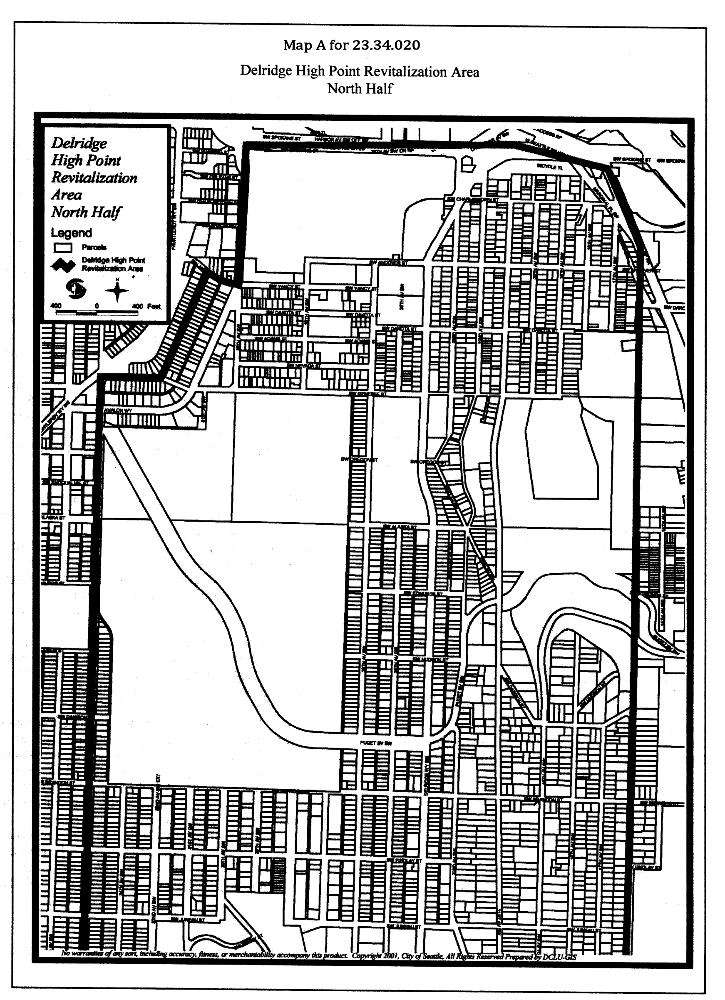

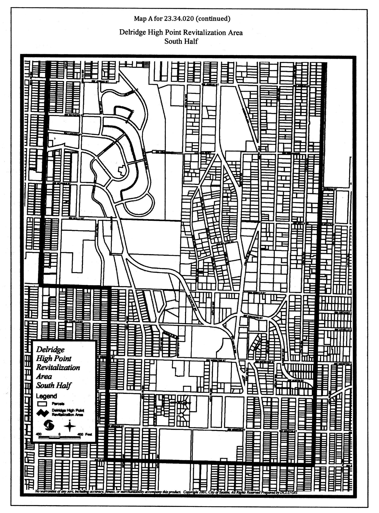

1. Functions. The dual functions of the LR3 zone are to:

    1. provide opportunities for a variety of multifamily housing types in existing multifamily neighborhoods, and along arterials that have a mix of small to moderate scale residential structures; and
    2. accommodate redevelopment in areas within urban centers, urban villages, and Station Area Overlay Districts in order to establish multifamily neighborhoods of moderate scale and density.
2. Locational Criteria. The LR3 zone is most appropriate in areas generally characterized by the following conditions:

    1. The area is either:

        1. located in an urban center, urban village, or Station Area Overlay District where new development could help establish a multifamily neighborhood of moderate scale and density, except in the following urban villages: the Wallingford Residential Urban Village, the Eastlake Residential Urban Village, the Upper Queen Anne Residential Urban Village, the Morgan Junction Residential Urban Village, the Lake City Hub Urban Village, the Bitter Lake Village Hub Urban Village, and the Admiral Residential Urban Village; or
        2. located in an existing multifamily neighborhood in or near an urban center, urban village, or Station Area Overlay District, or on an arterial street, and characterized by a mix of structures of low and moderate scale;
    2. The area is near neighborhood commercial zones with comparable height and scale;
    3. The area would provide a transition in scale between LR1 and/or LR2 zones and more intensive multifamily and/or commercial zones;
    4. The area has street widths that are sufficient for two-way traffic and parking along at least one curb;
    5. The area is well served by public transit;
    6. The area has direct access to arterial streets that can accommodate anticipated vehicular circulation, so that traffic is not required to use streets that pass through lower density residential zones;
    7. The area well supported by existing or projected facilities and services used by residents, including retail sales and services, parks, and community centers, and has good pedestrian access to these facilities.
3. The LR3 zone is also appropriate in areas located in the Delridge High Point Neighborhood Revitalization Area, as shown in Map A for 23.34.020, provided that the LR3 zone designation would facilitate a mixed-income housing development initiated by the Seattle Housing Authority or other public agency; a property use and development agreement is executed subject to the provisions of Chapter 23.76 as a condition to any rezone; and the development would serve a broad public purpose.
4. Except as provided in this subsection 23.34.020.D, properties designated as environmentally critical may not be rezoned to an LR3 designation, and may remain LR3 only in areas predominantly developed to the intensity of the LR3 zone. The preceding sentence does not apply if the environmentally critical area either:

    1. was created by human activity, or
    2. is a designated peat settlement, liquefaction, seismic or volcanic hazard area, or flood prone area, or abandoned landfill.

##### 23.34.024 - Midrise (MR) zone, function and locational criteria.

1. Function. An area that provides concentrations of housing in desirable, pedestrian-oriented urban neighborhoods having convenient access to regional transit stations, where the mix of activity provides convenient access to a full range of residential services and amenities, and opportunities for people to live within walking distance of employment.
2. Locational Criteria.

    1. Threshold Conditions. Subject to subsection 23.34.024.B.2 of this section, properties that may be considered for a Midrise designation are limited to the following:

        1. Properties already zoned Midrise;
        2. Properties in areas already developed predominantly to the intensity permitted by the Midrise zone; or
        3. Properties within an urban center or urban village, where a neighborhood plan adopted or amended by the City Council after January 1, 1995 indicates that the area is appropriate for a Midrise zone designation.
    2. Environmentally Critical Areas. Except as stated in this subsection 23.34.024.B.2, properties designated as environmentally critical may not be rezoned to a Midrise designation, and may remain Midrise only in areas predominantly developed to the intensity of the Midrise zone. The preceding sentence does not apply if the environmentally critical area either

        1. was created by human activity, or
        2. is a designated peat settlement, liquefaction, seismic or volcanic hazard, or flood prone area, or abandoned landfill.
    3. Other Criteria. The Midrise zone designation is most appropriate in areas generally characterized by the following:

        1. Properties that are adjacent to business and commercial areas with comparable height and bulk;
        2. Properties in areas that are served by major arterials and where transit service is good to excellent and street capacity could absorb the traffic generated by midrise development;
        3. Properties in areas that are in close proximity to major employment centers;
        4. Properties in areas that are in close proximity to open space and recreational facilities;
        5. Properties in areas along arterials where topographic changes either provide an edge or permit a transition in scale with surroundings;
        6. Properties in flat areas where the prevailing structure height is greater than 37 feet or where due to a mix of heights, there is no established height pattern;
        7. Properties in areas with moderate slopes and views oblique or parallel to the slope where the height and bulk of existing structures have already limited or blocked views from within the multifamily area and upland areas;
        8. Properties in areas with steep slopes and views perpendicular to the slope where upland developments are of sufficient distance or height to retain their views over the area designated for the Midrise zone;
        9. Properties in areas where topographic conditions allow the bulk of the structure to be obscured. Generally, these are steep slopes, 16 percent or more, with views perpendicular to the slope.

##### 23.34.026 - Midrise/85' (MR/85') zone, function and locational criteria.

1. The Midrise/85' (MR/85') is most appropriate in areas generally characterized by the criteria described for a rezone to Midrise in Section 23.34.024.
2. In addition, the following shall apply to designate an MR zone as Midrise/85(:

    1. A neighborhood plan adopted by the City Council shall have designated the area as suitable for Midrise zoning with an eighty-five (85) foot height limit; and
    2. A height of eighty-five (85) feet could be accommodated without significantly blocking views; and
    3. The development permitted by the zone would not exceed the service capacities which exist in the area, including transit service, parking, and sewers; and
    4. A gradual transition in height and scale and level of activity between zones is provided unless major physical edges are present. These edges may be the following:

        1. Natural features such as topographic breaks, water bodies and ravines,
        2. Freeways, expressways, and other major traffic arterials, and railroad tracks,
        3. Street grid and block orientation, or
        4. Significant open space and greenspaces.

##### 23.34.028 - Highrise (HR) zone, function and locational criteria.

1. Function. An area that provides a concentration of high density multifamily housing in a pedestrian-oriented neighborhood with convenient access to regional transit stations, and where the mix of activity provides convenient access to a full range of residential services and amenities and employment centers.
2. Locational Criteria.

    1. Threshold Conditions. Subject to subsection 23.34.028.B.2 of this section, properties that may be considered for a Highrise designation are limited to the following:

        1. Properties already zoned Highrise;
        2. Properties in areas already developed predominantly to the intensity permitted by the Highrise zone; or
        3. Properties within an urban center or urban village, where a neighborhood plan adopted or amended by the City Council after January 1, 1995 indicates that the area is appropriate for a Highrise zone designation.
    2. Environmentally Critical Areas. Except as stated in this subsection 23.34.028.B.2, properties designated as environmentally critical may not be rezoned to a Highrise designation, and may remain Highrise only in areas predominantly developed to the intensity of the Highrise zone. The preceding sentence does not apply if the environmentally critical area either 1) was created by human activity, or 2) is a designated peat settlement, liquefaction, seismic or volcanic hazard, or flood prone area, or abandoned landfill.
    3. Other Criteria. The Highrise zone designation is most appropriate in areas generally characterized by the following:

        1. Properties in areas that are served by arterials where transit service is good to excellent and street capacity is sufficient to accommodate traffic generated by highrise development;
        2. Properties in areas that are adjacent to a concentration of residential services or a major employment center;
        3. Properties in areas that have excellent pedestrian or transit access to downtown;
        4. Properties in areas that have close proximity to open space, parks and recreational facilities;
        5. Properties in areas where no uniform scale of structures establishes the character and where highrise development would create a point and help define the character;
        6. Properties in flat areas on the tops of hills or in lowland areas away from hills, where views would not be blocked by highrise structures;
        7. Properties in sloping areas with views oblique or parallel to the slope where the height and bulk of existing buildings have already limited or blocked views from within the multifamily area and upland areas where the hillform has already been obscured by development.

##### 23.34.046—23.34.056 - Reserved by 110381.

##### 23.34.070 - Residential-Commercial (RC) zone, function and locational criteria.

1. Function.

    1. Purposes. Areas that serve as the following:

        1. As a means to downzone strip commercial areas which have not been extensively developed with commercial uses;
        2. As a means to downzone small commercial areas which have not been extensively developed with commercial uses and where commercial services are available nearby;
        3. To provide opportunities for needed parking in areas where spillover parking is a major problem;
        4. As a means of supporting an existing commercial node.
    2. Desired Characteristics. Areas that provide the following:

        1. Physical appearance resembling the appearance of adjacent residential areas;
        2. Mixed use with small commercial uses at street level.
2. Location Criteria.

    1. Requirement. A residential-commercial designation shall be combined only with a multifamily designation.
    2. Other Criteria. Residential-Commercial zone designation is most appropriate in areas generally characterized by the following:

        1. Existing Character.

            1. Areas which are primarily residential in character (which may have either a residential or commercial zone designation), but where a pattern of mixed residential/commercial development is present; or
            2. Areas adjacent to commercial areas, where accessory parking is present, where limited commercial activity and accessory parking would help reinforce or improve the functioning of the commercial areas, and/or where accessory parking would help relieve spillover parking in residential areas.
        2. Physical Factors Favoring RC Designation.

            1. Lack of edges or buffer between residential and commercial uses;
            2. Lack of buffer between major arterial and residential uses;
            3. Streets with adequate access and circulation;
            4. Insufficient parking in adjacent commercial zone results in parking spillover on residential streets.

##### 23.34.072 - Designation of commercial zones.

1. The encroachment of commercial development into residential areas shall be discouraged.
2. Areas meeting the locational criteria for a single-family designation may be designated as certain neighborhood commercial zones as provided in Section 23.34.010.
3. Preferred configuration of commercial zones shall not conflict with the preferred configuration and edge protection of residential zones as established in Sections 23.34.010 and 23.34.011 of the Seattle Municipal Code.
4. Compact, concentrated commercial areas, or nodes, shall be preferred to diffuse, sprawling commercial areas.
5. The preservation and improvement of existing commercial areas shall be preferred to the creation of new business districts.

##### 23.34.074 - Neighborhood Commercial 1 (NC1) zones, function and locational criteria.

1. Function. To support or encourage a small shopping area that provides primarily convenience retail sales and services to the adjoining residential neighborhood, where the following characteristics can be achieved:

    1. A variety of small neighborhood-serving businesses;
    2. Continuous storefronts built to the front lot line;
    3. An atmosphere attractive to pedestrians;
    4. Shoppers walk from store to store.
2. Locational Criteria. A Neighborhood Commercial 1 zone designation is most appropriate on land that is generally characterized by the following conditions:

    1. Outside of urban centers and urban villages, or within urban centers or urban villages where isolated or peripheral to the primary business district and adjacent to low-density residential areas;
    2. Located on streets with limited capacity, such as collector arterials;
    3. No physical edges to buffer the residential areas;
    4. Small parcel sizes;
    5. Limited transit service.

##### 23.34.076 - Neighborhood Commercial 2 (NC2) zones, function and locational criteria.

1. Function. To support or encourage a pedestrian-oriented shopping area that provides a full range of household and personal goods and services, including convenience and specialty goods, to the surrounding neighborhoods, and that accommodates other uses that are compatible with the retail character of the area such as housing or offices, where the following characteristics can be achieved:

    1. A variety of small to medium-sized neighborhood-serving businesses;
    2. Continuous storefronts built to the front lot line;
    3. An atmosphere attractive to pedestrians;
    4. Shoppers can drive to the area, but walk from store to store.
2. Locational Criteria. A Neighborhood Commercial 2 zone designation is most appropriate on land that is generally characterized by the following conditions:

    1. Primary business districts in residential urban villages, secondary business districts in urban centers or hub urban villages, or business districts, outside of urban villages, that extend for more than approximately two blocks;
    2. Located on streets with good capacity, such as principal and minor arterials, but generally not on major transportation corridors;
    3. Lack of strong edges to buffer the residential areas;
    4. A mix of small and medium sized parcels;
    5. Limited or moderate transit service.

##### 23.34.078 - Neighborhood Commercial 3 (NC3) zones, function and locational criteria.

1. Function. To support or encourage a pedestrian-oriented shopping district that serves the surrounding neighborhood and a larger community, citywide, or regional clientele; that provides comparison shopping for a wide range of retail goods and services; that incorporates offices, business support services, and residences that are compatible with the retail character of the area; and where the following characteristics can be achieved:

    1. A variety of sizes and types of retail and other commercial businesses at street level;
    2. Continuous storefronts or residences built to the front lot line;
    3. Intense pedestrian activity;
    4. Shoppers can drive to the area, but walk around from store to store;
    5. Transit is an important means of access.
2. Locational Criteria. A Neighborhood Commercial 3 zone designation is most appropriate on land that is generally characterized by the following conditions:

    1. The primary business district in an urban center or hub urban village;
    2. Served by principal arterial;
    3. Separated from low-density residential areas by physical edges, less-intense commercial areas or more-intense residential areas;
    4. Excellent transit service.

##### 23.34.080 - Commercial 1 (C1) zones, function and locational criteria.

1. Function. To provide for an auto-oriented, primarily retail/service commercial area that serves surrounding neighborhoods and the larger community, citywide, or regional clientele.
2. Locational Criteria. A Commercial 1 zone designation is most appropriate on land that is generally characterized by the following conditions:

    1. Outside of urban centers and urban villages or, within urban centers or urban villages, having a C1 designation and either abutting a state highway, or in use as a shopping mall;
    2. Retail activity in existing commercial areas;
    3. Readily accessible from a principal arterial;
    4. Presence of edges that buffer residential or commercial areas of lesser intensity, such as changes in street layout or platting pattern;
    5. Predominance of parcels of 20,000 square feet or larger;
    6. Limited pedestrian and transit access.

##### 23.34.082 - Commercial 2 (C2) zones, function and locational criteria.

1. Function. To provide for an auto-oriented, primarily non-retail commercial area that provides a wide range of commercial activities serving a community, citywide, or regional function, including uses such as manufacturing and warehousing that are less appropriate in more-retail-oriented commercial areas.
2. Locational Criteria. A Commercial 2 zone designation is most appropriate on land that is generally characterized by the following conditions:

    1. Outside of urban centers and urban villages or, within urban centers or urban villages, having a C2 designation and abutting a state highway;
    2. Existing commercial areas characterized by heavy, non-retail commercial activity;
    3. Readily accessible from a principal arterial;
    4. Possibly adjacent to manufacturing/industrial zones;
    5. Presence of edges that buffer residential or commercial areas of lesser intensity, such as changes in street layout or platting pattern;
    6. Predominance of parcels of 30,000 square feet or larger;
    7. Limited pedestrian and transit access.

##### 23.34.086 - Pedestrian designation (suffix P), function and locational criteria

1. Function. To preserve or encourage an intensely retail and pedestrian-oriented shopping district where non-auto modes of transportation to and within the district are strongly favored, and the following characteristics can be achieved:

    1. A variety of retail/service activities along the street front;
    2. Large number of shops and services per block;
    3. Commercial frontage uninterrupted by housing or auto-oriented uses;
    4. Pedestrian interest and activity;
    5. Minimal pedestrian-auto conflicts.
2. Locational criteria. Pedestrian-designated zones are most appropriate on land that is generally characterized by the following conditions:

    1. Pedestrian district surrounded by residential areas or major activity centers; or a commercial node in an urban center or urban village;
    2. NC zoned areas on both sides of an arterial, or NC zoned block fronts across an arterial from a park, major institution, or other activity center; and
    3. Excellent access for pedestrians, transit, and bicyclists.

##### 23.34.089 - Locational criteria—Station Area Overlay District.

1. Establishing a Station Area Overlay District. In reviewing a proposal to establish a Station Area Overlay District, the following criteria shall be considered:

    1. Function. To preserve or encourage a diverse, mixed-use community with a pedestrian orientation around proposed light rail stations or access to other high capacity transit, where incompatible automobile-oriented uses are discouraged and transit-oriented use and development is encouraged.
    2. Desired Characteristics. The Station Area Overlay District designation is most appropriate in areas generally characterized by one or more of the following:

        1. High levels of pedestrian activity at street level in commercial and mixed-use zones; or
        2. Presence of a wide variety of retail/service activities in commercial and mixed-use zones; or
        3. Minimal pedestrian-auto conflicts; or
        4. Medium to high residential density in close proximity to light rail stations or access to other high capacity transit.
    3. Physical Conditions Favoring Designation as Station Area Overlay District. The Station Area Overlay District shall be located around a proposed light rail station or access to other high capacity transit and include land within approximately one thousand three hundred and twenty feet (1,320') of the station or stop. Other factors to consider in including properties within the overlay district include, but are not limited to the following:

        1. Presence of medium to high density residential zoning in proximity to the proposed light rail station or access to other high capacity transit;
        2. Presence of a commercial or mixed-use area where goods and services are available to the public and where opportunities for enhancement of the pedestrian environment exist;
        3. Opportunities for new development to access transit, bicycle and pedestrian modes of transportation;
        4. Opportunities for construction of new development that will support transit;
        5. Properties zoned Single-family may only be included within the overlay district when it can be demonstrated that the criteria for Single-family designation cannot be satisfied.
2. Revising the Boundaries of a Station Area Overlay District.

    1. When a proposal is made to include land within an existing Station Area Overlay District, the land proposed to be added must be contiguous to the Station Area Overlay District, be consistent with the criteria prescribed in subsection A, above, and satisfy the function of and locational criteria for a commercial or multifamily zone designation.
    2. When a proposal is made to remove land from an existing Station Overlay District, the land proposed to be removed must be contiguous to land lying outside the boundary and not meet the criteria in subsection A of this section.

##### 23.34.090 - Designation of industrial zones.

1. The industrial zones are intended to support existing industrial activity and related businesses and provide for new industrial development, as well as increased employment opportunities.
2. Industrial areas are generally well-served by rail, truck and water transportation facilities and do not require direct vehicular access through residential zones.
3. Relative isolation from residential zones either by distance or physical buffers shall be preferred in the creation of new industrial zones.
4. Areas where the infrastructure (streets, water, sewer, electrical, and other facilities) is adequate, or can be upgraded at a reasonable cost, are preferred to accommodate an industrial designation.
5. Economic Development. Increasing industrially zoned land shall be favorably considered when such action will provide additional opportunities for business expansion, retention of manufacturing and other industrial firms in Seattle, or increased employment, especially employment that adds to or maintains the diversity of job opportunities in Seattle. Land proposed to be assigned an industrial designation shall be suitable for manufacturing, research and development and other industrial uses and shall meet the locational criteria for the industrial zone.

    1. The rezone shall enhance and strengthen the industrial character of an area.
6. In determining appropriate boundaries with residentially and commercially zoned land, the appropriate location and rezone criteria shall be considered.
7. Rezoning of Industrial Land. Rezoning of industrial land to a less-intensive zone shall be discouraged unless most of the following can be shown:

    1. The area does not meet the locational criteria for the industrial zone.
    2. The rezone will not decrease industrial development and employment potential, especially manufacturing employment.
    3. The rezone would not result in existing industrial uses becoming nonconforming.
    4. The area clearly functions as a residential or commercial zone, has little or no potential for industrial development, and would not lead to further encroachment of residential, office, or retail uses into industrially zoned land located adjacent to or near the proposed rezone.
    5. The rezone shall be consistent with the Seattle Shoreline Master Program.
    6. The area is not part of an adopted Manufacturing/Industrial Center (MIC).
8. Compatibility With Scale and Character of Surrounding Area-Edges. In general, a transition in scale and character shall be provided between zones. A gradual change in height limit or an area of transition (e.g., commercial zone between residential and industrial zones) shall be provided when the area lacks physical edges. Rezones shall achieve a better separation between residential and industrial zones, significantly reducing or eliminating major land use conflicts in the area. The following elements shall be considered physical edges or buffers:

    1. Natural features such as topographic breaks, lakes, streams, ravines and shorelines;
    2. Freeways, expressways, other major traffic arterials, and railroad tracks;
    3. Changes in street layout and block orientation;
    4. Open spaces and greenspaces.
9. Existing Pattern of Development. Consideration shall be given to whether the area is primarily industrial, commercial, residential, or a mix, and whether the area is fully developed and in need of room for expansion, or minimally developed with vacant parcels and structures.

##### 23.34.092 - General Industrial 1 (IG1) zone, function and locational criteria.

1. Function. An area that provides opportunities for manufacturing and industrial uses and related activity, where these activities are already established and viable, and their accessibility by rail and/or waterway make them a specialized and limited land resource.
2. Locational Criteria. General Industrial 1 zone designation is most appropriate in areas generally characterized by the following:

    1. Areas directly related to the shoreline having the following characteristics:

        1. Suitable water access for marine industrial activity,
        2. Upland property of sufficient depth to accommodate industrial activity,
        3. An existing character established by industrial uses and related commercial activity including manufacturing use, warehousing, transportation, utilities, and similar activities;
    2. Areas directly related to major rail lines serving industrial businesses;
    3. Areas containing mostly industrial uses, including manufacturing, heavy commercial, warehousing, transportation, utilities and similar activities;
    4. Large areas with generally flat topography;
    5. Areas platted into large parcels of land.

##### 23.34.093 - General Industrial 2 (IG2) zone, function and locational criteria.

1. Function. An area with existing industrial uses, that provides space for new industrial development and accommodates a broad mix of activity, including additional commercial development, when such activity improves employment opportunities and the physical conditions of the area without conflicting with industrial activity.
2. Locational Criteria. General Industrial 2 zone designation is most appropriate in areas generally characterized by the following:

    1. Areas that are developed with industrial activity or a mix of industrial activity and a wide range of commercial uses;
    2. Areas where facilities, such as the Kingdome or Design Center, have established a more commercial character for the surroundings and have created the need for a broader mix of support uses;
    3. Areas with adequate access to the existing and planned neighborhood transportation network; where additional trips generated by increased commercial densities can be accommodated without conflicting with the access and circulation needs of industrial activity;
    4. Areas where increased commercial densities would allow the economic reuse of small sites and existing buildings no longer suited to current industrial needs;
    5. Areas that, because of their size and isolation from a larger industrial area due to separation by another type of zone or major physical barrier, such as an arterial or waterway, can accommodate more nonindustrial activity without conflicting with the industrial function of the larger industrial area;
    6. Large areas with generally flat topography;
    7. Areas platted into large parcels of land.

##### 23.34.094 - Industrial Buffer (IB) zone, function and locational criteria.

1. Function. An area that provides an appropriate transition between industrial areas and adjacent residential zones, or commercial zones having a residential orientation and/or pedestrian character.
2. Locational Criteria. Industrial Buffer zone designation is most appropriate in areas generally characterized by the following:

    1. Areas containing industrial uses or a mix of industrial activity and a wide range of commercial uses which are located on the edge of a larger industrial area designated Industrial General 1 (IG1), Industrial General 2 (IG2), or Industrial Commercial (IC).
    2. Areas where a transition is needed to protect a less-intensive zone from potential negative impacts of industrial activity when the area directly abuts a residential, Neighborhood Commercial 1 (NC1), Neighborhood Commercial 2 (NC2), Neighborhood Commercial 3 (NC3), Commercial 1 (C1), or Commercial 2 (C2) zone with a substantial amount of residential development and/or pedestrian character.
3. Zone Boundaries. The boundaries and overall depth of the Industrial Buffer (IB) zone shall vary according to the specific conditions of each area, so that an adequate separation between industrial activity and less-intensive zones can be provided to reduce through traffic, noise, visual conflicts, and other impacts of industrial development. However, where there are no special features or other conditions to provide sufficient buffer depth, a distance ranging from three hundred (300) to five hundred (500) feet shall be maintained as a buffer. Within an industrial area, the following conditions help establish the transition desired between industrial areas and less-intensive zones and should be considered in establishing boundaries separating the Industrial Buffer zone from the rest of the industrial area:

    1. Topographic Conditions. Significant changes in topography within an industrial area may provide a good boundary for the Industrial Buffer zone by reducing the noise and visual impacts of the larger industrial area on an abutting, less-intensive zone.
    2. Development Patterns. Changes in the type of activity and/or the scale of existing development occurring along the edge of an industrial area may create conditions that are more compatible with the abutting, less-intensive zone.
    3. Grid and Platting Patterns. Changes in block sizes, shifts in the street grid, a major arterial, undeveloped streets, platted lot lines, and other factors related to the platting pattern often create separate areas which, when located along the edge of an industrial area, can reinforce the transition desired in the Industrial Buffer zone.
    4. Special Features. Certain natural or built features such as railway lines, open spaces, transmission line rights-of-way, and waterways may, because of their width, siting, or landscaping, separate the edge of an industrial zone from a larger industrial area, helping to establish the edge of the Industrial Buffer zone.

##### 23.34.096 - Locational criteria—Industrial Commercial (IC) zone.

The Industrial Commercial (IC) zone is intended to promote development of businesses which incorporate a mix of industrial and commercial activities, including light manufacturing and research and development, while accommodating a wide range of other employment activities. In reviewing a proposal to rezone an area to Industrial Commercial (IC), the following criteria shall be considered:

1. Areas with amenities such as shoreline views, proximity to downtown, or access to public open spaces that could provide an attraction for new businesses, particularly new technology-oriented and research and development activities which might otherwise be likely to seek locations outside the City;
2. Areas in close proximity to major institutions capable of providing support for new technology-oriented and research and development businesses;
3. Former industrial areas which are undergoing a transition to predominantly commercial or mixed commercial and industrial activity, but where transportation and/or other infrastructure capacities are constrained and can only accommodate modest growth without major improvements;
4. Areas where there is an existing concentration of technology-oriented and research and development uses which may be subject to displacement by commercial development;
5. Areas which are underutilized and, through substantial redevelopment, could provide the type of campus-like environment attractive for new technology-oriented industrial and commercial development.

##### 23.34.100 - Designation of Downtown zones.

Rezones to a Downtown zone designation shall be considered only for areas within the boundaries of the Downtown Urban Center as shown on the Official Land Use Map.

##### 23.34.102 - Downtown Office Core-1 (DOC-1) zone, function and locational criteria.

Locations appropriate for Downtown Office Core-1 zone designation shall be consistent with the following:

1. Function. Areas that provide high density office and commercial activities with related support services and retail shopping. The density of office activity shall be greater in this area than any other part of downtown.
2. Scale and Character of Development. Areas with the greatest concentration of large buildings of primarily office and commercial use.
3. Transportation and Infrastructure Capacity. Areas with a very high level of access to vehicular and transit systems and where the existing urban infrastructure is adequate or can be easily expanded to support high densities of development.
4. Relationship to Surrounding Activity. A single, contiguous area which is centrally located in relation to other downtown districts having lower intensities of development and more mixing of uses.

##### 23.34.104 - Downtown Office Core-2 (DOC-2) zone, function and locational criteria.

Locations appropriate for Downtown Office Core-2 zone designation shall be consistent with the following:

1. Function. Areas that provide a range of high density office and commercial activities with retail shopping and support services closely related to the primary office core. The density of development is not as great as in the DOC-1 designation.
2. Scale and Character of Development. Areas where large scale office buildings are appropriate and do not adversely affect the pedestrian environment or existing development determined desirable for preservation.
3. Transportation and Infrastructure Capacity. Areas that are well served by transit and vehicular systems and where other urban infrastructure systems are adequate or readily expandable to accommodate anticipated growth.
4. Relationship to Surrounding Activity. Areas shall be adjacent to DOC-1. These areas shall provide transition to the north of the office and retail cores where the character is not well established and land is available for development. To the south of the office core, these areas shall provide a transition to those areas where a strong character exists in Pioneer Square and the International District.
5. Heights. Two (2) height classifications of DOC-2 shall provide transition between the high structures of the DOC-1 designation and areas adjacent to this classification. Generally, maximum heights should be lower in the southern part of downtown to provide transition to Pioneer Square and the International District.

##### 23.34.106 - Downtown Retail Core (DRC) zone, function and locational criteria.

Locations appropriate for Downtown Retail Core zone designation shall be consistent with the following:

1. Function. Areas that provide highly concentrated, regional retail shopping activity in the core of downtown. Retail shopping, entertainment and consumer services predominate at street level, and related and supporting uses occur in the upper floors of buildings. Office and other commercial uses may also be present, but at a density and scale of development that does not conflict with the primary retail function or make the street level environment less conducive to shopping.
2. Scale and Character of Development. Areas with moderate scale buildings and well defined street spaces where sidewalks are lined with a variety of retail shopping, entertainment and consumer services. Areas are characterized by a combination of buildings and street spaces conducive to an active, high quality pedestrian environment on relatively level terrain.
3. Transportation Access. Areas where both vehicular and transit systems provide good access for shoppers. The area is served by a wide range of regional, citywide and local transit routes providing high levels of service during the prime shopping hours of the day and evening. Recognizing that the auto will be a prime means of shopper travel, the area provides good off-peak auto access with adequate amounts of short-term shopper parking.
4. Relationship to Surrounding Activity. The area shall be centrally located in relation to areas of downtown employment and residential concentrations.

##### 23.34.108 - Downtown Mixed Commercial (DMC) zone, function and locational criteria

Locations appropriate for Downtown Mixed Commercial zone designation are consistent with the following:

1. Function. Areas characterized by lower scale office, retail and commercial uses related to activity in the office core, retail core or other moderate-scale commercial cores in the Downtown Urban Center, and with use patterns that may include housing.
2. Scale and Character of Development. Areas where buildings of moderate scale exist or are appropriate to provide a physical transition between more intensive commercial areas and surrounding lower scale commercial, mixed use or residential districts.
3. Transportation and Infrastructure Capacity. Areas within the Downtown Urban Center having good but comparatively less accessibility to vehicular and transit systems than the Downtown office core. Transportation and other infrastructure capacities are capable of accommodating modest growth without major improvement.
4. Relationship to Surrounding Activity. Areas that provide for less intensive activity along the western and northern edges of the Downtown retail core and Downtown office core, or at other peripheral locations within the Downtown Urban Center. These areas provide a buffer to less intensive areas, such as the Harborfront, Pike Place Market, Belltown residential area, or mixed use areas north of Denny Way, or serve as a transition to less intensive commercial, residential or industrial areas near the Downtown Urban Center.
5. Heights. Downtown Mixed Commercial height designations provide desired transitions compatible with adjacent downtown districts and areas outside downtown.

##### 23.34.110 - Downtown Mixed Residential (DMR) zone, function and locational criteria

Locations appropriate for Downtown Mixed Residential zone designation are consistent with the following:

1. Function. Areas that provide a mixed use community where housing and associated services and amenities predominate. Office, retail and other commercial uses are compatibly integrated with the predominant residential character at low to moderate densities.
2. Scale and Character of Development. Areas where there is an existing base of housing and the potential exists for establishing a residential community. Areas have the potential for supporting a wide range of residential building types, ranging from midrise structures closely related to the street to larger tower forms. Opportunities exist for major public amenities, such as parks and open space, an enhanced pedestrian network, or views of downtown, Elliott Bay or other surrounding features.
3. Transportation and Infrastructure Capacity. Areas with transportation system and infrastructure system capacity that is sufficient or can be improved to accommodate a substantial residential population. Employment densities are related to the ability of the transportation system to accommodate peak hour traffic flow without adversely affecting the residential environment.
4. Relationship to Surrounding Activity. Areas with surrounding mixed use districts providing transition between primarily residential districts (within or outside downtown) and higher intensity neighborhood core areas within downtown.
5. Mix of Use. Two mix-of-use designations are applied to achieve subarea objectives. The DMR/R designation applies to areas predominantly residential in character or containing large amounts of underused land able to accommodate future residential development; non-residential uses may be present but should be of modest scale, likely to change in the future, or neighborhood serving in character. The DMR/C designation applies to those areas containing housing or having housing potential where larger scale, non-residential serving commercial development exists and is likely to remain.
6. Heights. Downtown Mixed Residential building height designations may be applied to achieve subarea objectives. The lowest height designation generally encompasses the Belltown core, in areas characterized by existing modest scale development, buildings of historic character, or topographic features such as the bluff rising from Elliott Bay. The intermediate building height designation provides transition in height and density to the north and east of the Belltown core and along the bluff where waterfront development divides the area from Elliott Bay. In the Downtown Urban Center east of Interstate 5, the building height designation provides for low to moderate heights. The highest building height designation applies to areas characterized by larger residential and commercial buildings, generally along the eastern edge of Belltown, near the higher density mixed commercial areas of downtown.

##### 23.34.112 - Pioneer Square Mixed (PSM) zone, locational criteria.

The Pioneer Square Mixed zone designation shall apply to those areas which lie within the Pioneer Square Preservation District, north of those areas predominantly in manufacturing and industrial use and not contained within the International Special Review District.

##### 23.34.114 - International District Mixed (IDM) zone, locational criteria

The International District Mixed zone designation is appropriate for areas of the International Special Review District designated in Chapter 23.66 of the Land Use Code for mixed use development. The areas designated IDM are characterized by a mix of uses contained in low and medium scale structures.

##### 23.34.116 - International District Residential (IDR) zone, locational criteria

The International District Residential zone designation is appropriate for areas of the International Special Review District designated in Chapter 23.66 of the Land Use Code for development as a predominantly residential neighborhood. The areas designated IDR are generally located north of the International District core, near the Downtown office core, and contain parcels available for infill development and, east of 5 Avenue, may possess topographic features providing view potential. The IDR/C designation applies to areas where a mix of non-residential uses and residential uses will provide for a transition in use character between the Downtown office core and areas within the International Special Review District designated primarily for residential uses.

##### 23.34.118 - Downtown Harborfront-1 (DH-1) zone, locational criteria.

The Downtown Harborfront-1 zone and the Urban Harborfront Shoreline Environment designation shall apply to waterfront lots and adjacent harbor area located within the boundaries of downtown.

##### 23.34.120 - Downtown Harborfront-2 (DH-2), function and locational criteria.

The Downtown Harborfront-2 zone designation shall apply to those areas which meet the following:

1. Function. Areas which provide commercial activities in support of shoreline goals and related office, commercial, retail and residential uses.
2. Scale and Character of Development. Areas where the intended scale of development is moderate, and an orientation toward the water exists. The area provides a transition in scale and character between the waterfront and adjacent downtown areas.
3. Transportation Capacity. Areas with transportation capacity to support low and moderate densities commensurate with planned capacity of Alaskan Way.
4. Relationship to Surrounding Activity. Areas adjacent to the shoreline that have a strong physical relationship to activities on the waterfront and are separated from downtown areas due to topographic conditions. The primary relationship shall be to the harbor areas. The relationship to downtown shall be secondary.
5. Heights. One (1) of three (3) height districts may be applied to maintain existing views from upland public spaces and provide a transition in scale between the waterfront and downtown.

##### 23.34.122 - Pike Market Mixed (PMM) zone, locational criteria.

The Pike Market Mixed zone designation shall apply to the area encompassed by the adopted Pike Place Project Urban Renewal Plan inclusive of the Pike Place Historic District.

##### 23.34.124 - Designation of Major Institution Overlay (MIO) districts.

1. Public Purpose. The applicant shall submit a statement which documents the reasons the rezone is being requested, including a discussion of the public benefits resulting from the proposed expansion, the way in which the proposed expansion will serve the public purpose mission of the major institution, and the extent to which the proposed expansion may affect the livability of the surrounding neighborhood. Review and comment on the statement shall be requested from the appropriate Advisory Committee as well as relevant state and local regulatory and advisory groups. In considering rezones, the objective shall be to achieve a better relationship between residential or commercial uses and the Major Institution uses, and to reduce or eliminate major land use conflicts in the area.
2. Boundaries Criteria. The following criteria shall be used in the selection of appropriate boundaries for: 1) new Major Institution Overlay districts; 2) additions to existing MIO districts; and 3) modifications to boundaries of existing MIO districts.

    1. Establishment or modification of boundaries shall take account of the holding capacity of the existing campus and the potential for new development with and without a boundary expansion.
    2. Boundaries for an MIO district shall correspond with the main, contiguous major institution campus. Properties separated by only a street, alley or other public right-of-way shall be considered contiguous.
    3. Boundaries shall provide for contiguous areas which are as compact as possible within the constraints of existing development and property ownership.
    4. Appropriate provisions of this chapter for the underlying zoning and the surrounding areas shall be considered in the determination of boundaries.
    5. Preferred locations for boundaries shall be streets, alleys or other public rights-of-way. Configuration of platted lot lines, size of parcels, block orientation and street layout shall also be considered.
    6. Selection of boundaries should emphasize physical features that create natural edges such as topographic changes, shorelines, freeways, arterials, changes in street layout and block orientation, and large public facilities, land areas or open spaces, or greenspaces.
    7. New or expanded boundaries shall not be permitted where they would result in the demolition of structures with residential uses or change of use of those structures to non-residential major institution uses unless comparable replacement is proposed to maintain the housing stock of the city.
    8. Expansion of boundaries generally shall not be justified by the need for development of professional office uses.
    9. The establishment or expansion of boundaries shall be in conformance with the provisions of SMC Section 23.69.024, Major Institution designation.
3. Height Criteria. The following criteria shall be used in the selection of appropriate height designations for: 1) proposed new Major Institution Overlay districts; 2) proposed additions to existing MIO districts; and 3) proposed modifications to height limits within existing MIO districts;

    1. Increases to height limits may be considered where it is desirable to limit MIO district boundary by expansion.
    2. Height limits at the district boundary shall be compatible with those in the adjacent areas.
    3. Transitional height limits shall be provided wherever feasible when the maximum permitted height within the overlay district is significantly higher than permitted in areas adjoining the major institution campus.
    4. Height limits should generally not be lower than existing development to avoid creating non-conforming structures.
    5. Obstruction of public scenic or landmark views to, from or across a major institution campus should be avoided where possible.
4. In addition to the general rezone criteria contained in Section 23.34.008, the comments of the Major Institution Master Plan Advisory Committee for the major institution requesting the rezone shall also be considered.

##### 23.34.126 - Designation of the Seattle Mixed (SM) zone.

The Seattle Mixed (SM) zone is applied to achieve the goal of a diverse, mixed-use community with a strong pedestrian orientation. The zone permits a wide range of uses and promotes density to encourage a mixed-use neighborhood. This zoning designation balances the need for flexibility and a variety of activities with the need to provide adequate direction to ensure the presence of housing and commercial activities critical to the success of an urban neighborhood.

##### 23.34.128 - Seattle Mixed (SM) zone, function and locational criteria

In considering rezones to the SM zone designation, the following function and locational criteria shall be taken into consideration:

1. Function. An area within an urban center, urban village, or station area overlay district that provides for a wide range of uses to encourage development of the area into a mixed-use neighborhood with a pedestrian orientation;
2. Transportation and infrastructure capacity. An area that is well-served by transit and vehicular systems and where utility infrastructure is adequate, or where such systems and infrastructure can be readily expanded to accommodate growth;
3. Relationship to surrounding activity. An area that either provides a transition from, or is compatible with, an adjacent neighborhood that is densely developed or zoned for high density mixed use; or an area where a transition to higher density mixed use is desired, either within a larger area characterized primarily by commercial or industrial activity, or within an area where significant investment in public transit infrastructure can accommodate greater density and adequate transition with surrounding areas can be provided;
4. Mix of use. In general, the zone is suitable for a wide range of uses. However, an area within the SM zone may be identified for the purposes of encouraging a primarily residential character. Within these areas, non-residential uses shall generally be of modest scale or neighborhood-serving in character.

### Division 2 - Authorized Uses and Development Standards

### Chapter 23.40 - COMPLIANCE WITH REGULATIONS REQUIRED—EXCEPTIONS

Sections:

#### 23.40.002 - Conformity with regulations required

1. The establishment or change of use of any structures, buildings or premises, or any part thereof, requires approval according to the procedures set forth in Chapter 23.76, Procedures for Master Use Permits and Council Land Use Decisions, except:

    1. establishment of an urban farm, or community garden, that is permitted outright under the provisions of this Title 23 applicable to the lot;
    2. as permitted in subsections 23.47A.004.E and 23.47A.004.F;
    3. keeping of animals as permitted under Section 23.42.052;
    4. reinstatement of a use interrupted by a temporary use authorized pursuant to Section 23.42.040; and
    5. for uses located entirely within public rights-of-way.
2. No use of any structure or premises shall hereafter be commenced, and no structure or part of a structure shall be erected, moved, reconstructed, extended, enlarged or altered, except in conformity with the regulations specified in this title for the zone and overlay district, if any, in which it is or will be located.
3. Owners of such structures, building or premises or parts thereof are responsible for any failure of such structures, buildings or premises to conform to the regulations of this title and for compliance with the provisions of this title in or on such structures, buildings or premises. Any other person who created, caused or contributed to a condition in or on such structure, building or premises, either alone or with others, is also responsible under this title for any failure to conform to the regulations of this title. Building and use permits on file shall be prima facie evidence of the time a building was built or modified, or a use commenced, and the burden of demonstrating to the contrary shall be upon the owner.
4. Changes to existing structures that make the structures nonconforming may be permitted if the changes are required by law for reasons of health and safety.

#### 23.40.004 - Reduction of required spaces.

1. No minimum lot area, yard, setback, modulation, open space, landscaping, access, screening or other element of development existing on or after July 24, 1957, shall be reduced in area, number or dimension below the minimum development standard required by this Land Use Code, nor shall any existing lot area, yard, setback, modulation, open space, landscaping, access, screening or other element of development less than the minimum required by this Land Use Code be further reduced, except as specifically provided in this Code.
2. Legally established parking spaces or loading areas existing on or after July 24, 1957 that became required as accessory to a principal use on or after July 24, 1957, may not be eliminated unless at least an equal number of spaces serving the use for which they are required and meeting the requirements of this Code are provided.
3. No minimum lot area, yard, setback, open space, landscaping, access, screening or other element of a development used to meet a development standard for one (1) use or structure may be used to meet the development standards of another use or structure except as specifically provided in this Code.

#### 23.40.006 - Demolition of housing

No demolition permit for a structure containing a dwelling unit shall be issued unless one of the following conditions is satisfied, and provided that no permit for demolition of a structure containing a dwelling unit may be issued if the new use is for non-required parking:

1. The structure is a residential use in a single family zone and was not occupied as rental housing during the prior 12 months, unless such demolition aids expansion of an adjacent non-residential use; or
2. A permit or approval has been issued by the Director according to the procedures set forth in Chapter 23.76, Procedures for Master Use Permits and Council Land Use Decisions, to change the use of the structure or the premises; or
3. A permit or approval has been issued by the Director to relocate the structure containing a dwelling unit to another lot, whether within the City limits or outside the City limits, to be used, on the new lot, as a dwelling unit; or
4. A complete building permit application for construction of a new principal structure on the same lot as the structure to be demolished has been submitted to the Director, the demolition permit application and the building permit application are categorically exempt from review under Chapter 25.05, Environmental Policies and Procedures, the issuance of some other approval is not required by Title 23 or Title 25 as a condition to issuing the demolition permit, and the Director has approved a waste diversion plan pursuant to Section 23.40.007;
5. Demolition of the structure is ordered by the Director for reasons of health and safety under Chapter 22.206 or 22.208 of the Housing and Building Maintenance Code, or under the provisions of the Seattle Building Code; or
6. The structure is in the MPC-YT zone.

#### 23.40.007 - Reuse and Recycling of Building Materials in a Structure Containing a Dwelling Unit

1. Requirements of a Waste Diversion Plan. The Director shall promulgate rules that define the requirements of an acceptable waste diversion plan within the meaning of subsection 23.40.006.D. Among the requirements shall be minimum levels of building materials that must be diverted from landfills. The levels shall be established by the Director on the basis of a review of practices employed in the relevant industries in the region. The levels may vary by disposal method or type of material and shall reflect, in the Director's opinion, the degree of waste diversion reasonably attainable through the use of accepted industry practices. The Director may alter the levels as industry practices evolve.
2. Demonstration of Compliance. The applicant shall demonstrate compliance with the approved waste diversion plan by submitting a report to the Director documenting, at a minimum, the amount and manner in which building materials were diverted from landfills. The applicant must submit the report no later than 90 days after issuance of the demolition permit, or such later date as may be allowed by the Director for good cause.
3. Violation. Failure to demonstrate compliance with the waste diversion plan is a violation of the Land Use Code.

#### 23.40.008 - Demolition of landmarks.

1. Except as provided in subsection B, no demolition permit for a landmark shall be issued until the requirements of Section 25.12.835 of the Landmarks Preservation Ordinance have been satisfied.
2. In the event that the Director believes that demolition of a landmark is required for reasons of health and safety under Chapter 22.206 or 22.208 of the Housing and Building Maintenance Code or under the provisions of the Seattle Building Code, the Director shall consult with the Landmarks Preservation Board and with the Director of the Department of Neighborhoods about alternatives to demolition. The Director shall not order demolition of a landmark until all alternatives to demolition have been explored, unless the Director is faced with a threat to the public health and safety that is so imminent as to preclude all deliberation.

#### 23.40.020 - Variances

1. Variances may be sought from the provisions of Subtitle III, Divisions 2, 3, and 4 of this Title 23, except for the establishment of a use that is otherwise not permitted in the zone in which it is proposed, for a structure height in excess of that shown on the Official Land Use Map or in excess of a height limit established in Chapter 23.75, from the provisions of subsection 23.55.014.A, or from the provisions of Chapter 23.52, Chapter 23.58A, and Chapter 23.52B. Applications for prohibited variances shall not be accepted for filing.
2. Variances shall be authorized according to the procedures set forth in Chapter 23.76, Procedures for Master Use Permits and Council Land Use Decisions.
3. Variances from the provisions or requirements of this Land Use Code shall be authorized when all the facts and conditions listed below are found to exist:

    1. Because of unusual conditions applicable to the subject property, including size, shape, topography, location or surroundings, which were not created by the owner or applicant, the strict application of this Land Use Code would deprive the property of rights and privileges enjoyed by other properties in the same zone or vicinity; and
    2. The requested variance does not go beyond the minimum necessary to afford relief, and does not constitute a grant of special privilege inconsistent with the limitations upon other properties in the vicinity and zone in which the subject property is located; and
    3. The granting of the variance will not be materially detrimental to the public welfare or injurious to the property or improvements in the zone or vicinity in which the subject property is located; and
    4. The literal interpretation and strict application of the applicable provisions or requirements of this Land Use Code would cause undue hardship or practical difficulties; and
    5. The requested variance would be consistent with the spirit and purpose of the Land Use Code regulations for the area.
4. In order to qualify for a variance under the foregoing criteria, an applicant need not demonstrate that, absent the variance, he or she would have no reasonable economic use of the property at issue.
5. When a variance is authorized, conditions may be attached regarding the location, character and other features of a proposed structure or use as may be deemed necessary to carry out the spirit and purpose of this Land Use Code.

#### 23.40.030 - Undeveloped streets—Modification of certain development standards.

For purposes of determining yards, setbacks and whether or not a lot is a corner lot or a through lot, the Director may allow an abutting street to be treated as an alley if the Director finds that the lot abuts on at least one (1) other street suitable for vehicular use or is served by an access easement meeting the standards of Section 23.53.025, and that the following criteria are met:

1. The street in the block where it abuts the lot is wholly undeveloped, is unpaved, or is developed with a roadway less than twenty (20) feet in width; and
2. The street provides either no access or only secondary access to those lots to which it abuts; and
3. The development proposed for the lot does not require improvement of the street and no plans to develop the street are on file with the City; and
4. Existing streetscapes and development patterns are not disrupted.

#### 23.40.035 - Location of accessory dwelling units on through lots

On a through lot, when yards cannot be determined pursuant to Section 23.40.030, the Director shall designate a rear yard for the purpose of allowing a detached accessory dwelling. In designating a rear yard, the Director shall consider factors including but not limited to the location of existing structures, vehicular and pedestrian access, platting patterns in the vicinity and topography.

#### 23.40.040 - Reasonable accommodation.

The Federal Fair Housing Act requires that reasonable accommodations be made in rules, policies, practices, or services, when such accommodations may be necessary to afford handicapped people equal opportunity to use an enjoy a dwelling. The Director is therefore authorized to make accommodations in the provisions of this title as applied to dwellings occupied or to be occupied by handicapped persons as defined in the Federal Fair Housing Act, when the Director determines that such accommodations reasonably may be necessary in order to comply with such Act.

#### 23.40.060 - Living Building Pilot Program

1. Purpose. The purpose of this section is to establish a Living Building Pilot Program. The goal of the Pilot Program is to encourage the development of buildings that meet the Living Building Challenge by allowing departures from code requirements that might otherwise discourage or prevent buildings from meeting this standard. Overall, the Living Building Pilot Program is intended to:

    1. stimulate innovative development that meets the goals of the Living Building Challenge and City of Seattle design guidelines.
    2. encourage development that will serve as a model for other projects throughout the City and region and will stimulate development of new Living Buildings.
    3. identify barriers to Living Buildings in current codes and processes.
2. Project qualification

    1. Eligible projects. Only projects that are eligible for design review under Section 23.41.004 and located outside of the shoreline jurisdiction may qualify for the Living Building Pilot Program.
    2. Enrollment period. The enrollment period for the Living Building Pilot Program expires on the earlier of June 30, 2016 or when applications for 12 projects have been submitted for a Master Use Permit.
    3. Application requirements. In order to qualify for the Living Building Pilot Program, applicants shall submit a plan demonstrating how their project will meet each of the imperatives of the Living Building Challenge, including an overall design concept, proposed energy balance, proposed water balance, and descriptions of innovative systems. In addition, an applicant shall include a description of how the project serves as a model for testing code improvements to stimulate and encourage Living Buildings in the city.
    4. Qualification process. An eligible project shall qualify for the Pilot Program upon determination by the Director that it has submitted a complete application pursuant to Section 23.76.010 and has complied with the application requirements of subsection 23.40.060.B.3.
3. Design review. All Living Building Pilot Program projects are subject to design review and shall be reviewed in accordance with the design review process provided in Section 23.41.014.
4. Height measurement technique. At the discretion of the applicant, the height of a qualifying project shall be determined using either the definition of building height in Section 502 of the Seattle Building Code or the method described in Chapter 23.86 of the Land Use Code.
5. Compliance with minimum standards

    1. Qualifying projects under the Living Building Pilot Program that are granted departures shall meet one of the following:

        1. Living Building Challenge. The intent of the Living Building Pilot Program is to encourage development of buildings that meet or exceed the goals of the Living Building Challenge. A qualifying project shall meet:

            1. all of the imperatives of the Living Building Challenge, version 2.1; or
            2. at least three of the seven performance areas, or "petals," of the Living Building Challenge, version 2.1 (Site, Water, Energy, Health, Materials, Equity, and Beauty), including at least one of the following three petals: Energy, Water, or Materials, and all of the following standards:

                1. total building energy usage shall be 75 percent or less of the energy consumed by a "standard reference design building," as defined in the Seattle Energy Code in effect at the time a complete building permit application is submitted;
                2. total building water usage, not including harvested rainwater, shall be 25 percent or less of the average water usage for a comparable building not in the Living Building Pilot Program, based on Seattle Public Utility estimates or other baseline approved by the Director that would provide a comparable estimate; and
                3. at least 50 percent of stormwater shall be captured and used on site.
        2. RESERVED.
    2. No later than two years after issuance of a final Certificate of Occupancy for the project, or such later date as may be allowed by the Director for good cause, the owner shall submit to the Director a report demonstrating how the project complies with the standards contained in subsection 23.40.060.E.1.a. Compliance must be demonstrated through an independent report from a third party. The report must be produced by the International Living Future Institute (ILFI) or another independent entity approved by the Director.
    3. If the Director determines that the report submitted provides satisfactory evidence that the project has complied with the standards contained in subsection 23.40.060.E.1.a, the Director shall send the owner a written statement that the project has complied with the standards of the Living Building Pilot Program. If the Director determines that the project does not comply with the standards in subsection 23.40.060.E.1.a, the Director shall notify the owner of the aspects in which the project does not comply. Nothing in the written statement or participation in the Living Building Pilot Program shall constitute or imply certification of the project by International Living Future Institute (ILFI) as a Living Building under the Living Building Challenge. Components of the project that are included in order to comply with the minimum standards of the Living Building Pilot Program shall remain for the life of the project.
    4. Within 90 days after the Director notifies the owner of the ways in which the project does not comply, or such longer period as the Director may allow for good cause, the owner may submit a supplemental report demonstrating that it has made alterations or improvements such that the project now meets the standards in subsection 23.40.060.E.1.a.
    5. If the owner fails to submit a supplemental report within the time allowed pursuant to subsection 23.40.060.E.4, the Director shall determine that the project has failed to demonstrate full compliance with the standards contained in subsection 23.40.060.E.1.a, and the owner shall be subject to the penalty in subsection 23.90.018.B.6.

### Chapter 23.41 - DESIGN REVIEW

Sections:

#### Part I - Design Review
##### 23.41.002 - Purpose

The purpose of Design Review is to:

1. Encourage better design and site planning to help ensure that new development enhances the character of the city and sensitively fits into neighborhoods, while allowing for diversity and creativity; and
2. Provide flexibility in the application of development standards to better meet the intent of the Land Use Code as established by City policy, to meet neighborhood objectives, and to provide for effective mitigation of a proposed project's impact and influence on a neighborhood; and
3. Improve communication and mutual understanding among developers, neighborhoods, and the City early and throughout the development review process.

##### 23.41.004 - Applicability

1. Design review is required for all new Major Institution development proposals that exceed any applicable threshold listed in this subsection 23.41.004.A, unless the structure is located within a Major Institution Overlay (MIO) district.
2. Design review is required for all new development proposals located in the Downtown zones listed in Table B for 23.41.004 that exceed any of the following thresholds in Table B for 23.41.004:
3. Design review is required for all new development proposals exceeding 120 feet in width on any single street frontage in the Stadium Transition Area Overlay District as shown in Map A for 23.74.004, and all new development proposals exceeding 12,000 square feet of nonresidential gross floor area and electing to add extra floor area above the base FAR that are located in an IC 85-160 zone.
4. Streamlined administrative design review (SDR) to protect trees. As provided in Sections 25.11.070 and 25.11.080, SDR pursuant to Section 23.41.018 is required for any new development proposals in LR, MR, and commercial zones if an exceptional tree, as defined in Section 25.11.020, is located on the lot and is not proposed to be preserved, if design review would not otherwise be required by this subsection 23.41.004.A.
5. Design review pursuant to Section 23.41.014 is required for projects that are eligible for design review under any provision of this Section 23.41.004 and that are participating in the Living Building Pilot Program authorized by Section 23.40.060.
6. SDR pursuant to Section 23.41.018 is required for all new developments that include at least three townhouse units, if design review is not otherwise required by this subsection 23.41.004.A.
7. Except for development with the boundaries of a Master Planned Community, design review pursuant to Section 23.41.014 is required for a development proposal if the proposal is (a) for three or more attached or detached dwelling units or 2,000 square feet or more of non-residential gross floor area; and (b) on a lot that is abutting one or more qualifying lots and the combined size of development proposals on the subject lot and abutting qualifying lot or lots exceeds thresholds in Table A or Table B to Section 23.41.004. For purposes of the preceding sentence, a "qualifying lot" is a lot for which, on the day a complete application is submitted for a development proposal on the subject lot: (a) a complete Master Use Permit or building permit application for a development proposal that does not exceed thresholds in Table A or B to Section 23.41.004 is or has been submitted; and (b) a certificate of occupancy for the development has not been issued or, for a project where no certificate of occupancy is required, the final inspection pursuant to any issued building permit has not been completed. If complete applications for development proposals are submitted for the subject lot and qualifying lot on the same day, design review is required for both development proposals.

1. Design review required

    1. Design review is required for any new multifamily, commercial, or industrial development proposal that exceeds one of the following thresholds in Table A for 23.41.004:
2. Design review - optional

    1. Full design review is optional to any applicant for new multifamily, commercial or Major Institution development proposals not otherwise subject to this Chapter 23.41, if the new development proposal not otherwise subject to this Chapter 23.41 is in the Stadium Transition Area Overlay District or if the new proposal is in any multifamily, commercial or downtown zone.
    2. Administrative design review is optional for any applicant for new multifamily or commercial development proposals if the new multifamily or commercial development proposal does not exceed the thresholds provided in Table A for 23.41.004 and is not otherwise subject to this Chapter 23.41 if the proposal is in the Stadium Transition Area Overlay District, or is in any multifamily, commercial, or downtown zone, according to the process described in Section 23.41.016. Projects that are not otherwise subject to this Chapter 23.41 and are in any multifamily zone not listed in Table A for 23.41.004 are eligible only for optional full design review under subsection 23.41.004.B.1 if the number of dwelling units exceeds 20. If the project contains 20 dwelling units or less, then the project applicant may pursue either full or administrative design review.
    3. Streamlined administrative design review is an option for:

        1. applicants for multifamily residential uses in LR zones for which design review is not otherwise required by subsection 23.41.004.A; and
        2. applicants for new multifamily and commercial development proposals in Lowrise, Midrise, and Commercial zones to protect a tree over 2 feet in diameter measured 4.5 feet above the ground, if design review would not otherwise be required by subsection 23.41.004.A.5.
3. Exemptions. The following structures are exempt from design review:

    1. New structures located in special review districts, regulated by Chapter 23.66; design review is not available for an applicant applying for additional building height under the provisions of Section 23.49.180;
    2. New structures in Landmark districts regulated by Title 25, Environmental Protection and Historic Preservation;
    3. New structures that are within the historic character area of the Downtown Harborfront 1 zone, or that are otherwise required to undergo shoreline design review pursuant to Chapter 23.60A; and
    4. New light rail transit facilities that have been subject to review by the Seattle Design Commission.

##### 23.41.006 - Design Review Districts Map

For the purposes of design review, the City shall be divided into seven districts, as depicted on the Design Review Districts Map, Map A for 23.41.006.

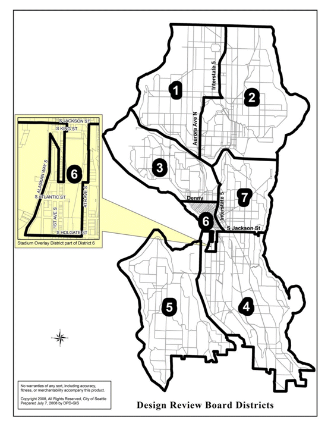

##### 23.41.008 - Design Review Board

1. Role of the Design Review Board. The Design Review Board shall be convened for the purpose of reviewing all development subject to design review, except development subject to administrative or streamlined design review pursuant to this Chapter 23.41, Design Review. To accomplish this purpose, the Design Review Board shall:

    1. Synthesize community input on design concerns and provide early design guidance to the development team and community; and
    2. Recommend to the Director specific conditions of approval which are consistent with the design guidelines applicable to the development; and
    3. Ensure fair and consistent application of Citywide or neighborhood-specific design guidelines.
2. Design Review Board membership criteria

    1. Members shall reside in Seattle; and
    2. Members should possess experience in neighborhood land use issues and demonstrate, by their experience, sensitivity in understanding the effect of design decisions on neighborhoods and the development process; and
    3. Members should possess a familiarity with land use processes and standards as applied in Seattle; and
    4. Consistent with the City's Code of Ethics, Section 4.16.070, no member of the Design Review Board shall have a financial or other private interest, direct or indirect, personally or through a member of his or her immediate family, in a project under review by the Design Review Board on which that member sits.
3. Design Review Board composition

    1. The Design Review Board shall be composed as follows:
    2. Term. Upon appointment to the Design Review Board, a member shall serve for a period of two years. A member may be re-appointed to subsequent terms pursuant to the selection and confirmation process in subsection 23.41.008.C.1. The Director may extend the existing term of a serving member by up to one year in order to avoid more than two vacancies at any time.
4. Design Review Board Assignment.

    1. Each design review district shall be assigned a Design Review Board consisting of five (5) members, as follows:

        1. One (1) member representing development-related interests;
        2. One (1) member representing general community interests;
        3. One (1) member representing the design professions;
        4. One (1) member representing local residential interests; and
        5. One (1) member representing local business interests.
    2. Three (3) Design Review Board members shall be a quorum of each District Design Review Board.
    3. The five (5) Design Review Board members assigned to each project as described in subsection D1 of this section shall be known collectively as the District Design Review Board. All members of the District Design Review Board shall be voting members.
    4. Substitutions.

        1. In the event that more projects are undergoing simultaneous design review than a District Design Review Board can review in a timely manner, the Director may assign such projects to a geographically unassigned Substitute Design Review Board, whose five (5) members the Director may select from the Substitute Design Review Board membership described in subsection D5, so long as the five (5) members represent each of the five interests required by subsection D1.
        2. If an individual District Design Review Board member is unable to serve, the Director may either appoint an individual from another District Design Review Board or may appoint a Substitute Design Review Board member from the Substitute Design Review Board membership described in Subsection D5 to serve in his or her absence, provided that each interest group is represented by one (1) member.
        3. The Director may assign a Design Review Board to review a project outside of its designated district in order to expedite review, provided that the local residential representative and local business representative shall review development only within their district. In such a case, the Director shall appoint the local residential representative and the local business representative from the District Board from which the project originated, or a local residential representative and a local business representative from the Substitute Design Review Board provided in subsection D5, or any combination thereof, to review the project, so long as the local residential representative and the local business representative appointed are from the same geographic district as the project to be reviewed.
    5. Substitute Design Review Board Membership.

        1. Membership criteria:

            1. A person must have been a member of the Design Review Board whose term has expired;
            2. A person must indicate a willingness to continue participation on the Board; and
            3. A person must have, in the opinion of the Director, demonstrated a commitment to Design Review through exemplary attendance and Board participation.
        2. The term of service for Substitute Design Review Board members is indefinite.
5. Meetings of the Design Review Board.

    1. Project-specific early design guidance public meetings shall be held as required in Section 23.41.014 B. Notice of meetings of the Design Review Board shall be provided as described in Chapter 23.76, Procedures for Master Use Permits and Council Land Use Decisions.
    2. All meetings of the Design Review Board shall be held in the evening in a location which is accessible and conveniently located in the same design review district as the proposed project. Board meetings are open to the general public. The actions of the Board are not quasi-judicial in nature.

##### 23.41.010 - Design review guidelines

1. The "Seattle Design Guidelines, 2013" and the "Guidelines for Downtown Development, 1999" are approved. The "Seattle Design Guidelines, 2013", the neighborhood design guidelines identified in subsection 23.41.010.B, and Master Planned Community design guidelines identified in subsection 23.41.010.C provide the basis for Design Review Board recommendations and City design review decisions, except in Downtown, where the "Guidelines for Downtown Development, 1999" apply. Neighborhood design guidelines and Master Planned Community design guidelines are intended to augment and make more specific the "Seattle Design Guidelines, 2013" and the "Guidelines for Downtown Development, 1999." To the extent there are conflicts between neighborhood design guidelines or Master Planned Community design guidelines and the "Seattle Design Guidelines, 2013" or "Guidelines for Downtown Development, 1999," the neighborhood design guidelines or Master Planned Community design guidelines supersede.
2. The following neighborhood design guidelines are approved. These neighborhood design guidelines apply in the areas shown on the map included in the guidelines.

    1. "Admiral Design Guidelines, 2013";
    2. "Ballard Municipal Center Master Plan Area Design Guidelines, 2013";
    3. "Belltown Urban Center Village Design Guidelines, 2004";
    4. "Capitol Hill Design Guidelines, 2013";
    5. "Green Lake Design Guidelines, 2013";
    6. "Greenwood/Phinney Design Guidelines, 2013";
    7. "Morgan Junction Design Guidelines, 2013";
    8. "North Beacon Hill Design Guidelines, 2013";
    9. "North District/Lake City Guidelines, 2013";
    10. "Northgate Design Guidelines, 2013";
    11. "Othello Design Guidelines, 2013";
    12. "Pike/Pine Design Guidelines, 2013";
    13. "Roosevelt Design Guidelines, 2015";
    14. "South Lake Union Design Guidelines, 2013";
    15. "University Design Guidelines, 2013";
    16. "Upper Queen Anne Design Guidelines, 2013";
    17. "Uptown Design Guidelines, 2013";
    18. "Wallingford Design Guidelines, 2013"; and
    19. "West Seattle Junction Design Guidelines, 2013".
3. The following Master Planned Community design guidelines are approved:

    1. Yesler Terrace Master Planned Community Design Guidelines, 2012, Exhibit B to the ordinance introduced as Council Bill 117541.

##### 23.41.012 - Development standard departures

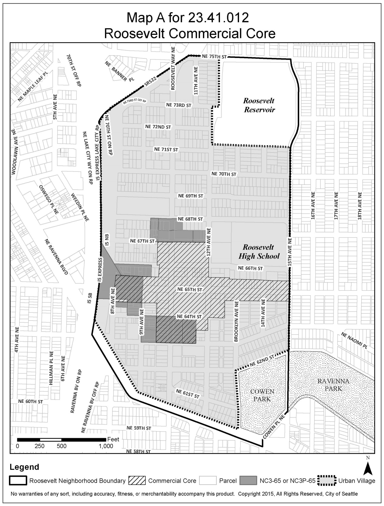

Map A forRoosevelt Commercial Core

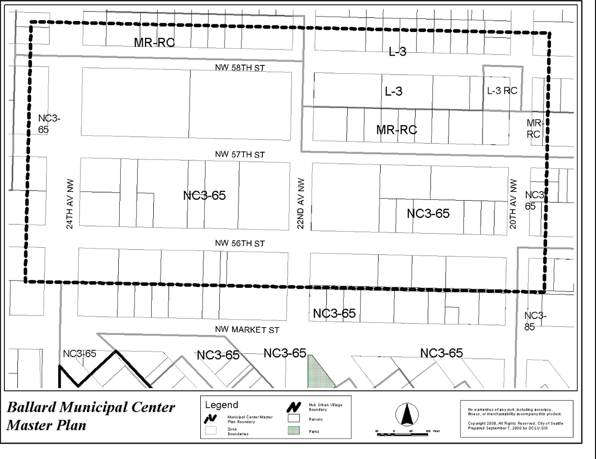

Map B for Ballard Municipal Center Master Plan Area

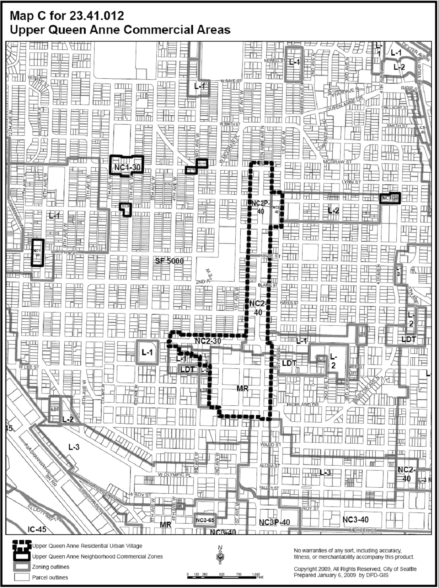

Map C for Upper Queen Anne Commercial Areas

1. Departure from Land Use Code requirements may be permitted for new multifamily, commercial, and Major Institution development as part of a design review process. Departures may be allowed if an applicant demonstrates that departures from Land Use Code requirements would result in a development that better meets the intent of adopted design guidelines.
2. Departures may be granted from any Land Use Code standard or requirement, except for the following:

    1. Procedures;
    2. Permitted, prohibited, or conditional use provisions, except that departures may be granted from development standards for required street-level uses;
    3. Residential density limits;
    4. In Downtown zones, provisions for exceeding the base FAR or achieving bonus development as provided in Chapter 23.49, Downtown Zoning;
    5. In Downtown zones, the minimum size for Planned Community Developments as provided in Section 23.49.036;
    6. In Downtown zones, the average floor area limit for stories in residential use in Table B for 23.49.058;
    7. In Downtown zones, the provisions for combined lot developments as provided in Section 23.49.041;
    8. In Downtown Mixed Commercial zones, tower spacing requirements as provided in subsection 23.49.058.F;
    9. In the Downtown Mixed Commercial 160 zone, minimum floor-to-floor height for street-level uses required as a condition of the additional height allowed by subsection 23.49.008.E;
    10. Downtown view corridor requirements, provided that departures may be granted to allow open railings on upper level roof decks or rooftop open space to project into the required view corridor, provided such railings are determined to have a minimal impact on views and meet the requirements of the Building Code;
    11. In SM-SLU zones in the South Lake Union Urban Center, floor area limits for all uses provided in subsections 23.48.245.A, 23.48.245.B.1, 23.48.245.B.2, and 23.48.245.B.3, except that departures of up to a 5 percent increase in floor area limit for each story may be granted for structures with non-residential uses meeting the requirements of subsections 23.48.245.B.1.d.1 and 23.48.245.B.1.d.2;
    12. In SM, SM-D, SM-SLU, and SM-NR zones provisions for gaining extra floor area provided for in Section 23.48.021, 23.48.221 and Chapter 23.58A, except that departures may be granted from the requirements of subsections 23.48.021.C.1.b.2, 23.48.021.C.1.b.3a, 23.48.021.C.1.b.4 and 23.48.021.C.1.b.5, if the applicant demonstrates that the amenity better achieves the intent of the Downtown Amenity Standards for that amenity feature.
    13. In SM-SLU zones in the South Lake Union Urban Center, provisions limiting the number of towers permitted per block provided for in Section 23.48.245;
    14. In the SM-SLU zones in the South Lake Union Urban Center, provisions for upper-level setbacks provided for in Section 23.48.245;
    15. Floor Area Ratios; except that in the Pike/Pine Conservation Overlay District shown on Map A for 23.73.004, departures from the development standards for allowing floor area exemptions from FAR calculations in subsection 23.73.009.C and for retaining a character structure on a lot in Section 23.73.015 are not considered departures from FAR limits;
    16. Maximum size of use;
    17. Structure height, except that:

        1. Within the Roosevelt Commercial Core building height departures up to an additional 3 feet may be granted for properties zoned NC3-65, (Map A for 23.41.012, Roosevelt Commercial Core);
        2. Within the Ballard Municipal Center Master Plan area building height departures may be granted for properties zoned NC3-65, (Map B for 23.41.012, Ballard Municipal Center Master Plan Area). The additional height may not exceed 9 feet, and may be granted only for townhouses that front a mid-block pedestrian connection or a park identified in the Ballard Municipal Center Master Plan;
        3. In Downtown zones building height departures may be granted for minor communication utilities as set forth in subsection 23.57.013.B;
        4. Within the Uptown Urban Center building height departures up to 3 feet of additional height may be granted if the top floor of the structure is set back at least 6 feet from all lot lines abutting streets;
        5. Within the Queen Anne Residential Urban Village and Neighborhood Commercial zones as shown on Map C for 23.41.012, Upper Queen Anne Commercial Areas, building height departures up to 3 feet of additional height may be granted if the top floor of the structure is set back at least 6 feet from all lot lines abutting streets;
        6. Within the PSM 85-120 zone in the area shown on Map A for 23.49.180, departures may be granted from development standards that apply as conditions to additional height, except for floor area ratios and provisions for adding bonus floor area above the base FAR;
        7. Within the Pike/Pine Conservation Overlay District shown on Map A for 23.73.004, departures may be granted from development standards that apply as conditions to additional height in subsections 23.73.014.A and 23.73.014.B, and the provision for receiving sites for transfer of development potential in subsection 23.73.024.B.5.
    18. Quantity of parking required, minimum and maximum parking limits, and minimum and maximum number of drive-in lanes, except that within the Ballard Municipal Center Master Plan area departures may be granted from the minimum parking requirement up to a 30 percent maximum reduction for ground level retail uses that abut established mid-block pedestrian connections through private property as identified in the "Ballard Municipal Center Master Plan Design Guidelines, 2013";
    19. Provisions of the Shoreline District, Chapter 23.60A;
    20. Standards for storage of solid-waste containers;
    21. The quantity of open space required for major office projects in Downtown zones as provided in subsection 23.49.016.B;
    22. Noise and odor standards;
    23. Standards for the location of access to parking in Downtown zones;
    24. Provisions of Chapter 23.52, Transportation Concurrency and Transportation Impact Mitigation;
    25. Provisions of Chapter 23.53, Requirements for Streets, Alleys, and Easements, except that departures may be granted from the access easement standards in Section 23.53.025;
    26. Affordable housing production conditions within the MPC-YT zone, pursuant to Section 23.75.085;
    27. Limits on floor area for uses within the MPC-YT zone, as provided in Sections 23.75.085 and 23.75.090 or as applicable under Section 23.75.040;
    28. Limits on number, distribution, and gross floor area per story for highrise structures within the MPC-YT zone, as provided in Section 23.75.120 or as applicable under Section 23.75.040;
    29. Definitions;
    30. Measurements;
    31. Lot configuration standards in subsections 23.22.100.C.3, 23.24.040.A.9, and 23.28.030.A.3, which may be modified as authorized in those provisions;
    32. Standards for structural building overhangs in Section 23.53.035 and structural encroachments permitted in setbacks provided in lieu of dedication of right-of-way under subsection 23.53.015.D.1.b;
    33. Within the Pike/Pine Conservation Overlay District shown on Map A for 23.73.004, the requirement that all character structures on a lot be retained in order to qualify as a TDP receiving site in subsection 23.73.024.B, the exception allowing additional FAR for non-residential uses in subsection 23.73.009.B, the FAR exemption for residential uses in subsection 23.73.009.C.3, the exception to floor area limits in subsections 23.73.010.B.1 and 23.73.010.B.2, the exception for width and depth measurements in subsection 23.73.012.B, or the exception for an additional 10 feet in height as provided for in subsection 23.73.014.B.

        1. Departures may, however, be granted under the following circumstances:

            1. The character structure is neither a designated Seattle landmark nor listed in a rule promulgated by the Director according to Section 23.73.005; and
            2. The departure is for demolishing a wood-frame character structure originally built as a single-family residence or single-family accessory structure; or
            3. The departure is for demolishing a character structure that is determined to have insufficient value to warrant retention when the following applies:

                1. The structure lacks a high degree of architectural integrity as evidenced by extensive irreversible exterior remodeling; or
                2. The structure does not represent the Pike/Pine neighborhood's building typology that is characterized by the use of exterior materials and design elements such as masonry, brick, and timber; multi-use loft spaces; very high and fully-glazed-ground-floor storefront windows; and decorative details including cornices, emblems, and embossed building names; or
                3. Demolishing the character structure would allow for more substantial retention of other, more significant character structures on the lot, such as a structure listed in a rule promulgated by the Director according to Section 23.73.005; or would allow for other key neighborhood development objectives to be achieved, such as improving pedestrian circulation by providing through-block connections, developing arts and cultural facilities, or siting publically-accessible open space at key neighborhood locations.
        2. In addition to the provisions of subsection 23.41.012.B.32.a, the following provisions apply:

            1. At least one character structure shall be retained on the lot if: subsection 23.73.009.C.3 regarding the FAR exemption for residential uses, subsection 23.73.010.B.2 regarding increases in the floor area limits, subsection 23.73.012.B regarding the exception from width and depth measurements, or subsection 23.73.014.B regarding the exception allowing for an additional 10 feet in height are being used by the development proposal.
            2. No character structures are required to be retained on the lot if: subsection 23.73.009.B regarding the exception to allow additional FAR for non-residential uses, subsection 23.73.010.B.1 regarding increases in the floor area limits, or Section 23.73.024 for the use of TDP on a lot that is an eligible TDP receiving site under the provisions of subsection 23.73.024.B are the only provisions being used by the development proposal.
    34. In pedestrian-designated zones, provisions for residential uses at street level, as provided in subsection 23.47A.005.C.1, except that a departure may be granted to allow residential uses at street level to occupy, in the aggregate, no more than 50 percent of the street-level street-facing facade;
    35. In pedestrian-designated zones, provisions for transparency requirements, as provided in subsection 23.47A.008.B, except that departures may be granted to reduce the required transparency from 60 percent to no less than 40 percent of the street-facing facade; and
    36. In pedestrian-designated zones, provisions for height requirements for floor-to-floor height, as provided in subsection 23.47A.008.B, except that departures to allow a mezzanine with less than the minimum floor-to-floor height may be granted provided that the outer edge of the mezzanine floor is at least 15 feet from the exterior wall facing a principal pedestrian street.
3. Limitations upon departures through the design review process established in subsections 23.41.012.B and 23.41.012.D do not limit departures expressly permitted by other provisions of this Title 23 or other titles of the Seattle Municipal Code.
4. Departures for the Living Building Pilot Program

    1. Criteria for departures. Departures from Land Use Code requirements for projects participating in the Living Building Pilot Program pursuant to Section 23.40.060 may be allowed if an applicant demonstrates that the departure would result in a development that better meets the intent of adopted design guidelines or that the departure would result in a development that better meets the goals of the Pilot Program and would not conflict with adopted design guidelines. In making this recommendation, the Design Review Board shall consider the extent to which the anticipated environmental performance of the building would be substantially compromised without the departures.
    2. Scope of departures. In addition to the departures allowed under subsection 23.41.012.B, departures for projects participating in the Living Building Pilot Program established under Section 23.40.060 may also be granted for the following:

        1. Permitted, prohibited or conditional use provisions, but only for accessory uses that would directly address an imperative of the Living Building Challenge, version 2.1, including but not limited to uses that could re-use existing waste streams or reduce the transportation impacts of people or goods;
        2. Residential density limits;
        3. Floor area ratios up to 15 percent above the otherwise applicable limit;
        4. Maximum size of use;
        5. Structure height, subject to the following:

            1. Structure height up to 10 feet for development in zones with height limits of 45 feet or less, to allow increased floor-to-floor heights;
            2. Structure height up to 20 feet for development in zones with height limits greater than 45 feet, to allow increased floor-to-floor heights;
            3. The additional height allowed for the structure will not allow an additional story beyond the number that could be built under the otherwise applicable height limit; and
            4. Rooftop features may be allowed to extend above the structure height approved pursuant to this subsection 23.41.012.D.2. e, if they are consistent with the applicable standards established for rooftop features within the zone;
        6. Quantity of parking required, minimum and maximum parking limits, and minimum and maximum number of drive-in lanes;
        7. Standards for storage of solid-waste containers;
        8. The quantity of open space required for major office projects in Downtown zones in subsection 23.49.016.B;
        9. Standards for the location of access to parking in Downtown zones; and
        10. Provisions of Chapter 23.53, Requirements for streets, alleys and easements.

##### 23.41.014 - Design review process

1. A preapplication conference is required for all projects subject to design review, unless waived by the Director, as described at Section 23.76.008.
2. Early Design Guidance Public Meeting.

    1. Following a preapplication conference, and site visits by Design Review Board members assigned to review a proposed project, an early design guidance public meeting with the Design Review Board shall be held.
    2. The purpose of the early design guidance public meeting shall be to identify concerns about the site and the proposed project, review the design guidelines applicable to the site, determine neighborhood priorities among the design guidelines, and explore design concepts and/or options.
    3. At the early design guidance public meeting, the project proponents shall present the following information:

        1. An initial site analysis addressing site opportunities and constraints, the use of all adjacent buildings, and the zoning of the site and adjacent properties; and
        2. A drawing of existing site conditions, indicating topography of the site and the location of structures and prominent landscape elements on or abutting the site (including but not limited to all trees 6 inches or greater in diameter measured 4.5 feet above the ground, with species indicated); and
        3. Photos showing the facades of adjacent development, trees on the site, general streetscape character and territorial or other views from the site, if any; and
        4. A zoning envelope study that includes a perspective drawing; and
        5. A description of the proponent's objectives with regard to site development.
        6. In the Pike/Pine Conservation Overlay District established in Section 23.73.004, if a character structure is located on the same lot as a proposed project, the applicant shall:

            1. Analyze the features that define the developed context of the structures located on the block front where the project is proposed, and on all block fronts facing the project;
            2. Evaluate the relationship of the character structure's key architectural and structural elements to the developed context, and how the new project will respond to this relationship; and
            3. Evaluate the character structure's key architectural and structural elements and how the new project will maintain those elements by retaining the character structure or reflecting those elements in the new structure, or both.
    4. Except as provided in this subsection 23.41.014.B.4, the proponent is encouraged, but not required, to bring one or more development concepts or alternatives to indicate possible design options for the site. In the Pike/Pine Conservation Overlay District established in Section 23.73.004, if a character structure is located on the same lot as a proposed project, the applicant shall provide at least one alternative development concept that maintains the character structure's key architectural and structural elements and the integrity of the character structure.
3. Guidelines Priorities.

    1. Based on the concerns expressed at the early design guidance public meeting or in writing to the Design Review Board, the Board shall identify any guidelines that may not be applicable to the site and identify those guidelines of highest priority to the neighborhood. The Board shall incorporate any community consensus regarding design, expressed at the meeting into its guideline priorities, to the extent the consensus is consistent with the design guidelines and reasonable in light of the facts of the proposed development.
    2. The Director shall distribute a copy of the guideline priorities applicable to the development to all those who attended the early design guidance public meeting, to those who sent in comments or otherwise requested notification, and to the project proponent.
    3. The project proponent is encouraged to meet with the Board and the public for early resolution of design issues, and may hold additional optional meetings with the public or the Board. The Director may require the proponent to meet with the Board if the Director believes that such a meeting may help to resolve design issues.
4. Application for Master Use Permit.

    1. Following the early design guidance public meeting, distribution of the guideline priorities, and any additional optional meetings that the project proponent chooses to hold with the public and the Design Review Board, the proponent may apply for a Master Use Permit.
    2. The Master Use Permit (MUP) application submittal shall include a supporting site analysis and an explanation of how the proposal addresses the applicable design guidelines, in addition to standard MUP submittal requirements as provided in Chapter 23.76, Procedures for Master Use Permits and Council Land Use Decisions.
    3. Notice of application for a development subject to design review shall be provided according to Chapter 23.76, Procedures for Master Use Permits and Council Land Use Decisions.
5. Design Review Board Recommendation.

    1. During a regularly scheduled evening meeting of the Design Review Board, other than the early design guidance public meetings, the Board shall review the record of public comments on the project's design, the project's conformance to the guideline priorities applicable to the proposed project, and the staff's review of the project's design and its application of the design guidelines.
    2. At the meeting of the Design Review Board, a determination shall be made by the Design Review Board that the proposed design submitted by the project proponent does or does not comply with applicable design guidelines. The Design Review Board shall recommend to the Director whether to approve or conditionally approve the proposed project based on the design guidelines, and whether to approve, condition or deny any requested departures from development standards.
6. Director's Decision.

    1. A decision on an application for a permit subject to design review shall be made by the Director. The Director may condition a proposed project to achieve compliance with design guidelines and to achieve the purpose and intent of this chapter. For applications accepted into the Living Building Pilot Program established under Section 23.40.060, the Director may also condition a proposed project to achieve the purpose and intent of the Living Building Pilot Program.
    2. Projects Subject To Design Review Must Meet All Codes And Regulatory requirements applicable to the subject site, except as provided in Section 23.41.012.
    3. The Director's design review decision shall be made as part of the overall Master Use Permit decision for the project. The Director's decision shall consider the recommendation of the Design Review Board. Except for projects accepted in the Living Building Pilot Program established in Section 23.40.060, if four or more members of the Design Review Board are in agreement in their recommendation to the Director, the Director shall issue a decision that makes compliance with the recommendation of the Design Review Board a condition of permit approval, unless the Director concludes that the recommendation of the Design Review Board:

        1. Reflects inconsistent application of the design review guidelines; or
        2. Exceeds the authority of the Design Review Board; or
        3. Conflicts with SEPA conditions or other regulatory requirements applicable to the site; or
        4. Conflicts with the requirements of state or federal law.
7. Notice of Decision. Notice of the Director's decision shall be as provided in Chapter 23.76, Procedures for Master Use Permits and Council Land Use Decisions.
8. Appeals. Appeal procedures for design review decisions are as described in Chapter 23.76, Procedures for Master Use Permits and Council Land Use Decisions.

##### 23.41.016 - Administrative design review process.

1. A preapplication conference is required for all projects electing administrative design review, unless waived by the Director, as described at Section 23.76.008.
2. Early Design Guidance Process.

    1. Following a preapplication conference, a proponent may apply to begin the early design guidance process. Application for the early design guidance process shall include the following:

        1. An initial site analysis addressing site opportunities and constraints, the use of all adjacent buildings, and the zoning of the site and adjacent properties; and
        2. A drawing of existing site conditions, indicating topography of the site and the location of structures and prominent landscape elements on or abutting the site (including but not limited to all trees six (6) inches or greater in diameter measured four and one-half (4½) feet above the ground, with species indicated) if any; and
        3. Photos showing the facades of adjacent development, general streetscape character and territorial or other views from the site, if any; and
        4. A zoning envelope study which includes a perspective drawing; and
        5. A description of the proponent's objectives with regard to site development, including any preliminary design concepts or options.
    2. Notice of application shall be provided pursuant to Chapter 23.76, Procedures for Master Use Permits and Council Land Use Decisions.
    3. The purpose of the early design guidance process shall be to identify concerns about the site and development program, receive comments from the public, identify those citywide design guidelines of highest priority to the site, and/or explore conceptual design or siting alternatives. As a result of this process, the Director shall identify and prepare a written summary of any guidelines which may not be applicable to the project and site and identify those guidelines of highest priority to the neighborhood. The Director shall incorporate any community consensus regarding the design, as expressed in written comments received, into the guideline priorities, to the extent the consensus is consistent with the design guidelines and reasonable in light of the facts of the proposed development.
    4. The Director shall distribute a copy of the priority-guidelines summary to all who sent in comments or otherwise requested notification and to the project proponent.
3. Application for Master Use Permit.

    1. Upon completion of the early design guidance process, the proponent may apply for a Master Use Permit (MUP).
    2. The MUP application shall include a supporting site analysis and an explanation of how the proposal addresses the applicable design guidelines, in addition to standard MUP submittal requirements as provided in Chapter 23.76, Procedures for Master Use Permits and Council Land Use Decisions.
    3. Notice of application for a development subject to design review shall be provided according to Chapter 23.76, Procedures for Master Use Permits and Council Land Use Decisions.
4. Director's Decision.

    1. A decision on an application for administrative design review shall be made by the Director as part of the overall Master Use Permit decision for the project.
    2. The Director's decision shall be based on the extent to which the proposed project meets applicable design guidelines and in consideration of public comments on the proposed project.
    3. Projects subject to administrative design review must meet all codes and regulatory requirements applicable to the subject site, except as provided for in Section 23.41.012.
5. Notice of Decision. Notice of the Director's decision shall be as provided in Chapter 23.76, Procedures for Master Use Permits and Council Land Use Decisions.
6. Appeals. Appeal procedures for design review decisions are described in Chapter 23.76, Procedures for Master Use Permits and Council Land Use Decisions.

##### 23.41.018 - Streamlined administrative design review (SDR) process

1. A presubmittal conference is required for all projects subject to this Section 23.41.018 unless waived by the Director, pursuant to Section 23.76.008.
2. Following a presubmittal conference, a proponent may apply to begin the SDR guidance process.

    1. The application for SDR guidance shall include the following:

        1. An initial site analysis addressing site opportunities and constraints, adjacent buildings, and the zoning of the site and adjacent properties;
        2. A drawing of existing site conditions, indicating topography of the site and location of structures and prominent landscape elements on the site (including but not limited to all trees 6 inches or greater in diameter measured 4.5 feet above the ground, with species indicated) if any;
        3. A preliminary site plan including structures, open spaces, vehicular and pedestrian access, and landscaping;
        4. A brief description of how the proposal meets the intent of the applicable citywide and neighborhood design review guidelines; and
        5. One or more color renderings adequate to depict the overall massing of structures and the design concept.
    2. Notice of application for SDR Guidance shall be provided pursuant to Chapter 23.76.
    3. The purpose of SDR Guidance is to receive comments from the public, identify concerns about the site and design concept, identify applicable citywide and neighborhood design guidelines of highest priority to the site, explore conceptual design and siting alternatives, and identify and document proposed development standard adjustments, which may be approved as a Type I decision pursuant to Section 23.41.018.D, or departures, which may be approved as a Type II decision pursuant to Section 23.41.016. The intent of SDR Guidance is not to reduce the general development capacity of the lot.
    4. As a result of the SDR Guidance process, the Director shall prepare a report that identifies those guidelines of highest priority and applicability, documents any design changes needed to achieve consistency with the design guidelines, and identifies any desired development standard adjustments and/or departures.
    5. The Director shall distribute a copy of the report to the applicant, place it on file in the Department, and provide access to the report on the Department website.
3. Application for Type I or Type II Master Use Permit.

    1. After issuance of the SDR Guidance report, the proponent may apply for a Type I or Type II Master Use Permit.
    2. The Master Use Permit application shall include a brief explanation of how the proposal addresses the SDR guidance report, in addition to standard Master Use Permit submittal information required by Section 23.76.010. Adjustments to certain development standards pursuant to subsection 23.41.018.D may be approved as a Type I decision. If the need for development standard departures, authorized under Section 23.41.012 and beyond the adjustments allowed under subsection 23.41.018.D, is identified, the applicant may either revise the application to eliminate the need for the further departures, and proceed under this Section 23.41.018, or else apply for a Type II Master Use Permit for administrative design review pursuant to Section 23.41.016.
    3. Notice of application for a permit for a project subject to SDR shall be provided according to Chapter 23.76.
4. SDR decision

    1. The Director shall consider public comments on the proposed project, and the Director's decision shall be based on the extent to which the application meets applicable design guidelines and responds to the SDR guidance report.
    2. The Director's decision pursuant to the SDR process shall not reduce the number of units allowed per square foot of lot area when such a density limit is set in Table A for Section 23.45.512.
    3. The Director may allow the adjustments listed in subsection 23.41.018.D.4, if the adjustments are consistent with the SDR design guidance report and the adjustments would result in a development that:

        1. Better meets the intent of the adopted design guidelines and/or
        2. Provides a better response to environmental and/or site conditions, including but not limited to topography, the location of trees, stormwater management, or adjacent uses and structures.
    4. If the criteria listed in subsection 23.41.018.D.3 are met, the Director may allow adjustments to the following development standards to the extent listed for each standard:

        1. Setbacks and separation requirements may be reduced by a maximum of 50 percent;
        2. Amenity areas may be reduced by a maximum of 10 percent;
        3. Landscaping and screening may be reduced by a maximum of 25 percent;
        4. Structure width, structure depth, and façade length may be increased by a maximum of 10 percent; and
        5. Screening of parking may be reduced by a maximum of 25 percent.
    5. Limitations on adjustments through the SDR process established in this subsection 23.41.018.D do not limit adjustments expressly permitted by other provisions of this Title 23 or other titles of the Seattle Municipal Code.

##### 23.41.020 - Master Planned Community design review process

1. Scope. This Section 23.41.020 applies only to development proposals in Master Planned Community zones that do not include a request for departures. If an application in a Master Planned Community zone includes a request for departures, then the applicable design review procedures are in Section 23.41.014. For purposes of this Section 23.41.020, "highrise structure" and "non-highrise structure" are as defined in Section 23.75.020.
2. A preapplication conference is required for any application subject to this Section 23.41.020 unless waived by the Director, pursuant to Section 23.76.008.
3. Early design guidance.

    1. An early design guidance process is required only if a proposal includes a highrise structure.
    2. Following a pre-application conference, if required, and site visits by Design Review Board members assigned to review a proposed project, an early design guidance public meeting with the Design Review Board shall be held for each proposal that includes a highrise structure.
    3. The purpose of the early design guidance public meeting is to identify concerns about the site and the proposed project, review the design guidelines applicable to the site, determine neighborhood priorities among the design guidelines, and explore design concepts and/or options.
    4. At the early design guidance public meeting, the project proponents shall present the following information:

        1. An initial site analysis addressing site opportunities and constraints, the uses of all adjacent buildings, and the zoning of the site and adjacent properties;
        2. A drawing of existing site conditions, indicating topography of the site and the location of structures and prominent landscape elements on or abutting the site (including but not limited to all trees 6 inches or greater in diameter measured 4½ feet above the ground, with species indicated);
        3. Photos showing the facades of adjacent development, trees on the site, general streetscape character and territorial or other views from the site, if any;
        4. A zoning envelope study that includes a perspective drawing;
        5. A description of the proponent's objectives with regard to site development; and
        6. A development proposal, which may include possible design options if so elected by the applicant.
    5. Based on the concerns expressed at the early design guidance public meeting or in writing to the Design Review Board, the Board shall identify any guidelines that may not be applicable to the site and identify those guidelines of highest priority to the neighborhood. The Board shall make preliminary design recommendations, incorporating any community consensus regarding design expressed at the meeting, to the extent the consensus is consistent with the design guidelines and reasonable in light of the facts of the proposed development.
    6. The Director shall distribute a summary of the public comments and the Board's preliminary design recommendations from the early design guidance meeting to all persons who provided an address for notice at the meeting, submitted written comments, or made a written request for notice.
4. Application for Master Use Permit.

    1. Timing.

        1. If a proposal does not include a highrise structure, then following the pre-application conference or the Director's waiver of a pre-application conference pursuant to Section 23.76.008, the applicant may apply for a Master Use Permit.
        2. If a proposal includes a highrise structure, then following the early design guidance public meeting, distribution of the meeting summary, and any additional optional meetings that the applicant chooses to hold with the public and the Design Review Board, the applicant may apply for a Master Use Permit.
        3. The Master Use Permit application shall include a supporting site analysis and an explanation of how the proposal addresses the applicable design guidelines, in addition to standard MUP submittal requirements as provided in Chapter 23.76, and in the case of a highrise structure, the application shall also include a response to the Board's preliminary design recommendations from the early design guidance meeting.
5. Design review process and decision.

    1. Director's decision for non-highrise proposals. For a development proposal that does not include a highrise structure, the Director shall make a Type I design review decision. The Director's decision shall be based on the extent to which the proposed project meets applicable design guidelines, with consideration of public comments on the proposed project. The Director may condition a proposed project to achieve greater consistency with design guidelines and to achieve the purpose and intent of this Chapter 23.41.
    2. Design Review Board recommendation for highrise development proposals.

        1. If the proposal includes a highrise structure, then during a recommendation meeting, the Board shall review the record of public comments on the project's design, the project's conformance to the guidelines applicable to the proposed project, and the staff's review of the project's design and its application of the design guidelines.
        2. At a recommendation meeting, the Design Review Board shall determine whether the proposed design submitted by the applicant is consistent with applicable design guidelines. The Design Review Board may recommend to the Director whether to approve or conditionally approve the proposed project based on the design guidelines. The Design Review Board shall hold no more than two recommendation meetings on the proposed project, following the required early design guidance meeting and any optional meetings that the project proponent may hold with the public or the Design Review Board. If the Design Review Board does not issue a recommendation that a proposed project be approved, conditionally approved, or denied by the end of the second recommendation meeting, the remaining design review process shall proceed through design review pursuant to subsection 23.41.020.E.1.
    3. Director's decision for development proposals including a highrise structure.

        1. For a development proposal including a highrise structure, the Director shall make a Type I design review decision. The Director may condition approval of a development proposal to achieve greater consistency with design guidelines and to achieve the purpose and intent of this Chapter 23.41.
        2. The Director shall consider public comments on the proposed project and the recommendation of the Design Review Board. If four or more members of the Design Review Board agree in their recommendation to the Director, the Director shall issue a decision consistent with the recommendation of the Design Review Board, unless the Director concludes that the recommendation of the Design Review Board:

            1. Reflects inconsistent application of the design review guidelines; or
            2. Exceeds the authority of the Design Review Board; or
            3. Conflicts with SEPA conditions or other regulatory requirements applicable to the site; or
            4. Conflicts with the requirements of state or federal law.

### Chapter 23.42 - GENERAL USE PROVISIONS

Sections:

#### 23.42.010 - Identification of principal permitted uses.

Principal uses not listed in the respective zones of Subtitle III, Division 2 of SMC Title 23, Land Use Code shall be prohibited in those zones. If a use is not listed, the Director may determine that a proposed use is substantially similar to other uses permitted or prohibited in the respective zones, therefore, and should also be permitted or prohibited.

#### 23.42.020 - Accessory uses.

1. Any accessory use not permitted by Title 23, either expressly or by the Director, shall be prohibited. The Director shall determine whether any accessory use on the lot is incidental to the principal use on the same lot, and shall also determine whether uses not listed as accessory uses are customarily incidental to a principal use.

Unless Title 23 expressly permits an accessory use as a principal use, a use permitted only as an accessory use shall not be permitted as a principal use.

2. The general development standards for each zone shall apply to accessory uses unless the general standards are specifically modified.

#### 23.42.030 - Access to Uses

Vehicular and pedestrian access may be provided to a use in one zone across property in a different zone if:

1. The use to which access is being provided is permitted, either outright or as a conditional use, in the zone across which access is to be provided; or
2. The use to which access is being provided is a solid waste transfer station use permitted by conditional use in the zone in which it is proposed to be located, and the access for the solid waste transfer station use is across property located in an Industrial or Commercial 2 zone. The proposed access is subject to review under the conditional use criteria applicable to the principal use.

#### 23.42.038 - Uses allowed on vacant and underused lots in certain zones

1. Permitted uses. On any lot in a Downtown, Seattle Mixed, Highrise, Industrial or Commercial zone, except for NC1 zones and lots in landmark and special review districts, a Type I Master Use Permit may be issued for the following uses, pursuant to the provisions of subsections 23.42.038.B through 23.42.038.E:

    1. General retail sales and services in a kiosk or similar temporary structure;
    2. Mobile food or other vendors using a cart, trailer, van, or similar vehicle;
    3. Displays or installations of art;
    4. Entertainment uses that are outdoors;
    5. Horticulture use; or
    6. Any similar use or activity that is determined by the Director to have the likelihood of attracting and increasing pedestrian activity in the area.
2. Requirements

    1. A permit for the uses permitted by subsection 23.42.038.A shall be authorized for a period of three years and may be renewed for additional three-year terms at the discretion of the Director.
    2. Permits under Section 23.42.038 may not be issued for property that is located within a riparian corridor, a shoreline habitat, a shoreline habitat buffer, a wetland, a wetland buffer, a steep slope, or a steep slope buffer pursuant to the provisions of Chapter 25.09, Regulations for Environmentally Critical Areas.
    3. For entertainment uses that are outdoors, hours of operation shall be between 7 a.m. and 10 p.m. and the area of use shall be at least 50 feet from a residential zone;
3. Waiver of development standards. The Director may waive development standards for the uses allowed pursuant to subsection 23.42.038.A, except measures shall be incorporated to shield vehicle lights to minimize glare on nearby uses.
4. The uses permitted by Section 23.42.038 do not interrupt any legally established permanent use of a property or create, expand, or extend any nonconformity to development standards by an existing use.
5. For all uses authorized by Section 23.42.038, appropriate measures shall be taken to control queuing on or other blocking of an adjacent sidewalk or right-of-way.

#### 23.42.040 - Intermittent, temporary and interim uses

The Director may grant, deny or condition applications for the following intermittent, temporary, or interim uses not otherwise permitted or not meeting development standards in the zone.

1. Intermittent Uses.

    1. A Master Use Permit for a time period of up to one year may be authorized for any use that occurs no more than two days per week and does not involve the erection of a permanent structure, provided that:

        1. The use is not materially detrimental to the public welfare; and
        2. The use does not result in substantial injury to the property in the vicinity; and
        3. The use is be consistent with the spirit and purpose of the Land Use Code.
2. Temporary Four Week Use. A Master Use Permit for a time period of up to four weeks may be authorized for any use that does not involve the erection of a permanent structure and that meets the requirements of subsections 23.42.040.A.1.a—23.42.040.A.1.c.
3. Temporary Uses for Up to Six Months. A Master Use Permit for a time period of up to six months may be authorized for any use that does not involve the erection of any permanent structure and that meets the requirements of subsections 23.42.040.A.1.a-23.42.040.A.1.c.
4. Boatbuilding Shelters.

    1. A temporary use of premises, not involving the erection of any permanent structure, for the express purpose of sheltering the construction of boatbuilding projects by noncommercial home hobbyists, may be authorized by the Director by a revocable Master Use Permit for a period of not more than one year. One year extensions may be granted by the Director for a period not to exceed four years. The permit is subject to the following development standards:

        1. The boatbuilding shelter shall not detract from the general appearance of the neighborhood.
        2. The structure, though temporary, shall be sturdy enough to withstand inclement weather conditions.
        3. Measures which may be required to mitigate possible adverse impacts of the boatbuilding shelter may include, but are not limited to, restrictions on height, size, location or external treatment.
5. Temporary Relocation of Police and Fire Stations. A Master Use Permit may be issued for a period of 24 months or less for the temporary relocation of police and fire stations if the proposal complies with the criteria for approval of intermittent uses in subsections 23.42.040.A.1.a-23.42.040.A.1.c, and if the proposal does not involve the construction of any permanent structure. A Master Use Permit for temporary relocation of police and fire stations may be renewed once for a period not to exceed 12 months.
6. Light Rail Transit Facility Construction. A temporary structure or use that supports the construction of a light rail transit facility may be authorized by the Director pursuant to a Master Use Permit subject to the requirements of subsection 23.42.040.F and subsection 23.60.023 if the structure or use is within the Shoreline District.

    1. The alignment, station locations, and maintenance base location of the light rail transit system must first be approved by the City Council by ordinance or resolution.
    2. The temporary use or structure may be authorized for only so long as is necessary to support construction of the related light rail transit facility and must be terminated or removed when construction of the related light rail transit facility is completed or in accordance with the MUP.
    3. The applicant must submit plans for the establishment of temporary construction uses and facilities to the Director for approval. When reviewing the application, the Director shall consider the duration and severity of impacts, and the number and special needs of people and businesses exposed, such as frail, elderly, and special needs residents. Following review of proposed plans and measures to mitigate impacts of light rail transit facility construction, and prior to the issuance of any permits granting permission to establish construction facilities and uses, the Director may impose reasonable conditions to reduce construction impacts on surrounding uses and area, including but not limited to the following:

        1. Noise and Grading and Drainage. Noise impacts will be governed by the Noise Control Ordinance (Chapter 25.08) and off-site impacts associated with grading and drainage will be governed by the Grading Code (Chapter 22.170) and the Stormwater Code (Chapters 22.800 through 22.808).
        2. Light. To the extent feasible, light should be shielded and directed away from adjoining properties.
        3. Best Management Practices. Construction activities on the site must comply with Volume 2 of the Stormwater Director's Rules, Construction Stormwater Control Technical Requirements Manual.
        4. Parking and Traffic.

            1. Measures addressing parking and traffic impacts associated with truck haul routes, truck loading and off-loading facilities, parking supply displaced by construction activity, and temporary construction-worker parking, including measures to reduce demand for parking by construction employees, must be included and must be appropriate to the temporary nature of the use.
            2. Temporary parking facilities provided for construction workers need not satisfy the parking requirements of the underlying zone or the parking space standards of Section 23.54.030.
        5. Local Businesses. The applicant must address measures to limit disruption of local business, including pedestrian and/or auto access to business, loss of customer activity, or other impacts due to protracted construction activity.
        6. Security. The applicant must address site security and undertake measures to ensure the site is secure at all times and to limit trespassing or the attraction of illegal activity to the surrounding neighborhood.
        7. Site/Design. The construction site should be designed in a manner that minimizes pedestrian/vehicle conflicts and does not unnecessarily impede pedestrian mobility around the site and through adjoining neighborhoods. Measures should also be undertaken to ensure appropriate screening of materials storage and other construction activities from surrounding streets and properties.
        8. Public Information. Actions should be taken that will inform surrounding residents and businesses of construction activities taking place and their anticipated duration, including a 24 hour phone number to seek additional information or to report problems.
        9. Weather. Temporary structures must be constructed to withstand inclement weather conditions.
        10. Vibration. The applicant must consider measures to mitigate vibration impacts on surrounding residents and businesses.
    4. Site Restoration.

        1. The applicant must also agree, in writing, to submit a restoration plan to the Director for restoring areas occupied by temporary construction activities, uses or structures.
        2. The restoration plan must be submitted and approved prior to the applicant vacating the construction site and it must include proposals for cleaning, clearing, removing construction debris, grading, remediation of landscaping, and restoration of grade and drainage.
        3. Site restoration must generally be accomplished within 180 days of cessation of use of the site for construction uses and activities, unless otherwise agreed to between the applicant and the Director.
        4. The Director will approve plans for site restoration in accordance with mitigation plans authorized under this section.
    5. A Master Use Permit for a temporary structure or use that supports the construction of a light rail transit facility shall not be issued until the Director has received satisfactory evidence that the applicant has obtained sufficient funding (which might include a Full Funding Agreement with a federal agency) to complete the work described in the Master Use Permit application.
7. Interim Use Parking.

    1. Permitted use. A Master Use Permit may be issued for principal use surface parking in all zones within the Station Area Overlay District within the area bounded by I-5 to the west, I-90 to the north, Lake Washington to the east, and the Seattle corporate limits to the south, except within the boundaries of the North Beacon Hill station area, and in any zone on sites occupied or owned by established institutions within a quarter mile of a light rail station, including the North Beacon Hill light rail station.
    2. Eligibility. A site is eligible for interim principal use surface parking if there is existing, legally established parking on the site, or if the site or a portion of the site was interrupted at any time since January 1, 2001 by a government agency for construction staging purposes, provided that no existing principal structures may be demolished to facilitate establishment of interim principal use parking.
    3. Requirements

        1. A permit for interim principal use surface parking may be issued for a period not to exceed three years. A permit for interim principal use surface parking may not be renewed or extended, and a new permit to reauthorize the principal use surface parking shall not be issued.
        2. A permit for interim principal use surface parking may not be issued for property that is located within a riparian corridor, a wetland, a wetland buffer, a steep slope, or a steep slope buffer pursuant to the provisions of Chapter 25.09, Regulations for Environmentally Critical Areas or within priority freshwater habitat or priority saltwater habitat described in Section 23.60A.160.
    4. Standards. The following standards for interim principal use surface parking shall be met:

        1. Measures shall be incorporated to shield vehicle lights to minimize glare on nearby uses;
        2. The site shall, at a minimum, be improved with a crushed rock surface;
        3. If a barrier-free parking space is required pursuant to the Washington State Building Code, Chapter 11 or other applicable law, then the barrier-free space shall be located adjacent to a paved sidewalk or an area of the site sufficient to accommodate the barrier-free space shall be paved;
        4. In order to meet the landscaping requirements of the respective zone in which the parking use is to be located, temporary landscaping provided in planter boxes or similar containers may be substituted for required landscaping on site as determined by the Director;
        5. Lighting shall be provided by light poles or an equivalent substitute for light poles that are between 10 feet and 30 feet in height from finished grade, but no higher than the height limit of the zone in which the site is located, and placed at intervals sufficient to light the entire parking lot with uniformity, provided that the lighting is shielded and directed away from adjacent uses.
        6. No more than 40 new parking spaces shall be established on any site where interim light rail parking is permitted, except that institutions within a quarter mile of a light rail station that are not within the boundaries of the Station Area Overlay District may establish up to 100 spaces for interim rail parking.
8. Authorized intermittent, temporary, and interim uses do not interrupt any legally established permanent use of a property.

#### 23.42.042 - Conditional uses

1. Administrative conditional uses and uses requiring Council approval as provided in the respective zones of Subtitle III, Part 2, of this Land Use Code, and applicable provisions of SMC Chapter 25.09, Regulations for Environmentally Critical Areas, may be authorized according to the procedures set forth in Chapter 23.76, Procedures for Master Use Permits and Council Land Use Decisions.
2. In authorizing a conditional use, the Director or City Council may impose conditions to mitigate adverse impacts on the public interest and other properties in the zone or vicinity.
3. The Director may deny or recommend denial of a conditional use if the Director determines that adverse impacts cannot be mitigated satisfactorily, or that the proposed use is materially detrimental to the public welfare or injurious to property in the zone or vicinity in which the property is located.
4. A use that was legally established but that is now permitted only as a conditional use is not a nonconforming use and will be regulated as if a conditional use approval had earlier been granted.
5. Any authorized conditional use that has been discontinued may not be re-established or recommenced except pursuant to a new conditional use permit. The following will constitute conclusive evidence that the conditional use has been discontinued:

    1. A permit to change the use of the lot has been issued and the new use has been established; or
    2. The lot has not been used for the purpose authorized by the conditional use for more than 24 consecutive months. Lots that are vacant, or that are used only for storage of materials or equipment, will not be considered as being used for the purpose authorized by the conditional use. The expiration or revocation of business or other licenses necessary for the conditional use will suffice as evidence that the lot is not being used as authorized by the conditional use. A conditional use in a multifamily structure or a multi-tenant commercial structure will not be considered discontinued unless all portions of the structure are either vacant or committed to another use.

#### 23.42.044 - Construction-Related Parking.

1. When reviewing permit applications under this Code, the Director may require the applicant to avoid or mitigate potential parking impacts caused by construction activity and temporary construction-worker parking. Mitigation may include, but is not limited to, requiring parking for construction workers to be located on the construction site.
2. Temporary parking facilities provided for construction workers are exempt from the parking requirements of the underlying zone and the parking requirements of SMC 23.54.
3. Temporary parking provided for construction workers must be terminated or removed when construction is completed.

#### 23.42.048 - Configuration of dwelling units

1. Dwelling units. In all zones a dwelling unit exists if the use meets the requirements of subsection 23.42.048.A.1 or 23.41.048.A.2 and if the use is not an adult family home, congregate residence, assisted living facility, or nursing home.

    1. A separate or separable area within a building, including:

        1. a complete food preparation area. A room or portion of a room designed, arranged, intended or used for cooking or otherwise making food ready for consumption that contains a sink, and a stove or range, a refrigerator, and a countertop, shall be considered a complete food preparation area; and
        2. a bathroom containing a toilet, and a shower or bathtub; and
        3. one or more sleeping rooms.
    2. A sleeping room with an associated private bathroom including a toilet, and a shower or bathtub, within a separate or separable area of a building that contains more than 4 sleeping rooms, if:

        1. fifty percent or more of the sleeping rooms in the separate or separable area have an associated private bathroom including a toilet, and a shower or bathtub; or
        2. less than 30 percent of the floor area of the separate or separable area is in shared space such as a living or dining room.
    3. For the purposes of this subsection 23.42.048.A, a separate or separable area is an area having direct access to the exterior of the building or access to the exterior via hallways and stairways that are primarily ingress/egress routes to the exterior rather than leading to common kitchens and living areas.
2. Small efficiency dwelling units. In all zones small efficiency dwelling units are subject to the following standards. Small efficiency dwelling units are also subject to additional standards specified in the Seattle Building Code and any Director's Rule making interpretation thereof.

    1. Sleeping room net floor area. Each small efficiency dwelling unit shall have a sleeping room that has at least 150 net square feet of floor area. The floor area occupied by bathrooms, cabinets, closets, appliances, and structural features, is not included in calculating the net floor area.
    2. Total floor area. The total floor area of a small efficiency dwelling unit, inclusive of bathrooms, cabinets, closets, appliances, and structural features shall be at least 220 square feet.
    3. Food preparation area. Each small efficiency dwelling unit shall contain a food preparation area with a cooking appliance that may be portable, such as a microwave, a refrigerator, a sink, and not less than 4 square feet of contiguous countertop work area.
    4. Bathroom. Each small efficiency dwelling unit shall contain a bathroom with a toilet, sink, and a shower or bathtub.

#### 23.42.049 - Congregate residences

Congregate residences are subject to the development standards for the zone in which they are located, to the development standards for apartments where such housing type standards are specified, and to the following requirements:

1. Common food preparation area. At least one complete common food preparation area is required within the congregate residence, and all residents shall have access to either a common complete food preparation area or a food preparation area within a sleeping room.
2. Food preparation areas in sleeping rooms. Within a congregate residence not more than 25 percent of sleeping rooms shall have complete food preparation areas, where a complete food preparation area is identified by the presence of a plumbed sink, a stove or range, a refrigerator, and a counter top. The Director has discretion to increase the percentage up to 100 percent of sleeping rooms if the congregate residence is owned by a college or university, is a sorority or fraternity, or is owned by a not for profit entity or charity, or is a congregate residence that is licensed by the State and provides on-site supportive services for seniors or persons with disabilities. Supportive services include meal service, cleaning service, health services or similar services.
3. Communal area. Communal areas such as common kitchens, lounges, recreation rooms, dining rooms, living rooms, foyers and lobbies, that are accessible to all residents of the congregate residence with sufficient accommodations for socializing and meeting shall be provided, and shall meet the following standards:

    1. The total amount of communal area shall have a floor area that is at least 15 percent of the total floor area of all sleeping rooms. In calculating the total floor area of sleeping rooms, the abutting ancillary areas associated with sleeping rooms shall be included, such as: sleeping lofts, counters, closets, built-ins, and private bathrooms;
    2. Service areas, including, but not limited to hallways and corridors, supply or janitorial storage areas, operations and maintenance areas, staff areas and offices, and required bicycle parking areas may not be counted toward the communal area requirement;
    3. Communal areas are required in addition to any residential amenity area that is required in the zone.

#### 23.42.050 - Home occupations

A home occupation of a person residing in a dwelling unit is permitted outright in all zones as an accessory use to any residential use permitted outright or to a permitted residential conditional use, subject to the following requirements:

1. The occupation is clearly incidental to the use of the dwelling unit as a dwelling.
2. Commercial deliveries and pickups to the dwelling unit are limited to one per day Monday through Friday. No commercial deliveries or pickups are permitted on Saturday, Sunday or federal holidays.
3. Customer visits are by appointment only.
4. The occupation may be conducted within any legal principal or accessory dwelling unit or structure, provided that licensed child care may be conducted only in the principal structure or in an accessory dwelling unit. Home occupations may be conducted by residents of a principal dwelling unit and/or an accessory dwelling unit. The presence of one home occupation does not preclude a resident of another legally established dwelling unit on the property from also conducting a home occupation.
5. Parking of vehicles associated with the home occupation is permitted anywhere that parking is permitted on the lot.
6. To preserve the residential appearance of the dwelling unit, there shall be no evidence of the home occupation visible from the exterior of the structure, provided that:

    1. Outdoor play areas for licensed child care programs and outdoor activities customarily incidental to the residential use are permitted;
    2. Interior and exterior alterations and additions that comply with the development standards of the zone are permitted;
    3. Alterations and additions that are required by licensing or construction codes for licensed child care programs are permitted; and
    4. Signs identifying the home occupation are permitted subject to compliance with Chapter 23.55, Signs.
7. No outdoor storage is permitted in connection with a home occupation.
8. Except for licensed child care programs, no more than two persons who are not residents of a dwelling unit on the lot may work in a home occupation, regardless of whether the persons work full or part-time or are compensated.
9. The home occupation shall not cause a substantial increase in on-street parking congestion or a substantial increase in traffic within the immediate vicinity.
10. A maximum of two passenger vehicles, vans and similar vehicles each not exceeding a gross vehicle weight of 10,000 pounds are permitted to operate in connection with the home occupation, independent of commercial deliveries and pickups as provided for in subsection 23.42.050.B.
11. The home occupation shall be conducted so that noise, odor, smoke, dust, light and glare, and electrical interference and other similar impacts are not detectable by sensory perception at or beyond the property line of the lot where the home occupation is located.
12. Licensed child care programs in the home of the operator are limited to 12 children per day including the children of the operator.

#### 23.42.051 - Urban farms

1. All Urban Farms in Residential Zones. In all residential zones all urban farms are subject to the following provisions:

    1. Mechanical equipment. Only mechanical equipment designed for household use may be used.
    2. Sales. Retail sales and all other public use of the farm shall begin no earlier than 7:00 a.m. and end by 7:00 p.m. every day of the week.
    3. Deliveries. Commercial deliveries and pickups are limited to one per day. On-site sales are not considered commercial pickups.
    4. Motor vehicles. No more than two motor vehicles, each with a gross vehicle weight of 10,000 pounds or less, may be used for farm operations.
    5. Location. The farm shall be located on the same lot as the principal use to which it is accessory or on a lot where the planting area is within 800 feet of the lot where the principal use is located.
    6. Signs. One identification sign is permitted, not exceeding 64 square inches in area.
    7. Structures. On a lot with no principal structure:

        1. The total gross floor area of all structures for urban farm use may not exceed 1,000 square feet.
        2. Structures for urban farm use may not exceed 12 feet in height, including any pitched roof.
        3. Structures for urban farm use are also subject to the development standards that would apply to an accessory structure in the zone.
2. Urban Farms Requiring Conditional Use Permits in Residential Zones. If an urban farm in a residential zone requires an administrative conditional use permit, the provisions of this subsection 23.42.051.B also apply. The Director may approve, condition or deny a conditional use permit based on the general conditional use criteria applicable in the zone and based on potential impacts of the types described in this subsection 23.42.051.B.

    1. Management Plan. The applicant shall provide a proposed urban farm management plan that addresses any probable impacts of the type described in this subsection 23.42.051.B and includes any proposed mitigation measures. The plan shall include, without limitation:

        1. a site plan;
        2. description of the type of equipment necessary or intended for use in each season and the frequency and duration of anticipated use;
        3. disclosure of any intent to spray or otherwise apply agricultural chemicals or pesticides, frequency and duration of application, and the plants, diseases, pests or other purposes they are intended for;
        4. disclosure of whether the operation of the farm would involve 750 square feet or more of land-disturbing activity, or would otherwise require drainage approval under Chapter 22.800 et seq.; and
        5. a proposed sediment and erosion control plan.
    2. Potential Impacts and Mitigation. The Director, in determining whether to approve, approve with conditions or deny the application, shall consider the potential impacts and mitigation, including:

        1. Water Quality and Soils. Impacts of irrigation run-off on adjacent properties, water bodies and environmentally critical areas, and proposed sediment and erosion control measures.
        2. Traffic and Parking. Impacts related to the number of staff onsite during work hours, and the number of potential visitors regularly associated with the site.
        3. Visual Impacts and Screening. Visual impacts relating to the proposed nature, location, design, and size of proposed features, structures and activities, including the location of composting activities and planting areas, and any existing or proposed screening.
        4. Noise and Odor. Impacts related to the location on the lot of the proposed urban farm, any trash or compost storage areas, any farm stand or additional accessory structure, and any other noise-generating or odor-generating equipment and practices.
        5. Agricultural Chemicals. Impacts related to the use of chemicals, including any fertilizer and pesticide.
        6. Mechanical Equipment. Impacts related to the operation of equipment, including noise, odors, and vibration.
    3. Conditions of Approval. Conditions of approval may include, without limitation:

        1. measures such as landscaping or fences to mitigate potential visual impacts on adjacent property and public areas;
        2. measures such as landscaping, sound barriers or fences, mounding or berming, adjustments to location of parking or yard standards, structure design modifications, and limited hours of operation for facilities or activities, to mitigate potential noise and/or odor impacts; and
        3. measures related to operation of the urban farm consistent with some or all of the provisions of the urban farm management plan, with any amendments required or permitted by the Director.
3. Odors or Fumes. In all zones, no odors or fumes from an urban farm shall be allowed to escape into the open air in such amounts as to be detrimental to the health of any individuals or the public; or noticeable, discomforting or disagreeable so as to offend the sensibilities of a reasonable individual at a distance of more than 200 feet from an urban farm.

#### 23.42.052 - Keeping of animals

The keeping of small animals, farm animals, domestic fowl and bees is permitted outright in all zones as an accessory use to any principal use permitted outright or to a permitted conditional use, in each case subject to the standards of this Section 23.42.052.

1. Small Animals. Up to three small animals may be kept accessory to each business establishment, other than an urban farm, or dwelling unit on a lot, except as follows:

    1. In no case is more than one miniature potbelly pig allowed per business establishment or dwelling unit (see subsection 23.42.052.B).
    2. In single-family zones,

        1. accessory dwelling units shall not be considered separate dwelling units for the purpose of this Section 23.42.052;
        2. up to four small animals are permitted on lots of at least 20,000 square feet; and
        3. one additional small animal is permitted for each 5,000 square feet of lot area in excess of 20,000 square feet. Accessory structures, including kennels, for four or more animals must be at least 10 feet from any other lot in a residential zone.
2. Miniature Potbelly Pigs. That type of swine commonly known as the Vietnamese, Chinese, or Asian Potbelly Pig (Sus scrofa bittatus) may be kept as a small animal, provided that no swine that is greater than 22 inches in height at the shoulder or more than 150 pounds in weight may be kept in the city.
3. Domestic Fowl. Up to eight domestic fowl may be kept on any lot in addition to the small animals permitted in subsection 23.42.052.A.

    1. On lots greater than 10,000 square feet that include either a community garden or an urban farm, one additional fowl is permitted for every 1,000 square feet of lot area over 10,000 square feet in community garden or urban farm use.
    2. Roosters are not permitted.
    3. Structures housing domestic fowl must be located at least 10 feet away from any structure that includes a dwelling unit on an adjacent lot.
4. Farm Animals. Cows, horses, sheep and other similar farm animals are permitted only on lots of at least 20,000 square feet. The keeping of swine is prohibited, except for miniature potbelly pigs allowed under subsection 23.42.052.B.

    1. One farm animal for every 10,000 square feet of lot area is permitted.
    2. Farm animals and structures housing them must be kept at least 50 feet from any other lot in a residential zone.
5. Beekeeping. Beekeeping is permitted outright as an accessory use, when registered with the State Department of Agriculture, provided that:

    1. No more than four hives, each with only one swarm, are allowed on lots of less than 10,000 square feet.
    2. Hives shall not be located within 25 feet of any lot line except when situated 8 feet or more above the grade immediately adjacent to the grade of the lot on which the hives are located or when situated less than 8 feet above the adjacent existing lot grade and behind a solid fence or hedge six (6) feet high parallel to any lot line within 25 feet of a hive and extending at least 20 feet beyond the hive in both directions.
6. Miniature Goats. The types of goats commonly known as Pygmy, Dwarf and Miniature Goats may be kept as small animals, provided that male miniature goats are neutered and all miniature goats are dehorned. Nursing offspring of miniature goats licensed according to the provisions of this Code may be kept until weaned, no longer than 12 weeks from birth, without violating the limitations of subsection 23.42.052.A.

#### 23.42.053 - Community gardens

1. In all zones, the total gross floor area of all structures for community garden use may not exceed 1,000 square feet on any lot.
2. In all zones, structures for community garden use are limited to 12 feet in height, including any pitched roof.
3. Structures for community garden use are subject to the development standards of the zone as they apply to accessory structures.

#### 23.42.054 - Transitional encampments accessory to religious facilities or to other principal uses located on property owned or controlled by a religious organization

1. Transitional encampment accessory use. A transitional encampment is allowed as an accessory use on a site in any zone, if the established principal use of the site is as a religious facility or the principal use is on property owned or controlled by a religious organization, subject to the provisions of subsection 23.42.054.B. A religious facility site includes property developed with legally-established parking that is accessory to the religious facility. Parking accessory to a religious facility or located on property owned or controlled by a religious organization that is displaced by the encampment does not need to be replaced.
2. The encampment operator or applicant shall comply with the following provisions:

    1. Allow no more than 100 persons to occupy the encampment site as residents of the encampment.
    2. Comply with the following fire safety and health standards:

        1. Properly space, hang, and maintain fire extinguishers within the encampment as required by the Fire Department;
        2. Provide and maintain a 100-person first-aid kit;
        3. Establish and maintain free of all obstructions access aisles as required by the Fire Department;
        4. Install appropriate power protection devices at any location where power is provided;
        5. Designate a smoking area;
        6. Keep the site free of litter and garbage;
        7. Observe all health-related requirements made by the Public Health Department of Seattle & King County; and
        8. Post and distribute to encampment residents, copies of health or safety information provided by the City of Seattle, King County, or any other public agency.
        9. Prohibit any open flames except an outdoor heat source approved by the Fire Department.
    3. Provide toilets, running water, and garbage collection according to the following standards:

        1. Provide and maintain chemical toilets as recommended by the portable toilet service provider or provide access to toilets in an indoor location;
        2. Provide running water in an indoor location or alternatively, continuously maintain outdoor running water and discharge the water to a location approved by the City; and
        3. Remove garbage frequently enough to prevent overflow.
    4. Cooking facilities, if they are provided, may be located in either an indoor location or outdoors according to the following standards:

        1. Provide a sink with running water in an indoor location or alternatively, continuously maintain outdoor running water and discharge the water to a location approved by the City;
        2. Provide a nonabsorbent and easily-cleanable food preparation counter;
        3. Provide a means to keep perishable food cold; and
        4. Provide all products necessary to maintain the cooking facilities in a clean condition.
    5. Allow officials of the Public Health Department of Seattle & King County, the Seattle Fire Department, and the Seattle Department of Construction and Inspections to inspect areas of the encampment that are located outdoors and plainly visible without prior notice to determine compliance with these standards.
    6. Individuals under the age of 18 years that are not accompanied by a parent or legal guardian shall not be permitted in an encampment.
    7. File a site plan with the Seattle Department of Construction and Inspections showing the arrangement of the encampment, including numbers of tents or similar sleeping shelters, all facilities that are separate from the sleeping shelters, and all existing structures on the property, if any. The site plan is for informational purposes and is not subject to City review or permitting requirements.
3. A site inspection of the encampment by a Department inspector is required prior to commencing encampment operations.
4. Parking is not required for a transitional encampment allowed under this Section 23.42.054.

#### 23.42.056 - Transitional encampment as an interim use

A Type I Master Use Permit may be issued for a transitional encampment interim use according to the requirements of this Section 23.42.056.

1. The Director, in consultation with the Human Services Director, shall adopt a rule according to subsection 23.88.010.A that includes but is not limited to establishing:

    1. Community outreach requirements that include:

        1. Community outreach standards that the encampment operator shall comply with before filing a transitional encampment interim use permit application, whether for a new transitional encampment or relocation of an existing transitional encampment. At a minimum, outreach standards shall contain a requirement that the encampment operator convene at least one public meeting in the neighborhood where the transitional encampment interim use is proposed to be established, at least 14 days prior to applying for a permit;
        2. A requirement that the proposed encampment operator establish a Community Advisory Committee that would provide advisory input on proposed encampment operations including identifying methods for handling community complaints or concerns as it relates to the facility or facility clients. The committee shall include one individual identified by each stakeholder group in the geographic area where the proposed encampment would be located as best suited to represent their interests. The committee shall consist of no more than seven members. Encampment operator representatives shall attend committee meetings to answer questions and shall provide regular reports to the committee concerning encampment operations. City staff may attend the meetings; and
    2. Operations standards that the encampment operator is required to implement while an encampment is operating.
2. Location. The transitional encampment interim use shall be located on property meeting the following requirements:

    1. The property is:

        1. Zoned Industrial, Downtown, SM, NC2, NC3, C1, or C2; except if the property is in a residential zone as defined in Section 23.84A.048 or is in a special review district established by Chapter 23.66; or
        2. Within a Major Institution Overlay district.
    2. The property is at least 25 feet from any residentially-zoned lot.
    3. A property may be less than 25 feet from a residentially-zoned lot and used as an encampment site if:

        1. All encampment facilities, improvements, activities, and uses are located at least 25 feet from any residentially-zoned lot. Access to the encampment site may be located within the 25-foot setback area; and
        2. Screening is installed and maintained along each encampment boundary, except boundaries fronting on an opened public street. The screening shall consist of existing or installed vegetation that is sufficiently dense to obscure viewing the encampment site, or a 6-foot high view-obscuring fence or wall.
    4. The property is owned by the City of Seattle, a private party, or an Educational Major Institution.
    5. The property is within 1/2 mile of a transit stop. This distance shall be the walking distance measured from the nearest transit stop to the lot line of the lot containing the encampment site.
    6. The property is, as measured by a straight line, at least 1 mile from any other legally-established transitional encampment interim use including encampments accessory to a religious facility or accessory to other principal uses on property owned or controlled by a religious organization. This subsection 23.42.056.A.6 shall not apply to encampments on sites owned or controlled by religious organizations, or to any legally-established transitional encampment interim use that provides shelter for fewer than ten persons.
    7. The property is 5,000 square feet or larger and provides a minimum of 100 square feet of land area for each occupant that is permitted to occupy the encampment site.
    8. The property does not contain a wetland, wetland buffer, known and potential landslide designations, steep slope, steep slope buffer, or fish and wildlife habitat conservation area defined and regulated by Chapter 25.09, Regulations for Environmentally Critical Areas, unless all encampment facilities, improvements, activities, and uses are located outside any critical area and required buffer as provided for in Chapter 25.09.
    9. The encampment site is not used by an existing legally-permitted use for code or permit-required purposes including but not limited to parking or setbacks.
    10. The property is not an unopened public right of way; or designated as a park, playground, viewpoint, or multi-use trail by the City or King County.
3. Operation. The transitional encampment interim use shall meet the following requirements:

    1. The encampment may be operated by a private party that shall prepare an Encampment Operations Plan that shall address: site management, site maintenance, provision of human and social services, referrals to service providers that are able to provide services to individuals under the age of 18 who arrive at an encampment unaccompanied by a parent or legal guardian, and public health and safety standards. The operations plan shall be filed with the transitional encampment interim use permit application.
    2. The operator shall be included in the qualified encampment roster prepared by the Human Services Director. The transitional encampment interim use permit applicant shall include documentation as part of the permit application demonstrating that the encampment operator is on the qualified encampment operator roster.
4. Additional requirements. The transitional encampment interim use shall meet the following requirements:

    1. The requirements for transitional encampment accessory uses in subsections 23.42.054.B and 23.42.054.C.
    2. The operator of a transitional encampment interim use located on City-owned property shall obtain prior to permit issuance and maintain in full force and effect, at its own expense, liability insurance naming the City as an additional insured in an amount sufficient to protect the City as determined by the City Risk Manager from:

        1. All potential claims and risks of loss from perils in connection with any activity that may arise from or be related to the operator's activity upon or the use or occupation of the City property allowed by the permit; and
        2. All potential claims and risks in connection with activities performed by the operator by virtue of the permission granted by the permit.
    3. The operator of a transitional encampment interim use located on City-owned property shall, on a form approved by the Director, agree to defend, indemnify, and hold harmless the City of Seattle, its officials, officers, employees, and agents from and against:

        1. Any liability, claims, actions, suits, loss, costs, expense judgments, attorneys' fees, or damages of every kind and description resulting directly or indirectly from any act or omission of the operator of a transitional encampment interim use located on City-owned property, its subcontractors, anyone directly or indirectly employed by them, and anyone for whose acts or omissions they may be liable, arising out of the operator's use or occupancy of the City property; and
        2. All loss by the failure of the operator of a transitional encampment interim use located on City-owned property to perform all requirements or obligations under the transitional encampment interim use permit, or federal, state, or City codes or rules.
    4. A transitional encampment interim use located on City-owned property shall allow service providers to access the site according to the approved operations plan required by subsection 23.42.056.B.1.
5. Duration and timing. The transitional encampment interim use shall meet the following requirements:

    1. A permit for a transitional encampment interim use under this Section 23.42.056 may be authorized for up to one year from the date of permit issuance. A permit for a transitional encampment may be renewed one time for up to one year by the Director as a Type I decision subject to the following:

        1. The operator shall provide notice of a request to extend the use in a manner determined by a Director's Rule. The notice shall be given to the Citizen's Advisory Committee and persons who provided the operator with an address for notice;
        2. The encampment is in compliance with the requirements of Section 23.42.056; and
        3. The operator shall provide with the permit renewal application an Encampment Operations Plan that shall be in effect during the permit renewal period and consistent with subsection 23.42.056.A.
    2. At least 12 months shall elapse before an encampment use may be located on any portion of a property where a transitional encampment interim use was previously located.
6. Limit on the number of encampments. No more than three transitional encampment interim use encampments shall be permitted and operating at any one time, and each encampment shall not have more than 100 occupants. This limit shall not include transitional encampments accessory to a religious facility.

#### 23.42.058 - Marijuana

1. Major marijuana activity is prohibited in any dwelling unit, regardless of the zone in which the dwelling unit is located, except that major marijuana activity is allowed in caretaker's quarters unless the quarters are located in a zone or district identified in subsection 23.42.058.B.
2. Major marijuana activity is prohibited in the following zones and districts:

    1. Single-family zones;
    2. Multifamily zones;
    3. Neighborhood Commercial 1 (NC1) zones;
    4. Pioneer Square Mixed (PSM);
    5. International District Mixed (IDM);
    6. International District Residential (IDR);
    7. Downtown Harborfront 1 (DH1);
    8. Downtown Harborfront 2 (DH2);
    9. Pike Market Mixed (PMM);
    10. Ballard Avenue Landmark District;
    11. Columbia City Landmark District;
    12. Fort Lawton Landmark District;
    13. Harvard-Belmont Landmark District;
    14. International Special Review District;
    15. Pike Place Market Historical District;
    16. Pioneer Square Preservation District;
    17. Sand Point Overlay District; or
    18. Stadium Transition Area Overlay District.
3. Major marijuana activity is allowed in all other zones if the activity and site meet the following requirements:

    1. The person operating the major marijuana activity must have a current license issued by the State of Washington pursuant to Title 69 RCW authorizing the person to produce, process, or sell, at the proposed site, marijuana, marijuana-infused products, useable marijuana, or marijuana concentrates, or to research or test any of those products at the proposed site for quality assurance pursuant to Title 69 RCW;
    2. Any lot line of property having a major marijuana activity must be 1,000 feet or more from any lot line of property on which any of the following uses as defined in WAC 314-55-010 is located: elementary school; secondary school; or playground;
    3. Any lot line of property having a major marijuana activity that includes the retail sale of marijuana products, except that in Downtown Mixed Residential and Downtown Mixed Commercial zones within that portion of the Downtown Urban Center that is west of Interstate 5, north of Yesler Way, and south of Denny Way major marijuana activity that includes the retail sale of marijuana products must be 250 feet or more, must be 500 feet or more from any lot line of property on which any of the following uses as defined in WAC 314-55-010 is established and operating: child care center; game arcade; library; public park; public transit center; or recreation center or facility;
    4. Any lot line of property having a major marijuana activity that does not include the retail sale of marijuana products must be 250 feet or more from any lot line of property on which any of the following uses as defined in WAC 314-55-010 is established and operating: child care center; game arcade; library; public park; public transit center; or recreation center or facility;
    5. No more than two properties with major marijuana activity that includes the retail sale of marijuana products are allowed within 1000 feet of each other; where any lot lines of two properties with existing major marijuana activity that includes the retail sale of marijuana products are located within 1000 feet of each other, any lot line of another property with a new major marijuana activity that includes the retail sale of marijuana products must be 1000 feet or more from the closest lot line of the property containing existing major marijuana activity that includes the retail sale of marijuana products;
    6. Whether a major marijuana activity complies with the locational requirements prescribed by subsections 23.42.058.C.2, 23.42.058.C.3, 23.42.058.C.4, or 23.42.058.C.5 shall be based on facts that exist on the date the Washington State Liquor and Cannabis Board issues a "Notice of Marijuana Application" to The City of Seattle.

#### 23.42.100 - Nonconformity—Applicability and intent

1. The nonconformity provisions of this Chapter 23.42 apply to uses and sites in all zones, except for the Shoreline District (see Chapter 23.60A).
2. It is the intent of these provisions to establish a framework for dealing with nonconformity that allows most nonconformities to continue. The Code facilitates the maintenance and enhancement of nonconforming uses and developments so they may exist as an asset to their neighborhoods. The redevelopment of nonconformities to be more conforming to current code standards is a long term goal.

#### 23.42.102 - Establishing nonconforming status.

1. Any use that does not conform to current zoning regulations, but conformed to applicable zoning regulations at any time and has not been discontinued as set forth in Section 23.42.104 is recognized as a nonconforming use or development. Any residential development in a residential, commercial or downtown zone that would not be permitted under current Land Use Code regulations, but which existed prior to July 24, 1957, and has not been discontinued as set forth by Section 23.42.104, is recognized as a nonconforming use or development. A recognized nonconforming use shall be established according to the provisions of subsections B through D of this section.
2. Any use or development for which a permit was obtained is considered to be established.
3. A use or development which did not obtain a permit may be established if the Director reviews and approves an application to establish the nonconforming use or development for the record.
4. For a use or development to be established pursuant to subsection C above, the applicant must demonstrate that the use or development would have been permitted under the regulations in effect at the time the use began, or, for a residential use or development, that the use or development existed prior to July 24, 1957 and has remained in continuous existence since that date. Residential development shall be subject to inspection for compliance with minimum standards of the Housing and Building Maintenance Code. (Chapters 22.200 through 22.208). Minimum standards of the Housing and Building Maintenance Code must be met prior to approval of any permit to establish the use and/or development for the record.
5. Nonconforming uses commenced after July 24, 1957 and not discontinued (Section 23.42.104) are also subject to approval through the process of establishing use for the record, if not established by permit. Residential nonconforming uses are subject to inspection under the Housing and Building Maintenance Code if in existence before January 1, 1976. Conformance to the Seattle Building Code in effect at the time a use first began is required if the use first existed after January 1, 1976.

#### 23.42.104 - Nonconforming uses.

1. Any nonconforming use may be continued, subject to the provisions of this section.
2. A nonconforming use that has been discontinued for more than 12 consecutive months shall not be reestablished or recommenced. A use is considered discontinued when:

    1. A permit to permanently change the use of the lot or structure was issued and acted upon; or
    2. The structure or a portion of a structure is not being used for the use allowed by the most recent permit, except that interruption of a nonconforming use by a temporary use authorized pursuant to Section 23.42.040, if no structures are demolished, is not a discontinuation of the previous nonconforming use; or
    3. The structure is vacant, or the portion of the structure formerly occupied by the nonconforming use is vacant. The use of the structure is considered discontinued even if materials from the former use remain or are stored on the property. A multifamily structure with one or more vacant dwelling units is not considered vacant and the use is not considered to be discontinued unless all units in the structure are vacant.
    4. If a complete application for a permit that would allow the nonconforming use to continue, or that would authorize a change to another nonconforming use, has been submitted before the structure has been vacant for 12 consecutive months, the nonconforming use shall not be considered discontinued unless the permit lapses or the permit is denied. If the permit is denied, the nonconforming use may be reestablished during the six months following the denial.
3. A nonconforming use that is disrupted by fire, act of nature, or other causes beyond the control of the owners may be resumed. Any structure occupied by the nonconforming use may be rebuilt in accordance with applicable codes and regulations to the same or smaller configuration existing immediately prior to the time the structure was damaged or destroyed.

    1. Where replacement of a structure or portion of a structure is necessary in order to resume the use, action toward that replacement must be commenced within twelve (12) months after the demolition or destruction of the structure. Action toward replacement shall include application for a building permit or other significant activity directed toward the replacement of the structure. If this action is not commenced within this time limit, the nonconforming use shall lapse.
    2. When the structure containing the nonconforming use is located in a PSM zone, the Pioneer Square Preservation Board shall review the exterior design of the structure before it is rebuilt to ensure reasonable compatibility with the design and character of other structures in the Pioneer Square Preservation District.

#### 23.42.106 - Expansion of nonconforming uses

1. A structure occupied by a nonconforming residential use may be maintained, repaired, renovated or structurally altered, but may not be expanded or extended, except:

    1. As otherwise required by law or as necessary to improve access for the elderly or disabled; or
    2. To construct or modify minor structural features on the principal structure including, but not limited to, exterior decks and balconies, bay windows, dormers, eaves and solar collectors added to a principal structure, or a new or expanded accessory structure may be constructed; provided that the addition or new accessory structure conforms to the development standards of the zone.
    3. To construct or expand an accessory structure, provided that the addition or new structure conforms to the development standards of the zone.
2. In addition to the standards in subsection 23.42.106.A, a structure in a single-family zone occupied by a nonconforming residential use may be allowed to expand subject to the following:

    1. The number of dwelling units shall not be increased, except as may be allowed pursuant to Section 23.40.040 or Section 23.44.015.
    2. For a nonconforming residential use that is not a multifamily use, except as may be allowed pursuant to Section 23.40.040 or Section 23.44.015, the number of residents may not be increased beyond the maximum number that was allowed by the standards of the zone at the time of approval; if originally permitted by conditional use, the number shall not be allowed to increase above the number permitted by the conditional use approval.
    3. An expansion of no more than 500 square feet of gross floor area, meeting the development standards for single-family construction and not exceeding the average height of the closest principal structures on either side, is allowed.
    4. An expansion greater than 500 square feet of gross floor area and/or exceeding the average height of the closest principal structures on either side may be approved by the Seattle Department of Construction and Inspections through a special exception, Type II Master Use Permit, if the proposed expansion meets the development standards for single-family construction and is compatible with surrounding development in terms of:

        1. Architectural character;
        2. Existing streetscape and pattern of yards; and
        3. Scale and proportion of principal structures.
    5. If an addition proposed under subsections 23.42.106.B.3 or 23.42.106.B.4 would require additional parking under the requirements of Section 23.54.015 for multifamily structures, that additional parking must be provided.
3. In multifamily zones, except in Lowrise 1 (LR1) zones, dwelling units may be added to a structure containing one or more nonconforming uses, even if in a structure nonconforming to development standards; provided that limitations on density shall apply. The structure may be expanded or extended, provided that the expansion or extension shall be for residential use, shall conform to the development standards of the zone, and shall not cause an already nonconforming structure to become more nonconforming to development standards.
4. A nonconforming nonresidential use shall not be expanded or extended, except as follows:

    1. A structure occupied by a nonconforming nonresidential use may be maintained, repaired, renovated or structurally altered but shall not be expanded or extended except as otherwise required by law, as necessary to improve access for the elderly or disabled or as specifically permitted elsewhere in this Code.
    2. In the Seattle Mixed zone, general manufacturing uses exceeding twenty-five thousand (25,000) square feet of gross floor area and heavy manufacturing uses may be expanded or extended by an amount of gross floor area not to exceed twenty (20) percent of the existing gross floor area of the use, provided that this exception may be applied only once to any individual business establishment.
5. For purposes of this section, live-work units shall be deemed a nonresidential use.
6. Structures meeting applicable development standards for institutions in the applicable zone may be added to existing cemeteries, but existing cemeteries shall not be expanded in size. For purposes of this section, a change in a cemetery boundary is not considered an expansion in size and is permitted provided that:

    1. the change does not result in a net increase in the land area occupied by the cemetery;
    2. the land being added to the cemetery is contiguous to the existing cemetery and is not separated from the existing cemetery by a public street or alley whether or not improved; and
    3. the use of the land being added as a cemetery will not result in the loss of housing.

#### 23.42.108 - Change from nonconforming use to conforming use

1. In any zone, a nonconforming use may be converted to any conforming use if all development standards are met.
2. In single-family zones, a nonconforming use may be converted to single-family dwelling unit, even if all development standards are not met.
3. In multifamily zones, a nonconforming nonresidential use may be converted to residential use even though all development standards are not met, if:

    1. any applicable limits on density are met;
    2. any nonconformity with respect to parking is not increased as a result of the conversion; and
    3. in LR1 zones the total number of dwelling units in an apartment is limited to three.
4. In commercial zones, a nonconforming use may be converted to any conforming use even if all development standards are not met.
5. In industrial zones, a nonconforming use may be converted to any conforming use even if all development standards are not met, provided that parking nonconformity shall not be increased as a result of the conversion.

#### 23.42.110 - Change from one nonconforming use to another nonconforming use

A nonconforming use may be converted by an administrative conditional use authorization to another use not otherwise permitted in the zone subject to the following limitations and conditions.

1. In single-family and residential small lot zones, a nonconforming multifamily residential use may not be converted to any nonresidential use not otherwise permitted in the zone.
2. The proposed new use must be no more detrimental to properties in the zone and vicinity than the existing use. This determination shall be based on consideration of the following factors:

    1. The zones in which both the existing use and the proposed new use are allowed;
    2. The number of employees and clients associated or expected with the proposed use;
    3. The relative parking, traffic, light, glare, noise, odor and similar impacts of the two uses and how these impacts could be mitigated.
3. The existence of a single residential unit, such as a caretaker's or proprietor's unit, accessory to a nonconforming commercial use shall not be treated as having established a residential use, and such a unit may be converted or changed provided that it is the only residential use in the structure and comprises less than half of the total floor area of the structure.
4. Parking requirements for the proposed use shall be determined by the Director.
5. If the new use is permitted, the Director may require mitigation measures, including but not limited to landscaping, sound barriers or fences, mounding or berming, adjustments to yards or parking standards, design modification, or limiting hours of operation.

#### 23.42.112 - Nonconformity to development standards

1. A structure nonconforming to development standards may be maintained, renovated, repaired or structurally altered but may not be expanded or extended in any manner that increases the extent of nonconformity or creates additional nonconformity, except:

    1. any portion of a principal structure in a single family zone that is nonconforming to front and/or rear yard requirements may be increased in height by up to 5 feet, but not to exceed the height limit of the zone, and only to the extent necessary to achieve minimum ceiling height in an existing basement or another floor within the principal structure to conform to the City's regulations for habitable rooms or to accommodate a pitched roof on the principal structure. If the height of a principal structure is being raised to increase ceiling height in a basement or another floor, existing porches or steps may extend into a required yard to the extent necessary to meet Building Code standards, but in no case shall they be located closer than 3 feet to any lot line.
    2. mechanical equipment may be added or replaced, even if nonconformity is created by the addition or replacement, provided that the new mechanical equipment serves the same function as existing equipment;
    3. as otherwise required by law;
    4. as necessary to improve access for the elderly or disabled;
    5. as specifically permitted for nonconforming uses and nonconforming structures elsewhere in this Land Use Code; or
    6. Light poles nonconforming to height standards and located in parks may be moved or may be replaced by new light poles to the same height and configuration as the existing light poles.
2. A structure nonconforming to development standards and occupied by or accessory to a residential use may be rebuilt or replaced but may not be expanded or extended in any manner that increases the extent of nonconformity unless specifically permitted by this code.

    1. A survey by a licensed Washington surveyor, or other documentation acceptable to the Director, documenting the extent of nonconformity and confirming that the plans to rebuild or replace a residential structure create no unpermitted increase in nonconformity shall be required prior to approval of any permit to rebuild or replace a nonconforming residential structure.
    2. Additions to a rebuilt nonconforming residential structure that meet current development standards are allowed.
3. Any structure nonconforming to development standards that is destroyed by fire, act of nature, or other causes beyond the control of the owner, may be rebuilt to the same or smaller configuration existing immediately prior to the time the structure was destroyed.
4. Where replacement of a nonconforming structure or portion of a structure is permitted under this section, action toward that replacement must be commenced within twelve (12) months after the demolition or destruction of the structure, except for a nonconforming structure designated as a Landmark pursuant to Chapter 25.12. Action toward replacement of Landmark structures must be commenced within three (3) years after the demolition or destruction of the structure. Action toward replacement shall include application for a building permit or other significant activity directed toward the replacement of the structure. If this action is not commenced within this time limit, any replacement must conform to the existing development standards.
5. When the structure is located in a PSM zone, the Pioneer Square Preservation Board shall review plans for the exterior design of the structure to ensure compatibility with the design and character of other structures in the Pioneer Square Preservation District.

#### 23.42.114 - Multifamily structures nonconforming to development standards

The following provisions apply to multifamily structures nonconforming to development standards.

1. A multifamily structure nonconforming to development standards in a Lowrise 1 (LR1) zone may be expanded or extended if the expansion or extension conforms to the development standards of the zone and does not cause an already nonconforming structure to become more nonconforming to development standards.
2. Additional residential units may be added to a multifamily structure nonconforming to development standards if the addition conforms to the development standards of the zone and does not cause an already nonconforming structure to become more nonconforming to development standards.

#### 23.42.116 - Downtown structures nonconforming to development standards.

1. Portions of structures that do not conform to the standards for minimum street facade height and/or facade setback limits for the downtown zone in which they are located may be expanded if the expansion reduces the nonconformity as regards one or both of these standards and, in the opinion of the Director, is consistent with the intent of the Code. If the Director determines that greater conformity is not structurally feasible, the expansion may increase the nonconformity in respect to these standards if all other standards are met.
2. Portions of structures that do not conform to the standards for required street-level uses and/or the street facade requirements for transparency, blank facades, or screening of parking for the downtown zone in which they are located may be expanded if:

    1. The expansion does not cause the structure to exceed the base FAR for the zone and the nonconformity is not increased; or
    2. When the nonconformity of the structure as regards these development standards is reduced, expansion of the structure up to the maximum FAR for the zone may be permitted by the Director through the use of the bonus system or transfer of development rights. The appropriate level of expansion and the required reduction or elimination of nonconformity shall be determined by the Director according to the following criteria:

        1. The extent of the proposed expansion,
        2. The impact of the proposed expansion on the pedestrian environment,
        3. The amount of the existing nonconformity, and
        4. The structural feasibility of remodeling the structure to meet these development standards.

#### 23.42.118 - Landmark structures.

1. Landmark structures may be expanded even if the expansion increases the extent of nonconformity, when the Landmarks Board determines that there is no feasible alternative that meets the development standards of the zone while preserving the integrity of the landmark structure.
2. The Director may permit the proposed expansion if it is approved by the Landmarks Board and if:

    1. The expansion does not have a significant adverse effect on the light, air, solar and visual access of properties within a three hundred (300) foot radius; and
    2. The expansion does not adversely affect the pedestrian environment in the vicinity.

#### 23.42.120 - Access easement nonconformity.

A structure located on a lot nonconforming as to access easement requirements may be replaced, provided that the number of dwelling units to which access is provided by the easement shall not be increased and the new structure shall conform to all other development standards of the zone.

#### 23.42.122 - Height nonconformity

1. Single-family and multifamily zones.

    1. In single-family zones, a principal structure nonconforming as to height may be expanded or extended to add eaves, dormers and/or clerestories to an existing pitched roof if the additions are constructed below the highest point of the roof. An existing pitched roof that is above the height limit may not be converted into a flat roof, nor shall the slope of the roof be reduced to less than a 4:12 pitch.
    2. In multifamily zones, a structure nonconforming as to height may be expanded or extended to add eaves, dormers and/or clerestories to an existing pitched roof if the additions are constructed below the highest point of the roof, pursuant to Section 23.45.514. An existing pitched roof that is above the height limit may not be converted into a flat roof, nor shall the slope of the roof be reduced to less than a 6:12 pitch.
2. Structures originally constructed in manufacturing zones, under Seattle Municipal Code Title 24, that exceed the permitted height in zones with height limits of thirty (30) feet, forty (40) feet, or sixty-five (65) feet shall be limited to an FAR (floor area ratio) of two and one-half (2½). Structures that exceed the permitted height in zones allowing heights greater than sixty-five (65) feet shall be limited to the FAR permitted in the respective zones.

#### 23.42.124 - Light and glare standards nonconformity

When nonconforming exterior lighting is replaced, new lighting shall conform to the requirements of the light and glare standards of the respective zone. See subsection 23.44.008.H for single-family zones; Section 23.45.534 for multifamily zones; Section 23.46.020 for residential-commercial zones; Section 23.47A.022 for C zones or NC zones; Section 23.48.075 for SM zones; Section 23.49.025 for downtown zones; and Section 23.50.046 for IB and IC zones.

#### 23.42.126 - Outdoor storage areas nonconformity

1. An outdoor storage area nonconforming as to screening and landscaping shall be required to be screened and landscaped at the time of any structural alteration or expansion of the outdoor storage area or the structure with which it is associated according to the provisions of:

    1. Subsection 23.47A.016.D.2, if located in a NC zone or C zone;
    2. Section 23.48.055, if located in the SM zone;
    3. Subsection 23.50.016.C, if located on an industrial street designated for landscaping;
    4. Section 23.50.036, if located in an IB zone; and/or
    5. Section 23.50.038, if located in an IC zone.
2. A business establishment in an NC1, NC2, NC3, or SM zone with a nonconforming outdoor storage area may be extended, structurally altered, or expanded if the outdoor storage area is not expanded and if it is screened and landscaped according to the standards of subsection 23.47A.016.D.2, or Section 23.48.055 if the business is in the SM zone.
3. A nonconforming use with a nonconforming outdoor storage area may be structurally altered, but not expanded, if the outdoor storage area is not expanded and if it is screened and landscaped according to the standards of subsection 23.47A.016.D.2, or Section 23.48.055 if the nonconforming use with the nonconforming outdoor storage area is in the SM zone.

#### 23.42.128 - Parking nonconformity

1. Existing parking deficits of legally established uses shall be allowed to continue even if a change of use occurs. This provision shall not apply to a change of use to one defined as a heavy traffic generator.
2. Nonconforming parking areas or nonconforming parking within structures may be restriped according to the standards of Section 23.54.030, Parking space standards.
3. Parking areas that are nonconforming uses may be restriped according to the standards of Section 23.54.030, Parking space standards.
4. In commercial zones, surface parking areas that are nonconforming due to lack of required landscaping and are proposed to be expanded by ten percent or more in number of parking spaces or in area are required to be screened and landscaped according to the standards of Section 23.47A.016, or in the SM zone, according to Section 23.48.055, to the extent feasible as determined by the Director.
5. See subsection 23.71.008.C.6 for requirements in the Northgate Overlay District regarding elimination of nonconformities with respect to location, screening, and landscaping of existing parking areas along major pedestrian streets.

#### 23.42.130 - Nonconforming solar collectors

The installation of solar collectors that do not conform to development standards or that increase an existing nonconformity may be permitted as follows:

1. In single-family zones, pursuant to subsection B of Section 23.44.046;
2. In multifamily zones, pursuant to Section 23.45.582;
3. In NC zones or C zones, pursuant to subsection Section 23.47A.012 E.

### Chapter 23.43 - RESIDENTIAL SMALL LOT

Sections:

#### 23.43.006 - Residential Small Lot zone, principal uses permitted outright

The following principal uses are permitted outright in the Residential Small Lot (RSL) zone:

1. Single-family Dwelling Unit on One Lot. The designation RSL without a suffix shall indicate that a detached single-family dwelling unit on one lot is the only residential structure type allowed in the zone.
2. Tandem Houses, pursuant to a neighborhood plan adopted or amended by the City Council after January 1, 1995. The designation RSL/T shall indicate that in addition to detached single-family dwelling units on individual lots, tandem houses are allowed in the zone.
3. Cottage Housing Developments, pursuant to a neighborhood plan adopted or amended by the City Council after January 1, 1995. The designation RSL/C shall indicate that in addition to detached single-family dwelling units on individual lots, cottage housing developments are allowed in the zone.
4. The designation RSL/TC shall indicate that in addition to detached single-family dwelling units on individual lots, tandem houses and cottage housing developments are allowed in the zone.
5. Parks and open space, and community gardens.

#### 23.43.008 - Development standards for one dwelling unit per lot

1. Lot Area. Minimum lot area for one (1) detached dwelling unit shall be two thousand five hundred (2,500) square feet.
2. Height Limit and Roof Pitch. The basic height limit shall be twenty-five (25) feet. The ridge of pitched roofs with a minimum slope of four to twelve (4:12) may extend above the height limit to thirty (30) feet. All parts of the roof above twenty-five (25) feet shall be pitched.
3. Structure Depth. The depth of any structure shall not exceed sixty (60) feet. Decks, balconies, and bay windows shall be excluded from measurement for the purposes of this provision.
4. Yards and setbacks

    1. Front and rear yards

        1. The sum of the front yard plus the rear yard shall be a minimum of 30 feet.
        2. In no case shall either yard have a depth of less than 10 feet.
        3. If recommended in a neighborhood plan adopted or amended by the City Council after January 1, 1995, an ordinance designating an area as RSL may require front and/or rear yards greater than 10 feet, provided that the requirement of subsection 23.43.008.D.1.a shall not be increased or decreased, and the requirement of subsection 23.43.008.D.1.b shall not be reduced.
    2. Side setbacks. The required minimum side setback is 5 feet. The side setback may be averaged. No portion of the side setback shall be less than 3 feet, except as follows:

        1. Street side setbacks shall be a minimum of 5 feet.
        2. If an easement is provided along a side lot line of the abutting lot sufficient to leave a 10 foot separation between the two principal structures of the two lots, the required side setback may be reduced from the requirement of subsection 23.43.008.D.2. The easement shall be recorded with the King County Department of Records and Elections. The easement shall provide access for normal maintenance activities to the principal structure on the lot with less than the required side setback. No principal structure shall be located in the easement area, except that the eaves of a principal structure may project a maximum of 18 inches into the easement area. No portion of any structure, including eaves, shall cross the property line.
    3. Exceptions from standard yard and setback requirements. The following parts of structures may project into a required yard or setback, provided that the applicable restrictions in subsections 23.43.008.D.3 and 23.43.008.D.4 are met:

        1. Uncovered porches or steps. Uncovered, unenclosed porches or uncovered, unenclosed steps that project into a required yard or setback, if the porch or steps are no higher than 4 feet on average above existing grade, are no closer than 3 feet to any side lot line, no wider than 6 feet, and project no more than 6 feet into a required front or rear yard. The heights of porches and steps are to be calculated separately.
        2. Certain features of a structure

            1. External architectural features with no living area, such as chimneys, eaves, cornices and columns, that project no more than 18 inches into a required yard or setback.
            2. Bay windows that are no wider than 8 feet and project no more than 2 feet into a required front or rear yard or street side setback.
            3. Other external architectural features that include interior space such as garden windows, and project no more than 18 inches into a required yard or setback, starting a minimum of 30 inches above the height of a finished floor, and with maximum dimensions of 6 feet in height and 8 feet in width.
        3. A structure may be permitted to extend into front and rear yards as necessary to protect exceptional trees and trees over 2 feet in diameter pursuant to Section 25.11.060.
        4. Above-grade green stormwater infrastructure (GSI) features are allowed without yard or setback restrictions if:

            1. Each above-grade GSI feature is less than 4.5 feet tall, excluding piping;
            2. Each above-grade GSI feature is less than 4 feet wide; and
            3. The total storage capacity of all above-grade GSI features is no greater than 600 gallons.
        5. Above-grade GSI features larger than what is allowed in subsection 23.43.008.D.3.d are allowed within a required yard or setback if:

            1. Above-grade GSI features do not exceed 10 percent coverage of any one yard or setback area;
            2. No portion of an above-grade GSI feature is located closer than 2.5 feet from a side lot line; and
            3. No portion of an above-grade GSI feature projects more than 5 feet into a front or rear setback area.
    4. Limit on features on a façade. The combined area of features that project into a required yard or setback pursuant to subsection 23.43.008.D.3.b may not exceed 30 percent of the area of the facade on which the features are located.
5. Parking.

    1. One (1) parking space per dwelling unit shall be required as provided for single-family structures in Chapter 23.54, Quantity and Design Standards for Access and Off-street Parking.
    2. Access. Access to parking shall be from the alley when the property abuts a platted alley improved to the standards of subsection C of Section 23.53.030, Alley improvements in all zones, or when the Director determines that alley access is feasible and desirable to mitigate parking access impacts.
    3. Location.

        1. Parking shall be located on the same lot as the principal structure.
        2. Parking may be in or under a structure, or outside a structure, provided that:

            1. Parking shall not be located in the front yard;
            2. Parking shall not be located in a side setback abutting a street or in the first ten (10) feet of a rear yard abutting a street.

#### 23.43.010 - Tandem housing

1. Density and Minimum Lot Area.

    1. The maximum density shall be one (1) dwelling unit per two thousand five hundred (2,500) square feet of lot area.
    2. A maximum of two (2) residential structures may be located on a lot used for tandem houses.
    3. The minimum lot area for tandem houses shall be five thousand (5,000) square feet.
    4. Accessory dwelling units shall not be permitted on a lot containing tandem houses.
2. Height Limit and Roof Pitch.

    1. The basic height limit for new principal structures shall be eighteen (18) feet. Existing structures may remain and be expanded, provided that new portions of the structure shall not exceed the height limits of this subsection.
    2. The ridge of pitched roofs with a minimum slope of six to twelve (6:12) may extend up to twenty-eight (28) feet. The ridge of pitched roofs with a minimum slope of four to twelve (4:12) may extend up to twenty-three (23) feet. All parts of the roof above eighteen (18) feet shall be pitched at the required slope.
3. Yards and setbacks

    1. Front Yard. The front yard is required to be a minimum of 10 feet.
    2. Interior Separation between Tandem Houses. The interior separation between the residential structures is required to be a minimum of 10 feet.
    3. Rear Yard. Where no platted alley exists, the rear yard for a lot containing tandem houses shall be a minimum of 10 feet. Where a platted developed alley exists, this rear yard requirement does not apply.
    4. Total Combined Yards. The total of the front yard, rear yard (if any), and the interior separation is required to be a minimum of 35 feet.
    5. Modification of Front and Rear Yards. If recommended in a neighborhood plan adopted or amended by the City Council after January 1, 1995, an ordinance designating an area as RSL may require front and/or rear yard setbacks greater than 10 feet (except for rear yards where platted and developed alleys exist), subject to the provisions of subsections 23.43.010.C.1, C.2, C.3, and C.4, and provided that the required total combined yards does not exceed 35 feet.
    6. Side Setbacks. The required minimum side setback is 5 feet. The side setback may be averaged. No portion of the side setback shall be less than 3 feet, except as follows:

        1. Street side setbacks is required to be a minimum of 5 feet.
        2. If an easement is provided along a side lot line of the abutting lot sufficient to leave a 10 foot separation between the two principal structures of the two lots, the required side setback may be reduced from the requirement of Section 23.43.010.C.6. The easement shall be recorded with the King County Department of Records and Elections. The easement shall provide access for normal maintenance activities on the principal structure on the lot with less than the required side setback. No principal structure shall be located in the easement area, except that eaves of a principal structure may project a maximum of 18 inches into the easement area. No portion of any structure, including eaves shall cross the property line.
    7. Exceptions from standard yard, setback and interior separation requirements. For all developments, only structures that comply with the following may project into a required yard, setback or interior separation:

        1. Uncovered porches or steps. Uncovered, unenclosed porches or uncovered, unenclosed steps that project into a required yard or setback, if the porch or steps are no higher than 4 feet on average above existing grade, no closer than 3 feet to any side lot line, no wider than 6 feet, and project no more than 6 feet into a required front or rear yard, and no more than 3 feet into the interior separation between residential structures. The heights of porches and steps are to be calculated separately.
        2. Certain features of a structure

            1. External architectural features with no living area such as chimneys, eaves, cornices and columns, that project no more than 18 inches into a required yard, setback or interior separation between residential structures;
            2. Bay windows that are no wider than 8 feet in width and project no more than 2 feet into a required front or rear yard or street side setback;
            3. Other external architectural features that include interior space such as garden windows, and project no more than 18 inches into a required yard, setback, or interior separation between residential structures starting a minimum of 30 inches above the height of a finished floor, and with maximum dimensions of 6 feet in height and 8 feet in width;
            4. The combined area of features that project into a required yard, setback or interior separation between residential structures pursuant to subsection 23.43.010. C.7.b may comprise no more than 30 percent of the area of the facade on which the features are located.
        3. A structure may be permitted to extend into front and rear yards as necessary to protect exceptional trees and trees over 2 feet in diameter pursuant to Section 25.11.060.
        4. Above-grade green stormwater infrastructure (GSI) features are allowed without yard, setback, or interior separation restrictions if:

            1. Each above-grade GSI feature is less than 4.5 feet tall, excluding piping;
            2. Each above-grade GSI feature is less than 4 feet wide; and
            3. The total storage capacity of all above-grade GSI features is no greater than 600 gallons.
        5. Above-grade GSI features larger than what is allowed in subsection 23.43.010.C.7.d are allowed within a required yard, setback, or interior separation if:

            1. Above-grade GSI features do not exceed 10 percent coverage of any one yard, setback, or interior separation area;
            2. No portion of an above-grade GSI feature is located closer than 2.5 feet from a side lot line; and
            3. No portion of an above-grade GSI feature projects more than 5 feet into a front or rear setback area.
4. Lot Coverage. The maximum lot coverage shall be fifty (50) percent, subject to the exceptions noted in Section 23.44.010 D.
5. Parking.

    1. One (1) parking space per dwelling unit shall be required, as provided for single-family structures in Chapter 23.54.
    2. Access. Access to parking shall be from the alley when the property abuts a platted alley improved to the standards of subsection C of Section 23.53.030, Alley improvements in all zones, or when the Director determines that alley access is feasible and desirable to mitigate parking access impacts.
    3. Location.

        1. Parking shall be located on the same lot as the tandem houses.
        2. Parking may be in or under a structure, or outside a structure, provided that:

            1. Parking shall not be located in the front yard;
            2. Parking shall not be located in a side setback abutting a street or the first ten (10) feet of a rear yard abutting a street.
6. Pedestrian Access to Public Right-of-way. There shall be an area of no less than ten (10) feet in width between each dwelling unit and a street or platted and developed alley. This access may be a driveway and/or cross any required yards.

#### 23.43.012 - Cottage Housing Developments (CHDs)

1. Accessory dwelling units shall not be permitted in cottage housing developments.
2. Density and Minimum Lot Area.

    1. In cottage housing developments (CHDs), the permitted density shall be one (1) dwelling unit per one thousand six hundred (1,600) square feet of lot area.
    2. Cottage housing developments shall contain a minimum of four (4) cottages arranged on at least two (2) sides of a common open space, with a maximum of twelve (12) cottages per development.
    3. The minimum lot area for a cottage housing development shall be six thousand four hundred (6,400) square feet.
    4. On a lot to be used for a cottage housing development, existing detached single-family residential structures, which may be nonconforming with respect to the standards of this section, shall be permitted to remain, but the extent of the nonconformity may not be increased.
3. Height Limit and Roof Pitch.

    1. The height limit permitted for structures in cottage housing developments shall be eighteen (18) feet.
    2. The ridge of pitched roofs with a minimum slope of six to twelve (6:12) may extend up to twenty-eight (28) feet. The ridge of pitched roofs with a minimum slope of four to twelve (4:12) may extend up to twenty-three (23) feet. All parts of the roof above eighteen (18) feet shall be pitched.
4. Lot Coverage and Floor Area.

    1. The maximum lot coverage permitted for principal and accessory structures in cottage housing developments shall not exceed forty (40) percent.
    2. The lot coverage for an individual principal structure in a cottage housing development shall not exceed six hundred fifty (650) square feet.
    3. The total floor area of each cottage shall not exceed either 1.5 times the area of the main level or nine hundred seventy-five (975) square feet, whichever is less. Enclosed space in a cottage located either above the main level and more than twelve (12) feet above finished grade, or below the main level, shall be limited to no more than fifty (50) percent of the enclosed space of the main level, or three hundred seventy-five (375) square feet, whichever is less. This restriction applies regardless of whether a floor is proposed in the enclosed space, but shall not apply to attic or crawl spaces.
5. Yards and setbacks

    1. Front Setback. The minimum front setback for cottage housing developments is an average of 10 feet, and at no point shall it be less than 5 feet.
    2. Rear Yards. The rear yard for a cottage housing development shall be 10 feet.
    3. Side Yards. The side yard for a cottage housing development shall be 5 feet. If there is a principal entrance along a side facade, the side yard shall be no less than 10 feet along that side for the length of the pedestrian route. This 10 foot side yard requirement applies only to a height of 8 feet above the access route.
    4. Interior Separation. A minimum separation of 6 feet is required between principal structures. Facades of principal structures facing facades of accessory structures shall be separated by a minimum of 3 feet. If there is a principal entrance on an interior facade of either or both of the facing facades, the minimum separation shall be 10 feet.
    5. Exceptions from standard yard, setback and interior separation requirements. For all developments, only structures that comply with the following may project into a required yard, setback or interior separation:

        1. Uncovered porches or steps. Uncovered, unenclosed porches or uncovered, unenclosed steps that project into a required front setback, a side or a rear yard, if the porch or steps are no higher than 4 feet on average above existing grade, no closer than 3 feet to any side lot line, no wider than 6 feet, and project no more than 6 feet into a required front setback or rear yard. The heights of porches and steps are to be calculated separately. If an interior separation of 10 feet is required pursuant to subsection 23.43.012.E.4, uncovered, unenclosed steps no higher than 4 feet on average above existing grade may project up to 3 feet into the interior separation. If an interior separation of 6 feet or less is required, porches and steps may not project into the interior separation.
        2. Certain features of a structure

            1. External architectural features with no living area such as chimneys, eaves, cornices and columns, that project no more than 18 inches into a required yard or into a required interior separation between structures;
            2. Bay windows that are no wider than 8 feet and project no more than 2 feet into a required front setback or rear yard;
            3. Other external architectural features that include interior space such as garden windows, and project no more than 18 inches into a required front setback or rear yard, starting a minimum of 30 inches above the height of a finished floor, and with maximum dimensions of 6 feet in height and 8 feet in width;
            4. The combined area of features that project into a required yard or interior separation pursuant to subsection 23.43.012.E.5.b may comprise no more than 30 percent of the area of the facade on which the features are located.
        3. A structure may be permitted to extend into front setbacks and rear yards as necessary to protect exceptional trees and trees over 2 feet in diameter pursuant to Section 25.11.060.
        4. Above-grade green stormwater infrastructure (GSI) features are allowed without yard, setback, or interior separation restrictions if:

            1. Each above-grade GSI feature is less than 4.5 feet tall, excluding piping;
            2. Each above-grade GSI feature is less than 4 feet wide; and
            3. The total storage capacity of all above-grade GSI features is no greater than 600 gallons.
        5. Above-grade GSI features larger than what is allowed in subsection 23.43.012.E.5.d are allowed within a required yard, setback, or interior separation if:

            1. Above-grade GSI features do not exceed 10 percent coverage of any one yard, setback, or interior separation area;
            2. No portion of an above-grade GSI feature is located closer than 2.5 feet from a side lot line; and
            3. No portion of an above-grade GSI feature projects more than 5 feet into a front or rear setback area.
6. Required Open Space.

    1. Quantity of Open Space. A minimum of four hundred (400) square feet per unit of landscaped open space is required. This quantity shall be allotted as follows:

        1. A minimum of two hundred (200) square feet per unit shall be private usable open space; and
        2. A minimum of one hundred fifty (150) square feet per dwelling unit shall be provided as common open space.
    2. Development Standards.

        1. Private usable open space shall be provided at ground level in one (1) contiguous parcel with a minimum area of two hundred (200) square feet. No horizontal dimension of the open space shall be less than ten (10) feet.
        2. Required common open space shall be provided at ground level in one (1) contiguous parcel with a minimum area of one hundred fifty (150) square feet per unit. Each cottage shall abut the common open space, and the common open space shall have cottages abutting at least two (2) sides.
        3. The minimum horizontal dimension for open space shall be ten (10) feet.
7. Parking

    1. One (1) parking space per dwelling unit shall be required, as provided in Chapter 23.54.
    2. Access. Access to parking shall be from the alley when property abuts a platted alley improved to the standards of subsection C of Section 23.53.030 or when the Director determines that alley access is feasible and desirable to mitigate parking access impacts.
    3. Location.

        1. Parking shall be on the same lot as the cottage housing development.
        2. Parking may be in or under a structure, or outside a structure, provided that:

            1. The parking is screened from direct street view by one (1) or more street-facing facades, by garage doors, or by a fence and landscaping as provided in subsection D of Section 23.45.018.
            2. Parking outside a structure may not be located between cottages.
            3. Parking may not be located in the front yard.
            4. Parking may be located between any structure and the rear lot line of the lot, or between any structure and a side lot line which is not a street side lot line.

#### 23.43.040 - Accessory uses and structures

1. Accessory structures shall be permitted in the RSL zone under the following conditions:

    1. New garages are subject to the yard and setback requirements of subsection 23.43.008.D when accessory to one detached structure per lot, of subsection 23.43.010.C when accessory to tandem houses, and of subsection 23.43.040.E when accessory to cottage housing.
    2. When converted to principal use in tandem house developments, garages are subject to the development standards for tandem house principal structures.
    3. Garages are limited to a height of 12 feet as measured on the facade containing the entrance for the vehicle.
    4. Accessory structures other than garages are limited to 12 feet in height.
2. Solar Collectors and Solariums. Solar collectors are permitted outright as an accessory use to any principal use. Exceptions to certain development standards in this Chapter 23.43 are allowed for solar collectors and solariums, as set forth in this subsection 23.43.040.B, subject to the following standards:

    1. Solar collectors, including solar greenhouses, that meet minimum standards and maximum size limits as determined by the Director shall not be counted in lot coverage.
    2. Solar collectors, except solar greenhouses attached to principal structures, may exceed the height limits of the RSL zone by 4 feet or extend 4 feet above the ridge of a pitched roof. However, the total height from existing grade to the top of the solar collector may not extend more than 9 feet above the height limit established for the zone. A solar collector which exceeds the basic height limit for the zone shall be placed so as not to shade an existing solar collector or property to the north on January 21st, at noon, any more than would a structure built to the maximum permitted height and bulk.
    3. Solar collectors and solar greenhouses meeting minimum written energy conservation standards administered by the Director may be located in required yards according to the following conditions:

        1. In a side yard, no closer than 3 feet from the side lot line; or
        2. In a rear yard, no closer than 15 feet from the rear lot line unless the rear lot line abuts an alley, in which case the solar collector shall be at least 10 feet from the centerline of the alley.
    4. In a front yard, solar greenhouses meeting minimum written energy conservation standards administered by the Director and solariums, in each case that are integrated with the principal structure and have a maximum height of 12 feet, may extend up to 6 feet into the front yard, but no closer than 5 feet from the lot line.
3. Home Occupations. Home occupations are regulated by Section 23.42.050.
4. Common Structures in Cottage Housing Developments. Shared structures that are used by the occupants of more than one dwelling unit are allowed. Such structures may include meeting space, a food preparation area, sinks, and toilets, but shall not include either sleeping quarters or bathing facilities.
5. Urban farms are regulated by Section 23.42.051. Urban farms with not more than 4,000 square feet of planting area are permitted outright as an accessory use to any principal use that is permitted outright or allowed by conditional use permit. Urban farms with more than 4,000 square feet in planting area may be allowed by conditional use permit as an accessory use to any principal use that is permitted outright or allowed by conditional use permit. The Director may grant, condition, or deny a conditional use permit for an urban farm in accordance with the provisions in Section 23.42.051 and Section 23.42.042.
6. Transitional encampments accessory use. Transitional encampments accessory to religious facilities or to principal uses located on property owned or controlled by a religious organization are regulated by Section 23.42.054.

### Chapter 23.44 - RESIDENTIAL, SINGLE-FAMILY

Sections:

#### 23.44.002 - Applicability of provisions.

This chapter details those authorized uses and their development standards which are or may be permitted in the three (3) single-family residential zones: SF 9600, SF 7200 and SF 5000. Communication utilities and accessory communication devices except as exempted in Section 23.57.002 are subject to the regulations in this chapter and additional regulations in Chapter 23.57.

#### Subchapter I - Principal Uses Permitted Outright
##### 23.44.006 - Principal uses permitted outright

The following principal uses are permitted outright in single-family zones:

1. Single-family Dwelling Unit. One single-family dwelling unit per lot, except that an accessory dwelling unit may also be approved pursuant to Section 23.44.041, and except as approved as part of an administrative conditional use permit under Section 25.09.260;
2. Floating Homes, subject to the requirements of Chapter 23.60A;
3. Parks and open space, and community gardens;
4. Existing railroad right-of-way;
5. Public Schools Meeting Development Standards. In all single-family zones, new public schools or additions to existing public schools, and accessory uses including child care centers, subject to the special development standards and departures from standards contained in Section Chapter 23.51B, except that departures from development standards may be permitted or required pursuant to procedures and criteria established in Chapter 23.79;
6. Uses in existing or former public schools:

    1. Child care centers, public or private schools, educational and vocational training for the disabled, adult evening education classes, nonprofit libraries, community centers, community programs for the elderly or similar uses, in each case in existing or former public schools.
    2. Other non-school uses in existing or former public schools, if permitted pursuant to procedures established in Chapter 23.78.
    3. Additions to existing public schools only when the proposed use of the addition is a public school;
7. Nursing Homes. Nursing homes meeting the development standards of this Chapter 23.44, and limited to eight or fewer residents;
8. Adult Family Homes. Adult family homes, as defined and licensed by the state of Washington;
9. Commercially operating horse farms in existence before July 1, 2000 on lots greater than 10 acres, conforming to the limits on the number and location of farm animals and structures containing them set forth in Section 23.42.052.

##### 23.44.008 - Development standards for uses permitted outright

1. The development standards set out in this subchapter apply to principal and accessory uses permitted outright in single-family zones.
2. All structures or uses shall be built or established on a lot or lots.
3. Floating homes are subject to the provisions of Chapter 23.60A, Shoreline District, and are also subject to the parking provisions of this Section 23.44.008.
4. An exception from one specific standard does not relieve the applicant from compliance with any other standard.
5. Methods for measurements are provided in Chapter 23.86. Standards for parking access and design are provided in Chapter 23.54.
6. Except for a detached accessory dwelling unit, any structure occupied by a permitted use other than single-family residential use may be converted to single-family residential use even if the structure does not conform to the development standards for single-family structures. Expansions of converted nonconforming structures are regulated by Section 23.42.108. Conversion of structures occupied by nonconforming uses are regulated by Sections 23.42.108 and 23.42.110.
7. Development standards governing lots containing an environmentally critical area or buffer may be modified according to the provisions of Chapter 25.09.
8. Exterior lighting shall be shielded and directed away from residentially zoned lots. The Director may require that the intensity of illumination be limited and that the location of the lighting be changed.
9. Tree Requirements.

    1. Trees are required when single-family dwelling units are constructed. The minimum number of caliper inches of tree required per lot may be met by using either the tree preservation option or tree planting option described in subsections 23.44.008.I.1.a. or I.1.b., or by a combination of preservation and planting. This requirement may be met by planting or preserving street trees in the public right-of-way. Submerged land shall not be included in calculating lot area for purposes of either the tree preservation option or tree planting option.

        1. Tree Preservation Option. For lots over 3,000 square feet, at least 2 caliper inches of existing tree per 1,000 square feet of lot area must be preserved. On lots that are 3,000 square feet or smaller, at least 3 caliper inches of existing tree must be preserved per lot. When this option is used, a tree preservation plan is required.
        2. Tree Planting Option. For lots over 3,000 square feet, at least 2 caliper inches of tree per 1,000 square feet of lot area must be planted. On lots that are 3,000 square feet or smaller, at least 3 caliper inches of tree must be planted per lot.
    2. Tree Measurements. Trees planted to meet the requirements in subsection 23.44.008.I.1 shall be at least 1.5 inches in diameter. The diameter of new trees shall be measured (in caliper inches) 6 inches above the ground. Existing trees shall be measured 4.5 feet above the ground. When an existing tree is 3 to 10 inches in diameter, each 1 inch counts as 1 inch toward meeting the tree requirements in subsection 23.44.008.I.1. When an existing tree is more than 10 inches in diameter, each 1 inch of the tree that is over 10 inches shall count as 3 inches toward meeting the tree requirement.
    3. Tree Preservation Plans. If the tree preservation option is chosen, a tree preservation plan must be submitted and approved. Tree preservation plans shall provide for protection of trees during construction according to standards promulgated by the Director.

##### 23.44.010 - Lot requirements

Submerged lands shall not be counted in calculating the area of lots for the purpose of these minimum lot area requirements, or the exceptions to minimum lot area requirements provided in this Section 23.44.010. A parcel that does not meet the minimum lot area requirements or exceptions of this Section 23.44.010, and that is in common ownership with an abutting lot when the abutting lot is the subject of any permit application, shall be included as a part of the abutting lot for purposes of the permit application.

For purposes of computing maximum lot coverage, only those portions of a lot that measure at least 10 feet in all directions shall be included in lot coverage calculations, except for portions of a lot that are used for access or that are granted a waiver under subsections 23.22.100.D, 23.24.040.B, or 23.28.030.A.4 for the purpose of providing access.

1. Minimum lot area. The minimum lot area shall be as provided in Table A for 23.44.010:
2. Exceptions to minimum lot area requirements. The following exceptions to minimum lot area requirements are allowed, subject to the requirements in subsection 23.44.010.B.2, and further subject to the requirements in subsection 23.44.010.B.3 for any lot less than 3,200 square feet in area:

    1. A lot that does not satisfy the minimum lot area requirements of its zone may be developed or redeveloped under one of the following circumstances:

        1. "The Seventy-Five/Eighty Rule." The Seventy-Five Eighty Rule exception may be applied to allow separate development of lots already in existence in their current configuration, or new lots resulting from a full subdivision, short subdivision or lot boundary adjustment. In order to qualify for this exception, the lot must have an area at least 75 percent of the minimum required for the zone and also at least 80 percent of the mean area of the lots within the same block front, subject to the following provisions:

            1. To be counted as a separate lot for the purposes of calculating the mean area of the lots on a block front, a lot must be entirely within a single-family zone, and must be currently developed as a separate building site or else currently qualify for separate development based on facts in existence as of the date a building permit, full or short subdivision, or lot boundary adjustment application is filed with the Department. The existence of structures or portions of structures on the property that is the subject of the application may be disregarded when the application indicates the structures or portions of structures will be demolished. In cases where this exception is applied for the purpose of a lot boundary adjustment, the calculation shall be based on the existing lots as they are configured before the adjustment.
            2. To be counted as a separate lot for the purposes of calculating the mean area of the lots on a block front, a lot must have at least 10 feet of frontage on the street the calculation is applied to.
            3. Lots developed with institutional uses, parks, or nonconforming nonresidential uses may be excluded from the calculation. There must, however, be at least one lot on the block front used for the calculation other than the property that is the subject of the platting, lot boundary adjustment, or building permit application that this exception is being applied to.
            4. If property is to be subdivided or its lot lines are modified by a lot boundary adjustment that increases the number of lots that qualify for separate development, the property subject to the subdivision, or the lots modified by the lot boundary adjustment, shall be excluded from the block front mean area calculation.
            5. For purposes of this subsection 23.44.010.B.1.a, if the platting pattern is irregular, the Director will determine which lots are included within a block front.
            6. If an existing or proposed lot has frontage on more than one street, the lot may qualify for this exception based on the calculation being applied to any street on which the lot has at least 30 feet of frontage. If a proposed lot has frontage on multiple streets but does not have 30 feet of frontage on any street, the exception may be applied based on the calculation along the street on which the lot has the most frontage, provided the lot has at least 10 feet of frontage on that street. If the lot has less than 30 feet of frontage on any one street but equal frontage on multiple streets, the rule may be applied based on the calculation along any one of the streets, provided the lot has at least 10 feet of frontage on that street.
            7. New lots created pursuant to subsection 23.44.010.B.1.a shall comply with the following standards:

                1. For a lot that is subdivided or short platted, the configuration requirements of subsections 23.22.100.C.3 and 23.24.040.A.9 or with the modification provisions of subsections 23.22.100.D and 23.24.040.B, as applicable; or
                2. For an existing lot that is reconfigured under the provisions of Chapter 23.28, the configuration requirements of subsection 23.28.030.A.3 or with the modification provisions of subsection 23.28.030.A.4.
        2. The lot area deficit is the result of a dedication or sale of a portion of the lot to the City or state for street or highway purposes, payment was received for only that portion of the lot, and the lot area remaining is at least 2,500 square feet.
        3. The lot would qualify as a legal building site under subsection 23.44.010.B but for a reduction in the lot area due to court-ordered adverse possession, and the amount by which the lot was so reduced was less than 10 percent of the former area of the lot. This exception does not apply to lots reduced to less than 2,500 square feet.
        4. "The Historic Lot Exception." The historic lot exception may be applied to allow separate development of lots already in existence if the lot has an area of at least 2,500 square feet, and was established as a separate building site in the public records of the county or City prior to July 24, 1957, by deed, platting, or building permit. The qualifying lot shall be subject to the following provisions:

            1. A lot is considered to have been established as a separate building site by deed if the lot was held under separate ownership from all abutting lots for at least one year after the date the recorded deed transferred ownership.
            2. If two contiguous lots have been held in common ownership at any time after January 18, 1987, and a principal structure extends onto or over both lots, neither lot qualifies for the exception. If the principal structure does not extend onto or over both lots, but both lots were required to meet development standards other than parking requirements in effect at the time the structure was built or expanded, neither lot qualifies for the exception unless the vacant lot is not needed to meet development standards other than parking requirements. If the combined property fronts on multiple streets, the orientation of the principal structure shall not be considered when determining if it could have been built to the same configuration without using the vacant lot or lots as part of the principal structure's building site.
            3. Lots that do not otherwise qualify for this exception cannot qualify as a result of all or part of a principal structure being removed or destroyed by fire or act of nature that occurred on or after January 18, 1987. Lots may, however, qualify as a result of removing from the principal structure minor features that do not contain enclosed interior space, including but not limited to eaves and unenclosed decks.
            4. If parking for an existing principal structure on one lot has been provided on an abutting lot and parking is required under Chapter 23.54 the required parking for the existing house shall be relocated onto the same lot as the existing principal structure in order for either lot to qualify for the exception.
        5. The lot is within a clustered housing planned development pursuant to Section 23.44.024, a planned residential development pursuant to Section 23.44.034, or a development approved as an environmentally critical areas conditional use pursuant to Section 25.09.260.
        6. If a lot qualifies for an exception to the lot area requirement under subsection 23.44.010.B.1.a, 23.44.010.B.1.b, 23.44.010.B.1.c, 23.44.010.B.1.d, or 23.44.010.B.1.e, the boundaries between that lot and contiguous lots on the same block face that also qualify for separate development may be adjusted through the lot boundary adjustment process if the adjustment maintains the existing lot areas, increases the area of a qualifying substandard lot without reducing another lot below the minimum permitted lot area, or causes the areas of the lots to become more equal provided the number of parcels qualifying for separate development is not increased. Lots resulting from a lot boundary adjustment that do not meet the minimum lot area requirement must qualify for an exception to that requirement.
    2. Limitations

        1. Development may occur on a substandard lot containing a riparian corridor, a wetland and wetland buffer, or a steep slope and steep slope buffer pursuant to the provisions of Chapter 25.09, Regulations for environmentally critical areas or containing priority freshwater habitat or priority saltwater habitat described in Section 23.60A.160, if the following conditions apply:

            1. The substandard lot is not held in common ownership with an abutting lot or lots at any time after October 31, 1992, or
            2. The substandard lot is held in common ownership with an abutting lot or lots, or has been held in common ownership at any time after October 31, 1992, if proposed and future development will not intrude into the environmentally critical area or buffer or priority freshwater habitat or priority saltwater habitat described in Section 23.60A.160.
        2. Lots on totally submerged lands do not qualify for any minimum lot area exceptions.
    3. Special exception review for lots less than 3,200 square feet in area. A special exception Type II review as provided for in Section 23.76.004 is required for separate development of any lot with an area less than 3,200 square feet that qualifies for any lot area exception in subsection 23.44.010.B.1. The special exception application shall be subject to the following provisions:

        1. The depth of any structure on the lot shall not exceed two times the width of the lot. If a side yard easement is provided according to subsection 23.44.014.D.3, the portion of the easement within 5 feet of the structure on the lot qualifying under this provision may be treated as a part of that lot solely for the purpose of determining the lot width for purposes of complying with this subsection 23.44.010.B.2.c.
        2. Windows in a proposed principal structure facing an existing abutting lot that is developed with a house shall be placed in manner that takes into consideration the interior privacy in abutting houses, provided that this provision shall not prohibit placing a window in any room of the proposed house.
        3. In approving a special exception review, additional conditions may be imposed that address window placement to address interior privacy of existing abutting houses.
3. Maximum lot coverage. The maximum lot coverage permitted for principal and accessory structures is as provided in Table B for 23.44.010:
4. Lot coverage exceptions

    1. Lots abutting alleys. For purposes of computing the lot coverage only:

        1. The area of a lot with an alley or alleys abutting any lot line may be increased by one-half of the width of the abutting alley or alleys.
        2. The total lot area for any lot may not be increased by the provisions of this Section 23.44.010 by more than 10 percent.
    2. Special structures and portions of structures. The following structures and portions of structures are not counted in lot coverage calculations:

        1. Access bridges. Uncovered, unenclosed pedestrian bridges 5 feet or less in width and of any height necessary for access;
        2. Barrier-free access. Ramps or other access for the disabled or elderly that comply with Washington State Building Code, Chapter 11;
        3. Decks. Decks or parts of a deck that are 36 inches or less above existing grade;
        4. Freestanding structures and bulkheads. Fences, freestanding walls, bulkheads, signs and other similar structures;
        5. Underground structures. An underground structure, or underground portion of a structure;
        6. Eaves and gutters. The first 36 inches of eaves and gutters that project from principal and accessory structures;
        7. Solar collectors and swimming pools. Solar collectors that comply with Section 23.44.046 and swimming pools that comply with Section 23.44.044.

##### 23.44.012 - Height limits

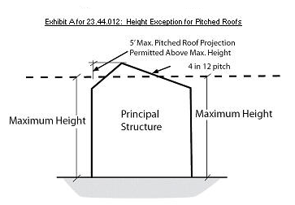

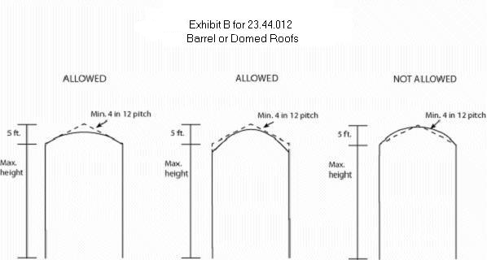

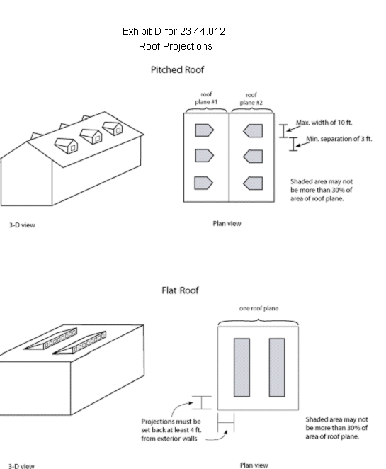

1. Solar Collectors. For height exceptions for solar collectors, not including solar greenhouses, see Section 23.44.046.
2. For nonresidential principal uses, the following rooftop features may extend up to 10 feet above the maximum height limit, as long as the combined total coverage of all features does not exceed 15 percent of the roof area or 20 percent of the roof area if the total includes screened mechanical equipment:

    1. Stair and elevator penthouses; and
    2. Mechanical equipment.
3. Wind-driven power generators. Devices for generating wind power may be located on structures as a rooftop feature and may extend up to 10 feet above the maximum height limit set in subsections 23.44.012. A and 23.44.012.B, provided that the combined total coverage of all features does not exceed 15 percent of the roof area.
4. For height limits and exceptions for communication utilities and accessory communication devices, see Section 23.57.010.

1. Maximum height established The provisions of this Section 23.42.012 apply, except as provided elsewhere in the Land Use Code for specific types of structures or structures in particular locations.

    1. Except as provided in subsections 23.44.012.A.2 and 23.44.012.A.3, the maximum permitted height for any structure not located in a required yard is 30 feet.
    2. The maximum permitted height for any structure on a lot 30 feet or less in width is 25 feet.
    3. For a lot or unit lot of any width, if the area of the largest rectangle or other quadrilateral that can be drawn within the lot lines of the lot or unit lot is less than 3,200 square feet the maximum permitted height for any structure on that lot shall be 18 feet. Additional height shall be allowed, subject to the limit that would otherwise apply under subsections 23.44.012.A.1 and 23.44.012.A.2, provided that the elevation at the top of the exterior walls of the structure, exclusive of pitched roofs, does not exceed the average of the elevations at the tops of the walls of single-family residences on abutting lots within the same zone. The limit of this subsection 23.44.012.A.3 shall not apply to additions to single-family residences existing as of February 1, 2013 that do not exceed the greater of 1,000 square feet of new gross floor area or the amount of gross floor area on any one floor of the existing house.
    4. The method of determining structure height and lot width is detailed in Chapter 23.86, Measurements.
2. Pitched roofs. The ridge of a pitched roof on a principal structure may extend up to 5 feet above the maximum height limit, as determined under subsection 23.44.012.A above. All parts of the roof above the height limit must be pitched at a rate of not less than 4:12 (Exhibit A for 23.44.012). No portion of a shed roof, except on a dormer, shall be permitted to extend beyond the maximum height limit, as determined under subsection 23.44.012.A above. Roof forms including but not limited to barreled and domed roofs may be allowed under this subsection 23.44.012.B if the Director determines that the roof form remains within the massing of a pitched roof form such as a gable or gambrel roof that would otherwise be allowed by this subsection 23.44.012.B (Exhibit B for 23.44.012).
3. Height Limit Exemptions.

    1. Flagpoles. Except in the Airport Height Overlay District, Chapter 23.64, flagpoles are exempt from height limits, provided that they are no closer to any adjoining lot line than 50 percent of their height above existing grade, or, if attached only to a roof, no closer than 50 percent of their height above the roof portion where attached.
    2. Other Features. Open rails and planters may extend no higher than the ridge of a pitched roof permitted under subsection 23.44.012.B or 4 feet above the maximum height limit in subsection 23.44.012.A. Planters on flat roofs shall not be located within 4 feet of more than 25 percent of the perimeter of the roof. For any structure with a green roof and having a minimum rooftop coverage of 50 percent, up to 24 inches of additional height above the height limit is allowed to accommodate structural requirements, roofing membranes, and soil. Chimneys may extend 4 feet above the ridge of a pitched roof or above a flat roof.
    3. Projections that accommodate windows and result in additional interior space, including dormers, clerestories, skylights, and greenhouses, may extend no higher than the ridge of a pitched roof permitted pursuant to subsection 23.44.012.B, or 4 feet above the applicable height limit pursuant to subsection 23.44.012.A, whichever is higher, if all of the following conditions are satisfied (Exhibit D for 23.44.012:

        1. The total area of these projections is limited to 30 percent of the area of each roof plane measured from the plan view perspective;
        2. On pitched roofs, projections are limited to 10 feet in width with a minimum separation of 3 feet from other projections; and
        3. On flat roofs, projections are set back at least 4 feet from exterior walls.

##### 23.44.013 - Transportation concurrency level-of-service standards.

Proposed uses in single-family zones shall meet the transportation concurrency level-of-service standards prescribed in Chapter 23.52.

##### 23.44.014 - Yards

Yards are required for every lot in a single-family zone. A yard that is larger than the minimum size may be provided.

The minimum required rear yard for a lot having a depth of less than one hundred twenty-five (125) feet shall be twenty (20) percent of the lot depth and in no case less than ten (10) feet.

When the required rear yard abuts upon an alley along a lot line, the centerline of the alley between the side lot lines extended shall be assumed to be a lot line for purposes of the provision of rear yard and the determination of lot depth; provided, that at no point shall the principal structure be closer than five (5) feet to the alley.

When a lot in any single-family zone abuts at the rear lot line upon a public park, playground or open water, not less than fifty (50) feet in width, the rear yard need not exceed the depth of twenty (20) feet.

1. Front Yards.

    1. The front yard depth shall be either the average of the front yards of the single-family structures on either side or 20 feet, whichever is less.
    2. On any lot where the natural gradient or slope, as measured from the front line of the lot for a distance of 60 feet or the full depth of the lot, whichever is less, is in excess of 35 percent, the required front yard depth shall be either 20 feet less one foot for each one percent of gradient or slope in excess of 35 percent, or the average of the front yards on either side, whichever is less.
    3. In the case of a through lot, each yard abutting a street, except a side yard, shall be a front yard. Rear yard provisions shall not apply to the lot, except pursuant to Section 23.40.030 or 23.40.035.
    4. A larger yard may be required in order to meet the provisions of Section 23.53.015, Improvement requirements for existing streets in residential and commercial zones.
2. Rear Yards. The rear yard shall be twenty-five (25) feet.
3. Side yards. The side yard shall be 5 feet except as follows:

    1. In the case of a reversed corner lot, the key lot of which is in a single-family zone, the width of the side yard on the street side of the reversed corner lot shall not be less than 10 feet; or
    2. If any side street lot line is a continuation of the front lot line of an abutting single-family zoned lot, whether or not separated by an alley, the width of the street side yard shall not be less than 10 feet.
4. Exceptions from standard yard requirements. No structure shall be placed in a required yard except pursuant to the following:

    1. Garages. Garages may be located in required yard subject to the standards of Section 23.44.016.
    2. Certain Accessory Structures in Side and Rear Yards.

        1. Except for detached accessory dwelling units, any accessory structure that complies with the requirements of Section 23.44.040 may be constructed in a side yard that abuts the rear or side yard of another lot, or in that portion of the rear yard of a reversed corner lot within 5 feet of the key lot and not abutting the front yard of the key lot, upon recording with the King County Department of Records and Elections an agreement to this effect between the owners of record of the abutting properties.
        2. Except for detached accessory dwelling units, any detached accessory structure that complies with the requirements of Section 23.44.040 may be located in a rear yard, provided that on a reversed corner lot, no accessory structure shall be located in that portion of the required rear yard that abuts the required front yard of the adjoining key lot, nor shall the accessory structure be located closer than 5 feet from the key lot's side lot line unless the provisions of subsections 23.44.014.D.2.a or 23.44.016.D.9 apply.
    3. A single-family structure may extend into one side yard if an easement is provided along the side or rear lot line of the abutting lot, sufficient to leave a 10 foot separation between that structure and any principal structure on the abutting lot. The 10 foot separation shall be measured from the wall of the principal structure that is proposed to extend into a side yard to the wall of the principal structure on the abutting lot.

        1. No structure or portion of a structure may be built on either lot within the 10 foot separation, except as provided in this section.
        2. Accessory structures and features of and projections from principal structures, such as porches, eaves, and chimneys are permitted in the 10 foot separation area if allowed by subsection 23.44.014.D. For purposes of calculating the distance a structure or feature may project into the 10 foot separation, assume the property line is 5 feet from the wall of the principal structure proposed to extend into a side yard and consider the 5 feet between the wall and the assumed property line to be the required side yard.
        3. No portion of any structure, including any projection, shall cross the property line.
        4. The easement shall be recorded with the King County Department of Records and Elections. The easement shall provide access for normal maintenance activities to the principal structure on the lot with less than the required 5 foot side yard.
    4. Certain Additions. Certain additions may extend into a required yard if the existing single-family structure is already nonconforming with respect to that yard. The presently nonconforming portion must be at least 60 percent of the total width of the respective facade of the structure prior to the addition. The line formed by the existing nonconforming wall of the structure is the limit to which any additions may be built, except as described below. Additions may extend up to the height limit and may include basement additions. New additions to the nonconforming wall or walls shall comply with the following requirements (Exhibit A for 23.44.014):

        1. Side Yard. If the addition is a side wall, the existing wall line may be continued by the addition except that in no case shall the addition be closer than 3 feet to the side lot line;
        2. Rear Yard. If the addition is a rear wall, the existing wall line may be continued by the addition except that in no case shall the addition be closer than 20 feet to the rear lot line or centerline of an alley abutting the rear lot line;
        3. Front Yard. If the addition is a front wall, the existing wall line may be continued by the addition except that in no case shall the addition be closer than 15 feet to the front lot line;
        4. If the nonconforming wall of the single-family structure is not parallel or is otherwise irregular, relative to the lot line, then the Director shall determine the limit of the wall extension, except that the wall extension shall not be located closer than specified in subsections 23.44.014.D.4.a, b, and c.
        5. Roof eaves, gutters, and chimneys on such additions may extend an additional 18 inches into a required yard, but in no case shall such features be closer than 2 feet to the side lot line.
    5. Uncovered porches or steps. Uncovered, unenclosed porches or steps may project into any required yard, if they are no higher than 4 feet above existing grade, no closer than 3 feet to any side lot line, no wider than 6 feet and project no more than 6 feet into required front or rear yards. The width of porches and steps are to be calculated separately.
    6. Certain features of a structure. Unless otherwise provided elsewhere in this Chapter 23.44, certain features of a principal or accessory structure, except for accessory dwelling units, may extend into required yards if they comply with the following:

        1. External architectural details with no living area, such as chimneys, eaves, cornices and columns, may project no more than 18 inches into any required yard;
        2. Bay windows are limited to 8 feet in width and may project no more than 2 feet into a required front, rear, and street side yard;
        3. Other projections that include interior space, such as garden windows, may extend no more than 18 inches into any required yard, starting a minimum of 30 inches above finished floor, and with maximum dimensions of 6 feet in height and 8 feet in width;
        4. The combined area of features permitted by subsections 23.44.014.D.6.b and 23.44.014.D.6.c may comprise no more than 30 percent of the area of the facade.
    7. Covered Unenclosed Decks and Roofs Over Patios. Covered, unenclosed decks and roofs over patios, if attached to a principal structure, may extend into the required rear yard, but shall not be within 12 feet of the centerline of any alley, or within 12 feet of any rear lot line that is not an alley lot line, or closer to any side lot line in the required rear yard than the side yard requirement of the principal structure along that side, or closer than 5 feet to any accessory structure. The height of the roof over unenclosed decks and patios shall not exceed 12 feet. The roof over such decks or patios shall not be used as a deck.
    8. Access Bridges. Uncovered, unenclosed pedestrian bridges 5 feet or less in width and of any height necessary for access, are permitted in required yards, except that in side yards an access bridge must be at least 3 feet from any side lot line.
    9. Barrier-free Access. Access facilities for the disabled and elderly that comply with Washington State Building Code, Chapter 11 are permitted in any required yard.
    10. Freestanding Structures and Bulkheads.

        1. Fences, freestanding walls, bulkheads, signs and similar structures 6 feet or less in height above existing or finished grade, whichever is lower, may be erected in any required yard. The 6 foot height may be averaged along sloping grade for each 6 foot long segment of the fence, but in no case may any portion of the fence exceed 8 feet. Architectural features may be added to the top of the fence or freestanding wall above the 6 foot height if the features comply with the following: horizontal architectural feature(s), no more than 10 inches high, and separated by a minimum of 6 inches of open area, measured vertically from the top of the fence, are permitted if the overall height of all parts of the structure, including post caps, is no more than 8 feet. Averaging the 8 foot height is not permitted. Structural supports for the horizontal architectural feature(s) may be spaced no closer than 3 feet on center.
        2. The Director may allow variation from the development standards listed in subsection 23.44.014.D.10.a, according to the following:

            1. No part of the structure may exceed 8 feet; and
            2. Any portion of the structure above 6 feet shall be predominately open, such that there is free circulation of light and air.
        3. Bulkheads and retaining walls used to raise grade may be placed in any required yard when limited to 6 feet in height, measured above existing grade. A guardrail no higher than 42 inches may be placed on top of a bulkhead or retaining wall existing as of February 20, 1982. If a fence is placed on top of a new bulkhead or retaining wall, the maximum combined height is limited to 9½ feet.
        4. Bulkheads and retaining walls used to protect a cut into existing grade may not exceed the minimum height necessary to support the cut or 6 feet, whichever is greater. If the bulkhead is measured from the low side and it exceeds 6 feet, an open guardrail of no more than 42 inches meeting Building Code requirements may be placed on top of the bulkhead or retaining wall. A fence must be set back a minimum of 3 feet from such a bulkhead or retaining wall.
        5. If located in shoreline setbacks or in view corridors in the Shoreline District as regulated in Chapter 23.60A, structures shall not obscure views protected by Chapter 23.60A, and the Director shall determine the permitted height.
    11. Decks in Yards. Decks no higher than 18 inches above existing or finished grade, whichever is lower, may extend into required yards.
    12. Mechanical equipment. Heat pumps and similar mechanical equipment, not including incinerators, are permitted in required yards if they comply with the requirements of Chapter 25.08, Noise Control. Any heat pump or similar equipment shall not be located within 3 feet of any lot line. Charging devices for electric cars are considered mechanical equipment and are permitted in required yards if not located within 3 feet of any lot line.
    13. Solar Collectors. Solar collectors may be located in required yards, subject to the provisions of Section 23.44.046.
    14. Front Yard Projections for Structures on Lots 30 Feet or Less in Width. For a structure on a lot that is 30 feet or less in width, portions of the front facade that begin 8 feet or more above finished grade may project up to 4 feet into the required front yard, provided that no portion of the facade, including eaves and gutters, shall be closer than 5 feet to the front lot line (Exhibit B for 23.44.014), and provided further that no portion of the façade of an existing structure that is less than 8 feet or more above finished grade already projects into the required front yard.
    15. Front and rear yards may be reduced by 25 percent, but no more than 5 feet, if the site contains a required environmentally critical area buffer or other area of the property that cannot be disturbed pursuant to subsection A of Section 25.09.280.
    16. Arbors. Arbors may be permitted in required yards under the following conditions:

        1. In any required yard, an arbor may be erected with no more than a 40 square foot footprint, measured on a horizontal roof plane inclusive of eaves, to a maximum height of 8 feet. Both the sides and the roof of the arbor shall be at least 50 percent open, or if latticework is used, there shall be a minimum opening of 2 inches between crosspieces.
        2. In each required yard abutting a street, an arbor over a private pedestrian walkway with no more than a 30 square foot footprint, measured on the horizontal roof plane and inclusive of eaves, may be erected to a maximum height of 8 feet. The sides of the arbor shall be at least 50 percent open, or if latticework is used, there shall be a minimum opening of 2 inches between crosspieces.
    17. Stormwater management

        1. Above-grade green stormwater infrastructure (GSI) features are allowed without yard restrictions if:

            1. Each above-grade GSI feature is less than 4.5 feet tall, excluding piping;
            2. Each above-grade GSI feature is less than 4 feet wide; and
            3. The total storage capacity of all above-grade GSI features is no greater than 600 gallons.
        2. Above-grade GSI features larger than what is allowed in subsection 23.44.014.D.17.a are allowed within a required yard if:

            1. Above-grade GSI features do not exceed 10 percent coverage of any one yard area;
            2. No portion of an above-grade GSI feature is located closer than 2.5 feet from a side lot line;
            3. No portion of an above-grade GSI feature is located closer than 20 feet from a rear lot line or centerline of an alley abutting the rear lot line; and
            4. No portion of an above-grade GSI feature is located closer than 15 feet from the front lot line.
    18. If the side yard of a lot borders on an alley, a single-family structure may be located in the required side yard, provided that no portion of the structure may cross the side lot line.
    19. A structure may be permitted to extend into front and rear yards as necessary to protect exceptional trees and trees over 2 feet in diameter pursuant to Section 25.11.060.
5. Additional Standards for Structures if Allowed in Required Yards. Structures in required yards shall comply with the following:

    1. Accessory structures, attached garages and portions of a principal structure shall not exceed a maximum combined coverage of 40 percent of the required rear yard. In the case of a rear yard abutting an alley, rear yard coverage shall be calculated from the centerline of the alley.
    2. Any accessory structure located in a required yard shall be separated from its principal structure by a minimum of 5 feet. This requirement does not apply to terraced garages that comply with Section 23.44.016.D.9.b.
    3. Except for detached accessory dwelling units in subsection 23.44.041.B, any accessory structure located in a required yard shall not exceed 12 feet in height or 1,000 square feet in area.
6. Setback standards from access easements. Setbacks are required for principal structures according to the standards in subsection 23.53.025.C.2 and 23.53.025.D.6.
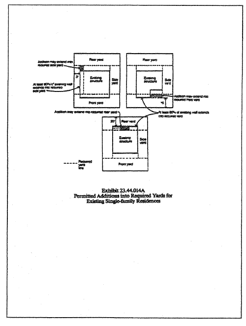

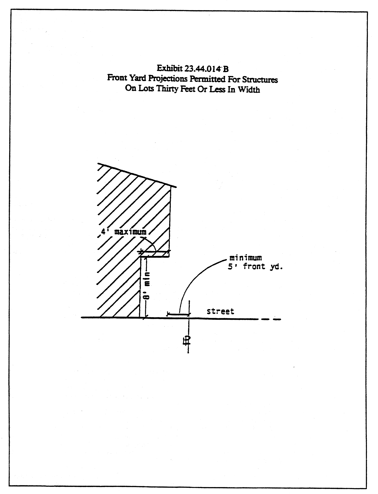

##### 23.44.015 - Allowance for larger households.

The Director may allow larger numbers of unrelated persons to live together in a household than would otherwise be permitted in two situations: (1) through a grant of special accommodation, available only to domestic violence shelters as defined in Chapter 23.84A, and (2) through a grant of reasonable accommodation, available only to persons with handicaps as defined by federal law.

1. The Director may grant special accommodation to individuals who are residents of domestic violence shelters in order to allow them to live together in groups of between nine (9) and fifteen (15) persons in single-family dwelling units, according to the following:

    1. An application for special accommodation must demonstrate to the satisfaction of the Director:

        1. That the needs of the residents of the domestic violence shelter make it necessary for the residents to live together in a group of the size proposed; and
        2. That adverse impacts on the neighborhood from the increased density will be mitigated.
    2. The Director shall take into account the size, shape and location of the dwelling unit and lot, the traffic and parking conditions on adjoining and neighboring streets, the vehicle usage to be expected from residents, staff and visitors, and any other circumstances the Director determines to be relevant as to whether the proposed increase in density will adversely impact the neighborhood.
    3. An applicant shall modify the proposal as needed to mitigate any adverse impacts identified by the Director or the Director shall deny the request for special accommodation.
    4. A grant of special accommodation permits a dwelling to be inhabited only according to the terms and conditions of the applicant's proposal and the Director's decision. If circumstances materially change or the number of residents increases, or if adverse impacts occur that were not adequately mitigated, the Director shall revoke the grant of special accommodation and require the number of people in the dwelling to be reduced to eight unless a new grant of special accommodation is issued for a modified proposal.
    5. A decision to grant special accommodation is a Type 1 Master Use Permit decision (See Chapter 23.76) that shall be recorded with the King County Division of Records and Elections.
2. The Director may grant reasonable accommodation to individuals who are handicapped within the meaning of 42 U.S.C. 3602, in order for them to live in a household of more than eight (8) persons, according to the following:

    1. An applicant for reasonable accommodation must demonstrate to the satisfaction of the Director that the handicap of the proposed residents makes it necessary for them to live in a household of the size proposed in order to have equal opportunity to use and enjoy a dwelling.
    2. The Director shall determine what adverse land use impacts, including cumulative impacts, if any, would result from granting the proposed accommodation. The Director shall take into account the size, shape and location of the dwelling unit and lot; the traffic and parking conditions on adjoining and neighboring streets; vehicle usage to be expected from residents, staff and visitors; and any other circumstances the Director determines to be relevant.
    3. The Director shall consider the applicant's need for accommodation in light of the anticipated land use impacts, and the Director may impose conditions in order to make the accommodation reasonable in light of those impacts.
    4. A grant of reasonable accommodation permits a dwelling to be inhabited only according to the terms and conditions of the applicant's proposal and the Director's decision. If the Director determines that the accommodation has become unreasonable because circumstances have changed or adverse land use impacts have occurred that were not anticipated, the Director shall rescind or modify the decision to grant reasonable accommodation.
    5. A decision to grant reasonable accommodation is a Type 1 Master Use Permit decision (see Chapter 23.76) that shall be recorded with the King County Division of Records and Elections.
    6. Nothing herein shall prevent the Director from granting reasonable accommodation to the full extent required by federal or state law.

##### 23.44.016 - Parking and garages

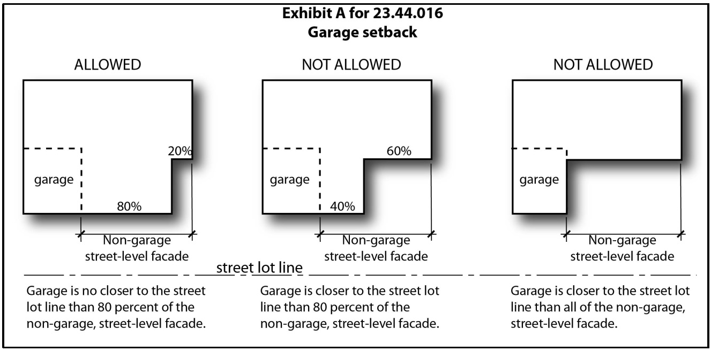

Exhibit A forGarage setback

1. Garage entrance width. The total combined horizontal width of all garage entrances located on the front facade may be up to 50 percent of the horizontal width of the front facade or 10 feet, whichever is greater. On corner lots, a garage entrance shall be allowed on only one street-facing facade.
2. Exemptions

    1. Garages allowed under subsections 23.44.016.D.9, 23.44.016.D.10, 23.44.016.D.11 and 23.44.016.D.12 are not subject to the standards of this subsection 23.44.016.F.
    2. Garages that are set back more than 35 feet from the front lot line are not subject to the standards of this subsection 23.44.016.F.
    3. The Director may waive or modify the standards of this subsection 23.44.016.F based on one or more of the following factors:

        1. Irregular lot shape;
        2. Topography of the lot;
        3. Configuration of proposed or existing structures on the lot;
        4. Location of exceptional trees as defined in Section 25.11.020; and
        5. The proposed structure or addition has design features including but not limited to modulation, screening, and landscaping.
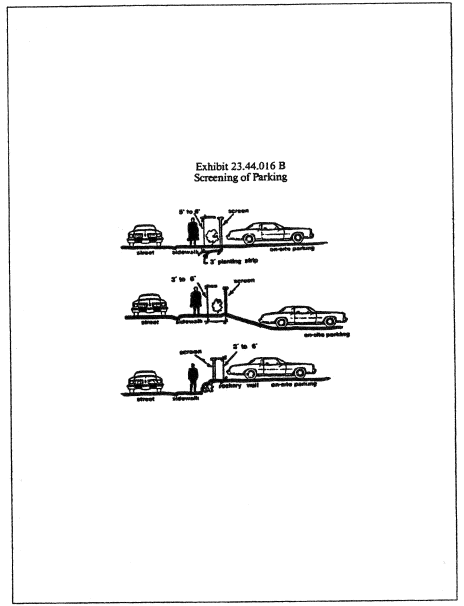

1. Parking Quantity. Off-street parking is required pursuant to Section 23.54.015.
2. Access to Parking.

    1. Vehicular access to parking from an improved street, alley or easement is required if parking is required pursuant to Section 23.54.015.
    2. Access to parking is permitted through a required yard abutting a street only if the Director determines that one of the following conditions exists:

        1. There is no alley improved to the standards of Section 23.53.030.C, and there is no unimproved alley in common usage that currently provides access to parking on the lot or to parking on adjacent lots in the same block; or
        2. Existing topography does not permit alley access; or
        3. A portion of the alley abuts a nonresidential zone; or
        4. The alley is used for loading or unloading by an existing nonresidential use; or
        5. Due to the relationship of the alley to the street system, use of the alley for parking access would create a significant safety hazard; or
        6. Parking access must be from the street in order to provide access to a parking space that complies with the Washington State Building Code, Chapter 11.
3. Location of Parking.

    1. Parking shall be located on the same lot as the principal use, except as provided in this subsection.
    2. Parking on planting strips is prohibited.
    3. For lots developed with one single family dwelling, no more than three vehicles may be parked outdoors on any lot.
    4. Parking accessory to a floating home may be located on another lot if within 600 feet of the lot on which the floating home is located. The accessory parking shall be screened and landscaped according to subsection 23.44.016.G.
    5. Parking accessory to a single-family structure existing on June 11, 1982, may be established on another lot if all the following conditions are met:

        1. There is no vehicular access to permissible parking areas on the lot.
        2. Any garage constructed is for no more than two two-axle, or two up to four-wheeled vehicles.
        3. Parking is screened or landscaped as required by the Director, who shall consider development patterns of the block or nearby blocks.
        4. The lot providing the parking is within the same block or across the alley from the principal use lot.
        5. The accessory parking shall be tied to the lot of the principal use by a covenant or other document recorded with the King County Recorder.
4. Parking and garages in required yards

    1. Parking and garages shall not be located in the required front yard except as provided in subsections 23.44.016.D.7, 23.44.016.D.9, 23.44.016.D.10, 23.44.016.D.11 and 23.44.016.D.12.
    2. Parking and garages shall not be located in a required side yard abutting a street or the first 10 feet of a required rear yard abutting a street except as provided in subsections 23.44.016.D.7, 23.44.016.D.9, 23.44.016.D.10, 23.44.016.D.11 and 23.44.016.D.12.
    3. Garages shall not be located in a required side yard that abuts the rear or side yard of another lot or in that portion of the rear yard of a reversed corner lot within 5 feet of the key lot's side lot line unless:

        1. The garage is a detached garage located entirely in that portion of a side yard that is either within 35 feet of the centerline of an alley or within 25 feet of any rear lot line that is not an alley lot line; or
        2. An agreement between the owners of record of the abutting properties, authorizing the garage in that location, is executed and recorded, pursuant to subsection 23.44.014.D.2.a.
    4. Detached garages with vehicular access facing an alley shall not be located within 12 feet of the centerline of the alley except as provided in subsections 23.44.016.D.9, 23.44.016.D.10, 23.44.016.D.11 and 23.44.016.D.12.
    5. Attached garages shall not be located within 12 feet of the centerline of any alley, nor within 12 feet of any rear lot line that is not an alley lot line, except as provided in subsections 23.44.016.D.9, 23.44.016.D.10, 23.44.016.D.11 and 23.44.016.D.12.
    6. On a reversed corner lot, no garage shall be located in that portion of the required rear yard that abuts the required front yard of the adjoining key lot unless the provisions of subsection 23.44.016.D.9 apply.
    7. If access to required parking passes through a required yard, automobiles, motorcycles and similar vehicles may be parked on the open access located in a required yard.
    8. Trailers, boats, recreational vehicles and similar equipment shall not be parked in required front and side yards or the first 10 feet of a rear yard measured from the rear lot line.
    9. Lots with uphill yards abutting streets. Parking for one two-axle or one up to four-wheeled vehicle may be established in a required yard abutting a street according to subsection 23.44.016.D.9.a or 23.44.016.D.9.b only if access to parking is permitted through that yard pursuant to subsection 23.44.016.B.

        1. Open parking space

            1. The existing grade of the lot slopes upward from the street lot line an average of at least 6 feet above sidewalk grade at a line that is 10 feet from the street lot line; and
            2. The parking area shall be at least an average of 6 feet below the existing grade prior to excavation and/or construction at a line that is 10 feet from the street lot line; and
            3. The parking space shall be no wider than 10 feet for one parking space at the parking surface and no wider than 20 feet for two parking spaces if permitted as provided in subsection 23.44.016.D.12.
        2. Terraced garage

            1. The height of a terraced garage is limited to no more than 2 feet above existing or finished grade, whichever is lower, for the portions of the garage that are 10 feet or more from the street lot line. The ridge of a pitched roof on a terraced garage may extend up to 3 feet above this 2 foot height limit. All parts of the roof above the 2 foot height limit shall be pitched at a rate of not less than 4:12. No portion of a shed roof shall be permitted to extend beyond the 2 foot height limit of this provision. Portions of a terraced garage that are less than 10 feet from the street lot line shall comply with the height standards in subsection 23.44.016.E.2;
            2. The width of a terraced garage structure shall not exceed 14 feet for one two-axle or one up to four-wheeled vehicle, or 24 feet if permitted to have two two-axle or two up to four-wheeled vehicles as provided in subsection 23.44.016.D.12;
            3. All above ground portions of the terraced garage shall be included in lot coverage; and
            4. The roof of the terraced garage may be used as a deck and shall be considered to be a part of the garage structure even if it is a separate structure on top of the garage.
    10. Lots with downhill yards abutting streets. Parking, either open or enclosed in an attached or detached garage, for one two-axle or one up to four-wheeled vehicle may be located in a required yard abutting a street if the following conditions are met:

        1. The existing grade slopes downward from the street lot line that the parking faces;
        2. For front yard parking, the lot has a vertical drop of at least 20 feet in the first 60 feet, measured along a line from the midpoint of the front lot line to the midpoint of the rear lot line;
        3. Parking is not permitted in required side yards abutting a street;
        4. Parking in a rear yard complies with subsections 23.44.016.D.2, 23.44.016.D.5 and 23.44.016.D.6;
        5. Access to parking is permitted through the required yard abutting the street by subsection 23.44.016.B; and
        6. A driveway access bridge is permitted in the required yard abutting the street if necessary for access to parking. The access bridge shall be no wider than 12 feet for access to one parking space or 18 feet for access to two or more parking spaces. The driveway access bridge may not be located closer than 5 feet to an adjacent property line and shall not be included in lot coverage calculations.
    11. Through lots. On through lots less than 125 feet in depth, parking, either open or enclosed in an attached or detached garage, for one two-axle or one up to four-wheeled vehicle may be located in one of the required front yards. The front yard in which the parking may be located shall be determined by the Director based on the location of other garages or parking areas on the block. If no pattern of parking location can be determined, the Director shall determine in which yard the parking shall be located based on the prevailing character and setback patterns of the block.
    12. Lots with uphill yards abutting streets or downhill or through lot front yards fronting on streets that prohibit parking. Parking for two two-axle or two up to four-wheeled vehicles may be located in uphill yards abutting streets or downhill or through lot front yards as provided in subsections 23.44.016.D.9, 23.44.016.D.10 or 23.44.016.D.11 if, in consultation with Seattle Department of Transportation, it is found that uninterrupted parking for 24 hours is prohibited on at least one side of the street within 200 feet of the lot line over which access is proposed. The Director may authorize a curb cut wider than would be permitted under Section 23.54.030 if necessary for access.
5. Standards for garages if allowed in required yards. Garages that are either detached structures or portions of a principal structure for the primary purpose of enclosing a two-axle or four-wheeled vehicle may be permitted in required yards according to the following conditions:

    1. Maximum coverage and size

        1. Garages, together with any other accessory structures and other portions of the principal structure, are limited to a maximum combined coverage of 40 percent of the required rear yard. In the case of a rear yard abutting an alley, rear yard coverage shall be calculated from the centerline of the alley.
        2. Garages located in side or rear yards shall not exceed 1,000 square feet in area.
        3. In front yards, the area of garages is limited to 300 square feet with 14 foot maximum width if one space is provided, and 600 square feet with 24 foot maximum width if two spaces are provided. Access driveway bridges permitted under subsection 23.44.016.D.10.f shall not be included in this calculation.
    2. Height limits

        1. Garages are limited to 12 feet in height measured on the facade containing the entrance for the vehicle.
        2. The ridge of a pitched roof on a garage located in a required yard may extend up to 3 feet above the 12 foot height limit. All parts of the roof above the height limit shall be pitched at a rate of not less than 4:12. No portion of a shed roof is permitted to extend beyond the 12 foot height limit under this provision.
        3. Open rails around balconies or decks located on the roofs of garages may exceed the 12 foot height limit by a maximum of 3 feet. The roof over a garage shall not be used as a balcony or deck in rear yards.
    3. Separations. Any garage located in a required yard shall be separated from its principal structure by a minimum of 5 feet. This requirement does not apply to terraced garages that comply with subsection 23.44.016.D.9.b and attached garages permitted in rear yards by subsection 23.44.016.D.5.
    4. Roof eaves and gutters of a garage located in a required yard may extend a maximum of 18 inches from the exterior wall of the garage. Such roof eaves and gutters are excluded from the maximum coverage and size limits of subsection 23.44.016.E.1 and the separation requirements of subsection 23.44.016.E.3, except that all portions of a detached garage, including projecting eaves and gutters, shall be separated by at least 5 feet from all portions of a principal structure, including any eaves and gutters of the principal structure.
    5. Except for terraced garages that comply with Section 23.44.016.D.9.b, the roof over a garage in a rear yard shall not be used as a balcony or deck.
6. Appearance of garage entrances

    1. Garage setback. No portion of a garage, whether attached to a principal structure or within a detached accessory structure, may be closer to the street lot line than 80 percent of the remaining non-garage street-level facade (see Exhibit A for 23.44.016 of the principal structure to which the garage is accessory. If the entire street-level facade of either a principal or accessory structure is garage, no portion of the garage may be closer to the street lot line than 80 percent of the facade of the story above the street-level facade.
7. Screening.

    1. Parking accessory to floating homes when located on a separate lot from the floating homes shall be screened from direct street view by a fence or wall between five (5) and six (6) feet in height. When the fence or wall runs along the street front, there shall be a landscaped strip on the street side of the fence or wall. This strip may be between one (1) and five (5) feet deep, as measured from the property line, but the average distance from the property line to the fence shall be three (3) feet. Such screening shall be located outside any required sight triangle.
    2. The height of the visual barrier created by the screen required by subsection 1 of this subsection shall be measured from street level. If the elevation of the lot line is different from the finished elevation of the parking surface, the difference in elevation may be measured as a portion of the required height of the screen, so long as the screen itself is a minimum of three (3) feet in height (see Exhibit 23.44.016 B).

#### Subchapter II - Conditional Uses
##### 23.44.018 - General provisions

Part 1 Administrative Conditional Uses

1. Only those conditional uses identified in this subchapter may be authorized as conditional uses in single-family zones. The Master Use Permit Process set forth in Chapter 23.76, Procedures for Master Use Permits and Council Land Use Decisions, shall be used to authorize conditional uses.
2. Unless otherwise specified in this subchapter, conditional uses shall meet the development standards for uses permitted outright in Sections 23.44.008 through 23.44.016.
3. A conditional use may be approved, conditioned or denied based on a determination of whether the proposed use meets the criteria for establishing a specific conditional use and whether the use will be materially detrimental to the public welfare or injurious to property in the zone or vicinity in which the property is located.
4. In authorizing a conditional use, the Director or Council may mitigate adverse negative impacts by imposing requirements or conditions deemed necessary for the protection of other properties in the zone or vicinity in which the property is located.
5. Any use which was previously authorized by a conditional use permit but which has been discontinued shall not be reestablished or recommenced except pursuant to a new conditional use permit, provided that such permit is required for the use at the time re-establishment or recommencement is proposed. The following shall constitute conclusive evidence that the conditional use has been discontinued:

Property which is vacant, except for dead storage of materials or equipment of the conditional use, shall not be considered as being devoted to the authorized conditional use. The expiration of licenses necessary for the conditional use shall be evidence that the property is not being devoted to the conditional use. A conditional use in a multifamily structure or a multitenant commercial structure shall not be considered as discontinued unless all units are either vacant or devoted to another use.

    1. A permit to change the use of the property has been issued and the new use has been established; or
    2. The property has not been devoted to the authorized conditional use for more than twenty-four (24) consecutive months.
6. Minor structural work that does not increase usable floor area or seating capacity and that does not exceed the development standards applicable to the use shall not be considered an expansion and does not require approval as a conditional use, unless the work would exceed the height limit of the zone for uses permitted outright. Such work includes but is not limited to roof repair or replacement and construction of uncovered decks and porches, facilities for barrier-free access, bay windows, dormers, and eaves.

##### 23.44.022 - Institutions

The following institutions are prohibited in single-family zones:

Hospitals

Colleges

Museums

Private clubs

Vocational schools

1. Institutions Identified. The following institutions may be permitted as conditional uses in single-family zones:

Community centers

Child care centers

Private schools

Religious facilities

Libraries

Existing institutes for advanced study

Other similar institutions

2. Major Institutions. Existing major institutions and major institution uses within an existing Major Institution overlay district shall be permitted in accordance with the provisions of Chapter 23.69, Major Institution Overlay Districts, and the provisions of this section.
3. Public schools shall be permitted as regulated in Section 23.51B.002.
4. General Provisions.

    1. New or expanding institutions in single-family zones shall meet the development standards for uses permitted outright in Sections 23.44.008 through 23.44.016 unless modified elsewhere in this subsection or in a Major Institution master plan.
    2. The establishment of a child care center in a legally established institution devoted to the care or instruction of children which does not violate any condition of approval of the existing institutional use and does not require structural expansion shall not be considered a new use or an expansion of the institutional use.
    3. Institutions seeking to establish or expand on property that is developed with residential structures may expand their campus up to a maximum of 2½ acres. An institution campus may be established or expanded beyond 2½ acres if the property proposed for the expansion is substantially vacant land.
5. Dispersion.

    1. The lot line of any proposed new or expanding institution, other than child care centers locating in legally established institutions, shall be located six hundred (600) feet or more from any lot line of any other institution in a residential zone, with the following exceptions:

        1. An institution may expand even though it is within six hundred (600) feet of a public school if the public school is constructed on a new site subsequent to December 12, 1985.
        2. A proposed institution may be located less than six hundred (600) feet from a lot line of another institution if the Director determines that the intent of the dispersion criteria is achieved due to the presence of physical elements such as bodies of water, large open spaces or topographical breaks or other elements such as arterials, freeways or nonresidential uses, which provide substantial separation from other institutions.
    2. A proposed child-care center serving not more than twenty-five (25) children which does not meet the criteria of subsection E1 of this section may be permitted to locate less than six hundred (600) feet from a lot line of another institution if the Director determines that, together with the nearby institution(s), the proposed child care center would not:

        1. Create physical scale and bulk incompatible with the surrounding neighborhood;
        2. Create traffic safety hazards;
        3. Create or significantly increase identified parking shortages; or
        4. Significantly increase noise levels to the detriment of surrounding residents.
6. Demolition of Residential Structures. No residential structure shall be demolished nor shall its use be changed to provide for parking. This prohibition may be waived if the demolition or change of use proposed is necessary to meet the parking requirements of this Land Use Code and if alternative locations would have greater noise, odor, light and glare or traffic impacts on surrounding property in residential use. If the demolition or change of use is proposed for required parking, the Director may consider waiver of parking requirements in order to preserve the residential structure and/or use. The waiver may include, but is not limited to, a reduction in the number of required parking spaces and a waiver of parking development standards such as location or screening.
7. Reuse of Existing Structures. Existing structures may be converted to institution use if the yard requirements for institutions are met. Existing structures which do not meet these yard requirements may be permitted to convert to institution use, provided that the Director may require additional mitigating measures to reduce impacts of the proposed use on surrounding properties.
8. Noise and Odors. For the purpose of reducing potential noise and odor impacts, the Director shall consider the location on the lot of the proposed institution, on-site parking, outdoor recreational areas, trash and refuse storage areas, ventilating mechanisms, sports facilities and other noise-generating and odor-generating equipment, fixtures or facilities. The institution shall be designed and operated in compliance with the Noise Ordinance, Chapter 25.08.

In order to mitigate identified noise and/or odor impacts, the Director may require measures such as landscaping, sound barriers or fences, mounding or berming, adjustments to yard or parking development standards, design modifications, setting hours of operation for facilities or other similar measures.

9. Landscaping

    1. The Director shall promulgate rules to foster the long-term health, viability, and coverage of plantings. The rules shall address, at a minimum, the type and size of plants, spacing of plants, use of drought-tolerant plants, and access to light and air for plants. All landscaping provided to meet the requirements of this Section 23.44.022 shall comply with these rules.
    2. Landscaping that achieves a Green Factor score of 0.3 or greater, pursuant to Section 23.86.019, is required for any lot with:

        1. development containing more than four new dwelling units;
        2. development, either a new structure or an addition to an existing structure, containing more than 4,000 new square feet of non-residential uses; or
        3. any parking lot containing more than 20 new parking spaces for automobiles.
10. Light and Glare. Exterior lighting shall be shielded or directed away from adjacent residentially zoned lots. The Director may also require that the area and intensity of illumination, the location or angle of illumination be limited.

Nonreflective surfaces shall be used to help reduce glare.

11. Bulk and siting

    1. Lot area. If the proposed site is more than one acre in size, the Director may require the following and similar development standards:

        1. For lots with unusual configuration or uneven boundaries, the proposed principal structures be located so that changes in potential and existing development patterns on the block or blocks within which the institution is located are kept to a minimum;
        2. For lots with large street frontage in relationship to their size, the proposed institution reflect design and architectural features associated with adjacent residentially-zoned block fronts in order to provide continuity of the block front and to integrate the proposed structures with residential structures and uses in the immediate area.
    2. Yards. Yards of institutions shall be as required for uses permitted outright pursuant to Section 23.44.014, provided that no structure other than freestanding walls, fences, bulkheads or similar structures shall be closer than 10 feet to the side lot line. If the Director finds that a reduced setback will not significantly increase project impacts, including but not limited to noise, odor, and the scale of the structure in relation to nearby buildings, the sideyard setback may be reduced to 5 feet. Fences and freestanding walls of utility services uses, regulated under this Section 23.44.022 pursuant to Section 23.51A.002, shall be set back from the street lot line a minimum of 10 feet, and landscaping shall be provided between the fence or wall and the right-of-way. The Director may reduce this setback after finding that the reduced setback will not significantly increase project impacts, including but not limited to noise, odor, and the scale of the fence, wall, or structure in relation to nearby buildings. Acceptable methods to reduce fence or wall impacts include changes in the height, design or construction of the fence or wall, including the use of materials, architectural detailing, artwork, vegetated trellises, decorative fencing, or similar features to provide visual interest facing the street lot line. Fences and walls may obstruct or allow views to the interior of a site. Where site dimensions and conditions allow, applicants are encouraged to provide both a landscaped setback between the fence or wall and the right-of-way, and a fence or wall that provides visual interest facing the street lot line, through the height, design or construction of the fence or wall, including the use of materials, architectural detailing, artwork, vegetated trellises, decorative fencing, or similar features.
    3. Institutions Located on Lots in More Than One (1) Zone Classification. For lots which include more than one (1) zone classification, single-family zone provisions shall apply only to the single-family-zoned lot area involved.
    4. Height Limit.

        1. Religious symbols for religious institutions may extend an additional twenty-five (25) feet above the height limit.
        2. For gymnasiums and auditoriums that are accessory to an institution the maximum height shall be thirty-five (35) feet if portions of the structure above thirty-five (35) feet are set back at least twenty (20) feet from all property lines. Pitched roofs on a gymnasium or auditorium which have a slope of not less than four to twelve (4:12) may extend ten (10) feet above the thirty-five (35) foot height limit. No portion of a shed roof on a gymnasium or an auditorium shall be permitted to extend beyond the thirty-five (35) foot height limit under this provision.
    5. Facade Scale. If any facade of a new or expanding institution exceeds thirty (30) feet in length, the Director may require that facades adjacent to the street or a residentially zoned lot be developed with design features intended to minimize the appearance of bulk. Design features which may be required include, but are not limited to, modulation, architectural features, landscaping or increased yards.
12. Parking and Loading Berth Requirements.

    1. Quantity and Location of Off-street Parking.

        1. Use of transportation modes such as public transit, vanpools, carpools and bicycles to reduce the use of single-occupancy vehicles is encouraged.
        2. Parking and loading is required as provided in Section 23.54.015.
        3. The Director may modify the parking and loading requirements of Section 23.54.015 and the requirements of Section 23.44.016 on a case-by-case basis using the information contained in the transportation plan prepared pursuant to subsection 23.44.022.M. The modification shall be based on adopted City policies and shall:

            1. Provide a demonstrable public benefit such as, but not limited to, reduction of traffic on residential streets, preservation of residential structures, and reduction of noise, odor, light and glare; and
            2. Not cause undue traffic through residential streets nor create a safety hazard.
    2. Parking Design. Parking access and parking shall be designed as provided in Design Standards for Access and Off-street Parking, Chapter 23.54.
    3. Loading Berths. The quantity and design of loading berths shall be as provided in Design Standards for Access and Off-street Parking, Chapter 23.54.
13. Transportation Plan. A transportation plan shall be required for proposed new institutions and for those institutions proposing expansions which are larger than four thousand (4,000) square feet of structure area and/or are required to provide an additional twenty (20) or more parking spaces.

The Director shall determine the level of detail to be disclosed in the transportation plan based on the probable impacts and/or scale of the proposed institution. Discussion of the following elements and other factors may be required:

    1. Traffic. Number of staff on site during normal working hours, number of users, guests and others regularly associated with the site, level of vehicular traffic generated, traffic peaking characteristics of the institution and in the immediate area, likely vehicle use patterns, extent of traffic congestion, types and numbers of vehicles associated with the institution and mitigating measures to be taken by the applicant;
    2. Parking. Number of spaces, the extent of screening from the street or abutting residentially zoned lots, direction of vehicle light glare, direction of lighting, sources of possible vibration, prevailing direction of exhaust fumes, location of parking access and curb cuts, accessibility or convenience of parking and measures to be taken by the applicant such as preference given some parking spaces for carpool and vanpool vehicles and provision of bicycle racks;
    3. Parking Overflow. Number of vehicles expected to park on neighboring streets, percentage of on-street parking supply to be removed or used by the proposed project, opportunities for sharing existing parking, trends in local area development and mitigating measures to be taken by the applicant;
    4. Safety. Measures to be taken by the applicant to ensure safe vehicular and pedestrian travel in the vicinity;
    5. Availability of Public or Private Mass Transportation Systems. Route location and frequency of service, private mass transportation programs including carpools and vanpools, to be provided by the applicant.
14. Development Standards for Existing Institutes for Advanced Study.

    1. The institute shall be located on a lot of not less than fifteen (15) acres.
    2. The lot coverage for all structures shall not exceed twenty (20) percent of the total lot area.
    3. Structures shall be set back a minimum of twenty-five (25) feet from any lot line.
    4. Parking areas shall be set back a minimum of ten (10) feet from any lot line.
    5. In the event of expansion, parking shall be required as provided for "existing institutes for advanced study" in Section 23.54.015, Required parking.
    6. Landscaping shall be provided between a lot line and any structure and shall be maintained for the duration of the use.

##### 23.44.024 - Clustered housing planned developments

Clustered housing planned developments (CHPDs) may be permitted as an administrative conditional use in single-family zones. A CHPD is intended to enhance and preserve natural features, encourage the construction of affordable housing, allow for development and design flexibility, and protect and prevent harm in environmentally critical areas. CHPDs shall be subject to the following provisions:

1. Site requirements

    1. The minimum size of a CHPD is two acres, excluding submerged land and any land designated an environmentally critical area or buffer due to the presence of a riparian corridor, wetland, wetland buffer, priority habitat area, steep slope, or steep slope buffer according to Chapter 25.09, Regulations for Environmentally Critical Areas.
    2. Where portions of a site are designated an environmentally critical area or buffer due to the presence of a riparian corridor, wetland, wetland buffer, priority habitat area, steep slope, or steep slope buffer according to Chapter 25.09, Regulations for Environmentally Critical Areas, the conditional use provisions under Section 25.09.260 shall apply, superseding the standards of this Section 23.44.024.
    3. The Director may exclude land from a CHPD if it is separated from the site by topography, if it has a poor functional relationship with the site, or if including the land would have a negative impact on adjacent single-family zoned lots.
2. Type of dwelling units permitted. Only single-family dwelling units shall be permitted in a CHPD.
3. Number of dwelling units permitted

    1. The number of dwelling units permitted in a CHPD shall be calculated by dividing the CHPD land area by the minimum lot area required in subsection 23.44.010.A for the single-family zone where the CHPD is located. Land that is designated an environmentally critical area or buffer due to the presence of a riparian corridor, wetland, wetland buffer, priority habitat area, steep slope, or steep slope buffer and submerged land shall be excluded from the land used to calculate the permitted number of dwelling units in a CHPD. For CHPDs located in more than one zone, the number of dwelling units shall be calculated based on the proportion of land area in each zone.
    2. Where portions of a site are designated an environmentally critical area or buffer due to the presence of a riparian corridor, wetland, wetland buffer, priority habitat area, steep slope, or steep slope buffer according to Chapter 25.09, Regulations for Environmentally Critical Areas, the administrative conditional use provisions under Section 25.09.260 shall apply.
    3. One additional detached single-family structure may be permitted if the development includes one or more of the following facilities open to the surrounding community:

        1. Usable open space and other recreational facilities approved by the Director;
        2. Community center; and
        3. Child care facility.
4. Subdivision. A CHPD may be subdivided into lots of less than the minimum area required by subsection 23.44.010.A.
5. Yards. Yards shall be required for structures within a CHPD. For the purposes of this subsection 23.44.024.E, setbacks shall be considered yards, and the provisions relating to accessory structures in required yards of the applicable single-family zone shall apply.

    1. Structures shall be set back a minimum distance of 20 feet from the street lot line of a CHPD.
    2. No dwelling unit in a CHPD shall be closer than 5 feet to a side lot line of an abutting single-family zoned lot.
    3. No dwelling unit in a CHPD shall be closer than 25 feet to a rear lot line of an abutting single-family zoned lot.
    4. No dwelling unit in a CHPD shall be closer than 5 feet to any lot line of an abutting non-single-family zoned lot.
    5. There shall be a minimum distance of 10 feet between principal structures within 100 feet of the lot line of a CHPD.
    6. To provide a sense of privacy and to mitigate the effects of shadows between structures located more than 100 feet from the lot line of a CHPD, the required separation between structures in the CHPD shall vary depending on the design of the facing facades as follows:

        1. Walls of interior facades that do not have a principal entrance shall be at least 10 feet apart at any point.
        2. A principal entrance to a structure shall be at least 15 feet from the nearest interior facade that does not have a principal entrance.
        3. A principal entrance to a structure shall be at least 20 feet from the nearest interior facade with a principal entrance.
    7. The Director may increase the minimum required yards or require alternate spacing or placement of structures in order to:

        1. preserve or enhance topographical conditions;
        2. enhance the relationship with adjacent uses and the layout of the project;
        3. promote green stormwater infrastructure and other measures to reduce stormwater runoff; or
        4. maintain a compatible scale and design with the surrounding community.
6. Landscaping. The Director may require retention of existing mature landscaping, or provision of new landscaping, where that existing or new landscaping is compatible with surrounding flora and favors native species to:

    1. Minimize the impacts of the CHPD on adjacent land uses along some or all exterior lot lines;
    2. Reduce stormwater runoff, potential erosion, and impervious surfaces; or
    3. Screen parking from the view of adjacent residentially zoned lots and the street.
7. Maintenance of required landscaping and open space. Required landscaping and open space shall be maintained for the life of the project. Maintenance of required landscaping and open space shall be the continuing responsibility of the owner.

##### 23.44.026 - Use of landmark structures

1. The Director may authorize a use not otherwise permitted in the zone as an administrative conditional use within a structure designated as a landmark pursuant to Chapter 25.12, Landmark preservation ordinance, subject to the following development standards:

    1. The use shall be compatible with the existing design and/or construction of the structure without significant alteration; and
    2. The use shall be allowed only when it is demonstrated that uses permitted in the zone are impractical because of structure design and/or that no permitted use can provide adequate financial support necessary to sustain the structure in a reasonably good physical condition; and
    3. The use shall not be detrimental to other properties in the zone or vicinity or to the public interest.
2. The parking requirements for a use allowed in a landmark are those listed in Section 23.54.015. These requirements may be waived pursuant to Section 23.54.020 C.

##### 23.44.028 - Structures unsuited to uses permitted outright

1. Uses not otherwise permitted in the zone may be permitted as an administrative conditional use in structures unsuited to uses permitted outright in single-family zones. The determination that a use may be permitted shall be based on the following factors:

    1. The design of the structure is not suitable for conversion to a use permitted outright in a single-family zone; and
    2. The structure contains more than 4,000 square feet; and
    3. The proposed use will provide a public benefit.
2. Parking requirements for uses permitted under this section shall be determined by the Director.
3. The Director may require measures to mitigate impacts such as noise, odor, parking or traffic impacts. Mitigating measures may include but are not limited to landscaping, sound barriers, fences, mounding or berming, adjustments to development standards, design modifications or setting hours of operation.
4. In the case of an existing or former public school, permissible uses other than those permitted outright in the zone and their development standards including parking requirements shall be established only pursuant to procedures for establishing criteria for joint use or reuse of public schools in Chapter 23.78 of this Land Use Code.

##### 23.44.030 - Park and pool lot

The Director may authorize a park and pool lot under the management of a public agency responsible for commuter pooling efforts as an administrative conditional use. The Director shall determine that:

1. It is to be located on an existing parking lot;
2. That parking proposed for the park and pool lot is not needed by the principal use or its accessory uses during the hours proposed for park and pool use; and
3. The park and pool use shall not interfere or conflict with the peak-hour activities associated with the principal use and its accessory uses. The Director may control the number and location of parking spaces to be used.

##### 23.44.032 - Certain nonconforming uses.

Nonconforming uses which are authorized pursuant to Section 23.42.110 may be permitted as a conditional use.

Part 2 Council Conditional Uses

##### 23.44.034 - Planned residential development (PRD)

Planned residential developments (PRDs) may be permitted in single-family zones as a council conditional use. A PRD is intended to enhance and preserve natural features, encourage the construction of affordable housing, allow for development and design flexibility, promote green stormwater infrastructure and protect and prevent harm in environmentally critical areas. PRDs shall be subject to the following provisions:

1. Site requirements

    1. The minimum size of a PRD is two acres, excluding submerged land and any land designated as an environmentally critical area or buffer due to the presence of a riparian corridor, wetland, wetland buffer, steep slope, or steep slope buffer according to Chapter 25.09, Regulations for Environmentally Critical Areas.
    2. The area of the site devoted to single-family uses at the time of application, calculated by multiplying the number of such uses by the minimum lot area for the zone, shall not exceed 20 percent of the area of the entire site.
    3. Land that is designated as an environmentally critical area or buffer due to the presence of a riparian corridor, wetland, wetland buffer, steep slope, or steep slope buffer according to Chapter 25.09, Regulations for Environmentally Critical Areas, and submerged land shall be excluded from the land used to calculate permitted density in a PRD.
    4. Land may be excluded from a PRD by the Director if it is separated from the site by topography, if it has a poor functional relationship with the site, or if including the land would have a negative impact on adjacent single-family zoned lots.
    5. Where portions of a site are designated as an environmentally critical area or buffer due to the presence of a riparian corridor, wetland, wetland buffer, steep slope, or steep slope buffer according to Chapter 25.09, Regulations for Environmentally Critical Areas, the conditional use provisions under Section 25.09.260 shall apply, superseding the standards of this Section 23.44.034.
2. Type of housing permitted

    1. Only single-family dwelling units are permitted within 100 feet of a PRD lot line that abuts or is directly across the street from a single-family zoned lot, except as provided in this subsection 23.44.034.B.
    2. Single-family dwelling units, cottage housing developments, rowhouse developments, and townhouse developments are permitted within 100 feet of a lot line of a PRD that does not abut and is not across a street from a single-family zoned lot, or that is separated from the single-family zoned lot by physical barriers, such as bodies of water, ravines, greenbelts, freeways, expressways, and other major traffic arterials or topographic breaks that provide substantial separation from the surrounding single-family neighborhood.
    3. Single-family dwelling units, cottage housing developments, rowhouse developments, and townhouse developments are permitted when more than 100 feet from a lot line of a PRD.
    4. Cottage housing developments, rowhouse developments, and townhouse developments shall meet the development standards for structures in LR1 zones, unless otherwise specified in this Chapter 23.44.
3. Number of dwelling units permitted

    1. The number of dwelling units permitted in a PRD shall be calculated by dividing the PRD lot area by the minimum lot area required in subsection 23.44.010.A. If the PRD includes more than one zone, the number of dwelling units shall be calculated based on the proportion of land area in each zone.
    2. An increase in number of dwelling units may be permitted in a PRD up to a maximum increase of 20 percent. An increase in permitted density shall be based on the extent to which the proposed PRD provides substantial additional public benefits such as the following:

        1. Low-income housing;
        2. Usable open space;
        3. Child care center, meeting space, or recreational facilities open to the surrounding community; and
        4. Green stormwater infrastructure beyond the requirements of the Stormwater Code (Chapters 22.800 through 22.808).
4. Subdivision

    1. A PRD may be subdivided into lots of less than the minimum size required by subsection 23.44.010.A.
    2. A minimum of 300 square feet of private, landscaped open space is required for each unit and shall be provided at ground level and directly accessible to the unit.
5. Yards. Yards shall be required for residential structures within a PRD. For the purposes of this subsection 23.44.034.E, setbacks shall be considered yards, and the provisions relating to accessory structures in required yards of the applicable single-family zone shall apply.

    1. Structures within 100 feet of the exterior lot line of a PRD shall be set back a minimum distance of 20 feet from the street lot line of a PRD.
    2. No dwelling unit in a PRD shall be closer than 5 feet to a side lot line of an abutting single-family zoned lot.
    3. No dwelling unit in a PRD shall be closer than 25 feet to a rear lot line of an abutting single-family zoned lot.
    4. No dwelling unit in a PRD shall be closer than 5 feet to any lot line of an abutting non-single-family or non-residentially zoned lot.
    5. Principal structures shall be at least 10 feet apart.
    6. To provide a sense of privacy and to mitigate the effects of shadows between structures that are more than 100 feet from the lot line of a PRD, the required separation between structures shall vary depending on the design of the facing facades as follows:

        1. Walls shall be at least 10 feet apart.
        2. A principal entrance to a structure shall be at least 15 feet from the nearest interior facade that does not have a principal entrance.
        3. A principal entrance to a structure shall be at least 20 feet from the nearest interior facade with a principal entrance.
    7. The Director may modify the minimum required setbacks or require alternate spacing or placement of structures in order to preserve or enhance topographical conditions, enhance the relationship with adjacent uses or the layout of the project, promote green stormwater infrastructure and other measures to reduce stormwater runoff, or maintain a compatible scale and design with the surrounding community.
6. Landscaping. The Director may require landscaping that is compatible with surrounding flora and favors native species in addition to the following requirements:

    1. Minimize the impacts of the PRD on adjacent land uses along some or all exterior lot lines;
    2. Reduce stormwater runoff, potential erosion, and impervious surfaces; and/or
    3. Screen parking from the view of adjacent residentially zoned lots and the street.
7. Maintenance of required landscaping and open space. Required landscaping and open space shall be maintained for the life of the project. Maintenance of required landscaping and open space shall be the continuing responsibility of the owner.

##### 23.44.036 - Public facilities

Public facilities may be permitted in single-family zones according to the provisions of Section 23.51A.002 and the provisions of Chapter 23.76, Subchapter III, Council Land Use Decisions. Public facilities include, but are not limited to, police precinct stations, fire stations, public boat moorages, and utility services uses.

#### Subchapter III - Accessory Uses
##### 23.44.040 - General Provisions

1. Accessory uses customarily incidental to principal uses permitted outright are permitted outright.
2. All accessory uses and structures, except for urban farms and structures in urban farm use, must be located on the same lot as the principal use or structure unless otherwise specifically provided.
3. Accessory conditional uses are subject to the development standards for accessory uses permitted outright unless otherwise specified in this Section 23.44.040. Urban farms also are subject to the development standards in Section 23.42.051.

##### 23.44.041 - Accessory dwelling units

1. Except on lots located within areas that are defined as either an urban center or urban village in the City's Comprehensive Plan, one off-street parking space is required for the accessory dwelling unit and may be provided as tandem parking with the parking space provided for the principal dwelling unit. An existing required parking space may not be eliminated to accommodate an accessory dwelling unit unless it is replaced elsewhere on the lot. Except for lots located in either Map A for 23.54.015, University District Parking Overlay Area or Map B for 23.54.015, Alki Area Parking Overlay Area, the Director may waive the off-street parking space requirement for an accessory dwelling unit if:

    1. The topography or location of existing principal or accessory structures on the lot makes provision of an off-street parking space physically infeasible; or
    2. The lot is located in a restricted parking zone (RPZ) and a current parking study is submitted showing a utilization rate of less than 75 percent for on-street parking within 400 feet of all property lines of the site.
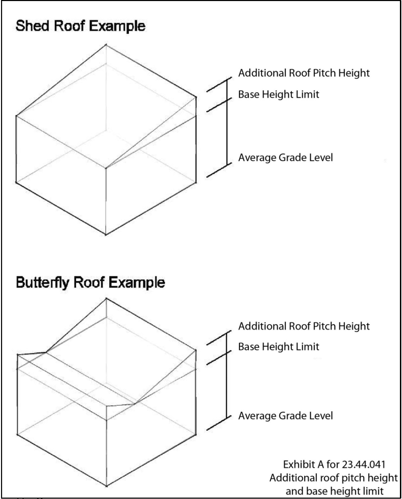

Exhibit A forAdditional roof pitch height and base height limit

1. Conversion of accessory structures. An existing accessory structure that is not located in a required front yard, or that is located in a front yard where Section 23.40.030 or 23.40.035 applies, may be converted into a detached accessory dwelling unit if the structure complies with the minimum standards set forth in Sections 22.206.010 through 22.206.140 of the Housing and Building Maintenance Code and with the Seattle Residential Code, if work requiring a permit is performed on the structure or has previously been performed without a permit. The Director may allow an exception to one or more of the development standards for accessory dwelling units contained in subsection 23.44.041.A.4 and standards a through f, h, i, and j listed in Table B for 23.44.041, provided the conversion does not increase the structure's nonconformity with the standard and the applicant can demonstrate that the accessory structure was constructed prior to June 1, 1999, as an accessory structure. If an accessory structure constructed prior to June 1, 1999, was replaced to the same configuration in accordance with the standards of Section 23.42.112, then the replacement structure also qualifies for conversion under this subsection 23.44.041.B.3. For purposes of this subsection 23.44.041.B.3, the term "conversion" means either keeping the accessory structure intact or removing and rebuilding the accessory structure, provided that any expansion or relocation of the accessory structure complies with the development standards for detached accessory dwelling units.
The covenant shall run with the land and be binding upon the property owner, his/her heirs and assigns, and upon any parties subsequently acquiring any right, title or interest in the property. The covenant shall be in a form prescribed by the Director that includes the legal description of the principal use lot. The property owner(s) shall return the original covenant with recording stamp to the Department before the building permit for the accessory dwelling unit is issued.

1. Covenant release. At the request of a property owner and after an inspection finding that an accessory dwelling unit has been removed from the owner's property, the Department shall record a release of any previously recorded covenant for that accessory dwelling unit.

1. Accessory dwelling units, general provisions. The Director may authorize an accessory dwelling unit, and that dwelling unit may be used as a residence, only under the following conditions:

    1. A lot with or proposed for a single-family dwelling may have no more than one accessory dwelling unit.
    2. The owner(s) of the lot shall comply with the owner occupancy requirements of subsection 23.44.041.C.
    3. Any number of related persons may occupy each unit in a single-family dwelling unit with an accessory dwelling unit; provided that, if unrelated persons occupy either unit, the total number of persons occupying both units may not altogether exceed eight.
    4. All accessory dwelling units are required to meet the development standards in Table A for 23.44.041, unless modified in subsection 23.44.041.B:
2. Accessory dwelling units, detached, additional provisions. A detached accessory dwelling unit is also known as a backyard cottage. The Director may authorize a detached accessory dwelling unit, and that unit may be used as a residence, only under the conditions set forth in subsection 23.44.041.A and the following additional conditions:

    1. Detached accessory dwelling units are not permitted on a lot if any portion of the lot is within the Shoreline District established pursuant to Section 23.60.010.
    2. Detached accessory dwelling units are required to meet the additional development standards set forth in Table B for 23.44.041.
3. Owner occupancy

    1. Requirement. An owner with at least a 50 percent interest in the property must occupy either the principal dwelling unit or the accessory dwelling unit for six or more months of each calendar year as the owner's permanent residence. The Director may waive this requirement for up to three years if a letter is submitted that provides evidence to the Director showing good cause why the requirement for owner occupancy should be waived. Good cause may include job dislocation, sabbatical leave, education, or illness.
    2. Violation. If an owner is unable or unwilling to fulfill the requirements of subsection 23.44.041.C.1, the owner shall remove those features of the accessory dwelling unit that make it a dwelling unit. Failure to do so will constitute a violation of this Title 23 and the owner will be subject to penalties pursuant to Sections 23.90.018, 23.90.019 and 23.90.020.
    3. Covenant recording. Prior to issuance of a permit establishing an accessory dwelling unit, the owner(s) shall sign under oath and record in the King County Recorder a covenant by the owner(s) to the City of Seattle stating that the owner(s) agree to restrict use of the principal and accessory dwelling units in compliance with the requirements of this subsection 23.44.041.C and notify all prospective purchasers of those requirements. Falsely certifying to the terms of the covenant or failure to comply with the terms of the covenant is subject to penalties pursuant to Sections 23.90.018, 23.90.019 and 23.90.020.
4. Single-family status unaffected. A single-family lot with an accessory dwelling unit shall be considered a single-family residence for purposes of rezone criteria (Section 23.34.011).

##### 23.44.042 - Urban farms

1. An urban farm with up to 4,000 square feet of planting area is permitted outright as an accessory use to any principal use permitted outright or to a permitted conditional use, in each case subject to the applicable standards of this title, including the provisions of Section 23.42.051.
2. An urban farm with over 4,000 square feet of planting area may permitted as an administrative conditional use accessory to any principal use permitted outright or accessory to a permitted conditional use, pursuant to Sections 23.44.018 and 23.42.051.

##### 23.44.044 - Swimming pools

Private, permanent swimming pools, hot tubs and other similar uses are permitted as accessory uses to a single-family structure subject to the following specific development standards:

1. Private, permanent swimming pools, hot tubs and other similar uses over 18 inches above existing grade are subject to the development standards for accessory uses.
2. Private, permanent swimming pools, hot tubs and other similar uses projecting not more than 18 inches above existing grade shall not be counted in lot coverage.
3. Private, permanent swimming pools, hot tubs and other similar uses may be placed in a required front or rear yard, provided that:

    1. No part of the structure shall project more than 18 inches above existing lot grade in a required front yard; and
    2. No part of the structure shall be placed closer than 5 feet to any front or side lot line.

##### 23.44.046 - Solar collectors.

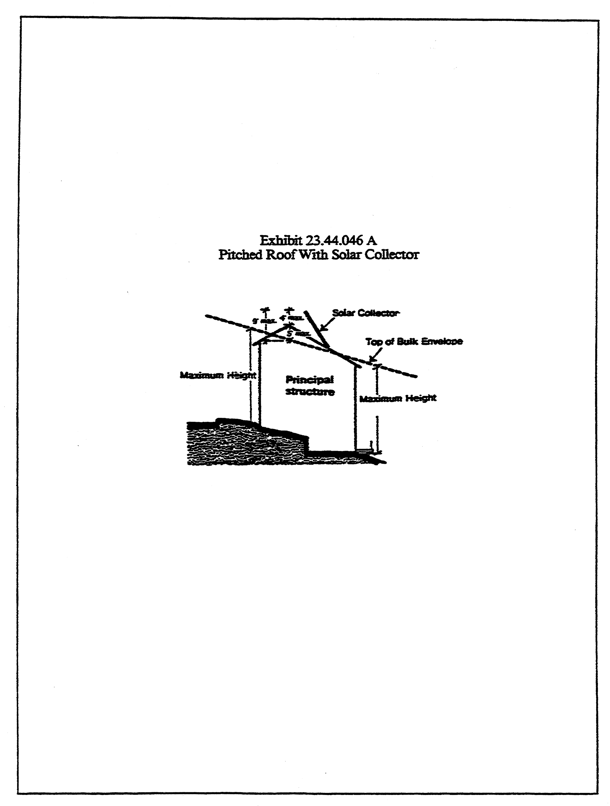

1. Solar collectors are permitted outright as an accessory use to any principal use permitted outright or to a permitted conditional use subject to the following development standards:

    1. Solar collectors, including solar greenhouses which meet minimum standards and maximum size limits as determined by the Director, shall not be counted in lot coverage.
    2. Solar collectors except solar greenhouses attached to principal use structures may exceed the height limits of single-family zones by four (4) feet or extend four (4) feet above the ridge of a pitched roof. However, the total height from existing grade to the top of the solar collector may not extend more than nine (9) feet above the height limit established for the zone (see Exhibit 23.44.046 A). A solar collector which exceeds the height limit for single-family zones shall be placed so as not to shade an existing solar collector or property to the north on January 21st, at noon, any more than would a structure built to the maximum permitted height and bulk.
    3. Solar collectors and solar greenhouses meeting minimum written energy conservation standards administered by the Director may be located in required yards according to the following conditions:

        1. In a side yard, no closer than three (3) feet from the side property line; or
        2. In a rear yard, no closer than fifteen (15) feet from the rear property line unless there is a dedicated alley, in which case the solar collector shall be no closer than fifteen (15) feet from the centerline of the alley; or
        3. In a front yard, solar greenhouses which are integrated with the principal structure and have a maximum height of twelve (12) feet may extend up to six (6) feet into the front yard. In no case shall the greenhouse be located closer than five (5) feet from the front property line.
2. Nonconforming Solar Collectors. The Director may permit the installation of solar collectors which cause an existing structure to become nonconforming, or which increase an existing nonconformity, as a special exception pursuant to Chapter 23.76, Procedures for Master Use Permits and Council Land Use Decisions. Such installation may be permitted even if it exceeds the height limit established in Section 23.44.046 A2, so long as total structure height including solar collectors does not exceed thirty-nine (39) feet above existing grade and the following conditions are met:

    1. There is no feasible alternative to placing the collector(s) on the roof;
    2. Such collector(s) are located so as to minimize view blockage for surrounding properties and shading of property to the north, while still providing adequate solar access for the collectors;
    3. Such collector(s) meet minimum written energy conservation standards administered by the Director; and
    4. The collector(s) add no more than seven (7) feet of height to the existing structure. To minimize view blockage or shadow impacts, the Director shall have the authority to limit a nonconforming solar collector to less than seven (7) additional feet of height.

##### 23.44.048 - Keeping of animals.

The keeping of animals is regulated by Section 23.42.052, Keeping of Animals.

##### 23.44.050 - Home occupations.

Home occupations are regulated by Section 23.42.050, Home Occupations.

##### 23.44.051 - Bed and breakfasts

A bed and breakfast use is permitted if it meets the following standards:

1. General provisions

    1. The bed and breakfast use shall have a business license issued by the Department of Finance and Administrative Services;
    2. The bed and breakfast use shall be operated by an owner who owns at least a 50 percent interest in the dwelling in which the bed and breakfast is located;
    3. An owner who owns at least a 50 percent interest in the dwelling shall reside in the structure in which the bed and breakfast use is located during any period in which rooms are rented to guests;
    4. No more than two people who reside outside the dwelling unit shall be employed, with or without compensation, in the operation of the bed and breakfast use;
    5. The bed and breakfast use shall be operated within the principal structure, which shall be at least five years old;
    6. There shall be no evidence of the bed and breakfast use from the exterior of the structure except for a sign permitted by subsection 23.55.020.D.1;
    7. The bed and breakfast use shall have no more than five guest rooms, provided that this limitation does not apply to bed and breakfasts that were established on or before and have been continuously operated as a bed and breakfast since April 1, 1987; and
    8. Parking shall be provided as required in Chapter 23.54.
2. Alterations to single-family structures. Interior and exterior alterations consistent with the development standards of the underlying zone are permitted.
3. Dispersion. Any lot line of property containing any proposed new bed and breakfast use must be located 600 feet or more from any lot line of any other bed and breakfast use.
4. Neighborhood mitigation provisions

    1. The owner will make public transit information available to patrons, and the owner's operating plan must describe how the transit information will be made available to patrons.
    2. The design of the structure in which the use is located and the orientation of the access will minimize impacts, such as noise, light and parking, to neighboring structures.
    3. The owner's operating plan includes quiet hours, limits on programmed on-site outdoor activities, and parking policies to minimize impacts on residential neighbors.
    4. The delivery of goods and services associated with the bed and breakfast use are accommodated at a time and in a manner that will limit, to the extent feasible, impacts on surrounding properties.
    5. The operating plan shall be distributed to all residents and property owners within 300 feet of the proposed bed and breakfast use. The distributed plan shall reference this Section 23.44.051 and provide contact information for the Seattle Department of Construction and Inspections' Review and Inspection Center and contact information for the operator of the bed and breakfast. Applicants for a permit to establish a bed and breakfast use shall provide proof to the Seattle Department of Construction and Inspections that they made a good faith effort to provide the required distribution prior to issuance of a permit establishing the use.

##### 23.44.052 - Open wet moorage

Piers and floats for open wet moorage of private pleasure craft are permitted as regulated by the Shoreline District, Chapter 23.60A.

##### 23.44.053 - Transitional encampments accessory use

Transitional encampments accessory to religious facilities or to principal uses located on property owned or controlled by a religious organization are regulated by Section 23.42.054, Transitional Encampments Accessory to Religious Facilities.

##### 23.44.058 - Columbariums, garden wall crypts and mausoleums.

Columbariums, garden wall crypts and mausoleums are permitted only as accessory to existing cemeteries except that columbariums and garden wall crypts may also be accessory to religious facilities, and subject to the general development standards for accessory uses. In addition, no interment openings shall abut or be directly across the street from property other than cemetery property. For columbariums, garden wall crypts and mausoleums accessory to existing cemeteries, any border between structures and the property line shall be landscaped and maintained by the owner in good condition. For columbariums and garden wall crypts accessory to religious facilities, the landscaping requirements of SMC Section 23.44.022 I applicable to religious facilities and other institutions shall apply.

##### 23.44.060 - Uses accessory to parks and playgrounds

1. The following accessory uses shall be permitted in any park when within a structure or on a terrace abutting the structure:

When the use is within one hundred (100) feet from any lot in a residential zone the use shall be completely enclosed.

    1. The sale and consumption of beer during daylight hours;
    2. The sale and consumption of alcoholic beverages under a Class H liquor license at municipal golf courses during established hours of operation.
2. The sale and consumption of beer and wine with meals served in a restaurant facility within the boundaries of Woodland Park shall be permitted. The use shall be permitted in only one (1) facility located no closer than one hundred (100) feet from any lot in a residential zone and separated from other public activity areas and zoo buildings by at least fifty (50) feet.
3. Storage structures and areas and other structures and activities customarily associated with parks and playgrounds are subject to the following development standards in addition to the general development standards for accessory uses:

    1. Any active play area shall be located 30 feet or more from any lot in a single-family zone.
    2. Garages and service or storage areas shall be located 100 feet or more from any other lot in a residential zone and obscured from view from each such lot.

##### 23.44.068 - Heat recovery incinerator.

The Director may permit a heat recovery incinerator as an accessory use to institutions, public facilities and parks and playgrounds, subject to the following conditions:

1. The incinerator shall be located on the same lot as the institution or public facility.
2. An incinerator in a park or playground shall be permitted only when a permanent structure other than that which houses the incinerator exists and the incinerator abuts the structure.
3. The use shall be located no closer than one hundred (100) feet to any property line unless completely enclosed within a structure.
4. If not within a structure, the use shall be enclosed by a view-obscuring fence of sufficient strength and design to resist entrance by children.
5. Adequate control measures for insects, rodents and odors shall be maintained continuously.

##### 23.44.070 - Recycling collection stations.

The Director may permit recycling collection stations as accessory uses to institutions and public facilities. These recycling collection stations shall be maintained in good condition by the respective institution or public facility.

##### 23.44.072 - Roomers, boarders, lodgers.

The renting of rooms, with or without meals, by a household for lodging purposes only, for the accommodation of not more than two (2) roomers, boarders or lodgers, is permitted outright as an accessory use within a dwelling unit as long as the total number of residents does not exceed eight (8).

### Chapter 23.45 - MULTI-FAMILY

Sections:

#### 23.45.502 - Scope of provisions

1. This Chapter 23.45 establishes regulations for the following zones:

Lowrise 1 (LR1);

Lowrise 2 (LR2);

Lowrise 3 (LR3);

Midrise (MR) (references to MR zones include the Midrise/85 (MR/85) zone unless otherwise noted); and

Highrise (HR).

2. Multifamily zones listed in subsection 23.45.502.A and having an incentive zoning suffix are subject to this Chapter 23.45 and Chapter 23.58A, Incentive provisions.
3. Areas in multifamily zones described in subsection 23.76.026.D are vested according to the provisions of subsection 23.76.026.D.

#### 23.45.504 - Permitted and prohibited uses

1. All uses are permitted outright, prohibited or permitted as a conditional use according to Table A for 23.45.504 and this Section 23.45.504. Uses not referred to in Table A for 23.45.504 are prohibited, unless otherwise indicated in this Chapter 23.45 or Chapters 23.51A, 23.51B, or 23.57. Communication utilities and accessory communication devices, except as exempted in Section 23.57.002, are subject to the regulations in this Chapter 23.45 and additional regulations in Chapter 23.57. Public facilities are subject to the regulations in Section 23.51A.004.
2. All permitted uses are allowed as a principal use or as an accessory use, unless otherwise indicated in this Chapter 23.45.
3. Accessory uses. The following accessory uses are permitted in all multifamily zones, subject to the standards in Section 23.45.545, if applicable:

    1. Private garages and carports;
    2. Private, permanent swimming pools, hot tubs and other similar uses;
    3. Solar collectors, including solar greenhouses;
    4. Open wet moorage accessory to residential structures;
    5. Uses accessory to parks and playgrounds, pursuant to Section 23.45.578;
    6. Bed and breakfasts in a dwelling unit that is at least five years old;
    7. Recycling collection stations;
    8. Urban farms with planting area not more than 4,000 square feet. Urban farms with greater than 4,000 square feet of planting area may be allowed as an administrative conditional use to any use permitted outright or as a conditional use. The Director may grant, condition or deny a conditional use permit in accordance with subsection 23.42.051.B; and
    9. Accessory dwelling units.
4. Heat recovery incinerators may be permitted as accessory administrative conditional uses, pursuant to Section 23.45.506.
5. Ground floor commercial use

    1. Drive-in businesses are prohibited, as either a principal or accessory use.
    2. The following uses are permitted as ground-floor commercial uses in Midrise and Highrise zones pursuant to Section 23.45.532:

        1. Business support services;
        2. Food processing and craft work;
        3. General sales and services;
        4. Medical services;
        5. Offices;
        6. Restaurants; and
        7. Live-work with one of the uses permitted in this subsection 23.45.504.E as the permitted commercial use.
6. Existing cemeteries are permitted to continue in use. New cemeteries are prohibited and existing cemeteries are prohibited from expanding. For purposes of this section, a change in a cemetery boundary is not considered an expansion in size and is permitted provided that:

    1. the change does not increase the net land area occupied by the cemetery;
    2. the land being added to the cemetery is contiguous to the existing cemetery and is not separated from the existing cemetery by a public street or alley whether or not improved; and
    3. the use of the land being added to the cemetery will not result in the loss of housing.
7. Except as provided in subsections 23.45.504.G.1 and G.2 below, medical service uses other than permitted ground floor commercial uses are prohibited.

    1. Medical service uses in HR zones may be permitted as administrative conditional uses pursuant to subsection 23.45.506.F.
    2. Medical service uses meeting the development standards for institutions are permitted outright on property conveyed by a deed from the City that, at the time of conveyance, restricted the property's use to a health care or health-related facility.
8. Fences and free standing walls of utility services uses shall be set back from the street lot line by an average of 7 feet, and be no less than 5 feet from the street lot line at any point. Landscaping shall be provided between the fence or wall and the street lot line. The Director may reduce this setback after finding that the reduced setback will not significantly increase project impacts, including but not limited to noise, odor, and the scale of the structure in relation to nearby buildings. Acceptable methods to reduce fence or wall impacts include changes in the height, design or construction of the fence or wall, including the use of materials, architectural detailing, artwork, vegetated trellises, decorative fencing, or similar features to provide visual interest facing the street lot line. Fences and walls may obstruct or allow views to the interior of a site. Where site dimensions and conditions allow, applicants are encouraged to provide both a landscaped setback between the fence or wall and the right-of-way, and a fence or wall that provides visual interest facing the street lot line, through the height, design or construction of the fence or wall, including the use of materials, architectural detailing, artwork, vegetated trellises, decorative fencing, or similar features.

#### 23.45.506 - Administrative conditional uses

Table A for: Setback Requirements for Medical Office Uses (all measurements in feet)

<table>
<tr>
<td>Elevation of Facade or Portion of Facade from Existing Grade</td>
<td>Setback on Street Frontages</td>
<td>Setback on Alley Frontages</td>
<td>Setback on shared lot lines</td>
</tr>
<tr>
<td>45 or less</td>
<td>7 average, 5 minimum</td>
<td>0</td>
<td>7 average, 5 minimum</td>
</tr>
<tr>
<td>More than 45 up to 108</td>
<td>10 average, 7 minimum</td>
<td>10</td>
<td>15 average, 10 minimum</td>
</tr>
</table>

1. If the ground floor of a street facade is in use as a child care center, community center, or commercial use permitted on the ground floor by Section 23.45.504, no setback is required for the portion of the street facade that is 45 feet in height or less.
2. If a lot abutting the lot is developed to the side lot line, portions of the proposed development that are 45 feet in height or less may be joined to the abutting structure.
3. Projections into required setbacks, and structures in required setbacks, are permitted pursuant to Section 23.45.518.
4. A minimum of 25 percent of the lot area shall be provided as landscaped open space at ground level. Except as provided in this subsection 23.45.506.F.5, no horizontal dimension for required open space shall be less than 10 feet, nor shall any required open space area be less than 225 square feet. The following additional areas may be included in the calculation of required ground level open space:

    1. Area in the public right-of-way of a neighborhood green street designated in Section 23.45.516 abutting the lot that is improved according to a plan approved by the Director, in consultation with the Director of the Seattle Department of Transportation; except that the Director may waive the requirement that the neighborhood green street abut the lot and allow the improvements to be made to a neighborhood green street located in the general vicinity of the project, if such an improvement is determined to be beneficial to the occupants of the project; and
    2. Landscaped area in the public right-of-way that abuts the required open space on the lot, when the landscaping contributes to achievement of the Green Factor score required in subsection 23.45.506.F.6. below.
5. The landscaping and screening requirements of Section 23.45.524 apply, except that the required Green Factor score is 0.3 or greater, pursuant to Section 23.86.019.
6. Parking shall be required as provided in Chapter 23.54.
7. The Director shall determine the location of access to parking. In order to promote pedestrian safety and comfort, access via an alley is preferred. Where street access is deemed appropriate, due to safety hazards, topography, or other special conditions of the lot, the number of curb cuts and the width of curb cuts, driveways, and garage openings shall be minimized.
8. No surface area parking shall be provided, and no parking shall be located at or above grade, unless it is separated from all street lot lines by another use.
9. The preferred access to loading berths shall be from an alley if the lot abuts an alley. Loading berths shall be located so that access to any residential parking is not blocked.
10. The Director shall determine the location of passenger load zones, based on safety considerations, minimizing conflicts with automobile and pedestrian traffic, reducing impacts on any nearby residential uses, and the efficient operation of the medical service use.
11. Identifying signs shall be permitted according to Chapter 23.55, Signs.
12. For mixed use structures containing both medical service uses and residential uses, the portion of the structure in residential use shall meet the requirements of the HR zone, except as modified by the following:

    1. The maximum width and floor size limits in Section 23.45.520 apply to any portion of the structure in residential use above 45 feet in height.
    2. Amenity areas shall be provided according to the provisions of Section 23.45.522. Open space required at ground level pursuant to subsection 23.45.506.F.5 may be counted as amenity area if it meets the applicable development standards of Section 23.45.522.
    3. No landscaped open space is required in addition to the open space required in subsection 23.45.506.F.5.

1. Uses permitted as administrative conditional uses in Section 23.45.504, may be permitted by the Director when the provisions of Section 23.42.042 and this Section 23.45.506 are met.
2. Unless otherwise specified in this Chapter 23.45, conditional uses shall meet the development standards for uses permitted outright.
3. Institutions other than public schools not meeting the development standards of 23.45.570, Institutions, and Major Institution uses as provided in Chapter 23.69, may be permitted subject to the following:

    1. Bulk and Siting. In order to accommodate the special needs of the proposed institution, and to better site the facility with respect to its surroundings, the Director may modify the applicable development standards. In determining whether to allow such modifications, the Director shall balance the needs of the institution against the compatibility of the proposed institution with the residential scale and character of the surrounding area.
    2. Dispersion Criteria. An institution that does not meet the dispersion criteria of Section 23.45.570 may be permitted by the Director upon determination that it would not substantially worsen parking shortages, traffic safety hazards, and noise in the surrounding residential area.
    3. Noise. The Director may condition the permit in order to mitigate potential noise problems. Measures the Director may require for this purpose include, but are not limited to the following: landscaping, sound barriers, fences, berms, adjustments to yards or the location of refuse storage areas, location of parking areas and access, structural design modifications, and regulating hours of use.
    4. Transportation Plan. A transportation plan is required for proposed new institutions and for those institutions proposing to expand larger than 4,000 square feet of floor area and/or required to provide 20 or more new parking spaces. The Director may condition a permit to mitigate potential traffic and parking impacts pursuant to a Transportation Management Plan or Program as described in directors rules governing such plans or programs. The Director will determine the level of detail to be disclosed in the transportation plan based on the probable impacts and/or scale of the proposed institution.
4. A use not otherwise permitted in the zone within a structure designated as a Seattle landmark that is subject to controls and incentives imposed by a designating ordinance, when the owner of the landmark has executed and recorded an agreement acceptable in form and content to the Landmarks Preservation Board providing for the restoration and maintenance of the historically significant features of the structure, may be permitted subject to the following:

    1. The use is compatible with the existing design and/or construction of the structure without significant alteration; and
    2. Uses permitted by the zone are impractical because of structure design and/or that no permitted use can provide adequate financial support necessary to sustain the structure in reasonably good physical condition.
5. Park and ride or park and pool lots may be permitted subject to the following:

    1. A park and ride or park and pool lot may be permitted only on parking lots existing at least 5 years prior to the establishment of the park and ride or park and pool lot that have direct vehicular access to an arterial street improved to City standards.
    2. If the proposed park and ride or park and pool lot is located on a lot containing accessory parking for other uses, there must be no substantial conflict in the principal operating hours of the park and ride or park and pool lot and other uses on the lot.
    3. The Director may require landscaping and screening in addition to that required for surface parking areas, noise mitigation, vehicular access control, signage restrictions, and other measures to provide comfort and safety for pedestrians and bicyclists and to help ensure the compatibility of the park and ride or park and pool lot with the surrounding area.
6. In addition to medical service uses permitted as ground floor commercial uses pursuant to subsection 23.45.504.E, medical service uses occupying over 4,000 square feet may be permitted in Highrise zones as administrative conditional uses on lots that are at least 25,000 square feet in size, have not been in residential use since January 1, 1989, and are located on a block that abuts a Neighborhood Commercial zone on at least two entire sides of the block (defined for the purpose of this subsection 23.45.506.F as an area bounded by street lot lines).

    1. In order to approve a medical service use, the Director must determine that the medical service use is an expansion of an existing medical service business establishment in the immediate vicinity that is not a major institution.
    2. Design review is required.
    3. The development standards in Sections 23.45.510, 23.45.514, 23.45.516, 23.45.518, 23.45.520, and 23.45.536 do not apply to the portion of the structure occupied by medical service uses, except as specified in this subsection 23.45.506.F. Portions of the structure occupied by medical service uses shall meet the following development standards:

        1. The maximum height for the portions of structures containing medical office uses is 108 feet, except that the provisions for green roofs and rooftop features in Section 23.45.514 apply.
        2. The average of the gross floor area of stories in medical service use above 45 feet in height shall not exceed 60 percent of the area of the lot.
    4. Setbacks

        1. Setbacks shall be required as shown on Table A for 23.45.506.
7. Heat recovery incinerators located on the same lot as the principal use may be permitted by the Director as accessory conditional uses, subject to the following conditions:

    1. The incinerator may be located no closer than 100 feet to any lot line unless completely enclosed within a building.
    2. If not within a building, the incinerator shall be enclosed by a view-obscuring fence of sufficient strength and design to resist entrance by children.
    3. Adequate control measures for insects, rodents and odors shall be continuously maintained.

#### 23.45.508 - General provisions

1. Except for structures related to an urban farm, a structure occupied by a permitted use other than a residential use may be partially or wholly converted to a residential use even if the structure does not conform to the development standards for residential uses in multifamily zones.
2. Off street parking shall be provided pursuant to Section 23.54.015.
3. Expansions of nonconforming converted structures and conversions of structures occupied by nonconforming uses are regulated by Sections 23.42.108 and 23.42.110.
4. Methods for measurements are provided in Chapter 23.86. Requirements for streets, alleys and easements are provided in Chapter 23.53. Standards for parking and access and design are provided in Chapter 23.54. Standards for solid waste and recyclable materials storage space are provided in Section 23.54.040. Standards for signs are provided in Chapter 23.55.
5. Assisted living facilities, congregate residences, nursing homes, and structures containing ground floor commercial uses as allowed by Chapter 23.46 in RC zones shall meet the development standards for apartments unless otherwise specified. Congregate residences are subject to additional requirements as specified in Section 23.42.049.
6. Single-family dwelling units. In LR zones, single-family dwelling units shall meet the development standards for townhouse developments, except as otherwise provided. In MR and HR zones, single-family dwelling units shall meet the development standards of the zone.
7. Proposed uses in all multifamily zones are subject to the transportation concurrency level-of-service standards prescribed in Chapter 23.52.
8. Lots with no street frontage. For purposes of structure width, depth, and setbacks, multifamily zoned lots that have no street frontage are subject to the following:

    1. For lots that have only one alley lot line, the alley lot line shall be treated as a front lot line.
    2. For lots that have more than one alley lot line, the Director shall determine which alley lot line shall be treated as the front lot line.
    3. For lots that have no alley lot lines, the applicant may choose the front lot line provided that the selected front lot line length is at least 50 percent of the width of the lot.
9. All use provisions and development standards applicable to MR zones, except maximum height, also apply in the MR/85 zone.
10. Any other provision of the Seattle Municipal Code notwithstanding, an applicant is not entitled to a permit for any use or development on a lot in a LR zone that would be inconsistent with any term, condition, or restriction contained either in any recorded agreement that is in effect as to that lot and was made in connection with a rezone of the lot to LDT, L1, L2, L3, or L4, or in any City Council decision or ordinance related to a rezone of the lot to LDT, L1, L2, L3, or L4 conditioned on a recorded agreement prior to April 19, 2011.
11. If more than one category of residential use is located on a lot, and if different development standards apply to the different categories of use, then each category's percentage of the total limit imposed by the development standard shall be calculated according to the formula for floor area ratio (FAR) in subsection 23.86.007.E.
12. The development standards of each zone shall be applied in that zone, and may not be used in any other zone, unless otherwise specified. If a lot or development site includes more than one zoning designation and a development standard is based on lot area, the lot area used in applying the development standard shall be the portion of the contiguous area with the corresponding zoning designation.

#### 23.45.510 - Floor area ratio (FAR) limits

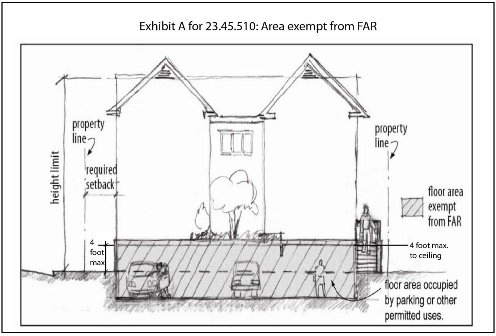

Exhibit A forArea exempt from FAR

1. For rowhouse and townhouse developments and apartments that qualify for the higher FAR limit shown in Table A for 23.45.510, floor area within a structure or portion of a structure that is partially above grade, is used for parking or other accessory uses, and has no additional stories above, if the following conditions are met:

    1. The average height of the exterior walls enclosing the floor area does not exceed one story, measured from existing or finished grade, whichever is lower;
    2. The roof area above the exempt floor area is predominantly flat, is used as amenity area, and meets the standards for amenity area at ground level in Section 23.45.522;
    3. At least 25 percent of the perimeter of the amenity area on the roof above the floor area is not enclosed by the walls of the structure.
2. Enclosed common amenity area in HR zones.
3. As an allowance for mechanical equipment, in any structure more than 85 feet in height, 3.5 percent of the gross floor area that is not exempt under this subsection 23.45.510.E.
4. In HR zones, ground floor commercial uses meeting the requirements of Section 23.45.532, if the street level of the structure containing the commercial uses has a minimum floor to floor height of 13 feet and a minimum depth of 15 feet.

1. General provisions

    1. All gross floor area not exempt under subsection 23.45.510.E, including the area of stair penthouses with enclosed floor space, counts toward the maximum gross floor area allowed under the FAR limits.
    2. The applicable FAR limit applies to the total non-exempt gross floor area of all structures on the lot.
    3. If a lot is in more than one zone, the FAR limit for each zone applies to the portion of the lot located in that zone, and the floor area on the portion of the lot with the lower FAR limit may not exceed the amount that would be permitted if it were a separate lot.
2. FAR limits in LR zones. FAR limits apply in LR zones as shown in Table A for 23.45.510, provided that if the LR zone designation includes an incentive zoning suffix, then the applicant shall comply with Chapter 23.58A, Incentive Provisions, to obtain gross floor area exceeding that allowed by the FAR shown in the suffix designation. In LR zones the following standards apply to the calculation of gross floor area for application of FAR limits:

    1. Exterior corridors, breezeways, and stairways that provide building circulation and access to dwelling units or sleeping rooms, are included in gross floor area.
    2. Balconies, patios, and decks that are associated with a single dwelling unit or sleeping room and that are not used for common circulation, and ground-level walking paths, are excluded from gross floor area.
    3. Common walls separating individual rowhouse and townhouse dwelling units are considered to be exterior walls.
3. In LR zones, in order to qualify for the higher FAR limit shown in Table A for 23.45.510, the following standards shall be met:

    1. Green building performance standards

        1. Applicants shall make a commitment that the structure will meet green building performance standards by earning a Leadership in Energy and Environmental Design (LEED) Silver rating, certification by the Passive House Institute U. S., or the Passive House Institute, or a Built Green 4-star rating of the Master Builders Association of King and Snohomish Counties, except that an applicant who is applying for funding from the Washington State Housing Trust Fund and/or the Seattle Office of Housing to develop new affordable housing, may elect to meet green building performance standards by meeting the Washington Evergreen Sustainable Development Standards (ESDS). The standards referred to in this subsection 23.45.510.C.1.a are those identified in Section 23.45.526, and Section 23.45.526 shall apply as if the application were for new development gaining extra residential floor area.
        2. If a site contains existing structures that were developed under the Land Use Code in place prior to April 19, 2011, the existing structures and any additions to those structures are not required to be upgraded to current green building performance standards for the higher FAR limits to apply to those structures. Any entirely new structure proposed to be built on the lot shall meet current green building performance standards to gain the higher FAR limit. If a structure is developed under the Land Use Code in place as of or after April 19, 2011, and was not built to the higher FAR, then in order for the structure or addition to gain the higher FAR, the structure shall be updated to current green building performance standards.
    2. For all categories of residential use, if the lot abuts an alley and the alley is used for access, improvements to the alley shall be required as provided in subsections 23.53.030.E and 23.53.030.F, except that the alley shall be paved rather than improved with crushed rock, even for lots containing fewer than ten dwelling units.
    3. Parking location if parking is provided

        1. For rowhouse and townhouse developments, parking shall be totally enclosed within the same structure as the residential use, located in a structure or portion of a structure that meets the requirements of subsection 23.45.510.E.5, or located in a parking area or structure at the rear of the lot. A parking area not within a structure that is located at the rear of the lot shall be located behind all structures except, if accessed from an alley, the parking area may be located no closer to the front lot line than 50 percent of the lot depth.
        2. For apartments, parking may either:

            1. be totally enclosed within the same structure as the residential use; or
            2. on lots located outside of urban centers, urban villages, and the Station Area Overlay District, be located off an alley at the rear of the lot, provided that all surface parking is limited to a single row of spaces along the alley and access to each surface parking space is taken directly from the alley.
    4. Access to parking if parking is provided

        1. Access to required barrier-free parking spaces may be from either a street or an alley. Subsections 23.45.510.C.4.b, 23.45.510.C.4.c, and 23.45.510.C.4.d do not apply to required barrier-free parking spaces.
        2. If the lot abuts an alley, access to parking shall be from the alley, unless one or more of the conditions in subsection 23.45.536.C.2 are met.
        3. If access cannot be provided from an alley, access shall be from a street if the following conditions are met:

            1. On corner lots, the driveway shall abut and run parallel to the rear lot line of the lot or a side lot line that is not a street lot line.
            2. On a non-corner lot, there is no more than one driveway per 160 feet of street frontage.
        4. If access to parking does not meet one of the standards in this subsection 23.45.510.C.4, or if an exception is granted that allows parking access from both an alley and a street pursuant to subsection 23.45.536.C, the lower FAR limit on Table A for 23.45.510 applies.
4. FAR limits in MR and HR zones. FAR limits apply to all structures and lots in MR and HR zones as shown in Table B for 23.45.510, provided that if the MR and HR zone designations include an incentive zoning suffix, then the applicant shall comply with Chapter 23.58A, Incentive provisions, to obtain gross floor area exceeding that allowed by the FAR shown in the suffix designation.
5. The following floor area is exempt from FAR limits:

    1. All underground stories.
    2. The floor area contained in a landmark structure subject to controls and incentives imposed by a designating ordinance, if the owner of the landmark has executed and recorded an agreement acceptable in form and content to the Landmarks Preservation Board, providing for the restoration and maintenance of the historically significant features of the structure, except that this exemption does not apply to a lot from which a transfer of development potential (TDP) has been made under Chapter 23.58A, and does not apply for purposes of determining TDP available for transfer under Chapter 23.58A.
    3. The floor area contained in structures built prior to January 1, 1982, as single-family dwelling units that will remain in residential use, regardless of the number of dwelling units within the existing structure, provided that:

        1. no principal structure is located between the existing single-family dwelling unit and the street lot line along at least one street frontage. If the single-family dwelling unit is moved on the lot, the floor area of the dwelling remains exempt if it continues to meet this provision; and
        2. the exemption is limited to the gross square footage in the single-family dwelling unit as of January 1, 1982.
    4. Portions of a story that extend no more than 4 feet above existing or finished grade, whichever is lower, excluding access, (see Exhibit A for 23.45.510), in the following circumstances:

        1. apartments in LR zones that qualify for the higher FAR limit shown in Table A for 23.45.510;
        2. rowhouse developments in LR zones located on lots that have a lot depth of 100 feet or less, do not have alley access, and that qualify for the higher FAR limit shown in Table A for 23.45.510, provided that parking access is located at the rear of the rowhouse development; and
        3. all multifamily structures in MR and HR zones.
6. If TDP is transferred from a lot pursuant to Section 23.58A.042, the amount of non-exempt floor area that may be permitted is the applicable base FAR, plus any net amount of TDP previously transferred to the lot, minus the sum of the existing non-exempt floor area on the lot and the amount of TDP transferred.

#### 23.45.512 - Density limits—LR zones

1. The minimum lot area per dwelling unit in LR zones for cottage housing developments, townhouse developments, and apartments, is shown on Table A for 23.45.512, except as provided in subsections 23.45.512.B, 23.45.512.C, 23.45.512.D, 23.45.512.E, and 23.45.512.G.
2. Density exception for certain types of low-income multifamily residential uses.

    1. The exception in this subsection 23.45.512.B applies to low-income disabled multifamily residential uses, low-income elderly multifamily residential uses, and low-income elderly/low-income disabled multifamily residential uses, operated by a public agency or a private nonprofit corporation, if they do not qualify for the higher FAR limit shown in Table A for 23.45.510.
    2. The uses listed in subsection 23.45.512.B.1 shall have a maximum density of one dwelling unit per 400 square feet of lot area if a majority of the dwelling units are designed for and dedicated to tenancies of at least three months, and the dwelling units remain in low-income disabled multifamily residential use, low-income elderly multifamily residential use, or low-income elderly/low-income disabled multifamily residential use for the life of the structure.
3. Carriage houses, nursing homes, congregate housing, assisted living facilities, and accessory dwelling units that meet the standards of Section 23.45.545, are exempt from the density limit set in Table A for 23.45.512.
4. In LR1 zones no apartment shall contain more than three dwelling units, except as permitted in subsections 23.45.512.E and G.
5. Dwelling unit(s) located in structures built prior to January 1, 1982 as single-family dwelling units that will remain in residential use are exempt from density limits and the provisions of subsection 23.45.512.D.
6. If dedication of right-of-way is required, permitted density shall be calculated before the dedication is made.
7. Adding Units to Existing Structures.

    1. One additional dwelling unit may be added to an existing residential use regardless of the density restrictions in subsections 23.45.512.A, B, C, and D above. An additional unit is allowed only if the proposed additional unit is to be located entirely within an existing structure, and no additional floor area is proposed to be added to the existing structure.
    2. For the purposes of this subsection 23.45.512.G "existing residential uses" are those that were established under permit as of October 31, 2001, or for which a permit has been granted and the permit has not expired on October 31, 2001.

#### 23.45.514 - Structure height

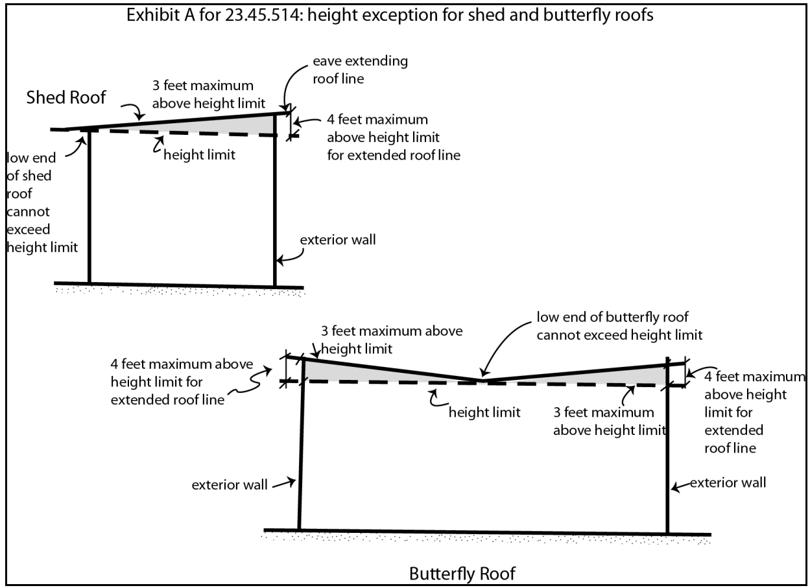

Exhibit A forHeight exception for shed and butterfly roofs

Exhibit B for: Height Allowance for Sloped Roofs Concealed by a Parapet

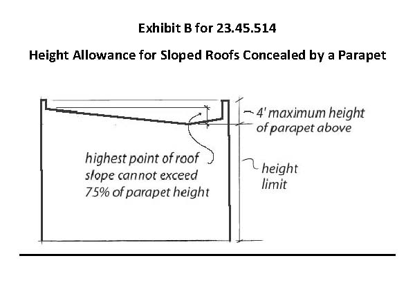

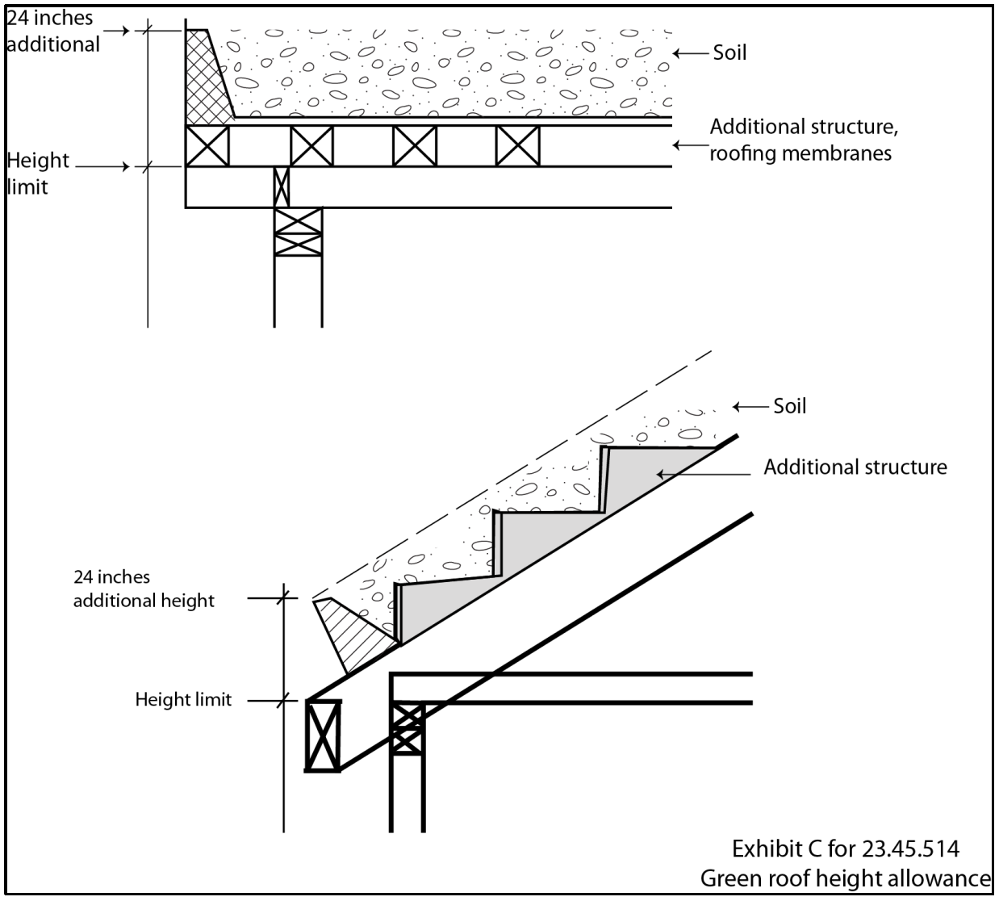

Exhibit C forGreen roof height allowance

Exhibit D for: Permitted Projections on Pitched Roofs

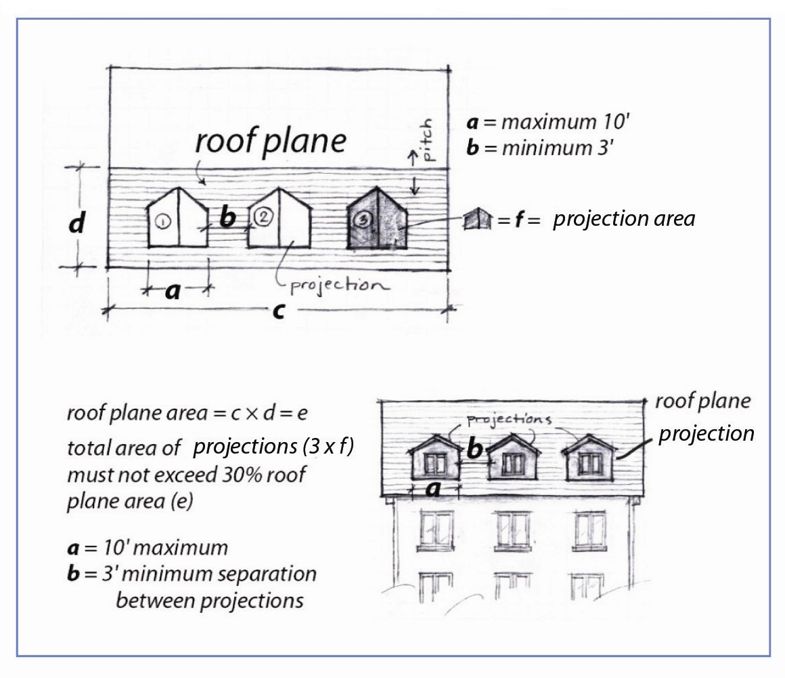

1. On flat roofs, the projections may extend 4 feet above the maximum height limit allowed by subsections 23.45.514.A, B, and F if the following requirements are met:

    1. the total area of the projections is no more than 30 percent of the area of the roof plane; and
    2. the projections are setback at least 4 feet from any street facing facade.
2. In LR zones, the following rooftop features may extend 10 feet above the height limit set in subsections 23.45.514.A and F, if the combined total coverage of all features does not exceed 15 percent of the roof area or 20 percent of the roof area if the total includes screened mechanical equipment:

    1. Stair penthouses, except as provided in subsection 23.45.514.J.6;
    2. Mechanical equipment;
    3. Play equipment and open-mesh fencing that encloses it, if the fencing is at least 5 feet from the roof edge;
    4. Chimneys;
    5. Wind-driven power generators; and
    6. Minor communication utilities and accessory communication devices, except that height is regulated according to the provisions of Section 23.57.011.
3. In MR and HR zones, the following rooftop features may extend 15 feet above the applicable height limit set in subsections 23.45.514.B and F, if the combined total coverage of all features does not exceed 20 percent of the roof area, or 25 percent of the roof area if the total includes screened mechanical equipment:

    1. Stair penthouses, except as provided in subsection 23.45.514.J.6;
    2. Mechanical equipment;
    3. Play equipment and open-mesh fencing that encloses it, if the fencing is at least 5 feet from the roof edge;
    4. Chimneys;
    5. Sun and wind screens;
    6. Penthouse pavilions for the common use of residents;
    7. Greenhouses and solariums, in each case that meet minimum energy standards administered by the Director;
    8. Wind-driven power generators; and
    9. Minor communication utilities and accessory communication devices, except that height is regulated according to the provisions of Section 23.57.011.
4. Subject to the roof coverage limits in subsections 23.45.514.J.4 and 5, elevator penthouses may extend above the applicable height limit up to 16 feet. If additional height is needed to accommodate energy-efficient elevators in HR zones, elevator penthouses may extend the minimum amount necessary to accommodate energy-efficient elevators, up to 25 feet above the applicable height limit. Energy-efficient elevators are defined by Director's Rule. Stair penthouses may be the same height as an elevator penthouse if the elevator and stairs are co-located within a common penthouse structure.
5. For height exceptions for solar collectors, see Section 23.45.545.
6. In order to protect solar access for property to the north, the applicant shall either locate the rooftop features listed in this subsection 23.45.514.J at least 10 feet from the north edge of the roof, or provide shadow diagrams to demonstrate that the proposed location of such rooftop features would shade property to the north on January 21 at noon no more than would a structure built to maximum permitted bulk:

    1. Solar collectors;
    2. Planters;
    3. Clerestories;
    4. Greenhouses and solariums that meet minimum energy standards administered by the Director;
    5. Minor communication utilities and accessory communication devices, permitted according to the provisions of Section 23.57.011;
    6. Play equipment;
    7. Sun and wind screens;
    8. Penthouse pavilions for the common use of residents.
7. For height limits and exceptions for communication utilities and devices, see Section 23.57.011.
8. Greenhouses that are dedicated to food production are permitted to extend 15 feet above the applicable height limit, as long as the combined total coverage of all features gaining additional height listed in this subsection 23.45.514.J does not exceed 50 percent of the roof area, and the greenhouse meets the requirements of subsection 23.45.514.J.8.
9. Additional height in HR zones. A structure may exceed the applicable height limit in the HR zone as follows:

    1. If the applicable height limit is 240 feet, the height of the structure may be increased by 30 feet if the area bounded by the facades of the portion of the structure above 240 feet is no greater than 6,500 square feet, or if the area bounded by the facades at an elevation that is halfway between 240 feet and the height of the structure is no greater than 50 percent of the area bounded by the facades at a height of 240 feet.
    2. If the applicable height limit is 300 feet, the height of a structure may be increased (1) by 30 feet if the area bounded by the facades of the portion of the structure above 300 feet is no greater than 6,500 square feet, or (2) by 45 feet if the area bounded by the facades at an elevation that is halfway between 300 feet and the height of the structure is no greater than 50 percent of the area bounded by the facades at a height of 300 feet.
    3. In all cases the area bounded by the facades extending above the height limit may be occupied only by those uses or features otherwise permitted in this Section 23.45.514 as an exception above the height limit, although any limits on the height or coverage of those uses or features totally screened by the facades extending above the applicable height limit shall not apply. Height exceptions permitted for screening of rooftop features under other provisions of this subsection 23.45.514.J are not permitted above the height gained by a structure under this subsection 23.45.514.J.11.

1. Subject to the additions and exceptions allowed as set forth in this Section 23.45.514, the height limits for principal structures permitted in LR zones are as shown on Table A for 23.45.514.
2. The base and maximum height limits for principal structures permitted in MR and HR zones are as shown in Table B for 23.45.514, subject to the additions and exceptions allowed as set forth in this Section 23.45.514.
3. The maximum height for accessory structures that are located in required setbacks or separations is 12 feet, except as follows:

    1. Garages and carports are limited to 12 feet in height as measured on the facade containing the vehicle entrance. Open rails may extend an additional 3 feet above the roof of the garage or carport if any portion of the roof is within 4 feet of existing grade.
    2. The height limit is 20 feet for an accessory structure that contains an accessory dwelling unit for a rowhouse or townhouse unit. The height limit for an accessory dwelling unit that is accessory to a single-family dwelling unit shall be set according to Section 23.44.041.
    3. Freestanding flagpoles and religious symbols for religious institutions are exempt from height controls, except as regulated in Chapter 23.64, Airport Height Overlay District, provided they are no closer to any lot line than 50 percent of their height above existing grade.
4. Exceptions for pitched roofs in LR zones that are not shed or butterfly roofs. Pitched roofs that are not shed or butterfly roofs may extend above the height limits set in Table A for 23.45.514 subject to the following limits, provided that all parts of the roofs above the height limit have a minimum slope of 6:12, except as provided in subsection 23.45.514.D.5:

    1. For cottage housing developments in all LR zones, the ridge of pitched roofs on principal structures may extend up to 7 feet above the height limit.
    2. In LR1 and LR2 zones, for structures subject to a 30 foot height limit, the ridge of pitched roofs on principal structures may extend up to 5 feet above the height limit if the height exception in subsection 23.45.514.F is not used.
    3. In LR3 zones, for structures subject to a 30 foot height limit, the ridge of pitched roofs on principal structures may either:

        1. extend up to 10 feet above the height limit, if the height exception provided in subsection 23.45.514.F is not used, and the number of full stories above grade is limited to three; or
        2. extend up to 5 feet above the height limit, if the height exception provided in subsection 23.45.514.F is used.
    4. In LR3 zones, for structures subject to a 40 foot height limit, the ridge of pitched roofs on principal structures may extend up to 5 feet above the height limit provided that the height exception in subsection 23.45.514.F is not used.
    5. Portions of curved roof forms, such as barrel and domed roofs, may have a lesser slope than 6:12, if the Director determines that the massing of the roof form is comparable to a pitched roof form such as a gable or gambrel roof that would have a minimum slope of 6:12.
5. Shed and butterfly roofs in LR zones

    1. In LR zones, the high side(s) of a shed or butterfly roof may extend 3 feet above the height limits set in Table A for 23.45.514, provided that the low side(s) of the shed or butterfly roof are no higher than the height limit (see Exhibit A for 23.45.514) if the height limit exception in subsection 23.45.514.F is not used.
    2. The roof line of a shed or butterfly roof may be extended in order to accommodate eaves, provided that the highest point of the roof extension is no more than 4 feet above the height limit.
6. For apartments in LR2 zones, and for all residential uses in LR3 zones, the applicable height limit is increased 4 feet above the height shown on Table A for 23.45.514 for a structure that includes a story that is partially below-grade, provided that:

    1. This height exception does not apply to portions of lots that are within 50 feet of a single-family zone boundary line, unless the lot in the LR zone is separated from a single-family zoned lot by a street;
    2. The number of stories above the partially below-grade story is limited to three stories for residential uses with a 30 foot height limit and to four stories for residential uses with a 40 foot height limit;
    3. On the street-facing facade(s) of the structure, the story above the partially below-grade story is at least 18 inches above the elevation of the street, except that this requirement may be waived to accommodate units accessible to the disabled or elderly, consistent with the Seattle Residential Code, Section R322, or the Seattle Building Code, Chapter 11; and
    4. The average height of the exterior facades of the portion of the story that is partially below-grade does not exceed 4 feet, measured from existing or finished grade, whichever is less.
7. In MR zones, the base height limit is increased by 5 feet if the number of stories in the structure that are more than 4 feet above existing or finished grade, whichever is lower, does not exceed six, and one or more of the following conditions is met:

    1. The FAR exemption provided in Section 23.45.510.E.4 is used;
    2. All stories in the structure, except stories used only for parking, have floor to ceiling heights of 9 feet or more; or
    3. The lot is split between a MR zone and an NC zone, and the base structure height allowed on the NC-zoned portion is 65 feet or more.
8. Roofs enclosed by a parapet. Roof surfaces that are completely surrounded by a parapet may exceed the applicable height limit to allow for a slope, provided that the height of the highest elevation of the roof surface does not exceed 75 percent of the parapet height, and provided that the lowest elevation of the roof surface is no higher than the applicable height limit. See Exhibit B for 23.45.514.
9. Green roofs. For any structure with a green roof that meets standards promulgated by the Director and that covers at least 50 percent of the surface of the roof, up to 2 feet of additional height above the maximum height otherwise allowed for the roof is allowed to accommodate structural requirements, roofing membranes, and soil. See Exhibit C for 23.45.514.
10. Rooftop features

    1. Flagpoles and religious symbols for religious institutions that are located on a roof are exempt from height controls, except as regulated in Chapter 23.64, Airport Height Overlay District, provided they are no closer to any lot line than 50 percent of their height above the roof portion where attached.
    2. Open railings, planters, greenhouses not dedicated to food production, parapets, and firewalls on the roofs of principal structures may extend 4 feet above the maximum height limit set in subsections A, B, E, and F of this Section 23.45.514.
    3. Architectural projections that result in additional interior space, such as dormers, skylights, and clerestories, are subject to the following limits:

        1. On pitched roofs, projections may extend to the height of the ridge of a pitched roof that is allowed pursuant to subsection 23.45.514.D, if the following conditions are met:

            1. the total area of the projections is no more than 30 percent of the area of each roof plane measured from the plan view perspective;
            2. each projection is limited to 10 feet in width; and
            3. each projection is separated by at least 3 feet from any other projection (see Exhibit D for 23.45.514).

#### 23.45.516 - Additional height and extra residential floor area in MR and HR zones

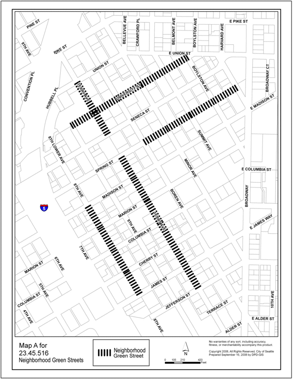

Map A for Neighborhood Green Streets

1. General. Definitions in Section 23.58A.004 apply in this Section 23.45.516 unless otherwise specified. According to the provisions of this Section 23.45.516, Section 23.45.526, and Chapter 23.58A:

    1. In MR, MR/85, and HR zones, extra residential floor area may be permitted up to the maximum limits allowed by Section 23.45.510; and
    2. In MR and HR zones, additional height above the base height limit is permitted for structures that qualify for extra residential floor area, up to the maximum limits allowed by Sections 23.45.514 and 23.45.516.
2. Eligible lots. The following lots are eligible for extra residential floor area and, except in MR/85 zones, additional height:

    1. Lots in MR or MR/85 zones in urban villages, urban centers, and the Station Area Overlay District, except when the lot abuts a lot zoned single-family or is directly across an alley from a lot zoned single-family; and
    2. Lots in HR zones.
3. HR zones

    1. Extra residential floor area. In HR zones extra residential floor area may be gained in accordance with Chapter 23.58A subject to the conditions and limits in this Section 23.45.516. Up to all extra residential floor area may be gained through the affordable housing incentive program provisions in Section 23.58A.014. Up to 40 percent of extra residential floor area may be gained by one or any combination of:

        1. transfer of development potential;
        2. providing neighborhood open space or a payment in lieu thereof; and/or
        3. providing a neighborhood green street setback if allowed pursuant to subsection 23.45.516.F, all in accordance with this Section 23.45.516 and Chapter 23.58A.
    2. Structure height

        1. Structures 240 feet or less in height. The applicable height limit in an HR zone under subsection 23.45.514.B is 240 feet if the applicant satisfies the conditions for extra floor area but not all of the conditions in subsection 23.45.516.C.2.b are met.
        2. Structures over 240 feet. The applicable height limit in an HR zone under subsection 23.45.514.B is 300 feet if the applicant satisfies the conditions for extra floor area and the following additional conditions are met:

            1. For any structure above a height of 85 feet, the average residential gross floor area per story above a height of 45 feet does not exceed 9,500 square feet;
            2. No parking is located at or above grade, unless it is separated from all street lot lines by another use; and
            3. At least 25 percent of the lot area at grade is one or more landscaped open spaces, each with a minimum horizontal dimension of 10 feet, or at least 20 percent of the lot area at grade is landscaped, common amenity area meeting the standards of Section 23.45.522.
4. Transferable Development Potential (TDP) from Landmark structures and open space

    1. Sending lots. TDP may be transferred under the provisions of Section 23.58A.040, as modified by this Section 23.45.516, only from Landmark TDP sites and open space TDP sites. In order to be eligible as a Landmark TDP site or open space TDP site, a lot shall be located in the First Hill Urban Center Village and shall be zoned MR or HR. Sending lots are subject to the limits and conditions in this Chapter 23.45 and Chapter 23.58A. The amount of TDP that may be transferred from a lot is limited to the amount by which the base FAR under Section 23.45.510 exceeds floor area on the lot that is not exempt under Section 23.45.510.
    2. Receiving lots. Any lot located in an HR zone within the First Hill Urban Center Village is eligible for extra residential floor area according to the provisions of this Section 23.45.516 to receive TDP from an eligible sending lot, subject to the limits and conditions in this Chapter 23.45 and Chapter 23.58A.
5. Combined lot development. When authorized by the Director pursuant to this Section 23.45.516, lots located on the same block in an HR zone may be combined, whether contiguous or not, solely for the purpose of allowing some or all of the capacity for chargeable floor area on one or more such lots under this Chapter 23.45 to be used on one or more other lots, according to the provisions of this subsection 23.45.516.E.

    1. Up to all of the capacity on one lot, referred to in this subsection 23.45.516.E as the "base lot," for chargeable floor area in addition to the base FAR, pursuant to Section 23.45.510 (referred to in this subsection 23.45.516.E as "bonus capacity"), may be used on one or more other lots, subject to compliance with all conditions to obtaining extra residential floor area, pursuant to Chapter 23.58A, as modified in this Section 23.45.516. For purposes of applying any conditions related to amenities or features provided on site under this Section 23.45.516, only the lot or lots on which such bonus capacity is used are considered to be the lot or site using a bonus. Criteria for use of extra residential floor area that apply to the structure(s) shall be applied only to the structure(s) on the lots using the transferred bonus capacity. For purposes of the condition to height above 240 feet in subsection 23.45.516.C.2.b.3 of this Section 23.45.516, all lots in a combined lot development are considered as one lot.
    2. Only if all of the bonus capacity on all lots in a combined lot development is used on fewer than all of those lots, there may be transferred from a base lot where no bonus capacity is used, to one or more other lots in the combined lot development, up to all of the unused base FAR on the base lot, without regard to limits on the transfer of TDP or on use of TDP in Chapter 23.58A or subsection 23.45.516.D. Such transfer shall be treated as a transfer of TDP for purposes of determining remaining development capacity on the base lot and TDP available to transfer under Chapter 23.58A, but shall be treated as additional base FAR on the other lots, and, to the extent that, together with other base floor area, it does not exceed the amount of chargeable floor area below the base height limit on the lot where it is used, it shall not be treated as extra residential floor area. If less than all of the bonus capacity of the base lot is used on such other lots, and if the base lot qualifies as a sending lot for TDP, the unused base FAR may be transferred as TDP to the extent permitted by Chapter 23.58A and this Section 23.45.516, but in each case only to satisfy in part the conditions to achieve extra floor area, not as additional base FAR.
    3. To the extent permitted by the Director, the maximum chargeable floor area for any one or more lots in the combined lot development may be increased up to the combined maximum chargeable floor area under Section 23.45.510 computed for all lots participating in the combined lot development, provided that the maximum chargeable floor area on one or more other lots in the combined lot development is correspondingly reduced. To the extent permitted by the Director, and subject to subsection 23.45.516.E.2, the base floor area for any one or more lots in the combined lot development may be increased up to the combined base chargeable floor area under Section 23.45.510 computed for all lots participating in the combined lot development, provided that the base floor area on one or more other lots in the combined lot development is correspondingly reduced.
    4. The Director shall allow a combined lot development only to the extent that the Director determines, in a Type I land use decision, that permitting more chargeable floor area than would otherwise be allowed on a lot or lots and the corresponding reduction on another lot or lots will result in a significant public benefit through one of more of the following:

        1. preservation of a landmark structure located on the block or on an adjacent block either through the inclusion of the lot with the landmark structure as a base lot in the combined lot development or through the transfer of TDP from the lot with the landmark structure to a lot in the combined lot development;
        2. inclusion on the same block of a structure in which low-income housing is provided to satisfy all or part of the conditions to earn extra residential floor area; and/or
        3. provision of open space on the same block to satisfy in part the conditions to achieve extra residential floor area.
    5. The fee owners of each of the combined lots shall execute an appropriate agreement or instrument, which shall include the legal descriptions of each lot and shall be recorded in the King County real property records. In the agreement or instrument, the owners shall acknowledge the extent to which development capacity on each base lot is reduced by the use of such capacity on another lot or lots, at least for so long as the chargeable floor area for which such capacity is used remains on such other lot or lots. The agreement or instrument shall also provide that its covenants and conditions shall run with the land and shall be specifically enforceable by the parties and by the City of Seattle.
    6. Nothing in this subsection 23.45.516.E shall allow the development on any lot in a combined lot development to exceed or deviate from height limits or other development standards.
6. Neighborhood green street setback. Floor area may be gained for a neighborhood green street setback according to the provisions of Chapter 23.58A by development on lots abutting one of the streets or street segments within the First Hill Urban Village shown on Map A for 23.45.516.
7. Neighborhood open space. In HR zones, subject to the limits in this Section 23.45.516 and Chapter 23.58A, extra residential floor area may be gained through a voluntary agreement to provide neighborhood open space or a payment in lieu of neighborhood open space, according to the provisions of Section 23.58A.040.

#### 23.45.518 - Setbacks and separations

Table B for: MR Setbacks

<table>
<tr>
<td>Setback Location</td>
<td>Required Setback Amount</td>
</tr>
<tr>
<td>Front and side setback from street lot lines</td>
<td>7 foot average setback; 5 foot minimum setback</td>
</tr>
<tr>
<td></td>
<td>No setback is required if a courtyard abuts the street (see Exhibit A for 23.45.518) and the courtyard has:</td>
</tr>
<tr>
<td></td>
<td>•  a minimum width equal to 30 percent of the width of the abutting street frontage or 20 feet, whichever is greater; and</td>
</tr>
<tr>
<td></td>
<td>•  a minimum depth of 20 feet measured from the abutting street lot line.</td>
</tr>
<tr>
<td>Rear setback</td>
<td>15 feet from a rear lot line that does not abut an alley; or 10 feet from a rear lot line abutting an alley.</td>
</tr>
<tr>
<td>Side setback from interior lot line</td>
<td>For portions of a structure:</td>
</tr>
<tr>
<td></td>
<td>•  42 feet or less in height: 7 foot average setback; 5 foot minimum setback.</td>
</tr>
<tr>
<td></td>
<td>•  Above 42 feet in height: 10 foot average setback; 7 foot minimum setback.</td>
</tr>
</table>

Exhibit A for: MR Courtyard Example

Table C for: HR Setbacks (see also Exhibit B for)

<table>
<tr>
<td>Setbacks for structures 85 feet in height or less</td>
</tr>
<tr>
<td>Structures 85 feet in height or less are subject to the setback provisions of the MR zone in subsection 23.45.518.A.</td>
</tr>
<tr>
<td>Setbacks for structures greater than 85 feet in height</td>
</tr>
<tr>
<td>Lot line abutting a street</td>
<td>For portions of a structure:</td>
</tr>
<tr>
<td></td>
<td>•  45 feet or less in height: 7 foot average setback; 5 foot minimum setback, except that no setback is required for frontages occupied by street level uses or dwelling units with a direct entry from the street;</td>
</tr>
<tr>
<td></td>
<td>•  Greater than 45 feet in height: 10 foot minimum setback</td>
</tr>
<tr>
<td>Lot line abutting an alley</td>
<td>Rear lot line abuts an alley:For portions of a structure:</td>
</tr>
<tr>
<td></td>
<td>•  45 feet or less in height: no setback required;</td>
</tr>
<tr>
<td></td>
<td>•  Greater than 45 feet in height: 10 foot minimum setback.</td>
</tr>
<tr>
<td>Lot line that abuts neither a street nor alley</td>
<td>For portions of a structure:</td>
</tr>
<tr>
<td></td>
<td>•  45 feet or less in height: 7 foot average setback; 5 foot minimum setback, except that no setback is required for portions abutting an existing structure built to the abutting lot line;</td>
</tr>
<tr>
<td></td>
<td>•  Greater than 45 feet in height: 20 foot minimum setback.</td>
</tr>
</table>

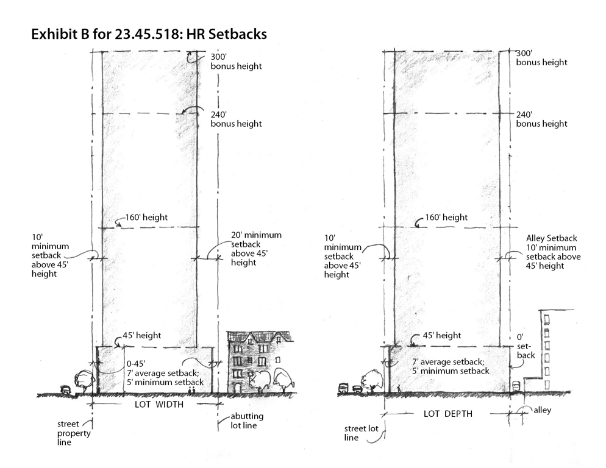

Exhibit B for: HR Setbacks

Table D for: HR Facade Separation for Structures on the Same Lot

<table>
<tr>
<td>Height Range</td>
<td>Minimum separation required between interior facades</td>
</tr>
<tr>
<td>0 to 45 feet</td>
<td>No minimum</td>
</tr>
<tr>
<td>Above 45 feet up to 160 feet</td>
<td>30 feet</td>
</tr>
<tr>
<td>Above 160 feet</td>
<td>40 feet</td>
</tr>
</table>

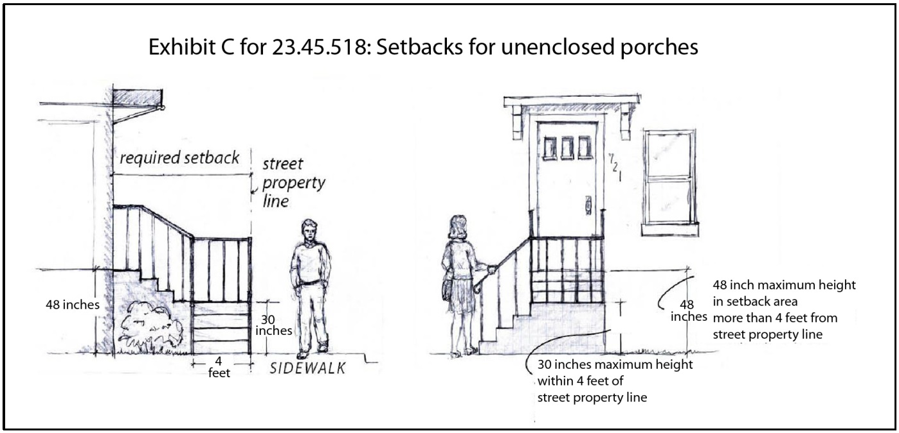

Exhibit C forSetbacks for unenclosed porches

1. Permitted porches may be covered, provided that no portions of the cover-structure, including any supports, are closer than 3 feet to any lot line.
2. Fireplaces and chimneys may project up to 18 inches into required setbacks or separations.
Exhibit D for: Permitted Additions Into Required Setbacks for Existing Single-Family Dwelling Units

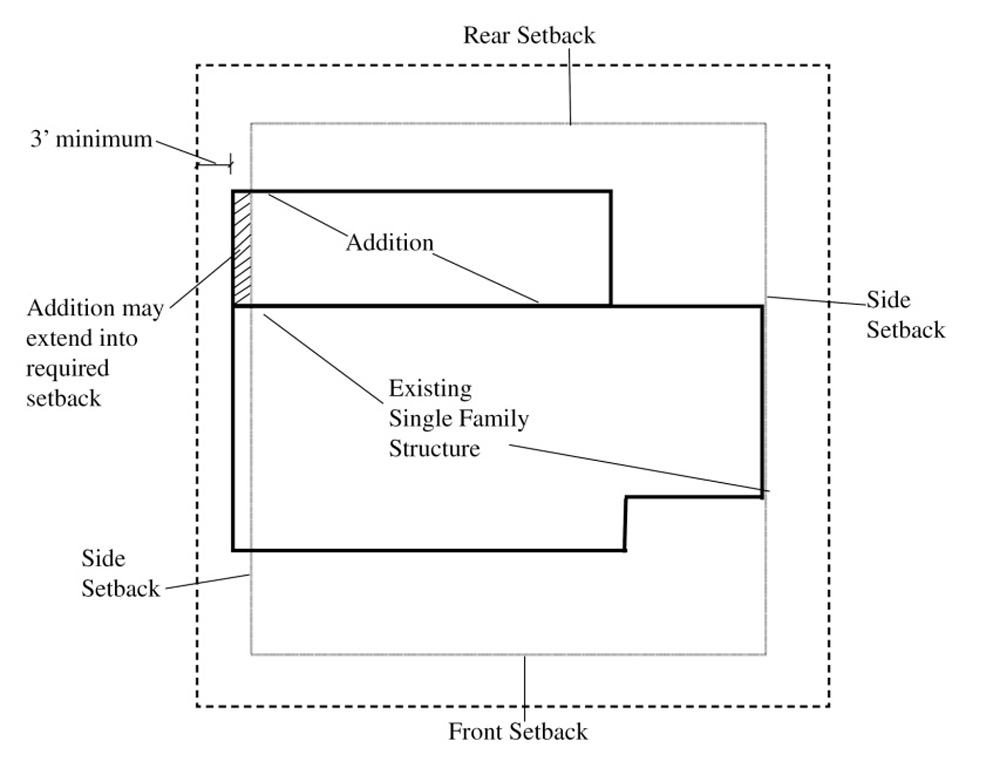

1. LR zones. Required setbacks for the LR zones are shown in Table A for 23.45.518.
2. MR zones. Minimum setbacks for the MR zone are shown in Table B for 23.45.518.
3. HR zones. Minimum setbacks for HR zones are shown in Table C for 23.45.518.
4. Through lots. In the case of a through lot, each setback abutting a street except a side setback shall be a front setback. Rear setback requirements shall not apply to the lot.
5. Other setback requirements. Additional structure setbacks may be required in order to meet the provisions of Chapter 23.53, Requirements for streets, alleys and easements.
6. Separations between multiple structures.

    1. In LR and MR zones, the minimum required separation between principal structures at any two points on different interior facades is 10 feet, except for cottage housing developments, and principal structures separated by a driveway or parking aisle.
    2. In LR and MR zones, if principal structures are separated by a driveway or parking aisle, the minimum required separation between the principal structures is 2 feet greater than the required width of the driveway or parking aisle, provided that the separation is not required to be any greater than 24 feet. If principal structures are separated by a driveway or parking aisle, projections that enclose floor area may extend a maximum of 3 feet into the required separation if they are at least 8 feet above finished grade.
    3. Cottage housing developments in LR and MR zones:

        1. The minimum required separation between principal structures at any two points on different interior facades is 6 feet, unless there is a principal entrance on an interior facade, in which case the minimum separation required from that facade is 10 feet.
        2. Facades of principal structures shall be separated from facades of accessory structures by a minimum of 3 feet.
        3. HR zones. Where two or more structures or portions of a structure above 85 feet in height are located on one lot, the minimum horizontal separation between interior facades in each height range is as provided in Table D for 23.45.518.
7. Front and rear setbacks and all separations on lots containing certain environmentally critical areas or buffers may be reduced pursuant to Sections 25.09.280 and 25.09.300.
8. Projections permitted in required setbacks and separations

    1. Cornices, eaves, gutters, roofs and other forms of weather protection may project into required setbacks and separations a maximum of 4 feet if they are no closer than 3 feet to any lot line.
    2. Garden windows and other features that do not provide floor area may project a maximum of 18 inches into required setbacks and separations if they are:

        1. a minimum of 30 inches above the finished floor;
        2. no more than 6 feet in height and 8 feet wide; and
        3. combined with bay windows and other features with floor area, make up no more than 30 percent of the area of the facade.
    3. Bay windows and other features that provide floor area may project a maximum of 2 feet into required setbacks and separations if they are:

        1. no closer than 5 feet to any lot line;
        2. no more than 10 feet in width; and
        3. combined with garden windows and other features included in subsection 23.45.518.H.2, make up no more than 30 percent of the area of the facade.
    4. Unenclosed decks up to 18 inches above existing or finished grade, whichever is lower, may project into required setbacks or separations to the lot line.
    5. Unenclosed porches or steps

        1. If setbacks are required pursuant to subsection 23.45.518.A.1, unenclosed porches or steps no higher than 4 feet above existing grade, or the grade at the street lot line closest to the porch, whichever is lower, may extend to within 4 feet of a street lot line, except that portions of entry stairs or stoops not more than 2.5 feet in height from existing or finished grade whichever is lower, excluding guard rails or hand rails, may extend to a street lot line. See Exhibit C for 23.45.518. Unenclosed porches or steps above existing grade may project into the required rear setback or required separation between structures a maximum of 4 feet provided they are a minimum of 5 feet from a rear lot line. Unenclosed porches or steps permitted in required setbacks and separations shall be limited to a maximum width of 20 feet.
9. Unenclosed decks and balconies may project a maximum of 4 feet into required setbacks if each one is:

    1. no closer than 5 feet to any lot line;
    2. no more than 20 feet wide; and
    3. separated from other decks and balconies on the same facade of the structure by a distance equal to at least ½ the width of the projection.
10. Structures in required setbacks or separations

    1. Detached garages, carports or other accessory structures may be located in required separations and required rear or side setbacks, subject to the following requirements:

        1. Any accessory structure located between a principal structure and a side lot line shall provide the setback required for the principal structure;
        2. Any portion of an accessory structure located more than 25 feet from a rear lot line shall be set back at least 5 feet from the side lot line;
        3. Accessory structures shall be set back at least 7 feet from any lot line that abuts a street; and
        4. Accessory structures shall be separated by at least 3 feet from all principal structures, including the eaves, gutters, and other projecting features of the principal structure.
    2. Ramps or other devices necessary for access for the disabled and elderly that meet the Seattle Residential Code, Section R322 or Seattle Building Code, Chapter 11-Accessibility, are permitted in any required setback or separation.
    3. Uncovered, unenclosed pedestrian bridges, necessary for access and 5 feet or less in width, are permitted in any required setback or separation.
    4. Underground structures are permitted in any required setback or separation.
    5. Solar collectors may be permitted in required setbacks or separations, pursuant to the provisions of Section 23.45.545.
    6. Freestanding structures, signs and similar structures 6 feet or less in height above existing or finished grade whichever is lower, may be erected in each required setback or separation, provided that signs meet the provisions of Chapter 23.55, Signs.
    7. Fences.

        1. Fences no greater than 6 feet in height are permitted in any required setback or separation, except that fences in the required front setback extended to side lot lines or in street side setbacks extended to the front and rear lot lines may not exceed 4 feet in height. Fences located on top of a bulkhead or retaining wall are also limited to 4 feet. If a fence is placed on top of a new bulkhead or retaining wall used to raise grade, the maximum combined height is limited to 9.5 feet.
        2. Up to 2 feet of additional height for architectural features such as arbors or trellises on the top of a fence is permitted, if the architectural features are predominately open.
        3. Fence height may be averaged along sloping grades for each 6 foot long segment of the fence, but in no case may any portion of the fence exceed 8 feet in height when the height permitted by subsection 23.45.518.J.7.a is 6 feet, or 6 feet in height when the height permitted by subsection 23.45.518.J.7.a is 4 feet.
    8. Bulkheads and retaining walls.

        1. Bulkheads and retaining walls used to raise grade may be placed in each required setback if they are limited to 6 feet in height, measured above existing grade. A guardrail no higher than 42 inches may be placed on top of a bulkhead or retaining wall existing as of January 3, 1997.
        2. Bulkheads and retaining walls used to protect a cut into existing grade may not exceed the minimum height necessary to support the cut or 6 feet measured from the finished grade on the low side, whichever is greater. If the bulkhead is measured from the low side and it exceeds 6 feet, an open guardrail of no more than 42 inches meeting Seattle Residential Code or Seattle Building Code requirements may be placed on top of the bulkhead or retaining wall. Any fence shall be set back a minimum of 3 feet from such a bulkhead or retaining wall.
    9. Arbors may be permitted in required setbacks or separation under the following conditions:

        1. In each required setback or separation, an arbor may be erected with no more than a 40 square foot footprint, measured on a horizontal roof plane inclusive of eaves, to a maximum height of 8 feet. At least 50 percent of both the sides and the roof of the arbor shall be open, or, if latticework is used, there shall be a minimum opening of 2 inches between crosspieces.
        2. In each required setback abutting a street, an arbor over a private pedestrian walkway with no more than a 30 square foot footprint, measured on the horizontal roof plane and inclusive of eaves, may be erected to a maximum height of 8 feet. At least 50 percent of the sides of the arbor shall open, or, if latticework is used, there shall be a minimum opening of 2 inches between crosspieces.
    10. Above-grade green stormwater infrastructure (GSI) features are allowed without setback or separation restrictions if:

        1. Each above-grade GSI feature is less than 4.5 feet tall, excluding piping;
        2. Each above-grade GSI feature is less than 4 feet wide; and
        3. The total storage capacity of all above-grade GSI features is no greater than 600 gallons.
    11. Above-grade GSI features larger than what is allowed in subsection 23.45.518.J.10 are allowed within a required setback or separation if:

        1. Above-grade GSI features do not exceed 10 percent coverage of any one setback or separation area;
        2. No portion of an above-grade GSI feature is located closer than 2.5 feet from a side lot line; and
        3. No portion of an above-grade GSI feature projects more than 5 feet into a front or rear setback area.
11. In all multifamily zones, certain additions to a single-family dwelling unit may extend into a required side setback if the structure is already nonconforming with respect to that setback, and if the presently nonconforming section is at least 60 percent of the total width of the respective facade of the structure prior to the addition. The line formed by the nonconforming wall of the structure shall be the limit to which any additions may be built, which may extend up to the height limit and may include basement additions (Exhibit D for 23.45.518), provided that additions shall be at least 3 feet from the side lot line.
12. In LR zones, a minimum upper-level setback from all street lot lines is required in addition to any required ground-level setback, as follows:

    1. For structures with a 30 foot height limit according to Table A for 23.45.514, the upper-level setback requirement is 12 feet above a height of 34 feet.
    2. For structures with a 40 foot height limit according to Table A for 23.45.514, the upper-level setback requirement is 16 feet above a height of 44 feet.
    3. The minimum upper-level setback shall be provided at all points along the length of the street property line as measured from finished grade.
    4. In addition to the projections permitted in subsection 23.45.518.H, open railings, and parapets that are predominantly transparent above a height of 1.5 feet, may be located in the required upper-level setback.

#### 23.45.520 - HR zone width and floor size limits

1. In HR zones, for structures over 85 feet in height, portions of structures above a height of 45 feet are limited to a maximum facade width of 110 feet. The width of the structure measured along the longest street lot line may be increased as follows, provided that if both street lot lines are of the same length, the increase in the width of the facade is only permitted along one street lot line:

    1. A maximum facade width of 130 feet is permitted, provided that the average gross floor area of all stories above 45 feet in height does not exceed 10,000 square feet; or
    2. If the applicant earns bonus residential floor area by providing all of the affordable housing within the project pursuant to Section 23.58A.014, the maximum facade width of the structure above 45 feet in height is 150 feet, provided that the average gross floor area of all stories above 45 feet in height does not exceed 12,000 square feet.
2. All portions of structures above 85 feet in height that reach the maximum facade width limit specified in subsection 23.45.520.A must be separated from any other portion of a structure on the lot above 45 feet at all points by the minimum horizontal distance shown on Table D for 23.45.518, except that projections permitted in required setbacks and separations pursuant to subsections 23.45.518.H and 23.45.518.I are permitted.

#### 23.45.522 - Amenity area

1. Amount of amenity area required for rowhouse and townhouse developments and apartments in LR zones

    1. The required amount of amenity area for rowhouse and townhouse developments and apartments in LR zones is equal to 25 percent of the lot area.
    2. A minimum of 50 percent of the required amenity area shall be provided at ground level, except that amenity area provided on the roof of a structure that meets the provisions of subsection 23.45.510.E.5 may be counted as amenity area provided at ground level.
    3. For rowhouse and townhouse developments, amenity area required at ground level may be provided as either private or common space.
    4. For apartments, amenity area required at ground level shall be provided as common space.
2. Amenity area requirements for cottage housing developments in all multi-family zones

    1. A minimum of 300 square feet of amenity area is required for each cottage.
    2. A minimum of 150 square feet of amenity area is required for each carriage house.
    3. The required quantity shall be allocated as follows:

        1. Half of the amenity area required for each cottage, and all of the amenity area required for each carriage house, shall be provided as common amenity area; and
        2. Half of the amenity area required for each cottage shall be provided as private amenity area for that unit.
    4. The required common amenity area may be divided into no more than two separate areas and shall:

        1. have cottages or carriage houses abutting on at least two sides;
        2. be in a location central to the cottage housing development; and
        3. have no horizontal dimension of less than 10 feet.
    5. Carriage houses shall have stairs that provide access to the common amenity area.
3. Amount of amenity area required in MR and HR zones. The required amount of amenity area in MR and HR zones is equal to 5 percent of the total gross floor area of a structure in residential use, except that cottage housing developments shall meet the standards in subsection 23.45.522.B.
4. General requirements. Required amenity areas shall meet the following conditions:

    1. All units shall have access to a common or private amenity area.
    2. Enclosed amenity areas

        1. In LR zones, an amenity area shall not be enclosed within a structure.
        2. In MR and HR zones, except for cottage housing, no more than 50 percent of the amenity area may be enclosed, and this enclosed area shall be provided as common amenity area.
    3. Projections into amenity areas. Structural projections that do not provide floor area, such as garden windows, may extend up to 2 feet into an amenity area if they are at least 8 feet above finished grade.
    4. Private amenity areas

        1. There is no minimum dimension for private amenity areas, except that if a private amenity area abuts a side lot line that is not a side street lot line, the minimum horizontal dimension measured from the side lot line is 10 feet.
        2. An unenclosed porch that is a minimum of 60 square feet in size and that faces a street or a common amenity area may be counted as part of the private amenity area for the rowhouse, townhouse, or cottage to which it is attached.
    5. Common amenity areas for rowhouse and townhouse developments and apartments shall meet the following conditions:

        1. No common amenity area shall be less than 250 square feet in area, and common amenity areas shall have a minimum horizontal dimension of 10 feet.
        2. Common amenity areas shall be improved as follows:

            1. At least 50 percent of a common amenity area provided at ground level shall be landscaped with grass, ground cover, bushes, bioretention facilities, and/or trees.
            2. Elements that enhance the usability and livability of the space for residents, such as seating, outdoor lighting, weather protection, art, or other similar features, shall be provided.
        3. The common amenity area required at ground level for apartments shall be accessible to all apartment units.
    6. Parking areas, vehicular access easements, and driveways do not qualify as amenity areas, except that a woonerf may provide a maximum of 50 percent of the amenity area if the design of the woonerf is approved through a design review process pursuant to Chapter 23.41.
    7. Swimming pools, spas, and hot tubs may be counted toward meeting the amenity area requirement.
    8. Rooftop areas excluded because they are near minor communication utilities and accessory communication devices, pursuant to subsection 23.57.011.C.1, do not qualify as amenity areas.
5. No amenity area is required for a dwelling unit added to a single-family dwelling unit existing as of January 1, 1982, or for one new dwelling unit added to a multifamily residential use existing as of October 10, 2001.

#### 23.45.524 - Landscaping standards

1. Landscaping requirements

    1. Standards. All landscaping provided to meet requirements under this Section 23.45.524 shall meet standards promulgated by the Director to provide for the long-term health, viability, and coverage of plantings. These standards may include, but are not limited to, the type and size of plants, number of plants, spacing of plants, depth and quality of soil, use of drought-tolerant plants, and access to light and air for plants.
    2. Green Factor requirement

        1. Landscaping that achieves a Green Factor score of 0.6 or greater, determined as set forth in Section 23.86.019, is required for any lot within a LR zone if development is proposed that has more than one dwelling unit, or a congregate residence. Vegetated walls may not count towards more than 25 percent of a lot's Green Factor score.
        2. Landscaping that achieves a Green Factor score of 0.5 or greater, determined as set forth in Section 23.86.019, is required for any lot within a MR or HR zone if development is proposed that has more than one dwelling unit or a congregate residence.
2. Street tree requirements.

    1. Street trees are required if any type of development is proposed, except as provided in subsection 23.45.524.B.2 and B.3 below and Section 23.53.015. Existing street trees shall be retained unless the Director of the Seattle Department of Transportation approves their removal. The Director, in consultation with the Director of the Seattle Department of Transportation, shall determine the number, type, and placement of additional street trees to be provided in order to:

        1. improve public safety;
        2. promote compatibility with existing street trees;
        3. match trees to the available space in the planting strip;
        4. maintain and expand the urban forest canopy;
        5. encourage healthy growth through appropriate spacing;
        6. protect utilities; and
        7. allow access to the street, buildings and lot.
    2. Exceptions to street tree requirements.

        1. If a lot borders an unopened right-of-way, the Director may reduce or waive the street tree requirement along that right-of-way as a Type I decision if, after consultation with the Director of the Seattle Department of Transportation, the Director determines that the right-of-way is unlikely to be opened or improved.
        2. Street trees are not required for any of the following:

            1. changing a use
            2. expanding a structure by 1,000 square feet or less;
            3. expanding surface parking by less than 10 percent in area and less than 10 percent in number of spaces; or
            4. establishing a temporary or intermittent use pursuant to Section 23.42.040.
        3. If an existing structure is proposed to be expanded by more than 1,000 square feet, one street tree is required for each 500 square feet over the first 1,000 square feet of additional structure, up to the maximum number of trees that would be required for new construction.
    3. If it is not feasible to plant street trees in a right-of-way planting strip, a 5 foot setback shall be planted with street trees along the street lot line, or landscaping other than trees shall be provided in the planting strip, subject to approval by the Director of the Seattle Department of Transportation. If, according to the Director of the Department of Transportation, a 5 foot setback or landscaped planting strip is not feasible, the Director may reduce or waive this requirement as a Type I decision.

#### 23.45.526 - LEED, Built Green, and Evergreen Sustainable Development standards

1. Applicants for all new development gaining extra residential floor area, pursuant to this Chapter 23.45, or seeking to qualify for the higher FAR limit in Table A for 23.45.510 shall make a commitment that the structure will meet green building performance standards by earning a Leadership in Energy and Environmental Design (LEED) Silver rating or a Built Green 4-star rating of the Master Builders Association of King and Snohomish Counties, except:

    1. This commitment is not required for building additions and alterations to structures existing or approved prior to April 19, 2011; and
    2. An applicant who is applying for funding from the Washington State Housing Trust Fund and/or the Seattle Office of Housing to develop new affordable housing, as defined in subsection 23.45.526.D, may elect to meet green building performance standards by meeting the Washington Evergreen Sustainable Development Standards (ESDS).
2. The Director may establish, by rule, procedures for determining whether an applicant has demonstrated that a new structure has earned a LEED Silver rating or a Built Green 4-star rating, or met the ESDS, provided that no rule may assign authority for making a final determination to any person other than an officer of the Seattle Department of Construction and Inspections or another City agency with regulatory authority and expertise in green building practices.
3. The applicant shall demonstrate to the Director the extent to which the applicant has complied with the commitment to meet the green building performance standards no later than 90 days after issuance of final Certificate of Occupancy for the new structure, or such later date as may be allowed by the Director for good cause. Performance is demonstrated through an independent report from a third party, pursuant to subsection 23.90.018.E.
4. For purposes of this Section 23.45.526:

    1. LEED Silver, Built Green 4-star or Evergreen Sustainable Development Standard rating means a level of performance for a structure that earns at least the minimum number of credits specified to achieve one of the following:

        1. A silver certificate either for LEED for New Construction Version 2009 or for LEED for Homes Version 2008 with 2009 errata, at the election of the applicant, according to the criteria in the U.S. Green Building Council's LEED Green Building Rating System;
        2. A 4-Star rating either for Built Green Multi-Family Version 2008 or Built Green Single-Family/Townhome New Construction Version 2007, at the election of the applicant, according to the criteria in the Master Builders Association of King and Snohomish Counties Rating System;
        3. Evergreen Sustainable Development Standard Version 1.2 according to the State of Washington Department of Commerce Rating System;
    2. Copies of the rating systems listed in subsection 23.45.526.D.1 are filed with the City Clerk in C.F. 310286, and incorporated by reference.

#### 23.45.527 - Structure width and façade length limits in LR zones

Table A for: Maximum Structure Width in LR zones in feet

<table>
<tr>
<td>Zone</td>
<td>Width in feet by Category of Residential Use</td>
</tr>
<tr>
<td>Cottage Housing andRowhouse Developments</td>
<td>Townhouse Developments</td>
<td>Apartments</td>
</tr>
<tr>
<td>LR1</td>
<td>No limit</td>
<td>60</td>
<td>45</td>
</tr>
<tr>
<td>LR2</td>
<td>No limit</td>
<td>90</td>
<td>90</td>
</tr>
<tr>
<td>LR3 outside Urban Villages, Urban Centers or Station Area Overlay Districts</td>
<td>No limit</td>
<td>120</td>
<td>120</td>
</tr>
<tr>
<td>LR3 inside Urban Villages, Urban Centers or Station Area Overlay Districts</td>
<td>No limit</td>
<td>150</td>
<td>150</td>
</tr>
</table>

1. Structure width in LR zones may not exceed the width indicated on Table A for 23.45.527.
2. Maximum façade length in Lowrise zones.

    1. The maximum combined length of all portions of façades within 15 feet of a lot line that is neither a rear lot line nor a street or alley lot line shall not exceed 65 percent of the length of that lot line, except as specified in subsection 23.45.527.B.2.
    2. For a rowhouse development on a lot that abuts the side lot line of a lot in a single-family zone, the maximum combined length of all portions of façades within 15 feet of the abutting side lot line is 40 feet.

#### 23.45.528 - Structure width and depth limits for lots in Midrise zones greater than 9,000 square feet in size

The width and depth limits of this Section 23.45.528 apply to lots in MR zones that are greater than 9,000 square feet in lot area.

1. The width of principal structures shall not exceed 150 feet.
2. Structure depth.

    1. The depth of principal structures shall not exceed 75 percent of the depth of the lot, except as provided in subsection 23.45.528.B.2.
    2. Exceptions to structure depth limit. To allow for front setback averaging and courtyards as provided in Section 23.45.518, structure depth may exceed the limit set in subsection 23.45.528.B.1 if the total lot coverage resulting from the increased structure depth does not exceed the lot coverage that would have otherwise been allowed without use of the courtyard or front setback averaging provisions.

#### 23.45.529 - Design standards

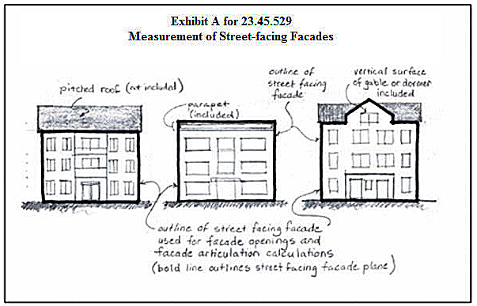

Exhibit A forMeasurement of Street-facing Facades

1. Facade openings

    1. At least 20 percent of the area of each street-facing facade shall consist of windows and/or doors, except as provided in subsection 23.45.529.C.1.b. If a front and side facade are street-facing, the two facades may be combined for the purpose of this calculation.
    2. For any rowhouse or townhouse dwelling unit that has a both a front and a side facade that are street-facing, the percentage of the side street-facing facade required to consist of windows and/or doors is reduced to 10 percent for the portion of the facade associated with that dwelling unit. This reduction to 10 percent is not allowed if the facades are combined for the purpose of this standard pursuant to subsection 23.45.529.C.1.a or if any of the exceptions in subsection 23.45.529.C.3 are applied.
    3. Windows count toward the requirement for facade openings in this subsection 23.45.529.C.1 only if they are transparent. Windows composed of glass blocks or opaque glass, garage doors, and doors to utility and service areas, do not count.
2. Facade articulation

    1. If a street-facing facade or portion of a street-facing facade is not vertical, the Director shall determine whether the facade is substantially vertical and required to comply with this subsection 23.45.529.C.
    2. If the street-facing facade of a structure exceeds 750 square feet in area, division of the facade into separate facade planes is required (see Exhibit B for 23.45.529).
    3. In order to be considered a separate facade plane for the purposes of this subsection 23.45.529.C.2, a portion of the street-facing facade shall have a minimum area of 150 square feet and a maximum area of 500 square feet, and shall project or be recessed from abutting facade planes by a minimum depth of 18 inches.
    4. Trim that is a minimum of 0.75 inches deep and 3.5 inches wide is required to mark roof lines, porches, windows, and doors on all street-facing facades.
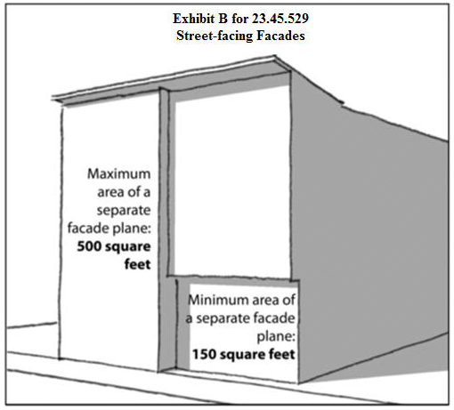

Exhibit B for Street-facing Facades

1. The Director may allow exceptions to the facade openings requirements in subsection 23.45.529.C.1 and the facade articulation requirements in subsection 23.45.529.C.2, if the Director determines that the street-facing facade will meet the intent of subsection 23.45.529.A.1, and the intent of subsections 23.45.529.D.2, 23.45.529.E.3, and 23.45.529.F.4 for cottage housing developments, rowhouse developments, and townhouse developments, respectively, through one or more of the following street-facing facade treatments:

    1. Variations in building materials and/or color, or both, that reflect the stacking of stories or reinforce the articulation of the facade;
    2. Incorporation of architectural features that add interest and dimension to the facade, such as porches, bay windows, chimneys, pilasters, columns, cornices, and/or balconies;
    3. Special landscaping elements provided to meet Green Factor requirements pursuant to Section 23.45.524, such as trellises, that accommodate vegetated walls covering a minimum of 25 percent of the facade surface;
    4. Special fenestration treatment, including an increase in the percentage of windows and doors to at least 25 percent of the street-facing facade(s).

1. Intent. The intent of the design standards in this Section 23.45.529 is to:

    1. Enhance street-facing facades to provide visual interest, promote new development that contributes to an attractive streetscape, and avoid the appearance of blank walls along a street;
    2. Foster a sense of community by integrating new pedestrian-oriented multifamily development with the neighborhood street environment and promoting designs that allow easy surveillance of the street by area residents;
    3. Promote livability in multifamily areas by providing a sense of openness and access to light and air; and
    4. Encourage the compatibility of a variety of housing types with the scale and character of neighborhoods where new multifamily development occurs.
2. Application of provisions. The provisions of this Section 23.45.529 apply to all residential uses that do not undergo any type of design review pursuant to Chapter 23.41, except single-family dwelling units.
3. Treatment of street-facing facades. For the purposes of this subsection 23.45.529.C, a street-facing facade includes all vertical surfaces enclosing interior space, including gables and dormers, as shown in Exhibit A for 23.45.529.
4. Design standards for cottage housing developments.

    1. Pedestrian entry. Each cottage with a street-facing façade that is located within 10 feet of the street lot line shall have a visually prominent pedestrian entry through the use of covered stoops, porches, or other architectural entry features. For cottages on corner lots that have more than one street-facing façade within 10 feet of the street lot line, a visually prominent pedestrian entry is required on only one of the street-facing facades. Access to these entrances may be through a required private amenity area that abuts the street.
    2. Architectural expression. Cottage housing developments shall include architectural details that reduce the visual scale of the units. Each cottage shall employ one or more of the following design techniques to reduce visual scale of the units:

        1. Attached covered porch
        2. Roofline features such as dormers or clerestories
        3. Bay windows
        4. Variation in siding texture and materials
        5. Other appropriate architectural techniques demonstrated by the applicant to reduce the visual scale of cottages.
5. Design standards for rowhouse developments.

    1. Pedestrian entry. Each rowhouse unit shall have a pedestrian entry on the street-facing facade that is designed to be visually prominent through the use of covered stoops, porches, or other architectural entry features. For rowhouse units on corner lots, a visually prominent pedestrian entry is required on only one of the street-facing facades.
    2. Front setback. Design elements to provide a transition between the street and the rowhouse units, such as landscaping, trees, fences, or other similar features, are required in the front setback.
    3. Architectural expression. The street-facing façade of a rowhouse unit shall provide architectural detail or composition to visually identify each individual rowhouse unit as seen from the street. Design elements such as trim or molding, modulation, massing, color and material variation, or other similar features may be used to achieve visual identification of individual units. Rooftop features such as dormers or clerestories, or roofline variation may be used to visually identify individual rowhouse units.
6. Design Standards for townhouse developments.

    1. Building orientation. Townhouse developments shall maximize the orientation of individual units to the street by complying with one of the following conditions:

        1. At least 50 percent of the townhouse units shall be located so that there is no intervening principal structure between the unit and the street, unless the intervening principal structure was established under permit as of October 31, 2001, or was granted a permit on October 31, 2001 and the permit has not expired; or
        2. All townhouse units shall have direct access to a common amenity area meeting the requirements of Section 23.45.522 that either abuts the street or is visible and accessible from the street by a clear pedestrian pathway.
    2. A clear pedestrian pathway from the street to the entrance of each townhouse unit shall be provided. The pedestrian pathway may be part of a driveway, provided that the pathway is differentiated from the driveway by pavement color, texture, or similar technique. Signage identifying townhouse unit addresses and the directions to the unit entrance(s) from the street shall be provided.
    3. Each townhouse unit, with a street-facing façade shall have a pedestrian entry on the street-facing facade that is designed to be visually prominent feature through the use of covered stoops, porches, or other architectural entry features. For townhouse units on corner lots, a visually prominent pedestrian entry is required on only one of the street-facing facades.
    4. Architectural expression. Architectural detail or composition shall be provided to visually identify each individual townhouse unit, as seen from the public street. Design elements such as trim or molding, modulation, massing, color and material variation or other similar features may be used to achieve visual identification of individual units. Rooftop features such as dormers or clerestories, or roofline variation may be used to visually identify individual townhouse units.
7. Building entry orientation standards for apartments.

    1. For each apartment structure, a principal shared pedestrian entrance is required that faces either a street or a common amenity area, such as a landscaped courtyard, that abuts and has direct access to the street. Additional pedestrian entrances to individual units are permitted.
    2. If more than one apartment structure is located on a lot, each apartment structure separated from the street by another principal structure shall have a principal entrance that is accessible from a common amenity area with access to the street.
    3. The shared entrance of each apartment structure shall have a pedestrian entry that is designed to be visually prominent, through the use of covered stoops, overhead weather protection, a recessed entry, or other architectural entry features.

#### 23.45.531 - Development standards for cottage housing developments and carriage house structures

1. Size limit for dwelling units.

    1. The maximum gross floor area of each cottage in a cottage housing development is 950 square feet.
    2. The maximum gross floor area of a carriage house is 600 square feet.
2. Size limit for garages. The maximum gross floor area for a shared garage structure in a cottage housing development is 1,200 square feet, and the garage shall contain no more than four parking spaces.
3. Carriage house structures. A carriage house structure is permitted in a cottage housing development subject to the following standards:

    1. The maximum number of dwelling units permitted in carriage house structures is one-third of the total number of units in the cottage housing development on the lot.
    2. The maximum gross floor area of the ground floor of a carriage house structure is 1,200 square feet.
4. Existing single-family dwelling units in a cottage housing development. Existing single-family dwelling units that are non-conforming with respect to the standards for a cottage housing development are permitted to remain, provided that the extent of the nonconformity shall not be increased.

#### 23.45.532 - Standards for ground floor commercial uses in MR and HR zones

1. All ground-floor commercial uses permitted pursuant to Section 23.45.504, except medical service uses permitted pursuant to Section 23.45.506, shall meet the following conditions:

    1. Structures with ground floor commercial uses in zones that include an RC designation shall comply with Chapter 23.46.
    2. The commercial use is permitted only on the ground floor of a structure that contains at least one dwelling unit. On sloping lots, the commercial use may be located at more than one level within the structure as long as the floor area in commercial use does not exceed the area of the structure's footprint.
    3. The maximum size of use of any one business establishment is 4,000 square feet, except that the maximum size of use of a multi-purpose retail sales establishment is 10,000 square feet.
    4. Vents for venting of odors, vapors, smoke, gas and fumes, and exterior heat exchangers and other similar devices (e.g., related to ventilation, air-conditioning, refrigeration) shall be at least 10 feet above finished sidewalk grade, and directed away to the extent possible from residential uses within 50 feet of the vent.
2. No loading berths are required for ground-floor commercial uses. If provided, loading berths shall be located so that access to residential parking is not blocked.
3. Identifying business signs are permitted pursuant to Chapter 23.55, Signs.

#### 23.45.534 - Light and glare standards

1. Exterior lighting shall be shielded and directed away from adjacent properties.
2. Interior lighting in parking garages shall be shielded to minimize nighttime glare on adjacent properties.
3. To prevent vehicle lights from affecting adjacent properties, driveways and parking areas for more than two vehicles shall be screened from abutting properties by a fence or wall between 5 feet and 6 feet in height, or a solid evergreen hedge or landscaped berm at least 5 feet in height. If the elevation of the lot line is different from the finished elevation of the driveway or parking surface, the difference in elevation may be measured as a portion of the required height of the screen so long as the screen itself is a minimum of 3 feet in height. The Director may waive the requirement for the screening if it is not needed due to changes in topography, agreements to maintain an existing fence, or the nature and location of adjacent uses.

#### 23.45.536 - Parking location, access, and screening

1. Off-street parking spaces are required to the extent provided in Chapter 23.54, Quantity and design standards for access and off-street parking.
2. Location of parking

    1. If parking is required, it shall be located on the same lot as the use requiring the parking, except as otherwise provided in this subsection 23.45.536.B.
    2. Except as otherwise provided in this subsection 23.45.536.B, surface parking may be located anywhere on a lot except:

        1. between a principal structure and a street lot line;
        2. in the required front setback or side street side setback; and
        3. within 7 feet of any street lot line.
    3. Parking in a structure. Parking may be located in a structure or under a structure, provided that no portion of a garage that is higher than 4 feet above existing or finished grade, whichever is lower, shall be closer to a street lot line than any part of the first floor of the structure in which it is located;
    4. On a through lot, parking may be located between the structure and one front lot line. The front setback in which the parking may be located will be determined by the Director based on the prevailing character and setback patterns of the block.
    5. On waterfront lots in the Shoreline District, parking may be located between the structure and the front lot line, if necessary to prevent blockage of view corridors or to keep parking away from the edge of the water, as required by Chapter 23.60A, Shoreline District.
    6. Parking accessory to a residential use may be located on a lot within 800 feet of the lot where the residential use that requires the parking is located, provided that:

        1. the lot is not located in a single-family zone; and
        2. the requirements of Section 23.54.025 are met.
3. Access to parking

    1. Alley access required. Except as otherwise expressly required or permitted in subsections 23.45.536.C or 23.45.536.D, access to parking shall be from the alley if the lot abuts an alley and one of the conditions in this subsection 23.45.536.C.1 is met.

        1. The alley is improved to the standards of subsection 23.53.030.C;
        2. The development gains additional FAR pursuant to subsection 23.45.510.C; or
        3. The Director determines that alley access is feasible and desirable to mitigate parking access impacts, improve public safety, and/or maintain on-street parking capacity.
    2. Street access required. Access to parking shall be from the street if:

        1. The lot does not abut an alley.
        2. The lot abuts an alley, and the Director determines that the alley should not be used for access for one or more of the following reasons:

            1. Due to the relationship of the alley to the street system, use of the alley for parking access would create a significant safety hazard;
            2. Topography makes alley access infeasible; or
            3. The alley is on the uphill side of a steeply sloping lot, and the following conditions are met:

                1. Access from the street is to a common parking garage in or under the structure, located a maximum of 4 feet above grade.
                2. The siting of development results in an increased Green Factor score, larger ground-level amenity areas, and/or reduced surface parking area than if alley access is used.
    3. On corner lots, if street access is permitted pursuant to subsection 23.45.536.C.2, the applicant may determine the street from which access is taken, unless the Director determines that the use of the street chosen by the applicant would create a significant safety hazard.
    4. On steeply sloping lots, the Director may permit the use of both an alley and a street for access, provided that the following conditions are met:

        1. Access from the street is to a common parking garage in or under the structure, that is underground or extends no more than 4 feet above grade.
        2. The siting of development results in an increased Green Factor score, larger ground-level amenity areas, and/or reduced surface parking area than if alley access alone is used.
        3. In LR zones, if the project uses both the alley and street for access to parking other than required barrier-free parking spaces, the project does not qualify for the higher FAR limit in subsection 23.45.510.B.
    5. Access to required barrier-free parking spaces that meet the standards in the Seattle Residential Code, Section R322, or the Seattle Building Code, Chapter 11, may be from either the street or alley, or both.
    6. If the alley is used for access, the alley shall be improved according to the standards in subsections 23.53.030.E and 23.53.030.F, except that if a development gains additional FAR pursuant to subsection 23.45.510.C, the alley shall be paved rather than improved with crushed rock, even for lots containing fewer than ten units.
    7. If the lot does not abut an improved alley or street, access may be permitted from an easement that meets the provisions of Chapter 23.53, Requirements for Streets, Alleys, and Easements.
    8. If street access is required, either:

        1. driveways that provide access from the street to garages opening on a street-facing facade of individual townhouse or rowhouse units shall be paved with permeable materials; or
        2. access to a majority of garages opening on street-facing facades of individual townhouse or rowhouse units shall be provided by shared driveways.
4. Screening of parking

    1. Parking shall be screened from direct street view by:

        1. the street-facing facade of a structure;
        2. garage doors;
        3. a fence or wall; or
        4. landscaped areas, including bioretention facilities or landscaped berms.
    2. Screening provided by a fence, wall, or vegetation in a landscaped area shall not be located within any required sight triangle and shall meet the following conditions:

        1. The fence, wall, or vegetation in the landscaped area shall be at least 3 feet tall measured from the elevation of the curb, or from the elevation of the street if no curb is present. If the elevation of the ground at the base of the fence, wall, or landscaped area is higher than the finished elevation of the parking surface, the difference in elevation may be measured as a portion of the required height of the screen, so long as the fence, wall, or vegetation in the landscaped area is at least 3 feet in height. If located in a setback, the fence or wall shall meet the requirements of subsection 23.45.518.J.7.
        2. The fence, wall, or vegetation in the landscaped area shall be set back at least 3 feet from the lot line.
    3. Screening by garage doors. If parking is provided in a garage in or attached to a principal structure and garage door(s) face a street, the garage door(s) may be no more than 75 square feet in area.
5. Other provisions. Garage doors in LR zones and MR zones facing the street shall be set back at least 15 feet from the street lot line, and shall be no closer to the street lot line than the street-facing facade of the structure.

#### 23.45.545 - Standards for certain accessory uses

1. Private, permanent swimming pools, hot tubs and other similar uses are permitted in any required setback, provided that:

    1. No part of any swimming pools, hot tubs and other similar uses shall project more than 18 inches above existing grade in a required front setback; and
    2. No swimming pool shall be placed closer than 5 feet to any front or side lot line.
2. Solar greenhouses, greenhouses and solariums

    1. Solar greenhouses, greenhouses and solariums, in each case that are attached to and integrated with the principal structure and no more than 12 feet in height are permitted in a required rear setback, subject to subsection 23.45.545.B.3, and may extend a maximum of 6 feet into required front and side setbacks, subject to subsection 23.45.545.B.2.
    2. An attached solar greenhouse, greenhouse or solarium, in a required setback, shall be no closer than 3 feet from side lot lines and 8 feet from front lot lines.
    3. A solar greenhouse, greenhouse or solarium allowed pursuant to subsection 23.45.545.B.1 shall not be closer than 5 feet to the rear lot line, except that it may abut an alley if it is no taller than 10 feet along the rear lot line, is of no greater average height than 12 feet for a depth of 15 feet from the rear lot line, and is no wider than 50 percent of lot width for a depth of 15 feet from the rear lot line.
3. Solar collectors

    1. Solar collectors that meet minimum written energy conservation standards administered by the Director are permitted in required setbacks, subject to the following:

        1. Detached solar collectors are permitted in required rear setbacks, no closer than 5 feet to any other principal or accessory structure.
        2. Detached solar collectors are permitted in required side setbacks, no closer than 5 feet to any other principal or accessory structure, and no closer than 3 feet to the side lot line.
    2. Sunshades that provide shade for solar collectors that meet minimum written energy conservation standards administered by the Director may project into southern front or rear setbacks. Those that begin at 8 feet or more above finished grade may be no closer than 3 feet from the lot line. Sunshades that are between finished grade and 8 feet above finished grade may be no closer than 5 feet to the lot line.
    3. Solar collectors on roofs. Solar collectors that meet minimum written energy conservation standards administered by the Director and that are located on a roof are permitted as follows:

        1. In LR zones up to 4 feet above the maximum height limit or 4 feet above the height of elevator penthouse(s), whichever is higher; and
        2. In MR and HR zones up to 10 feet above the maximum height limit or 10 feet above the height of elevator penthouse(s), whichever is higher.
        3. If the solar collectors would cause an existing structure to become nonconforming, or increase an existing nonconformity, the Director may permit the solar collectors as a special exception pursuant to Chapter 23.76. Such solar collectors may be permitted even if the structure exceeds the height limits established in this subsection 23.45.545.C.3, when the following conditions are met:

            1. There is no feasible alternative solution to placing the collector(s) on the roof; and
            2. Such collector(s) are located so as to minimize view blockage from surrounding properties and the shading of property to the north, while still providing adequate solar access for the solar collectors.
4. [Reserved.]
5. Nonconforming solar collectors. The Director may permit the installation of solar collectors that meet minimum energy standards and that increase an existing nonconformity as a special exception pursuant to Chapter 23.76. Such an installation may be permitted even if it exceeds the height limits established in Sections 23.45.009 and 23.45.514 when the following conditions are met:

    1. There is no feasible alternative solution to placing the collector(s) on the roof;
    2. Such collector(s) are located so as to minimize view blockage from surrounding properties and the shading of property to the north, while still providing adequate solar access for the solar collectors.
6. Open wet moorage facilities for residential uses are permitted as an accessory use pursuant to Chapter 23.60A, Shoreline District, if only one slip per residential unit is provided.
7. Bed and breakfast uses. A bed and breakfast use may be operated under the following conditions:

    1. The bed and breakfast use has a business license issued by the Department of Finance;
    2. The operation of a bed and breakfast use is conducted within a single dwelling unit;
    3. The bed and breakfast use is operated within the principal structure and not in an accessory structure;
    4. There shall be no evidence of a bed and breakfast use from the exterior of the structure other than a sign permitted by subsection 23.55.022.D.1, so as to preserve the residential appearance of the structure;
    5. No more than two people who are not residents of the dwelling may be employed in the operation of a bed and breakfast, whether or not compensated; and
    6. Parking is required pursuant to Chapter 23.54. Interior and exterior alterations consistent with the development standards of the underlying zone are permitted.
8. Heat recovery incinerators, located on the same lot as the principal use, may be permitted by the Director as accessory administrative conditional uses, pursuant to Section 23.45.506.
9. In LR zones, accessory dwelling units are allowed, in rowhouse and townhouse units, as follows:

    1. One accessory dwelling unit is allowed for each rowhouse or townhouse unit that is a "principal unit". A "principal unit" is a dwelling unit that is not an accessory dwelling unit.
    2. The owner of a principal unit shall comply with the owner occupancy requirements of subsection 23.44.041.C.
    3. The maximum gross floor area of an accessory dwelling unit is 650 square feet, provided that the total gross floor area of the accessory dwelling unit does not exceed 40 percent of the total gross floor area in residential use on the lot or unit lot, if present, exclusive of garages, storage sheds, and other non-habitable spaces.
    4. An accessory dwelling unit shall be located completely within the same structure as the principal unit or in an accessory structure located between the rowhouse or townhouse unit and the rear lot line.
    5. The entrance to an accessory dwelling unit provided within the same structure as the principal unit shall be provided through one of the following configurations:

        1. Through the primary entry to the principal unit; or
        2. Through a secondary entry on a different facade than the primary entry to the principal unit; or
        3. Through a secondary entry on the same facade as the primary entry to the principal unit that is smaller and less visually prominent than the entry to the principal unit, and does not have a prominent stoop, porch, portico or other entry feature.
    6. Exterior stairs. Exterior stairs providing access to an accessory dwelling unit may not exceed 4 feet in height, except for exterior stairs providing access to an accessory dwelling unit located above a garage.
    7. Parking. Parking is not required for an accessory dwelling unit.
10. An accessory dwelling unit within an established single-family dwelling unit or on the lot of an established single-family dwelling unit shall be considered an accessory use to the single-family dwelling unit, shall meet the standards listed for accessory dwelling units in Section 23.44.041, and shall not be considered a separate dwelling unit for any development standard purposes in multifamily zones.
11. Urban farms are subject to the standards in Section 23.42.051 and the conditional use requirement in subsection 23.45.504.C.8.

#### 23.45.570 - Institutions

Table A for: Width Limits for Institutions in Lowrise zones

<table>
<tr>
<td>Zone</td>
<td>Maximum Width Without Green Factor</td>
<td>Maximum Width With Green Factor</td>
</tr>
<tr>
<td>Lowrise 1</td>
<td>45 feet</td>
<td>75 feet</td>
</tr>
<tr>
<td>Lowrise 2</td>
<td>45 feet</td>
<td>90 feet</td>
</tr>
<tr>
<td>Lowrise 3</td>
<td>60 feet</td>
<td>150 feet</td>
</tr>
</table>

1. In order to achieve the maximum width permitted in each zone, institutional structures are required to reduce the appearance of bulk by providing landscaping that achieves a Green Factor score of .5 or greater, pursuant to the standards set forth in Section 23.86.019.

1. General Provisions.

    1. The establishment of new institutions, such as religious facilities, community centers, private schools, and child care centers in multifamily zones is permitted pursuant to Section 23.45.504.
    2. Public schools are permitted as regulated in Chapter 23.51B.
    3. If the expansion of an existing institution meets all development standards of this Section 23.45.570, it is permitted outright. Expansions not meeting development standards may be permitted as administrative conditional uses subject to the requirements of Section 23.45.506. Structural work that does not increase usable floor area or seating capacity and does not exceed the height limit is not considered expansion. Such work includes but is not limited to roof repair or replacement, and construction of uncovered decks and porches, bay windows, dormers, and eaves. The establishment of a child care center in a legally established institution devoted to the care or instruction of children that does not require expansion of the existing structure or violate any condition of approval of the existing institutional use is not considered an expansion of the use.
    4. The provisions of this Chapter 23.45 apply to Major Institution uses as provided in Chapter 23.69, Major Institution Overlay District.
2. Institutions located in LR zones shall meet the development standards of this Section 23.45.570. Institutions located in MR and HR zones shall meet the development standards of the zone, and shall also meet the standards for parking, dispersion, and odors in subsections G, J, and H of this Section 23.45.570.
3. Height limits in Lowrise zones.

    1. The height limit for institutions shall be the height limit for apartments in the applicable zone, except as provided in this subsection 23.45.570.C.
    2. In LR1 and LR2 zones, for gymnasiums, auditoriums, and wood shops that are accessory to an institution, the maximum permitted height is 35 feet if all portions of the structure above the height limit of the zone are set back at least 20 feet from all lot lines. Pitched roofs on the auditorium, gymnasium or wood shop with a slope of not less than 4:12 may extend 10 feet above the 35-foot height limit. No portion of a shed roof on a gymnasium, auditorium or wood shop is permitted to extend beyond 35 feet.
    3. In LR3 zones, pitched roofs on an auditorium, gymnasium, or wood shop with a slope of not less than 4:12 may extend 10 feet above the height limit, except that no portion of a shed roof is permitted to extend beyond the height limit.
4. Structure width in Lowrise zones.

    1. The maximum permitted width for structures in institutional use in Lowrise zones is as shown in Table A for 23.45.570.
5. Structure Depth in Lowrise zones. The maximum permitted depth of institutional structures is 65 percent of lot depth.
6. Setback requirements in LR zones

    1. Front setback. The minimum depth of the required front setback is determined by the average of the setbacks of structures on adjoining lots, but is not required to exceed 20 feet. The setback shall not be reduced below an average of 10 feet, and no portion of the structure may be closer than 5 feet to a front lot line.
    2. Rear setback. The minimum rear setback is 10 feet.
    3. Side setback

        1. The minimum side setback is 10 feet from a side lot line that abuts any other residentially-zoned lot. A 5-foot setback is required in all other cases, except that the minimum side street side setback is 10 feet.
        2. If the depth of a structure exceeds 65 feet, an additional side setback is required for that portion of the structure in excess of 65 feet, according to Table B for 23.45.570. In lieu of providing the additional setback for the portion of the structure in excess of 65 feet deep, a lesser side setback may be provided for the portion in excess of 65 feet deep if the average setback for the entire structure is no less than the average of the setback required by subsection 23.45.570.F.3.a and the setback required under Table B for 23.45.570.
    4. Setbacks for Specific Items. The following shall be located at least 20 feet from any abutting residentially zoned lot:

        1. Emergency entrances;
        2. Main entrance door of the institutional structure;
        3. Outdoor play equipment and game courts;
        4. Operable window of gymnasium, assembly hall or sanctuary;
        5. Garbage and trash disposal mechanism;
        6. Kitchen ventilation;
        7. Air-conditioning or heating mechanism;
        8. Similar mechanisms and features causing noise and/or odors as determined by the Director.
    5. Accessory structures and projections from principal structures are allowed in required setbacks on lots developed with institutional uses to the same extent that those accessory structures or projections would be allowed for apartments in the zone, except that no accessory structures other than freestanding walls, fences, bulkheads, or similar structures shall be closer than 10 feet to a side lot line abutting another lot in a residential zone.
7. Parking

    1. Parking Quantity. Parking and loading is required pursuant to Section 23.54.015.
    2. Location of Parking. Parking areas and facilities may be located anywhere on the lot except in the required front setback or side street side setback.
    3. Screening of Surface Parking Areas. Surface parking areas for more than five vehicles shall be screened in accordance with the following requirements and the provisions of Section 23.45.524.

        1. Screening shall be provided on each side of the parking area which abuts, or faces across a street, alley or access easement, a lot in a residential zone.
        2. Screening shall consist of a fence, solid evergreen hedge or wall between 4 and 6 feet in height. Sight triangles must be provided. Fences surrounding sports fields/recreation areas may be 8 feet high. The Director may permit higher fencing when necessary for sports fields.
        3. The height of the visual barrier created by the screen required in subsection 23.45.570.G.3 shall be measured from street level. If the elevation of the lot line is different from the finished elevation of the parking surface, the difference in elevation may be measured as a portion of the required height of the screen, so long as the screen itself is a minimum of 3 feet in height.
    4. Landscaping of parking. Accessory parking areas for more than 20 vehicles shall be landscaped according to the following requirements:

        1. One tree per every five parking spaces is required.
        2. Each required tree shall be planted in a landscaped area and shall be 3 feet away from any curb of a landscaped area or edge of the parking area. Permanent curbs or structural barriers shall protect landscaping, but may include openings to allow movement of stormwater.
        3. Hardy evergreen ground cover shall be planted to cover each landscaped area.
        4. The trees and landscaped areas shall be located within the parking area to break up large expanses of pavement and cars.
8. Odors. The venting of odors, vapors, smoke, cinders, dust, gas and fumes shall be at least ten feet above finished sidewalk grade, and directed away to the extent possible from residential uses within 50 feet of the vent.
9. Light and Glare.

    1. Exterior lighting for institutions shall be shielded or directed away from principal structures on adjacent residential lots.
    2. Poles for freestanding exterior lighting are permitted up to a maximum height of 30 feet. Light poles for illumination of athletic fields on new and existing public school sites will be allowed to exceed 30 feet pursuant to Chapter 23.51B, Public schools.
10. Dispersion. The lot line of any new or expanding institution other than child care centers locating in legally established institutions shall be located 600 feet or more from any lot line of any other institution in a residential zone with the following exceptions:

    1. An institution may expand even though it is within 600 feet of a public school if the public school is constructed on a new site subsequent to December 12, 1985.
    2. A proposed institution may be located less than 600 feet from a lot line of another institution if the Director determines that the intent of dispersion is achieved due to the presence of physical elements such as bodies of water, large open spaces or topographical breaks or other elements such as arterials, freeways or nonresidential uses, that provide substantial separation from other institutions.

#### 23.45.574 - Assisted living facilities

1. In addition to the requirements of subsection 23.45.574.B, assisted living facilities are subject to the development standards for apartments for the zone in which they are located, except that density limits and amenity area requirements do not apply to assisted living facilities.
2. Other requirements

    1. Facility kitchen. An on-site kitchen that serves the entire assisted living facility is required.
    2. Communal area. Communal areas that are either interior or exterior spaces, such as solariums, decks and porches, recreation rooms, dining rooms, living rooms, foyers and lobbies, and gardens or other outdoor landscaped areas shall be provided as follows:

        1. The total amount of communal area shall, at a minimum, equal 5 percent of the total floor area in assisted living units, or 25 percent of the lot area, whichever is less. In calculating the total floor area in assisted living units, all of the area of each unit, excluding the bathroom, is counted, including counters, closets and built-ins;
        2. Service areas, including, but not limited to, the facility kitchen, laundry, hallways and corridors, supply closets, operations and maintenance areas, staff areas and offices, and rooms used only for counseling or medical services, shall not be counted as required communal area;
        3. A minimum of 400 square feet of the required communal area shall be provided as an outdoor area with a minimum dimension of 10 feet. Outdoor areas provided as required communal area shall be accessible to people with disabilities; and
        4. Adequate seating for residents and guests shall be provided in required communal areas.

#### 23.45.578 - Public or private parks and playgrounds

1. The establishment of new or expansion of existing public or private parks and playgrounds, including customary structures and activities, shall be permitted outright in all multifamily zones.
2. The following accessory uses shall be permitted in any park or playground if located within a structure or on a terrace abutting the structure. If located within 100 feet from any lot in a residential zone the use shall be completely enclosed.

    1. The sale and consumption of beer during daylight hours;
    2. The sale and consumption of alcoholic beverages under a Class H liquor license at municipal golf courses during established hours of operation.
3. Storage structures and areas and other structures and activities customarily associated with parks and playgrounds are subject to the following development standards in addition to the general development standards for accessory uses:

    1. Any active play area shall be located 30 feet or more from any lot in a single-family zone.
    2. Garages and service or storage areas shall be screened from view from abutting lots in residential zones.

#### 23.45.586 - Keeping of animals

The keeping of animals is regulated by Section 23.42.052, Keeping of Animals.

#### 23.45.590 - Home occupations

Home occupations are regulated by Section 23.42.050, Home Occupations.

#### 23.45.595 - Transitional encampments accessory use

Transitional encampments accessory to religious facilities or to principal uses located on property owned or controlled by a religious organization are regulated by Section 23.42.054, Transitional Encampments Accessory to Religious Facilities.

### Chapter 23.46 - RESIDENTIAL—COMMERCIAL

Sections:

#### 23.46.002 - Scope of provisions

Part 1 Use Provisions

1. This Chapter 23.46 details those authorized commercial uses which are or may be permitted in Residential-Commercial (RC) zones.
2. All RC zones are assigned a residential zone classification on the Official Land Use Map. The development standards of the designated residential zone for apartments apply to all principal structures in the RC zone. The development standards of the designated residential zone shall apply to all structures in the RC zone, except as otherwise specified for commercial uses in this Chapter 23.46, and except that parking quantity is required as provided in Chapter 23.54.
3. Methods for measurements are provided in Chapter 23.86. Standards for parking quantity access and design are provided in Chapter 23.54. Sign standards are provided in Chapter 23.55.
4. In addition to the provisions of this Chapter 23.46, certain residential-commercial areas may be regulated by Overlay Districts, Chapter 23.59.

#### 23.46.004 - Uses

1. All uses, except commercial uses and live-work units, which are permitted outright or by conditional use in the applicable residential zone shall be regulated by the residential zone provisions, including provisions relating to accessory uses.
2. Live-work units and the following commercial uses are permitted outright:

    1. Sales and services, general;
    2. Medical services;
    3. Restaurants;
    4. Business support services;
    5. Offices;
    6. Food processing and craft work; and
    7. Retail sales, major durables.
3. Permitted commercial uses shall be allowed as either a principal use or as an accessory use.
4. Permitted commercial uses are allowed only in structures containing at least one dwelling unit or live-work unit, according to the development standards of Section 23.46.012.
5. Drive-in businesses shall be prohibited, either as principal or accessory uses.
6. Outdoor sales, outdoor display of rental equipment, and outdoor storage shall be prohibited, except for accessory recycling collection stations, and the accessory outdoor sales of fruits, vegetables and plants.

#### 23.46.006 - Conditional uses.

Part 2 Development Standards forCommercial Uses

1. Conditional use provisions of the applicable residential zone shall apply to all noncommercial conditional uses.
2. All conditional uses not regulated by subsection A shall meet the following criteria:

    1. The use shall be determined not to be materially detrimental to the public welfare or injurious to property in the zone or vicinity in which the property is located.
    2. In authorizing a conditional use, adverse impacts may be mitigated by imposing requirements or conditions deemed necessary for the protection of other properties in the zone or vicinity, and the public interest. The Director shall deny the conditional use if it is determined that adverse impacts cannot be satisfactorily mitigated.
3. Parking at or below grade accessory to nonresidential uses or live-work units in adjacent commercial zones may be permitted as a conditional use.

    1. The Director may authorize such parking if:

        1. The proposed parking is necessary to meet parking requirements, or the proposed parking will be used as a shared parking facility;
        2. The proposed parking is necessary to avoid increased parking congestion in the adjacent commercial area;
        3. The proposed parking is necessary to avoid creation or worsening of excessive spillover parking in adjacent residential areas;
        4. Other parking options such as shared parking have been considered and found to be unavailable in the adjacent commercial zone; and
        5. The proposed parking does not encourage substantial traffic to pass through adjacent residential areas.
    2. If the Director authorizes a surface parking area, the following standards shall be met:

        1. A minimum of fifteen (15) percent of the surface parking area shall be landscaped. Specific landscaped areas required in this subsection shall count toward the fifteen (15) percent.
        2. A landscaped setback of at least ten (10) feet shall be provided along the front property line. A landscaped setback of at least five (5) feet in depth shall be provided along all other street property lines.
        3. When abutting a property in a residential zone (including RC zones), six (6) foot high screening and a five (5) foot deep landscaped area inside the screening shall be provided.
        4. When across the street from a residential zone (including RC zones), three (3) foot high screening shall be provided between the parking area and the landscaped setback along all street property lines.
        5. Whenever possible, access to parking shall be from the commercial area.

#### 23.46.012 - Location of commercial uses

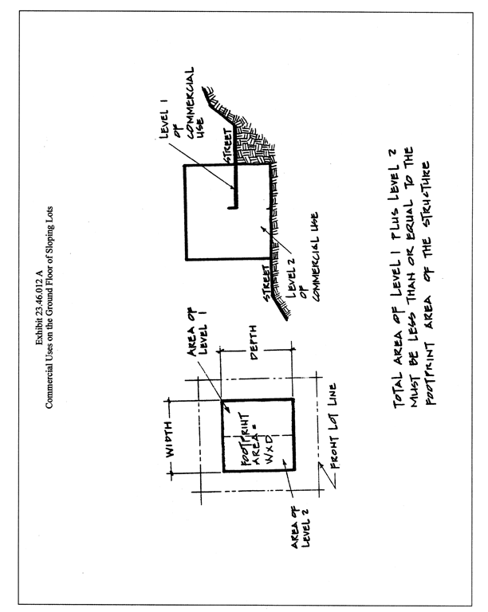

1. Commercial uses are permitted only on or below the ground floor of a structure that contains at least one dwelling unit or live-work unit, except as provided in the Northgate Overlay District, Chapter 23.71, and except that if there is an existing established commercial use in a structure that does not contain a dwelling unit or live-work unit, the existing established commercial use may be converted to another permitted commercial use without providing a dwelling unit or live-work unit in the structure and without obtaining an administrative conditional use.
2. On sloping lots the commercial use may be located at more than one (1) level within the structure where the total commercial area does not exceed the area of the structure's footprint (Exhibit 23.46.012 A)

#### 23.46.014 - Maximum size of commercial uses.

1. The maximum size limit for individual business establishments shall be four thousand (4,000) square feet, except that in MR/RC and HR/RC zones, multi-purpose convenience stores shall be permitted up to a maximum size of ten thousand (10,000) square feet.
2. Maximum size shall be calculated by taking the gross floor area of a structure(s) or portion of a structure(s) occupied by a single business establishment.
3. Any area used for permitted outdoor sales shall be limited to one thousand (1,000) square feet, and shall be included in determining the maximum size of a business establishment.
4. Maximum Size of Combined Uses Within a Business Establishment. Business establishments which include more than one (1) type of use shall be permitted, provided each use is permitted, and:

    1. The size of each use shall not exceed the size limit for the individual use; and
    2. The total size of the business establishment does not exceed the maximum size allowed for the type of use with the largest size limit.
5. Split Zoned Lots.

    1. The total size of a business establishment occupying portions of a lot in more than one (1) zone shall not exceed the maximum size allowed in the zone with the larger size limit.
    2. The total size of that portion of a business establishment in each zone shall not exceed the maximum size allowed for that business establishment in that zone.
6. Accessory exterior recycling collection stations maintained in good condition shall be permitted in surface parking areas up to a maximum size of five hundred (500) square feet or five (5) percent of the parking area, whichever is less.

#### 23.46.016 - Noise standards.

Measures to be used shall be specified on the plans. After a permit has been issued, any measures which were required by the permit to limit noise shall be maintained.

1. All fabricating uses, repairing, and refuse compacting activities shall be conducted wholly within an enclosed structure.
2. Major Noise Generators.

    1. Exterior heat exchangers and other similar devices shall be considered major noise generators.
    2. When a major noise generator is proposed, a report from an acoustical consultant shall be required to describe the measures to be taken by the applicant in order to meet noise standards for the area. Such measures may include, for example, the provision of buffers, reduction in hours of operation, relocation of mechanical equipment, increased setbacks, and use of specified construction techniques or building materials.

#### 23.46.018 - Odor standards.

1. The venting of odors, fumes, vapors, smoke, cinders, dust and gas shall be at least ten (10) feet above finished sidewalk grade and directed away as much as possible from residential uses within fifty (50) feet of the vent.
2. Major Odor Sources. Uses which employ the following odor-emitting processes or activities shall be considered major odor sources except when the entire activity is provided on a retail or on-site customer-service basis:

    1. Cooking of grains;
    2. Smoking of food or food products;
    3. Fish or fish meal processing;
    4. Coffee or nut roasting;
    5. Deep fat frying;
    6. Dry cleaning; and
    7. Other similar processes or activities.
3. When an application is made for a use which is determined to be a major odor source, the Director, in consultation with the Puget Sound Clean Air Agency (PSCAA), shall determine the appropriate measures to be taken by the applicant in order to significantly reduce potential odor emissions and airborne pollutants. The measures to be taken shall be indicated on plans submitted to the Director, and may be required as conditions for the issuance of any permit. After a permit has been issued, any measures which were required by the permit shall be maintained.

#### 23.46.020 - Light and glare standards.

1. Exterior lighting shall be shielded and directed away from adjacent uses.
2. Interior lighting in parking garages shall be shielded, to minimize nighttime glare affecting nearby uses.
3. Exterior lighting on poles shall be permitted up to a maximum height of thirty (30) feet from finished grade. In MR/RC and HR/RC zones, exterior lighting on poles shall be permitted up to a height of forty (40) feet from finished grade, provided that ratio of watts to area is at least twenty (20) percent below the maximum exterior lighting level permitted by the Energy Code.

#### 23.46.022 - Parking requirements.

1. Parking Quantity. Each permitted commercial use shall provide a minimum number of off-street parking spaces according to the requirements of Section 23.54.015, Required parking.
2. Location of Parking. Parking for commercial uses may be located:

    1. On the same lot, according to the locational requirements of the designated residential zone; or
    2. Within eight hundred (800) feet of the lot on which the commercial use is located, when either:

        1. The parking is located in a commercial zone; or
        2. The parking is part of the joint use of existing parking in an RC zone.
    3. When parking is provided on a lot other than the lot of the use to which it is accessory, the provisions of Section 23.54.025, Parking covenants, shall apply.

#### 23.46.024 - Transportation concurrency level-of-service standards.

Proposed uses in residential-commercial zones shall meet the transportation concurrency level-of-service standards prescribed in Chapter 23.52.

### Chapter 23.47A - COMMERCIAL

Sections:

#### 23.47A.002 - Scope of provisions

1. This Chapter 23.47A describes the authorized uses and development standards for the following zones:

Neighborhood Commercial 1 (NC1);

Neighborhood Commercial 2 (NC2);

Neighborhood Commercial 3 (NC3);

Commercial 1 (C1); and

Commercial 2 (C2).

2. Commercial zones listed in subsection 23.47A.002.A and having an incentive zoning suffix are subject to this Chapter 23.47A and Chapter 23.58A, Incentive Provisions.
3. Some land in C zones and NC zones may be regulated by Subtitle III, Division 3, Overlay Districts, of this Title 23.
4. Other regulations, including but not limited to major marijuana activity (Section 23.42.058); requirements for streets, alleys, and easements (Chapter 23.53); standards for parking quantity, access, and design (Chapter 23.54); standards for solid waste storage (Chapter 23.54); signs (Chapter 23.55); and methods for measurements (Chapter 23.86) may apply to development proposals. Communication utilities and accessory communication devices, except as exempted in Section 23.57.002, are subject to the regulations in this Chapter 23.47A and additional regulations in Chapter 23.57, Communications Regulations.

#### 23.47A.004 - Permitted and prohibited uses

1. All uses are permitted outright, prohibited, or permitted as a conditional use according to Table A for 23.47A.004 and this Section 23.47A.004, except as may be otherwise provided pursuant to subtitle III, Division 3, Overlay Districts, of this Title 23.
2. All permitted uses are allowed as a principal use or as an accessory use, unless otherwise indicated in Table A for 23.47A.004.
3. The Director may authorize a use not otherwise permitted in the zone in a landmark structure, subject to the following criteria:

    1. The use will not require significant alteration of the structure;
    2. The design of the structure makes uses permitted in the zone impractical in the structure, or the permitted uses do not provide sufficient financial return to make use of the landmark structure feasible; and
    3. The physical impacts of the use will not be detrimental to other properties in the zone or vicinity or to the public interest.
4. Public facilities

    1. Uses in public facilities that are most similar to uses permitted outright or permitted as a conditional use under this Chapter 23.47A are permitted outright or as a conditional use, respectively, subject to the same use regulations, development standards and conditional use criteria that govern the similar uses.
    2. Permitted uses in public facilities requiring council approval. Unless specifically prohibited in Table A for 23.47A.004, uses in public facilities that are not similar to uses permitted outright or permitted as a conditional use under this Chapter 23.47A, may be permitted by the City Council.
    3. In all NC zones and C zones, uses in public facilities not meeting development standards may be permitted by the Council, and the Council may waive or grant departures from development standards, if the following criteria are satisfied:

        1. The project provides unique services that are not provided to the community by the private sector, such as police and fire stations;
        2. The proposed location is required to meet specific public service delivery needs;
        3. The waiver of or departure from the development standards is necessary to meet specific public service delivery needs; and
        4. The relationship of the project to the surrounding area has been considered in the design, siting, landscaping and screening of the facility.
    4. The City Council's use approvals, and waivers of or grants of departures from applicable development standards or conditional use criteria, contemplated by subsections 23.47A.004.D.2 and 23.47A.004.D.3, are governed by the provisions of Chapter 23.76, Subchapter III, Council Land Use Decisions.
    5. Expansion of uses in public facilities

        1. Major expansion. Major expansion of uses in public facilities allowed pursuant to subsections 23.47A.004.D.1, 23.47A.004.D.2, and 23.47A.004.D.3 may be permitted according to the criteria and process in those subsections 23.47A.004.D.1, 23.47A.004.D.2, and 23.47A.004.D.3. A major expansion of a public facility use occurs when an expansion would not meet development standards or the area of the expansion would exceed either 750 square feet or 10 percent of the existing area of the use, whichever is greater. For the purposes of this subsection 23.47A.004, area of use includes gross floor area and outdoor area devoted actively to that use, other than as parking.
        2. Minor expansion. An expansion of a use in a public facility that is not a major expansion is a minor expansion. Minor expansions to uses in public facilities allowed pursuant to subsections 23.47A.004.D.1, 23.47A.004.D.2, and 23.47A.004.D.3 above may be permitted according to the provisions of Chapter 23.76, for a Type I Master Use Permit.
    6. Essential public facilities. Permitted essential public facilities will be reviewed according to the provisions of Chapter 23.80, Essential Public Facilities.
    7. Youth service centers existing as of January 1, 2013, in public facilities operated by King County within Urban Center Villages and replacement, additions, or expansions to such King County public facilities are permitted in NC3 zones.
5. Changes from accessory to principal use parking. On a lot where principal use parking is permitted outright, legally established accessory parking may be converted to principal use parking without a use permit or approval when the use served by the accessory parking has been discontinued. Any lawfully existing nonconformities as to development standards may be maintained.
6. Use of accessory parking. Where principal use parking is permitted outright, legally established accessory parking may be made available to the general public as short-term parking without a separate use permit or approval.
7. Live-work units

    1. In all NC zones and C zones live-work units are permitted outright subject to the provisions of this Title 23.
    2. In pedestrian-designated zones, live-work units shall not occupy more than 20 percent of the street-level street-facing facade along designated principal pedestrian streets listed in subsection 23.47A.005.D.
    3. In the Lake City and Bitter Lake Village Hub Urban Villages, live-work units shall not occupy more than 20 percent of the street-level street-facing facade.
    4. Except where expressly treated as a residential use, live-work units shall be deemed a nonresidential use.
8. Adult cabarets

    1. Any lot line of property containing any proposed new or expanding adult cabaret must be 800 feet or more from any lot line of property on which any of the following uses has been established by permit or otherwise recognized as a legally established use: community center; child care center; school, elementary or secondary; or public parks and open space use.
    2. Any lot line of property containing any proposed new or expanding adult cabaret must be 600 feet or more from any lot line of property for which a permit has been issued for any other adult cabaret.
    3. The dispersion analysis required by subsections 23.47A.004.H.1 and 23.47A.004.H.2 shall be based on the facts that exist on the earlier of:

        1. the date a complete application for a building permit for an adult cabaret for the property proposed to contain the new or expanding adult cabaret is made, or
        2. the date of publication of notice of the Director's decision on the Master Use Permit application to establish or expand an adult cabaret use, if the decision can be appealed to the Hearing Examiner, or the date of the Director's decision if no Hearing Examiner appeal is available.
9. The terms of Table A for 23.47A.004 are subject to any applicable exceptions or contrary provisions expressly provided for in this Title 23.

#### 23.47A.005 - Street-level uses

1. The requirements of this Section 23.47A.005 apply in addition to the other applicable requirements of this Title 23.
2. Mini-warehouses, warehouses, or utility uses may not abut a street-level street-facing facade in a structure that contains more than one residential dwelling unit.
3. Residential uses at street level

    1. In all NC and C zones, residential uses may occupy, in the aggregate, no more than 20 percent of the street-level street-facing facade in the following circumstances or locations:

        1. In a pedestrian-designated zone, facing a designated principal pedestrian street; or
        2. In all NC and C1 zones within the Bitter Lake Village Hub Urban Village; or
        3. In all NC and C1 zones within the Lake City Hub Urban Village, except as provided in subsection 23.47A.005.C.2; or
        4. Within a zone that has a height limit of 85 feet or higher, except as provided in subsection 23.47A.005.C.2; or
        5. Within an NC1 zone, except as provided in subsection 23.47A.005.C.2; or
        6. In all NC and C1 zones within the Northgate Overlay District, except as provided in Section 23.71.044; or
        7. In all NC and C1 zones within the areas shown on Maps 1 through 5 for 23.47A.005.C at the end of this Chapter 23.47A when facing an arterial street.
    2. Subsection 23.47A.005.C.1 notwithstanding, there is no restriction on the location of residential uses in the following circumstances:

        1. Within a very low-income housing project existing as of May 1, 2006, or within a very low-income housing project replacing a very low-income housing project existing as of May 1, 2006, on the same site; or
        2. The residential use is an assisted living facility or nursing home and private living units are not located at street level; or
        3. Within the Pike/Pine Conservation Overlay District, for street-facing facades that do not face a designated principal pedestrian street, as shown on Map A for 23.73.008; or
        4. In a structure existing on January 1, 2012, that is within an NC1 zone but not located in an area defined in Maps 1 through 60 for 23.47A.005.C, at the end of this Chapter 23.47A, a live-work space may be converted to an accessory dwelling unit if the residential use is established, if the area proposed to be converted meets the minimum housing standards of Chapter 22.206, and if the area proposed to be converted meets the owner occupancy requirement of subsection 23.44.041.C; or
        5. Within a structure that:

            1. is developed and owned by the Seattle Housing Authority; and
            2. is located on a lot zoned NC1 or NC3 that was owned by the Seattle Housing Authority as of January 1, 2009.
    3. Additions to, or on-site accessory structures for, existing single-family structures are permitted outright.
    4. Where residential uses at street level are limited to 20 percent of the street-level street-facing facade, such limits do not apply to residential structures separated from the street lot line by an existing structure meeting the standards of this Section 23.47A.005 and Section 23.47A.008, or by an existing structure legally nonconforming to those standards.
4. In pedestrian-designated zones the locations of uses are regulated as follows:

10th Avenue;

11th Avenue;

12th Avenue;

13th Avenue, between East Madison Street and East Pine Street;

14th Avenue South, except within the North Beacon Hill Residential Urban Village;

15th Avenue East;

15th Avenue Northeast, north of Lake City Way Northeast;

15th Avenue Northwest;

22nd Avenue Northwest;

23rd Avenue;

24th Avenue Northwest;

25th Avenue Northeast;

32nd Avenue West;

35th Avenue Northeast, except within the Lake City Hub Urban Village;

35th Avenue Southwest, except within the West Seattle Junction Hub Urban Village;

39th Avenue Northeast;

Aurora Ave North, except within the Bitter Lake Village Hub Urban Village;

Beacon Avenue South;

Boren Avenue;

Boylston Avenue, except within the Pike/Pine Conservation Overlay District;

Broadway;

Broadway East;

California Avenue Southwest;

Delridge Way Southwest;

Dexter Avenue North;

East Green Lake Drive North;

East Green Lake Way North;

East Madison Street;

East Olive Way;

East Pike Street;

East Pine Street:

East Union Street, except within the Pike/Pine Conservation Overlay District only lots abutting East Union Street between Broadway and East Madison Street;

Eastlake Avenue East;

First Avenue North, except within the Upper Queen Anne Residential Urban Village;

Fremont Avenue North;

Fremont Place North;

Galer Street;

Green Lake Drive North;

Greenwood Avenue North;

Lake City Way Northeast;

Madison Street;

Martin Luther King Jr. Way South;

Mercer Street;

North 34th Street;

North 35th Street;

North 45th Street;

North 85th Street;

Northeast 43rd Street;

Northeast 45th Street, except between Linden Ave North and Evanston Ave North;

Northeast 55th Street, east of 15th Avenue Northeast;

Northeast 65th Street;

Northeast 125th Street;

Northwest 65th Street;

Northwest 85th Street;

Northwest Market Street;

Phinney Avenue North, between North 58th Street and North 63rd Street;

Pike Street;

Pine Street;

Queen Anne Avenue North;

Rainier Avenue South;

Roosevelt Way Northeast;

Roy Street;

Sand Point Way Northeast;

South Alaska Street;

South Cloverdale Street;

South Henderson Street;

South Jackson Street;

South Lander Street;

South McClellan Street;

South Othello Street;

Southwest Alaska Street;

Stone Way North;

Summit Avenue, except within the Pike/Pine Conservation Overlay District;

Terry Avenue;

University Way Northeast;

Wallingford Avenue North;

West Dravus Street;

West Galer Street;

West McGraw Street, except within the Upper Queen Anne Residential Urban Village;

West Green Lake Drive North; and

Woodlawn Avenue Northeast.

    1. Along designated principal pedestrian streets, one or more of the following uses are required along 80 percent of the street-level street-facing facade in accordance with the standards provided in subsection 23.47A.008.C.

    The establishment of any such use is subject to the applicable use provisions of this Title 23.

        1. Arts facilities;
        2. Community gardens;
        3. Eating and drinking establishments;
        4. Entertainment uses, except for adult cabarets, adult motion picture theaters and adult panorams;
        5. Food processing and craft work;
        6. Institutions, except hospitals or major institutions;
        7. Lodging uses;
        8. Medical services;
        9. Offices, provided that no more than 30 feet of the street-level street-facing facade of a structure may contain an office use;
        10. Parks and open spaces;
        11. Rail transit facilities;
        12. Retail sales and services, automotive, in the Pike/Pine Conservation Overlay District if located within an existing structure or within a structure that retains a character structure as provided in Section 23.73.015;
        13. Sales and services, general; and
        14. Sales and services, heavy, except for heavy commercial sales, and provided that no more than 30 feet of the street-level street-facing facade of a structure may contain a non-household sales and service use.
    2. The following streets are principal pedestrian streets when located within a pedestrian-designated zone:

#### 23.47A.006 - Conditional uses

1. The following uses, where identified as administrative conditional uses on Table A for 23.47A.004, or other uses identified in this Section 23.47A.006, may be permitted by the Director when the provisions of both Section 23.42.042 and this subsection 23.47A.006.A are met:

    1. Drinking establishments. Drinking establishments in NC1 and NC2 zones may be permitted as a conditional use subject to the following:

        1. The size of the drinking establishment, design of the structure, signing and illumination must be compatible with the character of the commercial area and other structures in the vicinity, particularly in areas where a distinct and definite pattern or style has been established.
        2. The location, access and design of parking must be compatible with adjacent residential zones.
        3. Special consideration will be given to the location and design of the doors and windows of drinking establishments to help ensure that noise standards will not be exceeded. The Director may require additional setbacks and/or restrict openings where the drinking establishment is located on a lot that abuts or is across from a residential zone.
        4. Drinking establishments must not generate traffic that creates traffic congestion or further worsens spillover parking on residential streets.
    2. Park and ride lots. Park-and-ride lots in NC3, C1 and C2 zones may be permitted as conditional uses subject to the following:

        1. The park and ride lot shall have direct vehicular access to a designated arterial improved to City standards.
        2. If the proposed park-and-ride lot is located on a lot containing accessory parking for other uses, there must be no substantial conflict in the principal operating hours of the park-and-ride lot and other uses on the lot.
        3. The Director may require landscaping and screening in addition to that required for surface parking areas, noise mitigation, vehicular access control, signage restrictions, and other measures to provide comfort and safety for pedestrians and bicyclists and to ensure the compatibility of the park and ride lot with the surrounding area.
    3. Residential Uses in C2 zones.

        1. Residential uses may be permitted in C2 zones as a conditional use subject to the following criteria:

            1. The residential use generally should not be located in an area with direct access to major transportation systems such as freeways, state routes and freight rail lines.
            2. The residential use generally should not be located in close proximity to industrial areas and/or nonresidential uses or devices that have the potential to create a nuisance or adversely affect the desirability of the area for living purposes as indicated by one of the following:

                1. The nonresidential use is prohibited in the NC3 zone;
                2. The nonresidential use or device is classified as a major noise generator; or
                3. The nonresidential use is classified as a major odor source.
            3. In making a determination to permit or prohibit residential uses in C2 zones, the Director shall take the following factors into account:

                1. The distance between the lot in question and major transportation systems and potential nuisances;
                2. The presence of physical buffers between the lot in question and major transportation systems and potential nuisance uses;
                3. The potential cumulative impacts of residential uses on the availability for nonresidential uses of land near major transportation systems; and
                4. The number, size and cumulative impacts of potential nuisances on the proposed residential uses.
        2. Residential uses required to obtain a shoreline conditional use permit are not required to obtain an administrative conditional use permit.
        3. Additions to, and accessory structures on the same lot as, existing residential structures are permitted outright.
    4. Medical service uses. Medical service uses over 10,000 square feet, outside but within 2,500 feet of a medical Major Institution overlay district boundary, may be approved as administrative conditional uses, except that they are permitted outright if included in an adopted master plan or dedicated to veterinary services. In order to approve a medical service use under this subsection, the Director must determine that an adequate supply of commercially zoned land for businesses serving neighborhood residents will continue to exist. The following factors will be used in making this determination:

        1. Whether the amount of medical service uses existing and proposed in the vicinity would result in an area containing a concentration of medical services with few other uses; and
        2. Whether medical service uses would displace existing neighborhood-serving commercial uses at street level or disrupt a continuous commercial street front, particularly of general sales and services uses, or significantly detract from an area's overall neighborhood-serving commercial character.
    5. Change of One Nonconforming Use to Another. A nonconforming use may be converted by an administrative conditional use authorization to a use not otherwise permitted in the zone based on the following factors:

        1. New uses are limited to those permitted in the next more intensive zone;
        2. The relative impacts of size, parking, traffic, light, glare, noise, odor and similar impacts of the two uses, and how these impacts could be mitigated; and
        3. The Director must find that the new nonconforming use is no more detrimental to property in the zone and vicinity than the existing nonconforming use.
    6. Lodging uses in NC2 zones are permitted up to 25,000 square feet, when all of the following conditions are met, except that bed and breakfasts in existing structures are permitted outright with no maximum size limit:

        1. The lodging use contains no more than fifty units;
        2. The design of the development, including but not limited to signing and illumination, is compatible with surrounding commercial areas; and
        3. Auto access is via an arterial street.
    7. A recycling use that is located on the same development site as a solid waste transfer station may be permitted as a conditional use in Commercial 2 (C2) zones subject to the following additional provisions:

        1. Accessory structures including entrance/exit kiosks, walls, screening, and other minor incidental improvements, are permitted;
        2. A setback of at least 65 feet is provided between any façade of the principal structure containing the recycling use and any lot line that abuts or is across a street from a residentially zoned lot;
        3. Trucks allowed to access the recycling use to drop off recyclables shall not exceed a maximum of two axles;
        4. Rooftop features on the principal structure shall not exceed the maximum height limit of the zone;
        5. All transfer, handling, and compacting of recyclable materials shall be conducted within an enclosed structure;
        6. Outdoor storage is prohibited.
        7. 60 percent of the C2-zoned portion of the development site is maintained as open space. For these purposes, surface parking and driveways are not considered open space.
        8. Office use and crew space use accessory to a solid waste transfer station use on the same development site may be allowed within a structure containing a recycling use.
    8. Parking and driveways accessory to a solid waste transfer station. Parking and driveways on property in a C2 zone are permitted as a conditional use accessory to a solid waste transfer station according to the following provisions:

        1. The parking is on property that is part of the same development site as the solid waste transfer station use;
        2. The parking meets the criteria of Section 23.50.014.A;
        3. The parking is subject to analysis in a transportation plan, if a transportation plan is required by the Director pursuant to subsection 23.50.014.B.7.c.
        4. Surface parking is not across the street from a residentially zoned lot.
        5. A setback of at least 65 feet is required between surface parking spaces and any lot line that abuts or is across a street from a commercially zoned lot; and
        6. Driveways providing access to parking or access to the solid waste transfer station are on the same development site as the solid waste transfer station use.
2. The following uses, identified as Council Conditional Uses on Table A of Section 23.47A.004, may be permitted by the Council when the provisions of Section 23.42.042 are met, subject to the following additional provisions:

    1. In C1 and C2 zones, new bus bases for 150 or fewer buses, and existing bus bases that are proposed to be expanded to accommodate additional buses, according to the following standards and criteria.

        1. The bus base has vehicular access, suitable for use by buses, to a designated arterial improved to City standards; and
        2. The lot includes adequate buffering from the surrounding area and the impacts created by the bus base have been effectively mitigated.
        3. The Council may require mitigating measures, which may include, but are not limited to:

            1. Noise mitigation,
            2. An employee ridesharing program,
            3. Landscaping and screening,
            4. Odor mitigation,
            5. Vehicular access controls, and
            6. Other measures to ensure the compatibility of the bus base with the surrounding area.
    2. Helistops in NC3, C1 and C2 zones as accessory uses, according to the following:

        1. The helistop is used solely for the takeoff and landing of helicopters serving public safety, news gathering or emergency medical care functions; is a public facility that is part of a City and regional transportation plan approved by the City Council; or is part of a City and regional transportation plan approved by the City Council and is not within 2,000 feet of a residential zone.
        2. The helistop is located so as to minimize impacts on surrounding areas.
        3. The lot includes sufficient buffering of the operations of the helistop from the surrounding area.
        4. Open areas and landing pads are hard-surfaced.
        5. The helistop meets all federal requirements, including those for safety, glide angles and approach lanes.
    3. Work-release centers in all NC zones and C zones, according to the following standards and criteria:

        1. Maximum Number of Residents. No work-release center may house more than 50 persons, excluding resident staff.
        2. Dispersion Criteria.

            1. Each lot line of any new or expanding work-release center must be located 600 feet or more from any residential zone, any lot line of any assisted living facility, congregate residence, domestic violence shelter or nursing home, and any lot line of any school.
            2. Each lot line of any new or expanding work-release center must be located one mile or more from any lot line of any other work-release center.
        3. The Council's decision shall be based on the following criteria, after review by the Director and the Seattle Police Department:

            1. The applicant must demonstrate the need for the new or expanding facility in the City;
            2. The applicant must demonstrate that the facility can be made secure through a security plan to appropriately monitor and control residents, through a staffing plan for the facility, and through compliance with the security standards of the American Corrections Association;
            3. Proposed lighting must be located so as to minimize spillover light on surrounding properties while maintaining appropriate intensity and hours of use to ensure that security is maintained;
            4. The facility's landscape plan must meet the requirements of the zone while allowing visual supervision of the residents of the facility;
            5. Appropriate measures must be taken to minimize noise impacts on surrounding properties;
            6. The impacts of traffic and parking must be mitigated;
            7. The facility must be well-served by public transportation or the facility must demonstrate a commitment to a program of encouraging the use of public or private mass transportation;
            8. Verification from the Department of Corrections (DOC) must be provided that the proposed work-release center meets DOC standards for such facilities and that the facility will meet state laws and requirements.

#### 23.47A.007 - Major Phased Developments.

1. An applicant may seek approval of a Major Phased Development, as defined in Section 23.84A.025. A Major Phased Development proposal is subject to the provisions of the zone in which it is located and shall meet the following thresholds:

    1. A minimum site size of five (5) acres, composed of contiguous parcels or parcels divided only by one or more rights-of-way.
    2. The proposed project, which at time of application is a single, functionally interrelated campus, contains more than one building, with a minimum total gross floor area of two hundred thousand (200,000) square feet.
    3. The first phase of the development consists of at least one hundred thousand (100,000) square feet in gross building floor area.
    4. At the time of application, the project is consistent with the general character of development anticipated by Land Use Code regulations.
2. A Major Phased Development application shall be submitted, evaluated, and approved according to the following:

    1. The application shall contain a level of detail that is sufficient to reasonably assess anticipated impacts, including those associated with a maximum build-out, within the timeframe requested for Master Use Permit extension.
    2. A Major Phased Development component shall not be approved unless the Director concludes that anticipated environmental impacts, such as traffic, open space, shadows, construction impacts and air quality, are not significant or can be effectively monitored and conditions imposed to mitigate impacts over the extended life of the permit.
    3. Expiration or renewal of a permit for the first phase of a Major Phased Development is subject to the provisions of Chapter 23.76, Master Use Permits and Council Land Use Decisions. The Director shall determine the expiration date of a permit for subsequent phases of the Major Phased Development through the analysis provided for above; such expiration shall be no later than fifteen (15) years from the date of issuance.
3. Changes to the approved Major Phased Development.

    1. When an amendment to a Master Use Permit with a Major Phased Development component is requested, the Director shall determine whether the amendment is minor or not.

        1. A minor amendment is one that meets the following criteria:

            1. Substantial compliance with the approved site plan and conditions imposed in the existing Master Use Permit with the Major Phased Development component with no substantial change in the mix of uses and no major departure from the bulk and scale of structures originally proposed; and
            2. Compliance with applicable requirements of this title in effect at the time of the original Master Use Permit approval; and
            3. No significantly greater impact would occur.
    2. If the Director determines that the amendment is minor, the Director may approve a revised site plan as a Type I decision. The Master Use Permit expiration date of the original approval shall be retained.
    3. If the Director determines that the amendment is not minor, the applicant may either continue under the existing MPD approval or may submit a revised MPD application. The revised application shall be the subject of a Type II decision. Only the portion of the site affected by the revision shall be subject to regulations in effect on the date of the revised MPD application, notwithstanding any provision of Chapter 23.76. The decision may retain or extend the existing expiration date on the portion of the site affected by the revision.

#### 23.47A.008 - Street-level development standards

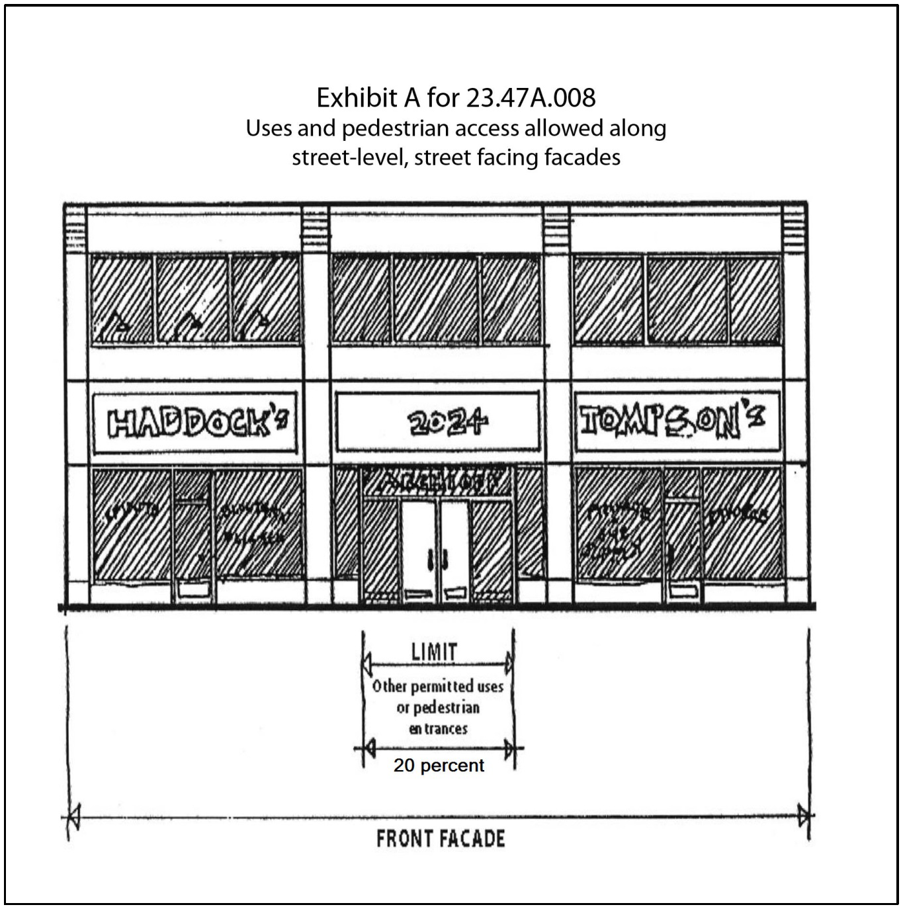

Exhibit A forUses and pedestrian access allowed along street-level, street-facing facades

1. For purposes of calculating the 80 percent of a structure's street-level facade, the width of a driveway at street level, not to exceed 22 feet, may be subtracted from the width of the street-facing facade if the access cannot be provided from an alley or from a street that is not a designated principal pedestrian street.
2. If the street-facing facade and depth requirements would result in a requirement that an area greater than 50 percent of the structure's footprint be dedicated to the uses in subsection 23.47A.005.D.1, the Director may modify the street-facing facade or depth requirements, or both, so that no more than 50 percent of the structure's footprint is required to be dedicated to the uses in subsection 23.47A.005.D.1.
3. Overhead weather protection

    1. Continuous overhead weather protection (i.e., canopies, awnings, marquees, and arcades) is required along at least 60 percent of the street frontage of a structure on a principal pedestrian street, except for structures within the Pike/Pine Conservation Overlay District on lots that contain a character structure as provided in Chapter 23.73.
    2. The covered area shall have a minimum width of 6 feet, unless there is a conflict with existing or proposed street trees or utility poles, in which case the width may be adjusted to accommodate such features as provided in subsection 23.47A.008.C.4.f.
    3. The overhead weather protection must be provided over the sidewalk, or over a walking area within 10 feet immediately adjacent to the sidewalk. When provided adjacent to the sidewalk, the covered walking area must be at the same grade or within 18 inches of sidewalk grade and meet Washington state requirements for barrier-free access.
    4. The lower edge of the overhead weather protection shall be a minimum of 8 feet and a maximum of 12 feet above the sidewalk for projections extending a maximum of 6 feet. For projections extending more than 6 feet from the structure, the lower edge of the weather protection shall be a minimum of 10 feet and a maximum of 15 feet above the sidewalk.
    5. Adequate lighting for pedestrians shall be provided. The lighting may be located on the facade of the building or on the overhead weather protection.
    6. Where the standards listed in this subsection 23.47A.008.C.4 conflict with the vertical and horizontal clearance requirements in the street rights-of-way, the standards may be modified by the Director in consultation with the Director of Transportation.

1. Basic street-level requirements

    1. The provisions of this subsection 23.47A.008.A apply to:

        1. Structures in NC zones;
        2. Structures that contain a residential use in C zones;
        3. Structures in C zones across the street from residential zones; and
        4. All structures in pedestrian-designated zones.
    2. Blank facades

        1. For purposes of this Section 23.47A.008, facade segments are considered blank if they do not include at least one of the following:

            1. Windows;
            2. Entryways or doorways;
            3. Stairs, stoops, or porticos;
            4. Decks or balconies; or
            5. Screening and landscaping on the facade itself.
        2. Blank segments of the street-facing facade between 2 feet and 8 feet above the sidewalk may not exceed 20 feet in width.
        3. The total of all blank facade segments may not exceed 40 percent of the width of the facade of the structure along the street.
    3. Street-level street-facing facades shall be located within 10 feet of the street lot line, unless wider sidewalks, plazas, or other approved landscaped or open spaces are provided.
2. Non-residential street-level requirements

    1. In addition to the provisions of subsection 23.47A.008.A, the provisions of this subsection 23.47A.008.B apply to:

        1. Structures with street-level non-residential uses in NC zones;
        2. Structures with street-level non-residential uses that also contain residential uses in C zones;
        3. Structures with street-level non-residential uses in C zones across the street from residential zones; and
        4. All structures in pedestrian designated zones.
    2. Transparency

        1. Sixty percent of the street-facing facade between 2 feet and 8 feet above the sidewalk shall be transparent. For purposes of calculating the 60 percent of a structure's street-facing facade, the width of a driveway at street level, not to exceed 22 feet, may be subtracted from the width of the street-facing facade if the access cannot be provided from an alley or from a street that is not a designated principal pedestrian street.
        2. Transparent areas of facades shall be designed and maintained to provide views into and out of the structure. Except for institutional uses, no permanent signage, window tinting or treatments, shelving, other furnishings, fixtures, equipment, or stored items shall completely block views into and out of the structure between 4 feet and 7 feet above adjacent grade. The installation of temporary signs or displays that completely block views may be allowed if such temporary sign complies with subsection 23.55.012.B.
    3. Depth provisions for new structures or new additions to existing structures. Non-residential uses shall extend an average depth of at least 30 feet and a minimum depth of 15 feet from the street-level street-facing facade. If the combination of the requirements of Sections 23.47A.005 or 23.47A.008 and this depth requirement would result in a requirement that an area greater than 50 percent of the structure's footprint be dedicated to non-residential use, the Director may modify the street-facing facade or depth requirements, or both, so that no more than 50 percent of the structure's footprint is required to be non-residential.
    4. Height provisions for new structures or new additions to existing structures. Non-residential uses at street level shall have a floor-to-floor height of at least 13 feet.
3. In addition to the provisions of subsections 23.47A.008.A and 23.47A.008.B, the following standards also apply in pedestrian designated zones:

    1. A minimum of 80 percent of the width of a structure's street-level street-facing facade that faces a principal pedestrian street shall be occupied by uses listed in subsection 23.47A.005.D.1. The remaining 20 percent of the street frontage may contain other permitted uses and/or pedestrian entrances (see Exhibit A for 23.47A.008).
4. Where residential uses are located along a street-level street-facing facade the following requirements apply unless exempted by subsection 23.47A.008.G:

    1. At least one of the street-level street-facing facades containing a residential use shall have a visually prominent pedestrian entry; and
    2. The floor of a dwelling unit located along the street-level street-facing facade shall be at least 4 feet above or 4 feet below sidewalk grade or be set back at least 10 feet from the sidewalk.
5. When a live-work unit is located on a street-level street-facing facade, the provisions of subsections 23.47A.008.A and 23.47A.008.B, and the following requirements, apply:

    1. The portion of each such live-work unit in which business is conducted must be located between the principal street and the residential portion of the live-work unit. The non-residential portions of the unit shall extend the width of the street-level street-facing facade, shall extend a minimum depth of 15 feet from the street-level street-facing facade, and shall not contain any of the primary features of the residential (live) portion of the live-work unit, such as kitchen, bathroom, sleeping, or laundry facilities. These basic residential features shall be designed and arranged to be separate from the work portion of the live-work unit.
    2. Each live-work unit must include an exterior sign with the name of the business associated with the live-work unit. Such signage shall be clearly associated with the unit and visible to pedestrians outside of the building.
    3. The owner of each live-work unit must keep a copy of the current business license associated with the business located in that unit on file.
6. The Director may allow exceptions to the street-level requirements of this Section 23.47A.008, as a Type I decision, for projects that are not subject to the Design Review process, except that in a pedestrian-designated zone exceptions may not be granted for requirements for residential uses at street level, transparency requirements, or floor-to-floor height requirements as described in subsection 23.41.012.B. Exceptions may be granted if the Director determines that the project will maintain the safety and aesthetics of the streetscape for pedestrians and will:

    1. maintain pedestrian access to the structure;
    2. maintain urban form consistent with adjacent structures and previous design review decisions on the site;
    3. maintain the visibility of non-residential uses;
    4. maintain the privacy of residential uses; or
    5. allow the continued use of an existing structure without substantial renovation.
7. In a structure existing on January 1, 2012, an accessory dwelling unit may be established if it is accessory to an existing dwelling unit and if it meets minimum housing standards of Chapter 22.206, even if nonconforming to standards of subsection 23.47A.008.D.

#### 23.47A.009 - Standards applicable to specific areas

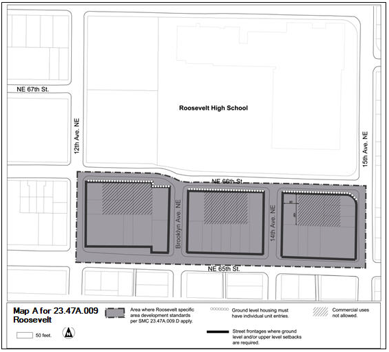

Map A forRoosevelt

1. Setback requirements

    1. The following setbacks are required from the listed street property lines:

        1. Northeast 66 Street. An average ground level setback of 10 feet along the length of the street property line and a minimum upper level setback of 4 feet. The minimum upper level setback shall be provided in addition to the required ground level setback at all points along the length of the street property line at 45 feet of height and above, as measured from average finished grade.
        2. Brooklyn Avenue Northeast. An average ground level setback of 5 feet along the length of the street property line and a minimum upper level setback of 4 feet. The minimum upper level setback shall be provided in addition to the required ground level setback at all points along the length of the street property line at 45 feet of height and above, as measured from average finished grade.
        3. 14 Avenue Northeast. An average ground level setback of 15 feet and a minimum ground level setback of 5 feet along the length of the street property line and a minimum upper level setback of 3 feet. The minimum upper level setback shall be provided in addition to the required ground level setback at all points along the length of the street property line at 45 feet of height and above, as measured from average finished grade.
        4. 15 Avenue Northeast. A minimum ground level setback of 5 feet along the length of the street property line and an average upper level setback of 7 feet. The average upper level setback shall be provided in addition to the required ground level setback at all points along the length of the street property line at 45 feet of height and above, as measured from average finished grade.
        5. Northeast 65 Street and 12 Avenue Northeast. An average ground level setback of 8 feet shall be provided, and the setback may include pedestrian access and circulation.
    2. Structures permitted in required setbacks are:

        1. Decks with open railings may project up to 5 feet into the required setback area if they are no lower than 20 feet above existing or finished grade. Decks may cover no more than 20 percent of the total setback area.
        2. Stoops or porches providing direct access to individual housing units may project up to 5 feet into the required ground level setback area, except that portions of stoops or porches not more than 2.5 feet in height from existing or finished grade, whichever is lower, may extend to a street lot line. The 2.5 foot height limit for stoops or porches does not apply to guard rails or hand rails. Such stoops or porches shall cover no more than 20 percent of the total ground level setback area.
        3. Eaves, cornices, fireplaces, chimneys, and gutters may project no more than 18 inches from the structure facade.
        4. Ramps or other devices necessary for access for the disabled and elderly that meet Seattle Building Code, Chapter 11.
        5. Fences no greater than 4 feet in height are permitted in the required ground level setback, and up to 2 feet of additional height for architectural features such as arbors or trellises on the top of a fence is permitted. Fence height may be averaged along sloping grades for each 4 foot long segment of the fence, but in no case may any portion of the fence exceed 6 feet in height.
        6. Underground structures.
        7. Above-grade green stormwater infrastructure (GSI) features are allowed without setback restrictions if:

            1. Each above-grade GSI feature is less than 4.5 feet tall, excluding piping;
            2. Each above-grade GSI feature is less than 4 feet wide; and
            3. The total storage capacity of all above-grade GSI features is no greater than 600 gallons.
        8. Above-grade GSI features larger than what is allowed in subsection 23.47.009.D.1.b.7 are allowed within a required setback if:

            1. Above-grade GSI features do not exceed 10 percent coverage of any one setback area;
            2. No portion an above-grade GSI feature is located closer than 2.5 feet from a side lot line; and
            3. No portion of an above-grade GSI feature projects more than 5 feet into a front or rear setback area.
    3. Where required setbacks may be averaged, measurement shall be per subsection 23.86.012.A and the following:

        1. Where a building is setback more than 30 feet from a lot line at ground level, 30 feet shall be used as the ground level setback amount for averaging purposes.
        2. Where averaging is allowed for a required upper level setback, the measurement shall be taken horizontally from points directly above the lot line to the façade of the structure at the height where the upper level setback is required.
2. Landscaping. Required ground level setbacks shall be landscaped, and may include paving and lighting to enhance pedestrian safety and comfort. Sidewalks, plazas, and other amenities or landscaped areas approved by the Seattle Department of Construction and Inspections are permitted in required ground level setbacks.
3. Limit on Commercial Uses. Commercial uses are prohibited within 80 feet of the street property line of Northeast 66 Street, except within 50 feet of the intersections of Northeast 66 Street with Brooklyn Avenue Northeast, 14 Avenue Northeast, 12 Avenue Northeast, and 15 Avenue Northeast, as shown on Map A for 23.47A.009.
4. Housing units on the ground floor. All housing units with a façade that faces Northeast 66 Street with no intervening housing units or commercial uses between the housing unit and the Northeast 66 Street lot line, and located on the first floor of a building, shall have the primary pedestrian entrance to each housing unit directly accessible from the exterior of the structure rather than a primary pedestrian entry through a common entrance hallway.
5. Underground Parking. Parking shall be located below grade, except a portion of a below-grade garage may extend up to 4 feet above existing or finished grade, whichever is lower, provided that the parking that extends above grade is fully screened from direct street view by the street-facing façade of the structure or by landscaping.

1. Resolution of standards conflicts. To the extent there is a conflict between this Section 23.47A.009 and other sections of Title 23, the provisions of this Section 23.47A.009 apply.
2. West Seattle Junction Hub Urban Village. The following provisions apply to development in the NC3 85(4.75) zone.

    1. Lot Coverage Limit. The maximum lot coverage permitted for principal and accessory structures shall not exceed 80 percent on lots 40,000 square feet in size or greater.
    2. The total permitted FAR is as identified in subsection 23.47A.013.F.
    3. Maximum Width of Structures. The maximum width of all portions of a structure measured parallel to a north-south street lot line is 275 feet.
    4. Setback and separation requirements

        1. The following standards apply to structures greater than 250 feet in width measured parallel to a north-south street lot line:

            1. A minimum separation of 30 feet is required between structures that are adjacent to the same north-south street lot line; and
            2. A minimum setback of 15 feet is required from side lot lines that are not street side lot lines and that separate lots that abut the same north-south street lot line; and
            3. Structures permitted in required setback and separation areas pursuant to subsections 23.47A.009.A.4.a and 23.47A.009.A.4.b are:

                1. Decks with open railings may project up to 5 feet into the required setback or separation area if they are no lower than 20 feet above existing or finished grade. Decks may cover no more than 20 percent of the total setback or separation area.
                2. Eaves, cornices and gutters may project no more than 18 inches from the structure façade.
                3. Ramps or other devices necessary for access for the disabled and elderly that meet Seattle Building Code, Chapter 11, are permitted.
                4. Stairs or ramps to accommodate changes in grade are permitted.
                5. Underground structures are permitted.
                6. Within the setback area identified in subsection 23.47A.009.A.4.b, unenclosed porches or steps for residential units no higher than 4 feet above the grade at the street lot line closest to the porch are permitted.
                7. Above-grade green stormwater infrastructure (GSI) features are allowed without setback or separation restrictions if:

                    1. Each above-grade GSI feature is less than 4.5 feet tall, excluding piping;
                    2. Each above-grade GSI feature is less than 4 feet wide; and
                    3. The total storage capacity of all above-grade GSI features is no greater than 600 gallons.
                8. Above-grade GSI features larger than what is allowed in subsection 23.47.009.B.4.a.3.g are allowed within a required setback or separation if:

                    1. Above-grade GSI features do not exceed 10 percent coverage of any one setback or separation area;
                    2. No portion of an above-grade GSI feature is located closer than 2.5 feet from a side lot line; and
                    3. No portion of an above-grade GSI feature projects more than 5 feet into a front or rear setback area.
        2. A setback of at least ten feet from the street lot line is required along non-arterial north-south avenues for at least 25 percent of the lot frontage or 100 feet of the lot frontage, whichever is less.
        3. Required setback and areas separating structures identified in subsections 23.47A.009. A.4.a and A.4.b shall include landscaping, paving and lighting. Sidewalks for pedestrian access, plazas or other approved amenity or landscaped areas are permitted in required setback or separation areas.
        4. Upper-Level Setback Requirements along SW Alaska Street.

            1. Structures exceeding 65 feet in height on lots abutting SW Alaska Street between 38th Avenue SW and California Avenue SW shall maintain a minimum setback of 10 feet for that portion of the structure between 45 feet and 55 feet in height.
            2. For portions of a structure above 55 feet in height, an additional minimum setback is required at a rate of at least 1 foot of setback for every 5 feet of height that exceeds 55 feet, up to the maximum allowable height.
            3. Structures located within 100 feet of Fauntleroy Way SW are exempt from the upper-level setback requirement.
            4. Heights in this subsection 23.47A.009.A.4.d shall be measured from the middle of the street lot line along SW Alaska Street.
3. Reserved.
4. Roosevelt Urban Village. The following provisions apply within the area shown on Map A for 23.47A.009.

#### 23.47A.010 - Maximum size of nonresidential use.

1. Except as provided in subsection D of this section, size limits, where specified in Table A of Section 23.47A.004, apply to the total size of a business establishment, except that if a business establishment includes more than one principal use, size limits apply separately to the size of each principal use within the business establishment as determined under this section.
2. For the purposes of this section, size of use includes the gross floor area of a structure(s), or portion of a structure(s), occupied by a principal use and all uses accessory to that use, except that

    1. In NC1 and NC2 zones, any area dedicated to outdoor display of goods or equipment for rent or for sale is also included, and
    2. In all zones, any gross floor area used for accessory parking is exempted from the size calculation.
3. If a business establishment is located in more than one zone:

    1. If the business establishment includes only one principal use, then:

        1. the size of the portion of the business establishment that is located within each zone may not exceed the size limit for that principal use for that zone; and
        2. the total size of the business establishment may not exceed the largest limit for that principal use that applies in any of the zones where any part of the business establishment is located.
    2. If the business establishment includes more than one principal use, size limits apply to each principal use within the business establishment separately, as follows:

        1. the size of the portions of each principal use and its accessory uses that are in one zone may not exceed the size limit for that principal use for that zone; and
        2. the total size of each principal use and its accessory uses may not exceed the largest limit for that principal use that applies in any of the zones where any part of that use is located.
4. In C1 and C2 zones, office uses are limited one (1) FAR, or thirty-five thousand (35,000) square feet, whichever is greater. For purposes of this subsection, size limits apply to the total amount of all office uses on a lot. Office uses are exempt from this limit if the following NC3 zone standards are met:

    1. Blank facades and setbacks, per Section 23.47A.008 A;
    2. Transparency, per Section 23.47A.008 B2;
    3. Outdoor storage areas, per Section 23.47A.011 D;
    4. Screening of blank facades and gas stations, per Section 23.47A.016 C and D2;
    5. Drive-in lanes, per Section 23.47A.028;
    6. Access to parking, per Section 23.47A.032 A; and
    7. Location of parking, per Section 23.47A.032 B.
5. Expansion or replacement of Grocery Stores in NC1 Zones. Grocery stores in NC1 zones are limited to 10,000 square feet. As a special exception, existing grocery stores may be expanded or replaced on-site or on abutting lots up to a maximum size of twenty-three thousand (23,000) sq. ft. when all of the following conditions are met:

    1. The grocery store to be expanded or replaced is legally established as of, and has continued in operation since, August 1, 2005;
    2. The store is located in a zone of contiguous NC1 zoned land that is at least three (3) acres in size and the zone is at least 1,500 feet away from any NC2, NC3, C1 or C2 zone;
    3. The lot abuts an arterial street and the expansion or replacement of the store is not likely to result in significant increases in traffic on non-arterial streets;
    4. The expanded or replaced store will be part of a development with at least 30% (thirty percent) of the gross floor area of the structure, not including parking, in residential use; and
    5. Impacts to adjacent residential areas from loading activities are mitigated using screening, buffers, or other techniques; and
    6. The Director finds that the expansion or replacement is compatible with the character and scale of the area in which it is located.

#### 23.47A.011 - Outdoor activities

Table A forSize Limits for Outdoor Sales

<table>
<tr>
<td>Zone</td>
<td>Maximum Size Limit of Outdoor Sales Area</td>
</tr>
<tr>
<td>NC1 zones</td>
<td>40% of lot area or 1,500 square feet, whichever is less</td>
</tr>
<tr>
<td>NC2 zones</td>
<td>40% of lot area or 10,000 square feet, whichever is less</td>
</tr>
<tr>
<td>NC3, C1 and C2 zones</td>
<td>No maximum size limit</td>
</tr>
</table>

Table B forSize Limits for Outdoor Display of Rental Equipment

<table>
<tr>
<td>Zone</td>
<td>Maximum Size Limit of Outdoor Display of Rental Equipment</td>
</tr>
<tr>
<td>NC1 zones</td>
<td>10% of lot area or 500 square feet, whichever is less</td>
</tr>
<tr>
<td>NC2 and NC3 zones</td>
<td>15% of lot area or 1,000 square feet, whichever is less</td>
</tr>
<tr>
<td>C1 and C2 zones</td>
<td>No maximum size limit</td>
</tr>
</table>

Table C forSize Limits for Outdoor Storage

<table>
<tr>
<td>Zone</td>
<td>Maximum Size Limit of Outdoor Storage Area</td>
</tr>
<tr>
<td>NC1 and NC2 zones, and NC3 zones, except at Seattle Center</td>
<td>Prohibited</td>
</tr>
<tr>
<td>NC3 zones at Seattle Center</td>
<td>1,000 square feet at any one location; and 10,000 square feet for the entire site.</td>
</tr>
<tr>
<td>C1 and C2 zones</td>
<td>No maximum size limit</td>
</tr>
</table>

1. Except as otherwise provided in this Section 23.47A.011, outdoor activities that are part of permitted commercial uses or permitted agricultural uses are permitted in NC zones or C zones, subject to any applicable standards.
2. Outdoor sales area is limited as follows, except for agricultural uses:
3. Outdoor display areas for rental equipment are limited as follows:
4. Outdoor storage areas are limited as follows:
5. The following outdoor activities shall be located at least 50 feet from a lot in a residential zone, unless the elevation of the lot with the activity is at least 15 feet above the grade of the lot in the residential zone at the common lot line:

    1. Outdoor sales and/or service of food or beverages, except products of an agricultural use on the lot;
    2. Outdoor storage;
    3. Outdoor sports and recreation;
    4. Outdoor loading berths.
6. Outdoor activities shall be screened and landscaped according to the provisions of Section 23.47A.016.

#### 23.47A.012 - Structure height

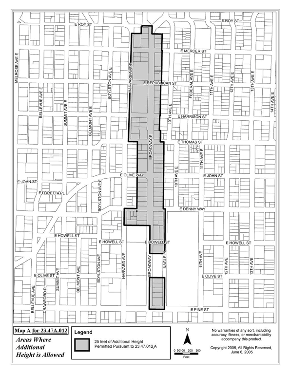

Map A for

1. Within the Station Area Overlay District within the University District Northwest Urban Center Village, maximum structure height may be increased to 125 feet when all of the following are met:

    1. The lot is within two blocks of a planned or existing light rail station;
    2. The proposed use of the lot is functionally related to other office development, permitted prior to 1971, to have over 500,000 square feet of gross floor area to be occupied by a single entity;
    3. A transportation management plan for the life of the use includes incentives for light rail and other transit use by the employees of the office use;
    4. The development shall provide street-level amenities for pedestrians and shall be designed to promote pedestrian interest, safety, and comfort through features such as landscaping, lighting and transparent facades, as determined by the Director; and
    5. This subsection 23.47A.012.A.3 can be used only once for each development that is functionally related.
2. On a lot containing a peat settlement-prone environmentally critical area, the height of a structure may exceed the otherwise applicable height limit and the other height allowances provided by this Section 23.47A.012 by up to 3 feet. In addition, 3 more feet of height may be allowed for any wall of a structure on a sloped lot, provided that on the uphill sides of the structure, the maximum elevation of the structure height shall be no greater than the height allowed by the first sentence of subsection 23.47A.012.A.4. The Director may apply the allowances in subsection 23.47A.012.A.4 only if the following conditions are met:

    1. The Director finds that locating a story of parking underground is infeasible due to physical site conditions such as a high water table;
    2. The Director finds that the additional height allowed for the structure is necessary to accommodate parking located partially below grade that extends no more than 6 feet above existing or finished grade and no more than 3 feet above the highest existing or finished grade along the structure footprint, whichever is lower, as measured to the finished floor level above; and
    3. Other than the additional story of parking allowed according to subsection 23.47A.012.A.4, the additional height allowed for the structure by subsection 23.47A.012.A.4 shall not allow an additional story beyond the number of stories that could be built under the otherwise applicable height limit.
3. In zones that are located within the Pike/Pine Conservation Overlay District with a mapped height limit of 65 feet, or with a mapped height limit of 40 feet with provisions allowing for additional height up to 65 feet according to subsection 23.47A.012.A.2, the provisions of Section 23.73.014 apply.
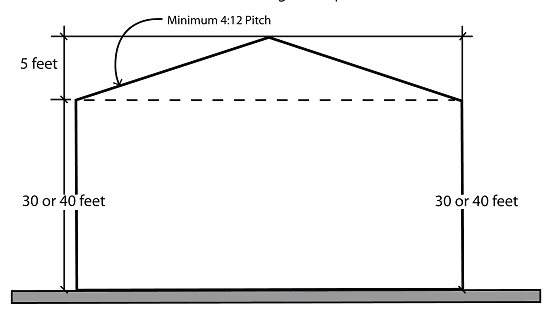

Exhibit A for: Pitched Roof Height Exception

1. The height limit for structures in NC zones or C zones is 30 feet, 40 feet, 65 feet, 85 feet, 125 feet, or 160 feet, as designated on the Official Land Use Map, Chapter 23.32. Structures may not exceed the applicable height limit, except as otherwise provided in this Section 23.47A.012.

    1. In zones with a 30 foot or 40 foot mapped height limit:

        1. The height of a structure may exceed the otherwise applicable limit by up to 4 feet, subject to subsection 23.47A.012.A.1.c, provided the following conditions are met:

            1. Either

                1. A floor-to-floor height of 13 feet or more is provided for non-residential uses at street level; or
                2. A residential use is located on a street-level, street-facing facade, provided that the average height of the exterior facades of any portion of a story that is partially below-grade does not exceed 4 feet, measured from existing or finished grade, whichever is less, and the first floor of the structure at or above grade is at least 4 feet above sidewalk grade; and
            2. The additional height allowed for the structure will not allow an additional story beyond the number that could be built under the otherwise applicable height limit.
        2. The height of a structure may exceed the otherwise applicable limit by up to 7 feet, subject to subsection 23.47A.012.A.1.c, provided all of the following conditions are met:

            1. Residential and multipurpose retail sales uses are located in the same structure;
            2. The total gross floor area of at least one multi-purpose retail sales use exceeds 12,000 square feet;
            3. A floor-to-floor height of 16 feet or more is provided for the multi-purpose retail sales use at street level;
            4. The additional height allowed for the structure will not allow an additional story beyond the number that could be built under the otherwise applicable height limit if a floor-to-floor height of 16 feet were not provided at street level; and
            5. The structure is not allowed additional height under subsection 23.47A.012.A.1.a.
        3. The Director shall reduce or deny the additional structure height allowed by this subsection 23.47A.012.A.1 if the additional height would significantly block views from neighboring residential structures of any of the following: Mount Rainier, the Olympic and Cascade Mountains, the downtown skyline, Green Lake, Puget Sound, Lake Washington, Lake Union, or the Ship Canal.
    2. For any lot within the designated areas shown on Map A for 23.47A.012, the height limit in NC zones or C zones designated with a 40-foot height limit on the Official Land Use Map may be increased to 65 feet and may contain floor area as permitted for a 65 foot zone, according to Section 23.47A.013, provided that all portions of the structure above 40 feet contain only residential uses, and provided that no additional height is allowed under subsection 23.47A.012.A.1.
2. The ridge of a pitched roof, other than a shed roof or butterfly roof, may extend up to 5 feet above the otherwise applicable height limit in zones with height limits of 30 or 40 feet, if all parts of the roof above the otherwise applicable height limit are pitched at a rate of not less than 4:12 (Exhibit A for 23.47A.012).
3. Rooftop features

    1. Smokestacks, chimneys, flagpoles, and religious symbols for religious institutions are exempt from height controls, except as regulated in Chapter 23.64, Airport Height Overlay District, provided they are a minimum of 10 feet from any side or rear lot line.
    2. Open railings, planters, skylights, clerestories, greenhouses, solariums, parapets, and firewalls may extend as high as the highest ridge of a pitched roof permitted by subsection 23.47A.012.B or up to 4 feet above the otherwise applicable height limit, whichever is higher. Insulation material, rooftop decks and other similar features, or soil for landscaping located above the structural roof surface, may exceed the maximum height limit by up to two feet if enclosed by parapets or walls that comply with this subsection 23.47A.012.C.2.
    3. Solar Collectors.

        1. In zones with mapped height limits of 30 or 40 feet, solar collectors may extend up to 4 feet above the otherwise applicable height limit, with unlimited rooftop coverage.
        2. In zones with height limits of 65 feet or more, solar collectors may extend up to 7 feet above the otherwise applicable height limit, with unlimited rooftop coverage.
    4. Except as provided below, the following rooftop features may extend up to 15 feet above the applicable height limit, as long as the combined total coverage of all features gaining additional height listed in this subsection 23.47A.012.C.4, including weather protection such as eaves or canopies extending from rooftop features, does not exceed 20 percent of the roof area, or 25 percent of the roof area if the total includes stair or elevator penthouses or screened mechanical equipment:

        1. Solar collectors;
        2. Mechanical equipment;
        3. Play equipment and open-mesh fencing that encloses it, as long as the fencing is at least 15 feet from the roof edge;
        4. Wind-driven power generators;
        5. Minor communication utilities and accessory communication devices, except that height is regulated according to the provisions of Section 23.57.012; and
        6. Stair and elevator penthouses may extend above the applicable height limit up to 16 feet. When additional height is needed to accommodate energy-efficient elevators in zones with height limits of 125 feet or greater, elevator penthouses may extend the minimum amount necessary to accommodate energy-efficient elevators, up to 25 feet above the applicable height limit. Energy-efficient elevators shall be defined by Director's Rule. When additional height is allowed for an energy-efficient elevator, stair penthouses may be granted the same additional height if they are co-located with the elevator penthouse.
    5. Within the South Lake Union Urban Center, the combined total coverage of all features listed in subsection 23.47A.012.C.4 may be increased to 65 percent of the roof area, provided that the following are satisfied:

        1. The additional rooftop coverage allowed by this subsection 23.47A.012.C.5 is used to accommodate mechanical equipment that is accessory to a research and development laboratory; and
        2. All mechanical equipment is screened; and
        3. No rooftop features other than wind-driven power generators are located closer than 10 feet from the roof edge.
    6. Greenhouses that are dedicated to food production are permitted to extend 15 feet above the applicable height limit if the combined total coverage of all features gaining additional height listed in this subsection 23.47A.012.C does not exceed 50 percent of the roof area, and the greenhouse adheres to the setback requirements in subsection 23.47A.012.C.7.
    7. The rooftop features listed in this subsection 23.47A.012.C.7 shall be located at least 10 feet from the north edge of the roof unless a shadow diagram is provided that demonstrates that locating such features within 10 feet of the north edge of the roof would not shade property to the north on January 21st at noon more than would a structure built to maximum permitted height and FAR:

        1. Solar collectors;
        2. Planters;
        3. Clerestories;
        4. Greenhouses and solariums;
        5. Minor communication utilities and accessory communication devices, permitted pursuant to the provisions of Section 23.57.012;
        6. Non-firewall parapets;
        7. Play equipment.
    8. Structures existing prior to May 10, 1986 may add new or replace existing mechanical equipment up to 15 feet above the roof elevation of the structure and shall comply with the noise standards of Section 23.47A.018.
    9. For height limits and exceptions for communication utilities and accessory communication devices, see Section 23.57.012.
4. Solar Retrofits. The Director may permit the retrofitting of solar collectors on conforming or nonconforming structures existing on June 9, 1986 as a special exception pursuant to Chapter 23.76, Procedures for Master Use Permits and Council Land Use Decisions. Such a retrofit may be permitted to exceed established height limits, if the following conditions are met:

    1. There is no feasible alternative solution to placing the collector(s) on the roof;
    2. The positioning of such collector(s) minimizes view blockage and shading of property to the north, while still providing adequate solar access for the collectors; and
    3. Such collector(s) meet minimum energy standards administered by the Director.
5. Height Exceptions for Public Schools.

    1. For new public school construction on new public school sites, the maximum permitted height shall be the maximum height permitted in the zone.
    2. For new public school construction on existing public school sites, the maximum permitted height shall be the maximum height permitted in the zone or 35 feet plus 15 feet for a pitched roof complying with subsection 23.47A.012.E.5, whichever is greater.
    3. For additions to existing public schools on existing public school sites, the maximum height permitted shall be the maximum height permitted in the zone, the height of the existing school, or 35 feet plus 15 feet for a pitched roof complying with subsection 23.47A.012.E.5, whichever is greater.
    4. Development standard departure for structure height may be granted pursuant to the procedures and criteria set forth in Chapter 23.79. For construction of new structures on new and existing public school sites to the extent not otherwise permitted outright, maximum height that may be granted as a development standard departure in zones with height limits of 30 or 40 feet shall be 35 feet plus 15 feet for a pitched roof complying with subsection 23.47A.012.E.5 for elementary schools and 60 feet plus 15 feet for a pitched roof complying with subsection 23.47A.012.E.5 for secondary schools. All height maximums may be waived by the Director when waiver would contribute to the demolition of fewer residential structures.
    5. To qualify for additional height for a pitched roof under this subsection 23.47A.012.E, all parts of the roof above the height otherwise allowed must be pitched at a rate of not less than 3:12 and the roof must not be a shed roof or butterfly roof.

#### 23.47A.013 - Floor area ratio

1. Floor area ratio (FAR) limits apply to all structures and lots in all NC zones and C zones.

    1. All gross floor area not exempt under subsection 23.47A.013.D is counted against the maximum gross floor area allowed by the permitted FAR.
    2. If there are multiple structures on a lot, the highest FAR limit applicable to any structure on the lot applies to the combined non-exempt gross floor area of all structures on the lot, subject to subsection 23.47A.013.A.4.
    3. Except as provided in subsection 23.47A.013.D.7, parking that is within or covered by a structure or portion of a structure and that is within a story that is not underground shall be included in gross floor area calculations.
    4. If a lot is in more than one zone, the FAR limit for each zone applies to the portion of the lot located in that zone, and the floor area on the portion of the lot with the lower FAR limit may not exceed the amount that would be permitted if it were a separate lot. If a lot is in both a multifamily zone and a commercial zone, the floor area on the commercial portion of the lot may not exceed the maximum that would be allowed if the commercial portion of the lot were a separate lot.
2. Except as provided in subsections 23.47A.013.C, 23.47A.013.D, 23.47A.013.E, 23.47A.013.F, and 23.47A.013.G, maximum FAR allowed in C zones and NC zones is shown in Table A for 23.47A.013, provided that if the commercial zone designation includes an incentive zoning suffix, then the applicant shall comply with Chapter 23.58A, Incentive Provisions, to obtain gross floor area exceeding that allowed by the FAR shown in the suffix designation.
3. Maximum FAR allowed in NC zones or C zones within the Station Area Overlay District is shown in Table B for 23.47A.013 provided that if the commercial zone designation includes an incentive zoning suffix, then the applicant shall comply with Chapter 23.58A, Incentive Provisions, to obtain gross floor exceeding that allowed by the FAR shown in the suffix designation.
4. The following gross floor area is not counted toward maximum FAR:

    1. All underground stories or portions of stories;
    2. All portions of a story that extend no more than 4 feet above existing or finished grade, whichever is lower, excluding access;
    3. Gross floor area of a transit station, including all floor area open to the general public during normal hours of station operation but excluding retail or service establishments to which public access is limited to customers or clients, even where such establishments are primarily intended to serve transit riders;
    4. Within the South Lake Union Urban Center, gross floor area occupied by mechanical equipment located on the roof of a structure;
    5. Within the South Lake Union Urban Center, mechanical equipment that is accessory to a research and development laboratory, up to 15 percent of the gross floor area of a structure. The allowance is calculated on the gross floor area of the structure after all space exempt under this subsection 23.47A.013.D is deducted; and
    6. Within the First Hill Urban Center Village, on lots zoned NC3, with a 160 foot height limit, all gross floor area occupied by a residential use.
    7. On a lot containing a peat settlement-prone environmentally critical area, above-grade parking within or covered by a structure or portion of a structure if the Director finds that locating a story of parking below grade is infeasible due to physical site conditions such as a high water table, if either:

        1. the above-grade parking extends no more than 6 feet above existing or finished grade and no more than 3 feet above the highest existing or finished grade along the structure footprint, whichever is lower, as measured to the finished floor level or roof above, pursuant to subsection 23.47A.012.A.5; or
        2. all of the following conditions are met:

            1. no above-grade parking is exempted by subsection 23.47A.013.D.7.a;
            2. the parking is accessory to a residential use on the lot;
            3. total parking on the lot does not exceed one space for each residential dwelling unit plus the number of spaces required for non-residential uses; and
            4. the amount of gross floor area exempted by this subsection 23.47A.013.D.7.b does not exceed 25 percent of the area of the lot in zones with a height limit less than 65 feet, or 50 percent of the area of the lot in zones with a height limit 65 feet or greater.
    8. Rooftop greenhouse areas meeting the standards of subsection 23.47A.012.C.6 and C.7.
5. Within the Station Area Overlay District within the University District Northwest Urban Center Village, for office structures permitted prior to 1971, the area of the lot for purposes of calculating permitted FAR is the tax parcel created prior to the adoption of Ordinance 121846 on which the existing structure is located, provided the office structure is to be part of a functionally related development occupied by a single entity with over 500,000 square feet of area in office use. The floor area of above grade pedestrian access is exempt from the FAR calculations of this subsection, and the maximum permitted FAR is 8.
6. Within the West Seattle Junction Hub Urban Village, on lots zoned NC3 85(4.75), the total permitted FAR for all uses within a mixed use structure containing residential and non-residential uses is 5.5.
7. Within the portion of the Greenwood Residential Urban Village on lots zoned NC2 40 that are located abutting NW 85 Street between 1 Avenue NW and 3 Avenue NW, the total permitted FAR within a mixed use structure containing residential and non-residential uses is 4.
8. Minimum FAR

    1. A minimum FAR shown in Table C for 23.47A.013 is required whenever more than 1,000 square feet of gross floor area is added to or removed from a lot:

        1. located in a pedestrian-designated zone in an Urban Center, Urban Village, or Station Area Overlay District; or
        2. located in the Northgate Overlay District and abutting a Major Pedestrian Street as shown on Map A for subsection 23.71.004.
    2. The minimum FAR requirement provided in subsection 23.47A.013.H.1 does not apply if:

        1. additional floor area is added to an existing structure on a lot that is nonconforming with respect to the minimum FAR shown in Table C for 23.47A.013;
        2. the lot is larger than five acres;
        3. all existing gross floor area is demolished to create a vacant lot; or
        4. parks and open space is the principal use of the lot.
    3. Portions of the lot designated as a steep slope, wetland, or riparian corridor or as a buffer to one of these areas, as defined in Chapter 25.09, shall not be included when calculating lot size for the purpose of determining the minimum FAR requirement provided in subsection 23.47A.013.H.1.
    4. The Director, in consultation with the Director of the Department of Neighborhoods, may waive the minimum FAR requirement provided in subsection 23.47A.013.H.1 for lots that contain a designated landmark, or for lots within a Landmark District pursuant to Title 25 or within a Special Review District pursuant to Chapter 23.66, if the Director determines a waiver is necessary to preserve the integrity of a landmark or meet adopted District design and development guidelines.
    5. The Director may waive the minimum FAR requirement provided in subsection 23.47A.013.H.1 for lots within the Pike/Pine Conservation Overlay District pursuant to Chapter 23.32, if the Director determines that the proposed development promotes neighborhood conservation objectives.
    6. The following gross floor area is not counted toward the minimum FAR requirement provided in subsection 23.47A.013.H.1:

        1. Gross floor area below grade; and
        2. Gross floor area containing parking.
    7. In zones with an incentive zoning suffix, the minimum FAR requirement is the FAR indicated by the incentive zoning suffix if that FAR is less than the FAR required by subsection 23.47A.013.H.1.

#### 23.47A.014 - Setback requirements

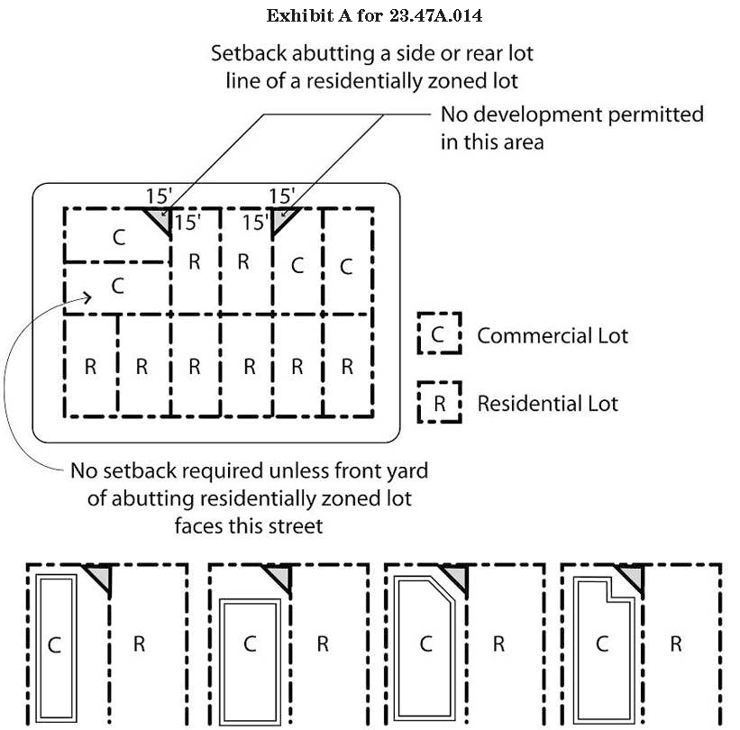

Exhibit A for

1. A setback is required along any rear or side lot line that abuts a lot in a residential zone or that abuts a lot that is zoned both commercial and residential if the commercial zoned portion of the abutting lot is less than 50 percent of the width or depth of the lot, as follows:

    1. Ten feet for portions of structures above 13 feet in height to a maximum of 65 feet; and
    2. For each portion of a structure above 65 feet in height, additional setback at the rate of 1 foot of setback for every 10 feet by which the height of such portion exceeds 65 feet (Exhibit B for 23.47A.014).
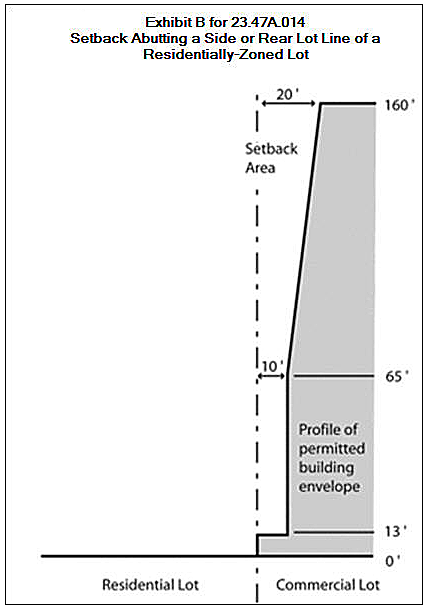

Exhibit B forSetback Abutting a Side orRear Lot Line of aResidentially-Zoned Lot

1. For a structure containing a residential use, a setback is required along any side or rear lot line that abuts a lot in a residential zone or that is across an alley from a lot in a residential zone, or that abuts a lot that is zoned both commercial and residential if the commercial zoned portion of the abutting lot is less than 50 percent of the width or depth of the lot, as follows:

    1. Fifteen feet for portions of structures above 13 feet in height to a maximum of 40 feet; and
    2. For each portion of a structure above 40 feet in height, additional setback at the rate of 2 feet of setback for every 10 feet by which the height of such portion exceeds 40 feet (Exhibit C for 23.47A.014).
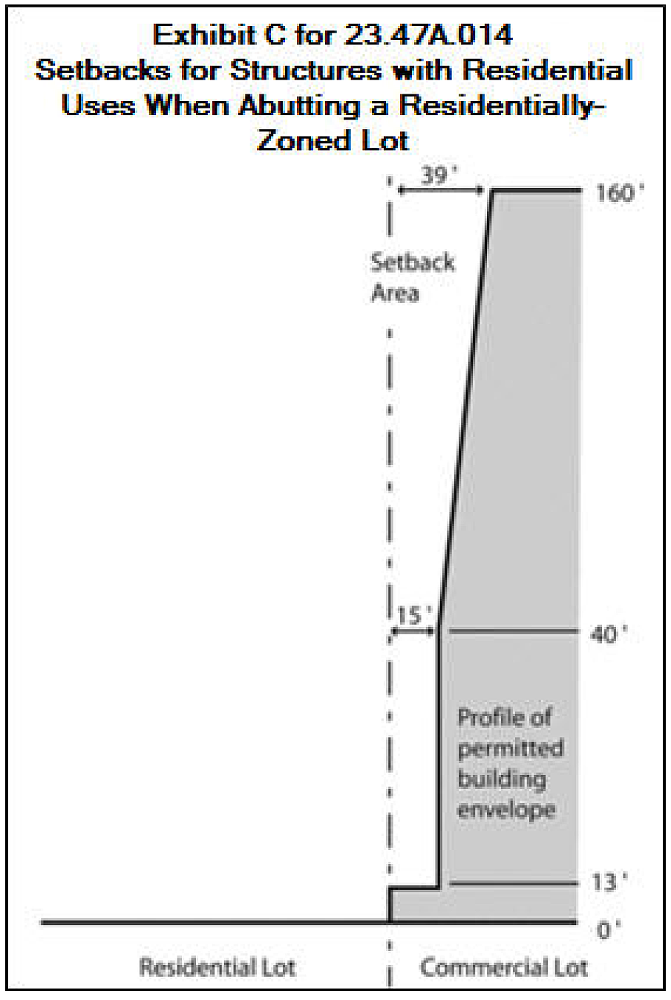

Exhibit C forSetbacks for Structures withResidential Uses When Abuttinga Residentially-Zoned Lot

1. One-half of the width of an abutting alley may be counted as part of the required setback. For the purpose of this Section 23.47A.014, the alley width and the location of the rear lot line shall be determined prior to any dedication that may be required for alley improvement purposes.
2. No entrance, window, or other opening is permitted closer than 5 feet to an abutting residentially-zoned lot.
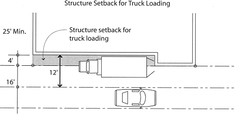

Exhibit D for

1. Definition. For the purposes of this Section 23.47A.014, "portions of structures" include those features listed in subsection 23.47A.012.C, Rooftop features.
2. Setback requirements for lots abutting or across the alley from residential zones

    1. A setback is required where a lot abuts the intersection of a side lot line and front lot line of a lot in a residential zone. The required setback forms a triangular area. Two sides of the triangle extend along the street lot line and side lot line 15 feet from the intersection of the residentially zoned lot's front lot line and the side lot line abutting the residentially zoned lot. The third side connects these two sides with a diagonal line across the commercially-zoned lot (Exhibit A for 23.47A.014).
3. A minimum five (5) foot landscaped setback may be required under certain conditions and for certain uses according to Section 23.47A.016, Screening and landscaping standards.
4. Mobile Home Parks. A minimum five (5) foot setback is required along all street lot lines of a mobile home park. The setback must be landscaped according to the provisions of Section 23.47A.016 D2.
5. Structures in required setbacks

    1. Decks and balconies.

        1. Decks with open railings may extend into the required setback, but are not permitted within five (5) feet of a lot in a residential zone, except as provided in subsection E1b.
        2. Decks that are accessory to residential uses and are no more than eighteen (18) inches above existing or finished grade, whichever is lower, are permitted within five (5) feet of a lot in a residential zone.
    2. Eaves, cornices and gutters projecting no more than eighteen (18) inches from the structure facade are permitted in required setbacks.
    3. Ramps or other devices necessary for access for the disabled and elderly, which meet Seattle Building Code, Chapter 11, are permitted in required setbacks.
    4. Uncovered, unenclosed pedestrian bridges, necessary for access and less than five (5) feet in width, are permitted in required setbacks.
    5. Fences, bulkheads, freestanding walls and other similar structures.

        1. Fences, freestanding walls and other similar structures six (6) feet or less in height above existing or finished grade, whichever is lower, are permitted in required setbacks. The six (6) foot height may be averaged along sloping grade for each six (6) foot long segment of the fence, but in no case may any portion of the fence exceed eight (8) feet.
        2. Bulkheads and retaining walls used to raise grade may be placed in any required setback when limited to six (6) feet in height, measured above existing grade. A guardrail no higher than forty-two (42) inches may be placed on top of a bulkhead or retaining wall existing as of the date of the ordinance codified in this section. If a fence is placed on top of a new bulkhead or retaining wall, the maximum combined height is limited to nine and one-half (9 ½) feet.
        3. Bulkheads and retaining walls used to protect a cut into existing grade may not exceed the minimum height necessary to support the cut or six (6) feet, whichever is greater. When the bulkhead is measured from the low side and it exceeds six (6) feet, an open guardrail of no more than forty-two (42) inches meeting Building Code requirements may be placed on top of the bulkhead or retaining wall. A fence must be set back a minimum of three (3) feet from such a bulkhead or retaining wall.
    6. Setback requirements do not limit underground structures.
    7. Detached solar collectors are permitted in required setbacks. Such collectors may be no closer than five (5) feet to any other principal or accessory structure, and no closer than three (3) feet to any lot line that abuts a residentially zoned lot.
    8. Dumpsters and other trash receptacles, except for trash compactors, located outside of structures are not permitted within ten (10) feet of any lot line that abuts a residential zone and must be screened per the provisions of section 23.47A.016.
    9. Above-grade green stormwater (GSI) features are allowed without setback restrictions if:

        1. Each above-grade GSI feature is less than 4.5 feet tall, excluding piping;
        2. Each above-grade GSI feature is less than 4 feet wide; and
        3. The total storage capacity of all above-grade GSI features is no greater than 600 gallons.
    10. Above-grade GSI features larger than what is allowed in subsection 23.47A.014.E.9 are allowed within a required setback if:

        1. Above-grade GSI features do not exceed 10 percent coverage of any one setback area;
        2. No portion of an above-grade GSI feature is located closer than 2.5 feet from a side lot line; and
        3. No portion of an above-grade GSI feature projects more than 5 feet into a front or rear setback area.
6. Setback requirement for loading adjacent to an alley. Where access to a loading berth is from the alley, and truck loading is parallel to the alley, a setback of 12 feet is required for the loading berth, measured from the centerline of the alley (Exhibit D for 23.47A.014. This setback must be maintained up to a height of 12 feet.
7. A setback may be required in order to meet the provisions of Section 23.53.015, Improvement requirements for existing streets in residential and commercial zones, and Section 23.53.030, Alley improvements in all zones.

#### 23.47A.015 - View corridors.

1. On lots that are partially within the Shoreline District, a view corridor shall be required for the entire lot if the portion of the lot in the Shoreline District is required to provide a view corridor under the Seattle Shoreline Master Program.
2. Measurement and modification of the view corridor requirement must be according to the Shoreline District measurement regulations.

#### 23.47A.016 - Landscaping and screening standards

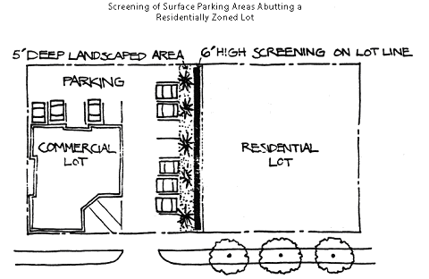

Exhibit A for

1. The Director may waive or reduce the requirements of this subsection 23.47A.016.D.1:

    1. to improve safety;
    2. to provide adequate maneuvering room for service vehicles;
    3. when it would not otherwise be feasible to provide the required number of spaces; or
    4. when required parking can only be provided at the rear lot line and access to individual parking spaces can only be provided directly from the alley.
2. In deciding whether and to what extent to waive or reduce the landscaping and screening requirements, the Director shall consider whether:

    1. the lot width and depth permit alternative workable site plans that would allow screening and landscaping;
    2. the character of uses across the alley, such as a parking garage accessory to a multifamily structure, makes the screening and landscaping less necessary;
    3. the lot is in a location where access to parking from the street is not permitted; and
    4. a topographic break between the alley and the residential zone makes screening less necessary.
3. Fences or free-standing walls associated with utility services uses may obstruct or allow views to the interior of a site. Where site dimensions and site conditions allow, applicants are encouraged to provide both a landscaped setback between the fence or wall and the right-of-way, and a fence or wall that provides visual interest facing the street lot line, through the height, design or construction of the fence or wall, including the use of materials, architectural detailing, artwork, vegetated trellises, decorative fencing, or similar features. Any fence or free-standing wall for a utility services use must provide either:

    1. A 5-foot-deep landscaped area between the wall or fence and the street lot line; or
    2. Architectural detailing, artwork, vegetated trellises, decorative fencing, or similar features to provide visual interest facing the street lot line, as approved by the Director.
4. Other uses or circumstances. Screening and landscaping is required according to Table D for 23.47A.016:
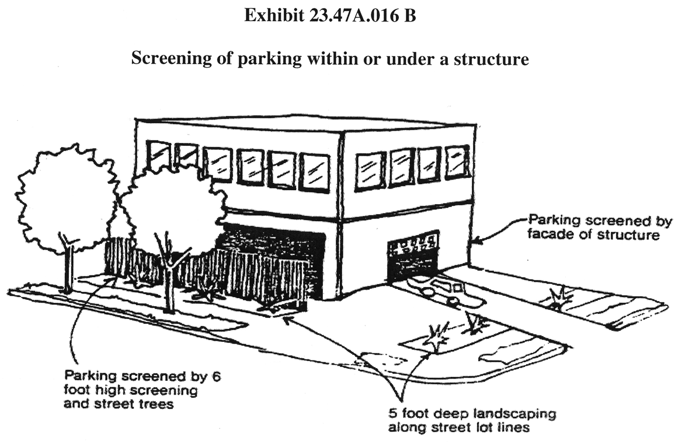

Exhibit B for Screening of parking within or under a structure

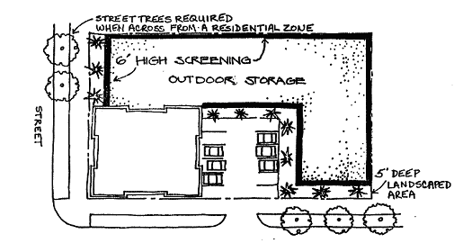

Exhibit C for Screening of open storage areas in C1 zones

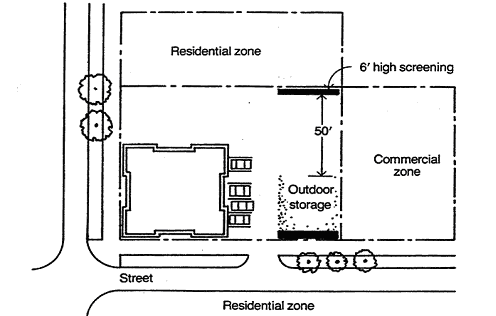

Exhibit D for - Screening of open storage areas in C2 zones

1. On lots within the Shoreline District where view corridors are required, the Director may reduce the required height of screening and may modify the location and type of required landscaping so that views are not obstructed.
2. When one of the specific uses listed in this subsection 23.47A.016.D is proposed for expansion, the applicable requirements for that use shall be met. The Director may reduce or waive the requirements where they are physically infeasible due to the location of existing structures or required parking.

1. Landscaping requirements

    1. The Director shall promulgate rules to foster the long-term health, viability, and coverage of plantings. The rules shall address, at a minimum, the type and size of plants, spacing of plants, use of drought-tolerant plants, and access to light and air for plants. All landscaping provided to meet the requirements of this Section 23.47A.016 shall comply with these rules.
    2. Landscaping that achieves a Green Factor score of 0.3 or greater, pursuant to Section 23.86.019, is required for any lot with:

        1. development containing more than four new dwelling units or a congregate residence; or
        2. development, either a new structure or an addition to an existing structure, containing more than 4,000 new square feet of non-residential uses; or
        3. any parking lot containing more than 20 new parking spaces for automobiles.
2. Street tree requirements

    1. Street trees are required when any development is proposed, except as provided in subsection 23.47A.016.B.2 and Section 23.53.015. Existing street trees shall be retained unless the Director of Transportation approves their removal. The Director, in consultation with the Director of Transportation, will determine the number, type and placement of street trees to be provided:

        1. to improve public safety;
        2. to promote compatibility with existing street trees;
        3. to match trees to the available space in the planting strip;
        4. to maintain and expand the urban forest canopy;
        5. to encourage healthy growth through appropriate spacing;
        6. to protect utilities; and
        7. to allow access to the street, buildings and lot.
    2. Exceptions to street tree requirements

        1. If a lot borders an unopened right-of-way, the Director may reduce or waive the street tree requirement along that street if, after consultation with the Director of Transportation, the Director determines that the street is unlikely to be opened or improved.
        2. Street trees are not required for any of the following:

            1. establishing, constructing or modifying single-family dwelling units; or
            2. changing a use, or establishing a temporary use or intermittent use; or
            3. expanding a structure by 1,000 square feet or less; or
            4. expanding surface area parking by less than ten percent in area and less than ten percent in number of spaces.
    3. When an existing structure is proposed to be expanded by more than 1,000 square feet, one street tree is required for each 500 square feet over the first 1,000 square feet of additional structure, up to the maximum number of trees that would be required for new construction.
    4. If it is not feasible to plant street trees in a right-of-way planting strip, a 5-foot setback shall be planted with street trees along the street property line or landscaping other than trees shall be provided in the planting strip, subject to approval by the Director of Transportation. If, according to the Director of Transportation, a 5-foot setback or landscaped planting strip is not feasible, the Director of the Seattle Department of Construction and Inspections may reduce or waive this requirement.
3. General standards for screening and landscaping where required for specific uses

    1. Screening shall consist of fences, walls, or landscaped areas, including bioretention facilities or landscaped berms. Any type of screening shall be at least as tall as the height specified in subsection 23.47A.016.D.
    2. Landscaped areas required under subsection 23.47A.016.D must meet rules promulgated by the Director pursuant to subsection 23.47A.016.A.1. Decorative features such as decorative pavers, sculptures or fountains, or pedestrian access meeting the Seattle Building Code, Chapter 11, may cover a maximum of 30 percent of each landscaped area used to satisfy requirements under subsection 23.47A.016.D.
4. Screening and landscaping requirements for specific uses. When there is more than one use that requires screening or landscaping, the requirement that results in the greater amount applies.

    1. Surface parking areas

        1. Landscaping requirements for surface parking areas are established in Table C for 23.47A.016.

            1. Each landscaped area shall be no smaller than 100 square feet and must be protected by permanent curbs or structural barriers.
            2. No part of a landscaped area shall be less than 4 feet in width or length except those parts of landscaped areas created by turning radii or angles of parking spaces.
            3. No parking space shall be more than 60 feet from a required landscaped area.
        2. The landscaped area may include bioretention facilities.
        3. Trees in surface parking areas

            1. One tree is required for every ten parking spaces.
            2. Trees shall be selected in consultation with the Director of Transportation.
        4. Screening of surface parking areas

            1. Three-foot-high screening is required along street lot lines.
            2. Surface parking abutting or across an alley from a lot in a residential zone must have 6-foot-high screening along the abutting lot line and a 5-foot-deep landscaped area inside the screening (see Exhibit A for 23.47A.016).
5. Breaks in required screening are permitted to provide pedestrian and vehicular access. Breaks in required screening for vehicular access shall not exceed the width of permitted curb cuts.

#### 23.47A.018 - Noise standards

1. In an NC1, NC2 or NC3 zone, all manufacturing, fabricating, repairing, refuse compacting and recycling activities shall be conducted wholly within an enclosed structure. In a C1 or C2 zone, location within an enclosed structure is required only when the structure is located within 50 feet of a residential zone, except when required as a condition for permitting a major noise generator according to subsection 23.47A.018.B. Doors on such a structure that are further than 50 feet from the residential zone and that face away from the residential zone may remain open.
2. Major Noise Generators.

    1. The following uses are considered major noise generators:

        1. Light and general manufacturing;
        2. Major vessel repair;
        3. Aircraft repair shops;
        4. Major vehicle repair;
        5. Cargo terminals;
        6. Recycling;
        7. Other similar uses.
    2. Exterior heat exchangers and other similar devices (e.g., ventilation, air-conditioning, refrigeration) are considered major noise generators.
    3. When a major noise generator is proposed, or when an existing major noise generator is proposed to be expanded, a report from an acoustical consultant shall be required to describe the measures to be taken by the applicant in order to meet noise standards for the area. Such measures may include, for example, the provision of buffers, reduction in hours of operation, relocation of mechanical equipment, increased setbacks and use of specified construction techniques or building materials. Measures to be used shall be specified on the plans. After a permit has been issued, any measures that were required by the permit to limit noise shall be maintained.

#### 23.47A.020 - Odor standards

1. The venting of odors, vapors, smoke, cinders, dust, gas, and fumes shall be at least 10 feet above finished sidewalk grade, and directed away to the extent possible from uses within 50 feet of the vent.
2. Major odor sources

    1. Uses that employ the following odor-emitting processes or activities are major odor sources:

        1. Lithographic, rotogravure, or flexographic printing;
        2. Film burning;
        3. Fiberglassing;
        4. Selling of gasoline and/or storage of gasoline in tanks larger than 260 gallons;
        5. Handling of heated tars and asphalts;
        6. Incinerating (commercial);
        7. Tire buffing;
        8. Metal plating;
        9. Vapor degreasing;
        10. Wire reclamation;
        11. Use of boilers (greater than 106 British thermal units per hour, 10,000 pounds steam per hour, or 30 boiler horsepower);
        12. Animal food processing;
        13. The production or processing of marijuana products by a major marijuana activity; and
        14. Other similar processes or activities.
    2. Uses that employ the following processes are considered major odor sources, except when the entire activity is conducted as part of a commercial use other than food processing or heavy commercial services:

        1. Cooking of grains;
        2. Smoking of food or food products;
        3. Fish or fishmeal processing;
        4. Coffee or nut roasting;
        5. Deep fat frying;
        6. Dry cleaning.
3. When an application is made for a use that is a major odor source, the Director, in consultation with the Puget Sound Clean Air Agency (PSCAA), will determine the appropriate measures to be taken by the applicant in order to significantly reduce potential odor emissions and airborne pollutants. The measures to be taken must be indicated on plans submitted to the Director and may be required as conditions for the issuance of any permit. After a permit has been issued, any measures that were required by the permit must be maintained.

#### 23.47A.022 - Light and glare standards.

1. Exterior lighting must be shielded and directed away from adjacent uses.
2. Interior lighting in parking garages must be shielded to minimize nighttime glare affecting nearby uses.
3. To prevent vehicle lights from affecting adjacent properties, driveways and parking areas for more than two (2) vehicles shall be screened from adjacent properties by a fence or wall between five (5) feet and six (6) feet in height, or solid evergreen hedge or landscaped berm at least five (5) feet in height. If the elevation of the lot line is different from the finished elevation of the driveways or parking surface, the difference in elevation may substitute for a portion of the required height of the screen so long as the screen itself is a minimum of three (3) feet in height. The Director may waive the requirement for the screening if it is not needed due to changes in topography, agreements to maintain an existing fence, or the nature and location of adjacent uses.
4. Height.

    1. Exterior lighting on poles is permitted up to a maximum height of thirty (30) feet from finished grade. In zones with a forty (40) foot or greater height limit, exterior lighting on poles is permitted up to a height of forty (40) feet from finished grade, provided that the ratio of watts to area is at least twenty (20) percent below the maximum exterior lighting level permitted by the Energy Code.
    2. Athletic Fields.

        1. Light poles for illumination of athletic fields on new and existing public school sites may exceed the maximum permitted height set forth in subsection D1, above, up to a maximum height of one hundred (100) feet, where determined by the Director to be necessary to ensure adequate illumination and where the Director determines that impacts from light and glare are minimized to the greatest extent practicable. The applicant must submit an engineer's report demonstrating that impacts from light and glare are minimized to the greatest extent practicable. When proposed light poles are reviewed as part of a project being reviewed pursuant to Chapter 25.05, Environmental Policies and Procedures, and requiring a SEPA determination, the applicant must demonstrate that the additional height contributes to a reduction in impacts from light and glare.
        2. When proposed light poles are not included in a proposal being reviewed pursuant to Chapter 25.05, the Director may permit the additional height as a special exception subject to Chapter 23.76, Procedures for Master Use Permits and Council Land Use Decisions.

            1. When seeking a special exception for taller light standards, the applicant must submit an engineer's report demonstrating that the additional height contributes to a reduction in impacts from light and glare. When the proposal will result in extending the lighted area's duration of use, the applicant must address and mitigate potential impacts, including but not limited to, increased duration of noise, traffic, and parking demand. The applicant also must demonstrate it has conducted a public workshop for residents within () one-eighth of a mile of the affected school in order to solicit comments and suggestions on design as well as potential impacts.
            2. The Director may condition a special exception to address negative impacts from light and glare on surrounding areas, and may also impose conditions to address other impacts associated with increased field use due to the addition of lights, including, but not limited to, increased noise, traffic, and parking demand.
5. Glare diagrams that clearly identify potential adverse glare impacts on residential zones and on arterials shall be required when:

    1. Any structure is proposed to have a facade of reflective coated glass or other highly reflective material, and/or new or expanded structures greater than sixty-five (65) feet in height are proposed to have more than thirty (30) percent of a facade composed of clear or tinted glass; and
    2. The facade(s) surfaced or composed of materials referred to in subsection 1 above either:

        1. Are oriented toward and are less than two hundred (200) feet from any residential zone, and/or
        2. Are oriented toward and are less than four hundred (400) feet from a major arterial with more than fifteen thousand (15,000) vehicle trips per day, according to Seattle Department of Transportation data.
    3. When glare diagrams are required, the Director may require modification of the plans to mitigate adverse impacts, using methods including but not limited to the following:

        1. Minimizing the percentage of exterior facade that is composed of glass;
        2. Using exterior glass of low reflectance;
        3. Tilting glass areas to prevent glare that could affect arterials, pedestrians or surrounding structures;
        4. Alternating glass and non-glass materials on the exterior facade; and
        5. Changing the orientation of the structure.

#### 23.47A.024 - Amenity area

1. Amenity areas are required in an amount equal to 5 percent of the total gross floor area in residential use, except as otherwise specifically provided in this Chapter 23.47A. Gross floor area, for the purposes of this subsection 23.47A.024.A, excludes areas used for mechanical equipment and accessory parking. For the purposes of this subsection 23.47A.024.A, bioretention facilities qualify as amenity areas.
2. Required amenity areas shall meet the following standards, as applicable:

    1. All residents shall have access to at least one common or private amenity area.
    2. Amenity areas shall not be enclosed.
    3. Parking areas, vehicular access easements, and driveways do not qualify as amenity areas, except that a woonerf may provide a maximum of 50 percent of the amenity area if the design of the woonerf is approved through a design review process pursuant to Chapter 23.41.
    4. Common amenity areas shall have a minimum horizontal dimension of 10 feet, and no common amenity area shall be less than 250 square feet in size.
    5. Private balconies and decks shall have a minimum area of 60 square feet, and no horizontal dimension shall be less than 6 feet.
    6. Rooftop areas excluded because they are near minor communication utilities and accessory communication devices, pursuant to subsection 23.57.012.C.1.d, do not qualify as amenity areas.

#### 23.47A.027 - Landmark Districts and designated landmark structures

1. The Director, in consultation with the Director of the Department of Neighborhoods, may waive or allow departures from standards for street level development, residential amenity areas, setbacks, floor area ratio limits and screening and landscaping for designated landmark structures or for development within a Landmark District pursuant to Seattle Municipal Code, Title 25 or within a Special Review District pursuant to Seattle Municipal Code, Chapter 23.66.
2. The Director's decision to waive or allow departures from development standards shall be consistent with adopted District design and development guidelines and shall be consistent with the recommendations of the Landmarks Preservation Board or the Director of Neighborhoods except when potential environmental impacts clearly require denial or granting lesser waivers or departures.

#### 23.47A.028 - Standards for drive-in businesses.

1. Number of Drive-in Lanes and Fuel Pumps Permitted.

    1. Drive-in lanes are permitted, conditioned, or prohibited as follows:
    2. In NC zones, gas stations may contain no more than four (4) fuel pumps capable of fueling no more than eight (8) automobiles simultaneously, except as may be allowed under subsection A3 of this section.
    3. The Director shall permit one (1) additional lane and one (1) additional fuel pump provided that the additional lane serves, and the additional fuel pump dispenses, one or more of the following fuels: natural gas, bio-diesel, or hydrogen.
    4. Gas stations in all NC zones, and restaurants with drive-in lanes in NC3 zones, are permitted subject to the following requirements:

        1. The design, including architectural treatment, signage, landscaping and lighting, is compatible with other structures in the vicinity;
        2. Appropriate litter-control measures are provided; and
        3. The applicant, if required by the Director, prepares an analysis of traffic, circulation and parking impacts, and demonstrates that the drive-in lanes will not:

            1. Cause significant additional traffic to circulate through adjacent residential neighborhoods;
            2. Disrupt the pedestrian character of an area by significantly increasing the potential for pedestrian-vehicle conflicts;
            3. Create traffic or access problems that will require the expenditure of City funds to mitigate;
            4. Interfere with peak-hour transit operations, by causing auto traffic to cross a designated high-occupancy vehicle lane adjacent to the lot;
            5. Cause cars waiting to use the facility to queue across the sidewalk or onto the street; or
            6. Interrupt established retail or service frontage designed to serve pedestrians.
2. Drive-in businesses must provide queuing spaces according to the following:

    1. Banks with drive-in facilities: a minimum of five (5) queuing spaces per lane when the number of lanes does not exceed two (2). When the number of drive-in lanes exceeds two (2) a minimum of three (3) queuing spaces per lane is required.
    2. Car washes: a minimum of ten (10) queuing spaces.
3. If the drive-in bank or car wash is located along either a principal arterial or a minor arterial, or along a street with only one lane for moving traffic in each direction, the Director will determine as a Type I Master Use Permit decision, after consulting with the Director of Transportation, whether additional queuing spaces are necessary or whether access should be restricted. The Director may restrict access to the facility from that arterial or street, or may require additional queuing space up to a maximum of:

    1. Banks with one (1) or two (2) drive-in lanes, eight (8) spaces per lane;
    2. Banks with three (3) or more drive-in lanes, six (6) spaces per lane;
    3. Car washes, twenty (20) spaces per lane.
4. The Director will determine the minimum number of queuing spaces needed for drive-in business uses not specifically identified in subsection B and C above.
5. Screening and landscaping of drive-in businesses is required in accordance with subsection 23.47A.016 D2.

#### 23.47A.030 - Required parking and loading.

1. Off-street parking spaces may be required as provided in Section 23.54.015, Required parking.
2. Loading berths are required for certain commercial uses according to the requirements of Section 23.54.035.

#### 23.47A.032 - Parking location and access

Exhibit A forParking Not Permitted Between a Structure and Street in NC Zones

1. Within a structure, street-level parking shall be separated from street-level, street-facing facades by another permitted use. This requirement does not apply to access to parking meeting the standards of subsection 23.47A.032.A.
2. Parking to the side of a structure shall not exceed 60 feet of street frontage (Exhibit B for 23.47A.032).
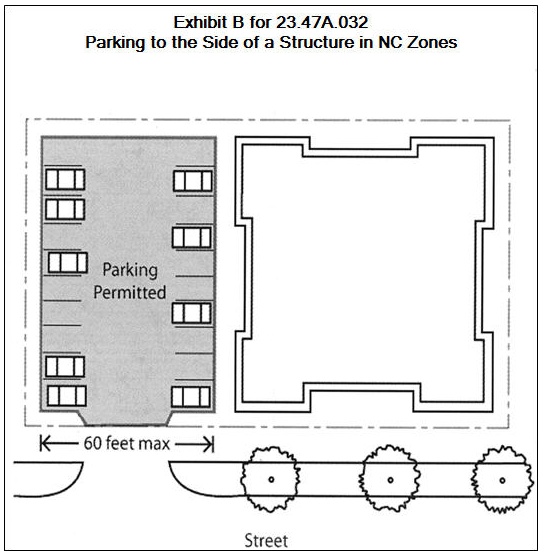

Exhibit B forParking to the Side of a Structure in NC Zones

1. In pedestrian designated zones, surface parking is prohibited abutting the street lot line along a principal pedestrian street.
2. Off-street parking may be located anywhere on a lot in C1 and C2 zones, except that structures with residential uses in C zones, structures in C zones with pedestrian designations, and structures in C zones across the street from residential zones shall meet the requirements for parking location for NC zones as provided in subsection 23.47A.032.B.1, except that if a lot in a C zone is bordered by streets on all sides, then parking may be provided between a street and a structure, but only on sides facing other commercially-zoned lots.
3. Required parking shall be located no farther than 800 feet from the lot with the use to which it is accessory, and shall comply with the provisions of Section 23.54.025, Off-site parking.

1. Access to parking

    1. NC zones. The following rules apply in NC zones, except as provided under subsections 23.47A.032.A.2 and 23.47A.032.D:

        1. Access to parking shall be from the alley if the lot abuts an alley improved to the standards of subsection 23.53.030.C, or if the Director determines that alley access is feasible and desirable to mitigate parking access impacts. If alley access is infeasible, the Director may allow street access.
        2. If access is not provided from an alley and the lot abuts only one street, access is permitted from the street, and limited to one two-way curb cut.
        3. If access is not provided from an alley and the lot abuts two or more streets, access is permitted across one of the side street lot lines pursuant to subsection 23.47A.032.C, and curb cuts are permitted pursuant to subsection 23.54.030.F.2.a.1.
        4. For each permitted curb cut, street-facing facades may contain one garage door, not to exceed the maximum width allowed for curb cuts.
    2. In addition to the provisions governing NC zones in subsection 23.47A.032.A.1, the following rules apply in pedestrian-designated zones, except as may be permitted under subsection 23.47A.032.D:

        1. If access is not provided from an alley and the lot abuts two or more streets, access to parking shall be from a street that is not a principal pedestrian street.
        2. If access is not provided from an alley and the lot abuts only a principal pedestrian street or streets, access is permitted from the principal pedestrian street, and limited to one two-way curb cut.
    3. In C1 and C2 zones, access to off-street parking may be from a street, alley, or both when the lot abuts an alley. However, structures in C zones with residential uses, structures in C zones with pedestrian designations, and structures in C zones across the street from residential zones shall meet the requirements for parking access for NC zones as provided in subsection 23.47A.032.A.1. If two or more structures are located on a single site, then a single curb cut shall be provided according to the standards in Sections 23.47A.032.A.1, 23.47A.032.A.2, and 23.54.030.F.2.
    4. In the event of conflict between the standards for curb cuts in this subsection 23.47A.032.A and the provisions of subsection 23.54.030.F, the standards in subsection 23.54.030.F shall control.
2. Location of parking

    1. The following rules apply in NC zones, except as provided in subsection 23.47A.032.D.

        1. Parking shall not be located between a structure and a street lot line (Exhibit A for 23.47A.032).
3. When a lot fronts on two or more streets, the Director will determine which of the streets will beconsidered the front lot line, for purposes of this section only. In making a determination, the Director will consider the following criteria:

    1. The extent to which each street's pedestrian-oriented character or commercial continuity would be disrupted by curb cuts, driveways or parking adjacent to the street;
    2. The potential for pedestrian and automobile conflicts; and
    3. The relative traffic capacity of each street as an indicator of the street's role as a principal commercial street.
4. Exceptions to parking location and access requirements.

    1. Access to off-street parking may be from a street if, due to the relationship of an alley to the street system, use of the alley for parking access would create a significant safety hazard as determined by the Director.
    2. If a lot borders an unopened right-of-way, the Director may apply the parking access and location requirements as if that street did not border the lot if, after consultation with the Director of Transportation, the Director determines that the street is unlikely to be opened or improved.
    3. On waterfront lots in the Shoreline District, parking may be located between the structure and the front lot line, if necessary to prevent blockage of view corridors or to keep parking away from the edge of the water as required by the Shoreline Master Program.
    4. For fire and police stations, the Director shall determine the appropriate access to parking based upon needs of emergency and other vehicles and the configuration of the site.
5. When an existing building is proposed to be expanded, the Director shall determine the location of parking and access with the goal of minimizing the impact of parking and access along the front lot line.
6. Access to a loading berth shall be from the alley if the lot abuts an alley improved to the standards of subsection 23.53.030.C, or if the Director determines that alley access is feasible and desirable to mitigate right-of-way impacts.
7. Parking shall be screened according to the provisions of Section 23.47A.016.
8. Surface Parking.

    1. Pedestrian access through surface parking areas. Where a pedestrian entrance to one or more general sales and service or major durables retail sales uses greater in the aggregate than 30,000 square feet is oriented to a parking lot, a 5-foot-wide pedestrian walkway through the parking lot to the pedestrian entrance shall be provided for each 50 spaces of parking provided.
    2. Surface parking separating the building from the street. Where a pedestrian entrance to one or more general sales and service or major durables retail sales uses greater in the aggregate than 30,000 square feet is oriented to a surface parking area separating a building from a street, at least one 5-foot-wide pedestrian walkway from the street to the pedestrian entrance shall be provided.

#### 23.47A.033 - Transportation concurrency level-of-service standards.

Proposed uses in NC zones or C zones shall meet the transportation concurrency level-of-service standards prescribed in Chapter 23.52.

#### 23.47A.035 - Assisted living facilities

1. In addition to the requirements in subsection 23.47A.035.B, assisted living facilities are subject to the development standards of the zone in which they are located, except that the amenity area requirements of Section 23.47A.024 do not apply.
2. Other requirements

    1. Minimum unit size. Assisted living units shall be designed to meet the minimum square footage required by WAC 388-110-140.
    2. Facility kitchen. An on-site kitchen that serves the entire assisted living facility is required.
    3. Communal area. Communal areas that are either interior or exterior spaces, such as solariums, decks and porches, recreation rooms, dining rooms, living rooms, foyers and lobbies, and gardens or other outdoor landscaped areas shall be provided as follows:

        1. The total amount of communal area shall equal at least 10 percent of the total floor area in assisted living units. In calculating the total floor area in assisted living units, all of the area of each unit, excluding bathrooms, is counted, including counters, closets and built-ins;
        2. Service areas, including, but not limited to, the facility kitchen, laundry, hallways and corridors, supply closets, operations and maintenance areas, staff areas and offices, and rooms used only for counseling or medical services, shall not be counted as required communal area;
        3. A minimum of 400 square feet of the required communal area shall be provided as an outdoor area, with no dimension less than 10 feet. Outdoor areas provided as required communal area shall be accessible to people with disabilities; and
        4. Adequate seating for residents and guests shall be provided in required communal areas.

#### 23.47A.036 - Transitional encampments accessory use

Transitional encampments accessory to religious facilities or to principal uses located on property owned or controlled by a religious organization are regulated by Section 23.42.054, Transitional Encampments Accessory to Religious Facilities.

#### 23.47A.037 - Keeping of animals.

The keeping of animals is regulated by Section 23.42.052, Keeping of Animals.

#### 23.47A.038 - Home occupations.

Home occupations are regulated by Section 23.42.050, Home Occupations.

#### 23.47A.039 - Provisions for pet daycare centers and boarding of animals by pet grooming centers

In addition to the development standards of the zone, pet daycare centers are subject to the following:

1. Operating business establishments that have been providing pet daycare services as of July 31, 2006, may continue notwithstanding nonconformities to applicable development standards, provided the provisions of this Section 23.47A.039 are met.
2. The pet daycare center shall be permitted by Public Health-Seattle & King County, as required by Section 10.72.020.
3. Facilities for the boarding of animals may occupy no more than 30 percent of the gross floor area of the pet daycare center. A pet grooming service may provide facilities for the boarding of animals subject to the regulations for pet daycare centers in this Section 23.47A.039.
4. Required loading pursuant to 23.54.015 may be provided in a public right of way if the applicant can demonstrate to the Director, in consultation with the Seattle transportation Department, that pedestrian circulation or vehicle traffic will not be significantly impacted.
5. Applicants must submit at the time of permit application, written operating procedures, such as those recommended by the American Boarding and Kennel Association (ABKA) or the American Kennel Club (AKC). Such procedures, which are to be followed for the life of the business, must address the identification and correction of animal behavior that impacts surrounding uses, including excessive barking.
6. Violations of this Section.

    1. Any violation in a pet daycare center of SMC 25.08.500, Public disturbance noises, shall be a violation of this title.
    2. When a notice of violation is issued for animal noise, the Director may require a report from an acoustical consultant to describe measures to be taken by the applicant to mitigate adverse noise impacts. The Director may require measures, including but not limited to: development or modification of operating procedures; cessation of the use of outdoor area(s); closure of windows and doors; reduction in hours of operation; use of sound attenuating construction or building materials such as insulation and noise baffles.
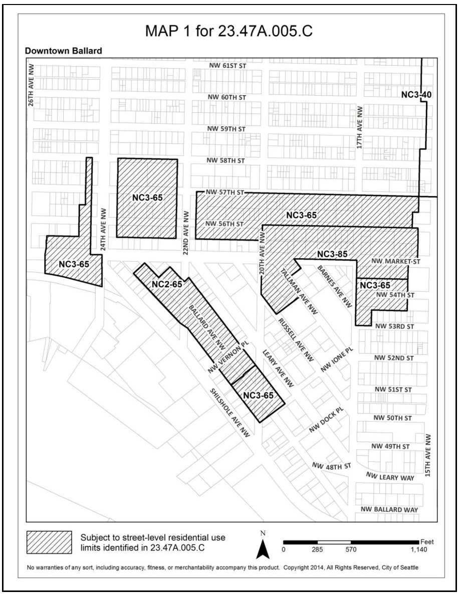

Map 1 for 23.47A.005.C: Downtown Ballard

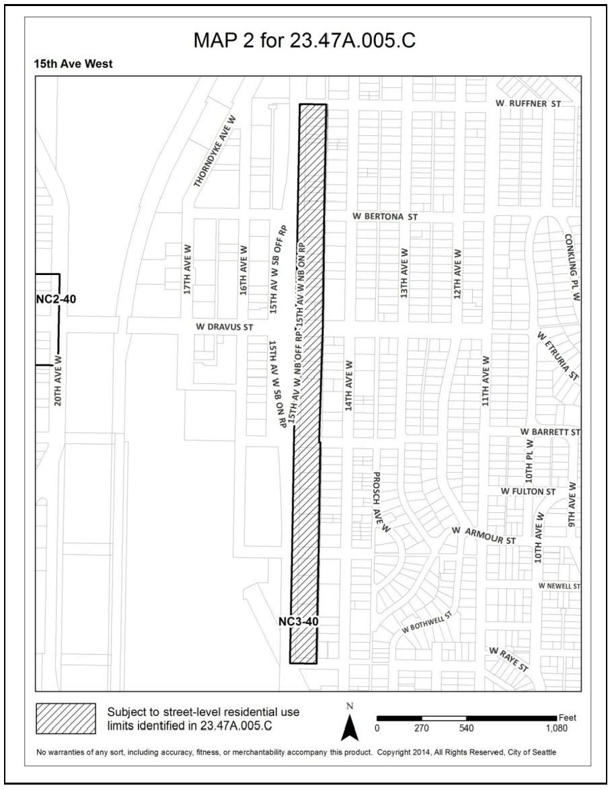

Map 2 for 23.47A.005.C: 15 Ave West

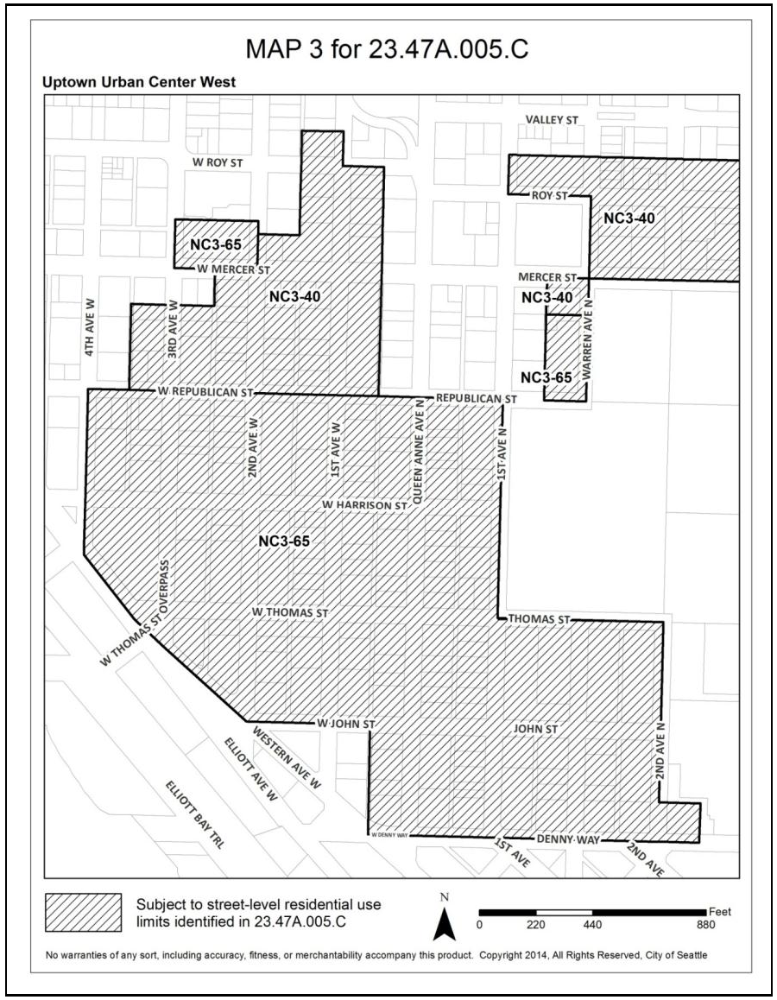

Map 3 for 23.47A.005.C: Uptown Urban Center West

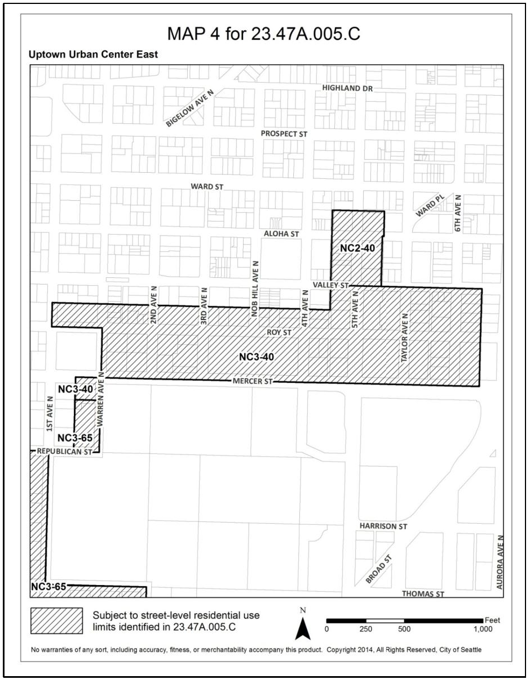

Map 4 for 23.47A.005.C: Uptown Urban Center East

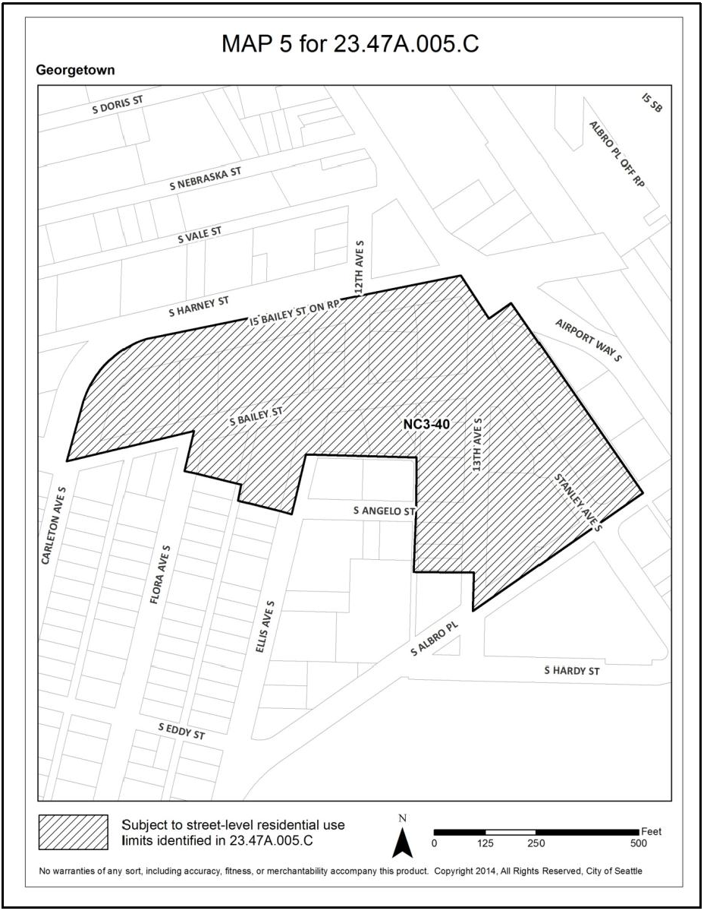

Map 5 for 23.47A.005.C: Georgetown

### Chapter 23.48 - SEATTLE MIXED

Sections:

#### Subchapter I - General Provisions
##### 23.48.002 - Scope of provisions

1. This Chapter 23.48 identifies uses that are or may be permitted in Seattle Mixed (SM) zones and establishes development standards. The SM zone boundaries are shown on the Official Land Use Map. As identified in Table A for 23.48.002, the SM-SLU designation with a height limit suffix may be applied to SM zoned land in the South Lake Union area. The SM-D designation with a height limit range may be applied to SM zoned land in the West Dravus area. The SM-NR designation with a height limit suffix may be applied to SM zoned land in the North Rainier area.
2. The provisions of Subchapter I for 23.48 apply in all SM zones and supplemental regulations for designated areas are provided in Chapter 23.48. To the extent provisions in a supplemental subchapter conflict with provisions in Subchapter I, the provisions of the supplemental subchapter apply.
3. Other regulations, such as requirements for major marijuana activity (Section 23.42.058); requirements for streets, alleys, and easements (Chapter 23.53); quantity and design standards for access, off-street parking, and solid waste storage (Chapter 23.54); signs (Chapter 23.55); and measurements (Chapter 23.86) may apply to development proposals. Communication utilities and accessory communication devices except as exempted in Section 23.57.002 are subject to the regulations in this Chapter 23.48 and additional regulations in Chapter 23.57.

##### 23.48.005 - Uses

1. Permitted uses

    1. All uses are permitted outright, either as principal or accessory uses, except those specifically prohibited by subsection 23.48.005.B and those permitted only as conditional uses by subsection 23.48.005.C.
    2. Adult cabarets shall comply with the requirements of subsection 23.47A.004.H.
    3. Major marijuana activity shall comply with the requirements of Section 23.42.058.
2. Prohibited uses. The following uses are prohibited as both principal and accessory uses, except as otherwise noted:

    1. All high-impact uses;
    2. All heavy manufacturing uses;
    3. General manufacturing uses, greater than 25,000 square feet of gross floor area for an individual business establishment, except for pharmaceutical production;
    4. Drive-in businesses, except gas stations;
    5. Jails;
    6. Adult motion picture theaters and adult panorams;
    7. Outdoor storage, except for outdoor storage associated with florists and horticulture uses;
    8. Principal use surface parking;
    9. Animal shelters and kennels;
    10. Animal husbandry;
    11. Park and pool lots;
    12. Park and ride lots;
    13. Work release centers;
    14. Recycling;
    15. Solid waste management; and
    16. Mobile home parks.
3. Conditional uses

    1. Conditional uses are subject to the procedures described in Chapter 23.76, Procedures for Master Use Permits and Council Land Use Decisions, and shall meet the provisions of both Section 23.42.042 and this subsection 23.48.005.C.
    2. Mini-warehouses and warehouses may be permitted by the Director as administrative conditional uses if:

        1. The street-level portion of a mini-warehouse or warehouse only fronts on an east/west oriented street, or an alley; and
        2. Vehicular entrances, including those for loading operations, will not disrupt traffic or transit routes; and
        3. The traffic generated will not disrupt the pedestrian character of an area by significantly increasing the potential for pedestrian-vehicle conflicts.
4. Required street-level uses

    1. One or more of the uses listed in this subsection 23.48.005.D are required at street level on all lots abutting streets designated as Class 1 Pedestrian Streets shown on Map A for 23.48.240, except as required in subsection 23.48.205.A. The following uses qualify as required street-level uses:

        1. General sales and service uses;
        2. Eating and drinking establishments;
        3. Entertainment uses;
        4. Public libraries;
        5. Public parks; and
        6. Arts facilities.
    2. Standards for required street-level uses. Required street-level uses shall meet the development standards in subsection 23.48.040.C.

##### 23.48.010 - Relocating Landmark structures

If an historic Landmark structure is relocated within an SM zone, the structure need not comply with development standards of the zone if the Director waives compliance with a development standard or standards in order to facilitate relocation and preservation of landmarks.

##### 23.48.020 - Floor area ratio (FAR)

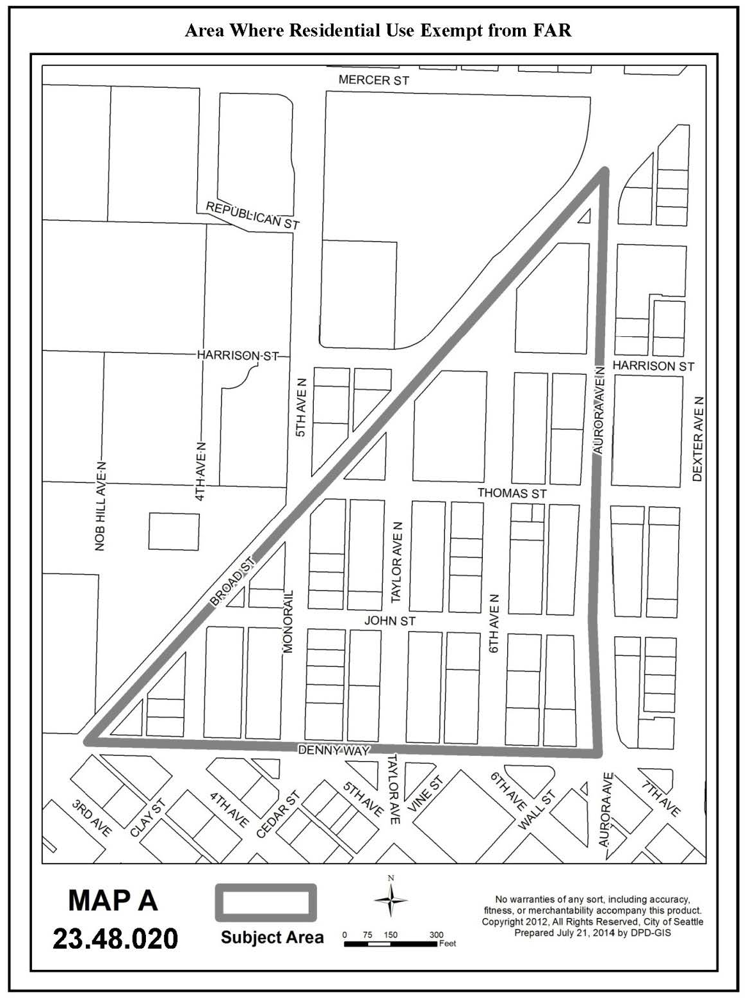

Map A forArea Where Residential Use Exempt from FAR

1. General provisions

    1. All gross floor area not exempt under subsection 23.48.020.D counts toward the maximum gross floor area allowed under the FAR limits.
    2. The applicable FAR limit applies to the total non-exempt gross floor area of all structures on the lot.
    3. If a lot is in more than one zone, the FAR limit for each zone applies to the portion of the lot located in that zone.
2. FAR limits in SM zones. FAR limits in SM zones, excluding SM zones within South Lake Union Urban Center, Dravus, and North Rainier Urban Village, are shown in Table A for 23.48.020.
3. All non-exempt non-residential floor area above the base FAR is considered extra floor area. Extra floor area may be obtained, up to the maximum FAR, only through the provision of public amenities meeting the standards of Section 23.48.021 and Chapter 23.58A.
4. Floor area exempt from FAR calculations

    1. The following floor area is exempt from maximum FAR calculations:

        1. All underground stories or portions of stories.
        2. Portions of a story that extend no more than 4 feet above existing or finished grade, whichever is lower, excluding access.
        3. As an allowance for mechanical equipment, in any structure 65 feet in height or more, 3.5 percent of the total chargeable gross floor area in a structure is exempt from FAR calculations. Calculation of the allowance includes the remaining gross floor area after all exempt space allowed in this subsection 23.48.020.D has been deducted. Mechanical equipment located on the roof of a structure, whether enclosed or not, is not included as part of the calculation of total gross floor area.
        4. All gross floor area for solar collectors and wind-driven power generators.
    2. In the SM 85 zone shown on Map A for 23.48.020, all gross floor area occupied by a residential use is exempt from FAR calculations.
    3. Additional floor area that is exempt from FAR calculations in specific SM designations is identified in the applicable subchapter of Chapter 23.48.
5. Minimum FAR

    1. A minimum FAR shown in Table B for 23.48.020 is required whenever more than 1,000 square feet of gross floor area is added to or removed from a lot located in a Station Area Overlay District and abutting a Class 1 or Class 2 Pedestrian Street.
    2. The minimum FAR requirement provided in subsection 23.48.020.E.1 does not apply if:

        1. additional floor area is added to an existing structure on a lot that is nonconforming with respect to the minimum FAR shown in Table B for 23.48.020;
        2. the lot is larger than five acres;
        3. all existing gross floor area is demolished to create a vacant lot; or
        4. parks and open space is the principal use of the lot.
    3. Portions of the lot designated as a steep slope, wetland, or riparian corridor or as a buffer to one of these areas, as defined in Chapter 25.09, are not included when calculating lot size for the purpose of determining the minimum FAR requirement provided in subsection 23.48.020.E.1.
    4. The Director, in consultation with the Director of the Department of Neighborhoods, may waive the minimum FAR requirement in subsection 23.48.020.E.1 for lots that contain a designated Landmark, or for lots within a Landmark District pursuant to Title 25 or within a Special Review District pursuant to Chapter 23.66, if the Director determines a waiver is necessary to preserve the integrity of a Landmark or meet adopted District design and development guidelines.
    5. The following gross floor area is not counted toward the minimum FAR requirement provided in subsection 23.48.020.E.1:

        1. Gross floor area below grade, including all underground stories or portions of stories; and
        2. Gross floor area containing parking.

##### 23.48.021 - Extra floor area

P = [(LSM-CE)/LSM] × CV × 0.0075, where:

P is the penalty;

LSM is the minimum number of credits to earn the required LEED rating;

CE is the number of credits earned as documented by the report; and

CV is the Construction Value as set forth on the building permit for the new structure.

Example:

<table>
<tr>
<td>Construction Value</td>
<td>$200,000,000.00</td>
</tr>
<tr>
<td>Minimum LEED Credits for rating</td>
<td>33</td>
</tr>
<tr>
<td>Credits Earned</td>
<td>32</td>
</tr>
<tr>
<td>Penalty = [(33-32)/33] × 200,000,000 × 0.0075 =</td>
<td>$45,454.55</td>
</tr>
</table>

1. Failure to comply with the applicant's commitment to earn a LEED rating is a violation of the Land Use Code independent of the failure to demonstrate compliance; however, such violation shall not affect the right to occupy any chargeable floor area, and if a penalty is paid in the amount determined under subsection 23.48.021.D.2.c.3, no additional penalty shall be imposed for the failure to comply with the commitment.
2. If the Director determines that the report submitted provides satisfactory evidence that the applicant's commitment is satisfied, the Director shall issue a certificate to the applicant so stating. If the Director determines that the applicant did not demonstrate compliance with its commitment to earn a LEED rating in accordance with this subsection 23.48.021.D, the Director may give notice of such determination, and of the calculation of the penalty due, to the applicant.
3. If, within 90 days, or such longer period as the Director may allow for good cause, after initial notice from the Director of a penalty due under this subsection 23.48.021.D.2, the applicant shall demonstrate, through a supplemental report from the independent entity that provided the initial report, that it has made sufficient alterations or improvements to earn a LEED rating, or to earn more credits toward such a rating, then the penalty owing shall be eliminated or recalculated accordingly. The amount of the penalty as so re-determined shall be final. If the applicant does not submit a supplemental report in accordance with this subsection 23.48.021.D.2 by the date required under this subsection 23.48.021.D.2, then the amount of the penalty as set forth in the Director's original notice shall be final.
4. Any owner, other than the applicant, of any lot on which the bonus development was obtained or any part thereof, shall be jointly and severally responsible for compliance and liable for any penalty due under this subsection 23.48.021.D.2.
5. Use of penalties. A subfund shall be established in the City's General Fund to receive revenue from penalties under subsection 23.48.021.D.2. Revenue from penalties under that subsection 23.48.021.D.2 shall be allocated to activities or incentives to encourage and promote the development of sustainable buildings. The Director shall recommend to the Mayor and City Council how these funds should be allocated.
6. Transportation Management Program (TMP). The applicant will provide a TMP for non-residential development, consistent with requirements for TMPs in any applicable Director's Rule, that demonstrates to the satisfaction of the Director in consultation with the Director of Transportation, that no more than 40 percent of trips to and from the development will be made using single-occupant vehicles (SOVs). The TMP shall be submitted with the Master Use Permit application.

    1. For purposes of measuring the percent of trips to and from the development made using SOVs in the TMP, the number of SOV trips shall be calculated for the p.m. peak hour in which an applicant expects the largest number of vehicle trips to be made by employees at the site (the p.m. peak hour of the generator).
    2. Compliance with this subsection 23.48.021.D.3 does not affect the responsibility of any employer to comply with Seattle's Commute Trip Reduction (CTR) Ordinance.

1. General

    1. Except pursuant to Sections 23.48.221 and Section 23.48.421, development containing extra floor area obtained under Section 23.48.020 or Section 23.48.025 shall provide public amenities according to the standards of this Section 23.48.021 and Chapter 23.58A. If the development is not located within an adopted Local Infrastructure Project Area as per Map A for 23.58A.044, extra floor area shall be achieved through the requirements of subsection 23.48.021.B. If the development is located within an adopted Local Infrastructure Project Area, extra floor area shall be achieved through the requirements of subsection 23.48.021.C.
    2. Definitions in Section 23.58A.004 apply in this Section 23.48.021 unless otherwise specified.
2. Calculation outside of an adopted Local Infrastructure Project Area

    1. Means to achieve extra residential floor area. If the maximum height limit for residential use is 85 feet or lower or the lot is located outside of the South Lake Union Urban Center and the Mount Baker Station Area Overlay District, the applicant shall use bonus residential floor area for affordable housing pursuant to Section 23.58A.014 to achieve all extra residential floor area on the lot.
    2. Means to achieve extra non-residential floor area. If the maximum height limit for non-residential use is 85 feet or lower or the lot is located outside of the South Lake Union Urban Center and the Mount Baker Station Area Overlay District, the applicant shall use bonus non-residential floor area for affordable housing and child care pursuant to Section 23.58A.024 to achieve all extra non-residential floor area on the lot.
3. Calculation within an adopted Local Infrastructure Project Area

    1. Means to achieve extra residential floor area. If the maximum height limit for residential use is 85 feet or lower, the applicant shall use bonus residential floor area for affordable housing pursuant to Section 23.58A.014 to achieve all extra residential floor area on the lot. If the maximum height limit for residential use is greater than 85 feet, the applicant shall:

        1. achieve 60 percent of the extra residential floor area on the lot by using bonus residential floor area for affordable housing pursuant to Section 23.58A.014; and
        2. achieve 40 percent of extra residential floor area by acquiring regional development credits pursuant to Section 23.58A.044, except that a development that is located in the area bounded by Thomas Street to the north, Denny Way to the south, Terry Avenue N to the west and Boren Avenue N to the east, on a lot that has slopes of ten percent or more, may achieve 20 percent of extra residential floor area by acquiring regional development credits pursuant to Section 23.58A.044 and 20 percent of extra residential floor area by providing public amenities consisting of a mid-block corridor, a hillclimb assist and a public viewpoint that meet the following standards:

            1. The mid-block corridor, hillclimb assist and public viewpoint may be used to achieve extra residential floor area according to a ratio of 20 square feet of extra residential floor area per 1 square foot of qualifying mid-block corridor, hillclimb assist and public viewpoint area.
            2. The amenities shall meet the general eligibility conditions for amenity features in the Downtown Amenity Standards and the standards in subsections 23.58A.040.C.4.g, 23.58A.040.C.4.h, and 23.58A.040.C.4.i; provided that the mid-block corridor, hillclimb assist and public viewpoint shall be considered open space amenity features for purposes of the general eligibility conditions for amenity features in the Downtown Amenity Standards.
            3. The mid-block corridor shall:

                1. be consistent with the size and coverage requirements, and the landscaping and lighting guidelines, for mid-block corridors in the Downtown Amenity Standards;
                2. provide a continuous direct route connecting Terry Avenue N and Boren Avenue N; and
                3. incorporate a mechanical conveyance, such as an elevator, for conveying pedestrians up the vertical distance between the elevations of Terry Avenue N and Boren Avenue N.
            4. The hillclimb assist shall:

                1. be consistent with the eligibility conditions for hillclimb assists in the Downtown Amenity Standards, except that an elevator may qualify as the required mechanical conveyance.
                2. be consistent with the guideline requirements for hillclimb assists in the Downtown Amenity Standards except that at least 65 percent of the travel path must be open to the sky; and any covered portions of the corridor must have a minimum height of 13 feet between the ground and any overhead projection or overhanging structure.
            5. The viewpoint shall provide public views of significant natural and human-made features, and shall meet the requirements for an additional open space area abutting the mid-block corridor specified in the Downtown Amenity Standards.
            6. Only one lot may achieve 20 percent of extra residential floor area by providing public amenities consisting of a mid-block corridor and a public view point pursuant to this subsection 23.48.021.C.1.b.
    2. Means to achieve extra non-residential floor area. If the maximum height limit for non-residential use is 85 feet or lower, the applicant shall use bonus non-residential floor area for affordable housing and child care pursuant to Section 23.58A.024 to achieve all extra non-residential floor area on the lot. If the maximum height limit for non-residential use is greater than 85 feet, the applicant shall:

        1. achieve 75 percent of the extra non-residential floor area on the lot by using bonus non-residential floor area for affordable housing and child care pursuant to Section 23.58A.024, or housing transferable development rights (TDR) pursuant to subsection 23.48.221.A and Section 23.58A.042, or both; and
        2. achieve 25 percent of extra non-residential floor area by acquiring regional development credits pursuant to Section 23.58A.044.
4. Minimum requirement. Development containing any extra floor area shall meet the following requirements:

    1. Leadership in Energy and Environmental Design (LEED) requirement. Except as described in subsection 23.48.221.C.1.b, the applicant will earn a LEED Silver rating or meet a substantially equivalent standard, and shall demonstrate compliance with that commitment, in accordance with the provisions of subsection 23.48.021.D.2.
    2. Demonstration of LEED rating

        1. Applicability. This subsection 23.48.021.D.2 applies if a commitment to earn a LEED rating or substantially equivalent standard is a condition of a permit. Applicants for all new development, except additions and alterations, gaining extra residential floor area pursuant to Section 23.48.021, or seeking to qualify for the higher FAR limit in the applicable Table A for 23.48.020 or Table A for 23.48.220, shall make a commitment that the structure will meet LEED rating, except that an applicant who is applying for funding from the Washington State Housing Trust Fund and/or the Seattle Office of Housing to develop new affordable housing, as defined in Section 23.58A.180 may elect to meet green building performance standards by meeting the Washington Evergreen Sustainable Development Standards (ESDS).
        2. The Director is authorized to determine, as a Type I decision, whether the applicant has demonstrated that a new structure has earned a LEED rating or met a substantially equivalent standard. The Director may establish by rule procedures for determining whether an applicant has demonstrated that a new structure has earned a LEED rating or met any such substantially equivalent standard, provided that no rule shall assign authority for making a final determination to any person other than an officer of the Department of Planning and Development or another City agency with regulatory authority and expertise in green building practices.
        3. Demonstration of compliance; penalties

            1. The applicant shall demonstrate to the Director the extent to which the applicant has complied with the commitment to earn a LEED rating no later than 180 days after issuance of final Certificate of Occupancy for the new structure, or such later date as may be allowed by the Director for good cause, by submitting a report analyzing the extent credits were earned toward such rating from the U.S. Green Building Council or another independent entity approved by the Director. Performance is demonstrated through an independent report from a third party, pursuant to subsection 23.90.018.D. For purposes of this subsection 23.48.021.D.2, if the Director shall have approved a commitment to achieve a substantially equivalent standard, the term "LEED rating" shall mean such other standard.
            2. Failure to submit a timely report regarding a LEED rating from an approved independent entity by the date required is a violation of the Land Use Code. The penalty for such violation is $500 per day from the date that the report was due to the date it is submitted, without any requirement of notice to the applicant.
            3. Failure to demonstrate, through an independent report as provided in this subsection 23.48.021.D.2, full compliance with the applicant's commitment to earn a LEED rating, is a violation of the Land Use Code. The penalty for each violation is an amount determined as follows:

##### 23.48.025 - Structure height

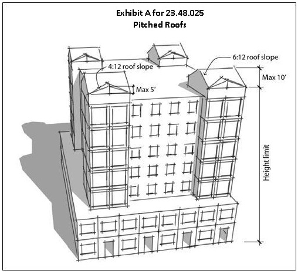

Exhibit A forPitched Roofs

1. Base and maximum height limits

    1. The height limits for structures in the SM zones are 40 feet, 55 feet, 65 feet, 75 feet, 85 feet, 125 feet, 160 feet, 240 feet, or 400 feet as shown on the Official Land Use Map, Chapter 23.32, except as otherwise provided in this Section 23.48.025. In certain zones, as specified in this Section 23.48.025, the maximum structure height is allowed only for particular uses or only under specified conditions, or both. Where height limits are established for portions of a structure that contain specified types of uses, the applicable height limit for the structure is the highest applicable height limit for the types of uses in the structure, unless otherwise specified.
    2. In the SM-SLU, SM-D, and SM-NR zones the applicable height limit for portions of a structure that contain nonresidential and live-work uses is shown as the first figure after the zone designation, and the base height limit for portions of a structure in residential use is shown as the first figure following the "/". The third figure shown is the maximum residential height limit. Within zones that have an incentive zoning suffix, the number in the suffix is the base FAR.
2. Pitched roofs. In SM zones with a height limit of 85 feet or less, the ridge of a pitched roof with a minimum slope of 6 to 12 may extend 10 feet above the height limit. The ridge of a pitched roof with a minimum slope of 4 to 12 may extend 5 feet above the height limit (Exhibit A for 23.48.025). No portion of a shed roof shall be permitted to extend beyond the height limit under this provision, 23.48.025.
3. Rooftop features

    1. Smokestacks, chimneys, flagpoles, and religious symbols for religious institutions are exempt from height controls, except as regulated in Chapter 23.64, Airport Height Overlay District, provided they are a minimum of 10 feet from any side or rear lot line.
    2. Open railings, planters, skylights, clerestories, greenhouses, parapets, and firewalls may extend up to 4 feet above the maximum height limit with unlimited rooftop coverage. Insulation material or soil for landscaping located above the structural roof surface may exceed the maximum height limit if enclosed by parapets or walls that comply with this subsection 23.48.025.C.2.
    3. Solar collectors may extend up to 7 feet above the maximum height limit, with unlimited rooftop coverage.
    4. The following rooftop features may extend up to 15 feet above the maximum height limit, so long as the combined total coverage of all features listed in this subsection 23.48.025.C.4, including weather protection such as eaves or canopies extending from rooftop features, does not exceed 20 percent of the roof area, or 25 percent of the roof area if the total includes stair or elevator penthouses or screened mechanical equipment:

        1. Solar collectors;
        2. Stair penthouses;
        3. Mechanical equipment;
        4. Atriums, greenhouses, and solariums;
        5. Play equipment and open-mesh fencing that encloses it, as long as the fencing is at least 15 feet from the roof edge;
        6. Minor communication utilities and accessory communication devices, except that height is regulated according to the provisions of Section 23.57.012; and
        7. Covered or enclosed common amenity area for structures exceeding a height of 125 feet.
    5. For structures greater than 85 feet in height, elevator penthouses up to 25 feet above the height limit are permitted. If the elevator provides access to a rooftop designed to provide usable open space or common recreation area, elevator penthouses up to 45 feet above the height limit are permitted.
    6. Greenhouses that are dedicated to food production are permitted to extend 15 feet above the applicable height limit, as long as the combined total coverage of all features gaining additional height listed in this subsection 23.48.025.C does not exceed 50 percent of the roof area.
    7. At the applicant's option, the combined total coverage of all features listed in subsections 23.48.025.C.4 and 23.48.025.C.5 may be increased to 65 percent of the roof area, provided that all of the following are satisfied:

        1. All mechanical equipment is screened; and
        2. No rooftop features are located closer than 10 feet to the roof edge.
    8. In order to protect solar access for property to the north, the applicant shall either locate the rooftop features listed in this subsection 23.48.025.C.8 at least 10 feet from the north edge of the roof, or provide shadow diagrams to demonstrate that the proposed location of such rooftop features would shade property to the north on January 21st at noon no more than would a structure built to maximum permitted bulk:

        1. Solar collectors;
        2. Planters;
        3. Clerestories;
        4. Atriums, greenhouses, and solariums;
        5. Minor communication utilities and accessory communication devices according to the provisions of Section 23.57.012;
        6. Nonfirewall parapets; and
        7. Play equipment.
    9. Screening. Rooftop mechanical equipment and elevator penthouses shall be screened with fencing, wall enclosures, or other structures.
    10. For height limits and exceptions for communication utilities and accessory communication devices, see Section 23.57.012.

##### 23.48.040 - Street-level development standards

The following street-level development standards apply to Class 1 or Class 2 Pedestrian streets shown on Map A for 23.48.240 and Map A for 23.48.440.

1. General facade requirements. General facade requirements apply to Class 1 and Class 2 Pedestrian streets as shown on Map A for 23.48.240 and Map A for 23.48.440.

    1. Primary pedestrian entrance. Each new structure facing a street is required to provide a primary building entrance for pedestrians from the street or a street-oriented courtyard that is no more than 3 feet above or below the sidewalk grade.
    2. Minimum facade height. A minimum facade height is required for the street-facing facades of new structures, unless all portions of the structure are lower than the required minimum facade height listed below.

        1. On Class 1 Pedestrian Streets the minimum height for street-facing facades is 45 feet.
        2. On Class 2 Pedestrian Streets and Neighborhood Green Streets the minimum height for street-facing facades is 25 feet.
        3. On all other streets, the minimum height for street-facing facades is 15 feet.
2. Transparency and blank facade requirements. The provisions of this subsection 23.48.040.B apply to the area of a street-facing facade between 2 feet and 8 feet above a sidewalk (Exhibit A for 23.48.040) pursuant to subsection 23.48.040.B.1.
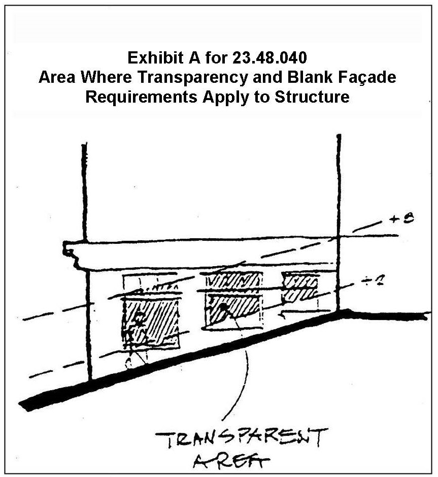

Exhibit A forArea Where Transparency and Blank FacadeRequirements Apply to Structures

1. Transparency requirements apply to all street-facing, street-level facades, except for portions of structures in residential use, as follows:

    1. For Class 1 and Class 2 Pedestrian Streets and Neighborhood Green Streets, shown on Map A for 23.48.240 and Map A for 23.48.440, a minimum of 60 percent of the street-facing facade must be transparent.
    2. For all other streets, a minimum of 30 percent of the street-facing facade must be transparent.
    3. If the slope of the street frontage of the facade exceeds 7.5 percent, the required amount of transparency shall be reduced to 45 percent of the street-facing facade on Class 1 and Class 2 Pedestrian Streets and Neighborhood Green Streets and 22 percent of the street-facing facade on all other streets.
    4. Only clear or lightly tinted glass in windows, doors, and display windows are considered transparent. Transparent areas shall be designed and maintained to provide views into and out of the structure. Except for institutional uses, no permanent signage, window tinting or treatments, shelving, other furnishings, fixtures, equipment, or stored items shall completely block views into and out of the structure between 4 feet and 7 feet above adjacent grade. The installation of temporary signs or displays that completely block views may be allowed if such temporary sign complies with subsection 23.55.012.B.
2. Blank facade limits. Any portion of the facade that is not transparent is considered to be a blank facade.

    1. Blank facade limits for Class 1 and Class 2 Pedestrian Streets and Neighborhood Green Streets.

        1. Blank facades shall be limited to segments 15 feet wide, except for garage doors, which may be wider than 15 feet. Blank facade width may be increased to 30 feet if the Director determines that the facade is enhanced by architectural detailing, artwork, landscaping, or other similar features that have visual interest. The width of garage doors shall be limited to the width of the driveway plus 5 feet.
        2. Any blank segments of the facade shall be separated by transparent areas at least 2 feet wide.
        3. The total of all blank facade segments, including garage doors, shall not exceed 40 percent of the street facade of the structure on each street frontage; or 55 percent if the slope of the street frontage of the facade exceeds 7.5 percent.
    2. Blank facade limits for all other streets not specified in subsection 23.48.240.B.2.a or Section 23.48.440.

        1. Blank facades are limited to segments 30 feet wide, except for garage doors which may be wider than 30 feet. Blank facade width may be increased to 60 feet if the Director determines that the facade is enhanced by architectural detailing, artwork, landscaping, or other similar features that have visual interest. The width of garage doors shall be limited to the width of the driveway plus 5 feet.
        2. Any blank segments of the facade shall be separated by transparent areas at least 2 feet wide.
        3. The total of all blank facade segments, including garage doors, shall not exceed 70 percent of the street facade of the structure on each street frontage; or 78 percent if the slope of the street frontage of the facade exceeds 7.5 percent.
    3. Blank facade limits do not apply to portions of structures in residential use.
3. Development standards for required street-level uses. Street-level uses required by subsection 23.48.005.D, and street-level uses exempt from FAR calculations under the provisions of subsection 23.48.220.B.2, whether required or not, shall meet the following development standards:

    1. A minimum of 75 percent of each street frontage shall be occupied by uses listed in subsection 23.48.005.D at street level on all lots abutting streets designated as Class 1 Pedestrian Streets shown on Map A for 23.48.240 and Map A for 23.48.440.
    2. The space occupied by street-level uses shall have a minimum floor-to-floor height of 13 feet and extend at least 30 feet in depth at street level from the street-front facade.
    3. Street-level uses shall be located within 10 feet of the street lot line, except that if outdoor amenity area required in subsection 23.48.045.B, or other required open space, abuts the applicable street lot line and separates the street-facing facade from the street, the required street-level use may abut the amenity area or open space.
    4. Pedestrian access to street-level uses shall be provided directly from the street, permitted outdoor common amenity area, or abutting required open space. Pedestrian entrances shall be located no more than 3 feet above or below sidewalk grade or at the same elevation as the abutting permitted outdoor common amenity area or required open space.

##### 23.48.045 - Amenity area for residential uses

1. Amenity area is required for all development with more than 20 new dwelling units.
2. Quantity of amenity area. An area equivalent to 5 percent of the total gross floor area in residential use shall be provided as amenity area, except that, in no instance shall the amount of required amenity area exceed the area of the lot.
3. Standards for amenity area. Required amenity area shall meet the following standards:

    1. All residents of the project shall have access to the required amenity area, which may be provided at or above ground level.
    2. A maximum of 50 percent of the required amenity area may be enclosed.
    3. The minimum horizontal dimension for required amenity areas is 15 feet, except that the minimum horizontal dimension is 10 feet for amenity areas provided as landscaped open space accessible from the street at street level. The minimum size of a required amenity area is 225 square feet.
    4. Amenity area that is provided as landscaped, street-level open space that is accessible from the street shall be counted as twice the actual area in determining the amount provided to meet amenity area requirement.
    5. In mixed-use projects, any public open space provided for non-residential development that meets the standards of this Section 23.48.045 satisfies the residential amenity area requirement.
    6. Parking areas, driveways, and pedestrian access, except for pedestrian access meeting the Washington State Rules and Regulations for Barrier Free Design, shall not be counted as amenity area except that a woonerf may provide a maximum of 50 percent of the amenity area if the design of the woonerf is approved through a design review process pursuant to Chapter 23.41.
    7. For a development that maintains a designated Seattle Landmark on the lot, the Director may, as Type I decision, waive or modify the amenity area requirement if it is determined that maintaining the Landmark structure significantly limits the ability to accommodate the required amenity area on the site.
    8. For lots abutting a designated Neighborhood Green Street, up to 50 percent of the amenity area requirement may be met by contributing to the development of the abutting Neighborhood Green Street. The Director may waive the requirement that the Neighborhood Green Street abut the lot and allow the improvement to be made to a Neighborhood Green Street located in the general vicinity of the project if the Director determines that the Neighborhood Green Street will benefit residents of the project.

##### 23.48.055 - Screening and landscaping standards

1. Landscaping requirements

    1. All landscaping provided to meet the requirements of this Section 23.48.055 shall comply with the Director's rules adopted to foster the long-term health, viability, and coverage of plantings. The Director's rules shall address, at a minimum, the type and size of plants, spacing of plants, use of drought-tolerant plants, and access to light and air for plants.
    2. Landscaping that achieves a Green Factor score of .30 or greater, pursuant to Section 23.86.019, is required for any lot with:

        1. Development containing more than four new dwelling units; or
        2. Development, either a new structure or an addition to an existing structure, containing more than 4,000 square feet of non-residential uses; or
        3. Any parking lot containing more than 20 new parking spaces for automobiles.
2. Where screening or landscaping is required for specific uses in subsection 23.48.055.C, or when landscaping is required in setbacks as specified by development standards, the following types of screening and landscaping shall be provided:

    1. Three foot high screening on street lot lines. The required screening may be provided as either:

        1. A fence or wall at least 3 feet in height; or
        2. A hedge or landscaped berm at least 3 feet in height.
    2. Landscaping for setback areas and berms. Each setback area or berm required shall be planted with trees, shrubs, and grass or evergreen groundcover. Features such as pedestrian access meeting the Washington State Rules and Regulations for Barrier-Free Design, decorative pavers, sculptures, or fountains may cover a maximum of 30 percent of each required landscaped area or berm. Landscaping shall be provided according to standards promulgated by the Director. Landscaping designed to provide treatment for storm water runoff qualifies as required landscaping.
3. Screening for specific uses

    1. Gas stations shall provide 3 foot high screening along lot lines abutting all streets, except within required sight triangles.
    2. Surface parking areas

        1. Surface parking areas abutting streets. Surface parking areas shall provide 3 foot high screening along the lot lines abutting all streets, except within required sight triangles.
        2. Surface parking areas abutting alleys. Surface parking areas shall provide 3 foot high screening along the lot lines abutting an alley. The Director may reduce or waive the screening requirement for part or all of the lot line abutting the alley when required parking is provided at the rear lot line and the alley is necessary to provide aisle space.
    3. Parking in structures. Except as provided for by subsection 23.48.085.B, parking located at or above street level in a garage shall be screened according to the following requirements.

        1. On Class 1 and Class 2 Pedestrian Streets, shown on Map A for 23.48.240 and Map A for 23.48.440, parking is not permitted at street level unless separated from the street by other uses, provided that garage doors need not be separated. The facade of the separating uses shall be subject to the transparency and blank facade standards in Section 23.48.040.
        2. On all other streets, parking is permitted at street level when at least 30 percent of the street frontage of the parking area, excluding that portion of the frontage occupied by garage doors, is separated from the street by other uses. The facade of the separating uses shall be subject to the transparency and blank facade standards in Section 23.48.040. The remaining parking shall be screened from view at street level and the street facade shall be enhanced by architectural detailing, artwork, landscaping, or similar visual interest features.
        3. The perimeter of each floor of parking above street level shall have an opaque screen at least 3.5 feet high, except in the SM-SLU zone, where specific requirements for the location and screening of parking located on stories above the street level apply.
    4. Fences or free-standing walls associated with utility services uses may obstruct or allow views to the interior of a site. Where site dimensions and site conditions allow, applicants are encouraged to provide both a landscaped setback between the fence or wall and the right-of-way, and a fence or wall that provides visual interest facing the street lot line, through the height, design or construction of the fence or wall, including the use of materials, architectural detailing, artwork, vegetated trellises, decorative fencing, or similar features. Any fence or free-standing wall for a utility service use shall provide either:

        1. A landscaped area a minimum of 5 feet in depth between the wall or fence and the street lot line; or
        2. Architectural detailing, artwork, vegetated trellises, decorative fencing, or similar features to provide visual interest facing the street lot line, as approved by the Director.
4. Street trees requirements

    1. Street trees shall be provided in all planting strips. Existing street trees may count toward meeting the street tree requirement.
    2. Exceptions to street tree requirements

        1. Street trees are not required when a change of use is the only permit requested.
        2. Street trees are not required for temporary use permits.
        3. Street trees are not required if an existing structure is expanded by less than 1,000 square feet. Generally, two street trees shall be required for each additional 1,000 square feet of expansion. Rounding of fractions pursuant to subsection 23.86.002.B is not permitted. The number of street trees shall be controlled by the Seattle Department of Transportation standard.
    3. If it is not feasible to plant street trees according to City standards, either a landscaped setback a minimum of 5 feet deep is required along the street lot line, or landscaping other than trees may be located in the planting strip according to Department of Transportation standards. The street trees shall be planted in the landscaped area at least 2 feet from the street lot line if they cannot be placed in the planting strip.

##### 23.48.065 - Noise and odor standards

1. All permitted uses and activities are subject to the noise standards of Section 23.47A.018.
2. All permitted uses and activities are subject to the odor standards of Section 23.47A.020.

##### 23.48.075 - Light and glare standards

All permitted uses are subject to the light and glare standards of Section 23.47A.022.

##### 23.48.080 - Required parking and loading

1. Off-street parking spaces and bicycle parking are required according to Section 23.54.015, Required parking.
2. Loading berths shall be provided pursuant to Section 23.54.035, Loading berth requirements and space standards.
3. Where access to a loading berth is from an alley, and truck loading is parallel to the alley, a setback of 12 feet is required for the loading berth, measured from the centerline of the alley, as shown in Exhibit D for 23.47A.014. This setback shall be maintained up to a height of 16 feet.

##### 23.48.085 - Parking and loading location, access and curb cuts

1. Parking accessory to non-residential uses may be provided on-site and/or within 800 feet of the lot to which it is accessory, according to the provisions of Section 23.54.025, Off-site parking.
2. Parking at street level within structures

    1. Except as permitted under subsections 23.48.085.B.2 and 23.48.085.B.3, parking is not permitted at street level unless separated from the street by other uses, provided that garage doors need not be separated.
    2. Due to physical site conditions such as topographic or geologic conditions, parking is permitted in stories that are partially below street level and partially above street level without being separated from the street by other uses, if:

        1. The street front portion of the parking that is at or above street level does not abut a Class 1 Pedestrian Street requiring street-level uses; and
        2. The street front portion of the parking that is at or above street level, excluding garage and loading doors and permitted access to parking, is screened from view at the street level; and
        3. The street-facing facade is enhanced by architectural detailing, artwork, landscaping, stoops, and porches providing access to residential uses, or similar visual interest features.
    3. Parking is permitted in a story that is partially above street-level and partially below street-level in a structure permitted in a setback area under the provisions of subsection 23.48.240.C.2.b.
3. Accessory surface parking is permitted under the following conditions, except as provided by Section 23.48.285:

    1. All accessory surface parking shall be located at the rear or to the side of the principal structure.
    2. The amount of lot area allocated to accessory surface parking shall be limited to 30 percent of the total lot area. For parking that is accessory to a use on another site, this requirement is applied to the lot on which the parking is located.
4. Parking and loading access. If a lot abuts more than one right-of-way, the location of access for parking and loading shall be determined by the Director, depending on the classification of rights-of-way according to the following:

    1. Access to parking and loading shall be from the alley when the lot abuts an alley improved to the standards of subsection 23.53.030.C and use of the alley for parking and loading access would not create a significant safety hazard as determined by the Director.
    2. If the lot does not abut an improved alley, or use of the alley for parking and loading access would create a significant safety hazard as determined by the Director, parking and loading access may be permitted from the street. If the lot abuts more than one street, the location of access is determined by the Director, as a Type I decision, after consulting with the Director of Transportation. Unless the Director otherwise determines under subsection 23.48.085.D.3, access is allowed only from a right-of-way in the category, determined by the classifications shown on either Map A for 23.48.240 or Map A for 23.48.440 that is most preferred among the categories of rights-of-way abutting the lot, according to the ranking set forth below, from most to least preferred (a portion of a street that is included in more than one category is considered as belonging only to the least preferred of the categories in which it is included).

        1. An undesignated street;
        2. Class 1 Pedestrian Street;
        3. Class 2 Pedestrian Street;
        4. Designated Neighborhood Green Street.
    3. The Director may allow or require access from a right-of-way other than one indicated by subsection 23.48.085.D.1 or subsection 23.48.085.D.2 if, after consulting with the Director of Transportation on whether and to what extent alternative locations of access would enhance pedestrian safety and comfort, facilitate transit operations, facilitate the movement of vehicles, minimize the on-street queuing of vehicles, enhance vehicular safety, or minimize hazards, the Director finds that an exception to the access requirement is warranted. Curb cut controls on designated Neighborhood Green Streets shall be evaluated on a case-by-case basis, but generally access from Neighborhood Green Streets is not allowed if access from any other right-of-way is possible.
5. Curb cut width and number

    1. Permitted access shall be limited to one two-way curb cut. In the event the site is too small to permit one two-way curb cut, two one-way curb cuts shall be permitted.
    2. Curb cut width and number of curb cuts shall satisfy the provisions of Section 23.54.030, except as modified in this Section 23.48.085.

##### 23.48.090 - Assisted living facilities

1. In addition to the requirements of subsection 23.48.090.B, assisted living facilities are subject to the development standards of the zone where they are located, except that density limits and amenity area requirements do not apply to assisted living facilities.
2. Other requirements

    1. Minimum unit size. Assisted living units shall be designed to meet the minimum square footage required by WAC 388-110-140.
    2. Facility kitchen. An on-site kitchen that serves the entire assisted living facility is required.
    3. Communal area. Communal areas that are either interior or exterior spaces, such as solariums, decks and porches, recreation rooms, dining rooms, living rooms, foyers and lobbies, and gardens or other outdoor landscaped areas shall be provided as follows:

        1. The total amount of communal area shall equal at least 10 percent of the total floor area in assisted living units. In calculating the total floor area in assisted living units, all of the area of each unit, excluding the bathroom, shall be counted, including counters, closets, and built-ins;
        2. Service areas, including, but not limited to, the facility kitchen, laundry, hallways and corridors, supply closets, operations and maintenance areas, staff areas and offices, and rooms used only for counseling or medical services, shall not be counted as required communal area;
        3. A minimum of 400 square feet of the required communal area shall be provided as an outdoor area with a minimum dimension of 10 feet. Outdoor areas provided as required communal area shall be accessible to people with disabilities; and
        4. Adequate seating for residents and guests shall be provided for required communal areas.

##### 23.48.095 - Pet daycare centers

In addition to the development standards of the zone, pet daycare centers are subject to the following requirements:

1. Pet daycare centers that were established of record before July 31, 2006, may continue notwithstanding nonconformity with development standards, provided the provisions of this Section 23.48.095 are met.
2. The pet daycare center shall be permitted by Public Health—Seattle and King County, as required by Section 10.72.020.
3. Facilities for the boarding of animals may occupy no more than 30 percent of the gross floor area of the pet daycare center.
4. Required loading pursuant to Section 23.54.015 may be provided in a public right-of-way if the applicant can demonstrate to the Director, in consultation with the Director of Transportation, that pedestrian circulation or vehicle traffic will not be significantly impacted.
5. Applicants shall submit at the time of permit application, written operating procedures, such as those recommended by the American Boarding and Kennel Association (ABKA) or the American Kennel Club (AKC). Such procedures shall be followed for the life of the business and shall prevent animal behavior that impacts surrounding uses, including excessive barking.
6. Violations of this Section 23.48.095

    1. The exemption in subsection 25.08.500.A of the Noise Control Ordinance to uses permitted under Chapter 10.72, provisions for pet kennels and similar uses, does not apply to pet daycare centers.
    2. When a notice of violation is issued for animal noise, the Director may require the pet daycare center to submit a report from an acoustical consultant that describes potential measures to be taken by the pet daycare center to prevent or mitigate noise impacts. The Director may require measures, including but not limited to: development or modification of operating procedures; cessation of the use of outdoor area(s); closure of windows and doors; reduction in hours of operation; and use of sound attenuating construction or building materials such as insulation and noise baffles. The Director may order the pet daycare center to be closed on a temporary or permanent basis.

#### Subchapter II - South Lake Union Provisions
##### 23.48.200 - Scope of provisions for South Lake Union

The provisions in Sections 23.48.205 through 23.48.285 of the SM-SLU zones are in addition to and supplement the provisions of Sections 23.48.005 through 23.48.095. In cases of conflicts between these Sections 23.48.005 through 23.48.095, the provisions in the SM-SLU zones apply.

##### 23.48.205 - Uses for South Lake Union

1. Permitted uses. In the SM-SLU 85-240 zone, except for improvements to or development of new religious facilities, permitted non-residential uses are limited to a height of 20 feet above the street level of structures with residential uses and are subject to the development standards of subsection 23.48.240.C.
2. Prohibited uses. Principal use parking.
3. Required street-level uses. Within the SM-SLU 160/85-240 zone, for development meeting the standards in subsection 23.48.230.B, structures with a street-facing facade along 8th Avenue N., or located on a designated Neighborhood Green Street (Map A for 23.48.240) shall have a minimum of 10 percent of the length of the street-level portion of that street-facing facade occupied by general sales and service uses, eating and drinking establishments, or entertainment uses, that meet the development standards for required street-level uses in subsection 23.48.240.E.

##### 23.48.220 - Floor area ratio (FAR) in South Lake Union Urban Center

1. General provisions

    1. Except as otherwise specified in this subsection 23.48.220.A, FAR limits for specified SM zones within the South Lake Union Urban Center are as shown in Table A for 23.48.220.
    2. FAR for development including a mix of residential and non-residential uses.

        1. For zones included on Table A for 23.48.220, development including a mix of non-residential uses and residential uses that do not exceed the base height limit for residential use shall:

            1. obtain extra floor area for any chargeable non-residential floor area above the base FAR for non-residential uses as prescribed in Table A for 23.48.220; and
            2. not exceed the lower of the maximum FAR for non-residential uses in Table A for 23.48.220 or the maximum FAR for structures that do not exceed the base height limit and include any residential use in Table A for 23.48.220.
        2. In the SM-SLU 160/85-240 zone residential uses are allowed above the residential base height limit in structures or portions of structures with non-residential uses that exceed 85 feet in height, and in the SM-SLU 240/125-400 zone residential uses are allowed above the residential base height limit in structures or portions of structures with non-residential uses that exceed 125 feet in height if the following conditions are met:

            1. All uses are subject to the maximum FAR limit for non-residential uses in Table A for 23.48.220, and for the purposes of calculating FAR, floor area in residential use shall be included as chargeable floor area;
            2. If residential and non-residential uses are combined on the same story, the floor area limits of subsection 23.48.245.B.3 apply;
            3. Stories occupied only by residential uses may exceed the maximum height limit for non-residential uses, and all stories above the base height limit for residential use that are only occupied by residential uses are subject to the floor area limits of subsection 23.48.245.B.2 and the maximum facade width standards of subsection 23.48.245.E;
            4. Extra non-residential floor area above the base FAR for non-residential uses shown on Table A for 23.48.220 shall be obtained as provided for in Section 23.48.221; and
            5. For the purposes of applying tower separation standards in subsection 23.48.245.G, the structure shall be considered to be a residential tower.
    3. For the zones included on Table A for 23.48.220, an additional increment of up to 0.5 FAR is permitted for non-residential uses above the base FAR of the zone if a lot meets the conditions of either subsection 23.48.220.A.3.a or subsection 23.48.220.A.3.b.

        1. The lot includes one or more qualifying Landmark structures, subject to the following conditions:

            1. The structure is rehabilitated to the extent necessary so that all features and characteristics controlled or designated by ordinance pursuant to Chapter 25.12 are in good condition and consistent with the applicable ordinances and with any Certificates of Approval issued by the Landmarks Preservation Board, all as determined by the Director of Neighborhoods;
            2. A notice is recorded in the King County real estate records, in a form satisfactory to the Director, regarding the bonus allowed and the effect thereof under the terms of this Chapter 23.48;
            3. For purposes of this Section 23.48.220, a "qualifying Landmark" is a structure that:

                1. is subject, in whole or in part, to a designating ordinance pursuant to Chapter 25.12; and
                2. is on a lot on which no improvement, object, feature or characteristic has been altered or removed contrary to any provision of Chapter 25.12 or any designating ordinance.
            4. A qualifying Landmark that allows for the additional increment of FAR under this subsection 23.48.220.A.4 is not eligible as a Landmark transfer development rights (TDR) or Landmark transfer development potential (TDP) sending site. For so long as any of the chargeable floor area of the increment allowed above the base FAR of the zone under this subsection 23.48.220.A.3 remains on the lot, each Landmark for which the increment was granted shall remain designated as a Landmark under Chapter 25.12 and the owner shall maintain the exterior and interior of each qualifying Landmark in good condition and repair and in a manner that preserves the features and characteristics that are subject to designation or controls by ordinance unless the Landmarks Preservation Board has issued a Certificate of Approval for the modification or demolition of the Landmark; and
            5. The amount of additional increment of FAR permitted above the base FAR under subsection 23.48.220.A.4 is not more than the square footage of floor area in the Landmark structure(s).
        2. The lot includes an open space that is a minimum of 10,000 square feet in area and that has been improved as open space accessible to the public prior to the effective date of this ordinance, subject to the following conditions:

            1. The Director, in consultation with the Director of the Seattle Parks and Recreation Department, determines that the design and location of the open space provides a public benefit and is suitable for recreational use;
            2. Declaration. The owner(s) of the lot where the open space is located shall execute and record a declaration and voluntary agreement in a form acceptable to the Director identifying the open space provided to qualify for the additional increment of FAR above the base FAR; acknowledging that the right to develop and occupy a portion of the gross floor area on the lot using the additional increment of floor area is based upon the long-term provision and maintenance of the open space and that development is restricted in the open space; and committing to provide and maintain the open space; and
            3. Duration; alteration. The owners of the lot granted the additional increment of floor area above the base FAR as a result of having the open space on the lot shall provide and maintain the open space for as long as the increment of additional floor area allowed above the base FAR exists. The open space amenity allowing for the additional increment of floor area above the base FAR may be altered or removed. An amount of chargeable floor area equal to the increment of floor area allowed above the base FAR under this subsection 23.48.220.A.3.b either or both of the following occur:

                1. is removed or converted to a use for which extra non-residential floor area is not required under the provisions of the zone; or
                2. is subject to provisions for gaining extra non-residential floor area through alternative means consistent with the provisions of the zone and provisions for allowing extra non-residential floor area in Chapter 23.58A. Alteration or removal of the open space may be further restricted by the provisions of the zone and by conditions of any applicable permit.
            4. The amount of extra FAR permitted above the base FAR is not more than three times the square footage of open space provided to qualify for that increment of FAR.
    4. In the SM-SLU 85/65-160 zone on the blocks bounded by Valley Street, Mercer Street, Westlake Avenue North, and Fairview Avenue North, hotel use is permitted above 85 feet in height and is subject to the same provisions as residential use exceeding the base height limit for residential use, provided that all development standards that apply to a residential tower also apply to the hotel use, including the provisions of Section 23.48.221 for gaining extra residential floor area.
    5. In the SM-SLU 85/65-125, SM-SLU 85/65-160, SM-SLU 160/85-240, SM-SLU 85-240, and SM-SLU 240/125-400 zones within South Lake Union Urban Center, for residential tower structures that have only non-residential uses up to or above the base height limit for residential uses, the FAR limits for all non-residential uses in the structure are the same as the FAR limits specified for non-residential uses in Table A for 23.48.220.
    6. In all SM-SLU zones, a development that includes a residential structure or a portion of the structure as a residential tower is exempt from FAR requirements as to that portion, and the applicable FAR limits for all other portions of the structure shall be based on the total lot area minus the lot area required for the residential tower development, to meet the upper-level floor area limit of subsection 23.48.245.A. For the portion of the lot with the residential tower and podium, the FAR limit for permitted non-residential uses in a residential tower or podium that is also a mixed-use structure shall be based on the area of the portion of the lot occupied by the residential tower and podium.
    7. Within the area in the SM-SLU 160/85-240 zone meeting the standards for location in subsection 23.48.230.B, structures designed for research and development laboratory use and administrative office associated with research and development laboratories have a base FAR of 5 and a maximum FAR of 7, provided that the maximum number of floors allowed above grade is eight measured from the floor with the lowest elevation above grade, but not including rooftop projections.
2. The following floor area is exempt from FAR calculations:

    1. The floor area contained in a Landmark structure subject to controls and incentives imposed by a designating ordinance if the owner of the Landmark has executed and recorded an agreement acceptable in form and content to the Landmarks Preservation Board providing for the rehabilitation and maintenance of the historically significant features of the structure including but not limited to a Certificate of Approval for the modification of the Landmark. This exemption does not apply to a lot from which a Landmark TDP or TDR has been transferred under Chapter 23.58A and does not apply for purposes of determining TDR or TDP available for transfer under Chapter 23.58A.
    2. Street-level uses identified in subsection 23.48.005.D, whether required or not, and that meet the development standards of Section 23.48.240; except that at locations meeting the conditions of Section 23.48.230, only gross floor area at street level that is a general sales and service, eating and drinking establishment, or entertainment use is exempt.
    3. All residential use in a residential tower and podium within the required lot area that includes the podium portion of the tower in the SM-SLU 85/65-125, SM-SLU 85/65-160, SM-SLU 160/85-240, SM-SLU 85-240, and SM-SLU 240/125-400 zones, except residential use in a mixed-use project under the provisions of subsection 23.48.220.A.2.b.
    4. In the SM-SLU 85/65-160 zone on the blocks bounded by Valley Street, Mercer Street, Westlake Avenue North, and Fairview Avenue North, all floor area in hotel use pursuant to subsection 23.48.220.A.4.
    5. Floor area in child care use and elementary and secondary schools.

##### 23.48.221 - Extra floor area in South Lake Union Urban Center

1. Calculation outside of an adopted Local Infrastructure Project Area

    1. Means to achieve extra residential floor area. If the maximum height limit for residential use is greater than 85 feet and the lot is located in the South Lake Union Urban Center, the applicant shall:

        1. achieve 60 percent of the extra residential floor area on the lot by using bonus residential floor area for affordable housing pursuant to Section 23.58A.014; and
        2. achieve 40 percent of the extra residential floor area by using open space TDP or Landmark TDP pursuant to subsection 23.48.221.A and Section 23.58A.042.
    2. Means to achieve extra non-residential floor area. If the maximum height limit for non-residential use is greater than 85 feet and the lot is located in the South Lake Union Urban Center, the applicant shall:

        1. achieve 75 percent of the extra non-residential floor area on the lot by using bonus non-residential floor area for affordable housing and child care pursuant to Section 23.58A.024, or housing TDR pursuant to subsection 23.48.221.B and Section 23.58A.042, or both.
        2. achieve 25 percent of the extra non-residential floor area by using open space TDR pursuant to Chapter 23.84A or Landmark TDR pursuant to subsection 23.48.221.A and Section 23.58A.042.
2. Standards for TDP and TDR

    1. All lots in the South Lake Union Urban Center that meet the definition of a TDR or TDP sites in Chapter 23.84A are eligible for transfer.
    2. Receiving sites in the South Lake Union Urban Center may only receive TDP or TDR from sending sites in the South Lake Union Urban Center except that receiving sites in the South Lake Union Urban Center may receive Landmark or open space TDP or TDR from sending sites in Downtown or South Downtown if the applicant demonstrates to the satisfaction of the Director that no private or public entities are offering such TDP or TDR for sale in the South Lake Union Urban Center, at a price per square foot no greater than the fee-in-lieu rates for the payment option for affordable housing under Section 23.58A.014 for TDP and the payment option for affordable housing and child care under Section 23.58A.024 for TDR.
    3. A cumulative combination of TDR and TDP exceeding a total of five times the lot area may not be transferred from any lot.
3. Minimum requirement. Development containing any extra floor area in South Lake Union Urban Center shall meet the following requirements:

    1. LEED requirement

        1. Except as described in subsection 23.48.021.C.1.b, the applicant will earn a LEED Gold rating or meet a substantially equivalent standard, and shall demonstrate compliance with that commitment, in accordance with the provisions of subsection 23.48.021.D.2.
        2. An applicant may choose to earn at least a LEED Silver rating, if the Director of the Office of Sustainability and Environment determines that the development is served by a district energy provider. A building is considered served by a district energy provider if it is capable of connecting to a district energy system and has a contract with a district energy utility to serve primary heating and/or cooling needs. A district energy provider is an entity with a franchise agreement with the City that maintains a closed-loop district energy utility system that is either currently or scheduled to primarily use renewable and/or waste heat sources, per the system development plans and timeframes of an agreement with the City and the district energy provider. A district energy provider may, subject to City approval, rely on a temporary on-site or nearby transitional plant that is installed and maintained by the provider prior to connection of the development to a permanent district energy system.

##### 23.48.225 - Structure height in South Lake Union Urban Center

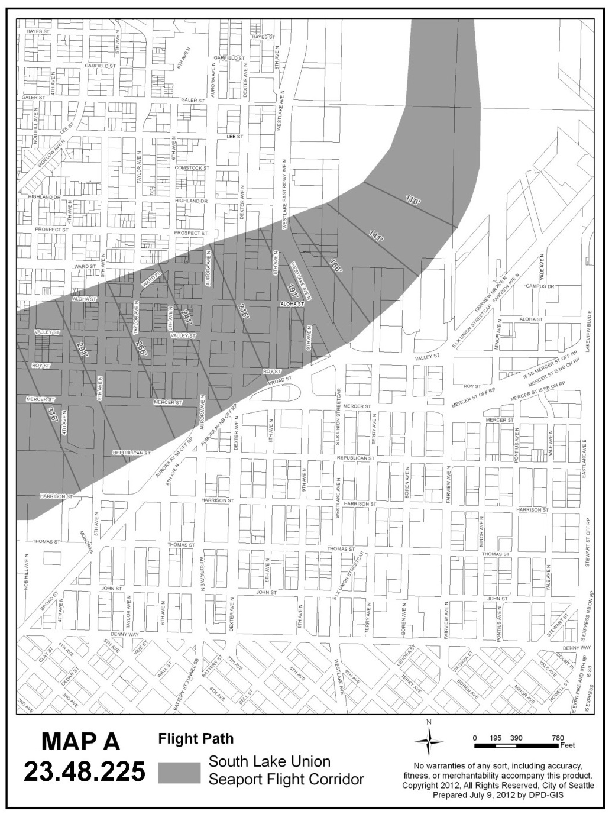

Map A forSouth Lake Union Seaport Flight Corridor

1. Base and maximum height limits

SM-SLU 85/65-125

SM-SLU 85/65-160

SM-SLU 160/85-240

SM-SLU 85-240/125-400

    1. In zones listed below in this subsection 23.48.225.A.1, the applicable height limit for portions of a structure that contain non-residential and live-work uses is shown as the first figure after the zone designation and the base height limit for portions of a structure in residential use is shown as the first figure following the "/". The third figure shown is the maximum residential height limit. Except as stated in Section 23.48.025, the base residential height limit is the applicable height limit for portions of a structure in residential use if the structure does not gain extra residential floor area under the provisions of Chapter 23.58A, and the maximum residential height limit is the height limit for portions of a structure in residential use if the structure includes extra floor area under the provisions of Chapter 23.58A and if the structure complies with the standards for tower development specified in Section 23.48.240 (Street-level development standards in South Lake Union Urban Center) and Section 23.48.245 (Upper-level development standards in South Lake Union Urban Center):
    2. In the SM-SLU 85/65-160 zone on the blocks bounded by Valley Street, Mercer Street, Westlake Avenue North, and Fairview Avenue North hotel use is permitted above 85 feet in height and is subject to the same provisions as residential use exceeding the base height limit for residential use, provided that all development standards that apply to a residential tower also apply to the hotel use, including the provisions of Section 23.48.221 for gaining extra residential floor area.
    3. In the SM-SLU 85-240 zone, except as stated in subsections 23.48.225.C and 23.48.225.E, the base height limit is the applicable height limit for portions of a structure if the structure does not gain extra residential floor area under the provisions of Chapter 23.58A, and the maximum residential height limit is the height limit for portions of a structure in residential use if the structure includes extra residential floor area under the provisions of Chapter 23.58A, and if the structure complies with the standards for residential tower development in this Chapter 23.48.
2. Height limits in the SM-SLU/R 55/85 zone

    1. New structures occupied only by non-residential uses are subject to a height limit of 55 feet.
    2. Structures occupied only by residential uses and mixed-use structures with 60 percent or more of the structure's gross floor area in residential use are subject to a height limit of 85 feet.
3. Additional height permitted in the SM-SLU 160/85-240 and SM-SLU 85-240 zones

    1. Increases in the maximum height limit in the SM-SLU 160/85-240 and SM-SLU 85-240 zones. In the SM-SLU 160/85-240 and SM-SLU 85-240 zones a structure is allowed additional height of up to 30 percent above the maximum height limit for residential uses and, in the SM-SLU 160/85-240 zone, up to 20 percent above the height limit for non-residential uses, if all of the following conditions are met:

        1. The project includes an elementary school or a kindergarten through eighth grade school, which may include minimum space requirements for associated uses but not limited to academic core functions, child care, administrative offices, a library, maintenance facilities, food service, and specialty instruction space;
        2. Prior to issuance of a Master Use Permit, the applicant shall submit a letter to the Director from the school indicating that, based on the Master Use Permit plans, the school district has determined that the development could meet the operator's specifications;
        3. Prior to issuance of a building permit, the applicant shall submit a written certification by the operator to the Director that the operator's specifications have been met;
        4. The amount of floor area allowed to exceed the applicable height limit is equivalent to the amount of enclosed floor area on the lot in school use;
        5. The floor area added through the increase in height is subject to the development standards in Sections 23.48.235 and 23.48.240 that apply to structures that exceed the base height for residential use or the applicable podium height for non-residential uses;
        6. The floor area allowed to exceed the maximum residential height limit is not subject to the provisions for gaining extra residential floor area in Chapter 23.58A; should the school use be discontinued, floor area gained through the provisions of this Section 23.48.225 shall be subject to the provisions of Chapter 23.58A; and
        7. The allowances for rooftop features in subsection 23.48.025.B shall apply to the above structure height permitted under this subsection 23.48.225.C;
    2. Additional height above the applicable height limit for portions of a structure that contain non-residential and live-work uses is permitted in the SM-SLU 160/85-240 zone at locations and under the conditions specified in Section 23.48.230;
    3. Extra residential floor area above the base height limit for residential use may be obtained as provided in Section 23.48.221; and
4. A proposal to build a structure greater than 85 feet in height in the SM-SLU 85/65-160 and SM-SLU 160/85-240 zones and located north of Mercer Street and West of Fairview Avenue within the South Lake Union Urban Center, requires the applicant to show that the proposed structure height will not physically obstruct use of the flight path shown on Map A for 23.48.225 or endanger aircraft operations.
5. All non-exempt floor area and residential floor area located above the base height is considered extra floor area. Extra floor area may be obtained above the base height, up to the maximum height, only through the provision of public amenities meeting the standards of Section 23.48.021 and Chapter 23.58A.

##### 23.48.230 - Extra height in South Lake Union Urban Center

1. Applicability and general provisions. For structures in the SM-SLU 160/85-240 zone designed for research and development laboratory use and administrative office associated with research and development laboratories, structures that do not exceed a height of 120 feet are not subject to the floor area limits of subsection 23.48.245.B, provided the project complies with all the requirements of this Section 23.48.230. In order for a structure to qualify for the exemption from the floor area limit, at least one complete MUP application for a structure on the same block that has been permitted to extend up to a height of 120 feet without floor area limits shall be filed within nine months of February 17, 2010.
2. Location. A structure may be exempt from floor area limits of subsection 23.48.245.B if the structure is located on a block that is:

    1. designated SM-SLU 160/85-240;
    2. bounded by arterial-designated streets on at least two sides;
    3. greater than 60,000 square feet in size and does not exceed 100,000 square feet in size; and
    4. not bisected by an alley or other public right-of-way.
3. Street-level uses. Street-level uses shall be provided as required by subsection 23.48.205.C.
4. LEED requirement. The applicant will strive to achieve a LEED Gold rating or better and at a minimum earn a LEED Silver rating or meet a substantially equivalent standard, and shall demonstrate compliance with that commitment, all in accordance with the provisions of Section 23.48.021.D.2.
5. Open space. A minimum of 20 percent of the lot area shall be usable open space. The purpose of the open space shall be to allow for public seating, passive recreation, and a mid-block pedestrian connection. For a multi-phase project, the open space requirement and the other requirements in this subsection 23.48.230.E shall be calculated and applied to the total project. The following standards apply to open space required under this subsection 23.48.230.E:

    1. The open space shall be open during daylight hours and accessible to the general public, without charge, for a minimum of ten hours per day, except that access may be temporarily limited as required for public safety, security, scheduled events, or maintenance reasons. Members of the public may not be asked to leave for any reason other than conduct that unreasonably interferes with the enjoyment of the space by others, unless the space is closed to the general public consistent with this subsection 23.48.230.E.1. No parking, storage, or other use may be established on or above the surface of the open space except as provided in this subsection 23.48.230.E. Use of the open space by motor vehicles is prohibited. The open space shall be clearly identified with signage placed at a visible location at each street entrance providing access to the open space. The signage shall indicate, in letters legible to passersby, the nature of the open space, its availability for general public access, and directional information as needed.
    2. The open space shall contain at least one contiguous area with a minimum of 3,000 square feet and a minimum horizontal dimension of 10 feet.
    3. A minimum of 35 percent of the open space shall be landscaped with grass, ground cover, bushes, and/or trees.
    4. The open space shall include seating in an amount equivalent to either one lineal foot of permanent seating or two movable chairs for every 200 square feet of open space during hours of public access.
    5. The open space shall be located and configured to provide easy access from streets or other abutting public spaces and convenient pedestrian circulation through the open space. The open space shall have a minimum frontage of 30 feet at grade abutting a sidewalk, and be visible from sidewalks on at least one street.
    6. The open space shall be provided at ground level, except that some separation of multiple levels may be allowed, provided they are physically and visually connected.
    7. Up to 20 percent of the open space may be covered by features accessory to public use of the open space, including: permanent, freestanding structures, such as retail kiosks, pavilions, or pedestrian shelters; structural overhangs; overhead arcades or other forms of overhead weather protection; and any other features approved by the Director that contribute to pedestrian comfort and active use of the space. The following features within the open space area may count as open space: areas for temporary kiosks and pavilions, public art, water features, permanent seating that is not reserved for any commercial use, exterior stairs and mechanical assists that provide access to the open space and are available for public use, and any similar features approved by the Director. Seating or tables, or both, may be provided and reserved for customers of restaurants or other uses abutting the open space, however, the area reserved for customer seating shall not exceed 15 percent of the open space area or 500 square feet, whichever is less.
    8. Public art shall be included in the public open space. The artwork may include but need not be limited to water features, or two or three-dimensional works in all media. The artwork shall be clearly visible to people using the open space, and, wherever possible, should be visible from the abutting streets. The property owner is responsible for maintaining all art features for the life of the buildings on the lot.
6. Transportation Management Program (TMP). The Master Use Permit application shall include a TMP for non-residential development consistent with requirements for TMPs in the applicable Director's Rule. The TMP shall be approved by the Director only if, after consulting with the Director of Transportation, the Director determines that no more than 40 percent of trips to and from the project will be made using single-occupant vehicles (SOVs).

    1. For purposes of measuring attainment of SOV goals contained in the TMP, the number of SOV trips shall be calculated for the p.m. hour in which an applicant expects the largest number of vehicle trips to be made by employees at the site (the p.m. peak hour of the generator).
    2. Compliance with this Section 23.48.230 does not affect the responsibility of any employer to comply with Seattle's Commute Trip Reduction (CTR) Ordinance.

##### 23.48.232 - Lot area limits in SM-SLU/R 55/85

1. Development with non-residential uses only, except hotels with 100 rooms/suites or fewer, is limited to a lot area of 21,600 square feet or less.
2. Development on lots greater than 21,600 square feet in area shall include residential use in an amount of gross floor area equal to 60 percent or more of the gross floor area in non-residential use, except for development that is an elementary or secondary school, or a hotel with 100 rooms/suites or fewer.
3. Two lots of up to 21,600 square feet each, separated by an alley and connected above grade by a skybridge or other similar means shall be considered two separate lots for the purposes of this Section 23.48.232. Such a connection above grade and across the alley may be allowed pursuant to the City Council's approval of an aerial alley vacation or temporary use permit.
4. Non-residential structures on adjacent lots not separated by an alley, subject to this Section 23.48.232, shall not be internally connected.
5. Non-residential uses existing prior to November 6, 1996, that do not meet the requirements of this Section 23.48.232 are allowed to expand by an amount of gross floor area not to exceed 20 percent of the existing gross floor area, without meeting the requirements of this Section 23.48.232. This provision may only be used once for an individual use.
6. Non-residential use exception. A non-residential structure may be permitted where a residential or mixed-use structure would otherwise be required, subject to the following:

    1. The proposal is comprised of two or more lots within the same SM/R zone; and
    2. The amount of gross floor area in residential use in the structures on both lots is equal to at least 60 percent of the total gross floor area of the total combined development on the lots included in the proposal; and
    3. The non-residential structure is subject to design review to ensure compatibility with the residential character of the surrounding area; and
    4. The proposal meets one or more of the following:

        1. The project includes the rehabilitation of a Landmark structure or incorporates structures or elements of structures of architectural or historical significance as identified in the Seattle Comprehensive Plan or design guidelines; or
        2. The project includes general sales and service uses, eating and drinking establishments, major durables retail sales uses, entertainment uses, human service uses, or child care centers at the street level in an amount equal to 50 percent of the structure's footprint; or
        3. On the lot(s) accommodating the required amount of residential use, as specified in subsection 23.48.232.F.2, a minimum of 10 percent of all new housing units in the proposal are provided as affordable housing as defined in Chapter 23.58A, and shall be maintained as affordable housing for a period of at least 20 years, or a minimum of 10 percent of all new housing units in the proposal are provided as townhouses.

##### 23.48.235 - Upper-level setback requirements in South Lake Union Urban Center

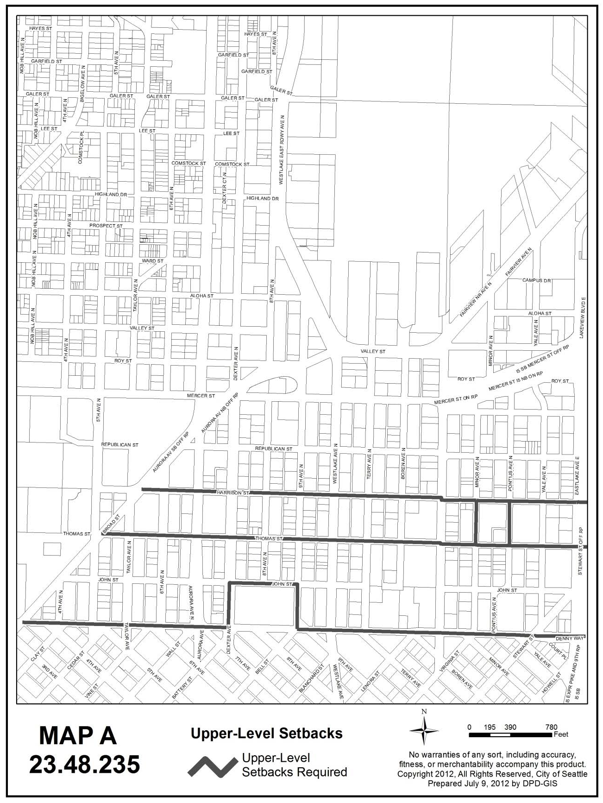

Map A forUpper-Level Setbacks

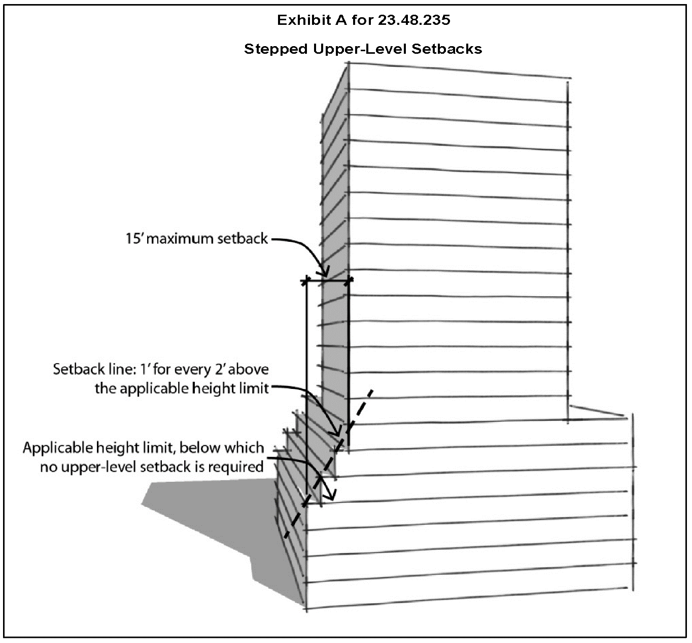

Exhibit A forStepped Upper-Level Setbacks

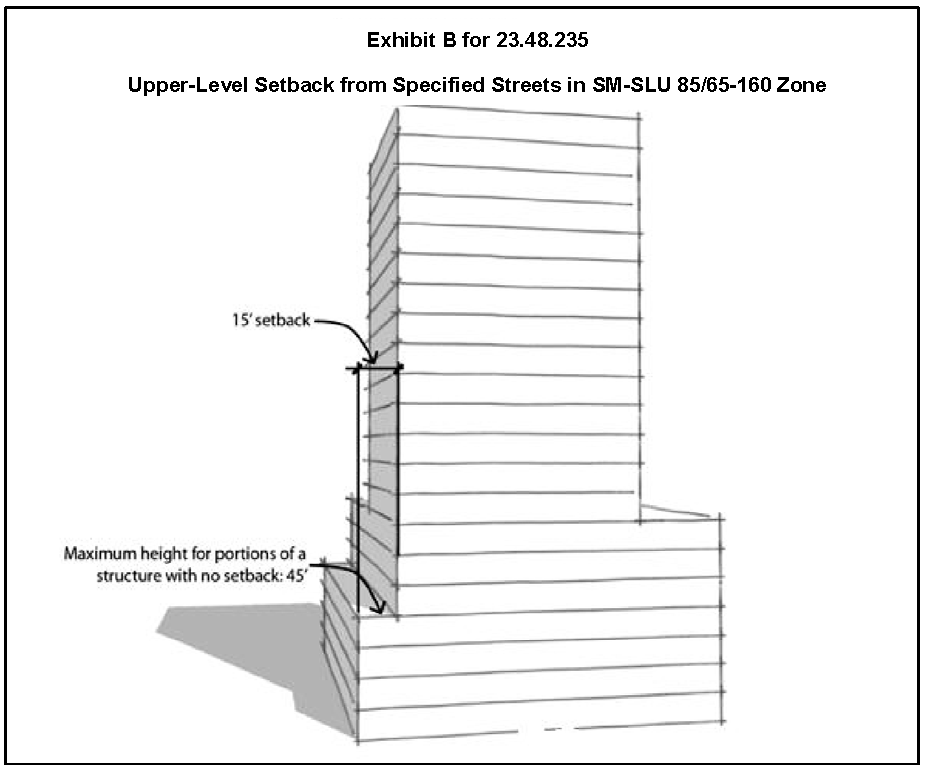

Exhibit B forUpper-Level Setback from Specified Streets in SM-SLU 85/65-160 Zone

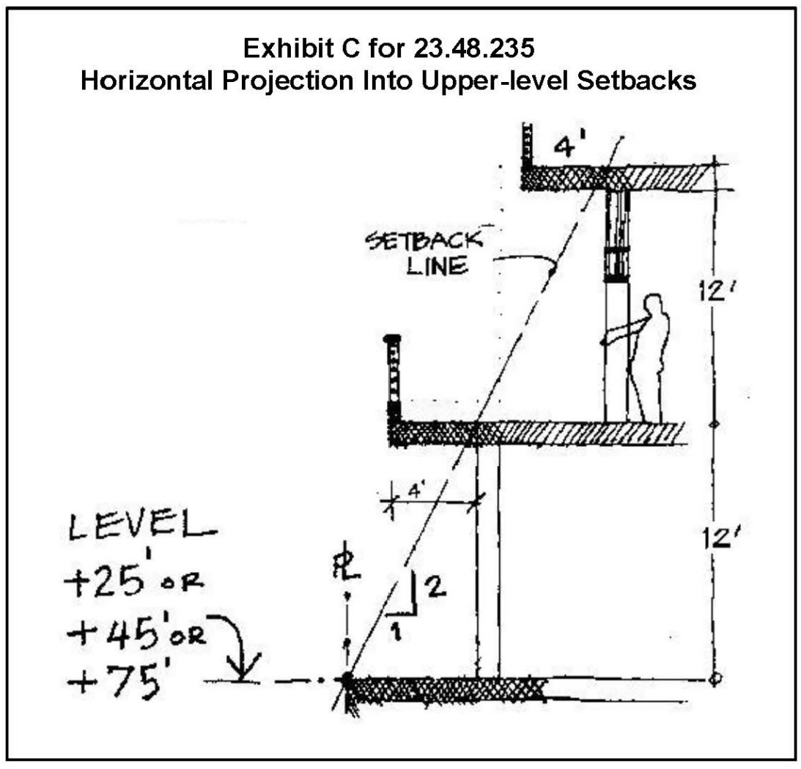

Exhibit C forHorizontal Projection into Upper-level Setbacks

1. The following requirements for upper-level setbacks in this subsection 23.48.235.A apply to structures on lots abutting a street shown on Map A for 23.48.235, except for those structures with non-residential uses above 85 feet in height or residential uses above the base height limit for residential use, which are subject to the upper-level setback requirements of subsection 23.48.245.C.

    1. For all zones except the SM-SLU 240/125-400 zone, any portion of a structure greater than 45 feet in height is required to set back from a lot line abutting a street shown on Map A for 23.48.235. In the SM-SLU 240/125-400 zone, portions of a structure greater than 75 feet in height are required to set back from a lot line abutting a street shown on Map A for 23.48.235.
    2. A setback of 1 foot for every 2 additional feet of height is required for any portion of a structure exceeding the maximum height permitted without a setback according to subsection 23.48.235.A.1, up to a maximum setback of 15 feet measured from the street lot line, as shown in Exhibit A for 23.48.235.
2. Upper-level setbacks in the SM-SLU 85/65-160 zone. The following requirements for upper-level setbacks in this subsection 23.48.235.B apply to all development in the SM-SLU 85/65-160 zone on the blocks bounded by Valley Street, Mercer Street, Westlake Avenue North, and Fairview Avenue North as shown in Exhibit B for 23.48.012:

    1. Portions of a structure above 45 feet in height shall set back a minimum of 15 feet from street lot lines abutting Valley Street, Westlake Avenue North, Terry Avenue North, Boren Avenue North, and Fairview Avenue North as shown in Exhibit B for 23.48.235.
    2. In addition to the upper-level setbacks specified in subsection 23.48.235.B.1, additional upper-level setbacks are required for tower structures that include residential use above the base height limit for residential use, or hotel use above a height of 85 feet, according to the provisions of subsection 23.48.245.C.3.
3. Upper-level setbacks on alleys in the SM-SLU/R 55/85 zone. For lots abutting an alley in the SM-SLU/R 55/85 zone, portions of a structure greater than 25 feet in height shall set back a minimum of 1 foot from the alley lot line for every 2 feet of additional height above 25 feet, up to a maximum setback of 15 feet measured from the alley lot line, as shown in Exhibit A for 23.48.235.
4. Projections permitted in required upper-level setbacks. Horizontal projections, including decks, balconies with open railings, eaves, cornices, and gutters are permitted to extend a maximum of 4 feet in required setbacks as shown in Exhibit C for 23.48.235.

##### 23.48.240 - Street-level development standards in South Lake Union Urban Center

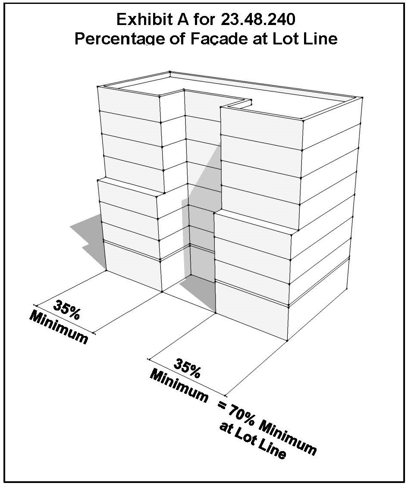

Exhibit APercentage of Facade at Lot Line

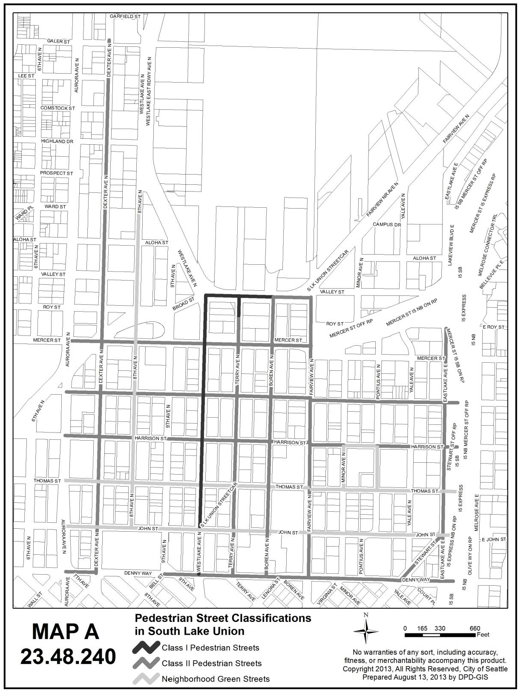

Map A forPedestrian Street Classifications in South Lake Union

1. Except on Class 1 Pedestrian Streets, as shown on Map A for 23.48.240, and as specified in subsection 23.48.240.B.1, the street-facing facade of a structure may be set back up to 12 feet from the street lot line subject to the following (Exhibit B for 23.48.240):

    1. The setback area shall be landscaped according to the provisions of subsection 23.48.055.B.2;
    2. Additional setbacks are permitted for up to 30 percent of the length of portions of the street-facing facade that are set back from the street lot line, provided that the additional setback is located 20 feet or more from any street corner; and
    3. Any required outdoor amenity area, or other required open space, or usable open space provided in accordance with subsections 23.48.240.E, 23.48.240.F, or 23.48.245.B.4.c is not considered part of the setback area and may extend beyond the limit on setbacks from the street lot line that would otherwise apply under subsections 23.48.240.B.1.b.1 or 23.48.240.B.1.b.2.
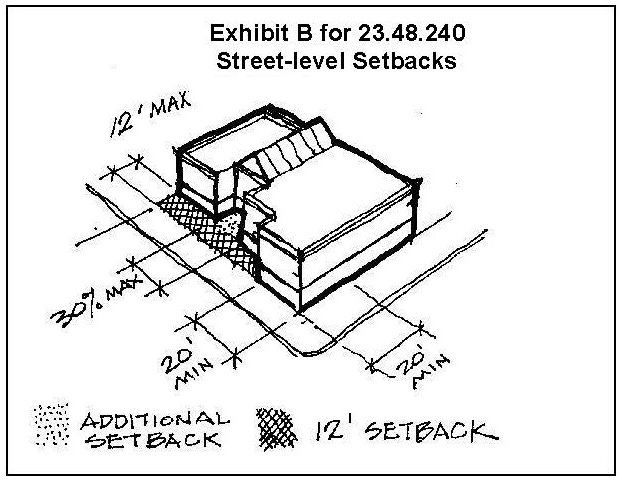

Exhibit B for Street-Level Setbacks

1. Street-level development standards in Section 23.48.040 apply to all streets in SM-SLU zones designated as Class 1 Pedestrian Streets, Class 2 Pedestrian Streets, or Neighborhood Green Streets as shown on Map A for 23.48.240.
2. General facade requirements

    1. Permitted setbacks from street lot lines. Except on lots subject to the provisions of subsection 23.48.240.C, the street-facing facades of a structure are permitted to set back from the street lot line as follows:

        1. The street-facing facades of structures abutting Class 1 Pedestrian Streets, as shown on Map A for 23.48.240, shall be built to the street lot line for a minimum of 70 percent of the facade length, provided that the street frontage of any required outdoor amenity area, or other required open space, or usable open space provided in accordance with subsections 23.48.240.E, 23.48.240.F, or 23.48.245.B.4.c is excluded from the total amount of frontage required to be built to the street lot line (Exhibit A for 23.48.240).
3. Facade requirements in the SM-SLU 85-240 zone. In addition to the provisions of subsection 23.48.040.A, except for religious facilities, the following standards apply in the SM-SLU 85-240 zone:

    1. Required street-facing facade setback for residential uses

        1. All street-facing facades along 8 Avenue North, except those portions occupied by permitted non-residential uses and subject to the provisions of subsection 23.48.240.C.2, are required to set back an average of 10 feet from the street lot line, provided that no setback shall be less than 5 feet from the street lot line, and any setback area further than 15 feet from the street lot line shall not be included in the averaging calculation.
        2. The setback requirement of this subsection 23.48.240.C.1 does not apply to the following:

            1. Portions of the street-facing facade that are located no more than 40 feet from a street corner; and
            2. Portions of the structure that are partially below grade and meet the following conditions:

                1. The roof of the partially below-grade portion of the structure in the setback area is no more than 4 feet above existing or finished grade, whichever is lower;
                2. The surface of the roof is used for private access or amenity area for abutting units; and
                3. A landscaped area a minimum of 2 feet in depth measured from the abutting street lot line is maintained at grade level.
        3. Only ground-related residential units and floor area for building lobbies for residential uses are permitted within the portion of the story of the structure abutting the required setback area, and each unit or lobby area is required to have direct access to the required setback area.
        4. The street-level facade of lobby area abutting the required setback shall not exceed a width equivalent to 20 percent of the total width of the required setback measured along 8 Avenue North.
        5. Private amenity area, unenclosed stoops, steps, or porches related to the abutting, ground-related residential units or common amenity area with access to residential lobbies shall be provided within the required setback area.
        6. Bay windows, canopies, horizontal projection of decks, balconies with open railings, eaves, cornices, gutters, and other similar architectural features are permitted to extend no more than 4 feet into required setbacks.
        7. Driveways providing access to parking within a structure are not permitted within the required setback area.
    2. Development standards for non-residential uses other than improvements to or development of new religious facilities. Non-residential uses are permitted on the ground floor of mixed-use structures, subject to the following:

        1. Non-residential uses are not permitted to extend more than 20 feet above the street-level.
        2. Non-residential uses are only permitted on corner portions of the lot that are within 20 lineal feet of intersecting street lot lines.
4. Additional requirements in the SM-SLU 85/65-160 zone on the blocks bounded by Valley Street, Mercer Street, Westlake Avenue North, and Fairview Avenue North. Street-level facades on that portion of Terry Avenue between Mercer Street and Valley Street shall be set back an average of 10 feet from the lot line. In addition all street-level facades on Valley Street within 50 feet of Terry Avenue shall be set back an average of 50 feet from the lot line. For the purposes of the standards in Chapter 23.48, the Class 1 Pedestrian Street classification on Terry Avenue North as depicted on Map A for 23.48.240, extends 120 feet south of Valley Street.
5. Development standards for required street-level uses. In addition to street-level uses required by subsection 23.48.005.D, and street-level uses exempt from FAR calculations under the provisions of subsection 23.48.220.B.2, structures with a street-facing facade along 8th Avenue N., located on blocks identified pursuant to subsection 23.48.230.B, the minimum street frontage of required street-level uses is 10 percent of that street-facing facade. The remaining street frontage at street level may contain other permitted uses and/or pedestrian or vehicular entrances. The frontage of any outdoor common amenity area required for residential uses or other required open space shall not be counted in street frontage.
6. Required open area in the SM-SLU 85/65-160 zone. In the SM-SLU 85/65-160 zone on the blocks bounded by Valley Street, Mercer Street, Westlake Avenue North, and Fairview Avenue North, a minimum of 20 percent of the lot area shall be provided as open area that is located and configured to allow easy pedestrian access to project occupants from streets or other abutting public spaces, including access for persons with disabilities. The open area shall include the following:

    1. A minimum of 60 percent of the required open area shall be provided as usable open space that meets the following conditions:

        1. The usable open space is open from the ground to the sky and is visible and accessible to pedestrians from an abutting street, including persons with disabilities;
        2. The open space is substantially at street level, although portions are permitted to be within 4 feet of street level, provided that grade changes are gradual and do not significantly disrupt the continuity of the space, and no part of the open space is significantly above or below the grade of the nearest abutting street;
        3. The open space has a minimum horizontal dimension of 15 feet; and
        4. The open space enhances visual and physical pedestrian connections between South Lake Union Park and development on the lot, and is accessible to the public, free of charge, during the hours of operation of South Lake Union Park.
    2. At the applicant's option, up to 40 percent of the required open area may be provided as any combination of:

        1. A woonerf that serves as a through-block pedestrian passageway and that satisfies the following:

            1. The passageway is open to the sky, has a minimum width of 20 feet, and provides a direct and continuous connection between the north/south avenues abutting the lot;
            2. The passageway is designed to provide safe pedestrian use, including a clear pathway demarcated as a priority pedestrian zone; and
            3. The passageway is adequately lit and available for pedestrian use 24 hours every day.
        2. Open areas with a horizontal dimension that is less than 15 feet abutting a street lot line if one or more of the following conditions are met:

            1. An area abutting a sidewalk that extends the pedestrian area onto the lot to accommodate additional streetscape amenities, such as landscaping, street furniture, special lighting, public art, or extensions of right-of-way green factor treatments;
            2. Setback areas abutting the street with a maximum depth of 10 feet that provide private usable open space, stoops, terraces, and/or landscaping for abutting ground level dwelling units that have direct access to the setback area, provided that the total amount of such setback areas does not exceed half of the 40 percent portion of the open area allowed by this subsection 23.48.240.F.2; or
            3. Additional sidewalk areas created by extending the curbline into the abutting street right-of-way that are improved with such streetscape amenities as landscaping, street furniture, special lighting, public art, or extensions of right-of-way green factor treatments.
        3. Usable elevated open space up to a maximum of 45 feet above street level, and that meets the following:

            1. At least 50 percent of the perimeter of the elevated open space is not enclosed by a facade and is open and oriented to provide views of South Lake Union Park; and
            2. The minimum horizontal dimension of the open space is 15 feet.
        4. No more than 50 percent of the open areas allowed pursuant to this subsection 23.48.240.F.2 shall be:

            1. Located more than 4 feet above street level; and
            2. Comprised of unenclosed covered areas, such as arcades or areas beneath building overhangs or overhead weather protection attached to abutting facades that abut sidewalks or pedestrian paths across the lot, or freestanding pavilions or kiosks that provide overhead weather protection.
    3. When authorized by the Director as a Type I decision pursuant to this subsection 23.48.240.F, lots within the SM-SLU 85/65-160 zone on the blocks bounded by Valley Street, Mercer Street, Westlake Avenue North, and Fairview Avenue North, may be combined, whether contiguous or not, for the purpose of allowing the open area required on a lot by this subsection 23.48.240.F to be met on one or more other lots within the SM-SLU 85/65-160 zone on the blocks bounded by Valley Street, Mercer Street, Westlake Avenue North, and Fairview Avenue North, according to the following provisions:

        1. The Director shall allow lots to be combined to meet open area requirements if the Director determines that the combined amount of open area on all lots meets or exceeds the minimum amount required by subsection 23.48.240.F.1, and that the added flexibility will achieve better open space conditions, as indicated by the following:

            1. The open area in general will provide for a better relationship between the development on the combined lots and South Lake Union Park;
            2. The added flexibility will allow for better integration of open space and surrounding development and improve accessibility among the blocks in the SM-SLU 85/65-160 zone on the blocks bounded by Valley Street, Mercer Street, Westlake Avenue North, and Fairview Avenue North and adjacent areas;
            3. A greater diversity of open space will be achieved for the area;
            4. Greater public use of the open space will be encouraged;
            5. The flexibility would result in open spaces that are more substantial is size and/or more adaptable to a greater variety of uses, or that establish a more significant neighborhood focal point than would otherwise likely occur; and/or
            6. The open space provided will enhance urban form by promoting better massing, more usable open spaces with increased solar access, enhanced views within and through the site, and other improved conditions.
        2. Prior to issuance of a Master Use Permit for any development that relies on one or more other lots within the SM-SLU 85/65-160 zone on the blocks bounded by Valley Street, Mercer Street, Westlake Avenue North, and Fairview Avenue North to meet the open area requirements of this subsection 23.48.240.F, the fee owners of both the property subject to the Master Use Permit and the lot(s) utilized to meet open area requirements for the Master Use Permit shall execute an appropriate agreement or instrument that is recorded in the King County real property records that:

            1. Includes the legal description of each lot;
            2. Acknowledges the specific extent to which the open space standards are met through a combination of the lots;
            3. Provides that its covenants and conditions shall run with the land and shall be specifically enforceable by the parties and by the City of Seattle; and
            4. Provides that the agreement or instrument shall be in effect unless the Master Use Permit expires, is cancelled, is withdrawn by the applicant, or the development allowed by the Master Use Permit no longer requires the other lot(s) in order to meet the open area requirements of this subsection 23.48.240.F.
    4. Usable open space provided under this subsection 23.48.240.F qualifies as either amenity area for residential uses under Section 23.48.045 or open space required for office use under Section 23.48.250, or both, if the applicable standards of these sections are met.
7. Required usable open space in the SM-SLU 85/65-125, SM-SLU160/85-240 and SM-SLU 240/125-400 zones

    1. Except as provided for in subsection 23.48.240.G.3 and 23.48.240.F, in the SM-SLU 85/65-125, SM-SLU 85/65-160, SM-SLU 160/85-240 and SM-SLU 240/125-400 zones, on lots exceeding 30,000 square feet in area, proposed development containing extra floor area as provided for in Sections 23.48.021 and 23.48.221 shall provide usable open space as follows:

        1. The minimum amount of required usable open space shall be equal to 15 percent of the lot area and shall generally be accessible at street level, with variations in elevation allowed to accommodate changes in topography;
        2. The average horizontal dimension for any area qualifying as required usable open space is 20 feet, and the minimum horizontal dimension is 10 feet, except that there is no minimum horizontal dimension for additional pedestrian area abutting a sidewalk that is provided according to subsection 23.48.240.G.1.f;
        3. A minimum of 45 percent of the required usable open space shall be exterior space open to the sky and shall abut a street along at least one street frontage and provide both visual and physical access from the street to pedestrians, including persons with disabilities;
        4. Up to a maximum of 20 percent of the required usable open space may be covered overhead to provide weather protected space and a widened sidewalk area, if the following conditions are met:

            1. The open space abuts a street lot line and is open and accessible to pedestrians along the sidewalk and,
            2. If the space is covered by portions of the structure above, or is provided as an arcade open to the street, the minimum vertical clearance is 20 feet;
        5. Up to a maximum of 35 percent of the required usable open space may be provided as enclosed space, such as a public atrium, a shopping atrium, wintergarden, or covered portion of a through-block pedestrian connection, if the enclosed open space meets all of the following requirements:

            1. Direct access is provided to pedestrians, including persons with disabilities, from the street, or from an outdoor, usable public open space abutting the street;
            2. The space is provided as one continuous area that is a minimum of 2,000 square feet in size. Space, such as lobby area, that is used solely to provide access between the structure's principal street entrance and elevators, does not qualify as required usable open space;
            3. The minimum floor-to-ceiling height is 15 feet; and
            4. The space is accessible to the public during normal business hours.
        6. Up to a maximum of 10 percent of the required usable open space may be provided as an area abutting a sidewalk that extends the pedestrian area onto the lot or accommodates landscaping or extensions of right-of-way green factor treatment pursuant to Section 23.86.019. Minor changes between the sidewalk elevation and the elevation of the abutting sidewalk area are permitted to accommodate changes in topography, or to provide for features such as ramps that improve access for persons with disabilities.
    2. Usable open space provided under this subsection 23.48.240.G is eligible to qualify as either amenity area for residential uses under Section 23.48.045 or open space required for office use under Section 23.48.250, or all three, provided the applicable standards of these sections are met.
    3. Usable open space satisfying the requirements of this subsection 23.48.240.G may be provided on a site other than the project site, provided that the following conditions are met:

        1. The alternate open space site is located within an SM-SLU zone and within 650 feet of the project site;
        2. The amount of usable open space is no less than 10 percent of the lot area; and
        3. The owner of any lot on which off-site open space is provided records a restrictive covenant in a form acceptable to the Director assuring compliance with requirements of this subsection 23.48.240.G.
8. Through-block pedestrian connections for large lot developments

    1. A through-block pedestrian connection meeting the standards of subsection 23.48.240.F.2 is required in the SM-SLU 85/65-125, SM-SLU 85-240, SM-SLU 85/65-160, SM-SLU 160/85-240, and SM-SLU 240/125-400 zones for development described as follows:

        1. Within the block defined as the area enclosed by street rights-of-way, the lot area of the development is a minimum of 60,000 square feet, except that the area of lots separated only by an alley right-of-way may be combined for the purposes of calculating the minimum required lot area;
        2. The lot area of the development abuts the two north/south avenues for a minimum linear distance of 120 feet along each avenue.
    2. The required through-block pedestrian connection shall meet the following development standards:

        1. A continuous pedestrian passageway shall extend across the development lot to both abutting avenues. The alignment of the pedestrian connection and the point at which it intersects each avenue shall be no closer than 100 feet to an east-west street abutting the block, and the connection at the avenues shall be accessible at grade level from the sidewalk.
        2. The required pedestrian connection shall have an average width of 25 feet and a minimum width of 15 feet. Any segment of the pedestrian passage that is covered from side to side shall have a minimum width of 20 feet.
        3. The pedestrian passage shall be open to the sky, except that up to 35 percent of the length of the passageway may be covered and enclosed, provided the minimum height of covered portions is 13 feet. Unenclosed area of the pedestrian connection may be counted as required open space; and
        4. If the pedestrian passage crosses an alley, the alley right-of-way shall be improved to ensure pedestrian safety and to reinforce the relationship between portions of the passageway on either side of the alley.
    3. The Director may allow modifications or waiver from the standards for though-block pedestrian connections as a Type I decision, if the applicant demonstrates that alternative treatments will better serve the development by enhancing pedestrian comfort and promoting greater use of the connection.
    4. For development providing a through-block pedestrian connection on blocks with an alley, the allowed FAR from any lot included in the development may be transferred to any other lot of the development across the alley, provided the receiving site is in a SM-SLU zone.

##### 23.48.245 - Upper-level development standards in South Lake Union Urban Center

Lots in the SM-SLU 85/65-125, SM-SLU 85/65-160, SM-SLU160/85-240, SM-SLU 85-240, and SM-SLU 240/125-400 zones are subject to upper-level development standards that may include upper-level floor area limits, gross floor area limits and podium heights, upper-level setbacks, facade modulation, maximum facade widths, a limit on the number of towers per block, and tower separation requirements, as specified in this Section 23.48.245. For the purpose of this Section 23.48.245, a tower is a structure that exceeds a height of 65 feet for the SM-SLU 85/65-125 and SM-SLU 85/65-160 zones, 85 feet for the SM-SLU 160/85-240 and SM-SLU 85-240 zones, or 125 feet for the SM-SLU 240/125-400 zone.

1. Upper-level floor area limit. For residential towers, the average gross floor area of all stories above the podium height specified on Map A for 23.48.245 shall not exceed 50 percent of the lot area, provided that:

    1. In no case shall the gross floor area of stories above the podium height exceed the gross floor area limits of subsection 23.48.245.B.2; and
    2. The limit on towers per block in subsection 23.48.245.F applies.
2. Floor area limits and podium heights. The following provisions apply to development in the SM-SLU 85/65-125, SM-SLU 85-240, SM-SLU 85/65-160, SM-SLU 160/85-240, and SM-SLU 240/125-400 zones located within the South Lake Union Urban Center:

    1. Floor area limit for structures or portions of structures occupied by non-residential uses.

        1. Except as specified in subsections 23.48.245.B.1.b and 23.48.245.B.1.c, there is no floor area limit for non-residential uses in a structure or portion of structure that does not contain non-residential uses above 85 feet in height.
        2. There is no floor area limit for a structure that includes research and development uses and the uses are in a structure that does not exceed a height of 105 feet, provided that the following conditions are met:

            1. A minimum of two floors in the structure are occupied by research and development uses and have a floor-to-floor height of at least 14 feet; and
            2. The structure has no more than seven stories above existing or finished grade, whichever is lower, as measured from the lowest story to the highest story of the structure but not including rooftop features permitted under subsection 23.48.025.C. The lowest story shall not include a story that is partially below grade and extends no higher than 4 feet above existing or finished grade, whichever is lower.
        3. Within locations in the SM-SLU 160/85-240 zone meeting the standards in subsection 23.48.230.B for extra height in South Lake Union Urban Center there is no floor area limit for structures that do not exceed a height of 120 feet and that are designed for research and development laboratory use and administrative office associated with research and development laboratories.
        4. For structures or portions of structures with non-residential uses that exceed a height of 85 feet, or that exceed the height of 105 feet under the provisions of subsection 23.48.245.B.1.b, or 120 feet under subsection 23.48.245.B.1.c, each story of the structure above the specified podium height indicated for the lot on Map A for 23.48.245 is limited to a maximum gross floor area of 24,000 square feet per story, except that the average gross floor area for stories above the specified podium height is 30,000 square feet for structures on a lot that meets the following conditions:

            1. The lot has a minimum area of 60,000 square feet; and
            2. The lot includes an existing open space or a qualifying Landmark structure and is permitted an additional increment of FAR above the base FAR, as permitted in subsection 23.48.020.A.3.
    2. Floor area limit for residential towers. For a structure with residential use that exceeds the base height limit established for residential uses in the zone under subsection 23.48.225.A.1, the following maximum gross floor area limit applies:

        1. For a structure that does not exceed a height of 160 feet, excluding rooftop features that are otherwise permitted above the height limit under the provisions of subsection 23.48.025.C, the gross floor area for stories with residential use that extend above the podium height indicated for the lot on Map A for 23.48.245 shall not exceed 12,500 square feet for each story, or the floor size established by the upper-level floor area limit in subsection 23.48.245.A, whichever is less.
        2. For a structure that exceeds a height of 160 feet, the following limits apply:

            1. The average gross floor area for all stories with residential use that extend above the podium height indicated for the lot on Map A for 23.48.245 shall not exceed 10,500 square feet, or the floor size established by the upper-level floor area limit in subsection 23.48.245.A, whichever is less, except as allowed in subsection 23.48.245.A.
            2. The gross floor area of any single residential story above the podium height shall not exceed 11,500 square feet.
    3. Floor area limit for mixed-use development. This subsection 23.48.245.B.3 applies to structures or portions of structures that include both residential and non-residential uses, as provided for in subsection 23.48.220.A.2.

        1. For a story that includes both residential and non-residential uses, the gross floor area limit for all uses combined shall not exceed the floor area limit for non-residential uses, provided that the floor area occupied by residential use shall not exceed the floor area limit otherwise applicable to residential use.
        2. For a mixed-use structure with residential uses located on separate stories from non-residential uses, the floor area limits shall apply to each use at the applicable height limit.
    4. Podium standards. The standards for podiums apply only to structures or portions of structures that include a tower that is subject to a floor area limit.

        1. Height limit for podiums. The specific podium height for a lot is shown on Map A for 23.48.245, and the height limit extends from the street lot line to the parallel alley lot line, or, where there is no alley lot line parallel to the street lot line, from the street lot line to a distance of 120 feet from the street lot line, or to the rear lot line, if the lot is less than 120 feet deep. The podium height is measured from the grade elevation at the street lot line. In the SM-SLU 85/65-160 zone on the blocks bounded by Valley Street, Mercer Street, 9th Avenue North, and Fairview Avenue North, the line on Map A for 23.48.245 demarcating the different podium heights within these blocks is located 120 feet north of the northerly line of Mercer Street.
        2. Podium floor area limits. For the podiums of structures with residential uses that exceed the base height limit established for the zone under subsection 23.48.225.A.1 and for structures with non-residential uses that exceed a height of 85 feet, the average floor area coverage of required lot area, pursuant to subsection 23.48.245.A, for all the stories below the podium height specified on Map A for 23.48.245, shall not exceed 75 percent of the lot area, except that floor area is not limited for each story if the total number of stories below the podium height is three or fewer stories, or if the conditions in subsection 23.48.245.B.4.c apply.
        3. The floor area limit on podiums in subsection 23.48.245.B.4.b does not apply if a lot includes one of the following:

            1. Usable open space that meets the provisions of subsection 23.48.240.F; or
            2. A structure that has been in existence prior to 1965 and the following conditions are met;

                1. The structure is rehabilitated and maintained to comply with applicable codes and shall have a minimum useful life of at least 50 years from the time that it was included on the lot with the project allowed to waive the podium area limit;
                2. The owner agrees that the structure shall not be significantly altered for at least 50 years from the time that it was included on the lot with the project allowed to waive the podium area limit. Significant alteration means the following:

                    1. Alteration of the exterior facades of the structure, except alterations that restore the facades to their original condition;
                    2. Alteration of the floor-to-ceiling height of the street-level story, except alterations that restore the floor-to-ceiling height to its original condition; or
                    3. The addition of stories to the structure, unless the proposed addition is no taller than the maximum height to which the structure was originally built, or the addition is approved through the design review process as compatible with the original character of the structure and is necessary for adapting the structure to new uses; or
                3. If the structure is removed from the lot, then any use of the portion of the lot previously occupied by the structure shall be limited to usable open space. The portion of the lot previously occupied by the structure shall be defined by a rectangle enclosing the exterior walls of the structure as they existed at the time it was included on the lot with the project allowed to waive the podium area limit, with the rectangle extended to the nearest street frontage.
        4. Additional height for podiums abutting Class 1 Pedestrian Streets. Podium height for structures fronting on Class 1 Pedestrian Streets pursuant to Section 23.48.240 may exceed podium height limits shown on Map A for 23.48.245 by 5 feet provided that floor-to-ceiling clearance at the ground floor is at least 15 feet.
Map A forPodium Heights

1. Upper-level setbacks

    1. The following requirements for upper-level setbacks in this subsection 23.48.245.C.1 apply to development that meets the following conditions:

        1. The development is on a lot abutting a street segment shown on Table A for 23.48.245; and
        2. For lots in the SM-SLU 85-240, SM-SLU 85/65-160, SM-SLU 160/85-240, and SM-SLU 240/125-400 zones located within the South Lake Union Urban Center, the development includes a tower structure with residential uses exceeding the base height limit established for residential uses in the zone under subsection 23.48.225.A.1, or includes a structure with non-residential uses that exceed a height of 85 feet.
    2. The required upper-level setbacks for development specified in subsection 23.48.245.C.1 shall be provided as follows:

        1. For portions of a structure facing the applicable street, the maximum height above which a setback is required is specified on Column 2 of Table A for 23.48.245.
        2. For portions of a structure exceeding the maximum height above which a setback is required, the minimum depth of the setback, measured from the abutting applicable street lot line, is specified on Column 3 of Table A for 23.48.245.
    3. Upper-level setbacks for residential tower development in the SM-SLU 85/65-160 zone on the blocks bounded by Valley Street, Mercer Street, Westlake Avenue North, and Fairview Avenue North. For tower structures that include residential use above the base height limit for residential use, or hotel use above a height of 85 feet, upper-level setbacks, in addition to those specified in subsection 23.48.235.B.1, are required as follows:

        1. Any portion of the structure above 65 feet in height shall set back a minimum of 30 feet from the following street lot lines:

            1. the street lot line abutting the eastern edge of Westlake Avenue North from Mercer Street to Valley Street; and
            2. the street lot line abutting the western edge of Fairview Avenue North from Mercer Street to Valley Street.
        2. For lots abutting the street lot line on the southern edge of Valley Street between Westlake Avenue North and Fairview Avenue North, any portion of a structure above 65 feet in height shall provide a minimum setback of 25 feet.
    4. Upper-level setbacks for tower structures in the SM-SLU 160/85-240 zone for the block bounded by Mercer Street, Fairview Avenue North, Republican Street, and Boren Avenue North. In addition to upper-level setback requirements in this subsection 23.48.245.C, for tower structures with residential or non-residential uses on lots in the SM-SLU 160/85-240 zone on the block bounded by Mercer Street, Fairview Avenue North, Republican Street, and Boren Avenue North, any portion of the tower structure above 85 feet shall be set back a minimum of 110 feet from the street lot line abutting Mercer Street.
    5. Projections permitted in required upper-level setbacks. The first 4 feet of horizontal projection of decks, balconies with open railings, eaves, cornices, and gutters are permitted in required setbacks, as shown in Exhibit B for 23.48.235.
2. Facade modulation. For all structures with non-residential uses exceeding 85 feet in height, facade modulation is required for the street-facing portions of a structure located within 15 feet of a street lot line and exceeding the podium height specified for the lot on Map A for 23.48.245. No modulation is required for portions of a facade set back 15 feet or more from a street lot line.

    1. The maximum length of a facade without modulation is prescribed in Table B for 23.48.245. This maximum length shall be measured parallel to each street lot line, and shall apply to any portion of a facade, including projections such as balconies, that is located within 15 feet of street lot lines.
    2. If a portion of a facade that is within 15 feet of the street lot line is the maximum length permitted for an unmodulated facade, the length of the facade may be increased only if additional portions of the facade are set back a minimum of 15 feet from the street lot line for a minimum distance of 40 feet. If the required setback is provided, additional portions of the facade may be located within 15 feet of the street lot line.
3. Maximum facade width. A maximum facade width applies to certain residential structures that exceed the base height limit for residential use, as specified in subsections 23.48.245.E.1, 23.48.245.E.2, and 23.48.245.E.3. The maximum facade width only applies to portions of the structure above the podium height specified for the lot on Map A for 23.48.245.

    1. Except in the SM-SLU 85/65-125 zone and the SM-SLU 85/65-160 zone on the blocks bounded by Valley Street, Mercer Street, Westlake Avenue North, and Fairview Avenue North, for portions of a structure that exceed the podium height but do not exceed a height of 160 feet, and that have an average floor size exceeding 10,500 square feet, the maximum facade width is 120 feet along the general east/west axis of the site (perpendicular to the Avenues).
    2. In the SM-SLU 85/65-125 zone, the maximum facade width is 105 feet along the general north/south axis of the site (parallel to the Avenues).
    3. In the SM-SLU 85/65-160 zone, on the blocks bounded by Valley Street, Mercer Street, Westlake Avenue North, and Fairview Avenue North, the maximum facade width for portions of structures above the podium height is 105 feet along the general east/west axis of the site (perpendicular to the Avenues).
4. Limit on tower structures per block

    1. Only one residential tower, or one structure with non-residential uses exceeding 85 feet in height, is permitted on a single block front, except as further limited by subsections 23.48.245.F.3, 23.48.245.F.4, and 23.48.245.F.5.
    2. For purposes of this subsection 23.48.245.F an existing tower is either:

        1. A tower that is physically present, except as provided below in subsection 23.48.245.F.2.b; or
        2. A proposed tower for which a Master Use Permit decision has been issued, unless and until either:

            1. the Master Use Permit issued pursuant to such a decision expires or is cancelled, or the related application is withdrawn by the applicant, without the tower having been constructed; or
            2. a ruling by a hearing examiner or court reversing or vacating such a decision, or determining such decision or the Master Use Permit issued thereunder to be invalid, becomes final and no longer subject to judicial review.
    3. In the SM-SLU 85/65-160 zone, only one residential tower structure or one non-residential tower structure with a hotel use meeting residential development standards is permitted per block.
    4. In the SM-SLU 85/65-125 zone, more than one residential tower is permitted on a block front provided that the minimum lot area for a tower is 30,000 square feet.
    5. Only one structure with non-residential uses exceeding 85 feet in height is permitted on a block, unless the structure meets the requirements of Section 23.48.230 or unless all of the following conditions apply:

        1. The structure is on a lot with a minimum area of 60,000 square feet. The area of one or more lots, separated only by an alley, may be combined for the purposes of calculating the minimum required lot area under this subsection 23.48.245.F.5. The minimum lot area is 59,000 square feet if the lot area was reduced below 60,000 square feet as a result of acquisition of right-of-way by the City;
        2. A minimum separation of 60 feet is provided between all portions of structures on the lot that exceed the limit on podium height shown on Map A for 23.48.245. If the lot includes a qualifying Landmark structure, an average separation of 60 feet is permitted.
        3. A minimum of 15 percent of the lot area is provided as landscaped open space at ground level, allowing for some area to be provided above grade to adapt to topographic conditions, provided that such open space is accessible to people with disabilities. The required open space shall have a minimum horizontal dimension of 15 feet and shall be provided as one continuous area.
        4. A pedestrian connection meeting the development standards of subsection 23.48.240.F for through-block pedestrian connections for large lot developments is provided though the lot to connect the north/south avenues abutting the lot. If the lot abuts an avenue that has been vacated, the connection shall be to an easement providing public access along the original alignment of the avenue. In addition, if the slope of the lot between the north/south avenues exceeds a slope of 10 percent, a hill-climb shall be provided.
        5. The application of the provisions in this subsection 23.48.245.F.5 shall not result in more than two structures on a block with either non-residential uses above 85 feet in height or with residential use above the base height limit for residential use, except as allowed by subsection 23.48.245.F.5.f.
        6. For lots that, as a result of a street vacation, exceed 150,000 square feet, the Director shall, as a Type I decision, determine the permitted number of structures with non-residential uses above 85 feet in height or with residential use above the base height limit, based on the limits in subsection 23.48.245.F.5.e as applied to the block conditions existing prior to the street vacation.
        7. The Director shall make a determination of project impacts on the need for pedestrian and bike facilities and complete a voluntary agreement between the property owner and the City to mitigate impacts, if any. The Director may consider the following as impact mitigation:

            1. Pedestrian walkways on a lot, including through-block connections on through lots, where appropriate, to facilitate pedestrian circulation by connecting structures to each other and abutting streets;
            2. Sidewalk improvements, including sidewalk widening, to accommodate increased pedestrian volumes and streetscape improvements that will enhance pedestrian comfort and safety;
            3. Improvements to enhance the pedestrian environment, such as providing overhead weather protection, landscaping, and other streetscape improvements; and
            4. Bike share stations.
        8. For development that exceeds 85,000 or more square feet of gross office floor area, the Director shall make a determination as to the project's impact on the need for open space. The Director may limit floor area or allow floor area subject to conditions, which may include a voluntary agreement between the property owner and the City to mitigate impacts, if any. The Director shall take into account subsection 23.48.250 in assessing the demand for open space generated by an office development in an area permitting high employment densities.

            1. The Director may consider the following as mitigation for open space impacts:

                1. Open space provided on-site or off-site, consistent with the provisions in subsection 23.49.016.C, or provided through payment in lieu, consistent with subsection 23.49.016.D, except that in all cases the open space shall be located on a lot in an SM zone that is accessible to the development's occupants;
                2. Additional pedestrian amenities through on-site or streetscape improvements provided as mitigation for impacts on pedestrian facilities pursuant to subsection 23.48.245.F.5.g; and
                3. Public space inside or on the roof of a Landmark building.
            2. The Director may approve open space in lieu of that contained or referred to in subsection 23.49.016.C to mitigate project impacts, based on consideration of relevant factors, including the following:

                1. the density or other characteristics of the workers anticipated to occupy the development compared to the presumed office employment population providing the basis for the open space standards applicable under Section 23.49.016; and
                2. characteristics or features of the development that mitigate the anticipated open space impacts of workers or others using or occupying the project.
5. Tower separation. The following separation is required between structures with residential use above the base height limit for residential use and that are located on the same block. For the purposes of this subsection 23.48.245.G, a block is defined as the area bounded by street lot lines and excluding alley lot lines. Alleys shall not be deemed to bisect a block into two separate blocks:

    1. A separation of 60 feet is required between all portions of residential structures above the podium height limit for residential structures that exceed the base height limit for residential use, except as provided by subsection 23.48.245.F.2.
    2. No separation is required on blocks within the area bounded by Aurora Avenue North, John Street, Thomas Street, and 9 Avenue North.
    3. The first 4 feet of the horizontal projection of unenclosed decks and balconies, and architectural features such as cornices shall be disregarded in calculating tower separation.

##### 23.48.250 - Open space requirement for office uses in South Lake Union Urban Center

1. Finding. The City Council finds that:

    1. With the increase in office development and the Comprehensive Plan's significant employment growth targets for the South Lake Union Urban Center, office workers will increasingly become major users of open space in the area.
    2. Additional major office projects in South Lake Union Urban Center will result in increased use of public open space. If additional major office projects in South Lake Union Urban Center do not provide open space to offset the additional demands on public open space caused by such projects, the result will be overcrowding of public open space, adversely affecting the public health, safety, and welfare.
    3. Recent and projected office development in the South Lake Union Urban Center is generally comparable to office development in the abutting Downtown Urban Center in terms of tenant characteristics, density, and open space need. Therefore, the findings that support the current open space requirement in major downtown office projects are applicable to conditions in South Lake Union Urban Center.
    4. The additional open space needed to accommodate office workers is at least 20 square feet for each 1,000 square feet of office space.
    5. As in Downtown, smaller office developments in South Lake Union Urban Center may encounter design problems in incorporating open space, and the sizes of open spaces provided for office projects under 85,000 square feet may make them less attractive and less likely to be used. Therefore, and in order not to discourage small scale office development, projects involving less than 85,000 square feet of new office space should be exempt from any open space requirement.
2. Quantity of open space. Open space in the amount of 20 square feet for each 1,000 square feet of gross office floor area is required for the following projects:

    1. The project is on a lot located in an SM-SLU zone that has a height limit for non-residential uses that exceeds 85 feet; and
    2. The project includes 85,000 or more square feet of gross office floor area.
3. Standards for open space. Open space may be provided on-site or off-site, as follows:

    1. On-site open space

        1. Open space on site or on an adjacent lot directly accessible from the project site shall satisfy the requirement of this Section 23.48.250 if it meets the standards of subsection 23.48.240.F or subsection 23.48.240.G and the open space is accessible to all occupants of the building.
        2. Open space provided on-site under this requirement is eligible for amenity feature bonuses, where allowed in Section 23.48.021 or 23.48.221 when the following standards are met:

            1. The space has a minimum horizontal dimension of 20 feet and a minimum floor-to-ceiling height of 13 feet;
            2. The space is directly accessible to pedestrians, including persons with disabilities, from the street, or from an outdoor usable open space abutting the street;
            3. The space is available for use during normal business hours;
            4. Enclosed areas providing the connection between the structure's primary pedestrian access to the street and elevator cores, such as lobby space, do not qualify as required open space.
    2. Off-site public open space

        1. Open space satisfying the requirement of this Section 23.48.250 may be on a site other than the project site, provided that it is within an SM-SLU zone and within one-quarter mile of the project site, open to the public without charge, and at least 3,000 square feet in contiguous area. The minimum size of off-site open space and maximum distance from the project may be increased or decreased for a project if the Director determines that such adjustments are reasonably necessary to provide for open space that will meet the additional need for open space caused by the project and enhance public access.
        2. Open space that is open to the public and provided on a site other than the project site may qualify for a development bonus for the project if the open space meets the standards of Section 23.49.013.
    3. Easement for off-site open space. The owner of any lot on which off-site open space is provided to meet the requirements of this Section 23.48.250 shall execute and record an easement in a form acceptable to the Director assuring compliance with the requirements of this Section 23.48.250. The Director is authorized to accept such an easement, provided that the terms do not impose any costs or obligations on the City.
    4. Open space provided under this Section 23.48.250 shall qualify as the open space required under subsections 23.48.240.F and 23.48.240.G, and this Section 23.48.250 if within one-quarter mile of the sending site.
4. Payment in lieu. In lieu of providing open space required under this Section 23.48.250, an owner may make a payment to the City if the Director determines that the payment will contribute to the improvement of a designated Neighborhood Green Street or to other public open space improvements abutting the lot or in the vicinity, in an amount sufficient to develop improvements that will meet the additional need for open space caused by the project, and that completion of the improvement within a reasonable time is feasible. Any such payment shall be placed in a dedicated fund or account and used within five years of receipt for the development of such improvements, unless the property owner and the City agree upon a different improvement involving the acquisition or development of public open space that will mitigate the impact of the project. A bonus may be allowed for a payment in lieu of providing the improvement made wholly or in part to satisfy the requirements of this Section 23.48.250, pursuant to Section 23.49.013.
5. Limitations. Open space satisfying the requirement of this Section 23.48.250 for any project shall not be used to satisfy the open space requirement for any other project, nor shall any bonus be granted to any project for open space meeting the requirement of this Section 23.48.250 for any other project. When a transmitting antenna is sited or proposed to be sited on a rooftop where required open space is located, see Section 23.57.013. Open space on the site of any building for which a Master Use Permit decision was issued or a complete building permit application was filed prior to the effective date of this ordinance, that was not required under the Land Use Code in effect when such permit decision was issued or such application filed, but that would have been required for the same building by this Section 23.48.250, shall not be used to satisfy the open space requirement or to gain an FAR bonus for any other project.

##### 23.48.255 - Screening and landscaping standards in South Lake Union Urban Center

1. Landscaping requirements

    1. Landscaping required by this Section 23.48.255 to achieve the Green Factor score of .30 may be met on one or more other lots within the SM-SLU 85/65-160 zone, on the blocks bounded by Valley Street, Mercer Street, Westlake Avenue North, and Fairview Avenue North, or their adjacent rights-of-way when a Green Factor score of .50 or greater is achieved and when, prior to issuance of a Master Use Permit for any development that relies on one or more other lots within the SM-SLU 85/65-160 zone, on the blocks bounded by Valley Street, Mercer Street, Westlake Avenue North, and Fairview Avenue North, or their adjacent rights-of-way to meet the landscaping requirement of this Section 23.48.255, the fee owner of the lot(s) used to meet landscaping requirements shall execute a restrictive covenant that is recorded in the King County real property records that:

        1. restricts the use of that portion of the off-site property that is to meet the landscaping requirement of this Section 23.48.255;
        2. includes the legal descriptions of the lot burdened by the covenant;
        3. acknowledges the specific extent to which the Green Factor standards are met through a combination of the lots; and
        4. provides that the covenant shall be in effect until the Master Use Permit terminates or the development allowed by the Master Use Permit no longer requires the off-site landscaping.
2. Parking in structures. Except as provided for by subsection 23.48.085.B, parking located at or above street level in a garage shall be screened on Class 1 and 2 Pedestrian Streets, shown on Map A for 23.48.240, parking is not permitted at street level unless separated from the street by other uses, provided that garage doors need not be separated.

##### 23.48.280 - Required parking in South Lake Union Urban Center

1. Off-street parking spaces and bicycle parking are required according to Section 23.54.015, Required parking.
2. Maximum parking limit for non-residential uses

    1. Except as provided in subsections 23.48.280.B.2 and 23.48.280.B.3, parking for non-residential uses is limited to one parking space per every 1,000 square feet of gross floor area in non-residential use.
    2. If, on or before September 1, 2012, a lot is providing legal off-site parking for another lot, by means such as a recorded parking easement or off-site accessory parking covenant on the subject lot, then the number of such off-site parking spaces is allowed on the off-site lot in addition to one space per 1,000 square feet for non-residential uses on the subject lot.
    3. A lot in the SM-SLU 85/65-160 zone may exceed the maximum parking limit in subsection 23.48.280.B without approval of a special exception pursuant to subsection 23.48.280.B.2 when, prior to issuance of a Master Use Permit for the lot that exceeds the maximum parking limit, the fee owners of both the property subject to the Master Use Permit for the lot that exceeds the maximum parking limit and the fee owners of the property subject to the Master Use Permit execute a restrictive covenant that is recorded in the King County real property records that limits the amount of parking that can be provided on other lot(s), such that the total quantity of parking provided as part of the Master Use Permit together with the parking to be provided on the other lot(s) subject to the restrictive covenant does not exceed the maximum parking limit in subsection 23.48.280.B.
3. Parking at street level within structures. Parking is permitted in a story that is partially above street level and partially below street level in a structure permitted in a setback area under the provisions of subsection 23.48.240.C.2.b.

##### 23.48.285 - Parking location, access and curb cuts in South Lake Union Urban Center

1. Parking location within structures

    1. Parking above the street level of a structure. The following provisions apply to development in the SM-SLU 85/65-125, SM-SLU 85/65-160, SM-SLU 160/85-240, SM-SLU 85-240, and SM-SLU 240/125-400 zones within the South Lake Union Urban Center:

        1. Except as provided in subsection 23.48.285.B for parking partially above street level and partially below street level, parking within structures is permitted above the street level under the following conditions:

            1. One story of parking is permitted above the first story of a structure for each story of parking provided below grade that is of at least equivalent capacity, up to a maximum of two stories of parking above the first story.
            2. For parking located on a story above the first story of a structure, a minimum of 30 percent of the length of the parking area measured along each street frontage shall be separated from the street by another use. On lots located at street intersections, the separation of parking area by another use shall be provided at the corner portion(s) of the structure.
            3. The parking area on a story above the first story of the structure that is not separated from the street by another use shall be enclosed by facades along all street frontages. Facades shall be designed to minimize the impacts of glare from vehicle headlights and interior garage lighting on pedestrian views from the street.
        2. The Director may permit more than two stories of parking above the first story of the structure, or may permit other exceptions to subsection 23.48.285.A.1, as a Type I decision, if the Director finds that locating parking below grade is infeasible due to physical site conditions such as a high water table or proximity to a tunnel. In such cases, the Director shall determine the maximum feasible amount of parking that can be provided below grade, if any, and the amount of additional parking to be permitted above street level. Site size is not a basis for granting an exception under this subsection 23.48.285.A.1.b.
2. In the SM-SLU 85/65-125, SM-SLU 85/65-160, SM-SLU 160/85-240, SM-SLU 85-240, and SM-SLU 240/125-400 zones in the South Lake Union Urban Center, accessory surface parking is prohibited unless separated from all street lot lines by another use within a structure.

#### Subchapter III - Dravus
##### 23.48.300 - Applicability in Dravus

The provisions in Sections 23.48.320 through 23.48.325 of the Seattle Mixed-Dravus (SM-D) zone are in addition to and supplement the provisions of Sections 23.48.005 through 23.48.095. In cases of conflicts between Sections 23.48.005 through 23.48.095 and 23.48.320 through 23.48.325, the provisions in the SM-D zone apply.

##### 23.48.320 - Floor area ratio (FAR) in Dravus

Uses in SM-D 40-85 are not subject to an FAR limit.

##### 23.48.325 - Structure height in Dravus

Height limits in the SM-D 40-85 zone

1. Base height limit. Structures in the SM-D 40-85 zone are subject to a height limit of 40 feet, except as otherwise provided in Chapter 23.58A.
2. Additional height for structures with only residential uses above 40 feet. A structure in the SM-D 40-85 zone that has only residential uses above a height of 40 feet is subject to a maximum height limit of 85 feet, if the following conditions are met:

    1. The applicant satisfies the conditions for bonus development under Section 23.48.021.
    2. The portion of any structure above 45 feet in height shall be set back at least 50 feet from W. Dravus Street, except that the first 4 feet of the horizontal projection of decks, balconies with open railings, eaves, cornices, and gutters is permitted in the required setback, and the exceptions for pitched roofs and rooftop features of subsection 23.48.025.B are allowed above the 45 foot height limit in the required setback.
3. Exceptions for pitched roofs and rooftop features. Additional height above the applicable limit pursuant to subsections 23.48.325.A, 23.48.325.B, or 23.48.325.B.2, is allowed for pitched roofs and certain rooftop features, as set forth in subsections 23.48.025.B and 23.48.025.C.

#### Subchapter IV - North Rainier
##### 23.48.400 - Applicability in North Rainier

The provisions in Sections 23.48.420 through 23.48.435 of the Seattle Mixed-North Rainier (SM-NR) zone are in addition to and supplement the provisions of Sections 23.48.005 through 23.48.095. In cases of conflicts between these Sections 23.48.005 through 23.48.095 and Sections 23.48.420 through 23.48.435, the provisions in the SM-NR zone apply.

##### 23.48.420 - Floor area ratio (FAR) in North Rainier

Within zones that have an incentive zoning suffix, the number in the suffix within parentheses is the base FAR.

##### 23.48.421 - Extra Floor area ratio (FAR) in North Rainier

Calculation outside of an adopted Local Infrastructure Project Area

1. Means to achieve extra residential floor area. If the maximum height for residential use is greater than 85 feet and the lot is located in the Mount Baker Station Area Overlay District, the applicant shall:

    1. achieve 60 percent of the extra residential floor area on the lot by using bonus residential floor area for affordable housing pursuant to Section 23.58A.014; and
    2. achieve 40 percent of the extra residential floor area by using open space amenities pursuant to Section 23.58A.040.
2. Means to achieve extra non-residential floor area. If the maximum height limit for non-residential use is greater than 85 feet and the lot is located in the Mount Baker Station Area Overlay District, the applicant shall:

    1. achieve 75 percent of the extra non-residential floor area on the lot by using bonus non-residential floor area for affordable housing pursuant to Section 23.58A.024; and
    2. achieve 25 percent of the extra non-residential floor area by using open space amenities pursuant to Section 23.58A.040.

##### 23.48.425 - Structure height in North Rainier

In zones listed below in this Section 23.48.425, the applicable height limit for portions of a structure that contain non-residential and live-work uses is shown as the first figure after the zone designation and the height limit for portions of a structure in residential use is shown as the first figure following the "/". Within zones that have an incentive zoning suffix, the number in the suffix shall be the base FAR.

SM-NR 55/75 (2.0)

##### 23.48.435 - Upper-level setback requirements in North Rainier

The following requirements for upper-level setbacks in this subsection 23.48.435 apply to structures on lots abutting a street shown on Map A for 23.48.435:

1. Any portion of a structure greater than 45 feet in height is required to set back from a lot line abutting a street shown on Map A for 23.48.435.
2. A setback of 1 foot for every 2 additional feet of height is required for any portion of a structure exceeding the maximum height permitted without a setback according to subsection 23.48.435.A, up to a maximum setback of 15 feet measured from the street lot line.
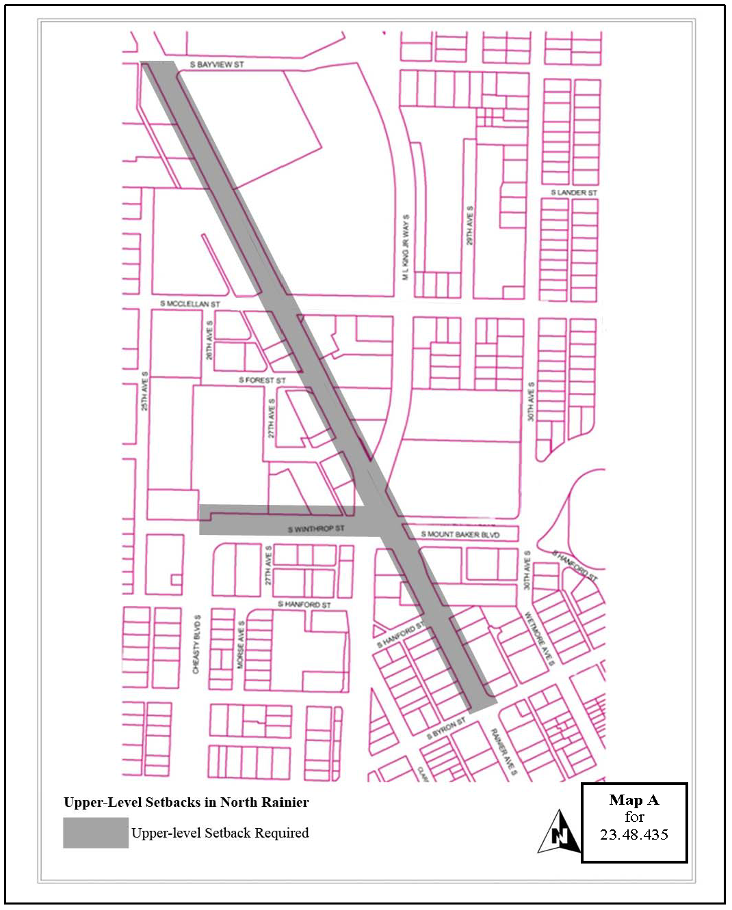

Map A forUpper-Level Setbacks in North Rainier

##### 23.48.440 - Street-level development standards in North Rainier

Lots abutting Class 2 Pedestrian Streets shown on Map A for 23.48.440 are subject to development standards in Section 23.48.040.

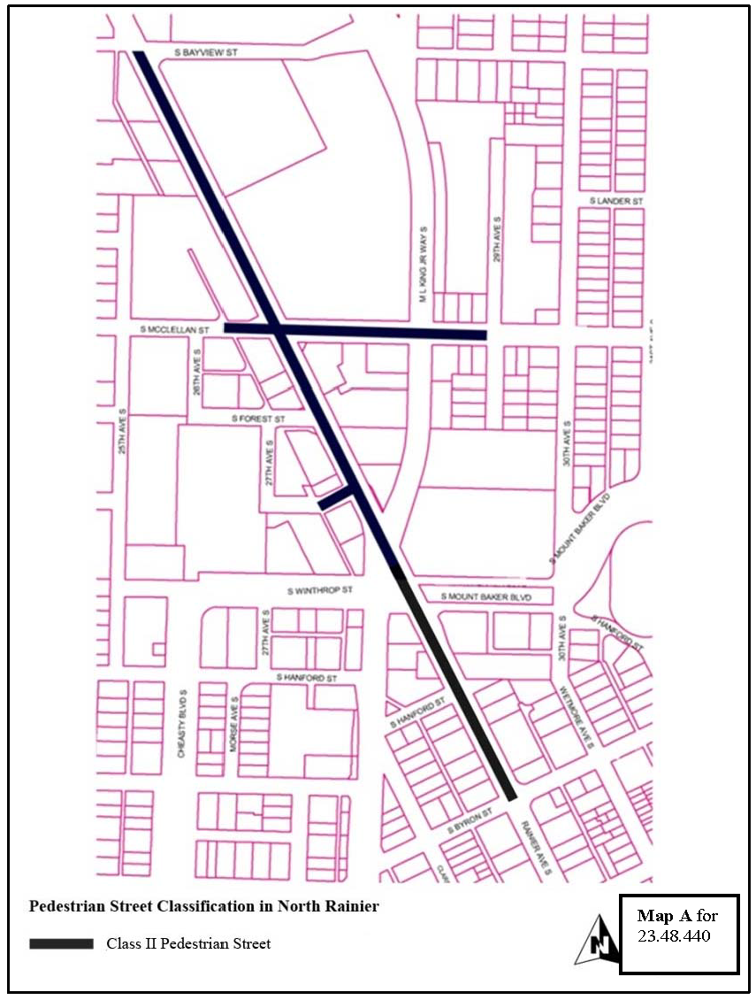

Map A forPedestrian Street Classifications in North Rainier

### Chapter 23.49 - DOWNTOWN ZONING

Sections:

#### Subchapter I - General Provisions
##### 23.49.002 - Scope of provisions

1. This Chapter 23.49 details those authorized uses and their development standards which are or may be permitted in downtown zones: Downtown Office Core 1 (DOC1), Downtown Office Core 2 (DOC2), Downtown Retail Core (DRC), Downtown Mixed Commercial (DMC), Downtown Mixed Residential (DMR), Pioneer Square Mixed (PSM), International District Mixed (IDM), International District Residential (IDR), Downtown Harborfront 1 (DH1), Downtown Harborfront 2 (DH2), and Pike Market Mixed (PMM).
2. Property in the following special districts: Pike Place Market Urban Renewal Area, Pike Place Market Historic District, Pioneer Square Preservation District, International Special Review District, and the Shoreline District, are subject to both the requirements of this Chapter 23.49 and the regulations of the district.
3. Standards and guidelines for amenity features are found in the Downtown Amenity Standards.
4. Requirements for alley improvements are provided in Chapter 23.53. Standards for design of parking are provided in Chapter 23.54. Signs shall be regulated by Chapter 23.55. Methods for measurements are provided in Chapter 23.86.
5. Communication utilities and accessory communication devices except as exempted in Section 23.57.002 are subject to the regulations in this Chapter 23.49 and additional regulations in Chapter 23.57.
6. Major marijuana activity is subject to the regulations in this Chapter 23.49 and additional regulations in Section 23.42.058.

##### 23.49.006 - Scope of general standards.

Unless otherwise specified, the regulations of this subchapter shall apply to all downtown zones.

##### 23.49.008 - Structure height

The following provisions regulating structure height apply to all property in Downtown zones except the DH1 zone. Structure height for PSM, IDM and IDR zones is regulated by this Section 23.49.008, and by Sections 23.49.178, 23.49.208, and 23.49.236.

In certain zones, as specified in this Section 23.49.008, the maximum structure height may be allowed only for particular uses or only on specified conditions, or both. If height limits are specified for portions of a structure that contain specified types of uses, the applicable height limit for the structure is the highest applicable height limit for the types of uses in the structure, unless otherwise specified.

1. Except in the PMM zone, the base height limit for a structure is the lowest of the maximum structure height or the lowest other height limit, if any, that applies pursuant to this Title 23 based upon the uses in the structure, before giving effect to any bonus for which the structure qualifies under this Chapter 23.49 and to any special exceptions or departures authorized under this Chapter 23.49. In the PMM zone the base height limit is the maximum height permitted pursuant to urban renewal covenants.
2. In zones listed below in this subsection 23.49.008.A.3, the applicable height limit for portions of a structure that contain non-residential and live-work uses is shown as the first figure after the zone designation (except that there is no such limit in DOC1), and the base height limit for portions of a structure in residential use is shown as the first figure following the "/". The third figure shown is the maximum residential height limit. Except as stated in subsection 23.49.008.D, the base residential height limit is the applicable height limit for portions of a structure in use if the structure does not use the bonus available under Section 23.49.015, and the maximum residential height limit is the height limit for portions of a structure in residential use if the structure uses the bonus available under Section 23.49.015:

DOC1 Unlimited/450 unlimited

DOC2 500/300-500

DMC 340/290-400

DMC 240/290-400.

3. A structure in a DMC 340/290-400 zone on a lot comprising a full block that abuts a DOC1 zone along at least one street frontage may gain additional structure height of 30 percent above the maximum residential height limit if the structure uses the bonus available under Section 23.49.015, or 35 percent above 340 feet if that bonus is not used, in either case under the following conditions:

    1. Only one tower is permitted on the lot;
    2. Any additional floor area above the maximum height limit for non-residential or live-work use, as increased under this subsection 23.49.008.A.4, is occupied by residential use;
    3. The average residential gross floor area and maximum residential floor area of any story in the portion of the tower permitted above the base residential height limit do not exceed the limits prescribed in subsection 23.49.058.E.1;
    4. Any residential floor area allowed above the base residential height limit under this provision is gained through voluntary agreements to provide low-income or moderate-income housing according to Section 23.49.015;
    5. At least 35 percent of the lot area, or a minimum of 25,000 square feet, whichever is greater, is in open space use substantially at street level meeting the following standards, and subject to the following allowances for coverage:

        1. The location and configuration of the space shall enhance solar exposure, allow easy access to entrances to the tower serving all tenants and occupants from streets abutting the open space, and allow convenient pedestrian circulation through all portions of the open space. The open space shall be entirely contiguous and physically accessible. To offset the impact of the taller structure allowed, the open space shall have frontage at grade abutting sidewalks, and be visible from sidewalks, on at least two streets. The elevation of the space may vary, especially on sloping lots where terracing the space facilitates connections to abutting streets, provided that grade changes are gradual and do not significantly disrupt the continuity of the space, and no part of the open space is significantly above the grade of the nearest abutting street. The Director may allow greater grade changes, as necessary, to facilitate access to transit tunnel stations.
        2. Up to 20 percent of the area used to satisfy the open space condition to allowing additional height may be covered by the following features: permanent, freestanding structures, such as retail kiosks, pavilions, or pedestrian shelters; structural overhangs; overhead arcades or other forms of overhead weather protection; and any other features approved by the Director that contribute to pedestrian comfort and active use of the space. The following features within the open space area may count as open space and are not subject to the percentage coverage limit: temporary kiosks and pavilions, public art, permanent seating that is not reserved for any commercial use, exterior stairs and mechanical assists that provide access to public areas and are available for public use, and any similar features approved by the Director.
    6. Open space used to satisfy the condition to allowing additional height in this Section 23.49.008 is not eligible for a bonus under Section 23.49.013.
    7. Open space used to satisfy the condition to allowing additional height in this Section 23.49.008 may qualify as common recreation area to the extent permitted by subsection 23.49.011.B and may be used to satisfy open space requirements in subsection 23.49.016.C.1 if it satisfies the standards of that subsection 23.49.016.C.1.
    8. No increase in height shall be granted to any proposed development that would result in significant alteration to any designated feature of a landmark structure, unless a certificate of approval for the alteration is granted by the Landmarks Preservation Board.
4. In a DRC zone, the base height limit is 85 feet, except that, subject to the conditions in subsection 23.49.008.A.6:

    1. The base height limit is 150 feet if any of the following conditions is satisfied:

        1. all portions of a structure above 85 feet contain only residential use; or
        2. at least 25 percent of the gross floor area of all structures on a lot is in residential use; or
        3. a minimum of 1.5 FAR of retail sales and service or entertainment uses, or any combination thereof, is provided on the lot.
    2. For residential floor area created by infill of a light well on a Landmark structure, the base height limit is the lesser of 150 feet or the highest level at which the light well is enclosed by the full length of walls of the structure on at least three sides. For the purpose of this subsection 23.49.008.A.5.b a light well is defined as an inward modulation on a non-street facing facade that is enclosed on at least three sides by walls of the same structure, and infill is defined as an addition to that structure within the light well.
5. Restrictions on demolition and alteration of existing structures

    1. Any structure in a DRC zone that would exceed the 85 foot base height limit shall incorporate the existing exterior street front facade(s) of each of the structures listed below, if any, located on the lot of that project. The City Council finds that these structures are significant to the architecture, history and character of downtown. The Director may permit changes to the exterior facade(s) to the extent that significant features are preserved and the visual integrity of the design is maintained. The degree of exterior preservation required will vary, depending upon the nature of the project and the characteristics of the affected structure(s).
    2. The Director shall evaluate whether the manner in which the facade is proposed to be preserved meets the intent to preserve the architecture, character and history of the Retail Core. If a structure on the lot is a Landmark structure, approval by the Landmarks Preservation Board for any proposed modifications to controlled features is required prior to a decision by the Director to allow or condition additional height for the project. The Landmarks Preservation Board's decision shall be incorporated into the Director's decision. Inclusion of a structure on the list below is solely for the purpose of conditioning additional height under this subsection 23.49.008A.6.b, and shall not be interpreted in any way to prejudge the structure's merit as a Landmark:
    3. The restrictions in this subsection 23.49.008.A.6 are in addition to, and not in substitution for, the requirements of the Landmarks Ordinance, Chapter 25.12.
6. The applicable height limit for a structure is the base height limit plus any height allowed as a bonus under this Chapter 23.49 and any additional height allowed by special exception or departure, or by subsection 23.49.008.A.4. The height of a structure shall not exceed the applicable height limit, except as provided in subsections 23.49.008.B, 23.49.008.C, and 23.49.008.D.
7. The height of rooftop features, as provided in subsection 23.49.008.D, is allowed to exceed the applicable height limit.
8. On lots in the DMC 85/65-150 zone:

    1. A height limit of 85 feet applies to the portions of a structure that contain nonresidential or live-work uses.
    2. A base height limit of 65 feet applies to the portions of a structure that contain residential uses.
    3. The applicable height limit for portions of a structure that contain residential uses is 85 feet if the applicant qualifies for extra floor area on the lot under Section 23.49.023 and Chapter 23.58A, the structure has no nonresidential or live-work use above 85 feet, and the structure does not qualify for a higher limit for residential uses under subsection 23.49.008.A.9.d.
    4. The applicable height limit is 150 feet if the applicant qualifies for extra floor area on the lot under Section 23.49.023 and Chapter 23.58A; the structure has no nonresidential or live-work use above 85 feet; the lot is at least 40,000 square feet in size and includes all or part of a mid-block corridor that satisfies the conditions of Section 23.58A.040, except to the extent any waiver of such conditions is granted by the Director; and the standards of Section 23.49.060 are satisfied.

1. Base and maximum height limits

    1. Except as otherwise provided in this Section 23.49.008, maximum structure heights for Downtown zones are as designated on the Official Land Use Map.
2. Structures located in DMC 240/290-400 or DMC 340/290-400 zones may exceed the maximum height limit for residential use, or if applicable the maximum height limit for residential use as increased under subsection 23.49.008.A.4, by 10 percent of that limit, as so increased if applicable, if:

    1. the facades of the portion of the structure above the limit do not enclose an area greater than 9,000 square feet, and
    2. the enclosed space is occupied only by those uses or features otherwise permitted in this Section 23.49.008 as an exception above the height limit. The exception in this subsection 23.49.008.B shall not be combined with any other height exception for screening or rooftop features to gain additional height.
3. Height in Downtown Mixed Residential (DMR) zones is regulated as follows:

    1. A structure that contains only nonresidential or live-work uses may not exceed the lowest height limit established on the Official Land Use Map, except for rooftop features permitted by subsection 23.49.008.D.
    2. In DMR zones for which only two height limits are established, only those portions of structures that contain only residential uses may exceed the lower height limit, and they may extend to the higher height limit established on the Official Land Use Map.
    3. On lots in the DMR/C 65/65-150 zone, the base height limit is 65 feet, and it is the applicable height limit for all structures, except that:

        1. The applicable height limit is 85 feet if the applicant qualifies for extra floor area under Section 23.49.023 and Chapter 23.58A, the structure has no nonresidential or live-work use above 65 feet, and the structure does not qualify for a higher height limit under this subsection 23.49.008.C.3.
        2. The applicable height limit is 150 feet if the applicant qualifies for extra floor area under Section 23.49.023 and Chapter 23.58A; the structure has no nonresidential or live-work use above 65 feet; the lot includes all or part of a mid-block corridor that satisfies the conditions of Section 23.58A.040, except to the extent any waiver of such conditions is granted by the Director; and the standards of subsection 23.49.156.B and Section 23.49.163 are satisfied.
    4. On lots in the DMR/C 65/65-85 zone, the base height limit is 65 feet, and it is the applicable height limit for all structures, except that the applicable height limit is 85 feet if the applicant qualifies for extra floor area under Section 23.49.023 and Chapter 23.58A and the structure has no nonresidential or live-work use above 65 feet.
    5. Rooftop features

        1. The following rooftop features are permitted with unlimited rooftop coverage and may not exceed the height limits as indicated:

            1. Open railings, planters, clerestories, skylights, play equipment, parapets, and firewalls up to 4 feet above the applicable height limit;
            2. Insulation material, rooftop decks and other similar features, or soil for landscaping located above the structural roof surface, may exceed the maximum height limit by up to two feet if enclosed by parapets or walls that comply with subsection 23.49.008.D.1.a;
            3. Solar collectors up to 7 feet above the applicable height limit; and
            4. The rooftop features listed below shall be located a minimum of 10 feet from all lot lines and may extend up to 50 feet above the roof of the structure on which they are located or 50 feet above the applicable height limit, whichever is less, except as regulated by Chapter 23.64, Airport Height Overlay District:

                1. Religious symbols for religious institutions;
                2. Smokestacks; and
                3. Flagpoles.
        2. The following rooftop features are permitted up to the heights indicated below, as long as the combined coverage of all rooftop features, whether or not listed in this subsection 23.49.008.D.2, does not exceed 55 percent of the roof area for structures that are subject to maximum floor area limits per story pursuant to Section 23.49.058, or 35 percent of the roof area for other structures.

            1. The following rooftop features are permitted to extend up to 15 feet above the applicable height limit:

                1. Solar collectors;
                2. Stair penthouses;
                3. Play equipment and open-mesh fencing, as long as the fencing is at least 15 feet from the roof edge;
                4. Covered or enclosed common recreation area or eating and drinking establishment;
                5. Mechanical equipment; and
                6. Wind turbines.
            2. Elevator penthouses as follows:

                1. In the PMM zone, up to 15 feet above the applicable height limit;
                2. Except in the PMM zone, up to 23 feet above the applicable height limit for a penthouse designed for an elevator cab up to 8 feet high;
                3. Except in the PMM zone, up to 25 feet above the applicable height limit for a penthouse designed for an elevator cab more than 8 feet high;
                4. Except in the PMM zone, if the elevator provides access to a rooftop designed to provide usable open space, an additional 10 feet above the amount permitted in subsections 23.49.008.D.2.b.2 and 23.49.008.D.2.b.3 shall be permitted.
            3. Minor communication utilities and accessory communication devices, regulated according to Section 23.57.013, shall be included within the maximum permitted rooftop coverage.
            4. Greenhouses that are dedicated to food production are permitted to extend 15 feet above the applicable height limit, as long as the combined total coverage of all features gaining additional height listed does not exceed 50 percent of the roof area.
            5. Mechanical equipment, whether new or replacement, may be allowed up to 15 feet above the roof elevation of a structure existing prior to June 1, 1989.
        3. Screening of rooftop features

            1. Measures may be taken to screen rooftop features from public view through the design review process or, if located within the Pike Place Market Historical District, by the Pike Place Market Historical Commission.
            2. Except in the PMM zone, the amount of roof area enclosed by rooftop screening may exceed the maximum percentage of the combined coverage of all rooftop features as provided in subsection 23.49.008.D.2.
            3. Except in the PMM zone, in no circumstances shall the height of rooftop screening exceed ten percent of the applicable height limit, or 15 feet, whichever is greater. In the PMM zone, the height of the screening shall not exceed the height of the rooftop feature being screened, or such greater height necessary for effective screening as determined by the Pike Place Market Historical Commission.
        4. Administrative conditional use for rooftop features. Except in the PMM zone, the rooftop features listed in subsection 23.49.008.D.1.c may exceed a height of 50 feet above the roof of the structure on which they are located if authorized by the Director through an administrative conditional use, Chapter 23.76. The request for additional height shall be evaluated on the basis of public benefits provided, the possible impacts of the additional height, consistency with the City's Comprehensive Plan, and the following criteria:

            1. The feature shall be compatible with and not adversely affect the downtown skyline.
            2. The feature shall not have a substantial adverse effect upon the light, air, solar and visual access of properties within a 300 foot radius.
            3. The feature, supporting structure and structure below shall be compatible in design elements such as bulk, profile, color and materials.
            4. The increased size is necessary for the successful physical function of the feature, except for religious symbols.
        5. Residential penthouses above height limit in a DRC zone

            1. A residential penthouse exceeding the applicable height limit shall be permitted in a DRC zone only on a mixed-use, City-designated Landmark structure for which a certificate of approval by the Landmarks Preservation Board is required. A residential penthouse allowed under this Section 23.49.008 may cover a maximum of 50 percent of the total roof surface. Except as the Director may allow under subsection 23.49.008.D.5.b:

                1. A residential penthouse allowed under this subsection 23.49.008.D.5 shall be set back a minimum of 15 feet from the street lot line.
                2. A residential penthouse may extend up to 8 feet above the roof, or 12 feet above the roof if set back a minimum of 30 feet from the street lot line.
            2. If the Director determines, after a sight line review based upon adequate information submitted by the applicant, that a penthouse will be invisible or minimally visible from public streets and parks within 300 feet from the structure, the Director may allow one or both of the following in a Type I decision:

                1. An increase of the penthouse height limit under subsection 23.49.008.D.5.a by an amount up to the average height of the structure's street-facing parapet; or
                2. A reduction in the required setback for a residential penthouse.
            3. The Director's decision to modify development standards pursuant to subsection 23.49.008.D.5.b shall be consistent with the certificate of approval from the Landmarks Preservation Board.
            4. A residential penthouse allowed under this subsection 23.49.008.D.5 shall not exceed the maximum structure height in the DRC zone under Section 23.49.008.
            5. No rooftop features shall be permitted on a residential penthouse allowed under this subsection 23.49.008.D.5.
        6. For height limits and exceptions for communication utilities and accessory communication devices, see Section 23.57.013.
    6. In the DMC 160 zone, an additional 5 feet in height is permitted above the otherwise applicable height limit, subject to the following:

        1. The street-level portion of the structure is occupied by street-level uses specified in subsection 23.49.009.A, has a minimum floor-to-floor height of 18 feet, and meets the provisions of subsection 23.49.009.B, regardless of whether the street-level uses are required pursuant to Map 1G;
        2. The applicable height limit, including any additional height allowed in this subsection 23.49.008.E, shall be used as the height limit above which rooftop features are permitted according to subsection 23.49.008.D; and
        3. No increase in height shall be granted to any proposed development that would result in significant alteration to any designated feature of a landmark structure, unless a certificate of approval for the alteration is granted by the Landmarks Preservation Board.

##### 23.49.009 - Street-level use requirements

One or more of the uses listed in subsection 23.49.009.A are required at street level on all lots abutting streets designated on Map 1G. Required street-level uses shall meet the standards of this Section 23.49.009.

1. Types of uses. The following uses qualify as required street-level uses:

    1. General sales and services;
    2. Human service uses and child care centers;
    3. Retail sales, major durables;
    4. Entertainment uses;
    5. Museums, and administrative offices within a museum expansion space meeting the requirement of subsection 23.49.011.B.1.h;
    6. Libraries;
    7. Elementary and secondary schools, and colleges, except on lots zoned DRC;
    8. Public atriums;
    9. Eating and drinking establishments;
    10. Arts facilities; and
    11. Religious facilities; and
    12. Bicycle parking, provided that the use does not exceed 30 percent of the frontage 23.49.009.B or 50 feet, whichever is less.
2. General standards

    1. The amount of street frontage required to be occupied by street-level uses is as follows:

        1. Except as provided in subsection 23.49.009.B.1.b, a minimum of 75 percent of each street frontage at street level where street-level uses are required must be occupied by uses listed in subsection 23.49.009.A. The remaining 25 percent of the street frontage at street level may contain other permitted uses and/or pedestrian or vehicular entrances.
        2. The frontage required to be occupied by street-level uses is reduced to 50 percent, while the remaining 50 percent may contain other permitted uses and/or pedestrian or vehicular entrances, for each street frontage that is 120 feet in length or less if either:

            1. the lot does not abut an alley, or
            2. the lot abuts more than one street requiring street-level uses.
        3. The frontage of the following is not counted in street frontage:

            1. any exterior public open space that qualifies for a floor area bonus, whether it receives a bonus or not;
            2. any eligible lot area of an open space TDR site;
            3. any outdoor common recreation area required for residential uses; or
            4. any open space required for office uses,
    2. In the DRC zone, a combined total of no more than 20 percent of the total street frontage of the lot may be occupied by human service uses, child care centers, customer service offices, entertainment uses or museums.
    3. Required street-level uses shall be located within 10 feet of the street lot line, except as follows:

        1. If a public open space that meets the eligibility conditions of the Downtown Amenity Standards abuts the street, the required street-level uses shall abut the open space;
        2. If sidewalk widening is required by Section 23.49.022, the 10 feet shall be measured from the line established by the new sidewalk width; or
        3. In the DMC 160 zone, if a continuous setback greater than 10 feet is provided from the Alaskan Way street lot line, as allowed in subsection 23.49.056.B.1.d, the required street-level uses shall abut the setback. The setback may be provided at grade or above a partially above-grade story.
    4. Except for child care centers, pedestrian access to required street-level uses shall be provided as follows:

        1. Pedestrian entrances shall be provided directly from the street and shall be located no more than 3 feet above or below sidewalk grade; or
        2. Pedestrian entrances shall be provided from a bonused public open space, or other publicly accessible open space, and shall be at the same elevation as the abutting public open space; or
        3. In the DMC 160 zone, if a partially above-grade story is provided that meets the conditions of subsection 23.49.011.B.1.u, pedestrian entrances to the required street-level uses shall be provided at the same elevation as the roof of the partially above-grade story.

##### 23.49.010 - General requirements for residential uses

1. Reserved
2. Common recreation area. Common recreation area is required for all new development with more than 20 dwelling units. Required common recreation area shall meet the following standards:

    1. An area equivalent to 5 percent of the total gross floor area in residential use, excluding any floor area in residential use gained in a project through a voluntary agreement for housing under Section 23.49.015, shall be provided as common recreation area. The amount of required common recreation area shall not exceed the area of the lot. The common recreation area shall be available to all residents and may be provided at or above ground level.
    2. A maximum of 50 percent of the common recreation area may be enclosed.
    3. The minimum horizontal dimension for required common recreation areas shall be 15 feet, except for open space provided as landscaped setback area at street level, which shall have a minimum horizontal dimension of 10 feet. No required common recreation area shall be less than 225 square feet.
    4. Common recreation area that is provided as open space at street level shall be counted as twice the actual area in determining the amount provided to meet the common recreation area requirement.
    5. In mixed use projects, the Director may permit a bonused public open space to satisfy a portion of the common recreation area requirement, provided that the space meets the standards of this Section 23.49.010, and the Director finds that its design, location, access, and hours of operation meet the needs of building residents.
    6. Parking areas, driveways and pedestrian access, except for pedestrian access meeting the Washington State Rules and Regulations for Barrier Free Design, shall not be counted as common recreation area.
    7. In PSM zones, the Director of the Department of Neighborhoods, on recommendation of the Pioneer Square Preservation Board, may waive the requirement for common recreation area, pursuant to the criteria of Section 23.66.155, Waiver of common recreation area requirements.
    8. In IDM and IDR zones, the Director of the Department of Neighborhoods, on recommendation of the International District Special Review District Board, may waive the requirement for common recreation area, pursuant to the criteria of Section 23.66.155, Waiver of common recreation area requirements.
    9. For lots abutting designated green streets, up to 50 percent of the common recreation area requirement may be met by contributing to the development of a green street. The Director may waive the requirement that the green street abut the lot and allow the improvement to be made to a green street located in the general vicinity of the project if such an improvement is determined to be beneficial to the residents of the project.
3. Assisted living facilities

    1. Assisted living facilities are subject to the development standards of the zone where they are located, except that common recreation area requirements do not apply to assisted living facilities.
    2. Other requirements

        1. Minimum unit size. Assisted living units shall be designed to meet the minimum square footage required by WAC 388-110-140.
        2. Facility kitchen. An on-site kitchen that serves the entire assisted living facility is required.
        3. Communal area. Communal areas that are either interior or exterior spaces, such as solariums, decks and porches, recreation rooms, dining rooms, living rooms, foyers and lobbies, and gardens or other outdoor landscaped areas shall be provided as follows:

            1. The total amount of communal area shall equal at least 20 percent of the total floor area in assisted living units. In calculating the total floor area in assisted living units, all of the area of each unit, excluding the bathroom, shall be counted, including counters, closets and built-ins;
            2. Service areas, including, but not limited to, the facility kitchen, laundry, hallways and corridors, supply closets, operations and maintenance areas, staff areas and offices, and rooms used only for counseling or medical services, shall not be counted as required communal area;
            3. A minimum of 400 square feet of the required communal area shall be provided as an outdoor area with a minimum dimension of 10 feet. Outdoor areas provided as required communal area shall be accessible to people with disabilities; and
            4. Adequate seating for residents and guests shall be provided for required communal area.

##### 23.49.011 - Floor area ratio

1. General standards

    1. The base and maximum floor area ratio (FAR) for each zone is provided in Table A for 23.49.011.
    2. Chargeable floor area shall not exceed the applicable base FAR except as expressly authorized pursuant to this Chapter 23.49.

        1. In DOC1, DOC2, and DMC zones that are located outside of South Downtown, if chargeable floor area above the base FAR is allowed on a lot for development that includes a new structure and the project is located within the Local Infrastructure Project Area for Downtown and South Lake Union as shown on Map A for 23.58A.044, the first increment of chargeable floor area above the base FAR, shown for each zone in Table B for 23.49.011, shall be gained by acquiring regional development credits pursuant to Section 23.58A.044.
        2. In DOC1, DOC2, DH2, and DMC zones outside of South Downtown, additional chargeable floor area above the first increment of FAR that exceeds the base FAR may be obtained only by qualifying for floor area bonuses pursuant to Section 23.49.012 or 23.49.013, or by the transfer of transferable development rights pursuant to Section 23.49.014, or both, except as otherwise expressly provided in this subsection 23.49.011.A.2. If the requirements of subsection 23.49.011.A.2.a do not apply, the first increment of floor area that exceeds the base FAR shall be zero.
        3. In no event shall the use of bonuses, TDR, or regional development credits, or any combination of them, be allowed to result in chargeable floor area in excess of the maximum as set forth in Table A for 23.49.011, except that a structure on a lot in a planned community development pursuant to Section 23.49.036 or a combined lot development pursuant to Section 23.49.041 may exceed the floor area ratio otherwise permitted on that lot, provided the chargeable floor area on all lots included in the planned community development or combined lot development as a whole does not exceed the combined total permitted chargeable floor area.
        4. Except as otherwise provided in this subsection 23.49.011.A.2.d or subsections 23.49.011.A.2.f or 23.49.011.A.2.h, and except in South Downtown, not less than 5 percent of all floor area above the base FAR to be gained on any lot, excluding any floor area gained under subsections 23.49.011.A.2.a, 23.49.011.A.2.j, and 23.49.011.A.2.k, shall be gained through the transfer of Landmark TDR, to the extent that Landmark TDR are available. Landmark TDR shall be considered "available" only to the extent that, at the time of the Master Use Permit application to gain the additional floor area, the City of Seattle is offering Landmark TDR for sale, at a price per square foot no greater than the total bonus contribution under Section 23.49.012 for a project using the cash option for both housing and childcare facilities. An applicant may satisfy the minimum Landmark TDR requirement in this Section 23.49.011 by purchases from private parties, by transfer from an eligible sending lot owned by the applicant, by purchase from the City, or by any combination of the foregoing. This subsection 23.49.011.A.2.d does not apply to any lot in a DMR zone.
        5. Except as otherwise permitted under subsections 23.49.011.A.2.g, 23.49.011.A.2.h, or 23.49.011.A.2.l, on any lot outside of South Downtown except a lot in a DMR zone, the total amount of chargeable floor area gained through bonuses under Section 23.49.012, together with any housing TDR and Landmark housing TDR used for the same project, shall equal 75 percent of the amount, if any, by which the total chargeable floor area to be permitted on the lot exceeds the sum of

            1. the base FAR, as determined under this Section 23.49.011 and Section 23.49.032 if applicable, plus
            2. any chargeable floor area gained on the lot pursuant to subsections 23.49.011.A.2.a, 23.49.011.A.2.g, 23.49.011.A.2.h, 23.49.011.A.2.j, and 23.49.011.A.2.k. Except in South Downtown, at least half of the remaining 25 percent shall be gained by using TDR from a sending lot with a major performing arts facility, to the extent available, and the balance of the 25 percent shall be gained through bonuses under Section 23.49.013 or through TDR other than housing TDR, or both, consistent with this Chapter 23.49. TDR from a sending lot with a major performing arts facility shall be considered "available" only to the extent that, at the time of the Master Use Permit application to gain the additional floor area, the City of Seattle is offering such TDR for sale, at a price per square foot not exceeding the prevailing market price for TDR other than housing TDR, as determined by the Director.
        6. In order to gain chargeable floor area on any lot in a DMR zone outside of South Downtown, an applicant may

            1. use any types of TDR eligible under this Chapter 23.49 in any proportions, or
            2. use bonuses under Section 23.49.012 or 23.49.013, or both, subject to the limits for particular types of bonus under Section 23.49.013, or
            3. combine such TDR and bonuses in any proportions.
        7. On any lot in a DMC zone allowing a maximum FAR of 7, in addition to the provisions of subsection 23.49.011.A.2.e, an applicant may gain chargeable floor area above the first increment of FAR above the base FAR through use of DMC housing TDR, or any combination of DMC housing TDR with floor area gained through other TDR and bonuses as prescribed in subsection 23.49.011.A.2.e.
        8. If the amount of bonus development sought in any permit application does not exceed 5,000 square feet of chargeable floor area, the Director may permit such floor area to be achieved solely through the bonus for housing and child care.
        9. No chargeable floor area above the base FAR shall be granted to any proposed development that would result in significant alteration to any designated feature of a Landmark structure, unless a certificate of approval for the alteration is granted by the Landmarks Preservation Board.
        10. On a lot entirely in a DOC1 zone, additional chargeable floor area equal to 1.0 FAR may be permitted above the increment achieved through a commitment as prescribed in subsection 23.49.011.A.2.a, or above the base FAR after expiration of that subsection 23.49.011.A.2.a, on a lot that includes one or more qualifying Landmarks, subject to the following conditions:

            1. the structure is rehabilitated to the extent necessary so that all features and characteristics controlled or designated by ordinance pursuant to Chapter 25.12 or Ordinance 102229 are in good condition and consistent with the applicable ordinances and with any certificates of approval issued by the Landmarks Preservation Board, all as determined by the Director of Neighborhoods; and
            2. a notice shall be recorded in the King County real estate records, in form satisfactory to the Director, regarding the bonus allowed and the effect thereof under the terms of this Chapter 23.49. For purposes of this Section 23.49.011, a "qualifying Landmark" is a structure that

                1. has a gross floor area above grade of at least 5,000 square feet;
                2. is separate from the principal structure or structures existing or to be developed on the lot, except that it may abut and connect with one such structure along one exterior wall;
                3. is subject, in whole or in part, to a designating ordinance pursuant to Chapter 25.12, or was designated pursuant to Ordinance 102229; and
                4. is on a lot on which no improvement, object, feature or characteristic has been altered or removed contrary to any provision of Chapter 25.12 or any designating ordinance. A qualifying Landmark for which a bonus is allowed under this subsection 23.49.011.A.2.j shall be considered a public benefit feature, but shall not be considered an amenity for purposes of Section 23.49.013. For so long as any of the chargeable floor area allowed under this subsection 23.49.011.A.2.j remains on the lot, each qualifying Landmark for which such bonus was granted shall remain designated as a Landmark under Chapter 25.12 and the owner shall maintain the exterior and interior of each qualifying Landmark in good condition and repair and in a manner that preserves the features and characteristics that are subject to designation or controls by ordinance, and that maintains compliance with all applicable requirements of federal, state and local laws, ordinances, regulations, and restrictions.
        11. On a lot entirely in a DOC1 zone, as an incentive to maintain diversity in the scale of downtown development, additional floor area equal to 0.5 FAR may be granted above the increment achieved through a commitment as prescribed in subsection 23.49.011.A.2.a, or above the base FAR after expiration of that subsection 23.48.011.A.2.a, on a lot that includes one or more qualifying small structures, subject to the conditions in this subsection 23.49.011.A.2.k.

            1. A "qualifying small structure" is one that satisfies all of the following standards:

                1. the gross floor area of the structure above grade is a minimum of 5,000 square feet and does not exceed 50,000 square feet;
                2. the height of the structure is 125 feet or less, not including rooftop features as specified in subsection 23.49.008.D;
                3. the structure was not constructed or substantially structurally modified since July 13, 1982; and
                4. the structure is not occupied by parking above the ground floor.
            2. If the structure is removed from the lot or ceases to be a qualifying small structure, then any development on the portion of the lot previously occupied by the structure, defined by a rectangle enclosing the exterior walls of the structure as they exist at the time the bonus is granted and extended to the nearest street frontage, shall be limited to a maximum floor area of 50,000 square feet for all uses and a maximum height of 125 feet, excluding any rooftop features as specified in subsection 23.49.008.D.
            3. A notice shall be recorded in the King County real estate records, in form satisfactory to the Director, regarding the bonus allowed and the effect thereof under the terms of this Chapter 23.49.
            4. Bonus floor area under this subsection 23.49.011.A.2.k may not be granted on the basis of a Landmark structure for which bonus floor area is allowed under subsection 23.49.011.A.2.j, but may be allowed on the basis of a different structure or structures that are on the same lot as a Landmark structure for which such bonus floor area is allowed.
        12. Chargeable floor area in excess of the base FAR in the PSM 85-120 zone may be gained only in accordance with Section 23.49.180.
        13. In IDM, DMR and DMC zones within South Downtown, chargeable floor area in excess of the base FAR may be obtained only by qualifying for floor area bonuses pursuant to Sections 23.58A.024 and 23.49.013, or by the transfer of transferable development rights pursuant to Section 23.49.014, or both, and except as permitted in subsection 23.49.011.A.2.h, only if the conditions of this subsection 23.49.011.A.2.m also are satisfied:

            1. For a new structure, the applicant makes a commitment, approved by the Director as a Type I decision, that the proposed development will earn a LEED Silver rating or meet a substantially equivalent standard. If such a commitment is made, Section 23.49.020 applies.
            2. Seventy-five percent of the chargeable floor area in excess of base FAR shall be gained through bonuses under Section 23.58A.024 or through use of Housing TDR from within South Downtown.
            3. Twenty-five percent of the chargeable floor area in excess of base FAR shall be gained by one or any combination of transferable development rights or public open space amenities, subject to the conditions and limits of this Section 23.49.011, Section 23.49.013, and Section 23.49.014:

                1. TDR that may be used on a lot in South Downtown are limited to South Downtown Historic TDR, open space TDR from within South Downtown, or any combination of these consistent with this Chapter 23.49.
                2. Amenities eligible for a bonus on a lot in South Downtown are limited to public open space amenities pursuant to Section 23.49.013.
    3. In a DOC1, DOC2, DRC, or DMC zone, for a lot that includes a qualifying Landmark structure with a performing arts theater, the base FAR specified in Table A for 23.49.011 is increased by 4 FAR, or by the amount of FAR between the base and maximum FAR of the zone, whichever is less, provided that the conditions of this subsection 23.49.011.A.3 are met.

        1. For purposes of this subsection 23.49.011.A.3, a "qualifying Landmark structure with a performing arts theater" is a structure that is a designated Landmark pursuant to Chapter 25.12 and that meets the following:

            1. the structure was built before 1930;
            2. the structure contains performing arts theater space that has combined seating capacity in one or more venues for at least 800; and
            3. the structure is subject to an ordinance granting incentives for and imposing controls on the Landmark structure.
        2. At the time a qualifying Landmark structure with a performing arts theater uses the additional base FAR, either on the site or through transfer of TDR to another site, the following conditions shall be met:

            1. the performing arts theater use established under approved permits, including combined seating capacity in one or more venues for at least 800, shall be ensured by binding covenants between the property owner and the City for at least 40 years from the first use of any of the additional base FAR, either on the site or through the first transfer of any TDR to another site; and
            2. the Director, after consulting with the property owner, determines, as a Type I decision, that the property owner has executed a contract(s) with one or more theater groups or performing arts organizations for regularly scheduled use of the Landmark structure for live performances and that the anticipated use of the Landmark theater structure for live theater performances, combined with any other use of the structure, is adequate to contribute sufficiently to the presence of live theater in the Downtown Historic Theatre District established by Resolution 31341 and to support the desired level of activity in the area near the Landmark structure. In making this determination, the Director shall consider the following:

                1. the extent and duration of the contract(s) between the property owner and one or more theater groups or performing arts organizations for regularly scheduled use of the Landmark structure for live performances;
                2. the presence of uses in the structure that will contribute to activity in the area beyond the typical workday hours; and
                3. programmed use of the Landmark structure by other activities during periods when the structure is not in use for live performances; and
            3. any use of the additional base FAR on the site complies with all provisions of the designating ordinance and Chapter 25.12.
        3. If a Landmark structure is on a lot that is not entirely regulated by a designating ordinance, then the area used to calculate the additional base FAR is the area of the footprint of the Landmark structure.
        4. A lot that uses the additional base FAR on the site as allowed by this subsection 23.49.011.A.3 is not allowed to gain chargeable floor area under subsection 23.49.011.A.2.j.
        5. If a qualifying Landmark structure with a performing arts theater is on a lot that is not entirely regulated by a designating ordinance, then the additional base FAR may be transferred as TDR to another site, or may be used on the site on the portion of the lot that is within the footprint of the Landmark structure, but shall not be used elsewhere on the lot.
    4. The Master Use Permit application to establish any bonus development under this subsection 23.49.011.A.4 shall include a calculation of the amount of bonus development sought and shall identify the manner in which the conditions to such bonus development shall be satisfied. The Director shall, at the time of issuance of any Master Use Permit decision approving any such bonus development, issue a Type I decision as to the amount of bonus development to be allowed and the conditions to such bonus development, which decision may include alternative means to achieve bonus development, at the applicant's option, if each alternative would be consistent with this Section 23.49.011 and any other conditions of the permit, including Design Review if applicable.
2. Exemptions and deductions from FAR calculations

    1. The following are not included in chargeable floor area, except as specified below in this Section 23.49.011:

        1. Uses listed in subsection 23.49.009.A in a DRC zone and in the FAR Exemption Area identified on Map 1J up to a maximum FAR of 2 for all such uses combined, provided that for uses in the FAR Exemption Area that are not in the DRC zone the uses are located no higher than the story above street level;
        2. Street-level uses meeting the requirements of Section 23.49.009, Street-level use requirements, whether or not street-level use is required pursuant to Map 1G, if the uses and structure also satisfy the following standards:

            1. The street level of the structure containing the exempt space has a minimum floor-to-floor height of 13 feet, except that in the DMC 160 zone the street level of the structure containing the exempt space has a minimum floor-to-floor height of 18 feet;
            2. The exempt space extends a minimum depth of 15 feet from the street-level, street-facing facade; and
            3. Overhead weather protection is provided satisfying Section 23.49.018.
        3. Shopping atria in the DRC zone and adjacent areas shown on Map 1J, provided that:

            1. The minimum area of the shopping atria is 4,000 square feet;
            2. The eligibility conditions of the Downtown Amenity Standards are met; and
            3. The maximum area eligible for a floor area exemption is 20,000 square feet;
        4. Child care centers;
        5. Human service use;
        6. Residential use, except in the PMM zone, and provided that allowable residential floor area is limited on lots from which TDP is transferred in accordance with Chapter 23.58A;
        7. Live-work units, except in the PMM zone;
        8. Museums, provided that the eligibility conditions of the Downtown Amenity Standards are met;
        9. The floor area identified as expansion space for a museum, if such expansion space satisfies the following:

            1. The floor area to contain the museum expansion space is owned by the museum or a museum development authority; and
            2. The museum expansion space will be occupied by a museum, existing as of October 31, 2002, on a downtown zoned lot; and
            3. The museum expansion space is physically designed in conformance with the Seattle Building Code standards for museum use either at the time of original configuration or at such time as museum expansion is proposed;
        10. Performing arts theaters;
        11. Floor area below grade;
        12. Floor area that is used only for:

            1. short-term parking or parking accessory to residential uses, or both, subject to a limit on floor area used wholly or in part as parking accessory to residential uses of one parking space for each dwelling unit on the lot with the residential use served by the parking; or
            2. parking accessory to hotel use in the DMC 160 zone, subject to a limit of one parking space for every four hotel rooms on the lot, and provided that the exempt parking floor area is on the same lot as the hotel use served by the parking;
        13. Floor area of a public benefit feature that would be eligible for a bonus on the lot where the feature is located, other than a Landmark structure eligible pursuant to subsection 23.49.011.A.2.k or a small structure eligible pursuant to subsection 23.49.011.A.2.l. The exemption applies regardless of whether a floor area bonus is obtained, and regardless of limits on the maximum area eligible for a bonus;
        14. Public restrooms;
        15. Major retail stores in the DRC zone and adjacent areas shown on Map 1J, provided that:

            1. The minimum lot area for a major retail store development is 20,000 square feet;
            2. The minimum area of the major retail store is 80,000 square feet;
            3. The eligibility conditions of the Downtown Amenity Standards are met;
            4. The maximum area eligible for a floor area exemption is 200,000 square feet; and
            5. The floor area exemption applies to storage areas, store offices, and other support spaces necessary for the store's operation;
        16. Shower facilities for bicycle commuters;
        17. Floor area, excluding floor area otherwise exempt, up to a maximum of 25,000 square feet on any lot, within one or more Landmark structures for which a floor area bonus has been granted pursuant to subsection 23.49.011.A.2.k, or within one or more small structures for which a floor area bonus has been granted pursuant to subsection 23.49.011.A.2.l, or within any combination of such Landmark structures and such small structures, in each case only to the extent that the floor area satisfies the following criteria as determined by the Director:

            1. The floor area is interior space of historic or architectural interest designed to accommodate the original function of the structure, and maintaining the integrity of this space prevents it from being fully utilized as commercial floor area;
            2. The floor area is occupied by such uses as public assembly or performance space, human services, or indoor public amenities, including atrium or lobby area available for passive indoor recreation use or for the display of art or other objects of scientific, social, historic, cultural, educational or aesthetic interest; and
            3. The floor area is open and accessible to the public without charge, on reasonable terms and conditions consistent with the nature of the space, during normal operating hours of the building;
        18. Up to 40,000 square feet of a streetcar maintenance base;
        19. Up to 25,000 square feet of a community center in a DMR/C zone within South Downtown that is open to the general public for a minimum of six hours per day, five days per week, 42 weeks per year;
        20. In the DMC 160 zone, hotel use that separates parking from the street lot line on stories above the first story of a structure, up to a maximum total floor area equivalent to 1 FAR, provided that the depth of the separation between the parking and the street-facing facade is a minimum of 15 feet; and
        21. In the DMC 160 zone, on lots abutting Alaskan Way, the floor area in a partially above-grade story, provided that:

            1. the height of the above-grade portion of the partially above-grade story does not exceed 4 feet, measured from existing grade at the midpoint of the Alaskan Way street lot line;
            2. all portions of the structure above the partially above-grade story are set back a minimum of 16 feet from the Alaskan Way lot line, except that horizontal projections, including balconies with open railings, eaves, cornices, and gutters, may extend a maximum of 4 feet into the setback area;
            3. the roof of the portion of the partially above-grade story in the setback area is accessible to abutting required street-level uses in the structure and provides open space or space for activities related to abutting required street-level uses, such as outdoor dining;
            4. pedestrian access is provided from an abutting street to the roof of the portion of the partially above-grade story in the setback area; and
            5. up to 50 percent of the roof of the portion of the partially above-grade story in the setback area may be enclosed to provide weather protection, provided that the height of any feature or structure enclosing the space shall not exceed 20 feet, measured from the roof of the partially above-grade story; and
        22. Up to a maximum of 50,000 square feet of the floor area occupied by a City facility, including but not limited to fire stations and police precincts, but not a City facility predominantly occupied by office use;
        23. Parking uses if:

            1. the parking use sought to be exempted was legally established as of the effective date of this ordinance;
            2. the parking is in a structure that existed on January 1, 1980;
            3. the structure is located west of Third Avenue in a DMC zone;
            4. A minimum of 50 percent of the parking spaces will be available to the general public as short-term parking;
            5. The existing structure and any proposed additions meet or are modified to meet the street-level use requirements of Section 23.49.009;
            6. The existing structure and any proposed additions are subject to administrative design review regardless of whether administrative design review is required pursuant to Chapter 23.41; and
            7. Any addition of non-exempt floor area to the existing structure is developed to LEED Gold standards; and
        24. Floor area for a preschool, an elementary school, or a secondary school, except on lots zoned DRC, which may include minimum space requirements for associated uses including but not limited to academic core functions, child care, administrative offices, a library, maintenance facilities, food service, interior recreation, and specialty instruction space, provided that;

            1. Prior to issuance of a Master Use Permit, the applicant shall submit a letter to the Director from the operator of the school indicating that, based on the Master Use Permit plans, the operator has determined that the development could meet the operator's specifications; and
            2. Prior to issuance of a building permit, the applicant shall submit a written certification by the operator to the Director that the operator's specifications have been met.
    2. Mechanical equipment

        1. As an allowance for mechanical equipment fully contained within a structure, 3.5 percent shall be deducted in computing chargeable gross floor area. Calculation of the allowance excludes gross floor area exempt pursuant to subsection 23.49.011.B.1.
        2. Mechanical equipment located on the roof of a structure shall not be calculated as part of the total gross floor area of the structure.

##### 23.49.012 - Bonus floor area for voluntary agreements for housing and child care

If and when the City becomes entitled to realize on any security, the Director of Housing shall take appropriate steps to do so, and the amounts realized, net of any costs to the City, shall be used in the same manner as cash contributions for housing made under this Section 23.49.012. In the case of any project proposing to use bonus floor area for which no building permit is required, references to the building permit in subsection 23.49.012.B.1 shall mean the Master Use Permit allowing establishment or expansion of the use for which bonus floor area is sought.

1. Nothing in this Chapter 23.49 shall be construed to confer on any owner or developer of housing, any party to a linkage agreement, or any assignee, any development rights or property interests. Because the availability and terms of allowance of bonus floor area depend upon the regulations in effect at the relevant time for the project proposing to use the bonus floor area, pursuant to Section 23.76.026, any approvals or agreements by the Director of Housing regarding the eligibility of actual or proposed housing as to satisfy conditions of a bonus, and any approval of a linkage agreement and/or assignment, do not grant any vested rights, nor guarantee that any bonus floor area will be permitted based on the housing.
2. The Director of Housing shall review the design and proposed management plan for any housing proposed under the performance option to determine whether it will comply with the terms of this Section 23.49.012.
3. The Director of Housing is authorized to accept a voluntary agreement for the provision of housing and related agreements and instruments consistent with this Section 23.49.012.
4. Any provision of any Director's rule notwithstanding, the housing units shall continue to satisfy the applicable requirements of subsection 23.49.012.B.1 throughout the required 50 year period and that compliance shall be documented annually to the satisfaction of the Director of Housing, and the owner of any project using the bonus floor area shall be in violation of this Title 23 if any housing unit does not satisfy applicable requirements, or if satisfactory documentation is not provided to the Director of the Office of Housing, at any time during that period. The Director of Housing may provide by rule for circumstances in which housing units may be replaced if lost due to casualty or other causes, and for terms and conditions upon which a cash contribution may be made in lieu of continuing to provide housing units under the terms of subsection 23.49.012.B.1. If housing is provided for owner occupancy pursuant to an agreement under subsection 23.49.012.B.1, the owner of any project using the bonus floor area shall be in violation of this Title 23 if the first sale or other transfer of a housing unit after it becomes subject to that agreement is not made to a low-income household or is not made on the terms and subject to the recorded instrument provided in subsection 23.49.012.B.1.b.2, which shall be a continuing violation until that unit or another unit accepted by the Director of Housing in substitution for it is sold to a low-income household on those terms, and subject to a recorded instrument as described in that subsection 23.49.012.B.1.b.2.
5. Housing units provided to qualify for a bonus, or produced with voluntary contributions made under this Section 23.49.012, should include a range of unit sizes, including units suitable for families with children. The Director of Housing is authorized to prescribe by rule minimum requirements for the range of unit sizes, by numbers of bedrooms, in housing provided to qualify for a bonus. The Director of Housing shall take into account, in any such rule, estimated distributions of household sizes among low-income households. The Director of Housing is further authorized to adopt policies for distribution of unit sizes in housing developments funded by contributions received under this Section 23.49.012.
6. Any failure of the low-income housing to satisfy the requirements of subsection 23.49.012.B.1 shall not affect the right to maintain or occupy the bonus floor area if the Director of Housing certifies to the Director that either:

    1. The applicant has provided the City with a letter of credit or other sufficient security pursuant to subsection 23.49.012.B.1.d; or
    2. There have been recorded one or more agreements or instruments satisfactory to the Director of Housing providing for occupancy and affordability restrictions on low-income housing with the minimum floor area determined under subsection 23.49.012.B.1, all low-income housing has been completed, and the low-income housing is on a different lot from the bonus floor area or is in one or more condominium units separate from the bonus development under condominium documents acceptable to the Director of Housing.
7. Unless and until the Director of Housing certifies as set forth in subsection 23.49.012.B.1.j, it shall be a continuing permit condition, whether or not expressly stated, for each development obtaining bonus floor area based on the provision of low-income housing to which this Section 23.49.012 applies, that the low-income housing shall be maintained in compliance with the terms of this Section 23.49.012 and any applicable provisions of the zone, as documented to the satisfaction of the Director of Housing.
8. Child Care.

    1. For each square foot of bonus floor area allowed under this section, in addition to providing housing or an alternative cash contribution pursuant to subsection 23.49.012.B.1, the applicant shall provide fully improved child care facility space sufficient for 0.000127 of a child care slot, or a cash contribution to the City of $3.25 to be administered by the Human Services Department. From the effective date of the ordinance introduced as Council Bill 117908 to June 30, 2014, the alternative cash contribution is $3.97 per gross square foot of bonus floor area obtained through the payment option. From July 1, 2014 to June 30, 2015, the alternative cash contribution is $4.32 per gross square foot of bonus floor area obtained through the payment option plus the product of $4.32 times the 2013 annual average change in the Consumer Price Index, All Urban Consumers, Seattle Tacoma metropolitan area, All Items (1982-84 = 100), as determined by the U.S. Department of Labor, Bureau of Labor Statistics, or successor index. On July 1, 2015 and on the same day annually thereafter the alternative cash contribution amount in this subsection 23.49.012.B.2.a shall automatically adjust in proportion to the change in the Consumer Price Index, All Urban Consumers, Seattle-Tacoma metropolitan area, All Items (1982-84 = 100), as determined by the U.S. Department of Labor, Bureau of Labor Statistics, or successor index, from January 1, 2014 or the time the alternative cash contribution was last adjusted, whichever is later. The amount of the alternative cash contribution made at the time specified in subsection 23.49.012.C shall be based on the alternative cash contribution amount that is in effect when vesting of a Master Use Permit occurs under Section 23.76.026. The minimum interior space in the child care facility for each child care slot shall comply with all applicable state and local regulations governing the operation of licensed childcare providers. Child care facility space shall be deemed provided only if the applicant causes the space to be newly constructed or newly placed in child care use after the submission of a permit application for the project intended to use the bonus floor area, except as provided in subsection 23.49.012.B.2.b.6. If any contribution or subsidy in any form is made by any public entity to the acquisition, development, financing or improvement of any child care facility, then any portion of the space in such facility determined by the Director of the Human Services Department to be attributable to such contribution or subsidy shall not be considered as provided by any applicant other than that public entity.
    2. Child care space shall be provided on the same lot as the project using the bonus floor area or on another lot in a downtown zone and shall be contained in a child care facility satisfying the following standards:

        1. The child care facility and accessory exterior space must be approved for licensing by the State of Washington Department of Social and Health Services and any other applicable state or local governmental agencies responsible for the regulation of licensed childcare providers.
        2. At least 20 percent of the number of child care slots for which space is provided as a condition of bonus floor area must be reserved for, and affordable to, families with annual incomes at or below the U.S. Department of Housing and Urban Development Low Income Standard for Section 8 Housing based on family size (or, if such standard shall no longer be published, a standard established by the Human Services Director based generally on 80 percent of the median family income of the Metropolitan Statistical Area, or division thereof, that includes Seattle, adjusted for family size). Child care slots shall be deemed to meet these conditions if they serve, and are limited to, a) children receiving child care subsidy from the City of Seattle, King County or State Department of Social and Health Services, and/or b) children whose families have annual incomes no higher than the above standard who are charged according to a sliding fee scale such that the fees paid by any family do not exceed the amount it would be charged, exclusive of subsidy, if the family were enrolled in the City of Seattle Child Care Subsidy Program.
        3. Child care space provided to satisfy bonus conditions shall be dedicated to child care use, consistent with the terms of this section, for 20 years. The dedication shall be established by a recorded covenant, running with the land, and enforceable by the City, signed by the owner of the lot where the child care facility is located and by the owner of the lot where the bonus floor area is used, if different from the lot of the child care facility. The child care facility shall be maintained in operation, with adequate staffing, at least 11 hours per day, five days per week, 50 weeks per year.
        4. Exterior space for which a bonus is or has been allowed under any other section of this title or under former Title 24 shall not be eligible to satisfy the conditions of this section.
        5. Unless the applicant is the owner of the child care space and is a duly licensed and experienced child care provider approved by the Director of the Human Services Department, the applicant shall provide to the Director a signed agreement, acceptable to such Director, with a duly licensed child care provider, under which the child care provider agrees to operate the child care facility consistent with the terms of this section and of the recorded covenant, and to provide reports and documentation to the City to demonstrate such compliance.
        6. One child care facility may fulfill the conditions for a bonus for more than one project if it includes sufficient space, and provides sufficient slots affordable to limited income families, to satisfy the conditions for each such project without any space or child care slot being counted toward the conditions for more than one project. If the child care facility is located on the same lot as one of the projects using the bonus, then the owner of that lot shall be responsible for maintaining compliance with all the requirements applicable to the child care facility; otherwise responsibility for such requirements shall be allocated by agreement in such manner as the Director of the Human Services Department may approve. If a child care facility developed to qualify for bonus floor area by one applicant includes space exceeding the amount necessary for the bonus floor area used by that applicant, then to the extent that the voluntary agreement accepted by the Director of the Human Services Department from that applicant so provides, such excess space may be deemed provided by the applicant for a later project pursuant to a new voluntary agreement signed by both such applicants and by any other owner of the child care facility, and a modification of the recorded covenant, each in form and substance acceptable to such Director.
    3. The Director of the Human Services Department shall review the design and proposed management plan for any child care facility proposed to qualify for bonus floor area to determine whether it will comply with the terms of this Section 23.49.012. The allowance of bonus floor area is conditioned upon approval of the design and proposed management plan by the Director. The child care facility shall be constructed consistent with the design approved by such Director and shall be operated for the minimum 20 year term consistent with the management plan approved by such Director, in each case with only such modifications as shall be approved by such Director. If the proposed management plan includes provisions for payment of rent or occupancy costs by the provider, the management plan must include a detailed operating budget, staffing ratios, and other information requested by the Director to assess whether the child care facility may be economically feasible and able to deliver quality services.
    4. The Director of the Human Services Department is authorized to accept a voluntary agreement for the provision of a child care facility to satisfy bonus conditions and related agreements and instruments consistent with this Section 23.49.012. The voluntary agreement may provide, in case a child care facility is not maintained in continuous operation consistent with this subsection 23.49.012.B.2 at any time within the minimum 20 year period, for the City's right to receive payment of a prorated amount of the alternative cash contribution that then would be applicable to a new project seeking bonus floor area. Such Director may require security or evidence of adequate financial responsibility, or both, as a condition to acceptance of an agreement under this subsection 23.49.012.B.2.

1. General provisions

    1. The purpose of this Section 23.49.012 is to encourage development in addition to that authorized by basic zoning regulations ("bonus development"), provided that certain adverse impacts from the bonus development are mitigated. Two impacts from additional development are an increased need for low-income housing to house the families of downtown workers having lower-paid jobs and an increased need for child care for downtown workers.
    2. If an applicant elects to seek approval of bonus development pursuant to this Section 23.49.012, the applicant must execute a voluntary agreement with the City in which the applicant agrees to provide mitigation for the impacts identified in subsection 23.49.012.A.1. In the absence of a signed voluntary agreement, acceptance of a permit for any bonus development allowed under this Section 23.49.012 shall constitute a voluntary agreement on the terms set forth in this Section 23.49.012. The mitigation may be provided by building the requisite low-income housing or child care facilities (the "performance option"), by making a contribution to be used by the City to build or provide the housing and child care facilities (the "payment option"), or by a combination of the performance and payment options.
    3. For purposes of this Section 23.49.012, a housing unit serves low-income households only if either:

        1. For a period of 50 years beginning upon the issuance of a final certificate of occupancy by the Department for the project using the bonus development, the housing unit is used as rental housing solely for low-income households, at rent limited so that annual housing costs, including rent and basic utilities, do not exceed 30 percent of 80 percent of median income, and the housing unit and the structure in which it is located are maintained in decent and habitable condition, including adequate basic appliances in the housing unit; or
        2. The unit is sold for owner-occupancy to a low-income household at an initial sale price limited so that the annual housing costs, including mortgage principal and interest, real estate taxes, and insurance plus homeowner dues if applicable, are not expected to exceed 35 percent of 80 percent of median income, according to a calculation based on reasonable assumptions and approved by the Director of Housing, and the unit is subject to a recorded instrument satisfactory to the Director of Housing with a term of 50 years beginning upon the issuance of a final certificate of occupancy by the Department for the project using the bonus development, providing for sales prices on any resale consistent with affordability on the same basis as the initial sale, allowing resales only to low-income households, and requiring that upon any resale the housing unit be in decent and habitable condition, including adequate basic appliances, for such 50 year period.
2. Voluntary agreements for housing and child care. The voluntary agreement shall commit the developer to provide or contribute to the following facilities in the following amounts:

    1. Housing

        1. Housing serving low-income households equal to at least 15.6 percent of each gross square foot of bonus floor area obtained through the performance option must be provided. A cash contribution for each gross square foot of bonus floor area obtained through the payment option, as an alternative to the performance option, for housing to serve low-income households must be provided. The alternative cash contribution is $18.75 per gross square foot of bonus floor area obtained through the payment option, subject to adjustment under this subsection 23.49.012.B.1.a. From the effective date of the ordinance introduced as Council Bill 117908 to June 30, 2014, the alternative cash contribution is $22.88 per gross square foot of bonus floor area obtained through the payment option. From July 1, 2014 to June 30, 2015, the alternative cash contribution is $24.95 per gross square foot of bonus floor area obtained through the payment option plus the product of $24.95 times the 2013 annual average change in the Consumer Price Index, All Urban Consumers, Seattle-Tacoma metropolitan area, All Items (1982-84 = 100), as determined by the U.S. Department of Labor, Bureau of Labor Statistics, or successor index. On July 1, 2015, and on the same day annually thereafter the alternative cash contribution amount in this subsection 23.49.012.B.1.a shall automatically adjust in proportion to the change in the Consumer Price Index, All Urban Consumers, Seattle-Tacoma metropolitan area, All Items (1982-84 = 100), as determined by the U.S. Department of Labor, Bureau of Labor Statistics, or successor index, from January 1, 2014, or the time the alternative cash contribution was last adjusted, whichever is later.
        2. For the performance option, housing serving low-income households must be provided within the project using the bonus development unless the Director, after consultation with the Director of Housing, approves an alternate location, as a Type I decision. In determining whether to approve an alternate location, the Director shall consider the extent to which low-income housing at that location would mitigate the impact of the development on the need for low-income housing serving downtown workers. The alternate location must be in one of the following areas, prioritized in the following order:

            1. within the Downtown Urban Center;
            2. within an Urban Center adjacent to the Downtown Urban Center;
            3. in the City within 0.5 mile of a light rail or bus rapid transit station on a route serving the Downtown Urban Center;
            4. in the City within 0.25 mile of a bus or streetcar stop on a route serving the Downtown Urban Center.
        3. For purposes of this Section 23.49.012, housing may be considered to be provided by the applicant seeking bonus floor area if:

            1. It is committed to serve low-income households pursuant to an agreement between the housing owner and the City executed and recorded prior to the issuance of the building permit for the housing, but no earlier than three years prior to the issuance of a Master Use Permit for the project using the bonus floor area; and
            2. The housing is newly constructed, is converted from non-residential use, or is renovated; and:

                1. The housing is owned by the applicant seeking to use the bonus; or
                2. The owner of the housing has signed, and there is in effect, a linkage agreement approved by the Director of Housing allowing the use of the housing bonus in return for necessary and adequate financial support to the development of the housing, and either the applicant has, by the terms of the linkage agreement, the exclusive privilege to use the housing to satisfy conditions for bonus floor area; or the applicant is the assignee of the privilege to use the housing to satisfy conditions for bonus floor area, pursuant to a full and exclusive assignment, approved by the Director of Housing, of the linkage agreement, and all provisions of this Section 23.49.012 respecting assignments are complied with. If housing is developed in advance of a linkage agreement, payments by the applicant used to retire or reduce interim financing may be considered necessary and adequate support for the development of the housing.
        4. Housing that is not yet constructed, or is not ready for occupancy, at the time of the issuance of a building permit for the project intending to use bonus floor area, may be considered to be provided by the applicant if, within three years of the issuance of the first building permit for that project, the Department issues a final certificate of occupancy for such housing. Any applicant seeking to qualify for bonus floor area based on housing that is not ready for occupancy shall provide to the City, prior to the date when a contribution would be due for the cash option under subsection 23.49.012.C, an irrevocable bank letter of credit or other sufficient security approved by the Director of Housing, and a related voluntary agreement, so that at the end of the three year period, if the housing does not qualify or is not provided in a sufficient amount to satisfy the terms of this Section 23.49.012, the City shall receive:

            1. a cash contribution for housing in the amount determined pursuant to this Section 23.49.012 after credit for any qualifying housing then provided; plus
            2. an amount equal to interest on the contribution, at the rate equal to the prime rate quoted from time to time by Bank of America, or its successor, plus three percent per annum, from the date of issuance of the first building permit for the project using the bonus.
3. Cash Option Payments. Cash payments under voluntary agreements for bonuses shall be made prior to issuance of any building permit after the first building permit for a project, and in any event before any permit for any construction activity other than excavation and shoring is issued, or if the bonus is for use of existing floor area, the cash payment shall be made prior to issuance of any permit or modification allowing for use of the space as chargeable floor area. The payments shall be deposited in special accounts established solely to fund expenditures for the development of low-income housing and childcare. Earnings on balances in the special accounts shall accrue to those accounts. Cash payments made in lieu of providing low-income housing and any earnings thereon shall be deposited in the Low Income Housing Fund and used by the Director of Housing to support development of low-income housing, including renter or owner housing, which support may include financing property purchase for the purpose of providing low-income housing. Payments in lieu of low-income housing also may be used for loans or grants to low-income households for home purchases. The Human Services Director shall use cash payments made in lieu of child care facilities and any earnings thereon to support development of child care facilities. Uses of funds to support housing and child care facilities may include the City's costs to administer projects, not to exceed ten percent of total payments under this section and of any earnings thereon, and support provided through loans or grants to owners or developers. The location of low-income housing and child care facilities funded wholly or in part with cash payments shall be prioritized in the following order: 1) within the Downtown Urban Center; 2) within an Urban Center adjacent to the Downtown Urban Center; 3) in the City within 0.5 mile of a light rail or bus rapid transit station on a route serving the Downtown Urban Center; 4) in the City within 0.25 mile of a bus or streetcar stop on a route serving the Downtown Urban Center. Housing units that are funded with cash contributions under this section shall be generally comparable in their average size and quality of construction to other housing units in the same structure, in the judgment of the Director of Housing.
4. No Subsidies for Bonused Housing: Exception.

    1. Intent. Housing provided through the bonus system is intended to mitigate a portion of the additional housing needs resulting from increased density, beyond those needs that would otherwise exist, which the City and other governmental and charitable entities attempt to meet through various subsidy programs. Allowing bonus floor area under the performance option for housing that uses such subsidy programs therefore could undermine the intent of this section.
    2. Agreement Concerning Subsidies. The Director of the Office of Housing may require, as a condition of any bonus floor area for housing under the performance option, that the owner of the lot upon which the housing is located agree not to seek or accept any subsidies, including without limitation those items referred to in subsection D3 of this section, related to the housing, except for any subsidies that may be allowed by the Director of the Office of Housing under that subsection. The Director may require that such agreement provide for the payment to the City, for deposit in the Downtown Housing Bonus Account, of the value of any subsidies received in excess of any amounts allowed by such agreement.
    3. No Bonus for Subsidized or Restricted Housing. In general, no bonus may be earned by providing housing if:

        1. Any person is receiving or will receive with respect to the housing any charitable contributions or public subsidies for housing development or operation, including, but not limited to, tax exempt bond financing, tax credits, federal loans or grants. City of Seattle housing loans or grants, county housing funds, State of Washington housing funds, or property tax exemptions or other special tax treatment; or
        2. The housing is or would be, independent of the requirements for the bonus, subject to any restrictions on the use, occupancy or rents.
    4. Exceptions by Rule. The Director of the Office of Housing may provide, by rule promulgated after the effective date of this ordinance, for terms and conditions on which exceptions to the restriction on subsidies in this subsection may be allowed. Such rule may provide that, as a condition to any exception, the Director of the Office of Housing shall increase the amount of housing floor area per bonus square foot, as set forth in subsection B1 of this section, to an amount that allows credit for only the Director's estimate of the incremental effect, in meeting the City's housing needs for the next fifty (50) years, of the net financial contribution that is being made by the applicant pursuant to the voluntary agreement and not funded or reimbursed, directly or indirectly, from any other source.

##### 23.49.013 - Bonus floor area for amenities

1. An applicant may achieve a portion of the chargeable floor area to be established in addition to base FAR through bonuses for amenities, subject to the limits in this Chapter 23.49. Amenities for which bonuses may be allowed are limited to:

    1. Public open space amenities, including hillside terraces on sites shown as eligible for bonuses on Map 1J, urban plazas in DOC1, DOC2 and DMC 340/290-400 zones, parcel parks in DOC1, DOC2, DMC, DMR, DH2, and IDM zones, public atria in DOC1, DOC2, DMC 340/290-400, and DMC 85/65-150 zones, green street improvements and green street setbacks on designated green streets;
    2. Hillclimb assists or shopping corridors on sites shown as eligible for these respective bonuses on Map 1J;
    3. Human services uses as follows:

        1. Information and referral for support services;
        2. Health clinics;
        3. Mental health counseling services;
        4. Substance abuse prevention and treatment services;
        5. Consumer credit counseling;
        6. Day care services for adults; and
        7. Jobs skills training services;
    4. Public restrooms; and
    5. Transit station access for fixed rail transit facilities.
2. Standards for amenities

    1. Location of amenities. Amenities provided by the applicant by performance shall be located on the lot using the bonus, except as follows:

        1. Green street improvements may be located within an abutting right-of-way subject to applicable Director's rules.
        2. An open space amenity, other than green street improvements, may be on a lot other than the lot using the bonus, provided that it is within a Downtown zone and all of the following conditions are satisfied:

            1. The open space must be open to the general public without charge, must meet the eligibility conditions of the Downtown Amenity Standards, and must be one of the open space features cited in subsection 23.49.013.A.1.
            2. The open space must be within ¼ mile of the lot using the bonus, except as may be permitted pursuant to subsection 23.49.013.B.1.b.4.
            3. The open space must have a minimum contiguous area of 5,000 square feet, except as may be permitted pursuant to subsection 23.49.013.B.1.b.4.
            4. Departures from standards for the minimum size of off-site open space and maximum distance from the project may be allowed by the Director as a Type I decision if the Director determines that if such departures are approved, the proposed open space will meet the additional need for open space caused by the project, and improve public access to the open space compared to provision of the open space on-site.
            5. The owner of any lot on which off-site open space is provided to meet the requirements of this Section 23.49.013 shall execute and record an easement or other instrument in a form acceptable to the Director assuring compliance with the requirements of this Section 23.49.013, including applicable conditions of the Downtown Amenity Standards.
        3. Public restrooms shall be on a ground floor; shall satisfy all codes and accessibility standards; shall be open to the general public during hours that the structure is open to the public, although access may be monitored by a person located at the restroom facility; shall be maintained by the owner of the structure for the life of the structure that includes the bonused space; and shall be designated by signs sufficient so that they are readily located by pedestrians on an abutting street or public open space. The Director is authorized to establish standards for the design, construction, operation and maintenance of public restrooms qualifying for a bonus, consistent with the intent of this subsection 23.49.013.B.1.c to encourage the provision of accessible, clean, safe and environmentally sound facilities.
    2. Options for provision of amenities. Amenities must be provided by performance except as expressly permitted in this Section 23.49.013. The Director may accept a cash payment for green street improvements and a related voluntary agreement from the applicant, subject to this Section 23.49.013, the Downtown Amenity Standards and the Green Street Director's Rule, DR 11-2007, if the Director determines that improvement of a green street abutting or in the vicinity of the lot within a reasonable time is feasible. The cash payment must be in an amount sufficient to improve fully 1 square foot of green street space for each 5 square feet of bonus floor area allowed for such payment. The cash payment shall be maintained in a restricted account and shall be used to improve a green street abutting or in the vicinity of the lot.
    3. Ratios and limits

        1. Amenities may be used to gain floor area according to the applicable ratios, and subject to the limits in Section 23.49.011 and in Table A for 23.49.013.
    4. Downtown Amenity Standards

        1. The Director shall approve a feature for a bonus if the Director determines that the feature satisfies the eligibility conditions of the Downtown Amenity Standards, and that the feature carries out the intent of this Section 23.49.013 and the guidelines in the Downtown Amenity Standards.
        2. The Director may allow departures from the eligibility conditions in the Downtown Amenity Standards as a Type I decision, if the applicant can demonstrate that the amenity better achieves the intent of the amenity as described in this Chapter 23.49 and the Downtown Amenity Standards, and that the departure is consistent with any applicable criteria for allowing the particular type of departure in the Downtown Amenity Standards.
        3. The Director may allow departures from the eligibility conditions in the Downtown Amenity Standards as a Type I decision, to allow floor area in a Landmark structure satisfying the standards of subsection 23.49.011.A.2.j or in a small structure satisfying the standards of subsection 23.49.011.A.2.k to qualify as floor area eligible for a bonus if adapted to serve as a hillclimb assist, museum, shopping corridor, or public atrium amenity.
        4. The Director may condition the approval of a feature for a bonus as provided in the Downtown Amenity Standards.
    5. Open Space Amenities. Open space amenities must be newly constructed on a lot in a Downtown zone in compliance with the applicable provisions of this chapter and the Downtown Amenity Standards.
    6. Declaration. If amenities are to be provided on-site for purposes of obtaining bonus floor area, the owner shall execute and record a declaration in a form acceptable to the Director identifying the features and the fact that the right to develop and occupy a portion of the gross floor area on the site is based upon the long-term provision and maintenance of those amenities.
    7. Duration; Alteration. All bonused amenities shall be provided and maintained in accordance with the applicable provisions of this Section 23.49.013 and the Downtown Amenity Standards for as long as the portion of the chargeable floor area gained by the amenities exists. A permit is required to alter or remove any bonused amenity.

##### 23.49.014 - Transfer of development rights

1. General standards

    1. The following types of TDR may be transferred to the extent permitted in Table A for 23.49.014, subject to the limits and conditions in this Chapter 23.49:

        1. Housing TDR;
        2. DMC housing TDR;
        3. Landmark housing TDR;
        4. Landmark TDR;
        5. Open space TDR; and
        6. South Downtown Historic TDR.
    2. In addition to transfers permitted under subsection 23.49.014.A.1, TDR may be transferred from any lot to another lot on the same block, as within-block TDR, to the extent permitted in Table A for 23.49.014, subject to the limits and conditions in this Chapter 23.49.
    3. A lot's eligibility to be either a sending or receiving lot is regulated by Table A for 23.49.014.
    4. Except as expressly permitted pursuant to this Chapter 23.49, development rights or potential floor area may not be transferred from one lot to another.
    5. No permit after the first building permit, and in any event, no permit for any construction activity other than excavation and shoring or for occupancy of existing floor area by any use based upon TDR, will be issued for development that includes TDR until the applicant's possession of TDR is demonstrated according to rules promulgated by the Director to implement this Section 23.49.014.
2. Standards for Sending Lots.

    1. Maximum transferable floor area except from lots in South Downtown. This subsection 23.49.014.B.1 applies to sending lots that are not in South Downtown.

        1. The maximum amount of floor area that may be transferred, except as open space TDR, Landmark TDR, or Landmark housing TDR, from an eligible sending lot, is the amount by which the product of the eligible lot area times the base FAR of the sending lot, as provided in Section 23.49.011, exceeds the sum of any chargeable gross floor area existing or, if a DMC housing TDR site, to be developed on the sending lot, plus any TDR previously transferred from the sending lot.
        2. The maximum amount of floor area that may be transferred from an eligible open space TDR site is the amount by which the product of the eligible lot area times the base FAR of the sending lot, as provided in Section 23.49.011, exceeds the sum of (a) any existing chargeable gross floor area that is built on or over the portion of the sending lot that is not made ineligible by subsection 23.49.017.C, plus (b) the amount, if any, by which the total of any other chargeable floor area on the sending lot exceeds the product of the base FAR of the sending lot, as provided in Section 23.49.011, multiplied by the difference between the total lot area and the eligible lot area, plus (c) any TDR previously transferred from the sending lot.
        3. The maximum amount of floor area that may be transferred from an eligible Landmark housing TDR site is the amount by which the product of the eligible lot area times the base FAR of the sending lot, as provided in Section 23.49.011, exceeds TDR previously transferred from the sending lot, if any.
        4. The maximum amount of floor area that may be transferred from an eligible Landmark TDR site, if the chargeable floor area of the landmark structure is less than or equal to the base FAR permitted in the zone, is equivalent to the base FAR of the sending lot, minus any TDR that have been previously transferred. For landmark structures having chargeable floor area greater than the base FAR of the zone, the amount of floor area that may be transferred is limited to an amount equivalent to the base FAR of the sending lot minus the sum of (a) any chargeable floor area of the landmark structure exceeding the base FAR and (b) any TDR that have been previously transferred.
        5. For purposes of this subsection 23.49.014.B.1, the eligible lot area is the total area of the sending lot, reduced by the excess, if any, of the total of accessory surface parking over ¼ of the total area of the footprints of all structures on the sending lot; and for an open space TDR site, further reduced by the area of any portion of the lot ineligible under subsection 23.49.017.C.
    2. TDR from lots in South Downtown. This subsection 23.49.014.B.2 applies to sending lots in South Downtown.

        1. If the sending lot is located in a PSM or IDM zone, then subject to any lower limit under this subsection 23.49.014.B.2, the gross floor area that may be transferred is six times the lot area, minus the sum of any existing chargeable floor area and further reduced by any TDR previously transferred from the sending lot.
        2. If the sending lot is not located in a PSM or IDM zone, then subject to any lower limit under this subsection 23.49.014.B.2, the gross floor area that may be transferred is the amount by which the product of the eligible lot area times the base FAR of the sending lot, as provided in Section 23.49.011, exceeds the sum of any chargeable floor area existing on the sending lot, plus any TDR previously transferred from the sending lot.
        3. The cumulative amount of housing TDR transferred from any lot in South Downtown shall not exceed three times the lot area.
        4. The cumulative amount of open space TDR transferred from any lot in South Downtown shall not exceed three times the lot area.
        5. The cumulative amount of South Downtown Historic TDR transferred from any lot shall not exceed three times the lot area.
        6. The cumulative combined amount of TDR and TDP transferred from any lot in South Downtown shall not exceed six times the lot area.
        7. For purposes of this subsection 23.49.014.B.2, the eligible lot area is the total area of the sending lot, reduced by the excess, if any, of the total of accessory surface parking over 1/4 of the total area of the footprints of all structures on the sending lot; and for an open space TDR site, further reduced by any portion of the lot ineligible under subsection 23.49.017.C.
    3. Effect of transfer in zones with base FAR limits. If TDR are transferred from a sending lot in a zone with a base FAR limit, except an IDM zone, the amount of chargeable floor area that may then be established on the sending lot is equal to the amount by which the area of the lot, multiplied by the applicable base FAR limit set in Section 23.49.011, exceeds the total of:

        1. The existing chargeable floor area on the lot; plus
        2. The amount of gross floor area transferred from the lot.
    4. Effect of transfer in PSM and IDM zones.

        1. If TDR are transferred from a sending lot in a PSM zone, the amount of chargeable floor area that may then be established on the sending lot is equal to the amount by which the total gross floor area that could have been built on the sending lot consistent with applicable development standards as determined by the Director had no TDR been transferred exceeds the sum of:

            1. The existing chargeable floor area on the lot; plus
            2. The gross floor area of TDR transferred from the lot.
        2. If TDR are transferred from a sending lot in an IDM zone, the amount of chargeable floor area that may then be established on the sending lot shall not exceed the amount by which the applicable base FAR limit in Section 23.49.011 multiplied by the lot area exceeds the sum of:

            1. The existing chargeable floor area on the lot; plus
            2. The gross floor area of TDR transferred from the lot.
    5. TDR from lots with more than base FAR not allowed; exception. Gross floor area allowed above base FAR under any bonus provisions of this Title 23 or the former Title 24, or allowed under any exceptions or waivers of development standards, may not be transferred. TDR may be transferred from a lot that contains chargeable floor area exceeding the base FAR only if the TDR are from an eligible Landmark TDR site, consistent with subsection 23.49.014.B.1.c, or to the extent, if any, that:

        1. TDR were previously transferred to such lot in compliance with the Land Use Code provisions and applicable rules then in effect;
        2. Those TDR, together with the base FAR under Section 23.49.011, exceed the chargeable floor area on the lot and any additional chargeable floor area for which any permit has been issued or for which any permit application is pending; and
        3. The excess amount of TDR previously transferred to such lot would have been eligible for transfer from the original sending lot under Section 23.49.014 at the time of their original transfer from that lot.
    6. Rehabilitation of Landmark structures and contributing structures. Landmark structures on sending lots from which Landmark TDR or Landmark housing TDR are transferred shall be rehabilitated and maintained as required by the Landmarks Preservation Board. Contributing structures under Section 23.66.032 on sending lots from which South Downtown Historic TDR are transferred shall be rehabilitated and maintained as required by the Director of Neighborhoods upon recommendation by the International Special Review District Board or the Pioneer Square Preservation Board.
    7. Rehabilitation of housing. Housing on lots from which housing TDR are transferred shall be rehabilitated to the extent required to provide decent, sanitary and habitable conditions, in compliance with applicable codes, and so as to have an estimated minimum useful life of at least 50 years from the time of the TDR transfer, as approved by the Director of Housing. Landmark buildings on lots from which Landmark housing TDR are transferred shall be rehabilitated to the extent required to provide decent, sanitary and habitable housing, in compliance with applicable codes, and so as to have an estimated minimum useful life of at least 50 years from the time of the TDR transfer, as approved by the Director of Housing and Director of Neighborhoods. If housing TDR or Landmark housing TDR are proposed to be transferred prior to the completion of work necessary to satisfy this subsection 23.49.014.B.7, the Director of Housing may require, as a condition to such transfer, that security be deposited with the City to ensure the completion of such work.
    8. Low-income housing units. The housing units on a lot from which housing TDR, Landmark housing TDR, or DMC housing TDR are transferred, and that are committed to low-income housing use as a condition to eligibility of the lot as a TDR sending lot, shall be generally comparable in their average size and quality of construction to other housing units in the same structure, in the judgment of the Director of Housing, after completion of any rehabilitation or construction undertaken in order to qualify as a TDR sending lot.
    9. Standards for eligibility as a South Downtown Historic TDR sending lot.

        1. In order to be eligible to transfer South Downtown Historic TDR, a lot must contain a structure that includes at least 5,000 gross square feet in above-grade space and was finally determined to be a contributing structure under Section 23.66.032.
        2. Contributing structures on a sending lot from which South Downtown Historic TDR are transferred shall be rehabilitated and maintained as required by the Director of Neighborhoods.
        3. As a condition to finally allow the transfer of South Downtown Historic TDR from a lot, the applicant must certify that the contributing structure continues to meet any conditions identified by the Director of Neighborhoods pursuant to subsection 23.66.032.C within no more than three years prior to the recordation of the deed conveying the TDR from the sending lot.
        4. South Downtown Historic TDR shall not be transferred from a lot from which South Downtown Historic TDP has been transferred or from a lot on which any extra floor area has been established based on the presence of a contributing structure.
3. Limit on within-block TDR. Any receiving lot is limited to a gain of 15 percent of the floor area above the first increment of FAR above the base FAR, as specified in subsection 23.49.011.A.2.a, from TDR from sending lots that are eligible to send TDR solely because they are on the same block as the receiving lot.
4. Transfer of development rights deeds and agreements

    1. The fee owners of the sending lot shall execute a deed, shall obtain the release of the TDR from all liens of record, and shall obtain the written consent of all holders of encumbrances on the sending lot other than easements and restrictions, unless the requirement for a release or consent is waived by the Director for good cause. The deed shall be recorded in the King County real property records. If TDR are conveyed to the owner of a receiving lot described in the deed, then unless otherwise expressly stated in the deed or any subsequent instrument conveying such lot or the TDR, the TDR shall pass with the receiving lot whether or not a structure using such TDR shall have been permitted or built prior to any conveyance of the receiving lot. Any subsequent conveyance of TDR previously conveyed to a receiving lot shall require the written consent of all parties holding any interest in or lien on the receiving lot from which the conveyance is made. If the TDR are transferred other than directly from the sending lot to the receiving lot using the TDR, then after the initial transfer, all subsequent transfers also shall be by deed, duly executed, acknowledged and recorded, each referring by King County recording number to the prior deed. Any deed conveying any South Downtown Historic TDR from the sending lot shall include a sworn certification by the grantor to the effect that one or more structures on the sending lot have been finally determined to be contributing structures pursuant to Section 23.66.032, and that since the date of such determination there have been no material changes to any contributing structure on the sending lot, except pursuant to a certificate of approval specifically stating that the authorized change will not affect the status of the structure as a contributing structure. Any false certification by the grantor in a deed under this subsection 23.49.014.D.1 is a violation of this Title 23.
    2. Any person may purchase any TDR that are eligible for transfer by complying with the applicable provisions of this Section 23.49.014, whether or not the purchaser is then an applicant for a permit to develop downtown real property. Any purchaser of such TDR (including any successor or assignee) may use such TDR to obtain chargeable floor area above the applicable base on a receiving lot to the extent such use of TDR is permitted under the Land Use Code provisions in effect on the date of vesting, under applicable law, of such person's rights with respect to the issuance of permits for development of the project intended to use such TDR. The Director may require, as a condition of processing any permit application using TDR or for the release of any security posted in lieu of a deed for TDR to the receiving lot, that the owner of the receiving lot demonstrate that the TDR have been validly transferred of record to the receiving lot, and that such owner has recorded in the real estate records a notice of the filing of such permit application, stating that such TDR are not available for retransfer.
    3. For transfers of housing TDR, Landmark housing TDR, or DMC housing TDR, the owner of the sending lot shall execute and record an agreement, with the written consent of all holders of encumbrances on the sending lot, unless such consent is waived by the Director of Housing for good cause, to provide for the maintenance of the required housing on the sending lot for a minimum of 50 years. Such agreement shall commit to limits on rent and occupancy, consistent with the definition of housing TDR site, Landmark housing TDR site, or DMC housing TDR site, as applicable, and acceptable to the Director of Housing.
    4. For transfers of Landmark TDR or Landmark housing TDR, the owner of the sending lot shall execute and record an agreement in form and content acceptable to the Landmarks Preservation Board providing for the rehabilitation and maintenance of the historically significant features of the structure or structures on the lot.
    5. For transfers of South Downtown Historic TDR, the owner of the sending lot shall execute and record an agreement in form and content acceptable to the Director of Neighborhoods in consultation with the International Special Review District Board or the Pioneer Square Preservation Board providing for the rehabilitation and maintenance of historically or architecturally significant features of a contributing structure or structures on the lot.
    6. A deed conveying TDR may require or permit the return of the TDR to the sending lot under specified conditions, but notwithstanding any such provisions:

        1. The transfer of TDR to a receiving lot shall remain effective so long as any portion of any structure for which a permit was issued based upon such transfer remains on the receiving lot; and
        2. The City shall not be required to recognize any return of TDR unless it is demonstrated that all parties in the chain of title have executed, acknowledged and recorded instruments conveying any interest in the TDR back to the sending lot and any lien holders have released any liens thereon.
    7. Any agreement governing the use or development of the sending lot shall provide that its covenants or conditions shall run with the land and shall be specifically enforceable by The City of Seattle.
5. TDR sales before base FAR increases and changes in exemptions. Except for transfers of TDR from a sending lot with a major performing arts facility, or from a Landmark performing arts theater satisfying the conditions of subsection 23.49.011.A.3, transfers of TDR from any lot from which a TDR transfer was made prior to August 26, 2001, are limited to the amount of TDR available from such lot immediately prior to that date.
6. Projects developed under prior code provisions

    1. Any project that is developed pursuant to a master use permit issued under the provisions of this Title 23 as in effect prior to August 26, 2001, which permit provides for the use of TDR, may use TDR that were transferred from the sending lot consistent with such prior provisions prior to August 26, 2001.
    2. In addition or in the alternative, such a project may use TDR that are transferred from a sending lot on or after August 26, 2001.
    3. The use of TDR by any such project must be consistent with the provisions of Title 23 applicable to the project, including any limits on the range of FAR in which a type of TDR may be used, except that open space TDR may be used by such a project in lieu of any other TDR or any bonus, or both, allowable under such provisions.
7. TDR satisfying conditions to transfer under prior code

    1. If the conditions to transfer Landmark TDR, as in effect immediately prior to August 26, 2001, were satisfied on or before December 31, 2001, such TDR may be transferred from the sending lot in the amounts eligible for transfer as determined under the provisions of this Title 23 in effect immediately prior to August 26, 2001. If the conditions to transfer housing TDR were satisfied prior to August 26, 2001, under the provisions of this Title 23 then in effect, such TDR may be transferred from the sending lot in the amounts eligible for transfer immediately prior to that date. If the conditions to transfer TDR from a major performing arts facility were satisfied prior to August 26, 2001, under the provisions of this Title 23 then in effect, such TDR may be transferred from the sending lot after that date, for use on any receiving lots in zones where housing TDR may be used according to Table A for 23.49.014 or as provided in Section 23.50.053, in an amount as determined under subsection 23.49.014.B, provided that the cumulative amount of TDR that may be transferred after June 1, 2005, from any sending lot based on the presence of a major performing arts facility is limited to 150,000 square feet.
    2. For purposes of this subsection 23.49.014.G, conditions to transfer include, without limitations, the execution by the owner of the sending lot, and recording in the King County real property records, of any agreement required by the provisions of this Title 23 or the Public Benefit Features Rule in effect immediately prior to August 26, 2001, but such conditions do not include any requirement for a master use permit application for a project intending to use TDR, or any action connected with a receiving lot. TDR transferable under this subsection 23.49.014.G are eligible either for use consistent with the terms of Section 23.49.011 or for use by projects developed pursuant to permits issued under the provisions of this Title 23 in effect prior to August 26, 2001. The use of TDR transferred under this subsection 23.49.014.G on the receiving lot shall be subject only to those conditions and limits that apply for purposes of the master use permit decision for the project using the TDR.
8. Time of determination of TDR eligible for transfer. Except as stated in subsection 23.49.014.G, the eligibility of a sending lot to transfer TDR, and the amount transferable from a sending lot, shall be determined as of the date of transfer from the sending lot and shall not be affected by the date of any application, permit decision or other action for any project seeking to use such TDR.
9. Use of previously transferred TDR by new projects. Any project using TDR according to applicable limits on types and amounts of TDR in Section 23.49.011 may use TDR that were transferred from the sending lot consistent with the provisions of this Title 23 in effect at the time of such transfer. For purposes of this subsection 23.49.014.I, the owner of TDR that were transferred based upon a housing commitment accepted by the City shall be entitled to have such TDR considered as housing TDR.

##### 23.49.015 - Bonus residential floor area in DOC1, DOC2 and DMC zones outside South Downtown for voluntary agreements for low-income housing and moderate-income housing

1. General provisions

    1. The purpose of this Section 23.49.015 is to encourage residential development in addition to that authorized by basic zoning regulations ("bonus development"), provided that certain adverse impacts from the bonus development are mitigated. This Section 23.49.015 does not apply within South Downtown. "Basic zoning regulations" for purposes of this Section 23.49.015 are the provisions of Section 23.49.008 that determine base height limits for residential use in DOC1, DOC2 and DMC zones, and for DMC zones, the provisions of Section 23.49.058 that determine the maximum average floor area per story. The City has determined that one impact of high-rise residential development is an increased need for low-income housing and moderate-income housing to house the families of workers having lower paid jobs who serve the residents of such development. The City also finds that DOC1, DOC2, and DMC zones are areas in which increased residential development will assist in achieving local growth management and housing policies, and has determined that increased residential development capacity and height of residential structures can be achieved within these zones, subject to consideration of other regulatory controls on development. The City Council finds that in the case of affordable housing for rental occupancy, use of the income level for low-income housing rather than a lower level is necessary to address local housing market conditions, and that in the case of affordable housing for owner occupancy, higher income levels than those for low-income housing are needed to address local housing market conditions. The City hereby adopts the extension of the authority of RCW 36.70A.540, as amended, and enacts this Section 23.49.015 pursuant to such authority, in addition to the City's preexisting authority. To the extent that any provision of this Section 23.49.015 or the application thereof to any project for which a Master Use Permit application is considered under the Land Use Code as in effect after June 7, 2006 would conflict with any requirement of RCW 36.70A.540, as it may be amended, the terms of this Section 23.49.015 shall be deemed modified to conform to the applicable requirements of RCW 36.70A.540.
    2. An applicant may elect to seek bonus development under this section only for a project in a DOC1, DOC2 or DMC zone that includes residential development. If an applicant elects to seek approval of bonus development under this section, the applicant must execute a voluntary agreement with the City in which the applicant agrees to provide mitigation for impacts described in subsection A1 of this section. The mitigation may be provided in the form of low-income housing or moderate-income housing, or both, either within or adjacent to the residential project using the bonus development (the "performance option"), by paying the City to build or provide the housing (the "payment option"), or by a combination of the performance and payment options.
    3. No bonus development under this section shall be granted to any proposed development that would result in significant alteration to any designated feature of a Landmark structure unless a Certificate of Approval for the alteration is granted by the Landmarks Preservation Board.
    4. The Master Use Permit application to establish any bonus development under this Section 23.49.015 shall include a calculation of the amount of bonus development sought and shall identify the manner in which the conditions to such bonus development shall be satisfied. The Director shall, at the time of issuance of any Master Use Permit decision approving any such bonus development, issue a Type I decision as to the amount of bonus development to be allowed and the conditions to such bonus development, which decision may include alternative means to achieve bonus development, at the applicant's option, if each alternative would be consistent with this Section 23.49.015 and any other conditions of the permit, including Design Review conditions if applicable.
2. Voluntary agreements for housing

    1. The voluntary agreement shall commit the applicant to provide or contribute to low-income housing or moderate-income housing, or both, in an amount as set forth in this subsection 23.49.015.B. The quantities in this subsection 23.49.015.B are based on findings of an analysis that quantifies the linkages between new market-rate units in high-rise residential structures in DOC1, DOC2, and DMC zones and the demand that residents of such units generate for low-income housing and moderate-income housing. The amount of such housing and income levels served, and the amount of any cash payment, shall be determined as follows:

        1. For the performance option, the applicant shall provide, as low-income housing or moderate-income housing, net rentable floor area equal to 11 percent of the net residential floor area sought as bonus development, computed by multiplying the following sum by an efficiency factor of 80 percent: (i) the total square footage of gross residential floor area to be developed on the lot above the base height limit for residential use under Section 23.49.008, plus (ii) the excess, if any, in each tower to be developed on the lot, of (X) the total number of square feet of gross residential floor area between the height of 85 feet and the base height limit, over (Y) the product of the "average residential gross floor area limit of stories above 85 feet if height does not exceed the base height limit for residential use" as provided in Table B for 23.49.058, column 2, multiplied by the number of stories with residential use in each tower above 85 feet and below the base height limit. All low-income housing or moderate-income housing provided under the performance option shall be on the lot where the bonus development is used or an adjacent lot. The adjacent lot must be within the block where the bonus development is used and either abut the lot where bonus development is used, or be separated only by public right-of-way. All rental housing provided under the performance option shall be low-income housing.
        2. For the payment option, the applicant shall pay the lesser of the following:

            1. an amount that equals the approximate cost of developing the same number and quality of housing units that would be developed under the performance option, as determined by the Director; or
            2. (a) in DMC zones, $8.00 per square foot of gross residential floor area sought as bonus development between the height of 85 feet and the base height limit for residential use under Section 23.49.008, $12.00 per square foot of the gross residential floor area of the first four stories above the base height limit for residential use, $16.00 per square foot of gross residential floor area of the next three stories, and $20.00 per square foot of gross residential floor area of the higher stories, not to exceed an average of $15.15 per square foot of gross residential floor area sought as bonus development; and

                1. in DMC zones after the effective date of the ordinance introduced as Council Bill 117908, $11.45 per square foot of gross residential floor area sought as bonus development between the height of 85 feet and the base height limit for residential use under Section 23.49.008, $17.17 per square foot of the gross residential floor area of the first four stories above the base height limit for residential use, $22.89 per square foot of gross residential floor area of the next three stories, and $28.62 per square foot of gross residential floor area of the higher stories, not to exceed an average of $21.68 per square foot of gross residential floor area sought as bonus development; and
                2. in DOC1 and DOC2 zones, $15.15 per square foot of gross residential floor area sought as bonus development above the base height limit for residential use under Section 23.49.008.

                    1. in DOC1 and DOC2 zones after the effective date of the ordinance introduced as Council Bill 117908, $21.68 per square foot of gross residential floor area sought as bonus development above the base height limit for residential use under Section 23.49.008.
        3. The amount of the alternative cash contribution, as provided in this subsection 23.49.015.B.1.b and made at the time specified in subsection 23.49.015.C, shall be based on the amount that is in effect when vesting of a Master Use Permit occurs under 23.76.026. The full amount must be paid to the City in cash, except that if the City shall approve by ordinance the acceptance of specific real property in lieu of all or part of the cash payment, the Director of Housing may accept the real property.
    2. Each low-income housing unit provided as a condition to the bonus allowed under this section shall serve only households with incomes at or below eighty (80) percent of median income at the time of their initial occupancy. Each moderate-income housing unit provided as a condition to the bonus allowed under this section shall serve only as owner-occupied housing for households with incomes no higher than median income at the time of their initial occupancy. For rental housing, housing costs, including rent and basic utilities, shall not exceed thirty (30) percent of eighty (80) percent of median income, adjusted for the average size of family expected to occupy the unit based on the number of bedrooms, all as determined by the Housing Director, for a minimum period of fifty (50) years. For owner-occupied housing, the initial sale price shall not exceed an amount determined by the Housing Director to be consistent with affordable housing for a moderate-income household with the average family size expected to occupy the unit based on the number of bedrooms, and the units shall be subject to recorded instruments satisfactory to the Housing Director providing for sales prices on any resale consistent with affordability on the same basis. The Housing Director may promulgate rules specifying the method of determining affordability, including eligible monthly housing costs. The Housing Director may also promulgate rules for determining whether units satisfy the requirements of this section and any requirements relating to down-payment amount, design, quality, maintenance and condition of the low-income housing or moderate-income housing.
    3. For purposes of this section, housing may be considered to be provided by the applicant seeking bonus development under the performance option if the housing satisfies all of the following conditions:

        1. It is committed to serve an eligible income group, and for a time period, referred to in this section pursuant to an agreement between the housing owner and the City.
        2. The agreement required by subsection (i) is executed and recorded prior to the issuance of the master use permit to establish the use for the project using the bonus development, but except when subsection (iii)(B) below applies, no earlier than one (1) year prior to issuance of that master use permit.
        3. Either (A) the Certificate of Occupancy for the new low-income housing or moderate income housing, or both, must be issued within three (3) years of the date the Certificate of Occupancy is issued for the project using the bonus development, unless the Housing Director approves an extension based on delays that the applicant or housing developer could not reasonably have avoided, or (B) only in the case of low-income housing on a lot adjacent to the project using bonus development, which housing is subject to a regulatory agreement related to long-term City financing of low-income housing and was developed under a master use permit issued pursuant to a decision that considered the housing together with a project then proposed on that adjacent site, a final Certificate of Occupancy for the low-income housing was issued within five (5) years of the building permit issuance for the project proposed for bonus development on the adjacent lot.
        4. If the low-income housing or moderate-income housing is not owned by the applicant, then the applicant made a financial contribution to the low-income housing or moderate-income housing, or promised such contribution and has provided to the City an irrevocable, unconditional letter of credit to ensure its payment, in form and content satisfactory to the Housing Director, in either case in an amount determined by the Housing Director to be, when reduced by the value of any expected benefits to be received for such contribution other than the bonus development, approximately equal to the cost of providing units within the project using the bonus development, and the owner of the low-income housing or moderate-income housing has entered into a linkage agreement with the applicant pursuant to which only the applicant has the right to claim such housing for purposes of bonus development under this section or any other bonus under this title.
    4. Any applicant seeking to qualify for bonus floor area based on development of new housing shall provide to the City, prior to the date when a contribution would be due for the cash option under subsection C of this section, an irrevocable bank letter of credit or other sufficient security approved by the Director of the Office of Housing, and a related voluntary agreement, so that at the end of the three (3) year period specified in subsection B3 of this section, if the housing does not qualify or is not provided in a sufficient amount to satisfy the terms of this section, the City shall receive (i) a cash contribution for housing in the amount determined pursuant to this section after credit for any qualifying housing then provided, plus (ii) an amount equal to interest on such contribution, at the rate equal to the prime rate quoted from time to time by Bank of America, or its successor, plus three (3) percent per annum, from the date of issuance of the first building permit for the project using the bonus. If and when the City becomes entitled to realize on any such security, the Director of the Office of Housing shall take appropriate steps to do so, and the amounts realized, net of any costs to the City, shall be used in the same manner as cash contributions for housing made under this section. In the case of any project proposing to use bonus development for which no building permit is required, references to the building permit in this subsection shall mean the master use permit allowing establishment or expansion of the use for which bonus development is sought.
    5. Nothing in this chapter shall be construed to confer on any owner or developer of housing, any party to a linkage agreement, or any assignee, any development rights or property interests. Because the availability and terms of allowance of bonus development depend upon the regulations in effect at the relevant time for the project proposing to use such bonus development, pursuant to SMC Section 23.76.026, any approvals or agreements by the Director of the Office of Housing regarding the eligibility of actual or proposed housing as to satisfy conditions of a bonus, and any approval of a linkage agreement and/or assignment, do not grant any vested rights, nor guarantee that any bonus development will be permitted based on such housing.
    6. The Director of the Office of Housing is authorized to accept and execute agreements and instruments to implement this section. For the performance option, the voluntary agreement by the applicant or, if the applicant is not the housing owner, then a recorded agreement of the housing owner acceptable to the Housing Director, shall provide for an initial monitoring fee payable to the City of Five Hundred Dollars ($500) per unit of low-income housing or moderate-income housing provided, and in the case of rental housing, an annual monitoring fee payable to the City of Sixty-five Dollars ($65) for each such unit. For rental housing, such agreement also shall require the housing owner to submit to the City annual reports with such information as the Housing Director shall require for monitoring purposes. In the case of housing for owner-occupancy, the recorded resale restrictions also shall include a provision requiring payment to the City, on any sale or other transfer, of a fee of Five Hundred Dollars ($500) for the review and processing of transfer documents to determine compliance with income and affordability restrictions.
    7. If the Housing Director shall certify to the Director that the Housing Director has accepted and there have been recorded one or more agreements or instruments satisfactory to the Housing Director providing for occupancy and affordability restrictions on housing provided for purposes of the performance option under this section, and that either all affordable housing has been completed or the applicant has provided the City with an irrevocable, unconditional letter of credit satisfactory to the Housing Director in the amount of the contribution to the affordable housing approved by the Housing Director, if applicable, then any failure of such housing to satisfy the requirements of this subsection B shall not affect the right to maintain or occupy the bonus development. Unless and until the Housing Director shall so certify, it shall be a continuing permit condition, whether or not expressly stated, for each project obtaining bonus floor area based on the provision of housing under this subsection, that the low-income or moderate-income housing units, or both, as applicable, shall continue to satisfy the requirements of this subsection throughout the term specified in this section and that such compliance shall be documented to the satisfaction of the Director of the Office of Housing. The Director of the Office of Housing may provide by rule for circumstances in which low-income or moderate-income housing units, or both, as applicable, may be replaced if lost due to casualty or other causes, and for terms and conditions upon which a cash contribution may be made in lieu of continuing to provide low-income housing or moderate-income housing, or both, under the terms of this subsection.
    8. Housing units produced with voluntary contributions made under this section, shall include a range of unit sizes, including units suitable for families with children. Housing units provided to qualify for bonus development shall comply with the following: (i) they shall be provided in a range of sizes comparable to those available to other residents; (ii) to the extent practicable, the number of bedrooms in low-income units and moderate-income units must be in the same proportion as the number of bedrooms in units within the entire building; (iii) the low-income units and moderate-income units shall generally be distributed throughout the building, except that they may be provided in an adjacent building; and (iv) the low-income units and moderate-income units shall have substantially the same functionality as the other units in the building or buildings. The Housing Director is authorized to prescribe by rule standards and procedures for determining compliance with the requirements of this subsection 8. The Housing Director is further authorized to adopt policies for distribution of unit sizes in housing developments funded by contributions received under this section.
    9. References in this subsection B to a Certificate of Occupancy for a project mean the first Certificate of Occupancy issued by the City for the project, whether temporary or permanent.
3. Cash Option Payments.

    1. On July 1, 2014 and on the same day annually thereafter the alternative cash contribution amount in subsection 23.49.015.B.1.b shall automatically adjust in proportion to the change in the Consumer Price Index, All Urban Consumers, Seattle-Tacoma metropolitan area, All Items (1982-84 = 100), as determined by the U.S. Department of Labor, Bureau of Labor Statistics, or successor index, from December 31, 2013 or the time the alternative cash contribution was last adjusted, whichever is later.
    2. Cash payments under voluntary agreements for bonuses shall be made prior to issuance, and as a condition to issuance, of any building permit after the first building permit for a project, and in any event before any permit for any construction activity other than excavation and shoring is issued, unless the applicant elects in writing to defer payment. If the applicant elects to defer payment, then the issuance of any certificate of occupancy for the project shall be conditioned upon payment of the full amount of the cash payment determined under this Section, plus an interest factor equal to that amount multiplied by the increase, if any, in the Consumer Price Index, All Urban Consumers, West Region, All Items, 1962-64=100, as published monthly, from the last month prior to the date when payment would have been required if deferred payment had not been elected, to the last month for which data are available at the time of payment. If the index specified in this subsection is not available for any reason, the Director shall select a substitute cost of living index. In no case shall the interest factor be less than zero (0). All payments under this Section shall be deposited in special accounts established solely to fund capital expenditures for the affordable housing for low-income households.
4. No Subsidies for Bonused Housing: Exception.

    1. Intent. Housing provided through the bonus system is intended to mitigate a portion of the additional low-income housing needs resulting from increased high-rise market rate housing development, beyond those needs that would otherwise exist, which the City and other governmental and charitable entities attempt to meet through various subsidy programs. Allowing bonus development under the performance option for housing that uses such subsidy programs therefore could undermine the intent of this section.
    2. Agreement Concerning Subsidies. The Director of the Office of Housing may require, as a condition of any bonus floor area for housing under the performance option, that the owner of the lot upon which the low-income housing is located agree not to seek or accept any subsidies, including without limitation those items referred to in subsection D3 of this section, related to the housing, except for any subsidies that may be allowed by the Director of the Office of Housing under that subsection. The Housing Director may require that such agreement provide for the payment to the City, for deposit in an appropriate account to be used for Downtown low-income housing, of the value of any subsidies received in excess of any amounts allowed by such agreement.
    3. No Bonus for Subsidized or Restricted Housing. In general, no bonus may be earned by providing housing if:

        1. Any person is receiving or will receive with respect to the housing any charitable contributions or public subsidies for housing development or operation, including, but not limited to, tax exempt bond financing, tax credits, federal loans or grants, City of Seattle housing loans or grants, county housing funds, State of Washington housing funds, or property tax exemptions or other special tax treatment; or
        2. The housing is or would be, independent of the requirements for the bonus, subject to any restrictions on the use, occupancy or rents.
    4. Exceptions by Rule. The Director of the Office of Housing may provide, by rule promulgated after the effective date of this ordinance, for terms and conditions on which exceptions to the restriction on subsidies in this subsection may be allowed. Such rule may provide that, as a condition to any exception, the Director of the Office of Housing shall increase the amount of floor area of low-income housing or moderate-income housing per square foot of bonus development, otherwise determined pursuant to subsection B of this section, to an amount that allows credit for only the Director's estimate of the incremental effect, in meeting the City's housing needs for the next fifty (50) years, of the net financial contribution that is being made by the applicant pursuant to the voluntary agreement and not funded or reimbursed, directly or indirectly, from any other source.

##### 23.49.016 - Open space.

1. Finding. The City Council finds that:

    1. Office workers are the principal users of Downtown open space.
    2. Additional major office projects Downtown will result in increased use of public open space.
    3. If additional major office projects Downtown do not provide open space to offset the additional demands on public open space caused by such projects, the result will be overcrowding of public open space, adversely affecting the public health, safety and welfare.
    4. The additional open space needed to accommodate office workers is at least twenty (20) square feet for each one thousand (1,000) square feet of office space.
    5. Smaller office developments may encounter design problems in incorporating open space, and the sizes of open spaces provided for office projects under eighty-five thousand (85,000) square feet may make them less attractive and less likely to be used. Therefore, and in order not to discourage small scale office development, projects involving less than eighty-five thousand (85,000) square feet of new office space should be exempt from any open space requirement.
    6. As indicated in the October 1994 report of the Department of Construction and land use, with the exception of certain projects, most major recent Downtown office projects have provided significant amounts of on-site open space. Therefore, requiring open space for future major projects will tend to ensure that existing projects do not bear the burdens caused by new development and will result in an average reciprocity of advantage.
2. Quantity of Open Space. Open space in the amount of twenty (20) square feet for each one thousand (1,000) square feet of gross office floor area shall be required of projects that include eighty-five thousand (85,000) or more square feet of gross office floor area in DOC1, DOC2, DMC, DMR/C and DH2 zones, except that the floor area of a museum expansion space, satisfying the provisions of Section 23.49.011 B1h, shall be excluded from the calculation of gross office floor area.
3. Standards for Open Space. To satisfy this requirement, open space may be provided on-site or off-site, as follows:

    1. Private Open Space. Private open space on the project site or on an adjacent lot directly accessible from the project site may satisfy the requirement of this section. Such space shall not be eligible for bonuses. Private open space shall be open to the sky and shall be consistent with the general conditions related to landscaping; seating and furnishings contained in the Downtown Amenity Standards. Private open space satisfying this requirement must be accessible to all tenants of the building and their employees.
    2. On-site Public Open Space.

        1. Open space provided on the project site under this requirement shall be eligible for amenity feature bonuses, as allowed for each zone, provided the open space is open to the public without charge and meets the standards of Section 23.49.013 and the Downtown Amenity Standards for one (1) or more of the following:

        • Parcel park;

        • Green street setback and green street improvement on an abutting right-of-way;

        • Hillside terrace;

        • Harborfront open space; or

        • Urban plaza.

        2. On-site open space satisfying the requirement of subsection C2a of this section may achieve a bonus as an amenity feature not to exceed any limits pursuant to Section 23.49.013, subject to the conditions in this chapter, which bonus shall be counted against, and not increase, the total FAR bonus available from the provision of amenity features.
    3. Off-site Public Open Space.

        1. Open space satisfying the requirement of this section may be on a site other than the project site, provided that it is within a Downtown zone, within one-quarter (¼) mile of the project site, open to the public without charge, and at least five thousand (5,000) square feet in contiguous area. The minimum size of off-site open space and maximum distance from the project may be increased or decreased for a project if the Director determines that such adjustments are reasonably necessary to provide for open space that will meet the additional need for open space caused by the project and enhance public access.
        2. Public open space provided on a site other than the project site may qualify for a development bonus for the project if the open space meets the standards of Section 23.49.013 and is one of the open space features citied in subsection C2a of this section. Bonus ratios for off-site open space are prescribed in Section 23.49.013. This bonus is counted against, and may not increase, the total amount of bonus development allowed under Section 23.49.011 and Section 23.49.013.
    4. Easement for Off-site Open Space. The owner of any lot on which off-site open space is provided to meet the requirements of this section shall execute and record an easement in a form acceptable to the Director assuring compliance with the requirements of this section, including applicable conditions of the Downtown Amenity Standards. The Director is authorized to accept such an easement, provided that the terms do not impose any costs or obligations on the City.
4. Payment in Lieu. In lieu of providing open space under this requirement, an owner may make a payment to the City if the Director determines that the payment will contribute to the improvement of a designated green street or to other public open space improvements abutting the lot or in the vicinity, in an amount sufficient to develop improvements that will meet the additional need for open space caused by the project, and that the improvement within a reasonable time is feasible. Any such payment shall be placed in a dedicated fund or account and used within five (5) years of receipt for the development of such improvements, unless the property owner and the City agree upon another use involving the acquisition or development of public open space that will mitigate the impact of the project. A bonus may be allowed for a payment in lieu of providing improvement made wholly or in part to satisfy the requirements of this section, pursuant to Section 23.49.013.
5. Limitations. Open space satisfying the requirement of this section for any project shall not be used to satisfy the open space requirement for any other project, nor shall any bonus be granted to any project for open space meeting the requirement of this section for any other project. When a transmitting antenna is sited or proposed to be sited on a rooftop where required open space is located, see Section 23.57.013. Open space on the site of any building for which a Master Use Permit decision was issued or a complete building permit application was filed prior to the effective date ordinance 117430, that is not required under the Land Use Code in effect when such permit decision was issued or such application filed but that would have been required for the same building by this section, shall not be used to satisfy the open space requirement or to gain an FAR bonus for any other project.
6. Authority. This section is adopted pursuant to the Growth Management Act, the City's Comprehensive Plan and the City's inherent police power authority. The City Council finds that the requirements of this section are necessary to protect and promote the public health, safety and welfare.

##### 23.49.017 - Open space TDR Site Eligibility

1. Intent. The intent of open space TDR is to provide opportunities for establishing a variety of usable public open space generally distributed to serve all areas of downtown.
2. Application and Approval. The owner of a lot who wants to establish and convey open space TDR shall apply to the Director for approval of the lot as a sending lot for open space TDR. The application shall include a design for the open space in such detail as the Director shall require and a maintenance plan for the open space. The Director shall review the application pursuant to the provisions of this section, and shall approve, disapprove or conditionally approve the application to establish and convey open space TDR. Conditions may include, without limitation, assurance of funding for long-term maintenance of the open space and dates when approvals shall expire if the open space is not developed.
3. Area Eligible for Transfer. For purposes of calculating the amount of TDR transferable under Section 23.49.014, Transfer of Development Rights (TDR), eligible area does not include any portion of the lot occupied above grade by a structure or use unless the structure or use is accessory to the open space.
4. Basic requirements. In order to qualify as a sending lot for open space TDR, the sending lot must include open space that satisfies the basic requirements of this subsection, unless an exception is granted by the Director pursuant to subsection 23.49.017.H. A sending lot for open space TDR must:

    1. Include a minimum area as follows:

        1. Contiguous open space with a minimum area of 15,000 square feet; or
        2. A network of adjacent open spaces, which may be separated by a street right-of-way, that are physically and visually connected with a minimum area of 30,000 square feet;
    2. Be directly accessible from the sidewalk or another public open space, including access for persons with disabilities;
    3. Be at ground level, except that in order to provide level open spaces on steep lots, some separation of multiple levels may be allowed, provided they are physically and visually connected;
    4. Not have more than 20 percent of the lot area occupied by any above grade structures; and
    5. Be located a minimum of ¼ of a mile from the closest lot approved by the Director as a separate open space TDR site.
5. Open Space Guidelines. The Director shall consider the following guidelines, and may disapprove or condition an application based on one or more of them. If the Director determines that the design for the open space will substantially satisfy the intent of the guidelines as a whole, the Director need not require that every guideline be satisfied as a condition to approval. Open space should be designed to:

    1. Be well integrated with Downtown's pedestrian and transit network;
    2. Be oriented to promote access to sun and views and protection from wind, taking into account potential development on adjacent lots built to the maximum limits zoning allows;
    3. Enhance user safety and security and ease of maintenance;
    4. Be highly visible because of the relation to the street grid, topographic conditions, surrounding development pattern, or other factors, thereby enhancing public access and identification of the space as a significant component of the urban landscape;
    5. Incorporate various features, such as seating and access to food service, that are appropriate to the type of area and that will enhance public use of the area as provided by the guidelines for an urban plaza in the Downtown Amenity Standards;
    6. Provide such ingress and egress as will make the areas easily accessible to the general public along street perimeters;
    7. Be aesthetically pleasing space that is well integrated with the surrounding area through landscaping and special elements, which should establish an identity for the space while providing for the comfort of those using it;
    8. Increase activity and comfort while maintaining the overall open character of public outdoor space; and
    9. Include artwork as an integral part of the design of the public space.
6. Public Access.

    1. Recorded Documents. The open space must be subject to a recorded easement, or other instrument acceptable to the Director, to limit any future development on the lot and to ensure general public access and the preservation and maintenance of the open space, unless such requirement is waived by the Director for open space in public ownership. The Director is authorized to accept such an easement or instrument, so long as its terms do not impose obligations or costs on the City.
    2. Hours of Operation. The open space must be open to the general public without charge for reasonable and predictable hours, such as those for a public park, for a minimum of ten (10) hours each day of every week. Within the open space, property owners, tenants and their agents shall allow individuals to engage in activities allowed in public parks of a similar nature. Free speech activities such as hand billing, signature gathering and holding signs, all without obstructing access to the open space, or adjacent buildings or features, and without unreasonably interfering with the enjoyment of the space by others, shall be allowed. While engaged in allowed activities members of the public may not be asked to leave for any reason other than conduct that unreasonably interferes with the enjoyment of the space by others.
    3. Plaque Requirement. A plaque indicating the nature of the site and its availability for general public access must be placed in a visible location at the entrances to the site. The text on the plaque is subject to the approval of the Director.
7. Maintenance. The property owner and/or another responsible party who shall have assumed obligations for maintenance on terms approved by the Director, shall maintain all elements of the site, including but not limited to landscaping, parking, seating and lighting, in a safe and clean condition as provided for in a maintenance plan to be approved by the Director.
8. Special exception for Open Space TDR sites. The Director may authorize an exception to the requirements for open space TDR sites in subsection 23.49.017.D, as a special exception pursuant to Chapter 23.76, Procedures for Master Use Permit and Council Land Use Decisions.

    1. The provisions of this subsection 23.49.017.H will be used by the Director in determining whether to grant, grant with condition or deny a special exception. The Director may grant exceptions only to the extent such exceptions further the provisions of this subsection 23.49.017.H.
    2. In order for the Director to grant, or grant with conditions, an exception to the requirements for open space TDR sites, the following must be satisfied:

        1. The exception allows the design of the open space to take advantage of unusual site characteristics or conditions in the surrounding area, such as views and relationship to surroundings; and
        2. The applicant demonstrates that the exceptions would result in an open space that better meets the intent of the provisions for open space TDR sites in subsection 23.49.017.D.

##### 23.49.018 - Overhead Weather Protection and Lighting.

1. Continuous overhead weather protection shall be required for new development along the entire street frontage of a lot except along those portions of the structure facade that:

    1. are located farther than five (5) feet from the street property line or widened sidewalk on private property; or
    2. abut a bonused open space amenity feature; or
    3. are separated from the street property line or widened sidewalk on private property by a landscaped area at least two (2) feet in width; or
    4. are driveways into structures or loading docks.
2. Overhead weather protection shall have a minimum dimension of eight (8) feet measured horizontally from the building wall or must extend to a line two (2) feet from the curb line, whichever is less.
3. The installation of overhead weather protection shall not result in any obstructions in the sidewalk area.
4. The lower edge of the overhead weather protection must be a minimum of ten (10) feet and a maximum of fifteen (15) feet above the sidewalk.
5. Adequate lighting for pedestrians shall be provided. The lighting may be located on the facade of the building or on the overhead weather protection.

##### 23.49.019 - Parking quantity, location, and access requirements and screening and landscaping of parking areas

The regulations in this Section 23.49.019 do not apply to the Pike Market Mixed zones.

1. Parking quantity requirements

    1. No parking, either long-term or short-term, is required for uses on lots in Downtown zones, except as follows:

        1. In the International District Mixed and International District Residential zones, parking requirements for restaurants, motion picture theaters, and other entertainment uses are as prescribed by Section 23.66.342.
        2. In the International District Mixed and International District Residential zones, the Director of the Department of Neighborhoods, upon the recommendation of the International District Special Review District Board may waive or reduce required parking according to the provisions of Section 23.66.342, Parking and access.
        3. Bicycle parking is required as specified in subsection 23.49.019.E.1.
    2. Reduction or elimination of parking required by permits. A property owner may apply to the Director for the reduction or elimination of parking required by any permit issued under this Title 23 or Title 24, except for a condition contained in or required pursuant to any Council conditional use, contract rezone, planned community development or other Type IV decision. The Director may grant reduction or elimination of required parking as a Type I decision, either as part of a Master Use Permit for the establishment of any new use or structure, or as an independent application for reduction or elimination of parking required by permit. Parking for bicycles may not be reduced or eliminated under this subsection 23.49.019.A.2. Any Transportation Management Plan (TMP) required by permit for the development for which a parking reduction or elimination is proposed shall remain in effect, except that the Director may change the conditions of the TMP to reflect current conditions and to mitigate any parking and traffic impacts of the proposed changes. If any bonus floor area was granted for the parking, then reduction or elimination shall not be permitted except in compliance with applicable provisions regarding the elimination or reduction of bonus features. If any required parking that is allowed to be reduced or eliminated under this subsection 23.49.019.A.2 is the subject of a recorded parking covenant, the Director may authorize modification or release of the covenant.
2. Parking location within structures

    1. Parking at street level

        1. On Class I pedestrian streets and designated green streets, parking is not permitted at street level unless separated from the street by other uses, provided that garage doors need not be separated.
        2. On Class II pedestrian streets, parking may be permitted at street level if:

            1. at least 30 percent of the street frontage of any street-level parking area, excluding that portion of the frontage occupied by garage doors, is separated from the street by other uses;
            2. the facade of the separating uses satisfies the transparency and blank wall standards for Class I pedestrian streets for the zone in which the structure is located;
            3. the portion of the parking, excluding garage doors, that is not separated from the street by other uses is screened from view at street level; and
            4. the street facade is enhanced by architectural detailing, artwork, landscaping, or similar visual interest features.
    2. Limits on the number of stories of parking located above the street-level story

        1. There is no limit on the number of stories of parking permitted above the street-level story if the parking is separated along all street frontages of the structure by another use and if the separation requirements of subsection 23.49.019.B.3 are met.
        2. On lots that are less than 30,000 square feet in size, or that are 150 feet in depth or less as measured from the lot line with the greatest street frontage, parking is permitted above the street-level story as follows:

            1. One story of parking is permitted above the street-level story of the structure for each story of parking provided below grade that is of at least equivalent capacity, up to a maximum of four stories of parking above the street-level story. The separation requirements of subsection 23.49.019.B.3 and the screening requirements of subsection 23.49.019.B.4 must be met.
            2. The Director may permit more than four stories of parking above the street-level story of the structure or may permit other exceptions to subsection 23.49.019.B.2.b.1 as a Type I decision if the Director finds that locating parking below grade is infeasible due to physical site conditions such as a high water table or proximity to a tunnel. In such cases, the applicant shall place the maximum feasible amount of parking below grade before more than four stories of parking above the street-level story shall be permitted. The rationale that a site is too small to accommodate parking below grade is not a basis for granting an exception under this subsection 23.49.019.B.2.b.2.
    3. Separation of parking located above the street-level story

        1. All parking provided above the street-level story of a structure shall be separated along all street lot lines by another use, except for lots that meet the conditions of subsection 23.49.019.B.2.b, which are subject to the provisions of subsections 23.49.019.B.3.b and 23.49.019.B.3.c.
        2. Except as provided in subsection 23.49.019.B.3.c, for parking that is allowed above the street-level story under the provisions of subsection 23.49.019.B.2.b, parking above the third story of a structure shall be separated from the street by another use for a minimum of 30 percent measured along each street frontage of the structure. For structures located at street intersections, the separation by another use shall be provided at the corner portion(s) of the structure.
        3. Separation of parking on blocks abutting Alaskan Way in the DMC 160 zone

            1. Any parking located above the street-level story of a structure shall be separated along 100 percent of the street frontage facing Alaskan Way by one or more of the following uses:

                1. residential use that is predominantly floor area occupied by dwelling units or common recreation area;
                2. lodging rooms or public areas accessory to hotel use;
                3. office use; or
                4. uses that qualify as required street-level uses in subsection 23.49.009.A.
            2. Any parking located above the street-level story of a structure facing other streets besides Alaskan Way shall be separated from those streets by another use for a minimum of 30 percent measured along each street frontage. For structures located at street intersections, the separation by another use shall be provided at the corner portion(s) of the structure.
    4. Screening of parking located above the street-level story. For parking that is allowed above the street-level story under the provisions of subsection 23.49.019.B.2.b, if parking is not separated from the street by another use, then screening of the parking is required as follows:

        1. Except as provided in subsection 23.49.019.B.4.b, the perimeter of each story of parking above the street-level story of the structure shall have an opaque screen at least 3.5 feet high where the parking is not separated from the street by another use.
        2. In the DMC 160 zone, on street frontages where parking is not separated from the street by another use, parking shall be enclosed by facades. The facades shall be designed to minimize the visual impacts and impacts of glare from vehicle headlights and interior garage lighting.
3. Maximum parking limit for non-residential uses

    1. Except as provided in subsections 23.49.019.C.2, 23.49.019.C.3, and 23.66.342.B, parking for non-residential uses is limited to a maximum of one parking space per 1,000 square feet.
    2. Parking for non-residential uses in excess of the maximum quantities identified in subsections 23.49.019.C.1 and 23.49.019.C.3 may be permitted as a special exception pursuant to Chapter 23.76. When deciding whether to grant a special exception, the Director shall consider evidence of parking demand and alternative means of transportation, including but not limited to the following:

        1. Whether the additional parking will substantially encourage the use of single occupancy vehicles;
        2. Characteristics of the work force and employee hours, such as multiple shifts that end when transit service is not readily available;
        3. Proximity of transit lines to the lot and headway times of those lines;
        4. The need for a motor pool or large number of fleet vehicles at the site;
        5. Proximity to existing long-term parking opportunities downtown which might eliminate the need for additional parking on the lot;
        6. Whether the additional parking will adversely affect vehicular and pedestrian circulation in the area;
        7. Potential for shared use of additional parking as residential or short-term parking;
        8. The need for additional short-term parking to support shopping in the retail core or retail activity in other areas where short-term parking is limited;
        9. Whether the area is located at the edge of the Downtown Urban Center where available short-term parking and transit service is limited.
    3. In the area east of Interstate 5, parking for general sales and service uses and for eating and drinking establishments is limited to a maximum of two parking spaces per 1,000 square feet.
4. Ridesharing and transit incentive program requirements. The following requirements apply to all new structures containing more than 10,000 square feet of new non-residential use, and to structures where more than 10,000 square feet of non-residential use is proposed to be added.

    1. The building owner shall establish and maintain a transportation coordinator position for the proposed structure and designate a person to fill this position, or the building owner may contract with an area-wide transportation coordinator acceptable to the Department. The transportation coordinator shall devise and implement alternative means for employee commuting. The transportation coordinator shall be trained by the Seattle Department of Transportation or by an alternative organization with ridesharing experience, and shall work with the Seattle Department of Transportation and building tenants. The coordinator shall disseminate ridesharing information to building occupants to encourage use of public transit, carpools, vanpools and flextime; administer the in-house ridesharing program; and aid in evaluation and monitoring of the ridesharing program by the Seattle Department of Transportation. The transportation coordinator in addition shall survey all employees of building tenants once a year to determine commute mode percentages.
    2. The Seattle Department of Transportation, in conjunction with the transportation coordinator, shall monitor the effectiveness of the ridesharing/transit incentive program on an annual basis. The building owner shall allow a designated Seattle Department of Transportation or rideshare representative to inspect the parking facility and review operation of the ridesharing program.
    3. The building owner shall provide and maintain a transportation information center, which has transit information displays including transit route maps and schedules and Seattle ridesharing program information. The transportation display shall be located in the lobby or other location highly visible to employees within the structure, and shall be established prior to issuance of a certificate of occupancy.
5. Bicycle parking

    1. The minimum number of off-street spaces for bicycle parking required for specific use categories is set forth in Table A for 23.49.019 below. In the case of a use not shown on Table A for 23.49.019, there is no minimum bicycle parking requirement. After the first 50 spaces for bicycles are provided for a use, additional spaces are required at 0.5 times the ratio shown in Table A for 23.49.019. Spaces within dwelling units or on balconies do not count toward the bicycle parking requirement.

1. Required bicycle parking shall be provided in a safe, accessible and convenient location. Bicycle parking hardware shall be installed according to its manufacturer's instructions, and the Seattle Department of Transportation design criteria, allowing adequate clearance for bicycles and their riders. Directional signage shall be installed if bicycle parking facilities are not clearly visible from the street or sidewalk. If any covered automobile parking is provided, all required long-term bicycle parking shall be covered. If located off-street, bicycle and automobile parking areas shall be separated by a barrier or painted lines.
2. Bicycle parking facilities for non-residential uses shall be located on the lot or in a shared bicycle parking facility within 100 feet of the lot, except as provided in subsection 23.49.019.E.6.
3. Bicycle parking for residential uses shall be located on-site.
4. Co-location of bicycle parking facilities by more than one use is encouraged.
5. For non-residential uses, the applicant may make a payment to the City to fund public bicycle parking in the public right-of-way in lieu of providing required bicycle parking on- or off-site, if the Director determines that:

    1. Safe, accessible and convenient bicycle parking accessory to a non-residential use cannot be provided on-site or in a shared bicycle parking facility within 100 feet of the lot, without extraordinary physical or financial difficulty;
    2. The payment is comparable to the cost of providing the equivalent bicycle parking on-site, and takes in consideration the cost of materials, equipment and labor for installation; and
    3. The bicycle parking funded by the payment is located within sufficient proximity to serve the bicycle parking demand generated by the project.
    4. Any such payment shall be placed in a dedicated fund or account and used within five years of receipt to provide the bicycle parking.
6. Bicycle commuter shower facilities. Structures containing 250,000 square feet or more of office gross floor area shall include shower facilities and clothing storage areas for bicycle commuters. One shower per gender shall be required for every 250,000 square feet of office use. Such facilities shall be for the use of the employees and occupants of the building, and shall be located where they are easily accessible to parking facilities for bicycles.
7. Off-street loading

    1. Off-street loading spaces shall be provided according to the standards of Section 23.54.035, Loading berth requirements and space standards.
    2. In Pioneer Square Mixed zones, the Department of Neighborhoods Director, after review and recommendation by the Pioneer Square Preservation Board, may waive or reduce required loading spaces according to the provisions of Section 23.66.170, Parking and access.
    3. In International District Mixed and International District Residential zones, the Department of Neighborhoods Director, after review and recommendation by the International District Special Review District Board, may waive or reduce required loading spaces according to the provisions of Section 23.66.342, Parking and access.
8. Standards for location of access to parking. This subsection 23.49.019.H does not apply to Pike Market Mixed, Pioneer Square Mixed, International District Mixed, and International District Residential zones except that subsection 23.49.019.H.1 applies to International District Mixed and International District Residential zones to the extent stated in subsection 23.66.342.D.

    1. Curb cut location

        1. If a lot abuts an alley, alley access is required, except as provided in subsection 23.49.019.H.1.c.
        2. If a lot does not abut an alley and abuts more than one right-of-way, the location of access is determined by the Director as a Type I decision after consulting with the Director of Transportation. Unless the Director otherwise determines under subsection 23.49.019.H.1.c, access is allowed only from a right-of-way in the category, determined by the classifications shown on Map 1B and Map 1F or another map identified in a note to Map 1F, that is most preferred among the categories of rights-of-way abutting the lot, according to the ranking set forth below, from most to least preferred (a portion of a street that is included in more than one category is considered as belonging only to the least preferred of the categories in which it is included):

            1. Access street;
            2. Class II pedestrian street/Minor arterial;
            3. Class II pedestrian street/Principal arterial;
            4. Class I pedestrian street/Minor arterial;
            5. Class I pedestrian street/Principal arterial;
            6. Principal transit street;
            7. Designated green street.
        3. The Director may allow or require access from a right-of-way other than one indicated by subsection 23.49.019.H.1.a or 23.49.019.H.1.b if, after consulting with the Director of Transportation on whether and to what extent alternative locations of access would enhance pedestrian safety and comfort, facilitate transit operations, facilitate the movement of vehicles, minimize the on-street queuing of vehicles, enhance vehicular safety, or minimize hazards, and, for hotel use, improve passenger loading safety or increase visibility of vehicular access for guests arriving by car, the Director finds that an exception to the general policy is warranted. The Director may approve an exception for hotel use and impose conditions to minimize any adverse impacts to the pedestrian environment or street operations, including but not limited to allowing one-way driveways that are less than the minimum width otherwise required. Curb cut controls on designated green streets shall be evaluated on a case-by-case basis, but generally access from green streets is not allowed if access from any other right-of-way is possible.
    2. Curb cut width and number. The width and number of curbcuts shall comply with Section 23.54.030, Parking space standards.
9. Screening and landscaping of surface parking areas

    1. Screening. Surface parking areas for more than five vehicles shall be screened in accordance with the following requirements:

        1. Screening is required along each street lot line.
        2. Screening shall consist of:

            1. A view-obscuring fence or wall at least 3 feet in height; or
            2. A landscaped area with vegetation at least 3 feet in height. Landscaped areas may include bioretention facilities or landscaped berms, provided that the top of the vegetation is at least 3 feet above the grade abutting the facility or berm.
        3. A landscaped strip on the street side of the fence or wall shall be provided if a fence or wall is used for screening. The strip shall be an average of 3 feet from the property line, but at no point less than 1.5 feet wide. Each landscaped strip shall be planted with sufficient shrubs, grass and/or evergreen groundcover so that the entire strip, excluding driveways, will be covered in three years. Each landscaped strip may be a bioretention facility, at grade, or a raised berm.
        4. Sight triangles shall be provided in accordance with Section 23.54.030, Parking space standards.
    2. Landscaping. Surface parking areas for 20 or more vehicles, except temporary surface parking areas, shall be landscaped according to the following requirements:

        1. The amount of landscaped area required is shown on Table B for 23.49.019:

1. The minimum size of a required landscaped area is 100 square feet. Berms provided to meet the screening standards in subsection 23.49.019.I.1 may be counted as part of a landscaped area. No part of a landscaped area shall be less than 4 feet in any dimension except those dimensions reduced by turning radii or angles of parking spaces.
2. The landscaped area may include bioretention facilities.
3. No parking stall shall be more than 60 feet from a required landscaped area.
4. One tree per every five parking spaces is required.
5. Each tree shall be at least 3 feet from any curb of a landscaped area or edge of the parking area.
6. Permanent curbs or structural barriers shall protect landscaped areas.
7. Sufficient hardy evergreen groundcover shall be planted to cover each landscaped area completely within three years. Trees shall be selected from Seattle Department of Transportation's list for parking area planting.

##### 23.49.020 - Demonstration of LEED Silver rating

where:

P is the penalty;

LSM is the minimum number of credits to earn a LEED Silver rating;

CE is the number of credits earned as documented by the report; and

CV is the Construction Value as set forth on the building permit for the new structure.

Example:

<table>
<tr>
<td>Construction Value</td>
<td>$200,000,000.00</td>
</tr>
<tr>
<td>Minimum LEED Credits for Silver rating</td>
<td>33</td>
</tr>
<tr>
<td>Credits Earned</td>
<td>32</td>
</tr>
<tr>
<td>Penalty = [(33-32)/33] × 200,000,000 × .0075 =</td>
<td>$45,454.55</td>
</tr>
</table>

1. Failure to comply with the applicant's commitment to earn a LEED Silver rating is a violation of the Land Use Code independent of the failure to demonstrate compliance; however, such violation shall not affect the right to occupy any chargeable floor area, and if a penalty is paid in the amount determined under subsection 23.49.020.C.3, no additional penalty shall be imposed for the failure to comply with the commitment.
2. If the Director determines that the report submitted provides satisfactory evidence that the applicant's commitment is satisfied, the Director shall issue a certificate to the applicant so stating. If the Director determines that the applicant did not demonstrate compliance with its commitment to earn a LEED Silver rating in accordance with this section, the Director may give notice of such determination, and of the calculation of the penalty due, to the applicant.
3. If, within 90 days, or such longer period as the Director may allow for good cause, after initial notice from the Director of a penalty due under this subsection 23.49.020.C, the applicant shall demonstrate, through a supplemental report from the independent entity that provided the initial report, that it has made sufficient alterations or improvements to earn a LEED Silver rating, or to earn more credits toward such a rating, then the penalty owing shall be eliminated or recalculated accordingly. The amount of the penalty as so re-determined shall be final. If the applicant does not submit a supplemental report in accordance with this subsection 23.49.020.C by the date required under this subsection 23.49.020.C, then the amount of the penalty as set forth in the Director's original notice shall be final.
4. Any owner, other than the applicant, of any lot on which the bonus development was obtained or any part thereof, shall be jointly and severally responsible for compliance and liable for any penalty due under this subsection 23.49.020.C.

1. Applicability. This section applies if a commitment to earn a LEED Silver rating or substantially equivalent standard is a condition of a permit.
2. The Director is authorized to determine, as a Type I decision, whether the applicant has demonstrated that a new structure has earned a LEED Silver rating or met a substantially equivalent standard. The Director may establish by rule procedures for determining whether an applicant has demonstrated that a new structure has earned a LEED Silver rating or met any such substantially equivalent standard, provided that no rule shall assign authority for making a final determination to any person other than an officer of the Seattle Department of Construction and Inspections or another City agency with regulatory authority and expertise in green building practices.
3. Demonstration of Compliance; Penalties.

P = [(LSM-CE)/LSM] × CV × 0.0075,

    1. The applicant shall demonstrate to the Director the extent to which the applicant has complied with the commitment to earn a LEED Silver rating no later than 180 days after issuance of final Certificate of Occupancy for the new structure, or such later date as may be allowed by the Director for good cause, by submitting a report analyzing the extent credits were earned toward such rating from the U.S. Green Building Council or another independent entity approved by the Director. For purposes of this Section 23.49.020, if the Director has approved a substantially equivalent standard, the term "LEED Silver rating" shall mean such other standard.
    2. Failure to submit a timely report regarding a LEED Silver rating from an approved independent entity by the date required is a violation of the Land Use Code. The penalty for such violation is $500 per day from the date that the report was due to the date it is submitted. The owner is subject to this fine regardless of whether the City provides the owner with notice that the report is overdue or that the fine is accruing.
    3. Failure to demonstrate, through an independent report as provided in this subsection, full compliance with the applicant's commitment to earn a LEED Silver rating, is a violation of the Land Use Code. The penalty for each violation is an amount determined as follows:
4. Use of Penalties. A subfund shall be established in the City's General Fund to receive revenue from penalties under subsection 23.49.020.C. Revenue from penalties under that subsection shall be allocated to activities or incentives to encourage and promote the development of sustainable buildings. The Director shall recommend to the Mayor and City Council how these funds should be allocated.

##### 23.49.021 - Transportation concurrency level-of-service standards.

Proposed uses in downtown zones shall meet the transportation concurrency level-of-service standards prescribed in Chapter 23.52.

##### 23.49.022 - Minimum sidewalk and alley width.

1. Minimum sidewalk widths are established for certain streets by Map 1C.

    1. If a new structure is proposed on lots abutting these streets, sidewalks shall be widened, if necessary, to meet the minimum standard. The sidewalk may be widened into the right-of-way if approved by the Director of Transportation.
    2. Sidewalk widths for certain streets within PMM, PSM, IDM, and IDR zones are addressed by Special Review or Historic District regulations. On a street within the International Special Review District for which a sidewalk width is designated on Map 1C, the minimum sidewalk width identified by Map 1C may be reduced if it is determined that a reduced sidewalk width would better meet the goals and objectives of the International Special Review District identified in Section 23.66.302. Final approval for the reduced sidewalk width will be made by the Director of Transportation upon recommendation by the Director of Neighborhoods.
2. A setback or dedication may be required in order to meet the provisions of Section 23.53.030, Alley improvements in all zones.

##### 23.49.023 - Extra residential floor area and hotel floor area in South Downtown; transferable development potential (TDP); limits on TDP sending sites

1. Zones where extra residential floor area may be allowed. In South Downtown, extra residential floor area, as defined in subsection 23.58A.004.B, is permitted in DMC, DMR, IDM, and IDR zones and in PSM zones except the PSM 100 and PSM 85-120 zones according to this Section 23.49.023 and Chapter 23.58A.
2. Means to achieve extra residential floor area. If the maximum height limit for residential use is 85 feet or lower, the applicant shall use housing bonus residential floor area, as defined in subsection 23.58A.004.B, to achieve all extra residential floor area on the lot. If the maximum height limit for residential use is greater than 85 feet, the applicant shall use housing bonus residential floor area, as defined in subsection 23.58A.004.B, to achieve 60 percent of the total extra residential floor area on the lot. To the extent permitted under the provisions of the zone, the applicant shall achieve 40 percent of extra residential floor area through one or more of the following programs:

    1. bonus residential floor area for amenities pursuant to Section 23.58A.040; and/or
    2. transfer of transferable residential development potential pursuant to Section 23.58A.042; and/or
    3. bonus residential floor area for contributing structures pursuant to subsection 23.49.023.C.
3. Bonus floor area for contributing structures in IDM and IDR zones. On a lot that is located within an IDM or IDR zone and that includes one or more contributing structures under Section 23.66.032, an amount of floor area up to the equivalent gross floor area within the contributing structure or structures, including floor area below grade that is rehabilitated as part of the structure, but not to exceed 40 percent of the total extra residential floor area to be gained on the lot, is allowed as bonus floor area if all the following conditions are met:

    1. No South Downtown Historic TDR or TDP has been previously transferred from the lot of the contributing structure.
    2. The structure has been determined to be contributing within no more than three years prior to using the bonus residential floor area under this subsection 23.49.023.C.
    3. As a condition to using the bonus residential floor area under this subsection 23.49.023.C, except from a City-owned sending lot, the fee owner of the lot shall execute and record an agreement running with the land, in form and content acceptable to, and accepted in writing by, the Director of Neighborhoods, providing for the rehabilitation and maintenance of the historically significant structure or structures on the lot. The Director may require evidence that each holder of a lien has effectively subordinated the lien to the terms of the agreement, and that any holders of interests in the property have agreed to its terms. To the extent that the contributing structure requires restoration or rehabilitation for the long-term preservation of the structure or its historically or architecturally significant features, the Director of Neighborhoods may require, as a condition to acceptance of the necessary agreement, that the owner of the lot apply for and obtain a certificate of approval from the Director of Neighborhoods after review by the International Special Review District Board, as applicable, for the necessary work, or post security satisfactory to the Director of Neighborhoods for the completion of the restoration or rehabilitation, or both.
4. Transferable Development Potential (TDP)

    1. Open space TDP may be transferred from a lot in any zone in South Downtown, subject to Section 23.58A.040, but only to a lot in South Downtown that is eligible to use TDP.
    2. South Downtown Historic TDP may be transferred from a lot in any zone within the Pioneer Square Preservation District or the International Special Review District, subject to Section 23.58A.040, but only to a lot in South Downtown that is eligible to use TDP.
5. Limits on TDP sending sites

    1. Development on any lot from which TDP is transferred is limited pursuant to Section 23.58A.040, any other provision of this Title 23 notwithstanding.
    2. Lot coverage on any lot from which open space TDP is transferred is limited pursuant to Section 23.58A.040.
6. LEED Silver rating. For new structures in PSM, IDM, DMR and DMC zones within South Downtown that include extra residential floor area pursuant to Chapter 23.58A, the applicant shall make a commitment satisfactory to the Director that the proposed development shall earn a LEED Silver rating or meet a substantially equivalent standard approved by the Director as a Type I decision. If such commitment is made, Section 23.49.020 applies.
7. Extra floor area for hotel use in IDM 75/85-150. In a mixed use development that includes residential use and hotel use in an IDM 75/85-150 zone, extra floor area for hotel use above base height limits may be gained under this Section 23.49.023 on the same terms and conditions as extra residential floor area if the structure otherwise qualifies to exceed base height limits under subsection 23.49.208.E. If extra residential floor area is gained for the same development, it shall be combined with any such extra floor area in hotel use for all purposes under this Section 23.49.023 and under Chapter 23.58A.

##### 23.49.024 - View corridor requirements.

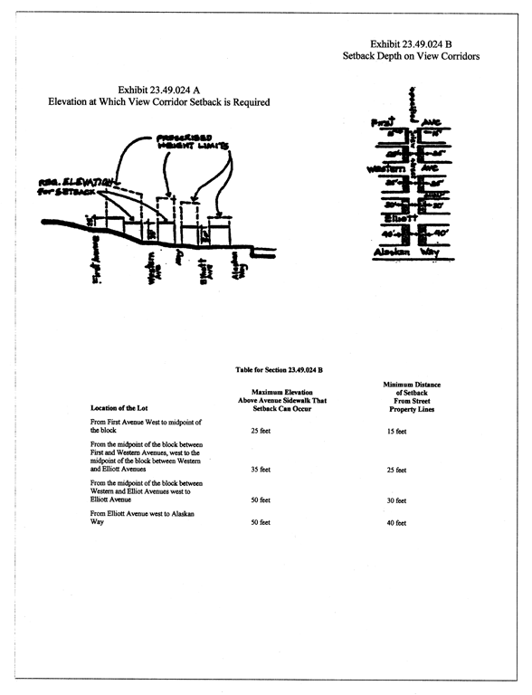

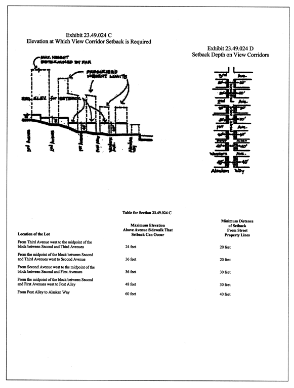

1. Upper-level setbacks shall be required for the following view corridors, identified on Map 1D:

    1. Broad, Clay, Vine, Wall, Battery and Bell Streets west of First Avenue; and
    2. University, Seneca, Spring, Madison and Marion Streets west of Third Avenue.
2. Upper-level setbacks for view corridors listed in subsection A1 shall be provided as follows. (See Table for Section 23.49.024 B and Exhibits 23.49.024 A and 23.49.024 B.)
3. Upper-level setbacks for view corridors listed in subsection A2 shall be provided as follows. (See Table for Section 23.49.024 C and Exhibits 23.49.024 C and 23.49.024 D.)

##### 23.49.025 - Odor, noise, light/glare, and solid waste recyclable materials storage space standards

1. The venting of odors, fumes, vapors, smoke, cinders, dust, and gas shall be at least 10 feet above finished sidewalk grade, and directed away from uses within 50 feet of the vent.

    1. Major odor sources

        1. Uses that employ the following odor-emitting processes or activities are major odor sources:

            1. Lithographic, rotogravure, or flexographic printing;
            2. Film burning;
            3. Fiberglassing;
            4. Selling of gasoline and/or storage of gasoline in tanks larger than 260 gallons;
            5. Handling of heated tars and asphalts;
            6. Incinerating (commercial);
            7. Metal plating;
            8. Use of boilers (greater than 106 British thermal units per hour, 10,000 pounds steam per hour, or 30 boiler horsepower);
            9. The production or processing of marijuana products by a major marijuana activity; and
            10. Other uses creating similar odor impacts.
        2. Uses that employ the following processes are considered major odor sources, unless the entire activity is conducted as part of a commercial use other than food processing or heavy commercial services:

            1. Cooking of grains;
            2. Smoking of food or food products;
            3. Fish or fishmeal processing;
            4. Coffee or nut roasting;
            5. Deep fat frying;
            6. Dry cleaning; and
            7. Other uses creating similar odor impacts.
    2. Review of major odor sources. When an application is made for a use that is a major odor source, the Director, in consultation with the Puget Sound Clean Air Agency (PSCAA), shall determine the appropriate measures to be taken by the applicant in order to significantly reduce potential odor emissions and airborne pollutants. The measures to be taken shall be specified on plans submitted to the Director, and may be required as conditions for the issuance of any permit. After a permit has been issued, any measures that were required by the permit shall be maintained.
2. Noise standards.

    1. All food processing for human consumption, custom and craft work involving the use of mechanical equipment, and light manufacturing activities shall be conducted wholly within an enclosed structure.
    2. The following uses or devices are considered major noise generators:

        1. Light manufacturing uses;
        2. Auto body, boat and aircraft repair shops; and
        3. Other similar uses.
    3. When a major noise generator is proposed, a report from an acoustical consultant shall be required to describe the measures to be taken by the applicant in order to meet noise standards for the area. Such measures may include, for example, the provision of buffers, reduction in hours of operation, relocation of mechanical equipment, increased setbacks, and use of specified construction techniques or building materials. Measures to be taken shall be specified on the plans. After a permit has been issued, any measures that are required by the permit to limit noise shall be maintained.
3. Lighting and glare.

    1. Exterior lighting shall be shielded and directed away from adjacent uses.
    2. Interior lighting in parking garages shall be shielded, to minimize nighttime glare affecting nearby uses.
4. The standards of Section 23.54.040 for solid waste and recyclable materials storage space shall be met.

##### 23.49.028 - Keeping of animals and pet daycare centers.

1. Animals that are not being kept in connection with animal husbandry or animal service uses may be kept as an accessory use on any lot in a downtown zone according to the following:

    1. Up to three (3) small animals per business establishment or dwelling unit may be kept in downtown zones.
    2. That type of swine commonly known as the Vietnamese, Chinese, or Asian Potbelly Pig (Sus scrofa bittatus) shall be permitted as a small animal provided such swine is no greater than twenty-two (22) inches in height at the shoulder and no more than one hundred fifty (150) pounds in weight. No more than one (1) such swine may be kept per business establishment or dwelling unit.
2. In addition to the development standards of the zone, pet daycare centers are subject to the following:

    1. Operating business establishments that have been providing pet daycare services as of July 31, 2006 may continue not withstanding nonconformities to applicable development standards, provided the provisions of this section are met.
    2. The pet daycare center must be permitted by Public Health—Seattle & King County, as required by SMC 10.72.020.
    3. Facilities for the boarding of animals may occupy no more than thirty (30) percent of the gross floor area of the pet daycare center.
    4. Required loading pursuant to 23.54.015 may be provided in a public right of way if the applicant can demonstrate to the Director, in consultation with the Seattle transportation Department, that pedestrian circulation or vehicle traffic will not be significantly impacted.
    5. Applicants must submit at the time of permit application, written operating procedures, such as those recommended by the American Boarding and Kennel Association (ABKA) or the American Kennel Club (AKC). Such procedures, which are to be followed for the life of the business, must address the identification and correction of animal behavior that impacts surrounding uses, including excessive barking.
    6. Violations of this Section.

        1. The exemption in SMC 25.08.500A of the Noise Control Ordinance to uses permitted under SMC 10.72, provisions for pet kennels and similar uses, does not apply to pet daycare centers.
        2. When a notice of violation is issued for animal noise, the Director may require a report from an acoustical consultant to describe measures to be taken by the applicant to mitigate adverse noise impacts. The Director may require measures, including but not limited to: development or modification of operating procedures; cessation of the use of outdoor area(s); closure of windows and doors; reduction in hours of operation; use of sound attenuating construction or building materials such as insulation and noise baffles.

##### 23.49.029 - Utility services uses

Utility services uses permitted as conditional use public facilities pursuant to this Chapter 23.49 are subject to the following additional standards.

1. Fences or free-standing walls associated with utility services uses may obstruct or allow views to the interior of a site. Where site dimensions and site conditions allow, applicants are encouraged to provide both a landscaped setback between the fence or wall and the right-of-way, and a fence or wall that provides visual interest facing the street lot line, through the height, design or construction of the fence or wall, including the use of materials, architectural detailing, artwork, vegetated trellises, decorative fencing, or similar features to provide visual interest. Any fence or free-standing wall for a utility services use must provide either:

    1. A 5-foot-deep landscaped area between the wall or fence and the street lot line; or
    2. Architectural detailing, artwork, vegetated trellises, decorative fencing, or similar features to provide visual interest facing the street lot line, as approved by the Director.

##### 23.49.030 - Adult Cabarets

1. Any lot line of property containing any proposed new or expanding adult cabaret must be 800 feet or more from any lot line of property on which any of the following uses has been established by permit or otherwise recognized as a legally established use: community center; child care center; school, elementary or secondary; or public parks and open space use.
2. Any lot line of property containing any proposed new or expanding adult cabaret must be 600 feet or more from any lot line of property for which a permit has been issued for any other adult cabaret, and must be 600 feet or more from any lot line of property for which a permit has been issued for any adult panoram or adult motion picture theater.
3. The analysis required by subsections 23.49.030.A and B shall be based on the facts that exist on the earlier of:

    1. the date a complete application is made for a building permit for an adult cabaret for the property proposed to contain the new or expanding adult cabaret, or
    2. the date of publication of notice of the Director's decision on the Master Use Permit application to establish or expand an adult cabaret use, if the decision can be appealed to the Hearing Examiner, or the date of the Director's decision if no Hearing Examiner appeal is available.

##### 23.49.031 - Green Factor Landscaping in South Downtown

In South Downtown, a lot on which there is new construction of 20,000 square feet or more in gross floor area shall meet a minimum Green Factor score of 0.30, calculated pursuant to Section 23.86.019, except that the Green Factor requirement may be modified by the Director, as a Type I decision, in consultation with the Director of Neighborhoods if the Director determines that the requirement would adversely affect historically or architecturally significant features of a contributing structure.

##### 23.49.032 - Additions of chargeable floor area to lots with existing structures.

1. When development is proposed on a lot that will retain existing structures containing chargeable floor area in excess of the applicable base FAR, additional chargeable floor area may be added to the lot up to the maximum permitted FAR, by qualifying for bonuses or using TDR, or both, and by the use of rural development credits if permitted on such lot, subject to the general rules for FAR and use of bonuses, TDR, and rural development credits, SMC Sections 23.49.011 through 23.49.014. Solely for the purpose of determining the amounts and types of bonus and TDR, if any, that may be used to achieve the proposed increase in chargeable floor area, the legally established continuing chargeable floor area of the existing structures on the lot shall be considered as the base FAR.
2. When mechanical equipment or parking that was exempted from floor area calculation under the provisions of Title 24 is proposed to be changed to uses that are not exempt from floor area calculations under this chapter, and the chargeable floor area on the lot exceeds the base FAR for the zone in which it is located, the gross floor area proposed to be changed shall be achieved through qualifying for bonuses or transfer of development rights, according to the provisions of Sections 23.49.011 through 23.49.014 as applicable to the zone in which the structure is located.
3. When subsection A or B applies, any existing public benefit features for which increased floor area was granted under Title 24 shall, to the extent possible in the opinion of the Director, satisfy the requirements of Section 23.49.034, Modification of plazas and other features bonused under Title 24.

##### 23.49.034 - Modification of plazas and other features bonused under Title 24.

unless the loss of area is offset by the conversion of existing floor area in the structure to uses exempt from chargeable floor area under Section 23.49.011.

1. The modification of plazas, shopping plazas, arcades, shopping arcades, and voluntary building setbacks that resulted in any increase in gross floor area under Title 24 of the Seattle Municipal Code, shall be encouraged in any Downtown zone if the change makes the plaza, arcade or setback more closely conform to the criteria for amenities or street level use and development standards in this chapter. The Director shall review proposed modifications to determine whether they provide greater public benefits and are consistent with the intent of the Downtown Amenity Standards, as specified in this section. The procedure for approval of proposed modifications shall be as provided in Chapter 23.76, Procedures for Master Use Permits and Council Land Use Decisions, except as provided in subsection G of this section.
2. Except as provided in subsections E2 and E3, no modification to a plaza or other feature listed in subsection A may be made under this section if it will increase the total floor area ratio (FAR) of the structure. Except as permitted in subsections E2 and E3, no reduction in the area of the bonused feature may be made for addition or expansion of any uses, except for the following uses, to the extent permitted:

    1. general sales and services,
    2. major durables retail sales,
    3. eating and drinking establishments,
    4. lodging,
    5. entertainment,
    6. automotive sales and services,
    7. marine sales and services,
    8. animal shelters and kennels,
    9. medical services,
    10. human service uses, or
    11. child care centers,
3. Plazas and Shopping Plazas. Modifications to plazas and shopping plazas for which increased gross floor area was granted under Title 24 shall be permitted, based on the classification of the plaza on Map 1E.

    1. Type I Plazas. Type I plazas shall continue to function as major downtown open spaces. Modification of these plazas and/or reductions in plaza size shall be permitted if the Director finds that the modified or remaining plaza is consistent with the intent of the Downtown Amenity Standards for urban plazas and parcel parks.
    2. Type II Plazas. Type II plazas do not function as major downtown open spaces, but they shall continue to provide open space for the public. Modification of these plazas and/or reductions in plaza size shall be permitted if the Director finds that the modified or remaining plaza is consistent with the intent of the Downtown Amenity Standards for urban plazas, parcel parks, and hillside terraces.
4. Shopping Arcades.

    1. Exterior Shopping Arcades. When street level uses are eligible for a floor area bonus in a zone in which an existing exterior shopping arcade is located, the existing shopping arcade or a portion of the existing shopping arcade may be converted to retail sales and service uses if the conversion will result in greater conformity with the street facade development standards of the zone, and if the minimum sidewalk widths established by Section 23.49.022 are met. No bonuses shall be given for any retail space created by conversion of a shopping arcade. New retail sales and service uses shall comply with the Downtown Amenity Standards for retail shopping bonuses.
    2. Interior Shopping Arcades. Portions of existing interior shopping arcades may be modified and/or reduced in size, so long as any pathway which connects streets or other public open spaces is maintained at a width of at least fifteen (15) feet and it continues to allow comfortable and convenient pedestrian movement. The visual interest and the sense of space and light in the shopping arcade shall be also maintained and enhanced if possible. The Downtown Amenity Standards for shopping atriums and shopping corridors shall be used as a guideline in the review of proposed changes.
5. Arcades. The Director shall use the following standards to determine whether an arcade may be filled in, and to determine the uses that may be permitted in a former arcade.

    1. Arcades that provide essential pedestrian connections, such as a connection to a bonused public open space or access to public parks, shall not be filled in.
    2. Arcades that do not provide essential pedestrian connections may be filled in. In downtown areas where bonuses may be granted for shopping atriums and shopping corridors, an arcade may be filled in only with uses which qualify for a retail shopping bonus. In other areas, when the total floor area of the structure does not exceed the maximum permitted FAR, the arcade may be filled in with uses which qualify as required street-level uses except that arcades along alleys may be filled in with any permitted use. If the structure exceeds the maximum permitted FAR, arcades may only be filled in with uses which qualify for a retail shopping bonus.
    3. If an arcade is filled in with a use which does not qualify for a retail shopping bonus pursuant to subsection E2, new public benefit features shall be required for any additional floor area.
    4. Overhead weather protection shall be provided when an arcade on a street or public open space is filled in. No additional floor area shall be granted for the required overhead weather protection.
6. Voluntary Building Setbacks. Voluntary building setbacks may be filled in to provide retail sales and service uses, provided that the conversion maintains the minimum required sidewalk width established in Section 23.49.022, and will result in greater conformity with the standards for required street-level uses, if any, and street facade development standards for the zone.
7. Optional Public Access and Signage Standards. The owner of any lot with a plaza, arcade, shopping plaza, or exterior shopping arcade for which a bonus was granted under Title 24, and which feature has not become subject to standards for amenity features under Title 23, may elect to have the signage requirements and the terms of public access and use for that feature governed by the Downtown Amenity Standards as they apply to urban plazas, as modified by this subsection G. If the owner so elects, then the hours during which such feature must be open to the public without charge shall be as designated by the owner on signs identifying the feature, but in any event shall include the period from 7:00 AM to 11:00 PM every day, plus any other hours during which the principal structure on the lot is open. In order to make an election under this subsection G, the owner shall sign and record in the real property records a declaration in form approved by the Director. The owner then shall install and maintain signs identifying the feature as open to the public, consistent with the Downtown Amenity Standards. Such election, once made, may not be revoked or modified. The public access and signage requirements pursuant to this subsection shall be deemed conditions of any permit under which a bonus was allowed for the feature. The purpose of this subsection is to encourage public awareness and use of features bonused under Title 24, while providing for greater certainty and consistency in the rules applicable to such features. Until an election shall be made as to any such feature in compliance with this subsection G, nothing in this subsection G shall limit any obligation to allow public access or use of any such feature under the terms of any permit or Code provision.

##### 23.49.035 - Modified or discontinued public benefit features.

1. All public benefit features, except (1) housing and (2) landmark performing arts theaters, shall remain for the life of the structure that includes the additional gross floor area except as otherwise specifically permitted pursuant to this section.
2. Unless the specified period for which a feature is to be maintained has expired in accordance with the terms of this chapter, or another provision of this chapter specifically otherwise provides, a public benefit feature may be diminished or discontinued only if:

    1. the feature is not housing or child care; and
    2. the additional gross floor area permitted in return for the specific feature is removed or converted to a use that is not counted as chargeable floor area; or

        1. an amount of chargeable floor area equal to that obtained by the public benefit feature to be replaced is provided pursuant to provisions for granting floor area above the base FAR in this chapter.
3. The terms under which use as a Landmark performing arts theater may be discontinued or diminished, and the sanctions for failure to continue such use, shall be governed by the agreements and instruments executed by the City and owners of the properties on which such theaters are located. Any such change in use shall not affect any other structure for which additional FAR was granted in return for the provision of such public benefit features.
4. In addition to the provisions of subsections A and B, this subsection applies in Downtown zones when additional gross floor area or a floor area exemption is granted for any of the following public benefit features: Human service uses, child care centers, retail shopping, cinemas, performing arts theaters other than landmark performing arts theaters, major retail stores, and museums.

    1. In the event that the occupant or operator of one (1) of the public benefit features listed in this subsection moves out of a structure, or notifies the owner of intent to move, the owner or owner's agent shall notify the Director within five (5) days of the date that notice of intent to move is given or that the occupant or operator moves out, whichever is earlier.
    2. Starting from the fifth day after notice is given or that the occupant or operator moves out, whichever is first, the owner or owner's agent shall have a maximum of six (6) months to replace the use with another use that meets the provisions of Section 23.49.011 and the Downtown Amenity Standards.
    3. When the public benefit feature is replaced, any portion of the gross floor area formerly occupied by that feature and not reoccupied by a replacement feature, may be either:

        1. Changed to other uses that are exempt from FAR calculations in the zone in which the structure is located; or
        2. Changed to uses that are not exempt from FAR calculations, provided that this would not cause the structure to exceed the maximum FAR limit for the zone in which it is located, and that gross floor area in an amount equivalent to the gross floor area proposed to be changed shall be achieved through provision of public benefit features, or transfer of development rights, according to the provisions of SMC Section 23.49.011.
    4. As a condition to allowing the substitution of a feature, rather than an application to establish floor area de novo under the terms of this chapter, during the time that the space formerly constituting the amenity feature is vacant, it shall be made available to nonprofit community and charitable organizations for events at no charge.
5. Modifications of amenity features that do not result in the diminishment or discontinuation of the feature may be permitted by the Director as a Type I decision, provided that the Director finds that the feature as modified meets the eligibility conditions in the Downtown Amenity Standards.
6. A qualifying small structure for which a bonus is allowed pursuant to Section 23.49.011 shall be considered discontinued if it is removed or altered so that it is no longer a qualifying small structure within the meaning of that Section.
7. A qualifying Landmark for which a bonus is allowed pursuant to Section 23.49.011 shall be considered discontinued if it is demolished or removed, or it is altered so that it is no longer a qualifying Landmark within the meaning in that Section; or if any feature or characteristic that is controlled or designated by ordinance is removed or altered contrary to any provision of Chapter 25.12; or if the owner fails to maintain in good condition and repair any feature or characteristic of the structure that is designated or subject to controls under any ordinance; or if there is any revision or revocation of controls pursuant to Section 25.12.860 or successor provision.

##### 23.49.036 - Planned community developments (PCDs)

1. Authority. Planned community developments (PCDs) may be permitted by the Director as a Type II Land Use Decision pursuant to Chapter 23.76, Procedures for Master Use Permits and Council Land Use Decisions.
2. Public benefit priorities. The Director shall determine public benefit priorities for the PCD. These priorities shall be prepared prior to application for a Master Use Permit. They shall include priorities for public benefits listed in subsection 23.49.036.F and priorities for implementing the goals of the Comprehensive Plan, including adopted neighborhood plans for the area affected by the PCD, and a determination of whether the proposed PCD may use public right-of-way area to meet the minimum site size set forth in subsection 23.49.036.E. Before the priorities are prepared, the Director shall cause a public meeting to be held to identify concerns about the site and to receive public input into priorities for public benefits identified in adopted neighborhood plans and subsection 23.49.036.F. Notice for the meeting shall be provided pursuant to Section 23.76.011. The Director shall prepare priorities for the PCD taking into account comments made at the public meeting or in writing to the Director, and the criteria in this Section 23.49.036. The Director shall distribute a copy of the priorities to all those who provided addresses for this purpose at the public meeting, to those who sent in comments or otherwise requested notification, and to the project proponent.
3. A PCD shall not be permitted if the Director determines it would be likely to result in a net loss of housing units or if it would result in significant alteration to any designated feature of a landmark structure, unless a Certificate of Approval for the alteration is granted by the Landmarks Preservation Board.
4. Location

    1. PCDs may be permitted in all downtown zones except the PMM zone and the DH1 zone.
    2. A portion of a PCD may extend into any non-downtown zone(s) within the Downtown Urban Center and adjacent to a downtown zone subject to the following conditions:

        1. The provisions of this title applicable in the non-downtown zone(s) regulate the density of non-residential use by floor area ratio; and
        2. The portion of a PCD project located in non-downtown zone(s) must not exceed 20 percent of the total area of the PCD.
5. Minimum size. A PCD shall include a minimum site size of 100,000 square feet within one or more of the Downtown zones where PCDs are permitted according to subsection 23.49.036.D.1. The total area of a PCD shall be contiguous. Public right-of-way shall not be considered a break in contiguity. At the Director's discretion, public right-of-way area may be included in the minimum area calculations if actions related to the PCD will result in significant enhancements to the streetscape of the public right-of-way, improved transit access and expanded transit facilities in the area, and/or significant improvement to local circulation, especially for transit and pedestrians.
6. Evaluation of PCDs. A proposed PCD shall be evaluated on the basis of public benefits provided, possible impacts of the project, and consistency with the standards contained in this subsection 23.49.036.F.

    1. Public benefits. A proposed PCD shall address the priorities for public benefits identified through the process outlined in subsection 23.49.036.B. The PCD shall include at least three of the following elements:

        1. low-income housing,
        2. townhouse development,
        3. historic preservation,
        4. public open space,
        5. implementation of adopted neighborhood plans,
        6. improvements in pedestrian circulation,
        7. improvements in urban form,
        8. improvements in transit facilities,
        9. green stormwater infrastructure beyond the requirements of the Stormwater Code (Chapters 22.800 through 22.808), or
        10. other elements that further an adopted City policy and provide a demonstrable public benefit.
    2. Potential impacts. The Director shall evaluate the potential impacts of a proposed PCD including, but not necessarily limited to, the impacts on housing, particularly low-income housing, transportation systems, parking, energy, and public services, as well as environmental factors such as noise, air, light, glare, public views, and water quality.
    3. The Director may place conditions on the proposed PCD in order to make it compatible with areas adjacent to Downtown that could be affected by the PCD.
    4. When the proposed PCD is located in the Pioneer Square Preservation District or International District Special Review District, the Board of the District(s) in which the PCD is located shall review the proposal and make a recommendation to the Department of Neighborhoods Director who shall make a recommendation to the Director prior to the Director's decision on the PCD.
7. Bonus Development in PCDs. All increases in floor area above the base FAR shall be consistent with provisions in Section 23.49.011, Floor area ratio, and the PCD process shall not result in any increase in the amount of chargeable floor area allowed without use of bonuses or TDR, considering all of the lots within the PCD boundaries as a single lot.
8. Exceptions to Standards.

    1. Portions of a project may exceed the floor area ratio permitted in the zone or zones in which the PCD is located, but the maximum chargeable floor area allowed for the PCD as a whole shall meet the requirements of the zone or zones in which it is located.
    2. Except as provided in subsection H3 of this section, any requirements of this chapter may be varied through the PCD process in order to provide public benefits identified in subsection F.
    3. Exceptions to the following provisions are not permitted through the PCD process:

        1. The following provisions of Subchapter I, General Standards:

            1. Applicable height limits,
            2. Light and glare standards,
            3. Noise standards,
            4. Odor standards,
            5. Minimum sidewalk widths,
            6. View corridor requirements,
            7. Nonconforming uses,
            8. Nonconforming structures, when the nonconformity is to one (1) of the standards listed in this subsection;
        2. Use provisions except for provisions for principal and accessory parking;
        3. Transfer of development rights regulations;
        4. Bonus ratios and amounts assigned to public benefit features;
        5. Development standards of adjacent zones outside the Downtown Urban Center in which a PCD may be partially located according to subsection D2 of this section.
        6. Provisions for allowing increases in floor area above the base FAR and for allowing residential floor area above the base height limit.

##### 23.49.038 - Lots located in more than one (1) zone.

When a lot is located in more than one (1) zone, the regulations for each zone shall apply to the portion of the lot located in that zone.

##### 23.49.040 - Termination of discontinued conditional uses.

Any authorized conditional use which has been discontinued shall not be re-established or recommenced except pursuant to a new conditional use permit. The following shall constitute conclusive evidence that the conditional use has been discontinued:

Property which is vacant, except for dead storage of materials or equipment of the conditional use, shall not be considered as being devoted to the authorized conditional use. The expiration of licenses necessary for the conditional use shall be evidence that the property is not being devoted to the conditional use. A conditional use in a multi-family structure or a multi-tenant commercial structure shall not be considered as discontinued unless all units are either vacant or devoted to another use.

1. A permit to change the use of the property has been issued and the new use has been established; or
2. The property has not been devoted to the authorized conditional use for more than twenty-four (24) consecutive months.

##### 23.49.041 - Combined lot development

When authorized by the Director pursuant to this Section 23.49.041, lots located on the same block in DOC1 or DOC2 zones, or in DMC zones with a maximum FAR of 10, or lots zoned DOC1 and DMC on the same block, may be combined, whether contiguous or not, solely for the purpose of allowing some or all of the capacity for chargeable floor area on one such lot under this Chapter 23.49 to be used on one or more other lots, according to the following provisions:

1. Up to all of the capacity on one lot, referred to in this Section 23.49.041 as the "sending lot," for chargeable floor area in addition to the base FAR, pursuant to Section 23.49.011 (referred to in this Section 23.49.041 as "bonus capacity"), may be used on one or more other lots, subject to compliance with all conditions to use of such bonus capacity, pursuant to Sections 23.49.011 through 23.49.014, as modified in this Section 23.49.041. For purposes of applying any conditions related to amenities or features provided on site under Section 23.49.013, only the lot or lots on which such bonus capacity shall be used are considered to be the lot or site using a bonus. Criteria for use of bonus that apply to the structure or structures shall be applied only to the structure(s) on the lots using the transferred bonus capacity.
2. Only if all of the bonus capacity on one lot shall be used on other lots pursuant to this Section 23.49.041, there may also be transferred from the sending lot, to one or more such other lots, up to all of the unused base FAR on the sending lot, without regard to limits on the transfer or on use of TDR in Section 23.49.014. Such transfer shall be treated as a transfer of TDR for purposes of determining remaining development capacity on the sending lot and TDR available to transfer under Section 23.49.014, but shall be treated as additional base FAR on the other lots, and to the extent so treated shall not qualify such lots for bonus development. If less than all of the bonus capacity of the sending lot shall be used on such other lots, then unused base FAR on the sending lot still may be transferred to the extent permitted for within-block TDR under Section 23.49.014, and if the sending lot qualifies for transfer of TDR under any other category of sending lot in Table A for 23.49.014, such unused base FAR may be transferred to the extent permitted for such category, but in each case only to satisfy in part the conditions to use of bonus capacity, not as additional base FAR.
3. To the extent permitted by the Director, the maximum chargeable floor area for any one or more lots in the combined lot development may be increased up to the combined maximum chargeable floor area under Section 23.49.011 computed for all lots participating in the combined lot development. To the extent permitted by the Director, and subject to subsection 23.49.041.B, the base floor area for any one or more lots in the combined lot development may be increased up to the combined maximum base chargeable floor area under Section 23.49.011 computed for all lots participating in the combined lot development.
4. The Director shall allow combined lot development only to the extent that the Director determines in a Type I land use decision that permitting more chargeable floor area than would otherwise be allowed on a lot shall result in a significant public benefit. In addition to features for which floor area bonuses are granted, the Director may also consider the following as public benefits that could satisfy this condition when provided for as a result of the lot combination:

    1. preservation of a landmark structure located on the block or adjacent blocks;
    2. uses serving the downtown residential community, such as a grocery store, at appropriate locations;
    3. public facilities serving the downtown population, including schools, parks, community centers, human service facilities, and clinics;
    4. transportation facilities promoting pedestrian circulation and transit use, including through-block pedestrian connections, transit stations, and bus layover facilities;
    5. short-term parking on blocks within convenient walking distance of the retail core or other downtown business areas where the amount of available short term parking is determined to be insufficient;
    6. a significant amount of housing serving households with a range of income levels;
    7. improved massing of development on the block that achieves a better relationship with surrounding conditions, including: better integration with adjacent development, greater compatibility with an established scale of development, especially relative to landmark structures, or improved conditions for adjacent public open spaces, designated green streets, or other special street environments;
    8. public view protection within an area;
    9. arts and cultural facilities, including a museum or museum expansion space; or
    10. green stormwater infrastructure beyond the requirements of the Stormwater Code (Chapters 22.800 through 22.808).
5. The fee owners of each of the combined lots shall execute an appropriate agreement or instrument, which shall include the legal descriptions of each lot and shall be recorded in the King County real property records. In the agreement or instrument, the owners shall acknowledge the extent to which development capacity on each sending lot is reduced by the use of such capacity on another lot or lots, at least for so long as the chargeable floor area for which such capacity is used remains on such other lot or lots. The deed or instrument shall also provide that its covenants and conditions shall run with the land and shall be specifically enforceable by the parties and by the City of Seattle.
6. Nothing in this Section shall allow the development on any lot in a combined lot development to exceed or deviate from height limits or other development standards.

#### Subchapter II - Downtown Office Core 1, Downtown Office Core 2, and Downtown Mixed Commercial
##### 23.49.042 - Downtown Office Core 1, Downtown Office Core 2, and Downtown Mixed Commercial permitted uses

The provisions of this Section 23.49.042 apply in DOC1, DOC2, and DMC zones.

1. All uses are permitted outright except those specifically prohibited by Section 23.49.044 and those permitted only as conditional uses by Section 23.49.046. Parking is allowed pursuant to Section 23.49.045, and major marijuana activity is allowed pursuant to Section 23.42.058.
2. All uses not prohibited shall be permitted as either principal or accessory uses.
3. Public facilities

    1. Except as provided in subsection 23.49.046.D.2, uses in public facilities that are most similar to uses permitted outright under this Chapter 23.49 shall also be permitted outright subject to the same use regulations and development standards that govern the similar uses.
    2. Essential public facilities. Permitted essential public facilities shall also be reviewed according to the provisions of Chapter 23.80, Essential Public Facilities.

##### 23.49.044 - Downtown Office Core 1, Downtown Office Core 2, and Downtown Mixed Commercial prohibited uses

The following uses are prohibited as both principal and accessory uses in DOC1, DOC2, and DMC zones, or where a single zone classification is specified, in zones with that classification only:

1. Drive-in businesses, except gas stations located in parking garages;
2. Outdoor storage;
3. All general and heavy manufacturing uses;
4. Solid waste management;
5. Recycling, except in DMC zones in South Downtown;
6. All high-impact uses;
7. In DMC zones, adult motion picture theaters and adult panorams; and
8. Principal use parking garages for long-term parking.

##### 23.49.045 - Downtown Office Core 1, Downtown Office Core 2, and Downtown Mixed Commercial principal and accessory parking

The provisions of this Section 23.49.045 apply in DOC1, DOC2, and DMC zones. DMC zoned areas within the International Special Review District are also subject to Chapter 23.66. If there is any conflict between this Section 23.49.045 and Chapter 23.66, Chapter 23.66 applies.

1. Principal Use Parking.

    1. Principal use parking garages for short-term parking may be permitted as conditional uses, pursuant to Section 23.49.046.
    2. In DOC1 zones, principal use long-term and short-term surface parking areas are prohibited. In DOC2 and DMC zones, principal use long-term and short-term surface parking areas may be permitted as administrative conditional uses in areas shown on Map 1I, pursuant to Section 23.49.046.
2. Accessory Parking.

    1. Accessory parking garages for both long-term and short-term parking are permitted outright, up to the maximum parking limit established by Section 23.49.019.
    2. Accessory surface parking areas are:

        1. Permitted outright in areas shown on Map 1I if they contain a total of 20 or fewer parking spaces on the lot; and
        2. Permitted outside South Downtown as administrative conditional uses pursuant to Section 23.49.046 if located in areas shown on Map 1I on a lot containing more than 20 parking spaces; and
        3. Prohibited in areas not shown on Map 1I; and
        4. Notwithstanding the maximum parking limit in Section 23.49.019, permitted outright for replacement of a short-term surface parking area with more than 20 parking spaces in existence on December 31, 2009, if the original location and new location are both located in a DMC zone in South Downtown, and if the existing and replacement parking are accessory to the same principal use.
    3. Temporary principal and accessory surface parking areas may be permitted as conditional uses pursuant to Section 23.49.046.

##### 23.49.046 - Downtown Office Core 1 (DOC1), Downtown Office Core 2 (DOC2), and Downtown Mixed Commercial (DMC) conditional uses and Council decisions

1. All conditional uses shall meet the following criteria:

    1. The use shall be determined not to be materially detrimental to the public welfare or injurious to property in the zone or vicinity in which the property is located.
    2. In authorizing a conditional use, adverse negative impacts may be mitigated by imposing requirements or conditions deemed necessary for the protection of other properties in the zone or vicinity and the public interest. The Director or Council shall deny the conditional use if it is determined that the negative impacts cannot be mitigated satisfactorily.
2. Principal use parking garages for short-term parking may be permitted as administrative conditional uses, if the Director finds that:

    1. Traffic from the garage will not have substantial adverse effects on peak hour traffic flow to and from Interstate 5 or on traffic circulation in the area around the garage; and
    2. The vehicular entrances to the garage are located so that they will not disrupt traffic or transit routes; and
    3. The traffic generated by the garage will not have substantial adverse effects on pedestrian circulation; and
    4. In the DMC 160 zone, the following standards are met:

        1. the total gross floor area of all parking uses on the lot is less than the total gross floor area of all non-parking uses on the lot, and
        2. any short-term principal use parking is provided for the life of the structure and a covenant to that effect is recorded against the title with the King County Recorder.
3. Temporary surface parking areas that were in existence prior to January 1, 1985 or are located on lots vacant on or before January 1, 1985, or on lots that become vacant as a result of a City-initiated abatement action, and surface parking areas meeting the requirements of Section 23.49.045, may be permitted as administrative conditional uses according to the following standards:

    1. The standards stated for garages in subsection B of this section are met; and
    2. The lot is screened and landscaped according to the provisions of Section 23.49.019 Parking quantity, access and screening/landscaping requirements; and
    3. Permits for temporary surface parking areas may be issued for a maximum of two (2) years. Renewal of a permit for a temporary surface parking area is subject to the following:

        1. Renewals are permitted only for those temporary surface parking areas that were in existence on or before January 1, 1985, or are located on lots vacant on or before January 1, 1985. A permit for temporary surface parking on a lot that became vacant as a result of a City-initiated abatement action shall not be renewed, and
        2. Renewal shall be for a maximum of two (2) years and shall be granted only if, through an administrative conditional use process, the Director finds that the temporary surface parking area continues to meet applicable criteria; and
        3. The applicant shall post a bond in an amount adequate to cover the costs of removing the physical evidence of the parking area, such as curbcuts, paving, and parking space striping, when the permit expires. Landscaping need not be removed when the permit expires; and
        4. Signs at each entrance to the parking area stating the ending date of the permit shall be required.
4. Public Facilities.

    1. Uses in public facilities that are most similar to uses permitted as a conditional use under this chapter shall also be permitted as a conditional use subject to the same conditional use criteria that govern the similar uses.
    2. The City Council may waive or modify applicable development standards or conditional use criteria for those uses in public facilities that are similar to uses permitted outright or permitted as a conditional use according to the provisions of Chapter 23.76, Subchapter III, Council Land Use Decisions, with public projects considered as Type IV quasi-judicial decisions and City facilities considered as Type V legislative decisions.
    3. Other Permitted Uses in Public Facilities. Unless specifically prohibited, uses in public facilities that are not similar to uses permitted outright or permitted as a conditional use under this chapter may be permitted by the City Council. The City Council may waive or modify development standards or conditional use criteria according to the provisions of Chapter 23.76, Subchapter III, Council Land Use Decisions, with public projects considered as Type IV quasi-judicial decisions and City facilities considered as Type V legislative decisions.
    4. Expansion of Uses in Public Facilities.

        1. Major Expansion. Major expansions may be permitted to uses in public facilities allowed in subsections D1, D2 and D3 above according to the same provisions and procedural requirements as described in these subsections. A major expansion of a public facility use occurs when the expansion that is proposed would not meet development standards or exceed either seven hundred fifty (750) square feet or ten (10) percent of its existing area, whichever is greater, including gross floor area and areas devoted to active outdoor uses other than parking.
        2. Minor Expansion. When an expansion falls below the major expansion threshold level, it is a minor expansion. Minor expansions may be permitted to uses in public facilities allowed in subsections D1, D2 and D3 above according to the provisions of Chapter 23.76, Procedures for Master Use Permits and Council Land Use Decisions, for a Type I Master Use Permit when the development standards of the zone in which the public facility is located are met.
5. Rooftop features listed in subsection 23.49.008.D.1.c more than 50 feet above the roof of the structure on which they are located may be authorized by the Director as an administrative conditional use pursuant to Chapter 23.76, Procedures for Master Use Permits and Council Land Use Decisions, according to the criteria of Section 23.49.008.
6. Helistops and heliports may be permitted as Council conditional uses according to the following criteria:

    1. The helistop or heliport is for the takeoff and landing of helicopters that serve a public safety, news gathering or emergency medical care function and, in the case of heliports, services provided for those helicopters; is part of a City and regional transportation plan approved by the City Council and is a public facility; or is part of a City and regional transportation plan approved by the City Council and is not within two thousand (2,000) feet of a residential zone.
    2. The helistop or heliport is located so as to minimize adverse physical environmental impacts on lots in the surrounding area, and particularly on residentially zoned lots, public parks, and other areas where substantial public gatherings may be held, such as Safeco Field and Qwest Field, the Pike Place Market, and the Westlake Mall.
    3. The lot is of sufficient size that the operations of the helistop or heliport and the flight paths of the helicopters can be buffered from other uses in the surrounding area.
    4. Open areas and landing pads shall be hard-surfaced.
    5. The helistop or heliport meets all federal requirements including those for safety, glide angles, and approach lanes.
7. Work-release centers may be permitted as Council conditional uses, except where prohibited in the International Special Review District, based on the following criteria:

    1. Maximum Number of Residents. No work-release center shall house more than 50 persons, excluding resident staff.
    2. Dispersion Criteria.

        1. The lot line of any new or expanding work-release center shall be located 600 feet or more from any residential zone, any lot line of any special residence, and any lot line of any school.
        2. The lot line of any new or expanding work-release center shall be located 1 mile or more from any lot line of any other work-release center.
        3. The Director shall determine whether a proposed facility meets the dispersion criteria from maps which shall note the location of current work-release centers and special residences. Any person who disputes the accuracy of the maps may furnish the Director with the new information and, if determined by the Director to be accurate, this information shall be used in processing the application.
    3. The Council's decision shall be based on the following criteria:

        1. The extent to which the applicant can demonstrate the need for the new or expanded facility in the City, including a statement describing the public interest in establishing or expanding the facility;
        2. The extent to which the applicant has demonstrated that the facility can be made secure. The applicant shall submit a proposed security plan to the Director, and the Director, in consultation with the Seattle Police Department, shall consider and evaluate the plan. The security plan shall address, but is not limited to, the following:

            1. Plans to monitor and control the activities of residents, including methods to verify the presence of residents at jobs or training programs, policies on sign-outs for time periods consistent with the stated purpose of the absence for unescorted trips by residents away from the center, methods of checking the records of persons sponsoring outings for work-release residents, and policies on penalties for drug or alcohol use by residents, and
            2. Staff numbers, level of responsibilities, and scheduling, and
            3. Compliance with the security standards of the American Corrections Association;
        3. The extent to which proposed lighting is located so as to minimize spillover light on surrounding properties while maintaining appropriate intensity and hours of use to ensure security is maintained;
        4. The extent to which the facility's landscape plan meets the requirements of the zone while allowing visual supervision of the residents of the facility;
        5. The extent to which appropriate measures are taken to minimize noise impacts on surrounding properties. Measures to be used for this purpose may include: landscaping, sound barriers or fences, berms, location of refuse storage areas, and limiting the hours of use of certain areas;
        6. The extent to which the impacts of traffic and parking are mitigated by increasing on-site parking or loading spaces to reduce overflow vehicles or changing the access to and location of off-street parking;
        7. The extent to which the facility is well-served by public transportation or to which the facility is committed to a program of encouraging the use of public or private mass transportation;
        8. Verification from the Department of Corrections (DOC), which shall be reviewed by the Police Department, that the proposed work-release center meets DOC standards for such facilities, and that the facility will meet State laws and requirements.
8. Jails may be permitted as Council conditional uses, except where prohibited within the International Special Review District. The Council's decision shall be based on the following criteria:

    1. The extent to which the applicant can demonstrate the need for the new or expanding facility in the City, including a statement describing the public interest in establishing or expanding the facility;
    2. The extent to which the applicant can demonstrate that the proposed location is functionally necessary to the criminal justice system;
    3. The extent to which the applicant can demonstrate that the new or expanding facility does not create or further advance a level of institutionalization which is harmful to the surrounding community.

##### 23.49.056 - Downtown Office Core 1 (DOC1), Downtown Office Core 2 (DOC2), and Downtown Mixed Commercial (DMC) street facade, landscaping, and street setback requirements

Standards are established in this Section 23.49.056 for DOC1, DOC2, and DMC zones, for the following elements:

minimum facade heights,

setback limits,

facade transparency,

blank facade limits,

street trees, and

setback and landscaping requirements in the Denny Triangle Urban Center Village.

These standards apply to each lot line that abuts a street designated on Map 1F or another map identified in a note to Map 1F as having a pedestrian classification, except lot lines of open space TDR sites, and apply along other lot lines and to circumstances as expressly stated in this Section 23.49.056. The standards for each street frontage shall vary according to the pedestrian classification of the street on Map 1F or another map identified in a note to Map 1F and to ther property line facades are required by Map 1H. Standards for street landscaping and setback requirements in subsection 23.49.056.F also apply along lot lines abutting streets in the Denny Triangle Urban Center Village, as shown on Map A for 23.49.056.

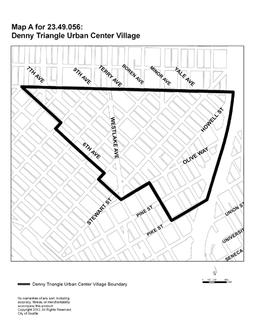

Map A for: Denny Triangle Urban Center Village

1. Minimum facade height

    1. Minimum facade height(s) are prescribed in Table A for 23.49.056 and Exhibit A for 23.49.056, but minimum facade heights do not apply if all portions of the structure are lower than the elevation of the required minimum facade height.
Table A forMinimum Façade Height

<table>
<tr>
<td>Street classification</td>
<td>Minimum facade height* within designated zone</td>
</tr>
<tr>
<td>Streets requiring property line facades</td>
<td>DOC1, DOC2, DMC: 35 feet</td>
</tr>
<tr>
<td>Class I pedestrian streets</td>
<td>DOC 1, DOC 2: 35 feetDMC: 25 feet</td>
</tr>
<tr>
<td>Class II pedestrian streets</td>
<td>DOC 1, DOC 2: 25 feetDMC: 15 feet</td>
</tr>
<tr>
<td>Designated green streets</td>
<td>DOC1, DOC2, DMC: 25 feet</td>
</tr>
<tr>
<td>*Except as provided in subsection 23.49.056.A.2 regarding view corridor requirements.</td>
</tr>
</table>

1. On designated view corridors specified in Section 23.49.024, the minimum facade height is the maximum height permitted in the required setback, if it is less than the minimum facade height required in subsection 23.49.056.A.1.

Exhibit A forMinimum Facade Height

1. Facade setback limits

    1. Setback limits for property line facades. The following setback limits apply to all streets designated on Map 1H as requiring property line facades, except as specified in subsection 23.49.056.B.1.d.

        1. The facades of structures 15 feet or less in height shall be located within 2 feet of the street lot line.
        2. Structures greater than 15 feet in height are governed by the following criteria:

            1. No setback limits apply up to an elevation of 15 feet above sidewalk grade.
            2. Between the elevations of 15 and 35 feet above sidewalk grade, the facade shall be located within 2 feet of the street lot line, except that:

                1. Any exterior public open space that satisfies the Downtown Amenity Standards, whether it receives a bonus or not, and any outdoor common recreation area required for residential uses, is not considered part of the setback.
                2. Setbacks between the elevations of 15 and 35 feet above sidewalk grade at the street lot line are permitted according to the following standards, as depicted in Exhibit B for 23.49.056:

                    1. The maximum setback is 10 feet.
                    2. The total area of a facade that is set back more than 2 feet from the street lot line shall not exceed 40 percent of the total facade area between the elevations of 15 and 35 feet.
                    3. No setback deeper than 2 feet shall be wider than 20 feet, measured parallel to the street lot line.
                    4. The facade of the structure shall return to within 2 feet of the street lot line between each setback area for a minimum of 10 feet. Balcony railings and other nonstructural features or walls are not considered the facade of the structure.

Exhibit B forException to Maximum Setback Limits

1. If sidewalk widening is required by Section 23.49.022, setback standards shall be measured to the line established by the new sidewalk width rather than the street lot line.
2. In the DMC 160 zone, on lots that abut Alaskan Way, as an alternative to the standards for required property line facades in subsections 23.49.056.B.1.a, 23.49.056.B.1.b, and 23.49.056.B.1.c, a continuous setback of up to 16 feet from the lot line abutting Alaskan Way is allowed for the street-facing facade. If the alternative setback allowed by this subsection 23.49.056.B.1.d is provided, the setback area shall be used for outdoor uses related to abutting street-level uses, for landscaped open space, for a partially above-grade story that meets the conditions of subsection 23.49.011.B.1.u, or to widen the abutting sidewalk for pedestrian use.
3. General Setback Limits. The following setback limits apply on streets not requiring property line facades, as shown on Map 1H:

    1. The portion of a structure subject to setback limits shall vary according to the structure height and required minimum facade height, as follows:

        1. Except as provided in subsection 23.49.056.B.2.a.3, if the structure is greater than 15 feet in height, the setback limits apply to the facade between an elevation of 15 feet above sidewalk grade and the minimum facade height established in subsection 23.49.056.A and illustrated in Exhibit C for 23.49.056.
        2. If the entire structure is 15 feet or less in height, the setback limits apply to the entire street-facing facade.
        3. If the minimum facade height is 15 feet, the setback limits apply to the portion of the street-facing facade that is 15 feet or less in height.
    2. The maximum area of all setbacks between the street lot line and facade along each street frontage of a lot shall not exceed the area derived by multiplying the averaging factor by the width of the street frontage of the structure along that street (see Exhibit D for 23.49.056). The averaging factor is five on Class I pedestrian streets and ten on Class II pedestrian streets and designated green streets.
    3. The maximum width, measured along the street lot line, of any setback area exceeding a depth of 15 feet from the street lot line shall not exceed 80 feet, or 30 percent of the lot frontage on that street, whichever is less. (See Exhibit D for 23.49.056.)
    4. The maximum setback of the facade from the street lot lines at intersections is 10 feet. The minimum distance the facade must conform to this limit is 20 feet along each street. (See Exhibit E for 23.49.056.)
    5. Any exterior public open space that meets the Downtown Amenity Standards, whether it receives a bonus or not, and any outdoor common recreation area required for residential uses, is not considered part of a setback. (See Exhibit C for 23.49.056.)
    6. If a sidewalk is widened into the lot as a condition to development, setback standards shall be measured to the line established by the new sidewalk width rather than the street lot line.
4. Facade Transparency Requirements.

    1. Facade transparency requirements apply to the area of the facade between 2 feet and 8 feet above the sidewalk, except that if the slope along the street frontage of the facade exceeds 7.5 percent, the transparency requirements apply to the area of the facade between 4 feet and 8 feet above sidewalk grade. Only clear or lightly tinted glass in windows, doors, and display windows is considered to be transparent. Transparent areas shall allow views into the structure or into display windows from the outside.
    2. Facade transparency requirements do not apply to portions of structures in residential use.
    3. If the transparency requirements of this subsection 23.49.056.C are inconsistent with the glazing limits in the Energy Code, this subsection 23.49.056.C applies to the extent permitted by applicable law.
    4. Transparency requirements are as follows:

        1. Class I pedestrian streets and designated green streets: A minimum of 60 percent of the street level street-facing facade shall be transparent.
        2. Class II pedestrian streets: A minimum of 30 percent of the street level street-facing facade shall be transparent.
        3. Where the slope along the street frontage of the facade exceeds 7.5 percent, the required amount of transparency shall be reduced to 50 percent on Class I pedestrian streets and designated green streets and 25 percent on Class II pedestrian streets.
5. Blank Facade Limits.

    1. General Provisions.

        1. Blank facade limits apply to the area of the facade between 2 feet and 8 feet above the sidewalk, except that where the slope along the street frontage of the facade exceeds 7.5 percent, blank facade limits apply to the area of the facade between 4 feet and 8 feet above sidewalk grade.
        2. Any portion of a facade that is not transparent shall be considered to be a blank facade.
        3. Blank facade limits do not apply to portions of structures in residential use.
    2. Blank Facade Limits for Class I Pedestrian Streets and Designated Green Streets.

        1. Blank facades shall be no more than 15 feet wide except segments with garage doors may exceed a width of 15 feet and may be as wide as the driveway plus 5 feet. Blank facade segment width may be increased to 30 feet if the Director in a Type I decision determines that the facade segment is enhanced by features with visual interest such as architectural detailing, artwork, landscaping, or similar features.
        2. Any blank segments of the facade shall be separated by transparent areas at least 2 feet wide.
        3. The total width of all blank facade segments, including garage doors, shall not exceed 40 percent of the street-facing facade of the structure on each street frontage, or 50 percent if the slope of the street frontage of the facade exceeds 7.5 percent.
    3. Blank Facade Limits for Class II Pedestrian Streets.

        1. Blank façade segments shall be no more than 30 feet wide, except for garage doors, which may exceed 30 feet. Blank facade segment width may be increased to 60 feet if the Director in a Type I decision determines that the facade segment is enhanced by architectural detailing, artwork, landscaping, or similar features that have visual interest. The width of garage doors shall be limited to the width of the driveway plus 5 feet.
        2. Any blank segments of the facade shall be separated by transparent areas at least 2 feet wide.
        3. The total of all blank facade segments, including garage doors, shall not exceed 70 percent of the street facade of the structure on each street frontage; or 75 percent if the slope of the street frontage of the facade exceeds 7.5 percent.
6. Street Tree Requirements. Street trees are required on all streets that have a pedestrian classification and abut a lot. If areaways are located beneath the sidewalk, the street trees shall be planted in below-grade containers with provisions for watering the trees. Street trees shall be planted according to street tree planting standards in the Right-of-Way Improvements Manual.
7. Setback and landscaping requirements for lots located within the Denny Triangle Urban Center Village

    1. Landscaping in the street right-of-way for all streets other than those with green street plans approved by Director's Rule. All new development in DMC zones in the Denny Triangle Urban Center Village, as shown on Map A for 23.49.056, shall provide landscaping in the sidewalk area of the street right-of-way, except on streets with a green street plan approved by Director's Rule. The square footage of landscaped area provided shall be at least 1.5 times the length of the street lot line (in linear feet). The following standards apply to the required landscaped area:

        1. The landscaped area shall be at least 18 inches wide and shall be located in the public right-of-way along the entire length of the street lot line, except for building entrances, vehicular access or other connections between the sidewalk and the lot, provided that the exceptions may not exceed 50 percent of the total length of the street lot line(s).
        2. As an alternative to locating the landscaping at the street lot line, all or a portion of the required landscaped area may be provided in the sidewalk area within 5 feet of the curb line.
        3. Landscaping provided within 5 feet of the curb line shall be located and designed in relation to the required street tree planting and be compatible with use of the curb lane for parking and loading.
        4. All plant material shall be planted directly in the ground or in permanently installed planters if planting in the ground is not feasible. A minimum of 50 percent of the plant material shall be perennial.
    2. Landscaping on a designated green street. If required landscaping is on a designated green street with a green street plan approved by Director's Rule, the planting shall be consistent with designs identified in that green street plan.
    3. Landscaping in setbacks

        1. In the Denny Triangle Urban Center Village, as shown on Map A for 23.49.056, at least 20 percent of the total square footage of all areas abutting the street lot line that are not covered by a structure, have a depth of 10 feet or more from the street lot line and are larger than 300 square feet, shall be landscaped. Any area under canopies or marquees is considered uncovered. Any setback provided to meet the minimum sidewalk widths established by Section 23.49.022 is exempt from the calculation of the area to be landscaped.
        2. All plant material shall be planted directly in the ground or in permanently installed planters if planting in the ground is not feasible. A minimum of 50 percent of the plant material shall be perennial and shall include trees if a contiguous area, all or a portion of which is landscaped pursuant to subsection 23.49.056.F.1.a, exceeds 600 square feet.
    4. Terry and 9th Avenues green street setbacks

        1. In addition to the requirements of subsections 23.49.056.F.2 and 23.49.056.F.3, a 2 foot wide setback from the street lot line is required along the Terry and 9th Avenue Green Streets within the Denny Triangle Urban Center Village as shown on Map A for 23.49.056. The Director may allow averaging of the setback requirement of this subsection 23.49.056.F.4.a to provide greater conformity with an approved green street plan.
        2. Fifty percent of the setback area shall be landscaped.
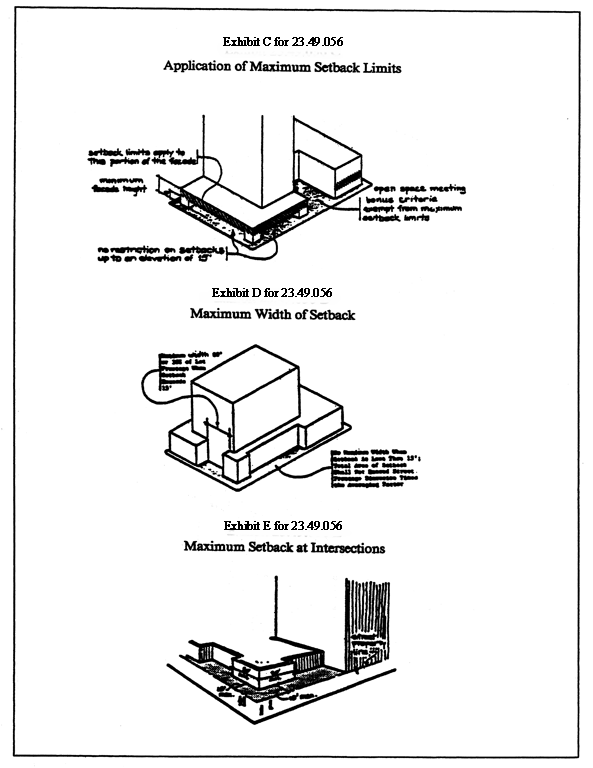

##### 23.49.058 - Downtown Office Core 1 (DOC1), Downtown Office Core 2 (DOC2), and Downtown Mixed Commercial (DMC) upper-level development standards

*For the height at which a "tower" begins, see the definition at the beginning of this Section 23.49.058.

1. For structures that do not exceed the base height limit for residential use, each tower is subject to the average floor area per story limits specified in column (2) on Table B for 23.49.058.
2. For structures that exceed the base height limit for residential use (which requires that the applicant obtain bonus residential floor area pursuant to Section 23.49.015), the average residential gross floor area per story of each tower is subject to the applicable maximum limit specified in column (3) on Table B for 23.49.058.
3. In no instance shall the residential gross floor area of any story in a tower exceed the applicable maximum limit specified in column (4) on Table B for 23.49.058.
4. Unoccupied space provided for architectural interest pursuant to subsection 23.49.008.B shall not be included in the calculation of gross floor area.
5. Maximum tower width

    1. In DMC zones, the maximum facade width for portions of a building above 85 feet along the general north/south axis of a site (parallel to the Avenues) shall be 120 feet or 80 percent of the width of the lot measured on the Avenue, whichever is less, except that:

        1. On a lot where the limiting factor is the 80 percent width limit, the maximum facade width is 120 feet, if at all elevations above a height of 85 feet, no more than 50 percent of the area of the lot located within 15 feet of the street lot line(s) is occupied by the structure; and
        2. On lots smaller than 10,700 square feet that are bounded on all sides by street right-of-way, the maximum facade width shall be 120 feet.
    2. In DOC1 and DOC2 zones, the maximum facade width for portions of a building above 85 feet along the general north/south axis of a site (parallel to the Avenues) shall be 145 feet.
    3. The projection of unenclosed decks and balconies, and architectural features such as cornices, shall be disregarded in calculating the maximum width of a facade.

Map A for: Belltown Urban Center Village

1. Except as otherwise provided in this subsection 23.49.058.F, in the DMC zone with a mapped height limit of more than 160 feet located in the Denny Triangle Urban Center Village, as shown on Map A for 23.49.056, if any part of a tower exceeds 160 feet in height, then all portions of the tower that are above 125 feet in height must be separated from any other existing tower that is above 160 feet in height, and the minimum separation required between towers from all points above the height of 125 feet in each tower is 60 feet.
2. The projection of unenclosed decks and balconies, and architectural features such as cornices, shall be disregarded in calculating tower separation.
3. If the presence of an existing tower would preclude the addition of another tower proposed on the same block, as a special exception, the Director may waive or modify the tower spacing requirements of this Section 23.49.058 to allow a maximum of two towers to be located on the same block that are not separated by at least the minimum spacing required in subsections 23.49.058.F.2, 23.49.058.F.3 and 23.49.058.F.4, other than towers described in subsection 23.49.058.F.1. The Director shall determine that issues raised in the design review process related to the presence of the additional tower have been adequately addressed before granting any exceptions to tower spacing standards. The Director shall consider the following factors in determining whether such an exception shall be granted:

    1. potential impact of the additional tower on adjacent residential structures, located within the same block and on adjacent blocks, in terms of views, privacy, and shadows;
    2. potential public benefits that offset the impact of the reduction in required separation between towers, including the provision of public open space, designated green street or other streetscape improvements, preservation of landmark structures, and provision of neighborhood commercial services, such as a grocery store, or community services, such as a community center or school;
    3. potential impact on the public environment, including shadow and view impacts on nearby streets and public open spaces;
    4. design characteristics of the additional tower in terms of overall bulk and massing, facade treatments and transparency, visual interest, and other features that may offset impacts related to the reduction in required separation between towers;
    5. the City's goal of encouraging residential development downtown; and
    6. the feasibility of developing the site without an exception from the tower spacing requirement.
4. For purposes of this Section 23.49.058, an "existing" tower is either:

    1. a tower that is physically present, except as provided below in this subsection 23.49.058.F.7, or
    2. a proposed tower for which a Master Use Permit decision that includes approval of the Design Review element has been issued, unless and until either (i) the Master Use Permit issued pursuant to such decision expires or is cancelled, or the related application is withdrawn by the applicant, without the tower having been constructed; or (ii) a ruling by a hearing examiner or court of competent jurisdiction reversing or vacating such decision, or determining such decision or the Master Use Permit issued thereunder to be invalid, becomes final and no longer subject to judicial review.
A tower that is physically present shall not be considered "existing" if the owner of the lot where such tower is located shall have applied to the Director for a permit to demolish such tower and such application shall be pending or a permit issued for such demolition shall be in effect, but any permit decision or permit for any structure that would not be permitted under this subsection 23.49.058.F.7 if such tower were considered "existing" may be conditioned upon the actual demolition of such tower.

1. For purposes of this Section 23.49.058, except in zones with a mapped height limit of 160 feet or less, a "tower" is a portion of a structure, not including rooftop features that would be permitted above the applicable height limit pursuant to Section 23.49.008, in which portion all gross floor area in each story is horizontally contiguous, and which portion is above (i) a height of 85 feet in a structure that has any non-residential use above a height of 65 feet or does not have residential use above a height of 160 feet; or (ii) in any structure not described in clause (i) a height determined as follows:

    1. For a structure on a lot that includes an entire block front or that is on a block front with no other structures, 65 feet; or
    2. For a structure on any other lot, the height of the facade closest to the street property line of the existing structure on the same block front nearest to that lot, but if the nearest existing structures are equidistant from that lot, then the height of the higher such facade; but in no instance shall the height exceed 85 feet or be required to be less than 65 feet.
2. The requirements of subsections 23.49.058.C and 23.49.058.D apply to:

    1. All structures 160 feet in height or less, and all structures in the DMC 160 zone, in which any story above an elevation of 85 feet above the adjacent sidewalk exceeds 15,000 square feet. For structures with separate towers, the 15,000 square foot threshold applies to each tower individually; and
    2. Portions of structures in non-residential use above a height of 160 feet in which any story above an elevation of 85 feet exceeds 15,000 square feet. For structures with separate towers, the 15,000 square foot threshold applies to each tower individually.
3. Facade modulation

    1. In DOC 1, DOC 2, and DMC zones, except the DMC 160 zone, facade modulation is required above a height of 85 feet above the sidewalk for any portion of a structure located within 15 feet of a street lot line. No modulation is required for portions of a facade set back 15 feet or more from a street lot line.
    2. In the DMC 160 zone, facade modulation is required above a height of 60 feet above the sidewalk for any portion of a structure located within 15 feet of a street lot line. No modulation is required for portions of a facade set back 15 feet or more from a street lot line.
    3. The maximum length of a facade without modulation is prescribed in Table A for 23.49.058. This maximum length shall be measured parallel to each street lot line, and shall apply to any portion of a facade, including projections such as balconies, that is located within 15 feet of street lot lines.
    4. Any portion of a facade exceeding the maximum length of facade prescribed on Table A for 23.49.058 shall be set back a minimum of 15 feet from the street lot line for a minimum distance of 60 feet before any other portion may be within 15 feet of the street lot line.
4. Upper-level width limit

    1. On lots where the width and depth of the lot each exceed 200 feet, the maximum facade width for any portion of a structure above 240 feet shall be 145 feet along the general north/south axis of a site (parallel to the Avenues), and this portion of the structure shall be separated horizontally from any other portion of a structure on the lot above 240 feet by at least 80 feet at all points.
    2. In the DMC 160 zone, the maximum facade width of any portion of a structure above 60 feet in height shall be 180 feet along lots fronting on Alaskan Way or Western Avenue between University and Union Streets. This portion of the structure shall be separated horizontally from any other portion of a structure on the lot above 60 feet in height by at least 30 feet at all points. If the separation between portions of a structure above 60 feet in height is less than 30 feet, the widths of the separated portions of the structure shall be combined to determine the structure's width.
5. Tower floor area limits and tower width limits for portions of structures in residential use. The requirements of this subsection 23.49.058.E apply only to structures that include portions in residential use above a height of 160 feet, and do not apply in the DMC 160 zone.

    1. Maximum limits on average residential gross floor area per story and maximum residential floor area per story of towers are prescribed in Table B for 23.49.058.
6. Tower spacing for all structures over 160 feet in height in those DMC zoned areas specified below:

    1. For the purposes of this Section 23.49.058, no separation is required:

        1. between structures on different blocks, except as may be required by view corridor or designated green street setbacks, or
        2. from a structure on the same block that is not located in a DMC zone; or
        3. from a structure allowed pursuant to the Land Use Code in effect prior to May 12, 2006; or
        4. from a structure on the same block that is 160 feet in height or less, excluding rooftop features permitted above the applicable height limit for the zone pursuant to Section 23.49.008; or
        5. from a structure in a DMC 160 zone that gains additional height through subsection 23.49.008.E.
    2. Except as otherwise provided in this subsection 23.49.058.F, in the DMC 240/290-400 zone located between Stewart Street, Union Street, Third Avenue and First Avenue, if any part of a tower exceeds 160 feet in height, then all portions of the tower that are above 125 feet in height shall be separated from any other existing tower that is above 160 feet in height, and the minimum separation required between towers from all points above the height of 125 feet in each tower is 200 feet.
    3. Except as otherwise provided in this subsection 23.49.058.F in the DMC zone with a mapped height limit of more than 160 feet located either in the Belltown Urban Center Village, as shown on Map A for 23.49.058, or south of Union Street, if any part of a tower exceeds 160 feet in height, then all portions of the tower that are above 125 feet in height must be separated from any other existing tower that is above 160 feet in height, and the minimum separation required between towers from all points above the height of 125 feet in each tower is 80 feet.
7. Upper level setbacks

    1. If a lot in a DMC zone is across a street from the Pike Place Market Historical District, as shown on Map 1K, a continuous upper-level setback of 15 feet, measured from the street lot line across the street from the Pike Place Market Historical District, is required for all portions of a structure above a height of 65 feet.
    2. If a lot in a DMC or DOC2 zone is located on a designated green street that is not a designated view corridor requiring view corridor setbacks according to Section 23.49.024, as shown on Map 1D, View Corridors, a continuous upper-level setback of 15 feet, measured from the abutting green street lot line, is required for portions of the structure above a height of 45 feet.
8. Structure separation requirements for mid-block corridors in a DMC zone in South Downtown. On a lot in a DMC zone in South Downtown, as depicted on Map 1A, the following standards apply:

    1. At all levels above 45 feet and up to 85 feet in height, structures separated by a mid-block corridor must be separated at all points by a minimum horizontal distance of 45 feet, unless subsection 23.49.058.H.3 applies.
    2. At all levels above 85 feet in height, structures separated by a mid-block corridor must be separated at all points by a minimum horizontal distance of 55 feet, unless subsection 23.49.058.H.3 applies.
    3. If a mid-block corridor abuts a side lot line that is not a street lot line, at all levels above 45 feet structures on that lot must set back from that side lot line at all points by a minimum horizontal distance of 45 feet.

##### 23.49.059 - Downtown Mixed Commercial, standards for lots abutting green streets in South Downtown

In South Downtown, lots zoned DMC abutting a designated green street are subject to the following standards:

1. Any grocery store use greater than 50,000 square feet and any other retail use greater than 25,000 square feet in size must be separated from the green street by another use for a minimum of 75 percent of the lot frontage abutting the green street.
2. For grocery stores greater than 50,000 square feet and other retail uses greater than 25,000 square feet, the following features are prohibited within 25 feet of the lot line abutting a green street except as provided in subsection 23.49.059.C:

    1. loading facilities or access to loading facilities;
    2. access to vehicle parking.
3. As a Type I decision, the Director may allow one or more of the features identified in subsection 23.49.059.B to be located within 25 feet of the lot line abutting a green street if the feature is within 300 feet of Rainier Avenue South and no feasible alternative location is available due to the slope of the lot, and the feature is designed to minimize impacts on pedestrian use of the green street.

##### 23.49.060 - Downtown Mixed Commercial, standards for facades along mid-block corridors

In a DMC zone in South Downtown where a mid-block corridor is used to gain extra floor area or additional height, or both, a facade that faces the mid-block corridor is subject to the following standards:

1. The facade shall include at least one entrance to the predominant use in the structure or an entrance to a use listed in Section 23.49.009 for every 100 lineal feet of building façade facing the corridor. If the façade is less than 100 feet in width, then at least one entrance shall be provided.
2. Blank façade limits apply to the area of the façade facing the mid-block corridor between 2 feet and 8 feet above the grade of the corridor; except that where the slope along the corridor exceeds 7.5 percent measured at any segment of at least 20 feet, the blank façade limits apply to the area of the façade between 4 feet and 8 feet above grade within that segment. Where blank façade limits apply:

    1. Blank façade segments are limited to segments of 30 feet or less in width, except that the width of a blank façade segment may be increased to up to 60 feet if the Director determines, as a Type I decision, that the façade is enhanced by features with visual interest such as architectural detailing, artwork, landscaping, or similar features.
    2. Any blank segments of the façade shall be separated by segments at least 2 feet wide.
    3. The total width of all blank façade segments, including garage doors, shall not exceed 70 percent of the façade of the structure facing the mid-block corridor; or 75 percent if the slope of the corridor along the frontage of the façade exceeds 7.5 percent measured at any segment of at least 20 feet.

#### Subchapter III - Downtown Retail Core
##### 23.49.090 - Downtown Retail Core, permitted uses

1. All uses are permitted outright except those which are specifically prohibited by Section 23.49.092 and those which are permitted only as conditional uses by Section 23.49.096. Parking is allowed subject to Section 23.49.094 and major marijuana activity is allowed subject to Section 23.42.058.
2. All uses not prohibited shall be permitted as either principal or accessory uses.
3. Public facilities

    1. Except as provided in Section 23.49.096, uses in public facilities that are most similar to uses permitted outright under this Chapter 23.49 shall also be permitted outright subject to the same use regulations and development standards that govern the similar uses.
    2. Essential public facilities. Permitted essential public facilities shall also be reviewed according to the provisions of Chapter 23.80, Essential Public Facilities.

##### 23.49.092 - Downtown Retail Core, prohibited uses.

The following uses shall be prohibited as both principal and accessory uses:

1. Drive-in businesses, except gas stations located in parking garages;
2. Outdoor storage;
3. All general and heavy manufacturing uses;
4. Solid waste management;
5. Recycling; and
6. All high-impact uses.

##### 23.49.094 - Downtown Retail Core, principal and accessory parking.

1. Principal Use Parking.

    1. Principal use parking garages for long-term parking are prohibited.
    2. Principal use parking garages for short-term parking may be permitted as administrative conditional uses pursuant to Section 23.49.096.
    3. Principal use surface parking areas for both long and short term parking are prohibited, except that temporary principal use surface parking areas may be permitted as conditional uses pursuant to Section 23.49.096.
2. Accessory Parking.

    1. Accessory parking garages for both long-term and short-term parking are permitted outright, up to the maximum parking limit established by Section 23.49.019, Parking quantity, access and screening/landscaping requirements.
    2. Accessory surface parking areas are prohibited, except that temporary accessory surface parking may be permitted as administrative conditional uses pursuant to Section 23.49.096.

##### 23.49.096 - Downtown Retail Core, conditional uses and Council decisions

1. All conditional uses shall meet the following criteria:

    1. The use shall be determined not to be materially detrimental to the public welfare or injurious to property in the zone or vicinity in which the property is located.
    2. In authorizing a conditional use, adverse negative impacts may be mitigated by imposing requirements or conditions deemed necessary for the protection of other properties in the zone or vicinity and the public interest. The Director or Council shall deny the conditional use, if it is determined that the negative impacts cannot be mitigated satisfactorily.
2. Reserved.
3. Principal use parking garages for short-term parking may be permitted as conditional uses, if the Director finds that:

    1. Traffic from the garage will not have substantial adverse effects on peak hour traffic flow to and from Interstate 5, or traffic circulation in the area around the garage; and
    2. The vehicular entrances to the garage are located so that they will not disrupt traffic or transit routes; and
    3. The traffic generated by the garage will not have substantial adverse effects on pedestrian circulation.
4. Temporary surface parking areas that were in existence prior to January 1, 1985, or are located on lots vacant on or before January 1, 1985, or that are located on lots that become vacant as a result of a City-initiated abatement action, may be permitted as administrative conditional uses according to the following standards:

    1. The standards stated for garages in subsection C of this section are met; and
    2. The lot is screened and landscaped according to the provisions of Section 23.49.019, Parking quantity, access and screening/landscaping requirements; and
    3. Permits for temporary surface parking areas may be issued for a maximum of two (2) years. Renewal of a permit for a temporary surface parking area is subject to the following:

        1. Renewals are permitted only for those temporary surface parking areas that were in existence on or before January 1, 1985 or are located on lots vacant on or before January 1, 1985. A permit for a temporary surface parking area on a lot that became vacant as a result of a City-initiated abatement action shall not be renewed; and
        2. Renewal shall be for a maximum of two (2) years and shall be granted only if, through an administrative conditional use approval process, the Director finds that the temporary surface parking area continues to meet applicable criteria; and
        3. The applicant shall post a bond in an amount adequate to cover the costs of removing the physical evidence of the parking area, such as curbcuts, paving and parking space striping, when the permit expires. Landscaping need not be removed when the permit expires; and
    4. Signs at each entrance to the parking area stating the ending date of the permit shall be required.
5. Public Facilities.

    1. Uses in public facilities that are most similar to uses permitted as a conditional use under this chapter shall also be permitted as a conditional use subject to the same conditional use criteria that govern the similar uses.
    2. The City Council may waive or modify applicable development standards or conditional use criteria for those uses in public facilities that are similar to uses permitted outright or permitted as a conditional use according to the provisions of Chapter 23.76, Subchapter III, Council Land Use Decisions, with public projects considered as Type IV quasi-judicial decisions and City facilities considered as Type V legislative decisions.
    3. Other Uses Permitted in Public Facilities. Unless specifically prohibited, uses in public facilities that are not similar to uses permitted outright or permitted as a conditional use under this chapter may be permitted by the City Council. The City Council may waive or modify development standards or conditional use criteria according to the provisions of Chapter 23.76, Subchapter III, Council Land Use Decisions, with public projects considered as Type IV quasi-judicial decisions and City facilities considered as Type V legislative decisions.
    4. Expansion of Uses in Public Facilities.

        1. Major Expansion. Major expansions may be permitted to uses in public facilities allowed in subsections E1, E2 and E3 above according to the same provisions and procedural requirements as described in these subsections. A major expansion of a public facility use occurs when the expansion that is proposed would not meet development standards or exceed either seven hundred-fifty (750) square feet or ten (10) percent of its existing area, whichever is greater, including gross floor area and areas devoted to active outdoor uses other than parking.
        2. Minor Expansion. When an expansion falls below the major expansion threshold level, it is a minor expansion. Minor expansions may be permitted to uses in public facilities allowed in subsections E1, E2 and E3 above according to the provisions of Chapter 23.76. Procedures for Master Use Permits and Council Land Use Decisions, for a Type I Master Use Permit when the development standards of the zone in which the public facility is located are met.
6. Rooftop features listed in subsection 23.49.008.D.1.c more than 50 feet above the roof of the structure on which they are located may be authorized by the Director as an administrative conditional use pursuant to Chapter 23.76, Procedures for Master Use Permits and Council Land Use Decisions, according to the criteria of Section 23.49.008.
7. Helistops and heliports may be permitted as Council conditional uses according to the following criteria:

    1. The helistop or heliport is for the takeoff and landing of helicopters that serve a public safety, news gathering or emergency medical care function and, in the case of heliports, services provided for those helicopters; is part of a City and regional transportation plan approved by the City Council and is a public facility; or is part of a City and regional transportation plan adopted by the City Council and is not within two thousand (2,000) feet of a residential zone.
    2. The helistop or heliport is located so as to minimize adverse physical environmental impacts on lots in the surrounding area, and particularly on residentially zoned lots, public parks, and other areas where substantial public gatherings may be held, such as Safeco Field and Qwest Field, the Pike Place Market, and the Westlake Mall.
    3. The lot is of sufficient size that the operations of the helistop or heliport and the flight paths of the helicopters can be buffered from other uses in the surrounding area.
    4. Open areas and landing pads shall be hard-surfaced.
    5. The helistop or heliport meets all federal requirements including those for safety, glide angles, and approach lanes.
8. Work-release centers may be permitted as Council conditional uses, based on the following criteria:

    1. Maximum Number of Residents. No work-release center shall house more than fifty (50) persons, excluding resident staff.
    2. Dispersion Criteria.

        1. The lot line of any new or expanding work-release center shall be located six hundred (600) feet or more from any residential zone, any lot line of any special residence, and any lot line of any school.
        2. The lot line of any new or expanding work-release center shall be located one (1) mile or more from any lot line of any other work-release center.
        3. The Director shall determine whether a proposed facility meets the dispersion criteria from maps which shall note the location of current work-release centers and special residences. Any person who disputes the accuracy of the maps may furnish the Director with the new information and, if determined by the Director to be accurate, this information shall be used in processing the application.
    3. The Council's decision shall be based on the following criteria:

        1. The extent to which the applicant can demonstrate the need for the new or expanding facility in the City, including a statement describing the public interest in establishing or expanding the facility;
        2. The extent to which the applicant has demonstrated that the facility can be made secure. The applicant shall submit a proposed security plan to the Director, and the Director, in consultation with the Seattle Police Department, shall consider and evaluate the plan. The security plan shall address, but is not limited to, the following:

            1. Plans to monitor and control the activities of residents, including methods to verify the presence of residents at jobs or training programs, policies on sign-outs for time periods consistent with the stated purpose of the absence for unescorted trips by residents away from the center, methods of checking the records of persons sponsoring outings for work-release residents, and policies on penalties for drug or alcohol use by residents, and
            2. Staff numbers, level of responsibilities, and scheduling, and
            3. Compliance with the security standards of the American Corrections Association;
        3. The extent to which proposed lighting is located so as to minimize spillover light on surrounding properties while maintaining appropriate intensity and hours of use to ensure security is maintained;
        4. The extent to which the facility's landscape plan meets the requirements of the zone while allowing visual supervision of the residents of the facility;
        5. The extent to which appropriate measures are taken to minimize noise impacts on surrounding properties. Measures to be used for this purpose may include: landscaping, sound barriers or fences, berms, location of refuse storage areas, and limiting the hours of use of certain areas;
        6. The extent to which the impacts of traffic and parking are mitigated by increasing on-site parking or loading spaces to reduce overflow vehicles or changing the access to and location of off-street parking;
        7. The extent to which the facility is well-served by public transportation or to which the facility is committed to a program of encouraging the use of public or private mass transportation;
        8. Verification from the Department of Corrections (DOC), which shall be reviewed by the Police Department, that the proposed work-release center meets DOC standards for such facilities and that the facility will meet State laws and requirements.
9. Jails may be permitted as Council conditional uses. The Council's decision shall be based on the following criteria:

    1. The extent to which the applicant can demonstrate the need for the new or expanding facility in the City, including a statement describing the public interest in establishing or expanding the facility;
    2. The extent to which the applicant can demonstrate that the proposed location is functionally necessary to the criminal justice system;
    3. The extent to which the applicant can demonstrate that the new or expanding facility does not create or further advance a level of institutionalization which is harmful to the surrounding community.

##### 23.49.106 - Downtown Retail Core, street facade requirements.

Standards for the street facades of structures are established for the following elements:

Minimum and maximum facade heights

Setback limits

Facade transparency

Blank facade limits

Screening of parking

Street trees.

These standards shall apply to each lot line of a lot that abuts a street.

1. Minimum Facade Height. Minimum facade height shall be thirty-five (35) feet except that this requirement shall not apply when all portions of the structure are lower than an elevation of thirty-five (35) feet.
2. Facade Setback Limits.

    1. The facades of structures less than or equal to fifteen (15) feet in height shall be located within two (2) feet of the street property line.
    2. Structures greater than fifteen (15) feet in height shall be governed by the following criteria:

        1. No setback limits shall apply up to an elevation of fifteen (15) feet above sidewalk grade.
        2. Between the elevations of fifteen (15) and thirty-five (35) feet above sidewalk grade, the facade shall be located within two (2) feet of the street property line, except that setbacks between the elevations of fifteen (15) and thirty-five (35) feet above sidewalk grade at the property line shall be permitted according to the following standards (see Exhibit 23.49.106 A):

            1. The maximum setback shall be ten (10) feet.
            2. The total area of the portion of the facade between the elevations of fifteen (15) feet and thirty-five (35) feet above sidewalk grade at the street property line that is set back more than two (2) feet from the street property line shall not exceed forty (40) percent of the total facade area between the elevations of fifteen (15) feet and thirty-five (35) feet.
            3. No setback deeper than two (2) feet shall be wider than twenty (20) feet, measured parallel to the street property line.
            4. The facade of the structure shall return to within two (2) feet of the street property line between each setback area for a minimum of ten (10) feet. Balcony railings and other nonstructural features or walls shall not be considered the facade of the structure.
    3. When sidewalk widening is required by Section 23.49.022, setback standards shall be measured to the line established by the new sidewalk width rather than the street property line.
3. Facade Transparency Requirements.

    1. Facade transparency requirements shall apply to the area of the facade between two (2) feet and eight (8) feet above the sidewalk. Only clear or lightly tinted glass in windows, doors and display windows shall be considered transparent. Transparent areas shall allow views into the structure or into display windows from the outside.
    2. When the transparency requirements of this subsection are inconsistent with the glazing limits in the Energy Code, this subsection shall apply.
    3. On all streets, a minimum of sixty (60) percent of the street level facade shall be transparent.
4. Blank Facade Limits.

    1. Blank facade limits shall apply to the area of the facade between two (2) feet and eight (8) feet above the sidewalk.
    2. Any portion of the facade which is not transparent shall be considered to be a blank facade.
    3. Blank facades shall be limited to segments fifteen (15) feet wide, except for garage doors which may be wider than fifteen (15) feet. Blank facade width may be increased to thirty (30) feet if the Director determines that the facade is enhanced by architectural detailing, artwork, landscaping, or similar features that have visual interest. The width of garage doors shall be limited to the width of the driveway plus five (5) feet.
    4. Any blank segments of the facade shall be separated by transparent areas at least two (2) feet wide.
    5. The total of all blank facade segments, including garage doors, shall not exceed forty (40) percent of the street facade of the structure on each street frontage.
5. Reserved.
6. Street Tree Requirements. Street trees shall be required on all streets abutting a lot. When areaways are located beneath the sidewalk, the street trees shall be planted in below-grade containers with provisions for watering the trees. Street trees shall be planted according to Seattle Department of Transportation Tree Planting Standards.
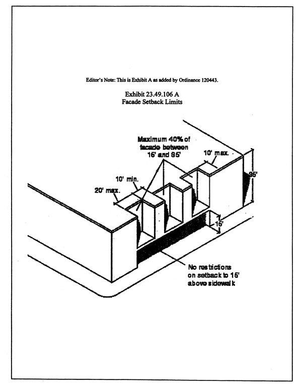

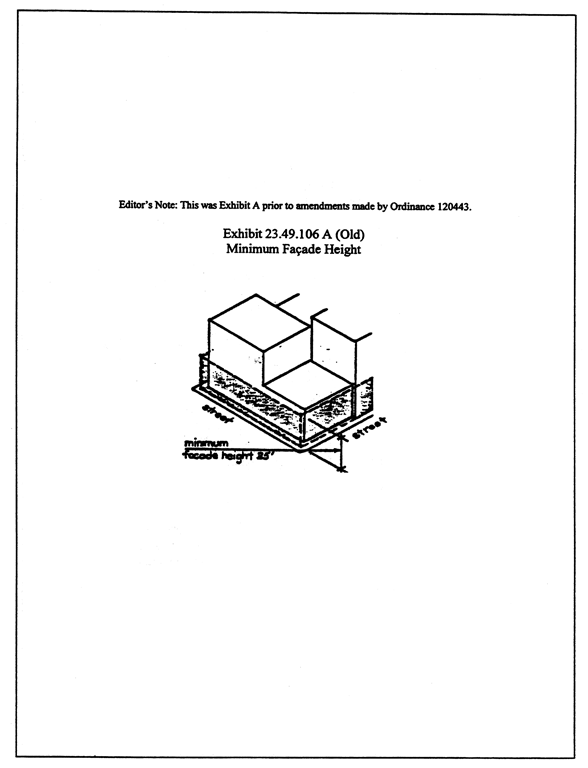

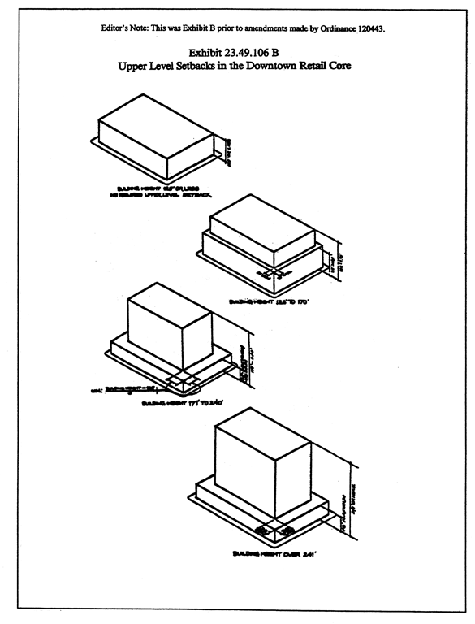

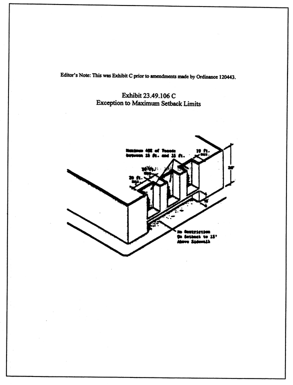

##### 23.49.108 - Downtown Retail Core, upper-level development standards.

1. Structure setbacks of fifteen (15) feet from the street property line are required for all portions of a building at or above a height of eighty-five (85) feet above the adjacent sidewalk. (See Exhibit 23.49.108A.)

#### Subchapter IV - Downtown Mixed Residential
##### 23.49.140 - General provisions.

All property zoned Downtown Mixed Residential (DMR) shall be designated as either Downtown Mixed Residential/Residential (DMR/R) or Downtown Mixed Residential/Commercial (DMR/C) on the Official Land Use Map, Chapter 23.32.

##### 23.49.142 - Downtown Mixed Residential, permitted uses

1. All uses are permitted outright except those specifically prohibited by Section 23.49.144 and those permitted only as conditional uses by Section 23.49.148. Parking is permitted pursuant to Section 23.49.146, and major marijuana activity is allowed pursuant to Section 23.42.058.
2. All uses not prohibited are permitted as either principal or accessory uses.
3. Public facilities

    1. Except as provided in subsection 23.49.148.D.2, uses in public facilities that are most similar to uses permitted outright under this Chapter 23.49 are also permitted outright subject to the same use regulations and development standards that govern the similar uses.
    2. Essential public facilities. Permitted essential public facilities shall also be reviewed according to the provisions of Chapter 23.80, Essential Public Facilities.

##### 23.49.143 - Downtown Mixed Residential, size of use limits in South Downtown

In a DMR zone in South Downtown, each general sales and services business establishment and eating and drinking establishment is limited to a maximum size of 25,000 square feet, except that the size limit for a grocery store is 50,000 square feet.

##### 23.49.144 - Downtown Mixed Residential, prohibited uses.

The following uses shall be prohibited as both principal and accessory uses:

1. Drive-in businesses, except gas stations located in parking garages;
2. Outdoor storage;
3. Helistops and heliports;
4. Adult motion picture theaters and adult panorams;
5. Light manufacturing uses in DMR/R areas;
6. All general and heavy manufacturing uses;
7. Solid waste management;
8. Recycling;
9. All high-impact uses; and
10. Work-release centers.

##### 23.49.146 - Downtown Mixed Residential, principal and accessory parking

1. Principal Use Parking.

    1. Principal use parking garages for long-term and short-term parking are prohibited in a DMR zone except that principal use parking garages for short-term parking may be permitted either as an administrative conditional use in South Downtown outside the International Special Review District pursuant to Section 23.49.148, or within the International Special Review District pursuant to Section 23.66.324.
    2. Principal use surface parking areas are prohibited, except that temporary principal use surface parking areas in DMR/C areas may be permitted as conditional uses pursuant to Section 23.49.148.
2. Accessory Parking.

    1. Accessory parking garages for both long-term and short-term parking are permitted outright, if located on the same lot as the use that they serve, up to the maximum parking limit established by Section 23.49.019. Parking garages providing accessory parking for residential uses, which include the residential portion of live-work units, located on another lot may be permitted as conditional uses pursuant to Section 23.49.148. Parking garages providing accessory parking for nonresidential uses located on another lot are prohibited.
    2. Accessory surface parking areas are:

        1. Prohibited in DMR/R areas;
        2. Permitted in DMR/C areas outside the International Special Review District if they contain 20 or fewer parking spaces; or
        3. Permitted as a conditional use in DMR/C areas outside the International Special Review District if they contain more than 20 parking spaces, pursuant to Section 23.49.148; or
        4. Permitted in a DMR/C zone in the International Special Review District, pursuant to Section 23.66.324.

##### 23.49.148 - Downtown Mixed Residential, conditional uses and Council decisions

1. All conditional uses shall meet the following criteria:

    1. The use shall be determined not to be materially detrimental to the public welfare or injurious to property in the zone or vicinity in which the property is located.
    2. In authorizing a conditional use, adverse negative impacts may be mitigated by imposing requirements or conditions deemed necessary for the protection of other properties in the zone or vicinity and the public interest. The Director or Council shall deny the conditional use, if it is determined that the negative impacts cannot be mitigated satisfactorily.
2. Parking garages providing accessory parking for residential uses located on another lot, and principal use parking garages providing short-term parking in South Downtown outside of the International Special Review District, may be permitted as conditional uses, if the Director finds that:

    1. Unserved parking demand associated with existing or forecast future development within 1,000 feet of the proposed parking facility is sufficient to warrant construction of the facility; and
    2. The garage will be operated in a manner such that substantial traffic associated with uses not located within the DMR zone will not be generated; and
    3. The vehicular entrances to the garage are located so that they will not disrupt traffic or transit routes; and
    4. The traffic generated by the garage will not have substantial adverse effects on pedestrian circulation.
3. Accessory surface parking areas, where permitted as an administrative conditional use by Section 23.49.146, and temporary principal surface parking areas that were in existence prior to January 1, 1985, or are located on lots vacant on or before January 1, 1985, or on lots that become vacant as a result of a City-initiated abatement action, may be permitted as conditional uses in DMR/C areas if the Director finds that:

For temporary principal surface parking areas, permits may be issued for a maximum of two (2) years.

Renewal of a permit for a temporary surface parking area shall be subject to the following:

1. Renewals are permitted only for those temporary surface parking areas that were in existence on or before January 1, 1985, or located on lots vacant on or before January 1, 1985. A permit for temporary surface parking on a lot that became vacant as a result of a City-initiated abatement action shall not be renewed; and
2. Renewal shall be for a maximum of two (2) years and shall be granted only if, through an administrative conditional use process, the Director finds that the temporary surface parking area continues to meet applicable criteria; and
3. The applicant shall post a bond in an amount adequate to cover the costs of removing the physical evidence of the parking area, such as curbcuts, paving, and parking space striping, when the permit expires. Landscaping need not be removed when the permit expires, and
4. Signs at each entrance to the parking area stating the ending date of the permit shall be required.

    1. Traffic from the parking area will not have substantial adverse effects on traffic circulation in the surrounding areas; and
    2. The vehicular entrances to the parking area are located so that they will not disrupt traffic or transit routes; and
    3. The traffic generated by the parking area will not have substantial adverse effects on pedestrian circulation; and
    4. The parking area is screened and landscaped according to the provisions of Section 23.49.019, Parking quantity, access and screening/landscaping requirements; and
4. Public Facilities.

    1. Uses in public facilities that are most similar to uses permitted as a conditional use under this chapter shall also be permitted as a conditional use subject to the same conditional use criteria that govern the similar uses.
    2. The City Council may waive or modify applicable development standards or conditional use criteria for those uses in public facilities that are similar to uses permitted outright or permitted as a conditional use according to the provisions of Chapter 23.76, Subchapter III, Council Land Use Decisions, with public projects considered as Type IV quasi-judicial decisions and City facilities considered as Type V legislative decisions.
    3. Other Uses Permitted Uses in Public Facilities. Unless specifically prohibited, public facilities that are not similar to uses permitted outright or permitted as a conditional use under this chapter may be permitted by the City Council. The City Council may waive or modify development standards or conditional use criteria according to the provisions of Chapter 23.76, Subchapter III, Council Land Use Decisions, with public projects considered as Type IV quasi-judicial decisions and City facilities considered as Type V legislative decisions.
    4. Expansion of Uses in Public Facilities.

        1. Major Expansion. Major expansions may be permitted to uses in public facilities allowed in subsections D1, D2 and D3 above according to the same provisions and procedural requirements as described in these subsections. A major expansion of a public facility use occurs when the expansion that is proposed would not meet development standards or exceed either seven hundred fifty (750) square feet or ten (10) percent of its existing area, whichever is greater, including gross floor area and areas devoted to active outdoor uses other than parking.
        2. Minor Expansion. When an expansion falls below the major expansion threshold level, it is a minor expansion. Minor expansions may be permitted to uses in public facilities allowed in subsections D1, D2 and D3 above according to the provisions of Chapter 23.76, Procedures for Master Use Permits and Council Land Use Decisions, for a Type I Master Use Permit when the development standards of the zone in which the public facility is located are met.
5. Rooftop features listed in subsection 23.49.008.D.1.c more than 50 feet above the roof of the structure on which they are located may be authorized by the Director as an administrative conditional use pursuant to Chapter 23.76, Procedures for Master Use Permits and Council Land Use Decisions, according to the criteria of Section 23.49.008.
6. Jails may be permitted as Council conditional uses. The Council's decision shall be based on the following criteria:

    1. The extent to which the applicant can demonstrate the need for the new or expanding facility in the City, including a statement describing the public interest in establishing or expanding the facility;
    2. The extent to which the applicant can demonstrate that the proposed location is functionally necessary to the criminal justice system;
    3. The extent to which the applicant can demonstrate that the new or expanding facility does not create or further advance a level of institutionalization which is harmful to the surrounding community.

##### 23.49.156 - Downtown Mixed Residential, minimum lot size

1. This subsection 23.49.156.A applies to DMR zones outside of South Downtown.

    1. The minimum lot size is 19,000 square feet for any structure over 125 feet high.
    2. To meet the minimum lot size requirement, a lot may be combined with one or more abutting lots, whether occupied by existing structures or not, provided that:

        1. The total area of the combined lots meets the minimum lot size requirement;
        2. All lots have frontage on the same avenue;
        3. Any existing structure does not exceed a height of 125 feet;
        4. The lot coverage of both the proposed and any existing structures does not exceed applicable lot coverage limits in Section 23.49.158; and
        5. The fee owners of the abutting lot(s) execute a deed or other agreement, recorded with the County Recorder as an encumbrance on the abutting lot(s), that restricts future development of the abutting lot(s) to a maximum height of 125 feet for the life of the proposed structure, and that precludes the use of the abutting lot(s) in combination with any other abutting lots for purposes of meeting the minimum lot size requirements for any other lot.
2. This subsection 23.49.156.B applies within DMR zones in South Downtown.

    1. The minimum lot size for any structure greater than 85 feet in height is 40,000 square feet.
    2. To meet the minimum lot size requirement, a lot may be combined with one or more abutting lots, whether occupied by existing structures or not, provided that the total area of the combined lots meets the minimum lot size requirement and the lot coverage of the proposed and any existing structures does not exceed the applicable lot coverage limits in Section 23.49.158.

##### 23.49.158 - Downtown Mixed Residential, coverage and floor size limits

Table A forPercent Coverage Permitted by Lot Size

<table>
<tr>
<td>Elevationof PortionofStructure(in feet)</td>
<td>0—19,000SquareFeet</td>
<td>19,001—25,000SquareFeet</td>
<td>25,001—38,000SquareFeet</td>
<td>GreaterThan38,000SquareFeet</td>
</tr>
<tr>
<td>65 feet or less</td>
<td>100%</td>
<td>100%</td>
<td>100%</td>
<td>100%</td>
</tr>
<tr>
<td>Greater than 65 feet up to 85 feet</td>
<td>75%</td>
<td>65%</td>
<td>55%</td>
<td>45%</td>
</tr>
<tr>
<td>Greater than 85 feet up to 125 feet</td>
<td>65%</td>
<td>55%</td>
<td>50%</td>
<td>40%</td>
</tr>
<tr>
<td>Greater than 125 feet up to 240 feet</td>
<td>Not applicable</td>
<td>45%</td>
<td>40%</td>
<td>35%</td>
</tr>
</table>

1. In order to meet the coverage limits, a lot may be combined with one or more abutting lots, whether occupied by existing structures or not, provided that:

    1. The coverage of all structures on the lots does not exceed any of the applicable limits set in this subsection 23.49.158.A; and
    2. The fee owners of the abutting lot(s) execute a deed or other agreement, recorded with the King County Recorder as an encumbrance on the lots, that restricts future development so that in combination with the other lots, the coverage limits will not be exceeded.
Table B forPercent Coverage Permitted by Height RangeFor Structures Up To 85 Feet in Height in South Downtown

<table>
<tr>
<td>Height of portion of structure</td>
<td>Percent of lot coverage permitted</td>
</tr>
<tr>
<td>65 feet or less</td>
<td>No limit</td>
</tr>
<tr>
<td>Greater than 65 feet up to 85 feet</td>
<td>75%</td>
</tr>
</table>

1. For buildings greater than 85 feet in height, portions of structures above 65 feet in height are limited to 50 percent lot coverage.

1. Coverage.

    1. Except on lots located in DMR/R 85/65 zones, and except as provided in subsection 23.49.158.C, portions of structures above 65 feet shall not exceed the coverage limits in Table A for 23.49.158:
2. Story Size. Each story in portions of structures above 125 feet shall have a maximum gross floor area of 8,000 square feet.
3. In South Downtown, the following coverage limits apply:

    1. For structures up to 85 feet in height, coverage limits are shown in Table B for 23.49.158:

##### 23.49.162 - Downtown Mixed Residential, street facade requirements

Standards for the facades of structures are established for the following elements:

Minimum facade heights;

Setback limits;

Facade transparency;

Blank facade limits; and

Landscaping.

These standards shall apply to each lot line that abuts a street designated on Map 1F or another map identified in a note to Map 1F as having a pedestrian classification, except lot lines of open space TDR sites. The standards on each street frontage shall vary according to the pedestrian classification of the street on Map 1F or another map identified in a note to Map 1F, and whether property line facades are required by Map 1H.

1. Minimum Facade Height.

    1. Minimum facade height shall be as described in the table below (and see Exhibit 23.49.162 A), but minimum facade heights shall not apply when all portions of the structure are lower than the elevation of the required minimum facade height listed below.
    2. On designated view corridors, Section 23.49.024, the minimum facade height shall be the required elevation of the setback, when it is less than the minimum facade height required in subsection A1.
2. Facade Setback Limits.

    1. Setback Limits for Property Line Facades. The following setback limits shall apply to all streets designated on Map 1H as requiring property line facades:

        1. The facades of structures fifteen (15) feet or less in height shall be located within two (2) feet of the street property line.
        2. Structures greater than fifteen (15) feet in height shall be governed by the following standards:

            1. No setback limits shall apply up to an elevation of fifteen (15) feet above sidewalk grade.
            2. Between the elevations of fifteen (15) and thirty-five (35) feet above sidewalk grade, the facade shall be located within two (2) feet of the street property line, except that:

                1. Any exterior public open space that satisfies the Downtown Amenity Standards, whether it receives a bonus or not, and any outdoor common recreation area required for residential uses, shall not be considered part of a setback.
                2. Setbacks between the elevations of fifteen (15) and thirty-five (35) feet above sidewalk grade at the property line shall be permitted according to the following standards (See Exhibit 23.49.162 B.):

                    1. The maximum setback shall be ten (10) feet.
                    2. The total area of a facade that is set back more than two (2) feet from the street property line shall not exceed forty (40) percent of the total facade area between the elevations of fifteen (15) and thirty-five (35) feet.
                    3. No setback deeper than two (2) feet shall be wider than twenty (20) feet, measured parallel to the street property line.
                    4. The facade of the structure shall return to within two (2) feet of the street property line between each setback area for a minimum of ten (10) feet. Balcony railings and other nonstructural features or walls shall not be considered the facade of the structure.
        3. When sidewalk widening is required by Section 23.49.022, setback standards shall be measured to the line established by the new sidewalk width rather than the street property line.
    2. General Setback Limits. The following setback limits shall apply on streets not requiring property line facades as shown on Map 1H. Except when the entire structure is fifteen (15) feet or less in height, or when the minimum facade height established in subsection A of this section is fifteen (15) feet, the setback limits shall apply to the facade between an elevation of fifteen (15) feet above sidewalk grade and the minimum facade height established in subsection A of this section (see Exhibit 23.49.162 C). When the structure is fifteen (15) feet or less in height, the setback limits shall apply to the entire street facade. When the minimum facade height is fifteen (15) feet, the setback limits shall apply to the portion of the street facade that is fifteen (15) feet or less in height.

        1. The maximum area of all setbacks between the lot line and facade shall be limited according to an averaging technique. The maximum area of all setbacks along each street frontage of a lot shall not exceed the area determined by multiplying the averaging factor by the width of the street frontage of the structure along the street. (See Exhibit 23.49.162 D.) The averaging factor shall be five (5) on Class I pedestrian streets, twenty (20) on Class II pedestrian streets, and thirty (30) on designated green streets. Parking shall not be located between the facade and the street lot line.
        2. The maximum width, measured along the street property line, of any setback area exceeding a depth of fifteen (15) feet from the street property line shall not exceed eighty (80) feet, or thirty (30) percent of the lot frontage on that street, whichever is less. (See Exhibit 23.49.162D.)
        3. The maximum setback of the facade from the street property line at intersections is ten (10) feet. The minimum distance the facade must conform to under this limit is twenty (20) feet along each street. (See Exhibit 23.49.162E.)
        4. Any exterior public open space that satisfies the Downtown Amenity Standards, whether it receives a bonus or not, and any outdoor common recreation area required for residential uses, shall not be considered part of a setback. (See Exhibit 23.49.162C.)
        5. When sidewalk widening is required by Section 23.49.022, setback standards shall be measured to the line established by the new sidewalk width rather than the street property line.
3. Facade Transparency Requirements.

    1. Facade transparency requirements apply to the area of the facade between two (2) feet and eight (8) feet above the sidewalk, except that where the slope along the street frontage of the facade exceeds seven and one-half (7½) percent, the facade transparency requirements apply to the area of the facade between four (4) feet and eight (8) feet above sidewalk grade. Only clear or lightly tinted glass in windows, doors, and display windows is considered to be transparent. Transparent areas shall allow views into the structure or into display windows from the outside.
    2. Facade transparency requirements do not apply to portions of structures in residential use.
    3. When the transparency requirements of this subsection are inconsistent with the glazing limits in the Energy Code, this subsection applies.
    4. Transparency requirements are as follows:

        1. Class I pedestrian streets: A minimum of sixty (60) percent of the street-level facade shall be transparent.
        2. Class II pedestrian streets and designated green streets: A minimum of thirty (30) percent of the street-level facade shall be transparent.
        3. When the slope of the street frontage of the facade exceeds seven and one-half (7½) percent, the required amount of transparency shall be reduced to fifty (50) percent on Class I pedestrian streets and twenty-five (25) percent on Class II pedestrian streets and designated green streets.
4. Blank Facade Limits.

    1. General Provisions.

        1. Blank facade limits apply to the area of the facade between two (2) feet and eight (8) feet above the sidewalk, except where the slope along the street frontage of the facade exceeds seven and one-half (7½) percent, in which case the blank facade limits apply to the area of the facade between four (4) feet and eight (8) feet above sidewalk grade.
        2. Any portion of a facade that is not transparent is considered to be a blank facade.
        3. Blank facade limits do not apply to portions of structures in residential use.
    2. Blank Facade Limits for Class I Pedestrian Streets.

        1. Blank facades shall be limited to segments fifteen (15) feet wide, except for garage doors which may exceed fifteen (15) feet. Blank facade width may be increased to thirty (30) feet if the Director determines that the facade is enhanced by architectural detailing, artwork, landscaping, or similar features that have visual interest. The width of garage doors shall be limited to the width of the driveway plus five (5) feet.
        2. Any blank segments of the facade shall be separated by transparent areas at least two (2) feet wide.
        3. The total of all blank facade segments, including garage doors, shall not exceed forty (40) percent of the street facade of the structure on each street frontage; or fifty (50) percent if the slope of the street frontage of the facade exceeds seven and one-half (7½) percent.
    3. Blank Facade Limits for Class II Pedestrian Streets and Designated Green Streets.

        1. Blank facades shall be limited to segments thirty (30) feet wide, except for garage doors which may exceed thirty (30) feet. Blank facade width may be increased to sixty (60) feet if the Director determines that the facade is enhanced by architectural detailing, artwork, landscaping, or similar features that have visual interest. The width of garage doors shall be limited to the width of the driveway plus five (5) feet.
        2. Any blank segments of the facade shall be separated by transparent areas at least two (2) feet wide.
        3. The total of all blank facade segments, including garage doors, shall not exceed seventy (70) percent of the street facade of the structure on each street frontage; or seventy-five (75) percent if the slope of the street frontage of the facade exceeds seven and one-half (7½) percent.
5. Reserved.
6. Landscaping Requirements.

    1. Street Tree Requirements. Street trees are required on all streets that have a pedestrian classification and abut a lot. If areaways are located beneath the sidewalk, the street trees shall be planted in below-grade containers with provisions for watering the trees. Street trees shall be planted according to street tree planting standards in the Right-of-Way Improvements Manual.
    2. Landscaping in the Street Right-of-way if Green Factor standards do not apply. New development that is not required to achieve a Green Factor score shall provide landscaping in the sidewalk area of the street right-of-way. The square feet of landscaped area provided shall be at least 1.5 times the length of the street lot line. The following standards apply to the required landscaped area:

        1. The landscaped area shall be at least 18 inches wide and shall be located in the public right-of-way along the entire length of the street lot line.
        2. Exceptions shall be allowed for building entrances, vehicular access or other connections between the sidewalk and the lot, but exceptions shall not exceed 50 percent of the total length of the street lot line(s).
        3. As an alternative to locating the landscaping at the street lot line, all or a portion of the required landscaped area may be provided within 5 feet of the curb line.
        4. Landscaping provided within 5 feet of the curb line shall be located and designed in relation to the required street tree planting and take into consideration use of the curb lane for parking and loading.
        5. Landscaping shall not reduce unobstructed sidewalk width to less than 5 feet on east/west streets or less than 8 feet on avenues, except that in South Downtown, landscaping shall not reduce unobstructed sidewalk width to less than 8 feet on east/west streets or less than 5 feet on avenues.
        6. All plant material shall be planted directly in the ground. A minimum of 50 percent of the plant material shall be perennial.
        7. Landscaping shall be consistent with applicable landscaping guidelines for designated green streets or approved street design concept plans identified in the Right-of-Way Improvements Manual.
    3. Landscaping in Setbacks if Green Factor standards do not apply. This subsection 23.49.162.F.3 applies to development that is not required to achieve a Green Factor score.

        1. At least 20 percent of areas on the street lot line that are not covered by a structure, have a depth of 10 feet or more from the street lot line, and are larger than 300 square feet, shall be landscaped. Any area under canopies or marquees is considered uncovered. Any setback provided to meet the minimum sidewalk widths established by Section 23.49.022 is exempt from the calculation of the area to be landscaped.
        2. All plant material shall be planted directly in the ground or in permanently installed planters. A minimum of 50 percent of the plant material shall be perennial and shall include trees if the setback area exceeds 600 square feet.
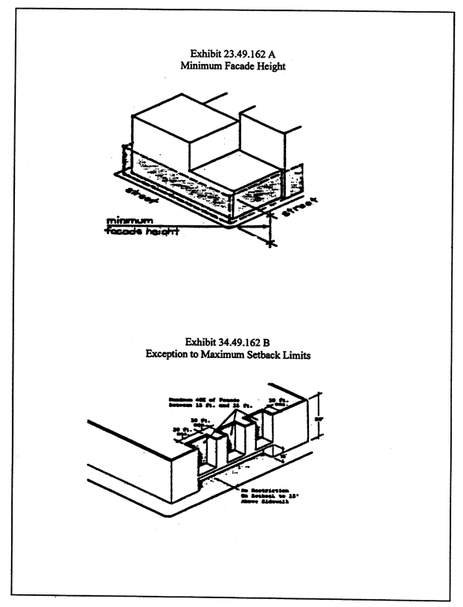

Exhibits 23.49.162A, 23.49.162B

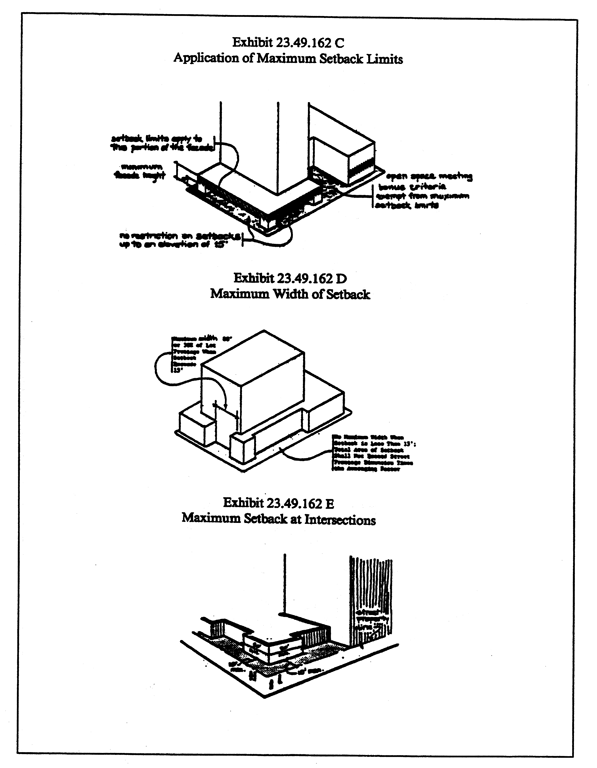

Exhibits 23.49.162C, 23.49.162D, 23.49.162E

##### 23.49.163 - Downtown Mixed Residential, standards for facades along mid-block corridors

On a lot where a mid-block corridor is used to gain extra floor area or additional height, or both, a facade that faces the mid-block corridor is subject to the following standards:

1. The facade shall include at least one entrance to the predominant use in the structure or an entrance to a use listed in Section 23.49.009 for every 100 lineal feet of building façade facing the corridor. If the façade is less than 100 feet in width, then at least one entrance shall be provided.
2. Blank façade limits apply to the area of the façade facing the mid-block corridor between 2 feet and 8 feet above the grade of the corridor; except that where the slope along the corridor exceeds 7.5 percent measured at any segment of at least 20 feet, the blank façade limits apply to the area of the façade between 4 feet and 8 feet above grade within that segment. Where blank façade limits apply:

    1. Blank façade segments are limited to segments of 30 feet or less in width, except that the width of a blank façade segment may be increased to up to 60 feet if the Director determines, as a Type I decision, that the façade is enhanced by features with visual interest such as architectural detailing, artwork, landscaping, or similar features.
    2. Any blank segments of the façade shall be separated by segments at least 2 feet wide.
    3. The total width of all blank façade segments, including garage doors, shall not exceed 70 percent of the façade of the structure facing the mid-block corridor; or 75 percent if the slope of the corridor along the frontage of the façade exceeds 7.5 percent measured at any segment of at least 20 feet.

##### 23.49.164 - Downtown Mixed Residential, maximum width, depth and separation requirements

Table A forMaximum Width and Depth by Lot Size

<table>
<tr>
<td>Height of Portion of Structure (in feet)</td>
<td>0—19,000 Square Feet</td>
<td>Greater Than 19,000 Square Feet</td>
</tr>
<tr>
<td>Greater than 65 up to 125</td>
<td>90 feet on avenues120 feet on east/west streets</td>
<td>120 feet</td>
</tr>
<tr>
<td>Greater than 125 up to 240</td>
<td>Not applicable</td>
<td>100 feet</td>
</tr>
</table>

1. Width and Depth Limits. Except as provided in subsections 23.49.164.B, 23.49.164.C, and 23.49.164.D, a maximum width and depth for the portion of a structure above 65 feet in height is established in Table A for 23.49.164, and this portion of the structure shall be separated horizontally from any other portion of a structure on the lot above 65 feet in height by at least 20 feet at all points. The maximum applies to the width and depth of portions of structures as measured parallel to any street lot line.
2. In a DMR/R 85/65 zone, width of portions of structures above a height of 65 feet is not limited.
3. Housing Option.

    1. On lots with structures that contained low-income housing on or before September 11, 1988, and that meet the requirements of subsection 23.49.164.C.4, the width above a height of 65 feet of portions of structures that are located less than 20 feet from a street lot line shall not exceed 120 feet per block front. This maximum applies to the width as measured parallel to the street lot line. Portions of structures, measured parallel to the street lot line, that are located 20 feet or more from the street lot line, have no maximum limit.
    2. If the housing option is used, no portions of the structure may be located in the area within 20 feet of the intersection of street lot lines between heights of 65 feet and 125 feet.
    3. If the housing option is used, each story in portions of structures between heights of 65 feet and 125 feet shall have a maximum gross floor area of 25,000 square feet or the lot coverage limitation, whichever is less. The 25,000 square foot limit shall apply separately to portions of the same structure that are not connected above 65 feet.
    4. In order to use the housing option, housing on the lot shall be subject to an agreement with the City that contains the following conditions and any other provisions necessary to ensure compliance:

        1. The demolition or change of use of the housing shall be prohibited for not less than 50 years from the date a final certificate of occupancy is issued for the commercial development on the lot; and
        2. If the housing is or was rental housing on or before September 11, 1988, it shall be used as rental housing for not less than 50 years from the date a final certificate of occupancy is issued for the commercial development of the lot; and
        3. The structure will be brought up to and maintained in conformance with the Housing and Building Maintenance Code; and
        4. Housing that is or was low-income housing on or before September 11, 1988, shall be maintained as low-income housing for not less than 50 years from the date a final certificate of occupancy is issued for the commercial development on the lot.
        5. Housing that is preserved according to this Section 23.49.164 does not qualify for a downtown housing bonus or for transfer of development rights.
4. Façade Width Limits and Separation Requirements in South Downtown. On a lot in a DMR/C zone in South Downtown, the following standards apply:

    1. For the portion of a structure 65 feet in height or less, the maximum width of a street-facing facade is 250 feet.
    2. For the portion of a structure above 65 feet in height, the maximum width of a street-facing facade is 120 feet.
    3. At all levels above 65 feet in height, separate structures on a lot and separate portions of the same structure must be separated at all points by a minimum horizontal distance of 20 feet, or as specified in subsections 23.49.164.D.4 and 23.49.164.D.5 for structures separated by a mid-block corridor.
    4. At all levels above 45 feet and up to 85 feet in height, structures separated by a mid-block corridor must be separated at all points by a minimum horizontal distance of 45 feet, unless subsection 23.49.164.D.6 applies.
    5. At all levels above 85 feet in height, structures separated by a mid-block corridor must be separated at all points by a minimum horizontal distance of 55 feet, unless subsection 23.49.164.D.6 applies.
    6. If a mid-block corridor abuts a side lot line that is not a street lot line, at all levels above 45 feet structures on that lot must set back from that side lot line at all points by a minimum horizontal distance of 45 feet.

##### 23.49.165 - Downtown Mixed Residential, Façade Modulation Requirement - South Downtown

This Section 23.49.165 applies only in DMR zones in South Downtown. For a structure that exceeds 85 feet in height, façade modulation is required for the portion of a street-facing facade above 45 feet in height if any part of the façade above that height is located less than 10 feet from street lot lines and the façade above that height exceeds a length of 110 feet measured parallel to street lot lines. Projections from the street-facing façade or any other façade, such as balconies, within 10 feet of street lot lines or their projection, are included in this measurement of length. If façade modulation is required, a portion of the façade with a minimum length of 30 feet must be set back a minimum of 10 feet from street lot lines at all levels above 45 feet.

##### 23.49.166 - Downtown Mixed Residential, side setback and green street setback requirements

Table A forRequired Side Setbacks Above 65 Feet, DMR Zones Outside South DowntownExcept DMR/R 85/65 Zones

<table>
<tr>
<td>Frontage on Avenue</td>
<td>Required Setback Above 65 Feet</td>
</tr>
<tr>
<td>120 feet or less</td>
<td>Not required</td>
</tr>
<tr>
<td>Greater than 120 feet up to 180 feet</td>
<td>20 feet</td>
</tr>
<tr>
<td>Greater than 180 feet</td>
<td>40 feet</td>
</tr>
</table>

1. In DMR zones within South Downtown, setbacks of 10 feet are required from side lot lines that are not street lot lines, for portions of structures above a height of 65 feet.
Table C forRequired Setbacks on Designated Green Streets For Buildings Greater Than 65 Feet in Height in DMR Zones in South Downtown

<table>
<tr>
<td>Height of Portion of Structure</td>
<td>Required Setback in Feet</td>
</tr>
<tr>
<td>Greater than 45 feet up to 85 feet</td>
<td>10</td>
</tr>
<tr>
<td>Greater than 85 feet up to 150 feet</td>
<td>15</td>
</tr>
</table>

1. Side Setbacks.

    1. In DMR zones outside South Downtown, except in DMR/R 85/65 zones, setbacks are required from side lot lines that are not street lot lines as established in Table A for 23.49.166. The setback requirement applies to all portions of the structure above a height of 65 feet. The amount of the setback requirement is determined by the length of the frontage of the lot on an avenue:
2. Green Street Setbacks. In DMR zones outside South Downtown, except in DMR/R 85/65 zones, a setback is required from the street lot line abutting a green street designated on Map 1B. The setback shall be as follows:

    1. Ten feet for portions of structures above 65 feet in height to a maximum of 85 feet; and
    2. For each portion of a structure above 85 feet in height, an additional setback is required at a rate of one foot of setback for every five feet that the height of such portion exceeds 85 feet.
3. Green Street Setbacks in South Downtown. In DMR zones in South Downtown, a setback from the street lot line is required on designated green streets for buildings greater than 65 feet in height. The required setback is determined by Table C for 23.49.166:

#### Subchapter V - Pioneer Square Mixed
##### 23.49.168 - General standards.

All property located within the Pioneer Square Mixed (PSM) zone shall be subject to the use and development standards of the Pioneer Square Preservation District, Chapter 23.66, in addition to the use and development standards contained in this chapter. In the event that there is a conflict between the use and development standards of this chapter and the provisions of the Pioneer Square Preservation District, Chapter 23.66, Subchapter II, the provisions of Chapter 23.66 shall apply.

##### 23.49.170 - Pioneer Square Mixed, permitted uses.

The Overlay District regulations of the Pioneer Square Preservation District, Chapter 23.66, contain the use provisions for the PSM zone.

##### 23.49.178 - Pioneer Square Mixed, structure height

1. Maximum structure height is the applicable height limit designated on the Official Land Use Map, Chapter 23.32, except as provided in this Section 23.49.178.
2. Rooftop features and certain additions to structures are allowed to exceed the applicable height limit according to subsection 23.66.140.C.
3. In the PSM 100/100-120 zone, a structure within which a streetcar maintenance base has been established by a Master Use Permit (MUP) decision issued before May 31, 2013, may attain a maximum height of 130 feet and the space identified for the streetcar maintenance base in the MUP decision may be changed to other uses permitted in the zone if the following conditions are met:

    1. The structure has in residential use, gross floor area equal to the greater of: the gross floor area in the structure above 100 feet, or three times the average gross floor area per story of all stories in the structure;
    2. Within the time period specified in the ordinance introduced as Council Bill 117854, the MUP holder acquires and installs a new free-standing manufactured public restroom in the Pioneer Square Preservation District, as shown on Map A for 23.66.100, that meets ADA requirements and City-approved standards;
    3. The public restroom is connected to City water and sewer mains; and
    4. The public restroom complies with all applicable permitting requirements including a Certificate of Approval issued by the Pioneer Square Preservation Board.
4. In the PSM 100/100-120, PSM 100/100-130, and PSM 100/120-150 zones, except as provided in subsection 23.49.178.C, the applicable height limit is determined as set forth in this subsection 23.49.178.D. The base height limit for nonresidential or live-work uses is the first figure after the "PSM" designation, and is the height limit for all portions of a structure that contain those uses unless all of the conditions of this subsection 23.49.178.D are satisfied. The base height limit for residential use, shown as the first figure following the "/", is the applicable height limit for a structure that contains residential uses and does not satisfy the conditions to exceed the base height limit under this subsection 23.49.178.D. Subject to any limit imposed under Section 23.66.140, the third figure shown is the applicable height limit for a structure if all of the conditions to exceeding base height limits under this subsection 23.49.178.D are satisfied. A structure may exceed the base height limits only if:

    1. Construction does not involve the demolition or removal of any building or structure except as approved pursuant to Section 23.66.115;
    2. No building or structure has been demolished or removed from the lot within the ten years immediately preceding application for a building permit for the structure or addition that would exceed an applicable base height limit unless the Director of Neighborhoods determines that the demolished or removed building or structure did not contribute to the architectural or historic character of the Pioneer Square Preservation District;
    3. No portion of the structure has been determined to be "contributing" pursuant to Section 23.66.032, except that additional height for contributing structures is permitted if the applicant can demonstrate, to the satisfaction of the Director of Neighborhoods, that the proposed height is no greater than the maximum height to which the contributing structure was built;
    4. The gross floor area of the portion of the structure in residential use will equal or exceed the gross floor area in the portion of the structure above 100 feet;
    5. The structure will use extra residential floor area available under Section 23.49.023 to gain all additional floor area above the base height limit for residential uses; and
    6. The lot area is at least 7,200 square feet.
5. In the PSM 85-120 zone:

    1. The applicable height limit is 85 feet except as provided in subsections 23.49.178.E.2 and 23.49.178.E.3.
    2. The applicable height limit is 120 feet if a minimum of 75 percent of the gross floor area of the structure is in residential use, except as provided in subsection 23.49.178.E.3.
    3. The applicable height limit is 240 feet for structures located within the area identified on Map A for 23.49.180 if the structures comply with the provisions of Section 23.49.180.

##### 23.49.180 - Additional height in the Pioneer Square Mixed 85-120 zone

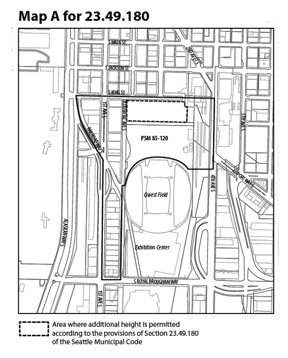

The total of all blank façade segments, including garage doors, shall not exceed 40 percent of the total width of all façades abutting South King Street, Occidental Avenue South, and the open area provided pursuant to subsection 23.49.180.G.6.c.

1. For all façades other than those specified in subsection 23.49.180.G.8.a, if the street level is occupied by uses other than parking, blank façades shall be limited to segments no more than 30 feet in width. Blank façade width may be increased to 60 feet if the Director determines that the façade is sufficiently enhanced by architectural detailing, artwork, landscaping, or similar features that have visual interest. The width of a blank façade that includes a garage door may exceed 30 feet but is limited to the width of the driveway plus 5 feet. If the street level is occupied by parking, the provisions for screening parking at street level in subsection 23.49.180.G.9.a apply.
2. Any blank façade shall be separated by transparent areas at least 2 feet wide. Only clear, non-reflective, non-tinted glass is considered to be transparent.
3. Screening and location of parking. All parking permitted on the lot shall be enclosed within a structure, except that within the open area provided pursuant to subsection 23.49.180.G.6.c, surface parking serving abutting structures is permitted.

    1. Parking at street level.

        1. Parking is not permitted at street level within a structure along street frontages and along the open area edges provided pursuant to subsection 23.49.180.G.6.c unless separated from the street or open area by other uses, except that garage and loading doors and access to parking need not be separated.
        2. Parking is permitted at street level within a structure along lot lines that do not abut a street, subject to the following requirements:

            1. Parking abutting a lot line shall be screened from view at street-level except that garage and loading doors and permitted access to parking need not be screened.
            2. The façade facing the lot line shall be enhanced by architectural detailing, artwork, landscaping, or similar visual interest features.
            3. If parking is located within a structure at the intersection of the eastern and southern lot lines, separation by another use is required for a minimum distance of 20 feet along one of the intersecting lot lines.
    2. Parking above street level.

        1. On the portion of the lot west of the open area provided pursuant to subsection 23.49.180.G.6.c, parking is not permitted above street level along street frontages and along the western edge of the open area unless separated from the street or open area by another use. Parking is permitted above street level along other lot lines for a maximum of four stories.
        2. On the portion of the lot east of the open area provided pursuant to subsection 23.49.180.G.6.c, parking is permitted in portions of a structure above 20 feet in height along S. King Street and in portions of a structure above the first story along other frontages for a maximum of four stories.
        3. For all parking located on stories above street level that is not separated from the street by another use, screening of the parking through materials, fenestration, and other architectural treatments is required. The screening shall be designed as an extension of the primary façade of the structure and to provide visual interest.

1. General Intent. This section applies to the area identified on Map A for 23.49.180 within the Pioneer Square Preservation District if an applicant elects to develop a project using the height limits in Section 23.49.178.E.3. The purpose of this section is to provide added flexibility through an increase in the maximum height limit to promote a high density, mixed use, and mixed income development that can contribute to the vitality of Pioneer Square.
2. Structure height.

    1. The maximum structure height is 240 feet for a proposed development for which all the following is true:

        1. An amount of floor area in residential use equal to or greater than 2 FAR is to be provided on the lot upon completion of the project. The project applicant shall have entered into an agreement with the City that is recorded against the property prior to issuance of the MUP, in which the owner agrees to provide the amount of residential floor area on the lot specified in Subsection 23.49.180.B.1.a, and agrees that failure to provide the amount of residential floor area before the expiration of the MUP will result in the loss of the ability to use any floor area built above the otherwise applicable height limit.
        2. Provision is made for pedestrian circulation and for mitigation of scale and bulk impacts from the increased height through:

            1. Pedestrian routes providing connections between the Weller Street pedestrian bridge and:

                1. Occidental Avenue S., and
                2. S. King Street; and
            2. An open area extending through the lot aligned with the 2nd Avenue S. right-of-way and meeting the standards of subsection 23.49.180.G.6.c.
        3. The proposed development complies with the standards of subsections 23.49.180.C through 23.49.180.I.
    2. Rooftop features. Rooftop features are allowed to exceed the maximum structure height pursuant to subsection 23.49.008.D.
3. Lot area. If the applicant uses the height provisions of subsection 23.49.180.B to gain additional height above the otherwise applicable height limit, the entire area identified on Map A for 23.49.180, including any areas provided as open area or setbacks, or dedicated as street right of way, shall be used to determine compliance with applicable provisions of this section and Section 23.49.181.
4. Location of uses. If the applicant uses the height provisions of subsection 23.49.180.B to gain additional height above the otherwise applicable height limit, uses on the lot with a development using these height provisions are to be located on the lot as follows:

    1. Commercial uses. Commercial uses are to be concentrated in the area with the most direct access to regional transit and where commercial development can buffer residential uses from rail operations at King Street Station.
    2. Residential uses. Residential uses are to be concentrated close to existing housing on adjacent blocks and to contribute to a corridor of housing and amenities along Occidental Ave. S.
    3. Street-level uses. Street-level uses are to be provided along street frontages and the edges of open areas aligned with adjacent street right-of-way.
5. Floor area ratio (FAR).

    1. Base and Maximum FAR. The base FAR for all uses on a lot, except for those uses expressly exempted, is 4. The maximum FAR for all uses on a lot, except for those uses expressly exempted, is 8.
    2. Limit on non-residential FAR. Non-residential chargeable floor area on a lot may not exceed a FAR of 4.
    3. Affordable housing incentive program. Development that includes residential use may exceed the base FAR to the extent the applicant qualifies for bonus floor area by providing affordable housing according to Section 23.49.181, subject to the FAR limit in subsection 23.49.180.E.1.
    4. Exemptions and deductions from FAR calculations

        1. The exemptions and deductions from FAR calculations specified in subsection 23.49.011.B apply, except that residential use is not exempt and is considered chargeable floor area.
        2. In addition to the exemptions from floor area calculations for parking in subsection 23.49.011.B.1.l, enclosed parking provided at or above grade as accessory parking for non-residential uses or as principal use parking replacing the surface spaces existing on the lot on June 25, 1998 is exempt from FAR calculations if it is separated from all streets abutting the lot by another use or is screened according to the provisions of subsection 23.49.180.G.9.
        3. Street-level uses other than residential lobbies are exempt if they meet the requirements of subsection 23.49.180.F.
6. Street-level use requirements.

    1. One or more of the following uses are required at street-level on all street-facing façades and street-level façades facing the open area provided in accordance with the provisions of subsection 23.49.180.G.6.c:

        1. General sales and services;
        2. Human service uses and childcare facilities;
        3. Retail sales, major durables;
        4. Entertainment uses;
        5. Eating and drinking establishments; and
        6. On each street-facing façade or façade facing an open area, up to 20 feet of a residential lobby that provides principal access to residential uses in a structure may be counted as a required street-level use.
    2. General standards

        1. A minimum of 75 percent of each street-facing façade at street-level where street-level uses are required shall be occupied by uses listed in subsection 23.49.180.F.1. The remaining 25 percent of the street-facing façade at street-level may contain other permitted uses and/or pedestrian or vehicular entrances.
        2. Required street-level uses shall be located within 2 feet of the required street-facing façade or the street-level façade facing an open area, in accordance with subsection 23.49.180.G.4.
        3. Except for child care facilities, pedestrian access to street-level uses shall be provided directly from the street or other open area with access to a street. Pedestrian entrances shall be located no more than 3 feet above or below sidewalk grade or at the same elevation as any abutting open area.
        4. Required street-level uses shall be located in a space with a minimum floor-to-floor height of 13 feet.
        5. Required street-level uses shall be located in a space with a minimum depth of 15 feet.
        6. For street-level uses on a street-facing façade, the average width of a business establishment shall be 60 feet or less, and the maximum width of any single business establishment shall be 100 feet. Portions of a business that are separated from the street by another business are not limited in width.
        7. The gross floor area at street-level of any business establishment shall not exceed 10,000 square feet, except that if the business establishment includes a grocery store, the gross floor area at street level shall not exceed 25,000 square feet.
7. Development standards.

    1. Street-level setbacks.

        1. Locations

            1. A street-level setback with an average depth of 10 feet and a minimum depth of 6 feet shall be provided from property lines that do not abut a street.
            2. A street-level setback of at least 9 feet and no more than 12 feet shall be provided from the street property line along Occidental Avenue S.
        2. To qualify as a street-level setback, all portions of a structure must set back at street-level the required distance.
        3. Setback areas may be used for pedestrian routes, vehicular driveways, and to provide landscaping to meet green factor requirements pursuant to subsection 23.49.180.I.
    2. Upper-level setbacks.

        1. The following upper-level setbacks shall be provided:

            1. A minimum setback of 10 feet shall be provided from S. King Street for all portions of a structure above a height of 85 feet for a distance of at least 120 feet measured along S. King Street from the point where the street lot line intersects the eastern lot line of the lot.
            2. A minimum setback of 10 feet shall be provided from S. King Street for all portions of structures above 85 feet in height for a distance of at least 330 feet along S. King Street measured from the intersection with Occidental Avenue S.
            3. An average setback of 50 feet shall be provided from the eastern lot line of the lot for all portions of structures above a height of 85 feet. For the purposes of averaging, only 100 feet in depth of any setback shall be counted.
            4. A minimum setback of 15 feet is provided from Occidental Avenue S. for all portions of structures above 85 feet in height.
            5. A minimum setback of 30 feet is provided from Occidental Avenue S. for portions of structures above 120 feet in height.
    3. Upper-level coverage limits, measured as a percentage of the total area of the lot, apply to portions of structures exceeding specified heights, in accordance with Table A for 23.49.180.
    4. Street façades. Street-facing façades shall be provided on all street frontages. For purposes of this requirement, the street frontage includes the entire length of a street lot line, less any part of the street lot line where open area provided pursuant to subsection 23.49.180.G.6.c abuts the street.

        1. Street-facing façade height. The street-facing façades of structures shall have a minimum height of 50 feet for 75 percent of each street frontage. The minimum street-facing façade height for the remaining 25 percent of each street frontage is 35 feet.
        2. Street façade setbacks.

            1. For each street frontage, the street-facing façade shall be built to the street lot line for a minimum of 75 percent of the street frontage. For the remaining street frontage, the street-facing façade may set back from the street lot line to provide for the following:

                1. street-level open area at the intersection of S. King Street and Occidental Avenue S. meeting the standards of subsection 23.49.180.G.6.a; and
                2. architectural treatment of the street-facing façade, including setbacks of portions of the street-facing façade up to a maximum depth of 15 feet, for principal building entrances or for architectural detailing and features of a structure that reflect the surrounding development pattern, such as the sequence of streets and alleys or the massing and articulation of historic structures on opposing block fronts.
            2. Where set back, the street-facing façade is measured from a location other than the street lot line in the following instances:

                1. If a utility easement abutting a street lot line prevents a structure from extending to the street lot line, a street-facing façade setback shall be measured from the abutting utility easement rather than the street lot line.
                2. On Occidental Avenue S., a street-facing façade setback shall be measured from the setback line provided pursuant to subsection 23.49.180.G.1.a.2 rather than the street lot line.
            3. The maximum length of any setback area, as measured along the street lot line, shall not exceed 60 feet.
            4. Except as needed to accommodate required access to utility easements, no setback of a street-facing façade is permitted along S. King Street for 60 feet on either side of the intersection with the open area aligned with 2nd Avenue S. provided pursuant to subsection 23.49.180.G.6.c.
    5. Façade modulation. For portions of structures exceeding a height of 85 feet, any street-facing façade located within 30 feet of a street lot line that exceeds a length of 120 feet shall be modulated. For the street-facing façade to exceed 120 feet, a portion of the façade shall either project forward of or set back from any other portion of the street facing façade a minimum of 10 feet measured perpendicular to the street property line for a minimum distance of 20 feet measured parallel to the street lot line. Balconies and decks are permitted within the modulated area. Modulated façades are not permitted to extend into required setbacks.
    6. Open area. Open area at ground level shall be provided as follows:

        1. To qualify as open area at ground level, the open area shall be located and configured to allow easy pedestrian access to project occupants from streets or other abutting public spaces, including access for persons with disabilities. The open area shall be open to the sky, except as provided in this subsection 23.49.180G.6.a, and have a minimum horizontal dimension of 15 feet and a minimum area of 600 feet. The following features are exempt from the requirement that the open area be open to the sky:

            1. Features in a surface parking area;
            2. Temporary kiosks and pavilions;
            3. Overhead weather protection attached to abutting façades;
            4. Art;
            5. Seating and tables;
            6. Landscaping; and
            7. Any similar features approved by the Director that contribute to the comfort and use of the space.
        2. Open area at ground level shall be provided at the following locations:

            1. The intersection of Occidental Avenue S. and S. King Street, in the northwestern corner of the lot; and
            2. The intersection of the lot's eastern and southern lot lines, on the southeastern corner of the lot, unless a structure with a street level use is located there.
        3. An open area at ground level with boundaries referred to as "edges" shall be provided in the area established by extending the street lot lines of 2nd Avenue S. through the lot from S. King Street to the southern lot line. The open area and façades abutting it shall meet the following:

            1. For a minimum depth of 20 feet measured from each edge into the open area, the open area must be open for use by pedestrians and for landscaping.
            2. The façades of structures abutting the open area shall have a minimum height of 35 feet and shall not set back more than five feet from the edges of the open area;
            3. For a minimum distance of 120 feet along each edge of the open area, as measured from the S. King Street lot line, an upper level setback with a minimum depth of 15 feet is required for the portion of a structure that exceeds 85 feet in height.
            4. Street-level uses listed in and meeting the standards of subsection 23.49.180.F are required for a minimum of 50 percent of the combined street-level façades facing the open area edges aligned with 2nd Avenue S. Street-level uses listed in and meeting the standards of subsection 23.49.180.F are required for a minimum of 25 percent of the street-level façades facing either edge of the open area.
        4. Open area used to satisfy this section may qualify as common recreation area to the extent permitted by subsection 23.49.010.B.
    7. Façade Transparency Requirements.

        1. For street-facing façades abutting South King Street and Occidental Avenue South and for façades facing the open area provided pursuant to subsection 23.49.180.G.6.c, a minimum of 60 percent of the street level façade shall be transparent.
        2. For all other street-level façades, a minimum of 20 percent of the street level façade shall be transparent, except that transparency is not required if the street level use is parking.
        3. To be considered transparent, only clear, non-reflective, non-tinted glass may be used in windows, doors and display windows in that portion of the façade between 2 feet and 8 feet above the sidewalk, and in that portion of the façade, one must be able to view into the structure or into display windows from outside.
    8. Blank Façade Limits.

        1. For all façades abutting South King Street, Occidental Avenue South, and the open area provided pursuant to subsection 23.49.180.G.6.c, blank façades shall not exceed 15 feet in width, except that

            1. a blank façade may be increased to 30 feet in width if the Director determines that the façade is sufficiently enhanced by architectural detailing, artwork, landscaping, or similar features that have visual interest; and
            2. the width of a blank façade that includes a garage door may exceed 15 feet but is limited to the width of the driveway plus 5 feet.
8. LEED requirement. The applicant shall strive to achieve a LEED Gold rating or better, make a commitment acceptable to the Director that the proposed development will earn at least a LEED Silver rating or meet a substantially equivalent standard, and demonstrate compliance with that commitment, all in accordance with the provisions of Section 23.49.020.
9. Green Factor Requirement. The project shall achieve a green factor score of .30 or greater in accordance with the provisions of Section 23.86.019.
10. Development standard departures. As a special exception pursuant to Section 23.76.004, the Director may waive or modify those development standards in Section 23.49.180 that would be eligible for departures through the design review process pursuant to Section 23.41.012, if they were applicable to a project subject to that process. The Director shall consult with the Pioneer Square Preservation Board and the Director of the Department of Neighborhoods prior to making a decision on a requested modification or waiver. The Director may grant a waiver or modification only if the Director determines that it will cause the project to better meet the intent of this Section 23.49.180 and the Design Guidelines for New Construction on the North Lot in Pioneer Square, as adopted by the Pioneer Square Preservation Board.

##### 23.49.181 - Bonus floor area for affordable housing in the PSM 85-120 zone

1. Purpose; Scope of provisions; State law controlling. This Section 23.49.181 establishes an affordable housing incentive program for development on lots zoned PSM 85-120 that are subject to FAR limits pursuant to the provisions of Section 23.49.180. Chargeable floor area in addition to the base FAR is allowed for development that includes residential use, to the extent that the applicant qualifies by providing low-income housing, in accordance with this Section 23.49.181 and subject to the provisions of Section 23.49.180. In case of any irreconcilable conflict between the terms of this Section 23.49.181 and the authority granted in RCW 36.70A.540, as it may be amended, the provisions of RCW 36.70A.540, as it may be amended, shall supersede and control. Unless the context otherwise clearly requires, references to RCW 36.70A.540 in this Section 23.49.181 mean that section in effect on the date as of which the provisions of this Title 23 apply to the application for a use permit for the project using the bonus floor area.
2. Permitting Conditions

    1. Master Use Permit. The Master Use Permit application to establish any bonus floor area under this Section 23.49.181 shall include a calculation of the total amount of bonus floor area sought and shall identify the quantity and type of affordable housing to be provided to satisfy the conditions to such bonus floor area. The application shall include the proposed location of the affordable housing. If any of the affordable housing is proposed to be within the area defined on Map A for Section 23.49.180 where additional height is permitted, the application shall include the location of the affordable housing within that area and its distribution within the proposed building(s). If any of the affordable housing is not to be provided within the area defined on Map A for Section 23.49.180 where additional height is permitted, the application shall include the address, legal description, dimensions and ownership of the other lot(s), and the approval of the Director of Housing for the affordable housing to be provided on the other lot(s), pursuant to subsection 23.49.181.E.3. The Director shall, at the time of issuance of any Master Use Permit decision approving any bonus floor area, issue a Type I decision as to the amount of bonus floor area to be allowed and the conditions to such bonus floor area. A declaration signed by the applicant and any other owners of the lot(s) on which the project using the bonus floor area is to be built and any other owners, or persons with control, of the lot(s) where the affordable housing will be located, on a form approved by the Director, specifying the amount of bonus floor area, the legal descriptions of the lot where the bonus floor area will be used and each other lot where affordable housing will be located, and the conditions, must be executed and recorded as a condition to issuance of the Master Use Permit for a development to include bonus floor area. If a change in the total bonus floor area to be developed, or a change in the location of the affordable housing approved by the Director of Housing pursuant to subsection 23.49.181.E.3, results in adjustment to one or more conditions, the declaration and any related conditions of the Master Use Permit may be amended, with the written approval of the Director, as a Type I decision. In requesting amendment of a declaration under this subsection 23.49.181.B and any related conditions of the Master Use Permit, the applicant may elect, consistent with subsection 23.76.026.G, that the provisions of this Section 23.49.181 as in effect on the date of the Director's action on that request, rather than any earlier date applicable under Section 23.76.026, apply for purposes of the amendment to the Master Use Permit.
    2. First Building Permit.

        1. Except as otherwise provided in this subsection 23.49.181.B.2.a, prior to issuance, and as a condition to issuance, of the first building permit for a structure using bonus floor area, the owner of each lot that will include the affordable housing for that bonus floor area shall execute and record an agreement in a form acceptable to the Director of Housing that shall commit to provide that affordable housing, and shall run with the land to bind successors. The applicant shall submit an acceptable agreement, fully signed, as part of the building permit application, and if there is any change in ownership or if the location at which any affordable housing is to be provided is modified pursuant to subsection 23.49.181.B.1 prior to the issuance of the building permit, the new owners or any other owners of the lot(s) where the affordable housing is to be provided, or both, as applicable, shall execute the agreement or an addendum, substitute or separate agreement, acceptable to the Director of Housing. This subsection 23.49.181.B.2.a does not apply with respect to bonus floor area that is based on an amount of affordable housing for which a certification by the Director of Housing is delivered pursuant to subsection 23.49.181.B.3.
        2. If the affordable housing is to be located on any lot(s) not owned by the applicant, then the applicant shall demonstrate that the applicant is providing the affordable housing on the other lot(s) in connection with the applicant's project, as set forth below in this subsection 23.49.181.B.2.b. Prior to issuance, and as a condition to issuance, of the first building permit for a structure using bonus floor area, the applicant shall provide to the Director of Housing a copy of a signed and binding linkage agreement, acceptable to the Director of Housing, with the owner(s) or person(s) in control of those lots, pursuant to which only the applicant has the right to claim such housing for purposes of bonus development under this Section 23.49.181 or any other bonus or benefit under this Title 23, and shall demonstrate that the applicant has made a financial contribution to the affordable housing, or has promised such contribution in that linkage agreement and has provided to the City an irrevocable, unconditional letter of credit to ensure its payment, in form and content satisfactory to the Director of Housing, in either case in an amount determined by the Director of Housing to be, when reduced by the value of any expected benefits to be received for such contribution other than the bonus development, approximately equal to the subsidy gap for construction in South Downtown of at least the minimum amount of affordable housing determined under this Section 23.49.181 for the amount of bonus floor area sought by the applicant. The Director of Housing may require that one or more parties to a linkage agreement enter into an agreement with the City to establish performance criteria to be met in the development of the affordable housing, to provide for control of the financial contribution from the applicant to ensure its use for the affordable housing, and to provide for its use for alternative affordable housing if performance criteria are not met. The Director of Finance is authorized to establish any funds or accounts that the Director of Housing may deem necessary for the deposit of funds under any agreement authorized in this subsection 23.49.181.B.2.b., and to make disbursements from such funds or accounts as directed by the Director of Housing, but the monies in such funds or accounts shall not become property of the City unless applied against obligations owing to the City, and the expenditure of those monies on any project or contract shall not cause it to be treated as a public work or contract of the City.
    3. Effect of Certification by Director of Housing. If the Director of Housing certifies to the Director that either (a) the applicant has provided the City with (i) a satisfactory linkage agreement; (ii) evidence of a sufficient financial contribution, a letter of credit, or other sufficient security pursuant to subsection 23.49.181.B.2.b; and (iii) such other agreements as the Director of Housing requires pursuant to subsection 23.49.181.B.2.b, all sufficient for purposes of providing a specified amount of affordable housing consistent with this Section 23.49.181; or (b) there have been recorded one or more agreements or instruments satisfactory to the Director of Housing providing for occupancy and affordability restrictions on affordable housing with the minimum floor area determined under this Section 23.49.181 for the amount of bonus floor area sought by the applicant, all affordable housing has been completed, and the affordable housing either is on a different lot from the bonus floor area or is located in one or more condominium units separate from the bonus floor area under condominium documents acceptable to the Director of Housing; then any failure of the affordable housing to be completed or to satisfy the requirements of subsection 23.49.181.E shall not affect the right to maintain or occupy the bonus floor area and shall not cause the applicant or owner of the lot with the bonus floor area to be in violation of this Title 23. If all conditions to the certification in clause (a)(i) and (a)(iii) of this subsection 23.49.181.B.3, but not clause (a)(ii), are satisfied, the Director of Housing may deposit a certification with an escrow agent, with irrevocable instructions to date and deliver the certification when the escrow agent holds the necessary funds for delivery to an appropriate account as a contribution to the affordable housing, and delivery of the certification by the escrow agent shall then have the same effect as certification by the Director of Housing on the date of that delivery.
3. Findings. Pursuant to the authority of RCW 36.70A.540, the City finds that the higher income levels specified in the definition of "income-eligible households" in this Section 23.49.181, rather than those stated in the definition of "low-income households" in RCW 36.70A.540, are needed to address local housing market conditions in the area to which this Section 23.49.181 applies.
4. Defined Terms. For purposes of this Section 23.49.181:

    1. "Affordable housing" means a unit or units of low-income housing provided as a condition to bonus floor area.
    2. "Base FAR" or "base floor area ratio" means a FAR of 4.
    3. "Bonus floor area" means all chargeable floor area allowed in addition to the base FAR.
    4. "Income-eligible households" means:

        1. In the case of rental housing, households with incomes no higher than 80 percent of median income as defined in Section 23.84A.025.
        2. In the case of owner occupancy housing units, households with incomes no higher than the median income as defined in Section 23.84A.025.
        3. "Low-income housing" means housing that serves income-eligible households as determined in subsection 23.49.181.E.
        4. "Net bonus floor area" means gross square footage of bonus floor area, multiplied by an efficiency factor of 80 percent.
5. Affordable housing

    1. Amount. An applicant using bonus floor area shall provide an amount of net rentable floor area of low-income housing, applicable to units for sale or rent, equal to at least 17.5 percent of the net bonus floor area obtained. For purposes of this subsection 23.49.181.E, "net rentable floor area" is equal to 80 percent of the gross floor area of the low-income housing.
    2. Serving income-eligible households. For the purposes of this Section 23.49.181, a housing unit serves income-eligible households only if either:

        1. For a period of 50 years beginning upon the issuance of a final certificate of occupancy by the Seattle Department of Construction and Inspections for the affordable housing, the housing is used as rental housing solely for income-eligible households at rent limited so that annual housing costs, including rent and basic utilities, do not exceed 30 percent of 80 percent of median income, and the housing unit and the structure in which it is located are maintained in decent and habitable condition, including basic appliances in the housing unit; or
        2. The unit is sold for owner-occupancy to an income-eligible household at an initial sale price limited so that the annual housing costs, including mortgage principal and interest, real estate taxes, insurance, plus homeowner dues if applicable, are not expected to exceed 35 percent of median income, according to a calculation based on reasonable assumptions and approved by the Director of Housing, and the unit is subject to a recorded instrument satisfactory to the Director of Housing with a term extending until 50 years after the issuance of a final certificate of occupancy by the Seattle Department of Construction and Inspections for the structure using the bonus floor area for which that affordable housing is provided, providing for sales prices on any resale consistent with affordability on the same basis as the initial sale, allowing resales only to income-eligible households, and requiring that upon any resale, the housing unit be in decent and habitable condition, including adequate basic appliances in the housing unit.
    3. Location, size, and other requirements. Affordable housing may be provided within the area defined on Map A for 23.49.180 where additional height is permitted. Alternatively, affordable housing may be provided on one or more different lots within South Downtown, subject to approval by the Director of Housing under the criteria in this subsection 23.49.181.E and to the conditions in subsection 23.49.181.B.2. Approval requires a determination by the Director of Housing that the affordable housing will (a) provide a public benefit; and (b) be more affordable than market rents or sale prices, as applicable, for housing in South Downtown. The affordable housing shall be provided in a range of unit sizes consistent with RCW 36.70A.540 and comply with all requirements of RCW 36.70A.540.
    4. Time of completion. Unless affordable housing is to be provided on a lot other than that of the project using the bonus and the Director of Housing has made all approvals described in subsections 23.49.181.B.2 and 23.49.181.E.3, the affordable housing shall be completed and ready for occupancy at or before the time when a certificate of occupancy is issued for any bonus floor area that is based on the affordable housing and as a condition to any right of the applicant to such a certificate of occupancy.
    5. No subsidies for affordable housing; exceptions

        1. In general, and except as may be otherwise required by applicable federal or state law, no bonus floor area may be earned by providing affordable housing if:

            1. Any person is receiving or will receive with respect to the housing any charitable contributions or public subsidies for housing development or operation, including, but not limited to, tax exempt bond financing, low-income housing tax credits, federal loans or grants, City of Seattle housing loans or grants, county housing funds, and State of Washington housing funds; or
            2. The housing is or would be, independent of the requirements for the bonus floor area, subject to any restrictions on the income of occupants, rents or sale prices.
        2. As exceptions to the general rule in subsection 23.49.181.E.5.a:

            1. All affordable housing provided as a condition to bonus floor area within the area defined on Map A for 23.49.180 where additional height is permitted may consist wholly or in part of the same units used to satisfy terms under which the lot or a portion thereof was transferred by a public body, and any units of affordable housing provided as a condition to bonus floor area on a lot outside the area defined on Map A for 23.49.180 where additional height is permitted, may consist wholly or in part of the same units used to satisfy terms under which the lot or a portion thereof was transferred by a public body;
            2. The improvements on the lot may qualify for, and affordable housing provided as a condition to bonus floor area may consist wholly or in part of the same units used to satisfy conditions of, property tax exemptions pursuant to Chapter 5.73; and
            3. The prohibition on public subsidies for affordable housing does not include Internal Revenue Code Section 45D, New Markets Tax Credits.
        3. The Director of Housing may require, as a condition of any bonus floor area, that the owner of the lot upon which the affordable housing is located agree not to seek or accept any subsidies, other than as described in subsection 23.49.181.E.5.b, related to housing. The Director of Housing may require that such agreement provide for the payment to the City, for deposit in an appropriate sub-fund or account, of the value of any subsidies received in excess of any amounts allowed by such agreement.
        4. As an exception to the restriction on subsidies, the Director of Housing may allow the building or buildings in which the affordable housing is located to be financed in part with subsidies based on determinations that:

            1. the total amount of affordable housing is at least 300 net residential square feet greater than the minimum amount of affordable housing that would be needed to satisfy the conditions of this Section 23.49.181;
            2. the public benefit of the affordable housing net of those subsidies, as measured through an economic analysis, exceeds the public benefit from the minimum amount of affordable housing; and
            3. the subsidies being allowed would not be sufficient to leverage private funds for production of the affordable housing, under restrictions required in this Section 23.49.181, without additional City subsidy.
    6. Agreements and approvals. The Director of Housing is authorized to accept and execute agreements and instruments to implement this Section 23.49.181. Except with respect to bonus floor area based on an amount of affordable housing for which a certification by the Director of Housing is delivered pursuant to subsection 23.49.181.B.3, issuance of the Master Use Permit, building permit, or certificate of occupancy for the project using the bonus floor area may be conditioned on satisfactory agreements and instruments signed by applicants and other owners. An applicant or prospective applicant may request, and the Director of Housing may provide, a determination that a linkage agreement or security arrangement, or both, would satisfy specific provisions of this Section 23.49.181, whether or not an applicant has proposed a specific development to use bonus floor area, but no such approval or agreement shall affect the determination, under Chapter 23.76 or other applicable law, of the date as of which any development regulations apply to a permit application.
    7. Reports and fees. An applicant for bonus floor area shall pay a review fee and the housing owner shall provide annual reports to the Office of Housing. Fees shall be paid in accordance with the applicable fee ordinance item or Section 22.900G.015.
6. Identification of bonus floor area. The floor area that constitutes bonus floor area under this Section 23.49.181 shall be determined according to the order in which Master Use Permits are issued to establish the chargeable floor area, with the base FAR allocable to the earlier Master Use Permits. Within a structure or structures developed under a single Master Use Permit that involves both base floor area and bonus floor area:

    1. If the complete applications for building permits for construction, not including any permits limited to excavation and shoring, are submitted at different times, then unless otherwise specifically identified in the Master Use Permit application and approved by the Director, the base floor area shall be allocated first to the structure or structures for which the earlier complete building permit applications are submitted; and
    2. If the complete applications for building permits for construction, not including any permits limited to excavation and shoring, are submitted at the same time, then unless otherwise specifically identified in the Master Use Permit application and approved by the Director, the bonus floor area shall be the chargeable floor area, excluding any affordable housing, in the highest stories in the structure or structures, and if only a portion of a story consists of bonus floor area, it shall be allocated to each portion of that story in proportion to its chargeable floor area, excluding any affordable housing, within that story.
7. Obligation of Owners.

    1. Except as otherwise expressly provided in subsection 23.49.181.B.3, any owner of bonus floor area shall be in violation of this Title 23 if:

        1. any housing units to be provided as affordable housing for that bonus floor area are not timely completed and ready for occupancy, or are not subject to a recorded instrument binding on the owner thereof as provided in this Section 23.49.181; or
        2. at any time during the period specified in subsection 23.49.180.E.2, any rental housing unit provided or to be provided under this Section 23.49.181 for that bonus floor area does not serve income-eligible households; or
        3. any housing unit provided or to be provided as affordable housing for owner occupancy for that bonus floor area under subsection 23.49.181.E.2.b is initially transferred other than in a sale to an income-eligible household, and subject to a recorded instrument, consistent with that subsection 23.49.181.E.2.b.
    2. Any owner of a housing unit provided or to be provided as affordable housing in accordance with this Section 23.49.181 shall be in violation of this Title 23 if either:

        1. for a rental housing unit, at any time during the period specified in subsection 23.49.181.E.2 it does not serve income-eligible households within the meaning of that subsection 23.49.181.E.2; or
        2. in the case of a unit provided or to be provided for owner occupancy, the owner causes or permits the transfer of the unit, or of the right to occupy the unit, or any offer for any transfer, contrary to the terms of a recorded instrument then in effect pursuant to this Section 23.49.181.
8. Rules. The Director, in consultation with the Director of Housing, is authorized to adopt rules to interpret and implement provisions of this Section 23.49.181.

#### Subchapter VI - International District Mixed
##### 23.49.198 - Chapter 23.66 provisions apply

All property located in International District Mixed (IDM) zones is subject to the use and development standards of the International Special Review District, Chapter 23.66, in addition to the use and development standards contained in this Chapter 23.49. If there is a conflict between the use and development standards of this Chapter 23.49 and the provisions of the International Special Review District, the provisions of Chapter 23.66 apply.

##### 23.49.200 - International District Mixed, permitted uses

The Overlay District regulations of the International Special Review District, Chapter 23.66, contain the use provisions for the IDM zones.

##### 23.49.208 - International District Mixed, structure height

1. Height limits in the International District Mixed (IDM) zones are designated on the Official Land Use Map, Chapter 23.32.
2. Rooftop features are permitted to exceed the applicable height limit according to Section 23.66.332.
3. Except as otherwise expressly provided in this Section 23.49.208, the applicable height limit in an IDM zone is determined as set forth in this subsection 23.49.208.C. The base height limit for nonresidential and live-work uses is the first figure after the "IDM" designation. The base height limit for residential uses, shown as the first figure following the "/", is the applicable height limit for a structure that contains residential uses and does not qualify for extra floor area under Section 23.49.023. The third figure shown, if any, is the applicable height limit for a structure that qualifies for extra residential floor area under Section 23.49.023 or for a structure that includes hotel use in a mixed use development consistent with subsection 23.49.208.E.
4. In the IDM 75-85 zone, structures in excess of 75 feet in height, to a maximum of 85 feet, are permitted only if 50 percent or more of the gross floor area on the lot, excluding parking and street-level retail uses meeting the standards of Section 23.66.326, is in residential use.
5. In an IDM 75/85-150 zone, the applicable height limit is 75 feet unless:

    1. all floor area above a height of 75 feet is in residential use; or
    2. in a mixed-use development that includes hotel use, the following conditions are met:

        1. the mixed-use development is on a lot with at least 40,000 square feet of the lot area located in an IDM 75/85-150 zone;
        2. fifty percent or more of the gross floor area on the lot, excluding parking, is in residential use; and
        3. hotel use is the only type of non-residential use located above 75 feet.
6. In the IDM 65-120 zone, structures in excess of 65 feet, to a maximum of 120 feet, may be permitted only as a part of a planned community development, pursuant to Section 23.49.036, Planned community developments.

##### 23.49.210 - International District Mixed, street façade requirements

1. Façade transparency requirements, blank façade limits and landscaping standards set forth in this Section 23.49.210 apply to the street-facing facades that face Class I and Class II Pedestrian Streets and designated green streets in IDM zones, as shown on Map B for 23.66.326, on lots abutting those streets, unless waived or modified pursuant to subsection 23.49.210.B.
2. Waiver or modification of requirements, limits and standards. The Director may waive or modify the requirements, limits and standards referred to in subsection 23.49.210.A as a Type I decision if, upon consultation with the Director of Neighborhoods, the Director determines that waiving or modifying a requirement, limit or standard will better meet the goals and objectives of Section 23.66.302 and Section 23.66.304.
3. If there is a conflict between the requirements, limits and standards of Chapter 23.66 and subsection 23.49.210.A, Chapter 23.66 applies.
4. Façade transparency requirements.

    1. Façade transparency requirements apply to the area of the façade between 2 feet and 8 feet above the sidewalk, except that where the average slope along the entire street frontage of a façade exceeds 7.5 percent, the façade transparency requirements apply to the area of the façade between 4 feet and 8 feet above sidewalk grade. Only clear or lightly tinted glass in windows, doors, and display windows is considered to be transparent. Transparent areas shall allow views into the structure or into display windows from the outside.
    2. Façade transparency requirements do not apply to portions of structures in residential use.
    3. If the transparency requirements of this subsection 23.49.210.D are inconsistent with the glazing limits in the Energy Code, this subsection 23.49.210.D applies to the extent permitted by applicable law.
    4. Transparency requirements are as follows:

        1. Class I pedestrian streets: A minimum of 60 percent of the street-level façade shall be transparent.
        2. Class II pedestrian streets and designated green streets: A minimum of 30 percent of the street-level façade shall be transparent.
        3. If the slope of the street frontage of the façade exceeds 7.5 percent, the required amount of transparency is reduced to 50 percent on Class I pedestrian streets and 25 percent on Class II pedestrian streets and designated green streets.
5. Blank Façade Limits.

    1. General provisions.

        1. Blank façade limits apply to the area of the façade between 2 feet and 8 feet above the sidewalk, except where the slope along the street frontage of the façade exceeds 7.5 percent, in which case the blank façade limits apply to the area of the façade between 4 feet and 8 feet above sidewalk grade.
        2. Any portion of a façade that is not transparent is considered to be a blank façade.
        3. Blank façade limits do not apply to portions of structures in residential use.
    2. Blank Façade Limits for Class I Pedestrian Streets.

        1. Blank façade segments are limited to 15 feet in width, except for segments with garage doors, which may exceed a width of 15 feet and may be as wide as the driveway plus 5 feet. Blank façade segment width may be increased to 30 feet if the Director determines that the façade segment is enhanced by features with visual interest such as architectural detailing, artwork, landscaping, or similar features.
        2. Any blank segments of the façade shall be separated by transparent areas at least 2 feet wide.
        3. The total width of all blank façade segments, including garage doors, shall not exceed 40 percent of the width of the street-facing façade of the structure on each street frontage; or 50 percent of the width if the slope of the street frontage of the façade exceeds 7.5 percent.
    3. Blank Façade Limits for Class II Pedestrian Streets and Designated Green Streets.

        1. Blank façade segments are limited to 30 feet in width, except for garage doors which may exceed 30 feet. Blank façade segment width may be increased to 60 feet if the Director determines that the façade segment is enhanced by architectural detailing, artwork, landscaping, or similar features that have visual interest. The width of garage doors is limited to the width of the driveway plus 5 feet.
        2. Any blank segments of the façade shall be separated by transparent areas at least 2 feet wide.
        3. The total width of all blank façade segments, including garage doors, shall not exceed 70 percent of the width of the street-facing façade of the structure on each street frontage; or 75 percent of the width if the slope of the street frontage of the façade exceeds 7.5 percent.
6. Landscaping Standards.

    1. Street Tree Requirements. Street trees are required on all streets that have a pedestrian classification and abut a lot. If areaways are located beneath the sidewalk, the street trees shall be planted in below-grade containers with provisions for watering the trees. Street trees shall be planted according to street tree planting standards in the Right-of-Way Improvements Manual.
    2. Landscaping in the Street Right-of-way if Green Factor Standards Do Not Apply. New development that is not required to achieve a Green Factor score shall provide landscaping in the street right-of-way. The square feet of landscaped area provided shall be at least 1.5 times the length of the street lot line. The following standards apply to the required landscaped area:

        1. The landscaped area shall be at least 18 inches wide and shall be located in the public right-of-way abutting the entire length of the street lot line.
        2. Exceptions shall be allowed for building entrances, vehicular access or other connections between the sidewalk and the lot, but exceptions shall not exceed 50 percent of the total length of the street lot line(s).
        3. As an alternative to locating the landscaping abutting the street lot line, all or a portion of the required landscaped area may be provided within 5 feet of the curb line.
        4. Landscaping provided within 5 feet of the curb line shall be located and designed in relation to the required street tree planting and take into consideration use of the curb lane for parking and loading.
        5. Landscaping shall not reduce unobstructed sidewalk width to less than 5 feet on east/west streets or less than 8 feet on avenues.
        6. All plant material shall be planted directly in the ground. A minimum of 50 percent of the plant material shall be perennial.
        7. Landscaping shall be consistent with applicable landscaping guidelines for designated green streets or approved street design concept plans identified in the Right-of-Way Improvements Manual.
    3. Landscaping in Setbacks if Green Factor Standards Do Not Apply. This subsection 23.49.210.F.3 applies to development that is not required to achieve a Green Factor score.

        1. At least 20 percent of areas on the street lot line that are not covered by a structure, that have a depth of 10 feet or more from the street lot line, and are larger than 300 square feet, shall be landscaped. Any area under canopies or marquees is considered uncovered. Any setback provided to meet the minimum sidewalk widths established by Section 23.49.022 is exempt from the calculation of the area to be landscaped.
        2. All plant material shall be planted directly in the ground or in permanently installed planters. A minimum of 50 percent of the plant material shall be perennial. Plants shall include trees if the setback area exceeds 600 square feet.

##### 23.49.212 - International District Mixed, upper level development standards

1. In an IDM 75/85-150 zone, upper level development standards include upper level setbacks and façade modulation.

    1. Upper level setbacks south of S. Weller Street. For structures south of S. Weller Street exceeding a height of 85 feet, an upper level setback with an average depth of at least 15 feet from abutting street lot lines along the entire street frontage of the structure is required above a height of 45 feet. The minimum depth permitted for any portion of a setback required under this subsection 23.49.212.A.1 is 10 feet. The maximum depth of a setback that can be used for calculating the average setback is 30 feet.
    2. Upper level setbacks north of S. Weller Street. North of S. Weller St., a continuous setback of at least 15 feet from abutting street lot lines is required for portions of a structure above 85 feet in height, except that no setback is required from street lot lines abutting S. Weller Street.
    3. Green street upper level setback. If a lot abuts a designated green street, a continuous upper level setback of at least 20 feet is required for all portions of structures above a height of 45 feet along the green street lot line.
    4. Façade modulation. For a structure that exceeds 85 feet in height, modulation is required for the portion of a street-facing façade above 45 feet in height if any part of the façade above that height is located less than 15 feet from street lot lines and the façade above that height exceeds a length of 110 feet measured parallel to the street lot line. Projections from the street-facing façade or any other facade, such as balconies, within 15 feet of street lot lines or their projection, are included in this measurement of length. If façade modulation is required, a portion of the façade with a minimum length of 30 feet must be set back a minimum depth of 15 feet from street lot lines at all levels above 45 feet.
2. In the IDM 150/85-150 zone, upper level development standards include upper level setbacks and façade modulation.

    1. Upper level setback. For lots abutting Maynard Avenue S., a continuous upper-level setback of at least 15 feet from the lot line abutting Maynard Avenue S. is required for portions of a structure above 45 feet in height.
    2. Façade modulation. For structures exceeding 85 feet in height, modulation is required for portions of the street-facing facade exceeding 65 feet in height and located less than 10 feet from a street lot line. The maximum length of a street-facing façade without modulation is 110 feet, measured parallel to the street lot line. Projections from the street-facing façade, such as balconies, are included in the measurement of length. Where façade modulation is required, a portion of the façade must set back a minimum depth of 10 feet from street lot lines for a minimum length of 30 feet.

#### Subchapter VII - International District Residential
##### 23.49.220 - International District Residential/Commercial

Property zoned International District Residential (IDR) may be further designated with a "C" suffix, as International District Residential/Commercial (IDR/C), on the Official Land Use Map, Chapter 23.32.

##### 23.49.223 - Chapter 23.66 provisions apply

All property located in an IDR or IDR/C zone is subject to the use and development standards of the International Special Review District, Chapter 23.66, in addition to the use and development standards contained in this Chapter 23.49. If there is a conflict between the use and development standards of this Chapter 23.49 and the provisions of the International Special Review District, the provisions of Chapter 23.66 apply.

##### 23.49.226 - International District Residential, permitted uses

The Overlay District regulations of Subchapter III of Chapter 23.66, the International Special Review District, contain use provisions for IDR zones.

##### 23.49.236 - International District Residential, structure height

1. Height limits in International District Residential (IDR) zones are designated on the Official Land Use Map, Chapter 23.32.
2. Except as otherwise expressly provided in this Section 23.49.236, the applicable height limits in an IDR zone are determined as set forth in this subsection 23.49.236.B:

    1. Where there are multiple height limits listed, the applicable height limit for structures containing only nonresidential and live-work uses is the first figure after the "IDR" designation, and is the height limit for all portions of a structure that contain those uses. The base height limit for portions of a structure that contain residential use, shown as the first figure following the "/", is the applicable residential height limit for portions of a structure that contain residential uses if the structure does not qualify for extra floor area under Section 23.49.023. The third figure shown, if any, is the applicable height limit for portions of a structure that contain residential uses if the structure qualifies for extra residential floor area under Section 23.49.023.
    2. Where only one height limit is listed, the limit applies to all uses.
3. Rooftop features and certain additions to structures are allowed to exceed the applicable height limit according to subsection 23.66.332.B.

##### 23.49.242 - International District Residential, development standards

Table A forCoverage Limits Per Story for Structures 150 Feet in Height or Less

<table>
<tr>
<td>Height of story</td>
<td>Floor area permitted per story</td>
</tr>
<tr>
<td>Stories with residential uses as the predominant use</td>
<td>Stories with non-residential/live-work uses as the predominant use</td>
</tr>
<tr>
<td>65 feet or less</td>
<td>No limit</td>
<td>No limit</td>
</tr>
<tr>
<td>Greater than 65 feet up to 125 feet</td>
<td>75% of lot area</td>
<td>No limit</td>
</tr>
<tr>
<td>Greater than 125 feet up to 150 feet</td>
<td>65% of lot area</td>
<td>Not applicable</td>
</tr>
<tr>
<td>If any part of a story is above a given height, the limit applies as if the entire story were above that height.</td>
</tr>
</table>

1. For structures exceeding 150 feet in height excluding rooftop features that include non-residential uses as the predominant use on any story wholly or in part above 45 feet in height, coverage limits are shown in Table B for 23.49.242.
Table B forCoverage Limits Per Story for Structures Exceeding 150 Feet in Height With Stories in Predominantly Non-Residential/Live-Work Use Above 45 feet in Height

<table>
<tr>
<td>Height of story</td>
<td>Floor area permitted per story</td>
</tr>
<tr>
<td>45 feet or less</td>
<td>No limit</td>
</tr>
<tr>
<td>Greater than 45 feet up to 125 feet</td>
<td>For stories with nonresidential uses as the predominant use: no limitFor stories predominantly in residential use: 35% of lot area, or an average gross floor area of 9,000 square feet, whichever is greater, provided that no single story exceeds a gross floor area of 11,500 square feet</td>
</tr>
<tr>
<td>Greater than 125 feet up to 240 feet</td>
<td>35% of lot area or an average gross floor area per story of 9,000 square feet, whichever is greater, provided that no single story exceeds a gross floor area of 11,500 square feet</td>
</tr>
<tr>
<td>If any part of a story is above a given height, the limit applies as if the entire story were above that height. The stories eligible for coverage limit averaging are all of those that have floor areas predominantly in residential use. Averaging rules and further restrictions are in subsection 23.49.242.C.5</td>
</tr>
</table>

1. For structures exceeding 150 feet in height excluding rooftop features that include residential uses as the predominant use on every story wholly or in part above 45 feet in height, coverage limits are shown in Table C for 23.49.242:
Table C forCoverage Limits Per Story for Structures Exceeding 150 Feet in HeightWith All Stories in Residential Use Above 45 feet in Height

<table>
<tr>
<td>Height of story</td>
<td>Floor area permitted per story</td>
</tr>
<tr>
<td>45 feet or less</td>
<td>No limit</td>
</tr>
<tr>
<td>Greater than 45 feet up to 85 feet</td>
<td>75% of lot area</td>
</tr>
<tr>
<td>Greater than 85 feet up to 240 feet</td>
<td>35% of lot area, or an average gross floor area of 9,000 square feet per story, whichever is greater, provided that no single story exceeds a gross floor area of 11,500 square feet</td>
</tr>
<tr>
<td>If any part of a story is above a given height, the limit applies as if the entire story were above that height. The stories eligible for coverage limit averaging are those that are above 85 feet. Averaging rules and further restrictions are in subsection 23.49.242.C.5</td>
</tr>
</table>

1. For any structure greater than 150 feet in height excluding rooftop features, gross floor area of any story that is eligible for coverage limit averaging under Table B for 23.49.242 or Table C for 23.49.242 shall not exceed 35 percent of the lot area, unless the average gross floor area of all stories eligible for averaging is no more than 9,000 square feet per story; and in any case no single story above a height of 85 feet shall exceed a gross floor area of 11,500 square feet. For purposes of this subsection 23.49.242.C.5, gross floor area for any story of less than 4,000 square feet is assigned a value of 4,000 square feet for the purpose of calculating average floor area.
Table D for: Façade Modulation

<table>
<tr>
<td>Height of portion of structure</td>
<td>Maximum length of un-modulated facade if less than 15 feet from street lot line</td>
</tr>
<tr>
<td>65 feet in height or less</td>
<td>No limit</td>
</tr>
<tr>
<td>Greater than 65 feet up to 125 feet</td>
<td>155 feet</td>
</tr>
<tr>
<td>Greater than 125 up to 150 feet</td>
<td>125 feet</td>
</tr>
<tr>
<td>Applies only to structures 150 feet in height or less</td>
</tr>
</table>

1. Any portion of a facade subject to modulation under subsection 23.49.242.E.1 or 2 that exceeds the maximum length of façade prescribed in Table D for 23.49.242 must include a portion set back a minimum depth of 15 feet from street lot lines for a minimum length of 30 feet.

1. Scope: application to mixed-use structures. The provisions of this Section 23.49.242 apply in IDR and IDR/C zones. If residential and non-residential uses are combined in the same structure, the standards specified for the respective categories of use apply to that portion of the structure occupied by those uses. If uses subject to different standards are combined on the same story of a structure, the standards for the predominant use in the story apply. For purposes of this Section 23.49.242, live/work uses are considered entirely nonresidential.
2. Minimum lot size requirement. The minimum lot size is 21,000 square feet for any structure exceeding a height of 150 feet excluding rooftop features.
3. Coverage limits.

    1. Upper level coverage limits do not apply to structures 85 feet in height or less excluding rooftop features on lots of 8,000 square feet or less in IDR zones, or to structures 125 feet in height or less excluding rooftop features on lots of any size in IDR/C zones, or to rooftop features that are identified in Section 23.66.332.
    2. For structures 150 feet in height or less, coverage limits are shown in Table A for 23.49.242.
4. Setbacks

    1. The following minimum setbacks are required for structures on lots abutting a green street designated on Map 1F or another map identified in a note to Map 1F:

        1. In an IDR zone, a continuous upper-level setback of 15 feet is required from the green street lot line for all portions of the structure above 45 feet in height. This setback is not required if a structure is 65 feet in height or less, except on Maynard Avenue S.
        2. In an IDR/C zone, a continuous setback of 6 feet is required at street level from the green street lot line. For a structure exceeding 85 feet in height, a continuous upper-level setback of 16 feet is required from the green street lot line for all portions of the structure above a height of 65 feet.
        3. For a structure exceeding 85 feet in height excluding rooftop features, a continuous upper-level setback of 15 feet is required from each side lot line that is not a street or alley lot line for all portions of the structure above a height of 65 feet.
    2. Façade modulation.

        1. For structures 150 feet or less in height excluding rooftop features, modulation is required for the portion of a street-facing facade above 65 feet in height and located less than 15 feet from street lot lines. No modulation is required for portions of a façade set back 15 feet or more from street lot lines.
        2. For structures exceeding 150 feet in height, modulation is required for the portion of a street-facing facade in non-residential use between 65 feet and 125 feet in height and located less than 15 feet from street lot lines. No modulation is required for portions of a façade set back 15 feet or more from street lot lines.
        3. For portions of structures subject to the modulation requirements of this subsection 23.49.242.E, the maximum length of a street-facing façade without modulation is prescribed in Table D for 23.49.242. For purposes of this subsection 23.49.242.E, length is measured parallel to each street lot line and includes projections from the street-facing façade, such as balconies.
5. Maximum Width. For any story predominantly in residential use above 85 feet in height in a structure that exceeds 150 feet in height not including rooftop features, the maximum width along the general north/south axis of a lot (parallel to the avenues) is 100 feet. The projection of unenclosed decks and balconies, and architectural features such as cornices, is disregarded in calculating maximum width.

##### 23.49.250 - International District Residential, street façade requirements

1. Street façade requirements, limits and standards. Street façade requirements, limits and standards in Section 23.49.210 for International District Mixed zones also apply to the street-facing facades that face Class I and Class II Pedestrian Streets and designated green streets in IDR zones, as shown on Map B for 23.66.326, on lots abutting those streets, unless waived or modified pursuant to subsection 23.49.250.B.
2. Waiver or modification of requirements, limits and standards. The Director may waive or modify the requirements, limits and standards referred to in subsection 23.49.210.A as a Type I decision if, upon consultation with the Director of Neighborhoods, the Director determines that waiving or modifying a requirement, limit or standard will better meet the goals and objectives of Section 23.66.302 and Section 23.66.306.

#### Subchapter VIII - Downtown Harborfront 1
##### 23.49.300 - Downtown Harborfront 1, uses

1. Uses that are permitted or prohibited in Downtown Harborfront 1 are identified in Chapter 23.60A, the Seattle Shoreline Master Program, except that major marijuana activity is prohibited.
2. Essential public facilities. Permitted essential public facilities shall also be reviewed according to the provisions of Chapter 23.80, Essential Public Facilities.

##### 23.49.302 - Downtown Harborfront 1, general provisions.

All uses shall meet the development standards of the Seattle Shoreline Master Program.

##### 23.49.306 - Downtown Harborfront 1, parking.

Parking located at or above grade shall be screened according to the following requirements:

1. Parking where permitted on dry land at street level shall be screened according to the provisions of Section 23.49.019, Parking quantity, access and screening/landscaping requirements.
2. The perimeter of each floor of parking garages above street level shall have an opaque screen at least three and one-half (3½) feet high.

#### Subchapter IX - Downtown Harborfront 2
##### 23.49.318 - Downtown Harborfront 2, permitted uses.

1. All uses shall be permitted outright except those which are specifically prohibited in Section 23.49.320, those which are permitted only as conditional uses by Section 23.49.324, and parking, which shall be regulated by Section 23.49.322. Additionally, uses may be further restricted by the Seattle Shoreline Master Program.
2. All uses not specifically prohibited shall be permitted as either principal or accessory uses.
3. Public Facilities.

    1. Except as provided in Section 23.49.324 D2, uses in public facilities that are most similar to uses permitted outright under this chapter shall also be permitted outright subject to the same use regulations and development standards that govern the similar uses.
    2. Essential Public Facilities. Permitted essential public facilities shall also be reviewed according to the provisions of Chapter 23.80, Essential Public Facilities.

##### 23.49.320 - Downtown Harborfront 2, prohibited uses

The following uses are prohibited as both principal and accessory uses:

1. Drive-in businesses, except gas stations located in parking garages;
2. Outdoor storage, except when accessory to water-dependent or water-related uses located in Downtown Harborfront 1 or Downtown Harborfront 2;
3. Adult motion picture theaters and adult panorams;
4. All general and heavy manufacturing uses;
5. Solid waste management;
6. Recycling;
7. All high-impact uses;
8. Work-release centers; and
9. Major marijuana activity.

##### 23.49.322 - Downtown Harborfront 2, principal and accessory parking.

1. Principal Use Parking.

    1. Principal use parking garages for both long-term and short-term parking shall be conditional uses, according to Section 23.49.324.
    2. Principal use surface parking areas shall be conditional uses in areas shown on Map 1I, and shall be prohibited in other locations, except that temporary principal use surface parking areas may be permitted as conditional uses pursuant to Section 23.49.324.
2. Accessory Parking.

    1. Accessory parking garages for both long-term and short-term parking shall be permitted outright.
    2. Accessory surface parking areas shall be:

        1. Permitted outright when located in areas shown on Map 1I and containing twenty (20) or fewer parking spaces; or
        2. Permitted as a conditional use when located in areas shown on Map 1I and containing more than twenty (20) spaces; or
        3. Prohibited in areas not shown on Map 1I, except that temporary accessory surface parking areas may be permitted as a conditional use pursuant to Section 23.49.324.

##### 23.49.324 - Downtown Harborfront 2, conditional uses

1. All conditional uses shall meet the following criteria:

    1. The use shall be determined not to be materially detrimental to the public welfare or injurious to property in the zone or vicinity in which the property is located.
    2. In authorizing a conditional use, adverse negative impacts may be mitigated by imposing requirements or conditions deemed necessary for the protection of other properties in the zone or vicinity and the public interest. The Director or Council shall deny the conditional use, if it is determined that the negative impacts cannot be mitigated satisfactorily.
2. Principal use parking garages for long-term or short-term parking may be permitted as conditional uses, if the Director finds that:

    1. Traffic from the garage will not have substantial adverse effects on traffic circulation in the area around the garage; and
    2. The entrances to the garages are located so that they will not disrupt traffic or transit routes; and
    3. The traffic generated by the garage will not have substantial adverse effects on pedestrian circulation.
3. Surface parking areas where permitted as an administrative conditional use by Section 23.49.322, and temporary surface parking areas located on lots vacant on or before January 1, 1985, or on lots which become vacant as a result of City-initiated abatement action, may be permitted as conditional uses according to the following standards:

    1. The standards stated for garages in subsection B of this section are met; and
    2. The lot is screened and landscaped according to the provisions of Section 23.49.019, Parking quantity, access and screening/landscaping requirements; and
    3. For temporary surface parking areas:

        1. At least twenty (20) percent of the long-term spaces shall be set aside for carpools, according to the provisions of Section 23.49.046 C3; and
        2. The permit may be issued for a maximum of two (2) years.
        3. Renewal of a permit for a temporary surface parking area shall be subject to the following:

            1. Renewals shall be permitted only for those temporary surface parking areas that were in existence on or before January 1, 1985 or located on lots vacant on or before January 1, 1985. A permit for a temporary surface parking area on a lot that became vacant as a result of a City-initiated abatement action shall not be renewed; and
            2. Renewal shall be for a maximum of two (2) years and shall be subject to conditional use approval. The Director must find that the temporary surface parking area continues to meet applicable criteria; and
        4. The applicant shall post a bond in an amount adequate to cover the costs of removing the physical evidence of the parking area such as curb cuts, paving and parking space striping, when the permit expires. Landscaping need not be removed when the permit expires; and
        5. Signs at each entrance to the parking area stating the ending date of the permit shall be required.
4. Public Facilities.

    1. Uses in public facilities that are most similar to uses permitted as a conditional use under this chapter shall also be permitted as a conditional use subject to the same conditional use criteria that govern the similar uses.
    2. When uses in public facilities meet the development standards of the Shoreline Master Program, where applicable, the City Council may waive or modify applicable development standards of the underlying zone or conditional use criteria for those uses in public facilities that are similar to uses permitted outright or permitted as a conditional use according to the provisions of Chapter 23.76, Subchapter III, Council Land Use Decisions, with public projects considered as Type IV quasi-judicial decisions and City facilities considered as Type V legislative decisions.
    3. Other Uses Permitted in Public Facilities. When uses in public facilities meet the development standards of the Shoreline Master Program, where applicable, and unless specifically prohibited, uses in public facilities that are not similar to uses permitted outright or permitted as a conditional use under this chapter may be permitted by the City Council. City Council may waive or modify development standards or conditional use criteria according to the provisions of Chapter 23.76, Subchapter III, Council Land Use Decisions, with public projects considered as Type IV quasi-judicial decisions and City facilities considered as Type V legislative decisions.
    4. Expansion of Uses in Public Facilities.

        1. Major Expansion. Major expansions may be permitted to uses in public facilities allowed in subsections D1, D2 and D3 above according to the same provisions and procedural requirements as described in these subsections. A major expansion of a public facility use occurs when the expansion that is proposed would not meet development standards or exceed either seven hundred fifty (750) square feet or ten (10) percent of its existing area, whichever is greater, including gross floor area and areas devoted to active outdoor uses other than parking.
        2. Minor Expansion. When an expansion falls below the major expansion threshold level, it is a minor expansion. Minor expansions may be permitted to uses in public facilities allowed in subsections D1, D2 and D3 above according to the provisions of Chapter 23.76, Procedures for Master Use Permits and Council Land Use Decisions, for a Type I Master Use Permit when the development standards of the zone in which the public facility is located are met.
5. Rooftop features listed in subsection 23.49.008.D.1.c more than 50 feet above the roof of the structure on which they are located may be authorized by the Director as an administrative conditional use pursuant to Chapter 23.76, Procedures for Master Use Permits and Council Land Use Decisions, according to the criteria of Section 23.49.008.
6. Helistops and heliports may be permitted as Council conditional uses according to the following criteria:

    1. The helistop or heliport is for takeoff and landing of helicopters which serve a public safety, news gathering or emergency medical care function and, in the case of heliports, services provided for those helicopters; is part of a City and regional transportation plan approved by the City Council and is a public facility; or is part of a City and regional transportation plan approved by the City Council and is not within two thousand (2,000) feet of a residential zone.
    2. The helistop or heliport is located so as to minimize adverse physical environmental impacts on lots in the surrounding area, and particularly on residentially zoned lots, public parks, and other areas where substantial public gatherings may be held, such as Safeco Field and Qwest Field, the Pike Place Market, and the Westlake Mall.
    3. The lot is of sufficient size that the operations of the helistop or heliport and the flight paths of the helicopters can be buffered from other uses in the surrounding area.
    4. Open areas and landing pads shall be hard-surfaced.
    5. The helistop or heliport meets all federal requirements including those for safety, glide angles, and approach lanes.
7. Jails may be permitted as Council conditional uses. The Council's decision shall be based on the following criteria:

    1. The extent to which the applicant can demonstrate the need for the new or expanding facility in the City, including a statement describing the public interest in establishing or expanding the facility;
    2. The extent to which the applicant can demonstrate that the proposed location is functionally necessary to the criminal justice system;
    3. The extent to which the applicant can demonstrate that the new or expanding facility does not create or further advance a level of institutionalization which is harmful to the surrounding community.

##### 23.49.326 - Downtown Harborfront 2, general provisions.

When a lot is in the Shoreline District, maximum height and lot coverage shall be regulated by the Seattle Shoreline Master Program, but may be reduced by the standards below.

##### 23.49.332 - Downtown Harborfront 2, street facade requirements.

Standards for the facades of structures at street level are established for the following elements:

Minimum facade heights;

Setback limits;

Facade transparency;

Blank facade limits; and

Street trees.

These standards shall apply to each lot line that abuts a street designated on Map 1F as having a pedestrian classification. The standards for each street frontage shall vary according to the pedestrian classification of the street on Map 1F.

1. Minimum Facade Height.

    1. Minimum facade height shall be as described in the table below, and as shown in Exhibit 23.49.332 A, but the minimum facade heights shall not apply when all portions of the structure are lower than the elevation of the required minimum facade height listed below.
    2. On designated view corridors described in Section 23.49.024, the minimum facade height shall be the required elevation of the setback when it is less than the minimum facade height required in subsection A1.
2. Facade Setback Limits.

    1. Except when the entire structure is less than or equal to fifteen (15) feet in height, or when the minimum facade height established in subsection A of this section is fifteen (15) feet, the setback limits shall apply to the facade between an elevation of fifteen (15) feet above sidewalk grade and the minimum facade height established in subsection A of this section (and see Exhibit 23.49.332B). When the structure is less than or equal to fifteen (15) feet in height, the setback limits shall apply to the entire street facade. When the minimum facade height is fifteen (15) feet, the setback limits shall apply to the portion of the street facade that is fifteen (15) feet or less in height.
    2. The maximum area of all setbacks between the lot line and facade along each street frontage of a lot shall not exceed the area determined by multiplying the averaging factor times the width of the street frontage of the lot along that street (see Exhibit 23.49.332C). The averaging factor shall be thirty (30) on both Class II pedestrian streets and designated green streets. Parking shall not be located between the facade and the street property line.
    3. The maximum width, measured along the street property line, of any setback area exceeding a depth of fifteen (15) feet from the street property line shall not exceed eighty (80) feet, or thirty (30) percent of the lot frontage on that street, whichever is less. (See Exhibit 23.49.332 C.)
    4. The maximum setback of the facade from the street property line at intersections shall be ten (10) feet. The minimum distance the facade must conform to this limit shall be twenty (20) feet along each street. (See Exhibit 23.49.332 D.)
    5. Any exterior public open space that satisfies the Downtown Amenity Standards, whether it receives a bonus or not, and any outdoor common recreation area required for residential uses, shall not be considered part of a setback. (See Exhibit 23.49.332 B.)
    6. When sidewalk widening is required by Section 23.49.022, setback standards shall be measured to the line established by the new sidewalk width rather than the street property line.
3. Facade Transparency Requirements.

    1. Facade transparency requirements apply to the area of the facade between two (2) feet and eight (8) feet above the sidewalk, except that where the slope along the street frontage of the facade exceeds seven and one-half (7½) percent, the facade transparency requirements apply to the area of the facade between four (4) feet and eight (8) feet above sidewalk grade. Only clear or lightly tinted glass in windows, doors, and display windows is considered to be transparent. Transparent areas shall allow views into the structure or into display windows from the outside.
    2. Facade transparency requirements do not apply to portions of structures in residential use.
    3. When the transparency requirements of this subsection are inconsistent with the glazing limits in the Energy Code, this subsection shall apply.
    4. Transparency requirements are as follows:

        1. Class I pedestrian streets: A minimum of sixty (60) percent of the street-level facade shall be transparent.
        2. Class II pedestrian streets and Designated Green Streets: A minimum of thirty (30) percent of the street-level facade shall be transparent.
        3. When the slope of the street frontage of the facade exceeds seven and one-half (7½) percent, the required amount of transparency is reduced to fifty (50) percent on Class I pedestrian streets and twenty-five (25) percent on Class II pedestrian streets and designated green streets.
4. Blank Facade Limits.

    1. General Provisions.

        1. Blank facade limits apply to the area of the facade between two (2) feet and eight (8) feet above the sidewalk, except where the slope along the street frontage of the facade exceeds seven and one-half (7½) percent, in which case the blank facade limits apply to the area of the facade between four (4) feet and eight (8) feet above sidewalk grade.
        2. Any portion of a facade that is not transparent shall be considered to be a blank facade.
        3. Blank facade limits shall not apply to portions of structures in residential use.
    2. Blank Facade Limits for Class I Pedestrian Streets.

        1. Blank facades are limited to segments fifteen (15) feet wide, except for garage doors which may exceed fifteen (15) feet. Blank facade width may be increased to thirty (30) feet if the Director determines that the facade is enhanced by architectural detailing, artwork, landscaping, or similar features that have visual interest. The width of garage doors may not exceed the width of the driveway plus five (5) feet.
        2. Any blank segments of the facade shall be separated from other blank segments by transparent areas at least two (2) feet wide.
        3. The total of all blank facade segments, including garage doors, shall not exceed forty (40) percent of the street facade of the structure on each street frontage; or fifty (50) percent if the slope of the street frontage of the facade exceeds seven and one-half (7½) percent.
    3. Blank Facade Limits for Class II Pedestrian Streets and Designated Green Streets.

        1. Blank facades shall be limited to segments thirty (30) feet wide, except for garage doors which may exceed thirty (30) feet. Blank facade width may be increased to sixty (60) feet if the Director determines that the facade is enhanced by architectural detailing, artwork, landscaping, or similar features that have visual interest. The width of garage doors shall be limited to the width of the driveway plus five (5) feet.
        2. Any blank segments of the facade shall be separated by transparent areas at least two (2) feet wide.
        3. The total of all blank facade segments, including garage doors, shall not exceed seventy (70) percent of the street facade of the structure on each street frontage; or seventy-five (75) percent if the slope of the street frontage of the facade exceeds seven and one-half (7½) percent.
5. Reserved.
6. Street Tree Requirements. Street trees shall be required on all streets abutting a lot. When areaways are located beneath the sidewalk, the street trees shall be planted in below-grade containers with provisions for watering the trees. Street trees shall be planted according to Seattle Department of Transportation Tree Planting Standards.
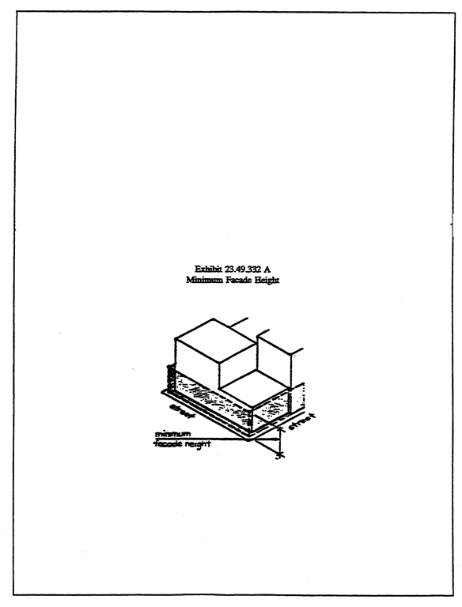

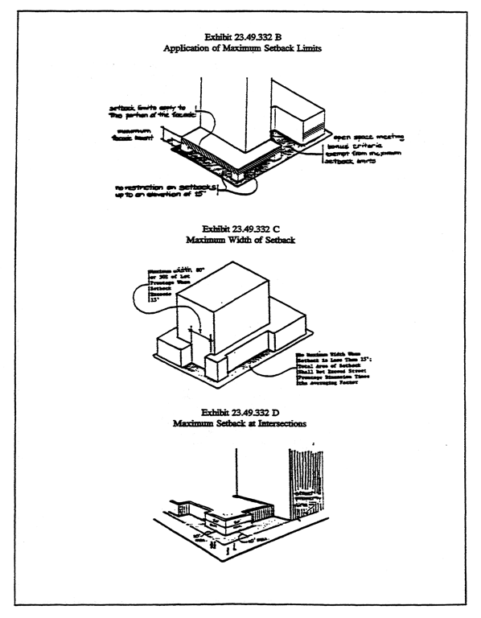

#### Subchapter X - Pike Place Market Mixed
##### 23.49.336 - Pike Market Mixed, permitted uses.

1. Permitted uses within the Pike Place Market Historical District, shown on Map 1K, shall be determined by the Pike Place Market Historical Commission pursuant to the Pike Place Market Historical District Ordinance, Chapter 25.24, Seattle Municipal Code.
2. In areas outside of the Pike Place Market Historical District in the Pike Market Mixed (PMM) zone, as shown on Map 1K, all uses are permitted outright except those specifically prohibited by Section 23.49.338.
3. Essential Public Facilities. Permitted essential public facilities shall also be reviewed according to the provisions of Chapter 23.80, Essential Public Facilities.

##### 23.49.338 - Pike Market Mixed, prohibited uses.

1. The following uses are prohibited as both principal and accessory uses in areas outside of the Pike Place Market Historical District, Map 1K:

    1. Drive-in businesses, except gas stations located in parking garages;
    2. Outdoor storage;
    3. Adult motion picture theaters and adult panorams;
    4. Transportation facilities, except principal use parking;
    5. Major communication utilities;
    6. All general manufacturing uses;
    7. Solid waste management;
    8. Recycling;
    9. All industrial uses;
    10. Jails;
    11. Work-release centers; and
    12. Major marijuana activity.
2. Within the Pike Place Market Historical District, Map 1K, uses may be prohibited by the Pike Market Historical Commission pursuant to the Pike Place Market Historical District Ordinance.

##### 23.49 - Downtown Overlay Maps

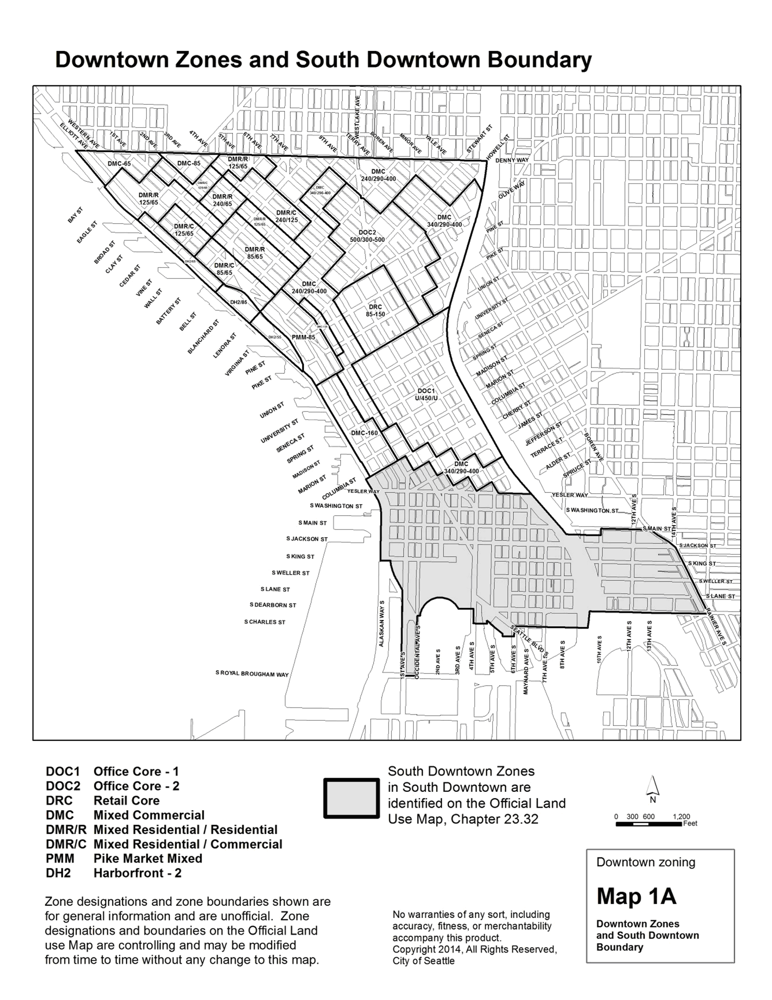

Map 1A: Downtown Zones and South Downtown Boundary

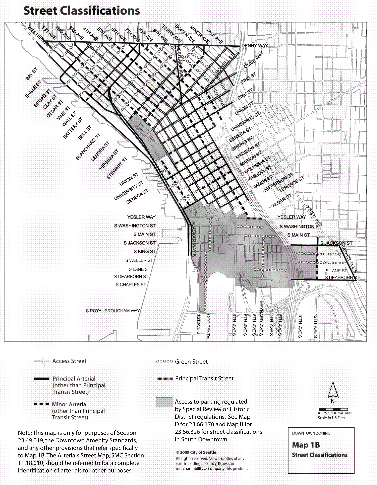

Map 1B Street Classifications

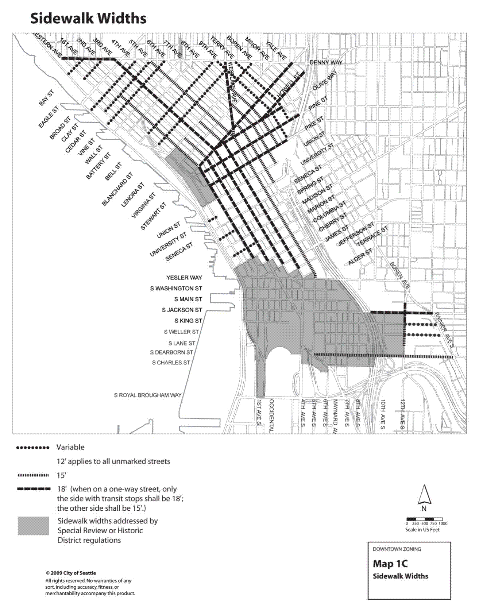

Map 1C Sidewalk Widths

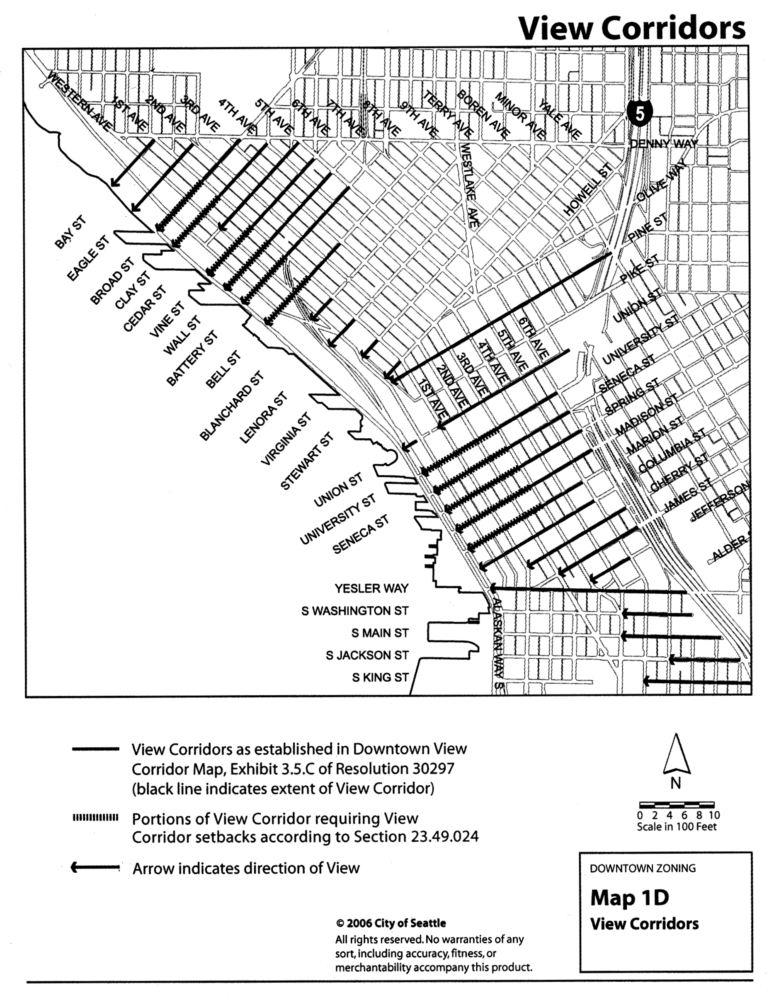

Map 1D View Corridors

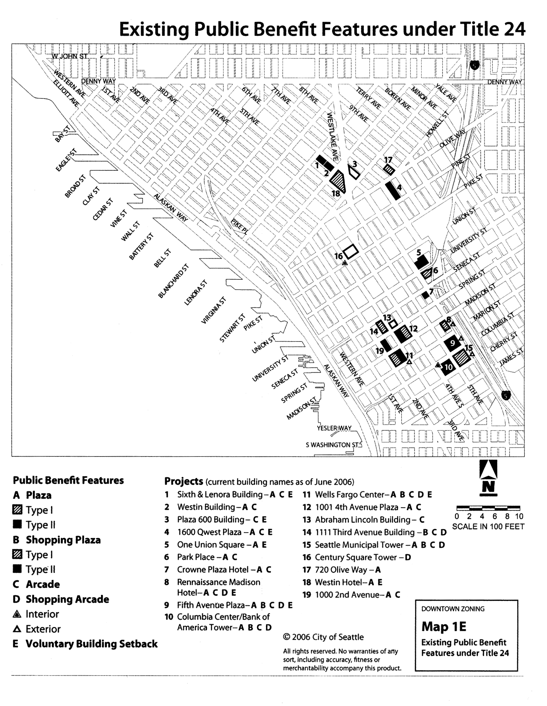

Map 1E Existing Public Benefit Features Under Title 24

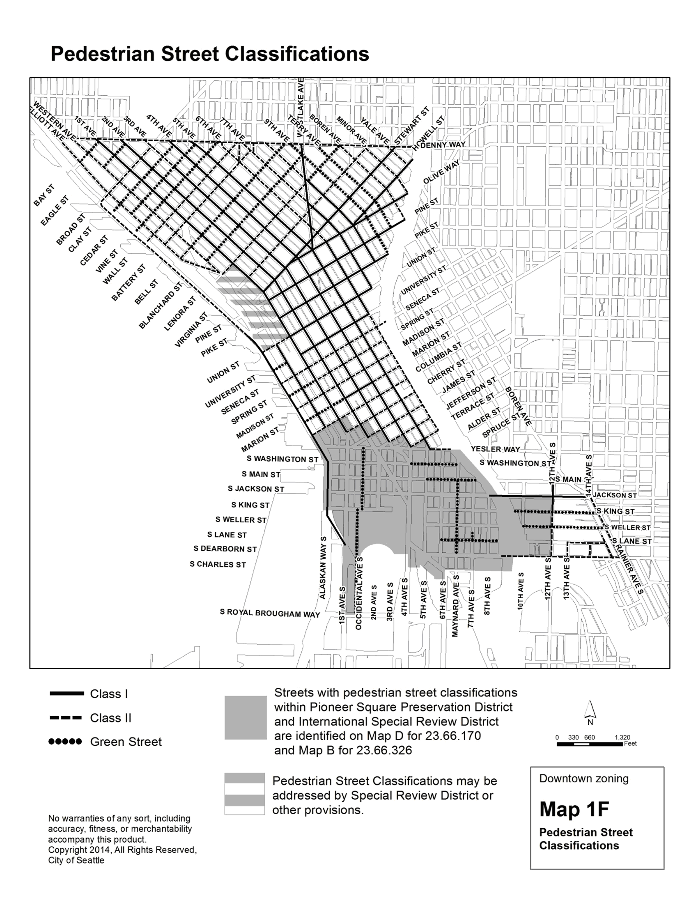

Map 1F: Pedestrian Street Classifications

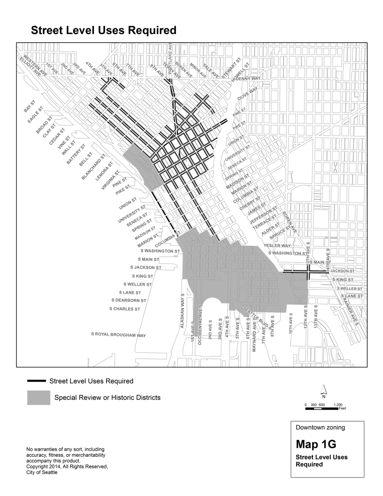

Map 1G: Street Level Uses Required

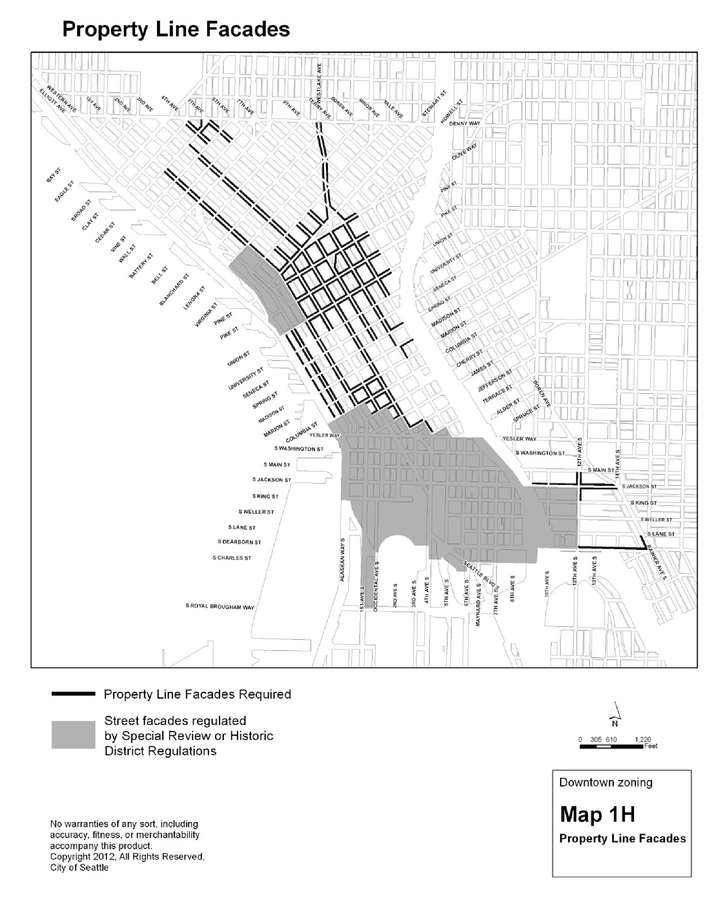

Map 1H: Property Line Facades

Map 1I Parking Uses Permitted

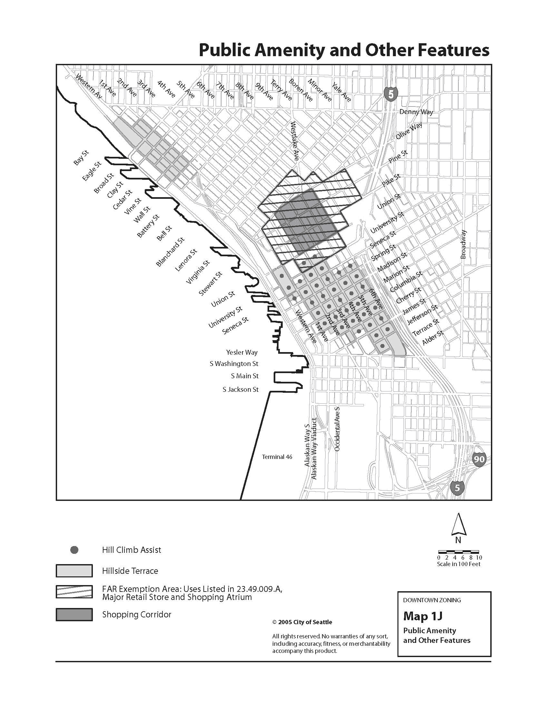

Map 1J: Public Amenity Features

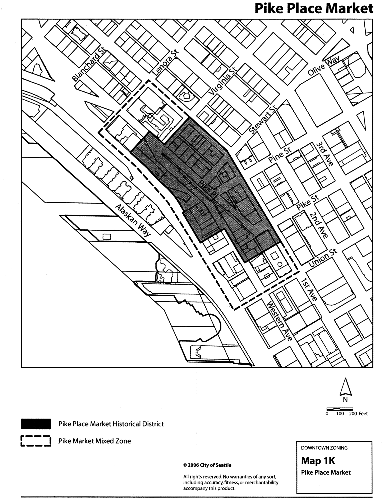

Map 1K Pike Place Market

### Chapter 23.50 - INDUSTRIAL

Sections:

#### 23.50.002 - Scope of provisions

1. There are four industrial classifications: General Industrial 1 (IG1), General Industrial 2 (IG2), Industrial Buffer (IB), and Industrial Commercial (IC). This Chapter 23.50 describes the authorized uses and development standards for the Industrial zones.
2. In addition to the regulations in this Chapter 23.50, certain industrial areas may be regulated by other chapters or titles of the Seattle Municipal Code, including but not limited to: Special Review Districts, Chapter 23.66; Landmark Districts, Chapter 25.12; or the Shoreline District, Chapter 23.60A.
3. Communication utilities and accessory communication devices except as exempted in Section 23.57.002 are subject to the regulations in this Chapter 23.50 and additional regulations in Chapter 23.57. Requirements for streets, alleys, and easements are provided in Chapter 23.53. Standards for parking access and design are provided in Chapter 23.54. Signs are regulated by Chapter 23.55. Methods for measurements are provided in Chapter 23.86. Definitions are in Chapter 23.84A.
4. For the purposes of this Chapter 23.50, the terms "existing structures or uses" mean those structures or uses which were established under permit, or for which a permit has been granted and has not expired, or are substantially underway in accordance with subsection 23.04.010.D, on October 7, 1987.
5. Major marijuana activity is subject to the regulations in this Chapter 23.50 and additional regulations in Section 23.42.058.

#### Subchapter I - General Provisions
##### 23.50.004 - Scope of general provisions.

Unless otherwise specified, the regulations of this subchapter shall apply to all industrial zones.

##### 23.50.006 - Water quality-Best management practices.

1. The location, design, construction and management of all developments and uses shall protect the quality and quantity of surface and groundwater, and shall adhere to the guidelines, policies, standards and regulations of applicable water quality management programs and regulatory agencies. Best management practices such as paving and berming of drum storage areas, fugitive dust controls and other good housekeeping measures to prevent contamination of land or water may be required.
2. Solid and liquid wastes and untreated effluents shall not be allowed to enter any bodies of water or be discharged onto the land.

#### Subchapter II - Uses in All Industrial Zones
##### 23.50.012 - Permitted and Prohibited Uses

1. All uses are permitted outright, prohibited or permitted as a conditional use, according to Table A for 23.50.012 and this Section 23.50.012.
2. All permitted uses are allowed as either a principal use or an accessory use, unless otherwise indicated in Table A for 23.50.012.
3. Public Facilities.

    1. Similar Uses Permitted. Except as provided in subsections 23.50.012.C.2 and 23.50.012.C.3 and in Section 23.50.027, uses in public facilities that are most similar to uses permitted outright or permitted by conditional use in this chapter are also permitted outright or by conditional use, subject to the same use regulations, development standards and administrative conditional use criteria that govern the similar uses.
    2. Waivers or Modification by City Council for Similar Uses. The City Council may waive or modify applicable development standards or conditional use criteria for those uses in public facilities that are similar to uses permitted outright or permitted by conditional use according to Chapter 23.76, Subchapter III, Council Land Use Decisions, with public projects considered as Type IV quasi-judicial decisions and City facilities considered as Type V legislative decisions.
    3. Other Uses Permitted in Public Facilities. Unless specifically prohibited, uses in public facilities that are not similar to uses permitted outright or permitted by a conditional use or special exception under this Chapter 23.50 may be permitted by the City Council. City Council may waive or modify development standards or conditional use criteria according to Chapter 23.76, Subchapter III, Council Land Use Decisions, with public projects considered as Type IV quasi-judicial decisions and City facilities considered as Type V legislative decisions.
    4. Uses in public facilities not meeting development standards. In all industrial zones, uses in public facilities not meeting development standards may be permitted by the Council if the following criteria are satisfied:

        1. The project provides unique services that are not provided to the community by the private sector, such as police and fire stations; and
        2. The proposed location is required to meet specific public service delivery needs; and
        3. The waiver or modification to the development standards is necessary to meet specific public service delivery needs; and
        4. The relationship of the project to the surrounding area has been considered in the design, siting, landscaping and screening of the facility.
    5. Expansion of Uses in Public Facilities.

        1. Major Expansion. Major expansions may be permitted to uses in public facilities allowed pursuant to subsections 23.50.012.C.1, 23.50.012.C.2 and 23.50.012.C.3 according to the same provisions and procedural requirements as described in these subsections. A major expansion of a public facility use is one that would not meet development standards, or one that would exceed the greater of 750 square feet or ten percent of its existing area, including gross floor area and areas devoted to active outdoor uses other than parking.
        2. Minor Expansion. An expansion that is not a major expansion is a minor expansion. Minor expansions may be permitted to uses in public facilities allowed pursuant to subsections 23.50.012.C.1, 23.50.012.C.2 and 23.50.012.C.3 according to Chapter 23.76, Procedures for Master Use Permits and Council Land Use Decisions, for a Type I Master Use Permit if the development standards of the zone in which the public facility is located are met.
    6. Essential Public Facilities. Permitted essential public facilities shall also be reviewed according to Chapter 23.80, Essential Public Facilities.
4. Rooftop Recreational Space in IG1 and IG2 Zones. Recreational space may be located on the rooftop of a building (including the rooftop of an attached parking structure) existing as of December 31, 1998. Rooftop recreational space shall be used only for the purposes of active recreational uses and/or passive open spaces accessory to office uses of at least 100,000 square feet that are located in the same building or within an attached structure(s) and that are established on or before December 31, 1998. If any portion of the rooftop recreational space is covered by a structure, the following standards apply:

    1. The height of the structure shall not exceed 30 feet as measured from the existing rooftop elevation and be limited to only one story;
    2. The height shall not exceed the height of the highest portion or feature of the building or attached structure(s);
    3. The footprint of the structure shall not exceed 30 percent of the total roof area on which the structure is located; and
    4. The structure shall be designed to include a minimum of 30 percent transparent and/or translucent exterior building materials.
    5. The rooftop recreational space permitted under this subsection 23.50.012.D shall be used only for active recreational uses and/or passive open spaces accessory to office uses and cannot be used for or converted to other uses. Section 23.50.012.D does not preclude the use of rooftop decks for passive open space use if the deck is on a structure otherwise permitted, including a structure constructed after December 31, 1998, or if the deck is associated with an otherwise permitted use.
5. Adult Cabarets.

    1. Any lot line of property containing any proposed new or expanding adult cabaret must be 800 feet or more from any lot line of property on which any of the following uses has been established by permit or otherwise recognized as legally established: community center; child care center; school, elementary or secondary; or public parks and open space use.
    2. Any lot line of property containing any proposed new or expanding adult cabaret must be 600 feet or more from any lot line of property for which a permit has been issued for any other adult cabaret.
    3. The analysis required by subsections 23.50.012.E.1 and E.2 shall be based on the facts that exist on the earlier of:

        1. the date a complete application is made for a building permit for an adult cabaret for the property proposed to contain the new or expanding adult cabaret, or
        2. the date of publication of notice of the Director's decision on the Master Use Permit application to establish or expand an adult cabaret use, if the decision can be appealed to the Hearing Examiner, or the date of the Director's decision if no Hearing Examiner appeal is available.

##### 23.50.014 - Conditional uses

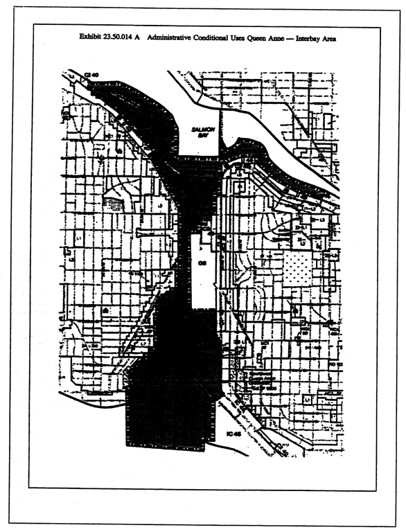

1. Criteria For All Conditional Uses. All conditional uses are subject to the procedures set forth in Chapter 23.76, Procedures for Master Use Permits and Council Land Use Decisions, and shall meet the following criteria:

    1. The use shall be determined not to be materially detrimental to the public welfare or injurious to property in the zone or vicinity in which the property is located.
    2. The benefits to the public that would be provided by the use shall outweigh the negative impacts of the use.
    3. Landscaping and screening, vehicular access controls and other measures shall insure the compatibility of the use with the surrounding area and mitigate adverse impacts.
    4. The conditional use shall be denied if it is determined that the negative impacts cannot be mitigated satisfactorily. However, adverse negative impacts may be mitigated by imposing requirements or conditions deemed necessary for the protection of other properties in the zone or vicinity and the public interest.
    5. In areas covered by Council-adopted Neighborhood Plans that were adopted after 1983, uses shall be consistent with the recommendations of the plans.
2. Administrative conditional uses. The following uses, identified as administrative conditional uses in Table A for 23.50.012, may be permitted by the Director if the provisions of this subsection 23.50.014.B and subsection 23.50.014.A are met.

    1. Artist's studio/dwellings in an existing structure may be permitted as a conditional use in General Industrial 1 (IG1), General Industrial 2 (IG2), Industrial Buffer (IB) and Industrial Commercial (IC) zones, except as provided in the Shoreline District, Chapter 23.60A, upon showing that the occupant is a bona fide working artist, and subject to the following criteria:

        1. Artist's studio/dwellings shall generally be discouraged along arterials such as freeways, state routes and freight lines;
        2. Artist's studio/dwellings shall not be allowed in areas where existing industrial uses may cause environmental or safety problems;
        3. Artist's studio/dwellings shall not be located where they may restrict or disrupt industrial activity;
        4. The nature of the artist's work shall be such that there is a genuine need for the space; and
        5. The owner(s) of a building seeking a conditional use for artist's studio/dwellings must sign and record a covenant and equitable servitude, on a form acceptable to the Director, that acknowledges that the owner(s) and occupants of the building accept the industrial character of the neighborhood and agree that existing or permitted industrial uses do not constitute a nuisance or other inappropriate or unlawful use of land. Such covenant and equitable servitude must state that it is binding on the owner(s)' successors, heirs, and assigns, including any lessees of the artist's studio/dwellings.
    2. Park-and-pool lots in IG1 and IG2 zones in the Duwamish Manufacturing/Industrial Center, and park-and-ride lots in General Industrial 1 (IG1), General Industrial 2 (IG2), Industrial Buffer (IB) and Industrial Commercial (IC) zones may be permitted as a conditional use according to the following criteria:

        1. The park-and-pool lot shall not create conflict with industrial activity by causing significant additional traffic to circulate through the area;
        2. The park-and-pool lot has direct vehicular access to a designated arterial improved to City standards;
        3. The park-and-pool lot shall be located on an existing parking area unless no reasonable alternative exists;
        4. If the proposed park-and-pool lot is located on a lot containing accessory parking for other uses, there shall be no substantial conflict in the principal operating hours of the lot and the other uses; and
        5. The park-and-pool lot is not located within 3,000 feet of downtown.
    3. Except in the Duwamish Manufacturing/Industrial Center, lodging uses may be permitted as a conditional use in General Industrial 1 (IG1), General Industrial 2 (IG2), Industrial Buffer (IB) and Industrial Commercial (IC) zones according to the following criteria:

        1. The use is designed primarily to serve users in the industrial area; and
        2. The use is designed and located to minimize conflicts with industrial uses in the area.
    4. A residential use not otherwise permitted in the zone may be permitted as a conditional use in General Industrial 1 (IG1), General Industrial 2 (IG2), Industrial Buffer (IB) and Industrial Commercial (IC) zones within a structure designated as a Landmark, pursuant to the Seattle Municipal Code, Chapter 25.12, Landmarks Preservation, or within a structure in a Landmark District, pursuant to the Seattle Municipal Code, Chapters 25.16, Ballard Avenue Landmark District, or Chapter 25.28, Pioneer Square Historical District, subject to the following criteria:

        1. The use shall be compatible with the historic or landmark character of the structure. The Director shall request a determination regarding compatibility by the respective Board having jurisdiction over the structure or lot;
        2. The residential use shall not restrict or disrupt industrial activity in the zone, and
        3. The surrounding uses would not be detrimental to occupants of the Landmark structure.
    5. High-impact uses may be permitted as a conditional use in General Industrial 1 (IG1), and General Industrial 2 (IG2) zones, according to the following criteria:

        1. The lot is located so that large concentrations of people, particularly in residential and commercial areas, are not exposed to unreasonable adverse impacts;
        2. A management plan may be required. The Director may determine the level of detail to be disclosed in the plan based on the probable impacts and/or the scale of the effects. Discussion of materials handling and storage, odor control, transportation and other factors may be required.
    6. A new railroad switchyard with a mechanized hump, or the expansion of such a use beyond the lot occupied as of October 7, 1987 may be permitted as a conditional use in General Industrial 1 (IG1) and General Industrial 2 (IG2) zones, according to the following criteria:

        1. The lot is located so that large concentrations of people, particularly in residential and commercial areas, are not exposed to unreasonable adverse impacts;
        2. Measures to minimize the impacts of noise, light and glare, and other measures to ensure the compatibility of the use with the surrounding area and to mitigate adverse impacts shall be incorporated into the design and operation of the facility.
    7. Solid waste transfer stations may be permitted as a conditional use in General Industrial 1 (IG1), General Industrial 2 (IG2), Industrial Commercial (IC), and Industrial Buffer (IB) zones according to the following criteria:

        1. Measures to minimize potential odor emissions and airborne pollutants shall be determined in consultation with the Puget Sound Clean Air Agency (PSCAA). These measures shall be incorporated into the design and operation of the facility;
        2. Measures to maximize control of rodents, birds and other vectors shall be determined in consultation with Public Health—Seattle & King County. These measures shall be incorporated into the design and operation of the facility;
        3. The Director may require a transportation plan. The Director shall determine the level of detail to be disclosed in the plan such as estimated trip generation, access routes and surrounding area traffic counts, based on the probable impacts and/or scale of the proposed facility; and
        4. Measures to minimize other impacts are incorporated into the design and operation of the facility.
        5. For any portion of the principal structure containing the solid waste management use that is located in an IB zone, the following standards apply:

            1. The maximum floor area of the principal structure is limited to 7,000 square feet.
            2. A setback of at least 65 feet is required between any façade of the principal structure and any lot line that abuts or is across a street from a residentially zoned lot.
        6. Accessory structures including scales, scale houses, entrance/exit kiosks, walls, screening, and other minor incidental improvements, including canopies over scales houses and drive lanes, are permitted in IB zones. The total area of all scale houses in IB zones shall not exceed 1,000 square feet.
        7. A landscaped area at least 20 feet deep is required between any structure or any parking located in an IB zone and the nearest street lot line.
        8. Parking and driveways accessory to a solid waste transfer station. Parking and driveways on property in an IB zone may be permitted as a conditional use accessory to a solid waste transfer station if:

            1. The parking is on property that is part of the same development site as the solid waste transfer station use.
            2. The parking meets the criteria of Section 23.50.014.A.
            3. The parking is subject to analysis in any transportation plan required by the Director pursuant to subsection 23.50.014.B.7.c.
            4. Driveways providing access to parking or access to the solid waste transfer station are on the same development site as the solid waste transfer station use.
        9. Rooftop features on the principal structure shall not exceed the maximum height limit of the zone.
        10. All transfer, handling, and compacting of materials processed by the solid waste management use shall be conducted within an enclosed structure.
        11. Outdoor storage is prohibited.
    8. Heavy Manufacturing uses may be permitted in the Industrial Buffer (IB) zone as a conditional use according to the following criteria:

        1. The use shall be located within an enclosed building except for shipbuilding;
        2. The hours of operation for all processes creating any adverse impacts on residentially or commercially zoned land may be limited;
        3. Truck and service traffic associated with the heavy manufacturing use shall be directed away from streets serving lots in nonindustrial zones;
        4. The infrastructure of the area shall be capable of accommodating the traffic generated by the proposed use; and
        5. The use shall not produce sustained or recurrent vibrations exceeding 0.002g acceleration as measured on lots in nonindustrial zones.
    9. The heavy manufacturing uses listed in subsection 23.50.014.B.9.a may be permitted in the Industrial Commercial (IC) zone as a conditional use according to criteria contained in subsection 23.50.014.B.9.b.

        1. Uses

            1. Mass production of commercial or recreational vessels of any size and the production of vessels up to 120 feet in length, constructed to individual specifications; and
            2. Manufacturing of electrical components, such as semiconductors and circuit boards, using chemical processes such as etching or metal coating; and
            3. Production of industrial organic and inorganic chemicals, and soaps and detergents.
        2. Criteria

            1. Except for shipbuilding, the use shall be located within an enclosed building;
            2. The hours of operation for all processes creating any impacts on residentially or commercially zoned land may be limited;
            3. Truck and service traffic associated with the heavy manufacturing use shall be directed away from streets serving lots in nonindustrial zones;
            4. The infrastructure of the area shall be capable of accommodating the traffic generated by the proposed use;
            5. The use shall not produce sustained or recurrent vibrations exceeding 0.002g acceleration as measured on lots in nonindustrial zones;
            6. The finished product as packaged for sale or distribution shall be in such a form that product handling and shipment does not constitute a significant public health risk; and
            7. The nature of the materials produced and/or the scale of manufacturing operations may be limited in order to minimize the degree and severity of risks to public health and safety.
    10. The high-impact uses listed in subsection 23.50.B.10.a may be permitted as conditional uses in the Industrial Commercial (IC) zone according to the criteria contained in subsection 23.50.B.10.b.

        1. Uses

            1. The manufacture of Group A hazardous materials, except Class A or B explosives; and
            2. The manufacture of Group B hazardous materials, when the hazardous materials are present in quantities greater than 2,500 pounds of solids, 275 gallons of liquids, or 1,000 cubic feet of gas at any time.
        2. Criteria

            1. The lot is located so that large concentrations of people, particularly in residential and commercial areas, are not exposed to unreasonable adverse impacts;
            2. A management plan may be required. The Director may determine the level of detail to be disclosed in the plan based on the probable impacts and/or the scale of the effects. Discussion of materials handling and storage, odor control, transportation, and other factors may be required;
            3. The finished product as packaged for sale or distribution shall be in such a form that product handling and shipment does not constitute a significant public health risk; and
            4. The nature of the materials produced and/or the scale of manufacturing operations may be limited in order to minimize the degree and severity of risks to public health and safety.
    11. Bus bases may be permitted as a conditional use in the General Industrial 1 (IG1), General Industrial 2 (IG2), Industrial Buffer (IB) and Industrial Commercial (IC) zones according to the following criteria:

        1. The amount of industrial land occupied by the facility shall be minimized. To avoid disruption of the industrial function of the area, the presence of the facility shall not obstruct the operation or likely expansion of existing industrial uses;
        2. The location of the facility shall not result in significant displacement of viable industrial uses or support activities;
        3. The amount of land occupied by the facility that has access to industrial shorelines or major rail facilities shall be minimized; and
        4. A transportation plan may be required to prevent conflicts with nearby industrial uses. The Director shall determine the level of detail to be disclosed in the plan based on the probable impacts and/or scale of the proposed facility.
    12. Development of a medical service use over 10,000 square feet, outside but within 2,500 feet of a medical Major Institution overlay district boundary, shall be subject to administrative conditional use approval, unless included in an adopted master plan. In making a determination whether to approve or deny medical service use, the Director shall determine whether an adequate supply of industrially zoned land will continue to exist. The following factors shall be used in making this determination:

        1. Whether the amount of medical service use development existing and proposed in the vicinity would reduce the current viability or significantly impact the longer-term potential of the manufacturing or heavy commercial character of the industrial area; and
        2. Whether medical service use development would displace existing manufacturing or heavy commercial uses or usurp vacant land, in areas with parcels particularly suited for manufacturing or heavy commercial uses.
    13. A nonconforming use may be converted by an administrative conditional use authorization to a use not otherwise permitted in the zone based on the following factors:

        1. New uses shall be limited to those first permitted in the next more intensive zone;
        2. The Director shall evaluate the relative impacts of size, parking, traffic, light, glare, noise, odor, and similar impacts of the two uses, and how these impacts could be mitigated;
        3. The Director must find that the new nonconforming use is no more detrimental to property in the zone and vicinity than the existing nonconforming use.
    14. An accessory hospital facility may be permitted as a conditional use according to the following criteria:

        1. The hospital facility is an integral element of a research and development laboratory or an institute for advanced study to which it is accessory; and
        2. The hospital use shall not be allowed in areas where industrial activity may adversely affect hospital activity.
3. Administrative Conditional Uses/Queen Anne Interbay Area. Within the area shown on Exhibit 23.50.014 A, the uses listed in subsection C1 and C2 of this section shall be administrative conditional uses and may be permitted by the Director when the provisions of this section and subsection A of Section 23.50.014 are met (See Exhibit 23.50.014 A):

    1. Heavy Manufacturing uses may be permitted as a conditional use according to the following criteria:

        1. Except shipbuilding, the use shall be located within an enclosed building;
        2. The hours of operation for all process creating any adverse impacts on residentially or commercially zoned land shall be limited;
        3. Truck and service traffic associated with the heavy manufacturing use shall be directed away from streets serving lots in nonindustrial zones;
        4. The infrastructure of the area shall be capable of accommodating the traffic generated by the proposed use; and
        5. The use shall not produce sustained or recurrent vibrations exceeding 0.002 g acceleration as measured on lots in nonindustrial zones.
    2. Power plants may be permitted as a conditional use according to the following criteria:

        1. The lot is located so that large concentrations of people, particularly in residential and commercial areas, are not exposed to unreasonable adverse impacts;
        2. A facility management and transportation plan may be required. The level and kind of detail to be disclosed in the plan shall be based on the probable impacts and/or scale of the proposed facility, and may include discussion of transportation, noise control, and hours of operation;
        3. Measures to minimize potential odor emission and airborne pollution shall meet standards of and be consistent with the Puget Sound Clean Air Agency (PSCAA), and shall be incorporated into the design and operation of the facility; and
        4. Landscaping and screening, separation from less-intensive zones, noise, light and glare controls, and other measures to insure the compatibility of the use with the surrounding area and to mitigate adverse impacts shall be incorporated into the design and operation of the facility.
4. Council Conditional Uses. The following uses are identified as Council conditional uses on Table A of Section 23.50.012 and may be permitted by the Council when provisions of this subsection and subsection A are met:

    1. Sewage treatment plants may be permitted as a Council conditional use in General Industrial 1 (IG1), General Industrial 2 (IG2) and Industrial Commercial (IC) zones according to the following criteria:

        1. The plant shall be located so that adverse impacts would not affect large concentrations of people, particularly in residential and commercial areas;
        2. The negative impacts of the use can be satisfactorily mitigated by imposing conditions to protect other property in the zone or vicinity and to protect the environment. Appropriate mitigation measures shall include but are not limited to:

            1. A facility management and transportation plan shall be required. The level and kind of detail to be disclosed in the plan shall be based on the probable impacts and/or scale of the proposed facility, and shall at a minimum include discussion of sludge transportation, noise control and hours of operation, and shall be incorporated into the design and operation of the facility;
            2. Measures to minimize potential odor emission and airborne pollutants including methane shall meet standards of and be consistent with best available technology as determined in consultation with the Puget Sound Clean Air Agency (PSCAA), and shall be incorporated into the design and operation of the facility;
            3. Methods of storing and transporting chlorine and other hazardous and potentially hazardous chemicals shall be determined in consultation with the Seattle Fire Department and incorporated into the design and operation of the facility;
            4. Vehicular access suitable for trucks shall be available or provided from the plant to a designated arterial improved to City standards; and
            5. Landscaping and screening, separation from less-intensive zones, noise, light and glare controls, and other measures to insure the compatibility of the use with the surrounding area and to mitigate adverse impacts shall be incorporated into the design and operation of the facility.
    2. Heliports may be permitted as a Council conditional use in General Industrial 1 (IG1), General Industrial 2 (IG2) and Industrial Commercial (IC) Zones according to the following criteria:

        1. The heliport is to be used for the takeoff and landing and servicing of helicopters which serve a public safety, news gathering or emergency medical care function; is part of a City and regional transportation plan approved by the City Council and is a public facility; or is part of a City and regional transportation plan approved by the City Council and is not within two thousand (2,000) feet of a residential zone;
        2. A need shall be determined for the facility at the proposed location;
        3. The heliport is located to minimize impacts, such as noise and dust impacts, on lots in the surrounding area;
        4. The lot is of sufficient size that the operations of the heliport and the flight paths of helicopters are buffered from the surrounding area;
        5. Open areas and landing pads are hard-surfaced; and
        6. The heliport meets all federal requirements including those for safety, glide angles and approach lanes.
    3. Airports may be permitted as a Council conditional use in the General Industrial 1 (IG1), General Industrial 2 (IG2) and Industrial Commercial (IC) zones according to the following criteria:

        1. A need shall be determined for the facility at the proposed location;
        2. The impacts of the proposal shall be evaluated so that the negative impacts can be satisfactorily mitigated by imposing conditions to protect other property in the zone or vicinity and to protect the environment. Appropriate mitigation measures shall include, but are not limited to:

            1. The site shall be located so that adverse impacts associated with landing and takeoff activities, including noise levels and safety conditions, will not affect large numbers of people in the immediate vicinity as well as in the general landing path of the flight pattern;
            2. A facility management and transportation plan shall be required. At a minimum, the facility management and transportation plan shall demonstrate noise control, vehicle and service access, and hours of operation, and shall be incorporated into the design and operation of the facility; and
            3. Landscaping and screening, separation from less-intensive zones, noise, light and glare controls, and other measures to insure the compatibility of the use with the surrounding area and to mitigate adverse impacts shall be incorporated into the design and operation of the facility.
    4. Solid waste incineration facilities may be permitted as a Council conditional use in the General Industrial 1 (IG1) and General Industrial 2 (IG2) zones according to the following criteria:

        1. The lot is located so that large concentrations of people, particularly in residential and commercial areas, are not exposed to unreasonable adverse impacts;
        2. Measures to minimize odor emission and airborne pollutants shall be determined in consultation with the Puget Sound Clean Air Agency (PSCAA). These measures shall be incorporated into the design and operation of the facility;
        3. A transportation plan may be required. The Director shall determine the level of detail to be disclosed in the plan based on the probable impacts and/or scale of the proposed facility.
    5. Power plants may be permitted as a Council conditional use in the Industrial Commercial (IC) zone according to the following criteria:

        1. The lot is located so that large concentrations of people, particularly in residential and commercial areas, are not exposed to unreasonable adverse impacts;
        2. A facility management and transportation plan may be required. The level and kind of detail to be disclosed in the plan shall be based on the probable impacts and/or scale of the proposed facility, and may include discussion of transportation, noise control, and hours of operation;
        3. Measures to minimize potential odor emission and airborne pollution shall meet standards of the Puget Sound Clean Air Agency (PSCAA), and shall be incorporated into the design and operation of the facility; and
        4. Landscaping and screening, separation from less-intensive zones, noise, light and glare controls, and other measures to insure the compatibility of the use with the surrounding area and to mitigate adverse impacts shall be incorporated into the design and operation of the facility.
    6. Helistops may be permitted as a Council conditional use in the General Industrial 1 (IG1), General Industrial 2 (IG2), Industrial Buffer (IB), and Industrial Commercial (IC) zones according to the following criteria:

        1. The helistop is not within one thousand two hundred (1,200) feet of a residential zone;
        2. The helistop is located to minimize impacts, such as noise and dust impacts, on lots in residential zones;
        3. The lot is of sufficient size that the operations of the helistop and the flight paths of the helicopter are buffered from the surrounding area;
        4. Open areas and landing pads are hard-surfaced; and
        5. The helistop meets all federal requirements, including those for safety, glide angles and approach lanes.

#### Subchapter III - Development Standards in All Zones
##### 23.50.015 - Major Phased Development.

1. An applicant may seek approval of a Major Phased Development, as defined in Section 23.84A.025. A Major Phased Development proposal is subject to the provisions of the zone in which it is located and shall meet the following thresholds:

    1. A minimum site size of five (5) acres, where the site is composed of contiguous parcels or contains a right-of-way within;
    2. The project, which at time of application shall be a single, functionally interrelated campus, contains more than one building, with a minimum total gross floor area of two hundred thousand (200,000) square feet;
    3. The first phase of the development consists of at least one hundred thousand (100,000) square feet in gross building floor area; and
    4. At the time of application, the project is consistent with the general character of development anticipated by Land Use Code regulations.
2. A Major Phased Development application shall contain and be submitted, evaluated, and approved according to the following:

    1. The application shall contain a level of detail which is sufficient to reasonably assess anticipated impacts, including those associated with a maximum buildout, within the timeframe requested for Master Use Permit extension.
    2. A Major Phased Development component shall not be approved unless the Director concludes that anticipated environmental impacts, such as traffic, open space, shadows, construction impacts and air quality, are not significant or can be effectively monitored and conditions imposed to mitigate impacts over the extended life of the permit.
    3. Expiration or renewal of a permit for the first phase of a Major Phased Development is subject to the provisions of Chapter 23.76, Master Use Permits and Council Land Use Decisions. The Director shall determine the expiration date of a permit for subsequent phases of the Major Phased Development through the analysis provided for above; such expiration shall be no later than fifteen (15) years from the date of issuance.
3. Changes to the Approved Major Phased Development. When an amendment to an approved project is requested, the Director shall determine whether or not the amendment is minor.

    1. A minor amendment meets the following criteria:

        1. Substantial compliance with the approved site plan and conditions imposed in the existing Master Use Permit with the Major Phased Development component with no substantial change in the mix of uses and no major departure from the bulk and scale of structures originally proposed; and
        2. Compliance with the requirements of the zone in effect at the time of the original Master Use Permit approval; and
        3. No significantly greater impact would occur.
    2. If the amendment is determined by the Director to be minor, the site plan may be revised and approved as a Type I Master Use Permit. The Master Use Permit expiration date of the original approval shall be retained, and shall not be extended through a minor revision.
    3. If the Director determines that the amendment is not minor, the applicant may either continue under the existing MPD approval or may submit a revised MPD application. The revised application shall be a Type II decision. Only the portion of the site affected by the revision shall be subject to regulations in effect on the date of the revised MPD application. The decision may retain or may extend the existing expiration date on the portion of the site affected by the revision.

##### 23.50.016 - Landscaping standards on designated streets

Uses located on streets that have been designated on the Industrial Streets Landscaping Plan Map (Map A for 23.50.016), shall provide landscaping as outlined in subsections 23.50.016.A and 23.50.016.B.

1. Street Trees. Street trees are required along designated street frontages. Street trees shall be provided in the planting strip according to Seattle Department of Transportation Tree Planting Standards.
2. Exceptions to Street Tree Requirements.

    1. Street trees required by subsection A of this section may be located on the lot at least two feet (2') from the street lot line instead of in the planting strip when:

        1. Existing trees and/or landscaping on the lot provide improvements substantially equivalent to those required in this section.
        2. It is not feasible to plant street trees according to City standards. A five-foot (5') deep landscaped setback area shall be required along the street property lines and trees shall be planted there. If an on-site landscaped area is already required, the trees shall be planted there if they cannot be placed in the planting strip.
        3. Continuity of landscaping on adjacent properties along the street front is desirable.
    2. Street trees shall not be required for an expansion of less than two thousand five hundred (2,500) square feet. Two (2) street trees shall be required for each additional one thousand (1,000) square feet of expansion. The maximum number of street trees shall be controlled by Seattle Department of Transportation standard. Rounding, per Section 23.86.002 B, shall not be permitted.
    3. Street trees shall not be required when a change of use is the only permit requested.
    4. Street trees shall not be required for an expansion of a surface parking area of less than twenty percent (20%) of parking area or number of parking spaces.
3. Screening. All outdoor storage areas used for storage for recyclable materials, and outdoor manufacturing, repairing, refuse compacting or recycling activities, shall provide view-obscuring screening along street lot lines unless the outdoor storage or outdoor activities are located at least 15 feet above or below the elevation of the street lot line. If other provisions applicable to the lot require more extensive landscaping or screening provisions, the more extensive provisions apply.

Map A for Industrial Streets Landscaping Plan

##### 23.50.018 - View corridors

1. On lots which are partially within the Shoreline District, except those on the Duwamish Waterway, a view corridor shall be required for the nonshoreline portion, if the portion of the lot in the Shoreline District is required to provide a view corridor under the Seattle Shoreline Master Program.
2. The required width of the view corridor or corridors shall be not more than one-half (½) of the required width of the view corridor required in the adjacent Shoreline District.
3. Measurement, modification or waiving of the view corridor requirement shall be according to the Shoreline District measurement regulations, Chapter 23.60A.

##### 23.50.020 - Structure height exceptions and additional restrictions

1. Rooftop features. Where a height limit applies to a structure, except as provided in subsections 23.50.024.C.4, 23.50.024.D.4, 23.50.024.E.4, and 23.50.024.F.3, the provisions in this subsection 23.50.020.A apply to rooftop features:

    1. In all industrial zones, smokestacks, chimneys and flagpoles, and religious symbols for religious institutions are exempt from height limits, except as regulated in Chapter 23.64, Airport Height Overlay District, provided they are a minimum of 10 feet from any side or rear lot line.
    2. In all industrial zones, open railings, planters, skylights, clerestories, greenhouses, solariums, parapets, and firewalls may extend 4 feet above the applicable height limit with unlimited rooftop coverage. Insulation material, rooftop decks and other similar features, or soil for landscaping located above the structural roof surface, may exceed the maximum height limit by up to two feet if enclosed by parapets or walls that comply with this subsection 23.50.020.A.2.
    3. In all industrial zones, solar collectors may extend up to 7 feet above the applicable height limit, with unlimited rooftop coverage.
    4. Additional height is permitted for specified rooftop features according to this subsection 23.50.020.A.4.

        1. The following rooftop features may extend up to 15 feet above the applicable height limit in all industrial zones, subject to subsection 23.50.020.A.4.c:

            1. Solar collectors;
            2. Stair and elevator penthouses, except as provided in subsection 23.50.020.A.4.b;
            3. Mechanical equipment; and
            4. Minor communication utilities and accessory communication devices, except that height is regulated according to Section 23.57.015.
        2. In an IC 85-160 zone, elevator penthouses may extend up to 25 feet above the applicable height limit, subject to subsection 23.50.020.A.4.c.
        3. The combined total coverage of all features listed in subsections 23.50.020.A.4.a and 23.50.020.A.4.b is limited to 20 percent of the roof area, or 25 percent of the roof area if the total includes screened mechanical equipment.
    5. Greenhouses that are dedicated to food production are permitted to extend 15 feet above the applicable height limit if the combined total coverage of all features gaining additional height does not exceed 50 percent of the roof area. Greenhouses allowed under this subsection 23.50.020.A.5 shall be located at least 10 feet from the north edge of the roof unless a shadow diagram is provided that demonstrates that locating such features within 10 feet of the north edge of the roof would not shade property to the north on January 21st at noon more than would a structure built to maximum permitted height and FAR.
    6. Within the South Lake Union Urban Center, at the applicant's option, the combined total coverage of all features listed in subsections 23.50.020.A.4 and 23.50.020.A.5 may be increased to 65 percent of the roof area, provided that all of the following are satisfied:

        1. All mechanical equipment is screened; and
        2. No rooftop features are located closer than 10 feet to the roof edge.
    7. Within an IC 85-160 zone, solar collectors and wind-driven power generators may extend up to 15 feet above the applicable height limit, with unlimited rooftop coverage, and are not subject to a coverage limit under subsection 23.50.020.A.4.c.
2. Additional Height Restrictions for Certain Structures in 45 Foot Height Limit Areas. In zones with a 45 foot height limit, except as provided for IC zones in Section 23.50.028, structures with no story at least 15 feet in height are limited to a maximum height of 40 feet.
3. Structures existing prior to October 8, 1987 that exceed the height limit of the zone may add the rooftop features listed as conditioned in subsection 23.50.020.A of this section. The existing roof elevation of the structure is considered the applicable height limit for the purpose of adding rooftop features.

##### 23.50.022 - General Industrial 1 and 2—Structure height

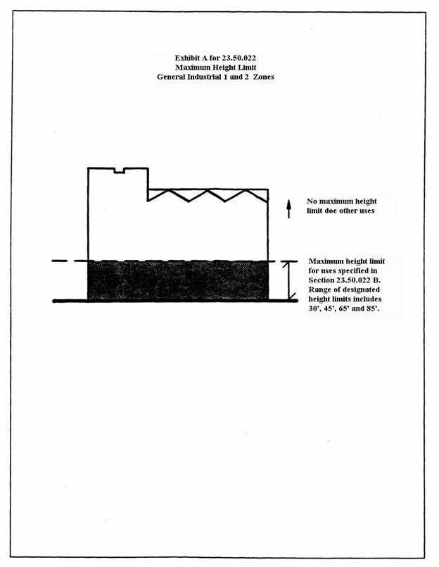

1. There shall be no maximum height limit in the General Industrial 1 (IG1) and General Industrial 2 (IG2) zones except for those specific uses listed in subsection B below and except as regulated in the Airport Height Overlay District regulations at Chapter 23.64.
2. Except for the provisions of Section 23.50.020 and of subsection 23.50.022.C, the maximum structure height for any portion of a structure that contains commercial uses other than spectator sports facilities and food processing and craft work uses, whether they are principal or accessory, is 30 feet, 45 feet, 65 feet, or 85 feet, as designated on the Official Land Use Map, Chapter 23.32. (also see Exhibit A for 23.50.022)
3. Covered rooftop recreational space of a building existing as of December 31, 1998, when complying with the provisions of Section 23.50.012 D, shall not be subject to the limits on maximum structure heights contained in subsection B above.

##### 23.50.024 - Industrial Buffer—Structure height

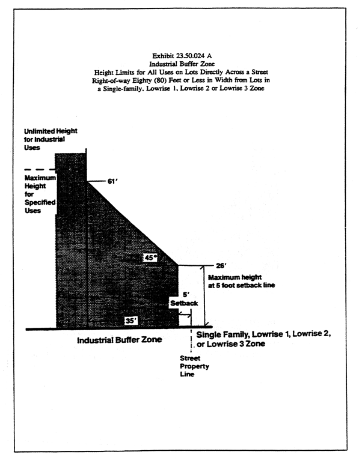

Exhibit 23.50.024A

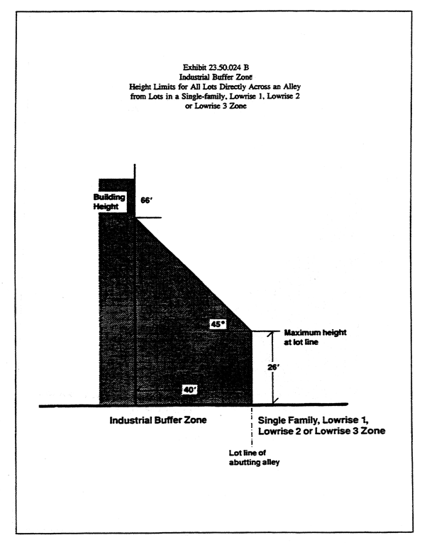

Exhibit 23.50.024B

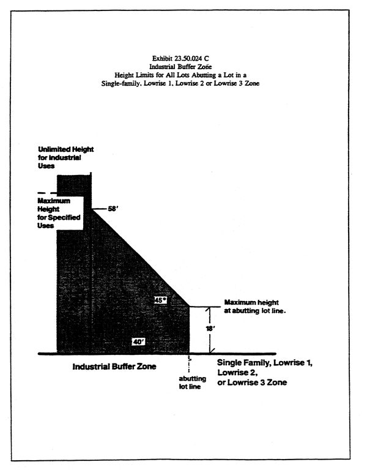

Exhibit 23.50.024C

Exhibit 23.50.024D

1. Except as regulated in Chapter 23.64, Airport Height Overlay District, there is no maximum height limit in the Industrial Buffer (IB) zone other than for those specific uses listed in subsection 23.50.024.B and for those circumstances outlined in subsections 23.50.024.C, 23.50.024.D, 23.50.024.E and 23.50.024.F.
2. Except for the provisions of Section 23.50.020, and except for structures on lots subject to the provisions of subsections C, D, E and F below, the maximum height for any portion of a structure that contains commercial uses other than spectator sports facilities and food processing and craft work uses, whether principal or accessory, shall be thirty (30) feet, forty-five (45) feet, sixty-five (65) feet or eighty-five (85) feet, as designated on the Official Land Use Map, Chapter 23.32.
3. The following height limits shall apply to all uses, in addition to the maximum permitted heights for uses listed in subsection B, on lots directly across a street right-of-way eighty (80) feet or less in width from lots in a Single-family, Lowrise 1, Lowrise 2, or Lowrise 3 zone:

    1. All structures shall be set back five (5) feet from the street lot line opposite lots zoned Single-family, Lowrise 1, Lowrise 2, or Lowrise 3. A maximum height of twenty-six (26) feet shall be permitted at the setback line.
    2. Beginning at the five (5) foot setback line and continuing for thirty-five (35) feet, permitted height shall increase at a forty-five (45) degree angle from the twenty-six (26) foot height allowed at the setback line. (See Exhibit 23.50.024 A.)
    3. The height permitted beyond forty (40) feet from the street lot line shall be the same as the maximum height designated on the Official Land Use Map.
    4. Exceptions for rooftop features, Section 23.50.020 A, shall not apply in the area within forty (40) feet of the street lot line.
4. The following height limits shall apply to all lots directly across an alley from lots in a Single-family, Lowrise 1, Lowrise 2, or Lowrise 3 zone:

    1. A maximum height of twenty-six (26) feet shall be permitted on alley lot lines.
    2. For the area within forty (40) feet of the lot line, permitted height shall increase at a forty-five (45) degree angle from the twenty-six (26) foot height allowed at the alley lot line. (See Exhibit 23.50.024 B.)
    3. The height permitted beyond forty (40) feet from the alley lot line shall be the same as the maximum height designated on the Official Land Use Map.
    4. Exceptions for rooftop features, Section 23.50.020 A, shall not apply for the area within forty (40) feet of the alley lot line.
5. The following height limits shall apply to all lots abutting a lot in a Single-family, Lowrise 1, Lowrise 2, or Lowrise 3 zone:

    1. A maximum height of eighteen (18) feet shall be permitted on abutting lot lines.
    2. For the area within forty (40) feet of the lot line, permitted height shall increase at a forty-five (45) degree angle from the eighteen (18) foot height allowed at the abutting lot line. (See Exhibit 23.50.024 C.)
    3. The height permitted beyond forty (40) feet from the abutting lot line shall be the same as the maximum height designated on the Official Land Use Map.
    4. Exceptions for rooftop features, Section 23.50.020 A, shall not apply in the area within forty (40) feet of the abutting lot line.
6. The following height limit shall apply to lots which abut a lot in a Midrise, Highrise, or Commercial zone:

    1. A maximum height of forty (40) feet shall apply for a depth of twenty (20) feet along the abutting lot lines. (See Exhibit 23.50.024 D.)
    2. The height permitted beyond twenty (20) feet from the abutting lot lines shall be the same as the maximum height designated on the Official Land Use Map.
    3. Exceptions for rooftop features, Section 23.50.020 A, shall not apply in the area within twenty (20) feet of the abutting lot line.

##### 23.50.026 - Structure height in IC zones

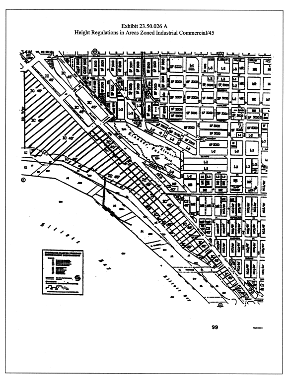

Exhibit A forHeight Regulations in Areas Zone Industrial Commercial

1. Except as may be otherwise provided in this Title 23, the maximum structure height in IC zones for all uses is as designated on the Official Land Use Map, Chapter 23.32. Maximum structure height may be increased or reduced as provided in this Section 23.50.026 or Section 23.50.020. An overlay district may increase or reduce the maximum structure height.
2. Water-dependent uses within the Shoreline District are subject to only the height limits of the applicable shoreline environment, Chapter 23.60A.
3. Within the area shown in Exhibit A for 23.50.026, areas zoned IC 45 are subject to the following height regulations (See Exhibit A for 23.50.026):

    1. Except as provided in subsection 23.50.026.C.2.c, structures with no story at least 15 feet in height are limited to a maximum height of 40 feet.
    2. A 65 foot structure height is permitted as a special exception provided that:

        1. Provision is made for view corridor(s) looking from Elliott Avenue toward Puget Sound;

            1. The location of the view corridor(s) shall be determined by the Director upon consideration of such factors as existing view corridors, the location of street rights-of-way, and the configuration of the lot,
            2. The view corridor(s) shall have a width not less than 35 percent of the width of the lot,
            3. The minimum width of each required view corridor shall be 30 feet measured at Elliott Avenue West,
            4. Measurement, modification or waiver of the view corridor(s) shall be according to Chapter 23.60A, Shoreline District measurement regulations. Where a waiver under these provisions is granted by the Director, the 65 foot structure height shall still be permitted,
            5. Parking for motor vehicles shall not be located in the view corridor unless the area of the lot where the parking would be located is 4 or more feet below the level of Elliott Avenue West;
        2. Development shall be located so as to maximize opportunities for views of Puget Sound for residents and the general public; and
        3. The structure contains at least two stories at least 15 feet in height; with the exception that no story in an accessory parking structure is required to be at least 15 feet in height.
4. Within an IC 85-160 zone, the first figure shown in the zone designation is the base height limit, which is the height limit for all uses, except for a structure that complies with the conditions to extra floor area specified in Sections 23.50.028 and 23.50.033 on a lot that includes extra floor area. Extra floor area means non-residential chargeable floor area allowed in addition to the base FAR under Chapter 23.58A. The second figure is the applicable height limit for all uses, on a lot that includes extra floor area, for a structure that complies with the conditions to extra floor area specified in Sections 23.50.028 and 23.50.033.

##### 23.50.027 - Maximum size of nonindustrial use

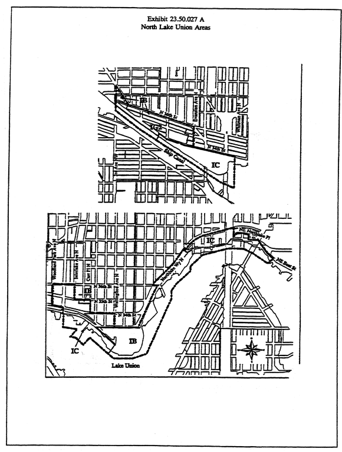

1. Applicability

    1. Except as otherwise provided in this Section 23.50.027, the maximum size of use limits on gross floor area specified in Table A for 23.50.027 apply to principal uses on a lot, and apply separately to the categories of uses. The total gross floor area occupied by uses limited under Table A for 23.50.027 shall not exceed 2.5 times the area of the lot in an IG1, IG2, IB, or IC zone.
    2. The combined square footage of any one business establishment located on more than one lot is subject to the size limitations on non-industrial uses specified on Table A for 23.50.027.
    3. The maximum size of use limits in Table A for 23.50.027 do not apply to the area identified in Exhibit A for 23.50.027. In that area no single non-office use listed in Table A for 23.50.027 may exceed 50,000 square feet in size.
2. The following exceptions to the size limitations in Table A for 23.50.027 are allowed for a structure existing as of September 26, 2007:

    1. A use legally established as of September 26, 2007 that already exceeds the size limitations listed in Table A for 23.50.027 may continue.
    2. Subject to the limitations in subsection 23.50.027.E, the gross floor area of a use listed in Table A for 23.50.027 and legally established as of September 26, 2007 may be converted to another category of use listed in Table A for 23.50.027 provided that the combined gross floor area devoted to uses listed in Table A for 23.50.027 does not exceed the total gross floor area of such uses legally established as of September 26, 2007.
    3. If 50 percent or more of the gross floor area of the structure has been legally established as of September 26, 2007 with a use or uses listed in Table A for 23.50.027, those categories of uses may exceed the size of use limits as follows:

        1. Uses listed in Table A for 23.50.027 may expand within and occupy the entire structure.
        2. The structure may be expanded by up to the following amounts and the use or uses may be permitted to expand within and occupy the entire structure:

            1. IG1 and IG2 Zones: 20 percent of the existing structure's gross floor area or 10,000 square feet, whichever is less;
            2. IB and IC Zones: 20 percent of the existing structure's gross floor area or 20,000 square feet, whichever is less.
3. Special Exceptions for Office Use.

    1. Office Uses that are not Public Facilities Operated for Public Purposes by Units or Instrumentalities of Special or General Purpose Government or the City.

        1. The Director may permit an office use to exceed the size of use limits as a special exception pursuant to Chapter 23.76, Master Use Permits and Council Land Use Decisions, provided that the total gross floor area devoted to the uses limited in Table A for 23.50.027 shall not exceed an area equal to the area of the lot in an IG1 zone or 2.5 times the area of the lot in an IG2 or IB zone, and either the office is on the same lot as, and accessory to, a permitted use not listed in Table A for 23.50.027; or the office is a principal use on the same or another lot within 1 mile distance of a permitted use not listed in Table A for 23.50.027 and is directly related to and supportive of that use.
        2. The Director shall use the following characteristics to determine whether to approve, approve with conditions or deny a special exception:

            1. Characteristics that make a lot more appropriate for office uses are:

                1. The presence of well-defined boundaries, buffers, edge conditions or circulation patterns that separate office uses from industrial activity;
                2. The likelihood that the proposed use will provide or encourage improvements that will directly support industrial activity in the area;
                3. The likelihood that the proposed use, because of its type, size and location, will operate without substantial conflicts with the industrial function of the area;
                4. A sufficiently large industrial area such that the proposed use would not undermine the area's industrial character.
            2. Characteristics that make a lot less appropriate for office uses are:

                1. The presence of heavy industrial uses that would conflict with office use;
                2. The presence of any special features, such as access to the water, rail and the regional highway systems, that make the land especially well-suited to industrial use.
    2. Office Uses in Public Facilities Operated for Public Purposes by Units or Instrumentalities of Special or General Purpose Government or the City in IG1 Zones. The Director may permit office uses in existing vacant structures that were and are to be used as public facilities operated for public purposes by units or instrumentalities of special or general purpose government or the City on lots zoned IG1 to exceed the size limits referenced in Table A for 23.50.027 as a special exception pursuant to Chapter 23.76, Master Use Permits and Council Land Use Decisions, under the following circumstances:

        1. Eligible Sites. To be eligible to apply for this exception the lot must meet the following criteria:

            1. The lot and its structures are owned by a unit or instrumentality of special or general purpose government or the City and must have been owned by a unit or instrumentality of special or general purpose government or the City on January 1, 2000;
            2. The lot is at least 500,000 square feet;
            3. The lot contains existing structures with a total gross floor area of at least 300,000 square feet that were at least 50 percent vacant continuously since September 1, 1997; and
            4. The lot and the existing structures on the lot must have functioned most recently as a public facility operated for a public purpose by a unit or instrumentality of special or general purpose government or the City, and

                1. The previous public facility must have had at least ten percent of its gross floor area functioning as accessory or principal offices; and
                2. The previous public facility must have had at least 25 percent of its gross floor area functioning as one or more of the following uses or categories of uses:

                    1. Warehouse,
                    2. Light, general or heavy manufacturing,
                    3. Food processing or craft work,
                    4. Transportation facilities,
                    5. Salvage and recycling, or
                    6. Utilities other than solid waste landfills.
        2. Development Standards. The proposed public facility must meet the following development standards in order for a special exception to be approved:

            1. The existing structure or structures will remain on the lot and will be reused for the proposed public facility, except that demolition of up to 20 percent of the gross floor area of the existing structures and/or an addition of up to 20 percent of the gross floor area of the existing structures is allowed;
            2. The total gross floor area to be devoted to office use in the proposed public facility will not exceed the lesser of 55 percent of the gross floor area of the existing structures on the lot or an area equal to the area of the lot; and
            3. At least 25 percent of the gross floor area of the structures in the proposed public facility must include one or more of the following uses or categories of uses:

                1. Warehouse;
                2. Light, general or heavy manufacturing;
                3. Food processing or craft work;
                4. Transportation facilities;
                5. Salvage or recycling; or
                6. Utilities other than solid waste landfills.
4. Covered rooftop recreational space of a building existing as of December 31, 1998, if complying with subsection 23.50.012.D, is not subject to the limits on maximum size of nonindustrial uses contained in subsection 23.50.027.A.
5. Special Exception to Maximum Sizes for General Sales and Service Use.

    1. Subject to the procedures set forth in Chapter 23.76, Master Use Permits and Council Land Use Decisions, a general sales and service use within the Duwamish Manufacturing/Industrial Center that satisfies the criteria in this subsection 23.50.027.E may obtain a special exception to expand its gross floor area by a maximum of 30 percent above the gross floor area being used for general sales and service use as of October 1, 2003. The expansion in gross floor area may occur one time only, either by addition to the existing building or by construction of a replacement building, in which case the gross floor area of the portion of the replacement building to be used for general sales and service use must not exceed the gross floor area of the old building that was used for general sales and service use as of October 1, 2003, plus 30 percent of that gross floor area.
    2. To be eligible for this special exception an applicant must demonstrate to the Director's satisfaction that:

        1. The general sales and service use was established on a lot on or before January 1, 1985, the use has continued as an established general sales and service use since that date without interruption, and it exceeded the size of use limits in Table A for 23.50.027 as of September 12, 2007;
        2. At least 50 percent of the gross sales of the general sales and service use are to businesses or business representatives; and
        3. The use has not previously converted any use listed in Table A for 23.50.027 to general sales and service pursuant to subsection 23.50.027.B.2 or expanded the gross floor area of the general sales and service use pursuant to subsections 23.50.027.B.3.a or 23.50.027.B.3.b.
    3. The Director shall consider the following and may impose conditions to assure that these criteria are met:

        1. That well-defined boundaries, buffers, edge conditions or circulation patterns will separate the use, if the gross floor area of the general sales and service use is expanded, from surrounding industrial activity;
        2. That adverse impacts on nearby industrial uses are minimized; and
        3. That the proposed expansion of the gross floor area of the general sales and service use will increase the capacity of the existing use to support other businesses by providing goods and services that are used by such businesses as well as by individual consumers in the Duwamish Manufacturing/Industrial Center.
    4. To be eligible for expansion onto a contiguous lot that is not separated by a street, alley or other right-of-way, the applicant also must demonstrate that:

        1. The established use on the contiguous lot is a use that is permitted in commercial as well as industrial zones, and that use has been established for at least ten years prior to the date of application; and
        2. The most recent business establishment on the contiguous lot has ceased operations or moved to another location for reasons unrelated to the proposed expansion of the general sales and service use that is applying for the special exception.
    5. Any general sales and service use that has expanded its gross floor area pursuant to a special exception granted pursuant to this Section 23.50.027 may not thereafter convert any use listed in Table A for 23.50.027 to retail pursuant to subsection 23.50.027.B.2 or expand the gross floor area of the general sales and service use pursuant to subsections 23.50.027.B.3.a or 23.50.027.B.3.b.
6. Special Exception to Size-of-Use Limits for Reuse of Certain Buildings.

    1. Special Exception to Size-of-Use Limits. If a building meets all of the conditions in subsection 23.50.027.F.2, then pursuant to the procedures in Chapter 23.76, the Director may grant a special exception to the size limits in Table A for 23.50.027 for one or more uses in that building and any other buildings on the lot, based upon the criteria in subsection 23.50.027.F.3.
    2. Eligible Buildings. To be eligible for the special exception, the building shall meet the following conditions:

        1. The building is located within the following boundaries: north of Lander St., west of Interstate 5, south of Royal Brougham Way, and east of State Route 99;
        2. The building has a minimum of five stories that are entirely or partially above grade;
        3. The building was built and occupied prior to January 1, 2009; and
        4. The lot on which the building is located is at least 0.5 mile from any other lot where a special exception under this subsection 23.50.027.F has been granted.
    3. Special Exception Criteria. The Director may grant the special exception when all of the following are met:

        1. At least 75 percent of the building that is eligible under subsection 23.50.027.F.2, existing as of January 1, 2009, remains intact after reuse, except to the extent structural alterations are necessary to comply with other applicable codes;
        2. The proposed use will not directly or indirectly lead to changes in traffic volumes, traffic patterns or right-of-way improvements that would interfere with adjacent industrial uses, such as by impeding freight access and freight movement; and
        3. The proposed use will not contribute to a pattern or density of non-industrial uses to an extent that will conflict with the viability of industrial uses or development on adjacent industrially zoned property.
    4. Exception in Addition to Size of Use Limits. Unless the Director expressly specifies otherwise, any space allowed to be occupied under this special exception is in addition to the amounts allowed by the size of use limits in Table A for 23.50.027 that otherwise apply to a lot or business establishment.
    5. Conditioning Authority. The Director may impose conditions to assure that criteria for the special exception are satisfied and to mitigate any impacts that may result from granting the special exception.
7. Rooftop Recreational Space in IG1 and IG2 Zones. Rooftop recreational space in IG1 and IG2 zones accessory to office use and meeting the standards of subsection 23.50.012.D is not subject to the limits on maximum size of nonindustrial uses.

##### 23.50.028 - Floor area limits

The applicable floor area ratio (FAR), as provided below, determines the permitted chargeable floor area on a lot, except as expressly otherwise provided.

Table A forFloor Area Ratios

<table>
<tr>
<td>Zone Designation</td>
<td>Base FAR</td>
<td>Maximum FAR</td>
</tr>
<tr>
<td>All IC zones except as otherwise stated in this table</td>
<td>2.5</td>
<td>2.5</td>
</tr>
<tr>
<td>IC 65 and IC 85 zones within the Stadium Transition Area Overlay District</td>
<td>3</td>
<td>3</td>
</tr>
<tr>
<td>IC 85-160 zone</td>
<td>2.5 FAR for all permitted uses, except that the combined chargeable floor area of the following uses is limited to 1 FAR or 50,000 square feet, whichever is greater:entertainment uses; lodging uses; medical services; office; restaurant; major durables retail sales; automotive sales and services; religious facilities; and general sales and services</td>
<td>3.5 except that if the total chargeable floor area of uses identified in the base FAR column is greater than 3.5 FAR, that amount of floor area, not to exceed 50,000 square feet, is the maximum FAR.</td>
</tr>
<tr>
<td>Footnotes to Table A for 23.50.028 Additional floor area above the base FAR allowed according to subsection 23.50.028.D</td>
</tr>
</table>

1. General Industrial 1 and General Industrial 2, Floor Area Ratio. The maximum FAR in IG1 and IG2 zones is 2.5.
2. Industrial Buffer, Floor Area Ratio. The maximum FAR in IB zones is 2.5.
3. Industrial Commercial, Floor Area Ratio. The base and maximum FARs in IC zones are set forth on Table A for 23.50.028.
4. Extra floor area.

    1. In an IC 85-160 zone, extra nonresidential floor area as defined in Section 23.58A.004 may be added above the base FAR up to the maximum FAR allowed by Table A for 23.50.028 for development that satisfies all applicable conditions of Section 23.50.028, Section 23.50.033 and Chapter 23.58A.

        1. Twenty-five percent of any extra nonresidential floor area shall be gained through the transfer of transferable development rights pursuant to Section 23.50.053.
        2. Seventy-five percent of any extra nonresidential floor area shall be gained as bonus nonresidential floor area pursuant to Section 23.58A.024, or through the transfer of housing TDR under Section 23.50.053, or both.
    2. In an IC 85-160 zone, in addition to satisfying the conditions of subsection 23.50.028.D.1, for development to exceed the base FAR on a lot that has an area of 50,000 square feet or more, the Director shall make an individual determination of project impacts on the need for pedestrian facilities and complete a voluntary agreement between the property owner and the City to mitigate identified impacts, if any. The Director may consider the following as impact mitigation:

        1. Pedestrian walkways on a lot, including through-block connections on through lots, where appropriate, to facilitate pedestrian circulation by connecting structures to each other and abutting streets;
        2. Sidewalk improvements, including sidewalk widening, to accommodate increased pedestrian volumes and streetscape improvements that will enhance pedestrian comfort and safety; and
        3. Measures that will contribute to the improvement of pedestrian facilities, such as the following improvements applicable to the vicinity north of South Royal Brougham Way and south of South Charles Street east of 4 Avenue South:

            1. Improvements to 6 Avenue South as the primary pedestrian and bicycle corridor connecting new development to the surrounding area and transit facilities;
            2. Improvements to facilitate pedestrian wayfinding to and from the Stadium Light Rail Station;
            3. Improvements to enhance the pedestrian environment, such as providing overhead weather protection, landscaping, and other streetscape improvements; and
            4. Improved pedestrian and bicycle crossing of Airport Way South at 6 Avenue South.
    3. In an IC 85-160 zone, in addition to satisfying the conditions of subsections 23.50.028.D.1 and 23.50.028.D.2, if applicable, for development to exceed the base FAR and include 85,000 or more square feet of gross office floor area, the Director shall make an individual determination of project impacts on the need for open space resources. The Director may limit floor area or allow floor area subject to conditions, which may include a voluntary agreement between the property owner and the City to mitigate identified impacts, if any. The Director shall take into account the findings of subsection 23.49.016.A in assessing the demand for open space generated by a typical office project in an area permitting high employment densities.

        1. The Director may consider the following as mitigation for open space impacts:

            1. Open space provided on-site or off-site, consistent with the provisions in subsection 23.49.016.C, or provided through payment in lieu, consistent with subsection 23.49.016.D, except that in all cases the open space shall be located on a lot in an IC 85-160 zone that is accessible to the project occupants, and
            2. Additional pedestrian space through on-site improvements or streetscape improvements provided as mitigation for project impacts on pedestrian facilities pursuant to subsection 23.50.028.D.3.
        2. The Director may determine that open space meeting standards differing from those contained or referred to in subsection 23.49.016.C will mitigate project impacts, based on consideration of relevant factors, including the following:

            1. the density or other characteristics of the workers anticipated to occupy the project compared to the presumed office employment population providing the basis for the open space standards applicable under Section 23.49.016; and/or
            2. characteristics or features of the project that mitigate the anticipated open space impacts of workers or others using or occupying the project.
5. Exemptions from FAR calculations

    1. The following areas are exempt from FAR calculations in all industrial zones:

        1. All gross floor area below grade;
        2. All gross floor area used for accessory parking, except as provided in subsection 23.50.028.F;
        3. All gross floor area located on the rooftop of a structure and used for any of the following: mechanical equipment, stair and elevator penthouses, and communication equipment and antennas; and
        4. All gross floor area used for covered rooftop recreational space of a building existing as of December 31, 1998, in an IG1 or IG2 zone, if complying with subsection 23.50.012.D.
    2. In addition to areas exempt from FAR calculations in subsection 23.50.028.E.1, within an IC 85-160 zone, the following exemptions from FAR calculations apply:

        1. Three and one-half percent of the total chargeable gross floor area in a structure, as an allowance for mechanical equipment. Calculation of the allowance is based on the remaining gross floor area after all other exempt space permitted in subsection 23.50.028.E is deducted.
        2. For structures built prior to June 2, 2011, the area covered by new or replacement mechanical equipment placed on the roof.
        3. All gross floor area for solar collectors and wind-driven power generators.
        4. The gross floor area of the following uses located at street level, provided that the conditions of Section 23.50.039 are satisfied:

            1. General sales and service uses;
            2. Eating and drinking establishments;
            3. Entertainment use;
            4. Public libraries;
            5. Childcare facilities;
            6. Religious facilities; and
            7. Automotive sales and service.
    3. In addition to areas exempt from FAR calculations in subsection 23.50.028.E.1, within IG1 and IG2 zones, the gross floor area of rooftop recreational space accessory to office use meeting the standards of subsection 23.50.012.D is exempt from FAR calculations.
6. Within IC 85-160 zones, gross floor area used for accessory parking within stories that are completely above finished grade is not exempt, except that in an IC 85-160 zone, if the Director finds, as a Type I decision, that locating all parking below grade is infeasible due to physical site conditions such as a high water table, contaminated soils conditions, or proximity to a tunnel, and that the applicant has placed or will place the maximum feasible amount of parking below or partially below grade, the Director may exempt all or a portion of accessory parking that is above finished grade. If any exemption is allowed under this subsection 23.50.028.F, all parking provided above grade shall be subject to the screening requirements of subsection 23.50.038.B.6.
7. Mechanical equipment. Area covered by mechanical equipment located on the roof of a structure, whether enclosed or not, is included as part of the calculation of floor area, unless expressly exempted by an applicable provision of this Section 23.50.028.

##### 23.50.029 - General Industrial 1 and 2—Setback requirements.

A setback may be required in order to meet the provisions of Section 23.53.020, Improvement requirements for existing streets in industrial zones, and Section 23.53.030, Alley improvements in all zones.

##### 23.50.030 - Industrial Buffer—Setback requirements.

1. Setbacks shall be required in the Industrial Buffer (IB) zone according to the provisions of subsections B, C and D of this section. All required setbacks shall be landscaped according to the provisions of Section 23.50.036.
2. A five (5) foot setback shall be required from all street lot lines which are across a street right-of-way eighty (80) feet or less in width from a lot in a Single-family, Lowrise 1, Lowrise 2 or Lowrise 3 zone.
3. When across a street right-of-way eighty (80) feet or less in width from a lot in a Midrise, Highrise or Residential Commercial zone, or across an alley from a lot in any residential zone, the following uses shall be required to provide a five (5) foot setback from the street or alley lot line:

    1. Surface parking areas for more than five (5) vehicles;
    2. Parking structures unless enclosed by a solid wall;
    3. Outdoor loading berths;
    4. Outdoor recycling collection stations; and
    5. Outdoor storage, except when the elevation of the outdoor storage area is at least fifteen (15) feet above the residential property.
4. The following uses or structures shall be set back five (5) feet from any lot line abutting a residentially zoned lot:

    1. Surface parking areas for more than five (5) vehicles;
    2. Parking structures unless enclosed by a solid wall; and
    3. Drive-in businesses.
5. The following outdoor activities shall be set back fifteen (15) feet from all lot lines abutting a residentially zoned lot:

    1. Outdoor recycling collection stations;
    2. Outdoor loading berths; and
    3. Outdoor storage.
6. Any outdoor manufacturing, repairing, refuse compacting or recycling activity shall be set back fifty (50) feet from any lot in a residential zone.
7. No entrance, window, or other opening shall be closer than five (5) feet to any abutting residentially zoned lot, except when:

    1. Windows are of translucent glass; or
    2. Windows are perpendicular to the lot line; or
    3. View-obscuring screening is provided between the window and abutting residentially zoned lot.
8. A setback may be required in order to meet the provisions of Section 23.53.015, Improvement requirements for existing streets in residential and commercial zones, and Section 23.53.030, Alley improvements in all zones.

##### 23.50.032 - Industrial Commercial—Setback requirements.

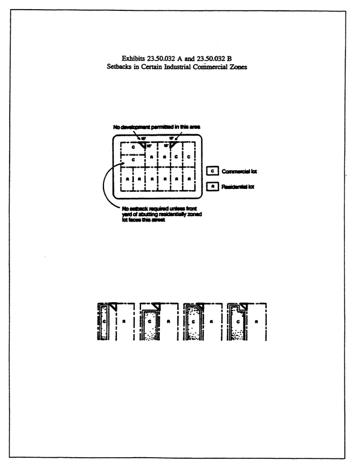

1. Setbacks From Residential Zones.

    1. A setback shall be required on lots which abut the intersection of a side and front lot line of a residentially zoned lot. The required setback shall be a triangular area. Two (2) sides of the triangle shall extend fifteen (15) feet from the intersection of the street property line and the property line abutting the residentially zoned lot. The third side shall connect these two (2) sides with a diagonal line across the lot. (See Exhibits 23.50.032 A and 23.50.032 B).
    2. A setback shall be required along any lot line which abuts a side or rear lot line of a residentially zoned lot, or which is across an alley from a residentially zoned lot as follows:

        1. Zero (0) feet for portions of structures twelve (12) feet in height or lower; and
        2. Ten (10) feet for portions of structures above twelve (12) feet in height to a maximum of sixty-five (65) feet; and
        3. For portions of structures above sixty-five (65) feet in height, an additional one (1) foot of setback shall be required for every ten (10) feet in excess of sixty-five (65) feet, (see Exhibit 23.50.032 B).
    3. Half (½) of an alley width may be counted as part of the required setback.
2. No entrance, window or other opening shall be permitted closer than five (5) feet to a residentially zoned lot.
3. A five (5) foot setback shall be required from all street property lines where street trees are required and it is not feasible to plant them in accordance with City standards. The setback shall be landscaped according to Section 23.50.038, Screening and landscaping standards.
4. A setback may be required in order to meet the provisions of Section 23.53.015, Improvement requirements for existing streets in residential and commercial zones, and Section 23.53.030, Alley improvements in all zones.

##### 23.50.033 - Conditions for extra floor area in an IC 85-160 zone

1. General. Projects in an IC 85-160 zone may add chargeable floor area above the base FAR up to the applicable maximum FAR in Section 23.50.028 if Sections 23.58A.022 and 23.58A.024 for extra nonresidential floor area and all the applicable conditions of this Chapter 23.50 are satisfied. The provisions of this Section 23.50.033 apply to lots in an IC 85-160 zone, and only to development exceeding the base FAR.
2. LEED requirement. The applicant shall make a commitment acceptable to the Director that the proposed development will earn a LEED Silver rating or meet a substantially equivalent standard, and shall demonstrate compliance with that commitment, all in accordance with Section 23.49.020.
3. Quantity of parking, ridesharing and transit incentive program requirements. Maximum parking limits, ridesharing and transit incentive program requirements for nonresidential uses established for Downtown zones in subsections 23.49.019.C and 23.49.019.D apply, and requirements for bicycle parking established in subsection 23.49.019.E apply.
4. Seattle Green Factor Landscaping Requirement. Development shall achieve a minimum Green Factor score of .30, calculated pursuant to Section 23.86.019.

##### 23.50.034 - Screening and landscaping

The following types of screening and landscaping may be required according to the provisions of Sections 23.50.036, 23.50.038, and 23.50.040:

1. Three-foot-high screening. Three-foot-high screening may be either:

    1. A fence or wall at least 3 feet in height; or
    2. A landscaped area with vegetation at least 3 feet in height. Landscaped areas may include bioretention facilities or landscaped berms, provided that the top of the vegetation is at least 3 feet above the grade abutting the facility or berm.
2. View-obscuring screening. View-obscuring screening may be either:

    1. A fence or wall 6 feet in height; or
    2. A landscaped area with vegetation at least 5 feet in height. Landscaped areas may include bioretention facilities or landscaped berms, provided that the top of the vegetation will be at least 5 feet above the grade abutting the facility or berm.
3. Landscaped areas. Each area required to be landscaped shall be planted with trees, shrubs and grass, or evergreen ground cover, in a manner that the total required setback, excluding driveways, will be covered in three years. Features such as walkways, decorative paving, sculptures, or fountains may cover a maximum of 30 percent of each required landscaped area.
4. Street trees. When required, street trees shall be provided in the planting strip according to Seattle Department of Transportation Tree Planting Standards. If it is not feasible to plant street trees in the planting strip according to City standards, they shall be planted in the 5-foot deep landscaped setback area along the street property line. Trees planted in this setback area shall be at least 2 feet from the street lot line.
5. Combinations of screening and landscaping requirements

    1. When there is more than one type of use which requires screening or landscaping, the requirement which results in the greater amount of screening and landscaping shall be followed.
    2. Different types of screening or landscaping may be combined on one lot.
6. Landscaping meeting Seattle Green Factor standards, pursuant to Section 23.86.019.

##### 23.50.036 - Industrial Buffer—Screening and landscaping

1. Screening and Landscaping Requirements for All Uses.

    1. Street Trees.

        1. All uses which are directly across a street eighty feet (80') or less in width from a lot in a residential or commercial zone shall provide street trees.
        2. If it is not feasible to plant street trees in the planting strip, then they shall be provided in the required five-foot (5') deep landscaped area along the street property line.
    2. Rooftop Screening.

        1. Heating, ventilating, air conditioning or other wall or rooftop mechanical equipment shall be located and directed away from adjacent residential property.
        2. Screening shall be provided and shall be of a design and material which is compatible with the structure and shall be as high as the equipment to be screened and shall completely surround the equipment.
2. Screening and Landscaping Requirements for Uses Abutting or Across an Alley From a Lot in a Residential Zone.

    1. Surface parking areas, off-street loading areas, parking structures, drive-in businesses, gas stations, outdoor sales or storage and outdoor activities, shall provide screening and landscaping as provided in subsection D of this section, screening and landscaping requirements for specific uses.
    2. Uses which abut or are across an alley from a lot in a residential zone shall provide view-obscuring screening along the abutting or alley lot line, except as modified by subsection B3 below.
    3. When the structure facade is located five feet (5') or less from the lot line, landscaping may be provided in the area between the facade and the lot line as an alternative to view-obscuring screening. This landscaping shall be either:

        1. Trellises and vining plants attached to the facade up to a minimum height of ten feet (10'); or
        2. A landscaped area meeting the provisions of subsection C of Section 23.50.034.
3. Screening and Landscaping Requirements for Uses Directly Across a Street Eighty Feet (80') or Less in Width From Lots in a Residential Zone.

    1. A view-obscuring fence or solid wall screen greater than six feet (6') in height and less than three feet (3') from the lot line shall be screened by trellises and vining plants attached to the wall up to a minimum height of ten feet (10').
    2. Some specific uses are required to provide additional screening, landscaping and setbacks as regulated in subsection D of this section.
4. Screening, Landscaping and Setback Requirements for Specific Uses.

    1. Surface parking areas for more than five (5) vehicles.

        1. When a surface parking area abuts a lot in an NC1, NC2, NC3 or C1 zone, view-obscuring screening along the abutting lot lines shall be provided.
        2. When a surface parking area is across an alley from a lot in a residential zone, view-obscuring screening shall be required. A five-foot (5') deep landscaped area shall be required inside the screening. The Director may reduce or waive the screening and landscaping requirement for all or a part of the lot abutting the alley, or may waive only the landscaping requirement, when required parking can only be provided at the rear lot line and the alley is necessary to provide aisle space. In making the determination to waive or reduce the landscaping and screening requirements, the Director shall consider the following criteria:

            1. Whether the lot width and depth permits a workable plan for the building and parking which would preserve the screening and landscaping;
            2. Whether the character of use across the alley, such as multifamily parking structures or single-family garages, make the screening and landscaping less necessary; and
            3. Whether a topographic break between the alley and the residential zone makes screening less necessary.
        3. When a surface parking area or off-street loading area is directly across a street right-of-way eighty feet (80') or less in width from a lot in a residential zone, a five-foot (5') deep landscaped setback area from the street lot line shall be provided. Three-foot (3') high screening and a five-foot (5') landscaped area, with the landscaping on the street side of the screening, shall be provided along the edge of the setback.
        4. When a surface parking area is directly across a street right-of-way wider than eighty feet (80') in width from a lot in a residential zone, street trees shall be provided.
        5. When a surface parking area abuts a lot in a residential zone, view-obscuring screening and a five-foot (5') deep landscaped setback area on the inside of the screening shall be provided.
        6. When a surface parking area is directly across a street right-of-way eighty feet (80') or less in width from a lot in a commercial zone, street trees shall be provided.
    2. Parking Structures.

        1. When a parking structure is directly across a street right-of-way eighty feet (80') or less in width from a lot in a residential zone, a five-foot (5') deep landscaped setback area from the street lot line, including street trees, shall be provided. The street facade of each floor of parking shall have an opaque screen at least three and one-half feet (3½') high.
        2. When a parking structure abuts a lot in a residential zone, a five-foot (5') deep landscaped setback area from the abutting lot line shall be provided, unless the parking structure is completely enclosed except for driveway areas. In addition to the landscaped setback, view-obscuring screening shall be provided along abutting property line(s). When the parking structure is enclosed by a solid wall, any setback area provided within five feet (5') of the abutting lot line(s) shall be landscaped. The abutting facade of each floor of parking not enclosed by a solid wall shall have an opaque screen at least three and one-half feet (3½') high.
        3. When a parking structure is across an alley from a lot in a residential zone, a five-foot (5') deep landscaped setback area from the alley lot line shall be provided, unless the parking structure is completely enclosed except for driveway areas. Three-foot (3') high screening along the facade facing the alley with the landscaping on the alley side of the screening shall be provided. When the parking structure is enclosed by a solid wall, any setback area provided within five feet (5') of the alley lot line shall be landscaped. The abutting or alley facade of each floor of parking shall have an opaque screen at least three and one-half feet (3½') high.
        4. When a parking structure is directly across a street right-of-way more than eighty feet (80') in width from a lot in a residential zone, street trees shall be provided.
        5. When a parking structure is directly across a street right-of-way eighty feet (80') or less in width from a lot in a commercial zone, street trees shall be provided.
    3. Outdoor Sales and Outdoor Display of Rental Equipment.

        1. When an outdoor sales area or outdoor display of rental equipment is across an alley from a lot in a residential zone, or abutting a lot in a residential or commercial zone, view-obscuring screening shall be provided along the abutting or alley lot lines.
        2. When an outdoor sales area or outdoor display of rental equipment is directly across the street from a lot in a residential zone, street trees and three-foot (3') high screening along the street front shall be provided.
    4. Drive-in Businesses Including Gas Stations.

        1. Drive-in businesses abutting or across an alley from a lot in a residential zone shall provide view-obscuring screening along the abutting alley lot lines. When the drive-in portion of the business or its access area abuts a lot in a residential zone a five-foot (5') landscaped area shall be required on the inside of the screening.
        2. Drive-in businesses in which the drive-in portion of the business is directly across a street right-of-way eighty feet (80') or less in width from a lot in a residential zone shall provide three-foot (3') high screening for the drive-in portion and street trees.
        3. When a drive-in business is directly across a street right-of-way wider than eighty feet (80') in width from a lot in a residential zone, street trees shall be provided.
        4. Drive-in businesses directly across a street right-of-way eighty feet (80') or less in width from a lot in a commercial zone shall provide street trees.
    5. Outdoor Storage, and Outdoor Loading Berths.

        1. Outdoor storage and outdoor loading berths directly across a street right-of-way eighty feet (80') or less in width from a lot in an NC1, NC2, NC3 or C1 zone shall provide view-obscuring screening along the street lot lines and shall also provide street trees.
        2. When the outdoor storage or outdoor loading berth is directly across a street right-of-way eighty feet (80') or less in width from a lot in a residential zone, view-obscuring screening shall be provided. A five-foot (5') deep landscaped area including street trees shall be provided between the lot line and the view-obscuring screening.
        3. When outdoor storage or an outdoor loading berth is directly across a street right-of-way wider than eighty feet (80') in width from a lot in a residential zone, view-obscuring screening and street trees shall be provided.
        4. When outdoor storage or an outdoor loading berth is across an alley from a lot in a residential zone, view-obscuring screening shall be provided. A five-foot (5') deep landscaped area shall be provided between the lot and the view-obscuring screening, except when the industrial lot is at least fifteen feet (15') above the elevation of the residential lot or when the screen is a solid wall.
        5. When the outdoor storage or outdoor loading berth abuts a lot in a residential zone, view-obscuring screening and a fifteen-foot (15') deep landscaped area inside the screening shall be provided along the abutting lot line.
    6. Outdoor Manufacturing, Repairing, Refuse Compacting or Recycling Activities.

        1. An outdoor manufacturing, repairing, refuse compacting or recycling activity must be set back fifty feet (50') from a lot in a residential zone.
        2. An outdoor manufacturing, repairing, refuse compacting or recycling activity abutting a lot in a residential zone or directly across a street eighty feet (80') or less in width or an alley across from a lot in a residential zone shall provide view-obscuring screening.
        3. An outdoor manufacturing, repairing, refuse compacting or recycling activity directly across a street greater than eighty feet (80') in width from a lot in a residential or commercial zone shall provide street trees and view-obscuring screening on the street lot line.
        4. An outdoor manufacturing, repairing, refuse compacting or recycling activity abutting or across an alley from a lot in a commercial zone shall provide view-obscuring screening along the abutting or alley lot lines.
    7. Fences or free-standing walls associated with utility services uses may obstruct or allow views to the interior of a site. Where site dimensions and site conditions allow, applicants are encouraged to provide both a landscaped setback between the fence or wall and the right-of-way, and a fence or wall that provides visual interest facing the street lot line, through changes in the height, design or construction of the fence or wall, including the use of materials, architectural detailing, artwork, vegetated trellises, decorative fencing, or similar features. Any fence or free-standing wall for a utility services use must provide either:

        1. A 5-foot-deep landscaped area between the wall or fence and the street lot line; or
        2. Architectural detailing, artwork, vegetated trellises, decorative fencing, or similar features to provide visual interest facing the street lot line, as approved by the Director.

##### 23.50.038 - Industrial Commercial - Screening and landscaping

1. Screening and landscaping requirements for all uses

    1. Landscaping that achieves a Green Factor score of 0.30 or greater, pursuant to Section 23.86.019, is required for any lot zoned Industrial Commercial (IC) located within a designated urban village or urban center, with:

        1. development containing more than four new dwelling units; or
        2. development, either a new structure or an addition to an existing structure, containing more than 4,000 new square feet of non-residential uses; or
        3. any parking lot containing more than 20 new parking spaces for automobiles.
    2. Standards. All landscaping provided to meet requirements under this Section 23.50.038 must meet standards promulgated by the Director to provide for the long-term health, viability and coverage of plantings. The standards may include, but are not limited to, the type and size of plants, number of plants, concentration of plants, depths of soil, use of low water use plants and access to light and air for plants.
    3. All uses shall provide street trees, unless it is determined by the Director to be infeasible. If it is not feasible to plant street trees in the planting strip, then they shall be provided in the required 5-foot deep landscaped area along street lot lines.
2. Treatment of blank facades.

    1. Blank facade limits apply to the area of the facade between 2 and 8 feet above the sidewalk.

        1. Any portion of a facade that is not transparent shall be considered to be a blank facade. Clear or lightly tinted glass in windows, doors and display windows shall be considered transparent. Transparent areas shall allow views into the structure or into display windows from the outside.
        2. Portions of a facade of a structure that are separated by transparent areas of at least 2 feet in width shall be considered separate facade segments for the purposes of this subsection 23.50.038.B.
        3. Except as provided for in subsection 23.50.038.C.6, blank segments of facades that are 60 feet wide and greater, and within 20 feet of the street lot line shall be screened by one of the following:

            1. A hedge that will achieve a height of at least 5 feet within 3 years of planting and a height of at least 10 feet at full maturity; or
            2. Trellises and vining plants attached to the wall up to a minimum height of 10 feet; or
            3. A landscaped area meeting subsection 23.50.034.C, landscaped areas or berms.
        4. The following limits on blank façade segments apply to lots in an IC 85-160 zone:

            1. For facades facing streets that bound the Downtown Urban Center or streets shown on Map A for Section 23.50.016, blank facade segments shall not exceed 15 feet in width, except that:

                1. the width of a blank façade segment that includes a garage door may exceed 15 feet but is limited to the width of the driveway plus 5 feet; and
                2. the width of a blank facade segment may be increased to up to 30 feet if the Director determines, as a Type I decision, that the facade is sufficiently enhanced by architectural detailing, artwork, landscaping, or similar features that have visual interest.
            2. For all other street-level street-facing facades, if the street level is occupied by uses other than parking, blank facade segments are limited to a width of 30 feet, except that:

                1. the width of a blank façade segment that includes a garage door may exceed 30 feet but is limited to the width of the driveway plus 5 feet; and
                2. the width of a blank façade segment may be increased to up to 60 feet if the Director determines, as a Type I decision, that the facade is sufficiently enhanced by architectural detailing, artwork, landscaping, or similar features that have visual interest.
            3. If the street level of the street-facing façade is occupied by parking, subsection 23.50.038.C.6 applies.
3. Additional Screening and Landscaping Requirements for Specific Uses.

    1. Surface Parking Areas for More Than Five Vehicles.

        1. If a surface parking area abuts a lot in an NC1, NC2, NC3 or C1 zone, view-obscuring screening along the abutting lot lines shall be provided.
        2. If a surface parking area is across an alley from a lot in a residential zone, view obscuring screening shall be required. A 5 foot deep landscaped area shall be required inside the screening. The Director may reduce or waive the screening and landscaping requirement for all or a part of the lot abutting the alley, or may waive only the landscaping requirement, if required parking can only be provided at the rear lot line and the alley is necessary to provide aisle space. In making the determination to waive or reduce the landscaping and screening requirements, the Director shall consider the following criteria:

            1. Whether the lot width and depth permits a workable plan for the building and parking which would preserve the screening and landscaping; and
            2. Whether the character of use across the alley, such as multi-family parking structures or single-family garages, make the screening and landscaping less necessary; and
            3. Whether a topographic break between the alley and the residential zone makes screening less necessary.
        3. If a surface parking area or off-street loading area is directly across a street 80 feet or less in width from a lot in a residential zone, a 5 foot deep landscaped setback area from the street lot line, including street trees, shall be provided. Three-foot high screening along the edge of the setback, with the landscaping on the street side of the screening, shall be provided.
        4. If a surface parking area or off-street loading area abuts a lot in a residential zone, view-obscuring screening and a 5 foot deep landscaped setback area on the inside of the screening shall be provided.
        5. Surface parking areas for ten or fewer cars shall be screened by 3 foot high screening along the street lot line.
        6. Surface parking areas for more than ten cars shall be screened by 3 foot high screening and street trees along the street lot lines.
        7. Surface parking areas for more than 50 cars shall provide 3 foot high screening and street trees along the street lot lines, as well as interior landscaping.
    2. Parking Structures.

        1. If a parking structure is directly across a street 80 feet or less in width from a lot in a residential zone, a 5 foot deep landscaped setback area from the street lot line, including street trees, shall be provided. The street-facing facade of each floor of parking shall have an opaque screen at least 3.5 feet high.
        2. If a parking structure abuts a lot in a residential zone, a 5 foot deep landscaped setback area from the lot line shall be provided unless the parking structure is completely enclosed except for driveway areas. In addition to the landscaped setback, view-obscuring screening shall be provided along abutting lot line(s). If the parking structure is enclosed by a solid wall, any setback area provided within 5 feet of the abutting lot lines shall be landscaped. The abutting facade of each floor of parking not enclosed by a solid wall shall have an opaque screen at least 3.5 feet high.
        3. If a parking structure is across an alley from a lot in a residential zone, a 5 foot deep landscaped setback area from the alley lot line shall be provided, unless the parking structure is completely enclosed, except for driveway areas. Three-foot high screening along the facade facing the alley with the landscaping on the alley side of the screening shall be provided. If the parking structure is enclosed by a solid wall, any setback area provided within 5 feet of the alley lot line shall be landscaped. The abutting or alley facade of each floor of parking shall have an opaque screen at least 3.5 feet high.
        4. If a parking structure is directly across a street wider than 80 feet from a lot in a residential zone, street trees shall be provided.
        5. If a parking structure is directly across a street 80 feet or less in width from a lot in a commercial zone, street trees shall be provided.
    3. Outdoor Sales and Outdoor Display of Rental Equipment.

        1. If an outdoor sales area or outdoor display of rental equipment is across an alley from a lot in a residential zone, or abutting a lot in a residential or commercial zone, view-obscuring screening shall be provided along the abutting or alley lot lines.
        2. If an outdoor sales area or outdoor display of rental equipment is directly across the street from a lot in a residential or commercial zone, street trees and 3 foot high screening along the street front shall be provided.
    4. Drive-in Businesses Including Gas Stations.

        1. Drive-in businesses across an alley from a lot in a residential zone shall provide view-obscuring screening along the alley lot lines.
        2. Drive-in businesses in which the drive-in portion of the business is directly across a street 80 feet or less in width from a lot in a residential zone shall provide 3 foot high screening for the drive-in portion and street trees.
        3. If a drive-in business is directly across a street wider than 80 feet from a lot in a residential zone, street trees shall be provided.
        4. Drive-in businesses abutting a lot in a residential zone shall provide view-obscuring screening and a 5 foot deep landscaped setback area inside the screening.
    5. Outdoor Storage and Outdoor Loading Berths.

        1. Outdoor storage and outdoor loading berths directly across a street 80 feet or less in width from a lot in an NC1, NC2, NC3 or C1 zone shall provide view-obscuring screening along the street lot lines and street trees.
        2. If the outdoor storage or outdoor loading berth is directly across a street 80 feet or less in width from a lot in a residential zone, view-obscuring screening shall be provided. A 5 foot deep landscaped area including street trees shall be provided between the lot line and the view-obscuring screening.
        3. If outdoor storage or an outdoor loading berth is directly across a street wider than 80 feet from a lot in a residential zone, view-obscuring screening and street trees shall be provided.
        4. If outdoor storage or an outdoor loading berth is across an alley from a lot in a residential zone, view-obscuring screening shall be provided. A 5 foot deep landscaped area shall be provided between the lot line and the view-obscuring screening, unless the industrial lot is at least 15 feet above the elevation of the residential lot or the screen is a solid wall.
        5. If the outdoor storage or outdoor loading berth abuts a lot in a residential zone, view-obscuring screening and a 15 foot deep landscaped area inside the screening shall be provided along the abutting lot line.
    6. Solid waste transfer stations.

        1. All solid waste transfer stations shall provide landscaping meeting a minimum Green Factor score of 0.40, pursuant to Section 23.86.019. If the transfer station is part of a development located on separate parcels within 200 feet of each other, Green Factor scoring may be calculated for the multiple parcels considered as a whole. If the parcels are in zones having different Green Factor minimum scores, the development considered as a whole shall meet the highest applicable, minimum Green Factor score.
        2. Solid waste transfer stations abutting or across the street from a lot in a commercial or residential zone, shall provide screening pursuant to Section 23.50.034.B.
    7. Fences or free-standing walls associated with utility services uses may obstruct or allow views to the interior of a site. Where site dimensions and site conditions allow, applicants are encouraged to provide both a landscaped setback between the fence or wall and the right-of-way, and a fence or wall that provides visual interest facing the street lot line, through the height, design or construction of the fence or wall, including the use of materials, architectural detailing, artwork, vegetated trellises, decorative fencing, or similar features. If abutting or across the street from a lot in a residential, commercial, or downtown zone, fences or free-standing walls for a utility services use must provide either:

        1. A 5-foot-deep landscaped area between the wall or fence and the street lot line; or
        2. Architectural detailing, artwork, vegetated trellises, decorative fencing, or similar features to provide visual interest facing the street lot line, as approved by the Director.
    8. Screening and location of parking in an IC 85-160 zone. Those developments that gain extra floor area above the base FAR in an IC 85-160 zone are subject to the following, in addition to any other applicable parking screening requirements in this subsection 23.50.038.C.

        1. All parking permitted on the lot shall be provided below grade or enclosed within a structure.
        2. Parking at street level.

            1. Parking is not permitted at street level within a structure along a lot line abutting a street bounding the Downtown Urban Center or a street shown on Map A for 23.50.016, Industrial Streets Landscaping Plan, unless separated from the street by other uses, except that garage and loading doors and access to parking need not be separated.
            2. Parking is permitted at street level within a structure along a street lot line abutting a street not specified in subsection 23.50.038.C.6.b.1 subject to the following requirements:

                1. Any parking not separated from the street lot line by another use is screened from view at the street level, except that garage and loading doors and access to parking need not be screened.
                2. The facade facing the street lot line is enhanced by architectural detailing, artwork, landscaping, or similar visual interest features.
        3. Parking above street level. Parking is not permitted above street level unless it is separated from abutting street lot lines by another use, except that for structures located on a lot that is less than 150 feet in depth, as measured from the lot line with the greatest street frontage, parking is permitted above the first story under the following conditions:

            1. One story of parking shall be permitted above the first story of a structure for each story of parking provided below grade that is of at least equivalent capacity, up to a maximum of two stories of parking above the first story.
            2. Above the first story of a structure, parking is permitted up to a maximum of 70 percent of the length of each street-facing façade. Any additional parking must be separated from the street by another use. For structures located on corner lots, separation by another use shall be provided at the corner portion(s) of the structure for a minimum of 15 percent of the length of each street-facing façade.
            3. For all parking located on stories above street level that is not separated from the street by another use, the parking shall be screened from view at street level, and, through the use of materials, fenestration, or other architectural treatment, the screening shall be designed to provide visual interest and to integrate the screened portions of the building façade with the overall design of the structure's street-facing facades.
            4. The Director may permit, as a Type I decision, exceptions to subsection 23.50.038.C.6.c to permit more parking above street level than otherwise allowed, if the Director finds that locating permitted parking below grade is infeasible due to physical site conditions such as a high water table, contaminated soil conditions, or proximity to a tunnel. In such cases, the Director shall determine the maximum feasible amount of parking that can be provided below grade, if any, and the amount of additional parking to be permitted above street level.

##### 23.50.039 - Street-level use requirements in an IC 85-160 zone

1. In an IC 85-160 zone, on lots that abut 4 Avenue South or 6th Avenue South between Airport Way South and South Royal Brougham Way, one or more of the following street-level uses are required, consistent with the standards in subsection 23.50.039.B:

    1. General sales and service uses;
    2. Automotive sales and service
    3. Eating and drinking establishments;
    4. Entertainment uses;
    5. Child care facilities;
    6. Public libraries;
    7. Public parks; and
    8. Religious facilities.
2. Street-level uses shall be provided consistent with the following standards:

    1. Along streets requiring street-level uses, a minimum of 75 percent of the street level of each street-facing façade shall be occupied by street-level uses listed in subsection 23.50.039.A. The remaining portion of the street level of the street-facing facade may contain other permitted uses and/or pedestrian or vehicular entrances.
    2. Required street-level uses shall be located in a space with a minimum floor to floor height of 13 feet and a minimum depth of 15 feet measured from the street-facing facade.
    3. Required street-level uses shall be located within 10 feet of the street lot line.
    4. Except for child care facilities, pedestrian access to required street-level uses shall be provided directly from the street or other open area with access to a street. Pedestrian entrances shall be located no more than 3 feet above or below sidewalk grade or at the same elevation as any abutting open area.

##### 23.50.040 - Industrial General—Screening and landscaping for specific uses

1. Solid waste transfer stations.

    1. All solid waste transfer stations shall provide landscaping meeting a minimum Green Factor score of 0.40, pursuant to Section 23.86.019. If the transfer station is part of a development located on separate parcels within 200 feet of each other, Green Factor scoring may be calculated for the multiple parcels considered as a whole. If the parcels are in zones having different Green Factor minimum scores, the development considered as a whole shall meet the highest applicable, minimum Green Factor score.
    2. When a solid waste transfer station is abutting or across the street from a lot in a commercial or residential zone, screening is required pursuant to subsection 23.50.034.B.
2. Fences or free-standing walls associated with utility services uses may obstruct or allow views to the interior of a site. Where site dimensions and site conditions allow, applicants are encouraged to provide both a landscaped setback between the fence or wall and the right-of-way, and a fence or wall that provides visual interest facing the street lot line, through the height, design or construction of the fence or wall, including the use of materials, architectural detailing, artwork, vegetated trellises, decorative fencing, or similar features. If abutting or across the street from a lot in a residential, commercial, or downtown zone, fences or free-standing walls for a utility services use must provide either:

    1. A 5-foot-deep landscaped area between the wall or fence and the street lot line; or
    2. Architectural detailing, artwork, vegetated trellises, decorative fencing, or similar features to provide visual interest facing the street lot line, as approved by the Director.

##### 23.50.042 - All Industrial zones—Venting standards.

1. The venting of odors, vapors, smoke, cinders, dust, gas, and fumes shall be at least ten (10) feet above finished grade, and directed away from residential uses within fifty (50) feet of the vent.

##### 23.50.044 - All Industrial zones—Standards for major odor sources

1. Major odor sources in Industrial Buffer and Industrial Commercial zones

    1. Uses that involve the following odor-emitting processes or activities are major odor sources:

        1. Lithographic, rotogravure, or flexographic printing;
        2. Film burning;
        3. Fiberglassing;
        4. Selling of gasoline and/or storage of gasoline in tanks larger than 260 gallons;
        5. Handling of heated tars and asphalts;
        6. Incinerating (commercial);
        7. Metal plating;
        8. Tire buffing;
        9. Vapor degreasing;
        10. Wire reclamation;
        11. Use of boilers (greater than 106 British thermal units per hour, 10,000 pounds steam per hour, or 30 boiler horsepower);
        12. The production or processing of marijuana products by a major marijuana activity; and
        13. Other uses creating similar odor impacts.
    2. Uses that employ the following processes shall be considered major odor sources, unless the entire activity is conducted as part of a commercial use other than food processing or heavy commercial services:

        1. Cooking of grains;
        2. Smoking of food or food products;
        3. Fish or fishmeal processing;
        4. Coffee or nut roasting;
        5. Deep-fat frying;
        6. Dry cleaning;
        7. Animal food processing; and
        8. Other uses creating similar odor impacts.
2. Major odor sources in General Industrial zones

    1. Uses that involve the following odor-emitting processes or activities in General Industrial zones are major odor sources:

        1. The production or processing of marijuana products by a major marijuana activity.
3. When an application is made in an Industrial zone for a use which is determined to be a major odor source, the Director, in consultation with the Puget Sound Clean Air Agency (PSCAA), shall determine the appropriate measures to be taken by the applicant in order to significantly reduce potential odor emissions and airborne pollutants. Measures to be taken shall be indicated on plans submitted to the Director, and may be required as conditions for the issuance of any permit. Once a permit has been issued, any measures which were required by the permit shall be maintained.

##### 23.50.046 - Industrial Buffer and Industrial Commercial—Light and glare standards.

1. Exterior lighting shall be shielded and directed away from lots in adjacent residential zones.
2. Interior lighting in parking structures shall be shielded, to minimize nighttime glare affecting lots in adjacent residential zones.
3. When nonconforming exterior lighting in an Industrial Buffer (IB) or Industrial Commercial (IC) zone is replaced, new lighting shall conform to the requirements of this section.
4. Glare diagrams which clearly identify potential adverse glare impacts on residential zones and on arterials shall be required when:

    1. Any structure is proposed to have facades of reflective coated glass or other highly reflective material, and/or a new structure or expansion of an existing structure greater than sixty-five (65) feet in height is proposed to have more than thirty (30) percent of the facades comprised of clear or tinted glass; and
    2. The facade(s) surfaced or comprised of such materials either:

        1. Are oriented towards and are less than two hundred (200) feet from any residential zone, and/or
        2. Are oriented towards and are less than four hundred (400) feet from a major arterial with more than fifteen thousand (15,000) vehicle trips per day, according to Seattle Department of Transportation data.
5. When glare diagrams are required, the Director may require modification of the plans to mitigate adverse impacts, using methods including but not limited to the following:

    1. Minimizing the percentage of exterior facade that is composed of glass;
    2. Using exterior glass of low reflectance;
    3. Tilting glass areas to prevent glare which could affect arterials, pedestrians or surrounding structures;
    4. Alternating glass and nonglass materials on the exterior facade; and
    5. Changing the orientation of the structure.

##### 23.50.048 - Industrial Buffer—Access to parking and loading areas.

1. Location of Parking and Loading Areas. There shall be no restrictions on the location of parking and loading areas on lots in the Industrial Buffer (IB) zone, except as specified in Section 23.50.030, Industrial Buffer-Setback requirements.
2. Access to off-street parking and loading areas. Access to off-street parking or loading areas shall be prohibited from street or alley frontages opposite residentially zoned lots. This prohibition shall not apply under the following conditions:

    1. There is no access to the lot from another street or alley within an industrial zone.
    2. The Director has determined that the lot width and depth prevents a workable plan for the building, parking and loading if access is not allowed from a street or alley across from a residentially zoned lot.

##### 23.50.049 - Pet daycare centers.

In addition to the development standards of the zone, pet daycare centers are subject to the following:

1. Operating business establishments that have been providing pet daycare services as of July 31, 2006 may continue not withstanding nonconformities to applicable development standards, provided the provisions of this section are met.
2. The pet daycare center must be permitted by Public Health—Seattle & King County, as required by SMC 10.72.020.
3. Facilities for the boarding of animals may occupy no more than thirty (30) percent of the gross floor area of the pet daycare center.
4. Required loading pursuant to 23.54.015 may be provided in a public right of way if the applicant can demonstrate to the Director, in consultation with the Seattle transportation Department, that pedestrian circulation or vehicle traffic will not be significantly impacted.
5. Applicants must submit at the time of permit application, written operating procedures, such as those recommended by the American Boarding and Kennel Association (ABKA) or the American Kennel Club (AKC). Such procedures, which are to be followed for the life of the business, must address the identification and correction of animal behavior that impacts surrounding uses, including excessive barking.
6. Violations of this Section.

    1. The exemption in SMC 25.08.500A of the Noise Control Ordinance to uses permitted under SMC 10.72, provisions for pet kennels and similar uses, does not apply to pet daycare centers.
    2. When a notice of violation is issued for animal noise, the Director may require a report from an acoustical consultant to describe measures to be taken by the applicant to mitigate adverse noise impacts. The Director may require measures, including but not limited to: development or modification of operating procedures; cessation of the use of outdoor area(s); closure of windows and doors; reduction in hours of operation; use of sound attenuating construction or building materials such as insulation and noise baffles.

##### 23.50.050 - Transportation concurrency level-of-service standards.

Proposed uses in industrial zones shall meet the transportation concurrency level-of-service standards prescribed in Chapter 23.52.

##### 23.50.053 - Transfer of development rights within an IC 85-160 zone

1. General standards for the transfer of transferable development rights to lots in an IC 85-160 zone

    1. To achieve extra nonresidential floor area above the base FAR that may be allowed in an IC 85-160 zone pursuant to subsection 23.50.028.D, an applicant may use TDR to the extent permitted under this subsection 23.50.053.A.
    2. South Downtown Historic TDR, open space TDR from zones within South Downtown, and housing TDR eligible to be transferred from a lot under Section 23.49.014 may be transferred from a Downtown zone to a lot eligible as a receiving site in an IC 85-160 zone. No other TDR may be used in an IC 85-160 zone under this Section 23.50.053.
    3. Except as expressly permitted pursuant to subsection 23.50.053.A, development rights or potential floor area may not be transferred to a lot in an IC 85-160 zone.
    4. No permit after the first building permit, no permit for any construction activity other than excavation and shoring, and no permit for occupancy of existing floor area by any use based upon TDR will be issued for development that includes TDR until the applicant's possession of TDR is demonstrated to the satisfaction of the Director.
2. Transfer of Transferable Development Rights deeds and agreements. This subsection 23.50.053.B applies to sending lots in IC zones, and to the use of TDR on receiving lots in IC zones regardless of whether the TDR are from a sending lot in an IC zone. If TDR from other zones are used on a receiving lot in an IC zone, then the provisions applicable to sending lots in the chapter(s) of this Title 23 for the zone(s) in which the sending lots are located apply.

    1. The fee owners of the sending lot shall execute a deed, and shall obtain the release of the TDR from all liens of record and the written consent of all holders of encumbrances on the sending lot other than easements and restrictions, unless such release or consent is waived by the Director for good cause. The deed shall be recorded in the King County real property records. If TDR are conveyed to the owner of a receiving lot described in the deed, then unless otherwise expressly stated in the deed or any subsequent instrument conveying such lot or the TDR, the TDR shall pass with the receiving lot whether or not a structure using such TDR shall have been permitted or built prior to any conveyance of the receiving lot. Any subsequent conveyance of TDR previously conveyed to a receiving lot shall require the written consent of all parties holding any interest in or lien on the receiving lot from which the conveyance is made. If the TDR are transferred other than directly from the sending lot to the receiving lot using the TDR, then after the initial transfer, all subsequent transfers also shall be by deed, duly executed, acknowledged and recorded, each referring by King County recording number to the prior deed.
    2. Any person may purchase any TDR that are eligible for transfer by complying with the applicable provisions of this Section 23.50.053, whether or not the purchaser is then an applicant for a permit to develop real property. Any purchaser of such TDR (including any successor or assignee) may use such TDR to obtain floor area above the applicable base on a receiving lot to the extent such use of TDR is permitted under the Land Use Code provisions in effect on the date of vesting, under applicable law, of such person's rights with respect to the issuance of permits for development of the project intended to use such TDR. The Director may require, as a condition of processing any permit application using TDR or for the release of any security posted in lieu of a deed for TDR to the receiving lot, that the owner of the receiving lot demonstrate that the TDR have been validly transferred of record to the receiving lot, and that such owner has recorded in the real estate records a notice of the filing of such permit application, stating that such TDR are not available for retransfer.
    3. For transfers of Landmark TDR, the owner of the sending lot shall execute and record an agreement in form and content acceptable to the Landmarks Preservation Board providing for the restoration and maintenance of the historically significant features of the structure or structures on the lot.
    4. For transfers of housing TDR, the owner of the sending lot shall execute and record an agreement, with the written consent of all holders of encumbrances on the sending lot, unless such consent is waived by the Director of Housing for good cause, to provide for the maintenance of the required housing on the sending lot for a minimum of 50 years. Such agreement shall commit to limits on rent and occupancy consistent with the definition of housing TDR site and acceptable to the Director of Housing.
    5. A deed conveying TDR may require or permit the return of the TDR to the sending lot under specified conditions, but notwithstanding any such provisions:

        1. The transfer of TDR to a receiving lot shall remain effective so long as any portion of any structure for which a permit was issued based upon such transfer remains on the receiving lot; and
        2. The City shall not be required to recognize any return of TDR unless it is demonstrated that all parties in the chain of title have executed, acknowledged and recorded instruments conveying any interest in the TDR back to the sending lot and any lien holders have released any liens thereon.
    6. Any agreement governing the use or development of the sending lot shall provide that its covenants or conditions shall run with the land and shall be specifically enforceable by the City of Seattle.
3. Time of determination of TDR Eligible for transfer. The eligibility of a sending lot to transfer TDR, and the amount transferable from a sending lot, shall be determined as of the date of transfer from the sending lot and shall not be affected by the date of any application, permit decision or other action for any project seeking to use such TDR.
4. Use of previously transferred TDR by new projects. Any project using TDR according to applicable limits on TDR in this Section 23.50.053 may use TDR that were transferred from the sending lot consistent with the provisions of this Title 23 in effect at the time of such transfer.
5. Rules. The Director may promulgate rules to implement this Section 23.50.053.

##### 23.50.055 - Street-facing façade requirements and upper level development standards in an IC 85-160 zone

The following development standards apply to all lots within an IC 85-160 zone.

Table A forFaçade Modulation in an IC 85-160 Zone for Structures Exceeding 85 Feet in Height

<table>
<tr>
<td>Height of portion of structure</td>
<td>Maximum length of un-modulated façade if less than 15 feet from street lot line</td>
</tr>
<tr>
<td>65 feet or less</td>
<td>No limit</td>
</tr>
<tr>
<td>Greater than 65 feet up to 125 feet</td>
<td>155 feet</td>
</tr>
<tr>
<td>Greater than 125 feet</td>
<td>125 feet</td>
</tr>
</table>

1. Any portion of a facade subject to modulation under subsection 23.50.055.B.1.a that exceeds the maximum length of façade prescribed in Table A for 23.50.055 must include a portion set back a minimum depth of 15 feet from street lot lines for a minimum length of 60 feet.
2. Floor area limit. The maximum floor area for any story wholly or in part above 85 feet in height is 25,000 square feet.
3. Minimum separation. At all levels above a height of 85 feet, separate structures on a lot and separate portions of the same structure must be separated at all points by a minimum horizontal distance of 60 feet.

1. Street-facing facade requirements. For purposes of this Section 23.50.055, balcony railings and other non-structural features or non-structural walls are not considered parts of the facade.

    1. Minimum façade height. A minimum façade height of 25 feet is required for facades that face streets shown on Map A for 23.50.016, Industrial Streets Landscaping Plan. The minimum façade height for facades facing other streets is 15 feet. A minimum façade height does not apply if all portions of a structure are lower than the applicable minimum façade height.
    2. Façade setback limits. The total area of street-level setbacks between the street lot line and the street-facing façade is limited to the area determined by multiplying the averaging factor by the width of the structure measured parallel to the abutting street.

        1. The averaging factor is five for facades that face streets shown on Map A for 23.50.016.
        2. For all other street-facing facades, the averaging factor is ten.
        3. The maximum width, measured along the street lot line, of any setback area exceeding a depth of 15 feet from the street lot line is 80 feet, or 30 percent of the lot frontage on that street, whichever is less.
        4. For all lots subject to façade setback limits, the following conditions apply:

            1. Parking is prohibited between the facade and the street lot line.
            2. The maximum setback of the facade from street lot lines within 20 feet of an intersection is 10 feet.
        5. If the presence of a utility easement or other condition requires the street-facing façade to set back from the street lot line, the Director may, as a Type I decision, select another line to apply the standards of subsection 23.50.055.A.2. If sidewalk widening into the lot is required as mitigation pursuant to subsection 23.50.028.D, the setback area permitted by the applicable averaging factor shall be measured from the new edge of the sidewalk within the lot rather than the street lot line.
    3. Principal pedestrian entrances. A principal pedestrian entrance to a structure is required on façades facing streets shown on Map A for 23.50.016, Industrial Streets Landscaping Plan.
    4. Facade transparency requirements. Facade transparency requirements apply to the area of the façade between 2 feet and 8 feet above the sidewalk. Only clear or lightly tinted glass in windows, doors, and display windows is considered to be transparent. Transparent areas shall allow views into the structure or into display windows from the outside.

        1. For facades facing a street shown on Map A for 23.50.016, Industrial Streets Landscaping Plan, a minimum of 60 percent of a street-facing facade shall be transparent.
        2. For facades facing all other streets, a minimum of 40 percent of the street-facing facade shall be transparent.
2. Upper Level Development Standards.

    1. Facade Modulation.

        1. For structures exceeding 85 feet in height, modulation is required for the portion of a street-facing facade above 65 feet in height if any part of the façade above that height is located less than 15 feet from street lot lines. No modulation is required for portions of a facade set back 15 feet or more from street lot lines.
        2. For portions of structures subject to the modulation requirements of subsection 23.50.055.B, the maximum length of a street-facing facade without modulation is prescribed in Table A for 23.50.055. For purposes of this subsection 23.50.055.B, length is measured parallel to each street lot line, and includes projections from the street-facing façade, such as balconies, within 15 feet of street lot lines or their projection.

### Chapter 23.51A - PUBLIC FACILITIES IN RESIDENTIAL ZONES

Sections:

#### 23.51A.002 - Public facilities in single family zones

The proponent of any such use shall demonstrate the existence of a public necessity for the public facility use in a single-family zone. The public facility use shall be developed according to the development standards for institutions (Section 23.44.022), unless the City Council makes a determination to waive or modify applicable development standards according to the provisions of Chapter 23.76, Subchapter III, Council Land Use Decisions, with public projects considered as Type IV quasi-judicial decisions and City facilities considered as Type V legislative decisions.

1. Except as provided in subsections B, D and E of this Section 23.51A.002, uses in public facilities that are most similar to uses permitted outright or permitted as an administrative conditional use under Chapter 23.44 are also permitted outright or as an administrative conditional use, subject to the same use regulations, development standards and administrative conditional use criteria that govern the similar use. The City Council may waive or modify applicable development standards or administrative conditional use criteria according to the provisions of Chapter 23.76, Subchapter III, Council Land Use Decisions, with public projects considered as Type IV quasi-judicial decisions and City facilities considered as Type V legislative decisions.
2. Permitted Uses in Public Facilities Requiring City Council Approval. The following uses in public facilities in single-family zones may be permitted by the City Council, according to the provisions of Chapter 23.76, Procedures for Master Use Permits and Council Land Use Decisions:

    1. Police precinct station;
    2. Fire station;
    3. Public boat moorage;
    4. Utility services use; and
    5. Other similar use.
3. Expansion of Uses in Public Facilities.

    1. Major Expansion. Major expansions may be permitted to uses in public facilities allowed in subsections 23.51A.002.A and B above according to the same provisions and procedural requirements as described in these subsections. A major expansion of a public facility use occurs when the proposed expansion would not meet development standards or would exceed either 750 square feet or 10 percent of its existing area, whichever is greater, including gross floor area and areas devoted to active outdoor uses other than parking.
    2. Minor Expansion. When an expansion falls below the major expansion threshold level, it is a minor expansion. Minor expansions may be permitted to uses in public facilities allowed in subsections 23.51A.002.A and B above according to the provisions of Chapter 23.76, Procedures for Master Use Permits and Council Land Use Decisions, for a Type I Master Use Permit when the development standards of the zone in which the public facility is located are met.
4. Sewage Treatment Plants. The expansion or reconfiguration (which term shall include reconstruction, redevelopment, relocation on the site, or intensification of treatment capacity) of existing sewage treatment plants in single-family zones may be permitted if there is no feasible alternative location in a zone where the use is permitted and the conditions imposed under subsections 23.51A.002.D.3 and D4 are met.

    1. Applicable Procedures. The decision on an application for the expansion or reconfiguration of a sewage treatment plant is a Type IV Council land use decision. If an application for an early determination of feasibility is required to be filed pursuant to subsection D2 of this section 23.51A.002, the early determination of feasibility will also be a Council land use decision subject to Sections 23.76.038 through 23.76.056.
    2. Need for Feasible Alternative Determination. The proponent shall demonstrate that there is no feasible alternative location in a zone where establishment of the use is permitted.

        1. The Council's decision as to the feasibility of alternative location(s) shall be based upon a full consideration of the environmental, social and economic impacts on the community, and the intent to preserve and to protect the physical character of single-family areas, and to protect single-family areas from intrusions of non-single- family uses.
        2. The determination of feasibility may be the subject of a separate application for a Council land use decision prior to submission of an application for a project-specific approval if the Director determines that the expansion or reconfiguration proposal is complex, involves the phasing of programmatic and project-specific decisions or affects more than one site in a single-family zone.
        3. Application for an early determination of feasibility shall include:

            1. The scope and intent of the proposed project in the single-family zone and appropriate alternative(s) in zones where establishment of the use is permitted, identified by the applicant or the Director;
            2. The necessary environmental documentation as determined by the Director, including an assessment of the impacts of the proposed project and of the permitted-zone alternative(s), according to the state and local SEPA guidelines;
            3. Information on the overall sewage treatment system that outlines the interrelationship of facilities in single-family zones and in zones where establishment of the use is permitted;
            4. Schematic plans outlining dimensions, elevations, locations on site and similar specifications for the proposed project and for the alternative(s).
        4. If a proposal or any portion of a proposal is also subject to a feasible or reasonable alternative location determination under Section 23.60.066, the Plan Shoreline Permit application and the early determination application will be considered in one determination process.
    3. Conditions for Approval of Proposal.

        1. The project is located so that adverse impacts on residential areas are minimized;
        2. The expansion of a facility does not result in a concentration of institutions or facilities that would create or appreciably aggravate impacts that are incompatible with single- family residences.
        3. A facility management and transportation plan is required. The level and kind of detail to be disclosed in the plan shall be based on the probable impacts and/or scale of the proposed facility, and shall at a minimum include discussion of sludge transportation, noise control, and hours of operation. Increased traffic and parking expected to occur with use of the facility shall not create a serious safety problem or a blighting influence on the neighborhood;
        4. Measures to minimize potential odor emission and airborne pollutants including methane shall meet standards of and be consistent with best available technology as determined in consultation with the Puget Sound Clean Air Agency (PSCAA), and shall be incorporated into the design and operation of the facility;
        5. Methods of storing and transporting chlorine and other hazardous and potentially hazardous chemicals shall be determined in consultation with the Seattle Fire Department and incorporated into the design and operation of the facility;
        6. Vehicular access suitable for trucks is available or provided from the plant to a designated arterial improved to City standards;
        7. The bulk of facilities shall be compatible with the surrounding community. Public facilities that do not meet bulk requirements may be located in single-family residential areas if there is a public necessity for their location there;
        8. Landscaping and screening, separation from less intensive zones, noise, light and glare controls and other measures to ensure the compatibility of the use with the surrounding area and to mitigate adverse impacts shall be incorporated into the design and operation of the facility.
        9. No residential structures, including those modified for nonresidential use, are demolished for facility expansion unless a need has been demonstrated for the services of the institution or facility in the surrounding community.
    4. Substantial Conformance. If the application for a project-specific proposal is submitted after an early determination that location of the sewage treatment plant is not feasible in a zone where establishment of the use is permitted, the proposed project must be in substantial conformance with the feasibility determination. Substantial conformance shall include, but not be limited to, a determination that:

        1. There is no net substantial increase in the environmental impacts of the project-specific proposal as compared to the impacts of the proposal as approved in the feasibility determination.
        2. Conditions included in the feasibility determination are met.
5. Prohibited Uses. The following public facilities are prohibited in single-family zones:

    1. Jails;
    2. Metro operating bases;
    3. Park and ride lots;
    4. Establishment of new sewage treatment plants;
    5. Solid waste transfer stations;
    6. Animal control shelters;
    7. Post Office distribution centers; and
    8. Work-release centers.
6. Essential Public Facilities. Permitted essential public facilities shall also be reviewed according to the provisions of Chapter 23.80, Essential Public Facilities.

#### 23.51A.004 - Public facilities in multifamily zones

1. Except as otherwise provided in subsection 23.51A.004.D, uses in public facilities that are most similar to uses permitted outright or permitted as an administrative conditional use under the applicable zoning are also permitted outright or as an administrative conditional use, subject to the same use regulations, development standards and administrative conditional use criteria that govern the similar use.
2. The following uses in public facilities are permitted outright in all multifamily zones if the development standards for institutions in Section 23.45.570, other than dispersion requirements, are met, except as otherwise provided in subsection 23.51A.004.B.6:

    1. Police precinct stations;
    2. Fire stations;
    3. Public boat moorages;
    4. Utility service uses;
    5. Other uses similar to any of the uses listed in this subsection 23.51A.004.B; and
    6. Youth service centers existing as of January 1, 2013, in public facilities operated by King County in an LR3 zone within an Urban Center Village and replacement, additions or expansions to such King County public facilities. For youth service centers, the development standards for institutions in Section 23.45.570 apply, and subsections 23.45.570.D and 23.45.570.F relating to structure width and setbacks may be waived or modified by the Director as a Type II decision. The Director's decision to waive or modify standards shall be based on a finding that the waiver or modification is needed to accommodate unique programming, public service delivery, or structural needs of the facility and that the following urban design objectives are met. The Director's decision shall include conditions to mitigate all substantial impacts caused by such a waiver or modification.

        1. Objective 1: Create visual interest along and activate each street frontage. Examples for achieving this objective include, but are not limited to, the following:

            1. Incorporate prominent entrances and other features that welcome pedestrians;
            2. Add visual interest using architectural detailing of the facade, transparency, decorative materials or design features;
            3. Use signage consistent with the Sign Code, Chapter 23.55, that helps orient pedestrians and adds interest to the street environment.
        2. Objective 2: Create a continuous pedestrian environment along each frontage of the development in LR3. Examples for achieving this objective include, but are not limited to, the following:

            1. Incorporate shade and rain protection, such as awnings, building overhangs, benches, freestanding pavilions or kiosks;
            2. Where site dimensions and program conditions allow, provide a landscaped setback between the structure and sidewalk;
            3. Design new or existing bus stops to integrate transit shelters, benches and decorative treatments with the adjacent facade.
        3. Objective 3: Address the bulk and scale of the building by design treatments that transition to the scale of nearby development. Examples for achieving this objective include, but are not limited to, the following:

            1. Break down the apparent scale of the building and reduce the impact of blank walls by using modulation or decorative facade elements, such as material, shape, color, architectural detailing, painting, screening, artwork, or vegetated walls;
            2. Use landscaped setbacks where appropriate.
3. Unless specifically prohibited in subsection 23.51A.004.D, uses in new public facilities not specifically listed in subsection 23.51A.004.B or permitted pursuant to subsection 23.51A.004.A, or that are listed in or permitted pursuant to subsections 23.51A.004.A or 23.51A.004.B but do not meet applicable development standards or administrative conditional use criteria, may be permitted by the City Council according to the provisions of Chapter 23.76, with public projects considered as Type IV quasijudicial decisions and City facilities considered as Type V legislative decisions. In making the decision, the Council may waive or grant departures from development standards or administrative conditional use criteria for public facilities, if the following criteria are satisfied:

    1. The location of the public facility addresses public service needs, and any waiver or departure from development standards or administrative conditional use criteria is necessitated by those public service delivery needs; and
    2. The impact of the public facility on surrounding properties has been addressed in the design, siting, landscaping and screening of the facility.
4. The following public facilities are prohibited in all multifamily zones:

    1. Jails, except for youth service centers existing as of January 1, 2013, in public facilities operated by King County within an Urban Center Village;
    2. Work-release centers;
    3. Bus bases;
    4. Park and ride lots;
    5. Sewage treatment plants;
    6. Animal control shelters; and
    7. Post office distribution centers.
5. Expansion of uses in public facilities

    1. Major expansion. Major expansion of public facilities that are permitted by subsection 23.51A.004.C may be approved by the City Council, with public projects considered as Type IV quasi-judicial decisions and City facilities considered as Type V land use decisions, subject to the criteria of subsections 23.51A.004.C.1 and 23.51A.004.C.2. A major expansion of a public facility occurs if an expansion would not meet development standards or, except for expansion of the Washington State Convention and Trade Center, the area of the expansion would exceed either 750 square feet or 10 percent of the existing area of the use, whichever is greater. A major expansion of the Washington State Convention and Trade Center is one that is 12,000 square feet or more in size. For the purposes of this subsection 23.51A.004.E.1, "area of the use" includes gross floor area and outdoor area devoted actively to that use, excluding parking.
    2. Minor expansion. An expansion of a public facility that is not a major expansion is a minor expansion. Minor expansions to uses in public facilities that are permitted by subsections 23.51A.004.A, 23.51A.004.B, or 23.51A.004.C are permitted outright.
6. Essential public facilities will be reviewed according to the provisions of Chapter 23.80, Essential Public Facilities.
7. Uses in existing or former public schools

    1. Child-care centers, preschools, public or private schools, educational and vocational training for the disabled, adult evening education classes, nonprofit libraries, community centers, community programs for the elderly, and similar uses are permitted in existing or former public schools.
    2. Other non-school uses are permitted in existing or former public schools pursuant to procedures established in Chapter 23.78, Establishment of Criteria for Joint Use or Reuse of Schools.

### Chapter 23.51B - PUBLIC SCHOOLS IN RESIDENTIAL ZONES

Sections:

#### 23.51B.002 - Public schools in residential zones

Public schools in all single family and multifamily zones are subject to the following development standards unless otherwise indicated:

Table A for: Minimum Setbacks for a New Public School Site Located Across a Street or Alley from a Residential Zone

<table>
<tr>
<td></td>
<td>Minimum Setbacks Across a Street or Alley from the Following Zones (in feet):</td>
</tr>
<tr>
<td>Height</td>
<td>SF/L1</td>
<td>LR2/LR3</td>
<td>MR</td>
<td>HR</td>
</tr>
<tr>
<td></td>
<td>Average</td>
</tr>
<tr>
<td>20 or less</td>
<td>15</td>
<td>10</td>
<td>5</td>
<td>0</td>
</tr>
<tr>
<td>Greater than 20 up to 35</td>
<td>15</td>
<td>10</td>
<td>5</td>
<td>0</td>
</tr>
<tr>
<td>Greater than 35 up to 50</td>
<td>20</td>
<td>15</td>
<td>5</td>
<td>0</td>
</tr>
<tr>
<td>Greater than 50</td>
<td>35</td>
<td>20</td>
<td>10</td>
<td>0</td>
</tr>
</table>

Table B for: Minimum Setbacks for a New Public School Site Abutting a Residential Zone

<table>
<tr>
<td></td>
<td>Minimum Setbacks Abutting the Following Zones (in feet):</td>
</tr>
<tr>
<td>Height</td>
<td>SF/LR1</td>
<td>LR2/LR3</td>
<td>MR</td>
<td>HR</td>
</tr>
<tr>
<td></td>
<td>Average (minimum)</td>
</tr>
<tr>
<td>20 or less</td>
<td>20 (10)</td>
<td>15(10)</td>
<td>10(5)</td>
<td>0</td>
</tr>
<tr>
<td>Greater than 20 up to 35</td>
<td>25(10)</td>
<td>15(10)</td>
<td>10(5)</td>
<td>0</td>
</tr>
<tr>
<td>Greater than 35 up to 50</td>
<td>25(10)</td>
<td>20(10)</td>
<td>10(5)</td>
<td>0</td>
</tr>
<tr>
<td>Greater than 50</td>
<td>30(15)</td>
<td>25(10)</td>
<td>15(5)</td>
<td>0</td>
</tr>
</table>

1. New public school construction on existing public school sites.

    1. New public school construction on existing public school sites across a street or alley from lots in residential zones shall provide either the setback of the previous structure on the site or minimum setbacks according to the I height of the school and the designation of the facing residential zone as shown in Table C for 23.51B.002, whichever is less:
Table C for: Minimum Setbacks for New Construction on an Existing Public School Site Located Across a Street or Alley from a Residential Zone

<table>
<tr>
<td></td>
<td>Minimum Setbacks If Across a Street or Alley from the Following Zones (in feet):</td>
</tr>
<tr>
<td>Façade Height</td>
<td>SF/LR1</td>
<td>LR2/LR3</td>
<td>MR</td>
<td>HR</td>
</tr>
<tr>
<td></td>
<td>Average</td>
</tr>
<tr>
<td>20 or less</td>
<td>10</td>
<td>5</td>
<td>5</td>
<td>0</td>
</tr>
<tr>
<td>Greater than 20 up to 35</td>
<td>10</td>
<td>5</td>
<td>5</td>
<td>0</td>
</tr>
<tr>
<td>Greater than 35 up to 50</td>
<td>15</td>
<td>10</td>
<td>5</td>
<td>0</td>
</tr>
<tr>
<td>Greater than 50</td>
<td>20</td>
<td>15</td>
<td>10</td>
<td>0</td>
</tr>
</table>

1. New public school construction on existing public school sites abutting lots in residential zones shall provide either the setback of the previous structure on the site or minimum setbacks according to the height of the school and the designation of the abutting residential zone, as shown in Table D for 23.51B.002, whichever is less:
Table D for: Minimum Setbacks for New Construction on an Existing Public School Site Abutting a Residential Zone

<table>
<tr>
<td></td>
<td>Minimum Setbacks Abutting the Following Zones (in feet):</td>
</tr>
<tr>
<td>Façade Height</td>
<td>SF/LR1</td>
<td>LR2/LR3</td>
<td>MR</td>
<td>HR</td>
</tr>
<tr>
<td></td>
<td>Average (minimum)</td>
</tr>
<tr>
<td>20 or less</td>
<td>15(10)</td>
<td>10(5)</td>
<td>10(5)</td>
<td>0(0)</td>
</tr>
<tr>
<td>Greater than 20 up to 35</td>
<td>20(10)</td>
<td>15(10)</td>
<td>10(5)</td>
<td>0(0)</td>
</tr>
<tr>
<td>Greater than 35 up to 50</td>
<td>25(10)</td>
<td>20(10)</td>
<td>10(5)</td>
<td>0(0)</td>
</tr>
<tr>
<td>Greater than 50</td>
<td>30(15)</td>
<td>25(10)</td>
<td>15(5)</td>
<td>0(0)</td>
</tr>
</table>

1. Additions to Existing Public School Structures on Existing Public School Sites.

    1. Additions to existing public school structures on existing public school sites across a street or alley from lots in residential zones shall provide either the setback of the previous structure on the site or minimum setbacks according to the height of the school and the designation of the facing residential zone as shown in Table E for 23.51B.002, whichever is less:
Table E for: Minimum Setbacks for Additions on an Existing Public School Site Located Across a Street or Alley

<table>
<tr>
<td></td>
<td>Minimum Setbacks (in feet) If Located Across a Street or Alley from:</td>
</tr>
<tr>
<td>Façade Height</td>
<td>SF/LR1</td>
<td>LR2/LR3</td>
<td>MR</td>
<td>HR</td>
</tr>
<tr>
<td></td>
<td>Average</td>
</tr>
<tr>
<td>20 or less</td>
<td>5</td>
<td>5</td>
<td>5</td>
<td>0</td>
</tr>
<tr>
<td>Greater than 20 up to 35</td>
<td>10</td>
<td>5</td>
<td>5</td>
<td>0</td>
</tr>
<tr>
<td>Greater than 35 up to 50</td>
<td>15</td>
<td>10</td>
<td>5</td>
<td>0</td>
</tr>
<tr>
<td>Greater than 50</td>
<td>20</td>
<td>15</td>
<td>10</td>
<td>0</td>
</tr>
</table>

1. Additions to public schools on existing public school sites abutting lots in residential zones shall provide either the setback of the previous structure on the site or minimum setbacks according to the height of the school and the designation of the abutting residential zone as shown in Table F for 23.51B.002, whichever is less:
Table F for: Minimum Setbacks for Additions on an Existing Public School Site Abutting a Residential Zone

<table>
<tr>
<td></td>
<td>Minimum Setbacks by Abutting Zone (in feet):</td>
</tr>
<tr>
<td>Façade Height</td>
<td>SF/LR1</td>
<td>LR2/LR3</td>
<td>MR</td>
<td>HR</td>
</tr>
<tr>
<td></td>
<td>Average (minimum)</td>
</tr>
<tr>
<td>20 or less</td>
<td>10(5)</td>
<td>10(5)</td>
<td>10(5)</td>
<td>0(0)</td>
</tr>
<tr>
<td>Greater than 20 up to 35</td>
<td>15(5)</td>
<td>10(5)</td>
<td>10(5)</td>
<td>0(0)</td>
</tr>
<tr>
<td>Greater than 35 up to 50</td>
<td>20(10)</td>
<td>20(10)</td>
<td>10(5)</td>
<td>0(0)</td>
</tr>
<tr>
<td>Greater than 50</td>
<td>25(10)</td>
<td>25(10)</td>
<td>15(5)</td>
<td>0(0)</td>
</tr>
</table>

1. Departures from setback requirements may be granted or required pursuant to the procedures and criteria set forth in Chapter 23.79 as follows:

    1. The minimum average setback may be reduced to 10 feet and the minimum setback to 5 feet for structures or portions of structures across a street or alley from lots in residential zones.
    2. The minimum average setback may be reduced to 15 feet and the minimum setback to 5 feet for structures or portions of structures abutting lots in residential zones.
    3. The limits in subsections E.5.a and E.5.b of this Section 23.51B.002 may be waived by the Director if a waiver would contribute to reduced demolition of residential structures.

1. New public schools or additions to existing public schools and accessory uses including child care centers that meet the applicable development standards of this Chapter 23.51B are permitted outright.
2. Departures from development standards may be permitted or required pursuant to procedures and criteria established in Chapter 23.79, Establishment of Development Standard Departure for Public Schools.
3. Lot Coverage in Single Family Zones

    1. For new public school construction on new public school sites the maximum lot coverage permitted for all structures is 45 percent of the lot area for one story structures or 35 percent of the lot area if any structure or portion of a structure has more than one story.
    2. For new public school construction and additions to existing public school structures on existing public school sites, the maximum lot coverage permitted is the greater of the following:

        1. The lot coverage permitted in subsection 23.51B.002.C.1; or
        2. The lot coverage of the former school structures on the site, provided that the height of the new structure or portion of structure is no greater than that of the former structures when measured according to Section 23.86.006.F, and at least 50 percent of the footprint of the new principal structure is constructed on a portion of the lot formerly occupied by the footprint of the former principal structure.
    3. Departures from lot coverage limits may be granted or required pursuant to the procedures and criteria set forth in Chapter 23.79. Up to 55 percent lot coverage may be allowed for single-story structures, and up to 45 percent lot coverage for structures of more than one story. Lot coverage restrictions may be waived by the Director as a Type I decision when waiver would contribute to reduced demolition of residential structures.
    4. The exceptions to lot coverage set forth in subsection 23.44.010.D apply.
4. Height

    1. Single Family and Lowrise Zones

        1. For new public school construction on new public school sites, the maximum permitted height is 30 feet plus 5 feet for a pitched roof. For gymnasiums and auditoriums that are accessory to the public school, the maximum permitted height is 35 feet plus 10 feet for a pitched roof if all portions of the structure above 30 feet are set back at least 20 feet from all lot lines. All parts of a pitched roof above the height limit must be pitched at a rate of not less than 4:12. No portion of a shed roof on a gymnasium or auditorium is permitted to extend above the 35 foot height limit under this provision.
        2. For new public school construction on existing public school sites, the maximum permitted height is 35 feet plus 15 feet for a pitched roof. All parts of the roof above the height limit must be pitched at a rate of not less than 4:12. No portion of a shed roof is permitted to extend beyond the 35 foot height limit under this provision.
        3. For additions to existing public schools on existing public school sites, the maximum height permitted is the height of the existing school or 35 feet plus 15 feet for a pitched roof, whichever is greater. When the height limit is 35 feet, the ridge of the pitched roof on a principal structure may extend up to 15 feet above the height limit, and all parts of the roof above the height limit must be pitched at a rate of not less than 4:12. No portion of a shed roof is permitted to extend beyond the 35 foot limit under this provision.
    2. Midrise and Highrise Zones. The maximum permitted height for any public school located in a MR or HR zone is the base height permitted in that zone for multifamily structures.
    3. In Lowrise zones, departures from height limits may be granted or required pursuant to the procedures and criteria set forth in Chapter 23.79. For construction of new structures on new and existing public school sites to the extent not otherwise permitted outright, the maximum height that may be granted as a development standard departure is 35 feet plus 15 feet for a roof pitched at a rate of not less than 4:12 for elementary schools and 60 feet plus 15 feet for a roof pitched at a rate of not less than 4:12 for secondary schools. No departures may be granted for a portion of a shed roof to extend beyond 35 feet in height under this provision.
    4. Height maximums in all residential zones may be waived by the Director as a Type I decision when the waiver would contribute to reduced demolition of residential structures.
    5. The provisions of subsection B of Section 23.44.012 and the exemptions of subsection C of Section 23.44.012 apply.
    6. Light Standards

        1. Light standards for illumination of athletic fields on new and existing public school sites may be allowed to exceed the maximum permitted height, up to a maximum height of 100 feet, if the Director determines that the additional height is necessary to ensure adequate illumination and that impacts from light and glare are minimized to the greatest extent practicable. The applicant must submit an engineer's report demonstrating that impacts from light and glare are minimized to the greatest extent practicable. When proposed light standards are reviewed as part of a project being reviewed pursuant to Chapter 25.05, Environmental Policies and Procedures, and requiring a SEPA determination, the applicant must demonstrate that the additional height contributes to a reduction in impacts from light and glare.
        2. When proposed light standards are not included in a proposal being reviewed pursuant to Chapter 25.05, the Director may permit the additional height as a special exception subject to Chapter 23.76, Procedures for Master Use Permits and Council Land Use Decisions.

            1. When seeking a special exception for taller light standards, the applicant must submit an engineer's report demonstrating that the additional height contributes to a reduction in impacts from light and glare. When the proposal will result in extending the lighted area's duration of use, the applicant must address and mitigate potential impacts, including but not limited to, increased duration of noise, traffic, and parking demand. The applicant also shall conduct a public workshop for residents within 1/8 of a mile of the affected school in order to solicit comments and suggestions on design as well as potential impacts.
            2. The Director may condition a special exception to address negative impacts from light and glare on surrounding areas, and conditions may also be imposed to address other impacts associated with increased field use due to the addition of lights, including, but not limited to, increased noise, traffic, and parking demand.
5. Setbacks

    1. General Requirements

        1. No setbacks are required for new public school construction or for additions to existing public school structures for that portion of the site across a street or an alley or abutting a lot in a nonresidential zone. If any portion of the site is across a street or an alley from or abuts a lot in a residential zone, setbacks are required for areas facing or abutting residential zones, as provided in subsections E.2 through E.5 of this Section 23.51B.002. Setbacks for sites across a street or alley from or abutting lots in Residential-Commercial (RC) zones are based upon the residential zone classification of the RC lot.
        2. The minimum setback requirement may be averaged along the structure facade with absolute minimums for areas abutting lots in residential zones as provided in subsections E.2.b, E.3.b and E.4.b of this Section 23.51B.002.
        3. Trash disposals, operable windows in a gymnasium, main entrances, play equipment, kitchen ventilators or other similar items shall be located at least 30 feet from any single-family zoned lot and 20 feet from any multi-family zoned lot.
        4. The exceptions of subsections 23.44.014.D.5, D.6, D.7, D.8, D.9, D.10, D.11 and D.12 apply.
    2. New public school construction on new public school sites.

        1. New public school construction on new public school sites across a street or alley from lots in residential zones shall provide minimum setbacks according to the height of the school and the designation of the facing residential zone, as shown in Table A for 23.51B.002:
6. New public school construction on new public school sites abutting lots in residential zones shall provide minimum setbacks according to the height of the school and the designation of the abutting residential zone, as shown in Table B for 23.51B.002:
7. Structure Width.

    1. When a new public school structure is built on a new public school site or on an existing public school site, the maximum width of a structure is 66 feet unless either the modulation option in subsection F.1.a below or the landscape option in subsection 23.51B.002.F.1.b below is met.

        1. Modulation Option. Facades shall be modulated according to the following provisions:

            1. The minimum depth of modulation is 4 feet.
            2. The minimum width of modulation is 20 percent of the total structure width or 10 feet, whichever is greater.
        2. Landscape Option. The yards provided by the required setbacks shall be landscaped as follows:

            1. One tree and three shrubs are required for each 300 square feet of required yard.
            2. Trees and shrubs that already exist in the required planting area or have their trunk or center within 10 feet of the area may be substituted for required plantings on a one-tree-to-one-tree or one-shrub- to-one-shrub basis. In order to qualify, a tree must be 6 inches or greater in diameter, measured 4.5 feet above the ground.
            3. The planting of street trees may be substituted for required trees on a one-to-one basis. All street trees shall be planted according to City of Seattle tree planting standards.
            4. Each setback required to be landscaped shall be planted with shrubs, grass, and/or evergreen ground cover.
            5. Landscape features such as decorative paving are permitted to a maximum of 25 percent of each required landscaped area.
            6. A plan shall be filed showing the layout of the required landscaping.
            7. The School District shall maintain all landscape material and replace any dead or dying plants.
    2. There is no maximum width limit for additions to existing public school structures on existing public school sites. The Director may require landscaping to reduce the appearance of bulk.
    3. Departures from the modulation and landscaping standards may be granted or required pursuant to the procedures and criteria set forth in Chapter 23.79 to permit other techniques to reduce the appearance of bulk. Techniques to reduce the appearance of bulk may be waived by the Director as a Type I decision when the waiver would contribute to reduced demolition of residential structures.
8. Parking Quantity. Parking shall be required as provided in Chapter 23.54.
9. Parking Location. Parking may be located:

    1. Within the principal structure; or
    2. On any portion of the lot except the front setback, provided that the parking is separated from streets and from abutting lots in residential zones by an area with a minimum depth of 5 feet that is landscaped with trees and ground cover determined by the Director, as a Type I decision, as adequate to soften the view of the parking from adjacent properties. In the case of a through lot, parking may also be located in one front setback when landscaped as described in this subsection;
    3. Departures may be granted or required pursuant to the procedures set forth in Chapter 23.79 to permit parking location anywhere on the lot and to reduce required landscaping. Landscaping may be waived in whole or in part if the topography of the site or other circumstances result in the purposes of landscaping being served, as, for example, when a steep slope shields parking from the view of abutting properties. This test may be waived by the Director, as a Type I decision, when waiver would contribute to reduced demolition of residential structures.
10. Bus and Truck Loading and Unloading.

    1. Unless subsection I.4 of this section 23.51B.002 applies, an off-street bus loading and unloading area of a size reasonable to meet the needs of the school shall be provided and may be located in any required yard. The bus loading and unloading area may be permitted in landscaped areas provided under subsection 23.51B.002.F.1.b if the Director determines that landscaping around the loading and unloading area softens the impacts of its appearance on abutting properties.
    2. One off-street truck loading berth that is 13 feet wide and 40 feet long is required for new public school construction.
    3. Departures from the requirements and standards for bus and truck loading and unloading areas and berths may be granted or required pursuant to the procedures and criteria set forth in Chapter 23.79 only when departure would contribute to reduced demolition of residential structures.
    4. When a public school is remodeled or rebuilt at the same site, an existing on-street bus loading area is allowed if the following conditions are met:

        1. The school site is not proposed to be expanded;
        2. The student capacity of the school is not being expanded by more than 25 percent; and
        3. The location of the current on-street bus loading remains the same.
11. Noise, Odor, Light and Glare. The development standards for small institutions set forth in Section 23.45.570 apply. Departures from these standards may be granted or required pursuant to the procedures and criteria set forth in Chapter 23.79 only when departure would contribute to reduced demolition of residential structures.

### Chapter 23.52 - TRANSPORTATION CONCURRENCY, AND TRANSPORTATION IMPACT MITIGATION

Sections:

#### Subchapter I - Transportation Concurrency Project Review System
##### 23.52.002 - Categorical exemptions

Construction of a new structure and/or parking lot, expansion of an existing structure and/or parking lot, and/or changes of use that are categorically exempt from SEPA review under Chapter 25.05 are exempt from Subchapter I of this Chapter 23.52. Projects that are categorically exempt from SEPA review but are otherwise subject to SEPA due to their location within an environmentally critical area are exempt from this Chapter 23.52.

##### 23.52.004 - Requirement to meet transportation concurrency level-of-service standards

Unless exempt under Section 23.52.002, a proposed use or development must demonstrate that the traffic forecasted to be generated by the use or development will not cause the transportation concurrency level-of-service (LOS) at an applicable screenline, measured as the volume-to-capacity ratio (v/c), to exceed the LOS standard for that screenline. The v/c methodology is adopted by Director's Rule promulgated under the authority of the Director of DPD. Screenlines are shown in Map A for 23.52.004. LOS standards for those screenlines are shown in Table A for 23.52.004. "Applicable screenlines" means up to four of the screenlines shown in Map A for 23.52.004 as specified for a particular proposed use or development by the Director.

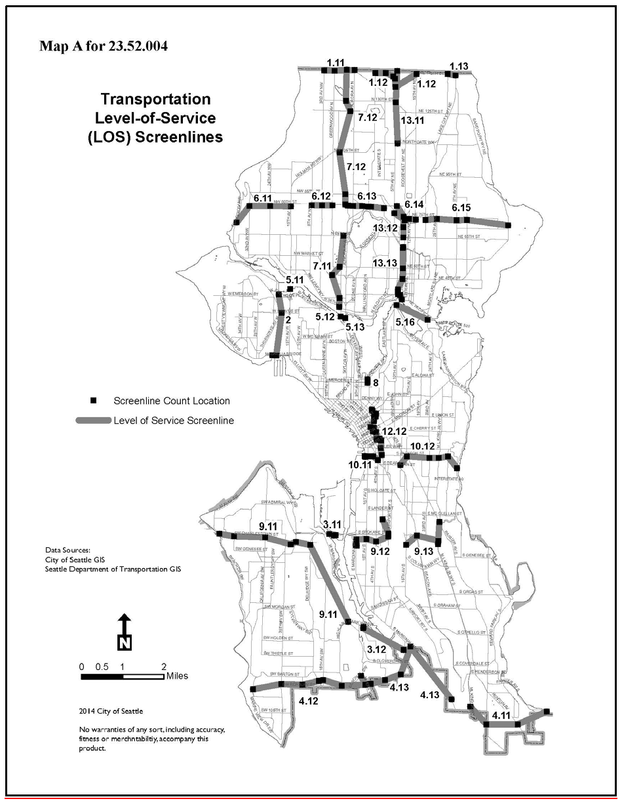

Map A forTransportation Level-of-Service (LOS) Screenlines

<table>
<tr>
<td>Table A for 23.52.004Transportation Level-of-Service (LOS) Standards</td>
</tr>
<tr>
<td>ScreenlineNumber</td>
<td>Screenline Location</td>
<td>Span of Streets</td>
<td>Direction</td>
<td>LOS Standard</td>
</tr>
<tr>
<td>1.11</td>
<td>North City Limit</td>
<td>3rd Ave. NW to</td>
<td>NB</td>
<td>1.20</td>
</tr>
<tr>
<td></td>
<td></td>
<td>Aurora Ave. N</td>
<td>SB</td>
<td></td>
</tr>
<tr>
<td>1.12</td>
<td>North City Limit</td>
<td>Meridian Ave. N to</td>
<td>NB</td>
<td>1.20</td>
</tr>
<tr>
<td></td>
<td></td>
<td>15th Ave. NE</td>
<td>SB</td>
<td></td>
</tr>
<tr>
<td>1.13</td>
<td>North City Limit</td>
<td>30th Ave. NE to</td>
<td>NB</td>
<td>1.20</td>
</tr>
<tr>
<td></td>
<td></td>
<td>Lake City Way NE</td>
<td>SB</td>
<td></td>
</tr>
<tr>
<td>2</td>
<td>Magnolia</td>
<td></td>
<td>EB</td>
<td>1.00</td>
</tr>
<tr>
<td></td>
<td></td>
<td></td>
<td>WB</td>
<td></td>
</tr>
<tr>
<td>3.11</td>
<td>Duwamish River</td>
<td>West Seattle Fwy.</td>
<td>EB</td>
<td>1.20</td>
</tr>
<tr>
<td></td>
<td></td>
<td>and Spokane St.</td>
<td>WB</td>
<td></td>
</tr>
<tr>
<td>3.12</td>
<td>Duwamish River</td>
<td>1st Ave. S and</td>
<td>NB</td>
<td>1.20</td>
</tr>
<tr>
<td></td>
<td></td>
<td>16th Ave. S</td>
<td>SB</td>
<td></td>
</tr>
<tr>
<td>4.11</td>
<td>South City Limit</td>
<td>M.L. King Jr. Way</td>
<td>NB</td>
<td>1.00</td>
</tr>
<tr>
<td></td>
<td></td>
<td>to Rainier Ave. S</td>
<td>SB</td>
<td></td>
</tr>
<tr>
<td>4.12</td>
<td>South City Limit</td>
<td>Marine Dr. SW to</td>
<td>NB</td>
<td>1.00</td>
</tr>
<tr>
<td></td>
<td></td>
<td>Meyers Way S</td>
<td>SB</td>
<td></td>
</tr>
<tr>
<td>4.13</td>
<td>South City Limit</td>
<td>SR 99 to</td>
<td>NB</td>
<td>1.00</td>
</tr>
<tr>
<td></td>
<td></td>
<td>Airport Way S</td>
<td>SB</td>
<td></td>
</tr>
<tr>
<td>5.11</td>
<td>Ship Canal</td>
<td>Ballard Bridge</td>
<td>NB</td>
<td>1.20</td>
</tr>
<tr>
<td></td>
<td></td>
<td></td>
<td>SB</td>
<td></td>
</tr>
<tr>
<td>5.12</td>
<td>Ship Canal</td>
<td>Fremont Bridge</td>
<td>NB</td>
<td>1.20</td>
</tr>
<tr>
<td></td>
<td></td>
<td></td>
<td>SB</td>
<td></td>
</tr>
<tr>
<td>5.13</td>
<td>Ship Canal</td>
<td>Aurora Ave. N</td>
<td>NB</td>
<td>1.20</td>
</tr>
<tr>
<td></td>
<td></td>
<td></td>
<td>SB</td>
<td></td>
</tr>
<tr>
<td>5.16</td>
<td>Ship Canal</td>
<td>University and</td>
<td>NB</td>
<td>1.20</td>
</tr>
<tr>
<td></td>
<td></td>
<td>Montlake Bridges</td>
<td>SB</td>
<td></td>
</tr>
<tr>
<td>6.11</td>
<td>South of NW 80th St.</td>
<td>Seaview Ave. NW</td>
<td>NB</td>
<td>1.00</td>
</tr>
<tr>
<td></td>
<td></td>
<td>to 15th Ave. NW</td>
<td>SB</td>
<td></td>
</tr>
<tr>
<td>6.12</td>
<td>South of N(W) 80th St.</td>
<td>8th Ave. NW to</td>
<td>NB</td>
<td>1.00</td>
</tr>
<tr>
<td></td>
<td></td>
<td>Greenwood Ave. N</td>
<td>SB</td>
<td></td>
</tr>
<tr>
<td>6.13</td>
<td>South of N(E) 80th St.</td>
<td>Linden Ave. N to</td>
<td>NB</td>
<td>1.00</td>
</tr>
<tr>
<td></td>
<td></td>
<td>1st Ave. NE</td>
<td>SB</td>
<td></td>
</tr>
<tr>
<td>6.14</td>
<td>South of NE 80th St.</td>
<td>5th Ave. NE to</td>
<td>NB</td>
<td>1.00</td>
</tr>
<tr>
<td></td>
<td></td>
<td>15th Ave. NE</td>
<td>SB</td>
<td></td>
</tr>
<tr>
<td>6.15</td>
<td>South of NE 80th St.</td>
<td>20th Ave. NE to</td>
<td>NB</td>
<td>1.00</td>
</tr>
<tr>
<td></td>
<td></td>
<td>Sand Point Way NE</td>
<td>SB</td>
<td></td>
</tr>
<tr>
<td>7.11</td>
<td>West of Aurora Ave.</td>
<td>Fremont Pl. N to</td>
<td>EB</td>
<td>1.00</td>
</tr>
<tr>
<td></td>
<td></td>
<td>N 65th St.</td>
<td>WB</td>
<td></td>
</tr>
<tr>
<td>7.12</td>
<td>West of Aurora Ave.</td>
<td>N 80th St. to</td>
<td>EB</td>
<td>1.00</td>
</tr>
<tr>
<td></td>
<td></td>
<td>N 145th St.</td>
<td>WB</td>
<td></td>
</tr>
<tr>
<td>8</td>
<td>South of Lake Union</td>
<td></td>
<td>EB</td>
<td>1.20</td>
</tr>
<tr>
<td></td>
<td></td>
<td></td>
<td>WB</td>
<td></td>
</tr>
<tr>
<td>9.11</td>
<td>South of Spokane St.</td>
<td>Beach Dr. SW to</td>
<td>NB</td>
<td>1.00</td>
</tr>
<tr>
<td></td>
<td></td>
<td>W Marginal Way SW</td>
<td>SB</td>
<td></td>
</tr>
<tr>
<td>9.12</td>
<td>South of Spokane St.</td>
<td>E Marginal Way S to</td>
<td>NB</td>
<td>1.00</td>
</tr>
<tr>
<td></td>
<td></td>
<td>Airport Way S</td>
<td>SB</td>
<td></td>
</tr>
<tr>
<td>9.13</td>
<td>South of Spokane St.</td>
<td>15th Ave. S to</td>
<td>NB</td>
<td>1.00</td>
</tr>
<tr>
<td></td>
<td></td>
<td>Rainier Ave. S</td>
<td>SB</td>
<td></td>
</tr>
<tr>
<td>10.11</td>
<td>South of S Jackson St.</td>
<td>Alaskan Way S to</td>
<td>NB</td>
<td>1.00</td>
</tr>
<tr>
<td></td>
<td></td>
<td>4th Ave. S</td>
<td>SB</td>
<td></td>
</tr>
<tr>
<td>10.12</td>
<td>South of S Jackson St.</td>
<td>12th Ave. S to</td>
<td>NB</td>
<td>1.00</td>
</tr>
<tr>
<td></td>
<td></td>
<td>Lakeside Ave. S</td>
<td>SB</td>
<td></td>
</tr>
<tr>
<td>12.12</td>
<td>East of CBD</td>
<td></td>
<td>EB</td>
<td>1.20</td>
</tr>
<tr>
<td></td>
<td></td>
<td></td>
<td>WB</td>
<td></td>
</tr>
<tr>
<td>13.11</td>
<td>East of 1-5</td>
<td>NE Northgate Way to</td>
<td>EB</td>
<td>1.00</td>
</tr>
<tr>
<td></td>
<td></td>
<td>NE 145th St.</td>
<td>WB</td>
<td></td>
</tr>
<tr>
<td>13.12</td>
<td>East of 1-5</td>
<td>NE 65th St. to</td>
<td>EB</td>
<td>1.00</td>
</tr>
<tr>
<td></td>
<td></td>
<td>NE 80th St.</td>
<td>WB</td>
<td></td>
</tr>
<tr>
<td>13.13</td>
<td>East of 1-5</td>
<td>NE Pacific St. to</td>
<td>EB</td>
<td>1.00</td>
</tr>
<tr>
<td></td>
<td></td>
<td>NE Ravenna Blvd.</td>
<td>WB</td>
<td></td>
</tr>
</table>

##### 23.52.006 - Effect of not meeting transportation concurrency LOS standards.

If a proposed use or development does not meet the LOS standards at one (1) or more applicable screenline(s), the proposed use or development may be approved if the Director concludes that an improvement(s) will be completed and/or a strategy(ies) will be implemented that will result in the proposed use or development meeting the LOS standard(s) at all applicable screenline(s) at the time of development, or that a financial commitment is in place to complete the improvement(s) and/or implement the strategy(ies) within six (6) years. Eligible improvements or strategies may be funded by the City, by other government agencies, by the applicant, or by another person or entity.

#### Subchapter II - Transportation Impact Mitigation
##### 23.52.008 - Transportation impact mitigation

For all other development the Director shall determine the scope and level of detail of analysis based on the probable impacts and/or scale of the proposed development. The analysis may include the elements identified above or other elements as determined by the Director.

1. Applicability. The requirements of this Section 23.52.008 apply to proposed new development as described in Table A for 23.52.008. Proposed new development that is subject to SEPA environmental review per Chapter 25.05 is exempt from Subchapter II of this Chapter 23.52.
2. Impact analysis required. Applicants for proposed development shall prepare and submit with the development permit application an analysis of potential transportation impacts that may result from the proposed development. For development containing more than 50 dwelling units or 12,000 square feet of non-residential floor area or both, the analysis must contain the following information and analysis:

    1. Number of additional daily and peak hour vehicular trips;
    2. Likely distribution of project traffic and effects on traffic operations;
    3. Availability and expected usage of transit;
    4. Existing vehicular, pedestrian, and bicycle conditions, including access and connections to transit and bicycle facilities; and
    5. Accident history.
3. Impact mitigation. Based upon the results of the transportation impact analysis the Director may condition permit approval, as a Type I decision, to mitigate or prevent transportation impacts.

    1. Except as provided by subsection 23.52.008.C.2, required mitigation may include, but is not limited to:

        1. changes in access;
        2. changes in the location, number and size of curb cuts and driveways;
        3. provision of transit incentives, including transit pass subsidies;
        4. bicycle parking, and shower facilities for bicycle commuters;
        5. signage, including wayfinding;
        6. improvements to vehicular, pedestrian and bicycle traffic facilities or operations including signalization, turn channelization, right-of-way dedication, street widening, pedestrian and bicycle facilities improvements, and lighting;
        7. transportation management plans;
        8. parking management strategies including, but not limited to, unbundling parking from building-space leases, reserved parking spaces for vanpools, and reduction in the amount of parking to be provided; and
        9. participation in a transportation mitigation payment program or transportation management association, where available.
    2. Mitigation that may be required for residential projects in downtown zones or the residential portion of mixed use projects in downtown zones is limited to:

        1. signage, including wayfinding;
        2. provision of information on transit and ride-sharing programs; and
        3. bicycle parking.

### Chapter 23.53 - REQUIREMENTS FOR STREETS, ALLEYS, AND EASEMENTS

Sections:

#### 23.53.004 - Requirements and design criteria

Where, because of specific site conditions, the requirements of this Chapter 23.53 do not protect public health, safety, and welfare, the Director of Transportation and the Director of the Seattle Department of Construction and Inspections together may impose different or additional right-of-way improvement requirements consistent with the Right-of-Way Improvements Manual.

#### 23.53.005 - Access to lots

1. Street or private easement abutment required

    1. For residential uses, at least 10 feet of a lot line shall abut a street or a private permanent vehicle access easement meeting the standards of Section 23.53.025, or the provisions of subsection 23.53.025.F for pedestrian access easements shall be met.
    2. For non-residential uses that do not provide parking, at least 5 feet of a lot line shall abut a street or a private permanent vehicle access easement meeting the standards of Section 23.53.025, or the provisions of subsection 23.53.025.F for pedestrian access easements to residential uses shall be met.
    3. For non-residential uses and live-work units that provide parking, an amount of lot line sufficient to provide the required driveway width shall abut a street, or an alley improved to the standards of Section 23.53.030; or a private permanent vehicle access easement to a street meeting the standards of Section 23.53.025. If no vehicular access is required or provided, then pedestrian access meeting the provisions of subsection 23.53.025.F for pedestrian access easements to residential uses shall be met.
2. New Easements. When a new private easement is proposed for vehicular access to a lot, the Director may instead require access by a street when one (1) or more of the following conditions exist:

    1. Where access by easement would compromise the goals of the Land Use Code to provide for adequate light, air and usable open space between structures;
    2. If the improvement of a dedicated street is necessary or desirable to facilitate adequate water supply for domestic water purposes or for fire protection, or to facilitate adequate storm drainage;
    3. If improvement of a dedicated street is necessary or desirable in order to provide on-street parking for overflow conditions;
    4. Where it is demonstrated that potential safety hazards would result from multiple access points between existing and future developments onto a roadway without curbs and with limited sight lines;
    5. If the dedication and improvement of a street would provide better and/or more identifiable access for the public or for emergency vehicles; or
    6. Where a potential exists for extending the street system.

#### 23.53.006 - Pedestrian access and circulation

1. General requirements. Pedestrian access and circulation are required on all streets in all zones as set forth in this Section 23.53.006. Pedestrian access and circulation improvements shall meet the standards in the Right-of-Way Improvements Manual for sidewalks and pedestrian walkways. The regulations in this Section 23.53.006 are not intended to preclude the use of Chapter 25.05, the Seattle SEPA Rules, to mitigate adverse environmental impacts.
2. Dedication of New Streets. Sidewalks and curbs are required when new streets are dedicated.
3. Within urban centers and urban villages. Within urban centers and urban villages, sidewalks are required whenever new lots are created through the platting process, including full and short subdivisions and unit lot subdivisions, or whenever development is proposed that abuts any existing street without a sidewalk, in any zone, except as specified in subsection 23.53.006.F.
4. Outside Urban Centers and Urban Villages. Outside of Urban Centers and Urban Villages, sidewalks are required on an existing street in any of the following circumstances, except as provided in subsection 23.53.006.F

    1. In any zone with a pedestrian designation, sidewalks are required if new lots are created through the platting process including full and short subdivisions and unit lot subdivisions, and if development is proposed.
    2. On streets designated on Map A for 23.50.016, sidewalks are required if new lots are created through the platting process, including full and short subdivisions and unit lot subdivisions, and if development is proposed. Sidewalks are required only for the portion of the lot that abuts the designated street.
    3. On arterials, except in IG1 and IG2 zones and on lots in IB zones that are not directly across the street from or abutting a lot in a residential or commercial zone, sidewalks are required if new lots are created through the platting process, including full and short subdivisions and unit lot subdivisions, and if development is proposed. Sidewalks are required only for the portion of the lot that abuts the arterial.
    4. In SF and LR1 zones, sidewalks are required if ten or more lots are created through the platting process, including full and short subdivisions and unit lot subdivisions, or if ten or more dwelling units are developed.
    5. Outside of SF and LR1 zones, except in IG1 and IG2 zones and on lots in IB zones that are not directly across the street from or abutting lot in a residential or commercial zone, sidewalks are required if six or more lots are created through the platting process, including full and short subdivisions and unit lot subdivisions, or if six or more dwelling units are developed.
    6. In all zones, except IG1 and IG2 zones and on lots in IB zones that are not directly across the street from or abutting a lot in a residential or commercial zone, sidewalks are required if the following nonresidential uses are developed:

        1. 750 square feet or more of gross floor area of major and minor vehicle repair uses and multipurpose retail sales; or
        2. 4,000 square feet or more of nonresidential uses not listed in subsection 23.53.006.D.6.a.
5. Requirements for Pedestrian Walkways in Certain Industrial Zones. In IG1 and IG2 zones, and on lots in IB zones that are not directly across the street from or abutting lot in a residential or commercial zone, whenever development is proposed on existing streets that do not have curbs, a pedestrian walkway is required, except as provided in subsection 23.53.006.F.
6. Exceptions. The following exceptions to pedestrian access and circulation requirements and standards apply:

    1. Projects exempt from requirements. Pedestrian access and circulation improvements are not required for the following types of projects:

        1. changes of use;
        2. alterations to existing structures;
        3. additions to existing structures that are exempt from environmental review;
        4. construction of a detached structure accessory to a single-family dwelling unit located in any zone, if the property owner enters into a no-protest agreement, as authorized by RCW 35.43, to future pedestrian access and circulation improvements and that agreement is recorded with the King County Recorder;
        5. construction of a single-family dwelling unit on a lot in any zone, if the property owner enters into a no-protest agreement, as authorized by RCW 35.43, to future pedestrian access and circulation improvements and that agreement is recorded with the King County Recorder, and if at least one of the following conditions is met:

            1. the lot is located on a block front where there are no existing pedestrian access and circulation improvements within 100 feet of the lot; or
            2. construction of pedestrian access and circulation improvements is not necessary because, for example, the existing right-of-way has suitable width and surface treatment for pedestrian use; or the existing right-of-way has a limited amount of existing and potential vehicular traffic; or the Director anticipates limited, if any, additional development near the lot because the development near the lot is at or near zoned capacity under current zoning designations.
        6. expansions of surface parking, outdoor storage, outdoor sales and outdoor display of rental equipment of less than 20 percent of the parking, storage, sales or display area, or number of parking spaces;
        7. in IG1 and IG2 zones, and on lots in IB zones that are not directly across the street from or abutting a lot in a residential or commercial zone, the addition of:

            1. fewer than ten artist's studio dwellings;
            2. less than 750 square feet of gross floor area of major and minor vehicle repair uses and multipurpose retail sales; and
            3. Less than 4,000 square feet of gross floor area of non-residential uses not listed in subsection 23.53.006.F.1.g.2; and
        8. construction of a new non-residential structure of up to 4,000 square feet of gross floor area if the structure is at least 50 feet from any lot line abutting an existing street that does not have pedestrian access and circulation improvements.
    2. Waiver or Modification of Pedestrian Access and Circulation Requirements.

        1. The Director, in consultation with the Director of Transportation, may waive or modify pedestrian access and circulation requirements when one or more of the following conditions are met. The waiver or modification shall provide the minimum relief necessary to accommodate site conditions while maximizing pedestrian access and circulation.

            1. Location in an environmentally critical area or buffer makes installation of a sidewalk impractical or undesirable;
            2. The existence of a bridge, viaduct or structure such as a substantial retaining wall in proximity to the project site makes installation of a sidewalk impractical or undesirable;
            3. Sidewalk construction would result in undesirable disruption of existing drainage patterns, or disturbance to or removal of natural features such as significant trees or other valuable and character-defining mature vegetation; or
            4. Sidewalk construction would preclude vehicular access to the lot, for example on project sites where topography would render driveway access in excess of the maximum 20 percent slope.
    3. Deviation from Sidewalk Standards. The Director of Transportation may grant a deviation from sidewalk standards specified in the Right-of-Way Improvements Manual through the Deviation Request Process in order to address environmental and sustainability issues through the use of an alternative sidewalk design and/or materials.
    4. Notwithstanding any provision of Section 23.76.026, the applicant for a Master Use Permit or a building permit to which the Land Use Code in effect prior to the effective date of the ordinance enacting this subsection F.4 applies may, by written election, use the exemptions in subsections 23.53.006.F.1, F.2, and F.3.

#### 23.53.010 - Improvement requirements for new streets in all zones

Table Afor

<table>
<tr>
<td>Zone Category</td>
<td>RequiredRight-of-WayWidth</td>
</tr>
<tr>
<td>1. SF, LR1, NC1</td>
<td>50 feet</td>
</tr>
<tr>
<td>2. LR2, LR3, NC2</td>
<td>56 feet</td>
</tr>
<tr>
<td>3. MR, HR, NC3, C1, C2, SCM, IB, IC</td>
<td>60 feet</td>
</tr>
<tr>
<td>4. IG1, IG2</td>
<td>66 feet</td>
</tr>
</table>

1. If a block is split into more than one zone, the required right-of-way width is determined based on the requirement in Table A for Section 23.53.010 for the zone category with the most frontage. If the zone categories have equal frontage, the one with the wider requirement shall be used to determine the minimum right-of-way width.
2. Exceptions to required right-of-way widths. The Director, after consulting with the Director of Transportation, may reduce the required right-of-way width for a new street if its location in an environmentally critical area or buffer, disruption of existing drainage patterns, or the presence of natural features such as significant trees makes the required right-of-way width impractical or undesirable.

1. General Requirements. New streets created through the platting process or otherwise dedicated shall meet the requirements of this chapter and the Right-of-Way Improvements Manual.
2. Required right-of-way widths for new streets.

    1. Arterial and downtown streets. New streets located in downtown zones, and new arterials, shall be designed according to the Right-of-Way Improvements Manual.
    2. Nonarterials not in downtown zones.

        1. The required right-of-way widths for new nonarterial streets not located in downtown zones shall be as shown on Table A for Section 23.53.010:

#### 23.53.015 - Improvement requirements for existing streets in residential and commercial zones

Table A for:Minimum Right-of-Way Widthsfor Existing Nonarterial Streets

<table>
<tr>
<td>Zone Category</td>
<td>Required Right-of-Way Width</td>
</tr>
<tr>
<td>1.</td>
<td>SF, LR1, LR2 and NC1 zones; and NC2 zones with a maximum height limit of 40 feet or less</td>
<td>40 feet</td>
</tr>
<tr>
<td>2.</td>
<td>LR3, MR, HR, NC2 zones with height limits of more than 40 feet, NC3, C1, C2 and SM zones</td>
<td>52 feet</td>
</tr>
</table>

1. If a block is split into more than one zone, the required right-of-way width shall be determined based on the requirements in Table A for 23.53.015 for the zone category with the most frontage. If the zone categories have equal frontage, the minimum right-of-way width is 52 feet.

1. General requirements

    1. If new lots are proposed to be created, or if any type of development is proposed in residential or commercial zones, existing streets abutting the lot(s) are required to be improved in accordance with this Section 23.53.015 and Section 23.53.006, Pedestrian access and circulation. A setback from the lot line, or dedication of right-of-way, may be required to accommodate the improvements. One or more of the following types of improvements may be required under this Section 23.53.015:

        1. Pavement;
        2. Curb installation;
        3. Drainage;
        4. Grading to future right-of-way grade;
        5. Design of structures to accommodate future right-of-way grade;
        6. No-protest agreements; and
        7. Planting of street trees and other landscaping.
    2. Subsection 23.53.015.D contains exceptions from the standard requirements for street improvements, including exceptions for streets that already have curbs, projects that are smaller than a certain size, and for special circumstances, such as location in an environmentally critical area or buffer.
    3. Off-site improvements, such as provision of drainage systems or fire access roads, shall be required pursuant to the authority of this Code or other ordinances to mitigate the impacts of development.
    4. Detailed requirements for street improvements are located in the Right-of-Way Improvements Manual.
    5. The regulations in this Section 23.53.015 are not intended to preclude the use of Chapter 25.05 of the Seattle Municipal Code, the Seattle SEPA Ordinance, to mitigate adverse environmental impacts.
    6. Minimum right-of-way widths.

        1. Arterials. The minimum right-of-way widths for arterials designated on the Arterial street map, Section 11.18.010, are as specified in the Right-of-Way Improvements Manual.
        2. Nonarterial streets.

            1. The minimum right-of-way width for an existing street that is not an arterial designated on the Arterial street map, Section 11.18.010, is as shown on Table A for 23.53.015.
2. Improvements to Arterial Streets. Except as provided in Subsection 23.53.015.D, arterials shall be improved according to the following requirements:

    1. If a street is designated as an arterial on the Arterial street map, Section 11.18.010, a paved roadway with a curb and pedestrian access and circulation as required by Section 23.53.006, drainage facilities, and any landscaping required by the zone in which the lot is located shall be provided in the portion of the street right-of-way abutting the lot, as specified in the Right-of-Way Improvements Manual.
    2. If necessary to accommodate the right-of-way and roadway widths specified in the Right-of-Way Improvements Manual, dedication of right-of-way is required.
3. Improvements to Non-arterial Streets. Except as provided in subsection D of this section, non-arterial streets shall be improved according to the following requirements:

    1. Non-arterial Streets With Right-of-Way Greater Than or Equal to the Minimum Right-of-Way Width.

        1. Improvement requirements. When an existing non-arterial street right-of-way is greater than or equal to the minimum right-of-way width established in subsection A6, a paved roadway with pedestrian access and circulation as required by 23.53.006, drainage facilities, and any landscaping required by the zone in which the lot is located shall be provided, as specified in the Right-of-Way Improvements Manual.
        2. Fire Access. If the lot does not have vehicular access from a street or private easement that meets the regulations for fire access roads in Chapter 10 of the Seattle Fire Code, such access shall be provided. When an existing street does not meet these regulations, the Chief of the Fire Department may approve an alternative that provides adequate emergency vehicle access.
        3. Dead-end Streets. Streets that form a dead end at the property to be developed shall be improved with a cul-de-sac or other vehicular turnaround in accordance with the Right-of-Way Improvements Manual. The Director, in consultation with the Director of Transportation, shall determine whether the street has the potential for being extended or whether it forms a dead end because of topography and/or the layout of the street system.
    2. Non-arterial Streets With Less Than the Minimum Right-of-Way Width.

        1. Dedication Requirement. When an existing nonarterial street has less than the minimum right-of-way width established in subsection A6 of this section, dedication of additional right-of-way equal to half the difference between the current right-of-way width and the minimum right-of-way width established in subsection A6 of this section is required; provided, however, that if right-of-way has been dedicated since 1982, other lots on the block shall not be required to dedicate more than that amount of right-of-way.
        2. Improvement Requirement. A paved roadway with pedestrian access and circulation as required by 23.53.006, drainage facilities and any landscaping required by the zone in which the lot is located shall be provided in the portion of the street right-of-way abutting the lot, as specified in the Right-of-Way Improvements Manual.
        3. Fire Access. If the lot does not have vehicular access from a street or private easement that meets the regulations for fire access roads in Chapter 10 of the Seattle Fire Code, such access shall be provided. When an existing street does not meet these regulations, the Chief of the Fire Department may approve an alternative that provides adequate emergency vehicle access.
        4. Dead-end Streets. Streets that form a dead end at the property to be developed shall be improved with a cul-de-sac or other vehicular turnaround as specified in the Right-of-Way Improvements Manual. The Director, in consultation with the Director of Transportation, shall determine whether the street has the potential for being extended or whether it forms a dead end because of topography and/or the layout of the street system.
4. Exceptions

    1. Streets with existing curbs

        1. Streets with right-of-way greater than or equal to the minimum right-of-way width. If a street with existing curbs abuts a lot and the existing right-of-way is greater than or equal to the minimum width established in subsection 23.53.015.A.6, but the roadway width is less than the minimum established in the Right-of-Way Improvements Manual, the following requirements shall be met:

            1. All structures on the lot shall be designed and built to accommodate the grade of the future street improvements.
            2. A no-protest agreement to future street improvements is required, as authorized by chapter 35.43 RCW. The agreement shall be recorded with the King County Recorder.
            3. Pedestrian access and circulation is required as specified in Section 23.53.006.
        2. Streets with less than the minimum right-of-way width. If a street with existing curbs abuts a lot and the existing right-of-way is less than the minimum width established in subsection 23.53.015.A.6, the following requirements shall be met:

            1. Setback requirement. A setback equal to half the difference between the current right-of-way width and the minimum right-of-way width established in subsection 23.53.015.A.6 is required; provided, however, that if a setback has been provided under this provision, other lots on the block shall provide the same setback. In all residential zones except Highrise zones, an additional 3 foot setback is also required. The area of the setback may be used to meet any development standard, except that required parking may not be located in the setback. Underground structures that would not prevent the future widening and improvement of the right-of-way may be permitted in the required setback by the Director after consulting with the Director of Transportation. Encroachments into this setback shall not be considered structural building overhangs, but the encroachment is limited to the standards set forth in Section 23.53.035.
            2. Grading requirement. If a setback is required, all structures on the lot shall be designed and built to accommodate the grade of the future street, as specified in the Right-of-Way Improvements Manual.
            3. No-protest agreement requirement. A no-protest agreement to future street improvements is required, as authorized by chapter 35.43 RCW. The agreement shall be recorded with the King County Recorder.
            4. Pedestrian access and circulation is required as specified in Section 23.53.006.
    2. Projects with reduced improvement requirements.

        1. One or two dwelling units. If no more than two new dwelling units are proposed to be constructed, or no more than two new single-family zoned lots are proposed to be created, the following requirements shall be met:

            1. If there is no existing hard-surfaced roadway, a crushed-rock roadway at least 16 feet in width is required, as specified in Director's Rule 22-2005, Right-of-Way Improvements Manual.
            2. All structures on the lot(s) shall be designed and built to accommodate the grade of the future street improvements.
            3. A no-protest agreement to future street improvements is required, as authorized by RCW Chapter 35.43. The agreement shall be recorded with the King County Recorder.
            4. Pedestrian access and circulation is required as specified in by Section 23.53.006.
        2. Other projects with reduced requirements. The types of projects listed in this subsection 23.53.015.D.2.b are exempt from right-of-way dedication requirements and are subject to the street improvement requirements of this subsection 23.53.015.D.2.b, except as waived or modified pursuant to subsection 23.53.015.D.3:

            1. Types of projects.

                1. Proposed developments that contain more than two but fewer than ten units in SF, RSL, and LR1 zones, or fewer than six residential units in all other zones, or proposed short plats in which no more than two additional lots are proposed to be created, except as provided in Section 23.53.015.D.2.a;
                2. The following uses if they are smaller than 750 square feet of gross floor area: major and minor vehicle repair uses, and multipurpose retail sales uses;
                3. Non-residential structures that have less than 4,000 square feet of gross floor area and that do not contain uses listed in subsection 23.53.015.D.2.b.1.b that are larger than 750 square feet;
                4. Structures containing a mix of residential uses and either nonresidential uses or live-work units, if there are fewer than ten units in SF, RSL, and LR1 zones, or fewer than six residential units in all other zones, and the square footage of nonresidential use is less than specified in subsections 23.53.D.2.b.1).b) and D.2.b.1).c);
                5. Remodeling and use changes within existing structures;
                6. Additions to existing structures that are exempt from environmental review; and
                7. Expansions of surface parking, outdoor storage, outdoor sales or outdoor display of rental equipment of less than 20 percent of the parking, storage, sales or display area or number of parking spaces.
            2. Paving requirement. For the types of projects listed in subsection 23.53.015.D.2.b.1, the streets abutting the lot shall have a hard-surfaced roadway at least 18 feet wide. If there is not an 18 foot wide hard-surfaced roadway, the roadway shall be paved to a width of at least 20 feet from the lot to the nearest hard-surfaced street meeting this requirement, or 100 feet, whichever is less. Streets that form a dead end at the property to be developed shall be improved with a cul-de-sac or other vehicular turnaround as specified in the Right-of-Way Improvements Manual. As a Type 1 decision, the Director, after consulting with the Director of Transportation, shall determine whether the street has the potential for being extended or whether it forms a dead end because of topography and/or the layout of the street system.
            3. Other requirements. The requirements of subsection 23.53.015.D.1.b shall also be met.
    3. Exceptions from required street improvements. As a Type 1 decision, the Director, in consultation with the Director of Transportation, may waive or modify the requirements for paving and drainage, dedication, setbacks, grading, no-protest agreements, landscaping, and curb installation if one or more of the following conditions are met. The waiver or modification shall provide the minimum relief necessary to accommodate site conditions while maximizing access and circulation.

        1. Location in an environmentally critical area or buffer, disruption of existing drainage patterns, or removal of natural features such as significant trees or other valuable and character-defining mature vegetation makes widening and/or improving the right-of-way impractical or undesirable.
        2. The existence of a bridge, viaduct or structure such as a substantial retaining wall in proximity to the project site makes widening and/or improving the right-of-way impractical or undesirable.
        3. Widening the right-of-way and/or improving the street would adversely affect the character of the street, as it is defined in an adopted neighborhood plan or adopted City plan for green streets, boulevards, or other special rights-of-way, or would otherwise conflict with the stated goals of such a plan.
        4. Widening and/or improving the right-of-way would preclude vehicular access to an existing lot.
        5. Widening and/or improving the right-of-way would make building on a lot infeasible by reducing it to dimensions where development standards cannot reasonably be met.
        6. One or more substantial principal structures on the same side of the block as the proposed project are located in the area needed for future expansion of the right-of-way and the structure(s)' condition and size make future widening of the remainder of the right-of-way unlikely.
        7. Widening and/or improving the right-of-way is impractical because topography would preclude the use of the street for vehicular access to the lot, for example due to an inability to meet the required 20 percent maximum driveway slope.
        8. Widening and/or improving the right-of-way is not necessary because it is adequate for current and potential vehicular traffic, for example, due to the limited number of lots served by the development or because the development on the street is at zoned capacity.

#### 23.53.020 - Improvement requirements for existing streets in industrial zones

A setback from the property line, or dedication of right-of-way, may be required to accommodate the improvements.

1. Subsection 23.53.020.E of this section contains exceptions from the standard requirements for street improvements, including exceptions for streets that already have curbs, projects that are smaller than a certain size, and for special circumstances, such as location in an environmentally critical area.
2. Off-site improvements such as provision of drainage systems or fire access roads, shall be required pursuant to the authority of this Code or other ordinances to mitigate the impacts of development.
3. Detailed requirements for street improvements are located in the Right-of-Way Improvements Manual.
4. The regulations in this Section 23.53.020 are not intended to preclude the use of Chapter 25.05 of the Seattle Municipal Code, the Seattle SEPA Ordinance, to mitigate adverse environmental impacts.
5. Minimum Right-of-way Widths.

    1. Arterials. The minimum right-of-way widths for arterials designated on the Arterial street map, Section 11.18.010, are as specified in the Right-of-Way Improvements Manual.
    2. Non-arterials.

        1. The minimum right-of-way width for an existing street that is not an arterial designated on the Arterial street map, Section 11.18.010, is as shown on Table A for 23.53.020.
Table Afor

Minimum Right-of-way Widthsfor Existing Nonarterial Streets

<table>
<tr>
<td>Zone Category</td>
<td>Right-of-Way Widths</td>
</tr>
<tr>
<td>1. IB, IC</td>
<td>52 feet</td>
</tr>
<tr>
<td>2. IG1, IG2</td>
<td>56 feet</td>
</tr>
</table>

1. If a block is split into more than one zone, the zone category with the most frontage shall determine the minimum width on Table A for 23.53.020. If the zone categories have equal frontage, the one with the wider requirement shall be used to determine the minimum right-of-way width.

1. General Requirements.

    1. If new lots are created or any type of development is proposed in an industrial zone, existing streets abutting the lot(s) are required to be improved in accordance with Section 23.53.020 and Section 23.53.006, Pedestrian access and circulation. One or more of the following types of improvements may be required by this section:

        1. Pavement;
        2. Curb installation;
        3. Drainage;
        4. Grading to future right-of-way grade;
        5. Design of structures to accommodate future right-of-way grade;
        6. No-protest agreements; and
        7. Planting of street trees and other landscaping.
2. Improvements on Designated Streets in All Industrial Zones. In all industrial zones, except as provided in subsection 23.53.020.E, if a lot abuts a street designated on the Industrial Streets Landscaping Map, Map A for 23.50.016, the following on-site improvements shall be provided:

    1. Dedication Requirement. If the street right-of-way is less than the minimum width established in subsection 23.53.020.A.6, dedication of additional right-of-way equal to half the difference between the current right-of-way and the minimum right-of-way width established in subsection 23.53.020.A.6 is required; provided, however, that if right-of-way has been dedicated since 1982, other lots on the block are not required to dedicate more than that amount of right-of-way.
    2. Improvement Requirements. A paved roadway with a concrete curb, pedestrian access and circulation as required by Section 23.53.006 and drainage facilities shall be provided in the portion of the street right-of-way abutting the lot, as specified in the Right-of-Way Improvements Manual.
    3. Street Trees.

        1. Street trees shall be provided along designated street frontages. Street trees shall be provided in the planting strip as specified in City Tree Planting Standards.
        2. Exceptions to Street Tree Requirements.

            1. Street trees required by subsection 23.53.020.B.3.a may be located on the lot at least 2 feet from the street lot line instead of in the planting strip if:
            2. Existing trees and/or landscaping on the lot provide improvements substantially equivalent to those required in this Section 23.53.020;
            3. It is not feasible to plant street trees according to City standards. A 5 foot deep landscaped setback area is required along the street property lines and trees shall be planted there. If an on-site landscaped area is already required, the trees shall be planted there if they cannot be placed in the planting strip.
3. General Industrial 1 and 2 (IG1 and IG2) Zones. Except as provided in subsection E of this section, the following improvements shall be required in IG1 and IG2 zones, in addition to the pedestrian access and circulation requirements of Section 23.53.006. Further improvements may be required on streets designated in subsection B of this section.

    1. Setback Requirement. When the right-of-way abutting a lot has less than the minimum width established in subsection A6 of this section, a setback equal to half the difference between the current right-of-way width and the minimum right-of-way width established in subsection A6 of this section is required; provided, however, that if a setback has been provided under this provision, other lots on the block shall provide the same setback. The area of the setback may be used to meet any development standard, except that required parking may not be located in the setback. Underground structures that would not prevent the future widening and improvement of the right-of-way may be permitted in the required setback by the Director after consulting with the Director of Transportation.
    2. Grading Requirement. When an existing street abutting a lot is less than the width established in subsection A6 of this section, all structures shall be designed and built to accommodate the grade of the future street improvements.
    3. Fire Access. If the lot does not have vehicular access from a street or private easement that meets the regulations for fire access roads in Chapter 10 of the Seattle Fire Code, such access shall be provided. When an existing street does not meet these regulations, the Chief of the Fire Department may approve an alternative that provides adequate emergency vehicle access.
    4. Dead-end Streets. Streets that form a dead end at the property to be developed shall be improved with a cul-de-sac or other vehicular turnaround as specified in the Right-of-Way Improvements Manual. The Director, after consulting with the Director of Transportation, shall determine whether the street has the potential for being extended or whether it forms a dead end because of topography and/or the layout of the street system.
    5. No-protest Agreement Requirement. When a setback is required by subsection C1, or a pedestrian walkway is required as specified in Section 23.53.006, a no-protest agreement to future street improvements shall be required, as authorized by RCW Chapter 35.43. The agreement shall be recorded with the King County Department of Records and Elections.
4. Industrial Buffer (IB) and Industrial Commercial (IC) Zones. Except as provided in subsection E of this section, the following improvements are required in IB and IC zones, in addition to the pedestrian access and circulation requirements of Section 23.53.006. Further improvements may be required on streets designated in subsection B of this section.

    1. The requirements of this subsection D1 shall apply when projects are proposed on lots in IB zones that are directly across a street from, or that abut, a lot in a residential or commercial zone, and to all projects in IC zones:

        1. Improvements to Arterials.

            1. When a street is designated as an arterial on Exhibit 23.53.015 A, a paved roadway with a curb, pedestrian access and circulation as required by Section 23.53.006, drainage facilities, and any landscaping required by the zone in which the lot is located shall be provided in the portion of the street right-of-way abutting the lot, as specified in the Right-of-Way Improvements Manual.
            2. If necessary to accommodate the right-of-way widths specified in the Right-of-Way Improvements Manual, dedication of right-of-way shall be required.
        2. Improvements to Nonarterial Streets.

            1. Non-arterial Streets With Right-of-way Greater Than or Equal to the Minimum Right-of-Way Width.

                1. Improvement Requirements. When an existing non-arterial street right-of-way is greater than or equal to the minimum right-of-way width established in subsection A6 of this section, a paved roadway with pedestrian access and circulation as required by Section 23.53.006,, drainage facilities, and any landscaping required by the zone in which the lot is located shall be provided in the portion of the street right-of-way abutting the lot, as specified in the Right-of-Way Improvements Manual.
                2. Fire Access. If the lot does not have vehicular access from a street or private easement that meets the regulations for fire access roads in Chapter 10 of the Seattle Fire Code, such access shall be provided. When an existing street does not meet these regulations, the Chief of the Fire Department may approve an alternative that provides adequate emergency vehicle access.
                3. Dead-end Streets. Streets that form a dead end at the property to be developed shall be improved with a cul-de-sac or other vehicular turnaround as specified in the Right-of-Way Improvements Manual. The Director, after consulting with the Director of Transportation, shall determine whether the street has the potential for being extended or whether it forms a dead end because of topography and/or the layout of the street system.
            2. Non-arterial Streets With Less Than the Minimum Right-of-Way Width.

                1. Dedication Requirement. When an existing non-arterial street has less than the minimum right-of-way established in subsection A6 of this section, dedication of additional right-of-way equal to half the difference between the current right-of-way width and the minimum right-of-way width established in subsection A6 of this section is required; provided, however, that if right-of-way has been dedicated since 1982, other lots on the block shall not be required to dedicate more than that amount of right-of-way.
                2. Improvement Requirement. A paved roadway with pedestrian access and circulation as required by Section 23.53.006, drainage facilities, and any landscaping required by the zone in which the lot is located shall be provided in the portion of the street right-of-way abutting the lot, as specified in the Right-of-Way Improvements Manual.
                3. Fire Access. If the lot does not have vehicular access from a street or private easement that meets the regulations for fire access roads in Chapter 10 of the Seattle Fire Code, such access shall be provided. When an existing street does not meet these regulations, the Chief of the Fire Department may approve an alternative that provides adequate emergency vehicle access.
                4. Dead-end Streets. Streets that form a dead end at the property to be developed shall be improved with a cul-de-sac or other vehicular turnaround as specified in the Right-of-Way Improvements Manual. The Director, after consulting with the Director of Transportation, shall determine whether the street has the potential for being extended or whether it forms a dead end because of topography and/or the layout of the street system.
    2. When projects are proposed on lots in IB zones that are not directly across a street from, and do not abut, a lot in a residential or commercial zone, the requirements of subsection C of this section shall be met.
5. Exceptions.

    1. Streets With Existing Curbs.

        1. Streets With Right-of-way Greater Than or Equal to the Minimum Right-of-way Width. When a street with existing curbs abuts a lot, and improvements would be required by subsections B or D of this section, and the existing right-of-way is greater than or equal to the minimum width established in subsection A6 of this section, but the roadway width is less than the minimum established in the Right-of-Way Improvements Manual, the following requirements shall be met:

            1. All structures on the lot shall be designed and built to accommodate the grade of the future street improvements.
            2. A no-protest agreement to future street improvements is required, as authorized by RCW Chapter 35.43. The agreement shall be recorded with the title to the property with the King County Department of Records and Elections.
            3. If there is no sidewalk, a sidewalk shall be constructed, except when an exception set forth in Section 23.53.006 is applicable.
        2. Streets With Less Than the Minimum Right-of-way Width. When a street with existing curbs abuts a lot and the existing right-of-way is less than the minimum width established in subsection A6 of this section, the following requirements shall be met:

            1. Setback Requirement. A setback equal to half the difference between the current right-of-way width and the minimum right-of-way width established in subsection A6 of this section is required; provided, however, that if a setback has been provided under this provision, other lots on the block shall provide the same setback. The area of the setback may be used to meet any development standard, except that required parking may not be located in the setback. Underground structures that would not prevent the future widening and improvements of the right-of-way may be permitted in the required setback by the Director after consulting with the Director of Transportation.
            2. Grading Requirement. When a setback is required, all structures on the lot shall be designed and built to accommodate the grade of the future street, as specified in the Right-of-Way Improvements Manual.
            3. A no-protest agreement to future street improvements is required, as authorized by RCW Chapter 35.43. The agreement shall be recorded with the title to the property with the King County Department of Records and Elections.
            4. If there is no sidewalk, a sidewalk shall be constructed except when an exception set forth in Section 23.53.006 is applicable.
    2. Projects with Reduced Improvement Requirements. The following types of projects are exempt from all dedication and improvement requirements of subsections 23.53.020.B, 23.53.020.C and 23.53.020.D, but shall meet the pedestrian access and circulation requirements specified in Section 23.53.006 and the requirements of subsection 23.53.020.E.1.b if the street right-of-way abutting the lot has less than the minimum right-of-way width established in subsection 23.53.020.A or does not meet the grade of future street improvements.

        1. Structures with fewer than ten artist's studio dwellings;
        2. The following uses when they are smaller than 750 square feet of gross floor area: major and minor vehicle repair uses, and multipurpose retail sales uses;
        3. Nonresidential structures that have less than 4,000 square feet of gross floor area and that do not contain uses listed in subsection 23.53.020.E.2.b that are larger than 750 square feet;
        4. Structures containing a mix of artist's studio dwellings and nonresidential uses, if there are fewer than ten artist's studio dwellings, and the square footage of nonresidential use is less than specified in subsections 23.53.020.E.2.b and 23.53.020.E.2.c;
        5. Remodeling and use changes within existing structures;
        6. Additions to existing structures that are exempt from environmental review; and
        7. Expansions of surface parking, outdoor storage, outdoor sales or outdoor display of rental equipment of less than 20 percent of the parking, storage, sales or display area, or number of parking spaces.
    3. Exceptions from Street Improvement Requirements. The Director, in consultation with the Director of Transportation, may waive or modify the requirements for paving, dedication, setbacks, grading, no-protest agreements, landscaping, and curb installation when it is determined that one (1) or more of the following conditions are met. The waiver or modification shall provide the minimum relief necessary to accommodate site conditions while maximizing access and circulation.

        1. Location in an environmentally critical area or buffer, disruption of existing drainage patterns, or removal of natural features such as significant trees or other valuable and character-defining mature vegetation makes widening and/or improving the right-of-way impractical or undesirable.
        2. The existence of a bridge, viaduct or structure such as a substantial retaining wall in proximity to the project site makes widening and/or improving the right-of-way impractical or undesirable.
        3. Widening the right-of-way and/or improving the street would adversely affect the character of the street, as it is defined in an adopted neighborhood plan or adopted City plan for Green Streets, boulevards, or other special right-of-way, or would otherwise conflict with the stated goals of such a plan.
        4. Widening and/or improving the right-of-way would make building on a lot infeasible by reducing it to dimensions where development standards cannot reasonably be met.
        5. Widening and/or improving the right-of-way would preclude vehicular access to an existing lot.
        6. One (1) or more substantial principal structures on the same side of the block as the proposed project are located in the area needed for future expansion of the right-of-way and the structure(s)' condition and size make future widening of the remainder of the right-of-way unlikely.
        7. Widening and/or improving the right-of-way is impractical because topography would preclude the use of the street for vehicular access to the lot, for example due to an inability to meet the required twenty (20) percent maximum driveway slope.
        8. Widening and/or improving the right-of-way is not necessary because it is adequate for current and potential vehicular traffic, for example, due to the limited number of lots served by the development or because the development on the street is at zoned capacity.

#### 23.53.025 - Access easement standards

If access by easement has been approved by the Director, the easement shall meet the following standards. Surfacing of easements, pedestrian walkways required within easements, and turnaround dimensions shall meet the requirements of the Right-of-Way Improvements Manual.

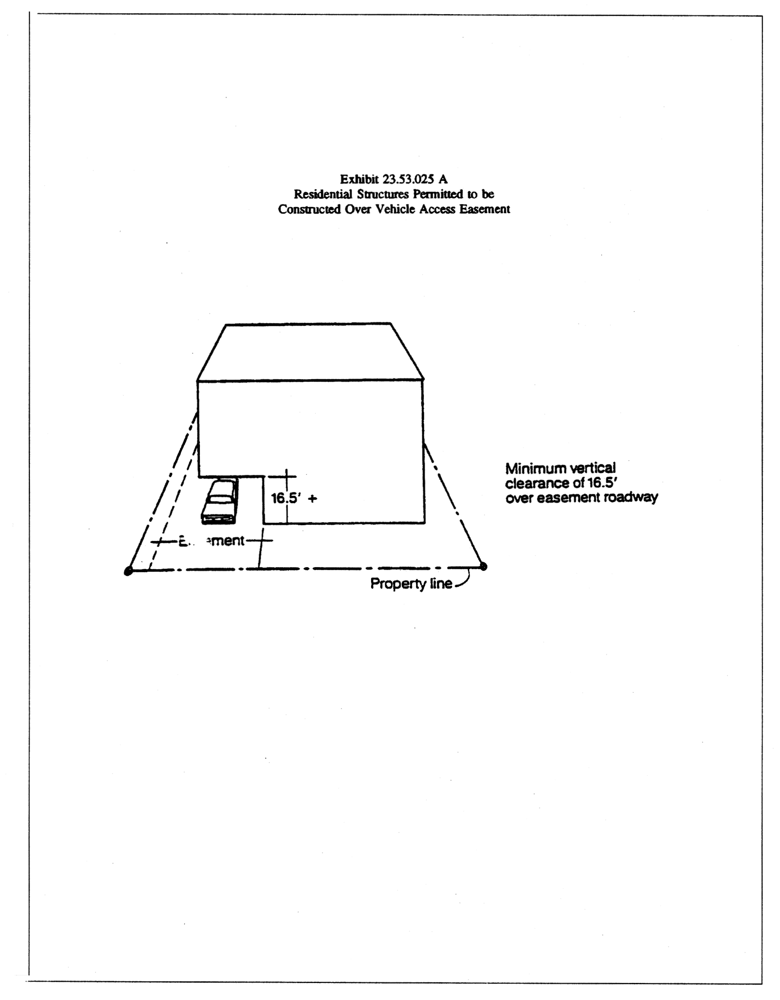

1. Vehicle access easements serving one or two single-family dwelling units or one multifamily residential use with a maximum of two units shall meet the following standards:

    1. Easement width shall be a minimum of 10 feet, or 12 feet if required by the Fire Chief due to distance of the structure from the easement, or a minimum width as needed to meet the driveway standards of subsection 23.54.030.D.1.
    2. No maximum easement length shall be set. If easement length is more than 150 feet, a vehicle turnaround shall be provided.
    3. Curbcut width from the easement to the street shall be the minimum necessary for safety and access.
2. Vehicle Access Easements Serving at Least Three (3) but Fewer Than Five (5) Single-Family Dwelling Units.

    1. Easement width shall be a minimum of twenty (20) feet;
    2. The easement shall provide a hard-surfaced roadway at least twenty (20) feet wide;
    3. No maximum easement length shall be set. If the easement is over six hundred (600) feet long, a fire hydrant may be required by the Director;
    4. A turnaround shall be provided unless the easement extends from street to street;
    5. Curbcut width from the easement to the street shall be the minimum necessary for safety and access.
3. Vehicle Access Easements Serving at Least Five but Fewer Than Ten Single-Family Dwelling Units, or at Least Three but Fewer than Ten Multifamily Dwelling Units.

    1. Easement width, surfaced width, length, turn around and curbcut width shall be as required in subsection 23.53.025.B;
    2. No single-family structure shall be closer than 5 feet to the easement, except that structural features allowed to extend into required yards under Section 23.44.014.D.6 are also allowed to extend into the five-foot setback from an easement.
4. Vehicle Access Easements Serving Ten or more Residential Units.

    1. Easement width shall be a minimum of 32 feet;
    2. The easement shall provide a surfaced roadway at least 24 feet wide, except in the MPC-YT zone, where the minimum surfaced roadway width is 20 feet;
    3. No maximum length shall be set. If the easement is over 600 feet long, a fire hydrant may be required by the Director;
    4. A turnaround shall be provided unless the easement extends from street to street;
    5. Curbcut width from the easement to the street shall be the minimum necessary for safety access;
    6. No single-family structure shall be located closer than 10 feet to an easement;
    7. One pedestrian walkway shall be provided, extending the length of the easement.
5. Vehicle Access Easements Serving Nonresidential or Live-work Uses.

    1. For nonresidential or live-work uses providing fewer than ten (10) parking spaces, the easement shall meet the requirements of subsection C.
    2. For nonresidential or live-work uses providing ten (10) or more parking spaces, the easement shall meet the requirements of subsection D.
6. Pedestrian Access Easements. Where a lot proposed for a residential use abuts an alley but does not abut a street and the provisions of the zone require access by vehicles from the alley, or where the alley access is an exercised option, an easement providing pedestrian access to a street from the lot shall be provided meeting the following standards:

    1. Easement width shall be a minimum of five (5) feet;
    2. Easements serving one (1) or two (2) dwelling units shall provide a paved pedestrian walkway at least three (3) feet wide;
    3. Easements serving three (3) or more dwelling units shall provide a paved pedestrian walkway at least five (5) feet wide;
    4. Easements over one hundred (100) feet in length shall provide lighting at intervals not to exceed fifty (50) feet. Lighting placement shall not exceed fifteen (15) feet in height;
    5. Pedestrian access easements shall not exceed two hundred (200) feet in length.
7. Vertical Clearance Above Easements. When an easement serves fewer than ten (10) residential units and crosses a residentially zoned lot, portions of structures may be built over the easement provided that a minimum vertical clearance of sixteen and one-half (16 ½) feet is maintained above the surface of the easement roadway and a minimum turning path radius in accordance with Section 23.54.030 C is maintained. (See Exhibit 23.53.025 A.)
8. Exceptions From Access Easement Standards. The Director, in consultation with the Fire Chief, may modify the requirements for easement width and surfacing for properties located in environmentally critical areas or their buffers when it is determined that:

    1. Such modification(s) would reduce adverse effects to identified environmentally critical areas or buffers; and
    2. Adequate access and provisions for fire protection can be provided for structures served by the easement.

#### 23.53.030 - Alley improvements in all zones

Table Afor:Width of New Alley Rights-of-Way

<table>
<tr>
<td>Zone Category</td>
<td>Right-of-Way Width</td>
</tr>
<tr>
<td>1.  SF, LR1, NC1</td>
<td>12 feet</td>
</tr>
<tr>
<td>2.  LR2, LR3, NC2</td>
<td>16 feet</td>
</tr>
<tr>
<td>3.  MR, HR, NC3, C1, C2, SM and all Industrial and Downtown zones</td>
<td>20 feet</td>
</tr>
</table>

1. If an alley abuts lots in more than one zone category, the minimum alley width shall be determined based on the requirements in Table A for Section 23.53.030 for the zone category with the most frontage excluding Zone Category 1. If the zone categories have equal frontage, the one with the wider requirement shall be used to determine the minimum alley width.
Table B for:Right-of-Way Width for Alleys Considered to be Improved

<table>
<tr>
<td>Zone Category</td>
<td>Right-of-Way Width</td>
</tr>
<tr>
<td>1.  SF, LR1, LR2, LR3, NC1</td>
<td>10 feet</td>
</tr>
<tr>
<td>2.  MR, HR, NC2</td>
<td>12 feet</td>
</tr>
<tr>
<td>3.  NC3, C1, C2 and SM</td>
<td>16 feet</td>
</tr>
</table>

1. If an alley abuts lots in more than one zone category, the minimum alley width shall be determined based on the requirements in Table B for the zone category with the most frontage excluding Zone Category 1. If Zone Categories 2 and 3 have equal frontage, the minimum alley width shall be 16 feet.
2. Paving. To be considered improved, the alley shall be paved.
Table C for:Required Minimum Right-of-Way Widths for Existing Alleys

<table>
<tr>
<td>Zone Category</td>
<td>Right-of-Way Width</td>
</tr>
<tr>
<td>1.  SF and LR1</td>
<td>No minimum width</td>
</tr>
<tr>
<td>2.  LR2, NC1</td>
<td>12 feet</td>
</tr>
<tr>
<td>3.  LR3, MR, HR, NC2</td>
<td>16 feet</td>
</tr>
<tr>
<td>4.  NC3, C1, C2, SM, all downtown zones</td>
<td>20 feet</td>
</tr>
<tr>
<td>5.  All industrial zones</td>
<td>20 feet</td>
</tr>
</table>

1. If an alley abuts lots in more than one zone category, the minimum alley width shall be determined based on the requirements in Table C for Section 23.53.030 for the zone category with the most frontage excluding Zone Category 1. If the zone categories have equal frontage, the one with the wider requirement shall be used to determine the minimum alley width.

1. General requirements.

    1. The regulations in this Section 23.53.030 are not intended to preclude the use of Chapter 25.05 of the Seattle Municipal Code, the Seattle SEPA Ordinance, to mitigate adverse environmental impacts.
    2. Subsection 23.53.030.G contains exceptions from the standards requirements for alley improvements, including exceptions for projects that are smaller than a certain size and for special circumstances, such as location in an environmentally critical area.
    3. Detailed requirements for alley improvements are located in the Right-of-Way Improvements Manual, which is adopted by joint rule of the Director and the Director of Transportation.
2. New Alleys.

    1. New alleys created through the platting process shall meet the requirements of Subtitle III of this title, Platting Requirements.
    2. The required right-of-way widths for new alleys shall be as shown on Table A for Section 23.53.030.
3. Definition of improved alley. In certain zones, alley access is required if the alley is improved. For the purpose of determining if access is required, the alley will be considered improved if it meets the standards of this subsection 23.53.030.C.

    1. Right-of-way width

        1. The minimum width for an alley to be considered to be improved shall be as shown on Table B for Section 23.53.030.
4. Minimum widths established.

    1. The minimum required width for an existing alley right-of-way shall be as shown on Table C for Section 23.53.030.
5. Existing Alleys That Meet Minimum Width. Except as provided in subsection 23.53.030.G and except for one and two dwelling unit developments that abut an alley that is not improved but is in common usage, if an existing alley meets the minimum right-of-way width established in subsection 23.53.030.D, the following requirements shall be met:

    1. If the alley is used for access to parking spaces, open storage, or loading berths on a lot, the following improvements shall be provided:

        1. For the following types of projects, the entire width of the portion of the alley abutting the lot, and the portion of the alley between the lot and a connecting street, shall be improved to at least the equivalent of a crushed rock surface, according to Director's Rule 22-2005, Right-of-Way Improvements Manual. The applicant may choose the street to which the improvements will be installed. If the alley does not extend from street to street, and the connecting street is an arterial designated on the Arterial street map, Section 11.18.010, either the remainder of the alley shall be improved so that it is passable to a passenger vehicle, or a turnaround shall be provided. The turnaround may be provided by easement.

            1. Residential structures with fewer than ten units;
            2. The following uses if they are smaller than 750 square feet of gross floor area: major and minor vehicle repair uses, and multipurpose retail sales;
            3. Nonresidential structures or structures with one or more live-work units that: (a) have less than 4,000 square feet of gross floor area; and (b) do not contain uses listed in subsection 23.53.030.E.1.a.2 that are larger than 750 square feet;
            4. Structures containing a mix of residential and either nonresidential uses or live-work units, if the residential use is less than ten units, and the total square footage of nonresidential uses and live-work units is less than specified in subsections 23.53.030.E.1.a.2 and E.1.a.3;
            5. Remodeling and use changes within existing structures, if remodeling and use changes require increases to parking spaces, open storage, or loading berths on a lot;
            6. Additions to existing structures that are exempt from environmental review; and
            7. Expansions of a surface parking area or open storage area of less than 20 percent of the parking area, storage area or number of parking spaces.
        2. For projects not listed in subsection 23.53.030.E.1.a, the entire width of the portion of the alley abutting the lot, and the portion of the alley between the lot and a connecting street, shall be paved. The applicant may choose the street to which the pavement will be installed. If the alley does not extend from street to street, and the connecting street is an arterial designated on the Arterial street map, Section 11.18.010, either the remainder of the alley shall be improved so that it is passable to a passenger vehicle, or a turnaround shall be provided. The turnaround may be provided by easement.
    2. If the alley is not used for access, if the alley is not fully improved, all structures shall be designed to accommodate the grade of the future alley improvements, and a no-protest agreement to future alley improvements is required, as authorized by RCW Chapter 35.43. The agreement shall be recorded with the King County Recorder.
6. Existing Alleys Which Do Not Meet the Minimum Width

    1. When an existing alley is used for access to parking spaces, open storage, or loading berths on a lot, and the alley does not meet the minimum width established in subsection 23.53.030.D, except as provided in subsection 23.53.030.G, a dedication equal to half the difference between the current alley right-of-way width and minimum right-of-way width established in subsection 23.53.030.D shall be required; provided, however, that if right-of-way has been dedicated since 1982, other lots on the block shall not be required to dedicate more than that amount of right-of-way. Underground and overhead portions of structures that would not interfere with the functioning of the alley may be allowed by the Director of the Seattle Department of Construction and Inspections after consulting with the Director of Transportation. When existing structures are located in the portion of the lot to be dedicated, that portion of the lot shall be exempt from dedication requirements. The improvements required under subsection 23.53.030.E.1 shall then be installed, depending on the type of project.
    2. When an existing alley is not used for access to parking spaces or loading berths on an abutting lot, but the alley does not meet the minimum width established in subsection 23.53.030.D, except as provided in subsection 23.53.030.G, the following requirements shall be met:

        1. A setback equal to half the distance between the current alley right-of-way width and the minimum right-of-way width established in subsection 23.53.030.D shall be required; provided, however, that if a setback has been provided under this provision, other lots on the block shall provide the same setback. The area of the setback may be used to meet any development standards, except that required parking may not be located in the setback. Underground and overhead structures which would not prevent the future widening and improvement of the right-of-way may be permitted in the required setback by the Director of the Seattle Department of Construction and Inspections after consulting with the Director of Transportation.
        2. All structures shall be designed to accommodate the grade of the future alley right-of-way.
        3. A no-protest agreement to future street improvements shall be required, as authorized by chapter 35.43 RCW. The agreement shall be recorded with the title to the property with the King County Recorder's Office.
7. Exceptions. The Director, after consulting with the Director of the Department of Transportation, may modify or waive the requirements for dedication, paving and drainage, setbacks, grading and no-protest agreements, if it is determined that one (1) or more of the following conditions are met. The Director may require access to be from a street if alley improvements are also waived.

    1. Location in an environmentally critical area or buffer, disruption of existing drainage patterns, or removal of natural features such as significant trees makes widening and/or improving the right-of-way impractical or undesirable;
    2. Widening and/or improving the right-of-way would make a building on a lot infeasible by reducing it to dimensions where development standards cannot reasonably be met;
    3. Widening and/or improving the right-of-way would eliminate alley access to an existing lot;
    4. Widening and/or improving the right-of-way is impractical because topography precludes the use of the alley for vehicular access to the lot;
    5. The alley is in a historic district or special review district, and the Department of Neighborhoods Director finds, after review and recommendation by the appropriate review board, that the widening and/or improvement would be detrimental to the character and goals of the district;
    6. The existence of a bridge, viaduct or structure such as a substantial retaining wall makes widening the right-of-way impractical or undesirable;
    7. Widening the right-of-way would adversely affect the character of the street, as it is defined in an adopted neighborhood plan or adopted City plan for green streets, boulevard, or other special right-of-way, or would otherwise conflict with the stated goals of such a plan;
    8. One (1) or more substantial principal structures on the same side of the block as the proposed project are located in the area needed for future expansion of the right-of-way and the structure(s)' condition and size make future widening of the remainder of the right-of-way unlikely;
    9. Widening and/or improving the right-of-way is not necessary because it is adequate for current and potential pedestrian and vehicular traffic, for example, due to the limited number of lots served by the development or because the development on the right-of-way is at zoned capacity.

#### 23.53.035 - Structural building overhangs and minor architectural encroachments

Structural building overhangs and minor architectural encroachments shall meet the following standards:

1. Minor architectural encroachments. Minor architectural encroachments include overhead horizontal extensions of a purely architectural or decorative character such as cornices, eaves, sills, and belt courses that do not create any interior volume or floor area.

    1. Minor architectural encroachments shall not increase the floor area or the volume of space enclosed by the building.
    2. The maximum vertical dimension of a minor architectural encroachment is 2 feet 6 inches.
    3. The maximum horizontal dimension of a minor architectural encroachment is:

        1. One foot below roof level;
        2. Three feet at roof level; or
        3. if the roof level is 100 feet or higher above the street elevation, more than 3 feet at roof level if the minor architectural encroachment is:

            1. architecturally consistent with the structure;
            2. does not preclude use of the right-of-way for transportation or access purposes as determined in consultation with the Seattle Department of Transportation;
            3. poses no threat to public health and safety.
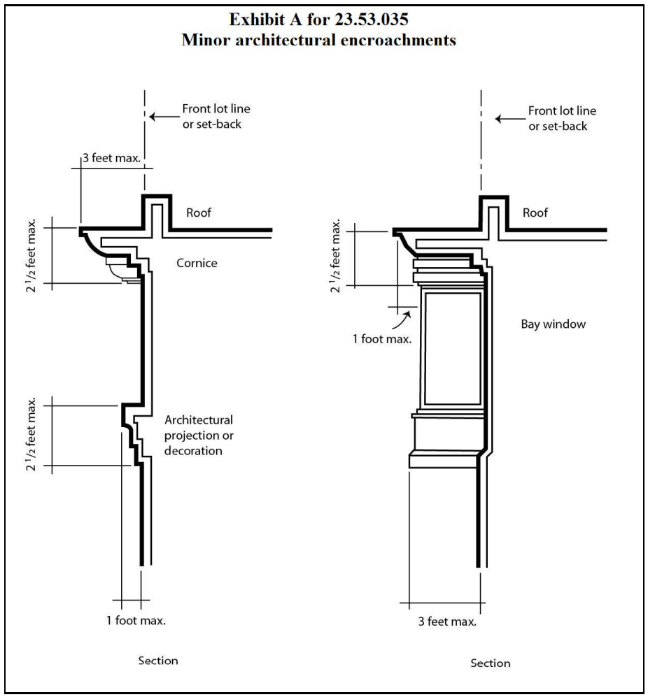

Exhibit A forMinor architectural encroachments

1. Vertical clearance. Clearance to any minor architectural encroachment shall be a minimum of 8 feet above all sidewalk elevations, or 16 feet above all elevations of an alley, or greater when required by other regulations.
2. Structural building overhangs. Structural building overhangs include bay windows, balconies, and other projections into and over public places as defined under Title 15 that exceed the limits of minor architectural encroachments as set forth in subsection 23.53.035.A and that increase either the floor area of the building or the volume of space enclosed by the building above grade.

    1. An annual permit from the Seattle Department of Transportation is required for structural building overhangs.
    2. Structural building overhangs shall be removable per Title 15.
    3. Structural building overhangs shall not be part of the essential building structure and shall not contain building systems, such as plumbing.
    4. Vertical clearance: Clearance to any structural building overhang shall be a minimum of 8 feet above all sidewalk elevations, or 26 feet above all elevations of an alley, or greater if required by other regulations.
    5. Depth: The maximum horizontal projection for a structural building overhang, measured to the furthest exterior element, shall be 3 feet, and the projection shall in no case be closer than 8 feet to the centerline of any alley (see Exhibit B for 23.53.035).
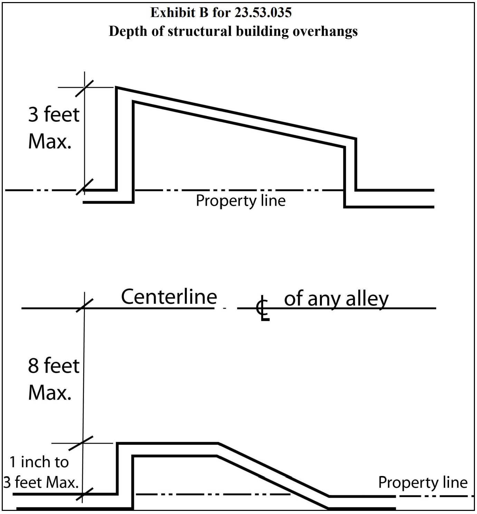

Exhibit B forDepth of structural building overhangs

1. Transparency: The glass areas of each bay window shall be a minimum of 50 percent of the sum of the areas of all the vertical surfaces of the bay window. At least 60 percent of such required glass area for each bay window shall be on the vertical surface most parallel to the property line (see Exhibit C for 23.53.035).
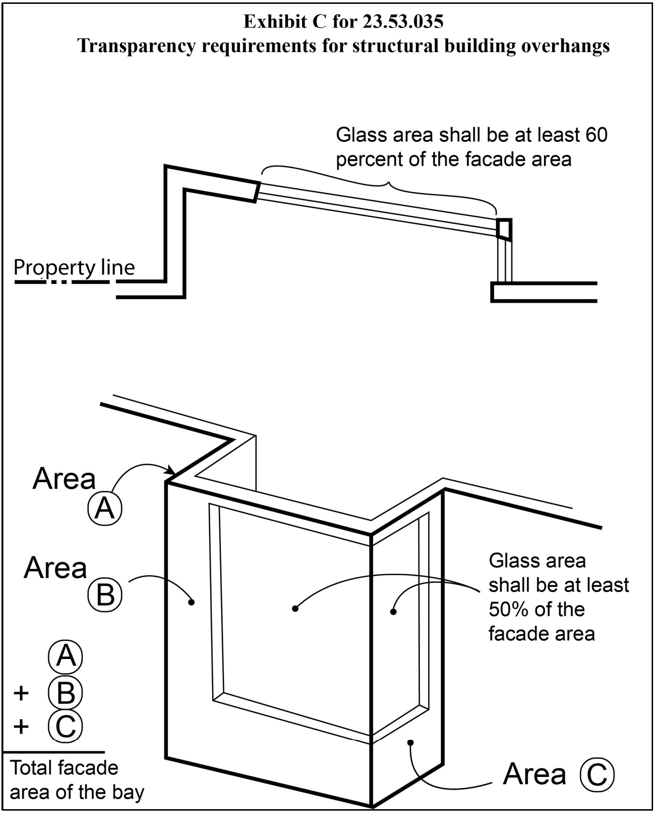

Exhibit C forTransparency requirements for structural building overhangs

1. Length: The maximum length of each structural building overhang shall be 15 feet measured at any location that is beyond the property line. The bay or other projection may be shaped in any way that remains within the 3 foot by 15 foot envelope beyond the property lines (see Exhibit D1 for 23.53.035).
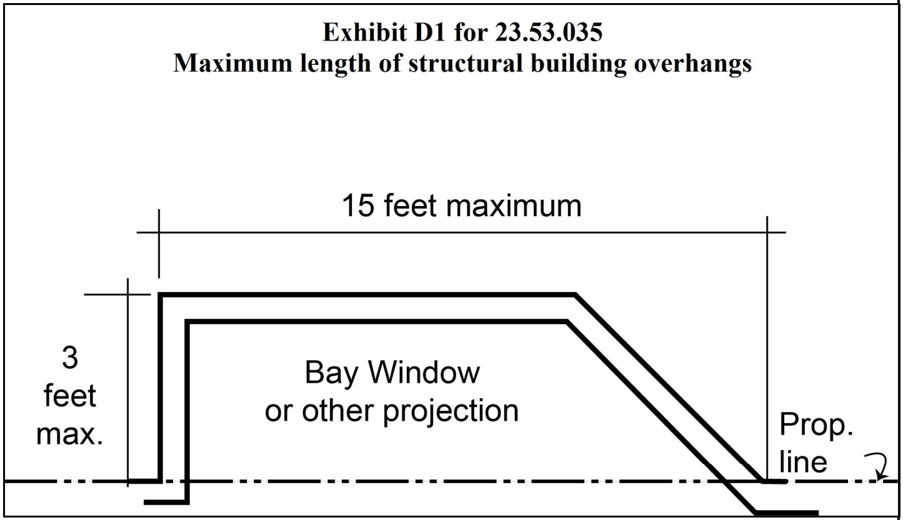

Exhibit D1 forMaximum length of structural building overhangs

1. Bay window and balcony combinations: If a bay window and a balcony are located immediately adjacent to one another, and the floor of such balcony has a minimum horizontal dimension of 6 feet parallel to the property line, the maximum length of the bay window and balcony together shall be 18 feet (see Exhibit D2 for 23.53.035).
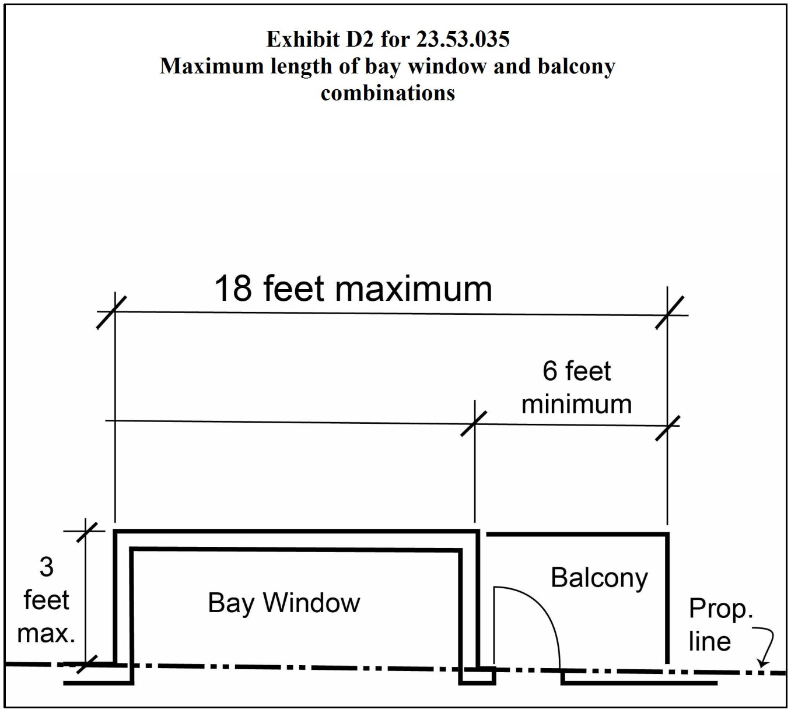

Exhibit D2 forMaximum length of bay window and balcony combinations

1. Separation: The minimum horizontal separation between bay windows, between balconies, and between bay window and balcony combinations, shall be 8 feet (see Exhibit E for 23.53.035).
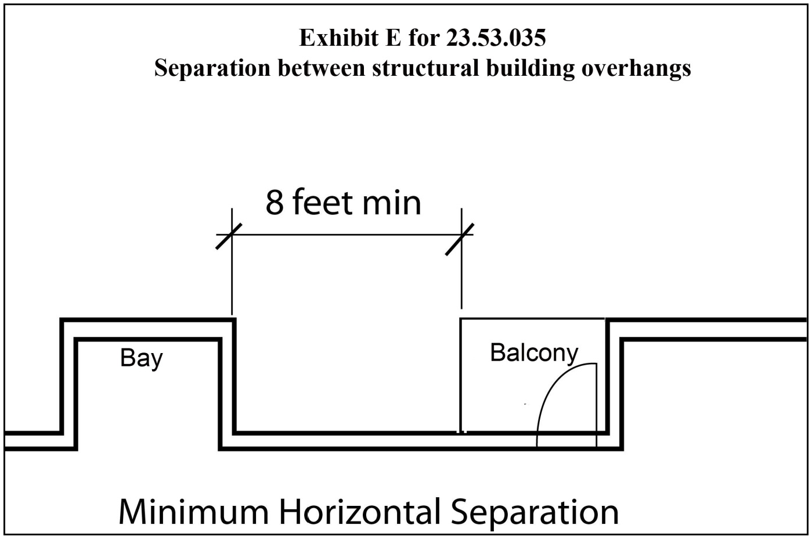

Exhibit E forSeparation between structural building overhangs

1. Interior lot lines: Each bay window or balcony or other projection over a street or alley shall also be horizontally separated from interior lot lines by a minimum of 1 foot (except where the wall of a building on the adjoining lot is flush to the interior lot line immediately adjacent to the projecting portions of such bay window or balcony, then the bay window, balcony or projection may be placed at the interior lot line) (see Exhibit F for 23.53.035).
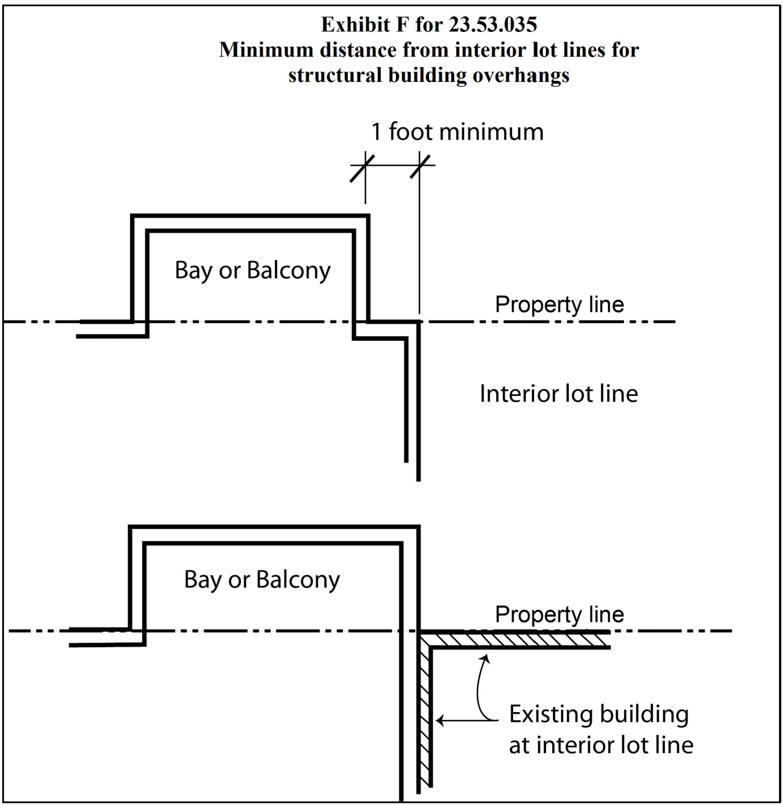

Exhibit F forMinimum distance from interior lot lines for structural building overhangs

1. Corners: Bay windows, balconies, and other projections may be located at a property corner but are limited to a maximum width of 15 feet along each facade of the corner, and a maximum total horizontal area of 81 square feet per floor. If there is no bay at the corner, then the minimum distance from the property corner to the nearest projecting bay is 15 feet (see Exhibit G for 23.53.035).
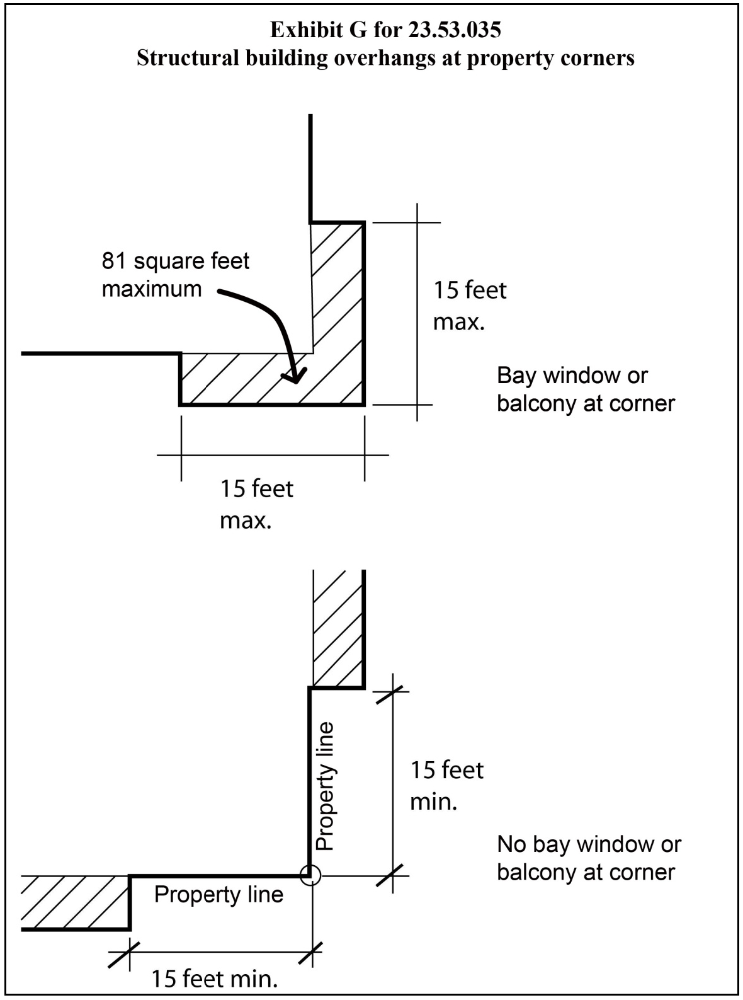

Exhibit G forStructural building overhangs at property corners

1. Total facade area: The total vertical surface area of bay windows, balconies and other projections, measured at the maximum horizontal dimension into the public property, shall not exceed 30 percent of the total vertical surface area of the respective street-facing or alley facade. The vertical surface area of all solid balcony railings that project beyond the property line is included in this calculation; open railings are not (see Exhibit H for 23.53.035).
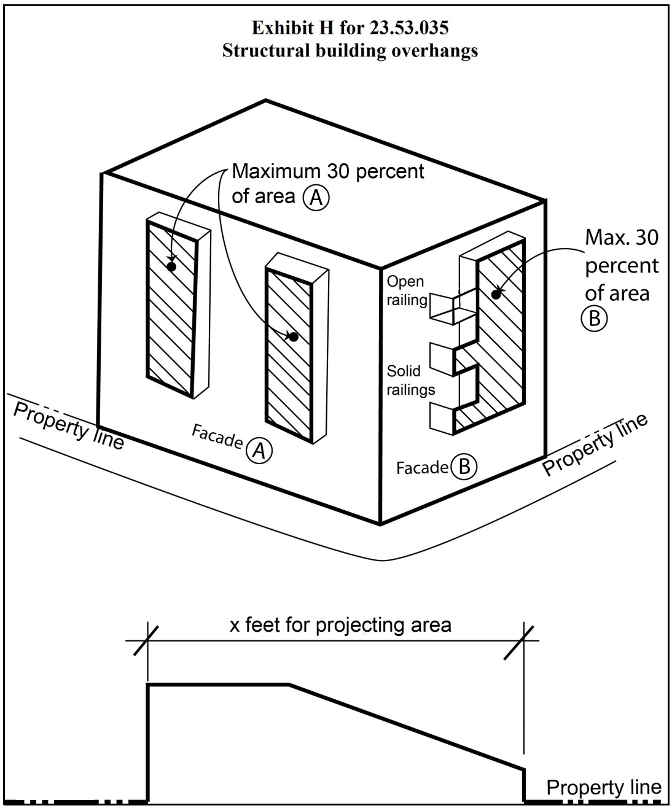

Exhibit H forStructural building overhangs

1. Canopies. Canopies shall be no closer than 6 feet to the curb.
2. Street trees. If the Seattle Department of Transportation landscape architect indicates that retention of street trees would be unfeasible, planting of new street trees of at least 4 inch caliper shall be required.
3. Certain exceptions. Exceptions to the requirements in this Section 23.53.035 may be authorized for landmark structures, if they:

    1. Are compatible with the character-defining architectural features of the landmark structure, as determined in consultation with the Department of Neighborhoods;
    2. Do not preclude use of the right-of-way for transportation or access purposes as determined in consultation with the Seattle Department of Transportation; and
    3. Pose no threat to public health and safety.

### Chapter 23.54 - QUANTITY AND DESIGN STANDARDS FOR ACCESS, OFF-STREET PARKING, AND SOLID WASTE STORAGE

Sections:

#### 23.54.015 - Required parking

When two or more uses with different parking ratios occupy a structure, the 2,500 square foot waiver is prorated based on the area occupied by the non-residential uses for which the parking waiver is permitted.

<table>
<tr>
<td>Table B for 23.54.015Parking for Residential Uses</td>
</tr>
<tr>
<td>Use</td>
<td>Minimum parking required</td>
</tr>
<tr>
<td>I. General residential uses</td>
</tr>
<tr>
<td>A.</td>
<td>Adult family homes</td>
<td>1 space for each dwelling unit</td>
</tr>
<tr>
<td>B.</td>
<td>Artist's studio/dwellings</td>
<td>1 space for each dwelling unit</td>
</tr>
<tr>
<td>C.</td>
<td>Assisted living facilities</td>
<td>1 space for each 4 assisted living units; plus1 space for each 2 staff members on-site at peak staffing time; plus1 barrier-free passenger loading and unloading space</td>
</tr>
<tr>
<td>D.</td>
<td>Caretaker's quarters</td>
<td>1 space for each dwelling unit</td>
</tr>
<tr>
<td>E.</td>
<td>Congregate residences</td>
<td>1 space for each 4 sleeping rooms</td>
</tr>
<tr>
<td>F.</td>
<td>Cottage housing developments</td>
<td>1 space for each dwelling unit</td>
</tr>
<tr>
<td>G.</td>
<td>Floating homes</td>
<td>1 space for each dwelling unit</td>
</tr>
<tr>
<td>H.</td>
<td>Mobile home parks</td>
<td>1 space for each mobile home lot as defined in Chapter 22.904</td>
</tr>
<tr>
<td>I.</td>
<td>Multifamily residential uses, except as otherwise provided in this Table B for 23.54.015.</td>
<td>1 space per dwelling unit, or 1 space for each 2 small efficiency dwelling units</td>
</tr>
<tr>
<td>J.</td>
<td>Nursing homes</td>
<td>1 space for each 2 staff doctors; plus1 additional space for each 3 employees; plus1 space for each 6 beds</td>
</tr>
<tr>
<td>K.</td>
<td>Single-family dwelling units</td>
<td>1 space for each dwelling unit</td>
</tr>
<tr>
<td>II. Residential use requirements for specific areas</td>
</tr>
<tr>
<td>L.</td>
<td>All residential uses within urban centers or within the Station Area Overlay District</td>
<td>No minimum requirement</td>
</tr>
<tr>
<td>M.</td>
<td>All residential uses in commercial and multifamily zones within urban villages that are not within urban center or the Station Area Overlay District, if the residential use is located within 1,320 feet of a street with frequent transit service, measured as the walking distance from the nearest transit stop to the lot line of the lot containing the residential use.</td>
<td>No minimum requirement</td>
</tr>
<tr>
<td>N.</td>
<td>Multifamily residential uses within the University of Washington parking impact area shown on Map A for 23.54.015</td>
<td>1 space per dwelling unit for dwelling units with fewer than two bedrooms; plus1.5 spaces per dwelling units with 2 or more bedrooms; plus0.25 spaces per bedroom for dwelling units with 3 or more bedrooms</td>
</tr>
<tr>
<td>O.</td>
<td>Multifamily dwelling units, within the Alki area shown on Map B for 23.54.015</td>
<td>1.5 spaces for each dwelling unit</td>
</tr>
<tr>
<td>III. Multifamily residential use requirements with income criteria</td>
</tr>
<tr>
<td>P.</td>
<td>Multifamily residential uses: for each dwelling unit rented to and occupied by a household with an income at time of its initial occupancy at or below 30 percent of the median income, for the life of the building</td>
<td>0.33 space for each dwelling unit with two or fewer bedrooms, and one space for each dwelling unit with three or more bedrooms</td>
</tr>
<tr>
<td>Q.</td>
<td>Multifamily residential uses: for each dwelling unit rented to and occupied by a household with an income at time of its initial occupancy of between 30 and 50 percent of the median income, for the life of the building</td>
<td>0.75 spaces for each dwelling unit with two or fewer bedrooms, and one space for each dwelling unit with three or more bedrooms</td>
</tr>
<tr>
<td>R.</td>
<td>Low-income disabled multifamily residential uses</td>
<td>1 space for each 4 dwelling units</td>
</tr>
<tr>
<td>S.</td>
<td>Low-income elderly/low-income disabled multifamily residential uses</td>
<td>1 space for each 5 dwelling units</td>
</tr>
<tr>
<td>T.</td>
<td>Low-income elderly multifamily residential uses not located in urban centers or within the Station Area Overlay District</td>
<td>1 space for each 6 dwelling units</td>
</tr>
<tr>
<td>Footnotes to Table B for 23.54.015The minimum amount of parking prescribed by line I of Table B for 23.54.015 does not apply if a use, structure or development qualifies for a greater or a lesser amount of parking, including no parking, under any other provision of this Section 23.54.015. If more than one such provision may apply, the provision requiring the least amount of parking applies, except that if an applicable parking requirement in line II of Table B for 23.54.015 requires more parking than line I, the parking requirement in line I does not apply. For development within single-family zones the Director may waive some or all of the parking requirements according to Section 23.44.015 as a special or reasonable accommodation. In other zones, if the applicant can demonstrate that less parking is needed to provide a special or reasonable accommodation, the Director may reduce the requirement. The Director shall specify the parking required and link the parking reduction to the features of the program that allow such reduction. The parking reductions are effective only as long as the conditions that justify the waiver are present. When the conditions are no longer present, the development shall provide the amount of parking that otherwise is required. Notice of income restrictions. If these provisions are applied to a development, then prior to the issuance of any permit to establish, construct or modify the development, or to reduce the amount of parking accessory to the development, the applicant shall record with the King County Recorder a restrictive covenant signed and acknowledged by the owner(s), in a form prescribed by the Director, that provides notice that compliance with the income limits prescribed by this Section 23.54.015 is a condition for maintaining the reduced parking allowed by this Section 23.54.015, and requiring any subsequent owner to provide the amount of parking otherwise required in the event the income limits are not met.</td>
</tr>
</table>

Map A for: University District Parking Impact Area

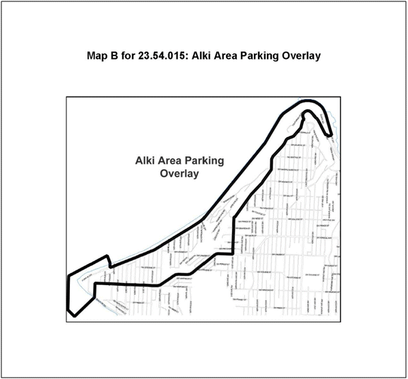

Map B for: Alki Area Parking Overlay

<table>
<tr>
<td>Table C forPARKING FOR PUBLIC USES AND INSTITUTIONS</td>
</tr>
<tr>
<td>Use</td>
<td>Minimum parking required</td>
</tr>
<tr>
<td>I. General Public Uses and Institutions</td>
</tr>
<tr>
<td>A.</td>
<td>Adult care centers (1), (2)</td>
<td>1 space for each 10 adults (clients) or 1 space for each staff member, whichever is greater; plus1 loading and unloading space for each 20 adults (clients)</td>
</tr>
<tr>
<td>B.</td>
<td>Child care centers (1), (2), (3)</td>
<td>1 space for each 10 children or 1 space for each staff member, whichever is greater; plus1 loading and unloading space for each 20 children</td>
</tr>
<tr>
<td>C.</td>
<td>Colleges</td>
<td>A number of spaces equal to 15 percent of the maximum number of students that the facility is designed to accommodate; plus30 percent of the number of employees the facility is designed to accommodate; plus1 space for each 100 square feet of spectator assembly area in outdoor spectator sports facilities</td>
</tr>
<tr>
<td>D.</td>
<td>Community centers owned and operated by the Seattle Department of Parks and Recreation (DOPAR) (1), (4)</td>
<td>1 space for each 555 square feet; orfor family support centers, 1 space for each 100 square feet</td>
</tr>
<tr>
<td>E.</td>
<td>Community clubs, and community centers not owned and operated by DOPAR (1), (5)</td>
<td>1 space for each 80 square feet of floor area of all auditoria and public assembly rooms not containing fixed seats; plus1 space for every 8 fixed seats for floor area containing fixed seats; orif no auditorium or assembly room, 1 space for each 350 square feet, excluding ball courts</td>
</tr>
<tr>
<td>F.</td>
<td>Hospitals</td>
<td>1 space for each 2 staff doctors; plus1 additional space for each 5 employees other than staff doctors; plus1 space for each 6 beds</td>
</tr>
<tr>
<td>G.</td>
<td>Institutes for advanced study, except in single family zones</td>
<td>1 space for each 1,000 square feet of offices and similar spaces; plus1 space for each 10 fixed seats in all auditoria and public assembly rooms; or1 space for each 100 square feet of public assembly area not containing fixed seats</td>
</tr>
<tr>
<td>H.</td>
<td>Institutes for advanced study in single family zones (existing) (1)</td>
<td>3.5 spaces for each 1,000 square feet of office space; plus10 spaces for each 1,000 square feet of additional building footprint to house and support conference center activities; or37 spaces for each 1,000 square feet of conference room space, whichever is greater</td>
</tr>
<tr>
<td>I.</td>
<td>Libraries (1) (6)</td>
<td>1 space for each 80 square feet of floor area of all auditoria and public meeting rooms; plus1 space for each 500 square feet of floor area, excluding auditoria and public meeting rooms</td>
</tr>
<tr>
<td>J.</td>
<td>Museums</td>
<td>1 space for each 80 square feet of all auditoria and public assembly rooms, not containing fixed seats; plus1 space for every 10 fixed seats for floor area containing fixed seats; plus1 space for each 250 square feet of other gross floor area open to the public</td>
</tr>
<tr>
<td>K.</td>
<td>Private clubs</td>
<td>1 space for each 80 square feet of floor area of all auditoria and public assembly rooms not containing fixed seats; or1 space for every 8 fixed seats for floor area containing fixed seats; orif no auditorium or assembly room, 1 space for each 350 square feet, excluding ball courts</td>
</tr>
<tr>
<td>L.</td>
<td>Religious facilities (1)</td>
<td>1 space for each 80 square feet of all auditoria and public assembly rooms</td>
</tr>
<tr>
<td>M.</td>
<td>Schools, private elementary and secondary (1)</td>
<td>1 space for each 80 square feet of all auditoria and public assembly rooms, orif no auditorium or assembly room, 1 space for each staff member</td>
</tr>
<tr>
<td>N.</td>
<td>Schools, public elementary and secondary (7) (8)</td>
<td>1 space for each 80 square feet of all auditoria or public assembly rooms, or1 space for every 8 fixed seats in auditoria or public assembly rooms containing fixed seats, for new public schools on a new or existing public school site</td>
</tr>
<tr>
<td>O.</td>
<td>Vocational or fine arts schools</td>
<td>1 space for each 2 faculty that the facility is designed to accommodate; plus1 space for each 2 full-time employees other than faculty that the facility is designed to accommodate; plus1 space for each 5 students, based on the maximum number of students that the school is designed to accommodate</td>
</tr>
<tr>
<td>II. General Public Uses and Institutions For Specific Areas</td>
</tr>
<tr>
<td>P.</td>
<td>General public uses, institutions and Major Institution uses, except hospitals, in urban centers or the Station Area Overlay District (9)</td>
<td>No minimum requirement</td>
</tr>
</table>

Footnotes for Table C for 23.54.015:

1. When this use is permitted in a single-family zone as a conditional use, the Director may modify the parking requirements pursuant to Section 23.44.022; when the use is permitted in a multifamily zone as a conditional use, the Director may modify the parking requirements pursuant to Section 23.45.570. The Director, in consultation with the Director of Transportation, may allow adult care and child care centers locating in existing structures to provide loading and unloading spaces on-street when no other alternative exists.
2. The amount of required parking is calculated based on the maximum number of staff, children, or clients that the center is designed to accommodate on site at any one time.
3. A child care facility, when co-located with an assisted living facility, may count the passenger load/unload space required for the assisted living facility toward its required passenger load/unload spaces.
4. When family support centers are located within community centers owned and operated by the Department of Parks and Recreation, the Director may lower the combined parking requirement by up to a maximum of 15 percent, pursuant to subsection 23.54.020.I.
5. Indoor gymnasiums are not considered ball courts, nor are they considered auditoria or public assembly rooms unless they contain bleachers (fixed seats). If the gymnasium contains bleachers, the parking requirement for the gymnasium is one parking space for every eight fixed seats. Each 20 inches of width of bleachers is counted as one fixed seat for the purposes of determining parking requirements. If the gymnasium does not contain bleachers and is in a school, there is no parking requirement for the gymnasium. If the gymnasium does not contain bleachers and is in a community center, the parking requirement is one space for each 350 square feet.
6. When a library is permitted in a single-family zone as a conditional use, the Director may modify the parking requirements pursuant to Section 23.44.022; when a library is permitted in a multifamily zone as a conditional use, the Director may modify the parking requirements pursuant to Section 23.45.122; and when a library is permitted in a commercial zone, the Director may modify the parking requirements pursuant to subsection 23.44.022.L.
7. For public schools, when an auditorium or other place of assembly is demolished and a new one built in its place, parking requirements are determined based on the new construction. When an existing public school on an existing public school site is remodeled, additional parking is required if any auditorium or other place of assembly is expanded or additional fixed seats are added. Additional parking is required as shown on Table C for 23.54.015 for the increase in floor area or increase in number of seats only. If the parking requirement for the increased area or seating is 10 percent or less than that for the existing auditorium or other place of assembly, then no additional parking is required.
8. Development standard departures may be granted or required pursuant to the procedures and criteria set forth in Chapter 23.79 to reduce the required or permitted number of parking spaces.
9. The general requirement of lines A through O of Table C for 23.54.015 for general public uses, institutions, and requirements of subsection 23.54.016.B for Major Institution uses are superseded to the extent that a use, structure or development qualifies for either a greater or a lesser parking requirement (which may include no requirement) under any other provision. To the extent that a general public use, institution or Major Institution use fits within more than one line in Table C for 23.54.015, the least of the applicable parking requirements applies. The different parking requirements listed for certain categories of general public uses or institutions shall not be construed to create separate uses for purposes of any requirements related to establishing or changing a use under this Title 23.

1. Minimum parking requirements. The minimum number of off-street motor vehicle parking spaces required for specific uses is set forth in Table A for 23.54.015 for non-residential uses other than institutional uses, Table B for 23.54.015 for residential uses, and Table C for 23.54.015 for institutional uses, except as otherwise provided in this Section 23.54.015 and Section 23.54.020. The minimum parking requirements are based upon gross floor area of a use within a structure and the square footage of a use when located outside of an enclosed structure, or as otherwise specified. Exceptions to the parking requirements set forth in this Section 23.54.015 are provided in subsection 23.54.015.B and in Section 23.54.020, Parking quantity exceptions, unless otherwise specified. This Chapter 23.54 does not apply to parking for construction activity, which is regulated by Section 23.42.044.
2. Parking requirements for specific zones

    1. Parking in downtown zones is regulated by Section 23.49.019 and not by this Section 23.54.015.
    2. Parking in the MPC-YT zone is regulated by Section 23.75.180 and not by this Section 23.54.015.
    3. Parking for major institution uses in the Major Institution Overlay District is regulated by Sections 23.54.015 and 23.54.016.
    4. Parking in the Northgate Overlay District is regulated by Chapter 23.54 except as modified by Section 23.71.016.
    5. No parking is required for single-family residential uses on lots in any residential zone that are less than 3,000 square feet in size or 30 feet in width where access to parking is permitted through a required yard or setback abutting a street according to the standards of subsections 23.44.016.B.2, 23.45.536.C.2, or 23.45.536.C.3.
    6. No parking is required for urban farms or community gardens in residential zones
3. Maximum parking limits

    1. In the Stadium Transition Area Overlay District certain uses are subject to a maximum parking ratio pursuant to subsection 23.74.010.A.1.b. When there are multiple uses on a lot, the total parking requirement for all uses subject to a maximum ratio cannot exceed the aggregate maximum for those uses under Section 23.74.010.
    2. In all commercial zones, except C2 zones outside of urban villages, no more than 145 spaces per lot may be provided as surface parking.
    3. In all multifamily zones, commercial uses are limited to no more than ten parking spaces per business establishment.
4. Parking waivers for non-residential uses

    1. In all commercial zones and in pedestrian-designated zones, no parking is required for the first 1,500 square feet of each business establishment or the first 15 fixed seats for motion picture and performing arts theaters.
    2. In all other zones, no parking is required for the first 2,500 square feet of gross floor area of non-residential uses in a structure, except for the following:

        1. structures or portions of structures occupied by restaurants with drive-in lanes,
        2. motion picture theaters,
        3. offices, or
        4. institution uses, including Major Institution uses.
5. Fleet vehicles. Notwithstanding any other provisions of this section, off-street parking shall be provided for all fleet vehicles and those parking spaces will not be counted toward the parking requirements of Table A, Table B, or Table C.
6. Use and reuse of schools. For non-school uses permitted to locate in a former or existing public school, parking requirements will be determined by school use pursuant to criteria adopted according to Chapter 23.78, Establishment of Criteria for Joint Use or Reuse of Schools.
7. New non-residential uses in existing structures in commercial and industrial zones. Up to 20 required parking spaces are waived for a new non-residential use established in an existing structure or the expansion of an existing non-residential use entirely within an existing structure. Existing required parking shall remain. For purposes of this Section 23.54.015, "existing structure" means a structure that was established under permit, or for which a building permit has been granted and has not expired, at least two years prior to the application to establish the new use or expand the use. Parking spaces required for loading and unloading of passengers are not eligible for the waiver under this subsection 23.54.015.G.
8. Uses not shown on parking tables. In the case of a use not shown on Table A, Table B, or Table C, the requirements for off-street parking will be determined by the Director based on the requirements for the most comparable use. Where, in the judgment of the Director, none of the uses on Table A, Table B, and Table C are comparable to a proposed use, the Director may base his or her determination as to the amount of parking required for the proposed use on detailed information provided by the applicant. The information required may include, but not be limited to, a description of the physical structure(s), identification of potential users, and analysis of likely parking demand.
9. Uses in multiple parking table categories. If an entire use or structure, or the same portion of a use or structure, falls under more than one category in Table A, Table B or Table C then, unless otherwise specified, the category requiring the smallest number of parking spaces applies except as expressly set forth on such tables.
10. Existing parking deficits. Existing legal parking deficits of legally established uses are allowed to continue even if a change of use occurs. This subsection will not be construed to permit a parking deficit caused by the failure to satisfy conditions of a reduced parking requirement for any use or structure.
11. Bicycle parking. The minimum number of off-street parking spaces for bicycles required for specified uses is set forth in Table D for 23.54.015. In the case of a use not shown on Table D for 23.54.015, there is no minimum bicycle parking requirement. The minimum requirements are based upon gross floor area of the use in a structure, or the square footage of the use when located outside of an enclosed structure, or as otherwise specified.

    1. After the first 50 spaces for bicycles are provided, additional spaces are required at ½ the ratio shown in Table D for 23.54.015, except for rail transit facilities; passenger terminals; and park and ride lots. Spaces within dwelling units or on balconies do not count toward the bicycle parking requirement.
    2. Required bicycle parking shall be provided in a safe, accessible and convenient location. Bicycle parking hardware shall be installed so that it can perform to its manufacturer's specifications and any design criteria promulgated by the Director of Transportation, allowing adequate clearance for bicycles and their riders. Directional signage shall be installed when bike parking facilities are not clearly visible from the street or sidewalk. If any covered automobile parking is provided, all required long-term bicycle parking shall be covered. If located off-street, bicycle and automobile parking areas shall be separated by a barrier or painted lines.
    3. Long-term parking for bicycles shall be for bicycles parked four hours or more. Short-term parking for bicycles shall be for bicycles parked less than four hours.
    4. Bicycle parking required for residential uses shall be located on-site.
    5. Bicycle parking required for small efficiency dwelling units and congregate residence sleeping rooms is required to be covered for weather protection. If the required, covered bicycle parking is located inside the building that contains small efficiency dwelling units or congregate residence sleeping rooms, the space required to provide the required bicycle parking shall be exempt from Floor Area Ratio (FAR) limits. Covered bicycle parking that is provided beyond the required bicycle parking shall not be exempt from FAR limits.
    6. Bicycle parking facilities shared by more than one use are encouraged.
    7. Bicycle parking facilities required for nonresidential uses shall be located on the lot or in a shared bicycle parking facility within 100 feet of the lot, except as provided in subsection 23.54.015.K.8.
    8. Bicycle parking may be located in a facility within 100 feet of the lot that is not a shared bicycle parking facility, or public bicycle parking may be provided in the right-of-way, subject to approval by the Director of Transportation, in lieu of providing required on-site bicycle parking, if the Director determines that:

        1. Safe, accessible, and convenient bicycle parking accessory to a non-residential use cannot be provided on-site or in a shared bicycle parking facility within 100 feet of the lot, without extraordinary physical or financial difficulty;
        2. The bicycle parking in the right-of-way is equivalent to bicycle parking that would otherwise be required on-site, and takes into consideration the cost of materials, equipment and labor for installation;
        3. The bicycle parking in the right-of-way is located within sufficient proximity to serve the bicycle parking demand generated by the project; and
        4. Construction of the bicycle parking is completed before issuance of a certificate of occupancy for the development.

#### 23.54.016 - Major Institutions—parking and transportation

Except in the MPC-YT zone, Major Institution uses are subject to the following transportation and parking requirements:

1. General Provisions.

    1. Minimum requirements for parking quantity are established in subsection 23.54.016.B.
    2. The maximum number of spaces provided for the Major Institution use shall not exceed 135 percent of the minimum requirement, unless additional spaces are approved through administrative or Council review as provided in subsection 23.54.016.C. For a Major Institution use in an urban center or the Station Area Overlay District, the maximum limit shall not exceed 135 percent of the minimum parking requirements calculated pursuant to subsection 23.54.016.B.2.
    3. Parking requirements for Major Institutions with more than one type of institutional use (for example, a hospital and a university), if applicable, shall be calculated for each use separately, and then added together to derive the total number of required spaces.
    4. When a permit application is made for new development at an existing Major Institution and the new development is a hospital or located outside an urban center or the Station Area Overlay District, parking requirements shall be calculated both for the entire Major Institution and for the proposed new development. If there is a parking deficit for the entire institution, the institution shall make up a portion of the deficit in addition to the quantity required for the new development, according to subsection 23.54.016.B.3. If there is a parking surplus above the maximum allowed number of spaces for the institution as a whole, required amounts of parking for new development will first be applied to the surplus in the required ratio of long-term and short-term spaces. Additional parking shall be permitted only when no surplus remains.
    5. When determining parking requirements, individuals fitting into more than one category (for example, a student who is also an employee or a faculty member who is also a doctor) shall not be counted twice. The category requiring the greater number of parking spaces shall be used.
2. Parking Quantity Required.

    1. In urban centers and the Station Area Overlay District, no parking is required for Major Institution uses, except for hospitals.
    2. For all other Major Institutions the minimum number of parking spaces required is as follows:

        1. Long-term Parking.

            1. Medical Institutions. A number of spaces equal to 80 percent of hospital-based doctors; plus 25 percent of staff doctors; plus 30 percent of all other employees present at peak hour;
            2. Educational Institutions. A number of spaces equal to 15 percent of the maximum students present at peak hour, excluding resident students; plus 30 percent of employees present at peak hour; plus 25 percent of the resident unmarried students; plus one space for each married student apartment unit.
        2. Short-term Parking.

            1. Medical Institutions. A number of spaces equal to one space per six beds; plus one space per five average daily outpatients;
            2. Educational Institutions. A number of spaces equal to five percent of the maximum students present at peak hour excluding resident students.
        3. Additional Short-term Parking Requirements. When one of the following uses is a Major Institution use, the following additional short-term parking requirements shall be met. Such requirements may be met by joint use of parking areas and facilities if the Director determines that the uses have different hours of operation according to subsection 23.54.020.G:

            1. Museum. One space for each 250 square feet of public floor area;
            2. Theater, Auditorium, or Assembly Hall. One space for each 200 square feet of audience assembly area not containing fixed seats, and one space for every 10 seats for floor area containing fixed seats;
            3. Spectator Sports Facility Containing Fewer than 20,000 Seats. One space for each 10 permanent seats and one space for each 100 square feet of spectator assembly area not containing fixed seats;
            4. Spectator Sports Facility Containing 20,000 or More Seats. One space for each 10 permanent seats and one bus space for each 300 permanent seats.
        4. Bicycle Parking. Bicycle parking meeting the development standards of subsections 23.54.015.K.2 through 23.54.015.K.6 and subsection 23.54.016.D.2 shall be provided in the following quantities:

            1. Medical Institutions. A number of spaces equal to two percent of employees, including doctors, present at peak hour;
            2. Educational Institutions. A number of spaces equal to 10 percent of the maximum students present at peak hour plus five percent of employees.
If at the time of application for a master use permit, the applicant can demonstrate that the bicycle parking requirement is inappropriate for a particular institution because of topography, location, nature of the users of the institution or other reasons, the Director may modify the bicycle parking requirement.

1. Parking Deficits. In addition to providing the minimum required parking for a new structure, five percent of any vehicular or bicycle parking deficit as determined by the minimum requirements of this subsection 23.54.016.B, existing on the effective date of the ordinance codified in this section, shall be supplied before issuance of a certificate of occupancy.
2. Requirement for a Transportation Management Program.

    1. When a Major Institution proposes parking in excess of 135 percent of the applicable minimum requirement for short-term parking spaces calculated pursuant to subsections 23.54.016.A and 23.54.016.B, or when a Major Institution prepares a master plan or applies for a master use permit for development that would provide 20 or more parking spaces or increase the Major Institution's number of parking spaces by 20 or more above the level existing on May 2, 1990, a transportation management program shall be required or an existing transportation management program shall be reviewed and updated. The Director shall assess the traffic and parking impacts of the proposed development against the general goal of reducing the percentage of the Major Institution's employees, staff and/or students who commute in single-occupancy vehicles (SOV) during the peak period to 50 percent or less, excluding those employees or staff whose work regularly requires the use of a private vehicle during working hours.
    2. Transportation management programs are prepared and implemented in accordance with the Director's Rule governing Transportation Management Programs. The Transportation Management Program shall be in effect upon Council adoption of the Major Institution master plan.
    3. If an institution has previously prepared a transportation management program, the Director, in consultation with the Director of Transportation shall review the Major Institution's progress toward meeting stated goals. The Director shall then determine:

        1. That the existing program should be revised to correct deficiencies and/or address new or cumulative impacts; or
        2. That the application will not be approved until the Major Institution makes substantial progress toward meeting the goals of its existing program; or
        3. That a new program should be developed to address impacts associated with the application; or
        4. That the existing program does not need to be revised.
    4. Through the process of reviewing a new or updated transportation management program in conjunction with reviewing a master plan, the Council may approve in excess of 135 percent of the minimum requirements for long-term parking spaces, or may increase or decrease the required 50 percent SOV goal, based upon the Major Institution's impacts on traffic and opportunities for alternative means of transportation. Factors to be considered shall include, but not be limited to:

        1. Proximity to a street with 15 minute transit service headway in each direction;
        2. Air quality conditions in the vicinity of the Major Institution;
        3. The absence of other nearby traffic generators and the level of existing and future traffic volumes in and through the surrounding area;
        4. The patterns and peaks of traffic generated by Major Institution uses and the availability or lack of on-street parking opportunities in the surrounding area;
        5. The impact of additional parking on the Major Institution site;
        6. The extent to which the scheduling of classes or work shifts reduces the transportation alternatives available to employees and/or students or the presence of limited carpool opportunities due to the small number of employees; and
        7. The extent to which the Major Institution has demonstrated a commitment to SOV alternatives.
    5. The provision of short-term parking spaces in excess of 135 percent of the minimum requirements established in subsection 23.54.016.B.2 may be permitted by the Director through preparation or update of a Transportation Management Program. In evaluating whether to allow more than 135 percent of the minimum, the Director, in consultation with the Director of Transportation, shall consider evidence of parking demand and opportunities for alternative means of transportation. Factors to be considered shall include but are not necessarily limited to the criteria contained in subsection 23.54.015.D.1.b and the following:

        1. The nature of services provided by Major Institution uses which generate short-term parking demand; and
        2. The extent to which the Major Institution manages short-term parking to ensure its availability to meet short-term parking needs.
Based on this review, the Director shall determine the amount of additional short-term parking to be permitted, if any.

1. When an institution applies for a permit for development included in its master plan, it shall present evidence that it has made substantial progress toward the goals of its transportation management program as approved with a master plan, including the SOV goal. If substantial progress is not being made, as determined by the Director in consultation with the Seattle Department of Transportation and metropolitan King County, the Director may:

    1. Require the institution to take additional steps to comply with the transportation management program; and/or
    2. Require measures in addition to those in the transportation management program which encourage alternative means of transportation for the travel generated by the proposed new development; and/or
    3. Deny the permit if previous efforts have not resulted in sufficient progress toward meeting the SOV goals of the institution.
2. Development Standards for Parking.

    1. Long-term Parking.

        1. Carpools and vanpools shall be given guaranteed spaces in a more convenient location to the Major Institution uses they serve than SOV spaces, and shall be charged substantially less than the prevailing parking rates for SOVs.
        2. There shall be a charge for all noncarpool/vanpool long-term parking spaces.
    2. Bicycle Parking.

        1. Required bicycle parking shall be in a convenient location, covered in the same proportion as auto parking spaces and provided free of charge.
        2. Bicycle rack designs shall accommodate locking of the bicycle frame and both wheels with chains, cables, or U-shaped bicycle locks to an immovable rack or stall.
    3. Joint use or shared use of parking areas and facilities shall be encouraged if approved by the Director according to the standards of Section 23.54.020 G.
    4. The location and design of off-street parking and access to off-street parking shall be regulated according to the general standards of Chapter 23.54 and the specific standards of the underlying zone in which the parking is located.

#### 23.54.020 - Parking quantity exceptions

The parking quantity exceptions set forth in this section apply in all zones except downtown zones, which are regulated by Section 23.49.019, and Major Institution zones, which are regulated by Section 23.54.016.

1. Adding Units to Existing Structures in Multifamily and Commercial Zones.

    1. For the purposes of this Section 23.54.020, "existing structures" means those structures that were established under permit, or for which a permit has been granted and has not expired as of the applicable date, as follows:

        1. In multifamily zones, August 10, 1982;
        2. In commercial zones, June 9, 1986.
    2. In locations in a multifamily or commercial zone where there is a minimum parking requirement, one dwelling unit may either be added to an existing structure or may be built on a lot that contains an existing structure without additional parking if both of the following requirements are met:

        1. Either the existing parking provided on the lot meets development standards, or the lot area is not increased and existing parking is screened and landscaped to the greatest extent practical; and
        2. Any additional parking shall meet all development standards for the zone.
    3. In locations in a multifamily or commercial zone where there is a minimum parking requirement, the Director may authorize a reduction or waiver of the parking requirement as a Type I decision when dwelling units are proposed to be added either to an existing structure or on a lot that contains an existing structure, in addition to the exception permitted in subsection 23.54.020.A.2, if the conditions in subsections 23.54.020.A.3.a and b below are met, and either of the conditions in subsections 23.54.020.A.3.c or d below are met:

        1. The only use of the structure will be residential; and
        2. The lot is not located in either the University District Parking Overlay Area (Map A for 23.54.015) or the Alki Area Parking Overlay (Map B for 23.54.015); and
        3. The topography of the lot or location of existing structures makes provision of an off-street parking space physically infeasible in a conforming location; or
        4. The lot is located in a residential parking zone (RPZ) and a current parking study is submitted showing a utilization rate of less than 75 percent for on-street parking within 400 feet of all lot lines.
2. Tandem Parking in Multifamily Structures.

    1. Off-street parking required for multifamily structures may be provided as tandem parking, as defined in Section 23.54.030. A tandem parking space counts as one and one-half (1 ½) parking spaces, except as provided in subsection B2 below, and must meet the minimum size requirements of subsection A of Section 23.54.030.
    2. When a minimum of at least one (1) parking space per dwelling unit in a multifamily structure is required, the total number of parking spaces provided, counting each tandem parking space as one space, may not be less than the total number of dwelling units.
3. Parking Exception for Landmark Structures. The Director may reduce or waive the minimum accessory off-street parking requirements for a use permitted in a Landmark structure, or when a Landmark structure is completely converted to residential use according to Sections 23.42.108 or 23.45.506, or for a use in a Landmark district that is located in a commercial zone, as a special exception pursuant to Chapter 23.76, Procedures for Master Use Permits and Council Land Use Decisions.

    1. In making any such reduction or waiver, the Director will assess area parking needs. The Director may require a survey of on- and off-street parking availability. The Director may take into account the level of transit service in the immediate area; the probable relative importance of walk-in traffic; proposals by the applicant to encourage carpooling or transit use by employees; hours of operation; and any other factor or factors considered relevant in determining parking impact.
    2. The Director may also consider the types and scale of uses proposed or practical in the Landmark structure, and the controls imposed by the Landmark designation.
    3. Such a reduction or waiver may be allowed, for conversion of structures to residential use, only if the Director also determine that there is no feasible way to meet parking requirements on the lot.
4. Expansion of Existing Nonresidential Uses in Commercial Zones. In commercial zones additional parking spaces for nonresidential uses are not required for the expansion of existing structures if the minimum parking requirement would not be increased by more than ten (10) percent. If the minimum parking requirement would be increased by more than ten (10) percent, the parking spaces required for the entire expansion shall be provided. This exception may be used only once for any individual structure.
5. RESERVED
6. Reductions to minimum parking requirements.

    1. When parking is required, reductions to minimum parking requirements permitted by this subsection 23.54.020.F will be calculated from the minimum parking requirements in Section 23.54.015. Total reductions to required parking as provided in this subsection 23.54.020.F may not exceed 50 percent.
    2. Transit reduction.

        1. In multifamily and commercial zones, the minimum parking requirement for all uses is reduced by 50 percent if the use is located within 1,320 feet of a street with frequent transit service. This distance will be the walking distance measured from the nearest transit stop to the lot line of the lot containing the use.
        2. In industrial zones, the minimum parking requirement for a nonresidential use is reduced by 15 percent if the use is located within 1,320 feet of a street with peak transit service headways of 15 minutes or less. This distance will be the walking distance measured from the nearest transit stop to the lot line of the lot containing the use.
    3. For new or expanding offices or manufacturing uses that require 40 or more parking spaces, the minimum parking requirement may be reduced by up to a maximum of 40 percent by the substitution of alternative transportation programs, according to the following provisions:

        1. For every carpool space accompanied by a cash fee, performance bond or alternative guarantee acceptable to the Director, the total parking requirement will be reduced by 1.9 spaces, up to a maximum of 40 percent of the parking requirement.
        2. For every vanpool purchased or leased by the applicant for employee use, or equivalent cash fee for purchase of a van by the public ridesharing agency, the total parking requirement will be reduced by six spaces, up to a maximum of 20 percent of the parking requirement.
        3. If transit or transportation passes are provided with a 50 percent or greater cost reduction to all employees in a proposed structure for the duration of the business establishment(s) within it, or five years, whichever is less, and if transit service is located within 800 feet, the parking requirement shall be reduced by 10 percent. With a 25 percent to 49 percent cost reduction, and if transit service is located within 800 feet, the parking requirement shall be reduced by 5 percent.
        4. For every four covered bicycle parking spaces provided, the total parking requirement shall be reduced by one space, up to a maximum of 5 percent of the parking requirement, provided that there is access to an arterial over improved streets.
7. Shared Parking.

    1. Shared Parking, General Provisions.

        1. Shared parking is allowed between two (2) or more uses to satisfy all or a portion of the minimum off-street parking requirement of those uses as provided in subsections G2 and G3.
        2. Shared parking is allowed between different categories of uses or between uses with different hours of operation, but not both.
        3. A use for which an application is being made for shared parking must be located within eight hundred (800) feet of the parking.
        4. No reduction to the parking requirement may be made if the proposed uses have already received a reduction through the provisions for cooperative parking, subsection H.
        5. Reductions to parking permitted through shared use of parking will be determined as a percentage of the minimum parking requirement as modified by the reductions permitted in subsections A though F.
        6. An agreement providing for the shared use of parking, executed by the parties involved, must be filed with the Director. Shared parking privileges will continue in effect only as long as the agreement, binding on all parties, remains in force. If the agreement is no longer in force, then parking must be provided as otherwise required by this chapter.
    2. Shared Parking for Different Categories of Uses.

        1. A business establishment may share parking according to only one of the subsections G2b, G2c or G2d.
        2. If an office use shares parking with one of the following uses:

            1. general sales and services.
            2. heavy sales and services uses.
            3. eating and drinking establishments.
            4. lodging uses.
            5. entertainment.
            6. medical services.
            7. animal shelters and kennels.
            8. automotive sales and services, or
            9. maritime sales and services; the parking requirement for the non-office use may be reduced by twenty (20) percent, provided that the reduction will not exceed the minimum parking requirement for the office use.
        3. If a residential use shares parking with one of the following uses:

            1. general sales and services,
            2. heavy sales and services uses,
            3. medical services,
            4. animal shelters and kennels,
            5. automotive sales and services, or
            6. maritime sales and services; the parking requirement for the residential use may be reduced by thirty (30) percent, provided that the reduction does not exceed the minimum parking requirement for the nonresidential use.
        4. If an office and a residential use share off-street parking, the parking requirement for the residential use may be reduced by fifty (50) percent, provided that the reduction does not exceed the minimum parking requirement for the office use.
    3. Shared Parking for Uses With Different Hours of Operation.

        1. For the purposes of this section, the following uses will be considered daytime uses:

            1. Commercial uses, except eating and drinking establishments, lodging uses, and entertainment uses;
            2. Storage uses;
            3. Manufacturing uses; and
            4. Other similar primarily daytime uses, when authorized by the Director.
        2. For the purposes of this section, the following uses will be considered nighttime or Sunday uses:

            1. Auditoriums accessory to public or private schools;
            2. Religious facilities;
            3. Entertainment uses, such as theaters, bowling alleys, and dance halls;
            4. Eating and drinking establishments; and
            5. Other similar primarily nighttime or Sunday uses, when authorized by the Director.
        3. Up to ninety (90) percent of the parking required for a daytime use may be supplied by the off-street parking provided by a nighttime or Sunday use and vice-versa, when authorized by the Director, except that this may be increased to one hundred (100) percent when the nighttime or Sunday use is a religious facility.
        4. The applicant must show that there is no substantial conflict in the principal operating hours of the uses for which the sharing of parking is proposed.
        5. The establishment of park-and-pool lots is permitted, provided that the park-and-pool lot will not use spaces required by another use if there is a substantial conflict in the principal operating hours of the park-and-pool lot and the use.
8. Cooperative Parking.

    1. Cooperative parking is permitted between two (2) or more business establishments that are commercial uses according to the provisions of this subsection.
    2. Up to a twenty (20) percent reduction in the total number of required parking spaces for four (4) or more separate business establishments, fifteen (15) percent reduction for three (3) business establishments, and ten (10) percent reduction for two (2) commercial uses may be authorized by the Director under the following conditions:

        1. No reductions to the parking requirement may be made if the proposed business establishments have already received a reduction through the provisions for shared parking, subsection G of this section.
        2. Each business establishment for which the application is being made for cooperative parking is located within eight hundred (800) feet of the parking, and the parking is located in a commercial or residential-commercial zone or the Seattle Mixed (SM) zone.
        3. The reductions to parking permitted through cooperative parking will be determined as a percentage of the minimum parking requirement as modified by the reductions permitted in subsections A through F of this section.
        4. An agreement providing for the cooperative use of parking must be filed with the Director when the facility or area is established as cooperative parking. Cooperative parking privileges will continue in effect only as long as the agreement to use the cooperative parking remains in force. If the agreement is no longer in force, then parking must be provided as otherwise required by this chapter. New business establishments seeking to meet parking requirements by becoming part of an existing cooperative arrangement must provide the Director with an amendment to the agreement stating their inclusion in the cooperative parking facility or area.
9. Reductions to Minimum Parking Requirements for Department of Parks and Recreation (DOPAR) Community Centers.

    1. When family support centers are located within DOPAR community centers, the Director may, upon request by DOPAR, lower the combined parking requirement for the community center and the family support center up to a maximum of fifteen (15) percent.
    2. The parking requirement may be reduced only if the reduction is supported by a recommendation of the Project Advisory Committee formed to review the DOPAR community center, and the Director determines and makes written findings that:

        1. The lower parking requirement is necessary to preserve existing natural features or recreational facilities deemed significant by DOPAR and the Project Advisory Committee formed to review the DOPAR community center, and the reduction is the minimum necessary to preserve such features and/or facilities; and
        2. The surrounding streets can accommodate overflow parking from the combined community center and family support center or, alternatively, any adverse parking impacts on the neighborhood from the combined community center and family support center will be mitigated.
10. Parking for City-recognized Car-sharing Programs.

    1. For any development, one (1) space or up to five (5) percent of the total number of required spaces, whichever is greater, may be used to provide parking for vehicles operated by a car-sharing program. The number of required parking spaces will be reduced by one (1) space for every parking space leased by a car-sharing program.
    2. For any development requiring twenty (20) or more parking spaces under Section 23.54.015 that provides a space for vehicles operated by a car-sharing program, the number of required parking spaces may be reduced by the lesser of three (3) required parking spaces for each car-sharing space or fifteen (15) percent of the total number of required spaces. In order to gain this exception, an agreement between the property owner and a car-sharing program must be approved by the Director and the agreement, along with a notice that the agreement is the basis for this exception to the parking requirement, must be recorded with the title to the property before a Master Use Permit is issued.
11. Peat Settlement-prone Environmentally Critical Areas. Except in Single-family, Residential Small Lot, and Lowrise zones, the Director may reduce or waive the minimum accessory off-street parking requirements to the minimum extent necessary to offset underground parking potential lost to limitations set forth in Section 25.09.110 on development below the annual high static groundwater level in peat settlement-prone areas. In making any such reduction or waiver, the Director will assess area parking needs. The Director may require a survey of on- and off-street parking availability. The Director may take into account the level of transit service in the immediate area; the probable relative importance of walk-in traffic; proposals by the applicant to encourage carpooling or transit use by employees; hours of operation; and any other factor or factors considered relevant in determining parking impact.
12. SM/D/40-85 zone. As a Type I decision pursuant to Chapter 23.76, Procedures for Master Use Permits and Council Land Use Decisions, the Director may reduce required parking for any proposed uses in the SM/D/40-85 zone to a level not less than the amount needed to serve parking demand to be generated by those uses as demonstrated to the satisfaction of the Director by a parking demand study performed by a licensed professional engineer and submitted by the applicant.

#### 23.54.025 - Off-site parking

1. Where allowed

    1. Off-site parking provided to fulfill minimum parking requirements may be established by permit on a lot if the parking proposed is otherwise allowed by the provisions of this Title 23 on the lot where the off-site parking is proposed or is already established by permit on the lot where the off-site parking is proposed.
    2. All applicable standards for parking accessory to the use for which the parking is required shall be met on the lot where off-site parking is proposed, if new parking spaces are proposed to be developed. Existing parking may be used even if nonconforming to current standards provided it is not required for a use on the lot that is the site of the off-site parking.
    3. If parking and parking access, including the proposed off-site parking, are or will be the sole uses of a site, or if surface parking outside of structures will comprise more than ½ of the site area, or if parking will occupy more than half of the gross floor area of all structures on a site, then a permit to establish off-site parking may be granted only if principal use parking is a permitted use for the lot on which the off-site parking is located.
2. Development standards

    1. Off-site parking shall satisfy the screening and landscaping requirements and other development standards applicable where it is located, except to the extent that it is legally nonconforming to development standards prior to establishment of the off-site parking use. Unless otherwise provided, development standards regarding the relation of parking to structures apply to off-site parking in the same manner as they apply to parking accessory to the uses in such structures.
    2. Parking allowed only as temporary surface parking does not qualify as off-site parking.
    3. Parking provided to fulfill minimum parking requirements shall not be established as off-site parking for more than one use unless authorized to be shared according to the shared parking provisions of this Chapter 23.54.
    4. If maximum parking limits apply to a use, off-site parking permitted for that use shall count against the maximum limit unless otherwise expressly stated in the provisions of this Title 23 applicable to the lot where the use requiring parking is located.
3. Permit requirements.

    1. When all or part of the required parking for a use is to be provided on a lot other than the lot on which the use requiring parking is located, a permit must be obtained to establish off-site parking for the use requiring parking as a use on the off-site parking lot.
    2. The permit application must be submitted by or on behalf of the owner of the off-site parking lot along with written consent of the owner of the lot on which the use requiring parking is located, or such owner's authorized representative.
    3. The permit may be issued only after the applicant has demonstrated that the off-site parking complies with all applicable requirements of this Title 23. An application to establish off-site parking, or to change the use for which off-site parking is provided, may be considered as part of the application to establish, expand or change the use requiring off-site parking.
4. Required notice.

    1. When off-site parking is required parking for a use on any lot, notice of this off-site parking arrangement shall be recorded with the King County Recorder for both lots. The notice shall:

        1. include legal descriptions of both the lots on which the use requiring parking is located and the off-site parking lot; and
        2. identify by an attached drawing the number and location of spaces established as off-site parking for the use requiring parking;
    2. A copy of the notice, with attached drawing, shall be submitted as part of any permit application for any use for which the off-site parking is to be used to satisfy all or part of the parking requirement. Once the permit application is complete in every other respect, a copy of the notice, with attached drawing and a recording number assigned by the King County Recorder, shall be submitted prior to issuance of the permit.
5. Termination, change, or suspension of off-site parking use.

    1. Except as otherwise provided in subsection F of this Section 23.54.025, in order to terminate any off-site parking use, or to establish a new use for which off-site parking will be provided on the off-site parking lot, a change of use permit is required. Such a change of use permit shall not be issued unless:

        1. the owner of the lot on which the use requiring parking is located has been notified in writing of the change of use; and
        2. the off-site parking is not required for any reason, which may include one or more of the following:

            1. the use requiring parking has been discontinued or reduced in size;
            2. the parking is no longer required by this Title 23;
            3. other parking meeting the requirements of Title 23 has been provided for the use requiring parking and, if it is off-site parking, established by permit;
            4. a variance allowing the use requiring parking to continue without all or part of such off-site parking has been granted.
    2. If the owner of a lot where off-site parking is established plans to improve the lot and continue to provide off-site parking for the use requiring parking after completion of the improvements, the owners of such lot and the lot on which the use requiring parking is located, or such owners' authorized representatives, may apply for a temporary suspension of the off-site parking use, by submitting to the Director:

        1. a plan, with attached drawings showing the number and location of parking spaces, for providing interim parking for the use requiring parking, satisfying all applicable requirements of this title, until improvements to the off-site parking lot are completed;
        2. a plan, with attached drawings showing the number and location of parking spaces, for the provision of permanent parking for the use requiring parking, satisfying all applicable requirements of this title, when the improvements are completed; and
        3. such other materials as the Director may require to evaluate the proposal.
    3. If the Director approves the plans for purposes of subsection 23.54.025.E.2, then the Director may authorize the suspension of the off-site parking use pending the completion of the proposed improvements, conditioned upon issuance of a building permit for the proposed improvements, issuance of any permits necessary to establish the interim parking use, and the actual provision of the other off-site parking in accordance with applicable development standards.
    4. If a use requiring off-site parking is suspended as a result of fire, act of nature, or other causes beyond the control of the owners, or for substantial renovation or reconstruction, then subject to the applicable provisions in the zone or district where the off-site parking is located, the Director may approve the temporary use of the off-site parking to serve one or more other uses, or as general purpose parking, for a period not to exceed 180 days, subject to extensions for not more than 180 days if at the end of the initial period or any extension the use requiring parking has not recommenced.
    5. No permit for the demolition of a structure including off-site parking, established under this Section 24.54.025 or of any portion thereof necessary for such off-site parking, shall be issued, except in case of emergency, unless the off-site parking use has been terminated or temporarily suspended pursuant to this Section 23.54.025.E. If any such structure, or such portion thereof, is destroyed as a result of fire, act of nature, or other causes beyond the control of the owners, then the owner of the off-site parking lot may obtain a change of use permit. Upon such destruction of off-site parking, the lot on which the use requiring parking will be subject to Section 23.54.025.G.
6. Off-site parking established by covenant

    1. Off-site parking established by a covenant or other document approved by the Director and recorded in the King County real property records consistent with this Section 23.54.025 as in effect immediately prior to April 19, 2011, if that date is after either the date of vesting under Section 23.76.026 of the Master Use Permit application with which the covenant was submitted or the date when such covenant or other document was approved, may be used as required parking for the use(s) identified in such covenant to the extent consistent with the Master Use Permit and any other conditions of the Director's approval, without compliance with subsections 23.54.025.C and 23.54.025.D, so long as such off-site parking use is not discontinued for a period of 90 days, and subject to compliance with any applicable development standards. The owner of any such off-site parking spaces and the owner of the use requiring parking are each responsible for notifying the Director should the use of any or all of those spaces as off-site parking for the use requiring parking cease.
    2. When maximum parking limits apply to a use requiring off-site parking, off-site parking permitted for that use under this subsection 23.54.025.F shall count against the maximum limit unless otherwise expressly stated in the provisions of this Title 23 that apply to the lot where the use requiring parking is located.
    3. Off-site parking established by covenant or other document approved by the Director, and not by permit establishing off-site parking use, is not subject to the requirements of subsection 23.54.025.E.
    4. Any replacement off-site parking established by covenant in compliance with subsection 23.54.025.G.1.e shall be considered to have been established as described in subsection 23.54.025.F.1.
7. Effect of loss of required off-site parking.

    1. If, for any reason, any off-site parking used to satisfy the minimum required parking for any use requiring parking is not available for off-site parking for such use in conformity with the applicable use permit, then it shall be unlawful to continue the use requiring parking unless:

        1. other parking meeting the requirements of this Title 23 is provided on the same lot as the use requiring parking within 30 days;
        2. other off-site parking is secured, a permit is applied for to establish the off-site parking use within 30 days, such permit is obtained within 180 days, and the other off-site parking is completed in accordance with all applicable requirements and is in use within 180 days unless the Director, upon finding that substantial progress toward completion has been made and that the public will not be adversely affected by the extension, grants an extension in writing;
        3. the loss of off-site parking is caused by damage to or destruction of a structure, and either

            1. the owners of the off-site parking and of the lot of the use requiring parking apply for a permit to establish other existing spaces on the off-site parking lot as parking for such use within 90 days, and such permit is granted within 180 days; or
            2. the owner of the off-site parking lot applies for any permit necessary to repair or rebuild the structure so as to provide the off-site parking within 90 days, the off-site parking is completed in accordance with all applicable requirements within 180 days, unless the Director, upon finding that substantial progress toward completion has been made and that the public will not be adversely affected by the extension, grants an extension in writing, and if the location on the lot of the off-site parking is modified, the owner executes and records within 180 days an amendment to the notice identifying the location of the off-site parking in the rebuilt or repaired structure; or
        4. a variance is applied for within 30 days and subsequently granted; or
        5. the off-site parking was exempt, under subsection 23.54.025.F, from the requirements of subsections C, D, and E of this section 23.54.025, and within 30 days substitute off-site parking, on a lot where such parking is permitted by the provisions of this Title 23 and consistent with all applicable development standards, is provided and established by recorded covenant consistent with the terms of this Section 23.54.025 as in effect immediately prior to the effective date of this ordinance.
    2. Unless a variance is applied for within such 30 day period and not denied, upon the expiration of any applicable period in subsections 23.54.025.G.1.a, G.1.b or G.1.c without the completion of the action or actions required, the use requiring parking shall be discontinued to the extent necessary so that the remaining parking for that use satisfies the applicable minimum parking requirement. Upon the denial of a variance from parking requirements the use requiring parking must be discontinued to that extent, unless the conditions of subsection 23.54.025.G.1.a, G.1.b, G.1.c or G.1.e are then satisfied. Each period stated in this subsection 23.54.025.G runs from the first date upon which spaces established as off-site parking are not available for use as off-site parking.
8. Signage. Signage for off-site parking is required, subject to the applicable restrictions in the zone or district, both on the same lot as the use requiring parking and on the off-site parking lot, as follows:

    1. One or more signs, each of a size and at a location to be approved by the Director, must be placed on the same lot as the use requiring parking indicating the address of the off-site parking and that it is available to one or more user groups (e.g., customers, employees, residents).
    2. One or more signs, each of a size and at a location to be approved by the Director, must be placed on the off-site parking lot identifying the use(s) served by the parking spaces, and sufficient signage shall be provided to clearly specify the spaces that are reserved for each use requiring parking and, if applicable, the days and times when the spaces are so reserved.
    3. The Director may allow the use of temporary signage for off-site parking serving spectator sports facilities.
9. Management and operation of off-site parking. If a party other than the owner of the off-site parking lot is responsible for its management and operation, the Director may require verification from the owner of the off-site parking lot that the party responsible for its management and operation has been apprised of the requirements of this section 23.54.025 and any applicable permits.

#### 23.54.030 - Parking space standards

All parking spaces provided, whether required by Section 23.54.015 or not, and required barrier-free parking, shall meet the standards of this Section 23.54.030, except that parking for residential and live-work uses provided in excess of the quantity required by Section 23.54.015 is exempt from the requirements of subsections 23.54.030.A and 23.54.030.B.

1. Parking space dimensions

    1. "Large vehicle" means the minimum size of a large vehicle parking space shall be 8.5 feet in width and 19 feet in length.
    2. "Medium vehicle" means the minimum size of a medium vehicle parking space shall be 8 feet in width and 16 feet in length.
    3. "Small vehicle" means the minimum size of a small vehicle parking space shall be 7.5 feet in width and 15 feet in length.
    4. "Barrier-free parking" means a parking space meeting the following standards:

        1. Parking spaces shall not be less than 8 feet in width and shall have an adjacent access aisle not less than 5 feet in width. Van-accessible parking spaces shall have an adjacent access aisle not less than 8 feet in width. Where two adjacent spaces are provided, the access aisle may be shared between the two spaces. Boundaries of access aisles shall be marked so that aisles will not be used as parking space.
        2. A minimum length of 19 feet or when more than one barrier-free parking space is provided, at least one shall have a minimum length of 19 feet, and other spaces may be the lengths of small, medium or large spaces in approximate proportion to the number of each size space provided on the lot.
    5. "Tandem parking" means a parking space equal to the width and 2 times the length of the vehicle size standards in subsections 23.54.030.A.1, 23.54.030.A.2, and 23.54.030.A.3 for the size of the vehicle to be accommodated.
    6. Columns or other structural elements may encroach into the parking space a maximum of 6 inches on a side, except in the area for car door opening, 5 feet from the longitudinal centerline or 4 feet from the transverse centerline of a parking space (see Exhibit A for 23.54.030). No wall, post, guardrail, or other obstruction, or lot line, is permitted within the area for car door opening.
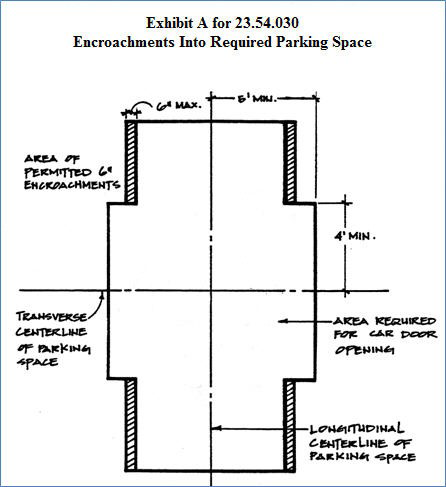

Exhibit A forEncroachments Into Required Parking Space

1. If the parking space is next to a lot line and the parking space is parallel to the lot line, the minimum width of the space is 9 feet.
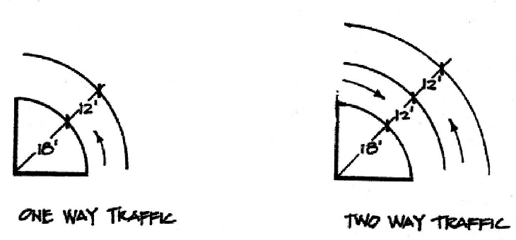

1. Vehicles may back onto a street from a parking area serving five or fewer vehicles, provided that either:

    1. The street is not an arterial as defined in Section 11.18.010; or
    2. For one single-family dwelling unit, the Director may permit backing onto an arterial based on a safety analysis that addresses visibility, traffic volume, and other relevant issues.
2. Nonconforming driveways. The number of parking spaces served by an existing driveway that does not meet the standards of this subsection 23.54.030.D.1 shall not be increased. This prohibition may be waived by the Director after consulting with the Director of the Seattle Department of Transportation, based on a safety analysis.
3. Nonresidential Uses.

    1. Driveway Widths.

        1. The minimum width of driveways for one way traffic shall be 12 feet and the maximum width shall be 15 feet.
        2. The minimum width of driveways for two way traffic shall be 22 feet and the maximum width shall be 25 feet.
    2. Driveways shall conform to the minimum turning path radius shown in Exhibit B for 23.54.030.
    3. For driveways that provide access to a solid waste management use the Director may allow both a maximum driveway width greater than the limits set in subsection 23.54.030.D.2.a and appropriate turning path radii, as determined necessary for truck maneuvering.
4. Driveway slope for all uses. No portion of a driveway, whether located on a lot or on a right-of- way, shall exceed a slope of 15 percent, except as provided in this subsection 23.54.030.D.3. The maximum 15 percent slope shall apply in relation to both the current grade of the right-of-way to which the driveway connects, and to the proposed finished grade of the right-of-way if it is different from the current grade. The ends of a driveway shall be adjusted to accommodate an appropriate crest and sag. The Director may permit a driveway slope of more than 15 percent if it is found that:

    1. The topography or other special characteristic of the lot makes a 15 percent maximum driveway slope infeasible;
    2. The additional amount of slope permitted is the least amount necessary to accommodate the conditions of the lot; and
    3. The driveway is still useable as access to the lot.
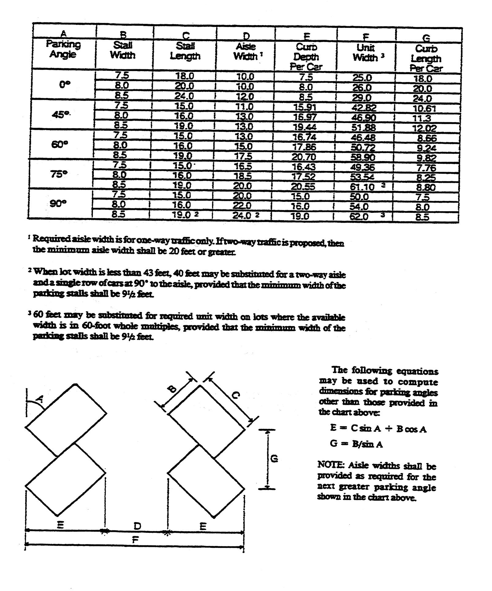

1. Minimum aisle widths shall be provided for the largest vehicles served by the aisle.
2. Turning and maneuvering areas shall be located on private property, except that alleys may be credited as aisle space.
3. Aisle slope shall not exceed 17 percent provided that the Director may permit a greater slope if the criteria in subsections 23.54.030.D.3.a, 23.54.030.D.3.b, and 23.54.030.D.3.c are met.

1. For lots on principal arterials designated on the Arterial street map, Section 11.18.010, curb cuts are permitted according to Table B for 23.54.030:

1. On a lot that has both principal arterial and non-principal arterial street frontage, the total number of curb cuts on the principal arterial is calculated using only the length of the street lot line on the principal arterial.
2. If two adjoining lots share a common driveway, the combined frontage of the two lots will be considered as one in determining the maximum number of permitted curb cuts.
3. Curb cut width. Curb cuts shall not exceed a maximum width of 10 feet except that:

    1. For lots on principal arterials designated on the Arterial street map, Section 11.18.010, the maximum curb cut width is 23 feet;
    2. One curb cut greater than 10 feet but in no case greater than 20 feet in width may be substituted for each two curb cuts permitted by subsection 23.54.030.F.1.a;
    3. A greater width may be specifically permitted by the development standards in a zone;
    4. If subsection 23.54.030.D requires a driveway greater than 10 feet in width, the curb cut may be as wide as the required width of the driveway; and
    5. A curb cut may be less than the maximum width permitted but shall be at least as wide as the minimum required width of the driveway it serves.
4. Distance between curb cuts

    1. The minimum distance between any two curb cuts located on a lot is 30 feet, except as provided in subsection 23.54.030.F.1.c.2).
    2. For rowhouse and townhouse developments, the minimum distance between curb cuts is 18 feet (See Exhibit D for 23.54.030). For rowhouse and townhouse developments located on abutting lots, the minimum distance between curb cuts is 18 feet.

Exhibit D forPaired driveways for attached units

1. Nonresidential uses in all zones except industrial zones.

    1. Number of Curb cuts.

        1. In all residential zones, RC zones, and within the Major Institution Overlay District, two-way curb cuts are permitted according to Table C for 23.54.030:
Table C for:Number of Curb Cuts in residential zones, RC Zones and the Major Institution Overlay District

<table>
<tr>
<td>Street Frontage of the Lot</td>
<td>Number of Curb cuts Permitted</td>
</tr>
<tr>
<td>80 feet or less</td>
<td>1</td>
</tr>
<tr>
<td>Greater than 80 feet up to 240 feet</td>
<td>2</td>
</tr>
<tr>
<td>Greater than 240 feet up to 360 feet</td>
<td>3</td>
</tr>
<tr>
<td>Greater than 360 feet up to 480 feet</td>
<td>4</td>
</tr>
<tr>
<td>For lots with frontage in excess of 480 feet, one curb cut is permitted for every 120 feet of street frontage.</td>
</tr>
</table>

1. The Director may allow two one-way curb cuts to be substituted for one two-way curb cut, after determining, as a Type I decision, that there would not be a significant conflict with pedestrian traffic.
2. The Director shall, as a Type I decision, determine the number and location of curb cuts in C1, C2 and SM zones.
3. In downtown zones, a maximum of two curb cuts for one way traffic at least 40 feet apart, or one curb cut for two way traffic, are permitted on each street front where access is permitted by subsection 23.49.019.H. No curb cut shall be located within 40 feet of an intersection. These standards may be modified by the Director as a Type I decision on lots with steep slopes or other special conditions, to the minimum extent necessary to provide vehicular and pedestrian safety and facilitate a smooth flow of traffic.
4. For public schools, the Director shall permit, as a Type I decision, the minimum number of curb cuts that the Director determines is necessary.
5. In NC zones, curb cuts shall be provided according to subsection 23.47A.032.A, or, when 23.47A.032.A does not specify the maximum number of curb cuts, according to subsection 23.54.030F.2.a.1.
6. For police and fire stations the Director shall permit the minimum number of curb cuts that the Director determines is necessary to provide adequate maneuverability for emergency vehicles and access to the lot for passenger vehicles.
7. Curb cut widths.

    1. For one way traffic, the minimum width of curb cuts is 12 feet, and the maximum width is 15 feet.
    2. For two way traffic, the minimum width of curb cuts is 22 feet, and the maximum width is 25 feet, except that the maximum width may be increased to 30 feet if truck and auto access are combined.
    3. For public schools, the maximum width of a curb cut is 25 feet. Development standard departures may be granted or required pursuant to the procedures and criteria set forth in Chapter 23.79.
    4. For fire and police stations, the Director may allow curb cuts up to, and no wider than, the minimum width necessary to provide access for official emergency vehicles that have limited maneuverability and that must rapidly respond to emergencies. Curb cuts for fire and police stations are considered curb cuts for two-way traffic.
    5. If one of the following conditions applies, the Director may require a curb cut of up to 30 feet in width, if it is found that a wider curb cut is necessary for safe access:

        1. The abutting street has a single lane on the side that abuts the lot; or
        2. The curb lane abutting the lot is less than 11 feet wide; or
        3. The proposed development is located on an arterial with an average daily traffic volume of over 7,000 vehicles; or
        4. Off-street loading berths are required according to subsection G of Section 23.54.035.
8. The entrances to all garages accessory to nonresidential uses or live-work units and the entrances to all principal use parking garages shall be at least 6 feet 9 inches high.
9. All uses in industrial zones.

    1. Number and location of curb cuts. The number and location of curb cuts will be determined by the Director.
    2. Curb cut width. Curb cut width in Industrial zones shall be as follows:

        1. Except as set forth in subsection 23.54.030.F.3.b.4), if the curb cut provides access to a parking area or structure, it must be a minimum of 15 feet wide and a maximum of 30 feet wide.
        2. If the curb cut provides access to a loading berth, the maximum width may be increased to 50 feet.
        3. Within the minimum and maximum widths established by this subsection 23.54.030.F.3, the Director shall determine the size of the curb cuts.
        4. If the curb cut provides access to a solid waste management use, the Director may determine the maximum width of the curb cut.
10. Curb cuts for access easements.

    1. If a lot is crossed by an access easement serving other lots, the curb cut serving the easement may be as wide as the easement roadway.
    2. The curb cut serving an access easement shall not be counted against the number or amount of curb cuts permitted to a lot if the lot is not itself served by the easement.
11. Curb cut flare. A flare with a maximum width of 2.5 feet is permitted on either side of curb cuts in any zone.
12. Replacement of unused curb cuts. When a curb cut is no longer needed to provide access to a lot, the curb and any planting strip must be replaced.
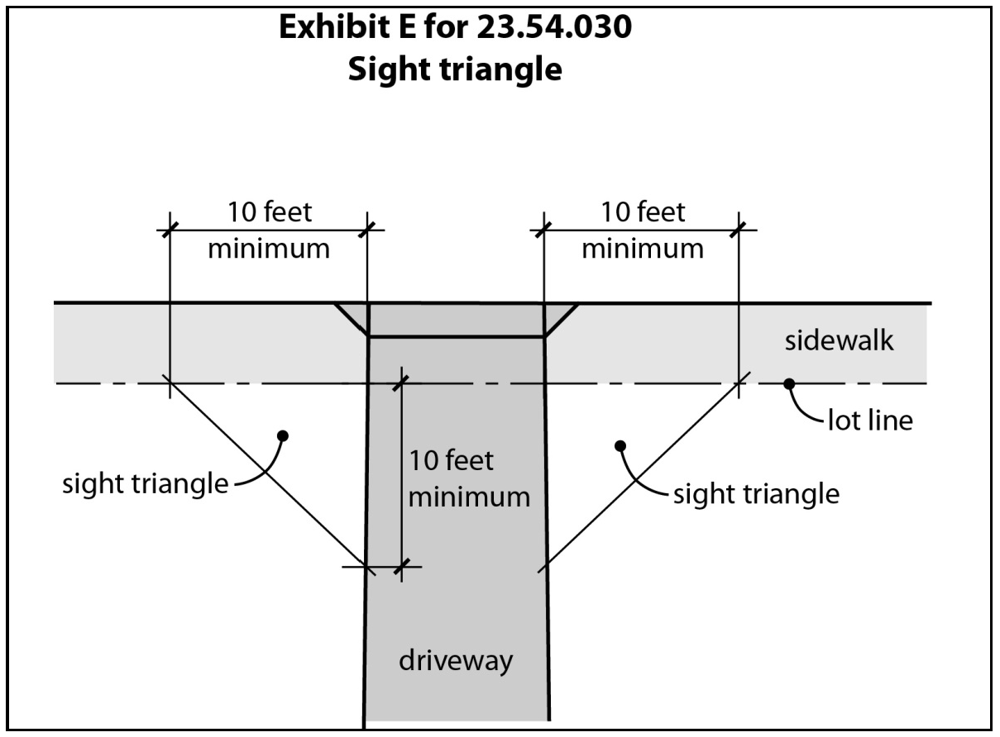

Exhibit E forSight triangle

1. For two way driveways or easements 22 feet wide or more, a sight triangle on the side of the driveway used as an exit shall be provided, and shall be kept clear of any obstruction for a distance of 10 feet from the intersection of the driveway or easement with a driveway, easement, sidewalk, or curb intersection if there is no sidewalk. The entrance and exit lanes shall be clearly identified.
2. The sight triangle shall also be kept clear of obstructions in the vertical spaces between 32 inches and 82 inches from the ground.
3. When the driveway or easement is less than 10 feet from the lot line, the sight triangle may be provided as follows:

    1. An easement may be provided sufficient to maintain the sight triangle. The easement shall be recorded with the King County Recorder; or
    2. The driveway may be shared with a driveway on the neighboring lot; or
    3. The driveway or easement may begin 5 feet from the lot line, as depicted in Exhibit F for 23.54.030.
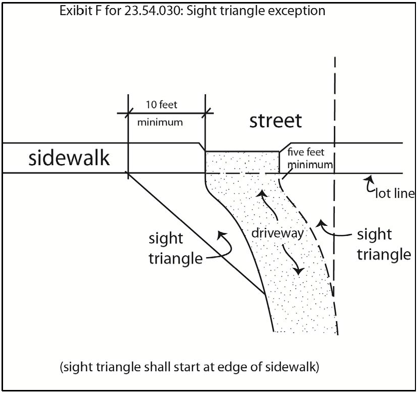

Exhibit F for Sight triangle exception

1. An exception to the sight triangle requirement may be made for driveways serving lots containing only residential uses and fewer than three parking spaces, when providing the sight triangle would be impractical.
2. In all Downtown, Industrial, Commercial 1, and Commercial 2 zones, the sight triangle at a garage exit may be provided by mirrors and/or other approved safety measures.
3. Sight triangles are not required for one-way entrances into a parking garage or surface parking area.

1. Parking space requirements. The required size of parking spaces shall be determined by whether the parking is for a residential, live-work, or non-residential use. In structures containing residential uses and also containing either non-residential uses or live-work units, parking that is clearly set aside and reserved for residential or live-work use shall meet the standards of subsection 23.54.030.B.1; parking for all other uses within the structure shall meet the standards of subsection 23.54.030.B.2. All uses shall provide barrier-free accessible parking if required by the Building Code, Subtitle I of Title 22, or the Residential Code, Subtitle IA of Title 22.

    1. Residential uses

        1. When five or fewer parking spaces are provided, the minimum required size of a parking space shall be for a medium car, as described in subsection 23.54.030.A.2, except as provided in subsection 23.54.030.B.1.d.
        2. When more than five parking spaces are provided, a minimum of 60 percent of the parking spaces shall be striped for medium vehicles. The minimum size for a medium parking space shall also be the maximum size. Forty percent of the parking spaces may be striped for any size, provided that when parking spaces are striped for large vehicles, the minimum required aisle width shall be as shown for medium vehicles.
        3. Assisted living facilities. Parking spaces shall be provided as in subsections 23.54.030.B.1.a and 23.54.030.B.1.b, except that a minimum of two spaces shall be striped for a large vehicle.
        4. Townhouse units. For an individual garage serving a townhouse unit, the minimum required size of a parking space shall be for a large car, as described in subsection 23.54.030.A.
    2. Non-residential uses

        1. When ten or fewer parking spaces are provided, a maximum of 25 percent of the parking spaces may be striped for small vehicles. A minimum of 75 percent of the spaces shall be striped for large vehicles.
        2. When between 11 and 19 parking spaces are provided, a minimum of 25 percent of the parking spaces shall be striped for small vehicles. The minimum required size for these small parking spaces shall also be the maximum size. A maximum of 65 percent of the parking spaces may be striped for small vehicles. A minimum of 35 percent of the spaces shall be striped for large vehicles.
        3. When 20 or more parking spaces are provided, a minimum of 35 percent of the parking spaces shall be striped for small vehicles. The minimum required size for small parking spaces shall also be the maximum size. A maximum of 65 percent of the parking spaces may be striped for small vehicles. A minimum of 35 percent of the spaces shall be striped for large vehicles.
        4. The minimum vehicle clearance shall be at least 6 feet 9 inches on at least one floor, and there shall be at least one direct entrance from the street that is at least 6 feet 9 inches in height for all parking garages accessory to non-residential uses and live-work units and for all principal use parking garages.
    3. Live-work uses. The first required parking space shall meet the parking standards for residential use. Additional required parking for a live-work use shall meet the parking standards for non-residential use.
2. Backing Distances and Moving Other Vehicles.

    1. Adequate ingress to and egress from all parking spaces shall be provided without having to move another vehicle, except in the case of multiple spaces provided for a single-family dwelling or an accessory dwelling unit associated with a single-family dwelling, or in the case of tandem parking authorized under Section 23.54.020.B.
    2. Except for lots with fewer than three parking spaces, ingress to and egress from all parking spaces shall be provided without requiring backing more than 50 feet.
3. Driveways. Driveway requirements for residential and nonresidential uses are described below. When a driveway is used for both residential and nonresidential parking, it shall meet the standards for nonresidential uses described in subsection 23.54.030.D.2.

    1. Residential uses.

        1. Driveway width. Driveways less than 100 feet in length that serve 30 or fewer parking spaces shall be a minimum of 10 feet in width for one-way or two-way traffic.
        2. Except for driveways serving one single-family dwelling unit, driveways more than 100 feet in length that serve 30 or fewer parking spaces shall either:

            1. be a minimum of 16 feet wide, tapered over a 20 foot distance to a 10 foot opening at the lot line; or
            2. be a minimum of 10 feet wide and provide a passing area at least 20 feet wide and 20 feet long. The passing area shall begin 20 feet from the lot line, with an appropriate taper to meet the 10 foot opening at the lot line. If a taper is provided at the other end of the passing area, it shall have a minimum length of 20 feet.
        3. Driveways of any length that serve more than 30 parking spaces shall be at least 10 feet wide for one-way traffic and at least 20 feet wide for two-way traffic.
        4. Driveways for two attached rowhouse or townhouse units may be paired so that there is a single curb cut providing access. The maximum width of the paired driveway is 18 feet.
        5. Driveways with a turning radius of more than 35 degrees shall conform to the minimum turning path radius shown in Exhibit B for 23.54.030.
4. Parking aisles

    1. Parking aisles shall be provided according to the requirements of Exhibit C for 23.54.030.
5. Curb cuts. The number of permitted curb cuts is determined by whether the parking served by the curb cut is for residential or nonresidential use, and by the zone in which the use is located. If a curb cut is used for more than one use or for one or more live-work units, the requirements for the use with the largest curb cut requirements shall apply.

    1. Residential uses

        1. Number of curb cuts

            1. For lots not located on a principal arterial designated on the Arterial street map, Section 11.18.010, curb cuts are permitted according to Table A for 23.54.030:
6. Sight triangle

    1. For exit-only driveways and easements, and two way driveways and easements less than 22 feet wide, a sight triangle on both sides of the driveway or easement shall be provided, and shall be kept clear of any obstruction for a distance of 10 feet from the intersection of the driveway or easement with a driveway, easement, sidewalk or curb intersection if there is no sidewalk, as depicted in Exhibit E for 23.54.030.
7. Attendant Parking. In downtown zones, any off-street parking area or structure providing more than 5 parking spaces where automobiles are parked solely by attendants employed for that purpose shall have parking spaces at least 8 feet in width, and 15 feet in length. Subsections A, B, C, D and E of this Section 23.54.030 shall not apply, except that the grade curvature of any area used for automobile travel or storage shall not exceed that specified in subsection 23.54.030.D.3. Should attendant operation be discontinued, the provisions of subsections 23.54.030 A, B, C, D and E shall apply to the parking.
8. Off-street Bus Parking. Bus parking spaces, when required, shall be 13 feet in width and 40 feet in length. Buses parked en masse shall not be required to have adequate ingress and egress from each parking space.
9. The Director may, as a Type I decision, reduce any required dimension for nonresidential uses and live-work units up to 3 percent to allow more efficient use of a surface parking area or parking garage, except for the dimensions of parking spaces and aisles for small vehicles.

#### 23.54.035 - Loading berth requirements and space standards

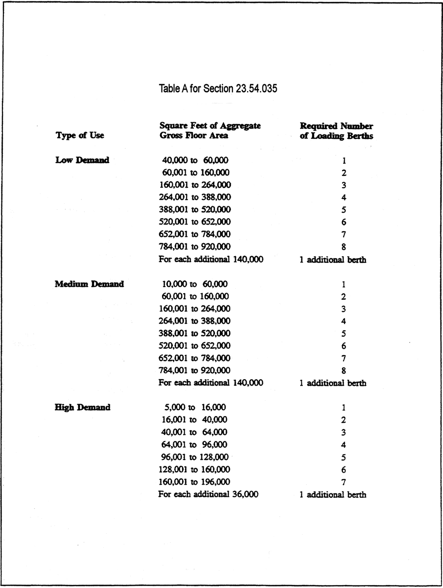

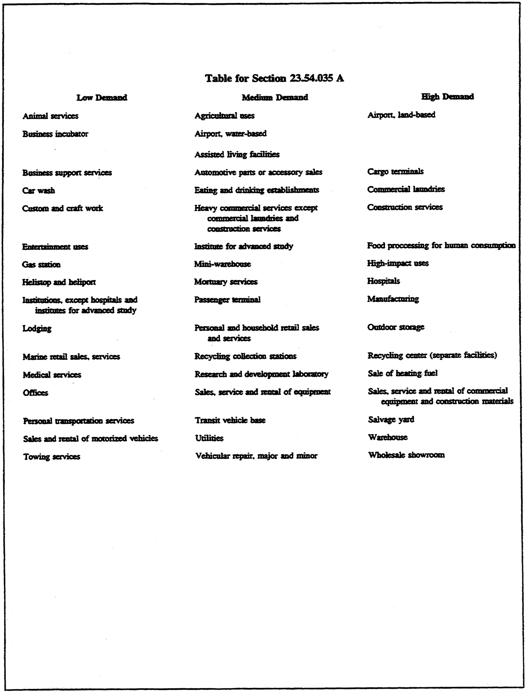

1. Quantity of Loading Spaces.

    1. The minimum number of off-street loading berths required for specific uses shall be set forth in Table A. (See Table A for Section 23.54.035.)
    2. For uses not listed on Table A the Director shall determine the loading berth requirements. Loading demand and loading requirements for similar uses shall be considered in determining such requirements.
    3. Existing deficits in the number of required loading berths shall be allowed to continue if a change of use occurs.
    4. Uses shall be considered low-demand uses, medium-demand uses and high-demand uses, as follows. (See Table for 23.54.035 A.)
    5. When a lot contains more than one (1) business establishment within the same category of low-, medium- or high-demand use, the square footage of the business establishments within the same category shall be added together in order to determine the number of required loading berths.
2. Exception to loading requirements

    1. For uses with less than 16,000 square feet of gross floor area that provide a loading space on a street or alley, the loading berth requirements may be waived by the Director if, after review, the Director of Transportation finds that the street or alley berth is adequate.
    2. Within the Downtown and South Lake Union Urban Centers and within the MPC-YT zone, loading berth requirements may be waived or modified if the Director finds, after consultation with and approval by the Director of Transportation, that the number of loading berths in Table A for 23.54.035 is not required and that the modified number will be sufficient. The applicant shall submit specific information addressing the following criteria, upon which the Director's determination shall be based:

        1. All loading is proposed to occur on-site; or
        2. Loading that is proposed to occur in a public right-of-way can take place without disrupting pedestrian circulation or vehicular traffic;
        3. Additional evidence relating to the size, character and operation of the building and likely tenancy; and
        4. Where loading occurs at a central loading facility, goods can be distributed to other buildings on-site without disrupting pedestrian circulation or vehicular traffic.
3. Standards for Loading Berths.

    1. Width and Clearance. Each loading berth shall be not less than ten (10) feet in width and shall provide not less than fourteen (14) feet vertical clearance.
    2. Length.

        1. High-demand Uses. Each loading berth for a high-demand use shall be a minimum of fifty-five (55) feet in length unless reduced by determination of the Director as provided at subsection C2c.
        2. Low- and Medium-demand Uses. Each loading berth for low- and medium-demand uses, except those uses identified in subsection C2d, shall be a minimum of thirty-five (35) feet in length unless reduced by determination of the Director as provided at subsection C2c.
        3. Exceptions to Loading Berth Length. Where the Director finds, after consulting with the property user, that site design and use of the property will not result in vehicles extending beyond the property line, loading berth lengths may be reduced to not less than the following:

            1. High-demand Uses. Thirty-five (35) feet when access is from a collector arterial or local access street; and forty-five (45) feet when access is from a principal or minor arterial street;
            2. Low- and Medium-demand Uses. Twenty-five (25) feet.
        4. Multipurpose convenience stores, sales, service and rental of major durables, and specialty food stores may be required by the Director to increase the length of required loading berths; however, these uses shall not be required to provide loading berths in excess of fifty-five (55) feet. The review of loading berth length requirements for these uses shall focus on the size of vehicles that frequently serve the business and the frequency of loading activity that will extend beyond the lot line during daytime hours (six (6:00) a.m. to six (6:00) p.m.). Large-truck loading occurring on a daily basis shall generally require longer loading berths; when such activity occurs on at least a weekly basis, it will be evaluated regarding the amount of traffic disruption and safety problems potentially created; such activity occurring on less than a weekly basis shall generally not require longer loading berths.
    3. For uses not listed in Table A, the Director shall determine the loading berth length requirements. Loading demand and loading requirements for similar uses shall be considered.
    4. Maneuvering Space for Loading Berths. In addition to the length of the loading berth, additional maneuvering space may be required by the Director in the following cases:

        1. For any uses with over ten thousand (10,000) square feet of gross floor area with loading berth access from a principal or minor arterial street;
        2. For high-demand uses with over ten thousand (10,000) square feet of gross floor area with loading berth access from a collector arterial or local access street, especially if located across the street from another high-demand use. When required, the additional maneuvering space shall be designed and arranged to allow the most efficient use of all required loading berths by motor vehicles of the types typically employed by the activities served.

#### 23.54.040 - Solid waste and recyclable materials storage and access

1. Except as provided in subsection 23.54.040.I, in downtown, multifamily, master planned community, and commercial zones, storage space for solid waste and recyclable materials containers shall be provided as shown in Table A for 23.54.040 for all new structures, and for existing structures to which two or more dwelling units are added.

    1. Residential uses proposed to be located on separate platted lots, for which each dwelling unit will be billed separately for utilities, shall provide one storage area per dwelling unit that has minimum dimensions of 2 feet by 6 feet.
    2. Residential development for which a home ownership association or other single entity exists or will exist as a sole source for utility billing may meet the requirement in subsection 23.54.040.A.1, or the requirement in Table A for 23.54.040.
    3. Non-residential development shall meet the requirement in Table A for 23.54.040.
2. Mixed use development that contains both residential and non-residential uses shall meet the storage space requirements shown in Table A for 23.54.040 for residential development, plus 50 percent of the requirement for non-residential development. In mixed use developments, storage space for garbage may be shared between residential and non-residential uses, but separate spaces for recycling shall be provided.
3. For development with more than 100 dwelling units, the required minimum area for storage space may be reduced by 15 percent, if the area provided as storage space has a minimum horizontal dimension of 20 feet.
4. The storage space required by Table A for 23.54.040 shall meet the following requirements:

    1. For developments with eight or fewer dwelling units, the minimum horizontal dimension (width and depth) for required storage space is 7 feet. For developments with nine dwelling units or more, the minimum horizontal dimension of required storage space is 12 feet;
    2. The floor of the storage space shall be level and hard-surfaced, and the floor beneath garbage or recycling compactors shall be made of concrete; and
    3. If located outdoors, the storage space shall be screened from public view and designed to minimize light and glare impacts.
5. The location of all storage spaces shall meet the following requirements:

    1. The storage space shall be located on the lot of the structure it serves and, if located outdoors, shall not be located between a street-facing facade of the structure and the street;
    2. The storage space shall not be located in any required driveways, parking aisles, or parking spaces;
    3. The storage space shall not block or impede any fire exits, any public rights-of-way, or any pedestrian or vehicular access;
    4. The storage space shall be located to minimize noise and odor impacts on building occupants and beyond the lot lines of the lot;
    5. The storage space shall meet the contractor safety standards promulgated by the Director of Seattle Public Utilities; and
    6. The storage space shall not be used for purposes other than solid waste and recyclable materials storage and access.
6. Access for service providers to the storage space from the collection location shall meet the following requirements:

    1. For containers 2 cubic yards or smaller:

        1. Containers to be manually pulled shall be placed no more than 50 feet from a curb cut or collection location;
        2. Collection location shall not be within a bus stop or within the right-of-way area abutting a vehicular lane designated as a sole travel lane for a bus;
        3. Access ramps to the storage space shall not exceed a grade of 6 percent; and
        4. Any gates or access routes for trucks shall be a minimum of 10 feet wide.
    2. For containers larger than 2 cubic yards and all compacted refuse containers:

        1. Direct access shall be provided from the alley or street to the containers;
        2. Any gates or access routes for trucks shall be a minimum of 10 feet wide;
        3. Collection location shall not be within a bus stop or within the street right-of-way area abutting a vehicular lane designated as a sole travel lane for a bus;
        4. If accessed directly by a collection vehicle, whether into a structure or otherwise, a 21 foot overhead clearance shall be provided.
7. Access for occupants to the storage space from the collection location shall meet the following requirements:

    1. Direct access shall be provided from the alley or street to the containers;
    2. A pick-up location within 50 feet of a curb cut or collection location shall be designated that minimizes any blockage of pedestrian movement along a sidewalk or other right-of-way;
    3. If a planting strip is designated as a pick-up location, any required landscaping shall be designed to accommodate the solid waste and recyclable containers within this area.
8. The solid waste and recyclable materials storage space, access and pick-up specifications required in this Section 23.54.040, including the number and sizes of containers, shall be included on the plans submitted with the permit application for any development subject to the requirements of this Section 23.54.040.
9. The Director, in consultation with the Director of Seattle Public Utilities, has the discretion to grant departures from the requirements of this Section 23.54.040 if the applicant proposes alternative, workable measures that meet the intent of this Section 23.54.040 and if either:

    1. The applicant can demonstrate difficulty in meeting any of the requirements of this Section 23.54.040; or
    2. The applicant proposes to construct or expand a structure, and the requirements of this Section 23.54.040 conflict with opportunities to increase residential densities and/or retain ground-level retail uses.

### Chapter 23.55 - SIGNS

Sections:

#### Part 1 - General Standards for All Zones

#### Part 2 - Standards for Specific Zones

#### Part 3 - Appeals

Part 1 General Standards for All Zones

##### 23.55.001 - Intent.

The intent of the standards in this chapter is:

1. To encourage the design of signs that attract and invite rather than demand the public's attention, and to curb the proliferation of signs;
2. To encourage the use of signs that enhance the visual environment of the city;
3. To promote the enhancement of business and residential properties and neighborhoods by fostering the erection of signs complementary to the buildings and uses to which they relate and which are harmonious with their surroundings;
4. To protect the public interest and safety;
5. To protect the right of business to identify its premises and advertise its products through the use of signs without undue hindrance or obstruction; and
6. To provide opportunities for communicating information of community interest.

##### 23.55.002 - Scope of provisions.

1. The provisions of this chapter shall apply to signs in all zones, except those zones regulated by Chapter 23.66, Special Review Districts.
2. Signs located in the Shoreline District shall meet the requirements of the Seattle Shoreline Master Program in addition to the provisions of this chapter. In the event that there is a conflict between the provisions of this chapter and the regulations of the Shoreline Master Program, the provisions of the Shoreline Master Program shall apply.
3. Signs are also regulated by the provisions of Chapter 32 of the Building Code, Title 22 of the Seattle Municipal Code, including the permit requirements of that title.
4. Signs located completely within public rights-of-way shall be regulated by the Street Use Ordinance, Title 15 of the Seattle Municipal Code. Signs projecting from private property over public rights-of-way are also regulated by the Street Use Ordinance, as well as the provisions of this chapter.
5. Signs adjacent to certain public highways and designated scenic routes shall meet the provisions of Section 23.55.042 of this chapter. Signs adjacent to state highways may also be regulated by state law or regulations.
6. Variances may be permitted from the provisions of this chapter, except that variances shall not be permitted from subsection A of Section 23.55.014, and variances from Section 23.55.042, Off-premises and business signs adjacent to certain public highways, shall be limited by the provisions of subsection E of Section 23.55.042.
7. Measurements provisions for signs are located in Chapter 23.86, Measurements.

##### 23.55.003 - Signs prohibited in all zones.

1. The following signs shall be prohibited in all zones:

    1. Flashing signs;
    2. Signs which rotate or have a rotating or moving part or parts that revolve at a speed in excess of seven (7) revolutions per minute;
    3. Signs attached to or located on stationary motor vehicles, equipment, trailers, and related devices, except for signs not exceeding five (5) square feet in area and relating to the sale, lease or rent of a motor vehicle to which the signs are attached;
    4. Portable signs other than readily detachable signs having a fixed base or mounting for the placement and intermittent use of such signs;
    5. Banners, streamers, strings of pennants, fabric signs, festoons of lights, clusters of flags, wind-animated objects, balloons, searchlights, and similar devices, except where the principal use or activity on the lot is outdoor retail sales in NC3, C1, C2 and downtown zones, and except where permitted as temporary signs under Section 23.55.012.
    6. Signs that attempt or appear to attempt to direct the movement of traffic or that interfere with, imitate or resemble any official traffic sign, signal or device.
    7. Signs using a video display method, except as provided in section 23.55.005, Video display methods.

##### 23.55.004 - Signs projecting over public rights-of-way.

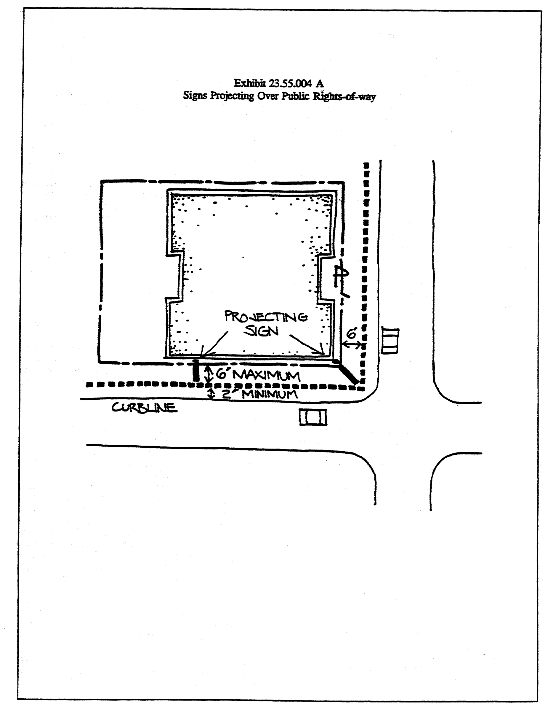

Exhibit 23.55.004A

1. Signs projecting into any public right-of-way, except alleys, shall have a minimum clearance of eight (8) feet over the adjacent sidewalk or other grade.
2. Signs projecting into any public alley shall have a minimum clearance of sixteen (16) feet above grade, and shall not project more than twenty-four (24) inches beyond the property line.
3. No permanent sign shall extend into any public right-of-way to within less than two (2) feet of the curbline, or more than six (6) feet beyond the property line, except that at street intersections, signs which project from intersecting street property lines may extend to the intersection of the six (6) foot projection margins on each street (Exhibit 23.55.004 A).
4. No barberpole, including the brackets and fastenings for the barberpole, shall extend more than one (1) foot into any public right-of-way.
5. No temporary sign made of rigid material shall extend more than four (4) inches into the public right-of-way.
6. Marquee signs may be permitted in conjunction with any lawful marquee, provided that they shall not project more than twelve (12) inches beyond the front of the marquee, nor closer than two (2) feet to the curbline. Marquee signs may not exceed thirty (30) inches in height above the top of the marquee, and total vertical dimension may not exceed five (5) feet. Only one (1) sign may be placed on or attached to an end face of a marquee.
7. Roof signs shall not project into any public right-of-way.

##### 23.55.005 - Video display methods

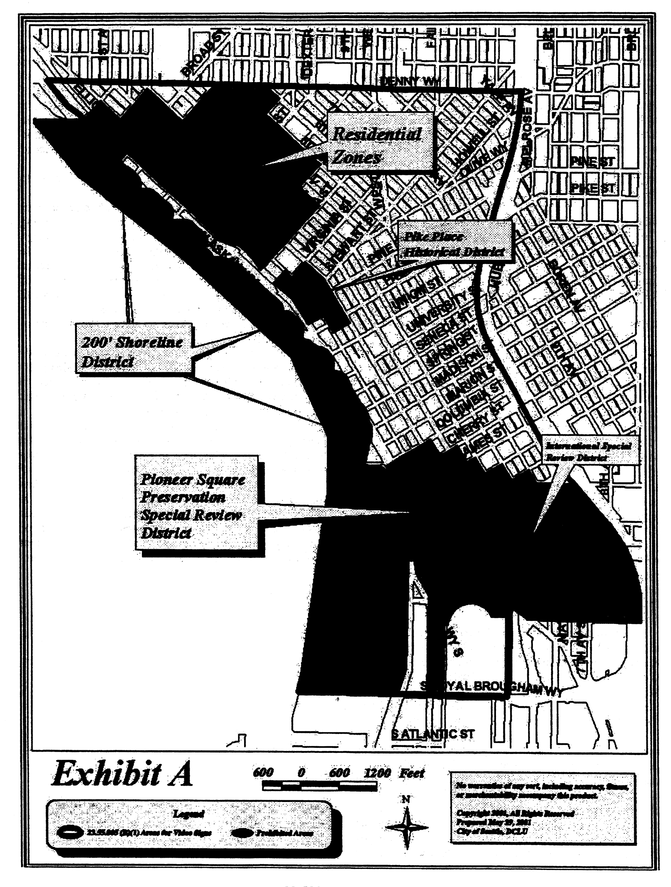

Exhibit A

1. Development standards. Video display may be used on a sign when the sign meets all of the following development standards:

    1. The sign is an on-premises sign;
    2. The sign is not located in a residential, NC1 or NC2 zone, Special Review District, Historical District, Preservation District or shoreline environment;
    3. The sign meets one of the following criteria:

        1. The sign face is not visible from a street, driveway or surface parking area, and also is not visible from a lot that is owned by a different person, in which case the size of the sign is not limited by this subsection, and the standards for duration or pause periods and subsection A5 shall not apply; or
        2. The sign area is less than or equal to one thousand (1000) square inches and no single dimension of the sign exceeds three (3) feet; or
        3. The sign meets the standards set out in subsection B, in addition to meeting all other standards of this subsection A.
    4. The maximum height for any sign using a video display method shall be fifteen (15) feet above existing grade. Pole signs using a video display method shall be at least ten (10) feet above the ground;
    5. The sign is at least thirty-five (35) linear feet in any direction from any other sign that uses a video display method;
    6. When located within fifty (50) feet of a lot in a residential zone, any part of the sign using a video display method is oriented so that no portion of the sign face is visible from an existing or permitted principal structure on that lot;
    7. Duration: Any portion of the message that uses a video display method shall have a minimum duration of two (2) seconds and a maximum duration of five (5) seconds. Calculation of the duration shall not include the number of frames per second used in a video display method. Calculation of the maximum duration shall include the time used for any other display methods incorporated within that portion of the message displayed using a video display method;
    8. Pause Between Video Portions of Message. There shall be twenty (20) seconds of still image or blank screen following every message using a video display method;
    9. Audio speakers shall be prohibited in association with a sign using a video method of display;
    10. Between dusk and dawn the video display shall be limited in brightness to no more than five hundred (500) units when measured from the sign's face at its maximum brightness; and
    11. Signs using a video display method may be used after dusk only until 11:00 p.m. or, if the advertising is an on-premises message about an event at the site where the sign is located, for up to one (1) hour after said event.
2. In lieu of complying with subsection 23.55.005.A.3 above, the Director of SDCI shall allow video display methods on a sign if the sign meets all of the following additional development standards:

    1. The sign is within the area shown on the map attached as Exhibit 23.55.005 A and not within a Special Review District, Historic District, Preservation District, residential zone, or shoreline environment;
    2. The sign is a minimum distance of 15 feet from the curb; and
    3. The maximum size of the sign is 20 square feet as independently applied to each sign face, including framework and border.
3. Video Signs Previously Erected. On-premises signs using the video method of display, that have permits authorizing use of that method of display issued prior to August 1, 2001, may continue to use the video method of display authorized in the permit provided that they meet the standards of 23.55.005A6-11 above within one hundred eighty (180) days from the effective date of the ordinance codified in this section. Previously erected and permitted signs that use a video method of display located within the area shown on the map attached as Exhibit A shall not be subject to the foregoing standards of this section except 23.55.005Al. If the video method of display is terminated for one hundred eighty (180) days or the sign is relocated or reconstructed, then the video method of display cannot be used except in conformance with the development standards of this section.

##### 23.55.008 - Signs near intersections or driveways.

Signs which are ten (10) feet or less in height as measured from street or driveway grade and which obscure the vision of motorists shall be located at least twenty (20) feet from intersections and driveways.

##### 23.55.012 - Temporary signs permitted in all zones.

1. Real estate "for sale," "for rent" and "open house" temporary signs, temporary signs identifying the architect, engineer or contractor for work currently under construction, and temporary noncommercial messages displayed on fabric signs, flags or rigid signs shall be permitted in all zones at all times, provided they are not painted with light-reflecting paint or illuminated. The total area for these types of temporary signs in the aggregate shall not exceed eight (8) square feet per building lot in single-family zones, and twenty-four (24) square feet per building lot in all other zones, except as follows: the total area allowed for noncommercial messages may increase to a maximum of eight (8) square feet per dwelling unit for use by the occupant of that dwelling unit; and in buildings where there are eight (8) dwelling units or more, a real estate banner not exceeding thirty-six (36) square feet may be permitted for one (1) nine (9) month period starting from the date of the issuance of the certificate of occupancy.
2. In addition to the signs described in subsection A of this section above, commercial or noncommercial messages may be displayed for a total of four (4) fourteen (14) consecutive day periods a calendar year; these additional four (4) periods are the maximum, whether the message is the same message or a different message. These messages may be displayed on banners, streamers, strings of pennants, fabric signs, festoons of lights, flags, wind-animated objects, rigid signs, balloons, searchlights, portable signs attached to vehicles, or devices of a carnival nature, and shall be allowed as temporary signs in all zones. The total area for all temporary signs per fourteen (14) day period, when combined with those signs authorized under subsection A of this section, in the aggregate shall not exceed thirty-two (32) square feet per building lot for signs made of rigid material, with no dimension greater than eight (8) feet, and one hundred (100) square feet per building lot for temporary signs not made of rigid material; provided that the total area allowed for noncommercial messages may increase to a maximum of thirty-two (32) square feet per dwelling unit, with no dimension greater than eight (8) feet, for signs made of rigid material, and one hundred (100) square feet per dwelling unit for temporary signs not made of rigid material, all for use by the occupant of that dwelling unit. No individual sign made of nonrigid material may exceed thirty-six (36) square feet.
3. All signs authorized by this section are subject to the following regulations:

    1. No sign may be placed on public property or on the planting strips that abut public property, including planting strips forming a median in a public street, except as provided in subsection C3 below and except for portable signs attached to vehicles that are using the public streets.
    2. All signs must be erected with the consent of the occupant of the property on which the sign is located, except as provided in subsection C3 below.
    3. Temporary Signs on Public Property or in Planting Strips.

        1. Temporary signs with commercial or noncommercial messages may be located on public rights-of-way or in planting strips in business districts, subject to the requirements of City of Seattle Public Works Rules Chapter 4.60 or its successor Rule.
        2. Temporary signs with noncommercial messages, other than in subsection C3a above, may be located in the planting strip in front of private property with the consent of the occupant of that property and may not exceed eight (8) square feet or be supported by stakes that are more than one (1) foot into the ground. Signs in the planting strip shall be no more than twenty-four (24) inches in height as measured from street or driveway grade when located within thirty (30) feet from the curbline of intersections. Signs shall be no more than thirty-six inches (36") in height as measured from street or driveway grade when located thirty feet (30') or more from the curbline of intersections.
        3. In addition to commercial signs in business districts allowed in subsection C3a above, only temporary commercial "open house" signs may be placed in planting strips. One (1) "open house" temporary sign per street frontage of a lot may be located with the consent of the occupant and provided the occupant or seller is on the premises. The "open house" signs may not exceed eight (8) square feet per lot or be supported by stakes that are more than one foot (1') into the ground. The "open house" signs shall be no more than twenty-four inches (24") in height as measured from street or driveway grade when located within thirty feet (30') from the curbline of intersections, and shall be no more than thirty-six inches (36") in height as measured from street or driveway grade when located thirty feet (30') or more from the curbline of intersections.
        4. No sign placed in a planting strip may be displayed on banners, streamers, strings of pennants, festoons of lights, flags, wind-animated objects or balloons.
        5. The requirements of this subsection C3 shall be enforced by the Director of Seattle Department of Transportation pursuant to the enforcement provisions of that Department.
    4. No sign shall obstruct or impair access to a public sidewalk, public or private street or driveway, traffic control sign, bus stop, fire hydrant, or any other type of street furniture, or otherwise create a hazard, including a tripping hazard.
    5. Signs shall be designed to be stable under all weather conditions, including high winds.
    6. A temporary sign shall conform to the standards for roof signs, flashing, changing image or message board signs, for moving signs, and for lighting and height regulations for the zone or special review district in which the temporary sign is located, provided that balloons may exceed height regulations.
    7. The entire visible surface of the sign, exclusive of support devices, shall be included in area calculations.

##### 23.55.014 - Off-premises signs.

1. Advertising Signs.

    1. No advertising sign shall be erected, or constructed, unless an existing advertising sign is relocated or reconstructed at a new location. An advertising sign may be relocated or reconstructed if:

        1. The existing advertising sign was lawfully erected and after the effective date of the ordinances codified in this section, is registered to pursuant to subsection F of this section;
        2. The advertising sign is located on a site or in a zone where it is not permitted, except as provided in subsection A.1.c of this Section 23.55.014;
        3. In each calendar year one advertising sign which is located on a site or in a zone where it is permitted may be relocated or reconstructed if a citizen submits a written request for relocation to the Director;
        4. The reconstructed or relocated advertising sign will be a permitted use and will conform with all ordinances of the City at its new location;
        5. The construction permit for the relocated or reconstructed advertising sign is issued during the pendency of the demolition permit for the existing sign;
        6. The advertising sign face does not increase in size; and
        7. The advertising sign is relocated to an area with the same or more intensive zoning. Areas in which advertising signs are allowed are listed below from least intense to most intense zoning, and zones listed on the same line are considered of the same intensity. Zones which do not allow advertising signs shall be considered less intense zones for the purpose of relocation. This list is for purposes of this criterion only.
        8. The number of relocated advertising signs does not exceed 12 structure locations per year or 24 sign face locations per year, excluding relocations pursuant to subsection G of this Section 23.55.014.
    2. For purposes of relocation, sign owners maintain the right to relocation.
    3. Wall signs cannot be relocated.
    4. Maximum Sign Face Area. The maximum total area of any advertising sign in Commercial 1 and 2, Industrial and Downtown (except Downtown Mixed Residential/Commercial) zones shall be 672 square feet, with a maximum vertical dimension of 25 feet and a maximum horizontal dimension of 50 feet, provided that cutouts and extensions may add up to 20 percent of additional sign area. The maximum total area of any advertising sign in Downtown Mixed Residential/Commercial (DMR/C) zones shall be 300 square feet, except for visually blocked signs which may be a maximum of 672 square feet.
    5. All advertising signs shall be located at least 50 feet from any lot in a residential zone, and at least 500 feet from any public school grounds, public park, or public playground, or community center, except for off-premises signs allowed under Section 23.55.032.G. For purposes of this section, a public park or public playground means a park or playground at least one acre in size and a community center must be publicly owned.
    6. No variances shall be permitted from the provisions of this subsection A.
2. Off-premises Directional Signs. The maximum area of any off-premises directional sign shall be 100 square feet, with a maximum vertical dimension of 10 feet and a maximum horizontal dimension of 20 feet, except for off-premises signs allowed under Section 23.55.032.G.
3. The maximum area for each sign face for business district identification signs shall be that permitted for pole signs in the zone.
4. The maximum area for each sign face for residential district identification signs shall be fifty (50) square feet.
5. Development Standards Applicable to All Off-premises Signs.

    1. Dispersion Standard.

        1. Directional Sign Faces and Business District Identification Signs. Not more than a total of four (4) off-premises directional sign faces, plus two (2) identification signs for a business district, shall be permitted on both sides of a street within a space of six hundred sixty feet (660'). There shall be a minimum distance of one hundred feet (100') between sign structures.
        2. Advertising Signs.

            1. Not more than a total of five (5) advertising sign structures shall be permitted when counting both sides of a street within a linear distance of two thousand six hundred forty feet (2640′), one-half (½) mile).
            2. There shall be a minimum distance of three hundred linear feet (300') between advertising sign structures on the same side of the street; a maximum of two (2) advertising sign structures within three hundred linear feet (300') when counting both sides of the street; and, a minimum distance of one hundred radial (100') between advertising sign structures.
            3. Visually blocked advertising signs shall count as one-half (½) a structure, and may be within any distance from each other on the same side of the street as long as they are oriented in opposite directions. Visually blocked advertising signs oriented in the same direction or on opposite sides of the street are subject to the spacing criteria under subsection E1b(2) of this section.
            4. There shall be a maximum of two (2) sign faces per advertising sign structure and a maximum of one (1) sign face per side of the advertising sign structure.
    2. Off-premises signs shall not be roof signs.
    3. Lighting. No off-premises sign shall be incandescently illuminated by more than one and one-quarter (1¼) watts of electrical power per square foot of sign area, or be fluorescently or otherwise illuminated by more than one (1) watt of electrical power per square foot of sign area. Off-premises signs that include lights as part of the message or content of the sign (chasing and message board advertising signs) are prohibited.
    4. Sign Height. The maximum height limit for any portion of an off-premises sign (except in Industrial zones) is forty (40) feet or the height limit of the zone, whichever is less. The maximum height limit for any portion of an off-premises sign in an Industrial zone is sixty-five (65) feet or the height limit of the zone, whichever is less.
6. Registration of Advertising Signs. Each owner of an off-premises advertising sign shall file a written report with the Director on or before July 1 of each year. The report shall be submitted on a form supplied by the Director. The owner shall identify the number and location of advertising signs maintained by the owner in the City at any time during the previous year and provide such other information as the Director deems necessary for the inspection of signs and for the administration and enforcement of this 23.55.014. The owner shall pay a fee to the Director at the time the written report is filed. The amount of the fee is $40 for each sign face identified in the report. SDCI shall assign a registration number to each sign face, and the sign number shall be displayed on the face of the billboard frame in figures which are a minimum of 8 inches tall. It is unlawful to maintain a sign face which has not been registered as required by this 23.55.014. Notwithstanding any other provision of this code, any person who maintains an unregistered sign face is subject to an annual civil penalty of $5,000 for each unregistered sign face.
7. Side-by-Side Advertising Signs. One (1) of the two (2) sign faces that comprise side-by-side advertising signs shall be removed within three (3) years of the effective date of the ordinance codified in this section. The sign face may be relocated if the sign will meet the requirements of subsections A1e, A1f and A1g of this section, provided that in lieu of relocation the two (2) side-by-side advertising signs may be replaced by one (1) six hundred seventy-two (672) square foot advertising sign at the same location.
8. The provisions of this section do not apply to sign kiosks, except subsection A5, prohibiting advertising signs within five hundred (500) feet from any public school grounds.

##### 23.55.015 - Sign kiosks and community bulletin boards

1. Sign Kiosks. Sign kiosks are permitted in all zones, except single-family residential zones and multifamily residential zones, provided that a sign kiosk may abut a park or playground at least one acre in size, or publicly owned community center in all zones. Sign kiosks are not permitted within fifty (50) feet of a single-family residential zone or multifamily residential zone.
2. Sign Kiosks in the Public Right-of-way. Sign kiosks that are located in the public right-of-way must obtain a street use permit from Seattle Department of Transportation and are subject to the requirements, conditions and procedures set out in SMC Title 15. Seattle Department of Transportation shall review an application for a sign kiosk in the public right-of-way for compliance with the provisions of this chapter. The street use permit issued by Seattle Department of Transportation shall serve as the required sign permit.
3. Development Standards for Sign Kiosks

    1. Design and Construction.

        1. The design of any sign kiosk shall comply with the design principles for sign kiosks approved by the Seattle Design Commission, or shall be reviewed and recommended by the Commission.
        2. The design of any sign kiosk adjacent to a park, playground or publicly owned community center shall also be reviewed and must be approved by the Seattle Department of Parks and Recreation for aesthetic compatibility with existing signs and the design of the park, playground or community center.
        3. The design of any sign kiosk in a special review district established in SMC Chapters 23.66, 25.16, 25.20, 25.22, and 25.24 shall also be reviewed and must be approved by the board for that district for compliance with the standards of that district.
        4. The sign kiosk shall be in sections with maximum dimensions of seven (7) feet high, three (3) feet wide measuring from the centers of the supporting posts on either side of the sections, and six (6) inches deep, with a maximum of four (4) sections. No more than two (2) feet of additional height will be allowed for artistic decoration on top of the kiosk, with additional width not to exceed the width of the kiosk structure. The Seattle Design Commission may approve a different style or different dimensions, which shall not exceed the maximum height dimension and the maximum overall size set out above.
        5. Lights, changing image signs, and message board signs shall not be placed on any part of a sign kiosk that is visible from the street. Flashing signs and chasing signs are prohibited on any part of a kiosk. Any lighting fixtures used within kiosks or used externally to illuminate kiosks shall be fully shielded. The maximum illumination level at the kiosk shall be five (5) foot-candles (fc) maintained at ground level.
        6. Materials used in constructing sign kiosks shall minimize reflective glare from natural or artificial illumination.
        7. The design of any kiosk structure shall not be likely to be mistaken for any traffic control device and shall comply with SMC Sections 11.50.500 through 11.50.560.
        8. All sign kiosks shall be designed, constructed and maintained in accordance with SMC Chapter 22, Section 3204, the Seattle Building Code provisions governing signs.
    2. Location

        1. The location of any sign kiosk shall comply with the location standards set out in the rules of Seattle Department of Transportation, including without limitation rules for line of sight at intersections, compatibility with traffic control signs and other right-of-way uses, parking and pedestrian safety, and access to adjacent and abutting property.
        2. The location of any sign kiosk adjacent to a park, playground or publicly owned community center shall also be reviewed and must be approved by the Seattle Department of Parks and Recreation as not conflicting with or distracting from existing signs of the park, playground or community center.
        3. The location of any sign kiosk in a special review district established in SMC Chapters 23.66, 25.16, 25.20, 25.22, and 25.24 shall also be reviewed by and must be approved by the board for that district for compliance with the standards of that district.
        4. Sign kiosks shall be located in compliance with Section 23.55.042 and Chapter 23.60A.
        5. Sign kiosks that are not located in the public right-of-way shall be located so that they are accessible for posting and reading by the public at all times.
    3. Dispersion.

        1. Not more than a total of five (5) sign kiosks are permitted when counting both sides of street within a linear distance of two thousand six hundred forty (2640) feet (one-half (½) mile).
        2. There shall be a minimum distance of three hundred (300) linear feet between sign kiosks on the same side of the street; a maximum of two (2) sign kiosks within three hundred (300) linear feet when counting both sides of the street; and a minimum distance of one hundred (100) radial feet between sign kiosks.
4. Standards for Posting Signs on Sign Kiosks.

    1. All members of the public may post signs on sign kiosks. Each person may post, or have posted on his/her behalf, two signs with noncommercial messages and one sign with a commercial message on each sign kiosk.
    2. Graffiti is prohibited on sign kiosks.
    3. All signs posted on sign kiosks shall comply with the following standards:

        1. The maximum size of any sign shall be eight and one-half (8½) inches by fourteen (14) inches.
        2. Signs shall not be posted in a manner that creates the appearance of a sign larger than eight and one-half (8½) inches by fourteen (14) inches.
        3. The design of any posting shall not be likely to be mistaken for any traffic control device and shall comply with SMC Sections 11.50.500 through 11.50.560.
    4. Signs shall show the date they are posted and shall be removed within thirty (30) days of posting or the day after the event announced, whichever is first. Signs with commercial messages must also include the name of the person posting the sign or causing the sign to be posted.
    5. The sign posting standards set out in subsections D1, 2, 3 and 4 shall be affixed to the kiosk. These standards are in addition to any standards set out in City ordinances or rules, in policies adopted by City departments and posted on the sign kiosk, and in contracts with The City of Seattle for sign kiosks.
    6. The sign kiosk permit holder shall clearly designate and maintain one quarter of the total posting area and may designate and maintain up to three-quarters of the total posting area of a sign kiosk for posting only noncommercial signs.
    7. The City of Seattle may post a map of the area and historical information on any kiosk in addition to the area reserved for noncommercial speech.
    8. No one may (1) sell, (2) rent, or (3) reserve or transfer for consideration posting space on a sign kiosk. Posting a sign on sign kiosk does not create a transferable right.
5. Sign Kiosks Previously Erected. The Council finds that the sign kiosks erected or planned for before the effective date of Ordinance 120388 that are listed on Attachment 1 of the ordinance amending this section, which is filed with the City Clerk in C.F. 305387, are consistent with the policies for allowing sign kiosks and reasonably further the objectives of promoting traffic safety, aesthetics, and community communication. As a result, they are lawful signs. All postings on these sign kiosks shall comply with the requirements of this section. Any alteration of these sign kiosks or their location shall comply with the requirements of this section.

##### 23.55.016 - Light and glare from signs.

Part 2 Standards for Specific Zones

1. The source of light for externally illuminated signs shall be shielded so that direct rays from the light are visible only on the lot where the sign is located.
2. The light source for externally illuminated signs, except advertising signs, shall be no farther away from the sign than the height of the sign.

##### 23.55.020 - Signs in single-family zones

1. Signs shall be stationary and shall not rotate.
2. No flashing, changing-image or message board signs shall be permitted.
3. No roof signs shall be permitted.
4. The following signs are permitted in all single-family zones:

    1. Electric, externally illuminated or nonilluminated signs bearing the name of the occupant of a dwelling unit, not exceeding 64 square inches in area;
    2. Memorial signs or tables, and the name of buildings and dates of building erection if cut into a masonry surface or constructed of bronze or other noncombustible materials;
    3. Signs for public facilities indicating danger and/or providing service or safety information;
    4. National, state and institutional flags;
    5. For any nonresidential use allowed in the zone except for elementary or secondary schools, one electric or nonilluminated double-faced identifying wall or ground sign not to exceed 15 square feet of area per sign face on each street frontage;
    6. On-premises directional signs not exceeding 8 square feet in area. One such sign is permitted for each entrance or exit to a surface parking area or parking garage;
    7. For elementary or secondary schools, one electric or nonilluminated double-faced identifying sign, not to exceed 30 square feet of area per sign face on each street frontage, provided that the signs shall be located and landscaped so that light and glare impacts on surrounding properties are reduced, and so that any illumination is controlled by a timer set to turn off by 10 p.m.
5. Existing business signs for nonconforming business establishments may be replaced, provided that:

    1. Maximum total area of sign faces shall be one hundred seventy (170) square feet, and the maximum area of the face of any single sign face shall be eighty-five (85) square feet.
    2. The replacement sign shall not be a roof sign.
    3. Replacement signs may be located in the same place as the original sign except that maximum height of any portion of the replacement sign shall be twenty-five (25) feet.
    4. Replacement signs may be electric or nonilluminated.
    5. The number of business signs shall not be increased.
6. No sign shall be maintained in a surface parking area or on a parking garage which faces a residential lot other than one (1) designating an entrance, exit, or condition of use.
7. Off-premises signs shall not be permitted, except that:

    1. When accessory parking is provided on a lot other than the lot where the principal use is located, off-premises directional signs five (5) square feet or less in area identifying the accessory parking shall be permitted;
    2. One (1) residential district identification wall or ground sign per entrance meeting the standards of Section 23.55.014 shall be permitted.
    3. Sign kiosks are not permitted, except when the sign kiosk abuts a park or playground at least one (1) acre in size, or publicly owned community center and complies with Section 23.55.015.

##### 23.55.022 - Signs in multifamily zones

1. Signs shall be stationary and shall not rotate.
2. No flashing, changing-image or message board signs shall be permitted.
3. No roof signs shall be permitted.
4. The following signs are permitted in all multifamily zones:

    1. Electric, externally illuminated or nonilluminated signs bearing the name of the occupant of a dwelling unit, not exceeding 64 square inches in area;
    2. Memorial signs or tablets, and the names of buildings and dates of building erection if cut into a masonry surface or constructed of bronze or other noncombustible materials;
    3. Signs for public facilities indicating danger and/or providing service or safety information;
    4. National, state and institutional flags;
    5. One electric, externally illuminated or nonilluminated sign bearing the name of a home occupation not exceeding 64 square inches in area;
    6. One nonilluminated wall or ground identification sign for multifamily structures on each street or alley frontage in addition to signs permitted by subsection 23.55.022.D.2. For structures of 16 units or less, the maximum area of each sign face is 16 square feet. One square foot of sign area is permitted for each additional unit over 16, to a maximum area of 50 square feet per sign face;
    7. For institutions other than elementary and secondary schools, one electric or nonilluminated double-faced identifying wall or ground sign on each street frontage, not to exceed 24 square feet of area per sign face;
    8. One electric, externally illuminated or nonilluminated sign bearing the name of a bed and breakfast, not exceeding 64 square inches in area;
    9. For elementary or secondary schools, one electric or nonilluminated double-faced identifying sign, not to exceed 30 square feet of area per sign face on each street frontage, provided that the signs shall be located and landscaped so that light and glare impacts on surrounding properties are reduced, and that any illumination is controlled by a timer set to turn off by 10 p.m.
5. In Midrise and Highrise zones which are not designated Residential-Commercial, permitted ground-floor business establishments in multifamily structures may have one (1) electric or nonilluminated sign per street frontage. The sign may be a wall or projecting sign. The maximum area of each sign face shall be twenty-four (24) square feet. The maximum height of any portion of the sign shall be fifteen (15) feet.
6. Existing business signs for nonconforming uses may be replaced, provided that:

    1. Maximum total area of sign faces shall be one hundred seventy (170) square feet, and the maximum area of any single sign face shall be eighty-five (85) square feet;
    2. The replacement sign shall not be a roof sign;
    3. Replacement signs may be located in the same place as the original signs, except that the maximum height of any portion of the replacement sign shall be thirty (30) feet;
    4. Replacement signs may be electric or nonilluminated;
    5. The number of business signs shall not be increased.
7. On-premises directional signs shall be permitted. Maximum sign area shall be eight (8) square feet. One (1) such sign shall be permitted for each entrance or exit to a surface parking area or parking garage.
8. No sign shall be maintained in a surface parking area or on a parking garage which faces a residential lot other than one (1) designating an entrance, exit, or condition of use.
9. Off-premises signs shall not be permitted, except that:

    1. When accessory parking is provided on a lot other than the lot where the principal use is located, off-premises directional signs five (5) square feet or less in area identifying the accessory parking shall be permitted;
    2. One (1) residential district identification, wall or ground sign per entrance meeting the standards of Section 23.55.014 shall be permitted.
    3. Sign kiosks are not permitted, except when the sign kiosk abuts a park or playground at least one (1) acre in size, or publicly owned community center and complies with Section 23.55.015.

##### 23.55.024 - Signs in residential commercial (RC) zones.

1. The standards of this section shall apply only to signs for business establishments permitted on the ground floor or below in RC zones. The standards for multi-family zones, Section 23.55.022, shall apply to all other signs in RC zones.
2. Ground-floor business establishments may have one (1) electric or nonilluminated wall sign per street frontage, located on the commercial portion of the structure.
3. Maximum total area of sign faces per business establishment shall be one hundred seventy (170) square feet, and the maximum area of any single sign face shall be eighty-five (85) square feet.
4. The maximum height of any portion of a sign for a business establishment shall be fifteen (15) feet.
5. Sign kiosks as provided in Section 23.55.015 are permitted.

##### 23.55.028 - Signs in NC1 and NC2 zones

1. Signs shall be stationary and shall not rotate, except for barberpoles.
2. Signs may be electric, externally illuminated, or non-illuminated.
3. No flashing, changing-image or chasing signs are permitted, except that chasing signs for motion picture and performing arts theaters are permitted in NC2 zones.
4. On-premises Signs.

    1. The following signs are permitted in addition to the signs permitted by subsections 23.55.028.D.2, D.3 and D.4:

        1. Electric, externally illuminated or nonilluminated signs bearing the name of the occupant of a dwelling unit, not exceeding 64 square inches in area;
        2. Memorial signs or tablets, and the names of buildings and dates of building erection if cut into a masonry surface or constructed of bronze or other noncombustible materials;
        3. Signs for public facilities indicating danger and/or providing service or safety information;
        4. National, state and institutional flags;
        5. One under-marquee sign that does not exceed 10 square feet in area;
        6. One electric, externally illuminated or non-illuminated sign bearing the name of a home occupation, not exceeding 64 square inches in area.
    2. Number and Type of Signs Allowed for Business Establishments.

        1. Each business establishment may have one ground, roof, projecting or combination sign (Type A sign) for each 300 lineal feet, or portion thereof, of frontage on public rights-of-way, except alleys.
        2. In addition to the signs permitted by subsection 23.55.028.D.2.a, each business establishment may have one wall, awning, canopy, marquee, or under-marquee sign (Type B sign) for each 30 lineal feet, or portion thereof, of frontage on public rights-of-way, except alleys.
        3. In addition to the signs permitted by subsections 23.55.028.D.2.a and D.2.b, each multiple business center and drive-in business may have one pole sign for each 300 lineal feet, or portion thereof, of frontage on public rights-of-way, except alleys. Such pole signs may be for a drive-in business or for an individual business establishment located in a multiple business center, or may identify a multiple business center.
        4. Individual businesses that are not drive-in businesses and that are not located in a multiple business center may have one pole sign in lieu of a Type A sign permitted by Section 23.55.028.D.2.a for each 300 lineal feet, or portion thereof, of frontage on public rights-of-way, except alleys.
    3. Maximum Area of Signs for Nonresidential Uses and Live-work Units. The maximum area of all signs for each business establishment permitted in subsection 23.55.028.D.2 is 185 square feet, and the maximum area of any one Type A sign is 72 square feet, provided that the maximum area of pole signs for gas stations that identify the price of motor fuel being offered by numerals of equal size is 96 square feet.
    4. Identification Signs for Multifamily Structures.

        1. One identification sign bearing the name of a multifamily structure is permitted on each street or alley frontage of a residential use in addition to the signs permitted by subsection 23.55.028.D.1.
        2. Identification signs may be wall, ground, awning, canopy, marquee, under-marquee, or projecting signs.
        3. For structures of 24 units or less, the maximum area of each sign face is 24 square feet. One square foot of sign area is permitted for each additional unit over 24, to a maximum of 50 square feet per sign face.
    5. Sign Height.

        1. The maximum height for any portion of a pole, projecting or combination sign is 25 feet.
        2. The maximum height for any portion of a wall or under-marquee sign is 20 feet or the height of the cornice of the structure to which the sign is attached, whichever is greater.
        3. Marquee signs may not exceed a height of 30 inches above the top of the marquee, and total vertical dimension shall not exceed 5 feet.
        4. No portion of a roof sign shall exceed a height of 25 feet above grade.
5. Off-premises Signs. Off-premises signs shall not be permitted, except that:

    1. Each business district may have two (2) identifying ground, pole, wall or projecting signs which may list businesses located in the district. The identifying signs shall not be located in a residential zone, and shall meet the standards of Section 23.55.014, Off-premises signs.
    2. One (1) residential district identification wall or ground sign per entrance, meeting the standards of Section 23.55.014, shall be permitted.
    3. When accessory parking is provided on a lot other than the lot where the principal use is located, off-premises directional signs five (5) square feet or less in area identifying the accessory parking shall be permitted. Off-premises directional signs five (5) square feet or less in area shall not be counted in sign size or number limits.
    4. Sign kiosks as provided in Section 23.55.015 are permitted.
6. Signs Near Residential Zones. When located within fifty (50) feet of an abutting lot in a residential zone, electric and externally illuminated signs shall be oriented so that no portion of the sign face is visible from an existing or permitted principal structure on the abutting lot.

##### 23.55.030 - Signs in NC3, C1, C2 and SM zones

1. No sign shall have rotating or moving parts that revolve at a speed in excess of seven revolutions per minute.
2. Signs may be electric, externally illuminated, non-illuminated or may use video display methods when the sign meets the development standards in Section 23.55.005, Video display methods.
3. Flashing signs are prohibited.
4. In the Pike/Pine Conservation Overlay District, internally-illuminated cabinet signs larger than 3 square feet in size and backlit awning signs are prohibited.
5. On-Premises Signs.

    1. The following signs are permitted in addition to the signs permitted by subsections 23.55.030.E.2 and 23.55.030.E.3:

        1. Electric, externally illuminated or non-illuminated signs bearing the name of the occupant of a dwelling unit, not exceeding 64 square inches in area;
        2. Memorial signs or tablets, and the names of buildings and dates of building erection if cut into a masonry surface or constructed of bronze or other noncombustible materials;
        3. Signs for public facilities indicating danger and/or providing service or safety information;
        4. National, state and institutional flags;
        5. One under-marquee sign that does not exceed 10 square feet in area;
        6. One electric, externally illuminated or non-illuminated sign bearing the name of a home occupation, not to exceed 64 square inches in area.
    2. Number and Type of Signs Allowed for Business Establishments.

        1. Each business establishment may have one ground, roof, projecting or combination sign (Type A sign) for each 300 lineal feet, or portion thereof, of frontage on public rights-of-way, except alleys.
        2. In addition to the signs permitted by subsection 23.55.030.E.2.a, each business establishment may have one wall, awning, canopy, marquee or under- marquee sign (Type B sign) for each 30 lineal feet, or portion thereof, of frontage on public rights-of-way, except alleys.
        3. In addition to the signs permitted by subsections 23.55.030.E.2.a and 23.55.030.E.2.b, each multiple business center and drive-in business may have one pole sign for each 300 lineal feet, or portion thereof, of frontage on public rights-of-way, except alleys. Such pole signs may be for a drive-in business or for an individual business establishment located in a multiple business center, or may identify a multiple business center.
        4. Individual businesses that are not drive-in businesses and that are not located in multiple business centers may have one pole sign in lieu of a Type A sign permitted by subsection 23.55.030.E.2.a for each 300 lineal feet, or portion thereof, of frontage on public rights-of-way, except alleys.
        5. If the principal use or activity on the lot is outdoor retail sales, banners and strings of pennants maintained in good condition are permitted in addition to the signs permitted by subsections 23.55.030.E.2.a, 23.55.030.E.2.b and 23.55.030.E.2.c.
    3. Maximum Area.

        1. NC3 and SM zones.

            1. The maximum area of each face of a pole, ground, roof, projecting or combination sign is 72 square feet plus 2 square feet for each foot of frontage over 36 feet on public rights-of-way, except alleys, to a maximum area of 300 square feet, provided that:

                1. The maximum area for signs for multiple business centers, and signs for business establishments located within 100 feet of a state route right-of-way that is not designated in Section 23.55.042 as a landscaped or scenic view section, is 600 square feet; and
                2. The maximum area for pole signs for gas stations that identify the price of motor fuel being offered by numerals of equal size is 96 square feet.
            2. There is no maximum area limit for awning, canopy, marquee or under-marquee signs.
            3. The maximum area for each wall sign is 672 square feet.
        2. C1 and C2 Zones. There is no maximum area limit for on-premises signs for business establishments in C1 and C2 zones except the maximum area for each wall sign is 672 square feet.
    4. Identification Signs for Multifamily Structures.

        1. One identification sign is permitted on each street or alley frontage of a multifamily structure.
        2. Identification signs may be wall, ground, awning, canopy, marquee, under-marquee, or projecting signs.
        3. The maximum area of each sign is 72 square feet.
    5. Sign Height.

        1. The maximum height for any portion of a projecting or combination sign is 65 feet above existing grade, or the maximum height limit of the zone, whichever is less.
        2. The maximum height limit for any portion of a pole sign is 30 feet; except for pole signs for multiple business centers and for business establishments located within 100 feet of a state route right-of-way that is not designated in Section 23.55.042 as a landscaped or scenic view section, for which a maximum height of 40 feet is permitted.
        3. The maximum height for any portion of a wall, marquee, under-marquee or canopy sign is 20 feet or the height of the cornice of the structure to which the sign is attached, whichever is greater.
        4. No portion of a roof sign shall:

            1. Extend beyond the height limit of the zone;
            2. Exceed a height above the roof in excess of the height of the structure on which the sign is located; or
            3. Exceed a height of 30 feet above the roof, measured from a point on the roof line directly below the sign or from the nearest adjacent parapet.
6. Off-Premises Signs.

    1. Identifying Signs for Business Districts. Each business district may have up to two identifying ground, pole, wall or projecting signs which may list businesses located in the district. The identifying signs shall not be located in a residential zone, and shall meet the standard of Section 23.55.014, Off-premises signs.
    2. One residential district identification wall or ground sign per entrance, meeting the standards of Section 23.55.014, is permitted.
    3. When accessory parking is provided on a lot other than the lot where the principal use is located, off-premises directional signs 5 square feet or less in area identifying the accessory parking are permitted.
    4. Off-premises directional signs and advertising signs, in addition to those permitted by subsections 23.55.030.F.1, 23.55.030.F.2 and 23.55.030.F.3, are permitted according to Section 23.55.014, Off-premises signs.
    5. Advertising signs are prohibited in Neighborhood Commercial 3 zones and in the Seattle Mixed (SM) zone.
    6. Sign kiosks as provided in Section 23.55.015 are permitted.
7. Signs Near Residential Zones. When located within 50 feet of an abutting lot in a residential zone, electrical and externally illuminated signs shall be oriented so that no portion of the sign face is visible from an existing or permitted principal structure on the abutting lot.

##### 23.55.032 - Signs in the Sand Point Overlay District.

The maximum area for any of these signs is 48 square feet each. The sign shall be located on the portion of the structure that is on the public right-of-way or publicly owned roadway and occupied by the business establishment.

1. A business establishment with more than 300 linear feet of a building facade on a public right-of-way or publicly owned roadway is permitted to have one additional sign of the type permitted under subsection 23.55.032.F.2.b. A business establishment that is permitted to have two signs under this subsection 23.55.032.F.2.c may combine the two signs into one of the type of signs permitted under subsection 23.55 032.F.2.b, up to a maximum total combined area of 96 square feet.
2. Sign Height.

    1. The maximum height for any portion of a pedestrian oriented projecting sign permitted under subsection 23.55.032F.2.a is 10 feet above existing grade.
    2. The maximum height for any portion of a projecting sign that is not a pedestrian oriented sign permitted under subsection 23.55.032.F.2.a is 50 feet above existing grade, or the height of the top of the wall, excluding any cornice, of the structure to which the sign is attached, whichever is less.
    3. The maximum height for any portion of a wall, awning, canopy, marquee, or under-marquee sign is 20 feet or the height of the top of the wall, excluding any cornice of the structure to which the sign is attached, whichever is greater.
3. Multifamily structures in subarea C of the Sand Point Overlay District are allowed to have identification signs as follows:

    1. One identification sign is permitted on each facade of a building containing a multifamily use on public rights-of-way and publicly-owned roadways. Such signs may not be located within 50 feet of each other.
    2. Identification signs may be wall, ground, projecting, awning, canopy, marquee, or under-marquee.
    3. The maximum area of each identification sign is 24 square feet.
    4. The maximum height for any portion of a wall, projecting, awning, canopy, marquee, or under-marquee identification sign is 20 feet or the height of the top of the wall, excluding any cornice, whichever is greater.

1. Sign regulations within this section apply to subareas B and C in the Sand Point Overlay District, as described in Section 23.72.004 and depicted on Map A for Section 23.72.004. Sign regulations in the underlying zones continue to apply to all uses in subarea A. The regulations in this Section 23.55.032 supersede the sign regulations for the underlying zone in subareas B and C, except when a residential use is allowed in subarea B the sign regulations for the underlying zone in that subarea shall apply.
2. Signs in the Sand Point Historic District portion of the Sand Point Overlay District subareas B and C, as depicted in Map B for Section 23.72.004, are permitted when consistent with the provisions of this section and undertaken in a manner consistent with the Sand Point Historic Properties Reuse and Protection Plan, dated April 1998, or successor plans, as documented by a letter of approval from the Sand Point Historic Preservation Coordinator, or any successor agency decision maker, certifying that the erection of the proposed sign is consistent with the plan.
3. Signs shall be stationary and shall not rotate.
4. The following types of signs are prohibited:

    1. Flashing image signs;
    2. Signs with changing-images;
    3. Message board signs; or
    4. Off-premises signs, except as provided in subsection 23.55.032.G.
5. Signs may be externally illuminated, or non-illuminated, except as provided in subsection 23.55.032.G. Electric signs that include individually cut letters, numbers, or figures are permitted when affixed to a building or structure, except as provided in subsection 23.55.032.G. For any use located on a lot in subarea B, when located within 50 feet of an abutting lot in subareas A or C, permitted electrical or externally illuminated signs are required to be oriented so that no portion of the sign face is visible from:

    1. an existing or permitted principal structure on the abutting lot in subarea A; or
    2. an existing or permitted principal structure on the abutting lot in subarea C, unless the use of the structure is a non-conforming use at the time of the effective date of this ordinance.
6. On-Premises Signs.

    1. The following on-premises signs are permitted in addition to the signs permitted by subsections 23.55.032.F.2 and F.3:

        1. Memorial signs or tablets, and the names of buildings and dates of building erection when cut into a masonry surface or constructed of bronze or other noncombustible materials, up to a maximum of 5 square feet;
        2. Signs for public facilities indicating danger and/or providing service or safety information;
        3. National, state, county, city and institutional flags. In addition, flags are permitted for a non-profit organization not meeting the definition of an Institution in Seattle Municipal Code Section 23.84.
    2. The number and type of on-premises signs allowed for business establishments in subarea B and subarea C of the Sand Point Overlay District are as follows:

        1. Each individual business establishment is permitted one projecting sign oriented to pedestrians on each building facade occupied by that business on public rights-of-way and publicly-owned roadways. The maximum area of this sign is 16 square feet.
        2. Each individual business establishment is permitted one of the following types of signs for each 300 linear feet, or portion thereof, of building facade occupied by that business establishment on public rights-of-way and publicly-owned roadways. These signs are:

            1. wall;
            2. ground;
            3. projecting;
            4. awning;
            5. canopy;
            6. marquee, or
            7. under-marquee.
7. Off-Premises Signs. Two types of off-premises signs are allowed in the Sand Point Overlay District: "Off-premises directional signs", and "Sand Point District signs."

    1. "Off-premises directional signs" are allowed, subject to the provisions in subsection 23.55.032.G.3. The maximum area for each off-premises directional sign face is 24 square feet per sign face. Only Sand Point Overlay District property owners may install off-premises directional signs.
    2. "Sand Point District signs" are signs installed by Sand Point Overlay District property owners listing the names of buildings or subareas and the organizations and businesses located within those buildings or subareas. Sand Point District signs are allowed in lieu of business district identification signs, which are prohibited. The maximum area for each off-premises Sand Point District sign is 48 square feet per sign face. The maximum area for any portion of a Sand Point District sign that lists an individual business or other nonresidential use is 16 square feet per sign face.
    3. Off-premises directional signs and Sand Point District signs are allowed as follows:

        1. Signs permitted under this subsection 23.55.032.G shall be ground signs;
        2. The provisions of subsection 23.55.014.B do not apply; and
        3. If a Sand Point District sign lists more than one individual business or other nonresidential use, the overall area devoted to such messages shall be at least 8 square feet smaller than the part of the sign identifying the name of the building or the subarea;
        4. The signs shall comply with subsections 23.55.014 E.1.a, dispersion standards for directional sign faces and business district identification signs, 23.55.014 E.2, no roof signs, 23.55.014 E.3, lighting, and 23.55.014 E.4, height. Subsection 23.55.014 E.1.b does not apply.
8. Sign kiosks are allowed as provided in subsections 23.55.015 B, C, D and E.
9. Signs shall conform to Section 23.55.016, Light and glare from signs.

##### 23.55.034 - Signs in downtown zones

1. The provisions of this Section 23.55.034 apply to all downtown zones except PSM, IDR and IDM zones, and portions of PMM zones located in a Historic District. Signs in the PSM, IDR and IDM zones are regulated by the provisions of Chapter 23.66, Special review districts.
2. The following signs are permitted in all downtown zones regulated by this section:

    1. Electric, externally illuminated or nonilluminated signs bearing the name of the occupant of a dwelling unit, not exceeding 64 square inches in area;
    2. Memorial signs or tablets, and the names of buildings and dates of building erection if cut into a masonry surface or constructed of bronze or other noncombustible materials;
    3. Signs for public facilities indicating danger and/or providing service or safety information;
    4. National, state and institutional flags.
3. General Standards for All Signs.

    1. Signs may be electrical, externally illuminated, nonilluminated or may use video display methods when the sign meets the development standards in Section 23.55.005, Video display methods.
    2. No sign shall have rotating or moving parts that revolve at a speed in excess of seven (7) revolutions per minute.
    3. No flashing signs shall be permitted.
    4. Roof signs shall not be permitted.
    5. No portion of any on-premises or off-premises sign shall be located more than sixty-five (65) feet above the elevation of the sidewalk at the street property line closest to the sign, other than for on-premises signs that only identify hotels and public buildings and where such a sign shall have no rotating or moving parts and shall meet the other requirements of this section.
4. On-premises Signs.

    1. Number and Type of Permitted Signs.

        1. Each use may have one (1) pole, ground, projecting or combination sign for each three hundred (300) lineal feet, or portion thereof, of frontage on public rights-of-way, except alleys.
        2. In addition to the signs permitted by subsection D1a, each use may have one (1) wall, awning, canopy, marquee, or under-marquee sign for each thirty (30) lineal feet, or portion thereof, of frontage on public rights-of-way, except alleys.
        3. In addition to the signs permitted by subsections D1a and D1b, each multiple business center may have one (1) wall, marquee, under-marquee, projecting or combination sign for each three hundred (300) lineal feet, or portion thereof, of frontage on public rights-of-way, except alleys.
        4. Among the number and type of permitted signs in subsections D1a, D1b and D1c, a maximum of four (4) of these signs identifying hotels or public buildings may be located sixty-five (65) feet or more above the elevation of the sidewalk.
        5. Where the principal use or activity on the lot is outdoor retail sales, banner and strings of pennants maintained in good condition shall be allowed in addition to the signs permitted by subsections D1a, D1b and D1c.
    2. There is no maximum area limit for on-premises signs, except as follows:

        1. The maximum area for each wall sign is 672 square feet; and
        2. Signs identifying hotels and public buildings 65 feet or more above the elevation of the sidewalk shall not exceed 18 feet in length, height or any other direction.
5. Off-premises Signs.

    1. When accessory parking is provided on a lot other than the lot where the principal use is located, off-premises directional signs five (5) square feet or less in area identifying the accessory parking shall be permitted.
    2. Off-premises directional signs and advertising signs, in addition to those permitted by subsection E1, shall be permitted according to Section 23.55.014.
    3. Advertising signs are prohibited in Downtown Mixed Residential/Residential (DMR/R) zones.
    4. Sign kiosks as provided in Section 23.55.015 are allowed in downtown zones.

##### 23.55.036 - Signs in IB, IC, IG1 and IG2 zones

1. No sign shall have rotating or moving parts that revolve at a speed in excess of seven revolutions per minute.
2. Signs may be electric, externally illuminated, or nonilluminated or may use video display methods when the sign meet the development standards in Section 23.55.005, Video display methods.
3. Flashing signs are prohibited.
4. On-premises Signs.

    1. The following signs are permitted in addition to the signs permitted by subsections 23.55.036.D.2, .3, and .4:

        1. Electric, externally illuminated or non-illuminated signs bearing the name of the occupant of a dwelling unit, not exceeding 64 square inches in area;
        2. Memorial signs or tablets, and the names of buildings and dates of building erection if cut into a masonry surface or constructed of bronze or other noncombustible materials;
        3. Signs for public facilities indicating danger and/or providing service or safety information;
        4. National, state and institutional flags;
        5. One under-marquee sign not exceeding 10 square feet in area;
        6. One electric, externally illuminated or non-illuminated sign bearing the name of a home occupation, not exceeding 64 square inches in area.
    2. Number and Type of Signs Allowed for Business Establishments.

        1. Except as further restricted in subsection 23.55.036.D.5, each business establishment may have one ground, roof, projecting or combination sign (Type A sign) for each 300 lineal feet, or portion thereof, of frontage on public rights-of-way, except alleys.
        2. In addition to the signs allowed by subsection 23.55.036.D.2.a, each business establishment may have one wall, awning, canopy, marquee, or under-marquee sign (Type B sign) for each 30 lineal feet, or portion thereof, of frontage on public rights-of-way, except alleys.
        3. Multiple business centers may have one pole, ground, wall, marquee, under-marquee, projecting or combination sign for each 300 lineal feet, or portion thereof, of frontage on public rights-of-way, except alleys..
        4. Individual businesses that are not drive-in businesses and that are not located in multiple business centers may have one pole sign in lieu of a Type A sign permitted by subsection 23.55.036.D.2.a for each 300 lineal feet, or portion thereof, of frontage on public rights-of-way, except alleys.
        5. In addition to the signs allowed by subsections 23.55.036.d.2.a and 23.55.036.D.2.b, drive-in business establishments may have one pole sign for each 300 lineal feet, or portion thereof, of frontage on public rights-of-way, except alleys.
        6. Where the principal use or activity on the lot is outdoor retail sales, banners and strings of pennants maintained in good condition shall be permitted in addition to the signs permitted by subsections 23.55.036.D.2.a and .b.
    3. Maximum Area. There is no maximum area limit for on-premises signs for business establishments, except as follows:

        1. As set forth in 23.55.036.D.5; and
        2. The maximum area for each wall sign is 672 square feet except that the maximum area for each wall sign for spectator sports facilities with a seating capacity of 40,000 or greater shall be 3,000 square feet.
    4. Identification Signs for Multifamily Structures.

        1. One (1) identification sign shall be permitted on each street or alley frontage of a multifamily structure.
        2. Identification signs may be wall, ground, awning, canopy, marquee, under-marquee, or projecting signs.
        3. The maximum area of each sign shall be seventy-two (72) square feet.
    5. Sign Height.

        1. The maximum height for any portion of a projecting or combination sign shall be sixty-five (65) feet above existing grade, or the maximum height limit of the zone, whichever is less.
        2. The maximum height limit for any portion of a pole sign shall be thirty (30) feet; except for pole signs for multiple business centers and for business establishments located within one hundred (100) feet of a state route right-of-way which is not designated in Section 23.55.042 as a landscaped or scenic view section, which shall have a maximum height of forty (40) feet.
        3. The maximum height for any portion of a wall, marquee, under-marquee, or canopy sign shall be twenty (20) feet or the height of the cornice of the structure to which the sign is attached, whichever is greater.
        4. No portion of a roof sign shall:

            1. Extend beyond the height limit of the zone for office uses, except that spectator sports facilities with a seating capacity of forty thousand (40,000) or greater and more than one (1) roof level may have up to two (2) identification signs, with the vertical dimension of lettering or characters limited to twelve (12) feet and a maximum total area for both signs limited to three thousand (3,000) square feet; provided, the sign height does not exceed the highest roof level. One (1) additional identification sign may be applied to each surface of the highest roof level, provided it does not exceed the height of that roof level.
            2. Exceed a height above the roof in excess of the height of the structure on which the sign is located; or
            3. Exceed a height of thirty (30) feet above the roof measured from a point on the roof line directly below the sign or from the nearest adjacent parapet.
5. Off-premises Signs.

    1. Identifying Signs for Business Districts. Each business district may have up to two (2) identifying ground, pole, wall, or projecting signs which may list businesses located in the district. The identifying signs shall not be located in a residential zone, and shall meet the standard of Section 23.55.014, Off-premises signs.
    2. When accessory parking is provided on a lot other than the lot where the principal use is located, off-premises directional signs five (5) square feet or less in area identifying the accessory parking shall be permitted.
    3. Off-premises directional signs and advertising signs in addition to those permitted by subsections E1, E2, and E3 shall be permitted according to Section 23.55.014, Off-premises signs.
    4. Sign kiosks as provided in Section 23.55.015 are permitted.
6. Signs Near Residential Zones. When located within fifty (50) feet of an abutting lot in a residential zone, electrical and externally illuminated signs shall be oriented so that no portion of the sign face is visible from an existing or permitted principal structure on the abutting lot.

##### 23.55.040 - Special exception for signs in commercial and downtown zones

The Director may authorize exceptions to the regulations for the size, number, type, height and depth of projection of on-premises signs in neighborhood commercial, commercial, downtown office core, downtown retail core, downtown mixed commercial, areas of Pike Market Mixed not located in a Historic District, and downtown harborfront zones as a special exception pursuant to Chapter 23.76, Procedures for Master Use Permit and Council Land Use Decisions, except that no special exception may be authorized for a sign using video display methods. When one or more of the conditions in subsection 23.55.040.A have been met, the characteristics described in subsection 23.55.040.B shall be used to evaluate the merits of the proposal. Proposals must also meet the intent of the Sign Code as specified in Section 23.55.001, Intent. An exception shall not be granted for roof signs or signs prohibited in Section 23.55.003. In downtown zones, the Director shall consult with the Seattle Design Commission before issuance of the special exception decision.

1. Conditions. One (1) or more of the following conditions shall be met:

    1. The proposed sign plan shows an exceptional effort toward creating visual harmony among signs, desirable streetscape features, building facades and other architectural elements of the building structure through the use of a consistent design theme;
    2. The proposed sign plan will preserve a desirable existing design or siting pattern for signs in an area;
    3. The proposed sign plan will reduce views of historic landmarks designated by the Landmarks Preservation Board no more than would be permitted by a sign permitted outright without a special exception.
2. Desired Characteristics. All the following desired characteristics shall be used to evaluate applications for a special exception, and at least one (1) must be met. The proposed sign(s):

    1. Unifies the project as a whole or contributes positively to a comprehensive building and tenant signage plan;
    2. Is compatible with the building facade and scale of building in terms of size, height and location;
    3. Adds interest to the street level environment, while also identifying upper level businesses;
    4. Helps orient pedestrians and motorists at street-level in the vicinity of the subject building;
    5. Integrates support fixtures, conduits, wiring, switches and other mounting apparatus into the building architecture to the extent feasible.
3. Submittal Requirements. As part of any application for a special sign exception, the following information shall be submitted:

    1. A narrative describing how the proposal is consistent with the conditions and desired characteristics listed in subsection A and B of this section, and why the desired results cannot be achieved without a special exception;
    2. A colored rendering showing the proposed signs and how they relate to development in the area and on the subject property.

##### 23.55.042 - Off-premises and business signs adjacent to certain public highways.

Mercer Street from Warren Avenue North to Fifth Avenue North; Fifth Avenue North from Mercer Street to Broad Street; Broad Street from Fifth Avenue North to Denny Way; Denny Way from Broad Street to Second Avenue North; Second Avenue North from Denny Way to Thomas Street; Thomas Street from Second Avenue North to First Avenue North; First Avenue North from Thomas Street to Republican Street; Republican Street from First Avenue North to Warren Avenue; Warren Avenue from Republican Street to Mercer Street;

1. The south side of North Pacific Street and Northeast Pacific Street from 34th Street North to Latona Avenue Northeast;
2. Fourth Avenue South from Airport Way South to South Royal Brougham and South Royal Brougham Way from Fourth Avenue South to Occidental Avenue South.
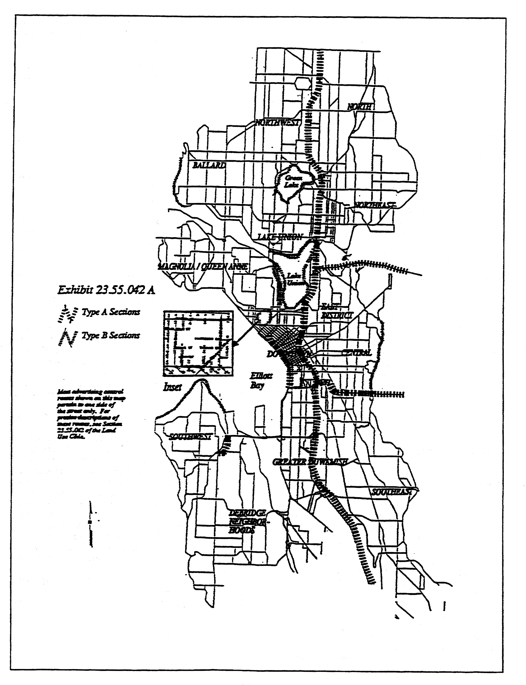

Exhibit 23.55.042A

Part 3 Appeals

1. Intent. The purpose of this section is to implement the purpose and policy expressed by the Highway Advertising Control Act of the State of Washington in the regulation of outdoor off-premises signs adjacent to certain public highways, and this section is declared to be an exercise of the police power of the City to protect the public health, safety, convenience and the enjoyment of public travel, to attract visitors to the City and to conserve the beauty of the natural and built environment by regulating the size and location of certain signs adjacent to certain designated freeways, expressways, parkways and scenic routes within the City. This section shall be liberally construed for the accomplishment of these purposes and is intended to be additional and supplemental to other laws regulating the size and location of signs.
2. Off-premises and Business Signs Prohibited Near Certain Areas. No off-premises sign or business sign shall be erected within six hundred sixty (660) feet outgoing from the nearest edge of the main traveled way of any landscaped and/or scenic view section of a freeway, expressway, parkway or scenic route designated by this subsection and shown on Exhibit 23.55.042 A (Type A sections), and no off-premises sign shall be erected within two hundred (200) feet in any direction from the main traveled way of the exit and entrance ramps thereto, if any part of the advertising matter or informative content of the sign is visible from any place on the traveled way of the landscaped and/or scenic view section or ramp, except as provided in subsections C and D:

    1. West Seattle Freeway from Harbor Avenue S.W. to 35th Avenue S.W.;
    2. The west side of the Alaskan Freeway from South Connecticut Street to the west portal of the Battery Street Tunnel. The east side of the Alaskan Freeway from South Connecticut Street to the west portal of the Battery Street Tunnel;
    3. Interstate Highway No. 5 from the north City limits to the south City limits;
    4. Interstate Highway No. 90 from the east City limits to Interstate Highway No. 5;
    5. State Route 520 (Evergreen Point Bridge) to Interstate Highway No. 5.
3. Business Signs Permitted on Type A Landscaped and Scenic View Sections. The following business signs shall be permitted outright on Type I landscaped and scenic view sections:

    1. Stationary, nonflashing business signs on the face of a structure, the total area of which shall not exceed ten (10) percent of the face of the structure or two hundred fifty (250) square feet, whichever is less;
    2. Stationary, nonflashing freestanding business signs, of which the total area visible from any place on the traveled way of the landscaped and/or scenic view section does not exceed seventy-five (75) square feet, and not exceeding thirty (30) feet in height including structures and component parts as measured from the grade immediately below the sign;
    3. Real estate "for sale" or "for rent" signs, provided the total area of all such signs on any lot shall not exceed fifty (50) square feet;
    4. Stationary, nonflashing business signs for gas stations, the area of a single face of which shall not exceed one hundred fifty (150) square feet and the total combined area of which shall not exceed two hundred fifty (250) square feet, which may be apportioned among freestanding business signs not exceeding thirty (30) feet in height and business signs on the face of a structure.
4. Discretionary Exceptions.

    1. Discretionary exceptions from the provisions of subsection B may be issued for the types of signs listed in subsection D2 as a Type I decision under Chapter 23.76, Master Use Permits and Council Land Use Decisions, when the Director finds that the following criteria are met:

        1. The exception will not make difficult the viewing and comprehending by motorists and pedestrians of official or conforming signs; and
        2. The exception will not increase the density of signs along a designated landscaped and/or scenic view section to an extent tending to constitute a hazard to traffic safety or a detriment to the appearance of the neighborhood; and
        3. The exception will not allow a sign to impinge upon a view of scenic interest.
    2. Discretionary exemptions may be permitted for the following types of signs:

        1. Business signs composed of letters, numbers or designs individually painted or mounted directly on a structure;
        2. Business signs on a structure which extend not more than twelve (12) feet in height above the face of the structure, provided that the maximum permitted area of such signs, except for gas station signs, shall be reduced by fifty (50) percent;
        3. Time, temperature and/or stock index recording devices as part of a business sign;
        4. Business signs on a structure face of five thousand (5,000) square feet or more, the area of which exceeds two hundred fifty (250) square feet but which in no case exceeds five (5) percent of the area of the face of the structure;
        5. Except signs for gas stations, freestanding business signs on the same premises with business signs on the face of a structure.
5. Off-premises Signs Prohibited Near Certain Areas. No off-premises sign shall be erected within six hundred sixty (660) feet outgoing from the nearest edge of the main traveled way of any landscaped and/or scenic view section designated by this subsection (Type B section) and shown on Exhibit 23.55.042 A, and no off-premises signs shall be erected within two hundred (200) feet in any direction from the main traveled way of the exit or entrance ramps thereto, if any part of the advertising matter or informative content of the off-premises sign is visible from any place on the traveled way of the landscaped and/or scenic view section or ramp.

    1. The east side of Aurora Avenue North from the George Washington Memorial Bridge (Raye Street) to Prospect Street;
    2. The east side of Dexter Avenue North from Westlake Avenue North to Aloha Street;
    3. The east side of Westlake Avenue North from the Fremont Bridge to Valley Street;
    4. The west side of Fairview Avenue North and Fairview Avenue East from Valley Street to the Lake Union Ship Canal;
    5. The north side of Valley Street from Westlake Avenue North to Fairview Avenue North;
    6. The south side of North 34th Street from the Fremont Bridge to North Pacific Street;
    7. The south side of North Northlake Way and Northeast Northlake Way from the George Washington Memorial Bridge to Tenth Avenue Northeast;
    8. The east side of Harbor Avenue Southwest from Southwest Florida Street to Duwamish Head;
    9. The northwesterly side of Alki Avenue Southwest from Duwamish Head to Alki Point;
    10. Lake Washington Boulevard and Lake Washington Boulevard South from Interstate 90 to Denny Blaine Park;
    11. The perimeter streets of Green Lake, consisting of Aurora Avenue North from West Green Lake Way North to West Green Lake Drive North; West Green Lake Drive North; East Green Lake Way North; and West Green Lake Way North;
    12. Northwest 54th Street and Seaview Avenue Northwest from the Hiram Chittenden Locks to Golden Gardens Park;
    13. All streets forming the perimeter of Seattle Center, as follows:

##### 23.55.050 - Appeals to Municipal Court.

If a person asserts a noncommercial speech right protected by the First Amendment of the United States Constitution and/or Article I, Sections 3, 4, and 5 of the Washington Constitution, and is aggrieved by an action of the City in denying or enforcing a permit or in removing a sign, and time be of the essence, the person may petition the presiding judge of the Seattle Municipal Court for a prompt review thereof. The matter shall be granted priority as a case involving constitutional liberties and shall be heard in the manner provided by the Municipal Court by rule, and the decision of the Municipal Court shall be final subject only to judicial review.

### Chapter 23.57 - COMMUNICATIONS REGULATIONS

Sections:

#### Subchapter I - General Provisions
##### 23.57.001 - Intent and objectives.

This chapter provides regulations and development standards for major and minor communication utilities and accessory communication devices. The regulations and development standards contained in this chapter are imposed to minimize the health, safety and visual impact of telecommunication utilities on nearby areas. Development of communication utilities and accessory devices may also be subject to other regulations, including but not limited to Chapter 25.05, SEPA Policies and Procedures and Chapter 25.10, Radiofrequency Radiation, in addition to the Land Use Code.

##### 23.57.002 - Scope and applicability of provisions

1. The provisions of this chapter apply to communication utilities and accessory communication devices in all zones where permitted.

    1. Direct broadcast satellite service, video programming service, or fixed wireless service antennas, as defined in applicable federal regulations, that measure 1 meter (3.28 feet) or less in diameter or diagonal measurement are exempt from the provisions of this chapter, except in special review, historic and landmark districts and on buildings designated by the Seattle Landmarks Preservation Board.
    2. Special Rule for Satellite Dish Antennas. Satellite dish antennas are exempt from the provisions of this chapter when:

        1. The antenna measures 1 meter (3.28 feet) or less in diameter in residential zones; or
        2. The antenna measures 2 meters (6.56 feet) or less in diameter in non-residential zones.
2. The provisions of this chapter do not apply to Citizen Band radios, equipment designed and marketed as consumer products such as computers (including internet linkage), telephones, microwave ovens and remote control toys, and to television broadcast and radio receive-only antennas except satellite dishes not exempted in subsection 23.57.002.A.
3. Lots located in the Shoreline District shall meet the requirements of Chapter 23.60A, Shoreline District, in addition to the provisions of this Chapter 23.57. If there is a conflict between the regulations of the Shoreline District and this Chapter 23.57, the provisions of Chapter 23.60A apply.
4. Communication Utilities and Accessory Communication Devices Located in the Major Institution Overlay District. Communication Utilities located in the Major Institution Overlay District (Chapter 23.69) are subject to the use provisions and development standards of Chapter 23.57. Communication devices accessory to major institution uses located in the Major Institution Overlay District are subject to the use provisions and development standards of Chapter 23.57 unless such devices are addressed in a master plan adopted pursuant to Subchapter VI of Chapter 23.69. Accessory Communication Devices associated with the University of Washington are subject to Section 23.69.006.B.

##### 23.57.003 - Nonconforming uses and structures.

1. Existing communication utilities and accessory communication devices which are nonconforming uses may remain in use subject to the provisions of this chapter.
2. The following activities shall be permitted outright for existing major and minor communication utilities and accessory communication devices which are nonconforming structures: structural alteration to meet safety requirements, replacement on-site, maintenance, renovation or repair. The addition of new telecommunication devices to an existing major communication utility transmission tower shall be permitted outright, except as follows: No more than a total of fifteen (15) horn and dish antennas which are over four (4) feet in any dimension may be located on an existing tower, unless the applicant submits copies of Federal Communications Commission licenses, as provided in Section 23.57.008 G, showing that all of the existing fifteen (15) horn and dish antennas over four (4) feet in any dimension, plus any proposed additional such horn or dish antenna, are accessory to the communication utility. Physical expansion shall be prohibited, except as may be permitted by the provisions in each zone.

##### 23.57.004 - Removal of unused facilities.

There shall be a rebuttable presumption that any major or minor communication utility or accessory communication device that is regulated by this chapter and that is not operated for a period of twelve (12) months shall be considered abandoned. This presumption may be rebutted by a showing that such utility or device is an auxiliary, back-up, or emergency utility or device not subject to regular use or that the facility is otherwise not abandoned. For those utilities deemed abandoned, all equipment, including but not limited to antennas, poles, towers, and equipment shelters associated with the utility or accessory communication device shall be removed within twelve (12) months of the cessation of operation. Irrespective of any agreement among them to the contrary, the owner or operator of such unused facility, or the owner of a building or land upon which the utility is located, shall be jointly and severally responsible for the removal of abandoned utilities or devices (Ord. 120928 § 27, 2002.)

#### Subchapter II - Major Communication Utilities
##### 23.57.005 - Permitted and prohibited locations

Establishment or physical expansion of major communication utilities, whether single-occupant or shared, may be permitted by Administrative Conditional Use under the criteria listed in Section 23.57.007 and the development standards in Section 23.57.008. The following activities are permitted outright for existing communication utilities and accessory communication devices: structural alteration to meet safety requirements, replacement on-site, maintenance, renovation, or repair. The addition of new accessory communication devices or new minor communication utilities to an existing tower is permitted outright, except as follows: No more than a total of 15 horn and dish antennas that are over 4 feet in any dimension may be located on an existing tower, unless the applicant submits copies of Federal Communications Commission licenses, as provided in subsection 23.57.008.G, showing that all of the existing 15 horn and dish antennas over 4 feet in any dimension, plus any proposed additional such horn or dish antennas, are accessory to the communication utility.

1. Single Family, Residential Small Lot, Lowrise, Midrise, Highrise, Neighborhood Commercial 1, 2 and 3, and Seattle Mixed zones

    1. New major communication utilities are prohibited.
    2. Physical expansion of existing major communication utilities may be permitted by Council Conditional Use under the criteria listed in Section 23.57.006 and according to development standards in Section 23.57.008.
    3. The following activities are permitted outright for existing communication utilities and accessory communication devices: structural alteration to meet safety requirements, replacement on-site, maintenance, renovation, or repair. The addition of new accessory communication devices or new minor communication utilities to an existing tower is permitted outright, except as follows: No more than a total of 15 horn and dish antennas that are over 4 feet in any dimension may be located on an existing tower, unless the applicant submits copies of Federal Communications Commission licenses, as provided in subsection 23.57.008.G, showing that all of the existing 15 horn and dish antennas over 4 feet in any dimension, plus any proposed additional such horn or dish antennas, are accessory to the communication utility.
2. Commercial 1 and 2 zones

    1. New major communication utilities

        1. Single-occupant major communication utilities may be permitted by Council Conditional Use under the criteria listed in Section 23.57.006 and according to the development standards in Section 23.57.008.
        2. Shared-use major communication utilities may be permitted by Administrative Conditional Use under the criteria listed in Section 23.57.007 and according to development standards in Section 23.57.008.
    2. Physical expansion of existing major communication utilities may be permitted by Council Conditional Use under the criteria listed in Section 23.57.006 and according to development standards in Section 23.57.008.
    3. The following activities are permitted outright for existing communication utilities and accessory communication devices: structural alteration to meet safety requirements, replacement on-site, maintenance, renovation, or repair. The addition of new accessory communication devices or new minor communication utilities to an existing tower is permitted outright, except as follows: No more than a total of 15 horn and dish antennas that are over 4 feet in any dimension may be located on an existing tower, unless the applicant submits copies of Federal Communications Commission licenses, as provided in subsection 23.57.008.G, showing that all of the existing 15 horn and dish antennas over 4 feet in any dimension, plus any proposed additional such horn or dish antennas, are accessory to the communication utility.
3. Downtown zones

    1. In Pioneer Square Mixed, International District Mixed, International District Residential and Pike Market Mixed Zones, new major communication utilities are prohibited.
    2. In all other downtown zones, establishment or physical expansion of major communication utilities may be permitted, whether single-occupant or shared, by Administrative Conditional Use under the evaluation criteria listed in Section 23.57.007 and according to development standards in Section 23.57.008.
    3. The following activities are permitted outright for existing communication utilities and accessory communication devices: structural alteration to meet safety requirements, replacement on-site, maintenance, renovation, or repair. The addition of new accessory communication devices or new minor communication utilities to an existing tower is permitted outright, except as follows: No more than a total of 15 horn and dish antennas that are over 4 feet in any dimension may be located on an existing tower, unless the applicant submits copies of Federal Communications Commission licenses, as provided in subsection 23.57.008.G, showing that all of the existing 15 horn and dish antennas over 4 feet in any dimension, plus any proposed additional such horn or dish antennas, are accessory to the communication utility.
4. Industrial zones

##### 23.57.006 - Council conditional use criteria.

When evaluating an application for a new or expanded major communication utility, the Council shall weigh the potential benefits to the general public of improved broadcast communications against potential negative impacts. The following criteria shall be weighed and balanced to make this determination:

1. Whether the proposed major communication utility will be substantially detrimental to the pedestrian or retail character of the surrounding commercial area or the residential character of nearby residentially zoned areas. Detriment may include diminished street-level activity. The impacts considered shall include, but not be limited to, visual, noise, land use, safety and traffic impacts;
2. Whether the location provides topographic conditions which maximize the opportunity for the use and operation of the major communication utility;
3. If a single-occupant major communication utility is proposed, whether reasonable efforts have been made and the applicant has demonstrated that it is not practical to locate the proposed antenna(s) on an existing communication utility, determined in part by the ability to achieve equivalent broadcast performance, and that locations other than in Residential, Neighborhood Commercial or Commercial zones have been considered in good faith;
4. Whether the proposed new, expanded or replaced communication utility provides the opportunity for sharing of facilities, so that the demand for major communication utilities elsewhere is minimized;
5. The Federal Aviation Administration advises the City that the proposed major communication utility does not create a hazard to aviation.

##### 23.57.007 - Administrative conditional use criteria.

When evaluating an application for the establishment of a proposed major communication utility or its physical expansion, the Director shall consider the following criteria:

1. Whether the public benefit is outweighed by the adverse impacts, which cannot otherwise be mitigated;
2. Whether the project will have substantial adverse impacts on residential development in the vicinity, including demolition of housing.

##### 23.57.008 - Development standards

1. In Single Family, Residential Small Lot, Lowrise, Midrise, Highrise, Neighborhood Commercial, and Seattle Mixed zones, physical expansion of a major communication utility may be permitted only when:

    1. The expanded facility will be a shared-use utility, and another broadcaster has contracted to relocate its transmitter to the expanded facility; and
    2. A different existing tower of similar size in the immediate vicinity will be removed within six months of issuance of the certificate of occupancy.
2. Access to sites containing major communication utilities is restricted to authorized personnel by fencing or other means of security. This fencing or other barrier shall be incorporated into the landscaping and/or screening to reduce visual impact of the facility.
3. Setbacks and landscaping

    1. Major communication utility structures, including accessory structures, shall be set back at least 20 feet from all lot lines.
    2. The required setback shall be landscaped as follows:

        1. A 5-foot-deep setback measured perpendicular to the lot lines shall be planted with ground cover.
        2. The area between 5 feet and 10 feet in from all lot lines shall be planted with continuous vegetation consisting of bushes.
        3. The area between 10 feet and 20 feet in from all lot lines shall be planted with view-obscuring vegetation consisting of evergreen hedges and evergreen trees a minimum of 10 feet tall at the time of planting and expected to reach at least 30 feet at maturity.
        4. All landscaping shall conform to the Director's Rule on Landscape Standards.
        5. Bioretention facilities are allowed as part of the landscaping requirement if the resulting screening and mitigation of visual impacts is the same as would otherwise result from the provision of the requirements of this subsection 23.57.008.C.2.
    3. Exceptions to landscaping and setback requirements

        1. The setback requirement of subsection 23.57.008.C.1 may be reduced for any particular frontage of the utility site which is adjacent to, or across a street or alley from, a commercially zoned lot and the Director finds that an alternate plan for screening and landscaping would result in the same screening and mitigation of visual impacts as would result from the provision of the requirements of subsections 23.57.008.C.1 and 23.57.008.C.2, and would result in an appearance compatible with the commercial area. Alternative screening devices could include decorative walls, fences, or murals. The screening may be provided by a structure if the appearance is compatible with the commercial area and if it results in the screening of the base of the transmission tower from adjacent uses.
        2. The setback and landscaping requirements of subsection 23.57.008.C shall not apply when the lot is adjacent to, or across a street or alley from, an industrially zoned lot.
        3. Landscaping requirements of subsection 23.57.008.C.2 may be waived or reduced if the distance from the lot line to the structure is far enough to substantially diminish the impact of the height of the structure or if the topography or existing vegetation provides a visual barrier comparable to the requirements of subsection 23.57.008.C.2.
4. The maximum height limit for all major communication utilities is 1,100 feet above mean sea level. These structures are also subject to Chapter 23.64, Airport Height District. Accessory structures are subject to the height limits of the zone.
5. The applicant shall use material, shape, color and lighting to minimize to the greatest extent practicable the visual impact, as long as these measures are not inconsistent with the requirements of the Federal Aviation Administration.
6. The applicant shall submit and follow a construction and maintenance plan to control or eliminate off-site impacts from construction or maintenance debris and icefall. This plan shall include a requirement to notify residents and business owners on properties immediately adjacent to or across a street or alley from the site when maintenance work such as sandblasting or painting is to occur.
7. When a horn or dish antenna over 4 feet in any dimension is proposed to be added to an existing tower that already contains 15 such antennas, per Section 23.57.003 or Section 23.57.005, the applicant shall submit copies of Federal Communications Commission licenses for auxiliary broadcast service, showing that all of the existing 15 horn and dish antennas that are over 4 feet in any dimension, plus any proposed additional such horn or dish antenna, are accessory to the communication utility.
8. Equipment shelters and other accessory structures shall comply with the development standards of this Section 23.57.008 whether or not physical expansion, as defined in Section 23.84A.006, is proposed.

#### Subchapter III - Minor Communication Utilities and Accessory Communication Devices
##### 23.57.009 - Permitted and prohibited locations for all minor communication utilities, and development standards for minor communication utilities with freestanding transmission towers in all zones.

1. Permitted and Prohibited Locations for All Minor Communication Utilities. New minor communication utilities and accessory communication devices shall be regulated as provided in Sections 23.57.010, 23.57.011, 23.57.012, 23.57.013, 23.57.014, and 23.57.015. However, minor communication utilities shall be permitted at any location if the applicant can demonstrate by technical studies that 1) the facility is for commercial mobile service, unlicensed wireless services, fixed wireless service, or common carrier wireless exchange access service as defined by applicable federal statutes or regulations; and 2) a facility at the site proposed is necessary to close an existing significant gap or gaps in the availability of a wireless carrier's communication service or to provide additional call capacity and that, absent the proposed facility, remote users of a wireless carrier's service are unable to connect with the land-based national telephone network, or to maintain a connection capable of supporting a reasonably uninterrupted communication; and 3) that the facility and the location proposed is the least intrusive facility at the least intrusive location consistent with effectively closing the service gap. In considering the degree of intrusiveness, the impacts considered shall include but not be limited to visual, noise, compatibility with uses allowed in the zone, traffic and the displacement of residential dwelling units in a residential zone.
2. Interior Locations. Minor communication utilities located entirely within the interior of a structure shall be permitted outright on lots developed with non-single family principal uses in single family zones, and on all lots in all other zones. The installation of the utility shall not result in the removal of a dwelling unit in a residential zone.
3. Minor communication utilities with freestanding transmission towers shall be subject to the access, setback, screening and landscaping requirements for major communication utilities in subsections B, C, E and H of Section 23.57.008 in addition to the standards of each zone as described in this chapter.

##### 23.57.010 - Single Family and Residential Small Lot zones

1. Uses Permitted Outright.

    1. Amateur radio devices accessory to a residential use that meet the development standards of subsection 23.57.010.E are permitted outright.
    2. Minor communication utilities are permitted outright on existing freestanding major or minor telecommunication utility towers. Minor communication utilities locating on major communication utility towers are subject to the limitations of Sections 23.57.003 and 23.57.005.
2. Accessory Communication Devices.

    1. Communication devices, regulated by this chapter pursuant to Section 23.57.002, that are accessory to residential uses and meet the development standards of subsection 23.57.010.E are permitted outright;
    2. Communication devices on the same lot as and accessory to institutions, public facilities, public utilities, major institutions and nonconforming residential uses, that meet the development standards of subsection 23.57.010.E are permitted outright.
3. Uses Permitted by Administrative Conditional Use.

    1. The following may be permitted by Administrative Conditional Use, pursuant to criteria listed in subsection 23.57.010.C.2, as applicable:

        1. The establishment or expansion of a minor communication utility, unless the minor communication utility is permitted outright on an existing freestanding major or minor communication tower, except on lots zoned single -family or Residential Small Lot and containing a single family dwelling or no use.
        2. Mechanical equipment associated with minor communication utilities whose antennas are located on another site or in the right-of-way, where the equipment is completely enclosed within a structure that meets the development standards of the zone. The equipment shall not emit radiofrequency radiation, and shall not result in the loss of a dwelling unit. Antennas attached to City-owned poles in the right-of-way shall follow the terms and conditions contained in Section 15.32.300.
    2. Administrative Conditional Use Criteria.

        1. The proposal shall not be significantly detrimental to the residential character of the surrounding residentially zoned area, and the facility and the location proposed shall be the least intrusive facility at the least intrusive location consistent with effectively providing service. In considering detrimental impacts and the degree of intrusiveness, the impacts considered shall include but not be limited to visual, noise, compatibility with uses allowed in the zone, traffic, and the displacement of residential dwelling units.
        2. The visual impacts that are addressed in Section 23.57.016 shall be mitigated to the greatest extent practicable.
        3. Within a Major Institution Overlay District, a Major Institution may locate a minor communication utility or an accessory communication device, either of which may be larger than permitted by the underlying zone, when:

            1. The antenna is at least 100 feet from a Major Institution Overlay District boundary, and
            2. The antenna is substantially screened from the surrounding neighborhood's view.
        4. If the proposed minor communication utility is proposed to exceed the permitted height of the zone, the applicant shall demonstrate the following:

            1. The requested height is the minimum necessary for the effective functioning of the minor communication utility, and
            2. Construction of a network of minor communication utilities that consists of a greater number of smaller less obtrusive utilities is not technically feasible.
        5. If the proposed minor communication utility is proposed to be a new freestanding transmission tower, the applicant shall demonstrate that it is not technically feasible for the proposed facility to be on another existing transmission tower or on an existing building in a manner that meets the applicable development standards. The location of a facility on a building on an alternative site or sites, including construction of a network that consists of a greater number of smaller less obtrusive utilities, shall be considered.
        6. If the proposed minor communication utility is for a personal wireless facility and it would be the third separate utility, or any subsequent separate utility after the third utility, on the same lot, the applicant shall demonstrate that it meets the criteria contained in subsection 23.57.009.A, except for minor communication utilities located on a freestanding water tower or similar facility.
4. Uses Permitted by Council Conditional Use. The establishment or expansion of a minor communication utility other than as described in subsection 23.57.010.C, may be permitted as a Council Conditional Use, pursuant to the following criteria, as applicable:

    1. The proposal is for a personal wireless facility that meets the criteria contained in subsection 23.57.009.A;
    2. If located on a lot developed with a single family dwelling, the proposed minor communication utility is clearly incidental to the use of the property as a dwelling;
    3. If the proposed minor communication utility is proposed to exceed the permitted height of the zone, the applicant shall demonstrate that the requested height is the minimum necessary for the effective functioning of the minor communication utility.
5. Development Standards.

    1. Location. Minor communication utilities and accessory communication devices regulated pursuant to Section 23.57.002 and amateur radio towers:

        1. Are prohibited in the required front yard, and amateur radio towers are additionally prohibited in side yards.
        2. When ground-mounted, shall be included in lot coverage and rear yard coverage calculations. For dish antennas, lot coverage shall be calculated with the dish in a horizontal position.
        3. May be located on rooftops of non-residential buildings, but shall not be located on rooftops of principal or accessory structures containing residential uses, except as provided in subsection 23.57.010.E.5.
    2. Height and Size.

        1. The height limit of the zone applies to minor communication utilities and accessory communication devices. Exceptions to the height limit may be authorized through the approval of an Administrative Conditional Use pursuant to subsection 23.57.010.C or a Council Conditional Use pursuant to subsection 23.57.010.D.
        2. The maximum diameter of dish antennas is 6 feet, except for major institutions within a Major Institution Overlay District, when regulated as an administrative conditional use pursuant to subsection 23.57.010.C.
        3. The maximum height of an accessory amateur radio tower is no more than 50 feet above existing grade. Cages and antennas may extend to a maximum additional 15 feet. The base of the tower shall be setback from any lot line a distance at least equivalent to one-half the height of the total structure, including tower or other support, cage and antennas.
    3. Visual Impacts. All minor communication utilities and accessory communication devices, except for facilities located on buildings designated by the Seattle Landmarks Preservation Board, facilities governed by Section 23.57.014, and amateur radio towers, shall meet the standards set forth in Section 23.57.016.
    4. Access and Signage. Access to transmitting accessory communication devices and to minor communication utilities shall be restricted to authorized personnel by fencing or other means of security. If located on a residential structure or on a public utility, warning signs at every point of access to the transmitting antenna shall be posted with information on the existence of radiofrequency radiation.
    5. Reception Window Obstruction. If, in the case of an accessory communications device or minor communications utility that would otherwise comply with this Section 23.57.010, the strict adherence to all development standards would result in reception window obstruction in all permissible locations on the subject lot, the Director may grant a waiver from development standards of subsection 23.57.010.E.1.c and the screening requirements of Section 23.57.016. The first waiver to be considered will be reduction, then waiver from screening. Only if these waived regulations would still result in obstruction shall rooftop location be considered. Approval of a waiver is subject to the following criteria:

        1. The applicant shall demonstrate that the obstruction is a result of factors beyond the property owner's control, taking into consideration potential permitted development on adjacent and neighboring lots with regard to future reception-window obstruction.
        2. The applicant is required to use material, shape and color to minimize visual impact.
        3. If a waiver is sought per this subsection 23.57.005.E.5.c to permit a rooftop location, the maximum permitted height of the device is 4 feet above the existing roofline or 4 feet above the zone height limit, whichever is higher.

##### 23.57.011 - Multifamily zones and Master Planned Community zones

1. Uses Permitted Outright.

    1. Amateur radio devices accessory to a residential use that meet the development standards of subsection 23.57.011.C are permitted outright.
    2. Communication devices accessory to residential, public facility, public utility, major institution or institutional use are permitted outright when they meet the development standards of subsection 23.57.011.C.
    3. Mechanical equipment, associated with minor communication utilities whose antennas are located on another site or in the right-of-way, is permitted outright where the equipment is completely enclosed within a structure that meets the development standards of the zone. The equipment shall not emit radiofrequency radiation, and shall not result in the loss of a dwelling unit. Antennas attached to City-owned poles in the right-of-way shall follow the terms and conditions contained in Section 15.32.300.
    4. Minor communication utilities are permitted outright on existing freestanding major or minor telecommunication utility towers. Minor communication utilities locating on major communication utility towers are subject to the limitations of Sections 23.57.003 and 23.57.005.
2. Uses Permitted by Administrative Conditional Use. The establishment or expansion of a minor communication utility regulated pursuant to Section 23.57.002, may be permitted as an Administrative Conditional Use when they meet the development standards of subsection 23.57.011.C and the following criteria, as applicable:

    1. The project shall not be substantially detrimental to the residential character of nearby residentially zoned areas, and the facility and the location proposed shall be the least intrusive facility at the least intrusive location consistent with effectively providing service. In considering detrimental impacts and the degree of intrusiveness, the impacts considered shall include but not be limited to visual, noise, compatibility with uses allowed in the zone, traffic, and the displacement of residential dwelling units.
    2. The visual impacts that are addressed in Section 23.57.016 shall be mitigated to the greatest extent practicable.
    3. Within a Major Institution Overlay District, a Major Institution may locate a minor communication utility or an accessory communication device, either of which may be larger than permitted by the underlying zone, when:

        1. The antenna is at least 100 feet from a MIO boundary, and
        2. The antenna is substantially screened from the surrounding neighborhood's view.
    4. If the minor communication utility is proposed to exceed the zone height limit, the applicant shall demonstrate that the requested height is the minimum necessary for the effective functioning of the minor communication utility.
    5. If the proposed minor communication utility is proposed to be a new freestanding transmission tower, the applicant shall demonstrate that it is not technically feasible for the proposed facility to be on another existing transmission tower or on an existing building in a manner that meets the applicable development standards. The location of a facility on a building on an alternative site or sites, including construction of a network that consists of a greater number of smaller less obtrusive utilities, shall be considered.
3. Development standards.

    1. Location. Minor communication utilities and accessory communication devices regulated pursuant to Section 23.57.002 and amateur radio towers:

        1. Are prohibited in a required front or side setback.
        2. May be located in a required rear setback, except for transmission towers.
        3. May be located on rooftops of buildings, including sides of parapets and penthouses above the roofline. Rooftop space within the following parameters does not count toward open space or amenity area requirements: the area 8 feet from and in front of a directional antenna and at least 2 feet from the back of a directional antenna, or, for an omnidirectional antenna, 8 feet away from the antenna in all directions. Public Health—Seattle & King County may require a greater distance for paging facilities after review of the Non-Ionizing Electromagnetic Radiation (NIER) report.
    2. Height and Size.

        1. The height limit of the zone shall apply to minor communication utilities and accessory communication devices, except as may be permitted in this subsection 23.57.011.C.
        2. The maximum diameter of dish antennas shall be 6 feet, except for major institutions within the Major Institution Overlay District, regulated through an administrative conditional use in subsection 23.57.011.B above.
        3. The maximum height of an amateur radio tower shall be no more than 50 feet above existing grade. Cages and antennas may extend to a maximum additional 15 feet. The base of the tower shall be setback from any lot line a distance at least equivalent to one-half the height of the total structure, including tower or other support, cage and antennas.
    3. Visual Impacts. All minor communication utilities and accessory communication devices, except for facilities located on buildings designated by the Seattle Landmarks Preservation Board, facilities governed by Section 23.57.014, and amateur radio towers, shall meet the standards set forth in Section 23.57.016.
    4. Access and Signage. Access to transmitting minor communication utilities and to accessory communication devices shall be restricted to authorized personnel by fencing or other means of security. Warning signs at every point of access to the rooftop or common area shall be posted with information on the existence of radio frequency radiation.
    5. Reception Window Obstruction. When, in the case of an accessory communications device or minor communications utility that would otherwise comply with this Section 23.57.011, the strict adherence to all development standards would result in reception window obstruction in all permissible locations on the subject lot, the Director may grant a waiver from the screening requirements of Section 23.57.016. Approval of a waiver shall be subject to the following criteria:

        1. The applicant shall demonstrate that the obstruction is due to factors beyond the control of the property owner, taking into consideration potential permitted development on adjacent and neighboring lots with regard to future reception-window obstruction.
        2. The applicant shall use material, shape and color to minimize visual impact.

##### 23.57.012 - Commercial zones

1. Uses permitted outright

    1. In Neighborhood Commercial, Commercial, and Seattle Mixed zones, minor communication utilities other than freestanding transmission towers and accessory communication devices are permitted outright when meeting the height limit of the zone as modified by subsection 23.57.012.C.
    2. Minor communication utilities that do not meet the height limit of the zone are permitted outright on existing freestanding major or minor telecommunication utility towers. Minor communication utilities locating on major communication utility towers are subject to the limitations of Sections 23.57.003 and 23.57.005.
2. Uses permitted by administrative conditional use. In Neighborhood Commercial, Commercial, and Seattle Mixed zones, an administrative conditional use shall be required for the establishment or expansion of a free standing transmission tower, regardless of height, and for minor communication utilities and accessory communication devices that exceed the height limit of the underlying zone as modified by subsection 23.57.012.C. Approval shall be pursuant to the following criteria, as applicable:

    1. The proposal does not result in a significant change in the pedestrian or retail character of the commercial area.
    2. If the minor communication utility is proposed to exceed the zone height limit as modified by subsection 23.57.012.C, the applicant shall demonstrate that the requested height is the minimum necessary for the effective functioning of the minor communication utility.
    3. If the proposed minor communication utility is proposed to be a new freestanding transmission tower, the applicant shall demonstrate that it is not technically feasible for the proposed facility to be on another existing transmission tower or on an existing building in a manner that meets the applicable development standards. The location of a facility on a building on an alternative site or sites, including construction of a network that consists of a greater number of smaller, less obtrusive utilities, shall be considered.
3. Development standards

    1. Location and height. Facilities in special review, historic, and landmark districts are subject to the standards of Section 23.57.014. On sites that are not in special review, historic, or landmark districts, antennas may be located on the rooftops of buildings, including sides of parapets and equipment penthouses above the roofline, subject to the height limits in subsections 23.57.012.C.1.a and 23.57.012.C.1.b, as limited by subsection 23.57.012.C.1.c below:

        1. Utilities and devices located on a rooftop of a building nonconforming as to height may extend up to 15 feet above the height of the building legally existing as of the effective date of September 23, 2002.
        2. Utilities and devices located on a rooftop of a building that conforms to the height limit may extend up to 15 feet above the zone height limit or above the highest portion of a building, whichever is less.
        3. Any height above the underlying zone height limit permitted under subsections 23.57.012.C.1.a and 23.57.012.C.1.b, shall be allowed only if the combined total coverage by communication utilities and accessory communication devices, in addition to the roof area occupied by rooftop features listed in subsection 23.47A.012.C.4, does not exceed 20 percent of the total rooftop area, or 25 percent of the rooftop area if mechanical equipment is screened.
        4. The following rooftop areas shall not be counted towards amenity area requirements:

            1. The area 8 feet from and in front of a directional antenna and the area 2 feet from and in back of a directional antenna.
            2. The area within 8 feet in any direction from an omnidirectional antenna.
            3. Such other areas in the vicinity of paging facilities as determined by the Seattle-King County Health Department after review of the Non-Ionizing Electromagnetic Radiation (NIER) report.
    2. Access and signage. Access to minor communication utilities and transmitting accessory communication devices is restricted to authorized personnel by fencing or other means of security. Warning signs at every point of access to the rooftop or common area shall be posted with information on the existence of radiofrequency radiation.
    3. Height of amateur radio tower. The maximum height of an amateur radio tower is 50 feet above grade in zones with a maximum height limit of 50 feet or less. Cages and antennas may extend to a maximum additional 15 feet. In zones with a maximum permitted height over 50 feet, the height above grade of the amateur radio tower shall not exceed the maximum height limit of the zone.
    4. Visual impacts. All minor communication utilities and accessory communication devices, except for facilities located on buildings designated by the Seattle Landmarks Preservation Board, facilities governed by Section 23.57.014, and amateur radio towers, shall meet the standards set forth in Section 23.57.016.
    5. Reception window obstruction. When, in the case of an accessory communications device or minor communications utility that would otherwise comply with this Section 23.57.012, the strict adherence to all development standards would result in reception window obstruction in all permissible locations on the subject lot, the Director may grant a waiver from the development standards of this Section 23.57.012 and Section 23.57.016, subject to the following criteria:

        1. The applicant shall demonstrate that obstruction of the reception window is due to factors beyond the control of the property owner, taking into account potential permitted development on adjacent and neighboring lots with regard to reception window obstruction.
        2. The applicant shall use material, shape and color to minimize visual impact.

##### 23.57.013 - Downtown zones

The additional height permitted in 23.57.013.B.2.a.(1) and (2) is permitted if the combined total of communication utilities and accessory communication devices in addition to the roof area occupied by rooftop features listed in Section 23.49.008.D.2, does not exceed 35 percent of the total rooftop area.

1. The height of minor communications utilities and accompanying screening may be further increased through the design review process, not to exceed 10 percent of the applicable height limit for the structure. For new buildings this increase in height may be granted through the design review process provided for in Section 23.41.014. For minor communication utilities on existing buildings this increase in height may be granted through administrative design review provided for in Section 23.41.016.
2. Visual Impacts. All minor communication utilities and accessory communication devices, except for facilities located on buildings designated by the Seattle Landmarks Preservation Board, facilities governed by Section 23.57.014, and amateur radio towers, shall meet the standards set forth in Section 23.57.016.
3. Antennas may be located on rooftops of buildings, including sides of parapets above the roofline. Rooftop space within the following parameters do not count toward meeting open space requirements: the area 8 feet away from and in front of a directional antenna and at least 2 feet from the back of a directional antenna, or, for an omnidirectional antenna, 8 feet away from the antenna in all directions. Public Health—Seattle & King County may require a greater distance for paging facilities after review of the Non-Ionizing Electromagnetic Radiation (NIER) report.

1. Permitted Uses. Minor communication utilities and accessory communication devices are permitted outright when meeting development standards of the zone in which the site is located, except for height limits, and subsection 23.57.013.B.
2. Development Standards.

    1. Access to transmitting minor communication utilities and accessory communication devices shall be restricted to authorized personnel when located on rooftops or other common areas. Warning signs at every point of access to the rooftop or common area shall be posted with information on the existence of radiofrequency radiation.
    2. Height.

        1. Except for special review, historic and landmark districts (see Section 23.57.014), minor communication utilities and accessory communication devices may be located on rooftops of buildings, including sides of parapets and equipment penthouses above the roofline, as follows:

            1. Those utilities and devices located on a rooftop of a building nonconforming as to height may extend up to 15 feet above the height of the building existing as of November 1, 2002;
            2. Those utilities and devices located on a rooftop may extend up to 15 feet above the applicable height limit or above the highest portion of the building, whichever is less.
3. Reception Window Obstruction. When, in the case of an accessory communications device or minor communications utility that would otherwise comply with this section, the strict adherence to all development standards would result in reception window obstruction in all permissible locations on the subject lot, the Director may grant a waiver from the development standards of this section and Section 23.57.016, subject to the following criteria:

    1. The applicant shall demonstrate that the obstruction is due to factors beyond the control of the property owner, taking into account potential permitted development on adjacent and neighboring lots with regard to future reception-window obstruction.
    2. The applicant shall use material, shape and color to minimize visual impact.

##### 23.57.014 - Special review, historic and landmark districts.

Communication utilities and accessory communication devices for which a Certificate of Approval may be required in IDR, PSM, IDM, PMM (see SMC Chapter 25.24) zones, the International Special Review District, the Pioneer Square Preservation District, and the Ballard Avenue (SMC Chapter 25.16), Columbia City (SMC Chapter 25.20) and Harvard-Belmont (SMC Chapter 25.22) Landmark Districts shall be sited in a manner that minimizes visibility from public streets and parks and may be permitted as follows:

1. Minor communication utilities and accessory communication devices may be permitted subject to the use provisions and development standards of the underlying zone and this chapter, with the following additional height allowance: communication utilities and devices may extend up to four (4) feet above a roof of the structure, regardless of zone height limit.
2. An Administrative Conditional Use approval shall be required for communication utilities and accessory devices regulated per Section 23.57.002, and which do not meet the requirements of subsection A above. Any action under this section shall be subject to the Pioneer Square Preservation District and the International Special Review District review and approval and the Department of Neighborhoods Director; in the Ballard Avenue Landmark District by the Ballard Avenue Landmark District Board and the Department of Neighborhoods Director; in the Pike Place Market Historical District by the Pike Place Market Historical Commission, and in the Columbia City Landmark District and the Harvard-Belmont Landmark District by the Landmarks Preservation Board, according to the following criteria:

    1. Location on rooftops is preferred, set back toward the center of the roof as far as possible. If a rooftop location is not feasible, communication utilities and accessory communication devices may be mounted on secondary building facades. Siting on primary building facades may be permitted only if the applicant shows it is impossible to site the devices on the roof or secondary facade. Determination of primary and secondary building facades will be made by the appropriate board or commission.
    2. Communication utilities and accessory communication devices shall be installed in a manner that does not hide, damage or obscure architectural elements of the building or structure.
    3. Visibility shall be further minimized by painting, screening, or other appropriate means, whichever is less obtrusive. Creation of false architectural features to obscure the device is discouraged.

##### 23.57.015 - Industrial zones.

1. Permitted Uses. Minor communication utilities and accessory communication devices shall be permitted outright when meeting the standards of the zone in which the site is located, except for height limits, and subsection B of this section.
2. Development Standards.

    1. Height limits of the zone shall not apply to antennas or their support structures.
    2. Access to transmitting minor communication utilities and accessory communication devices shall be restricted to authorized personnel when located on rooftops or other common areas. Warning signs at every point of access to the rooftop or common area shall be posted with information on the existence of radiofrequency radiation.
    3. Visual Impacts. All minor communication utilities and accessory communication devices, except for facilities located on buildings designated by the Seattle Landmarks Preservation Board, facilities governed by Section 23.57.014, and amateur radio towers, shall meet the standards set forth in Section 23.57.016.
3. Reception Window Obstruction. When, in the case of an accessory communications device or minor communications utility that would otherwise comply with this section, the strict adherence to all development standards would result in reception-window obstruction in all permissible locations on the subject lot, the Director may grant a waiver from the development standards of this section and Section 23.57.016, subject to the following criteria:

    1. The applicant shall demonstrate that the obstruction is due to factors beyond the control of the property owner, taking into account potential permitted development on adjacent and neighboring lots with regard to future reception-window obstruction.
    2. The applicant shall use material, shape and color to minimize visual impact.

##### 23.57.016 - Visual impacts and design standards.

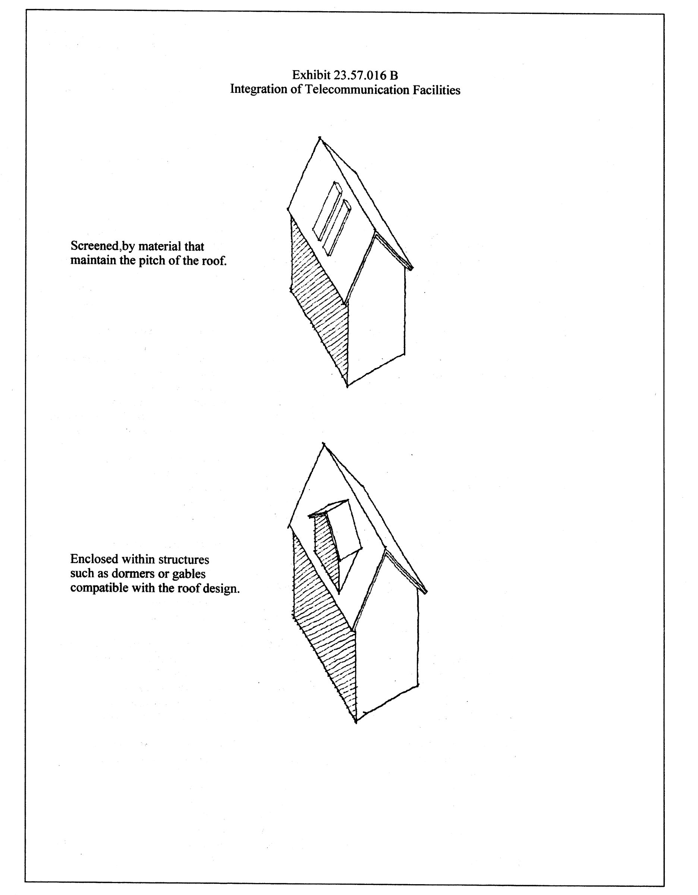

1. Telecommunication facilities shall be integrated with the design of the building to provide an appearance as compatible as possible with the structure. Telecommunication facilities, or methods to screen or conceal facilities, shall result in a cohesive relationship with the key architectural elements of the building.
2. If mounted on a pitched roof, facilities shall be screened by materials that maintain the pitch of the roof, matching color and texture as closely as possible, or integrated with and enclosed within structures such as dormers or gables compatible with the roof design. See exhibit 23.57.016 B.
3. If mounted on a flat roof, screening shall extend to the top of communication facilities except that whip antennas may extend above the screen as long as mounting structures are screened. Screening for satellite dishes is addressed in subsection E, below. Said screening shall be integrated with architectural design, material, shape and color. Facilities in a separate screened enclosure shall be located near the center of the roof, if technically feasible. Facilities not in a separate screened enclosure shall be mounted fiat against existing stair and elevator penthouses or mechanical equipment enclosures and shall be no taller than such structures.
4. Facilities that are side-mounted on buildings shall be integrated with architectural elements such as window design or building decorative features, or screened by siding or other materials matching the building exterior, or otherwise be integrated with design, material, shape, and color so as to not be visibly distinctive. In general, antennas shall be as unobtrusive as practicable, including the use of non-reflective materials. Installations on the primary building facade shall be allowed only if roof, ground-mounted, or secondary facade mounted installation is technically unfeasible.
5. Satellite dishes that are not located on freestanding transmission towers shall be screened to the top of the dish on at last three (3) sides and shall be enclosed in the direction of the signal to the elevation allowed by the azimuth of the antenna. If screening on the remaining side is not to the top of the antenna, the antenna and the inside and outside of the screen shall be painted the same color to minimize visibility and mask the contrasting shape of the dish with building or landscape elements.
6. New antennas shall be consolidated with existing antennas and mechanical equipment unless the new antennas can be better obscured or integrated with the design of other parts of the building.
7. Antennas mounted on a permitted accessory structure, such as a free standing sign, shall be integrated with design, material, shape and color and shall not be visibly distinctive from the structure.
8. A screen for a ground-mounted dish antenna shall be a minimum six (6) feet tall and shall extend to the top of the dish. The screen may be in the form of a view-obscuring fence, wall or hedge that shall be maintained in good condition. Chain link, plastic or vinyl fencing/screening is prohibited.
9. Antennas attached to a public facility, such as a water tank, shall be integrated with the design, material, shape and color of, and shall not be visibly distinctive from, the public facility. Antennas attached to City-owned poles shall follow the terms and conditions contained in Section 15.32.300.
10. Freestanding transmission towers shall minimize external projections from the support structure to reduce visual impacts and to the extent feasible shall integrate antennas in a screening structure with the same dimensions as external dimensions of the support structure, or shall mount antennas with as little projection from the structure as feasible. External conduits, climbing structures, fittings, and other projections from the external face of the support structure shall be minimized to the extent feasible.
11. The standards set forth in this Section 23.57.016 may be varied as follows:

    1. For new buildings these standards may be varied through the design review process provided for in Section 23.41.014.
    2. For existing buildings that have previously gone through the design review process these standards may be varied by the Director if the Director determines that the new minor communication facilities would be consistent with the Director's design review decision on the original building; otherwise, these standards may be varied through the administrative design review process provided for in Section 23.41.016.
    3. For existing buildings that have not previously gone through the design review process these standards may be varied through the administrative design review process provided for in Section 23.41.016.

### Chapter 23.58A - INCENTIVE PROVISIONS
#### Subchapter I - General provisions
##### 23.58A.002 - Scope of chapter; general rules

1. This Chapter 23.58A contains rules for incentive programs in areas for which the provisions of the zone specifically refer to this Chapter 23.58A or in zones having an incentive zoning suffix. The provisions in this Chapter 23.58A specify conditions under which extra floor area may be allowed, as exceptions to the otherwise applicable floor area or base height limit, or both, subject to the maximum limits stated in the provisions of the zone and to all other applicable requirements and approvals. Nothing in this Chapter 23.58A authorizes allowance of extra floor area, or the construction or use of any structure, contrary to any other provisions of this Title 23 or Title 25. Developments for which extra floor area is sought may be subject to conditions under other chapters and titles of the Seattle Municipal Code, including without limitation conditions imposed pursuant to Chapter 25.05, Environmental Policies and Procedures.
2. The provisions of this subchapter I apply generally to projects using any of the incentive provisions in this Chapter 23.58A, unless otherwise expressly provided in the applicable subchapter of this Chapter 23.58A or in the provisions of the zone.
3. Nothing in this Chapter 23.58A shall be construed to confer on any owner or developer any development rights or property interests. The availability and terms of any allowance of extra floor area depend on the regulations in effect on the relevant date for consideration of a permit application for the project proposing to use such extra floor area, pursuant to Section 23.76.026, notwithstanding any prior approvals, interpretations or agreements by the Director, Housing Director or other official regarding the eligibility of any actual or proposed facility or feature to satisfy conditions for extra floor area.

##### 23.58A.003 - Affordable housing incentive programs: purpose and findings

1. Purpose. The provisions of this Chapter 23.58A that relate to affordable housing are intended to implement affordable housing incentive programs authorized by RCW 36.70A.540, as it may be amended.
2. State law controlling. In case of any irreconcilable conflict with the terms of this Chapter 23.58A related to an affordable housing incentive program, the provisions of RCW 36.70A.540, as amended, shall supersede and control.
3. Findings

    1. Pursuant to the authority of RCW 36.70A.540, the City finds that higher income levels are needed to address local housing market conditions throughout the city. The terms of the affordable housing incentive program in this Chapter 23.58A take into account that, for affordable housing not receiving public subsidies, the higher income levels specified in the definition of "income-eligible households" in this Chapter 23.58A, rather than the levels stated for renter and owner occupancy program purposes in the definition of "low-income households" in RCW 36.70A.540, are needed to address local housing market conditions.
    2. The "general area of the development for which a bonus or incentive is provided" under RCW 36.70A.540 is deemed to be the Seattle city limits for all development within the Seattle city limits.

##### 23.58A.004 - Definitions

"Affordable housing" means a unit or units of housing provided as a condition to bonus floor area that are affordable to and reserved solely for "income-eligible households."

"Base FAR" or "Base floor area ratio" means the non-residential floor area that may be allowed under the provisions of the zone limiting floor area, expressed as a multiple of the lot area, without use of any bonuses, transfer of development capacity, other incentive provisions, or any departures, waivers, variances or special exceptions.

"Base residential floor area" means:

1. For a lot in South Downtown in a PSM, IDM, IDR, DMR or DMC zone from which TDP is transferred, six times the lot area; and
2. For all other lots, the amount of residential floor area allowable on the lot under the provisions of the zone that expressly limit floor area, excluding any floor area exempted from the limits, without use of any bonuses, transfer of development capacity, other incentive provisions, or any departures, waivers, variances or special exceptions, and before giving effect to any transfer of residential development potential to another lot.
"Base height limit" means the height limit that would apply under the provisions of the zone based upon the proposed uses in a structure, if the applicant did not qualify for any additional height dependent on the provisions of this Chapter 23.58A, after giving effect to any additional height that is actually allowed for the pitched roof of a structure and any additional height that is or would be allowed under the provisions of the zone because of the slope of the lot, but before giving effect to any allowance for rooftop features or any departure, waiver, variance or special exception.

"Bonus floor area" means bonus residential floor area or bonus non-residential floor area.

"Bonus non-residential floor area" means extra non-residential floor area allowed pursuant to the bonus provisions in subchapters III and V of this Chapter 23.58A. It does not include extra floor area gained through TDR.

"Bonus residential floor area" means extra residential floor area allowed pursuant to the bonus provisions in subchapters II and V of this Chapter 23.58A. It does not include extra floor area gained through TDP.

"Certificate of occupancy" means the first certificate of occupancy issued by the City for a project, whether temporary or permanent, unless otherwise specified.

"Extra floor area" means extra residential floor area or extra non-residential floor area.

"Extra residential floor area" means the gross floor area of all residential development allowed in addition to a base height limit or base floor area limit, or both, under the provisions of this Chapter 23.58A or under any other provisions of this Title 23 referring to this Chapter 23.58A that allow a bonus or a transfer of development rights or development capacity. It includes, without limitation, gross floor area in residential use in all stories wholly or in part above the base height limit, and all bonus residential floor area. In the IDM 75/85-150 zone, hotel use in a mixed use project may be counted as extra residential floor area subject to subsection 23.49.023.A and subsection 23.49.208.E.

"Extra non-residential floor area" means the non-residential floor area of all non-residential development allowed in addition to base FAR or to a base height limit for non-residential use, or both, under the provisions of this Chapter 23.58A or under any other provisions of this Title 23 referring to this Chapter 23.58A that allow a bonus or a transfer of development rights or development capacity. It includes, without limitation, gross floor area in non-residential use in all stories wholly or in part above the base height limit for non-residential use, and all bonus non-residential floor area.

"Housing bonus residential floor area" means extra residential floor area allowed on condition that low-income housing be provided, or that a payment in lieu thereof be made, under subchapter II of this Chapter 23.58A.

"Housing and child care bonus non-residential floor area" means extra non-residential floor area allowed under subchapter III of this Chapter 23.58A on condition that low-income housing be provided or a payment in lieu of low-income housing be made and that a child care facility be provided or a payment in lieu of a child care facility be made.

"Income-eligible households" means:

1. For rental housing units, except housing units of 400 or fewer net square feet, or sleeping rooms in a congregate residence, households with incomes no higher than the lower of:

    1. 80 percent of median income as defined in Section 23.84A.025; or
    2. the maximum level permitted for rental housing by RCW 36.70A.540 as in effect when the agreement for the housing to serve as affordable housing is executed.
2. In the case of owner-occupied housing units, households with incomes no higher than the lesser of:

    1. median income, as defined in Section 23.84A.025, or
    2. the maximum level permitted for owner-occupied housing by RCW 36.70A.540 as in effect when the agreement for the housing to serve as affordable housing is executed.
3. For housing units of 400 or fewer net square feet or sleeping rooms in a congregate residence, households with incomes no higher than 40 percent of median income as defined in Section 23.84A.025. For this purpose, the resident(s) of each sleeping room in a congregate residence are regarded as a separate household.
"Payment option" means making a payment to the City in lieu of providing low-income housing, child care, or any amenity or feature, in order to qualify for bonus floor area.

"Performance option" means providing or committing to provide a physical facility, or a portion or feature of a project, such as low-income housing, in order to qualify for bonus floor area.

"Provisions of the zone" means one or more provisions of another chapter of this Title 23 relating to allowable floor area or height, or to the allowance of extra floor area or additional height, or to the transfer of development capacity, for the area in which the lot on which extra floor area is used or proposed is located or the location from which TDR or TDP may be transferred.

1. Scope and applicability

    1. General rule. The terms set forth in quotations in this Section 23.58A.004, when used in this Chapter 23.58A, have the meanings set forth in this Section 23.58A.004 unless the context otherwise requires.
    2. Definitions in Chapter 23.84A. Definitions in this Chapter 23.58A or in the applicable provisions of the zone supersede any definitions of the same terms in Chapter 23.84A for purposes of the provisions of this Chapter 23.58A, unless specified otherwise in this Chapter 23.58A.
2. Defined terms - General

##### 23.58A.006 - Permitting conditions—Incentive Plans.

1. Master Use Permit. The Master Use Permit application to establish any extra floor area under this chapter shall include a calculation of the total amount of extra floor area sought and shall identify the manner in which the conditions to such extra floor area shall be satisfied. If the applicant seeks bonus floor area under any provisions allowing the option of performance or a payment in lieu thereof, the applicant shall indicate whether it intends to pursue the payment option or the performance option, or what combination of the two options. If any performance option is to be used, the application shall include the proposed location of the affordable housing or other facilities, including the proposed location or distribution within the proposed building(s), and if not to be provided on the same lot as the development using the extra floor area, the address, legal description, dimensions and ownership of the other lot(s). The Director shall, at the time of issuance of any Master Use Permit decision approving any such extra floor area, issue a Type I decision as to the amount of extra floor area to be allowed and the conditions to such extra floor area, which decision may include alternative means to achieve extra floor area, at the applicant's option, if each alternative would be consistent with the provisions of this chapter, the applicable provisions of the zone, and any other conditions of the permit, including Design Review conditions if applicable.
2. First Building Permit. Prior to issuance, and as a condition to issuance, of the first building permit for a project, and in any event before any permit for any construction activity other than excavation and shoring is issued, the applicant shall execute and record a declaration in a form acceptable to the Director that shall commit the applicant to satisfy the conditions to establishing extra floor area as approved by the Director at the time of the Master Use Permit decision.

##### 23.58A.008 - Limits on use of incentives

No extra floor area under this Chapter 23.58A shall be granted to any proposed development that would result in significant alteration to any designated feature of a Landmark structure or significant alteration to a contributing structure, as defined in Section 23.66.032, unless a Certificate of Approval for the alteration is granted by the Landmarks Preservation Board in the case of a Landmark structure, or by the Director of Neighborhoods in the case of a contributing structure.

#### Subchapter II: - Extra residential floor area
##### 23.58A.010 - Scope of subchapter.

This subchapter II includes provisions under which applicants may gain extra residential floor area in development for which the applicable provisions of the zone expressly refer to this chapter.

##### 23.58A.012 - Methods to achieve extra residential floor area

The method to achieve extra residential floor area shall be as provided in the provisions of the underlying zone. If the underlying zone does not provide methods to achieve extra residential floor area, the methods shall be:

1. If the maximum height limit for residential use is 85 feet or less, all extra residential floor area shall be housing bonus residential floor area pursuant to Section 23.58A.014.
2. If the maximum height limit for residential use is higher than 85 feet, the applicant shall use housing bonus residential floor area pursuant to Section 23.58A.014 to achieve at least 60 percent of the total extra residential floor area on the lot, and, to the extent permitted under the provisions of the zone or this Chapter 23.58A, may use bonus residential floor area for amenities pursuant to Section 23.58A.040 or transfer of transferable development potential pursuant to Section 23.58A.042, or both, for the balance of the extra residential floor area.

##### 23.58A.014 - Bonus residential floor area for affordable housing

The percentage of gross bonus residential floor area obtained through the performance option to be provided as affordable housing may be reduced by the Council below 14 percent of the gross bonus residential floor area to no less than 12 percent of the gross bonus residential floor area as a Type V decision on an official land use map amendment or text amendment when the Council determines that the reduction is needed to accomplish Comprehensive Plan goals and policies or to reflect economic conditions of the area. Applicants may provide affordable housing as part of the development using extra floor area, or by providing or contributing to affordable housing at another location, subject to requirements in subsection 23.58A.014.B.8 and approval in writing by the Director of Housing prior to issuance of any permit after the first building permit for the development using the bonus residential floor area and before any permit for any construction activity other than excavation and shoring for the development using the bonus residential floor area is issued.

1. Agreement. The City and the affordable housing owner shall enter into an agreement specifying the affordable housing requirements under this subsection 23.58A.014.B. This agreement shall be executed and recorded prior to issuance and as a condition to issuance of any permit after the first building permit for the development using the bonus residential floor area and before any permit for any construction activity other than excavation and shoring for the development using the bonus residential floor area is issued.
2. Duration. Affordable housing shall serve only income-eligible households for a minimum period of 50 years from the later of the date when the agreement between the housing owner and the City is recorded, or the date when the affordable housing becomes available for occupancy as determined by the City.
3. Unit size and distribution. Affordable housing shall be provided in a range of sizes comparable to those units that are available to other residents. To the extent practicable, the number of bedrooms in affordable units must be in the same proportion as the number of bedrooms in units within the entire development. The affordable units shall generally be distributed throughout the development and have substantially the same functionality as the other units in the development.
4. Additional standards for rental housing. For rental housing:

    1. monthly rent, including basic utilities, shall not exceed 30 percent of the income limit for the unit, all as determined by the Director of Housing, for a minimum period of 50 years; and
    2. the housing owner shall submit a report to the Office of Housing annually that documents how the affordable housing meets the terms of the recorded agreement.
5. Additional standards for owner-occupied housing. For owner-occupied housing, the initial sale price of the unit and subsequent sale prices upon resale of the unit during the 50-year affordability period shall be restricted to an amount determined by the Director of Housing to be affordable to an income-eligible household, such that the annualized housing payment for the unit does not exceed 35 percent of the annual income of an income-eligible household, adjusted by the household size expected to occupy the unit based on the number of bedrooms. The method to determine the sale price of the unit, subject to approval by the Director of Housing, includes mortgage principal and interest payments as calculated by prevailing interest rates, real estate taxes, insurance, homeowner association dues and any other housing cost deemed reasonable by the Director of Housing, and requirements relating to down-payment amount and homebuyer contributions. The unit shall be subject to recorded instruments satisfactory to the Director of Housing providing for sale prices on any resale consistent with the affordability restriction on the same basis for a minimum period of 50 years.
6. Additional standards for on-site performance. If the affordable housing is provided within the development using the bonus residential floor area, the affordable housing shall be completed and ready for occupancy at or before the time when a certificate of occupancy is issued for any other units in the development using the bonus residential floor area, and as a condition to any right of the applicant to such a certificate of occupancy.
7. Additional standards for off-site performance. If the affordable housing is not provided within the development using the bonus residential floor area, it may be provided off-site according to the following standards:

    1. Development that uses bonus residential floor area within the South Lake Union Urban Center must provide off-site affordable housing within the South Lake Union Urban Center. Outside the South Lake Union Urban Center, the applicant shall demonstrate to the satisfaction of the Director of Housing that the off-site affordable housing is located within the same urban center or village as the development using the bonus residential floor area or within 1 mile of the development using the bonus residential floor area or that it is infeasible for the off-site affordable housing to be located within this area. If the affordable housing is not located within the same urban center or village as the development using the bonus residential floor area or within 1 mile of the development using the bonus residential floor area, it shall be:

        1. located within Seattle city limits and within 0.5 mile of a light rail or bus rapid transit station; or
        2. if the applicant demonstrates that providing the affordable housing in such a location is also infeasible, then the Director of Housing may allow the affordable housing to be provided within the Seattle city limits and within 0.25 mile of a bus or streetcar stop.
    2. The applicant shall provide to the City an irrevocable letter of credit, or other sufficient security approved by the Director of Housing, prior to issuance and as a condition of issuance of any permit after the first building permit for the development using the bonus residential floor area and before any permit for any construction activity other than for excavation and shoring for the development is issued, unless completion of the affordable housing has already been documented to the satisfaction of the Director of Housing and the affordable housing is subject to recorded restrictions satisfactory to the Director of Housing. The letter of credit or other security shall be in an amount equal to the Payment Option amount calculated according to provisions in subsection 23.58A.014.C, plus an amount equal to interest on such payment. The Director of Housing is authorized to adopt, by rule, terms and conditions of such security including the amount of security and rate of annual interest, conditions on which the City shall have a right to draw on the letter of credit or other security, and terms should the City become entitled to realize on any such security.
    3. Any failure of the affordable housing to satisfy the requirements of this subsection 23.58A.014.B shall not affect the right to maintain or occupy the bonus residential floor area if the Director of Housing certifies to the Director that either:

        1. the applicant has provided the City with a letter of credit or other sufficient security pursuant to subsection 23.58A.014.B.8.b; or
        2. there have been recorded one or more agreements or instruments satisfactory to the Director of Housing providing for occupancy and affordability restrictions on affordable housing with the minimum floor area determined under this Section 23.58A.014, all affordable housing has been completed, and the affordable housing is on a different lot from the bonus residential floor area or is in one or more condominium units separate from the bonus residential floor area under condominium documents acceptable to the Director of Housing.
    4. Unless and until the Director of Housing shall certify as set forth in subsection 23.58A.014.B.8.c, it shall be a continuing permit condition, whether or not expressly stated, for each development obtaining bonus residential floor area based on the provision of housing to which this Section 23.58A.014 applies, that the affordable housing shall be maintained in compliance with the terms of this Section 23.58A.014 and any applicable provisions of the zone, as documented to the satisfaction of the Director of Housing.
8. Limits on subsidies for affordable housing

    1. Except as allowed in subsections 23.58A.014.B.9.b and 23.58A.014.B.9.c, no bonus residential floor area may be earned by providing affordable housing if:

        1. Any person is receiving or will receive with respect to the affordable housing any charitable contributions or public subsidies for development or operation, including, but not limited to, tax exempt bond financing, tax credits, federal loans or grants, City of Seattle housing loans or grants, county housing funds, and State of Washington housing funds; or
        2. The housing is or would be, independent of the requirements for the bonus residential floor area and Chapter 5.73, subject to any restrictions on the income of occupants, rents or sale prices.
    2. For the purpose of this subsection 23.58A.014.B.9, the qualification for and use of property tax exemptions pursuant to Chapter 5.73, or any other program implemented pursuant to chapter 84.14 RCW, does not constitute a subsidy and any related conditions regarding incomes, rent or sale prices do not constitute restrictions.
    3. As an exception to subsection 23.58A.014.B.9.a, the Director of Housing may allow the building or buildings in which the affordable housing is located to be financed in part with subsidies based on the determination that:

        1. the total amount of affordable housing is at least 300 net residential square feet greater than the amount otherwise required through the performance option under this Section 23.58A.014;
        2. the public benefit of the affordable housing, as measured through an economic analysis, exceeds the amount of the payment-in-lieu that would otherwise be paid by at least the value of any subsidies; and
        3. the subsidies being allowed would not be sufficient to leverage private funds for production of the affordable housing, under restrictions as required for the performance option, without additional City subsidy in an amount greater than the payment-in-lieu amount that would otherwise be paid.
9. Fees shall be paid by the applicant and owner of affordable housing to the Seattle Department of Construction and Inspections and the Office of Housing as specified under Chapter 22.900G.

1. Scope; general rule. This Section 23.58A.014 applies to bonus residential floor area for affordable housing allowed on lots for which applicable sections of this Title 23 expressly refer to this Chapter 23.58A. To obtain bonus residential floor area for affordable housing, the applicant may use the performance option, the payment option, or a combination of these options, in accordance with this Section 23.58A.014 and subject to the provisions of the zone. However, where the maximum allowable height under the applicable provisions of the zone is 85 feet or less, the applicant may only use the performance option.
2. Performance option

    1. Amount of affordable housing. An applicant using the performance option shall provide affordable housing with a gross floor area at least equal to the greatest of

        1. 14 percent of the gross bonus residential floor area obtained through the performance option, except that an applicant may elect to provide affordable housing equal to eight percent of the gross bonus residential floor area obtained through the performance option if the housing is affordable to, and restricted to occupancy by, households with incomes no higher than 50 percent of median income as defined by Section 23.84A.025; or
        2. 300 net residential square feet; or
        3. any minimum floor area specified in the provisions of the zone.
3. Payment option. The payment option is available only where the maximum height for residential use under the provisions of the zone is more than 85 feet and only if the Director determines that the payment achieves a result equal to or better than providing the affordable housing on-site and the payment does not exceed the approximate cost of developing the same number and quality of housing units that would otherwise be developed; or for development of a single purpose commercial structure in zones with an incentive zoning suffix. The amount of the in lieu payment made at the time specified in subsection 23.58A.014.C.2 shall be based on the payment amount that is in effect when vesting of a Master Use Permit occurs under Section 23.76.026.

    1. Amount of payments.

        1. Except as provided in subsection 23.58A.014.C.1.b, in lieu of all or part of the performance option, an applicant may pay to the City $15.15 per square foot of gross bonus residential floor area.
        2. In the South Lake Union Urban Center, in lieu of all or part of the performance option, an applicant may pay to the City $21.68 per square foot of gross bonus residential floor area. On July 1, 2014 and on the same day annually thereafter the in-lieu payment amount in this subsection 23.58A.014.C.1.b shall automatically adjust in proportion to the change in the Consumer Price Index, All Urban Consumers, Seattle-Tacoma metropolitan area, All Items (1982-84 = 100), as determined by the U.S. Department of Labor, Bureau of Labor Statistics, or successor index, from the time the in-lieu payment was established or last adjusted.
    2. Timing of payments. Cash payments shall be made prior to issuance and as a condition to issuance of any permit after the first building permit for a development and before any permit for any construction activity other than excavation and shoring is issued, unless the applicant elects in writing to defer payment. If the applicant elects to defer payment, then the issuance of any certificate of occupancy for the development shall be conditioned upon payment of the full amount of the cash payment determined under this Section 23.58A.014, plus an interest factor equal to that amount multiplied by the increase, if any, in the Consumer Price Index, All Urban Consumers, West Region, All Items, 1982-84=100, as published monthly, from the last month prior to the date when payment would have been required if deferred payment had not been elected, to the last month for which data are available at the time of payment. If the index specified in this subsection 23.58A.014.C.2 is not available for any reason, the Director shall select a substitute cost of living index. In no case shall the interest factor be less than zero.
    3. Deposit and use of payments. Cash payments in lieu of affordable housing shall be deposited in a special account established solely to support the development of housing for income-eligible households as defined in this Chapter 23.58A. Earnings on balances in the special account shall accrue to that account. The Director of Housing shall use cash payments and any earnings thereon to support the development of housing for income-eligible households in any manner now or hereafter permitted by RCW 36.70A.540. Uses of funds may include the City's costs to administer housing for income-eligible households, not to exceed 10 percent of the payments into the special account. Housing for income-eligible households funded wholly or in part with cash payments shall be located within the Seattle city limits.
4. If a Master Use Permit application includes establishment of bonus residential floor area and the proposed development entails demolition of a building containing four or more dwelling units occupied as rental housing within 18 months prior to that Master Use Permit application, then the amount of affordable housing to be provided under subsection 23.58A.014.B.1 is increased by the number of units within the building or buildings to be demolished that were rented to tenants who received or are eligible to receive a tenant relocation assistance payment under Chapter 22.210. The additional affordable housing is subject to the following requirements:

    1. For the first 50 years of operation, the affordable housing shall be affordable to households with incomes at or below 50 percent of median income as defined by Section 23.84A.025.
    2. A cash payment in lieu of the additional affordable housing is not permitted.
    3. If the additional affordable housing is not being provided in the development using the bonus residential floor area, the additional affordable housing units shall be completed, including issuance of a certificate of occupancy, within three years from the time when a certificate of occupancy is issued for any units in the development seeking bonus residential floor area, except that the Director may extend the time for completion if the Director finds that:

        1. The failure to complete the affordable housing is due to circumstances beyond the applicant's control;
        2. The applicant has been acting and may reasonably be expected to continue to act in good faith and with due diligence; and
        3. The affordable housing will be completed within a reasonable time.
5. The Director and the Director of Housing are authorized jointly to adopt rules to interpret and implement the provisions of this Section 23.58A.014.

#### Subchapter III - Extra Nonresidential Floor Area
##### 23.58A.020 - Scope of subchapter

This subchapter III includes provisions under which applicants may gain extra nonresidential floor area in development for which the applicable provisions of the zone expressly refer to this Chapter 23.58A.

##### 23.58A.022 - Methods to achieve extra nonresidential floor area

The method to achieve extra nonresidential floor area shall be as provided in the provisions of the underlying zone. If the underlying zone does not provide methods to achieve extra nonresidential floor area, the methods shall be:

1. If the maximum height limit for nonresidential use is 85 feet or less, all extra nonresidential floor area shall be housing and child care bonus nonresidential floor area pursuant to Section 23.58A.024, or housing TDR pursuant to Section 23.58A.042, or both.
2. If the maximum height limit for nonresidential use is greater than 85 feet, the applicant shall use housing and child care bonus nonresidential floor area pursuant to Section 23.58A.024, or housing TDR pursuant to Section 23.58A.042, or both, to achieve 75 percent of total extra nonresidential floor area on the lot, and, to the extent permitted under the provisions of the zone and this Chapter 23.58A, shall use bonus nonresidential floor area for amenities pursuant to Section 23.58A.040, or TDR pursuant to Section 23.58A.042, or both, for the balance of the extra nonresidential floor area.

##### 23.58A.024 - Bonus non-residential floor area for affordable housing and child care

1. Scope; general rule. This Section 23.58A.024 applies to bonus non-residential floor area for affordable housing and child care allowed on lots for which applicable sections of this Title 23 expressly refer to this Chapter 23.58A. To obtain bonus non-residential floor area for affordable housing and child care, the applicant may use the performance option, the payment option, or a combination of these options, in accordance with this Section 23.58A.024 and subject to the provisions of the zone.
2. Performance option for housing

    1. Amount of affordable housing. An applicant using the housing performance option shall provide affordable housing with a gross floor area at least equal to 15.6 percent of gross bonus non-residential floor area obtained through the performance option.
    2. Agreement. The City and the affordable housing owner shall enter into an agreement specifying the affordable housing requirements under this subsection 23.58A.024.B. This agreement shall be executed and recorded prior to issuance and as a condition to issuance of any permit after the first building permit for the development using the bonus non-residential floor area and before any permit for any construction activity other than excavation and shoring for the development is issued.
    3. Duration. Affordable housing shall serve only income-eligible households for a minimum period of 50 years from the later of the date when the agreement between the housing owner and the City is recorded, or the date when the affordable housing becomes available for occupancy as determined by the City.
    4. Unit size and distribution. Affordable housing shall be provided in a range of sizes comparable to those units that are available to other residents. To the extent practicable, the number of bedrooms in affordable units must be in the same proportion as the number of bedrooms in units within the entire development. The affordable units shall generally be distributed throughout the development and have substantially the same functionality as the other units in the development.
    5. Additional standards for rental housing. For rental housing:

        1. monthly rent, including basic utilities, shall not exceed 30 percent of the income limit for the unit, all as determined by the Director of Housing, for a minimum period of 50 years; and
        2. the housing owner shall submit a report to the Office of Housing annually that documents how the affordable housing meets the terms of the recorded agreement.
    6. Additional standards for owner-occupied housing. For owner-occupied housing, the initial sale price of the unit and subsequent sale prices upon resale of the unit during the 50-year affordability period shall be restricted to an amount determined by the Director of Housing to be affordable to an income-eligible household, such that the annualized housing payment for the unit does not exceed 35 percent of the annual income of an income-eligible household, adjusted by the household size expected to occupy the unit based on the number of bedrooms. The method to determine the sale price of the unit, subject to approval by the Director of Housing, includes mortgage principal and interest payments as calculated by prevailing interest rates, real estate taxes, insurance, homeowner association dues and any other housing cost deemed reasonable by the Director of Housing, and requirements relating to down-payment amount and homebuyer contributions. The unit shall be subject to recorded instruments satisfactory to the Director of Housing providing for sale prices on any resale consistent with the affordability restriction on the same basis for a minimum period of 50 years.
    7. Additional standards for on-site performance. If the affordable housing is provided within the development using the bonus non-residential floor area, the affordable housing shall be completed and ready for occupancy at or before the time when a certificate of occupancy is issued for any chargeable floor area in the development using the bonus non-residential floor area, and as a condition to any right of the applicant to such a certificate of occupancy.
    8. Additional standards for off-site performance. If the affordable housing is not provided within the development using the bonus non-residential floor area, it may be provided off-site according to the following standards:

        1. Developments that use bonus non-residential floor area within the South Lake Union Urban Center shall provide off-site affordable housing within the South Lake Union Urban Center or within one mile of the development using the bonus non-residential floor area and no more than 0.25 mile from the South Lake Union Urban Center boundary. Outside of the South Lake Union Urban Center, the applicant shall demonstrate to the satisfaction of the Director of Housing that the off-site affordable housing is located within the same urban center or village as the development using the bonus residential floor area or within one mile of the development using the bonus non-residential floor area or that it is infeasible for the off-site affordable housing to be located within this area. If the affordable housing is not located within the same urban center or village as the development using the bonus residential floor area or within one mile of the development using the bonus non-residential floor area, it shall be located either:

            1. within the Seattle city limits and within 0.5 mile of a light rail or bus rapid transit station; or
            2. if the applicant demonstrates that providing the affordable housing in such a location is also infeasible, then the Director of Housing may allow the affordable housing to be provided in the city within the Seattle city limits and within 0.25 mile of a bus or streetcar stop.
        2. The applicant shall provide to the City an irrevocable letter of credit, or other sufficient security approved by the Director of Housing, prior to and as a condition of issuance of any permit after the first building permit for the development using the bonus nonresidential floor area and before any permit for construction activity other than excavation and shoring is issued, unless completion of the affordable housing has already been documented to the satisfaction of the Director of Housing and the affordable housing is subject to recorded restrictions satisfactory to the Director of Housing. The letter of credit or other security shall be in an amount equal to the payment option amount calculated according to provisions in subsection 23.58A.024.D, plus an amount equal to interest on such payment. The Director of Housing is authorized to adopt, by rule, terms and conditions of such security including the amount of security and rate of annual interest, conditions on which the City shall have a right to draw on the letter of credit or other security, and terms should the City become entitled to realize on any such security.
        3. Any failure of the affordable housing to satisfy the requirements of this subsection 23.58A.024.B shall not affect the right to maintain or occupy the bonus nonresidential floor area if the Director of Housing certifies to the Director that either:

            1. the applicant has provided the City with a letter of credit or other sufficient security pursuant to subsection 23.58A.024.B.8.b; or
            2. there have been recorded one or more agreements or instruments satisfactory to the Director of Housing providing for occupancy and affordability restrictions on affordable housing with the minimum floor area determined under this Section 23.58A.024, all affordable housing has been completed, and the affordable housing is on a different lot from the bonus nonresidential floor area or is in one or more condominium units separate from the bonus development under condominium documents acceptable to the Director of Housing.
        4. Unless and until the Director of Housing certifies as set forth in subsection 23.58A.024.B.8.c, it shall be a continuing permit condition, whether or not expressly stated, for each development obtaining bonus nonresidential floor area based on the provision of housing to which this Section 23.58A.024 applies, that the affordable housing shall be maintained in compliance with the terms of this Section 23.58A.024 and any applicable provisions of the zone, as documented to the satisfaction of the Director of Housing.
    9. Limits on subsidies for affordable housing

        1. Except as allowed in subsection 23.58A.014.B.9.b and 23.58A.014.B.9.c, no bonus nonresidential floor area may be earned by providing affordable housing if:

            1. Any person is receiving or will receive with respect to the affordable housing any charitable contributions or public subsidies for housing development or operation, including, but not limited to, tax exempt bond financing, tax credits, federal loans or grants, City of Seattle housing loans or grants, county housing funds, and State of Washington housing funds; or
            2. The housing is or would be, independent of the requirements for the bonus nonresidential floor area and Chapter 5.73, subject to any restrictions on the income of occupants, rents or sale prices.
        2. For the purpose of this subsection 23.58A.024.B.9, the qualification for and use of property tax exemptions pursuant to Chapter 5.73, or any other program implemented pursuant to RCW 84.14, does not constitute a subsidy and any related conditions regarding incomes, rent or sale prices do not constitute restrictions.
        3. As an exception to subsection 23.58A.024.B.9.a.1, the Director of Housing may allow the building or buildings in which the affordable housing is located to be financed in part with subsidies based on the determination that:

            1. the total amount of affordable housing is at least 300 net residential square feet greater than the amount otherwise required through the performance option under this Section 23.58A.024;
            2. the public benefit of the affordable housing, as measured through an economic analysis, exceeds the amount of the payment-in-lieu that would otherwise be paid by at least the value of any subsidies; and
            3. the subsidies being allowed would not be sufficient to leverage private funds for production of the affordable housing, under restrictions as required for the performance option, without additional City subsidy in an amount greater than the payment-in-lieu amount that would otherwise be paid.
    10. Fees shall be paid by the applicant and owner of affordable housing to the Seattle Department of Construction and Inspections and the Office of Housing as specified under Section 22.900G.015.
3. Performance option for child care

    1. For each square foot of nonresidential bonus floor area allowed under this Section 23.58A.024, in addition to providing housing pursuant to subsection 23.58A.024.B or an alternative cash contribution pursuant to subsection 23.58A.024.D, an applicant using the child care performance option shall provide fully improved child care facility space sufficient for 0.000127 of a child care slot. The minimum interior space in the child care facility for each child care slot shall comply with all applicable state and local regulations governing the operation of licensed childcare providers. Child care facility space shall be deemed provided only if the applicant causes the space to be newly constructed or newly placed in child care use after the submission of a permit application for the development intended to use the bonus floor area, except as provided in subsection 23.58A.024.C.3.f. If any contribution or subsidy in any form is made by any public entity to the acquisition, development, financing or improvement of any child care facility, then any portion of the space in such facility determined by the Human Services Director to be attributable to such contribution or subsidy shall not be considered as provided by any applicant other than that public entity.
    2. Child care space shall be provided on the same lot as the development using the bonus nonresidential floor area, or on another lot within a distance of 0.25 mile of the development using the bonus nonresidential floor area.
    3. Child care space shall be contained in a child care facility satisfying the following standards:

        1. The child care facility and accessory exterior space shall be approved for licensing by the State of Washington Department of Early Learning and any other applicable state or local governmental agencies responsible for the regulation of licensed child care providers.
        2. At least 20 percent of the number of child care slots for which space is provided as a condition of bonus nonresidential floor area shall be reserved for, and affordable to, families with annual incomes at or below the U.S. Department of Housing and Urban Development Low Income Standard for Section 8 Housing based on family size or, if such standard shall no longer be published, a standard established by the Human Services Director based generally on 80 percent of the median family income of the Metropolitan Statistical Area, or division thereof, that includes Seattle, adjusted for family size. Child care slots shall be deemed to meet these conditions if they serve, and are limited to,

            1. children receiving child care subsidy from the City of Seattle, King County or State Department of Early Learning, or
            2. children whose families have annual incomes no higher than the above standard who are charged according to a sliding fee scale such that the fees paid by any family do not exceed the amount it would be charged, exclusive of subsidy, if the family were enrolled in the City of Seattle Child Care Assistance Program.
        3. Child care space provided to satisfy bonus conditions shall be dedicated to child care use, consistent with the terms of this Section 23.58A.024, for 20 years. The dedication shall be established by a recorded covenant, running with the land, and enforceable by the City, signed by the owner of the lot where the child care facility is located, or the long-term lessee of the child care space under terms acceptable to the Human Services Director, and by the owner of the lot where the bonus floor area is used, if different from the lot of the child care facility. The child care facility shall be maintained in operation, with adequate staffing, at least 11 hours per day, five days per week, and 50 weeks per year.
        4. Space for which a bonus is or has been allowed under any other section of this Title 23 or under former Title 24 shall not be eligible to satisfy the conditions of this Section 23.58A.024.
        5. Unless the applicant is the owner of the child care space and is a duly licensed and experienced child care provider approved by the Human Services Director, the applicant shall provide to the Human Services Director a signed agreement, acceptable to the Human Services Director, with a duly licensed child care provider, under which the child care provider agrees to operate the child care facility consistent with the terms of this Section 23.58A.024 and of the recorded covenant, and to provide reports and documentation to the City to demonstrate such compliance.
        6. One child care facility may fulfill the conditions for a bonus for more than one development if it includes sufficient space, and provides sufficient slots affordable to limited income families, to satisfy the conditions for each such development without any space or child care slot being counted toward the conditions for more than one development. If the child care facility is located on the same lot as one of the developments using the bonus, then the owner of that lot shall be responsible for maintaining compliance with all the requirements applicable to the child care facility; otherwise responsibility for such requirements shall be allocated by agreement in such manner as the Human Services Director may approve. If a child care facility developed to qualify for bonus floor area by one applicant includes space exceeding the amount necessary for the bonus floor area used by that applicant, then to the extent that the voluntary agreement accepted by the Human Services Director from that applicant so provides, such excess space may be deemed provided by the applicant for a later development pursuant to a new voluntary agreement signed by both such applicants and by any other owner of the child care facility, and a modification of the recorded covenant, each in form and substance acceptable to the Human Services Director.
    4. The Human Services Director shall review the design and proposed management plan for any child care facility proposed to qualify for bonus floor area to determine whether it will comply with the terms of this Section 23.58A.024. The allowance of bonus floor area is conditioned upon approval of the design and proposed management plan by the Human Services Director. The child care facility shall be constructed consistent with the design approved by the Human Services Director and shall be operated for the minimum 20 year term consistent with the management plan approved by the Human Services Director, in each case with only such modifications as shall be approved by the Human Services Director. If the proposed management plan includes provisions for payment of rent or occupancy costs by the provider, the management plan shall include a detailed operating budget, staffing ratios, and other information requested by the Human Services Director to assess whether the child care facility may be economically feasible and able to deliver quality services.
    5. The Human Services Director is authorized to accept a voluntary agreement for the provision of a child care facility to satisfy bonus conditions and related agreements and instruments consistent with this Section 23.58A.024. The voluntary agreement may provide, in case a child care facility is not maintained in continuous operation consistent with this subsection 23.58A.024.C at any time within the minimum 20 year period, for the City's right to receive payment of a prorated amount of the alternative cash contribution that then would be applicable to a new development seeking bonus nonresidential floor area, with any adjustments for changes in costs that the Human Services Director may deem appropriate. The Human Services Director may require security or evidence of adequate financial responsibility, or both, as a condition to acceptance of an agreement under this subsection 23.58A.024.C. Review and approval of any proposed facilities, plans or other matters by the Human Services Director is in the interest of the City and the general public and not for the particular benefit of any persons or class, and shall not constitute any assurance to any person that any facility or its operations will satisfy any health, safety or other standards or criteria.
4. Payment option

    1. Amount of payments. The amount of the in lieu payment made at the time specified in subsection 23.58A.024.D.2 shall be based on the payment amount that is in effect when vesting of a Master Use Permit occurs under Section 23.76.026.

        1. Except as provided in subsection 23.58A.024.D.1.b, in lieu of all or part of the performance option for affordable housing, an applicant may provide a cash contribution to the City of $18.75 per gross square foot of bonus nonresidential floor area, if the Director of Housing determines that the payment achieves a result equal to or better than providing the low-income housing on-site and the payment does not exceed the approximate cost of developing the same number and quality of housing units that would otherwise be developed. In lieu of all or part of the performance option for child care, the applicant may provide a cash contribution to the City of $3.25 per gross square foot of bonus nonresidential floor area to be used for child care facilities, to be administered by the Human Services Department.
        2. Affordable housing and child care in the South Lake Union Urban Center.

            1. In lieu of all or part of the performance option for affordable housing an applicant may provide a cash contribution to the City for affordable housing according to the following schedule:

                1. From the effective date of Council Bill 117603 to December 31, 2013, $20.82 per gross square foot of bonus nonresidential floor area;
                2. From January 1, 2014 to June 30, 2014, $22.88 per gross square foot of bonus nonresidential floor area;
                3. July 1, 2014 to June 30, 2015, the sum of $24.95 per gross square foot of bonus nonresidential floor area plus the product of $24.95 per gross square foot of bonus nonresidential floor area times the 2013 annual average change in the Consumer Price Index, All Urban Consumers, Seattle-Tacoma metropolitan area, All Items (1982-84 = 100), as determined by the U.S. Department of Labor, Bureau of Labor Statistics, or successor index; and
                4. On July 1, 2015 and on the same day annually thereafter the in-lieu payment amount in this subsection 23.58A.024.D.1.b.1 shall automatically adjust in proportion to the change in the Consumer Price Index, All Urban Consumers, Seattle-Tacoma metropolitan area, All Items (1982-84 = 100), as determined by the U.S. Department of Labor, Bureau of Labor Statistics, or successor index, from January 1, 2014, or the time the in-lieu payment was last adjusted, whichever is later.
            2. In lieu of all or part of the performance option for child care, an applicant may provide a cash contribution to the City to be used for child care facilities, to be administered by the Human Services Department, according to the following schedule:

                1. From the effective date of Council Bill 117603 to December 31, 2013, $3.61 per gross square foot of bonus nonresidential floor area;
                2. From January 1, 2014 to June 30, 2014, $3.97 per gross square foot of bonus nonresidential floor area;
                3. July 1, 2014 to June 30, 2015, the sum of $4.32 per gross square foot of bonus nonresidential floor area plus the product of $4.32 per gross square foot of bonus nonresidential floor area times the 2013 annual average change in the Consumer Price Index, All Urban Consumers, Seattle-Tacoma metropolitan area, All Items (1982-84 = 100), as determined by the U.S. Department of Labor, Bureau of Labor Statistics, or successor index; and
                4. On July 1, 2015 and on the same day annually thereafter the in-lieu payment amount in this subsection 23.58A.024.D.1.b.2 shall automatically adjust in proportion to the change in the Consumer Price Index, All Urban Consumers, Seattle-Tacoma metropolitan area, All Items (1982-84 = 100), as determined by the U.S. Department of Labor, Bureau of Labor Statistics, or successor index, from January 1, 2014, or the time the in-lieu payment was last adjusted, whichever is later.
    2. Timing of payments. Cash payments shall be made prior to issuance and as a condition to issuance of any permit after the first building permit for a development using the bonus nonresidential floor area and before any permit for any construction activity other than excavation and shoring is issued.
    3. Deposit and use of payments. Cash payments in lieu of affordable housing and child care facilities shall be deposited in special accounts established solely to support the development of housing for income-eligible households and child care facilities. Earnings on balances in the special accounts shall accrue to those accounts.

        1. The Director of Housing shall use cash payments in lieu of affordable housing and any earnings thereon to support the development of housing for income-eligible households in any manner now or hereafter permitted by RCW 36.70A.540. Uses of funds may include the City's costs to administer the housing for income-eligible households, not to exceed 10 percent of the payments into the special accounts. Housing for income-eligible households funded wholly or in part with cash payments shall be located within the Seattle city limits.
        2. The Human Services Director shall use cash payments in lieu of child care and any earnings thereon to support the development or expansion of child care facilities within 0.5 mile of the development using the bonus nonresidential floor area, or in another location, consistent with an applicable voluntary agreement, where the child care facility addresses the additional need created by that development. Child care facilities supported with cash payments may be publicly or privately owned, and if privately owned shall be committed to long-term use as child care under such agreements or instruments as the Human Services Director deems appropriate. The Human Services Director shall require that child care facilities supported with cash payments and their operators satisfy applicable licensing requirements, and may require compliance with other provisions applicable to child care facilities provided under the performance option, with such modifications as the Human Services Director deems appropriate.
5. The Director and the Director of Housing are authorized jointly to adopt rules to interpret and implement the provisions of this Section 23.58A.024.

#### Subchapter IV - Extra Floor Area In Zones With An Incentive Zoning Suffix
##### 23.58A.025 - Scope of subchapter

This subchapter IV includes provisions under which applicants may gain extra floor area for development in zones with an incentive zoning suffix.

##### 23.58A.026 - Application of floor area limits in zones with an incentive zoning suffix

In zones with an incentive zoning suffix, extra floor area may be allowed in addition to the maximum gross floor area allowed by the FAR limit indicated by the incentive zoning suffix. All extra floor area shall be considered extra residential floor area regardless of the use. Extra floor area may be gained up to the maximum non-exempt gross floor area allowed by the FAR limit of the applicable Commercial or Multifamily zone. For single purpose commercial structures in zones with an incentive zoning suffix, extra floor area may be allowed when the applicant qualifies by using the performance option or the payment option in accordance with Section 23.58A.014, or a combination of these options. The provisions of this Chapter 23.58A under which applicants may gain extra residential floor area shall apply.

##### 23.58A.028 - Application of incentive zoning in legislative rezones

1. Within an overlay district, other than the Station Area Overlay District, where overlay district provisions for FAR prevail over the FAR provisions of the underlying zone, the FAR prescribed in the overlay provisions shall be used to establish the Base FAR and/or Base Residential Floor Area.

1. When the City Council approves a Type V legislative rezone pursuant to Section 23.76.062, the Council may elect to apply the incentive zoning provisions of this chapter to all or part of the area being rezoned. If the Council decides to apply this chapter, then the maximum floor area ratio permitted within the area subject to this chapter is the floor area ratio of the previous zone, as described in subsection 23.58A.028.B below, unless the applicant for project approval gains additional floor area ratio pursuant to this chapter.
2. For the sole purpose of establishing base FAR and/or base residential floor area under this chapter, the following shall be applied as the base FAR and/or base residential floor area when rezoning from one of the following zones:

    1. Single-Family zones: .75
    2. Lowrise 1 Zones: 1.2
    3. Lowrise 2 Zones: 1.3
    4. Lowrise 3 Zones:

        1. Outside urban centers, urban villages, and the Station Area Overlay District: 1.6
        2. Inside urban centers, urban villages, and the Station Area Overlay District: 2.0
    5. Commercial zones as shown in Table A for 23.58A.028.

#### Subchapter V - Provisions for Extra Residential and Nonresidential Floor Area
##### 23.58A.040 - Bonus floor area for open space amenities

1. Findings. The City Council finds that:

    1. Amenities, including public open space, are an important aspect of livability in areas targeted in the Comprehensive Plan for concentrated housing and employment growth. To address this need, the Comprehensive Plan establishes goals for the amount and distribution of open space. These goals are consistent with national standards developed to assist communities with planning to provide adequate open space serving specified population needs.
    2. Developments that add density will increase demand for public open space. If additional public open space is voluntarily provided to offset additional demand, the impacts on available open space resources will be mitigated.
    3. Within Highrise zones, the average amount of public open space, including breathing room open space, needed to accommodate residential development is at least 0.14 square feet of open space per gross square foot of residential floor area in a development.
2. Voluntary agreements for amenities. Where expressly permitted by the provisions of the zone, an applicant may achieve bonus floor area in part through a voluntary agreement for provision of amenities to mitigate impacts of the development, subject to the limits in this Chapter 23.58A.

    1. Except where limited in the provisions of the zone, amenities that may be provided for bonus floor area include:

        1. neighborhood open space;
        2. green street setbacks on lots abutting designated green streets;
        3. green street improvements;
        4. mid-block corridor; and
        5. hillside terrace.
    2. The amenities listed in subsection 23.58A.040.B.1 are referred to as "open space amenities" in this Section 23.58A.040. Mitigation of impacts identified in subsection 23.58A.040.A may be achieved by providing the amenity on the same lot as the development using the bonus floor area or, for green street improvements, in the right-of-way within two blocks of the development using the bonus floor area (the performance option), by a payment-in-lieu of providing the amenity on- or off-site (payment option), or both.
    3. Amenities provided as part of street vacations may not be counted as amenities for the purpose of achieving extra floor area.
3. Performance option

    1. General provisions

        1. An applicant electing to use the performance option shall provide the amenity on the same lot as the development using the bonus floor area, except to the extent a combined lot development is expressly permitted by the provisions of the zone and except for green street improvements that shall be provided within two blocks of the lot. The maximum area of any amenity or combination of amenities provided on a lot eligible for a bonus is established in this subsection 23.58A.040.C and may be further limited by Sections 23.58A.012, 23.58A.022, or the provisions of the zone. Open space amenities shall meet the standards of this subsection 23.58A.040.C in order to qualify for bonus floor area, except as may be authorized by the Director under subsection 23.58A.040.C.4. An open space amenity may also qualify as a required residential amenity to the extent permitted by the provisions of the zone.
        2. Amenities in Downtown zones in South Downtown

            1. In Downtown zones in South Downtown, in order to qualify for bonus residential floor area, amenity features shall satisfy the eligibility conditions of the Downtown Amenity Standards, except as provided in subsection 23.58A.040.C.1.b.2, and shall be consistent with the guidelines of the Downtown Amenity Standards.
            2. The Director may allow departures from the eligibility conditions of the Downtown Amenity Standards, as a Type I decision, if the applicant demonstrates that the amenity better achieves the intent of the Downtown Amenity Standards for that amenity feature, and that the departure is consistent with any applicable criteria for allowing the particular type of departure in the Downtown Amenity Standards.
            3. The Director may condition the approval of an amenity as provided in the Downtown Amenity Standards.
    2. Bonus ratio. Unless otherwise specified in the provisions of the zone, amenities may be used to gain bonus floor area according to the following ratios and subject to the limits of this Section 23.58A.040:

        1. For a neighborhood open space, 7 square feet of bonus floor area per 1 square foot of qualifying neighborhood open space area (7:1).
        2. For a green street setback, 5 square feet of bonus floor area per 1 square foot of qualifying green street setback area (5:1).
        3. For a green street improvement, 5 square feet of bonus floor area per 1 square foot of qualifying green street improvement area (5:1).
        4. For a mid-block corridor, 7 square feet of bonus floor area per 1 square foot of qualifying mid-block corridor area (7:1).
        5. For a residential or nonresidential hillside terrace, 5 square feet of bonus floor area per 1 square foot of qualifying hillside terrace area (5:1).
    3. Maximum open space amenity in Highrise zone. In the Highrise zone, the amount of open space amenity for which bonus floor area may be allowed shall not exceed the lesser of the amount required to mitigate the impact created by the total bonus residential floor area in the development, or 15,000 square feet. For purposes of this Section 23.58A.040, the amount of open space required to mitigate that impact in the Highrise zone is 0.14 square feet of open space amenity per square foot of bonus residential floor area, unless the Director determines, as a Type I decision, that a different ratio applies based on consideration of one or both of the following:

        1. the overall number or density of people anticipated to use or occupy the structure in which bonus floor area will be located, in relation to the total floor area of the structure, is different from the density level of approximately 1.32 persons per 1,000 residential gross square feet, which was used to establish the ratio in subsection 23.58A.040.C, such that a different amount of open space is needed to mitigate the impacts of development;
        2. characteristics or features of the development mitigate the impacts that the anticipated population using or occupying the structure in which bonus floor area will be located would otherwise have on open space needs.
    4. Standards for open space amenities. The following standards apply to open space amenities, except as otherwise specifically stated in the provisions of the zone.

        1. Public access

            1. Public access for open space amenities in Downtown zones is regulated pursuant to subsection 23.58A.040.C.1.b.
            2. Except for green street improvements, open space amenities not in Downtown zones shall be open to the public, without charge, each day of the year for a minimum of ten hours each day for a neighborhood open space and 24 hours each day of the year for a green street setback. The hours of public access identified above shall be during daylight hours, unless there are insufficient daylight hours, in which case the open space shall also be open during nighttime hours for the balance of the hours the open space is to remain open. Public access may be limited temporarily during hours that are otherwise required to be open to the public for necessary maintenance or for reasons of public safety.
            3. Within the open space, property owners, tenants and their agents shall allow members of the public to engage in activities allowed in the public sidewalk environment, except that those activities that would require a street use permit if conducted on the sidewalk may be excluded or restricted. Free speech activities such as hand billing, signature gathering, and holding signs, all without obstructing access to the space, any building, or other adjacent features, and without unreasonably interfering with the enjoyment of the space by others, shall be allowed. While engaged in allowed activities, members of the public may not be asked to leave for any reason other than conduct that unreasonably interferes with the enjoyment of the space by others unless the space is being closed to the general public consistent with this subsection 23.58A.040.C. No parking, storage or other use may be established on or above the surface of the open space except as provided in subsection 23.58A.040.C.4.b.2.f. Use by motor vehicles of open space for which bonus floor area is granted is not permitted. The open space shall be identified clearly with the City's public open space logo on a plaque placed at a visible location at each street entrance providing access to the amenity. The plaque shall indicate, in letters legible to passersby, the nature of the bonus amenity, its availability for general public access, and additional directional information as needed.
        2. Standards for neighborhood open space

            1. Neighborhood open space in Downtown zones in South Downtown are regulated pursuant to subsection 23.58A.040.C.1.b.
            2. Neighborhood open space not in Downtown zones used to qualify for bonus floor area shall meet the conditions in this subsection 23.58A.040.C.4.b.2, unless an exception is granted by the Director as a Type I decision, based on the Director's determination that, relative to the strict application of the standards, the exception will result in improved public access and use of the space or a better integration of the space with surrounding development.

                1. The open space shall comply with the applicable provisions of this Section 23.58A.040. The open space shall consist of one continuous area with a minimum of 3,000 square feet and a minimum horizontal dimension of 10 feet.
                2. A minimum of 35 percent of the open space shall be landscaped with grass, ground cover, bushes and/or trees.
                3. Either permanent or movable seating in an amount equivalent to 1 lineal foot for every 200 square feet of open space shall be available for public use during hours of public access.
                4. The open space shall be located and configured to maximize solar exposure to the space, allow easy access from streets or other abutting public spaces, including access for persons with disabilities, and allow convenient pedestrian circulation through all portions of the open space. The open space shall have a minimum frontage of 30 feet at grade abutting a sidewalk, and be visible from sidewalks on at least one street.
                5. The open space shall be provided at ground level, except that in order to provide level open spaces on steep lots, some separation of multiple levels may be allowed, provided they are physically and visually connected.
                6. Up to 20 percent of the open space may be covered by elements accessory to public use of the open space, including: permanent, freestanding structures, such as retail kiosks, pavilions, or pedestrian shelters; structural overhangs; overhead arcades or other forms of overhead weather protection; and any other features approved by the Director that contribute to pedestrian comfort and active use of the space. The following elements within the open space area may count as open space and are not subject to the percentage coverage limit: temporary kiosks and pavilions, public art, permanent seating that is not reserved for any commercial use, exterior stairs and mechanical assists that provide access to public areas and are available for public use, and any similar features approved by the Director. Seating or tables, or both, may be provided and reserved for customers of restaurants or other uses abutting the open space, but the area reserved for customer seating shall not exceed 15 percent of the open space area or 500 square feet, whichever is less.
        3. Standards for green street setbacks

            1. Green street setbacks in Downtown zones in South Downtown are regulated pursuant to subsection 23.58A.040.C.1.b.
            2. Green street setbacks in Downtown zones outside South Downtown are regulated pursuant to Section 23.49.013.
            3. Green street setbacks not in Downtown zones shall meet the following standards:

                1. Where permitted by the provisions of the zone, bonus floor area may be gained for green street setbacks by development on lots abutting those street segments that are listed or shown as green streets in the provisions of the zone.
                2. A green street setback shall be provided as a setback from a lot line abutting a designated green street. The setback shall be continuous for the length of the frontage of the lot abutting the green street, and a minimum of 50 percent of the setback area eligible for a bonus shall be landscaped. The area of any driveways in the setback area is not included in the bonusable area. For area eligible for a bonus, the average setback from the abutting green street lot line shall not exceed 10 feet, with a maximum setback of 15 feet. The design of the setback area shall allow for public access, such as access to street level uses in abutting structures or access to areas for seating. The Director may grant an exception to the standards in this subsection 23.58A.040.C.4.c.3.b as a Type I decision, based on the Director's determination that the exception is consistent with a green street concept plan, if one exists, established in accordance with Directors Report DR 11-2007, or a successor rule.
        4. Standards for green street improvement. Green street improvements used to qualify for bonus floor area shall be located on a designated green street and shall meet the standards of a city-approved streetscape concept plan or other design document approved by the Director.
        5. Standards for mid-block corridor. Mid-block corridors used to qualify for bonus floor area in Downtown zones in South Downtown are regulated pursuant to subsection 23.58A.040.C.1.b. Mid-block corridors used to qualify for bonus floor area in the Mount Baker Station Area must meet the requirements in the Downtown Amenity Standards.
        6. Standards for hillside terrace. A hillside terrace used to qualify for bonus floor area in South Lake Union or in Downtown zones in South Downtown are regulated pursuant to subsection 23.58A.040.C.1.b.
        7. Declaration. If open space is to be provided for purposes of obtaining bonus floor area, the owners of the lot using the bonus floor area, and of the lot where the open space is provided, if different, shall execute and record a declaration and voluntary agreement in a form acceptable to the Director identifying the bonus amenities; acknowledging that the right to develop and occupy a portion of the gross floor area on the lot using the bonus floor area is based upon the long-term provision and maintenance of the open space and that development is restricted in the open space; and committing to provide and maintain the open space.
        8. Identification

            1. Open space amenities in Downtown zones in South Downtown shall meet the identification conditions of the Downtown Amenity Standards.
            2. Open space amenities not in Downtown zones shall be identified clearly with the City's public open space logo on a plaque placed at a visible location at each street entrance providing access to the amenity. The plaque shall indicate, in letters legible to passersby, the nature of the bonus amenity, its availability for general public access, and additional directional information as needed.
        9. Duration; alteration. Except as provided for in this subsection 23.58A.040.C.4.i, the owners of the lot using the bonus floor area and of the lot where the open space amenity is located, if different, including all successors, shall provide and maintain the open space amenities for which bonus floor area is granted, in accordance with the applicable provisions of this Section 23.58A.040, for as long as the bonus floor area gained by the open space amenities exists. An open space amenity for which bonus floor area has been granted may be altered or removed only to the extent that either or both of the following occur, and alteration or removal may be further restricted by the provisions of the zone and by conditions of any applicable permit:

            1. The bonus floor area permitted in return for the specific open space amenity is removed or converted to a use for which bonus floor area is not required under the provisions of the zone; or
            2. An amount of bonus floor area equal to that allowed for the open space amenity that is to be altered or removed is provided through alternative means consistent with the provisions of the zone and provisions for allowing bonus floor area in this Chapter 23.58A.
4. Payment option

    1. There is no payment in lieu option for open space amenities other than neighborhood open space.
    2. Payment in lieu of providing neighborhood open space

        1. In lieu of all or part of the performance option for neighborhood open space, an applicant may pay to the City an amount determined pursuant to this subsection 23.58A.040.D if the Director determines that the payment will contribute to public open space improvements abutting the lot or in the vicinity; that the improvements will meet the additional need for open space caused by the development and are feasible within a reasonable time; and that the applicant agrees to the specific improvements or to the general nature and location of the improvements.
        2. The amount of the payment is determined by multiplying the number of square feet of land that would be provided as neighborhood open space, by the sum of an estimated land value per square foot based on recent transactions in the area and an average square foot cost for open space improvements. The dollar amount per square foot shall be determined by the Director based on any relevant information submitted by the applicant, and any other data related to land values and costs that the Director considers reliable.
        3. Cash payments shall be made prior to issuance and as a condition to issuance of any permit after the first building permit for a development and before any permit for any construction activity other than excavation and shoring is issued.
        4. Any payment in lieu of providing neighborhood open space shall be deposited in a dedicated fund or account solely to support acquisition or development of public open space within 0.25 mile of the lot using the bonus floor area, or within another area prescribed by the provisions of the zone, or at another location where the applicant and the Director agree that it will mitigate the direct impacts of the development, and the payment shall be expended within five years of receipt for such purposes.

##### 23.58A.042 - Transferable development potential (TDP) and rights (TDR)

1. Scope and applicability

    1. This Section 23.58A.042 contains rules for TDP and TDR when their transfer or use is authorized by other provisions of this Title 23 that specifically refer to provisions of this Chapter 23.58A.
    2. Whether a lot may be eligible as a TDP or TDR sending site is determined by the provisions of the zone in which the lot is located. To be eligible as a sending lot for a specific category of TDP or TDR defined in this Chapter 23.58A, the lot shall satisfy the applicable conditions of this Section 23.58A.042 and definitions in Chapter 23.84A except to the extent otherwise expressly stated in the provisions of the zone. Whether a lot is eligible as a TDP or TDR receiving lot, whether the lot may receive TDP or TDR from another lot, and what categories of TDP or TDR the lot may receive are determined by the provisions of the zone. The transfer and use of TDP or TDR on any receiving lot are subject to the limits and conditions in this Chapter 23.58A, the provisions of the zone, and all other applicable provisions of this Title 23.
2. General standards for sending lots

    1. TDP calculation. The maximum amount of TDP floor area that may be transferred from a sending lot is the amount by which the residential floor area allowed under the base floor area ratio, or floor area that could be allowed under the base residential height as determined by the Director if no base residential floor area exists, exceeds the sum of:

        1. any nonexempt floor area existing on the sending lot; plus
        2. any TDP or TDR previously transferred from the sending lot.
    2. TDR calculation. The maximum amount of TDR floor area that may be transferred from a sending lot is the amount by which the nonresidential floor area allowed under the base floor area ratio of the sending lot exceeds the sum of:

        1. any nonexempt floor area existing on the sending lot; plus
        2. any TDP or TDR previously transferred from the sending lot.
    3. Floor area limit after transfer. After TDP or TDR is transferred from a sending lot, the total amount of residential and nonresidential floor area that may then be established on the sending lot, other than floor area exempt from limits on floor area under the provisions of the zone, shall be as follows:

        1. The amount of residential floor area that may be established shall be the base residential floor area, or floor area that could be allowed under the base residential height as determined by the Director if no base residential floor area exists, plus any net amount of TDP previously transferred to that lot, minus the total of the existing nonexempt floor area on the lot and the amount of TDP or TDR transferred from the lot; and
        2. The amount of nonresidential floor area that may be established shall be the base nonresidential floor area, plus any net amount of TDR previously transferred to that lot, minus the total of the existing nonexempt floor area on the lot and the amount of TDP or TDR transferred from the lot.
3. Standards for Landmark TDP or TDR sending lots. Landmark structures on sending lots from which Landmark TDP or TDR is transferred shall be rehabilitated and maintained as required by the Landmarks Preservation Board.
4. Standards for open space TDP or TDR sending sites. The following standards apply unless provisions of the zone state otherwise:

    1. General conditions. Open space TDP or TDR sites shall meet the following conditions, unless an exception is granted by the Director through subsection 23.58A.042.D.2:

        1. Each portion of the open space shall be accessible from each other portion of the open space without leaving the open space.
        2. The open space shall have a minimum area of 5,000 square feet.
        3. The open space shall be directly accessible from the sidewalk or another public open space, including access for persons with disabilities.
        4. The open space shall be at ground level, except that in order to provide level open spaces on steep lots, some separation of multiple levels may be allowed, provided they are physically and visually connected.
        5. No more than 20 percent of the open space may be occupied by any above grade structures.
        6. A minimum of 35 percent of the open space shall be landscaped with grass, ground cover, bushes, and/or trees.
        7. Either permanent or movable seating in an amount equivalent to 1 lineal foot for every 200 square feet of open space shall be available for public use during hours of public access.
        8. The open space shall be located and configured to maximize solar exposure to the space, allow easy access from streets or other abutting public spaces, including access for persons with disabilities, and allow convenient pedestrian circulation through all portions of the open space.
        9. The lot shall be located a minimum of 0.25 mile from the closest lot approved by the Director as a separate open space TDP or TDR site, unless the lot is abutting another TDP or TDR site and is designed to be integrated with the other TDP or TDR site.
        10. The open space shall be open to the public, without charge, each day of the year for a minimum of ten hours each day during daylight hours, unless there are insufficient daylight hours, in which case the open space shall also be open during nighttime hours for the balance of the hours the open space is to remain open. Public access may be limited temporarily during hours that are otherwise required to be open to the public for necessary maintenance or for reasons of public safety.
        11. Within the open space, property owners, tenants and their agents shall allow members of the public to engage in activities allowed in the public sidewalk environment, except that those activities that would require a street use permit if conducted on the sidewalk may be excluded or restricted. Free speech activities such as hand billing, signature gathering, and holding signs, all without obstructing access to the space, any building, or other adjacent features, and without unreasonably interfering with the enjoyment of the space by others, shall be allowed. While engaged in allowed activities, members of the public may not be asked to leave for any reason other than conduct that unreasonably interferes with the enjoyment of the space by others unless the space is being closed to the general public consistent with subsection 23.58A.042.D.1.j.
        12. The open space shall be identified clearly with the City's public open space logo on a plaque placed at a visible location at each street entrance providing access to the amenity. The plaque shall indicate, in letters legible to passersby, the nature of the bonus amenity, its availability for general public access, and additional directional information as needed.
        13. Unless the open space will be in public ownership, the applicant shall make adequate provision to ensure the permanent maintenance of the open space.
    2. Special exception for open space TDP or TDR sites. The Director may grant, or grant with conditions, an exception to the standards for open space TDP or TDR sites in this subsection 23.58A.042.D and any applicable Director's Rules, as a special exception pursuant to Chapter 23.76, Procedures for Master Use Permit and Council Land Use Decisions. In determining whether to grant, grant with conditions, or deny a request for special exception under this subsection 23.58A.042.D.2, the Director shall consider:

        1. the extent to which the exception would result in an open space TDP or TDR site that better meets the intent of the provisions of this subsection 23.58A.042.D; and
        2. the extent to which the exception would allow the design of the open space to take advantage of unusual site characteristics or conditions in the surrounding area, such as views and relationship to surroundings.
    3. After any TDP or TDR is transferred from an open space TDP or TDR site, lot coverage by structures shall be permanently limited to 20 percent, or any greater amount that was allowed as a special exception prior to the transfer, and no development shall be permitted that would be inconsistent with the standards under which it was approved as an open space TDP or TDR sending site.
5. Standards for Housing TDR sending lots

    1. Housing on lots from which housing TDR is transferred shall be rehabilitated to the extent required to provide decent, sanitary and habitable conditions, in compliance with applicable codes, and so as to have an estimated minimum useful life of at least 50 years from the time of the TDR transfer, as approved by the Director of Housing. If housing TDR is proposed to be transferred prior to the completion of work necessary to satisfy this subsection 23.58A.042.E, the Director of Housing may require, as a condition to such transfer, that security be deposited with the City to ensure the completion of such work.
    2. The housing units on a lot from which housing TDR is transferred, and that are committed to affordable housing as a condition to eligibility of the lot as a TDR sending site, shall be generally comparable in their average size and quality of construction to other housing units in the same structure, in the judgment of the Director of Housing, after completion of any rehabilitation or construction undertaken in order to qualify as a TDR sending lot.
    3. For transfers of housing TDR, the owner of the sending lot shall execute and record an agreement, with the written consent of all holders of encumbrances on the sending lot, unless such consent is waived by the Director of Housing for good cause, to provide for the maintenance of the required housing on the sending lot for a minimum of 50 years. Such agreement shall commit to limits on rent and occupancy consistent with the definition of housing TDR site and acceptable to the Director of Housing.
6. Standards for TDP sending lots in South Downtown. This subsection 23.58A.042.F applies to TDP sending lots in South Downtown, in addition to the general provisions in this Section 23.58A.042.

    1. Limit on open space TDP. The maximum amount of open space TDP that may be transferred from a sending lot is the amount by which three times the lot area exceeds the total gross floor area of all uses on the lot.
    2. South Downtown Historic TDP

        1. Only lots in the Pioneer Square Preservation District or the International Special Review District may qualify as sending lots for South Downtown Historic TDP.
        2. In order to be eligible to send South Downtown Historic TDP, a lot shall contain a structure that includes at least 5,000 gross square feet in above-grade floor area and has been finally determined to be a contributing structure under Section 23.66.032 within no more than three years prior to the recording of the deed conveying the TDP from the sending lot.
        3. Contributing structures on a sending lot from which South Downtown Historic TDP is transferred shall be rehabilitated and maintained in accordance with an agreement pursuant to subsection 23.58A.042.J.3.
        4. South Downtown Historic TDP shall not be transferred from a lot from which South Downtown Historic TDR has been transferred or from a lot on which any bonus floor area has been established based on the presence of a contributing structure.
    3. Limit on combined TDR and TDP. A cumulative combination of TDR and TDP exceeding a total of six times the lot area may not be transferred from any lot.
7. TDP or TDR required before construction. No permit after the first building permit, no permit for any construction activity other than excavation and shoring, and no permit for occupancy of existing floor area by any use based upon TDP or TDR will be issued for development that includes TDP or TDR until the applicant's possession of TDP or TDR is demonstrated to the satisfaction of the Director.
8. Time of determination of TDP or TDR eligible for transfer. The eligibility of a sending lot to transfer TDP or TDR, and the amount transferable from a sending lot, shall be determined as of the date of transfer from the sending lot and shall not be affected by the date of any application, permit decision or other action for any development seeking to use the TDP or TDR.
9. Reservation in deed. Any TDP or TDR eligible for transfer may be reserved in the conveyance of title to an eligible sending lot, by the express terms of the deed or other instrument of conveyance reserving a specified amount of TDP or TDR, provided that an instrument acceptable to the Director is recorded binding the lot to the terms and conditions for eligibility to send TDP or TDR under this Section 23.58A.042. Any TDP or TDR so reserved shall be considered transferred from that lot and later may be conveyed by deed without participation of the owner of the lot.
10. TDP or TDR deeds and agreements

    1. The fee owners of the sending lot shall execute a deed and shall obtain the release of the TDP or TDR from all liens of record and the written consent of all holders of encumbrances on the sending lot other than easements and restrictions, unless the requirement for a release or consent is waived by the Director for good cause. The deed shall be recorded in the King County real property records. If TDP or TDR is conveyed to the owner of a receiving lot described in the deed, the TDP or TDR shall pass with the receiving lot, whether or not a structure using the TDP or TDR shall have been permitted or built prior to any conveyance of the receiving lot, unless otherwise expressly stated in the deed or any subsequent instrument conveying the lot or the TDP or TDR. Any subsequent conveyance of TDP or TDR previously conveyed to a receiving lot shall require the written consent of all parties holding any interest in or lien on the receiving lot from which the conveyance is made. If the TDP or TDR is transferred other than directly from the sending lot to the receiving lot using the TDP or TDR, then after the initial transfer, all subsequent transfers also shall be by deed, duly executed, acknowledged and recorded, each referring by King County recording number to the prior deed.
    2. Any person may purchase any TDP or TDR that is eligible for transfer by complying with the applicable provisions of this Section 23.58A.042, whether or not the purchaser is then an applicant for a permit to develop real property or is the owner of any potential receiving lot. Any purchaser of the TDP or TDR (including any successor or assignee) may use the TDP or TDR to obtain floor area above the applicable base height limit or base floor area limit on a receiving lot to the extent that use of TDP or TDR is permitted under the Land Use Code provisions applicable with respect to the issuance of permits for development of the development intended to use the TDP or TDR. The Director may require, as a condition of processing any permit application using TDP or TDR or for the release of any security posted in lieu of a deed for TDP or TDR to the receiving lot, that the owner of the receiving lot demonstrate that the TDP or TDR has been validly transferred of record to the receiving lot, and that the owner has recorded in the real estate records a notice of the filing of such permit application, stating that the TDP or TDR is not available for retransfer.
    3. As a condition to the effective transfer of Landmark TDP or TDR or South Downtown Historic TDP, except from a City-owned sending lot, the fee owner of the sending lot shall execute and record an agreement running with the land, in form and content acceptable to, and accepted in writing by, the Director of Neighborhoods, providing for the rehabilitation and maintenance of the historically significant or other relevant features of the structure or structures on the lot and acknowledging the restrictions on future development resulting from the transfer. The Director may require evidence that each holder of a lien has effectively subordinated the lien to the terms of the agreement, and that any holders of interests in the property have agreed to its terms. To the extent that a Landmark structure on the sending lot, or a contributing structure on a sending lot in a special review district requires restoration or rehabilitation for the long-term preservation of the structure or its historically or architecturally significant features, the Director of Neighborhoods may require, as a condition to acceptance of the necessary agreement, that the owner of the sending site apply for and obtain a certificate of approval from the Landmarks Preservation Board, or from the Director of Neighborhoods after review by the Pioneer Square Preservation Board or International Special Review District Board, as applicable, for the necessary work, or post security satisfactory to the Director of Neighborhoods for the completion of the restoration or rehabilitation, or both.

##### 23.58A.044 - Regional Development Credits Program

This reporting obligation shall end when the entity holding the funds demonstrates to the Director that all funds held by the entity for acquiring credits have been expended.

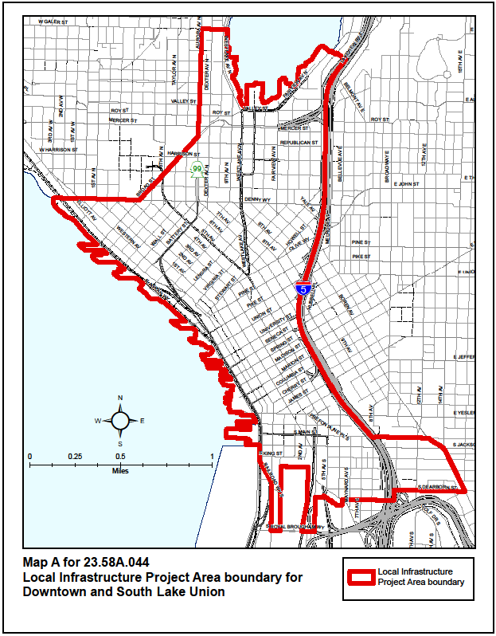

Map A forLocal Infrastructure Project Area boundary for Downtown and South Lake Union

1. Scope and applicability. This Section 23.58A.044 contains standards for acquiring regional development credits when use of the credits is authorized by other Title 23 provisions.
2. Process. To achieve extra floor area by acquiring regional development credits, applicants shall acquire and extinguish certified regional development credits that originate from property located in King, Pierce, or Snohomish counties according to the standards of this Section 23.58A.044.
3. Initial Ratios. Except as provided in subsection 23.58A.044.C, applicants shall receive either an amount of extra residential floor area listed in Table A for 23.58A.044 or an amount of extra nonresidential floor area listed in Table B for 23.58A.044 for each regional development credit acquired and extinguished.
4. Exchange Ratios after first 200 credits extinguished. When the first 200 regional development credits have been extinguished to the satisfaction of the Director as provided in subsection 23.58A.044.G, Table A and Table B for 23.58A.044 shall no longer have effect and applicants shall, for each regional development credit acquired and extinguished, receive an amount of extra residential floor area listed in Table C for 23.58A.044 or an amount of extra nonresidential floor area listed in Table D for 23.58A.044.
5. Certification. Regional development credits shall be certified by King, Pierce, or Snohomish County as being eligible for transfer under the regional development credit program adopted by the county that is certifying the credits.
6. Prerequisite for issuing development permits. A building permit shall not be issued for a development that includes bonus floor area obtained through regional development credits until the applicant demonstrates to the satisfaction of the Director that the owner of the property being developed owns the regional development credits used to obtain the bonus floor area according to documentation issued by the county where the credits originated from.
7. Prerequisite for issuing a certificate of occupancy. A certificate of occupancy shall not be issued for a development that includes bonus floor area obtained through regional development credits until the applicant demonstrates to the satisfaction of the Director that the regional development credits have been extinguished according to documentation issued by the county where the credits originated from.
8. Proceeds from sale

    1. In order to demonstrate the entire proceeds from the sale of credits will be used to purchase new agricultural credits under subsection 23.58A.044.C or 23.58A.044.D, the applicant shall demonstrate that the Forest or Rural credits were purchased from a county or non-profit entity that provides documentation to the Director that the entire proceeds from the sale of the Forest or Rural credits have been:

        1. Expended for the purchase of new Agricultural credits that meet the requirement of subsection 23.58A.044.E and that were purchased from property owners owning agricultural property located in the same county where the Forest or Rural credits originated from; or
        2. Placed in a segregated account subject to the restriction that the funds in the account shall only be used for purchasing new Agricultural credits from property owners owning agricultural property located in the same county where the Forest or Rural credits originated from.
    2. In the case of subsection 23.58A.044.H.1.b, the account holder shall annually provide, within 30 days after the end of each calendar year, a report to the Director demonstrating:

        1. The sources and uses of funds in the account; and
        2. The funds in the account have only been used for directly purchasing new Agricultural credits from property owners owning agricultural property located in the same county where the Forest or Rural credits originated from.
9. The Local Infrastructure Project Area for Downtown and South Lake Union is as shown on Map A for 23.58A.044.

### Chapter 23.58B - AFFORDABLE HOUSING IMPACT MITIGATION PROGRAM FOR COMMERCIAL DEVELOPMENT

Sections:

#### 23.58B.005 - Purpose

The purpose of this Chapter 23.58B is to mitigate certain adverse impacts of development of new commercial floor area on the need for affordable housing for the households of new workers having lower-wage jobs. Chapter 23.58B provides for voluntary agreements for mitigation of affordable housing impacts associated with new commercial floor area. The mitigation provided in this Chapter 23.58B is not intended to eliminate all affordable housing impacts of new commercial floor area.

#### 23.58B.010 - Intent for implementation

1. Application of this Chapter 23.58B

    1. The provisions of this Chapter 23.58B apply in areas for which the provisions of the zone specifically refer to this Chapter 23.58B, or through the terms of a contract rezone in accordance with Section 23.34.004. The Council intends that references to this Chapter 23.58B be made in the provisions of zones in conjunction with:

        1. Land Use Code amendments increasing commercial development capacity in the zone through increases in allowable FAR and/or height or other measures;
        2. Land Use Map amendments increasing commercial development capacity in an area; or
        3. A combination of Land Use Code and Land Use Map amendments increasing commercial development capacity in an area.
    2. The Council intends that the initial implementation phase of enacting amendments described in subsection 23.58B.010.A.1 will consist of:

        1. An increase in FAR and/or height for all zones in the Downtown and South Lake Union Urban Centers except the Downtown Harborfront 1 (DH-1), Pike Market Mixed (PMM), Seattle Mixed 85/65-160 (SM 85/65-160), Seattle Mixed 85-240 (SM 85-240), and Commercial 2-40 (C2-40) zones to be enacted no later than September 2016;
        2. Zone-wide increases in development capacity in all Neighborhood Commercial (NC), Commercial (C), Seattle Mixed (SM), and Industrial Commercial (IC) zones outside the Downtown and South Lake Union Urban Centers to be enacted no later than September 2017; and
        3. Increases in development capacity through rezones of any portions of the University District that are upzoned in accordance with the University District urban design framework process.
2. Amendment of payment and performance amounts

    1. Initial implementation phase review. The Council recognizes that amendments to the payment and performance amounts provided in this Chapter 23.58B may be needed during the initial implementation phase described in subsection 23.58B.010.A.2 to further the target production level of no fewer than 6,000 net new rent and income restricted affordable units for households with incomes no higher than 60 percent of median income over a ten-year period described in the July 13, 2015 Statement of Intent for Basic Framework for Mandatory Inclusionary Housing and Commercial Linkage Fee. Such amendments could include changes to the payment and performance amounts in Table A for 23.58B.040, Table B for 23.58B.040, Table A for 23.58B.050, and Table B for 23.58B.050, and adding amounts for additional zones or portions of zones in connection with rezones of specific subareas such as portions of the University District. The Council intends that amendments during the initial implementation phase be preceded by a robust stakeholder engagement process including representatives of the for-profit and non-profit development sectors who participated in the July 13, 2015 Statement of Intent for Basic Framework for Mandatory Inclusionary Housing and Commercial Linkage Fee.
    2. Ongoing review. The Council directs that, during the first six months of 2018 and every two years after July 1, 2018, the Director prepare a report on the performance of the mandatory inclusionary housing program described in the July 13, 2015 Statement of Intent for Basic Framework for Mandatory Inclusionary Housing and Commercial Linkage Fee, and the affordable housing impact mitigation program provided in this Chapter 23.58B, including the amount of payments collected under the payment option, the number of affordable housing units produced and preserved with such payments, and the number of affordable housing units constructed under the performance option. Units produced under the mandatory inclusionary housing program described in the July 13, 2015 Statement of Intent for Basic Framework for Mandatory Inclusionary Housing and Commercial Linkage Fee, and the affordable housing impact mitigation program provided in this Chapter 23.58B, shall be measured as net new units. Existing rent and income restricted affordable units demolished for development subject to the programs are subtracted from the target production.
    3. Post-initial implementation phase review. Except as provided in subsection 23.58B.010.B.4, the Council intends that, after the completion of the initial implementation phase described in subsection 23.58B.010.A.2, amendments to the payment and performance amounts in Tables A and B for 23.58B.040 and Tables A and B for 23.58B.050 shall be consistent with the following provisions:

        1. Amendments may be considered if:

            1. After five years from the effective date of the ordinance introduced as Council Bill 118498, there is a failure to meet expectations for program performance;
            2. There are significant positive or negative changes in real estate development market conditions; or
            3. Neither of the preceding criteria is met and ten years have elapsed since the completion of the initial implementation phase described in subsection 23.58B.010.A.2.
        2. If amendments are considered in accordance with a criterion in subsection 23.58B.010.B.3.a, the Mayor and Council shall appoint a Technical Review Committee whose membership includes appropriate stakeholder representation, including representatives of the for-profit and non-profit development sectors and members of community-based groups, and shall provide the Committee with clear objectives to be accomplished by a revision of the payment and performance amounts in this Chapter 23.58B.
        3. If appointed, the Technical Review Committee shall prepare a report and recommendation regarding amendments to the payment and performance amounts in Table A for 23.58B.040, Table B for 23.58B.040, Table A for 23.58B.050, and Table B for 23.58B.050. The Mayor shall consider the Technical Review Committee's report and recommendations and shall transmit them to the Council along with any recommendation by the Mayor for amendments.
    4. Amendments concurrent with increased capacity. In conjunction with any increase in commercial development capacity other than those identified in subsection 23.58B.010.A.2, the Council will apply Chapter 23.58B to the zones or areas in which capacity is increased and may amend Table A for 23.58B.040, Table B for 23.58B.040, Table A for 23.58B.050, and Table B for 23.58B.050 for those zones or areas in which capacity is increased.
3. Process for modifications of development standards

    1. The Council intends that, at the time reference to this Chapter 23.58B is made in the provisions of a zone consistent with subsection 23.58B.010.A.1, Land Use Code changes will be adopted providing a process by which the Director would be authorized to modify certain dimensional development standards to ensure that, in most cases, utilization of the increased commercial development capacity is not prohibited by development standards.
    2. To enable development of such Land Use Code changes, the Director shall report on which development standards, if any, might be appropriate for modification in particular zones and the extent to which modifications might be allowed from particular standards.
    3. The Council intends that any development standard modification process will also provide for a reduction of the payment and/or performance amounts in a limited number of cases where a portion of the increased development capacity cannot be used because of a development standard from which a modification is not available or is not granted, and not because of decisions of the applicant.

#### 23.58B.015 - Scope of Chapter

This Chapter 23.58B contains provisions that apply only in areas for which the provisions of the zone specifically refer to this Chapter 23.58B, or through the terms of a contract rezone in accordance with Section 23.34.004.

#### 23.58B.020 - Voluntary agreements for affordable housing

The following commercial uses are exempt from the requirements of this Chapter 23.58B in a structure with at least 50 percent of its above-grade gross floor area in residential use:

1. Up to a total of 4,000 square feet of street-level floor area containing the following uses:

    1. Arts facilities;
    2. Eating and drinking establishments;
    3. Entertainment uses other than adult cabarets, adult motion picture theaters, and adult panorams; and
    4. Sales and services, general.
2. Street-level uses along a designated pedestrian street that are required to meet the street-level use standards of a Pedestrian designation.
3. Commercial uses within a development with rent- or income-restricted housing if, for at least 75 percent of the units, a regulatory agreement, housing covenant, or other legal document on the property title limits the income of households that may rent the units to no higher than 60 percent of median income and controls the rents that may be charged for at least 50 years.

1. General. If an applicant elects to seek approval of a permit for a development as described in subsection 23.58B.020.B, the applicant shall enter into a voluntary agreement with the City to mitigate impacts on the need for affordable housing in accordance with this Chapter 23.58B.
2. Applicability. Except as provided in subsection 23.58B.020.C, Table B for 23.58B.040, or Table B for 23.58B.050, this Chapter 23.58B shall apply to development of either a new structure, or an addition to an existing structure, that contains more than 4,000 square feet of new chargeable floor area devoted to commercial uses.
3. Exemptions
4. Options for mitigating affordable housing impacts. The applicant shall enter into a voluntary agreement with the City to mitigate affordable housing impacts either by providing affordable housing through the payment option in accordance with Section 23.58B.040, the performance option in accordance with Section 23.58B.050, or a combination thereof.
5. Relationship to incentive zoning. In areas for which the provisions of the zone specifically refer to this Chapter 23.58B and for which the provisions of the zone also allow additional chargeable floor area to be achieved in accordance with Section 23.49.012, or extra non-residential floor area to be achieved in accordance with Chapter 23.58A, beyond a base height and/or base FAR, the following provisions apply:

    1. The base FAR and maximum FAR and base height and maximum height shall be in accordance with the provisions of the zone.
    2. To exceed the base FAR and/or base height, the requirements of the provisions of the zone and/or Chapter 23.58A for achieving chargeable floor area or extra non-residential floor area above the base height and/or base FAR shall be met, provided that:

        1. Affordable housing provided through the payment option in accordance with Section 23.58B.040 or the performance option in accordance with Section 23.58B.050 may also be counted toward:

            1. The low-income housing requirements for achieving chargeable floor area above the base FAR in accordance with Section 23.49.012; and
            2. The affordable housing, as defined in subsection 23.58A.004.B, requirements for achieving extra non-residential floor area in accordance with Chapter 23.58A, whichever applies;
        2. If the applicant uses the performance option in accordance with Section 23.58B.050, the applicant shall provide the greater of the following:

            1. The performance amount required by this Chapter 23.58B for the applicable chargeable floor area in accordance with subsection 23.58B.020.B; or
            2. The low-income housing performance amount required by Section 23.49.012 for achieving chargeable floor area above the base FAR, or the affordable housing, as defined in subsection 23.58A.004.B, performance amount required by Chapter 23.58A for achieving extra non-residential floor area, whichever applies;
        3. If the applicant uses the payment option in accordance with Section 23.58B.040, the applicant shall provide the greater of the following:

            1. The payment amount required by this Chapter 23.58B for the applicable chargeable floor area in accordance with subsection 23.58B.020.B; or
            2. The low-income housing payment amount required by Section 23.49.012 for achieving chargeable floor area above the base FAR, or the affordable housing, as defined in 23.58A.004.B, payment amount required by Chapter 23.58A for achieving extra non-residential floor area, whichever applies; and
        4. The applicant shall also satisfy all other requirements of the provisions of the zone and/or Chapter 23.58A for achieving chargeable floor area or extra non-residential floor area above the base height or base FAR, including but not limited to any requirements for child care, open space, regional development credits, and TDR.
    3. If an applicant does not seek to exceed the base FAR or base height, the applicant shall provide the amount of performance or payment required in accordance with this Chapter 23.58B for the applicable chargeable floor area in accordance with subsection 23.58B.020.B.

#### 23.58B.025 - Permit application and decision

1. Permit application. The Master Use Permit application or, if no Master Use Permit is required, the application for the permit described in subsection 23.58B.035.A shall meet the following requirements:

    1. The permit application shall describe the amount of affordable housing impact mitigation to be provided, expressed on a per-square-foot basis for performance and/or payment, in accordance with Section 23.58B.040 and/or Section 23.58B.050.
    2. The permit application shall indicate whether the payment option in accordance with Section 23.58B.040, performance option in accordance with Section 23.58B.050, or a combination of the payment and performance options will be pursued. The applicant shall include the following information:

        1. If providing affordable housing impact mitigation through a combination of the payment and performance options, the applicant shall identify the portions of chargeable floor area for which the payment option and performance option shall be used.
        2. If providing affordable housing impact mitigation through the performance option, the applicant shall submit to the Director of Housing for review and approval a proposal for provision of affordable housing and a draft housing covenant ensuring the affordable housing shall meet the standards of subsection 23.58B.050.B.
        3. If the applicant requests a modification in accordance with Section 23.58B.030, the applicant shall request such a modification, explain the basis on which the applicant believes the modification should be granted, and provide such supporting documentation as is necessary for review of the request.
2. Permit decision. The Master Use Permit decision or, if no Master Use Permit is required, the decision on the permit described in subsection 23.58B.035.A shall meet the following requirements:

    1. Subject to subsection 23.58B.025.B.2 and subsection 23.58B.025.B.3, the permit decision shall include approval of the type of mitigation to be provided, whether by payment, performance, or a combination of payment and performance, and specify the amount of mitigation to be provided, expressed on a per-square-foot basis, for performance and/or payment in accordance with Section 23.58B.040 and/or Section 23.58B.050.
    2. If a modification is requested in accordance with subsection 23.58B.030.C, the permit decision shall, as a Type I decision, include approval or disapproval of such a modification and specify the amount of mitigation to be provided, expressed on a per-square-foot basis, for performance and/or payment.
    3. If a modification is requested in accordance with subsection 23.58B.030.B or subsection 23.58B.030.D, the permit decision shall, as a Type II decision, include approval or disapproval of such a modification and specify the amount of mitigation to be provided, expressed on a per-square-foot basis, for performance and/or payment.
    4. In the absence of a signed voluntary agreement, acceptance of the permit shall constitute a voluntary agreement for the purposes of this Chapter 23.58B.

#### 23.58B.030 - Modification of amount of payment or performance

1. General. An applicant may request from the Director a modification of the amount of mitigation required by Section 23.58B.040 or Section 23.58B.050. A request shall comply with the following:

    1. Prior to requesting a modification in accordance with subsection 23.58B.030.C or subsection 23.58B.030.D, the applicant shall have applied for any available modifications of development standards that would allow the applicant to utilize the increased commercial development capacity provided by amendments described in subsection 23.58B.010.A.1.
    2. The request for modification shall be submitted as a part of the relevant permit application. An applicant requesting a modification in accordance with subsection 23.58B.030.D shall also request any available modification under subsection 23.58B.030.B or subsection 23.58B.030.C.
    3. The request shall describe the scope and extent of the proposed modification. The applicant shall provide such additional information as may be required by the Director to make a determination on the request.
    4. The Director shall consult with the Director of Housing in considering modification requests.
    5. The applicant has the burden of proving that a modification is justified.
2. Mitigation greater than impact. The Director shall modify the amount of mitigation required in accordance with Section 23.58B.040 or Section 23.58B.050 if the applicant demonstrates that the required amount of mitigation exceeds the amount that would be needed to mitigate the actual demand for affordable housing created by the development. A request for such a modification shall include information showing the affordable housing impacts created by the development, based on the actual characteristics of the development, including for example, the unique characteristics and space utilization of the workforce that will use the development and the demand of that workforce for affordable housing expressed in terms of the number of employees in households with income at or below 60 percent of median income, and the number of employees in households with income higher than 60 percent of median income but not higher than 80 percent of median income, and such other factors the applicant believes justify a modification.
3. Mitigation in zones with height limits exceeding 85 feet. The Director shall modify the amount of mitigation if the development is in a zone with a height limit greater than 85 feet and the Director finds that applicable development standards prohibit the development from exceeding a height of 85 feet. The reduced mitigation shall be the payment or performance required in accordance with Section 23.58B.040 or Section 23.58B.050 for the same zone classification as the zone in which the development is located that has a height limit of 85 feet, or if that zone classification does not exist, the most comparable zone classification that has a height limit of 85 feet or less, as determined by the Director.
4. Financial hardship

    1. The Director may modify the amount of mitigation required in accordance with Section 23.58B.040 or Section 23.58B.050 if the amount of mitigation, after any modification to which the applicant would be entitled in accordance with the standards of subsection 23.58B.030.B and subsection 23.58B.030.C, would cause a severe and unexpected financial hardship that outweighs the affordable housing impacts.
    2. The request for a modification authorized by subsection 23.58B.030.D.1 shall include, at a minimum, all of the following:

        1. The use of the site before the request;
        2. How application of the requirements for which the modification is being requested restricts the proposed use of the site compared to the restrictions that existed prior to the adoption of this Chapter 23.58B;
        3. The possible remaining uses of the site if the modification were not granted;
        4. The uses of the site that would have been allowed prior to the adoption of this Chapter 23.58B;
        5. An appraisal prepared by a competent appraiser with a valuation date within thirty days of the modification request that (1) values the property taking into account the requirements of this Chapter 23.58B as well as any increase in commercial development capacity provided at the time reference to this Chapter 23.58B is made in the provisions of the zone in which the property is located or at the time of a contract rezone, and (2) values the property absent those requirements and absent any such increase in development capacity; and
        6. The feasibility of altering the project to apply the requirements of this Chapter 23.58B.
    3. The Director may grant a modification authorized by subsection 23.58B.030.D.1 only after considering the following factors:

        1. The severity of the financial hardship caused by the mitigation and the degree to which the mitigation requirement could have been anticipated;
        2. The extent to which alternative designs and uses of the property would remedy any severe and unexpected financial hardship associated with the required mitigation; and
        3. The extent to which the qualities of the particular property, its zoning, and other factors are such that the required mitigation creates a unique burden that imposes a severe impact on the ability to utilize the property.
    4. The Director may grant a modification authorized by subsection 23.58B.030.D.1 only to the extent necessary to provide relief from the identified financial hardship.
    5. When the Director grants a modification authorized by subsection 23.58B.030.D.1, the Director may impose alternative requirements, implemented through a voluntary agreement, to offset or mitigate a portion of any remaining adverse impacts of the development on the need for affordable housing.

#### 23.58B.035 - Documentation and timing

1. The documentation required by subsection 23.58B.035.B shall be provided prior to issuance of the first construction permit other than a demolition, excavation, or shoring permit or, if the Director has approved a phased building permit application, prior to issuance of the portion of the building permit that includes the structural frame for the entire building.
2. Required documentation

    1. The applicant shall execute and record a declaration in a form acceptable to the Director that shall commit the applicant to mitigating affordable housing impacts consistent with the permit decision.
    2. The applicant shall provide to the Director of Housing any cash contributions for affordable housing to be provided through the payment option in accordance with Section 23.58B.040.
    3. The owner of affordable housing provided through the performance option in accordance with Section 23.58B.050 shall execute and record housing covenants approved by the Director of Housing.

#### 23.58B.040 - Affordable housing impact mitigation - payment option

1. Initial payment amounts outside the Downtown and South Lake Union Urban Centers. Outside the Downtown or South Lake Union Urban Centers, an applicant using the payment option shall provide a cash contribution to the City, calculated by multiplying the per-square-foot amount shown in Table B for 23.58B.040, based on the location of the development as shown on Map A for 23.58B.050, by the total square footage of new chargeable floor area devoted to the uses set forth in subsection 23.58B.020.B.

1. Automatic adjustments to initial payment amounts. On March 1, 2016, and on the same day each year thereafter, the payment amounts in Table A for 23.58B.040 and Table B for 23.58B.040 shall automatically adjust in proportion to the annual change for the previous calendar year (January 1 through December 31) in the Consumer Price Index, All Urban Consumers, Seattle-Tacoma-Bremerton, WA, All Items (1982-84 = 100), as determined by the U.S. Department of Labor, Bureau of Labor Statistics or successor index.

1. Amount of cash contributions

    1. Initial payment amounts inside the Downtown and South Lake Union Urban Centers. Inside the Downtown or South Lake Union Urban Centers, an applicant using the payment option shall provide a cash contribution to the City, calculated by multiplying the per-square-foot amount shown in Table A for 23.58B.040 by the total square footage of new chargeable floor area devoted to the uses set forth in subsection 23.58B.020.B.
2. Deposit and use of cash contributions

    1. Cash contributions shall be deposited in a special account established solely for preserving and producing housing for renter households with incomes no higher than 60 percent of median income and owner households with incomes no higher than 80 percent of median income. Earnings on balances in the special account shall accrue to that account.
    2. Use of cash contributions shall support the preservation and production of renter-occupied housing within the city of Seattle. Rental housing supported by the cash contributions shall be rent- and income-restricted to serve households with incomes no higher than 60 percent of median income for a minimum period of 50 years. Monthly rent, including basic utilities, shall not exceed 30 percent of 60 percent of median income, all as determined by the Director of Housing. Use of cash contributions may also include capital expenditures for development of owner-occupied housing within the city of Seattle. Owner-occupied housing supported by the cash contributions shall be priced to serve households with incomes no higher than 80 percent of median income, with resale restrictions for a minimum period of 50 years. For purposes of determining the location for use of funds, the City shall consider the extent to which the housing advances the following factors:

        1. Affirmatively furthering fair housing choice.
        2. Locating within an urban center or urban village.
        3. Locating in proximity to frequent bus service or current or planned light rail or street car stops.
        4. Furthering the City policies to promote economic opportunity and community development and addressing the needs of communities vulnerable to displacement.
    3. Each cash contribution shall be expended within five years of collection. Any cash contribution not so expended shall be refunded with any interest required by law.

#### 23.58B.050 - Affordable housing impact mitigation - performance option

1. Outside the Downtown and South Lake Union Urban Centers. Outside the Downtown or South Lake Union Urban Centers, an applicant using the performance option shall provide net rentable floor area of affordable housing meeting the standards of subsection 23.58.B.050.B, calculated by multiplying the applicable percentage shown in Table B for 23.58B.050, based on the location of the development as shown on Map A for 23.58B.050, by the square footage of new chargeable floor area devoted to uses set forth in subsection 23.58B.020.B, unless such amount totals fewer than three dwelling units, using a conversion factor for unit size as determined by the Director, in which case the applicant shall make a cash contribution for affordable housing using the payment option in accordance with Section 23.58A.040.
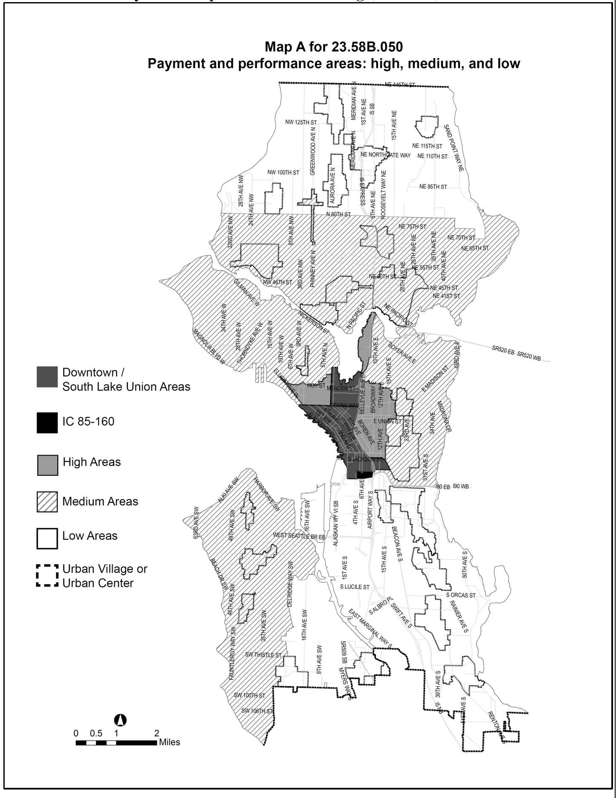

Map A forPayment and performance areas: high, medium, and low

1. Amount of affordable housing

    1. Inside Downtown and South Lake Union Urban Centers. Inside the Downtown or South Lake Union Urban Centers, an applicant using the performance option shall provide net rentable floor area of affordable housing meeting the standards of subsection 23.58B.050.B, calculated by multiplying the applicable percentage shown in Table A for 23.58B.050 by the square footage of new chargeable floor area devoted to the uses set forth in subsection 23.58B.020.B, unless such amount totals fewer than three dwelling units, using a conversion factor for unit size as determined by the Director, in which case the applicant shall make a cash contribution using the payment option in accordance with Section 23.58B.040.
2. Performance standards. Affordable housing provided through the performance option shall meet the following standards:

    1. General performance standards

        1. Duration. Affordable housing provided through the performance option shall be for a minimum period of 50 years from the date of issuance of the final certificate of occupancy for the affordable housing.
        2. Rent limits. Monthly rent, including basic utilities, shall not exceed 30 percent of 60 percent of median income except that, for rental housing units of 400 square feet or fewer of net rentable floor area, monthly rent, including basic utilities, shall not exceed 30 percent of 40 percent of median income. Affordable housing provided through the performance option shall be for rental, not ownership.
        3. Unit size, type, and distribution. The average size and type of the affordable housing units provided through performance, regardless of whether provided on-site or off-site, shall generally be comparable to the dwelling units in the residential portion, if any, of the development required to mitigate affordable housing impacts in accordance with this Chapter 23.58B. The affordable units shall have substantially the same functionality as the other residential units, if any, in the development in which they are located and shall be generally distributed throughout the residential portion of the development.
        4. Eligible households. Affordable housing provided through the performance option shall serve only:

            1. For rental housing units of 400 square feet or fewer of net rentable floor area, households with incomes no higher than 40 percent of median income; or
            2. For rental housing units of greater than 400 square feet of net rentable floor area, households with incomes no higher than 60 percent of median income.
        5. Prohibition on public subsidy. Affordable housing provided through the performance option shall not use any public subsidy or tax incentive, except the following:

            1. Washington State 4% Low-Income Housing Tax Credit with Multifamily Housing Bonds; and/or
            2. Property tax exemptions in accordance with Chapter 5.73 or any other program implemented in accordance with Chapter 84.14 RCW, provided the affordable housing provided through the performance option to mitigate affordable housing impacts is in addition to any dwelling units provided to satisfy conditions for a property tax exemption in accordance with Chapter 5.73, unless the rent and income limits for dwelling units provided to satisfy requirements for purposes of both this Chapter 23.58B and Chapter 5.73 provide measurably greater public benefit than providing affordable housing through the performance option to mitigate affordable housing impacts in addition to any dwelling units provided to satisfy conditions for a property tax exemption in accordance with Chapter 5.73.
        6. Time of completion. Any affordable housing provided through the performance option shall be completed and ready for occupancy at or before the time when a final certificate of occupancy is issued for the development required to mitigate affordable housing impacts in accordance with this Chapter 23.58B, and shall be a condition to any right of the applicant to such certificate of occupancy.
        7. Reporting. At such times as may be authorized by the Director of Housing, but no less than annually, and for as long as the housing covenant approved by the Director of Housing remains in effect, the owner of the affordable housing provided through the performance option shall submit to the Director of Housing a written report demonstrating compliance. The written report shall state, at a minimum, the occupancy and vacancy of the affordable housing, the monthly rents charged for each affordable housing unit, and the income and size of each household occupying the affordable housing. The Director of Housing may require other documentation to ensure compliance with this subsection 23.58B.050.B and any housing covenant approved by the Director of Housing, including but not limited to documentation of rents, copies of tenant certifications, and documentation supporting determinations of tenant income (e.g., employer's verification or check stubs). The Director of Housing may require other documentation necessary to track program outcomes and the demographics of households served. The first annual report shall include documentation of issuance of the final certificate of occupancy for the affordable housing.
    2. Off-site performance standards. In addition to meeting the standards in subsection 23.58B.050.B.1, affordable housing provided through the performance option but not located on the same lot as the development required to mitigate affordable housing impacts in accordance with this Chapter 23.58B shall meet the following additional standards:

        1. The applicant shall demonstrate to the satisfaction of the Director of Housing that affordable housing impact mitigation provided through the performance option on a site other than the same lot as the development required to mitigate affordable housing impacts in accordance with this Chapter 23.58B is equal to that provided by the on-site performance option.
        2. Affordable housing not located on the same lot as the development required to mitigate affordable housing impacts in accordance with this Chapter 23.58B shall be located:

            1. Within the same urban center or urban village if the development required to mitigate affordable housing impacts in accordance with this Chapter 23.58B is located within an urban center or urban village; or
            2. Within one mile of the development required to mitigate affordable housing impacts in accordance with this Chapter 23.58B if such development is located outside of an urban center or urban village.

#### 23.58B.060 - Definitions

Definitions in this Chapter 23.58B supersede any definitions of the same terms in Chapter 23.84A and Section 23.58A.004 for the purposes of provisions of this Chapter 23.58B, unless otherwise specified in this Chapter 23.58B.

"Affordable housing" means dwelling units affordable to households with a range of incomes no higher than 80 percent of median income.

"Net rentable floor area" means total square feet of floor area as measured between the interior walls of each dwelling unit.

### Division 3 - Overlay Districts

### Chapter 23.59 - GENERAL PROVISIONS

Sections:

#### 23.59.010 - Overlay district generally.

1. Purpose. Overlay districts are established to conserve and enhance The City of Seattle's unique natural marine and mountain setting and its environmental and topographic features; to preserve areas of historical note or architectural merit; to accomplish City policy objectives for specific areas; to assist in the redevelopment and rehabilitation of declining areas of the City; to balance the needs of Major Institution development with the need to preserve adjacent neighborhoods; and to promote the general welfare by safeguarding such areas for the future use and enjoyment of all people.
2. Application of Regulations. Property located within an overlay district as identified on the Official Land Use Maps, Chapter 23.32, is subject both to its zone classification regulations and to additional requirements imposed for the overlay district. In any case where the provisions of the overlay district conflict with the provisions of the underlying zone, the overlay district provisions shall apply.

### Chapter 23.60A - SEATTLE SHORELINE MASTER PROGRAM REGULATIONS

Sections:

#### Subchapter I: - Purpose and Policies
##### 23.60A.001 - Definition of the Seattle Shoreline Master Program

The Seattle Shoreline Master Program comprises the Shoreline Goals and Policies in the Seattle Comprehensive Plan, Seattle Shoreline Master Program Regulations, the maps of the Shoreline District showing the locations of shoreline environments, and the Restoration and Enhancement Plan required by WAC 173-26-201(2)(f), attached as Exhibit C to this ordinance.

##### 23.60A.002 - Title and purpose

1. This Chapter 23.60A shall be known as the "Seattle Shoreline Master Program Regulations."
2. It is the purpose of this Chapter 23.60A to implement the policy and provisions of the Shoreline Management Act and the Shoreline Goals and Policies of the Seattle Comprehensive Plan, as well as the City's interest in the public health, safety and welfare, by regulating development, uses and shoreline modifications of the shorelines of the City in order to:

    1. Protect the ecological functions of the shoreline areas;
    2. Encourage water-dependent uses;
    3. Provide for maximum public access to, and enjoyment of the shorelines of the City; and
    4. Preserve, enhance, and increase views of the water.

##### 23.60A.004 - Shoreline goals and policies

The Shoreline Goals and Policies are part of the Land Use Element of Seattle's Comprehensive Plan. The Shoreline Goals and Policies and the purpose and location criteria for each shoreline environment designation contained in Section 23.60A.220 shall be considered in making all discretionary decisions in and adjacent to the Shoreline District where the intent of the Land Use Code is a criterion and the proposal may have an adverse impact on the Shoreline District. They shall also be used by the Director in the promulgation of rules and in interpretation decisions. The Shoreline Goals and Policies do not constitute regulations and shall not be the basis for enforcement actions.

#### Subchapter II: - Compliance

#### Part 1 - Compliance
##### 23.60A.010 - Shoreline District established

1. There is established the Shoreline District that includes all shorelines of the City over which it has jurisdiction, the boundaries of which are illustrated on the Official Land Use Map, Chapter 23.32. In the event that any of the boundaries on the Official Land Use Map conflict with the criteria of WAC 173-22-040 as amended or with lands held in trust for Indian Tribes, the criteria or the laws for Indian trust lands shall control.
2. All property located within the Shoreline District is subject both to the standards of the applicable zone and to the requirements imposed by this Chapter 23.60A and any other overlay district except as provided in Section 23.60A.016.

##### 23.60A.012 - Inconsistent development prohibited

No development shall be undertaken, no shoreline modification shall be made, and no use, including a use that is located on a vessel, shall be established in the Shoreline District unless the Director has determined that it is consistent with the policy of the Shoreline Management Act and the regulations of this Chapter 23.60A. This restriction applies even if no shoreline substantial development permit is required.

##### 23.60A.014 - Liberal construction

1. This Chapter 23.60A is exempted from the rule of strict construction, and it shall be liberally construed to give full effect to the objectives and purposes of RCW 90.58, the State Shoreline Management Act. The standard in this Chapter 23.60A that is most restrictive applies.
2. This Chapter 23.60A shall not be used when construing other chapters of this Title 23 except for actions in the Shoreline District or as stated in subsections 23.60A.016.B and 23.60A.016.C.

##### 23.60A.016 - Regulations supplemental

1. The regulations of this Chapter 23.60A are superimposed upon and modify the underlying zones in the Shoreline District. The regulations of this Chapter 23.60A supplement other regulations of this Title 23 as set out in subsections 23.60A.016.B and 23.60A.016.C.
2. Uses and shoreline modifications. To be allowed in the Shoreline District, a use or a shoreline modification must be allowed in both the shoreline environment, the underlying zone and any other overlay district in which it is located.
3. Development Standards

    1. A development, shoreline modification, or use in the Shoreline District shall meet the development standards of Chapter 23.60A, the underlying zone and any other overlay district in which it is located. In the case of irreconcilable conflicts between the regulations of Chapter 23.60A and the underlying zone or overlay district, Chapter 23.60A applies, except as provided in this subsection 23.60A.016.C.
    2. The height limit for a structure in the Shoreline District is the lower of the height limits provided in the shoreline environment, the underlying zone, or overlay district, except in the Urban Harborfront (UH) Environment, where the shoreline height limit controls.
    3. The floor area ratio (FAR) of the underlying zone may not be exceeded, regardless of whether the maximum height and lot coverage allowed in the applicable shoreline environment can be achieved.
    4. Yards and/or setbacks of the underlying zone may be reduced or waived for lots subject to view corridor requirements, in accordance with Section 23.60A.170, and to preserve buffers and riparian management areas in environmentally critical areas as allowed in Section 23.60A.156.
    5. Within the Shoreline District, submerged lands are not counted in calculating lot area for purposes of minimum lot area.
    6. Measurements in the Shoreline District are regulated in this Chapter 23.60A, Subchapter XVII, Measurements.
    7. Seattle Construction Limit Line

        1. Established. There is established along the shores of Lake Union and waters in the vicinity thereof in the City, a "Seattle Construction Limit Line." The Seattle Construction Limit Line is as shown on the Official Land Use Map Chapter 23.32.
        2. Unlawful Construction—Exceptions. It is unlawful to erect, construct or maintain any building or structure outward from the shores of Lake Union beyond the Seattle Construction Limit Line, except such buildings or structures as are expressly authorized by the laws of the United States or State of Washington; provided, any residential structure located in whole or in part beyond the Seattle Construction Limit Line prior to December 18, 1968, is allowed as a nonconforming structure and is regulated pursuant to Section 23.60A.124.
4. Nothing in this Chapter 23.60A changes the legal effect of existing approved Major Institution Master Plans adopted pursuant to Chapter 23.69 or Ordinance 121041.

##### 23.60A.018 - Non-regulated actions

Except as specifically provided otherwise, the regulations of this Chapter 23.60A do not apply to the operation of boats, ships and other vessels designed and used for navigation, other than moorage of vessels and uses on vessels unrelated to navigation; nor to the vacation and closure, removal or demolition of buildings determined by the Director to be unfit for human habitation pursuant to the Seattle Housing Code; nor to correction of conditions found by the Director to be in violation of the minimum standards of Chapters 22.200, et seq., of the Seattle Housing Code; nor to the demolition of a structure pursuant to an ordinance declaring it to be a public nuisance and providing for summary abatement; nor to actions taken pursuant to environmental excellence program agreements entered into under RCW 43.21K.

##### 23.60A.020 - Permits and exemptions

1. Shoreline substantial development permit required

    1. A shoreline substantial development permit is required prior to undertaking any development unless the Director determines the development is not substantial development or has issued an exemption under this Section 23.60A.020. Development does not include demolition, except when the Director determines that such demolition will have a major impact upon the character of the shoreline.
    2. Criterion for requiring a shoreline substantial development permit

        1. "Substantial development" means any development for which the total cost or fair market value exceeds $6,416, as adjusted under RCW 90.58.030(3)(e), or any development that materially interferes with the normal public use of the water or shorelines of the City. The dollar threshold will be recalculated and published in the Washington State Register every five years with the next recalculation to occur in 2017.
        2. A development, shoreline modification, or use that does not meet the definition of substantial development or that has received an exemption from the shoreline substantial development permit process shall comply with the Shoreline Management Act, the provisions of this Chapter 23.60A, and any other regulatory requirements.
    3. A development, shoreline modification, or use that is listed as a shoreline conditional use in this Chapter 23.60A or that is not identified in the shoreline environment where it is proposed to be located and is allowed in the underlying zone and special district requires a shoreline conditional use permit under this Chapter 23.60A, even if the development, shoreline modification, or use does not otherwise require a shoreline substantial development permit.
    4. A development or shoreline modification that does not comply with the bulk, dimensional or performance standards of this Chapter 23.60A may only be authorized by a variance under this Chapter 23.60A, even if the development or shoreline modification does not otherwise require a shoreline substantial development permit.
    5. Repair and maintenance of an existing development, shoreline modification, or use that was authorized by a special use, shoreline conditional use, or shoreline variance does not require approval of a special use permit, shoreline conditional use permit, or shoreline variance, if no expansion occurs; if expansion would occur, the permit process is the process applicable to the type of development, use, or shoreline modification as if it were a new application under the Shoreline Master Program in effect when the application for such repair and maintenance is made.
2. Application and interpretation of exemptions

    1. The applicant has the burden of proof that an action is not development, that a development is not substantial development, and that a substantial development is exempt from the shoreline substantial development permit process.
    2. Exemption interpretation

        1. Exemptions shall be construed narrowly.
        2. Substantial developments that meet the precise terms of one or more of the listed exemptions may be granted an exemption from the shoreline substantial development permit process.
        3. If any part of a proposed substantial development is not eligible for exemption, then a shoreline substantial development permit is required for the entire proposed development project.
    3. The Director may attach conditions to the approval of exempted developments as necessary to assure consistency of the project with the Shoreline Management Act and this Chapter 23.60A.
3. Exemptions. The following substantial developments are exempt from obtaining a shoreline substantial development permit from the Director:

    1. "Normal maintenance" or repair of existing structures or developments, including damage by accident, fire or elements.

        1. "Normal maintenance" means those usual acts to prevent a decline, lapse or cessation from a lawfully established state comparable to its original condition, including but not limited to its size, shape, configuration, location, and external appearance, within a reasonable period after decay or partial destruction, except where repair causes substantial adverse effects to shoreline resources or environment.
        2. Replacement of a structure or development is repair if such replacement is the common method of repair for the type of structure or development and the replacement structure or development is comparable to the original structure or development including but not limited to its size, shape, configuration, location and external appearance, and the replacement does not cause substantial adverse effects to shoreline resources or environment.
    2. Construction of a "normal protective bulkhead" common to single-family residences. A "normal protective bulkhead" means those structural and nonstructural developments installed at or near, and parallel to, the OHW mark for the sole purpose of protecting an existing single-family residence and appurtenant structures from loss or damage by erosion. Construction of a normal protective bulkhead or repair is exempt if:

        1. It is not constructed for the purpose of creating dry land;
        2. A vertical wall is being constructed or reconstructed, and not more than 1 cubic yard of fill per 1 foot of wall may be used as backfill;
        3. An existing bulkhead is being repaired by construction of a vertical wall fronting the existing wall, and it is constructed no further waterward of the existing bulkhead than is necessary for construction of new footings;
        4. A bulkhead has deteriorated such that an ordinary high water (OHW) mark has been established by the presence and action of water landward of the bulkhead, and the replacement bulkhead is located at or near the actual OHW mark; and
        5. Beach nourishment, or non-structural or soft stabilization is proposed; such projects may be considered a normal protective bulkhead if all structural elements are consistent with the requirements of this subsection 23.60A.020.C.2 and if the project has been approved by the Washington Department of Fish and Wildlife (WDFW).
    3. Emergencies

        1. Emergency construction necessary to protect property from damage by the elements if:

            1. It does not include creation of new permanent protective structures where none previously existed; or
            2. If new protective structures are deemed by the Director to be the appropriate means to address the emergency situation, upon abatement of the emergency situation the new structure shall be removed or any permit that would have been required, absent an emergency, pursuant to RCW 90.58 or these regulations shall be obtained; and
            3. Flooding or other seasonal events that can be anticipated and may occur but that are not imminent are not an emergency.
        2. Upon abatement of the emergency situation the new structure shall be removed or any permit, which would have been required, absent an emergency, pursuant to RCW 90.58 or these regulations, shall be obtained. All emergency construction shall be consistent with the policies of RCW 90.58 and the Seattle Shoreline Master Program. As a general matter, flooding or other seasonal events that can be anticipated and may occur but that are not imminent are not an emergency.
    4. Construction and practices normal or necessary for farming, irrigation, and ranching activities, including agricultural service roads and utilities on shorelands, construction of a barn or similar structure, and the construction and maintenance of irrigation structures, including but not limited to head gates, pumping facilities, and irrigation channels; provided, that a feedlot of any size, all processing plants, other activities of a commercial nature, alteration of the contour of the shorelands by leveling or filling other than that which results from normal cultivation, are not considered normal or necessary farming or ranching activities.
    5. Construction or modification, by or under the authority of the Coast Guard or a designated port management authority, of navigational aids, such as channel markers and anchor buoys.
    6. Construction on shorelands by an owner, lessee or contract purchaser of a single-family residence, for his or her own use or for the use of his or her family, that does not exceed a height of 35 feet above average grade level and meets all requirements of the City. Construction authorized under this exemption shall be located landward of the OHW mark. For the purpose of this exemption:

        1. Single family residence means a detached dwelling designed for and occupied by one family, including those structures and developments within a contiguous ownership that are a normal appurtenance.
        2. A normal appurtenance is necessarily connected to the use and enjoyment of a single-family residence and is located landward of the OHW mark and the perimeter of a wetland. Normal appurtenances include, but are not limited to, a garage, deck, driveway, utilities, fences, installation of a septic tank and drainfield, and grading that does not exceed 250 cubic yards and that does not involve placement of fill in any wetland, riparian watercourse or waterward of the OHW mark.
    7. Construction of a pier accessory to residential structures, including a community pier, designed for pleasure craft only for the private noncommercial use of the owners, lessee or contract purchaser of a single-family or multifamily residence. For the purpose of this exemption a pier is a landing and moorage facility for watercraft and does not include recreational decks, storage facilities or other appurtenances. This exception applies if either:

        1. In saltwater, which includes Puget Sound, Elliott Bay, Shilshole Bay, the Harborfront and the Duwamish River and all associated bays and inlets, the fair market value of the pier accessory to residential structures does not exceed $2,500; or
        2. In freshwater, the fair market value of the pier accessory to residential structures does not exceed $10,000; but if subsequent construction having a fair market value exceeding $2,500 occurs within five years of completion of the prior construction, the subsequent construction shall be considered a substantial development for the purpose of this Chapter 23.60A.
    8. Operation, maintenance, or construction of canals, waterways, drains, reservoirs, or other facilities that now exist or are hereafter created or developed as a part of an irrigation system for the primary purpose of making use of system waters, including return flow and artificially stored groundwater for the irrigation of lands.
    9. The marking of property lines or corners on state-owned lands, if such marking does not significantly interfere with normal public use of the surface of the water.
    10. Operation and maintenance of any system of dikes, ditches, drains, or other facilities existing on June 4, 1975, that were created, developed or used primarily as a part of an agricultural drainage or diking system.
    11. Actions under a certification from the Governor pursuant to RCW 80.50.
    12. Site exploration and investigation activities that are prerequisite to preparation of an application for development authorization under this Chapter 23.60A, if:

        1. The activity does not interfere with the normal public use of the surface waters;
        2. The activity will have no significant adverse impact on the environment, including but not limited to fish, wildlife, fish or wildlife habitat, water quality, and aesthetic values;
        3. The activity does not involve the installation of any structure, and upon the completion of the activity the vegetation and land configuration of the site are restored to conditions existing before the activity;
        4. A private entity seeking development authorization under this Section 23.60A.020 first posts a performance bond or provides other evidence of financial responsibility to the Director to ensure that the site will be restored to preexisting conditions; and
        5. The activity is not subject to the permit requirements of RCW 90.58.550.
    13. The process of removing or controlling aquatic noxious weeds, as defined in RCW 17.26.020, through the use of an herbicide or other chemical treatment methods applicable to weed control that is recommended by a final environmental impact statement published by the department of agriculture or Ecology jointly with other state agencies under RCW 43.21C.
    14. Watershed restoration projects that implement a watershed restoration plan and meet the following criteria: The Director shall review the projects for consistency with its Shoreline Master Program in an expeditious manner and shall issue its decision along with any conditions within 45 days of receiving from the applicant all materials necessary to review the request for exemption. No fee may be charged for accepting and processing requests for exemption for watershed restoration projects as used in this Section 23.60A.020.
    15. A public or private project, the primary purpose of which is to improve fish or wildlife habitat or fish passage, if all of the following apply:

        1. The project has been approved in writing by WDFW as necessary for the improvement of the habitat or passage and appropriately designed and sited to accomplish the purpose;
        2. The project has received Hydraulic Project Approval by WDFW pursuant to RCW 75.20; and
        3. The project is consistent with the City's Shoreline Master Program. This determination shall be made in a timely manner and provided to the project proponent in writing. A fish habitat enhancement project that conforms to RCW 77.55.290 is deemed to be consistent with this Chapter 23.60A.
    16. Hazardous substance remedial actions for which a consent decree, order or agreed order has been issued pursuant to RCW 70.105D or to Ecology when it conducts a remedial action under RCW 70.105D. Ecology shall, in conjunction with The City of Seattle, assure that such projects comply with the substantive requirements of RCW 90.58 and the Seattle Shoreline Master Program.
    17. Development on that portion of land that is brought under shoreline jurisdiction due to a lawful shoreline restoration project creating a landward shift in the OHW mark, except when substantial development is proposed that would be partly on such land and partly on other land within the Shoreline District.
4. Developments proposed in the Shoreline District may require permits from other governmental agencies. A permit issued by the City may be subject to rights reserved or otherwise held by Indian Tribes pursuant to Treaties, Executive Orders, or statutes.
5. If a use is allowed, allowed as a special use, or allowed as a conditional use and either the use is limited to a maximum percentage of development or the use is required to be on a site containing a minimum percentage of another use, the permit issued shall identify the specific uses and gross floor areas of each use that is relied upon to meet the applicable use percentage requirements.

##### 23.60A.022 - Application when development partly out of Shoreline District

1. The use and development standards of this Chapter 23.60A apply to that part of the development, shoreline modification, or use that occurs within the Shoreline District unless the underlying zone requires the entire development, shoreline modification, or use to comply with all or part of this Chapter 23.60A.
2. If a substantial development is proposed that would be partly within the Shoreline District, a shoreline substantial development permit is required for the entire development, except that a shoreline substantial development permit is not required for:

    1. Those portions of a linear transportation use such as light rail tracks, track support structure or tunnels that are outside the Shoreline District; and
    2. For discrete facilities, such as stations, that are wholly outside the Shoreline District.
3. The use and development standards, including measurement techniques, for that portion of the development outside of the Shoreline District are as provided by the underlying zone or other special district standards.

##### 23.60A.024 - Development of lots split into two or more shoreline environments

If a lot in the Shoreline District is split by a boundary line between two different shoreline environments, each portion of the lot is regulated by the shoreline environment covering that portion. If the lot coverage requirements differ for portions of the lot governed by different environments, the lot coverage restrictions must be met on each separate portion of the lot.

##### 23.60A.026 - Fee schedule

Permit and other shoreline-related fees are as described in the Permit Fee Ordinance, Title 22.

##### 23.60A.027 - Habitat Evaluation Procedures

1. Director's Rule

    1. The Director by rule may establish procedures to evaluate ecological functions in the Shoreline District using a system of habitat units.
    2. In developing the Director's Rule, the Director shall consult with relevant state and federal regulatory agencies and include affected stakeholders.
2. The procedures shall:

    1. Use appropriate scientific and technical information to determine, measure and/or quantify ecological functions required to determine no net loss of ecological function; including relative proximity to the ordinary high water mark; and
    2. Determine the costs of restoration and enhancement actions of habitat units, using full cost accounting principles, including consideration of the following: project design, permitting, construction, monitoring, maintenance, adaptive management, long term stewardship (indexed to the rate of inflation), and land value; and
    3. Not conflict with the federal and state standards for mitigating related environmental impacts.
3. At least 30 days prior to the Department adopting the Director's Rule, the Seattle Department of Construction and Inspections shall present the rule to the City Council for review and comment.
4. If ecological restoration is required as a development standard, the Director may authorize providing such ecological restoration through the equivalent number of habitat units, if habitat units have been developed for the location. In the UI and UM Environments for water-dependent and water-related businesses, the Director by rule may establish alternative sustainable development requirements for the replacement of a structure located in required shoreline setback. This alternative sustainable development shall provide a net environmental benefit to the shoreline environment.

##### 23.60A.028 - Payment for habitat units

1. Mitigation

    1. If mitigation actions pursuant to subsections 23.60A.152.A and 23.60A.158.B.1.e (Step E) or under Chapter 25.05 (SEPA) are required, the Director is authorized to allow the payment of fees in lieu of some or all of the mitigation required, if the applicant requests. Fees shall be paid into a fund for ecological restoration, creation, rehabilitation, and/or enhancement projects in the Shoreline District.
    2. A program under subsection 23.60A.028.A.1 shall be developed and operated consistent with the federal standards for in-lieu fee programs set out in 33 CFR 332 (or as amended).
2. Other habitat units.

    1. If habitat units are required under this Chapter 23.60A for purposes other than subsection 23.60A.028.A.1, the Director may authorize payment for habitat units in lieu of applicant provided habitat units, if the applicant requests. Such fees shall be paid into a fund for ecological restoration, creation, rehabilitation, and/or enhancement projects in the Shoreline District.
    2. If the value of habitat units changes as a result of the review required in 23.60A.028.A.2, the same changes shall be made to the habitat units under this subsection 23.60A.028.B.

#### Part 2 - Criteria for Application Review
##### 23.60A.030 - Criteria for obtaining shoreline substantial development permits, special use authorizations, shoreline conditional use permits and shoreline variance permits

1. The Director may approve or approve with conditions an application for a development, shoreline modification, or use that requires a shoreline substantial development permit, shoreline conditional use permit, shoreline variance permit, or special use approval if the Director determines the applicant has demonstrated that the development, shoreline modification, or use:

    1. Is consistent with the policies and procedures of RCW 90.58.020;
    2. Is not prohibited in any shoreline environment, underlying zone and overlay district in which it would be located;
    3. Meets the standards in this Chapter 23.60A and any applicable development standards of the underlying zone or overlay district, except where a variance from a specific development standard has been granted; and
    4. If the development, shoreline modification, or use requires a special use approval, shoreline conditional use permit, or shoreline variance permit, the project meets the criteria for the same established in Sections 23.60A.032, 23.60A.034, or 23.60A.036, respectively.
2. If the development, shoreline modification, or use is a prohibited use or if it is not a prohibited use and cannot be conditioned to meet the applicable standards, the Director shall deny the permit.

##### 23.60A.032 - Criteria for special use approvals

1. The shoreline special use process is used for uses or shoreline modifications that are identified as requiring special use approval in a particular environment.
2. The Director may approve or conditionally approve a special use if the Director finds the applicant has demonstrated:

    1. The proposal complies with standards in Section 23.60A.030.
    2. The proposed use will not interfere with normal public use of public shorelines;
    3. The proposed use of the site and design of the project are compatible with other allowed uses within the area;
    4. The proposed use can achieve no net loss of ecological functions except when the applicant obtains a variance from this requirement under subsection 23.60A.036.C; and
    5. The public interest suffers no substantial detrimental effect.

##### 23.60A.034 - Criteria for shoreline conditional use permits

1. The shoreline conditional use process may be used if either:

    1. A use or shoreline modification is listed in this Chapter 23.60A as requiring shoreline conditional use approval; or
    2. A use or shoreline modification is not identified in the shoreline environment where it is proposed to be located and is allowed in the underlying zone.
2. The Director may approve or approve with conditions a shoreline conditional use application if the Director finds the applicant has demonstrated that the proposed use or shoreline modification:

    1. Complies with the criteria in WAC 173-27-160 and the Shoreline Policies in the Comprehensive Plan;
    2. Complies with standards in Section 23.60A.030;
    3. Complies with all additional shoreline conditional use criteria in this Chapter 23.60A for the specific use or shoreline modification listed as a shoreline conditional use; and
    4. Can achieve no net loss of ecological functions, unless the applicant obtains a variance from this requirement under subsection 23.60A.036.C.
3. The Director's decision shall be transmitted to Ecology, which may approve the decision, or take further action to amend conditions, or deny the application.

##### 23.60A.036 - Criteria for shoreline variance permits

1. Except as provided in subsection 23.60A.036.B and 23.60A.036.C, in specific cases the Director, with the approval of Ecology, may authorize a shoreline variance from bulk, dimensional, and performance standards of this Chapter 23.60A if the Director finds that the applicant has demonstrated that the request:

    1. Complies with WAC 173-27-170 and the Shoreline Policies in the Comprehensive Plan;
    2. Complies with standards in Section 23.60A.030;
    3. Complies with any additional criteria set out in this Chapter 23.60A for granting a variance; and
    4. Can achieve no net loss of ecological functions, unless a variance from this requirement is granted under subsection 23.60A.036.C.
2. Determinative standards. Standards relating to the characteristics of uses or shoreline modifications that are determinative of whether the uses or modifications are allowed, allowed as special uses, allowed as shoreline conditional uses, or prohibited in the use sections of each environment or in standards for specific uses are not subject to variance, except as follows:

    1. An applicant may apply for a variance from height, bulk and scale standards.
    2. An applicant may apply for a variance from other characteristics of uses or shoreline modifications by complying with the applicable variance standards of this Chapter 23.60A and also demonstrating that there is no reasonable use of the property without the variance, regardless of whether the project is waterward of the OHW mark or in a wetland.
3. No variance is allowed from the requirements to achieve no net loss of ecological functions unless the applicant demonstrates by clear and convincing evidence that the standards for a shoreline variance in WAC 173-27-170(3) are met, regardless of whether the project is waterward of the OHW mark or in a wetland, in addition to complying with other sections of this Chapter 23.60A. Notwithstanding such findings, the Director may deny the shoreline variance if the impacts are inconsistent with the public trust doctrine or the laws of nuisance, or would cause significant injury to occupiers of the land, to other properties, or to public resources, or result in significant adverse impacts to shoreline ecological function that are inconsistent with the policy of the Shoreline Management Act.
4. Upon transmittal of the Director's approval to Ecology, the permit may be approved, approved with conditions, or denied by Ecology.

##### 23.60A.038 - Criteria for Council conditional use approvals

Uses that are identified in this Chapter 23.60A as requiring Council conditional use approval may be approved or approved with conditions if the Council finds the applicant has demonstrated that the use as conditioned is consistent with the Comprehensive Plan Shoreline Policies, the Shoreline Management Act, the criteria provided for each Council conditional use in the applicable environment and any additional criteria given in this Chapter 23.60A.

##### 23.60A.041 - Criteria for relief for property impacted by shift in shoreline location

1. The Director may grant an applicant relief from compliance with the requirements of this Chapter 23.60A as described in subsection 23.60A.041.B if the applicant demonstrates that:

    1. A shoreline restoration project causes or would cause a landward shift in the OHW mark, resulting in the following:

        1. Land that had not been regulated under this Chapter 23.60A prior to the construction of the restoration project is brought under the shoreline jurisdiction; or
        2. Additional regulatory requirements apply due to a landward shift in required shoreline setbacks or other regulations of this Chapter 23.60A;
    2. Application of the regulations of this Chapter 23.60A would preclude or interfere with use of the property permitted by this Title 23, thus presenting a hardship to the project proponent; and
    3. The applicant was not required to undertake the restoration project as mitigation to obtain a development permit.
2. The Director may grant the applicant relief that meets the following criteria:

    1. The proposed relief is the minimum necessary to relieve the hardship;
    2. After granting the proposed relief there is net environmental benefit from the restoration project; and
    3. Granting the proposed relief is consistent with the objectives of the shoreline restoration project and consistent with this Chapter 23.60A.

##### 23.60A.042 - Criteria for shoreline environment redesignation

A change to the location of a shoreline environment constitutes a rezone, which requires a Council land use approval subject to the provisions of Chapter 23.76, and shall be evaluated under the following criteria:

1. The Shoreline Management Act. The proposed change is consistent with the intent and purpose of the Shoreline Management Act (RCW 90.58) and with Ecology Guidelines (WAC173-26);
2. Shorelines of Statewide Significance. If the area is within a shoreline of statewide significance, the change is consistent with the preferences for shorelines of statewide significance pursuant to RCW 90.58.020;
3. Comprehensive Plan Shoreline Environment Policies. The proposed change is consistent with the Comprehensive Plan Shoreline Environment Policies for the area where the change is proposed;
4. Harbor Areas. If the area proposed for a change in the shoreline environment is within or adjacent to a harbor area, the impact of the change on the purpose and intent of harbor areas as set out in Articles XV and XVII of the State Constitution shall be considered;
5. Consistency with shoreline environments. The proposed change is consistent with the shoreline environment purposes and locational criteria in Section 23.60A.220 and shall consider standards in Sections 23.34.007 and 23.34.008;
6. Consistency with Underlying Zone. The proposed change is consistent with the appropriate rezone evaluation criteria for the underlying zone in Chapter 23.34 of Title 23, unless overriding shoreline considerations exist; and
7. General Rezone Criteria. The proposed change meets the general rezone standards in subsections 23.34.008.B through 23.34.008.I.

##### 23.60A.043 - Criteria for determining an action to be infeasible

In cases where this Chapter 23.60A requires certain actions unless they are infeasible, the Director may weigh the action's relative public costs and public benefits, considered in the short- and long-term time frames. The burden of proving infeasibility is on the applicant.

#### Part 3 - Procedures
##### 23.60A.060 - Procedures for shoreline environment redesignations

The location of shoreline environments may be amended according to the procedure provided for Official Land Use Map amendments in Chapter 23.76. Change in the location of a shoreline environment is a Shoreline Master Program amendment that must be approved by Ecology according to Ecology's procedures before it becomes effective.

##### 23.60A.062 - Procedures for determining consistency with the chapter and for obtaining exemptions from shoreline substantial development permit requirements

1. A determination that either a development exempt from the requirement for a shoreline substantial development permit, or a use, shoreline modification, or development that is not substantial development is consistent with the regulations of this Chapter 23.60A, as required by Section 23.60A.012, shall be made by the Director as follows:

    1. If the development, shoreline modification, or use requires other authorization from the Director, the determination as to consistency shall be made with the submitted application for that authorization.
    2. If the development, shoreline modification, or use requires a Section 10 Permit under the Federal Rivers and Harbors Act of 1899, a Section 404 permit under the Federal Water Pollution Control Act of 1972, or a Hydraulic Project Approval permit under the State Hydraulic Code of 1943, or is located on state-owned aquatic lands, a Letter of Exemption as specified in WAC 173-27-050 and the determination of consistency shall be sent to Ecology and to Washington Department of Natural Resources (DNR) for projects on state-owned land.
    3. If the development, shoreline modification or use does not require other authorizations, information of sufficient detail for a determination of consistency shall be submitted to the Director, and the determination of consistency shall be made prior to any construction or use.
2. A Letter of Exemption or other documentation satisfactory to the Seattle Department of Construction and Inspections is required for all development the Director determines is exempt from the requirement for a shoreline substantial development permit.

##### 23.60A.063 - Procedures for obtaining shoreline substantial development permits, shoreline special use approvals, shoreline conditional use permits and shoreline variance permits

1. Procedures for application, notice of application and notice of decision for a shoreline substantial development permit, shoreline special use approvals, shoreline conditional use permits, and shoreline variance permit are as required for a Master Use Permit in Chapter 23.76.
2. The applicant has the burden of proving that a substantial development, shoreline special use, shoreline conditional use or shoreline variance meets the applicable criteria. The applicant may be required to submit information or data, in addition to that routinely required with permit applications, sufficient to enable the Director to evaluate the proposed development, shoreline modification, or use or to prepare any necessary environmental documents.
3. In addition to other requirements provided in this Chapter 23.60A, the Director may attach to the permit or authorization any conditions necessary to carry out the spirit and purpose of and to assure compliance with this Chapter 23.60A and RCW 90.58.020. Such conditions may include changes in the location, design, and operating characteristics of the development or use. Performance bonds not to exceed a term of five years may be required to ensure compliance with the conditions, except for public agencies.
4. Nothing in this Section 23.60A.063 shall be construed to limit the Director's authority to condition or deny a project pursuant to the State Environmental Policy Act.

##### 23.60A.064 - Procedure for limited utility extensions and bulkheads

As required by WAC 173-27-120, an application for a substantial development permit for a limited utility extension, or for the construction of a bulkhead or other measures to protect a single-family residence and its appurtenant structures from shoreline erosion shall be subject to all of the requirements of this Chapter 23.60A, except that the following time periods and procedures shall be used:

1. The public comment period shall be 20 days. The notice provided shall state the manner in which the public may obtain a copy of the decision on the application no later than two days following its issuance;
2. The decision to grant or deny the permit shall be issued within 21 days of the last day of the comment period specified in subsection 23.60A.064.A; and
3. If there is an appeal to the Hearing Examiner, of the decision to grant or deny the permit, the appeal shall be finally determined within 30 days.

##### 23.60A.065 - Procedures for relief for property impacted by shift in shoreline location

1. To obtain the relief set out in Section 23.60A.041, the applicant shall submit a written application to the Director.
2. The Director shall review the application during the normal review of an application for a shoreline substantial development permit, special use approval, shoreline conditional use permit or variance, or if none of these apply, during the review of any application for authorization from the Seattle Department of Construction and Inspections, and if no other authorization is required, the review shall be made prior to any construction or use.
3. Written approval by Ecology of the Director's decision to approve the application is required for the decision to be effective.

##### 23.60A.066 - Procedure and criteria for determining feasible alternative locations

1. Optional Plan Shoreline Permits

    1. If a utility service use, utility line, or sewage treatment plant is allowed in the Shoreline District after a determination that no feasible alternative location exists, the applicant may request the determination whether such alternative exists be made as part of the project-specific permit application or as an independent shoreline permit decision prior to submission of an application for a project-specific shoreline permit for the development. This latter determination is called a "Plan Shoreline Permit" decision.
    2. The Director may accept an application for a Plan Shoreline Permit if the Director finds that a proposal for a development within the Shoreline District is complex, involves the phasing of programmatic and project-specific decisions, or affects more than one shoreline site.
    3. If a Plan Shoreline Permit is approved, the applicant shall obtain a subsequent shoreline permit with accompanying environmental documentation prior to construction of a specific project in the Shoreline District.
2. Application Requirements for Plan Shoreline Permits

    1. Application for a Plan Shoreline Permit shall include the scope and intent of proposed projects within the Shoreline District and the appropriate non-shoreline alternative(s) identified by the applicant or the Director.
    2. The application shall be accompanied by the necessary environmental documentation, as determined by the Director, including an assessment of the impacts of the proposed projects and of the non-shoreline alternative(s), according to the state and local SEPA guidelines.
    3. The application shall provide the information specified in WAC 173-27-180 and this Title 23. The application shall include information on the overall system that outlines the interrelationship of shoreline and non-shoreline facilities. Schematic plans outlining dimensions, elevations, locations on site and similar specifications shall be provided for projects within the Shoreline District and for the non-shoreline alternative(s), which may be changed at the time of the project-specific shoreline permit(s) within the limitations of subsection 23.60A.066.F.
3. Type of Decision

    1. Plan Shoreline Permits

        1. The decision on a Plan Shoreline Permit for sewage treatment plants shall be made by the Council as a Council conditional use pursuant to Chapter 23.76 and Sections 23.60A.038 and 23.60A.067.
        2. The decision on a Plan Shoreline Permit for utility lines and utility service uses shall be made by the Director as a shoreline substantial development permit, pursuant to Chapter 23.76 and Sections 23.60A.030, 23.60A.063 and 23.60A.064.
        3. The Council or the Director may grant the Plan Shoreline Permit with conditions, including conditions applying mitigation sequencing as provided in Section 23.60A.158, or may deny the permit.
    2. Project Specific-Substantial Development Permits

        1. The decision on a project specific-Substantial Development Permit for a sewage treatment plant for which a Plan Shoreline Permit has been issued shall be made by the Council as a Council conditional use, pursuant to Chapter 23.76 and Sections 23.60A.038 and 23.60A.067.
        2. The decision on a project specific-Substantial Development Permit for utility lines and utility service uses for which a Plan Shoreline Permit has been issued shall be made by the Director as a shoreline substantial development permit, pursuant to Chapter 23.76 and Sections 23.60A.030, 23.60A.063, and 23.60A.064.
4. Criteria for Decision. The decision whether no feasible alternative location exists shall be based upon the Shoreline Policies in the Seattle Comprehensive Plan and upon the Shoreline Management Act, as amended, and a full consideration shall be given to balancing environmental, social, and economic impacts on the community.
5. Appeal of Decision on a Plan Shoreline Permit. The decision of the Council for a Council conditional use or of the Director for Type II decisions on a Plan Shoreline Permit is final and binding upon the City and the applicant. The decision is subject to appeal to the State Shoreline Hearings Board pursuant to Section 23.60A.071. If no timely appeal is made, the Plan Shoreline Permit may not later be appealed in conjunction with an appeal of a shoreline permit issued for a specific project at the approved location(s).
6. Project-specific shoreline substantial development permits relying on a Plan Shoreline Permit. An application for substantial development that is allowed in the Shoreline District after a determination that no feasible alternative location exists and that relies upon a Plan Shoreline Permit may be approved if it complies with the provisions of this Chapter 23.60A, including mitigation sequencing, and is in substantial conformance with the Plan Shoreline Permit. Substantial conformance includes, but is not limited to, a determination that all of the following standards have been met:

    1. There is no increase in the amount or change in location of fill on submerged lands;
    2. There is no increase in lot coverage over water;
    3. There is no net substantial increase in adverse environmental impacts in the Shoreline District compared to the adverse impacts of the proposed development allowed in the Plan Shoreline Permit; and
    4. Conditions included as part of the Plan Shoreline Permit are met.

##### 23.60A.067 - Procedure for Council conditional use authorization

Projects required by this Chapter 23.60A to obtain Council conditional use authorization shall be processed in the following manner:

1. Application for the Council conditional use and the shoreline substantial development permit shall be made concurrently. Application for environmental review, if required, shall be filed with the Council conditional use application.
2. Notice of application shall be consolidated.
3. The Council conditional use shall be processed pursuant to Chapter 23.76, Procedures for Master Use Permits and Council Land Use Decisions.
4. Upon receipt of Council's findings, conclusions and decisions from the City Clerk, the Director shall file the decision to approve, deny, or condition the shoreline substantial development permit with Ecology as required by WAC 173-27. The Director is bound by and shall incorporate the terms and conditions of the Council's decision in the shoreline substantial development permit. The Council's findings, conclusions and decisions constitute the City report on the application.
5. The Director's decision to approve, condition or deny the shoreline substantial development permit is the final City decision on the project and is appealable to the State Shoreline Hearings Board.

##### 23.60A.068 - Procedure for phasing of developments

1. Unless specifically stated otherwise in a shoreline substantial development permit, the following project components, if part of the permit, shall be completed no later than final inspection of the development by the Director:

    1. Regulated public access and landscaping;
    2. Piers, floats, barge facilities, or over-water elements of a development, shoreline modification or use; and
    3. The water-dependent components of a project.
2. The Director may require that components of projects in addition to those listed in subsection 23.60A.068.A be completed before final inspection of a portion of a project or at another time during construction if the timing is necessary to comply with the Shoreline Master Program and the Shoreline Policies of the Comprehensive Plan.

##### 23.60A.069 - Procedures for shoreline design review

1. Application. The Director may require any development by a public agency on public property that has not been reviewed by the Design Commission to be reviewed for design quality by appropriate experts selected by mutual agreement between the applicant and the Director prior to approval of the development.
2. Procedure. The procedures and standards for this shoreline design review shall follow the Seattle Design Commission's Project Review Handbook for the most similar type of project. The shoreline design review may be conducted prior to an application for a shoreline substantial development permit at the request of the applicant. The cost of the shoreline design review shall be borne by the applicant.

##### 23.60A.070 - Decisions transmitted to State of Washington

1. Any decision to approve or deny an application for a shoreline substantial development permit, shoreline conditional use permit, shoreline variance permit, or revision under authority of this Chapter 23.60A shall, concurrently with the transmittal of the ruling to the applicant, be filed by the Director with Ecology, and the Attorney General by return receipt requested mail and pursuant to WAC 173-27-130.
2. For shoreline conditional use and variance decisions, the Director shall also provide notice of Ecology's final decision pursuant to WAC 173-27-200(3).

##### 23.60A.071 - Appeals

1. Any person aggrieved by the Director's decision to grant or deny a shoreline substantial development permit, a shoreline conditional use permit or a shoreline variance, or by the rescission of a permit pursuant to this Chapter 23.60A may seek review by the Shoreline Hearings Board by filing a petition for review within 21 days from the date of filing the decision as defined in RCW 90.58.140(6). Within seven days of the filing of any petition for review with the State Shoreline Hearings Board pertaining to the City's final decision, the petitioner shall serve copies of the petition on the Director, the Director of Ecology and the Attorney General as provided in RCW 90.58.180.
2. Review of decisions not under the authority of this Chapter 23.60A and review of decisions under the authority of this Chapter 23.60A but not required to be filed with the Director of Ecology shall occur pursuant to Chapter 23.76 and Section 23.88.020, as appropriate for the type of decision.

##### 23.60A.072 - Commencement of construction

1. No construction pursuant to a shoreline substantial development permit authorized by this Chapter 23.60A shall begin or be authorized and no building, grading or other construction permits shall be issued by the Director until 21 days from the date the Director's final decision granting the shoreline substantial development permit was filed with the Director of Ecology and the Attorney General; or until all review proceedings are terminated, if such proceedings were initiated within 21 days of the date of filing the Director's final decision as defined in RCW 90.58.140 (5) and 90.58.140(6), except as provided in subsections 23.60A.072.B, 23.60A.072.C and 23.60A.072.D.
2. Exception: Construction may be commenced no sooner than 30 days after the date of filing of a judicial appeal of a decision of the Shoreline Hearings Board approving the Director's decision to grant the shoreline substantial development permit or approving a portion of the substantial development for which the permit was granted, unless construction is prohibited until all Superior Court review proceedings are final after a judicial hearing as provided in RCW 90.58.140. Any applicant who wishes to begin construction pursuant to this Section 23.60A.072 prior to termination of all review proceedings does so at the applicant's own risk.
3. Exception: If the permit is for a substantial development meeting the requirements of Section 23.60A.064, construction pursuant to that permit may not begin or be authorized until 21 days from the date the permit decision was filed as provided in RCW 98.58.140(6). Any applicant who wishes to begin construction pursuant to this Section 23.60A.072 prior to termination of all review proceedings does so at the applicant's own risk.
4. Exception: In the case of any permit or decision to issue a permit to the state of Washington Department of Transportation for the replacement of the floating bridge and landings of the state route number 520 Evergreen Point bridge on or adjacent to Lake Washington, construction may begin as provided in RCW 90.58.140(5). Any applicant who wishes to begin construction pursuant to this Section 23.60A.072 prior to termination of all review proceedings does so at the applicant's own risk.

##### 23.60A.074 - Effective date of shoreline substantial development permits and time limits for permit validity

The following time requirements apply to all shoreline substantial development permits and to any development authorized pursuant to a shoreline variance or shoreline conditional use permit authorized under this Chapter 23.60A:

1. Upon finding of good cause, based on the requirements and circumstances of the development, shoreline modification, or use ("project") proposed and consistent with the policy and provisions of WAC 173-27 and this Chapter 23.60A, the Director may adopt different time limits from those in subsection 23.60A.074.B as part of the decision on a shoreline substantial development permit. The Director may also, with approval from Ecology, adopt appropriate time limits as part of the decision on a shoreline conditional use or shoreline variance. "Good cause, based on the requirements and circumstances of the project," means that the time limits established are reasonably related to the time actually necessary to perform the project on the ground and complete the project that is being permitted, and/or are necessary for the protection of shoreline resources.
2. If the Director did not adopt different time limits on a permit decision, the following time limits shall apply:

    1. Construction activities or substantial progress toward construction of a project or, if no construction activities are involved, the project for which a permit has been granted pursuant to this Chapter 23.60A shall be commenced within two years of the effective date of a shoreline substantial development permit or the permit shall terminate. The Director may authorize a single extension of the two year period not to exceed one year based on reasonable factors, if a request for extension has been filed before the expiration date and notice of the proposed extension is given to parties of record on the shoreline substantial development permit and to Ecology;
    2. If a project for which a permit has been granted pursuant to this Chapter 23.60A has not been completed within five years after the effective date of the shoreline substantial development permit, authorization to conduct construction activities shall expire unless the Director authorizes a single extension based on reasonable factors, for a period not to exceed one year, if a request for extension has been filed before the expiration date and notice of the proposed extension is given to parties of record on the shoreline substantial development permit and to Ecology;
    3. The effective date of a shoreline substantial development permit is the date of receipt as provided in RCW 90.58.140(6). The time periods in subsections 23.60A.074.A and 23.60A.074.B do not include the time during which a project, use or activity was not pursued due to the pendency of administrative appeals or legal actions or due to the need to obtain other government permits and approvals for the project, use or activity, including all reasonably related administrative or legal actions on any such permits or approval; and
    4. A Plan Shoreline Permit issued pursuant to Section 23.60A.066 is valid for a period of five years or as otherwise allowed by WAC 173-27-090. Project-specific shoreline permits must be applied for within that period to be considered pursuant to the determination made under the Plan Shoreline Permit. Development under project-specific permits shall conform to the time limits outlined in subsections 23.60A.074.A and 23.60A.074.B.

##### 23.60A.076 - Revisions to permits

1. If an applicant seeks to revise a permit, the applicant shall submit detailed plans and text describing the proposed changes.
2. If the Director determines that the proposed changes are within the scope and intent of the original permit as defined in WAC 173-27-100(2), the Director shall approve the revision with conditions to address any new impacts from the proposed changes. Within eight days of the date of approval, the approved revision, along with copies of the revised site plan and text, shall be transmitted to Ecology, the Attorney General, and copies provided to parties of record and to persons who have previously notified the Director of their desire to receive notice of decision on the original application.
3. Revisions to permits may be authorized after original permit authorization has expired under RCW 90.58.143. The purpose of such revisions shall be limited to authorization of changes that are consistent with this Section 23.60A.076 and that would not require a permit for the development or change proposed under the terms of RCW 90.58, WAC 173-27 and this Chapter 23.60A. If the proposed change constitutes substantial development then a new permit is required. Provided, this Section 23.60A.076 shall not be used to extend the time requirements or to authorize substantial development beyond the time limits of the original permit.
4. If the sum of the revision and any previously approved revisions under former WAC 173-14-064 or this Section 23.60A.076 are not within the scope of the permit under subsection 23.60A.076.B, the applicant shall apply for a new permit.
5. If the Director determines that the proposed changes are not within the scope and intent of the original permit, the applicant shall apply for a new permit in the manner provided for in this Chapter 23.60A.
6. If the revision to the original permit involves a shoreline conditional use or shoreline variance, the Director shall submit the revision to Ecology for Ecology's approval, approval with conditions or denial, indicating that the revision is being submitted pursuant to WAC 173-27-100(6). Ecology shall render and transmit to the City and the applicant Ecology's final decision within 15 days of the date of Ecology's receipt of the submittal by the Director, who shall notify parties of record of Ecology's final decision.
7. The revised permit is effective immediately upon final action by the Director, or if appropriate under WAC 173-27-100(6), by Ecology.
8. Appeals shall be in accordance with RCW 90.58.180 and shall be filed with the State Shoreline Hearings Board within 21 days from date of Ecology's receipt of the revision approved by the Director, or if the revision is to a shoreline conditional use or variance, from the date Ecology's final decision is transmitted to the City and the applicant. Appeals shall be based solely upon contentions of noncompliance with the provisions of WAC 173-27-100(2). Construction undertaken pursuant to that portion of a revised permit not authorized under the original permit is at the applicant's own risk until the expiration of the appeals deadline. If an appeal is successful in proving that a revision is not within the scope and intent of the original permit, the decision shall have no bearing on the original permit. The party seeking review has the burden of proving the revision was not within the scope and intent of the original permit.

##### 23.60A.078 - Rescission

1. The Director may rescind or suspend a shoreline substantial development permit if any of the following occur:

    1. The permittee has developed the site in a manner not authorized by the permit;
    2. The permittee has not complied with the conditions of the permit;
    3. The permittee has secured the permit with false or misleading information; or
    4. The permit was issued in error.
2. The determination that a permit should be rescinded or suspended shall be made following a public hearing by the Director. Notice of the hearing shall be mailed to the permittee not fewer than 15 days prior to the date set for the hearing and be included in the Land Use Information Bulletin. The notice shall specify the basis for the hearing.

##### 23.60A.082 - Enforcement

Procedures for investigation and notice of violation, compliance, stop work orders, emergency orders, and the imposition of civil penalties for the violation of any requirements of this Chapter 23.60A shall be as specified in Chapter 23.90, Enforcement of the Land Use Code, and in Chapter 23.91, Citations-Hearings-Penalties, except as provided otherwise in this Chapter 23.60A.

#### Subchapter III: - General Provisions

#### Part 1 - Use Standards
##### 23.60A.090 - Identification of principal and accessory uses

1. In all shoreline environments all uses on waterfront lots are prohibited over water as a principal or accessory use unless the use is allowed or allowed as a special use, a shoreline conditional use, or a Council conditional use in the shoreline environment where the use is proposed and the use is:

    1. Boat moorage, off-loading goods from boats, dry docks, swimming platforms, uses on vessels authorized under Sections 23.60A.214 and 23.60A.215, or other use components that by their nature require an over water location to operate;
    2. Railroad, rail transit, streets, bridges, and tunnels that reasonably need to cross water that is regulated in this Chapter 23.60A;
    3. Floating home moorages, floating homes, house barges, and floating on-water residences authorized under Section 23.60A.202, 23.60A.204, and 23.60A.203; or
    4. Allowed, allowed as a special use, allowed as a shoreline conditional use, or allowed as a Council conditional use as a use over water in the specific regulations for the type of use or for the shoreline environment.
2. Any principal use allowed, allowed as a special use, allowed as a shoreline conditional use, or allowed as a Council conditional use in a specific shoreline environment may be an accessory use using the same process as if the use were the principal use, unless the use is prohibited as an accessory use in the shoreline environment. For the purposes of this subsection 23.60A.090.B, water-based airports, heliports, and helistops shall not be considered to be accessory to a principal use and are allowed pursuant to the applicable shoreline environment.
3. A use that is prohibited as a principal use in a particular shoreline environment may be allowed as an accessory use on dry land if incidental to and necessary for the operation of a principal use that is allowed, allowed as a special use, allowed as a shoreline conditional use, or allowed as a Council conditional use in the specific shoreline environment, using the same process as the principal use, unless the use is prohibited as an accessory use in the shoreline environment. For purposes of this subsection 23.60A.090.C, water-based airports, heliports, and helistops shall not be considered to be accessory to a principal use and are allowed pursuant to the applicable shoreline environment.
4. Standards for accessory uses

    1. Accessory uses shall be located on the same development site as the principal use, except as provided in subsection 23.60A.090.D.2.
    2. Accessory uses may be located off site if:

        1. The accessory use is allowed as a principal use in the shoreline environment applicable to an adjacent development site, the accessory use may be located on that adjacent development site; or
        2. The accessory use is parking and the parking is proposed to be located within 800 feet of the development site where the principal use is located; and

            1. The parking is located in a new or existing parking structure or at an existing surface parking area; and
            2. Additional and enhanced public access is provided commensurate with the area of parking that would have otherwise occurred on the site;
            3. Ecological restoration and enhancement in the form of a decrease in the amount of impervious surface and an increase in the amount of native vegetation is provided commensurate with the area of parking that would have otherwise occurred on the site; and
            4. Existing surface parking is removed within the Shoreline District or the area of new or existing parking is reduced in the Shoreline District.

#### Part 2 - Nonconforming Uses and Structures
##### 23.60A.122 - Nonconforming uses

1. Nonconforming uses

    1. A nonconforming use may be continued subject to the provisions of this Section 23.60A.122.
    2. A nonconforming use that has been discontinued for more than 12 consecutive months in the CN, CP, CR, CM, CW, UR, UH and UC Environments or more than 24 consecutive months in the UM, UG or UI Environments shall not be reestablished or recommenced. A use is considered discontinued if:

        1. A permit to change the use of the structure or property has been issued and acted upon; or
        2. The structure or property or portion of a structure or property is either vacant or is not being used for the use allowed by the most recent permit for the length of time provided in subsection 23.60A.122.A.2.
    3. The use of the structure is considered discontinued even if materials from the former use remain or are stored on the property. A multifamily structure with one or more vacant dwelling units is not considered unused unless the total structure is unoccupied.
    4. Existing uses in the UC, UG, UH, UI, UM, or UR Environments that are within the required shoreline setback and are not otherwise nonconforming to use regulations are regulated by the standards of the applicable environment and not by this Section 23.60A.122.
2. Nonconforming use in a conforming structure or development

    1. A conforming structure or development containing a nonconforming use or uses may be maintained, repaired, or structurally altered but shall not be expanded or extended beyond its existing external dimensions for the purposes of the nonconforming use, except as provided in subsections 23.60A.122.C and 23.60A.122.E, or as otherwise required by law, if necessary to improve access for the elderly or disabled, or to provide regulated public access.
    2. A conforming structure or development containing a nonconforming use or uses may not be rebuilt or substantially improved for the purposes of the nonconforming use, except as provided in subsections 23.60A.122.C.1, 23.60A.122.C.2 and 23.60A.122.E.
3. Conforming structure containing a nonconforming use

    1. A conforming structure containing a nonconforming use may be rebuilt or substantially improved if the applicant demonstrates that the structure is reasonably capable of containing a conforming use without modifying the rebuilt or improved structure, except as provided in subsection 23.60A.122.E. A structure that is allowed to be rebuilt or substantially improved shall not be expanded or extended beyond its existing external dimensions for the purposes of the nonconforming use.
    2. A conforming structure or development containing a nonconforming use that is destroyed by fire, act of nature, or other causes beyond the control of the owner, excluding normal deterioration of structures constructed in or over the water, may be rebuilt or substantially improved if:

        1. Action toward replacement is commenced within 12 months after destruction in the CN, CP, CR, CM, CW, UR, UH and UC Environments or within 24 months in the UM, UG, or UI Environments; and
        2. The structure or portion of the structure occupied by the nonconforming use is improved or rebuilt to the same or smaller configuration, existing immediately prior to the time the structure was destroyed unless one of the provisions in subsection 23.60A.122.C.2.c apply.
        3. Configuration alternatives

            1. Reconfiguration of the structure occupied by the nonconforming use is allowed if reconfiguration results in reduced impacts on ecological functions as compared to the configuration immediately prior to the time the structure was destroyed;
            2. A substantially improved or rebuilt structure housing a nonconforming eating and drinking establishment use in the UC Environment may consolidate other existing nonconforming uses on the property, if no cumulative expansion or intensification of the nonconforming use and no increase in over-water coverage occurs and the Director finds that the reconfiguration will allow removal of structures housing other nonconforming uses, resulting in improved ecological functions, view corridors or regulated public access; or
            3. The structure is nonconforming moorage that is reconfigured consistent with subsection 23.60A.122.E.
4. Change of one nonconforming use for another nonconforming use

    1. The change of one nonconforming use to another use not allowed in the shoreline environment may be authorized as a shoreline conditional use by the Director, with the concurrence of Ecology, if the area occupied by the nonconforming use does not expand and the Director determines that:

        1. The existing development is unsuited for a reasonably economically viable use allowed in the environment; and
        2. The new use is no more detrimental to ecological functions and to property in the vicinity than the existing use;
        3. For uses located in structures located over water:

            1. First, no reasonable economic alternative exists for locating the use on the dry land portion of the lot and outside the setback to the maximum extent reasonable; and
            2. Second, no reasonable economic alternative exists for locating the use on the dry land portion of the lot to the maximum extent reasonable; and
        4. For uses in structures located within the required shoreline setback no reasonable alternative exists for locating the use wholly outside of the setback; if the use cannot be located wholly outside the setback it shall be located outside the setback to the maximum extent reasonable.
    2. If the Director determines that a nonconforming use in a structure over water and/or within the required setback may be changed, the Director shall require the applicant to provide an area of ecological restoration equivalent to the gross floor area of the use that is nonconforming.
    3. The new use shall retain its nonconforming use status for the purposes of subsections 23.60A.122.A through 23.60A.122.D; and
    4. This subsection 23.60A.122.D does not apply to uses on vessels.
5. Reconfiguration of a nonconforming moorage use.

    1. Reconfiguration of a nonconforming moorage use may be authorized as a shoreline conditional use, except as provided in subsection 23.60A.122.E.2, if the Director determines that:

        1. The goals of this Chapter 23.60A, including limiting location of structures over water, would be better served;
        2. View corridors and public access that do not meet development standards are improved to the maximum extent reasonable;
        3. Total over water coverage, including potential coverage by vessels or floating structures that are moored, is not increased; and
        4. If the moorage includes covered moorage:

            1. The height of the covered moorage is not increased; and
            2. Walls are prohibited, unless in conflict with the Seattle Fire Code.
    2. Reconfiguration of an existing nonconforming moorage use may be authorized without obtaining a shoreline conditional use permit if the conditions in subsection 23.60A.122.E.1 are met and the total area of over water coverage, including potential coverage by vessels or floating structures that are moored, and including any existing covered moorage, is reduced by 20 percent. When calculating the reduction in over water coverage, grated decking and translucent roofing material shall not be included.

##### 23.60A.124 - Development nonconforming to development standards

1. Development that was lawful when constructed and that does not conform to applicable development standards in this Chapter 23.60A is regulated as development nonconforming to development standards. Development that did not comply with the development standards in effect when the development was constructed is unlawful and is not regulated as development nonconforming to development standards.
2. Maintenance, repair, structural alteration, substantial improvement and replacement of development nonconforming to development standards shall conform to the development standards in Subchapter III, including Sections 23.60A.152 and 23.60A.158, and the standards for the shoreline environment in which the structure or development is located, in addition to the standards of this Section 23.60A.124. Development in the UC, UG, UH, UI, UM, or UR Environments that is within the required shoreline setback and is not otherwise nonconforming to development standards is regulated by the standards of the applicable environment and not by this Section 23.60A.124.
3. On dry land and outside the shoreline setback and shoreline residential setback a development nonconforming to development standards may be maintained, repaired, structurally altered, substantially improved or replaced but is prohibited from expanding or extending in any manner that increases the extent of nonconformity or creates additional nonconformity, except as allowed in subsection 23.60A.124.G or except as otherwise required by law if necessary to improve access for the elderly or disabled or to provide regulated public access.
4. Development located over water or in setbacks

    1. Except as provided in subsection 23.60A.124.D.2, a development nonconforming to development standards because of its location over water, within the required shoreline setback, or within the residential shoreline setback may be maintained, repaired and structurally altered consistent with subsections 23.60A.124.F and 23.60A.124.G but is prohibited from being:

        1. Substantially improved except as provided in subsection 23.60A.124.I;
        2. Replaced, except as provided in subsection 23.60A.124.I; or
        3. Expanded in any manner that increases the extent of nonconformity or creates additional nonconformity, except as provided in subsections 23.60A.124.F and 23.60A.124.I, and as otherwise required by law, if necessary to improve access for the elderly or disabled, or to provide regulated public access.
    2. The provisions of subsection 23.60A.124.D.1 do not apply to development in the UC, UG, UH, UI, UM, or UR Environments that is within the required shoreline setback and conforms to development regulations for locating over water and for residential shoreline setback. Such development is regulated by the standards of the applicable environment for development within the shoreline setback and by all other provisions of this Section 23.60A.124 with respect to any other nonconformity.
5. If the development is nonconforming as to lot coverage, existing lot coverage may not be transferred from the dry land portion of the site to the water or from outside the shoreline setback to within the shoreline setback.
6. Reconfiguration of a conforming moorage use nonconforming to development standards. Reconfiguration of a conforming moorage use that is nonconforming to development standards may be authorized as follows:

    1. The reconfiguration is not a substantial improvement or replacement;
    2. The reconfigured moorage results in an increase in ecological function; and
    3. If the moorage does not meet view corridor development standards, the view corridor is improved.
7. Reconfiguration. Portions of existing principal structures on dry land may be reconfigured as part of allowed work on development nonconforming to development standards if the Director determines that:

    1. The reconfiguration results in equal or greater protection of ecological functions;
    2. Views from neighboring waterfront residences are not affected;
    3. Required view corridors and street views are not further blocked; and
    4. The reconfiguration results in equal or improved public access, if required.
8. For alteration of a development nonconforming as to public access requirements, the Director may require compliance with Section 23.60A.164, Standards for regulated public access, as a condition of a shoreline substantial development permit.
9. Development not conforming to development standards that is destroyed by fire, act of nature, or other causes beyond the control of the owner, excluding normal deterioration of structures constructed in or over the water, may be rebuilt if the standards in subsections 1 through 3 of this subsection 23.60A.124.I are met:

    1. Reconfiguration. The development meets one of the following standards:

        1. The development is rebuilt to the same or smaller configuration existing immediately prior to the time the structure was destroyed;
        2. Reconfiguration of the structure is allowed if reconfiguration results in reduced impacts on ecological functions as compared to the configuration immediately prior to the time the structure was destroyed;
        3. The rebuilt development contains a nonconforming eating and drinking establishment use in the UC Environment and consolidates with other existing nonconforming development on the lot and:

            1. No increase in height or cumulative expansion of the area of nonconforming development and no increase in over water coverage occurs; and
            2. The Director finds that the reconfiguration will allow removal of other nonconforming development that results in improved ecological functions, view corridors or regulated public access; or
        4. The development is nonconforming moorage that is reconfigured consistent with subsection 23.60A.122.E.
    2. If the development is over water, within the required setback, or within the residential shoreline setback, it may be rebuilt in the following locations:

        1. If the dry land portion of the lot from the OHW mark to the street is at least 65 feet, the replacement development shall be landward of the shoreline setback;
        2. If the dry land portion of the lot from the OHW mark to the street is less than 65 feet but more than 35 feet, the replacement development shall be no further waterward from the street than 35 feet and shall be located outside of the shoreline setback to the extent reasonable; and
        3. If the dry land portion of the lot from the OHW mark to the street is 35 feet or less, the replacement development may be rebuilt within the shoreline setback to the existing footprint of the structure or overwater to the existing footprint of the structure.
    3. Action toward replacement is commenced within 12 months after destruction in the CN, CP, CR, CM, CW, UR, UH and UC Environments or within 24 months in the UM, UG, or UI Environments.
10. If development nonconforming to development standards is substantially improved, replaced or rebuilt under subsections C or I of Section 23.60A.124, and the Director finds that permanently removing the nonconformity would have improved ecological function, the applicant shall provide ecological restoration equivalent to such improvement to ecological function, unless the applicant demonstrates that the cost of such restoration will preclude construction based on economic hardship. If the applicant makes such a showing, the Director shall reduce the requirement to the extent necessary to provide relief.

##### 23.60A.126 - Structures in trespass

Sections 23.60A.122 through 23.60A.124, provisions for nonconforming uses and structures, do not apply to any structure, improvement, dock, fill, or development placed in trespass or in violation of state statutes on tidelands, shorelands, or beds of waters.

#### Part 3 - Development Standards
##### 23.60A.150 - Applicable standards

All development, shoreline modifications and uses in the Shoreline District shall be subject to the standards set out in Subchapter III of this Chapter 23.60A and to the standards for the specific environment in which the development, shoreline modification or use is located.

##### 23.60A.152 - General development

All developments, shoreline modifications, including land disturbing activity, and uses are subject to the following general development standards, whether they are located on dry land, overwater or in setbacks:

1. All shoreline developments, shoreline modifications, and uses shall be located, designed, constructed and managed to achieve no net loss of ecological functions. No net loss of ecological functions shall be achieved by applying the standards set out in this Chapter 23.60A, including applying mitigation sequencing pursuant to Section 23.60A.158.
2. All shoreline development, shoreline modifications, and uses shall be located, designed, constructed, and managed to avoid, or if that is infeasible, to minimize to the maximum extent feasible, adverse impacts or interference with beneficial natural shoreline processes such as water circulation, littoral drift, sand movement, or erosion.
3. All shoreline developments, shoreline modifications, and uses shall be located, designed, constructed, and managed to prevent the need for shoreline defense and stabilization measures and flood protection works such as bulkheads, other bank stabilization, fills, levees, dikes, groins, jetties, dredging, or substantial site regrades to the extent feasible except as allowed in Section 23.60A.188.
4. All new shoreline development and uses shall be sited and designed to avoid or, if that is infeasible, to minimize to the maximum extent feasible the need for new and maintenance dredging.
5. All shoreline developments, shoreline modifications, and uses shall be located, designed, constructed, and managed in a manner that minimizes adverse impacts to surrounding land and water uses in the Shoreline District and is compatible with the affected area in the Shoreline District.
6. All shoreline developments, shoreline modifications, and uses shall be located, constructed, operated, and managed to protect public health and safety.
7. Disturbance areas and land clearing shall be limited to the minimum necessary for development. Any surface disturbed or cleared of vegetation and not to be used for development shall be planted with native vegetation, except that pre-disturbance landscaped areas containing non-native vegetation located outside the shoreline setback may be re-landscaped using non-native, noninvasive vegetation pursuant to Section 23.60A.190.
8. All shoreline developments, shoreline modifications, and uses shall use best management practices pursuant to DR 16-2009, Construction Stormwater Control Technical Requirements, to control impacts during construction.
9. All shoreline developments, shoreline modifications, and uses shall be located, designed, constructed, operated and managed to: protect the quality and quantity of surface and ground water on and adjacent to the development lot by using best management practices as follows:

    1. Keep all material on the property appropriately stored, and maintain all structures, machinery, and materials on the property to prevent the entry of debris and waste materials into any water body.
    2. Pave and/or berm drum storage areas, and control fugitive dust to prevent contamination of land or water.
    3. Minimize the impervious surface on the site, and use permeable surfacing where practicable, except where other required state or federal permits prohibit such actions.
    4. Use other control measures as appropriate, including but not limited to bioretention, rainwater harvesting, downspout dispersion, filters, catch basins, and planted buffers.
10. All in-water and over-water structures shall be designed, located, constructed, and managed to avoid adverse impacts to aquatic habitat, such as increased salmonid predator habitat and adverse impacts due to shading, to the maximum extent feasible and to limit construction to the times of the year when construction will have the least impact on migrating salmonids as set by WDFW and the U.S. Army Corps of Engineers.
11. Durable, non-toxic components are the first priority for in-water and over-water structures and shall be used unless it is unreasonable. Treated wood and other material shall be the least toxic according to industry standards. Treated wood used shall be applied and used in accordance with the American Wood Preserver Association (AWPA) standards for aquatic use. Wood treated with pentachlorophenol, creosote, chromate copper arsenate (CCA), or comparably toxic compounds is prohibited for decking or piling.
12. Creosote piles

    1. Creosote treated piles may be repaired if:

        1. the piling is under a structure that is not being replaced; or
        2. fewer than 50 percent of the existing piles are in need of repair under a structure that is being replaced.
    2. "Sleeving" shall be the repair method used unless another method provides better protection of ecological functions.
    3. Creosote treated piles in need of repair must be replaced if under a structure that is being replaced and 50 percent or more of the number of piles are proposed to be repaired, if reasonable.
13. Replaced covered moorage and new and replaced boat sheds shall be designed to provide the maximum ambient light to reach the water. Designs shall:

    1. Minimize sides of the structures; and
    2. Provide light transmitting roofing and side material to the maximum extent feasible.
14. Light transmitting features are required to be installed for all new and replaced piers and floats, over-water boat repair facilities and similar structures to the maximum extent feasible. When determining feasibility of light transmitting features for nonresidential piers and floats see subsection 23.60A.187.E.6.
15. Tires are prohibited as part of above or below water structures or where tires could potentially come in contact with the water (e.g., floatation, fenders, hinges). During maintenance of structures using tires, existing tires shall be removed or replaced with nontoxic material.
16. All foam material, whether used for floatation or for any other purpose, shall be encapsulated within a shell that prevents breakup or loss of the foam material into the water and that is not readily subject to damage by ultraviolet radiation or abrasion. During maintenance of structures using foam, existing un-encapsulated foam material shall be removed or replaced with material meeting the standards of this subsection 23.60A.152.P.
17. Artificial night lighting shall first be avoided. If that is infeasible, lighting should minimize night light impacts on the aquatic environment by focusing the light on the pier surface, using shades that minimize illumination of the surrounding environment and using lights that minimize penetration into the water, to the maximum extent feasible, considering the activities that occur at the site at night.
18. The release of oil, chemicals, solid waste, untreated effluents, or other hazardous materials onto or into the water is prohibited. Best management practices shall be employed for the safe handling of these materials to prevent them from entering the water. Equipment for the transportation, storage, handling or application of such materials shall be maintained in a safe and leak-proof condition. If there is evidence of leakage, the further use of such equipment shall be suspended until the cause has been completely corrected. Best management practices shall be employed for prompt and effective clean-up of any spills that occur. A spill prevention and response plan to meet the above requirements may be required by the Director prior to issuance of a permit unless the Director has determined that it is reasonable to provide the plan prior to commencement of construction.
19. Facilities, equipment and established procedures for the containment, recovery and mitigation of spilled petroleum products shall be provided at recreational marinas, commercial marinas, vessel repair facilities, marine service stations and any use regularly servicing vessels that have petroleum product capacities of 10,500 gallons or more. A third party may provide the containment and clean-up of spills if a containment boom, capable of containing a spill from the largest vessel, is available on site and personnel are trained to deploy containment booms around vessels moored at the site.
20. Construction and repair work shall use best management practices to prevent the entry of debris and other waste materials into any water body. No over-water or in-water application of paint, preservative treatment, or other chemical compounds is permitted, except in accordance with best management practices. Any cleaning, sanding, cutting of treated wood, or resurfacing operation occurring over-water or in-water shall employ tarpaulins securely affixed above the water line to prevent material from entering the water. Prior to removing the tarpaulins, the accumulated contents shall be removed by vacuuming or an equivalent method that prevents material from entering the water.
21. Construction staging areas shall be as far from the OHW mark as reasonable. For projects involving concrete, a concrete truck chute cleanout area shall be established to contain wet concrete. All inlets and catch basins shall be protected from fresh concrete, paving, paint stripping and other high-risk pollution generating activities during construction.
22. If at any time project-related activities cause a fish kill, the permittee shall stop all work relating to the fish kill and immediately notify the Seattle Department of Construction and Inspection, WDFW, and Ecology.
23. Navigation channels shall be kept free of hazardous or obstructing development or uses.
24. On waterfront lots uses that are not water-dependent shall be designed and located on the shoreline to encourage efficient use of the shoreline and to allow for water-dependent uses. Design considerations may include additional setbacks from all or a portion of the water's edge, joint use of piers and wharves with water-related or water-dependent uses, development of the lot with a mixture of water-related and water-dependent uses, or other means of ensuring continued efficient use of the shoreline by water-dependent uses.
25. All open areas used for boat storage are required to be screened with natural existing vegetated buffers or planted landscaped areas except for lots with a dry land lot depth of less than 35 feet and areas within the UG, UI and UM Environments. Screening shall include a 5 foot wide landscaping strip with native evergreen plantings at least 3 feet tall. The screening shall be located outside any required sight triangle. The requirement for screening may be waived or modified by the Director to address traffic safety.

##### 23.60A.154 - Standards for archaeological and historic resources

1. Developments, shoreline modifications, and uses on any site having historic, cultural, scientific, or educational value, as defined by the Washington State Department of Archaeology and Historic Preservation and local tribes, shall reasonably avoid disruption of the historic, cultural, scientific, or educational resource.
2. Applications in areas documented by the Washington State Department of Archaeology and Historic Preservation to contain archaeological resources shall include a preliminary cultural resource evaluation or site inspection, and a written report prepared by a qualified professional archaeologist in compliance with Section 106 of the National Historic Preservation Act or State Executive Order 05-05, approved by the City, prior to the issuance of a permit. In addition, the archaeologist also shall provide copies of the draft report to affected tribes and the Washington State Department of Archaeology and Historic Preservation. After consultation with these tribes and agencies, the archaeologist shall provide a final report that includes any recommendations from affected tribes and the Washington State Department of Archaeology and Historic Preservation on avoidance or mitigation of the proposed project's impacts. The Director shall condition project approval based on the final report from the archaeologist to avoid, minimize, and mitigate impacts to the site consistent with federal and state law.
3. If any archaeological resources are uncovered during the proposed work, work shall be stopped immediately, and the applicant shall notify the City, affected tribes, and the Washington State Department of Archeology and Historic Preservation. The applicant shall submit a site inspection and evaluation report by a qualified professional archaeologist, approved by the City, that identifies all possible valuable archaeological data and makes recommendations on how to handle the data properly. When the report is prepared, the applicant shall notify affected tribes and the Washington State Department of Archaeology and Historic Preservation and provide them with copies of the report.
4. If identified historical or archaeological resources are present, site planning and access to such areas shall be designed and managed to give protection to the resource and surrounding environment, and any permit issued shall be revised.
5. In the event that unforeseen factors constituting an emergency as defined in RCW 90.58.030 necessitate rapid action to retrieve or preserve artifacts or data, the project may be exempted from the requirement to obtain a shoreline substantial development permit. The City shall notify Ecology, the State Attorney General's Office, affected tribes and the State Department of Archaeology and Historic Preservation of the exemption in a timely manner.

##### 23.60A.155 - Best management practices for over-water uses and structures

1. In addition to the provisions in Section 23.60A.152 and the standards set out in Subchapter III of this Chapter 23.60A, owners, operators, and tenants of floating homes, floating on-water residences, house barges, and vessels shall use best management practices to minimize impacts on the aquatic environment. The best management practices include, but are not limited to, the following:

    1. If lawfully not connected to the City's waste-water disposal system, eliminate sewage discharge by:

        1. holding sewage and conveying sewage discharge to an approved disposal facility using a pump out station, a pump out service, or other appropriate method, such as a port-a-potty or similar device, and disposing the sewage at a facility that is connected to the City's waste-water disposal system; or
        2. directly connecting and discharging sewage to the City's waste-water disposal system;
    2. Limit the amount of gray water produced by minimizing water use and by using on shore facilities to the fullest extent reasonable;
    3. Dispose of garbage, food scraps, and other compostable material, waste material, and recyclables into the appropriate on-land receptacles;
    4. Use non-toxic, phosphate-free, and biodegradable cleaners and other household products if they drain into the water from the interior of a vessel, house barge, floating on-water residence, floating home, or other structure;
    5. Use non-hazardous and non-toxic products and material for outside areas and on the exterior of a vessel, house barge, floating on-water residence, floating home, or other structure to the fullest extent reasonable;
    6. Use a double containment system or other method to collect any spills of hazardous and/or toxic products when using these products to prevent them from entering the water;
    7. Do not leave hazardous or toxic material in open containers unattended in areas that can drain into the water;
    8. Do not use herbicides, pesticides, or fertilizers, except as allowed in subsection 23.60A.190.J.2;
    9. Use non-toxic building material for exterior areas to the fullest extent reasonable; see subsection 23.60A.152.K; and
    10. Store all outside materials, such as chairs, barbeque grills, and potted plants, in a secure manner so that they do not enter the water because of wind or wave action.
2. The Director by Director's Rule may establish alternative best management practices to implement the requirements of Section 23.60A.155 or may add or clarify best management practices to minimize impacts on the aquatic environment based on the science and technical information described in WAC 173-26-201(2)(a) and consistent with RCW 90.58.270(5) and 90.58.270(6). The Director shall consult with the Floating Homes Association, Lake Union Liveaboard Association, and affected stakeholders concerning interpretation and enforcement of best management practices when adopting a rule.

##### 23.60A.156 - Standards for environmentally critical areas in the Shoreline District

1. All development, shoreline modifications, and uses shall protect environmentally critical areas located in the Shoreline District by complying with the standards and procedures in this Section 23.60A.156, in addition to the provisions of this Chapter 23.60A.
2. Applicable regulations

    1. Environmentally critical areas within the Shoreline District. Chapter 25.09, as set out in Ordinance 122050 and amended by Ordinances 122370, 122738, 124105, 124447, and by this ordinance introduced as C.B. 118311, is incorporated by reference into this Chapter 23.60A and applies to environmentally critical areas within the Shoreline District. The designations, standards, and procedures in Chapter 25.09 are modified as set out in subsections 23.60A.156.C and 23.60A.156.E through 23.60A.156.O for environmentally critical areas in the Shoreline District. If there are any conflicts between the standards and procedures in Chapter 25.09 incorporated into this Chapter 23.60A and other provisions of the Shoreline Master Program, the requirements most protective of ecological functions apply, except when preempted by federal or state law or where this Shoreline Master Program expressly states that these regulations do not apply.
    2. Environmentally critical areas that are outside the Shoreline District are regulated in Chapter 25.09.
3. Environmentally critical areas designation and location

    1. Environmentally critical areas within the Shoreline District are geologic hazard areas, steep slope areas, flood-prone areas, wetlands, fish and wildlife habitat areas, and abandoned landfills, all as designated in Section 25.09.020.
    2. Environmentally critical areas are located as follows:

        1. Areas designated in Section 25.09.020 are geographically located pursuant to Section 25.09.030, except for priority habitat areas and shoreline setbacks, which are geographically located pursuant to subsection 25.09.020.D.6 and Sections 23.60A.160 and 23.60A.167.
        2. Wetlands and delineation of their boundaries pursuant to Chapter 25.09 shall be done in accordance with the approved federal wetland delineation manual and applicable regional supplements in lieu of the "Washington State Wetlands Identification and Delineation Manual" as adopted by Ecology (Publication #96-94).
4. Mitigation Sequencing. Mitigation sequencing is required if a provision of Chapter 25.09, as incorporated by reference and modified in this Section 23.60A.156, specifically requires mitigation or if additional mitigation is required to meet no net loss of ecological function pursuant to subsection 23.60A.152.A.
5. Exemptions

    1. Exemption requirements

        1. An application that is exempt from the requirement of applying for a shoreline substantial development permit under Section 23.60A.020 is not exempt from the standards and requirements set out in Chapter 25.09 as incorporated into this Chapter 23.60A, unless the application is also exempt from Chapter 25.09 to the extent allowed under Section 25.09.045.
        2. An application that is exempt from the standards and requirements in Chapter 25.09 under Section 25.09.045 is not exempt from the requirement for a shoreline substantial development permit, unless the application is also exempt from applying for that permit under the standards of Section 23.60A.020.
    2. Any development, shoreline modification, or use that is exempt under Section 25.09.045 from other standards and requirements set out in Chapter 25.09 shall use mitigation sequencing pursuant to subsection 23.60A.152A and Section 23.60A.158, in addition to complying with the standards of Section 25.09.045.
6. Small project waivers

    1. The small project waiver provisions in Section 25.09.055 do not apply in the shoreline setback area.
    2. Small project waivers for areas outside the shoreline setback area shall mitigate adverse impacts pursuant to subsection 23.60A.152.A and Section 23.60A.158, in addition to complying with the standards of Section 25.09.055.
7. In applying the designation of flood-prone areas in subsection 25.09.020.B, areas of special flood hazard in Section 25.06.030 shall be determined using the Flood Insurance Rate Maps that accompany the Flood Insurance Study for King County, Washington and incorporated areas, dated May 16, 1995.
8. Development standards in wetlands

    1. Research uses are allowed in all wetlands and their buffers pursuant to Section 23.60A.210.
    2. Application for a Category IV buffer reduction under subsection 25.09.160.D.2 shall use the shoreline variance standards and procedures in addition to complying with the standards in subsection 25.09.160.D.2.
    3. If the Director grants a shoreline variance to standards for wetlands in Section 25.09.160, other than a shoreline variance for a Category IV buffer reduction, the avoidance and mitigation standards set out in subsection 25.09.160.E apply in lieu of the mitigation sequencing set out in Section 23.60A.158.
9. Development Standards for steep slope areas

    1. Subsection 25.09.180.B.2. does not apply to development on waterfront lots.
    2. Applications for steep slope area variances under subsection 25.09.180.E for developments on lots with a feeder-bluff in the Shoreline District shall use the shoreline variance standards and process in addition to complying with the standards in subsection 25.09.180.E. In applying these standards the applicant is required to demonstrate the development is necessary for reasonable use of the property instead of demonstrating hardship. If the Director authorizes a shoreline variance under these standards, relief shall be in the sequence in subsection 25.09.180.E.2.
    3. Applications for steep slope area variances under subsection 25.09.180.E for developments in the Shoreline District not on waterfront lots with a feeder bluff shall use the shoreline variance standards and process in addition to complying with the standards in subsection 25.09.180.E. If the Director authorizes a variance under these standards, relief shall be in the sequence set out in subsection 25.09.180.E.2.
10. Development standards for fish and wildlife habitat areas

    1. Riparian corridors. If access is allowed within the Shoreline District over a watercourse in a riparian corridor under subsection 25.09.200.A.2.a, the Director shall require mitigation of impacts to ecological function, including the associated hyporheic zone, pursuant to Section 23.60A.158.
    2. Priority habitat areas and shoreline setbacks that are designated critical areas in subsection 25.09.020.D.6 are regulated as set out in Sections 23.60A.160 and 23.60A.167 and this Chapter 23.60A, the Shoreline Master Program, and not by Chapter 25.09, Environmentally Critical Areas. Other types of environmentally critical areas, such as geologic hazard areas and wetlands, that are located within priority habitat areas or within a shoreline setback that is designated a critical area are regulated by the standards applicable to that type of critical area under this Section 23.60A.156.
11. Subdivisions and short subdivisions

    1. The standards for short subdivisions and subdivisions in Section 25.09.240 incorporated by reference into this Chapter 23.60A apply to short subdivisions and subdivisions in the Shoreline District, except as provided in subsections 23.60A.156.K.2 and 23.60A.156.K.3.
    2. Subsection 25.09.240.B does not apply. Parcels shall be divided so that each lot contains an area for the principal structure, all accessory structures, and necessary walkways and access for this area that are outside the riparian corridor, wetlands, wetland buffers, and steep slope areas and buffers, except as follows:

        1. Development on upland lots may be located on steep slope areas that have been created through previous legal grading activities, including rockeries or retaining walls resulting from rights-of-way improvements, if steep slope erosion is not increased as determined by the Director based on a geotechnical report; and
        2. Development on upland lots may be located on steep slope areas that are less than 20 feet in vertical rise and that are 30 feet or more from other steep slope areas, if steep slope erosion is not increased as determined by the Director based on a geotechnical report.
    3. Subsection 25.09.240.E does not apply. In computing the number of lots a parcel in a single-family zone may contain, the Director shall exclude easements and/or fee simple property used for shared vehicular access to proposed lots that are required under Section 23.53.005.
12. Environmentally critical areas administrative conditional use. The provisions of Section 25.09.260 do not apply in the Shoreline District.
13. Environmentally critical area exceptions

    1. In lieu of the environmentally critical area exception process in Section 25.09.300, the applicant shall apply for a shoreline variance. In addition to the standards for a shoreline variance the applicant shall comply with the requirements and standards in subsections A, B, and C of Section 25.09.300.
    2. The relief from the requirements protecting environmentally critical areas that is approved by the Director through a shoreline variance shall be consistent with the provisions in subsections D and E of Section 25.09.300.
    3. In granting a shoreline variance the Director shall require mitigation sequencing pursuant to Section 23.60A.158, except that if a shoreline variance is granted from the standards for wetlands in Section 25.09.160, the standards in subsection 25.09.160.E apply.
14. Vegetation management within environmentally critical areas shall comply with Section 23.60A.190, and Section 25.09.320 and subsection 25.090.060.L do not apply in the Shoreline District. In the Shoreline District critical area standards that require compliance with Section 25.09.320 or subsection 25.090.060.L shall be construed to require compliance with Section 23.60A.190.
15. Enforcement. The enforcement procedures provided in Chapter 23.90 shall be applied, rather than the provisions of Sections 25.09.420 through 25.09.450 and Sections 25.09.470 through 25.09.480, to enforce the regulations in this Section 23.60A.156 and Chapter 25.09 as incorporated by reference for environmentally critical areas in the Shoreline District. The amount of the civil penalty is as set out in Section 25.09.460.
16. Definitions. The definitions in Section 25.09.520 shall be used in applying the regulations incorporated by reference into this Section 23.60A.156.

##### 23.60A.157 - Essential public facilities

1. Uses, accessory uses, temporary uses, and shoreline modifications comprising essential public facilities defined in Section 23.84A.010 may be located in the Shoreline District in compliance with this Chapter 23.60A.
2. If a proposed essential public facility includes a use or shoreline modification that is prohibited in the shoreline environment where it is proposed, that use or shoreline modification is allowed if it is infeasible to locate it outside the Shoreline District. The use or shoreline modification shall comply with all applicable use and shoreline modification standards and with the development standards in this Chapter 23.60A, including standards in Section 23.60A.158 for mitigation sequencing, and shall mitigate all adverse impacts to water-dependent and water-related uses. If shoreline modification or use is nonwater-oriented, ecological restoration equivalent to the gross floor area of the new nonwater-oriented use shall be provided pursuant to Section 23.60A.159.
3. If an essential public facility is proposed that does not comply with the use and shoreline modification standards and with the development standards in this Chapter 23.60A as provided in subsections A and B of this Section 23.60A.157 and relief cannot be obtained through the procedures of this Chapter 23.60A, the applicant may seek relief under Chapter 23.80.

##### 23.60A.158 - Standards for mitigation sequencing

1. Regulations set out in this Chapter 23.60A are minimum requirements that shall be supplemented by mitigation sequencing in this Section 23.60A.158 when needed to achieve no net loss of ecological functions. Mitigation under this Section 23.60A.158 is not intended to duplicate mitigation for the same ecological function that is required under other City regulations or under state and federal permits: coordination among local, state and federal regulatory agencies and Indian Tribes, as applicable, shall occur when determining required mitigation for shoreline substantial development permits.
2. Mitigation sequencing

    1. The mitigation sequence below shall be undertaken in the following priority:

        1. Step A. Avoiding the impact altogether by not taking a certain action or parts of an action;
        2. Step B. Minimizing impacts by limiting the degree or magnitude of the action and its implementation by using appropriate technology or by taking affirmative steps to avoid or reduce impacts;
        3. Step C. Rectifying the impact by repairing, rehabilitating, or restoring the affected environment;
        4. Step D. Reducing or eliminating the impact over time by preservation and maintenance operations;
        5. Step E. Compensating for the impact by replacing, enhancing, or providing substitute resources or environments; and
        6. Step F. Monitoring the impact and the compensation projects and taking appropriate corrective measures.
    2. Lower priority measures shall be applied only if the higher priority measure is infeasible or inapplicable.
3. Each development, shoreline modification, or use comprising the mitigation proposed to meet the requirements of subsections 23.60A.158.B.1.b through 23.60A.158.B.1.f (Steps B through F) shall comply with the standards for the shoreline environment where the mitigation action will occur and with all applicable regulations.
4. Mitigation and Monitoring Plan

    1. As part of any application for approval of development, shoreline modification, or use that requires mitigation under subsections 23.60A.158.B.1.b through 23.60A.158.B.1.f (Steps B through F), the applicant shall submit a mitigation and monitoring plan that meets the standards set out in this subsection 23.60A.158.D unless the applicant demonstrates based on competent scientific evidence that no net loss of ecological function will occur as the result of the development, shoreline modification or use, its construction, or its management.
    2. The required level of detail in the mitigation and monitoring plans and the length of time required for monitoring shall be determined by the Director after considering the location, size and type of the proposed shoreline development, modification and/or use and the type of mitigation proposed.
    3. The mitigation and monitoring plan shall include the following information:

        1. An inventory of the existing ecological functions where the impact will occur;
        2. An analysis of the project's impacts on the existing ecological functions necessary to support existing shoreline resources;
        3. Management recommendations received from federal, state, or local agencies that have been developed for the protection of ecological function including protection of avian, terrestrial, wetlands or aquatic species and habitat on the site and their applicability to the proposal;
        4. Proposed management practices that will protect ecological function both during construction and during the management of the site;
        5. Measures to avoid and minimize impacts to preserve ecological functions and existing habitats;
        6. Proposed measures that will compensate for the impacts of the project remaining after applying avoidance and minimization measures, to ensure no net loss of shoreline ecological functions;
        7. Vegetation species, planting and soil specifications and a minimum of 5 years of monitoring for plans that include vegetation planting;
        8. Identify success criteria and the evaluation of mitigation effectiveness to ensure no net loss of ecological functions;
        9. Contingency actions to be taken if the mitigation fails to meet established success criteria; contingency actions should include additional monitoring if the mitigation fails;
        10. Performance bonds not to exceed a term of five years may be required to ensure compliance with the conditions except for public agencies; and
        11. Any additional information as determined by the Director that is necessary to determine the impacts of a proposal and mitigation of the impacts.
    4. If off-site mitigation is proposed by the applicant, the applicant shall provide proof of the off-site owner's consent; any restrictions, conditions, or easements that are tied to the parcel through off-site mitigation shall be set out in both the permit and in a covenant and recorded.
    5. Where practicable, replacement mitigation shall be required to be completed prior to impact and, at a minimum, prior to occupancy.
5. Bonds. Except for projects undertaken by public entities, the applicant shall provide performance and maintenance bonds, as applicable, or other security to the City to assure that work is completed, monitored, and maintained.
6. The monitoring plan approved by the Director shall be part of the permit or approval issued by the City.
7. If SEPA or mitigation requirements of this Chapter 23.60A requires providing habitat units, the provisions of Sections 23.60A.027 and 23.60A.028 apply.

##### 23.60A.159 - Standards for ecological restoration location and ecological mitigation location

1. Priority for the location of ecological restoration in relation to the action that is requiring the ecological restoration shall be in the following order:

    1. Within the same geographic area as the action;
    2. Within the same type of water (i.e. fresh water or marine water);
    3. Within the City of Seattle;
    4. Within the same watershed;
    5. Within a different watershed.
2. Priority for the location of ecological mitigation in relation to the action that requires ecological mitigation for Step E of Mitigation Sequencing pursuant to Section 23.60A.158 shall be in the following order and the lower priority restoration location shall be allowed only if it benefits the same population of aquatic species that is negatively impacted and the higher priority location is infeasible:

    1. At the development site;
    2. Within the same geographic area as the action;
    3. Within the same type of water (i.e. fresh water or marine water as the action);
    4. Within the City of Seattle.
    5. Within the same watershed.

##### 23.60A.160 - Standards for priority habitat protection

1. Priority freshwater habitat

    1. The following are designated as priority freshwater habitat:

        1. Sockeye salmon spawning habitat.
        2. Creek mouths and areas below OHW within 100 feet of creek mouths in Lake Washington.
        3. Hyporheic zones as determined by the Director.
    2. Applicants for any permit or review in the Shoreline District shall provide an inventory containing the following information:

        1. Location and boundaries of all freshwater habitat on the lot and on adjacent lands within 35 feet of the lot lines, noting both total square footage and percentage of lot;
        2. Location and boundaries of all existing development on the lot, on adjacent lands within 35 feet of the lot lines, and on the full width of abutting public and private rights-of-way and easements. This shall include the amount of developmental coverage;
        3. Location and boundaries of non-disturbance areas on the lot that have been required by previous approvals; and
        4. Location and boundaries of all proposed development, shoreline modifications and proposed disturbance areas on the lot and on the full width of abutting public and private rights-of-way and easements. This shall include areas of development coverage, dredging, filling, or impervious surfaces, construction activity areas and any other areas that will be disturbed (noting total square footage and percentage of the lot occupied).
    3. No new structures, including but not limited to new piers, piles, bulkheads, bridges, fill, floats, jetties, and utility crossings shall be located within priority freshwater habitat, unless the structure is allowed in the applicable shoreline environment, all development standards are met, and the applicant demonstrates that no reasonable alternative alignment or location exists.
2. Priority saltwater habitat

    1. The following are designated as priority saltwater habitat:

        1. Kelp beds;
        2. Eelgrass beds;
        3. Spawning and holding areas for forage fish, such as herring, smelt and sandlance;
        4. Subsistence, commercial and recreational shellfish beds;
        5. Mudflats;
        6. Intertidal habitats with vascular plants;
        7. Areas with which WDFW priority species have a primary association; and
        8. Habitat designated as priority saltwater habitat by the Director under 25.09.200.E.
    2. Applicants for any permit in the Shoreline District shall provide an inventory containing the following information:

        1. Location and boundaries of all saltwater habitat on the lot and on adjacent lands within 35 feet of the lot lines, noting both total square footage and percentage of the lot;
        2. Location and boundaries of all existing development on the lot, on adjacent lands within 35 feet of the lot lines, and on the full width of abutting public and private rights-of-way and easements. This shall include the amounts of developmental coverage;
        3. Location and boundaries of non-disturbance areas on the lot that have been required by previous approvals; and
        4. Location and boundaries of all proposed development, shoreline modifications and proposed disturbance areas on the lot and on the full width of abutting public and private rights-of-way and easements. This shall include the areas of developmental coverage, dredging, filling, or impervious surfaces and construction activity areas (noting total square footage and percentage of the lot occupied).
    3. No structure, including but not limited to bulkheads, bridges, fill, floats, jetties, piles, utility crossings, and piers, except for piers that are regulated under subsection 23.60A.160.B.4, shall intrude into or over priority saltwater habitats unless the structure is allowed in the applicable shoreline environment, all development standards are met, and the applicant demonstrates that all of the conditions below are met:

        1. The public's need for such an action or structure is clearly demonstrated and the proposal is consistent with protection of the public trust, as embodied in RCW 90.58.020;
        2. It is not feasible to avoid adverse impacts to priority saltwater habitats by an alternative alignment or location or avoidance would result in unreasonable and disproportionate cost to accomplish the same general purpose; and
        3. The project is consistent with the State's interest in resource protection and species recovery.
    4. Private, noncommercial piers for single-family residential or community use may be authorized if the structure is allowed in the shoreline environment, all development standards are met, and the applicant demonstrates that it is not feasible to avoid adverse impacts to priority saltwater habitats by an alternative alignment or location.
    5. Exceptions for priority saltwater habitat. If the shoreline habitat is classified as priority saltwater habitat because the habitat is used by anadromous fish for migration:

        1. The provisions of this Section 23.60A.160 are waived for water-dependent development and uses, water-related development and uses that meet the definition of "Water-related use" #1 in Section 23.60A.944; and
        2. The proposed project shall comply with all other provisions of this Chapter 23.60A, including the requirement for no net loss of ecological function and Section 23.60A.158, Mitigation sequencing.

##### 23.60A.162 - Standards for parking and loading zones

1. Required parking spaces and loading berths shall be provided for uses in the Shoreline District as specified in Chapter 23.54, except that the requirements may be waived or modified by the Director if:

    1. Alternative means of transportation will meet the parking demand of the proposed project in lieu of such off-street parking and loading requirements; or
    2. Parking to serve the proposed uses is available within 800 feet of the proposed project and pedestrian facilities are provided.
2. New off-street parking and parking structures shall be located out of the shoreline setback and at least 50 feet from the OHW mark. On lots that have a dry land lot depth of less than 75 feet, parking required pursuant to Chapter 23.54. shall be outside shoreline setbacks and shall be located as far upland from the OHW mark as reasonable.
3. Overwater parking and loading

    1. New over water parking is prohibited.
    2. Existing over water parking areas shall not be expanded or restriped to create additional parking stalls.
    3. Existing over water parking areas may be relocated over water if:

        1. The relocation results in a 20 percent reduction in parking area;
        2. Located in the Urban Industrial or Urban Maritime shoreline environment and there is no dry land; or
        3. The relocation results in greater protection of ecological functions.
    4. Loading zones may be located over water on existing structures and within the shoreline setback if the applicant demonstrates that:

        1. Loading zones are necessary for the operation of a water-dependent or water-related use;
        2. No reasonable alternative location exists; and
        3. There is no increase in overwater coverage.
4. Accessory parking is prohibited over water and on dry land unless it is accessory to a use allowed, allowed as a special use or allowed as a shoreline conditional use in the shoreline environment in which the parking is located and complies with subsection 23.60A.090.D.
5. The design and construction of parking facilities shall remove to the maximum extent reasonable contaminants from surface water runoff prior to its entering adjacent waters and shall prevent erosion of soil or beaches. Control measures may include oil separators, retention ponds, and pervious materials where there is sufficient separation from the shoreline to allow for complete filtration of pollutants.
6. Parking facilities in areas not zoned IG1, IG2, IB and IC shall be screened from residential, recreation, and natural areas using a 5 foot wide landscaping strip with native evergreen plantings at least 3 feet tall. The screening shall be located outside any required sight triangle. The requirement for screening may be waived or modified by the Director to address traffic safety.
7. In environments other than UM and UI Environments appropriately placed planter islands and planting strips shall be used to avoid large visual expanses of asphalt or concrete paving. Planting areas shall be designed and located to direct and control traffic flow and stormwater runoff. The landscaping shall consist of native vegetation.

##### 23.60A.164 - Standards for regulated public access

1. Private property

    1. Regulated public access meeting the following criteria shall be provided and maintained on privately owned waterfront properties as set forth in each shoreline environment and also, if the use of the property is a marina, as set forth in Section 23.60A.200. If there is a conflict, the standards in Section 23.60A.200 control.
    2. Existing development meeting the public access standards of this Chapter 23.60A at the time of original permitting is not required to provide additional public access unless the development changes to a development with different public access standards.
2. Public Property. Regulated public access shall be provided and maintained on all publicly owned and publicly controlled waterfront development sites whether leased to private lessees or not, except if the site is submerged land that does not abut dry land.
3. Minimum Standards

    1. Regulated public access shall be provided in the form of any one or a combination of the following physical improvements: Walkway, bikeway, viewpoint, park, deck, observation tower, pier, boat-launching ramp, non-motorized pull-out areas, transient moorage, or other areas serving as a means of view and/or physical approach to public waters for the public. Regulated public access may also include, but not be limited to, interpretive centers and displays explaining maritime history and industry.
    2. The minimum regulated public access shall consist of an improved walkway at least 5 feet wide on an easement 10 feet wide, leading from the street or from a public walkway directly to a waterfront use area or to an area on the property from which the water and water activities can be observed. There shall be no significant obstruction of the view from this viewpoint.
    3. Maintenance of the regulated public access is the responsibility of the owner or developer.
4. The Director shall review the type, design, and location of regulated public access to ensure development of a public place meeting the intent of the Shoreline Master Program. The Director shall apply the following criteria in determining what constitutes adequate public access on a specific site:

    1. The location of the access on the lot shall be chosen to:

        1. Maximize the public nature of the access by locating it adjacent to other public areas including street-ends, waterways, parks, other public access and connecting trails;
        2. Maximize views of the water and sun exposure; and
        3. Minimize intrusions into privacy for both site users and public access users by avoiding locations adjacent to private windows and/or outdoor private open spaces and by screening or other separation techniques.
    2. Public amenities appropriate to the usage of the regulated public access space, such as bike racks, benches, picnic tables, public docks and sufficient public parking to serve the users, shall be selected and placed to promote a usable and comfortable public area.
    3. Regulated public access shall be located to avoid interference with the use of the site by water-dependent uses located on the site and minimize interference with the water-dependent uses on adjacent sites.
    4. Public access shall be separated from private uses through landscaping or other appropriate screening unless the private spaces include uses that are open to the public, such as eating and drinking establishments or retail stores.
    5. Required public access shall provide connections to trails, parks, and other public amenities wherever feasible.
    6. Paths and other public access features shall not disturb trees and shall be sited in locations that result in the least disturbance to native vegetation; and
    7. Pedestrian paths shall use pervious material to the greatest extent feasible.
5. Regulated public access may be limited as to types of activities allowed. Twenty four hour availability shall be provided, unless the Director determines that limited hours of access are necessary based on location and projected use of the site, and the access is available to the public on a regularly scheduled basis.
6. Regulated public access shall be open to the public no later than the time of the Director's final inspection of the proposed development that requires public access.
7. Regulated public access and any related parking shall be indicated by permanent signs provided by the applicant that are of standard design and materials prescribed by the Director. The signs shall be located for maximum public visibility and be clearly visible and legible from the right-of-way.
8. All regulated public access points shall be provided through an easement, covenant, or similar legal agreement recorded with the King County Recorder's Office, except for public access on publicly controlled land.
9. For shoreline development requiring more than one shoreline substantial development permit or extending for more than 1,000 linear feet of shoreline, regulated public access shall be provided in the context of the entire development.

    1. A comprehensive development plan for the entire project shall be submitted with the first shoreline permit application. The plan shall include all project components intended, plans for the regulated public access, and a development schedule that indicates when various components of regulated public access will be available for public use. The level of detail of the plans for the regulated public access shall be equal to that of the project proposal.
    2. If a regulated public access area for the development has previously been agreed upon during a street vacation process, then the Director shall not require a greater land area for access, but may require development of physical improvements.
    3. A minimum of one regulated public access site shall be provided for each 3,500 linear feet of shoreline unless public access standards are met elsewhere as part of an approved public access plan or public access is not required for the development.
10. General Exceptions.

    1. The requirement for one regulated public access site for each terminal or facility may be waived if the terminal or facility is included in an approved public access plan and the applicant complies with the plan.
    2. In lieu of development of required public access on the lot, an applicant may choose to meet the requirement for regulated public access through payment-in-lieu or by development of public property equivalent to the regulated public access otherwise required if the applicant's lot is located in an area included in an approved regulated public access plan. To be allowed, payment in lieu or development off-site must be allowed by the approved public access plan.
    3. Regulated public access is not required or may be modified if the Director has reviewed all reasonable alternatives for public access, including off-site improvements under the control of the applicant, viewing platforms, and separation of uses through site planning and design, and has determined that either subsection 23.60A.164.J.3.a or 3.b applies:

        1. The site does not qualify for payment-in-lieu or public access development off-site under subsection 23.60A.164.J and one of the following conditions exists:

            1. Unavoidable hazards to the public in gaining access exist;
            2. Inherent security requirements of the use cannot be satisfied;
            3. Unavoidable interference with the use would occur;
            4. Public access at the particular location cannot be developed to satisfy the public interest in providing a recreational, historical, cultural, scientific or educational opportunity or view; or
            5. Adverse impacts to ecological functions that cannot be feasibly mitigated would result; or
        2. The cost of providing regulated public access is unreasonably disproportionate to the total cost of the proposed development, considering the scope of the proposed development and general public's interest in the opportunity to enjoy the physical and aesthetic qualities of shorelines of the State, including views of the water, in which case the Director may adjust the required public access so that the cost is reasonably proportionate.
    4. Access to regulated public access may be denied to any person who creates a nuisance or engages in illegal conduct on the property. The Director may authorize regulated public access to be temporarily or permanently closed if it is found that offensive conduct cannot otherwise be reasonably controlled.
11. Public Access Plan

    1. The Director may approve a public access plan if it:

        1. Meets the requirements of WAC 173-26-221(4); and
        2. Is developed through an open public process as provided in WAC 173-26-201(3)(b)(i).
    2. The Director shall use the interpretation process in subsection 23.88.020.A for plans prepared by other public entities through a process that complies with subsection 23.60A.164.K.1.b. For all other plans the Director shall use the process and procedures prescribed for Type II land use decisions in Chapter 23.76.

##### 23.60A.166 - Standards for developments in public rights-of-way

1. Development, shoreline modifications and uses on submerged public rights-of-way are subject to the standards in subsection 23.60A.166.B, except for floating homes, which are required to comply with Section 23.60A.202 and except as provided in Section 23.60A.166.C.
2. Structures in public rights-of-way

    1. All in and over water structures shall be floating or buried except as allowed in subsection 23.60A.166.B.2;
    2. Floating structures may be secured by piling and dolphins if the structures cannot be secured safely with anchors or with pilings or dolphins located outside of the right-of-way;
    3. The maximum height of structures is 15 feet;
    4. Structures shall not occupy more than 35 percent of the right-of-way and shall not occupy more than 40 percent of the width of the right-of-way;
    5. A view corridor or corridors of not less than 50 percent of the width of the right-of-way shall be provided and maintained; and
    6. An open channel, unobstructed by vessels or structures for access to and from the water for public navigation and for access to adjacent properties shall be maintained.
3. Existing piers that are non-conforming and located in the UH Environment are allowed to be replaced to the existing footprint or reconfigured if the Director determines that:

    1. The reconfiguration results in equal or greater protection of ecological functions;
    2. Views from neighboring waterfront residences are not affected;
    3. Required view corridors and street views are not further blocked; and
    4. The reconfiguration results in equal or improved public access.
4. Any proposed activity occurring within public rights-of-way located on state-owned aquatic lands must be authorized by the DNR prior to obtaining City of Seattle shoreline permits.

##### 23.60A.167 - Standards for shoreline setbacks

1. The shoreline setback for each shoreline environment is the setback established in the standards for that environment.
2. In the CP Environment no development, use, or shoreline modification is allowed within the shoreline setback except as allowed in Section 23.60A.258.
3. In addition to shoreline setbacks required in this Section 23.60A.167, residences on waterfront lots shall not be located further waterward than adjacent residences as measured in subsection 23.60A.206.B.3.
4. In all shoreline environments except the CP Environment, no development, use, or shoreline modification is allowed within the shoreline setback except as follows:

    1. The development, shoreline modifications and uses allowed in the shoreline setback standards for each environment.
    2. The minimum necessary for constructing and operating the following development, uses, and shoreline modifications, if allowed, allowed as a special use or allowed as a shoreline conditional use in the applicable shoreline environment and the minimum necessary access to them:

        1. Uses allowed, allowed as a special use or allowed as a shoreline conditional use overwater in the applicable shoreline environment;
        2. Shoreline modifications not listed in subsection 23.60A.167(D)(3);
        3. Over-water components of a water-dependent or water-related use;
        4. Bridges and tunnels;
        5. Streets;
        6. Utility lines necessary to serve development and uses allowed in the setback or over water;
        7. Research, aquatic, scientific, historic, cultural and educational uses pursuant to Section 23.60A.210;
        8. Features that better accommodate nearshore habitat improvements, such as increasing daylighting; and
        9. Nonconforming uses and development authorized under Section 23.60A.122 or Section 23.60A.124.
    3. The following development, uses, and shoreline modifications, if allowed, allowed as a special use or allowed as a shoreline conditional use in the applicable shoreline environment and the minimum necessary access to them:

        1. Piers;
        2. Dry docks;
        3. Equipment used for boat launching and landing;
        4. Structures and equipment for loading and unloading material or product to or from water-borne equipment and vessels;
        5. Structures used to operate or control water-borne equipment or vessels;
        6. Structures and equipment for loading and unloading passengers, baggage and supplies;
        7. Fabrication buildings used for constructing or repairing large vessels;
        8. Marine service station, if fuel is sold to boats in the water;
        9. Existing structures and equipment for fire safety, dock-water, and the management of stormwater from water-dependent or water-related uses in accordance with the requirements of applicable laws, and the repair, replacement, or modification of such existing structures and equipment as necessary to maintain or improve fire safety or the management of water or stormwater.
        10. Pipes used to convey water or stormwater;
        11. Waste pump-out equipment;
        12. Spill clean-up equipment; and
        13. Other water-dependent uses to the extent they functionally need to be in the setback.
    4. Constructing and operating the following shoreline parks and open space development, uses, and shoreline modifications if allowed, allowed as a special use or allowed as a shoreline conditional use in the applicable shoreline environment:

        1. Swimming beaches and the minimum necessary for access to them;
        2. The minimum necessary for fishing piers, hand carried boat launches, motorized boat launch areas and the minimum necessary access to them;
        3. The minimum necessary for access to underwater diving areas; and
        4. The minimum necessary for non-motorized boat landing areas.
    5. More than 5 feet landward of the OHW mark for fences and freestanding walls accessory to residences that are not shoreline modifications, if views of the shoreline from adjacent existing residences are not blocked. The Director shall determine the permitted height of the fences and freestanding walls.
    6. More than 15 feet landward of the OHW mark, the minimum necessary for:

        1. Viewpoints accessory to a parks and open space use allowed, allowed as a special use or allowed as a shoreline conditional use in the applicable shoreline environment and spur trails to access the viewpoints; and
        2. Viewpoints for required public access in all Urban shoreline environments and in the CW Environment and spur trails to access such viewpoints.
    7. More than 20 feet landward of the OHW mark, the minimum necessary for the following shoreline parks and open space uses in all Urban shoreline environments and in the CM Environment: natural athletic fields with no lighting, bath houses, concession stands, pavilions, seating, bicycle and pedestrian paths and the minimum necessary access to these uses.
5. All development, shoreline modifications, and uses allowed in the shoreline setback shall address the following when applying mitigation sequencing, to the greatest extent applicable and reasonable for the allowed use:

    1. Minimize the reduction of vegetation height, volume, density or coverage;
    2. Minimize adverse impacts to habitat;
    3. Minimize disturbance to natural topography;
    4. Minimize addition of impervious surface;
    5. Prevent the need for shoreline stabilization by increasing the setback of proposed development; and
    6. When native vegetation is proposed to meet the requirements of subsection 23.60A.158.B.1.e (Step E), prioritize planting this vegetation as close to OHW as possible, and secondly adjacent to existing vegetation where possible without altering existing structures or established uses.
6. Vegetation management and restoration and enhancement projects within shoreline setbacks are regulated pursuant to Section 23.60A.190 and the applicable shoreline environment.

##### 23.60A.168 - Standards for lot boundary adjustments, short subdivisions and subdivisions

1. This Section 23.60A.168 applies to all applications for lot boundary adjustments, short subdivisions and subdivisions, excluding unit lot subdivisions, on parcels within the Shoreline District, in addition to the standards in other chapters of this Title 23.
2. Lots shall be divided and lot boundaries shall be adjusted so that each lot contains an area for a principal structure, necessary accessory structures, and necessary walkways and for access to that area that is:

    1. Outside the required shoreline setback for the applicable shoreline environment; and
    2. Outside priority habitat as provided in Section 23.60A.160 and, for subdivisions and short plats, complies with subsection 23.60A.156.K.
3. Lots shall be divided and lot boundaries shall be adjusted to prevent the need for shoreline stabilization for development, for the life of the development, by establishing on the plat or lot boundary adjustment plan the location of future structures a distance from the shoreline that allows natural shoreline processes, including shoreline erosion, to occur without threatening the stability of the development.
4. Lots shall be configured to protect ecological functions, including priority habitat as provided in Section 23.60A.160 and environmentally critical areas as provided in Section 23.60A.156, by:

    1. For subdivisions and short subdivisions, establishing a separate tract or lot with each owner having an undivided interest; or
    2. Establishing non-disturbance areas on individual lots as follows:

        1. Non-disturbance areas shall be recorded on the plat for short subdivisions and subdivisions and for lot boundary adjustments and shall be legibly shown and described on the site plan; and
        2. Recording a covenant as described in Section 25.09.335.
5. Newly created waterfront lots and lots reconfigured to have new water frontage are restricted to water-dependent or water-related uses or to single-family residential uses; this shall be recorded on the plat or site plan and in the covenant.
6. Regulated public access is required as provided in Section 23.60A.164 for the subdivision of land into more than four parcels. The area of public access provided shall be equivalent to the total of the minimum area required for each newly created parcel, may be located in one location, and shall be shown on the plat.

##### 23.60A.170 - Standards for view corridors

1. View corridors shall be provided and maintained on properties pursuant to the standards in each shoreline environment and this Section 23.60A.170. If a standard in the shoreline environment is inconsistent with a standard in this Section 23.60A.170, the standard in the shoreline environment applies.
2. Minimum standards for view corridors are as follows, unless otherwise provided in the shoreline environment where the view corridor is located:

    1. View corridors shall provide a view of the water through the lot from the public right-of-way.
    2. View corridors

        1. A view corridor or corridors meeting the minimum size requirement of the applicable shoreline environment shall be provided and maintained.
        2. Applicants may meet their total percentage by providing multiple view corridors on a lot if each view corridor has a minimum width of 10 feet, except in the UH environment where the maximum number of view corridors is two, and each view corridor has a minimum width of 20 feet.
        3. When more than one lot comprises a development site the Director may allow the view corridor requirements to be consolidated on one or more lots.
    3. Structures, including but not limited to buildings, fences, and covered walkways, shall not be located in view corridors unless the slope of the lot permits a full, unobstructed view of the water over the structures or unless allowed to be in the view corridor under the view corridor standards for the shoreline environment where the corridor is proposed. Eaves and open railings may be located in view corridors.
    4. Parking for motor vehicles is not allowed in view corridors, except if allowed to be in the view corridor under the view corridor standards for the applicable shoreline environment, or if the applicant demonstrates that:

        1. The parking is required parking for a water-dependent or a water-related use and no reasonable alternative exists; or
        2. The area of the lot where the parking would be located is 4 or more feet below street level.
    5. If the use is allowed, allowed as a special use or allowed as a shoreline conditional use in the applicable shoreline environment, the following may be located in a required view corridor:

        1. Open wet moorage;
        2. Storage of boats undergoing repair; and
        3. Outdoor storage of items accessory to water-dependent or water-related uses.
    6. Removal of existing landscaping is not required. New landscaping complying with the standards of Section 23.60A.190 is allowed in a view corridor.
3. Waiver or Modifications

    1. The Director may waive or modify the view corridor requirements if the applicant demonstrates that the intent to preserve views cannot be met by a strict application of the requirements or one of the following conditions applies:

        1. There is no available clear view of the water from the street;
        2. Existing development or topography effectively blocks any possible views from the street; or
        3. The view corridor requirement would prohibit use of the lot for water-dependent shoreline uses or physical public access; or
        4. The lot width is 50 feet or less, and the lot is located in a multifamily zone.
    2. In determining whether to waive or modify the requirement, the Director shall consider the following factors:

        1. The direction of predominant views of the water;
        2. The extent of existing public view corridors, such as parks or street ends in the immediate vicinity;
        3. The availability of actual views of the water and the potential of the lot for providing those views from the street;
        4. The percent of the lot that would be devoted to a view corridor if the requirements were strictly applied;
        5. Extreme irregularity in the shape of the lot or the shoreline topography that precludes effective application of the requirements; and
        6. The purpose of the shoreline environment in which the development is located, to determine whether the primary objective of the environment is water-dependent uses or public access views.
4. The Director may reduce or waive the yard and setback requirements in underlying residential zones in order to facilitate the goal of providing view corridors.

#### Part 4 - Standards Applicable to Shoreline Modifications
##### 23.60A.172 - Applicable standards for shoreline modifications

1. All shoreline modifications are subject to the standards set out in Subchapter III of this Chapter 23.60A.
2. Any proposed shoreline modification located on state-owned aquatic lands must provide evidence of notification to DNR prior to obtaining authorization from the Director.
3. All shoreline modifications are prohibited except as allowed, allowed as a special use, or allowed as a shoreline conditional use in this Section 23.60A.172 and Table A for 23.60A.172. If Table A for 23.60A.172 lists a shoreline modification in association with a specific use or other shoreline modification, that use or shoreline modification must be allowed, allowed as a special use, or allowed as a shoreline conditional use in the shoreline environment for which the shoreline modification is proposed.

##### 23.60A.174 - Standards for artificial reefs

1. In shoreline environments where artificial reefs are allowed, allowed as special uses, or allowed as shoreline conditional uses they shall comply with the standards in Section 23.60A.172 and in this Section 23.60A.174.
2. Artificial reefs shall not be located on or in intact, fully functioning in water habitats.
3. Artificial reefs shall be marked with buoys and shall be located to avoid interference with navigation.
4. Artificial reefs shall be designed for restoration and enhancement or for recreational purposes.
5. Artificial reefs shall not contain toxic materials.
6. Artificial reefs and construction related to them shall not adversely impact the stability of any slope on or off the site.
7. Dredging and fill allowed as part of the installation of an artificial reef shall be the minimum necessary to accommodate the structure of the artificial reef, shall maintain slope stability, and shall comply with all standards for dredging and fill.
8. Prior to permit issuance, applicants for artificial reefs shall demonstrate in writing that they have consulted with WDFW and Seattle Department of Parks and Recreation about the creation of a marine protection area surrounding the artificial reef.
9. In applying mitigation sequencing pursuant to Section 23.60A.158, adverse impacts on ecological functions to be addressed include, but are not limited to: construction impacts; release of debris and other waste materials; release of nutrients, heavy metals, sulfides, organic materials, or toxic substances from materials used; modification of sediment flows; modification of shallow water habitat; loss or disturbance of food, shelter, spawning, and migration habitat; and loss or disturbance of fish runs, biological communities and biodiversity.

##### 23.60A.175 - Standards for boat launch and landing facilities

1. In shoreline environments where boat launch and landing facilities are allowed, allowed as special uses, or allowed as shoreline conditional uses they shall comply with the standards in Section 23.60A.172 and in this Section 23.60A.175.
2. New or renovated boat launches and landing facilities shall be either:

    1. Elevated within the nearshore area to:

        1. Minimize the obstruction of currents;
        2. Minimize alteration of sediment transport;
        3. Eliminate the accumulation of drift logs and debris resulting from the facilities; and
        4. Span substrate suitable for forage fish spawning; or
    2. Level with the beach slope within the nearshore area and avoid substrate suitable for forage fish spawning pursuant to subsection 23.60A.160.B.

##### 23.60A.176 - Standards for breakwaters, jetties, groins and weirs

1. In shoreline environments where breakwaters, jetties, groins and weirs are allowed, allowed as special uses, or allowed as shoreline conditional uses they shall comply with the standards in Section 23.60A.172 and in this Section 23.60A.176.
2. The applicant is required to demonstrate that:

    1. Any jetty is designed to protect inlet entrances from clogging by excess sediment or to protect a harbor area from storm waves; and
    2. If the breakwater, jetty or groin protects a water-dependent use, the benefits to the public provided by that use outweigh any undesirable effects or adverse impacts on the environment or impacts on wave energy, water circulation, or sediment movement adversely affecting other waterfront properties that remain after mitigation sequencing.
3. Mitigation Sequencing. In applying mitigation sequencing pursuant to Section 23.60A.158, the Director shall apply the following additional criteria:

    1. Impacts on ecological functions to be addressed include, but are not limited to: construction impacts; modification or obstruction of water circulation and flow; modification of waves and currents; loss of intertidal, sub-tidal, or shallow water habitat; loss or disturbance of food, shelter, spawning, and migration habitat; and loss or disturbance of fish runs, biological communities and biodiversity.
    2. The following techniques shall be used in the sequence listed below to mitigate the adverse impacts of breakwaters, jetties, groins and weirs on ecological functions, unless the applicant demonstrates that the priority is inapplicable or not feasible, or that a different sequence or technique will be more effective in reducing adverse impacts:

        1. Use of floating structures;
        2. Use of structures on piles; and
        3. Use of solid fill structures.

##### 23.60A.182 - Standards for dredging

1. In shoreline environments where dredging is allowed, allowed as a special use or allowed as a shoreline conditional use it shall comply with the standards in Section 23.60A.172 and in this Section 23.60A.182. Disposal of dredged material is regulated in Section 23.60A.184, Standards for fill.
2. Dredging for the primary purpose of obtaining fill material is prohibited except if it complies with Section 23.60A.172.
3. New development shall be sited and designed to avoid or, if that is not feasible, to minimize to the maximum extent feasible the need for new and maintenance dredging.
4. Dredging shall be timed to be consistent with the state and federal regulatory agencies standards for state aquatic priority species and aquatic species protected under the Endangered Species Act.
5. Dredging operations shall be designed, located, constructed, and managed to minimize impacts to stability of slopes on and off the site.
6. Dredging in harbors, bays or other such basins shall prevent internal deeper pockets that create unflushed aquatic areas.
7. Temporary stockpiling of dredged material in or under water is prohibited.
8. Dredging of material that does not meet the federal Environmental Protection Agency and Ecology criteria for open-water disposal is allowed if the applicant demonstrates that:

    1. The dredging would not cause long-term adverse impacts to water sediment quality, aquatic life or human health in adjacent areas; and
    2. The dredged material will be disposed of at a dry land or contained submerged disposal site that has been approved by the federal Environmental Protection Agency and/or the Dredge Material Management Program (DMMP), or any successor agency or at a site meeting the standards of subsection 23.60A.184.E.
9. Incidental dredged material resulting from the installation of a utility line or intake or outfall may remain under water if the applicant demonstrates that:

    1. It can be placed without long-term adverse impacts to water quality, sediment quality, aquatic life or human health; and
    2. The adverse environmental impacts of removing the material and relocating it to an open-water disposal site are greater than the adverse impacts of leaving the material at the original site.
10. In applying mitigation sequencing pursuant to Section 23.60A.158, potential adverse impacts to be addressed include, but are not limited to: turbidity; release of nutrients, heavy metals, sulfides, organic materials or toxic substances; dissolved oxygen depletion; disruption of food chains; loss of benthic productivity; disturbance of fish runs and important biological communities; and loss or modification of shallow water habitat.

##### 23.60A.184 - Standards for fill

1. In shoreline environments where fill is allowed or allowed as a special use or a shoreline conditional use it shall comply with the standards in Section 23.60A.172 and in this Section 23.60A.184.
2. Fill materials shall be of a quality that will not cause degradation of water or sediment quality.
3. Solid waste, refuse, and debris shall not be placed in the water or on shorelands.
4. Fills shall be designed, located, constructed, and managed to ensure stability of slopes created including the provision of vegetation, retaining walls, or other mechanisms for erosion prevention.
5. Dredged material not meeting the federal Environmental Protection Agency and Ecology criteria for open-water disposal may be used for fill in the water or shorelands if the applicant demonstrates that:

    1. The fill meets the criteria for fill in Section 23.60A.172 and this Section 23.60A.184;
    2. Either the area in which the fill material is placed has the same level of the same contaminant or the material is placed in a manner that it will not be a source of contaminants in an area cleaner than the proposed fill material;
    3. The fill can be placed in the water or on the land without long-term adverse impacts to water quality, sediment quality, aquatic life, or human health, provided that if the fill is dredged material, placement of the material also complies with Section 23.60A.182; and
    4. If classified by the state or federal government as problem or hazardous waste, any required federal Environmental Protection Agency and Ecology approval is obtained.
6. Fill shall not result in the creation of dry land except where necessary for transportation projects of statewide significance, as part of ecological restoration and enhancement, beach nourishment, mitigation, or where necessary to repair pocket erosion as allowed in subsection 23.60A.184.G.
7. Fill that creates dry land that is necessary to repair pocket erosion between adjacent revetments is required to meet the standards of this Section 23.60A.184 and the following standards:

    1. The repair of the erosion pocket is necessary to protect water-dependent or water-related uses;
    2. The erosion pocket does not exceed 20 feet in length or 100 feet of shoreline, as measured between adjacent revetments;
    3. The erosion pocket is in an area characterized by continuous revetments abutting and extending in both directions along the shoreline away from the erosion pocket;
    4. The fill will not appreciably increase interference with a system of beach accretion and erosion; and
    5. The fill does not extend beyond a line subtended between the adjacent revetments.
8. Fill incidental to the repair or replacement of existing shoreline stabilization measures pursuant to Section 23.60A.020 and subsection 23.60A.188.F including, but not limited to, the replacement of riprap, or the replacement of a bulkhead directly in front of an existing bulkhead, as allowed in Section 23.60A.020, does not require approval as fill under this Section 23.60A.184, provided that the fill is the minimum necessary to accommodate the repair or replacement, the repair or replacement has been approved and pursuant to Section 23.60A.158.
9. In applying mitigation sequencing pursuant to Section 23.60A.158, potential adverse impacts to be addressed include, but are not limited to: total water surface reduction; navigation restriction; impediment to water flow and circulation; reduction of water quality; disturbance of fish runs and other biological communities; and loss or modification of upland or shallow water vegetation functions and habitat and the adverse impacts of riprap migrating off-site and the impacts of the riprap at the off-site locations that are not retrieved as allowed pursuant to subsection 23.60A.184.H.

##### 23.60A.185 - Standards for grading, landfill and slope stabilization

1. In shoreline environments where grading, landfill or on land slope stabilization are allowed, allowed as special uses or allowed as shoreline conditional uses they shall comply with the standards in Section 23.60A.172 and in this Section 23.60A.185.
2. Grading or landfill that necessitates the installation of a taller bulkhead or additional slope stabilization measures is prohibited unless necessary for the operation of a water-dependent use.
3. Grading, landfill and alteration of natural drainage features and landforms is limited to the minimum necessary for development. Surface drainage systems or substantial earth modifications shall be professionally designed to prevent maintenance problems or adverse impacts on shoreline features.
4. Landfill shall not be placed in the critical root zone of any trees over 6 inches DBH, and grading, landfill and slope stabilization work shall not result in the compaction of soils in the critical root zone of any trees over 6 inches DBH.
5. Spray-on concrete and similar material is prohibited as a slope stabilization method.
6. Slope stabilization on a waterfront lot with the intent to stabilize the shoreline is shoreline stabilization and is regulated pursuant to Section 23.60A.188 and not this Section 23.60A.185.

##### 23.60A.186 - Standards for mooring buoys, mooring piles and floating dolphins

1. In shoreline environments where mooring buoys, mooring piles and floating dolphins are allowed, allowed as a special use or allowed as a shoreline conditional use, they shall comply with the standards in Section 23.60A.172 and in this Section 23.60A.186.
2. The design and location of all mooring buoys, mooring piles and floating dolphins shall not interfere with navigational uses.
3. All mooring buoys, mooring piles and floating dolphins shall be:

    1. The minimum necessary for the principal water-dependent use to which it is an accessory use; or
    2. For accessory use to single-family and multi-family residential use the number allowed in Table A of 23.60A.172.
4. Non-toxic material shall be used unless unreasonable. Wood treated with pentachlorophenol, creosote, chromate copper arsenate (CCA), or comparably toxic compounds is prohibited material for mooring buoys, mooring piles and floating dolphins.

##### 23.60A.187 - Standards for piers and floats and overwater structures

1. In shoreline environments where piers, floats and associated overwater structures are allowed or allowed as a special use or a shoreline conditional use, they shall comply with the standards in Section 23.60A.172 and in this Section 23.60A.187.
2. Owners of piers and floats shall require moorage users at residential or non-residential moorage to use best management practices set out in Section 23.60A.155 to minimize impacts on the aquatic environment. The Director may establish appropriate best management practices to implement the requirements of this subsection 23.60A.187.B by Director's Rule.
3. Piers and floats for residential development

    1. Piers and floats are allowed as accessory uses for single-family and multi-family development on waterfront lots as set out in this subsection 23.60A.187.C and are otherwise prohibited. For the purpose of this subsection 23.60A.187.C, an accessory dwelling unit does not constitute an additional single-family or multi-family residence or dwelling unit.
    2. Unshared piers are allowed as follows:

        1. Existing single-family residences and new single-family residential development of one residence if:

            1. Located in freshwater; and
            2. The length of the pier and float is 100 feet or less.
        2. Existing single-family and existing multi-family residences and new single-family residential development of one residence may have an unshared pier greater than 100 feet in length in freshwater if:

            1. First, a mooring buoy is not practicable; and
            2. Second, a shared pier is not practicable or cannot meet the standards in subsection 23.60A.187.C.6.
        3. Existing single-family and existing multi-family residences and new single-family residential development of one residence may have a pier or float in saltwater if:

            1. First, a mooring buoy is not practicable; and
            2. Second, a shared pier is not practicable or cannot meet the standards in subsection 23.60A.187.C.6.
    3. New single-family development of two or more dwelling units and new multi-family development are required to share piers or provide a community dock facility, unless it is infeasible or cannot meet the standards in subsection 23.60A.187.C.6. Single-family residential development of greater than four residences and multi-family development shall also comply with subsections C, E and F of Section 23.60A.187.
    4. Piers are limited to overwater projections, walkways and open-bottom boat or jet-ski lifts. Covered moorage and overwater work sheds are prohibited.
    5. Piers and floats shall be designed and used for access to watercraft.
    6. Shared piers shall meet the following standards:

        1. The owners of the pier shall be owners of waterfront lots located no more than 800 feet apart. More than two property owners may share a pier.
        2. Shared piers may be located adjacent to or on both sides of a common lot line of two of the sharing property owners.
        3. An application to build a shared pier shall be submitted jointly by the eligible property owners and shall include easements or covenants identifying the location of the shared pier and assuring joint use of the entire facility.
        4. The minimum combined lot width for lots sharing a pier is 60 feet.
    7. Unshared piers for single-family or multifamily development shall be on a waterfront lot with a minimum lot width of 45 feet.
    8. No multifamily lot containing four or fewer dwelling units and no single-family lot shall have more than one pier or float, whether shared or unshared. A multifamily lot containing more than four units may have more than one pier as provided in subsection 23.60A.187.C.9, if overwater coverage is the minimum necessary.
    9. Size and number of overwater structures

        1. Piers

            1. Unshared single-family piers are allowed one linear walkway with one overwater projection and up to two open-bottom boat or jet ski lifts.
            2. Shared single-family piers are allowed one linear walkway with one overwater projection per dwelling unit and two open-bottom boat or jet ski lifts per dwelling unit.
            3. Multifamily piers are allowed one walkway per 15 dwelling units and one over water projection and open-bottom boat or jet ski lift per two dwelling units, which shall be designed to minimize total over water coverage.
        2. Walkways

            1. Walkways are required to be located generally parallel to side lot lines and perpendicular to the shoreline.
            2. If the shoreline or the lot lines are irregular or the side lot lines are not perpendicular to the shoreline, the Director shall determine the orientation of the walkway to minimize conflicts.
            3. No walkway shall exceed 4 feet in width for piers that are not shared, or 6 feet in width for shared piers or piers serving multifamily lots.
            4. In Lake Washington, Lake Union, and the Ship Canal, walkways are required to be fixed within 30 feet of the OHW mark. In Puget Sound, the Duwamish River, and Green Lake, walkways may be fixed or floating.
        3. Projections. Projections may be located overwater on the sides or waterward end of walkways. Each overwater projection is limited to 100 square feet and shall comply with the length and setback standards of this Section 23.60A.187.
        4. Overwater projections, boat lifts, and areas used for boat moorage shall be located no closer than 30 feet from the OHW mark unless located in an area where the water depth is at least 8 feet deep at the ordinary low water level in freshwater or mean lower low water (MLLW) in marine water.
        5. Length of piers. Piers shall meet the following standards:

            1. No pier shall extend waterward from the OHW mark more than to a point where the depth of the water at the end of the pier reaches 8 feet below the elevation of the ordinary low water level in freshwater or below MLLW in marine waters and no greater than 100 feet from the OHW mark in either fresh or salt water.
            2. No pier shall extend beyond the Outer Harbor or Pierhead Line, except in Lake Union where piers are not allowed to extend beyond the Construction Limit Line as shown upon the Official Land Use Map, Chapter 23.32, or except where authorized by this Chapter 23.60A and by DNR and the U.S. Army Corps of Engineers.
    10. Improvement of Existing Piers. Existing single-family and multi-family residential piers that do not meet the standards of subsection 23.60A.187.C.9 shall comply with the provisions of Section 23.60A.124; however, if such piers are replaced or undergo substantial improvement, they shall meet either the standards of subsection 23.60A.187.C.9 for the entire pier or reduce the total area of the pier by 20 percent and increase conformity under subsection 23.60A.187.C.9 for any non-conforming portion of the pier.
    11. The bottom of all structures over water, except floats or floating piers, shall be at least 1.5 feet above ordinary high water. No pier shall exceed 5 feet in height above the elevation of OHW, except that arched walkways may reach a height of 7 feet above the elevation of OHW within 30 feet waterward of the OHW mark.
    12. Swimming floats are allowed in lieu of moorage piers if anchored off-shore a minimum of 30 feet from the OHW mark and limited to 100 square feet for single-family and two-family dwelling units and an additional 50 square feet per dwelling unit for three or more family dwelling units; such swimming floats are not required to meet the standards of subsections 23.60A.187.C.3 and 23.60A.187.C.9.
    13. No pier shall be located within 15 feet of a side lot line unless the pier is shared with the owner of that adjacent waterfront lot. An existing pier not meeting this provision may be extended to the maximum length permitted in subsection 23.60A.187.C.9.e.
    14. Piers and floats shall be fully grated with the maximum light permeability feasible.
    15. Non-toxic material shall be used to the maximum extent reasonable. Wood treated with pentachlorophenol, creosote, chromate copper arsenate (CCA), or comparably toxic compounds is prohibited for decking or piling.
    16. Fees or other compensation may not be charged for use of piers accessory to residences in the CR and UR Environments, except for piers and floats subject to subsection 23.60A.187.D.
    17. Residential developments providing moorage in excess of 3,500 linear feet shall provide:

        1. Self-service sewage pump-out facilities or the best available method of disposing of sewage wastes from boats, as determined by the Director; and
        2. Either a vacuum apparatus or oil-absorbent materials and waste receptacles for disposal of bilge wastes.
4. Single-family residential development of greater than four residences and multi-family residential development constructing piers and floats shall establish and operate the use as a recreational marina and shall comply with the standards of subsections 23.60A.187.C, 23.60A.187.F and 23.60A.187.G and subsections 23.60A.200.B, 23.60A.200.C and 23.60A.200.D.
5. Non-residential development. Piers and floats accessory to non-residential development shall meet the following standards:

    1. Piers and floats are allowed as follows and otherwise are prohibited:

        1. If the applicant demonstrates they are necessary to accommodate boat moorage, boat repair, or loading and offloading of passengers, goods or materials to and from vessel uses;
        2. If part of a parks and open space shoreline use; or
        3. Piers and floats solely for the purpose of public access if the applicant demonstrates a pier is necessary to accommodate a view that would otherwise be substantially blocked by adjacent overwater buildings.
    2. The size of piers and floats allowed in subsections 23.60A.187.E.1.a through 23.60A.187.E.1.c is the minimum necessary for the intended use.
    3. Covered moorage is prohibited.
    4. Over water work sheds are allowed if they are:

        1. Located in the UC, UI and UM Environments and limited to 20 percent overwater coverage of the submerged portion of the development site;
        2. Accessory to a vessel repair use; and
        3. Maintain the maximum light permeability feasible.
    5. Non-toxic material shall be used to the maximum extent reasonable. Wood treated with pentachlorophenol, creosote, chromate copper arsenate (CCA) or comparably toxic compounds is prohibited for decking or piling.
    6. Light transmitting features are required to be installed for all new and replaced piers and floats to the maximum extent feasible taking into account the structural and use requirements of the pier and the potential for discharges that might pollute the water. If the site is used for the following, it is considered infeasible to include light transmitting features:

        1. The pier is used for average loads greater than 30 pounds per square foot.
        2. The pier functions as spill prevention or secondary containment for the following:

            1. Toxic substances or material such as oil or fuel that is transported across the deck. This does not apply to the substances used to operate the equipment used on the deck;
            2. Fueling of vessels; or
            3. Storm water that is collected and recycled or treated prior to discharge.
    7. Piers shall not extend beyond the Outer Harbor or Pierhead Line except in Lake Union where piers shall not extend beyond the Construction Limit Line as shown upon the Official Land Use Map, Chapter 23.32, or except where authorized by this Chapter 23.60A and by DNR and the U.S. Army Corps of Engineers.
6. Non-commercial slip-side vessel maintenance on piers and floats is limited to:

    1. Interior vessel repair and cleaning, replacement of running gear and other cleaning and repair activities, excluding hull scraping, which is prohibited;
    2. Twenty five percent of the exterior of the boat at one time. The Director may establish appropriate best management practices based on Department of Ecology's Resource Manual for Pollution Prevention in Marinas May 1998, Revised 2009 Publication #9811, in a Director's Rule.
7. In applying mitigation sequencing pursuant to Section 23.60A.158, adverse impacts to ecological functions to be addressed include, but are not limited to: shading of habitat and vegetation; adverse impacts to migration corridors; creation of habitat for non-native or abundant predator species; changes to the strength and pattern of wave and water movement; alteration of growing conditions and aquatic productivity; pollution resulting from boat and other uses (including maintenance of facilities and ancillary recreation uses); and remaining shading of habitat after installation of grating.

##### 23.60A.188 - Standards for shoreline stabilization

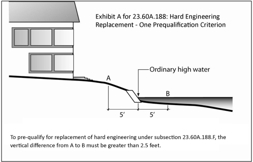

Exhibit A forHard Engineering Replacement - One Prequalification Criterion

1. In shoreline environments where shoreline stabilization is allowed, allowed as a special use, or allowed as a shoreline conditional use, it shall comply with the standards in Section 23.60A.172 and in this Section 23.60A.188.
2. Classification of practices. Shoreline stabilization practices are classified as non-structural measures, soft stabilization, or hard stabilization.
3. Geologically hazardous areas. In addition to meeting the standards of this Section 23.60A.188, an applicant for shoreline stabilization to protect existing principal residential structures in geologically hazardous areas is required to demonstrate that no alternatives, including relocation or reconstruction of existing structures, are feasible and less expensive than the proposed stabilization structures or measures to protect the structure.
4. Soft shoreline stabilization shall comply with subsections 23.60A.188.A, 23.60A.188.C, 23.60A.188.G and 23.60A.188.H and the following standards:

    1. The size of the soft stabilization measure shall be the minimum necessary.
    2. Soft stabilization projects are allowed to extend waterward of the OHW mark, if they do not move the line of the OHW mark waterward.
5. New hard stabilization shall comply with subsections 23.60A.188.A, 23.60A.188.C, 23.60A.188.G and 23.60A.188.H and the following standards:

    1. New hard stabilization is prohibited unless a geotechnical report conclusively demonstrates that the conditions set out in subsections 23.60A.188.E.1.a, b, c, d, and e exist, except as provided in subsections 23.60A.188.E.2 and 23.60A.188.E.3:

        1. Existing principal structures or access to existing principal structures:

            1. An existing principal structure or access to an existing principal structure is in imminent danger of erosion damage caused by tidal action, currents or waves. Imminent danger is demonstrated by the likelihood of either undermining or loss of lateral support for foundations within three years at a constant rate of erosion or vulnerability to a large one-time event; or
            2. Where waiting until an existing principal structure or access to an existing principal structure is in imminent danger as described in subsection 23.60A.188.E.1.a.1 would foreclose the opportunity to use measures that avoid impacts on ecological functions; or
            3. An existing water-dependent or water-related use or access to an existing water-dependent or water-related use is in need of protection from erosion and this need is demonstrated through a geotechnical report.
        2. Erosion is not caused by upland conditions, such as vegetation loss or drainage problems.
        3. It is infeasible, or sufficient protection is not provided by:

            1. First, using nonstructural measures, planting vegetation, or installing on-site drainage improvements; and
            2. Second, including or using soft stabilization methods.
        4. The proposed hard stabilization would prevent or reduce structural damage.
        5. Installation and maintenance of hard stabilization will not result in adverse impacts to adjacent properties.
    2. For ecological restoration and enhancement, or remediation of hazardous substances, the geotechnical report must demonstrate the conditions set out in subsections 23.60A.188.E.1.b, 23.60A.188.E.1.c, and 23.60A.188.E.1.e.
    3. Placing hard stabilization in front of the existing hard stabilization structure is allowed if the site is used for at least one of the following:

        1. The bulkhead or piers on the site are used to moor vessels that are off-loaded or loaded as part of the operation of the use of the site;
        2. The bulkhead is needed to provide load-carrying land immediately adjacent to the shoreline that allows heavy trucks access to vessels or heavy equipment for the operation of the use of the site;
        3. The bulkhead and adjacent land is used to provide access to vessels undergoing repair;
        4. The area adjacent to the bulkhead is used for fuel transfer to vessels;
        5. The area adjacent to the bulkhead is used for equipment for the operation of the water-dependent or water-related use of the site; or
        6. The bulkhead is required to provide sufficient depth at the shoreline to allow large, deep draft vessels to moor at the docks allowed within the pier head line.
    4. The size of the stabilization measure shall be the minimum necessary.
6. Replacement of hard stabilization shall comply with subsections 23.60A.188.A, 23.60A.188.C, 23.60A.188.G and 23.60A.188.H and the following standards:

    1. Replacement of existing hard stabilization structures is allowed for:

        1. water-dependent or water-related uses if it is infeasible to use nonstructural measures, soft stabilization, or if the site is used for the following:

            1. The bulkhead or piers on the site are used to moor vessels that are off-loaded or loaded as part of the operation of the use of the site;
            2. The bulkhead is needed to provide load-carrying land immediately adjacent to shoreline that allow heavy trucks access to vessels or heavy equipment for the operation of the use of the site;
            3. The bulkhead and adjacent land is used to provide access to vessels undergoing repair;
            4. The area adjacent to the bulkhead is used for fuel transfer to vessels;
            5. The area adjacent to the bulkhead is used for equipment for the operation of the water-dependent or water-related use of the site;
            6. The bulkhead is required to provide sufficient depth at the shoreline to allow large, deep draft vessels to moor at the docks allowed within the pier head line; or
            7. The bulkhead provides containment of pollution sources to the adjacent water body and is a requirement of an agency mandated cleanup action.
        2. Ecological restoration and enhancement;
        3. Remediation of hazardous substances; or
        4. An existing principal use, principal structure or substantial appurtenant structure that is located 15 feet or less from the OHW mark, or the vertical difference from 5 feet inland of the OHW mark to 5 feet waterward of the OHW mark is greater than 2.5 feet (as illustrated in Exhibit A for 23.60A.188).
    2. Replacement of existing hard stabilization is otherwise prohibited unless the applicant demonstrates the need for replacement by providing a geotechnical report establishing that:

        1. An existing principal structure or substantial appurtenant structure is in imminent danger of erosion damage caused by tidal action, currents, or waves. Imminent danger is demonstrated by the likelihood of either undermining or loss of lateral support for foundations within three years at a constant rate of erosion or vulnerability to a large one-time event; or
        2. Where waiting until an existing principal structure or access to an existing principal structure is in imminent danger as described in subsection 23.60A.188.E.1.a.1 would foreclose the opportunity to use measures that avoid impacts on ecological functions; and
        3. Non-structural and soft stabilization will not provide adequate protection, and the proposed hard stabilization will prevent or reduce structural damage.
    3. Location and size of replacement of existing hard stabilization

        1. Replacement of hard stabilization shall not encroach waterward of the ordinary high-water mark or existing structure unless it is to protect a residence that has been continuously occupied since December 31, 1991, and there are overriding safety or environmental concerns. In such cases, the replacement structure shall abut the existing shoreline stabilization structure.
        2. Replacement of hard stabilization waterward of existing hard stabilization is regulated as new hard stabilization under subsection 23.60A.188.E.
    4. The size of the stabilization measure shall be the minimum necessary.
    5. Additions to or increases in size of existing hard stabilization shoreline stabilization structures are considered new structures and regulated under subsection 23.60A.188.D.
    6. Where a net loss of ecological functions associated with critical saltwater habitats would occur by leaving the existing structure, it shall be removed as part of the replacement measure.
7. Publicly financed or subsidized shoreline stabilization shall not restrict public access to the shoreline except where such access is determined to be infeasible because of incompatible uses, safety, security, or harm to ecological functions. If feasible, the publicly financed or subsidized shoreline stabilization shall incorporate ecological restoration and enhancement and public access improvements into the project.
8. Mitigation sequencing

    1. In applying mitigation sequencing pursuant to Section 23.60A.158, adverse impacts on ecological functions from shoreline stabilization include, but are not limited to:

        1. the impacts on size of substrate and the effects of beach slope on waves; and
        2. for new or replaced hard stabilization, disturbance of underwater substrate; turbidity; loss or disturbance of food, shelter, spawning, and migration habitat; loss or disturbance of fish runs, biological communities and biodiversity, particularly benthic productivity; and change in water depth including ongoing scouring. Ongoing scouring means the continuation of substrate movement that causes deeper water.
    2. In designing a project, the following priorities are established, and these measures are required to be used in the sequence listed below to reduce the adverse impacts of shoreline stabilization, unless the applicant demonstrates that the priority is inapplicable or not feasible, or that a different sequence or technique will be more effective in reducing adverse impacts.

        1. Approaches to shoreline stabilization. Non-structural practices are required unless infeasible or are not sufficient to provide protection. If non-structural practices are infeasible or insufficient then soft stabilization takes priority over hard stabilization.
        2. Hard stabilization. For new or replaced hard stabilization, the order of priority is as follows:

            1. Riprap;
            2. Terraced and stepped bulkheads with an average slope of 30 percent or less;
            3. Sloped bulkhead, with a slope of 30 percent or less;
            4. Terraced and stepped bulkheads with an average slope that is greater than 30 percent;
            5. Sloped bulkhead, with a slope greater than 30 percent; and
            6. Vertical bulkhead.

##### 23.60A.190 - Standards for vegetation and impervious surface management

1. Planting, disturbing or removing vegetation and adding, altering or removing impervious surface shall comply with the provisions of this Chapter 23.60A, including Sections 23.60A.156, 23.60A.158, and 23.60A.172, unless provided otherwise in this Section 23.60A.190.
2. Application and plans

    1. An application and a plan are required for all actions allowed under this Section 23.60A.190, unless specifically provided otherwise in this Section 23.60A.190.
    2. Applications shall be made on the form approved by the Director.
    3. Plans prepared under this Section 23.60A.190 shall be consistent with the standards promulgated by the Director and with best management practices.
    4. Plans prepared under this Section 23.60A.190 shall be prepared by a qualified professional with training and experience related to the type of ecological environment where the work will occur.
    5. Plans shall identify:

        1. The location and size of all disturbance areas;
        2. The type and area of the existing ground surface coverage;
        3. The size, species, and location of existing trees;
        4. The type and area of final proposed ground surface coverage; and
        5. The species and location of proposed trees.
    6. Plans shall display the vegetation areas and improvements that are provided as mitigation for project impacts.
3. Shoreline District waterward of the OHW mark. Waterward of the OHW mark vegetation management is allowed or prohibited as provided in subsections 23.60A.190.C.1 and 23.60A.190.C.2 and requires mitigation as provided in subsection 23.60A.190.C.3.

    1. Removing or disturbing aquatic vegetation, except for aquatic noxious weeds, is prohibited except as necessary for development, uses or shoreline modifications approved under this Chapter 23.60A and authorized by the Director.
    2. Aquatic noxious weed removal

        1. Removing or controlling aquatic noxious weeds is allowed, allowed as a special use, allowed as a shoreline conditional use, or prohibited as provided in Section 23.60A.172 and this Section 23.60A.190.
        2. In removing aquatic noxious weeds the following techniques are required to be used in the sequence listed below, unless the applicant demonstrates that the priority is inapplicable or not feasible or that a different sequence or technique will be more effective in reducing impacts on ecological functions; all other techniques are prohibited:

            1. Hand-pulling or mechanical harvesting and cutting;
            2. Placement of bottom barriers. Bottom barriers are required to be made of biodegradable material and shall not cover an area greater than 1,000 square feet;
            3. Rotovating, weed rolling, or other methods that disturbs bottom sediments or the benthos;
            4. Use of herbicides or other chemical treatment methods applicable to the control of aquatic noxious weeds that are approved by Ecology and the federal Environmental Protection Agency.
    3. In applying mitigation sequencing pursuant to Section 23.60A.158, adverse impacts on ecological functions to be addressed include, but are not limited to: disturbance of underwater substrate; turbidity; loss or disturbance of food, shelter, spawning, and migration habitat; and loss or disturbance of fish runs, biological communities and biodiversity, particularly benthic productivity.
4. Shoreline District landward of the OHW mark. Vegetation and impervious surface management activities are prohibited within the portion of the Shoreline District that is landward of the OHW mark, both within and outside the shoreline setback, except as follows or as otherwise provided in this Section 23.60A.190:

    1. Normal and routine pruning and maintenance that promotes the health and vigor of trees and shrubs and maintenance of existing impervious surface is allowed as set out in this subsection 23.60A.190.D.1 without submitting an application and without complying with Section 23.60A.158 unless a violation has occurred:

        1. Up to 750 square feet of trees and vegetative cover lawfully maintained prior to May 9, 2006;
        2. Lawns paths and landscaping lawfully maintained prior to May 9, 2006, that were not in an environmentally critical area or buffer prior to May 9, 2006, but are in an environmentally critical area or buffer as a result of the passage of Ordinance 122050 enacting regulations for environmentally critical areas;
        3. Steep slope areas created through previous legal grading activities, including rockeries or retaining walls resulting from right-of-way improvements, if no adverse impact on the steep slope or shoreline area will result;
        4. Trees and vegetation specifically approved by permit prior to May 9, 2006, if the conditions of that permit are complied with;
        5. Vegetation and tree planting and removal approved by the Director under subsections 25.09.320.A.3.b and 25.09.320.A.3.c before June 15, 2015; and
        6. Vegetation and tree planting and removal shown on a plan filed with the Seattle Department of Construction and Inspections in compliance with subsection 25.09.320.A.3.b before June 15, 2015.
    2. Actions taken under subsections 23.60A.190.D.1.d, 23.60A.190.D.1.e, and 23.60A.190.D.1.f are required to comply with the conditions on such permit or plans.
    3. Removing trees is allowed if the Director determines the tree is a threat to health or safety based on a report prepared by a qualified professional with a Tree Risk Assessor certification as established by the Pacific Northwest Chapter of the International Society of Arboriculture (ISA) or equivalent experience and training and the removal is performed by or under the direction of a qualified professional. If a tree is removed from designated shorelines of statewide significance as defined by RCW 90.58.030, a shoreline conditional use permit is required.
    4. Permits authorizing development, shoreline modifications and uses may authorize disturbance areas and land clearing using mitigation sequencing set forth in Section 23.60A.158 and complying with the following standards:

        1. Any surface disturbed or cleared of vegetation and not to be used for development shall be planted with native vegetation, except that pre-disturbance landscaped areas containing non-native vegetation located farther than 100 feet from the OHW may be re-landscaped using non-native, noninvasive vegetation;
        2. Mitigation required for subsection 23.60A.158.B.1.e (Step E) shall include a plan with the vegetation areas and improvements required for project impacts; and
        3. Mitigation required for subsection 23.60A.158.B.1.e (Step E) for the removal of trees shall include compensation for any loss of the contribution of woody debris into the adjacent aquatic environment.
5. Impervious surface management activities. Impervious surface management activities that are allowed, or allowed as a special use or a shoreline conditional use under Sections 23.60A.167 or 23.60A.172, or the applicable shoreline environment on the part of the site where the impervious surface management activities are proposed to located are allowed landward of the OHW mark as follows and are otherwise prohibited, except as provided in subsection 23.60A.190.D:

    1. If no vegetation is removed, the amount of impervious surface is not increased, and no surface that is permeable by water at the time of the application is covered with an impervious surface so that impervious surface will be closer to the OHW mark, no mitigation is required for these impervious surface management activities except to address impacts from runoff; or
    2. If vegetation is removed or impervious surface is increased, or impervious surface is placed closer to the OHW mark and that action impacts ecological functions, those impacts shall be mitigated as set out in Section 23.60A.158 and subsection 23.60A.190.H.
6. Shoreline Setback. Within the shoreline setback established for each environment, any land disturbing activity, and any action detrimental to aquatic or wildlife habitat, vegetation or trees is prohibited, except as provided in subsections 23.60A.190.D and 23.60A.190.E, or as necessary to carry out work authorized by the Director in the shoreline setback for the applicable environment or in Section 23.60A.124, or as follows:

    1. Replacing any vegetation or ground surface coverage by planting native vegetation in an area of 300 square feet or less per year is allowed without submitting an application only if:

        1. No new impervious surface is created;
        2. Land disturbance is minimized and kept within the planting area;
        3. No native trees are removed; and
        4. No nonnative trees over 6 inches DBH are removed.
    2. Restoring or improving vegetation and trees using native vegetation in areas of any size is allowed if the work is performed by or under the direction of a qualified professional with training and professional experience related to the type of ecological environment where the work will occur; and

        1. No new impervious surface is created;
        2. Land disturbance is minimized and kept within the planting area;
        3. No native trees are removed;
        4. No nonnative trees over 6 inches DBH are removed; and
        5. The project promotes maintenance or creation of a naturally functioning condition that prevents erosion, protects water quality, or provides diverse habitat.
7. Outside the shoreline setback. Within the Shoreline District but outside of the shoreline setback area, removing or altering vegetation is prohibited, except as provided in subsection 23.60A.190.D or as follows:

    1. Replacing any vegetation or ground surface coverage by planting native vegetation in an area of 750 square feet or less per year is allowed without submitting an application only if:

        1. No new impervious surface is created;
        2. Land disturbance is minimized and kept within the planting area;
        3. No native trees are removed; and
        4. No non-native trees over 6 inches DBH are removed.
    2. Restoring or improving vegetation and trees in areas of any size is allowed if the work is performed by or under the direction of a qualified professional with training and professional experience related to the type of ecological environment and only if:

        1. No new impervious surface is created;
        2. Land disturbance is minimized and kept within the planting area;
        3. No native trees are removed;
        4. No non-native trees over 6 inches DBH are removed; and
        5. The project promotes maintenance or creation of a naturally functioning condition using native vegetation that prevents erosion, protects water quality, and provides diverse habitat.
8. Mitigation for vegetation alteration and increase in impervious surface. If vegetation is lawfully altered or removed other than as allowed in subsections 23.60A.190.D.1, 23.60A.190.E.1, and 23.60A.190.F.1 or if there is an increase in impervious surface that is required for work authorized pursuant to this Chapter 23.60A, adverse impacts to ecological functions shall be addressed as follows:

    1. Mitigation sequencing shall be applied pursuant to Section 23.60A.158. Mitigation must achieve the equivalent ecological functions as the conditions existing in the Shoreline District immediately prior to the work.
    2. In applying mitigation sequencing pursuant to Section 23.60A.158, adverse impacts on ecological functions to be addressed include, but are not limited to:

        1. loss of shading to nearshore aquatic habitat;
        2. loss of organic inputs critical for aquatic life;
        3. loss of habitat for insects and other terrestrial species;
        4. loss of woody debris inputs to the aquatic system;
        5. loss of soil stabilization functions; and
        6. loss of stormwater filtering, detention, and infiltration.
    3. In applying mitigation sequencing the following actions are required to offset impacts of vegetation and impervious surface management, unless the applicant demonstrates the action is inapplicable, infeasible, or a different approach will be more effective in mitigating impacts.

        1. Location of plantings. Plantings provided for mitigation purposes shall be sited as close to the OHW mark as possible on waterfront lots and adjacent to other vegetation on both waterfront and upland lots.
        2. Replacement of vegetation. If vegetation and impervious surface management results in a reduction of trees, shrubs, or groundcovers, or a change from mature vegetation to new vegetation, the plantings that provide mitigation shall at the time they are installed replicate the pre-disturbance level of ecological function provided by the vegetation that is replaced.
        3. Plant selection. Mitigation plantings shall be native species suited to specific site conditions.
        4. Pervious surfaces. If vegetation and impervious surface management results in a loss of pervious surfaces, mitigation shall create new pervious surfaces or replicate the functions of pervious surfaces according to the standards in Volume 3 of the Stormwater Manual DR 17-2009.
        5. Vegetation and impervious surface management actions requiring soil disturbance shall use appropriate best management practices to prevent sediment runoff into the shoreline area.
        6. Maintenance is required to ensure 80 percent survival of the new vegetation planted at the end of five years.
9. Vegetation monitoring is required for vegetation planted within the Shoreline District that requires submittal of an application under this Section 23.60A.190 and for projects that required a shoreline substantial development permit or a building permit. If vegetation monitoring is required, a monitoring plan shall be submitted to the Department for approval, and the plan shall include:

    1. Five years of monitoring that ensures 80 percent survival of the new vegetation planted at the end of five years;
    2. Annual inspections of the plants;
    3. Replacement of failed plants;
    4. Removal of exotic invasive species that may have become established; and
    5. Photographic documentation of planting success.
10. Application of pesticides, herbicides, and fertilizers in the Shoreline District

    1. Application of pesticides and herbicides is prohibited within the Shoreline District, except as provided in subsection 23.60A.190.J.2. The Director shall adopt a rule identifying best management practices including identifying pesticides, herbicides, and fertilizers that are prohibited due to impacts on ecological functions, using appropriate scientific and technical information as described in WAC 173-26-201(2)(a).
    2. Application of pesticides and herbicides is prohibited in and over wetlands, riparian watercourses, and other water bodies and within 200 feet of wetlands, riparian watercourses, and other water bodies and waterward of the OHW mark of riparian watercourses and other water bodies, except as provided in subsection 23.60A.190.C.2.b.4 or as allowed by the Director for the following circumstances and if the allowed pesticide or herbicide application is done by a licensed applicator:

        1. The state or local Health Department recommends or directs their use to address a threat to public health;
        2. A county, state, or federal agency with jurisdiction directs their use for control of a state listed noxious weed or plant pests covered by the Washington State Department of Agriculture plant pest program, and non-chemical alternatives have been evaluated;
        3. If the Director determines the applicant has demonstrated that the use of pesticides will have no adverse impact to fish and wildlife. Such a determination may be in the form of concurring that the applicant has developed best management practices or an integrated pest management plan consistent with standards developed by the Director;
        4. If the Director has determined that use of a pesticide to control invasive plants would have less overall adverse environmental impact than other control strategies; or
        5. If the Director determines there is a serious threat to public safety, health, or the environment.
    3. Application of synthetic fertilizers is prohibited within the Shoreline District. Application of organic fertilizers shall follow best management practices for use of fertilizers within 200 feet of water bodies, including limiting the use of fertilizers, hand mixing the fertilizer with ingredients that do not dissolve quickly, and using composted dry grass clippings, leaves, and saw dust as fertilizer.

#### Part 5 - Standards Applicable to Specific Uses
##### 23.60A.192 - Applicable standards for specific uses

All uses and developments in the Shoreline District, including shoreline modifications, are subject to the standards set out in Subchapter III of this Chapter 23.60A and to the standards for the applicable environment in which the use or development is located.

##### 23.60A.193 - Standards for agriculture

1. In shoreline environments where agriculture is allowed or allowed as a special use or a shoreline conditional use it shall comply with the standards for agriculture in this Section 23.60A.193.
2. Agricultural uses proposed on land not currently in agricultural use shall not remove native vegetation.
3. Agricultural uses shall be sited in areas that result in the least disturbance to ecological functions.

##### 23.60A.194 - Standards for aquaculture

1. In shoreline environments where aquaculture is allowed or allowed as a special use or a shoreline conditional use it shall comply with the standards for aquaculture in this Section 23.60A.194.
2. Aquaculture facilities are required to be located, designed, constructed and managed so as not to spread disease to native aquatic life, adversely impact eelgrass and macroalgae, or significantly conflict with navigation.
3. Aquaculture facilities are required to use best management practices to mitigate impacts from the construction and management of the facilities.
4. Aquaculture facilities shall not cultivate nonnative species.
5. In addition to the regulations and requirements in this Chapter 23.60A, geoduck aquaculture shall meet the standards of WAC 173-26-241(3)(b).

##### 23.60A.196 - Standards for bridges over water and tunnels

1. In shoreline environments where bridges over water and tunnels are allowed or allowed as a special use or a shoreline conditional use, they shall comply with the standards in the applicable shoreline environment and this Section 23.60A.196.
2. Bridges over water where required for subdivisions, shall span any floodway or channel migration zone.
3. In mitigating impacts from bridges over water, including approaches to bridges, impacts shall be addressed in the following sequence:

    1. Access points that do not require crossing water bodies are required to be used when available;
    2. Shared crossings with existing crossings shall be used if feasible;
    3. The route of the bridge and appurtenant structures shall be sited in the locations that have the least possible adverse effect on unique or fragile shoreline features;
    4. Mitigating impacts on ecological functions including, but not limited to, shading of aquatic and wetland habitat; modification or obstruction of water circulation and flow; loss or disturbance of intertidal, sub-tidal, or shallow water habitat; loss or disturbance of food, refuge, spawning, and migration habitat; and loss or disturbance of fish runs, biological communities and biodiversity; and
    5. Mitigating impacts to view corridors, which shall be minimized.
4. In mitigating impacts from tunnels, including entry ways to and exit ways from tunnels and accessory structures, impacts shall be addressed in the following sequence:

    1. The route of the tunnel and accessory structures shall be sited in locations that have the least possible adverse effect on unique or fragile shoreline features; and
    2. Adverse impacts to views of the water from waterfront parcels shall be minimized.

##### 23.60A.198 - Standards for drive-in businesses

Drive-in businesses are not allowed on waterfront lots in the Shoreline District. Drive-in businesses may be allowed on upland lots in the Shoreline District subject to the provisions of the underlying zone and other special districts.

##### 23.60A.199 - Standards for intakes and outfalls

1. Intakes and outfalls shall be designed and constructed to prevent the entry of fish.
2. Intakes and outfalls shall be located, designed, constructed, and managed to prevent erosion and threats to slope stability, including the use of appropriate energy dissipation at the discharge end.
3. In mitigating impacts from intakes and outfalls, impacts shall be addressed as follows:

    1. Intakes and outfalls and appurtenant structures shall be sited in the locations that have the least possible adverse effect on unique or fragile shoreline features; and
    2. Mitigating impacts on ecological functions includes, but is not limited to, impacts from modification or obstruction of water circulation and flow and disturbance of intertidal, sub-tidal, or shallow water habitat.

##### 23.60A.200 - Standards for marinas, commercial and recreational

1. In shoreline environments where commercial marinas and recreational marinas are allowed or allowed as a special use or a shoreline conditional use, they shall comply with the standards in the applicable shoreline environment and this Section 23.60A.200.
2. General standards. When new marinas are established or when substantial development occurs at an existing marina the following development standards apply:

    1. Marina operators shall develop a best management practices (BMPs) document for marina tenants. This document shall, at a minimum, address the requirements of Section 23.60A.155 and subsection 23.60A.200.B.3. Moorage agreements shall include the BMPs document and a section in the document that states that by signing the moorage agreement the tenant has read and agrees to comply with the BMPs.
    2. Marinas shall be operated and managed in a manner to preserve water quality pursuant to Title 22, subchapter VIII, Stormwater Code, and to protect the public health. The Director shall adopt a rule establishing model BMPs based on Department of Ecology's Resource Manual for Pollution Prevention in Marinas May 1998, Revised 2009 Publication #9811 as a minimum standard.
    3. Non-commercial slip-side vessel and floating on-water residence maintenance is limited to:

        1. Interior vessel and floating on-water residence repair and cleaning, replacement of running gear, and other cleaning and repair activities excluding hull scraping and painting, which is prohibited.
        2. Twenty-five percent of the exterior of the vessel and floating on-water residence above the deck at any one time; exterior work involving paint, varnish, and other toxic substances below the deck is prohibited. The Director may establish appropriate BMPs based on Department of Ecology's Resource Manual for Pollution Prevention in Marinas May 1998, Revised 2009 Publication #9811 in a Director's Rule.
    4. Marinas shall provide restrooms connected to the sewer system for use by any patron of the marina facility. At a minimum, the facilities are required to include one toilet and one washbasin. The Director shall determine the need for the number and type of hygiene facilities needed to reasonably serve the number of slips, percentage of live-aboard and floating on-water residences slips, and the number of transient moorage slips within the marina.
    5. Marinas having either more than 3,500 linear feet of moorage or slips large enough to accommodate vessels and floating on-water residences larger than 20 feet in length shall provide a sewage pump-out facility or the best available method of disposing of sewage wastes.
    6. In Lake Washington and the Puget Sound overwater projections, boat lifts, and areas used for vessel and floating on-water residence moorage shall be located a minimum distance of 30 feet waterward from the OHW mark or in a minimum water depth of 8 feet, whichever is less to the extent reasonable. In Lake Union and Portage Bay overwater projections, boat lifts, and areas used for vessel and floating on-water residence moorage shall be located a minimum distance of 15 feet waterward from the OHW mark or in a minimum water depth of 8 feet, whichever is less to the extent reasonable.
    7. Marinas shall be designed to prevent water stagnation and the need for dredging by creating two openings at the opposite ends so that water and sediment moves through the marina to the extent reasonable.
    8. Piers shall be oriented with currents or prevailing winds to prevent trapping surface debris and oily residue to the extent reasonable.
    9. Standards for piers and floats are provided in Section 23.60A.187.
3. Additional general development standard for new marinas. New marinas shall be located in areas that have a flushing rate of at least 30 percent per 24 hours. If a flushing rate of 30 percent per 24 hours is not achievable because water flow is controlled by the operation of the Hiram M. Chittenden Locks the flushing rate shall be 30 percent per 24 hours to the extent reasonable.
4. Additional general development standards for new recreational marinas

    1. Public access for new recreational marinas is required as follows:

        1. Marinas with a dry land lot depth of less than 35 feet are exempt from the requirement to provide public access under this subsection 23.60A.200.D;
        2. Marinas providing less than 2,000 linear feet of moorage space and containing only water-dependent or water-related principal uses are exempt from the requirement to provide public access under this subsection 23.60A.200.D.
        3. For a marina providing less than 9,000 linear feet of moorage space, the minimum public access is an improved walkway 5 feet wide on an easement 10 feet wide leading to an area located at the marina's water frontage, which shall be 10 feet wide and shall provide 10 feet of water frontage for every 100 feet of the marina's water frontage.
        4. For a marina providing 9,000 or more linear feet of moorage space, the minimum public access is an improved walkway 5 feet wide on an easement 10 feet wide leading to a public walkway 5 feet wide on an easement 10 feet wide located along the entire length of the marina's water frontage.
        5. Public access is required at publicly owned marinas but no easement is required for publicly owned marinas.
    2. Transient Moorage. Recreational marinas shall provide transient moorage as follows:

        1. When a new recreational marina is established or substantially improved it shall provide transient moorage for recreational vessels at the rate of 40 linear feet of transient moorage space for each 1,000 linear feet of non-transient moorage space in the marina if either:

            1. The marina provides 9,000 or more linear feet of non-transient moorage; and
            2. The marina is part of a development that includes a restaurant or other use that is not water-dependent or water-related and that operates during evening and weekend hours; or
            3. The marina is owned, operated, or franchised by a governmental agency for use by the general public.
        2. The Director may waive the requirement for transient recreational moorage if the Director finds adequate transient moorage already exists within ¼ mile of the marina.
        3. Transient moorage for commercial vessels may be required as part of a recreational marina providing more than 9,000 linear feet of moorage if the site is within ¼ mile of commercial facilities generating unmet commercial transient moorage demand. Transient moorage for commercial vessels shall be provided at the rate of 100 linear feet of transient moorage space for each 2,000 linear feet of non-transient moorage space.
5. Additional general development standards for commercial marinas. Commercial marinas providing more than 9,000 linear feet of moorage shall provide transient moorage for commercial vessels at the rate of 50 linear feet of transient moorage space for each 1,000 linear feet of non-transient moorage space if the site is within ¼ mile of commercial facilities generating unmet commercial transient moorage demand.
6. Commercial and recreational marinas may provide moorage for vessels used as live-aboard vessels and floating on-water residences if the marina meets the following standards, in addition to the general development standards in subsections 23.60A.200.A through 23.60A.200.D:

    1. The live-aboard is the type of vessel or floating on-water residence allowed to be moored at the commercial or recreational marina; and
    2. The marina provides shower facilities connected to a sanitary sewer that are reasonable to provide good hygiene for the live-aboard residents and floating on-water residents based on the number of live-aboard vessels and floating on-water residences moored at the marina.

##### 23.60A.202 - Standards for floating homes and floating home moorages

1. Floating homes allowed and prohibited

    1. Floating homes are allowed if they meet the standards in subsections 23.60A.202.A.1.a and 23.60A.202.A.1.b:

        1. The floating home:

            1. Is legally established or has a building permit on the effective date of this ordinance; or
            2. Replaces a floating home legally established on the effective date of this ordinance and in compliance with subsection 23.60A.202.D.5 and the standards of this Section 23.60A.202; and
        2. Occupies a floating home moorage that is legally established on the effective date of this ordinance, except as allowed under subsection 23.60A.202.B.2;
    2. Floating homes that do not meet the standards of subsection 23.60A.202.A.1 are prohibited.
2. Standards for floating home moorages and sites

    1. Moorage Location

        1. Every floating home moorage shall be located on privately owned or privately controlled premises. Floating home moorages are prohibited from being located in any waterway or fairway or in the public waters of any street or street end, except as provided in subsections 23.60A.202.B.1.b through 23.60A.202.B.1.e.
        2. Floating home moorages that were located in public waters or any street or street end on January 1, 1974, or on property later dedicated to the City for street purposes are allowed if they:

            1. Have continuously existed in such locations;
            2. Comply with all the provisions of this Chapter 23.60A;
            3. Are authorized by a use and occupancy permit approved by the Director of Transportation; and
            4. Are not moved from its existing location.
        3. Floating homes may not relocate to that portion of a floating home moorage occupying waters owned or controlled by the City or occupying any street or street ends existing on the effective date of this ordinance, or on property later dedicated to the City for street purposes, but floating homes that legally protrude into a submerged street right-of-way as of the effective date of this ordinance may relocate within the floating home moorage portion of that right-of-way or exchange places with another floating home within the floating home moorage portion of that right-of-way if:

            1. The amount of protrusion into the right-of-way is not increased; and
            2. The new location does not cause an increase in impairment of public access or navigation.
        4. Floating home moorages are allowed to be located in Portage Bay in a submerged street segment lying generally parallel to the shoreline that terminates on the north and on the south in a submerged street area if the same person owns or leases the property abutting on both sides.
        5. Floating home moorages existing as of January 1, 1974, are allowed to be located partially on private property and partially in submerged portions of Fairview Avenue East lying generally parallel to the shoreline, if the occupant of the floating home owns or leases the private portion of the floating home site and has obtained a long-term permit from the City to occupy the abutting street area.
    2. New floating home moorages and sites

        1. A new floating home moorage or a new floating home site at an existing floating home moorage is allowed in the UR Environment if:

            1. The floating home moorage or site will be used to accommodate a floating home moored in a floating home moorage lawfully existing on the effective date of this ordinance;
            2. It is located in Lake Union or Portage Bay; and
            3. It complies with the standards in this Section 23.60A.202.
        2. A new floating home moorage or a new floating home site at an existing floating home moorage is allowed in the UC Environment if:

            1. The floating home moorage or site is necessary to accommodate a floating home moored in a floating home moorage lawfully existing on the effective date of this ordinance that is unable to continue to moor in that floating home moorage for the reasons set out in subsections 7.20.040.E through 7.20.040.H;
            2. It is located in Lake Union or Portage Bay;
            3. The floating home moorage is added to a recreational marina or a commercial marina, or a new floating home site is added to a floating home moorage existing as of the effective date of this ordinance;
            4. If the floating home moorage is to be located within a recreational marina or commercial marina, the marina has no more than five existing floating home sites at the marina;
            5. No more than five floating home moorages or sites may be added to any marina or floating home moorage in the UC Environment after April 1, 1987; and
            6. The new floating home moorage or site complies with the standards in this Section 23.60A.202, except that there are no parking or minimum floating home site area requirements, and modifications to the setback and float separation requirements are allowed throughout the moorage to the minimum extent necessary and consistent with Residential and Fire Code requirements.
        3. Total water coverage, including all floating home moorage walkways, in the new floating home moorage or in the expanded portion of the existing floating home moorage shall not occupy more than 45 percent of the submerged area, including the floating home.
        4. Each new floating home site in a new or expanded floating home moorage shall meet the following standards:

            1. The area for a floating home site is a minimum of 2,000 square feet;
            2. Floating home sites shall have sufficient dimensions to accommodate a floating home meeting the standards of subsection 23.60A.202.D;
            3. Floating home sites shall be configured so that a floating home cannot extend beyond the waterward end of the pier;
            4. Floating home sites shall not be located within 15 feet of the OHW mark;
            5. Floating home sites shall have direct access to a pier of not less than 5 feet of unobstructed width that is accessible from a street; and
            6. Floating home sites shall have at least 20 feet of frontage on water continuously open to navigation.
        5. A new floating home moorage or site established for a floating home that is unable to continue mooring in a floating home moorage lawfully existing as of the effective date of this ordinance for the reasons set out in subsections 7.20.040.E, 7.20.040.F, 7.20.040.G, or 7.20.010.H "Safe Harbor", is not required to comply with parking or minimum floating home site area requirements, and modifications to the setback and float separation requirements are allowed throughout the moorage, to the minimum extent necessary to accommodate relocated floating homes, and consistent with Residential and Fire Code requirements.
    3. Existing floating home moorages and sites

        1. Total water coverage of floating home moorages, including all piers, shall not be increased above 45 percent of the submerged area or the currently existing coverage, whichever is greater, including the floating home, except as provided in subsection 23.60A.202.B.3.e;
        2. The area of an existing floating home site shall not be reduced below 2,000 square feet or the currently existing area, whichever is less, except as provided in subsection 23.60A.202.B.3.e;
        3. Existing floating home sites shall not be expanded in a manner that will result in the blockage of the view from the waterward end of a pier; and
        4. Existing floating home moorages shall not be reconfigured and existing floating homes shall not be relocated within a floating home moorage site unless the standards of this Section 23.60A.202 are met, except as provided in subsection 23.60A.202.B.3.e.
        5. If a legally established floating home is displaced for any of the reasons set out in subsection 7.20.040.E, 7.20.040.F, 7.20.040.G, or 7.20.010.H "Safe Harbor", an existing floating home moorage and its sites may be reconfigured to accommodate up to five displaced floating homes as follows:

            1. New parking is not required;
            2. The area of reconfigured floating home sites shall not be reduced below 2,000 square feet or the currently existing area, whichever is less, to the extent practicable;
            3. Modifications to the limits on total water coverage are allowed, to the minimum extent necessary, to accommodate the displaced floating homes;
            4. All reconfigured floating home sites shall meet the standards for new floating home sites set forth in subsections 23.60A.202.B.2.d.2 through 23.60A.202.B.2.d.6, except that modifications to the setback and float separation requirements are allowed throughout the moorage, to the minimum extent necessary, and consistent with Residential and Fire Code requirements; and
            5. The reconfiguration shall not result in the blockage of the view from the waterward end of a pier.
        6. Floating home moorages shall not provide moorage to floating homes that do not display a registration number issued under subsection 23.60A.202.G.
3. Standards for exchange of floating home between existing floating home sites. Two floating homes may exchange floating home sites, either within a moorage or between moorages, if:

    1. Height

        1. Both floating homes are the same height; or
        2. The relocation will not result in a floating home that is over 18 feet in height and higher than the replaced floating home being located waterward of floating homes that are 18 feet or less in height; or
        3. No floating home greater than 18 feet in height shall be relocated except to replace a floating home of equal or greater height.
    2. The minimum distance between adjacent floating home walls and between any floating home wall and any floating home site line will meet the requirements of the applicable moorage standards in subsection 23.60A.202.B or 23.60A.202.D; and
    3. The requirements of Chapter 7.20, Floating Home Moorages, have been met.
4. Standards for floating homes

    1. Floating homes shall be moored at sites established as floating home moorages.
    2. Floating homes may relocate to any established floating home moorage, consistent with the standards of this Section 23.60A.202.
    3. Floating homes shall be lawfully connected to sewer service for all wastewater including black and grey water discharge.
    4. Float area shall be no larger than 1,200 square feet or the area of the existing float.
    5. A floating home may be rebuilt, replaced, repaired, or remodeled consistent with the following standards and subsection 23.60A.202.D.6, if applicable:

        1. The float area or overwater coverage of the floating home is not increased, including cantilevered portions that extend beyond the edge of the float.
        2. No portion of any addition to a floating home exceeds:

            1. 18 feet in height, as measured from the main deck or 3 feet above the surface of the water, whichever is lower, or
            2. if current height as measured from the main deck or 3 feet above the surface of the water, whichever is lower, is above 18 feet, does not exceed its current height, but the height cannot exceed 21 feet as measured from the main deck or 3 feet above the surface of the water, whichever is lower, except to the minimum extent necessary to satisfy the provisions of the Building Code for open railings, chimneys, and mechanical vents. Open railings are limited to 36 inches in height.
        3. Setbacks between adjacent floating homes

            1. If a floating home is being remodeled, the minimum distance between adjacent floating home walls shall not be decreased to less than 10 feet or, if the existing distance is less than 10 feet, the distance between adjacent floating home walls shall not be reduced to less than 6 feet.
            2. If a floating home is being rebuilt or replaced, and

                1. the existing distance between floating home walls is greater than 6 feet, the minimum distance between adjacent floating home walls shall not be reduced below 10 feet or the existing distance, whichever is less, or
                2. If the existing distance is less than 6 feet, the minimum distance shall be 6 feet.
            3. In no case shall the distance between floats be decreased.
            4. The minimum distance between the exterior walls of floating homes on opposite sides of a moorage walkway shall be 10 feet or the existing distance, whichever is less.
        4. Setbacks between floating home walls and floating home moorage sites

            1. If a floating home is being remodeled, the minimum distance between any floating home wall and the boundary of any floating home moorage site shall not be decreased to less than 5 feet or, if the existing distance is less than 5 feet, the distance between any floating home wall and the boundary of any floating home moorage site shall not be reduced to less than 3 feet.
            2. If a floating home is being rebuilt or replaced, and

                1. the existing distance between any floating home wall and the boundary of any floating home moorage site is greater than 3 feet, this distance shall not be reduced below 5 feet or the existing distance, whichever is less, or
                2. If the existing distance between any floating home wall and the boundary of any floating home moorage site is less than 3 feet, the minimum distance shall be 3 feet.
            3. In no case shall the distance between existing floats and the boundary of any floating home moorage site be decreased except as provided in 23.60A.202.D.5.d.4.
            4. No minimum distance is required between a floating home wall and a moorage lot line when the lot line is adjacent to a public street right-of-way, a waterway, or the fairway.
        5. No new accessory floating structures are allowed. Accessory floating structures that have been continuously in use since March 1, 1977 may be maintained or replaced or relocated with the associated floating home but not expanded or transferred.
        6. The design of the floating home shall not block the view from the waterward end of a pier more than any existing view blockage.
        7. No new living or storage spaces shall be located below water level. Existing living or storage spaces below water level may be remodeled, replaced, or rebuilt, but may not be expanded.
        8. Unenclosed Styrofoam or similar material that has the potential to break apart is prohibited for use in new floats or for repairing or replacing all or parts of existing floats or for other purposes that would allow the broken pieces to enter the water.
        9. Floats shall be maintained and repaired using the minimum amount of structure below the OHW mark necessary to maintain floatation and:

            1. At the time of replacement of the float, the replacement float shall be the minimum necessary; and
            2. At the time of replacement of the floating home, any structure below the OHW mark and outside the primary float structure that provides minimal or no floatation shall be removed.
        10. Any proposal to replace, remodel, rebuild, or relocate a floating home shall be accompanied by an accurate, fully dimensioned floating home site plan, at a scale of not less than 1 inch to 20 feet, unless such plan is already on file with the Seattle Department of Construction and Inspections.
        11. If a floating home is demolished, application for permits associated with the replacement structure, including but not limited to SEPA review and a Shoreline Substantial Development Permit, shall be made at the same time as application for the demolition permit.
    6. Remodeling a floating home located in whole or in part outside the Construction Limit Line in Lake Union, including removing and replacing its floats and superstructure, is allowed subject to the following standards:

        1. The floating home was located outside the Construction Limit Line in Lake Union prior to December 18, 1968;
        2. The replacement is completed within 12 months of any removal or demolition; and
        3. The development complies with the standards of subsection 23.60A.202.D.5.
    7. Application for permits associated with a replacement floating home structure, including but not limited to SEPA review and a shoreline substantial development permit, shall be made at the same time as application for the demolition permit.
5. Owners and tenants of floating homes shall use best management practices pursuant to Section 23.60A.155.
6. The Director may establish appropriate best management practices to implement the requirements of subsection 23.60A.202.E by Director's Rule and shall consult with the Floating Homes Association in adopting the rule.
7. Registration numbers for floating homes

    1. The owner of each floating home that is allowed under subsection 23.60A.202.A is required to obtain from the Director a registration number within six months of the effective date of this ordinance and to pay a one-time fee established by the Director to recover the reasonable costs of the program for issuing registration numbers. The Director shall determine whether a floating home meets the standard in subsection 23.60A.202.A before issuing a registration number. The owner shall display the registration number on the landward side of the floating home in numbers at least 3 inches high in a location legible from the pier, or if public access to the pier is not available then on a side visible from the water.
    2. Failure to obtain or correctly display a registration number is a violation of this Chapter 23.60A that is subject to the enforcement process in Chapter 23.90 and does not forfeit the owner's right to maintain a floating home.
    3. If an owner disputes the Director's denial of registration of a floating home, the owner may appeal the Director's determination to the hearing examiner, in conformance with the hearing examiner rules, within 30 days of date the Director's determination was mailed. The appeal shall be conducted de novo, and the City shall have the burden of showing by a preponderance of the evidence that the decision of the Director was correct. Nothing in this Section 23.60A.202 precludes the City from enforcing this code under Chapter 23.90 if there is no timely appeal to the hearing examiner or following a decision of the hearing examiner upholding the City's denial of floating home registration.
8. A determination by the City that a use or structure is legally established or lawfully existing does not mean that a use or structure is or was in compliance with other state or federal requirements or that a use or structure on waters managed by the Washington State Department of Natural Resources is "legally established" or "lawfully existing" with respect to DNR.

##### 23.60A.203 - Standards for floating on-water residences

1. Uses. Floating structures that contain dwelling units and vessels that contain dwelling units shall be regulated as floating homes pursuant to Section 23.60A.202, with the exception of floating on-water residences that comply with this Section 23.60A.203, house barges that comply with Section 23.60A.204, residences allowed under Section 23.60A.206, and vessels that comply with Section 23.60A.214.
2. For purposes of this Chapter 23.60A, a floating on-water residence is allowed only if it:

    1. Was legally established as a floating on-water residence prior to July 1, 2014; to be legally established it must have been used as a dwelling unit within the City prior to July 1, 2014.
    2. Was moored pursuant to a lease or ownership interest at a marina, as defined by Section 23.60A.926, within the City prior to July 1, 2014.
3. Maintenance and repair, remodeling, relocation, expansion, rebuilding, and replacement

    1. Floating on-water residences legally established pursuant to subsection 23.60A.203.D are regulated as a conforming use, and relocation, repair and maintenance, remodeling, expansion, and replacement are allowed subject to the following standards:

        1. Normal maintenance and repair, as defined in subsection 23.60A.020.C.1, is allowed, and replacement is not considered the common method of repair for this type of structure.
        2. Remodeling is limited to the interior and to changing the siding or architectural features on the exterior of the existing structure, except that exterior open railings may be added as part of a remodel as allowed in subsection 23.60A.203.C.1.c.
        3. Open railings may be added to existing exterior spaces and stairs to access these spaces, but if the top of the railing exceeds the height limits in subsection 23.60A.203.C.1.e, the maximum height of the railing is 36 inches.
        4. Relocation is allowed, and owners should update the floating on-water residence verification within 60 days. Failure to update relocation is a violation of this Chapter 23.60A that is subject to the enforcement process in Chapter 23.90 but does not forfeit the owner's right to maintain a floating on-water residence.
        5. Expansion is allowed provided that:

            1. The height of the structure including any addition shall not exceed 18 feet if the current height of a floating on-water residence is 18 feet or lower, measured from the main deck or 3 feet above the surface of the water, whichever is lower;
            2. The height of the structure including any addition shall not exceed the current height if the current height of a floating on-water residence is more than 18 feet but less than 21 feet, measured from the main deck or 3 feet above the surface of the water, whichever is lower;
            3. The height of the structure including any addition shall not exceed 21 feet if the current height of a floating on-water residence is 21 feet or more, measured from the main deck or 3 feet above the surface of the water, whichever is lower; and
            4. No expansion of overwater coverage is allowed, except a single expansion at or below the surface of the water may occur as follows:

                1. The applicant provides documentation demonstrating that the expansion is the minimum necessary to provide stability as certified by a naval architect to correct stability problems for the structural size and configuration that existed before July 1, 2014, and the area of such expansion shall not be used for any purpose other than to provide stability; and
                2. If an expansion is allowed under subsection 23.60A.203.C.1.e.4.a, no other expansion is allowed below, at, or above the waterline for any purpose.
            5. If the total expansion over the life of the structure exceeds 120 square feet, gray-water containment or a waste-water hookup that disposes the gray water to the City's waste-water disposal system is required.
        6. Replacement to the same size and configuration as established in the verification issued pursuant to subsection 23.60A.203.D, as it may be updated, is allowed, and a verified structure is not considered nonconforming even though it may exceed the height limits for additions in subsection 23.60A.203.C.1.e.
        7. Replacement with expansion shall comply with the standards in subsection 23.60A.203.C.1.e, including the requirement that expansions greater than 120 square feet shall provide gray-water containment or a waste-water hookup that disposes the gray water to the City's waste-water disposal system.
    2. When an owner of a floating on-water residence intends to expand, rebuild, or replace the structure, prior to beginning any work:

        1. The owner/applicant shall have or obtain the verification required in 23.60A.203.D;
        2. The owner/applicant shall present information to the Director demonstrating that the floating on-water residence will comply with subsections 23.60A.203.C.1.e, 23.60A.203.C.1.f, and 23.60A.203.C.1.g, as applicable;
        3. The owner/applicant shall demonstrate any expansion will not create future stability problems for the floating on-water residence; and
        4. The owner/applicant shall update the verification records under subsection 23.60A.203.D based on changes made to the floating on-water residence.
4. Verification of a floating on-water residence

    1. Each floating on-water residence shall be verified by the Director, and the owner shall pay a one-time fee to receive a verification number. The fee shall be established by the Director to recover the reasonable costs of the program for issuing a verification number. Owners of a floating on-water residence allowed pursuant to subsection 23.60A.203.B may apply to the Director for verification or may wait until the Director asks for verification information. If a floating on-water residence is not verified, the Director may require the owner to submit verification information and pay the required fee.
    2. Verification shall constitute legal establishment of a floating on-water residence pursuant to the requirements of subsection 23.60A.203.B and the definition of floating on-water residence in Section 23.60A.912.
    3. A house barge authorized under Section 23.60A.204 may submit verification and be regulated as a floating on-water residence rather than a house barge.
    4. If an owner disputes the Director's denial of verification as a floating on-water residence, the owner may appeal the Director's determination to the hearing examiner, in conformance with the hearing examiner rules, within 30 days of date the Director's determination was mailed. The appeal shall be conducted de novo, and the City shall have the burden of showing by a preponderance of the evidence that the decision of the Director was correct. Nothing in this Section 23.60A.203 precludes the City from enforcing this code under Chapter 23.90 if there is no timely appeal to the hearing examiner or following a decision of the hearing examiner upholding the City's denial of floating on-water residence verification.
    5. The owner shall display the verification number issued by the Seattle Department of Construction and Inspections on the pier and landward side of the floating on-water residence in numerals at least 3 inches high in a location legible from the pier, or on the side most commonly used for access from the pier, or if public access to the pier is not available then on a side visible from the water.
    6. Failure to verify a floating on-water residence or to correctly display a verification number is a violation of this Chapter 23.60A that is subject to the enforcement process in Chapter 23.90 and does not forfeit the owner's right to maintain a floating on-water residence.
    7. Verification is transferable between owners but is not transferable to another floating on-water residence, except for a replaced floating on-water residence as provided in subsections 23.60A.203.C.1.f and 23.60A.203.C.1.g.
5. Owners and tenants of floating on-water residences shall use best management practices pursuant to Section 23.60A.155 to minimize impacts on the aquatic environment.

##### 23.60A.204 - Floating structures and standards for house barges

1. Floating structures

    1. Floating structures, including vessels that do not have a means of self-propulsion and steering equipment and that are designed or used as a place of residence, with the exception of house barges authorized under subsection 23.60A.204.B and floating on-water residences authorized under Section 23.60A.203, shall be regulated as floating homes pursuant to this Chapter 23.60A.
2. For purposes of this Chapter 23.60A, house barges are only allowed under the following conditions:

    1. The house barge was moored at a recreational marina in the City before July 1990.
    2. A permit for the house barge was secured from the Seattle Department of Construction and Inspections verifying that the house barge existed and was used for residential purposes within the City before July 1990 and has been continuously used since that time.
    3. Verification

        1. Each house barge must be verified by the Director, and owners shall pay a one-time fee to receive a verification number. The fee shall be established by the Director to recover the reasonable costs of the program for issuing a verification number. Owners of house barges authorized by this Section 23.60A.204 may apply to the Director for verification or may wait until the Director asks for verification information. If a house barge is not verified pursuant to this subsection 23.60A.204.B, the Director may require the owner to submit verification information and pay the required fee.
        2. If an owner disputes the Director's denial of verification as a house barge under this Section 23.60A.204, the owner may appeal the Director's determination to the hearing examiner, in conformance with the hearing examiner rules, within 30 days of date the Director's determination was mailed. The appeal shall be conducted de novo, and the City shall have the burden of showing by a preponderance of the evidence that the decision of the Director was correct. Nothing in this Section 23.60A.204 precludes the City from enforcing this code under Chapter 23.90 if there is no timely appeal to the hearing examiner or following a decision of the hearing examiner upholding the City's denial of house barge verification.
        3. The owner of a house barge that complies with the requirements of subsections 23.60A.204.B.1 and 23.60A.204.B.2 may choose to have the house barge verified and regulated as a floating on-water residence under Section 23.60A.203 instead of under this Section 23.60A.204.
        4. The owner shall display the verification number issued by the Seattle Department of Construction and Inspections on the pier and landward side of the vessel, in numerals at least 3 inches high in a location legible from the pier, or on the side most commonly used for access from the pier, or if public access to the pier is not available then on a side visible from the water.
        5. Failure to verify an authorized house barge or correctly display a verification number is a violation of this Chapter 23.60A that is subject to the enforcement process in Chapter 23.90 and does not forfeit the owner's right to maintain an authorized house barge.
    4. A house barge verification number is transferable between owners but is not transferable to another house barge, except to a house barge that has been replaced as provided in subsection 23.60A.204.C.
    5. House barges must be moored at a recreational marina, as defined by Section 23.60A.926.
3. Maintenance and repair, remodeling, relocation, expansion, rebuilding, and replacement

    1. House barges authorized under subsection 23.60A.204.B are regulated as a conforming use, and maintenance, repair, remodeling, relocation, expansion, rebuilding, and replacement are allowed subject to the following standards:

        1. Normal maintenance and repair, as defined in subsection 23.60A.020.C.1, is allowed, and replacement is not considered the common method of repair for this type of structure.
        2. Remodeling is limited to the interior and to changing the siding or architectural features on the exterior of the existing house barge, but no portion of the house barge is expanded, except that exterior open railings may be added as part of a remodel as allowed in subsection 23.60A.204.C.1.c.
        3. Open railings may be added to existing exterior spaces and stairs to access these spaces, but if the top of the railing exceeds the height limits in subsection 23.60A.204.C.1.e, the maximum height of the railing is 36 inches.
        4. Relocation is allowed, and owners should update the house barge verification within 60 days. Failure to update relocation is a violation of this Chapter 23.60A that is subject to the enforcement process in Chapter 23.90 but does not forfeit the owner's right to maintain a house barge.
        5. Expansion is allowed provided that:

            1. The height of the structure including any addition shall not exceed 18 feet if the current height of a house barge is 18 feet or lower, measured from the main deck or 3 feet above the surface of the water, whichever is lower;
            2. The height of the structure including any addition shall not exceed the current height if the current height of the house barge is more than 18 feet but less than 21 feet, measured from the main deck or 3 feet above the surface of the water, whichever is lower;
            3. The height of the structure including any addition shall not exceed 21 feet if the current height of a house barge is 21 feet or more, measured from the main deck or 3 feet above the surface of the water, whichever is lower; and
            4. No expansion of overwater coverage is allowed, except a single expansion at or below the surface of the water may occur as follows:

                1. The applicant provides documentation demonstrating that the expansion is the minimum necessary to provide stability as certified by a naval architect to correct stability problems for the structural size and configuration that existed before July 1990, and the area of such expansion shall not be used for any purpose other than to provide stability; and
                2. If an expansion is allowed under subsection 23.60A.204.C.1.e.4.a, no other expansion is allowed below, at, or above the waterline for any purpose.
            5. If the total expansion over the life of the structure exceeds 120 square feet, gray water containment or a waste-water hookup that disposes the gray water to the City's waste-water disposal system is required.
        6. Replacement to the same size and configuration as established in the verification issued pursuant to subsection 23.60A.204.B, as it may be updated, is allowed and a verified house barge structure is not considered nonconforming even though it may exceed the height limits for additions in subsection 23.60A.204.C.1.e.
        7. Replacement with expansion shall comply with the standards in 23.60A.204.C.1.e, including the requirement that expansions greater than 120 square feet shall provide gray water containment or a waste-water hookup that disposes the gray water to the City's waste-water disposal system.
    2. When an owner of a house barge intends to expand, rebuild, or replace the house barge, prior to beginning any work:

        1. The owner/applicant shall have or obtain the verification required in 23.60A.204.B.3;
        2. The owner/applicant shall present information to the Director demonstrating that the house barge will comply with subsection 23.60A.204.C.1.e, 23.60A.204.C.1.f, and 23.60A.204.C.1.g, as applicable;
        3. The owner/applicant shall demonstrate any expansion will not create future stability problems for the house barge; and
        4. The owner/applicant shall update the verification records under subsection 23.60A.204.B.3 based on changes made to the house barge.
4. Owners and tenants of house barges shall use best management practices pursuant to Section 23.60A.155 to minimize impacts on the aquatic environment.

##### 23.60A.206 - Standards for residences other than floating homes, floating on-water residences, house barges, and vessels containing dwelling units

1. Floating homes, floating on-water residences, house barges, and vessels containing dwelling units that comply with the standards of Sections 23.60A.202, 23.60A.203, 23.60A.204, and 23.60A.214, respectively, are not subject to the standards of this Section 23.60A.206.
2. All residential uses, other than those described in subsection 23.60A.206.A, where allowed or allowed as a special use or a shoreline conditional use, in each shoreline environment shall comply with the standards in the applicable shoreline environment and the following standards:

    1. Residences shall not be constructed over water unless specifically permitted in the applicable shoreline environment.
    2. Residences shall be developed in a manner consistent with control of pollution and prevention of damage to the natural environment.
    3. Shoreline residential setback

        1. In addition to the shoreline setbacks required for specific shoreline environments, a shoreline residential set back is required for residences on waterfront lots. Residences shall not be located waterward of the shoreline residential setback and the shoreline setback.
        2. The shoreline residential setback is calculated as follows:

            1. If there are no adjacent existing residences within 100 feet, the shoreline residential set-back is 35 feet landward from the OHW mark; or
            2. If there is at least one adjacent residence within 100 feet, the shoreline residential setback is a line parallel to the OHW mark, not farther waterward than adjacent residences and no closer waterward than 35 feet.
            3. If a required shoreline residential setback calculated under subsection 23.60A.206.B.3.b.2 exceeds 75 feet from the OHW mark, the Director may reduce the shoreline residential setback to no less than 75 feet if it does not adversely impact the shoreline environment and if views of the shoreline from adjacent existing residences are not blocked.
        3. Fences and freestanding walls accessory to residences and that are not shoreline modifications may be located in the shoreline setback and in the shoreline residential setback if views of the shoreline from adjacent existing residences are not blocked and the structure is no less than 5 feet landward from the OHW mark. The Director shall determine the permitted height of the fences and freestanding walls.
    4. Submerged lands may not be used to satisfy landscaped open space requirements of multifamily developments.
3. All residential uses and use of a structure or vessel as a dwelling unit, other than those described in subsections 23.60A.206.A or 23.60A.206.B, are prohibited.

##### 23.60A.207 - Standards for uses in public facilities

1. If a use in a public facility is not set out in the use tables for the environment in which the use is proposed, the use is allowed, allowed as a special use, allowed as a shoreline conditional use or prohibited as follows:

    1. Uses in public facilities that are substantially similar to uses allowed, allowed as a special use, allowed as a shoreline conditional use or prohibited in the shoreline environment where the public facility is sited are allowed, allowed as a special use, allowed as a shoreline conditional use, or prohibited, subject to the same use regulations, development standards, special use requirements, and shoreline conditional use criteria that govern the similar use. A proposed use in a public facility that is substantially similar to more than one use is regulated pursuant to the most restrictive regulations.
    2. Unless specifically prohibited, uses in public facilities that are not substantially similar to uses specifically regulated in the standards for the shoreline environment where the public facility is sited may be allowed by the Council, with the concurrence of Ecology, according to the provisions of Chapter 23.76, Subchapter III, Council Land Use Decisions, with public projects considered as Type IV quasi-judicial decisions and City facilities considered as Type V legislative decisions.
2. City Council approval of modifications. The Council, with the concurrence of Ecology, may waive or modify applicable development standards or special use requirements under Chapter 23.60A for uses allowed or allowed as a special use under subsection 23.60A.207.A according to Chapter 23.76, Subchapter III, Council Land Use Decisions, with public projects considered as Type IV quasi-judicial decisions and City facilities considered as Type V legislative decisions.
3. Expansion of Uses in Public Facilities. Uses allowed, allowed as a special use, allowed as a shoreline conditional use, or allowed with modifications pursuant to subsections 23.60A.207.A or 23.60A.207.B may be expanded as follows:

    1. Major Expansion. A major expansion of a public facility use occurs when the proposed expansion would not meet development standards or exceed either 750 square feet or 10 percent of its existing area, whichever is greater, including but not limited to gross floor area and areas devoted to active outdoor uses other than parking. Major expansions of uses in public facilities allowed in subsections 23.60A.207.A and 23.60A.207.B are allowed following the standards and procedural requirements in those subsections.
    2. Minor Expansion. An expansion that falls below the major expansion threshold level is a minor expansion. Minor expansions of uses in public facilities are allowed subject to Chapter 23.76, Procedures for Master Use Permits and Council Land Use Decisions, for a Type I Master Use Permit if the development standards of the zone in which the public facility is located are met.

##### 23.60A.208 - Standards for railroads

1. In shoreline environments where railroads are allowed, or allowed as a special use or a shoreline conditional use, they shall comply with the standards in the applicable shoreline environment, in this Section 23.60A.208, and if located on a bridge or in a tunnel, in Section 23.60A.196.
2. Existing railroad tracks may be expanded and new tracks added within existing rail corridors.
3. New railroad tracks not within existing rail corridors are allowed in the Shoreline District only if necessary to serve lots in the Shoreline District, and locations outside the Shoreline District are not available and feasible.
4. All new railroads are required to provide means for the public to overcome the physical barrier created by the facility and gain access to the shoreline.
5. All new railroad and appurtenant structures shall be sited in the locations that have the least possible adverse effect on unique or fragile shoreline features and do not adversely impact existing or planned water-dependent or water-related uses.
6. The Director may approve or condition applications for intermittent or temporary railroad uses if the use complies with the following standards:

    1. All impacted areas are revegetated with 100 percent native vegetation; and
    2. There is no permanent increase in impervious surface from the condition of the site prior to the intermittent or temporary use.

##### 23.60A.209 - Standards for rail transit facilities

1. Rail transit facilities shall comply with the standards in the applicable shoreline environment, in this Section 23.60A.209, and if located on a bridge or in a tunnel, in Section 23.60A.196. In issuing permits for rail transit facilities approved by the City Council under subsection 23.80.004.C.2, the Director shall apply the standards and procedures of this Chapter 23.60A and Chapter 23.80, when applicable.
2. Where reasonable, new rail transit facilities in the Shoreline District shall use existing highway or rail corridors.
3. Rail transit facilities located parallel to the shoreline are required to provide means for the public to overcome the physical barrier created by the facility and gain access to the shoreline.
4. Bridges for rail transit facilities that are required to cross over water that is regulated by Chapter 23.60A and that are approved by the City Council under subsection 23.80.004.C shall be regulated in the same manner as water-dependent uses, except to the extent that a nonwater-oriented use is allowed if it is part of a water-dependent project, e.g., subsection 23.60A.442.F.
5. Temporary structures and uses

    1. A temporary structure or use that supports the construction of a light rail transit facility and that is approved pursuant to subsection 23.42.040.F is allowed as a temporary structure or use in all shoreline environments, except the CP Environment; it is allowed in the CP Environment if the Director determines the applicant has demonstrated that all other locations are infeasible.
    2. The Director may grant, deny or condition applications for intermittent or temporary uses not meeting development standards in the Shoreline District for light rail transit facility construction if the use complies with the standards of subsection 23.42.040.F. In addition to complying with the site restoration requirements of subsection 23.42.040.F.4 the site restoration plan shall achieve no net loss of ecological function and includes, at a minimum:

        1. Native vegetation in the landscape plan.
        2. Mitigation of impacts to fish and wildlife as a result of stormwater runoff from the site.
        3. No increase in impervious surface from the site condition prior to the intermittent or temporary use.
6. Conditions

    1. The Director may approve a light rail transit facility pursuant to Chapter 23.76, Master Use Permits and Council Land Use Decisions only if the alignment, transit station locations, and maintenance base location of the light rail transit system have been approved by the City Council by ordinance or resolution.
    2. When approving light rail transit facilities approved by the City Council under subsection 23.80.004.C.2, the Director may impose reasonable conditions in order to lessen identified impacts on surrounding properties.
    3. When approving light rail transit facilities, the Director may impose conditions to ensure consistency with design guidelines developed for the light rail system by the City and the applicant.
    4. The Director may waive or modify development standards applicable to a light rail transit facility if the applicant demonstrates that waiver or modification of a development standard:

        1. Is reasonably necessary to allow the siting or proper functioning of a light rail transit facility; or
        2. Will lessen the environmental impacts of a light rail transit facility on site or on surrounding properties; or
        3. Will accommodate future development that will comply with development standards better than if the development standard waiver or modification were not granted.
    5. The Director may impose reasonable conditions on any waiver or modification of development standards to ensure consistency with design guidelines developed for the light rail system by the City and the applicant, and to lessen, to the extent feasible, environmental impacts of a light rail transit facility on site or on surrounding properties.

##### 23.60A.210 - Standards for research, aquatic, scientific, historic, cultural and educational

Aquatic, scientific, historic, cultural and educational research uses are allowed in all environments waterward and landward of the OHW and in wetlands if:

1. No structures are erected.
2. No interference with navigation occurs.
3. No vegetation is permanently removed.
4. Temporary removal of vegetation is allowed if:

    1. It is the amount reasonably necessary to accommodate the research;
    2. No native trees and no nonnative trees with a 6 inches or greater DBH are removed; and
    3. Vegetation that is removed is replaced in compliance with the standards in Section 23.60A.190, including maintaining or creating naturally functioning conditions that prevent erosion, protect water quality, and provide diverse habitat.
5. No impervious surface is created.

##### 23.60A.211 - Standards for restoration and enhancement

1. Restoration and enhancement uses are allowed, allowed as a special use or allowed as a shoreline conditional use or prohibited as required by each component of the restoration and enhancement project. Components of a restoration and enhancement plan may include shoreline modifications that are consistent with the objectives of project, and these components are regulated in Subchapter III, Part 4, of this Chapter 23.60A.
2. Actions to restore and enhance ecological functions, whether as part of mitigation sequencing or otherwise, shall use the Shoreline Restoration and Enhancement Plan as guidance.

##### 23.60A.212 - Standards for signs

1. General standards for all Signs

    1. Roof signs are prohibited in the Shoreline District.
    2. Signs mounted on buildings are limited to wall signs, except as follows:

        1. Projecting signs mounted on the street-front facade of a building facing a street running generally parallel to the shoreline and located at a distance from the corner of the building so as not to obstruct views of the water are allowed; and
        2. Canopy signs located in the UH Environment and outside of required view corridors are allowed.
    3. Pole signs are allowed on piers or floats that lack buildings for wall-mounted signs and that provide visibility from fairways for water-dependent or water-related uses. Pole signs shall not be located in or obstruct view corridors required by this Chapter 23.60A. The Director may modify proposed signs to prevent such view obstruction.
    4. Ground signs are allowed if not located in required view corridors or in an area that obstructs required view corridors.
    5. The size, height and number of signs allowed and the determination whether a sign may be flashing, illuminated, rotating or portable, is regulated in the underlying zone except as follows:

        1. Any sign that is visible from a fairway is limited to the name and nature of the use, and each letter is limited to no more than 16 inches in height.
        2. Signs on piers are limited to 24 square feet in area.
        3. Freestanding signs on piers shall not exceed 12 feet in height.
        4. Boat name signs are not limited in number, size or location for the name and port of the vessel, and any message identifying the maker of the vessel shall be the customary number and size for this information. Electric, illuminated or rotating signs are prohibited.
        5. Raceboat sponsor signs are not limited in size or number. Electric, illuminated or rotating signs are prohibited.
2. Types of Signs.

    1. Signs allowed in the CN, CP, CR, CM, CW and UR Environments are identification signs, on-premises directional signs, and interpretive signs, except on vessels if the sign is legible off the vessel. All other signs are prohibited, except as provided in subsection 23.60A.212.B.5.
    2. Signs allowed in the UC, UH, UM, and UG Environments are identification signs, on-premises directional signs, and on-premises signs, including interpretive signs, except on vessels if the sign is legible off the vessel. All other signs are prohibited, except as provided in subsection 23.60A.212.B.5.
    3. Signs allowed on waterfront and upland lots in the UI Environment are identification signs, on-premises directional signs, on-premises, including interpretive signs and off-premises directional signs, except on vessels if the sign is legible off the vessel. Off-premises signs are allowed on upland lots in the UI Environment. All other signs are prohibited, except as provided in subsection 23.60A.212.B.5.
    4. Temporary signs as defined and regulated in Section 23.55.012 are allowed in all shoreline environments, subject to the restrictions in subsection 23.60A.212.A.
    5. Boat name signs and raceboat sponsor signs are allowed in all shoreline environments, subject to the restrictions in subsection 23.60A.212.A.

##### 23.60A.213 - Standards for streets

1. New Streets

    1. In shoreline environments where new streets are allowed or allowed as a special use or a shoreline conditional use, they shall comply with the standards in the applicable shoreline environment and in this Section 23.60A.213, and if located on a bridge or in a tunnel, shall comply with the standards provided in Section 23.60A.196.
    2. New streets shall be necessary to serve lots in the Shoreline District, to provide the minimum access necessary to serve bridges or tunnels, or to connect to public access facilities.
    3. New streets shall be located as far from the OHW mark as reasonable.
2. Relocation and expansion of existing streets

    1. Permanent relocation and expansion. Existing streets may be relocated and expanded if other options outside the Shoreline District are not reasonable and any expansion or relocation that is closer to the shoreline as measured from the original street location is the only reasonable option and is the minimum necessary to accommodate estimated traffic flow.
    2. Temporary relocation and expansion. Existing streets may be temporarily relocated and expanded within the Shoreline District:

        1. For a period of four years or less and for an additional two years if the road relocation is accommodating two projects;
        2. If any expansion or relocation is closer to the shoreline as measured from the original street location, this location is the only reasonable option and is the minimum necessary to accommodate estimated traffic flow; and
        3. In compliance with the standards in subsection 23.60A.213.C to the extent reasonable.
3. Where allowed, new streets and the expansion or relocation of existing streets shall be located and designed to:

    1. Improve public visual and physical access to the shoreline;
    2. Conform to the topography and other natural features with minimum cut, fill, and structural elements;
    3. Minimize adverse effects on unique or fragile shoreline features, including minimizing the amount of impervious surface;
    4. Provide means for the public to overcome the physical barrier created by the street and gain access to the shoreline;
    5. Minimize the area of upland lots and maximize the area of waterfront lots; and
    6. Minimize adverse impacts to existing water-dependent uses or water-dependent uses that have received City permits.

##### 23.60A.214 - Standards for vessels containing dwelling units

1. Structures containing dwelling units shall comply with the standards in subsection 23.60A.206.B, or Sections 23.60A.202, 23.60A.203, and 23.60A.204, and otherwise are prohibited over water.
2. As of the effective date of this ordinance, in addition to the structures allowed in subsection 23.60A.214.A, a vessel that meets the definition for vessel in Section 23.60A.942 may contain a dwelling unit if the vessel meets the following standards and is prohibited otherwise, except as allowed in subsection 23.60A.214.D:

    1. Design. A vessel may be custom made or manufactured, and may be mono-hulled or multiple-hulled, and shall:

        1. Be designed as a conventional recreational vessel exclusively of the types set out in this subsection 23.60A.214.B.1.a.1 through 23.60A.214.B.1.a.7 as follows:

            1. A sail boat, such as those manufactured by Catalina, Pacific Seacraft, Hunter, or Hinckley;
            2. A cabin cruiser, such as those manufactured by Bayliner or Chris-Craft;
            3. A trawler yacht, such as those manufactured by Grand Banks, Nordic, or Choy Lee;
            4. A tug, such as those manufactured by Nordic Tug or Ranger Tugs;
            5. A motor yacht cruiser, such as those manufactured by Bayliner, Sea Ray, and Carver;
            6. A multi-hulled power boat, such as those manufactured by World Cat; and
            7. A sport fishing boat, such as those manufactured by Glacier Bay, Grady White, and Boston Whaler; or
        2. Be designed and used as a commercial vessel and be a United States Coast Guard certified working tugboat;
        3. Be designed as a fishing vessel and have current fishing license issued by a federal or state commercial fishing regulatory agency; or
        4. Be a registered military vessel used as a dwelling unit for the crew of a military vessel being repaired at the same location, if the military requires the crew to remain with the vessel.
    2. The vessel is safely operable and operates under self-propulsion integrated into the hull and steering that is sufficient to reasonably move the vessel.
    3. The vessel is moored at a recreational or commercial marina that complies with the standards set out in Section 23.60A.200.
3. Determination and appeal for conventional recreational vessels containing dwelling units

    1. In considering whether a vessel meets the design standards in subsection 23.60A.214.B.1.a, the following configuration and features shall be considered:

        1. Hull shape: clearly defined bow, hull shaped to reduce resistance;
        2. Deck gear: cleats, chocks, anchors, scuppers, and bulwarks;
        3. Propulsion and steering system: inboard engine and transmission with propeller and rudder or inboard/outboard drive system; and
        4. Helm station: layout of control and monitoring systems, and visibility for safe navigation.
    2. If the Director determines a vessel containing a dwelling unit does not qualify as a conventional recreational vessel under subsections 23.60A.214.B.1.a, 23.60A.214.B.2 and 23.60A.214.B.3 and an owner disputes the Director's determination, the owner may appeal the Director's determination to the hearing examiner, in conformance with the hearing examiner rules, within 30 days of the date the Director's determination was mailed. The appeal shall be conducted de novo, and the City shall have the burden of showing by a preponderance of the evidence that the decision of the Director was correct. Nothing in this Section 23.60A.214 precludes the City from enforcing this code under Chapter 23.90 if there is no timely appeal to the hearing examiner or following a decision of the hearing examiner upholding the City's determination regarding whether a vessel qualifies as a conventional recreational vessel.
4. Other vessels containing dwelling units

    1. A vessel containing a dwelling unit that does not meet the standards of subsection 23.60A.214.B is allowed if it:

        1. Complies with the definition of vessel in Section 23.60A.942; and
        2. Was lawfully moored in the City and used as a dwelling unit prior to the effective date of this ordinance.
    2. A vessel, including the dwelling unit portion of the vessel, that meets the standards of subsection 23.60A.214.D.1 but that does not meet the standards of subsection 23.60A.214.B may be:

        1. Maintained and repaired within the vessel overwater coverage existing as the date of this ordinance.
        2. Remodeled and structurally altered within the vessel's existing envelope, including height, width, depth, and overwater coverage, as of the date of this ordinance, except new open railings up to 36 inches in height around existing spaces and stairs to access these spaces are allowed, if the vessel as remodeled or structurally altered will comply with the definition of vessel in Section 23.60A.942.
        3. Relocated to a different moorage within Seattle if the new moorage is in compliance with the marina standards in Section 23.60A.200 and the verification required under subsection 23.60A.214.D.4 to legally establish the vessel is updated with its new marina location.
        4. Replaced with a vessel that complies with subsection 23.60A.214.B.
        5. Rebuilt if destroyed by fire, act of nature, or other causes beyond the control of the owner, excluding normal deterioration of vessels constructed in or over the water, and if:

            1. Action toward replacement is commenced within 12 months after destruction;
            2. The vessel or portion of the vessel is rebuilt to the same or smaller configuration existing immediately prior to the destruction; and
            3. The vessel as rebuilt will comply with the definition of vessel in Section 23.60A.942.
    3. When an owner of a vessel verified according to subsection 23.60A.214.D.4 containing a dwelling unit intends to remodel, structurally alter, or rebuild the vessel, prior to beginning any work the owner shall present information to the Director demonstrating that the vessel as remodeled, structurally altered, or rebuilt will comply with subsections 23.60A.214.D.2.a through 23.60A.214.D.2.e, as applicable, and the verification records for the vessel shall be updated as part of this process.
    4. Verification to legally establish a vessel containing a dwelling unit

        1. The owner of each vessel allowed under subsection 23.60A.214.D.1 that does not qualify for verification under Section 23.60A.203 is required to apply to the Director for a verification number legally establishing the use within six months of the effective date of this ordinance and pay the hourly rate for land use review established by subsection 22.900B.010.B for the Seattle Department of Construction and Inspections review time spent to establish the use.
        2. If the Director denies verification as a vessel containing a dwelling unit under this subsection 23.60A.214.D and an owner disputes the Director's denial of verification, the owner may appeal the Director's determination to the hearing examiner, in conformance with the hearing examiner rules, within 30 days of the date the Director's determination was mailed. The appeal shall be conducted de novo, and the City shall have the burden of showing by a preponderance of the evidence that the decision of the Director was correct. Nothing in this Section 23.60A.214 precludes the City from enforcing this code under Chapter 23.90 if there is no timely appeal to the hearing examiner or following a decision of the hearing examiner upholding the City's denial of verification under this subsection 23.60A.214.D.
        3. The owner shall display the verification number plate issued by the Seattle Department of Construction and Inspections on the pier and landward side of the vessel, or on the side most commonly used for access from the pier, or if public access to the pier is not available then on a side visible from the water.
        4. Failure to apply within six months for verification legally establishing the use as a vessel containing a dwelling unit or correctly display a verification number is a violation of this Chapter 23.60A that is subject to the enforcement process in Chapter 23.90 but does not forfeit the owner's right to maintain a vessel containing a dwelling unit.
        5. Verification is transferable between owners but is not transferable to another vessel, except to a rebuilt vessel as provided in subsection 23.60A.214.D.2.e.
5. Owners and tenants of vessels containing dwelling units shall use best management practices pursuant to Section 23.60A.155 to minimize impacts on the aquatic environment.
6. If the Director has issued an order finding a vessel does not qualify as a conventional recreational vessel under subsection 23.60A.214.B.1, the owner may appeal the Director's determination to the hearing examiner within 30 days of the date the Director's determination was mailed pursuant to the provisions in Chapter 23.76.

##### 23.60A.215 - Standards for uses on vessels

1. Activities and uses on a vessel, except as allowed in Section 23.60A.214, that are not customary to that type of vessel are prohibited while the vessel is moored.
2. Uses and activities customary to the type of vessel while the vessel is moored are subject to the moorage standards of the applicable shoreline environment unless incidental to the customary use of the vessel or the residential use allowed under Section 23.60A.214.
3. Signs on vessels, whether the vessel is moored or not, are subject to Section 23.60A.212.
4. In shoreline environments where uses are allowed over water, those uses are not allowed on vessels unless consistent with subsections 23.60A.215.A, 23.60A.215.B or 23.60A.215.C.

##### 23.60A.217 - Standards for utility lines

1. In shoreline environments where utility lines, including intakes and outfalls, are allowed or allowed as a special use or a shoreline conditional use they shall comply with the standards in the applicable shoreline environment and in this Section 23.60A.217.
2. All new utility lines shall be located or constructed in the following order to the extent feasible; when determining that no feasible alternative location exists in these areas, the criteria in Section 23.60A.066 shall be used:

    1. Outside the Shoreline District;
    2. Within existing utility corridors or in public rights-of-way, including attaching to existing bridges;
    3. In locations that minimize adverse impacts within the Shoreline District; and
    4. Under water, subject to the provisions in subsection 23.60A.217.D, using methods that minimize impacts and assist in future repair and replacement, such as boring and sleeving, and constructed to prevent the pipe from leaking.
3. New utility lines in areas where no such lines exist or the substantial expansion of existing utility lines shall be located as follows:

    1. Underground to the extent reasonable or under water, except for lines carrying 115 kilovolts or more and for temporary relocation;
    2. Overhead in the UI Environment and lines carrying 115 volts or more, except for temporary lines pursuant to subsection 23.60A.217.C.3, if the location and design minimizes visibility of the overhead utilities and preserves views of the water; or
    3. Overhead installation of utility lines is allowed temporarily for a period of one year or less.
4. Pipelines, except gravity sewers and storm drains and underwater pipelines, carrying materials intrinsically harmful or potentially injurious to aquatic life and/or water quality shall have shutoff facilities and use other appropriate best management practices to prevent and contain such materials from entering the water or the ground.
5. Underwater pipelines, except gravity sewers and storm drains, carrying materials intrinsically harmful or potentially injurious to aquatic life and/or water quality shall have shutoff facilities at each end of the underwater segments.
6. All disturbed areas shall be restored to pre-project configuration and shall be planted in compliance with Section 23.60A.190.

##### 23.60A.219 - Standards for yacht, boat and beach clubs

1. Facilities of yacht, boat and beach clubs that are not water-dependent shall be located on dry land except as specifically provided in the applicable shoreline environment.
2. Yacht, boat and beach clubs moorage facilities shall comply with Section 23.60A.200.

#### Subchapter IV: - Shoreline Environments
##### 23.60A.220 - Environments established

1. Shoreline environment locations

    1. The shoreline environments set out in subsection 23.60A.220.C and the boundaries of these environments are established on the Official Land Use Map as authorized in Chapter 23.32.
    2. Any undesignated shorelines are designated Conservancy Preservation.
    3. Submerged lands seaward of the Outer Harbor Line, Construction Limit Line or other navigational boundary that are not specifically designated or shown on the Official Land Use Map shall be designated Conservancy Navigation.
2. Submerged Lands

    1. On Puget Sound, Lake Washington and Green Lake, submerged lands shall be designated as shoreline environments that preserve them for ecological functions and public or recreational purposes.
    2. On Elliott Bay, Lake Union, the Ship Canal, and the Duwamish River, submerged lands shall be designated as shoreline environments that balance preservation of ecological functions and a mix of public, recreational, industrial, and commercial purposes. In these areas; the environmental designation given to submerged lands is generally the same as the abutting waterfront dry land and extends to the outer Harbor Line, Construction Limit Line, or other navigational boundary.
    3. Where the shoreline environment designation on submerged land is different from the shoreline environment designation of the adjacent dry land, the environment boundary is the OHW mark in freshwater environments and mean higher high water in saltwater environments.
3. For the purpose of this Chapter 23.60A, the Shoreline District is divided into 11 environments.
4. The purpose and locational criteria for each shoreline environment are as follows:

    1. Conservancy Management (CM) Environment

        1. Purpose. The purpose of the CM Environment is to provide for water-dependent infrastructure, such as navigational locks, that provide a substantial public benefit, and recreational facilities, such as marinas and parks. Development allowed in the CM Environment can be managed to preserve ecological functions and typically provide public access.
        2. Locational Criteria

            1. Dry or submerged land that is generally owned by a public agency and developed with a major infrastructure or a recreational facility, including navigation locks and marinas;
            2. Public and private parks; or
            3. Areas of medium to high intensity development that are surrounded by areas of less intense development such that they may require active management to protect ecological functions.
    2. Conservancy Navigation (CN) Environment

        1. Purpose. The purpose of the CN Environment is to preserve open water for navigation.
        2. Locational Criteria. Submerged lands used as a fairway for vessel navigation.
    3. Conservancy Preservation (CP) Environment

        1. Purpose. The purpose of the CP Environment is to preserve, protect, restore, or enhance shoreline areas that have intact or mostly intact ecological functions and areas that are particularly biologically or geologically fragile. Enjoyment of these areas by the public is encouraged to the extent that sensitive or fragile ecological functions are not adversely impacted.
        2. Locational Criteria. Dry or submerged lands with significant ecological functions;

            1. Shorelines serving fragile biological, geological processes or containing ecological functions that may warrant preservation or restoration and enhancement; or
            2. Shorelines unable to support development or uses without adverse ecological impacts or risk to public safety.
    4. Conservancy Recreation (CR) Environment

        1. Purpose. The purpose of the CR Environment is to provide public access and recreational use of shorelines while protecting ecological functions.
        2. Locational Criteria

            1. Dry or submerged lands generally owned by a public agency and developed as a park;
            2. Areas where the biological, geological and other natural resource processes and functions can be maintained by limiting development; or
            3. Submerged lands adjacent to dry lands designated Urban Residential where the biological, geological and other natural resource processes and functions can be maintained by limiting development.
    5. Conservancy Waterway (CW) Environment

        1. Purpose. The purpose of the CW Environment is to preserve City waterways for navigation and commerce, including public access to and from water areas and to protect ecological functions. Since the waterways are public ways for water transport, they are designated CW to provide navigational access to adjacent properties, access to and from land for the loading and unloading of watercraft and temporary moorage.
        2. Locational Criteria. Waterways on Lake Union and Portage Bay.
    6. Urban Commercial (UC) Environment

        1. Purpose. The purpose of the UC Environment is to:

            1. Provide for a mix of water-oriented uses and development;
            2. Allow limited nonwater-oriented uses and development where they would not displace water-oriented uses and, if located on waterfront lots, where they achieve another goal of the Shoreline Management Act, such as public access or protection or improvement of ecological functions; and
            3. Provide for public access and recreational enjoyment of the shoreline while protecting ecological functions.
        2. Locational Criteria

            1. Areas zoned Commercial, Neighborhood Commercial or lowrise multifamily;
            2. Areas with minimal amounts of dry land between the shoreline and the first parallel street, with steep slopes, limited truck and rail access or other features making the area unsuitable for water-dependent or water-related industrial uses but that may be suitable for water-oriented commercial uses; or
            3. Areas with large amounts of submerged land in relation to dry land and sufficient wave protection for water-dependent recreation.
    7. Urban General (UG) Environment

        1. Purpose. The purpose of the UG Environment is to provide for economically viable use of commercial and industrial areas that are not suited for water-dependent uses due to limited or no water access and to protect existing ecological function.
        2. Locational Criteria

            1. Areas with little or no direct water access, which makes the development of water-dependent uses impractical or unreasonable; and
            2. Areas zoned Commercial or Industrial.
    8. Urban Harborfront (UH) Environment

        1. Purpose. The purpose of the UH Environment is to encourage economically viable water-dependent and water-related uses to meet the needs of waterborne commerce, facilitate the revitalization of the city's central waterfront, provide opportunities for public access and recreational enjoyment of the shoreline, preserve elements of historic and cultural significance and protect ecological functions.
        2. Locational Criteria: Areas located within Downtown Harborfront 1 or Downtown Harborfront 2 zones.
    9. Urban Industrial (UI) Environment

        1. Purpose. The purpose of the UI Environment is to:

            1. Provide for efficient use of industrial shorelines by major cargo facilities and other water-dependent and water-related industrial uses, and to allow for warehouse uses that are not water- dependent or water-related where they currently exist;
            2. Provide public access on public lands or in conformance with an area-wide Public Access Plan;
            3. Accommodate ecological restoration and enhancement where reasonable; and
            4. Allow limited nonwater-oriented uses and development where they would not displace water-oriented uses and, if located on waterfront lots, where they achieve another goal of the Shoreline Management Act, such as protection or improvement of ecological functions or public access.
        2. Locational Criteria

            1. Areas zoned Industrial;
            2. Areas adjacent to or part of major industrial centers that provide support services for water-dependent and other industrial uses; or
            3. Areas where predominant uses are water-dependent or water-related manufacturing, warehousing, major port cargo facilities, or other similar uses.
    10. Urban Maritime (UM) Environment

        1. Purpose. The purpose of the UM Environment is to:

            1. Provide for efficient use of industrial and commercial shorelines by water-dependent and water-related uses;
            2. Provide public access mainly on public lands or in conformance with an area-wide Public Access Plan;
            3. Accommodate ecological restoration and enhancement where reasonable; and
            4. Allow limited nonwater-oriented uses and development where they would not displace water-oriented uses and, if located on waterfront lots, where they achieve another goal of the Shoreline Management Act, such as protection or improvement of ecological functions or public access.
        2. Locational Criteria

            1. Areas zoned Industrial or Commercial 2 with sufficient dry land for industrial uses but generally in smaller parcels than in the UI Environment;
            2. Areas developed predominantly with water-related manufacturing or commercial uses or a combination of manufacturing-commercial and recreational water-dependent uses;
            3. Areas with concentrations of state waterways for use by commerce and navigation; or
            4. Areas near, but not necessarily adjacent to, residential or Neighborhood Commercial zones that require protection from the impacts of heavy industrialization and are therefore inappropriate for a UI Environment designation.
    11. Urban Residential (UR) Environment

        1. Purpose. The purpose of the UR Environment is to provide for single-family residential development and accessory structures, while protecting ecological functions. Multifamily residential development is allowed in this environment where the underlying zone, as of the date of this ordinance, allows multifamily residential development.
        2. Locational Criteria

            1. Areas zoned single-family;
            2. Areas zoned multifamily on the date of this ordinance;
            3. Areas where it is impractical to site water-dependent uses due to natural conditions such as steep slopes, shallow water, poor wave protection, or limited vehicular or water access; or
            4. Areas with sufficient dry land lot area to allow for residential development entirely on dry land and without intruding into the shoreline setback.

#### Subchapter V: - The Conservancy Management (CM) Environment
##### 23.60A.222 - Applicable standards in the CM Environment

All uses and development in the CM Environment, including shoreline modifications, are subject to the standards set out in Subchapter III of this Chapter 23.60A and to the following standards for the CM Environment.

#### Part 1 - Uses
##### 23.60A.224 - Uses in the CM Environment

1. Use regulations

    1. All uses are allowed, allowed as a special use, allowed as a shoreline conditional use, or prohibited pursuant to Section 23.60A.090, this Section 23.60A.224, and Table A for 23.60A.224. Use categories and subcategories cover all uses in that category and subcategory except when a subcategory of that use is specifically shown in Table A for 23.60A.224.
    2. If Table A for 23.60A.224 or the text of Section 23.60A.224 states that a use is required to be water-dependent or water-related, a use that does not have the required attribute is prohibited.
    3. Regulations for specific shoreline modifications are set out in Sections 23.60A.172 through 23.60A.190.
2. Eating and drinking establishments and general sales and services are prohibited, except as provided in this subsection 23.60A.224.B and subsection 23.60A.224.C. Eating and drinking establishments and general retail sales and services, limited to health and fitness sales and services, and retail sales that are consistent with and complementary to allowed recreation activities or directly support the general public's use of park, park amenities, or shoreline recreation are allowed as a shoreline conditional use if located:

    1. In a public park, and if the use is not water-oriented, ecological restoration equivalent to the gross floor area of any new nonwater-oriented use is provided pursuant to Section 23.60A.159; or
    2. On an historic ship if:

        1. The ship is a designated historic landmark pursuant to Chapter 25.12, Landmark Preservation, or listed on the National Register of Historic Places;
        2. The use is compatible with the existing design or construction of the ship without significant alteration;
        3. Other uses allowed or allowed as special uses are not practical, because of ship design or because such uses cannot provide adequate financial support necessary to sustain the ship in a reasonably good physical condition;
        4. A Certificate of Approval has been obtained from the Landmarks Preservation Board;
        5. No other historic ship containing restaurant or retail uses is located within ½ mile of the proposed site; and
        6. Ecological restoration equivalent to the gross floor area of any new nonwater-oriented use is provided pursuant to Section 23.60A.159; or
    3. In a recreational marina and the use is an eating and drinking establishment that meets the following criteria:

        1. The recreational marina has at least 9,000 linear feet of moorage;
        2. The size and location of the eating and drinking establishment will not restrict efficient use of the site for water-dependent recreation or public access;
        3. The eating and drinking establishment is designed to be water-oriented by providing significant views of the water for patrons; and
        4. The location of the eating and drinking establishment is either on dry land or over water if the lot has a depth of less than 50 feet of dry land and a reasonable dry land alternative is not available.
3. Certain commercial uses

    1. The following uses are allowed if they comply with subsection 23.60A.224.C.2:

        1. Eating and drinking establishments limited to 2,500 square feet or less for each establishment, up to a total of 10,000 square feet;
        2. General retail sales and services, limited to health and fitness sales and services, and retail sales that are consistent with and complementary to allowed recreation activities or directly support the general public's use of park and park amenities; and
        3. Food processing and craft work limited to small scale artist work such, as pottery, candle making, printing, painting, jewelry making, weaving, fabric art, creation of sculpture and glassblowing.
    2. The uses in subsection 23.60A.224.C.1 are allowed in existing buildings within designated historic districts if:

        1. The use is water-oriented; or
        2. The use is nonwater-oriented, a water-dependent use occupying a minimum of 25 percent of the gross floor area of the building in the Shoreline District is operated on the site and ecological restoration equivalent to the area occupied by any nonwater-oriented use is provided in the Shoreline District pursuant to Section 23.60A.159.
4. Meeting rooms, offices and storage are prohibited, except these uses are allowed in existing buildings within designated historic districts if:

    1. Located on the second floor; access may be provided on the ground floor; and
    2. A water-dependent use occupying a minimum of 25 percent of the gross floor area of the building in the Shoreline District is operated on the site, and ecological restoration equivalent to the gross floor area of any nonwater-oriented use is provided within the Shoreline District pursuant to Section 23.60A.159.
5. Sale or rental of boats, boat parts and accessories, and dry boat storage

    1. Sale or rental of small boats, boat parts and accessories, sale and rental of large boats, and dry boat storage are allowed if:

        1. They are in an existing building within designated historic districts;
        2. Shoreline restoration that removes impervious surface and that plants native vegetation in an area equivalent to the area occupied by any outdoor storage and any increase in impervious surface is provided pursuant to Section 23.60A.159; and
        3. Outdoor storage of boats is located to minimize interference with the public's use of the shoreline.
    2. The uses listed in subsection 23.60A.224.E.1 are allowed as a special use if they do not meet the standards of that subsection.
6. Uses are prohibited on waterfront lots and are allowed on upland lots.
7. Uses are allowed on upland lots and are allowed on waterfront lots, if the uses are water-dependent or water-related.
8. Bridges and tunnels containing rail transit facilities that are eligible for approval by the City Council under subsection 23.80.004.C are allowed; bridges and tunnels containing other rail transit facilities, railroads or streets are allowed as a special use.
9. Existing water-dependent cargo terminals are allowed and are prohibited from expanding. New cargo terminals are prohibited.
10. Passenger terminals are prohibited, except they are allowed as a special use if the use is water-dependent or water-related and substantial adverse impacts of terminal operation on any adjacent residential neighborhood can be mitigated.
11. Sewage treatment plants

    1. New sewage treatment plants are prohibited.
    2. Existing sewage treatment plants are allowed subject to the following standards:

        1. Expansion of an existing sewage treatment plant that does not add capacity or a new treatment level is allowed as a special use.
        2. Expansion of an existing sewage treatment plant that adds capacity or a new treatment level is allowed as a Council conditional use if:

            1. A determination has been made that an alternative design is infeasible, that no feasible alternative location for expanding the sewage treatment plant outside the shoreline exists as determined under Section 23.60A.066, and Plan Shoreline Permit is obtained;
            2. Public access is provided along the entire length of the shoreline that is part of the sewage treatment plant, except for any portion occupied by barge loading and unloading facilities to serve the sewage treatment plant; and
            3. All reasonable measures to protect views and to control odors, noise, traffic and other adverse impacts on the human and natural environment are provided.
12. Utility service uses are allowed if they reasonably require a shoreline location to operate, except communication utilities, which are prohibited.

#### Part 2 - Development Standards
##### 23.60A.228 - Height in the CM Environment

1. Maximum height. The maximum height in the CM Environment is 30 feet, except on Lake Washington where the maximum height for structures over water, including existing single-family residences, is 15 feet, unless modified in subsections 23.60A.228.B through 23.60A.228.E.
2. Height exceptions for water-dependent and water-related uses. Cranes, mobile conveyors and similar equipment necessary for the function of water-dependent and water-related uses or the servicing of vessels may extend above the maximum height limit.
3. Pitched roofs. The ridge of a pitched roof on a principal structure, including projections to accommodate windows, may extend 5 feet above the maximum height allowed, as provided in the underlying zone or special district.
4. Rooftop features. The following apply to rooftop features:

    1. Radio and television receiving antennas, flagpoles, smokestacks, chimneys and religious symbols for religious institutions, are exempt from height controls of this Chapter 23.60A, provided:

        1. The features are no closer to any adjoining lot line than 50 percent of their height above existing grade; or
        2. If attached to the roof, the features are no closer to any adjoining lot line than 50 percent of their height above the roof portion where attached; and
        3. The width of the feature does not obstruct the view of the shoreline from a substantial number of residences in areas within or adjoining the Shoreline District.
    2. Clerestories, communication and accessory communication devices, firewalls, green roofs, greenhouses, mechanical equipment, monitors, open railings, parapets, planters, stair and elevator penthouses, skylights and solar collectors may extend 4 feet above the maximum height limit where allowed in the underlying zone and special district, except where the width of such features obstructs the view of the shoreline of a substantial number of residences within or adjoining the Shoreline District, in which case the Director may reduce the height allowed; and
    3. Structures may extend 18 inches above the maximum height limit if the proposed roof insulation exceeds the energy code requirements in effect when the structure is constructed.
5. Bridges. Bridges may extend above the maximum height limit.

##### 23.60A.230 - Lot coverage in the CM Environment

1. Structures, including floats and piers, shall not occupy more than 35 percent of a waterfront lot or an upland lot except as provided in subsection 23.60A.230.B.
2. Lot coverage exceptions. On single-family zoned lots, the maximum combined lot coverage allowed for principal and accessory structures on dry land is as follows:

##### 23.60A.232 - Shoreline setbacks in the CM Environment

1. A shoreline setback of 50 feet from the OHW mark is required.
2. No development, use, or shoreline modification is allowed within this shoreline setback except as follows:

    1. As allowed in Section 23.60A.167; and
    2. More than 20 feet landward of OHW, the minimum necessary for viewpoints for required public access and spur trails to access viewpoints.

##### 23.60A.234 - View corridors in the CM Environment

A view corridor or corridors of not less than 35 percent of the width of the lot shall be provided and maintained on all waterfront lots and on any upland through lot in the CM Environment separated from a waterfront lot designated CM, CR, CP or CN by a street or railroad right-of-way.

##### 23.60A.236 - Regulated public access in the CM Environment

1. Private Property. Public access shall be provided and maintained on privately owned waterfront development sites for the following developments:

    1. Recreational marinas, except as provided in subsection 23.60A.200.D; and
    2. Development and uses that are:

        1. Not water-dependent except for uses that are water-related as defined in Section 23.60A.944, "Water-related use" #1 and
        2. Uses on privately owned waterfront lots that abut Lake Union with a front lot line of less than 100 feet in length, measured at the upland street frontage generally parallel to the water edge, that abut a street or waterway providing public access.
2. Utilities. Regulated public access shall be provided on utility-owned or controlled property within the Shoreline District.

#### Subchapter VI: - The Conservation Navigation (CN) Environment
##### 23.60A.238 - Applicable standards in the CN Environment

All uses and developments in the CN Environment, including shoreline modifications, are subject to the standards set out in Subchapter III of this Chapter 23.60A and to the following standards for the CN Environment.

#### Part 1 - Uses
##### 23.60A.240 - Uses in the CN Environment

1. Use regulations

    1. All uses are allowed, allowed as a special use, allowed as a shoreline conditional use, or prohibited pursuant to Section 23.60A.090, this Section 23.60A.240, and Table A for 23.60A.240. Use categories and subcategories cover all uses in that category and subcategory except when a subcategory of that use is specifically shown in Table A for 23.60A.240.
    2. If Table A for 23.60A.240 or the text of Section 23.60A.240 states that a use is required to be water-dependent or water-related, a use that does not have the required attribute is prohibited.
    3. Regulations for specific shoreline modifications are set out in Sections 23.60A.172 through 23.60A.190.
2. Underwater diving areas are allowed as a special use. Bicycle, pedestrian paths, and viewpoints are allowed as a special use, if on dry land. All other parks and open space uses are prohibited.
3. Bridges, tunnels, railroads, and streets

    1. Bridges and tunnels containing rail transit facilities that are eligible for approval by the City Council under subsection 23.80.004.C are allowed;
    2. Bridges and tunnels containing other rail transit facilities are allowed as a special use; and
    3. Railroads or streets are allowed as a special use.

#### Part 2 - Development Standards
##### 23.60A.248 - Development standards in the CN Environment

Development, shoreline modifications and uses in the CN Environment shall be located and designed to avoid interference with navigation. Buoys or other markings may be required to warn of navigation hazards.

#### Subchapter VII: - The Conservancy Preservation (CP) Environment
##### 23.60A.250 - Applicable standards in the CP Environment

All uses and developments in the CP Environment, including shoreline modifications, are subject to the standards set out in Subchapter III of this Chapter 23.60A and to the standards for the CP Environment.

#### Part 1 - Uses
##### 23.60A.252 - Uses in the CP Environment

1. Use regulations

    1. All uses are allowed, allowed as a special use, allowed as a shoreline conditional use or prohibited pursuant to Section 23.60A.090, this Section 23.60A.252, and Table A for 23.60A.252. Use categories and subcategories cover all uses in that category and subcategory except when a subcategory of that use is specifically shown in Table A for 23.60A.252.
    2. If Table A for 23.60A.252 or the text of Section 23.60A.252 states that a use is required to be water-dependent or water-related, a use that does not have the required attribute is prohibited.
    3. Regulations for specific shoreline modifications are set out in Sections 23.60A.172 through 23.60A.190.
2. Park and open space and institutional uses

    1. The following park and open space and institutional uses are allowed: Underwater diving areas, vegetated areas used for open space, pervious bicycle and pedestrian paths, and viewpoints are allowed as a special use. Non-motorized-boat landing areas are allowed as a special use if located a minimum of 200 feet from any developed areas where boats can enter or exit the water and designed and located to minimize loss of vegetation.
    2. All other park and open space and institutional uses are prohibited.
3. Bridges and tunnels

    1. Bridges containing railroads and streets are prohibited; and
    2. Tunnels are allowed if no permanent adverse impacts to the shoreline environment occur.
4. Rail transit facilities

    1. Rail transit facilities that are approved by the City Council under subsection 23.80.004.C are allowed:

        1. If located in or on an existing bridge structure, existing tunnel, or existing infrastructure related to a bridge or tunnel; or
        2. If other locations are infeasible.
    2. Other rail transit facilities are prohibited.
5. Streets are allowed as a shoreline conditional use if needed to access a lot in the Shoreline District and if no reasonable alternative location exists.
6. Utility lines are allowed on dry land as a special use and are allowed in water as a shoreline conditional use if no feasible alternative location exists as determined under Section 23.60A.066.

#### Part 2 - Development Standards
##### 23.60A.256 - Height in the CP Environment

The maximum height in the CP Environment is 15 feet.

##### 23.60A.258 - Shoreline setbacks in the CP Environment

1. Areas with 80 percent or more of intact vegetation

    1. In areas where there is 80 percent or more intact vegetation a shoreline setback of 100 feet from OHW marks is required.
    2. No development, use, or shoreline modification is allowed within this shoreline setback except as follows:

        1. The minimum necessary for research, aquatic, scientific, historic, cultural and educational uses, pursuant to Section 23.60A.210 and the minimum necessary access to them;
        2. The minimum necessary for non-motorized-boat landing areas that are allowed as a special use pursuant to Sections 23.60A.175 and 23.60A.252, bridges overwater, or tunnels underwater that are allowed pursuant to Section 23.60A.209; and
        3. More than 20 feet landward of the OHW mark for:

            1. Viewpoints accessory to a parks and open space use allowed, or allowed as a special use or as a shoreline conditional use in the CP Environment or for required public access; and
            2. Spur trails to access the viewpoints allowed in the setback under subsection 23.60A.258.A.2.c.1.
2. Areas with less than 80 percent of intact vegetation

    1. In all other areas a shoreline setback of 50 feet from the OHW mark is required.
    2. No development, use, or shoreline modification is allowed within this shoreline setback except as follows:

        1. The minimum necessary for:

            1. Shoreline modifications allowed, or allowed as a special use or a shoreline conditional use in the CP Environment and for the minimum necessary access to them;
            2. Operation of and access to the over-water components of a water-dependent or water-related use;
            3. Bridges and tunnels allowed or allowed as a shoreline conditional use and the minimum necessary access to them;
            4. Streets allowed as a shoreline conditional use;
            5. Utility lines allowed as a special or shoreline conditional use necessary to serve things allowed in the setback or over water; and
            6. Research, aquatic, scientific, historic, cultural and educational uses pursuant to Section 23.60A.210; and
            7. Non-motorized-boat landing areas allowed as a special use pursuant to Sections 23.60A.175 and 23.60A.252; and
        2. More than 20 feet landward of the OHW mark for:

            1. Viewpoints accessory to a parks and open space use allowed, or allowed as a special use or as a shoreline conditional use in the CP Environment or for required public access; and
            2. Spur trails to access the viewpoints allowed in the setback under subsection 23.60A.258.B.2.b.1.

#### Subchapter VIII: - The Conservancy Recreation (CR) Environment
##### 23.60A.280 - Applicable standards in the CR Environment

All uses and developments in the CR Environment, including shoreline modifications, are subject to the standards set out in Subchapter III of this Chapter 23.60A and to the standards for the CR Environment.

#### Part 1 - Uses
##### 23.60A.282 - Uses in the CR Environment

1. Use regulations

    1. All uses are allowed, allowed as a special use, allowed as a shoreline conditional use, or prohibited pursuant to Section 23.60A.090, this Section 23.60A.282, and Table A for 23.60A.282. Use categories and subcategories cover all uses in that category and subcategory except when a subcategory of that use is specifically shown in Table A for 23.60A.282.
    2. If Table A for 23.60A.282 or the text of Section 23.60A.282 states that a use is required to be water-dependent or water-related, a use that does not have the required attribute is prohibited.
    3. Regulations for specific shoreline modifications are set out in Sections 23.60A.172 through 23.60A.190.
2. Certain commercial uses

    1. The following uses are allowed if they meet the conditions of subsections 23.60A.282.B.2 or 23.60A.282.B.3 and are otherwise prohibited:

        1. Eating and drinking establishments;
        2. General sales and services, limited to health and fitness sales and services, and retail sales that are consistent with and complementary to allowed recreation activities or directly support the general public's use of park, park amenities and shoreline recreation;
        3. Rental of large boats;
        4. Sale and rental of small boats, boat parts, or accessories; and
        5. Community centers, limited to small-craft centers, are allowed as a shoreline conditional use if located in a public park and are prohibited otherwise.
    2. The uses listed in subsection 23.60A.282.B.1 are allowed as a shoreline conditional use if the use is water-oriented and located in a public park.
    3. If the use in subsection 23.60A.282.B.1 is nonwater-oriented, it is allowed as a shoreline conditional use if a water-dependent use occupies an area equal to 50 percent of the surface area of the site, and ecological restoration equivalent to the gross floor area of the nonwater-oriented use is provided within the Shoreline District pursuant to Section 23.60A.159.
3. Yacht, boat and beach clubs that are community clubs are allowed as a shoreline conditional use if:

    1. No eating and drinking establishment is included in the use;
    2. No more than one accessory pier or float is included in the use; and
    3. Accessory piers or floats meet the standards of Section 23.60A.187 for piers and floats accessory to a single-family residential development.
4. Parks and open space uses. Auto-trailered boat launch areas are allowed as a shoreline conditional use if in a park, and are otherwise prohibited. Other shoreline parks and open spaces uses are allowed, and general parks and open space uses are prohibited.
5. Single-family dwelling units

    1. Single-family dwelling units constructed wholly over water are prohibited.
    2. Single-family dwelling units constructed partially over water on lots adjacent to the UR Environment are allowed as a shoreline conditional use if the following conditions are met:

        1. There is no existing principal use on the lot;
        2. The lot on which the dwelling unit is to be located:

            1. Is a residentially zoned and privately owned lot established in the public records of the County or City prior to March 1, 1977, by deed, contract of sale, mortgage, platting or building permit; and
            2. Has a lot area that is less than 1,200 square feet of dry land and a dry land lot depth that is less than 30 feet but at least 15 feet as calculated pursuant to Section 23.60A.956; and
        3. The development is limited to the greatest extent reasonable to the level and stable, dry land portions of the site. In determining the location for development, the Director may waive or modify the development standards of the underlying zone applicable to the single-family use in a CR Environment to minimize the amount of development over submerged lands.
    3. Existing single-family dwelling units constructed partially over water may be maintained, repaired, structurally altered, substantially improved, or replaced, but may not change location or configuration in a manner that increases adverse environmental impacts. When either the dwelling unit or deck structure is substantially improved or replaced, decks located overwater shall be reduced to 150 square feet or less.
6. Bridges and tunnels containing rail transit facilities that are approved by the City Council under subsection 23.80.004.C are allowed. Bridges and tunnels containing other rail transit facilities, railroads or streets are allowed as a special use if no reasonable alternative location exists.
7. Recreational marinas are allowed if accessory to an allowed yacht, boat and beach club or accessory to an existing multifamily waterfront development of ten units or more, and meet the standards of subsection 23.60A.282.C.
8. Streets necessary to serve lots in the Shoreline District and utility lines are allowed as a special use, if no reasonable alternative location exists.
9. Utility service uses for treating and storing stormwater and/or combined sewage are allowed as a shoreline conditional use if they reasonably require a shoreline location to operate. All other utility service uses are prohibited.

#### Part 2 - Development Standards
##### 23.60A.286 - Height in the CR Environment

1. Maximum height

    1. The maximum height allowed in the CR Environment is 15 feet except as provided in subsections 23.60A.286.B, 23.60A.286.C and 23.60A.286.D.
    2. The maximum height allowed as a shoreline conditional use in the CR Environment is 30 feet except as provided in subsections 23.60A.286.B, 23.60A.286.C and 23.60A.286.D.
2. Pitched roofs. The ridge of a pitched roof on a principal structure, including projections to accommodate windows, may extend 5 feet above the maximum height allowed, as provided in the underlying zone or special district.
3. Rooftop features

    1. Radio and television receiving antennas, flagpoles, smokestacks, chimneys and religious symbols for religious institutions may extend 10 feet above the maximum height limit, provided:

        1. The feature is allowed in the underlying zone or special district; and
        2. The width of the feature does not obstruct the view of the shoreline from a substantial number of residences on areas within or adjoining the Shoreline District.
    2. Clerestories, communication and accessory communication devices, firewalls, green roofs, greenhouses, mechanical equipment, monitors, open railings, parapets, planters, stair and elevator penthouses, skylights and solar collectors may extend 4 feet above the maximum height limit where allowed in the underlying zone or special district, except where the width of such features obstructs the view of the shoreline from a substantial number of residences within or adjoining the Shoreline District, in which case the Director may reduce the height allowed.
    3. Structures may extend 18 inches above the maximum height limit if the roof insulation exceeds the energy code requirements in effect when the structure is constructed.
4. Bridges. Bridges may extend above the maximum height limits.

##### 23.60A.288 - Lot coverage in the CR Environment

1. Waterfront lots. Structures, including floats and piers, shall not occupy more than 35 percent of a waterfront lot except as provided in subsection 23.60A.288.C.
2. Upland lots. On upland lots, the lot coverage limits of the underlying zone or special district shall not be exceeded.
3. Lot coverage exceptions. On waterfront single-family zoned lots, the maximum combined lot coverage allowed for principal and accessory structures on dry land is as follows:

##### 23.60A.290 - Shoreline setbacks in the CR Environment

1. A shoreline setback of 50 feet from the OHW mark is required. No development, use, or shoreline modification is allowed within this shoreline setback except as provided in Section 23.60A.167 and as follows:

    1. The minimum necessary for single-family dwelling units allowed as a shoreline conditional use and access to them;
    2. More than 20 feet landward of the OHW mark for:

        1. Shoreline parks and open space bicycle and pedestrian paths; and
        2. The minimum necessary for viewpoints for required public access and spur trails to access such viewpoints; and
    3. More than 35 feet landward of the OHW mark for:

        1. Water-dependent and water-related uses; and
        2. Natural athletic fields with no lighting, bath houses, and concession stands, pavilions, seating limited to one bench every 50 feet and access to these uses.
2. In addition to the shoreline setback required in subsection 23.60A.290.A, residences on waterfront lots shall not be located further waterward than adjacent residences as measured in subsection 23.60A.206.B.3.

##### 23.60A.292 - View corridors in the CR Environment

A view corridor or corridors of not less than 35 percent of the width of the lot shall be provided and maintained on all waterfront lots except those developed with single-family dwellings.

##### 23.60A.294 - Regulated public access in the CR Environment

1. Private property. Public access shall be provided and maintained on privately owned waterfront lots for the following developments:

    1. Existing multifamily residential development containing more than four units with more than 75 feet of shoreline; and
    2. Development and uses that are:

        1. Not residential and not water-dependent; or
        2. Not water-related as defined in Section 23.60A.944, "Water-related use" number 1.
2. Utilities. Regulated public access shall be provided on utility-owned or controlled property within the Shoreline District.

#### Subchapter IX: - The Conservation Waterway (CW) Environment
##### 23.60A.300 - Applicable standards in the CW Environment

All uses and developments in the CW Environment, including shoreline modifications, are subject to the standards set out in Subchapter III of this Chapter 23.60A and to the standards for the CW Environment.

#### Part 1 - Uses
##### 23.60A.310 - Uses in the CW Environment

1. Use regulations

    1. All uses are allowed, allowed as a special use, allowed as a shoreline conditional use, or prohibited pursuant to Section 23.60A.090, this Section 23.60A.310, and Table A for 23.60A.310. Use categories and subcategories cover all uses in that category and subcategory except when a subcategory of that use is specifically shown in Table A for 23.60A.310.
    2. If Table A for 23.60A.310 or the text of Section 23.60A.310 states that a use is required to be water-dependent or water-related, a use that does not have the required attribute is prohibited.
    3. Regulations for specific shoreline modifications are set out in Sections 23.60A.172 through 23.60A.190.
2. In addition to the use standards for the CW Environment, uses shall also meet the use standards of abutting shoreline environments.
3. On dry land, uses are allowed if accessory to conforming uses on abutting lots.
4. Uses may also need separate approval from DNR and/or Seattle Department of Transportation.
5. Eating and drinking establishments, sale and service, and boat rentals

    1. Eating and drinking establishments, general sales and service uses and sale and rental of small boats, boat parts and accessories are prohibited except as provided in subsections 23.60A.310.E.2 and 23.60A.310.F.
    2. The uses set out in subsection 23.60A.310.E.1 are allowed as shoreline conditional uses on an historic ship if:

        1. The ship is either a designated landmark pursuant to Chapter 25.12, Landmark Preservation, or listed on the National Register of Historic Places;
        2. The use is compatible with the existing design or construction of the ship without significant alteration;
        3. Other uses allowed or allowed as special uses are not practical, because of ship design or because such uses cannot provide adequate financial support necessary to sustain the ship in a reasonably good physical condition;
        4. A Certificate of Approval has been obtained from the Landmarks Preservation Board, if the ship is designated a landmark pursuant to Chapter 25.12;
        5. No other historic ship containing restaurant or retail uses is located within  mile of the proposed site; and
        6. Ecological restoration equivalent to the gross floor area of any new nonwater-oriented use is provided pursuant to Section 23.60A.159.
6. Sale and rental of small boats, boat parts and accessories that are boat liveries are allowed.
7. Sale and rental of large boats

    1. Rental of large boats is allowed as a special use.
    2. The sale of large boats is allowed as a conditional use if:

        1. The use is accessory to an institutional use promoting recreational activities on the water that is located on a waterfront lot abutting Lake Union;
        2. No more than three boats for sale are moored on site at any one time; and
        3. Each boat for sale is temporarily moored for no more than 90 days.
8. Bridges and tunnels containing rail transit facilities that are approved by the City Council under subsection 23.80.004.C.2 are allowed. Bridges containing other rail transit facilities, railroads or streets are prohibited. Tunnels for other rail transit facilities, railroads or streets are allowed as a special use. Bridges for pedestrians that provide public access across the waterway if they connect parts of a public park are allowed as a special use.
9. Recreational marinas are allowed as a conditional use if:

    1. The use is located on lot abutting Lake Union and North Northlake Way between North 36 Street and Latona Avenue North; and
    2. Located where there is no or minimal interference with public access and navigational access to adjacent properties.

##### 23.60A.326 - General provisions in the CW Environment

All structures in waterways shall be floating except that pilings and dolphins may be allowed in waterways to secure floating structures if the structures cannot be safely secured with anchors or with pilings or dolphins located outside of the waterway.

#### Part 2 - Development Standards
##### 23.60A.328 - Height in the CW Environment

The maximum height in the CW Environment is 15 feet.

##### 23.60A.330 - Lot coverage in the CW Environment

Structures, including floats and piers, shall not occupy more than 35 percent of the entire waterway nor more than 40 percent of the width of the waterway. The standard in subsection 23.60A.336.B supersedes the allowances provided in this Section 23.60A.330.

##### 23.60A.332 - Shoreline setbacks in the CW Environment

A shoreline setback of 35 feet from the OHW mark is required. No development, use, or shoreline modification is allowed within this shoreline setback except as allowed in Section 23.60A.167.

##### 23.60A.334 - View corridors in the CW Environment

A view corridor or corridors of not less than 50 percent of the width of the waterway shall be provided and maintained for all developments.

##### 23.60A.336 - Regulated public access in the CW Environment

1. Public access shall be provided and maintained on all dry land abutting waterways except where the dry land is being leased for a water-related use that meets the definition of "Water-related use" #1 in Section 23.60A.944.
2. An open water area with a width of not less than 50 feet for the length of the waterway shall be provided and maintained on all waterways to provide access for public navigation. The location of the open water area shall be determined by the Director.

#### Subchapter X: - The Urban Commercial (UC) Environment
##### 23.60A.380 - Applicable standards in the UC Environment

All uses and developments in the UC Environment, including shoreline modifications, are subject to the standards set out in Subchapter III of this Chapter 23.60A and to the standards for the UC Environment.

#### Part 1 - Uses
##### 23.60A.382 - Uses in the UC Environment

1. Use regulations on waterfront lots and over water in the UC Environment

    1. All uses are allowed, allowed as a special use, allowed as a shoreline conditional use, or prohibited on waterfront lots and over water pursuant to Section 23.60A.090, this Section 23.60A.382, and Table A for 23.60A.382, and Section 23.60A.384. Use categories and subcategories cover all uses in that category and subcategory except when a subcategory of that use is specifically shown in Table A for 23.60A.382.
    2. Waterfront lots, overwater uses, and water-dependent and water-related uses.

        1. Table A for 23.60A.382 and subsections 23.60A.382.C through 23.60A.382.H apply to waterfront lots.
        2. Uses over water on waterfront lots are regulated in Section 23.60A.384.
        3. If Table A for 23.60A.382 or the text of Section 23.60A.382 states that a use is required to be water-dependent or water-related, a use that does not have the required attribute is prohibited.
    3. Regulations for specific shoreline modifications are set out in Sections 23.60A.172 through 23.60A.190.
2. Uses on upland lots are regulated in Section 23.60A.383.
3. Limited commercial uses

    1. The following uses are prohibited, except they are allowed if water-oriented or if the requirements of subsections 23.60A.382.C.2 through 23.60A.382.C.5 are met:

        1. Eating and drinking establishments;
        2. Entertainment uses;
        3. Food processing and craft work uses;
        4. Sales and services, general; and
        5. Offices.
    2. Office uses must be located on dry land and either:

        1. On a lot that does not abut the Lake Union area; or
        2. Above the lowest floor level of a structure on a lot that abuts the Lake Union area and in a structure that complies with the standards in subsection 23.60A.382.E.
    3. Non-office uses must be located:

        1. On dry land; or
        2. On a historic ship either designated as historic by the City of Seattle Landmarks Preservation Board or listed on the National Register of Historical Places and meeting the following conditions:

            1. It is impractical to incorporate uses permitted outright because of the ship design and/or the permitted uses cannot provide adequate financial support necessary to sustain the ship in a reasonably good physical condition;
            2. The use is compatible with the existing design or construction of the ship without significant alteration;
            3. A certificate of approval has been obtained from the City of Seattle Landmarks Preservation Board; and
            4. No other historic ship containing an eating and drinking establishment or sales and services, general, uses is located within ½ mile of the proposed site.
    4. Development that includes any of the uses listed in subsection 23.60A.382.C.1 that are not water-oriented shall be part of a development or on a site that includes a water-dependent use that occupies a minimum of 50 percent of the dry land area of the site and complies with one of the following conditions or a combination of conditions if the Director determines the combination would achieve a similar offset for siting a use that is not water-oriented:

        1. Enhanced public access is provided that:

            1. Occupies at least one-third of the dry land lot area;
            2. Includes public access to the water frontage;
            3. Includes a public walkway with benches and picnic tables along the entire water frontage; and
            4. Connects public walkways to adjacent public access sites, public parks or other public facilities; or
        2. Ecological restoration equivalent to the gross floor area of the new nonwater-oriented use is provided pursuant to Section 23.60A.159; or
        3. Where enhanced public access cannot be provided due to lot size and configuration or incompatibility with water-dependent uses, and ecological restoration cannot occur because there are no restoration opportunities available, the Director may approve one or more of the following facilities or amenities as an alternative to subsection 23.60A.382.C.4.a. or 23.60A.382.C.4.b if the Director determines they would provide a similar amount of public access as 23.60A.382.C.4.a:

            1. Facilities for the moorage, restoration, or reconstruction of one or more historic vessels;
            2. Facilities for a maritime museum or waterfront interpretive center that is a separate nonprofit organization;
            3. Terminal facilities for one or more cruise ships, harbor tour boats, or foot passenger ferries; or
            4. Moorage marked as being exclusively for commercial fishing vessels at rates equivalent to that charged at public moorage facilities of 500 linear feet or greater.
    5. In measuring the size of a regulated public access site, vegetated areas within 35 feet of the OHW mark may be included.
    6. Permits issued pursuant to subsection 23.60A.382.C.1 shall identify the specific uses and gross floor areas of each use that is authorized by the permit under subsection 23.60A.382.C.1 and the water-dependent uses that satisfy the requirement for a water-dependent use on a minimum of 50 percent of the dry land area of the development site.
4. Artist studio/dwellings, multifamily structures, and single-family dwelling units

    1. Existing artist studio/dwellings, multifamily structures, and single-family dwelling units located on dry land are allowed if there is no increase in the number of units.
    2. Existing overwater artist studio/dwellings, multifamily structures, and single-family dwelling units located overwater:

        1. May be maintained, repaired, structurally altered, substantially improved, or replaced, but shall not:

            1. Increase the number of units;
            2. Increase over water coverage;
            3. Change location or configuration in a manner that increases adverse environmental impacts; and
        2. Shall reduce decks located overwater to 150 square feet or less when either the dwelling unit or deck structure is substantially improved or replaced.
    3. Height of structures overwater containing a residential use can increase to 30 feet if treated wood piles are removed and replaced with non-treated piles or if there is another significant improvement to ecological functions.
    4. New or expanded artist studio/dwellings, multifamily structures, and single-family dwelling units on dry land are allowed as a shoreline conditional use if:

        1. The use is not located near uses that are incompatible with residential use because of factors such as noise or air and water pollutants;
        2. The use is located above the lowest floor level of a structure containing nonresidential uses at the lowest floor level, as calculated in subsection 23.60A.382.E, except that single-family residences along Seaview Avenue Northwest between 34th Avenue Northwest and Northwest 60th Street and single-family and townhouse residences along Lakeside Avenue between South Leschi Place and Lake Washington Boulevard may be located at the lowest floor level regardless of the location of nonresidential uses in the structure;
        3. The use is on a lot developed with or on a lot abutting another lot developed with a marina use, moorage use, or a residential use other than a caretaker's quarters; and
        4. Siting the use on the lot does not render the lot unsuitable for water-dependent or water-related uses if the lot was otherwise suitable for those uses based on the following characteristics:

            1. Existing piers or other structures suitable for use by a water-dependent use;
            2. Adequate amounts of submerged and dry lands; and
            3. Adequate water depth and land slope.
5. Location of uses

    1. If an office use is allowed only above the lowest floor level of the structure no more than 50 percent of the lowest floor level of the structure shall be occupied by required parking for uses in the building;
    2. All uses located on the lowest floor level shall be located and designed, as determined by the Director, to encourage public access to the shoreline by locating uses that have outdoor activities on the site on the waterside of the development, such as outdoor seating for a cafe.
    3. Calculation of lowest floor level. The lowest floor level shall be that level of a structure having the closest floor level to the OHW mark. For a sloping lot, the Director shall determine what constitutes the lowest floor level, taking into consideration the purpose of subsection 23.60A.382.E.2.
6. New floating homes and floating home moorages are prohibited except as allowed under Section 23.60A.202. Uses accessory to floating homes, including storage, are allowed if located 35 feet or more waterward from the OHW mark.
7. Minor communication utilities are allowed, except for freestanding transmission towers, which are prohibited.
8. Utility service uses are allowed if they reasonably require a shoreline location to operate.

##### 23.60A.383 - Uses allowed on upland lots in the UC Environment

1. Use regulations

    1. All uses are allowed, allowed as a special use, allowed as a shoreline conditional use, or prohibited on upland lots pursuant to Section 23.60A.090, this Section 23.60A.383, and Table A for 23.60A.383. Use categories and subcategories cover all uses in that category and subcategory except when a subcategory of that use is specifically shown in Table A for 23.60A.383.
    2. If Table A for 23.60A.383 or the text of Section 23.60A.383 states that a use is required to be water-oriented, a use that is not water-oriented is prohibited.
2. Uses accessory to floating homes, including storage, are allowed if located 35 feet or more waterward from the OHW mark.
3. Minor communication utilities are allowed, except for freestanding transmission towers, which are prohibited.
4. Utility service uses are allowed if they reasonably require a shoreline location to operate.

##### 23.60A.384 - Uses allowed over water in the UC Environment

1. In addition to the uses allowed over water in Section 23.60A.090 and subsection 23.60A.384.C, the following uses are allowed over water on waterfront lots if the standards of subsection 23.60A.384.B are met, and are otherwise prohibited:

    1. Commercial uses;
    2. Entertainment uses;
    3. Light and general manufacturing;
    4. Colleges, vocational schools and institutes for advanced studies;
    5. Passenger terminals;
    6. Office uses, if accessory to a water-dependent or water-related use located on the same lot; and
    7. Storage uses, if accessory to a water-dependent use and located on the same development site as such water-dependent use.
2. Standards required for the uses listed in subsection 23.60A.384.A are as follows:

    1. The depth of dry land on all the waterfront lot area is less than 35 feet;
    2. The location of the use on dry land is not reasonable;
    3. The use is on or in an existing structure;
    4. There is no increase in overwater coverage; and
    5. The uses allowed under subsections 23.60A.384.A.1 through 23.60A.384.A.5 shall be:

        1. Water-dependent;
        2. Water-related and accessory to a water-dependent use on or in the structure; or
        3. Water-related that meets the definition of "Water-related use" number 1 in Section 23.60A.944.
3. In addition to the uses allowed over water in Section 23.60A.090 and subsection 23.60A.384.A, if the following uses are not water-dependent or water-related, they are allowed as provided in subsection 23.60A.384.D, and are otherwise prohibited:

    1. Eating and drinking establishments;
    2. General sales and services;
    3. Office uses;
    4. Entertainment uses; and
    5. Custom and craft work.
4. Standards for uses over water

    1. The uses in subsection 23.60A.384.C are allowed as follows:

        1. Over water on or in existing structures in the UC Environment if the depth of dry land on all the waterfront lot area is less than 35 feet, there is no increase in overwater coverage and floor area, and if the requirements of subsections 23.60A.384.D.2 and 23.60A.384.D.3 are met; or
        2. As a shoreline conditional use over water on or in existing structures in the UC Environment if the depth of dry land on all the waterfront lot area is less than 35 feet, there is no increase in overwater coverage and floor area, and if the requirements of subsection 23.60A.384.D.3 are met.
    2. A water-dependent or water-related use occupies the lowest floor level of the existing building or structure.
    3. Ecological restoration equivalent to the gross floor area of any new use that is not water-dependent is required pursuant to Section 23.60A.159.

#### Part 2 - Development Standards
##### 23.60A.386 - Height in the UC Environment

1. Maximum height. The maximum heights in the UC Environment are as follows, as modified in subsections 23.60A.386.B through 23.60A.386.E:

    1. The maximum height is 30 feet in all locations except those listed in subsections 23.60A.386.A.2 through 23.60A.386.A.4;
    2. The maximum height on upland lots along Westlake Avenue North is as follows:

        1. Fremont Bridge to Newton Street 40 feet; and
        2. South of Newton Street 65 feet.
    3. The maximum height on upland lots along Harbor Avenue Southwest between California Way Southwest and Southwest Bronson Way, which is 665 feet south of the southern edge of Fairmont Avenue Southwest and is an unimproved right-of-way, see quarter section map or DPD GIS for location, is 65 feet.
    4. The maximum height on upland lots along Seaview Avenue Northwest between Northwest 61st Street and Northwest 62nd Street is 40 feet.
2. Height exemptions for water-dependent uses

    1. Floating structures accessory to a water-dependent use that, by reason of intended use, require additional height may be authorized up to 35 feet, with or without a flat roof, by the Director if:

        1. Not more than 25 percent of the lot area would be at an increased height; and
        2. The views of a substantial number of residences on areas within or adjoining the Shoreline District would not be obstructed by the increased height.
    2. Water-dependent uses. Cranes, mobile conveyors, light standards and similar equipment necessary for the function of water-dependent uses or the servicing of vessels may extend above the maximum height limit.
3. Pitched roofs. In areas with a maximum height limit of 30 or 40 feet, the ridge of pitched roofs on principal structures, including projections to accommodate windows, may extend up to 5 feet above the height permitted where allowed in the underlying zone or special district.
4. Rooftop features.

    1. Radio and television receiving antennas, flagpoles, smokestacks, chimneys, and religious symbols for religious institutions are exempt from height controls of this Chapter 23.60A, provided:

        1. The feature is a minimum of 10 feet from all lot lines and allowed in the underlying zone or special district; and
        2. The width of the feature does not obstruct the view of the shoreline from a substantial number of residences on areas within or adjoining the Shoreline District.
    2. Clerestories, firewalls, green roofs, greenhouses, monitors, open railings, parapets, planters, skylights and solar collectors may extend up to 4 feet above the maximum height limit with unlimited rooftop coverage, where allowed in the underlying zone or special district, except where the width of such features obstructs the view of the shoreline from a substantial number of residences within or adjoining the Shoreline District, in which case the Director may reduce the height allowed.
    3. Stair and elevator penthouses, mechanical equipment, play equipment and open-mesh fencing which encloses it, if located at least 15 feet from the roof edge may extend 10 feet above the maximum height if:

        1. The combined total coverage of all features does not exceed 20 percent of the roof area or 25 percent of the roof area if the total includes screened mechanical equipment;
        2. Allowed in the underlying zone or special district; and
        3. The width of such features does not obstruct the view of the shoreline from a substantial number of residences on areas within or adjoining the Shoreline District, in which case the Director may reduce the height allowed.
    4. Structures may extend 18 inches above the maximum height limit if the roof insulation exceeds the energy code requirements in effect when the structure is constructed.
5. Bridges. Bridges may extend above the maximum height limits.

##### 23.60A.388 - Lot coverage in the UC Environment

1. Waterfront lots. On waterfront lots, the following requirements apply:

    1. Structures, including floats and piers, shall not occupy more than 50 percent of the submerged land of any lot.
    2. Structures shall not occupy more than 50 percent of the dry land of any lot.
2. Upland lots. The lot coverage of the underlying zone shall not be exceeded.
3. Lot coverage exceptions

    1. On waterfront lots with less than an average of 50 feet of dry land between the OHW mark and the street right-of-way, a maximum lot coverage of 65 percent is allowed for structures on the dry land portion of the lot.
    2. On single-family zoned lots the maximum combined lot coverage allowed for principal and accessory structures on dry land is as follows:
    3. On the dry land portion of the lot where some portion of a proposed structure will be placed below the grade existing prior to construction, those portions of the structure that are below grade at the completion of construction shall not be included in lot coverage.

##### 23.60A.390 - Shoreline setbacks in the UC Environment

1. A shoreline setback of 35 feet from the OHW mark is required except for upland lots abutting the water, in which case the setback is measured from the most waterward side of the waterfront lot.
2. No development, use, or shoreline modification is allowed within this shoreline setback except as allowed in Section 23.60A.167.
3. In addition to shoreline setback required in subsection 23.60A.390.A, residences on waterfront lots shall not be located further waterward than adjacent residences as measured in subsection 23.60A.206.B.3.
4. Existing structures and uses that would be considered nonconforming because they are located in the required shoreline setback in the UC Environment are not regulated as nonconforming structures based on setback standards. Such structures may not be expanded in any manner in the setback but may be replaced if an area of ecological restoration equivalent to the footprint of the structure located in the shoreline setback is provided pursuant to Section 23.60A.159.

##### 23.60A.392 - Regulated public access in the UC Environment

1. Private property

    1. Public access shall be provided and maintained on privately owned waterfront lots for the following developments:

        1. Residential developments containing more than four units with more than 75 feet of shoreline;
        2. Development and uses that are not water-dependent except for uses that meet the definition of "Water-related use" #1 in Section 23.60A.944;
        3. Marinas, except as exempted by subsection 23.60A.200.D; and
        4. Existing yacht, boat and beach clubs that have facilities over water that are not water-dependent;
    2. Development and uses on private lots that abut Lake Union with a front lot line of less than 100 feet in length, measured at the upland street frontage generally parallel to the water edge, that abut a street or waterway providing public access are not required to provide public access on privately owned lots.
    3. If a lot contains a mix of uses that require public access and uses that are exempt, public access shall be provided unless the percentage of the lot that is covered by uses that are exempt from public access is more than 75 percent.
2. Utilities. Regulated public access shall be provided on utility owned or controlled property within the Shoreline District.

##### 23.60A.394 - View corridors in the UC Environment

1. A view corridor or corridors of not less than 35 percent of the width of the lot shall be provided and maintained on all waterfront lots and on any upland through lot designated UC separated from the water by a street, railroad right-of-way, or a waterfront lot designated CM, CR, CP or CN, except as provided in subsection 23.60A.394.D.
2. View corridors are not required for single-family residential development and floating home moorages.
3. A view corridor or corridors of not less 65 percent of the width of the lot shall be provided and maintained on the waterfront lots fronting on Seaview Avenue Northwest between the north boundary of 38th Avenue Northwest and the south boundary of vacated Northwest 80th Street.
4. The required view corridor width shall be reduced to 25 percent of the width of the lot if water-dependent or water-related uses that meet the definition of "Water-related use" number 1 in Section 23.60A.944 occupy a minimum of 40 percent of the dry land area of the development site.

##### 23.60A.396 - Development between the Pierhead Line and the Construction Limit Line in the UC Environment in Lake Union and Portage Bay

Structures located between the Pierhead Line and the Construction Limit Line in Lake Union and Portage Bay are limited to piers and floats without accessory buildings, drydocks, and existing floating homes at existing floating home moorages.

#### Subchapter XI: - The Urban General (UG) Environment
##### 23.60A.400 - Applicable Standards in the UG Environment

All uses and developments in the UG Environment, including shoreline modifications, are subject to the standards set out in Subchapter III of this Chapter 23.60A and to the standards for the UG Environment.

#### Part 1 - Uses
##### 23.60A.402 - Uses in the UG Environment

1. Use regulations

    1. All uses are allowed, allowed as a special use, allowed as a shoreline conditional use, or prohibited pursuant to Section 23.60A.090, this Section 23.60A.402, and Table A for 23.60A.402. Use categories and subcategories cover all uses in that category and subcategory except when a subcategory of that use is specifically shown in Table A for 23.60A.402.
    2. Waterfront and upland lots and water-dependent, water-related uses, and water-oriented uses

        1. Table A for 23.60A.402 and subsections 23.60A.402.B through 23.60A.402.E apply to waterfront lots and to upland lots as indicated in the table.
        2. If Table A for 23.60A.402 or the text of Section 23.60A.402 states that a use is required to be water-dependent, water-related, or water-oriented, a use that does not have the required attribute is prohibited.
    3. Regulations for specific shoreline modifications are set out in Sections 23.60A.172 through 23.60A.190.
    4. A commercial, institutional, or manufacturing use, other than a use required to be water-dependent or water-related, shall be water-oriented unless:

        1. Either

            1. The applicant demonstrates the development site is unsuited for water-oriented uses because it has limited or no water access; or
            2. The use is part of a development or on a site that includes a water-dependent use occupying a minimum of 50 percent of the site; and
        2. Ecological restoration occurs within the Shoreline District equivalent to the gross floor area of the proposed nonwater-oriented uses pursuant to Section 23.60A.159.
2. High-impact uses are allowed as a special use if they are water-dependent or water-related.
3. Existing single-family dwelling units and artist studio/dwellings are allowed.
4. Minor communication utilities are allowed, except for freestanding transmission towers, which are prohibited.
5. Utility service uses are allowed if they reasonably require a shoreline location to operate.

#### Part 2 - Development Standards
##### 23.60A.406 - Height in the UG Environment

1. Maximum height. The maximum height in the UG Environment is 35 feet, except as modified in subsections 23.60A.406.B through 23.60A.406.D.
2. Height exceptions for water-dependent uses. The following height exceptions apply to water-dependent uses in the UG Environment:

    1. Cranes, mobile conveyers, light standards and similar equipment necessary for the function of water-dependent uses or the servicing of vessels may extend above the maximum height limit.
    2. Structures accessory to a water-dependent or water-related use, including but not limited to accessory office, accessory warehouse, and accessory manufacturing facilities, may be authorized up to 55 feet in the Ballard/Interbay North Industrial and Manufacturing Center by the Director if:

        1. The accessory structure requires additional height because of its intended use;
        2. Granting additional height for the accessory structure would result in a significant amount of additional usable area for the principal water-dependent use, water-related use and/or additional area for ecological restoration and enhancement;
        3. Not more than 20 percent of the lot area is covered by portions of the structure that exceed the maximum height established in subsection 23.60A.406.A;
        4. The remaining 80 percent of the lot is preserved through a covenant for water-dependent and water-related uses if uses that are not water-dependent or water-related occupy the structure; and
        5. The views of the shoreline of a substantial number from residences on areas within or adjoining the Shoreline District would not be obstructed by the increased height.
3. Rooftop features

    1. Radio and television receiving antennas, flagpoles, smokestacks, chimneys and religious symbols for religious institutions are exempt from height controls of this Chapter 23.60A provided:

        1. The features are no closer to any adjoining lot line than 50 percent of their height above existing grade; or
        2. If attached to the roof, the feature is no closer to any adjoining lot line than 50 percent of its height above the roof portion where attached; and
        3. The width of the feature does not obstruct the view of the shoreline from a substantial number of residences on areas within or adjoining the Shoreline District.
    2. Clerestories, communication and accessory communication devices, firewalls, green roofs, greenhouses, mechanical equipment, monitors, open railings, parapets, planters, skylights and solar collectors may extend 4 feet above the maximum height limit, except where the width of such features obstructs the view of the shoreline from a substantial number of residences within or adjoining the Shoreline District, in which case the Director may reduce the height allowed.
    3. Stair and elevator penthouses and mechanical equipment may extend 10 feet above the maximum height if:

        1. The combined total coverage of all features does not exceed 20 percent of the roof area or 25 percent of the roof area if the total includes screened mechanical equipment;
        2. Allowed in the underlying zone or special district; and
        3. The width of such features does not obstruct the view of the shoreline from a substantial number of residences on areas within or adjoining the Shoreline District, in which case the Director may reduce the height allowed.
    4. Structures may extend 18 inches above the maximum height limit if the proposed roof insulation exceeds the energy code requirements in effect when the structure is constructed.
4. Bridges. Bridges may exceed the maximum height limit.

##### 23.60A.408 - Lot coverage in the UG Environment

The lot coverage of the underlying zone shall not be exceeded.

##### 23.60A.410 - Shoreline setbacks in the UG Environment

1. A shoreline setback of 35 feet from the OHW mark is required. No development, use, or shoreline modification is allowed within this shoreline setback except as allowed in Section 23.60A.167.
2. Existing structures and uses that would be considered nonconforming because they are located in the required shoreline setback in the UG Environment are not regulated as nonconforming structures based on setback standards. Such structures may not expand in any manner in the setback but may be replaced if an area of ecological restoration equivalent to the area of the footprint of the structure located in the shoreline setback is provided within the Shoreline District pursuant to Section 23.60A.159.

##### 23.60A.412 - View corridors in the UG Environment

A view corridor or corridors of not less than 35 percent of the width of the lot shall be provided and maintained on all waterfront lots and on all upland through lots separated from a waterfront lot designated CM, CR, CP or CN by a street or railroad right-of-way.

##### 23.60A.414 - Regulated public access in the UG Environment

1. Private Property. Public access shall be provided and maintained on privately owned waterfront lots for the following developments:

    1. Marinas, except as exempted in subsection 23.60A.200.D; and
    2. Development and uses that are not water-dependent, except

        1. Water-related uses that meet the definition of "Water-related use" #1 in Section 23.60A.944; and
        2. Development located on private lots in the Lake Union area that have a front lot line of less than 100 feet in length, measured at the upland street frontage generally parallel to the OHW, and abut a street and/or waterway providing public access;
2. Utilities. Regulated public access shall be provided on utility-owned or controlled property within the Shoreline District.

#### Subchapter XII: - The Urban Harborfront (UH) Environment
##### 23.60A.440 - Applicable standards in the UH Environment

All uses and developments in the UH Environment, including shoreline modifications, are subject to the standards set out in Subchapter III of this Chapter 23.60A and to the standards for the UH Environment.

#### Part 1 - Uses
##### 23.60A.442 - Uses in the UH Environment

1. Use regulations

    1. All uses are allowed, allowed as a special use, allowed as a shoreline conditional use, or prohibited pursuant to Section 23.60A.090, this Section 23.60A.442, and Table A for 23.60A.442. Use categories and subcategories cover all uses in that category and subcategory except when a subcategory of that use is specifically shown in Table A for 23.60A.442.
    2. If Table A for 23.60A.442 or the text of Section 23.60A.442 states that a use is required to be water-dependent or water-related, a use that does not have the required attribute is prohibited.
    3. Regulations for specific shoreline modifications are set out in Sections 23.60A.172 through 23.60A.190.
2. Water-oriented and nonwater-oriented uses

    1. Water-oriented uses

        1. The following uses are allowed on the dry land portion of waterfront lots if the use is water-oriented:

            1. Eating and drinking establishments;
            2. Entertainment uses, except adult cabaret, adult motion picture theaters, and adult panorams, which are prohibited;
            3. Parks and open space uses;
            4. Custom and craft work;
            5. Museums; and
            6. Sales and services, general.
        2. The uses in subsection 23.60A.442.B.1.a that are nonwater-oriented are allowed on the dry land portion of waterfront lots if the use is part of a mixed use project that includes:

            1. A water-dependent use occupying a minimum of 25 percent of the gross floor area of the existing structures on the development site and located on the level that is closest to the water; and
            2. Ecological restoration equivalent to the gross floor area of the new nonwater-oriented use and that is provided pursuant to Section 23.60A.159.
    2. The uses in subsection 23.60A.442.B.1.a are permitted over water, if they comply with the standards in subsection 23.60A.442.B.2.a and either subsection 23.60A.442.B.2.b or 23.60A.442.B.2.c; otherwise, they are prohibited over water, except as provided in subsection 23.60A.442.C.

        1. If the use is nonwater-oriented, it is allowed if it is part of a mixed use project that includes:

            1. A water-dependent use occupying a minimum of 25 percent of the gross floor area of the existing structures on the development site and located on the level that is closest to the water; and
            2. Ecological restoration equivalent to the gross floor area of any new nonwater-oriented use and that is provided pursuant to Section 23.60A.159.
        2. The use is accessory to the public passenger terminal at Colman Dock and:

            1. The amount of overwater coverage is not increased; and
            2. The use contributes to an active pedestrian environment along the landward edge of the pier.
        3. The uses are allowed as a shoreline conditional use if the following requirements are met:

            1. The use is on existing or lawfully replaced structures;
            2. The depth of dry land of all the waterfront lot area is less than 35 feet measured from the OHW mark to the landward waterfront lot line;
            3. An unenclosed water-enjoyment use is provided in the area between the building and 15 feet from the seaward end of the pier;
            4. All waste and recycling containers are located a minimum of 10 feet from the edge of any side of the pier and are located in an enclosed area.
    3. Adult motion picture theaters and panorams are prohibited.
3. Commercial uses on historic ships

    1. The following uses are allowed as a shoreline conditional use on an historic ship on waterfront lots if the standards in subsection 23.60A.442.C.2 are met:

        1. Eating and drinking establishments;
        2. Sales and services, general; and
        3. Sale and rental of small boats, boat parts and accessories.
    2. Development on historic ships that includes uses listed in subsection 23.60A.442.C.1 must comply with the following standards in addition to the criteria for shoreline conditional uses in Section 23.60A.034:

        1. The ship is designated as historic by the City of Seattle Landmarks Preservation Board or listed on the National Register of Historical Places;
        2. It is impractical to incorporate uses permitted outright because of the ship design or the permitted uses cannot provide adequate financial support necessary to sustain the ship in a reasonably good physical condition;
        3. The use is compatible with the existing design or construction of the ship without significant alteration;
        4. A certificate of approval has been obtained from the City of Seattle Landmarks Preservation Board, if the ship is designated a landmark pursuant to Chapter 25.12;
        5. No other historic ship containing an eating and drinking establishment, sales and services, general, or sale and rental of small boats, boat parts and accessories uses is located within ½ mile of the proposed site; and
        6. If the new use is not water-oriented, ecological restoration equivalent to the gross floor area of the new nonwater-oriented use is provided pursuant to Section 23.60A.159.
4. Food processing uses, nonwater-oriented community centers, and wholesale showrooms are allowed or allowed as a shoreline conditional use as follows:

    1. Food processing uses are allowed if water-oriented. Food processing uses that are nonwater-oriented are allowed if the standards in subsection 23.60A.442.D.4 are met;
    2. Nonwater-oriented community centers are allowed if the standards in subsection 23.60A.440.D.4 are met;
    3. Wholesale showrooms are allowed as a conditional use if the standards in subsection 23.60A.440.D.4 are met; and
    4. Uses identified in subsections 23.60A.442.D.1, 23.60A.442.D.2, and 23.60A.442.D.3 are required to:

        1. Be located on a development site where a new or existing water-dependent use occupies a minimum of 25 percent of the developed portion of the development site and located on the level that is closest to the water; and
        2. Provide ecological restoration in an amount equivalent to the gross floor area of the use that is nonwater-oriented and that is provided pursuant to Section 23.60A.159.
5. Existing lodging uses are allowed. Expansion of public access associated with existing lodging uses is allowed if no new overwater coverage is created. New lodging and all other expansion of existing lodging uses and associated public access is prohibited.
6. Offices and child care facilities on waterfront lots are allowed if they comply with the following standards:

    1. The use is part of a development that includes:

        1. New or existing water-dependent uses that occupy a minimum of 25 percent of the developed portion of the development site; and
        2. Ecological restoration in an amount equivalent in square footage to the gross floor area of the office or childcare facility and that is provided pursuant to Section 23.60A.159; and
    2. If the use is over water, in addition to subsection 23.60A.442.F.1:

        1. It is located on an existing or lawfully replaced wharf; and
        2. Any offices are at least one story above wharf level.
7. Minor vessel repair is allowed if repair work is limited to non-motorized vessels, there is no painting involved with the repair work, and no boatsheds are a part of the development and is otherwise prohibited.
8. Colleges, institutes for advanced studies, and vocational or fine art schools are:

    1. Allowed if they are water-dependent or water-related;
    2. Allowed as a shoreline conditional use if they are not water-dependent or water-related and the use is part of a development that includes:

        1. New or existing water-dependent uses that occupy a minimum of 25 percent of the developed portion of the development site; and
        2. Ecological restoration in an amount equivalent to the gross floor area of any use that is nonwater-oriented and that is provided pursuant to Section 23.60A.159.
9. Light manufacturing

    1. Light manufacturing is allowed if it is water-dependent or water-related.
    2. Light manufacturing that is not water-dependent or water-related is allowed as a shoreline conditional use if:

        1. Light manufacturing uses occupy no more than 25 percent of the developed portion of the development site;
        2. The use is part of a development that includes:

            1. New or existing water-dependent uses that occupy a minimum of 25 percent of the developed portion of the development site; and
            2. Ecological restoration in an amount equivalent to the gross floor area of any nonwater-oriented use is provided pursuant to Section 23.60A.159;
        3. The use contributes to the maritime or tourist character of the area; and
        4. The use on the development site does not block the access to the water or interfere with the water-dependent or water-related uses on-site or on adjacent properties.
10. Parks and open space uses are allowed on submerged lands when located on existing structures or on new structures pursuant to number 10b of Table A for Section 23.60A.172.
11. Public facilities that are water-dependent or water-related or part of an approved Public Improvement Plan for the Harborfront adopted by City Council are allowed.
12. Outdoors storage and warehouse uses

    1. Outdoor storage that is staging for construction is allowed as a temporary use.
    2. Outdoor storage and warehouses are allowed as a shoreline conditional use if they are water-dependent or water-related or for temporary staging for construction and are prohibited otherwise.
13. Cargo terminals that are break bulk facilities are allowed as a shoreline conditional uses and are otherwise prohibited.
14. Dry boat storage for non-motorized boats is allowed and is otherwise prohibited.
15. Principal use parking is allowed if located in a structure and the street front is occupied by a use other than parking. All other principal parking is prohibited.
16. Accessory parking is allowed if on dry land and accessory to a permitted use on the same lot where the parking is proposed, except as provided in Section 23.60A.090.
17. Passenger terminals

    1. Water-dependent and water-related passenger terminals are allowed.
    2. Nonwater-dependent passenger terminals are allowed if part of a transportation system authorized under a franchise or other agreement approved by the City Council that meets the provisions in this Chapter 23.60A, for the part of the transportation system that is in the Shoreline District, except where a variance has been granted, and the Council has determined the route will:

        1. Have the least possible adverse effect on unique or fragile shoreline features;
        2. Not result in a net loss of shoreline ecological functions; and
        3. Not adversely impact existing or planned water-dependent uses.
    3. Queuing accessory to passenger terminals is allowed as follows:

        1. Queuing area that is accessory to a water-dependent passenger terminal, nonwater-dependent passenger terminal allowed in subsection 23.60A.442.Q.2, or a water-dependent cargo terminal located on the same lot is permitted. The Director, in consultation with the Director of the Department of Transportation, shall determine the amount of queuing area to be permitted on a lot based on the capacity and operation of vessels serving the water-dependent transportation facility.
        2. Queuing area is prohibited:

            1. Off-site over-water; or
            2. On a waterfront lot that is located west of the Alaskan Way South right-of-way, as platted at the date of this ordinance.
18. Minor communication utilities are allowed, except for freestanding transmission towers, which are prohibited.
19. Utility service uses are allowed as a special use on waterfront lots and are allowed on upland lots, if they reasonably require a shoreline location to operate.

#### Part 2 - Development Standards
##### 23.60A.446 - Height in the UH Environment

1. Maximum height. The maximum heights in the UH Environment are as follows, as modified in subsections 23.60A.446.B through 23.60A.446.F:

    1. The maximum height is 50 feet in all locations except those listed in subsections 23.60A.446.A.2 and 23.60A.446.A.3;
    2. The maximum height on waterfront lots in the Central Waterfront Landmark Designated Area is 50 feet as measured from Alaskan Way;
    3. The maximum height on upland lots is as determined by the underlying zone or special district.
2. Height exceptions for water-dependent uses. Cranes, gantries, mobile conveyors, light standards, and similar equipment necessary for the functions of water-dependent uses or the servicing of vessels may extend above the applicable maximum height limit, provided such structures shall be designed to minimize view obstruction.
3. Height exception for public open space structures. To allow a public open space and viewing areas on a structure located on dry land, the Director may allow an increase in height above 50 feet, up to a maximum of 65 feet, provided that no height above 50 feet is allowed within 100 feet of the OHW mark. The additional height shall be used to provide viewing areas and uses accessory to the open spaces, such as retail pavilions, shelters, exhibition space, and other permitted uses that complement the open space. The Director's decision to allow the increase in height shall, in part, be based on the review of the proposal as a public facility by the Seattle Design Commission, and a subsequent determination that the proposed departures will accomplish the following design objectives:

    1. Better integration of upland areas and the waterfront, with improved public access for the general public between the two areas;
    2. A unique viewing environment for observing harborfront activity, Elliott Bay, the city, and surrounding natural features;
    3. Open space at varied elevations that relates to existing topographic conditions and minimize the appearance of bulk;
    4. Additional uses and features that will attract the public, enliven public areas, and add to the comfort and safety of public spaces; and
    5. A more environmentally sustainable design.
4. Rooftop features.

    1. Radio and television receiving antennas, flagpoles, smokestacks, chimneys, religious symbols for religious institutions and architectural elements that are not occupied by a use, such as clock towers and spires, and that are accessory to public water-dependent passenger terminals may extend up to 50 feet above the maximum height limit in this Section 23.60A.446, provided:

        1. The feature is a minimum of 10 feet from all lot lines and allowed in the underlying zone or special district; and
        2. The width of the feature does not obstruct the view of the shoreline from a substantial number of residences within or adjoining the Shoreline District.
    2. Clerestories, communication and accessory communication devices, firewalls, green roofs, greenhouses, monitors, open railings, parapets, planters, skylights and solar collectors may extend up to 4 feet above the maximum height limit with unlimited rooftop coverage, where allowed in the underlying zone or special district, except where the width of such features obstructs the view of the shoreline from a substantial number of residences within or adjoining the Shoreline District, in which case the Director may reduce the height allowed.
    3. Stair and elevator penthouses, mechanical equipment, play equipment and open-mesh fencing that encloses it, if located at least 15 feet from the roof edge may extend 10 feet above the maximum height if:

        1. The combined total coverage of all features does not exceed 20 percent of the roof area or 25 percent of the roof area if the total includes screened mechanical equipment;
        2. Allowed in the underlying zone or special district; and
        3. The width of such features does not obstruct the view of the shoreline from a substantial number of residences within or adjoining the Shoreline District, in which case the Director may reduce the height allowed.
    4. Structures may extend 18 inches above the maximum height limit if the roof insulation exceeds the energy code requirements in effect when the structure is constructed.
5. Bridges. Bridges may exceed maximum height limits.
6. Maximum height for rooftop features on upland lots between Bay St. and Yesler Way that require view corridor setbacks pursuant to Section 23.49.024 is determined by the underlying zone or special district, if height does not obstruct the view of the shoreline from a substantial number of residences within or adjoining the Shoreline District, in which case the Director may reduce the height allowed.

##### 23.60A.448 - Lot coverage in the UH Environment

1. Waterfront lots. On waterfront lots, the following requirements apply:

    1. Structures, including floats and piers, shall not occupy more than 50 percent of the submerged land of any lot, except as provided in subsections 23.60A.448.C and 23.60A.448.D; and
    2. Structures shall not occupy more than 50 percent of the dry land of any lot.
2. Upland lots. The lot coverage requirements of the underlying zone applies.
3. Lot coverage exceptions. Piers may exceed allowed lot coverage by the addition of floats for open wet moorage. Existing or new floats may exceed the existing lot coverage or the lot coverage limit, whichever is greater, by a total of 1,600 square feet for all floats. An additional 400 square feet of coverage is allowed for an access ramp.
4. Allowance for increased lot coverage. In addition to overwater coverage allowed in subsections 23.60A.448.A through 23.60A.448.C, additional overwater coverage may be allowed for a water-dependent use or a permitted public use, if the following conditions are met:

    1. An equivalent amount of overwater coverage is permanently removed from another overwater structure located within the UH Environment prior to the increase in overwater coverage of the lot;
    2. The total amount of coverage on the lot with increased coverage does not exceed 65 percent of the submerged land of the lot; and
    3. The owner of the lot reducing overwater coverage agrees in writing to the removal of the overwater coverage.

##### 23.60A.450 - Shoreline and side setbacks in the UH Environment

1. A shoreline setback of 25 feet from the OHW mark is required. No development, use, or shoreline modification is allowed within the shoreline setback except as provided in Section 23.60A.167 and the minimum necessary for:

    1. Structures providing overhead weather protection within the public right-of-way, such as canopies or awnings, that enhance the pedestrian environment and complement street level activity and uses in abutting development; and
    2. Stairs, ramps, overhead pedestrian walkways, mechanical assists, and other forms of pedestrian access to passenger terminal facilities and public open space located above street level, to improve public access to these passenger terminal facilities and public open space areas from upland areas, increase public safety and minimize pedestrian and vehicle conflicts, and contribute to an active and inviting pedestrian environment along Alaskan Way.
2. The side setback is 50 feet from the nearest lot line for all fixed pier structures, not including moorage floats. One-half of an adjacent submerged street right-of-way may be counted towards meeting this requirement.
3. Existing structures and uses that would be considered nonconforming because they are located in the required shoreline setback in the UH Environment are not regulated as nonconforming structures based on setback standards. Such structures may not expand in any manner in the setback but may be replaced if an area of ecological restoration, equivalent to the footprint of the structure located in the shoreline setback, is provided pursuant to Section 23.60A.159.

##### 23.60A.452 - View corridors in the UH Environment

1. A view corridor or corridors of not less than 30 percent of the width of the lot, measured at Alaskan Way, shall be provided and maintained on all waterfront lots as follows:

    1. View corridors shall allow views of the water from the street. View corridors shall maintain and enhance pedestrian views from Alaskan Way along existing view corridors established by submerged street rights-of-way, as well as views from upland areas along east/west rights-of-way. View corridors shall provide views past pier development out into the open water of Elliott Bay and to the Olympic Mountains where possible;
    2. View corridors through a development site shall be encouraged to assist in relieving the overall sense of bulk of development over water; and
    3. Overhead weather protection may extend into the view corridor if designed to frame views from Alaskan Way and east/west rights-of-way and if structures in the view corridors are narrow to minimize view obstruction from pedestrian areas at Alaskan Way or on upland streets.
2. One-half of an adjacent submerged street right-of-way may be counted towards meeting view corridor requirements.
3. Departures for overwater public open space. As an incentive to enhance viewing opportunities by developing public open space jointly with other permitted public facilities on piers or wharf structures, the Director may, as a Type I decision, allow departures to the view corridor requirements of this Section 23.60A.452 and Section 23.60A.170, view corridors, under the process and conditions specified in Section 23.60A.460.

##### 23.60A.454 - Regulated public access in the UH Environment

1. Public access meeting the following criteria shall be provided and maintained on all waterfront lots for all developments, except as modified by subsection 23.60A.454.B. Development shall provide a minimum of 15 percent of the developed lot area or 5,000 square feet, whichever is greater, for public access.

    1. If 10,500 square feet or more of public access is required, the development shall provide a minimum of a 10 foot wide public access walkway along the three seaward edges of the pier or wharf.
    2. If less than 10,500 square feet of public access is required, the development shall provide:

        1. A minimum 10 foot wide public access walkway along the north or south edge of the pier or wharf;
        2. A minimum 15 foot wide public access walkway along the seaward edge of the pier; and
    3. The required walkways may be located on the 18 foot pier apron required pursuant to subsection 23.60A.456.C.1.
    4. If a lot contains a mix of uses that requires public access and uses that are exempt, public access shall be provided unless the percentage of the lot that is covered by uses that are exempt from public access is more than 75 percent.
2. Public access exceptions

    1. On piers or wharf structures that have been reconfigured to allow open water at the landward end of the structure the standards in subsections 23.60A.454.A and 23.60A.454.B may be modified to provide public access that meets the intent of those subsections as determined by the Director;
    2. The Director may modify the configuration of the public access required in subsection 23.60A.454.A if a development provides public access that connects to public access north and south of the site around the perimeter of a wharf or pier;
    3. The Director may modify the standards of the public access required in subsection 23.60A.454.A if the lot is included in a public access plan approved by the Council and in the City's Capital Facilities Element of the Comprehensive Plan meeting the requirements of Section 23.60A.164; and
    4. As an incentive to develop public open space jointly with other permitted public uses on piers or wharf structures, the Director may, as a Type I decision, allow departures from the standards for regulated public access in subsections 23.60A.454.A and 23.60A.454.B under the process and conditions specified in Section 23.60A.460.

##### 23.60A.456 - Moorage requirements in the UH Environment

1. Developments in the UH Environment shall offer moorage on a regular basis through:

    1. Offering on-site moorage for lease for use by commercial or recreational watercraft;
    2. Actively advertising the availability of on-site transient moorage;
    3. Using on-site moorage as an integral part of the development's operation; or
    4. Complying with subsections 23.60A.456.D or 23.60A.456.E.
2. To facilitate moorage, developments shall provide:

    1. Cleats on the two sides of the pier sufficiently strong for the moorage of vessels 100 feet in length;
    2. Floats that are at least 1,800 square feet with a minimum width of 6 feet for moorage of smaller vessels; or
    3. Alternative moorage facilities providing an equivalent amount of moorage, as determined by the Director.
3. To facilitate access to moorage, developments shall provide:

    1. A pier apron of a minimum width of 18 feet on each side and the seaward end of the pier or wharf; and
    2. Railings and/or ramps designed to facilitate access to the pier apron or roadway from moored ships and boats.
4. Marinas. Marinas in the UH Environment shall meet the specific development standards in Section 23.60A.200 in lieu of the moorage requirements of subsections 23.60A.456.B and 23.60A.456.C and shall provide transient moorage at the rate of 40 linear feet of transient space for each 1,000 linear feet of permanent moorage space.
5. Exceptions for principal use public shoreline parks and open space uses. The Director may waive or modify the moorage requirements for public shoreline parks and open space uses if:

    1. The applicant demonstrates that moorage meeting the demand for recreational vessels is provided within, 1000 feet of the proposed project and is not required for other development; or
    2. There is exiting moorage provided by a public shoreline parks and open space use within ¼ mile of the proposed project.

##### 23.60A.460 - Incentive for public open space and viewing areas at Colman Dock

1. Applicability. As an incentive to include significant public open space and enhance viewing opportunities in the development of a water dependent passenger terminal at Colman Dock, the Director may, as a Type I decision, allow departures from development standards under conditions specified in this Section 23.60A.460, based on the determination that, relative to the strict application of the standards, the departures will result in substantially improved public access and increased public viewing opportunities. The Director's decision to grant, modify or deny requested departures shall be based on the review of the proposal as a public project by the Seattle Design Commission, and a subsequent determination by the Director that the proposed departures will accomplish the following design objectives:

    1. The design and siting of the open space and viewing areas will increase and enhance public access and viewing opportunities in the area relative to a strict application of the prescribed regulated public access and view corridor requirements, and any public access plans that may be in place for the UH environment;
    2. The siting and design of the open space and viewing area will better integrate waterfront development with upland areas and improve pedestrian connections between the two areas;
    3. Public open space and viewing areas shall be sited and designed to minimize the overall appearance of the bulk of overwater structures and impacts on views from upland streets; and
    4. Public open space and viewing areas located above grade shall be visible from Alaskan Way and shall be sited and designed to facilitate easy access from street level, including ADA accessibility and public wayfinding.
2. Allowed departures

    1. View corridor requirements. To create a unique viewing environment for observing harbor activity, Elliott Bay, and the City and surrounding natural features, departures from the standards of Section 23.60A.170, View corridors, and Section 23.60A.452, View corridors in the UH Environment, may be permitted to consolidate required view corridors into a large public view observation area meeting the following conditions:

        1. The view observation area is a public open space that, at a minimum, is open along its perimeter to views beyond pier development to the open water of Elliott Bay and the Olympic Mountains; and
        2. The view observation area substituting for required view corridors may be located above street level, if the area meets the conditions for regulated public access above street level in subsection 23.60A.460.B.2.b.
    2. Regulated public access. Departures from the standards of Section 23.60A.164, Standards for regulated public access, and Section 23.60A.454, Regulated public access in the UH Environment, may be permitted if the following conditions are met:

        1. The required configuration of regulated public access may be modified to allow a large contiguous open space that is equal to or greater in area than the amount otherwise required by subsection 23.60A.454.B, or approximately 15 percent of the lot coverage, whichever is greater, provided that the open space is easily identifiable as public space, is visible and accessible by the public from the street, has a minimum horizontal dimension of 10 feet, and provides maximum exposure to the bay and surrounding activity, with views of the water along at least 50 percent of the perimeter;
        2. The public open space may be located above street level on the rooftops of structures or on terraces at multiple levels, provided that all areas of the open space are accessible to pedestrians from Alaskan Way, with vertical connections between the street level and upper levels designed to facilitate easy access, including ADA access and public wayfinding;
        3. Limited coverage of the space may be allowed to accommodate uses and features that activate the space and make it more comfortable and usable in inclement weather. Up to 50 percent of the total open space area may be covered, if at least 50 percent of the perimeter of any covered area is open to views of the water;
        4. Efforts should be made to physically and visually link open space providing public access over water to upland streets that provide links to upland areas; and
        5. Public access to the space is required, without charge, for a minimum of ten hours each day of the year. The hours of public access shall be during daylight hours, unless there are insufficient daylight hours, in which case the open space shall also be open during nighttime hours for the balance of the hours the open space is to remain open. Public access may be limited temporarily during the hours access is otherwise required to be open to the public for (i) necessary maintenance, (ii) temporary event rentals or concessions that encourage use and enjoyment of the space, or (iii) for reasons of public safety.

#### Subchapter XIII: - The Urban Industrial (UI) Environment
##### 23.60A.480 - Applicable standards in the UI Environment

All uses and developments in the UI Environment Shoreline District, including shoreline modifications, are subject to the standards set out in Subchapter III of this Chapter 23.60A and to the standards for the UI Environment.

#### Part 1 - Uses
##### 23.60A.482 - Uses in the UI Environment

1. Use regulations

    1. All uses on waterfront lots and over water are allowed, allowed as a special use, allowed as a shoreline conditional use, or prohibited pursuant to Section 23.60A.090, this Section 23.60A.482, Table A for 23.60A.482, and Section 23.60A.484. Use categories and subcategories cover all uses in that category and subcategory except when a subcategory of that use is specifically shown in Table A for 23.60A.482.
    2. Waterfront lots, uses over water and water-dependent, water-related, and water-oriented uses

        1. Table A for 23.60A.482 and subsections 23.60A.482.C through 23.60A.482.J apply to waterfront lots.
        2. Uses over water are regulated in Section 23.60A.484.
        3. If Table A for 23.60A.482 or the text of Section 23.60A.482 states that a use is required to be water-dependent or water-related, a use that does not have the required attribute is prohibited.
    3. Regulations for specific shoreline modifications are set out in Sections 23.60A.172 through 23.60A.190.
2. Uses on upland lots are regulated in Section 23.60A.483.
3. Limited commercial, storage and manufacturing uses

    1. The following uses are allowed if they are water-dependent or water-related or if they are nonwater-oriented and meet the standards of subsections 23.60A.482.C.2, 23.60A.482.D, or 23.60A.482.G and are prohibited otherwise:

        1. Eating and drinking establishments, limited to an area equal to no more than 2,500 square feet and not located within the Duwamish Manufacturing/Industrial Center;
        2. Food processing and craft work, limited to material suppliers and repair services;
        3. Sales and services, general, limited to grocery suppliers and hardware stores;
        4. Sales and services, heavy, limited to material suppliers, repair services, fuel suppliers, and crane operators;
        5. Storage uses, limited to cold storage; and
        6. Manufacturing limited to material suppliers and repair services.
    2. To be allowed as a nonwater-oriented use the uses listed in subsection 23.60A.482.C.1 shall:

        1. Provide a service used by a water-dependent or water-related use located in the same sub-geographic area; and
        2. The uses that are not water-dependent or water-related allowed in this subsection 23.60A.482.C and subsections 23.60A.482.D and 23.60A.482.E.1 occupy no more than 20 percent of the dry land area of the development site.
    3. Permits issued pursuant to subsection 23.60A.482.C.2.b shall identify the specific uses and gross floor areas of each use that is authorized by the permit under this subsection 23.60A.482.C and the other uses that occupy the 80 percent dry land area on the site.
4. General commercial, storage and manufacturing uses

    1. The following uses are allowed if they are water-dependent or water-related or if the use is water-oriented and meet the standards of subsections 23.60A.482.C or 23.60A.482.G, or the standards of subsections 23.60A.482.D.2 through 23.60A.482.D.8; otherwise, these uses are prohibited:

        1. Food processing and craft work;
        2. Laboratories, research and development;
        3. Offices, limited to office uses that facilitate water-dependent and water-related uses, such as yacht brokers, finance and insurance, and government agencies;
        4. Sales and service, heavy, limited to heavy commercial sales, construction services, and building maintenance services. Commercial laundry is prohibited;
        5. Storage uses, except that mini-warehouse uses shall not be located in the Duwamish Manufacturing/Industrial Center; and
        6. Light, general and heavy manufacturing, except the heavy manufacturing use extraction and mining of raw material, which is prohibited.
    2. The uses that are not water-dependent or water-related as allowed in subsection 23.60A.482.C, this subsection 23.60A.482.D, and subsection 23.60A.482.E.1 occupy a total area equal to no more than 20 percent of the dry land area of the site.
    3. The uses are located on the site to prevent conflicts with water-dependent or water-related uses on-site and on abutting properties.
    4. Eating and drinking establishment and mini-warehouse uses shall not be located in the Duwamish Manufacturing/Industrial Center.
    5. If the site contains a structure meeting the standards of subsection 23.60A.486.B.2, the use is located in the structure that contains accessory uses for the water-dependent and water-related use.
    6. The use is part of a development or on a site that includes a water-dependent use;
    7. Ecological restoration in an amount equivalent to the gross floor area of the nonwater-oriented use is provided pursuant to Section 23.60A.159; and
    8. Permits issued pursuant to this subsection 23.60A.482.D shall identify the specific uses and gross floor areas of each use that is authorized by the permit under this subsection 23.60A.482.D and the other uses that occupy the 80 percent dry land area on the site.
5. Entertainment uses

    1. The entertainment use of indoor sports and recreation is allowed as a special use if:

        1. Located outside the Duwamish Manufacturing/Industrial Center;
        2. Located in an existing building;
        3. The use is located on site to prevent conflict with the operation of any water-dependent or water-related use on-site or on abutting properties, or jeopardize the safety for users of the indoor sports and recreation use;
        4. Parking is available to accommodate the use;
        5. The uses that are not water-dependent or water-related as allowed in subsections 23.60A.482.C, 23.60A.482.D, and this subsection 23.60A.482.E.1 occupy a total area equal to no more than 20 percent of the dry land area of the development site.
        6. Ecological restoration in an amount equivalent in square footage to the gross floor area of the nonwater-oriented use is provided pursuant to Section 23.60A.159; and
        7. Permits issued pursuant to this subsection 23.60A.482.E shall identify the specific uses and gross floor areas of each use that is authorized by the permit under this subsection 23.60A.482.E and the other uses that occupy the 80 percent dry land area on the site.
    2. Entertainment uses are allowed in existing buildings at passenger terminals for cruise ships if all of the following standards are met:

        1. The use does not increase conflicts with water-dependent and water-related uses on the site beyond that created by the passenger terminal use;
        2. Ecological restoration is provided as a onetime condition as follows, except as set out in subsection 23.60A.482.E.2.b.4:

            1. In an amount equivalent in square footage to the gross floor area of the entertainment use pursuant to Section 23.60A.159;
            2. If the entertainment use occurs fewer than 365 days per year, the amount of ecological restoration shall be prorated by the number of days per year the entertainment use occurs;
            3. The area used to calculate the ecological restoration shall be the maximum area used for any one event; and
            4. If the number of days used for the entertainment use increases from the original permit, the additional number of days shall be subject to an additional permit, and ecological restoration shall be provided based on the additional days the site is used per year; and
        3. The entertainment use does not include adult cabaret, adult motion picture theaters, and adult panorams.
6. In the Duwamish area, yacht, boat and beach clubs and recreational marinas are allowed as a shoreline conditional use and in Lake Union and the Ship Canal yacht boat and beach clubs and recreational marinas are allowed if:

    1. The use does not include an eating and drinking establishment;
    2. The use is located where there is no or minimal interference with turning basins, navigation areas for large vessels or other areas that would conflict with shipping;
    3. The use is located to not conflict with manufacturing uses because of dust or noise or other environmental factors, or parking and loading access needs or other safety factors; and
    4. The use is located on lots that are not suited for a water-dependent or water-related manufacturing use or for other allowed water-dependent commercial uses because of:

        1. Shallow water depth; or
        2. Inadequate amount of dry land.
7. Existing warehouse uses that are not water-dependent or water-related are allowed but may not expand. New or expanded warehouse uses that are not water-dependent or water-related are prohibited except as provided in subsections 23.60A.482.C and 23.60A.482.D.
8. Minor communication utilities are allowed, except for freestanding transmission towers, which are prohibited.
9. Sewage treatment plants are allowed as a Council conditional use if:

    1. Located in the Duwamish area;
    2. A Plan Shoreline Permit is obtained pursuant to Section 23.60A.066 and a determination has been made for expansion of an existing sewage treatment plant that an alternative design and locating the expanded portion of the sewage treatment plant is infeasible and for a new sewage treatment plant that no feasible alternative location for the sewage treatment plant outside the shoreline exist as determined under Section 23.60A.066;
    3. The plant is set back 60 feet from the line of the OHW mark;
    4. Public access is provided along the entire length of the shoreline that is part of the sewage treatment facility, except for any portion occupied by barge loading and unloading facilities to serve the sewage treatment plant; and
    5. All reasonable mitigation measures to protect views and to control odors, noise, traffic and other adverse impacts on the human and natural environment are required.
10. Utility service uses are allowed if they reasonably require a shoreline location to operate.

##### 23.60A.483 - Uses allowed on upland lots in the UI Environment

1. Use regulations

    1. All uses are allowed, allowed as a special use, allowed as a shoreline conditional use, or prohibited on upland lots pursuant to Section 23.60A.090, this Section 23.60A.483, and Table A for 23.60A.483. Use categories and subcategories cover all uses in that category and subcategory except when a subcategory of that use is specifically shown in Table A for 23.60A.483.
    2. If Table A for 23.60A.483 or the text of Section 23.60A.483 states that a use is required to be water-dependent or water related, a use that does not have the required attribute is prohibited.
2. In the Duwamish area, yacht, boat and beach clubs, and recreational marinas are allowed as a shoreline conditional use and in Lake Union and the Ship Canal yacht boat and beach clubs and recreational marinas are allowed if:

    1. The use does not include an eating and drinking establishment;
    2. The use is located to not conflict with manufacturing uses because of dust or noise or other environmental factors, or parking and loading access needs or other safety factors; and
    3. The use is located on lots that are not suited for a water-dependent or water-related manufacturing use or for other allowed water-dependent commercial uses because of an inadequate amount of dry land.
3. Minor communication utilities are allowed, except for freestanding transmission towers, which are prohibited.
4. Sewage treatment plants are allowed as a Council conditional use if:

    1. Located in the Duwamish area;
    2. A Plan Shoreline Permit is obtained pursuant to Section 23.60A.066 and a determination has been made for expansion of an existing sewage treatment plant that an alternative design and locating the expanded portion of the sewage treatment plant is infeasible and for a new sewage treatment plant that no feasible alternative location for the sewage treatment plant outside the shoreline exist as determined under Section 23.60A.066;
    3. The plant is set back 60 feet from the line of the OHW mark;
    4. Public access is provided along the entire length of the shoreline that is part of the sewage treatment facility, except for any portion occupied by barge loading and unloading facilities to serve the sewage treatment plant; and
    5. All reasonable mitigation measures to protect views and to control odors, noise, traffic and other adverse impacts on the human and natural environment are required.
5. Utility service uses are allowed if they reasonably require a shoreline location to operate.

##### 23.60A.484 - Uses allowed over water in the UI Environment

In addition to uses allowed over water in Section 23.60A.090, the following uses are allowed in the UI Environment over water in existing buildings or on existing structures, if they are water-dependent and are otherwise prohibited;

1. Commercial uses;
2. Light and general manufacturing uses;
3. Cargo and passenger terminals; and
4. Uses specifically allowed at existing passenger terminals pursuant to subsection 23.60A.482.E.

#### Part 2 - Development Standards
##### 23.60A.486 - Height in the UI Environment

1. Maximum height. The maximum height is 35 feet, except as provided in subsections 23.60A.486.B through 23.60A.486.D.
2. Height exceptions

    1. Cranes, mobile conveyers, light standards, and similar equipment necessary for the function of water-dependent uses or the servicing of vessels may extend above the maximum height limit;
    2. The Director may authorize up to 55 feet in the Ballard/Interbay Northend Manufacturing and Industrial Center and up to 80 feet for buildings and other structures in the Duwamish Manufacturing/Industrial Center for the following structures:

        1. Structures for water-dependent and water-related uses, for uses accessory to a water-dependent or water-related uses, and for manufacturing if:

            1. The structure requires additional height because of its intended use; and
            2. The views from a substantial number of upland residences would not be substantially blocked by the increased height;
        2. An accessory structure to a water-dependent or water-related use if:

            1. Allowing the additional height would result in a significant amount of additional usable area for the principal water-dependent or water-related use and/or additional area for ecological restoration and enhancement; and
            2. No more than 20 percent of the site area is covered by portions of the structure that exceed the maximum height established in Section 23.60A.486; and
            3. Eighty percent of the site is preserved through a covenant for water-dependent and/or water-related uses if uses that are not water-dependent or water-related occupy the structure; and
            4. The views from a substantial number of upland residences would not be substantially blocked by the increased height; and
            5. Permits issued pursuant to this subsection 23.60A.486.B shall identify the specific uses and gross floor areas of each use on the site.
3. Rooftop features

    1. Radio and television receiving antennas, flagpoles, chimneys, smokestacks, and religious symbols for religious institutions are exempt from height controls, provided:

        1. The feature is no closer to any adjoining lot line than 50 percent of its height above existing grade; or
        2. If attached to the roof, the feature is no closer to any adjoining lot line than 50 percent of its height above the roof portion where attached.
        3. The width of the feature does not obstruct the view of the shoreline from a substantial number of residences within or adjoining the Shoreline District.
    2. Clerestories, communication and accessory communication devices, firewalls, green roofs, greenhouses, monitors, open railings, parapets, planters, skylights and solar collectors may extend 4 feet above the maximum height limit under subsection 23.60A.486.A and 23.60A.486.B where allowed in the underlying zone, except where the width of such features obstructs the view of the shoreline from a substantial number of residences within or adjoining the Shoreline District, in which case the Director may reduce the height allowed.
    3. Stair and elevator penthouses and mechanical equipment may extend 10 feet above the maximum height if:

        1. The combined total coverage of all features does not exceed 20 percent of the roof area or 25 percent of the roof area if the total includes screened mechanical equipment;
        2. Allowed in the underlying zone or special district; and
        3. The width of such features does not obstruct the view of the shoreline from a substantial number of residences within or adjoining the Shoreline District, in which case the Director may reduce the height allowed.
    4. Structures may extend 18 inches above the maximum height limit, including exceptions, if the roof insulation exceeds the energy code requirements in effect when the structure is constructed.
4. Bridges. Bridges may exceed the maximum height limit.

##### 23.60A.488 - Lot coverage in the UI Environment

The lot coverage limits of the underlying zone shall not be exceeded.

##### 23.60A.490 - Shoreline setbacks in the UI Environment

1. A shoreline setback of 60 feet from the OHW mark is required for uses that are not water-dependent or water-related. No development, use, or shoreline modification is allowed within this shoreline setback except as provided in Section 23.60A.167 and subsection 23.60A.490.C.
2. A shoreline setback of 15 feet from the OHW mark is required for water-dependent or water-related uses. No development, use, or shoreline modification is allowed within this shoreline setback except as provided in Section 23.60A.167 and subsection 23.60A.490.C.
3. Structures for uses accessory to a water-dependent use on site are allowed if the applicant demonstrates the conditions in subsection 23.60A.490.C.1 or 23.60A.490.C.2 exist and the applicant complies with subsection 23.60A.490.C.3:

    1. The structure is used for a facility that is 75 percent a water-dependent use and larger than five acres and:

        1. The applicant demonstrates that the placement of the proposed structure outside the setback would interfere with the overall functionality of the water-dependent function of the facility; and
        2. An existing building on the site equal to the overall size within the setback is removed.
    2. The new structure is located on a portion of the site where water access is not possible for the water-dependent use.
    3. The applicant provides ecological restoration in an amount equivalent in square footage to the gross floor area of the structure pursuant to Section 23.60A.159.
4. Existing structures that would be considered nonconforming because they are located in the required shoreline setback in the UI Environment are not regulated as nonconforming structures based on setback standards. Such structures may not be expanded in any manner in the setback but may be replaced if an area of ecological restoration equivalent to the footprint of the structure located in the shoreline setback within the Shoreline District is provided pursuant to Section 23.60A.159 or if the applicant can demonstrate that the replacement structure would meet the alternative sustainable development requirements, established by Director's Rule.

##### 23.60A.492 - View corridors in the UI Environment

A view corridor or corridors of not less than 35 percent of the width of the lot shall be provided and maintained on all waterfront lots, except if water-dependent or water-related uses occupy more than 50 percent of the dry land area of the lot.

##### 23.60A.494 - Regulated public access in the UI Environment

1. Private property. Public access shall be provided and maintained on privately owned waterfront lots for the following developments:

    1. Marinas, except as exempted in subsection 23.60A.200.D;
    2. Existing yacht, boat and beach clubs that have facilities over water, that are not water-dependent;
    3. Development and uses that are not water-dependent, except

        1. Water-related uses that meet the definition of "Water-related use" #1 in Section 23.60A.944 and
        2. Development located on private lots in the Lake Union area that have a front lot line of less than 100 feet in length, measured at the upland street frontage generally parallel to the OHW, and abut a street and/or waterway providing public access;
    4. If a lot contains a mix of uses that require public access and uses that are exempt, public access shall be provided unless the percentage of the lot that is covered by uses that are exempt from public access is more than 50 percent.
2. Utilities. Regulated public access shall be provided on utility-owned or controlled property within the Shoreline District.

##### 23.60A.496 - Development standards specific to water-related uses on waterfront lots in the UI Environment

1. Water-related uses shall be designed and located on the shoreline to encourage efficient use of the shoreline. Design considerations may include additional shoreline setbacks from all or a portion of the OHW, joint use of piers and wharves with other water-related or water-dependent uses, development of the lot with a mixture of water-related and water-dependent uses, or other means of ensuring continued efficient use of the shoreline.
2. The additional design constraints in subsection 23.60A.496.A are not required if the nature and needs of the water-related use ensures efficient and continued use of the lot's waterborne transportation facilities.

#### Subchapter XIV: - The Urban Maritime (UM) Environment
##### 23.60A.500 - Applicable standards in the UM Environment

All uses and developments in the UM Environment, including shoreline modifications, are subject to the standards set out in Subchapter III of this Chapter 23.60A and to the standards for the UM Environment.

#### Part 1 - Uses
##### 23.60A.502 - Uses in the UM Environment

1. Use regulations

    1. All uses are allowed, allowed as a special use, allowed as a shoreline conditional use or prohibited on waterfront lots and over water pursuant to Section 23.60A.090, this Section 23.60A.502, Table A for 23.60A.502, and Section 23.60A.504. Use categories and subcategories cover all uses in that category and subcategory except when a subcategory of that use is specifically shown in Table A for 23.60A.502.
    2. Waterfront lots, uses over water, and water-dependent and water-related uses

        1. Table A for 23.60A.502 and subsections 23.60A.502.C through 23.60A.502.H apply to waterfront lots.
        2. Uses over water on waterfront lots are regulated in Section 23.60A.504.
        3. If Table A for 23.60A.502 or the text of Section 23.60A.502 states that a use is required to be water-dependent or water-related, a use that does not have the required attribute is prohibited.
    3. Regulations for specific shoreline modifications are set out in Sections 23.60A.172 through 23.60A.190.
2. Upland lots are regulated in Section 23.60A.503.
3. Limited commercial, storage and manufacturing uses

    1. The following uses are allowed if they are water-dependent or water-related or if they are nonwater-oriented and meet the standards of subsection 23.60A.502.C.2 or subsection 23.60A.502.D, and are otherwise prohibited:

        1. Eating and drinking establishments, limited to 2,500 square feet in size;
        2. Food processing and craft work, limited to material suppliers and repair services;
        3. Sales and services, general; limited to grocery suppliers and hardware stores;
        4. Sales and services, heavy; limited to material suppliers, repair services, fuel suppliers, and crane operators;
        5. Storage uses, limited to cold storage; and
        6. Manufacturing, limited to material suppliers and repair services.
    2. To be allowed as a nonwater-oriented use the uses listed in subsection 23.60A.502.C.1 shall:

        1. Provide a service used by a water-dependent or water-related use located in the same sub-geographic area; and
        2. The uses that are not water-dependent or water-related allowed in this subsection 23.60A.502.C and subsections 23.60A.502.D and 23.60A.502.E must occupy a total area equal to no more than 20 percent of the dry land area of the site, except as provided in subsection 23.60A.502.D.7.
    3. Permits issued pursuant to this subsection 23.60A.502.C shall identify the specific uses and gross floor areas of each use that is authorized by the permit under this subsection 23.60A.502.C and the other uses that occupy the 80 percent dry land area on the site.
4. General commercial, storage and manufacturing uses

    1. The following uses are allowed if water-dependent or water-related, or if the standards of subsections 23.60A.502.C are met, or if the standards of subsections 23.60A.502.D.2 through 23.60A.502.D.8 are met; these uses are otherwise prohibited:

        1. Food processing and craft work;
        2. Laboratories, research and development;
        3. Offices, limited to office uses that facilitate water-dependent and water-related uses, such as yacht brokers, finance and insurance, and government agencies;
        4. Sales and service, heavy, limited to heavy commercial sales, construction services, and building maintenance services; commercial laundry is prohibited;
        5. Storage uses; and
        6. Manufacturing, except that heavy manufacturing use, extraction and mining of raw materials, is prohibited.
    2. The uses that are not water-dependent or water-related as allowed in subsection 23.60A.502.C and this subsection 23.60A.502.D must occupy a total area equal to no more than 20 percent of the dry land area of the site except as provided in subsection 23.60A.502.D.7.
    3. The uses must be located on the site to prevent conflicts with water-dependent or water-related uses on-site or on abutting properties.
    4. The use must be located in the structure that contains accessory uses for the water-dependent and water-related use if the site contains a structure meeting the standards of subsection 23.60A.506.B.2.
    5. The use must be part of a development or on a site that includes a water-dependent use;
    6. Ecological restoration in an amount equivalent in square footage to the gross floor area of the nonwater-oriented use must be provided pursuant to Section 23.60A.159; and
    7. Nonwater-oriented office uses are allowed in a building existing on January 1, 2013, if:

        1. An office use, whether principal or accessory, is established as of January 1, 2013, for an area of the building equal to the area of the proposed office use;
        2. The office use is limited to an area equal to 35 percent of the dry land area of the site;
        3. The office use is part of a development that includes a water-dependent use that occupies 75 percent of the site and is located on the same legal lot as the water-dependent use; and
        4. Ecological restoration in an amount equivalent in square footage to the gross floor area of the nonwater-oriented use is provided pursuant to Section 23.60A.159.
    8. Permits issued pursuant to subsections 23.60A.502.D.2 and 23.60A.502.D.7 shall identify the specific uses and gross floor area of each use that is authorized by the permit under this subsection 23.60A.502.D and the other uses that occupy the 80 percent dry land area on the site, including the 75 percent water-dependent use requirement, if applicable.
5. Entertainment uses. The entertainment use of indoor sports and recreation is allowed as a special use if:

    1. Located outside the Duwamish Manufacturing/Industrial Center;
    2. Located in an existing building;
    3. The use is located on site to prevent conflict with the operation of any water-dependent or water-related use on site or on abutting properties, or jeopardize the safety for users of the indoor sports and recreation use;
    4. Parking is available to accommodate the use;
    5. The uses that are not water-dependent or water-related as allowed in subsections 23.60A.502.C, 2360A.502.D, and this subsection 23.60A.502.E occupy a total area equal to no more than 20 percent of the dry land area of the site, except as provided in subsection 23.60A.502.D.7;
    6. Ecological restoration in an amount equivalent to the gross floor area of the nonwater-oriented use is provided pursuant to Section 23.60A.159; and
    7. Permits issued pursuant to this subsection 23.60A.502.E shall identify the specific uses and gross floor areas of each use that is authorized by the permit under this subsection 23.60A.502.E and the other uses that occupy the 80 percent dry land area on the site.
6. Recreational marinas are allowed and yacht, boat and beach clubs are allowed as a shoreline conditional use, if:

    1. The use does not include an eating and drinking establishment, except as allowed pursuant to subsection 23.60A.482.C;
    2. Located where there is no or minimal interference with turning basins, navigation areas for large vessels or other areas that would conflict with shipping;
    3. Located so as to not conflict with manufacturing uses due to dust or noise or other environmental factors, or parking and loading access needs or other safety factors; and
    4. Located on lots that are not suited for a water-dependent or water-related manufacturing use or for other allowed water-dependent commercial uses because of an inadequate amount of dry land.
7. Minor communication utilities are allowed, except freestanding transmission towers, which are prohibited.
8. Utility service uses are allowed if they reasonably require a shoreline location to operate.

##### 23.60A.503 - Uses allowed on upland lots in the UM Environment

1. Use regulations

    1. All uses on upland lots are allowed, allowed as a special use, allowed as a shoreline conditional use or prohibited on upland lots pursuant to Section 23.60A.090, this Section 23.60A.503, and Table A for 23.60A.503. Use categories and subcategories cover all uses in that category and subcategory except when a subcategory of that use is specifically shown in Table A for 23.60A.503.
    2. If Table A for 23.60A.503 or the text of Section 23.60A.503 states that a use is required to be water-dependent or water-related, a use that does not have the required attribute is prohibited.
2. Certain commercial uses and institutional and residential uses

    1. Office uses within the Lake Union area are allowed; and
    2. Institutional uses that are not water-dependent or water-related and residential uses are allowed as a shoreline conditional use, if located in structures designated as Landmarks, pursuant to Chapter 25.12, Landmark Preservation.
3. Recreational marinas are allowed and yacht, boat and beach clubs are allowed as a shoreline conditional use, if:

    1. Located so as to not conflict with manufacturing uses due to dust or noise or other environmental factors, or parking and loading access needs or other safety factors; and
    2. Located on lots that are not suited for a water-dependent or water-related manufacturing use or for other allowed water-dependent or water-related commercial uses because of an inadequate amount of dry land.
4. Heliports and helistops, which may be allowed as a Council conditional use if:

    1. The use is for takeoff and landing of helicopters that serve a public safety, news gathering or emergency medical care function, is part of an approved transportation plan and is:

        1. A public facility; or
        2. Located at least 2,000 feet from a residential zone;
    2. The use is located to minimize adverse environmental impacts on lots in the surrounding area, and on public parks and other areas where substantial public gatherings may be held;
    3. The lot is of sufficient size that operations of the use and flight paths of helicopters can be buffered from the surrounding area;
    4. Open areas and landing pads shall be hard-surfaced; and
    5. The use meets all federal requirements, including those for safety, glide angles and approach lanes.
5. Minor communication utilities are allowed, except freestanding transmission towers, which are prohibited.
6. Utility service uses are allowed if they reasonably require a shoreline location to operate.

##### 23.60A.504 - Uses allowed over water in the UM Environment

1. In addition to uses allowed over water in Section 23.60A.090 and subsection 23.60A.504.C, the following uses are allowed over water on waterfront lots if the standards of subsection 23.60A.504.B are met and are otherwise prohibited:

    1. Commercial uses;
    2. Light and general manufacturing;
    3. Colleges, vocational schools and institutes for advanced study;
    4. Passenger terminals;
    5. Office uses accessory to a water-dependent or water-related use located on the same lot; and
    6. Storage uses accessory to a water-dependent use located on the same lot.
2. Standards required for uses listed in subsection 23.60A.504.A are as follows:

    1. The depth of dry land of all the waterfront lot area is less than 50 feet measured from the OHW mark to the landward waterfront lot line;
    2. The location of the uses on dry land is not reasonable;
    3. The use is on or in an existing structure;
    4. There is no increase in overwater coverage; and
    5. The uses allowed under subsection 23.60A.504.A.1 through 4 shall be:

        1. Water-dependent;
        2. Water-related and accessory to a water-dependent use on or in the structure; or
        3. Water-related that meet the definition of "Water-related use" #1 in Section 23.60A.944.
3. In addition to the uses allowed over water in Section 23.60A.090 and subsection 23.60A.504.A, the following uses are allowed over water if they are not water-dependent or water-related and if the requirements of subsection 23.60A.504.D are met and are otherwise prohibited:

    1. Custom and craft work;
    2. Storage uses, except as allowed in subsection 23.60A.504.A;
    3. Food processing; and
    4. Light, general and heavy manufacturing, except the extraction and mining of raw materials, which is prohibited.
4. Standards required for uses listed in subsection 23.60A.504.C are as follows:

    1. The depth of dry land of all the waterfront lot area is less than 50 feet measured from the OHW mark to the landward waterfront lot line;
    2. The location of the use on dry land is not reasonable;
    3. The use is on or in an existing structure;
    4. There is no increase in overwater coverage;
    5. The total of all uses that are not water-dependent does not exceed 10 percent of the lot including submerged land; and
    6. Ecological restoration in an amount equivalent in square footage to the gross floor area of any use that is not water-dependent or water-related is required pursuant to Section 23.60A.159.

#### Part 2 - Development Standards
##### 23.60A.506 - Height in the UM Environment

1. Maximum height. The maximum height in the UM Environment is 35 feet, except as modified in subsections 23.60A.506.B through 23.60A.506.D.
2. Height exceptions for water-dependent uses. The following height exceptions apply to water-dependent uses in the UM Environment:

    1. Cranes, mobile conveyers, light standards, and similar equipment necessary for the function of water-dependent uses or the servicing of vessels may extend above the maximum height limit; and
    2. Other structures required for uses that are accessory to a water-dependent or water-related use, including but not limited to accessory office, accessory warehouse, and accessory manufacturing facilities may be authorized up to 55 feet in the Ballard/Interbay Northend Manufacturing and Industrial Center by the Director if:

        1. The accessory structure requires additional height because of its intended use; or
        2. Granting additional height for the accessory structure would result in a significant amount of additional usable area for the principal water-dependent use, water-related use, and/or additional area for ecological restoration and enhancement; and
        3. No more than 20 percent of the lot area is covered by portions of the structure that exceed the maximum height limit established in subsection 23.60A.506.B;
        4. Eighty percent of the lot is preserved by covenant for water-dependent and/or water-related uses if uses that are not water-dependent or water-related occupy the structure;
        5. The views of the shorelines from a substantial number of residences on areas within and adjoining the Shoreline District would not be obstructed by the increased height; and
        6. Permits issued pursuant to this subsection 23.60A.506.B shall identify the specific uses and gross floor areas of each use on the site.
3. Rooftop features

    1. Radio and television receiving antennas, flagpoles, smokestacks, chimneys and religious symbols for religious institutions are exempt from height controls of this Chapter 23.60A, provided:

        1. The feature is no closer to any adjoining lot line than 50 percent of its height above existing grade; or
        2. If attached to the roof, the feature is no closer to any adjoining lot line than 50 percent of its height above the roof portion where attached; and
        3. The width of the feature does not obstruct the view of the shoreline from a substantial number of residences on areas within or adjoining the Shoreline District.
    2. Clerestories, communication and accessory communication devices, firewalls, green roofs, greenhouses, monitors, open railings, parapets, planters, skylights and solar collectors may extend up to 4 feet above the maximum height limit where allowed in the underlying zone, except where the width of such features obstructs the view of the shoreline from a substantial number of residences within or adjoining the Shoreline District, in which case the Director may require a lower height.
    3. Stair and elevator penthouses and mechanical equipment may extend 10 feet above the maximum height if:

        1. The combined total coverage of all features does not exceed 20 percent of the roof area, or 25 percent of the roof area if the total includes screened mechanical equipment;
        2. Allowed in the underlying zone or special district; and
        3. The width of such features does not obstruct the view of the shoreline from a substantial number of residences on areas within or adjoining the Shoreline District, in which case the Director may require a lower height.
    4. Structures may extend 18 inches above the maximum height limit if the roof insulation exceeds the energy code requirements in effect when the structure is constructed.
4. Bridges. Bridges may exceed the maximum height limit.

##### 23.60A.508 - Lot coverage in the UM Environment

1. Waterfront lots. On waterfront lots, the following requirements apply:

    1. Structures, including floats and piers, shall not occupy more than 50 percent of the submerged portion of a waterfront lot, except as modified by subsection 23.60A.508.C;
    2. Structures shall not occupy more than 75 percent of the dry land portion of a waterfront lot.
2. Upland lots. The lot coverage limits of the underlying zone shall not be exceeded.
3. Lot coverage exceptions

    1. Structures, including floats and piers, may occupy up to 65 percent of the submerged portion of a waterfront lot where the depth of the dry land of all the waterfront lot area is less than 50 feet measured from the OHW mark to the landward waterfront lot line.
    2. Dry docks may cover up to an additional 25 percent of submerged land for a maximum lot coverage of 75 percent of all uses combined.

##### 23.60A.510 - Shoreline setbacks in the UM Environment

1. A shoreline setback of 35 feet from the OHW mark is required for uses that are not water-dependent or water-related except for upland lots abutting the water, in which case the setback is measured from the most waterward side of the waterfront lot. No development, use, or shoreline modification is allowed within this shoreline setback except as provided in Section 23.60A.167 and subsection 23.60A.510.C.
2. A shoreline setback of 15 feet from the OHW mark is required for water-dependent or water-related uses. No development, use, or shoreline modification is allowed within this shoreline setback except as provided in Section 23.60A.167 and subsection 23.60A.510.C.
3. Structures for uses accessory to a water-dependent use on site are allowed if the applicant demonstrates the conditions in subsection 23.60A.510.C.1 or 23.60A.510.C.2 exist and the applicant complies with subsection 23.60A.510.C.3:

    1. The structure is used for a facility that is 75 percent a water-dependent use and larger than five acres and:

        1. The applicant demonstrates that the placement of the proposed structure outside the setback would interfere with the overall functionality of the water-dependent function of the facility; and
        2. An existing building on the development site of equal to overall size within the setback is removed.
    2. The new structure is located on a portion of the development site where water access is not possible for the water-dependent use.
    3. The applicant provides ecological restoration in an amount equivalent in square footage to the gross floor area of the structure pursuant to Section 23.60A.159.
4. Existing structures that would be considered nonconforming because they are located in the required shoreline setback in the UM Environment are not regulated as nonconforming structures based on setback standards. Such structures may not be expanded in any manner in the setback but may be replaced if an area of ecological restoration equivalent to the footprint of the structure located in the shoreline setback within the Shoreline District is provided pursuant to Section 23.60A.159 or if the applicant can demonstrate that the replacement structure would meet sustainable development requirements, established by Director's Rule.

##### 23.60A.512 - View corridors in the UM Environment

1. A view corridor or corridors of not less than 35 percent of the width of the lot shall be provided and maintained on all waterfront lots.
2. The required view corridor width shall be reduced to 15 percent of the width of the lot if water-dependent uses occupy more than 40 percent of the dry land area of the development site.
3. View corridor reductions. The required width of the view corridor may be reduced by 5 percent for each of the following conditions, provided that such reduction does not result in a view corridor of less than 15 feet:

    1. The required view corridor is provided entirely in one location;
    2. A view corridor of at least one-half the required width abuts a lot line that separates the lot from a street, waterway, or public park;
    3. A view corridor of at least one-half the required width abuts a view corridor provided on the adjacent property.
4. Viewing area substitution. In lieu of the required view corridor, developments that are not required to provide public access may provide a public viewing area as follows:

    1. The viewing area shall be either an observation tower or a designated portion of the lot that is easily accessible;
    2. The viewing area shall provide a clear view of the activities on the lot and the water;
    3. The viewing area shall have a minimum area of 150 square feet; and
    4. The conditions of Section 23.60A.164 for public access relating to accessibility, signs, and availability apply.

##### 23.60A.514 - Regulated public access in the UM Environment

1. Private property. Public access shall be provided and maintained on privately owned waterfront lots for the following developments:

    1. Marinas, except as exempted in subsection 23.60A.200.D;
    2. Existing yacht, boat and beach clubs that have facilities that are not water-dependent over water;
    3. Development and uses that are not water-dependent, except

        1. Water-related uses that meet the definition of "Water-related use" #1 in Section 23.60A.944; and
        2. Development located on private lots in the Lake Union area that have a front lot line of less than 100 feet in length, measured at the upland street frontage generally parallel to the OHW, and abut a street and/or waterway providing public access; except that
    4. If a lot contains a mix of uses that require public access and uses that are exempt, public access shall be provided unless the percentage of the lot that is covered by uses that are exempt from public access is more than 50 percent.
2. Utilities. Regulated public access shall be provided on utility-owned or controlled property within the Shoreline District.

##### 23.60A.516 - Development between the Pierhead Line and the Construction Limit Line in the UM Environment in Lake Union and Portage Bay

Structures located between the Pierhead Line and the Construction Limit Line in Lake Union and Portage Bay are limited to piers and floats without accessory buildings, drydocks, and existing floating homes at existing floating home moorages.

#### Subchapter XV: - The Urban Residential (UR) Environment
##### 23.60A.520 - Applicable standards in the UR Environment

All uses and developments in the UR Environment, including shoreline modifications, are subject to the standards set out in Subchapter III of this Chapter 23.60A and to the standards for the UR Environment.

#### Part 1 - Uses
##### 23.60A.540 - Uses in the UR Environment

1. Use regulations

    1. All uses are allowed, allowed as a special use, allowed as a shoreline conditional use or prohibited pursuant to Section 23.60A.090, this Section 23.60A.540, and Table A for 23.60A.540. Use categories and subcategories cover all uses in that category and subcategory except when a subcategory of that use is specifically shown in Table A for 23.60A.540.
    2. If Table A for 23.60A.540 or the text of Section 23.60A.540 states that a use is required to be water-dependent or water-related, a use that does not have the required attribute is prohibited.
    3. Regulations for specific shoreline modifications are set out in Sections 23.60A.172 through 23.60A.190.
2. Community clubs that are yacht, boat and beach clubs, and community centers or clubs that provide outdoor parks and recreation shoreline uses are allowed as a special use. All other institutional uses are prohibited.
3. New floating homes and floating home moorages are prohibited except as provided in Section 23.60A.202; accessory uses to floating homes, including storage, are allowed on waterfront lots if located 35 feet or more landward of the OHW mark and on upland lots.
4. Bridges and tunnels containing rail transit facilities that are approved by the City Council under subsection 23.80.004.C.2 are allowed. Bridges containing other rail transit facilities, railroads or streets are allowed as a special use.
5. Utility service uses are allowed if they reasonably require a shoreline location to operate.

#### Part 2 - Development Standards
##### 23.60A.572 - Height in the UR Environment

1. Maximum height. The maximum height allowed in the UR Environment is as follows, except as modified by subsections 23.60A.572.B through 23.60A.572.D:

    1. Thirty feet, except as provided in subsection 23.60A.572.A.2.
    2. The maximum height allowed on an upland lot on Harbor Avenue Southwest and Alki Avenue Southwest from 1301 Harbor Avenue Southwest to 59th Avenue Southwest is 60 feet.
2. Pitched roofs. The ridge of a pitched roof on a principal structure, including projections to accommodate windows, may extend 5 feet above the maximum height allowed, as provided in the underlying zone or special district.
3. Rooftop features

    1. Radio and television receiving antennas, flagpoles, chimneys and religious symbols for religious institutions are exempt from the height limit, provided:

        1. The feature is no closer to any adjoining lot line than 50 percent of its height above existing grade; or
        2. If attached to the roof, the feature is no closer to any adjoining lot line than 50 percent of its height above the roof portion where attached; and
        3. The width of the feature does not obstruct the view of the shoreline from a substantial number of residences on areas within or adjoining the Shoreline District.
    2. Clerestories, communication and accessory communication devices, firewalls, green roofs, greenhouses, monitors, open railings, parapets, planters, skylights and solar collectors may extend 4 feet above the maximum height allowed as provided in the underlying zone or special district, except where the width of such features obstructs the view of the shoreline from a substantial number of residences on areas within or adjoining the Shoreline District, in which case the Director may reduce the height allowed.
    3. Stair and elevator penthouses, mechanical equipment, play equipment and open-mesh fencing that encloses it, if located at least 5 feet from the roof edge, may extend 10 feet above the maximum height limit if:

        1. The combined total coverage of all features does not exceed 15 percent of the roof area or 20 percent of the roof area if the total includes screened mechanical equipment;
        2. Allowed in the underlying zone or special district; and
        3. The width of such features does not obstruct the view of the shoreline from a substantial number of residences within or adjoining the Shoreline District, in which case the Director may reduce the height allowed.
    4. Structures may extend 18 inches above the maximum height limit if the roof insulation exceeds the energy code requirements in effect when the structure is constructed.
4. Bridges. Bridges may extend above the maximum height limit.

##### 23.60A.574 - Lot coverage in the UR Environment

1. On multifamily zoned lots, the maximum lot coverage allowed by the underlying zone or special district shall apply to the dry land portion of the lot.

1. Structures, including floats and piers, shall not occupy more than 35 percent of a lot except as provided in subsection 23.60A.574.B.
2. Lot coverage exceptions.

    1. Floating home moorages are subject to the lot coverage provisions in Section 23.60A.202.
    2. On single-family zoned lots the maximum combined lot coverage allowed for principal and accessory structures on dry land is as follows:

##### 23.60A.575 - Shoreline setbacks in the UR Environment

1. A shoreline setback of 35 feet from the OHW mark is required. No development, use, or shoreline modification is allowed within this shoreline setback except as provided in Section 23.60A.167 and as follows:

    1. The minimum necessary for:

        1. Single-family dwelling units allowed pursuant to subsection 23.60A.282.E; and
        2. One pedestrian pathway per single-family dwelling unit or for each 10 multifamily dwelling units, limited to 3 feet wide and constructed of pervious surface.
    2. More than 15 feet landward of the OHW mark for one on-grade patio per single-family dwelling unit or for each 10 dwelling units, limited to 45 square feet.
    3. On smaller lots as follows:

        1. If the dry land portion of the lot from OHW to the street is less than 70 feet but more than 35 feet, an existing single family residence may be replaced if the replacement structure:

            1. Is no closer to the OHW than the existing single family residence;
            2. Does not increase in size (height and footprint) within the shoreline setback; and
            3. Is located as far as possible from the OHW mark to accommodate the size of the existing single family residence footprint; or
        2. If the dry land portion of the lot from OHW to the street is 35 feet or less, the replacement structure may be rebuilt within the shoreline setback if the replacement is no larger in size (height and footprint) of the existing single family; and
        3. Under subsection 23.60A.575.A.3.a or 23.60A.575.A.3.b if an area of ecological restoration equivalent to the footprint of the structure located in the shoreline setback within the Shoreline District is provided pursuant to Section 23.60A.159.
2. In addition to shoreline setback required in subsection 23.60A.575.A, residences on waterfront lots shall not be located further waterward than adjacent residences as measured in subsection 23.60A.206.B.2.

##### 23.60A.576 - View corridors in the UR Environment

1. A view corridor or corridors of not less than 35 percent of the width of the lot shall be provided and maintained on all waterfront lots and on any upland through lot in the UR Environment separated from a waterfront lot designated CM, CR, or CP by a street or railroad right-of-way.
2. View corridors are not required for single-family dwelling units.

##### 23.60A.578 - Regulated public access in the UR Environment

1. Private property. Public access shall be provided and maintained on privately owned waterfront lots for the following developments and uses:

    1. Residential developments containing more than four units with more than 75 feet of shoreline;
    2. Uses on privately owned waterfront lots that abut Lake Union with a front lot line of less than 100 feet in length, measured at the upland street frontage generally parallel to the water edge, that abut a street or waterway providing public access, are not required to provide public access;
    3. Marinas, except as provided in subsection 23.60A.200.D; and
    4. Development and uses that are not water-dependent, or that are not water-related as defined in Section 23.60A.944, "Water-related use" #1.
2. Utilities. Regulated public access shall be provided on utility-owned or controlled property within the Shoreline District.

#### Subchapter XVI: - Definitions
##### 23.60A.900 - Definitions generally

1. For the purpose of this Chapter 23.60A, certain words and phrases are defined. The definitions established in this Subchapter XVI are in addition to definitions contained in Chapter 23.84A, which are also applicable to this Chapter 23.60A and to the definitions in Chapter 25.09, which are incorporated by reference in Section 23.60A.156. In the event that a definition in this Chapter 23.60A differs from a definition of the same term in Chapter 23.84A, the definition in this Chapter 23.60A shall apply in the Shoreline District.
2. Except as provided in subsection 23.60A.900.A, words or phrases used in this Chapter 23.60A shall be interpreted so as to give them the meaning they have in common usage.

##### 23.60A.902 - Definitions — "A"

"Aquatic noxious weeds" means aquatic noxious weeds as defined in RCW 17.26.020.

"Aquatic rotovator" means a rotary tiller that has underwater rototiller-like blades used to uproot aquatic plants.

"Artificial reef" means a submerged human-made structure developed for the purpose of enhancing recreational diving or creating habitat for marine life.

"Average grade level" means the calculation determined by averaging the elevations at the center of all exterior walls of the proposed building or structure. In the case of structures to be built over water, average grade level shall be the elevation of ordinary high water in freshwater and mean higher high water in marine waters.

##### 23.60A.904 - Definitions — "B"

"Best available science" means the science and technical information requirements described in WAC 173-26-201(2)(a).

"Best management practices" means actions or techniques that have consistently shown results superior to those achieved with other means and that are taken to avoid, minimize and reduce the impacts to habitat ecological functions.

"BMP." See "Best management practices"

"Boat or Beach Club." See "Yacht club."

"Boat moorage" means a recreational or commercial marina or moorage accessory to a residential use.

"Boat yard." See "Vessel repair, minor."

"Boating facility, multifamily" means a system of piers and floats designed to moor vessels to serve residential development of 5 or more units.

"Bottom barrier" means sheets of material, composed of synthetic or natural fibers, used to cover and kill plants growing on the bottom of a water body by depriving plants of sunlight.

"Breakwater" means a protective structure built offshore to protect harbor areas, moorages, navigation, beaches or bluffs from wave action.

"Bridge" means a structure carrying a path, street, railway or rail transit over water, including necessary support and accessory structures.

"Bulkhead" means a retaining wall constructed parallel to the shore whose primary purpose is to hold or prevent sliding of soil caused by erosion or wave action or to protect the perimeter of a fill.

##### 23.60A.906 - Definitions — "C"

"Cargo terminal" means a "transportation facility" use in which quantities of goods or container cargo are stored without undergoing any manufacturing processes, transferred to other carriers, or stored outdoors in order to transfer them to other locations. Cargo terminals may include accessory warehouses, railroad yards, storage yards, and offices.

"Central Waterfront Landmark Area" means all lots from the southerly edge of Pier 54 to the northerly edge of Pier 59 along Seattle's downtown waterfront.

"Critical Root Zone" means the area on the ground surrounding a tree that is one and one-half times the maximum diameter of the tree's canopy or 20 times the DBH, whichever is greater.

"CM" means the Conservancy Management shoreline environment.

"CN" means the Conservancy Navigation shoreline environment.

"Commercial use" means the following uses:

— Animal shelters and kennels;

— Eating and drinking establishments;

— Entertainment uses;

— Food processing and craft work uses;

— Laboratories, research and development;

— Lodging;

— Medical services;

— Offices;

— Sales and service uses, automotive;

— Sales and services, general;

— Sales and service uses, heavy;

— Sales and services, marine.

"Conditional use" means a use identified in this Chapter 23.60A as requiring specific approval by either Ecology (shoreline conditional use) or the City Council (Council conditional use).

"Conservancy shoreline environments" means the Conservancy Management, Conservancy Navigation, Conservancy Preservation, Conservancy Recreation and the Conservancy Waterway shoreline environments.

"Constructed" means the process of creating or undertaking development including but not limited to construction of structures, associated site work, installation of on-site utilities, and re-establishment of disturbed areas.

"CR" means the Conservancy Recreation shoreline environment.

"Critical area." See "Environmentally critical area."

"CP" means the Conservancy Preservation shoreline environment.

"Custom craft work" means, in addition to the definitions in Section 23.84A.012, Food processing and craft work, wooden boat building, which is a water-related use.

"CW" means the Conservancy Waterway shoreline environment.

##### 23.60A.908 - Definitions — "D"

"DBH" means tree diameter at breast height and is the method to measure the size of a tree.

"Development" means a use consisting of the construction or exterior alteration of structures; dredging; drilling; dumping; filling; removal of any sand, gravel or minerals; bulkheading; driving of piling; placing of obstructions; or any project of a permanent or temporary nature that interferes with the normal public use of the surface of the waters overlying lands subject to this Title 23 at any water level.

"Development site" means a lot or lots on which a proposed development or use will occur.

"Development standards" means regulations pertaining to the physical modification of the environment for development, a shoreline modification, or a use, including the size and location of structures in relation to the lot.

"Development, Substantial." See "Substantial development."

"Director" means the Director of the Seattle Department of Construction and Inspections.

"DNR" means Washington State Department of Natural Resources.

"Dock" means an artificial side of a harbor or bank of a river for mooring ships, also described as a shipping or loading platform.

"Dredging" means the removal or displacement of sand, silt, gravel, or other submerged materials, from the bottom of water bodies, riparian watercourses, or natural wetlands. Support activities and operations, including but not limited to the collection and transfer of dredged materials, are included in this definition. Dredging does not include removal of riprap and incidental grading when shoreline stabilization is replaced if the water depth does not increase when compared to pre-project conditions. The placement of dredged materials into water bodies, riparian watercourses or natural wetlands is "fill" and regulated under Sections 23.60A.172 and 23.60A.184.

"Dry boat storage" means a "parking and moorage" use, in which space on a lot on dry land, either open or inside a structure, is rented or sold to the public or to members of a yacht, boat or beach club for the purpose of storing boats.

"Dry dock" means any method or mechanism by which a vessel can be removed from the water for the purpose of viewing, working on, or painting the underwater portions of the vessel. Dry docks include:

"Floating dry dock" means a strong decked barge that is submerged by filling it with water over which a vessel is floated and which is then pumped out to lift the barge deck clear of the water with the vessel sitting high and dry. It includes the wing walls needed to provide enough flotation to prevent sinking all the way to the bottom.

"Marine railway dry dock" means a place where a vessel is tied to a carriage which is then pulled out of the water on an inclined railway usually with winches. The rails are spaced far enough apart to provide stability of the carriage with a vessel on it.

"Synchrony-lift dry dock" means a stiffened deck or barge like structure that is lifted out of water by lifting mechanisms such as winches or jacks operating synchronously.

"Travel-lift" means a motorized device like a lumber carrier that drives over water on two adjacent docks straddling the water to raise a boat in the water between the two docks using straps attached to winches. The travel-lift then drives to an area on land to set the boat on blocks.

"Dry land" means land at an elevation above the line of ordinary high water in freshwater or mean higher high water in marine water.

"Duwamish" means the area of the Duwamish River from the south city limits north to South Massachusetts Street on the east side and Southwest Florida Street on the west side, and including Harbor Island and the East and West Duwamish Waterways.

"Dwelling unit" means a room or rooms, located within a structure or vessel, designed, arranged, occupied, or intended to be occupied as living accommodations independent from any other household. The existence of a food preparation area within the room or rooms shall be evidence of the existence of a dwelling unit.

##### 23.60A.910 - Definitions — "E"

"Earth material" means unprocessed substances that come from the earth.

"Ecological functions" or "shoreline functions" means the work performed or role played by the physical, chemical, and biological processes that contribute to the maintenance of the aquatic and terrestrial environments that constitute the shoreline's natural ecosystem. See WAC 173-26-200(2)(c).

"Ecological restoration and enhancement." See "restoration and enhancement."

"Ecology" means the Washington State Department of Ecology.

"Elliott Bay" means the Shoreline District area from 24 Avenue West to SW Atlantic Street, except the Harborfront, Harbor Island and the Duwamish Waterways.

"Emergency" means an unanticipated and imminent threat to public health, safety or the environment that requires immediate action within a time period too short to allow full compliance with this Chapter 23.60A. Emergency construction does not include development of new permanent protective structures where none previously existed. Where new protective structures are deemed by the Director to be the appropriate means to address the emergency situation.

"Environmentally critical area" means wetlands, fish and wildlife habitat conservation areas, frequently flooded areas and geologically hazardous areas as designated in Section 25.09.020 and located in Section 25.09.030, as incorporated by reference into Section 23.60A.156.

"Essential public facilities" means those public facilities identified as potential essential public facilities in Section 23.84A.012.

"Existing," when modifying a use that is either to determine whether that use is allowed, allowed as a special use or conditional use, prohibited or to determine what standards apply to the use:

1. Means a use that both (a) was a lawful use when the use was established; and (b) has not been discontinued for more than 12 consecutive months in the CN, CP, CR, CM, CW, UR, UH and UC Environments or more than 24 consecutive months in the UM, UG or UI Environments.
2. A use is considered discontinued if:

    1. A permit to change the use of the structure or property has been issued and acted upon; or
    2. The structure or property or portion of a structure or property is vacant or not being used for the use allowed by the most recent permit.
3. The use of the structure is considered discontinued even if materials from the former use remain or are stored on the property. A multifamily structure with one or more vacant dwelling units is not considered vacant and the use is not considered to be discontinued unless all units in the structure are vacant.
"Extreme low tide" means the lowest line on land reached by a receding tide.

##### 23.60A.912 - Definitions — "F"

"Fair market value" of a development means the open market bid price for conducting the work, using the equipment and facilities, and purchase of the goods, services and materials necessary to accomplish the development. This would normally equate to the cost of hiring a contractor to undertake the development from start to finish, including the cost of labor, materials, equipment and facility usage, transportation, and contractor overhead and profit. The fair market value of the development shall include the fair market value of any donated, contributed or found labor, equipment or materials.

"Fairway" means all navigable waters within the corporate limits or within the jurisdiction and control of the City, except waters over privately owned or privately controlled property, including but not limited to the navigable portions of the following described waters and all submerged street area and waterways therein:

1. All of Elliott Bay lying easterly of a straight line drawn from Alki Point to West Point;
2. All of the East and West Waterways;
3. All of the Duwamish River;
4. All of the Duwamish Waterway Project;
5. All of Salmon Bay;
6. All of Portage Bay;
7. All of the Lake Washington Ship Canal, including that portion which is under the supervision and control of the United States;
8. All of Lake Union;
9. All of Lake Washington lying or being within the corporate limits of the City or within the jurisdiction and control of the City;
10. All of that portion of Shilshole Bay lying easterly and southerly of a line from West Point to the intersection of the northerly boundary of the City with the outer harbor line;
11. All of that portion of Puget Sound lying easterly and northerly of a line from Alki Point to the intersection of the southerly boundary of the City with the outer harbor line.
"Feasible," except when used in the phrase "no feasible alternative location exists," means that an action, such as a development project, mitigation, or preservation requirement, meets all of the following conditions:

1. The action can be accomplished with technologies and methods that have been used in the past in similar circumstances, or studies or tests have demonstrated in similar circumstances that such approaches are currently available and likely to achieve the intended results;
2. The action provides a reasonable likelihood of achieving its intended purpose; and
3. The action does not physically preclude achieving the project's primary intended legal use.
In cases where this Chapter 23.60A requires certain actions unless they are infeasible, the burden of proving infeasibility is on the applicant. In determining an action's infeasibility, the reviewing agency may weigh the action's relative public costs and public benefits, considered in the short- and long-term time frames.

"Feasible" when used in the phrase "no feasible alternative location exists" for a utility service use, utility line, or sewage treatment plant means feasible as determined under 23.60A.066.

"Feeder bluff" means the eroding bluffs that provide the majority of sediment to Puget Sound beaches and littoral cells.

"Feedlot" means an enclosure or facility used or capable of being used for feeding livestock hay, grain, silage, or other livestock feed, but shall not include land for growing crops, or vegetation for livestock feeding and/or grazing, nor shall it include normal livestock wintering operations.

"Fill" means the addition of soil, sand, rock, gravel, sediment, earth retaining structure, or other material to an area waterward of the OHW mark or in riparian watercourses or in wetlands in a manner that raises the elevation or creates dry land.

"Float" means a floating platform similar to a pier that is anchored or attached to pilings. A float attached to a pier shall be considered part of the pier.

"Float" when it is used in connection with a vessel repair use includes a floating platform used as a work platform to work on a vessel dock or pier.

"Float" when it is used in connection with a floating home means those elements that provide the buoyancy necessary to keep the floating home above the water.

"Floating dry dock." See "Dry dock."

"Floating home" means a structure designed as a dwelling unit constructed on a float that is moored, anchored or otherwise usually secured in waters, and is not a vessel, even though it may be capable of being towed.

"Floating home moorage" means a residential use consisting of a waterfront facility for the moorage of one or more floating homes and the land and water premises on which the facility is located.

"Floating home moorage walkway" means the pier, float(s) or combination of pier and float(s) designed and used to give pedestrian access from the land to floating home sites at a floating home moorage. Ramps that provide access to individual floating homes are not floating home moorage walkways.

"Floating home site" means that part of a floating home moorage located over water designated to accommodate one floating home.

"Floating on-water residence" means any floating structure, other than a floating home, that is designed or used primarily as a residence, has detachable utilities, and is the subject of a lease or sublease at a marina, or whose owner or predecessor in interest had an ownership interest in a marina, as of July 1, 2014. See RCW 90.58.270. For the purpose of this definition, a structure will be considered "designed primarily as a residence" if it contains a dwelling unit.

"French drain effect" means redirecting surface and/or groundwater away from an area.

"Freshwater" means the water bodies with little or no dissolved salts and include riparian water courses, Bitter and Haller lakes, Green Lake, Lake Washington, Montlake Cut, Portage Bay, Lake Union, the Lake Washington Ship Canal, and Salmon Bay ending at the Hiram M. Chittenden Locks.

"Forest Practice" means any activity conducted on or directly pertaining to forest land (land which is capable of supporting a merchantable stand of timber and is not being actively used for a use which is incompatible with timber growing) and relating to growing, harvesting, or processing timber or forest biomass.

##### 23.60A.914 - Definitions — "G"

"Geographic area" means one of seven defined geographic areas within Seattle as follows: Lake Washington North, Lake Washington South, Lake Union and the Ship Canal, Elliott Bay, the Duwamish River, Puget Sound North, and Puget Sound South. Sub-geographic area means an area that is a maximum distance of 3 miles from a point within one of the above geographic areas.

"Geotechnical report" or "geotechnical analysis" means a scientific study or evaluation conducted by a qualified expert that includes:

1. a description of the ground and surface hydrology and geology, the affected land form and its susceptibility to mass wasting, erosion, and other geologic hazards or processes, conclusions; and
2. recommendations regarding:

    1. the effect of the proposed development, shoreline modification, or use on geologic conditions;
    2. the adequacy of the site to be developed;
    3. the impacts of the proposed development or use;
    4. alternative approaches to the proposed development or use; and
    5. measures to mitigate potential site-specific and cumulative geological and hydrological impacts of the proposed development or use, including the potential adverse impacts to adjacent and down-current properties.
Geotechnical reports shall conform to accepted technical standards and must be prepared by qualified professional engineers or geologists who have professional expertise about the regional and local shoreline geology and processes.

"Grading" means excavation, filling, in-place ground modification, removal of roots or stumps that includes ground disturbance, stockpiling of earth materials, or any combination thereof, including the establishment of a grade following demolition of a structure landward of the OHW mark.

"Graving Dock" means a structure forming a basin from which water can be pumped out for the purpose of building ships or for repairing a ship below its waterline.

"Groin" means a wall-like structure built seaward from the ordinary high water mark or mean higher high water to build or preserve an accretion beach by trapping littoral sand drift on the updrift side.

##### 23.60A.916 - Definitions — "H"

"Habitat unit" means a metric used to measure the ecological function of a geographic area. Habitat units are based on the combined quality of the existing habitat features, such as shallow water habitat and shoreline vegetation, of a geographic area.

"Harborfront" means the area in the Shoreline District from Bay Street on the north to South Jackson Street on the south.

"Hard stabilization. " See "Shoreline stabilization."

"Heat exchanger" means a device that uses water to cool a structure and discharges warm water into a water body.

"Historic ship" means a structure that was designed and used as a vessel, whether currently able to move under its own power or not, that has been designated by the Landmark Preservation Board as historic or listed on the National Register of Historic Places. Historic ships that do not have a means of self-propulsion and steering equipment are regulated as vessels.

"House barge" means a vessel that is designed or used as a place of residence without a means of self-propulsion and steering equipment or capability.

"Hyporheic zones" means a region beneath and lateral to a water body where there is exchange of shallow groundwater and surface water and nutrients and fauna.

##### 23.60A.918 - Definitions — "I"

"Impervious surface management" means altering the amount or location of areas that do not allow water to infiltrate into the surface of the earth or repairing or maintaining such areas.

"Infeasible" See "Feasible" and Section 23.60A.043.

"Intake" means a structure that is part of a utility line that brings in water from a freshwater or saltwater environment. See "Utility line".

"Interior vessel repair" means maintenance and repair activities confined to the enclosed areas of a vessel and that are not exposed to the elements.

"Interpretive signs." See "Sign, interpretive."

##### 23.60A.920 - Definitions — "J"

"Jetty" means an artificial barrier perpendicular to the shoreline that changes the natural littoral drift.

##### 23.60A.922 - Definitions — "K"

Reserved.

##### 23.60A.924 - Definitions — "L"

"Lake Union area" means the area from the western portion of the Fremont Bridge to the eastern portion of the I-5 Bridge.

"Lake Union and the Ship Canal" means the geographic area that includes the Shoreline District between the Montlake Bridge and the Hiram Chittenden Locks including Lake Union.

"Lake Washington, North" means the geographic area from the middle of the Montlake Cut to the northern City limit.

"Lake Washington, South" means the geographic area from the middle of the Montlake Cut to the southern City limit.

"Land disturbing activity" means any activity that results in a movement of earth, or a change in the existing soil cover (both vegetative and non-vegetative) or the existing topography. Land disturbing activities include, but are not limited to, clearing, grubbing, grading, filling, compaction, excavation, or addition or replacement of impervious surface.

"Landfill" means sand, soil, gravel, or other material deposited landward of the OHW mark and not in riparian corridors or in wetlands; see "Fill".

"Light transmitting feature" means a surface that allows ambient light to pass through the surface such as grating on a deck or translucent material for roof or decking.

"Live-aboard or live-aboard use" means a use that meets the definition of "live-aboard vessel."

"Live-aboard vessel" means a vessel that is used as a single-family dwelling unit for more than a total of 30 days in any 45 day period or more than a total of 90 days in any 365 day period; or the occupant or occupants identify the vessel or the facility where it is moored as the residence for voting, mail, tax, or similar purposes. Marinas may define "live-aboard use" more narrowly than the above definition, but not more broadly.

"Lot coverage" means that portion of a lot occupied by the principal building, accessory buildings and development including impervious surface, piers, floats, and drydocks, expressed as a percentage of the total lot area.

"Lot depth" means the distance between the ordinary high water mark and the street right-of-way.

"Lot, upland" means a lot wholly or partly within the Shoreline District that is separated from the water by a street, arterial, highway, railroad right-of-way or government-controlled property that prevents access to and use of the water.

"Lot, upland through" means an upland lot wholly or partly within the Shoreline District that extends between a street, highway, or arterial right-of-way on the upland side and a street, highway, arterial, railway right-of-way, or government-controlled property on the waterfront side.

"Lot, waterfront" means a lot any portion of which is offshore of or abuts upon the ordinary high water mark or mean high water mark and any other lot or parcel partially or entirely within the Shoreline District that is not separated from the water by a street, arterial, highway, railroad right-of-way, or government-owned or controlled property that prevents access to and use of the water. Vacation or relocation of a legal right-of-way after March 17, 1977, shall convert a lot that was an upland lot because of the existence of such right-of-way into a waterfront lot.

For purposes of determining the appropriate use and development standards applicable to developments in railroad or street rights-of-way, the railroad or street right-of-way shall be considered to be a waterfront lot unless separated from the water by another railroad or street right-of-way.

##### 23.60A.926 - Definitions — "M"

"Manufacturing" means the following uses as defined in Chapter 23.84A, Definitions, as of the effective date of this ordinance:

— Light manufacturing;

— General manufacturing;

— Heavy manufacturing.

"Marina" means both marina, commercial and marina, recreational.

"Marina, commercial" means a use in which a system of piers, buoys, or floats is used to provide moorage for:

1. Sale, or rent usually on a monthly or yearly basis, for commercial vessels, where commercial vessels occupy 75 percent or more of the moorage;
2. Commercial vessels moored for the operation of commercial businesses; or
3. Commercial or recreational vessels undergoing repair by commercial businesses. Minor vessel repair, haul-out, dry boat storage, tugboat dispatch offices, and other services are also often accessory to or associated with the use.
"Marina, recreational" means a use, in which a system of piers, buoys, or floats is used to provide moorage for sale or rent, usually on a monthly or yearly basis. Recreational vessels occupy 75 percent or more of the moorage. Minor vessel repair, haul-out, dry boat storage and other services are also often accessory to or associated with the use.

"Marine service station" means a marine sales and service use in which fuel for boats is sold to boats in the water and in which accessory uses, including but not limited to towing or minor vessel repair, may also be provided.

"Master Program." See "Shoreline Master Program."

"May" means the action is acceptable, provided it conforms to the provisions of this Chapter 23.60A.

"Mean higher high water (MHHW)" means a tidal datum. The average of the higher of the high water heights, each tidal day, observed over the National Tidal Datum Epoch. For stations with shorter series, simultaneous observational comparisons are made with a control tide station in order to derive the equivalent or accepted values of the National Tidal Datum Epoch. The elevation of this datum on the shore is the MHHW line.

"Mean lower low water (MLLW)" means a tidal datum. The average of the lower of the low water heights, each tidal day, observed over the National Tidal Datum Epoch. For stations with shorter series, simultaneous observational comparisons are made with a control tide station in order to derive the equivalent or accepted values of the National Tidal Datum Epoch. The elevation of this datum on the shore is the MLLW line.

"Mechanical harvesting and cutting" means the partial removal or control of aquatic plants with the use of mechanical harvesters that cut and collect aquatic plants, and mechanical cutters that only cut aquatic plants.

"MHHW." See "Mean higher high water."

"Mitigation" means the action taken to minimize, rectify, reduce or eliminate adverse impacts over time and/or compensate for the loss of ecological functions resulting from new development or use, or from maintaining, repairing or altering existing development or use that creates new adverse impacts to ecological functions, or from substantially improving, replacing or rebuilding a nonconforming development. Loss of ecological functions may be due to, but not limited to, location, design, construction and management of the development or use.

Mitigation sequencing means the steps taken to avoid, minimize, rectify, reduce or eliminate adverse impacts over time and/or compensate for the loss to ecological functions, as specified in subsection 23.60A.158.B.1, so that mitigation achieves no-net-loss to ecological functions.

"MLLW." See "Mean lower low water."

"Moorage, covered" means a pier and pier structures or system of floating or fixed access-ways covered with a roof, to which boats on water may be secured.

"Moorage, open wet" means an uncovered pier and pier structures or system of floating or fixed access-ways to which boats on water may be secured.

"Moorage, transient" means moorage available to the public, generally for a fee, on a short-term basis. Transient moorage may be available on an hourly, daily or weekly basis.

"Mudflat" means a coastal wetland consisting of fine-grained silt or organic matter that is covered at high tide and exposed at low tide.

##### 23.60A.928 - Definitions — "N"

"Native vegetation" means a species that has occurred within the City limits of Seattle since the 18th century AD based on the science and technical information requirements described in WAC 173-26-201(2)(a) or best professional judgment.

"Natural area" means an area that is predominately vegetated with native or wild-growing vegetation.

"Navigational aid" means a structure used to guide or position ships and boats or to warn of navigational hazards, including but not limited to buoys, beacons, and light towers.

"No net loss of ecological functions" means no degradation to habitat, including the habitat forming processes, after project impacts and mitigation for the project impacts occur.

"Non-motorized boat landing area" means an area designed to allow vessels without motors to land on dry land and is not designed to include a launching area for non-motorized vessels.

"Non-native aquatic species" means species for which Seattle is not within their natural range or within their natural dispersion area or species that have been brought to Seattle from another region, state, or country.

"Non-structural stabilization." See "Shoreline stabilization."

"Nonwater-oriented uses" means those uses that are not water-dependent, water-related, or water-enjoyment.

"Normal and routine pruning and maintenance" means practices that are necessary to maintain existing pathways and landscaping, ensure the health of existing vegetation, or achieve limited pruning to allow windowing, reduce tree mass or redirect tree growth. Removal of trees and non-invasive vegetation is never considered normal and routine maintenance. Pruning actions must conform to the ANSI A300 standards outlined in The American National Standard for Tree Care Operations - Tree, Shrub and Other Woody Plant Maintenance - Standard Practices.

"Normal appurtenance" means structures usually related to a primary structure or use, including garages; decks; driveways; utilities; septic tanks, and grading that does not exceed 250 cubic yards and that does not involve placement of fill in any wetland or waterward of the ordinary high water mark.

"Noxious weed" means weeds listed by the King County Noxious Weed Control Board.

"NPDES" means National Pollutant Discharge Elimination System.

##### 23.60A.930 - Definitions — "O"

"OHW." See "Ordinary high water mark."

"Ordinary high water mark," abbreviated "OHW mark," means, on all lakes, streams, and tidal water, that mark that will be found by examining the bed and banks and ascertaining where the presence and action of waters are so common and usual, and so long continued in all ordinary years, as to mark upon the soil a character distinct from that of the abutting upland, with respect to vegetation as that condition exists on June 1, 1971, or as it may naturally change thereafter, or as it may change thereafter in accordance with permits issued by the Director or Ecology: provided, that in any area where the ordinary high water mark cannot be found, the ordinary high water mark adjoining saltwater shall be the line of mean higher high water and the ordinary high water mark adjoining freshwater shall be the line of mean high water.

"Ordinary low water" means, in fresh water, the elevation of water at ordinary stages of low water unaffected by drought and the low water level of Lake Washington, Lake Union, and the Ship Canal as controlled by the Army Corps of Engineers.

"Overwater structure," as used in Section 23.60A.187, means walkways, projections, open bottom boat lifts and jet ski lifts associated with piers and floats.

"Outfall" means a structural part of a utility line that discharges to a freshwater or saltwater environment. See "Utility line."

##### 23.60A.932 - Definitions — "P"

"Parking and moorage" is a transportation facility use and includes the following uses:

Boat moorage; and

Dry boat storage.

"Parks and open space, general" means land and/or water area predominantly undeveloped that is set aside to provide park and recreational opportunities, conserve natural resources, or structure urban development and form.

"Parks and open space, shoreline" means land and/or water area with its surface open to the sky or predominantly undeveloped that is set aside to provide park and recreational opportunities, conserve natural resources, or structure urban development and form and is limited to natural athletic fields with no lighting, bath houses, bicycle and pedestrian paths, concession stands without permanent structures, fishing piers, hand-carried boat launches, interpretive displays, motorized boat launch areas, non-motorized boat landing areas, pavilions, seating, viewpoints, swimming beaches, swimming floats, and underwater diving areas.

"Pier" means a structure resting on columns or piles extending from shore into a body of water for use as a place to secure vessels, or as a promenade, or to protect or form a harbor. If a pier is accessory to a single-family residential structure, "pier" means a structure for swimming or for landing and open wet moorage of watercraft accessory to a single-family use.

"Pier, finger or spur" means a minor extension from a primary pier.

"Pier, fixed" means a pier with the deck attached to the pilings in a manner that does not permit changes in the height of the deck.

"Pier, floating" means a pier with the deck is attached to the pilings in a manner that allows the deck to float at the level of the water.

"Practical" means an effective and tested action or a realistic approach to the particular circumstance based on site conditions and the intended use of a site.

"Portage Bay" means the water area from the I-5 Bridge to the Montlake Bridge.

"Priority species" means species requiring protective measures and/or management guidelines to ensure their persistence at genetically viable population levels. Priority species are those that meet any of the criteria listed below.

1. Criterion 1. State-listed or state proposed species. State-listed species are those native fish and wildlife species legally designated as endangered (WAC 232-12-014), threatened (WAC 232-12-011), or sensitive (WAC 232-12-011). State proposed species are those fish and wildlife species that will be reviewed by WDFW (POL-M-6001) for possible listing as endangered, threatened, or sensitive according to the process and criteria defined in WAC 232-12-297.
2. Criterion 2. Vulnerable aggregations. Vulnerable aggregations include those species or groups of animals susceptible to significant population declines, within a specific area or statewide, by virtue of their inclination to congregate. Examples include heron colonies, seabird concentrations, and marine mammal congregations.
3. Criterion 3. Species of recreational, commercial, and/or tribal importance. Native and nonnative fish, shellfish, and wildlife species of recreational or commercial importance and recognized species used for tribal ceremonial and subsistence purposes that are vulnerable to habitat loss or degradation.
4. Criterion 4. Species listed under the federal Endangered Species Act as either proposed, threatened, or endangered.
"Projection" means a finger, ell, or spur piers, angled extensions, floating pier extensions, platforms, and platform-style or closed-bottom-style boat and jet ski lifts.

"Provisions" means policies, regulations, standards, guideline criteria or shoreline environment designations.

"Puget Sound, North" means the geographic area between the north boundary of Elliott Bay and the northern City limit.

"Puget Sound South" means the geographic area between the south boundary of Elliott Bay and the southern City limit.

"Public access facility" means an area that provides public access to the shoreline by a public agency.

"Public Access Plan" means a plan that serves as a portion of the public access planning for access to shorelines on public property if the plan meets the provisions of WAC 173-26-221(4) and if developed through an open public process as provided in WAC 173-26-201(3)(b)(i) and is approved under subsection 23.60A.164.K.

"Public access, regulated " means providing a viewpoint and/or physical approach to public waters, through walkways, corridors, parks, transient moorage or other areas, by a property owner, as regulated by this Chapter 23.60A.

"Public agency" means a unit of general or special purpose government.

"Public facility" means a facility owned, operated or franchised by a unit of general or special purpose government for public purposes and includes a shoreline parks and open space use provided by a public agency.

"Public Improvement Plan" means a plan that provides standards for allowing public facility uses that are not water-dependent or water-related. When determining the required standards WAC 173-26-241(3)(d) and 173-26-241(3)(f) shall be met, as appropriate for the type of public facility proposed and improved open space and waterfront connections, aesthetic quality and/or safety for the public shall be included. A "Public Improvement Plan" is not a "Port Improvement Plan".

"Public open space" see "public facility."

"Puget Sound" means the shoreline area within the City limits except the Shilshole area, Elliott Bay, the Harborfront and the Duwamish Waterways.

##### 23.60A.933 - Definitions — "Q"

"Quay" means a landing place on a coast or river bank or harbor at which vessels are loaded and unloaded.

"Queuing area," means an enclosed or unenclosed space provided for the temporary holding of vehicles prior to loading for over-water transport.

##### 23.60A.934 - Definitions — "R"

"Railroad" means a public or private right-of-way on which tracks for trains are constructed. Railroad yards and stations shall be classified as cargo or passenger terminals.

"RCW" means Revised Code of Washington.

"Reasonable" or "reasonably" means its common usage except as provided below:

1. If the regulations of this Chapter 23.60A require that an action be reasonable in connection with determining mitigation measures, environmental impacts, other adverse impacts, or alternative development, "reasonable" means that the action will allow a proposal to attain or approximate its objectives with the least impact to ecological function in consideration of the costs and alternatives. When considering the cost of an action, the cost of the action is compared to the nature of the project not to the personal financial status of the applicant.
2. If the regulations of this Chapter 23.60A require that an action be reasonable in determining location, "reasonable" means that a location can accommodate the proposal's objectives at the lowest level of impact to ecological function in consideration of the environmental, social and economic impacts on the public and the cost to the applicant. When considering the cost of an action, the cost of the action is compared to the nature of the project not to the personal financial status of the applicant.
"Reasonable use of property" means the use of property to which its owner is entitled under the Constitution of the United States of America and the Washington State Constitution, as interpreted by the highest courts of those jurisdictions.

"Remodel" means to rebuild the interior of existing structures without expanding any portion of the structure and/or to change the siding material or architectural features on the exterior of structures without expanding any portion of the structure.

"Remodel" for nonconforming structures and uses means renovations or alterations the cost of which from the date of this ordinance does not equal or exceed 60 percent of the market value of the development or of the portion of the development that is structurally nonconforming or contains the nonconforming use prior to undertaking the work.

"Research use" means a use that conducts scientific investigation through survey, collection of data, and/or experimental planting in wetlands.

"Residential use," except for vessels containing dwelling units as defined in Section 23.60A.908, means the following uses:

— Accessory dwelling unit;

— Adult family homes;

— Artist's studio/dwelling;

— Assisted living facility;

— Caretaker's quarters;

— Congregate residences;

— Detached accessory dwelling unit;

— Floating home;

— Mobile park home;

— Multifamily residences;

— Nursing homes; and

— Single-family dwelling units.

"Restoration and enhancement" or "ecological restoration and enhancement" means revegetation, removing intrusive shoreline structures, removing or treating toxic materials, or similar actions to restore shoreline ecological processes or functions impaired over time by reestablishing them or upgrading them. Restoration and enhancement actions may be carried out independent of any requirement to mitigate impacts from a particular development, shoreline modification or use.

"Restoration and Enhancement Plan." See "Shoreline Restoration and Enhancement Plan."

"Riprap" means a foundation or sustaining wall of stones placed in the water or on an embankment to prevent erosion.

"Rotovator." See "Aquatic rotovator."

##### 23.60A.936 - Definitions — "S"

"Sale and/or rental of large boats" means a marine retail sales and service use in which boats 30 feet or more in length are rented or sold. If the use includes moorage for the boats being sold or rented, the use is water-dependent. If the use includes boats that are stored on the dry land portion of the site, the use is water-related.

"Sale and rental of small boats, boat parts and accessories" means a marine sales and service use in which boats 30 feet or less in length are rented or sold, or goods are rented or sold primarily for use on boats and ships but excluding uses in which fuel for boats and ships is the primary item sold and includes "boat livery" uses where boats and accessories are rented or sold to the general public for use in adjacent waters. Boat liveries are a water-related use. Examples of goods rented or sold include navigational instruments, marine hardware and paints, nautical publications, nautical clothing such as foul-weather gear, and marine engines. If the use includes moorage for the boats being sold or rented, the use is water-dependent. If the use includes boats that are stored on the dry land portion of the site, the use is water-related.

"Sales and service, marine" means a commercial use and means one of the following uses:

— Sale or rental of large boats;

— Marine service station;

— Major or minor vessel repair; or

— Sale and rental of small boats, boat parts and accessories.

"Saltwater" means the waterbodies of Puget Sound, Elliot Bay, Duwamish River, and Shilshole Bay ending at the Hiram M. Chittenden Locks.

"Shall" means a mandate; the action must be done.

"Shilshole Bay" means the area from NW 80 Street on the north to the Chittenden Locks.

"Ship canal" means the area of the Lake Washington Ship Canal from the Chittenden Locks to the Fremont Bridge.

"Shipyard." See "Vessel repair, major."

"Shorelands" or "shoreland areas" means those lands extending landward for 200 feet in all directions as measured on a horizontal plane from the ordinary high water mark or mean higher high water; floodways and contiguous floodplain areas landward 200 feet from such floodways; and all wetlands and river deltas associated with the streams, lakes and tidal waters that are subject to the provisions of this Title 23; the same to be designated as to location by Ecology. "Floodplain" is synonymous with the one hundred-year floodplain and means that land area susceptible to inundation with a one percent chance of being equaled or exceeded in any given year. The limit of this area shall be based upon flood ordinance regulation maps or a reasonable method that meets the objectives of the Shoreline Management Act.

"Shoreline area" means all "shorelines of the state" and "shorelands" as defined in RCW 90.58.030.

"Shoreline conditional use" means uses identified as such in this Chapter 23.60A that may be authorized by the Director and approved by Ecology in specific cases where certain stated facts and conditions are found to exist. See Section 23.60A.034.

"Shoreline District" means the area established in Section 23.60A.010.

"Shoreline environment" means an area within the Shoreline District that has policies, use provisions and development standards that regulate development, shoreline modifications and uses for the areas that are designated as such shoreline environments.

"Shoreline functions." See "Ecological functions."

"Shoreline Master Program" means the comprehensive use plan for the shorelines of the city, which consists of the Shoreline Goals and Policies of the Seattle Comprehensive Plan, the specific regulations of this Chapter 23.60A and the Shoreline Restoration and Enhancement Plan.

"Shoreline modifications" means those actions that modify the physical configuration or qualities of the shoreline area, usually through the construction of a physical element such as a dike, breakwater, pier, weir, dredged basin, fill, bulkhead, or other shoreline structure. Shoreline modifications can be other actions, such as land disturbing activity, including clearing, grading, adding impervious surface, altering vegetation, or applying chemicals.

"Shoreline residential setback" means the distance landward from the ordinary high water mark that residential structures are required to be located to not block views from abutting residents. See Section 23.60A.206.

"Shoreline Restoration and Enhancement Plan" means the plan that is adopted as part of the ordinance approving this Chapter 23.60A.

"Shoreline setback" means the distance landward from the ordinary high water mark that development, shoreline modifications and uses are required to be located, as established in each shoreline environment.

"Shoreline stabilization" means techniques to protect against erosion and consist of nonstructural, hard stabilization or soft stabilization techniques, as follows:

1. Hard stabilization. Protection against erosion using primarily structural elements, such as rock, concrete, and metal. Examples include riprap, concrete groins, concrete bulkheads, and sheetpile.
2. Non-structural. Protection against erosion through practices that require minimal disturbance at the shoreline. Examples include setbacks, preservation and management of existing vegetation, upland drainage control, or nourishment of an existing beach.
3. Soft stabilization. Protection against erosion using primarily plant material, gravel, and grading. Examples include live stakes, biotechnical slope stabilization, gravel placement for beach creation, and anchor trees.
"Shoreline special use" means uses identified as such in this Chapter 23.60A that may be authorized by the Director in specific cases where the facts and conditions stated in Section 23.60A.032 are found to exist.

"Shoreline variance" means a modification of the regulations of this Chapter 23.60A if authorized by the Director and approved by Ecology after a finding that the literal interpretation and strict application of the provisions of this Chapter 23.60A would cause a degree of hardship set out in the standards for shoreline variances in view of specific facts and conditions applying to a lot in the Shoreline District. See Section 23.60A.036.

"Shorelines" means all the water areas of the City and their associated shorelands, together with the lands underlying them, except:

1. Shorelines of statewide significance;
2. Shorelines on segments of streams upstream of a point where the mean annual flow is 20 cubic feet per second or less and the wetlands associated with such upstream segments; and
3. Shorelines on lakes less than 20 acres in size and wetlands associated with such small lakes.
"Shorelines of Statewide Significance." The following shorelines of the City are identified in RCW 90.58.030(2)(e) as shorelines of statewide significance:

1. Those areas of Puget Sound and adjacent saltwater lying seaward from the line of extreme low tide;
2. Lake Washington;
3. The Duwamish River;
4. Those shorelands associated with Lake Washington and the Duwamish River.
"Shorelines of the City" means the total of all "shorelines" and "shorelines of statewide significance" within the City.

"Sign, boat name" means a sign displayed on a vessel, house barge or floating home identifying its name, home port, or manufacturer. Noncommercial messages may not replace vessel's indentifying information.

"Sign, interpretive" means an on-premises sign describing a natural or historic feature on the same site as the sign or intended to be viewed from the site. Noncommercial messages may not replace this information.

"Sign, raceboat sponsor" means an on-premises sign, located on a vessel that is in a race sanctioned by an established and incorporated boat racing association or group that identifies the persons sponsoring the vessel in the race, or noncommercial messages replacing this information.

"Site" means development site, except when (1) applying use standards that require additional water-dependent and/or water-related uses to be part of the development or on a site, such as in subsection 23.60A.382.C, it means contiguous parcels operated by the same business/in the same ownership (under the same ownership), or (2) there is an adjective describing the meaning of site, such as "floating home site."

"Sleeving" means a method of pile repair that uses a non-toxic material frame to encapsulate a pile.

"SMA" means Shoreline Management Act.

"SMC" means Seattle Municipal Code.

"SMP" means Shoreline Master Program.

"Soft stabilization." See "Shoreline stabilization".

"Special use." See Shoreline special use.

"SPU" means Seattle Public Utilities.

"Structure" means a permanent or temporary edifice or building, or any piece of work artificially built or composed of parts artificially joined together in some definite manner, whether installed on, above, or below the surface of the ground or water, including fences, walls, signs, piers, floats and drydocks, but not including poles, flower-bed frames and other minor incidental improvements, or vessels.

"Sub-geograhic area" See "Geographic area."

"Submerged land" means all lands waterward of the ordinary high water mark or mean higher high water, whichever is higher.

"Substantial development" means any development of which the total cost or fair market value exceeds the amount established in WAC 173-27-040, except as otherwise provided in subsection 23.60A.020.C, or any development which materially interferes with the normal public use of the water or shorelines of the City.

"Substantial improvement" and "substantially improved" means maintenance, renovations, repairs, or alterations the cost of which in any five year period starting from the date of this ordinance equals or exceeds 60 percent of the market value of the development, or for alteration of nonconforming uses or development exceeds 60 percent of the market value of the portion of the development that is structurally nonconforming or contains the nonconforming use prior to undertaking the work.

"Synchrony-lift dry dock." See "Dry dock."

##### 23.60A.938 - Definitions — "T"

"Transportation facilities" means the following uses:

— Bridges and tunnels;

— Cargo terminal;

— Moorage;

— Parking;

— Passenger terminal;

— Rail transit facilities;

— Railroads;

— Streets;

— Transportation facilities, air;

— Tugboat services; and

— Vehicle storage and maintenance.

"Travel-lift" See "Dry dock."

"Tree" means a self-supporting woody plant characterized by one main trunk or, for certain species, multiple trunks, that is recognized as a tree in the nursery and arboricultural industries.

"Tugboat services" means a transportation facility use that consists of moorage for more than one tugboat and dispatch offices, except that facilities that include barge moorage and loading and unloading facilities for barges as well as tugboat moorage are not tugboat services and are classified as cargo terminals.

##### 23.60A.940 - Definitions — "U"

"UC" means the Urban Commercial shoreline environment.

"UG" means the Urban General shoreline environment.

"UH" means the Urban Harborfront shoreline environment.

"UI" means the Urban Industrial shoreline environment.

"UM" means the Urban Maritime shoreline environment.

"UR" means the Urban Residential shoreline environment.

"Urban shoreline environments" means the Urban Commercial, Urban General, Urban Harborfront, Urban Industrial, Urban Maritime and Urban Residential shoreline environments.

"USACE" means U.S. Army Corps of Engineers.

"Use" means a purpose for which land or a building is designed, arranged or intended, or for which it is occupied or maintained, let or leased. For purposes of this Chapter 23.60A, uses include shoreline modifications and utility lines.

"Use, accessory" means a use that is incidental and intrinsic to the function of a principal use and is not a separate business establishment unless a home occupation.

"Use, principal" means any use, whether a separate business establishment or not, that has a separate and distinct purpose and function from other uses on the lot.

"USEPA" means U.S. Environmental Protection Agency.

"Utilities" means the following uses:

— Communication utility major or minor;

— Utility service uses;

— Solid waste management;

— Recycling;

— Sewage treatment plant; and

— Power plant.

"Utility lines" means pipes, cables or other linear conveyance systems used to transport power, water, gas, oil, wastewater or similar items. Utility lines include outfalls and intakes.

##### 23.60A.942 - Definitions — "V"

"Vegetation cover" means the total area covered by vegetation multiplied by the fraction of the real cover that exists as based on vertical observation, or estimation.

"Vegetation management" means any action that involves plant materials, including removing and replacing plant material with other plants or other ground surface coverage that is pervious or impervious or planting plant materials where no plants existed.

"Vehicle storage" vehicle storage does not include movable equipment used on-site that is not routinely driven on a public right-of-way.

"Vessel" means ships, boats, barges, or any other floating craft that are designed and used for navigation and do not interfere with the normal public use of the water, including historic ships that do not have means of self-propulsion and steering equipment and house barges.

"Vessel repair" means a marine sales and service use that is either major or minor, (see "vessel repair, major" and vessel repair, minor") and does not include routine maintenance of a vessel that may lawfully occur while a boat is moored at a permanent location.

"Vessel repair, major" means a shipyard facility in which vessels are built, dry docked painted and/or repaired and that primarily handles vessels 65 feet or longer and is a marine sales and service use.

"Vessel repair, minor" means a boatyard facility in which boats are built, dry docked, painted and/or repaired and primarily handles vessels under 65 feet in length and is a marine sales and service use.

"View corridor" means an area of a lot that provides a view through the lot from the abutting public right-of-way to the water unobstructed by structures except as allowed by this Chapter 23.60A or by vegetation.

##### 23.60A.944 - Definitions — "W"

"WAC" means the Washington Administrative Code, which are regulations of executive branch agencies issued by authority of Washington State statutes that interpret the statutes.

"Water-dependent use" means a use that cannot exist in other than a waterfront location and is dependent on the water by reason of the intrinsic nature of its operations. The following uses are included:

Ferry and passenger terminals, marine construction and repair, aquaculture, cargo terminal for marine commerce or industry, boat launch facilities, moorage, sale or rental of large boats, tour boats, cruise ships, tug and barge operations, recreation that provides physical access to the water, limnological or oceanographic research facilities that require the use of the adjacent water for its operation. Water-dependent use includes businesses that receive or transport 50 percent or more product or material used in the business via the water adjacent to such business. The following uses and similar uses are not water-dependent: offices, eating and drinking establishments, catering services, non-marine sales and service, lodging, adult care centers, child care centers, religious facilities, hospitals, and residential uses.

"Water-enjoyment use" means a recreational use or other use that facilitates public access to the shoreline as a primary characteristic of the use; or a use that provides for recreational use or aesthetic enjoyment of the shoreline for a substantial number of people as a general characteristic of the use and that through location, design, and operation ensures the public's ability to enjoy the physical and aesthetic qualities of the shoreline. In order to qualify as a water-enjoyment use, the use must be open to the general public and the shoreline-oriented space within the project must be devoted to the specific aspects of the use that fosters shoreline enjoyment. The following uses are often considered water-enjoyment uses: eating and drinking establishments and recreation that provides visual access to the water.

"Water-oriented use" means a use that is a water-dependent, water-related, or water-enjoyment use, or a combination of such uses.

"Water quality" means the physical characteristics of water within the Shoreline District, including water quantity, hydrological, physical, chemical, aesthetic, recreation-related, and biological characteristics.

"Water-related use" means a use or portion of a use not intrinsically dependent on a waterfront location but whose economic viability is dependent upon a location in the shoreline district because:

1. The use has a functional requirement for a waterfront location, such as the arrival or shipment of a substantial portion of up to 50 percent of product or materials arrive by vessel, or the need for large quantities of water in the use; or
2. The storage of material that is transported by a vessel and is either loaded or off-loaded in the Shoreline District; or
3. The use provides a necessary service supportive of water-dependent uses and the proximity of the use to its customers makes its services less expensive and/or more convenient.
The following uses, and similar uses, are often considered water-related: Seafood and fish processing, lumber and plywood mills, sand and gravel companies and concrete mix and cement plants if a substantial portion of up to 50 percent of product or materials for any of the foregoing uses arrive by vessel, water pollution control services, marine electronics, marine refrigeration, marine sales, boat rigging operations and storage of items that have come off of a vessel and will be returned to a vessel or transported to another location; such as, cargo containers and products. The following uses and similar uses are not water-related: offices, eating and drinking establishments, catering services, non-marine sales and service, lodging, adult care centers, child care centers, religious facilities, hospitals, and residential uses.

"Watershed restoration plan" means a plan developed or sponsored by the Washington Department of Fish and Wildlife, the State Department of Ecology, the State Department of Natural Resources, the State Department of Transportation, a federally recognized Indian tribe acting within and pursuant to its authority, a city, a county, or a conservation district that provides a general program and implementation measures or actions for the preservation, restoration, re-creation, or enhancement of the natural resources, character and ecology of a stream, stream segment, drainage area, or watershed for which agency and public review has been conducted pursuant to RCW 43.21, the State Environmental Policy Act.

"Watershed restoration project" means a public or private project authorized by the sponsor of a watershed restoration plan that implements the plan or part of the plan and consists of one or more of the following activities:

1. A project that involves less than 10 miles of stream reach, in which less that 25 cubic yards of sand, gravel or soil is removed, imported, disturbed, or discharged, and in which no existing vegetation is removed except as minimally necessary to facilitate additional plantings;
2. A project for the restoration of an eroded or unstable stream bank that employs the principles of bioengineering, including limited use of rock as stabilization only at the toe of the bank, and with primary emphasis on using native vegetation to control the erosive forces of flowing water; or
3. A project primarily designed to improve fish and wildlife habitat, remove or reduce impediments to migration of fish, or enhance the fishery resource available for use by all of the citizens of the state, provided that any structure, other than a bridge or culvert or instream habitat enhancement structure associated with the project, is less than 200 square feet in floor area and is located above the ordinary high water mark of the stream.
"Waterway" means a public highway for watercraft providing access from land to water and from water to land platted by the Washington State Harbor Line Commission for the convenience of commerce and navigation.

"WDFW" means Washington Department of Fish and Wildlife.

"Weed rolling" means the use of a mechanical roller designed to control aquatic weeds.

"Weir" means a structure in a stream or river for measuring or regulating stream flow.

"Wetlands" means those areas identified and delineated in accordance with the approved federal wetland delineation manual and applicable regional supplements.

"Wharf" See "pier."

"Wildlife" means living things that are neither human nor domesticated, including but not limited to mammals, birds and fishes.

"WRIA" means Water Resource Inventory Area.

##### 23.60A.946 - Definitions — "Y"

"Yacht, boat and beach club" means an institutional use that consists of structures and related grounds and/or moorage used for social and recreational purposes related to pleasure boating and/or swimming, the use of which is generally restricted to members and their guests. Yacht, boat and beach clubs may be either community clubs or private clubs.

#### Subchapter XVII: - Measurements
##### 23.60A.950 - Measurements in the Shoreline District

Measurements of height, view corridors, lot coverage, and other shoreline requirements in the Shoreline District shall be as described in this Subchapter XVII. These measurement regulations supplement other regulations of this title as described in Section 23.60A.016. When a development is partly within and partly outside the Shoreline District, measurement techniques for that portion of the development outside of the Shoreline District shall be as required in the underlying zone.

##### 23.60A.952 - Height

Height of structures shall be determined by measuring from the average grade of the lot immediately prior to the proposed development to the highest point of the structure not otherwise excepted from the height limits. Calculation of the average grade level shall be made by averaging the elevations at the center of all exterior walls of the proposed building or structure. In the case of structures to be built over water, average grade level shall be the elevation of ordinary high water.

##### 23.60A.954 - View corridors

When a view corridor is required, it shall be provided according to the development standards set forth in Section 23.60A.170 using the following measurement techniques:

1. The width of the view corridor or corridors shall be determined by calculating the required percent of the width of the lot at the street or upland lot line;
2. The view corridor or corridors shall be in the direction of the predominant view of the water and, when topographically possible, generally parallel to existing view corridors;
3. When a lot is bounded by more than one street, the Director shall determine which street front shall be used for the view corridor calculation; the determination shall be based on consideration of the relative amounts of traffic on each of the streets, the direction of the predominant view of the water and the availability of actual views of the water.

##### 23.60A.956 - Calculation of lot depth

In certain environments, regulation of development differs according to the depth of the dry land portion of the lot. To qualify for some special regulations, a lot must have a specified depth of dry land. To qualify for locating single-family residences cantilevered over water, a lot must have less than 30 feet but at least 15 feet of dry land.

1. The Director shall determine the lot depth as described below:

    1. If the lot abuts a street or railroad right-of-way that is generally parallel to the shoreline, the lot depth is the distance measured in a straight line, parallel to the street or railroad right-of-way and extending to the OHW mark or MHHW between two lot lines, for more than 50 percent of the lot; or
    2. If the lot lines and/or street or railroad right-of-way are irregular, the Director may determine the lot depth, based upon the intent of the Shoreline Master Program.
2. A lot shall be determined by the Director to have a depth of less than 30 feet but at least 15 feet of dry land if:

    1. The lot abuts a street or railroad right-of-way that is generally parallel to the shoreline; and
    2. A straight line, parallel to and 15 feet waterward of the street or railroad right-of-way and extending between two lot lines, crosses dry land for more than 50 percent of its distance; and
    3. A straight line, parallel to and 30 feet waterward of the street or railroad right-of-way and extending between two lot lines, crosses submerged land for more than 50 percent of its distance; or
    4. If the lot lines and/or street or railroad right-of-way are irregular, the Director may determine whether the lot has a depth of less than 30 feet but at least 15 feet of dry land, based on the intent of the Shoreline Master Program.

##### 23.60A.958 - Calculation of percent of a development site occupied by a specific use

The following measurement techniques shall be used to calculate the percentage of a development site occupied by a use for developments.

1. For purpose of this Section 23.60A.958, the development site includes all the area within the Shoreline District including vacant lands, submerged and dry lands, and lands currently and proposed to be leased from DNR for the development, but excluding any area required for public access. Submerged lands shall not be counted in calculating lot area for purposes of minimum lot area requirements of single-family zones or density standards of other zones.
2. All lot area occupied by a specific use shall include:

    1. The footprint, including balconies, decks and eaves, of any structure occupied by the use or its accessory uses; provided, that if a structure is occupied by more than one use, the amount of the structure's footprint allocated to any one use shall be calculated proportionately to its share of the structure's total floor area as follows: the square footage of the structure's footprint allocated to any one use (A) is equal to the total square footage of the structure's footprint (B) multiplied by the total square footage of the use and its accessory uses located within the structure (C) divided by the total square footage within the structure (D), expressed as the following equation:
A = B × C/D

1. The area outside of any structure, occupied by the use or its accessory uses, including the following:

    1. Areas devoted to parking or access shall be as counted water-dependent and water-related uses to the extent that the parking or access is required by code for the water-dependent or water-related use on the development site;
    2. The area of any moorage occupied by the use including piers, floats, dockage areas, channels, and turning basins;
    3. The area occupied by any storage accessory to the use.
2. The percent of the development site occupied by a specific use shall be calculated by dividing the use area calculated in subsection 23.60A.958.B by the development site area given in subsection 23.60A.958.A multiplied by 100.
3. To calculate the percent of dry land or percent of submerged lands occupied by a specific use or category of use, the dry lands and submerged lands shall each be calculated separately.
4. To calculate the percent of area occupied by a category of use such as nonwater-oriented commercial, the area occupied by all such uses as calculated above shall be summed and divided by the development site area.

##### 23.60A.962 - Calculation of lot width for piers accessory to residential development

The following measurement technique shall be used to calculate whether or not lot width at the line of ordinary high water is sufficient to comply with the requirement of subsection 23.60A.187.C:

1. Lot width shall be the distance measured in a straight line between the points where the lot lines intersect the ordinary high water mark.
2. If the lot lines, ordinary high water mark or other conditions are irregular, the Director may determine if the lot meets the lot width criterion, based on the intent of the Shoreline Master Program.

#### Subchapter XVIII: - Abbreviations and Acronyms
##### 23.60A.970 - General abbreviations and acronyms

BMPs - Best management practices

DBH - Diameter at breast height

DNR - Washington State Department of Natural Resources

Ecology - Department of Ecology

MHHW - Mean higher high water

MLLW - Mean lower low water

NPDES - National Pollutant Discharge Elimination System

OHW - Ordinary high water

RCW - Revised Code of Washington

SDCI - Seattle Department of Construction and Inspections

SFR - Single-family residence

SMA - Shoreline Management Act

SMC - Seattle Municipal Code

SMP - Shoreline Master Program

SPU - Seattle Public Utilities

USACE - U.S. Army Corps of Engineers

USEPA - U.S. Environmental Protection Agency

WAC - Washington Administrative Code

WDFW - Washington Department of Fish and Wildlife

WRIA - Water Resource Inventory Area

##### 23.60A.972 - Shoreline Environment Abbreviations

CM - Conservancy Management

CN - Conservancy Navigation

CP - Conservancy Preservation

CR - Conservancy Recreation

CW - Conservancy Waterway

UC - Urban Commercial

UG - Urban General

UH - Urban Harborfront

UI - Urban Industrial

UM - Urban Maritime

UR - Urban Residential

### Chapter 23.61 - STATION AREA OVERLAY DISTRICT

Sections:

#### 23.61.002 - Purpose and intent.

The purpose and intent of this chapter is to regulate land use and development in a manner that supports transit-oriented development near light rail stations.

#### 23.61.004 - Station Area Overlay District established.

There is hereby established pursuant to Chapter 23.59 of the Seattle Municipal Code, the Station Area Overlay District, as shown on the Official Land Use Map, Chapter 23.32.

#### 23.61.006 - Application of Regulations

All land located within the Station Area Overlay District is subject to the regulations of the underlying zone unless specifically modified by the provisions of this chapter. In the event of a conflict between the provisions of the Station Area Overlay District and the underlying zone including Pedestrian-Designated Zones, the provisions of this chapter prevail. Where a conflict exists between the provisions of this chapter and the Shoreline Master Program, the provisions of the the Shoreline Master Program prevail.

#### 23.61.008 - Prohibited Uses.

The following uses are prohibited within an underlying commercial zone as both principal and accessory uses, except as otherwise noted:

1. Drive-in businesses, except as provided in 23.61.014, Nonconforming uses;
2. Dry boat storage;
3. General manufacturing;
4. Heavy commercial services, except laundry facilities existing as of April 1, 2001;
5. Sales and rental of large boats;
6. Vessel repair (major or minor);
7. Mini-warehouse;
8. Principal use, nonresidential long-term parking;
9. Outdoor storage;
10. Heavy commercial sales;
11. Sales and rental of motorized vehicles, except within an enclosed structure;
12. Solid waste management;
13. Recycling uses;
14. Towing services;
15. Principal use vehicle repair (major or minor);
16. Wholesale showroom; and
17. Warehouse.

#### 23.61.012 - Residential structures

Residential uses are permitted outright anywhere in a structure in C zones and NC zones, unless located on a lot in a pedestrian-designated zone, where they are limited to 20 percent of each street-level, principal pedestrian street-facing façade.

#### 23.61.014 - Nonconforming uses.

1. Expansion. Uses listed in this subsection may be expanded or extended by an amount of gross floor area not to exceed twenty (20) percent of the existing gross floor area of the use provided that this exception may be applied only once to any individual business establishment.

    1. The provisions of this subsection apply to the following station areas:

        1. Henderson;
        2. Othello;
        3. Edmunds; and
        4. McClellan.
    2. The provisions of this subsection apply to the following nonconforming uses:

        1. Automotive retail sales and services;
        2. General manufacturing;
        3. Heavy commercial services; and
        4. Mini-warehouse and warehouse.
2. Relocation. In the University District Station Area, banks with a drive-in facility may be moved to another location within the station area provided:

    1. The use was in existence on May 5, 2006;
    2. This exception may be applied only once to any individual business establishment;
    3. The new location is not within a pedestrian-designated zone;
    4. The curb cut(s) at the new location will serve both the drive-in lane and access to parking for the use;
    5. The use at the new location is limited to one drive-in lane; and
    6. The drive-in lane may not be located between the structure containing the bank use and a street right-of-way.

#### 23.61.016 - Development agreements

1. The Director may recommend that the Council approve a development agreement pursuant to Chapter 36.70B RCW for real property within the Station Area Overlay District.
2. The Director's recommendation shall be informed by a coordinated development plan or urban design framework that the Director has developed through a community involvement process.
3. The Director may recommend a development agreement in the following Station Area Overlay Districts:

    1. Capitol Hill Station Area Overlay District.

        1. The proposed development agreement shall be for the development of real property that:

            1. Is owned by or under the control of a regional transit authority authorized under Chapter 81.112 RCW for the purpose of developing a light rail transit station; and
            2. Is contiguous or is bisected only by streets, alleys, or other public rights of way.
        2. The proposed development agreement may set forth development standards that vary from otherwise applicable development regulations, subject to the following limitations:

            1. Any additional structure height allowed may not exceed 85 feet, except, where the underlying zone designation is Neighborhood Commercial, structures may exceed 85 feet as provided for in subsection 23.47A.012.D;
            2. Uses prohibited in the underlying zone shall not be permitted;
            3. FAR requirements may be varied for an individual lot, however, the total FAR as calculated for all lots under the proposed development agreement shall not exceed six;
            4. Variations of Green Factor requirements for an individual lot shall not result in a Green Factor ratio for the aggregated lots that is less than the ratio that would result from imposition of otherwise applicable Green Factor requirements to all individual lots; and
            5. The provisions of Chapter 23.41 shall apply to development proposals within the scope of the development agreement, except that the recommendation of the Design Review Board shall be consistent with the development agreement, and if there is a conflict between a Design Review Board recommendation and the terms of the development agreement, the latter shall prevail.
4. The Director shall prepare a written report on a proposed development agreement. The Director shall submit the report and proposed development agreement to the Council after any applicable SEPA appeal period has lapsed without an appeal being initiated or, if a SEPA appeal is timely initiated, after the Hearing Examiner issues a decision affirming the Director's compliance with SEPA. The report shall include:

    1. An evaluation of the proposed development agreement's consistency with any applicable coordinated development plan or urban design framework that the Director has developed through a community involvement process and any applicable Comprehensive Plan goals and policies;
    2. Proposed development standards for the site; and
    3. The Director's recommendation.
5. The Council shall hold a public hearing on the proposed development agreement. Notice of the hearing shall be provided at least 30 days prior to the hearing by inclusion in the Land Use Information Bulletin.
6. If the Council determines to approve a proposed development agreement, the Council may:

    1. Set forth development standards that vary from otherwise applicable development regulations, subject to any applicable limitations in subsection 23.61.016.C; and
    2. Set forth other provisions, unrelated to development standards, that the Council deems appropriate.
7. After its approval by the Council and after all parties to the development agreement approve and execute it, the City Clerk shall record the development agreement in the real property records of King County.
8. Nothing in this Section 23.61.016 limits the Council's authority to enter into a development agreement authorized by Chapter 36.70B RCW in situations other than those described in subsection 23.61.016.C.

#### 23.61.018 - Provisions applicable to Mount Baker Station Area Overlay District

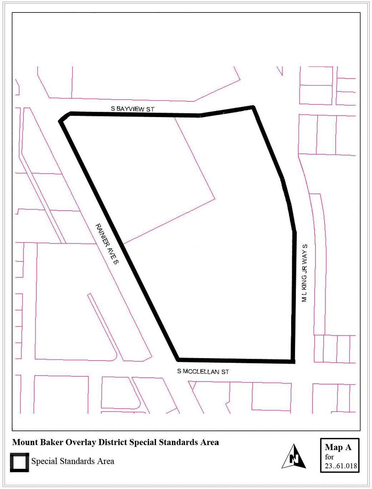

Map A forMount Baker Overlay District Special Standards Area

1. Development within the area described in Map A for Section 23.61.018 shall meet the following standards:

    1. Maximum lot coverage for structures and surface parking areas shall be 80 percent of the lot area.
    2. A continuous open space corridor interior to the site shall extend across the area described in Map A for Section 23.61.018 to connect at least three of the four surrounding streets: Rainier Avenue South, South Bayview Street, Martin Luther King Jr Way South, and South McClellan Street.

        1. The required internal corridor shall have a minimum width of 60 feet.
        2. The point at which the corridor intersects each street shall be located no closer than 150 feet to any street intersection.
        3. The corridor shall not contain any structures containing any floor area and shall be open from the ground to the sky, although landscaping, transparent weather protection overhangs, balconies not more than 5 feet in depth, temporary or permanent seating and tables, artwork, or other similar features shall be allowed.
        4. The corridor shall not contain any physical barriers or grade changes that would prevent pedestrian access through the site except as necessary to limit public access consistent with subsection 23.61.018.A.2.e.
        5. The corridor shall not be required to be open to the public based on the requirements of this subsection 23.61.018.A.2; however, the corridor may be used to meet the requirements for obtaining extra floor area pursuant to Section 23.58A.040 if it is open to the public and meets the requirements of Chapter 23.58A for a mid-block corridor.
        6. Driveways providing access to parking or passage through the site are permitted within the internal corridor, but shall be limited in width to a maximum of one lane in each direction, excluding parking areas. Parking is allowed within the internal corridors, except that the width of the driveway and parking areas combined may not exceed more than 60 percent of the width of the corridor. Portions of the corridor with driveways or parking shall not be used to meet the requirements for obtaining extra floor area pursuant to Section 23.58A.040.
        7. The corridor shall include at least one 6-foot wide sidewalk connecting the adjacent streets. Where a driveway is provided within the corridor, the corridor shall include at least 6-foot wide sidewalks along both sides of the driveway.
        8. The Director may as a Type I decision, modify the standards in subsection 23.61.018.A.2 as follows:

            1. if less than all of the area described in Map A for 23.61.018 is proposed for development, the Director may allow less than three of the streets listed in subsection 23.61.018.A.2 to be connected if the applicant connects as many streets as possible and submits a plan demonstrating how at least three of the listed streets can be connected as the remainder of the area is developed and demonstrates to the satisfaction of the Director that the partial development supports this plan;
            2. the Director may waive the requirements of subsection 23.61.018.A.2 for provision of a corridor if the creation of public streets within the area described in Map A for 23.61.018 provides equal or better internal circulation; or
            3. the Director may modify the standards in subsections 23.61.018.A.2.a through 23.61.018.A.2.d if the applicant demonstrates to the satisfaction of the Director that the modifications are necessary to accommodate existing structures.
2. Applications for subdivisions within the area described in Map A for 23.61.018 must address the potential location of the open space corridor interior to the site required by subsection 23.61.018.A.2 and shall be designed to facilitate developments that can comply with subsection 23.61.018.A.2.

### Chapter 23.64 - AIRPORT HEIGHT OVERLAY DISTRICT

Sections:

#### 23.64.002 - Purpose.

The purpose of the Airport Height Overlay District is to ensure safe and unobstructed takeoff and landing approach paths to King County International Airport (Boeing Field).

#### 23.64.004 - Boundaries.

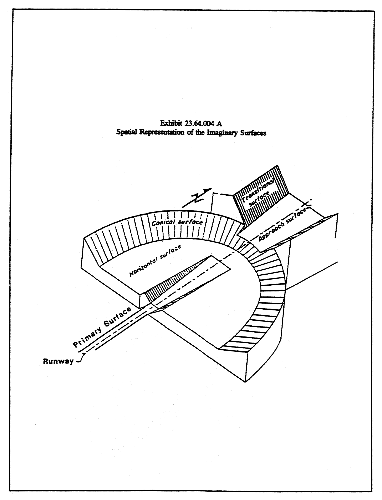

Exhibit 23.64.004A

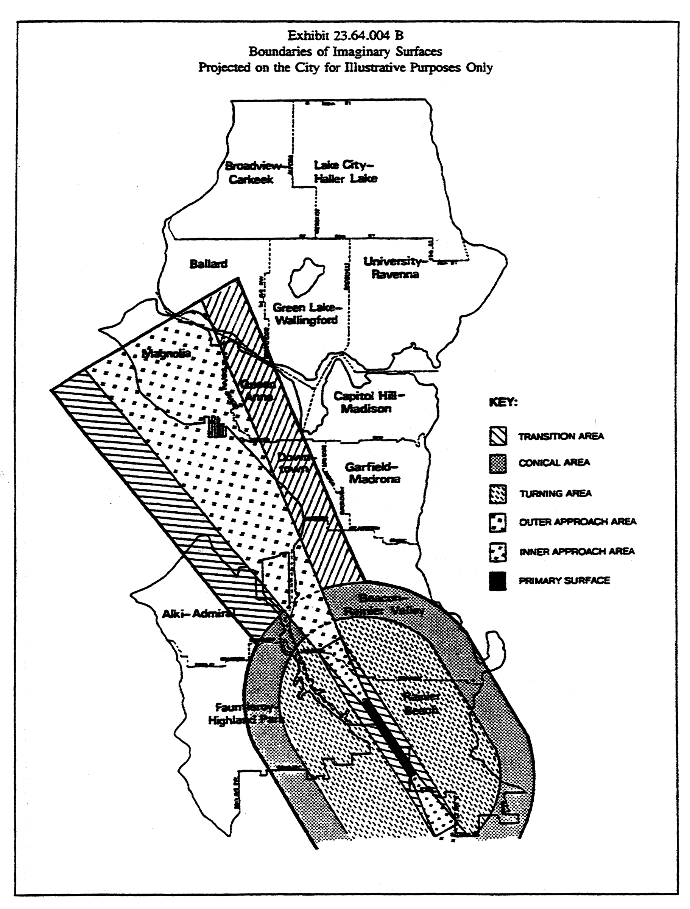

Exhibit 23.64.004B

1. The Airport Height Overlay District shall be divided into five (5) types of overlay areas. The areas shall be the Inner Approach Area (IA), Outer Approach Area (OA), Turning Area (TG), Conical Area (CA), and the Transition Areas (TN). The boundaries shall be based on the imaginary surfaces developed by the Federal Aviation Administration for height limits surrounding airports. For purposes of illustration, the spatial representation of the imaginary surfaces is shown in Exhibit 23.64.004 A. The boundaries of these imaginary surfaces as projected on a map of the City are shown for illustrative purposes only in Exhibit 23.64.004 B. The actual boundary locations of the overlay areas are shown on the Official Airport Height Map, which is part of Exhibit A established pursuant to Chapter 23.32 of the Land Use Code.
2. The "Primary Surface" is defined as a surface longitudinally centered on the King County International Airport runways, which extends two hundred feet (200') beyond the end of the runway and is one thousand feet (1,000') wide. The primary surface is at the elevation of the runway.
3. The "Inner Approach Area" is defined as that area which lies directly below imaginary inclined surfaces (the "Inner Approach Surfaces") longitudinally centered on the extended runway centerline and extending outward and upward from the north and south ends of the primary surface. The inner edges of the inner approach surfaces are one thousand (1,000) feet wide and expand uniformly to a width of four thousand (4,000) feet. The inner approach surfaces extend for a horizontal distance of ten thousand (10,000) feet at a slope of fifty (50) horizontal to one (1) vertical.
4. The "Outer Approach Area" is defined as that area which lies directly below imaginary inclined surfaces (the "Outer Approach Surfaces") longitudinally centered on the extended runway centerline and extending outward and upward from the north and south outer edges of the inner approach surfaces. The inner edges of the outer approach surfaces are four thousand feet (4,000') wide and expand uniformly to a width of eight thousand feet (8,000'). The outer approach surfaces extend for a horizontal distance of forty thousand feet (40,000') at a slope of forty (40) horizontal to one (1) vertical.
5. The "Turning Area" is defined as that area which lies directly below an imaginary horizontal oval surface (the "Turning Surface") one hundred fifty feet (150') above the established airport elevation (which is seventeen feet (17') above sea level), the perimeter of which is constructed by swinging ten-thousand-foot (10,000') radii arcs from the center of the end of the primary surface and by connecting the adjacent arcs with parallel lines tangent to those arcs.
6. The "Conical Area" is defined as that area which lies directly below an imaginary surface (the "Conical Surface") which extends outward and upward from the periphery of the horizontal surface at a slope of twenty (20) horizontal to one (1) vertical for a horizontal distance of four thousand feet (4,000').
7. The "Transitional Areas" are defined as the areas which lie directly below the imaginary inclined surfaces (the "Transitional Surfaces") which extend outward and upward from the edges of the primary surface and the inner and outer approach surfaces. The transitional surfaces extend at a slope of seven (7) horizontal to one (1) vertical at right angles to the runway centerline and extension of the runway centerline. Transitional surfaces for those portions of the approach surfaces which project through and beyond the limits of the conical surface, extend a distance of five thousand feet (5,000') measured horizontally from the edge of the approach surface and at right angles to the runway centerline. Transitional surfaces for those portions of the inner approach surface and the primary surface extend up to the turning surface.

#### 23.64.006 - Development standards.

1. No structure shall be erected, or altered, in any area defined in this section to a height in excess of the limits established in this chapter unless otherwise provided.
2. The maximum height permitted for structures and trees in each area shall be as follows, and shall be known as the height limits of the Airport Height Overlay District:

    1. In Inner Approach Areas (IA), the boundaries of which are shown on the Official Airport Height Map, structures and trees shall not exceed the height of the Inner Approach Surface. This shall not restrict heights in Inner Approach Areas to less than thirty-seven feet (37').
    2. In Outer Approach Areas (OA), the boundaries of which are shown on the Official Airport Height Map, structures and trees shall not exceed the height of the Outer Approach Surface.
    3. In Turning Areas (TN), the boundaries of which are shown on the Official Airport Height Map, structures and trees shall not exceed the height of the Turning Surface. This shall not restrict heights in Turning Areas to less than sixty-five feet (65').
    4. In Conical Areas (CA), the boundaries of which are shown on the Official Airport Height Map, structures and trees shall not exceed the height of the Conical Surface. This shall not restrict heights in Conical Areas to less than sixty-five feet (65').
    5. In Transition Areas (TN), the boundaries of which are shown on the Official Airport Height Map, structures and trees shall not exceed the height of the inclined Transition Surfaces. This shall not restrict heights in Transition Areas to less than thirty-seven feet (37').
3. Trees exceeding the height limits of the Airport Height Overlay District shall not be required to be cut or trimmed to conform to the height limits of the Airport Height Overlay District unless the Director is notified by the Federal Aviation Administration (FAA) that the trees are a potential hazard to aviation.

#### 23.64.008 - Application of regulations.

All properties located within the Airport Height Overlay District shall be subject to both the requirements of the underlying zone classification and to the requirements imposed for the Airport Height Overlay District. At no time shall the provisions of this chapter be read to modify the provisions of the underlying zoning, other overlay districts or special districts, except for height restrictions stated in this chapter. In any case where the provisions of the Airport Height Overlay District conflict with the provisions of the underlying zone, the more restrictive height limit shall apply.

#### 23.64.010 - Special exception.

The Director may permit a structure to exceed the limits of the Airport Height Overlay District as a special exception pursuant to Chapter 23.76, Procedures for Master Use Permits and Council Land Use Decisions. Such an exception shall only be permitted if the Director finds that all of the following conditions exist:

1. The Federal Aviation Administration advises the Director that the exception to the height limits does not create a hazard to aviation; and
2. The additional height is necessary for the successful physical function of the structure; and
3. The exception will not result in re-routing of aircraft; and
4. The structure is designed to minimize adverse impacts of lighting on surrounding uses while complying with the lighting requirements of the Federal Aviation Administration.

### Chapter 23.66 - SPECIAL REVIEW DISTRICTS

Sections:

#### Subchapter I - General Provisions
##### 23.66.010 - Establishment of special review districts.

The Council may establish special review districts by ordinance to control development in such districts.

##### 23.66.015 - Procedure to establish, alter or abolish special review districts.

A petition to establish, alter or abolish a special review district shall be filed and considered in the same manner as amendments to the Official Land Use Map, Chapter 23.32. A petition or proposal to establish a special review district shall include a statement of purpose. The boundaries of a special review district shall be drawn on the Official Land Use Map.

##### 23.66.018 - Director of the Department of Neighborhoods

As used in this chapter, "Director of Neighborhoods", "Department of Neighborhoods Director" and "Director of the Department of Neighborhoods" mean the Director of the department or the Director's designee.

##### 23.66.020 - Special review boards

1. The ordinance establishing a special review district may create a special review board. Unless otherwise specified, a special review board shall consist of seven members. Five of the members shall be chosen at annual elections, called and conducted by the Department of Neighborhoods Director, at which all residents, persons who operate businesses, their employees, and property owners of the special review district shall be eligible to vote. Two of the members shall be appointed by the Mayor and confirmed by the Council. The Mayor shall, in making board appointments, attempt to assure that a diversity of interests in the district is represented on the board. The Department of Neighborhoods Director shall provide 20 days' notice of the board's first meeting in the City's official newspaper, by Land Use Information Bulletin, and by publishing notice in one or more community newspapers that are circulated within the district. Thereafter, notice of annual meetings shall be provided to the public by the board's publication of notice in one or more district community newspapers. The Council shall establish terms of service for members of a special review board in the ordinance creating the district. No person shall serve more than two consecutive terms on a special review board.
2. Each special review board shall elect a chairperson and adopt procedures as required to conduct its business. Staff assistance to each special review board shall be provided by the Department of Neighborhoods Director. A majority of all members of the special review board shall constitute a quorum for the purpose of transacting business. All decisions shall be by majority vote of those members present. In the event of a tie vote, a motion shall be defeated. The special review board shall keep minutes of all of its official meetings which shall be maintained by the Department of Neighborhoods Director. The Department of Neighborhoods Director shall also maintain a copy of the procedures of the special review board.
3. When use and development standards for a special review district are not provided in the ordinance creating the district, the special review board shall recommend such standards pursuant to Section 23.66.025 of this chapter.
4. The special review board shall review applications for certificates of approval, and all petitions or applications for amendments to the Official Land Use Map, conditional uses, special exceptions, variances and planned unit developments or planned community developments and shall make a recommendation on any such application or petition to the Department of Neighborhoods Director.
5. The special review board may, in its discretion, make recommendations to the Mayor, the Council, and any public or private agency concerning land use and development in the district.

##### 23.66.025 - Use and development standards.

1. The Council may include use and development standards in the ordinance establishing a special review district. If use and development standards are not included, the special review board may, after at least one (1) public hearing, recommend use and development standards for the special review district to the Department of Neighborhoods Director who shall recommend use and development standards to the Council. If the special review board fails to recommend use and development standards within ninety (90) days after its first meeting, the Department of Neighborhoods Director shall prepare use and development standards and recommend such standards to the Council. The Council shall consider proposed use and development standards in the same manner as Land Use Code text amendments. Use and development standards shall be adopted by ordinance and may thereafter be amended in the same manner as Land Use Code text amendments as provided in Chapter 23.76.
2. The use and development standards shall identify the unique characteristics of the district, shall include a statement of purpose and intent, and shall be consistent with the purposes for creating the special review district. The standards shall identify uses, structures and design features that have positive or negative effects upon the character of the district, and may modify use and development standards and other provisions of the Land Use Code to allow and encourage or to limit or exclude structures, designs, and uses. All provisions of the Land Use Code shall apply in special review districts. Use and development standards shall specify the criteria by which uses, structures and designs will be evaluated. In the event of irreconcilable differences between the use and development standards adopted pursuant to this chapter, and the provisions regulating the underlying zone, the provisions of this chapter shall apply.
3. The Department of Neighborhoods Director, following recommendation by the board, may adopt rules consistent with the use and development standards of the special review district, in accordance with Chapter 3.02 of the Seattle Municipal Code.

##### 23.66.030 - Certificates of approval-Application, review and appeals

1. Certificate of approval required. No person shall alter, demolish, construct, reconstruct, restore, remodel, make any visible change to the exterior appearance of any structure, or to the public rights-of-way or other public spaces in a special review district, and no one shall remove or substantially alter any existing sign or erect or place any new sign or change the principal use of any building, or any portion of a building, structure or lot in a special review district, and no permit for such activity shall be issued unless a certificate of approval has been issued by the Department of Neighborhoods Director.
2. Fees. The fees for certificates of approval shall be established in accordance with the requirements of SMC Chapter 22.901T.
3. Application.

    1. An application for a certificate of approval shall be filed with the Director of the Department of Neighborhoods. When a permit application is filed with the Director or with the Director of Transportation for work requiring a certificate of approval, the permit application shall not be determined to be complete until the applicant has submitted a complete application for a certificate of approval to the Department of Neighborhoods.
    2. The following information must be provided in order for the application to be complete, unless the Director of the Department of Neighborhoods indicates in writing that specific information is not necessary for a particular application:

        1. Building name and building address;
        2. Name of the business(es) located at the site of the proposed work;
        3. Applicant's name and address;
        4. Building owner's name and address;
        5. Applicant's telephone number;
        6. The building owner's signature on the application, or a signed letter from the owner designating the applicant as the owner's representative, if the applicant is not the owner;
        7. Confirmation that the fee required by SMC Chapter 22.901T of the Permit Fee Subtitle has been paid;
        8. A detailed description of the proposed work, including:

            1. Any changes that will be made to the building or the site,
            2. Any effect that the work would have on the public right-of-way or other public spaces,
            3. Any new construction,
            4. Any proposed use, change of use, or expansion of use;
        9. Four (4) sets of scale drawings, with all dimensions shown, of:

            1. A site plan of existing conditions, showing adjacent streets and buildings, and, if the proposal includes any work in the public right-of-way, the existing street uses, such as street trees and sidewalk displays, and another site plan showing proposed changes to the existing conditions,
            2. A floor plan showing the existing features and a floor plan showing the proposed new features,
            3. Elevations and sections of both the proposed new features and the existing features,
            4. Construction details,
            5. A landscape plan showing existing features and plantings, and another landscape plan showing proposed site features and plantings;
        10. Photographs of any existing features that would be altered and photographs showing the context of those features, such as the building facade where they are located;
        11. One (1) sample of proposed colors, if the proposal includes new finishes or paint, and an elevation drawing or a photograph showing the location of proposed new finishes or paint;
        12. If the proposal includes new signage, awnings, or exterior lighting:

            1. Four (4) sets of scale drawings of proposed signage or awnings, showing the overall dimensions, material, design graphics, typeface, letter size, and colors,
            2. Four (4) sets of a plan, photograph, or elevation drawing showing the location of the proposed awning, sign, or lighting,
            3. Four (4) copies of details showing the proposed method of attaching the new awning, sign, or lighting,
            4. The wattage and specifications of the proposed lighting, and a drawing or picture of the lighting fixture,
            5. One (1) sample of proposed sign colors or awning material and color,
            6. For new signage or awnings in the International Special Review District, the dimensions of the street frontage on the side where the sign or awning would be located;
        13. If the proposal includes demolition of a structure or object:

            1. A statement of the reason(s) for demolition,
            2. A description of the replacement structure or object and the replacement use;
        14. If the proposal includes replacement, removal, or demolition of existing features, a survey of the existing conditions of the features that would be replaced, removed, or demolished.
    3. The Director of the Department of Neighborhoods shall determine whether an application is complete and shall notify the applicant in writing within twenty-eight (28) days of the application being filed whether the application is complete or that the application is incomplete and what additional information is required before the application will be complete. Within fourteen (14) days of receiving the additional information, the Director of the Department of Neighborhoods shall notify the applicant in writing whether the application is now complete or what additional information is necessary. An application shall be deemed to be complete if the Director of the Department of Neighborhoods does not notify the applicant in writing by the deadlines in this section that the application is incomplete. A determination that the application is complete is not a determination that the application is vested.
    4. The determination of completeness does not preclude the Director of the Department of Neighborhoods or the board from requiring additional information during the review process if more information is needed to evaluate the application according to the criteria in this chapter and in any rules adopted by the board, or if the proposed work changes. For example, additional information that may be required could include a shadow study or a traffic study when new construction is proposed.
    5. An applicant may make a written request to submit an application for a certificate of approval for a preliminary design of a project if the applicant waives in writing the deadline for a board recommendation and decision by the Director of the Department of Neighborhoods on the subsequent design phase or phases of the project, and agrees in writing that the decision by the Director of the Department of Neighborhoods on the preliminary design is immediately appealable by the applicant or any interested person. The staff may reject the request if it appears that approval of a preliminary design would not be an efficient use of staff or board time and resources, or would not further the goals and objectives of this chapter. To be complete, an application for a certificate of approval for a preliminary design must include the information listed above in subsection C2, subparagraphs a through h, i(1) through i(3), j, m and n. A certificate of approval that is granted for a preliminary design shall be conditioned upon subsequent submittal of the final design and all of the information listed above in subsection C2, and upon board approval, prior to issuance of permits for work affecting the structure, right-of-way or space.
    6. After the special review board has given notice of the meeting at which an application for a certificate of approval will be considered, no other application for the same alteration or change of use may be submitted until the application is withdrawn or the Department of Neighborhoods Director has approved or denied the existing application and all appeals have been concluded, except that an application may be made for a certificate of approval for the preliminary design of a project and a later application made for a certificate of approval for a subsequent design phase or phases of the same project.
4. Review

    1. Review when no special review board is established

        1. When there is no special review board, the Department of Neighborhoods Director shall, within 30 days of a determination that an application for a certificate of approval is complete, determine whether the proposed action is consistent with the use and development standards for the district and shall, within 15 additional days, issue, issue with conditions, or deny the requested certificate of approval.
        2. A copy of the Department of Neighborhoods Director's decision shall be sent to the Director and mailed to the owner and the applicant at the addresses provided in the application. Notice of the Director's decision also shall be provided to any person who, prior to the rendering of the decision, made a written request to receive notice of the decision or submitted written substantive comments on the application.
    2. Review when special review board is established

        1. When a special review board has been established, the board shall hold a public meeting to receive comments on certificate of approval applications.
        2. Notice of the board's public meeting shall be posted in two prominent locations in the district at least three days prior to the meeting.
        3. The board, after reviewing the application and considering the information received at the public meeting, shall make a written recommendation to the Department of Neighborhoods Director to grant, grant with conditions, or deny the certificate of approval application based upon the consistency of the proposed action with the requirements of this Chapter 23.66, the district use and development standards, and the purposes for creating the district. The board shall make its recommendation within 30 days of the receipt of a completed application by the board staff, except that the applicant may waive the deadlines in writing for the special review board to make a recommendation or the Director of the Department of Neighborhoods to make a decision, if the applicant also waives any deadlines on the review or issuance of related permits that are under review by the Seattle Department of Construction and Inspections.
        4. The Department of Neighborhoods Director shall, within 15 days of receiving the board's recommendation, issue or deny a certificate of approval or issue an approval with conditions.
        5. A copy of the decision shall be sent to the Director and mailed to the owner and the applicant at the addresses provided in the application. Notice of the decision shall be provided to any person who, prior to the rendering of the decision, made a written request for notice of the decision, or submitted substantive written comments on the application.
    3. A decision denying a certificate of approval shall state the specific reasons for the denial and explain why the proposed changes are inconsistent with the requirements of this Subchapter I and adopted use and development standards for the district.
5. Appeal to Hearing Examiner

    1. Any interested person may appeal the decision of the Department of Neighborhoods Director to the Hearing Examiner by filing a notice of appeal within 14 days of the Department of Neighborhoods Director's decision. When the proposed action that is the subject of the certificate of approval is also the subject of one or more related permit applications under review by the Seattle Department of Construction and Inspections, then the appellant must also file notice of the appeal with the Director of the Seattle Department of Construction and Inspections, and the appeal of the certificate of approval shall not be heard until all of the time periods for filing administrative appeals on the other permits or any environmental determinations have expired, except that an appeal of a certificate of approval for the preliminary design or for subsequent design phases may proceed immediately without being consolidated. The appeal of the certificate of approval shall be consolidated with the predecision hearing required for any Type IV Council land use decision, or if one or more appeals are filed regarding the other permits or environmental determinations, the appeal of the certificate of approval shall be consolidated with them and shall be heard according to the same timelines established for the other appeals or predecision hearing, except that appeals to the State Shoreline Hearings Board shall proceed independently according to the timelines set by the state for such appeals, and except that an appeal of a certificate of approval for a preliminary design or for a subsequent design phase may proceed without being consolidated.
    2. If the related permit decisions would not be appealable, and no predecision hearing is required, then the appeal of the certificate of approval decision shall proceed immediately after it is filed.
    3. The applicant for the certificate of approval, not involving approval of preliminary and subsequent design phases also may elect to have the appeal proceed immediately rather than be postponed for consolidation with appeals of related permit applications or with a predecision hearing, if the applicant agrees in writing that the time period for review of those permits or approvals is suspended until the Hearing Examiner issues a decision on the appeal of the certificate of approval.
    4. The Hearing Examiner shall hear the appeal de novo in accordance with the standards and procedures established for Hearing Examiner appeals by Chapter 3.02. Appeals shall be limited to the issues cited in the notice of appeal. The decision appealed may be reversed or modified only if the Hearing Examiner finds that the Department of Neighborhoods Director's decision was arbitrary and capricious.
    5. If evidence is presented to the Hearing Examiner that was not presented to the Board, or if the Hearing Examiner determines that additional information is required, then the Hearing Examiner shall remand the decision to the Department of Neighborhoods Director for consideration of the additional information or evidence.
    6. The Hearing Examiner shall issue a decision not later than 90 days after the last of any appeals of related permit decisions is filed provided that, when an appeal of a certificate of approval is consolidated with a predecision hearing, the Hearing Examiner shall issue the decision on the certificate of approval with the recommendation to the City Council on a Type IV Council land use decision, or, if the applicant chooses to proceed immediately with the appeal of the certificate of approval, as provided in subsection 23.66.030.E.3, then not later than 90 days from the filing of that appeal. The time period to consider and decide the appeal of a certificate of approval shall be exempt from the deadlines for review and decision on both the certificate of approval and any related permit applications or approvals.
    7. The decision of the Hearing Examiner shall be final. Copies of the Hearing Examiner's decision shall be provided to all parties of record before the Hearing Examiner. Any judicial review must be commenced as provided by state law.
6. Revocation of Certificates of Approval. Building construction, remodeling, restoration, renovation, removal, demolition and use shall conform to the requirements of the certificate of approval granted by the Department of Neighborhoods Director. Approval may be revoked for failure to comply with this chapter, the ordinance creating the district, or the conditions of the certificate of approval.
7. Expiration of Certificates of Approval. A certificate of approval for a use shall be valid as long as the use is authorized by the applicable codes. Any other type of certificate of approval shall be valid for 18 months from the date of issuance of the decision granting it unless the Director of the Department of Neighborhoods grants an extension in writing; provided however, that certificates of approval for actions subject to permits issued by the Seattle Department of Construction and Inspections shall be valid for the life of the permit issued by the Seattle Department of Construction and Inspections, including any extension granted by the Seattle Department of Construction and Inspections in writing.

##### 23.66.032 - Contributing structures; determination of architectural or historic significance

1. The owner of a lot in the Pioneer Square Preservation District or the International Special Review District may apply to the Director of Neighborhoods for a determination that a structure on the lot contributes, and is expected to continue to contribute, to the architectural and/or historic character of the District. A structure for which that determination is made is considered a contributing structure for purposes of this Section 23.66.032 and for purposes of the eligibility of the lot to send South Downtown Historic TDR or South Downtown Historic TDP pursuant to Sections 23.49.014 and 23.58A.042. The determination is made by the Director of Neighborhoods, after recommendation by the Pioneer Square Preservation Board or the International Special Review District Board. A structure for which an application for demolition approval has been granted or is pending is not eligible for a determination under this Section 23.66.032. The Director of Neighborhoods may defer consideration of an application under this Section 23.66.032 until final action is taken on any application for a certificate of approval, and any appeals have been resolved.
2. In making a recommendation and decision under subsection 23.66.032.A, the relevant Board and the Director of Neighborhoods shall take into account the reasons for designating the District as set forth in Section 23.66.100 or 23.66.302 and how they apply to the structure; whether the structure was identified as historic or as contributing, or both, for purposes of listing in the National Register of Historic Places or the local special review district; and the state of historic integrity, repair, maintenance, and useful life of the structure. The Director of Neighborhoods and the relevant Board may rely on information submitted by the owner, information provided by members of the public, other information available in public records, and site visits. The Director of Neighborhoods may determine that the structure is contributing; that it cannot be contributing; or that it will be contributing conditioned upon specific rehabilitation or maintenance work.
3. If the Director of Neighborhoods determines that the structure will be contributing conditioned upon rehabilitation or maintenance work, then the owner shall not be entitled to a final determination, and the structure shall not be considered contributing for purposes of this Title 23, until either (1) the work is completed to the satisfaction of the Director of Neighborhoods, or (2) a certificate of approval for the work is issued and the owner provides a bond or other security acceptable to the Director of Neighborhoods for the completion of the work.
4. The owner shall submit to the Director of Neighborhoods, in support of a request for a determination under this Section 23.66.032, a historic resource report prepared by a historic preservation consultant approved by the Director of Neighborhoods. The historic resource report shall include the information described in this subsection 23.66.032.D, except that the Director of Neighborhoods may allow the omission of information not necessary for a particular application:

    1. History of the structure, including significant historical events, persons and uses associated with the structure;
    2. Ownership history;
    3. Construction history, including original plans and subsequent alterations to the exterior; a chronology of historical documentation; site work, references to craftsmen, builders, and architects associated with the structure; early views, photographs, and other materials showing appearance at different periods; and results of physical investigation;
    4. Architectural evaluation, including an assessment of all exterior features and finishes and identification of those architectural features, materials, finishes and construction techniques that are character-defining.
    5. An analysis of existing conditions, damage, structural problems, and materials deterioration.
    6. Bibliography and references.
5. There is no administrative appeal of the decision of the Director of Neighborhoods. Any judicial review must be commenced as provided by state law.

##### 23.66.035 - Other land use decisions.

The Director and the Department of Neighborhoods Director shall deliver copies of petitions for amendments to the Official Land Use Map, copies of applications for planned unit developments and planned community developments, and copies of applications for conditional uses, special exceptions, and variances which affect property within a special review district, to the appropriate special review board for its recommendation. The special review board shall submit any recommendations in writing within thirty (30) days of receipt of copies of the application.

##### 23.66.040 - Enforcement and penalties.

Enforcement of the provisions of this chapter shall be pursuant to Chapter 23.90 of this Land Use Code.

#### Subchapter II - Pioneer Square Preservation District

Part 1 General Purpose and Organization

##### 23.66.100 - Creation of district, legislative findings and purpose

1. During the City of Seattle's relatively brief history, it has had little time in which to develop areas of consistent historical or architectural character. It is recognized that the Pioneer Square area of Seattle contains many of these rare attributes and consequently is an area of great historical and cultural significance. Further, the regional sports stadiums, constructed in and near the Pioneer Square area, and the traffic and activities that they generate have resulted in adverse impacts upon the social, cultural, historic and ethnic values of the Pioneer Square area. To preserve, protect, and enhance the historic character of the Pioneer Square area and the buildings therein; to return unproductive structures to useful purposes; to attract visitors to the City; to avoid a proliferation of vehicular parking and vehicular-oriented uses; to provide regulations for existing on-street and off-street parking; to stabilize existing housing, and encourage a variety of new and rehabilitated housing types for all income groups; to encourage the use of transportation modes other than the private automobile; to protect existing commercial vehicle access; to improve visual and urban relationships between existing and future buildings and structures, parking spaces and public improvements within the area; and to encourage pedestrian uses, there is established as a special review district, the Pioneer Square Preservation District. The boundaries of the District are shown on Map A for 23.66.100 and on the Official Land Use Map.
2. The District is depicted on Map A for 23.66.100. All property in the entire District shall be developed and used in accordance with the use and development standards established in this Chapter 23.66 and the use and development standards for the underlying zone in which the property is located. In the event of irreconcilable differences between the use and development standards of this Chapter 23.66 and other provisions of this Land Use Code, this Chapter 23.66 applies, except that nothing in this Chapter 23.66 shall permit any use or development on a lot from which TDR or TDP are transferred that is inconsistent with the restrictions applicable as a result of such transfer pursuant to Chapter 23.49 or Chapter 23.58A.
3. Reasons for Designating the Pioneer Square Preservation District.

    1. Historic Significance. The Pioneer Square Preservation District is unique because it is the site of the beginning of The City of Seattle. The area also retains much of the original architecture and artifacts of its early history. The District has played a significant role in the development of Seattle, the Puget Sound region and The State of Washington. It was the first location of industry, business and homes in early Seattle and the focus of commerce and transportation for more than a half century.
    2. Architectural Significance. As a collection of late nineteenth and early twentieth-century buildings of similar materials, construction techniques and architectural style, the District is unique, not only to the City but to the country as well. Most of the buildings within the District embody the distinctive characteristics of the Late Victorian style. Many buildings are the work of one architect, Elmer H. Fisher. For these and other reasons, the buildings combine to create an outstanding example of an area that is distinguishable in style, form, character and construction representative of its era.
    3. Social Diversity. The District represents an area of unique social diversity where people from many income levels and social strata live, shop and work. It is an area in which social services, including missions, low-income housing and service agencies exist.
    4. Business Environment. The District is an area of remarkable business diversity. The street level of the area north of S. King Street is pedestrian-oriented, with its storefronts occupied primarily by specialty retail shops, art galleries, restaurants and taverns. The upper floors of buildings in the historic core are occupied by professional offices, various types of light manufacturing, and housing for persons of many income groups. The area south of S. King Street includes the stadium's north parking lot, a number of structures occupied by light manufacturing and warehousing use, and several structures converted to office, residential and mixed use. The stadium's north parking lot may be redeveloped to accommodate a mix of uses, including a substantial amount of housing. The ongoing restoration and sensitive rehabilitation of many District structures, combined with proposed compatible new construction, will continue to enhance the District's economic climate.
    5. Educational Value. The restoration and preservation of the District will yield information of educational significance regarding the way of life and the architecture of the late nineteenth-century as well as adding interest and color to the City. Restoration of the District will preserve the environment that was characteristic of an important era of Seattle's history.
    6. Geographic Location. The District is uniquely situated adjacent to Seattle's waterfront, the central business district, the International District, and sports stadium and exhibition center facilities.

##### 23.66.110 - Responsible agency.

In addition to the members set forth above, one (1) designated young adult position shall be added to the Preservation Board pursuant to the Get Engaged Program, SMC Chapter 3.51. The terms of service related to this young adult position are set forth in SMC Chapter 3.51.

1. A special review board for the Pioneer Square Preservation District is created and shall be known as the "Pioneer Square Preservation Board" (hereafter, the "Board" or the "Preservation Board"). The Preservation Board shall be composed of nine (9) members, all of whom shall be appointed by the Mayor and confirmed by the Council, and shall consist of two (2) architects, two (2) owners of property in the District, one (1) District retail business owner, one (1) attorney, one (1) human service representative, one (1) at-large member, and one (1) historian or architectural historian. At least one (1) of the Board's members shall be a resident of the District. Appointments shall be for terms of three (3) years each, except that initial appointments shall be staggered so that three (3) of the appointees shall serve for three (3) years, three (3) for two (2) years, and three (3) for one (1) year each. All members of the Pioneer Square Preservation Board, established by Ordinance 110058, are appointed and confirmed as interim members of the Pioneer Square Preservation Board and shall serve until appointments pursuant to this chapter have been completed. Members of the Preservation Board shall serve without compensation.
2. The Department of Neighborhoods Director shall provide staff and clerical support for the Preservation Board and shall assign a member of the Department's staff to act as Preservation Board Coordinator. The Coordinator shall be the custodian of the Board's records, handle official correspondence, and organize and supervise the Board's clerical and technical work. The Coordinator shall also recommend to the Preservation Board such actions, policies, rules and regulations as may be necessary to carry out the purposes of this chapter.
3. The Department of Neighborhoods Director, after receiving the Board's recommendations, shall formulate detailed rules, to be adopted after a public hearing pursuant to Chapter 3.02 of this Code, which will clarify the use and development standards for the District.

##### 23.66.115 - Demolition approval

Part 2 Use and Development Standards

1. Demolition or removal of buildings or other structures in the District is prohibited unless approved by the Department of Neighborhoods Director. Except as provided in subsection B below, no approval shall be given for building demolition or removal unless the following prerequisites are met:

    1. The Director of Neighborhoods, following a recommendation by the Preservation Board, determines that the building or structure has no architectural or historic significance; and
    2. Use and design of the replacement structure has been approved by the Department of Neighborhoods Director; and
    3. Proof acceptable to the Department of Neighborhoods Director of a valid commitment for interim and long-term financing for the replacement structure has been secured. In addition to other proof, the Department of Neighborhoods Director may accept a bond, letter of credit or cash deposit as a demonstration that the project has adequate financial backing to ensure completion; and
    4. Satisfactory arrangements have been made for retention of any part of the structure's facade which the Department of Neighborhoods Director, following a recommendation by the Preservation Board, determines to be significant; and
    5. Satisfactory assurance is provided that new construction will be completed within two (2) years of demolition.
2. When demolition or removal of a building or other structure in the District is essential to protect the public health, safety and welfare or when the purposes of this ordinance will be furthered by the demolition or removal, then the Director of Neighborhoods, following review and recommendation by the Board, may authorize such demolition or removal whether the prerequisites of this Section 23.66.115 are satisfied or not.
3. Pursuant to RCW 36.70B.140, the Department of Neighborhoods Director's decision is exempt from the time limits and other requirements of RCW 36.70B.060 through 36.70B.080 and the requirements of RCW 36.70B.110 through 36.70B.130.
4. There is no administrative appeal of the decision of the Director of the Department of Neighborhoods. The Department of Neighborhoods Director's decision shall be final. Any judicial review must be commenced as provided by state law.

##### 23.66.120 - Permitted uses

1. All uses are permitted outright except those that are specifically prohibited by Section 23.66.122 and those that are subject to special review as provided in Section 23.66.124.
2. Essential Public Facilities. Essential public facilities shall also be reviewed pursuant to the provisions of Chapter 23.80, Essential Public Facilities.
3. All uses not specifically prohibited or subject to special review under Section 23.66.124 are permitted as both principal and accessory uses, except gas stations, which are permitted as accessory uses only in parking garages.

##### 23.66.122 - Prohibited uses

1. The following uses are prohibited in the Pioneer Square Preservation District as both principal and accessory uses:

    1. Retail ice dispensaries;
    2. Plant nurseries;
    3. Frozen food lockers;
    4. Animal shelters and kennels;
    5. Pet daycare, except as permitted as a street-level use in subsection 23.49.180.F if an applicant elects to use added height under the provisions of Section 23.49.180;
    6. Automotive sales and service, except gas stations located in parking garages;
    7. Marine sales and service;
    8. Heavy commercial services;
    9. Heavy commercial sales;
    10. Adult motion picture theaters;
    11. Adult panorams;
    12. Bowling alleys;
    13. Skating rinks;
    14. Major communication utilities;
    15. Advertising signs and off-premises directional signs;
    16. Transportation facilities, except passenger terminals, rail transit facilities, parking garages, and streetcar maintenance bases;
    17. Outdoor storage;
    18. Jails;
    19. Work-release centers;
    20. General and heavy manufacturing uses;
    21. Solid waste management;
    22. Recycling uses;
    23. Major marijuana activity; and
    24. High-impact uses.
2. Except for the uses listed in subsection 23.66.122.B.2, automobile-oriented commercial uses are prohibited, including but not limited to the automobile-oriented uses listed in subsection 23.66.122.B.1.

    1. Examples of prohibited automobile-oriented commercial uses:

        1. Drive-in businesses;
        2. Principal and accessory surface parking areas not in existence prior to August 10, 1981;
        3. Principal-use parking garages for long-term parking; and
        4. Motels.
    2. Permitted automobile-oriented uses:

        1. Gas stations accessory to parking garages;
        2. Accessory-use surface parking in the Subarea B shown on Map C for 23.66.122 and 23.66.150 either:

            1. if the accessory-use surface parking is in a location permitted by and complies with the standards contained in Section 23.49.180; or
            2. if the lot satisfies the provisions of Section 23.49.019;
        3. Principal-use parking garages for long-term parking in structures authorized pursuant to Section 23.49.180; and
        4. Accessory-use parking garages.

##### 23.66.124 - Uses subject to special review

1. Principal-use parking garages for short-term parking at any location, except principal use parking garages for short-term parking in structures authorized pursuant to Section 23.49.180, require approval of the Department of Neighborhoods Director after review and recommendation by the Preservation Board and may be permitted if the following conditions are met:

    1. The use will not increase the ambient noise level in existing residences within line of sight of the proposed parking structure; and
    2. Exterior materials, height, wall openings and fenestration will reflect, to the extent possible, the character of the adjoining structures or structures on the adjoining block facing the site; and
    3. Access will comply with the standards in Section 23.66.170; and
    4. Automobile circulation within the garage will not be visible from the adjoining public streets.
2. Uses at street level of approved parking garages are limited to those uses permitted in the area, other than parking, to a minimum depth of 20 feet along all street frontages, and along alleys and malls that are limited solely to pedestrian use.

##### 23.66.130 - Street-level uses

1. Uses at street level in the area designated on Map B for 23.66.130 require the approval of the Department of Neighborhoods Director after review and recommendation by the Preservation Board.

    1. Street level uses in the PSM 85-120 zone within the area shown on Map A for 23.49.180 are subject to the provisions of subsection 23.49.180.F if an applicant elects to use added height under the provisions of Section 23.49.180. Such street level uses require the approval of the Department of Neighborhoods Director after review and recommendation by the Preservation Board.
2. Preferred Street-level Uses.

    1. Preferred uses at street level must be highly visible and pedestrian oriented. Preferred street-level uses either display merchandise in a manner that contributes to the character and activity of the area, and/or promote residential uses, including but not limited to the following uses:

        1. Any of the following uses under 3,000 square feet in size: art galleries and other general sales and service uses, restaurants and other eating and drinking establishment uses, and lodging uses;
        2. Theaters.
    2. Accessory parking garages that serve preferred street-level uses on streets or malls, parks or alleys designed for pedestrian uses are also preferred.
3. Discouraged Street-level Uses.

    1. The following are discouraged at street level in the area designated on Map B for 23.66.130:

        1. Any use occupying more than 50 percent of any block front;
        2. Any of the following with gross floor area over 3,000 square feet: general sales and services uses, eating and drinking establishment uses, and lodging uses;
        3. All other uses with gross floor area over 10,000 square feet;
        4. Professional services establishments or offices that occupy more than 20 percent of any block front; and
        5. Parking garages that are not accessory to preferred uses.
    2. Discouraged uses may be approved by the Department of Neighborhoods Director after review and recommendation by the Preservation Board if an applicant demonstrates that the proposed use is compatible with uses preferred at street level.
4. Conditions on Street-level Uses. Approved street level uses in the area designated on Map B for 23.66.130 are subject to the following conditions:

    1. No use may occupy more than 50 percent of the street-level frontage of a block that is 20,000 square feet or more in area;
    2. Human service uses and personal service establishments, such as hair cutting and tanning salons, may not exceed 25 percent of the total street-level frontage of any block front.
5. The following uses are prohibited at street level in the area designated on Map B for 23.66.130:

Wholesaling, storage and distribution uses;

Vocational or fine arts schools;

Research and development laboratories;

Radio and television studios;

Taxidermy shops;

Appliance repair shops;

Upholstery establishments; and

Other similar uses.

6. The street-level location of entrances and exits of all vehicular-oriented uses, where permitted, shall be approved by the Department of Neighborhoods Director after review and recommendation by the Preservation Board. View-obscuring screening may be required as needed to reduce adverse visual impacts on the immediate area.

##### 23.66.132 - Council conditional uses.

City facilities and public projects which do not meet use and development standards may be permitted by the Council pursuant to Chapter 23.76 of this Land Use Code.

##### 23.66.140 - Height

Additional combined coverage of these rooftop features, not to exceed 25 percent of the roof area, may be permitted subject to review by the Preservation Board and approval by the Department of Neighborhoods Director.

1. On structures existing prior to June 1, 1989 and on additions to such structures permitted according to subsection 23.66.140.C.4.i or otherwise, new or replacement mechanical equipment and stair and elevator penthouses may extend up to 8 feet above the elevation of the existing roof or addition, as applicable, when they are set back a minimum of 15 feet from the street and 3 feet from an alley; or may extend up to 12 feet above the elevation of the existing roof or addition, as applicable, if they are set back a minimum of 30 feet from the street, subject to review by the Preservation Board and approval by the Department of Neighborhoods Director. On structures where rooftop features are allowed under subsection 23.66.140.C.4.e, the combined coverage of these rooftop features and any other features listed in subsection 23.66.140.C.4.d shall not exceed the limit provided in subsection 23.66.140.C.4.d, as it may be increased pursuant to that subsection.
2. Residential and office penthouses

    1. Residential penthouses may cover a maximum of 50 percent of the total roof surface and may extend up to 8 feet above the roof if set back a minimum of 15 feet from the street property line, or 12 feet above the roof if set back a minimum of 30 feet from the street property line.
    2. Office penthouses are permitted only if the footprint of the existing structure is greater than 10,000 square feet and the structure is at least 60 feet in height. When permitted, office penthouses shall be set back a minimum of 15 feet from all property lines and may cover a maximum of 50 percent of the total roof surface. Office penthouses may extend up to 12 feet above the roof of the structure and shall be functionally integrated into the existing structure.
    3. The combined height of the structure and a residential penthouse or office penthouse, if permitted, shall not exceed the maximum height limit for that area of the District in which the structure is located.
3. Screening of Rooftop Features. Measures may be taken to screen rooftop features from public view subject to review by the Preservation Board and approval by the Department of Neighborhoods Director. The amount of roof top area enclosed by rooftop screening may exceed the maximum percentage of the combined coverage of rooftop features listed in subsection 23.66.140.C.4.d above. In no circumstances shall the height of rooftop screening exceed 15 feet above the maximum height limit or height of an addition permitted according to subsection 23.66.140.C.4.i or otherwise, whichever is higher.
4. See Section 23.57.014 for regulation of communication utilities and accessory devices.
5. For a structure that has existed since before June 10, 1985 and is nonconforming as to structure height, an addition to the structure may extend to the height of the roof of the existing structure if i) the use of the addition above the limit on structure height applicable under Section 23.49.178 is limited to residential use and ii) the addition occupies only all or a portion of the part of a lot that is bounded by an alley on one side and is bounded on at least two sides by walls of the existing structure that are not street-facing façades.
6. Enclosed rooftop recreational spaces for new structures

    1. If included on new structures, enclosed rooftop recreational spaces and solar collectors may exceed the maximum height limit by up to 15 feet. The applicant shall: make a commitment to achieve a LEED Gold rating or better or meet a substantially equivalent standard and demonstrate compliance with that commitment according to the provisions of subsection 23.48.021.D.2 and meet a Green Factor requirement of .30 or greater according to the provisions of Section 23.86.019. Each enclosed rooftop recreational space shall include interpretive signage explaining the sustainable features employed on or in the structure. Commercial, residential, or industrial uses shall not be established within enclosed rooftop recreational spaces that are allowed to exceed the maximum height limit under this subsection 23.66.140.C.4.j.
    2. Elevator penthouses serving an enclosed rooftop recreational space may exceed the maximum height limit by up to 20 feet.
    3. Enclosed rooftop recreational spaces, mechanical equipment, and elevator and stair penthouses shall not exceed 35 percent of the roof area.
    4. Enclosed rooftop recreational spaces, mechanical equipment, and elevator and stair penthouses shall be set back a minimum of 30 feet from all streets and three feet from all alleys. Solar collectors shall be set back as provided in subsections 23.66.140.C.4.c and 23.66.140.C.4.d.
    5. Owners of structures with enclosed rooftop recreational spaces permitted pursuant to this subsection 23.66.140.C.4.j shall submit to the Director, the Pioneer Square Preservation Board, and the Director of Neighborhoods a report documenting compliance with the LEED Gold rating commitment and Green Factor requirements set forth above.

1. Maximum Height. Maximum structure height is regulated by Section 23.49.178 Pioneer Square Mixed, structure height.
2. Minimum Height. No structure shall be erected or permanent addition added to an existing structure that would result in the height of the new structure of less than 50 feet, except as allowed in the PSM 85-120 zone under the provisions of Section 23.49.180 for the area shown on Map A for 23.49.180. Height of the structure is to be measured from mean street level fronting on the property to the mean roofline of the structure.
3. Rooftop features and additions to structures

    1. The height limits established for the rooftop features described in this Section 23.66.140 may be increased by the average height of the existing street parapet or a historically substantiated reconstructed parapet on the building on which the rooftop feature is proposed.
    2. For development in the PSM 85-120 zone in the area shown on Map A for 23.49.180 and subject to the provisions of Section 23.49.180, the height limits for rooftop features are provided in subsection 23.49.008.D. The standards contained in subsections 23.66.140.C.1 and 23.66.140.C.4 do not apply to rooftop features on development subject to the provisions of Section 23.49.180.
    3. The setbacks required for rooftop features may be modified by the Department of Neighborhoods Director, after a sight line review by the Preservation Board to ensure that the features are minimally visible from public streets and parks within 300 feet of the structure.
    4. Height limits for rooftop features

        1. Religious symbols for religious institutions, smokestacks and flagpoles may extend up to 50 feet above the roof of the structure or the maximum height limit, whichever is less, except as regulated in Chapter 23.64 of this Land Use Code, provided that they are a minimum of 10 feet from all lot lines.
        2. For existing structures, open railings, planters, clerestories, skylights, play equipment, parapets and firewalls may extend up to 4 feet above the roof of the structure or the maximum height limit, whichever is less. For new structures, such features may extend up to 4 feet above the maximum height limit. No rooftop coverage limits apply to such features regardless of whether the structure is existing or new.
        3. Solar collectors, excluding greenhouses, may extend up to 7 feet above the roof of the structure or the maximum height limit, whichever is less, with unlimited rooftop coverage, provided they are a minimum of 10 feet from all lot lines. For new structures, solar collectors may extend up to 7 feet above the maximum height limit, except as provided in subsection 23.66.140.C4.j.1, and provided that they are a minimum of 10 feet from all lot lines.
        4. The following rooftop features may extend up to 8 feet above the roof or maximum height limit, whichever is less, if they are set back a minimum of 15 feet from the street and 3 feet from an alley. They may extend up to 15 feet above the roof if set back a minimum of 30 feet from the street. A setback may not be required at common wall lines subject to review by the Preservation Board and approval by the Department of Neighborhoods Director. The combined coverage of the following listed rooftop features shall not exceed 15 percent of the roof area:

            1. Solar collectors, excluding greenhouses;
            2. Stair and elevator penthouses;
            3. Mechanical equipment;
            4. Minor communication utilities and accessory communication devices, except that height is regulated according to the provisions of Section 23.57.014.
4. New Structures. When new structures are proposed in the District, the Preservation Board shall review the proposed height of the structure and make recommendations to the Department of Neighborhoods Director who may require design changes to assure reasonable protection of views from Kobe Terrace Park.

##### 23.66.150 - Structure setbacks

Except as allowed through the provisions of subsection 23.49.180.G for the PSM 85-120 zone in the area shown on Map A for 23.49.180:

1. Structures located within Subarea A on Map C for 23.66.122 and 23.66.150 shall cover the full width of the lot along street lot lines and have street-facing facades that abut street lot lines for the full width of portions of a structure that are up to 100 feet in height.
2. Structures located within Subarea B on Map C for 23.66.122 and 23.66.150 shall abut street lot lines for the full width of the structure's street-facing façade, except as provided for in 23.49.180.
3. New structures or portions of structures located within Subarea C on Map C for 23.66.122 and 23.66.150 shall cover the full width of the lot along street lot lines and have street-facing facades that abut street lot lines for the full width of portions of a structure that are up to 100 feet in height. For structures that exceed 100 feet in height, all portions that exceed 100 feet in height shall be set back at least 15 feet from street lot lines.
4. For all Subareas, modifications to setback standards may be permitted by the Director of Neighborhoods following review and recommendation by the Preservation Board if the following criteria are met:

    1. A larger or smaller setback will be compatible with and not adversely affect the streetscape or publicly-owned open space; and
    2. A larger or smaller setback will be compatible with other design elements, such as bulk, size and profile, of the proposed building.

##### 23.66.155 - Waiver of common recreation area requirements.

The Director of Neighborhoods, after review and recommendation by the Preservation Board, may waive or reduce the common recreation area required by the underlying zoning or modify the required standards for common recreation area under the following conditions:

1. Allocation of all or a portion of the required gross floor area would adversely affect the visual character of the structure or the District; or
2. Common recreation area requirements would adversely affect the economic feasibility of the project; or
3. It can be shown that the project is reasonably served by existing public or private recreation facilities located nearby.

##### 23.66.160 - Signs

1. Signs.

Permanently affixed, freestanding signs (except those used to identify areas such as parks and those authorized for surface parking lots under subsection 23.66.160.C.7);

Roof signs;

Off-premises signs;

Electric signs and signs using video display methods, excluding neon signs;

Signs with messages that appear to be in motion;

Changing image signs;

Signs with flashing, running or chaser lights.

    1. On-premises signs that comply with the provisions of this Section 23.66.160 are allowed.
    2. The following signs are prohibited throughout the Pioneer Square Preservation District:
    3. The Preservation Board and the Director of Neighborhoods may delegate to the Director the determination whether a proposed sign is a sign prohibited under subsection 23.66.160.A. If the Director determines a proposed sign is a sign prohibited under subsection 23.66.160.A, the Director of Neighborhoods shall not send the application to the Board and shall deny the application.
    4. Each owner of an existing off-premises sign that is lawfully authorized in the District shall comply with the requirements in subsection 23.55.014.F to register the sign, pay the registration fee, and display the sign registration number, and is subject to the penalty provisions of that subsection 23.55.014.F.
2. To ensure that flags, banners and signs are of a scale, color, shape and type compatible with the Pioneer Square Preservation District objectives stated in Section 23.66.100 and with the character of the District and the buildings in the District, to reduce driver distraction and visual blight, to ensure that the messages of signs are not lost through undue proliferation, and to enhance views and sight lines into and down streets, the overall design of a sign, flag, or banner, including size, shape, typeface, texture, method of attachment, color, graphics and lighting, and the number and location of signs, flags, and banners, shall be reviewed by the Board and are regulated as set out in this Section 23.66.160. Building owners are encouraged to develop an overall signage plan for their buildings.
3. In determining the appropriateness of signs, including flags and banners used as signs as defined in Section 23.84A.036, the Preservation Board shall consider the following:

    1. Signs Attached or Applied to Structures.

        1. The relationship of the shape of the proposed sign to the architecture of the building and with the shape of other approved signs located on the building or in proximity to the proposed sign;
        2. The relationship of the texture of the proposed sign to the building for which it is proposed, and with other approved signs located on the building or in proximity to the proposed sign;
        3. The possibility of physical damage to the structure and the degree to which the method of attachment would conceal or disfigure desirable architectural features or details of the structure (the method of attachment shall be approved by the Director);
        4. The relationship of the proposed colors and graphics with the colors of the building and with other approved signs on the building or in proximity to the proposed sign;
        5. The relationship of the proposed sign with existing lights and lighting standards, and with the architectural and design motifs of the building;
        6. Whether the proposed sign lighting will detract from the character of the building; and
        7. The compatibility of the colors and graphics of the proposed sign with the character of the District.
    2. Wall signs painted on or affixed to a building shall not exceed ten percent of the total area of the façade or 240 square feet, whichever is less. Area of original building finish visible within the exterior dimensions of the sign (e.g., unpainted brick) shall not be considered when computing the sign's area.
    3. Signs not attached to structures shall be compatible with adjacent structures and with the District generally.
    4. When determining the appropriate size of a sign the Board and the Director of Neighborhoods shall also consider the function of the sign and the character and scale of buildings in the immediate vicinity, the character and scale of the building for which the sign is proposed, the proposed location of the sign on the building's exterior, and the total number and size of signs proposed or existing on the building.
    5. Information displayed on the valance of awnings, canopies or marquees shall be limited to identification of the name or address of the building or of an establishment located in the building.
    6. Projecting signs and neon signs may be recommended only if the Preservation Board determines that all other criteria for permitted signs have been met and that historic precedent, locational or visibility concerns of the business for which the signing is proposed warrant such signing.
    7. Surface Parking Lot Signage.

        1. The total signage area permitted for each accessory surface parking lot shall not exceed 1 square foot per parking space up to a maximum of 24 square feet per surface parking lot. The total signage area permitted for each existing principal use surface parking lot shall not exceed 1/2 square foot per parking space in the lot, up to a maximum of 18 square feet per principal use surface parking lot.
        2. Surface parking lots shall display a sign, counted against the total permitted signage area, with one of the following messages, if applicable:

            1. For accessory surface parking lots, or portions thereof, intended only for customer use: "Customer Parking for (Principal User/s) Only." The sign also may contain the address of the principal user or users and mention validation of parking, if applicable. The sign also may contain the information required by state law to lawfully impound unauthorized vehicles.
            2. For accessory or principal use surface parking lots, or portions thereof, intended only for reserved parking: "Reserved Parking." The sign also may contain the name and telephone number of the owner. The sign also may contain the information required by state law to lawfully impound unauthorized vehicles.
        3. Small on-premises directional signs, such as those designating the entrance to or exit from accessory surface parking areas, are permitted if they are three or fewer square feet in area and are located at a height four or fewer feet above grade at points of egress or ingress. Such signs shall not count against the total permitted sign area.
4. Temporary Signs.

    1. The following signs are permitted at all times:

        1. Real estate "for sale," "for rent" and "open house" signs, and signs identifying the architect, engineer or contractor for work currently under construction. The total area for these types of signs in the aggregate shall not exceed twenty-four (24) square feet per sixty (60) linear feet of street frontage, provided that the design, location, shape, size, color and graphics are approved by the Department of Neighborhoods Director after review and recommendation by the Preservation Board, and provided further that the Director may approve up to thirty-six (36) square feet if there is more than one user of real estate signs or if the building abuts more than two (2) streets; and
        2. Noncommercial signs. The total area for noncommercial signs in the aggregate shall not exceed twenty-four (24) square feet per sixty (60) linear feet of street frontage, but where there are multiple users of the building, each business establishment and dwelling unit shall be allowed a minimum of eight (8) square feet of signage, regardless of the twenty-four (24) square foot limitation.
    2. The following signs are permitted for fourteen (14) consecutive days four (4) times a calendar year:

        1. On-premises commercial signs. The total area for on-premises commercial signs in the aggregate shall not exceed twenty-four (24) square feet per sixty (60) linear feet of street frontage, provided that the design, location, shape, size, color and graphics are approved by the Department of Neighborhoods Director after review and recommendation by the Review Board; and
        2. Noncommercial signs. The total area for noncommercial signs in the aggregate shall not exceed thirty-two (32) square feet per sixty (60) linear feet of street frontage, provided that each dwelling unit shall be allowed thirty-two (32) square feet of signage.
    3. All temporary signs authorized by this section are subject to the following:

        1. Wind-animated objects, search lights and devices of a carnival nature are not allowed.
        2. No individual sign shall exceed twelve (12) square feet.
        3. Temporary signs required by law shall be permitted.

##### 23.66.170 - Parking and access

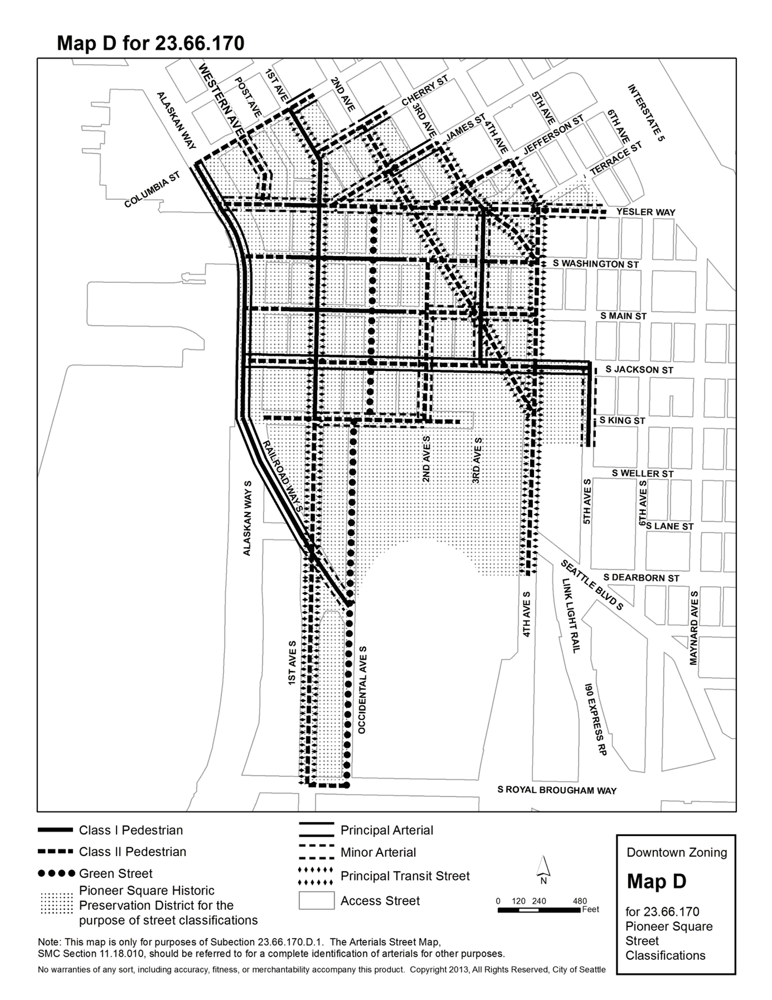

Map D forPioneer Square Street Classification

1. Parking standards in the Pioneer Square Preservation District are set forth in Section 23.49.019.
2. To mitigate the potential impacts of required loading on the District, the Director of Neighborhoods, after review and recommendation by the Preservation Board, may waive or reduce required loading if reasonable application of the loading standards will adversely affect the visual character of the District.
3. If parking is provided it shall be subject to the requirements of Section 23.54.030.
4. Standards for location of access to parking

    1. Access to parking and loading from alleys, and from streets that generally run east/west is preferred to access from Avenues. If a lot abuts more than one right-of-way, the location of access shall be determined by the Department of Neighborhoods Director in consultation with the Director of Transportation. This determination shall be made according to the traffic classification of the street, depicted on Map D for 23.66.170. Access shall be from rights-of-way classified as follows, from the most to least preferred (a portion of a street that is included in more than one category is considered as belonging only to the least preferred of the categories in which it is included), except when the Department of Neighborhoods Director, following review and recommendation by the Board, determines that access from the preferred right-of-way would create a hazardous condition: alleys; access streets, regardless of pedestrian classification; Class II pedestrian streets-minor arterial; Class II pedestrian streets-principal arterial; Class I pedestrian streets-minor arterial; Class I pedestrian streets-principal arterial; principal transit streets, regardless of pedestrian classification; green streets.
    2. Curbcut width and the number of curbcuts permitted per street frontage shall be governed by Section 23.54.030.
    3. The street-level location of entrances and exits of all parking garages, if permitted, shall be permitted only if approved by the Department of Neighborhoods Director after review and recommendation by the Preservation Board. View-obscuring screening may be required as needed to reduce adverse visual impacts on the immediate area.

##### 23.66.180 - Exterior building design.

To complement and enhance the historic character of the District and to retain the quality and continuity of existing buildings, the following requirements shall apply to exterior building design:

1. Materials. Unless an alternative material is approved by the Department of Neighborhoods Director following Board review and recommendation, exterior building facades shall be brick, concrete tinted a subdued or earthen color, sandstone or similar stone facing material commonly used in the District. Aluminum, painted metal, wood and other materials may be used for signs, window and door sashes and trim, and for similar purposes when approved by the Department of Neighborhoods Director as compatible with adjacent or original uses, following Board review and recommendation.
2. Scale. Exterior building facades shall be of a scale compatible with surrounding structures. Window proportions, floor height, cornice line, street elevations and other elements of the building facades shall relate to the scale of the buildings in the immediate area.
3. Awnings. Awnings shall be functional, serving as weather protection for pedestrians at street level, and shall overhang the sidewalk a minimum of five feet (5'). Awnings may be permitted on upper floors for the purpose of climate control. All awnings shall be of a design compatible with the architecture of buildings in the area.

##### 23.66.190 - Streets and sidewalks.

1. Review by the Preservation Board shall be required before any changes are permitted to sidewalk prism lights, sidewalk widths or street paving and curbs.
2. New access to underground areaways shall be limited to access from buildings, except that new access through the sidewalks shall be permitted where stair access existed at any time prior to September 17, 1981, or as approved by the Department of Neighborhoods Director after review and recommendation by the Preservation Board.

#### Subchapter III - International Special Review District

Part 1 General Purposes and Organization

##### 23.66.302 - International Special Review District goals and objectives

The International District is the urban focal point for the Asian American community. The International Special Review District is established to promote, preserve and perpetuate the cultural, economic, historical, and otherwise beneficial qualities of the area, particularly the features derived from its Asian heritage, by:

1. Reestablishing the District as a stable residential neighborhood with a mixture of housing types;
2. Encouraging the use of street-level spaces for pedestrian-oriented retail specialty shops with colorful and interesting displays;
3. Protecting the area and its periphery from the proliferation of parking lots and other automobile-oriented uses;
4. Encouraging the rehabilitation of existing structures;
5. Improving the visual and urban design relationships between existing and future buildings, parking garages, open spaces and public improvements within the International District;
6. Exercising a reasonable degree of control over site development and the location of off-street parking and other automobile-oriented uses; and
7. Discouraging traffic and parking resulting from athletic stadium events and commuters working outside the District.
All property within the International Special Review District, as designated on the Official Land Use Map, shall be subject to the use and development standards of the underlying zoning and the applicable use and development standards of this Chapter 23.66. In the event of irreconcilable differences between the use and development standards of this Chapter 23.66 and the provisions of the underlying zone or other chapters of the Seattle Municipal Code or other City ordinances, this Chapter 23.66 applies, except that nothing in this Chapter 23.66 shall permit any use or development on a lot from which TDR or TDP are transferred that is inconsistent with the restrictions applicable as a result of such transfer pursuant to Chapter 23.49 or Chapter 23.58A. The boundaries of the International Special Review District are shown on the Official Land Use Map, and on Map A for 23.66.302, included at the end of this Chapter 23.66.

##### 23.66.304 - International District Mixed (IDM) Zone goals and objectives.

The IDM zone designation shall recognize and promote the area's unique social mix and urban design character. This area is the core of the International District which exemplifies Asian culture. A wide range of uses, including street-level retail, housing development above street level, and the rehabilitation of existing buildings, shall be encouraged. New residential uses and the rehabilitation of existing structures shall be encouraged to provide a diversity of residential opportunities. Specific objectives include the following:

1. To maintain and protect the International District core as an Asian cultural, retail and residential center;
2. To allow flexibility and discretion in land use controls, regulations and guidelines to address present conditions and those which may develop in the future;
3. To protect, preserve and promote small retail and commercial businesses;
4. To encourage development of housing above street level;
5. To encourage the rehabilitation of existing buildings; and
6. To assure new development compatible in scale and character with existing buildings.

##### 23.66.306 - International District Residential (IDR) Zone goals and objectives

The International District residential area shall be predominantly a residential neighborhood with primarily residential uses. Other compatible uses shall be permitted to the extent that they reinforce and do not detract from the primary use of the area. The IDR designation and the regulations of the International Special Review District shall recognize and promote the area's unique social and urban design character. Special objectives include:

1. The establishment of the International District area north of South Jackson Street as one of downtown's predominant residential neighborhoods;
2. The development of flexible land use controls, regulations and guidelines to address present conditions and those which may develop in the future;
3. The design, siting, and construction of structures that minimize view blockage from Kobe Terrace Park and from existing structures that are used primarily for residential purposes;
4. The design, siting and construction of structures in a manner that allows reasonable solar exposure and air circulation to adjacent properties;
5. The design, siting and construction of structures that are aesthetically compatible with the area's steep topography and/or nearby public open spaces.

##### 23.66.308 - International District preferred uses east of Interstate 5

Preferred uses for that portion of the International District that lies east of Interstate 5 include restaurants, retail shops, residential uses, and other small- and medium-scale commercial uses. Commercial businesses and uses with an Asian product, service or trade emphasis are preferred. Preferred uses should contribute to the International District's business core or to the function and purposes of the International District east of Interstate 5.

##### 23.66.310 - Union Station Corridor goals and objectives

The Union Station Corridor is that area bounded by Yesler Way, Fifth Avenue South, Airport Way South, and Fourth Avenue South. The City, in cooperation with King County Metro, local property owners and the affected community, formulated a strategy for the redevelopment of the Union Station Corridor in coordination with the Downtown Transit Project. Specific objectives for a Planned Community Development in the Union Station Corridor include the following:

1. Preservation. The historic Union Station structure should be retained and rehabilitated with consideration given to a mix of private and public uses.
2. Uses. Development in the Corridor should incorporate a mix of uses, such as office, housing, hotel and retail uses in conformance with its International District zoning and the regulations of the International Special Review District. Retention of existing low-income housing should be given a high priority. Consideration should be given to the inclusion of public open space and public uses serving the community.
3. Planned Community Development. The provisions of Section 23.49.036, Planned Community Developments, apply in the area. This procedure allows projects to modify the provisions of the IDM designation as long as the entire project is in conformance. All planned community developments shall be reviewed by the International Special Review District Board which shall make a recommendation to the Director of Neighborhoods.
4. Open Space. Public open space has been included in development in the area, and if applicable to future development proposals, consideration should be given to the retention and enhancement of a linear open space along Fifth Avenue south of Jackson Street, as an open space resource and a major focal point at the west end of King Street.
5. Parking. The number of parking spaces provided in the corridor should be sufficient to meet the requirements for development in the corridor, as well as to contribute to the long-range needs of the International District.
6. Scale. Building height and bulk should conform to the IDM Zone designation and the regulations of the International Special Review District. Development south of Jackson Street should preserve the Union Station building as the dominant structure.
7. View Corridors. Views from Jackson and King Streets should be retained.
8. Pedestrian Environment. To provide a pedestrian link between the International District retail core and Pioneer Square, a pedestrian connection should be retained south of King Street. Consideration should be given to pedestrian improvements along Jackson Street and along Fifth Avenue between Jackson Street and Airport Way South such as streetscaping, widened sidewalks and benches, to "humanize" what are now vehicular-oriented streets.

##### 23.66.312 - Composition of the Special Review Board.

The International District Special Review Board (hereafter, the "Board") shall consist of seven (7) members, five (5) of whom are elected and two (2) of whom are appointed by the Mayor and confirmed by the City Council. The five (5) elected members of the Board shall consist of two (2) members who own property in the International District, or who own or are employed by businesses located in the International District; two (2) members who are either residents (including tenants), or persons with a recognized and demonstrated interest in the welfare of the International District Community; and one (1) member at large. One (1) member of the Pioneer Square Special Review Board shall serve as a nonvoting member appointed by the Pioneer Square Special Review Board to serve at that Board's pleasure.

##### 23.66.314 - Staff support for the Special Review Board.

The Department of Neighborhoods Director shall provide staff and clerical support for the Board, and shall assign a member of the Department's staff to act as Board Coordinator. The Coordinator shall be the custodian of the Board's records, handle official correspondence, and organize and supervise the clerical and technical work of the Board. The Coordinator shall also recommend such actions, policies, rules and regulations for adoption by the board as may be necessary to accomplish the objectives of this chapter.

Part 2 Use and Development Standards

##### 23.66.316 - Decision on certificate of approval.

The Board shall review all applications for use or development within the International District which require a certificate of approval. The Board's review shall be conducted according to the procedures and timelines set forth in section 23.66.030 D2 of this Land Use Code. The Board shall make a written recommendation based upon the extent to which the proposal is consistent with the goals and objectives of the International Special Review District and the use and development standards of this chapter. The Department of Neighborhoods Director shall make and issue a decision according to the procedures and timelines set forth in section 23.66.030 D of this Land Use Code.

##### 23.66.318 - Demolition approval

1. To discourage the unnecessary demolition of useful existing structures that contribute to the District's cultural and social character, an assessment of the structure proposed to be demolished shall be prepared and circulated to the Board prior to its consideration of a certificate of approval. Among other factors, the economic, social and physical consequences and benefits of the requested demolition and any alternatives to demolition shall be assessed. Except as provided in subsection 23.66.318.B, a certificate of approval may be granted only if the requested demolition will not adversely affect the District and no reasonable alternatives to demolition exist, and if:

    1. The Director of Neighborhoods, after receiving a recommendation by the Special Review Board, determines that the building or structure has no important architectural or historic significance; and
    2. Use and design of a replacement structure have been approved by the Director of Neighborhoods; and
    3. Proof acceptable to the Director of Neighborhoods of a valid commitment for interim and long-term financing for the replacement structure has been secured. In addition to other proof, the Director of Neighborhoods may accept a bond, letter of credit, or cash deposit as a demonstration that the project has adequate financial backing to ensure completion; and
    4. Satisfactory arrangements have been made for retention of any part of the structure's facade that the Director of Neighborhoods and Special Review Board determine to be significant; and
    5. Satisfactory assurance is provided that new construction will be completed within two years of demolition.
2. If demolition or removal of a building or other structure in the District is essential to protect the public health, safety and welfare or if the purposes of this Chapter 23.66 will be furthered by the demolition or removal, then the Director of Neighborhoods, following review and recommendation by the Board, may authorize such demolition or removal whether the prerequisites of this Section 23.66.318 are satisfied or not.
3. Pursuant to RCW 36.70B.140, the Director of Neighborhoods' decision is exempt from the time limits and other requirements of RCW 36.70B.060 through 36.70B.080 and the requirements of RCW 36.70B.110 through 36.70B.130.
4. There is no administrative appeal of the decision of the Director of Neighborhoods. The Director of Neighborhoods' decision shall be final. Any judicial review must be commenced as provided by state law.

##### 23.66.320 - Permitted uses.

1. All uses shall be permitted outright except those specifically prohibited by Section 23.66.322 and those subject to special review under Section 23.66.324.
2. All uses not specifically prohibited shall be permitted as both principal and accessory uses except:

    1. Gas stations, which are not permitted as principal uses and are permitted as accessory uses only in parking garages;
    2. Surface parking areas, which are not permitted as principal uses but may be permitted as accessory uses pursuant to Section 23.66.342 of this Land Use Code; and
    3. Principal use parking garages, which may be permitted only if approved after special review by the Board pursuant to Section 23.66.324 of this Land Use Code. Accessory parking garages shall be permitted outright.

##### 23.66.322 - Prohibited uses

1. The following uses are prohibited as both principal and accessory uses in the entire International Special Review District:

    1. Adult motion picture theaters;
    2. Adult panorams;
    3. All general and heavy manufacturing uses;
    4. All high-impact uses;
    5. Solid waste management;
    6. Recycling uses;
    7. Automotive sales and service;
    8. Bowling lanes;
    9. Major communication utilities;
    10. Heavy commercial sales;
    11. Drive-in businesses;
    12. Frozen food lockers;
    13. Heavy commercial services;
    14. Marine sales and services;
    15. Medical testing laboratories;
    16. Mortuary services;
    17. Motels;
    18. Outdoor storage;
    19. Plant nurseries;
    20. Retail ice dispensaries;
    21. Shooting galleries;
    22. Skating rinks;
    23. Mobile home parks;
    24. Transportation facilities except: passenger terminals, rail transit facilities, and parking and moorage uses;
    25. Animal shelters and kennels;
    26. Jails;
    27. Major marijuana activity; and
    28. Work-release centers.
2. In addition to the prohibited uses listed in subsection 23.66.322.A, light manufacturing uses that occupy more than 10,000 square feet are prohibited in that portion of the International Special Review District west of Interstate 5.
3. All light manufacturing uses are prohibited in that portion of the District in an IDR zone.

##### 23.66.324 - Uses subject to special review

1. Uses subject to special review require approval of the Department of Neighborhoods Director after review and recommendation by the Board. Approval may be granted, conditioned or denied based on consideration of the recommendation and the criteria in this Section 23.66.324 and in Section 23.66.326, if applicable. The following uses are subject to special review by the Board:

Formula fast food restaurants;

Hotels;

Planned community developments;

Principal use parking garages;

Street-level uses subject to special review as provided in subsection 23.66.326.C;

Accessory surface parking areas, if located in a Downtown Mixed Residential zone within the International Special Review District.

2. Nature of Review.

    1. The evaluation of applications for uses subject to special review shall be based upon the proposal's impacts on the cultural, economic, social, historical and related characteristics of the International District, particularly those characteristics derived from its Asian heritage; existing and potential residential uses; the pedestrian environment; traffic and parking in the District; noise and light and glare.
    2. In addition to the criteria in subsection 23.66.324.B.1, in reviewing applications in a Downtown Mixed Residential zone for principal-use parking garages or accessory surface parking areas, the Board shall also consider the potential of the proposal to serve the particular parking needs of the International District. The Board shall encourage participation in an area-wide merchants' parking association.

##### 23.66.326 - Street-level uses

The Board may recommend, and the Director may impose, conditions to mitigate the impacts of approved uses.

1. To retain and strengthen the King Street business core as a pedestrian-oriented retail shopping district, street-level uses are required on streets within the Retail Core designated on Map B for 23.66.326. Required street-level uses shall satisfy the standards of this Section 23.66.326.
2. Preference shall be given to pedestrian-oriented retail shopping and service businesses that are highly visible or prominently display merchandise in a manner that contributes color and activity to the streetscape, including but not limited to:

Apparel shops;

Asian arts, crafts, and specialty goods shops;

Bakeries;

Banks;

Barbecue shops;

Bookstores;

Coffee shops;

Floral shops;

Groceries;

Museums;

Personal services such as beauty shops and barbershops;

Restaurants;

Sidewalk cafes;

Tea shops;

Travel agencies;

Variety stores.

3. The Board may, following a special review of potential impacts, including, but not limited to traffic, parking, noise and the scale and character of the pedestrian environment, recommend to the Director of Neighborhoods that the following uses at street level be approved if the impacts of such uses are not significantly adverse:

Appliance repair shops;

Research and development laboratories;

Radio and television studios;

Residential uses;

Taxidermy shops;

Upholstery establishments;

Vocational or fine arts schools;

Warehouses or wholesale showrooms, especially if they include storage of jewelry, optical or photographic goods, pharmaceuticals, cosmetics, and other similar high-value, low-bulk articles.

4. Standards for Required Street-level Uses.

    1. Street-level uses within the Retail Core designated on Map B for 23.66.326 shall not exceed 50 feet of street frontage per use if located within the interior portion of a block, or 145 feet of street frontage per use if located on a corner.
    2. Street-level uses shall comply with exterior building finish requirements of Section 23.66.336.
5. Within the Retail Core, nonpedestrian-oriented uses and businesses that are not typically visible from the sidewalk may not exceed 25 feet of street frontage per use if located within the interior portion of a block, or 145 feet of street frontage per use if located on a corner. Nonpedestrian-oriented uses include but are not limited to:

Community clubs or centers;

Family associations;

Human service uses;

Nonprofit community service organizations;

Theaters and spectator sports facilities.

6. Outside the Retail Core, development on lots abutting S. Jackson Street east of Interstate 5 and/or 12 Avenue S. as shown on Map B for 23.66.326 shall comply with the street-level use requirements set forth in Section 23.49.009.
7. To promote street-level activity in commercial structures outside the Retail Core, street level uses identified in subsection 23.66.326.B are required along a minimum of 50 percent of each street frontage of any structure that contains no residential uses and that is in an IDR zone or is in an IDM 75/85-150 zone. This standard may be waived by the Director of Neighborhoods, after consultation with the Board, if it is determined that the proposed uses and design of the structure at street-level are compatible with the character of the surrounding neighborhood and the goals and objectives of the International Special Review District and of the zone in which the structure is located.

##### 23.66.328 - Uses above street level

1. To encourage and facilitate the rehabilitation and renovation of existing structures for housing or other uses not preferred at street level, uses above street level on streets within the Retail Core designated on Map B for 23.66.326, shall meet the standards of this Section 23.66.328.
2. Residential uses and non-vehicular-oriented commercial uses that primarily serve the District and are in operation throughout the day are preferred. Preferred uses above street level include but are not limited to:

Community clubs and centers;

Expansion of existing retail sales and service uses at street level;

Medical services, such as offices for doctors or dentists;

Offices;

Hotels;

Vocational or fine arts schools;

Wholesale showrooms.

##### 23.66.332 - Height and Rooftop Features

Additional combined coverage of these rooftop features, not to exceed 25 percent of the roof area, may be permitted subject to review by the Special Review Board and approval by the Director of Neighborhoods.

1. Structures existing prior to June 1, 1989 may add new or replace existing mechanical equipment up to 15 feet above the existing roof elevation of the structure as long as it is set back at least 15 feet from the roof edge subject to review by the Special Review Board and approval by the Director of Neighborhoods.
2. Screening of Rooftop Features. Measures may be taken to screen rooftop features from public view subject to review by the Special Review Board and approval by the Director of Neighborhoods. The amount of roof area enclosed by rooftop screening may exceed the maximum percentage of the combined coverage of rooftop features listed in subsection 23.66.332.B.5. In no circumstances shall the height of rooftop screening exceed 15 feet above the maximum height limit.
3. For height exceptions for communication utilities and devices, see Section 23.57.014.

1. Maximum structure height is as designated on the Official Land Use Map, Chapter 23.32, except as provided in this Section 23.66.332.
2. Rooftop Features.

    1. The Special Review Board and the Director of Neighborhoods shall review rooftop features to preserve views from Kobe Terrace Park.
    2. Religious symbols for religious institutions, smokestacks and flagpoles are exempt from height controls, except as regulated in Chapter 23.64, provided they are at least 10 feet from all lot lines.
    3. Open railings, planters, clerestories, skylights, play equipment, parapets and firewalls may extend up to 4 feet above the maximum height limit and may have unlimited rooftop coverage.
    4. Solar collectors excluding greenhouses may extend up to 7 feet above the maximum height limit and may have unlimited rooftop coverage.
    5. The following rooftop features may extend up to 15 feet above the maximum height limit provided that the combined coverage of all features listed below does not exceed 15 percent of the roof area:

        1. Solar collectors, excluding greenhouses;
        2. Stair and elevator penthouses;
        3. Mechanical equipment that is set back at least 15 feet from the roof edge;
        4. Minor communication utilities and accessory communication devices, except that height is regulated according to Section 23.57.014.

##### 23.66.334 - Streets and sidewalks

Review by the Special Review Board and approval by the Director of Neighborhoods are required before any changes may be made to sidewalk prism lights, sidewalk furniture, sidewalk widths, or street paving and curbs. Review by the Special Review Board and the Director of Neighborhoods, with respect to the International Special Review District goals and objectives in Section 23.66.302 as applicable, are required for any street design concept plan prior to inclusion in the Right-of-Way Improvements Manual.

##### 23.66.336 - Exterior building finishes

1. General Requirements. To retain and enhance the visual order of the District, which is created by existing older buildings that provide unique character and form through their subtle detailing and quarter-block and half-block coverage, new development, including exterior remodeling, should respect the architectural and structural integrity of the building in which the work is undertaken, through sympathetic use of colors, material and style. Exterior building facades shall be of a scale compatible with surrounding structures. Window proportions, floor height, cornice line, street elevations and other elements of the building facades shall relate to the scale of the existing buildings in the immediate area.
2. Asian Design Character District. The boundaries of the Asian Design Character District of the International District are as shown on Map B for 23.66.326. To strengthen and preserve the existing Asian architectural character of the Asian Design Character District, tiled awnings, recessed balconies, heavy timber construction, and materials and colors as specified below are encouraged.

    1. Materials. Building facades are limited to earthen materials such as brick, concrete, stucco and wood. Other materials may be used if approved by the Director of Neighborhoods. Brick and concrete may not be painted unless approved by the Director of Neighborhoods. Stucco may be used in conjunction with other contrasting materials such as dark stained wood. Decorative ceramic glazed roof tiles are encouraged, as are tiled awnings and marquees if appropriately integrated into the overall design.
    2. Colors. Building facade colors must be reviewed by the Special Review Board and approved by the Director of Neighborhoods. Colors shall be compatible with those of adjacent buildings.
    3. Surfaces. Textured concrete, brick and wood surfaces are preferred over non-textured surfaces. Recesses and voids that break up monotonous surface areas and create visual relief are encouraged. The design and location of mechanical equipment visible from the street must be reviewed by the Board and approved by the Director of Neighborhoods.
    4. Transparency Requirement. Street-level uses shall have highly visible linkages with the street. Transparent surfaces shall be provided for at least 50 percent of the exposed street-facing facade measured between sidewalk level and a height of 10 feet or the height of the second floor level, whichever is less. The average height of window sills shall be no greater than 3 feet above the sidewalk. A decrease in the percentage of required transparency may be permitted by the Board if:

        1. There is a design constraint, such as permanent wainscoting, and removal or alteration would detract from the structural or architectural integrity of the building; or
        2. The existing layout of the building or other physical constraints such as the placement of load bearing walls or columns creates a hardship. If transparency requirements are reduced, wall murals, landscaping, colored awnings, display cases, or other means appropriate to the setting shall be provided to create visual interest.
    5. Awnings. Awnings shall be functional, serving as weather protection for pedestrians at street level. Awnings over sidewalks shall overhang the sidewalk a minimum of five feet. All awnings shall be of a design compatible with the architecture of the area.
3. Exterior Building Design Outside the Asian Design Character District. Outside the Asian Design Character District, earthen colors and masonry construction with nonmetallic surfaces are preferred. Concrete construction will also be permitted if treated in a manner or incorporated into a design that provides visual interest and avoids large unbroken surface areas.

##### 23.66.338 - Signs

1. The intent of the standards in this section is:

    1. To encourage signs that by their design, location and number are consistent with the goals and objectives of the International Special Review District, and the Union Station Corridor where applicable, and in particular the Asian character of the area;
    2. To promote effective communication of sign messages by avoiding undue proliferation;
    3. To enhance views and sightlines into and down streets; and
    4. To reduce driver distraction and visual blight.
2. Business establishments may erect signs, including banners and flags that are signs as defined in subsection 23.84A.036 if the Director of Neighborhoods determines the proposed sign meets the standards in this Section 23.66.338 and issues a certificate of approval, except as provided in subsection 23.66.338.H.
3. Message.

    1. Except as otherwise provided in this Section 23.66.338, signs are limited to:

        1. Business signs that identify the name of the establishment, its street address, and/or the primary business or service provided or signs with a noncommercial message; and/or
        2. Business signs displaying a product name, if (a) the sign is incidental to other signs on the premises and (b) the establishment or use on the premises is the sole distributor of the product in the District.
    2. Except as provided in subsection 23.66.338.C.1, advertising related to businesses or services not provided on the premises or products not manufactured on the site is prohibited.
4. Permitted Signs.

    1. The types of signs that may be approved are banners and flags, projecting and non-projecting signs integrated into the building façade, marquee, awning and window signs.
    2. Banners and flags bearing emblems, symbols or messages are permitted and are subject to periodic review to ensure that their appearance is maintained and that they comply with the requirements of this Code.
    3. Signs with messages displaying only time or temperature, or both, are allowed to change display if, in addition to complying with the standards set out in this Section 23.66.338, the message does not flash, display a message for less than ten seconds at a time, or use a video display method.
5. Prohibited Signs.

Freestanding signs (except signs in parks and those authorized for surface parking lots in subsection 23.66.338.F.1);

roof signs;

portable signs;

off-premises signs;

product advertising signs of a permanent nature except as allowed in subsection 23.66.338.C;

flashing signs;

changing-image signs (including video display methods) except as allowed in subsection 23.66.338.D; and

signs with messages that appear to be in motion or that make a noise.

    1. The following signs are prohibited throughout the International Special Review District:
    2. The Board and the Director of Neighborhoods may delegate to the Director the determination whether a proposed sign is a sign prohibited under subsection 23.66.338.E.1. If the Director determines a proposed sign is a sign prohibited under subsection 23.66.338.E.1, the Director of Neighborhoods shall not send the application to the Board and shall deny the application.
    3. Each owner of an existing off-premises sign that is lawfully authorized in the District shall comply with the requirements in subsection 23.55.014.F to register the sign, pay the registration fee, and display the sign registration number, and is subject to the penalty provisions of that subsection 23.55.014.F.
6. Surface Parking Lot Signage.

    1. The total signage area permitted for each accessory surface parking lot shall not exceed 1 square foot per parking space up to a maximum of 24 square feet per surface parking lot. The total signage area permitted for each existing principal use surface parking lot shall not exceed ½ square foot per parking space in the lot, up to a maximum of 18 square feet per principal use surface parking lot.
    2. Surface parking lots shall display a sign, counted against the total permitted signage area, with one of the following messages, if applicable:

        1. For accessory surface parking lots, or portions thereof, intended only for customer use: "Customer Parking for (Principal User/s) Only." The sign also may contain the address of the principal user or users and mention validation of parking if applicable. The sign also may contain the information required by state law to lawfully impound unauthorized vehicles.
        2. For accessory or principal use surface parking lots, or portions thereof, intended only for reserved parking: "Reserved Parking". The sign also may contain the name and telephone number of the owner. The sign also may contain the information required by state law to lawfully impound unauthorized vehicles.
    3. Small on-premises directional signs, such as those designating the entrance to or exit from accessory surface parking areas, are permitted if they are 3 or fewer square feet in area and are located at a height 4 or fewer feet above grade at points of egress or ingress. Such signs shall not count against the total permitted sign area.
7. Illumination.

    1. Neon-lit signs are encouraged to create an exciting and enhanced visual image in the retail core.
    2. Illuminated signs shall be designed and sited in a manner to minimize glare on floors above grade in nearby residences.
8. Miscellaneous Signs.

    1. Signs that are hand painted, gold leafed or decaled onto the glass area of a building façade and that comply with the standards of this Section 23.66.338 are permitted without the approval of the Director of Neighborhoods or review by the Board if the total area of all such signs does not exceed 4 square feet per business. Signs on glass in excess of 4 square feet per business are subject to review by the Board and approval by the Director of Neighborhoods for visual interest and compatibility with the surrounding area.
    2. Non-illuminated signs consisting of Asian language symbols painted on wood or other non-glass exterior surfaces of structures and that comply with the standards of this Section 23.66.338 are permitted without the approval of the Director of Neighborhoods or review by the Board if the total area of all such signs is 4 square feet or less per business, and are subject to Board review and approval by the Director of Neighborhoods for visual interest and compatibility with the surrounding area if the total area of all such signs is more than 4 square feet per business.
    3. Graphics and paintings are permitted on building walls that do not abut a street lot line only if such graphics and paintings are not used to advertise or identify businesses or products and comply with the building façade provisions of Section 23.66.336. All graphics and paintings on building walls are subject to review by the Board and approval by the Director of Neighborhoods.
    4. Temporary Signs.

        1. The following signs are permitted at all times:

            1. Real estate "for sale," "for rent" and "open house" signs, and signs identifying the architect, engineer or contractor for work currently under construction. The total area for these types of signs in the aggregate shall not exceed 24 square feet per 60 linear feet of street frontage, provided that the design, location, shape, size, color and graphics are approved by the Director of Neighborhoods after review and recommendation by the Board, and provided further that such Director may approve up to 36 square feet if there is more than one user of real estate signs or if the building abuts more than two streets; and
            2. Noncommercial signs. The total area for noncommercial signs in the aggregate shall not exceed 24 square feet per 60 linear feet of street frontage, but where there are multiple users of the building, each business establishment and dwelling unit shall be allowed a minimum of 8 square feet of signage, regardless of the 24 square foot limitation.
        2. The following signs are permitted for 14 consecutive days 4 times a calendar year:

            1. On-premises commercial signs. The total area for on-premises commercial signs in the aggregate shall not exceed 24 square feet per 60 linear feet of street frontage, provided that the design, location, shape, size, color and graphics are approved by the Director of Neighborhoods after review and recommendation by the Board; and
            2. Noncommercial signs. The total area for noncommercial signs in the aggregate shall not exceed 32 square feet per 60 linear feet of street frontage, provided that each dwelling unit shall be allowed 32 square feet of signage.
        3. All temporary signs authorized by this section are subject to the following:

            1. Wind-animated objects other than flags, search lights and devices of a carnival nature are not allowed.
            2. No individual sign shall exceed 12 square feet.
        4. Temporary signs required by law shall be permitted without review or approval.
9. Criteria for Approval.

    1. When reviewing proposed signs, the Board and the Director of Neighborhoods shall consider the intents set out in subsection 23.66.338.A, the function of the sign, the character, color and scale of buildings in the immediate vicinity, the character, color and scale of the building for which the sign is proposed, the proposed location of the sign on the building's exterior, and the total number and size of signs proposed or existing on the building.
    2. The overall design of a sign including size, shape, texture, method of attachment, graphics, color and lighting, shall be compatible with the use to which the sign refers, with the colors, architectural and design motifs of the building upon which it is to be installed, and with the District.
    3. Signs that incorporate recognizable Asian designs or Asian language symbols in at least 40 percent of their message area, or are multilingual, are preferred.
    4. Signs shall be affixed to structures so that they do not conceal, damage, or disfigure desirable architectural features or details of the structure.
    5. Projecting signs shall be sited in a manner that minimizes view blockage of abutting business signs.
    6. All projecting signs shall be installed or erected so that there are no visible angle iron sign supports above the roof, building face or wall.
10. Measurement of Sign Area. Sign area is calculated according to subsection 23.86.004.A.

##### 23.66.340 - Minimum maintenance.

All buildings in the District shall be maintained and preserved against decay and deterioration caused by neglect or defective or inadequate weather protection.

##### 23.66.342 - Parking and access.

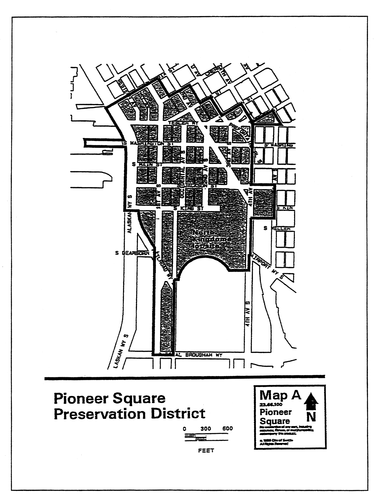

Map A for

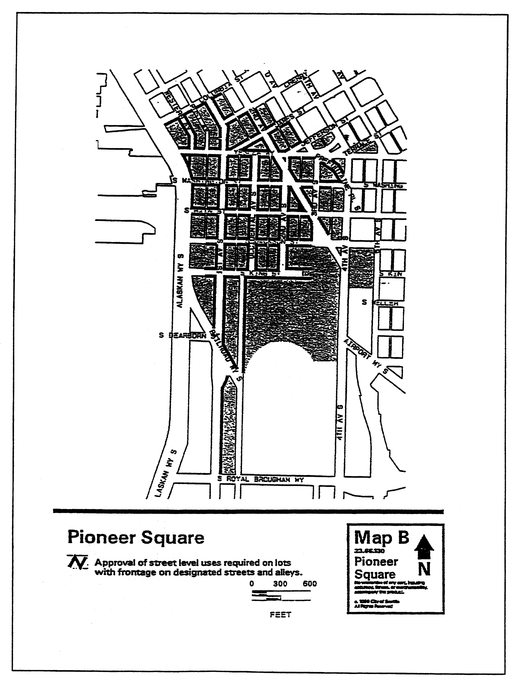

Map B for

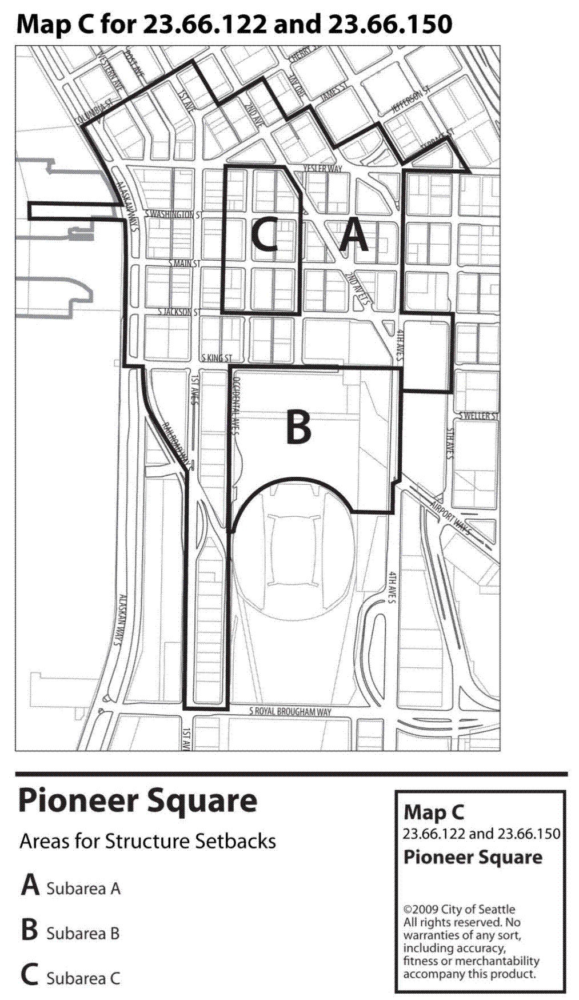

Map C for and

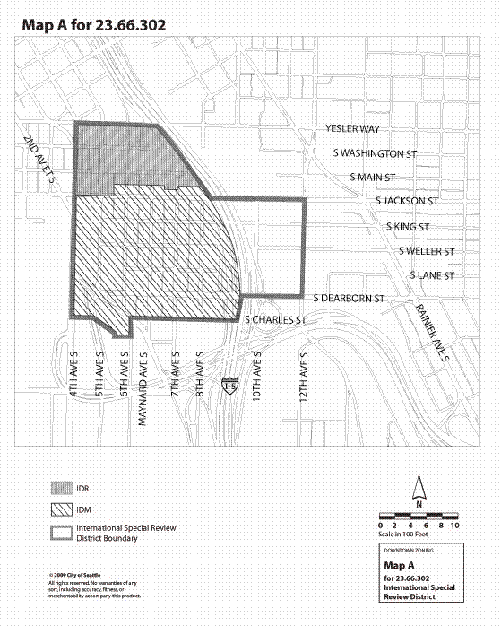

Map A for

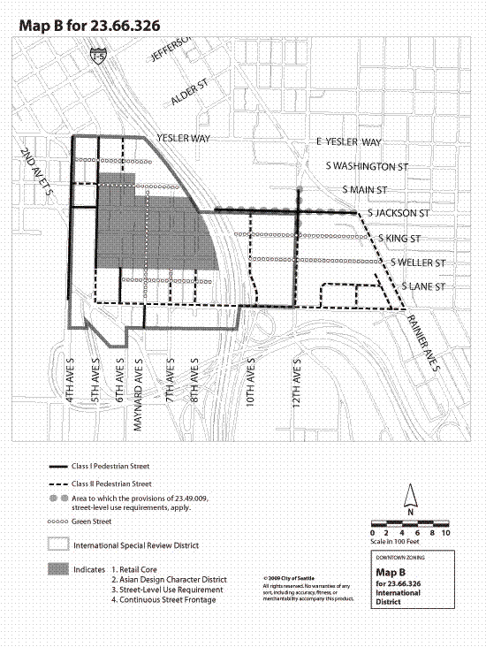

Map B for

1. Principal-use Parking Garages. Principal-use parking garages are subject to special review by the Board pursuant to Section 23.66.324 of this Land Use Code. Parking garages shall be designed so that the street-level portion of the garage is committed to pedestrian-oriented uses permitted in the District. When abutting street slopes exceed eight percent (8%) this requirement may be waived by the Department of Neighborhoods Director, following review and recommendation by the Board. View-obscuring screening may be required by the Department of Neighborhoods Director as needed to reduce adverse visual impacts on the area.
2. Accessory Parking and Loading.

    1. Parking Quantity. The number of parking spaces required for any use shall be the number required by the underlying zoning, except that restaurants shall be required to provide one space per five hundred (500) square feet for all gross floor area in excess of two thousand five hundred (2,500) square feet; motion picture theaters shall be required to provide one (1) space per fifteen (15) seats for all seats in excess of one hundred fifty (150); and other entertainment uses shall be required to provide one (1) space per four hundred (400) square feet for all gross floor area in excess of two thousand five hundred (2,500) square feet.
    2. Exceptions to Parking Quantity. To mitigate the potential impacts of required accessory parking and loading on the District, the Department of Neighborhoods Director, after review and recommendation by the Special Review Board, may waive or reduce required parking and loading under the following conditions:

        1. After incorporating high-occupancy-vehicle alternatives such as carpools and vanpools, required parking spaces exceed the net usable space in all below-grade floors; or
        2. Strict application of the parking or loading standards would adversely affect desirable characteristics of the District; or
        3. An acceptable parking plan is submitted to meet parking demands generated by the use. Acceptable elements of the parking plan may include but shall not be limited to the following:

            1. Valet parking service,
            2. Validation system,
            3. Lease of parking from parking management company,
            4. Provision of employee parking.
3. When parking is provided it shall be subject to the requirements of Section 23.54.030 of this Land Use Code.
4. Access to Parking.

    1. Access to parking shall be reviewed by the Board on a case-by-case basis, according to the following criteria:

        1. Alley access is preferred.
        2. Conflicts with pedestrian traffic, with efforts to provide continuous street facades, and with transit access shall be minimized.
    2. The number and width of curbcuts shall be as required in Section 23.54.030.
    3. Outside the International District Retail Core, if a lot does not abut an alley and abuts more than one right-of-way, the location of access to parking shall be determined according to subsection 23.49.019.H.1.
    4. The Board may recommend, and the Department of Neighborhoods Director may require, changes to proposed access to parking in order to meet the criteria of this Section 23.66.342.
5. Special Parking Restrictions.

    1. All new surface parking areas shall be accessory and may be permitted in connection with customer parking which is determined by the Board to be consistent with District goals and policies or area-wide parking plans.
    2. A sign complying with Section 23.66.338 of this Land Use Code shall be required at each parking entrance.
    3. Adequate screening shall be required along the perimeter of each new surface parking area.

### Chapter 23.67 - SOUTHEAST SEATTLE REINVESTMENT AREA

Sections:

#### 23.67.010 - Purpose and intent.

The purpose of this chapter is to implement the Southeast Seattle Reinvestment Area Policy, Resolution 28401 and adopted Land Use Policies by creating a Southeast Seattle Reinvestment Area (SESRA). The intent is to promote community revitalization and investment, and to encourage development which supports business activity and provides employment opportunities and needed services to the residents of Southeast Seattle.

#### 23.67.020 - Establishment of Southeast Seattle Reinvestment Area (SESRA).

There is established, pursuant to Chapter 23.59 of the Seattle Municipal Code, an overlay district known as the Southeast Seattle Reinvestment Area (SESRA) as shown on the Official Land Use Map, Chapter 23.32.

#### 23.67.030 - Application of regulations.

All property within the SESRA boundaries shall be subject to both the requirements of its zone classification and to the requirements of this chapter. In the event of conflict between this chapter and underlying zone requirements, the requirements of this chapter shall prevail.

#### 23.67.040 - Southeast Seattle Reinvestment Area-Rezones for boundary changes.

1. A rezone pursuant to Chapter 23.34 shall be required to change the established boundaries of the SESRA or to rezone property within the SESRA. A rezone shall be subject to the provisions of Chapter 23.76, Procedures for Master Use Permits and Council Land Use Decisions.
2. SESRA Boundaries.

    1. Areas to be included within the SESRA boundaries shall demonstrate all of the following characteristics:

        1. An existing concentration of commercial activity or commercial activity and vacant land which abuts Rainier Avenue South or Martin Luther King, Jr. Way South; or has access to these arterials without going through residential zones;
        2. Adequate existing infrastructure or improvements are being planned to accommodate increased development; and
        3. Adequate buffers or transition areas that can reduce impacts to adjacent residential or otherwise less intensively zoned areas.
    2. In addition to the above criteria, one (1) or more of the following conditions shall be met:

        1. The area contains vacant land, or vacant or dilapidated structures, parking or open storage uses and is abutting or across the street or alley from an existing concentration of commercial activity; or
        2. The area is identified by the City as a Business Improvement Area; or
        3. The area is targeted for Federal or State economic development funds; or
        4. The area can provide opportunities for expansion of existing businesses or location of new business enterprises within an existing commercial node; or
        5. The area has the potential to strengthen or reinforce a concentration of retail activity, personal services, employment centers or business incubators.
3. Rezone Criteria for Property Within SESRA. A rezone within the boundaries of the SESRA shall be subject to the general rezone criteria of Chapter 23.34 and the locational criteria for the proposed classifications. In addition, the criteria contained in this section shall also apply. No single location shall be expected to meet all criteria, nor shall the criteria be ranked in order of importance. Specific conditions may be established as part of the rezone process to ensure negative impacts on the area and its surroundings are mitigated.

    1. The proposed designation shall strengthen and reinforce existing commercial nodes, and encourage the development and retention of businesses while retaining or providing adequate buffers between commercial and residential areas; or
    2. The proposed designation shall enhance the vitality of business activity according to the following:

        1. Increase and enhance pedestrian activity, thereby increasing property surveillance and public safety, and
        2. Enable an established business to expand rather than relocate outside the Rainier Valley or increase employment and job training opportunities for residents of the surrounding area or
        3. Increase retail, entertainment, or personal services for residents of the surrounding area, or
        4. Encourage development on land which is vacant or contains abated or dilapidated buildings, or
        5. Increase recreational opportunities in Southeast Seattle.

#### 23.67.050 - Use restrictions—Prohibited uses.

1. Whether a use is permitted outright, or as a conditional use, or is prohibited is governed by the applicable provisions of the other chapters of this title; provided that in addition to uses otherwise prohibited, the following principal uses are prohibited throughout the Southeast Seattle Reinvestment Area:

    1. Outdoor storage (accessory outdoor storage permitted);
    2. Animal shelters and kennels;
    3. Helistops;
    4. Heliports;
    5. Adult motion picture theaters;
    6. Adult panorams;
    7. Salvage yards;
    8. Recycling uses;
    9. Work release centers;
    10. Construction services;
    11. Towing services.

#### 23.67.060 - Public notice requirements for rezone applications

Public notice shall be provided in accordance with the notice requirements for Type IV rezones contained in Chapter 23.76.

### Chapter 23.69 - MAJOR INSTITUTION OVERLAY DISTRICT

Sections:

#### Subchapter I - Establishment of Overlay District
##### 23.69.002 - Purpose and intent.

The purpose of this chapter is to regulate Seattle's major educational and medical institutions in order to:

1. Permit appropriate institutional growth within boundaries while minimizing the adverse impacts associated with development and geographic expansion;
2. Balance a Major Institution's ability to change and the public benefit derived from change with the need to protect the livability and vitality of adjacent neighborhoods;
3. Encourage the concentration of Major Institution development on existing campuses, or alternatively, the decentralization of such uses to locations more than two thousand five hundred (2,500) feet from campus boundaries;
4. Provide for the coordinated growth of major institutions through major institution conceptual master plans and the establishment of major institutions overlay zones;
5. Discourage the expansion of established major institution boundaries;
6. Encourage significant community involvement in the development, monitoring, implementation and amendment of major institution master plans, including the establishment of citizen's advisory committees containing community and major institution representatives;
7. Locate new institutions in areas where such activities are compatible with the surrounding land uses and where the impacts associated with existing and future development can be appropriately mitigated;
8. Accommodate the changing needs of major institutions, provide flexibility for development and encourage a high quality environment through modifications of use restrictions and parking requirements of the underlying zoning;
9. Make the need for appropriate transition primary considerations in determining setbacks. Also setbacks may be appropriate to achieve proper scale, building modulation, or view corridors;
10. Allow an increase to the number of permitted parking spaces only when it is 1) necessary to reduce parking demand on streets in surrounding areas, and 2) compatible with goals to minimize traffic congestion in the area;
11. Use the TMP to reduce the number of vehicle trips to the major institution, minimize the adverse impacts of traffic on the streets surrounding the institution, minimize demand for parking on nearby streets, especially residential streets, and minimize the adverse impacts of institution-related parking on nearby streets. To meet these objectives, seek to reduce the number of SOVs used by employees and students at peak time and destined for the campus;
12. Through the master plan: 1) give clear guidelines and development standards on which the major institutions can rely for long-term planning and development; 2) provide the neighborhood advance notice of the development plans of the major institution; 3) allow the city to anticipate and plan for public capital or programmatic actions that will be needed to accommodate development; and 4) provide the basis for determining appropriate mitigating actions to avoid or reduce adverse impacts from major institution growth; and
13. Encourage the preservation, restoration and reuse of designated historic buildings.

##### 23.69.004 - Major Institution Overlay District established.

There is hereby established pursuant to Chapter 23.59 of the Seattle Municipal Code, the Major Institution Overlay District, which shall overlay each Major Institution designated according to the provisions of Section 23.69.024. All land within the Major Institution Overlay (MIO) District shall be designated with one (1) of the following height limits as shown on the Official Land Use Map, Chapter 23.32:

<table>
<tr>
<td>Designation</td>
<td>Height Limit</td>
</tr>
<tr>
<td>MIO-37</td>
<td>37 feet</td>
</tr>
<tr>
<td>MIO-50</td>
<td>50 feet</td>
</tr>
<tr>
<td>MIO-65</td>
<td>65 feet</td>
</tr>
<tr>
<td>MIO-70</td>
<td>70 feet</td>
</tr>
<tr>
<td>MIO-90</td>
<td>90 feet</td>
</tr>
<tr>
<td>MIO-105</td>
<td>105 feet</td>
</tr>
<tr>
<td>MIO-160</td>
<td>160 feet</td>
</tr>
<tr>
<td>MIO-200</td>
<td>200 feet</td>
</tr>
<tr>
<td>MIO-240</td>
<td>240 feet</td>
</tr>
</table>

##### 23.69.006 - Application of regulations.

1. All land located within the Major Institution Overlay District shall be subject to the regulations and requirements of the underlying zone unless specifically modified by this chapter or an adopted master plan. In the event of irreconcilable differences between the provisions of this chapter and the underlying zoning regulations, the provisions of this chapter shall apply.
2. For the University of Washington, notwithstanding subsection A of this section above, the 1998 agreement between The City of Seattle and the University of Washington, or its successor, shall govern relations between the City and the University of Washington, the master plan process (formulation, approval and amendment), uses on campus, uses outside the campus boundaries, off-campus land acquisition and leasing, membership responsibilities of CUCAC, transportation policies, coordinated traffic planning for special events, permit acquisition and conditioning, relationship of current and future master plans to the agreement, zoning and environmental review authority, resolution of disputes, and amendment or termination of the agreement itself. Within the Major Institution Overlay (MIO) Boundaries for the University of Washington, development standards of the underlying zoning may be modified by an adopted master plan, or by an amendment or replacement of the 1998 agreement between the City of Seattle and University of Washington.

##### 23.69.007 - Definition of development.

1. "development" is the establishment of any new Major Institution use or the expansion of an existing Major Institution use, the relocation of an existing Major Institution use for a period of at least one (1) year, or the vacation of streets for such uses.

#### Subchapter II - Use Provisions
##### 23.69.008 - Permitted uses.

1. All uses that are functionally integrated with, or substantively related to, the central mission of a Major Institution or that primarily and directly serve the users of an institution shall be defined as Major Institution uses and shall be permitted in the Major Institution Overlay (MIO) District. Major Institution uses shall be permitted either outright or as conditional uses according to the provisions of Section 23.69.012. Permitted Major Institution uses shall not be limited to those uses which are owned or operated by the Major Institution.
2. The following characteristics shall be among those used by the Director to determine whether a use is functionally integrated with, or substantively related to, the central mission of the Major Institution. No one (1) of these characteristics shall be determinative:

    1. Functional contractual association;
    2. Programmatic integration;
    3. Direct physical circulation/access connections;
    4. Shared facilities or staff;
    5. Degree of interdependence;
    6. Similar or common functions, services, or products.
3. Major Institution uses shall be subject to the following:

    1. Major Institution uses which are determined to be heavy traffic generators or major noise generators shall be located away from abutting residential zones;
    2. Uses which require the presence of a hazardous chemical, extremely hazardous substance or toxic chemical that is required to be reported under Title III of the Superfund Amendments and Reauthorization Act of 1986 or its associated regulations, shall be reviewed by the Director. The Director shall consult with Public Health—Seattle & King County and The City of Seattle Fire Department.Based on this consultation and review, the Director may prohibit the use, or impose conditions regulating the amount and type of such materials allowed on-site, or the procedures to be used in handling hazardous or toxic materials;
    3. Where the underlying zone is commercial, uses at street level shall complement uses in the surrounding commercial area and be located in a manner that provides continuity to the commercial street front. Where the underlying zoning is a pedestrian-designated zone, the provisions of Section 23.47A.005 governing street-level uses shall apply.
4. When a use is determined to be a Major Institution use, it shall be located in the same MIO District as the Major Institution with which it is functionally integrated, or to which it is related, or the users of which it primarily and directly serves. To locate outside but within two thousand five hundred (2,500) feet of that MIO District, a Major Institution use shall be subject to the provisions of Section 23.69.022.
5. Major Institution uses, outside of, but within two thousand five hundred (2,500) feet of the boundary of the MIO District, which were legally established as of January 1, 1989 and are located on sites which are not contiguous with the MIO District shall be permitted uses in the zone in which they are located when:

    1. The use is located on a lot which was contained within the boundary of an MIO District as it existed on May 2, 1990; or
    2. The site was deleted from the MIO District by master plan amendment or renewal according to the provisions of Sections 23.69.035 and 23.69.036.
6. Uses other than those permitted under subsections A and B of this section shall be subject to the use provisions and development standards of the underlying zone.

##### 23.69.012 - Conditional uses.

The Director's report to the Council shall examine alternative locations for the helistop as identified by the major institution, including sites outside the institution's boundaries, which would accomplish the purpose of the helistop with a lesser impact upon the surrounding area.

1. All conditional uses shall be subject to the following:

    1. The use shall not be materially detrimental to the public welfare or injurious to property in the zone or vicinity in which the property is located.
    2. The benefits to the public of the use shall outweigh the negative impacts of the use.
    3. In authorizing a conditional use, adverse impacts may be mitigated by imposing conditions such as landscaping and screening, vehicular access controls and any other measures needed to mitigate adverse impacts on other properties in the zone or vicinity and to protect the public interest. The Director shall deny or recommend denial of a conditional use if it is determined that adverse impacts cannot be mitigated satisfactorily.
2. Administrative Conditional Uses.

    1. Development otherwise requiring preparation of a master plan may be permitted by the Director as an administrative conditional use according to the standards of Section 23.69.033.
    2. In considering an application for a conditional use, the Director's decision shall be based on the following criteria:

        1. Parking areas and facilities, trash and refuse storage areas, ventilating mechanisms and other noise-generating or odor-generating equipment, fixtures or facilities shall be located so as to minimize noise and odor impacts on the surrounding area. The Director may require measures such as landscaping, sound barriers, fences, mounding or berming, adjustments to parking location or setback development standards, design modification, limits on hours of operation or other similar measures to mitigate impacts; and
        2. Required landscaping shall be compatible with neighboring properties. Landscaping in addition to that required by the Code may be required to reduce the potential for erosion or excessive stormwater runoff, to minimize coverage of the site by impervious surfaces, to screen parking, or to reduce noise or the appearance of bulk and scale; and
        3. Traffic and parking impacts shall be minimized; and
        4. To reduce the impact of light and glare, exterior lighting shall be shielded or directed away from residentially zoned properties. The Director may require that the area, intensity, location or angle of illumination be limited.
3. Council Conditional Uses. Helistops, when determined to meet the criteria of Section 23.69.008, may be permitted by the Council as a Council Conditional Use when:

    1. The helistop is needed to save lives; and
    2. Use of the helistop is restricted to life-threatening emergencies; and
    3. The helistop is located so as to minimize impacts on the surrounding area.

#### Subchapter III - (Reserved)

#### Subchapter IV - Development Standards
##### 23.69.020 - Development standards.

1. Major Institution uses shall be subject to the development standards for institutions of the underlying zone in which they are located, except for the dispersion requirements of the underlying zoning for institutions.
2. Development standards for Major Institution uses within the Major Institution Overlay District, except the provisions of Chapter 23.52, may be modified through adoption of a Major Institution Master Plan according to the provisions established in Subchapter VI, Part 2 of this chapter.
3. Maximum structure heights for structures containing Major Institution uses may be allowed up to the limits established pursuant to Section 23.69.004 through the adoption of a master plan for the Major Institution. A rezone shall be required to increase maximum structure height limits above levels established pursuant to Section 23.69.004.
4. The demolition of structures containing residential uses which are not Major Institution uses shall be prohibited if the demolition is intended to provide a parking lot or structure to accommodate nonrequired parking or to reduce a parking deficit.
5. When a pedestrian designation in a commercial zone occurs along a boundary or within a campus, the blank facade standards of the underlying zoning shall apply.

##### 23.69.021 - Signs in Major Institution Overlay Districts

1. General Standards.

    1. Signs shall be stationary and shall not rotate.
    2. No flashing, changing-image, message board signs or signs using video display methods, except as permitted as defined in Section 23.55.005, Video display methods, shall be permitted.
    3. Signs may be electric, externally illuminated, or nonilluminated.
2. The following signs are permitted in all Major Institution overlay districts, regardless of the facing zone:

    1. Electric, externally illuminated or nonilluminated signs bearing the name of the occupant of a dwelling unit, not exceeding 64 square inches in area;
    2. Memorial signs or tablets, and the names of buildings and dates of building erection if cut into a masonry surface or constructed of bronze or other noncombustible materials;
    3. Signs for public facilities indicating danger and/or providing service or safety information;
    4. National, state and institutional flags.
3. Signs across a street, alley or easement from a residential zone, and signs which face an abutting lot in a residential zone, shall meet the following standards:

    1. Sign area shall be limited to:

        1. Thirty-five (35) square feet per sign face for main entrance signs;
        2. Such size as is necessary for emergency entrance signs to be clearly visible; and
        3. Twenty (20) square feet per sign face for all other signs.
    2. The number of signs permitted shall be as follows:

        1. One (1) identifying sign for each use per street frontage; plus
        2. One (1) sign for each entrance to the institution; plus
        3. Emergency entrance and directional signs as necessary.
    3. Pole, ground, roof, wall, marquee, under-marquee, projecting or combination signs shall be permitted.
    4. The maximum height of any portion of a pole sign shall be twelve (12) feet.
    5. No portion of a roof sign shall:

        1. Extend beyond the height limit of the overlay district;
        2. Exceed a height above the roof in excess of the height of the structure on which the sign is located; or
        3. Exceed a height of thirty (30) feet above the roof, measured from a point on the roofline directly below the sign or from the nearest adjacent parapet.
4. Signs across from nonresidential zones shall have no area, type or number limitations.
5. Off-premises signs shall not be permitted, except for sign kiosks.

#### Subchapter V - Uses Outside a Major Institution Overlay District
##### 23.69.022 - Uses permitted within 2,500 feet of a Major Institution Overlay District

1. A Major Institution shall be permitted to lease space, or otherwise locate a use outside a Major Institution Overlay (MIO) District, and within 2,500 feet of the MIO District boundary, subject to the following limitations:

    1. The provisions of this Section 23.69.022 shall not apply to contractual arrangements with other entities, except for leases or other agreements for occupying space.
    2. No such use shall be allowed at street level in a commercial zone, unless the use is determined to be similar to a general sales and service use, eating and drinking establishment, major durables retail sales, entertainment use or child care center and is allowed in the zone. If the use is allowed in the zone but is determined not to be similar to a general sales and service use, eating and drinking establishment, major durables retail sales, entertainment use or child care center, the Director may not allow the use at street level in a commercial zone unless provided otherwise in an adopted master plan or in a Council-approved neighborhood plan;
    3. Except as permitted in an adopted master plan, the use shall not result in the demolition of a structure(s) that contains a residential use nor shall it change a residential use to a nonresidential use.
    4. The use(s) shall conform to the use and development standards of the applicable zone.
    5. The use shall be included in the Major Institution's approved Transportation Management Program if it contains students or employees of the Major Institution.
    6. If a Master Use Permit is required for the use, the Director shall notify the Advisory Committee of the pending permit application and the committee shall be given the opportunity to comment on the impacts of the proposed use.
2. A medical service use that is over 10,000 square feet shall be permitted to locate within 2,500 feet of a medical MIO District only as an administrative conditional use subject to the conditional use requirements of subsection 23.47A.006.A.4 or subsection 23.50.014.B.12.
3. A Major Institution that leases space or otherwise locates a use in a Downtown zone shall not be subject to the limitations established in subsection 23.69.022.A or 23.69.022.B with respect to that space or use, except that subsections 23.69.022.A.3 and 23.69.022.A.4 shall apply.
4. A Major Institution that leases space or otherwise locates a use in a Master Planned Community zone is not subject to the limitations established in subsection 23.69.022.A or 23.69.022.B with respect to that space or use, except that subsection 23.69.022.A.4 applies.

##### 23.69.023 - Major Institution acquisition, merger or consolidation.

1. Notwithstanding any other provisions of Title 23, one (1) Major Institution may acquire, merge with, or otherwise consolidate with, another Major Institution.
2. Within ten (10) days of the acquisition, merger or consolidation, the new/surviving Major Institution shall notify the Director of the acquisition, merger or consolidation and the name of the new/surviving Major Institution. Upon receiving this notice, the Director shall adjust the Official Land Use Map to reflect a single, combined Major Institution Overlay (MIO) District, with the single name of the new/surviving Major Institution, but only if the two institutions are contiguous. The entire MIO District of each Major Institution shall be included in the single, combined MIO District.
3. When the determination to prepare a master plan is made pursuant to Section 23.69.026 and after acquisition, merger or consolidation, the new/surviving institution shall prepare the master plan according to the following:

    1. If the two former institutions were not contiguous, the new/surviving institution has the option of preparing a joint master plan for both contiguous portions of the Major Institution or a separate master plan for the contiguous portion of the Major Institution for which the master plan requirement is triggered.
    2. If the two former institutions were contiguous, the new/surviving institution must prepare a master plan for the single, combined Major Institution.

#### Subchapter VI - Procedures

Part 1 Major Institution Designation

##### 23.69.024 - Major Institution designation

Part 2 Major Institution Master Plan

1. Major Institution designation shall apply to all institutions that conform to the definition of Major Institution.
2. New Major Institutions.

    1. When a medical or educational institution makes application for new development, or when a medical or educational institution applies for designation as a Major Institution, the Director will determine whether the institution meets, or would meet upon completion of the proposed development, the definition of a Major Institution in Section 23.84A.025. Measurement of an institution's site or gross floor area in order to determine whether it meets minimum standards for Major Institution designation shall be according to the provisions of Section 23.86.036.
    2. If the Director determines that Major Institution designation is required, the Director may not issue any permit that would result in an increase in area of Major Institution uses until the institution is designated a Major Institution, a Major Institution Overlay District is established, and a master plan is prepared according to the provisions of Part 2, Major Institution Master Plan.
    3. The Director's determination that an application for a Major Institution designation is required will be made in the form of an interpretation subject to the procedures of Section 23.88.020.
    4. The procedures for designation of a Major Institution are as provided in Chapter 23.76, Procedures for Master Use Permits and Council Land Use Decisions. The Council will grant or deny the request for Major Institution designation by resolution.
    5. If the Council designates a new Major Institution, a Major Institution Overlay District must be established by ordinance according to the procedures for amendments to the Official Land Use Map (rezones) in Chapter 23.76, Procedures for Master Use Permits and Council Land Use Decisions.
    6. A new Major Institution Overlay District may not be established and a Major Institution Overlay District Boundary may not be expanded in single-family or Industrial zones.
    7. Boundaries of a Major Institution Overlay District and maximum height limits shall be established or amended in accordance with the rezone criteria contained in Section 23.34.124, and the purpose and intent of this chapter as described in Section 23.69.002, except that acquisition, merger or consolidation involving two Major Institutions is governed by the provisions of Section 23.69.023.
3. The MIO district designation, including height limits and master plan provisions when one has been adopted, shall be revoked for an institution which no longer meets the definition of a Major Institution. The applicable zoning provisions shall be the provisions of the existing underlying zoning classification. When an MIO district designation of an institution is to be revoked, the City may consider rezoning the institution campus. Upon determination that an institution no longer meets the definition of a Major Institution, the Director shall notify the Council. The revocation of a Major Institution designation shall be subject to the procedures set forth in Chapter 23.76, Procedures for Master Use Permits and Council Land Use Decisions, for Major Institution designation and revocation.

##### 23.69.025 - Intent of Major Institution master plans.

The intent of the Major Institution Master Plan shall be to balance the needs of the Major Institutions to develop facilities for the provision of health care or educational services with the need to minimize the impact of Major Institution development on surrounding neighborhoods.

##### 23.69.026 - Determination to prepare a master plan.

1. Any Major Institution may elect to prepare a master plan.
2. A Major Institution without an adopted master plan or with a master plan that includes an expiration date and that was adopted under Code provisions prior to the 1996 Major Institutions Ordinance shall be required to prepare a master plan in the following circumstances:

    1. The establishment of a new Major Institution Overlay (MIO) District is required according to Section 23.69.024; or
    2. Expansion of an MIO District boundary or change in a MIO District height designation is proposed; or
    3. An application is filed for a structure containing Major Institution use(s) that is located within the MIO District and would exceed the development standards of the underlying zone and is not permitted under an existing master plan, provided other means of modifying development standards that apply to similar uses located in the zone may also be sought; or
    4. A Major Institution proposes to demolish or change the use of a residential structure inside the boundaries of an MIO District, provided that a master plan need not be prepared when:

        1. The use is changed to housing for the institution, or
        2. Not more than two (2) structures containing not more than a total of four (4) dwelling units are demolished or changed to a nonresidential use within a two (2) year period and are replaced in the general vicinity by the same number of dwelling units.
3. A Major Institution with an adopted master plan that is not subject to subsection B of this section shall be required to prepare a new master plan in the following circumstances:

    1. The Major Institution proposes to increase the total amount of gross floor area allowed or the total number of parking spaces allowed within the MIO District; or
    2. A master plan has been in effect for at least ten (10) years and the institution proposes to expand the MIO District boundaries; or
    3. A master plan has been in effect for at least ten (10) years and the institution proposes an amendment to the master plan that is determined to be major according to the provisions of Section 23.69.035, and the Director determines that conditions have changed significantly in the neighborhood surrounding the Major Institution since the master plan was adopted.
4. A master plan shall not be required for replacement of existing structures where the replacement structure:

    1. Would be located on the same lot; and
    2. Would not contain uses which would require a change of use and which the Director determines would not result in an increase in adverse impacts on the surrounding area; and
    3. Would not exceed the height of the existing structure; and
    4. Would not represent a significant increase in bulk over the existing structure; and
    5. Would not represent a significant increase in gross floor area over the existing structure; and
    6. Would not significantly reduce existing open area or landscaping.
5. If an institution proposes a major amendment of unusual complexity or size, the Advisory Committee may recommend, and the Director may require, that the institution develop a new master plan.
6. The Director shall determine whether a master plan is required. The Director's determination shall be final and shall not be subject to an interpretation or appeal.

##### 23.69.028 - Major Institution master plan-General provisions.

1. A master plan may modify the following:

    1. Any development standard of the underlying zone, including structure height up to the limit established by the Major Institution Overlay (MIO) District;
    2. Limits on housing demolition or conversion within the boundaries of the MIO District;
    3. Limits on Major Institution uses at street level outside, but within two thousand five hundred feet (2,500') of, a MIO District Boundary;
    4. Single-occupancy vehicle goals and maximum parking limitations.
2. Except as provided in Section 23.69.033, an application for a permit for development which requires preparation of a master plan shall not be approved prior to adoption of the master plan by the Council.
3. Changes to the boundaries of the MIO District or to a MIO District height limit shall require a rezone in addition to adoption of a master plan or major amendment, except that a boundary adjustment caused by the acquisition, merger or consolidation of two (2) contiguous Major Institutions shall be governed by the provisions of Section 23.69.023.

##### 23.69.030 - Contents of a master plan

1. The master plan is a conceptual plan for a Major Institution consisting of three components: the development standards component, the development program component and the transportation management program component.
2. The development standards component in an adopted master plan shall become the applicable regulations for physical development of Major Institution uses within the MIO District and shall supersede the development standards of the underlying zone. Where standards established in the underlying zone have not been modified by the master plan, the underlying zone standards shall continue to apply. Proposed development standards shall be reviewed according to the criteria contained in Section 23.69.032 E, Draft Report and Recommendation of the Director. The development standards component may be changed only through a master plan amendment.
3. The development standards component of a master plan shall include the following:

    1. Existing underlying zoning of the area within the boundaries of the MIO District. If a change to the underlying zoning is proposed, the master plan shall identify the proposed zone(s), and the master plan shall be subject to rezone approval according to the procedures of Chapter 23.76, Procedures for Master Use Permits and Council Land Use Decisions; and
    2. If modifications to the underlying zone development standards are proposed, the proposed modifications and reasons for the proposed modifications or for special standards tailored to the specific institution; and
    3. Standards in the master plan shall be defined for the following:

        1. Structure setbacks along public rights-of-way and at the boundary of the MIO District,
        2. Height limits as provided for in Section 23.69.004,
        3. Lot coverage for the entire MIO District,
        4. Landscaping,
        5. Percentage of MIO District to remain in open space; and
    4. The Major Institution may choose or the Director may require the Major Institution to address the following:

        1. Transition in height and scale between development within the MIO District and development in the surrounding area,
        2. Width and depth limits for structures or measures by which a reduction in the apparent bulk of a structure may be achieved,
        3. Setbacks between structures which are not located on a public right-of-way or along the boundary of the MIO District,
        4. Preservation of historic structures which are designated on federal, state or local registers,
        5. View corridors or other specific measures intended to mitigate the impact of Major Institution development on the surrounding area,
        6. Pedestrian circulation within and through the MIO District.
4. The development program component shall include the information set forth in subsection E of this section. With regard to future development, the development program component shall describe planned physical development, defined as development which the Major Institution has definite plans to construct. The development program may describe potential physical development or uses for which the Major Institution's plans are less definite. The development program may be amended according to the provisions of Section 23.69.035 without requiring amendment of the development standards component.
5. The development program component shall include the following:

    1. A description of alternative proposals for physical development including an explanation of the reasons for considering each alternative, but only if an Environmental Impact Statement is not prepared for the master plan; and
    2. Density as defined by total maximum developable gross floor area for the MIO District and an overall floor area ratio (FAR) for the MIO District. Limits on total gross floor area and floor area ratios may also be required for sub-areas within the MIO District but only when an MIO District is over 400 acres in size or when an MIO District has distinct geographical areas; and
    3. The maximum number of parking spaces allowed for the MIO District; and
    4. A description of existing and planned future physical development on a site plan that shall contain:

        1. The height, description, gross floor area and location of existing and planned physical development, and
        2. The location of existing open space landscaping and screening, and areas of the MIO District to be designated open space. Designated open space shall be open space within the MIO District that is significant and serves as a focal point for users of the Major Institution. Changes to the size or location of designated open space requires an amendment pursuant to Section 23.69.035, and
        3. Existing public and private street layout, and
        4. Existing and planned parking areas and structures; and
    5. A site plan showing: property lines and ownership of all properties within the applicable MIO District, or areas proposed to be included in an expanded MIO District, and all structures and properties a Major Institution is leasing or using or owns within 2,500 feet of the MIO District; and
    6. Three-dimensional drawings to illustrate the height, bulk and form of existing and planned physical development. Information on architectural detailing such as window placement and color and finish materials is not required; and
    7. A site plan showing any planned infrastructure improvements and the timing of those improvements; and
    8. A description of planned development phases and plans, including development priorities, the probable sequence for such planned development and estimated dates of construction and occupancy; and
    9. A description of any planned street or alley vacations or the abandonment of existing rights-of-way; and
    10. At the option of the Major Institution, a description of potential uses, development, parking areas and structures, infrastructure improvements or street or alley vacations. Information about potential projects is for the purpose of starting a dialogue with the City and the community about potential development, and changes to this information will not require an amendment to the master plan; and
    11. An analysis of the proposed master plan's consistency with the purpose and intent of this chapter as described in Section 23.69.002; and
    12. A discussion of the Major Institution's facility decentralization plans and/or options, including leasing space or otherwise locating uses off-campus; and
    13. A description of the following shall be provided for informational purposes only. The Advisory Committee, pursuant to Section 23.69.032.D.1, may comment on the following but may not subject these elements to negotiation nor shall such review delay consideration of the master plan or the final recommendation to Council:

        1. A description of the ways in which the institution will address goals and applicable policies under Education and Employability and Health in the Human Development Element of the Comprehensive Plan, and
        2. A statement explaining the purpose of the development proposed in the master plan, including the public benefits resulting from the proposed new development and the way in which the proposed development will serve the public purpose mission of the Major Institution.
6. The Transportation Management Program component shall satisfy the requirements of Section 23.54.016. The Transportation Management Program shall include, at a minimum, the following:

    1. A description of existing and planned parking, loading and service facilities, and bicycle, pedestrian and traffic circulation systems within the institutional boundaries and the relationship of these facilities and systems to the external street system. This shall include a description of the Major Institution's impact on traffic and parking in the surrounding area; and
    2. Specific institutional programs to reduce traffic impacts and to encourage the use of public transit, carpools and other alternatives to single-occupant vehicles. Any specific agreements with the City for the provision of alternative modes of transportation shall also be included.
7. Environmental information and the master plan may be integrated into one (1) document.
8. Where two (2) or more institutions are located in close proximity to one another, the Director may require their combined land use, traffic and parking impacts on the surrounding area to be evaluated in the master plan for each institution.

##### 23.69.032 - Master plan process

1. Not less than 60 days prior to applying for a master plan, the institution shall file a notice of intent to prepare a master plan with the Director.
2. Formation of a Citizens Advisory Committee

    1. Immediately following submittal of a notice of intent to prepare a master plan, the institution shall initiate the establishment of a Citizens Advisory Committee of at least six, but no more than 12 members. In addition, all institutions with adopted master plans shall have a standing Advisory Committee.
    2. Where there is more than one Major Institution in the same general area, as determined by the Director, a single Advisory Committee serving more than one institution may be permitted.
    3. The institution, in consultation with the Director of the Department of Neighborhoods, shall develop a list of potential members to serve on the Advisory Committee. Groups from which members may be selected for appointment to the advisory committee shall include area community groups, residents, property owners, and business persons; consumer groups using the services of the institution; and any other persons or organizations directly affected by the actions of the institution. One member of the Advisory Committee shall be selected from persons in the area participating in neighborhood planning. One member of the Advisory Committee shall be a general community or citywide organization representative. To the extent possible, members of the Advisory Committee should possess expertise or experience in such areas as neighborhood organization and issues, land use and zoning, architecture or landscape architecture, economic development, building development and educational or medical services. A nonmanagement representative of the institution shall be included.
    4. Members of the Advisory Committee shall have no direct economic relationship with the institution except as provided in subsection 23.69.032.B.3.
    5. The Director of the Department of Neighborhoods shall review the list of potential members and recommend to the Council those individuals appropriate to achieve a balanced, independent and representative committee. After the recommendation has been submitted, the Department of Neighborhoods may convene the Advisory Committee. The Council may confirm the Advisory Committee composition, make changes in the size and/or composition of the Advisory Committee, or remand the matter to the Director of the Department of Neighborhoods for further action. The Council shall establish the final composition of the committee through a memorandum of agreement with the institution, prepared by the Department of Neighborhoods and adopted by resolution.
    6. Four nonvoting, ex-officio members of the Advisory Committee shall represent the Major Institution, the Seattle Department of Construction and Inspections, the Department of Neighborhoods, and the Seattle Department of Transportation.
    7. The Committee shall be staffed by the Department of Neighborhoods with the cooperation and assistance of the Major Institution. Technical assistance to the committee shall be provided by the Seattle Department of Construction and Inspections, the Seattle Department of Transportation, and the Department of Neighborhoods.
    8. During the master plan review and adoption process, the Council may, in the interest of ensuring representative community participation on the Advisory Committee, amend the size and/or composition of the Advisory Committee.
    9. The City-University Community Advisory Committee (CUCAC) shall serve as the Advisory Committee for the University of Washington.
    10. The Director of the Department of Neighborhoods shall promulgate rules applicable to advisory committees, including terms of office, selection of chairpersons, and methods of conflict resolution.
3. Application for a Master Plan.

    1. Within one hundred twenty (120) days of filing a notice of intent to prepare a master plan, the institution shall submit an application and applicable fees for a master plan. This application shall include an environmental checklist and a concept plan. The requirement for the environmental checklist may be waived if the Director and the Major Institution agree that an Environmental Impact Statement (EIS) will be prepared. The concept plan shall consist of the following:

        1. Proposed institution boundaries; and
        2. A proposed site plan including planned development and an estimate of total gross floor area proposed by the Major Institution; and
        3. Planned uses; and
        4. Any planned street vacations and planned parking location and access; and
        5. A description of alternative proposals for physical development and decentralization options, including a detailed explanation of the reasons for considering each alternative; and
        6. A description of the uses and character of the neighborhood surrounding the major institution and how the Major Institution relates to the surrounding area. This shall include pedestrian connections, physical and visual access to surrounding amenities and services, and the relationship of the Major Institution to other Major Institution development within two thousand five hundred (2,500) feet of its MIO District boundaries.
    2. The Advisory Committee shall review and may submit comments on the concept plan and if there is one, the environmental checklist.
    3. After an application for a master plan has been filed, the Director, in consultation with the institution and the Advisory Committee, shall prepare a schedule for the completion of the master plan. The timelines described in this section shall be goals, and shall form the basis for the master plan schedule. The goal of the City Council shall be to make a decision on the master plan within twenty-four (24) months from the date of application.
    4. Notice of application for a master plan shall be provided as required by Chapter 23.76, Procedures for Master Use Permits and Council Land Use Decisions.
4. Development of Master Plan

    1. The Advisory Committee shall participate directly in the formulation of the master plan from the time of its preliminary concept so that the concerns of the community and the institution are considered. The primary role of the Advisory Committee is to work with the Major Institution and the City to produce a master plan that meets the intent of Section 23.69.025. Advisory Committee comments shall focus on identifying and mitigating the potential impacts of institutional development on the surrounding community based on the purpose and intent of this Chapter 23.69 as described in Section 23.69.002 and as prescribed in Chapter 25.05, Environmental Policies and Procedures. The Advisory Committee may review and comment on the mission of the institution, the need for the expansion, public benefits resulting from the proposed new development, and the way in which the proposed development will serve the public purpose mission of the Major Institution, but these elements are not subject to negotiation nor shall such review delay consideration of the master plan or the final recommendation to Council.
    2. The Advisory Committee shall hold open meetings with the institution and City staff to discuss the master plan and resolve differences. The institution shall provide adequate and timely information to the Advisory Committee for its consideration of the content and level of detail of each of the specific elements of the master plan.
    3. The threshold determination of need for preparation of an Environmental Impact Statement (EIS) shall be made as required by Chapter 25.05, Environmental Policies and Procedures.
    4. If an EIS is required and an institution is the lead agency, it shall initiate a predraft EIS consultation with the Director. The Advisory Committee shall meet to discuss the scope of the document. The Advisory Committee shall submit its comments on the scope of the draft EIS to the lead agency and the Director before the end of the scoping comment period. The lead agency shall prepare a final scope within one week after the end of the scoping period.
    5. The institution shall prepare a preliminary draft master plan within 70 days of completion of the final scope of the EIS.
    6. If an EIS is required, the institution or Seattle Department of Construction and Inspections, whichever is lead agency, shall be responsible for the preparation of a preliminary draft EIS within 70 days of the completion of the final scope, or approval of an EIS consultant contract, whichever is later.
    7. The Advisory Committee, the Director of Transportation, the Director, and the institution shall submit comments on the preliminary draft master plan and the preliminary draft EIS to the lead agency within three weeks of receipt, or on the environmental checklist and supplemental studies if an EIS is not required. If the Seattle Department of Construction and Inspections is the lead agency, a compiled list of the comments shall be submitted to the institution within ten days of receipt of the comments.
    8. Within three weeks of receipt of the compiled comments, the institution shall review the comments and revise the preliminary draft master plan, if necessary, discussing and evaluating in writing the comments of all parties. The lead agency shall review the comments and be responsible for the revision of the preliminary draft EIS if necessary. If no EIS is required, the lead agency shall review the comments and be responsible for the annotation of the environmental checklist and revisions to any supplemental studies if necessary. Within three weeks after receipt of the revised drafts, the Director shall review the revised drafts and may require further documentation or analysis on the part of the institution. Three additional weeks may be spent revising the drafts for publication.
    9. The Director shall publish the draft master plan. If an EIS is required, the lead agency shall publish the draft EIS.
    10. The Director and the lead agency shall hold a public hearing on the draft master plan and if an EIS is required, on the draft EIS.
    11. The Advisory Committee, the Director of Transportation and the Director shall submit comments on the draft master plan and if an EIS is required, on the draft EIS within six weeks after the issuance of the draft master plan and EIS.
    12. Within 13 weeks after receipt of the comments, the institution shall review the comments on the draft master plan and shall prepare the final master plan.
    13. If an EIS is required, the lead agency shall be responsible for the preparation of a preliminary final EIS, following the public hearing and within six weeks after receipt of the comments on the draft EIS. The Director of Transportation, the Director, and the institution shall submit comments on the preliminary final EIS.
    14. The lead agency shall review the comments on the preliminary final EIS and shall be responsible for the revision of the preliminary final EIS, if necessary. The Director shall review the revised final document and may require further documentation or analysis on the part of the institution.
    15. Within seven weeks after preparation of the preliminary final EIS, the Director shall publish the final master plan and, if an EIS is required, the lead agency shall publish the final EIS.
5. Draft Report and Recommendation of the Director.

    1. Within five (5) weeks of the publication of the final master plan and EIS, the Director shall prepare a draft report on the application for a master plan as provided in Section 23.76.050, Report of the Director.
    2. In the Director's Report, a determination shall be made whether the planned development and changes of the Major Institution are consistent with the purpose and intent of this chapter, and represent a reasonable balance of the public benefits of development and change with the need to maintain livability and vitality of adjacent neighborhoods. Consideration shall be given to:

        1. The reasons for institutional growth and change, the public benefits resulting from the planned new facilities and services, and the way in which the proposed development will serve the public purpose mission of the major institution; and
        2. The extent to which the growth and change will significantly harm the livability and vitality of the surrounding neighborhood.
    3. In the Director's Report, an assessment shall be made of the extent to which the Major Institution, with its proposed development and changes, will address the goals and applicable policies under Education and Employability and Health in the Human Development Element of the Comprehensive Plan.
    4. The Director's analysis and recommendation on the proposed master plan's development program component shall consider the following:

        1. The extent to which the Major Institution proposes to lease space or otherwise locate a use at street level in a commercial zone outside of, but within two thousand five hundred (2,500) feet of, the MIO District boundary that is not similar to a personal and household retail sales and service use, eating and drinking establishment, customer service office, entertainment use or child care center but is allowed in the zone. To approve such proposal, the Director shall consider the criteria in Section 23.69.035 D3;
        2. The extent to which proposed development is phased in a manner which minimizes adverse impacts on the surrounding area. When public improvements are anticipated in the vicinity of proposed Major Institution development or expansion, coordination between the Major Institution development schedule and timing of public improvements shall be required;
        3. The extent to which historic structures which are designated on any federal, state or local historic or landmark register are proposed to be restored or reused. Any changes to designated Seattle Landmarks shall comply with the requirements of the Landmarks Preservation Ordinance. The Major Institution's Advisory Committee shall review any application to demolish a designated Seattle Landmark and shall submit comments to the Landmarks Preservation Board before any certificate of approval is issued;
        4. The extent to which the proposed density of Major Institution development will affect vehicular and pedestrian circulation, adequacy of public facilities, capacity of public infrastructure, and amount of open space provided;
        5. The extent to which the limit on the number of total parking spaces allowed will minimize the impacts of vehicular circulation, traffic volumes and parking in the area surrounding the MIO District.
    5. The Director's analysis and recommendation on the proposed master plan's development standards component shall be based on the following:

        1. The extent to which buffers such as topographic features, freeways or large open spaces are present or transitional height limits are proposed to mitigate the difference between the height and scale of existing or proposed Major Institution development and that of adjoining areas. Transition may also be achieved through the provision of increased setbacks, articulation of structure facades, limits on structure height or bulk or increased spacing between structures;
        2. The extent to which any structure is permitted to achieve the height limit of the MIO District. The Director shall evaluate the specified limits on structure height in relationship to the amount of MIO District area permitted to be covered by structures, the impact of shadows on surrounding properties, the need for transition between the Major Institution and the surrounding area, and the need to protect views;
        3. The extent to which setbacks of Major Institution development at ground level or upper levels of a structure from the boundary of the MIO District or along public rights-of-way are provided for and the extent to which these setbacks provide a transition between Major Institution development and development in adjoining areas;
        4. The extent to which allowable lot coverage is consistent with permitted density and allows for adequate setbacks along public rights-of-way or boundaries of the MIO District. Coverage limits should insure that view corridors through Major Institution development are enhanced and that area for landscaping and open space is adequate to minimize the impact of Major Institution development within the MIO District and on the surrounding area;
        5. The extent to which landscaping standards have been incorporated for required setbacks, for open space, along public rights-of-way, and for surface parking areas. Landscaping shall meet or exceed the amount of landscaping required by the underlying zoning. Trees shall be required along all public rights-of-way where feasible;
        6. The extent to which access to planned parking, loading and service areas is provided from an arterial street;
        7. The extent to which the provisions for pedestrian circulation maximize connections between public pedestrian rights-of-way within and adjoining the MIO District in a convenient manner. Pedestrian connections between neighborhoods separated by Major Institution development shall be emphasized and enhanced;
        8. The extent to which designated open space maintains the patterns and character of the area in which the Major Institution is located and is desirable in location and access for use by patients, students, visitors and staff of the Major Institution;
        9. The extent to which designated open space, though not required to be physically accessible to the public, is visually accessible to the public;
        10. The extent to which the proposed development standards provide for the protection of scenic views and/or views of landmark structures. Scenic views and/or views of landmark structures along existing public rights-of-way or those proposed for vacation may be preserved. New view corridors shall be considered where potential enhancement of views through the Major Institution or of scenic amenities may be enhanced. To maintain or provide for view corridors the Director may require, but not be limited to, the alternate spacing or placement of planned structures or grade-level openings in planned structures. The institution shall not be required to reduce the combined gross floor area for the MIO District in order to protect views other than those protected under City laws of general applicability.
    6. The Director's report shall specify all measures or actions necessary to be taken by the Major Institution to mitigate adverse impacts of Major Institution development that are specified in the proposed master plan.
6. Draft Advisory Committee Report.

    1. At the same time the Director is preparing a written report on the master plan application, the Advisory Committee shall prepare a written report of its findings and recommendations on the final master plan. The Advisory Committee report shall include, in addition to its recommendations, the public comments it received. The document may incorporate minority reports.
    2. The Advisory Committee report shall set forth any issues which the committee believes were inadequately addressed in the final master plan and final EIS and clearly state the committee's position on these issues.
    3. The Advisory Committee report shall include a record of committee meetings, including the meetings' minutes.
7. Preparation of Final Director's Report and Final Advisory Committee Report.

    1. The Director shall submit the draft Director's report to the Advisory Committee and the institution for their review.
    2. Within three (3) weeks after receipt of the draft Director's Report, the Advisory Committee and the institution shall review and submit comments to the Director on the draft Director's Report.
    3. Within two (2) weeks after receipt of the Advisory Committee's and institution's comments, the Director shall review the comments, and prepare a final Director's report using the criteria in subsection E of this section. The Director shall address each of the issues in the Advisory Committee's comments on the draft Director's Report. In addition, on those issues where the Director's recommendation differs from the Advisory Committee's recommendations, the Director shall include explanation of the difference.
    4. The Director shall submit the final Director's Report to the Advisory Committee.
    5. Within two (2) weeks after receipt of the final Director's Report, the Advisory Committee shall finalize its report according to subsection F of this section. The Advisory Committee report shall also include comments on the final Director's Report.
8. Hearing Examiner Consideration of the Master Plan.

    1. The Hearing Examiner shall review the Director's report and recommendation and the Advisory Committee's report on the Director's report, as provided in Section 23.76.052.
    2. If the Hearing Examiner considers the proposed master plan and all recommendations for changes, alternatives, mitigating measures and conditions, and determines that a significant master plan element or environmental issue was not adequately addressed by the proposed master plan, the Hearing Examiner may request the institution to prepare new proposals on the issues identified, may request the Director to conduct further analysis or provide clarification, and may request the Advisory Committee to reconvene for the limited purpose of commenting on the new proposals. The new proposals shall also be submitted to the Director, Advisory Committee and parties of record for comment. After the new proposals and comments have been received, the Hearing Examiner may:

        1. Remand the new proposals and Advisory Committee comments and recommendation to the Director for further consideration and report; or
        2. Hold the hearing record open for evidence on the new proposals, the Advisory Committee comments and recommendation, and/or any comments pertaining to the limited issues which were presented by other parties of record.
    3. The Hearing Examiner shall submit a recommendation to the Council on the proposed master plan within 30 days following the hearing. In addition to the Hearing Examiner's recommendation, the Hearing Examiner shall transmit to the Council the proposed master plan, environmental documentation, the Advisory Committee's reports, and the report and recommendation of the Director.
9. Council Consideration of the Hearing Examiner's Recommendation.

    1. The Council shall review and consider the Hearing Examiner's recommendation as provided in Section 23.76.054. The goal of the Council shall be to take final action on the Hearing Examiner's recommendation no later than three months after the date it receives the recommendation.
    2. If the Council examines the proposed master plan and all recommendations for changes, alternatives, mitigating measures and conditions, and determines that a significant master plan element was not adequately addressed by the proposed master plan, the Council may remand the master plan for submission of additional information and/or new proposal(s) on the issue determined to be inadequately addressed, in a time frame specified in the remand. The institution shall submit the additional information and/or new proposals to the Advisory Committee, to the parties of record to the Council decision to remand, and to the Director. The Advisory Committee shall prepare and submit comments and a report to the Director. The Director shall submit a report and recommendation on the additional information and/or new proposal(s) to the Hearing Examiner. The Hearing Examiner shall consider the additional information and/or new proposal(s) and submit a recommendation to Council pursuant to subsection 23.69.32.H.
10. Council decision

    1. The Council's decision to adopt, adopt with conditions, or deny an application for a Major Institution Master Plan shall comply with the requirements of Section 23.76.056.
    2. Adoption of a master plan shall be by ordinance.
11. Requirement for compiled plan. Within 30 days of adoption of a master plan by the Council, the institution shall submit a draft copy of the compiled adopted plan for the Director's review and approval. This compiled plan shall incorporate all changes and conditions imposed during the plan approval process. The Director shall review the compiled plan within 30 days of receipt of the plan, and may request corrections or clarifications if necessary. Upon the Director's approval, the institution shall submit six written copies of the compiled adopted plan to the Director. The Director shall keep one copy and distribute the other five copies to the City Clerk's Office, the Department of Neighborhoods and the Seattle Public Library (one copy for the main downtown library and two copies to go to the two branch libraries nearest the institution). The institution shall also submit one copy of the compiled adopted plan in electronic format for the City to post on the City of Seattle Official Web Site. No Master Use Permit for development first permitted in the adopted plan shall be issued until the compiled plan has been reviewed and approved by the Director except as provided in Section 23.69.033.

##### 23.69.033 - Approval of master use permits prior to master plan adoption.

An institution may submit an application for development requiring a master plan prior to the master plan's adoption at any time following application for a master plan. The application may be approved if the following conditions are met:

1. Development proposed in the Master Plan:

    1. The Draft Environmental Impact Statement (DEIS) and the draft master plan have been published; and
    2. The development standards shall be established through the conditional use process; and either
    3. The end of the schedule for submittal to Council of the master plan has been reached, and

        1. Review of the application has been completed by the advisory committee and it has made a recommendation to the Director, and
        2. The Council has approved the development as a Council Conditional Use according to the criteria of Section 23.69.012 A; or
    4. The advisory committee has reviewed the application and has recommended by a three-fourths (¾) vote of all advisory committee members, with at least six (6) affirmative votes, approval of the application, and

        1. The Director has approved the development as an Administrative Conditional Use according to the criteria of Section 23.69.012;
2. Development not proposed in the Master Plan:

    1. The conditions of subsection A of this section have been met; and
    2. The institution shall provide a statement describing the unforeseen conditions or circumstances which warrant the need to include the proposed development; and
    3. An analysis of the environmental impacts of the new proposal shall be incorporated into the environmental analysis of the proposed master plan and shall be reviewed by the advisory committee; and
    4. The published final master plan and final EIS shall be amended to include the proposed development.

##### 23.69.034 - Effect of master plan adoption.

1. After a master plan has been adopted, the institution may develop in accordance with the adopted master plan.
2. The Director may approve applications requiring a master plan prior to final adoption of the master plan subject to the provisions of Section 23.04.040 F, Section 23.04.040 G, or Section 23.69.033.
3. The Director shall not issue any permit for any development which has not been included within the master plan unless the institution has met the requirements of Section 23.69.035, Master plan amendment.
4. Applications for master use permits for development contained in the adopted master plan shall be subject to the requirements of Chapter 25.05, Environmental Policies and Procedures.
5. The adopted master plan shall be referenced on the Official Land Use Map and placed on file in the Department.
6. Following adoption of a master plan, the citizens advisory committee shall continue to advise the institution and the City regarding implementation or renewal of the master plan or amendments to the master plan. If more than one (1) major institution is designated within the same general area, individual advisory committees may be consolidated into one (1) committee. The committee shall meet as necessary but no less than once annually to review the status of the master plan.
7. When a master plan has been adopted prior to the effective date of these provisions and there is no standing advisory committee, an advisory committee shall be established in accordance with the provisions of subsection B of Section 23.69.032 at the time an application for an amendment to the master plan, requiring Council approval, is made.
8. The Advisory Committee and the neighborhood planning group from the surrounding area, if applicable, will be notified of master use permit (MUP) applications for Major Institution uses within the Major Institution Overlay (MIO) District and for Major Institution structures outside of but within two thousand five hundred feet (2,500') of the MIO District boundaries, and shall have an opportunity to review and comment on the applications if there is a discretionary decision and formal comment period as part of the MUP.
9. The institution shall provide an annual status report to the Director and the Advisory Committee which shall detail the progress the institution has made in achieving the goals and objectives of the master plan. The annual report shall contain the following information:

    1. The status of projects which were initiated or under construction during the previous year;
    2. The institution's land and structure acquisition, ownership and leasing activity outside of but within two thousand five hundred feet (2,500') of the MIO District boundary;
    3. Progress made in achieving the goals and objectives contained in the transportation management program towards the reduction of single-occupant vehicle use by institution employees, staff and/or students; and
    4. Progress made in meeting conditions of master plan approval.

##### 23.69.035 - Changes to master plan.

1. A proposed change to an adopted master plan shall be reviewed by the Director and determined to be an exempt change, a minor amendment, or a major amendment.
2. Exempt Changes. An exempt change shall be a change to the design and/or location of a planned structure or other improvement from that shown in the master plan, which the Director shall approve without publishing an interpretation. Any new gross floor area or parking space(s) must be accompanied by a decrease in gross floor area or parking space(s) elsewhere if the total gross floor area or parking spaces permitted for the entire MIO District or, if applicable, the subarea would be exceeded. Each exempt change must meet the development standards for the MIO District. Exempt changes shall be:

    1. Any new structure or addition to an existing structure not approved in the master plan that is twelve thousand (12,000) square feet of gross floor area or less; or
    2. Twenty (20) or fewer parking spaces not approved in the master plan; or
    3. An addition to a structure not yet constructed but approved in the master plan that is no greater than twenty percent (20%) of the approved gross floor area of that structure or twenty thousand (20,000) square feet, whichever is less; or
    4. Any change in the phasing of construction, if not tied to a master plan condition imposed under approval by the Council; or
    5. Any increase in gross floor area below grade.
3. Amendments. The Advisory Committee shall be given the opportunity to review a proposed minor or major amendment and submit comments on whether it should be considered minor or major, and what conditions (if any) should be imposed if it is minor. The Director shall determine whether the amendment is minor or major according to subsections D and E of this section. The Director's decision that a proposed amendment is minor or major shall be made in the form of an interpretation subject to the procedures of Chapter 23.88, Rules; Interpretation. If the Director and the Major Institution agree that a major amendment is required based on subsection E of this section, the interpretation process may be waived, and the amendment and environmental review process shall be subject to the provisions of subsection G of this section. After the Director makes a decision on whether an amendment is minor or major, the Advisory Committee shall be notified.
4. Minor Amendments. A proposed change to an adopted master plan shall be considered and approved as a minor amendment when it is not an exempt change according to subsection B of this section, when it is consistent with the original intent of the adopted master plan, and when it meets at least one of the following criteria:

    1. The amendment will not result in significantly greater impacts than those contemplated in the adopted master plan; or
    2. The amendment is a waiver from a development standard or master plan condition, or a change in the location or decrease in size of designated open space, and the proposal does not go beyond the minimum necessary to afford relief and will not be materially detrimental to the public welfare or injurious to the property or improvements in the vicinity in which the Major Institution is located; or
    3. The amendment is a proposal by the Major Institution to lease space or otherwise locate a use at street level in a commercial zone outside an MIO District, and within two thousand five hundred feet (2,500') of the MIO District boundary, and the use is allowed in the zone for but not permitted pursuant to Section 23.69.022. In making the determination whether the amendment is minor, the Director shall consider the following factors:

        1. Whether an adequate supply of commercially zoned land for business serving neighborhood residents will continue to exist, and
        2. Whether the use will maintain or enhance the viability or long term potential of the neighborhood-serving character of the area, and
        3. Whether the use will displace existing neighborhood-serving commercial uses at street level or disrupt a continuous commercial street front, particularly of personal and household retail sales and service uses, and
        4. Whether the use supports neighborhood planning goals and objectives as provided in a Council-approved neighborhood plan.
5. Major Amendments. A proposed change to an adopted master plan shall be considered a major amendment when it is not an exempt change according to subsection B of this section or a minor amendment according to subsection D of this section. In addition, any of the following shall be considered a major amendment:

    1. An increase in a height designation or the expansion of the boundary of the MIO District; or
    2. Any change to a development standard that is less restrictive; or
    3. A reduction in housing stock outside the boundary but within two thousand five hundred feet (2,500') of the MIO District, other than within a Downtown zone, that exceeds the level approved in an adopted master plan; or
    4. A change to the single-occupancy vehicle goal of an approved transportation management program that increases the percentage of people traveling by single-occupancy vehicle; or
    5. A use that requires Council Conditional Use approval, including but not limited to a helistop or a major communication utility, that was not described in an adopted master plan; or
    6. The update of an entire development program component of a master plan that was adopted under Code provisions prior to the 1996 Major Institutions Ordinance where the institution proposes an increase to the total amount of gross floor area allowed or the total number of parking spaces allowed under the institution's existing development program component within the MIO District.
6. If the Director, after reviewing any Advisory Committee recommendation, determines that a proposed major amendment is of unusual complexity or size, the Director may require that the institution prepare a new master plan subject to Section 23.69.032.
7. If an amendment is determined to be major, the amendment and environmental review process shall be subject to the provisions of Section 23.69.032, Master plan process. However, a concept plan and preliminary draft plan shall not be required. Instead, the Major Institution shall submit a major amendment draft report as part of the application stating which parts of the master plan are proposed to be amended. If an EIS is required for the major amendment, the draft EIS shall be prepared after submittal of the major amendment draft report. After comments are received on the major amendment draft report, the institution shall prepare the major amendment final report and if required, the final EIS. If an EIS is not required for the major amendment, the Director is not required to hold a public hearing on the major amendment draft report.
8. Noncontiguous areas that are included in a MIO District as a result of a previously adopted master plan shall be deleted from the MIO District at the time a major amendment is approved unless the noncontiguous area was a former and separate MIO District. The change to the MIO District boundaries shall be in accordance with the procedures for City-initiated amendments to the Official Land Use Map as provided in Chapter 23.76, Procedures for Master Use Permits and Council Land Use Decisions, and shall not be subject to the rezone criteria contained in Section 23.34.124.

##### 23.69.036 - Master plan renewal.

1. The process for renewal of a master plan's development program component shall follow the procedures provided in Section 23.69.032, Master plan process.
2. Noncontiguous areas which are included in a MIO District as a result of a previously adopted master plan shall be deleted from the MIO District at the time a new master plan development program component is adopted, unless the noncontiguous area was a former and separate MIO District. The change to the MIO District boundaries shall be in accordance with the procedures for City-initiated amendments to the Official Land Use Map as provided in Chapter 23.76, Procedures for Master Use Permits and Council Land Use Decisions, and shall not be subject to the rezone criteria contained in Section 23.34.124.

### Chapter 23.71 - NORTHGATE OVERLAY DISTRICT

Sections:

#### Subchapter I - Establishment of Overlay District
##### 23.71.002 - Purpose and intent.

The purpose of this chapter is to implement the Northgate Area Comprehensive Plan by regulating land use and development within the Northgate Overlay District in order to:

1. Create an environment in the Northgate Area that is more amenable to pedestrians and supportive of commercial development; and
2. To protect the residential character of residential neighborhoods; and
3. Support the use of Northgate as a regional high-capacity transportation center.

##### 23.71.004 - Northgate Overlay District established.

There is hereby established pursuant to Chapter 23.59 of the Seattle Municipal Code, the Northgate Overlay District, as shown on the City's Official Land Use Map, Chapter 23.32 and Map A.

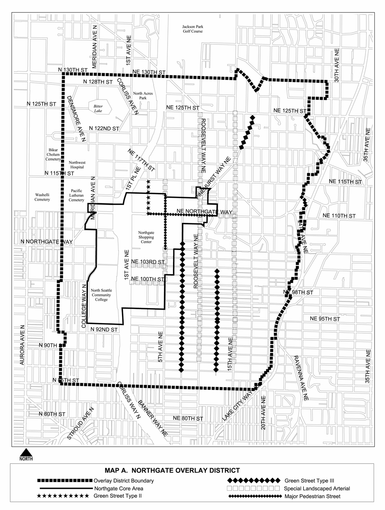

##### 23.71.006 - Application of regulations.

All land located within the Northgate Overlay District is subject to regulations of the underlying zone unless specifically modified by the provisions of this chapter. Where the boundaries of the Northgate Overlay District overlap with the boundaries of the Major Institution Overlay District, the zoning underlying a major institution shall be as modified by the Northgate Overlay District. In the event of irreconcilable differences between the provisions of the Northgate Overlay District and the underlying zone, the provisions of this chapter apply, except that where a conflict exists between the provisions of this chapter and Chapter 23.69, Major Institution Overlay District, the provisions of Chapter 23.69 take precedence, provided that the major institution may be granted an exception pursuant to SMC Section 23.71.026.

#### Subchapter II - Development Standards

Part 1 Northgate Overlay District Development Standards

##### 23.71.007 - Substantial development.

For the purposes of this chapter, "substantial development" means any new development, or expansion or addition to existing development, when the new development, expansion or addition exceeds four thousand (4,000) square feet in gross floor area, excluding accessory parking area.

##### 23.71.008 - Development along major pedestrian streets.

1. Northeast Northgate Way (from Third Avenue Northeast to 11th Avenue Northeast) and Fifth Avenue Northeast (from Northeast 113th Street to Northeast 105th Street) are designated as Major Pedestrian Streets as shown on Map A. Proposed use and development of property zoned commercial and abutting these streets shall meet the standards of this section.
2. Standards for Required Street-level Uses.

If a portion of the major pedestrian street frontage is required for access to on-site parking due to limited lot dimension, the Director may permit less than sixty (60) percent of the frontage to be occupied by such uses.

    1. A minimum of sixty (60) percent of a commercially zoned lot's frontage on a major pedestrian street shall be occupied by one or more of the following uses, referred to in this section as "required street-level uses," provided that drive-in businesses and outdoor storage are prohibited:

        1. General sales and services;
        2. Major durables retail sales;
        3. Eating and drinking establishments;
        4. Entertainment uses;
        5. Lodging uses;
        6. Public libraries;
        7. Parks and open spaces.
    2. A minimum of eighty (80) percent of each structure fronting on a major pedestrian street must be occupied at street level by required street-level uses or a building lobby permitting access to uses above or behind street-front uses. In no case may pedestrian access to uses above or behind required street-front uses exceed twenty (20) percent of the structure's major pedestrian street front. The remaining twenty (20) percent of the structure's street frontage may contain other permitted uses or pedestrian entrances (Exhibit 23.71.008 A).
    3. Street-level uses must occupy a minimum of the first ten (10) feet above sidewalk grade.
    4. All required street-level uses along major pedestrian streets may be set back no more than ten (10) feet from the street lot line, except as necessary to provide open space as defined in Section 23.71.014 C or for bedrooms in a lodging structure, which may be set back a maximum of fifteen (15) feet. The owner shall design the area subject to this setback to include special pavers, as an extension of the sidewalk or with landscaping.
    5. The principal entrances to required street-level uses on major pedestrian streets shall have direct access to the sidewalk and be within three (3) feet of the sidewalk grade elevation.
    6. General sales and service uses or major durables retail sales uses, in each case greater than thirty thousand (30,000) square feet may locate a principal pedestrian entrance on a facade oriented to a parking area or the major pedestrian street. Where a principal pedestrian entrance is oriented to a parking area, an additional pedestrian entrance shall be located along the major pedestrian street. In lieu of the additional entrance, the owner may provide a ten (10) foot wide, landscaped pedestrian walkway from the major pedestrian street to the principal pedestrian entrance, provided that the walkway does not go through other businesses or parking areas.
3. Parking Location and Screening. The following standards apply along major pedestrian streets:

    1. Parking, or access to parking, shall not exceed forty (40) percent of a lot's frontage on a major pedestrian street.
    2. Parking shall be located to the rear or side of a structure, within or under the structure, or within eight hundred (800) feet of the lot to which it is accessory.
    3. Where parking within a structure occupies any portion of the major pedestrian street level of the structure, the parking shall be screened from public view from the major pedestrian street(s) by a street-level facade. The street-level facade shall be enhanced by architectural detailing, artwork, landscaping, or similar treatment that will add visual interest to the facade.
    4. The perimeter of each floor of parking which is eight (8) feet or more above sidewalk grade shall have an opaque screen at least three and one-half (3½) feet high at its perimeter.
    5. Surface parking areas shall be set back a minimum of fifteen (15) feet from the major pedestrian street lot line. The setback area, excluding driveways, shall be provided as landscaped or usable open space, as defined in Section 23.71.014.
    6. Any nonconformity with respect to location, screening and landscaping of an existing parking area shall be eliminated at the time of a substantial development, if the area of the nonconformity is between the substantial development and the major pedestrian street. This requirement shall apply regardless of whether the substantial development increases lot coverage.
4. Parking Access and Curb Cuts.

    1. When a lot abuts an alley which meets the standards of Section 23.53.030 C, access to parking shall be from the alley.
    2. When a lot does not abut an improved alley, and the lot fronts on more than one (1) street, at least one of which is not a major pedestrian street, access to parking shall be from a street which is not a major pedestrian street.
    3. If the lot does not abut an improved alley, and only abuts a major pedestrian street(s), access from the major pedestrian streets shall be limited to one (1), two (2) way curb cut within any three hundred (300) foot segment of that lot. For purposes of this subsection, a segment of a lot shall be measured as a lot's continuous streetside lot line unbroken by streets, alleys or property owned by another. A segment may front on two or more streets around corners.
5. Sidewalks.

    1. The owner shall construct a sidewalk no less than twelve (12) feet in width.
    2. The owner shall plant street trees adjacent to the major pedestrian street. The trees shall meet criteria prescribed by the Director of Transportation.
    3. Planting strips are prohibited along major pedestrian streets.
    4. The owner shall install street furniture and planting boxes adjacent to the major pedestrian street. The installation shall conform to the Right-of-Way Improvements Manual.
6. Street Facade Standards.

    1. Transparency Requirements. Sixty (60) percent of the width of the facade of a structure along the major pedestrian street shall be transparent. Clear or lightly tinted glass, with comparable visibility into the structure as clear glass, in windows, doors and display windows, which must be a minimum of four (4) feet deep, shall be considered transparent. Transparent areas shall allow unobstructed views into the structure or into display windows, which must be a minimum of four (4) feet deep, from the outside.
    2. Blank Facades.

        1. Any portion of a facade which is not transparent shall be considered to be a blank facade.
        2. Blank facade segments shall not exceed thirty (30) feet along the major pedestrian street front.
        3. Blank facade segments which are separated by transparent areas of at least two (2) feet in width shall be considered separate facade segments for the purposes of this section.
    3. Transparent and blank facade standards apply to the area of a facade between two (2) feet and eight (8) feet above the sidewalk.
7. Overhead Weather Protection.

    1. Continuous overhead weather protection (i.e., canopies, awnings, marquees, and arcades) is required along at least sixty (60) percent of the street frontage of a commercial structure on a major pedestrian street.
    2. The overhead weather protection must be provided over the sidewalk, or over a walking area within ten (10) feet immediately adjacent to the sidewalk. When provided adjacent to the sidewalk, the covered walking area must be at the same grade or within eighteen (18) inches of sidewalk grade and meet Washington state requirements for barrier-free access.
    3. The covered area shall have a minimum width of six (6) feet, unless there is a conflict with street trees or utility poles, in which case the width may be adjusted to accommodate such features.
    4. The lower edge of the overhead weather protection shall be a minimum of eight (8) feet and a maximum of twelve (12) feet above the sidewalk for projections extending a maximum of six (6) feet. For projections extending more than six (6) feet from the structure, the lower edge of the weather protection shall be a minimum of ten (10) feet and a maximum of fifteen (15) feet above the sidewalk.

##### 23.71.010 - Green streets.

1. Green streets are identified on Map A.
2. Where an owner proposes substantial development adjacent to a street classified as a green street, the owner shall construct street and pedestrian improvements which meet standards promulgated by the Director and the Director of Transportation.

##### 23.71.012 - Special landscaped arterials

1. Special landscaped arterials are those arterials identified on Map A.
2. If an owner proposes substantial development on lots abutting special landscaped arterials, the owner shall provide the following:

    1. Street trees meeting standards established by the Director of Seattle Department of Transportation.
    2. A 6 foot planting strip and 6 foot sidewalk if the lot is zoned SF, LR1, or LR2.
    3. A 6 foot planting strip and a 6 foot sidewalk, or, at the owner's option, a 12 foot sidewalk without a planting strip, if the lot is zoned NC2, NC3, RC, LR3, or MR.
    4. Pedestrian improvements, as determined by the Director of the Seattle Department of Transportation, such as, but not limited to special pavers, lighting, benches and planting boxes.

##### 23.71.014 - Open space

Table AMinimum Square Footage RequirementsFor Usable Open Space

<table>
<tr>
<td></td>
<td>Minimum Width</td>
<td>Minimum Area</td>
</tr>
<tr>
<td>Active park</td>
<td>80'</td>
<td>11,000 square feet</td>
</tr>
<tr>
<td>Atrium/greenhouse</td>
<td>40'</td>
<td>2,000 square feet</td>
</tr>
<tr>
<td>Courtyard</td>
<td>30'</td>
<td>2,000 square feet</td>
</tr>
<tr>
<td>Galleria</td>
<td>20'</td>
<td>2,000 square feet</td>
</tr>
<tr>
<td>Landscaped interior—block pedestrian connections</td>
<td>10'</td>
<td>no minimum area</td>
</tr>
<tr>
<td>Passive park</td>
<td>100'</td>
<td>22,000 square feet</td>
</tr>
<tr>
<td>Public meeting space</td>
<td>30'</td>
<td>1,500 square feet</td>
</tr>
<tr>
<td>Terrace</td>
<td>10'</td>
<td>800 square feet</td>
</tr>
<tr>
<td>Town square</td>
<td>80'</td>
<td>11,000 square feet</td>
</tr>
<tr>
<td>Urban garden</td>
<td>10'</td>
<td>no minimum area</td>
</tr>
<tr>
<td>Urban plaza</td>
<td>50'</td>
<td>3,500 square feet</td>
</tr>
</table>

1. Active Park. An active park shall be essentially level, accessible from a public right-of-way and shall include areas for active recreation such as, but not limited to, ball fields, courts and children's play area(s). Public seating shall be provided.
2. Atrium/Greenhouse, Galleria. An atrium/greenhouse or galleria shall provide a large, enclosed, weather-protected space, generally covered by transparent and/or translucent material and meeting the following minimum standards and guidelines:

    1. Location and Access. The location of an atrium/greenhouse or galleria shall be highly visible from the street and easily accessible to pedestrians. Pedestrian access should be designed to improve overall pedestrian circulation on the block.
    2. Minimum Standards.

        1. The minimum height shall be thirty feet (30').
        2. A minimum of fifteen percent (15%) of an atrium/greenhouse or galleria shall be landscaped.
        3. A minimum of fifteen percent (15%) of an atrium/greenhouse or galleria shall be reserved for public seating at a rate of one lineal foot for every thirty (30) square feet of floor area or one lineal foot of public seating area for every thirty (30) square feet of floor area.
        4. A minimum of thirty-five percent (35%) of the perimeter of an atrium/greenhouse or galleria shall be occupied by retail sales and service uses and sixty percent (60%) of every retail frontage on the atrium/greenhouse or galleria shall be transparent.
        5. Perimeter walls of an atrium/greenhouse or galleria, excluding the wall of the structure, shall be no more than fifteen percent (15%) blank. All nontransparent perimeter walls shall include measures to reduce the effect of the blank wall including, but not limited to, architectural detailing, landscaping, modulation or art.
3. Courtyard. A courtyard shall meet the following minimum standards and guidelines:

    1. Location and Access. A courtyard shall be adjacent to or attached to a structure or public sidewalk and shall be highly visible from adjacent sidewalks and public areas and have direct access to the streets on which it fronts. A courtyard shall be easily accessible and inviting to pedestrians and provide enclosure through use of design elements such as pedestrian walkways, structures containing retail uses, low planters or benches, and seating.
    2. Fifty percent (50%) of the courtyard area, outside of areas of major pedestrian traffic, shall be level.
    3. Courtyards shall include unit paving; landscaping, which encourages privacy and quiet; and pedestrian-scaled lighting and seating. Public seating shall be provided at a rate of one lineal foot of seating for every fifty (50) square feet of courtyard area
4. Passive Park. Passive parks shall provide landscaped space for unstructured recreational activity such as walking or picnicking.
5. Public Meeting Space. Public meeting spaces shall be enclosed rooms available for use by the public free of charge, designed for the purposes of accommodating meetings, gatherings, or performances with seating capacity for at least fifty (50) people. Public meeting spaces shall be available to the public between the hours of ten a.m. (10:00 a.m.) and ten p.m. (10:00 p.m.) Monday through Friday and shall not count towards minimum parking requirements.
6. Terrace. A terrace is intended to provide additional opportunity for open space in areas of concentrated development.

    1. Location and Access.

        1. A terrace is a wind-sheltered area above street-level uses in a structure.
        2. A terrace should be easily accessible from the street and access should be plainly identified.
        3. Direct access by stairs, ramps or mechanical assist shall be provided from a public right-of-way or public open space to the terrace.
        4. The path of access must have a minimum width of ten feet (10').
    2. A minimum of eighty percent (80%) of the terrace shall receive solar exposure from eleven a.m. (11:00 a.m.) until two p.m. (2:00 p.m.) PDT between the spring and autumn equinox.
    3. Public seating shall be provided in an amount equal to one (1) seat for each thirty (30) square feet of terrace area or one lineal foot of public seating for each thirty (30) square feet of terrace area.
    4. Terraces shall be landscaped in a manner which provides for the comfort and enjoyment of people in the space as well as creates a visual amenity for pedestrians and occupants of surrounding buildings.
    5. A terrace shall be open to the public from at least seven a.m. (7:00 a.m.) until one (1) hour after sunset seven (7) days a week.
7. Town Square. A town square shall meet the criteria for an urban plaza and in addition, shall meet the following:

    1. Location and Access. A town square shall be located adjacent to a major pedestrian street.
    2. A large, essentially level, unobstructed area should characterize the center of a town square and be available for public events.
8. Urban Garden. Urban gardens are intended to provide color and visual interest to pedestrians and motorists and are characterized by such amenities as specialized landscaping, paving materials and public seating.

    1. Location and Access. Urban gardens shall be located at or near sidewalk grade and adjacent to a public right-of-way or building lobby.
    2. One (1) public seating space for each twenty (20) square feet of garden area or one (1) lineal foot of public seating for every twenty (20) square feet of garden area shall be provided.
    3. Urban gardens shall be developed with unit paving and plant materials in a garden-like setting. Landscaping shall include a mix of seasonal and permanent plantings, including trees and shrubs. A water feature is encouraged.
    4. A minimum of seventy-five percent (75%) of the garden area shall receive solar exposure from eleven a.m. (11:00 a.m.) until two p.m. (2:00 p.m.) PDT, between the spring and autumn equinox.
    5. The garden shall be open to the public at least five (5) days a week from eight a.m. (8:00 a.m.) until seven p.m. (7:00 p.m.).
9. Urban Plaza. An urban plaza shall serve as a link between a building and the pedestrian network and/or as a focal point between two (2) or more buildings.

    1. Location and Access.

        1. An urban plaza shall be one (1) contiguous space, with at least one (1) edge abutting a street at a transit stop or anywhere along a major pedestrian street.
        2. The area within ten feet (10') of the sidewalk, along a minimum of fifty percent (50%) of each street frontage shall be within three feet (3') elevation of the adjoining public sidewalk.
    2. There shall be no physical obstruction between an urban plaza and the sidewalk. The plaza should be distinguished from the public right-of-way by landscaping and/or a change in paving materials.
    3. The aggregate area of retail kiosks and carts in an urban plaza should not exceed one hundred fifty (150) square feet or one percent (1%) of the total area of the plaza, whichever is greater.
    4. Urban plazas shall have retail sales and service uses on frontage equivalent to at least fifty percent (50%) of the perimeter of the plaza. The retail sales and service uses shall have direct access onto the plaza.
    5. Urban plazas shall be landscaped and paved in such a way as to provide continuous access to the public right-of-way. A minimum of twenty percent (20%) and a maximum of thirty percent (30%) of the plaza shall be landscaped.
    6. A minimum ratio of one (1) tree per seven hundred (700) square feet of plaza area is required. Trees should be arranged in such a manner as to define the perimeter of the space and to maximize solar exposure to the principal space.
    7. A minimum of eighty-five percent (85%) of the plaza shall be uncovered and open to the sky, excluding deciduous tree canopies.
    8. There shall be one (1) lineal foot of public seating area or one (1) public seat for every thirty-five (35) square feet of plaza area. Up to fifty percent (50%) of the seating may be moveable.
    9. An urban plaza shall be open to the public during normal business hours, seven (7) days a week.

1. Quantity of open space

    1. In all Commercial zones with a permitted height limit of 40 feet or less, a minimum of 10 percent of lot area or, at the applicant's option, proposed gross floor area, shall be provided as landscaped or usable open space for all commercial and mixed use substantial development. A minimum of ½ of the required open space shall be landscaped open space and a minimum of  of the required open space shall be usable open space. The remainder shall be either landscaped or usable open space or may be provided in accordance with subsection 23.71.014.A.8.
    2. In all Commercial zones with a permitted height limit greater than 40 feet, a minimum of 15 percent of lot area or, at the applicant's option, proposed gross floor area, shall be provided as landscaped or usable open space for all commercial and mixed use substantial development. A minimum of  of the required open space shall be landscaped open space and a minimum of  of the required open space shall be usable open space. The remainder shall be either landscaped or usable open space or may be provided in accordance with subsection 23.71.014.A.8.
    3. Open space may be provided as interior or exterior open space according to the standards provided in subsections 23.71.014 B and C. Interior open space may be used to satisfy up to twenty (20) percent of the open space requirement.
    4. Reductions to Required Open Space. Required open space may be reduced if any of the following open space alternatives are provided:

        1. Interior public meeting space or space accommodating a public library, either of which shall be free to the public and credited at two (2) times their actual area;
        2. An on-site town square, urban plaza, active park, or passive park which meets the minimum size requirements prescribed in Table 23.71.014 A and which is consistent with the standards for such features contained in subsection 23.71.014 C. Such space shall be credited towards the open space requirement at 1.5 times the actual lot area occupied by such space.
    5. Above-ground open space in the form of a publicly accessible terrace may satisfy up to thirty (30) percent of total required open space. Due to the more limited public access to such areas, such above-ground open space shall be credited at seventy-five (75) percent of actual area provided. Above-ground open space in combination with interior open space shall not exceed fifty (50) percent of the total area required for open space.
    6. In no case shall required landscaped open space be reduced to less than the minimum percentages for landscaped open space required in (A)(1) and (A)(2) of this section. Required landscaping of surface parking areas, which may include perimeter screening, may count towards the landscaped open space requirement up to the minimum percentages required in (A)(1) and (A)(2) of this section.
    7. When an owner proposes substantial development on lots forty thousand (40,000) square feet or less and adjacent to a major pedestrian street as designated in Section 23.71.008, the Director may reduce the total amount of required open space if the owner provides open space on the portion of the site abutting the major pedestrian street. The reduction does not apply to open space consisting of landscaping required for surface parking areas, screening, or to improvements provided within the street right-of-way.
    8. Northgate Open Space Fund.

        1. In lieu of providing the remainder of open space, as defined in subsections A1 and A2 of this section, an owner may make a payment to the Northgate Area Open Space fund, if such a fund is established by the City Council.
        2. An in-lieu of payment shall equal the assessed value of the land and improvements which would otherwise have been provided as open space.
        3. Funds received from properties within the Northgate Core sub-area as shown on Map A, shall be applied to open space acquisition or improvements in the Northgate Core sub-area. Funds received from properties outside of the Northgate Core sub-area shall be applied to open space acquisition or improvements within one-half (½) mile of contributing sites.
2. Open Space Development Standards.

    1. Landscaped Open Space.

        1. Landscaped open space shall be provided outdoors in the ground or in permanently installed beds, planters, or in large containers which cannot be readily removed.
        2. Landscaped open space shall have a minimum horizontal dimension of six feet (6'), except on lots which are ten thousand (10,000) square feet or less in area, where a minimum horizontal dimension of five feet (5') is allowed. Where screening and landscaping of a surface parking area is counted towards meeting the landscaped open space requirement it shall meet the minimum dimensions as required by the underlying zone.
    2. Usable Open Space-General.

        1. Usable open space shall be open to the public. The minimum size of usable open space is prescribed in Table 23.71.014 A. The Director may modify the requirements of Section 23.71.014 C, if the owner demonstrates that meeting the requirements is infeasible or the Director determines that the owner's proposal will better achieve the purpose of usable open space than the requirements prescribed herein.
        2. Usable open space shall be located within three feet (3') of the elevation of abutting sidewalks, provide access of at least ten feet (10') in width and provide barrier-free access according to the Washington State Rules and Regulations for Barrier-Free Design.
        3. Where proposed, skybridges shall provide a direct connection to the nearest usable open space at ground level. This connection shall be visible from the skybridge and shall be identified by signage at both entrances to the skybridge.
    3. Usable Open Space-Exterior.

        1. Usable open space may be provided as on-site exterior open space consisting of an active or passive park, courtyard, public meeting space, terrace, town square, urban garden, urban plaza, landscaped interior block pedestrian connection or urban trail.
        2. Exterior usable open space shall meet the minimum standards contained in subsection 23.71.014 C.
        3. Exterior usable open space shall be screened from streets and parking areas by landscaping, a fence or a wall, except along a major pedestrian street, in which case usable open space shall be accessible to or integrated into the adjoining sidewalk for at least fifty percent (50%) of its frontage.
    4. Usable Open Space-Interior.

        1. Usable open space may be provided as on-site interior open space consisting of an atrium/greenhouse, galleria, or public meeting space.
        2. Interior usable open space shall provide direct pedestrian connections, with a clear path at least ten feet (10') wide, to exterior usable open space or public right-of-way. Such pedestrian connections shall not count toward interior usable open space requirements.
        3. Interior usable open space shall meet the applicable standards contained in subsection 23.71.014 C.
3. Minimum Standards for Usable Open Space.

##### 23.71.016 - Parking and access

Table A forMinimum and Maximum Parking Requirements

<table>
<tr>
<td></td>
<td>LONG TERM</td>
<td>SHORT TERM</td>
</tr>
<tr>
<td></td>
<td>Minimum</td>
<td>Maximum</td>
<td>Minimum</td>
</tr>
<tr>
<td>Office</td>
<td>0.9/1000</td>
<td>2.6/1000</td>
<td>0.2/1000</td>
</tr>
<tr>
<td>General sales and service (Customer service office)*</td>
<td>1.0/1000</td>
<td>2.4/1000</td>
<td>1.6/1000</td>
</tr>
<tr>
<td>General sales and service (other and Major durables retail sales*</td>
<td>0.93/1000</td>
<td>2.4/1000</td>
<td>2.0/1000</td>
</tr>
<tr>
<td>Motion picture theaters</td>
<td>N/A</td>
<td>N/A</td>
<td>Min:  seats</td>
</tr>
<tr>
<td></td>
<td></td>
<td></td>
<td>Max: ¼ seats</td>
</tr>
</table>

*Except that the minimum requirements for pet daycare centers is pursuant to Table A for Section 23.54.015 and as regulated in Section 23.47A.039.

1. Parking waivers provided under Section 23.54.015 D apply in the Northgate Overlay District, except that no waiver of parking may be granted to medical service uses.
2. Parking may exceed the maximums if provided in a structure pursuant to a joint use parking agreement with the Metro Transit Center, if the spaces are needed only to meet evening and weekend demand or as overflow on less than ten percent of the weekdays in a year, and will otherwise be available for daytime use by the general public.
3. Short-term parking for motion picture theaters may be increased by ten percent beyond the maximum requirement, if these additional spaces are not provided as surface parking, will not adversely impact pedestrian circulation and will reduce the potential for overflow parking impacts on surrounding streets.

1. Required Parking.

    1. Off-street parking requirements are prescribed in Chapter 23.54, except as modified by this chapter. Minimum and maximum parking requirements for specified uses in the Northgate Overlay District are identified in Table A for 23.71.016.
2. Additional Parking Waivers on Major Pedestrian Streets.

    1. When the amount of required parking has been determined pursuant to subsection A of this section, waivers are permitted, as follows:

        1. Parking shall not be required for the first one hundred fifty (150) seats of all motion picture theatre uses and the first seven hundred fifty (750) square feet for all eating and drinking establishments.
        2. Parking shall not be required for an additional two thousand five hundred (2,500) square feet to a maximum of five thousand (5,000) square feet for all other required street-level personal and household retail sales and service uses.
    2. The Director may permit an additional parking waiver up to a maximum of four thousand (4,000) square feet for eating and drinking establishments as a special exception subject to the provisions of Chapter 23.76, Procedures for Master Use Permits and Council Land Use Decisions. The following factors shall be considered by the Director in making a determination whether to allow additional parking waivers for eating and drinking establishments:

        1. Anticipated parking demand for the proposed use;
        2. The extent to which an additional parking waiver is likely to create or add significantly to spillover parking in adjacent residential neighborhoods;
        3. Whether land is available for parking without demolishing an existing commercial structure, displacing a commercial use, or rezoning land to a commercial designation;
        4. The availability of shared or joint use parking within eight hundred feet (800') of the business establishment;
        5. The Director may require that a transportation study be submitted for review by the Director;
        6. The Director shall determine the content of the transportation study based on the following factors:

            1. The size and type of the proposed use;
            2. The size of the requested parking waiver;
            3. Any anticipated impacts of an additional parking waiver.
    3. Parking waivers permitted by this subsection shall apply to each street-level business establishment in a structure.
3. Shared Parking. Shared parking, as provided in Section 23.54.020 G, is permitted for two (2) or more uses to satisfy all or a portion of minimum off-street parking requirements in the Northgate Overlay District.
4. Owners shall provide parking for bicycles which is protected from the weather. Owners shall provide bicycle lockers for storage of commuter bicycles.
5. Payment in Lieu of On-site Long-term Parking.

    1. In lieu of providing up to twenty percent (20%) of the long-term parking which is otherwise required, the Director may permit an owner to make a payment to a Northgate Parking Commission, if a commission is established by the City Council. The payment shall be used to build a public parking structure for long-term parking within the Northgate Core area. The payment and use thereof shall be consistent with RCW 82.02.020.
    2. The amount of the payment shall be based on the construction cost of a parking space in a structured garage in the Northgate Core area, as determined by the Northgate Parking Commission.
    3. The Director shall apply the following criteria in determining whether to approve a payment in lieu:

        1. Spillover parking would not occur which would significantly impact nearby residential neighborhoods;
        2. The parking demand proposed to be met by in-lieu payment will not exceed the capacity provided by the long-term parking structure.
    4. If a public parking structure is not constructed within six (6) years of the date of issuance of a certificate of occupancy for a development which made a payment in lieu, the City may use the payments to help reduce vehicle trips in the area. If the owner can show that the long-term parking demand of the site has been reduced enough to eliminate the need for the waived spaces, the amount of payments shall be returned to the property owner.
6. Parking Location and Access.

    1. Parking location and access are subject to the provisions of the underlying zone, except as modified by this subsection and Section 23.71.008.
    2. The following provisions shall apply to all new parking provided, the reconfiguration of more than two hundred fifty (250) parking spaces, or the replacement of existing surface parking with structured parking. Existing nonconforming parking used to meet the parking requirement for newly developed space or new uses shall not be required to meet these standards.

        1. The first two hundred (200) proposed parking spaces located on-site may be located in either a surface parking area, or within or under a structure. In addition, seventy-five percent (75%) of the spaces in excess of two hundred (200) shall be accommodated either below grade or above grade in structures. All parking in excess of two hundred (200) spaces may be located off-site within eight hundred feet (800') of the site except as provided in subsection E1 of this section. The Director may waive or modify this requirement if site size, shape, or topography makes it infeasible to construct an accessory parking structure.
        2. The first two hundred (200) proposed surface parking spaces may be increased to three hundred fifty (350) spaces if 1) the surface parking area does not cover more than thirty-five percent (35%) of the total lot area, and 2) the on-site open space requirement, in excess of the minimum required landscaped open space provided for in Section 23.71.014, is provided as usable open space which is contiguous to other usable open space on the site.
        3. For surface parking areas exceeding two hundred fifty (250) parking spaces, a ten foot (10') wide landscaped pedestrian walkway separating each of these parking areas and connecting to the building is required, or separation of parking areas exceeding two hundred fifty (250) spaces shall be provided by structures on-site. These landscaped pedestrian walkways may be counted towards open space requirements as provided in Section 23.71.014.
    3. Surface parking areas shall be screened and landscaped according to the provisions of the underlying zone.

##### 23.71.018 - Transportation management program

1. When substantial development is proposed that is expected to generate 25 or more employee or student vehicle trips in any one p.m. hour, the owner of the site upon which the substantial development is proposed shall prepare and implement a Transportation Management Program (TMP) consistent with requirements for TMPs in Director's Rule 10-2012 or its successor.

    1. For purposes of measuring attainment of single-occupant vehicle (SOV) goals contained in the TMP, the proportion of SOV trips shall be calculated for the p.m. hour in which an applicant expects the largest number of vehicle trips to be made by employees and students at the site (the p.m. peak hour of the generator). The proportion of SOV trips shall be calculated by dividing the total number of employees and students using an SOV to make a trip during the expected peak hour by the total number of employee and student person trips during the expected peak hour.
    2. Compliance with this section does not supplant the responsibility of any employer to comply with Seattle's Commute Trip Reduction (CTR) Ordinance.
2. The owner of any site who proposes multifamily substantial development which is expected to generate 50 or more vehicle trips in any one p.m. hour shall prepare and implement a TMP. The TMP shall be consistent with requirements for TMPs in Director's Rule 10-2012 or its successor. For purposes of measuring attainment of the SOV goal, the proportion of SOV trips shall be calculated for the p.m. hour in which an applicant expects the largest number of vehicle trips to be made by residents of the site (the p.m. peak hour of the generator). The proportion of SOV trips shall be calculated by dividing the total number of residential trips made by SOV during the expected peak hour by the total number of residential person trips.
3. Each owner subject to the requirements of this section shall prepare a TMP as described in rules promulgated by the Director, as part of the requirements for obtaining a master use permit.
4. The TMP shall be approved by the Director if, after consulting with Seattle Department of Transportation, the Director determines that the TMP measures are likely to achieve the SOV goals.
5. The owner of each property subject to this implementation guideline shall submit an annual progress report to the Director of Transportation, who will advise the Director of the Seattle Department of Construction and Inspections on compliance. The progress report shall contain:

    1. The number of full and part-time employees, students and/or residents at a site during the peak hour;
    2. A summary of the total p.m. peak hour vehicle trips generated by the site, including employees, students, and residents;
    3. A description of any programs, incentives, or activities or other measures targeted to reduce vehicle trips, in which employees, students, or residents at the site participate;
    4. The number of people participating in the TMP measures;
    5. The peak hour proportion of SOV trips of the employees, students, and/or residents.
6. Seattle Department of Transportation shall monitor compliance with the requirements of this section. If monitoring shows that the owner has not implemented the TMP measures or has not made sufficient progress toward achieving the TMP goals, the Director of Transportation may recommend that the Director:

    1. Require modifications to the TMP program measures; and/or
    2. Pursue enforcement action pursuant to the Land Use Code.
7. After approval of a TMP and issuance of a master use permit as prescribed in subsections C and D of this section, if the owner applies for a master use permit for additional development, before approving the new master use permit, the Director, after consulting with the Director of Transportation, shall review the implementation of the TMP. If substantial progress has not been made in achieving the goal for the proportion of SOV trips, the Director may:

    1. Require the applicant to revise the TMP to include additional measures in order to achieve compliance with the TMP goal before the issuance of a permit; and/or
    2. Require measures in addition to those in the TMP that encourage alternative means of transportation for the proposed new development; and/or
    3. Deny the permit if the Director determines that the owner has failed to make a good-faith effort to implement the TMP; or
    4. Determine that a revised or new program is not needed, and that the permit can be issued without changes to the existing TMP.
8. Compliance. To comply with this section, the owner of a site subject to the requirement for a TMP, must demonstrate that he or she has an approved TMP, has submitted the required annual reports, and has succeeded in accomplishing one (1) of the two (2) following objectives:

    1. That the owner has implemented the measures contained in the TMP for the development project; and/or
    2. That the owner has met the goal for SOV trips specified in subsection A of this section. Failure to comply with the provisions of this section is a violation of the Land Use Code. The penalty for each violation is Two Hundred Fifty Dollars ($250.00) per day.
9. A fund shall be established in the City's General Fund to receive revenue from fines for violations of this section. Revenue from fines shall be allocated to activities or incentives to reduce vehicle trips in the Northgate area. The Director of Transportation shall recommend to the Mayor and City Council how these funds should be allocated.
10. Seattle Department of Transportation and the Seattle Department of Construction and Inspections shall prepare a Director's Rule explaining how each department shall implement this Section 23.71.018.

##### 23.71.020 - Development Agreements.

Development Agreements may be proposed for development within the Northgate Overlay District pursuant to RCW 36.70B. In determining whether to approve a Development Agreement, the City Council shall consider the extent to which the proposed development or redevelopment:

1. Contributes toward meeting the Northgate Urban Center housing targets;
2. Coordinates approaches to transportation planning and traffic analysis with surrounding properties and the City, with the goal of reducing use of single-occupant vehicles and reducing or minimizing pedestrian and vehicular conflicts and other potential negative traffic impacts on neighborhoods;
3. Proposes improvements to the street level environment and circulation for pedestrians, including coordination with area-wide pedestrian circulation and open space plans such as the 5 Avenue Streetscape Design Plan;
4. Includes natural drainage strategies such as those described in the Thornton Creek Five-Year Action Agenda and "Refining Our Choices" for Northgate; and
5. Incorporates sustainable design and green building practices in the proposed development.

##### 23.71.030 - Development standards for transition areas within the Northgate Overlay District

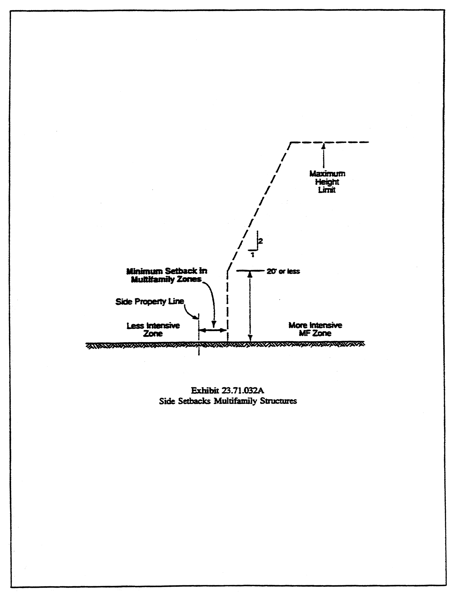

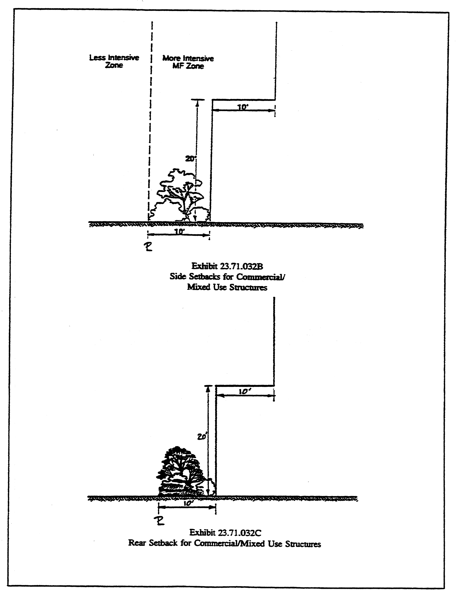

Exhibits 23.71.032B, 23.71.032C

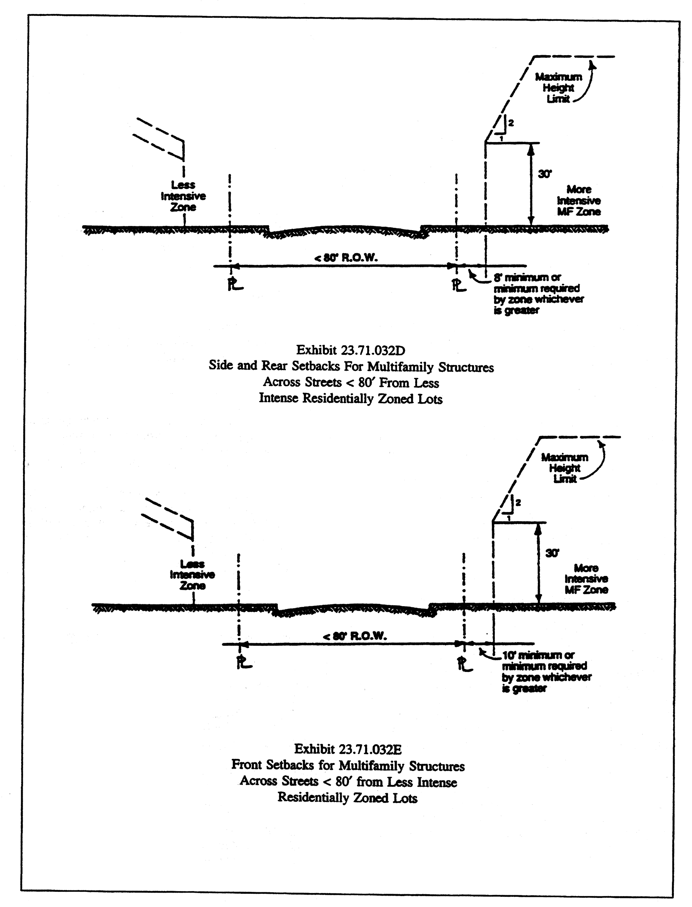

Exhibits 23.71.032D, 23.71.032E

1. To promote compatibility between different types and intensities of development located within and along the boundary of the Northgate Overlay District, a transition shall be provided between zones where different intensities of development may occur.
2. The requirements of this Section 23.71.030 apply to development on lots in the more intensive zones under the following conditions:

    1. Where a lot zoned Lowrise 3, (LR3), Midrise (MR), Midrise/85 (MR/85) or Highrise (HR) abuts or is across a street or alley from a lot zoned Single-Family (SF), Lowrise 1 (LR1), or Lowrise 2 (LR2); and
    2. Where a lot zoned Neighborhood Commercial 2 or 3 (NC2, NC3) with a height limit of 40 feet or greater abuts or is across a street or alley from a lot zoned Single-Family (SF), Lowrise 1 (LR1), or Lowrise 2 (LR2).
3. Side Setbacks Abutting or Across an Alley.

    1. For multifamily structures an additional side setback of one (1) foot for each two (2) feet of a structure height above twenty (20) feet is required (Exhibit 23.71.032 A).
    2. A side setback of ten (10) feet is required for all portions of a commercial or mixed use structure twenty (20) feet or less in height (Exhibit 23.71.032 B).
    3. An additional side setback of ten (10) feet is required for all portions of a commercial or mixed use structure exceeding twenty (20) feet (Exhibit 23.71.032 B).
    4. Side setbacks shall be landscaped within five (5) feet of the abutting property line, unless the setback is used for parking, in which case the parking area shall be screened as otherwise required by this code.
4. Rear Setbacks Abutting or Across an Alley.

    1. For multifamily structures, a rear setback of twenty (20) feet is required or the minimum required by the standards of the underlying zone for multifamily structures, whichever is greater.
    2. A rear setback of ten (10) feet is required for all portions of a commercial or mixed use structure twenty (20) feet or less in height (Exhibit 23.71.032 C).
    3. An additional rear setback of ten (10) feet is required for all portions of a commercial or mixed use structure exceeding twenty (20) feet (Exhibit 23.71.032 C).
    4. Rear setbacks shall be landscaped unless used for parking, in which case the parking area shall be screened and landscaped as otherwise required by this code.
5. Side or Rear Setbacks for Multifamily Structures Abutting a Street. A side or rear setback of eight (8) feet, or the minimum required for multifamily structures by the underlying zone, whichever is greater, is required for portions of a multifamily structure thirty (30) feet or less in height along all street rights-of-way less than eighty (80) feet wide across from the less intensive zone. Portions of a multifamily structure in excess of thirty (30) feet in height shall be set back an additional one (1) foot for each two (2) feet of structure height above thirty (30) feet (Exhibit 23.71.032D).
6. Front Setbacks for Multifamily Structures Abutting a Street. Where the front lot line of the more intensively zoned lot is across a street right-of-way which is less than eighty (80) feet wide from the less intensively zoned lot, the minimum front setback shall be ten (10) feet for all portions of a multifamily structure thirty (30) feet or less in height. For portions of a structure exceeding thirty (30) feet in height, an additional front setback of one (1) foot for every two (2) feet of structure height in excess of thirty (30) feet shall be required (Exhibit 23.71.032E).
7. Setbacks for Commercial or Mixed Use Structures Abutting a Street. No side or rear setback abutting a street is required for the portion of commercial or mixed use structures containing street level retail sales and service uses oriented towards the street. Where blank walls, parking or other nonretail sales and service uses occupy portions of the structure facing the street a five (5) foot setback shall be required and screened and landscaped as required by the underlying zone.

##### 23.71.036 - Maximum width and depth of structures

The maximum width and depth requirements of this section 23.71.036 shall apply only to portions of a structure within 50 feet of a lot line abutting, or directly across a street right-of-way that is less than 80 feet in width, from a less intensive residential zone as provided in Table A for 23.71.036.

The maximum width and depth requirements of this Section 23.71.036 shall apply only to portions of a structure within 50 feet of a lot line abutting, or directly across a street right-of-way that is less than 80 feet in width, from a less intensive residential zone as provided in Table A for 23.71.036.

Table A for: Structure Width and Depth Standards for Transition Areas

<table>
<tr>
<td>Subject Lot</td>
<td>Abutting Residential zone (or) zone across a street right-of-way less than 80 feet in width</td>
<td>Maximum Width</td>
<td>Maximum Depth</td>
</tr>
<tr>
<td>LR3, MR, MR/85 and HR</td>
<td>Single-family, LR1 or LR2</td>
<td>Apartments: 75 feet</td>
<td>65% depth of lot with no individual structure to exceed 90 feet</td>
</tr>
<tr>
<td>Rowhouse and townhouse developments: 130 feet</td>
</tr>
<tr>
<td>NC2 and NC3 with 40 feet or greater height limits</td>
<td>Single-family, LR1 or LR2</td>
<td>Above a height of 30 feet, wall length shall not exceed 80% of the length of the abutting lot line, to a maximum of 60 feet.</td>
</tr>
</table>

##### 23.71.038 - Definition of mixed-use development within the Northgate Overlay District.

"Mixed use development," for the purposes of this chapter, means development in a commercial zone containing both residential and nonresidential uses and that meets the requirements of Section 23.47A.008 B.

##### 23.71.040 - Density limits for residential uses in commercial zones within the Northgate Overlay District.

1. Residential uses in commercial zones with a thirty (30) foot height limit may not exceed a density of one (1) dwelling unit for every eight hundred (800) square feet of lot area.
2. Residential uses in commercial zones with a forty (40) foot height limit may not exceed a density of one (1) dwelling unit for every six hundred (600) square feet of lot area.
3. There is no density limit for residential use in commercial zones with height limits of sixty-five (65) feet or greater.
4. Development meeting the requirements for mixed use as provided in Section 23.71.038 is allowed a twenty (20) percent increase in permitted density over the density permitted by subsections A and B of this section.

##### 23.71.042 - Standards for commercial-only structures in Residential/Commercial zones within the Northgate Overlay District.

1. Commercial uses permitted in a mixed use structure in Residential/Commercial (RC) zones as provided in Section 23.46.012 are permitted outright in single-purpose commercial structures within the Northgate Overlay District.
2. Single-purpose commercial structures shall not exceed a size limit of .75 FAR or five thousand (5,000) square feet, whichever is less.
3. Single-purpose commercial structures in Residential/Commercial (RC) zones are subject to the development standards of Section 23.71.008 B4 and 23.71.008 F.

##### 23.71.044 - Standards for residential uses in commercial zones within the Northgate Overlay District.

1. In C and NC zones with height limits less than eight-five (85) feet, residential uses, in aggregate, may exceed 20% of the street-level street-facing facade only as a special exception under the following conditions or criteria:

    1. Either:

        1. Due to location or parcel size, the proposed site is not suited for commercial development; or
        2. There is substantial excess supply of land available for commercial use near the lot, as evidenced by conditions such as lack of commercial activity in existing commercial structures for a sustained period, commercial structures in disrepair, or vacant or underused commercially zoned land; and
    2. The residential structure would not interrupt an established commercial street front. As used in this subsection, the phrase "established commercial street front" may include a street front intersected by streets or alleys, and some lots with no current commercial use.
2. When permitted, structures with residential uses exceeding 20% of the street-level street-facing facade are subject to the following development standards:

    1. In all C and NC zones with a height limit of thirty (30) feet, the development standards for residential structures in Lowrise 3 zones, except that no front setback is required.
    2. In all C and NC zones with a height limit of forty (40) feet, the development standards for residential structures in Lowrise 4 zones, except that no front setback is required.
    3. In all C and NC zones with a height limit of sixty-five (65) feet, the development standards for residential structures in Midrise zones, except that no front setback is required.
3. In C and NC zones with a height limit of eighty-five (85) feet or greater, residential uses may occupy, in aggregate, more than 20% of the street-level street-facing facade.

### Chapter 23.72 - SAND POINT OVERLAY DISTRICT

Sections:

#### Subchapter I - Establishment of Overlay District
##### 23.72.002 - Purpose and intent.

The purpose of this chapter is to implement the Sand Point amendments to the Comprehensive Plan by regulating land use and development within the Sand Point Overlay District in order to integrate the property into the city of Seattle as a multi-purpose regional center that provides:

1. Expanded opportunity for recreation, education, arts, cultural and community activities;
2. Increased public access to the shoreline and enhanced open space and natural areas;
3. Opportunities for affordable housing and community and social services with a special priority for addressing the needs of homeless families;
4. Expanded opportunity for low-impact economic development uses which could provide employment and services for residents of the property and for the broader community.

##### 23.72.004 - Sand Point Overlay District established.

There is hereby established pursuant to Chapter 23.59 of the Seattle Municipal Code, the Sand Point Overlay District, including three subareas: A, B, and C. Subarea A includes one area zoned Single Family 7200 (SF 7200), Subarea B includes one area zoned SF 7200, and Subarea C includes three areas zoned L R 3, as shown on the City's Official Land Use Map, Chapter 23.32, and Map A for 23.72.004. The Sand Point Overlay District includes the Naval Station Puget Sound Sand Point Historic District, shown on Map B for 23.72.004 which is eligible to be listed on the National Register of Historic Places.

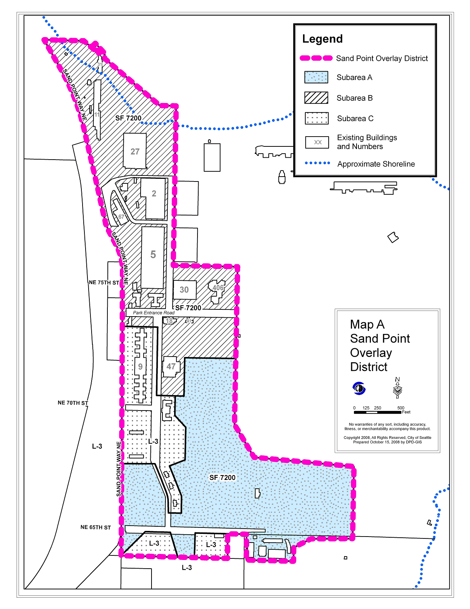

Map A for — Sand Point Overlay District

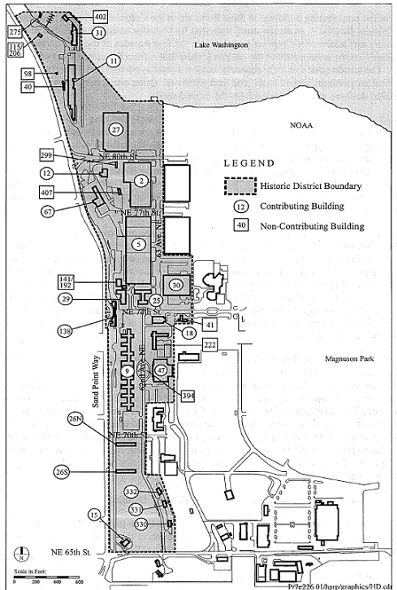

Map B for — Naval Station Puget Sound Sand Point Historic District

##### 23.72.006 - Application of regulations

All land located within the Sand Point Overlay District is subject to the regulations of the underlying zone unless specifically modified by the provisions of this Chapter 23.72. In the event of irreconcilable differences between the provisions of the Sand Point Overlay District and the underlying zone, the provisions of this Chapter 23.72 shall apply. Portions of the Sand Point Overlay District that lie within the Shoreline District, Chapter 23.60A, shall be governed by the provisions of the Shoreline District in addition to this Chapter 23.72. In the event of a conflict, the provisions of Chapter 23.60A shall prevail.

#### Subchapter II - Use and Development Standards
##### 23.72.008 - Uses permitted in specified areas within the Sand Point Overlay District

1. Within Subarea A depicted on Map A for 23.72.004, any area not occupied by structures in existence as of July 18, 1997, paved parking areas in existence as of July 18, 1997, or rights-of-way in existence as of July 18, 1997, is limited to open space uses such as parks and playgrounds.
2. Uses Permitted Within Portions of Subarea B depicted on Map A for 23.72.008.

    1. Principal Uses Permitted Outright. In addition to the principal uses permitted by the provisions of Section 23.44.006, the following principal uses are permitted outright in Subarea B as depicted on Map A for 23.72.004, subject to subsection B4:

        1. Custom and craft work;
        2. Dry boat storage, limited to storage of non-motorized, hand-launchable boats such as kayaks, canoes and sail boats;
        3. Indoor and outdoor sports and recreation;
        4. Institutions, except hospitals;
        5. Lecture and meeting halls;
        6. Motion picture theater not to exceed 500 seats within Building 47;
        7. Offices, limited to a total of 86,000 gross square feet in the entire subarea;
        8. Performing arts theaters;
        9. Research and development laboratories;
        10. Restaurants without drive-in lanes, limited to no more than 2,500 square feet per business establishment;
        11. Storage of fleet vehicles including accessory service and repair;
        12. Warehouses; and
        13. General retail sales and service, up to 6,000 square feet per business establishment.
    2. Accessory Uses. Accessory uses that meet the following standards and that are customarily incidental to the principal uses permitted outright, are permitted outright:

        1. The area devoted to the accessory use is limited no more than 20 percent of the gross floor area of the principal use it serves;
        2. Only principal uses permitted by this section and by the applicable provisions of Chapter 23.60A are allowed as accessory uses.
    3. When not in use as a motion picture studio, a structure with an established use as a motion picture studio as of July 18, 1997 may be used for indoor and outdoor sports and recreation.
    4. Any area not occupied by structures in existence as of July 18, 1997, paved parking areas in existence as of July 18, 1997, or rights-of-way in existence as of July 18, 1997, is limited to open space, dry boat storage or recreation uses.
3. Uses permitted within Subarea C depicted on Map A for 23.72.004. In addition to the uses permitted outright in Section 23.45.504 and Table A for 23.45.504, the following principal uses are permitted outright in Subarea C as depicted on Map A for 23.72.004:

    1. Food processing;
    2. Horticulture;
    3. Institutions, except hospitals;
    4. Lecture and meeting halls;
    5. Medical service uses, excluding animal health services, mortuary and funeral services; and
    6. Offices, in structures in existence as of July 18, 1997.

##### 23.72.010 - Development standards

1. Within areas zoned single-family, changes of use within existing structures that are subject to SEPA requirements in Seattle Municipal Code Chapter 25.05 and new structures shall conform to the development standards for single-family development in Chapter 23.44, Residential Single-family, except as modified in subsections D—H of this section and except as provided in section 23.72.012.
2. Within areas zoned Lowrise 3, changes of use within existing structures that are subject to SEPA requirements in Seattle Municipal Code Chapter 25.05 and new structures shall conform to the development standards of Chapter 23.45 applicable to Lowrise 3 development, except as modified in subsections D—H of this section and except as provided in Section 23.72.012.
3. Density. A maximum of 200 dwelling units may be established within the boundaries of the Sand Point Overlay District. Residential uses provided by the University of Washington, and dwelling units established by Master Use Permit after December 1, 2012 in the LR3 zone, located within Subarea C of Map A of Section 23.72.004 and within a structure identified on Map B for 23.72.004 as a contributing building in the Naval Station Puget Sound Sand Point Historic District, do not count toward the maximum site density established in this subsection 23.72.010.C.
4. New structures. Demolition of existing structures and construction of new structures in the Sand Point Overlay District are permitted if in compliance with the following provisions and if consistent with the Sand Point Historic Properties Reuse and Protection Plan, dated April 1998, as documented by a letter from the State Historic Preservation Officer certifying that the proposal is consistent with the Plan:

    1. Any new structure shall be located on and limited to the footprint of a structure that existed on the site as of July 18, 1997, except for:

        1. an indoor and outdoor tennis center to be located within Subarea B as depicted on Map A for 23.72.004,
        2. affordable housing structures to be located within L3 zoned portions of the overlay district, and
        3. dry boat storage.
    2. In determining the footprint of structures existing on July 18, 1997, interior courtyards enclosed by three or more building walls at least 10 feet in height may be included as part of the footprint.
    3. Except for a proposed new tennis center in Subarea B, for which the height limit is 45 feet, and except for any new structure used for nonmotorized dry boat storage, for which the height limit is 15 feet, the height limit of a new structure is the greater of the height limit of the underlying zone or the height of the structure that existed on the same site as the new structure as of July 18, 1997.
5. Rooftop features on existing non-residential structures. Stair penthouses, elevator penthouses and mechanical equipment on non-residential structures in existence as of July 18, 1997 may extend up to the higher of 15 feet above the maximum height limit or 15 feet above the roof elevation existing as of July 18, 1997, so long as the combined total coverage of all rooftop features above the roof elevation does not exceed (1) 25 percent of the roof area, if the rooftop features do not include screened mechanical equipment, or (2) 30 percent of the roof area, if the combined features include screened mechanical equipment. The addition of rooftop features is permitted only if also consistent with the Sand Point Historic Properties Reuse and Protection Plan, dated April 1998, and the U.S. Secretary of the Interior's Standards for Rehabilitation, as evidenced by a letter of approval from the State Historic Preservation Officer.
6. Lighting. Changes of use within existing structures that are subject to SEPA requirements in Seattle Municipal Code Chapter 25.05 and all new structures shall comply with the following lighting standards:

    1. Exterior lighting shall be shielded and directed away from adjacent uses.
    2. Exterior lighting shall not exceed the height of the structure on which it is located or the height limit of the underlying zone in which it is located, whichever is less.
    3. All exterior lighting features shall be consistent with the Sand Point Historic Properties Reuse and Protection Plan, dated April 1998, and the U.S. Secretary of the Interior's Standards for Rehabilitation, as evidenced by a letter of approval from the State Historic Preservation Officer.
7. Solid waste and recycling storage space. Changes of use within existing structures that are subject to SEPA requirements in Chapter 25.05 and all new structures shall provide storage space for solid waste containers in accordance with the requirements of Section 23.54.040. All solid waste and recyclable storage features shall be consistent with the Sand Point Historic Properties Reuse and Protection Plan, dated April 1998, and the U.S. Secretary of the Interior's Standards for Rehabilitation, as evidenced by a letter of approval from the State Historic Preservation Officer.
8. Landscaping. Changes of use within existing structures that are subject to SEPA requirements in Seattle Municipal Code Chapter 25.05 and all new structures shall comply with the following landscape standards:

    1. Street trees along dedicated rights of way shall be provided pursuant to the requirements and exceptions in the underlying zone.
    2. Landscaping of surface parking areas.

        1. Surface parking areas shall be landscaped as follows:
        2. Each landscaped area shall be no smaller than 100 square feet and shall be enclosed by permanent curbs or structural barriers.
        3. No part of a landscaped area shall be less than 4 feet in any dimension except those parts created by turning radii or angles of parking spaces.
        4. No parking space shall be more than 60 feet from a required landscaped area.
        5. Landscaping that meets the dimension standards in this subsection may be provided in above-ground containers or similar planting areas.
    3. Surface parking areas shall be screened from direct street view by a minimum of 3-foot high landscaped areas.
    4. To provide pedestrian and vehicular access, breaks not to exceed the width of any required curbcuts or sight triangles are permitted in required landscaping.
    5. All landscaping features shall be consistent with the Sand Point Historic Properties Reuse and Protection Plan, dated April 1998, and the U.S. Secretary of the Interior's Standards for Rehabilitation, as evidenced by a letter of approval from the State Historic Preservation Officer.

##### 23.72.012 - Parking location.

Required parking may be provided anywhere within the Sand Point Overlay District, including public rights-of-way.

##### 23.72.014 - Nonconformity.

The provisions of Chapter 23.42 pertaining to nonconformity apply except that further subdivision of property may be permitted by the Director even if nonconformity would be created with respect to a structure's relationship to lot lines or lot area. This provision shall only apply to structures in existence on the effective date of this chapter.

### Chapter 23.73 - PIKE/PINE CONSERVATION OVERLAY DISTRICT

Sections:

#### Subchapter I - Establishment of Overlay District
##### 23.73.002 - Purpose and intent

The purpose of this Chapter 23.73 is to implement Resolution 28657, calling for development of the Pike/Pine Overlay District in order to preserve and enhance the balance of residential and commercial uses, by encouraging residential development and development that combines residential and non-residential uses, while also providing additional opportunities for commercial development to balance the substantial amount of residential development that has occurred since Resolution 28657 was adopted. In addition, a purpose of this Chapter 23.73 is to promote the conservation of Pike/Pine's existing historic character by limiting new development to a scale that is compatible with the established development pattern, accommodating arts facilities and small businesses at street level, and encouraging the retention of the existing structures and their architectural features that establish the District's architectural character; generally, those structures that have been in existence prior to 1940 ("character structures"), and are related to the area's early history as Seattle's original "auto row".

##### 23.73.004 - Pike/Pine Conservation Overlay District established

There is hereby established pursuant to Chapter 23.59 of the Seattle Municipal Code, the Pike/Pine Conservation Overlay District as shown on the Official Land Use Map, Chapter 23.32, and Map A for 23.73.004 Pike/Pine Conservation Overlay District.

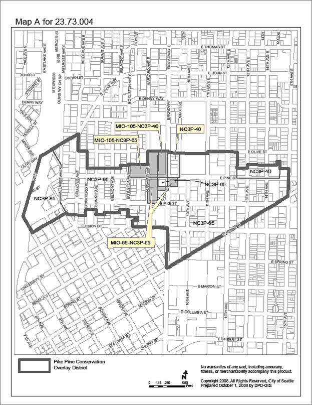

##### 23.73.005 - Adoption of rules to implement Pike/Pine Conservation Overlay District regulations

1. The Director shall promulgate a rule, which shall be periodically updated to reflect changed conditions, listing the character structures that meet the following criteria:

    1. The structure retains a high degree of architectural integrity;
    2. The structure represents the Pike/Pine neighborhood's building typology, which is characterized by use of exterior materials and design elements such as masonry (especially brick) and timber structures; multi-use loft spaces; very high, fully-glazed storefront windows; and decorative details such as cornices, emblems and embossed building names; and
    3. The structure is compatible with the architectural scale, rhythm, and patterns of nearby structures in the Pike/Pine neighborhood.
2. A character structure may be added to or removed from the list described in subsection 23.73.005.A by the Director in consultation with the Director of the Department of Neighborhoods.

##### 23.73.006 - Application of regulations

Land that is located within the Pike/Pine Overlay District, as shown on Map A for 23.73.004, is subject to the regulations of the underlying zones unless specifically modified by the provisions of this Chapter 23.73. In the event of a conflict between the provisions of this Chapter 23.73 and the underlying zone, the provisions of this Chapter 23.73 shall apply. In the event of a conflict between the provisions of this Chapter 23.73 and Chapter 23.69, Major Institution Overlay District, the provisions of Chapter 23.69 shall apply.

#### Subchapter II - Use and Development Standards
##### 23.73.008 - Street-level uses

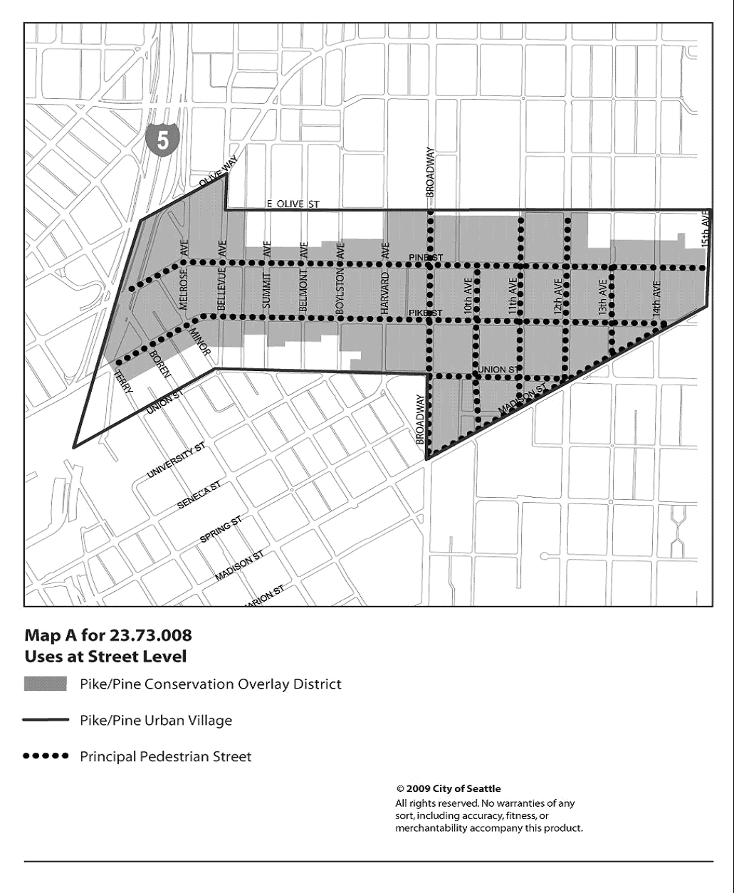

Map A forUses at Street Level

1. Street-level uses on principal pedestrian streets. Along designated principal pedestrian streets shown on Map A for 23.73.008, provisions for street-level uses are established in Chapter 23.47A, except as modified by this Section 23.73.008.
2. Space for small commercial uses at street level

    1. Except as provided in subsection 23.73.008.B.3, all structures that include more than 5,000 square feet of commercial uses at street level, excluding the floor area of performing arts theaters, arts facilities, and parking and access, shall include commercial spaces at street level for small, individual business establishments that average 2,000 square feet or less in size, according to Table A for 23.73.008.
    2. The commercial space requirement of subsection 23.73.008.B.1 applies to the total size of a business establishment, except that if a business establishment includes more than one principal use, each principal use within the business establishment may qualify as a small business establishment.
    3. For projects that retain a character structure as provided in Section 23.73.015, in addition to any excluded floor area specified in subsection 23.73.008.B.1, floor area meeting the following conditions is not required to comply with subsection 23.73.008.B.1:

        1. The floor area is occupied by street-level commercial uses or other uses excluded from the requirement for small commercial spaces in subsection 23.73.008.B.1 and is within the original street-level footprint of the retained character structure; and
        2. The original street-level of the character structure was designed as a large space for use as automobile retail sales and service, warehouse, manufacturing, or large retail or commercial space.
3. Within new structures that face Pike, East Pike, Pine, and East Pine Streets, the length of street frontage permitted at street level for an individual business, excluding institutional uses, is limited to 50 feet. Portions of a business that are separated from the street by another business or a different use that provides separate pedestrian access to the street are not limited in width. The limit on the street frontage of an individual business does not apply to uses in an existing character structure or in a character structure retained in a project according to Section 23.73.015, provided that the original street-level of the character structure was designed as a large space for use as automobile retail sales and service, warehouse, manufacturing, or large retail or commercial space.

##### 23.73.009 - Floor area ratio

1. For lots with residential uses only, or lots that include both residential and non-residential uses, the FAR limits in Section 23.47A.013 for the underlying zone apply, except as provided in this Section 23.73.009 and in Section 23.73.024 for projects using transfer of development potential, and provided the gross floor area of non-residential uses does not exceed 2 FAR, except as permitted in subsection 23.73.009.B.
2. Non-residential uses are limited to a maximum of 2 FAR, except that for development on a lot that meets one of the following conditions, the FAR limits for non-residential uses in Section 23.47A.013 for the underlying zone applies:

    1. A character structure has not existed on the lot since January 18, 2012; or
    2. For lots that include a character structure, all character structures on the lot are retained according to Section 23.73.015, unless a departure is approved through the design review process to allow the removal of a character structure based on the provisions of subsection 23.41.012.B.32. If the lot includes a character structure that has been occupied by residential uses since January 18, 2012, the same amount of floor area in residential uses shall be retained in that structure, unless a departure is approved through the design review process to allow the removal of the character structure based on the provisions of subsection 23.41.012.B.32. The owner of the lot shall execute and record in the King County real property records an agreement to provide for the maintenance of the required residential uses for the life of the project.
3. In addition to the floor area exempt under the provisions of the underlying zone, the following floor area is exempt from the calculation of gross floor area subject to an FAR limit:

    1. The following street-level uses complying with the standards of Section 23.47A.008 and subsection 23.73.008.B:

        1. General sales and services;
        2. Major durables retail sales;
        3. Eating and drinking establishments;
        4. Museums;
        5. Religious facilities;
        6. Libraries; and
        7. Automotive retail sales and service uses located within an existing structure or within a structure that retains a character structure as provided in Section 23.73.015.
    2. Floor area used for theaters or arts facilities, which for the purposes of this Section 23.73.009 only, may be operated either by for-profit or not-for-profit organizations.
    3. All floor area in residential use in a development that retains all character structures on the lot as provided in Section 23.73.015, or that uses the transfer of development potential (TDP) on a lot that is a TDP receiving site according to Section 23.73.024, unless a departure is approved through the design review process to allow the removal of a character structure based on the provisions of subsection 23.41.012.B.32.
    4. In areas where the underlying zoning is NC3P-65, all floor area in any use if the lot that is to be developed is 8,000 square feet or less in area and has been either vacant or in parking use since February 27, 1995.
    5. Floor area in non-residential use within a character structure that meets the minimum requirements for retaining a character structure in 23.73.024.C.4, provided that the non-residential use does not displace a residential use existing in the structure since January 18, 2012.

##### 23.73.010 - Floor area limits outside the Conservation Core

Map A for: Conservation Core

1. Floor area limit. The following provisions apply to lots located outside the boundaries of the Conservation Core identified on Map A for 23.73.010.

    1. The maximum gross floor area of any single story above 35 feet in height is limited to 15,000 square feet, except as provided in subsections 23.73.010.A.2, 23.73.010.A.3, 23.73.010.B, and 23,73.010.C.
    2. For a project that is allowed extra height above the height limit by subsection 23.73.014.A, the 35-foot height above which the floor area limit applies is increased to 39 feet, provided that the provisions for allowing additional height under subsection 23.73.014.A are met.
    3. For a project that is allowed extra height above the height limit by subsection 23.73.014.B, the 35-foot height above which the floor area limit applies is increased to 39 feet, provided that:

        1. The provisions for allowing additional height under subsection 23.73.014.B are met, and
        2. The minimum floor-to-ceiling height of non-residential uses at street level is at least 13 feet, except that if a character structure is retained according to Section 23.73.015, the floor-to-ceiling height of the portion of the street-level story above the footprint of the character structure need not exceed the original floor-to-ceiling height of the character structure.
    4. On a lot with more than one structure or more than one portion of the same structure that exceeds 35 feet in height, the floor area limit applies to the combined portions of each story above 35 feet in height. If 39 feet is the height above which the floor area limit applies as allowed by subsection 23.73.010.A.1 and subsection 23.73.010.A.2, then the floor area limit applies to the combined portions of each story above 39 feet.
    5. If new structures on the same or abutting lots have internal connections above or below grade, each of the stories of the connected structures are considered to be a single story for the purpose of calculating the floor area subject to the floor area limit.
2. Exceptions to floor area limit

    1. A 15 percent increase in the floor area limit is permitted for projects that meet the following conditions:

        1. The project retains all the character structures existing on the lot, unless a departure is approved through the design review process to allow the removal of a character structure based on the provisions of subsection 23.41.012.B.32; and
        2. The project includes uses that contribute to the area's recognized character as an arts district, including performing arts space or artist-studio dwellings that typically have design requirements such as nonstandard floor-to-ceiling heights that reduce the total amount of usable floor area in a structure; or
        3. A minimum of 50 percent of the total gross floor area of the project is housing that is affordable to and occupied by "income-eligible households," as defined in Section 23.58A.004, and is subject to recorded covenants approved by the Director that ensure that the housing remains available to these households for a minimum of 50 years; or
        4. Through the design review process a determination is made that including one or more of the following features offsets the increase in the bulk of the project and allows for a design treatment that achieves the intent of the neighborhood design guidelines better than adhering to the floor area limit that would apply without the exception:

            1. A landscaped courtyard that is visible from the sidewalk and located primarily at street level on a street that is not a principal pedestrian street;
            2. A through-block pedestrian corridor that connects parallel streets bounding the project, consistent with the neighborhood design guidelines; or
            3. Open space at locations that support the gateway and open space concepts promoted in the neighborhood design guidelines.
    2. Retaining character structures on a lot. A 25 percent increase in the floor area limit established in subsection 23.73.010.A is permitted for a project that retains all the character structures on the same lot according to the provisions in Section 23.73.015, unless a departure is approved through the design review process to allow the removal of a character structure based on the provisions of subsection 23.41.012.B.32. Any increase in floor area permitted according to this subsection 23.73.010.B.2 shall not be combined with any other increase in floor area permitted according to subsection 23.73.010.B.1 or 23.73.010.B.3.
    3. A 25 percent increase in the floor area limit is permitted on a lot that qualifies as a receiving site for a project that adds floor area through the use of TDP as permitted by Section 23.73.024, provided that the amount of floor area added through the use of TDP is equivalent to at least 0.25 FAR, as calculated for the receiving site. Any increase in floor area permitted according to this subsection 23.73.010.B.3 shall not be combined with any other increase in floor area permitted according to subsection 23.73.010.B.1 or 23.73.010.B.2.
3. Exempt floor area. The following is not included in calculating floor area subject to the floor area limit:

    1. Floor area within an existing character structure either on the lot or an abutting lot within the same development site if the entire character structure is retained according to the provisions of subsection 23.73.024.C.4.
    2. For a project that retains an entire character structure on the lot according to the requirements of subsection 23.73.024.C.4, any floor area in a portion of the new structure that extends or cantilevers over the character structure; provided that the new structure does not alter the envelope or interior of the character structure. Connections between the new structure and the facades of the retained character structure that do not face a public street are allowed.

##### 23.73.012 - Structure width and depth limits

1. Structure width limit outside the Conservation Core. Outside the Conservation Core identified on Map A for 23.73.010, for all portions of a structure that abut Pike, East Pike, Pine, or East Pine Streets, structure width shall be limited to 50 percent of the total width of all lots on the block face, measured along the street lot line, on block faces that exceed 170 feet in width, except that the structure width limit calculation does not include the following:

    1. Portions of a character structure that are retained according to the provisions in Section 23.73.015, whether connected to a new structure or not;
    2. Portions of a new structure that are separated from the street lot line by another lot;
    3. Portions of a new structure that are separated from the street lot line by an adjacent structure located on the same lot that is not a character structure, provided that the adjacent structures are not internally connected above or below grade; and
    4. Portions of a new structure that are separated from the street lot line by a character structure that is retained according to the provisions of Section 23.73.015.
2. Structure width and depth limits inside the Conservation Core. The structure width and depth limits in this subsection 23.73.012.B apply to lots that are located inside the Conservation Core identified on Map A for 23.73.010, except that there are no limits on width and depth for lots that did not contain a character structure on January 18, 2012.

    1. 128 feet shall be the width and the depth limit for portions of new structures on lots that contained a character structure on January 18, 2012. The width limit is measured as the combined width of all portions of new structures located on the lot and the depth limit is measured as the combined depth of all portions of new structures located on the lot, except as provided in subsection 23.73.012.B.2 and subsection 23.73.012.B.3.
    2. Portions of a new structure that are separated from the street lot line by a character structure that is retained according to Section 23.73.015 are excluded from structure width and depth measurements, provided that:

        1. All character structures on the lot are retained according to the provisions of Section 23.73.015, unless a departure is approved through the design review process to allow the removal of a character structure based on the provisions of subsection 23.41.012.B.32; and
        2. This exclusion from width and depth measurement in subsection 23.73.012.B.2 is only allowed for one retained character structure on the lot.
    3. For the narrow block bounded by Broadway, East Union Street, Broadway Court, and East Madison Street, the depth limit does not apply to structures on through lots extending from Broadway to Broadway Court, and the width limit only applies to frontages on Broadway and Broadway Court.

##### 23.73.014 - Height exceptions

1. Height exception for street-level uses. In zones with a mapped height limit of 65 feet, an additional 4 feet of height above the height limit of the zone is allowed for structures that include uses listed as required street-level uses in subsection 23.47A.005.D.1 or live-work use if the following conditions are met:

    1. The floor-to-ceiling height of the street-level uses or live-work units located at street level is 13 feet or more, except when a character structure is retained according to Section 23.73.015, the floor-to-ceiling height of the portion of the street-level story above the footprint of the character structure need not exceed the original floor-to-ceiling height of the character structure;
    2. The additional height will not permit an additional story to be built beyond the number that could be built under a 65-foot height limit; and
    3. The transparency requirements for street-facing facades in subsection 23.47A.008.A.2 are met for the portion of the street-facing facades between 2 feet and 12 feet above the sidewalk. Only clear or lightly-tinted glass shall be considered transparent. For a character structure that is retained in a new project according to Section 23.73.015, measurement for required transparency of the street-facing facades of the character structure shall be according to the provisions of subsection 23.86.026.B.
2. Height exception for lots that include a character structure. In zones with a 65-foot mapped height limit, or with a 40-foot mapped height limit with provisions allowing for additional height up to 65 feet according to subsection 23.47A.012.A, 10 feet of additional height is allowed above the 65 foot height limit if the following requirements are met:

    1. The lot includes a character structure and all character structures on the lot are retained according to the provisions of Section 23.73.015, unless a departure is approved through the design review process to allow removal of a character structure based on the provisions of subsection 23.41.012.B.32.
    2. The additional floor area above the 65-foot height limit is occupied solely by residential use, except as otherwise permitted by subsection 23.73.014.B.3;
    3. A project that is permitted the FAR of the underlying zone for non-residential uses under subsection 23.73.009.B may be allowed to occupy the floor area permitted above the 65 foot height limit under this subsection 23.73.014.B if a departure is approved through the design review process, provided that there is no additional increase in the FAR for non-residential uses beyond what is otherwise allowed by Section 23.73.009. The decision to allow a departure shall be based on a determination that the additional height will result in a better design treatment and accommodate features that promote the development objectives of the Pike/Pine Conservation Overlay District by:

        1. Maintaining greater portions of existing character structures on the lot through design treatments that exceed the minimum standards of subsection 23.73.015.A, retaining an entire character structure, or retaining a large number of character structures if the number and siting of the structures pose severe limitations on the amount of floor area that can be achieved in the new project within the applicable height limit; or
        2. Providing space for features that enhance pedestrian circulation and walkability in the area, such as though-block pedestrian corridors, or open spaces at locations that support the gateway and open space concepts promoted in the neighborhood design guidelines; or
        3. Accommodating uses, such as theater space or arts facilities that support the area's arts and culture function but that may have special spatial needs that require additional design flexibility to incorporate them into the project, provided the uses are maintained for the life of the project as provided for in a recorded covenant approved by the Director.
3. Height exception for character structure TDP receiving sites. A height exception for character structure TDP receiving sites is allowed according to subsection 23.73.024.B.
4. If a project uses more than one of the height exceptions permitted by this Section 23.73.014, the maximum height shall be the height permitted by the exception allowing the greatest height increase.
5. Additional height for rooftop features. For structures using the height exceptions specified in this Section 23.73.014, additional height is permitted above the maximum height allowed by the exception to accommodate rooftop features as permitted under subsection 23.47A.012.C.

##### 23.73.015 - Retention and demolition of character structures

1. For provisions in this Chapter 23.73 that require a portion of a character structure to be retained in order to earn incentives, in addition to the provisions of the applicable section, the minimum requirements for retaining a character structure are as follows:

    1. All street-facing facades of the character structure shall be maintained for the life of the project;
    2. All portions of the new structure above the height of the street-facing facades of the character structure shall be set back a minimum of 15 feet from the street-facing facades of the character structure, except:

        1. Projections such as unenclosed balconies, bay windows, cornices, belt courses; and eaves, gutters, and other forms of weather protection may project a maximum of 18 inches into the required setback; and
        2. On through lots that are bounded on three or more sides by a street and that are less than 170 feet wide measured between streets, a setback is not required from the narrowest abutting street that is not shown as a Principal Pedestrian Street on Map A for 23.73.008.
    3. The original floor-to-ceiling height of the street-level story of the character structure is maintained, allowing for adjustments to provide access to persons with disabilities.
    4. If it is determined at any time that the character structure's street-facing facade cannot be maintained as required under subsection 23.73.015.A.1, the Design Review Board shall review any proposed changes to the facade before changes are made. If the proposed facade changes are not approved through the design review process the incentives may not be used.
2. Character structures that are retained as provided by this Section 23.73.015 shall be maintained as approved by the Master Use Permit for the project for the life of the project in a manner that complies with applicable codes and approved plans, including the approved plan required by subsection 23.73.015.C.
3. The applicant, as part of the Master Use Permit application submittal, shall submit the following:

    1. A plan specifying the portions of the character structure to be retained, demolished, or rebuilt. For portions of the structure to be retained, the plan shall clearly indicate: the materials to be retained in place, salvaged for reconstruction, or otherwise modified, and new materials to be used in any reconstruction; and
    2. A representation of the structure's final appearance.
4. A demolition permit may only be approved for portions of the project that are specified for demolition in the plan submitted with the Master Use Permit application.
5. For the purposes of applying any applicable street-level developments standards of Section 23.47A.008, the portion of a character structure that is retained to meet the standards of subsection 23.73.015.A shall be regarded as an existing structure.
6. Departure from standards for retaining portions of a character structure. For a project that retains portions of a character structure, departures from the provisions in subsection 23.73.015.A may be granted through the design review process, provided that one or more of the following conditions apply:

    1. The departure will allow for design treatments that reduce the appearance of the bulk of the new structure and enhance the relationship between the new structure and the retained character structure on the lot or development on adjacent lots; or
    2. The portions of the new structure will not obscure key elements of the retained structure's architectural character; or
    3. The departure will facilitate the retention of other character structures on the lot; or
    4. Additional flexibility is necessary to maintain a character structure on a development lot that is constrained by size or configuration; or
    5. The departure will allow for a more functional street-level plan and improved pedestrian access while retaining key qualities of the street-level story of the character structure, especially as perceived from the street.
7. Demolition of character structures. If a project is required to retain all the character structures on a lot under the provisions of this Chapter 23.73, a character structure may nevertheless be demolished through a departure approved by the design review process according to the provisions of subsection 23.41.012.B.32.

##### 23.73.016 - Amenity area

1. Amenity area is not required for structures existing as of April 1, 2000 that are repaired, renovated, or structurally altered to the extent permitted by the development standards of the Land Use Code, provided that street-facing facades are retained and 50 percent or more of the gross floor area is retained.
2. Amenity area is not required for new construction of affordable housing that meets the following:

    1. At least 40 percent of the units are rented to households at annual rents not exceeding 30 percent of 60 percent of the median income; and
    2. The applicant demonstrates compliance with these income criteria for the life of the building.
3. Existing residential uses that meet the amenity area requirements of Section 23.47A.024 may eliminate amenity area, provided they comply with subsections 23.73.016.B.1 and B.2.

##### 23.73.018 - Location of Parking

Parking provided as accessory parking for any permitted use may be located on the lot, or built into or under the structure, or located on a lot other than the lot on which the use is located except that parking is not permitted on a lot other than the lot where the use is located if providing the parking would result in the partial or total demolition of a character structure.

##### 23.73.024 - Transfer of development potential

1. General standards for the transfer of development potential (TDP) within the Pike/Pine Conservation Overlay District.

    1. For a lot located in an NC3P-65 zone within the Pike/Pine Conservation Overlay District shown on Map A for 23.73.004, an applicant may use TDP to obtain any of the following:

        1. A floor area exemption for residential and live-work unit floor area, as permitted under subsection 23.73.009.C.3 ;
        2. A height exception to allow an additional 10 feet above the 65-foot height limit; and
        3. A 25 percent increase in the floor area limit as provided in subsection 23.73.010.B.3.
    2. Within the Conservation Core shown on Map A for 23.73.010, a lot that is an eligible sending site meeting the provisions of subsection 23.73.024.C may transfer development potential to any lot that is an eligible receiving site meeting the provisions of subsection 23.73.024.B. Eligible receiving sites may only gain development potential from eligible sending sites that are also located within the Conservation Core.
    3. Development potential may not be transferred from one lot to another except as allowed by this Chapter 23.73.
    4. Development potential may be transferred from eligible sending sites meeting the provisions of subsection 23.73.024.C to locations outside the Pike/Pine Conservation Overlay District if TDP transfer to specifically identified areas or lots is authorized by City ordinance.
2. Standards for character structure TDP receiving sites. A lot must meet the following conditions in order to be eligible to achieve extra residential floor area through TDP:

    1. TDP receiving sites shall be located in an NC3P-65 zone within the Pike/Pine Conservation Overlay District, provided that:

        1. Development of the receiving site shall not result in the demolition of a structure designated as a landmark according to Chapter 25.12 or its alteration in a manner that is inconsistent with Chapter 25.12 or an ordinance imposing controls on the landmark structure.
        2. Development on the lot that is the receiving site shall not result in the demolition or significant alteration of a character structure that is not a designated landmark and that has existed on the site since January 18, 2012, unless a departure is approved through the design review process to allow the removal of a character structure based on the provisions of subsection 23.41.012.B.32. For the purposes of this subsection 23.73.024.B.1.b, significant alterations to a character structure would result in conditions that would preclude compliance with the minimum requirements of subsection 23.73.024.C.4.
    2. An additional 10 feet in height above the height limit of the zone is permitted on a lot that is an eligible TDP receiving site.
    3. Any residential and live-work floor area that is exempt from the FAR limit as allowed by subsection 23.73.009.C.3, or any floor area that exceeds the maximum floor area limit as allowed under subsection 23.73.010.B.3, or that is located above 65 feet in height shall be achieved through the use of TDP.
    4. Floor area gained through the use of TDP shall be for residential and live-work unit use only.
    5. For a structure that achieves an increase in height through the use of TDP, the minimum street level floor-to-ceiling height is 13 feet.
    6. TDP required before construction. No permit after the first building permit, and in any event no permit for construction activity other than excavating or shoring, and no permit for occupying existing floor area by any use based on TDP; will be issued for development that includes TDP until the applicant has demonstrated possession of TDP to the Director's satisfaction.
3. Standards for sending sites. A lot must meet the following conditions in order to be eligible as a sending site to transfer extra residential floor area through TDP to a lot that is an eligible receiving site according to subsection 23.73.024.B:

    1. TDP sending sites shall be located in an NC3P zone within the Pike/Pine Conservation Overlay District, excluding NC3P zones with an MIO-105 overlay, and shall contain one of the following structures:

        1. One or more structures designated wholly or in part as a landmark under Chapter 25.12 or its predecessor ordinance; or
        2. Any character structure, provided that character structures on the proposed TDP sending site have not been demolished or significantly altered since January 18, 2012, unless a departure is approved through the design review process to allow the removal of a character structure based on the provisions of subsection 23.41.012.B.32. For the purposes of this subsection 23.73.024.C.1.b, a significant alteration results in conditions that would preclude the character structure from complying with the minimum requirements for retaining the character structure in subsection 23.73.024.C.4.
    2. Maximum transferable floor area

        1. The maximum amount of floor area that may be transferred from an eligible sending site with a character structure that is not a designated landmark is the product of: the eligible lot area of the sending site, times the maximum FAR for structures containing both residential and non-residential uses as prescribed in Section 23.47A.013, minus the sum of any chargeable gross floor area on the sending site under the zoning in effect at the time a complete application transferring TDP is accepted, and minus any TDP previously transferred from the sending site.
        2. The maximum amount of floor area that may be transferred from an eligible sending site with a designated landmark is the amount calculated in subsection 23.73.024.C.2.a multiplied by two.
        3. For purposes of this subsection 23.73.024.C.2, the eligible sending site lot area is the total area of the lot where the character structure was originally built.
    3. Rehabilitation and maintenance of character structures. Character structures that are designated landmark structures on sending lots from which TDP is transferred shall be rehabilitated and maintained as required by the Landmarks Preservation Board. Character structures located on a lot that is a TDP sending site that are not designated landmark structures shall be rehabilitated and maintained to comply with applicable codes and shall remain in compliance with the provisions of subsection 23.73.024.C.4 for the life of the structure on the receiving site that includes the additional gross floor area. If the TDP is proposed to be transferred prior to completing rehabilitation work necessary to satisfy this subsection 23.73.024.C, the Director may require as a condition of the transfer that a security be deposited with the City in an amount determined by the Director to ensure that the work is completed.
    4. For character structures that are not designated landmark structures, the following provisions for retaining the character structure shall apply:

        1. All exterior facades are retained; except that portions of a new structure may abut facades that are not street-facing facades, and connections between the new structure and the facades of the retained character structure that do not face a public street are allowed; and
        2. The original floor area of the character structure is maintained, except that additions or alterations that extend the useful physical life or economic viability of the structure are permitted, provided that:

            1. The additions do not significantly damage or destroy the structural system of the character structure or fundamentally alter historic characteristics of its exterior appearance; and
            2. The total floor area of any additions, excluding floor area added to reclaim floor area that may have been removed from the original structure over time, does not exceed the equivalent of 0.5 FAR, as calculated on the lot where the structure was originally built.
4. TDP deeds and agreements

    1. The fee owners of the TDP sending site shall execute a deed, and shall obtain the release of the TDP from all liens of record and the written consent of all holders of encumbrances on the sending lot other than easements and restrictions, unless the requirement for a release or consent is waived by the Director for good cause. The deed shall be recorded in the King County real property records. If TDP is conveyed to the owner of a TDP receiving site described in the deed, then unless otherwise expressly stated in the deed or any subsequent instrument conveying the lot or the TDP, the TDP shall pass with the receiving site whether or not a structure using the TDP shall have been permitted or built prior to any conveyance of the receiving site. Any subsequent conveyance of TDP previously conveyed to a receiving site shall require the written consent of all parties holding any interest in or lien on the receiving site from which the conveyance is made. If the TDP is transferred other than directly from the sending site to the receiving site using the TDP; then after the initial transfer all subsequent transfers shall also be by deed, duly executed, acknowledged, and recorded, each deed referring by King County recording number to the prior deed.
    2. Any person may purchase TDP that is eligible for transfer by complying with this Section 23.73.024, whether or not the purchaser is a permit applicant to develop real property or the owner of potential receiving site. Any TDP purchaser, including any successor or assignee, may use TDP on a receiving site to the extent that using TDP is permitted under the Land Use Code provisions applicable at the time the project intended to use the TDP vests, according to Section 23.76.026. The Director may require, as a condition of processing any permit application using TDP, that the owner of the receiving site demonstrate that the TDP has been validly transferred of record to the receiving site, and that the receiving site owner has recorded in the real estate records a notice stating that a permit application using TDP has been filed and the TDP to be used on the receiving site is not available for retransfer.
    3. As a condition to the effective transfer of TDP from a designated landmark, except from a City-owned sending site, the fee owner of the sending site shall execute and record an agreement running with the land, in form and content acceptable to, and accepted in writing by, the Director of Neighborhoods; providing for the rehabilitation and maintenance of the historically-significant or other relevant features of the structure or structures on the lot and acknowledging the restrictions on future development resulting from the transfer. The Director may require evidence that each lien holder has effectively subordinated the lien to the terms of the agreement, and that any holders of interests in the property have agreed to its terms. To the extent that a landmark structure on the sending site, the presence of which is a condition to eligibility to transfer TDP under the provisions of the zone, requires restoration or rehabilitation for the long-term preservation of the structure or its historically or architecturally-significant features, the Director of Neighborhoods may require as a condition to acceptance of the necessary agreement that the owner of the sending site apply for and obtain a certificate of approval from the Landmarks Preservation Board for the necessary work, or post security satisfactory to the Director of Neighborhoods for the completing the restoration or rehabilitation.
5. Reservation in deed. Any TDP eligible for transfer may instead be reserved in the conveyance of title to an eligible sending site by the express terms of the deed or other instrument of conveyance reserving a specified amount of TDP, provided that an instrument acceptable to the Director is recorded binding the sending site to the terms and conditions for eligibility to send TDP under this Section 23.73.024. Any TDP so reserved shall be considered transferred from that site and later may be conveyed by deed without participation of the owner of the site.
6. Any agreement governing the use or development of the sending site shall provide that its covenants or conditions run with the land and shall be specifically enforceable by the City.
7. The eligibility of a sending site to transfer TDP and the amount transferable from a sending site, shall be determined as of the date of transfer from the sending site and shall not be affected by the date of any application, permit decision, or other action for any project seeking to use TDP.

### Chapter 23.74 - STADIUM TRANSITION AREA OVERLAY DISTRICT

Sections:

#### Subchapter I - Establishment of Overlay District
##### 23.74.002 - Purpose, intent and description of the overlay district—Rezone requirement—Rezone criteria.

1. Purpose and Intent. The purpose of this chapter is to implement the City's Comprehensive Plan, including the neighborhood plan for the Greater Duwamish Manufacturing/Industrial Center, by establishing a Stadium Transition Area Overlay District for the area shown on Exhibit 23.74.004 A. The Stadium Transition Area centers on large sports facilities and allows uses complementary to them. It is intended to contribute to a safer pedestrian environment for those attending events and permits a mix of uses, supporting the pedestrian-oriented character of the area as well as the surrounding industrial zone, while minimizing conflicts with industrial uses. Within the overlay district, use provisions and development standards are designed to create a pedestrian connection with downtown; discourage encroachment on nearby industrial uses to the south; and create a pedestrian-friendly streetscape. Allowing a mix of uses, including office development, is intended to encourage redevelopment and to maintain the health and vibrancy of the area during times when the sports facilities are not in operation.
2. Relationship to Surrounding Activity of Areas Located Within the District. The District is an area where stadiums and similar major, regional attractions are located, in which transportation and other infrastructure can support additional development. It is an area surrounded by land with widely varying development patterns and land use characteristics including the mixed use urban development of south Downtown, Pioneer Square, the working waterfront, and the industrial area. The desired relationship of the Stadium Transition Area is with Pioneer Square and First Avenue, permitting strong pedestrian and transit links to the north. There should be well-defined edges between the pedestrian activity of the Stadium Transition Area and industrial activity surrounding it. The portion of Fourth Avenue South that is north of Royal Brougham and the main line railroad tracks create a strong edge to the east and should be the eastern boundary. South Holgate Street, the first major cross street to the south of Safeco Field, should be the southern boundary. Boundaries should not be shifted farther into the industrial area.
3. Rezones resulting in Boundary Changes to the Stadium Transition Overlay Area District. A rezone pursuant to Chapter 23.34 shall be required to change the established boundaries of the Stadium Transition Area Overlay District. A rezone shall be subject to the provisions of Chapter 23.76, Procedures for Master Use Permits and Council Land Use Decisions. Areas to be included within the District boundaries shall be compatible with the purpose and intent as stated in this section, and shall either be areas developed as major spectator sports facilities, or areas that meet the criteria for Industrial Commercial zoning and are along preferred pedestrian routes that can provide safe and attractive passage for pedestrians between the stadiums and retail areas and transit service.

##### 23.74.004 - Stadium Transition Area Overlay District established

There is established pursuant to Chapter 23.59 of the Seattle Municipal Code, the Stadium Transition Area Overlay District as shown on Map A of 23.74.004.

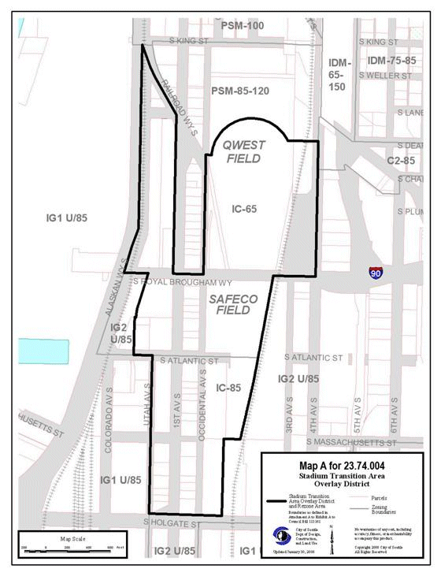

##### 23.74.006 - Application of Regulations.

Land located within the Stadium Transition Area Overlay District, as shown on Exhibit 23.74.004 A, is subject to the regulations of the underlying zone except as otherwise expressly provided in this chapter. In the event of a conflict between the provisions of this chapter and the underlying zone, the provisions of this chapter apply. Where the provisions of the underlying zone are more restrictive, that is not considered a conflict and compliance with the provisions of the underlying zone is required, except as specifically provided in this chapter. Where the provisions of this chapter are more restrictive, compliance with those provisions is required, subject to any departures that may be authorized pursuant to design review under Section 23.41.012 and to provisions for nonconforming uses and structures in Sections 23.50.008 and 23.50.010.

#### Subchapter II - Uses and Development Standards
##### 23.74.008 - Uses.

Notwithstanding the use provisions of the underlying zone, the following use provisions apply:

1. The following uses are permitted outright:

    1. Medical services;
    2. Museums;
    3. Community clubs or centers;
    4. Private clubs; and
    5. Religious facilities.
2. The following uses are permitted in buildings existing on September 1, 1999:

    1. Artist's studio/dwellings;
    2. Major institutions.
3. The following uses are prohibited:

    1. Heavy manufacturing uses;
    2. High-impact uses;
    3. Solid waste management;
    4. Recycling uses;
    5. Animal shelters and kennels;
    6. Veterinary offices;
    7. Pet grooming;
    8. Airports, land and water based;
    9. Hospitals;
    10. Elementary and secondary schools;
    11. Drive-in businesses, except gas stations;
    12. Bus bases;
    13. Principal use parking;
    14. Lodging uses; and
    15. Colleges.

##### 23.74.009 - Height.

1. Within the Stadium Transition Area Overlay District, maximum height limits of the underlying zone are not applicable to spectator sports facilities.
2. Parking garages accessory to spectator sports facilities north of South Royal Brougham Way may exceed the height limit if all the conditions in this subsection B are satisfied.

    1. A Master Use Permit ("MUP") decision to permit the parking garage was issued before June 12, 2000.
    2. Any height above the maximum height permitted by such MUP decision is allowed by the Director pursuant to applicable provisions of this title for modification of such decision.
    3. The total height of the parking garage does not exceed 130 feet. If additional height is granted as described in subsection B2 above, exemptions for rooftop features from height limits of the underlying zone shall apply only to the extent the Director determines such features and exemptions are necessary to the operation of the structure.
    4. All floor area above the maximum height allowed by such MUP decision is used as parking required for the spectator sports facility, or for storage or meeting space accessory to the spectator sports facility or exhibition hall.

##### 23.74.010 - Development standards

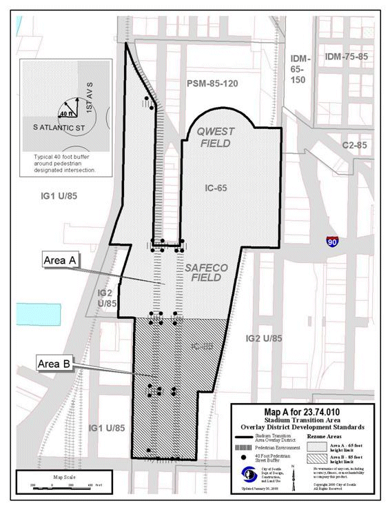

1. Within the Stadium Transition Area Overlay District, the following development standards apply to all uses and structures except for spectator sports facilities:

    1. Accessory Parking and Outdoor Storage.

        1. Accessory parking or outdoor storage on any lot to the side of a structure on that lot shall not exceed sixty (60) feet of street frontage along 1st Avenue South or along Occidental Avenue South, and may not be located within the first forty (40) feet from any intersection described in Section 23.74.010 C. Parking shall be screened in accordance with screening standards for Class II Pedestrian Streets in downtown zones.
        2. The maximum parking ratio is one (1) space per six hundred fifty (650) square feet of gross floor area of all uses for which required parking is expressed in terms of square footage, except for institutions for which minimum parking requirements apply, and except for parking accessory to a spectator sports facility or exhibition hall. Nonrequired parking accessory to a spectator sports facility or exhibition hall is not permitted in the overlay district.
    2. Curb cuts. Curb cuts are limited to three (3) per block front along north-south streets and Railroad Way South within the area described in subsection C of this section. No curb cuts are allowed within the first forty (40) feet from any intersection described in subsection C of this section. On east-west streets outside the area described in subsection C of this section, curb cuts are limited to two (2) per block front. On east-west streets, additional curb cuts may be allowed if no other access is possible, including in the forty (40) feet from intersections described in subsection C of this section.
2. For the areas marked on Map A for 23.74.010, the following development standards and provisions apply to all uses and structures except for spectator sports facilities:

    1. Floor Area Ratio (FAR). The maximum FAR for all uses is 3.0. FAR limits of the underlying zone do not apply, but limits in subsection 23.50.027.A.1 on gross floor area of certain uses, including limits based on lot area, do apply.
    2. Exemptions. The first 75,000 square feet of street-level general sales and service, medical services, animal shelters or kennels, automotive sales and services, marine sales and services, eating and drinking establishments, or lodging uses on any lot are exempt from the maximum FAR limit. Exemptions in subsection 23.50.028.E also apply.
3. The following development standards apply to each use and structure, except spectator sports facilities, to the extent that the use or structure either is on a lot fronting on Railroad Way South, First Avenue South, South Holgate between First Avenue South and Occidental Avenue South, or Occidental Avenue South, or is within a 40 foot radius measured from any of the block corners of First Avenue South or Occidental Avenue South intersecting with the following streets: Railroad Way South, South Royal Brougham, South Atlantic, South Massachusetts, South Holgate and any other streets intersecting with First Avenue or Occidental Avenue South that may be established between South Holgate Street and Railroad Way South, as depicted in Map A for 23.74.010. Railroad Way South, First Avenue South, South Holgate Street and Occidental Avenue South within the Stadium Transition Area Overlay District, and all street areas within a 40 foot radius of any of those block corners described above, are referred to in this Section 23.74.010 as the "pedestrian environment," except that in applying this Section 23.74.010 to a through lot abutting on Occidental Avenue South and on First Avenue South, Occidental Avenue South is not considered part of the pedestrian environment.

    1. Street Facade Requirements. The following requirements apply to facades or portions thereof facing streets or portions of streets in the pedestrian environment:

        1. Minimum Facade Height. Minimum facade height is 25 feet, but minimum facade heights do not apply if all portions of the structure are lower than the elevation of the required minimum facade height.
        2. Facade Setback Limits.

            1. Within the first 25 feet of height measured from sidewalk grade, all building facades must be built to within 2 feet of the street property line for the entire facade length. For purposes of this subsection 23.74.010.C.1.b, balcony railings and other nonstructural features or nonstructural walls are not considered parts of the facade of the structure.
            2. Above 25 feet measured from sidewalk grade, the maximum setback is 10 feet, and no single setback area that is deeper than 2 feet shall be wider than 20 feet, measured parallel to the street property line.
            3. The facade shall return to within 2 feet of the street property line for a minimum of 10 feet, measured parallel to the street property line, between any two setback areas that are deeper than 2 feet.
    2. Outdoor Service Areas. Gas station pumps, service islands, queuing lanes, and other service areas related to fueling are not allowed between any structure and the pedestrian environment area described in this Section 23.74.010. Gas station pumps, service islands, queuing lanes, and other service areas related to fueling must be located behind or to the side of a gas station, as viewed from any street in such pedestrian environment and are not allowed between any structure on the same lot and the pedestrian environment area described in this Section 23.74.010.
    3. Screening and Landscaping. The requirements of Sections 23.50.016, 23.50.034, and 23.50.038, including requirements contingent on location near a commercial zone, apply to all new uses and structures. Requirements in Section 23.50.038 contingent on location near a residential lot do not apply. In addition, the screening and landscaping requirements for outdoor storage in subsection 23.47A.016.D.2 apply, with respect to street lot lines abutting the pedestrian environment, to the following uses, where a principal or accessory use is located outdoors: outdoor storage (except for outdoor storage associated with florists and horticultural uses), sales and rental of motorized vehicles, towing services, sales and rental of large boats, dry boat storage, heavy commercial sales except fuel sales, heavy commercial services, outdoor sports and recreation, wholesale showrooms, mini-warehouse, warehouse, transportation facilities except rail transit facilities, utilities (except for utility service uses), and light and general manufacturing.
    4. Blank Facades and Transparency Requirements. In addition to the blank facade requirements of subsection 23.50.038.B, the blank façade limits and transparency and street tree requirements of subsections 23.49.056.C, D, and E, and the screening of parking requirements of subsection 23.49.019.B apply to facades or portions thereof facing streets in the pedestrian environment, except that requirements for Class I Pedestrian Streets and designated green streets do not apply.
    5. Principal Pedestrian Entrances. A principal pedestrian entrance to a structure having a facade along Railroad Way South, First Avenue South, or Occidental Avenue South shall be located on Railroad Way South, First Avenue South, or Occidental Avenue South, respectively. If the structure has facades along both First Avenue South and Occidental Avenue South, a principal pedestrian entrance is required only on First Avenue South.

### Division 4 - Master Planned Communities

### Chapter 23.75 - MASTER PLANNED COMMUNITIES

Sections:

#### Subchapter 1 - Purpose and intent
##### 23.75.002 - Purpose and intent

Comprehensive Plan Land Use Element Section C establishes a Master Planned Community designation (MPC). The purpose of this Chapter 23.75 and the Master Planned Community zone is to implement the Comprehensive Plan by regulating land use within MPC zones. By allowing greater flexibility in the application of zoning and development requirements, an MPC zone designation is intended to support highly coordinated infill development with a higher level of environmental sustainability, affordable housing, and publicly accessible open space than is typically provided through conventional lot-by-lot development.

#### Subchapter 2 - Yesler Terrace

#### Part 1 - General
##### 23.75.010 - Scope of provisions

This Subchapter 2 of Chapter 23.75 establishes the authorized uses and development standards for the Master Planned Community - Yesler Terrace (MPC-YT) zone. The MPC-YT zone is shown on the Official Land Use Map. Certain use provisions and development standards are applied on a sector or block basis, according to sectors and blocks defined in Section 23.75.020, and limits established on a sector or block basis are generally allocated to lots pursuant to Section 23.75.040. If not stated otherwise, use provisions and development standards apply on a lot basis.

##### 23.75.015 - Applicability of use and development standards

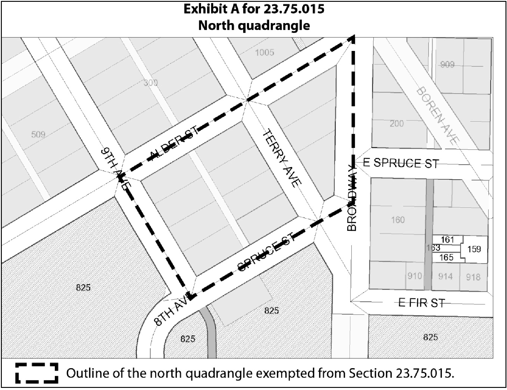

1. This Section 23.75.015 applies to the entire MPC-YT zone except for:

    1. the land identified as the north quadrangle in Exhibit A for 23.75.015, for which the whole of this Chapter 23.75 except for this Section 23.75.015 will apply on and following the effective date of this ordinance; and
    2. renovations and additions to the existing steam plant building in Block 2, for which the provisions of Chapter 23.45 applicable to property zoned LR3 shall apply instead of this Chapter 23.75, regardless of whether or not an approved final plat has been recorded.
2. Except as otherwise provided in subsection 23.75.015.C, Part 2 and Part 3 of Chapter 23.75 shall not be applied for purposes of a land use decision other than a Type III decision unless, as of the date of that land use decision:

    1. there has been recorded, after January 1, 2012, an approved final plat of subdivision that includes the property for which the land use decision is made; and
    2. the Director of Transportation has filed with the City Clerk a certificate confirming that the City has accepted dedications, in a recorded plat or otherwise, establishing streets as necessary to complete, substantially as depicted in Exhibit A for 23.75.020, at least the portions of the streets that include or abut any part of the block where property subject to the decision is located and that are necessary to connect those portions to the improved street grid in each direction.
3. Part 2 and Part 3 of Chapter 23.75 may be applied for purposes of a Type I or Type II land use decision for one building on the block bounded by Spruce Street, 8 Avenue, Yesler Way, and Broadway Avenue, if the Director determines as a Type I decision that the proposed development does not interfere with the conceptual block and street configuration shown in Exhibit A for 23.75.020.
4. If, pursuant to subsection 23.75.015.B, Part 2 and Part 3 of Chapter 23.75 are not applied for purposes of a land use decision, the provisions of Chapter 23.45 that apply to property zoned LR3 shall be applied instead.
5. Uses and structures established pursuant to subsections 23.75.015.C and 23.75.015.D are included for purposes of application of aggregate limits to proposed development under Part 2 and Part 3 of Chapter 23.75 and allocations of those limits to lots under Section 23.75.040.
6. The intent of this Section 23.75.015 is that all of Chapter 23.75 be in effect, for purposes of Section 23.76.026 and any other "vesting" laws or ordinances, as to all property in the MPC-YT zone, both before and after the events described in subsections 23.75.015.B.1 and 23.75.015.B.2.

##### 23.75.020 - Definitions

"Access drive" means a vehicle access easement providing access to two or more lots and meeting the requirements of Section 23.53.025.

"Affordable housing" means housing, not existing as of January 1, 2012, committed to be provided to meet the conditions to increase residential floor area under Table A for 23.75.085.

"Base setback" means the minimum setback required, if any, for the portion of a façade between zero and 50 feet in height.

"Block" means one of the areas identified with a block number in Exhibit A for 23.75.020. Block margins align with the margins of the MPC-YT zone; with street centerlines of Yesler Way, E. Yesler Way, Broadway, 8 Ave., 9 Ave., and 10 Ave; the centerline of E. Fir Street projected westerly from Broadway, as shown; the centerline of S. Washington Street, as shown; and the centerline of 10 Ave S., between E. Yesler Way and S. Main St., as shown.

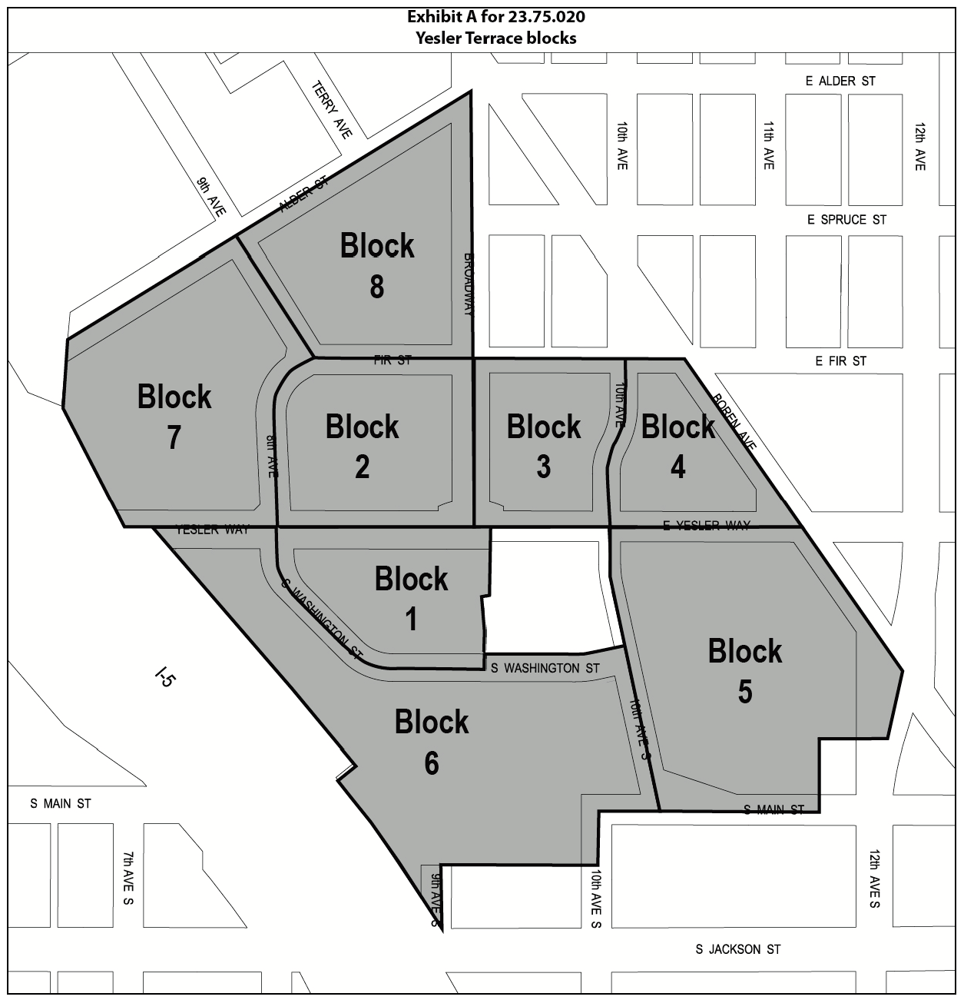

"Boundary" means any of the following, and for purposes of development standards means whichever of the following is closest to a given side of a structure: a lot line; the margin of an access drive; the margin of a pedestrian pathway; or the margin of a park that is open to the public.

"Build-to line" means any of the boundaries identified as build-to lines in Section 23.75.140.

"Certificate of occupancy" means the first certificate of occupancy issued by the City for a structure, whether temporary or permanent.

"Highrise structure" means a structure that exceeds 85 feet in height, as measured pursuant to Section 23.86.006.

"Non-highrise structure" means a structure that is not a highrise structure.

"Pedestrian pathway" means an area defined by a final plat or recorded permanent easement, with no horizontal dimension less than 32 feet at any point, that (1) includes a portion subject to a public easement, allowing pedestrian access from one side of a block to another side of the same block, and not allowing motor vehicle use except for emergency or maintenance vehicles and except that a pedestrian pathway may intersect an access drive; and (2) outside of the public easement portion, is dedicated on terms that do not allow any gross floor area of a structure, but may allow structures such as sign kiosks, arbors, fences, and freestanding walls, and may allow projections from structures such as decks or patios.

"Regulated façade" means the portion of a façade, if any, that is adjacent to a street, a park that is open to the public, a pedestrian pathway, or an access drive; is oriented at less than a 90 degree angle to the boundary that is closest to the facade; and is not separated from that boundary by any part of another lot, or any structure except a retaining wall, deck, freestanding wall, fence, ramp, solar collector, or sign.

"Replacement unit" means one of the first 561 new or renovated housing units constructed in the Yesler Terrace redevelopment area, to be occupied by or reserved for Yesler Terrace residents who must relocate due to demolition and construction or households with incomes no higher than 30 percent of median income, as defined in Section 23.84A.025, at the time of initial occupancy by the household, subject to the term of and commitment to affordability in subsection 23.75.085.C.2.

"Residential floor area" means gross floor area in residential use plus gross floor area of live-work units, except that it does not include any floor area of residential structures existing as of January 1, 2012.

"Sector" means one of the areas identified in Exhibit B for 23.75.020. Sector margins align with the margins of the MPC-YT zone, with street centerlines of Yesler Way, E. Yesler Way and Broadway, as shown, and with the border between Block 5 and Block 6.

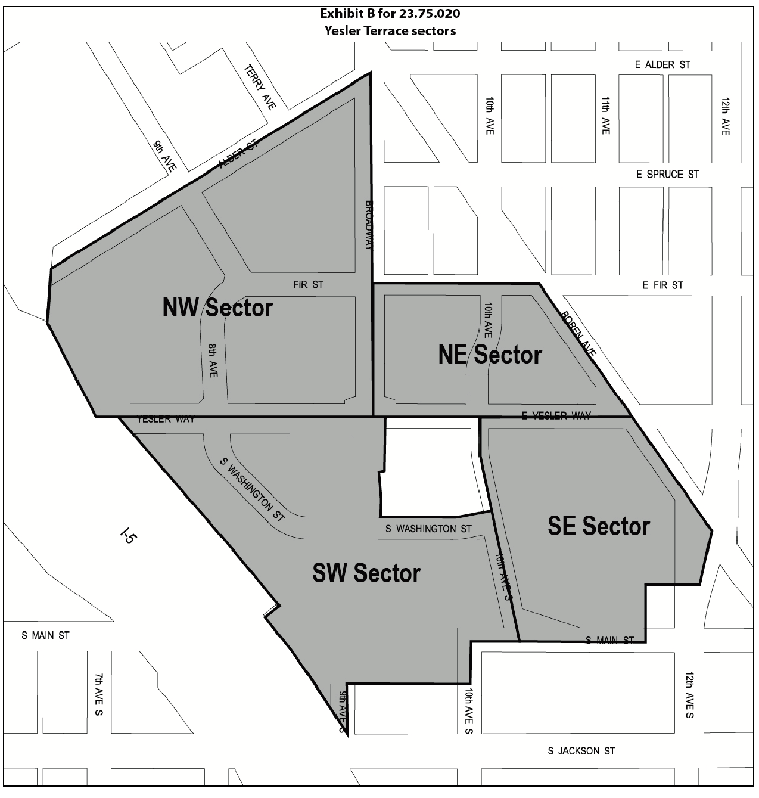

"Setback condition" for any location means the circumstance determining the setbacks that may be required under Section 23.75.140, including the type of special setback area or the type of boundary closest to a façade of a structure, as applicable.

"Smallest bounding rectangle" means the smallest rectangle that can be drawn in plan view to enclose all portions of a highrise structure located above 85 feet.

"Yesler Terrace redevelopment area" means the MPC-YT zone as well as the area bounded by Boren Ave, E. Yesler Way, 14 Ave., and E. Fir Street.

"60 percent of MI unit" means a dwelling unit of affordable housing, other than a replacement unit or 80 percent of MI unit, to be occupied by or reserved solely for households with incomes no higher than 60 percent of median income, as defined in Section 23.84A.025, at the time of initial occupancy by the household, subject to the term of and commitment to affordability in subsection 23.75.085.C.2.

"80 percent of MI unit" means a dwelling unit of affordable housing, other than a replacement unit or 60 percent of MI unit, to be occupied by or reserved solely for households with incomes no higher than 80 percent of median income, as defined in Section 23.84A.025, at the time of initial occupancy by the household, subject to the term of and commitment to affordability in subsection 23.75.085.C.2.

1. Scope and applicability

    1. General rule. The terms set forth in quotation marks in this Section 23.75.020, when used in this Chapter 23.75, have the meanings set forth unless the context otherwise requires.
    2. Definitions in Chapter 23.84A. For purposes of this Chapter 23.75, definitions in this Chapter 23.75 supersede any definitions of the same terms in Chapter 23.84A.
2. Defined terms

#### Part 2 - Use provisions and limits
##### 23.75.040 - Aggregate standards and allocations

1. Definitions. For purposes of this Section 23.75.040:

    1. "Limit" means one of the following:

        1. the maximum residential floor area that may be located in the MPC-YT zone, as determined for each tier under Section 23.75.085;
        2. the maximum residential floor area that may be located in each sector, as set forth in Section 23.75.085;
        3. the maximum nonresidential floor area, by category of use, that may be located in the MPC-YT zone, as determined under Section 23.75.090;
        4. the maximum number of highrise structures that may be located in a sector, as set forth in Section 23.75.120;
        5. in certain blocks, the number of highrise structures for which alternative development standards may be elected, as set forth in Section 23.75.120;
        6. the maximum number of parking spaces, in addition to those based on a ratio to residential units, that that may be located within the NW sector without a special exception, as set forth in Section 23.75.180;
        7. the maximum number of parking spaces, in addition to those based on a ratio to residential units and those allowed as described in subsection 23.75.040.A.1.f, that may be located within the NW sector with a special exception, as set forth in Section 23.75.180; and
        8. the maximum number of surface parking spaces in a block, as set forth in Section 23.75.180.
    2. "Allocation document" means a recorded final plat, declaration or covenant, as it may be established or amended in accordance with subsection 23.75.040.C; is signed by all owners of record of lots subject to the allocation document; provides that pursuant to this Section 23.75.040, the lots are combined for the purposes of that limit except to the extent that the limit is allocated to specific lots as approved by the Director; provides for possible reallocation among lots by agreement of the owners of only those lots; and provides notice that the current allocation to any lot must be determined from the records of the Department. The same plat, declaration or covenant may include multiple allocation documents for different limits and may create different combined lots for different limits.
    3. "Combined lot" means two or more lots that have been combined for purposes of any limit under an allocation document, and that remain so combined under subsection 23.75.040.D.3.
    4. "Formula parking allowance" means the maximum number of parking spaces allowed in a sector based on ratios to developed non-parking uses under Section 23.75.180.
2. General rules. Development on any lot in the MPC-YT zone shall not exceed, in any quantity subject to a limit listed in subsection 23.74.040.A.1, that portion of the limit allocated to that lot in accordance with this Section 23.75.040. The Director shall apply each limit by requiring as a condition of permit approval that a lot have a sufficient unused allocation of that limit according to this Section 23.75.040 for the proposed development. The same use or structure may require sufficient allocations of more than one of the limits. A permit for development on a lot may not be denied based on a limit if the lot has a sufficient, valid, unused allocation of the limit under this Section 23.75.040.
3. Allocation document.

    1. The owners of all lots that are subject to a limit, whether or not contiguous, and upon which no part of the limit has yet been used, may combine the lots for purposes of that limit pursuant to an allocation document approved by the Director, and may then allocate the limit among those lots as the owners may elect, subject to approval by the Director under this subsection 23.75.040.C.
    2. The Director shall approve an allocation document only if the Director determines, as a Type I decision, that the document is consistent with this Chapter 23.75 and provides for an allocation process that will specify the allocations of one or more limits consistent with this Chapter 23.75 in a manner that will maintain consistency with those limits and allow the Director to determine the validity of each allocation to be made. To facilitate administration of this Chapter 23.75, the Director may establish, by rule, procedural requirements for allocation documents and allocations under them, and may approve or disapprove provisions in allocation documents for limits or conditions on allocations or reallocations in addition to those required.
    3. Any amendment to an allocation document is effective only if signed by all owners of record of all property subject to the allocation document and only if the Director approves the allocation document as amended, as a Type I decision, based on a determination that it is consistent with the requirements for an allocation document and with allocations previously made.
    4. Unless initial allocations to each lot are specified in the allocation document, in order to establish the initial allocation to the first lot to which an allocation is made, the process must require written approval of the owners of all lots initially combined. In order to establish the initial allocation to each other lot, the written approval of the owners of all remaining lots combined for purposes of that limit is required as provided in subsection 23.75.040.D.3.
4. Allocations of limits.

    1. Unless all lots subject to a limit have been combined pursuant to subsection 23.75.040.C for purposes of a limit, each lot has an allocation of that limit in the same proportion as the lot area bears to the area of all lots subject to the limit, rounded down to the nearest integer, which may be zero. For purposes of this subsection 23.75.040.D.1, the area of every lot subject to a limit and the total area of all lots subject to the limit is determined as of the date when the first Master Use Permit application is submitted for the use of any part of the limit on any lot, so that the allocations of the limit to all lots are then fixed, subject to any reallocations under subsection 23.75.040.D.7.
    2. If lots are combined pursuant to subsection 23.75.040.C for purposes of a limit, then

        1. before any allocation is made to one of those lots pursuant to this Section 23.75.040, the combined lot has an undivided allocation of that limit equal to the entire limit; and
        2. as allocations to specific lots are made pursuant to this Section 23.75.040, the undivided allocation of that limit to the remaining combined lot is reduced by each amount so allocated.
    3. If, after a lot is combined with one or more other lots pursuant to subsection 23.75.040.C for the purposes of a limit, an allocation of that limit is made to the lot in accordance with subsection 23.75.040.D.5, then the lot has the allocation so approved, and is no longer part of a combined lot for purposes of that limit. The lot may remain eligible to receive additional allocations, transfer an unused portion of its allocation to other lots, or both, pursuant to the allocation document and subject to any applicable rules issued by the Director.
    4. When a specific lot has been made part of a combined lot and no allocation of the limit to the specific lot has been approved by the Director, no development of that lot requiring an allocable portion of that limit is permitted, except that if the combined lot is a single development site for purposes of an application, then the limit is for the combined lot as determined under subsection 23.75.040.D.2.
    5. Pursuant to processes established in an allocation document consistent with 23.75.140.C, the portion of a limit allocated to a lot shall be initially established, and may be modified, in a manner that maintains consistency with the limit, in each case effective upon approval of the allocation or reallocation by the Director, as a Type I decision. The Director shall approve the allocation or reallocation under processes established in an allocation document, provided that:

        1. the owners of the lots affected have provided written approval; and
        2. the Director determines that the proposed allocation or reallocation is consistent with this Chapter 23.75 and with any relevant applications then pending, and with requirements of form and procedure established by the Director, and that any special conditions in the allocation document, are satisfied.
    6. The allocation document may provide for reallocations among lots to which initial allocations have been made, with the written approval of the owners of the lots affected. A limit may not be reallocated in any manner that would create a nonconformity, or increase the extent of any nonconformity, based on established uses or structures, or based on any development for which a permit has been issued or is pending.
    7. If lot lines are modified or new lots are created, then except to the extent otherwise provided in an allocation document or pursuant to agreements among owners approved by the Director, each new or modified lot shall have a share of each of the total allocations previously applicable to all lots affected by the modification of lot lines or creation of the new lots, in the same proportion as the area of that lot bears to the area of all such lots, except that the allocation to any new or modified lot shall be adjusted to the extent required so as not to create a nonconformity, or increase the extent of any existing nonconformity. To the extent necessary to offset any disproportionate allocation required to avoid a nonconformity, allocations to other new or modified lots shall be reduced in proportion to their respective lot areas. All reallocated limits that otherwise would include fractions shall be rounded down to the next integer. For purposes of adjustment of allocations described in this subsection 23.75.040.D.7, a combined lot then existing for any limit is treated as a single lot for that limit.
5. Formula parking allowance transfers.

    1. The portion of the formula parking allowance for a sector permitted on any lot is that portion attributable to the non-parking uses developed on that lot, except as permitted in this subsection 23.75.040.E.
    2. To the extent that the amount of parking existing, established by permit, and subject to pending applications for permits on a lot is less than the amount allowed under this subsection 23.75.040.E, the owner of that lot may transfer formula parking credits to another lot in the sector, in a manner prescribed by the Director.
    3. The transfer of formula parking credits increases the number of parking spaces permitted on the lot receiving the transfer and reduces the number of spaces permitted on the lot from which the transfer is made by the same amount.

##### 23.75.050 - Permitted uses

1. Except as provided in this Section 23.75.050, Section 23.75.060, and Section 23.75.070, all uses are permitted outright, both as principal uses and as accessory uses.
2. Permitted uses in Block 1 are restricted to:

    1. Parks and accessory uses, including farmers markets or crafts markets or displays; and
    2. Eating and drinking establishments and general sales and service uses, limited to one story and no more than 1,500 square feet of gross floor area for all such uses. No more than 700 square feet of accessory outdoor seating is permitted.

##### 23.75.060 - Prohibited uses

The following uses are prohibited as both principal and accessory uses, except as provided in this Section 23.75.060 or Section 23.75.070:

1. Adult cabarets, adult motion picture theaters, and adult panorams;
2. Animal shelters and kennels;
3. Animal husbandry;
4. Communication utilities, major;
5. Drive-in businesses;
6. General manufacturing uses;
7. Heavy manufacturing uses;
8. High-impact uses;
9. Jails;
10. Mobile home parks;
11. Outdoor storage, except for outdoor storage associated with community gardens, florists, and horticulture uses;
12. Recycling;
13. Sales and services, heavy, except for major durables retail sales;
14. Solid waste management;
15. Storage as a principal use;
16. Transportation facilities, air;
17. Vehicle storage and maintenance, except if fully enclosed and used exclusively by Seattle Housing Authority vehicles;
18. Warehouses and mini-warehouses; and
19. Work release centers.

##### 23.75.070 - Conditional uses

1. Conditional use criteria.

    1. All applications for conditional uses are subject to the procedures described in Chapter 23.76.
    2. A conditional use is not allowed if it would be materially detrimental to the public welfare or injurious to property in the zone or vicinity in which the property is located.
    3. In authorizing a conditional use, the Director may impose requirements or conditions to avoid or mitigate adverse impacts.
    4. The Director shall deny a conditional use if the Director determines that the negative impacts cannot be mitigated satisfactorily.
2. The Director may permit the following uses as administrative conditional uses if the provisions of this Section 23.75.070 are met:

    1. Animal husbandry, as an accessory use only;
    2. District energy supply facilities;
    3. Recycling, as an accessory use only;
    4. Sales and services, automotive; and
    5. Solid waste management, as an accessory use only.

##### 23.75.080 - Street-level uses

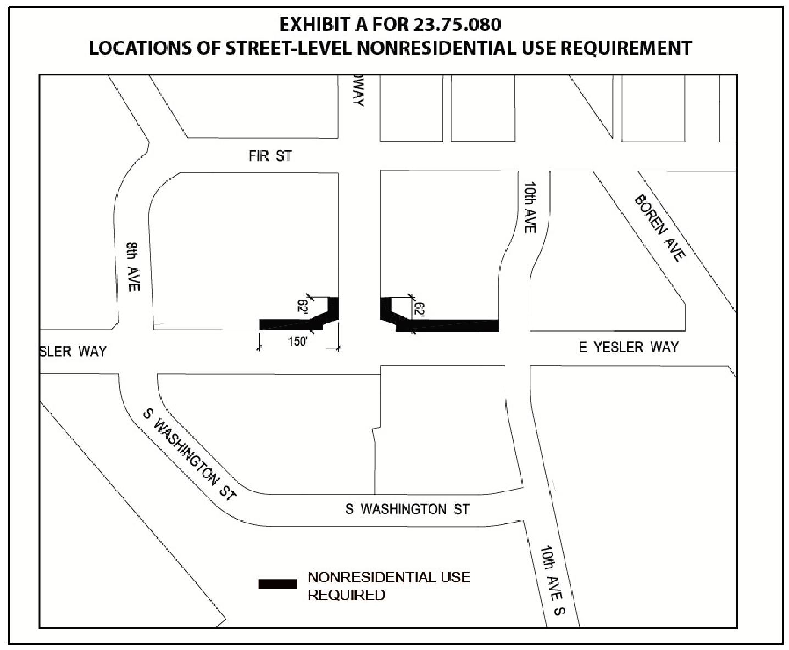

1. Both sides of Broadway, from Yesler Way to 62 feet north of the north margin of Yesler Way;
2. The north side of East Yesler Way from the east margin of Broadway to the west margin of 10 Avenue; and
3. The north side of Yesler Way from the west margin of Broadway to 150 feet west of the west margin of Broadway.

1. Nonresidential uses are not allowed to occupy, in the aggregate, more than 20 percent of the total street-level street-facing façades, along S. Washington Street, of all structures on a lot, except that abutting lots may be combined and treated as one lot for purposes of this subsection 23.75.080.A pursuant to an agreement among the lot owners, satisfactory to the Director and recorded with the King County Recorder.
2. Any lot abutting any of the following sides of street segments, illustrated in Exhibit A for 23.75.080, is subject to requirements in subsection 23.75.080.C:
3. Along the street segments identified in subsection 23.75.080.B, one or more of the following uses are required along at least 80 percent of the street-level, street-facing façade of each structure. The usable space of these uses must have a minimum depth of 30 feet.

    1. All institutions except hospitals and private clubs;
    2. Eating and drinking establishments;
    3. General sales and services;
    4. Human service uses;
    5. Indoor sports and recreation;
    6. Lodging uses;
    7. Major durables retail sales;
    8. Medical services;
    9. Office designated for use by Seattle Housing Authority for redevelopment planning or leasing purposes; or
    10. Theaters and spectator sport facilities.

##### 23.75.085 - Residential floor area limits; affordable housing incentive program

Table A forMaximum floor area limits for residential usesbased on affordable housing production

<table>
<tr>
<td></td>
<td>Affordable housing production conditions for the Yesler Terrace redevelopment area (cumulative) to increase maximum floor area limit to the next tier</td>
<td>Maximum residential floor area allowed in the MPC-YT zone</td>
</tr>
<tr>
<td>Tier 1</td>
<td>•  187 replacement units</td>
<td>1,400,000 square feet</td>
</tr>
<tr>
<td>(base)</td>
<td>•  80 60% of MI units</td>
<td></td>
</tr>
<tr>
<td></td>
<td>•  A number of 80% of MI units equal to 4.5 percent of all housing units completed to date in the MPC-YT zone in accordance with 23.75.085.D, other than replacement units and 60% of MI units.</td>
<td></td>
</tr>
<tr>
<td>Tier 2</td>
<td>•  374 replacement units</td>
<td>2,750,000 square feet</td>
</tr>
<tr>
<td></td>
<td>•  160 60% of MI units</td>
<td></td>
</tr>
<tr>
<td></td>
<td>•  A number of 80% of MI units equal to 4.5 percent of all housing units completed to date in the MPC-YT zone in accordance with 23.75.085.D, other than replacement units and 60% of MI units.</td>
<td></td>
</tr>
<tr>
<td>Tier 3</td>
<td>•  561 Replacement units</td>
<td>3,350,000 square feet</td>
</tr>
<tr>
<td></td>
<td>•  290 60% of MI units</td>
<td></td>
</tr>
<tr>
<td></td>
<td>•  A number of 80% of MI units equal to 4.5 percent of all housing units completed to date in the MPC-YT zone in accordance with 23.75.085.D, other than replacement units and 60% of MI units.</td>
<td></td>
</tr>
<tr>
<td>Tier 4</td>
<td>Not applicable</td>
<td>3,950,000 square feet</td>
</tr>
<tr>
<td>Footnotes to Table A for 23.75.085Housing existing as of January 1, 2012 does not count toward the affordable housing production conditions or the maximum residential floor area allowed.</td>
</tr>
</table>

1. In order to count toward the conditions to a higher tier under Table A for 23.75.085, affordable housing shall be committed under recorded covenants or instruments, acceptable to the Director of Housing, to satisfy the following requirements:

    1. Term. The affordable housing shall serve only income eligible households for replacement units, 60 percent of MI units, or 80 percent of MI units, as defined in Section 23.75.020, for a minimum of fifty years from the date when the affordable housing becomes available for occupancy as determined by the Director of Housing.
    2. Affordability. Units must be committed to affordability as follows:

        1. Except as permitted in subsection 23.75.085.C.2.b.5, for replacement units, monthly rent, including basic utilities, shall be as allowed under the 1937 U.S. Housing Act, as amended, and agreements between the Seattle Housing Authority and the U.S. Department of Housing & Urban Development (HUD) and, for City-funded replacement units, agreements between the Seattle Housing Authority and the City of Seattle. Rent may increase in proportion to household income for qualifying tenants provided that rent shall not exceed 30 percent of 80 percent of median income. For purposes of this section, Yesler Terrace residents who are eligible to return pursuant to a relocation plan adopted by the Seattle Housing Authority shall be deemed to have met initial occupancy requirements.
        2. Except as permitted in subsection 23.75.085.C.2.b.5, for 60 percent of MI units, monthly rent, including basic utilities, shall not exceed 30 percent of 60 percent of median income.
        3. For 80 percent of MI units that are rental housing, monthly rent, including basic utilities, shall not exceed 30 percent of 80 percent of median income.
        4. For 80 percent of MI units that are offered for sale, the initial sale price shall not exceed an amount determined by the Director of Housing to be affordable to a household with an income, at the time of initial occupancy by the household, no higher than 80 percent of median income. The unit shall be subject to recorded covenants or instruments satisfactory to the Director of Housing providing for sales prices on any resales consistent with affordability requirements on the same basis for at least fifty years. The Director of Housing is authorized to adopt, by rule, the method of determining affordability, including estimated monthly housing costs and requirements relating to down payment amount and homebuyer contributions.
        5. The Director of Housing is authorized to amend covenants to adjust affordability and income limits up to a maximum of 30 percent of 80 percent of median income if the Director of Housing determines that:

            1. in the case of replacement units, a reduction in federal operating subsidies has made such funding insufficient to maintain the replacement units for households with incomes at or below 30 percent of median income;
            2. in the case of 60 percent of MI units, after 40 years from initial occupancy of a building, rent levels are insufficient to operate and maintain the units or to meet any required debt coverage ratios as required by financing;
            3. the number of units with adjusted affordability has been minimized to the extent practical, and
            4. one or more agreements are entered into between the housing owner and the Director of Housing committing the housing owner(s) to new affordability and occupancy requirements effective when replacement units and/or 60 percent of MI units are vacated and available for occupancy by new tenants.
    3. Size. If provided in a development permitted under a single master use permit that includes dwelling units other than affordable housing, the average net floor area of the affordable housing units shall be no smaller than the average net floor area per unit of the development as a whole.
    4. Location. Affordable housing must be located within the Yesler Terrace redevelopment area. No more than 140 of the replacement units shall be located east of Boren Avenue. A minimum of 50 replacement units shall be located in at least five of the eight blocks west of Boren Avenue. When provided within a development permitted under a single master use permit that includes dwelling units other than affordable housing, the affordable housing shall generally be distributed throughout the development.
2. No subsidies for 80 percent of MI units; exceptions

    1. The associated covenant required in order for an 80 percent of MI unit to count toward the conditions to a higher tier under Table A for 23.75.085 must include provisions prohibiting subsidies provided for or related to that unit. For purposes of this subsection 23.75.085.C.3, "subsidies" includes federal loans or grants, City of Seattle housing loans or grants, developer contributions for affordable housing made in exchange for bonus floor area in a zone other than MPC-YT, county housing funds, and State of Washington housing funds, except as provided in this subsection 23.75.085.C.3.
    2. Housing that is or upon completion would be subject to any restrictions on the income of occupants, rents, or sale prices, independent of requirements in this Section 23.75.085 and Chapter 5.73, may not be counted as affordable housing under this Section 23.75.085, except as provided in subsection 23.75.085.C.3.c.
    3. For purposes of this subsection 23.75.085.C.3, the following do not constitute a subsidy, and any related conditions regarding incomes, rents, or sale prices do not constitute restrictions:

        1. Any benefit to the developer of discounted land sales prices;
        2. Use of Washington State Housing Finance Commission bonds and 4-percent low-income housing tax credits; and
        3. The qualification for and use of property tax exemptions pursuant to Chapter 5.73.
Table B forDistribution of residential floor area

<table>
<tr>
<td>Sector</td>
<td>Maximum residential floor area*</td>
</tr>
<tr>
<td>NW sector</td>
<td>1,500,000 square feet</td>
</tr>
<tr>
<td>NE sector</td>
<td>875,000 square feet</td>
</tr>
<tr>
<td>SW sector</td>
<td>1,437,500 square feet</td>
</tr>
<tr>
<td>SE sector</td>
<td>1,125,000 square feet</td>
</tr>
<tr>
<td>*While the sum of the sector allocations in this table exceeds the maximum established for the entire zone, this subsection 23.75.085.G does not allow the total amount of residential floor area in all sectors combined to exceed the limit in effect under Table A for 23.75.085.</td>
</tr>
</table>

1. Purpose. The provisions of this Section 23.75.085 are intended to implement an affordable housing incentive program as authorized by RCW 36.70A.540.
2. Findings. Pursuant to the authority of RCW 36.70A.540, the City finds that:

    1. The phased redevelopment of the properties in the MPC-YT zone addresses the need for increased residential development to achieve local growth management and housing policies; and
    2. The terms of the affordable housing incentive program in this Section 23.75.085 take into account that federal funding is expected for housing that will replace existing public housing and that will serve households with incomes, at the time of initial occupancy by the household, at or below 30 percent of median income, but that for affordable housing not receiving federal subsidies, the higher income levels specified in the definitions of "60 percent of MI unit" and "80 percent of MI unit" in this Chapter 23.75, rather than the level stated for rental housing in the definition of "low-income households" in RCW 36.70A.540, are needed to address local housing market conditions.
3. Residential floor area limits.

    1. The aggregate residential floor area limit for built and permitted development on all lots within the MPC-YT zone is established in Table A for 23.75.085 and subject to the following conditions:

        1. The aggregate residential floor area limit is increased in stages, referred to as "tiers," when affordable housing is provided in accordance with the terms of this Section 23.75.085 in amounts sufficient to satisfy the conditions for the next tier according to Table A for 23.75.085.
        2. The Tier 1 limit is the base, so no affordable housing needs to be provided in order for aggregate residential floor area to reach the Tier 1 limit.
        3. If the total amount of constructed or permitted floor area reaches the applicable tier limit, but affordable housing production conditions have not been satisfied, no further building permits for residential floor area may be issued except for replacement units, 60 percent of MI units, or 80 percent of MI units. In counting total permitted residential floor area, projects with expired or cancelled permits shall not be included.
        4. After the maximum residential floor area allowed has been increased to Tier 4, no Master Use Permit for a development including residential floor area shall be issued unless the development application includes a number of 80 percent of MI units equal to 4.5 percent of the total number of dwelling units in the application that are not either replacement units or 60 percent of MI units.
4. Production.

    1. A unit of affordable housing that satisfies the conditions of subsection 23.75.085.C shall be counted for purposes of Table A for 23.75.085 when the affordable housing is subject to recorded covenants or instruments that conform to this Section 23.75.085 and are satisfactory to the Director of Housing in form, content and priority. Any unit or units of housing provided as a condition to bonus floor area pursuant to any Land Use Code section other than 23.75.085 shall not be counted for purposes of Table A for 23.75.085.
    2. All dwelling units other than replacement units, 60 percent of MI units, and 80 percent of MI units shall be counted as completed when a Master Use Permit for construction of those units has been issued, unless and until either

        1. the Master Use Permit decision is cancelled before the Master Use Permit is issued, or the Master Use Permit issued pursuant to such decision expires or is cancelled, without the highrise structure having been constructed; or
        2. a ruling by a hearing examiner or court of competent jurisdiction reversing or vacating such decision, or determining such decision or the Master Use Permit issued thereunder to be invalid, becomes final and no longer subject to judicial review.
5. Tier determination. Upon application by any owner within the MPC-YT zone, the Director may make a Type I decision as to the residential floor area tier in effect.
6. Rules. The Director and the Director of Housing are authorized jointly to adopt rules to interpret and implement the provisions of this Section 23.75.085, in addition to rules that may be adopted by the Director of Housing independently as authorized in this Section 23.75.085.
7. Distribution of residential floor area limits by sector. Table B for 23.75.085 establishes residential maximum floor area limits by sector. The sum of the sector allocations exceeds the maximum established for the entire zone, but this subsection 23.75.085.G does not allow the total amount of residential floor area in all sectors combined to exceed the limit in effect under Table A for 23.75.085.
8. Floor area subject to the limits in this Section 23.75.085 is all residential gross floor area except for accessory parking and floor area in residential structures existing as of January 1, 2012.
9. Fees. For developments that include 80 percent of MI units provided to meet affordable housing production conditions in this Section 23.75.085, the applicant and owner shall pay fees to the Office of Housing as specified under Section 22.900G.015.

##### 23.75.090 - Nonresidential floor area limits

1. Nonresidential floor area. Except as provided in subsection 23.75.090.B, the aggregate nonresidential floor area limits for built and permitted development on all lots within the MPC-YT zone are as follows:

    1. Combined floor area for office, medical services, and lodging shall not exceed 900,000 square feet.
    2. Combined floor area for all other nonresidential uses shall not exceed 150,000 square feet.
2. Floor area subject to the limits in this Section 23.75.090 is all nonresidential gross floor area except:

    1. Community clubs or centers;
    2. Child care centers;
    3. Family support centers;
    4. Human service uses;
    5. Accessory parking;
    6. Floor area below grade; and
    7. Floor area within landmark structures existing and designated as of January 1, 2012.

##### 23.75.095 - Maximum size of use

1. Size limits in this Section 23.75.095 apply to the total size of a business establishment, except that if a business establishment includes more than one principal use, size limits apply separately to the size of each principal use that the business establishment proposes within the MPC-YT zone.
2. Sales and services uses are limited to no more than 25,000 square feet of gross floor area per business establishment.
3. In each sector except the NW sector, office and lodging are limited to no more than 25,000 square feet of gross floor area per business establishment.
4. In each sector except the NW Sector, medical services are limited to no more than 15,000 square feet of gross floor area per business establishment, except that as a special exception pursuant to Chapter 23.76 the Director may permit a single business establishment containing medical services uses up to 25,000 square feet of gross floor area, based on consideration of the following factors:

    1. Whether the amount of medical services uses existing and proposed in the vicinity would result in an area containing a concentration of medical services that compromises the neighborhood's mixed use character; and
    2. Whether medical service uses would disrupt a continuous commercial street front, particularly of general sales and services uses, or significantly detract from an area's overall neighborhood-serving commercial character.

#### Part 3 - Development standards
##### 23.75.100 - Structure height

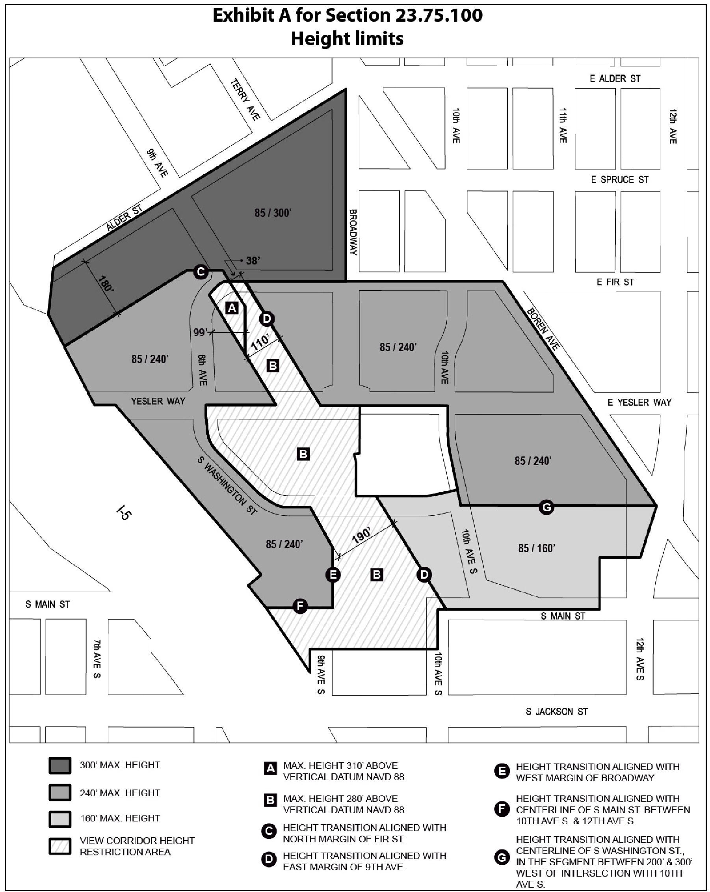

1. Structure height is not allowed to exceed the applicable height limit established in Exhibit A for 23.75.100. In areas shown in Exhibit A for 23.75.100 where the height limit is "85/" followed by a second number, 85 feet is the applicable height limit for non-highrise structures. The number following the "/"is the applicable height limit for highrise structures.
2. The number, distribution, and maximum gross floor area per story of highrise structures are restricted according to Section 23.75.120.
3. Structure height is measured pursuant to Section 23.86.006.A, except in the view corridor height restriction areas depicted in Exhibit A for 23.75.100, where solely for the purposes of this Section 23.75.100 and Section 23.75.110, structure height is measured from an elevation above a fixed sea level measurement, the North American Vertical Datum of 1988 (NAVD 88).
4. If a structure is within more than one of the areas designated on Exhibit A for 23.75.100, the height limits apply separately to the portions of the structure in each area.

##### 23.75.110 - Rooftop features

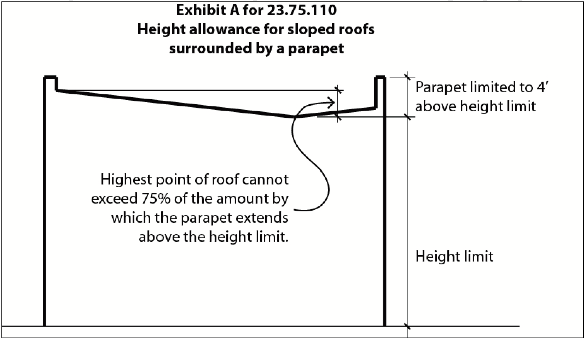

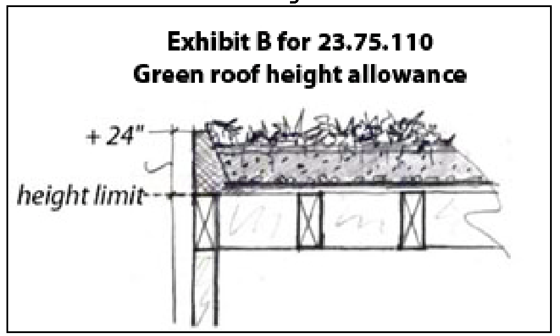

1. Flagpoles and religious symbols for religious institutions are exempt from height controls, except as regulated in Chapter 23.64, Airport Height Overlay District, provided they are no closer to any lot line than 50 percent of their height above the roof portion where attached.
2. Open railings, planters, skylights, clerestories, parapets and firewalls may extend 4 feet above the applicable height limit set in Section 23.75.100.
3. Rooftop solar collectors may extend 10 feet above the applicable height limit set in Section 23.75.100.
4. The following rooftop features may extend above the applicable height limit set in Section 23.75.100 if none of those features extends more than 15 feet above the applicable height limit set in Section 23.75.100 and the combined total coverage of all those features that extend above the applicable height limit and any elevator penthouse does not exceed 20 percent of the roof area, or 25 percent of the roof area if the total includes screened mechanical equipment:

    1. Stair penthouses that are not also elevator penthouses;
    2. Mechanical equipment;
    3. Play equipment and open-mesh fencing that encloses it, if the fencing is at least 5 feet from the roof edge;
    4. Chimneys;
    5. Sun and wind screens;
    6. Penthouse pavilions for the common use of residents;
    7. Covered or enclosed common amenity areas; and
    8. Minor communication utilities and accessory communication devices, except that height is regulated according to the provisions of Section 23.57.011.
5. Subject to the roof coverage limits in subsection 23.75.110.D, height exceptions for elevator penthouses are as follows:

    1. Within the view corridor height restriction area depicted in Exhibit A for 23.75.100, an elevator penthouse may extend above the applicable height limit by up to 15 feet.
    2. Outside the view corridor height restriction area depicted in Exhibit A for 23.75.100, an elevator penthouse may extend above the applicable height limit by up to 25 feet. If the elevator provides access to a highrise rooftop that includes residential amenity area or a green roof, the penthouse may extend above the applicable height limit by up to 35 feet.
    3. A stair penthouse may be the same height as an elevator penthouse if the elevator and the stairs are located within a common penthouse.
6. Greenhouses and solariums are permitted to extend 15 feet above the applicable height limit, if, together with all features gaining additional height through subsections 23.75.110.D and 23.75.110.E, they do not exceed 50 percent of the roof area.
7. To protect solar access for property to the north, the applicant shall locate the rooftop features listed in this Section 23.75.110 that extend above the applicable height limit at least 10 feet from the northerly edge of the roof, except that stair and elevator penthouses may extend to the edge of the roof for a total length along the edge of not more than 30 feet.
8. Portions of a sloped roof that are completely surrounded by a parapet may exceed the applicable height limit to allow drainage, provided that the highest point of the roof does not exceed the applicable height limit in Section 23.75.100 by more than 75 percent of the amount by which the parapet extends above the height limit. See Exhibit A for 23.75.110.
9. For any structure with a green roof, up to 24 inches of additional height above the applicable height limit in Section 23.75.100 is allowed to accommodate the structural requirements, roofing membranes, and soil for that green roof. See Exhibit B for 23.75.110.

##### 23.75.120 - Limitations on highrise structures

Table A forNumber and distribution of highrise structures

<table>
<tr>
<td>Sector</td>
<td>Maximum number of highrise structures</td>
</tr>
<tr>
<td>NW</td>
<td>5</td>
</tr>
<tr>
<td>NE</td>
<td>2</td>
</tr>
<tr>
<td>SE</td>
<td>3</td>
</tr>
<tr>
<td>SW</td>
<td>3</td>
</tr>
</table>

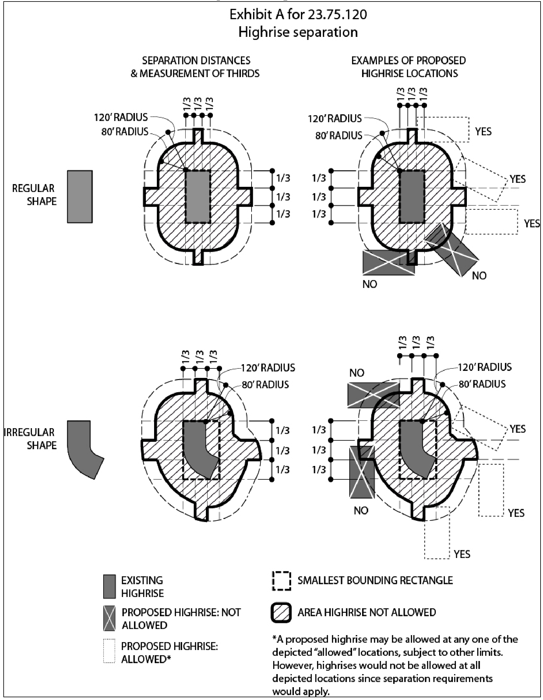

1. For purposes of this subsection 23.75.120.C, an "existing highrise structure" is either:

    1. a highrise structure that is physically present; or
    2. a proposed highrise structure for which a Master Use Permit decision that includes approval of the highrise structure has been approved for issuance, unless and until either:

        1. the Master Use Permit decision is cancelled before the Master Use Permit is issued, or the Master Use Permit issued pursuant to such decision expires or is cancelled, without the highrise structure having been constructed; or
        2. a ruling by a hearing examiner or court of competent jurisdiction reversing or vacating such decision, or determining such decision or the Master Use Permit issued thereunder to be invalid, becomes final and no longer subject to judicial review.

1. Number and distribution of highrise structures. Table A for 23.75.120 establishes limits on the number and distribution of highrise structures by sector. No highrise structures are allowed in Block 1.
2. Maximum gross floor area per story, by block as shown in Exhibit A for 23.75.020.

    1. In Blocks 2, 3, and 4:

        1. If structure height is 160 feet or less, each story wholly or in part above 85 feet is limited to a maximum of 15,000 square feet of gross floor area.
        2. If structure height exceeds 160 feet, each story wholly or in part above 85 feet is limited to a maximum of 11,000 square feet of gross floor area.
    2. In Blocks 5 and 6:

        1. If structure height is 125 feet or less, each story wholly or in part above 85 feet is limited to a maximum of 15,000 square feet of gross floor area.
        2. If structure height exceeds 125 feet, each story wholly or in part above 85 feet is limited to a maximum of 11,000 square feet of gross floor area.
    3. Highrise structures in Blocks 7 and 8 are subject to the same standards that apply in subsection 23.75.120.B.1, except that one highrise structure on each of these two blocks is allowed to meet the following standards in lieu of those in subsection 23.75.120.B.1:

        1. If structure height is 125 feet or less, each story wholly or in part above 85 feet is limited to a maximum of 35,000 square feet of gross floor area.
        2. If structure height exceeds 125 feet, each story wholly or in part above 85 feet is limited to a maximum of 24,000 square feet of gross floor area.
3. Highrise separation.

    1. All portions of a proposed highrise structure above 85 feet in height shall be separated horizontally from all portions of an existing highrise structure above 85 feet, whether on the same block or a different block, as follows and as illustrated in Exhibit A for 23.75.120:

        1. If the façade or smallest bounding rectangle of a proposed highrise structure does not overlap with the middle third of any façade of an existing highrise structure, or with the middle third of any side of the smallest bounding rectangle of an existing highrise structure, the minimum separation is 80 feet from all portions of the existing highrise structure.
        2. If the façade or smallest bounding rectangle of a proposed highrise structure does overlap with the middle third of any façade of an existing highrise structure, or with the middle third of any side of the smallest bounding rectangle of an existing highrise structure, the minimum separation is 120 feet from all portions of the existing highrise.

##### 23.75.130 - Maximum width of regulated facade

Each regulated façade is limited to 240 feet in width, except for structures in Block 6 where an open space with a minimum width of 40 feet, measured parallel to the street, and a minimum depth of 30 feet separates a portion of the façade from the street, dividing the regulated facade into segments with a maximum width of 240 feet each.

##### 23.75.140 - Setbacks and projections

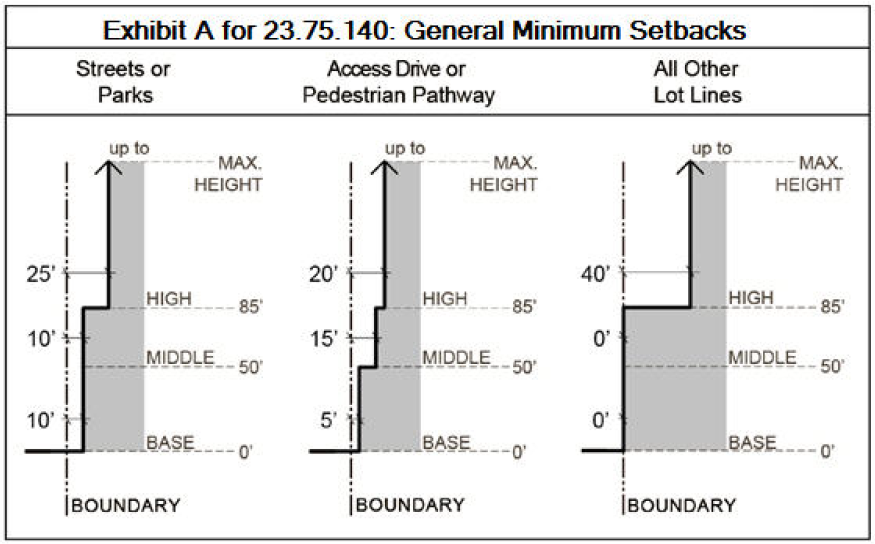

Exhibit A for General Minimum Setbacks

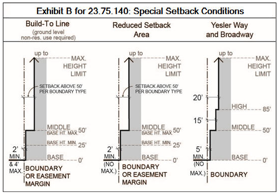

Exhibit B for Special Setback Conditions

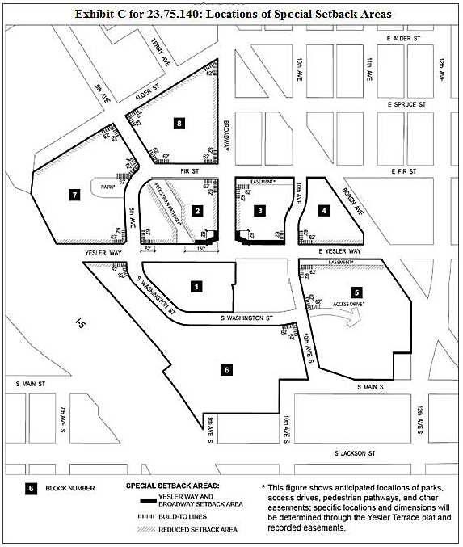

Exhibit C for Locations of Special Setback Areas

1. General requirements and special setback areas

    1. Except as otherwise provided in this Section 23.75.140, minimum setbacks are required as follows:

        1. According to Exhibit A for 23.75.140 where no special setback condition identified in subsection 23.75.140.C, 23.75.140.D, or 23.75.140.E applies to the boundary; or
        2. According to Exhibit B for 23.75.140 where a special setback condition identified in subsection 23.75.140.C, 23.75.140.D, or 23.75.140.E applies to the boundary.
    2. If a location identified for a special setback condition in subsection 23.75.140.C, 23.75.140.D, or 23.75.140.E is described in reference to a park, access drive, pedestrian pathway, or other easement that has not been established by a final plat or recorded instrument at the time a permit decision is made, the applicable general minimum setback applies in that location rather than the special setback condition.
2. The 10-foot minimum setback shown in Exhibit A for 23.75.140 from streets or parks open to the public is reduced to 7 feet for a residential structure that is partially separated from the street or park by a ground-floor-level courtyard that is at least 30 feet wide and 20 feet deep.
3. Build-to line

    1. The following locations, illustrated in Exhibit C for 23.75.140, are subject to this subsection 23.75.140.C:

        1. At the following street intersection locations, the build-to line extends 62 feet along street lot lines in both directions from the intersection of the margins of the street rights of way:

            1. the southwest and southeast corners of the intersection of Alder Street and 9 Avenue;
            2. the southwest corner of the intersection of Alder Street and Broadway;
            3. the northwest and northeast corners of the intersection of Fir Street and 9 Avenue;
            4. the northwest and southwest corners of the intersection of Fir Street and Broadway;
            5. the northwest and northeast corners of the intersection of 8 Avenue and Yesler Way;
            6. the southwest corner of the intersection of South Washington Street and Yesler Way;
            7. the northeast corner of the intersection of 10 Avenue and East Yesler Way; and
            8. the southwest corner of the intersection of 10 Avenue and South Washington Street.
        2. If a park open to the public is established by dedication or easement in Block 7, the build-to line extends 62 feet westerly along the most northerly boundary of the park, measured from the point where that boundary meets any street.
        3. Near the southeast corner of the intersection of Fir Street and Broadway, the build-to line extends from the intersection of the east margin of Broadway and the south margin of any area abutting Fir Street established for public access by easement, 62 feet southerly along Broadway and 62 feet easterly along the margin of the easement area.
        4. From the northwest corner of the intersection of 10th Avenue and East Yesler Way, the build-to line extends northerly 62 feet along the west margin of 10th Avenue.
        5. If a pedestrian or multi-use trail is established for public access by easement in Block 5 near the southerly margin of East Yesler Way and connecting to 10 Avenue near the southeast corner of the intersection of 10th Avenue and East Yesler Way, the build-to line extends from the intersection of the east margin of 10 Avenue and the south margin of the public easement area, 62 feet southerly along the east margin of 10 Avenue and 62 feet easterly along the south margin of the public easement area.
        6. If a pedestrian pathway or access drive is established in Block 5 connecting 10 Ave. with Boren Ave. or 12 Ave, then from the intersection of 10th Avenue and the north margin of the pedestrian pathway or access drive, the build-to line extends 62 feet northerly along the easterly margin of 10 Ave. and 62 feet easterly along the north margin of the pedestrian pathway or access drive.
    2. Except as otherwise permitted in this subsection 23.75.140.C, any regulated facade abutting a non-residential use in the first story partially or completely above grade is required to have a minimum setback of 2 feet, and a maximum setback of 4 feet from the build-to line, from ground level to a height of at least 25 feet. The portion of the facade that is subject to the minimum and maximum setback required by this subsection 23.75.140.C.2 may continue above 25 feet up to a maximum of 50 feet in height, regardless of the uses above the first story. Above the portion that is subject to the minimum and maximum setback required by this subsection 23.75.140.C.2, all other portions of the facade are subject to the minimum setbacks otherwise applicable above 50 feet, based on the boundary type and condition.
    3. Any portion of a facade that abuts residential units, including live-work units, in the first story partially or completely above grade, is subject to the applicable setback depicted in Exhibit A for 23.75.140.
    4. The portion of a facade, if any, that abuts residential lobbies and common amenity areas must be set back consistent with either subsection 23.75.140.C.2 or 23.75.140.C.3, as the applicant elects.
    5. Building entries are not subject to any maximum setback.
4. Reduced setback areas

    1. The following locations, illustrated in Exhibit C for 23.75.140, are "reduced setback areas," and are subject to this subsection 23.75.140.D except where other special setback conditions apply pursuant to this Section 23.75.140:

        1. All street lot lines along Alder St. and Broadway;
        2. All street lot lines along the north margin of Yesler Way and E. Yesler Way;
        3. All street lot lines along the south margin of Yesler Way in Block 6;
        4. The southerly margin of a pedestrian or multi-use trail established for public access by easement near the southerly margin of E. Yesler Way in Block 5, running substantially parallel to E. Yesler Way; and
        5. Boundaries abutting both sides of any pedestrian pathway in Block 2.
    2. In the locations identified in subsection 23.75.140.D.1, the minimum setback for any facade abutting a non-residential use, residential lobby, or residential amenity area in the first story partially or completely above grade is 2 feet, up to a maximum of 50 feet above finished grade, regardless of the uses above the first story. No maximum setback requirement applies. For any portion of a facade that abuts residential units in the first story partially or completely above grade, including live-work units, the applicable setback in Exhibit A for 23.75.140 is required.
5. Yesler and Broadway special setback area. Any lot abutting any of the following sides of street segments, illustrated in Exhibit C for 23.75.140, is subject to the "Yesler and Broadway" setback depicted in Exhibit B for 23.75.140.

    1. Both sides of Broadway, from Yesler Way to 62 feet north of the north margin of Yesler Way;
    2. The north side of East Yesler Way from the east margin of Broadway to the west margin of 10 Avenue; and
    3. The north side of Yesler Way from the west margin of Broadway to 150 feet west of the west margin of Broadway.
6. Exceptions. Setbacks required by this Section 23.75.140 are subject to the exceptions in subsections 23.75.140.G through 23.75.140.K.
7. Highrise structures. For a highrise structure, one portion of the façade up to a maximum of 40 feet in width may project to the base setback at any or all heights up to the applicable height limit in Exhibit A for 23.75.100.
8. Underground parking. The base setback, if greater than 4 feet, is reduced to 4 feet for the aboveground portion of partially underground parking that meets the requirements of Section 23.75.180.
9. No minimum setback is required at lots lines abutting Interstate 5 right-of-way, or along the western margin of Block 7 where any lot in the MPC-YT zone abuts the Harborview MIO district with no intervening right-of-way.
10. Structures in required setbacks

    1. For residential uses in structures subject to required setbacks from a street or a park open to the public, bay windows and other portions of structures containing enclosed space may project a maximum of 4 feet into required setbacks, provided that the projection does not exceed 30 feet in width, and provided that no portion of the projection is closer than 2 feet from the boundary. Portions of structures allowed to project into required setbacks under this subsection 23.75.140.J.1 shall be separated by a minimum of one-half the width of the wider of the two projections.
    2. Porches, balconies, and decks may project a maximum of 6 feet into required setbacks, provided that no portion of the porch, balcony, or deck is closer than 2 feet from the boundary. Overhead weather protection may project a maximum of 2 feet beyond the edge of a porch, balcony, or deck.
    3. Cornices, eaves, gutters, roofs, and other forms of weather protection may project a maximum of 4 feet beyond the building façade into required setbacks.
    4. Ramps or other devices necessary for access for the disabled and elderly, which meet Seattle Building Code, Chapter 11, are permitted in required setbacks.
    5. Fences, bulkheads, freestanding walls and other similar structures.

        1. Fences, freestanding walls and other similar structures 4 feet or less in height above existing or finished grade, whichever is lower, are permitted in required setbacks. The 4 foot height may be averaged along sloping grade for each 6 foot long segment of the fence or freestanding wall, but in no case may any portion of the fence or freestanding wall exceed 6 feet in height.
        2. Bulkheads and retaining walls used to raise grade are permitted in any required setback when limited to 6 feet in height, measured above existing grade. In a required setback area, any portion of a bulkhead or retaining wall that is parallel to a sidewalk and greater than 4 feet in height must be set back a minimum of 2 feet from the applicable boundary. An open guardrail of no more than 42 inches in height may be placed on top of the bulkhead or retaining wall. If a fence is placed on top of a bulkhead or retaining wall, the maximum combined height is limited to 9 feet, and no portion of the fence may be greater than 42 inches in height.
        3. Bulkheads and retaining walls used to protect a cut into existing grade in a required setback shall not exceed the minimum height necessary to support the cut. An open guardrail of no more than 42 inches in height may be placed on top of the bulkhead or retaining wall. A fence must be set back a minimum of 3 feet from such a bulkhead or retaining wall.
    6. Setback requirements do not limit underground structures.
    7. Solar collectors are permitted within required setbacks, provided that they are located at least 10 feet above finished grade.
    8. Freestanding structures, signs, and similar structures 6 feet or less in height above existing or finished grade, whichever is lower, are permitted in required setback areas, provided that signs meet the provisions of Chapter 23.55.
    9. Above-grade green stormwater infrastructure (GSI) features are allowed without setback restrictions if:

        1. Each above-grade GSI feature is less than 4.5 feet tall, excluding piping;
        2. Each above-grade GSI feature is less than 4 feet wide; and
        3. The total storage capacity of all above-grade GSI features is no greater than 600 gallons.
    10. Above-grade GSI features larger than what is allowed in subsection 23.75.140.J.9 are allowed within a required setback if:

        1. Above-grade GSI features do not exceed 10 percent coverage of any one setback area;
        2. No portion of an above-grade GSI feature is located closer than 2.5 feet from a side lot line: and
        3. No portion of an above-grade GSI feature projects more than 5 feet into a front or rear setback area.
11. Any projection that extends over a public right-of-way, pedestrian pathway, or access drive is required to comply with the provisions of Section 23.53.035, treating a pedestrian pathway as a sidewalk and an access drive as an alley, except that the minimum vertical clearance is 10 feet above a sidewalk or pedestrian pathway and 26 feet above an access drive.

##### 23.75.145 - Façade articulation

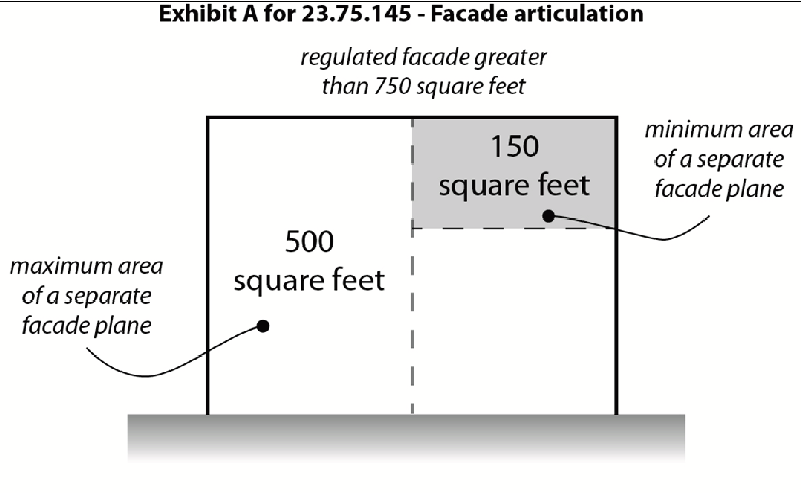

1. In order to be considered a separate façade plane for the purposes of this subsection 23.75.145.D, a portion of the façade shall have a minimum area of 150 square feet and a maximum area of 500 square feet, and shall project or be recessed from abutting façade planes by a minimum depth of 18 inches.
2. Trim that is a minimum of 0.75 inches deep and 3.5 inches wide is required to mark roof lines, porches, windows and doors on all regulated facades.

1. Intent. The intent of the design standards in this Section 23.75.145 is to:

    1. Enhance facades to provide visual interest, promote new development that contributes to an attractive streetscape, and avoid the appearance of blank walls along a street;
    2. Foster a sense of community by integrating new pedestrian-oriented multifamily development with the neighborhood street environment and by promoting designs that allow easy surveillance of the street by area residents; and
    3. Promote livability by providing a sense of openness and access to light and air.
2. Application of provisions. This Section 23.75.145 applies to all structures that contain residential uses and do not undergo any type of design review pursuant to Chapter 23.41. For those structures, the standards apply to regulated facades between finished grade and 50 feet above finished grade.
3. For the purposes of this Section 23.75.145, the facade includes all vertical and substantially vertical surfaces enclosing interior space, including gables and dormers.
4. Façade articulation.

    1. If a regulated façade exceeds 750 square feet in area, division of the façade into separate facade planes is required (see Exhibit A for 23.75.145).
5. The Director may allow exceptions to the façade articulation requirements in this Section 23.75.145, if the Director determines that the façade will meet the intent of subsection 23.75.145.A through one or more of the following façade treatments:

    1. Variations in building materials and/or color, or both, that reflect the stacking of stories or reinforce the articulation of the façade;
    2. Incorporation of architectural features that add interest and dimension to the façade, such as porches, bay windows, chimneys, pilasters, columns, cornices, and/or balconies; or
    3. Landscaping elements such as trellises or modular green walls that accommodate vegetated walls covering a minimum of 25 percent of the façade surface.

##### 23.75.150 - Residential amenity areas

1. Amount required. The required amount of amenity area is equal to 5 percent of the total residential gross floor area.
2. General requirements.

    1. All dwelling units shall have access to a common amenity area or private amenity area.
    2. No more than 50 percent of the required amenity area may be enclosed within a structure. Enclosed area within a structure that is not common amenity area does not count as required amenity area.
    3. Required amenity area that is not enclosed shall be open to the sky, except for any overhead weather protection or balconies, and except that structural projections that do not provide floor area, such as garden windows, may extend up to 2 feet into a required amenity area if they are at least 8 feet above the surface of the amenity area.
    4. Areas open to the public by easement do not qualify as required amenity areas. Portions of a pedestrian pathway that are not subject to a public easement may qualify as required amenity area.
    5. Parking areas, access drives, and driveways do not qualify as required amenity areas, except that portions of an access drive other than driving surfaces, parking surfaces, or areas dedicated to public use by easement may provide a maximum of 50 percent of the required amenity area.
    6. Pursuant to subsection 23.57.011.C.1, rooftop areas adjacent to minor communication utilities or accessory communication devices do not qualify as required amenity areas.
3. To count as required amenity area in Blocks 6 and 7, unenclosed amenity areas must be separated from Interstate 5 by an intervening structure a minimum of 10 feet in height, other than a fence or rail.
4. Common amenity area requirements. This subsection 23.75.150.D applies to common amenity area counted as required amenity area.

    1. Common amenity areas are allowed to be shared among dwelling units in multiple structures on a lot or among lots within the same block, or both. Where a common amenity area is shared among lots:

        1. All residents of all lots among which the amenity area is shared shall have access to the common amenity area, and the total common and private amenity area shall meet or exceed the amenity area requirements for all residential uses on all those lots combined.
        2. A certificate of occupancy shall not be issued for a residential structure for which a permit has been issued based on shared amenity area until all dwelling units in that structure have access to amenity area sufficient to meet the requirements of this Section 23.75.150.
    2. Each common amenity area is required to be at least 250 square feet in area and is required to have a minimum horizontal dimension of 10 feet. For an unenclosed common amenity area, the minimum area and dimension shall be reduced by 30 percent if the applicant demonstrates that the unenclosed common amenity area is an extension of an enclosed common amenity area.
    3. Common amenity area is required to include elements that enhance the usability and livability of the space for residents, such as seating, outdoor lighting, weather protection, or art.
5. Private amenity area.

    1. To count toward the required amount of amenity area in subsection 23.75.150.A, any single private amenity area must have an area no less than 30 square feet, and is required to have a minimum horizontal dimension of 5 feet.
    2. Gardening in pots and planters shall be allowed in private amenity areas that are counted toward the minimum required amenity area, and no lease provision, covenant, agreement, or rule that prohibits or penalizes such gardening in any such area shall be made or enforced.

##### 23.75.160 - Landscaping and street trees

1. Landscaping requirements.

    1. Standards. All landscaping provided to meet requirements under this Section 23.75.160 is required to meet standards promulgated by the Director to provide for the long-term health, viability, and coverage of plantings.
    2. Green Factor requirement. A minimum Green Factor score of 0.30, computed pursuant to Section 23.86.019 except as otherwise provided in this Section 23.75.160, is required for any lot with development containing:

        1. more than four dwelling units built after January 1, 2012;
        2. more than 4,000 square feet of nonresidential uses built after January 1, 2012; or
        3. more than 20 automobile parking spaces built after January 1, 2012.
    3. Landscape elements provided within pedestrian pathways, access drives, or parks may not be counted toward meeting the minimum requirement in 23.75.160.A.2.
2. Street tree requirements. Street trees are required when a proposed development is on a lot that abuts a street. Existing street trees shall be retained unless removal is approved by the Director of Transportation. The Director, in consultation with the Director of Transportation, shall determine the number, type, and placement of street trees to be provided in order to:

    1. improve public safety;
    2. promote compatibility with existing street trees;
    3. match trees to the available space in the planting strip;
    4. maintain and expand the urban forest canopy;
    5. encourage healthy growth through appropriate spacing;
    6. protect utilities; and
    7. allow access to the street, structures and lot.

##### 23.75.170 - Street-level development standards

1. The standards in this Section 23.75.170 apply to the portion of a regulated facade between 18 inches and 12 feet above finished grade at the base of the facade.
2. Blank façade segments.

    1. For purposes of this Section 23.75.170, Section 23.86.028 does not apply, and facade segments are considered blank where the portion identified in subsection 23.75.170.A does not include at least one of the following:

        1. Windows, not including glass blocks or opaque glass;
        2. Entryways or doorways, not including doors or entryways to garages, utilities, or loading access;
        3. Stairs, stoops, or porticos; or
        4. Decks or balconies.
    2. Blank segments may not exceed 15 feet in width, except that a blank segment up to 30 feet in width is allowed if the Director determines, as a Type I decision, that the blank segment will be enhanced by architectural detailing, artwork, vegetated wall, or similar features to provide visual interest.
    3. Blank segments shall be separated from one another by at least one feature listed in subsection 23.75.170.B.1 that is at least two feet wide.
3. Standards for units at regulated facades. This subsection 23.75.170.C applies where dwelling units or live-work units abut a regulated facade.

    1. Except as otherwise provided in this subsection 23.75.170.C.1, each dwelling unit with its lowest floor level 6 feet or less above finished grade and facing onto a street or park open to the public shall have direct access to a private amenity area located between the dwelling unit and the park or street. The floor level at the doorway providing access from the dwelling unit to the amenity area shall not be lower than finished grade at the closest point of the closest boundary. Private amenity area between the dwelling unit and the park or street is not required:

        1. Along Boren Avenue or Boren Avenue S.;
        2. Where the setback is reduced pursuant to subsection 23.75.140.B; or
        3. Where a dwelling unit is located above a residential lobby, common amenity area, or non-parking, non-residential use in the first story partially or completely above grade, and where a built-to line or reduced setback applies pursuant to Section 23.75.140.
    2. At least 20 percent of the facade area shall consist of doors and/or transparent windows. Where live-work units abut the facade, at least 50 percent of the facade area shall consist of doors and/or transparent windows.
    3. Where finished grade along the boundary is sloped greater than 7.5 percent for a segment at least 30 feet long, the requirements of subsection 23.75.170.C.2 are reduced by 50 percent.
4. Standards for non-residential uses, residential lobbies, and residential amenity areas near finished grade. This subsection 23.75.170.D applies to each façade regulated by 23.75.170.A where the façade does not abut a dwelling unit or live-work unit.

    1. For façades located less than 10 feet from a boundary, at least 75 percent of the area of the façade shall consist of doors and/or transparent windows.
    2. For façades located 10 feet or more from a boundary, at least 50 percent of the area of the façade shall consist of doors and/or transparent windows.
    3. Where finished grade along the boundary is sloped greater than 7.5 percent for a segment at least 30 feet long, the requirements in this subsection 23.75.170.D are reduced by 50 percent.

##### 23.75.180 - Parking

Table A forMaximum motor vehicle parking limits for NE, SE, and SW Sectors

<table>
<tr>
<td>Use</td>
<td>Maximum parking allowed</td>
</tr>
<tr>
<td>Residential</td>
<td>0.7 spaces/dwelling unit or live-work unit</td>
</tr>
<tr>
<td>Office</td>
<td>1 space/1,000 square feet of gross floor area</td>
</tr>
<tr>
<td>All other uses</td>
<td>1 space/500 square feet of gross floor area</td>
</tr>
<tr>
<td>Footnote to Table A for 23.75.180Based on the development of one or more uses on the lot where the parking is located, subject to any transfer of unused allowance between lots in the same sector under Section 23.75.040.One additional space beyond this maximum limit shall be allowed for each dwelling unit with 3 or more bedrooms.</td>
</tr>
</table>

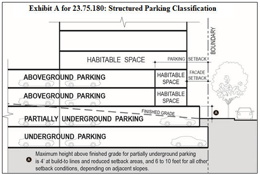

Exhibit A forStructured Parking Classification

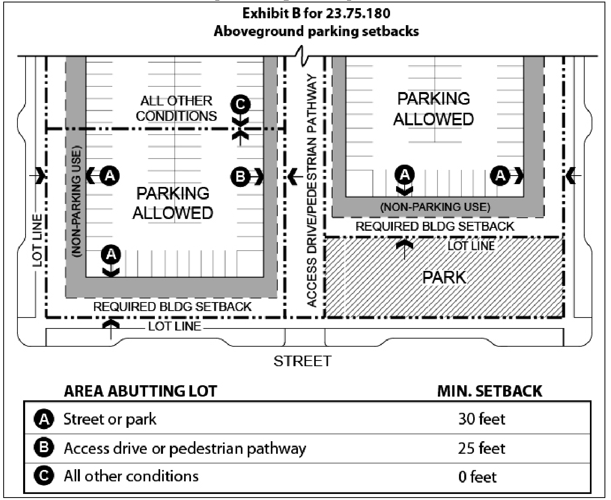

1. Parking within 50 feet of a street, park that is open to the public, access drive, or pedestrian pathway may not exceed three levels of aboveground parking.
2. Aboveground parking and loading areas shall be separated from each regulated facade by a normally occupied use along at least 80 percent of the width of the regulated facade, except where parking access and/or loading access occurs. The remaining part of the façade shall include architectural detailing, artwork, vegetated walls, or other landscape features, with an opaque screen at least 3.5 feet high on each story.
3. If aboveground parking or an aboveground loading area abuts any façade other than a regulated façade, that façade shall be enhanced with architectural detailing, artwork, vegetated walls, or other landscape features. Each story shall have an opaque screen at least 3.5 feet high.
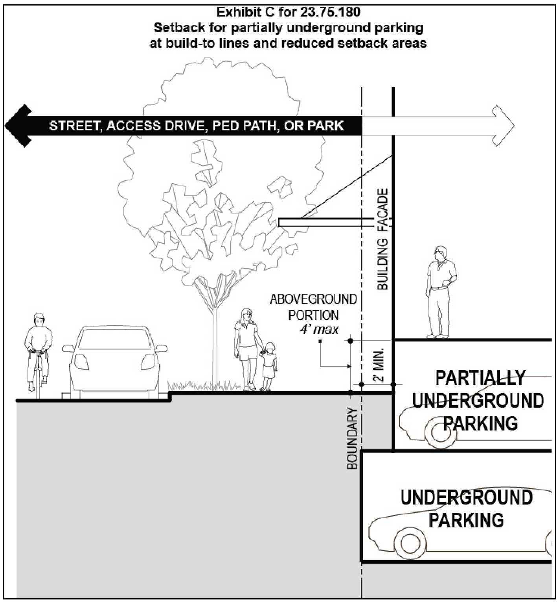

1. Along boundaries that abut a street, park that is open to the public, pedestrian pathway, or access drive and are not subject to a build-to line or reduced setback area, partially underground parking is required to be set back at least 4 feet from the boundary, as shown in Exhibit D for 23.75.180, and must meet the following standards:

    1. The aboveground portion is required to be no higher than 6 feet above the finished grade at the boundary.
    2. If the aboveground portion of the parking garage is taller than 4 feet above finished grade, a wall or planter shall be provided between the parking garage and the boundary, as illustrated in Exhibit D for 23.75.180. The top of this wall or planter shall be at least two feet below the top of the aboveground portion of the parking garage, and the planting area shall be at least 2 feet in width. Vegetation shall be provided at the top of this wall or planter.
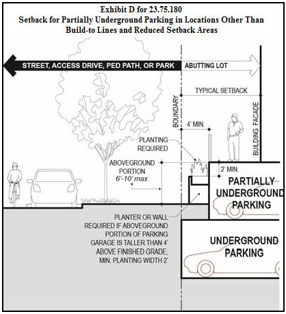

Exhibit D forSetback for Partially Underground Parking in Locations Other Than Build-to Lines and Reduced Setback Areas

1. Parking is regulated by this Section 23.75.180 and not by Sections 23.54.015, 23.54.016, 23.54.030.A, or 23.54.030.B, except for bicycle parking, which is required pursuant to subsection 23.54.015.K. Parking maximums in this Section 23.75.180 do not include parking for dwelling units existing as of January 1, 2012, so long as those units exist.
2. There is no minimum requirement for parking spaces for motor vehicles. Maximum motor vehicle parking space limits are as follows:

    1. For the NW Sector, parking shall not exceed 1,350 spaces, plus 0.7 spaces per dwelling unit or live-work unit in the sector, except that up to an additional 450 parking spaces may be permitted as a special exception pursuant to Chapter 23.76. When deciding whether to grant a special exception, the Director shall consider evidence of parking demand for nonresidential uses and alternative means of transportation, including but not limited to the following:

        1. Whether the additional parking will substantially encourage the use of single occupancy vehicles;
        2. Characteristics of the work force and employee hours, such as multiple shifts that end when transit service is not readily available;
        3. Proximity of transit lines to the lot and headway times of those lines;
        4. Whether the additional parking will adversely affect vehicular and pedestrian circulation in the area; and
        5. Potential for shared use of additional parking as residential or short-term parking.
    2. For the NE, SE, and SW Sectors, Table A for 23.75.180 establishes maximum parking allowed based on the uses on a lot, subject to any transfer of unused parking allowance between lots in the same sector under Section 23.75.040.
3. Barrier-free parking is required consistent with Seattle Building Code requirements.
4. For purposes of this Section 23.75.180, all parking is classified as "surface parking," as defined in Section 23.84A.030, or as "aboveground," "partially underground," or "underground," as shown in Exhibit A for 23.75.180 and described as follows:

    1. "Aboveground parking" means any portion of a parking garage where:

        1. the structure projects more than 4 feet in height above finished grade within 30 feet of a build-to line or reduced setback area; or
        2. the structure projects more than 6 feet in height above finished grade in any other location.
    2. "Partially underground parking" means any portion of a parking garage where:

        1. the structure projects 4 feet or less in height above finished grade within 30 feet of a build-to line or reduced setback area; or
        2. the structure projects 6 feet or less in height above finished grade along any other location where the grade along the boundary has a slope of less than 6 percent; or
        3. the structure projects 10 feet or less in height above finished grade along any other location where the grade along the boundary has a slope of 6 percent or greater.
    3. "Underground parking" means a story of parking garage where all floor area, walls, and ceiling structure are entirely below finished grade, excluding access.
5. Standards for surface parking.

    1. The total number of surface parking spaces may not exceed 12 spaces per block.
    2. No more than five surface parking spaces may abut one another, and each group of abutting surface parking spaces shall be separated from other surface parking spaces by a minimum of 30 feet, measured between the two closest spaces.
    3. Parking spaces located on an access drive are not allowed within 30 feet of entrances to parking garages.
    4. Surface parking is not allowed in the required setback between a building and a street or park that is open to the public.
6. Aboveground parking is subject to the following requirements.

    1. Minimum setbacks for aboveground parking are established in Exhibit B for 23.75.180. No parking setbacks are required from lot lines abutting the Interstate 5 right-of-way.
7. Partially underground parking is subject to the following requirements:

    1. At build-to lines and in reduced setback areas as depicted in Exhibit C for 23.75.140, partially underground parking is required to be set back at least 2 feet from the boundary, as shown in Exhibit C for 23.75.180. In these locations, the aboveground portion of the parking garage is not allowed to exceed 4 feet above finished grade.
    2. Along boundaries that do not abut a street, park that is open to the public, pedestrian pathway, or access drive, no setback is required for partially underground parking.
8. Underground parking may extend to the lot line. The Director may determine, as a Type I Decision, that underground parking may extend beneath private access drives, pedestrian pathways, and parks, provided that:

    1. The underground parking does not conflict with or reduce the quality of public access areas above; and
    2. The underground parking does not interfere with underground public utility alignments established in the Yesler Terrace plat.
9. Parking and loading access

    1. Access for parking and for loading is required to meet the following requirements:

        1. Access is not allowed within 40 feet of the curb line of an intersection.
        2. Access is not allowed within 20 feet of a structure corner that includes a regulated façade on one or both sides.
    2. Each access drive is required to include a dedicated pedestrian area along at least one side of the length of the drive. The dedicated pedestrian area is required to:

        1. include a walking surface at least 6 feet wide along the length of the access drive; and
        2. be separated from the access drive roadway by a raised curb, bollards, landscaping, or textured paving details.
    3. Curb cuts are required to meet the standards of subsections 23.54.030.F and 23.54.030.G.
    4. Driveways are required to meet the standards of subsection 23.54.030.D.

## Subtitle IV - Administration
### Division 1 - Land Use Approval Procedures

### Chapter 23.76 - PROCEDURES FOR MASTER USE PERMITS AND COUNCIL LAND USE DECISIONS

Sections:

#### Subchapter I - General Provisions
##### 23.76.002 - Purpose.

The purpose of this chapter is to establish standard procedures for land use decisions made by The City of Seattle. The procedures are designed to promote informed public participation in discretionary land use decisions, eliminate redundancy in the application submittal process, and minimize delays and expense in appeals of land use decisions. As required by RCW 36.70B.060, these procedures provide for an integrated and consolidated land use permit process, integrate the environmental review process with the procedures for review of land use decisions, and provide for the consolidation of appeals for all land use decisions.

##### 23.76.004 - Land use decision framework

1. Land use decisions are classified into five categories. Procedures for the five different categories are distinguished according to who makes the decision, the type and amount of public notice required, and whether appeal opportunities are provided. Land use decisions are generally categorized by type in Table A for 23.76.004.
2. Type I and II decisions are made by the Director and are consolidated in Master Use Permits. Type I decisions are decisions made by the Director that are not appealable to the Hearing Examiner. Type II decisions are discretionary decisions made by the Director that are subject to an administrative open record appeal hearing to the Hearing Examiner; provided that Type II decisions enumerated in subsections 23.76.006.C.2.c, d, f, and g, and SEPA decisions integrated with them as set forth in subsection 23.76.006.C.2.m, shall be made by the Council when associated with a Council land use decision and are not subject to administrative appeal. Type III decisions are made by the Hearing Examiner after conducting an open record hearing and not subject to administrative appeal. Type I, II or III decisions may be subject to land use interpretation pursuant to Section 23.88.020.
3. Type IV and V decisions are Council land use decisions. Type IV decisions are quasi-judicial decisions made by the Council pursuant to existing legislative standards and based upon the Hearing Examiner's record and recommendation. Type IV decisions may be subject to land use interpretation pursuant to Section 23.88.020. Type V decisions are legislative decisions made by the Council in its capacity to establish policy and manage public lands.
4. For projects requiring both a Master Use Permit and a Council land use decision as described in this chapter, the Council decision must be made prior to issuance of the Master Use Permit. All conditions established by the Council in its decision shall be incorporated in any subsequently issued Master Use Permit for the project.
5. Certain land use decisions are subject to additional procedural requirements beyond the standard procedures established in this Chapter 23.76. These requirements may be prescribed in the regulations for the zone in which the proposal is located, in other provisions of this title, or in other titles of the Seattle Municipal Code.
6. Shoreline appeals and appeals of related SEPA determinations shall be filed with the State Shoreline Hearings Board within 21 days of the receipt of the decision by the Department of Ecology as set forth in RCW 90.58.180.
7. An applicant for a permit or permits requiring more than one decision contained in the land use decision framework listed in Section 23.76.004 may either:

    1. Use the integrated and consolidated process established in this chapter;
    2. If the applicant includes a variance, lot boundary adjustment, or short subdivision approval and no environmental review is required for the proposed project pursuant to SMC Chapter 25.05, Environmental Policies and Procedures, file a separate Master Use Permit application for the variance, lot boundary adjustment, or short subdivision sought and use the integrated and consolidated process established in this chapter for all other required decisions; or
    3. Proceed with separate applications for each permit decision sought.
8. If notice is required pursuant to this Chapter 23.76, except mailed notice as defined in Section 23.84A.025, it may be provided by electronic means if the recipient provides an e-mail address to the Department. Notice to City agencies may be provided through the City's interoffice mail or by electronic means.

##### 23.76.005 - Time for decisions

1. Except as otherwise provided in this Section 23.76.005 or otherwise agreed to by the applicant, land use decisions on applications shall be made within 120 days after the applicant has been notified that the application is complete. In determining the number of days that have elapsed after the notification that the application is complete, the following periods shall be excluded:

    1. All periods of time during which the applicant has been requested by the Director to correct plans, perform required studies, or provide additional required information, until the Director determines that the request has been satisfied;
    2. Any extension of time mutually agreed upon by the Director and the applicant;
    3. For projects for which an EIS has been required, the EIS process time period established in subsection 23.76.005.B;
    4. Any time period for filing an appeal of the land use decision to the Hearing Examiner, and the time period to consider and decide the appeal; and
    5. All periods of time during which the applicant has been requested by the Director to pay past-due permit fees, until the Director determines that the request has been satisfied or until the permit is cancelled for failure to pay fees.
2. The time required to prepare an EIS shall be agreed to by the Director and applicant in writing. Unless otherwise agreed to by the applicant, a final environmental impact statement shall be issued by the Director within one year following the issuance of a Determination of Significance for the proposal, unless the EIS consultant advises that a longer time period is necessary. In that case, the additional time shall be that recommended by the consultant, not to exceed an additional year.
3. The time limits established by subsections 23.76.005.A and B do not apply if a permit application:

    1. requires an amendment to the Comprehensive Plan or the Land Use Code; or
    2. requires the siting of an essential public facility; or
    3. is substantially revised by the applicant, in which case the time period shall start from the date at which the revised project application is determined to be complete.
4. Exclusions pursuant to RCW 36.70B.140(1).

    1. Type II decisions. There is no time limit for a decision on an application that includes an exception from the regulations for Environmentally Critical Areas, Chapter 25.09.
    2. Type III decisions.

        1. The Director shall issue a recommendation within 120 days as that time is calculated pursuant to subsections 23.76.005.A, B, and C; and
        2. The Hearing Examiner shall issue a decision within 90 days of issuance of the Director's recommendation, except that in determining the time limits for Type III decisions established in this subsection 23.76.005.D.2.b, the following periods shall be excluded:

            1. The time during which a Type III decision is remanded by the Hearing Examiner for further information or analysis. The Hearing Examiner shall set a reasonable period for the remand after consideration of the nature and complexity of the issues, and, if practicable, after consultation with the parties about the reasonableness of the remand period;
            2. All periods of time during which the applicant has been requested by the Director to pay past-due permit fees, until the Director determines that the request has been satisfied; and
            3. Any extension of time mutually agreed upon by the Hearing Examiner and the applicant.
    3. Type IV Council land use decisions.

        1. There is no time limit for decisions on Major Institution master plans.
        2. All other Type IV Council land use decisions and any associated Type II decisions listed in subsection 23.76.006.C.2, except for the exclusions listed in subsections 23.76.005.D.1 and 23.76.005.D.3.c, shall be made within the following time periods:

            1. The Director shall issue a recommendation within 120 days as that time period is calculated pursuant to subsections 23.76.005.A, B, and C;
            2. The Hearing Examiner shall issue a recommendation within 90 days of issuance of the Director's recommendation; and
            3. The Council shall issue its decision within 90 days of receipt of the Hearing Examiner recommendation, except that if a timely appeal is filed with the City Clerk, the Council shall issue its decision within 120 days of receipt of the Hearing Examiner recommendation.
        3. In determining the time limits for Type IV Council land use decisions established in this subsection 23.76.005.D, the following periods shall be excluded:

            1. The time during which a Type IV Council land use decision is remanded by the Hearing Examiner or Council for further information or analysis. The Hearing Examiner or the Council shall set a reasonable period for the remand after consideration of the nature and complexity of the issues, and, if practicable, after consultation with the parties about the reasonableness of the remand period;
            2. All periods of time during which the applicant has been requested by the Director to pay past-due permit fees, until the Director determines that the request has been satisfied; and
            3. Any extension of time mutually agreed upon by the Hearing Examiner and the applicant or the City Council and the applicant.
5. Type V Council land use decisions are legislative decisions to which no time limits apply.

#### Subchapter II - Master Use Permits
##### 23.76.006 - Master Use Permits required

1. Type I, II and III decisions are components of Master Use Permits. Master Use Permits are required for all projects requiring one or more of these decisions.
2. The following decisions are Type I:

    1. Determination that a proposal complies with development standards;
    2. Establishment or change of use for uses permitted outright, interim use parking under subsection 23.42.040.G, uses allowed under Section 23.42.038, temporary relocation of police and fire stations for 24 months or less, transitional encampment interim use, and temporary uses for four weeks or less not otherwise permitted in the zone, and renewals of temporary uses for up to six months, except temporary uses and facilities for light rail transit facility construction and transitional encampments;
    3. The following street use approvals:

        1. Curb cut for access to parking whether associated with a development proposal or not;
        2. Concept approval of street improvements associated with a development proposal, such as additional on-street parking, street landscaping, curbs and gutters, street drainage, sidewalks, and paving;
        3. Structural building overhangs associated with a development proposal;
        4. Areaways associated with a development proposal;
    4. Lot boundary adjustments;
    5. Modification of the following features bonused under Title 24:

        1. Plazas;
        2. Shopping plazas;
        3. Arcades;
        4. Shopping arcades;
        5. Voluntary building setbacks;
    6. Determinations of Significance (determination that an environmental impact statement is required) for Master Use Permits and for building, demolition, grading, and other construction permits (supplemental procedures for environmental review are established in Chapter 25.05, Environmental Policies and Procedures), except for Determinations of Significance based solely on historic and cultural preservation;
    7. Discretionary exceptions for certain business signs authorized by subsection 23.55.042.D;
    8. Waiver or modification of required right-of-way improvements;
    9. Special accommodation pursuant to Section 23.44.015;
    10. Reasonable accommodation;
    11. Minor amendment to Major Phased Development Permit;
    12. Determination of public benefit for combined lot development;
    13. Streamlined design review decisions pursuant to Section 23.41.018 if no development standard departures are requested pursuant to Section 23.41.012, and design review decisions in an MPC zone if no development standard departures are requested pursuant to Section 23.41.012;
    14. Shoreline special use approvals that are not part of a shoreline substantial development permit;
    15. Determination that a project is consistent with a planned action ordinance, except as provided in subsection 23.76.006.C;
    16. Decision to approve, condition, or deny, based on SEPA policies, a permit for a project determined to be consistent with a planned action ordinance;
    17. Modification of mitigation amounts under Section 23.58B.040 or Section 23.58B.050 pursuant to subsection 23.58B.025.B.2; and
    18. Other Type I decisions.
3. The following are Type II decisions:

    1. The following procedural environmental decisions for Master Use Permits and for building, demolition, grading, and other construction permits are subject to appeal to the Hearing Examiner and are not subject to further appeal to the City Council (supplemental procedures for environmental review are established in Chapter 25.05, Environmental Policies and Procedures):

        1. Determination of Non-significance (DNS), including mitigated DNS;
        2. Determination that a final environmental impact statement (EIS) is adequate; and
        3. Determination of Significance based solely on historic and cultural preservation.
    2. The following decisions are subject to appeal to the Hearing Examiner (except shoreline decisions and related environmental determinations that are appealable to the Shorelines Hearings Board):

        1. Establishment or change of use for temporary uses more than four weeks not otherwise permitted in the zone or not meeting development standards, including the establishment of temporary uses and facilities to construct a light rail transit system for so long as is necessary to construct the system as provided in subsection 23.42.040.F, but excepting temporary relocation of police and fire stations for 24 months or less;
        2. Short subdivisions;
        3. Variances; provided that the decision on variances sought as part of a Council land use decision shall be made by the Council pursuant to Section 23.76.036;
        4. Special exceptions; provided that the decision on special exceptions sought as part of a Council land use decision shall be made by the Council pursuant to Section 23.76.036;
        5. Design review decisions, except for streamlined design review decisions pursuant to Section 23.41.018 if no development standard departures are requested pursuant to Section 23.41.012, and except for design review decisions in an MPC zone pursuant to Section 23.41.020 if no development standard departures are requested pursuant to Section 23.41.012;
        6. Administrative conditional uses, provided that the decision on administrative conditional uses sought as part of a Council land use decision shall be made by the Council pursuant to Section 23.76.036;
        7. The following shoreline decisions; provided that these decisions shall be made by the Council pursuant to Section 23.76.036 when they are sought as part of a Council land use decision (supplemental procedures for shoreline decisions are established in Chapter 23.60A):

            1. Shoreline substantial development permits;
            2. Shoreline variances; and
            3. Shoreline conditional uses;
        8. Major Phased Developments;
        9. Determination of project consistency with a planned action ordinance, only if the project requires another Type II decision;
        10. Establishment of light rail transit facilities necessary to operate and maintain a light rail transit system, in accordance with the provisions of Section 23.80.004;
        11. Downtown planned community developments;
        12. Establishment of temporary uses for transitional encampments, except transitional encampment interim uses provided for in subsection 23.76.006.B.2;
        13. Modification of mitigation amounts under Section 23.58B.040 or Section 23.58B.050 pursuant to subsection 23.58B.025.B.3; and
        14. Except for projects determined to be consistent with a planned action ordinance, decisions to approve, condition, or deny based on SEPA policies if such decisions are integrated with the decisions listed in subsections 23.76.006.C.2.a. through 23.76.006.C.2.l; provided that, for decisions listed in subsections 23.76.006.C.2.c, 23.76.006.C.2.d, 23.76.006.C.2.f, and 23.76.006.C.2.g that are made by the Council, integrated decisions to approve, condition, or deny based on SEPA policies are made by the Council pursuant to Section 23.76.036.
4. The following decision, including any integrated decision to approve, condition or deny based on SEPA policies, is a Type III decision made by the Hearing Examiner: subdivisions (preliminary plats).
5. The requirement for the Council to make the shoreline decisions listed in subsection 23.76.006.C.2.g if they are sought as part of a Council land use decision shall also apply for purposes of Chapter 23.60.
6. Pursuant to RCW 36.70B.140, street vacation decisions are exempt from the consolidated review process prescribed by RCW 36.70B.060 through 36.70B.090 and 36.70B.100 through 36.70B.130. Accordingly, street vacation decisions are not subject to the requirements for a Master Use Permit in Section 23.76.006.

##### 23.76.008 - Preapplication conferences for Type II and Type III decisions

1. Prior to official filing with the Director of an application for a Master Use Permit requiring a Type II or III decision, the applicant may request or the Director may require a preapplication conference. The conference shall be held in a timely manner between a Department representative(s) and the applicant to determine the appropriate procedures and review criteria for the proposed project. Preapplication conferences may be subject to fees as established in Subtitle IX of Title 22.
2. Design Review. A preapplication conference between Department representative(s) and an applicant for a structure subject to design review, as provided in Chapter 23.41, shall be required. The Director may waive this preapplication conference requirement if an applicant demonstrates, to the Director's satisfaction, experience with Seattle's design review process which would render a preapplication conference unnecessary.

##### 23.76.010 - Applications for Master Use Permits

1. Applications for Master Use Permits shall be made by the property owner, lessee, contract purchaser, a City agency, or other public agency proposing a project the location of which has been approved by the City Council by ordinance or resolution, or by an authorized agent thereof. A Master Use Permit applicant shall designate a single person or entity to receive determinations and notices from the Director.

    1. A claim made by a person that the person possesses title to any portion of the property for which a Maser Use Permit application has been submitted, whether the claim is made by a judicially-filed pleading or not, is not grounds for the Department to suspend processing the application unless:

        1. a court injunction has been issued and is delivered to the Department; or
        2. the application is for a subdivision or short subdivision, the claim is made in a pleading to quiet title to a portion of the property that has been filed in court, and a copy of the pleading has been delivered to the Department.
2. All applications for Master Use Permits shall be made to the Director on a form provided by the Department.
3. Applications shall be accompanied by payment of the applicable filing fees, if any, as established in Subtitle IX of Title 22.
4. All applications shall contain the submittal information required by the applicable sections of this Title 23, Land Use Code; Title 15, Street and Sidewalk Use; Chapter 25.05, Environmental Policies and Procedures; Chapter 25.09, Regulations for Environmentally Critical Areas; Chapter 25.12, Landmarks Preservation; Chapter 25.16, Ballard Avenue Landmark District; Chapter 25.20, Columbia City Landmark District; Chapter 25.22, Harvard-Belmont Landmark District; Chapter 25.24, Pike Place Market Historical District; and other codes as determined applicable and necessary for review by the Director. All shoreline substantial development, conditional use or variance applications shall also include applicable submittal information as specified in WAC 173-27-180. The Director shall make available, in writing, a general list of submittal requirements for a complete application.
5. Notice of Complete Application.

    1. The Director shall determine whether an application is complete and shall notify the applicant in writing within 28 days of the date the application is filed whether the application is complete or that the application is incomplete and what additional information is required before the application will be complete. Within 14 days of receiving the additional information, the Director shall notify the applicant in writing if the application is still incomplete and what additional information is necessary. An application shall be deemed to be complete if the Director does not notify the applicant in writing that the application is incomplete by the deadlines in this subsection 23.76.010.E. A determination that the application is complete is not a determination that the application is vested.
    2. A Master Use Permit application is complete for purposes of this Section 23.76.010 if it meets the submittal requirements established by the Director in subsection 23.76.010.D and is sufficient for continued processing even though additional information may be required or project modifications may be undertaken subsequently. The determination of completeness shall not preclude the Director from requesting additional information or studies either at the time the application is determined complete or subsequently, if additional information is required to complete review of the application or substantial changes in the permit application are proposed.
    3. A determination under this Section 23.76.010 that an application is complete is not a determination that the application is vested. A vesting determination shall be made only if needed because of a change in applicable laws and shall entail review of the application for compliance with RCW 19.27.095, RCW 58.17.033, and Section 23.76.026.
6. If the applicant fails to supply all required information or data within 60 days of a written request from the Director, the Director may provide the applicant a notice of intent to cancel. The Director may cancel the application if the requested information is not provided within the time required by the notice of intent to cancel.

##### 23.76.011 - Notice of design guidance and planned community development process

1. The Director shall provide the following notice for the required early design guidance process or streamlined administrative design review (SDR) guidance process for design review projects subject to any of Sections 23.41.014, 23.41.016, and 23.41.018, and for the preparation of priorities for planned community developments:

    1. Publication of notice in the Land Use Information Bulletin; and
    2. Mailed notice; and
2. The applicant shall post one land use sign visible to the public at each street frontage abutting the site except that if there is no street frontage or the site abuts an unimproved street, the Director shall require either more than one sign and/or an alternative posting location so that notice is clearly visible to the public.
3. For the required meeting for the preparation of priorities for a planned community development, and for a public meeting required for early design guidance, the time, date, location and purpose of the meeting shall be included with the mailed notice.
4. The land use sign may be removed by the applicant the day after the public meeting.

##### 23.76.012 - Notice of application

1. Notice.

    1. No notice of application is required for Type I decisions, except that notice of application is required for all projects in MPC zones that are subject to Master Planned Community design review in Section 23.41.020, as described in subsection 23.76.012.B.6.
    2. Within 14 days after the Director determines that an application is complete, for the following types of applications, the Director shall provide notice of the application and an opportunity for public comment as described in this Section 23.76.012:

        1. Type II Master Use Permits;
        2. Type III Master Use Permits;
        3. Type IV Council land use decisions, provided that for amendments to property use and development agreements, additional notice shall be given pursuant to subsection 23.76.058.C; and
        4. The following Type V Council land use decisions:

            1. Major Institution designations and revocation of Major Institution designations;
            2. Concept approvals for the location or expansion of City facilities requiring Council land use approval; and
            3. Waivers or modification of development standards for City facilities.
    3. Other Agencies with Jurisdiction. The Director shall provide notice to other agencies of local, state, or federal governments that may have jurisdiction over some aspect of the project to the extent known by the Director.
    4. Early Review Determination of Nonsignificance (DNS). In addition to the requirements of subsection A.3 of this Section 23.76.012, the Director shall provide a copy of the early review DNS notice of application and environmental checklist to the following:

        1. State Department of Ecology;
        2. Affected tribes;
        3. Each local agency or political subdivision whose public services would be changed as a result of implementation of the proposal; and
        4. Persons who submit a written request for this information and who provide an address for notice.
2. Types of notice required

    1. For projects subject to a Type II environmental determination pursuant to Section 23.76.006 or design review pursuant to Section 23.41.004, the Department shall direct the installation of a large notice sign on the site, unless an exemption or alternative posting as set forth in this subsection 23.76.012.B is applicable. The large notice sign shall be located so as to be clearly visible from the adjacent street or sidewalk, and shall be removed by the applicant at the direction of the Department after final City action on the application is completed.

        1. In the case of submerged land, the large notice sign shall be posted on adjacent dry land, if any, owned or controlled by the applicant. If there is no adjacent dry land owned or controlled by the applicant, notice shall be provided according to subsection 23.76.012.B.1.c.
        2. Projects limited to interior remodeling, or that are subject to a Type II environmental determination pursuant to Section 23.76.006 only because of location over water or location in an environmentally critical area, are exempt from the large notice sign requirement.
        3. If use of a large notice sign is neither feasible nor practicable to assure that notice is clearly visible to the public, the Department shall post ten placards within 300 feet of the site.
        4. The Director may require both a large notice sign and the alternative posting measures described in subsection 23.76.012.B.1.c, or may require that more than one large notice sign be posted, if necessary to assure that notice is clearly visible to the public.
    2. For projects that are categorically exempt from environmental review, the Director shall post one land use sign visible to the public at each street frontage abutting the site except that if there is no street frontage or the site abuts an unimproved street, the Director shall post more than one sign and/or use an alternative posting location so that notice is clearly visible to the public. The land use sign shall be removed by the applicant after final action on the application is completed.
    3. For all projects requiring notice of application, the Director shall provide notice in the Land Use Information Bulletin. For projects requiring installation of a large notice sign or subject to design review pursuant to Section 23.41.014, notice in the Land Use Information Bulletin shall be published after installation of the large notice sign required in subsection 23.76.012.B.1.
    4. The Director shall provide mailed notice of:

        1. applications for variances, administrative conditional uses, special exceptions, temporary uses for more than four weeks, shoreline variances, shoreline conditional uses, short plats, early design guidance process for administrative design review and streamlined administrative design review, subdivisions, Type IV Council land use decisions, amendments to property use and development agreements, Major Institution designations and revocation of Major Institution designations, concept approvals for the location or expansion of City facilities requiring Council land use approval, and waivers or modification of development standards for City facilities; and
        2. the first early design guidance meeting for a project subject to design review pursuant to Section 23.76.014.
    5. For a project subject to design review, except streamlined design review pursuant to Section 23.41.018 for which no development standard departure pursuant to Section 23.41.012 is requested, notice of application shall be provided to all persons who provided an address for notice and either attended an early design guidance public meeting for the project or wrote to the Department about the proposed project before the date that the notice of application is distributed in the Land Use Information Bulletin.
    6. For a project that is subject to both Type I decisions and Master Planned Community design review under Section 23.41.020, notice shall be provided as follows:

        1. The Director shall provide notice of application in the Land Use Information Bulletin.
        2. The Director shall post one land use sign visible to the public at each street frontage abutting the site, except that if there is no street frontage or the site abuts an unimproved street, the Director shall post more than one sign and/or use an alternative posting location so that notice is clearly visible to the public. The land use sign(s) shall be posted prior to publication of notice of application in the Land Use Information Bulletin, and shall be removed by the applicant after final action on the Master Use Permit application is completed.
        3. For a project that includes a highrise structure as defined in Section 23.75.020, the Director shall also post ten placards within the right-of-way within 300 feet of the site. The land use placards shall be posted prior to publication of notice of application in the Land Use Information Bulletin, and shall be removed by the applicant after final action on the Master Use Permit application is completed.
        4. Mailed notice shall be provided consistent with subsection 23.76.012.B.5.
    7. No notice is required of a Type I determination whether a project is consistent with a planned action ordinance, except that if that determination has been made when notice of application is otherwise required for the project, then the notice shall include notice of the planned action consistency determination.
3. Contents of Notice.

    1. The City's official notice of application is the notice placed in the Land Use Information Bulletin, which shall include the following required elements as specified in RCW 36.70B.110:

        1. Date of application, date of notice of completion for the application, and the date of the notice of application;
        2. A description of the proposed project action and a list of the project permits included in the application, including if applicable:

            1. a list of any studies requested by the Director;
            2. a statement that the project relies on the adoption of a Type V Council land use decision to amend the text of Title 23;
        3. The identification of other permits not included in the application to the extent known by the Director;
        4. The identification of existing environmental documents that evaluate the proposed project, and the location where the application and any studies can be reviewed;
        5. A statement of the public comment period and the right of any person to comment on the application, request an extension of the comment period, receive notice of and participate in any hearings, and request a copy of the decision once made, and a statement of any administrative appeal rights;
        6. The date, time, place and type of hearing, if applicable and if scheduled at the date of notice of the application;
        7. A statement of the preliminary determination, if one has been made at the time of notice, of those development regulations that will be used for project mitigation and the proposed project's consistency with development regulations;
        8. A statement that an advisory committee is to be formed as provided in Section 23.69.032, for notices of intent to file a Major Institution master plan application;
        9. Any other information determined appropriate by the Director; and
        10. The following additional information if the early review DNS process is used:

            1. A statement that the early review DNS process is being used and the Director expects to issue a DNS for the proposal;
            2. A statement that this is the only opportunity to comment on the environment impacts of the proposal;
            3. A statement that the proposal may include mitigation measures under applicable codes, and the project review process may incorporate or require mitigation measures regardless of whether an EIS is prepared; and
            4. A statement that a copy of the subsequent threshold determination for the proposal may be obtained upon written request.
    2. All other forms of notice, including but not limited to large notice and land use signs, placards, and mailed notice, shall include the following information: the project description, location of the project, date of application, location where the complete application file may be reviewed, and a statement that persons who desire to submit comments on the application or who request notification of the decision may so inform the Director in writing within the comment period specified in subsection D of this Section 23.76.012. The Director may, but need not, include other information to the extent known at the time of notice of application. Except for the large notice sign, each notice shall also include a list of the land use decisions sought. The Director shall specify detailed requirements for large notice and land use signs.
4. Comment period. The Director shall provide a 14 day public comment period prior to making a threshold determination of nonsignificance (DNS) or publishing a decision on the project; provided that the comment period shall be extended by 14 days if a written request for extension is submitted within the initial 14 day comment period; provided further that the comment period shall be 30 days for applications requiring shoreline decisions except that for limited utility extensions and bulkheads subject to Section 23.60.065, the comment period shall be 20 days as specified in Section 23.60.065. The comment period shall begin on the date notice is published in the Land Use Information Bulletin. Comments shall be filed with the Director by 5 p.m. of the last day of the comment period. If the last day of the comment period is a Saturday, Sunday, or federal or City holiday, the comment period shall run until 5 p.m. the next day that is not a Saturday, Sunday, or federal or City holiday. Any comments received after the end of the official comment period may be considered if the comment is material to review yet to be conducted.
5. If a Master Use Permit application includes more than one decision component, notice requirements shall be consolidated and the broadest applicable notice requirements imposed.
6. The mailing list used for the Land Use Information Bulletin shall be updated annually in consultation with the Director of the Department of Neighborhoods.

##### 23.76.014 - Notice of scoping and draft EIS

If a Determination of Significance (DS) is issued on an application for a Master Use Permit or Council land use decision, the following notice and comment procedures apply:

1. Scoping.

    1. The Director shall determine the range of proposed actions, alternatives, and impacts to be discussed in an EIS, as provided by Section 25.05.408, Scoping, and/or Section 25.05.410, Expanded scoping. A comment period at least 21 days from the date of DS issuance shall be provided.
    2. Notice of scoping and of the period during which the Director will accept written comments shall be provided by the Director in the following manner:

        1. Inclusion in the Land Use Information Bulletin;
        2. Publication in the City official newspaper;
        3. Notice provided to those persons who have submitted a written request for it and provided an address for notice; and
        4. Filing with the SEPA Public Information Center.
    3. The Director shall also circulate copies of the DS as required by Section 25.05.360.
2. Draft EISs.

    1. Notice of the availability of a draft EIS, the 30 day period during which the Department will accept comments, the public hearing on the draft EIS, and any other Department public hearing as provided in Section 23.76.016 shall be provided by the Director in the following manner:

        1. Inclusion in the Land Use Information Bulletin;
        2. Publication in the City official newspaper;
        3. Mailed notice;
        4. Notice provided to those persons who provided an address for notice and either submitted a written request for it or who submitted written comments during the comment period on the scope of the EIS; and
        5. Filing with the SEPA Public Information Center.
    2. Notice of the public hearing shall be given by the Director at least 21 days prior to the hearing date.
    3. The Director shall also distribute copies of the draft EIS as required by Section 25.05.455.

##### 23.76.015 - Public meetings for Type II and Type III Master Use Permits

1. The Director may hold a public meeting on Master Use Permit applications requiring Type II or III decisions if:

    1. The meeting is otherwise provided for in this Title 23, including meetings for projects subject to design review;
    2. The proposed development is of broad public significance;
    3. Fifty or more persons file a written request for a meeting not later than the 14 day after notice of the application is provided; or
    4. The proposed development will require a shoreline conditional use or a shoreline variance.
2. The Director may combine a public meeting on a project application with any other public meetings that may be held on the project by another local, state, regional, federal or other agency, and shall do so if requested by the applicant, provided that:

    1. The meeting is held within the city of Seattle; and
    2. The joint meeting can be held within the time periods specified in Section 23.76.005, or the applicant agrees in writing to additional time, if needed, to combine the meetings.
3. The Director shall provide notice of all public meetings by:

    1. Inclusion in the Land Use Information Bulletin;
    2. Posting of at least four placards within 300 feet of the site; and
    3. Provision of notice to all persons who provided an address for notice and either attended an early design guidance public meeting for the project or wrote to the Department about the proposed project before the date that notice of the meeting is distributed in the Land Use Information Bulletin.

##### 23.76.016 - Public hearings for draft EISs

1. Draft Environmental Impact Statements (EISs). As required by Section 25.05.535, the Director shall hold a public hearing on all draft EISs for Master Use Permit applications for which the Department is the Lead Agency. The Director may hold the hearing near the site of the proposed project.
2. The Director may combine the public hearing on the draft EIS with any other public hearings that may be held on the project by another local, state, regional, federal, or other agency, and shall do so if requested by the applicant, provided that:

    1. The joint hearing is held within the city of Seattle; and
    2. The joint hearing can be held within the time periods specified in Section 23.76.005, or the applicant agrees in writing to additional time, if needed, to combine the hearings.

##### 23.76.018 - Notice of final EISs

1. Notice of the availability of any final EIS on a proposed project shall be provided by the Director in the following manner:

    1. Inclusion in the Land Use Information Bulletin;
    2. Publication in the City official newspaper;
    3. Notice provided to those persons who provided an address for notice and either received the draft EIS, submitted written comments on the draft EIS, or made a written request for notice; and
    4. Filing with the SEPA Public Information Center.
2. The Director shall also distribute copies of the final EIS as required by Section 25.05.460.

##### 23.76.020 - Director's decisions on Type I and Type II Master Use Permits

1. Master Use Permit Review Criteria. The Director shall grant, deny, or conditionally grant approval of a Type II decision based on the applicant's compliance with the applicable SEPA policies pursuant to Section 25.05.660, and with the applicable substantive requirements of the Seattle Municipal Code pursuant to 23.76.026. If an EIS is required, the application shall be subject to only those SEPA policies in effect when the draft EIS is issued. The Director may also impose conditions in order to mitigate adverse environmental impacts associated with the construction process.
2. Timing of Decisions Subject to Environmental Review.

    1. If an EIS is required, the Director's decision shall not be issued until at least seven days after publication of the final EIS, as provided by Chapter 25.05.
    2. If no EIS is required, the Director's decision shall include issuance of a Determination of Nonsignificance (DNS) for the project if not previously issued pursuant to subsection 25.05.310.C.2.
3. Notice of decisions

    1. Type I. No notice of decision is required for Type I decisions.
    2. Type II. The Director shall provide notice of all Type II decisions by:

        1. Inclusion in the Land Use Information Bulletin;
        2. Publication in the City official newspaper;
        3. Notice provided to the applicant and to persons who provided an address for notice and either submitted written comments on the application, or made a written request for notice; and
        4. Filing of DNSs with the SEPA Public Information Center and distribution of DNSs as required by Section 25.05.340; and
        5. Filing of any shoreline decision in a Master Use Permit with the Department of Ecology according to the requirements in WAC 173-27-130.
4. Contents of notice

    1. The notice of the Director's decision shall state the nature of the applicant's proposal, a description sufficient to locate the property, and the decision of the Director. The notice shall also state that the decision is subject to administrative appeal or administrative review and shall describe the appropriate administrative appeal procedure.
    2. If the Director's decision includes a mitigated DNS or other DNS requiring a 14 day comment period pursuant to Chapter 25.05, Environmental Policies and Procedures, the notice of decision shall include notice of the comment period.

##### 23.76.022 - Administrative reviews and appeals for Type I and Type II Master Use Permits

1. Appealable decisions

    1. Type I decisions listed in subsection 23.76.006.B are subject to administrative review through a land use interpretation pursuant to Section 23.88.020 if the decision is one that is subject to interpretation.
    2. All Type II decisions listed in subsection 23.76.006.C are subject to an administrative open record appeal as described in this Section 23.76.022.
2. Shoreline Appeal Procedures. An appeal of the Director's decision to issue, condition, or deny a shoreline substantial development permit, shoreline variance, or shoreline conditional use as a part of a Master Use Permit shall be filed by the appellant with the Shorelines Hearings Board in accordance with the provisions of the Shoreline Management Act of 1971, RCW Chapter 90.58, and the rules established under its authority, WAC 173-27. An appeal of related environmental actions, including a Determination of Nonsignificance (DNS), determination that an EIS is adequate, and the decision to grant, condition or deny the shoreline proposal based on the City's SEPA Policies pursuant to Section 25.05.660, shall be consolidated in the appeal to the Shorelines Hearings Board. An appeal of a decision for limited utility extensions and bulkheads subject to Section 23.60.065 shall be finally determined within 30 days as specified in that section.
3. Hearing Examiner Appeal Procedures

    1. Consolidated Appeals. All appeals of Type II Master Use Permit decisions other than shoreline decisions shall be considered together in a consolidated hearing before the Hearing Examiner.
    2. Standing. Appeals may be initiated by any person significantly affected by or interested in the permit.
    3. Filing of Appeals.

        1. Appeals shall be filed with the Hearing Examiner by 5 p.m. of the fourteenth calendar day following publication of notice of the decision except that if a 14 day DNS comment period is required pursuant to Chapter 25.05, appeals shall be filed by 5 p.m. of the 21 calendar day following publication of notice of the decision. If the last day of the appeal period so computed is a Saturday, Sunday, or federal or City holiday, the period shall run until 5 p.m. on the next day that is not a Saturday, Sunday, or federal or City holiday. The appeal shall be in writing and clearly identify each component of the Type II Master Use Permit being appealed. The appeal shall be accompanied by payment of the filing fee as set forth in Section 3.02.125, Hearing Examiner filing fees. Specific objections to the Director's decision and the relief sought shall be stated in the written appeal.
        2. In form and content, the appeal shall conform with the rules of the Hearing Examiner.
        3. The Hearing Examiner shall not accept any request for an interpretation included in the appeal unless it complies with the requirements of subsection 23.88.020.C.3.c.
    4. Pre-hearing Conference. At the Hearing Examiner's initiative, or at the request of any party of record, the Hearing Examiner may have a conference prior to the hearing in order to entertain pre-hearing motions, clarify issues, or consider other relevant matters.
    5. Notice of Hearing. Notice of the hearing on the appeal shall be provided by the Director at least 20 days prior to the scheduled hearing date to parties of record and those who request notice writing and provide an address for notice. Notice shall also be included in the Land Use Information Bulletin.
    6. Scope of Review. Appeals shall be considered de novo. The Hearing Examiner shall entertain issues cited in the appeal that relate to compliance with the procedures for Type II decisions as required in this Chapter 23.76, compliance with substantive criteria, determinations of nonsignificance (DNSs), adequacy of an EIS upon which the decision was made, or failure to properly approve, condition, or deny a permit based on disclosed adverse environmental impacts, and any requests for an interpretation included in the appeal or consolidated appeal pursuant to Section 23.88.020.C.3.
    7. Standard of Review. The Director's decisions made on a Type II Master Use Permit shall be given substantial weight, except for determinations on variances, conditional uses, and special exceptions, which shall be given no deference.
    8. The Record. The record shall be established at the hearing before the Hearing Examiner. The Hearing Examiner shall either close the record after the hearing or leave it open to a specified date for additional testimony, written argument, or exhibits.
    9. Postponement or Continuance of Hearing. The Hearing Examiner shall not grant requests for postponement or continuance of an appeal hearing to allow an applicant to proceed with an alternative development proposal under separate application, unless all parties to the appeal agree in writing to such postponement or continuance.
    10. Hearing Examiner's Decision. The Hearing Examiner shall issue a written decision, including written findings and conclusions supporting the decision, within 15 days after closing the record. The Hearing Examiner may affirm, reverse, remand, or modify the Director's decision. The Director and all parties of record shall be bound by the terms and conditions of the Hearing Examiner's decision.
    11. Notice of Hearing Examiner Decision. The Hearing Examiner's decision shall be provided by the Hearing Examiner on the day the decision is issued to the parties of record and to all those who request notice in writing and provide an address for notice. If environmental issues were raised in the appeal, the decision shall also be filed with the SEPA Public Information Center. The decision shall contain information regarding judicial review. To the extent such information is available to the Hearing Examiner, the decision shall contain the name and address of the owner of the property at issue, of the applicant, and of each person who filed an appeal with the Hearing Examiner, unless such person abandoned the appeal or such person's claims were dismissed before the hearing.
    12. Appeal of Hearing Examiner's decision. The Hearing Examiner's decision shall be final and conclusive unless the Hearing Examiner retains jurisdiction or the decision is reversed or remanded on judicial appeal. Any judicial review must be commenced as provided by state law, and if the appeal concerns a decision on personal wireless service, the appeal shall be filed within 30 days of the Hearing Examiner's or Council's final decision.

##### 23.76.023 - Report and recommendation of the Director on subdivisions.

1. The Director shall prepare a written report on subdivision applications. The report shall include:

    1. The written recommendations or comments of any affected City departments and other governmental agencies having an interest in the application;
    2. Responses to written comments submitted by interested citizens;
    3. An evaluation of the proposal based on the standards and criteria for subdivisions contained in SMC Chapter 23.22;
    4. All environmental documentation, including any checklist, EIS or DNS; and
    5. The Director's recommendation to approve, approve with conditions, or deny the application.
2. A DNS or the Director's determination that an EIS is adequate shall be subject to appeal pursuant to the procedures in subsection C of Section 23.76.022.
3. The Director's report shall be submitted to the Hearing Examiner and made available for public inspection at least thirty (30) days prior to the Hearing Examiner's public hearing described in Section 23.76.024.

##### 23.76.024 - Hearing Examiner open record hearing and decision for subdivisions

1. Consolidation with environmental appeal. The Hearing Examiner shall conduct a public hearing, which shall constitute a hearing by the Council on the application for preliminary approval of the subdivision. At the same hearing the Hearing Examiner shall also hear any appeals of the Director's procedural environmental determination (determination of nonsignificance or determination of adequacy of a final environmental impact statement) and other Type II decisions.
2. The Hearing Examiner may combine a public hearing on a subdivision application with any other public hearings that may be held on the project by another local, state, regional, federal, or other agency, and shall do so if requested by the applicant, provided that:

    1. The joint hearing is held within the city of Seattle; and
    2. The joint hearing can be held within the time periods specified in Section 23.76.005, or the applicant agrees in writing to additional time, if needed, to combine the hearings.
3. Notice. The Director shall give notice of the Hearing Examiner's hearing, the Director's environmental determination, and the availability of the Director's report at least 30 days prior to the hearing by:

    1. Inclusion in the Land Use Information Bulletin;
    2. Mailed notice; and
    3. Notice provided to:

        1. The applicant and each of the recipients of the preliminary plat listed in Section 23.22.024;
        2. All persons who provided an address for notice and who either submitted written comments on the application to the Director or made a written request for notice; and
        3. All owners of real property located within 300 feet of:

            1. any portion of the boundaries of the property to be subdivided; or
            2. any parcels of real property adjacent to the property to be subdivided that are owned by the owner of the property to be subdivided.
4. Request for Further Consideration or Appeal. Any person significantly interested in or affected by the proposed subdivision may request further consideration of the Director's recommendation and may appeal the Director's procedural environmental determination and other Type II decisions. Such request for further consideration or appeal:

    1. Shall be in writing, clearly state specific objections to the recommendation or environmental determination or other Type II decisions, and state the relief sought;
    2. Shall be submitted to the Hearing Examiner by 5 p.m. of the fourteenth calendar day following publication of notice of the Director's report, provided that if a 14-day DNS comment period is required pursuant to Chapter 25.05, appeals may be filed until 5 p.m. of the twenty-first calendar day following publication of notice of the Director's report. If the last day of the appeal period so computed is a Saturday, Sunday, or federal or City holiday, the period runs until 5 p.m. the next day that is not a Saturday, Sunday, or federal or City holiday. The request or appeal shall be accompanied by payment of any filing fee set forth in Section 3.02.125, Hearing Examiner filing fees, and in form and content shall conform with the rules of the Hearing Examiner.
5. Notice of Appeals and Requests for Further Consideration. The Hearing Examiner shall promptly provide notice of the filing of all requests for further consideration and appeals to all parties of record and to those who have requested notice in writing and have provided an address for notice.
6. Pre-hearing Conference. At the Hearing Examiner's initiative, or at the request of any party of record, the Hearing Examiner may conduct a conference prior to the hearing in order to entertain and act on motions, clarify issues, or consider other relevant matters.
7. Written Comments. Written comments on the proposed subdivision and the Director's report and recommendation may be sent to the Hearing Examiner. Only those comments received prior to the conclusion of the hearing shall be considered by the Hearing Examiner.
8. Hearing.

    1. The Hearing Examiner shall limit the evidence, comments, and argument at the combined hearing to those issues that are fairly raised in any written request for further consideration or appeal, as clarified at any pre-hearing conference, and that are relevant to:

        1. The compliance of the proposed subdivision with the procedures and standards of this Chapter 23.76 and Chapter 23.22;
        2. The appropriateness of any mitigation or denial pursuant to the City's SEPA policies; and
        3. The correctness of the Director's procedural environmental determination and other Type II decisions. Appeals of the Director's decisions shall be considered do novo, but the Director's determination shall be given substantial weight.
    2. The Hearing Examiner shall establish the record at the hearing. The Hearing Examiner may either close the record after the hearing or leave it open to a specified date to receive additional testimony, exhibits, or written argument.
9. Decision. From the information gained at the hearing, from timely written comments submitted to the Department or the Hearing Examiner, and from the report and recommendation of the Director, all of which shall be made part of the record, the Hearing Examiner shall issue a decision to approve, approve with conditions, remand, or deny the proposed subdivision. On any appeal, the Hearing Examiner may affirm, reverse, remand, or modify the Director's decision. The Hearing Examiner's decision shall be in writing, include findings and conclusions, and be filed by the Hearing Examiner with the City Clerk within ten working days of the close of the record, unless a longer period is agreed to among the parties.
10. Effect of the Hearing Examiner decision. The Hearing Examiner's decision shall be final and conclusive unless the Hearing Examiner retains jurisdiction or the decision is reversed or remanded on appeal or appealed to the Shorelines Hearings Board. Any judicial review of decisions shall be commenced as provided by state law. Pursuant to RCW 58.17.330, the Hearing Examiner's decision on an application for a subdivision shall have the effect of a final decision of the City Council.
11. Distribution of Decision. On the same date that the Hearing Examiner files the decision with the City Clerk, copies of the decision shall be provided by the Hearing Examiner to the applicant, the Director, the Director of Transportation, all persons testifying or submitting information at the hearing, all persons who submitted written comments on the application to either the Director or the Hearing Examiner, and all those who have made a written request for a copy and provided an address for notice.

##### 23.76.026 - Vesting

1. Master Use Permit components other than subdivisions and short subdivisions. Except as otherwise provided in this Section 23.76.026 or otherwise required by law, applications for Master Use Permit components other than subdivisions and short subdivisions shall be considered vested under the Land Use Code and other land use control ordinances in effect on the date:

    1. That notice of the Director's decision on the application is published, if the decision is appealable to the Hearing Examiner;
    2. Of the Director's decision, if the decision is not appealable to the Hearing Examiner; or
    3. A valid and fully complete building permit application is filed, as determined under Section 106 of the Seattle Building Code or Section R105 of the Seattle Residential Code, if it is filed prior to the date established in subsections 23.76.026.A.1 or A.2.
2. Subdivision and short subdivision components of Master Use Permits. An application for approval of a subdivision or short subdivision of land shall be considered under the Land Use Code and other land use control ordinances in effect when a fully complete application for such approval that satisfies the requirements of Section 23.22.020 (subdivision) or Sections 23.24.020 and 23.24.030 (short subdivision) is submitted to the Director.
3. Design review component of Master Use Permits

    1. If a complete application for a Master Use Permit is filed prior to the date design review becomes required for that type of project, design review is not required.
    2. A complete application for a Master Use Permit that includes a design review component other than an application described in subsection 23.76.026.C.3 shall be considered under the Land Use Code and other land use control ordinances in effect on the date a complete application for the early design guidance process or streamlined design review guidance process is submitted to the Director, provided that such Master Use Permit application is filed within 90 days of the date of the early design guidance public meeting if an early design guidance public meeting is required, or within 90 days of the date the Director provided guidance if no early design guidance public meeting is required. If more than one early design guidance public meeting is held, then a complete application for a Master Use Permit that includes a design review component shall be considered under the Land Use Code and other land use control ordinances in effect on the date a complete application for the early design guidance process is submitted to the Director, provided that such Master Use Permit application is filed within 150 days of the first meeting. If a complete application for a Master Use Permit that includes a design review component is filed more than 150 days after the first early design guidance public meeting, then such Master Use Permit application shall be considered under the Land Use Code and other land use control ordinances in effect at the time of the early design guidance public meeting that occurred most recently before the date on which a complete Master Use Permit application was filed, provided that such Master Use Permit application is filed within 90 days of the most recent meeting.
    3. A complete application for a Master Use Permit that includes a Master Planned Community design review component, but that pursuant to subsection 23.41.020.C does not include an early design guidance process, shall be considered under the Land Use Code and other land use control ordinances in effect on the date the complete application is submitted.
4. Areas in all multifamily zones within the Plat of New Rainier Vista, recorded in Volume 217 of Plats, Pages 52 through 99, records of King County, Washington (as amended) and the Plat of the High Point Community, recorded in Volume 221 of Plats, Pages 4 through 35, records of King County, Washington may be developed according to the provisions of the Seattle Land Use Code (Title 23) in effect on April 18, 2011 and any conditions of rezone approval. This subsection 23.76.026.D shall expire on December 31, 2018.
5. {RESERVED}
6. Applicants whose applications vest after April 19, 2011 but prior to or on October 7, 2011 may elect to have the old height measurement technique applied to the projects, as reflected in Section 23.86.006, Structure Height, as it existed immediately prior to April 19, 2011. Projects where the applicant has chosen this option may also take advantage of exceptions to height limits provided in this Title 23 at that time.
7. Notwithstanding any other provision of this section or this chapter, an applicant may elect, at such time and in such manner as the Director may permit, that specific Land Use Code provisions that became effective after the applicant's application vested, may nonetheless be applied to the application, pursuant to authorization for such election set forth elsewhere in this Title.

##### 23.76.028 - Type I and II Master Use Permit issuance

1. The Director shall notify the applicant when a Type I or II Master Use Permit is approved for issuance.
2. Type I Master Use Permits. A Type I Master Use Permit is approved for issuance at the time of the Director's decision that the application conforms to all applicable laws, except that for a project that requires both a Master Use Permit and a Council land use decision, the Master Use Permit is approved for issuance only after the Council land use decision is made.
3. Type II Master Use Permits.

    1. Except as provided in subsections 23.76.028.C.2 and C.3, a Type II Master Use Permit is approved for issuance on the day following expiration of the applicable City of Seattle administrative appeal period or, if appealed, on the fourth day following a final City of Seattle administrative appeal decision to grant or conditionally grant the permit.
    2. A Type II Master Use Permit containing a shoreline component as defined in subsection 23.76.006.C.2.g is approved for issuance pursuant to Section 23.60.072, except that a shoreline decision on limited utility extensions and bulkheads subject to Section 23.60.065 is approved for issuance within 21 days of the last day of the comment period as specified in that section.
    3. For a Type II Master Use Permit that requires a Council land use decision, the Master Use Permit is approved for issuance only after the Council land use decision is made.
4. Master Use Permits shall not be issued to the applicant until all outstanding fees are paid.

##### 23.76.032 - Expiration and renewal of Type I and II Master Use Permits

1. Type I and II Master Use Permit expiration

    1. An issued Type I or II Master Use Permit expires three years from the date a permit is approved for issuance as described in Section 23.76.028, except as follows:

        1. A Master Use Permit with a shoreline component expires pursuant to WAC 173-27-090.
        2. A variance component of a Master Use Permit expires as follows:

            1. Variances for access, yards, setback, open space, or lot area minimums granted as part of a short plat or lot boundary adjustment run with the land in perpetuity as recorded with the King County Recorder.
            2. Variances granted as separate Master Use Permits pursuant to subsection 23.76.004.G expire three years from the date the permit is approved for issuance as described in Section 23.76.028 or on the effective date of any text amendment making more stringent the development standard from which the variance was granted, whichever is sooner. If a Master Use Permit to establish the use is issued prior to the earlier of the dates specified in the preceding sentence, the variance expires on the expiration date of the Master Use Permit.
        3. The time during which pending litigation related to the Master Use Permit or the property subject to the permit made it reasonable not to submit an application for a building permit, or to establish a use if a building permit is not required, is not included in determining the expiration date of the Master Use Permit.
        4. Master Use Permits with a Major Phased Development or Planned Community Development component under Sections 23.47A.007, 23.49.036, or 23.50.015 expire as follows:

            1. For the first phase, the expiration date shall be three years from the date the permit is approved for issuance;
            2. For subsequent phases, the expiration date shall be determined at the time of permit issuance for each phase, and the date shall be stated in the permit.
        5. Permits for uses allowed under Section 23.42.038, and temporary, interim, or intermittent use permits issued pursuant to Section 23.42.040, and transitional encampment interim use permits issued under Section 23.42.056, expire on the date stated in the permit.
        6. Except as otherwise provided in this subsection 23.76.032.A.1.f, Master Use Permits for development pursuant to Sections 23.49.180 and 23.49.181 expire on the date set by the Director in the Master Use Permit decision, which date may be a maximum of 15 years from the date the Master Use Permit is approved for issuance. The Director shall consider the complexity of the project, economic conditions of the area in which the project is located, and the construction schedule proposed by the applicant in setting the expiration date. If no expiration date is set in the Master Use Permit decision, the expiration date is three years from the date a permit is approved for issuance.

            1. In order for the Director to set the Master Use Permit expiration date, the applicant shall:

                1. Submit with the application a site plan showing a level of detail sufficient to assess anticipated impacts of the completed project; and
                2. Submit a proposed schedule for complying with the conditions necessary to gain the amount of extra floor area and the extra height sought for the project.
            2. The expiration date of the Master Use Permit may be extended past the expiration date set in the Master Use Permit decision or the date established in this subsection 23.76.032.A.1.f if:

                1. On the expiration date stated in the Master Use Permit decision, a building permit for the entire development has been issued, in which case the Master Use Permit is extended for the life of the building permit if the Master Use Permit would otherwise expire earlier, or
                2. A complete application for a building permit that either is for the entire development proposed pursuant to Section 23.49.180, or is for construction to complete the entire development proposed pursuant to Section 23.49.180 is:

                    1. submitted before the expiration date of the Master Use Permit; and
                    2. made sufficiently complete to constitute a fully complete building permit application as defined in the Seattle Building Code, or for a highrise structure regulated under Section 403 of the Seattle Building Code, made to include the complete structural frame of the building and schematic plans for the exterior shell of the building, in either case before the expiration date of the Master Use Permit, in which case the Master Use Permit is extended for the life of the building permit issued pursuant to the application if the Master Use Permit would otherwise expire earlier.
        7. The permit expires earlier pursuant to Section 22.800.100.
    2. On the expiration date determined as provided in subsection 23.76.032.A.1, a Master Use Permit expires unless one of the conditions in this subsection 23.76.032.A.2 exists:

        1. A building permit is issued before the expiration date, in which case the Master Use Permit shall be extended for the life of the building permit.
        2. A valid and fully complete application for a building permit is submitted prior to the Master Use Permit expiration date and a building permit is subsequently issued. In such cases, the Master Use Permit shall be extended for the life of the building permit.
        3. For projects that do not require a building permit, the use has been established prior to the expiration date and is not terminated prior to that date by abandonment, change of use, or otherwise. In such cases the Master Use Permit expires when the use permitted by the Master Use Permit is terminated by abandonment, change of use, or otherwise.
        4. The Master Use Permit is renewed pursuant to subsection 23.76.032.C.
        5. A Major Phased Development or Planned Community Development component is part of the Master Use Permit, in which case subsection 23.76.032.A.1.d applies.
        6. The Master Use Permit is for development subject to Section 23.49.180, in which case the provisions in subsection 23.76.032.A.1.f apply.
2. If a Master Use Permit is issued for a project, a building permit is issued for the project, and the project is constructed pursuant to the building permit, conditions of or incorporated in the Master Use Permit shall remain in effect, notwithstanding expiration of the Master Use Permit pursuant to 23.76.032.A, until the project is demolished or until an earlier date on which (1) the condition by its terms expires or is fully satisfied; (2) the condition is removed through a permitting decision; or (3) if the condition was imposed as to a specific use within the project, that use is terminated.
3. Master Use Permit Renewal

    1. Except for Major Phased Development permits, the Director shall renew issued Master Use Permits for projects that are in conformance with applicable regulations, including but not limited to land use and environmentally critical areas regulations and SEPA policies in effect at the time renewal is sought. Except as provided in subsections 23.76.032.C.2 and 23.76.032.C.3, Master Use Permit renewal is for a period of two years. A Master Use Permit shall not be renewed beyond a period of five years from the original date the permit is approved for issuance. The Director shall not renew issued Master Use Permits for projects that are not in conformance with applicable regulations in effect at the time renewal is sought.
    2. If an application for a building permit is submitted before the end of the two year term of renewal, and is subsequently issued, the Master Use Permit shall be extended for the life of the building permit.
    3. The Director may renew a Master Use Permit for the temporary relocation of police and fire stations issued pursuant to Section 23.42.040 for a period not to exceed 12 months.
    4. The Director may renew a Master Use Permit for a transitional encampment interim use issued according to Section 23.42.056.E one time for up to one year.

##### 23.76.034 - Suspension and revocation of Master Use Permits

1. A Master Use Permit may be revoked or suspended by the Director if any of the following conditions are found:

    1. The permittee has developed the site in a manner not authorized by the permit;
    2. The permittee has not complied with the conditions of the permit;
    3. The permittee has secured the permit with false or misleading information;
    4. The permit was issued in error; or
    5. The permittee has failed to pay past-due fees.
2. If the Director determines upon inspection of the site that there are grounds for suspending or revoking a permit, the Director may order the work stopped; provided that any shoreline component of a Master Use Permit shall not be revoked until a public hearing has been held pursuant to the procedures set forth in Section 23.60.078. A written stop work order shall be served on the person(s) doing or causing the work to be done. All work shall then be stopped until the Director finds that the violations and deficiencies have been rectified. The Director shall provide written notice of the stop work order to all persons who have expressed a complaint leading to the stop work order and provided an address for notice.
3. The procedures for appealing a stop work order for all Master Use Permit components other than shoreline components are as follows:

    1. Persons who receive a stop work order issued under subsection 23.76.034.B may appeal the order to the Hearing Examiner. Appeals shall be filed with the Hearing Examiner by 5 p.m. of the 15 calendar day following service of the stop work order. If the last day of the appeal period so computed is a Saturday, Sunday, or federal or City holiday, the appeal period shall run until 5 p.m. on the next day that is not a Saturday, Sunday, or federal or City holiday.
    2. The Hearing Examiner shall hold a hearing on the appeal of the Director's decision in order to review the facts and determine whether grounds for revocation or suspension exist.
    3. The Hearing Examiner shall provide notice of the hearing at least 20 days prior to the hearing to the permittee and to any persons who have expressed a complaint leading to the stop work order.
    4. The Hearing Examiner's decision shall be issued within 15 days following the hearing.
    5. The Hearing Examiner shall provide written notice of the decision to the permittee, the Director, and persons who have made a written request for notice and provided an address for notice.

#### Subchapter III - Council Land Use Decisions

Part 1 Application and SDCI Review

##### 23.76.036 - Council decisions required

1. Quasi-judicial Type IV Council land use decisions. The Council shall make the following quasi-judicial Type IV Council land use decisions, as well as any associated Type II decisions listed in subsections 23.76.006.C.2.c, d, f, and g and SEPA decisions integrated with such Type II decisions as set forth in Section 23.76.006.C.2.l :

    1. Amendments to the Official Land Use Map, including changes in overlay districts and shoreline environment redesignations, except those map amendments listed in subsection C.1 of this Section 23.76.036;
    2. Public projects that require Council approval;
    3. Major Institution master plans, including major amendments as defined in Section 23.69.035, renewal of a master plan's development plan component pursuant to Section 23.69.036, and master plans prepared pursuant to subsection 23.69.023.C after an acquisition, merger, or consolidation of major institutions;
    4. Council conditional uses;
    5. Major amendments to property use and development agreements pursuant to Section 23.76.058; and
    6. Decisions to approve, condition, or deny based on SEPA Policies that are integrated with a Type IV decision listed in subsections 23.76.036.A.1 through A.5.
2. Other quasi-judicial Council land use decisions. The Council shall also make the following quasi-judicial decisions, which are not subject to the same procedures as Type IV Council land use decisions:

    1. Minor amendments to property use and development agreements pursuant to Section 23.76.058; and
    2. Extensions of Type IV Council land use decisions pursuant to Section 23.76.060.
3. Legislative Type V Council land use decisions. Council action is required for the following Type V Council land use decisions, as well as any associated Type II decisions listed in subsections 23.76.006.C.2.c, d, f, and g and SEPA decisions integrated with such Type II decisions as set forth in Section 23.76.006.C.2. l:

    1. The following amendments to the Official Land Use Map:

        1. Area-wide amendments; and
        2. Corrections of errors on the Official Land Use Map due to cartographic and clerical mistakes;
    2. Amendments to the text of this Title 23;
    3. Concept approval for the location or expansion of City facilities requiring Council land use approval;
    4. Waiver or modification of development standards for City facilities;
    5. Major Institution designations and revocations of Major Institution designations; and
    6. Planned action ordinances.

##### 23.76.038 - Preapplication conferences for Council land use decisions

1. Except as provided in subsection 23.76.038.B, a preapplication conference is required between Department representative(s) and an applicant for the following Council land use decisions prior to official filing with the Director of an application:

    1. All Type IV decisions;
    2. Type V concept approval for the location or expansion of City facilities requiring Council land use approval; and
    3. Type V decisions for waivers or modifications of development standards for City facilities.
2. The Director may waive the requirement for a preapplication conference if an applicant demonstrates, to the Director's satisfaction, experience with Council land use decision procedures that would render a preapplication conference unnecessary.
3. The preapplication conference shall be held in a timely manner to determine the appropriate procedures and review criteria for the proposed project. Pre-application conferences may be subject to fees as established in Subtitle IX of Title 22.

##### 23.76.040 - Applications and requests for Council land use decisions

1. Applications for Type IV Council land use decisions.

    1. Applications for all Type IV Council land use decisions except rezones shall be made by the holder of record of fee title, a City agency, or an authorized agent thereof.
    2. Applications for rezones shall be made by the holder(s) of record of fee title for all of the property or properties in the area proposed to be rezoned, or the authorized agent for such holder(s) of record of fee title.
2. Applications for other quasi-judicial Council land use decisions. Applications for quasi-judicial Council land use decisions that are not Type IV decisions shall be made by all holder(s) of record of fee title of the affected property or properties, or the authorized agent for such holder(s) of record of fee title.
3. Applications for Type V Council land use decisions.

    1. Applications for concept approval for the location or expansion of City facilities requiring Council approval and for waiver or modification of development standards for City facilities shall be made by a City agency or authorized agent thereof.
    2. Applications for Major Institution designations and revocations of Major Institution designations shall be made by a City agency, the holder of record of fee title of the affected major institution, or authorized agent thereof.
4. Requests for Type V Council land use decisions.

    1. Requests for planned action ordinances shall be made by a City agency or the holder(s) of record of fee title for the property(ies) proposed to be addressed by the planned action ordinance, or authorized agent thereof.
    2. Requests for an area-wide amendment to the Official Land Use Map, correction of errors in the Official Land Use Map due to cartographic or clerical mistakes, or an amendment to the text of this Title 23 may be made by any City department or interested person.
5. A claim made by a person that they possess title to any portion of the property for which an application for a Council land use decision has been submitted, whether the claim is made by a judicially-filed pleading or not, is not grounds to suspend processing the application unless a court injunction has been issued and is delivered to the Department.
6. All applications and requests for Council land use decisions shall be made to the Director on a form provided by the Department.
7. Notice to the City Clerk.

    1. For Type IV Council land use decisions that do not include a design review component and are not notices of intent to prepare Major Institution master plans, and for applications for quasi-judicial Council land use decisions that are not Type IV decisions, the Director shall provide notice of the application to the City Clerk promptly after the application is submitted.
    2. For Type IV Council land use decisions that include a design review component the Director shall provide notice of the application to the City Clerk promptly after the applicant submits a complete application to begin the early design guidance or the streamlined design review design guidance process.
    3. For notices of intent to prepare Major Institution master plans, the Director shall provide the notice of intent to prepare a master plan to the City Clerk promptly after the notice of intent is received.
    4. For Type V Council land use decisions, the Director shall provide notice of the application or request to the City Clerk promptly after the application or request is submitted.
8. Applications and requests for Council land use decisions shall be accompanied by payment of the applicable filing fees, if any, as established in Subtitle IX of Title 22.
9. Applications for Council land use decisions shall contain the submittal information required by the applicable sections of this Title 23, Land Use Code; Title 15, Street and Sidewalk Use; Chapter 25.05, SEPA Policies and Procedures; Chapter 25.09, Regulations for Environmentally Critical Areas; Chapter 25.12, Landmark Preservation; Chapter 25.16, Ballard Avenue Landmark District; Chapter 25.20, Columbia City Landmark District; Chapter 25.22, Harvard-Belmont Landmark District; Chapter 25.24, Pike Place Market Historical District; and other codes as determined applicable by the Director. All shoreline substantial development, conditional use, or variance applications shall also include applicable submittal information as specified in WAC 173-27-180. The Director shall make available, in writing, a general list of submittal requirements for a complete application. In the case of unusual or unique applications the Director shall determine submittal requirements.
10. Notice of Complete Application.

    1. The Director shall determine whether an application for a Council land use decision is complete and shall notify the applicant in writing within 28 days of the date the application is filed whether the application is complete or that the application is incomplete and what additional information is required before the application will be complete. Within 14 days of receiving the additional information, the Director shall notify the applicant in writing if the application is still incomplete and what additional information is necessary. An application shall be deemed to be complete if the Director does not notify the applicant in writing that the application is incomplete by the deadlines in this subsection 23.76.040.J. A determination that the application is complete is not a determination that the application is vested.
    2. An application for a Council land use decision is complete for purposes of this Section 23.76.040 if it meets the submittal requirements established by the Director in subsection I of this Section 23.76.040 and is sufficient for continued processing even though additional information may be required or project modifications are undertaken subsequently. The determination of completeness shall not preclude the Director from requesting additional information or studies either at the time of the notice of completeness or subsequently, if additional information is required to complete review of the application or if substantial changes in the permit application are proposed. A determination under this Section 23.76.040 that an application is complete for purposes of continued processing is not a determination that the application is vested.
11. Failure to supply all required information or data within 60 days of a written request may result in a notice of intent to cancel. The Director may cancel the application if the requested information is not provided within the time required by the notice of intent to cancel.

##### 23.76.042 - Notice of Type IV applications

Notice Required. For all Type IV Council land use decisions, notice of application shall be provided pursuant to Section 23.76.012, provided that, for amendments to property use and development agreements, additional notice shall be given pursuant to subsection 23.76.058.C.

##### 23.76.044 - Notice of scoping and draft EIS.

Notice of Scoping and of Draft EISs for Type IV decisions shall be as provided for Master Use Permits in Section 23.76.014.

##### 23.76.046 - Public meetings and hearings for draft EISs

1. Preliminary Council Meeting on City Facilities Requiring Council Approval. When a City agency proposing a new City facility or expansion of an existing City facility determines that an EIS is required for the project, the Council shall hold an early public meeting to determine the need for and functions of the proposed facility, identify the source of funding, and establish site selection criteria. The meeting shall be held as part of the scoping process as required by Chapter 25.05, SEPA Policies and Procedures.
2. Draft EISs on Type IV and V decisions. The Director shall hold a public hearing on all draft EISs for Type IV and Type V Council land use decisions for which the Department is the lead agency, pursuant to Section 25.05.535. The Director may hold the hearing near the site of the proposed project. For Major Institution master plans, the draft EIS hearing shall be combined with a hearing on the draft master plan as required by Section 23.69.032.
3. The Director may combine the public hearing on the draft EIS with any other public hearings that may be held on the project by another local, state, regional, federal, or other agency, and shall do so if requested by the applicant, provided that:

    1. The joint hearing is held within the city of Seattle; and
    2. The joint hearing can be held within the time periods specified in Section 23.76.005, or the applicant agrees in writing to additional time, if needed, to combine the hearings.

##### 23.76.048 - Notice of final EISs.

Notice of the availability of a final EIS for a Type IV or V decision shall be as provided for Master Use Permits in Section 23.76.018.

##### 23.76.050 - Reports for Type IV and V Council land use decisions

Part 2 Quasi-judicial Decisions (Type IV)

1. Except for Type V Council land use decisions that are proposed by the Director of the Office of Planning and Community Development, the Director shall prepare a written report on Type IV and V decisions and any associated Type II decisions listed in subsections 23.76.006.C.2.c, 23.76.006.C.2.d, 23.76.006.C.2.f, and 23.76.006.C.2.g and SEPA decisions integrated with such Type II decisions as set forth in subsection 23.76.006.C.2.l. For Type V Council land use decisions proposed by the Director of the Office of Planning and Community Development, the Director of the Office of Planning and Community Development shall prepare the report required under Section 23.76.050. For purposes of this Section 23.76.050 the word "Director" refers to the Director of the Seattle Department of Construction and Inspections or the Director of the Office of Planning and Community Development that is responsible for preparation of the report required by this section.
2. The Director's report for Type IV and V Council land use decisions other than those listed in subsection 23.76.050.C shall include:

    1. The written recommendations or comments of any affected City departments and other governmental agencies having an interest in the application or request;
    2. Responses to written comments from the public;
    3. An evaluation of the proposal based on the standards and criteria for the approval sought and consistency with applicable City policies;
    4. All environmental documentation, including any checklist, EIS or DNS; and
    5. The Director's recommendation to approve, approve with conditions, or deny a proposal.
3. For Land Use Code amendments, area-wide amendments to the Official Land Use Map, and Planned Action Ordinances, the Director's report shall include:

    1. An evaluation of the proposal based on the standards and criteria for the approval sought and consistency with applicable City policies;
    2. a summary of the public notice and outreach efforts undertaken to evaluate the proposal; and
    3. The Director's recommendation to approve or reject a proposal.
4. A DNS or the Director's determination that an EIS is adequate shall be subject to appeal pursuant to the procedures in subsection C of Section 23.76.022.
5. For Type IV Decisions, the Director's report shall be submitted to the Hearing Examiner and filed with the City Clerk on the same date the notice of availability of the Director's report is given pursuant to Section 23.76.052. The Director's report shall be made available for public inspection at least 21 days prior to the Hearing Examiner's open record predecision public hearing described in Section 23.76.052.
6. For Type V Council land use decisions, the Director's report shall be submitted to the Council and shall be made available to the public at least 15 days before the Council hearing described in Section 23.76.062.

##### 23.76.052 - Hearing Examiner open record predecision hearing and recommendation for Type IV Council land use decisions

1. General—Consolidation With Environmental Appeal. The Hearing Examiner shall conduct a public hearing, which shall constitute a hearing by the Council, on all applications for Type IV Council land use decisions and any associated variances, special exceptions, and administrative conditional uses. At the same hearing, the Hearing Examiner shall also hear any appeals of the Director's Type II decisions and any interpretations.
2. The Hearing Examiner may combine a public hearing on a Type IV application with any other public hearings that may be held on the project by another local, state, regional, federal, or other agency, and shall do so if requested by the applicant, provided that:

    1. the joint hearing is held within the city of Seattle; and
    2. the joint hearing can be held within the time periods specified in Section 23.76.005, or the applicant agrees in writing to additional time, if needed, to combine the hearings.
3. Notice.

    1. The Director shall give notice of the Hearing Examiner's hearing, the Director's environmental determination, and the availability of the Director's report at least 21 days prior to the hearing by:

        1. Inclusion in the Land Use Information Bulletin;
        2. Publication in the City official newspaper;
        3. One land use sign visible to the public posted at each street frontage abutting the site except that if there is no street frontage or the site abuts an unimproved street, the Director shall either post more than one sign and/or select an alternative posting location so that notice is clearly visible to the public. For hearings on Major Institution master plans, one land use sign posted at each street frontage abutting the site but not to exceed ten land use signs;
        4. Mailed notice; and
        5. Provision of notice to the applicant and to those who have submitted written comments on the proposal, and to persons who have made a written request for specific notice and have provided an address for notice.
    2. DNSs shall be filed with the SEPA Public Information Center. If the Director's decision includes a mitigated DNS or other DNS requiring a 14 day comment period pursuant to Section 25.05.340, the notice of DNS shall include notice of the comment period. The Director shall distribute copies of such DNSs as required by Section 25.05.340.
    3. The notice shall state the project description, type of land use decision under consideration, a description sufficient to locate the subject property, where the complete application file may be reviewed, and the Director's recommendation and environmental determination. The notice shall also state that the environmental determination is subject to appeal and shall describe the appeal procedure.
4. Appeal of Environmental Determination. Any person significantly interested in or affected by the Type IV Council land use decision under consideration may appeal the Director's procedural environmental determination subject to the following provisions:

    1. Filing of Appeals. Appeals shall be submitted to the Hearing Examiner by 5 p.m. of the fourteenth calendar day following publication of notice of the determination, provided that if a 14 day DNS comment period is required pursuant to Section 25.05.340, appeals may be filed until 5 p.m. of the twenty-first calendar day following publication of the notice of the determination. If the last day of the appeal period so computed is a Saturday, Sunday, or federal or City holiday, the period shall run until 5 p.m. on the next day that is not a Saturday, Sunday, or federal or City holiday. The appeal shall be in writing and shall state specific objections to the environmental determination and the relief sought. The appeal shall be accompanied by payment of the filing fee as set forth in Section 3.02.125. In form and content, the appeal shall conform with the rules of the Hearing Examiner.
    2. Pre-hearing Conference. At the Hearing Examiner's initiative, or at the request of any party of record, the Hearing Examiner may have a conference prior to the hearing in order to entertain and act on motions, clarify issues, or consider other relevant matters.
    3. Notice of Appeal. Notice of filing of the appeal and of the date of the consolidated hearing on the appeal and the Type IV Council land use decision recommendation shall be promptly provided by the Hearing Examiner to parties of record and those who have requested notice and provided an address for notice.
    4. Scope of Review. Appeals shall be considered de novo. The Hearing Examiner shall entertain only those issues cited in the written appeal that relate to compliance with the procedures for Type IV Council land use decisions as required in this Chapter 23.76 and the adequacy of the environmental documentation upon which the environmental determination was made.
    5. Standard of Review. The Director's environmental determination shall be given substantial weight.
5. Conduct of Hearing. The Hearing Examiner at the public hearing shall accept evidence and comments regarding:

    1. The Director's report, including an evaluation of the project based on applicable City ordinances and policies and the Director's recommendation to approve, approve with conditions, or deny the application; and
    2. Specific issues related to any appeals of the Director's Type II decisions.
6. The Record. The record shall be established at the hearing before the Hearing Examiner. The Hearing Examiner shall either close the record after the hearing or leave it open to a specified date for additional testimony, written argument, or exhibits.
7. Written Comments. Written comments on the application for a Type IV Council land use decision and the Director's report and recommendation may be sent to the Hearing Examiner. Only those received prior to the conclusion of the hearing shall be considered by the Hearing Examiner.
8. Recommendation. From the information gained at the hearing, from timely written comments submitted to the Hearing Examiner, and from the report and recommendation of the Director, the Hearing Examiner shall submit a recommendation to the Council by filing it together with the record and the original application with the City Clerk within 15 days after the close of the hearing record, provided that the Hearing Examiner's recommendation on a Major Institution master plan shall be submitted within 30 days. The recommendation to approve, approve with conditions, or deny an application shall be based on written findings and conclusions.
9. Environmental Appeal Decision. If the Director's environmental determination is appealed, the Hearing Examiner shall affirm, reverse, remand, or modify the Director's determination that an EIS is not required (DNS) or that an EIS is adequate, based on written findings and conclusions. The Director shall be bound by the terms and conditions of the Hearing Examiner's decision. If the environmental determination is remanded, the Hearing Examiner shall also remand the Director's recommendation for reconsideration. The Hearing Examiner's decision on a DNS or EIS adequacy appeal shall not be subject to Council appeal. The time period for requesting judicial review of the environmental determination shall not commence until the Council has completed action on the Type IV Council land use decision for which the DNS or EIS was issued.
10. Distribution of Decision and Recommendation. On the same date that the Hearing Examiner files a recommendation with the City Clerk, the Hearing Examiner shall provide copies of the recommendation and environmental appeal decision, if any, to the applicant, the Director, all persons testifying or submitting information at the hearing, all persons who submitted substantive comments on the application to either the Director or the Hearing Examiner, and all those who request a copy in writing and provide an address for notice. Notice of the Hearing Examiner's recommendation to the Council shall include instructions for appealing the recommendation on the Type IV Council land use decision.

##### 23.76.054 - Council consideration of Hearing Examiner recommendation on Type IV Council land use decisions

1. Any person who submitted a written comment to the Director, or who provided a written or oral comment to the Hearing Examiner, may submit in writing an appeal of the Hearing Examiner's recommendation regarding a Type IV land use decision to the Council and, if desired, a request to supplement the record. No appeals of a DNS or the determination that an EIS is adequate will be accepted.
2. Appeals of the Hearing Examiner's recommendation shall be filed with the City Clerk by 5 p.m. of the 14th calendar day following the date of issuance of the Hearing Examiner's recommendation. When the last day of the appeal period so computed is a Saturday, Sunday, or federal or City holiday, the appeal period runs until 5 p.m. on the next day that is not a Saturday, Sunday, or federal or City holiday.
3. The appeal shall clearly identify specific objections to the Hearing Examiner's recommendation and specify the relief sought.
4. After the City Clerk's receipt of an appeal, Council staff shall provide a copy of the appeal and instructions for responding to those persons who were provided written notice of the Hearing Examiner's recommendation at least 21 days prior to the date of the Council's public meeting to consider the appeal.
5. Council action shall be based on the record established by the Hearing Examiner. The Council may supplement the record with new evidence or information if the Council determines that the new evidence or information was not available or could not reasonably have been produced at the time of the open record hearing before the Hearing Examiner. The Council may remand an application for a Type IV land use decision only when:

    1. The Council has voted to supplement the record and has determined that the Director or the Hearing Examiner should reconsider the application in light of the new evidence; or
    2. For major institution master plans, the Council has determined that there is a need for additional information or new proposal(s) pursuant to 23.69.032.
6. The Council may allow oral or written arguments based on the record.

##### 23.76.056 - Council decision on Hearing Examiner recommendation for Type IV Council land use decisions

1. The Council's decision to approve, approve with conditions, remand, or deny the application for a Type IV Council land use decision shall be based on applicable law and supported by substantial evidence in the record established pursuant to Section 23.76.054. An appellant bears the burden of proving that the Hearing Examiner's recommendation should be rejected or modified.
2. The Council shall adopt written findings and conclusions in support of its decision regarding Type IV Council land use decisions.
3. To the extent such information is available to the Council, the decision should contain the name and address of the owner of the property at issue, of the applicant, and of each person who filed an appeal of the Hearing Examiner's recommendation with the Council, unless such person abandoned the appeal or such person's claims were dismissed before the hearing.
4. Any Type IV Council land use decision shall be final and conclusive unless Council retains jurisdiction or the decision is reversed or remanded on judicial appeal or appeal to the Shorelines Hearings Board. Any judicial review of a decision shall be commenced as provided by state law, and an appeal of a decision concerning personal wireless service must be commenced within 30 days of issuance of the decision.
5. The City Clerk shall promptly transmit a copy of the findings, conclusions and decision, and ordinance if applicable, to the Director, the Hearing Examiner, and all parties of record. The Director shall be bound by and incorporate the terms and conditions of the Council's decision in permits issued to the applicant or on approved plans.
6. Re-application Rules. If an application for a Type IV Council land use decision is denied with prejudice by the Council, no application for the same or substantially the same decision shall be considered until 12 consecutive months have passed since the filing of the denial of the application. After 12 months, the Council shall consider an application for the same decision only if the applicant establishes that there has been a substantial change of circumstances pertaining to a material issue.
7. Type IV Council land use decisions are quasi-judicial decisions of the City Council and are not subject to mayoral approval or disapproval.

##### 23.76.058 - Rules for specific Council land use decisions

1. Shoreline Decisions. For shoreline environment reclassifications, a copy of the Council's findings, conclusions and decision shall also be filed with the Department of Ecology. Shoreline environment reclassifications shall not become effective until approved by the Department of Ecology.
2. Contract Rezones.

    1. Within 30 days after adoption of the ordinance approving a contract rezone, the City Clerk shall record the executed property use and development agreement (PUDA) with the King County Recorder.
    2. The zoning designation established by the contract rezone shall not take effect until the later of:

        1. the effective date of the ordinance approving the contract rezone and accepting the PUDA, as specified in the ordinance or pursuant to Section 1.04.020, or
        2. the recording by the City Clerk with the King County Recorder of the PUDA executed by the legal and beneficial owners.
3. Amendment of PUDAs for Title 23 zones. Property use and development agreements recorded as a condition of a contract rezone may be amended by agreement between the owner and the City, if the amendment is approved by the Council.

    1. Applications to amend a PUDA shall meet the requirements of Section 23.76.040.
    2. Applications to amend a PUDA are subject to a 14 day comment period.
    3. In addition to the notice required pursuant to Section 23.76.012, the Director shall provide notice of an application to amend a PUDA and the 14-day comment period on the application to the parties of record in the original rezone decision and to those persons who were provided written notice of the Hearing Examiner's recommendation in the original rezone decision, to the extent reasonably practicable.
    4. The Director shall determine whether the amendment is major or minor. This determination is a Type I decision.

        1. Minor amendments. A minor amendment to a PUDA is one that is within the spirit and general purpose of the prior decision of the Council, is generally consistent with the uses and development standards approved in the prior decision of the Council, would not result in significant adverse impacts that were not anticipated in the prior decision of the Council, and does not request any additional waivers or changes in the waivers of bulk or off-street parking and loading requirements other than those approved in the prior decision of the Council. If the Director determines that a proposed amendment is minor, the Director shall transmit to Council the application to amend, the Director's determination that the proposed amendment is minor, any comments received by the Director on the proposed amendment, and the Director's recommendation on the proposed amendment. An application to amend that is minor and that complies with the rezone criteria of Chapter 23.34 may be approved by the Council by ordinance after receiving any additional advice that it deems necessary.
        2. Major Amendments. Applications to amend a PUDA that are not minor are major. Major amendments to a PUDA shall follow the procedures for Type IV Council land use decisions in Sections 23.76.052, 23.76.054, and 23.76.056.
4. Public Projects Not Meeting Development Standards. The City Council may waive or modify applicable developments standards, accessory use requirements, special use requirements, and conditional use criteria for public projects.

##### 23.76.060 - Expiration and extension of Council land use decisions

Part 3 Legislative Decisions (Type V)

1. Decisions granted under Title 24. The expiration of Council land use decisions granted under Title 24 is governed by the applicable provisions of Section 23.04.010, Transition to the Land Use Code.
2. Council conditional uses and public projects.

    1. Approvals of Council conditional uses and public projects expire three years from the effective date of approval unless:

        1. Within the three year period, an application is filed for a Master Use Permit, that is subsequently issued; or
        2. Another time for expiration is specified in the Council's decision.
    2. If a Master Use Permit is issued for a project permitted by Council approval of a Council conditional use or a public project, the Council's approval of the Council conditional use or public project remains in effect until the date that the Master Use Permit expires pursuant to the provisions of Section 23.76.032, or until the date specified by the Council, whichever is later. If a Master Use Permit is issued for a project permitted by Council approval of a Council conditional use or Council approval of a public project, a building permit is issued for the project, and the project is constructed pursuant to the building permit, conditions required by the Council's approval of the Council conditional use or the Council's approval of the public project shall remain in effect, notwithstanding expiration of the Council's approval of the Council conditional use or the Council's approval of the public project, until the project is demolished or until an earlier date on which:

        1. the condition by its terms expires;
        2. the condition is removed through a permitting decision; or
        3. if the condition was imposed as to a specific use within the project, that use is terminated.
3. Contract Rezones.

    1. The provisions of this section 23.76.060.C.1 apply except as otherwise provided in the Council decision on a contract rezone.

        1. A zoning designation established by a contract rezone shall expire three years after the date of the Council action approving the rezone, except as follows:

            1. If, prior to the end of the three year period, a complete application is filed for a Master Use Permit to establish a use on the rezoned property, the zoning designation shall not expire pursuant to this Section 23.76.060 as to the lot or lots for which the application is made so long as that application remains pending. The zoning designation shall expire immediately upon any cancellation of the application that occurs after the end of the three year period, unless another such application filed before the end of that period is pending at the time of such cancellation;
            2. If a Master Use Permit is issued based on an application that is sufficient to extend the three year period under subsection 23.76.060.C.1.a.1), then the zoning designation shall not expire pursuant to this Section 23.76.060 as to the lot or lots for which the permit is issued unless and until the Master Use Permit expires without a certificate of occupancy having been issued for any structure constructed or altered for a use authorized by any such Master Use Permit, and then shall immediately expire. If such a certificate of occupancy is issued, then the zoning designation shall not expire pursuant to this Section 23.76.060 for that lot or lots;
            3. If only a portion of the rezoned property is the subject of a particular application or Master Use Permit, then the zoning designation shall expire as to the other portions of the rezoned property at the same time as if that application had not been made or that permit not issued, as the case may be.
    2. When a contract rezone expires, the Official Land Use Map is automatically amended so the zoning designation in effect immediately prior to the contract rezone applies to the subject property, except to the extent otherwise expressly provided by ordinance. The Director shall file a notice of expiration with the City Clerk and with the King County Recorder and shall cause the reversion to the former designation to be shown on published land use maps, but the expiration shall be effective notwithstanding any failure to make such filing or to reflect such expiration in any published information. Unless expressly stated otherwise in any property use and development agreement (PUDA) recorded in connection with a rezone, if the zoning designation expires as to all property subject to the PUDA, then all restrictions and requirements in the PUDA shall terminate.
    3. Regardless of whether the time period for expiration has elapsed or a certificate of occupancy has been issued as described in subsection 23.76.060.C.1.a.2), the zoning designation established by a contract rezone shall no longer be in effect upon the effective date of a subsequent rezoning by the Council of the subject property, either through a site-specific rezone or as part of an area-wide rezone. Effective on or after the effective date of such subsequent rezoning of all property subject to a PUDA recorded in connection with the prior rezone, some or all of that property may be released from some or all of the conditions of the PUDA if the release is authorized by ordinance. Such release may be authorized without following the PUDA amendment procedures in 23.76.058, except that notice and a comment period shall be provided pursuant to 23.76.058.C.3. In making the decision whether to release all or part of the PUDA, the Council shall consider factors such as:

        1. whether any of the property subject to the PUDA has been or may still be developed in a manner that was permitted under the designation established by the contract rezone and would not be permitted under the subsequent rezoning; and
        2. the extent to which any terms of the PUDA as applied to the subsequently rezoned property are relevant to the impacts of any development of that property occurring subsequent to the PUDA.
4. Variances. Variances granted as part of a Council land use decision shall remain in effect for the same period as the land use decision granted, except those variances granted as part of a rezone, which shall expire on the date the rezone expires or the effective date of any text amendment making more stringent the development standard from which the variance was granted, whichever is sooner.
5. Extensions. The Council may extend the time limits on Type IV land use decisions for no more than two years, upon an applicant's filing an application to the Department at least 120 days before the approval's expiration. The Council may request a recommendation on the extension application from the Director, but the Hearing Examiner hearing and recommendation requirements of Section 23.76.052 do not apply. Notice of applications for extensions of Type IV land use decisions and an opportunity to comment shall be provided pursuant to subsections 23.76.012.B.1 or B.2, and subsection 23.76.012.B.3, and notice and an opportunity to comment shall also be provided to the parties of record in the Council's original Type IV land use proceeding and to those persons who were provided written notice of the Hearing Examiner's recommendation on the original Type IV application to the extent reasonably practicable.

    1. The Council may not extend the time limit for a Type IV land use decision for a project that is not in conformance with applicable regulations, including land use and environmentally critical areas regulations, in effect at the time application for an extension is made.
    2. In deciding whether to grant an extension, the Council shall consider:

        1. The reason or basis for the application for the extension and whether it is reasonable under the circumstances;
        2. Whether changed circumstances in the area support an extension;
        3. Whether additional time is reasonably necessary to comply with a condition of approval adopted by the Council that is required to be fulfilled prior to expiration of the Council land use decision.

##### 23.76.062 - Type V Council land use decisions

1. Notice of application. For Major Institution designations and revocations of Major Institution designations, concept approvals for the location or expansion of City facilities requiring Council land use approval, and waivers or modifications of development standards for City facilities, notice of application shall be provided pursuant to Section 23.76.012.
2. Public Hearing. The Council shall conduct a public hearing for each Type V Council land use decision except that no public hearing is required for an emergency amendment to the text of the Land Use Code. The Council may also appoint a hearing officer to conduct an additional fact-finding hearing to assist the Council in gathering information. Any hearing officer so appointed shall transmit written Findings of Fact to the Council within ten days of the additional hearing.
3. Notice of Hearings.

    1. Notice of a required Council hearing on a Type V Council land use decision shall be provided by the Director at least 30 days prior to the hearing in the following manner:

        1. Inclusion in the Land Use Information Bulletin; and
        2. Publication in the City's official newspaper.
    2. Additional notice shall be provided by the Director for public hearings on concept approvals for the location or expansion of City facilities, waiver or modification of development standards for City facilities, Major Institution designations, and revocation of Major Institution designations, as follows:

        1. Mailed notice; and
        2. One land use sign posted visible to the public at each street frontage abutting the site, except that if there is no street frontage or the site abuts an unimproved street, the Director shall either post more than one sign and/or select an alternative posting location so that notice is clearly visible to the public. For hearings on Major Institution designations and revocations of Major Institution designations, the Director shall post one land use sign at each street frontage abutting the site but not to exceed ten land use signs.
4. Council Decision. In making a Type V Council land use decision, the Council shall consider the oral and written testimony presented at the public hearing, as well as any required report of the Director. The City Council shall not act on any Type V Council land use decision until the end of the appeal period for any applicable determination of nonsignificance (DNS) or final EIS or, if an appeal is filed, until the Hearing Examiner issues a decision affirming the Director's DNS or EIS decision.

##### 23.76.064 - Approval of City facilities.

1. Concept Approval for City Facilities.

    1. In acting on the proposed siting or expansion of a City facility, the Council shall decide whether to approve in concept the facility. If concept approval is granted, the Council may impose terms and conditions, including but not limited to design criteria and conditions relating to the size and configuration of the proposed facility.
    2. Following Council approval, final plans for a City facility shall be submitted to the Director. If the Director determines that the project is consistent with the Council's concept approval, the Director shall issue the necessary permits for the facility.
    3. No further Council action is required for a City facility unless the Director determines that the final plans represent a major departure from the terms of the original Council concept approval, in which case the final plan shall be submitted to the Council for approval in the same manner as the original application.
2. City Facilities Not Meeting Development Standards. The Council may waive or modify applicable development standards, accessory use requirements, special use requirements or conditional use criteria for City facilities.

##### 23.76.066 - Shoreline Master Program amendments

Council decisions approving an amendment to the text of Chapter 23.60A, Shoreline District, shall be sent to the Director of the Department of Ecology. Such amendments shall become effective as provided by applicable state law.

##### 23.76.067 - Amendments to Title 23 to implement RCW 43.21C.420 (SEPA)

1. Unless an ordinance enacting amendments to Title 23 expressly recites that the ordinance is intended to implement RCW 43.21C.420, the provisions of that statute do not apply to the ordinance.
2. RCW 43.21C.420 bars certain SEPA appeals if the City has elected to adopt optional elements of the City's Comprehensive Plan or development regulations pursuant to RCW 43.21C.420. Unless an ordinance enacting or amending the Comprehensive Plan or development regulations expressly recites that it is being adopted pursuant to the authority of RCW 43.21C.420, RCW 43.21C.420 does not affect the availability of appeals. If RCW 43.21C.420 applies to a non-project EIS as described in RCW 43.21C.420, then unless the City Council by ordinance establishes a different time frame for submitting a complete application for purposes of RCW 43.21C.420 (5) with respect to that EIS, the time frame is 24 hours following the date of issuance of the final EIS.

##### 23.76.070 - Hearing Examiner reports to Council.

The Hearing Examiner shall compile and file with the Council a semi-annual report on issues of Code or policy interpretation arising in the Hearing Examiner's review of contested land use cases. The Hearing Examiner should report on all issues of general applicability which resulted in disagreement between the Director and the Hearing Examiner as to interpretation of Council intent. The Council will review the report and consider the need for code amendments to clarify its intent.

### Chapter 23.78 - ESTABLISHMENT OF CRITERIA FOR JOINT USE OR REUSE OF SCHOOLS

Sections:

#### 23.78.002 - Application for establishment of criteria

1. The Seattle School District or other holder(s) of record of fee title of a public school structure, or an authorized agent thereof, may apply for the establishment of criteria for nonschool use of an existing or former public school structure. Applications shall be made to the Director of the Department of Neighborhoods. The Seattle School District or other holder(s) of record of fee title of a public school structure, or an authorized agent thereof, may apply for a rezone of an existing or former public school structure or site pursuant to the provisions in Chapter 23.76 rather than apply for establishment of criteria through a School Use Advisory Committee.
2. On receipt of an application, the Director of the Department of Neighborhoods shall convene a School Use Advisory Committee (SUAC) to secure the comments of the public and make recommendations for school use criteria for the school. The committee shall operate pursuant to rules promulgated by the Director of the Department of Neighborhoods. The committee shall consist of the following:

    1. A representative of the City selected by the Director of the Department of Neighborhoods, to act as chairperson;
    2. A representative of the Seattle School District, or if the structure is no longer owned by the Seattle School District, a representative of the structure owner;
    3. Two (2) persons residing or owning property within six hundred (600) feet of the site of the school and any adjoining publicly owned property, selected by the Director of the Department of Neighborhoods in cooperation with the community organization(s) representing the area;
    4. A representative of the PTSA or parents' group, selected by the appropriate organization, if "joint use" (both public school classrooms and nonschool uses) is contemplated by the application; or a representative of the neighborhood, selected by the Director of the Department of Neighborhoods, in cooperation with the community organization(s) representing the area, if joint use is not contemplated in the application;
    5. A representative of the neighborhood, selected by the Director of the Department of Neighborhoods;
    6. A representative at large selected by the Director of the Department of Neighborhoods to represent city-wide education issues; and
    7. A representative of the Department shall be invited to sit as a nonvoting member.

#### 23.78.006 - Notice provided

1. If notice is required pursuant to this Chapter 23.78, except mailed notice as defined in Section 23.84A.025, it may be provided by electronic means if the recipient provides an e-mail address to the Department of Neighborhoods. Notice to City agencies may be provided through the City's interoffice mail or by electronic means.
2. Notification of the application and formation of a SUAC and the first meeting of the SUAC shall be provided by the Director in the following manner:

    1. Mailed notice;
    2. Inclusion in the Land Use Information Bulletin;
    3. Posting one land use sign visible to the public at each street frontage abutting the site except, when there is no street frontage or the site abuts an unimproved street, the Director shall either post more than one sign or select an alternative posting location so that notice is clearly visible to the public;
    4. Through the regular processes of a parents' organization, if one exists; and
    5. Provision of notice to community organizations known to the Department of Neighborhoods as representing the local area, and to similar organizations that have requested notice in writing and provided an address for notice.

#### 23.78.010 - SUAC responsibilities.

The SUAC shall:

1. Conduct one (1) or more public meetings within a ninety (90) day period from formation of the SUAC.
2. Gather and evaluate public comment;
3. Develop criteria for structure and grounds use which are compatible with the surrounding community, including but not limited to: benefits to the community and public; population to be served; community access; use of the school grounds within the context of recreational and aesthetic resources of the neighborhood; mitigation of large structure bulk; traffic impacts: generation, circulation and parking; landscaping and maintenance of grounds; exterior appearance of the structure, including signing; noise; hazards and other potential nuisances; and
4. Recommend criteria to the Director of the Department of Neighborhoods no later than ninety (90) days after its first meeting unless a ten (10) day extension is requested, in writing, by a majority of the SUAC and granted by the Director of the Department of Neighborhoods.

#### 23.78.012 - Duties of Director of the Department of Neighborhoods

1. The Director of the Department of Neighborhoods (DON) shall establish final use criteria and permitted uses for the school structures and grounds based on the School Use Advisory Committee's (SUAC's) recommendations within ten days of the receipt of the recommendations. If the Director of DON modifies the recommendations of the SUAC, the reasons for the modification shall be put forth in writing.
2. The DON Director's decision shall provide notice of the decision within seven days of the date the decision is made in the following manner:

    1. Publication in the City official newspaper;
    2. Inclusion in the Land Use Information Bulletin; and
    3. Notice provided to the applicant, all members of the advisory committee, and persons who have requested specific notice in writing and provided an address for notice.
3. The notice of the decision shall state the address of the school and briefly state the decision made by the DON Director. The notice shall also state that the school use criteria are subject to appeal and shall describe the appropriate appeal procedure.

#### 23.78.014 - Appeal of use criteria

1. Any person substantially affected by or interested in the use criteria may appeal the decision to the Hearing Examiner within a period extending to 5 p.m. of the 14 calendar day following the date of publication of the use criteria decision. When the last day of the appeal period so computed is a Saturday, Sunday, or federal or City holiday, the appeal period shall run until 5 p.m. the next day that is not a Saturday, Sunday, or federal or City holiday. The appeal shall be in writing and shall state specifically why the appellant finds the criteria inappropriate or incorrect.
2. Appeals of school use criteria shall be accompanied by payment of a filing fee as established in Section 3.02.125.
3. The Hearing Examiner shall consider the appeal in accordance with the procedure established for hearing contested cases in Chapter 3.02. Notice shall be given not less than 20 days prior to hearing.
4. Appeals shall be considered de novo. The decision on the evidence before the Hearing Examiner shall be made upon the same basis as was required of the Director of the Department of Neighborhoods (DON). The interpretation of the DON Director shall be given substantial weight, and the burden of establishing the contrary shall be upon the appellant. The Hearing Examiner shall summarily dismiss an appeal without hearing which is determined to be without merit on its face, frivolous, or brought merely to secure a delay.
5. The Hearing Examiner shall issue a decision within 14 days after closing the record and provide it on the same date to the parties of record and to all those who request notice in writing and provide an address for notice.
6. The decision of the Hearing Examiner may affirm, reverse or modify the DON Director's decision either in whole or in part. The Hearing Examiner may also remand the decision to the DON Director for further consideration. The decision of the Hearing Examiner shall be final and the applicant, appellant, and DON Director shall be bound by it.

#### 23.78.016 - Criteria to serve as regulations.

Once the school use criteria are established for a public school structure, they shall be used by the Director as the substantive criteria applicable to applications filed under the Master Use Permit process, Chapter 23.76, for uses locating in the public school structures and grounds. If the public school structure is demolished, the permitted uses and development standards of the underlying zone shall apply.

### Chapter 23.79 - ESTABLISHMENT OF DEVELOPMENT STANDARD DEPARTURE FOR PUBLIC SCHOOLS

Sections:

#### 23.79.002 - Initiation of development standard departure procedure.

1. The Seattle School District may apply for development standard departure for public school structures. Applications shall be made to the Director.
2. When demolition of residential structures is proposed, and the public school site includes land acquired for public school use after the effective date of the amendatory ordinance codified in this chapter, the Director shall initiate the process for development standard departures and the School District shall be bound by the development standard departures which are required in order to reduce demolition of residential structures.

#### 23.79.004 - Application for development standard departure.

On receipt of an application for development standard departure or upon initiation of the process by the Director, the Director shall forward an application to the Director of the Department of Neighborhoods (DON) who shall convene a Development Standard Advisory Committee, hereinafter called the advisory committee, to secure the comments of the public and make recommendations for modifications of development standards. The advisory committee shall operate pursuant to rules promulgated by the Director of DON. To the extent that members of the following groups are available, the advisory committee shall consist of:

1. A representative of the City selected by the Director of DON, to act as nonvoting chairperson;
2. A representative of the Seattle School District;
3. A person residing within six hundred (600) feet of the site of the school and any adjoining publicly owned property, selected by the Director of DON in cooperation with the community organizations(s) representing the area;
4. A person owning property or a business within six hundred (600) feet of the site of the school and any adjoining publicly owned property, selected by the Director of DON in cooperation with the community organization(s) representing the area;
5. Two (2) representatives of the neighborhood, selected by the Director of DON in cooperation with the community organization(s) representing the area;
6. A representative at large selected by the Director of DON to represent city-wide education issues;
7. A nonvoting representative of the Department;
8. Two (2) representatives of the parents of the school to be replaced, expanded or remodeled, selected by the Director of DON in cooperation with the school's PTSA or other school parent organization; and
9. A person, to be selected by the Director, who resides in a housing unit which will be demolished and who will be adversely affected by the demolition, when demolition of housing is necessitated by the District's proposal.

#### 23.79.006 - Notice provided for development standard departure

1. If notice is required pursuant to this Chapter 23.79, except mailed notice as defined in Section 23.84A.025, it may be provided by electronic means if the recipient provides an e-mail address to the Department of Neighborhoods (DON). Notice to City agencies may be provided through the City's interoffice mail or by electronic means.
2. Notification of the application and formation of a Development Standard Advisory Committee and the first meeting of the advisory committee shall be provided by the DON Director in the following manner:

    1. Mailed notice;
    2. Inclusion in the Land Use Information Bulletin;
    3. Posting one land use sign visible to the public at each street frontage abutting the site except, when there is no street frontage or the site abuts an unimproved street, the DON Director shall either post more than one sign or select an alternative posting location so that notice is clearly visible to the public;
    4. Through the regular processes of a parents' organization, if one exists; and
    5. Provision of notice to community organizations known to the DON Director as representing the local area, and to other organizations that have made a written request for notice and provided an address for notice.

#### 23.79.008 - Advisory committee responsibilities.

The advisory committee shall perform the following functions:

1. It shall conduct one or more public meetings within a ninety (90) day period from formation of the advisory committee.
2. It shall gather and evaluate public comment.
3. It shall recommend the maximum departure which may be allowed for each development standard from which a departure has been requested. Minority reports shall be permitted. The advisory committee may not recommend that a standard be made more restrictive unless the restriction is necessary as a condition to mitigate the impacts of granting a development standard departure.

    1. Departures shall be evaluated for consistency with the general objectives and intent of the City's Land Use Code, including the rezone evaluation criteria in Chapter 23.34 of the Seattle Municipal Code, to ensure that the proposed facility is compatible with the character and use of its surroundings. In reaching recommendations, the advisory committee shall consider and balance the interrelationships among the following factors:

        1. Relationship to Surrounding Areas. The advisory committee shall evaluate the acceptable or necessary level of departure according to:

            1. Appropriateness in relation to the character and scale of the surrounding area;
            2. Presence of edges (significant setbacks, major arterials, topographic breaks, and similar features) which provide a transition in scale;
            3. Location and design of structures to reduce the appearance of bulk;
            4. Impacts on traffic, noise, circulation and parking in the area; and
            5. Impacts on housing and open space. More flexibility in the development standards may be allowed if the impacts on the surrounding community are anticipated to be negligible or are reduced by mitigation; whereas, a minimal amount or no departure from development standards may be allowed if the anticipated impacts are significant and cannot be satisfactorily mitigated.
        2. Need for Departure. The physical requirements of the specific proposal and the project's relationship to educational needs shall be balanced with the level of impacts on the surrounding area. Greater departure may be allowed for special facilities, such as a gymnasium, which are unique and/or an integral and necessary part of the educational process; whereas, a lesser or no departure may be granted for a facility which can be accommodated within the established development standards.
    2. When the departure process is required because of proposed demolition of housing, the desirability of minimizing the effects of demolition must be weighed against the educational objectives to be served in addition to the evaluation required in subsection C1.
    3. Following the evaluation set out in subsections C1 or C2, departures may be recommended as set forth in the regulations for the applicable zone and in Chapter 23.54. Recommendations must include consideration of the interrelationship among height, setback and landscaping standards when departures from height or setback are proposed.
4. The advisory committee shall recommend departure limits to the Director no later than ninety (90) days after its first meeting. Such recommendation shall be made after a majority or plurality vote. If only one (1) meeting is held, departure limits shall be recommended no later than thirty (30) days after the meeting. A ten (10) day extension may be granted by the Director if requested, in writing, by a majority of the advisory committee.

#### 23.79.010 - Duties of Director

1. The Director shall determine the amount of departure from established development standards that may be allowed or required, as well as mitigating measures that may be required. The Director's decision shall be based on an evaluation of the factors set forth in subsection 23.79.008.C, the majority recommendations and minority reports of the advisory committee, comment at the public hearings and other comments from the public. If the Director modifies the recommendations of the advisory committee, the reasons for the modification shall be put forth in writing.
2. Notice of decision

    1. The Director shall provide notice of the decision within seven days of the date the decision is made in the following manner:

        1. Publication in the City official newspaper;
        2. Inclusion in the Land Use Information Bulletin; and
        3. Notice provided to the applicant, all members of the advisory committee, and persons who have requested notice in writing and provided an address for notice.
    2. The notice of the decision shall state the address of the school and briefly state the decision made by the Director. The notice shall also state that the departure from development standards is subject to appeal and shall describe the appropriate appeal procedure.

#### 23.79.012 - Appeal of development standard departure

1. Any person substantially affected by or interested in the development standard departure may appeal the decision to the Hearing Examiner within a period extending to 5 p.m. of the 14 calendar day following the date of publication of the decision. When the last day of the appeal period so computed is a Saturday, Sunday, or federal or City holiday, the appeal period shall run until 5 p.m. the next day that is not a Saturday, Sunday, or federal or City holiday. The appeal shall be in writing and shall state specifically why the appellant finds the departure inappropriate or incorrect.
2. Appeals of development standard departure shall be accompanied by payment of a filing fee as established in Section 3.02 .125.
3. The Hearing Examiner shall consider the appeal in accordance with the procedure established for hearing contested cases Chapter 3.02. Notice shall be given not less than 20 days prior to hearing.
4. Appeals shall be considered de novo. The decision on the evidence before the Hearing Examiner shall be made upon the same basis as was required of the Director. The decision of the Director shall be given substantial weight, and the burden of establishing the contrary shall be upon the appellant. The Hearing Examiner shall summarily dismiss an appeal without hearing which is determined to be without merit on its face, frivolous, or brought merely to secure a delay.
5. The Hearing Examiner shall issue a decision within 14 days after closing the record and provide notice of the decision on the same date to the parties of record and all those who have made a written request for notice and provided an address for notice.
6. The decision of the Hearing Examiner may affirm, reverse, or modify the Director's decision either in whole or in part. The Hearing Examiner may also remand the decision to the Director for further consideration.
7. The decision of the Hearing Examiner shall be final, and the applicant, appellant and Director shall be bound by it.

### Chapter 23.80 - ESSENTIAL PUBLIC FACILITIES

Sections:

#### 23.80.002 - Application submittal requirements.

In addition to the application submittal requirements specified in other chapters and codes, applicants for essential public facilities shall address each of the review criteria of this chapter in their application materials, and provide additional information as required by the Director to complete review of the project.

#### 23.80.004 - Review criteria

1. In reviewing an application for a proposed essential public facility, the decisionmaker shall consider the following:

    1. Interjurisdictional Analysis. A review to determine the extent to which an interjurisdictional approach may be appropriate, including consideration of possible alternative sites for the facility in other jurisdictions and an analysis of the extent to which the proposed facility is of a county-wide, regional or state-wide nature, and whether uniformity among jurisdictions should be considered.
    2. Financial Analysis. A review to determine if the financial impact upon The City of Seattle can be reduced or avoided by intergovernmental agreement.
    3. Special Purpose Districts. When the public facility is being proposed by a special purpose district, the City should consider the facility in the context of the district's overall plan and the extent to which the plan and facility are consistent with the Comprehensive Plan.
    4. Measures to Facilitate Siting. The factors that make a particular facility difficult to site should be considered when a facility is proposed, and measures should be taken to facilitate siting of the facility in light of those factors (such as the availability of land, access to transportation, compatibility with neighboring uses, and the impact on the physical environment).
2. If the decisionmaker determines that attaching conditions to the permit approval will facilitate project siting in light of the considerations identified above, the decisionmaker may establish conditions for the project for that purpose.
3. Light rail transit facilities

    1. Light rail transit facilities necessary to support the operation and maintenance of a light rail transit system are permitted in all zones and shoreline environments within the City of Seattle, except the CP Environment; such facilities are allowed in the CP Environment if in or on existing bridges, existing tunnels, or existing infrastructure related to a bridge or tunnel, or if other locations are infeasible under regulations of Chapter 23.60A, Shoreline District.
    2. The Director may approve a light rail transit facility pursuant to Chapter 23.76, Master Use Permits and Council Land Use Decisions only if the alignment, transit station locations, and maintenance base location of the light rail transit system have been approved by the City Council by ordinance or resolution.
    3. When approving light rail transit facilities, the Director may impose reasonable conditions in order to lessen identified impacts on surrounding properties. A Master Use Permit is not required for the following:

        1. at-grade, below-grade, or above-grade tracks and their supporting structures;
        2. below-grade facilities;
        3. minor alteration of light rail transit facilities involving no material expansion or change of use; and
        4. other minor new construction that, in the determination of the Director, is not likely to have significant adverse impacts on surrounding properties.
    4. When approving light rail transit facilities, the Director may impose conditions to ensure consistency with design guidelines developed for the light rail system by the City and the applicant.
    5. The Director may waive or modify development standards applicable to a light rail transit facility if the applicant demonstrates that waiver or modification of a development standard:

        1. is reasonably necessary to allow the siting or proper functioning of a light rail transit facility; or
        2. will lessen the environmental impacts of a light rail transit facility on site or on surrounding properties; or
        3. will accommodate future development that will comply with development standards better than if the development standard waiver or modification were not granted.
    6. The Director may impose reasonable conditions on any waiver or modification of development standards to ensure consistency with design guidelines developed for the light rail system by the City and the applicant, and to lessen, to the extent feasible, environmental impacts of a light rail transit facility on site or on surrounding properties.
    7. A master use permit for light rail transit facilities shall not be issued until the Director has received satisfactory evidence that the applicant has obtained sufficient funding (which might include a Full Funding Grant Agreement with a federal agency) to complete the work described in the master use permit application.

### Division 2 - General Terms

### Chapter 23.84A - DEFINITIONS

Sections:

#### 23.84A.001 - Applicability and interpretation.

1. The definitions in this chapter provide the meanings of terms used in this title, except as otherwise provided by this title or as the context may otherwise clearly require.
2. Unless the context of a provision of this title clearly requires otherwise:

    1. Words defined in the singular number include the plural and words defined in the plural number include the singular; and
    2. Definitions apply to variants formed by changes in format, word order, spelling, insertion of additional words, or omission of alternatives from terms. For example, the definition of "curbcut" applies to "curb-cut," and "curb cut," and the definition of "Facade, street-level" includes "street-level street-facing facade."

#### 23.84A.002 - "A"

"Abut" means to border upon.

"Access bridge" means a structure that is designed and necessary for pedestrian access from an alley, street or easement to a principal structure or accessory structure.

"Accessory dwelling unit." See "Residential use."

"Accessory parking." See "Parking, accessory."

"Accessory structure" means a structure that is incidental to the principal structure.

"Accessory use." See "Use, accessory."

"Addition to existing public school structures" means any extension of an existing public school structure or rebuilding of an existing public school structure any portion of which remains intact. Building of an entirely new public school structure when part of an existing public school complex is considered an addition to an existing public school structure when the proposed new structure is on an existing public school site.

"Adjacent" means near but not necessarily touching.

"Administrative conditional use." See "Use, conditional."

"Administrative office." See "Office."

"Adult cabaret." See "Entertainment use."

"Adult care center." See "Institution."

"Adult family home." See "Residential use."

"Adult motion picture theater." See "Entertainment use."

"Adult panoram." See "Entertainment use."

"Advertising sign." See "Billboard."

"Affordable housing." See "Housing, affordable."

"Agricultural use" means any of the following:

1. "Animal husbandry" means a use in which animals are reared or kept in order to sell the animals or their products, such as meat, fur or eggs, but does not include keeping of animals according to Section 23.42.052, pet daycare centers, or animal shelters and kennels. Examples of animal husbandry uses are poultry farms and rabbitries.
2. "Aquaculture" means a use in which food fish, shellfish or other marine foods, aquatic plants, or aquatic animals are cultured or grown in fresh or salt waters in order to sell them or the products they produce. Examples are fish farms and shellfish beds.
3. "Community garden" means a use in which land managed by a public or nonprofit organization, or a group of individuals, is used to grow plants and harvest food or ornamental crops from them for donation or for use by those cultivating the land and their households. Examples include P-Patch community gardens administered by the Department of Neighborhoods.
4. "Horticulture" means a use, other than an urban farm, in which plants are grown for the sale of them or their products or for use in any business, and in which other customarily incidental products may be sold. Examples include nurseries with greenhouses and garden stores.
5. "Urban farm" means a use in which plants are grown or animals are kept in accordance with Section 23.42.052 for sale of the plants, or the sale of either plants or animal products including but not limited to eggs or honey, but not including the slaughtering of animals or birds for meat, and in which the plants, or plant and animal products are sold at the lot where they are grown or kept, or off site, or both, and in which no other items are sold. Examples may include flower and vegetable raising, orchards and vineyards, or sale of eggs, honey, or similar animal products.
"Agricultural use" does not include landscaping or gardening that is incidental to a residential use or business if plants or their products are not sold.

"Airport." See "Air transportation facilities" under "Transportation facility."

"Aisle" means a passageway for vehicles within a parking garage or surface parking area, other than a driveway.

"Alley" means a public right-of-way not designed for general travel and primarily used or intended as a means of vehicular and pedestrian access to the rear of abutting properties. An alley may or may not be named.

"Alley, existing" means any alley that is not a new alley.

"Alley, new" means an alley proposed to be created through the subdivision or short subdivision process.

"Amenity area" means space that provides opportunity for active or passive recreational activity for residents of a development or structure, including landscaped open spaces, decks and balconies, roof gardens, plazas, courtyards, play areas, and sport courts.

"Amenity area, common" means amenity area that is available for use by all occupants of a residential use.

"Amenity area, private " means amenity area that is intended to be used only by the occupants of one dwelling unit.

"Animal health services." See "Medical services."

"Animal husbandry." See "Agricultural use."

"Animal shelters and kennels" means a use in which four or more small animals are boarded, impounded, cared for, or bred for sale as pets, except if permitted as part of a pet daycare center or pet grooming service, and which may include on-site outdoor exercise space, and disposing of lost, stray, unwanted, dead, or injured animals.

"Apartment" See "Residential use".

"Appeal, open record." See "Hearing, open record."

"Application, fully complete, for preliminary plat approval of a subdivision" means an application meeting the requirements of Section 23.22.020.

"Application, fully complete, for short plat approval" means an application meeting the requirements of Sections 23.24.020 and 23.24.030.

"Aquaculture." See "Agricultural use."

"Arbor" means a landscape structure consisting of an open frame with horizontal and/or vertical latticework often used as a support for climbing plants. An arbor may be freestanding or attached to another structure.

"Areaway" means a space or court, either covered or uncovered, that affords room, access or light to a structure.

"Arterial." See "Street, arterial."

"Artist's studio/dwelling." See "Residential use."

"Arts facility" means space occupied by one or more not-for-profit organizations dedicated to the creation, display, performance or screening of art by or for members of the general public.

"Assisted living facility." See "Residential use."

"Assisted living unit" is a dwelling unit in an assisted living facility that meets the size and physical requirements required by WAC 388-110-140.

"Atrium, public." See "Public atrium."

"Atrium, shopping." See "Shopping atrium."

"Automobile wrecking yard." See "Solid waste management, Salvage yard," under "Utility."

"Automotive parts and accessory sales." See "Retail sales and services, automotive" under "Sales and services, automotive."

"Automotive repair, major." See "Sales and services, automotive."

"Automotive retail sales and service." See "Sales and services, automotive."

"Automotive sales and service." See "Sales and services, automotive."

"Avenue," if used with reference to a downtown zone, means one of the following public rights-of-way (including if designated with the directional "South"): Elliott, Western, First, Second, Third, Fourth, Fifth, Sixth, Seventh, Eighth, Ninth, Tenth, Eleventh, Twelfth, Thirteenth, Terry, Boren, Minor, Yale, Occidental, Maynard, and Rainier Avenues.

"Average daily outpatients" means a number equal to the annual number of outpatients divided by the number of days the hospital receiving them is open.

"Awning, fixed" means a protective covering of fixed, non-collapsible, rigid construction, attached to a structure, the upper surface of which has a pitch of at least thirty (30) degrees from the horizontal.

#### 23.84A.004 - "B."

"Balcony" means "Deck" or "Ledge."

"Bay window" means a window feature comprising three (3) or more wall planes that projects beyond a structure face.

"Bed and breakfast." See "Lodging use."

"Bedroom" means any habitable space primarily used for sleeping that meets applicable requirements of the Building Code (SMC 22.100).

"Billboard." See "Sign, advertising."

"Bioretention facility" means a landscaped area that receives rainwater from surrounding areas and uses plants and soils to slow, filter and infiltrate stormwater runoff. Bioretention facilities include but are not limited to rain or rainwater gardens, bioretention planters, and linear cells or swales.

"Block." In areas outside downtown and Seattle Mixed-South Lake Union (SM-SLU) zones, a block consists of two facing block fronts bounded on two sides by alleys or rear lot lines and on two sides by the centerline of platted streets, with no other intersecting streets intervening, as depicted in Exhibit A1 for 23.84A.004.

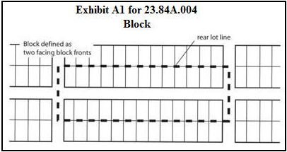

Exhibit A1 forBlock

In downtown and Seattle Mixed-South Lake Union (SM-SLU) zones, a block consists of the area bounded by street lot lines, and may or may not be bisected by an alley, as depicted in Exhibit A2 for 23.84A.004.

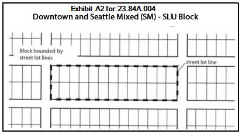

Exhibit A2 forDowntown and Seattle Mixed-South Lake Union (SM-SLU) block

"Block front" means the land area along one side of a street bound on three sides by the centerline of platted streets and on the fourth side by an alley or rear lot lines (Exhibit B for 23.84A.004).

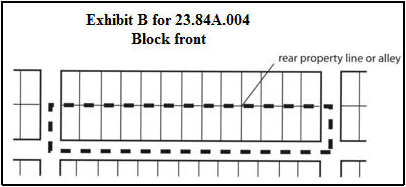

Exhibit B forBlock front

"Boat moorage." See "Parking and moorage" under "Transportation facility."

"Boat moorage, public" means a boat moorage that is owned, operated or franchised by a governmental agency for use by the general public.

"Bridge, access." See "Access bridge."

"Building." See "Structure."

"Bus base." See "Vehicle storage and maintenance" under "Transportation facility."

"Business district identification sign" means an off-premises sign that gives the name of a business district or industrial park and which may list the names of individual businesses within the district or park.

"Business establishment" means an economic or institutional unit organized for the purposes of conducting business and/or providing a service. In order to be considered a separate business establishment, a business shall be physically separated from other businesses. Businesses that share common facilities, such as reception areas, checkout stands, and similar features (except shared building lobbies and restrooms) are considered the same business establishment. A business establishment may be within one structure or many, and may be located on a single lot or on multiple adjacent lots. A business establishment may be a commercial, manufacturing, institutional, or any other type of nonresidential use or live-work unit.

"Business incubator." See "Retail sales and services, non-household."

"Business sign." See "Sign, business."

"Business support service." See "Retail sales and services, non-household" under "Sales and services, heavy."

"Butterfly roof" means a roof having planes that slope upward from the interior of a structure toward its exterior walls.

#### 23.84A.006 - "C"

"C zone." See "Zone, general commercial."

"Cabaret, Adult." See "Entertainment use."

"Candelabra mounting." See "Communication devices and utilities."

"Canopy" means a non-rigid, retractable or non-retractable, protective covering located at the entrance to a structure.

"Car wash." See "Retail sales and services, automotive."

"Caretaker's quarters." See "Residential use."

"Cargo terminal." See "Transportation facility."

"Carpool" means a highway vehicle with a seating capacity of less than eight (8) persons, including the driver, that is used primarily to convey a group of two (2) or more employees between home and work.

"Carport" means a private garage that is open to the weather on at least forty (40) percent of the total area of its sides. (See also "Garage.")

"Carriage house" See "Residential use."

"Carriage house structure" See "Residential use".

"Car-sharing program" means a membership based organization that offers use of motor vehicles twenty-four (24) hours a day and seven (7) days a week to its members who reserve vehicles in advance, and that charges members for the time and/or miles.

"Cemetery" means a place dedicated and used or intended to be used as a burial ground.

"Character structure" means a structure on a lot within the boundaries of the Pike/Pine Conservation Overlay District that has been in existence prior to 1940, thereby contributing to the established scale, development pattern, and architectural character of the area.

"Chargeable floor area" means gross floor area of all structures on any lot in a zone in which floor area limits apply, except portions of structures or uses that are expressly exempt from floor area limits under the provisions of this Title 23, and after reduction by any applicable adjustment for mechanical equipment. Chargeable floor area is computed using the exemptions and adjustments in effect at the time the computation is made.

"Child care center." See "Institution."

"Church." See "Religious facility" under "Institution."

"Cinema." See "Theaters and spectator sports facilities" under "Entertainment."

"City facility" means a facility owned and/or operated for public purposes by The City of Seattle.

"City transportation authority" means a city transportation authority within the meaning of RCW Chapter 35.95A.

"Clerestory" means an outside wall of a building that rises above an adjacent roof of that building and contains vertical windows. Clerestories function so that light is able to penetrate below the roof of the structure.

"Club, private." See "Institution."

"College." See "Institution."

"Columbarium" means a structure or space in a structure containing niches for permanent inurnment of cremated remains.

"Commercial laundry." See "Commercial services, heavy" under "Sales and services, heavy."

"Commercial moorage." See "Boat moorage" under "Parking and moorage" under "Transportation facility."

"Commercial pickup and delivery" means the pickup and delivery of goods or merchandise by, or for, a business operated on the lot.

"Commercial use" means one of the following categories of uses:

Animal shelters and kennels;

Eating and drinking establishments;

Entertainment uses;

Food processing and craft work;

Laboratories, research and development;

Lodging uses;

Medical services;

Offices;

Sales and services, automotive;

Sales and services, general;

Sales and services, heavy; and

Sales and services, marine.

Communication devices and utilities (and related terms).

1. "Antenna, dish" means a round parabolic device for the reception and/or transmission of radiofrequency communication signals. A dish antenna may serve either as a major or minor communication utility or may be an accessory communication device. A dish antenna may be either

    1. a satellite earth station antenna, which receives signals from and/or transmits signals to satellites, or
    2. a point-to-consecutive-point antenna, which receive signals from terrestrial sources. Also called "Satellite dish antenna."
2. "Antenna, whip" means an omnidirectional antenna, cylindrical in shape, 4 inches or less in diameter and 12 feet or less in length.
3. "Candelabra mounting" means a single spreader that supports more than two antennas.
4. "Communication device, accessory" means a device by which radiofrequency communication signals are transmitted and/or received, such as but not limited to whip, horn and dish antennas, and that is accessory to the principal use on the site. Antennas and other equipment associated with major and minor communication utilities are not accessory communication devices.
5. "Communication device, receive-only" means a radio frequency device with the ability to receive signals, but not to transmit them.
6. "Communication utility, major" means a use in which the means for radiofrequency transfer of information are provided by facilities with significant impacts beyond their immediate area. These utilities include, but are not limited to, FM and AM radio and UHF and VHF television transmission towers. A major communication utility use does not include communication equipment accessory to residential uses; nor does it include the studios of broadcasting companies, such as radio or television stations, which shall be considered offices even if there is point-to-point transmission to a broadcast tower.
7. "Communication utility, minor" means a use in which the means for radiofrequency transfer of information are provided but do not have significant impacts beyond the immediate area. These utilities are smaller in size than major communication utilities and include two-way, land-mobile, personal wireless services and cellular communications facilities; cable TV facilities; point-to-point microwave antennas; FM translators; and FM boosters with under ten watts transmitting power. A minor communication utility does not include wire, cables, or communication equipment accessory to residential uses; nor does it include the studios of broadcasting companies, such as radio or television stations, which shall be considered offices even if there is point-to-point transmission to a broadcast tower.
8. "Communication utility, physical expansion of major or minor" means any increase in footprint and/or envelope of transmission towers. Physical expansion does not include an increase in height of the tower resulting from repair, reconstruction, replacement or modification to the antenna that would result in lower radio frequency radiation exposure readings at ground level or in greater public safety, as long as the height above mean sea level does not increase by more than ten percent and in any event does not exceed 1,100 feet above mean sea level. Replacement of existing antennas or addition of new antennas is not considered physical expansion, unless such replacement or addition increases the envelope of the transmission tower by such means as utilizing a candelabra mounting. Replacement or expansion of an equipment building is not considered physical expansion.
9. "Reception window obstruction" means a physical barrier that would block the signal between an orbiting satellite and a land-based antenna.
10. "Telecommunication facility, shared-use" means a telecommunication facility used by two or more television stations or five or more FM stations.
11. "Telecommunication facility, single-occupant" means a telecommunication facility used only by one television station or by one television station and one to four FM stations.
12. "Transmission tower" means a tower or monopole on which communication devices are placed. Transmission towers may serve either as a major or minor communication facility.
13. "Wireless service, fixed" means the transmission of commercial non-broadcast communication signals via wireless technology to and/or from a fixed customer location. Fixed wireless service does not include AM radio, FM radio, amateur ("HAM") radio, Citizen's Band (CB) radio, and Digital Audio Radio Service (DARS) signals.
14. "Wireless service, personal" means a commercial use offering cellular mobile services, unlicensed wireless services and common carrier wireless exchange access services.
"Community clubs or centers." See "Institution."

"Conditional use." See "Use, conditional."

"Congregate residence." See "Residential use."

"Construction services." See "Commercial services, heavy" under "Sales and services, heavy."

"Contributing structure" means a structure that the Director of Neighborhoods has determined contributes and will contribute to the architectural and/or historic character of the Pioneer Square Preservation District or the International Special Review District pursuant to Section 23.66.032, and for which any conditions to a final determination to that effect have been satisfied.

"Control of access" means the condition where the right of owners or occupants of abutting land or other persons to access, light, air or view in connection with a public street is fully or partially controlled by public authority.

"Control of access, full" means the condition where the authority to control access is exercised to give preference to through traffic by providing access connections with selected public streets only and by prohibiting crossings at grade and direct driveway connections.

"Control of access, partial" means the condition where the authority to control access is exercised to give preference to through traffic to a degree that, in addition to access connections with selected public streets, there may be some crossings at grade and some direct connections.

"Corner lot." See "Lot, corner."

"Cottage, backyard." See "detached accessory dwelling unit" under the definition of "Residential use" in Section 23.84A.032.

"Cottage" means a single-family dwelling unit located in a cottage housing development.

"Cottage housing development". See "Residential use".

"Council" means the City Council of The City of Seattle.

"Council conditional use." See "Conditional use."

"Craft work." See "Food processing and craft work."

"Cul-de-sac" means a street closed at one end by a widened pavement of sufficient size for automotive vehicles to be turned around.

"Curb" means a physical curb constructed from cement concrete, asphalt concrete, or granite.

"Curb cut" means a depression in the curb, for the purpose of accommodating a driveway, that provides vehicular access between private property and the street or easement, or where there is no curb, the intersection of the driveway and the curbline.

"Curbline" means the edge of a roadway, whether marked by a curb or not. When there is not a curb, the curbline shall be established by the Director of Seattle Department of Transportation.

"Custom and craft work." See "Food processing and craft work."

"Customer service office." See "Retail sales and services, general" under "Sales and services, general."

#### 23.84A.008 - "D"

"Deck" means a platform extending more than 18 inches from a structure, or an unattached platform, including safety railings if required by the Building Code. A deck may be cantilevered or connected to the ground by posts and may have steps or ramps to the ground and a door to the structure. (See also "Porch.")

"Dedication" means an appropriation or giving up of property to public use that precludes the owner or others claiming under the owner from asserting any right of ownership inconsistent with the use for which the property is dedicated.

"Department" means the Seattle Department of Construction and Inspections.

"Depth." See "Structure depth."

"Detached accessory dwelling unit." See "Residential use."

"Development regulations." See RCW 36.70A.030.

"Director" means the Director of the Seattle Department of Construction and Inspections or the Director's designee.

"Dish antenna." See "Communication devices and utilities."

"Dispersion criteria" means standards regulating the maximum concentration of and/or minimum distance between particular uses.

"Display of rental equipment, outdoor." See "Outdoor display of rental equipment."

"DMC housing TDR site." See "TDR site, DMC housing."

"Doctor, hospital-based" means a physician having an office and/or principal practice based in and/or salaried by a major institution.

"Doctor, staff" means a physician with staff privileges at a hospital who has an office outside the boundaries of the major institution.

"Domestic violence shelter." See "Residential use."

"Dormer" means a minor gable in a pitched roof, usually bearing a window on its vertical face. A dormer is part of the roof system.

"Downtown Amenity Standards" means the provisions contained in Attachment 3 to Ordinance 122054, as they may be amended from time to time by ordinance.

"Drinking establishment." See "Eating and drinking establishment"

"Drive-in business" means a business or a portion of a business where a customer is permitted or encouraged, either by the design of physical facilities or by service and/or packaging procedures, to carry on business in the off-street parking or paved area accessory to the business, while seated in a motor vehicle or while out of the vehicle but in the immediate vicinity of the vehicle. This definition shall include but not be limited to gas stations, car washes, and drive-in restaurants or banks.

"Drive-in lane" means an aisle that gives vehicle access to a drive-in window or other drive-in facility such as a gasoline pump or car wash bay.

"Driveway" means that portion of a street, alley or private lot that provides access to, but not within, an off-street parking facility from a curb cut, and may include portions of the sidewalk.

"Dry boat storage." See "Parking and moorage" under "Transportation facility."

"Duplex" means a single structure containing only two dwelling units, neither of which is an accessory dwelling unit authorized under Section 23.44.041.

"Dwelling unit" means a room or rooms located within a structure that are configured to meet the standards of Section 23.42.048 and that are occupied or intended to be occupied by not more than one household as living accommodations independent from any other household.

"Dwelling unit, accessory." See "Residential use."

"Dwelling unit, detached accessory." Also known as a backyard cottage. See "detached accessory dwelling unit" under the definition of "Residential use" in Section 23.84A.032.

"Dwelling unit - small efficiency" means a dwelling unit with an amount of square footage less than the minimum amounts specified for Efficiency Dwelling Units in the Seattle Building Code, and that meet the standards prescribed in Section 23.42.048.

#### 23.84A.010 - "E"

"Easement" means a grant by a property owner to specific persons or to the public to use land for a specific purpose or purposes.

"Eating and drinking establishment" means a use in which food and/or beverages are prepared and sold at retail for immediate consumption. Eating and drinking establishments include restaurants and drinking establishments.

1. "Drinking establishment" means an establishment other than a restaurant, licensed to sell alcoholic beverages for consumption on premises; that limits patronage to adults of legal age for the consumption of alcohol; and in which limited food service may be accessory to the service of alcoholic beverages. Drinking establishments may include but are not limited to taverns, saloons, brewpubs, bars, pubs, or cocktail lounges associated with restaurants.
2. "Restaurant" means a use in which food and/or beverage preparation and service is provided for individual consumption either on- or off-premise, and in which any service of alcoholic beverages is accessory to the service of food.
"Edge" means the boundary between two (2) kinds of areas that are identified by the uses within them, degree of activity, topography or other special characteristics.

"EIS" means an environmental impact statement required by the State Environmental Policy Act, including as the context may require a draft, final or supplemental EIS.

"Electric-assisted bicycle" shall have the same meaning accorded by RCW 46.04.169, as that section currently exists or is hereafter amended.

"Electric scooter" means a vehicle: (1) with a handlebar for steering, two wheels less than 18 inches in diameter, and a saddle or seat for the operator and any passenger; (2) propelled by an electric motor or by an electric motor in combination with human propulsion; and (3) incapable of exceeding a speed of 30 miles per hour on level ground.

"Entertainment use" means a commercial use in which recreational, entertainment, athletic, and/or cultural opportunities are provided for the general public, either as participants or spectators. Uses accessory to institutions or to public parks or playgrounds shall not be considered entertainment uses. Entertainment uses include the following uses:

1. "Cabaret, adult" means an entertainment use where licensing as an "adult entertainment premises" is required by SMC Chapter 6.270.
2. "Motion picture theater, adult" means a use in which, in an enclosed building, motion picture films are presented that are distinguished or characterized by an emphasis on matter depicting, describing or relating to "specific sexual activities" or "specified anatomical areas," as defined in this subsection, for observation by patrons therein:

    1. "Specified sexual activities":

        1. Human genitals in a state of sexual stimulation or arousal;
        2. Acts of human masturbation, sexual intercourse or sodomy;
        3. Fondling or other erotic touching of human genitals, pubic region, buttock or female breast.
    2. "Specified anatomical areas":

        1. Less than completely and opaquely covered:

            1. Human genitals, pubic region,
            2. Buttock, or
            3. Female breast below a point immediately above the top of the areola; or
        2. Human male genitals in a discernibly turgid state, even if completely and opaquely covered.
3. "Panoram, adult" means a device which exhibits or displays for observation by a patron a picture or view from film or videotape or similar means which is distinguished or characterized by an emphasis on matter depicting, describing, or relating to "specified sexual activities" or "specified anatomical areas," as defined in subsection 1.
4. "Sports and recreation, indoor" means an entertainment use in which facilities for engaging in sports and recreation are provided within an enclosed structure, and in which any spectators are incidental and are not charged admission. Examples include but are not limited to bowling alleys, roller and ice skating rinks, dance halls, racquetball courts, physical fitness centers and gyms, and videogame parlors.
5. "Sports and recreation, outdoor" means an entertainment use in which facilities for engaging in sports and recreation are provided outside of an enclosed structure, and in which any spectators are incidental and are not charged admission. Examples include tennis courts, water slides, and driving ranges.
6. "Theaters and spectator sports facilities" means an entertainment use in which cultural, entertainment, athletic, or other events are provided for spectators either in or out of doors. Adult motion picture theaters and adult panorams shall not be considered theaters and spectator sports facilities for the purposes of this definition. Theaters and spectator sports facilities include, but are not limited to, the following uses:

    1. "Lecture and meeting hall" means a theater and spectator sports facility intended and expressly designed for public gatherings such as but not limited to commercial spaces available for rent or lease for the purpose of holding meetings or the presentation of public speeches.
    2. "Motion picture theater" means a theater and spectator sports facility use intended and expressly designed for the presentation of motion pictures, other than an adult motion picture theater.
    3. "Performing arts theater" means a theater and spectator sports facility intended and expressly designed for the presentation of live performances of drama, dance and music.
    4. "Spectator sports facility" means a theater and spectator sports facility intended and expressly designed for the presentation of sports events, such as a stadium or arena.
"Entrance ramp" means any public road or turning roadway, including acceleration lanes, by which traffic enters the main traveled way of a limited-access facility from the general street system; such designation applying to that portion of the roadway along which there is full control of access.

"Environmentally critical area" means any of those areas regulated as an environmentally critical area by SMC Chapter 25.09, Regulations for Environmentally Critical Areas.

"Essential public facilities" within the City of Seattle means airports, sewage treatment plants, jails, light rail transit systems, and power plants.

"Existing lot grade." See "Lot grade, existing."

"Exit ramp" means any public road or turning roadway, including deceleration lanes, by which traffic leaves the main traveled way of a freeway to reach the general street system within the city; such designation applying to that portion of the roadway along which there is full control of access.

"Expressway" means a divided arterial street for through traffic with full or partial control of access and generally with grade separations at intersections.

#### 23.84A.012 - "F"

"Facade" means any exterior wall of a structure including projections from and attachments to the wall. Projections and attachments include balconies, decks, porches, chimneys, unenclosed corridors and similar projections.

"Facade, front" means the facade, other than an interior facade, extending the full width of the structure, including modulations, that is closest to and most nearly parallels the front lot line.

"Facade, interior" means any facade of a structure that faces, or portions of which face, the facade(s) of another structure(s) located on the same lot.

"Facade, rear" means the facade, other than an interior facade, extending the full width of the structure, including modulations, that is closest to and most nearly parallels the rear lot line.

"Facade, side" means a facade, other than an interior facade, extending the full depth of the structure, including modulations, that is closest to and most nearly parallels the side lot line.

"Facade, street-facing" means a facade extending the full width of a structure and facing a street lot line of the subject property. If two sides of a facade are at an angle to the street lot line, or if the facade is curved or articulated in a manner that is not square, straight or parallel to the street lot line, the Director shall determine which facade is a street-facing facade. Portions of an interior facade that face a street lot line are not a street-facing facade if the portion of the interior facade facing the street is separated from the street for 50 percent or more of its width by another lot at least 10 feet wide or by any structure with interior floor area.

"Facade, street-level" means the portion of the facade that covers the street-level story or stories of a structure along an abutting street. On streets with little or no slope, the street-level facade is the exterior wall of the story of a structure with its floor closest to street-level. On sloped streets, the street-level facade may cover portions of more than one story.

"Family support center." See "Institution."

"FAR." See "Floor area ratio."

"Fast food restaurant, formula" means, for purposes of application within the International Special Review District, an establishment required by contractual or other arrangements to offer some or all of the following:

1. standardized menus, ingredients, food preparation, decor, external facade and/or uniforms;
2. prepared food in a ready-to-consume state;
3. food sold over the counter in disposable containers and wrappers;
4. food selected from a limited menu.
"Fixed wireless service." See "Communication Devices and Utilities."

"Flat" means a dwelling unit that is located entirely on one (1) level in a multi-family structure.

"Fleet vehicles" means more than three (3) vehicles having a gross vehicle weight (gvw) not exceeding ten thousand (10,000) pounds, or more than one (1) vehicle having a gvw exceeding ten thousand (10,000) pounds permanently located at a business establishment or operated on a daily basis in connection with business activities. This definition shall not include vehicles that are available for rent to the public.

"Floating homes." See "Residential use."

"Floor area, gross." See "Gross floor area."

"Floor area ratio" means a ratio expressing the relationship between the amount of gross floor area or chargeable floor area permitted in one or more structures and the area of the lot on which the structure is, or structures are, located, as depicted in Exhibit 23.84A.012 A.

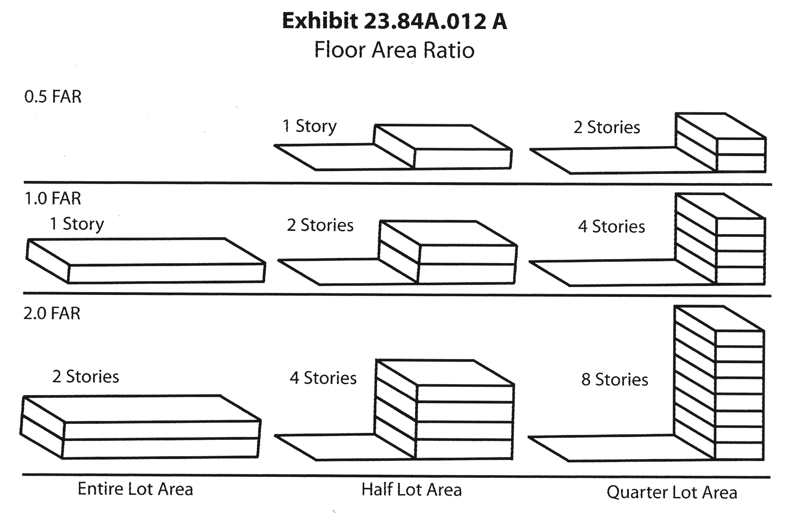

"Florist" means a retail sales and service use in which cut flowers and other plants are sold.

"Food preparation area" means a room or portion of a room designed, arranged, intended or used for cooking or otherwise making food ready for consumption.

"Food processing and craft work" means a commercial use in which food items and craft work are produced without the use of a mechanized assembly line and includes but is not limited to the following:

1. "Custom and craft work" means a food processing and craft work use in which nonfood, finished, personal or household items, which are either made to order or which involve considerable handwork, are produced. Examples include but are not limited to pottery and candlemaking, production of orthopedic devices, motion picture studios, printing, creation of sculpture and other art work, and glassblowing. The use of products or processes defined as high-impact uses shall not be considered custom and craft work.
2. "Food processing" means a food processing and craft work use in which products for human consumption, such as candy, baked goods, seafood, sausage, tofu, pasta, beverages, tinctures, consumable oils, products to be smoked, etc., are produced for sale and consumption off the premises. Food processing includes catering services. Processing of products for human consumption using mechanized assembly line production of canned or bottled goods is not included in this definition, but is considered to be light manufacturing.
"Formula fast-food restaurant." See "Fast food restaurant, Formula."

"Freeway" means an expressway with full control of access.

"Frequent transit service." See "Transit service, frequent."

"Fuel pump" means a device for retail deliveries of motor fuels, including but not limited to gasoline, diesel, natural gas, bio-diesel, or hydrogen, to individual motor vehicles.

"Fuel sales" see "Sales, Heavy commercial" under "Sales and services, Heavy

#### 23.84A.014 - "G."

"Garage, private" means an accessory structure or an accessory portion of a principal structure, designed or used for the shelter or storage of vehicles owned or operated by the occupants of the principal structure. (See "Carport.")

"Garage, terraced" means a private garage that is partially below existing and/or finished grade.

"Garden wall crypt" means an outdoor freestanding wall or exterior wall of a structure containing niches for permanent inurnment of cremated remains.

"Gas station." See "Retail sales and services, automotive" under "Sales and services, automotive."

"General mailed release." See Land Use Information Bulletin.

"General manufacturing." See "Manufacturing"

"General retail sales and services." See "Sales and services, general."

"General sales and services." See "Sales and services, general."

"Grade." See "Lot grade."

"Green Factor" means a scoring system for required landscaping, as described in Section 23.86.019.

"Green roof" means a landscaped area on the roof of a structure.

"Green stormwater infrastructure" means distributed best management practices, as defined in Chapter 22.801, integrated into a project design, that use infiltration, filtration, storage, or evapotranspiration, or provide stormwater reuse.

"Green street" means a street right-of-way that is part of the street circulation pattern, that through a variety of treatments, such as sidewalk widening, landscaping, traffic calming, and pedestrian-oriented features, is enhanced for pedestrian circulation and open space use.

"Green street, designated" means a portion of a street designated as a green street on a map in this Title.

"Greenhouse" means a structure or portion of a structure, made primarily of glass or other translucent material, for which the primary purpose is the cultivation or protection of plants.

"Grocery store" means a business establishment (or portion thereof) in multipurpose retail sales use where food and beverages for home consumption, and household supplies, are the principal products sold.

"Gross floor area" means the number of square feet of total floor area bounded by the inside surface of the exterior wall of the structure as measured at the floor line, and any additional areas identified as gross floor area within a zone.

"GSI." See "Green stormwater infrastructure."

#### 23.84A.016 - "H"

"Hard-surfaced street" means a street that has been surfaced with a material other than crushed rock so that a hard, smooth, strong surface exists.

"Hazardous materials" means substances that are capable of posing risk to health, safety or property as defined in the Seattle Fire Code.

"Hearing Examiner" means the official appointed by the Council and designated as the Hearing Examiner, or that person's designee (Deputy Hearing Examiner, Hearing Examiner Pro Tem, etc.).

"Hearing, open record." See RCW 36.70B.020.

"Heat recovery incinerator" means an accessory facility designed for the conversion of at least one (1) ton per day of solid waste into useful energy, together with storage and handling bins and machinery required for its operation.

"Heavy commercial services." See "Commercial services, heavy" under "Sales and services, heavy."

"Heavy commercial sales." see "Commercial sales, heavy" under "Sales and services, heavy."

"Heavy manufacturing." See "Manufacturing."

"Heavy sales and services" See "Sales and services, heavy."

"Heavy traffic generator," means any use that generates more than seventy-five (75) trips per hour per one thousand (1,000) square feet of gross floor area at peak hour, according to the Institute of Transportation Engineers' (ITE) Trip Generation Manual.

"Heliport." See "Air transportation facility" under "Transportation facility."

"Helistop." See "Air transportation facility" under "Transportation facility."

"High-impact use" means a business establishment that is considered to be dangerous and/or noxious due to the probability and/or magnitude of its effects on the environment; and/or has the potential for causing major community or health impacts, including but not limited to nuisance, odors, noise, and/or vibrations; and/or is so chemically intensive as to preclude site selection without careful assessment of potential impacts and impact mitigation. The Director shall consult as necessary with the Chief of the Seattle Fire Department, the Director of the Seattle-King County Health Department, and other local, state, regional and federal agencies to determine when a business establishment shall be regulated as a high-impact use.

"Hillclimb assist" means an amenity feature consisting of a pedestrian corridor that incorporates a mechanical device or combination of mechanical and non-mechanical features to connect avenues across lots with slopes of ten (10) percent or more to aid pedestrian movement up and down the slopes.

"Hillside terrace" means an amenity feature consisting of an extension of the public sidewalk on lots with slopes of ten (10) percent or more, which through design features provides public street space, helps integrate street-level uses along the sidewalk, and makes pedestrian movement up and down steep slopes easier and more pleasant.

"Home occupation" means a nonresidential use that is clearly incidental and secondary to the use of a dwelling for residential purposes and does not change the character of the dwelling.

"Horticulture." See "Agricultural use."

"Hospital." See "Institution."

"Hotel." See "Lodging use."

"Household" means a housekeeping unit consisting of any number of related persons; eight or fewer non-related, non-transient persons; eight or fewer related and non-related non-transient persons, unless a grant of special or reasonable accommodation allows an additional number of persons.

"Household, low-income" means a household whose income does not exceed eighty (80) percent of median income.

"Household, moderate-income" means a household whose income does not exceed median income.

"Household, very low-income" means a household whose income does not exceed fifty (50) percent of median income.

"Housing, affordable" means a housing unit for which the occupant is paying no more than thirty (30) percent of household income for gross housing costs, including an allowance for utility costs paid by the occupant.

"Housing, low-income" means housing affordable to, and occupied by, low-income households.

"Housing, moderate-income" means housing affordable to, and occupied by, moderate-income households.

"Housing, very low-income" means housing affordable to, and occupied by, very low-income households.

"Housing TDR site." See "TDR site, housing."

"Housing unit" means any dwelling unit, housekeeping unit, guest room, dormitory, or single occupancy unit.

"Human service use" means a use in which structure(s) and related grounds or portions thereof are used to provide one or more of the following: emergency food, medical or shelter services; community health care clinics, including those that provide mental health care; alcohol or drug abuse services; information and referral services for dependent care, housing, emergency services, transportation assistance, employment or education; consumer and credit counseling; or day care services for adults. Human service uses provide at least one (1) of the listed services directly to a client group on the premises, rather than serve only administrative functions.

#### 23.84A.018 - "I"

"Incentive zoning suffix" means a modification to a zoning designation listed in Section 23.30.010. The designation is indicated by a listed zoning designation followed by a number in parentheses that establishes base FAR and/or base residential FAR for purposes of application of Chapter 23.58A, Incentive Provisions.

"Indoor agricultural operation" means a business establishment with an agricultural use that is limited to plants grown in containers within an enclosed structure.

"Infill development" means development consisting of either:

1. Construction on one (1) or more lots in an area that is mostly developed, or
2. New construction between two (2) existing structures.
"Institute for advanced study." See "Institution."

"Institution" means structure(s) and related grounds used by organizations for the provision of educational, medical, cultural, social and/or recreational services to the community, including but not limited to the following uses:

1. "Adult care center" means an institution that regularly provides care to a group of adults for less than twenty-four (24) hours a day, whether for compensation or not.
2. "College" means a post-secondary educational institution, operated by a nonprofit organization, granting associate, bachelor and/or graduate degrees.
3. "Community club or center" means an institution used for athletic, social, civic or recreational purposes, operated by a nonprofit organization, and open to the general public on an equal basis. Activities in a community club or center may include classes and events sponsored by nonprofit organizations, community programs for the elderly, and other similar activities.

    1. "Community center" means a community club or center use, providing direct services to people on the premises rather than carrying out only administrative functions, that is open to the general public without membership.
    2. "Community club" means a community club or center use, membership to which is open to the general public on an equal basis.
4. "Child care center" means an institution that regularly provides care to a group of children for less than twenty-four (24) hours a day, whether for compensation or not. Preschools shall be considered to be child care centers.
5. "Family support center" means an institution that offers support services and instruction to families, such as parenting classes and family counseling, and is co-located with a Department of Parks and Recreation community center.
6. "Hospital" means an institution that provides accommodations, facilities and services over a continuous period of twenty-four (24) hours or more, for observation, diagnosis and care of individuals who are suffering from illness, injury, deformity or abnormality or from any condition requiring obstetrical, medical or surgical services, or alcohol or drug detoxification. This definition excludes nursing homes.
7. "Institute for advanced study" means an institution operated by a nonprofit organization for the advancement of knowledge through research, including the offering of seminars and courses, and technological and/or scientific laboratory research.
8. "Library" means an institution where literary, musical, artistic or reference materials are kept for use but not generally for sale.
9. "Museum" means an institution operated by a nonprofit organization as a repository of natural, scientific, historical, cultural or literary objects of interest or works of art, and where the collection of such items is systematically managed for the purpose of exhibiting them to the public.
10. "Private club" means an institution used for athletic, social or recreational purposes and operated by a private nonprofit organization, membership to which is by written invitation and election according to qualifications in the club's charter or bylaws and the use of which is generally restricted to members and their guests.
11. "Religious facility" means an institution, such as a church, temple, mosque, synagogue or other structure, together with its accessory structures, used primarily for religious worship.
12. "School, elementary or secondary" means an institution operated by a public or nonprofit organization primarily used for systematic academic or vocational instruction through the twelfth grade.
13. "School, vocational or fine arts" means an institution that teaches trades, business courses, hairdressing and similar skills on a post-secondary level, or that teaches fine arts such as music, dance or painting to any age group, whether operated for nonprofit or profit-making purposes, except businesses that provide training, instruction, or lessons exclusively on an individual basis, which are classified as general retail sales and service uses, and except those businesses accessory to an indoor participant sports use.
14. "University." See "College."

#### 23.84A.020 - "J"

"Jail" means a public facility, including a youth service center, for the incarceration of persons under warrant, awaiting trial on felony or misdemeanor charges, convicted but not yet sentenced, or serving a sentence upon conviction. This definition does not include facilities for programs providing alternatives to imprisonment such as prerelease, work release, or probationary programs, except when provided in conjunction with a youth service center.

"Junk storage" means the temporary or permanent storage outdoors of junk, waste, discarded, salvaged or used materials or inoperable vehicles or vehicle parts. This definition shall include but not be limited to the storage of used lumber, scrap metal, tires, household garbage, furniture, and inoperable machinery.

"Junkyard." See "Salvage and recycling."

#### 23.84A.022 - "K."

"Kennel." See "Animal shelters and kennels."

"Kitchen." See "Food preparation area."

#### 23.84A.024 - "L"

"Laboratory, research and development" means a use in which research and experiments leading to the development of new products are conducted. This use may be associated with an institutional, clinical or commercial use. This use includes but is not limited to the operation of a laboratory subject to any level of biosafety containment standard described by the U.S. Department of Health and Human Services, , current edition. Space designed for this use typically includes such features as floor - to - floor ceiling heights of at least 14 feet to accommodate mechanical equipment, and laboratory benches plumbed for water service.

"Land Use Information Bulletin" means an information distribution to the persons on a master distribution list as established and maintained by the Department.

"Landmark housing TDR site." See "TDR site, Landmark housing."

"Landmark structure" means a structure designated as a landmark pursuant to the Landmark Preservation Ordinance, Chapter 25.12.

"Landscape section" means a section of the right-of-way of a freeway, expressway, parkway or scenic route, at least one (1) side of which is improved by the planting, for other than the sole purpose of soil erosion control, of ornamental trees, shrubs, lawn or other vegetation, or at least one (1) side of which is endowed by nature with native trees and shrubs that are reasonably maintained, and which has been so designated by this Code.

"Landscaping" means live planting materials, including but not limited to, trees, shrubs, vegetables, fruits, grass, vines, ground cover or other growing horticultural material. Landscaping may also include features intended to enhance a landscaped area, including water features, pathways or materials such as wood chips, stone, permeable paving or decorative rock.

"Laundry, commercial." See "Commercial services, heavy" under "Sales and services, heavy."

"Lecture and meeting halls." See "Theaters and spectator sports facilities" under "Entertainment."

"Ledge" means a cantilevered or posted platform extending no more than eighteen (18) inches from a structure.

"LEED" (Leadership in Energy & Environmental Design) means the U.S. Green Building Council's Green Building Rating System. LEED is a voluntary consensus-based national standard for developing high-performance, sustainable buildings. LEED provides standards for higher performance in the following categories: Sustainable Sites, Water Efficiency, Energy and Atmosphere, Materials and Resources, Indoor Environmental Quality, and Innovation and Design Process.

"LEED-CS" (LEED for Core & Shell) means a standard for core and shell construction and covers base building elements, such as the structure, envelope and building level systems. LEED-CS recognizes the division between owner and tenant responsibility for design and construction of certain elements of the building.

"LEED-NC" (LEED for New Construction) means a standard for new construction and major renovation projects. LEED-NC covers all building elements, including core and shell and interiors. LEED-NC was designed for commercial, institutional, high-rise residential, and mixed-use projects, but has also been applied to K-12 schools, industrial, laboratories, and many other building types.

"LEED Silver rating" means a level of performance for a new structure that earns at least the minimum number of credits specified to achieve a "Silver" certification either for "LEED-NC" or for "LEED-CS," at the election of the applicant, according to the criteria in the U.S. Green Building Council's LEED Green Building Rating System, LEED-NC Version 2.2 and LEED-CS Pilot Version, copies of which are filed with the City Clerk in C.F. 307824, and incorporated in this section by reference.

"Library." See "Institution."

"Light manufacturing." See "Manufacturing."

"Light rail transit facility." See "Rail transit facility" under "Transportation facility."

"Light rail transit system." See "Rail transit facility" under "Transportation facility."

"Live-work unit" means a structure or portion of a structure: (1) that combines a commercial or manufacturing activity that is allowed in the zone with a residential living space for the owner of the commercial or manufacturing business, or the owner's employee, and that person's household; (2) where the resident owner or employee of the business is responsible for the commercial or manufacturing activity performed; and (3) where the commercial or manufacturing activity conducted takes place subject to a valid business license associated with the premises.

"Loading berth" means an off-street space for the temporary parking of a vehicle while loading or unloading merchandise or materials and that abuts on a street, alley or easement.

"Lodging use" means a commercial use in which the primary activity is the provision of rooms to transients. Lodging uses include but are not limited to the following uses:

1. "Bed and breakfast" means a lodging use, where rooms within a single dwelling unit are provided to transients by a resident operator for a fee by prearrangement on a daily or short-term basis. A breakfast and/or light snacks may be served to those renting rooms in the bed and breakfast.
2. "Hotel" means a lodging use, located in a structure in which access to individual units is predominantly by means of common interior hallways, and in which a majority of the rooms are provided to transients for a fee on a daily or short-term basis.
3. "Motel" means a lodging use, located in a structure in which access to individual units is predominantly by means of common exterior corridors, and in which a majority of the rooms are provided to transients on a daily or short- term basis, and in which off-street parking is provided on the lot.
"Lot" means, except for the purposes of a TDR sending lot for Landmark TDR or housing TDR, a sending lot for South Downtown Historic TDR or South Downtown Historic TDP, and a sending lot for open space TDR, a parcel of land that qualifies for separate development or has been separately developed. A lot is the unit that the development standards of each zone are typically applied to. A lot shall abut upon and be accessible from a private or public street sufficiently improved for vehicle travel or abut upon and be accessible from an exclusive, unobstructed permanent access easement. A lot may not be divided by a street or alley (Exhibit A for 23.84A.024).

1. For purposes of a TDR sending lot for Landmark TDR, "lot" means the parcel described in the ordinance approving controls for the sending lot.
2. For purposes of a sending lot for housing TDR, "lot" means the smallest parcel or combination of contiguous parcels, as described in the County real property records at any time after January 4, 1993, that contain the structure or structures that make the TDR eligible for transfer.
3. For purposes of a sending lot for South Downtown Historic TDR or South Downtown Historic TDP, "lot" means the smallest parcel or combination of contiguous parcels, as described in the County real property records at any time after March 31, 2011, that contain the contributing structure or structures that make the TDR or TDP eligible for transfer.
4. For purposes of a sending lot for open space TDR, the definition of lot in Section 23.49.017 applies.
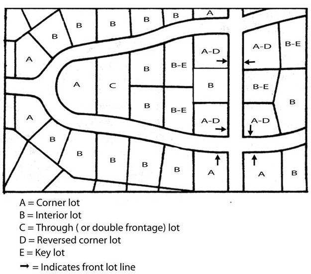

Exhibit A for: Lot Types

"Lot area" means the total area of the horizontal plane within the lot lines of a lot.

"Lot, corner" means a lot situated at the intersection of two (2) streets, or bounded on two (2) or more adjacent sides by street lot lines, provided that the angle of intersection of the street lot lines does not exceed one hundred thirty-five (135) degrees.

"Lot coverage" means that portion of a lot occupied by structures, expressed as a percentage of the total lot area (Exhibit 23.84A.024 B).

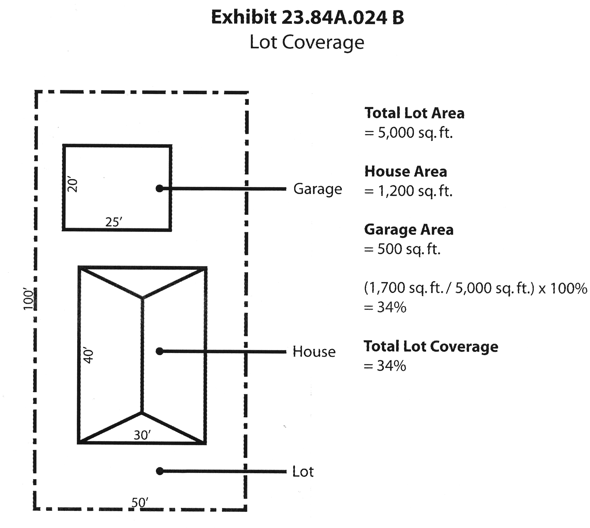

"Lot depth" means the horizontal distance between the front and rear lot lines.

"Lot grade, existing" means the natural surface contour of a lot, as modified by minor adjustments to the surface of the lot in preparation for construction. For purposes of this definition, on a lot where excavation has occurred for previous development, the interpolated grade based on existing grade elevations at the lot lines may be considered the natural surface contour of the lot provided that when the lot is developed, that grade is restored from the lot lines up to the exterior walls of any new structure(s). Where an area in excess of two acres has been legally regraded, the resulting grade shall be considered the existing lot grade.

"Lot, interior" means a lot other than a corner lot.

"Lot, key" means the first lot to the rear of a reversed corner lot whether or not separated by an alley.

"Lot line, alley" means a lot line that abuts upon an alley.

"Lot line, front" means, in the case of a lot with frontage on a single street, the lot line separating the lot from the street, and in the case of a lot with frontage on more than one street other than a through lot, the lot line separating the lot from any abutting street, provided the other lot line(s) that abut streets are considered to be side street lot line(s). In the case of a through lot, the lot lines separating the lot from the streets that are parallel or within 15 degrees of parallel to each other are both front lines. For new development on a lot with no street frontage, the front lot line shall be the lot line designated by the project applicant in accordance with Section 23.86.010. If the area of the front yard based on a front lot line determined according to this definition is less than 20 percent of the total lot area and is less than 1,000 square feet in area, the Director may designate a different lot line as the front lot line in order to provide structural setbacks, building separations and open space that are more consistent with those of other lots that are within 100 feet of the property.

"Lot line, rear" means a lot line that is opposite and most distant from the front lot line.

"Lot line, side" means any lot line other than a front lot line or a rear lot line.

"Lot line, side street" means a lot line, other than the front lot line, abutting upon a street.

"Lot line, street" means a front lot line or a side street lot line.

"Lot lines" means the property lines bounding a lot.

"Lot, parent" means the initial lot from which unit lots are subdivided under Section 23.22.062 or Section 23.24.045.

"Lot, reversed corner" means a corner lot, the side street lot line of which is substantially a continuation of the front lot line of the lot to its rear, whether or not separated by an alley.

"Lot, through" means a lot abutting on two (2) streets that are parallel or within fifteen (15) degrees of parallel with each other.

"Lot, unit" means one of the individual divisions created from the subdivision of a parent lot pursuant to Section 23.22.062 or Section 23.24.045. A unit lot is not a lot.

"Lot, waterfront" means a lot or parcel any portion of which is offshore of or abuts upon the ordinary high water mark or mean high water mark and any other lot or parcel partially or entirely within the Shoreline District that is not separated from the water by a street, arterial, highway or railroad right-of-way, that was a legal right-of-way as of March 17, 1977, but does not include any legally dedicated right-of-way.

"Lot width" means the mean horizontal distance between side lot lines measured at right angles to the lot depth.

"Low-income disabled multifamily structure." See "Multifamily structure, low-income disabled." "Low-income elderly multifamily structure." See "Multifamily structure, low-income elderly."

"Low-income elderly/low-income disabled multifamily structure." See "Multifamily structure, low-income elderly/low-income disabled."

"Low-income household." See "Household, low-income."

"Low-income housing." See "Housing, low-income."

#### 23.84A.025 - "M"

"Mailed notice" means notice mailed by the Director to such property owners, commercial lessees, building managers, and residents of properties including and within 300 feet of the boundaries of a specific site as can be determined from the records of the King County Department of Assessments, the City Master Address File, and such additional references as may be identified by the Director.

"Major communication utility." See "Communication devices and utilities."

"Major durables retail sales." See "Sales and services, heavy."

"Major Institution" means an institution providing medical or educational services to the community. A Major Institution, by nature of its function and size, dominates and has the potential to change the character of the surrounding area and/or create significant negative impacts on the area. To qualify as a Major Institution, an institution must have a minimum site size of sixty thousand (60,000) square feet of which fifty thousand (50,000) square feet must be contiguous, and have a minimum gross floor area of three hundred thousand (300,000) square feet. The institution may be located in a single building or a group of buildings that includes facilities to conduct classes or related activities needed for the operation of the institution.

A Major Institution shall be determined to be either an educational Major Institution or a medical Major Institution, according to the following:

1. "Educational Major Institution" means an accredited post-secondary level educational institution, operated by a public agency or nonprofit organization, granting associate, baccalaureate and/or graduate degrees. The institution may also carry out research and other activities related to its educational programs.
2. "Medical Major Institution" means a licensed hospital.
"Major performing arts facility" means a facility specifically designed for the presentation of live performances of theater, dance or music, that at a minimum has one (1) auditorium with at least two thousand (2,000) seats.

"Major Phased Development" means a nonresidential, multiple building project that, by the nature of its size or function, is complex enough to require construction phasing over an extended period of time, excluding Major Institutions.

"Major retail store" means a structure or portion of a structure that provides adequate space of at least eighty thousand (80,000) square feet to accommodate the merchandising needs of a major new retailer with an established reputation, and providing a range of merchandise and services, including both personal and household items, to anchor downtown shopping activity around the retail core, thereby supporting other retail uses and the area's vitality and regional draw for customers.

"Manufacturing" means a use in which articles are produced by hand or by machinery, from raw or prepared materials, by giving to those materials new forms, qualities, properties, or combinations, in a process characterized by the repetitive production of items made to the same or similar specifications. Items produced are generally sold directly to other businesses, or are sold at wholesale. The retail sale of items to the general public is incidental to the production of goods. For the purpose of this definition, uses listed as food processing and craft work or high-impact uses are not considered manufacturing uses. Manufacturing uses include the following:

1. "Manufacturing, light" means a manufacturing use, typically having little or no potential of creating noise, smoke, dust, vibration or other environmental impacts or pollution, and including but not limited to the following:

    1. Production, assembly, finishing, and/or packaging of articles from parts made at another location, such as assembly of clocks, electrical appliances, or medical equipment.
    2. Production of finished household and office goods, such as jewelry, clothing or cloth, toys, furniture, or tents, from materials that are already refined, or from raw materials that do not need refining, such as paper, fabric, leather, premilled wood; or wool, clay, cork, semiprecious or precious metals or stones, fiber, or other similar materials;
    3. Canning or bottling of food or beverages for human consumption using a mechanized assembly line or food processing for animal consumption;
    4. Printing plants with more than five thousand (5,000) square feet of gross floor area.
2. "Manufacturing, general" means a manufacturing use, typically having the potential of creating moderate noise, smoke, dust, vibration or other environmental impacts or pollution, and including but not limited to the following:

    1. Production of items made from stone or concrete;
    2. Production of items from ferrous or nonferrous metals through use of a machine shop, welding or fabrication; or from nonferrous metals through use of a foundry; or from ferrous metals through use of a foundry heated by electricity (induction melting);
    3. Production of recreational or commercial vessels of less than one hundred twenty (120) feet in length to individual customer specifications;
    4. Production of finished goods, that typically are not for household or office use, such as barrels, ceramic molds, or cardboard cartons, from materials that are already refined, or from raw materials that do not need refining, such as paper, fabric, leather, premilled wood; or wool, clay, cork, semiprecious or precious metals or stones, fiber, or other similar materials;
    5. Production of finished goods, for household or non-household use, such as toys, film, pens, or linoleum from plastic, rubber, or celluloid;
    6. Production of parts to be assembled into a finished product;
    7. Development of film on a wholesale basis;
    8. Production of items through biological processes, such as pharmaceuticals and industrial purifiers, manufactured by bioengineering techniques;
    9. Production of items such as paint and coatings, dyestuffs, fertilizer, glue, cosmetics, clay, or pharmaceuticals that require the mixing or packaging of chemicals.
3. "Manufacturing, heavy" means a manufacturing use, typically having the potential of creating substantial noise, smoke, dust, vibration and other environmental impacts or pollution, and including but not limited to:

    1. The extraction or mining of raw materials, such as quarrying of sand or gravel;
    2. Processing or refining of raw materials, such as but not limited to minerals, petroleum, rubber, wood or wood pulp, into other products;
    3. The milling of grain or refining of sugar, except when accessory to a use defined as food processing for human consumption or as a retail sales and service use;
    4. Poultry slaughterhouses, including packing and freezing of poultry;
    5. Refining, extruding, rolling, or drawing of ferrous or nonferrous metals, or the use of a non-induction foundry for ferrous metal;
    6. Mass production of commercial or recreational vessels of any size and the production of vessels one hundred twenty (120) feet in length constructed to individual specifications;
    7. Production of large durable goods such as motorcycles, cars, manufactured homes, airplanes, or heavy farm, industrial, or construction machinery;
    8. Manufacturing of electrical components, such as semiconductors and circuit boards, using chemical processes such as etching or metal coating;
    9. Production of industrial organic and inorganic chemicals, and soaps and detergents; and
    10. Conversion of solid waste into useful products or preparation of solid waste for disposal at another location by processing to change its physical form or chemical composition. This includes the off-site treatment or storage of hazardous waste as regulated by the State Department of Ecology. The on-site treatment and storage of hazardous waste is considered an incidental or accessory use.
"Marijuana" means all parts of the plant Cannabis, whether growing or not; the seeds thereof; the resin extracted from any part of the plant; and every compound, manufacture, salt, derivative, mixture, or preparation of the plant, its seeds, or resin. The term does not include:

1. the mature stalks of the plant;
2. fiber produced from the mature stalks of the plant;
3. oil or cake made from the seeds of the plant;
4. any other compound, manufacture, salt, derivative, mixture, or preparation of the mature stalks (except the resin extracted therefrom), fiber, oil, or cake; or
5. the sterilized seed of the plant which is incapable of germination.
"Marijuana activity, major" means, except as provided below, any production, processing, or selling of marijuana, marijuana-infused products, usable marijuana, or marijuana concentrates. Major marijuana activity does not include the following activities when they occur within a dwelling unit occupied by a qualifying patient or designated provider, as those terms are defined in RCW 69.51A.010, or within an enclosed structure that is accessory to such a dwelling unit:

1. production of marijuana involving up to 15 plants;
2. production of marijuana involving up to 60 plants if the production is conducted by a cooperative that is registered with the Washington State Liquor and Cannabis Board and operates in compliance with RCW 69.51A.043;
3. drying or incorporation into food of up to 15 marijuana plants; or
4. drying or incorporation into food of up to 60 marijuana plants if such processing is conducted by a cooperative that is registered with the Washington State Liquor and Cannabis Board and operates in compliance with chapter 69.51A RCW.
"Marijuana concentrates" means products consisting wholly or in part of the resin extracted from any part of the plant Cannabis and having a THC concentration greater than ten percent.

"Marijuana-infused products" means products that contain marijuana or marijuana extracts and are intended for human use. The term "marijuana-infused products" does not include useable marijuana.

"Marijuana, useable" means dried marijuana flowers. The term "useable marijuana" does not include marijuana-infused products.

"Marina, recreational." See "Boat moorage" under "Parking and moorage" under "Transportation facility."

"Marine retail sales and service." See "Sales and services, marine."

"Marine sales and service." See "Sales and services, marine."

"Master Use Permit" means the document issued to an applicant that records all land use decisions that are made by the Department on a master use application. Construction permits and land use approvals that must be granted by the City Council, citizen boards or the state are excluded.

"Mausoleum" means a structure or building for the entombment of human remains in crypts.

"Median income" means annual median family income for the Seattle area, as published from time to time by the U.S. Department of Housing and Urban Development (HUD), with adjustments according to household size in a manner determined by the Director, which adjustments shall be based upon a method used by the United States Department of Housing and Urban Development to adjust income limits for subsidized housing, and which adjustments for purposes of determining affordability of rents or sale prices shall be based on the average size of household considered to correspond to the size of the housing unit (one (1) person for studio units and one and a half (1.5) persons per bedroom for other units).

"Medical services" means a commercial use in which health care for humans or animals ("animal health services") is provided on an outpatient basis, including but not limited to offices for doctors, dentists, veterinarians, chiropractors, and other health care practitioners, or in which mortuary or funeral services are provided. Permitted accessory uses include associated office, research and laboratory uses.

"Meeting, public." See RCW 36.70B.020.

"Mid-block corridor" means an amenity feature that provides open space and public access and circulation across extremely long blocks located in the Downtown Urban Center east of Interstate 5.

"Mini-warehouse." See "Storage."

"Minor communication utility." See "Communication devices and utilities"

"Minor institution" means an institution that does not meet the criteria for a major institution.

"Mobile home park." See "Residential use."

"Moderate-income household." See "Household, moderate-income."

"Moderate-income housing." See "Housing, moderate-income."

"Modulation" means a stepping back or projecting forward of sections of the facade of a structure within specified intervals of structure width and depth, as a means of breaking up the apparent bulk of the continuous exterior walls (Exhibit A for 23.84A.025).

"Mortuary service." See "Medical services".

"Motel." See "Lodging use."

"Motion picture studio" means a facility for the production of motion pictures, intended for movie or television viewing, using video or film media. Motion picture studio use may be intermittent.

"Motion picture theater, adult." See "Entertainment."

"Multifamily residential structure" means a structure containing only multifamily residential uses and permitted uses accessory to the multifamily residential uses.

"Multifamily structure." See "Residential use."

"Multifamily structure, low-income disabled." See "Multifamily residential use, low-income disabled".

"Multifamily structure, low-income elderly." See "Multifamily residential use, low-income elderly".

"Multifamily structure, low-income elderly/low-income disabled." See "Multifamily residential use, low-income elderly/low-income disabled".

"Multifamily structure, very low-income disabled." See "Multifamily residential use, very low-income disabled".

"Multifamily structure, very low-income elderly." See "Multifamily residential use, very low-income elderly".

"Multifamily structure, very low-income elderly/very low-income disabled." See "Multifamily residential use, very low-income elderly/very low-income disabled".

"Multiple business center" means a grouping of two (2) or more business establishments that either share common parking on the lot where they are located, or occupy a single structure or separate structures that are physically attached or both. Shopping centers are considered to be multiple business centers.

"Museum." See "Institution."

#### 23.84A.026 - "N."

"NC zone." See "Zone, neighborhood commercial."

"Neighborhood plan" means the goals and policies adopted by the Council into the Comprehensive Plan's Neighborhood Planning Element, that are developed to guide the growth and development of a specific neighborhood and deal with other neighborhood related issues such as housing, institutions, transportation, economic development and other community development activities.

"Nonconforming to development standards" means a structure, site or development that met applicable development standards at the time it was built or established, but that does not now conform to one or more of the applicable development standards. Development standards include, but are not limited to height, setbacks, lot coverage, lot area, number and location of parking spaces, open space, density, screening and landscaping, lighting, maximum size of nonresidential uses, maximum size of non-industrial use, view corridors, sidewalk width, amenity features, street-level use requirements, street facade requirements, and floor area ratios.

"Nonconforming use." See "Use, nonconforming."

"Non-household sales and services." See "Sales and services, heavy."

"Nonresidential structure" means a structure containing no residential uses.

"Nursing home." See "Residential use."

#### 23.84A.028 - "O"

"Office" means a commercial use that provides administrative or professional services to individuals, businesses, institutions and/or government agencies primarily by phone or mail, by going to the customer's home or place of business, or on the premises by appointment; or in which customers are limited to holders of business licenses, but not including facilities where medical services are provided or customer service offices. Examples of services provided include general contracting, janitorial and housecleaning services; legal, architectural, and data processing; broadcasting companies, administrative offices of businesses, unions or charitable organizations; and wholesalers and manufacturer's representatives' offices. Offices may include accessory storage, but not the storage of building materials, contractor's equipment or items, other than samples, for wholesale sale.

"Office, Customer service." See "Retail sales and services, General" under "Sales and services, general."

"Open railing" means any railing treatment that maintains a minimum of 80 percent transparency between the floor line and top of railing by using clear glass or similar transparent materials of a maximum 20 percent opacity, or cross bars, that leave 80 percent of the vertical surface open.

"Open space" means land and/or water area with its surface predominately open to the sky or predominantly undeveloped, that is set aside to serve the purposes of providing park and recreation opportunities, conserving valuable natural resources, or structuring urban development and form.

"Open space, common" means usable open space that is available for use by all occupants of a residential structure.

"Open space, landscaped" means exterior space, at ground level, predominantly open to public view and used for the planting of trees, shrubs, ground cover, and other natural vegetation, and the installation of bioretention facilities.

"Open space, usable" means an open space that is of appropriate size, shape, location and topographic siting so that it provides landscaping, pedestrian access or opportunity for outdoor recreational activity. Parking areas and driveways are not usable open spaces.

"Open space, private usable" means usable open space that is intended to be used only by the occupants of one ground-related dwelling unit.

"Ornamental feature" means a decorative object such as a lintel, cornice or sunshades extending from a structure.

"Outdoor display of rental equipment" means an outdoor area where merchandise available for rent is displayed, and that is freely accessible to the public. Outdoor display of rental equipment may be the principal use of a lot or may be accessory to a commercial use where the rental transactions occur within a structure.

"Outdoor sales" means an outdoor area where merchandise is sold or is displayed for sale, and which is freely accessible to the public, except that automotive retail sales areas shall be considered outdoor sales whether freely accessible or not. Outdoor sales may be the principal use of a lot or may be accessory to a commercial use where the sales transactions occur within a structure.

"Outdoor storage." See "Storage."

"Overhead weather protection" means a nonstructural feature, such as a canopy, awning or marquee, or a structural feature, such as a building overhang or arcade, that extends from a building and provides pedestrians with protection from inclement weather and adds visual interest at street level.

"Owner" means any person having a legal or equitable interest in, title to, responsibility for, or possession of a building or property, including, but not limited to, the interest of a lessee, guardian, receiver or trustee, and any duly authorized agent of the owner.

"Owner occupancy" means occupancy of a dwelling by the legal owner as reflected in title records, or by the contract purchaser. The owner occupant of a residence containing an accessory dwelling unit must have an interest equal to or greater than any other partial owner of the property, and the owner occupant's interest must be fifty (50) percent or greater.

#### 23.84A.030 - "P"

"Panoram, adult." See "Entertainment use."

"Parcel park" means an amenity feature consisting of a small open space that is accessible to the public and that provides downtown pedestrians an opportunity to rest and relax in a developed urban environment through such amenities as seating, landscaping and artwork.

"Park." See "Parks and open space".

"Park and pool lot." See "Principal use parking" under "Parking and moorage" under "Transportation facility."

"Park and ride lot." See "Principal use parking" under "Parking and moorage" under "Transportation facility."

"Parking" when used as a noun means a surface parking area or parking garage.

"Parking, accessory" means one or more parking spaces that are either reserved or required for a particular use or structure.

"Parking and moorage." See "Transportation facility."

"Parking garage" means a structure or a portion of a structure used or intended to be used for parking or storage of vehicles.

"Parking, long-term" means one or more long-term parking spaces.

"Parking, non-required" means one or more parking spaces not required by either the Land Use Code (Title 23 SMC) or the Zoning Code (Title 24 SMC) as accessory to a principal use and not required as a mitigating measure pursuant to the State Environmental Policy Act.

"Parking, principal use." See "Parking and moorage" under "Transportation facility".

"Parking screen" means a screen that effectively obscures view of off-street parking from the public right-of-way or private lots. (See also "Screen.")

"Parking, short-term" means one or more short-term parking spaces.

"Parking space" means an area for the parking of one vehicle within a parking facility or parking area, exclusive of driveways, ramps, and office and work areas.

"Parking space, long-term" means a parking space that will be occupied by the same motor vehicle for four (4) hours or more, including a space generally used by persons who commute to, work by private motor vehicle or by residents.

"Parking space, short-term" means a parking space occupied by individual motor vehicles for less than four (4) hours and generally used intermittently by shoppers, visitors, or outpatients.

"Parking, surface" means an open area used or intended to be used for the parking of vehicles. It may be available to the public or reserved to accommodate parking for a specific purpose.

"Parks and open space" means a use in which an area is permanently dedicated to recreational, aesthetic, educational or cultural use and generally is characterized by its natural and landscape features. A parks and open space use may be used for both passive and active forms of recreation.

"Parkway" means a thoroughfare located within a park, or including a park-like development and designated as a "parkway."

"Participant sports and recreation." See "Sports and recreation, indoor" and "Sports and recreation, outdoor" under "Entertainment".

"Party of record" means any person who files an appeal; a person granted party status through intervention; the City department making the decision or determination and any of its employees or agents; the owner(s) of the property subject to the quasi-judicial action; and the person who files an application for a permit or other type of development authorization that is the subject of the appeal.

"Passenger terminal." See "Transportation facility."

"Paved" means surfaced with a hard, smooth surface, usually consisting of Portland cement concrete or asphaltic concrete underlain by a subgrade of crushed rock.

"Pedestrian orientation" means a condition in which the location of and access to structures, types of uses permitted at street level, and storefront design are based on needs of persons on foot.

"Pedestrian-designated zone." See "Zone, pedestrian-designated."

"Pedestrian walkway" means a surfaced walkway, separated from the roadway, usually of crushed rock or asphaltic concrete and following the existing ground surface (not at permanent grade).

"Penthouse pavilion" means a covered and posted but otherwise open structure, or an arbor, affixed to the roof of a building and intended to be used as a common amenity area.

"Performing arts theater." See "Theaters and spectator sports facilities" under "Entertainment."

"Person" means any individual, partnership, corporation, association, or public or private organization of any character.

"Personal and household retail sales and service." See "Sales and service, general".

"Personal transportation services." See "Transportation services, personal."

"Personal wireless service." See "Communication devices and facilities."

"Pet daycare center" means a general retail sales and service use that regularly provides care for animals, which may include boarding.

"Pet grooming services." See "Retail sales and services, general."

"Pitched roof" means any non-horizontal roof.

"Placard" means a highly visible notice at least eleven (11) by fourteen (14) inches in size with headings that can be read from a distance of seventy-five (75) feet by persons of normal visual acuity.

"Planned community development (PCD)" means a zoning process that authorizes exceptions from certain development standards for structures on large tracts of land in certain downtown zones. A PCD is developed as a single entity through a public process.

"Planned residential development (PRD)" means a zoning mechanism that allows for flexibility in the grouping, placement, size and use of structures on a fairly large tract of land. A PRD is developed as a single entity, using a public process that incorporates design review.

"Planting strip" means that portion of a street right-of-way lying between the curb and the street lot line, exclusive of the sidewalk; provided, that if there is no curb, then "planting strip" means that portion of the street lying between a sidewalk and the street lot line. If there is no curb and no constructed sidewalk, there is no "planting strip."

"Plat" means a map or representation of a subdivision showing the division of a tract or parcel of land into lots, blocks, streets and alleys or other divisions and dedications.

"Playgrounds." See "Parks and open space."

"Plaza, urban" means an amenity feature downtown satisfying the applicable conditions in the Downtown Amenity Standards.

"Podium" means the portion of a structure containing the stories closest to the street level that are below a specified height limit and that provide the base above which additional stories of a tower are permitted.

"Podium height" means the maximum height above street level permitted for the podium portion of a structure, except for those features that are otherwise allowed as exceptions to the applicable height limit of the zone.

"Porch" means an elevated platform extending from a wall of a principal structure, with steps or ramps to the ground providing access by means of a usable doorway to the structure. A porch may be connected to a deck. (See also "Deck.")

"Power plant." See "Utility."

"Preliminary plat" means a neat and approximate drawing of a proposed subdivision showing the general layout of streets and alleys, lots, blocks and other elements of a subdivision, that is submitted to furnish a basis for the approval or disapproval of the general layout of a subdivision.

"Principal structure" means the structure housing one or more principal uses as distinguished from any separate structures housing accessory uses.

"Principal use." See "Use, principal."

"Private club." See "Institution."

"Private usable open space." See "Open space, usable, private."

"Project permit" or "Project permit application." See RCW 36.70B.020.

"Property Use and Development Agreement" means an agreement, executed by the legal or beneficial owner of property whose zoning classification is changed by a contract rezone, which subjects the property to restrictions on its use and development.

"Public atrium" means a feature consisting of an indoor public open space that provides opportunities for passive recreational activities and events, and for public gatherings, in an area protected from the weather, and including such amenities as seating, landscaping and artwork.

"Public benefit feature" means an amenity, use, or other feature of benefit to the public in a Downtown zone, that is provided by a developer and that can satisfy wholly or in part conditions to qualify for an increase in chargeable floor area. Examples include public open space, pedestrian improvements, housing, and provision of human services.

"Public Benefit Features Rule" means the DPD Director's Rule 20-93, subject heading Public Benefit Features: Guidelines for Evaluating Bonus and TDR Projects, Administrative Procedures and Submittal Requirements in Downtown Zones, to the extent the provisions thereof have not been superseded by amendments to, or repeal of, provisions of this title. References to the "Public Benefit Features Rule" for provisions on a particular subject also shall include, where applicable, any successor rule or rules issued by the Director to incorporate provisions on that subject formerly included in Rule 20-93, with any appropriate revisions to implement amendments to this title since the date of such rule.

"Public boat moorage." See "Boat moorage, public."

"Public convention center" means a public facility of three hundred thousand (300,000) square feet or more, the primary purpose of which is to provide facilities for regional, national and international conventions and that is owned, operated or franchised by a unit of general or special-purpose government. A public convention center may include uses such as shops, personal services and restaurants, which may be owned, operated or franchised by either a unit of general- or special-purpose government or by a private entity.

"Public display space." See "Museum."

"Public facility" means a public project or city facility.

"Public project" means a facility owned, operated or franchised by a unit of general or special-purpose government except The City of Seattle.

"Public school site, existing" means any property acquired and developed for use by or for the proposed public school before November 12, 1985. A public school site may be divided by streets or alleys.

"Public school site, new" means any property that has not been previously developed for use by a public school that is to be constructed, expanded or remodeled. A public school site may be divided by streets or alleys. A school property may include both a new school site and existing school sites.

#### 23.84A.032 - "R"

"Rail transit facility." See "Transportation facility."

"Railroad switchyard." See "Vehicle storage and maintenance" under "Transportation facility."

"Railroad switchyard with mechanized hump." See "Vehicle storage and maintenance" under "Transportation facility."

"Rain garden" see "bioretention facilities"

"Receive-only communication device." See "Communication devices and utilities."

"Reception window obstruction." See "Communication devices and utilities."

"Recreation area, common" means a space of appropriate size, shape, location, and topographic siting to provide landscaping, pedestrian access, or opportunity for recreation activity, either in or out of doors, for all the residents of a structure containing dwelling units. Parking areas and driveways are not common recreation areas.

"Recreational marina." See "Boat moorage" under "Parking and moorage" under "Transportation facility."

"Recreational vehicle" means a wheeled vehicle designed for temporary occupancy with self-contained utility systems and not requiring a separate highway movement permit for highway travel. A recreational vehicle is not a dwelling unit.

"Recycling." See "Utility."

"Regional development credit" means an entitlement to development potential on property in unincorporated King, Snohomish, or Pierce County as defined and certified by King, Snohomish, or Pierce County.

"Regional development credit, agricultural" means a regional development credit that King, Snohomish, or Pierce County has designated as having originated from a parcel zoned for agricultural uses.

"Regional development credit, forest" means a regional development credit that King, Snohomish, or Pierce County has designated as having originated from a parcel zoned for forestry uses.

"Regional development credit, rural" means a regional development credit that King, Snohomish, or Pierce County has designated as having originated from a parcel that was not specifically zoned for agricultural or forestry uses.

"Religious facility." See "Institution."

"Research and development laboratory." See "Laboratory, research and development."

"Residential district identification sign" means an off-premises sign that gives the name of the group of residential structures, such as a subdivision.

"Residential hillside terrace" means an amenity feature consisting of an extension of the public sidewalk on lots with slopes of ten percent or more, which through design features provides public street space, better integrates development with the street environment on sloping lots, and makes pedestrian movement up and down steep slopes in downtown residential areas easier and more pleasant.

"Residential structure" means a structure containing only residential uses and permitted uses accessory to the residential uses.

"Residential use" means any one or more of the following:

1. "Accessory dwelling unit" means one or more rooms that

    1. are located within an owner-occupied dwelling unit, or within an accessory structure on the same lot as an owner-occupied dwelling unit;
    2. meet the standards of Section 23.44.041, or 23.45.545, or Chapter 23.47A, as applicable;
    3. are designed, arranged, and intended to be occupied by not more than one household as living accommodations independent from any other household; and
    4. are so occupied or vacant.
2. "Adult family home" means an adult family home defined and licensed as such by The State of Washington in a dwelling unit.
3. "Apartment" means a multifamily residential use that is not a cottage housing development, rowhouse development, or townhouse development.
4. "Artist's studio/dwelling" means a combination working studio and dwelling unit for artists, consisting of a room or suite of rooms occupied by not more than one household.
5. "Assisted living facility" means a use licensed by The State of Washington as a boarding home pursuant to RCW 18.20, that contains at least two assisted living units for people who have either a need for assistance with activities of daily living (which are defined as eating, toileting, ambulation, transfer [e.g., moving from bed to chair or chair to bath], and bathing) or some form of cognitive impairment but who do not need the skilled critical care provided by nursing homes. See "Assisted living unit."
6. "Carriage house" means a dwelling unit in a carriage house structure.
7. "Carriage house structure" means a structure within a cottage housing development, in which one or more dwelling units are located on the story above an enclosed parking garage at ground level that either abuts an alley and has vehicle access from that alley, or is located on a corner lot and has access to the parking in the structure from a driveway that abuts and runs parallel to the rear lot line of the lot. See also "Carriage house."
8. "Caretaker's quarters" means a use accessory to a non-residential use consisting of a dwelling unit not exceeding 800 square feet of living area and occupied by a caretaker or watchperson.
9. "Congregate residence" means a use in which rooms or lodging, with or without meals, are provided for nine or more non-transient persons not constituting a single household, excluding single-family dwelling units for which special or reasonable accommodation has been granted.
10. "Cottage housing development" means a use consisting of cottages arranged on at least two sides of a common open space or a common amenity area. A cottage housing development may include a carriage house structure. See "Cottage," "Carriage house," and "Carriage house structure."
11. "Detached accessory dwelling unit" means an accessory dwelling unit in an accessory structure.
12. "Domestic violence shelter" means a dwelling unit managed by a nonprofit organization, which unit provides housing at a confidential location and support services for victims of domestic violence.
13. "Floating home" means a dwelling unit constructed on a float that is moored, anchored or otherwise secured in the water.
14. "Mobile home park" means a tract of land that is rented for the use of more than one mobile home occupied as a dwelling unit.
15. "Multifamily residential use" means a use consisting of two or more dwelling units in a structure or portion of a structure, excluding accessory dwelling units.
16. "Multifamily residential use, low-income disabled" means a multifamily residential use in which at least 90 percent of the dwelling units are occupied by one or more persons who have a handicap as defined in the Federal Fair Housing Amendments Act and who constitute a low-income household.
17. "Multifamily residential use, low-income elderly" means a residential use in which at least 90 percent of the dwelling units are occupied by one or more persons 62 or more years of age who constitute a low-income household.
18. "Multifamily residential use, low-income elderly/low-income disabled" means a multifamily residential use in which at least 90 percent of the dwelling units (not including vacant units) are occupied by a low-income household that includes a person who has a handicap as defined in the Federal Fair Housing Amendment Act or a person 62 years of age or older, as long as the housing qualifies for exemptions from prohibitions against discrimination against families with children and against age discrimination under all applicable fair housing laws and ordinances.
19. "Nursing home" means a use licensed by The State of Washington as a nursing home, which provides full-time convalescent and/or chronic care for individuals who, by reason of chronic illness or infirmity, are unable to care for themselves, but that does not provide care for the acutely ill or surgical or obstetrical services. This definition excludes hospitals or sanitariums.
20. "Rowhouse development" means a multifamily residential use in which all principal dwelling units on the lot meet the following conditions:

    1. each dwelling unit occupies the space from the ground to the roof of the structure in which it is located;
    2. no portion of a dwelling unit, except for an accessory dwelling unit or shared parking garage, occupies space above or below another dwelling unit;
    3. each dwelling unit is attached along at least one common wall to at least one other dwelling unit, with habitable interior space on both sides of the common wall, or abuts another dwelling unit on a common lot line;
    4. the front of each dwelling unit faces a street lot line;
    5. each dwelling unit provides pedestrian access directly to the street that it faces; and
    6. no portion of any other dwelling unit, except for an attached accessory dwelling unit, is located between any dwelling unit and the street faced by the front of that unit.
21. "Single-family dwelling unit" means a detached structure having a permanent foundation, containing one dwelling unit, except that the structure may also contain an accessory dwelling unit where expressly authorized pursuant to this Title 23. A detached accessory dwelling unit is not considered a single-family dwelling unit for purposes of this Chapter 23.84A.
22. "Townhouse development" means a multifamily residential use that is not a rowhouse development, and in which:

    1. each dwelling unit occupies space from the ground to the roof of the structure in which it is located;
    2. no portion of a dwelling unit occupies space above or below another dwelling unit, except for an attached accessory dwelling unit and except for dwelling units constructed over a shared parking garage; and
    3. each dwelling unit is attached along at least one common wall to at least one other dwelling unit, with habitable interior space on both sides of the common wall, or abuts another dwelling unit on a common lot line.
"Restaurant." See "Eating and drinking establishment."

"Retail sales and services, automotive." See "Sales and services, automotive."

"Retail sales and services, general." See "Sales and services, general."

"Retail sales and services, non-household." See "Sales and services, heavy"

"Retail sales, major durables." See "Sales and services, heavy"

"Retail sales, multi-purpose." See "Sales and services, general"

"Retail shopping" means an amenity feature consisting of uses provided at street level that contribute to pedestrian activity and interest.

"Rezone" means an amendment to the Official Land Use Map to change the zone classification of an area.

"Rezone, contract" means an amendment to the Official Land Use Map to change the zone classification of an area, subject to the execution, delivery, and recording of a property use and development agreement executed by the legal or beneficial owner of the property to be rezoned.

"Right-of-way" means a strip of land platted, dedicated, condemned, established by prescription or otherwise legally established for the use of pedestrians, vehicles or utilities.

"Right-of-Way Improvements Manual" means a set of detailed standards for street, alley and easement construction, adopted by a joint Administrative Rule of Seattle Department of Transportation and the Seattle Department of Construction and Inspections.

"Roadway" means that portion of a street improved, designed, or ordinarily used for vehicular travel and parking, exclusive of the sidewalk or shoulder. Where there is a curb, the roadway is the curb-to-curb width of the street.

"Roof, butterfly." See "Butterfly roof."

"Roof, shed." See "Shed roof."

"Roof plane" means a section of the roof system divided from another section by a physical separation, exterior wall, roof apex, or change in the direction of pitch. Change in the degree of roof pitch such as occur on a gambrel roof and projections such as dormers or skylights shall not serve to divide a section into multiple planes.

"Rooftop feature" means any part of or attachment to the structure that projects above a roof line.

"Rowhouse development." See "Residential use."

"Rowhouse unit" means a dwelling unit in a rowhouse development.

"Rules" means administrative regulations promulgated and adopted pursuant to this Land Use Code and the Administrative Code.

"Rural development credit" means the allowance of floor area on a receiving lot that results from the transfer of development potential from rural unincorporated King County to the Downtown Urban Center pursuant to King County Code Chapter 21A.55 or successor provisions and pursuant to the provisions of Section 23.49.011.

#### 23.84A.036 - "S"

"Sale and rental of large boats." See "Sales and services, marine."

"Sale and rental of motorized vehicles." See "Sales and services, automotive."

"Sale and rental of small boats, boat parts and accessories." See "Sales and services, marine."

"Sale of heating fuel." See "Commercial sales, heavy" under "Sales and services, heavy."

"Sales and rental of commercial equipment and construction materials." See "Commercial sales, heavy" under "Sales and services, heavy."

"Sales and services, automotive" means a commercial use in which motorized vehicles or vehicle parts are rented, sold, serviced or repaired. Automotive sales and services uses exclude sales and services primarily relating to electric scooters or electric assisted bicycles. Automotive sales and services uses include but are not limited to the following:

1. "Retail sales and services, automotive" means an automotive sales and service use in which goods are rented or sold primarily for use in motor vehicles or minor services are provided to motor vehicles. Uses in this category may include gas stations, car washes, minor repair of vehicles not falling under the definition of major automotive vehicle repair, battery stations for electric vehicles, and towing of vehicles when no more than two trucks are used or kept on site for towing purposes.
2. "Sales and rental of motorized vehicles" means an automotive sales and service use in which operable motorized vehicles, such as cars, trucks, buses, recreational vehicles or motorcycles, or related non-motorized vehicles, such as trailers, are rented or sold.
3. "Vehicle repair, major automotive" means an automotive sales and service use in which one or more of the following activities are carried out:

    1. Reconditioning of any type of motorized vehicle, including any repairs made to vehicles over 10,000 pounds gross vehicle weight;
    2. Collision services, including body, frame or fender straightening or repair;
    3. Overall painting of vehicles or painting of vehicles in a paint shop;
    4. Dismantling of motorized vehicles in an enclosed structure.
"Sales and services, general" means one of the uses listed below, in which goods are rented or sold or services are provided primarily for household and personal use rather than for business establishments, institutions, or government agencies, but excluding medical services and uses in which goods are sold that primarily need to be delivered by truck, such as building materials, major durables and/or heating fuel.

1. "Retail sales and services, general" means a general sales and service use that is not a multi-purpose retail sales use. General retail sales and services include general retail sales uses, general services uses, and customer service office uses. Examples of general retail sales include but are not limited to bookstores, florists, and clothing stores. Examples of general services include but are not limited to shoe repair, hair cutting salons, pet grooming, pet daycare centers and dry cleaning. Customer service offices are uses in which services are provided to individuals and households in an office setting in a manner that encourages walk-in clientele and in which generally an appointment is not needed to conduct business, including but not limited to uses such as branch banks, travel agencies, brokerage firms, real estate offices, and government agencies that provide direct services to clients.
2. "Retail sales, multipurpose" means a general sales and service use in which a wide range of items frequently purchased for household use are rented or sold. Examples of multipurpose retail sales include but are not limited to grocery, hardware, drug, and variety stores, and farmers' markets.
"Sales and services, heavy" means one of the following uses:

1. "Commercial sales, heavy" means a heavy sales and services use in which goods that primarily require delivery or pickup by truck are sold. Examples include but are not limited to the sale of construction materials, heating fuel, or industrial supplies. Sales are retail and/or wholesale, and are made primarily to businesses rather than to individual households, or primarily delivered directly to households without customers visiting the business.
2. "Commercial services, heavy" means a heavy sales and service use that provides services that require significant truck traffic or the use, storage and disposal of chemicals as a significant part of the functioning of the business. Heavy commercial services include but are not limited to the following:

    1. "Commercial laundry" means a heavy commercial service use in which items such as clothing and linens are cleaned. This definition includes uses such as laundering for hospitals, restaurants, hotels and diaper cleaning services, as well as rug and dry cleaning plants where on-premises retail services to individual households are incidental to the operation of the plant.
    2. "Construction services" means a heavy commercial service use in which construction contracting services, including the final processing of building materials such as but not limited to the mixing of concrete or the heating of asphalt, are provided; or in which construction equipment is stored, either in conjunction with an office or as a separate use, but not including a construction site.
    3. "Building maintenance services" means a heavy commercial service use that provides maintenance and cleaning services to other business establishments.
3. "Retail sales, major durables" means a heavy sales and service use in which large household items, such as but not limited to furniture or appliances, are rented or sold.
4. "Retail sales and services, Non-household" means a heavy sales and service use in which goods and services are provided primarily for businesses, institutions and/or government agencies, rather than for households. Examples include but are not limited to business support services, and the sale of office or restaurant supplies. Non-household retail sales and services include, but are not limited to:
"Business support services" means a non-household retail sales and service use in which services are provided primarily for businesses, institutions and/or government agencies, rather than for households. Examples include but are not limited to blueprint companies, medical laboratories, merchant banks, assaying services and microfilming and copying services.

1. "Wholesale showroom" means a heavy sales and service use in which merchandise is displayed and sold at wholesale to business representatives for resale, rather than to the general public for direct consumption, and that includes storage of goods for sale.
"Sales and services, marine." means one or more of the following uses:

1. "Marine service station" means a marine retail sales and service use in which fuel for boats is sold, and for which accessory uses including, but not limited to, towing or minor vessel repair may also be provided.
2. "Sale or rental of large boats" means a marine retail sales and service use in which boats sixteen (16) feet or more in length are rented or sold.
3. "Sale and rental of small boats, boat parts and accessories" means a marine retail sales and service use in which goods are rented or sold primarily for use on boats and ships, but excluding uses in which fuel for boats and ships is the primary item sold. Examples of goods sold include navigational instruments, marine hardware and paints, nautical publications, nautical clothing such as foul weather gear, marine engines, and boats less than sixteen (16) feet in length.
4. "Vessel repair, minor" means a marine retail sales and service use, other than major vessel repair, in which one (1) or more of the following activities take place:

    1. General boat engine and equipment repair;
    2. The replacement of new or reconditioned parts;
    3. Repair of boat hulls;
    4. Painting and detailing; and
    5. Rigging and outfitting.
5. "Vessel repair, major" means a marine retail sales and service use in which ferrous hulls are repaired; or in which boats and ships sixty-five (65) feet or more in length are converted, rebuilt, painted, repaired, or dismantled. Associated activities may include welding and sandblasting, as part of this use.
"Sales, service and rental of office equipment." See "Retail sales and services, non-household" under "Sales and services, heavy."

"Sales, service and rental of commercial equipment and construction materials." See "Commercial sales, heavy" under "Sales and services, general."

"Salvage and recycling." See "Utility."

"Sanitarium" means "Hospital."

"Satellite dish antenna." See "Communication devices and utilities"

"Scale" means the spatial relationship among structures along a street or block front, including height, bulk and yard relationships.

"Scenic route" means any of those streets designated by the Land Use Code as scenic routes.

"Scenic view section" means a section of the traveled way of a freeway, expressway, parkway, or scenic route that has been so designated by this Code.

"School, elementary or secondary." See "Institution."

"Screen" means a continuous wall or fence that effectively obscures view of the property that it covers and that is broken only for access drives and walks. See "Parking screen."

"Screening" means a screen, hedge or landscaped berm that effectively obscures a view between a use or activity and another use or activity.

"SEPA" means the State Environmental Policy Act.

"Setback" means the minimum required distance between a structure or portion thereof and a lot line of the lot on which it is located, or another line described in a particular section of this title.

"Sewage treatment plant." See "Utility."

"Shared-use facility." See "Communication devices and utilities."

"Shed roof" means a roof having only one (1) sloping plane.

"Shopping atrium" means a feature consisting of a large enclosed space that is accessible to the public, and that provides a combination of retail stores and passive recreational space in a weather-protected, convenient, and attractive atmosphere for shoppers that also contributes to the activity and visual interest at street level.

"Shopping corridor" means a feature consisting of a passage that goes through a block and connects two avenues, and that is lined with retail uses, in order to make pedestrian circulation more convenient, provide more frontage for shops, give protection to pedestrians from inclement weather, and shorten walking distances.

"Short plat" means a map or representation of a short subdivision.

"Short plat approval, fully complete application." See "Application."

"Short subdivision" means the division or redivision of land into nine (9) or fewer lots, tracts, parcels, sites or divisions for the purpose of sale, lease, development or financing.

"Shoulder" means the graded area between the roadway edge and the sidewalk, or slope line where there is no sidewalk, on the portion of a street where there are no curbs.

"Shrub" means a plant defined as a shrub in the Sunset Western Garden Book, 7th Edition, 2001.

"Shrub, large" means a shrub normally expected to be equal to or taller than 2 feet at maturity.

"Sidewalk" means a hard-surfaced pedestrian walkway, usually of Portland cement concrete, separated from the roadway by a curb, planting strip or roadway shoulder.

"Sidewalk widening" means an extension of the surface of a sidewalk, generally onto private property, which is free of all permanent obstructions.

"Sight triangle" means the area on both sides of a driveway that must be clear of any obstruction to permit optimal visibility from the driveway to the sidewalk and street.

"Sign" means any medium, including structural and component parts, that is used or intended to be used to attract attention to the subject matter for advertising, identification or informative purposes.

"Sign, advertising" means a sign directing attention to a business, profession, commodity, service or entertainment conducted, sold or offered elsewhere than upon the lot where the sign is located.

"Sign, awning" means graphics on a fixed awning used or intended to be used to attract attention to the subject matter for advertising, identification, or informative purposes. An awning sign shall not be considered a fabric sign.

"Sign, business" means an on-premises sign directing attention to a business, profession, commodity, service or entertainment conducted, sold or offered on the lot where the sign is located. This definition shall not include signs located within a structure except those signs oriented so as to be visible through a window.

"Sign, canopy" means graphics on a canopy used or intended to be used to attract attention to the subject matter for advertising, identification, or information purposes. A canopy sign shall not be considered a fabric sign.

"Sign, changing-image" means a sign, including a sign using a video display method, which changes its message or background by means of electrical, kinetic, solar or mechanical energy, not including message board signs. A video display method is a method of display characterized by real-time, full-motion imagery of at least television quality.

"Sign, chasing" means a sign that includes one or more rows of lights that light up in sequence.

"Sign, combination" means any sign incorporating any combination of the features of freestanding, projecting, and roof signs. The individual requirements of roof, projecting and pole signs shall be applied for combination signs incorporating any or all of the requirements specified in this Code.

"Sign, double-faced" means a sign that has two display surfaces in approximately parallel planes backed against each other or against the same background, one face of which is designed to be seen from one direction and the other from the opposite direction.

"Sign, electric" means any sign containing electrical wiring, but not including signs illuminated by an exterior light source.

"Sign, externally illuminated" means a sign illuminated by an exterior light source.

"Sign, fabric" means a sign made of canvas, cloth or similar nonrigid material, but not including a canopy sign.

"Sign, flashing" means an electrical sign or portion of an electrical sign that changes light intensity in sudden transitory bursts. Flashing signs do not include changing image or chasing signs.

"Sign, freestanding" means a pole or ground sign.

"Sign, ground" means a sign that is six (6) feet or less in height above ground level and is supported by one (1) or more poles, columns or supports anchored in the ground.

"Sign, identification" means any ground, wall or roof sign which displays only (1) the name, address and/or use of the premises; and/or (2) noncommercial messages.

"Sign kiosk" means a small freestanding sign structure visible to the public used for posting small signs.

"Sign, land use" means a sign with dimensions of at least eighteen (18) inches by twenty-four (24) inches but smaller than an environmental review sign, constructed of a durable material, required for public notice of proposed land use actions according to Chapter 23.76, Procedures for Master Use Permits and Council Land Use Decisions.

"Sign, large" means a sign four (4) by eight (8) feet, constructed of a durable material.

"Sign, large notice" means a sign with dimensions of four feet by eight feet constructed of a durable material, required for public notice of proposed land use actions according to Chapter 23.76, Procedures for Master Use Permits and Council Land Use Decisions.

"Sign, marquee" means a sign placed on, constructed in or attached to a marquee.

"Sign, message board" means an electric sign that has a reader board for the display of information, such as time, temperature, of public service or commercial messages, that can be changed through the turning on and off of different combinations of light bulbs within the display area.

"Sign, multiple business center" means an on-premises sign directing attention to a grouping of two or more business establishments that either share common parking on the lot where the sign is located or occupy a single structure or separate structures that are physically attached or both. A multiple business center sign may be used to identify a multiple business center and may identify individual business establishments within a multiple business center but not the products or services offered by the business establishments. (See also "multiple business center" and "sign, business.")

"Sign, off-premises" means a sign relating, through its message and content, to a business activity, use, product or service not available on the premises upon which the sign is erected.

"Sign, off-premises directional" means an off-premises sign used to direct pedestrian or vehicular traffic to a facility, service, or business located on other premises within one thousand five hundred (1,500) feet of the sign, which sign does not include any reference to brand names of products or services whether or not available on such other premises, except the name of the facility, service or business.

"Sign, on-premises" means a sign or sign device used solely by a business establishment on the lot where the sign is located that displays either: (1) commercial messages that are strictly applicable only to a use of the premises on which it is located, including signs or sign devices indicating the business transacted, principal services rendered, goods sold or produced on the premises, name of the business, and name of the person, firm or corporation occupying the premises; or (2) noncommercial messages. For the purposes of this definition, "business transacted, principal services rendered, goods sold or produced on the premises" does not include: (a) the sale or donation of a gift card, gift certificate, coupon or other document that can be exchanged in part or whole for an item or good that is not directly sold or produced or a service rendered where the gift card, gift certificate, coupon or other document is sold or donated; or (b) access by phone, computer or any other device to allow a person to obtain an item or good that is not directly sold or produced or a service rendered where the access by phone, computer or other device is offered. This definition does not include signs located within a structure except those signs oriented so as to be visible through a window.

"Sign, on-premises directional" means an on-premises incidental sign designed to direct pedestrian or vehicular traffic.

"Sign, pole" means a sign wholly supported by a structure in the ground.

"Sign, portable" means a sign that is not permanently affixed and is designed for or capable of being moved, except those signs explicitly designed for people to carry on their persons or that are permanently affixed to motor vehicles.

"Sign, projecting" means a sign other than a wall sign, that projects from and is supported by a wall of a structure.

"Sign, public" means a sign in the right-of-way that is at least partially funded by public funds and is intended to carry messages of interest to the public.

"Sign, roof" means a sign erected upon or above a roof or parapet of a building or structure.

"Sign, rotating" means a sign that revolves on a fixed axis.

"Sign, side-by-side" means advertising signs that are adjacent to each other on the same plane and facing in the same direction, either on the same structure or within twenty-five (25) feet of one another.

"Sign, temporary" means any sign that is to be displayed for a limited period of time only, including but not limited to, banners, pennants, streamers, fabric signs, wind-animated objects, clusters of flags, festoons of lights and searchlights. A temporary sign may be of rigid or non-rigid construction.

"Sign, under-marquee" means a lighted or unlighted sign attached to the underside of a marquee.

"Sign, visually blocked" means an advertising sign that is located against or attached to a building, thereby visible from only one (1) direction. To be considered visually blocked, the advertising sign must be within eight (8) feet of any building wall or walls that are used to block the back side of the advertising sign and the advertising sign cannot project above or beyond the blocking wall or walls.

"Sign, wall" means any sign attached to and supported by a wall of a structure, or projected on or onto a wall of a building or structure, or suspended from the roof of a building or structure, with the exposed face of the sign on a plane approximately parallel to the plane of the wall, or any sign painted directly on a building facade.

"Single-family dwelling unit." See "Residential use."

"Single-occupant facility." See "Telecommunication facility, single-occupant" under "Communication devices and utilities."

"Skylight" means an opening in a roof that is covered with translucent or transparent material, designed to admit light, and incidental to the roof itself.

"Soil, structural" means a soil mix or equivalent structure approved by the Director that is engineered to support pavement while allowing healthy root growth.

"Solar access" means the amount of unrestricted sunlight that reaches a structure, or portion thereof.

"Solar collector" means any device used to collect direct sunlight for use in the heating or cooling of a structure, domestic hot water, or swimming pool, or the generation of electricity.

"Solar greenhouse" means a solar collector that is a structure or portion of a structure utilizing glass or similar glazing material to collect direct sunlight for space heating purposes.

"Solarium" means a room, porch, or other area, that is designed to admit sunlight, is part of a larger structure, is enclosed substantially entirely by glass or another transparent material, and is not primarily used for the cultivation or protection of plants.

"Solid waste incineration facilities." See "Solid waste management" under "Utility."

"Solid waste landfills." See "Solid waste management" under "Utility"

"Solid waste management." See "Utility."

"Solid waste transfer station." See "Solid waste management" under "Utility."

"South Downtown" means the area that is identified as such on Map 1A for Chapter 23.49.

"Spectator sports facility." See "Theaters and spectator sports facilities" under "Entertainment"

"Sports and recreation, indoor." See "Entertainment."

"Sports and recreation, outdoor." See "Entertainment."

"Stoop" See "porch"

"Storage" means a use in which goods or products are stored more than (72) hours. Storage uses include but are not limited to the following uses:

1. "Mini-warehouse" means a storage use in which enclosed storage space divided into separate compartments no larger than five hundred (500) square feet in area is provided for use by individuals to store personal items or by businesses to store material for operation of a business establishment at another location.
2. "Storage, outdoor" means a storage use in which an outdoor area is used for retention of materials, containers and/or equipment. Outdoor storage does not include sale, repair, incineration, recycling or discarding of materials or equipment. Outdoor storage areas are not accessible to the public unless an agent of the business is present. Outdoor parking areas for two (2) or more fleet vehicles of more than ten thousand (10,000) pounds gross vehicle weight shall also be considered outdoor storage. Temporary outdoor storage of construction equipment and materials associated with an active permit to demolish or erect a structure and vehicle sales areas where motorized vehicles are stored for the purpose of direct sale to the ultimate consumer shall not be considered outdoor storage.
3. "Warehouse" means a storage use in which space is provided in an enclosed structure for the storage of goods produced off-site, for distribution or transfer to another location.
"Story" means that portion of a structure included between the surface of any floor and the surface of the floor next above, except that the highest story is that portion of the structure included between the highest floor surface and the ceiling or roof above.

"Street" means a right-of-way that is intended to provide or that provides a roadway for general vehicular circulation, is the principal means of vehicular access to abutting properties and includes space for utilities, pedestrian walkways, sidewalks and drainage. Any such right-of-way shall be included within this definition, regardless of whether it has been developed or not.

"Street, arterial" means every street, or portion thereof, designated as an arterial on the Arterial street map, Section 11.18.010.

1. "Minor arterial" means a street or portion thereof designated as such on Map 1B for Chapter 23.49.
2. "Principal arterial" or "major arterial" means a street or portion thereof designated as such on Map 1B for Chapter 23.49.
"Street, existing" means any street that is not a new street.

"Street-facing facade." See "Facade, street-facing".

"Street level" or "street-level" means the same grade as an abutting street or streets, or at that grade, as the context may require.

"Street-level facade" see "Facade, street-level".

"Street, new" means a street proposed to be created through the platting process, or by dedication to the City as part of a development proposal.

"Street, private" means a named, private permanent access easement exceeding thirty-two (32) feet in width not dedicated to public use but that provides a roadway at least twenty-four (24) feet wide for internal use within a subdivision or development, and that includes sidewalks and space for utilities and drainage. A private street shall be treated as a street for purposes of application of development standards to abutting properties.

"Streetscape" means the visual character of a street as determined by various elements such as structures, landscaping, open space, natural vegetation and view.

"Structural building overhang" means all encroachments into and over public property, such as: bay windows, other projections enclosing occupied interior space, balconies, cornices, eaves, sills, belt courses, facade treatments, and other minor architectural features.

"Structural soil." See "Soil, structural."

"Structural alterations" means any change in the supporting members of a building, such as foundations, bearing walls or bearing partitions, columns, beams or girders, or any structural change in the roof.

"Structure" means anything constructed or erected on the ground or any improvement built up or composed of parts joined together in some definite manner and affixed to the ground, including fences, walls and signs, but not including poles, flowerbed frames and such minor incidental improvements.

"Structure depth" means that dimension of a structure extending between the front and rear lot lines.

"Structure width" means that dimension of a structure extending between side lot lines.

"Structure, accessory." See "Accessory structure."

"Structure, detached" means a structure having no common or party wall with another structure.

"Structure, enclosed" means a roofed structure or portion of a structure having no openings other than fixed windows and such exits as are required by law, and which is equipped with self-closing doors.

"Structure, multifamily residential." See "Multifamily residential structure."

"Structure, nonconforming." See "Nonconforming structure."

"Structure, nonresidential." See "Nonresidential structure."

"Structure, principal." See "Principal structure."

"Structure, residential." See "Residential structure."

"Structure, single-family." See "Single-family dwelling unit."

"Subdivision" means the division or redivision of land into ten (10) or more lots, tracts, parcels, sites, or divisions for the purpose of sale, lease, or transfer of ownership.

"Submerged land" means all lands waterward of the ordinary high water mark or mean higher high water, whichever is higher.

"Substandard size lot" means a lot that contains less land than the minimum size required for the zone in which it is located.

#### 23.84A.038 - "T"

"Tandem houses" means two unattached single-family dwelling units occupying the same lot.

"Tandem parking" means one (1) car parked behind another where aisles are not provided.

"TDP" or "transferable development potential" means base residential floor area, measured in square feet of gross floor area, that may be transferred from one lot to another according to provisions of this Title 23. These terms do not denote or imply that the owner of TDP has a legal or vested right to construct or develop any development or to establish any use.

"TDP, Landmark" means TDP transferred from, or transferable from, a lot based on its status as a Landmark TDP site.

"TDP, open space" means TDP transferred from, or transferable from, a lot based on its status as an open space TDP site.

"TDP, South Downtown Historic" means TDP transferred from, or transferable from, a lot based on its status as a South Downtown Historic TDP site.

"TDP site, Landmark" means a lot, in an area where the applicable provisions of the zone permit Landmark TDP to be transferred from a lot, that includes one or more structures designated wholly or in part as a landmark under Chapter 25.12 or its predecessor ordinance, if the owner of the landmark has executed and recorded an agreement acceptable in form and content to the Landmarks Preservation Board, providing for the restoration and maintenance of the historically significant features of the structure, and which lot includes no other structure that is not accessory to one or more of such structures.

"TDP site, open space" means a lot, in an area where the provisions of the zone permit open space TDP to be transferred from a lot, that satisfies the applicable standards for an open space TDP site in Chapter 23.58A and the provisions of the zone to the extent that an exception from those standards has not been granted.

"TDP site, South Downtown Historic" means a lot within the Pioneer Square Preservation District or the International Special Review District that satisfies the conditions to be a sending lot for South Downtown Historic TDP under Chapter 23.58A.

"TDR" or "Transferable development rights" means development potential, measured in square feet of gross floor area, that may be transferred from a lot pursuant to provisions of this Title 23. Such terms do not include regional development credits, nor do they include development capacity transferable between lots pursuant to Planned Community Development provisions. These terms do not denote or imply that the owner of TDR has a legal or vested right to construction or develop any development or to establish any use.

"TDR, arts facility" means either TDR from a major performing arts facility that are transferable pursuant to Section 23.49.014 G; or TDR that are eligible for transfer based on the status of the sending lot as an arts facility TDR site, and if they are eligible for transfer on any other basis, are designated by the applicant seeking to use such TDR on a receiving lot as arts facility TDR.

"TDR, DMC housing" means TDR that are eligible for transfer based on the status of the sending lot as a DMC housing TDR site and, if they would be eligible for transfer on any other basis, are designated by the applicant seeking to use such TDR on a receiving lot as DMC housing TDR.

"TDR, housing" means TDR that are eligible for transfer based on the status of the sending lot as a housing TDR site and, if they would be eligible for transfer on any other basis, are designated by the applicant seeking to use such TDR on a receiving lot as housing TDR.

"TDR, Landmark" means TDR that are eligible for transfer based on the fact that the sending lot or a structure on such lot is designated as a landmark or as part of a landmark under Chapter 25.12 or its predecessor ordinance, except Landmark housing TDR.

"TDR, Landmark housing" means TDR that are eligible for transfer based on the status of the sending lot as a Landmark housing TDR site and, if they would be eligible for transfer on any other basis, are designated by the applicant seeking to use such TDR on a receiving lot as Landmark housing TDR.

"TDR, open space" means TDR that may be transferred from, or transferable from, a lot based on its status as an open space TDP site.

"TDR site, arts facility" means a lot meeting the following requirements:

1. The lot is located in the South Lake Union Urban Center either in an IC zone or in a zone with a height limit of 85 feet or more;
2. Each structure to be developed on the lot is a major performing arts facility; or has or will have a minimum of one FAR or all of its chargeable floor area if there is less than one FAR in the structure(s) committed for at least 50 years to occupancy by one or more not-for-profit organizations dedicated to the creation, display, performance, or screening of art by or for members of the general public.
3. The arts facility commitments on the lot comply with Section 23.50.053 for structures in the South Lake Union Urban Center and are memorialized in a recorded agreement between the owner of such an arts facility and the Director of the Seattle Office of Arts and Culture.
"TDR site, DMC housing" means a lot meeting the following requirements:

1. The lot is located in a Downtown Mixed Commercial (DMC) zone;
2. Each structure to be developed on the lot has or will have a minimum of fifty (50) percent of total gross above-grade floor area committed to low-income housing for a minimum of fifty (50) years, unless such requirement is waived or modified by the Director of the Office of Housing for good cause;
3. The lot will have above-grade gross floor area equivalent to at least one (1) FAR committed to very low-income housing use for a minimum of fifty (50) years; and
4. The low-income housing and very low-income housing commitments on the lot comply with the standards in Section 23.49.012 B1b and are memorialized in a recorded agreement between the owner of such low-income and very low-income housing and the Director of the Office of Housing.
"TDR site, housing" means a lot meeting the following requirements:

1. The lot is located in any Downtown zone except PMM, DH-1 and DH-2 zones, or is located in the South Lake Union Urban Center in any SM zone with a height limit of 85 feet or higher;
2. Each structure on the lot has a minimum of 50 percent of total gross above-grade floor area committed to low-income housing for a minimum of 50 years;
3. The lot has above-grade gross floor area equivalent to at least 1 FAR committed to very low-income housing use for a minimum of 50 years;
4. The above-grade gross floor area on the lot committed to satisfy the conditions in subsections 2 and 3 of this definition is contained in one or more structures existing as of July 27, 2001 and the area was in residential use as of that date and
5. The low-income housing and very low-income housing commitments on the lot comply with the standards in subsection 23.49.012.B.1.b and are memorialized in a recorded agreement between the owner of the low-income and very low-income housing and the Director of Housing.
"TDR site, Landmark housing" means a lot meeting the following requirements:

1. The lot is located in any Downtown zone except IDM, IDR, PSM, PMM, DH-1 and DH-2 zones;
2. The lot contains a designated landmark under SMC 25.12 and such structure will be renovated to include a minimum of fifty (50) percent of total gross above-grade floor area committed to low-income housing for a minimum of fifty (50) years;
3. The lot has or will have above-grade gross floor area equivalent to at least one (1) FAR committed to very low-income housing use for a minimum of fifty (50) years;
4. The low-income housing and very low-income housing commitments on the lot comply with the standards in Section 23.49.012 B1b and are memorialized in a recorded agreement between the owner of such low-income and very low-income housing and the Director of the Office of Housing.
"TDR site, open space" means a lot that has been approved by the Director as a sending lot for open space TDR, which approval is still in effect, and for which all the conditions to transfer open space TDR have been satisfied.

"TDR, South Downtown Historic" means TDR, except Landmark TDR, that are eligible for transfer based on the status of a structure on the sending lot as contributing to the architectural or historic character of the Pioneer Square Preservation District or the International Special Review District pursuant to Section 23.66.032.

"TDR site, South Downtown Historic" means a lot eligible to transfer South Downtown Historic TDR, located within the Pioneer Square Preservation District or the International Special Review District, that includes one or more structures determined to be contributing to the architectural or historic character of the district pursuant to Section 23.66.032.

"Theaters and spectator sports facilities." See "Entertainment."

"Topographic break" means a separation of two (2) areas by an abrupt change in ground elevation.

"Tower" means the portion of a structure above the podium height established for structures that exceeds a specified height in a Seattle Mixed (SM) zone.

"Tower, nonresidential" means the portion of a structure in nonresidential use above the podium height established for structures that exceeds a specified height in a Seattle Mixed (SM) zone.

"Towing service." See "Parking and moorage" under "Transportation facility."

"Townhouse" See "Residential use."

"Townhouse unit" means a dwelling unit in a townhouse development.

"Transferable development potential" See "TDP"

"Transferable development rights" See "TDR"

"Transit facility, rail." See "Transportation facility."

"Transit service, frequent" means transit service headways in at least one direction of 15 minutes or less for at least 12 hours per day, 6 days per week, and transit service headways of 30 minutes or less for at least 18 hours every day.

"Transit station, light rail." See "Rail transit facility" under "Transportation facility."

"Transit station access easement" means an easement for a pedestrian route or connection to provide direct access from street level to transit tunnel stations and concourses and/or light rail transit facilities.

"Transit station access, grade-level" means a pedestrian connection that provides direct access from street level to transit tunnel stations or concourses and/or light rail transit facilities at approximately the same level as the station mezzanine.

"Transit station access, mechanical" means a pedestrian connection that incorporates a mechanical device, such as an escalator, to provide direct access from street level to transit tunnel stations and concourses and/or light rail transit facilities.

"Transit vehicle base." See "Bus base" under "Vehicle storage and maintenance" under "Transportation facility."

"Transitional Encampment" means a use having tents or a similar shelter, including vehicles used for shelter, that provides temporary quarters for sleeping and shelter. The use may have common food preparation, shower, or other commonly-used facilities that are separate from the sleeping shelters.

"Transparent" when used with reference to material in windows, doors and display windows, means clear or lightly tinted.

"Transmission tower." See "Communications utilities and devices."

"Transportation facility" means a use that supports or provides a means of transporting people and/or goods from one location to another. Transportation facilities include but are not limited to the following:

1. "Cargo terminal" means a transportation facility in which quantities of goods or container cargo are, without undergoing any manufacturing processes, transferred to carriers or stored outdoors in order to transfer them to other locations. Cargo terminals may include accessory warehouses, railroad yards, storage yards, and offices.
2. "Parking and moorage" means the short term or long term storage of automotive vehicles or vessels or both when not in use. Parking and moorage uses include but are not limited to:

    1. "Boat moorage" means a use, in which a system of piers, buoys or floats is used to provide moorage for vessels except barges, for sale or rent usually on a monthly or yearly basis. Minor vessel repair, haul out, dry boat storage, and other services are also often provided. Boat moorage includes, but is not limited to:

        1. "Commercial moorage" means a boat moorage primarily intended for commercial vessels except barges.
        2. "Recreational marina" means a boat moorage primarily intended for pleasure craft. (See also, "Boat moorage, public")
    2. "Dry boat storage" means a use in which space on a lot on dry land, or inside a building over water or on dry land, is rented or sold to the public or to members of a yacht or boating club for the purpose of storing boats. Sometimes referred to as "dry storage."
    3. "Parking, principal use" means a use in which an open area or garage is provided for the parking of vehicles by the public, and is not reserved or required to accommodate occupants, clients, customers or employees of a particular establishment or premises. Battery charging stations for electric vehicles are accessory to principal use parking. Principal use parking includes but is not limited to the following uses:

        1. "Park and pool lot" means a principal use parking use, operated or approved by a public ridesharing agency, where commuters park private vehicles and join together in carpools or vanpools for the ride to work and back, or board public transit at a stop located outside of the park and pool lot.
        2. "Park and ride lot" means a principal use parking use where commuters park private vehicles and either join together in carpools or vanpools, or board public transit at a stop located in the park and ride lot.
    4. "Towing services" means a parking and moorage use in which more than two tow trucks are employed in the hauling of motorized vehicles, and where vehicles may be impounded, stored or sold, but not disassembled or junked.
3. "Passenger terminal" means a transportation facility where passengers embark on or disembark from carriers such as ferries, trains, buses or planes that provide transportation to passengers for hire by land, sea or air. Passenger terminals typically include some or all of the following: ticket counters, waiting areas, management offices, baggage handling facilities, restroom facilities, shops and restaurants. A passenger terminal use on the waterfront may include moorage for cruise ships and/or vessels engaged in transporting passengers for hire. Activities commonly found aboard such vessels, whether moored or under way, that are incidental to the transport of passengers shall be considered part of the passenger terminal use and shall not be treated as separate uses. Metro street bus stops, monorail transit stations, and light rail transit stations are not included in this definition. Also excluded is the use of sites where passengers occasionally embark on or disembark from transportation in a manner that is incidental to a different established principal use of the site.
4. "Rail transit facility" means a transportation facility used for public transit by rail. Rail transit facilities include but are not limited to the following:

    1. "Light rail transit facility" means a structure, rail track, equipment, maintenance base or other improvement of a light rail transit system, including but not limited to ventilation structures, traction power substations, light rail transit stations and related passenger amenities, bus layover and intermodal passenger transfer facilities, and transit station access facilities.
    2. "Light rail transit station" means a light rail transit facility whether at grade, above grade or below grade that provides pedestrian access to light rail transit vehicles and facilitates transfer from light rail to other modes of transportation. A light rail transit station may include mechanical devices such as elevators and escalators to move passengers and may also include such passenger amenities as informational signage, seating, weather protection, fountains, artwork or concessions.
    3. "Light rail transit system" means a public rail transit line that operates at grade level, above grade level, or in a tunnel and that provides high-capacity, regional transit service, owned or operated by a regional transit authority authorized under Chapter 81.112 RCW. A light rail transit system may be designed to share a street right-of-way although it may also use a separate right-of-way. Commuter rail, and low capacity, or excursion rail transit service, such as the Waterfront Streetcar, are not included.
5. "Transportation facility, air" means one of the following transportation facilities:

    1. "Airport, land-based" means a transportation facility used for the takeoff and landing of airplanes.
    2. "Airport, water-based" means a transportation facility used exclusively by aircraft that take off and land directly on the water.
    3. "Heliport" means a transportation facility in which an area on a roof or on the ground is used for the takeoff and landing of helicopters or other steep- gradient aircraft, and one or more of the following services are provided: cargo facilities, maintenance and overhaul, fueling service, tie-down space, and other accessory buildings and open spaces.
    4. "Helistop" means a transportation facility in which an area on a roof or on the ground is used for the takeoff and landing of helicopters or other steep- gradient aircraft, but not including fueling service, hangars, maintenance, overhaul or tie-down space for more than one aircraft.
6. "Vehicle storage and maintenance" means a use in which facilities for vehicle storage and maintenance are provided. Vehicle storage and maintenance uses include but are not limited to:

    1. "Bus base" means a transportation facility in which a fleet of buses is stored, maintained, and repaired.
    2. "Railroad switchyard" means a vehicle storage and maintenance use in which:

        1. Rail cars and engines are serviced and repaired; and
        2. Rail cars and engines are transferred between tracks and coupled to provide a new train configuration.
    3. "Railroad switchyard with a mechanized hump" means a railroad switchyard that includes a mechanized classification system operating over an incline.
    4. "Streetcar maintenance base" means a transportation facility in which a fleet of streetcars is stored, maintained, and repaired.
    5. "Transportation services, personal" means a vehicle storage and maintenance use in which either emergency transportation to hospitals, or general transportation by car, van, or limousine for a fee is provided. Such uses generally include dispatching offices and facilities for vehicle storage and maintenance.
"Traveled way" means the portion of a freeway, expressway, or parkway, and its entrance or exit ramps, or scenic route, exclusive of shoulders, used for the movement of vehicles.

"Tree" means a plant defined as a tree in the Sunset Western Garden Book, 7th Edition, 2001. The size of a tree is identified as follows:

1. "Small tree" means a tree identified as a "small tree" in the Department of Transportation's "Recommended Street Trees and Planting Schedules," or a tree not listed in such schedules that is normally expected to have a spread less than or equal to 15 feet in diameter at maturity.
2. "Small/medium tree" means a tree identified as a "small/medium tree" in the Department of Transportation's "Recommended Street Trees and Planting Schedules," or a tree not listed in such schedules that is normally expected to have a spread greater than 15 feet and less than or equal to 20 feet in diameter at maturity.
3. "Medium/large tree" means a tree identified as a "medium/large tree" in the Department of Transportation's "Recommended Street Trees and Planting Schedules," or a tree not listed in such schedules that is normally expected to have a spread greater than 20 and less than or equal to 25 feet in diameter at maturity.
4. "Large tree" means a tree identified as a "large tree" in the Department of Transportation's "Recommended Street Trees and Planting Schedules," or a tree not listed in such schedules that is normally expected to have a spread greater than 25 feet in diameter at maturity.
5. "Large existing tree" means an existing tree with a trunk diameter exceeding 6 inches when measured at 4.5 feet above the ground.
"Tree, exceptional" means a tree designated as such per Chapter 25.11.

"Triplex" means a single structure containing three (3) dwelling units.

#### 23.84A.040 - "U"

"Underground" means entirely below the surface of the earth, measured from existing or finished grade, whichever is lower, excluding access.

"University." See "Institution."

"Urban plaza." See "Plaza, urban."

"Urban center" means an area designated as an urban center in Seattle's Comprehensive Plan.

"Urban center village" means a portion of a larger urban center designated in Seattle's Comprehensive Plan as an urban center village.

"Urban village" means an area designated in Seattle's Comprehensive Plan as an urban center, hub urban village or residential urban village.

"Urban village, hub" means an area designated in Seattle's Comprehensive Plan as a hub urban village.

"Urban village, residential" means an area designated in Seattle's Comprehensive Plan as a residential urban village.

"Usable open space." See "Open space, usable."

"Use" means the purpose for which land or a structure is designed, built, arranged, intended, occupied, maintained, let or leased.

"Use, accessory" means a use that is incidental to a principal use.

"Use, conditional" means a use or other feature of development that may be permitted when authorized by the Director of the Seattle Department of Construction and Inspections ("administrative conditional use"), or by the Council ("Council conditional use"), pursuant to specified criteria.

"Use, nonconforming" means a use of land or a structure that was lawful when established and that does not now conform to the use regulations of the zone in which it is located, or that has otherwise been established as nonconforming according to section 23.42.102.

"Use, principal" means a use that is not incidental to another use.

"Utility" means a use in which power, water or other similar items are provided or transmitted; or sewage is treated, or solid waste is stored, transferred, recycled or incinerated. High-impact uses and utility lines are not considered utilities. Subject to the foregoing exclusions, utilities include but are not limited to the following uses:

1. "Communication utilities, major." See "communication devices and utilities."
2. "Communication utilities, minor." See "communication devices and utilities."
3. "District energy supply facility" means a utility use in which hot water, steam, or electricity is produced for local distribution to structures on two or more lots. Examples include sewer heat recovery pumps, ground-source heat pumps, standalone solar collection facilities, biodigesters, and heat recovery incinerators.
4. "Power plant" means a utility use in which power in the form of electricity is produced by wind, solar or water forces or the combustion of materials such as coal, oil, or gas and/or in which steam is produced by combustion or electricity. A nuclear power plant, solid waste incineration facility and the concurrent incidental production of electricity or useful heating or mechanical energy, or cogeneration, as well as the recovery of waste heat, are not considered a power plant. The production and use of electricity produced from solar energy or other sources of natural energy as an accessory use is not a power plant use, and the sale of excess energy so produced is not evidence of a power plant use.
5. "Recycling" means a utility use in which recyclable materials are collected, stored, and/or processed, by crushing, breaking, sorting and/or packaging.
6. "Sewage treatment plant" means a utility use in which sanitary or combined sewage is received, treated, and discharged, but does not include: Conveyance lines and associated underground storage facilities; pumping stations; or commercial or industrial facilities for "pretreatment" of sewage prior to discharge into the sewer system.
7. "Solid waste management" means a utility use in which solid waste other than recyclable materials is collected, stored, processed or incinerated. Solid waste management includes, but is not limited to, the following uses:

    1. "Salvage yard" means a solid waste management use in which junk, waste, discarded or salvaged materials, including materials and household items salvaged from deconstructed or demolished residential structures, are bought, sold, exchanged, stored, baled, packed, disassembled, or handled, including automobile wrecking yards, house-wrecking yards, and places or yards for storage of salvaged house-wrecking and structural steel materials and equipment, but only when such activity is not conducted primarily within an enclosed building, and excluding the following: pawnshops and establishments for the sale, purchase, or storage of used furniture, used cars in operable condition, used or salvaged machinery in operable condition or the processing of used, discarded or salvaged materials as a minor part of manufacturing operations.
    2. "Solid waste incineration facilities" means a solid waste management use in which solid waste is reduced by mass burning, prepared fuel combustion, pyrolysis or any other means, regardless of whether or not the heat of combustion of solid waste is used to produce power. Heat-recovery incinerators and the incidental production of electricity or useful heating or mechanical energy, or cogeneration, are not considered a solid waste incineration facility.
    3. "Solid waste landfills" means a solid waste management use in which solid waste is permanently placed in or on land, including sanitary landfills and compliance cell landfills.
    4. "Solid waste transfer station" means a solid waste management use in which discarded materials are collected for transfer to another location for disposal by compaction, shredding or separating, but does not include processing that changes the chemical content of the material.
8. "Utility services use" means a utility use that provides the system for transferring or delivering power, water, sewage, storm water runoff, or other similar substances. Examples include electrical substations, pumping stations, and trolley transformers.

#### 23.84A.042 - "V."

"Vacation (of public right-of-way)" means an action taken by the Council that terminates or extinguishes a right-of-way easement when it is no longer necessary for a public right-of-way.

"Vanpool" means a highway vehicle with a seating capacity of eight (8) to fifteen (15) persons, including the driver, that is used primarily to transfer a group of three (3) or more employees between home and work.

"Variance" means relief from certain provisions of the Land Use Code authorized by the Director or Council after determining that the criteria established for the granting of variances have been satisfied.

"Vegetated wall." see "Wall, vegetated"

"Vehicle repair, minor." See "Retail sales and services, automotive" under "Sales and services, automotive."

"Vehicle repair, major." See "Sales and services, automotive."

"Vehicle storage and maintenance" see "Transportation facility."

"Very low-income disabled multifamily structure." See "Multifamily structure, very low-income disabled."

"Very low-income elderly multifamily structure." See "Multifamily structure, very low-income elderly."

"Very low-income elderly/very low-income disabled multifamily structure." See "Multifamily structure, very low-income elderly/very low-income disabled."

"Very low-income household." See "Household, very low-income."

"Very low-income housing." See "Housing, very low-income."

"Vessel repair, major." See "Sales and services, marine."

"Vessel repair, minor." See "Sales and services, marine."

"Visible" means capable of being seen (whether or not legible) without visual aid by persons of normal visual acuity.

"Vocational or fine arts school." See "Institution."

#### 23.84A.044 - "W"

"Wall, exterior" means an upright member of a structure that forms the boundary between the interior and exterior of that structure.

"Wall, vegetated." means a vertical surface designed and planted to be covered at maturity by plants.

"Warehouse." See "Storage."

"Whip antenna." See "Communications devices and utilities".

"Wholesale showroom." See "Sales and services, heavy."

"Width, structure." See "Structure width."

"Wind power generator" means a wind energy conversion system consisting of any rotor, blade, nacelle, drive train, gearbox, generator, tower, and associated electronic equipment.

"Wood shop" means a structure fitted with machinery and tools for instruction primarily in cabinetry, carpentry, boat building, and marine carpentry.

"Woonerf" means a common space shared by pedestrians, bicyclists and vehicles, used for vehicular access, in which amenities such as trees, planters, and seating serve to impede vehicular movement and provide opportunities for outdoor use by occupants of abutting structures. A woonerf is intended and designed to prioritize pedestrian movement and safety, through features such as pavers and pervious ground surfaces that slow vehicular movement.

"Work release center" means a use providing an alternative to imprisonment, including pre-release and work/training release programs that are under the supervision of a court, or a federal, state or local agency. This definition excludes at-home electronic surveillance.

#### 23.84A.046 - "Y"

"Yard." See "Yard, front," "Yard, side" and "Yard, rear."

"Yard, front" means an area from the ground upward between the side lot lines of a lot, extending from the front lot line to a line on the lot parallel to the front lot line, the horizontal depth of which is specified for each zone. The front yard includes all portions of the lot that are within the specified distance from the street along which the front lot line extends, even if separated from the street by an intervening lot. In the case of an irregularly-shaped lot, the front yard shall be a portion of the property as determined according to subsection 23.86.010.B.

"Yard, rear" means an area from the ground upward between the side lot lines of a lot, extending from the rear lot line to a line on the lot parallel to the rear lot line, the horizontal depth of which is specified for each zone. In the case of an irregularly-shaped lot, the rear yard shall be a portion of the property adjacent to the rear lot line as determined according to subsection 23.86.010.C.

"Yard, side" means an area from the ground upward between the front yard (or front lot line if no front yard is required); and the rear yard (or rear lot line if no rear yard is required); and extending from a side lot line to a line on the lot, parallel to the side lot line, the horizontal depth of which is specified for each zone.

Youth Service Centers: See "Jails." A youth service center means youth detention facility, holding cells, courtrooms, classroom space, a gymnasium for detained youth, and related uses, including but not limited to administrative offices and meeting rooms.

#### 23.84A.048 - "Z"

"Zone" means a portion of the City designated on the Official Land Use Map of The City of Seattle within one (1) of the land use classifications.

"Zone, commercial" means a zone with a classification that includes one of the following: NC1, NC2, NC3, C1, C2, SM, SM-SLU, SM-D, and SM-NR, which classification also may include one or more suffixes.

"Zone, general commercial" or "Zone, C" means a zone with a classification that includes one of the following: Commercial 1 (C1) or Commercial 2 (C2), which classification also may include one or more suffixes.

"Zone, downtown" means a zone with a classification that includes any of the following: DOC1, DOC2, DRC, DMC, DMR, IDM, IDR, PSM, PMM, DH1 and DH2, which classification also may include one or more suffixes.

"Zone, industrial" means a zone with a classification that includes any of the following: General Industrial 1 (IG1), General Industrial 2 (IG2), Industrial Buffer (IB) and Industrial Commercial (IC).

"Zone, lowrise" means a zone with a classification that includes any of the following: Lowrise 1, Lowrise 2, or Lowrise 3, which classification also may include one or more suffixes.

"Zone, multifamily" means a zone with a classification that includes any of the following: Lowrise 1 (LR1), Lowrise 2 (LR2), Lowrise 3 (LR3), Midrise (MR), Midrise/85 (MR/85), or Highrise (HR), which classification also may include one or more suffixes.

"Zone, neighborhood commercial" or "Zone, NC" means a zone with a classification that includes any of the following: Neighborhood Commercial 1 (NC1), Neighborhood Commercial 2 (NC2), or Neighborhood Commercial 3 (NC3), which classification also may include one or more suffixes.

"Zone, next more intensive" means, with respect to a zone with one of the following designations, a zone that has the designation listed immediately after that designation in the following list:

1. Neighborhood Commercial 1 (NC1)
2. Neighborhood Commercial 2 (NC2)
3. Neighborhood Commercial 3 (NC3)
4. Commercial 1 (C1)
5. Commercial 2 (C2)
6. Industrial Buffer (IB)
7. Industrial Commercial (IC)
8. General Industrial 2 (IG2)
9. General Industrial 1 (IG1)
"Zone, pedestrian-designated" means a Neighborhood Commercial 1P (NC1P), Neighborhood Commercial 2P (NC2P), Neighborhood Commercial 3P (NC3P), Commercial 1P (C1P), or Commercial 2P (C2P) zone designated on the Official Land Use (Zoning) map.

"Zone, residential" means a zone with a classification that includes any of the following: SF9600, SF7200, SF5000, RSL, LR1, LR2, LR3, MR, HR, RC, DMR, IDR and SM/R, which classification also may include one or more suffixes, but not including any zone with an RC designation.

"Zone, single family" or "SF zone" means a zone with a classification that includes any of the following: SF5000, SF7200 and SF9600. Solely for the purposes of the provisions of this title that impose standards or regulations based upon adjacency or any other juxtaposition or relationship to a single-family zone, "zone, single family" also shall include any zone with a classification that includes RSL, which classification also may include one or more suffixes.

### Chapter 23.86 - MEASUREMENTS

Sections:

#### 23.86.002 - General provisions

1. For all calculations, the applicant shall be responsible for supplying drawings illustrating the measurements. These drawings shall be drawn to scale, and shall be of sufficient detail to allow verification upon inspection or examination by the Director.
2. Fractions.

    1. When any measurement technique for determining the number of items required or allowed, including but not limited to parking or bicycle spaces, or required trees or shrubs, results in fractional requirements, any fraction up to and including 0.5 of the applicable unit of measurement shall be disregarded and fractions over 0.5 shall require the next higher full unit of measurement.
    2. When any measurement technique for determining required minimum or allowed maximum dimensions, including but not limited to height, yards, setbacks, lot coverage, open space, building depth, parking space size or curb cut width, results in fractional requirements, the dimension shall be measured to the nearest inch. Any fraction up to and including 0.5 of an inch shall be disregarded and fractions over 0.5 of an inch shall require the next higher unit.
    3. Except within Lowrise multi-family zones, if density calculations result in a fraction of a unit, any fraction up to and including 0.5 constitutes zero additional units, and any fraction over 0.5 constitutes one additional unit. Within Lowrise multi-family zones, the effect of a density calculation that results in a fraction of a unit is as described in Table A for 23.45.512. This provision may not be applied to density calculations that result in a quotient less than one.

#### 23.86.004 - Sign measurements.

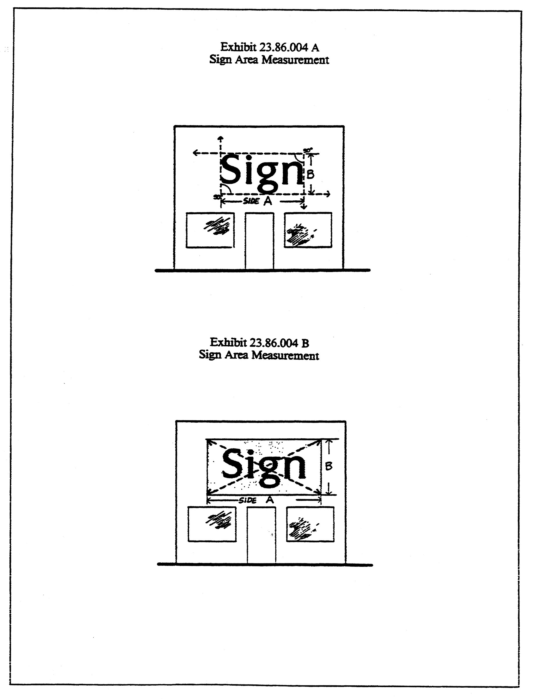

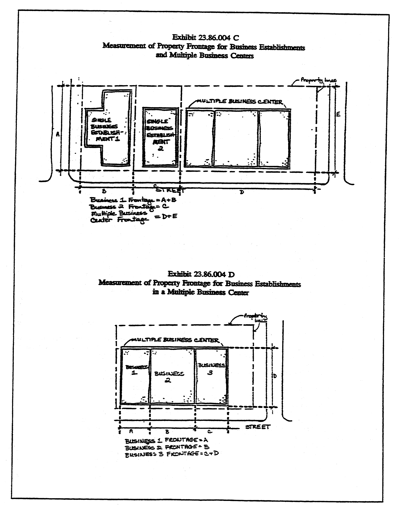

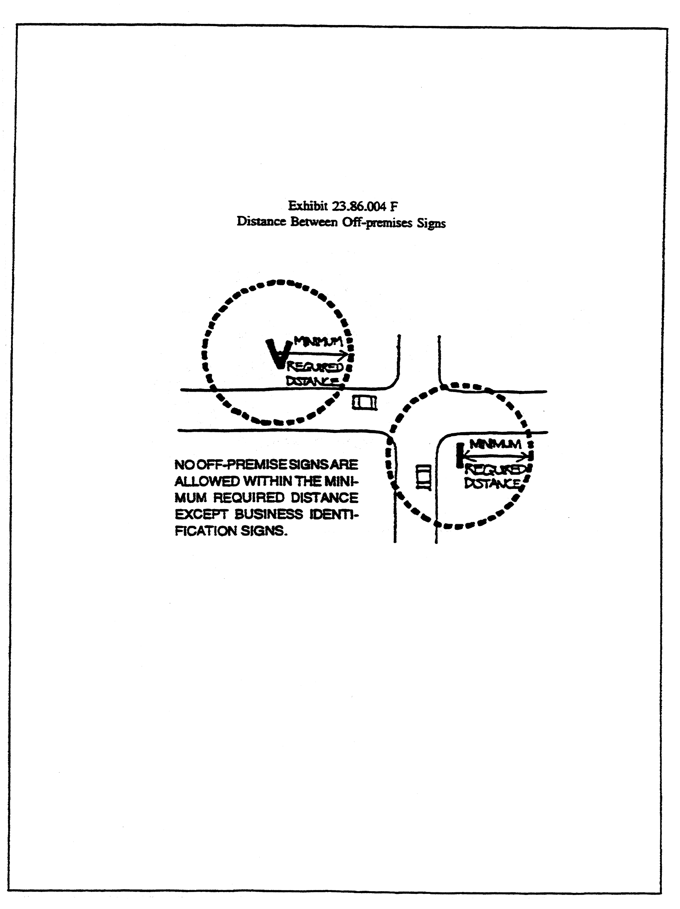

1. Sign Area.

    1. For a sign which is an independent structure, the entire visible surface of the sign, exclusive of support devices, shall be included in area calculations. Only one (1) face of a double-faced sign shall be counted.
    2. For a sign painted or mounted directly on another structure, sign area shall be the area contained in the smallest rectangular area enclosing the graphic or worded message, measured by the projection of the legs of two (2) right angles that are placed at opposite corners of the graphic and/or worded message (Exhibit 23.86.004 A)
    3. Where a background color different from that of the face upon which a sign is located is used as part of the sign, the entire background area shall be included in area calculations (Exhibit 23.86.004 B).
    4. Only message-conveying text shall be included. Decorative graphics not conveying a readily apparent message are not counted in the area of the sign.
    5. For the purposes of measuring sign area for signs regulated by Section 23.55.042, signs adjacent to certain public highways, the following provisions shall also be used to calculate sign area:

        1. Where freestanding business signs and business signs on the face of a building are visible on the same premises, the sum of the area of both types of signs visible from any place on the traveled way shall not exceed the area permitted on the face of the building, except as provided for gas station signs and in subsection E1 of Section 23.55.042.
        2. Where a multi-faced sign is used, the greatest area visible from any place on the traveled way shall be measured.
    6. In major institution zones, when signs with and without size limits are combined, the portion of the sign to which a size limit applies shall not exceed the applicable limit.
2. Number of Signs. In certain zones, the type and number of signs is determined by amount of frontage on public rights-of-way, except alleys. Frontage shall be measured as follows:

    1. When only one (1) business establishment is located on a lot, or when determining the frontage of a multiple business center, frontage shall equal the length of the street property line(s) of the lot on which the business establishment or multiple business center is located (Exhibit 23.86.004 C).
    2. When determining the frontage of a business establishment located in a multiple business center, the following method shall be used:

        1. Draw the least rectangle that encloses the portion of the principal structure in which the business establishment is located, as well as any area used for outdoor sales or outdoor display of rental equipment.
        2. Extend the sides of the rectangle to the property line(s) of the lot which abut a right-of-way, except an alley, and which are not blocked from the rectangle by another structure or portion of the structure (Exhibit 23.86.004 D).
        3. The lineal footage of the frontage between the extended sides of the rectangle shall be the frontage of the business establishment for purposes of measuring the number and type of permitted signs.
3. Dispersion Standards for Off-premises Signs.

    1. Where linear dispersion of off-premises signs is required, the number of off-premises signs permitted on a street shall be calculated as follows:

        1. Project the centerline of each off-premises sign structure or sign painted on a structure to the centerline of each street from which the sign face is visible, at right angles to the street. Signs which are set so far back from a street that they are not visible from the street, sign structures which may be visible from the street but are oriented to face another street and permitted business district identification signs, shall not be counted.
        2. Signs on both sides of the street shall be counted, unless otherwise stated.
        3. Single-face billboards shall be considered one (1) structure for the purposes of this subsection.
        4. Double-face or "V" type shall be considered one (1) structure for the purposes of this subsection.
        5. Visually blocked advertising signs shall be considered one-half (½) of a sign structure for the purposes of this subsection.
        6. The number of permitted signs shall be measured from the projections made under subsection C1a at the centerline of the street.
    2. Where a minimum radial distance between each off-premises sign structure is established, the distance shall be calculated as follows:

        1. Draw a circle with its center on the centerline of the sign structure, and a radius equal to the minimum required distance (Exhibit 23.86.004 F).
        2. No off-premises sign except permitted business district identification signs shall be located within the circle.
        3. Double-face or "V" type billboards shall be considered one (1) structure for the purposes of this subsection.
        4. When permitted sign area is calculated as a percentage of the area of the face of the structure on which the sign is located, the area of the structure face shall be the elevation of the structure as measured on flat projection from any side, excluding the roof and excluding any chimney, stack, structure, or mechanical equipment on the roof.

#### 23.86.006 - Structure height measurement

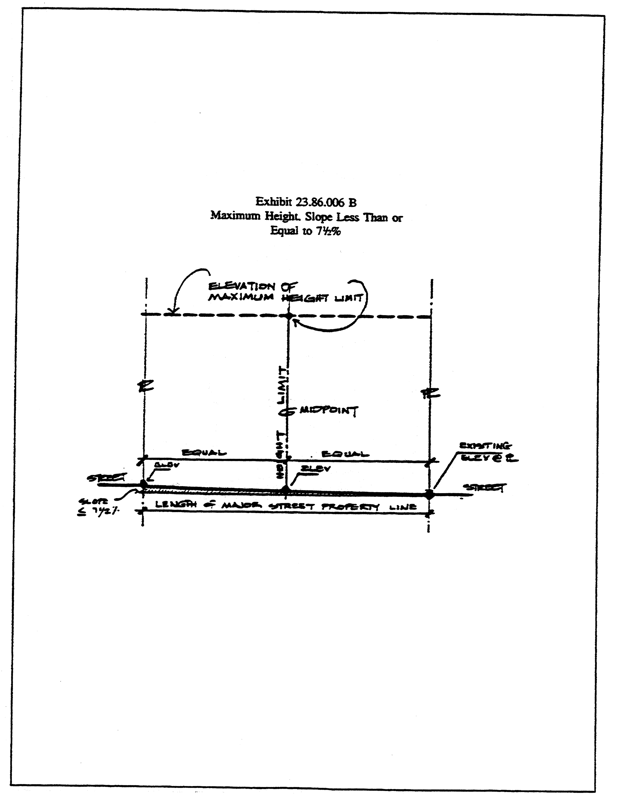

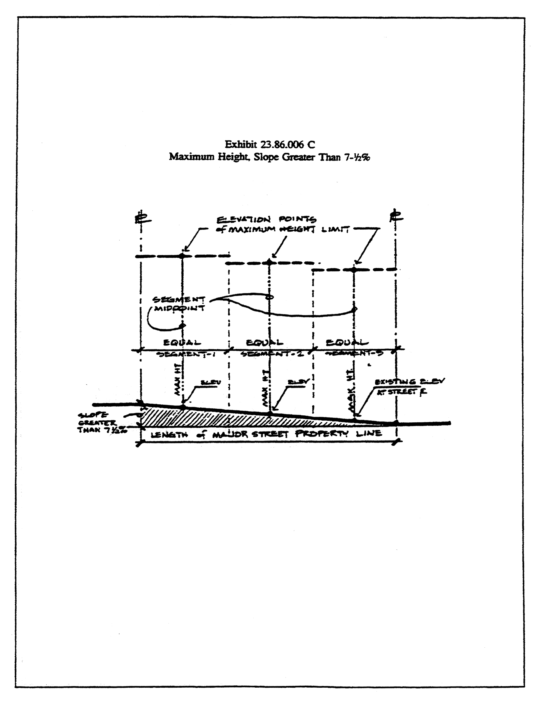

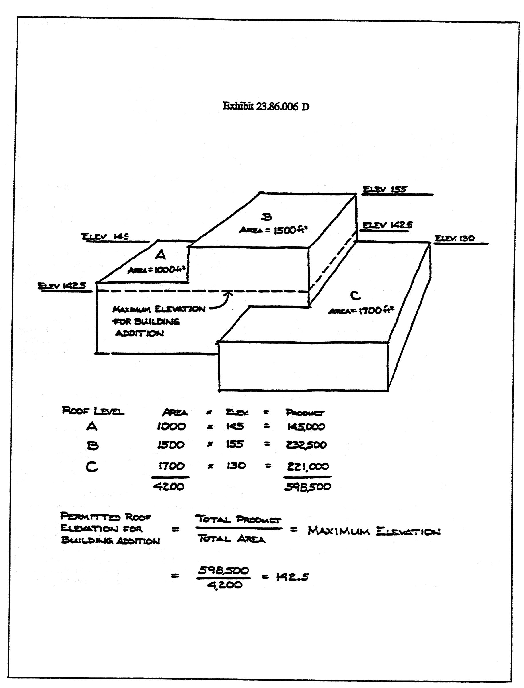

1. In all zones except downtown zones, and except for the Living Building Pilot Program authorized by Section 23.40.060, unless otherwise specified, the height of structures shall be measured according to this subsection 23.86.006.A.

    1. General rule. Except as otherwise specified, the height of a structure is the difference between the elevation of the highest point of the structure not excepted from applicable height limits and the average grade level. In this subsection 23.86.006.A, "average grade level" means the average of the elevation of existing lot grades. Except as provided in subsection 23.86.006.A.2, average grade level is calculated, at the discretion of the applicant, as follows:

        1. at the midpoint, measured horizontally, of each exterior wall of the structure, or
        2. at the midpoint of each side of the smallest rectangle that can be drawn to enclose the structure.
    2. Option for calculating average grade level to measure height. The calculation of structure height in subsection 23.86.006.A.1 may be modified, at the discretion of the applicant, as follows to permit the structure to respond to the topography of the lot:

        1. Draw the smallest rectangle that encloses the principal structure.
        2. Divide one side of the rectangle, chosen by the applicant, into sections at least 15 feet in length using lines that are perpendicular to the chosen side of the rectangle.
        3. The sections delineated in subsection 23.86.006.A.2.b are considered to extend vertically from the ground to the sky.
        4. The maximum height for each section of the structure is measured from the average grade level for that section of the structure, which is calculated as the average elevation of existing lot grades at the midpoints of the two opposing exterior sides of the rectangle for each section of the structure.
2. Within the South Lake Union Urban Center, at the applicant's option, structure height shall be measured either as provided for in subsection 23.86.006.A, 23.86.006.E, or under provisions of this subsection 23.86.006.B. Structure height shall be measured for all portions of the structure. All measurements shall be taken vertically from existing or finished grade, whichever is lower, to the highest point of the structure located directly above each point of measurement. Existing or finished grade shall be established by drawing straight lines between the corresponding elevations at the perimeter of the structure. The straight lines will be existing or finished grade for the purpose of height measurement. When a contour line crosses a facade more than once, that contour line will be disregarded when establishing existing or finished grade.
3. Height averaging for single-family zones. In a single-family zone, when expanding an existing structure occupied by a nonconforming residential use per Section 23.42.106, the following measurement shall be used to determine the average height of the closest principal structures on either side:

    1. Each structure used for averaging shall be on the same block front as the lot for which a height limit is being established. The structures used shall be the nearest single-family structure on each side of the lot, and shall be within 100 feet of the side lot lines of the lot.
    2. The height limit for the lot shall be established by averaging the elevations of the structures on either side in the following manner:

        1. If the nearest structure on either side has a roof with at least a 4:12 pitch, the elevation to be used for averaging shall be the highest point of that structure's roof minus 5 feet.
        2. If the nearest structure on either side has a flat roof, or a roof with a pitch of less than 4:12, the elevation of the highest point of the structure's roof shall be used for averaging.
        3. Rooftop features which are otherwise exempt from height limitations according to subsection 23.44.012.C, shall not be included in elevation calculations.
        4. The two elevations obtained from subsection 23.86.006.B.2.a and/or subsection 23.86.006.B.2.b shall be averaged to derive the height limit for the lot. This height limit shall be the difference in elevation between the midpoint of a line parallel to the front lot line at the required front setback and the average elevation derived from subsection 23.86.006.B.2.a and/or subsection 23.86.006.B.2.b.
        5. The height measurement technique used for the lot shall then be the City's standard measurement technique, subsection 23.86.006.A.
    3. If there is no single-family structure within 100 feet of a side lot line, or if the nearest single-family structure within 100 feet of a side lot line is not on the same block front, the elevation used for averaging on that side shall be 30 feet plus the elevation of the midpoint of the front lot line of the abutting vacant lot.
    4. If the lot is a corner lot, the height limit may be the highest elevation of the nearest structure on the same block front, provided that the structure is within 100 feet of the side lot line of the lot and that both front yards face the same street.
    5. In no case shall the height limit established according to these height averaging provisions be greater than 40 feet.
    6. Lots using height averaging to establish a height limit shall be eligible for the pitched roof provisions of subsection 23.44.012.B.
4. Stories or portions of stories of a structure that are underground are not analyzed for purposes of structure height measurement.
5. Height measurement techniques in downtown zones and in the South Lake Union Urban Center

    1. Determine the major street lot line, which shall be the lot's longest street lot line. When the lot has two or more street lot lines of equal length, the applicant shall choose the major street lot line.
    2. Determine the slope of the lot along the entire length of the major street lot line.
    3. The maximum height shall be measured as follows:

        1. When the slope of the major street lot line is less than or equal to 7.5 percent, the elevation of maximum height shall be determined by adding the maximum permitted height to the existing grade elevation at the midpoint of the major street lot line. On a through-lot, the elevation of maximum height shall apply only to the half of the lot nearest the major street lot line. On the other half of a through-lot, the elevation of maximum height shall be determined by the above method using the street lot line opposite and parallel to the major street lot line as depicted in Exhibit B for 23.86.006.
        2. When the slope of the major street lot line exceeds 7.5 percent, the major street lot line shall be divided into four or fewer equal segments no longer than 120 feet in length. The elevation of maximum height shall be determined by adding the maximum permitted height to the existing grade elevation at the midpoint of each segment. On a through-lot, the elevation of maximum height shall apply only to the half of the lot nearest the major street lot line. On the other half of a through-lot, the elevation of maximum height shall be determined by the above method using the street lot line opposite and parallel to the major street lot line, as depicted in Exhibit C for 23.86.006.
        3. For lots with more than one street frontage, where there is no street lot line that is essentially parallel to the major street lot line, when a measurement has been made for the portion of the block containing the major street lot line, the next measurement shall be taken from the longest remaining street lot line.
6. Determining the height of existing public school structures. When the height of the existing public school structure is measured for purposes of determining the permitted height or lot coverage of a public school structure, either of the following measurement methods may be used:

    1. If all parts of the new roof are pitched at a rate of not less than 4:12, the ridge of the new roof may extend to the highest point of the existing roof. A shed roof does not qualify for this option; or
    2. If all parts of the new roof are not pitched at a rate of not less than 4:12, then the elevation of the new construction may extend to the average height of the existing structure. The average height shall be determined by measuring the area of each portion of the building at each height and averaging those areas, as depicted in Exhibit D for 23.86.006.
7. Height measurement technique for structures located partially within the Shoreline District. When any portion of the structure falls within the Shoreline District, structure height for the entire structure shall be measured according to Section 23.60.952, Height.
8. For projects accepted into the Living Building Pilot Program authorized pursuant to Section 23.40.060, the applicant may choose either the height definition of Section 502 of the Seattle Building Code or the height measurement method described in this Section 23.86.006.

#### 23.86.007 - Gross floor area and floor area ratio (FAR) measurement

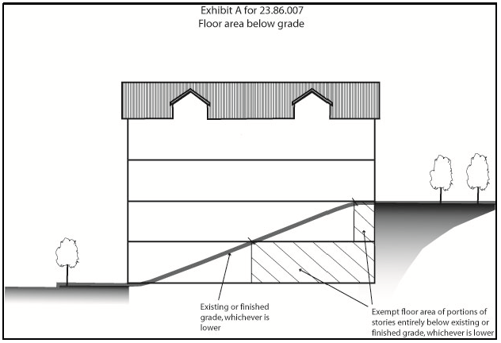

Exhibit A forFloor area below grade

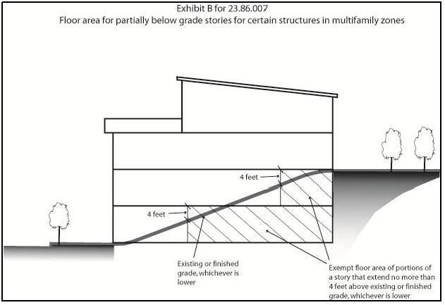

Exhibit B forFloor area for partially below grade stories for certain structures in multifamily zones

(Lot area - Area required for tower development) X FAR = Allowed GFA

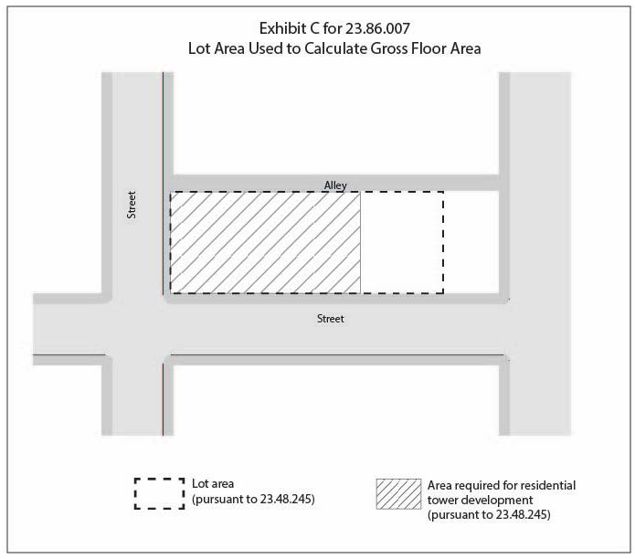

Exhibit C forLot Area Used to Calculate Gross Floor Area

1. Certain items may be exempted from calculation of gross floor area of a structure. Except as otherwise expressly provided in this Title 23, if gross floor area of underground stories or portions of stories is exempted, the amount of below-grade gross floor area is measured as follows:

    1. An underground story is that story or portion of a story for which the ceiling above, or the roof surface if there is no next floor above, is at or below the abutting existing or finished grade, whichever is lower (See Exhibit A for 23.86.007).
    2. To determine the amount of gross floor area that is below grade:

        1. determine the elevation of the ceiling of the underground story, or the roof surface if there is no next floor above the underground story;
        2. determine the points along the exterior wall of the story where the ceiling elevation or roof surface elevation above intersects the abutting corresponding existing or finished grade elevation, whichever is lower;
        3. draw a straight line across the story connecting the two points on the exterior walls;
        4. the gross floor area of an underground story or portion of an underground story is the area that is at or below the straight line drawn in subsection 23.86.007.A.2.c above.
2. Pursuant to subsection 23.45.510.E, for certain structures in multifamily zones, portions of a story that extend no more than 4 feet above existing or finished grade, whichever is lower, are exempt from calculation of gross floor area. The exempt gross floor area of such partially below-grade stories is measured as follows:

    1. determine the elevation 4 feet below the ceiling of the partially below-grade story, or 4 feet below the roof surface if there is no next floor above the partially below-grade story;
    2. determine the points along the exterior wall of the story where the elevation determined in subsection 23.86.007.B.1 above intersects the abutting corresponding existing or finished grade elevation, whichever is lower;
    3. draw a straight line across the story connecting the two points on the exterior walls;
    4. the gross floor area of the partially below-grade story or portion of a partially below-grade story is the area of the story that is at or below the straight line drawn in subsection 23.86.007.B.3 above, excluding openings required by the Building Code for egress. (See Exhibit B for 23.86.007).
3. Public rights-of-way are not considered part of a lot when calculating FAR or gross floor area allowed for residential development not subject to FAR in a downtown or SM-SLU zone except that, if dedication of right-of-way is required as a condition of a proposed development, the area of dedicated right-of-way is included.
4. If a lot is in more than one zone, the FAR limit for each zone applies to the portion of the lot located in that zone.
5. In LR zones, if more than one category of residential use is located on a lot, the FAR limit for each category of residential use is based on each category's percentage of total structure footprint area, as follows:

    1. Calculate the footprint, in square feet, for each category of residential use. For purposes of this calculation, "footprint" is defined as the horizontal area enclosed by the exterior walls of the structure.
    2. Calculate the total square feet of footprint of all categories of residential uses on the lot.
    3. Divide the square footage of the footprint for each category of residential structure in subsection 23.86.007.E.1 above by the total square feet of footprints of all residential uses in subsection 23.86.007.E.2 above.
    4. Multiply the percentage calculated in subsection 23.86.007.E.3 for each housing category by the area of the lot. The result is the area of the lot devoted to each housing category.
    5. The FAR limit for each category of residential use is the applicable one for that use multiplied by the percentage calculated in subsection 23.86.007.E.4.
    6. If the FAR limit for all categories of residential use on the lot is the same, then the FAR limit is calculated as if there was only one category of residential use on the lot.
    7. FAR contained in structures built prior to January 1, 1982 as single-family dwelling units meeting the requirements of subsection 23.45.510.E.3 is not included in the calculation of the FAR limit.
6. In the SM-SLU zones, the lot area used to calculate the gross floor area (GFA) allowed for structures or portions of structures subject to an FAR limit on sites that include a residential tower shall be based on the area of the lot excluding the lot area required for tower development (see Exhibit C for 23.86.007) as follows:

#### 23.86.008 - Lot coverage, width and depth.

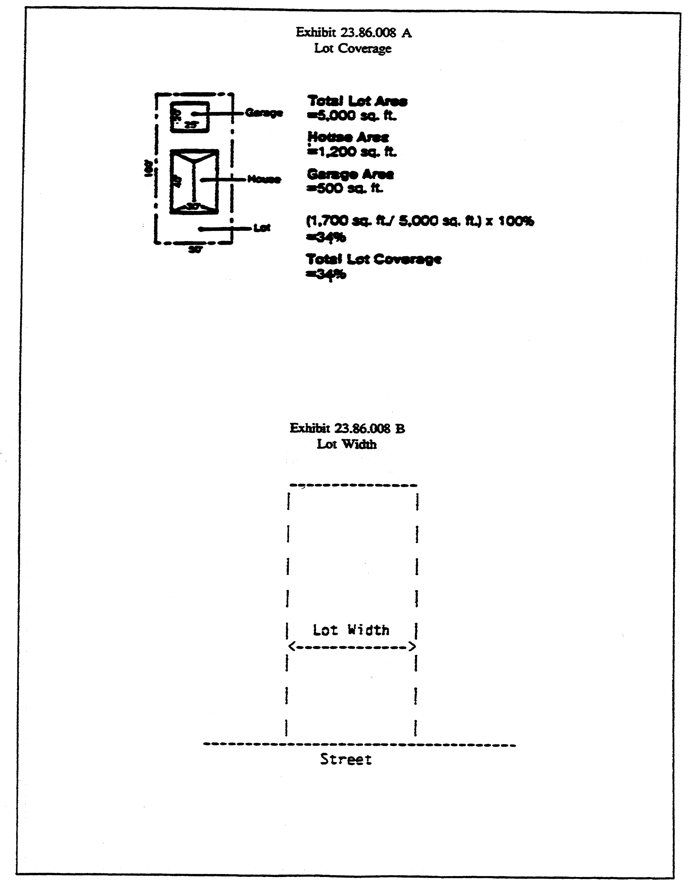
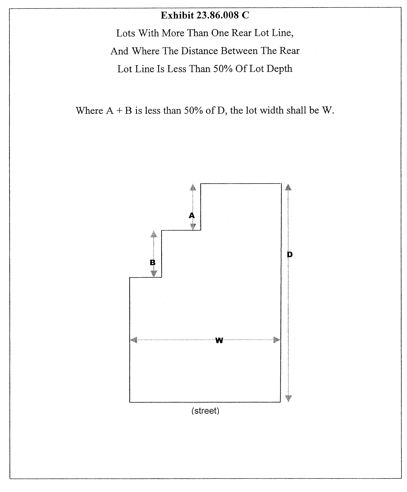

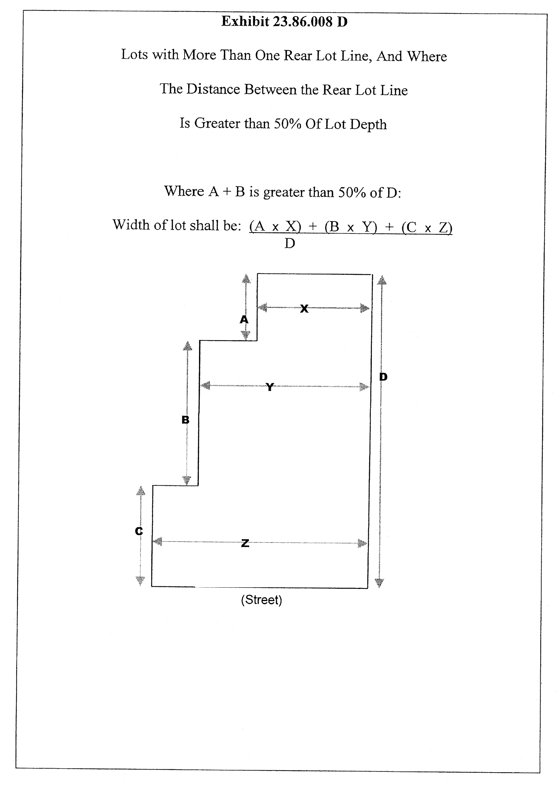

1. Lot coverage shall be calculated in accordance with Exhibit 23.86.008 A.
2. In single-family zones, lot depth shall be the length of the line extending between the front lot line or front lot line extended, and the rear lot line or lines, or in the case of a through lot, between the two (2) front lot lines or lines extended. This line shall be perpendicular to the front lot line or front lot line extended. Where an alley abuts the rear of the property, one-half (½) of the width of the alley shall be included as a portion of the lot for determining lot depth.
3. Lot Width in Single-family Zones:

    1. When a lot is essentially rectangular, the lot width shall be the mean horizontal distance between side lot lines measured at right angles to lot depth (Exhibit 23.86.008 B).
    2. In the case of a lot with more than one (1) rear lot line (Exhibits 23.86.008 C and 23.86.008 D), the lot width shall be measured according to the following:

        1. If the distance between the rear lot lines is fifty (50) percent or less of the lot depth, the lot width shall be measured parallel to the front lot line and shall be the greatest distance between the side lot lines (Exhibit 23.86.008 C); or
        2. If the distance between the rear lot lines is greater than fifty (50) percent of the lot depth, the lot width shall be determined by measuring average lot width according to Exhibit 23.86.008 D.
    3. For irregular lots not meeting the conditions of subsections C1 or C2, the Director shall determine the measurement of lot width.

#### 23.86.010 - Yards

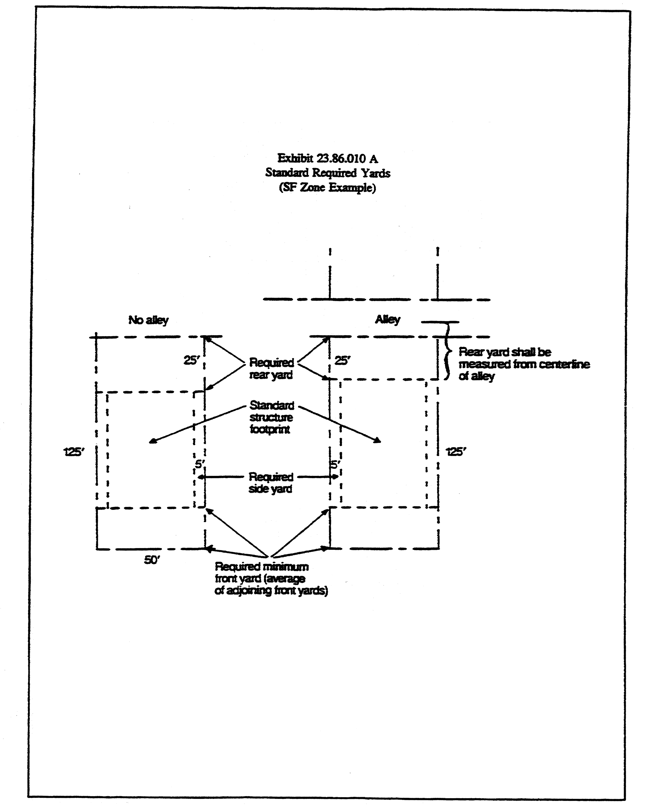

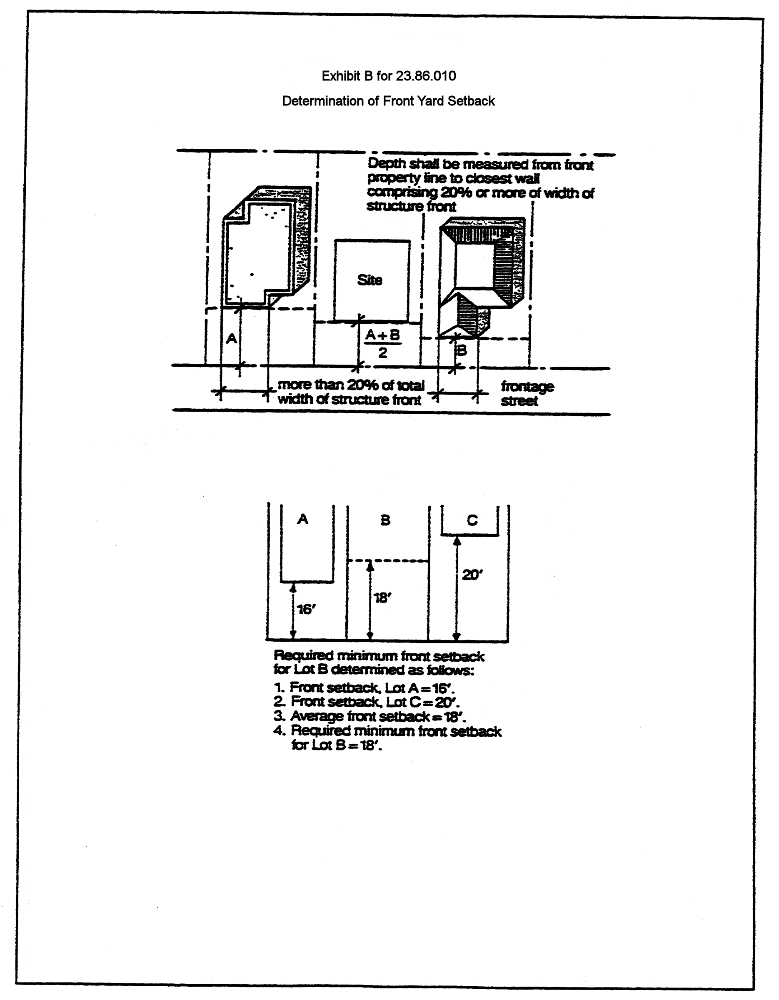

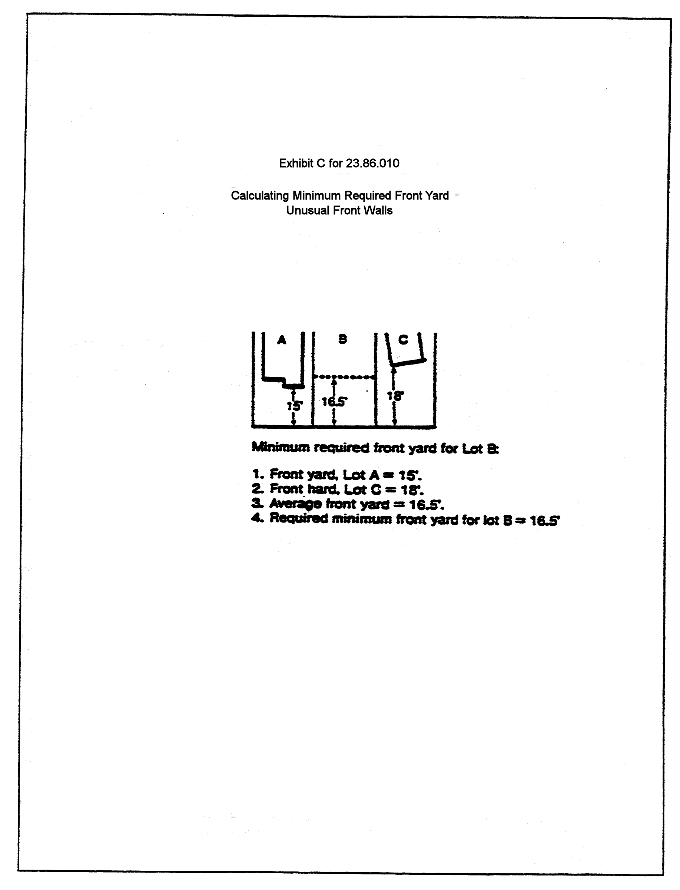

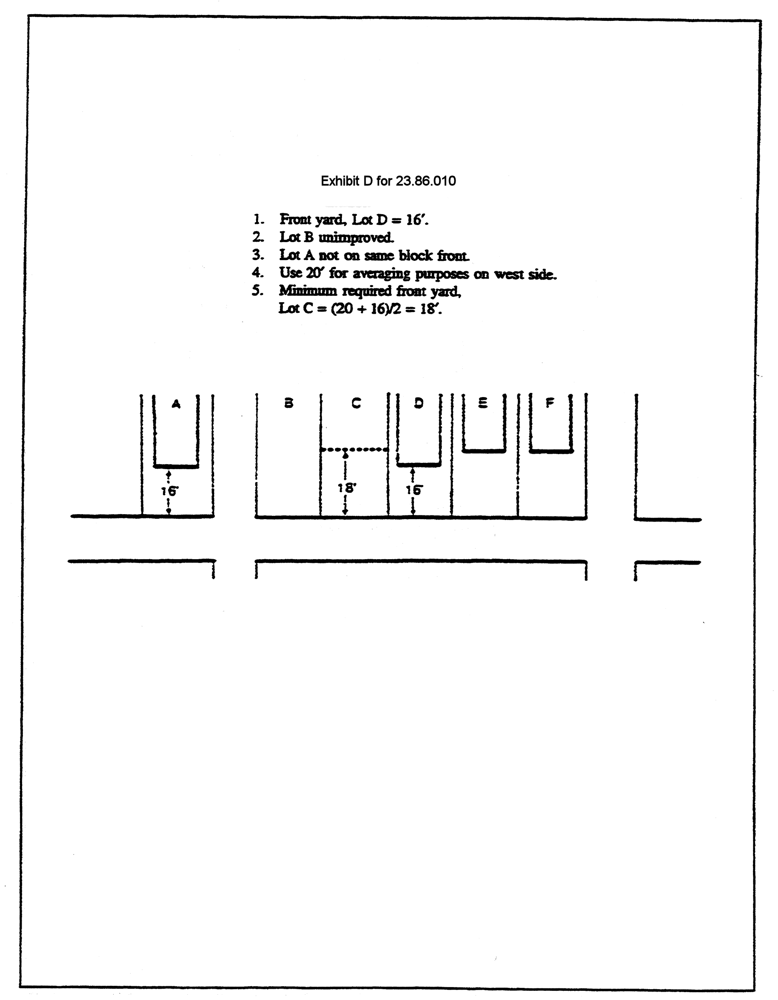

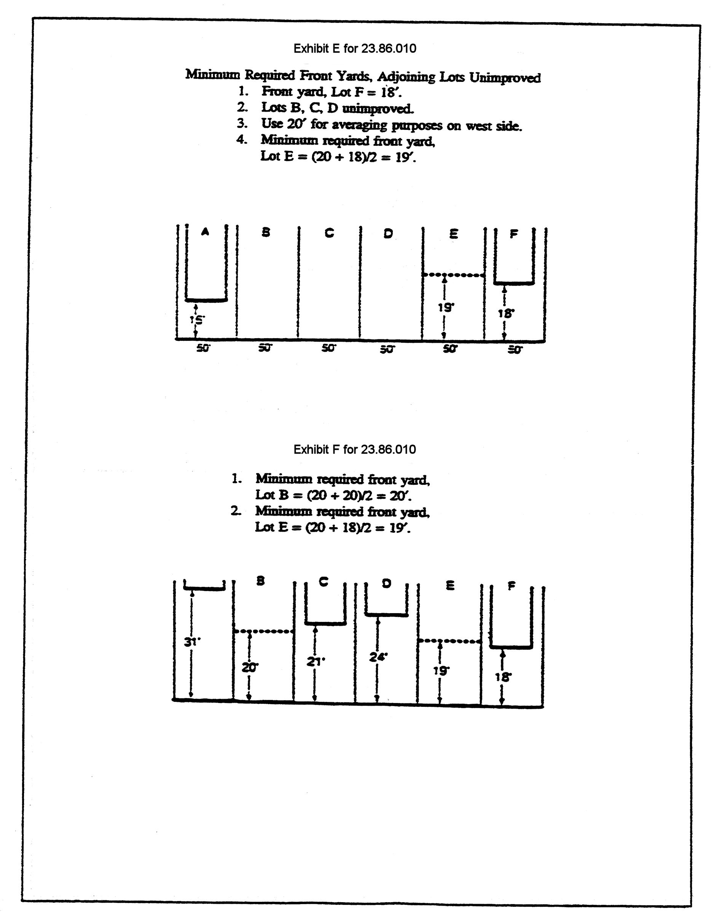

1. Measuring required yards. Required yard dimensions shall be horizontal distances, measured perpendicular to the appropriate lot lines (Exhibit A for 23.86.010). For lots with no street frontage, the applicant may designate the front lot line, provided that under the resulting orientation, the area of the front yard is at least 20 percent of the area of the lot or 1,000 square feet whichever is less. If a lot with frontage on more than one street is developed with an existing principal structure, the orientation of the lot for the purpose of current yard requirements shall be the orientation under which the existing structure is most conforming to current yard standards.
2. Front Yards.

    1. Determining Front Yard Requirements. Front yard requirements are presented in the development standards for each zone. Where the minimum required front yard is to be determined by averaging the setbacks of structures on either side of a lot, the following provisions apply:

        1. The required depth of the front yard shall be the average of the distance between single-family structures and front lot lines of the nearest single-family structures on each side of the lot (Exhibit B for 23.86.010). If the front facade of the single-family structure is not parallel to the front lot line, the shortest distance from the front lot line to the structure shall be used for averaging purposes (Exhibit C for 23.86.010).
        2. The yards used for front yard averaging shall be on the same block front as the lot, and shall be the front yards of the nearest single-family structures within 100 feet of the side lot lines of the lot.
        3. For averaging purposes, front yard depth shall be measured from the front lot lines to the wall nearest to the street or, where there is no wall, the plane between supports, which comprises 20 percent or more of the width of the front facade of the single-family structure. Enclosed porches shall be considered part of the single-family structure for measurement purposes. Attached garages or carports permitted in front yards under 23.44.016.D, decks, uncovered porches, eaves, attached solar collectors, and other similar parts of the structure shall not be considered part of the structure for measurement purposes.
        4. If there is a dedication of street right-of-way to bring the street abutting the lot closer to the minimum widths established in Section 23.53.015, for averaging purposes the amount of the dedication shall be subtracted from the front yard depth of the structures on either side.
        5. If the first single-family structure within 100 feet of a side lot line of the lot is not on the same block front, or does not provide its front yard on the same street, or if there is no single-family structure within 100 feet of the side lot line, the yard depth used for averaging purposes on that side shall be 20 feet (Exhibits D and E for 23.86.010).
        6. If the front yard of the first single-family structure within 100 feet of the side lot line of the lot exceeds 20 feet, the yard depth used for averaging purposes on that side shall be 20 feet (Exhibit F for 23.86.010).
        7. In cases where the street is very steep or winding, the Director shall determine which adjacent single-family structures should be used for averaging purposes.
    2. Sloped Lots in Single-family Zones. For a lot in a single-family zone, reduction of the required front yard is permitted at a rate of 1 foot for every percent of slope in excess of 35 percent. For the purpose of this provision the slope shall be measured along the centerline of the lot. In the case of irregularly shaped lots, the Director shall determine the line along which slope is calculated.
3. Rear yards. Rear yard requirements are presented in the standard development requirements for each zone. In determining how to apply these requirements, the following provisions shall apply:

    1. The rear yard shall be measured horizontally from the rear lot line if the lot has a rear lot line that is essentially parallel to the front lot line for its entire length.
    2. If the front lot line is essentially parallel to portions of the rear property line, as with a stepped rear property line, each portion of the rear property line that is opposite and essentially parallel to the front lot line is considered to be a rear lot line for the purpose of establishing a rear yard.
    3. On a lot with a rear property line, part of which is not essentially parallel to any part of the front lot line, the rear yard is measured from a line or lines drawn from side lot line(s) to side lot line(s), at least 10 feet in length, parallel to and at a maximum distance from the front lot line. If an alley abuts the rear of the property, 1/2 the width of the alley, between the side lot lines extended, is considered to be part of the lot for drawing this line. For those portions of the rear lot line that are essentially parallel to the front lot line, subsection 23.86.010.C.2 above shall apply. The lot depth is then measured perpendicularly from this 10 foot long line extended as needed to the point on the actual front lot line that is the furthest distance away. This establishes lot depth, which then may be used to determine the required rear yard depth.
    4. For a lot with a curved front lot line, the rear yard is measured from a line at least 10 feet in length, parallel to and at a maximum distance from a line drawn between the endpoints of the curve. The lot depth is then measured perpendicularly from this 10 foot long line extended as needed to the point on the actual front lot line that is the furthest distance away. This establishes lot depth, which then may be used to determine the required rear yard depth.
    5. For a lot with an irregular shape or with an irregular front lot line not meeting conditions of subsections 23.86.010.C.1 through 23.86.010.C.4, the Director shall determine the measurement of the rear yard.
4. Side Yards.

    1. Side Yard Averaging. Side yard requirements are presented in the standard development requirements for each zone. In certain cases where specifically permitted, the side yard requirement may be satisfied by averaging the distance from side lot line to structure facade for the length of the structure. In those cases the side yard shall be measured horizontally from side lot line to the side facade of the structure.

#### 23.86.012 - Multifamily zone setback measurement

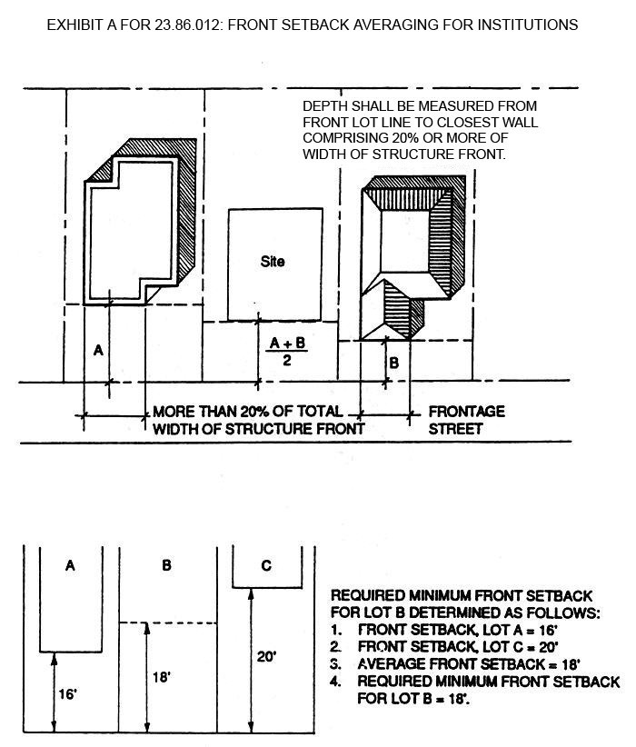

1. If the first principal structure within 100 feet of a side lot line of the subject lot is not on the same block front or there is no principal structure within 100 feet of the side lot line, the setback depth used for averaging purposes on that side is 7 feet.
2. For averaging purposes, the front setback is the shortest distance from the front lot line to the nearest wall or, where there is no wall, the plane between supports that span 20 percent or more of the width of the front facade of the principal structure. Attached garages and enclosed porches are considered part of the principal structure for measurement purposes. Decks less than 18 inches above existing grade, uncovered porches, eaves, attached solar collectors and other similar parts of the structure are not considered part of the principal structure.
3. If there is a dedication of street right-of-way to bring the street abutting the lot closer to the minimum widths established in Section 23.53.015, for averaging purposes the amount of dedication is subtracted from the front setbacks of the structures on either side.
4. If the front setback of the first principal structure within 100 feet of the side lot line of the subject lot exceeds 20 feet, the setback depth used for averaging purposes on that side is 20 feet.
5. In cases where the street is very steep or winding, the Director will determine which adjacent structures should be used for averaging purposes.
6. In the case of a through lot, the front setback is determined independently for each street frontage. The measurement techniques of this section 23.86.012 apply to each street frontage separately.
7. For multiple structures on the same lot, the front setback of a principal structure on the same lot may be used for averaging purposes.

1. Setback averaging. In multifamily zones, certain required setbacks may be averaged. In such cases the following provisions apply:

    1. The average front and rear setbacks are calculated based on the entire width of the structure;
    2. The average side setbacks are calculated based on the entire depth of the structure;
    3. Setbacks are measured horizontally from the lot line to the facade of the structure. The facade(s) used in calculating the average and minimum setback requirements shall be those facades that are nearest to that lot line except that any features allowed to project into the setback are excluded.
2. Determining front setbacks for institutions. In LR zones, the minimum required front setback for institutions is determined by averaging the setbacks of structures on either side of the subject lot, as follows:

    1. The required front setback is the average of the distances between principal structures and front lot lines of the nearest principal structures on each side of the subject lot if each of those structures is on the same block front as the subject lot and is within 100 feet of the side lot lines of the subject lot (Exhibit A for 23.86.012).

#### 23.86.014 - Structure width measurement

Exhibit A for: Structure Width

1. Structure width is measured as follows:

    1. Draw the smallest rectangle that encloses the principal structure.
    2. Structure width is the length of the side of that rectangle most closely parallel to the front lot line (Exhibit A for 23.86.014).
2. Portions of a structure considered part of the principal structure for the purpose of measuring structure width are as follows:

    1. Carports and garages attached to the principal structure, unless they are attached by a structural feature not counted in structure width under subsection 23.86.014. C;
    2. Accessory structures, other than carports and garages, that are not listed in subsection 23.86.014.C, if they are less than 3 feet from the principal structure at any point;
    3. Exterior corridors, hallways, and open, above-grade walkways;
    4. Enclosed porches, decks, balconies and other enclosed projections; and
    5. Projecting segments of a facade unless they are not counted in structure width in subsection 23.86.014. C.
3. Portions of a structure that are not considered part of the principal structure for the purpose of measuring structure width are as follows:

    1. The first 4 feet of eaves, cornices, and gutters that project from an exterior wall;
    2. The first 18 inches of chimneys that project from an exterior wall;
    3. Attached solar greenhouses meeting minimum energy standards administered by the Director;
    4. The first 4 feet of unenclosed decks, balconies and porches, unless located on the roof of an attached garage or carport included in structure width in subsection 23.86.014.B.1;
    5. Arbors, trellises, and similar features; and
    6. In Lowrise zones, portions of a structure that are exempt from FAR limits pursuant to subsection 23.45.510.E.5.

#### 23.86.015 - Maximum facade length measurement

1. In Lowrise zones, the length of certain facades is limited by development standards. Facade length is measured as follows:

    1. Draw a line parallel to, and 15 feet from, the lot line along which the length of a facade is limited.
    2. For each portion of a structure that located between the line drawn in subsection 23.86.015.A.1 and the lot line, mark the points at which that portion of the structure crosses the line drawn in subsection 23.86.015.A.1, and measure the distance between those points.
    3. The facade length limit applies to the sum of the lengths of the portions of structure(s) measured in subsection 23.86.015.A.2 (see Exhibit A and Exhibit B for 23.86.015).
2. Portions of a structure that are included in façade length measurement include:

    1. Carports and garages attached to the principal structure, unless they are attached by a structural feature not counted in structure width under subsection 23.86.015.C;
    2. Accessory structures, other than carports and garages, that are not listed in subsection 23.86.014.C, if they are less than 3 feet from the principal structure at any point;
    3. Exterior corridors, hallways, and open, above-grade walkways;
    4. Projecting segments of a facade unless they are not counted in structure width in subsection 23.86.014.C.
    5. Enclosed porches, decks, balconies and other enclosed projections; and
    6. Projecting segments of a facade unless excluded in subsection 23.86.015.C.
3. Portions of a structure that are not included in facade length measurement include:

    1. Eaves, cornices, and gutters;
    2. The first 18 inches of chimneys that project from an exterior wall;
    3. Attached solar greenhouses meeting minimum energy standards administered by the Director;
    4. The first 4 feet of unenclosed decks, balconies and porches, unless located on the roof of an attached garage or carport included in structure width in subsection 23.86.014.B.1;
    5. Arbors, trellises, and similar features; and
    6. In Lowrise zones, portions of a structure that are exempt from FAR limits pursuant to subsection 23.45.510.E.5.

#### 23.86.016 - Structure and lot depth measurement

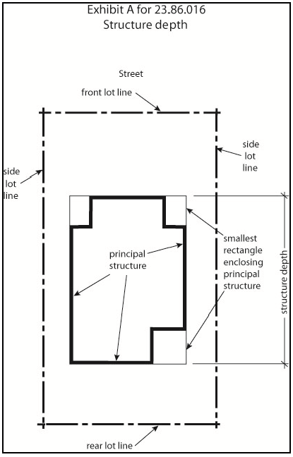

Exhibit A forStructure depth

1. If more than one structure is located on a lot and no portion of a structure is behind any portion of another structure and the structures are separated by a minimum of 10 feet, the maximum depth of each structure shall be measured individually (See Exhibit B for 23.86.016). If any portion of a structure is behind any portion of another structure then the structure depth shall be measured as the combined depth of the principal structures on the lot.
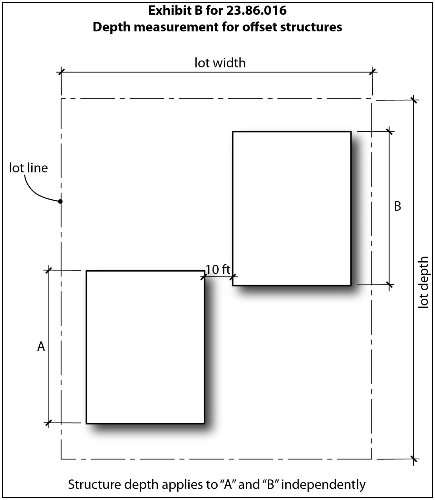

Exhibit B forDepth measurement for offset structures

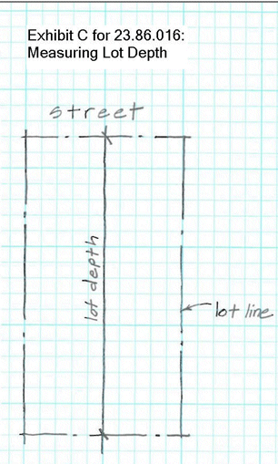

Exhibit C for Measuring Lot Depth

1. Structure depth is measured as follows:

    1. Draw the smallest rectangle that encloses a principal structure.
    2. Structure depth is the length of the sides of that rectangle most closely parallel to the side lot lines (Exhibit A for 23.86.016).
2. Portions of a structure considered part of the principal structure for the purpose of measuring structure depth are as follows:

    1. Carports and garages attached to the principal structure, unless they are attached by a structural feature not counted in structure depth under subsection 23.86.016.C;
    2. Accessory structures, other than carports and garages, that are not listed in subsection 23.86.016.C, if they are less than 3 feet from the principal structure at any point;
    3. Exterior corridors, hallways, and open, above grade walkways;
    4. Enclosed porches, decks, balconies and other enclosed projections, except as provided in subsection 23.43.008.C; and
    5. Projecting segments of a facade unless they are not counted in structure depth in subsection 23.86.016.C.
3. Portions of a structure that are not considered part of the principal structure for the purpose of measuring structure depth are as follows:

    1. The first 4 feet of eaves, cornices, and gutters that project from an exterior wall;
    2. The first 18 inches of chimneys that project from an exterior wall;
    3. Attached solar greenhouses meeting minimum energy standards administered by the Director;
    4. The first 4 feet of unenclosed decks, balconies and porches, unless located on the roof of an attached garage or carport included in structure depth in subsection 23.86.014.B;
    5. Arbors, trellises, and similar features; and
    6. In Lowrise 3 zones in the Northgate Overlay District, portions of a structure that are exempt from FAR limits pursuant to subsection 23.45.510.E.5.
4. Determining lot depth. If development standards are based on lot depth, lot depth is determined as follows:

    1. If the lot is essentially rectangular and has a rear lot line within 15 degrees of parallel to the front lot line, the lot depth is the horizontal distance between the midpoints of the front and rear lot lines (Exhibit C for 23.86.016).
    2. If the lot is triangular or wedge-shaped, lot depth shall be the horizontal distance between the midpoint of the front lot line and the rear point of the lot. If the lot does not actually come to a point, lot depth is measured from midpoint of the front lot line to the midpoint of the rear lot line.
    3. In the case of a through lot, lot depth is measured between the midpoint of each front lot line.
    4. When lot shape is so irregular that subsections 23.86.016.D.1, 23.86.016.D.2 or 23.86.016.D.3 cannot be used, lot depth is the distance equal to the result of lot area divided by length of front lot line, provided that in no case is the depth permitted to be greater than the distance from front lot line to the furthest point on the perimeter of the lot.

#### 23.86.017 - Amenity area measurement

Certain zones require a minimum amount of amenity area to be provided on the lot. If amenity area is required, the following provisions shall apply:

1. If the applicable development standards specify a minimum contiguous amenity area, areas smaller than the minimum contiguous area are not be counted toward fulfilling amenity area requirements.

    1. Driveways and vehicular access easements, whether paved or unpaved, shall be considered to separate the amenity areas they bisect, except for woonerfs permitted to qualify as required amenity area.
    2. Pedestrian access areas shall not be considered to break the contiguity of amenity area on each side.
2. In shoreline areas, when determining the amount of amenity area required or provided, no land waterward of the ordinary high water mark shall be included in the calculation.
3. In cases where the shape or configuration of the amenity area is irregular or unusual, the Director shall determine whether amenity area requirements have been met, notwithstanding the following provisions, based on whether the proposed configuration would result in amenity area that is truly usable for normal residential recreational purposes. For the purpose of measuring the minimum horizontal dimension of the amenity area, if one is specified, the following provisions shall apply:

    1. For rectangular or square areas, each exterior dimension of the area shall meet the minimum dimension (Exhibit A for 23.86.017).
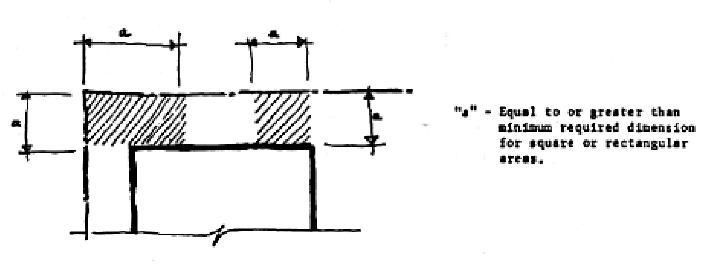

Exhibit A for: Measurement of Regular Amenity Area

1. For circular areas, the diameter of the circle shall meet the minimum dimension; for semicircular areas, the radius of the area shall meet the minimum dimension (Exhibit B for 23.86.017).
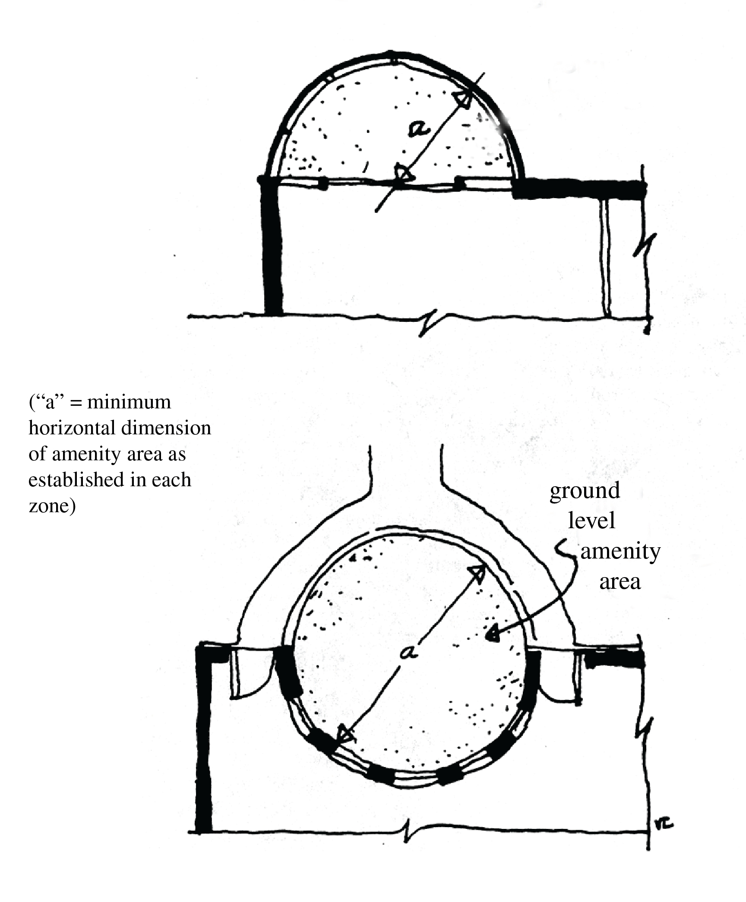

Exhibit B for: Measurement of Circular Amenity Areas

#### 23.86.018 - Open space.

Certain zones require a minimum amount of open space to be provided on the lot. For those cases where open space is required, the following provisions shall apply:

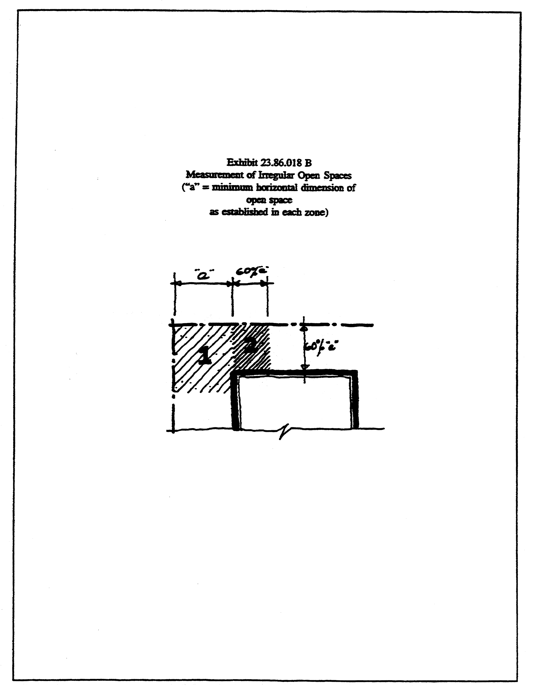

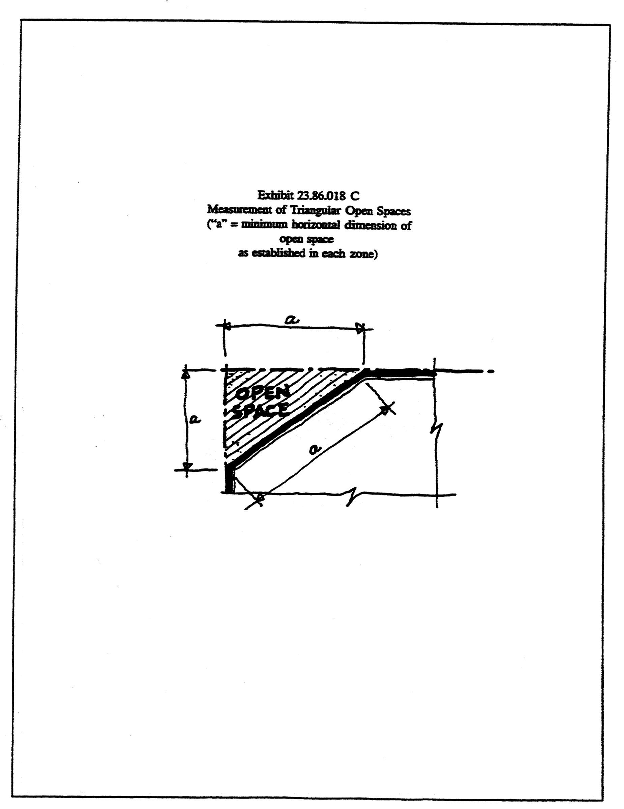

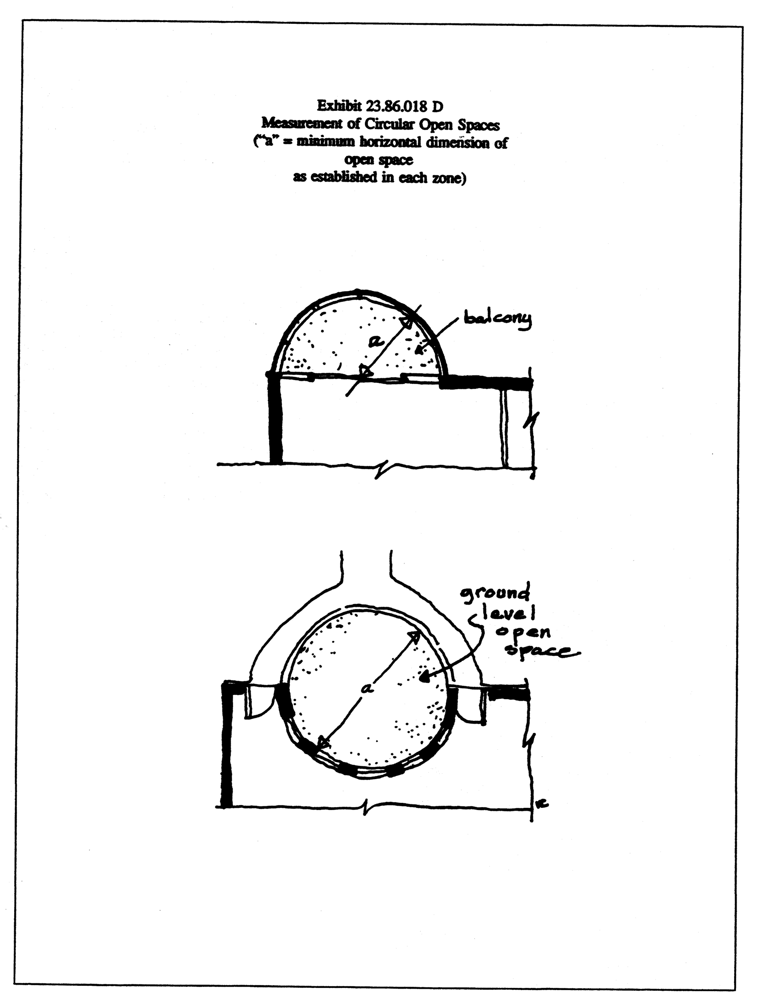

1. In order for a portion of a lot to qualify as open space, the ground's surface shall be permeable, except for patios, paved areas designed for recreation, and pedestrian access which meets the Washington State Rules and Regulations for Barrier-Free Design. The area shall be landscaped with grass, ground cover, bushes and/or trees.
2. Driveways, parking areas and pedestrian access, except for pedestrian access meeting the Washington State Rules and Regulations for Barrier-Free Design, shall not be counted as open space.
3. The area covered or enclosed by solar collectors meeting minimum standards administered by the Director may be counted as required open space.
4. Portions of a structure which begin eight (8) feet or more above finished grade may project up to four (4) feet over required ground-level open space.
5. Development standards for certain zones specify a minimum contiguous area for open space. Open space areas smaller than the minimum contiguous area specified for such zones shall not be counted toward fulfilling total open space requirements for that lot.

    1. Driveways and parking areas, paved or unpaved, shall be considered to separate open space areas they bisect.
    2. Pedestrian access areas shall not be considered to break the contiguity of open space on each side.
6. In shoreline areas, when determining the amount of open space required or provided, no land waterward of the ordinary high water mark shall be included in the calculation.
7. In order for a ground area, roof area, deck or balcony to be considered as open space, it shall have a minimum area and provide a minimum horizontal dimension as established in each zone. In cases where the shape or configuration of the open space is irregular or unusual, the Director shall determine whether open space requirements have been met, notwithstanding the following provisions, based on whether the proposed configuration would result in open space that is truly usable for normal residential open space purposes. For the purpose of measuring the horizontal dimensions of open space, the following provisions shall apply:

    1. For rectangular or square areas, each exterior dimension of the area shall meet the minimum dimension (Exhibit 23.86.018 A).
    2. For irregularly shaped areas where all lines intersect at or approximately at ninety (90) degree angles, an area which is not less than sixty (60) percent of the minimum dimension in width and does not extend further than sixty (60) percent of the minimum dimension from a contiguous rectangular or square area of which all sides meet or exceed the minimum dimension, may be included as required open space (Exhibit 23.86.018 B).
    3. For triangular areas, all exterior dimensions of the area shall meet or exceed the minimum dimensions (Exhibit 23.86.018 C).
    4. For circular areas, the diameter of the circle shall meet the minimum dimension; for semicircular areas, the radius of the area shall meet the minimum dimension (Exhibit 23.86.018 D).
8. In the case of a lot where a portion is reserved as a vehicular access easement to another lot, when determining the amount of open space required or provided, no land within the limits of the easement shall be included in the calculation except where a portion of the structure is constructed over the easement.

#### 23.86.019 - Green Factor measurement

Table A for: Green Factor Landscape Elements

<table>
<tr>
<td>Green Factor Landscape Elements</td>
<td>Multiplier</td>
</tr>
<tr>
<td>A. Planted Areas (choose one of the following for each planting area)</td>
<td></td>
</tr>
<tr>
<td></td>
<td>1. Planted areas with a soil depth of less than 24 inches</td>
<td>0.1</td>
</tr>
<tr>
<td></td>
<td>2. Planted areas with a soil depth of 24 inches or more:</td>
<td>0.6</td>
</tr>
<tr>
<td></td>
<td>3. Bioretention facilities meeting standards of the Stormwater Code, Title 22 Subtitle VIII of the Seattle Municipal Code</td>
<td>1.0</td>
</tr>
<tr>
<td>B. Plants</td>
<td></td>
</tr>
<tr>
<td></td>
<td>1. Mulch, ground covers or other plants normally expected to be less than 2 feet tall at maturity.</td>
<td>0.1</td>
</tr>
<tr>
<td></td>
<td>2. Large shrubs or other perennials at least 2 feet tall at maturity</td>
<td>0.3</td>
</tr>
<tr>
<td></td>
<td>3. Small trees</td>
<td>0.3</td>
</tr>
<tr>
<td></td>
<td>4. Small/medium trees</td>
<td>0.3</td>
</tr>
<tr>
<td></td>
<td>5. Medium/large trees</td>
<td>0.4</td>
</tr>
<tr>
<td></td>
<td>6. Large trees</td>
<td>0.4</td>
</tr>
<tr>
<td></td>
<td>7. Preservation of existing large trees at least 6 inches in diameter at breast height</td>
<td>0.8</td>
</tr>
<tr>
<td>C. Green roofs</td>
<td></td>
</tr>
<tr>
<td></td>
<td>1. Planted over at least 2 inches but less than 4 inches of growth medium</td>
<td>0.4</td>
</tr>
<tr>
<td></td>
<td>2. Planted over at least 4 inches of growth medium</td>
<td>0.7</td>
</tr>
<tr>
<td>D. Vegetated walls</td>
<td>0.7</td>
</tr>
<tr>
<td>E. Water features using harvested rainwater and under water at least six months per year</td>
<td>0.7</td>
</tr>
<tr>
<td>F. Permeable paving</td>
<td></td>
</tr>
<tr>
<td></td>
<td>1. Installed over at least 6 inches and less than 24 inches of soil and/or gravel</td>
<td>0.2</td>
</tr>
<tr>
<td></td>
<td>2. Installed over at least 24 inches of soil and/or gravel</td>
<td>0.5</td>
</tr>
<tr>
<td>G. Structural soil</td>
<td>0.2</td>
</tr>
<tr>
<td>H. Bonuses applied to Green Factor landscape elements:</td>
<td></td>
</tr>
<tr>
<td></td>
<td>1. Landscaping that consists entirely of drought- tolerant or native plant species</td>
<td>0.1</td>
</tr>
<tr>
<td></td>
<td>2. Landscaping that receives at least 50 percent of its irrigation through the use of harvested rainwater</td>
<td>0.2</td>
</tr>
<tr>
<td></td>
<td>3. Landscaping visible from adjacent rights-of-way or public open space</td>
<td>0.1</td>
</tr>
<tr>
<td></td>
<td>4. Landscaping in food cultivation</td>
<td>0.1</td>
</tr>
</table>

Table B forEquivalent square footage of trees and large shrubs

<table>
<tr>
<td>Landscape Elements</td>
<td>Equivalent Square Feet</td>
</tr>
<tr>
<td>Large shrubs or large perennials</td>
<td>12 square feet per plant</td>
</tr>
<tr>
<td>Small trees</td>
<td>75 square feet per tree</td>
</tr>
<tr>
<td>Small/medium trees</td>
<td>150 square feet per tree</td>
</tr>
<tr>
<td>Medium/large trees</td>
<td>250 square feet per tree</td>
</tr>
<tr>
<td>Large trees</td>
<td>350 square feet per tree</td>
</tr>
<tr>
<td>Existing large trees</td>
<td>20 square feet per inch of trunk diameter 4.5 feet above grade</td>
</tr>
</table>

1. Development standards for certain areas require landscaping that meets a minimum Green Factor score. All required landscaping shall meet standards promulgated by the Director to provide for the long-term health, viability, and coverage of plantings. These standards may include, but are not limited to, the type and size of plants, spacing of plants, depth and quality of soil, use of drought-tolerant plants, and access to light and air for plants. The Green Factor score shall be calculated as follows:

    1. Identify all proposed landscape elements, sorted into the categories presented in Table A for Section 23.86.019.
    2. Multiply the square feet, or equivalent square footage where applicable, of each landscape element by the multiplier provided for that element in Table A for Section 23.86.019, according to the following provisions:

        1. If multiple elements listed on Table A for Section 23.86.019 occupy the same area (for example, groundcover under a tree), count the full square footage or equivalent square footage of each element.
        2. Landscaping elements in the right-of-way between the lot line and the roadway may be counted, provided that they are approved by the Director of the Department of Transportation.
        3. Elements listed in Table A for Section 23.86.019 that are provided to satisfy any other requirements of this Code may be counted.
        4. For trees, large shrubs, and large perennials, use the equivalent square footage of each tree or shrub according to Table B for Section 23.86.019.
        5. For vegetated walls, use the square footage of the portion of the wall covered by vegetation. All vegetated wall structures, including fences counted as vegetated walls, shall be constructed of durable materials, provide adequate planting area for plant health, and provide appropriate surfaces or structures that enable plant coverage.
        6. For all elements other than trees, large shrubs, large perennials, and vegetated walls, square footage is determined by the area of the portion of a horizontal plane that lies over or under the element.
        7. All permeable paving and structural soil credits together may not count for more than one third of the lot's Green Factor score.
    3. Add together all the products calculated under subsection 23.86.019.A.2 to determine the Green Factor numerator.
    4. Divide the Green Factor numerator by the lot area to determine the Green Factor score.

#### 23.86.023 - Street-level facades.

A structure's street-level facade is the portion of the facade that covers the street-level story or stories of a structure along an abutting street. The street-level facade of a structure is measured independently along each abutting street. On flat or sloped streets that span only one story of a structure, the street-level facade is the exterior wall of the story with more than fifty (50) percent of its floor closer to street level than any other story. On sloped streets that span more than one story of a structure, the street-level facade is identified as covering that portion of each story with its floor closer to street level than the floor of any other story. If no floor is closer to street-level than any other floor, the Director shall determine which portion of the facade is the street level. (Exhibit 23.86.023 A).

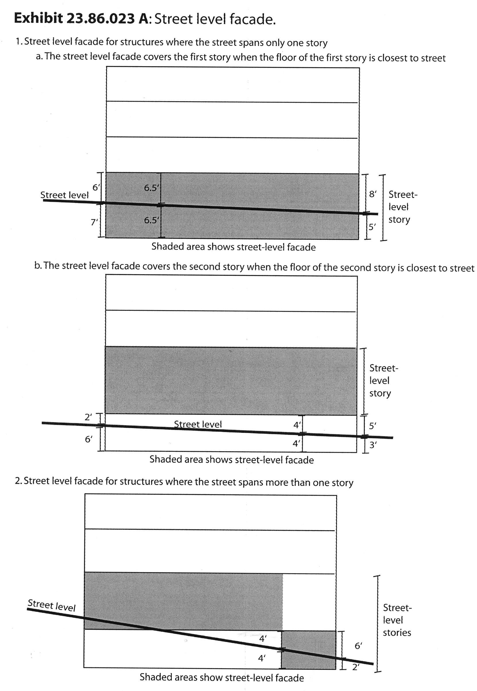

#### 23.86.024 - Minimum facade height.

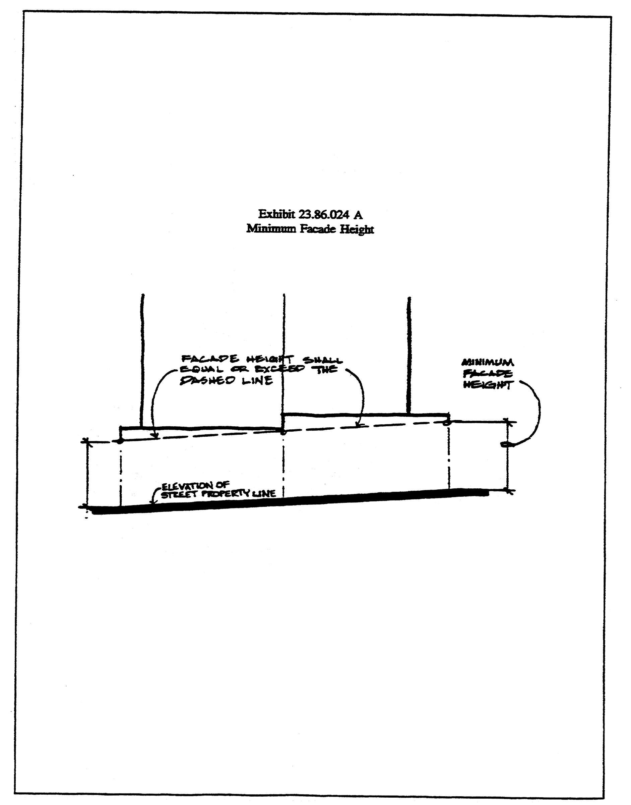

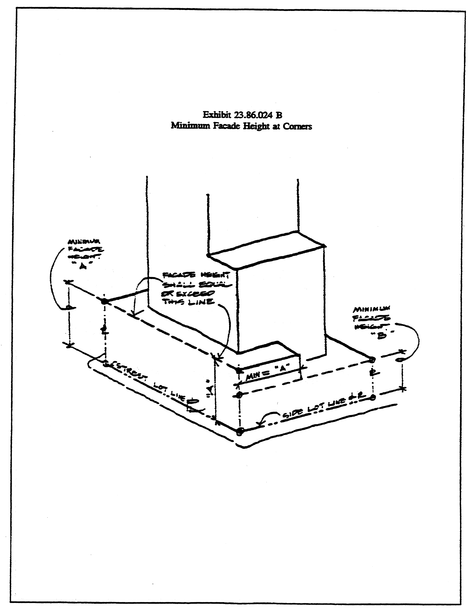

1. When a minimum facade height is required in downtown zones, the height of the facade shall be measured from the elevation of the street property line at the sidewalk as depicted in Exhibit 23.86.024 A. Areaways, stairways and other excavations at the property line shall not be considered in measuring the elevation of the street property line. When sidewalk widening is required according to Section 23.49.022, the height of the facade shall be measured from the elevation of the line establishing the new sidewalk width, rather than the street property line.
2. When different minimum facade heights are established at the corner of a lot, the higher minimum height shall continue to be provided around the corner for a distance equal to the higher minimum height required as depicted in Exhibit 23.86.024 B.

#### 23.86.026 - Facade transparency

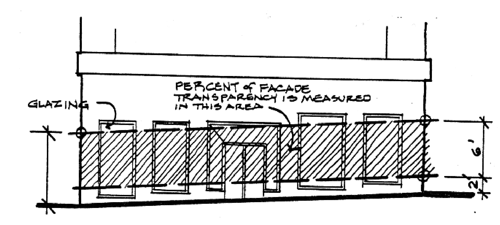

Exhibit A for Street Facade Transparency

1. In zones where a certain percentage of the street-facing facade is required to be transparent, transparency shall be measured in an area between 2 feet and 8 feet above the elevation of the lot line at the sidewalk, as depicted in Exhibit A for 23.86.026, unless a different area is specified in the development standards applicable to the lot. Areaways, stairways, and other excavations at the lot line shall not be considered in measuring the elevation of the street lot line. When sidewalk widening is required according to Section 23.49.022, the elevation of the lines establishing the new sidewalk width shall be used rather than the street lot line.
2. When transparency is required for facades that abut bonused public open spaces, the measurement of facade transparency shall be from the elevation of the public open space.
3. The full length of landmark designated structures, and character structures retained according to Section 23.73.015, shall not be counted in determining the required transparency.

#### 23.86.028 - Blank facades

In zones where blank facades are required to be limited, the following provisions shall be used to determine the percent and length of blank facades.

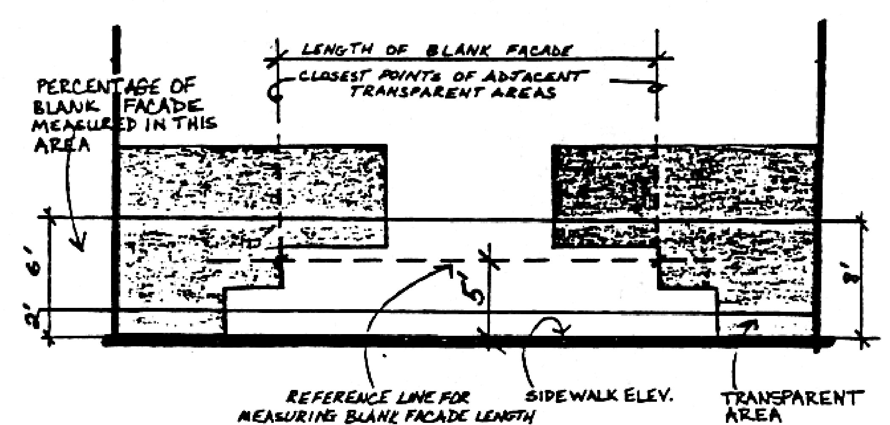

Exhibit A for Percent of and Length of Blank Facades

1. When the blank facade is limited for facades which abut bonused public open spaces, the measurement of facade transparency shall be from the elevation of the public open space.

1. Percent of blank facades

    1. Blank facades shall be measured in an area between 2 feet and 8 feet above the elevation of the lot line at the sidewalk as depicted in Exhibit A for 23.86.028. Areaways, stairways and other excavations at the lot line shall not be considered in measuring the elevation of the street lot line. When sidewalk widening is required according to Section 23.49.022, the elevation of the line establishing the new sidewalk width shall be used rather than the street lot line.
2. Length of blank facades. The length of a blank facade located within the area established in subsection 23.83.028.A shall be measured between the closest points of adjacent transparent areas, at 5 feet above the elevation of the lot line at the sidewalk.
3. The following shall not be counted in determining the length of blank facades:

    1. Garage doors, as depicted in Exhibit A for 23.86.028; and
    2. The full length of landmark designated structures, and character structures retained according to Section 23.73.015.

#### 23.86.030 - Common recreation area.

Certain zones require that a minimum common recreation area be provided for residential use. When a common recreation area is required, the following provisions shall apply:

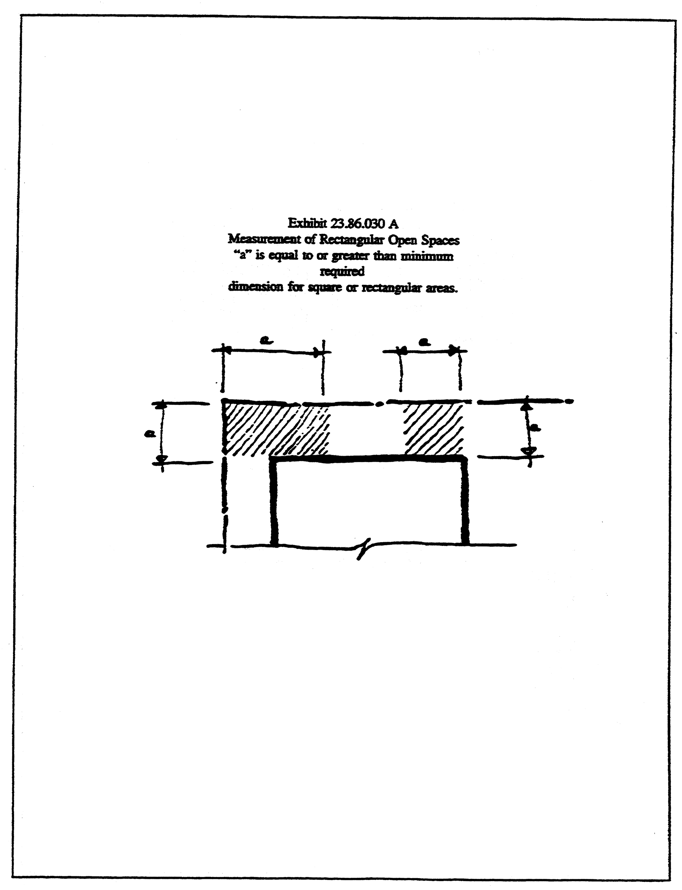

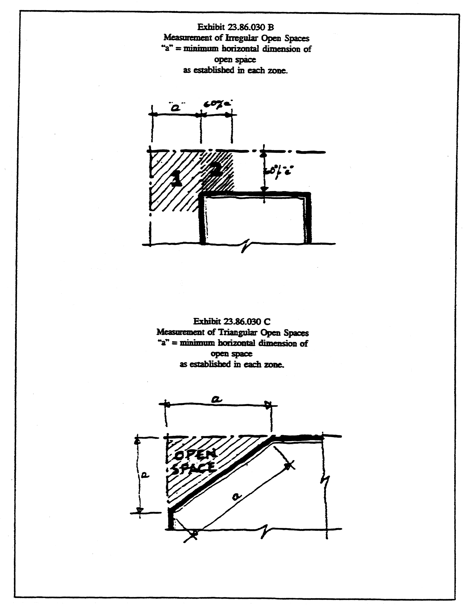

1. An outdoor area that is not part of a green street or publicly owned open space qualifies as a common recreation area if the ground surface of the area is permeable and is landscaped with grass, ground cover, bushes and/or trees; provided that patios, paved areas designed for recreation, and pedestrian access that meets the Washington State Rules for Barrier-Free Design shall also be considered common recreation area.
2. Driveways, parking areas and pedestrian access, except for pedestrian access meeting the Washington State Rules and Regulations for Barrier-Free Design, shall not be counted as common recreation area.
3. Development standards in downtown zones specify a minimum contiguous area for common recreation area. Areas smaller than the minimum contiguous area specified shall not be counted toward fulfilling the common recreation area requirements. Driveways and parking areas, paved or unpaved, shall be considered to separate common recreation areas they bisect. Pedestrian access areas shall not be considered to break the contiguity of common recreation areas on each side.
4. For an area to be considered a common recreation area, it must have a minimum area and minimum horizontal dimensions as established for downtown zones. For the purpose of measuring the horizontal dimensions of the common recreation area, the following provisions shall apply:

    1. In rectangular or square areas, each exterior dimension of the area shall meet the minimum dimension as depicted in Exhibit 23.86.030 A.
    2. In irregularly shaped areas in which all lines intersect at or approximately at ninety (90) degree angles, an area which is not less than sixty (60) percent of the minimum dimension in width and does not extend further than sixty (60) percent of the minimum dimension form a contiguous rectangular or square area of which all sides meet or exceed the minimum dimension, may be included as required common recreation area, as depicted in Exhibit 23.86.030 B.
    3. In triangular areas, all exterior dimensions of the area shall meet or exceed the minimum dimension as depicted in Exhibit 23.86.030 C.
    4. In circular areas, the diameter of the circle shall meet the minimum dimension; for semicircular areas, the radius of the area shall meet the minimum dimension as depicted in Exhibit 23.86.030 D.
    5. When the shape of the area is so unusual that the above provisions cannot be applied; for example, when the shape is curvilinear, the Director shall determine when common recreation area requirements have been met.
    6. When a portion of a lot is reserved for a vehicular access easement to another lot, no land within the limits of the easement shall be included in the calculation of the common recreation area required, except when a portion of the structure containing common recreation area is constructed over the easement.

#### 23.86.032 - Gross floor area in residential use.

When a requirement is based on the percentage of a structure's gross floor area which is in residential use, residential area shall include the following:

1. The gross floor area of all floors or portions of floors of a structure which are devoted entirely to residential use;
2. The prorated portion share of a structure's common areas in the same proportion as the residential use to other uses occupying the structure.

#### 23.86.034 - Distance to required parking.

When a maximum distance to required parking is specified it shall be the walking distance measured from the nearest point of the parking area or garage to the nearest point of the lot containing the use the parking is required to serve.

#### 23.86.036 - Major Institution minimum site and gross floor area measurement.

1. For the purpose of determining whether an institution's site meets the minimum site area to be designated a Major Institution, the following shall be included:

    1. All contiguous lots containing Major Institution uses, and lots abutting or across a street or alley and within a radius of two thousand five hundred feet (2,500') of the contiguous lots containing Major Institution uses, including parking lots and outdoor uses and activity areas such as ball courts and playfields primarily used by the Major Institution;
    2. If a structure on a lot contains uses other than Major Institution uses, only the area of the lot which contains Major Institution uses or the respective lot area calculated as a percentage of the structure that is occupied by the Major Institution use(s) shall be included.
2. For the purposes of determining whether an institution's gross floor area meets the minimum required to be designated a Major Institution, all gross floor area containing Major Institution uses in all structures within a Major Institution's site area, as determined by subsection A of this section, shall be included.

### Division 3 - Implementation

### Chapter 23.88 - RULES; INTERPRETATION

Sections:

#### 23.88.010 - Rulemaking

1. The Director may promulgate rules consistent with this Title 23 pursuant to the authority granted in Section 3.06.040 and pursuant to the procedures established for rulemaking in the Administrative Code, Chapter 3.02. In addition to the notice provisions of Chapter 3.02, notice of the proposed adoption of a rule shall be placed in the Land Use Information Bulletin.
2. The Director may adopt and amend, by rule, performance standards for determining whether a proposed new structure has earned, at a minimum, a Leadership in Energy and Environmental Design (LEED) Silver rating, a Built Green 4-star rating of the Master Builders Association of King and Snohomish Counties, or meets the Washington Evergreen Sustainable Development Standards (ESDS). No rule may assign authority for making a final determination of whether a proposed new structure has earned, at a minimum, a LEED Silver rating, a Built Green 4-star rating of the Master Builders Association of King and Snohomish Counties, or meets the Washington Evergreen Sustainable Development Standards (ESDS) to any person other than an officer of the Seattle Department of Construction and Inspections or another City agency with regulatory authority and expertise in green building practices.

#### 23.88.020 - Land use interpretations

The provisions of subsections 23.88.020.D, 23.88.020.E and 23.88.020.F shall not apply to interpretations requested pursuant to this subsection 23.88.020.C.3.c. The Director shall respond to the request by issuing an interpretation in the form of a memorandum to be filed with the Hearing Examiner at least five calendar days before the hearing.

1. Interpretations generally. A decision by the Director as to the meaning, application or intent of any development regulation in Title 23 or in Chapter 25.09, Regulations for Environmentally Critical Areas, as it relates to a specific property, or a decision by the Director upon review of a determination of consistency of a proposed project with a planned action ordinance, is known as an "interpretation." An interpretation may be requested in writing by any person or may be initiated by the Director. Procedural provisions and statements of policy are not subject to the interpretation process. A decision by the Director that an issue is not subject to an interpretation request is final and not subject to administrative appeal. A request for an interpretation, and a subsequent appeal to the Hearing Examiner if available, are administrative remedies that must be exhausted before judicial review of a decision subject to interpretation may be sought. An interpretation decision by the Director may affirm, reverse, or modify all or any portion of a Type I or Type II land use decision.
2. Filing and Fees. Any request for interpretation shall be filed with the Director accompanied by the required fee. If a request for interpretation is included in an appeal to the Hearing Examiner of a related project decision, a copy shall be filed with the Director, accompanied by the applicable fee.
3. Timing of request

    1. An interpretation that is not related to any pending project application may be requested at any time, by any person.
    2. If an interpretation relates to a project application requiring no public notice pursuant to the provisions of Chapter 23.76, the following rules govern the deadline by which the request for interpretation shall be received by the Department in order for the interpretation to be applied to the pending permit application:

        1. Any person may request an interpretation within 14 days after the date the project application is determined to be complete, provided that the interpretation will not apply to the project if the permit is ready to issue before or on the same day the interpretation request and fee are submitted to the Department.
        2. The project applicant may request an interpretation more than 14 days after the project application is determined to be complete if he or she agrees in writing that the time limits required by Section 23.76.005 shall be calculated from the day the interpretation is requested.
    3. If an interpretation relates to a project application requiring public notice pursuant to the provisions of Chapter 23.76, the following rules govern the deadline by which the request for interpretation shall be received by the Department in order for the interpretation to be applied to the pending permit application:

        1. Any person may request an interpretation prior to the end of the public comment period, including any extension, for the project application.
        2. The project applicant may request an interpretation after the end of the public comment period and prior to publication of a land use decision or recommendation, if he or she agrees in writing that the time limits required by Section 23.76.005 shall be calculated from the day the interpretation is requested.
        3. Notwithstanding the above deadlines, an appeal of a Type II decision to the Hearing Examiner or a request for further consideration of a Type III recommendation may include a request that the Director issue in writing an interpretation of specified code sections, combined with an appeal of such interpretation, provided that an interpretation regarding whether a use proposed under the related project application has been correctly classified may not be requested pursuant to this subsection 23.88.020.C.3.c. A request for interpretation made pursuant to this subsection 23.88.020.C.3.c shall state with specificity:

            1. How the Director's construction or application of the specified code sections is in error; and
            2. How the requester believes those sections should be construed or applied.
4. Notice of request for interpretation. If an interpretation relates to a project application under consideration, and is requested by a person other than the applicant for that project, notice of the request for interpretation shall be provided to the permit applicant. If an interpretation relates to the provisions of Chapter 23.60 (Seattle Shoreline Master Program), notice of the request shall be provided to the Washington State Department of Ecology. If an interpretation is requested by a Major Institution as to whether a proposal constitutes a major or minor amendment to an adopted Major Institution Master Plan, notice of the request shall be provided to all members of the Citizens' Advisory Committee for that Major Institution.
5. Notice of interpretation. Notice of an interpretation shall be provided to the person requesting the interpretation, and to the applicant(s) for the specific project or projects to which the interpretation relates. If the interpretation relates to provisions of Chapter 23.60 (Seattle Shoreline Master Program), notice shall be provided to the Washington State Department of Ecology. If the interpretation is related to a project requiring public notice, the interpretation shall be published concurrently with other land use decisions relating to that project. Notice of any interpretation subject to appeal before the Hearing Examiner shall be provided by Land Use Information Bulletin.
6. Availability and venue of appeals

    1. An interpretation that is unrelated to any specific project application, or is related to a Type III or IV decision, may be appealed by any person to the Hearing Examiner. Such an appeal shall be filed with the Hearing Examiner by 5 p.m. on the 14 calendar day following publication of the notice of the interpretation. If the last day of the appeal period so computed is a Saturday, Sunday, or federal or City holiday, the period shall run until 5 p.m. on the next business day. The appeal hearing on an interpretation related to a Type III Master Use Permit shall be consolidated with the open record hearing on the project application and the appeal hearing for any related environmental determination. Interpretations related to Type IV decisions shall be appealable to the Hearing Examiner in accordance with Section 23.76.052.
    2. An interpretation relating to a project application that does not require public notice shall not be subject to administrative appeal.
    3. An interpretation relating to a Type II Master Use Permit decision that is appealable to the Hearing Examiner shall be subject to the same appeal deadline as the related project decision, and may be appealed only if that project decision is appealed. The appeal of an interpretation shall be consolidated with the appeal of the related project decision.
7. Appeals to Hearing Examiner, process and standard of review

    1. The appeal of an interpretation, where permitted, shall be in writing and shall state specifically why the applicant believes the interpretation to be incorrect.
    2. Appeals submitted to the Hearing Examiner shall be accompanied by payment of a filing fee as established in SMC Chapter 3.02.
    3. The Hearing Examiner shall consider the appeal in accordance with the procedure established for hearing contested cases in the Administrative Code, Chapter 3.02 and the Hearing Examiner Rules of Practice and Procedure in effect at the time the appeal is made.
    4. In the event of an appeal of an interpretation not related to a specific project application, such appeal shall be decided within fifteen (15) days of the close of the record before the Hearing Examiner.
    5. Appeals shall be considered de novo, and the decision of the Hearing Examiner shall be made upon the same basis as was required of the Director. The interpretation of the Director shall be given substantial weight, and the burden of establishing the contrary shall be upon the appellant. The Hearing Examiner shall summarily dismiss an appeal without hearing which is determined to be without merit on its face, frivolous, or brought merely to secure a delay.
    6. The Hearing Examiner may affirm, reverse or modify the Director's interpretation either in whole or in part or may remand the interpretation to the Director for further consideration. The decision of the Hearing Examiner shall be final and conclusive unless the decision is reversed or remanded on judicial appeal. Any judicial review must be commenced as provided by state law.

### Chapter 23.90 - ENFORCEMENT OF THE LAND USE CODE

Sections:

#### 23.90.002 - Violations.

1. It is a violation of Title 23 for any person to initiate or maintain or cause to be initiated or maintained the use of any structure, land or property within The City of Seattle without first obtaining the permits or authorizations required for the use by Title 23.
2. It is a violation of Title 23 for any person to use, construct, locate, demolish or cause to be used, constructed, located, or demolished any structure, land or property within The City of Seattle in any manner that is not permitted by the terms of any permit or authorization issued pursuant to Title 23 or previous codes, provided that the terms or conditions are explicitly stated on the permit or the approved plans.
3. It is a violation of Title 23 to remove or deface any sign, notice, complaint or order required by or posted in accordance with Title 23.
4. It is a violation of Title 23 to misrepresent any material fact in any application, plans or other information submitted to obtain any land use authorization.
5. It is a violation of Title 23 for anyone to fail to comply with the requirements of Title 23.

#### 23.90.004 - Duty to enforce.

1. It shall be the duty of the Director to enforce Title 23. The Director may call upon the police, fire, health or other appropriate City departments to assist in enforcement. It shall be the duty of the Director of Transportation to enforce Section 23.55.004, Signs projecting over public rights-of-way.
2. Upon presentation of proper credentials, the Director or duly authorized representative of the Director may, with the consent of the owner or occupier of a building or premises, or pursuant to a lawfully issued inspection warrant, enter at reasonable times any building or premises subject to the consent or warrant to perform the duties imposed by the Land Use Code.
3. The Land Use Code shall be enforced for the benefit of the health, safety and welfare of the general public, and not for the benefit of any particular person or class of persons.
4. It is the intent of this Land Use Code to place the obligation of complying with its requirements upon the owner, occupier or other person responsible for the condition of the land and buildings within the scope of this Code.
5. No provision of or term used in this Code is intended to impose any duty upon the City or any of its officers or employees which would subject them to damages in a civil action.

#### 23.90.006 - Investigation and notice of violation

1. The Director is authorized to investigate any structure or use the Director reasonably believes does not comply with the standards and requirements of this Land Use Code.
2. If after investigation the Director determines that the standards or requirements have been violated, the Director may issue a notice of violation to the owner, tenant or other person responsible for the condition. The notice of violation shall state separately each standard or requirement violated, shall state what corrective action, if any, is necessary to comply with the standards or requirements, and shall set a reasonable time for compliance. In the event of violations of the standards or requirements of Chapter 23.60A, Shoreline District, the required corrective action shall include, if appropriate, but shall not be limited to, mitigating measures such as restoration of the area.
3. The notice shall be served upon the owner, tenant or other person responsible for the condition by personal service, or by first class mail to the person's last known address. If the address of the responsible person is unknown and cannot be found after a reasonable search, the notice may be served by posting a copy of the notice at a conspicuous place on the property. If a notice of violation is directed to a tenant or other person responsible for the violation who is not the owner, a copy of the notice shall be sent to the owner of the property.
4. A copy of the notice of violation may be filed with the King County Department of Records and Elections when the responsible party fails to correct the violation or the Director requests the City Attorney take appropriate enforcement action.
5. Nothing in this section shall be deemed to limit or preclude any action or proceeding to enforce this chapter nor does anything in this section obligate the Director to issue a notice of violation prior to initiation of a civil or criminal enforcement action except as otherwise provided in Director's rules adopted pursuant to SMC chapter 23.88.

#### 23.90.008 - Time to comply.

When calculating a reasonable time for compliance as required by Section 23.90.006, the Director shall consider the following criteria:

1. The type and degree of violation cited in the notice;
2. The stated intent, if any, of a responsible party to take steps to comply;
3. The procedural requirements for obtaining a permit to carry out corrective action;
4. The complexity of the corrective action, including seasonal considerations, construction requirements and the legal prerogatives of landlords and tenants; and
5. Any other circumstances beyond the control of the responsible party.

#### 23.90.010 - Stop Work Order.

Whenever a continuing violation of this Code will materially impair the Director's ability to secure compliance with this Code, or when the continuing violation threatens the health or safety of the public, the Director may issue a Stop Work Order specifying the violation and prohibiting any work or other activity at the site. A failure to comply with a Stop Work Order shall constitute a violation of this Land Use Code.

#### 23.90.012 - Emergency Order.

Whenever any use or activity in violation of this Code threatens the health and safety of the occupants of the premises or any member of the public, the Director may issue an Emergency Order directing that the use or activity be discontinued and the condition causing the threat to the public health and safety be corrected. The Emergency Order shall specify the time for compliance and shall be posted in a conspicuous place on the property, if posting is physically possible. A failure to comply with an Emergency Order shall constitute a violation of this Land Use Code.

Any condition described in the Emergency Order which is not corrected within the time specified is hereby declared to be a public nuisance and the Director is authorized to abate such nuisance summarily by such means as may be available. The cost of such abatement shall be recovered from the owner or person responsible or both in the manner provided by law.

#### 23.90.014 - Review by the Director.

1. Any person significantly affected by or interested in a notice of violation issued by the Director pursuant to Section 23.90.006 may obtain a review of the notice by requesting such review within ten (10) days after service of the notice. When the last day of the period so computed is a Saturday, Sunday or federal or City holiday, the period shall run until five (5:00) p.m. on the next business day. The request shall be in writing, and upon receipt of the request, the Director shall notify any persons served the notice of violation and the complainant, if any, of the request for review and the deadline for submitting additional information for the review. Additional information shall be submitted to the Director no later than fifteen (15) days after the notice of a request for a review is mailed, unless otherwise agreed by all persons served with the notice of violation. Before the deadline for submission of additional information, any person significantly affected by or interested in the notice of violation (including any persons served the notice of violation and the complainant) may submit any additional information in the form of written material or oral comments to the Director for consideration as part of the review.
2. The review will be made by a representative of the Director who is familiar with the case and the applicable ordinances. The Director's representative will review all additional information received by the deadline for submission of additional information. The reviewer may also request clarification of information received and a site visit. After review of the additional information, the Director may:

    1. Sustain the notice of violation;
    2. Withdraw the notice of violation;
    3. Continue the review to a date certain for receipt of additional information; or
    4. Modify the notice of violation, which may include an extension of the compliance date.

#### 23.90.015 - Order of the Director.

1. Where review by the Director has been conducted pursuant to Section 23.90.014, the Director shall issue an order of the Director containing the decision within fifteen (15) days of the date that the review is completed and shall cause the same to be mailed by regular first class mail to the person or persons named on the notice of violation and, if possible, mailed to the complainant.
2. Unless a request for review before the Director is made pursuant to Section 23.90.014, the notice of violation shall become the order of the Director.
3. Because civil actions to enforce Title 23 SMC are brought in Seattle Municipal Court pursuant to Section 23.90.018, orders of the Director issued under this chapter are not subject to judicial review pursuant to chapter 36.70C RCW.

#### 23.90.016 - Extension of compliance date.

The Director may grant an extension of time for compliance with any notice or Order, whether pending or final, upon the Director's finding that substantial progress toward compliance has been made and that the public will not be adversely affected by the extension.

An extension of time may be revoked by the Director if it is shown that the conditions at the time the extension was granted have changed, the Director determines that a party is not performing corrective actions as agreed, or if the extension creates an adverse effect on the public. The date of revocation shall then be considered as the compliance date. The procedures for revocation, notification of parties, and appeal of the revocation shall be established by Rule.

#### 23.90.018 - Civil enforcement proceedings and penalties

where:

P is the penalty;

SF is the total square footage of the structure for which the demolition permit was issued; and

RDR is the refuse disposal rate, which is the per ton rate established in Chapter 21.40, and in effect on the date the penalty accrues, for the deposit of refuse at City recycling and disposal stations by the largest class of vehicles.

1. Violations of subsection 23.40.060.E.2 by failing to submit the report required by subsection 23.40.060.E.2 by the date required are subject to a penalty of $500 per day from the date the report was due to the date it is submitted.
2. Violation of subsection 23.40.060.E.1.a by failing to demonstrate full compliance with the standards contained in subsection 23.40.060.E.1.a is subject to a maximum penalty of 10 percent of the construction value set forth in the building permit for the structure and a minimum penalty of 1 percent of construction value, based on the extent of compliance with standards contained in subsection 23.40.060.E.1.a.
3. Violations of subsections 23.55.030.E.3.a.3, 23.55.030.E.3.b, 23.55.034.D.2.a and 23.55.036.D.3.b, or, if the Seattle Department of Construction and Inspections has issued an on-premises sign permit for a particular sign and the actual sign is not being used for on-premises purposes or does not meet the definition of an on-premises sign as defined in Chapter 23.84A, are subject to a civil penalty of $1,500 per day for each violation from the date the violation begins until compliance is achieved.
where:

P is the penalty;

CV is the Construction Value as set forth on the building permit for the new structure.

1. Failure to comply with the applicant's commitment to meet green building performance requirements is a violation of the Land Use Code independent of the failure to demonstrate compliance; however, such violation shall not affect the right to occupy any chargeable floor area, and if a penalty is paid in the amount determined under subsection 23.90.018.E.2, no additional penalty shall be imposed for the failure to comply with the commitment.
2. If the Director determines that the report submitted provides satisfactory evidence that the applicant's commitment is satisfied, the Director shall issue a certificate to the applicant so stating. If the Director determines that the applicant did not demonstrate compliance with its commitment to meet green building performance requirements in accordance with this Section 23.90.018, the Director may give notice of such determination, and of the calculation of the penalty due, to the applicant.
3. If, within 90 days, or such longer period as the Director may allow for good cause, after initial notice from the Director of a penalty due under this subsection, the applicant shall demonstrate, through a supplemental report from the independent entity that provided the initial report, that it has made sufficient alterations or improvements to earn the required green building performance rating, then the penalty owing shall be eliminated. If the applicant does not submit a supplemental report in accordance with this subsection by the date required under this subsection, or if the Director determines that the supplemental report does not demonstrate compliance, then the amount of the penalty as set forth in the Director's original notice shall be final, subject to subsection 23.90.018.C.
4. Any owner, other than the applicant, of any lot on which the bonus development or extra floor area was obtained or any part thereof, shall be jointly and severally responsible for compliance and liable for any penalty due under this subsection 23.90.018.E.

1. In addition to any other remedy authorized by law or equity, any person violating or failing to comply with any of the provisions of Title 23 shall be subject to a cumulative penalty of up to $150 per day for each violation from the date the violation begins for the first ten days of noncompliance; and up to $500 per day for each violation for each day beyond ten days of noncompliance until compliance is achieved, except as provided in subsection 23.90.018.B. In cases where the Director has issued a notice of violation, the violation will be deemed to begin for purposes of determining the number of days of violation on the date compliance is required by the notice of violation. In addition to the per diem penalty, a violation compliance inspection charge equal to the base fee set by Section 22.900B.010 shall be charged for the third inspection and all subsequent inspections until compliance is achieved. The compliance inspection charges shall be deposited in the General Fund.
2. Specific violations

P = SF × .02 × RDR,

    1. Violations of Section 23.71.018 are subject to penalty in the amount specified in subsection 23.71.018.H.
    2. Violations of the requirements of subsection 23.44.041.C are subject to a civil penalty of $5,000, which shall be in addition to any penalty imposed under subsection 23.90.018.A. Falsely certifying to the terms of the covenant required by subsection 23.44.041.C.3 or failure to comply with the terms of the covenant is subject to a penalty of $5,000, in addition to any criminal penalties.
    3. Violations of Section 23.49.011, 23.49.015, 23.49.023, or 23.50.051 with respect to failure to demonstrate compliance with commitments to earn LEED Silver ratings under applicable sections are subject to penalty in amounts determined under Section 23.49.020, and not to any other penalty, but final determination and enforcement of penalties under that Section 23.49.020 are subject to subsection 23.90.018.C.
    4. Violations of Sections 23.45.510 and 23.45.526 with respect to failure to demonstrate compliance with commitments to earn a LEED Silver rating or a 4-Star rating awarded by the Master Builders Association of King and Snohomish Counties or other eligible green building ratings systems under applicable sections are subject to penalty in amounts determined under subsection 23.90.018.E, and not to any other penalty.
    5. Violation of subsection 23.40.007.B with respect to failure to demonstrate compliance with a waste diversion plan for a structure permitted to be demolished under subsection 23.40.006.D is subject to a penalty in an amount determined as follows:
3. Civil actions to enforce Title 23 shall be brought exclusively in Seattle Municipal Court except as otherwise required by law or court rule. The Director shall request in writing that the City Attorney take enforcement action. The City Attorney shall, with the assistance of the Director, take appropriate action to enforce Title 23. In any civil action filed pursuant to this chapter, the City has the burden of proving by a preponderance of the evidence that a violation exists or existed. The issuance of the notice of violation or of an order following a review by the Director is not itself evidence that a violation exists.
4. Except in cases of violations of Section 23.45.510, 23.45.526, 23.49.011, 23.49.015, 23.49.023, or 23.50.051 with respect to failure to demonstrate compliance with commitments to earn LEED Silver, Built Green 4-Star, or ESDS ratings or satisfy alternative standards, the violator may show as full or partial mitigation of liability:

    1. That the violation giving rise to the action was caused by the willful act, or neglect, or abuse of another; or
    2. That correction of the violation was commenced promptly upon receipt of the notice thereof, but that full compliance within the time specified was prevented by inability to obtain necessary materials or labor, inability to gain access to the subject structure, or other condition or circumstance beyond the control of the defendant.
5. Demonstration of green building certification pursuant to LEED Silver or Built Green 4-Star or ESDS ratings for certain development in multifamily zones.

P = CV × 0.01,

    1. Applicability. This section applies whenever a commitment to earn a LEED Silver rating, or a Built Green 4-Star or ESDS rating, or a substantially equivalent standard, as approved by the Director, is a condition of a permit in a multifamily zone.
    2. Demonstration of Compliance; Penalties.

        1. The applicant shall demonstrate to the Director the extent to which the applicant has complied with the commitment to meet the green building performance requirements no later than 90 days after issuance of final Certificate of Occupancy for the new structure, or such later date as may be allowed by the Director for good cause. Performance is demonstrated through an independent report from a third party.

            1. For projects committed to achieve a LEED Silver rating, the report will be produced by the U.S. Green Building Council or another independent entity approved by the Director and submitted by the applicant to the Director.
            2. For projects using the Built Green Multi-family Program the report will be produced by the Master Builders Association of King and Snohomish Counties or another independent entity approved by the Director and submitted by the applicant to the Director.
            3. For projects using the ESDS, the report will be produced according to the process managed by the Housing Trust Fund Contract Manager for the State of Washington.
            4. For purposes of this subsection 23.90.018.E, if the Director approves a commitment to achieve a substantially equivalent standard, the terms "LEED Silver rating", "Built Green 4-Star" or "ESDS" shall mean such other standard.
        2. Failure to submit a timely report regarding the green building performance rating from an approved independent entity by the date required is a violation of the Land Use Code. The penalty for such violation shall be $500 per day from the date when the report was due to the date it is submitted, without any requirement of notice to the applicant.
        3. Failure to demonstrate, through an independent report as provided in this subsection, full compliance with the applicant's commitment to meet a green building performance requirement, is a violation of the Land Use Code. Each day of noncompliance is a separate violation. The penalty for each violation is determined as follows:
6. Use of Penalties. A subfund shall be established in the City's General Fund to receive revenue from penalties under subsections 23.90.018.B.3, 23.90.018.B.5 and 23.90.018.E. Revenue from penalties under that subsection shall be allocated to activities or incentives to encourage and promote the development of sustainable buildings. The Director shall recommend to the Mayor and City Council how these funds should be allocated. A subfund shall be established in the City's General Fund to receive revenue from penalties under subsection 23.90.018.B.8, which shall annually be directed to the Seattle Department of Construction and Inspections' Operations Division, after ten percent of the gross receipts are paid to the Parks and Recreation Fund as required by Article XI, Section 3 of the Charter.

#### 23.90.019 - Civil penalty for unauthorized dwelling units in single-family zones

In addition to any other sanction or remedial procedure that may be available, the following penalties apply to unauthorized dwelling units in single-family zones in violation of Section 23.44.006. An owner of a single-family zoned lot that has more than one single-family dwelling unit and who is issued a notice of violation for an unauthorized dwelling unit, is subject to a civil penalty of $5,000 for each additional dwelling unit, unless the additional unit is an authorized dwelling unit in compliance with Section 23.44.041, is a legal non-conforming use, or is approved as part of an administrative conditional use permit pursuant to Section 25.09.260. Penalties for violation of Sections 23.44.006 and 23.44.041, except for violations of subsection 23.44.041.C or except for those violations subject to subsection 23.90.018.B, shall be reduced from $5,000 to $500 if, prior to the compliance date stated on the notice of violation for an unauthorized dwelling unit, the dwelling unit is removed or authorized in compliance with Section 23.44.041, is a legal non-conforming use, or is approved as part of an administrative conditional use permit pursuant to Section 25.09.260.

#### 23.90.020 - Alternative criminal penalty

1. Any person who violates or fails to comply with any of the provisions of this Title 23 and who has had an Order of Judgment entered against them by a court of competent jurisdiction for violating Titles 22 or 23 within the past seven (7) years from the date the criminal charge is filed shall upon conviction be guilty of a gross misdemeanor subject to the provisions of Chapter 12A.02 and 12A.04, except that absolute liability shall be imposed for such a violation or failure to comply and none of the mental states described in Section 12A.04.030 need be proved. The Director may request that the City Attorney prosecute such violations criminally as an alternative to the civil procedure outlined in this chapter. Each day of noncompliance with any of the provisions of this Land Use Code shall constitute a separate offense.
2. A criminal penalty, not to exceed $5,000 per occurrence, may be imposed:

    1. For violations of subsection 23.90.002.D;
    2. For any other violation of this Code for which corrective action is not possible, other than violations with respect to commitments to earn LEED Silver ratings, Built Green 4-Star ratings, or ESDS ratings or satisfy alternative standards; and
    3. For any willful, intentional, or bad faith failure or refusal to comply with the standards or requirements of this Code.

#### 23.90.025 - Appeal to Superior Court.

Final decisions of the Seattle Municipal Court on enforcement actions authorized by this chapter may be appealed pursuant to the Rules for Appeal of Decisions of Courts of Limited Jurisdiction.

### Chapter 23.91 - CITATION—HEARINGS—PENALTIES

Sections:

#### 23.91.002 - Scope of Chapter 23.91

1. Violations of the following provisions of Title 23 shall be enforced under the citation or criminal provisions set forth in this Chapter 23.91:

    1. Junk storage in residential zones Chapter 23.43, Chapter 23.44, Chapter 23.45, Chapter 23.46, Chapter 23.49 Subchapter IV, and Chapter 23.49 Subchapter VII), unless the lot contains a vacant structure subject to the vacant building maintenance standards contained in subsection 22.206.200.A;
    2. Construction or maintenance of structures in required yards or setbacks in residential zones Chapter 23.43, Chapter 23.44, Chapter 23.45, Chapter 23.46, Chapter 23.49 Subchapter IV, and Chapter 23.49 Subchapter VII);
    3. Parking of vehicles in a single-family zone (Section 23.44.016), unless the lot contains a vacant structure subject to the vacant building maintenance standards contained in subsection 22.206.200.A; and
    4. Keeping of animals (Section 23.42.052).
    5. Reserved.]
    6. The following violations of the Shoreline district, Chapter 23.60A:

        1. Discharging, leaking, or releasing solid or liquid waste and untreated effluent, oil, chemicals, or hazardous materials into the water (subsection 23.60A.152.R);
        2. Releasing debris and other waste materials from construction, maintenance, repair, or in operation, or management of a property, into any water body (subsections 23.60A.152.H, 23.60A.152.I, 23.60A.152.T, and 23.60A.152.U).
        3. Conducting activity in or over water outside the allowed work windows (subsection 23.60.152.J); and
        4. Closing required public access (Section 23.60A.164).
2. Any enforcement action or proceeding pursuant to this Chapter 23.91 shall not affect, limit or preclude any previous, pending or subsequent enforcement action or proceeding taken pursuant to Chapter 23.90.

#### 23.91.004 - Citation

1. Citation. If after investigation the Director determines that the standards or requirements of provisions referenced in Section 23.91.002 have been violated, the Director may issue a citation to the owner and/or other person or entity responsible for the violation. The citation shall include the following information:

    1. the name and address of the person to whom the citation is issued;
    2. a reasonable description of the location of the property on which the violation occurred;
    3. a separate statement of each standard or requirement violated;
    4. the date of the violation;
    5. a statement that the person cited must respond to the citation within 15 days after service;
    6. a space for entry of the applicable penalty;
    7. a statement that a response must be sent to the Hearing Examiner and received not later than 5:00 p.m. on the day the response is due;
    8. the name, address and phone number of the Hearing Examiner where the citation is to be filed;
    9. a statement that the citation represents a determination that a violation has been committed by the person named in the citation and that the determination shall be final unless contested as provided in this chapter; and
    10. a certified statement of the inspector issuing the citation, authorized by RCW 9A72.085, setting forth facts supporting issuance of the citation.
2. Service. The citation may be served by personal service in the manner set forth in RCW 4.28.080 for service of a summons or sent by first class mail, addressed to the last known address of such person(s). Service shall be complete at the time of personal service, or if mailed, on the date of mailing. If a citation sent by first class mail is returned as undeliverable, service may be made by posting the citation at a conspicuous place on the property.

#### 23.91.006 - Response to citations

1. A person must respond to a citation in one of the following ways:

    1. Paying the amount of the monetary penalty specified in the citation, in which case the record shall show a finding that the person cited committed the violation; or
    2. Requesting in writing a mitigation hearing to explain the circumstances surrounding the commission of the violation and providing an address to which notice of such hearing may be sent; or
    3. Requesting a contested hearing in writing specifying the reason why the cited violation did not occur or why the person cited is not responsible for the violation, and providing an address to which notice of such hearing may be sent.
2. A response to a citation must be received by the Office of the Hearing Examiner no later than fifteen (15) days after the date the citation is served. When the last day of the appeal period so computed is a Saturday, Sunday, or federal or City holiday, the period shall run until five (5:00) p.m. on the next business day.

#### 23.91.008 - Failure to respond.

If a person fails to respond to a citation within fifteen (15) days of service, an order shall be entered by the Hearing Examiner finding that the person cited committed the violation stated in the citation, and assessing the penalty specified in the citation.

#### 23.91.010 - Mitigation hearings

1. Date and Notice. If a person requests a mitigation hearing, the mitigation hearing shall be held within 30 days after written response to the citation requesting such hearing is received by the Hearing Examiner. Notice of the time, place, and date of the hearing shall be sent to the address specified in the request for hearing not less than ten days prior to the date of the hearing.
2. Procedure at Hearing. The Hearing Examiner shall hold an informal hearing which shall not be governed by the Rules of Evidence. The person cited may present witnesses, but witnesses may not be compelled to attend. A representative from the Seattle Department of Construction and Inspections may also be present and may present additional information, but attendance by a representative from the Seattle Department of Construction and Inspections is not required.
3. Disposition. The Hearing Examiner shall determine whether the person's explanation justifies reduction of the monetary penalty; however, the monetary penalty may not be reduced unless the Seattle Department of Construction and Inspections affirms or certifies that the violation has been corrected prior to the mitigation hearing. Factors that may be considered in whether to reduce the penalty include whether the violation was caused by the act, neglect, or abuse of another; or whether correction of the violation was commenced promptly prior to citation but that full compliance was prevented by a condition or circumstance beyond the control of the person cited.

#### 23.91.012 - Contested hearing.

1. Date and Notice. If a person requests a contested hearing, the hearing shall be held within sixty (60) days after the written response to the citation requesting such hearing is received.
2. Hearing. Contested hearings shall be conducted pursuant to the procedures for hearing contested cases contained in Section 3.02.090 and the rules adopted by the Hearing Examiner for hearing contested cases, except as modified by this section. The issues heard at the hearing shall be limited to those that are raised in writing in the response to the citation and that are within the jurisdiction of the Hearing Examiner. The Hearing Examiner may issue subpoenas for the attendance of witnesses and the production of documents.
3. Sufficiency. No citation shall be deemed insufficient for failure to contain a detailed statement of the facts constituting the specific violation which the person cited is alleged to have committed or by reason of defects or imperfections, provided such lack of detail, or defects or imperfections do not prejudice substantial rights of the person cited.
4. Amendment of Citation. A citation may be amended prior to the conclusion of the hearing to conform to the evidence presented if substantial rights of the person cited are not thereby prejudiced.
5. Evidence at Hearing

    1. The certified statement or declaration authorized by RCW 9A.72.085 submitted by an inspector shall be prima facie evidence that a violation occurred and that the person cited is responsible. The certified statement or declaration of the inspector authorized under RCW 9A.72.085 and any other evidence accompanying the report shall be admissible without further evidentiary foundation.
    2. Any certifications or declarations authorized under RCW 9A.72.085 shall also be admissible without further evidentiary foundation. The person cited may rebut the Seattle Department of Construction and Inspections evidence and establish that the cited violation(s) did not occur or that the person contesting the citation is not responsible for the violation.
6. Disposition. If the citation is sustained at the hearing, the Hearing Examiner shall enter an order finding that the person cited committed the violation. If the violation remains uncorrected, the Hearing Examiner shall impose the applicable penalty. The Hearing Examiner may reduce the monetary penalty in accordance with the mitigation provisions in Section 23.91.010 if the violation has been corrected. If the Hearing Examiner determines that the violation did not occur, the Hearing Examiner shall enter an order dismissing the citation.
7. Appeal. The Hearing Examiner's decision is the final decision of the City. Any judicial review must be commenced within twenty-one (21) days of issuance of the Hearing Examiner's decision in accordance with RCW 36.70C.040.

#### 23.91.014 - Failure to appear for hearing.

Failure to appear for a requested hearing will result in an order being entered finding that the person cited committed the violation stated in the citation and assessing the penalty specified in the citation. For good cause shown and upon terms the Hearing Examiner deems just, the Hearing Examiner may set aside an order entered upon a failure to appear.

#### 23.91.016 - Penalties.

1. First Violation. The first time that a person or entity is found to have violated one of the provisions referenced in Section 23.91.002. after the effective date of the ordinance codified in this chapter, the person or entity shall be subject to a penalty of One Hundred Fifty Dollars ($150).
2. Second and Subsequent Violations Any subsequent time that a person or entity is found to have violated one of the provisions referenced in Section 23.91.002 within a five (5) year period after the first violation, the person or entity shall be subject to a penalty of Five Hundred Dollars ($500) for each such violation.
3. In addition to the penalties imposed under paragraphs A or B of this section, a violation compliance inspection charge equal to the base fee set by Section 22.900B.010 shall be charged for the third inspection and all subsequent inspections until compliance is achieved. The compliance inspection charges shall be deposited in the General Fund.

#### 23.91.018 - Alternative criminal penalty.

Any person who violates or fails to comply with any of the provisions referenced in Section 23.91.002 shall be guilty of a misdemeanor subject to the provisions of Chapters 12A.02 and 12A.04, except that absolute liability shall be imposed for such a violation or failure to comply and none of the mental states described in Section 12A.04.030 need be proved. The Director may request the City Attorney to prosecute such violations criminally as an alternative to the citation procedure outlined in this chapter.

#### 23.91.020 - Abatement.

Any property on which there continues to be a violation of any of the provisions referenced in Section 23.91.002 after enforcement action taken pursuant to this chapter is hereby declared a nuisance and subject to abatement by the City in the manner authorized by law.

#### 23.91.022 - Collection of penalties.

If the person cited fails to pay a penalty imposed pursuant to this chapter, the penalty may be referred to a collection agency. The cost to the city for the collection services will be assessed as costs, at the rate agreed to between the City and the collection agency, and added to the penalty. Alternatively, the City may pursue collection in any other manner allowed by law.

#### 23.91.024 - Each day a separate violation.

Each day a person or entity violates or fails to comply with a provision referenced in Section 23.91.002 may be considered a separate violation for which a citation may be issued.

#### 23.91.026 - Additional relief.

The Director may seek legal or equitable relief at any time to enjoin any acts or practices that violate the provisions referenced in Section 23.91.002 or abate any condition that constitutes a nuisance.

